# 七、从图像中识别鸟类和飞机：从图像中学习

本章内容包括

+   构建前馈神经网络

+   使用`Dataset`和`DataLoader`加载数据

+   理解分类损失

上一章让我们有机会深入了解通过梯度下降学习的内部机制，以及 PyTorch 提供的构建模型和优化模型的工具。我们使用了一个简单的具有一个输入和一个输出的回归模型，这使我们可以一目了然，但诚实地说只是勉强令人兴奋。

在本章中，我们将继续构建我们的神经网络基础。这一次，我们将把注意力转向图像。图像识别可以说是让世界意识到深度学习潜力的任务。

我们将逐步解决一个简单的图像识别问题，从上一章中定义的简单神经网络开始构建。这一次，我们将使用一个更广泛的小图像数据集，而不是一组数字。让我们首先下载数据集，然后开始准备使用它。

## 7.1 一个小图像数据集

没有什么比对一个主题的直观理解更好，也没有什么比处理简单数据更能实现这一点。图像识别中最基本的数据集之一是被称为 MNIST 的手写数字识别数据集。在这里，我们将使用另一个类似简单且更有趣的数据集。它被称为 CIFAR-10，就像它的姐妹 CIFAR-100 一样，它已经成为计算机视觉领域的经典数据集十年。

CIFAR-10 由 60,000 个 32×32 彩色（RGB）图像组成，标记为 10 个类别中的一个整数：飞机（0）、汽车（1）、鸟（2）、猫（3）、鹿（4）、狗（5）、青蛙（6）、马（7）、船（8）和卡车（9）。如今，CIFAR-10 被认为对于开发或验证新研究来说过于简单，但对于我们的学习目的来说完全够用。我们将使用`torchvision`模块自动下载数据集，并将其加载为一组 PyTorch 张量。图 7.1 让我们一睹 CIFAR-10 的风采。

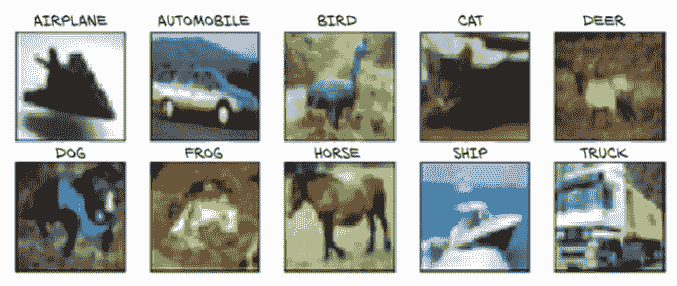

图 7.1 显示所有 CIFAR-10 类别的图像样本

### 7.1.1 下载 CIFAR-10

正如我们预期的那样，让我们导入`torchvision`并使用`datasets`模块下载 CIFAR-10 数据：

```py
# In[2]:
from torchvision import datasets
data_path = '../data-unversioned/p1ch7/'
cifar10 = datasets.CIFAR10(data_path, train=True, download=True)        # ❶
cifar10_val = datasets.CIFAR10(data_path, train=False, download=True)   # ❷
```

❶ 为训练数据实例化一个数据集；如果数据不存在，TorchVision 会下载数据

❷ 使用 train=False，这样我们就得到了一个用于验证数据的数据集，如果需要的话会进行下载。

我们提供给`CIFAR10`函数的第一个参数是数据将被下载的位置；第二个参数指定我们是对训练集感兴趣还是对验证集感兴趣；第三个参数表示我们是否允许 PyTorch 在指定的位置找不到数据时下载数据。

就像`CIFAR10`一样，`datasets`子模块为我们提供了对最流行的计算机视觉数据集的预先访问，如 MNIST、Fashion-MNIST、CIFAR-100、SVHN、Coco 和 Omniglot。在每种情况下，数据集都作为`torch.utils.data.Dataset`的子类返回。我们可以看到我们的`cifar10`实例的方法解析顺序将其作为一个基类：

```py
# In[4]:
type(cifar10).__mro__

# Out[4]:
(torchvision.datasets.cifar.CIFAR10,
 torchvision.datasets.vision.VisionDataset,
 torch.utils.data.dataset.Dataset,
 object)
```

### 7.1.2 Dataset 类

现在是一个好时机去了解在实践中成为`torch.utils.data.Dataset`子类意味着什么。看一下图 7.2，我们就能明白 PyTorch 的`Dataset`是什么。它是一个需要实现两个方法的对象：`__len__`和`__getitem__`。前者应该返回数据集中的项目数；后者应该返回项目，包括一个样本及其对应的标签（一个整数索引）。

在实践中，当一个 Python 对象配备了`__len__`方法时，我们可以将其作为参数传递给`len`Python 内置函数：

```py
# In[5]:
len(cifar10)

# Out[5]:
50000
```

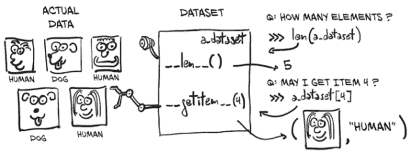

图 7.2 PyTorch `Dataset` 对象的概念：它不一定保存数据，但通过 `__len__` 和 `__getitem__` 提供统一访问。

同样，由于数据集配备了 `__getitem__` 方法，我们可以使用标准的下标索引元组和列表来访问单个项目。在这里，我们得到了一个 `PIL`（Python Imaging Library，`PIL` 包）图像，输出我们期望的整数值 `1`，对应于“汽车”：

```py
# In[6]:
img, label = cifar10[99]
img, label, class_names[label]

# Out[6]:
(<PIL.Image.Image image mode=RGB size=32x32 at 0x7FB383657390>,
 1,
 'automobile')
```

因此，`data.CIFAR10` 数据集中的样本是 RGB PIL 图像的一个实例。我们可以立即绘制它：

```py
# In[7]:
plt.imshow(img)
plt.show()
```

这产生了图 7.3 中显示的输出。这是一辆红色的汽车！³

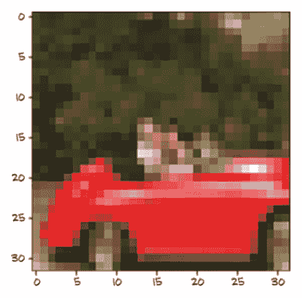

图 7.3 CIFAR-10 数据集中的第 99 张图像：一辆汽车

### 7.1.3 数据集转换

这一切都很好，但我们可能需要一种方法在对其进行任何操作之前将 PIL 图像转换为 PyTorch 张量。这就是 `torchvision.transforms` 的作用。该模块定义了一组可组合的、类似函数的对象，可以作为参数传递给 `torchvision` 数据集，如 `datasets.CIFAR10(...)`，并在加载数据后但在 `__getitem__` 返回数据之前对数据执行转换。我们可以查看可用对象的列表如下：

```py
# In[8]:
from torchvision import transforms
dir(transforms)

# Out[8]:
['CenterCrop',
 'ColorJitter',
 ...
 'Normalize',
 'Pad',
 'RandomAffine',
 ...
 'RandomResizedCrop',
 'RandomRotation',
 'RandomSizedCrop',
 ...
 'TenCrop',
 'ToPILImage',
 'ToTensor',
 ...
]
```

在这些转换中，我们可以看到 `ToTensor`，它将 NumPy 数组和 PIL 图像转换为张量。它还会确保输出张量的维度布局为 *C* × *H* × *W*（通道、高度、宽度；就像我们在第四章中介绍的那样）。

让我们尝试一下 `ToTensor` 转换。一旦实例化，它可以像一个函数一样调用，参数是 PIL 图像，返回一个张量作为输出：

```py
# In[9]:

to_tensor = transforms.ToTensor()
img_t = to_tensor(img)
img_t.shape

# Out[9]:
torch.Size([3, 32, 32])
```

图像已经转换为 3 × 32 × 32 张量，因此是一个 3 通道（RGB）32 × 32 图像。请注意 `label` 没有发生任何变化；它仍然是一个整数。

正如我们预期的那样，我们可以直接将转换作为参数传递给 `dataset .CIFAR10`：

```py
# In[10]:
tensor_cifar10 = datasets.CIFAR10(data_path, train=True, download=False,
                          transform=transforms.ToTensor())
```

此时，访问数据集的元素将返回一个张量，而不是一个 PIL 图像：

```py
# In[11]:
img_t, _ = tensor_cifar10[99]
type(img_t)

# Out[11]:
torch.Tensor
```

如预期的那样，形状的第一个维度是通道，标量类型是 `float32`：

```py
# In[12]:
img_t.shape, img_t.dtype

# Out[12]:
(torch.Size([3, 32, 32]), torch.float32)
```

原始 PIL 图像中的值范围从 0 到 255（每个通道 8 位），`ToTensor` 转换将数据转换为每个通道的 32 位浮点数，将值从 0.0 缩放到 1.0。让我们验证一下：

```py
# In[13]:
img_t.min(), img_t.max()

# Out[13]:
(tensor(0.), tensor(1.))
```

现在让我们验证一下我们得到了相同的图像：

```py
# In[14]:
plt.imshow(img_t.permute(1, 2, 0))    # ❶
plt.show()

# Out[14]:
<Figure size 432x288 with 1 Axes>
```

❶ 改变轴的顺序从 C × H × W 到 H × W × C

正如我们在图 7.4 中看到的，我们得到了与之前相同的输出。


图 7.4 我们已经见过这个。

检查通过。请注意，我们必须使用 `permute` 来改变轴的顺序，从 C × H × W 变为 H × W × C，以匹配 Matplotlib 的期望。

### 7.1.4 数据标准化

转换非常方便，因为我们可以使用 `transforms.Compose` 链接它们，它们可以透明地处理标准化和数据增强，直接在数据加载器中进行。例如，标准化数据集是一个好习惯，使得每个通道具有零均值和单位标准差。我们在第四章中提到过这一点，但现在，在经历了第五章之后，我们也对此有了直观的理解：通过选择在 0 加减 1（或 2）附近线性的激活函数，保持数据在相同范围内意味着神经元更有可能具有非零梯度，因此会更快地学习。此外，将每个通道标准化，使其具有相同的分布，将确保通道信息可以通过梯度下降混合和更新，使用相同的学习率。这就像在第 5.4.4 节中，当我们将权重重新缩放为与温度转换模型中的偏差相同数量级时的情况。

为了使每个通道的均值为零，标准差为单位，我们可以计算数据集中每个通道的均值和标准差，并应用以下转换：`v_n[c] = (v[c] - mean[c]) / stdev[c]`。这就是`transforms.Normalize`所做的。`mean`和`stdev`的值必须离线计算（它们不是由转换计算的）。让我们为 CIFAR-10 训练集计算它们。

由于 CIFAR-10 数据集很小，我们将能够完全在内存中操作它。让我们沿着额外的维度堆叠数据集返回的所有张量：

```py
# In[15]:
imgs = torch.stack([img_t for img_t, _ in tensor_cifar10], dim=3)
imgs.shape

# Out[15]:
torch.Size([3, 32, 32, 50000])
```

现在我们可以轻松地计算每个通道的均值：

```py
# In[16]:
imgs.view(3, -1).mean(dim=1)     # ❶

# Out[16]:
tensor([0.4915, 0.4823, 0.4468])
```

❶ 请记住，view(3, -1)保留了三个通道，并将所有剩余的维度合并成一个，找出适当的大小。这里我们的 3 × 32 × 32 图像被转换成一个 3 × 1,024 向量，然后对每个通道的 1,024 个元素取平均值。

计算标准差类似：

```py
# In[17]:
imgs.view(3, -1).std(dim=1)

# Out[17]:
tensor([0.2470, 0.2435, 0.2616])
```

有了这些数据，我们可以初始化`Normalize`转换

```py
# In[18]:
transforms.Normalize((0.4915, 0.4823, 0.4468), (0.2470, 0.2435, 0.2616))

# Out[18]:
Normalize(mean=(0.4915, 0.4823, 0.4468), std=(0.247, 0.2435, 0.2616))
```

并在`ToTensor`转换后连接它：

```py
# In[19]:
transformed_cifar10 = datasets.CIFAR10(
    data_path, train=True, download=False,
    transform=transforms.Compose([
        transforms.ToTensor(),
        transforms.Normalize((0.4915, 0.4823, 0.4468),
                             (0.2470, 0.2435, 0.2616))
    ]))
```

请注意，在这一点上，绘制从数据集中绘制的图像不会为我们提供实际图像的忠实表示：

```py
# In[21]:
img_t, _ = transformed_cifar10[99]

plt.imshow(img_t.permute(1, 2, 0))
plt.show()
```

我们得到的重新归一化的红色汽车如图 7.5 所示。这是因为归一化已经将 RGB 级别移出了 0.0 到 1.0 的范围，并改变了通道的整体幅度。所有的数据仍然存在；只是 Matplotlib 将其渲染为黑色。我们将记住这一点以备将来参考。

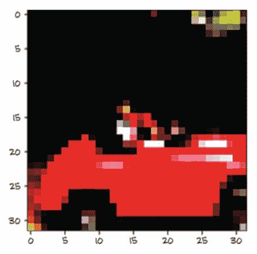

图 7.5 归一化后的随机 CIFAR-10 图像

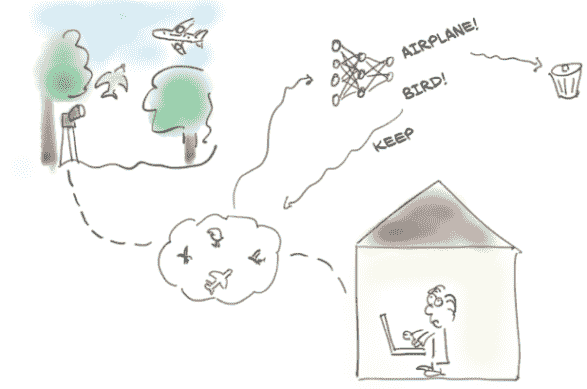

图 7.6 手头的问题：我们将帮助我们的朋友为她的博客区分鸟和飞机，通过训练一个神经网络来完成这项任务。

尽管如此，我们加载了一个包含成千上万张图片的花哨数据集！这非常方便，因为我们正需要这样的东西。

## 7.2 区分鸟和飞机

珍妮，我们在观鸟俱乐部的朋友，在机场南部的树林里设置了一组摄像头。当有东西进入画面时，摄像头应该保存一张照片并上传到俱乐部的实时观鸟博客。问题是，许多从机场进出的飞机最终触发了摄像头，所以珍妮花了很多时间从博客中删除飞机的照片。她需要的是一个像图 7.6 中所示的自动化系统。她需要一个神经网络--如果我们喜欢花哨的营销说辞，那就是人工智能--来立即丢弃飞机。

别担心！我们会处理好的，没问题--我们刚好有了完美的数据集（多么巧合啊，对吧？）。我们将从我们的 CIFAR-10 数据集中挑选出所有的鸟和飞机，并构建一个可以区分鸟和飞机的神经网络。

### 7.2.1 构建数据集

第一步是将数据整理成正确的形状。我们可以创建一个仅包含鸟和飞机的`Dataset`子类。然而，数据集很小，我们只需要在数据集上进行索引和`len`操作。它实际上不必是`torch.utils.data.dataset.Dataset`的子类！那么，为什么不简单地过滤`cifar10`中的数据并重新映射标签，使它们连续呢？下面是具体操作：

```py
# In[5]:
label_map = {0: 0, 2: 1}
class_names = ['airplane', 'bird']
cifar2 = [(img, label_map[label])
          for img, label in cifar10
          if label in [0, 2]]
cifar2_val = [(img, label_map[label])
              for img, label in cifar10_val
              if label in [0, 2]]
```

`cifar2`对象满足`Dataset`的基本要求--也就是说，`__len__`和`__getitem__`已经定义--所以我们将使用它。然而，我们应该意识到，这是一个聪明的捷径，如果我们在使用中遇到限制，我们可能希望实现一个合适的`Dataset`。⁴

我们有了数据集！接下来，我们需要一个模型来处理我们的数据。

### 7.2.2 一个全连接的模型

我们在第五章学习了如何构建一个神经网络。我们知道它是一个特征的张量输入，一个特征的张量输出。毕竟，一幅图像只是以空间配置排列的一组数字。好吧，我们还不知道如何处理空间配置部分，但理论上，如果我们只是取图像像素并将它们展平成一个长的 1D 向量，我们可以将这些数字视为输入特征，对吧？这就是图 7.7 所说明的。

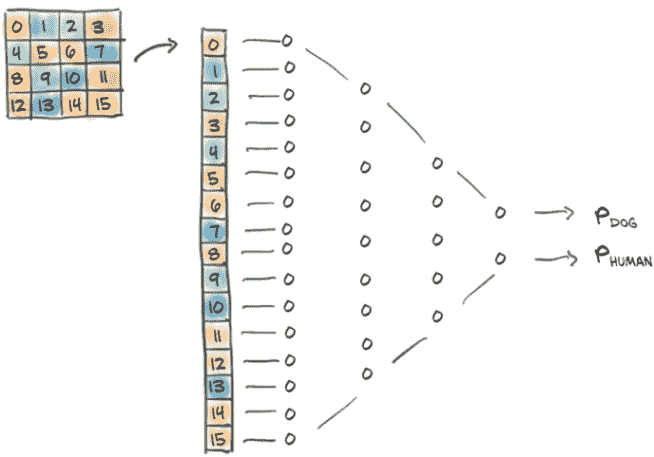

图 7.7 将我们的图像视为一维值向量并在其上训练一个全连接分类器

让我们试试看。每个样本有多少特征？嗯，32 × 32 × 3：也就是说，每个样本有 3072 个输入特征。从我们在第五章构建的模型开始，我们的新模型将是一个具有 3072 个输入特征和一些隐藏特征数量的`nn.Linear`，然后是一个激活函数，然后是另一个将网络缩减到适当的输出特征数量（对于这种用例为 2）的`nn.Linear`：

```py
# In[6]:
import torch.nn as nn

n_out = 2

model = nn.Sequential(
            nn.Linear(
                3072,     # ❶
                512,      # ❷
            ),
            nn.Tanh(),
            nn.Linear(
                512,      # ❷
                n_out,    # ❸
            )
        )
```

❶ 输入特征

❷ 隐藏层大小

❸ 输出类别

我们有点随意地选择了 512 个隐藏特征。神经网络至少需要一个隐藏层（激活层，所以两个模块），中间需要一个非线性激活函数，以便能够学习我们在第 6.3 节中讨论的任意函数--否则，它将只是一个线性模型。隐藏特征表示（学习的）输入之间通过权重矩阵编码的关系。因此，模型可能会学习“比较”向量元素 176 和 208，但它并不会事先关注它们，因为它在结构上不知道这些实际上是（第 5 行，第 16 像素）和

(第 6 行，第 16 像素)，因此是相邻的。

所以我们有了一个模型。接下来我们将讨论我们模型的输出应该是什么。

### 7.2.3 分类器的输出

在第六章中，网络产生了预测的温度（具有定量意义的数字）作为输出。我们可以在这里做类似的事情：使我们的网络输出一个单一的标量值（所以`n_out = 1`），将标签转换为浮点数（飞机为 0.0，鸟为 1.0），并将其用作`MSELoss`的目标（批次中平方差的平均值）。这样做，我们将问题转化为一个回归问题。然而，更仔细地观察，我们现在处理的是一种性质有点不同的东西。

我们需要认识到输出是分类的：它要么是飞机，要么是鸟（或者如果我们有所有 10 个原始类别的话，还可能是其他东西）。正如我们在第四章中学到的，当我们必须表示一个分类变量时，我们应该切换到该变量的一种独热编码表示，比如对于飞机是`[1,` `0]`，对于鸟是`[0,` `1]`（顺序是任意的）。如果我们有 10 个类别，如完整的 CIFAR-10 数据集，这仍然有效；我们将只有一个长度为 10 的向量。

在理想情况下，网络将为飞机输出`torch.tensor([1.0, 0.0])`，为鸟输出`torch.tensor([0.0, 1.0])`。实际上，由于我们的分类器不会是完美的，我们可以期望网络输出介于两者之间的值。在这种情况下的关键认识是，我们可以将输出解释为概率：第一个条目是“飞机”的概率，第二个是“鸟”的概率。

将问题转化为概率的形式对我们网络的输出施加了一些额外的约束：

+   输出的每个元素必须在`[0.0, 1.0]`范围内（一个结果的概率不能小于 0 或大于 1）。

+   输出的元素必须加起来等于 1.0（我们确定两个结果中的一个将会发生）。

这听起来像是在一个数字向量上以可微分的方式强制执行一个严格的约束。然而，有一个非常聪明的技巧正是做到了这一点，并且是可微分的：它被称为*softmax*。

### 7.2.4 将输出表示为概率

Softmax 是一个函数，它接受一个值向量并产生另一个相同维度的向量，其中值满足我们刚刚列出的表示概率的约束条件。Softmax 的表达式如图 7.8 所示。

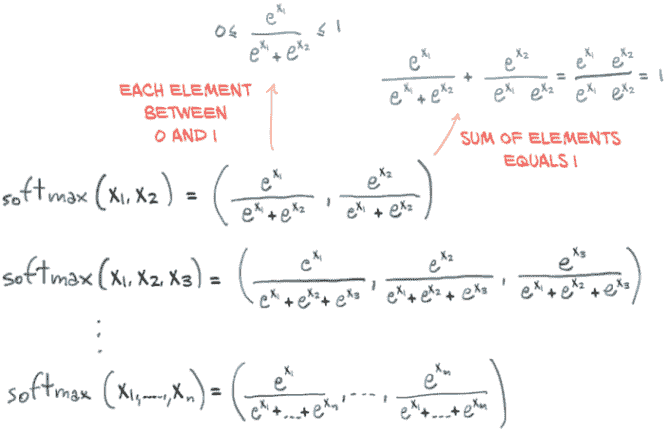

图 7.8 手写 softmax

也就是说，我们取向量的元素，计算元素的指数，然后将每个元素除以指数的总和。在代码中，就像这样：

```py
# In[7]:
def softmax(x):
    return torch.exp(x) / torch.exp(x).sum()
```

让我们在一个输入向量上测试一下：

```py
# In[8]:
x = torch.tensor([1.0, 2.0, 3.0])

softmax(x)

# Out[8]:
tensor([0.0900, 0.2447, 0.6652])
```

如预期的那样，它满足概率的约束条件：

```py
# In[9]:
softmax(x).sum()

# Out[9]:
tensor(1.)
```

Softmax 是一个单调函数，即输入中的较低值将对应于输出中的较低值。然而，它不是*尺度不变*的，即值之间的比率不被保留。事实上，输入的第一个和第二个元素之间的比率为 0.5，而输出中相同元素之间的比率为 0.3678。这并不是一个真正的问题，因为学习过程将以适当的比率调整模型的参数。

`nn`模块将 softmax 作为一个模块提供。由于通常输入张量可能具有额外的批次第 0 维，或者具有编码概率的维度和其他维度，`nn.Softmax`要求我们指定应用 softmax 函数的维度：

```py
# In[10]:
softmax = nn.Softmax(dim=1)

x = torch.tensor([[1.0, 2.0, 3.0],
                  [1.0, 2.0, 3.0]])

softmax(x)

# Out[10]:
tensor([[0.0900, 0.2447, 0.6652],
        [0.0900, 0.2447, 0.6652]])
```

在这种情况下，我们有两个输入向量在两行中（就像我们处理批次时一样），因此我们初始化`nn.Softmax`以沿着第 1 维操作。

太棒了！我们现在可以在模型末尾添加一个 softmax，这样我们的网络就能够生成概率：

```py
# In[11]:
model = nn.Sequential(
            nn.Linear(3072, 512),
            nn.Tanh(),
            nn.Linear(512, 2),
            nn.Softmax(dim=1))
```

实际上，我们可以在甚至训练模型之前尝试运行模型。让我们试试，看看会得到什么。我们首先构建一个包含一张图片的批次，我们的鸟（图 7.9）：

```py
# In[12]:
img, _ = cifar2[0]

plt.imshow(img.permute(1, 2, 0))
plt.show()
```

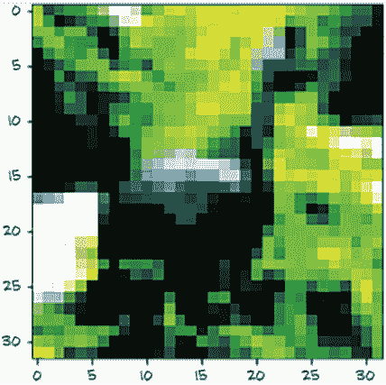

图 7.9 CIFAR-10 数据集中的一只随机鸟（归一化后）

哦，你好。为了调用模型，我们需要使输入具有正确的维度。我们记得我们的模型期望输入中有 3,072 个特征，并且`nn`将数据组织成沿着第零维的批次。因此，我们需要将我们的 3 × 32 × 32 图像转换为 1D 张量，然后在第零位置添加一个额外的维度。我们在第三章学习了如何做到这一点：

```py
# In[13]:
img_batch = img.view(-1).unsqueeze(0)
```

现在我们准备调用我们的模型：

```py
# In[14]:
out = model(img_batch)
out

# Out[14]:
tensor([[0.4784, 0.5216]], grad_fn=<SoftmaxBackward>)
```

所以，我们得到了概率！好吧，我们知道我们不应该太兴奋：我们的线性层的权重和偏置根本没有经过训练。它们的元素由 PyTorch 在-1.0 和 1.0 之间随机初始化。有趣的是，我们还看到输出的`grad_fn`，这是反向计算图的顶点（一旦我们需要反向传播时将被使用）。

另外，虽然我们知道哪个输出概率应该是哪个（回想一下我们的`class_names`），但我们的网络并没有这方面的指示。第一个条目是“飞机”，第二个是“鸟”，还是反过来？在这一点上，网络甚至无法判断。正是损失函数在反向传播后将这两个数字关联起来。如果标签提供为“飞机”索引 0 和“鸟”索引 1，那么输出将被诱导采取这个顺序。因此，在训练后，我们将能够通过计算输出概率的*argmax*来获得标签：也就是说，我们获得最大概率的索引。方便的是，当提供一个维度时，`torch.max`会返回沿着该维度的最大元素以及该值出现的索引。在我们的情况下，我们需要沿着概率向量（而不是跨批次）取最大值，因此是第 1 维：

```py
# In[15]:
_, index = torch.max(out, dim=1)

index

# Out[15]:
tensor([1])
```

它说这张图片是一只鸟。纯属运气。但我们通过让模型输出概率来适应手头的分类任务，现在我们已经运行了我们的模型对输入图像进行验证，确保我们的管道正常工作。是时候开始训练了。与前两章一样，我们在训练过程中需要最小化的损失。

### 7.2.5 用于分类的损失

我们刚提到损失是给概率赋予意义的。在第 5 和第六章中，我们使用均方误差（MSE）作为我们的损失。我们仍然可以使用 MSE，并使我们的输出概率收敛到`[0.0, 1.0]`和`[1.0, 0.0]`。然而，仔细想想，我们并不真正关心精确复制这些值。回顾我们用于提取预测类别索引的 argmax 操作，我们真正感兴趣的是第一个概率对于飞机而言比第二个更高，对于鸟而言则相反。换句话说，我们希望惩罚错误分类，而不是费力地惩罚一切看起来不完全像 0.0 或 1.0 的东西。

在这种情况下，我们需要最大化的是与正确类别相关联的概率，`out[class_index]`，其中`out`是 softmax 的输出，`class_index`是一个包含 0 表示“飞机”和 1 表示“鸟”的向量，对于每个样本。这个数量--即与正确类别相关联的概率--被称为*似然度*（给定数据的模型参数的）。换句话说，我们希望一个损失函数在似然度低时非常高：低到其他选择具有更高的概率。相反，当似然度高于其他选择时，损失应该很低，我们并不真正固执于将概率提高到 1。

有一个表现出这种行为的损失函数，称为*负对数似然*（NLL）。它的表达式为`NLL = - sum(log(out_i[c_i]))`，其中求和是针对*N*个样本，`c_i`是样本*i*的正确类别。让我们看一下图 7.10，它显示了 NLL 作为预测概率的函数。

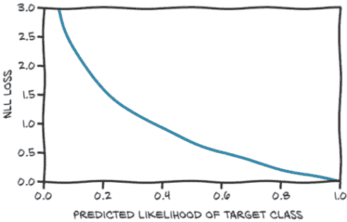

图 7.10 预测概率的 NLL 损失函数

图表显示，当数据被分配低概率时，NLL 增长到无穷大，而当概率大于 0.5 时，它以相对缓慢的速度下降。记住，NLL 以概率作为输入；因此，随着可能性增加，其他概率必然会减少。

总结一下，我们的分类损失可以计算如下。对于批次中的每个样本：

1.  运行正向传播，并从最后（线性）层获取输出值。

1.  计算它们的 softmax，并获得概率。

1.  获取与正确类别对应的预测概率（参数的似然度）。请注意，我们知道正确类别是什么，因为这是一个监督问题--这是我们的真实值。

1.  计算其对数，加上一个负号，并将其添加到损失中。

那么，在 PyTorch 中我们如何做到这一点呢？PyTorch 有一个`nn.NLLLoss`类。然而（注意），与您可能期望的相反，它不接受概率，而是接受对数概率的张量作为输入。然后，它计算给定数据批次的我们模型的 NLL。这种输入约定背后有一个很好的原因：当概率接近零时，取对数是棘手的。解决方法是使用`nn.LogSoftmax`而不是`nn.Softmax`，后者会确保计算在数值上是稳定的。

现在我们可以修改我们的模型，使用`nn.LogSoftmax`作为输出模块：

```py
model = nn.Sequential(
             nn.Linear(3072, 512),
             nn.Tanh(),
             nn.Linear(512, 2),
             nn.LogSoftmax(dim=1))
```

然后我们实例化我们的 NLL 损失：

```py
loss = nn.NLLLoss()
```

损失将`nn.LogSoftmax`的输出作为批次的第一个参数，并将类别索引的张量（在我们的情况下是零和一）作为第二个参数。现在我们可以用我们的小鸟来测试它：

```py
img, label = cifar2[0]

out = model(img.view(-1).unsqueeze(0))

loss(out, torch.tensor([label]))

tensor(0.6509, grad_fn=<NllLossBackward>)
```

结束我们对损失的研究，我们可以看看使用交叉熵损失如何改善均方误差。在图 7.11 中，我们看到当预测偏离目标时，交叉熵损失有一些斜率（在低损失角落，正确类别被分配了预测概率为 99.97%），而我们在开始时忽略的均方误差更早饱和，关键是对于非常错误的预测也是如此。其根本原因是均方误差的斜率太低，无法弥补错误预测的 softmax 函数的平坦性。这就是为什么概率的均方误差不适用于分类工作。

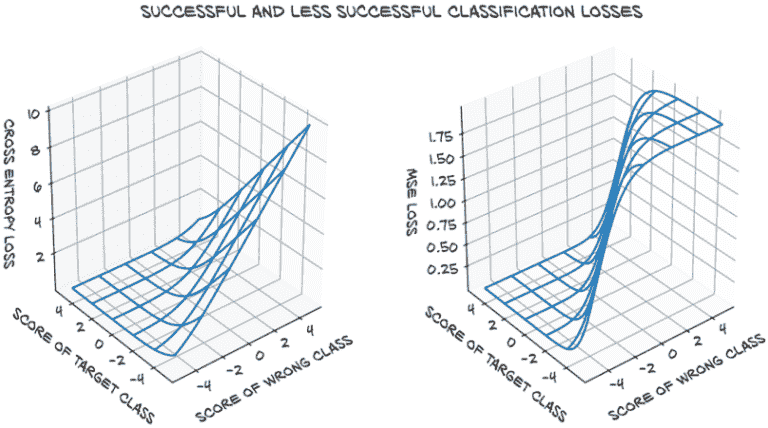

图 7.11 预测概率与目标概率向量之间的交叉熵（左）和均方误差（右）作为预测分数的函数--也就是在（对数）softmax 之前

### 7.2.6 训练分类器

好了！我们准备好重新引入我们在第五章写的训练循环，并看看它是如何训练的（过程如图 7.12 所示）：

```py
import torch
import torch.nn as nn

model = nn.Sequential(
            nn.Linear(3072, 512),
            nn.Tanh(),
            nn.Linear(512, 2),
            nn.LogSoftmax(dim=1))

learning_rate = 1e-2

optimizer = optim.SGD(model.parameters(), lr=learning_rate)

loss_fn = nn.NLLLoss()

n_epochs = 100

for epoch in range(n_epochs):
    for img, label in cifar2:
        out = model(img.view(-1).unsqueeze(0))
        loss = loss_fn(out, torch.tensor([label]))

        optimizer.zero_grad()
        loss.backward()
        optimizer.step()

    print("Epoch: %d, Loss: %f" % (epoch, float(loss)))    # ❶
```

❶ 打印最后一张图像的损失。在下一章中，我们将改进我们的输出，以便给出整个时代的平均值。

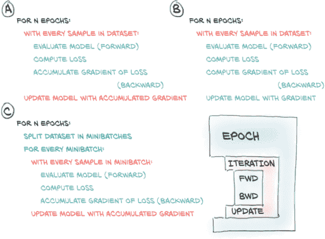

图 7.12 训练循环：（A）对整个数据集进行平均更新；（B）在每个样本上更新模型；（C）对小批量进行平均更新

更仔细地看，我们对训练循环进行了一点改变。在第五章，我们只有一个循环：在时代上（回想一下，一个时代在所有训练集中的样本都被评估完时结束）。我们认为在一个批次中评估所有 10,000 张图像会太多，所以我们决定有一个内部循环，在那里我们一次评估一个样本并在该单个样本上进行反向传播。

在第一种情况下，梯度在应用之前被累积在所有样本上，而在这种情况下，我们基于单个样本上梯度的非常部分估计来应用参数的变化。然而，基于一个样本减少损失的好方向可能不适用于其他样本。通过在每个时代对样本进行洗牌并在一次或（最好是为了稳定性）几个样本上估计梯度，我们有效地在梯度下降中引入了随机性。记得随机梯度下降（SGD）吗？这代表*随机梯度下降*，这就是*S*的含义：在洗牌数据的小批量（又称小批量）上工作。事实证明，遵循在小批量上估计的梯度，这些梯度是对整个数据集估计的梯度的较差近似，有助于收敛并防止优化过程在途中遇到的局部最小值中卡住。正如图 7.13 所示，来自小批量的梯度随机偏离理想轨迹，这也是为什么我们希望使用相当小的学习率的部分原因。在每个时代对数据集进行洗牌有助于确保在小批量上估计的梯度序列代表整个数据集上计算的梯度。

通常，小批量是一个在训练之前需要设置的固定大小，就像学习率一样。这些被称为*超参数*，以区别于模型的参数。

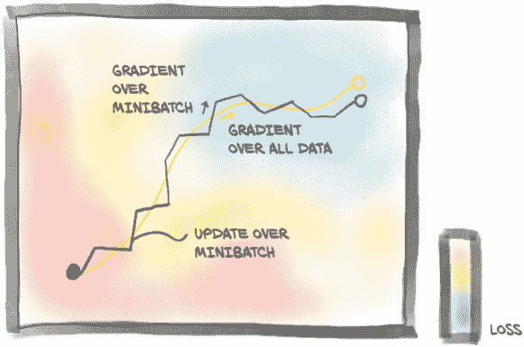

图 7.13 梯度下降在整个数据集上的平均值（浅色路径）与随机梯度下降，其中梯度是在随机选择的小批量上估计的。

在我们的训练代码中，我们选择了大小为 1 的小批量，一次从数据集中选择一个项目。`torch.utils.data`模块有一个帮助对数据进行洗牌和组织成小批量的类：`DataLoader`。数据加载器的工作是从数据集中抽样小批量，使我们能够选择不同的抽样策略。一个非常常见的策略是在每个时代洗牌数据后进行均匀抽样。图 7.14 显示了数据加载器对从`Dataset`获取的索引进行洗牌的过程。

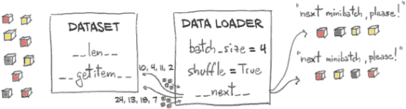

图 7.14 通过使用数据集来采样单个数据项来分发小批量数据的数据加载器

让我们看看这是如何完成的。至少，`DataLoader`构造函数需要一个`Dataset`对象作为输入，以及`batch_size`和一个布尔值`shuffle`，指示数据是否需要在每个 epoch 开始时进行洗牌：

```py
train_loader = torch.utils.data.DataLoader(cifar2, batch_size=64,
                                           shuffle=True)
```

`DataLoader`可以被迭代，因此我们可以直接在新训练代码的内部循环中使用它：

```py
import torch
import torch.nn as nn

train_loader = torch.utils.data.DataLoader(cifar2, batch_size=64,
                                           shuffle=True)

model = nn.Sequential(
            nn.Linear(3072, 512),
            nn.Tanh(),
            nn.Linear(512, 2),
            nn.LogSoftmax(dim=1))

learning_rate = 1e-2

optimizer = optim.SGD(model.parameters(), lr=learning_rate)

loss_fn = nn.NLLLoss()

n_epochs = 100

for epoch in range(n_epochs):
    for imgs, labels in train_loader:
        batch_size = imgs.shape[0]
        outputs = model(imgs.view(batch_size, -1))
        loss = loss_fn(outputs, labels)

        optimizer.zero_grad()
        loss.backward()
        optimizer.step()

     print("Epoch: %d, Loss: %f" % (epoch, float(loss)))    # ❶
```

❶ 由于洗牌，现在这会打印一个随机批次的损失--显然这是我们在第八章想要改进的地方

在每个内部迭代中，`imgs`是一个大小为 64 × 3 × 32 × 32 的张量--也就是说，64 个（32 × 32）RGB 图像的小批量--而`labels`是一个包含标签索引的大小为 64 的张量。

让我们运行我们的训练：

```py
Epoch: 0, Loss: 0.523478
Epoch: 1, Loss: 0.391083
Epoch: 2, Loss: 0.407412
Epoch: 3, Loss: 0.364203
...
Epoch: 96, Loss: 0.019537
Epoch: 97, Loss: 0.008973
Epoch: 98, Loss: 0.002607
Epoch: 99, Loss: 0.026200
```

我们看到损失有所下降，但我们不知道是否足够低。由于我们的目标是正确地为图像分配类别，并最好在一个独立的数据集上完成，我们可以计算我们模型在验证集上的准确率，即正确分类的数量占总数的比例：

```py
val_loader = torch.utils.data.DataLoader(cifar2_val, batch_size=64,
                                         shuffle=False)

correct = 0
total = 0

with torch.no_grad():
    for imgs, labels in val_loader:
        batch_size = imgs.shape[0]
        outputs = model(imgs.view(batch_size, -1))
        _, predicted = torch.max(outputs, dim=1)
        total += labels.shape[0]
        correct += int((predicted == labels).sum())

print("Accuracy: %f", correct / total)

Accuracy: 0.794000
```

不是很好的性能，但比随机好得多。为我们辩护，我们的模型是一个相当浅的分类器；奇迹的是它居然工作了。这是因为我们的数据集非常简单--两类样本中很多样本可能有系统性差异（比如背景颜色），这有助于模型根据少量像素区分鸟类和飞机。

我们可以通过添加更多的层来为我们的模型增加一些亮点，这将增加模型的深度和容量。一个相当任意的可能性是

```py
model = nn.Sequential(
            nn.Linear(3072, 1024),
            nn.Tanh(),
            nn.Linear(1024, 512),
            nn.Tanh(),
            nn.Linear(512, 128),
            nn.Tanh(),
            nn.Linear(128, 2),
            nn.LogSoftmax(dim=1))
```

在这里，我们试图将特征数量逐渐缓和到输出，希望中间层能更好地将信息压缩到越来越短的中间输出中。

`nn.LogSoftmax`和`nn.NLLLoss`的组合等效于使用`nn.CrossEntropyLoss`。这个术语是 PyTorch 的一个特殊之处，因为`nn.NLLoss`实际上计算交叉熵，但输入是对数概率预测，而`nn.CrossEntropyLoss`采用分数（有时称为*对数几率*）。从技术上讲，`nn.NLLLoss`是 Dirac 分布之间的交叉熵，将所有质量放在目标上，并且由对数概率输入给出的预测分布。

为了增加混乱，在信息理论中，这个交叉熵可以被解释为预测分布在目标分布下的负对数似然，经过样本大小归一化。因此，这两种损失都是模型参数的负对数似然，给定数据时，我们的模型预测（应用 softmax 后的）概率。在本书中，我们不会依赖这些细节，但当你在文献中看到这些术语时，不要让 PyTorch 的命名混淆你。

通常会从网络中删除最后一个`nn.LogSoftmax`层，并使用`nn.CrossEntropyLoss`作为损失函数。让我们试试：

```py
model = nn.Sequential(
            nn.Linear(3072, 1024),
            nn.Tanh(),
            nn.Linear(1024, 512),
            nn.Tanh(),
            nn.Linear(512, 128),
            nn.Tanh(),
            nn.Linear(128, 2))

loss_fn = nn.CrossEntropyLoss()
```

请注意，数字将与`nn.LogSoftmax`和`nn.NLLLoss`完全相同。只是一次性完成所有操作更方便，唯一需要注意的是，我们模型的输出将无法解释为概率（或对数概率）。我们需要明确通过 softmax 传递输出以获得这些概率。

训练这个模型并在验证集上评估准确率（0.802000）让我们意识到，一个更大的模型带来了准确率的提高，但并不多。训练集上的准确率几乎完美（0.998100）。这告诉我们什么？我们在两种情况下都过度拟合了我们的模型。我们的全连接模型通过记忆训练集来找到区分鸟类和飞机的方法，但在验证集上的表现并不是很好，即使我们选择了一个更大的模型。

PyTorch 通过`nn.Model`的`parameters()`方法（我们用来向优化器提供参数的相同方法）提供了一种快速确定模型有多少参数的方法。要找出每个张量实例中有多少元素，我们可以调用`numel`方法。将它们相加就得到了我们的总数。根据我们的用例，计算参数可能需要我们检查参数是否将`requires_grad`设置为`True`。我们可能希望区分*可训练*参数的数量与整个模型大小。让我们看看我们现在有什么：

```py
# In[7]:
numel_list = [p.numel()
              for p in connected_model.parameters()
              if p.requires_grad == True]
sum(numel_list), numel_list

# Out[7]:
(3737474, [3145728, 1024, 524288, 512, 65536, 128, 256, 2])
```

哇，370 万个参数！对于这么小的输入图像来说，这不是一个小网络，是吗？即使我们的第一个网络也相当庞大：

```py
# In[9]:
numel_list = [p.numel() for p in first_model.parameters()]
sum(numel_list), numel_list

# Out[9]:
(1574402, [1572864, 512, 1024, 2])
```

我们第一个模型中的参数数量大约是最新模型的一半。嗯，从单个参数大小的列表中，我们开始有了一个想法：第一个模块有 150 万个参数。在我们的完整网络中，我们有 1,024 个输出特征，这导致第一个线性模块有 3 百万个参数。这不应该出乎意料：我们知道线性层计算`y = weight * x + bias`，如果`x`的长度为 3,072（为简单起见忽略批处理维度），而`y`必须具有长度 1,024，则`weight`张量的大小需要为 1,024 × 3,072，`bias`大小必须为 1,024。而 1,024 * 3,072 + 1,024 = 3,146,752，正如我们之前发现的那样。我们可以直接验证这些数量：

```py
# In[10]:
linear = nn.Linear(3072, 1024)

linear.weight.shape, linear.bias.shape

# Out[10]:
(torch.Size([1024, 3072]), torch.Size([1024]))
```

这告诉我们什么？我们的神经网络随着像素数量的增加不会很好地扩展。如果我们有一个 1,024 × 1,024 的 RGB 图像呢？那就是 3.1 百万个输入值。即使突然转向 1,024 个隐藏特征（这对我们的分类器不起作用），我们将有超过 30 亿个参数。使用 32 位浮点数，我们已经占用了 12 GB 的内存，甚至还没有到达第二层，更不用说计算和存储梯度了。这在大多数现代 GPU 上根本无法容纳。

### 7.2.7 完全连接的极限

让我们推理一下在图像的 1D 视图上使用线性模块意味着什么--图 7.15 展示了正在发生的事情。这就像是将每个输入值--也就是我们 RGB 图像中的每个分量--与每个输出特征的所有其他值进行线性组合。一方面，我们允许任何像素与图像中的每个其他像素进行组合，这可能与我们的任务相关。另一方面，我们没有利用相邻或远离像素的相对位置，因为我们将图像视为一个由数字组成的大向量。

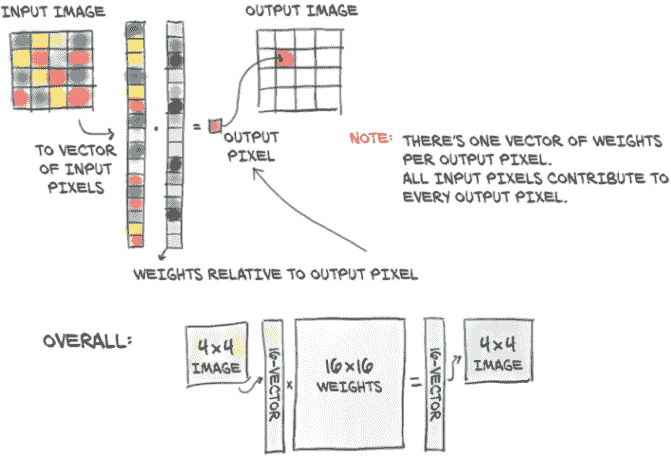

图 7.15 使用带有输入图像的全连接模块：每个输入像素与其他每个像素组合以生成输出中的每个元素。

在一个 32 × 32 图像中捕捉到的飞机在蓝色背景上将非常粗略地类似于一个黑色的十字形状。如图 7.15 中的全连接网络需要学习，当像素 0,1 是黑色时，像素 1,1 也是黑色，依此类推，这是飞机的一个很好的指示。这在图 7.16 的上半部分有所说明。然而，将相同的飞机向下移动一个像素或更多像图的下半部分一样，像素之间的关系将不得不从头开始重新学习：这次，当像素 0,2 是黑色时，像素 1,2 是黑色，依此类推时，飞机很可能存在。更具体地说，全连接网络不是*平移不变*的。这意味着一个经过训练以识别从位置 4,4 开始的斯皮特火机的网络将无法识别*完全相同*的从位置 8,8 开始的斯皮特火机。然后，我们必须*增广*数据集--也就是在训练过程中对图像应用随机平移--以便网络有机会在整个图像中看到斯皮特火机，我们需要对数据集中的每个图像都这样做（值得一提的是，我们可以连接一个来自`torchvision.transforms`的转换来透明地执行此操作）。然而，这种*数据增广*策略是有代价的：隐藏特征的数量--也就是参数的数量--必须足够大，以存储关于所有这些平移副本的信息。

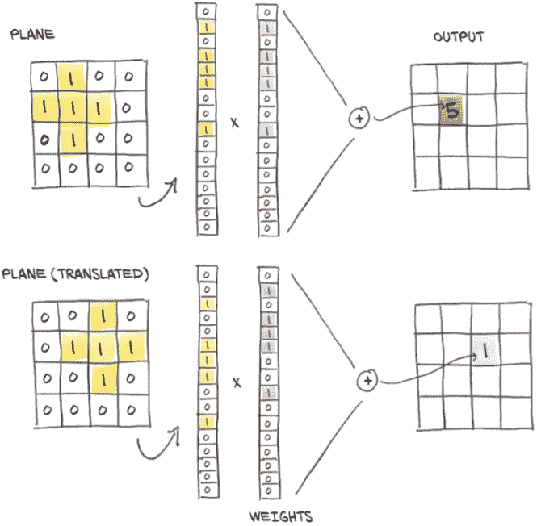

图 7.16 全连接层中的平移不变性或缺乏平移不变性

因此，在本章结束时，我们有了一个数据集，一个模型和一个训练循环，我们的模型学习了。然而，由于我们的问题与网络结构之间存在不匹配，我们最终过拟合了训练数据，而不是学习我们希望模型检测到的泛化特征。

我们已经创建了一个模型，允许将图像中的每个像素与其他像素相关联，而不考虑它们的空间排列。我们有一个合理的假设，即更接近的像素在理论上更相关。这意味着我们正在训练一个不具有平移不变性的分类器，因此如果我们希望在验证集上表现良好，我们被迫使用大量容量来学习平移副本。肯定有更好的方法，对吧？

当然，像这样的问题在这本书中大多是修辞性的。解决我们当前一系列问题的方法是改变我们的模型，使用卷积层。我们将在下一章中介绍这意味着什么。

## 7.3 结论

在本章中，我们解决了一个简单的分类问题，从数据集到模型，再到在训练循环中最小化适当的损失。所有这些都将成为你的 PyTorch 工具箱中的标准工具，并且使用它们所需的技能将在你使用 PyTorch 的整个期间都很有用。

我们还发现了我们模型的一个严重缺陷：我们一直将 2D 图像视为 1D 数据。此外，我们没有一种自然的方法来融入我们问题的平移不变性。在下一章中，您将学习如何利用图像数据的 2D 特性以获得更好的结果。⁹

我们可以立即利用所学知识处理没有这种平移不变性的数据。例如，在表格数据或我们在第四章中遇到的时间序列数据上使用它，我们可能已经可以做出很棒的事情。在一定程度上，也可以将其应用于适当表示的文本数据。¹⁰

## 7.4 练习

1.  使用`torchvision`实现数据的随机裁剪。

    1.  结果图像与未裁剪的原始图像有何不同？

    1.  当第二次请求相同图像时会发生什么？

    1.  使用随机裁剪图像进行训练的结果是什么？

1.  切换损失函数（也许是均方误差）。

    1.  训练行为是否会改变？

    1.  是否可能减少网络的容量，使其停止过拟合？

    1.  这样做时模型在验证集上的表现如何？

## 7.5 总结

+   计算机视觉是深度学习的最广泛应用之一。

+   有许多带有注释的图像数据集可以公开获取；其中许多可以通过`torchvision`访问。

+   `Dataset`和`DataLoader`为加载和采样数据集提供了简单而有效的抽象。

+   对于分类任务，在网络输出上使用 softmax 函数会产生满足概率解释要求的值。在这种情况下，用 softmax 的输出作为非负对数似然函数的输入得到的损失函数是理想的分类损失函数。在 PyTorch 中，softmax 和这种损失的组合称为交叉熵。

+   没有什么能阻止我们将图像视为像素值向量，使用全连接网络处理它们，就像处理任何其他数值数据一样。然而，这样做会使利用数据中的空间关系变得更加困难。

+   可以使用`nn.Sequential`创建简单模型。

* * *

¹ 这些图像是由加拿大高级研究所（CIFAR）的 Krizhevsky、Nair 和 Hinton 收集和标记的，并且来自麻省理工学院计算机科学与人工智能实验室（CSAIL）的更大的未标记 32×32 彩色图像集合：“8000 万小图像数据集”。

² 对于一些高级用途，PyTorch 还提供了`IterableDataset`。这可以用于数据集中随机访问数据代价过高或没有意义的情况：例如，因为数据是即时生成的。

³ 这在打印时无法很好地翻译；你必须相信我们的话，或者在电子书或 Jupyter Notebook 中查看。

⁴ 在这里，我们手动构建了新数据集，并且还想重新映射类别。在某些情况下，仅需要获取给定数据集的索引子集即可。这可以通过`torch.utils.data.Subset`类来实现。类似地，`ConcatDataset`用于将（兼容项的）数据集合并为一个更大的数据集。对于可迭代数据集，`ChainDataset`提供了一个更大的可迭代数据集。

⁵ 在“概率”向量上使用距离已经比使用`MSELoss`与类别编号要好得多——回想我们在第四章“连续、有序和分类值”侧边栏中讨论的值类型，对于类别来说，使用`MSELoss`没有意义，在实践中根本不起作用。然而，`MSELoss`并不适用于分类问题。

⁶ 对于特殊的二元分类情况，在这里使用两个值是多余的，因为一个总是另一个的 1 减。事实上，PyTorch 允许我们仅在模型末尾使用`nn.Sigmoid`激活输出单个概率，并使用二元交叉熵损失函数`nn.BCELoss`。还有一个将这两个步骤合并的`nn.BCELossWithLogits`。

⁷ 虽然原则上可以说这里的模型不确定（因为它将 48%和 52%的概率分配给两个类别），但典型的训练结果是高度自信的模型。贝叶斯神经网络可以提供一些补救措施，但这超出了本书的范围。

⁸ 要了解术语的简明定义，请参考 David MacKay 的《信息理论、推断和学习算法》（剑桥大学出版社，2003 年），第 2.3 节。

⁹ 关于平移不变性的同样警告也适用于纯粹的 1D 数据：音频分类器应该在要分类的声音开始时间提前或延后十分之一秒时产生相同的输出。

¹⁰*词袋模型*，只是对单词嵌入进行平均处理，可以使用本章的网络设计进行处理。更现代的模型考虑了单词的位置，并需要更高级的模型。
