# 八、使用卷积进行泛化

本章涵盖

+   理解卷积

+   构建卷积神经网络

+   创建自定义`nn.Module`子类

+   模块和功能 API 之间的区别

+   神经网络的设计选择

在上一章中，我们构建了一个简单的神经网络，可以拟合（或过拟合）数据，这要归功于线性层中可用于优化的许多参数。然而，我们的模型存在问题，它更擅长记忆训练集，而不是泛化鸟类和飞机的属性。根据我们的模型架构，我们猜测这是为什么。由于需要完全连接的设置来检测图像中鸟或飞机的各种可能的平移，我们有太多的参数（使模型更容易记忆训练集）和没有位置独立性（使泛化更困难）。正如我们在上一章中讨论的，我们可以通过使用各种重新裁剪的图像来增加我们的训练数据，以尝试强制泛化，但这不会解决参数过多的问题。

有一种更好的方法！它包括用不同的线性操作替换我们神经网络单元中的密集、全连接的仿射变换：卷积。

## 8.1 卷积的理由

让我们深入了解卷积是什么以及我们如何在神经网络中使用它们。是的，是的，我们正在努力区分鸟和飞机，我们的朋友仍在等待我们的解决方案，但这个偏离值得额外花费的时间。我们将对计算机视觉中这个基础概念发展直觉，然后带着超能力回到我们的问题。

在本节中，我们将看到卷积如何提供局部性和平移不变性。我们将通过仔细查看定义卷积的公式并使用纸和笔应用它来做到这一点——但不用担心，要点将在图片中，而不是公式中。

我们之前说过，将我们的输入图像以 1D 视图呈现，并将其乘以一个`n_output_features` × `n_input_features`的权重矩阵，就像在`nn.Linear`中所做的那样，意味着对于图像中的每个通道，计算所有像素的加权和，乘以一组权重，每个输出特征一个。

我们还说过，如果我们想要识别与对象对应的模式，比如天空中的飞机，我们可能需要查看附近像素的排列方式，而不太关心远离彼此的像素如何组合。基本上，我们的斯皮特火箭的图像是否在角落里有树、云或风筝并不重要。

为了将这种直觉转化为数学形式，我们可以计算像素与其相邻像素的加权和，而不是与图像中的所有其他像素。这相当于构建权重矩阵，每个输出特征和输出像素位置一个，其中距离中心像素一定距离的所有权重都为零。这仍然是一个加权和：即，一个线性操作。

### 8.1.1 卷积的作用

我们之前确定了另一个期望的属性：我们希望这些局部模式对输出产生影响，而不管它们在图像中的位置如何：也就是说，要*平移不变*。为了在应用于我们在第七章中使用的图像-作为-向量的矩阵中实现这一目标，需要实现一种相当复杂的权重模式（如果它太复杂，不用担心；很快就会好转）：大多数权重矩阵将为零（对应于距离输出像素太远而不会产生影响的输入像素的条目）。对于其他权重，我们必须找到一种方法来保持与输入和输出像素相同相对位置对应的条目同步。这意味着我们需要将它们初始化为相同的值，并确保所有这些*绑定*权重在训练期间网络更新时保持不变。这样，我们可以确保权重在邻域内运作以响应局部模式，并且无论这些局部模式在图像中的位置如何，都能识别出来。

当然，这种方法远非实用。幸运的是，图像上有一个现成的、局部的、平移不变的线性操作：*卷积*。我们可以对卷积提出更简洁的描述，但我们将要描述的正是我们刚刚勾勒的内容——只是从不同角度来看。

卷积，或更准确地说，*离散卷积*¹（这里有一个我们不会深入讨论的连续版本），被定义为 2D 图像的权重矩阵，*卷积核*，与输入中的每个邻域的点积。考虑一个 3 × 3 的卷积核（在深度学习中，我们通常使用小卷积核；稍后我们会看到原因）作为一个 2D 张量

```py
weight = torch.tensor([[w00, w01, w02],
                       [w10, w11, w12],
                       [w20, w21, w22]])
```

以及一个 1 通道的 MxN 图像：

```py
image = torch.tensor([[i00, i01, i02, i03, ..., i0N],
                      [i10, i11, i12, i13, ..., i1N],
                      [i20, i21, i22, i23, ..., i2N],
                      [i30, i31, i32, i33, ..., i3N],
                      ...
                      [iM0, iM1m iM2, iM3, ..., iMN]])
```

我们可以计算输出图像的一个元素（不包括偏置）如下：

```py
o11 = i11 * w00 + i12 * w01 + i22 * w02 +
      i21 * w10 + i22 * w11 + i23 * w12 +
      i31 * w20 + i32 * w21 + i33 * w22
```

图 8.1 展示了这个计算的过程。

也就是说，我们在输入图像的`i11`位置上“平移”卷积核，并将每个权重乘以相应位置的输入图像的值。因此，输出图像是通过在所有输入位置上平移卷积核并执行加权求和来创建的。对于多通道图像，如我们的 RGB 图像，权重矩阵将是一个 3 × 3 × 3 矩阵：每个通道的一组权重共同贡献到输出值。

请注意，就像`nn.Linear`的`weight`矩阵中的元素一样，卷积核中的权重事先是未知的，但它们是随机初始化并通过反向传播进行更新的。还要注意，相同的卷积核，因此卷积核中的每个权重，在整个图像中都会被重复使用。回想自动求导，这意味着每个权重的使用都有一个跨越整个图像的历史。因此，损失相对于卷积权重的导数包含整个图像的贡献。

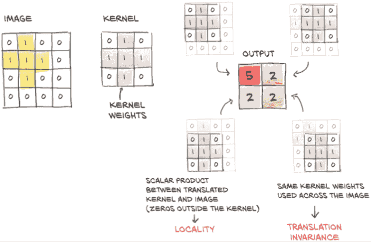

图 8.1 卷积：局部性和平移不变性

现在可以看到与之前所述的连接：卷积等同于具有多个线性操作，其权重几乎在每个像素周围为零，并且在训练期间接收相等的更新。

总结一下，通过转换为卷积，我们得到

+   对邻域进行局部操作

+   平移不变性

+   具有更少参数的模型

第三点的关键见解是，使用卷积层，参数的数量不取决于图像中的像素数量，就像在我们的全连接模型中一样，而是取决于卷积核的大小（3 × 3、5 × 5 等）以及我们决定在模型中使用多少卷积滤波器（或输出通道）。

## 8.2 卷积的实际应用

好吧，看起来我们已经花了足够的时间在一个兔子洞里！让我们看看 PyTorch 在我们的鸟类对比飞机挑战中的表现。`torch.nn`模块提供了 1、2 和 3 维的卷积：`nn.Conv1d`用于时间序列，`nn.Conv2d`用于图像，`nn.Conv3d`用于体积或视频。

对于我们的 CIFAR-10 数据，我们将使用`nn.Conv2d`。至少，我们提供给`nn.Conv2d`的参数是输入特征的数量（或*通道*，因为我们处理*多通道*图像：也就是，每个像素有多个值），输出特征的数量，以及内核的大小。例如，对于我们的第一个卷积模块，每个像素有 3 个输入特征（RGB 通道），输出中有任意数量的通道--比如，16。输出图像中的通道越多，网络的容量就越大。我们需要通道能够检测许多不同类型的特征。此外，因为我们是随机初始化它们的，所以即使在训练之后，我们得到的一些特征也会被证明是无用的。让我们坚持使用 3 × 3 的内核大小。

在所有方向上具有相同大小的内核尺寸是非常常见的，因此 PyTorch 为此提供了一个快捷方式：每当为 2D 卷积指定`kernel_size=3`时，它表示 3 × 3（在 Python 中提供为元组`(3, 3)`）。对于 3D 卷积，它表示 3 × 3 × 3。我们将在本书第 2 部分中看到的 CT 扫描在三个轴中的一个轴上具有不同的体素（体积像素）分辨率。在这种情况下，考虑在特殊维度上具有不同大小的内核是有意义的。但现在，我们将坚持在所有维度上使用相同大小的卷积：

```py
# In[11]:
conv = nn.Conv2d(3, 16, kernel_size=3)     # ❶
conv

# Out[11]:
Conv2d(3, 16, kernel_size=(3, 3), stride=(1, 1))
```

❶ 与快捷方式`kernel_size=3`相比，我们可以等效地传递我们在输出中看到的元组：kernel_size=(3, 3)。

我们期望`weight`张量的形状是什么？卷积核的大小为 3 × 3，因此我们希望权重由 3 × 3 部分组成。对于单个输出像素值，我们的卷积核会考虑，比如，`in_ch` = 3 个输入通道，因此单个输出像素值的权重分量（以及整个输出通道的不变性）的形状为`in_ch` × 3 × 3。最后，我们有与输出通道一样多的权重组件，这里`out_ch` = 16，因此完整的权重张量是`out_ch` × `in_ch` × 3 × 3，在我们的情况下是 16 × 3 × 3 × 3。偏置的大小将为 16（为了简单起见，我们已经有一段时间没有讨论偏置了，但就像在线性模块的情况下一样，它是一个我们添加到输出图像的每个通道的常数值）。让我们验证我们的假设：

```py
# In[12]:
conv.weight.shape, conv.bias.shape

# Out[12]:
(torch.Size([16, 3, 3, 3]), torch.Size([16]))
```

我们可以看到卷积是从图像中学习的方便选择。我们有更小的模型寻找局部模式，其权重在整个图像上进行优化。

2D 卷积通过产生一个 2D 图像作为输出，其像素是输入图像邻域的加权和。在我们的情况下，卷积核权重和偏置`conv.weight`都是随机初始化的，因此输出图像不会特别有意义。通常情况下，如果我们想要使用一个输入图像调用`conv`模块，我们需要使用`unsqueeze`添加零批次维度，因为`nn.Conv2d`期望输入为*B* × *C* × *H* × *W*形状的张量：

```py
# In[13]:
img, _ = cifar2[0]
output = conv(img.unsqueeze(0))
img.unsqueeze(0).shape, output.shape

# Out[13]:
(torch.Size([1, 3, 32, 32]), torch.Size([1, 16, 30, 30]))
```

我们很好奇，所以我们可以显示输出，如图 8.2 所示：

```py
# In[15]:
plt.imshow(output[0, 0].detach(), cmap='gray')
plt.show()
```

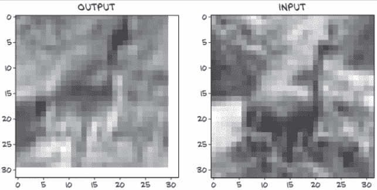

图 8.2 我们的鸟经过随机卷积处理后的样子。（我们在代码中作弊一点，以展示给您输入。）

等一下。让我们看看`output`的大小：它是`torch.Size([1, 16, 30, 30])`。嗯；我们在过程中丢失了一些像素。这是怎么发生的？

### 8.2.1 填充边界

我们的输出图像比输入图像小的事实是决定在图像边界做什么的副作用。将卷积核应用为 3×3 邻域像素的加权和要求在所有方向上都有邻居。如果我们在 i00 处，我们只有右侧和下方的像素。默认情况下，PyTorch 将在输入图片内滑动卷积核，获得`width` - `kernel_width` + 1 个水平和垂直位置。对于奇数大小的卷积核，这导致图像在每一侧缩小卷积核宽度的一半（在我们的情况下，3//2 = 1）。这解释了为什么每个维度都缺少两个像素。

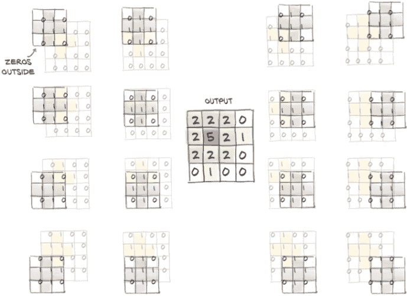

图 8.3 零填充以保持输出中的图像大小

然而，PyTorch 给了我们*填充*图像的可能性，通过在边界周围创建*幽灵*像素，这些像素在卷积方面的值为零。图 8.3 展示了填充的效果。

在我们的情况下，当`kernel_size=3`时指定`padding=1`意味着 i00 上方和左侧有额外的邻居，这样原始图像的角落处甚至可以计算卷积的输出。³最终结果是输出现在与输入具有完全相同的大小：

```py
# In[16]:
conv = nn.Conv2d(3, 1, kernel_size=3, padding=1)    # ❶
output = conv(img.unsqueeze(0))
img.unsqueeze(0).shape, output.shape

# Out[16]:
(torch.Size([1, 3, 32, 32]), torch.Size([1, 1, 32, 32]))
```

❶ 现在有填充了

请注意，无论是否使用填充，`weight`和`bias`的大小都不会改变。

填充卷积有两个主要原因。首先，这样做有助于我们分离卷积和改变图像大小的问题，这样我们就少了一件事要记住。其次，当我们有更复杂的结构，比如跳跃连接（在第 8.5.3 节讨论）或我们将在第 2 部分介绍的 U-Net 时，我们希望几个卷积之前和之后的张量具有兼容的大小，以便我们可以将它们相加或取差异。

### 8.2.2 用卷积检测特征

我们之前说过，`weight`和`bias`是通过反向传播学习的参数，就像`nn.Linear`中的`weight`和`bias`一样。然而，我们可以通过手动设置权重来玩转卷积，看看会发生什么。

首先让我们将`bias`归零，以消除任何混淆因素，然后将`weights`设置为一个恒定值，以便输出中的每个像素得到其邻居的平均值。对于每个 3×3 邻域：

```py
# In[17]:
with torch.no_grad():
    conv.bias.zero_()

with torch.no_grad():
    conv.weight.fill_(1.0 / 9.0)
```

我们本可以选择`conv.weight.one_()`--这将导致输出中的每个像素是邻域像素的*总和*。除了输出图像中的值会大九倍之外，没有太大的区别。

无论如何，让我们看看对我们的 CIFAR 图像的影响：

```py
# In[18]:
output = conv(img.unsqueeze(0))
plt.imshow(output[0, 0].detach(), cmap='gray')
plt.show()
```

正如我们之前所预测的，滤波器产生了图像的模糊版本，如图 8.4 所示。毕竟，输出的每个像素都是输入邻域的平均值，因此输出中的像素是相关的，并且变化更加平滑。

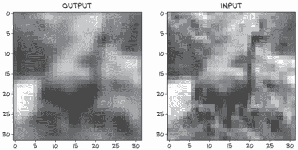

图 8.4 我们的鸟，这次因为一个恒定的卷积核而变模糊

接下来，让我们尝试一些不同的东西。下面的卷积核一开始可能看起来有点神秘：

```py
# In[19]:
conv = nn.Conv2d(3, 1, kernel_size=3, padding=1)

with torch.no_grad():
    conv.weight[:] = torch.tensor([[-1.0, 0.0, 1.0],
                                   [-1.0, 0.0, 1.0],
                                   [-1.0, 0.0, 1.0]])
    conv.bias.zero_()
```

对于位置在 2,2 的任意像素计算加权和，就像我们之前为通用卷积核所做的那样，我们得到

```py
o22 = i13 - i11 +
      i23 - i21 +
      i33 - i31
```

它执行 i22 右侧所有像素与 i22 左侧像素的差值。如果卷积核应用于不同强度相邻区域之间的垂直边界，o22 将具有较高的值。如果卷积核应用于均匀强度区域，o22 将为零。这是一个*边缘检测*卷积核：卷积核突出显示了水平相邻区域之间的垂直边缘。

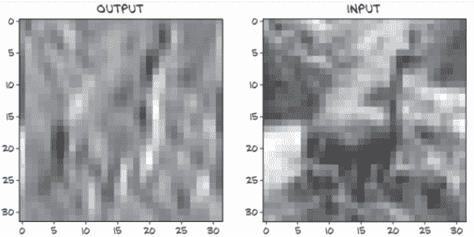

图 8.5 我们鸟身上的垂直边缘，感谢手工制作的卷积核

将卷积核应用于我们的图像，我们看到了图 8.5 中显示的结果。如预期，卷积核增强了垂直边缘。我们可以构建更多复杂的滤波器，例如用于检测水平或对角边缘，或十字形或棋盘格模式，其中“检测”意味着输出具有很高的幅度。事实上，计算机视觉专家的工作历来是提出最有效的滤波器组合，以便在图像中突出显示某些特征并识别对象。

在深度学习中，我们让核根据数据以最有效的方式进行估计：例如，以最小化我们在第 7.2.5 节中介绍的输出和地面真相之间的负交叉熵损失为目标。从这个角度来看，卷积神经网络的工作是估计一组滤波器组的核，这些核将在连续层中将多通道图像转换为另一个多通道图像，其中不同通道对应不同特征（例如一个通道用于平均值，另一个通道用于垂直边缘等）。图 8.6 显示了训练如何自动学习核。

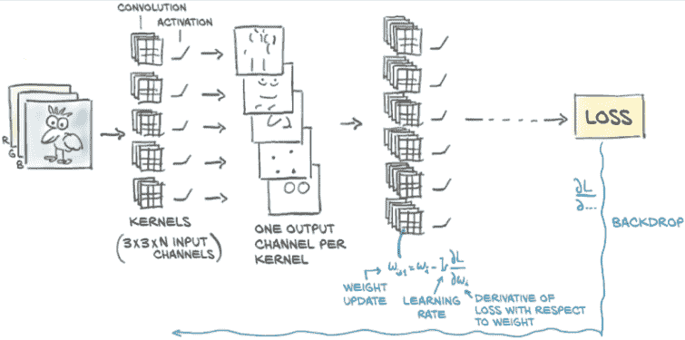

图 8.6 通过估计核权重的梯度并逐个更新它们以优化损失的卷积学习过程

### 8.2.3 深入探讨深度和池化

这一切都很好，但在概念上存在一个问题。我们之所以如此兴奋，是因为从全连接层转向卷积，我们实现了局部性和平移不变性。然后我们建议使用小卷积核，如 3 x 3 或 5 x 5：这确实是局部性的极致。那么*大局观*呢？我们怎么知道我们图像中的所有结构都是 3 像素或 5 像素宽的？好吧，我们不知道，因为它们不是。如果它们不是，我们的网络如何能够看到具有更大范围的这些模式？如果我们想有效解决鸟类与飞机的问题，我们真的需要这个，因为尽管 CIFAR-10 图像很小，但对象仍然具有跨越几个像素的（翼）跨度。

一种可能性是使用大型卷积核。当然，在极限情况下，我们可以为 32 x 32 图像使用 32 x 32 卷积核，但我们将收敛到旧的全连接、仿射变换，并丢失卷积的所有优点。另一种选项是在卷积神经网络中使用一层接一层的卷积，并在连续卷积之间同时对图像进行下采样。

#### 从大到小：下采样

下采样原则上可以以不同方式发生。将图像缩小一半相当于将四个相邻像素作为输入，并产生一个像素作为输出。如何根据输入值计算输出值取决于我们。我们可以

+   对四个像素求平均值。这种*平均池化*曾经是一种常见方法，但现在已经不太受青睐。

+   取四个像素中的最大值。这种方法称为*最大池化*，目前是最常用的方法，但它的缺点是丢弃了其他四分之三的数据。

+   执行*步幅*卷积，只计算每第*N*个像素。具有步幅 2 的 3 x 4 卷积仍然包含来自前一层的所有像素的输入。文献显示了这种方法的前景，但它尚未取代最大池化。

我们将继续关注最大池化，在图 8.7 中有所说明。该图显示了最常见的设置，即取非重叠的 2 x 2 瓦片，并将每个瓦片中的最大值作为缩小比例后的新像素。

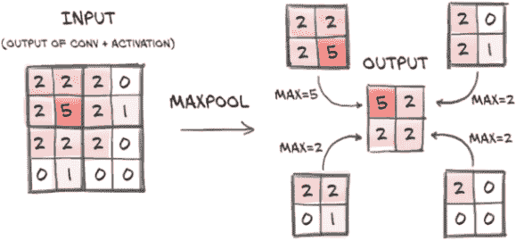

图 8.7 详细介绍了最大池化

直觉上，卷积层的输出图像，特别是因为它们后面跟着一个激活函数，往往在检测到对应于估计内核的某些特征（如垂直线）时具有较高的幅度。通过将 2×2 邻域中的最高值作为下采样输出，我们确保找到的特征*幸存*下采样，以弱响应为代价。

最大池化由`nn.MaxPool2d`模块提供（与卷积一样，也有适用于 1D 和 3D 数据的版本）。它的输入是要进行池化操作的邻域大小。如果我们希望将图像下采样一半，我们将使用大小为 2。让我们直接在输入图像上验证它是否按预期工作：

```py
# In[21]:
pool = nn.MaxPool2d(2)
output = pool(img.unsqueeze(0))

img.unsqueeze(0).shape, output.shape

# Out[21]:
(torch.Size([1, 3, 32, 32]), torch.Size([1, 3, 16, 16]))
```

#### 结合卷积和下采样以获得更好的效果

现在让我们看看如何结合卷积和下采样可以帮助我们识别更大的结构。在图 8.8 中，我们首先在我们的 8×8 图像上应用一组 3×3 内核，获得相同大小的多通道输出图像。然后我们将输出图像缩小一半，得到一个 4×4 图像，并对其应用另一组 3×3 内核。这第二组内核在已经缩小一半的东西的 3×3 邻域上有效地映射回输入的 8×8 邻域。此外，第二组内核获取第一组内核的输出（如平均值、边缘等特征）并在其上提取额外的特征。

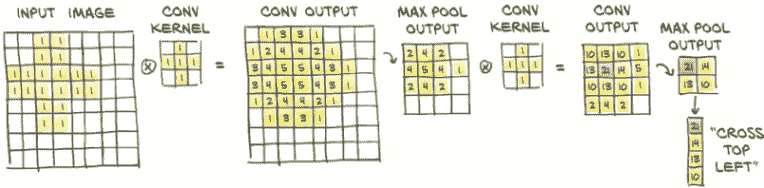

图 8.8 通过手动进行更多卷积，展示叠加卷积和最大池化的效果：使用两个小的十字形内核和最大池化突出显示一个大的十字形。

因此，一方面，第一组内核在第一阶低级特征的小邻域上操作，而第二组内核有效地在更宽的邻域上操作，产生由前一特征组成的特征。这是一个非常强大的机制，使卷积神经网络能够看到非常复杂的场景--比我们的 CIFAR-10 数据集中的 32×32 图像复杂得多。

输出像素的感受野

当第二个 3×3 卷积内核在图 8.8 中的卷积输出中产生 21 时，这是基于第一个最大池输出的左上角 3×3 像素。它们又对应于第一个卷积输出左上角的 6×6 像素，而这又是由第一个卷积从左上角的 7×7 像素计算得出的。因此，第二个卷积输出中的像素受到 7×7 输入方块的影响。第一个卷积还使用隐式“填充”列和行来在角落产生输出；否则，我们将有一个 8×8 的输入像素方块通知第二个卷积输出中的给定像素（远离边界）。在花哨的语言中，我们说，3×3 卷积，2×2 最大池，3×3 卷积结构的给定输出神经元具有 8×8 的感受野。

### 8.2.4 将所有内容整合到我们的网络中

有了这些基本模块，我们现在可以继续构建用于检测鸟类和飞机的卷积神经网络。让我们以前的全连接模型作为起点，并像之前描述的那样引入`nn.Conv2d`和`nn.MaxPool2d`：

```py
# In[22]:
model = nn.Sequential(
            nn.Conv2d(3, 16, kernel_size=3, padding=1),
            nn.Tanh(),
            nn.MaxPool2d(2),
            nn.Conv2d(16, 8, kernel_size=3, padding=1),
            nn.Tanh(),
            nn.MaxPool2d(2),
            # ...
            )
```

第一个卷积将我们从 3 个 RGB 通道转换为 16 个通道，从而使网络有机会生成 16 个独立特征，这些特征操作（希望）能够区分鸟和飞机的低级特征。然后我们应用`Tanh`激活函数。得到的 16 通道 32 × 32 图像通过第一个`MaxPool3d`池化为一个 16 通道 16 × 16 图像。此时，经过下采样的图像经历另一个卷积，生成一个 8 通道 16 × 16 输出。幸运的话，这个输出将由更高级的特征组成。再次，我们应用`Tanh`激活，然后池化为一个 8 通道 8 × 8 输出。

这会在哪里结束？在输入图像被减少为一组 8 × 8 特征之后，我们期望能够从网络中输出一些概率，然后将其馈送到我们的负对数似然函数中。然而，概率是一个一维向量中的一对数字（一个用于飞机，一个用于鸟），但在这里我们仍然处理多通道的二维特征。

回想一下本章的开头，我们已经知道我们需要做什么：将一个 8 通道 8 × 8 图像转换为一维向量，并用一组全连接层完成我们的网络：

```py
# In[23]:
model = nn.Sequential(
            nn.Conv2d(3, 16, kernel_size=3, padding=1),
            nn.Tanh(),
            nn.MaxPool2d(2),
            nn.Conv2d(16, 8, kernel_size=3, padding=1),
            nn.Tanh(),
            nn.MaxPool2d(2),
            # ...                      # ❶
            nn.Linear(8 * 8 * 8, 32),
            nn.Tanh(),
            nn.Linear(32, 2))
```

❶ 警告：这里缺少重要内容！

这段代码给出了图 8.9 中显示的神经网络。

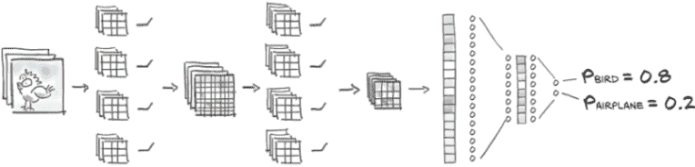

图 8.9 典型卷积网络的形状，包括我们正在构建的网络。图像被馈送到一系列卷积和最大池化模块，然后被拉直成一个一维向量，然后被馈送到全连接模块。

先忽略“缺少内容”的评论一分钟。让我们首先注意到线性层的大小取决于`MaxPool2d`的预期输出大小：8 × 8 × 8 = 512。让我们计算一下这个小模型的参数数量：

```py
# In[24]:
numel_list = [p.numel() for p in model.parameters()]
sum(numel_list), numel_list

# Out[24]:
(18090, [432, 16, 1152, 8, 16384, 32, 64, 2])
```

对于这样小图像的有限数据集来说，这是非常合理的。为了增加模型的容量，我们可以增加卷积层的输出通道数（即每个卷积层生成的特征数），这将导致线性层的大小也增加。

我们在代码中放置“警告”注释是有原因的。模型没有运行的可能性：

```py
# In[25]:
model(img.unsqueeze(0))

# Out[25]:
...
RuntimeError: size mismatch, m1: [64 x 8], m2: [512 x 32] at c:\...\THTensorMath.cpp:940
```

诚然，错误消息有点晦涩，但并不是太过复杂。我们在回溯中找到了`linear`的引用：回顾模型，我们发现只有一个模块必须有一个 512 × 32 的张量，即`nn.Linear(512, 32)`，也就是最后一个卷积块后的第一个线性模块。

缺失的是将一个 8 通道 8 × 8 图像重塑为一个 512 元素的一维向量（如果忽略批处理维度，则为一维）。这可以通过在最后一个`nn.MaxPool2d`的输出上调用`view`来实现，但不幸的是，当我们使用`nn.Sequential`时，我们没有任何明确的方式查看每个模块的输出。

## 8.3 继承 nn.Module

在开发神经网络的某个阶段，我们会发现自己想要计算一些预制模块不涵盖的内容。在这里，这是一些非常简单的操作，比如重塑；但在第 8.5.3 节中，我们使用相同的构造来实现残差连接。因此，在本节中，我们学习如何制作自己的`nn.Module`子类，然后我们可以像预构建的模块或`nn.Sequential`一样使用它们。

当我们想要构建比仅仅一层接一层应用更复杂功能的模型时，我们需要离开`nn.Sequential`，转而使用能够为我们提供更大灵活性的东西。PyTorch 允许我们通过继承`nn.Module`来在模型中使用任何计算。

要对 `nn.Module` 进行子类化，至少需要定义一个接受模块输入并返回输出的 `forward` 函数。这是我们定义模块计算的地方。这里的 `forward` 名称让人想起了很久以前的一个时期，当模块需要定义我们在第 5.5.1 节中遇到的前向和后向传递时。使用标准的 `torch` 操作，PyTorch 将自动处理后向传递；实际上，`nn.Module` 从不带有 `backward`。

通常，我们的计算将使用其他模块--预制的如卷积或自定义的。要包含这些*子模块*，我们通常在构造函数 `__init__` 中定义它们，并将它们分配给 `self` 以在 `forward` 函数中使用。它们将同时在我们模块的整个生命周期中保持其参数。请注意，您需要在执行这些操作之前调用 `super().__init__()`（否则 PyTorch 会提醒您）。

### 8.3.1 我们的网络作为 nn.Module

让我们将我们的网络编写为一个子模块。为此，我们在构造函数中实例化了所有之前传递给 `nn.Sequential` 的 `nn.Conv2d`、`nn.Linear` 等，然后在 `forward` 中依次使用它们的实例：

```py
# In[26]:
class Net(nn.Module):
    def __init__(self):
        super().__init__()
        self.conv1 = nn.Conv2d(3, 16, kernel_size=3, padding=1)
        self.act1 = nn.Tanh()
        self.pool1 = nn.MaxPool2d(2)
        self.conv2 = nn.Conv2d(16, 8, kernel_size=3, padding=1)
        self.act2 = nn.Tanh()
        self.pool2 = nn.MaxPool2d(2)
        self.fc1 = nn.Linear(8 * 8 * 8, 32)
        self.act3 = nn.Tanh()
        self.fc2 = nn.Linear(32, 2)

    def forward(self, x):
        out = self.pool1(self.act1(self.conv1(x)))
        out = self.pool2(self.act2(self.conv2(out)))
        out = out.view(-1, 8 * 8 * 8)   # ❶ 
        out = self.act3(self.fc1(out))
        out = self.fc2(out)
        return out
```

❶ 这种重塑是我们之前缺少的

`Net` 类在子模块方面等效于我们之前构建的 `nn.Sequential` 模型；但通过显式编写 `forward` 函数，我们可以直接操作 `self.pool3` 的输出并在其上调用 `view` 将其转换为 *B* × *N* 向量。请注意，在调用 `view` 时，我们将批处理维度保留为 -1，因为原则上我们不知道批处理中会有多少样本。

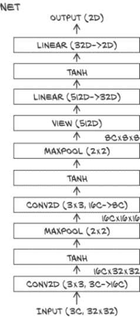

图 8.10 我们基准的卷积网络架构

在这里，我们使用 `nn.Module` 的子类来包含我们的整个模型。我们还可以使用子类来定义更复杂网络的新构建块。继续第六章中的图表风格，我们的网络看起来像图 8.10 所示的那样。我们正在对要在哪里呈现的信息做一些临时选择。

请记住，分类网络的目标通常是在某种意义上压缩信息，即我们从具有大量像素的图像开始，将其压缩为（概率向量的）类。关于我们的架构有两件事情值得与这个目标有关的评论。

首先，我们的目标反映在中间值的大小通常会缩小--这是通过在卷积中减少通道数、通过池化减少像素数以及在线性层中使输出维度低于输入维度来实现的。这是分类网络的一个共同特征。然而，在许多流行的架构中，如我们在第二章中看到的 ResNets 并在第 8.5.3 节中更多讨论的，通过在空间分辨率中进行池化来实现减少，但通道数增加（仍导致尺寸减小）。似乎我们的快速信息减少模式在深度有限且图像较小的网络中效果良好；但对于更深的网络，减少通常较慢。

其次，在一个层中，输出大小与输入大小没有减少：初始卷积。如果我们将单个输出像素视为一个具有 32 个元素的向量（通道），那么它是 27 个元素的线性变换（作为 3 个通道 × 3 × 3 核大小的卷积）--仅有轻微增加。在 ResNet 中，初始卷积从 147 个元素（3 个通道 × 7 × 7 核大小）生成 64 个通道。⁶ 因此，第一层在整体维度（如通道乘以像素）方面大幅增加数据流经过它，但对于独立考虑的每个输出像素，输出仍大致与输入相同。⁷

### 8.3.2 PyTorch 如何跟踪参数和子模块

有趣的是，在`nn.Module`中的属性中分配一个`nn.Module`实例，就像我们在早期的构造函数中所做的那样，会自动将模块注册为子模块。

*注意* 子模块必须是顶级*属性*，而不是嵌套在`list`或`dict`实例中！否则优化器将无法定位子模块（因此也无法定位它们的参数）。对于需要子模块列表或字典的模型情况，PyTorch 提供了`nn.ModuleList`和`nn.ModuleDict`。

我们可以调用`nn.Module`子类的任意方法。例如，对于一个模型，训练与预测等使用方式明显不同的情况下，可能有一个`predict`方法是有意义的。请注意，调用这些方法将类似于调用`forward`而不是模块本身--它们将忽略钩子，并且 JIT 在使用它们时不会看到模块结构，因为我们缺少第 6.2.1 节中显示的`__call__`位的等价物。

这使得`Net`可以访问其子模块的参数，而无需用户进一步操作：

```py
# In[27]:
model = Net()

numel_list = [p.numel() for p in model.parameters()]
sum(numel_list), numel_list

# Out[27]:
(18090, [432, 16, 1152, 8, 16384, 32, 64, 2])
```

这里发生的情况是，`parameters()`调用深入到构造函数中分配为属性的所有子模块，并递归调用它们的`parameters()`。无论子模块嵌套多深，任何`nn.Module`都可以访问所有子参数的列表。通过访问它们的`grad`属性，该属性已被`autograd`填充，优化器将知道如何更改参数以最小化损失。我们从第五章中了解到这个故事。

现在我们知道如何实现我们自己的模块了--这在第 2 部分中我们将需要很多。回顾`Net`类的实现，并考虑在构造函数中注册子模块的实用性，以便我们可以访问它们的参数，看起来有点浪费，因为我们还注册了没有参数的子模块，如`nn.Tanh`和`nn.MaxPool2d`。直接在`forward`函数中调用这些是否更容易，就像我们调用`view`一样？

### 8.3.3 功能 API

当然会！这就是为什么 PyTorch 为每个`nn`模块都提供了*functional*对应项。这里所说的“functional”是指“没有内部状态”--换句话说，“其输出值完全由输入参数的值决定”。实际上，`torch.nn.functional`提供了许多像我们在`nn`中找到的模块一样工作的函数。但是，与模块对应项不同，它们不会像模块对应项那样在输入参数和存储参数上工作，而是将输入和参数作为函数调用的参数。例如，`nn.Linear`的功能对应项是`nn.functional.linear`，它是一个具有签名`linear(input, weight, bias=None)`的函数。`weight`和`bias`参数是函数调用的参数。

回到我们的模型，继续使用`nn.Linear`和`nn.Conv2d`的`nn`模块是有意义的，这样`Net`在训练期间将能够管理它们的`Parameter`。但是，我们可以安全地切换到池化和激活的功能对应项，因为它们没有参数：

```py
# In[28]:
import torch.nn.functional as F

class Net(nn.Module):
    def __init__(self):
        super().__init__()
        self.conv1 = nn.Conv2d(3, 16, kernel_size=3, padding=1)
        self.conv2 = nn.Conv2d(16, 8, kernel_size=3, padding=1)
        self.fc1 = nn.Linear(8 * 8 * 8, 32)
        self.fc2 = nn.Linear(32, 2)

    def forward(self, x):
        out = F.max_pool2d(torch.tanh(self.conv1(x)), 2)
        out = F.max_pool2d(torch.tanh(self.conv2(out)), 2)
        out = out.view(-1, 8 * 8 * 8)
        out = torch.tanh(self.fc1(out))
        out = self.fc2(out)
        return out
```

这比我们在第 8.3.1 节中之前定义的`Net`的定义要简洁得多，完全等效。请注意，在构造函数中实例化需要多个参数进行初始化的模块仍然是有意义的。

*提示* 虽然通用科学函数如`tanh`仍然存在于版本 1.0 的`torch.nn.functional`中，但这些入口点已被弃用，而是推荐使用顶级`torch`命名空间中的函数。像`max_pool2d`这样的更专业的函数将保留在`torch.nn.functional`中。

因此，功能方式也揭示了`nn.Module` API 的含义：`Module`是一个状态的容器，其中包含`Parameter`和子模块，以及执行前向操作的指令。

使用功能 API 还是模块化 API 是基于风格和品味的决定。当网络的一部分如此简单以至于我们想使用`nn.Sequential`时，我们处于模块化领域。当我们编写自己的前向传播时，对于不需要参数形式状态的事物，使用功能接口可能更自然。

在第十五章，我们将简要涉及量化。然后像激活这样的无状态位突然变得有状态，因为需要捕获有关量化的信息。这意味着如果我们打算量化我们的模型，如果我们选择非 JIT 量化，坚持使用模块化 API 可能是值得的。有一个风格问题将帮助您避免（最初未预料到的）用途带来的意外：如果您需要多个无状态模块的应用（如`nn.HardTanh`或`nn.ReLU`），最好为每个模块实例化一个单独的实例。重用相同的模块似乎很聪明，并且在这里使用标准 Python 时会给出正确的结果，但是分析您的模型的工具可能会出错。

现在我们可以自己制作`nn.Module`，并且在需要时还有功能 API 可用，当实例化然后调用`nn.Module`过于繁琐时。这是了解在 PyTorch 中实现的几乎任何神经网络的代码组织方式的最后一部分。

让我们再次检查我们的模型是否运行正常，然后我们将进入训练循环：

```py
# In[29]:
model = Net()
model(img.unsqueeze(0))

# Out[29]:
tensor([[-0.0157,  0.1143]], grad_fn=<AddmmBackward>)
```

我们得到了两个数字！信息正确传递。我们现在可能意识不到，但在更复杂的模型中，正确设置第一个线性层的大小有时会导致挫折。我们听说过一些著名从业者输入任意数字，然后依靠 PyTorch 的错误消息来回溯线性层的正确大小。很烦人，对吧？不，这都是合法的！

## 8.4 训练我们的卷积网络

现在我们已经到了组装完整训练循环的时候。我们在第五章中已经开发了整体结构，训练循环看起来很像第六章的循环，但在这里我们将重新审视它以添加一些细节，如一些用于准确性跟踪的内容。在运行我们的模型之后，我们还会对更快速度有所期待，因此我们将学习如何在 GPU 上快速运行我们的模型。但首先让我们看看训练循环。

请记住，我们的卷积网络的核心是两个嵌套循环：一个是*epochs*上的外部循环，另一个是从我们的`Dataset`生成批次的`DataLoader`上的内部循环。在每个循环中，我们需要

1.  通过模型传递输入（前向传播）。

1.  计算损失（也是前向传播的一部分）。

1.  将任何旧的梯度清零。

1.  调用`loss.backward()`来计算损失相对于所有参数的梯度（反向传播）。

1.  使优化器朝着更低的损失方向迈出一步。

同时，我们收集并打印一些信息。所以这是我们的训练循环，看起来几乎与上一章相同--但记住每个事物的作用是很重要的：

```py
# In[30]:
import datetime                                                       # ❶

def training_loop(n_epochs, optimizer, model, loss_fn, train_loader):
    for epoch in range(1, n_epochs + 1):                              # ❷
        loss_train = 0.0
        for imgs, labels in train_loader:                             # ❸

            outputs = model(imgs)                                     # ❹

            loss = loss_fn(outputs, labels)                           # ❺

            optimizer.zero_grad()                                     # ❻

            loss.backward()                                           # ❼

            optimizer.step()                                          # ❽

            loss_train += loss.item()                                 # ❾

        if epoch == 1 or epoch % 10 == 0:
            print('{} Epoch {}, Training loss {}'.format(
                datetime.datetime.now(), epoch,
                loss_train / len(train_loader)))                      # ❿
```

❶ 使用 Python 内置的 datetime 模块

❷ 我们在从 1 到 n_epochs 编号的 epochs 上循环，而不是从 0 开始

❸ 在数据加载器为我们创建的批次中循环遍历我们的数据集

❹ 通过我们的模型传递一个批次...

❺ ... 并计算我们希望最小化的损失

❻ 在摆脱上一轮梯度之后...

❼ ... 执行反向步骤。也就是说，我们计算我们希望网络学习的所有参数的梯度。

❽ 更新模型

❾ 对我们在 epoch 中看到的损失求和。请记住，将损失转换为 Python 数字并使用`.item()`是很重要的，以避免梯度。

❿ 除以训练数据加载器的长度以获得每批的平均损失。这比总和更直观。

我们使用第七章的`Dataset`；将其包装成`DataLoader`；像以前一样实例化我们的网络、优化器和损失函数；然后调用我们的训练循环。

与上一章相比，我们模型的重大变化是现在我们的模型是 `nn.Module` 的自定义子类，并且我们正在使用卷积。让我们在打印损失的同时运行 100 个周期的训练。根据您的硬件，这可能需要 20 分钟或更长时间才能完成！

```py
# In[31]:
train_loader = torch.utils.data.DataLoader(cifar2, batch_size=64,
                                           shuffle=True)          # ❶

model = Net()  #                                                  # ❷
optimizer = optim.SGD(model.parameters(), lr=1e-2)  #             # ❸
loss_fn = nn.CrossEntropyLoss()  #                                # ❹

training_loop(                                                    # ❺
    n_epochs = 100,
    optimizer = optimizer,
    model = model,
    loss_fn = loss_fn,
    train_loader = train_loader,
)

# Out[31]:
2020-01-16 23:07:21.889707 Epoch 1, Training loss 0.5634813266954605
2020-01-16 23:07:37.560610 Epoch 10, Training loss 0.3277610331109375
2020-01-16 23:07:54.966180 Epoch 20, Training loss 0.3035225479086493
2020-01-16 23:08:12.361597 Epoch 30, Training loss 0.28249378549824855
2020-01-16 23:08:29.769820 Epoch 40, Training loss 0.2611226033253275
2020-01-16 23:08:47.185401 Epoch 50, Training loss 0.24105800626574048
2020-01-16 23:09:04.644522 Epoch 60, Training loss 0.21997178820477928
2020-01-16 23:09:22.079625 Epoch 70, Training loss 0.20370126601047578
2020-01-16 23:09:39.593780 Epoch 80, Training loss 0.18939699422401987
2020-01-16 23:09:57.111441 Epoch 90, Training loss 0.17283396527266046
2020-01-16 23:10:14.632351 Epoch 100, Training loss 0.1614033816868712
```

❶ DataLoader 对我们的 cifar2 数据集的示例进行批处理。Shuffling 使数据集中示例的顺序随机化。

❷ 实例化我们的网络 ...

❸ ... 我们一直在使用的随机梯度下降优化器 ...

❹ ... 以及我们在第 7.10 节中遇到的交叉熵损失

❺ 调用我们之前定义的训练循环

现在我们可以训练我们的网络了。但是，我们的鸟类观察者朋友在告诉她我们训练到非常低的训练损失时可能不会感到满意。

### 8.4.1 测量准确性

为了得到比损失更具可解释性的度量，我们可以查看训练和验证数据集上的准确率。我们使用了与第七章相同的代码：

```py
# In[32]:
train_loader = torch.utils.data.DataLoader(cifar2, batch_size=64,
                                           shuffle=False)
val_loader = torch.utils.data.DataLoader(cifar2_val, batch_size=64,
                                         shuffle=False)

def validate(model, train_loader, val_loader):
    for name, loader in [("train", train_loader), ("val", val_loader)]:
        correct = 0
        total = 0

        with torch.no_grad():                                    # ❶
            for imgs, labels in loader:
                outputs = model(imgs)
                _, predicted = torch.max(outputs, dim=1)         # ❷
                total += labels.shape[0]                         # ❸
                correct += int((predicted == labels).sum())      # ❹

        print("Accuracy {}: {:.2f}".format(name , correct / total))

validate(model, train_loader, val_loader)

# Out[32]:
Accuracy train: 0.93
Accuracy val: 0.89
```

❶ 我们这里不需要梯度，因为我们不想更新参数。

❷ 将最高值的索引作为输出给出

❸ 计算示例的数量，因此总数增加了批次大小

❹ 比较具有最大概率的预测类和地面真实标签，我们首先得到一个布尔数组。求和得到批次中预测和地面真实一致的项目数。

我们将转换为 Python 的 `int`--对于整数张量，这等同于使用 `.item()`，类似于我们在训练循环中所做的。

这比全连接模型要好得多，全连接模型只能达到 79%的准确率。我们在验证集上的错误数量几乎减半。而且，我们使用的参数要少得多。这告诉我们，模型在通过局部性和平移不变性从新样本中识别图像主题的任务中更好地泛化。现在我们可以让它运行更多周期，看看我们能够挤出什么性能。

### 8.4.2 保存和加载我们的模型

由于我们目前对我们的模型感到满意，所以实际上保存它会很好，对吧？这很容易做到。让我们将模型保存到一个文件中：

```py
# In[33]:
torch.save(model.state_dict(), data_path + 'birds_vs_airplanes.pt')
```

birds_vs_airplanes.pt 文件现在包含了 `model` 的所有参数：即两个卷积模块和两个线性模块的权重和偏置。因此，没有结构--只有权重。这意味着当我们为我们的朋友在生产中部署模型时，我们需要保持 `model` 类方便，创建一个实例，然后将参数加载回去：

```py
# In[34]:
loaded_model = Net()                                 # ❶
loaded_model.load_state_dict(torch.load(data_path
                                        + 'birds_vs_airplanes.pt'))

# Out[34]:
<All keys matched successfully>
```

❶ 我们必须确保在保存和后续加载模型状态之间不更改 Net 的定义。

我们还在我们的代码库中包含了一个预训练模型，保存在 ../data/ p1ch7/birds_vs_airplanes.pt 中。

### 8.4.3 在 GPU 上训练

我们有一个网络并且可以训练它！但是让它变得更快会很好。到现在为止，我们通过将训练移至 GPU 来实现这一点并不奇怪。使用我们在第三章中看到的 `.to` 方法，我们可以将从数据加载器获取的张量移动到 GPU，之后我们的计算将自动在那里进行。但是我们还需要将参数移动到 GPU。令人高兴的是，`nn.Module` 实现了一个 `.to` 函数，将其所有参数移动到 GPU（或在传递 `dtype` 参数时转换类型）。

`Module.to` 和 `Tensor.to` 之间有一些微妙的区别。`Module.to` 是就地操作：模块实例被修改。但 `Tensor.to` 是非就地操作（在某种程度上是计算，就像 `Tensor.tanh` 一样），返回一个新的张量。一个影响是在将参数移动到适当设备后创建 `Optimizer` 是一个良好的实践。

如果有 GPU 可用，将事物移动到 GPU 被认为是一种良好的风格。一个好的模式是根据 `torch.cuda.is_available` 设置一个变量 `device`：

```py
# In[35]:
device = (torch.device('cuda') if torch.cuda.is_available()
          else torch.device('cpu'))
print(f"Training on device {device}.")
```

然后我们可以通过使用`Tensor.to`方法将从数据加载器获取的张量移动到 GPU 来修改训练循环。请注意，代码与本节开头的第一个版本完全相同，除了将输入移动到 GPU 的两行代码：

```py
# In[36]:
import datetime

def training_loop(n_epochs, optimizer, model, loss_fn, train_loader):
    for epoch in range(1, n_epochs + 1):
        loss_train = 0.0
        for imgs, labels in train_loader:
            imgs = imgs.to(device=device)       # ❶
            labels = labels.to(device=device)
            outputs = model(imgs)
            loss = loss_fn(outputs, labels)

            optimizer.zero_grad()
            loss.backward()
            optimizer.step()

            loss_train += loss.item()

        if epoch == 1 or epoch % 10 == 0:
            print('{} Epoch {}, Training loss {}'.format(
                datetime.datetime.now(), epoch,
                loss_train / len(train_loader)))
```

❶ 将图像和标签移动到我们正在训练的设备上的这两行是与我们之前版本的唯一区别。

对`validate`函数必须做出相同的修正。然后我们可以实例化我们的模型，将其移动到`device`，并像以前一样运行它：⁸

```py
# In[37]:
train_loader = torch.utils.data.DataLoader(cifar2, batch_size=64,
                                           shuffle=True)

model = Net().to(device=device)                     # ❶
optimizer = optim.SGD(model.parameters(), lr=1e-2)
loss_fn = nn.CrossEntropyLoss()

training_loop(
    n_epochs = 100,
    optimizer = optimizer,
    model = model,
    loss_fn = loss_fn,
    train_loader = train_loader,
)

# Out[37]:
2020-01-16 23:10:35.563216 Epoch 1, Training loss 0.5717791349265227
2020-01-16 23:10:39.730262 Epoch 10, Training loss 0.3285350770137872
2020-01-16 23:10:45.906321 Epoch 20, Training loss 0.29493294959994637
2020-01-16 23:10:52.086905 Epoch 30, Training loss 0.26962305994550134
2020-01-16 23:10:56.551582 Epoch 40, Training loss 0.24709946277794564
2020-01-16 23:11:00.991432 Epoch 50, Training loss 0.22623272664892446
2020-01-16 23:11:05.421524 Epoch 60, Training loss 0.20996672821462534
2020-01-16 23:11:09.951312 Epoch 70, Training loss 0.1934866009719053
2020-01-16 23:11:14.499484 Epoch 80, Training loss 0.1799132404908253
2020-01-16 23:11:19.047609 Epoch 90, Training loss 0.16620008706761774
2020-01-16 23:11:23.590435 Epoch 100, Training loss 0.15667157247662544
```

❶ 将我们的模型（所有参数）移动到 GPU。如果忘记将模型或输入移动到 GPU，将会出现关于张量不在同一设备上的错误，因为 PyTorch 运算符不支持混合 GPU 和 CPU 输入。

即使对于我们这里的小型网络，我们也看到了速度的显著增加。在大型模型上，使用 GPU 进行计算的优势更加明显。

在加载网络权重时存在一个小复杂性：PyTorch 将尝试将权重加载到与保存时相同的设备上--也就是说，GPU 上的权重将被恢复到 GPU 上。由于我们不知道是否要相同的设备，我们有两个选择：我们可以在保存之前将网络移动到 CPU，或者在恢复后将其移回。通过将`map_location`关键字参数传递给`torch.load`，更简洁地指示 PyTorch 在加载权重时覆盖设备信息：

```py
# In[39]:
loaded_model = Net().to(device=device)
loaded_model.load_state_dict(torch.load(data_path
                                        + 'birds_vs_airplanes.pt',
                                        map_location=device))

# Out[39]:
<All keys matched successfully>
```

## 8.5 模型设计

我们将我们的模型构建为`nn.Module`的子类，这是除了最简单的模型之外的事实标准。然后我们成功地训练了它，并看到了如何使用 GPU 来训练我们的模型。我们已经达到了可以构建一个前馈卷积神经网络并成功训练它来对图像进行分类的程度。自然的问题是，接下来呢？如果我们面对一个更加复杂的问题会怎么样？诚然，我们的鸟类与飞机数据集并不那么复杂：图像非常小，而且所研究的对象位于中心并占据了大部分视口。

如果我们转向，比如说，ImageNet，我们会发现更大、更复杂的图像，正确答案将取决于多个视觉线索，通常是按层次组织的。例如，当试图预测一个黑色砖块形状是遥控器还是手机时，网络可能正在寻找类似屏幕的东西。

此外，在现实世界中，图像可能不是我们唯一关注的焦点，我们还有表格数据、序列和文本。神经网络的承诺在于提供足够的灵活性，以解决所有这些类型数据的问题，只要有适当的架构（即层或模块的互连）和适当的损失函数。

PyTorch 提供了一个非常全面的模块和损失函数集合，用于实现从前馈组件到长短期记忆（LSTM）模块和变压器网络（这两种非常流行的顺序数据架构）的最新架构。通过 PyTorch Hub 或作为`torchvision`和其他垂直社区努力的一部分提供了几种模型。

我们将在第 2 部分看到一些更高级的架构，我们将通过分析 CT 扫描的端到端问题来介绍，但总的来说，探讨神经网络架构的变化超出了本书的范围。然而，我们可以借助迄今为止积累的知识来理解如何通过 PyTorch 的表现力实现几乎任何架构。本节的目的正是提供概念工具，使我们能够阅读最新的研究论文并开始在 PyTorch 中实现它--或者，由于作者经常发布他们论文的 PyTorch 实现，也可以在不被咖啡呛到的情况下阅读实现。

### 8.5.1 添加内存容量：宽度

鉴于我们的前馈架构，在进一步复杂化之前，我们可能想要探索一些维度。第一个维度是网络的*宽度*：每层的神经元数量，或者每个卷积的通道数。在 PyTorch 中，我们可以很容易地使模型更宽。我们只需在第一个卷积中指定更多的输出通道数，并相应增加后续层，同时要注意更改`forward`函数以反映这样一个事实，即一旦我们转换到全连接层，我们现在将有一个更长的向量：

```py
# In[40]:
class NetWidth(nn.Module):
    def __init__(self):
        super().__init__()
        self.conv1 = nn.Conv2d(3, 32, kernel_size=3, padding=1)
        self.conv2 = nn.Conv2d(32, 16, kernel_size=3, padding=1)
        self.fc1 = nn.Linear(16 * 8 * 8, 32)
        self.fc2 = nn.Linear(32, 2)

    def forward(self, x):
        out = F.max_pool2d(torch.tanh(self.conv1(x)), 2)
        out = F.max_pool2d(torch.tanh(self.conv2(out)), 2)
        out = out.view(-1, 16 * 8 * 8)
        out = torch.tanh(self.fc1(out))
        out = self.fc2(out)
        return out
```

如果我们想避免在模型定义中硬编码数字，我们可以很容易地将一个参数传递给*init*，并将宽度参数化，同时要注意在`forward`函数中也将`view`的调用参数化：

```py
# In[42]:
class NetWidth(nn.Module):
    def __init__(self, n_chans1=32):
        super().__init__()
        self.n_chans1 = n_chans1
        self.conv1 = nn.Conv2d(3, n_chans1, kernel_size=3, padding=1)
        self.conv2 = nn.Conv2d(n_chans1, n_chans1 // 2, kernel_size=3,
                               padding=1)
        self.fc1 = nn.Linear(8 * 8 * n_chans1 // 2, 32)
        self.fc2 = nn.Linear(32, 2)

    def forward(self, x):
        out = F.max_pool2d(torch.tanh(self.conv1(x)), 2)
        out = F.max_pool2d(torch.tanh(self.conv2(out)), 2)
        out = out.view(-1, 8 * 8 * self.n_chans1 // 2)
        out = torch.tanh(self.fc1(out))
        out = self.fc2(out)
        return out
```

每一层指定通道和特征的数字与模型中的参数数量直接相关；其他条件相同的情况下，它们会增加模型的*容量*。就像之前所做的那样，我们可以看看我们的模型现在有多少参数：

```py
# In[44]:
sum(p.numel() for p in model.parameters())

# Out[44]:
38386
```

容量越大，模型将能够处理输入的变化性就越多；但与此同时，过拟合的可能性也越大，因为模型可以使用更多的参数来记忆输入的不重要方面。我们已经探讨了对抗过拟合的方法，最好的方法是增加样本量，或者在没有新数据的情况下，通过对同一数据进行人工修改来增加现有数据。

在模型级别（而不是在数据上）我们可以采取一些更多的技巧来控制过拟合。让我们回顾一下最常见的几种。

### 8.5.2 帮助我们的模型收敛和泛化：正则化

训练模型涉及两个关键步骤：优化，当我们需要在训练集上减少损失时；和泛化，当模型不仅需要在训练集上工作，还需要在之前未见过的数据上工作，如验证集。旨在简化这两个步骤的数学工具有时被归纳为*正则化*的标签下。

#### 控制参数：权重惩罚

稳定泛化的第一种方法是向损失中添加正则化项。这个项被设计成使模型的权重自行趋向于较小，限制训练使它们增长的程度。换句话说，这是对较大权重值的惩罚。这使得损失具有更加平滑的拓扑结构，从拟合单个样本中获得的收益相对较少。

这种类型的最受欢迎的正则化项是 L2 正则化，它是模型中所有权重的平方和，以及 L1 正则化，它是模型中所有权重的绝对值之和。它们都由一个（小）因子缩放，这是我们在训练之前设置的超参数。

L2 正则化也被称为*权重衰减*。这个名称的原因是，考虑到 SGD 和反向传播，L2 正则化项对参数`w_i`的负梯度为`- 2 * lambda * w_i`，其中`lambda`是前面提到的超参数，在 PyTorch 中简称为*权重衰减*。因此，将 L2 正则化添加到损失函数中等同于在优化步骤中减少每个权重的数量与其当前值成比例的量（因此，称为*权重衰减*）。请注意，权重衰减适用于网络的所有参数，如偏置。

在 PyTorch 中，我们可以通过向损失中添加一个项来很容易地实现正则化。在计算损失后，无论损失函数是什么，我们都可以迭代模型的参数，对它们各自的平方（对于 L2）或`abs`（对于 L1）求和，并进行反向传播：

```py
# In[45]:
def training_loop_l2reg(n_epochs, optimizer, model, loss_fn,
                        train_loader):
    for epoch in range(1, n_epochs + 1):
        loss_train = 0.0
        for imgs, labels in train_loader:
            imgs = imgs.to(device=device)
            labels = labels.to(device=device)
            outputs = model(imgs)
            loss = loss_fn(outputs, labels)

            l2_lambda = 0.001
            l2_norm = sum(p.pow(2.0).sum()
                          for p in model.parameters())   # ❶
            loss = loss + l2_lambda * l2_norm

            optimizer.zero_grad()
            loss.backward()
            optimizer.step()

            loss_train += loss.item()
        if epoch == 1 or epoch % 10 == 0:
            print('{} Epoch {}, Training loss {}'.format(
                datetime.datetime.now(), epoch,
                loss_train / len(train_loader)))
```

❶ 用 abs()替换 pow(2.0)以进行 L1 正则化

然而，PyTorch 中的 SGD 优化器已经有一个`weight_decay`参数，对应于`2 * lambda`，并且在更新过程中直接执行权重衰减，如前所述。这完全等同于将权重的 L2 范数添加到损失中，而无需在损失中累积项并涉及 autograd。

#### 不要过分依赖单个输入：Dropout

一种有效的对抗过拟合策略最初是由 2014 年多伦多 Geoff Hinton 小组的 Nitish Srivastava 及其合著者提出的，题为“Dropout：一种简单防止神经网络过拟合的方法”（[`mng.bz/nPMa`](http://mng.bz/nPMa)）。听起来就像是我们正在寻找的东西，对吧？dropout 背后的想法确实很简单：在整个网络中随机将一部分神经元的输出置零，其中随机化发生在每个训练迭代中。

该过程有效地在每次迭代中生成具有不同神经元拓扑的略有不同的模型，使模型中的神经元在发生过拟合时的记忆过程中有更少的协调机会。另一个观点是 dropout 扰乱了模型生成的特征，产生了一种接近增强的效果，但这次是在整个网络中。

在 PyTorch 中，我们可以通过在非线性激活函数和后续层的线性或卷积模块之间添加一个`nn.Dropout`模块来实现模型中的 dropout。作为参数，我们需要指定输入被置零的概率。在卷积的情况下，我们将使用专门的`nn.Dropout2d`或`nn.Dropout3d`，它们会将输入的整个通道置零：

```py
# In[47]:
class NetDropout(nn.Module):
    def __init__(self, n_chans1=32):
        super().__init__()
        self.n_chans1 = n_chans1
        self.conv1 = nn.Conv2d(3, n_chans1, kernel_size=3, padding=1)
        self.conv1_dropout = nn.Dropout2d(p=0.4)
        self.conv2 = nn.Conv2d(n_chans1, n_chans1 // 2, kernel_size=3,
                               padding=1)
        self.conv2_dropout = nn.Dropout2d(p=0.4)
        self.fc1 = nn.Linear(8 * 8 * n_chans1 // 2, 32)
        self.fc2 = nn.Linear(32, 2)

    def forward(self, x):
        out = F.max_pool2d(torch.tanh(self.conv1(x)), 2)
        out = self.conv1_dropout(out)
        out = F.max_pool2d(torch.tanh(self.conv2(out)), 2)
        out = self.conv2_dropout(out)
        out = out.view(-1, 8 * 8 * self.n_chans1 // 2)
        out = torch.tanh(self.fc1(out))
        out = self.fc2(out)
        return out
```

注意，在训练期间通常会激活 dropout，而在生产中评估经过训练的模型时，会绕过 dropout，或者等效地将概率分配为零。这通过`Dropout`模块的`train`属性来控制。请记住，PyTorch 允许我们通过调用在两种模式之间切换

```py
model.train()
```

或

```py
model.eval()
```

在任何`nn.Model`子类上。调用将自动复制到子模块，因此如果其中包含`Dropout`，它将在后续的前向和后向传递中相应地行为。

#### 保持激活在适当范围内：批量归一化

在 2015 年，谷歌的 Sergey Ioffe 和 Christian Szegedy 发表了另一篇具有开创性意义的论文，名为“批量归一化：通过减少内部协变量转移加速深度网络训练”（[`arxiv.org/abs/1502.03167`](https://arxiv.org/abs/1502.03167)）。该论文描述了一种对训练有多种有益影响的技术：使我们能够增加学习率，使训练不那么依赖初始化并充当正则化器，从而代替了 dropout。

批量归一化背后的主要思想是重新缩放网络的激活输入，以便小批量具有某种理想的分布。回顾学习的机制和非线性激活函数的作用，这有助于避免输入到激活函数过于饱和部分，从而杀死梯度并减慢训练速度。

在实际操作中，批量归一化使用小批量样本中在该中间位置收集的均值和标准差来移位和缩放中间输入。正则化效果是因为模型始终将单个样本及其下游激活视为根据随机提取的小批量样本的统计数据而移位和缩放。这本身就是一种*原则性*的增强。论文的作者建议使用批量归一化消除或至少减轻了对 dropout 的需求。

在 PyTorch 中，批量归一化通过`nn.BatchNorm1D`、`nn.BatchNorm2d`和`nn.BatchNorm3d`模块提供，取决于输入的维度。由于批量归一化的目的是重新缩放激活的输入，自然的位置是在线性变换（在这种情况下是卷积）和激活之后，如下所示：

```py
# In[49]:
class NetBatchNorm(nn.Module):
    def __init__(self, n_chans1=32):
        super().__init__()
        self.n_chans1 = n_chans1
        self.conv1 = nn.Conv2d(3, n_chans1, kernel_size=3, padding=1)
        self.conv1_batchnorm = nn.BatchNorm2d(num_features=n_chans1)
        self.conv2 = nn.Conv2d(n_chans1, n_chans1 // 2, kernel_size=3,
                               padding=1)
        self.conv2_batchnorm = nn.BatchNorm2d(num_features=n_chans1 // 2)
        self.fc1 = nn.Linear(8 * 8 * n_chans1 // 2, 32)
        self.fc2 = nn.Linear(32, 2)

    def forward(self, x):
        out = self.conv1_batchnorm(self.conv1(x))
        out = F.max_pool2d(torch.tanh(out), 2)
        out = self.conv2_batchnorm(self.conv2(out))
        out = F.max_pool2d(torch.tanh(out), 2)
        out = out.view(-1, 8 * 8 * self.n_chans1 // 2)
        out = torch.tanh(self.fc1(out))
        out = self.fc2(out)
        return out
```

与 dropout 一样，批量归一化在训练和推断期间需要有不同的行为。实际上，在推断时，我们希望避免特定输入的输出依赖于我们向模型呈现的其他输入的统计信息。因此，我们需要一种方法来进行归一化，但这次是一次性固定归一化参数。

当处理小批量时，除了估计当前小批量的均值和标准差之外，PyTorch 还更新代表整个数据集的均值和标准差的运行估计，作为近似值。这样，当用户指定时

```py
model.eval()
```

如果模型包含批量归一化模块，则冻结运行估计并用于归一化。要解冻运行估计并返回使用小批量统计信息，我们调用`model.train()`，就像我们对待 dropout 一样。

### 8.5.3 深入学习更复杂的结构：深度

早些时候，我们谈到宽度作为第一个要处理的维度，以使模型更大，从某种意义上说，更有能力。第二个基本维度显然是*深度*。由于这是一本深度学习书，深度是我们应该关注的东西。毕竟，深层模型总是比浅层模型更好，不是吗？嗯，这取决于情况。随着深度增加，网络能够逼近的函数的复杂性通常会增加。就计算机视觉而言，一个较浅的网络可以识别照片中的人的形状，而一个更深的网络可以识别人、头部上半部分的脸和脸部内的嘴巴。深度使模型能够处理分层信息，当我们需要理解上下文以便对某些输入进行分析时。

还有另一种思考深度的方式：增加深度与增加网络在处理输入时能够执行的操作序列的长度有关。这种观点--一个执行顺序操作以完成任务的深度网络--对于习惯于将算法视为“找到人的边界，寻找边界上方的头部，寻找头部内的嘴巴”等操作序列的软件开发人员可能是迷人的。

#### 跳过连接

深度带来了一些额外的挑战，这些挑战阻碍了深度学习模型在 2015 年之前达到 20 层或更多层。增加模型的深度通常会使训练更难收敛。让我们回顾反向传播，并在非常深的网络环境中思考一下。损失函数对参数的导数，特别是早期层中的导数，需要乘以许多其他数字，这些数字来自于损失和参数之间的导数操作链。这些被乘以的数字可能很小，生成越来越小的数字，或者很大，由于浮点近似而吞噬较小的数字。归根结底，长链的乘法将使参数对梯度的贡献*消失*，导致该层的训练无效，因为该参数和类似的其他参数将无法得到适当更新。

2015 年 12 月，Kaiming He 和合著者提出了*残差网络*（ResNets），这是一种使用简单技巧的架构，使得非常深的网络能够成功训练（[` arxiv.org/abs/1512.03385`](https://arxiv.org/abs/1512.03385)）。该工作为从几十层到 100 层深度的网络打开了大门，超越了当时计算机视觉基准问题的最新技术。我们在第二章中使用预训练模型时遇到了残差网络。我们提到的技巧是：使用*跳跃连接*来绕过一组层，如图 8.11 所示。

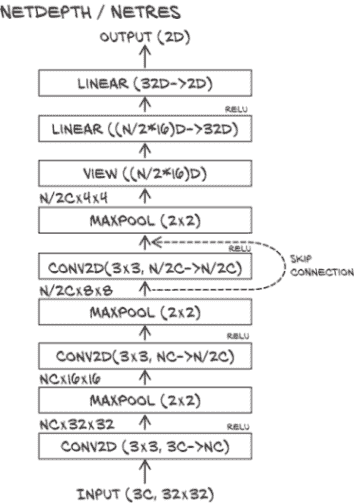

图 8.11 我们具有三个卷积层的网络架构。跳跃连接是`NetRes`与`NetDepth`的区别所在。

跳跃连接只是将输入添加到一组层的输出中。这正是在 PyTorch 中所做的。让我们向我们简单的卷积模型添加一层，并让我们使用 ReLU 作为激活函数。带有额外一层的香草模块如下所示：

```py
# In[51]:
class NetDepth(nn.Module):
    def __init__(self, n_chans1=32):
        super().__init__()
        self.n_chans1 = n_chans1
        self.conv1 = nn.Conv2d(3, n_chans1, kernel_size=3, padding=1)
        self.conv2 = nn.Conv2d(n_chans1, n_chans1 // 2, kernel_size=3,
                               padding=1)
        self.conv3 = nn.Conv2d(n_chans1 // 2, n_chans1 // 2,
                               kernel_size=3, padding=1)
        self.fc1 = nn.Linear(4 * 4 * n_chans1 // 2, 32)
        self.fc2 = nn.Linear(32, 2)

    def forward(self, x):
        out = F.max_pool2d(torch.relu(self.conv1(x)), 2)
        out = F.max_pool2d(torch.relu(self.conv2(out)), 2)
        out = F.max_pool2d(torch.relu(self.conv3(out)), 2)
        out = out.view(-1, 4 * 4 * self.n_chans1 // 2)
        out = torch.relu(self.fc1(out))
        out = self.fc2(out)
        return out
```

向这个模型添加一个类 ResNet 的跳跃连接相当于将第一层的输出添加到第三层的输入中的`forward`函数中：

```py
# In[53]:
class NetRes(nn.Module):
    def __init__(self, n_chans1=32):
        super().__init__()
        self.n_chans1 = n_chans1
        self.conv1 = nn.Conv2d(3, n_chans1, kernel_size=3, padding=1)
        self.conv2 = nn.Conv2d(n_chans1, n_chans1 // 2, kernel_size=3,
                               padding=1)
        self.conv3 = nn.Conv2d(n_chans1 // 2, n_chans1 // 2,
                               kernel_size=3, padding=1)
        self.fc1 = nn.Linear(4 * 4 * n_chans1 // 2, 32)
        self.fc2 = nn.Linear(32, 2)

    def forward(self, x):
        out = F.max_pool2d(torch.relu(self.conv1(x)), 2)
        out = F.max_pool2d(torch.relu(self.conv2(out)), 2)
        out1 = out
        out = F.max_pool2d(torch.relu(self.conv3(out)) + out1, 2)
        out = out.view(-1, 4 * 4 * self.n_chans1 // 2)
        out = torch.relu(self.fc1(out))
        out = self.fc2(out)
        return out
```

换句话说，我们将第一个激活的输出用作最后一个的输入，除了标准的前馈路径。这也被称为*恒等映射*。那么，这如何缓解我们之前提到的梯度消失问题呢？

想想反向传播，我们可以欣赏到在深度网络中的跳跃连接，或者一系列跳跃连接，为深层参数到损失创建了一条直接路径。这使得它们对损失的梯度贡献更直接，因为对这些参数的损失的偏导数有机会不被一长串其他操作相乘。

已经观察到跳跃连接对收敛特别是在训练的初始阶段有益。此外，深度残差网络的损失景观比相同深度和宽度的前馈网络要平滑得多。

值得注意的是，当 ResNets 出现时，跳跃连接并不是新鲜事物。Highway 网络和 U-Net 使用了各种形式的跳跃连接。然而，ResNets 使用跳跃连接的方式使得深度大于 100 的模型易于训练。

自 ResNets 出现以来，其他架构已经将跳跃连接提升到了一个新水平。特别是 DenseNet，提出通过跳跃连接将每一层与数个下游层连接起来，以较少的参数实现了最先进的结果。到目前为止，我们知道如何实现类似 DenseNets 的东西：只需将早期中间输出算术地添加到下游中间输出中。

#### 在 PyTorch 中构建非常深的模型

我们谈到了在卷积神经网络中超过 100 层。我们如何在 PyTorch 中构建该网络而不至于在过程中迷失方向？标准策略是定义一个构建块，例如`(Conv2d，ReLU，Conv2d) + 跳跃连接`块，然后在`for`循环中动态构建网络。让我们看看实践中是如何完成的。我们将创建图 8.12 中所示的网络。

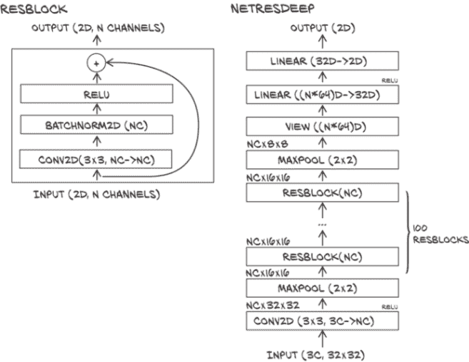

图 8.12 我们带有残差连接的深度架构。在左侧，我们定义了一个简单的残差块。如右侧所示，我们将其用作网络中的构建块。

我们首先创建一个模块子类，其唯一任务是为一个*块*提供计算--也就是说，一组卷积、激活和跳跃连接：

```py
# In[55]:
class ResBlock(nn.Module):
    def __init__(self, n_chans):
        super(ResBlock, self).__init__()
        self.conv = nn.Conv2d(n_chans, n_chans, kernel_size=3,
                              padding=1, bias=False)            # ❶
        self.batch_norm = nn.BatchNorm2d(num_features=n_chans)
        torch.nn.init.kaiming_normal_(self.conv.weight,
                                      nonlinearity='relu')      # ❷
        torch.nn.init.constant_(self.batch_norm.weight, 0.5)
        torch.nn.init.zeros_(self.batch_norm.bias)

    def forward(self, x):
        out = self.conv(x)
        out = self.batch_norm(out)
        out = torch.relu(out)
        return out + x
```

❶ BatchNorm 层会抵消偏差的影响，因此通常会被省略。

❷ 使用自定义初始化。kaiming_normal_ 使用正态随机元素进行初始化，标准差与 ResNet 论文中计算的一致。批量归一化被初始化为产生初始具有 0 均值和 0.5 方差的输出分布。

由于我们计划生成一个深度模型，我们在块中包含了批量归一化，因为这将有助于防止训练过程中梯度消失。我们现在想生成一个包含 100 个块的网络。这意味着我们需要做一些严肃的剪切和粘贴吗？一点也不；我们已经有了想象这个模型可能是什么样子的所有要素。

首先，在*init*中，我们创建包含一系列`ResBlock`实例的`nn.Sequential`。`nn.Sequential`将确保一个块的输出被用作下一个块的输入。它还将确保块中的所有参数对`Net`可见。然后，在`forward`中，我们只需调用顺序遍历 100 个块并生成输出：

```py
# In[56]:
class NetResDeep(nn.Module):
    def __init__(self, n_chans1=32, n_blocks=10):
        super().__init__()
        self.n_chans1 = n_chans1
        self.conv1 = nn.Conv2d(3, n_chans1, kernel_size=3, padding=1)
        self.resblocks = nn.Sequential(
            *(n_blocks * [ResBlock(n_chans=n_chans1)]))
        self.fc1 = nn.Linear(8 * 8 * n_chans1, 32)
        self.fc2 = nn.Linear(32, 2)

    def forward(self, x):
        out = F.max_pool2d(torch.relu(self.conv1(x)), 2)
        out = self.resblocks(out)
        out = F.max_pool2d(out, 2)
        out = out.view(-1, 8 * 8 * self.n_chans1)
        out = torch.relu(self.fc1(out))
        out = self.fc2(out)
        return out
```

在实现中，我们参数化了实际层数，这对实验和重复使用很重要。此外，不用说，反向传播将按预期工作。毫不奇怪，网络收敛速度要慢得多。它在收敛方面也更加脆弱。这就是为什么我们使用更详细的初始化，并将我们的`NetRes`训练学习率设置为 3e - 3，而不是我们为其他网络使用的 1e - 2。我们没有训练任何网络到收敛，但如果没有这些调整，我们将一事无成。

所有这些都不应该鼓励我们在一个 32×32 像素的数据集上寻求深度，但它清楚地展示了如何在更具挑战性的数据集（如 ImageNet）上实现这一点。它还为理解像 ResNet 这样的现有模型实现提供了关键要素，例如在`torchvision`中。

#### 初始化

让我们简要评论一下早期的初始化。初始化是训练神经网络的重要技巧之一。不幸的是，出于历史原因，PyTorch 具有不理想的默认权重初始化。人们正在努力解决这个问题；如果取得进展，可以在 GitHub 上跟踪（[`github.com/pytorch/pytorch/issues/18182`](https://github.com/pytorch/pytorch/issues/18182)）。与此同时，我们需要自己修复权重初始化。我们发现我们的模型无法收敛，查看了人们通常选择的初始化方式（权重较小的方差；批量归一化的输出为零均值和单位方差），然后在网络无法收敛时，将批量归一化的输出方差减半。

权重初始化可能需要一个完整的章节来讨论，但我们认为那可能有些过分。在第十一章中，我们将再次遇到初始化，并使用可能是 PyTorch 默认值的内容，而不做过多解释。一旦你进步到对权重初始化的细节感兴趣的程度--可能在完成本书之前--你可能会重新访问这个主题。

### 8.5.4 比较本节中的设计

我们在图 8.13 中总结了我们每个设计修改的效果。我们不应该过分解释任何具体的数字--我们的问题设置和实验是简单的，使用不同的随机种子重复实验可能会产生至少与验证准确性差异一样大的变化。在这个演示中，我们保持了所有其他因素不变，从学习率到训练的时代数；在实践中，我们会通过变化这些因素来获得最佳结果。此外，我们可能会想要结合一些额外的设计元素。

但是可能需要进行定性观察：正如我们在第 5.5.3 节中看到的，在讨论验证和过拟合时，权重衰减和丢弃正则化，比批量归一化更具有更严格的统计估计解释作为正则化，两个准确率之间的差距要小得多。批量归一化更像是一个收敛助手，让我们将网络训练到接近 100%的训练准确率，因此我们将前两者解释为正则化。

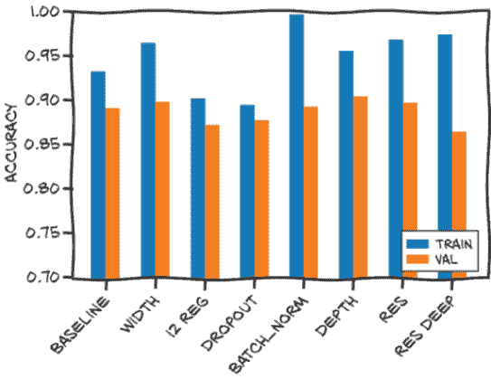

图 8.13 修改后的网络表现都相似。

### 8.5.5 它已经过时了

深度学习从业者的诅咒和祝福是神经网络架构以非常快的速度发展。这并不是说我们在本章中看到的内容一定是老派的，但对最新和最伟大的架构进行全面说明是另一本书的事情（而且它们很快就会不再是最新和最伟大的）。重要的是我们应该尽一切努力将论文背后的数学精通地转化为实际的 PyTorch 代码，或者至少理解其他人为了相同目的编写的代码。在最近的几章中，您已经希望积累了一些将想法转化为 PyTorch 中实现模型的基本技能。

## 8.6 结论

经过相当多的工作，我们现在有一个模型，我们的虚构朋友简可以用来过滤她博客中的图像。我们所要做的就是拿到一张进入的图像，裁剪并调整大小为 32 × 32，看看模型对此有何看法。诚然，我们只解决了问题的一部分，但这本身就是一段旅程。

我们只解决了问题的一部分，因为还有一些有趣的未知问题我们仍然需要面对。其中一个是从较大图像中挑选出鸟或飞机。在图像中创建物体周围的边界框是我们这种模型无法做到的。

另一个障碍是当猫弗雷德走到摄像头前会发生什么。我们的模型会毫不犹豫地发表关于猫有多像鸟的观点！它会高兴地输出“飞机”或“鸟”，也许概率为 0.99。这种对远离训练分布的样本非常自信的问题被称为*过度泛化*。当我们将一个（假设良好的）模型投入生产中时，我们无法真正信任输入的情况下，这是主要问题之一（遗憾的是，这是大多数真实世界案例）。

在本章中，我们已经在 PyTorch 中构建了合理的、可工作的模型，可以从图像中学习。我们以一种有助于我们建立对卷积网络直觉的方式来做到这一点。我们还探讨了如何使我们的模型更宽更深，同时控制过拟合等影响。虽然我们仍然只是触及了表面，但我们已经比上一章更进一步了。我们现在有了一个坚实的基础，可以面对在深度学习项目中遇到的挑战。

现在我们熟悉了 PyTorch 的约定和常见特性，我们准备着手处理更大的问题。我们将从每一章或两章呈现一个小问题的模式转变为花费多章来解决一个更大的、现实世界的问题。第 2 部分以肺癌的自动检测作为一个持续的例子；我们将从熟悉 PyTorch API 到能够使用 PyTorch 实现整个项目。我们将在下一章开始从高层次解释问题，然后深入了解我们将要使用的数据的细节。

## 8.7 练习

1.  更改我们的模型，使用`kernel_size=5`传递给`nn.Conv2d`构造函数的 5 × 5 内核。

    1.  这种变化对模型中的参数数量有什么影响？

    1.  这种变化是改善还是恶化了过拟合？

    1.  阅读[`pytorch.org/docs/stable/nn.html#conv2d`](https://pytorch.org/docs/stable/nn.html#conv2d)。

    1.  你能描述`kernel_size=(1,3)`会做什么吗？

    1.  这种卷积核会如何影响模型的行为？

1.  你能找到一张既不含鸟也不含飞机的图像，但模型声称其中有一个或另一个的置信度超过 95%吗？

    1.  你能手动编辑一张中性图像，使其更像飞机吗？

    1.  你能手动编辑一张飞机图像，以欺骗模型报告有鸟吗？

    1.  这些任务随着容量较小的网络变得更容易吗？容量更大呢？

## 8.8 总结

+   卷积可用作处理图像的前馈网络的线性操作。使用卷积可以产生参数更少的网络，利用局部性并具有平移不变性。

+   将多个卷积层及其激活函数依次堆叠在一起，并在它们之间使用最大池化，可以使卷积应用于越来越小的特征图像，从而在深度增加时有效地考虑输入图像更大部分的空间关系。

+   任何`nn.Module`子类都可以递归收集并返回其自身和其子类的参数。这种技术可用于计数参数、将其馈送到优化器中或检查其值。

+   函数式 API 提供了不依赖于存储内部状态的模块。它用于不持有参数且因此不被训练的操作。

+   训练后，模型的参数可以保存到磁盘并用一行代码加载回来。

* * *

¹PyTorch 的卷积与数学的卷积之间存在微妙的差异：一个参数的符号被翻转了。如果我们情绪低落，我们可以称 PyTorch 的卷积为*离散互相关*。

² 这是*彩票票据假设*的一部分：许多卷积核将像丢失的彩票一样有用。参见 Jonathan Frankle 和 Michael Carbin，“The Lottery Ticket Hypothesis: Finding Sparse, Trainable Neural Networks,” 2019，[`arxiv.org/abs/1803.03635`](https://arxiv.org/abs/1803.03635)。

³ 对于偶数大小的卷积核，我们需要在左右（和上下）填充不同数量。PyTorch 本身不提供在卷积中执行此操作的功能，但函数`torch.nn.functional.pad`可以处理。但最好保持奇数大小的卷积核；偶数大小的卷积核只是奇数大小的。

⁴ 无法在`nn.Sequential`内执行此类操作是 PyTorch 作者明确的设计选择，并且长时间保持不变；请参阅@soumith 在[`github.com/pytorch/pytorch/issues/2486`](https://github.com/pytorch/pytorch/issues/2486)中的评论。最近，PyTorch 增加了一个`nn.Flatten`层。

⁵ 我们可以从 PyTorch 1.3 开始使用`nn.Flatten`。

⁶ 由第一个卷积定义的像素级线性映射中的维度在 Jeremy Howard 的 fast.ai 课程中得到强调（[`www.fast.ai`](https://www.fast.ai)）。

⁷ 在深度学习之外且比其更古老的，将投影到高维空间然后进行概念上更简单（比线性更简单）的机器学习通常被称为*核技巧*。通道数量的初始增加可以被视为一种类似的现象，但在嵌入的巧妙性和处理嵌入的模型的简单性之间达到不同的平衡。

⁸ 数据加载器有一个`pin_memory`选项，将导致数据加载器使用固定到 GPU 的内存，目的是加快传输速度。然而，我们是否获得了什么是不确定的，因此我们不会在这里追求这个。

⁹ 我们将重点放在 L2 正则化上。L1 正则化--在更一般的统计文献中因其在 Lasso 中的应用而广为流行--具有产生稀疏训练权重的吸引人特性。

¹⁰ 该主题的开创性论文是由 X. Glorot 和 Y. Bengio 撰写的：“理解训练深度前馈神经网络的困难”（2010 年），介绍了 PyTorch 的*Xavier*初始化（[` mng.bz/vxz7`](http://mng.bz/vxz7)）。我们提到的 ResNet 论文也扩展了这个主题，提供了之前使用的 Kaiming 初始化。最近，H. Zhang 等人对初始化进行了调整，以至于在他们对非常深的残差网络进行实验时不需要批量归一化（[`arxiv.org/abs/1901.09321`](https://arxiv.org/abs/1901.09321)）。
