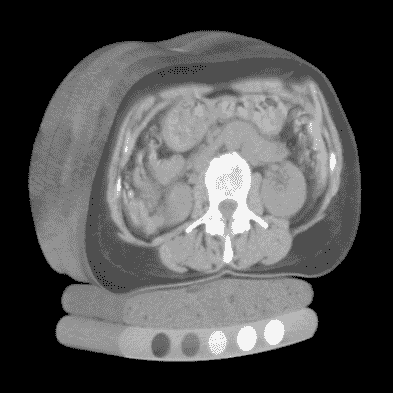
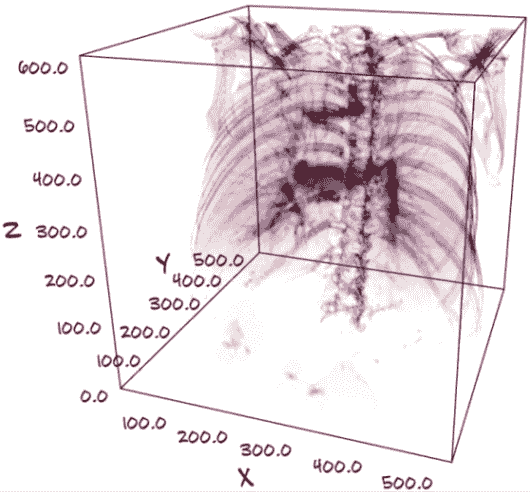
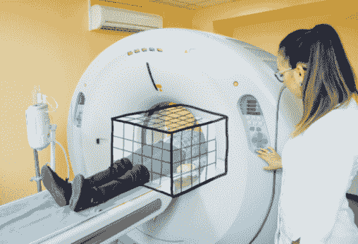
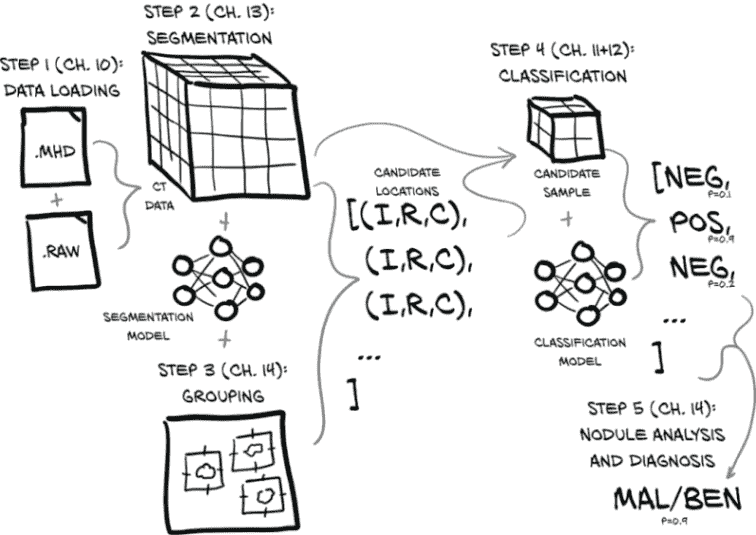
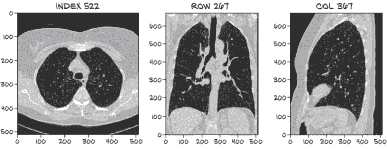
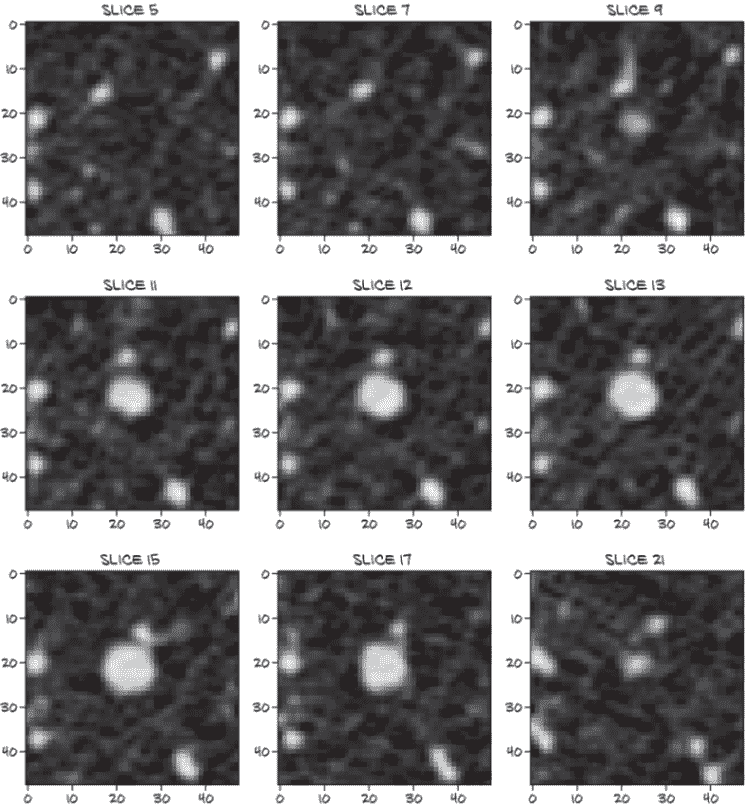
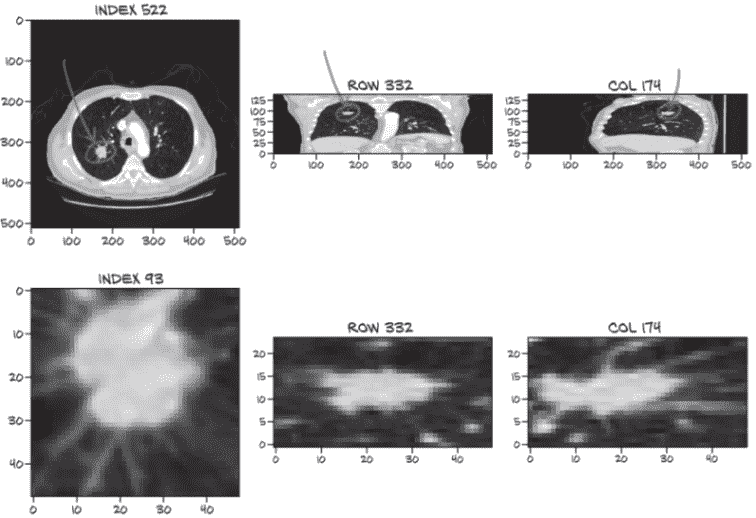

# 九、使用 PyTorch 来对抗癌症

本章涵盖内容

+   将一个大问题分解为更小、更容易的问题

+   探索复杂深度学习问题的约束，并决定结构和方法

+   下载训练数据

本章有两个主要目标。我们将首先介绍本书第二部分的整体计划，以便我们对接下来的各个章节将要构建的更大范围有一个坚实的概念。在第十章中，我们将开始构建数据解析和数据操作例程，这些例程将在第十一章中训练我们的第一个模型时产生要消耗的数据。为了很好地完成即将到来的章节所需的工作，我们还将利用本章来介绍我们的项目将运行的一些背景：我们将讨论数据格式、数据来源，并探索我们问题领域对我们施加的约束。习惯执行这些任务，因为你将不得不为任何严肃的深度学习项目做这些任务！

## 9.1 用例简介

本书这一部分的目标是为您提供处理事情不顺利的工具，这种情况比第 1 部分可能让你相信的更常见。我们无法预测每种失败情况或涵盖每种调试技术，但希望我们能给你足够的东西，让你在遇到新的障碍时不感到困惑。同样，我们希望帮助您避免您自己的项目出现情况，即当您的项目表现不佳时，您不知道接下来该做什么。相反，我们希望您的想法列表会很长，挑战将是如何优先考虑！

为了呈现这些想法和技术，我们需要一个具有一些细微差别和相当重要性的背景。我们选择使用仅通过患者胸部的 CT 扫描作为输入来自动检测肺部恶性肿瘤。我们将专注于技术挑战而不是人类影响，但不要误解--即使从工程角度来看，第 2 部分也需要比第 1 部分更严肃、更有结构的方法才能使项目成功。

*注意* CT 扫描本质上是 3D X 射线，表示为单通道数据的 3D 数组。我们很快会更详细地讨论它们。

正如你可能已经猜到的，本章的标题更多是引人注目的、暗示夸张，而不是严肃的声明意图。让我们准确一点：本书的这一部分的项目将以人体躯干的三维 CT 扫描作为输入，并输出怀疑的恶性肿瘤的位置，如果有的话。

早期检测肺癌对生存率有巨大影响，但手动进行这项工作很困难，特别是在任何全面、整体人口意义上。目前，审查数据的工作必须由经过高度训练的专家执行，需要极其细致的注意，而且主要是由不存在癌症的情况主导。

做好这项工作就像被放在 100 堆草垛前，并被告知：“确定这些中哪些，如果有的话，包含一根针。”这样搜索会导致潜在的警告信号被忽略，特别是在早期阶段，提示更加微妙。人类大脑并不适合做那种单调的工作。当然，这就是深度学习发挥作用的地方。

自动化这个过程将使我们在一个不合作的环境中获得经验，在那里我们必须从头开始做更多的工作，而且可能会遇到更少的问题容易解决。不过，我们一起努力，最终会成功的！一旦你读完第二部分，我们相信你就准备好开始解决你自己选择的一个真实且未解决的问题了。

我们选择了肺部肿瘤检测这个问题，有几个原因。主要原因是这个问题本身尚未解决！这很重要，因为我们想要明确表明你可以使用 PyTorch 有效地解决尖端项目。我们希望这能增加你对 PyTorch 作为框架以及作为开发者的信心。这个问题空间的另一个好处是，虽然它尚未解决，但最近许多团队一直在关注它，并且已经看到了有希望的结果。这意味着这个挑战可能正好处于我们集体解决能力的边缘；我们不会浪费时间在一个实际上离合理解决方案还有几十年的问题上。对这个问题的关注也导致了许多高质量的论文和开源项目，这些是灵感和想法的重要来源。如果你有兴趣继续改进我们创建的解决方案，这将在我们完成书的第二部分后非常有帮助。我们将在第十四章提供一些额外信息的链接。

本书的这一部分将继续专注于检测肺部肿瘤的问题，但我们将教授的技能是通用的。学习如何调查、预处理和呈现数据以进行训练对于你正在进行的任何项目都很重要。虽然我们将在肺部肿瘤的具体背景下涵盖预处理，但总体思路是*这是你应该为你的项目做好准备的*。同样，建立训练循环、获得正确的性能指标以及将项目的模型整合到最终应用程序中都是我们将在第 9 至 14 章中使用的通用技能。

*注意* 尽管第 2 部分的最终结果将有效，但输出不够准确以用于临床。我们专注于将其作为*教授 PyTorch*的激励示例，而不是利用每一个技巧来解决问题。

## 9.2 准备一个大型项目

这个项目将建立在第 1 部分学到的基础技能之上。特别是，从第八章开始的模型构建内容将直接相关。重复的卷积层后跟着一个分辨率降低的下采样层仍将构成我们模型的大部分。然而，我们将使用 3D 数据作为我们模型的输入。这在概念上类似于第 1 部分最后几章中使用的 2D 图像数据，但我们将无法依赖 PyTorch 生态系统中所有 2D 特定工具。

我们在第八章使用卷积模型的工作与第 2 部分中将要做的工作之间的主要区别与我们投入到模型之外的事情有关。在第八章，我们使用一个提供的现成数据集，并且在将数据馈送到模型进行分类之前几乎没有进行数据操作。我们几乎所有的时间和注意力都花在构建模型本身上，而现在我们甚至不会在第十一章开始设计我们的两个模型架构之一。这是由于有非标准数据，没有预先构建的库可以随时提供适合插入模型的训练样本。我们将不得不了解我们的数据并自己实现相当多的内容。

即使完成了这些工作，这也不会成为将 CT 转换为张量，将其馈送到神经网络中，并在另一侧得到答案的情况。对于这样的真实用例，一个可行的方法将更加复杂，以考虑到限制数据可用性、有限的计算资源以及我们设计有效模型的能力的限制因素。请记住这一点，因为我们将逐步解释我们项目架构的高级概述。

谈到有限的计算资源，第 2 部分将需要访问 GPU 才能实现合理的训练速度，最好是至少具有 8 GB 的 RAM。尝试在 CPU 上训练我们将构建的模型可能需要几周时间！¹ 如果你手头没有 GPU，我们在第十四章提供了预训练模型；那里的结节分析脚本可能可以在一夜之间运行。虽然我们不想将本书与专有服务绑定，但值得注意的是，目前，Colaboratory（[`colab.research.google.com`](https://colab.research.google.com)）提供免费的 GPU 实例，可能会有用。PyTorch 甚至已经预安装！你还需要至少 220 GB 的可用磁盘空间来存储原始训练数据、缓存数据和训练模型。

*注意* 第 2 部分中呈现的许多代码示例省略了复杂的细节。与其用日志记录、错误处理和边缘情况来混淆示例，本书的文本只包含表达讨论中核心思想的代码。完整的可运行代码示例可以在本书的网站（[www.manning.com/books/deep-learning-with-pytorch](https://www.manning.com/books/deep-learning-with-pytorch)）和 GitHub（[`github.com/deep-learning-with-pytorch/dlwpt-code`](https://github.com/deep-learning-with-pytorch/dlwpt-code)）上找到。

好的，我们已经确定了这是一个困难、多方面的问题，但我们要怎么解决呢？我们不是要查看整个 CT 扫描以寻找肿瘤或其潜在恶性，而是要解决一系列更简单的问题，这些问题将组合在一起提供我们感兴趣的端到端结果。就像工厂的装配线一样，每个步骤都会接收原材料（数据）和/或前一步骤的输出，进行一些处理，并将结果交给下一个站点。并不是每个问题都需要这样解决，但将问题分解成独立解决的部分通常是一个很好的开始。即使最终发现这种方法对于特定项目来说是错误的，但在处理各个部分时，我们可能已经学到足够多的知识，以便知道如何重新构建我们的方法以取得成功。

在我们深入了解如何分解问题的细节之前，我们需要了解一些关于医学领域的细节。虽然代码清单会告诉你我们在做什么，但了解放射肿瘤学将解释为什么我们这样做。无论是哪个领域，了解问题空间都是至关重要的。深度学习很强大，但它不是魔法，盲目地将其应用于非平凡问题可能会失败。相反，我们必须将对空间的洞察力与对神经网络行为的直觉相结合。从那里，有纪律的实验和改进应该为我们提供足够的信息，以便找到可行的解决方案。

## 9.3 什么是 CT 扫描，确切地说？

在我们深入项目之前，我们需要花点时间解释一下什么是 CT 扫描。我们将广泛使用 CT 扫描数据作为我们项目的主要数据格式，因此对数据格式的优势、劣势和基本特性有一个工作理解将对其有效利用至关重要。我们之前指出的关键点是：CT 扫描本质上是 3D X 射线，表示为单通道数据的 3D 数组。正如我们可能从第四章中记得的那样，这就像一组堆叠的灰度 PNG 图像。

体素

一个体素是熟悉的二维像素的三维等价物。它包围着空间的一个体积（因此，“体积像素”），而不是一个区域，并且通常排列在一个三维网格中以表示数据场。每个维度都将与之关联一个可测量的距离。通常，体素是立方体的，但在本章中，我们将处理的是长方体体素。

除了医学数据，我们还可以在流体模拟、从 2D 图像重建的 3D 场景、用于自动驾驶汽车的光探测与测距（LIDAR）数据等问题领域看到类似的体素数据。这些领域都有各自的特点和微妙之处，虽然我们将在这里介绍的 API 通常适用，但如果我们想要有效地使用这些 API，我们也必须了解我们使用的数据的性质。

每个 CT 扫描的体素都有一个数值，大致对应于内部物质的平均质量密度。大多数数据的可视化显示高密度材料如骨骼和金属植入物为白色，低密度的空气和肺组织为黑色，脂肪和组织为各种灰色。再次，这看起来与 X 射线有些相似，但也有一些关键区别。

CT 扫描和 X 射线之间的主要区别在于，X 射线是将 3D 强度（在本例中为组织和骨密度）投影到 2D 平面上，而 CT 扫描保留了数据的第三维。这使我们能够以各种方式呈现数据：例如，作为一个灰度实体，我们可以在图 9.1 中看到。

图 9.1 人体躯干的 CT 扫描，从上到下依次显示皮肤、器官、脊柱和患者支撑床。来源：[`mng.bz/04r6`](http://mng.bz/04r6); Mindways CT Software / CC BY-SA 3.0 ([`creativecommons.org/licenses/by-sa/3.0/deed.en`](https://creativecommons.org/licenses/by-sa/3.0/deed.en))。

*注意* CT 扫描实际上测量的是辐射密度，这是受检材料的质量密度和原子序数的函数。在这里，区分并不相关，因为无论输入的确切单位是什么，模型都会处理和学习 CT 数据。

这种 3D 表示还允许我们通过隐藏我们不感兴趣的组织类型来“看到”主体内部。例如，我们可以将数据呈现为 3D，并将可见性限制在骨骼和肺组织，如图 9.2 所示。

图 9.2 显示了肋骨、脊柱和肺结构的 CT 扫描

与 X 射线相比，CT 扫描要难得多，因为这需要像图 9.3 中所示的那种机器，通常新机器的成本高达一百万美元，并且需要受过培训的工作人员来操作。大多数医院和一些设备齐全的诊所都有 CT 扫描仪，但它们远不及 X 射线机器普及。这与患者隐私规定结合在一起，可能会使得获取 CT 扫描有些困难，除非已经有人做好了收集和整理这些数据的工作。

图 9.3 还显示了 CT 扫描中包含区域的示例边界框。患者躺在的床来回移动，使扫描仪能够成像患者的多个切片，从而填充边界框。扫描仪较暗的中心环是实际成像设备的位置。

图 9.3 一个患者在 CT 扫描仪内，CT 扫描的边界框叠加显示。除了库存照片外，患者在机器内通常不穿着便装。

CT 扫描与 X 射线之间的最后一个区别是数据仅以数字格式存在。*CT*代表*计算机断层扫描*([`en.wikipedia.org/wiki/CT_scan#Process`](https://en.wikipedia.org/wiki/CT_scan#Process))。扫描过程的原始输出对人眼来说并不特别有意义，必须由计算机正确重新解释为我们可以理解的内容。扫描时 CT 扫描仪的设置会对结果数据产生很大影响。

尽管这些信息可能看起来并不特别相关，但实际上我们学到了一些东西：从图 9.3 中，我们可以看到 CT 扫描仪测量头到脚轴向距离的方式与其他两个轴不同。患者实际上沿着这个轴移动！这解释了（或至少是一个强烈的暗示）为什么我们的体素可能不是立方体，并且也与我们在第十二章中如何处理数据有关。这是一个很好的例子，说明我们需要了解我们的问题领域，如果要有效地选择如何解决问题。在开始处理自己的项目时，确保您对数据的细节进行相同的调查。

## 9.4 项目：肺癌端到端检测器

现在我们已经掌握了 CT 扫描的基础知识，让我们讨论一下我们项目的结构。大部分磁盘上的字节将用于存储包含密度信息的 CT 扫描的 3D 数组，我们的模型将主要消耗这些 3D 数组的各种子切片。我们将使用五个主要步骤，从检查整个胸部 CT 扫描到给患者做出肺癌诊断。

我们在图 9.4 中展示的完整端到端解决方案将加载 CT 数据文件以生成包含完整 3D 扫描的`Ct`实例，将其与执行*分割*（标记感兴趣的体素）的模块结合，然后将有趣的体素分组成小块，以寻找候选*结节*。

结节

肺部由增殖细胞组成的组织块称为肿瘤。肿瘤可以是良性的，也可以是恶性的，此时也被称为癌症。肺部的小肿瘤（仅几毫米宽）称为结节。大约 40%的肺结节最终被证实是恶性的--小癌症。尽早发现这些对于医学影像非常重要，这取决于我们正在研究的这种类型的医学影像。

图 9.4 完整胸部 CT 扫描并确定患者是否患有恶性肿瘤的端到端过程

结节位置与 CT 体素数据结合，产生结节候选，然后可以由我们的结节分类模型检查它们是否实际上是结节，最终是否是恶性的。后一项任务特别困难，因为恶性可能仅从 CT 成像中无法明显看出，但我们将看看我们能走多远。最后，每个单独的结节分类可以组合成整体患者诊断。

更详细地说，我们将执行以下操作：

1.  将我们的原始 CT 扫描数据加载到一个可以与 PyTorch 一起使用的形式中。将原始数据放入 PyTorch 可用的形式将是您面临的任何项目的第一步。对于 2D 图像数据，这个过程稍微复杂一些，对于非图像数据则更简单。

1.  使用 PyTorch 识别肺部潜在肿瘤的体素，实现一种称为*分割*的技术。这大致相当于生成应该输入到我们第 3 步分类器中的区域的热图。这将使我们能够专注于肺部内部的潜在肿瘤，并忽略大片无趣的解剖结构（例如，一个人不能在胃部患肺癌）。

    通常，在学习时能够专注于单一小任务是最好的。随着经验的积累，有些情况下更复杂的模型结构可以产生最优结果（例如，我们在第二章看到的 GAN 游戏），但是从头开始设计这些模型需要对基本构建模块有广泛的掌握。先学会走路，再跑步，等等。

1.  将有趣的体素分组成块：也就是候选结节（有关结节的更多信息，请参见图 9.5）。在这里，我们将找到热图上每个热点的粗略中心。

    每个结节可以通过其中心点的索引、行和列来定位。我们这样做是为了向最终分类器提供一个简单、受限的问题。将体素分组不会直接涉及 PyTorch，这就是为什么我们将其拆分为一个单独的步骤。通常，在处理多步解决方案时，会在项目的较大、由深度学习驱动的部分之间添加非深度学习的连接步骤。

1.  使用 3D 卷积将候选结节分类为实际结节或非结节。

    这将类似于我们在第八章中介绍的 2D 卷积。确定候选结构中肿瘤性质的特征是与问题中的肿瘤局部相关的，因此这种方法应该在限制输入数据大小和排除相关信息之间提供良好的平衡。做出这种限制范围的决定可以使每个单独的任务受限，这有助于在故障排除时限制要检查的事物数量。

1.  使用组合的每个结节分类来诊断患者。

    与上一步中的结节分类器类似，我们将尝试仅基于成像数据确定结节是良性还是恶性。我们将简单地取每个肿瘤恶性预测的最大值，因为只需要一个肿瘤是恶性，患者就会患癌症。其他项目可能希望使用不同的方式将每个实例的预测聚合成一个文件分数。在这里，我们问的是，“有什么可疑的吗？”所以最大值是一个很好的聚合方式。如果我们正在寻找定量信息，比如“A 型组织与 B 型组织的比例”，我们可能会选择适当的平均值。

肩上的巨人

当我们决定采用这种五步方法时，我们站在巨人的肩膀上。我们将在第十四章更详细地讨论这些巨人及其工作。我们事先并没有特别的理由认为这种项目结构对这个问题会很有效；相反，我们依赖于那些实际实施过类似事物并报告成功的人。在转向不同领域时，预计需要进行实验以找到可行的方法，但始终尝试从该领域的早期努力和那些在类似领域工作并发现可能转移的事物的人那里学习。走出去，寻找他人所做的事情，并将其作为一个基准。同时，避免盲目获取代码并运行，因为您需要完全理解您正在运行的代码，以便利用结果为自己取得进展。

图 9.4 仅描述了在构建和训练所有必要模型后通过系统的最终路径。训练相关模型所需的实际工作将在我们接近实施每个步骤时详细说明。

我们将用于训练的数据为步骤 3 和 4 提供了人工注释的输出。这使我们可以将步骤 2 和 3（识别体素并将其分组为结节候选）几乎视为与步骤 4（结节候选分类）分开的项目。人类专家已经用结节位置注释了数据，因此我们可以按照自己喜欢的顺序处理步骤 2 和 3 或步骤 4。

我们将首先处理步骤 1（数据加载），然后跳到步骤 4，然后再回来实现步骤 2 和 3，因为步骤 4（分类）需要一种类似于我们在第八章中使用的方法，即使用多个卷积和池化层来聚合空间信息，然后将其馈送到线性分类器中。一旦我们掌握了分类模型，我们就可以开始处理步骤 2（分割）。由于分割是更复杂的主题，我们希望在不必同时学习分割和 CT 扫描以及恶性肿瘤的基础知识的情况下解决它。相反，我们将在处理一个更熟悉的分类问题的同时探索癌症检测领域。

从问题中间开始并逐步解决问题的方法可能看起来很奇怪。从第 1 步开始逐步向前推进会更直观。然而，能够将问题分解并独立解决各个步骤是有用的，因为这样可以鼓励更模块化的解决方案；此外，将工作负载在小团队成员之间划分会更容易。此外，实际的临床用户可能更喜欢一个系统，可以标记可疑的结节供审查，而不是提供单一的二进制诊断。将我们的模块化解决方案适应不同的用例可能会比如果我们采用了单一的、自上而下的系统更容易。

当我们逐步实施每一步时，我们将详细介绍肺部肿瘤，以及展示大量关于 CT 扫描的细节。虽然这可能看起来与专注于 PyTorch 的书籍无关，但我们这样做是为了让你开始对问题空间产生直觉。这是至关重要的，因为所有可能的解决方案和方法的空间太大，无法有效地编码、训练和评估。

如果我们在做一个不同的项目（比如你在完成这本书后要处理的项目），我们仍然需要进行调查来了解数据和问题空间。也许你对卫星地图制作感兴趣，你的下一个项目需要处理从轨道拍摄的地球图片。你需要询问关于收集的波长的问题--你只得到正常的 RGB 吗，还是更奇特的东西？红外线或紫外线呢？此外，根据白天时间或者成像位置不直接在卫星正上方，可能会使图像倾斜。图像是否需要校正？

即使你假设的*第三个*项目的数据类型保持不变，你将要处理的领域可能会改变事情，可能会发生显著变化。处理自动驾驶汽车的相机输出仍然涉及 2D 图像，但复杂性和注意事项却大不相同。例如，映射卫星不太可能需要担心太阳照射到相机中，或者镜头上沾上泥巴！

我们必须能够运用直觉来引导我们对潜在优化和改进的调查。这对于深度学习项目来说是真实的，我们将在第 2 部分中练习使用我们的直觉。所以，让我们这样做。快速退后一步，做一个直觉检查。你的直觉对这种方法有什么看法？对你来说是否过于复杂？

### 9.4.1 为什么我们不能简单地将数据输入神经网络直到它工作？

在阅读最后一节之后，如果你认为，“这和第八章完全不同！”我们并不会责怪你。你可能会想知道为什么我们有两种不同的模型架构，或者为什么整体数据流如此复杂。嗯，我们之所以采取这种方法与第八章不同是有原因的。自动化这个任务很困难，人们还没有完全弄清楚。这种困难转化为复杂性；一旦我们作为一个社会彻底解决了这个问题，可能会有一个现成的库包，我们可以直接使用，但我们还没有达到那一步。

为什么会这么困难呢？

首先，大部分 CT 扫描基本上与回答“这个患者是否患有恶性肿瘤？”这个问题无关。这是很直观的，因为患者身体的绝大部分组织都是健康的细胞。在有恶性肿瘤的情况下，CT 中高达 99.9999%的体素仍然不是癌症。这个比例相当于高清电视上某处两个像素的颜色错误或者一本小说书架上一个拼错的单词。

你能够在图 9.5 的三个视图中识别被标记为结节的白点吗？²

如果你需要提示，索引、行和列值可以帮助找到相关的密集组织块。你认为只有这些图像（这意味着*只有*图像--没有索引、行和列信息！）你能找出肿瘤的相关特性吗？如果你被给予整个 3D 扫描，而不仅仅是与扫描的有趣部分相交的三个切片呢？

*注意* 如果你找不到肿瘤，不要担心！我们试图说明这些数据有多微妙--难以在视觉上识别是这个例子的全部意义。

图 9.5 一张 CT 扫描，大约有 1,000 个对于未经训练的眼睛看起来像肿瘤的结构。当由人类专家审查时，只有一个被确定为结节。其余的是正常的解剖结构，如血管、病变和其他无问题的肿块。

你可能在其他地方看到端到端方法在对象检测和分类中非常成功。TorchVision 包括像 Fast R-CNN/Mask R-CNN 这样的端到端模型，但这些模型通常在数十万张图像上进行训练，而这些数据集并不受稀有类别样本数量的限制。我们将使用的项目架构有利于在更适量的数据上表现良好。因此，虽然从理论上讲，可以向神经网络投入任意大量的数据，直到它学会寻找传说中的丢失的针，以及如何忽略干草，但实际上收集足够的数据并等待足够长的时间来正确训练网络是不现实的。这不会是*最佳*方法，因为结果很差，大多数读者根本无法获得计算资源来实现它。

要想得出最佳解决方案，我们可以研究已被证明能够更好地端到端集成数据的模型设计。这些复杂的设计能够产生高质量的结果，但它们并不是*最佳*，因为要理解它们背后的设计决策需要先掌握基本概念。这使得这些先进模型在教授这些基本概念时不是很好的选择！

这并不是说我们的多步设计是*最佳*方法，因为“最佳”只是相对于我们选择用来评估方法的标准而言。有*许多*“最佳”方法，就像我们在项目中工作时可能有许多目标一样。我们的自包含、多步方法也有一些缺点。

回想一下第二章的 GAN 游戏。在那里，我们有两个网络合作，制作出老大师艺术家的逼真赝品。艺术家会制作一个候选作品，学者会对其进行评论，给予艺术家如何改进的反馈。用技术术语来说，模型的结构允许梯度从最终分类器（假或真）传播到项目的最早部分（艺术家）。

我们解决问题的方法不会使用端到端梯度反向传播直接优化我们的最终目标。相反，我们将分别优化问题的离散块，因为我们的分割模型和分类模型不会同时训练。这可能会限制我们解决方案的最高效果，但我们认为这将带来更好的学习体验。

我们认为，能够一次专注于一个步骤使我们能够放大并集中精力学习的新技能数量更少。我们的两个模型将专注于执行一个任务。就像人类放射科医生在逐层查看 CT 切片时一样，如果范围被很好地限定，训练工作就会变得更容易。我们还希望提供能够对数据进行丰富操作的工具。能够放大并专注于特定位置的细节将对训练模型的整体生产率产生巨大影响，而不是一次查看整个图像。我们的分割模型被迫消耗整个图像，但我们将构建结构，使我们的分类模型获得感兴趣区域的放大视图。

第 3 步（分组）将生成数据，第 4 步（分类）将消耗类似于图 9.6 中包含肿瘤顺序横截面的图像。这幅图像是（潜在恶性，或至少不确定）肿瘤的近距离视图，我们将训练第 4 步模型识别，并训练第 5 步模型将其分类为良性或恶性。对于未经训练的眼睛（或未经训练的卷积网络）来说，这个肿块可能看起来毫无特征，但在这个样本中识别恶性的预警信号至少比消耗我们之前看到的整个 CT 要容易得多。我们下一章的代码将提供生成类似图 9.6 的放大结节图像的例程。

图 9.6 CT 扫描中肿瘤的近距离、多层切片裁剪

我们将在第十章中进行第 1 步数据加载工作，第十一章和第十二章将专注于解决分类这些结节的问题。之后，我们将回到第十三章工作于第 2 步（使用分割找到候选肿瘤），然后我们将在第十四章中结束本书的第 2 部分，通过实现第 3 步（分组）和第 5 步（结节分析和诊断）的端到端项目。

*注意* CT 的标准呈现将上部放在图像的顶部（基本上，头向上），但 CT 按顺序排列其切片，使第一切片是下部（向脚）。因此，Matplotlib 会颠倒图像，除非我们注意翻转它们。由于这种翻转对我们的模型并不重要，我们不会在原始数据和模型之间增加代码路径的复杂性，但我们会在渲染代码中添加翻转以使图像正面朝上。有关 CT 坐标系统的更多信息，请参见第 10.4 节。

让我们在图 9.7 中重复我们的高层概述。

图 9.7 完成全胸 CT 扫描并确定患者是否患有恶性肿瘤的端到端过程

### 9.4.2 什么是结节？

正如我们所说的，为了充分了解我们的数据以有效使用它，我们需要学习一些关于癌症和放射肿瘤学的具体知识。我们需要了解的最后一件重要事情是什么是*结节*。简单来说，结节是可能出现在某人肺部内部的无数肿块和隆起之一。有些从患者健康角度来看是有问题的；有些则不是。精确的定义将结节的大小限制在 3 厘米以下，更大的肿块被称为*肺块*；但我们将使用*结节*来交替使用所有这样的解剖结构，因为这是一个相对任意的分界线，我们将使用相同的代码路径处理 3 厘米两侧的肿块。肺部的小肿块--结节--可能是良性或恶性肿瘤（也称为*癌症*）。从放射学的角度来看，结节与其他有各种原因的肿块非常相似：感染、炎症、血液供应问题、畸形血管以及除肿瘤外的其他疾病。

关键部分在于：我们试图检测的癌症将*始终*是结节，要么悬浮在肺部非密集组织中，要么附着在肺壁上。这意味着我们可以将我们的分类器限制在仅检查结节，而不是让它检查所有组织。能够限制预期输入范围将有助于我们的分类器学习手头的任务。

这是另一个例子，说明我们将使用的基础深度学习技术是通用的，但不能盲目应用。我们需要了解我们所从事的领域，以做出对我们有利的选择。

在图 9.8 中，我们可以看到一个恶性结节的典型例子。我们关注的最小结节直径仅几毫米，尽管图 9.8 中的结节较大。正如我们在本章前面讨论的那样，这使得最小结节大约比整个 CT 扫描小一百万倍。患者检测到的结节中超过一半不是恶性的。

图 9.8 一张显示恶性结节与其他结节视觉差异的 CT 扫描

### 9.4.3 我们的数据来源：LUNA 大挑战

我们刚刚查看的 CT 扫描来自 LUNA（LUng Nodule Analysis）大挑战。LUNA 大挑战是一个开放数据集与患者 CT 扫描（许多带有肺结节的）高质量标签的结合，以及对数据的分类器的公开排名。有一种公开分享医学数据集用于研究和分析的文化；对这些数据的开放访问使研究人员能够在不必在机构之间签订正式研究协议的情况下使用、结合和对这些数据进行新颖的工作（显然，某些数据也是保密的）。LUNA 大挑战的目标是通过让团队轻松竞争排名榜上的高位来鼓励结节检测的改进。项目团队可以根据标准化标准（提供的数据集）测试其检测方法的有效性。要包含在公开排名中，团队必须提供描述项目架构、训练方法等的科学论文。这为提供进一步的想法和启发项目改进提供了很好的资源。

*注意* 许多 CT 扫描“在野外”非常混乱，因为各种扫描仪和处理程序之间存在独特性。例如，一些扫描仪通过将那些超出扫描仪视野范围的 CT 扫描区域的密度设置为负值来指示这些体素。CT 扫描也可以使用各种设置在 CT 扫描仪上获取，这可能会以微妙或截然不同的方式改变结果图像。尽管 LUNA 数据通常很干净，但如果您整合其他数据源，请务必检查您的假设。

我们将使用 LUNA 2016 数据集。LUNA 网站（[`luna16.grand-challenge.org/Description`](https://luna16.grand-challenge.org/Description)）描述了挑战的两个轨道：第一轨道“结节检测（NDET）”大致对应于我们的第 1 步（分割）；第二轨道“假阳性减少（FPRED）”类似于我们的第 3 步（分类）。当该网站讨论“可能结节的位置”时，它正在讨论一个类似于我们将在第十三章中介绍的过程。

### 9.4.4 下载 LUNA 数据

在我们进一步探讨项目的细节之前，我们将介绍如何获取我们将使用的数据。压缩后的数据约为 60 GB，因此根据您的互联网连接速度，可能需要一段时间才能下载。解压后，它占用约 120 GB 的空间；我们还需要另外约 100 GB 的缓存空间来存储较小的数据块，以便我们可以比读取整个 CT 更快地访问它。

导航至 [`luna16.grand-challenge.org/download`](https://luna16.grand-challenge.org/download) 并注册使用电子邮件或使用 Google OAuth 登录。登录后，您应该看到两个指向 Zenodo 数据的下载链接，以及指向 Academic Torrents 的链接。无论哪个链接，数据应该是相同的。

*提示* 截至目前，luna.grand-challenge.org 域名没有链接到数据下载页面。如果您在查找下载页面时遇到问题，请仔细检查 luna16. 的域名，而不是 `luna.`，如果需要，请重新输入网址。

我们将使用的数据分为 10 个子集，分别命名为 `subset0` 到 `subset9`。解压缩每个子集，以便您有单独的子目录，如 code/data-unversioned/ part2/luna/subset0，依此类推。在 Linux 上，您将需要 `7z` 解压缩实用程序（Ubuntu 通过 `p7zip-full` 软件包提供此功能）。Windows 用户可以从 7-Zip 网站（www.7-zip.org）获取提取器。某些解压缩实用程序可能无法打开存档；如果出现错误，请确保您使用的是提取器的完整版本。

另外，您需要 candidates.csv 和 annotations.csv 文件。为了方便起见，我们已经在书的网站和 GitHub 仓库中包含了这些文件，因此它们应该已经存在于 code/data/part2/luna/*.csv 中。也可以从与数据子集相同的位置下载它们。

*注意* 如果您没有轻松获得约 220 GB 的免费磁盘空间，可以仅使用 1 或 2 个数据子集来运行示例。较小的训练集将导致模型表现得更差，但这总比完全无法运行示例要好。

一旦您拥有候选文件和至少一个已下载、解压缩并放置在正确位置的子集，您应该能够开始运行本章的示例。如果您想提前开始，可以使用 code/p2ch09_explore_data .ipynb Jupyter Notebook 来开始。否则，我们将在本章后面更深入地讨论笔记本。希望您的下载能在您开始阅读下一章之前完成！

## 9.5 结论

我们已经取得了完成项目的重大进展！您可能会觉得我们没有取得多少成就；毕竟，我们还没有实现一行代码。但请记住，当您独自处理项目时，您需要像我们在这里做的研究和准备一样。

在本章中，我们着手完成了两件事：

+   了解我们的肺癌检测项目周围的更大背景

+   勾勒出我们第二部分项目的方向和结构

如果您仍然觉得我们没有取得实质性进展，请意识到这种心态是一个陷阱--理解项目所处的领域至关重要，我们所做的设计工作将在我们继续前进时大大获益。一旦我们在第十章开始实现数据加载例程，我们将很快看到这些回报。

由于本章仅提供信息，没有任何代码，我们将暂时跳过练习。

## 9.6 总结

+   我们检测癌性结节的方法将包括五个大致步骤：数据加载、分割、分组、分类以及结节分析和诊断。

+   将我们的项目分解为更小、半独立的子项目，使得教授每个子项目变得更容易。对于未来具有不同目标的项目，可能会采用其他方法，而不同于本书的目标。

+   CT 扫描是一个包含大约 3200 万体素的强度数据的 3D 数组，大约比我们想要识别的结节大一百万倍。将模型集中在与手头任务相关的 CT 扫描裁剪部分上，将使训练得到合理结果变得更容易。

+   理解我们的数据将使编写处理数据的程序更容易，这些程序不会扭曲或破坏数据的重要方面。CT 扫描数据的数组通常不会具有立方体像素；将现实世界单位的位置信息映射到数组索引需要进行转换。CT 扫描的强度大致对应于质量密度，但使用独特的单位。

+   识别项目的关键概念，并确保它们在我们的设计中得到很好的体现是至关重要的。我们项目的大部分方面将围绕着结节展开，这些结节是肺部的小肿块，在 CT 上可以被发现，与许多其他具有类似外观的结构一起。

+   我们正在使用 LUNA Grand Challenge 数据来训练我们的模型。LUNA 数据包含 CT 扫描，以及用于分类和分组的人工注释输出。拥有高质量的数据对项目的成功有重大影响。

* * *

¹ 我们假设--我们还没有尝试过，更不用说计时了。

² 这个样本的`series_uid`是`1.3.6.1.4.1.14519.5.2.1.6279.6001.12626457893177825889037 1755354`，如果您以后想要详细查看它，这可能会很有用。

³ 例如，Retina U-Net ([`arxiv.org/pdf/1811.08661.pdf`](https://arxiv.org/pdf/1811.08661.pdf)) 和 FishNet ([`mng.bz/K240`](http://mng.bz/K240))。

⁴Eric J. Olson，“肺结节：它们可能是癌症吗？”梅奥诊所，[`mng.bz/yyge`](http://mng.bz/yyge)。

⁵ 至少如果我们想要得到像样的结果的话，是不行的。

⁶ 根据国家癌症研究所癌症术语词典：[`mng.bz/jgBP`](http://mng.bz/jgBP)。

⁷ 所需的缓存空间是按章节计算的，但一旦完成了一个章节，你可以删除缓存以释放空间。
