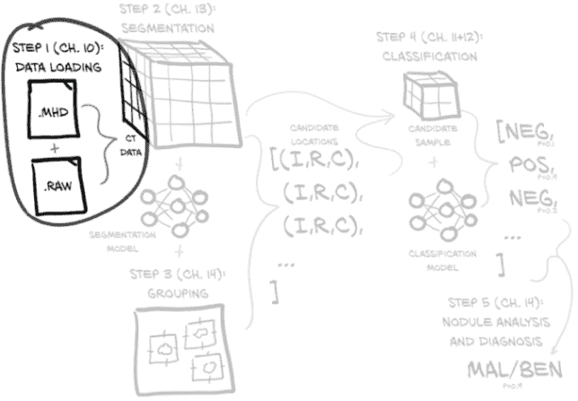
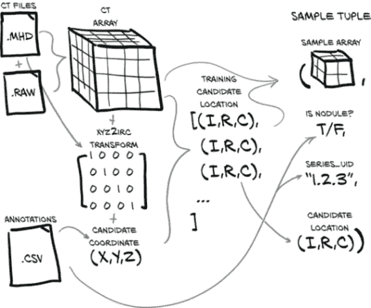
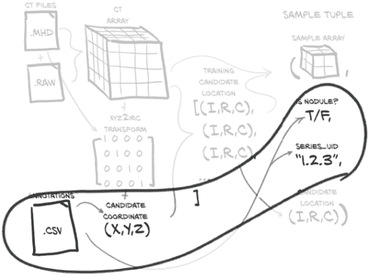
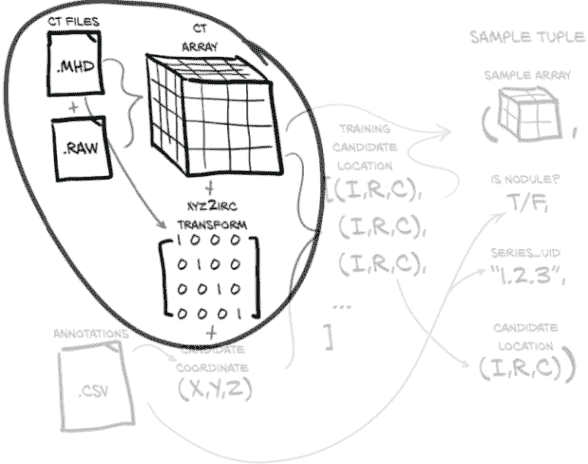
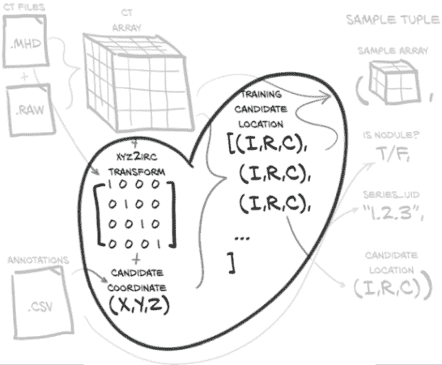
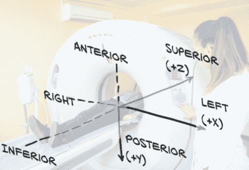
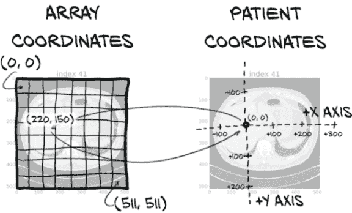
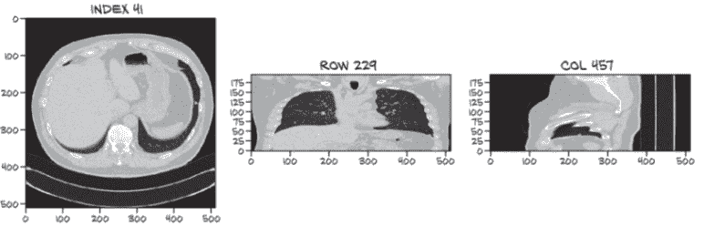
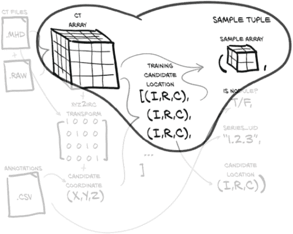

# 十、将数据源合并为统一数据集

本章涵盖

+   加载和处理原始数据文件

+   实现一个表示我们数据的 Python 类

+   将我们的数据转换为 PyTorch 可用的格式

+   可视化训练和验证数据

现在我们已经讨论了第二部分的高层目标，以及概述了数据将如何在我们的系统中流动，让我们具体了解一下这一章我们将要做什么。现在是时候为我们的原始数据实现基本的数据加载和数据处理例程了。基本上，你在工作中涉及的每个重要项目都需要类似于我们在这里介绍的内容。¹ 图 10.1 展示了我们项目的高层地图，来自第九章。我们将在本章的其余部分专注于第 1 步，数据加载。



图 10.1 我们端到端的肺癌检测项目，重点关注本章的主题：第 1 步，数据加载

我们的目标是能够根据我们的原始 CT 扫描数据和这些 CT 的注释列表生成一个训练样本。这听起来可能很简单，但在我们加载、处理和提取我们感兴趣的数据之前，需要发生很多事情。图 10.2 展示了我们需要做的工作，将我们的原始数据转换为训练样本。幸运的是，在上一章中，我们已经对我们的数据有了一些*理解*，但在这方面我们还有更多工作要做。



图 10.2 制作样本元组所需的数据转换。这些样本元组将作为我们模型训练例程的输入。

这是一个关键时刻，当我们开始将沉重的原始数据转变，如果不是成为黄金，至少也是我们的神经网络将会将其转变为黄金的材料。我们在第四章中首次讨论了这种转变的机制。

## 10.1 原始 CT 数据文件

我们的 CT 数据分为两个文件：一个包含元数据头信息的.mhd 文件，以及一个包含组成 3D 数组的原始字节的.raw 文件。每个文件的名称都以称为*系列 UID*（名称来自数字影像和通信医学[DICOM]命名法）的唯一标识符开头，用于讨论的 CT 扫描。例如，对于系列 UID 1.2.3，将有两个文件：1.2.3.mhd 和 1.2.3.raw。

我们的`Ct`类将消耗这两个文件并生成 3D 数组，以及转换矩阵，将患者坐标系（我们将在第 10.6 节中更详细地讨论）转换为数组所需的索引、行、列坐标（这些坐标在图中显示为（I，R，C），在代码中用`_irc`变量后缀表示）。现在不要为所有这些细节担心；只需记住，在我们应用这些坐标到我们的 CT 数据之前，我们需要进行一些坐标系转换。我们将根据需要探讨细节。

我们还将加载 LUNA 提供的注释数据，这将为我们提供一个结节坐标列表，每个坐标都有一个恶性标志，以及相关 CT 扫描的系列 UID。通过将结节坐标与坐标系转换信息结合起来，我们得到了我们结节中心的体素的索引、行和列。

使用（I，R，C）坐标，我们可以裁剪我们的 CT 数据的一个小的 3D 切片作为我们模型的输入。除了这个 3D 样本数组，我们必须构建我们的训练样本元组的其余部分，其中将包括样本数组、结节状态标志、系列 UID 以及该样本在结节候选 CT 列表中的索引。这个样本元组正是 PyTorch 从我们的`Dataset`子类中期望的，并代表了我们从原始原始数据到 PyTorch 张量的标准结构的桥梁的最后部分。

限制或裁剪我们的数据以避免让模型淹没在噪音中是重要的，同样重要的是确保我们不要过于激进，以至于我们的信号被裁剪掉。我们希望确保我们的数据范围行为良好，尤其是在归一化之后。裁剪数据以去除异常值可能很有用，特别是如果我们的数据容易出现极端异常值。我们还可以创建手工制作的、算法转换的输入；这被称为*特征工程*；我们在第一章中简要讨论过。通常我们会让模型大部分工作；特征工程有其用处，但在第 2 部分中我们不会使用它。

## 10.2 解析 LUNA 的注释数据

我们需要做的第一件事是开始加载我们的数据。在着手新项目时，这通常是一个很好的起点。确保我们知道如何处理原始输入是必需的，无论如何，知道我们的数据加载后会是什么样子可以帮助我们制定早期实验的结构。我们可以尝试加载单个 CT 扫描，但我们认为解析 LUNA 提供的包含每个 CT 扫描中感兴趣点信息的 CSV 文件是有意义的。正如我们在图 10.3 中看到的，我们期望获得一些坐标信息、一个指示坐标是否为结节的标志以及 CT 扫描的唯一标识符。由于 CSV 文件中的信息类型较少，而且更容易解析，我们希望它们能给我们一些线索，告诉我们一旦开始加载 CT 扫描后要寻找什么。



图 10.3 candidates.csv 中的 LUNA 注释包含 CT 系列、结节候选位置以及指示候选是否实际为结节的标志。

candidates.csv 文件包含有关所有潜在看起来像结节的肿块的信息，无论这些肿块是恶性的、良性肿瘤还是完全不同的东西。我们将以此为基础构建一个完整的候选人列表，然后将其分成训练和验证数据集。以下是 Bash shell 会话显示文件包含的内容：

```py
$ wc -l candidates.csv                     # ❶
551066 candidates.csv

$ head data/part2/luna/candidates.csv      # ❷
seriesuid,coordX,coordY,coordZ,class       # ❸
1.3...6860,-56.08,-67.85,-311.92,0
1.3...6860,53.21,-244.41,-245.17,0
1.3...6860,103.66,-121.8,-286.62,0
1.3...6860,-33.66,-72.75,-308.41,0
...

$ grep ',1$' candidates.csv | wc -l        # ❹
1351
```

❶ 统计文件中的行数

❷ 打印文件的前几行

❸ .csv 文件的第一行定义了列标题。

❹ 统计以 1 结尾的行数，表示恶性

*注意* `seriesuid` 列中的值已被省略以更好地适应打印页面。

因此，我们有 551,000 行，每行都有一个`seriesuid`（我们在代码中将其称为`series_uid`）、一些（X,Y,Z）坐标和一个`class`列，对应于结节状态（这是一个布尔值：0 表示不是实际结节的候选人，1 表示是结节的候选人，无论是恶性还是良性）。我们有 1,351 个标记为实际结节的候选人。

annotations.csv 文件包含有关被标记为结节的一些候选人的信息。我们特别关注`diameter_mm`信息：

```py
$ wc -l annotations.csv
1187 annotations.csv                           # ❶

$ head data/part2/luna/annotations.csv
seriesuid,coordX,coordY,coordZ,diameter_mm     # ❷
1.3.6...6860,-128.6994211,-175.3192718,-298.3875064,5.651470635
1.3.6...6860,103.7836509,-211.9251487,-227.12125,4.224708481
1.3.6...5208,69.63901724,-140.9445859,876.3744957,5.786347814
1.3.6...0405,-24.0138242,192.1024053,-391.0812764,8.143261683
...
```

❶ 这是与 candidates.csv 文件中不同的数字。

❷ 最后一列也不同。

我们有大约 1,200 个结节的大小信息。这很有用，因为我们可以使用它来确保我们的训练和验证数据包含了结节大小的代表性分布。如果没有这个，我们的验证集可能只包含极端值，使得看起来我们的模型表现不佳。

### 10.2.1 训练和验证集

对于任何标准的监督学习任务（分类是典型示例），我们将把数据分成训练集和验证集。我们希望确保两个集合都*代表*我们预期看到和正常处理的真实世界输入数据范围。如果任一集合与我们的真实用例有实质性不同，那么我们的模型行为很可能与我们的预期不同--我们收集的所有训练和统计数据在转移到生产使用时将不具有预测性！我们并不试图使这成为一门精确的科学，但您应该在未来的项目中留意，以确保您正在对不适合您操作环境的数据进行训练和测试。

让我们回到我们的结节。我们将按大小对它们进行排序，并取每第*N*个用于我们的验证集。这应该给我们所期望的代表性分布。不幸的是，annotations.csv 中提供的位置信息并不总是与 candidates.csv 中的坐标精确对齐：

```py
$ grep 100225287222365663678666836860 annotations.csv
1.3.6...6860,-128.6994211,-175.3192718,-298.3875064,5.651470635   # ❶
1.3.6...6860,103.7836509,-211.9251487,-227.12125,4.224708481

$ grep '100225287222365663678666836860.*,1$' candidates.csv
1.3.6...6860,104.16480444,-211.685591018,-227.011363746,1
1.3.6...6860,-128.94,-175.04,-297.87,1                            # ❶
```

❶ 这两个坐标非常接近。

如果我们从每个文件中截取相应的坐标，我们得到的是(-128.70, -175.32,-298.39)与(-128.94,-175.04,-297.87)。由于问题中的结节直径为 5 毫米，这两个点显然都是结节的“中心”，但它们并不完全对齐。决定处理这种数据不匹配是否值得并忽略该文件是完全合理的反应。然而，我们将努力使事情对齐，因为现实世界的数据集通常以这种方式不完美，并且这是您需要做的工作的一个很好的例子，以从不同的数据源中组装数据。

### 10.2.2 统一我们的注释和候选数据

现在我们知道我们的原始数据文件是什么样子的，让我们构建一个`getCandidateInfoList`函数，将所有内容串联起来。我们将使用文件顶部定义的命名元组来保存每个结节的信息。

列表 10.1 dsets.py:7

```py
from collections import namedtuple
# ... line 27
CandidateInfoTuple = namedtuple(
  'CandidateInfoTuple',
  'isNodule_bool, diameter_mm, series_uid, center_xyz',
)
```

这些元组*不是*我们的训练样本，因为它们缺少我们需要的 CT 数据块。相反，这些代表了我们正在使用的人工注释数据的经过消毒、清洁、统一的接口。将必须处理混乱数据与模型训练隔离开非常重要。否则，你的训练循环会很快变得混乱，因为你必须在本应专注于训练的代码中不断处理特殊情况和其他干扰。

*提示* 明确地将负责数据消毒的代码与项目的其余部分分开。如果需要，不要害怕重写数据一次并将其保存到磁盘。

我们的候选信息列表将包括结节状态（我们将训练模型对其进行分类）、直径（有助于在训练中获得良好的分布，因为大和小结节不会具有相同的特征）、系列（用于定位正确的 CT 扫描）、候选中心（用于在较大的 CT 中找到候选）。构建这些`NoduleInfoTuple`实例列表的函数首先使用内存缓存装饰器，然后获取磁盘上存在的文件列表。

列表 10.2 dsets.py:32

```py
@functools.lru_cache(1)                                              # ❶
def getCandidateInfoList(requireOnDisk_bool=True):                   # ❷
  mhd_list = glob.glob('data-unversioned/part2/luna/subset*/*.mhd')
  presentOnDisk_set = {os.path.split(p)[-1][:-4] for p in mhd_list}
```

❶ 标准库内存缓存

❷ requireOnDisk_bool 默认筛选掉尚未就位的数据子集中的系列。

由于解析某些数据文件可能很慢，我们将在内存中缓存此函数调用的结果。这将在以后很有用，因为我们将在未来的章节中更频繁地调用此函数。通过仔细应用内存或磁盘缓存来加速我们的数据流水线，可以在训练速度上取得一些令人印象深刻的收益。在您的项目中工作时，请留意这些机会。

之前我们说过，我们将支持使用不完整的训练数据集运行我们的训练程序，因为下载时间长且磁盘空间要求高。`requireOnDisk_bool` 参数是实现这一承诺的关键；我们正在检测哪些 LUNA 系列 UID 实际上存在并准备从磁盘加载，并且我们将使用该信息来限制我们从即将解析的 CSV 文件中使用的条目。能够通过训练循环运行我们数据的子集对于验证代码是否按预期工作很有用。通常情况下，当这样做时，模型的训练结果很差，几乎无用，但是进行日志记录、指标、模型检查点等功能的练习是有益的。

在获取候选人信息后，我们希望合并注释.csv 中的直径信息。首先，我们需要按 `series_uid` 对我们的注释进行分组，因为这是我们将用来交叉参考两个文件中每一行的第一个关键字。

代码清单 10.3 dsets.py:40，`def` `getCandidateInfoList`

```py
diameter_dict = {}
with open('data/part2/luna/annotations.csv', "r") as f:
  for row in list(csv.reader(f))[1:]:
    series_uid = row[0]
    annotationCenter_xyz = tuple([float(x) for x in row[1:4]])
    annotationDiameter_mm = float(row[4])

    diameter_dict.setdefault(series_uid, []).append(
      (annotationCenter_xyz, annotationDiameter_mm)
    )
```

现在我们将使用 candidates.csv 文件中的信息构建候选人的完整列表。

代码清单 10.4 dsets.py:51，`def` `getCandidateInfoList`

```py
candidateInfo_list = []
with open('data/part2/luna/candidates.csv', "r") as f:
  for row in list(csv.reader(f))[1:]:
    series_uid = row[0]

    if series_uid not in presentOnDisk_set and requireOnDisk_bool:        # ❶
      continue

    isNodule_bool = bool(int(row[4]))
    candidateCenter_xyz = tuple([float(x) for x in row[1:4]])

    candidateDiameter_mm = 0.0
    for annotation_tup in diameter_dict.get(series_uid, []):
      annotationCenter_xyz, annotationDiameter_mm = annotation_tup
      for i in range(3):
        delta_mm = abs(candidateCenter_xyz[i] - annotationCenter_xyz[i])
        if delta_mm > annotationDiameter_mm / 4:                          # ❷
          break
      else:
        candidateDiameter_mm = annotationDiameter_mm
        break

    candidateInfo_list.append(CandidateInfoTuple(
      isNodule_bool,
      candidateDiameter_mm,
      series_uid,
      candidateCenter_xyz,
    ))
```

❶ 如果系列 UID 不存在，则它在我们没有在磁盘上的子集中，因此我们应该跳过它。

❷ 将直径除以 2 得到半径，并将半径除以 2 要求两个结节中心点相对于结节大小不要相距太远。（这导致一个边界框检查，而不是真正的距离检查。）

对于给定 `series_uid` 的每个候选人条目，我们循环遍历我们之前收集的相同 `series_uid` 的注释，看看这两个坐标是否足够接近以将它们视为同一个结节。如果是，太好了！现在我们有了该结节的直径信息。如果我们找不到匹配项，那没关系；我们将只将该结节视为直径为 0.0。由于我们只是使用这些信息来在我们的训练和验证集中获得结节尺寸的良好分布，对于一些结节的直径尺寸不正确不应该是问题，但我们应该记住我们这样做是为了防止我们这里的假设是错误的情况。

这是为了合并我们的结节直径而进行的许多有些繁琐的代码。不幸的是，根据您的原始数据，必须进行这种操作和模糊匹配可能是相当常见的。然而，一旦我们到达这一点，我们只需要对数据进行排序并返回即可。

代码清单 10.5 dsets.py:80，`def` `getCandidateInfoList`

```py
candidateInfo_list.sort(reverse=True)     # ❶
return candidateInfo_list
```

❶ 这意味着我们所有实际结节样本都是从最大的开始，然后是所有非结节样本（这些样本没有结节大小信息）。

元组成员在 `noduleInfo_list` 中的排序是由此排序驱动的。我们使用这种排序方法来帮助确保当我们取数据的一个切片时，该切片获得一组具有良好结节直径分布的实际结节。我们将在第 10.5.3 节中进一步讨论这一点。

## 10.3 加载单个 CT 扫描

接下来，我们需要能够将我们的 CT 数据从磁盘上的一堆位转换为一个 Python 对象，从中我们可以提取 3D 结节密度数据。我们可以从图 10.4 中看到这条路径，从 .mhd 和 .raw 文件到 `Ct` 对象。我们的结节注释信息就像是我们原始数据中有趣部分的地图。在我们可以按照这张地图找到我们感兴趣的数据之前，我们需要将数据转换为可寻址的形式。



图 10.4 加载 CT 扫描产生一个体素数组和一个从患者坐标到数组索引的转换。

*提示* 拥有大量原始数据，其中大部分是无趣的，是一种常见情况；在处理自己的项目时，寻找方法限制范围仅限于相关数据是很重要的。

CT 扫描的本机文件格式是 DICOM（www.dicomstandard.org）。DICOM 标准的第一个版本是在 1984 年编写的，正如我们可能期望的那样，来自那个时期的任何与计算有关的东西都有点混乱（例如，现在已经废弃的整个部分专门用于选择要使用的数据链路层协议，因为当时以太网还没有胜出）。

*注意* 我们已经找到了正确的库来解析这些原始数据文件，但对于你从未听说过的其他格式，你将不得不自己找到一个解析器。我们建议花时间去做这件事！Python 生态系统几乎为太阳下的每种文件格式都提供了解析器，你的时间几乎肯定比写解析器来处理奇特数据格式的工作更值得花费在项目的新颖部分上。

令人高兴的是，LUNA 已经将我们将在本章中使用的数据转换为 MetaIO 格式，这样使用起来要容易得多（[`itk.org/Wiki/MetaIO/Documentation#Quick_Start`](https://itk.org/Wiki/MetaIO/Documentation#Quick_Start)）。如果你以前从未听说过这种格式，不用担心！我们可以将数据文件的格式视为黑匣子，并使用`SimpleITK`将其加载到更熟悉的 NumPy 数组中。

代码清单 10.6 dsets.py:9

```py
import SimpleITK as sitk
# ... line 83
class Ct:
  def __init__(self, series_uid):
    mhd_path = glob.glob(
     'data-unversioned/part2/luna/subset*/{}.mhd'.format(series_uid)   # ❶
     )[0]

    ct_mhd = sitk.ReadImage(mhd_path)                                  # ❷
    ct_a = np.array(sitk.GetArrayFromImage(ct_mhd), dtype=np.float32)  # ❸
```

❶ 我们不关心给定 series_uid 属于哪个子集，因此我们使用通配符来匹配子集。

❷ `sitk.ReadImage`隐式消耗了传入的`.mhd`文件以及`.raw`文件。

❸ 重新创建一个 np.array，因为我们想将值类型转换为 np.float3。

对于真实项目，你会想要了解原始数据中包含哪些类型的信息，但依赖像`SimpleITK`这样的第三方代码来解析磁盘上的位是完全可以的。找到了关于你的输入的一切与盲目接受你的数据加载库提供的一切之间的正确平衡可能需要一些经验。只需记住，我们主要关心的是*数据*，而不是*位*。重要的是信息，而不是它的表示方式。

能够唯一标识我们数据中的特定样本是很有用的。例如，清楚地传达哪个样本导致问题或得到较差的分类结果可以极大地提高我们隔离和调试问题的能力。根据我们样本的性质，有时这个唯一标识符是一个原子，比如一个数字或一个字符串，有时它更复杂，比如一个元组。

我们使用*系列实例 UID*（`series_uid`）来唯一标识特定的 CT 扫描，该 UID 是在创建 CT 扫描时分配的。DICOM 在个别 DICOM 文件、文件组、治疗过程等方面大量使用唯一标识符（UID），这些标识符在概念上类似于 UUIDs（[`docs.python.org/3.6/library/uuid.html`](https://docs.python.org/3.6/library/uuid.html)），但它们具有不同的创建过程和不同的格式。对于我们的目的，我们可以将它们视为不透明的 ASCII 字符串，用作引用各种 CT 扫描的唯一键。官方上，DICOM UID 中只有字符 0 到 9 和句点（.）是有效字符，但一些野外的 DICOM 文件已经通过替换 UID 为十六进制（0-9 和 a-f）或其他技术上不符合规范的值进行了匿名化（这些不符合规范的值通常不会被 DICOM 解析器标记或清理；正如我们之前所说，这有点混乱）。

我们之前讨论的 10 个子集中，每个子集大约有 90 个 CT 扫描（总共 888 个），每个 CT 扫描表示为两个文件：一个带有`.mhd`扩展名的文件和一个带有`.raw`扩展名的文件。数据被分割到多个文件中是由`sitk`例程隐藏的，因此我们不需要直接关注这一点。

此时，`ct_a` 是一个三维数组。所有三个维度都是空间维度，单一的强度通道是隐含的。正如我们在第四章中看到的，在 PyTorch 张量中，通道信息被表示为一个大小为 1 的第四维。

### 10.3.1 豪斯菲尔德单位

回想一下，我们之前说过我们需要了解我们的*数据*，而不是存储数据的*位*。在这里，我们有一个完美的实例。如果不了解数据值和范围的微妙之处，我们将向模型输入值，这将妨碍其学习我们想要的内容。

继续`__init__`方法，我们需要对`ct_a`值进行一些清理。CT 扫描体素以豪斯菲尔德单位（HU；[`en.wikipedia.org/ wiki/Hounsfield_scale`](https://en.wikipedia.org/wiki/Hounsfield_scale)）表示，这是奇怪的单位；空气为-1,000 HU（对于我们的目的足够接近 0 克/立方厘米），水为 0 HU（1 克/立方厘米），骨骼至少为+1,000 HU（2-3 克/立方厘米）。

*注意* HU 值通常以有符号的 12 位整数（塞入 16 位整数）的形式存储在磁盘上，这与 CT 扫描仪提供的精度水平相匹配。虽然这可能很有趣，但与项目无关。

一些 CT 扫描仪使用与负密度对应的 HU 值来指示那些体素位于 CT 扫描仪视野之外。对于我们的目的，患者之外的一切都应该是空气，因此我们通过将值的下限设置为-1,000 HU 来丢弃该视野信息。同样，骨骼、金属植入物等的确切密度与我们的用例无关，因此我们将密度限制在大约 2 克/立方厘米（1,000 HU），即使在大多数情况下这在生物学上并不准确。

列表 10.7 dsets.py:96，`Ct.__init__`

```py
ct_a.clip(-1000, 1000, ct_a)
```

高于 0 HU 的值与密度并不完全匹配，但我们感兴趣的肿瘤通常在 1 克/立方厘米（0 HU）左右，因此我们将忽略 HU 与克/立方厘米等常见单位并不完全对应的事实。这没关系，因为我们的模型将被训练直接使用 HU。

我们希望从我们的数据中删除所有这些异常值：它们与我们的目标没有直接关联，而且这些异常值可能会使模型的工作变得更加困难。这种情况可能以多种方式发生，但一个常见的例子是当批量归一化被这些异常值输入时，关于如何最佳归一化数据的统计数据会被扭曲。始终注意清理数据的方法。

我们现在已经将所有构建的值分配给`self`。

列表 10.8 dsets.py:98，`Ct.__init__`

```py
self.series_uid = series_uid
self.hu_a = ct_a
```

重要的是要知道我们的数据使用-1,000 到+1,000 的范围，因为在第十三章中，我们最终会向我们的样本添加信息通道。如果我们不考虑 HU 和我们额外数据之间的差异，那么这些新通道很容易被原始 HU 值所掩盖。对于我们项目的分类步骤，我们不会添加更多的数据通道，因此我们现在不需要实施特殊处理。

## 10.4 使用患者坐标系定位结节

深度学习模型通常需要固定大小的输入，²因为有固定数量的输入神经元。我们需要能够生成一个包含候选者的固定大小数组，以便我们可以将其用作分类器的输入。我们希望训练我们的模型时使用一个裁剪的 CT 扫描，其中候选者被很好地居中，因为这样我们的模型就不必学习如何注意藏在输入角落的结节。通过减少预期输入的变化，我们使模型的工作变得更容易。

### 10.4.1 患者坐标系

不幸的是，我们在第 10.2 节加载的所有候选中心数据都是以毫米为单位表示的，而不是体素！我们不能简单地将毫米位置插入数组索引中，然后期望一切按我们想要的方式进行。正如我们在图 10.5 中所看到的，我们需要将我们的坐标从以毫米表示的坐标系（X，Y，Z）转换为用于从 CT 扫描数据中获取数组切片的基于体素地址的坐标系（I，R，C）。这是一个重要的例子，说明了一致处理单位的重要性！



图 10.5 使用转换信息将病人坐标中的结节中心坐标（X，Y，Z）转换为数组索引（索引，行，列）。

正如我们之前提到的，处理 CT 扫描时，我们将数组维度称为*索引、行和列*，因为 X、Y 和 Z 有不同的含义，如图 10.6 所示。*病人坐标系*定义正 X 为病人左侧（*左*），正 Y 为病人后方（*后方*），正 Z 为朝向病人头部（*上部*）。左后上有时会缩写为*LPS*。



图 10.6 我们穿着不当的病人展示了病人坐标系的轴线

病人坐标系以毫米为单位测量，并且具有任意位置的原点，不与 CT 体素数组的原点对应，如图 10.7 所示。



图 10.7 数组坐标和病人坐标具有不同的原点和比例。

病人坐标系通常用于指定有趣解剖的位置，这种方式与任何特定扫描无关。定义 CT 数组与病人坐标系之间关系的元数据存储在 DICOM 文件的头部中，而该元图像格式也保留了头部中的数据。这些元数据允许我们构建从（X，Y，Z）到（I，R，C）的转换，如图 10.5 所示。原始数据包含许多其他类似的元数据字段，但由于我们现在不需要使用它们，这些不需要的字段将被忽略。

### 10.4.2 CT 扫描形状和体素大小

CT 扫描之间最常见的变化之一是体素的大小；通常它们不是立方体。相反，它们可以是 1.125 毫米×1.125 毫米×2.5 毫米或类似的。通常行和列维度的体素大小相同，而索引维度具有较大的值，但也可以存在其他比例。

当使用方形像素绘制时，非立方体体素可能看起来有些扭曲，类似于使用墨卡托投影地图时在北极和南极附近的扭曲。这是一个不完美的类比，因为在这种情况下，扭曲是均匀和线性的--在图 10.8 中，病人看起来比实际上更矮胖或胸部更宽。如果我们希望图像反映真实比例，我们将需要应用一个缩放因子。



图 10.8 沿索引轴具有非立方体体素的 CT 扫描。请注意从上到下肺部的压缩程度。

知道这些细节在试图通过视觉解释我们的结果时会有所帮助。没有这些信息，很容易会认为我们的数据加载出了问题：我们可能会认为数据看起来很矮胖是因为我们不小心跳过了一半的切片，或者类似的情况。很容易会浪费很多时间来调试一直正常运行的东西，熟悉你的数据可以帮助避免这种情况。

CT 通常是 512 行×512 列，索引维度从大约 100 个切片到可能达到 250 个切片（250 个切片乘以 2.5 毫米通常足以包含感兴趣的解剖区域）。这导致下限约为 225 个体素，或约 3200 万数据点。每个 CT 都会在文件元数据中指定体素大小；例如，在列表 10.10 中我们会调用`ct_mhd .GetSpacing()`。

### 10.4.3 毫米和体素地址之间的转换

我们将定义一些实用代码来帮助在病人坐标中的毫米和（I，R，C）数组坐标之间进行转换（我们将在代码中用变量和类似的后缀`_xyz`表示病人坐标中的变量，用`_irc`后缀表示（I，R，C）数组坐标）。

您可能想知道 `SimpleITK` 库是否带有实用函数来进行转换。确实，`Image` 实例具有两种方法--`TransformIndexToPhysicalPoint` 和 `TransformPhysicalPointToIndex`--可以做到这一点（除了从 CRI [列，行，索引] IRC 进行洗牌）。但是，我们希望能够在不保留 `Image` 对象的情况下进行此计算，因此我们将在这里手动执行数学运算。

轴翻转（以及可能的旋转或其他变换）被编码在从`ct_mhd.GetDirections()`返回的 3 × 3 矩阵中，以元组形式返回。为了从体素索引转换为坐标，我们需要按顺序执行以下四个步骤：

1.  将坐标从 IRC 翻转到 CRI，以与 XYZ 对齐。

1.  用体素大小来缩放指数。

1.  使用 Python 中的 `@` 矩阵乘以方向矩阵。

1.  添加原点的偏移量。

要从 XYZ 转换为 IRC，我们需要按相反顺序执行每个步骤的逆操作。

我们将体素大小保留在命名元组中，因此我们将其转换为数组。

列表 10.9 util.py:16

```py
IrcTuple = collections.namedtuple('IrcTuple', ['index', 'row', 'col'])
XyzTuple = collections.namedtuple('XyzTuple', ['x', 'y', 'z'])

def irc2xyz(coord_irc, origin_xyz, vxSize_xyz, direction_a):
  cri_a = np.array(coord_irc)[::-1]                                        # ❶
  origin_a = np.array(origin_xyz)
  vxSize_a = np.array(vxSize_xyz)
  coords_xyz = (direction_a @ (cri_a * vxSize_a)) + origin_a               # ❷
  return XyzTuple(*coords_xyz)

def xyz2irc(coord_xyz, origin_xyz, vxSize_xyz, direction_a):
  origin_a = np.array(origin_xyz)
  vxSize_a = np.array(vxSize_xyz)
  coord_a = np.array(coord_xyz)
  cri_a = ((coord_a - origin_a) @ np.linalg.inv(direction_a)) / vxSize_a   # ❸
  cri_a = np.round(cri_a)                                                  # ❹
  return IrcTuple(int(cri_a[2]), int(cri_a[1]), int(cri_a[0]))             # ❺
```

❶ 在转换为 NumPy 数组时交换顺序

❷ 我们计划的最后三个步骤，一行搞定

❸ 最后三个步骤的逆操作

❹ 在转换为整数之前进行适当的四舍五入

❺ 洗牌并转换为整数

哦。如果这有点沉重，不要担心。只需记住我们需要将函数转换并使用为黑匣子。我们需要从患者坐标（`_xyz`）转换为数组坐标（`_irc`）的元数据包含在 MetaIO 文件中，与 CT 数据本身一起。我们从 .mhd 文件中提取体素大小和定位元数据的同时获取 `ct_a`。

列表 10.10 dsets.py:72, `class` `Ct`

```py
class Ct:
  def __init__(self, series_uid):
    mhd_path = glob.glob('data-unversioned/part2/luna/subset*/{}.mhd'.format(series_uid))[0]

        ct_mhd = sitk.ReadImage(mhd_path)
        # ... line 91
        self.origin_xyz = XyzTuple(*ct_mhd.GetOrigin())
        self.vxSize_xyz = XyzTuple(*ct_mhd.GetSpacing())
        self.direction_a = np.array(ct_mhd.GetDirection()).reshape(3, 3)   # ❶
```

❶ 将方向转换为数组，并将九元素数组重塑为其正确的 3 × 3 矩阵形状

这些是我们需要传递给我们的 `xyz2irc` 转换函数的输入，除了要转换的单个点。有了这些属性，我们的 CT 对象实现现在具有将候选中心从患者坐标转换为数组坐标所需的所有数据。

### 10.4.4 从 CT 扫描中提取结节

正如我们在第九章中提到的，对于肺结节患者的 CT 扫描，高达 99.9999% 的体素不会是实际结节的一部分（或者癌症）。再次强调，这个比例相当于高清电视上某处不正确着色的两个像素斑点，或者一本小说书架上一个拼写错误的单词。强迫我们的模型检查如此庞大的数据范围，寻找我们希望其关注的结节的线索，将会像要求您从一堆用您不懂的语言写成的小说中找到一个拼写错误的单词一样有效！³

相反，正如我们在图 10.9 中所看到的，我们将提取每个候选者周围的区域，并让模型一次关注一个候选者。这类似于让您阅读外语中的单个段落：仍然不是一项容易的任务，但要少得多！寻找方法来减少我们模型的问题范围可以帮助，特别是在项目的早期阶段，当我们试图让我们的第一个工作实现运行起来时。



图 10.9 通过使用候选者中心的数组坐标信息（索引，行，列）从较大的 CT 体素数组中裁剪候选样本

`getRawNodule`函数接受以患者坐标系（X，Y，Z）表示的中心（正如在 LUNA CSV 数据中指定的那样），以及以体素为单位的宽度。它返回一个 CT 的立方块，以及将候选者中心转换为数组坐标的中心。

列表 10.11 dsets.py:105, `Ct.getRawCandidate`

```py
def getRawCandidate(self, center_xyz, width_irc):
  center_irc = xyz2irc(
    center_xyz,
    self.origin_xyz,
    self.vxSize_xyz,
    self.direction_a,
  )

  slice_list = []
  for axis, center_val in enumerate(center_irc):
    start_ndx = int(round(center_val - width_irc[axis]/2))
    end_ndx = int(start_ndx + width_irc[axis])
    slice_list.append(slice(start_ndx, end_ndx))

  ct_chunk = self.hu_a[tuple(slice_list)]
  return ct_chunk, center_irc
```

实际实现将需要处理中心和宽度的组合将裁剪区域的边缘放在数组外部的情况。但正如前面所述，我们将跳过使函数的更大意图变得模糊的复杂情况。完整的实现可以在书的网站上找到（[www.manning.com/books/deep-learning-with-pytorch?query=pytorch](https://www.manning.com/books/deep-learning-with-pytorch?query=pytorch)）以及 GitHub 仓库中（[`github.com/deep-learning-with-pytorch/dlwpt-code`](https://github.com/deep-learning-with-pytorch/dlwpt-code)）。

## 10.5 一个直接的数据集实现

我们在第七章首次看到了 PyTorch 的`Dataset`实例，但这将是我们第一次自己实现一个。通过子类化`Dataset`，我们将把我们的任意数据插入到 PyTorch 生态系统的其余部分中。每个`Ct`实例代表了数百个不同的样本，我们可以用它们来训练我们的模型或验证其有效性。我们的`LunaDataset`类将规范化这些样本，将每个 CT 的结节压缩成一个单一集合，可以从中检索样本，而不必考虑样本来自哪个`Ct`实例。这种压缩通常是我们处理数据的方式，尽管正如我们将在第十二章中看到的，有些情况下简单的数据压缩不足以很好地训练模型。

在实现方面，我们将从子类化`Dataset`所施加的要求开始，并向后工作。这与我们之前使用的数据集不同；在那里，我们使用的是外部库提供的类，而在这里，我们需要自己实现和实例化类。一旦我们这样做了，我们就可以像之前的例子那样使用它。幸运的是，我们自定义子类的实现不会太困难，因为 PyTorch API 只要求我们想要实现的任何`Dataset`子类必须提供这两个函数：

一个`__len__`的实现，在初始化后必须返回一个单一的常量值（在某些情况下该值会被缓存）

`__getitem__`方法接受一个索引并返回一个元组，其中包含用于训练（或验证，视情况而定）的样本数据

首先，让我们看看这些函数的函数签名和返回值是什么样的。

列表 10.12 dsets.py:176, `LunaDataset.__len__`

```py
def __len__(self):
  return len(self.candidateInfo_list)

def __getitem__(self, ndx):
  # ... line 200
  return (
    candidate_t,  1((CO10-1))
    pos_t,  1((CO10-2))
    candidateInfo_tup.series_uid,   # ❶
    torch.tensor(center_irc),       # ❶
  )
```

这是我们的训练样本。

我们的`__len__`实现很简单：我们有一个候选列表，每个候选是一个样本，我们的数据集大小与我们拥有的样本数量一样大。我们不必使实现像这里这样简单；在后面的章节中，我们会看到这种变化！⁴唯一的规则是，如果`__len__`返回值为*N*，那么`__getitem__`需要对所有输入 0 到 *N* - 1 返回有效值。

对于`__getitem__`，我们取`ndx`（通常是一个整数，根据支持输入 0 到 *N* - 1 的规则）并返回如图 10.2 所示的四项样本元组。构建这个元组比获取数据集长度要复杂一些，因此让我们来看看。

这个方法的第一部分意味着我们需要构建`self.candidateInfo _list`以及提供`getCtRawNodule`函数。

列表 10.13 dsets.py:179, `LunaDataset.__getitem__`

```py
def __getitem__(self, ndx):
  candidateInfo_tup = self.candidateInfo_list[ndx]
  width_irc = (32, 48, 48)

  candidate_a, center_irc = getCtRawCandidate(     # ❶
    candidateInfo_tup.series_uid,
    candidateInfo_tup.center_xyz,
    width_irc,
  )
```

返回值 candidate_a 的形状为 (32,48,48)；轴是深度、高度和宽度。

我们将在 10.5.1 和 10.5.2 节中马上看到这些。

在`__getitem__`方法中，我们需要将数据转换为下游代码所期望的正确数据类型和所需的数组维度。

列表 10.14 dsets.py:189, `LunaDataset.__getitem__`

```py
candidate_t = torch.from_numpy(candidate_a)
candidate_t = candidate_t.to(torch.float32)
candidate_t = candidate_t.unsqueeze(0)       # ❶
```

.unsqueeze(0) 添加了‘Channel’维度。

目前不要太担心我们为什么要操纵维度；下一章将包含最终使用此输出并施加我们在此主动满足的约束的代码。这*将*是你应该期望为每个自定义`Dataset`实现的内容。这些转换是将您的“荒野数据”转换为整洁有序张量的关键部分。

最后，我们需要构建我们的分类张量。

列表 10.15 dsets.py:193，`LunaDataset.__getitem__`

```py
pos_t = torch.tensor([
    not candidateInfo_tup.isNodule_bool,
    candidateInfo_tup.isNodule_bool
  ],
  dtype=torch.long,
)
```

这有两个元素，分别用于我们可能的候选类别（结节或非结节；或正面或负面）。我们可以为结节状态设置单个输出，但`nn.CrossEntropyLoss`期望每个类别有一个输出值，这就是我们在这里提供的内容。您构建的张量的确切细节将根据您正在处理的项目类型而变化。

让我们看看我们最终的样本元组（较大的`nodule_t`输出并不特别可读，所以我们在列表中省略了大部分内容）。

列表 10.16 p2ch10_explore_data.ipynb

```py
# In[10]:
LunaDataset()[0]

# Out[10]:
(tensor([[[[-899., -903., -825.,  ..., -901., -898., -893.],       # ❶
           ...,                                                    # ❶
           [ -92.,  -63.,    4.,  ...,   63.,   70.,   52.]]]]),   # ❶
  tensor([0, 1]),                                                  # ❷
  '1.3.6...287966244644280690737019247886',                        # ❸
  tensor([ 91, 360, 341]))                                         # ❹
```

❶ candidate_t

❷ cls_t

❸ candidate_tup.series_uid（省略）

❹ center_irc

这里我们看到了我们`__getitem__`返回语句的四个项目。

### 10.5.1 使用`getCtRawCandidate`函数缓存候选数组

为了使`LunaDataset`获得良好的性能，我们需要投资一些磁盘缓存。这将使我们避免为每个样本从磁盘中读取整个 CT 扫描。这样做将速度非常慢！确保您注意项目中的瓶颈，并在开始减慢速度时尽力优化它们。我们有点过早地进行了这一步，因为我们还没有证明我们在这里需要缓存。没有缓存，`LunaDataset`的速度会慢 50 倍！我们将在本章的练习中重新讨论这个问题。

函数本身很简单。它是我们之前看到的`Ct.getRawCandidate`方法的文件缓存包装器（[`pypi.python.org/pypi/ diskcache`](https://pypi.python.org/pypi/diskcache)）。

列表 10.17 dsets.py:139

```py
@functools.lru_cache(1, typed=True)
def getCt(series_uid):
  return Ct(series_uid)

@raw_cache.memoize(typed=True)
def getCtRawCandidate(series_uid, center_xyz, width_irc):
  ct = getCt(series_uid)
  ct_chunk, center_irc = ct.getRawCandidate(center_xyz, width_irc)
  return ct_chunk, center_irc
```

我们在这里使用了几种不同的缓存方法。首先，我们将`getCt`返回值缓存在内存中，这样我们就可以重复请求相同的`Ct`实例而不必重新从磁盘加载所有数据。在重复请求的情况下，这将极大地提高速度，但我们只保留一个 CT 在内存中，所以如果我们不注意访问顺序，缓存未命中会频繁发生。

调用`getCt`的`getCtRawCandidate`函数*也*具有其输出被缓存，因此在我们的缓存被填充后，`getCt`将不会被调用。这些值使用 Python 库`diskcache`缓存在磁盘上。我们将在第十一章讨论为什么有这种特定的缓存设置。目前，知道从磁盘中读取 215 个`float32`值要比读取 225 个`int16`值，转换为`float32`，然后选择 215 个子集要快得多。从第二次通过数据开始，输入的 I/O 时间应该降至可以忽略的程度。

*注意* 如果这些函数的定义发生实质性变化，我们将需要从磁盘中删除缓存的数值。如果不这样做，即使现在函数不再将给定的输入映射到旧的输出，缓存仍将继续返回它们。数据存储在 data-unversioned/cache 目录中。

### 10.5.2 在 LunaDataset.__init__ 中构建我们的数据集

几乎每个项目都需要将样本分为训练集和验证集。我们将通过指定的`val_stride`参数将每个第十个样本指定为验证集的成员来实现这一点。我们还将接受一个`isValSet_bool`参数，并使用它来确定我们应该保留仅训练数据、验证数据还是所有数据。

列表 10.18 dsets.py:149，`class` `LunaDataset`

```py
class LunaDataset(Dataset):
  def __init__(self,
         val_stride=0,
         isValSet_bool=None,
         series_uid=None,
      ):
    self.candidateInfo_list = copy.copy(getCandidateInfoList())    # ❶

    if series_uid:
      self.candidateInfo_list = [
        x for x in self.candidateInfo_list if x.series_uid == series_uid
      ]
```

❶ 复制返回值，以便通过更改 self.candidateInfo_list 不会影响缓存副本

如果我们传入一个真值`series_uid`，那么实例将只包含该系列的结节。这对于可视化或调试非常有用，因为这样可以更容易地查看单个有问题的 CT 扫描。

### 10.5.3 训练/验证分割

我们允许`Dataset`将数据的 1/*N*部分分割成一个用于验证模型的子集。我们将如何处理该子集取决于`isValSet _bool`参数的值。

列表 10.19 dsets.py:162, `LunaDataset.__init__`

```py
if isValSet_bool:
  assert val_stride > 0, val_stride
  self.candidateInfo_list = self.candidateInfo_list[::val_stride]
  assert self.candidateInfo_list
elif val_stride > 0:
  del self.candidateInfo_list[::val_stride]      # ❶
  assert self.candidateInfo_list
```

❶ 从`self.candidateInfo_list`中删除验证图像（列表中每个`val_stride`个项目）。我们之前复制了一份，以便不改变原始列表。

这意味着我们可以创建两个`Dataset`实例，并确信我们的训练数据和验证数据之间有严格的分离。当然，这取决于`self.candidateInfo_list`具有一致的排序顺序，我们通过确保候选信息元组有一个稳定的排序顺序，并且`getCandidateInfoList`函数在返回列表之前对列表进行排序来实现这一点。

关于训练和验证数据的另一个注意事项是，根据手头的任务，我们可能需要确保来自单个患者的数据只出现在训练或测试中，而不是同时出现在两者中。在这里这不是问题；否则，我们需要在到达结节级别之前拆分患者和 CT 扫描列表。

让我们使用`p2ch10_explore_data.ipynb`来查看数据：

```py
# In[2]:
from p2ch10.dsets import getCandidateInfoList, getCt, LunaDataset
candidateInfo_list = getCandidateInfoList(requireOnDisk_bool=False)
positiveInfo_list = [x for x in candidateInfo_list if x[0]]
diameter_list = [x[1] for x in positiveInfo_list]

# In[4]:
for i in range(0, len(diameter_list), 100):
    print('{:4}  {:4.1f} mm'.format(i, diameter_list[i]))

# Out[4]:
   0  32.3 mm
 100  17.7 mm
 200  13.0 mm
 300  10.0 mm
 400   8.2 mm
 500   7.0 mm
 600   6.3 mm
 700   5.7 mm
 800   5.1 mm
 900   4.7 mm
1000   4.0 mm
1100   0.0 mm
1200   0.0 mm
1300   0.0 mm
```

我们有一些非常大的候选项，从 32 毫米开始，但它们迅速减半。大部分候选项在 4 到 10 毫米的范围内，而且有几百个根本没有尺寸信息。这看起来正常；您可能还记得我们实际结节比直径注释多的情况。对数据进行快速的健全性检查非常有帮助；及早发现问题或错误的假设可能节省数小时的工作！

更重要的是，我们的训练和验证集应该具有一些属性，以便良好地工作：

两个集合都该包含所有预期输入变化的示例。

任何一个集合都不应该包含不代表预期输入的样本，*除非*它们有一个特定的目的，比如训练模型以对异常值具有鲁棒性。

训练集不应该提供关于验证集的不真实的提示，这些提示在真实世界的数据中不成立（例如，在两个集合中包含相同的样本；这被称为训练集中的*泄漏*）。

### 10.5.4 渲染数据

再次，要么直接使用`p2ch10_explore_data.ipynb`，要么启动 Jupyter Notebook 并输入

```py
# In[7]:
%matplotlib inline                                     # ❶
from p2ch10.vis import findNoduleSamples, showNodule
noduleSample_list = findNoduleSamples()
```

❶ 这个神奇的行设置了通过笔记本内联显示图像的能力。

*提示* 有关 Jupyter 的 matplotlib 内联魔术的更多信息，请参阅[`mng.bz/rrmD`](http://mng.bz/rrmD)。

```py
# In[8]:
series_uid = positiveSample_list[11][2]
showCandidate(series_uid)
```

这产生了类似于本章前面显示的 CT 和结节切片的图像。

如果您感兴趣，我们邀请您编辑`p2ch10/vis.py`中渲染代码的实现，以满足您的需求和口味。渲染代码大量使用 Matplotlib ([`matplotlib.org`](https://matplotlib.org))，这是一个对我们来说太复杂的库，我们无法在这里覆盖。

记住，渲染数据不仅仅是为了获得漂亮的图片。重点是直观地了解您的输入是什么样子的。一眼就能看出“这个有问题的样本与我的其他数据相比非常嘈杂”或“奇怪的是，这看起来非常正常”可能在调查问题时很有用。有效的渲染还有助于培养洞察力，比如“也许如果我修改*这样*的东西，我就能解决我遇到的问题。”随着您开始处理越来越困难的项目，这种熟悉程度将是必不可少的。

*注意*由于每个子集的划分方式，以及在构建`LunaDataset.candidateInfo_list`时使用的排序方式，`noduleSample_list`中条目的排序高度依赖于代码执行时存在的子集。请记住这一点，尤其是在解压更多子集后尝试第二次找到特定样本时。

## 10.6 结论

在第九章中，我们已经对我们的数据有了深入的了解。在这一章中，我们让*PyTorch*对我们的数据有了深入的了解！通过将我们的 DICOM-via-meta-image 原始数据转换为张量，我们已经为开始实现模型和训练循环做好了准备，这将在下一章中看到。

不要低估我们已经做出的设计决策的影响：我们的输入大小、缓存结构以及如何划分训练和验证集都会对整个项目的成功或失败产生影响。不要犹豫在以后重新审视这些决策，特别是当你在自己的项目上工作时。

## 10.7 练习

1.  实现一个程序，遍历`LunaDataset`实例，并计算完成此操作所需的时间。为了节省时间，可能有意义的是有一个选项将迭代限制在前`N=1000`个样本。

    1.  第一次运行需要多长时间？

    1.  第二次运行需要多长时间？

    1.  清除缓存对运行时间有什么影响？

    1.  使用*最后*的`N=1000`个样本对第一/第二次运行有什么影响？

1.  将`LunaDataset`的实现更改为在`__init__`期间对样本列表进行随机化。清除缓存，并运行修改后的版本。这对第一次和第二次运行的运行时间有什么影响？

1.  恢复随机化，并将`@functools.lru_cache(1, typed=True)`装饰器注释掉`getCt`。清除缓存，并运行修改后的版本。现在运行时间如何变化？

## 摘要

+   通常，解析和加载原始数据所需的代码并不简单。对于这个项目，我们实现了一个`Ct`类，它从磁盘加载数据并提供对感兴趣点周围裁剪区域的访问。

+   如果解析和加载例程很昂贵，缓存可能会很有用。请记住，一些缓存可以在内存中完成，而一些最好在磁盘上执行。每种缓存方式都有其在数据加载管道中的位置。

+   PyTorch 的`Dataset`子类用于将数据从其原生形式转换为适合传递给模型的张量。我们可以使用这个功能将我们的真实世界数据与 PyTorch API 集成。

+   `Dataset`的子类需要为两个方法提供实现：`__len__`和`__getitem__`。其他辅助方法是允许的，但不是必需的。

+   将我们的数据分成合理的训练集和验证集需要确保没有样本同时出现在两个集合中。我们通过使用一致的排序顺序，并为验证集取每第十个样本来实现这一点。

+   数据可视化很重要；能够通过视觉调查数据可以提供有关错误或问题的重要线索。我们正在使用 Jupyter Notebooks 和 Matplotlib 来呈现我们的数据。

* * *

¹ 对于那些事先准备好所有数据的稀有研究人员：你真幸运！我们其他人将忙于编写加载和解析代码。

² 有例外情况，但现在并不相关。

³ 你在这本书中找到拼写错误了吗？ ;)

⁴ 实际上更简单一些；但重点是，我们有选择。

⁵ 他们的术语，不是我们的！
