# 十一、训练一个分类模型以检测可疑肿瘤

本章涵盖

+   使用 PyTorch 的`DataLoader`加载数据

+   实现一个在我们的 CT 数据上执行分类的模型

+   设置我们应用程序的基本框架

+   记录和显示指标

在前几章中，我们为我们的癌症检测项目做好了准备。我们涵盖了肺癌的医学细节，查看了我们项目将使用的主要数据来源，并将原始 CT 扫描转换为 PyTorch `Dataset`实例。现在我们有了数据集，我们可以轻松地使用我们的训练数据。所以让我们开始吧！

## 11.1 一个基础模型和训练循环

在本章中，我们将做两件主要的事情。我们将首先构建结节分类模型和训练循环，这将是第 2 部分探索更大项目的基础。为此，我们将使用我们在第十章实现的`Ct`和`LunaDataset`类来提供`DataLoader`实例。这些实例将通过训练和验证循环向我们的分类模型提供数据。

我们将通过运行训练循环的结果来结束本章，引入本书这一部分中最困难的挑战之一：如何从混乱、有限的数据中获得高质量的结果。在后续章节中，我们将探讨我们的数据受限的具体方式，并减轻这些限制。

让我们回顾一下第九章的高层路线图，如图 11.1 所示。现在，我们将致力于生成一个能够执行第 4 步分类的模型。作为提醒，我们将候选者分类为结节或非结节（我们将在第十四章构建另一个分类器，试图区分恶性结节和良性结节）。这意味着我们将为呈现给模型的每个样本分配一个单一特定的标签。在这种情况下，这些标签是“结节”和“非结节”，因为每个样本代表一个候选者。

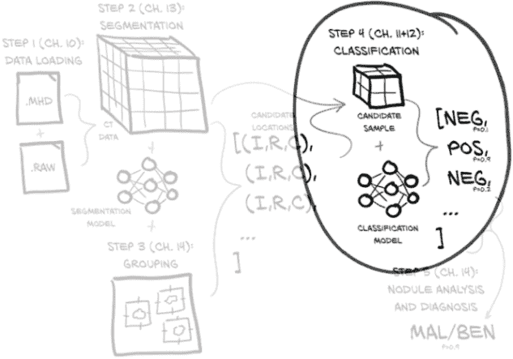

图 11.1 我们的端到端项目，用于检测肺癌，重点是本章的主题：第 4 步，分类

获得项目中一个有意义部分的早期端到端版本是一个重要的里程碑。拥有一个足够好使得结果可以进行分析评估的东西，让你可以有信心进行未来的改变，确信你正在通过每一次改变来改进你的结果，或者至少你能够搁置任何不起作用的改变和实验！在自己的项目中进行大量的实验是必须的。获得最佳结果通常需要进行大量的调试和微调。

但在我们进入实验阶段之前，我们必须打下基础。让我们看看我们第 2 部分训练循环的样子，如图 11.2 所示：鉴于我们在第五章看到了一组类似的核心步骤，这应该会让人感到熟悉。在这里，我们还将使用验证集来评估我们的训练进展，如第 5.5.3 节所讨论的那样。

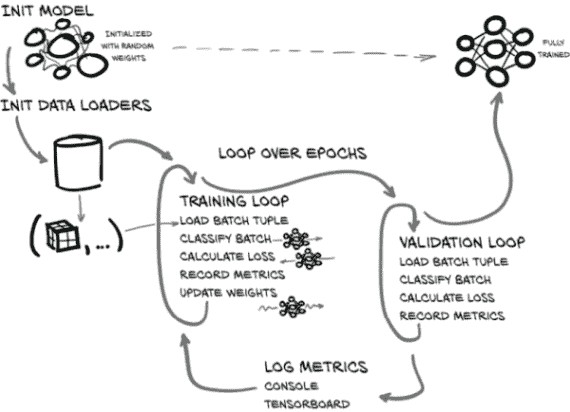

图 11.2 我们将在本章实现的训练和验证脚本

我们将要实现的基本结构如下：

+   初始化我们的模型和数据加载。

+   循环遍历一个半随机选择的 epoch 数。

    +   循环遍历`LunaDataset`返回的每个训练数据批次。

    +   数据加载器工作进程在后台加载相关批次的数据。

    +   将批次传入我们的分类模型以获得结果。

    +   根据我们预测结果与地面真实数据之间的差异来计算我们的损失。

    +   记录关于我们模型性能的指标到一个临时数据结构中。

    +   通过误差的反向传播更新模型权重。

    +   循环遍历每个验证数据批次（与训练循环非常相似的方式）。

    +   加载相关的验证数据批次（同样，在后台工作进程中）。

    +   对批次进行分类，并计算损失。

    +   记录模型在验证数据上的表现信息。

    +   打印出本轮的进展和性能信息。

当我们阅读本章的代码时，请注意我们正在生成的代码与第一部分中用于训练循环的代码之间的两个主要区别。首先，我们将在程序周围放置更多结构，因为整个项目比我们在早期章节中做的要复杂得多。没有额外的结构，代码很快就会变得混乱。对于这个项目，我们将使我们的主要训练应用程序使用许多良好封装的函数，并进一步将像数据集这样的代码分离为独立的 Python 模块。

确保对于您自己的项目，您将结构和设计水平与项目的复杂性水平匹配。结构太少，将难以进行实验、排除问题，甚至描述您正在做的事情！相反，结构太*多*意味着您正在浪费时间编写您不需要的基础设施，并且在所有管道都就位后，您可能会因为不得不遵守它而减慢自己的速度。此外，花时间在基础设施上很容易成为一种拖延策略，而不是投入艰苦工作来实际推进项目。不要陷入这种陷阱！

本章代码与第一部分的另一个重大区别将是专注于收集有关训练进展的各种指标。如果没有良好的指标记录，准确确定变化对训练的影响是不可能的。在不透露下一章内容的情况下，我们还将看到收集不仅仅是指标，而是*适合工作的正确指标*是多么重要。我们将在本章中建立跟踪这些指标的基础设施，并通过收集和显示损失和正确分类的样本百分比来运用该基础设施，无论是总体还是每个类别。这足以让我们开始，但我们将在第十二章中涵盖一组更现实的指标。

## 11.2 我们应用程序的主要入口点

本书中与之前训练工作的一个重大结构性差异是，第二部分将我们的工作封装在一个完整的命令行应用程序中。它将解析命令行参数，具有完整功能的 `--help` 命令，并且可以在各种环境中轻松运行。所有这些都将使我们能够轻松地从 Jupyter 和 Bash shell 中调用训练例程。¹

我们的应用功能将通过一个类来实现，以便我们可以实例化应用程序并在需要时传递它。这可以使测试、调试或从其他 Python 程序调用更容易。我们可以调用应用程序而无需启动第二个 OS 级别的进程（在本书中我们不会进行显式单元测试，但我们创建的结构对于需要进行这种测试的真实项目可能会有所帮助）。

利用能够通过函数调用或 OS 级别进程调用我们的训练的方式之一是将函数调用封装到 Jupyter Notebook 中，以便代码可以轻松地从本机 CLI 或浏览器中调用。

代码清单 11.1 code/p2_run_everything.ipynb

```py
# In[2]:w
def run(app, *argv):
    argv = list(argv)
    argv.insert(0, '--num-workers=4')                       # ❶
    log.info("Running: {}({!r}).main()".format(app, argv))

    app_cls = importstr(*app.rsplit('.', 1))                # ❷
    app_cls(argv).main()

    log.info("Finished: {}.{!r}).main()".format(app, argv))

# In[6]:
run('p2ch11.training.LunaTrainingApp', '--epochs=1')
```

❶ 我们假设您有一台四核八线程 CPU。如有需要，请更改 4。

❷ 这是一个稍微更干净的 __import__ 调用。

*注意* 这里的训练假设您使用的是一台四核八线程 CPU、16 GB RAM 和一块具有 8 GB RAM 的 GPU 的工作站。如果您的 GPU RAM 较少，请减小 `--batch-size`，如果 CPU 核心较少或 CPU RAM 较少，请减小 `--num-workers`。

让我们先把一些半标准的样板代码搞定。我们将从文件末尾开始，使用一个相当标准的 `if main` 语句块，实例化应用对象并调用 `main` 方法。

代码清单 11.2 training.py:386

```py
if __name__ == '__main__':
  LunaTrainingApp().main()
```

从那里，我们可以跳回文件顶部，查看应用程序类和我们刚刚调用的两个函数，`__init__`和`main`。我们希望能够接受命令行参数，因此我们将在应用程序的`__init__`函数中使用标准的`argparse`库（[`docs.python.org/3/library/argparse.html`](https://docs.python.org/3/library/argparse.html)）。请注意，如果需要，我们可以向初始化程序传递自定义参数。`main`方法将是应用程序核心逻辑的主要入口点。

列表 11.3 training.py:31，`class` `LunaTrainingApp`

```py
class LunaTrainingApp:
  def __init__(self, sys_argv=None):
    if sys_argv is None:                                                   # ❶
       sys_argv = sys.argv[1:]

    parser = argparse.ArgumentParser()
    parser.add_argument('--num-workers',
      help='Number of worker processes for background data loading',
      default=8,
      type=int,
    )
    # ... line 63
    self.cli_args = parser.parse_args(sys_argv)
    self.time_str = datetime.datetime.now().strftime('%Y-%m-%d_%H.%M.%S')  # ❷

  # ... line 137
  def main(self):
    log.info("Starting {}, {}".format(type(self).__name__, self.cli_args))
```

❶ 如果调用者没有提供参数，我们会从命令行获取参数。

❷ 我们将使用时间戳来帮助识别训练运行。

这种结构非常通用，可以在未来的项目中重复使用。特别是在`__init__`中解析参数允许我们将应用程序的配置与调用分开。

如果您在本书网站或 GitHub 上检查本章的代码，您可能会注意到一些额外的提到`TensorBoard`的行。现在请忽略这些；我们将在本章后面的第 11.9 节中详细讨论它们。

## 11.3 预训练设置和初始化

在我们开始迭代每个 epoch 中的每个批次之前，需要进行一些初始化工作。毕竟，如果我们还没有实例化模型，我们就无法训练模型！正如我们在图 11.3 中所看到的，我们需要做两件主要的事情。第一，正如我们刚才提到的，是初始化我们的模型和优化器；第二是初始化我们的`Dataset`和`DataLoader`实例。`LunaDataset`将定义组成我们训练 epoch 的随机样本集，而我们的`DataLoader`实例将负责从我们的数据集中加载数据并将其提供给我们的应用程序。

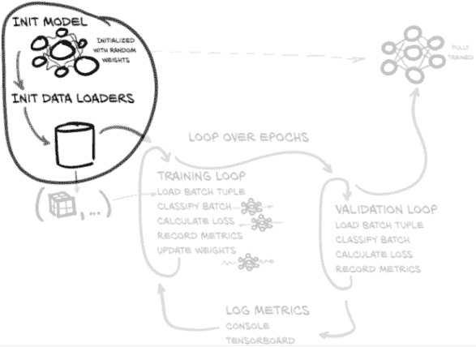

图 11.3 我们将在本章实现的训练和验证脚本，重点放在预循环变量初始化上

### 11.3.1 初始化模型和优化器

对于这一部分，我们将`LunaModel`的细节视为黑匣子。在第 11.4 节中，我们将详细介绍内部工作原理。您可以探索对实现进行更改，以更好地满足我们对模型的目标，尽管最好是在至少完成第十二章之后再进行。

让我们看看我们的起点是什么样的。

列表 11.4 training.py:31，`class` `LunaTrainingApp`

```py
class LunaTrainingApp:
  def __init__(self, sys_argv=None):
    # ... line 70
    self.use_cuda = torch.cuda.is_available()
    self.device = torch.device("cuda" if self.use_cuda else "cpu")

    self.model = self.initModel()
    self.optimizer = self.initOptimizer()

  def initModel(self):
    model = LunaModel()
    if self.use_cuda:
      log.info("Using CUDA; {} devices.".format(torch.cuda.device_count()))
      if torch.cuda.device_count() > 1:                                    # ❶
         model = nn.DataParallel(model)                                    # ❷
       model = model.to(self.device)                                       # ❸
     return model

  def initOptimizer(self):
    return SGD(self.model.parameters(), lr=0.001, momentum=0.99)
```

❶ 检测多个 GPU

❷ 包装模型

❸ 将模型参数发送到 GPU。

如果用于训练的系统有多个 GPU，我们将使用`nn.DataParallel`类在系统中的所有 GPU 之间分发工作，然后收集和重新同步参数更新等。就模型实现和使用该模型的代码而言，这几乎是完全透明的。

DataParallel vs. DistributedDataParallel

在本书中，我们使用`DataParallel`来处理利用多个 GPU。我们选择`DataParallel`，因为它是我们现有模型的简单插入包装器。然而，它并不是使用多个 GPU 的性能最佳解决方案，并且它仅限于与单台机器上可用的硬件一起使用。

PyTorch 还提供`DistributedDataParallel`，这是在需要在多个 GPU 或机器之间分配工作时推荐使用的包装类。由于正确的设置和配置并不简单，而且我们怀疑绝大多数读者不会从复杂性中获益，因此我们不会在本书中涵盖`DistributedDataParallel`。如果您希望了解更多，请阅读官方文档：[`pytorch.org/tutorials/intermediate/ddp_tutorial.html`](https://pytorch.org/tutorials/intermediate/ddp_tutorial.html)。

假设`self.use_cuda`为真，则调用`self.model.to(device)`将模型参数移至 GPU，设置各种卷积和其他计算以使用 GPU 进行繁重的数值计算。在构建优化器之前这样做很重要，否则优化器将只查看基于 CPU 的参数对象，而不是复制到 GPU 的参数对象。

对于我们的优化器，我们将使用基本的随机梯度下降（SGD；[`pytorch.org/docs/stable/optim.html#torch.optim.SGD`](https://pytorch.org/docs/stable/optim.html#torch.optim.SGD)）与动量。我们在第五章中首次看到了这个优化器。回想第 1 部分，PyTorch 中提供了许多不同的优化器；虽然我们不会详细介绍大部分优化器，但官方文档([`pytorch.org/docs/stable/optim.html#algorithms`](https://pytorch.org/docs/stable/optim.html#algorithms))很好地链接到相关论文。

当选择优化器时，使用 SGD 通常被认为是一个安全的起点；有一些问题可能不适合 SGD，但它们相对较少。同样，学习率为 0.001，动量为 0.9 是相当安全的选择。从经验上看，SGD 与这些值一起在各种项目中表现得相当不错，如果一开始效果不佳，可以尝试学习率为 0.01 或 0.0001。

这并不意味着这些值中的任何一个对我们的用例是最佳的，但试图找到更好的值是在超前。系统地尝试不同的学习率、动量、网络大小和其他类似配置设置的值被称为*超参数搜索*。在接下来的章节中，我们需要先解决其他更为突出的问题。一旦我们解决了这些问题，我们就可以开始微调这些值。正如我们在第五章的“测试其他优化器”部分中提到的，我们还可以选择其他更为奇特的优化器；但除了可能将`torch.optim.SGD`替换为`torch.optim.Adam`之外，理解所涉及的权衡是本书所讨论的范围之外的一个过于高级的主题。

### 11.3.2 数据加载器的照料和喂养

我们在上一章中构建的`LunaDataset`类充当着我们拥有的任何“荒野数据”与 PyTorch 构建模块期望的更加结构化的张量世界之间的桥梁。例如，`torch.nn.Conv3d` ([` pytorch.org/docs/stable/nn.html#conv3d`](https://pytorch.org/docs/stable/nn.html#conv3d)) 期望五维输入：(*N*, *C*, *D*, *H*, *W*)：样本数量，每个样本的通道数，深度，高度和宽度。这与我们的 CT 提供的本机 3D 非常不同！

您可能还记得上一章中`LunaDataset.__getitem__`中的`ct_t.unsqueeze(0)`调用；它提供了第四维，即我们数据的“通道”。回想一下第四章，RGB 图像有三个通道，分别用于红色、绿色和蓝色。天文数据可能有几十个通道，每个通道代表电磁波谱的各个切片--伽马射线、X 射线、紫外线、可见光、红外线、微波和/或无线电波。由于 CT 扫描是单一强度的，我们的通道维度只有大小 1。

还要回顾第 1 部分，一次训练单个样本通常是对计算资源的低效利用，因为大多数处理平台能够进行更多的并行计算，而模型处理单个训练或验证样本所需的计算量要少。解决方案是将样本元组组合成批元组，如图 11.4 所示，允许同时处理多个样本。第五维度(*N*)区分了同一批中的多个样本。

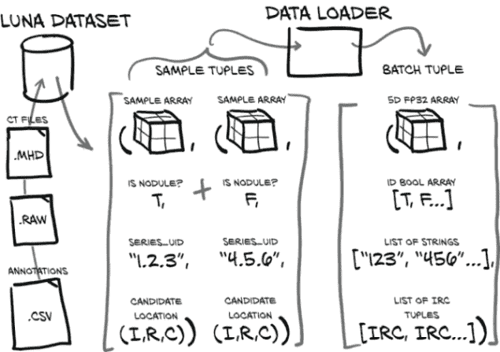

图 11.4 将样本元组整合到数据加载器中的单个批元组中

方便的是，我们不必实现任何批处理：PyTorch 的`DataLoader`类将处理所有的整理工作。我们已经通过`LunaDataset`类将 CT 扫描转换为 PyTorch 张量，所以唯一剩下的就是将我们的数据集插入数据加载器中。

列表 11.5 training.py:89，`LunaTrainingApp.initTrainDl`

```py
def initTrainDl(self):
  train_ds = LunaDataset(                    # ❶
    val_stride=10,
    isValSet_bool=False,
  )

  batch_size = self.cli_args.batch_size
  if self.use_cuda:
    batch_size *= torch.cuda.device_count()

  train_dl = DataLoader(                     # ❷
    train_ds,
    batch_size=batch_size,                   # ❸
    num_workers=self.cli_args.num_workers,
    pin_memory=self.use_cuda,                # ❹
  )

  return train_dl

# ... line 137
def main(self):
  train_dl = self.initTrainDl()
  val_dl = self.initValDl()                # ❺
```

❶ 我们的自定义数据集

❷ 一个现成的类

❸ 批处理是自动完成的。

❹ 固定内存传输到 GPU 快速。

❺ 验证数据加载器与训练非常相似。

除了对单个样本进行分批处理外，数据加载器还可以通过使用单独的进程和共享内存提供数据的并行加载。我们只需在实例化数据加载器时指定`num_workers=...`，其余工作都在幕后处理。每个工作进程生成完整的批次，如图 11.4 所示。这有助于确保饥饿的 GPU 得到充分的数据供应。我们的`validation_ds`和`validation_dl`实例看起来很相似，除了明显的`isValSet_bool=True`。

当我们迭代时，比如`for batch_tup in self.train_dl:`，我们不必等待每个`Ct`被加载、样本被取出和分批处理等。相反，我们将立即获得已加载的`batch_tup`，并且后台的工作进程将被释放以开始加载另一个批次，以便在以后的迭代中使用。使用 PyTorch 的数据加载功能可以加快大多数项目的速度，因为我们可以将数据加载和处理与 GPU 计算重叠。

## 11.4 我们的第一次神经网络设计

能够检测肿瘤的卷积神经网络的设计空间实际上是无限的。幸运的是，在过去的十年左右，已经付出了相当大的努力来研究有效的图像识别模型。虽然这些模型主要集中在 2D 图像上，但一般的架构思想也很适用于 3D，因此有许多经过测试的设计可以作为起点。这有助于我们，因为尽管我们的第一个网络架构不太可能是最佳选择，但现在我们只是追求“足够好以让我们开始”。

我们将基于第八章中使用的内容设计网络。我们将不得不稍微更新模型，因为我们的输入数据是 3D 的，并且我们将添加一些复杂的细节，但图 11.5 中显示的整体结构应该感觉熟悉。同样，我们为这个项目所做的工作将是您未来项目的良好基础，尽管您离开分类或分割项目越远，就越需要调整这个基础以适应。让我们从组成网络大部分的四个重复块开始剖析这个架构。

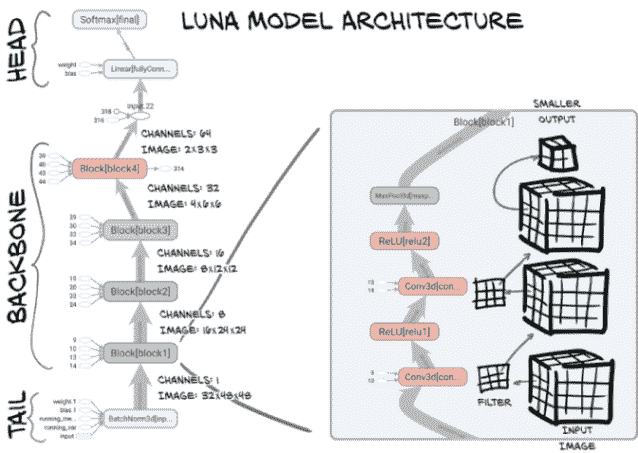

图 11.5 `LunaModel`类的架构由批量归一化尾部、四个块的主干和由线性层后跟 softmax 组成的头部。

### 11.4.1 核心卷积

分类模型通常由尾部、主干（或身体）和头部组成。*尾部*是处理网络输入的前几层。这些早期层通常具有与网络其余部分不同的结构或组织，因为它们必须将输入调整为主干所期望的形式。在这里，我们使用简单的批量归一化层，尽管通常尾部也包含卷积层。这些卷积层通常用于大幅度降低图像的大小；由于我们的图像尺寸已经很小，所以这里不需要这样做。

接下来，网络的*骨干*通常包含大部分层，这些层通常按*块*的系列排列。每个块具有相同（或至少类似）的层集，尽管通常从一个块到另一个块，预期输入的大小和滤波器数量会发生变化。我们将使用一个由两个 3 × 3 卷积组成的块，每个卷积后跟一个激活函数，并在块末尾进行最大池化操作。我们可以在图 11.5 的扩展视图中看到标记为`Block[block1]`的块的实现。以下是代码中块的实现。

代码清单 11.6 model.py:67，`class` `LunaBlock`

```py
class LunaBlock(nn.Module):
  def __init__(self, in_channels, conv_channels):
    super().__init__()

    self.conv1 = nn.Conv3d(
      in_channels, conv_channels, kernel_size=3, padding=1, bias=True,
    )
    self.relu1 = nn.ReLU(inplace=True)  1((CO5-1))
     self.conv2 = nn.Conv3d(
      conv_channels, conv_channels, kernel_size=3, padding=1, bias=True,
    )
    self.relu2 = nn.ReLU(inplace=True)    # ❶

    self.maxpool = nn.MaxPool3d(2, 2)

  def forward(self, input_batch):
    block_out = self.conv1(input_batch)
    block_out = self.relu1(block_out)     # ❶
    block_out = self.conv2(block_out)
    block_out = self.relu2(block_out)     # ❶

    return self.maxpool(block_out)
```

❶ 这些可以作为对功能 API 的调用来实现。

最后，网络的*头部*接收来自骨干的输出，并将其转换为所需的输出形式。对于卷积网络，这通常涉及将中间输出展平并传递给全连接层。对于一些网络，也可以考虑包括第二个全连接层，尽管这通常更适用于具有更多结构的分类问题（比如想想汽车与卡车有轮子、灯、格栅、门等）和具有大量类别的项目。由于我们只进行二元分类，并且似乎不需要额外的复杂性，我们只有一个展平层。

使用这样的结构可以作为卷积网络的良好第一构建块。虽然存在更复杂的设计，但对于许多项目来说，它们在实现复杂性和计算需求方面都过于复杂。最好从简单开始，只有在确实需要时才增加复杂性。

我们可以在图 11.6 中看到我们块的卷积在 2D 中表示。由于这是较大图像的一小部分，我们在这里忽略填充。（请注意，未显示 ReLU 激活函数，因为应用它不会改变图像大小。）

让我们详细了解输入体素和单个输出体素之间的信息流。当输入发生变化时，我们希望对输出如何响应有一个清晰的认识。最好回顾第八章，特别是第 8.1 至 8.3 节，以确保您对卷积的基本机制完全掌握。

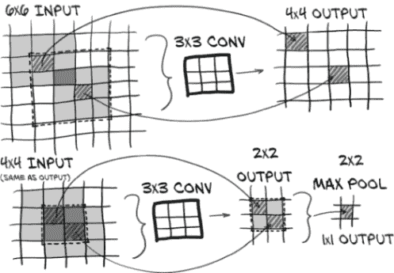

图 11.6 `LunaModel`块的卷积架构由两个 3 × 3 卷积和一个最大池组成。最终像素具有 6 × 6 的感受野。

我们在我们的块中使用 3 × 3 × 3 卷积。单个 3 × 3 × 3 卷积具有 3 × 3 × 3 的感受野，这几乎是显而易见的。输入了 27 个体素，输出一个体素。

当我们使用两个连续的 3 × 3 × 3 卷积时，情况变得有趣。堆叠卷积层允许最终输出的体素（或像素）受到比卷积核大小所示的更远的输入的影响。如果将该输出体素作为边缘体素之一输入到另一个 3 × 3 × 3 卷积核中，则第一层的一些输入将位于第二层的输入 3 × 3 × 3 区域之外。这两个堆叠层的最终输出具有 5 × 5 × 5 的*有效感受野*。这意味着当两者一起考虑时，堆叠层的作用类似于具有更大尺寸的单个卷积层。

换句话说，每个 3 × 3 × 3 卷积层为感受野添加了额外的一像素边界。如果我们在图 11.6 中向后跟踪箭头，我们可以看到这一点；我们的 2 × 2 输出具有 4 × 4 的感受野，进而具有 6 × 6 的感受野。两个堆叠的 3 × 3 × 3 层比完整的 5 × 5 × 5 卷积使用更少的参数（因此计算速度更快）。

我们两个堆叠的卷积的输出被送入一个 2×2×2 的最大池，这意味着我们正在取一个 6×6×6 的有效区域，丢弃了七分之八的数据，并选择了产生最大值的一个 5×5×5 区域。现在，那些“被丢弃”的输入体素仍然有机会贡献，因为距离一个输出体素的最大池还有一个重叠的输入区域，所以它们可能以这种方式影响最终输出。

请注意，虽然我们展示了每个卷积层的感受野随着每个卷积层的缩小而缩小，但我们使用了*填充*卷积，它在图像周围添加了一个虚拟的一像素边框。这样做可以保持输入和输出图像的大小不变。

`nn.ReLU` 层与我们在第六章中看到的层相同。大于 0.0 的输出将保持不变，小于 0.0 的输出将被截断为零。

这个块将被多次重复以形成我们模型的主干。

### 11.4.2 完整模型

让我们看一下完整模型的实现。我们将跳过块的定义，因为我们刚刚在代码清单 11.6 中看到了。

代码清单 11.7 model.py:13，`class` `LunaModel`

```py
class LunaModel(nn.Module):
  def __init__(self, in_channels=1, conv_channels=8):
    super().__init__()

    self.tail_batchnorm = nn.BatchNorm3d(1)                           # ❶

    self.block1 = LunaBlock(in_channels, conv_channels)               # ❷
    self.block2 = LunaBlock(conv_channels, conv_channels * 2)         # ❷
    self.block3 = LunaBlock(conv_channels * 2, conv_channels * 4)     # ❷
    self.block4 = LunaBlock(conv_channels * 4, conv_channels * 8)     # ❷

    self.head_linear = nn.Linear(1152, 2)                             # ❸
    self.head_softmax = nn.Softmax(dim=1)                             # ❸
```

❶ 尾部

❷ 主干

❸ 头部

在这里，我们的尾部相对简单。我们将使用`nn.BatchNorm3d`对输入进行归一化，正如我们在第八章中看到的那样，它将移动和缩放我们的输入，使其具有均值为 0 和标准差为 1。因此，我们的输入单位处于的有点奇怪的汉斯菲尔德单位（HU）尺度对网络的其余部分来说并不明显。这是一个有点武断的选择；我们知道我们的输入单位是什么，我们知道相关组织的预期值，所以我们可能很容易地实现一个固定的归一化方案。目前尚不清楚哪种方法更好。

我们的主干是四个重复的块，块的实现被提取到我们之前在代码清单 11.6 中看到的单独的`nn.Module`子类中。由于每个块以 2×2×2 的最大池操作结束，经过 4 层后，我们将在每个维度上将图像的分辨率降低 16 倍。回想一下第十章，我们的数据以 32×48×48 的块返回，最终将变为 2×3×3。

最后，我们的尾部只是一个全连接层，然后调用`nn.Softmax`。Softmax 是用于单标签分类任务的有用函数，并具有一些不错的特性：它将输出限制在 0 到 1 之间，对输入的绝对范围相对不敏感（只有输入的*相对*值重要），并且允许我们的模型表达对答案的确定程度。

函数本身相对简单。输入的每个值都用于求幂`e`，然后得到的一系列值除以所有求幂结果的总和。以下是一个简单的非优化 softmax 实现的 Python 代码示例：

```py
>>> logits = [1, -2, 3]
>>> exp = [e ** x for x in logits]
>>> exp
[2.718, 0.135, 20.086]

>>> softmax = [x / sum(exp) for x in exp]
>>> softmax
[0.118, 0.006, 0.876]
```

当然，我们在模型中使用 PyTorch 版本的`nn.Softmax`，因为它本身就能理解批处理和张量，并且会快速且如预期地执行自动梯度。

#### 复杂性：从卷积转换为线性

继续我们的模型定义，我们遇到了一个复杂性。我们不能简单地将`self.block4`的输出馈送到全连接层，因为该输出是每个样本的 64 通道的 2×3×3 图像，而全连接层期望一个 1D 向量作为输入（技术上说，它们期望一个*批量*的 1D 向量，这是一个 2D 数组，但无论如何不匹配）。让我们看一下`forward`方法。

代码清单 11.8 model.py:50，`LunaModel.forward`

```py
def forward(self, input_batch):
  bn_output = self.tail_batchnorm(input_batch)

  block_out = self.block1(bn_output)
  block_out = self.block2(block_out)
  block_out = self.block3(block_out)
  block_out = self.block4(block_out)

  conv_flat = block_out.view(
    block_out.size(0),          # ❶
    -1,
  )
  linear_output = self.head_linear(conv_flat)

  return linear_output, self.head_softmax(linear_output)
```

❶ 批处理大小

请注意，在将数据传递到全连接层之前，我们必须使用`view`函数对其进行展平。由于该操作是无状态的（没有控制其行为的参数），我们可以简单地在`forward`函数中执行该操作。这在某种程度上类似于我们在第八章讨论的功能接口。几乎每个使用卷积并产生分类、回归或其他非图像输出的模型都会在网络头部具有类似的组件。

对于`forward`方法的返回值，我们同时返回原始*logits*和 softmax 生成的概率。我们在第 7.2.6 节中首次提到了 logits：它们是网络在被 softmax 层归一化之前产生的数值。这可能听起来有点复杂，但 logits 实际上只是 softmax 层的原始输入。它们可以有任何实值输入，softmax 会将它们压缩到 0-1 的范围内。

在训练时，我们将使用 logits 来计算`nn.CrossEntropyLoss`，⁴而在实际对样本进行分类时，我们将使用概率。在训练和生产中使用的输出之间存在这种轻微差异是相当常见的，特别是当两个输出之间的差异是像 softmax 这样简单、无状态的函数时。

#### 初始化

最后，让我们谈谈初始化网络参数。为了使我们的模型表现良好，网络的权重、偏置和其他参数需要表现出一定的特性。让我们想象一个退化的情况，即网络的所有权重都大于 1（且没有残差连接）。在这种情况下，重复乘以这些权重会导致数据通过网络层时层输出变得非常大。类似地，小于 1 的权重会导致所有层输出变得更小并消失。类似的考虑也适用于反向传播中的梯度。

许多规范化技术可以用来保持层输出的良好行为，但其中最简单的一种是确保网络的权重初始化得当，使得中间值和梯度既不过小也不过大。正如我们在第八章讨论的那样，PyTorch 在这里没有给予我们足够的帮助，因此我们需要自己进行一些初始化。我们可以将以下`_init_weights`函数视为样板，因为确切的细节并不特别重要。

列表 11.9 model.py:30，`LunaModel._init_weights`

```py
def _init_weights(self):
  for m in self.modules():
    if type(m) in {
      nn.Linear,
      nn.Conv3d,
    }:
      nn.init.kaiming_normal_(
        m.weight.data, a=0, mode='fan_out', nonlinearity='relu',
      )
      if m.bias is not None:
        fan_in, fan_out = \
          nn.init._calculate_fan_in_and_fan_out(m.weight.data)
        bound = 1 / math.sqrt(fan_out)
        nn.init.normal_(m.bias, -bound, bound)
```

## 11.5 训练和验证模型

现在是时候将我们一直在处理的各种部分组装起来，以便我们实际执行。这个训练循环应该很熟悉--我们在第五章看到了类似图 11.7 的循环。

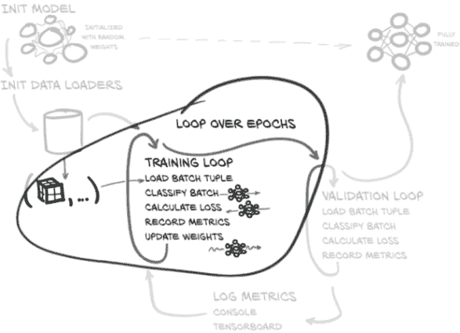

图 11.7 我们将在本章实现的训练和验证脚本，重点是在每个时期和时期中的批次上进行嵌套循环

代码相对紧凑（`doTraining`函数仅有 12 个语句；由于行长限制，这里较长）。

列表 11.10 training.py:137，`LunaTrainingApp.main`

```py
def main(self):
  # ... line 143
  for epoch_ndx in range(1, self.cli_args.epochs + 1):
    trnMetrics_t = self.doTraining(epoch_ndx, train_dl)
    self.logMetrics(epoch_ndx, 'trn', trnMetrics_t)

# ... line 165
def doTraining(self, epoch_ndx, train_dl):
  self.model.train()
  trnMetrics_g = torch.zeros(                 # ❶
    METRICS_SIZE,
    len(train_dl.dataset),
    device=self.device,
  )

  batch_iter = enumerateWithEstimate(         # ❷
    train_dl,
    "E{} Training".format(epoch_ndx),
    start_ndx=train_dl.num_workers,
  )
  for batch_ndx, batch_tup in batch_iter:
    self.optimizer.zero_grad()                # ❸

    loss_var = self.computeBatchLoss(         # ❹
      batch_ndx,
      batch_tup,
      train_dl.batch_size,
      trnMetrics_g
    )

    loss_var.backward()                       # ❺
    self.optimizer.step()                     # ❺

  self.totalTrainingSamples_count += len(train_dl.dataset)

  return trnMetrics_g.to('cpu')
```

❶ 初始化一个空的指标数组

❷ 设置我们的批次循环和时间估计

❸ 释放任何剩余的梯度张量

❹ 我们将在下一节详细讨论这种方法。

❺ 实际更新模型权重

我们从前几章的训练循环中看到的主要区别如下：

+   `trnMetrics_g`张量在训练过程中收集了详细的每类指标。对于像我们这样的大型项目，这种洞察力可能非常有用。

+   我们不直接遍历`train_dl`数据加载器。我们使用`enumerateWithEstimate`来提供预计完成时间。这并不是必要的；这只是一种风格上的选择。

+   实际的损失计算被推入`computeBatchLoss`方法中。再次强调，这并不是绝对必要的，但代码重用通常是一个优点。

我们将在第 11.7.2 节讨论为什么我们在`enumerate`周围包装了额外的功能；目前，假设它与`enumerate(train_dl)`相同。

`trnMetrics_g`张量的目的是将有关模型在每个样本基础上的行为信息从`computeBatchLoss`函数传输到`logMetrics`函数。让我们接下来看一下`computeBatchLoss`。在完成主要训练循环的其余部分后，我们将讨论`logMetrics`。

### 11.5.1 `computeBatchLoss`函数

`computeBatchLoss`函数被训练和验证循环调用。顾名思义，它计算一批样本的损失。此外，该函数还计算并记录模型产生的每个样本信息。这使我们能够计算每个类别的正确答案百分比，从而让我们专注于模型遇到困难的领域。

当然，函数的核心功能是将批次输入模型并计算每个批次的损失。我们使用`CrossEntropyLoss` ([` pytorch.org/docs/stable/nn.html#torch.nn.CrossEntropyLoss`](https://pytorch.org/docs/stable/nn.html#torch.nn.CrossEntropyLoss))，就像在第七章中一样。解包批次元组，将张量移动到 GPU，并调用模型应该在之前的训练工作后都感到熟悉。

列表 11.11 training.py:225，`.computeBatchLoss`

```py
def computeBatchLoss(self, batch_ndx, batch_tup, batch_size, metrics_g):
  input_t, label_t, _series_list, _center_list = batch_tup

  input_g = input_t.to(self.device, non_blocking=True)
  label_g = label_t.to(self.device, non_blocking=True)

  logits_g, probability_g = self.model(input_g)

  loss_func = nn.CrossEntropyLoss(reduction='none')   # ❶
  loss_g = loss_func(
    logits_g,
    label_g[:,1],                                     # ❷
  )
  # ... line 238
  return loss_g.mean()                                # ❸
```

❶ `reduction=‘none’`给出每个样本的损失。

❷ one-hot 编码类别的索引

❸ 将每个样本的损失重新组合为单个值

在这里，我们*不*使用默认行为来获得平均批次的损失值。相反，我们得到一个损失值的张量，每个样本一个。这使我们能够跟踪各个损失，这意味着我们可以按照自己的意愿进行聚合（例如，按类别）。我们马上就会看到这一点。目前，我们将返回这些每个样本损失的均值，这等同于批次损失。在不想保留每个样本统计信息的情况下，使用批次平均损失是完全可以的。是否这样取决于您的项目和目标。

一旦完成了这些，我们就完成了对调用函数的义务，就 backpropagation 和权重更新而言，需要做的事情。然而，在这之前，我们还想要记录我们每个样本的统计数据以供后人（和后续分析）使用。我们将使用传入的`metrics_g`参数来实现这一点。

列表 11.12 training.py:26

```py
METRICS_LABEL_NDX=0                                       # ❶
METRICS_PRED_NDX=1
METRICS_LOSS_NDX=2
METRICS_SIZE = 3

  # ... line 225
  def computeBatchLoss(self, batch_ndx, batch_tup, batch_size, metrics_g):
    # ... line 238
    start_ndx = batch_ndx * batch_size
    end_ndx = start_ndx + label_t.size(0)

    metrics_g[METRICS_LABEL_NDX, start_ndx:end_ndx] = \   # ❷
      label_g[:,1].detach()                               # ❷
    metrics_g[METRICS_PRED_NDX, start_ndx:end_ndx] = \    # ❷
      probability_g[:,1].detach()                         # ❷
    metrics_g[METRICS_LOSS_NDX, start_ndx:end_ndx] = \    # ❷
      loss_g.detach()                                     # ❷

    return loss_g.mean()                                  # ❸
```

❶ 这些命名的数组索引在模块级别范围内声明

❷ 我们使用`detach`，因为我们的指标都不需要保留梯度。

❸ 再次，这是整个批次的损失。

通过记录每个训练（以及后续的验证）样本的标签、预测和损失，我们拥有大量详细信息，可以用来研究我们模型的行为。目前，我们将专注于编译每个类别的统计数据，但我们也可以轻松地使用这些信息找到被错误分类最多的样本，并开始调查原因。同样，对于一些项目，这种信息可能不那么有趣，但记住你有这些选项是很好的。

### 11.5.2 验证循环类似

图 11.8 中的验证循环看起来与训练很相似，但有些简化。关键区别在于验证是只读的。具体来说，返回的损失值不会被使用，权重也不会被更新。

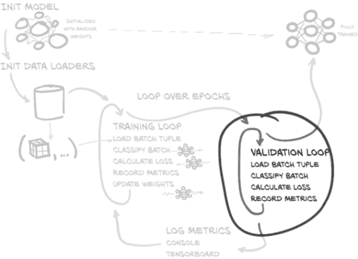

图 11.8 我们将在本章实现的训练和验证脚本，重点放在每个 epoch 的验证循环上

在函数调用的开始和结束之间，模型的任何内容都不应该发生变化。此外，由于`with torch.no_grad()`上下文管理器明确告知 PyTorch 不需要计算梯度，因此速度要快得多。

在 `LunaTrainingApp.main` 中的 `training.py:137`，代码清单 11.13

```py
def main(self):
  for epoch_ndx in range(1, self.cli_args.epochs + 1):
    # ... line 157
    valMetrics_t = self.doValidation(epoch_ndx, val_dl)
    self.logMetrics(epoch_ndx, 'val', valMetrics_t)

# ... line 203
def doValidation(self, epoch_ndx, val_dl):
  with torch.no_grad():
    self.model.eval()                  # ❶
    valMetrics_g = torch.zeros(
      METRICS_SIZE,
      len(val_dl.dataset),
      device=self.device,
    )

    batch_iter = enumerateWithEstimate(
      val_dl,
      "E{} Validation ".format(epoch_ndx),
      start_ndx=val_dl.num_workers,
    )
    for batch_ndx, batch_tup in batch_iter:
      self.computeBatchLoss(
        batch_ndx, batch_tup, val_dl.batch_size, valMetrics_g)

  return valMetrics_g.to('cpu')
```

❶ 关闭训练时的行为

在不需要更新网络权重的情况下（回想一下，这样做会违反验证集的整个前提；我们绝不希望这样做！），我们不需要使用`computeBatchLoss`返回的损失，也不需要引用优化器。 在循环内部剩下的只有对`computeBatchLoss`的调用。请注意，尽管我们不使用`computeBatchLoss`返回的每批损失来做任何事情，但我们仍然在`valMetrics_g`中收集指标作为调用的副作用。

## 11.6 输出性能指标

每个时期我们做的最后一件事是记录本时期的性能指标。如图 11.9 所示，一旦我们记录了指标，我们就会返回到下一个训练时期的训练循环中。在训练过程中随着进展记录结果是很重要的，因为如果训练出现问题（在深度学习术语中称为“不收敛”），我们希望能够注意到这一点，并停止花费时间训练一个不起作用的模型。在较小的情况下，能够监视模型行为是很有帮助的。

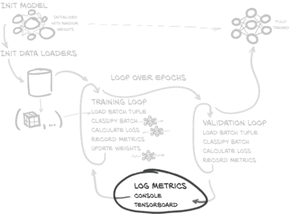

图 11.9 我们将在本章实现的训练和验证脚本，重点放在每个时期结束时的指标记录上

之前，我们在`trnMetrics_g`和`valMetrics_g`中收集结果以记录每个时期的进展。这两个张量现在包含了我们计算每个训练和验证运行的每类百分比正确和平均损失所需的一切。每个时期执行此操作是一个常见选择，尽管有些是任意的。在未来的章节中，我们将看到如何调整我们的时期大小，以便以合理的速率获得有关训练进度的反馈。

### 11.6.1 logMetrics 函数

让我们谈谈`logMetrics`函数的高级结构。签名看起来像这样。

在 `LunaTrainingApp.logMetrics` 中的 `training.py:251`，代码清单 11.14

```py
def logMetrics(
    self,
    epoch_ndx,
    mode_str,
    metrics_t,
    classificationThreshold=0.5,
):
```

我们仅使用`epoch_ndx`来在记录结果时显示。`mode_str`参数告诉我们指标是用于训练还是验证。

我们要么使用传入的`metrics_t`参数中的`trnMetrics_t`或`valMetrics_t`。回想一下，这两个输入都是浮点值的张量，在`computeBatchLoss`期间我们填充了数据，然后在我们从`doTraining`和`doValidation`返回它们之前将它们转移到 CPU。这两个张量都有三行，以及我们有样本数（训练样本或验证样本，取决于）的列数。作为提醒，这三行对应以下常量。

在 `training.py:26`，代码清单 11.15

```py
METRICS_LABEL_NDX=0     # ❶
METRICS_PRED_NDX=1
METRICS_LOSS_NDX=2
METRICS_SIZE = 3 
```

❶ 这些在模块级别范围内声明。

张量掩码和布尔索引

掩码张量是一种常见的使用模式，如果您以前没有遇到过，可能会感到不透明。您可能熟悉 NumPy 概念称为掩码数组；张量和数组掩码的行为方式相同。

如果您对掩码数组不熟悉，NumPy 文档中的一个优秀页面（[`mng.bz/XPra`](http://mng.bz/XPra)）很好地描述了其行为。 PyTorch 故意使用与 NumPy 相同的语法和语义。

#### 构建掩码

接下来，我们将构建掩码，以便仅将指标限制为结节或非结节（也称为阳性或阴性）样本。我们还将计算每个类别的总样本数，以及我们正确分类的样本数。

在 `LunaTrainingApp.logMetrics` 中的 `training.py:264`，代码清单 11.16

```py
negLabel_mask = metrics_t[METRICS_LABEL_NDX] <= classificationThreshold
negPred_mask = metrics_t[METRICS_PRED_NDX] <= classificationThreshold

posLabel_mask = ~negLabel_mask
posPred_mask = ~negPred_mask
```

虽然我们在这里没有`assert`，但我们知道存储在`metrics _t[METRICS_LABEL_NDX]`中的所有值属于集合`{0.0, 1.0}`，因为我们知道我们的结节状态标签只是`True`或`False`。通过与默认值为 0.5 的`classificationThreshold`进行比较，我们得到一个二进制值数组，其中`True`值对应于所讨论样本的非结节（也称为负）标签。

我们进行类似的比较以创建`negPred_mask`，但我们必须记住`METRICS_PRED_NDX`值是我们模型产生的*正预测，可以是介于 0.0 和 1.0 之间的任意浮点值*。这并不改变我们的比较，但这意味着实际值可能接近 0.5。正掩模只是负掩模的反向。

*注意* 虽然其他项目可以利用类似的方法，但重要的是要意识到，我们正在采取一些捷径，这是因为这是一个二元分类问题。如果您的下一个项目有超过两个类别或样本同时属于多个类别，您将需要使用更复杂的逻辑来构建类似的掩模。

接下来，我们使用这些掩模计算一些每个标签的统计数据，并将其存储在字典`metrics_dict`中。

代码清单 11.17 training.py:270，`LunaTrainingApp.logMetrics`

```py
neg_count = int(negLabel_mask.sum())                            # ❶
pos_count = int(posLabel_mask.sum())

neg_correct = int((negLabel_mask & negPred_mask).sum())
pos_correct = int((posLabel_mask & posPred_mask).sum())

metrics_dict = {}
metrics_dict['loss/all'] = \
  metrics_t[METRICS_LOSS_NDX].mean()
metrics_dict['loss/neg'] = \
  metrics_t[METRICS_LOSS_NDX, negLabel_mask].mean()
metrics_dict['loss/pos'] = \
  metrics_t[METRICS_LOSS_NDX, posLabel_mask].mean()

metrics_dict['correct/all'] = (pos_correct + neg_correct) \
  / np.float32(metrics_t.shape[1]) * 100                        # ❷
metrics_dict['correct/neg'] = neg_correct / np.float32(neg_count) * 100
metrics_dict['correct/pos'] = pos_correct / np.float32(pos_count) * 100
```

❶ 转换为普通的 Python 整数

❷ 避免整数除法，转换为 np.float32

首先，我们计算整个时期的平均损失。由于损失是训练过程中要最小化的单一指标，我们始终希望能够跟踪它。然后，我们将损失平均限制为仅使用我们刚刚制作的`negLabel_mask`的那些带有负标签的样本。我们对正损失也是一样的。像这样计算每类损失在某种情况下是有用的，如果一个类别比另一个类别更难分类，那么这种知识可以帮助推动调查和改进。

我们将通过确定我们正确分类的样本比例以及每个标签的正确比例来结束计算，因为我们将在稍后将这些数字显示为百分比，所以我们还将这些值乘以 100。与损失类似，我们可以使用这些数字来帮助指导我们在进行改进时的努力。计算完成后，我们通过三次调用`log.info`记录我们的结果。

代码清单 11.18 training.py:289，`LunaTrainingApp.logMetrics`

```py
log.info(
  ("E{} {:8} {loss/all:.4f} loss, "
     + "{correct/all:-5.1f}% correct, "
  ).format(
    epoch_ndx,
    mode_str,
    **metrics_dict,
  )
)
log.info(
  ("E{} {:8} {loss/neg:.4f} loss, "
     + "{correct/neg:-5.1f}% correct ({neg_correct:} of {neg_count:})"
  ).format(
    epoch_ndx,
    mode_str + '_neg',
    neg_correct=neg_correct,
    neg_count=neg_count,
    **metrics_dict,
  )
)
log.info(            # ❶
  # ... line 319
)
```

❶ “pos”日志与之前的“neg”日志类似。

第一个日志包含从所有样本计算得出的值，并标记为`/all`，而负（非结节）和正（结节）值分别标记为`/neg`和`/pos`。我们这里不显示正值的第三个日志声明；它与第二个相同，只是在所有情况下将*neg*替换为*pos*。

## 11.7 运行训练脚本

现在我们已经完成了 training.py 脚本的核心部分，我们将开始实际运行它。这将初始化和训练我们的模型，并打印关于训练进展情况的统计信息。我们的想法是在我们详细介绍模型实现的同时，将其启动在后台运行。希望我们完成后能够查看结果。

我们从主代码目录运行此脚本；它应该有名为 p2ch11、util 等的子目录。所使用的`python`环境应该安装了 requirements.txt 中列出的所有库。一旦这些库准备就绪，我们就可以运行：

```py
$ python -m p2ch11.training        # ❶
Starting LunaTrainingApp,
    Namespace(batch_size=256, channels=8, epochs=20, layers=3, num_workers=8)
<p2ch11.dsets.LunaDataset object at 0x7fa53a128710>: 495958 training samples
<p2ch11.dsets.LunaDataset object at 0x7fa537325198>: 55107 validation samples
Epoch 1 of 20, 1938/216 batches of size 256
E1 Training ----/1938, starting
E1 Training   16/1938, done at 2018-02-28 20:52:54, 0:02:57
...
```

❶ 这是 Linux/Bash 的命令行。Windows 用户可能需要根据所使用的安装方法以不同方式调用 Python。

作为提醒，我们还提供了一个包含训练应用程序调用的 Jupyter 笔记本。

代码清单 11.19 code/p2_run_everything.ipynb

```py
# In[5]:
run('p2ch11.prepcache.LunaPrepCacheApp')

# In[6]:
run('p2ch11.training.LunaTrainingApp', '--epochs=1')
```

如果第一个时代似乎需要很长时间（超过 10 或 20 分钟），这可能与需要准备 `LunaDataset` 需要的缓存数据有关。有关缓存的详细信息，请参阅第 10.5.1 节。第十章的练习包括编写一个脚本以有效地预先填充缓存。我们还提供了 prepcache.py 文件来执行相同的操作；可以使用 `python -m p2ch11 .prepcache` 调用它。由于我们每章都重复我们的 dsets.py 文件，因此缓存需要为每一章重复。这在一定程度上是空间和时间上的低效，但这意味着我们可以更好地保持每一章的代码更加完整。对于您未来的项目，我们建议更多地重用您的缓存。

一旦训练开始，我们要确保我们正在按照预期使用手头的计算资源。判断瓶颈是数据加载还是计算的一个简单方法是在脚本开始训练后等待几分钟（查看类似 `E1 Training 16/7750, done at...` 的输出），然后同时检查 `top` 和 `nvidia-smi`：

如果八个 Python 工作进程消耗了 >80% 的 CPU，那么缓存可能需要准备（我们知道这一点是因为作者已经确保在这个项目的实现中没有 CPU 瓶颈；这不会是普遍的情况）。

如果 `nvidia-smi` 报告 `GPU-Util` >80%，那么你的 GPU 已经饱和了。我们将在第 11.7.2 节讨论一些有效等待的策略。

我们的意图是 GPU 饱和；我们希望尽可能多地利用计算能力来快速完成时代。一块 NVIDIA GTX 1080 Ti 应该在 15 分钟内完成一个时代。由于我们的模型相对简单，CPU 不需要太多的预处理才能成为瓶颈。当处理更深的模型（或者总体需要更多计算的模型）时，处理每个批次将需要更长的时间，这将增加 CPU 处理的数量，以便在 GPU 在下一批输入准备好之前耗尽工作之前。

### 11.7.1 训练所需的数据

如果训练样本数量少于 495,958 个，验证样本数量少于 55,107 个，可能有必要进行一些合理性检查，以确保完整的数据已经准备就绪。对于您未来的项目，请确保您的数据集返回您期望的样本数量。

首先，让我们看一下我们的 data-unversioned/ part2/luna 目录的基本目录结构：

```py
$ ls -1p data-unversioned/part2/luna/
subset0/
subset1/
...
subset9/
```

接下来，让我们确保每个系列 UID 都有一个 .mhd 文件和一个 .raw 文件

```py
$ ls -1p data-unversioned/part2/luna/subset0/
1.3.6.1.4.1.14519.5.2.1.6279.6001.105756658031515062000744821260.mhd
1.3.6.1.4.1.14519.5.2.1.6279.6001.105756658031515062000744821260.raw
1.3.6.1.4.1.14519.5.2.1.6279.6001.108197895896446896160048741492.mhd
1.3.6.1.4.1.14519.5.2.1.6279.6001.108197895896446896160048741492.raw
...
```

以及我们是否有正确数量的文件：

```py
$ ls -1 data-unversioned/part2/luna/subset?/* | wc -l
1776
$ ls -1 data-unversioned/part2/luna/subset0/* | wc -l
178
...
$ ls -1 data-unversioned/part2/luna/subset9/* | wc -l
176
```

如果所有这些看起来都正确，但事情仍然不顺利，请在 Manning LiveBook 上提问（[`livebook.manning.com/book/deep-learning-with-pytorch/chapter-11`](https://livebook.manning.com/book/deep-learning-with-pytorch/chapter-11)），希望有人可以帮助解决问题。

### 11.7.2 插曲：enumerateWithEstimate 函数

使用深度学习涉及大量的等待。我们谈论的是现实世界中坐在那里，看着墙上的时钟，一个看着的壶永远不会煮开（但你可以在 GPU 上煎蛋），纯粹的 *无聊*。

唯一比坐在那里盯着一个一个小时都没有移动的闪烁光标更糟糕的是，让您的屏幕充斥着这些：

```py
2020-01-01 10:00:00,056 INFO training batch 1234
2020-01-01 10:00:00,067 INFO training batch 1235
2020-01-01 10:00:00,077 INFO training batch 1236
2020-01-01 10:00:00,087 INFO training batch 1237
...etc...
```

至少安静闪烁的光标不会让你的滚动缓冲区溢出！

从根本上说，在所有这些等待的过程中，我们想要回答“我有时间去倒满水杯吗？”这个问题，以及关于是否有时间的后续问题

冲一杯咖啡

准备晚餐

在巴黎吃晚餐⁵

要回答这些紧迫的问题，我们将使用我们的 `enumerateWithEstimate` 函数。使用方法如下：

```py
>>> for i, _ in enumerateWithEstimate(list(range(234)), "sleeping"):
...   time.sleep(random.random())
...
11:12:41,892 WARNING sleeping ----/234, starting
11:12:44,542 WARNING sleeping    4/234, done at 2020-01-01 11:15:16, 0:02:35
11:12:46,599 WARNING sleeping    8/234, done at 2020-01-01 11:14:59, 0:02:17
11:12:49,534 WARNING sleeping   16/234, done at 2020-01-01 11:14:33, 0:01:51
11:12:58,219 WARNING sleeping   32/234, done at 2020-01-01 11:14:41, 0:01:59
11:13:15,216 WARNING sleeping   64/234, done at 2020-01-01 11:14:43, 0:02:01
11:13:44,233 WARNING sleeping  128/234, done at 2020-01-01 11:14:35, 0:01:53
11:14:40,083 WARNING sleeping ----/234, done at 2020-01-01 11:14:40
>>>
```

这是超过 200 次迭代的 8 行输出。即使考虑到`random.random()`的广泛变化，该函数在 16 次迭代后（不到 10 秒）就有了相当不错的估计。对于具有更稳定时间的循环体，估计会更快地稳定下来。

就行为而言，`enumerateWithEstimate`与标准的`enumerate`几乎完全相同（差异在于我们的函数返回一个生成器，而`enumerate`返回一个专门的`<enumerate object at 0x...>`）。

列表 11.20 util.py:143，`def` `enumerateWithEstimate`

```py
def enumerateWithEstimate(
    iter,
    desc_str,
    start_ndx=0,
    print_ndx=4,
    backoff=None,
    iter_len=None,
):
  for (current_ndx, item) in enumerate(iter):
    yield (current_ndx, item)
```

然而，副作用（特别是日志记录）才是使函数变得有趣的地方。与其陷入细节中试图覆盖实现的每个细节，如果您感兴趣，可以查阅函数文档字符串（[`github .com/deep-learning-with-pytorch/dlwpt-code/blob/master/util/util.py#L143`](https://github.com/deep-learning-with-pytorch/dlwpt-code/blob/master/util/util.py#L143)）以获取有关函数参数的信息并对实现进行桌面检查。

深度学习项目可能非常耗时。知道何时预计完成意味着您可以明智地利用这段时间，它还可以提示您某些地方出了问题（或者某种方法行不通），如果预计完成时间远远超出预期。

## 11.8 评估模型：达到 99.7%的正确率意味着我们完成了，对吧？

让我们来看一下我们训练脚本的一些（缩减的）输出。作为提醒，我们使用命令行`python -m p2ch11.training`运行了这个脚本：

```py
E1 Training ----/969, starting
...
E1 LunaTrainingApp
E1 trn      2.4576 loss,  99.7% correct
...
E1 val      0.0172 loss,  99.8% correct
...
```

经过一轮训练，训练集和验证集都显示至少 99.7%的正确结果。这是 A+！是时候来一轮高五，或者至少满意地点点头微笑了。我们刚刚解决了癌症！...对吧？

嗯，不是。

让我们更仔细地（不那么缩减地）看一下第 1 个时代的输出：

```py
E1 LunaTrainingApp
E1 trn      2.4576 loss,  99.7% correct,
E1 trn_neg  0.1936 loss,  99.9% correct (494289 of 494743)
E1 trn_pos  924.34 loss,   0.2% correct (3 of 1215)
...
E1 val      0.0172 loss,  99.8% correct,
E1 val_neg  0.0025 loss, 100.0% correct (494743 of 494743)
E1 val_pos  5.9768 loss,   0.0% correct (0 of 1215)
```

在验证集上，我们对非结节的分类 100%正确，但实际结节却 100%错误。网络只是将所有东西都分类为非结节！数值 99.7%只意味着大约 0.3%的样本是结节。

经过 10 个时代，情况只是稍微好转：

```py
E10 LunaTrainingApp
E10 trn      0.0024 loss,  99.8% correct
E10 trn_neg  0.0000 loss, 100.0% correct
E10 trn_pos  0.9915 loss,   0.0% correct
E10 val      0.0025 loss,  99.7% correct
E10 val_neg  0.0000 loss, 100.0% correct
E10 val_pos  0.9929 loss,   0.0% correct
```

分类输出保持不变--没有一个结节（也称为阳性）样本被正确识别。有趣的是，我们开始看到`val_pos`损失有所减少，然而，`val_neg`损失并没有相应增加。这意味着网络*正在*学习。不幸的是，它学习得非常，非常慢。

更糟糕的是，这种特定的失败模式在现实世界中是最危险的！我们希望避免将肿瘤误分类为无害的结构，因为这不会促使患者接受可能需要的评估和最终治疗。了解所有项目的误分类后果很重要，因为这可能会对您设计、训练和评估模型的方式产生很大影响。我们将在下一章中更详细地讨论这个问题。

然而，在此之前，我们需要升级我们的工具，使结果更易于理解。我们相信您和任何人一样喜欢盯着数字列，但图片价值千言。让我们绘制一些这些指标的图表。

## 11.9 使用 TensorBoard 绘制训练指标图表

我们将使用一个名为 TensorBoard 的工具，作为一种快速简便的方式，将我们的训练指标从训练循环中提取出来，并呈现为一些漂亮的图表。这将使我们能够跟踪这些指标的*趋势*，而不仅仅查看每个时代的瞬时值。当您查看可视化表示时，要知道一个值是异常值还是趋势的最新值就容易得多。

“嘿，等等”，您可能会想，“TensorBoard 不是 TensorFlow 项目的一部分吗？它在我的 PyTorch 书中做什么？”

嗯，是的，它是另一个深度学习框架的一部分，但我们的理念是“使用有效的工具”。没有理由限制自己不使用一个工具，只因为它捆绑在我们不使用的另一个项目中。PyTorch 和 TensorBoard 的开发人员都同意，因为他们合作将 TensorBoard 的官方支持添加到 PyTorch 中。TensorBoard 很棒，它有一些易于使用的 PyTorch API，让我们可以将数据从几乎任何地方连接到其中进行快速简单的显示。如果您坚持深度学习，您可能会看到（并使用）*很多* TensorBoard。

实际上，如果您一直在运行本章的示例，您应该已经有一些准备好并等待显示的数据在磁盘上。让我们看看如何运行 TensorBoard，并查看它可以向我们展示什么。

### 11.9.1 运行 TensorBoard

默认情况下，我们的训练脚本将指标数据写入 runs/ 子目录。如果在 Bash shell 会话期间列出目录内容，您可能会看到类似于以下内容：

```py
$ ls -lA runs/p2ch11/
total 24
drwxrwxr-x 2 elis elis 4096 Sep 15 13:22 2020-01-01_12.55.27-trn-dlwpt/  # ❶
drwxrwxr-x 2 elis elis 4096 Sep 15 13:22 2020-01-01_12.55.27-val-dlwpt/  # ❶
drwxrwxr-x 2 elis elis 4096 Sep 15 15:14 2020-01-01_13.31.23-trn-dwlpt/  # ❷
drwxrwxr-x 2 elis elis 4096 Sep 15 15:14 2020-01-01_13.31.23-val-dwlpt/  # ❷
```

❶ 之前的单次运行

❷ 最近的 10 次训练运行

要获取 `tensorboard` 程序，请安装 `tensorflow` ([`pypi.org/project/tensorflow`](https://pypi.org/project/tensorflow)) Python 包。由于我们实际上不会使用 TensorFlow 本身，所以如果您安装默认的仅 CPU 包也是可以的。如果您已经安装了另一个版本的 TensorBoard，那也没问题。确保适当的目录在您的路径上，或者使用 `../path/to/tensorboard --logdir runs/` 来调用它。从哪里调用它并不重要，只要您使用 `--logdir` 参数将其指向存储数据的位置即可。最好将数据分隔到单独的文件夹中，因为一旦进行了 10 或 20 次实验，TensorBoard 可能会变得有些难以管理。您将不得不在每个项目中决定最佳的做法。如果需要，随时移动数据也是个好主意。

现在让我们开始 TensorBoard 吧：

```py
$ tensorboard --logdir runs/
2020-01-01 12:13:16.163044: I tensorflow/core/platform/cpu_feature_guard.cc:140]# ❶
    Your CPU supports instructions that this TensorFlow binary was not compiled to use: AVX2 FMA  1((CO17-2))
TensorBoard 1.14.0 at http://localhost:6006/ (Press CTRL+C to quit)
```

❶ 这些消息可能对您来说是不同的或不存在的；这没关系。

完成后，您应该能够将浏览器指向 http://localhost:6006 并查看主仪表板。图 11.10 展示了这是什么样子。

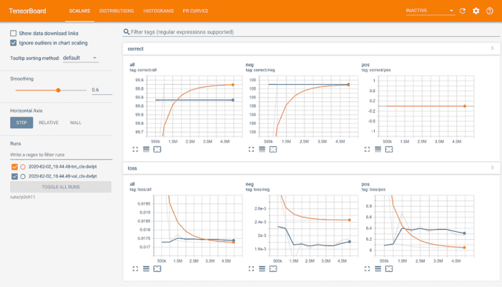

图 11.10 主要的 TensorBoard 用户界面，显示了一对训练和验证运行

在浏览器窗口的顶部，您应该看到橙色的标题。标题的右侧有用于设置的典型小部件，一个指向 GitHub 存储库的链接等。我们现在可以忽略这些。标题的左侧有我们提供的数据类型的项目。您至少应该有以下内容：

+   标量（默认选项卡）

+   直方图

+   精确-召回曲线（显示为 PR 曲线）

您可能还会看到分布，以及图 11.10 中标量右侧的第二个 UI 选项卡。我们这里不会使用或讨论这些。确保您已经通过单击选择了标量。

左侧是一组用于显示选项的控件，以及当前存在的运行列表。如果您的数据特别嘈杂，平滑选项可能会很有用；它会使事情变得平静，这样您就可以找出整体趋势。原始的非平滑数据仍然以相同颜色的淡线的形式显示在背景中。图 11.11 展示了这一点，尽管在黑白打印时可能难以辨认。

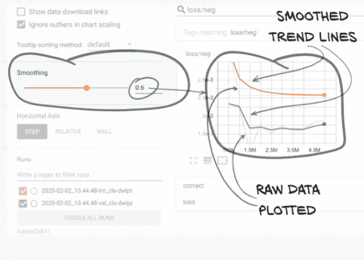

图 11.11 带有平滑设置为 0.6 和选择了两个运行以显示的 TensorBoard 侧边栏

根据您运行训练脚本的次数，您可能有多个运行可供选择。如果呈现的运行太多，图表可能会变得过于嘈杂，所以不要犹豫在目前不感兴趣的情况下取消选择运行。

如果你想永久删除一个运行，可以在 TensorBoard 运行时从磁盘中删除数据。您可以这样做来摆脱崩溃、有错误、不收敛或太旧不再有趣的实验。运行的数量可能会增长得相当快，因此经常修剪并重命名运行或将特别有趣的运行移动到更永久的目录以避免意外删除是有帮助的。要删除`train`和`validation`运行，执行以下操作（在更改章节、日期和时间以匹配要删除的运行之后）：

```py
$ rm -rf runs/p2ch11/2020-01-01_12.02.15_*
```

请记住，删除运行将导致列表中后面的运行向上移动，这将导致它们被分配新的颜色。

好的，让我们来谈谈 TensorBoard 的要点：漂亮的图表！屏幕的主要部分应该填满了从收集训练和验证指标中得到的数据，如图 11.12 所示。

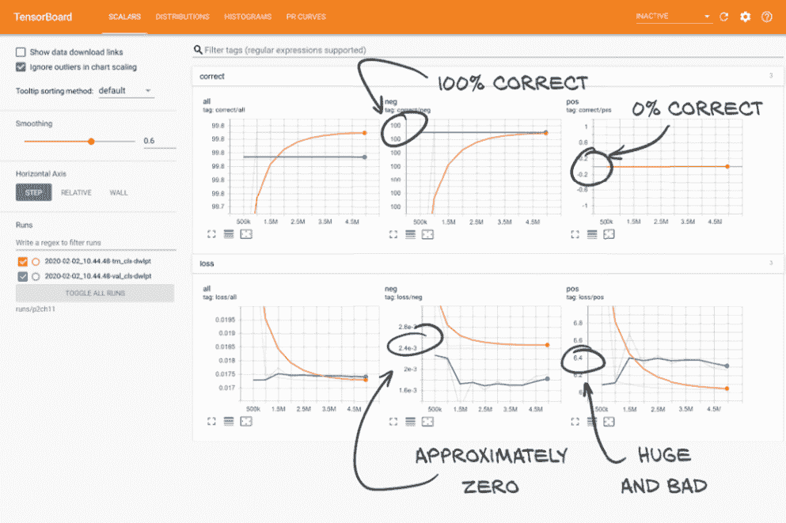

图 11.12 主要的 TensorBoard 数据显示区域向我们展示了我们在实际结节上的结果非常糟糕

比起`E1 trn_pos 924.34 loss, 0.2% correct (3 of 1215)`，这样解析和吸收起来要容易得多！虽然我们将把讨论这些图表告诉我们的内容保存到第 11.10 节，现在是一个好时机确保清楚这些数字对应我们的训练程序中的内容。花点时间交叉参考你通过鼠标悬停在线条上得到的数字和训练.py 在同一训练运行期间输出的数字。你应该看到工具提示的值列和训练期间打印的值之间有直接对应关系。一旦你对 TensorBoard 显示的内容感到舒适和自信，让我们继续讨论如何让这些数字首次出现。

### 11.9.2 将 TensorBoard 支持添加到度量记录函数

我们将使用`torch.utils.tensorboard`模块以 TensorBoard 可消费的格式编写数据。这将使我们能够快速轻松地为此项目和任何其他项目编写指标。TensorBoard 支持 NumPy 数组和 PyTorch 张量的混合使用，但由于我们没有将数据放入 NumPy 数组的理由，我们将专门使用 PyTorch 张量。

我们需要做的第一件事是创建我们的`SummaryWriter`对象（我们从`torch.utils.tensorboard`导入）。我们将传入的唯一参数初始化为类似`runs/p2ch11/2020-01-01_12 .55.27-trn-dlwpt`的内容。我们可以在我们的训练脚本中添加一个注释参数，将`dlwpt`更改为更具信息性的内容；使用`python -m p2ch11.training --help`获取更多信息。

我们创建两个写入器，一个用于训练运行，一个用于验证运行。这些写入器将在每个时代重复使用。当`SummaryWriter`类被初始化时，它还会作为副作用创建`log_dir`目录。如果训练脚本在写入任何数据之前崩溃，这些目录将显示在 TensorBoard 中，并且可能会用空运行杂乱 UI，这在你尝试某些东西时很常见。为了避免写入太多空的垃圾运行，我们等到准备好第一次写入数据时才实例化`SummaryWriter`对象。这个函数从`logMetrics()`中调用。

列表 11.21 training.py:127，`.initTensorboardWriters`

```py
def initTensorboardWriters(self):
  if self.trn_writer is None:
    log_dir = os.path.join('runs', self.cli_args.tb_prefix, self.time_str)

    self.trn_writer = SummaryWriter(
      log_dir=log_dir + '-trn_cls-' + self.cli_args.comment)
    self.val_writer = SummaryWriter(
      log_dir=log_dir + '-val_cls-' + self.cli_args.comment)
```

如果你回忆起来，第一个时代有点混乱，训练循环中的早期输出基本上是随机的。当我们保存来自第一批次的指标时，这些随机结果最终会使事情有点偏斜。从图 11.11 中可以看出，TensorBoard 具有平滑功能，可以消除趋势线上的噪音，这在一定程度上有所帮助。

另一种方法可能是在第一个 epoch 的训练数据中完全跳过指标，尽管我们的模型训练速度足够快，仍然有必要查看第一个 epoch 的结果。随意根据需要更改此行为；第 2 部分的其余部分将继续采用包括第一个嘈杂训练 epoch 的模式。

*提示* 如果你最终进行了许多实验，导致异常或相对快速终止训练脚本，你可能会留下许多垃圾运行，混乱了你的 runs/目录。不要害怕清理它们！

#### 向 TensorBoard 写入标量

写入标量很简单。我们可以取出已经构建的`metrics_dict`，并将每个键值对传递给`writer.add_scalar`方法。`torch.utils.tensorboard.SummaryWriter`类具有`add_scalar`方法（[` mng.bz/RAqj`](http://mng.bz/RAqj)），具有以下签名。

代码清单 11.22 PyTorch torch/utils/tensorboard/writer.py:267

```py
def add_scalar(self, tag, scalar_value, global_step=None, walltime=None):
    # ...
```

`tag`参数告诉 TensorBoard 我们要向哪个图形添加值，`scalar_value`参数是我们数据点的 Y 轴值。`global_step`参数充当 X 轴值。

请记住，我们在`doTraining`函数内更新了`totalTrainingSamples_count`变量。我们将通过将其作为`global_step`参数传入来将`totalTrainingSamples_count`用作我们 TensorBoard 图表的 X 轴。以下是我们代码中的示例。

代码清单 11.23 training.py:323，`LunaTrainingApp.logMetrics`

```py
for key, value in metrics_dict.items():
  writer.add_scalar(key, value, self.totalTrainingSamples_count)
```

请注意，我们键名中的斜杠（例如`'loss/all'`）导致 TensorBoard 通过斜杠前的子字符串对图表进行分组。

文档建议我们应该将 epoch 数作为`global_step`参数传入，但这会导致一些复杂性。通过使用向网络呈现的训练样本数，我们可以做一些事情，比如改变每个 epoch 的样本数，仍然能够将未来的图形与我们现在创建的图形进行比较。如果每个 epoch 花费的时间是四倍长，那么说一个模型在一半的 epoch 中训练是没有意义的！请记住，这可能不是标准做法；然而，预计会看到各种值用于全局步骤。

## 11.10 为什么模型无法学习检测结节？

我们的模型显然在学习*某些东西*--随着 epoch 增加，损失趋势线是一致的，结果是可重复的。然而，模型正在学习的内容与我们*希望*它学习的内容之间存在分歧。发生了什么？让我们用一个简单的比喻来说明问题。

想象一下，一位教授给学生一份包含 100 个真/假问题的期末考试。学生可以查阅这位教授过去 30 年的考试版本，每次只有*一个或两个*问题的答案是 True。其他 98 或 99 个问题每次都是 False。

假设分数不是按曲线划分的，而是有一个典型的 90%正确或更高为 A 的等级刻度，便很容易获得 A+：只需将每个问题标记为 False！让我们想象今年只有一个 True 答案。像图 11.13 中左侧的学生那样毫无头绪地将每个答案标记为 False 的学生会在期末考试中得到 99%的分数，但实际上并没有证明他们学到了什么（除了如何从旧测试中临时抱佛脚）。这基本上就是我们的模型目前正在做的事情。


图 11.13 一位教授给予两名学生相同的分数，尽管知识水平不同。问题 9 是唯一一个答案为 True 的问题。

将其与右侧学生进行对比，右侧学生也回答了 99%的问题，但是通过回答两个问题为 True 来实现。直觉告诉我们，图 11.13 中右侧的学生可能比所有回答为 False 的学生更好地掌握了材料。在只有一个错误答案的情况下找到一个正确答案是相当困难的！不幸的是，我们的学生分数和我们模型的评分方案都没有反映这种直觉。

我们有一个类似的情况，99.7%的“这个候选人是结节吗？”的答案是“不是”。我们的模型正在采取简单的方式，对每个问题都回答 False。

然而，如果我们更仔细地查看模型的数字，训练集和验证集上的损失*是*在减少！我们在癌症检测问题上取得任何进展都应该给我们带来希望。下一章的工作将是实现这一潜力。我们将在第十二章开始时介绍一些新的相关术语，然后我们将提出一个更好的评分方案，不像我们迄今为止所做的那样容易被操纵。

## 11.11 结论

本章我们走了很长的路--我们现在有了一个模型和一个训练循环，并且能够使用我们在上一章中生成的数据。我们的指标不仅被记录在控制台上，还以图形方式呈现。

虽然我们的结果还不能使用，但实际上我们比看起来更接近。在第十二章中，我们将改进用于跟踪进度的指标，并利用它们来指导我们需要做出的改变，以使我们的模型产生合理的结果。

## 11.12 练习

1.  实现一个程序，通过将`LunaDataset`实例包装在`DataLoader`实例中来迭代，同时计时完成此操作所需的时间。将这些时间与第十章练习中的时间进行比较。在运行脚本时要注意缓存的状态。

    1.  将`num_workers=...`设置为 0、1 和 2 会产生什么影响？

    1.  在给定`batch_size=...`和`num_workers=...`组合下，您的机器支持的最高值是多少，而不会耗尽内存？

1.  颠倒`noduleInfo_list`的排序顺序。在训练一个周期后，模型的行为会如何改变？

1.  将`logMetrics`更改为修改在 TensorBoard 中使用的运行和键的命名方案。

    1.  尝试不同的斜杠放置方式，将键传递给`writer.add_scalar`。

    1.  让训练和验证运行使用相同的写入器，并在键的名称中添加`trn`或`val`字符串。

    1.  自定义日志目录和键的命名以适应您的口味。

## 11.13 总结

+   数据加载器可以在多个进程中从任意数据集加载数据。这使得否则空闲的 CPU 资源可以用于准备数据以供 GPU 使用。

+   数据加载器从数据集中加载多个样本并将它们整理成一个批次。PyTorch 模型期望处理数据批次，而不是单个样本。

+   数据加载器可以通过改变个别样本的相对频率来操作任意数据集。这允许对数据集进行“售后”调整，尽管直接更改数据集实现可能更合理。

+   我们将在第二部分中使用 PyTorch 的`torch.optim.SGD`（随机梯度下降）优化器，学习率为 0.001，动量为 0.99。这些值也是许多深度学习项目的合理默认值。

+   我们用于分类的初始模型将与第八章中使用的模型非常相似。这让我们可以开始使用一个我们有理由相信会有效的模型。如果我们认为模型设计是阻止项目表现更好的原因，我们可以重新审视模型设计。

+   训练过程中监控的指标选择很重要。很容易不小心选择那些对模型表现误导性的指标。使用样本分类正确的整体百分比对我们的数据没有用处。第十二章将详细介绍如何评估和选择更好的指标。

+   TensorBoard 可以用来直观显示各种指标。这使得消化某些形式的信息（特别是趋势数据）在每个训练周期中发生变化时更容易。

* * *

¹ 任何 shell 都可以，但如果你使用的是非 Bash shell，你已经知道这一点。

² 请记住，尽管是 2D 图，但我们实际上是在 3D 中工作。

³ 这就是为什么下一章有一个练习来尝试两者的原因！

⁴ 这样做有数值稳定性的好处。通过使用 32 位浮点数计算的指数来准确传播梯度可能会有问题。

⁵ 如果在法国吃晚餐不涉及机场，可以随意用“Texas 的巴黎”来制造笑话；[`en.wikipedia.org/wiki/Paris_(disambiguation)`](https://en.wikipedia.org/wiki/Paris_(disambiguation))。

⁶ 如果你在不同的计算机上运行训练，你需要用适当的主机名或 IP 地址替换*localhost*。
