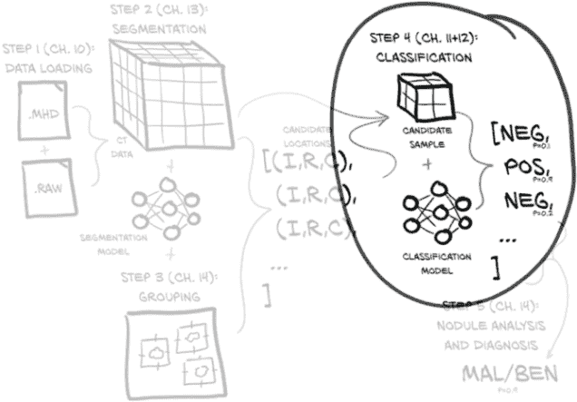
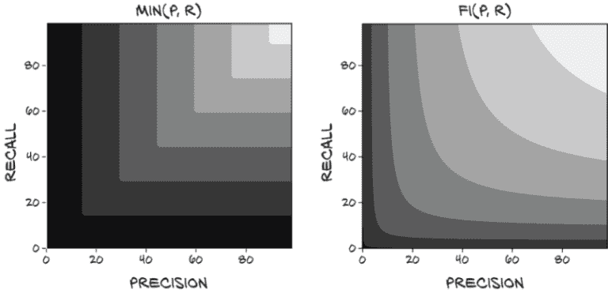

# 十二、通过指标和增强改进训练

本章涵盖

+   定义和计算精确率、召回率以及真/假阳性/阴性

+   使用 F1 分数与其他质量指标

+   平衡和增强数据以减少过拟合

+   使用 TensorBoard 绘制质量指标图

上一章的结束让我们陷入了困境。虽然我们能够将深度学习项目的机制放置好，但实际上没有任何结果是有用的；网络只是将一切都分类为非结节！更糟糕的是，结果表面看起来很好，因为我们正在查看训练和验证集中被正确分类的整体百分比。由于我们的数据严重倾向于负样本，盲目地将一切都视为负面是我们的模型快速得分的一种简单而快速的方法。太糟糕了，这样做基本上使模型无用！

这意味着我们仍然专注于与第十一章相同的图 12.1 的同一部分。但现在我们正在努力使我们的分类模型工作*良好*而不是*只是工作*。本章重点讨论如何衡量、量化、表达，然后改进我们的模型执行工作的能力。



图 12.1 我们的端到端肺癌检测项目，重点放在本章的主题上：第 4 步，分类

## 12.1 改进的高层计划

虽然有点抽象，图 12.2 向我们展示了我们将如何处理那些广泛的主题。

让我们详细地走过本章的这张有些抽象的地图。我们将处理我们面临的问题，比如过度关注单一、狭窄的指标以及由此产生的行为在一般意义上是无用的。为了使本章的一些概念更具体化，我们将首先使用一个比喻来将我们的困境更具体化：在图 12.2 中，（1）看门狗和（2）鸟和窃贼。


图 12.2 我们将使用的比喻来修改衡量我们模型的指标，使其变得出色

之后，我们将开发一个图形语言来代表上一章实施中所需的核心概念：（3）比率：召回率和精确率。一旦我们将这些概念巩固下来，我们将涉及一些使用这些概念的数学，这将包括一种更健壮的评估我们模型性能的方式，并将其压缩为一个数字：（4）新指标：F1 分数。我们将实施这些新指标的公式，并查看在训练过程中每个时期这些结果值如何变化。最后，我们将对我们的`LunaDataset`实现进行一些急需的更改，以改善我们的训练结果：（5）平衡和（6）增强。然后我们将看看这些实验性的更改是否对我们的性能指标产生了预期的影响。

到本章结束时，我们训练的模型将表现得更好：（7）工作得很棒！虽然它还没有准备好立即投入临床使用，但它将能够产生明显优于随机的结果。这意味着我们已经有了可行的第 4 步实现，结节候选分类；一旦完成，我们可以开始考虑如何将第 2 步（分割）和第 3 步（分组）纳入项目中。

## 12.2 好狗与坏家伙：假阳性和假阴性

我们不再考虑模型和肿瘤，而是考虑图 12.3 中的两只看门狗，它们刚从服从学校毕业。它们都想警告我们有窃贼——这是一种罕见但严重的情况，需要及时处理。


图 12.3 本章的主题集，重点放在框架比喻上

不幸的是，虽然两只狗都是好狗，但都不是好的*警卫*狗。我们的梗犬（Roxie）对几乎所有事情都会吠，而我们的老猎犬（Preston）几乎只会对入室者吠叫——但前提是他在他们到达时恰好醒着。

Roxie 几乎每次都会警告我们有入室者。她还会警告我们有消防车、雷暴、直升机、鸟、邮递员、松鼠、路人等。如果我们对每次吠叫进行跟进，我们几乎永远不会被抢劫（只有最狡猾的偷窃者才能溜过）。完美！... 除了那么勤奋意味着我们实际上并没有通过养警卫狗节省任何工作。相反，我们每隔几个小时就会起床，手持手电筒，因为 Roxie 闻到了猫的气味，或者听到了猫头鹰的叫声，或者看到了一辆晚点的公共汽车经过。Roxie 有一个问题性的假阳性数量。

*假阳性*是被分类为感兴趣或所需类别的成员（阳性表示“是的，这是我感兴趣了解的类型”）的事件，但实际上并不是真正感兴趣的。对于结节检测问题，当一个实际上无趣的候选者被标记为结节，因此需要放射科医生的关注时，就会发生假阳性。对于 Roxie 来说，这些可能是消防车、雷暴等。在接下来的章节和随后的图中，我们将使用一张猫的图片作为典型的假阳性。

将假阳性与*真阳性*进行对比：被正确分类的感兴趣项目。这些将在图中由一个人类强盗表示。

与此同时，如果 Preston 吠叫，请立即报警，因为这意味着几乎肯定有人闯入，房子着火了，或者哥斯拉在袭击。然而，Preston 睡得很沉，正在进行家庭入侵的声音不太可能唤醒他，所以每当有人尝试时，我们几乎总是会被抢劫。虽然比没有好，但我们并没有真正获得最初让我们养狗的平静心态。Preston 有一个问题性的假阴性数量。

*假阴性*是被分类为不感兴趣或不是所需类别的成员（阴性表示“不，这不是我感兴趣了解的类型”）的事件，但实际上确实是感兴趣的。对于结节检测问题，当一个结节（即潜在的癌症）未被检测到时，就会发生假阴性。对于 Preston 来说，这些将是他睡过的抢劫案。在这里我们将有点创意，使用一张*啮齿*强盗的图片来代表假阴性。它们很狡猾！

将假阴性与*真阴性*进行对比：正确识别为无趣项目的项目。我们将用一只鸟的图片来代表这些。

为了完成这个比喻，第十一章的模型基本上是一只拒绝对不是金鱼罐的任何东西发出喵声的猫（同时坚定地忽视 Roxie）。我们在上一章末尾的重点是整体训练和验证集的正确百分比。显然，这不是一个很好的评分方式，正如我们从我们每只狗对单一指标的近视关注——比如真阳性或真阴性的数量——可以看出的那样，我们需要一个更广泛关注的指标来捕捉我们的整体表现。

## 12.3 绘制阳性和阴性

让我们开始制定我们将用来描述真/假阳性/阴性的视觉语言。如果我们的解释变得重复，请耐心等待；我们希望确保您对我们将要讨论的比率形成坚实的心理模型。考虑图 12.4，显示了可能对我们其中一只警卫狗感兴趣的事件。


图 12.4 中的猫、鸟、啮齿动物和强盗构成了我们的四个分类象限。它们由人类标签和狗的分类阈值分隔。

在图 12.4 中，我们将使用两个阈值。第一个是人为决定的将入室盗窃犯与无害动物分开的分界线。具体来说，这是为每个训练或验证样本分配的标签。第二个是狗确定的*分类阈值*，它决定了狗是否会对某物吠叫。对于深度学习模型，这是在考虑样本时模型产生的预测值。

这两个阈值的组合将我们的事件分成四个象限：真/假阳性/阴性。我们将关注的事件用较深的背景色进行阴影处理（因为那些坏家伙总是在黑暗中潜行）。

当然，现实要复杂得多。并不存在一个关于入室盗窃犯的柏拉图理想，也没有一个相对于分类阈值的单一点，所有入室盗窃犯都会在那里。相反，图 12.5 向我们展示了一些入室盗窃犯会特别狡猾，一些鸟类会特别烦人。我们还将把我们的实例放在一个图中。我们的 X 轴将保持每个事件的吠声价值，由我们的一只看门狗确定。我们将让 Y 轴代表我们作为人类能够感知的一些模糊特质，但我们的狗却无法感知。

由于我们的模型产生二元分类，我们可以将预测阈值视为将单一数值输出与我们的分类阈值值进行比较。这就是为什么我们要求图 12.5 中的分类阈值线是完全垂直的。


图 12.5 每种事件都会有许多可能的实例，我们的看门狗需要评估。

每个可能的入室盗窃犯都是不同的，因此我们的看门狗将需要评估许多不同的情况，这意味着更多犯错的机会。我们可以看到明显的对角线将鸟类与入室盗窃犯分开，但普雷斯顿和洛克西只能在这里感知 X 轴：他们在我们的图中间有一组混乱、重叠的事件。他们必须选择一个垂直的吠声价值阈值，这意味着他们中的任何一个都不可能完美地做到。有时候把你的家电搬到他们的货车上的人是你雇来修理洗衣机的维修人员，有时候入室盗窃犯会开着一辆侧面写着“洗衣机维修”的货车出现。期望狗能够察觉到这些微妙之处注定会失败。

我们要使用的实际输入数据具有高维度--我们需要考虑大量 CT 体素值，以及更抽象的事物，如候选大小、在肺部的整体位置等等。我们模型的工作是将每个事件及其属性映射到这个矩形中，以便我们可以使用单一垂直线（我们的分类阈值）清晰地分离这些正面和负面事件。这是通过我们模型末端的`nn.Linear`层完成的。垂直线的位置与我们在第 11.6.1 节中看到的`classificationThreshold_float`完全对应。在那里，我们选择了硬编码值 0.5 作为我们的阈值。

请注意，实际上，所呈现的数据不是二维的；在倒数第二层之后，它变成了非常高维度，到输出时变成了一维（这里是我们的 X 轴）--每个样本只有一个标量（然后被分类阈值二分）。在这里，我们使用第二维（Y 轴）来表示我们的模型无法看到或使用的每个样本特征：例如患者的年龄或性别，结节候选在肺部的位置，甚至模型尚未利用的候选局部特征。它还为我们提供了一种方便的方式来表示非结节和结节样本之间的混淆。

图 12.5 中的象限区域和每个区域中包含的样本数将是我们用来讨论模型性能的值，因为我们可以使用这些值之间的比率来构建越来越复杂的指标，以客观地衡量我们的表现。正如他们所说，“证据在于比例。”¹ 接下来，我们将使用这些事件子集之间的比率来开始定义更好的指标。

### 12.3.1 召回率是罗克西的优势

召回率基本上是“确保你永远不会错过任何有趣的事件！”正式地说，*召回率*是真阳性与真阳性和假阴性的并集的比率。我们可以在图 12.6 中看到这一点。


图 12.6 召回率是真阳性与真阳性和假阴性的并集的比率。高召回率可以最小化假阴性。

*注* 在某些情境中，召回率被称为*敏感性*。

为了提高召回率，要尽量减少假阴性。在看门狗的术语中，这意味着如果你不确定，就叫一声，以防万一。不要让任何啮齿动物小偷在你的监视下溜走！

罗克西通过将分类阈值推到最左边，使其包含图 12.7 中几乎所有的正面事件，从而实现了极高的召回率。请注意，这样做意味着她的召回值接近 1.0，即 99%的盗贼都会被叫唤。由于这是罗克西定义成功的方式，在她看来，她做得很好。不要在意大量的假阳性！


图 12.7 罗克西选择的阈值优先考虑减少假阴性。每只老鼠都会被叫唤……还有猫，大多数鸟。

### 12.3.2 精确性是普雷斯顿的长处

精确性基本上是“除非你确定，否则不要叫。”为了提高精确性，要尽量减少假阳性。普雷斯顿不会对某事物叫唤，除非他确定那是一个盗贼。更正式地说，*精确性*是真阳性与真阳性和假阳性的并集的比率，如图 12.8 所示。


图 12.8 精确性是真阳性与真阳性和假阳性的并集的比率。高精确性可以最小化假阳性。

普雷斯顿通过将分类阈值推到最右边，排除尽可能多的无趣、负面事件，从而实现了极高的精确性（见图 12.9）。这与罗克西的方法相反，意味着普雷斯顿的精确性接近 1.0：他叫的 99%的事物都是盗贼。尽管有大量事件未被检测到，但这也符合他作为一只好看门狗的定义。

虽然精确性和召回率都不能作为评估我们模型的单一指标，但它们在训练过程中是有用的数字。让我们计算并显示这些作为我们训练程序的一部分，然后我们将讨论其他可以使用的指标。


图 12.9 普雷斯顿选择的阈值优先考虑减少假阳性。猫被放过，只有盗贼会被叫唤！

### 12.3.3 在 logMetrics 中实现精确性和召回率

在训练过程中，精确性和召回率都是有价值的指标，因为它们提供了关于模型行为的重要见解。如果它们中的任何一个降至零（正如我们在第十一章中看到的！），那么我们的模型可能已经开始表现出退化的方式。我们可以使用行为的确切细节来指导我们在哪里进行调查和实验，以使训练重新回到正轨。我们希望更新`logMetrics`函数，以在每个时期的输出中添加精确性和召回率，以补充我们已经拥有的损失和正确性指标。

到目前为止，我们一直在以“真阳性”等术语定义精确度和召回率，因此我们将在代码中继续这样做。事实证明，我们已经计算了一些我们需要的值，尽管我们给它们起了不同的名称。

列表 12.1 training.py:315，`LunaTrainingApp.logMetrics`

```py
neg_count = int(negLabel_mask.sum())
pos_count = int(posLabel_mask.sum())

trueNeg_count = neg_correct = int((negLabel_mask & negPred_mask).sum())
truePos_count = pos_correct = int((posLabel_mask & posPred_mask).sum())

falsePos_count = neg_count - neg_correct
falseNeg_count = pos_count - pos_correct
```

在这里，我们可以看到`neg_correct`与`trueNeg_count`是相同的！这其实是有道理的，因为非结节是我们的“负面”值（如“负面诊断”），如果分类器预测正确，那么这就是真阴性。同样，正确标记的结节样本是真阳性。

我们确实需要添加我们的假阳性和假阴性值的变量。这很简单，因为我们可以取良性标签的总数并减去正确的计数。剩下的是被误分类为*阳性*的非结节样本的计数。因此，它们是假阳性。同样，假阴性计算形式相同，但使用结节计数。

有了这些数值，我们可以计算`precision`和`recall`，并将它们存储在`metrics_dict`中。

列表 12.2 training.py:333，`LunaTrainingApp.logMetrics`

```py
precision = metrics_dict['pr/precision'] = \
  truePos_count / np.float32(truePos_count + falsePos_count)
recall  = metrics_dict['pr/recall'] = \
  truePos_count / np.float32(truePos_count + falseNeg_count)
```

注意双重赋值：虽然有单独的`precision`和`recall`变量并不是绝对必要的，但它们提高了下一节的可读性。我们还扩展了`logMetrics`中的日志语句以包括新值，但我们暂时跳过实现（我们将在本章稍后重新讨论日志记录）。

### 12.3.4 我们的终极性能指标：F1 分数

尽管有用，但精确度和召回率都无法完全捕捉我们评估模型所需的内容。正如我们在 Roxie 和 Preston 中看到的，通过操纵我们的分类阈值，可能会单独操纵其中一个，导致模型在其中一个上得分良好，但以牺牲任何实际效用为代价。我们需要一种以防止这种操纵的方式结合这两个值的东西。正如我们在图 12.10 中看到的，现在是引入我们的终极指标的时候了。

通常接受的结合精确度和召回率的方法是使用 F1 分数（[`en.wikipedia.org/wiki/F1_score`](https://en.wikipedia.org/wiki/F1_score)）。与其他指标一样，F1 分数的范围在 0（没有真实世界预测能力的分类器）和 1（具有完美预测的分类器）之间。我们将更新`logMetrics`以包括这一点。

列表 12.3 training.py:338，`LunaTrainingApp.logMetrics`

```py
metrics_dict['pr/f1_score'] = \
  2 * (precision * recall) / (precision + recall)
```

乍一看，这可能比我们需要的更复杂，当在精确度和召回率之间进行权衡时，F1 分数的行为可能不会立即显而易见。然而，这个公式有很多好的性质，并且与我们可能考虑的几种其他更简单的替代方案相比较有利。


图 12.10 本章的主题集，重点是最终的 F1 分数指标

一个立即可能的评分函数是将精确度和召回率的值平均起来。不幸的是，这使得`avg(p=1.0, r=0.0)`和`avg(p=0.5, r=0.5)`都得到相同的 0.5 分数，正如我们之前讨论的，精确度或召回率为零的分类器通常是无用的。将无用的东西与有用的东西赋予相同的非零分数，立即使平均成为一个没有意义的指标。

然而，让我们在图 12.11 中直观比较平均和 F1。有几件事引人注目。首先，我们可以看到平均值的等高线中没有曲线或拐点。这就是让我们的精确度或召回率偏向一侧的原因！永远不会出现这样的情况，即通过使召回率达到 100%（Roxie 方法）然后消除任何容易消除的假阳性来最大化分数是没有意义的。这就为添加分数至少为 0.5 设置了一个底线！拥有一个质量指标，可以轻松获得至少 50% 的分数，感觉不对劲。


图 12.11 使用`avg(p, r)`计算最终分数。较浅的值接近 1.0。

*注意* 我们实际上在这里做的是取精确度和召回率的*算术平均值*（[`en.wikipedia.org/wiki/Arithmetic_mean`](https://en.wikipedia.org/wiki/Arithmetic_mean)），这两者都是*比率*而不是可计数的标量值。取比率的算术平均值通常不会给出有意义的结果。F1 分数是两个比率的*调和平均值*（[`en.wikipedia.org/wiki/Harmonic_mean`](https://en.wikipedia.org/wiki/Harmonic_mean)）的另一个名称，这是结合这些值的更合适的方式。

与 F1 分数相比：当召回率高而精确度低时，为了将分数移动到平衡的甜蜜点，牺牲很多召回率以换取一点精确度将使分数更接近。有一个漂亮、深刻的拐点，很容易滑入其中。鼓励具有平衡精确度和召回率是我们希望从我们的评分指标中得到的。

假设我们仍然希望有一个更简单的指标，但不会奖励任何偏斜。为了纠正加法的弱点，我们可能会取精确度和召回率的最小值（图 12.12）。



图 12.12 使用`min(p, r)`计算最终分数

这很好，因为如果任一值为 0，分数也为 0，而要获得 1.0 的分数的唯一方法是两个值都为 1.0。然而，它仍然有待改进，因为使召回率从 0.7 提高到 0.9 而将精确度保持在 0.5 不会改善分数，降低召回率到 0.6 也不会改善分数！尽管这个指标肯定惩罚了精确度和召回率之间的不平衡，但它并没有捕捉到关于这两个值的许多细微差别。正如我们所见，通过简单地移动分类阈值，很容易将一个值换成另一个值。我们希望我们的指标能反映这些交易。

为了更好地实现我们的目标，我们将不得不接受至少更复杂一点。我们可以将这两个值相乘，如图 12.13 所示。这种方法保持了一个很好的特性，即如果任一值为 0，分数也为 0，而分数为 1.0 意味着两个输入都完美。它还有利于在低值处精确度和召回率之间的平衡折衷，尽管当接近完美结果时，它变得更加线性。这并不好，因为我们真的需要将两者都提高才能在那一点上有意义的改进。


图 12.13 使用`mult(p, r)`计算最终分数

*注意* 在这里我们正在取两个比率的*几何平均值*（[`en.wikipedia.org/wiki/Geometric_mean`](https://en.wikipedia.org/wiki/Geometric_mean)），这也不会产生有意义的结果。

还有一个问题，几乎整个象限从（0, 0）到（0.5, 0.5）都非常接近于零。正如我们将看到的，拥有一个对该区域的变化敏感的指标是重要的，特别是在我们模型设计的早期阶段。

虽然将乘法作为我们的评分函数是可行的（它没有任何立即淘汰的资格，就像之前的评分函数一样），但我们将使用 F1 分数来评估我们的分类模型的性能。

#### 更新日志输出以包括精确度、召回率和 F1 分数

现在我们有了新的指标，将它们添加到我们的日志输出中非常简单。我们将在我们的训练和验证集的主要日志声明中包括精确度、召回率和 F1。

列表 12.4 training.py:341, `LunaTrainingApp.logMetrics`

```py
log.info(
  ("E{} {:8} {loss/all:.4f} loss, "
     + "{correct/all:-5.1f}% correct, "
     + "{pr/precision:.4f} precision, "   # ❶
     + "{pr/recall:.4f} recall, "         # ❶
     + "{pr/f1_score:.4f} f1 score"       # ❶
  ).format(
    epoch_ndx,
    mode_str,
    **metrics_dict,
  )
)
```

❶ 格式字符串已更新

另外，我们将为每个负样本和正样本的正确识别计数和总样本数包括精确值。

列表 12.5 training.py:353, `LunaTrainingApp.logMetrics`

```py
log.info(
  ("E{} {:8} {loss/neg:.4f} loss, "
     + "{correct/neg:-5.1f}% correct ({neg_correct:} of {neg_count:})"
  ).format(
    epoch_ndx,
    mode_str + '_neg',
    neg_correct=neg_correct,
    neg_count=neg_count,
    **metrics_dict,
  )
)
```

新版本的正日志声明看起来基本相同。

### 12.3.5 我们的模型如何使用我们的新指标？

现在我们已经实施了闪亮的新指标，让我们试试它们；我们将在展示 Bash shell 会话结果后讨论结果。在您的系统进行数字计算时，您可能想提前阅读；这可能需要大约半个小时，具体时间取决于您的系统。实际所需时间取决于您的系统的 CPU、GPU 和磁盘速度；我们的系统配备 SSD 和 GTX 1080 Ti，每个完整时期大约需要 20 分钟：

```py
$ ../.venv/bin/python -m p2ch12.training
Starting LunaTrainingApp...
...
E1 LunaTrainingApp

.../p2ch12/training.py:274: RuntimeWarning: invalid value encountered in double_scalars
  metrics_dict['pr/f1_score'] = 2 * (precision * recall) / (precision + recall)                                          # ❶

E1 trn      0.0025 loss,  99.8% correct, 0.0000 prc, 0.0000 rcl, nan f1
E1 trn_ben  0.0000 loss, 100.0% correct (494735 of 494743)
E1 trn_mal  1.0000 loss,   0.0% correct (0 of 1215)

.../p2ch12/training.py:269: RuntimeWarning: invalid value encountered in long_scalars
  precision = metrics_dict['pr/precision'] = truePos_count / (truePos_count + falsePos_count)

E1 val      0.0025 loss,  99.8% correct, nan prc, 0.0000 rcl, nan f1
E1 val_ben  0.0000 loss, 100.0% correct (54971 of 54971)
E1 val_mal  1.0000 loss,   0.0% correct (0 of 136)
```

❶ 这些 RuntimeWarning 行的确切计数和行号可能会因运行而异。

糟糕。我们收到了一些警告，考虑到我们计算的一些值是`nan`，可能在某处发生了除零操作。让我们看看我们能找出什么。

首先，由于训练集中没有一个正样本被分类为正，这意味着精确度和召回率都为零，导致我们的 F1 分数计算除以零。其次，对于我们的验证集，由于没有任何东西被标记为正，`truePos_count`和`falsePos_count`都为零。这导致我们的`precision`计算的分母也为零；这是合理的，因为这就是我们看到另一个`RuntimeWarning`的地方。

少数负训练样本被分类为正（494743 个中有 494735 个被分类为负，因此有 8 个样本被错误分类）。虽然一开始可能看起来很奇怪，但请记住我们是*在整个时期内*收集我们的训练结果，而不是像我们对验证结果那样使用模型的时期末状态。这意味着第一批次实际上产生了随机结果。其中一些来自第一批次的样本被标记为正并不奇怪。

*注意* 由于网络权重的随机初始化和训练样本的随机排序，单独的运行可能会表现出略有不同的行为。确切可重现的行为可能是可取的，但超出了我们在本书第 2 部分中所尝试的范围。

嗯，那有点痛苦。切换到我们的新指标导致从 A+降至“零，如果你幸运的话”--如果我们不幸运，分数会很糟糕，*甚至不是一个数字*。哎呀。

话虽如此，在长期来看，这对我们是有利的。自第十一章以来，我们就知道我们的模型性能很差。如果我们的指标告诉我们除了那个，那将指向指标中的一个基本缺陷！

## 12.4 理想数据集是什么样的？

在我们为当前糟糕的情况哭泣之前，让我们想想我们实际上希望我们的模型做什么。图 12.14 说，首先我们需要平衡我们的数据，以便我们的模型能够正确训练。让我们建立起达到这个目标所需的逻辑步骤。


图 12.14 本章主题集，重点关注平衡我们的正负样本

回想一下之前的图 12.5，并讨论分类阈值。通过移动阈值来获得更好的结果具有有限的效果--正负类之间有太多重叠无法处理。

相反，我们想看到一个类似图 12.15 的图像。在这里，我们的标签阈值几乎是垂直的。这就是我们想要的，因为这意味着标签阈值和我们的分类阈值可以相当好地对齐。同样，大多数样本集中在图表的两端。这两件事都要求我们的数据易于分离，并且我们的模型具有执行该分离的能力。我们的模型目前具有足够的容量，所以问题不在于此。相反，让我们看看我们的数据。


图 12.15 一个训练良好的模型可以清晰地分离数据，使得很容易选择一个具有少量折衷的分类阈值。


图 12.16 一个大致近似我们 LUNA 分类数据中不平衡的数据集

请记住，我们的数据极度不平衡。正样本与负样本的比例为 400:1。这是*极端*不平衡的！图 12.16 展示了这种情况。难怪我们的“实际结节”样本在人群中被忽略！

现在，让我们非常清楚：当我们完成时，我们的模型将能够很好地处理这种数据不平衡。我们甚至可以在不改变平衡的情况下训练模型到最后，假设我们愿意等待无数个纪元。但我们是忙碌的人，有很多事情要做，所以与其等到 GPU 烧毁到宇宙的热死亡，不如尝试通过改变我们训练的类平衡使我们的训练数据看起来更理想。

### 12.4.1 使数据看起来不那么实际，更像“理想”的方法

最好的做法是有相对更多的正样本。在训练的初始时期，当我们从随机混乱过渡到更有组织的状态时，由于正样本太少，它们会被淹没。

然而，这种情况发生的方式有些微妙。请记住，由于我们的网络权重最初是随机的，网络每个样本的输出也是随机的（但被夹在[0-1]范围内）。

*注意* 我们的损失函数是`nn.CrossEntropyLoss`，严格来说是在原始 logits 上操作，而不是类概率。在我们的讨论中，我们将忽略这一区别，假设损失和标签预测之间的差异是相同的。

预测与正确标签数值接近的结果对网络权重几乎没有影响，而与正确答案明显不同的预测结果会导致权重发生更大的变化。由于模型在随机权重初始化时输出是随机的，我们可以假设在我们约 500k 个训练样本（准确地说是 495,958 个）中，我们将有以下近似组：

1.  250,000 个负样本将被预测为负面（0.0 到 0.5），并最多对网络权重产生一点朝向预测负面的变化。

1.  250,000 个负样本将被预测为正面（0.5 到 1.0），并导致网络权重向预测负面的方向发生大幅变化。

1.  500 个正样本将被预测为负面，并导致网络权重向预测正面的方向发生变化。

1.  500 个正样本将被预测为正面，并几乎不会对网络权重产生任何变化。

*注意* 请记住，实际预测是介于 0.0 和 1.0 之间的实数，因此这些组没有严格的界限。

这里的关键是：1 组和 4 组可以是*任意大小*，它们对训练几乎没有影响。唯一重要的是 2 组和 3 组能够相互抵消，防止网络崩溃到退化的“只输出一种结果”的状态。由于 2 组比 3 组大 500 倍，我们使用的批量大小为 32，大约需要经过 500/32 = 15 批次才能看到一个正样本。这意味着 15 个训练批次中有 14 个将是 100%负面的，只会将所有模型权重拉向预测负面的方向。这种不平衡的拉力产生了我们一直看到的退化行为。

相反，我们希望正样本和负样本数量相同。因此，在训练的第一部分中，一半的标签将被错误分类，这意味着第 2 组和第 3 组的大小应该大致相等。我们还希望确保我们呈现的批次中包含负样本和正样本的混合。平衡将导致拉锯战平衡，每个批次中的类别混合将使模型有很好的机会学会区分这两个类别。由于我们的 LUNA 数据只有少量固定数量的正样本，我们将不得不接受我们拥有的正样本并在训练期间重复呈现它们。

歧视

在这里，我们将歧视定义为“将两个类别彼此分开的能力”。构建和训练一个能够将“实际结节”候选者与正常解剖结构区分开的模型是我们在第 2 部分所做的全部工作的重点。

歧视的一些其他定义更具问题性。虽然超出了我们在这里讨论工作的范围，但从真实世界数据训练的模型存在更大的问题。如果真实世界数据集是从存在真实世界歧视性偏见的来源收集的（例如，种族偏见在逮捕和定罪率中，或者从社交媒体收集的任何内容），并且在数据集准备或训练期间没有纠正这种偏见，那么生成的模型将继续表现出训练数据中存在的相同偏见。就像在人类中一样，种族主义是被学习的。

这意味着几乎任何从互联网大数据源训练的模型都会在某种程度上受到损害，除非极端小心地清除这些模型中的偏见。请注意，就像我们在第 2 部分的目标一样，这被认为是一个未解决的问题。

回想一下我们在第十一章中提到的教授，他的期末考试有 99 个错误答案和 1 个正确答案。下学期，在被告知“你应该有更平衡的真假答案”后，教授决定增加一次期中考试，其中有 99 个正确答案和 1 个错误答案。“问题解决了！”

显然，正确的方法是以一种不允许学生利用测试的更大结构来回答问题的方式交替真实和错误答案。虽然学生可能会注意到“奇数问题是真实的，偶数问题是错误的”这样的模式，但 PyTorch 使用的批处理系统不允许模型“注意到”或利用那种模式。我们的训练数据集将需要更新，以在正样本和负样本之间交替，就像图 12.17 中那样。

不平衡数据就像我们在第九章开始提到的草堆中的针。如果您必须手动执行这项分类工作，您可能会开始同情普雷斯顿。


图 12.17 不平衡数据的批次将在第一个正事件之前只有负事件，而平衡数据可以每隔一个样本交替出现。

然而，我们不会为验证进行任何平衡。我们的模型需要在现实世界中表现良好，而现实世界是不平衡的（毕竟，这就是我们获取原始数据的地方！）。

我们应该如何实现这种平衡？让我们讨论我们的选择。

#### 取样器可以重塑数据集

`DataLoader` 的一个可选参数是`sampler=...`。这允许数据加载器覆盖传入数据集的本机迭代顺序，而是根据需要塑造、限制或重新强调底层数据。当使用一个不受您控制的数据集时，这可能非常有用。将公共数据集重新塑造以满足您的需求比从头开始重新实现该数据集要少得多。

不足之处在于，我们可以通过采样器实现的许多变异需要我们打破底层数据集的封装。例如，假设我们有一个类似于 CIFAR-10（[www.cs.toronto.edu/~kriz/cifar.html](http://www.cs.toronto.edu/~kriz/cifar.html)）的数据集，由 10 个权重相同的类组成，我们想要让 1 个类（比如“飞机”）现在占所有训练图像的 50%。我们可以决定使用`WeightedRandomSampler`（[`mng.bz/8plK`](http://mng.bz/8plK)）并将每个“飞机”样本索引的权重提高，但构建`weights`参数需要我们事先知道哪些索引是飞机。

正如我们讨论的那样，`Dataset` API 只规定子类提供`__len__`和`__getitem__`，但我们无法直接询问“哪些样本是飞机？”我们要么事先加载每个样本以查询该样本的类别，要么打破封装并希望我们需要的信息可以轻松从查看`Dataset`子类的内部实现中获得。

由于在我们可以直接控制数据集的情况下，这两种选项都不是特别理想的，因此第 2 部分的代码在`Dataset`子类内部实现任何所需的数据整形，而不依赖外部采样器。

#### 在数据集中实现类平衡

我们将直接更改我们的`LunaDataset`，以呈现平衡的正负样本比例进行训练。我们将保留负训练样本和正训练样本的分开列表，并交替从这两个列表中返回样本。这将防止模型通过简单地回答每个呈现的样本为“false”而得分良好的退化行为。此外，正负类别将交错排列，以便权重更新被迫区分类别。

让我们在`LunaDataset`中添加一个`ratio_int`，用于控制第*N*个样本的标签，并跟踪我们按标签分开的样本。

列表 12.6 dsets.py:217，`class` `LunaDataset`

```py
class LunaDataset(Dataset):
  def __init__(self,
         val_stride=0,
         isValSet_bool=None,
         ratio_int=0,
      ):
    self.ratio_int = ratio_int
    # ... line 228
    self.negative_list = [
      nt for nt in self.candidateInfo_list if not nt.isNodule_bool
    ]
    self.pos_list = [
      nt for nt in self.candidateInfo_list if nt.isNodule_bool
    ]
    # ... line 265

  def shuffleSamples(self):               # ❶
    if self.ratio_int:
      random.shuffle(self.negative_list)
      random.shuffle(self.pos_list)
```

❶ 我们将在每个周期的开头调用这个函数，以随机化呈现的样本顺序。

有了这个，我们现在为每个标签都有专门的列表。使用这些列表，更容易根据数据集中的索引返回我们想要的标签。为了确保我们的索引正确，我们应该勾画出我们想要的排序。假设`ratio_int`为 2，意味着负样本与正样本的比例为 2:1。这意味着每三个索引应该是正样本：

```py
DS Index   0 1 2 3 4 5 6 7 8 9 ...
Label      + - - + - - + - - +
Pos Index  0     1     2     3
Neg Index    0 1   2 3   4 5
```

数据集索引与正索引之间的关系很简单：将数据集索引除以 3 然后向下取整。负索引稍微复杂一些，因为我们必须从数据集索引中减去 1，然后再减去最近的正索引。

在我们的`LunaDataset`类中实现，看起来像下面这样。

列表 12.7 dsets.py:286，`LunaDataset.__getitem__`

```py
def __getitem__(self, ndx):
  if self.ratio_int:                                   # ❶
    pos_ndx = ndx // (self.ratio_int + 1)

    if ndx % (self.ratio_int + 1):                     # ❷
      neg_ndx = ndx - 1 - pos_ndx
      neg_ndx %= len(self.negative_list)               # ❸
      candidateInfo_tup = self.negative_list[neg_ndx]
    else:
      pos_ndx %= len(self.pos_list)                    # ❸
      candidateInfo_tup = self.pos_list[pos_ndx]
  else:
    candidateInfo_tup = self.candidateInfo_list[ndx]   # ❹
```

❶ 零的`ratio_int`意味着使用本地平衡。

❷ 非零余数表示这应该是一个负样本。

❸ 溢出导致环绕。

❹ 如果不平衡类别，则返回第 N 个样本

这可能有点复杂，但如果你仔细检查一下，就会明白。请记住，如果比率较低，我们会在用尽数据集之前用完正样本。我们通过在索引到`self.pos_list`之前取`pos_ndx`的模来处理这个问题。虽然由于大量负样本的存在，`neg_ndx`不太可能发生相同类型的索引溢出，但我们仍然执行模运算，以防以后做出可能导致溢出的更改。

我们还将对数据集的长度进行更改。虽然这并非绝对必要，但加快单个周期的速度是很好的。我们将硬编码我们的`__len__`为 200,000。

列表 12.8 dsets.py:280，`LunaDataset.__len__`

```py
def __len__(self):
  if self.ratio_int:
    return 200000
  else:
    return len(self.candidateInfo_list)
```

我们不再受限于特定数量的样本，并且提供“完整的一轮”在我们必须多次重复正样本以呈现平衡的训练集时并不是很有意义。通过选择 20 万个样本，我们减少了开始训练运行并看到结果之间的时间（更快的反馈总是不错！），并且我们给自己一个漂亮、清晰的每轮样本数。随时调整一轮的长度以满足您的需求。

为了完整起见，我们还添加了一个命令行参数。

列表 12.9 training.py:31，`class` `LunaTrainingApp`

```py
class LunaTrainingApp:
  def __init__(self, sys_argv=None):
    # ... line 52
    parser.add_argument('--balanced',
      help="Balance the training data to half positive, half negative.",
      action='store_true',
      default=False,
    )
```

然后我们将该参数传递给`LunaDataset`构造函数。

列表 12.10 training.py:137，`LunaTrainingApp.initTrainDl`

```py
def initTrainDl(self):
  train_ds = LunaDataset(
    val_stride=10,
    isValSet_bool=False,
    ratio_int=int(self.cli_args.balanced),    # ❶
  )
```

❶ 这里我们依赖于 Python 的`True`可转换为`1`。

我们已经准备就绪。让我们运行它！

### 12.4.2 将平衡的 LunaDataset 与之前的运行进行对比

作为提醒，我们不平衡的训练运行结果如下：

```py
$ python -m p2ch12.training
...
E1 LunaTrainingApp
E1 trn      0.0185 loss,  99.7% correct, 0.0000 precision, 0.0000 recall, nan f1 score
E1 trn_neg  0.0026 loss, 100.0% correct (494717 of 494743)
E1 trn_pos  6.5267 loss,   0.0% correct (0 of 1215)
...
E1 val      0.0173 loss,  99.8% correct, nan precision, 0.0000 recall, nan f1 score
E1 val_neg  0.0026 loss, 100.0% correct (54971 of 54971)
E1 val_pos  5.9577 loss,   0.0% correct (0 of 136)
```

但是当我们使用`--balanced`运行时，我们看到以下情况：

```py
$ python -m p2ch12.training --balanced
...
E1 LunaTrainingApp
E1 trn      0.1734 loss,  92.8% correct, 0.9363 precision, 0.9194 recall, 0.9277 f1 score
E1 trn_neg  0.1770 loss,  93.7% correct (93741 of 100000)
E1 trn_pos  0.1698 loss,  91.9% correct (91939 of 100000)
...
E1 val      0.0564 loss,  98.4% correct, 0.1102 precision, 0.7941 recall, 0.1935 f1 score
E1 val_neg  0.0542 loss,  98.4% correct (54099 of 54971)
E1 val_pos  0.9549 loss,  79.4% correct (108 of 136)
```

这看起来好多了！我们放弃了大约 5%的负样本正确答案，以获得 86%的正确正样本答案。我们又回到了一个扎实的 B 范围内！⁵

然而，就像第十一章一样，这个结果是具有欺骗性的。由于负样本比正样本多 400 倍，即使只有 1%的错误，也意味着我们会将负样本错误地分类为正样本，比实际正样本总数多四倍！

尽管如此，这显然比第十一章的完全错误行为要好得多，比随机抛硬币要好得多。事实上，我们甚至已经进入了（几乎）在实际场景中有用的领域。回想一下我们过度劳累的放射科医生仔细检查每一个 CT 上的每一个斑点：现在我们有了一些可以合理地筛除 95%的假阳性的东西。这是一个巨大的帮助，因为这意味着机器辅助人类的生产力增加了大约十倍。

当然，还有那令人讨厌的 14%被错过的正样本问题，我们可能需要处理一下。也许增加一些额外的训练轮次会有所帮助。让我们看看（再次提醒，每轮至少需要花费 10 分钟）：

```py
$ python -m p2ch12.training --balanced --epochs 20
...
E2 LunaTrainingApp
E2 trn      0.0432 loss,  98.7% correct, 0.9866 precision, 0.9879 recall, 0.9873 f1 score
E2 trn_ben  0.0545 loss,  98.7% correct (98663 of 100000)
E2 trn_mal  0.0318 loss,  98.8% correct (98790 of 100000)
E2 val      0.0603 loss,  98.5% correct, 0.1271 precision, 0.8456 recall, 0.2209 f1 score
E2 val_ben  0.0584 loss,  98.6% correct (54181 of 54971)
E2 val_mal  0.8471 loss,  84.6% correct (115 of 136)
...
E5 trn      0.0578 loss,  98.3% correct, 0.9839 precision, 0.9823 recall, 0.9831 f1 score
E5 trn_ben  0.0665 loss,  98.4% correct (98388 of 100000)
E5 trn_mal  0.0490 loss,  98.2% correct (98227 of 100000)
E5 val      0.0361 loss,  99.2% correct, 0.2129 precision, 0.8235 recall, 0.3384 f1 score
E5 val_ben  0.0336 loss,  99.2% correct (54557 of 54971)
E5 val_mal  1.0515 loss,  82.4% correct (112 of 136)...
...
E10 trn      0.0212 loss,  99.5% correct, 0.9942 precision, 0.9953 recall, 0.9948 f1 score
E10 trn_ben  0.0281 loss,  99.4% correct (99421 of 100000)
E10 trn_mal  0.0142 loss,  99.5% correct (99530 of 100000)
E10 val      0.0457 loss,  99.3% correct, 0.2171 precision, 0.7647 recall, 0.3382 f1 score
E10 val_ben  0.0407 loss,  99.3% correct (54596 of 54971)
E10 val_mal  2.0594 loss,  76.5% correct (104 of 136)
...
E20 trn      0.0132 loss,  99.7% correct, 0.9964 precision, 0.9974 recall, 0.9969 f1 score
E20 trn_ben  0.0186 loss,  99.6% correct (99642 of 100000)
E20 trn_mal  0.0079 loss,  99.7% correct (99736 of 100000)
E20 val      0.0200 loss,  99.7% correct, 0.4780 precision, 0.7206 recall, 0.5748 f1 score
E20 val_ben  0.0133 loss,  99.8% correct (54864 of 54971)
E20 val_mal  2.7101 loss,  72.1% correct (98 of 136)
```

哎呀。要滚动到我们感兴趣的数字，需要滚过很多文本。让我们坚持下去，专注于`val_mal XX.X% correct`数字（或者直接跳到下一节的 TensorBoard 图表）。第 2 轮之后，我们达到了 87.5%；第 5 轮时，我们达到了 92.6%的峰值；然后到了第 20 轮，我们下降到了 86.8%--*低于*我们的第二轮！

*注意* 正如前面提到的，由于网络权重的随机初始化和每轮训练样本的随机选择和排序，预计每次运行都会有独特的行为。

训练集的数字似乎没有同样的问题。负训练样本被正确分类的概率为 98.8%，正样本则为 99.1%。发生了什么？

### 12.4.3 识别过拟合的症状

我们所看到的是过拟合的明显迹象。让我们看一下我们在正样本上的损失图，见图 12.18。


图 12.18 我们的正损失显示出明显的过拟合迹象，因为训练损失和验证损失趋势不同。

在这里，我们可以看到我们的正样本的训练损失几乎为零--每个正样本训练样本都得到了几乎完美的预测。然而，我们的正样本的验证损失却在增加，这意味着我们的实际表现可能正在变差。在这一点上，最好停止训练脚本，因为模型不再改进。

*提示* 通常，如果您的模型在训练集上的表现正在提高，而在验证集上表现变差，那么模型已经开始过拟合。

然而，我们必须注意检查正确的指标，因为这种趋势只发生在我们的*正*损失上。如果我们看一下我们的整体损失，一切似乎都很好！这是因为我们的验证集不平衡，所以整体损失被我们的负样本所主导。正如图 12.19 所示，我们在我们的负样本中没有看到相同的发散行为。相反，我们的负损失看起来很好！这是因为我们有 400 倍的负样本，所以模型要记住个别细节要困难得多。然而，我们的正训练集只有 1,215 个样本。虽然我们多次重复这些样本，但这并不会使它们更难记忆。模型正在从泛化原则转变为基本上记住这 1,215 个样本的怪癖，并声称不属于这几个样本之一的任何东西都是负样本。这包括负训练样本和我们验证集中的所有内容（正负样本都有）。


图 12.19 我们的负损失没有显示过拟合的迹象

显然，仍然存在一些泛化，因为我们大约正确分类了 70%的正验证集。我们只需要改变我们训练模型的方式，使我们的训练集和验证集都朝着正确的方向发展。

## 12.5 重新审视过拟合问题

我们在第五章中提到了过拟合的概念，现在是时候更仔细地看看如何解决这种常见情况了。我们训练模型的目标是教会它识别我们感兴趣的类别的*一般属性*，如我们数据集中所表达的那样。这些一般属性存在于该类别的一些或所有样本中，并且可以*泛化*并用于预测未经训练的样本。当模型开始学习训练集的*特定属性*时，就会发生过拟合，模型开始失去泛化的能力。如果这有点抽象，让我们使用另一个类比。

### 12.5.1 一个过拟合的人脸到年龄预测模型

假设我们有一个模型，它以人脸图像作为输入，并输出预测的年龄。一个好的模型会注意到年龄的特征，如皱纹、白发、发型、服装选择等，并利用这些建立不同年龄看起来的一般模型。当呈现一张新图片时，它会考虑“保守的发型”、“眼镜”和“皱纹”等因素，得出“大约 65 岁”的结论。

与之相比，过拟合模型则是通过记住识别细节来记住特定的人。“那个发型和那副眼镜意味着那是弗兰克。他 62.8 岁了”；“哦，那个伤疤意味着那是哈里。他 39.3 岁了”；等等。当展示一个新的人时，模型将无法识别这个人，也完全不知道该预测多少岁。

更糟糕的是，如果展示弗兰克的儿子的照片（看起来像他爸爸，至少戴着眼镜时是这样！），模型会说：“我认为那是弗兰克。他 62.8 岁了。”尽管小弗兰克实际上年轻了 25 岁！

过拟合通常是由于训练样本太少，与模型仅仅记住答案的能力相比。普通人可以记住自己家人的生日，但在预测比一个小村庄规模更大的群体的年龄时，就必须求助于概括。

我们的人脸到年龄模型有能力简单地记住那些看起来不完全符合其年龄的照片。正如我们在第 1 部分中讨论的，模型容量是一个有点抽象的概念，但大致是模型参数数量乘以这些参数的有效使用方式。当模型的容量相对于需要记住训练集中难样本的数据量很高时，模型很可能会开始过拟合这些更难的训练样本。

## 12.6 通过数据增强防止过拟合

是时候将我们的模型训练从好到优秀了。我们需要完成图 12.20 中的最后一步。


图 12.20 本章的主题集，重点是数据增强

我们通过对单个样本应用合成的改变来*增强*数据集，从而得到一个有效大小比原始数据集更大的新数据集。典型的目标是使改变导致合成样本仍然代表与源样本相同的一般类别，但不能与原始样本一起轻松记忆。当正确执行时，这种增强可以将训练集大小增加到模型能够记忆的范围之外，从而迫使模型越来越依赖泛化，这正是我们想要的。在处理有限数据时，这种增强尤其有用，正如我们在第 12.4.1 节中看到的。

当然，并非所有的增强都同样有用。回到我们的面部年龄预测模型的例子，我们可以轻松地将每个图像的四个角像素的红色通道更改为随机值 0-255，这将导致数据集比原始数据集大 40 亿倍。当然，这并不特别有用，因为模型可以相当轻松地学会忽略图像角落的红点，而图像的其余部分仍然像单个未经增强的原始图像一样容易记忆。将这种方法与左右翻转图像进行对比。这样做只会使数据集比原始数据集大两倍，但每个图像对于训练目的来说会更有用。年龄的一般属性与左右无关，因此镜像图像仍然具有代表性。同样，面部图片很少是完全对称的，因此镜像版本不太可能与原始版本轻松记忆。

### 12.6.1 具体的数据增强技术

我们将实现五种特定类型的数据增强。我们的实现将允许我们单独或合并地对任何一种或全部进行实验。这五种技术如下：

+   将图像上下、左右和/或前后镜像

+   将图像移动几个体素

+   将图像放大或缩小

+   将图像围绕头-脚轴旋转

+   添加噪声到图像

对于每种技术，我们希望确保我们的方法保持训练样本的代表性，同时又足够不同，以便样本用于训练时是有用的。

我们将定义一个函数 `getCtAugmentedCandidate`，负责获取我们标准的 CT 块并对其中的候选进行修改。我们的主要方法将定义一个仿射变换矩阵（[`mng.bz/Edxq`](http://mng.bz/Edxq)），并将其与 PyTorch 的 `affine_grid`（[`pytorch.org/docs/stable/nn.html#affine-grid`](https://pytorch.org/docs/stable/nn.html#affine-grid)）和 `grid_sample`（[`pytorch.org/docs/stable/nn.html#torch.nn.functional.grid_sample`](https://pytorch.org/docs/stable/nn.html#torch.nn.functional.grid_sample)）函数一起使用，以对我们的候选进行重新采样。

列表 12.11 dsets.py:149, `def` `getCtAugmentedCandidate`

```py
def getCtAugmentedCandidate(
    augmentation_dict,
    series_uid, center_xyz, width_irc,
    use_cache=True):
  if use_cache:
    ct_chunk, center_irc = \
      getCtRawCandidate(series_uid, center_xyz, width_irc)
  else:
    ct = getCt(series_uid)
    ct_chunk, center_irc = ct.getRawCandidate(center_xyz, width_irc)

  ct_t = torch.tensor(ct_chunk).unsqueeze(0).unsqueeze(0).to(torch.float32)
```

我们首先获取 `ct_chunk`，可以从缓存中获取，也可以直接通过加载 CT 获取（这在我们创建自己的候选中会很方便），然后将其转换为张量。接下来是仿射网格和采样代码。

列表 12.12 dsets.py:162, `def` `getCtAugmentedCandidate`

```py
transform_t = torch.eye(4)
# ...                        # ❶
# ... line 195
affine_t = F.affine_grid(
    transform_t[:3].unsqueeze(0).to(torch.float32),
    ct_t.size(),
    align_corners=False,
  )

augmented_chunk = F.grid_sample(
    ct_t,
    affine_t,
    padding_mode='border',
    align_corners=False,
  ).to('cpu')
# ... line 214
return augmented_chunk[0], center_irc
```

❶ 转换 transform_tensor 的修改将在这里进行。

没有任何额外的东西，这个函数不会有太多作用。让我们看看需要添加一些实际变换的步骤。

*注意* 重要的是要构建数据流水线，使得缓存步骤发生在增强之前！否则将导致数据被增强一次，然后保留在那种状态，这违背了初衷。

#### 镜像

当镜像一个样本时，我们保持像素值完全相同，只改变图像的方向。由于肿瘤生长与左右或前后没有强烈的相关性，我们应该能够在不改变样本代表性质的情况下翻转它们。指数轴（在患者坐标中称为*Z*）对应于直立人体中的重力方向，然而，肿瘤的顶部和底部可能存在差异的可能性。我们将假设这没问题，因为快速的视觉调查并没有显示任何明显的偏差。如果我们正在进行一个临床相关的项目，我们需要向专家确认这一假设。

列表 12.13 dsets.py:165，`def` `getCtAugmentedCandidate`

```py
for i in range(3):
  if 'flip' in augmentation_dict:
    if random.random() > 0.5:
      transform_t[i,i] *= -1
```

`grid_sample` 函数将范围 [-1, 1] 映射到旧张量和新张量的范围（如果大小不同，则会隐式地进行重新缩放）。这个范围映射意味着为了镜像数据，我们只需要将变换矩阵的相关元素乘以 -1。

#### 通过随机偏移进行移动

将结节候选物体移动一下不会产生很大的影响，因为卷积是独立于平移的，尽管这会使我们的模型对不完全居中的结节更加稳健。更重要的是，偏移量可能不是整数个体素数；相反，数据将使用三线性插值重新采样，这可能会引入一些轻微的模糊。样本边缘的体素将被重复，这可以看作是沿边界的一部分呈现出模糊、条纹状的区域。

列表 12.14 dsets.py:165，`def` `getCtAugmentedCandidate`

```py
for i in range(3):
  # ... line 170
  if 'offset' in augmentation_dict:
    offset_float = augmentation_dict['offset']
    random_float = (random.random() * 2 - 1)
    transform_t[i,3] = offset_float * random_float
```

请注意，我们的 `'offset'` 参数是以与网格采样函数期望的 [-1, 1] 范围相同的比例表示的最大偏移量。

#### 缩放

稍微缩放图像与镜像和移动非常相似。这样做也会导致我们刚刚讨论的在移动样本时提到的相同重复边缘体素。 

列表 12.15 dsets.py:165，`def` `getCtAugmentedCandidate`

```py
for i in range(3):
  # ... line 175
  if 'scale' in augmentation_dict:
    scale_float = augmentation_dict['scale']
    random_float = (random.random() * 2 - 1)
    transform_t[i,i] *= 1.0 + scale_float * random_float
```

由于 `random_float` 被转换为在范围 [-1, 1]，所以实际上无论我们将 `scale_float * random_float` 添加到 1.0 还是从 1.0 中减去它都没有关系。

#### 旋转

旋转是我们将使用的第一种增强技术，我们必须仔细考虑我们的数据，以确保我们不会通过导致其不再具有代表性的转换来破坏我们的样本。请记住，我们的 CT 切片在行和列（X 和 Y 轴）上具有均匀间距，但在指数（或 Z）方向上，体素是非立方体的。这意味着我们不能将这些轴视为可互换的。

一种选择是重新采样我们的数据，使得我们沿指数轴的分辨率与其他两个轴的分辨率相同，但这并不是一个真正的解决方案，因为沿着那个轴的数据会非常模糊和模糊。即使我们插入更多的体素，数据的保真度仍然很差。相反，我们将把这个轴视为特殊轴，并将我们的旋转限制在 X-Y 平面上。

列表 12.16 dsets.py:181，`def` `getCtAugmentedCandidate`

```py
if 'rotate' in augmentation_dict:
  angle_rad = random.random() * math.pi * 2
  s = math.sin(angle_rad)
  c = math.cos(angle_rad)

  rotation_t = torch.tensor([
    [c, -s, 0, 0],
    [s, c, 0, 0],
    [0, 0, 1, 0],
    [0, 0, 0, 1],
  ])

  transform_t @= rotation_t
```

#### 噪音

我们的最终增强技术与其他技术不同，因为它在某种程度上对我们的样本进行了积极破坏，而翻转或旋转样本则没有这种情况。如果我们向样本添加太多噪音，它将淹没真实数据，并使其实际上无法分类。虽然如果我们使用极端输入值，移动和缩放样本也会产生类似的效果，但我们选择的值只会影响样本的边缘。噪音将对整个图像产生影响。

列表 12.17 dsets.py:208，`def` `getCtAugmentedCandidate`

```py
if 'noise' in augmentation_dict:
  noise_t = torch.randn_like(augmented_chunk)
  noise_t *= augmentation_dict['noise']

  augmented_chunk += noise_t
```

其他增强类型已经增加了我们数据集的有效大小。噪音使我们模型的工作*更加困难*。一旦我们看到一些训练结果，我们将重新审视这一点。

#### 检查增强候选物体

我们可以在图 12.21 中看到我们努力的结果。左上角的图像显示了一个未增强的正候选样本，接下来的五个图像显示了每种增强类型的效果。最后，底部行显示了三次组合结果。


图 12.21 在正结节样本上执行的各种增强类型

由于对增强数据集的每次`__getitem__`调用都会随机重新应用增强，底部行的每个图像看起来都不同。这也意味着几乎不可能再次生成完全相同的图像！还要记住，有时`'flip'`增强会导致*没有*翻转。始终返回翻转图像与一开始不翻转一样限制。现在让我们看看这是否有所不同。

### 12.6.2 从数据增强中看到改进

我们将训练额外的模型，每种增强类型一个，还有一个将所有增强类型组合在一起的额外模型训练运行。一旦它们完成，我们将在 TensorBoard 中查看我们的数据。

为了能够打开和关闭我们的新增强类型，我们需要将`augmentation_dict`的构建暴露给我们的命令行界面。程序的参数将通过`parser.add_argument`调用添加（未显示，但类似于我们的程序已经具有的那些），然后将被馈送到实际构建`augmentation_dict`的代码中。

列表 12.18 training.py:105，`LunaTrainingApp.__init__`

```py
self.augmentation_dict = {}
if self.cli_args.augmented or self.cli_args.augment_flip:
  self.augmentation_dict['flip'] = True
if self.cli_args.augmented or self.cli_args.augment_offset:
  self.augmentation_dict['offset'] = 0.1                     # ❶
if self.cli_args.augmented or self.cli_args.augment_scale:
  self.augmentation_dict['scale'] = 0.2                      # ❶
if self.cli_args.augmented or self.cli_args.augment_rotate:
  self.augmentation_dict['rotate'] = True
if self.cli_args.augmented or self.cli_args.augment_noise:
  self.augmentation_dict['noise'] = 25.0                     # ❶
```

❶ 这些值是经验选择的，具有合理的影响，但可能存在更好的值。

现在我们已经准备好这些命令行参数，您可以运行以下命令，或者重新查看 p2_run_everything.ipynb 并运行第 8 到 16 个单元格。无论如何运行，都需要花费相当长的时间才能完成：

```py
$ .venv/bin/python -m p2ch12.prepcache                   # ❶

$ .venv/bin/python -m p2ch12.training --epochs 20 \
        --balanced sanity-bal                            # ❷

$ .venv/bin/python -m p2ch12.training --epochs 10 \
        --balanced --augment-flip   sanity-bal-flip

$ .venv/bin/python -m p2ch12.training --epochs 10 \
        --balanced --augment-shift  sanity-bal-shift

$ .venv/bin/python -m p2ch12.training --epochs 10 \
        --balanced --augment-scale  sanity-bal-scale

$ .venv/bin/python -m p2ch12.training --epochs 10 \
        --balanced --augment-rotate sanity-bal-rotate

$ .venv/bin/python -m p2ch12.training --epochs 10 \
        --balanced --augment-noise  sanity-bal-noise

$ .venv/bin/python -m p2ch12.training --epochs 20 \
        --balanced --augmented sanity-bal-aug
```

❶ 您每章只需要准备一次缓存。

❷ 您可能在本章的早些时候运行过这个；在这种情况下，无需重新运行！

在此期间，我们可以启动 TensorBoard。让我们通过更改`logdir`参数来指示它仅显示这些运行，如下所示：`../path/to/tensorboard --logdir runs/p2ch12`。

根据您手头的硬件情况，训练可能需要很长时间。如果需要加快进度，可以跳过`flip`、`shift`和`scale`训练任务，并将第一次和最后一次运行减少到 11 个周期。我们选择了 20 次运行，因为这有助于使它们脱颖而出，但 11 次也可以。

如果让所有内容运行到完成，您的 TensorBoard 应该有类似图 12.22 所示的数据。我们将取消选择除验证数据之外的所有内容，以减少混乱。当您实时查看数据时，还可以更改平滑值，这有助于澄清趋势线。快速查看一下图，然后我们将详细介绍它。 


图 12.22 用各种增强方案训练的网络在验证集上正确分类的百分比、损失、F1 分数、精度和召回率

在左上角的图表中第一件要注意的事情（“标签：正确/全部”）是各个增强类型有些混乱。我们的未增强和完全增强的运行位于该混乱的两侧。这意味着当结合时，我们的增强效果超过了其各部分之和。还有一个有趣的地方是，我们的完全增强运行得到了更多错误答案。虽然这通常是不好的，但如果我们看一下右侧的图像列（重点是我们实际关心的正候选样本--那些真正的结节），我们会发现我们的完全增强模型在查找正候选样本方面*要好得多*。完全增强模型的召回率很高！它也更不容易过拟合。正如我们之前看到的，我们的未增强模型随着时间的推移变得更糟。

值得注意的一点是，噪声增强模型在识别结节方面比未增强模型*更差*。如果我们记得我们说过噪声会让模型的工作变得更困难，这就说得通了。

在实时数据中看到的另一个有趣的事情（在这里有点混乱）是，旋转增强模型在召回方面几乎与完全增强模型一样好，并且在精度上有很大提高。由于我们的 F1 分数受精度限制（由于负样本数量较高），旋转增强模型的 F1 分数也更高。

未来我们将继续使用完全增强的模型，因为我们的用例需要高召回率。F1 分数仍将用于确定哪个时期保存为最佳。在实际项目中，我们可能希望花费额外的时间来调查不同的增强类型和参数值组合是否能产生更好的结果。

## 12.7 结论

在本章中，我们花了很多时间和精力重新构思我们对模型性能的看法。通过糟糕的评估方法很容易被误导，而且对评估模型的因素有强烈的直觉理解至关重要。一旦这些基本原理内化，就更容易发现我们何时被误导。

我们还学习了如何处理数据源不足的情况。能够合成代表性的训练样本非常有用。确实很少有太多的训练数据的情况！

现在我们有一个表现合理的分类器，我们将把注意力转向自动查找候选结节进行分类。第十三章将从那里开始；然后，在第十四章中，我们将把这些候选者反馈到我们在这里开发的分类器中，并着手构建另一个分类器来区分恶性结节和良性结节。

## 12.8 练习

1.  F1 分数可以推广支持除 1 以外的值。

    1.  阅读[`en.wikipedia.org/wiki/F1_score`](https://en.wikipedia.org/wiki/F1_score)，并实现 F2 和 F0.5 分数。

    1.  确定 F1、F2 和 F0.5 中哪个对这个项目最有意义。跟踪该值，并与 F1 分数进行比较和对比。⁶

1.  实现`WeightedRandomSampler`方法来平衡`LunaDataset`的正负训练样本，`ratio_int`设置为`0`。

    1.  您如何获取每个样本类别的所需信息？

    1.  哪种方法更容易？哪种导致更易读的代码？

1.  尝试不同的类平衡方案。

    1.  两个时期后哪个比例得分最高？20 个时期后呢？

    1.  如果比例是`epoch_ndx`的函数会怎样？

1.  尝试不同的数据增强方法。

    1.  是否可以使任何现有方法更具侵略性（噪声、偏移等）？

    1.  噪声增强的包含是否有助于或妨碍您的训练结果？

        +   是否有其他值会改变这个结果？

    1.  研究其他项目使用的数据增强方法。这里有哪些适用的？

        +   为正结节候选实现“mixup”增强。这有帮助吗？

1.  将初始归一化从`nn.BatchNorm`更改为自定义内容，并重新训练模型。

    1.  使用固定归一化能获得更好的结果吗？

    1.  什么归一化偏移和比例是有意义的？

    1.  非线性归一化如平方根是否有帮助？

1.  TensorBoard 除了我们在这里介绍的内容之外还可以显示哪些其他数据？

    1.  你能让它显示有关网络权重的信息吗？

    1.  在运行模型对特定样本的中间结果时有什么？

        +   将模型的骨干包装在`nn.Sequential`的实例中是否有助于或妨碍这一努力？

## 12.9 总结

+   二进制标签和二进制分类阈值结合在一起，将数据集分成四个象限：真正阳性、真正阴性、假阴性和假阳性。这四个量为我们改进的性能指标提供了基础。

+   回忆是模型最大化真正阳性的能力。选择每一个项目都能保证完美的回忆——因为所有正确答案都包括在内——但也表现出较低的精度。

+   精度是模型最小化假阳性的能力。不选择任何内容保证了完美的精度——因为没有错误答案被包括在内——但也表现出较低的回忆。

+   F1 分数将精度和回忆结合成一个描述模型性能的单一指标。我们使用 F1 分数来确定对训练或模型进行的更改对我们的性能有何影响。

+   在训练过程中平衡训练集，使得正负样本数量相等，可以使模型表现更好（定义为具有正的、增加的 F1 分数）。

+   数据增强是指采用现有的有机数据样本并对其进行修改，使得生成的增强样本与原始样本有明显不同，但仍代表同一类别的样本。这样可以在数据有限的情况下进行额外的训练而不会过拟合。

+   常见的数据增强策略包括改变方向、镜像、重新缩放、偏移、添加噪音。根据项目的不同，其他更具体的策略也可能相关。

* * *

¹ 没有人实际说过这个。

² 如果花费的时间超过这个时间，请确保您已运行`prepcache`脚本。

³ 请记住，这些图像只是分类空间的一种表示，不代表真实情况。

⁴ 目前尚不清楚这是否属实，但这是有可能的，而且损失*确实*在改善中……

⁵ 请记住，这是在仅呈现了 200,000 个训练样本之后，而不是不平衡数据集的 500,000+个样本之后，所以我们用了不到一半的时间就达到了这个结果。

⁶ 是的，这是一个暗示，这不是 F1 分数！
