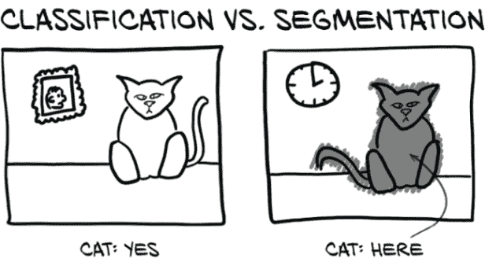

# 十三、使用分割找到可疑结节

本章涵盖

+   使用像素到像素模型对数据进行分割

+   使用 U-Net 进行分割

+   使用 Dice 损失理解掩模预测

+   评估分割模型的性能

在过去的四章中，我们取得了很大的进展。我们了解了 CT 扫描和肺部肿瘤，数据集和数据加载器，以及指标和监控。我们还*应用*了我们在第一部分学到的许多东西，并且我们有一个可用的分类器。然而，我们仍然在一个有些人为的环境中操作，因为我们需要手动注释的结节候选信息加载到我们的分类器中。我们没有一个很好的方法可以自动创建这个输入。仅仅将整个 CT 输入到我们的模型中——也就是说，插入重叠的 32×32×32 数据块——会导致每个 CT 有 31×31×7=6,727 个数据块，大约是我们拥有的注释样本数量的 10 倍。我们需要重叠边缘；我们的分类器期望结节候选位于中心，即使如此，不一致的定位可能会带来问题。

正如我们在第九章中解释的，我们的项目使用多个步骤来解决定位可能结节、识别它们，并指示可能恶性的问题。这是从业者中常见的方法，而在深度学习研究中，有一种倾向是展示单个模型解决复杂问题的能力。我们在本书中使用的多阶段项目设计给了我们一个很好的借口，逐步介绍新概念。

## 13.1 向我们的项目添加第二个模型

在前两章中，我们完成了图 13.1 中显示的计划的第 4 步：分类。在本章中，我们不仅要回到上一步，而是回到上两步。我们需要找到一种方法告诉我们的分类器在哪里查找。为此，我们将对原始 CT 扫描进行处理，找出可能是结节的所有内容。这是图中突出显示的第 2 步。为了找到这些可能的结节，我们必须标记看起来可能是结节的体素，这个过程被称为*分割*。然后，在第十四章中，我们将处理第 3 步，并通过将这幅图像的分割掩模转换为位置注释来提供桥梁。


图 13.1 我们的端到端肺癌检测项目，重点关注本章主题：第 2 步，分割

到本章结束时，我们将创建一个新模型，其架构可以执行像素级标记，或分割。完成这项任务的代码将与上一章的代码非常相似，特别是如果我们专注于更大的结构。我们将要做出的所有更改都将更小且有针对性。正如我们在图 13.2 中看到的，我们需要更新我们的模型（图中的第 2A 步），数据集（2B），以及训练循环（2C），以适应新模型的输入、输出和其他要求。（如果你在图中右侧的步骤 2 中不认识每个组件，不要担心。我们在到达每个步骤时会详细讨论。）最后，我们将检查运行新模型时得到的结果（图中的第 3 步）。


图 13.2 用于分割的新模型架构，以及我们将实施的模型、数据集和训练循环更新

将图 13.2 分解为步骤，我们本章的计划如下：

1.  分割。首先，我们将学习使用 U-Net 模型进行分割的工作原理，包括新模型组件是什么，以及在我们进行分割过程中会发生什么。这是图 13.2 中的第 1 步。

1.  更新。为了实现分割，我们需要在三个主要位置更改我们现有的代码库，如图 13.2 右侧的子步骤所示。代码在结构上与我们为分类开发的代码非常相似，但在细节上有所不同：

    1.  更新模型（步骤 2A）。我们将把一个现有的 U-Net 集成到我们的分割模型中。我们在第十二章的模型输出一个简单的真/假分类；而在本章中的模型将输出整个图像。

    1.  更改数据集（步骤 2B）。我们需要更改我们的数据集，不仅提供 CT 的片段，还要为结节提供掩模。分类数据集由围绕结节候选的 3D 裁剪组成，但我们需要收集完整的 CT 切片和用于分割训练和验证的 2D 裁剪。

    1.  调整训练循环（步骤 2C）。我们需要调整训练循环，以引入新的损失进行优化。因为我们想在 TensorBoard 中显示我们的分割结果的图像，我们还会做一些事情，比如将我们的模型权重保存到磁盘上。

1.  结果。最后，当我们查看定量分割结果时，我们将看到我们努力的成果。

## 13.2 各种类型的分割

要开始，我们需要讨论不同类型的分割。对于这个项目，我们将使用*语义*分割，这是使用标签对图像中的每个像素进行分类的行为，就像我们在分类任务中看到的那样，例如，“熊”，“猫”，“狗”等。如果做得正确，这将导致明显的块或区域，表示诸如“所有这些像素都是猫的一部分”之类的事物。这采用标签掩模或热图的形式，用于识别感兴趣的区域。我们将有一个简单的二进制标签：真值将对应结节候选，假值表示无趣的健康组织。这部分满足了我们找到结节候选的需求，稍后我们将把它们馈送到我们的分类网络中。

在深入细节之前，我们应该简要讨论我们可以采取的其他方法来找到结节候选。例如，*实例分割*使用不同的标签标记感兴趣的单个对象。因此，语义分割会为两个人握手的图片使用两个标签（“人”和“背景”），而实例分割会有三个标签（“人 1”，“人 2”和“背景”），其中边界大约在握手处。虽然这对我们区分“结节 1”和“结节 2”可能有用，但我们将使用分组来识别单个结节。这种方法对我们很有效，因为结节不太可能接触或重叠。

另一种处理这类任务的方法是*目标检测*，它在图像中定位感兴趣的物品并在该物品周围放置一个边界框。虽然实例分割和目标检测对我们来说可能很好，但它们的实现有些复杂，我们认为它们不是你接下来学习的最好内容。此外，训练目标检测模型通常需要比我们的方法更多的计算资源。如果你感到挑战，YOLOv3 论文比大多数深度学习研究论文更有趣。² 对我们来说，语义分割就是最好的选择。

*注意* 当我们在本章的代码示例中进行操作时，我们将依赖您从 GitHub 检查大部分更大上下文的代码。我们将省略那些无趣或与之前章节类似的代码，以便我们可以专注于手头问题的关键。

## 13.3 语义分割：逐像素分类

通常，分割用于回答“这张图片中的猫在哪里？”这种问题。显然，大多数猫的图片，如图 13.3，其中有很多非猫的部分；背景中的桌子或墙壁，猫坐在上面的键盘，这种情况。能够说“这个像素是猫的一部分，这个像素是墙壁的一部分”需要基本不同的模型输出和不同的内部结构，与我们迄今为止使用的分类模型完全不同。分类可以告诉我们猫是否存在，而分割将告诉我们在哪里可以找到它。



图 13.3 分类结果产生一个或多个二进制标志，而分割产生一个掩码或热图。

如果您的项目需要区分近处猫和远处猫，或者左边的猫和右边的猫，那么分割可能是正确的方法。迄今为止我们实现的图像消费分类模型可以被看作是漏斗或放大镜，将大量像素聚焦到一个“点”（或者更准确地说，一组类别预测）中，如图 13.4 所示。分类模型提供的答案形式为“是的，这一大堆像素中有一只猫”，或者“不，这里没有猫”。当您不关心猫在哪里，只关心图像中是否有猫时，这是很好的。


图 13.4 用于分类的放大镜模型结构

重复的卷积和下采样层意味着模型从消耗原始像素开始，产生特定的、详细的检测器，用于识别纹理和颜色等内容，然后构建出更高级的概念特征检测器，用于眼睛、耳朵、嘴巴和鼻子等部位³，最终得出“猫”与“狗”的结论。由于每个下采样层后卷积的接受域不断增加，这些更高级的检测器可以利用来自输入图像越来越大区域的信息。

不幸的是，由于分割需要产生类似图像的输出，最终得到一个类似于单一分类列表的二进制标志是行不通的。正如我们从第 11.4 节回忆的那样，下采样是增加卷积层接受域的关键，也是帮助将构成图像的像素数组减少到单一类别列表的关键。请注意图 13.5，它重复了图 11.6。


图 13.5 `LunaModel`块的卷积架构，由两个 3×3 卷积和一个最大池组成。最终像素具有 6×6 的接受域。

在图中，我们的输入从左到右在顶部行中流动，并在底部行中继续。为了计算出影响右下角单个像素的接受域--我们可以向后推导。最大池操作有 2×2 的输入，产生每个最终输出像素。底部行中的 3×3 卷积在每个方向（包括对角线）查看一个相邻像素，因此导致 2×2 输出的卷积的总接受域为 4×4（带有右侧的“x”字符）。顶部行中的 3×3 卷积然后在每个方向添加一个额外的像素上下文，因此右下角单个输出像素的接受域是顶部左侧输入的 6×6 区域。通过来自最大池的下采样，下一个卷积块的接受域将具有双倍宽度，每次额外的下采样将再次使其加倍，同时缩小输出的大小。

如果我们希望输出与输入大小相同，我们将需要不同的模型架构。一个用于分割的简单模型可以使用重复的卷积层而没有任何下采样。在适当的填充下，这将导致输出与输入大小相同（好），但由于基于多层小卷积的有限重叠，会导致非常有限的感受野（坏）。分类模型使用每个下采样层来使后续卷积的有效范围加倍；没有这种有效领域大小的增加，每个分割像素只能考虑一个非常局部的邻域。

*注意* 假设 3×3 卷积，堆叠卷积的简单模型的感受野大小为 2 * *L* + 1，其中*L*是卷积层数。

四层 3×3 卷积将每个输出像素的感受野大小为 9×9。通过在第二个和第三个卷积之间插入一个 2×2 最大池，并在最后插入另一个，我们将感受野增加到...

*注意* 看看你是否能自己算出数学问题；完成后，回到这里查看。

... 16×16。最终的一系列 conv-conv-pool 具有 6×6 的感受野，但这发生在第一个最大池之后，这使得原始输入分辨率中的最终有效感受野为 12×12。前两个卷积层在 12×12 周围添加了总共 2 个像素的边框，总共为 16×16。

因此问题仍然是：如何在保持输入像素与输出像素 1:1 比率的同时改善输出像素的感受野？一个常见的答案是使用一种称为*上采样*的技术，它将以给定分辨率的图像生成更高分辨率的图像。最简单的上采样只是用一个*N*×*N*像素块替换每个像素，每个像素的值与原始输入像素相同。从那里开始，可能性变得更加复杂，选项包括线性插值和学习反卷积。

### 13.3.1 U-Net 架构

在我们陷入可能的上采样算法的兔子洞之前，让我们回到本章的目标。根据图 13.6，第一步是熟悉一个名为 U-Net 的基础分割算法。


图 13.6 我们将使用的分割新模型架构

U-Net 架构是一种可以产生像素级输出的神经网络设计，专为分割而发明。从图 13.6 的突出部分可以看出，U-Net 架构的图表看起来有点像字母*U*，这解释了名称的起源。我们还立即看到，它比我们熟悉的大多数顺序结构的分类器要复杂得多。不久我们将在图 13.7 中看到 U-Net 架构的更详细版本，并了解每个组件的具体作用。一旦我们了解了模型架构，我们就可以开始训练一个来解决我们的分割任务。


图 13.7 来自 U-Net 论文的架构，带有注释。来源：本图的基础由 Olaf Ronneberger 等人提供，来源于论文“U-Net:用于生物医学图像分割的卷积网络”，可在[`arxiv.org/abs/1505.04597`](https://arxiv.org/abs/1505.04597)和[`lmb.informatik.uni-freiburg.de/people/ronneber/u-net`](https://lmb.informatik.uni-freiburg.de/people/ronneber/u-net)找到。

图 13.7 中显示的 U-Net 架构是图像分割的一个早期突破。让我们看一看，然后逐步了解架构。

在这个图表中，方框代表中间结果，箭头代表它们之间的操作。架构的 U 形状来自网络操作的多个分辨率。顶部一行是完整分辨率（对我们来说是 512×512），下面一行是其一半，依此类推。数据从左上流向底部中心，通过一系列卷积和下采样，正如我们在分类器中看到的并在第八章中详细讨论的那样。然后我们再次上升，使用上采样卷积回到完整分辨率。与原始 U-Net 不同，我们将填充物，以便不会在边缘丢失像素，因此我们左右两侧的分辨率相同。

早期的网络设计已经具有这种 U 形状，人们试图利用它来解决完全卷积网络的有限感受野大小问题。为了解决这个有限的感受野大小问题，他们使用了一种设计，复制、反转并附加图像分类网络的聚焦部分，以创建一个从精细详细到宽感受野再到精细详细的对称模型。

然而，早期的网络设计存在收敛问题，这很可能是由于在下采样过程中丢失了空间信息。一旦信息到达大量非常缩小的图像，对象边界的确切位置变得更难编码，因此更难重建。为了解决这个问题，U-Net 的作者在图中心添加了我们看到的跳跃连接。我们在第八章首次接触到跳跃连接，尽管它们在这里的应用方式与 ResNet 架构中的不同。在 U-Net 中，跳跃连接将输入沿着下采样路径短路到上采样路径中的相应层。这些层接收来自 U 较低位置的宽感受野层的上采样结果以及通过“复制和裁剪”桥接连接的早期精细详细层的输出作为输入。这是 U-Net 的关键创新（有趣的是，这比 ResNet 更早）。

所有这些意味着这些最终的细节层在最佳状态下运作。它们既具有关于周围环境的更大背景信息，又具有来自第一组全分辨率层的精细详细数据。

最右侧的“conv 1x1”层位于网络头部，将通道数从 64 改变为 2（原始论文有 2 个输出通道；我们的情况下有 1 个）。这在某种程度上类似于我们在分类网络中使用的全连接层，但是逐像素、逐通道：这是一种将最后一次上采样步骤中使用的滤波器数量转换为所需的输出类别数量的方法。

## 13.4 更新用于分割的模型

现在是按照图 13.8 中的步骤 2A 进行操作的时候了。我们已经对分割理论和 U-Net 的历史有了足够的了解；现在我们想要更新我们的代码，从模型开始。我们不再只输出一个给出真或假的二进制分类，而是集成一个 U-Net，以获得一个能够为每个像素输出概率的模型：也就是执行分割。我们不打算从头开始实现自定义 U-Net 分割模型，而是打算从 GitHub 上的一个开源存储库中适用一个现有的实现。

[`github.com/jvanvugt/pytorch-unet`](https://github.com/jvanvugt/pytorch-unet) 上的 U-Net 实现似乎很好地满足我们的需求。它是 MIT 许可的（版权 2018 Joris），包含在一个单独的文件中，并且有许多参数选项供我们调整。该文件包含在我们的代码存储库中的 util/unet.py 中，同时附有原始存储库的链接和使用的完整许可证文本。

*注意* 虽然对于个人项目来说这不是太大问题，但重要的是要注意你为项目使用的开源软件附带的许可条款。MIT 许可证是最宽松的开源许可证之一，但它仍对使用 MIT 许可的代码的用户有要求！还要注意，即使作者在公共论坛上发布他们的作品，他们仍保留版权（是的，即使在 GitHub 上也是如此），如果他们没有包含许可证，这并*不*意味着该作品属于公共领域。恰恰相反！这意味着你没有*任何*使用代码的许可，就像你没有权利从图书馆借来的书中全文复制一样。

我们建议花一些时间检查代码，并根据你到目前为止建立的知识，识别体系结构中反映在代码中的构建模块。你能发现跳跃连接吗？对你来说一个特别有价值的练习是通过查看代码绘制显示模型布局的图表。

现在我们找到了一个符合要求的 U-Net 实现，我们需要调整它以使其适用于我们的需求。一般来说，留意可以使用现成解决方案的情况是一个好主意。重要的是要了解存在哪些模型，它们是如何实现和训练的，以及是否可以拆解和应用到我们当前正在进行的项目中。虽然这种更广泛的知识是随着时间和经验而来的，但现在开始建立这个工具箱是一个好主意。

### 13.4.1 将现成模型调整为我们的项目

现在我们将对经典 U-Net 进行一些更改，并在此过程中加以证明。对你来说一个有用的练习是比较*原始*模型和经过调整后的模型的结果，最好一次删除一个以查看每个更改的影响（这在研究领域也称为*消融研究*）。


图 13.8 本章大纲，重点关注我们分割模型所需的更改

首先，我们将通过批量归一化将输入传递。这样，我们就不必在数据集中自己归一化数据；更重要的是，我们将获得在单个批次上估计的归一化统计数据（读取均值和标准差）。这意味着当某个批次由于某种原因变得*单调*时--也就是说，当所有馈送到网络中的 CT 裁剪中没有什么可见时--它将被更强烈地缩放。每个时期随机选择批次中的样本将最大程度地减少单调样本最终进入全单调批次的机会，从而过度强调这些单调样本。

其次，由于输出值是不受限制的，我们将通过一个 `nn.Sigmoid` 层将输出传递以将输出限制在 [0, 1] 范围内。第三，我们将减少模型允许使用的总深度和滤波器数量。虽然这有点超前，但使用标准参数的模型容量远远超过我们的数据集大小。这意味着我们不太可能找到一个与我们确切需求匹配的预训练模型。最后，尽管这不是一种修改，但重要的是要注意我们的输出是单通道，输出的每个像素表示模型估计该像素是否属于结节的概率。

通过实现一个具有三个属性的模型来简单地包装 U-Net：分别是我们想要添加的两个特征和 U-Net 本身--我们可以像在这里处理任何预构建模块一样对待。我们还将把收到的任何关键字参数传递给 U-Net 构造函数。

列表 13.1 model.py:17，`class` `UNetWrapper`

```py
class UNetWrapper(nn.Module):
  def __init__(self, **kwargs):                                    # ❶
    super().__init__()

    self.input_batchnorm = nn.BatchNorm2d(kwargs['in_channels'])   # ❷
    self.unet = UNet(**kwargs)                                     # ❸
    self.final = nn.Sigmoid()

    self._init_weights()                                           # ❹
```

❶ kwarg 是一个包含传递给构造函数的所有关键字参数的字典。

❷ BatchNorm2d 要求我们指定输入通道的数量，我们从关键字参数中获取。

❸ U-Net：这里包含的是一个小细节，但它确实在发挥作用。

❹ 就像第十一章中的分类器一样，我们使用我们自定义的权重初始化。该函数已复制，因此我们不会再次显示代码。

`forward`方法是一个同样简单的序列。我们可以使用`nn.Sequential`的实例，就像我们在第八章中看到的那样，但为了代码的清晰度和堆栈跟踪的清晰度，我们在这里明确说明。

第 13.2 节 model.py:50, `UNetWrapper.forward`

```py
def forward(self, input_batch):
  bn_output = self.input_batchnorm(input_batch)
  un_output = self.unet(bn_output)
  fn_output = self.final(un_output)
  return fn_output
```

请注意，我们在这里使用`nn.BatchNorm2d`。这是因为 U-Net 基本上是一个二维分割模型。我们可以调整实现以使用 3D 卷积，以便跨切片使用信息。直接实现的内存使用量将大大增加：也就是说，我们将不得不分割 CT 扫描。此外，Z 方向的像素间距比平面方向大得多，这使得结节不太可能跨越多个切片存在。这些考虑因素使得我们的目的不太吸引人的完全 3D 方法。相反，我们将调整我们的 3D 数据，一次对一个切片进行分割，提供相邻切片的上下文（例如，随着相邻切片的出现，检测到明亮的块确实是血管变得更容易）。由于我们仍然坚持以 2D 形式呈现数据，我们将使用通道来表示相邻切片。我们对第三维的处理类似于我们在第七章中将全连接模型应用于图像的方式：模型将不得不重新学习我们沿轴向丢弃的邻接关系，但对于模型来说这并不困难，尤其是考虑到由于目标结构的小尺寸而给出的上下文切片数量有限。

## 13.5 更新用于分割的数据集

本章的源数据保持不变：我们正在使用 CT 扫描和有关它们的注释数据。但是我们的模型期望输入和输出的形式与以前不同。正如我们在图 13.9 的第 2B 步骤中所暗示的，我们以前的数据集生成了 3D 数据，但现在我们需要生成 2D 数据。


图 13.9 本章概述，重点关注我们分割数据集所需的变化

原始 U-Net 实现没有使用填充卷积，这意味着虽然输出分割地图比输入小，但输出的每个像素都具有完全填充的感受野。用于确定该输出像素的所有输入像素都没有填充、虚构或不完整。因此，原始 U-Net 的输出将完全平铺，因此它可以与任何大小的图像一起使用（除了输入图像的边缘，那里将缺少一些上下文）。

对于我们的问题采用相同的像素完美方法存在两个问题。第一个与卷积和下采样之间的交互有关，第二个与我们的数据性质是三维的有关。

### 13.5.1 U-Net 具有非常具体的输入尺寸要求

第一个问题是 U-Net 的输入和输出补丁的大小非常具体。为了使每个卷积线的两个像素损失在下采样之前和之后对齐（特别是考虑到在较低分辨率处进一步卷积收缩），只有某些输入尺寸才能起作用。U-Net 论文使用了 572×572 的图像补丁，导致了 388×388 的输出地图。输入图像比我们的 512×512 CT 切片大，输出则小得多！这意味着靠近 CT 扫描切片边缘的任何结节都不会被分割。尽管在处理非常大的图像时这种设置效果很好，但对于我们的用例来说并不理想。

我们将通过将 U-Net 构造函数的`padding`标志设置为`True`来解决这个问题。这意味着我们可以使用任何大小的输入图像，并且我们将得到相同大小的输出。我们可能会在图像边缘附近失去一些保真度，因为位于那里的像素的感受野将包括已被人为填充的区域，但这是我们决定接受的妥协。

### 13.5.2 3D 与 2D 数据的 U-Net 权衡

第二个问题是我们的 3D 数据与 U-Net 的 2D 预期输入不完全对齐。简单地将我们的 512×512×128 图像输入到转换为 3D 的 U-Net 类中是行不通的，因为我们会耗尽 GPU 内存。每个图像是 29×29×27，每个体素 22 字节。U-Net 的第一层是 64 个通道，或 26。这是 9 + 9 + 7 + 2 + 6 的指数= 33，或 8 GB *仅用于第一个卷积层*。有两个卷积层（16 GB）；然后每次下采样都会减半分辨率但加倍通道，这是第一个下采样后每层另外 2 GB（记住，减半分辨率会导致数据减少八分之一，因为我们处理的是 3D 数据）。因此，甚至在我们到达第二次下采样之前，我们就已经达到了 20 GB，更不用说模型上采样端或处理自动梯度的任何内容了。

*注意* 有许多巧妙和创新的方法可以解决这些问题，我们绝不认为这是唯一可行的方法。⁶ 我们认为这种方法是在这本书中我们项目所需的水平上完成工作的最简单方法之一。我们宁愿保持简单，这样我们就可以专注于基本概念；聪明的东西可以在你掌握基础知识后再来。

如预期的那样，我们不会尝试在 3D 中进行操作，而是将每个切片视为一个 2D 分割问题，并通过提供相邻切片作为单独的通道来绕过第三维中的上下文问题。我们的主要通道不再是我们从照片图像中熟悉的“红色”，“绿色”和“蓝色”通道，而是“上面两个切片”，“上面一个切片”，“我们实际分割的切片”，“下面一个切片”等。

然而，这种方法并非没有权衡。当表示为通道时，我们失去了切片之间的直接空间关系，因为所有通道将被卷积核线性组合，没有它们相隔一两个切片，上下的概念。我们还失去了来自真正的 3D 分割的深度维度中更广泛的感受野。由于 CT 切片通常比行和列的分辨率厚，我们获得的视野比起初看起来要宽一些，这应该足够了，考虑到结节通常跨越有限数量的切片。

要考虑的另一个方面，对于当前和完全 3D 方法都相关的是，我们现在忽略了确切的切片厚度。这是我们的模型最终将不得不学会对抗的东西，通过呈现具有不同切片间距的数据。

一般来说，没有一个简单的流程图或经验法则可以提供关于做出哪些权衡或给定一组妥协是否太多的标准答案。然而，仔细的实验至关重要，系统地测试假设之后的假设可以帮助缩小哪些变化和方法对手头问题有效的范围。虽然在等待最后一组结果计算时进行一连串的更改很诱人，*但要抵制这种冲动*。

这一点非常重要：*不要同时测试多个修改*。有很高的机会其中一个改变会与另一个产生不良互动，你将没有坚实的证据表明任何一个值得进一步调查。说了这么多，让我们开始构建我们的分割数据集。

### 13.5.3 构建地面真实数据

我们需要解决的第一件事是我们的人工标记的训练数据与我们希望从模型中获得的实际输出之间存在不匹配。我们有注释点，但我们想要一个逐体素掩模，指示任何给定的体素是否属于结节。我们将不得不根据我们拥有的数据构建该掩模，然后进行一些手动检查，以确保构建掩模的例程表现良好。

在规模上验证这些手动构建的启发式方法可能会很困难。当涉及确保每个结节都得到适当处理时，我们不会尝试做任何全面的工作。如果我们有更多资源，像“与（或支付）某人合作创建和/或手动验证所有内容”这样的方法可能是一个选择，但由于这不是一个资金充足的努力，我们将依靠检查少量样本并使用非常简单的“输出看起来合理吗？”方法。

为此，我们将设计我们的方法和我们的 API，以便轻松调查我们的算法正在经历的中间步骤。虽然这可能导致稍微笨重的函数调用返回大量中间值的元组，但能够轻松获取结果并在笔记本中绘制它们使得这种笨重值得。

#### 边界框

我们将从将我们拥有的结节位置转换为覆盖整个结节的边界框开始（请注意，我们只会为*实际结节*这样做）。如果我们假设结节位置大致位于肿块中心，我们可以沿着所有三个维度从该点向外追踪，直到遇到低密度的体素，表明我们已经到达了主要充满空气的正常肺组织。让我们在图 13.10 中遵循这个算法。


图 13.10 围绕肺结节找到边界框的算法

我们从我们的搜索起点（图中的 O）开始在注释的结节中心的体素处。然后我们检查沿着列轴的原点相邻体素的密度，用问号（?）标记。由于两个检查的体素都包含密集组织，显示为浅色，我们继续我们的搜索。在将列搜索距离增加到 2 后，我们发现左侧的体素密度低于我们的阈值，因此我们在 2 处停止搜索。

接下来，我们在行方向上执行相同的搜索。同样，我们从原点开始，这次我们向上下搜索。当我们的搜索距离变为 3 时，在上下搜索位置都遇到了低密度的体素。我们只需要一个就可以停止我们的搜索！

我们将跳过在第三维度中显示搜索。我们最终的边界框宽度为五个体素，高度为七个体素。这是在代码中的索引方向的样子。

代码清单 13.3 dsets.py:131，`Ct.buildAnnotationMask`

```py
center_irc = xyz2irc(
  candidateInfo_tup.center_xyz,                                   # ❶
  self.origin_xyz,
  self.vxSize_xyz,
  self.direction_a,
)
ci = int(center_irc.index)                                        # ❷
cr = int(center_irc.row)
cc = int(center_irc.col)

index_radius = 2
try:
  while self.hu_a[ci + index_radius, cr, cc] > threshold_hu and \
     self.hu_a[ci - index_radius, cr, cc] > threshold_hu:         # ❸
     index_radius += 1
except IndexError:                                                # ❹
  index_radius -= 1
```

❶ 这里的 candidateInfo_tup 与我们之前看到的相同：由 getCandidateInfoList 返回。

❷ 获取中心体素的索引，这是我们的起点

❸ 先前描述的搜索

❹ 超出张量大小的索引的安全网

我们首先获取中心数据，然后在`while`循环中进行搜索。作为一个轻微的复杂性，我们的搜索可能超出张量的边界。我们对这种情况并不太担心，也很懒，所以我们只捕获索引异常。

请注意，当密度降低到阈值以下时，我们停止增加非常粗略的`radius`值，因此我们的边界框应包含低密度组织的一个体素边界（至少在一侧；由于结节可能与肺壁等密度较高的组织相邻，当我们在任一侧遇到空气时，我们必须停止搜索）。由于我们将`center_index + index_radius`和`center_index - index_radius`与该阈值进行比较，因此该一个体素边界仅存在于最接近结节位置的边缘。这就是为什么我们需要这些位置相对居中。由于一些结节与肺和肌肉或骨骼等密度较高的组织之间的边界相邻，我们不能独立追踪每个方向，因为一些边缘最终会远离实际结节。

然后，我们使用`row_radius`和`col_radius`重复相同的半径扩展过程（为简洁起见，此代码被省略）。完成后，我们可以将边界框掩码数组中的一个框设置为`True`（我们很快就会看到`boundingBox_ary`的定义；这并不令人惊讶）。

好的，让我们将所有这些封装在一个函数中。我们遍历所有结节。对于每个结节，我们执行之前显示的搜索（我们在代码清单 13.4 中省略了）。然后，在一个布尔张量`boundingBox_a`中，我们标记我们找到的边界框。

循环结束后，我们通过取边界框掩码和密度高于-700 HU（或 0.3 g/cc）的组织之间的交集来进行一些清理。这将剪裁掉我们的盒子的角（至少是那些不嵌入在肺壁中的盒子），使其更符合结节的轮廓。

代码清单 13.4 dsets.py:127，`Ct.buildAnnotationMask`

```py
def buildAnnotationMask(self, positiveInfo_list, threshold_hu = -700):
  boundingBox_a = np.zeros_like(self.hu_a, dtype=np.bool)                # ❶

  for candidateInfo_tup in positiveInfo_list:                            # ❷
    # ... line 169
    boundingBox_a[
       ci - index_radius: ci + index_radius + 1,
       cr - row_radius: cr + row_radius + 1,
       cc - col_radius: cc + col_radius + 1] = True                      # ❸

  mask_a = boundingBox_a & (self.hu_a > threshold_hu)                    # ❹

  return mask_a
```

❶ 从与 CT 相同大小的全 False 张量开始

❷ 遍历结节。作为我们只查看结节的提醒，我们称之为 positiveInfo_list。

❸ 在获取结节半径后（搜索本身被省略了），我们标记边界框。

❹ 将掩码限制为高于我们密度阈值的体素

让我们看一下图 13.11，看看这些掩码在实践中是什么样子。完整彩色图像可以在 p2ch13_explore_data.ipynb 笔记本中找到。


图 13.11 `ct.positive_mask`中突出显示的三个结节，白色标记

右下角的结节掩码展示了我们矩形边界框方法的局限性，包括部分肺壁。这当然是我们可以修复的问题，但由于我们还没有确信这是我们时间和注意力的最佳利用方式，所以我们暂时让它保持原样。接下来，我们将继续将此掩码添加到我们的 CT 类中。

#### 在 CT 初始化期间调用掩码创建

现在我们可以将结节信息元组列表转换为与 CT 形状相同的二进制“这是一个结节吗？”掩码，让我们将这些掩码嵌入到我们的 CT 对象中。首先，我们将我们的候选人筛选为仅包含结节的列表，然后我们将使用该列表构建注释掩码。最后，我们将收集具有至少一个结节掩码体素的唯一数组索引集。我们将使用这些数据来塑造我们用于验证的数据。

代码清单 13.5 dsets.py:99，`Ct.__init__`

```py
def __init__(self, series_uid):
  # ... line 116
  candidateInfo_list = getCandidateInfoDict()[self.series_uid]

  self.positiveInfo_list = [
    candidate_tup
    for candidate_tup in candidateInfo_list
    if candidate_tup.isNodule_bool                                       # ❶
  ]
  self.positive_mask = self.buildAnnotationMask(self.positiveInfo_list)
  self.positive_indexes = (self.positive_mask.sum(axis=(1,2))            # ❷
                .nonzero()[0].tolist())                                  # ❸
```

❶ 用于结节的过滤器

❷ 给出一个 1D 向量（在切片上）中每个切片中标记的掩码体素数量

❸ 获取具有非零计数的掩码切片的索引，我们将其转换为列表

敏锐的眼睛可能已经注意到了`getCandidateInfoDict`函数。定义并不令人惊讶；它只是`getCandidateInfoList`函数中相同信息的重新表述，但是预先按`series_uid`分组。

代码清单 13.6 dsets.py:87

```py
@functools.lru_cache(1)                                        # ❶
def getCandidateInfoDict(requireOnDisk_bool=True):
  candidateInfo_list = getCandidateInfoList(requireOnDisk_bool)
  candidateInfo_dict = {}

  for candidateInfo_tup in candidateInfo_list:
    candidateInfo_dict.setdefault(candidateInfo_tup.series_uid,
                    []).append(candidateInfo_tup)              # ❷

  return candidateInfo_dict
```

❶ 这对于避免 Ct init 成为性能瓶颈很有用。

❷ 获取字典中系列 UID 的候选人列表，如果找不到，则默认为一个新的空列表。然后将当前的 candidateInfo_tup 附加到其中。

#### 缓存掩模的块以及 CT

在早期章节中，我们缓存了围绕结节候选项中心的 CT 块，因为我们不想每次想要 CT 的小块时都读取和解析整个 CT 的数据。我们希望对我们的新的 `positive _mask` 也做同样的处理，因此我们还需要从我们的 `Ct.getRawCandidate` 函数中返回它。这需要额外的一行代码和对 `return` 语句的编辑。

列表 13.7 dsets.py:178, `Ct.getRawCandidate`

```py
def getRawCandidate(self, center_xyz, width_irc):
  center_irc = xyz2irc(center_xyz, self.origin_xyz, self.vxSize_xyz,
             self.direction_a)

  slice_list = []
  # ... line 203
  ct_chunk = self.hu_a[tuple(slice_list)]
  pos_chunk = self.positive_mask[tuple(slice_list)]   # ❶

  return ct_chunk, pos_chunk, center_irc              # ❷
```

❶ 新添加的

❷ 这里返回了新值

这将通过 `getCtRawCandidate` 函数缓存到磁盘，该函数打开 CT，获取指定的原始候选项，包括结节掩模，并在返回 CT 块、掩模和中心信息之前剪裁 CT 值。

列表 13.8 dsets.py:212

```py
@raw_cache.memoize(typed=True)
def getCtRawCandidate(series_uid, center_xyz, width_irc):
  ct = getCt(series_uid)
  ct_chunk, pos_chunk, center_irc = ct.getRawCandidate(center_xyz,
                             width_irc)
  ct_chunk.clip(-1000, 1000, ct_chunk)
  return ct_chunk, pos_chunk, center_irc
```

`prepcache` 脚本为我们预先计算并保存所有这些值，帮助保持训练速度。

#### 清理我们的注释数据

我们在本章还要处理的另一件事是对我们的注释数据进行更好的筛选。事实证明，candidates.csv 中列出的几个候选项出现了多次。更有趣的是，这些条目并不是彼此的完全重复。相反，原始的人类注释在输入文件之前并没有经过充分的清理。它们可能是关于同一结节在不同切片上的注释，这甚至可能对我们的分类器有益。

在这里我们将进行一些简化，并提供一个经过清理的 annotation.csv 文件。为了完全了解这个清理文件的来源，您需要知道 LUNA 数据集源自另一个名为肺部图像数据库协会图像集（LIDC-IDRI）的数据集，并包含来自多名放射科医生的详细注释信息。我们已经完成了获取原始 LIDC 注释、提取结节、去重并将它们保存到文件 /data/part2/luna/annotations_with_malignancy.csv 的工作。

有了那个文件，我们可以更新我们的 `getCandidateInfoList` 函数，从我们的新注释文件中提取结节。首先，我们遍历实际结节的新注释。使用 CSV 读取器，¹⁰我们需要将数据转换为适当的类型，然后将它们放入我们的 `CandidateInfoTuple` 数据结构中。

列表 13.9 dsets.py:43, `def` `getCandidateInfoList`

```py
candidateInfo_list = []
with open('data/part2/luna/annotations_with_malignancy.csv', "r") as f:
  for row in list(csv.reader(f))[1:]:                                   # ❶
    series_uid = row[0]
    annotationCenter_xyz = tuple([float(x) for x in row[1:4]])
    annotationDiameter_mm = float(row[4])
    isMal_bool = {'False': False, 'True': True}[row[5]]
    candidateInfo_list.append(                                          # ❷
      CandidateInfoTuple(
        True,                                                           # ❸
        True,                                                           # ❹
        isMal_bool,
        annotationDiameter_mm,
        series_uid,
        annotationCenter_xyz,
      )
    )
```

❶ 对于注释文件中表示一个结节的每一行，...

❷ ... 我们向我们的列表添加一条记录。

❸ isNodule_bool

❹ hasAnnotation_bool

类似地，我们像以前一样遍历 candidates.csv 中的候选项，但这次我们只使用非结节。由于这些不是结节，结节特定信息将只填充为 `False` 和 `0`。

列表 13.10 dsets.py:62, `def` `getCandidateInfoList`

```py
with open('data/part2/luna/candidates.csv', "r") as f:
  for row in list(csv.reader(f))[1:]:                  # ❶
    series_uid = row[0]
    # ... line 72
    if not isNodule_bool:                              # ❷
      candidateInfo_list.append(                       # ❸
        CandidateInfoTuple(
          False,                                       # ❹
          False,                                       # ❺
          False,                                       # ❻
          0.0,
          series_uid,
          candidateCenter_xyz,
        )
      )
```

❶ 对于候选文件中的每一行...

❷ ... 但只有非结节（我们之前有其他的）...

❸ ... 我们添加一个候选记录。

❹ isNodule_bool

❺ hasAnnotation_bool

❻ isMal_bool

除了添加`hasAnnotation_bool`和`isMal_bool`标志（我们在本章不会使用），新的注释将插入并可像旧的一样使用。

*注意* 您可能会想知道为什么我们到现在才讨论 LIDC。事实证明，LIDC 已经围绕基础数据集构建了大量工具，这些工具是特定于 LIDC 的。您甚至可以从 PyLIDC 获取现成的掩模。这些工具呈现了一个有些不切实际的图像，说明了给定数据集可能具有的支持类型，因为 LIDC 的支持异常充分。我们对 LUNA 数据所做的工作更具典型性，并提供更好的学习，因为我们花时间操纵原始数据，而不是学习别人设计的 API。

### 13.5.4 实现 Luna2dSegmentationDataset

与之前的章节相比，我们在本章将采用不同的方法来进行训练和验证集的划分。我们将有两个类：一个作为适用于验证数据的通用基类，另一个作为基类的子类，用于训练集，具有随机化和裁剪样本。

尽管这种方法在某些方面有些复杂（例如，类并不完全封装），但实际上简化了选择随机训练样本等逻辑。它还非常清楚地显示了哪些代码路径影响训练和验证，哪些是仅与训练相关的。如果没有这一点，我们发现一些逻辑可能会以难以跟踪的方式嵌套或交织在一起。这很重要，因为我们的训练数据与验证数据看起来会有很大不同！

*注意* 其他类别的安排也是可行的；例如，我们考虑过完全分开两个独立的`Dataset`子类。标准软件工程设计原则适用，因此尽量保持结构相对简单，尽量不要复制粘贴代码，但不要发明复杂的框架来防止重复三行代码。

我们生成的数据将是具有多个通道的二维 CT 切片。额外的通道将保存相邻的 CT 切片。回想图 4.2，这里显示为图 13.12；我们可以看到每个 CT 扫描切片都可以被视为二维灰度图像。


图 13.12 CT 扫描的每个切片代表空间中的不同位置。

我们如何组合这些切片取决于我们。对于我们分类模型的输入，我们将这些切片视为数据的三维数组，并使用三维卷积来处理每个样本。对于我们的分割模型，我们将把每个切片视为单个通道，生成一个多通道的二维图像。这样做意味着我们将每个 CT 扫描切片都视为 RGB 图像的颜色通道，就像我们在图 4.1 中看到的那样，这里重复显示为图 13.13。CT 的每个输入切片将被堆叠在一起，并像任何其他二维图像一样被消耗。我们堆叠的 CT 图像的通道不会对应颜色，但是二维卷积并不要求输入通道是颜色，所以这样做没问题。


图 13.13 摄影图像的每个通道代表不同的颜色。

对于验证，我们需要为每个具有正面掩模条目的 CT 切片生成一个样本，对于我们拥有的每个验证 CT。由于不同的 CT 扫描可能具有不同的切片计数，我们将引入一个新函数，将每个 CT 扫描及其正面掩模的大小缓存到磁盘上。我们需要这样做才能快速构建完整的验证集大小，而无需在`Dataset`初始化时加载每个 CT。我们将继续使用与之前相同的缓存装饰器。填充这些数据也将在 prepcache.py 脚本中进行，我们必须在开始任何模型训练之前运行一次。

列表 13.11 dsets.py:220

```py
@raw_cache.memoize(typed=True)
def getCtSampleSize(series_uid):
  ct = Ct(series_uid)
  return int(ct.hu_a.shape[0]), ct.positive_indexes
```

`Luna2dSegmentationDataset.__init__`方法的大部分处理与我们之前看到的类似。我们有一个新的`contextSlices_count`参数，以及类似于我们在第十二章介绍的`augmentation_dict`。

指示这是否应该是训练集还是验证集的标志处理需要有所改变。由于我们不再对单个结节进行训练，我们将不得不将整个系列列表作为一个整体划分为训练集和验证集。这意味着整个 CT 扫描以及其中包含的所有结节候选者将分别位于训练集或验证集中。

列表 13.12 dsets.py:242, `.__init__`

```py
if isValSet_bool:
  assert val_stride > 0, val_stride
  self.series_list = self.series_list[::val_stride]   # ❶
  assert self.series_list
elif val_stride > 0:
  del self.series_list[::val_stride]                  # ❷
  assert self.series_list
```

❶ 从包含所有系列的系列列表开始，我们仅保留每个`val_stride`元素，从 0 开始。

❷ 如果我们在训练中，我们会删除每个`val_stride`元素。

谈到验证，我们将有两种不同的模式可以验证我们的训练。首先，当`fullCt_bool`为`True`时，我们将使用 CT 中的每个切片作为我们的数据集。当我们评估端到端性能时，这将非常有用，因为我们需要假装我们对 CT 没有任何先前信息。我们将在训练期间使用第二种模式进行验证，即当我们限制自己只使用具有阳性掩模的 CT 切片时。

由于我们现在只想考虑特定的 CT 序列，我们循环遍历我们想要的序列 UID，并获取总切片数和有趣切片的列表。

列表 13.13 dsets.py:250, `.__init__`

```py
self.sample_list = []
for series_uid in self.series_list:
  index_count, positive_indexes = getCtSampleSize(series_uid)

  if self.fullCt_bool:
    self.sample_list += [(series_uid, slice_ndx)      # ❶
               for slice_ndx in range(index_count)]
  else:
    self.sample_list += [(series_uid, slice_ndx)      # ❷
               for slice_ndx in positive_indexes]
```

❶ 在这里，我们通过使用范围扩展样本列表中的每个 CT 切片...

❷ ... 而在这里我们只取有趣的切片。

以这种方式进行将保持我们的验证相对快速，并确保我们获得真阳性和假阴性的完整统计数据，但我们假设其他切片的假阳性和真阴性统计数据与我们在验证期间评估的统计数据相对类似。

一旦我们有了要使用的`series_uid`值集合，我们可以将我们的`candidateInfo_list`过滤为仅包含`series_uid`包含在该系列集合中的结节候选者。此外，我们将创建另一个仅包含阳性候选者的列表，以便在训练期间，我们可以将它们用作我们的训练样本。

列表 13.14 dsets.py:261, `.__init__`

```py
self.candidateInfo_list = getCandidateInfoList()                   # ❶

series_set = set(self.series_list)                                 # ❷
self.candidateInfo_list = [cit for cit in self.candidateInfo_list
               if cit.series_uid in series_set]                    # ❸

self.pos_list = [nt for nt in self.candidateInfo_list
          if nt.isNodule_bool]                                     # ❹
```

❶ 这是缓存的。

❷ 创建一个集合以加快查找速度。

❸ 过滤掉不在我们集合中的系列的候选者

❹ 对于即将到来的数据平衡，我们需要一个实际结节的列表。

我们的`__getitem__`实现也会更加复杂，通过将大部分逻辑委托给一个函数，使得检索特定样本变得更容易。在其核心，我们希望以三种不同形式检索我们的数据。首先，我们有 CT 的完整切片，由`series_uid`和`ct_ndx`指定。其次，我们有围绕结节的裁剪区域，这将用于训练数据（我们稍后会解释为什么我们不使用完整切片）。最后，`DataLoader`将通过整数`ndx`请求样本，数据集将根据是训练还是验证来返回适当的类型。

基类或子类`__getitem__`函数将根据需要从整数`ndx`转换为完整切片或训练裁剪。如前所述，我们的验证集的`__getitem__`只是调用另一个函数来执行真正的工作。在此之前，它将索引包装到样本列表中，以便将 epoch 大小（由数据集长度给出）与实际样本数量分离。

列表 13.15 dsets.py:281, `.__getitem__`

```py
def __getitem__(self, ndx):
  series_uid, slice_ndx = self.sample_list[ndx % len(self.sample_list)]  # ❶
  return self.getitem_fullSlice(series_uid, slice_ndx)
```

❶ 模运算进行包装。

这很容易，但我们仍然需要实现`getItem_fullSlice`方法中的有趣功能。

列表 13.16 dsets.py:285, `.getitem_fullSlice`

```py
def getitem_fullSlice(self, series_uid, slice_ndx):
  ct = getCt(series_uid)
  ct_t = torch.zeros((self.contextSlices_count * 2 + 1, 512, 512))    # ❶

  start_ndx = slice_ndx - self.contextSlices_count
  end_ndx = slice_ndx + self.contextSlices_count + 1
  for i, context_ndx in enumerate(range(start_ndx, end_ndx)):
    context_ndx = max(context_ndx, 0)                                 # ❷
    context_ndx = min(context_ndx, ct.hu_a.shape[0] - 1)
    ct_t[i] = torch.from_numpy(ct.hu_a[context_ndx].astype(np.float32))
  ct_t.clamp_(-1000, 1000)

  pos_t = torch.from_numpy(ct.positive_mask[slice_ndx]).unsqueeze(0)

  return ct_t, pos_t, ct.series_uid, slice_ndx
```

❶ 预先分配输出

❷ 当我们超出 ct_a 的边界时，我们复制第一个或最后一个切片。

将函数分割成这样可以让我们始终向数据集询问特定切片（或裁剪的训练块，我们将在下一节中看到）通过序列 UID 和位置索引。仅对于整数索引，我们通过`__getitem__`进行，然后从（打乱的）列表中获取样本。

除了`ct_t`和`pos_t`之外，我们返回的元组的其余部分都是我们包含用于调试和显示的信息。我们在训练中不需要任何这些信息。

### 13.5.5 设计我们的训练和验证数据

在我们开始实现训练数据集之前，我们需要解释为什么我们的训练数据看起来与验证数据不同。我们将不再使用完整的 CT 切片，而是将在我们的正候选项周围（实际上是结节候选项）训练 64×64 的裁剪。这些 64×64 的补丁将随机从以结节为中心的 96×96 裁剪中取出。我们还将在两个方向上包括三个切片的上下文作为我们 2D 分割的附加“通道”。

我们这样做是为了使训练更加稳定，收敛更快。我们之所以知道这样做是因为我们尝试在整个 CT 切片上进行训练，但我们发现结果令人不满意。经过一些实验，我们发现 64×64 的半随机裁剪方法效果不错，所以我们决定在书中使用这种方法。当你在自己的项目上工作时，你需要为自己做这种实验！

我们认为整个切片训练不稳定主要是由于类平衡问题。由于每个结节与整个 CT 切片相比非常小，我们又回到了上一章中摆脱的类似于大海捞针的情况，其中我们的正样本被负样本淹没。在这种情况下，我们谈论的是像素而不是结节，但概念是相同的。通过在裁剪上进行训练，我们保持了正像素数量不变，并将负像素数量减少了几个数量级。

因为我们的分割模型是像素到像素的，并且接受任意大小的图像，所以我们可以在具有不同尺寸的样本上进行训练和验证。验证使用相同的卷积和相同的权重，只是应用于更大的像素集（因此需要填充边缘数据的像素较少）。

这种方法的一个缺点是，由于我们的验证集包含数量级更多的负像素，我们的模型在验证期间将有很高的假阳性率。我们的分割模型有很多机会被欺骗！并且我们还将追求高召回率。我们将在第 13.6.3 节中更详细地讨论这一点。

### 13.5.6 实现 TrainingLuna2dSegmentationDataset

有了这个，让我们回到代码。这是训练集的`__getitem__`。它看起来就像验证集的一个，只是现在我们从`pos_list`中采样，并使用候选信息元组调用`getItem_trainingCrop`，因为我们需要系列和确切的中心位置，而不仅仅是切片。

代码清单 13.17 dsets.py:320，`.__getitem__`

```py
def __getitem__(self, ndx):
  candidateInfo_tup = self.pos_list[ndx % len(self.pos_list)]
  return self.getitem_trainingCrop(candidateInfo_tup)
```

要实现`getItem_trainingCrop`，我们将使用一个类似于分类训练中使用的`getCtRawCandidate`函数。在这里，我们传入一个不同尺寸的裁剪，但该函数除了现在返回一个包含`ct.positive_mask`裁剪的额外数组外，没有改变。

我们将我们的`pos_a`限制在我们实际分割的中心切片上，然后构建我们的 96×96 给定的裁剪的 64×64 随机裁剪。一旦我们有了这些，我们返回一个与我们的验证数据集相同项目的元组。

代码清单 13.18 dsets.py:324，`.getitem_trainingCrop`

```py
def getitem_trainingCrop(self, candidateInfo_tup):
  ct_a, pos_a, center_irc = getCtRawCandidate(     # ❶
    candidateInfo_tup.series_uid,
    candidateInfo_tup.center_xyz,
    (7, 96, 96),
  )
  pos_a = pos_a[3:4]                               # ❷

  row_offset = random.randrange(0,32)              # ❸
  col_offset = random.randrange(0,32)
  ct_t = torch.from_numpy(ct_a[:, row_offset:row_offset+64,
                 col_offset:col_offset+64]).to(torch.float32)
  pos_t = torch.from_numpy(pos_a[:, row_offset:row_offset+64,
                   col_offset:col_offset+64]).to(torch.long)

  slice_ndx = center_irc.index

  return ct_t, pos_t, candidateInfo_tup.series_uid, slice_ndx
```

❶ 获取带有一点额外周围的候选项

❷ 保留第三维度的一个元素切片，这将是（单一的）输出通道。

❸ 使用 0 到 31 之间的两个随机数，我们裁剪 CT 和掩模。

你可能已经注意到我们的数据集实现中缺少数据增强。这一次我们将以稍有不同的方式处理：我们将在 GPU 上增强我们的数据。

### 13.5.7 在 GPU 上进行数据增强

在训练深度学习模型时的一个关键问题是避免训练管道中的瓶颈。嗯，这并不完全正确--总会有一个瓶颈。[¹²]

一些常见的瓶颈出现在以下情况：

+   在数据加载管道中，无论是在原始 I/O 中还是在将数据解压缩后。我们使用`diskcache`库来解决这个问题。

+   在加载数据的 CPU 预处理中。这通常是数据归一化或增强。

+   在 GPU 上的训练循环中。这通常是我们希望瓶颈出现的地方，因为 GPU 的总体深度学习系统成本通常高于存储或 CPU。

+   瓶颈通常不太常见，有时可能是 CPU 和 GPU 之间的*内存带宽*。这意味着与发送的数据大小相比，GPU 的工作量并不大。

由于 GPU 在处理适合 GPU 的任务时可以比 CPU 快 50 倍，因此在 CPU 使用率变高时，通常有意义将这些任务从 CPU 移动到 GPU。特别是如果数据在此处理过程中被扩展；通过首先将较小的输入移动到 GPU，扩展的数据保持在 GPU 本地，使用的内存带宽较少。

在我们的情况下，我们将数据增强移到 GPU 上。这将使我们的 CPU 使用率较低，GPU 将轻松地承担额外的工作量。与其让 GPU 空闲等待 CPU 努力完成增强过程，不如让 GPU 忙于少量额外工作。

我们将通过使用第二个模型来实现这一点，这个模型与本书中迄今为止看到的所有`nn.Module`的子类类似。主要区别在于我们不感兴趣通过模型反向传播梯度，并且`forward`方法将执行完全不同的操作。由于我们在本章中处理的是 2D 数据，因此实际增强例程将进行一些轻微修改，但除此之外，增强将与我们在第十二章中看到的非常相似。该模型将消耗张量并产生不同的张量，就像我们实现的其他模型一样。

我们模型的`__init__`接受相同的数据增强参数--`flip`，`offset`等--这些参数在上一章中使用过，并将它们分配给`self`。

列表 13.19 model.py:56，`class` `SegmentationAugmentation`

```py
class SegmentationAugmentation(nn.Module):
  def __init__(
      self, flip=None, offset=None, scale=None, rotate=None, noise=None
  ):
    super().__init__()

    self.flip = flip
    self.offset = offset
    # ... line 64
```

我们的增强`forward`方法接受输入和标签，并调用构建`transform_t`张量，然后驱动我们的`affine_grid`和`grid_sample`调用。这些调用应该在第十二章中感到非常熟悉。

列表 13.20 model.py:68，`SegmentationAugmentation.forward`

```py
def forward(self, input_g, label_g):
  transform_t = self._build2dTransformMatrix()
  transform_t = transform_t.expand(input_g.shape[0], -1, -1)    # ❶
  transform_t = transform_t.to(input_g.device, torch.float32)
  affine_t = F.affine_grid(transform_t[:,:2],                   # ❷
      input_g.size(), align_corners=False)

  augmented_input_g = F.grid_sample(input_g,
      affine_t, padding_mode='border',
      align_corners=False)
  augmented_label_g = F.grid_sample(label_g.to(torch.float32),
      affine_t, padding_mode='border',
      align_corners=False)                                      # ❸

  if self.noise:
    noise_t = torch.randn_like(augmented_input_g)
    noise_t *= self.noise

    augmented_input_g += noise_t

  return augmented_input_g, augmented_label_g > 0.5             # ❹
```

❶ 请注意，我们正在增强 2D 数据。

❷ 变换的第一个维度是批处理，但我们只想要每个批处理项的 3×3 矩阵的前两行。

❸ 我们需要将相同的变换应用于 CT 和掩码，因此我们使用相同的网格。因为 grid_sample 仅适用于浮点数，所以我们在这里进行转换。

❹ 在返回之前，我们通过与 0.5 比较将掩码转换回布尔值。grid_sample 导致插值产生分数值。

现在我们知道了如何处理`transform_t`以获取我们的数据，让我们来看看实际创建我们使用的变换矩阵的`_build2dTransformMatrix`函数。

列表 13.21 model.py:90，`._build2dTransformMatrix`

```py
def _build2dTransformMatrix(self):
  transform_t = torch.eye(3)                    # ❶

  for i in range(2):                            # ❷
    if self.flip:
      if random.random() > 0.5:
        transform_t[i,i] *= -1
  # ... line 108
  if self.rotate:
    angle_rad = random.random() * math.pi * 2   # ❸
    s = math.sin(angle_rad)
    c = math.cos(angle_rad)

    rotation_t = torch.tensor([                 # ❹
      [c, -s, 0],
      [s, c, 0],
      [0, 0, 1]])

    transform_t @= rotation_t                   # ❺

  return transform_t
```

❶ 创建一个 3×3 矩阵，但我们稍后会删除最后一行。

❷ 再次，我们在这里增强 2D 数据。

❸ 以弧度形式取一个随机角度，范围为 0 .. 2{pi}

❹ 2D 旋转的旋转矩阵，由第一个两个维度中的随机角度确定

❺ 使用 Python 矩阵乘法运算符将旋转应用于变换矩阵

除了处理 2D 数据的轻微差异外，我们的 GPU 数据增强代码看起来与我们的 CPU 数据增强代码非常相似。这很好，因为这意味着我们能够编写不太关心运行位置的代码。主要区别不在核心实现中：而是我们如何将该实现封装到`nn.Module`子类中。虽然我们一直认为模型是一种专门用于深度学习的工具，但这向我们展示了在 PyTorch 中，张量可以被用得更加普遍。在开始下一个项目时请记住这一点--使用 GPU 加速张量可以实现的事情范围相当广泛！

## 13.6 更新用于分割的训练脚本

我们有一个模型。我们有数据。我们需要使用它们，当图 13.14 的步骤 2C 建议我们应该用新数据训练我们的新模型时，你不会感到惊讶。


图 13.14 本章概述，重点关注我们训练循环所需的更改

为了更准确地描述训练模型的过程，我们将更新影响我们在第十二章获得的训练代码结果的三个方面：

+   我们需要实例化新模型（不足为奇）。

+   我们将引入一种新的损失函数：Dice 损失。

+   我们还将研究除了我们迄今使用的可敬的 SGD 之外的另一种优化器。我们将坚持使用一种流行的优化器，即 Adam。

但我们还将加强我们的记录工作，通过

+   将图像记录到 TensorBoard 以进行分割的可视检查

+   在 TensorBoard 中执行更多指标记录

+   根据验证结果保存我们最佳的模型

总的来说，训练脚本 p2ch13/training.py 与我们在第十二章用于分类训练的代码非常相似，比我们迄今为止看到的调整后的代码更相似。任何重大变化将在文本中介绍，但请注意一些细微调整被省略。要了解完整的故事，请查看源代码。

### 13.6.1 初始化我们的分割和数据增强模型

我们的`initModel`方法非常不足为奇。我们正在使用`UNetWrapper`类并为其提供我们的配置参数--我们很快将详细查看这些参数。此外，我们现在有了第二个用于数据增强的模型。就像以前一样，如果需要，我们可以将模型移动到 GPU，并可能使用`DataParallel`设置多 GPU 训练。我们在这里跳过这些管理任务。

列表 13.22 training.py:133, `.initModel`

```py
def initModel(self):
  segmentation_model = UNetWrapper(
    in_channels=7,
    n_classes=1,
    depth=3,
    wf=4,
    padding=True,
    batch_norm=True,
    up_mode='upconv',
  )

  augmentation_model = SegmentationAugmentation(**self.augmentation_dict)

  # ... line 154
  return segmentation_model, augmentation_model
```

对于输入到`UNet`，我们有七个输入通道：3 + 3 上下文切片，以及一个是我们实际进行分割的焦点切片。我们有一个输出类指示这个体素是否是结节的一部分。`depth`参数控制 U 的深度；每个下采样操作将深度增加 1。使用`wf=5`意味着第一层将有`2**wf == 32`个滤波器，每个下采样都会翻倍。我们希望卷积进行填充，以便我们得到与输入相同大小的输出图像。我们还希望批量归一化在每个激活函数后面，我们的上采样函数应该是一个上卷积层，由`nn.ConvTranspose2d`实现（参见 util/unet.py，第 123 行）。

### 13.6.2 使用 Adam 优化器

Adam 优化器（[`arxiv.org/abs/1412.6980`](https://arxiv.org/abs/1412.6980)）是在训练模型时使用 SGD 的替代方案。Adam 为每个参数维护单独的学习率，并随着训练的进行自动更新该学习率。由于这些自动更新，通常在使用 Adam 时我们不需要指定非默认学习率，因为它会快速自行确定一个合理的学习率。

这是我们在代码中实例化`Adam`的方式。

列表 13.23 training.py:156, `.initOptimizer`

```py
def initOptimizer(self):
  return Adam(self.segmentation_model.parameters())
```

一般认为 Adam 是开始大多数项目的合理优化器。通常有一种配置的随机梯度下降与 Nesterov 动量，可以胜过 Adam，但在为给定项目初始化 SGD 时找到正确的超参数可能会很困难且耗时。

有许多关于 Adam 的变体--AdaMax、RAdam、Ranger 等等--每种都有优点和缺点。深入研究这些细节超出了本书的范围，但我们认为了解这些替代方案的存在是重要的。我们将在第十三章中使用 Adam。

### 13.6.3 Dice 损失

Sørensen-Dice 系数（[`en.wikipedia.org/wiki/S%C3%B8rensen%E2%80%93Dice_coefficient`](https://en.wikipedia.org/wiki/S%C3%B8rensen%E2%80%93Dice_coefficient)），也称为*Dice 损失*，是分割任务常见的损失度量。使用 Dice 损失而不是每像素交叉熵损失的一个优点是，Dice 处理了只有整体图像的一小部分被标记为正的情况。正如我们在第十一章第 10 节中回忆的那样，当使用交叉熵损失时，不平衡的训练数据可能会有问题。这正是我们在这里的情况--大部分 CT 扫描不是结节。幸运的是，使用 Dice，这不会构成太大问题。

Sørensen-Dice 系数基于正确分割像素与预测像素和实际像素之和的比率。这些比率在图 13.15 中列出。在左侧，我们看到 Dice 分数的插图。它是两倍的联合区域（*真正正例*，有条纹）除以整个预测区域和整个地面实况标记区域的总和（重叠部分被计算两次）。右侧是高一致性/高 Dice 分数和低一致性/低 Dice 分数的两个典型示例。


图 13.15 组成 Dice 分数的比率

这可能听起来很熟悉；这是我们在第十二章中看到的相同比率。我们基本上将使用每像素的 F1 分数！

*注意* 这是一个每像素的 F1 分数，*其中“总体”是一个图像的像素*。由于总体完全包含在一个训练样本中，我们可以直接用它进行训练。在分类情况下，F1 分数无法在单个小批量上计算，因此我们不能直接用它进行训练。

由于我们的`label_g`实际上是一个布尔掩码，我们可以将其与我们的预测相乘以获得我们的真正正例。请注意，我们在这里没有将`prediction_devtensor`视为布尔值。使用它定义的损失将不可微分。相反，我们将真正正例的数量替换为地面实况为 1 的像素的预测值之和。这收敛到与预测值接近 1 的相同结果，但有时预测值将是在 0.4 到 0.6 范围内的不确定预测。这些未决定的值将大致对我们的梯度更新产生相同的贡献，无论它们落在 0.5 的哪一侧。利用连续预测的 Dice 系数有时被称为*软 Dice*。

这里有一个小小的复杂性。由于我们希望最小化损失，我们将取我们的比率并从 1 中减去。这样做将反转我们损失函数的斜率，使得在高重叠情况下，我们的损失较低；而在低重叠情况下，它较高。以下是代码中的样子。

列表 13.24 training.py:315，`.diceLoss`

```py
def diceLoss(self, prediction_g, label_g, epsilon=1):
  diceLabel_g = label_g.sum(dim=[1,2,3])                      # ❶
  dicePrediction_g = prediction_g.sum(dim=[1,2,3])
  diceCorrect_g = (prediction_g * label_g).sum(dim=[1,2,3])

  diceRatio_g = (2 * diceCorrect_g + epsilon) \
    / (dicePrediction_g + diceLabel_g + epsilon)              # ❷

  return 1 - diceRatio_g                                      # ❸
```

❶ 对除批处理维度以外的所有内容求和，以获取每个批处理项的正标记、（软）正检测和（软）正确正例

❷ Dice 比率。为了避免当我们意外地既没有预测也没有标签时出现问题，我们在分子和分母上都加 1。

❸ 为了将其转化为损失，我们取 1 - Dice 比率，因此较低的损失更好。

我们将更新我们的`computeBatchLoss`函数来调用`self.diceLoss`。两次。我们将为训练样本计算正常的 Dice 损失，以及仅计算`label_g`中包含的像素的 Dice 损失。通过将我们的预测（请记住，这些是浮点值）乘以标签（实际上是布尔值），我们将得到伪预测，这些预测使每个负像素“完全正确”（因为所有这些像素的值都乘以`label_g`中的假为零值）。唯一会产生损失的像素是假阴性像素（应该被预测为真，但实际上没有）。这将非常有帮助，因为召回率对我们的整体项目非常重要；毕竟，如果我们一开始就无法检测到肿瘤，我们就无法正确分类肿瘤！

列表 13.25 training.py:282，`.computeBatchLoss`

```py
def computeBatchLoss(self, batch_ndx, batch_tup, batch_size, metrics_g,
           classificationThreshold=0.5):
  input_t, label_t, series_list, _slice_ndx_list = batch_tup

  input_g = input_t.to(self.device, non_blocking=True)              # ❶
  label_g = label_t.to(self.device, non_blocking=True)

  if self.segmentation_model.training and self.augmentation_dict:   # ❷
    input_g, label_g = self.augmentation_model(input_g, label_g)

  prediction_g = self.segmentation_model(input_g)                   # ❸

  diceLoss_g = self.diceLoss(prediction_g, label_g)                 # ❹
  fnLoss_g = self.diceLoss(prediction_g * label_g, label_g)
  # ... line 313
  return diceLoss_g.mean() + fnLoss_g.mean() * 8                    # ❺
```

❶ 转移到 GPU

❷ 根据需要进行数据增强，如果我们正在训练。在验证中，我们会跳过这一步。

❸ 运行分割模型...

❹ ... 并应用我们精细的 Dice 损失

❺ 哎呀。这是什么？

让我们稍微谈谈我们在`diceLoss_g .mean() + fnLoss_g.mean() * 8`返回语句中所做的事情。

#### 损失加权

在第十二章中，我们讨论了塑造我们的数据集，使得我们的类别不会严重失衡。这有助于训练收敛，因为每个批次中出现的正负样本能够相互抵消，模型必须学会区分它们以改进。我们通过将训练样本裁剪到包含较少非正像素的方式来近似相同的平衡；但是高召回率非常重要，我们需要确保在训练过程中提供反映这一事实的损失。

我们将使用*加权损失*，偏向于一类而不是另一类。通过将`fnLoss_g`乘以 8，我们的意思是正确预测我们的正像素总体比正确预测负像素总体重要八倍（九倍，如果计算`diceLoss_g`中的一个）。由于正掩模覆盖的区域远远小于整个 64 × 64 裁剪，这也意味着每个单独的正像素在反向传播时具有更大的影响力。

我们愿意在一般的 Dice 损失中放弃许多正确预测的负像素，以获得一个在假阴性损失中的正确像素。由于一般的 Dice 损失是假阴性损失的严格超集，可以进行交易的唯一正确像素是起初为真负的像素（所有真正的正像素已经包含在假阴性损失中，因此没有交易可进行）。

由于我们愿意牺牲大片真负像素以追求更好的召回率，我们通常会预期大量的假阳性。¹⁴ 我们这样做是因为召回率对我们的用例非常重要，我们宁愿有一些假阳性，也不愿有一个假阴性。

我们应该注意，这种方法仅在使用 Adam 优化器时有效。使用 SGD 时，过度预测会导致每个像素都返回为正。Adam 优化器微调学习率的能力意味着强调假阴性损失不会变得过于强大。

#### 收集指标

由于我们将故意扭曲我们的数字以获得更好的召回率，让我们看看事情会变得多么倾斜。在我们的分类`computeBatchLoss`中，我们计算各种每个样本的值，用于度量等。我们还为整体分割结果计算类似的值。这些真正的正样本和其他指标以前是在`logMetrics`中计算的，但由于结果数据的大小（请记住，验证集中的每个单个 CT 切片是 25 万像素！），我们需要在`computeBatchLoss`函数中实时计算这些摘要统计信息。

列表 13.26 training.py:297, `.computeBatchLoss`

```py
start_ndx = batch_ndx * batch_size
end_ndx = start_ndx + input_t.size(0)

with torch.no_grad():
  predictionBool_g = (prediction_g[:, 0:1]
            > classificationThreshold).to(torch.float32)        # ❶

  tp = (   predictionBool_g *  label_g).sum(dim=[1,2,3])        # ❷
  fn = ((1 - predictionBool_g) *  label_g).sum(dim=[1,2,3])
  fp = (   predictionBool_g * (~label_g)).sum(dim=[1,2,3])

  metrics_g[METRICS_LOSS_NDX, start_ndx:end_ndx] = diceLoss_g   # ❸
  metrics_g[METRICS_TP_NDX, start_ndx:end_ndx] = tp
  metrics_g[METRICS_FN_NDX, start_ndx:end_ndx] = fn
  metrics_g[METRICS_FP_NDX, start_ndx:end_ndx] = fp
```

❶ 我们对预测进行阈值处理以获得“硬” Dice 但为后续乘法转换为浮点数。

❷ 计算真阳性、假阳性和假阴性与我们计算 Dice 损失时类似。

❸ 我们将我们的指标存储到一个大张量中以供将来参考。这是每个批次项目而不是批次平均值。

正如我们在本节开头讨论的，我们可以通过将我们的预测（或其否定）与我们的标签（或其否定）相乘来计算我们的真正阳性等。由于我们在这里并不太担心我们的预测的确切值（如果我们将像素标记为 0.6 或 0.9 并不重要--只要超过阈值，我们将其称为结节候选的一部分），我们将通过将其与我们的阈值 0.5 进行比较来创建`predictionBool_g`。

### 13.6.4 将图像导入 TensorBoard

在处理分割任务时的一个好处是输出可以很容易地以视觉方式表示。能够直观地看到我们的结果对于确定模型是否进展顺利（但可能需要更多训练）或者是否偏离轨道（因此我们需要停止继续浪费时间进行进一步训练）非常有帮助。我们可以将结果打包成图像的方式有很多种，也可以有很多种展示方式。TensorBoard 对这种数据有很好的支持，而且我们已经将 TensorBoard `SummaryWriter` 实例集成到我们的训练中，所以我们将使用 TensorBoard。让我们看看如何将所有内容连接起来。

我们将在我们的主应用程序类中添加一个`logImages`函数，并使用我们的训练和验证数据加载器调用它。在此过程中，我们将对我们的训练循环进行另一个更改：我们只会在第一个周期以及每第五个周期执行验证和图像记录。我们通过将周期数与一个新的常量`validation_cadence`进行比较来实现这一点。

在训练时，我们试图平衡几件事：

+   在不必等待太久的情况下大致了解我们的模型训练情况

+   大部分 GPU 周期用于训练，而不是验证

+   确保我们在验证集上表现良好

第一个意味着我们需要相对较短的周期，以便更频繁地调用`logMetrics`。然而，第二个意味着我们希望在调用`doValidation`之前训练相对较长的时间。第三个意味着我们需要定期调用`doValidation`，而不是在训练结束时或其他不可行的情况下只调用一次。通过仅在第一个周期以及每第五个周期执行验证，我们可以实现所有这些目标。我们可以及早获得训练进展的信号，大部分时间用于训练，并在进行过程中定期检查验证集。

列表 13.27 training.py:210, `SegmentationTrainingApp.main`

```py
def main(self):
  # ... line 217
  self.validation_cadence = 5
  for epoch_ndx in range(1, self.cli_args.epochs + 1):              # ❶
    # ... line 228
    trnMetrics_t = self.doTraining(epoch_ndx, train_dl)             # ❷
    self.logMetrics(epoch_ndx, 'trn', trnMetrics_t)                 # ❸

    if epoch_ndx == 1 or epoch_ndx % self.validation_cadence == 0:  # ❹
      # ... line 239
      self.logImages(epoch_ndx, 'trn', train_dl)                    # ❺
      self.logImages(epoch_ndx, 'val', val_dl)
```

❶ 我们最外层的循环，跨越各个周期

❷ 训练一个周期

❸ 在每个周期后记录来自训练的（标量）指标

❹ 仅在每个验证间隔的倍数时...

❺ ...我们验证模型并记录图像。

我们没有一种单一正确的方式来构建我们的图像记录。我们将从训练集和验证集中各选取几个 CT 图像。对于每个 CT 图像，我们将选择 6 个均匀间隔的切片，端到端显示地面真实和我们模型的输出。我们之所以选择 6 个切片，仅仅是因为 TensorBoard 每次会显示 12 张图像，我们可以将浏览器窗口排列成一行标签图像在模型输出上方。以这种方式排列事物使得我们可以轻松地进行视觉比较，正如我们在图 13.16 中所看到的。


图 13.16 顶部行：训练的标签数据。底部行：分割模型的输出。

还请注意`prediction`图像上的小滑块点。该滑块将允许我们查看具有相同标签的先前版本的图像（例如 val/0_prediction_3，但在较早的时期）。当我们尝试调试某些内容或进行调整以实现特定结果时，能够查看我们的分割输出随时间变化的情况是有用的。随着训练的进行，TensorBoard 将限制从滑块中可查看的图像数量为 10，可能是为了避免用大量图像淹没浏览器。

生成此输出的代码首先从相关数据加载器中获取 12 个系列和每个系列的 6 个图像。

列表 13.28 training.py:326, `.logImages`

```py
def logImages(self, epoch_ndx, mode_str, dl):
  self.segmentation_model.eval()                                    # ❶

  images = sorted(dl.dataset.series_list)[:12]                      # ❷
  for series_ndx, series_uid in enumerate(images):
    ct = getCt(series_uid)

    for slice_ndx in range(6):
      ct_ndx = slice_ndx * (ct.hu_a.shape[0] - 1) // 5              # ❸
      sample_tup = dl.dataset.getitem_fullSlice(series_uid, ct_ndx)

      ct_t, label_t, series_uid, ct_ndx = sample_tup
```

❶ 将模型设置为评估模式

❷ 通过绕过数据加载器并直接使用数据集，获取（相同的）12 个 CT。系列列表可能已经被洗牌，所以我们进行排序。

❸ 选择 CT 中的六个等距切片

然后，我们将`ct_t`输入模型。这看起来非常像我们在`computeBatchLoss`中看到的；如果需要详情，请参阅 p2ch13/training.py。

一旦我们有了`prediction_a`，我们需要构建一个`image_a`来保存 RGB 值以供显示。我们使用`np.float32`值，需要在 0 到 1 的范围内。我们的方法会通过将各种图像和掩模相加，使数据在 0 到 2 的范围内，然后将整个数组乘以 0.5 将其恢复到正确的范围内。

列表 13.29 training.py:346, `.logImages`

```py
ct_t[:-1,:,:] /= 2000
ct_t[:-1,:,:] += 0.5

ctSlice_a = ct_t[dl.dataset.contextSlices_count].numpy()

image_a = np.zeros((512, 512, 3), dtype=np.float32)
image_a[:,:,:] = ctSlice_a.reshape((512,512,1))          # ❶
image_a[:,:,0] += prediction_a & (1 - label_a)    
image_a[:,:,0] += (1 - prediction_a) & label_a           # ❷
image_a[:,:,1] += ((1 - prediction_a) & label_a) * 0.5   # ❸

image_a[:,:,1] += prediction_a & label_a                 # ❹
image_a *= 0.5
image_a.clip(0, 1, image_a)
```

❶ 将 CT 强度分配给所有 RGB 通道，以提供灰度基础图像。

❷ 假阳性标记为红色，并叠加在图像上。

❸ 假阴性标记为橙色。

❹ 真阳性标记为绿色。

我们的目标是在半强度的灰度 CT 上叠加预测的结节（或更正确地说，结节候选）像素以各种颜色显示。我们将使用红色表示所有不正确的像素（假阳性和假阴性）。这主要是假阳性，我们不太关心（因为我们专注于召回率）。`1 - label_a`反转标签，乘以`prediction_a`给出我们只有预测像素不在候选结节中的像素。假阴性得到添加到绿色的半强度掩模，这意味着它们将显示为橙色（1.0 红和 0.5 绿在 RGB 中呈橙色）。每个正确预测的结节内像素都设置为绿色；因为我们正确预测了这些像素，不会添加红色，因此它们将呈现为纯绿色。

然后，我们将数据重新归一化到`0...1`范围并夹紧它（以防我们在这里开始显示增强数据，当噪声超出我们预期的 CT 范围时会导致斑点）。最后一步是将数据保存到 TensorBoard。

列表 13.30 training.py:361, `.logImages`

```py
writer = getattr(self, mode_str + '_writer')
writer.add_image(
  f'{mode_str}/{series_ndx}_prediction_{slice_ndx}',
  image_a,
  self.totalTrainingSamples_count,
  dataformats='HWC',
)
```

这看起来与我们之前看到的`writer.add_scalar`调用非常相似。`dataformats='HWC'`参数告诉 TensorBoard 我们的图像轴的顺序将 RGB 通道作为第三个轴。请记住，我们的网络层经常指定输出为*B* × *C* × *H* × *W*，如果我们指定`'CHW'`，我们也可以直接将数据放入 TensorBoard。

我们还想保存用于训练的地面真相，这将形成我们之前在图 13.16 中看到的 TensorBoard CT 切片的顶行。代码与我们刚刚看到的类似，我们将跳过它。如果您想了解详情，请查看 p2ch13/training.py。

### 13.6.5 更新我们的指标记录

为了让我们了解我们的表现如何，我们计算每个时期的指标：特别是真阳性、假阴性和假阳性。以下列表所做的事情不会特别令人惊讶。

列表 13.31 training.py:400, `.logMetrics`

```py
sum_a = metrics_a.sum(axis=1)
allLabel_count = sum_a[METRICS_TP_NDX] + sum_a[METRICS_FN_NDX]
metrics_dict['percent_all/tp'] = \
  sum_a[METRICS_TP_NDX] / (allLabel_count or 1) * 100
metrics_dict['percent_all/fn'] = \
  sum_a[METRICS_FN_NDX] / (allLabel_count or 1) * 100
metrics_dict['percent_all/fp'] = \
  sum_a[METRICS_FP_NDX] / (allLabel_count or 1) * 100    # ❶
```

❶ 可能大于 100%，因为我们正在与标记为候选结节的像素总数进行比较，这是每个图像的一个微小部分

我们将开始对我们的模型进行评分，以确定特定训练运行是否是迄今为止我们见过的最佳模型。在第十二章中，我们说我们将使用 F1 得分来对我们的模型进行排名，但我们在这里的目标不同。我们需要确保我们的召回率尽可能高，因为如果我们一开始就找不到潜在的结节，我们就无法对其进行分类！

我们将使用我们的召回率来确定“最佳”模型。只要该时代的 F1 得分合理，我们只想尽可能提高召回率。筛选出任何误报阳性将是分类模型的责任。

列表 13.32 training.py:393, `.logMetrics`

```py
def logMetrics(self, epoch_ndx, mode_str, metrics_t):
  # ... line 453
  score = metrics_dict['pr/recall']

  return score
```

当我们在下一章的分类训练循环中添加类似的代码时，我们将使用 F1 得分。

回到主训练循环中，我们将跟踪到目前为止在这次训练运行中见过的`best_score`。当我们保存我们的模型时，我们将包含一个指示这是否是迄今为止我们见过的最佳得分的标志。回想一下第 13.6.4 节，我们只对第一个和每隔五个时代调用`doValidation`函数。这意味着我们只会在这些时代检查最佳得分。这不应该是问题，但如果您需要调试发生在第 7 个时代的事情时，请记住这一点。我们在保存图像之前进行这个检查。

列表 13.33 training.py:210, `SegmentationTrainingApp.main`

```py
def main(self):
  best_score = 0.0
  for epoch_ndx in range(1, self.cli_args.epochs + 1):         # ❶
      # if validation is wanted
      # ... line 233
      valMetrics_t = self.doValidation(epoch_ndx, val_dl)
      score = self.logMetrics(epoch_ndx, 'val', valMetrics_t)  # ❷
      best_score = max(score, best_score)

      self.saveModel('seg', epoch_ndx, score == best_score)    # ❸
```

❶ 我们已经看到的时代循环

❷ 计算得分。正如我们之前看到的，我们采用召回率。

❸ 现在我们只需要编写`saveModel`。第三个参数是我们是否也要将其保存为最佳模型。

让我们看看如何将我们的模型持久化到磁盘。

### 13.6.6 保存我们的模型

PyTorch 使将模型保存到磁盘变得非常容易。在幕后，`torch.save`使用标准的 Python `pickle`库，这意味着我们可以直接传递我们的模型实例，并且它会正确保存。然而，这并不被认为是持久化我们模型的理想方式，因为我们会失去一些灵活性。

相反，我们只会保存我们模型的*参数*。这样做可以让我们将这些参数加载到任何期望具有相同形状参数的模型中，即使该类别与保存这些参数的模型不匹配。仅保存参数的方法使我们可以以比保存整个模型更多的方式重复使用和混合我们的模型。

我们可以使用`model.state_dict()`函数获取我们模型的参数。

列表 13.34 training.py:480, `.saveModel`

```py
def saveModel(self, type_str, epoch_ndx, isBest=False):
  # ... line 496
  model = self.segmentation_model
  if isinstance(model, torch.nn.DataParallel):
    model = model.module                             # ❶

  state = {
    'sys_argv': sys.argv,
    'time': str(datetime.datetime.now()),
    'model_state': model.state_dict(),               # ❷
    'model_name': type(model).__name__,
    'optimizer_state' : self.optimizer.state_dict(), # ❸
    'optimizer_name': type(self.optimizer).__name__,
    'epoch': epoch_ndx,
    'totalTrainingSamples_count': self.totalTrainingSamples_count,
  }
  torch.save(state, file_path)
```

❶ 摆脱 DataParallel 包装器，如果存在的话

❷ 重要部分

❸ 保留动量等

我们将`file_path`设置为类似于`data-unversioned/part2/models/p2ch13/ seg_2019-07-10_02.17.22_ch12.50000.state`。`.50000.`部分是迄今为止我们向模型呈现的训练样本数量，而路径的其他部分是显而易见的。

*提示* 通过保存优化器状态，我们可以无缝恢复训练。虽然我们没有提供这方面的实现，但如果您的计算资源访问可能会中断，这可能会很有用。有关加载模型和优化器以重新开始训练的详细信息，请参阅官方文档([`pytorch.org/tutorials/beginner/saving_loading_models.html`](https://pytorch.org/tutorials/beginner/saving_loading_models.html))。

如果当前模型的得分是迄今为止我们见过的最好的，我们会保存第二份`state`的副本，文件名为`.best.state`。这可能会被另一个得分更高的模型版本覆盖。通过只关注这个最佳文件，我们可以让我们训练模型的客户摆脱每个训练时期的细节（当然，前提是我们的得分指标质量很高）。

列表 13.35 training.py:514, `.saveModel`

```py
if isBest:
  best_path = os.path.join(
    'data-unversioned', 'part2', 'models',
    self.cli_args.tb_prefix,
    f'{type_str}_{self.time_str}_{self.cli_args.comment}.best.state')
  shutil.copyfile(file_path, best_path)

  log.info("Saved model params to {}".format(best_path))

with open(file_path, 'rb') as f:
  log.info("SHA1: " + hashlib.sha1(f.read()).hexdigest())
```

我们还输出了刚保存的模型的 SHA1。类似于 `sys.argv` 和我们放入状态字典中的时间戳，这可以帮助我们在以后出现混淆时准确调试我们正在使用的模型（例如，如果文件被错误重命名）。

我们将在下一章更新我们的分类训练脚本，使用类似的例程保存分类模型。为了诊断 CT，我们将需要这两个模型。

## 13.7 结果

现在我们已经做出了所有的代码更改，我们已经到达了图 13.17 步骤 3 的最后一部分。是时候运行 `python -m p2ch13.training --epochs 20 --augmented final_seg`。让我们看看我们的结果如何！


图 13.17 本章概述，重点关注我们从训练中看到的结果

如果我们限制自己只看我们有验证指标的时期，那么我们的训练指标看起来是这样的（接下来我们将查看这些指标，这样可以进行苹果对苹果的比较）：

```py
E1 trn      0.5235 loss, 0.2276 precision, 0.9381 recall, 0.3663 f1 score # ❶
E1 trn_all  0.5235 loss,  93.8% tp, 6.2% fn,     318.4% fp                # ❶
...
E5 trn      0.2537 loss, 0.5652 precision, 0.9377 recall, 0.7053 f1 score # ❷
E5 trn_all  0.2537 loss,  93.8% tp, 6.2% fn,      72.1% fp                # ❶
...
E10 trn      0.2335 loss, 0.6011 precision, 0.9459 recall, 0.7351 f1 score# ❷
E10 trn_all  0.2335 loss,  94.6% tp, 5.4% fn,      62.8% fp               # ❶
...
E15 trn      0.2226 loss, 0.6234 precision, 0.9536 recall, 0.7540 f1 score# ❸
E15 trn_all  0.2226 loss,  95.4% tp, <2>  4.6% fn,      57.6% fp          # ❹
 ...
E20 trn      0.2149 loss, 0.6368 precision, 0.9584 recall, 0.7652 f1 score# ❸
E20 trn_all  0.2149 loss,  95.8% tp, <2>  4.2% fn,      54.7% fp          # ❹
```

❶ TPs 也在上升，太好了！而 FNs 和 FPs 在下降。

❷ 在这些行中，我们特别关注 F1 分数--它在上升。很好！

❸ 在这些行中，我们特别关注 F1 分数--它在上升。很好！

❹ TPs 也在上升，太好了！而 FNs 和 FPs 在下降。

总体来看，情况看起来相当不错。真正的正例和 F1 分数在上升，假正例和假负例在下降。这正是我们想要看到的！验证指标将告诉我们这些结果是否合法。请记住，由于我们是在 64 × 64 的裁剪上进行训练，但在整个 512 × 512 的 CT 切片上进行验证，我们几乎肯定会有截然不同的 TP:FN:FP 比例。让我们看看：

```py
E1 val      0.9441 loss, 0.0219 precision, 0.8131 recall, 0.0426 f1 score
E1 val_all  0.9441 loss,  81.3% tp,  18.7% fn,    3637.5% fp

E5 val      0.9009 loss, 0.0332 precision, 0.8397 recall, 0.0639 f1 score
E5 val_all  0.9009 loss,  84.0% tp,  16.0% fn,    2443.0% fp

E10 val      0.9518 loss, 0.0184 precision, 0.8423 recall, 0.0360 f1 score
E10 val_all  0.9518 loss,  84.2% tp,  15.8% fn,    4495.0% fp              # ❶

E15 val      0.8100 loss, 0.0610 precision, 0.7792 recall, 0.1132 f1 score
E15 val_all  0.8100 loss,  77.9% tp,  22.1% fn,    1198.7% fp

E20 val      0.8602 loss, 0.0427 precision, 0.7691 recall, 0.0809 f1 score
E20 val_all  0.8602 loss,  76.9% tp,  23.1% fn,    1723.9% fp
```

❶ 最高的 TP 率（太好了）。请注意，TP 率与召回率相同。但 FPs 为 4495%--听起来很多。

哎呀--超过 4,000% 的假正例率？是的，实际上这是预期的。我们的验证切片面积为 218 像素（512 是 29），而我们的训练裁剪只有 212。这意味着我们在一个表面是 26 = 64 倍大的切片上进行验证！假阳性计数也增加了 64 倍是有道理的。请记住，我们的真正正例率不会有实质性变化，因为它们都已经包含在我们首次训练的 64 × 64 样本中。这种情况还导致了非常低的精确度，因此 F1 分数也很低。这是我们如何构建训练和验证的自然结果，所以不必担心。

然而，问题在于我们的召回率（因此也是真正的正例率）。我们的召回率在第 5 到 10 个时期之间趋于平稳，然后开始下降。很明显，我们很快就开始过拟合，我们可以在图 13.18 中看到更多证据--虽然训练召回率继续上升，但验证召回率在 300 万个样本后开始下降。这就是我们在第五章中识别过拟合的方式，特别是图 5.14。


图 13.18 验证集召回率，在第 10 个时期后显示出过拟合的迹象（300 万个样本）

*注意* 请始终记住，TensorBoard 默认会平滑您的数据线。实色背后的浅色幽灵线显示了原始值。

U-Net 架构具有很大的容量，即使我们减少了滤波器和深度计数，它也能够很快地记住我们的训练集。一个好处是我们不需要训练模型很长时间！

回忆是我们对分割的首要任务，因为我们将让精度问题由下游的分类模型处理。减少这些假阳性是我们拥有这些分类模型的全部原因！这种倾斜的情况确实意味着我们很难评估我们的模型。我们可以使用更加重视召回率的 F2 分数（或 F5，或 F10...），但我们必须选择一个足够高的*N*来几乎完全忽略精度。我们将跳过中间步骤，只通过召回率评分我们的模型，并使用我们的人类判断来确保给定的训练运行不会对此产生病理性影响。由于我们是在 Dice 损失上进行训练，而不是直接在召回率上进行训练，所以应该会有所作用。

这是我们有点作弊的情况之一，因为我们（作者）已经为第十四章进行了训练和评估，我们知道所有这些将会发生什么。没有好的方法来看待这种情况，*知道*我们看到的结果会起作用。有教养的猜测是有帮助的，但它们不能替代实际运行实验直到有所突破。

就目前而言，我们的结果已经足够好，即使我们的度量有一些相当极端的值。我们离完成我们的端到端项目又近了一步！

## 13.8 结论

在本章中，我们讨论了一种为像素到像素分割构建模型的新方法；介绍了 U-Net，这是一种经过验证的用于这类任务的现成模型架构；并为我们自己的使用调整了一个实现。我们还改变了我们的数据集，以满足我们新模型的训练需求，包括用于训练的小裁剪和用于验证的有限切片集。我们的训练循环现在可以将图像保存到 TensorBoard，并且我们已经将增强从数据集移动到可以在 GPU 上运行的单独模型中。最后，我们查看了我们的训练结果，并讨论了即使假阳性率（特别是）看起来与我们所希望的不同，但考虑到我们对来自更大项目的需求，我们的结果将是可以接受的。在第十四章中，我们将把我们写的各种模型整合成一个连贯的端到端整体。

## 13.9 练习

1.  为分类模型实现模型包装器方法来增强（就像我们用于分割训练的那样）。

    1.  你不得不做出什么妥协？

    1.  这种变化对训练速度有什么影响？

1.  更改分割`Dataset`实现，使其具有用于训练、验证和测试集的三分割。

    1.  你用于测试集的数据占了多少比例？

    1.  测试集和验证集上的性能看起来一致吗？

    1.  较小的训练集会导致训练受到多大影响？

1.  使模型尝试分割恶性与良性，除了结节状态。

    1.  你的度量报告需要如何改变？你的图像生成呢？

    1.  你看到了什么样的结果？分割是否足够好以跳过分类步骤？

1.  你能训练模型同时使用 64×64 裁剪和整个 CT 切片的组合吗？¹⁶

1.  除了仅使用 LUNA（或 LIDC）数据，你能找到其他数据来源吗？

## 13.10 总结

+   分割标记单个像素或体素属于某一类。这与分类相反，分类是在整个图像级别操作的。

+   U-Net 是用于分割任务的突破性模型架构。

+   使用分割后跟分类，我们可以用相对较少的数据和计算需求实现检测。

+   对于当前一代 GPU 来说，对 3D 分割的天真方法可能会迅速使用过多的 RAM。仔细限制呈现给模型的范围可以帮助限制 RAM 使用。

+   可以在图像裁剪上训练分割模型，同时在整个图像切片上进行验证。这种灵活性对于类别平衡可能很重要。

+   损失加权是对从训练数据的某些类别或子集计算的损失进行强调，以鼓励模型专注于期望的结果。它可以补充类平衡，并在尝试调整模型训练性能时是一个有用的工具。

+   TensorBoard 可以显示在训练过程中生成的 2D 图像，并将保存这些模型在训练运行中如何变化的历史记录。这可以用来在训练过程中直观地跟踪模型输出的变化。

+   模型参数可以保存到磁盘并重新加载，以重新构建之前保存的模型。只要旧参数和新参数之间有 1:1 的映射，确切的模型实现可以更改。

* * *

¹ 我们预计会标记很多不是结节的东西；因此，我们使用分类步骤来减少这些数量。

²Joseph Redmon 和 Ali Farhadi，“YOLOv3: An Incremental Improvement”，[`pjreddie.com/media/files/papers/YOLOv3.pdf`](https://pjreddie.com/media/files/papers/YOLOv3.pdf)。也许在你完成这本书后可以看看。

³...“头、肩膀、膝盖和脚趾、膝盖和脚趾”，就像我的（Eli 的）幼儿们会唱的那样。

⁴ 这里包含的实现与官方论文不同，使用平均池化而不是最大池化进行下采样。GitHub 上最新版本已更改为使用最大池化。

⁵ 在我们的代码抛出任何异常的不太可能的情况下--显然不会发生，对吧？

⁶ 例如，Stanislav Nikolov 等人，“Deep Learning to Achieve Clinically Applicable Segmentation of Head and Neck Anatomy for Radiotherapy”，[`arxiv.org/pdf/1809.04430.pdf`](https://arxiv.org/pdf/1809.04430.pdf)。

⁷ 这里的错误是 0 处的环绕将不会被检测到。对我们来说并不重要。作为练习，实现适当的边界检查。

⁸ 修复这个问题对教会你关于 PyTorch 并没有太大帮助。

⁹Samuel G. Armato 第三等人，2011，“The Lung Image Database Consortium (LIDC) and Image Database Resource Initiative (IDRI): A Completed Reference Database of Lung Nodules on CT Scans”，*Medical Physics* 38，第 2 卷（2011 年）：915-31，[`pubmed.ncbi.nlm.nih.gov/21452728/`](https://pubmed.ncbi.nlm.nih.gov/21452728/)。另请参阅 Bruce Vendt，LIDC-IDRI，Cancer Imaging Archive，[`mng.bz/mBO4`](http://mng.bz/mBO4)。

¹⁰ 如果你经常这样做，那么在 2020 年刚发布的`pandas`库是一个使这个过程更快的好工具。我们在这里使用标准 Python 发行版中包含的 CSV 读取器。

¹¹ 大多数 CT 扫描仪产生 512×512 的切片，我们不会担心那些做了不同处理的扫描仪。

¹² 否则，你的模型将会立即训练！

¹³ 参见[`cs231n.github.io/neural-networks-3`](http://cs231n.github.io/neural-networks-3)。

¹⁴Roxie 会感到骄傲！

¹⁵ 是的，“合理”有点含糊。如果你想要更具体的东西，那么“非零”是一个很好的起点。

¹⁶ 提示：要一起批处理的每个样本元组必须对应张量的形状相同，但下一批可能有不同形状的不同样本。
