# 十四、端到端结节分析，以及接下来的步骤

本章内容包括

+   连接分割和分类模型

+   为新任务微调网络

+   将直方图和其他指标类型添加到 TensorBoard

+   从过拟合到泛化

在过去的几章中，我们已经构建了许多对我们的项目至关重要的系统。我们开始加载数据，构建和改进结节候选的分类器，训练分割模型以找到这些候选，处理训练和评估这些模型所需的支持基础设施，并开始将我们的训练结果保存到磁盘。现在是时候将我们拥有的组件统一起来，以便实现我们项目的完整目标：是时候自动检测癌症了。

## 14.1 迈向终点

通过查看图 14.1 我们可以得到剩余工作的一些线索。在第 3 步（分组）中，我们看到我们仍需要建立第十三章的分割模型和第十二章的分类器之间的桥梁，以确定分割网络找到的是否确实是结节。右侧是第 5 步（结节分析和诊断），整体目标的最后一步：查看结节是否为癌症。这是另一个分类任务；但为了在过程中学到一些东西，我们将通过借鉴我们已有的结节分类器来采取新的方法。

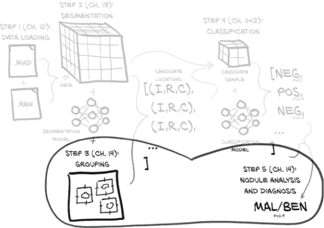

图 14.1 我们的端到端肺癌检测项目，重点关注本章的主题：第 3 步和第 5 步，分组和结节分析

当然，这些简短的描述及其在图 14.1 中的简化描述遗漏了很多细节。让我们通过图 14.2 放大一下，看看我们还有哪些任务要完成。

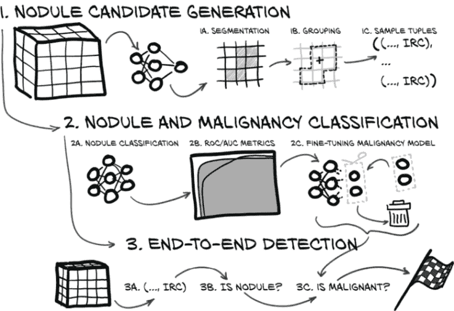

图 14.2 一个关于我们端到端项目剩余工作的详细查看

正如您所看到的，还有三项重要任务。以下列表中的每一项对应于图 14.2 的一个主要项目：

1.  生成结节候选。这是整个项目的第 3 步。这一步骤包括三项任务：

    1.  *分割* --第十三章的分割模型将预测给定像素是否感兴趣：如果我们怀疑它是结节的一部分。这将在每个 2D 切片上完成，并且每个 2D 结果将被堆叠以形成包含结节候选预测的体素的 3D 数组。

    1.  *分组* --我们将通过将预测应用于阈值来将体素分组为结节候选，然后将连接区域的标记体素分组。

    1.  *构建样本元组* --每个识别的结节候选将用于构建一个用于分类的样本元组。特别是，我们需要生成该结节中心的坐标（索引、行、列）。

一旦实现了这一点，我们将拥有一个应用程序，该应用程序接收患者的原始 CT 扫描并生成检测到的结节候选列表。生成这样的列表是 LUNA 挑战的任务。如果这个项目被临床使用（我们再次强调我们的项目不应该被使用！），这个结节列表将适合由医生进行更仔细的检查。

1.  对结节和恶性进行分类。我们将取出我们刚刚产生的结节候选并将其传递到我们在第十二章实现的候选分类步骤，然后对被标记为结节的候选进行恶性检测：

    1.  *结节分类* --从分割和分组中得到的每个结节候选将被分类为结节或非结节。这样做将允许我们筛选出被我们的分割过程标记为许多正常解剖结构。

    1.  *ROC/AUC 指标* --在我们开始最后的分类步骤之前，我们将定义一些用于检查分类模型性能的新指标，并建立一个基准指标，以便与我们的恶性分类器进行比较。

    1.  *微调恶性模型* --一旦我们的新指标就位，我们将定义一个专门用于分类良性和恶性结节的模型，对其进行训练，并查看其表现。我们将通过微调进行训练：这个过程会剔除现有模型的一些权重，并用新值替换它们，然后我们将这些值调整到我们的新任务中。

到那时，我们将离我们的最终目标不远了：将结节分类为良性和恶性类别，然后从 CT 中得出诊断。再次强调，在现实世界中诊断肺癌远不止盯着 CT 扫描，因此我们进行这种诊断更多是为了看看我们能够使用深度学习和成像数据单独走多远。

1.  端到端检测。最后，我们将把所有这些组合起来，达到终点，将组件组合成一个端到端的解决方案，可以查看 CT 并回答问题“肺部是否存在恶性结节？”

    1.  *IRC* --我们将对我们的 CT 进行分割，以获取结节候选样本进行分类。

    1.  *确定结节* --我们将对候选进行结节分类，以确定是否应将其输入恶性分类器。

    1.  *确定恶性程度 --*我们将对通过结节分类器的结节进行恶性分类，以确定患者是否患癌症。

我们有很多事情要做。冲刺终点！

*注意* 正如前一章中所述，我们将在文本中详细讨论关键概念，并略过重复、繁琐或显而易见的代码部分。完整的细节可以在书籍的代码存储库中找到。

## 14.2 验证集的独立性

我们面临着一个微妙但关键的错误的危险，我们需要讨论并避免：我们有一个潜在的从训练集到验证集的泄漏！对于分割和分类模型的每一个，我们都小心地将数据分割成一个训练集和一个独立的验证集，通过将每十个示例用于验证，其余用于训练。

然而，分类模型的分割是在结节列表上进行的，分割模型的分割是在 CT 扫描列表上进行的。这意味着我们很可能在分类模型的训练集中有来自分割验证集的结节，反之亦然。我们必须避免这种情况！如果不加以修正，这种情况可能导致性能指标人为地高于我们在独立数据集上获得的性能。这被称为*泄漏*，它将使我们的验证失效。

为了纠正这种潜在的数据泄漏，我们需要重新设计分类数据集，以便像我们在第十三章中为分割任务所做的那样也在 CT 扫描级别上工作。然后我们需要用这个新数据集重新训练分类模型。好消息是，我们之前没有保存我们的分类模型，所以我们无论如何都需要重新训练。

你应该从中得到的启示是在定义验证集时要注意整个端到端的过程。可能最简单的方法（也是对大多数重要数据集采用的方法）是尽可能明确地进行验证分割--例如，通过为训练和验证分别设置两个目录--然后在整个项目中坚持这种分割。当您需要重新分割时（例如，当您需要按某些标准对数据集进行分层时），您需要使用新分割的数据集重新训练所有模型。

我们为您做的是从第 10-12 章的`LunaDataset`中复制候选列表，并从第十三章的`Luna2dSegmentationDataset`中将其分割为测试和验证数据集。由于这是非常机械的，并且没有太多细节可供学习（您现在已经是数据集专家了），我们不会详细展示代码。

我们将通过重新运行分类器的训练来重新训练我们的分类模型：¹

```py
$ python3 -m p2ch14.training --num-workers=4 --epochs 100 nodule-nonnodule
```

经过 100 个周期，我们对正样本的准确率达到约 95%，对负样本达到 99%。由于验证损失没有再次上升的趋势，我们可以继续训练模型以查看是否会继续改善。

经过 90 个周期，我们达到了最大的 F1 分数，并且在验证准确率方面达到了 99.2%，尽管在实际结节上只有 92.8%。我们将采用这个模型，尽管我们可能也会尝试在恶性结节的准确率上稍微牺牲一些总体准确率（在此期间，模型在实际结节上的准确率为 95.4%，总准确率为 98.9%）。这对我们来说已经足够了，我们准备连接这些模型。

## 14.3 连接 CT 分割和结节候选分类

现在我们已经从第十三章保存了一个分割模型，并且在上一节刚刚训练了一个分类模型，图 14.3 的步骤 1a、1b 和 1c 显示我们已经准备好开始编写代码，将我们的分割输出转换为样本元组。我们正在进行*分组*：在图 14.3 的步骤 1b 的高亮周围找到虚线轮廓。我们的输入是*分割*：由第 1a 中的分割模型标记的体素。我们想要找到 1c，即每个“块”中心的质心坐标：我们需要在样本元组列表中提供的是 1b 加号标记的索引、行和列。

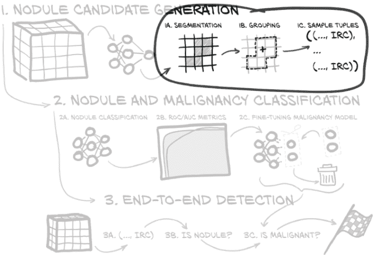

图 14.3 我们本章的计划，重点是将分割的体素分组为结节候选

运行模型时，其处理方式与我们在训练和验证（尤其是验证）期间处理它们的方式非常相似。这里的区别在于对 CT 进行循环。对于每个 CT，我们会分割*每个*切片，然后将所有分割输出作为分组的输入。分组的输出将被馈送到结节分类器中，通过该分类器幸存下来的结节将被馈送到恶性分类器中。

这是对 CT 的外部循环，对每个 CT 进行分割、分组、分类候选，并提供分类以进行进一步处理。

列表 14.1 nodule_analysis.py:324，`NoduleAnalysisApp.main`

```py
for _, series_uid in series_iter:                        # ❶
  ct = getCt(series_uid)                                 # ❷
  mask_a = self.segmentCt(ct, series_uid)                # ❸

  candidateInfo_list = self.groupSegmentationOutput(     # ❹
    series_uid, ct, mask_a)
  classifications_list = self.classifyCandidates(        # ❺
    ct, candidateInfo_list)
```

❶ 循环遍历系列 UID

❷ 获取 CT（大图中的步骤 1）

❸ 在其上运行我们的分割模型（步骤 2）

❹ 对输出中的标记体素进行分组（步骤 3）

❺ 在它们上运行我们的结节分类器（步骤 4）

我们将在以下部分详细介绍`segmentCt`、`groupSegmentationOutput`和`classifyCandidates`方法。

### 14.3.1 分割

首先，我们将对整个 CT 扫描的每个切片执行分割。由于我们需要逐个患者的 CT 逐个切片进行处理，我们构建一个`Dataset`，加载具有单个`series_uid`的 CT 并返回每个切片，每次调用`__getitem__`。

*注意* 特别是在 CPU 上执行时，分割步骤可能需要相当长的时间。尽管我们在这里只是简单提及，但代码将在可用时使用 GPU。

除了更广泛的输入之外，主要区别在于我们如何处理输出。回想一下，输出是每个像素的概率数组（即在 0...1 范围内），表示给定像素是否属于结节。在遍历切片时，我们在一个与我们的 CT 输入形状相同的掩模数组中收集切片预测。之后，我们对预测进行阈值处理以获得二进制数组。我们将使用 0.5 的阈值，但如果需要，我们可以尝试不同的阈值来在增加假阳性的情况下获得更多真阳性。

我们还包括一个使用 `scipy.ndimage.morphology` 中的腐蚀操作进行小的清理步骤。它删除一个边缘体素层，仅保留内部体素——那些所有八个相邻体素在轴方向上也被标记的体素。这使得标记区域变小，并导致非常小的组件（小于 3 × 3 × 3 体素）消失。结合数据加载器的循环，我们指示它向我们提供来自单个 CT 的所有切片，我们有以下内容。

列表 14.2 nodule_analysis.py:384, `.segmentCt`

```py
def segmentCt(self, ct, series_uid):
  with torch.no_grad():                                     # ❶
    output_a = np.zeros_like(ct.hu_a, dtype=np.float32)     # ❷
    seg_dl = self.initSegmentationDl(series_uid)  #         # ❸
    for input_t, _, _, slice_ndx_list in seg_dl:

      input_g = input_t.to(self.device)                     # ❹
      prediction_g = self.seg_model(input_g)                # ❺

      for i, slice_ndx in enumerate(slice_ndx_list):        # ❻
        output_a[slice_ndx] = prediction_g[i].cpu().numpy()

    mask_a = output_a > 0.5                                 # ❼
    mask_a = morphology.binary_erosion(mask_a, iterations=1)

  return mask_a
```

❶ 我们这里不需要梯度，所以我们不构建图。

❷ 这个数组将保存我们的输出：一个概率注释的浮点数组。

❸ 我们获得一个数据加载器，让我们可以按批次循环遍历我们的 CT。

❹ 将输入移动到 GPU 后...

❺ ... 我们运行分割模型 ...

❻ ... 并将每个元素复制到输出数组中。

❼ 将概率输出阈值化以获得二进制输出，然后应用二进制腐蚀进行清理

这已经足够简单了，但现在我们需要发明分组。

### 14.3.2 将体素分组为结节候选

我们将使用一个简单的连通分量算法将我们怀疑的结节体素分组成块以输入分类。这种分组方法标记连接的组件，我们将使用 `scipy.ndimage.measurements.label` 完成。`label` 函数将获取所有与另一个非零像素共享边缘的非零像素，并将它们标记为属于同一组。由于我们从分割模型输出的大部分都是高度相邻像素的块，这种方法很好地匹配了我们的数据。

列表 14.3 nodule_analysis.py:401

```py
def groupSegmentationOutput(self, series_uid,  ct, clean_a):
  candidateLabel_a, candidate_count = measurements.label(clean_a)   # ❶
  centerIrc_list = measurements.center_of_mass(                     # ❷
    ct.hu_a.clip(-1000, 1000) + 1001,
    labels=candidateLabel_a,
    index=np.arange(1, candidate_count+1),
  )
```

❶ 为每个体素分配所属组的标签

❷ 获取每个组的质心作为索引、行、列坐标

输出数组 `candidateLabel_a` 与我们用于输入的 `clean_a` 具有相同的形状，但在背景体素处为 0，并且递增的整数标签 1、2、...，每个连接的体素块组成一个结节候选。请注意，这里的标签 *不* 是分类意义上的标签！这只是在说“这个体素块是体素块 1，这边的体素块是体素块 2，依此类推”。

SciPy 还提供了一个函数来获取结节候选的质心：`scipy.ndimage.measurements.center_of_mass`。它接受一个每个体素密度的数组，刚刚调用的 `label` 函数返回的整数标签，以及需要计算质心的这些标签的列表。为了匹配函数期望的质量为非负数，我们将（截取的）`ct.hu_a` 偏移了 1,001。请注意，这导致所有标记的体素都携带一些权重，因为我们将最低的空气值在本机 CT 单位中夹紧到 -1,000 HU。

列表 14.4 nodule_analysis.py:409

```py
candidateInfo_list = []
for i, center_irc in enumerate(centerIrc_list):
  center_xyz = irc2xyz(                                                   # ❶
    center_irc,
    ct.origin_xyz,
    ct.vxSize_xyz,
    ct.direction_a,
  )
  candidateInfo_tup = \
    CandidateInfoTuple(False, False, False, 0.0, series_uid, center_xyz)  # ❷
  candidateInfo_list.append(candidateInfo_tup)

return candidateInfo_list
```

❶ 将体素坐标转换为真实患者坐标

❷ 构建我们的候选信息元组并将其附加到检测列表中

作为输出，我们得到一个包含三个数组的列表（分别为索引、行和列），与我们的 `candidate_count` 长度相同。我们可以使用这些数据来填充一个 `candidateInfo_tup` 实例的列表；我们已经对这种小数据结构产生了依恋，所以我们将结果放入自从第十章以来一直在使用的相同类型的列表中。由于我们实际上没有适合的数据来填充前四个值（`isNodule_bool`、`hasAnnotation_bool`、`isMal_bool` 和 `diameter_mm`），我们插入了适当类型的占位符值。然后我们在循环中将我们的坐标从体素转换为物理坐标，创建列表。将我们的坐标从基于数组的索引、行和列移开可能看起来有点愚蠢，但所有消耗 `candidateInfo_tup` 实例的代码都期望 `center_xyz`，而不是 `center_irc`。如果我们尝试互换一个和另一个，我们将得到极其错误的结果！

耶--我们征服了第 3 步，从体素级别的检测中获取结节位置！现在我们可以裁剪出疑似结节，并将它们馈送给我们的分类器，以进一步消除一些假阳性。

### 14.3.3 我们找到了结节吗？分类以减少假阳性

当我们开始本书的第 2 部分时，我们描述了放射科医生查看 CT 扫描以寻找癌症迹象的工作如下：

目前，审查数据的工作必须由经过高度训练的专家执行，需要对细节进行仔细的注意，主要是在不存在癌症的情况下。

做好这项工作就像被放在 100 堆草垛前，并被告知：“确定这些草垛中是否有针。”

我们已经花费了时间和精力讨论谚语中的针；让我们通过查看图 14.4 来讨论一下草垛。我们的工作，可以说，就是尽可能多地从我们那位眼睛发直的放射科医生面前的草垛中分离出来，这样他们就可以重新聚焦他们经过高度训练的注意力，以便发挥最大的作用。

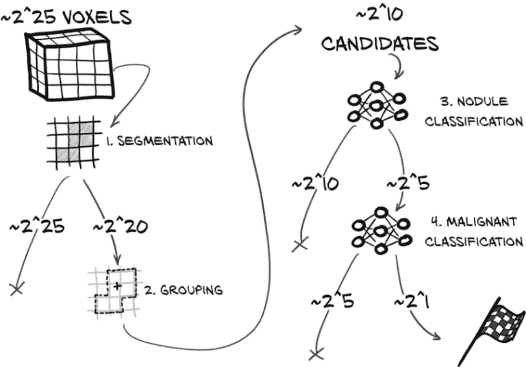

图 14.4 我们端到端检测项目的步骤，以及每个步骤删除的数据的数量级。

让我们看看在执行端到端诊断时每个步骤丢弃了多少数据。图 14.4 中的箭头显示了数据从原始 CT 体素流经我们的项目到最终恶性确定的过程。以 X 结尾的每个箭头表示上一步丢弃的一部分数据；指向下一步的箭头代表经过筛选幸存下来的数据。请注意，这里的数字是*非常*近似的。

让我们更详细地看一下图 14.4 中的步骤：

1.  *分割* --分割从整个 CT 开始：数百张切片，或大约 3300 万（225）体素（加减很多）。大约有 220 个体素被标记为感兴趣的；这比总输入要小几个数量级，这意味着我们要丢弃 97%的体素（这是左边导致 X 的 225）。

1.  *分组*。虽然分组并没有明确删除任何内容，但它确实减少了我们考虑的项目数量，因为我们将体素合并为结节候选者。分组从 100 万体素中产生了大约 1000 个候选者（210）。一个 16×16×2 体素的结节将有总共 210 个体素。²

1.  *结节分类*。这个过程丢弃了剩下的大多数~210 个项目。从我们成千上万的结节候选者中，我们剩下了数十个结节：大约 25 个。

1.  *恶性分类*。最后，恶性分类器会取出数十个结节（25 个），找出其中一个或两个（21 个）是癌症的。

沿途的每一步都允许我们丢弃大量数据，我们的模型确信这些数据与我们的癌症检测目标无关。我们从数百万数据点到少数肿瘤。

完全自动化与辅助系统

完全自动化系统和旨在增强人类能力的系统之间存在差异。对于我们的自动化系统，一旦一条数据被标记为无关紧要，它就永远消失了。然而，当向人类呈现数据供其消化时，我们应该允许他们剥开一些层次，查看近似情况，并用一定的信心程度注释我们的发现。如果我们设计一个用于临床使用的系统，我们需要仔细考虑我们确切的预期用途，并确保我们的系统设计能够很好地支持这些用例。由于我们的项目是完全自动化的，我们可以继续前进，而不必考虑如何最好地展示近似情况和不确定的答案。

现在我们已经确定了图像中我们的分割模型认为是潜在候选的区域，我们需要从 CT 中裁剪这些候选并将它们馈送到分类模块中。幸运的是，我们有前一节的 `candidateInfo_list`，所以我们只需要从中创建一个 `DataSet`，将其放入 `DataLoader`，并对其进行迭代。概率预测的第一列是预测的这是一个结节的概率，这是我们想要保留的。就像以前一样，我们收集整个循环的输出。

列表 14.5 结节分析.py:357，`.classifyCandidates`

```py
def classifyCandidates(self, ct, candidateInfo_list):
  cls_dl = self.initClassificationDl(candidateInfo_list)        # ❶
  classifications_list = []
  for batch_ndx, batch_tup in enumerate(cls_dl):
    input_t, _, _, series_list, center_list = batch_tup

    input_g = input_t.to(self.device)                           # ❷
    with torch.no_grad():
      _, probability_nodule_g = self.cls_model(input_g)         # ❸
      if self.malignancy_model is not None:                     # ❹
        _, probability_mal_g = self.malignancy_model(input_g)
      else:
        probability_mal_g = torch.zeros_like(probability_nodule_g)

    zip_iter = zip(center_list,
      probability_nodule_g[:,1].tolist(),
      probability_mal_g[:,1].tolist())
    for center_irc, prob_nodule, prob_mal in zip_iter:          # ❺
      center_xyz = irc2xyz(center_irc,
        direction_a=ct.direction_a,
        origin_xyz=ct.origin_xyz,
        vxSize_xyz=ct.vxSize_xyz,
      )
      cls_tup = (prob_nodule, prob_mal, center_xyz, center_irc)
      classifications_list.append(cls_tup)
  return classifications_list
```

❶ 再次，我们获得一个数据加载器来循环遍历，这次是基于我们的候选列表。

❷ 将输入发送到设备

❸ 将输入通过结节与非结节网络运行

❹ 如果我们有一个恶性模型，我们也运行它。

❺ 进行我们的簿记，构建我们结果的列表

这太棒了！我们现在可以将输出概率阈值化，得到我们的模型认为是实际结节的列表。在实际设置中，我们可能希望将它们输出供放射科医生检查。同样，我们可能希望调整阈值以更安全地出错一点：也就是说，如果我们的阈值是 0.3 而不是 0.5，我们将呈现更多的候选，结果证明不是结节，同时减少错过实际结节的风险。

列表 14.6 结节分析.py:333，`NoduleAnalysisApp.main`

```py
  if not self.cli_args.run_validation:                                  # ❶
    print(f"found nodule candidates in {series_uid}:")
    for prob, prob_mal, center_xyz, center_irc in classifications_list:
      if prob > 0.5:                                                    # ❷
        s = f"nodule prob {prob:.3f}, "
        if self.malignancy_model:
          s += f"malignancy prob {prob_mal:.3f}, "
        s += f"center xyz {center_xyz}"
        print(s)

  if series_uid in candidateInfo_dict:                                  # ❸
    one_confusion = match_and_score(
      classifications_list, candidateInfo_dict[series_uid]
    )
    all_confusion += one_confusion
    print_confusion(
      series_uid, one_confusion, self.malignancy_model is not None
    )

print_confusion(
  "Total", all_confusion, self.malignancy_model is not None
)
```

❶ 如果我们不通过运行验证，我们打印单独的信息...

❷ ... 对于分割找到的所有候选，其中分类器分配的结节概率为 50% 或更高。

❸ 如果我们有真实数据，我们计算并打印混淆矩阵，并将当前结果添加到总数中。

让我们针对验证集中的给定 CT 运行这个：³

```py
$ python3.6 -m p2ch14.nodule_analysis 1.3.6.1.4.1.14519.5.2.1.6279.6001.592821488053137951302246128864
...
found nodule candidates in 1.3.6.1.4.1.14519.5.2.1.6279.6001.592821488053137951302246128864:
nodule prob 0.533, malignancy prob 0.030, center xyz XyzTuple   # ❶(x=-128.857421875, y=-80.349609375, z=-31.300007820129395) 
nodule prob 0.754, malignancy prob 0.446, center xyz XyzTuple(x=-116.396484375, y=-168.142578125, z=-238.30000233650208)
...
nodule prob 0.974, malignancy prob 0.427, center xyz XyzTuple   # ❷(x=121.494140625, y=-45.798828125, z=-211.3000030517578)
nodule prob 0.700, malignancy prob 0.310, center xyz XyzTuple(x=123.759765625, y=-44.666015625, z=-211.3000030517578)
...
```

❶ 这个候选被分配了 53% 的恶性概率，所以它勉强达到了 50% 的概率阈值。恶性分类分配了一个非常低（3%）的概率。

❷ 被检测为结节，具有非常高的置信度，并被分配了 42% 的恶性概率

脚本总共找到了 16 个结节候选。由于我们正在使用验证集，我们对每个 CT 都有完整的注释和恶性信息，我们可以使用这些信息创建一个混淆矩阵来展示我们的结果。行是真相（由注释定义），列显示我们的项目如何处理每种情况：

```py
1.3.6.1.4.1.14519.5.2.1.6279.6001.592821488053137951302246128864           # ❶
                  |    Complete Miss |     Filtered Out |     Pred. Nodule # ❷
      Non-Nodules |                  |             1088 |               15 # ❸
           Benign |                1 |                0 |                0
        Malignant |                0 |                0 |                1
```

❶ 扫描 ID

❷ 预后：完全未检出表示分割未找到结节，被过滤掉是分类器的工作，预测结节是它标记为结节的。

❸ 行包含了真相。

完全未检出列是当我们的分割器根本没有标记结节时。由于分割器并不试图标记非结节，我们将该单元格留空。我们的分割器经过训练具有很高的召回率，因此有大量的非结节，但我们的结节分类器很擅长筛选它们。

所以我们在这个扫描中找到了 1 个恶性结节，但漏掉了第 17 个良性结节。此外，有 15 个误报的非结节通过了结节分类器。分类器的过滤将误报降至 1,000 多个！正如我们之前看到的，1,088 大约是 O(210)，所以这符合我们的预期。同样，15 大约是 O(24)，这与我们估计的 O(25) 差不多。

很棒！但更大的画面是什么？

## 14.4 定量验证

现在我们有了一些个案证据表明我们建立的东西可能在一个案例上起作用，让我们看看我们的模型在整个验证集上的表现。这样做很简单：我们将我们的验证集通过之前的预测运行，检查我们得到了多少结节，漏掉了多少，以及多少候选被错误地识别为结节。

我们运行以下内容，如果在 GPU 上运行，应该需要半小时到一个小时。喝完咖啡（或者睡个好觉）后，这是我们得到的结果：

```py
$ python3 -m p2ch14.nodule_analysis --run-validation

...
Total
                 |    Complete Miss |     Filtered Out |     Pred. Nodule
     Non-Nodules |                  |           164893 |             2156
          Benign |               12 |                3 |               87
       Malignant |                1 |                6 |               45
```

我们检测到了 154 个结节中的 132 个，或者 85%。我们错过的 22 个中，有 13 个未被分割认为是候选结节，因此这将是改进的明显起点。

大约 95%的检测到的结节是假阳性。这当然不是很好；另一方面，这并不是很关键--不得不查看 20 个结节候选才能找到一个结节要比查看整个 CT 要容易得多。我们将在第 14.7.2 节中更详细地讨论这一点，但我们要强调的是，与其将这些错误视为黑匣子，不如调查被错误分类的情况并看看它们是否有共同点。有什么特征可以将它们与被正确分类的样本区分开吗？我们能找到什么可以用来改善我们表现的东西吗？

目前，我们将接受我们的数字如此：不错，但并非完美。当您运行自己训练的模型时，确切的数字可能会有所不同。在本章末尾，我们将提供一些指向可以帮助改善这些数字的论文和技术。通过灵感和一些实验，我们确信您可以获得比我们在这里展示的更好的分数。

## 14.5 预测恶性

现在我们已经实现了 LUNA 挑战的结节检测任务，并可以生成自己的结节预测，我们问自己一个逻辑上的下一个问题：我们能区分恶性结节和良性结节吗？我们应该说，即使有一个好的系统，诊断恶性可能需要更全面地查看患者，额外的非 CT 背景信息，最终可能需要活检，而不仅仅是孤立地查看 CT 扫描中的单个结节。因此，这似乎是一个可能由医生执行的任务，未来可能会有一段时间。

### 14.5.1 获取恶性信息

LUNA 挑战专注于结节检测，并不包含恶性信息。LIDC-IDRI 数据集([`mng.bz/4A4R`](http://mng.bz/4A4R))包含了用于 LUNA 数据集的 CT 扫描的超集，并包括有关已识别肿瘤恶性程度的额外信息。方便地，有一个可以轻松安装的 PyLIDC 库，如下所示：

```py
$ pip3 install pylidc
```

`pylicd`库为我们提供了我们想要的额外恶性信息的便捷访问。就像我们在第 10 章中所做的那样，将 LIDC 的注释与 LUNA 候选者的坐标匹配，我们需要将 LIDC 的注释信息与 LUNA 候选者的坐标关联起来。

在 LIDC 注释中，恶性信息按照每个结节和诊断放射科医师（最多四位医师查看同一结节）使用从 1（高度不可能）到适度不可能、不确定、适度可疑，最后是 5（高度可疑）的有序五值量表进行编码。这些注释基于图像本身，并受到关于患者的假设的影响。为了将数字列表转换为单个布尔值是/否，我们将考虑当至少有两位放射科医师将该结节评为“适度可疑”或更高时，结节被认为是恶性的。请注意，这个标准有些是任意的；事实上，文献中有许多不同的处理这些数据的方法，包括预测五个步骤，使用平均值，或者从数据集中删除放射科医师评级不确定或不一致的结节。

结合数据的技术方面与第十章相同，因此我们跳过在此处显示代码（代码存储库中有此章节的代码），并将使用扩展的 CSV 文件。我们将以与我们为结节分类器所做的非常相似的方式使用数据集，只是现在我们只需要处理实际结节，并使用给定结节是否为恶性作为要预测的标签。这在结构上与我们在第十二章中使用的平衡非常相似，但我们不是从`pos_list`和`neg_list`中抽样，而是从`mal_list`和`ben_list`中抽样。就像我们为结节分类器所做的那样，我们希望保持训练数据平衡。我们将这些放入`MalignancyLunaDataset`类中，该类是`LunaDataset`的子类，但在其他方面非常相似。

为了方便起见，我们在 training.py 中创建了一个`dataset`命令行参数，并动态使用命令行指定的数据集类。我们通过使用 Python 的`getattr`函数来实现这一点。例如，如果`self.cli_args.dataset`是字符串`MalignancyLunaDataset`，它将获取`p2ch14.dsets.MalignancyLunaDataset`并将此类型分配给`ds_cls`，我们可以在这里看到。

列表 14.7 training.py:154，`.initTrainDl`

```py
ds_cls = getattr(p2ch14.dsets, self.cli_args.dataset)   # ❶

train_ds = ds_cls(
  val_stride=10,
  isValSet_bool=False,
  ratio_int=1,                                          # ❷
)
```

❶ 动态类名查找

❷ 请记住，这是训练数据之间的一对一平衡，这里是良性和恶性之间的平衡。

### 14.5.2 曲线下面积基线：按直径分类

有一个基线总是好的，可以看到什么性能比没有好。我们可以追求比随机更好，但在这里我们可以使用直径作为恶性的预测因子--更大的结节更有可能是恶性的。图 14.5 的第 2b 步提示了一个我们可以用来比较分类器的新度量标准。

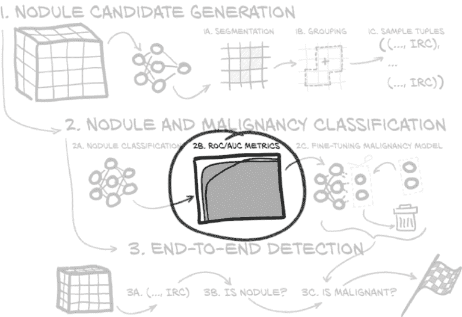

图 14.5 我们在本章中实施的端到端项目，重点是 ROC 图

我们可以将结节直径作为假设分类器预测结节是否为恶性的唯一输入。这不会是一个很好的分类器，但事实证明，说“一切大于这个阈值 X 的东西都是恶性的”比我们预期的更好地预测了恶性。当然，选择正确的阈值是关键--有一个甜蜜点，可以获取所有巨大的肿瘤，而没有任何微小的斑点，并且大致分割了那个不确定区域，其中有一堆较大的良性结节和较小的恶性结节。

正如我们可能从第十二章中记得的那样，我们的真正阳性、假正性、真正性和假负性计数会根据我们选择的阈值值而改变。当我们降低我们预测结节为恶性的阈值时，我们将增加真正阳性的数量，但也会增加假正性的数量。*假正率*（FPR）是 FP /（FP + TN），而*真正率*（TPR）是 TP /（TP + FN），您可能还记得这是从第十二章中的召回中得到的。

测量假阳性没有一种真正的方法：精度与假阳性率

这里的 FPR 和第十二章中的精度是（介于 0 和 1 之间的）率，用于衡量不完全相反的事物。正如我们讨论过的，精度是 TP /（TP + FP），用于衡量预测为阳性的样本中有多少实际上是阳性的。FPR 是 FP /（FP + TN），用于衡量实际上为负的样本中有多少被预测为阳性。对于极度不平衡的数据集（如结节与非结节分类），我们的模型可能会实现非常好的 FPR（这与交叉熵标准作为损失密切相关），而精度--因此 F1 分数--仍然非常差。低 FPR 意味着我们正在淘汰我们不感兴趣的很多内容，但如果我们正在寻找那根传说中的针，我们仍然主要是干草。

让我们为我们的阈值设定一个范围。下限将是使得*所有*样本都被分类为阳性的值，上限将是相反的情况，即所有样本都被分类为阴性。在一个极端情况下，我们的 FPR 和 TPR 都将为零，因为不会有*任何*阳性；在另一个极端情况下，两者都将为一，因为不会有 TN 和 FN（一切都是阳性！）。

对于我们的结节数据，直径范围从 3.25 毫米（最小结节）到 22.78 毫米（最大结节）。如果我们选择一个介于这两个值之间的阈值，然后可以计算 FPR（阈值）和 TPR（阈值）。如果我们将 FPR 值设为*X*，TPR 设为*Y*，我们可以绘制代表该阈值的点；如果我们反而绘制每个可能阈值的 FPR 对 TPR，我们得到一个名为*受试者工作特征*（ROC）的图表，如图 14.6 所示。阴影区域是*ROC 曲线下的面积*，或者 AUC。它的取值范围在 0 到 1 之间，数值越高越好。⁵

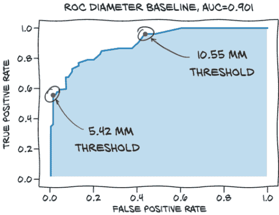

图 14.6 我们基线的受试者工作特征（ROC）曲线

在这里，我们还指出了两个特定的阈值：直径为 5.42 毫米和 10.55 毫米。我们选择这两个值，因为它们为我们可能考虑的阈值范围提供了相对合理的端点，如果我们需要选择一个单一的阈值。小于 5.42 毫米，我们只会降低我们的 TPR。大于 10.55 毫米，我们只会将恶性结节标记为良性而没有任何收益。这个分类器的最佳阈值可能会在中间某处。

我们实际上是如何计算这里显示的数值的呢？我们首先获取候选信息列表，过滤出已注释的结节，并获取恶性标签和直径。为了方便起见，我们还获取了良性和恶性结节的数量。

列表 14.8 p2ch14_malben_baseline.ipynb

```py
# In[2]:
ds = p2ch14.dsets.MalignantLunaDataset(val_stride=10, isValSet_bool=True) # ❶
nodules = ds.ben_list + ds.mal_list
is_mal = torch.tensor([n.isMal_bool for n in nodules])                    # ❷
diam  = torch.tensor([n.diameter_mm for n in nodules])
num_mal = is_mal.sum()                                                    # ❸
num_ben = len(is_mal) - num_mal
```

❶ 获取常规数据集，特别是良性和恶性结节的列表

❷ 获取恶性状态和直径的列表

❸ 为了对 TPR 和 FPR 进行归一化，我们获取了恶性和良性结节的数量。

要计算 ROC 曲线，我们需要一个可能阈值的数组。我们从 `torch.linspace` 获取这个数组，它取两个边界元素。我们希望从零预测的阳性开始，所以我们从最大阈值到最小阈值。这就是我们已经提到的 3.25 到 22.78：

```py
# In[3]:
threshold = torch.linspace(diam.max(), diam.min())
```

然后我们构建一个二维张量，其中行是每个阈值，列是每个样本信息，值是该样本是否被预测为阳性。然后根据样本的标签（恶性或良性）对此布尔张量进行过滤。我们对行求和以计算`True`条目的数量。除以恶性或良性结节的数量给出了 TPR 和 FPR--ROC 曲线的两个坐标：

```py
# In[4]:
predictions = (diam[None] >= threshold[:, None])                   # ❶
tp_diam = (predictions & is_mal[None]).sum(1).float() / num_mal    # ❷
fp_diam = (predictions & ~is_mal[None]).sum(1).float() / num_ben
```

❶ 通过 None 索引添加了一个大小为 1 的维度，就像 .unsqueeze(ndx) 一样。这使我们得到一个 2D 张量，其中给定结节（在列中）是否被分类为恶性，直径（在行中）。

❷ 使用预测矩阵，我们可以通过对列求和来计算每个直径的 TPR 和 FPR。

要计算这条曲线下的面积，我们使用梯形法进行数值积分（[`en.wikipedia.org/wiki/Trapezoidal_rule`](https://en.wikipedia.org/wiki/Trapezoidal_rule)），其中我们将两点之间的平均 TPR（Y 轴上）乘以两个 FPR 之间的差值（X 轴上）--图表中两点之间梯形的面积。然后我们将梯形的面积相加：

```py
# In[5]:
fp_diam_diff =  fp_diam[1:] - fp_diam[:-1]
tp_diam_avg  = (tp_diam[1:] + tp_diam[:-1])/2
auc_diam = (fp_diam_diff * tp_diam_avg).sum()
```

现在，如果我们运行`pyplot.plot(fp_diam, tp_diam, label=f"diameter baseline, AUC={auc_diam:.3f}")`（以及我们在第 8 单元中看到的适当图表设置），我们将得到图 14.6 中看到的图表。

### 14.5.3 重复使用预先存在的权重：微调

一种快速获得结果的方法（通常也可以用更少的数据完成）是不从随机初始化开始，而是从在某个具有相关数据的任务上训练过的网络开始。这被称为*迁移学习*或者，当仅训练最后几层时，称为*微调*。从图 14.7 中突出显示的部分可以看出，在步骤 2c 中，我们将剪掉模型的最后一部分，并用新的东西替换它。

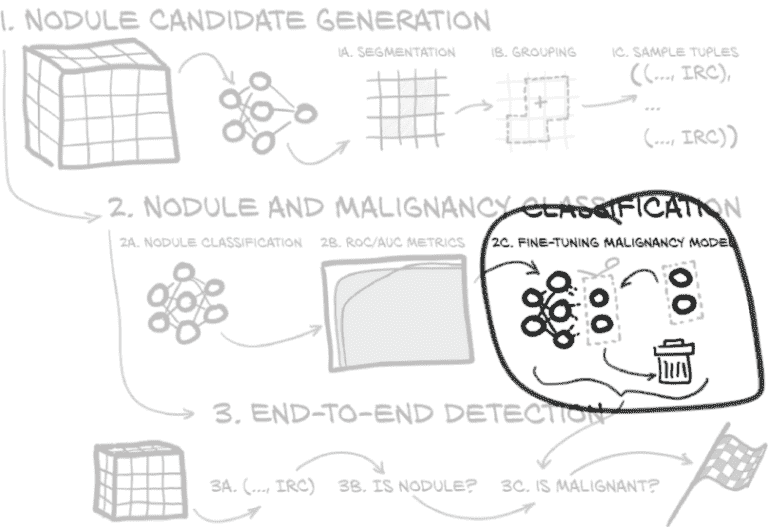

图 14.7 我们在本章中实施的端到端项目，重点是微调

回想一下第八章，我们可以将中间值解释为从图像中提取的特征--特征可以是模型检测到的边缘或角落，或者任何模式的指示。在深度学习之前，很常见使用手工制作的特征，类似于我们在卷积开始时简要尝试的内容。深度学习使网络从数据中提取对当前任务有用的特征，例如区分类别。现在，微调让我们混合使用古老的方法（将近*十年*前！）使用预先存在的特征和使用学习特征的新方法。我们将网络的一部分（通常是大部分）视为固定的*特征提取器*，只训练其上的相对较小的部分。

这通常效果非常好。像我们在第二章中看到的在 ImageNet 上训练的预训练网络对处理自然图像的许多任务非常有用--有时它们也对完全不同的输入效果惊人，从绘画或风格转移中的仿制品到音频频谱图。有些情况下，这种策略效果不佳。例如，在训练在 ImageNet 上的模型时，常见的数据增强策略之一是随机翻转图像--一个向右看的狗与向左看的狗属于同一类。因此，翻转图像之间的特征非常相似。但是如果我们现在尝试使用预训练模型进行一个左右有关的任务，我们可能会遇到准确性问题。如果我们想要识别交通标志，*这里左转*与*这里右转*是完全不同的；但是基于 ImageNet 特征构建的网络可能会在这两个类之间产生许多错误的分配。

在我们的情况下，我们有一个在类似数据上训练过的网络：结节分类网络。让我们尝试使用它。

为了说明，我们在微调方法中保持非常基本。在图 14.8 中的模型架构中，两个特别感兴趣的部分被突出显示：最后的卷积块和`head_linear`模块。最简单的微调是剪掉`head_linear`部分--事实上，我们只是保留了随机初始化。在尝试了这个之后，我们还将探索一种重新训练`head_linear`和最后一个卷积块的变体。

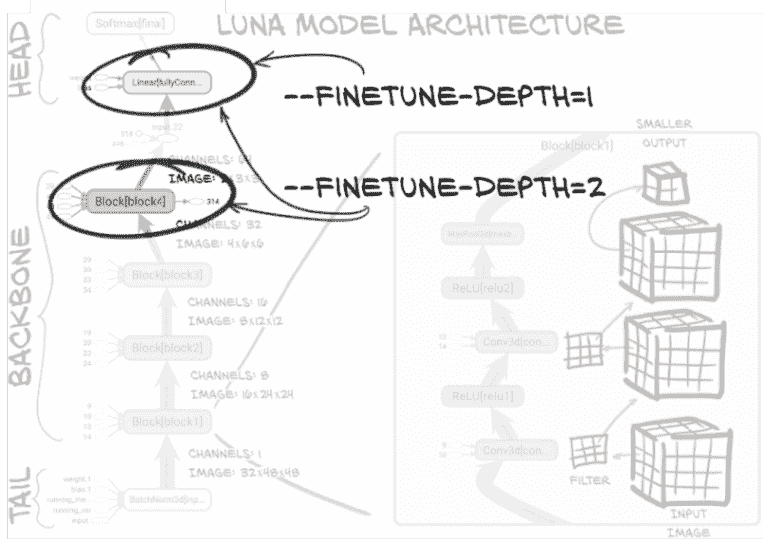

图 14.8 章节 11 中的模型架构，突出显示了深度-1 和深度-2 的权重

我们需要做以下事情：

+   加载我们希望从中开始的模型的权重，除了最后的线性层，我们希望保留初始化。

+   对于我们不想训练的参数禁用梯度（除了以`head`开头的参数）。

当我们在超过`head_linear`上进行微调训练时，我们仍然只将`head_linear`重置为随机值，因为我们认为先前的特征提取层可能不太适合我们的问题，但我们期望它们是一个合理的起点。这很简单：我们在模型设置中添加一些加载代码。

列表 14.9 training.py:124，`.initModel`

```py
d = torch.load(self.cli_args.finetune, map_location='cpu')
model_blocks = [
  n for n, subm in model.named_children()
  if len(list(subm.parameters())) > 0                            # ❶
]
finetune_blocks = model_blocks[-self.cli_args.finetune_depth:]   # ❷
model.load_state_dict(
  {
    k: v for k,v in d['model_state'].items()
    if k.split('.')[0] not in model_blocks[-1]                   # ❸
  },
  strict=False,                                                  # ❹
)
for n, p in model.named_parameters():
  if n.split('.')[0] not in finetune_blocks:                     # ❺
    p.requires_grad_(False)
```

❶ 过滤掉具有参数的顶层模块（而不是最终激活）

❷ 获取最后的 finetune_depth 块。默认值（如果进行微调）为 1。

❸ 过滤掉最后一个块（最后的线性部分）并且不加载它。从一个完全初始化的模型开始将使我们从（几乎）所有结节被标记为恶性的状态开始，因为在我们开始的分类器中，该输出表示“结节”。

❹ 通过 strict=False 参数，我们可以仅加载模块的一些权重（其中过滤的权重缺失）。

❺ 对于除 finetune_blocks 之外的所有部分，我们不希望梯度。

我们准备好了！我们可以通过运行以下命令来仅训练头部：

```py
python3 -m p2ch14.training \
    --malignant \
    --dataset MalignantLunaDataset \
    --finetune data/part2/models/cls_2020-02-06_14.16.55_final-nodule-nonnodule.best.state \
    --epochs 40 \
    malben-finetune
```

让我们在验证集上运行我们的模型并获得 ROC 曲线，如图 14.9 所示。这比随机要好得多，但考虑到我们没有超越基线，我们需要看看是什么阻碍了我们。

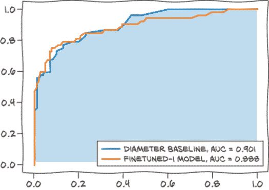

图 14.9 我们重新训练最后一个线性层的微调模型的 ROC 曲线。不算太糟糕，但也不如基线那么好。

图 14.10 显示了我们训练的 TensorBoard 图表。观察验证损失，我们可以看到虽然 AUC 缓慢增加，损失减少，但即使训练损失似乎在一个相对较高的水平（比如 0.3）上趋于平稳，而不是朝向零。我们可以进行更长时间的训练来检查是否只是非常缓慢；但将这与第五章讨论的损失进展进行比较--特别是图 5.14--我们可以看到我们的损失值并没有像图中的 A 案那样完全平稳，但我们的损失停滞问题在质量上是相似的。当时，A 案表明我们的容量不足，因此我们应考虑以下三种可能的原因：

+   通过在结节与非结节分类上训练网络获得的特征（最后一个卷积的输出）对恶性检测并不有用。

+   头部的容量--我们唯一训练的部分--并不够大。

+   整体网络的容量可能太小了。

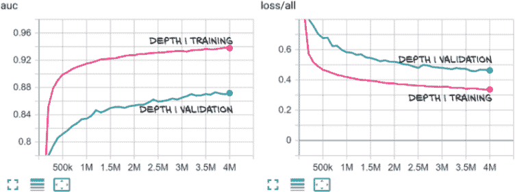

图 14.10 最后一个线性层微调的 AUC（左）和损失（右）

如果仅对全连接部分进行微调训练不够，下一步尝试的是将最后一个卷积块包括在微调训练中。幸运的是，我们引入了一个参数，所以我们可以将`block4`部分包含在我们的训练中：

```py
python3 -m p2ch14.training \
    --malignant \
    --dataset MalignantLunaDataset \
    --finetune data/part2/models/cls_2020-02-06_14.16.55_final-nodule-nonnodule.best.state \
    --finetune-depth 2 \      # ❶
    --epochs 10 \
    malben-finetune-twolayer
```

❶ 这个 CLI 参数是新的。

完成后，我们可以将我们的新最佳模型与基线进行比较。图 14.11 看起来更合理！我们几乎没有误报，就能标记出约 75%的恶性结节。这显然比直径基线的 65%要好。当我们试图超过 75%时，我们的模型性能会回到基线。当我们回到分类问题时，我们将希望在 ROC 曲线上选择一个平衡真阳性与假阳性的点。

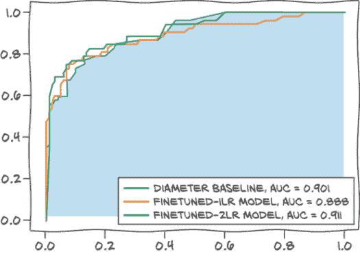

图 14.11 我们修改后模型的 ROC 曲线。现在我们离基线非常接近。

我们大致与基线持平，我们会对此感到满意。在第 14.7 节中，我们暗示了许多可以探索以改善这些结果的方法，但这些内容没有包含在本书中。

从图 14.12 中观察损失曲线，我们可以看到我们的模型现在很早就开始过拟合；因此下一步将是进一步检查正则化方法。我们将留给您处理。

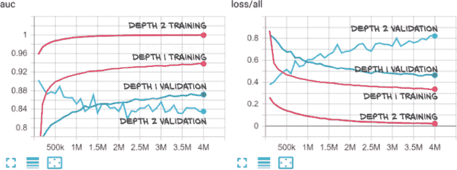

图 14.12 最后一个卷积块和全连接层微调的 AUC（左）和损失（右）

有更精细的微调方法。有些人主张逐渐解冻层，从顶部开始。其他人建议用通常的学习率训练后面的层，并为较低的层使用较小的学习率。PyTorch 本身支持使用不同的优化参数，如学习率、权重衰减和动量，通过将它们分开在几个*参数组*中，这些参数组只是那样：具有单独超参数的参数列表（[`pytorch.org/docs/stable/optim.html#per-parameter-options`](https://pytorch.org/docs/stable/optim.html#per-parameter-options)）。

### 14.5.4 TensorBoard 中的更多输出

当我们重新训练模型时，值得看一看我们可以添加到 TensorBoard 中的一些额外输出，以查看我们的表现如何。对于直方图，TensorBoard 有一个预制的记录功能。对于 ROC 曲线，它没有，因此我们有机会满足 Matplotlib 接口。

#### 直方图

我们可以获取恶性的预测概率并制作一个直方图。实际上，我们制作了两个：一个是（根据地面实况）良性的，一个是恶性结节的。这些直方图让我们深入了解模型的输出，并让我们看到是否有完全错误的大集群输出概率。

*注意* 一般来说，塑造您显示的数据是从数据中获取高质量信息的重要部分。如果您有许多非常自信的正确分类，您可能希望排除最左边的箱子。将正确的内容显示在屏幕上通常需要一些仔细思考和实验的迭代。不要犹豫调整您显示的内容，但也要注意记住，如果您更改了特定指标的定义而没有更改名称，将很容易将苹果与橙子进行比较。除非您在命名方案或删除现在无效的数据运行时有纪律地更改。

我们首先在保存我们的数据的张量`metrics_t`中创建一些空间。回想一下，我们在某处定义了索引。

列表 14.10 training.py:31

```py
METRICS_LABEL_NDX=0
METRICS_PRED_NDX=1
METRICS_PRED_P_NDX=2    # ❶
METRICS_LOSS_NDX=3
METRICS_SIZE = 4
```

❶ 我们的新指数，携带着预测概率（而不是经过阈值处理的预测）

一旦完成这一步，我们可以调用`writer.add_histogram`，传入一个标签、数据以及设置为我们呈现的训练样本数的`global_step`计数器；这类似于之前的标量调用。我们还传入`bins`设置为一个固定的尺度。

列表 14.11 training.py:496，`.logMetrics`

```py
bins = np.linspace(0, 1)

writer.add_histogram(
  'label_neg',
  metrics_t[METRICS_PRED_P_NDX, negLabel_mask],
  self.totalTrainingSamples_count,
  bins=bins
)
writer.add_histogram(
  'label_pos',
  metrics_t[METRICS_PRED_P_NDX, posLabel_mask],
  self.totalTrainingSamples_count,
  bins=bins
)
```

现在我们可以看一看我们对良性样本的预测分布以及它在每个时期如何演变。我们想要检查图 14.13 中直方图的两个主要特征。正如我们所期望的，如果我们的网络正在学习任何东西，在良性样本和非结节的顶行中，左侧有一个山峰，表示网络非常确信它所看到的不是恶性的。同样，在恶性样本中右侧也有一个山峰。

但仔细观察，我们看到了仅微调一个层的容量问题。专注于左上角的直方图系列，我们看到左侧的质量有些分散，并且似乎没有减少太多。甚至在 1.0 附近有一个小峰值，而且相当多的概率质量分布在整个范围内。这反映了损失不愿意降到 0.3 以下。

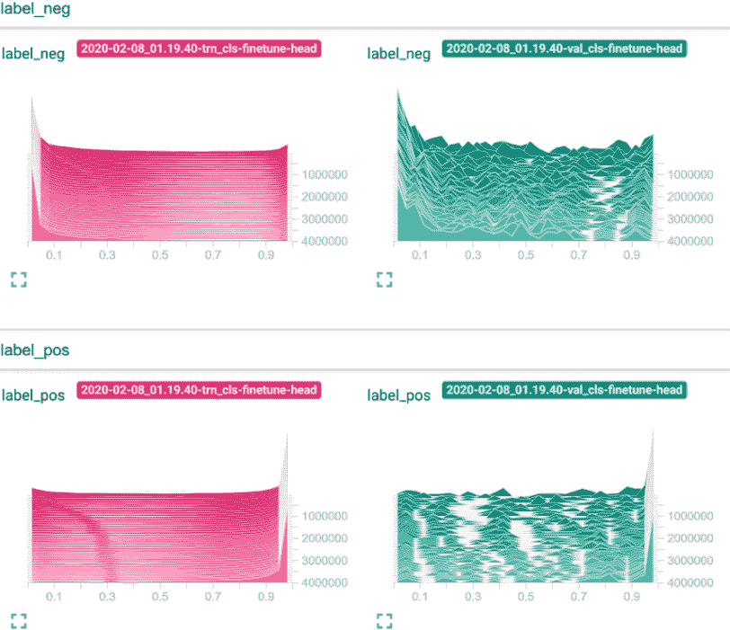

图 14.13 TensorBoard 直方图显示仅微调头部

鉴于对训练损失的观察，我们不必再深入研究，但让我们假装一下。在右侧的验证结果中，似乎在顶部右侧图表中，远离“正确”一侧的概率质量对于非恶性样本比底部右侧图表中的恶性样本更大。因此，网络更经常将非恶性样本错误分类为恶性样本。这可能会让我们考虑重新平衡数据以展示更多的非恶性样本。但再次强调，这是当我们假装左侧的训练没有任何问题时。我们通常希望先修复训练！

为了比较，让我们看看我们深度为 2 的微调相同图表（图 14.14）。在训练方面（左侧两个图表），我们在正确答案处有非常尖锐的峰值，其他内容不多。这反映了训练效果很好。

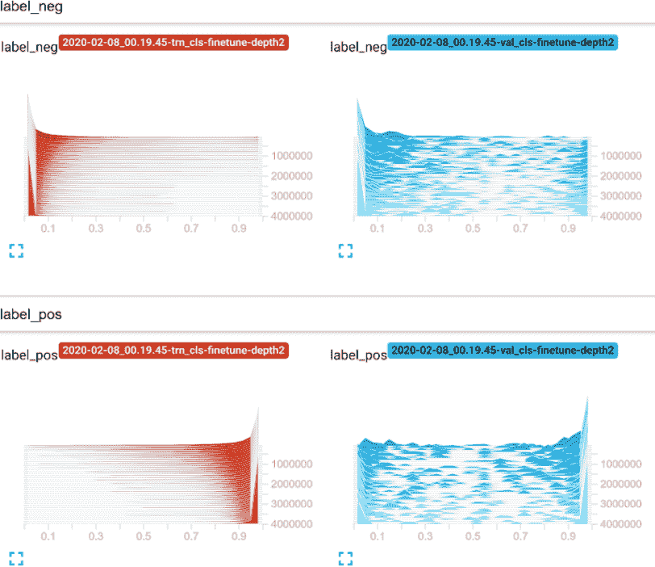

图 14.14 TensorBoard 直方图显示，深度为 2 的微调

在验证方面，我们现在看到最明显的问题是底部右侧直方图中预测概率为 0 的小峰值。因此，我们的系统性问题是将恶性样本误分类为非恶性。这与我们之前看到的两层微调过拟合相反！可能最好查看一些这种类型的图像，看看发生了什么。

#### TensorBoard 中的 ROC 和其他曲线

正如前面提到的，TensorBoard 本身不支持绘制 ROC 曲线。但是，我们可以利用 Matplotlib 导出任何图形的功能。数据准备看起来就像第 14.5.2 节中的一样：我们使用了在直方图中绘制的数据来计算 TPR 和 FPR--分别是`tpr`和`fpr`。我们再次绘制我们的数据，但这次我们跟踪`pyplot.figure`并将其传递给`SummaryWriter`方法`add_figure`。

列表 14.12 training.py:482，`.logMetrics`

```py
fig = pyplot.figure()                                           # ❶
pyplot.plot(fpr, tpr)                                           # ❷
writer.add_figure('roc', fig, self.totalTrainingSamples_count)  # ❸
```

❶ 设置一个新的 Matplotlib 图。通常我们不需要它，因为 Matplotlib 会隐式完成，但在这里我们需要。

❷ 使用任意 pyplot 函数

❸ 将我们的图表添加到 TensorBoard

因为这是作为图像提供给 TensorBoard 的，所以它出现在该标题下。我们没有绘制比较曲线或其他任何内容，以免让您分心，但我们可以在这里使用任何 Matplotlib 工具。在图 14.15 中，我们再次看到深度为 2 的微调（左侧）过拟合，而仅对头部进行微调（右侧）则没有。

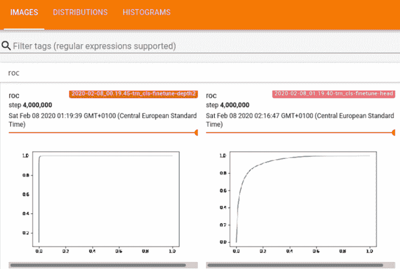

图 14.15 在 TensorBoard 中训练 ROC 曲线。滑块让我们浏览迭代。

## 14.6 当我们进行诊断时看到的情况

沿着图 14.16 中的步骤 3a、3b 和 3c，我们现在需要运行从左侧的步骤 3a 分割到右侧的步骤 3c 恶性模型的完整流程。好消息是，我们几乎所有的代码都已经就位！我们只需要将它们组合起来：现在是时候实际编写并运行我们的端到端诊断脚本了。

我们在第 14.3.3 节的代码中首次看到了处理恶性模型的线索。如果我们向`nodule_analysis`调用传递一个参数`--malignancy-path`，它将运行在此路径找到的恶性模型并输出信息。这适用于单个扫描和`--run-validation`变体。

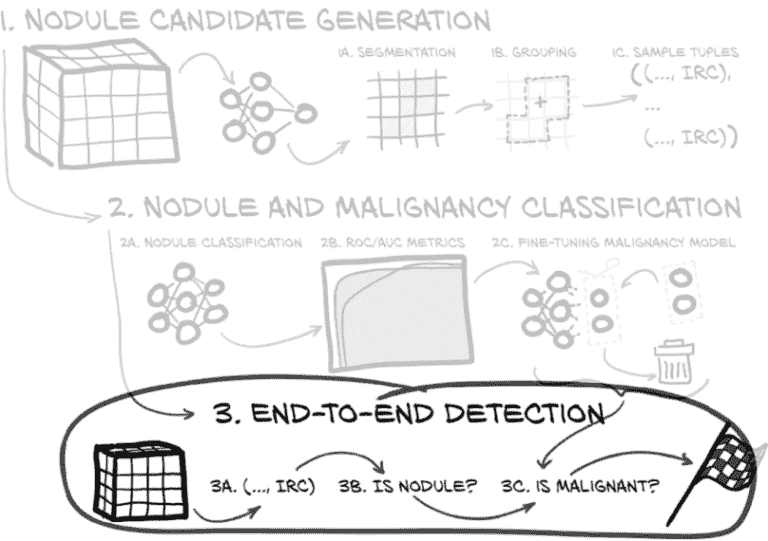

图 14.16 我们在本章实施的端到端项目，重点是端到端检测

请注意，脚本可能需要一段时间才能完成；即使只有验证集中的 89 个 CT 花费了大约 25 分钟。⁷

让我们看看我们得到了什么：

```py
Total
             | Complete Miss | Filtered Out | Pred. Benign | Pred. Malignant
 Non-Nodules |               |       164893 |         1593 |             563
      Benign |            12 |            3 |           70 |              17
   Malignant |             1 |            6 |            9 |              36
```

不算太糟糕！我们检测到大约 85%的结节，并正确标记了约 70%的恶性结节，从头到尾。⁸ 虽然我们有很多假阳性，但似乎每个真结节有 16 个假阳性减少了需要查看的内容（好吧，如果没有 30%的假阴性的话）。正如我们在第九章中已经警告过的那样，这还不到你可以为你的医疗人工智能初创公司筹集数百万资金的水平，⁹ 但这是一个相当合理的起点。总的来说，我们应该对我们得到的明显有意义的结果感到满意；当然，我们*真正*的目标一直是在学习深度学习的过程中。

接下来，我们可能会选择查看实际被错误分类的结节。请记住，对于我们手头的任务，即使标注数据集的放射科医生们在看法上也存在差异。我们可能会根据他们清晰地将结节识别为恶性的程度来分层我们的验证集。

### 14.6.1 训练、验证和测试集

我们必须提到一个警告。虽然我们没有明确地在验证集上训练我们的模型，尽管我们在本章的开头冒了这个风险，但我们确实*选择*了基于模型在验证集上的表现来使用的训练时期。这也是一种数据泄漏。事实上，我们应该预期我们的实际性能会略逊色于这个，因为最好的模型在我们的验证集上表现得很好，不太可能在每个其他未见过的数据集上表现得同样出色（至少平均而言）。

由于这个原因，实践者经常将数据分为*三*组：

+   一个*训练集*，就像我们在这里所做的一样

+   一个*验证集*，用于确定模型演化的哪个时期被认为是“最佳”

+   一个*测试集*，用于实际预测模型的性能（由验证集选择）在未见过的真实世界数据上

添加第三组将导致我们再次拉取我们的训练数据的另一个非常重要的部分，考虑到我们已经不得不为了对抗过拟合而努力。这也会使呈现变得更加复杂，所以我们故意将其排除在外。如果这是一个有资源获取更多数据并迫切需要构建在野外使用的最佳系统的项目，我们将不得不在这里做出不同的决定，并积极寻找更多数据用作独立的测试集。

总的来说，偏见潜入我们的模型的方式是微妙的。我们应该特别小心地控制信息泄漏的每一步，并尽可能使用独立数据验证其不存在。采取捷径的代价是在后期惨败，而这种情况发生的时间是最糟糕的：当我们接近生产时。

## 14.7 接下来呢？灵感（和数据）的额外来源

在这一点上，进一步的改进将很难衡量。我们的分类验证集包含 154 个结节，我们的结节分类模型通常至少有 150 个正确，大部分的变化来自每个时期的训练变化。即使我们对模型进行了显著改进，我们的验证集中也没有足够的准确性来确定这种改变是否肯定是改进！这在良性与恶性分类中也非常明显，验证损失经常曲折。如果我们将验证步幅从 10 减少到 5，我们的验证集的大小将翻倍，代价是我们训练数据的九分之一。如果我们想尝试其他改进，这可能是值得的。当然，我们还需要解决测试集的问题，这将减少我们已经有限的训练数据。

我们还希望仔细研究网络表现不如我们期望的情况，看看是否能够识别出任何模式。但除此之外，让我们简要谈谈一些通用的方法，我们可以改进我们的项目。在某种程度上，这一部分就像第八章中的第 8.5 节。我们将努力为您提供尝试的想法；如果您不详细了解每个想法也不要担心。

### 14.7.1 防止过拟合：更好的正则化

回顾第 2 部分我们所做的事情，在三个问题中--第十一章和第 14.5 节中的分类器，以及第十三章中的分割--我们都有过拟合模型。在第一种情况下，过拟合是灾难性的；我们通过在第十二章中平衡数据和增强来处理它。这种数据平衡以防止过拟合也是训练 U-Net 在结节和候选者周围的裁剪而不是完整切片的主要动机。对于剩余的过拟合，我们选择了退出，当过拟合开始影响我们的验证结果时提前停止训练。这意味着预防或减少过拟合将是改善我们结果的好方法。

这种模式--获得一个过拟合的模型，然后努力减少过拟合--实际上可以看作是一个配方。因此，当我们想要改进我们现在所取得的状态时，应该使用这种两步方法。

#### 经典正则化和增强

您可能已经注意到，我们甚至没有使用第八章中的所有正则化技术。例如，辍学将是一个容易尝试的事情。

虽然我们已经进行了一些增强，但我们可以走得更远。我们没有尝试使用的一个相对强大的增强方法是弹性变形，其中我们将“数字皱褶”放入输入中。这比仅仅旋转和翻转产生了更多的变化，似乎也适用于我们的任务。

#### 更抽象的增强

到目前为止，我们的增强受到几何启发--我们将输入转换为更或多或少看起来像我们可能看到的合理东西。事实证明，我们不必局限于这种类型的增强。

回顾第八章，从数学上讲，我们一直在使用的交叉熵损失是预测和将所有概率质量放在标签上的分布之间的差异度量，可以用标签的独热向量表示。如果我们的网络存在过度自信的问题，我们可以尝试的一个简单方法是不使用独热分布，而是在“错误”类别上放置一小部分概率质量。这被称为*标签平滑*。

我们还可以同时处理输入和标签。一个非常通用且易于应用的增强技术被提出，名为*mixup*：作者建议随机插值输入和标签。有趣的是，在对损失进行线性假设（这由二元交叉熵满足）的情况下，这等效于仅使用从适当调整的分布中绘制的权重来操作输入。显然，在处理真实数据时，我们不希望出现混合输入，但似乎这种混合鼓励预测的稳定性并且非常有效。

#### 超越单一最佳模型：集成

我们对过拟合问题的一个观点是，如果我们知道正确的参数，我们的模型可以按照我们想要的方式工作，但我们实际上并不知道这些参数。如果我们遵循这种直觉，我们可能会尝试提出几组参数（也就是几个模型），希望每个模型的弱点可以互相补偿。这种评估几个模型并组合输出的技术称为*集成*。简而言之，我们训练几个模型，然后为了预测，运行它们所有并平均预测。当每个单独模型过拟合时（或者我们在开始看到过拟合之前拍摄了模型的快照），似乎这些模型可能开始对不同的输入做出错误预测，而不总是首先过拟合相同的样本。

在集成中，我们通常使用完全独立的训练运行或者不同的模型结构。但如果我们想要简化，我们可以从单次训练运行中获取几个模型的快照--最好是在结束前不久或者在开始观察到过拟合之前。我们可以尝试构建这些快照的集成，但由于它们仍然相互接近，我们可以选择对它们进行平均。这就是*随机权重平均*的核心思想。我们在这样做时需要一些小心：例如，当我们的模型使用批量归一化时，我们可能需要调整统计数据，但即使没有这样做，我们也可能获得一些小的准确度提升。

#### 概括我们要求网络学习的内容

我们还可以看看*多任务学习*，在这里我们要求模型学习除了我们将要评估的输出之外的额外输出，这已经被证明可以改善结果。我们可以尝试同时训练结节与非结节以及良性与恶性。实际上，恶性数据的数据源提供了我们可以用作额外任务的额外标签；请参见下一节。这个想法与我们之前看到的迁移学习概念密切相关，但在这里我们通常会同时训练两个任务，而不是先完成一个再尝试转移到下一个。

如果我们没有额外的任务，而是有一堆额外的未标记数据，我们可以研究*半监督学习*。最近提出的一个看起来非常有效的方法是无监督数据增强。在这里，我们像往常一样在数据上训练我们的模型。在未标记数据上，我们对未增强的样本进行预测。然后我们将该预测作为该样本的目标，并训练模型在增强样本上也预测该目标。换句话说，我们不知道预测是否正确，但我们要求网络无论增强与否都产生一致的输出。

当我们没有更多感兴趣的任务但又没有额外数据时，我们可能会考虑捏造数据。捏造数据有些困难（尽管有时人们会使用类似第二章中简要介绍的 GANs，取得一定成功），因此我们选择捏造任务。这时我们进入了*自监督学习*的领域；这些任务通常被称为*借口任务*。一个非常流行的借口任务系列是对一些输入进行某种形式的破坏。然后我们可以训练一个网络来重建原始数据（例如，使用类似 U-Net 结构）或者训练一个分类器来检测真实数据和破坏数据，同时共享模型的大部分部分（例如卷积层）。

这仍然取决于我们想出一种损坏输入的方法。如果我们没有这样的方法并且没有得到想要的结果，还有其他方法可以进行自监督学习。一个非常通用的任务是，如果模型学习的特征足够好，可以让模型区分数据集的不同样本。这被称为*对比学习*。

为了使事情更具体，考虑以下情况：我们从当前图像中提取的特征以及另外 *K* 张图像的特征。这是我们的*关键*特征集。现在我们设置一个分类前提任务如下：给定当前图像的特征，即*查询*，它属于 *K* + 1 个*关键*特征中的哪一个？这乍一看可能很琐碎，但即使对于正确类别的查询特征和关键特征之间存在完美一致，训练这个任务也鼓励查询特征在分类器输出中被分配低概率时与 *K* 其他图像的特征最大程度地不同。当然，还有许多细节需要填充；我们建议（有些是任意的）查看动量对比。²⁰

### 14.7.2 优化的训练数据

我们可以通过几种方式改进我们的训练数据。我们之前提到恶性分类实际上是基于几位放射科医生更细致的分类。通过将我们丢弃的数据转化为“恶性或非恶性？”的二分法，一个简单的方法是使用这五类。然后，放射科医生的评估可以用作平滑标签：我们可以对每个评估进行独热编码，然后对给定结节的评估进行平均。因此，如果四位放射科医生观察一个结节，其中两位称其为“不确定”，一位将同一结节称为“中度可疑”，第四位将其标记为“高度可疑”，我们将根据模型输出和目标概率分布之间的交叉熵进行训练，给定向量`0 0 0.5 0.25 0.25`。这类似于我们之前提到的标签平滑，但以更智能、问题特定的方式。然而，我们必须找到一种新的评估这些模型的方法，因为我们失去了在二元分类中简单的准确性、ROC 和 AUC 的概念。

利用多个评估的另一种方法是训练多个模型而不是一个，每个模型都是根据单个放射科医生给出的注释进行训练的。在推断时，我们可以通过例如平均它们的输出概率来集成模型。

在之前提到的多任务方向上，我们可以再次回到 PyLIDC 提供的注释数据，其中为每个注释提供了其他分类（微妙性、内部结构、钙化、球形度、边缘定义性、分叶、刺状和纹理 ([`pylidc.github.io/annotation.html`](https://pylidc.github.io/annotation.html))）。不过，首先我们可能需要更多地了解结节。

在分割中，我们可以尝试看看 PyLIDC 提供的掩模是否比我们自己生成的掩模效果更好。由于 LIDC 数据具有多位放射科医生的注释，可以将结节分组为“高一致性”和“低一致性”组。看看这是否对应于“易”和“难”分类的结节，即看看我们的分类器是否几乎完全正确地处理所有易处理的结节，只在那些对人类专家更模糊的结节上遇到困难。或者我们可以从另一方面解决问题，通过定义结节在我们的模型性能方面的检测难度：将其分为“易”（经过一两个训练周期后正确分类）、“中”（最终正确分类）和“难”（持续错误分类）三个桶。

除了现成的数据，一个可能有意义的事情是进一步按恶性类型对结节进行分区。让专业人士更详细地检查我们的训练数据，并为每个结节标记一个癌症类型，然后强制模型报告该类型，可能会导致更有效的训练。外包这项工作的成本对于业余项目来说是高昂的，但在商业环境中支付可能是合理的。

尤其困难的情况也可能会受到人类专家的有限重复审查，以检查错误。同样，这将需要预算，但对于认真的努力来说绝对是合理的。

### 14.7.3 比赛结果和研究论文

我们在第 2 部分的目标是呈现从问题到解决方案的自包含路径，我们做到了。但是寻找和分类肺结节的特定问题以前已经有人研究过；因此，如果您想深入了解，您也可以看看其他人做了什么。

#### Data Science Bowl 2017

尽管我们将第 2 部分的范围限定在 LUNA 数据集中的 CT 扫描上，但在 Data Science Bowl 2017（[www.kaggle .com/c/data-science-bowl-2017](https://www.kaggle.com/c/data-science-bowl-2017)）中也有大量信息可供参考，该比赛由 Kaggle（[www.kaggle.com](https://www.kaggle.com/)）主办。数据本身已不再可用，但有许多人描述了对他们有效和无效的方法。例如，一些 Data Science Bowl（DSB）的决赛选手报告说，来自 LIDC 的详细恶性程度（1...5）信息在训练过程中很有用。

您可以查看的两个亮点是这些：²¹

+   第二名解决方案的撰写：Daniel Hammack 和 Julian de Wit [` mng.bz/Md48`](http://mng.bz/Md48)

+   第九名解决方案的撰写：Team Deep Breath [`mng.bz/aRAX`](http://mng.bz/aRAX)

*注意* 我们之前暗示的许多新技术对 DSB 参与者尚不可用。2017 年 DSB 和本书印刷之间的三年在深度学习领域是一个漫长的时间！

一个更合理的测试集的一个想法是使用 DSB 数据集而不是重复使用我们的验证集。不幸的是，DSB 停止分享原始数据，所以除非您碰巧有旧版本的副本，否则您需要另一个数据来源。

#### LUNA 论文

LUNA Grand Challenge 已经收集了一些结果（[`luna16.grand-challenge.org/Results`](https://luna16.grand-challenge.org/Results)），显示出相当大的潜力。虽然并非所有提供的论文都包含足够的细节来重现结果，但许多论文确实包含了足够的信息来改进我们的项目。您可以查阅一些论文，并尝试复制看起来有趣的方法。

## 14.8 结论

本章结束了第 2 部分，并实现了我们在第九章中承诺的承诺：我们现在有一个可以尝试从 CT 扫描中诊断肺癌的工作端到端系统。回顾我们的起点，我们已经走了很长的路，希望也学到了很多。我们使用公开可用的数据训练了一个能够做出有趣且困难的事情的模型。关键问题是，“这对现实世界有好处吗？”随之而来的问题是，“这准备好投入生产了吗？”*生产*的定义关键取决于*预期用途*，因此，如果我们想知道我们的算法是否可以取代专业放射科医师，那肯定不是这种情况。我们认为这可以代表未来支持放射科医师在临床例行工作中的工具的 0.1 版本：例如，通过提供对可能被忽视的事项的第二意见。

这样的工具需要通过监管机构（如美国食品药品监督管理局）的批准，以便在研究环境之外使用。我们肯定会缺少一个广泛的、经过精心策划的数据集来进一步训练，甚至更重要的是验证我们的工作。个别案例需要在研究协议的背景下由多位专家评估；而对于各种情况的适当表达，从常见病例到边缘情况，都是必不可少的。

所有这些情况，从纯研究用途到临床验证再到临床使用，都需要我们在一个适合扩展的环境中执行我们的模型。不用说，这带来了一系列挑战，无论是技术上还是流程上。我们将在第十五章讨论一些技术挑战。

### 14.8.1 幕后花絮

当我们结束第二部分的建模时，我们想拉开幕布，让你一窥在深度学习项目中工作的真相。从根本上说，这本书呈现了一种偏颇的看法：一系列经过策划的障碍和机会；一个经过精心呵护的花园小径，穿过深度学习的更广阔领域。我们认为这种半有机的挑战系列（尤其是第二部分）会使这本书更好，也希望会有更好的学习体验。然而，这并不意味着会有一个更*真实*的体验。

很可能，你的大部分实验都不会成功。并非每个想法都会成为一个发现，也不是每个改变都会是一个突破。深度学习是棘手的。深度学习是善变的。请记住，深度学习实际上是在推动人类知识的前沿；这是我们每天都在探索和拓展的领域，*就在此刻*。现在是从事这个领域的激动人心的时刻，但就像大多数野外工作一样，你的靴子上总会沾上一些泥巴。

符合透明度精神，这里有一些我们尝试过的、我们遇到困难的、不起作用的，或者至少不够好以至于不值得保留的事情：

+   在分类网络中使用`HardTanh`而不是`Softmax`（这样更容易解释，但实际上效果并不好）。

+   试图通过使分类网络更复杂（跳跃连接等）来解决`HardTanh`引起的问题。

+   不良的权重初始化导致训练不稳定，特别是对于分割。

+   对完整的 CT 切片进行分割训练。

+   使用 SGD 进行分割的损失加权。这并没有起作用，需要使用 Adam 才能使其有用。

+   CT 扫描的真正三维分割。对我们来说不起作用，但 DeepMind 后来还是做到了。这是在我们转向裁剪到结节之前，我们的内存用完了，所以你可以根据当前的设置再试一次。

+   误解 LUNA 数据中`class`列的含义，导致在撰写本书的过程中进行了一些重写。

+   无意中留下一个“我想快速获得结果”的技巧，导致分割模块找到的候选结节中有 80%被丢弃，直到我们弄清楚问题所在（这花了整个周末！）。

+   一系列不同的优化器、损失函数和模型架构。

+   以各种方式平衡训练数据。

我们肯定还忘记了更多。很多事情在变得正确之前都出了错！请从我们的错误中学习。

我们可能还要补充一点，对于这篇文章中的许多内容，我们只是选择了一种方法；我们强调*并不*意味着其他方法不如（其中许多可能更好！）。此外，编码风格和项目设计在人们之间通常有很大的不同。在机器学习中，人们经常在 Jupyter 笔记本中进行大量编程。笔记本是一个快速尝试事物的好工具，但它们也有自己的注意事项：例如，如何跟踪你所做的事情。最后，与我们之前使用的`prepcache`缓存机制不同，我们可以有一个单独的预处理步骤，将数据写出为序列化张量。这些方法中的每一种似乎都是一种品味；即使在三位作者中，我们中的任何一位都会略有不同地做事情。尝试事物并找出哪种方法最适合你，同时在与同事合作时保持灵活性是很好的。

## 14.9 练习

1.  为分类实现一个测试集，或者重用第十三章练习中的测试集。在训练时使用验证集选择最佳时期，但在最终项目评估时使用测试集。验证集上的性能与测试集上的性能如何相匹配？

1.  你能训练一个能够在一次传递中进行三路分类，区分非结节、良性结节和恶性结节的单一模型吗？

    1.  什么类平衡分割对训练效果最好？

    1.  与我们在书中使用的两遍方法相比，这种单遍模型的表现如何？

1.  我们在注释上训练了我们的分类器，但期望它在我们分割的输出上表现。使用分割模型构建一个非结节的列表，用于训练，而不是提供的非结节。

    1.  当在这个新集合上训练时，分类模型的性能是否有所提高？

    1.  你能描述哪种结节候选者在新训练的模型中看到了最大的变化吗？

1.  我们使用的填充卷积导致图像边缘附近的上下文不足。计算 CT 扫描切片边缘附近分割像素的损失，与内部的损失相比。这两者之间是否有可测量的差异？

1.  尝试使用重叠的 32×48×48 块在整个 CT 上运行分类器。这与分割方法相比如何？

## 14.10 总结

+   训练集和验证（以及测试）集之间的明确分割至关重要。在这里，按病人分割要比其他方式更不容易出错。当您的管道中有几个模型时，这一点更为真实。

+   从像素标记到结节的转换可以通过非常传统的图像处理实现。我们不想看不起经典，但重视这些工具，并在适当的地方使用它们。

+   我们的诊断脚本同时执行分割和分类。这使我们能够诊断我们以前没有见过的 CT，尽管我们当前的`Dataset`实现未配置为接受来自 LUNA 以外来源的`series_uid`。

+   微调是在使用最少的训练数据的情况下拟合模型的好方法。确保预训练模型具有与您的任务相关的特征，并确保重新训练具有足够容量的网络的一部分。

+   TensorBoard 允许我们编写许多不同类型的图表，帮助我们确定发生了什么。但这并不是查看我们的模型在哪些数据上表现特别糟糕的替代品。

+   成功的训练似乎在某个阶段涉及过拟合网络，然后我们对其进行正则化。我们可能也可以将其视为一种配方；我们可能应该更多地了解正则化。

+   训练神经网络是尝试事物，看看出了什么问题，然后改进它。通常没有什么灵丹妙药。

+   Kaggle 是深度学习项目创意的绝佳来源。许多新数据集为表现最佳者提供现金奖励，而旧的比赛则有可用作进一步实验起点的示例。

* * *

¹ 你也可以使用 p2_run_everything 笔记本。

² 任何给定结节的大小显然是高度可变的。

³ 我们特意选择了这个系列，因为它有一个很好的结果混合。

⁴ 查看 PyLIDC 文档以获取完整详情：[`mng.bz/Qyv6`](http://mng.bz/Qyv6)。

⁵ 请注意，在平衡数据集上的随机预测将导致 AUC 为 0.5，因此这为我们的分类器必须有多好提供了一个下限。

⁶ 你可以尝试使用受人尊敬的德国交通标志识别基准数据集，网址为[` mng.bz/XPZ9`](http://mng.bz/XPZ9)。

⁷ 大部分延迟来自于 SciPy 对连接组件的处理。在撰写本文时，我们还不知道有加速实现。

⁸ 请记住，我们之前的“几乎没有假阳性的 75%” ROC 数字是针对恶性分类的孤立情况。在我们甚至进入恶性分类器之前，我们已经过滤掉了七个恶性结节。

⁹ 如果是这样的话，我们会选择这样做而不是写这本书！

¹⁰ 至少有一位作者很愿意在本节涉及的主题上写一本完整的书。

¹¹ 另请参阅 Andrej Karparthy 的博客文章“A Recipe for Training Neural Networks”，网址为[`karpathy.github .io/2019/04/25/recipe`](https://karpathy.github.io/2019/04/25/recipe)以获取更详细的配方。

¹² 你可以在[`mng.bz/Md5Q`](http://mng.bz/Md5Q)找到一个配方（尽管是针对 TensorFlow 的）。

¹³ 你可以使用`nn.KLDivLoss`损失函数。

¹⁴Hongyi Zhang 等人，“mixup:超越经验风险最小化”，[`arxiv.org/abs/1710.09412`](https://arxiv.org/abs/1710.09412)。

¹⁵ 请参阅 Ferenc Huszár 在[`mng.bz/aRJj/`](http://mng.bz/aRJj/)发布的文章；他还提供了 PyTorch 代码。

¹⁶ 我们可能会将其扩展为纯贝叶斯，但我们只会使用这一点直觉。

¹⁷Pavel Izmailov 和 Andrew Gordon Wilson 在[`mng.bz/gywe`](http://mng.bz/gywe)提供了一个 PyTorch 代码的介绍。

¹⁸ 请参阅 Sebastian Ruder，“深度神经网络中多任务学习概述”，[`arxiv.org/ abs/1706.05098`](https://arxiv.org/abs/1706.05098)；但这也是许多领域的关键思想。

¹⁹Q. Xie 等人，“无监督数据增强用于一致性训练”，[`arxiv.org/abs/ 1904.12848`](https://arxiv.org/abs/1904.12848)。

²⁰K. He 等人，“动量对比用于无监督视觉表示学习”，[`arxiv.org/ abs/1911.05722`](https://arxiv.org/abs/1911.05722)。

²¹ 感谢互联网档案馆将它们从重新设计中保存下来。

²²Stanislav Nikolov 等人，“用于放射治疗头颈解剖学临床适用分割的深度学习”，[`arxiv.org/pdf/1809.04430.pdf`](https://arxiv.org/pdf/1809.04430.pdf)

²³ 哦，我们进行过的讨论！
