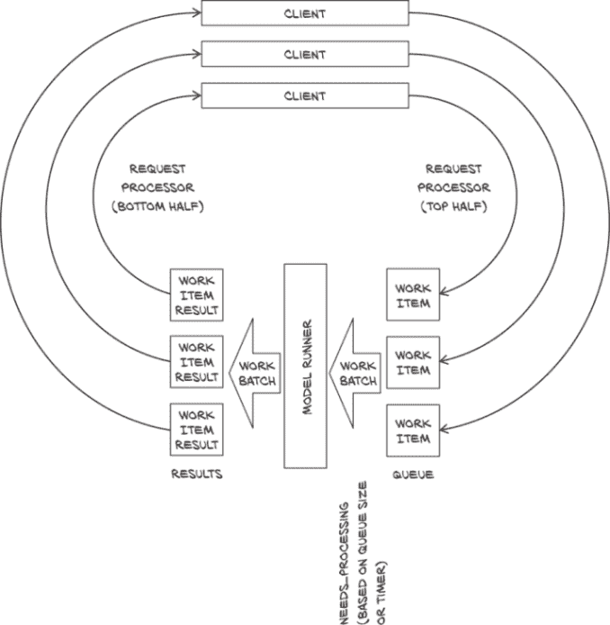
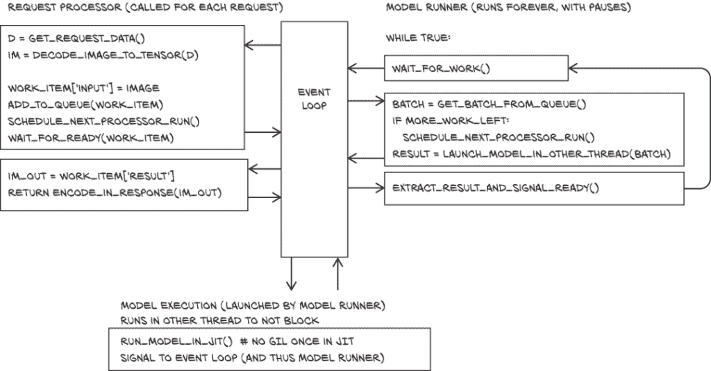
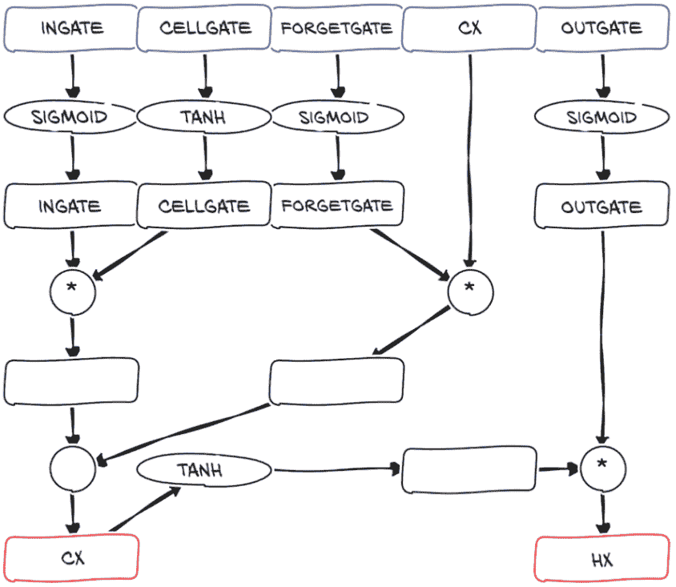
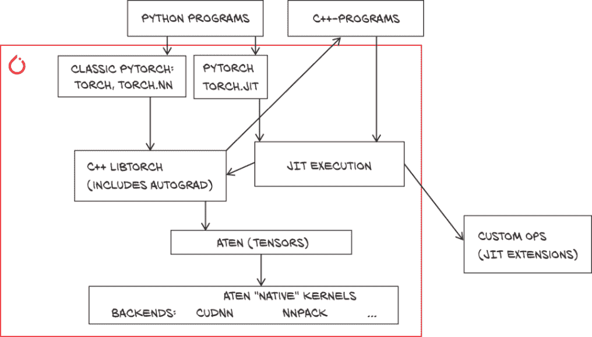

# 十五、部署到生产环境

本章涵盖内容

+   部署 PyTorch 模型的选项

+   使用 PyTorch JIT

+   部署模型服务器和导出模型

+   在 C++中运行导出和本地实现的模型

+   在移动设备上运行模型

在本书的第一部分，我们学到了很多关于模型的知识；第二部分为我们提供了创建特定问题的好模型的详细路径。现在我们有了这些优秀的模型，我们需要将它们带到可以发挥作用的地方。在规模化执行深度学习模型推理的基础设施维护方面，从架构和成本的角度来看都具有影响力。虽然 PyTorch 最初是一个专注于研究的框架，但从 1.0 版本开始，添加了一组面向生产的功能，使 PyTorch 成为从研究到大规模生产的理想端到端平台。

部署到生产环境意味着会根据用例而有所不同：

+   我们在第二部分开发的模型可能最自然的部署方式是建立一个网络服务，提供对我们模型的访问。我们将使用轻量级的 Python Web 框架来实现这一点：Flask ([` flask.pocoo.org`](http://flask.pocoo.org)) 和 Sanic ([`sanicframework.org`](https://sanicframework.org))。前者可以说是这些框架中最受欢迎的之一，后者在精神上类似，但利用了 Python 的新的异步操作支持 async/await 来提高效率。

+   我们可以将我们的模型导出为一个标准化的格式，允许我们使用优化的模型处理器、专门的硬件或云服务进行部署。对于 PyTorch 模型，Open Neural Network Exchange (ONNX)格式起到了这样的作用。

+   我们可能希望将我们的模型集成到更大的应用程序中。为此，如果我们不受 Python 的限制将会很方便。因此，我们将探讨使用 PyTorch 模型从 C++中使用的想法，这也是通往任何语言的一个过渡。

+   最后，对于一些像我们在第二章中看到的图像斑马化这样的事情，可能很好地在移动设备上运行我们的模型。虽然你不太可能在手机上有一个 CT 模块，但其他医疗应用程序如自助皮肤检查可能更自然，用户可能更喜欢在设备上运行而不是将他们的皮肤发送到云服务。幸运的是，PyTorch 最近增加了移动支持，我们将探索这一点。

当我们学习如何实现这些用例时，我们将以第十四章的分类器作为我们提供服务的第一个示例，然后切换到斑马化模型处理其他部署的内容。

## 15.1 提供 PyTorch 模型

我们将从将模型放在服务器上需要做什么开始。忠于我们的实践方法，我们将从最简单的服务器开始。一旦我们有了基本的工作内容，我们将看看它的不足之处，并尝试解决。最后，我们将看看在撰写本文时的未来。让我们创建一个监听网络的东西。¹

### 15.1.1 我们的模型在 Flask 服务器后面

Flask 是最广泛使用的 Python 模块之一。可以使用`pip`进行安装：²

```py
pip install Flask
```

API 可以通过装饰函数创建。

列表 15.1 flask_hello_world.py:1

```py
from flask import Flask
app = Flask(__name__)

@app.route("/hello")
def hello():
  return "Hello World!"

if __name__ == '__main__':
  app.run(host='0.0.0.0', port=8000)
```

应用程序启动后将在端口 8000 上运行，并公开一个路由`/hello`，返回“Hello World”字符串。此时，我们可以通过加载先前保存的模型并通过`POST`路由公开它来增强我们的 Flask 服务器。我们将以第十四章的模块分类器为例。

我们将使用 Flask 的（有点奇怪地导入的）`request`来获取我们的数据。更准确地说，request.files 包含一个按字段名称索引的文件对象字典。我们将使用 JSON 来解析输入，并使用 flask 的`jsonify`助手返回一个 JSON 字符串。

现在，我们将暴露一个/predict 路由，该路由接受一个二进制块（系列的像素内容）和相关的元数据（包含一个以`shape`为键的字典的 JSON 对象）作为`POST`请求提供的输入文件，并返回一个 JSON 响应，其中包含预测的诊断。更确切地说，我们的服务器接受一个样本（而不是一批），并返回它是恶性的概率。

为了获取数据，我们首先需要将 JSON 解码为二进制，然后使用`numpy.frombuffer`将其解码为一维数组。我们将使用`torch.from_numpy`将其转换为张量，并查看其实际形状。

模型的实际处理方式就像第十四章中一样：我们将从第十四章实例化`LunaModel`，加载我们从训练中得到的权重，并将模型置于`eval`模式。由于我们不进行训练任何东西，我们会在`with torch.no_grad()`块中告诉 PyTorch 在运行模型时不需要梯度。

列表 15.2 flask_server.py:1

```py
import numpy as np
import sys
import os
import torch
from flask import Flask, request, jsonify
import json

from p2ch13.model_cls import LunaModel

app = Flask(__name__)

model = LunaModel()                                                # ❶
model.load_state_dict(torch.load(sys.argv[1],
                 map_location='cpu')['model_state'])
model.eval()

def run_inference(in_tensor):
  with torch.no_grad():                                           # ❷
    # LunaModel takes a batch and outputs a tuple (scores, probs)
    out_tensor = model(in_tensor.unsqueeze(0))[1].squeeze(0)
  probs = out_tensor.tolist()
  out = {'prob_malignant': probs[1]}
  return out

@app.route("/predict", methods=["POST"])                          # ❸
def predict():
  meta = json.load(request.files['meta'])                         # ❹
  blob = request.files['blob'].read()
  in_tensor = torch.from_numpy(np.frombuffer(
    blob, dtype=np.float32))                                      # ❺
  in_tensor = in_tensor.view(*meta['shape'])
  out = run_inference(in_tensor)
  return jsonify(out)                                             # ❻

if __name__ == '__main__':
  app.run(host='0.0.0.0', port=8000)
  print (sys.argv[1])
```

❶ 设置我们的模型，加载权重，并转换为评估模式

❷ 对我们来说没有自动求导。

❸ 我们期望在“/predict”端点进行表单提交（HTTP POST）。

❹ 我们的请求将有一个名为 meta 的文件。

❺ 将我们的数据从二进制块转换为 torch

❻ 将我们的响应内容编码为 JSON

运行服务器的方法如下：

```py
python3 -m p3ch15.flask_server data/part2/models/cls_2019-10-19_15.48.24_final_cls.best.state
```

我们在 cls_client.py 中准备了一个简单的客户端，发送一个示例。从代码目录中，您可以运行它如下：

```py
python3 p3ch15/cls_client.py
```

它应该告诉您结节极不可能是恶性的。显然，我们的服务器接受输入，通过我们的模型运行它们，并返回输出。那我们完成了吗？还不完全。让我们看看下一节中可以改进的地方。

### 15.1.2 部署的期望

让我们收集一些为提供模型服务而期望的事情。首先，我们希望支持*现代协议及其特性*。老式的 HTTP 是深度串行的，这意味着当客户端想要在同一连接中发送多个请求时，下一个请求只会在前一个请求得到回答后才会发送。如果您想发送一批东西，这并不是很有效。我们在这里部分交付--我们升级到 Sanic 肯定会使我们转向一个有雄心成为非常高效的框架。

在使用 GPU 时，批量请求通常比逐个处理或并行处理更有效。因此，接下来，我们的任务是从几个连接收集请求，将它们组装成一个批次在 GPU 上运行，然后将结果返回给各自的请求者。这听起来很复杂，（再次，当我们编写这篇文章时）似乎在简单的教程中并不经常做。这足以让我们在这里正确地做。但请注意，直到由模型运行持续时间引起的延迟成为问题（在等待我们自己的运行时是可以的；但在请求到达时等待正在运行的批次完成，然后等待我们的运行给出结果是禁止的），在给定时间内在一个 GPU 上运行多个批次没有太多理由。增加最大批量大小通常更有效。

我们希望*并行*提供几件事情。即使使用异步提供服务，我们也需要我们的模型在第二个线程上高效运行--这意味着我们希望通过我们的模型摆脱（臭名昭著的）Python 全局解释器锁（GIL）。

我们还希望尽量减少*复制*。无论从内存消耗还是时间的角度来看，反复复制东西都是不好的。许多 HTTP 事物都是以 Base64 编码（一种将二进制编码为更多或更少字母数字字符串的格式，每字节限制为 6 位）的形式编码的，比如，对于图像，将其解码为二进制，然后再转换为张量，然后再转换为批处理显然是相对昂贵的。我们将部分实现这一点——我们将使用流式`PUT`请求来避免分配 Base64 字符串，并避免通过逐渐追加到字符串来增长字符串（对于字符串和张量来说，这对性能非常糟糕）。我们说我们没有完全实现，因为我们并没有真正最小化复制。

为了提供服务，最后一个理想的事情是*安全性*。理想情况下，我们希望有安全的解码。我们希望防止溢出和资源耗尽。一旦我们有了固定大小的输入张量，我们应该大部分都没问题，因为从固定大小的输入开始很难使 PyTorch 崩溃。为了达到这个目标，解码图像等工作可能更令人头疼，我们不做任何保证。互联网安全是一个足够庞大的领域，我们将完全不涉及它。我们应该注意到神经网络容易受到输入操纵以生成期望但错误或意想不到的输出（称为*对抗性示例*），但这与我们的应用并不是非常相关，所以我们会在这里跳过它。

言归正传。让我们改进一下我们的服务器。

### 15.1.3 请求批处理

我们的第二个示例服务器将使用 Sanic 框架（通过同名的 Python 包安装）。这将使我们能够使用异步处理来并行处理许多请求，因此我们将在列表中勾选它。顺便说一句，我们还将实现请求批处理。



图 15.1 请求批处理的数据流

异步编程听起来可能很可怕，并且通常伴随着大量术语。但我们在这里所做的只是允许函数非阻塞地等待计算或事件的结果。

为了进行请求批处理，我们必须将请求处理与运行模型分离。图 15.1 显示了数据的流动。

在图 15.1 的顶部是客户端，发出请求。这些一个接一个地通过请求处理器的上半部分。它们导致工作项与请求信息一起入队。当已经排队了一个完整的批次或最老的请求等待了指定的最长时间时，模型运行器会从队列中取出一批，处理它，并将结果附加到工作项上。然后这些工作项一个接一个地由请求处理器的下半部分处理。

#### 实现

我们通过编写两个函数来实现这一点。模型运行函数从头开始运行并永远运行。每当需要运行模型时，它会组装一批输入，在第二个线程中运行模型（以便其他事情可以发生），然后返回结果。

请求处理器然后解码请求，将输入加入队列，等待处理完成，并返回带有结果的输出。为了理解这里*异步*的含义，可以将模型运行器视为废纸篓。我们为本章所涂鸦的所有图纸都可以快速地放在桌子右侧的垃圾桶里处理掉。但是偶尔——无论是因为篮子已满还是因为到了晚上清理的时候——我们需要将所有收集的纸张拿出去扔到垃圾桶里。类似地，我们将新请求加入队列，如果需要则触发处理，并在发送结果作为请求答复之前等待结果。图 15.2 展示了我们在执行的两个函数块之前无间断执行的情况。



图 15.2 我们的异步服务器由三个模块组成：请求处理器、模型运行器和模型执行。这些模块有点像函数，但前两个在中间会让出事件循环。

相对于这个图片，一个轻微的复杂性是我们有两个需要处理事件的场合：如果我们积累了一个完整的批次，我们立即开始；当最老的请求达到最大等待时间时，我们也想运行。我们通过为后者设置一个定时器来解决这个问题。⁵

所有我们感兴趣的代码都在一个`ModelRunner`类中，如下列表所示。

列表 15.3 request_batching_server.py:32, `ModelRunner`

```py
class ModelRunner:
  def __init__(self, model_name):
    self.model_name = model_name
    self.queue = []                                    # ❶

    self.queue_lock = None                             # ❷

    self.model = get_pretrained_model(self.model_name,
                      map_location=device)             # ❸

    self.needs_processing = None                       # ❹

    self.needs_processing_timer = None                 # ❺
```

❶ 队列

❷ 这将成为我们的锁。

❸ 加载并实例化模型。这是我们将需要更改以切换到 JIT 的（唯一）事情。目前，我们从 p3ch15/cyclegan.py 导入 CycleGAN（稍微修改为标准化为 0..1 的输入和输出）。

❹ 我们运行模型的信号

❺ 最后，定时器

`ModelRunner` 首先加载我们的模型并处理一些管理事务。除了模型，我们还需要一些其他要素。我们将请求输入到一个`queue`中。这只是一个 Python 列表，我们在后面添加工作项，然后在前面删除它们。

当我们修改`queue`时，我们希望防止其他任务在我们下面更改队列。为此，我们引入了一个`queue_lock`，它将是由`asyncio`模块提供的`asyncio.Lock`。由于我们在这里使用的所有`asyncio`对象都需要知道事件循环，而事件循环只有在我们初始化应用程序后才可用，因此我们在实例化时将其临时设置为`None`。尽管像这样锁定可能并不是绝对必要的，因为我们的方法在持有锁时不会返回事件循环，并且由于 GIL 的原因，对队列的操作是原子的，但它确实明确地编码了我们的基本假设。如果我们有多个工作进程，我们需要考虑加锁。一个警告：Python 的异步锁不是线程安全的。（叹气。）

`ModelRunner` 在没有任务时等待。我们需要从`RequestProcessor`向其发出信号，告诉它停止偷懒，开始工作。这通过名为`needs_processing`的`asyncio.Event`完成。`ModelRunner`使用`wait()`方法等待`needs_processing`事件。然后，`RequestProcessor`使用`set()`来发出信号，`ModelRunner`会被唤醒并清除事件。

最后，我们需要一个定时器来保证最大等待时间。当我们需要时，通过使用`app.loop.call_at`来创建此定时器。它设置`needs_processing`事件；我们现在只是保留一个插槽。因此，实际上，有时事件将直接被设置，因为一个批次已经完成，或者当定时器到期时。当我们在定时器到期之前处理一个批次时，我们将清除它，以便不做太多的工作。

#### 从请求到队列

接下来，我们需要能够将请求加入队列，这是图 15.2 中`RequestProcessor`的第一部分的核心（不包括解码和重新编码）。我们在我们的第一个`async`方法`process_input`中完成这个操作。

列表 15.4 request_batching_server.py:54

```py
async def process_input(self, input):
  our_task = {"done_event": asyncio.Event(loop=app.loop),   # ❶
        "input": input,
        "time": app.loop.time()}
  async with self.queue_lock:                               # ❷
    if len(self.queue) >= MAX_QUEUE_SIZE:
      raise HandlingError("I'm too busy", code=503)
    self.queue.append(our_task)
    self.schedule_processing_if_needed()                    # ❸

  await our_task["done_event"].wait()                       # ❹
  return our_task["output"]
```

❶ 设置任务数据

❷ 使用锁，我们添加我们的任务和...

❸ ...安排处理。处理将设置`needs_processing`，如果我们有一个完整的批次。如果我们没有，并且没有设置定时器，它将在最大等待时间到达时设置一个定时器。

❹ 等待（并使用 await 将控制权交还给循环）处理完成。

我们设置一个小的 Python 字典来保存我们任务的信息：当然是`input`，任务被排队的`time`，以及在任务被处理后将被设置的`done_event`。处理会添加一个`output`。

持有队列锁（方便地在`async with`块中完成），我们将我们的任务添加到队列中，并在需要时安排处理。作为预防措施，如果队列变得太大，我们会报错。然后，我们只需等待我们的任务被处理，并返回它。

*注意* 使用循环时间（通常是单调时钟）非常重要，这可能与`time.time()`不同。否则，我们可能会在排队之前为处理安排事件，或者根本不进行处理。

这就是我们处理请求所需的一切（除了解码和编码）。

#### 从队列中运行批处理

接下来，让我们看一下图 15.2 右侧的`model_runner`函数，它执行模型调用。

列表 15.5 request_batching_server.py:71，`.run_model`

```py
async def model_runner(self):
  self.queue_lock = asyncio.Lock(loop=app.loop)
  self.needs_processing = asyncio.Event(loop=app.loop)
  while True:
    await self.needs_processing.wait()                 # ❶
    self.needs_processing.clear()
    if self.needs_processing_timer is not None:        # ❷
      self.needs_processing_timer.cancel()
      self.needs_processing_timer = None
    async with self.queue_lock:
      # ... line 87
      to_process = self.queue[:MAX_BATCH_SIZE]         # ❸
      del self.queue[:len(to_process)]
      self.schedule_processing_if_needed()
    batch = torch.stack([t["input"] for t in to_process], dim=0)
    # we could delete inputs here...

    result = await app.loop.run_in_executor(
      None, functools.partial(self.run_model, batch)   # ❹
    )
    for t, r in zip(to_process, result):               # ❺
      t["output"] = r
      t["done_event"].set()
    del to_process
```

❶ 等待有事情要做

❷ 如果设置了定时器，则取消定时器

❸ 获取一个批次并安排下一个批次的运行（如果需要）

❹ 在单独的线程中运行模型，将数据移动到设备，然后交给模型处理。处理完成后我们继续进行处理。

❺ 将结果添加到工作项中并设置准备事件

如图 15.2 所示，`model_runner`进行一些设置，然后无限循环（但在之间让出事件循环）。它在应用程序实例化时被调用，因此它可以设置我们之前讨论过的`queue_lock`和`needs_processing`事件。然后它进入循环，等待`needs_processing`事件。

当事件发生时，首先我们检查是否设置了时间，如果设置了，就清除它，因为我们现在要处理事情了。然后`model_runner`从队列中获取一个批次，如果需要的话，安排下一个批次的处理。它从各个任务中组装批次，并启动一个使用`asyncio`的`app.loop.run_in_executor`评估模型的新线程。最后，它将输出添加到任务中并设置`done_event`。

基本上就是这样。Web 框架--大致看起来像是带有`async`和`await`的 Flask--需要一个小包装器。我们需要在事件循环中启动`model_runner`函数。正如之前提到的，如果我们没有多个运行程序从队列中取出并可能相互中断，那么锁定队列就不是必要的，但是考虑到我们的代码将被适应到其他项目，我们选择保守一点，以免丢失请求。

我们通过以下方式启动我们的服务器

```py
python3 -m p3ch15.request_batching_server data/p1ch2/horse2zebra_0.4.0.pth
```

现在我们可以通过上传图像数据/p1ch2/horse.jpg 进行测试并保存结果：

```py
curl -T data/p1ch2/horse.jpg http://localhost:8000/image --output /tmp/res.jpg
```

请注意，这个服务器确实做了一些正确的事情--它为 GPU 批处理请求并异步运行--但我们仍然使用 Python 模式，因此 GIL 阻碍了我们在主线程中并行运行模型以响应请求。在潜在的敌对环境（如互联网）中，这是不安全的。特别是，请求数据的解码似乎既不是速度最优也不是完全安全的。

一般来说，如果我们可以进行解码，那将会更好，我们将请求流传递给一个函数，同时传递一个预分配的内存块，函数将从流中为我们解码图像。但我们不知道有哪个库是这样做的。

## 15.2 导出模型

到目前为止，我们已经从 Python 解释器中使用了 PyTorch。但这并不总是理想的：GIL 仍然可能阻塞我们改进的 Web 服务器。或者我们可能希望在 Python 过于昂贵或不可用的嵌入式系统上运行。这就是我们导出模型的时候。我们可以以几种方式进行操作。我们可能完全放弃 PyTorch 转向更专业的框架。或者我们可能留在 PyTorch 生态系统内部并使用 JIT，这是 PyTorch 专用 Python 子集的*即时*编译器。即使我们在 Python 中运行 JIT 模型，我们可能也追求其中的两个优势：有时 JIT 可以实现巧妙的优化，或者--就像我们的 Web 服务器一样--我们只是想摆脱 GIL，而 JIT 模型可以做到。最后（但我们需要一些时间才能到达那里），我们可能在`libtorch`下运行我们的模型，这是 PyTorch 提供的 C++ 库，或者使用衍生的 Torch Mobile。

### 15.2.1 与 ONNX 一起实现跨 PyTorch 的互操作性

有时，我们希望带着手头的模型离开 PyTorch 生态系统--例如，为了在具有专门模型部署流程的嵌入式硬件上运行。为此，Open Neural Network Exchange 提供了一个用于神经网络和机器学习模型的互操作格式（[`onnx.ai`](https://onnx.ai)）。一旦导出，模型可以使用任何兼容 ONNX 的运行时执行，例如 ONNX Runtime，⁶前提是我们模型中使用的操作得到 ONNX 标准和目标运行时的支持。例如，在树莓派上比直接运行 PyTorch 要快得多。除了传统硬件外，许多专门的 AI 加速器硬件都支持 ONNX（[`onnx.ai/supported-tools .html#deployModel`](https://onnx.ai/supported-tools.html#deployModel)）。

从某种意义上说，深度学习模型是一个具有非常特定指令集的程序，由矩阵乘法、卷积、`relu`、`tanh`等粒度操作组成。因此，如果我们可以序列化计算，我们可以在另一个理解其低级操作的运行时中重新执行它。ONNX 是描述这些操作及其参数的格式的标准化。

大多数现代深度学习框架支持将它们的计算序列化为 ONNX，其中一些可以加载 ONNX 文件并执行它（尽管 PyTorch 不支持）。一些低占用量（“边缘”）设备接受 ONNX 文件作为输入，并为特定设备生成低级指令。一些云计算提供商现在可以上传 ONNX 文件并通过 REST 端点查看其暴露。

要将模型导出到 ONNX，我们需要使用虚拟输入运行模型：输入张量的值并不重要；重要的是它们具有正确的形状和类型。通过调用`torch.onnx.export`函数，PyTorch 将*跟踪*模型执行的计算，并将其序列化为一个带有提供的名称的 ONNX 文件：

```py
torch.onnx.export(seg_model, dummy_input, "seg_model.onnx")
```

生成的 ONNX 文件现在可以在运行时运行，编译到边缘设备，或上传到云服务。在安装`onnxruntime`或`onnxruntime-gpu`并将`batch`作为 NumPy 数组获取后，可以从 Python 中使用它。

代码清单 15.6 onnx_example.py

```py
import onnxruntime

sess = onnxruntime.InferenceSession("seg_model.onnx")   # ❶
input_name = sess.get_inputs()[0].name
pred_onnx, = sess.run(None, {input_name: batch})
```

❶ ONNX 运行时 API 使用会话来定义模型，然后使用一组命名输入调用运行方法。这在处理静态图中定义的计算时是一种典型的设置。

并非所有 TorchScript 运算符都可以表示为标准化的 ONNX 运算符。如果导出与 ONNX 不兼容的操作，当我们尝试使用运行时时，将会出现有关未知`aten`运算符的错误。

### 15.2.2 PyTorch 自己的导出：跟踪

当互操作性不是关键，但我们需要摆脱 Python GIL 或以其他方式导出我们的网络时，我们可以使用 PyTorch 自己的表示，称为*TorchScript 图*。我们将在下一节中看到这是什么，以及生成它的 JIT 如何工作。但现在就让我们试一试。

制作 TorchScript 模型的最简单方法是对其进行跟踪。这看起来与 ONNX 导出完全相同。这并不奇怪，因为在幕后 ONNX 模型也使用了这种方法。在这里，我们只需使用`torch.jit.trace`函数将虚拟输入馈送到模型中。我们从第十三章导入`UNetWrapper`，加载训练参数，并将模型置于评估模式。

在我们追踪模型之前，有一个额外的注意事项：任何参数都不应该需要梯度，因为使用`torch.no_grad()`上下文管理器严格来说是一个运行时开关。即使我们在`no_grad`内部追踪模型，然后在外部运行，PyTorch 仍会记录梯度。如果我们提前看一眼图 15.4，我们就会明白为什么：在模型被追踪之后，我们要求 PyTorch 执行它。但是在执行记录的操作时，追踪的模型将需要梯度的参数，并且会使所有内容都需要梯度。为了避免这种情况，我们必须在`torch.no_grad`上下文中运行追踪的模型。为了避免这种情况--根据经验，很容易忘记然后对性能的缺乏感到惊讶--我们循环遍历模型参数并将它们全部设置为不需要梯度。

但我们只需要调用`torch.jit.trace`。

列出 15.7 trace_example.py

```py
import torch
from p2ch13.model_seg import UNetWrapper

seg_dict = torch.load('data-unversioned/part2/models/p2ch13/seg_2019-10-20_15.57.21_none.best.state', map_location='cpu')
seg_model = UNetWrapper(in_channels=8, n_classes=1, depth=4, wf=3, padding=True, batch_norm=True, up_mode='upconv')
seg_model.load_state_dict(seg_dict['model_state'])
seg_model.eval()
for p in seg_model.parameters():                             # ❶
    p.requires_grad_(False)

dummy_input = torch.randn(1, 8, 512, 512)
traced_seg_model = torch.jit.trace(seg_model, dummy_input)   # ❷
```

❶ 将参数设置为不需要梯度

❷ 追踪

追踪给我们一个警告：

```py
TracerWarning: Converting a tensor to a Python index might cause the trace 
to be incorrect. We can't record the data flow of Python values, so this 
value will be treated as a constant in the future. This means the trace 
might not generalize to other inputs!
  return layer[:, :, diff_y:(diff_y + target_size[0]), diff_x:(diff_x + target_size[1])]
```

这源自我们在 U-Net 中进行的裁剪，但只要我们计划将大小为 512 × 512 的图像馈送到模型中，我们就没问题。在下一节中，我们将更仔细地看看是什么导致了警告，以及如何避开它突出的限制（如果需要的话）。当我们想要将比卷积网络和 U-Net 更复杂的模型转换为 TorchScript 时，这也将很重要。

我们可以保存追踪的模型

```py
torch.jit.save(traced_seg_model, 'traced_seg_model.pt')
```

然后加载回来而不需要任何东西，然后我们可以调用它：

```py
loaded_model = torch.jit.load('traced_seg_model.pt')
prediction = loaded_model(batch)
```

PyTorch JIT 将保留我们保存模型时的状态：我们已经将其置于评估模式，并且我们的参数不需要梯度。如果我们之前没有注意到这一点，我们将需要在执行中使用`with torch.no_grad():`。

*提示* 您可以运行 JIT 编译并导出的 PyTorch 模型而不保留源代码。但是，我们总是希望建立一个工作流程，自动从源模型转换为已安装的 JIT 模型以进行部署。如果不这样做，我们将发现自己处于这样一种情况：我们想要调整模型的某些内容，但已经失去了修改和重新生成的能力。永远保留源代码，卢克！

### 15.2.3 带有追踪模型的服务器

现在是时候将我们的网络服务器迭代到这种情况下的最终版本了。我们可以将追踪的 CycleGAN 模型导出如下：

```py
python3 p3ch15/cyclegan.py data/p1ch2/horse2zebra_0.4.0.pth data/p3ch15/traced_zebra_model.pt
```

现在我们只需要在服务器中用`torch.jit.load`替换对`get_pretrained_model`的调用（并删除现在不再需要的`import get_pretrained_model`）。这也意味着我们的模型独立于 GIL 运行--这正是我们希望我们的服务器在这里实现的。为了您的方便，我们已经将小的修改放在 request_batching_jit_server.py 中。我们可以用追踪的模型文件路径作为命令行参数来运行它。

现在我们已经尝试了 JIT 对我们有什么帮助，让我们深入了解细节吧！

## 15.3 与 PyTorch JIT 交互

在 PyTorch 1.0 中首次亮相，PyTorch JIT 处于围绕 PyTorch 的许多最新创新的中心，其中之一是提供丰富的部署选项。

### 15.3.1 超越经典 Python/PyTorch 时可以期待什么

经常有人说 Python 缺乏速度。虽然这有一定道理，但我们在 PyTorch 中使用的张量操作通常本身足够大，以至于它们之间的 Python 速度慢并不是一个大问题。对于像智能手机这样的小设备，Python 带来的内存开销可能更重要。因此，请记住，通常通过将 Python 排除在计算之外来加快速度的提升是 10% 或更少。

另一个不在 Python 中运行模型的即时加速仅在多线程环境中出现，但这时它可能是显著的：因为中间结果不是 Python 对象，计算不受所有 Python 并行化的威胁，即 GIL。这是我们之前考虑到的，并且当我们在服务器上使用跟踪模型时实现了这一点。

从经典的 PyTorch 执行一项操作后再查看下一项的方式转变过来，确实让 PyTorch 能够全面考虑计算：也就是说，它可以将计算作为一个整体来考虑。这为关键的优化和更高级别的转换打开了大门。其中一些主要适用于推断，而其他一些也可以在训练中提供显著的加速。

让我们通过一个快速示例来让你体会一下为什么一次查看多个操作会有益。当 PyTorch 在 GPU 上运行一系列操作时，它为每个操作调用一个子程序（在 CUDA 术语中称为*内核*）。每个内核从 GPU 内存中读取输入，计算结果，然后存储结果。因此，大部分时间通常不是用于计算，而是用于读取和写入内存。这可以通过仅读取一次，计算多个操作，然后在最后写入来改进。这正是 PyTorch JIT 融合器所做的。为了让你了解这是如何工作的，图 15.3 展示了长短期记忆（LSTM；[`en.wikipedia.org/wiki/ Long_short-term_memory`](https://en.wikipedia.org/wiki/Long_short-term_memory)）单元中进行的逐点计算，这是递归网络的流行构建块。

图 15.3 的细节对我们来说并不重要，但顶部有 5 个输入，底部有 2 个输出，中间有 7 个圆角指数表示的中间结果。通过在一个单独的 CUDA 函数中一次性计算所有这些，并将中间结果保留在寄存器中，JIT 将内存读取次数从 12 降低到 5，写入次数从 9 降低到 2。这就是 JIT 带来的巨大收益；它可以将训练 LSTM 网络的时间缩短四倍。这看似简单的技巧使得 PyTorch 能够显著缩小 LSTM 和在 PyTorch 中灵活定义的通用 LSTM 单元与像 cuDNN 这样提供的高度优化 LSTM 实现之间速度差距。

总之，使用 JIT 来避免 Python 的加速并不像我们可能天真地期望的那样大，因为我们被告知 Python 非常慢，但避免 GIL 对于多线程应用程序来说是一个重大胜利。JIT 模型的大幅加速来自 JIT 可以实现的特殊优化，但这些优化比仅仅避免 Python 开销更为复杂。



图 15.3 LSTM 单元逐点操作。从顶部的五个输入，该块计算出底部的两个输出。中间的方框是中间结果，普通的 PyTorch 会将其存储在内存中，但 JIT 融合器只会保留在寄存器中。

### 15.3.2 PyTorch 作为接口和后端的双重性质

要理解如何摆脱 Python 的工作原理，有益的是在头脑中将 PyTorch 分为几个部分。我们在第 1.4 节中初步看到了这一点。我们的 PyTorch `torch.nn` 模块--我们在第六章首次看到它们，自那以后一直是我们建模的主要工具--保存网络的参数，并使用功能接口实现：接受和返回张量的函数。这些被实现为 C++ 扩展，交给了 C++ 级别的自动求导启用层。 （然后将实际计算交给一个名为 ATen 的内部库，执行计算或依赖后端来执行，但这不重要。）

鉴于 C++ 函数已经存在，PyTorch 开发人员将它们制作成了官方 API。这就是 LibTorch 的核心，它允许我们编写几乎与其 Python 对应物相似的 C++ 张量操作。由于`torch.nn`模块本质上只能在 Python 中使用，C++ API 在一个名为`torch::nn`的命名空间中镜像它们，设计上看起来很像 Python 部分，但是独立的。

这将使我们能够在 C++ 中重新做我们在 Python 中做的事情。但这不是我们想要的：我们想要*导出*模型。幸运的是，PyTorch 还提供了另一个接口来访问相同的函数：PyTorch JIT。PyTorch JIT 提供了计算的“符号”表示。这个表示是*TorchScript 中间表示*（TorchScript IR，有时只是 TorchScript）。我们在第 15.2.2 节讨论延迟计算时提到了 TorchScript。在接下来的章节中，我们将看到如何获取我们 Python 模型的这种表示以及如何保存、加载和执行它们。与我们讨论常规 PyTorch API 时所述类似，PyTorch JIT 函数用于加载、检查和执行 TorchScript 模块也可以从 Python 和 C++ 中访问。

总结一下，我们有四种调用 PyTorch 函数的方式，如图 15.4 所示：从 C++ 和 Python 中，我们可以直接调用函数，也可以让 JIT 充当中介。所有这些最终都会调用 C++ 的 LibTorch 函数，从那里进入 ATen 和计算后端。



图 15.4 调用 PyTorch 的多种方式

### 15.3.3 TorchScript

TorchScript 是 PyTorch 设想的部署选项的核心。因此，值得仔细研究它的工作原理。

创建 TorchScript 模型有两种简单直接的方式：追踪和脚本化。我们将在接下来的章节中分别介绍它们。在非常高的层面上，这两种方式的工作原理如下：

在*追踪*中，我们在第 15.2.2 节中使用过，使用样本（随机）输入执行我们通常的 PyTorch 模型。PyTorch JIT 对每个函数都有钩子（在 C++ autograd 接口中），允许它记录计算过程。在某种程度上，这就像在说“看我如何计算输出--现在你也可以这样做。”鉴于 JIT 仅在调用 PyTorch 函数（以及`nn.Module`）时才起作用，你可以在追踪时运行任何 Python 代码，但 JIT 只会注意到那些部分（尤其是对控制流一无所知）。当我们使用张量形状--通常是整数元组--时，JIT 会尝试跟踪发生的情况，但可能不得不放弃。这就是在追踪 U-Net 时给我们警告的原因。

在*脚本化*中，PyTorch JIT 查看我们计算的实际 Python 代码，并将其编译成 TorchScript IR。这意味着，虽然我们可以确保 JIT 捕获了程序的每个方面，但我们受限于编译器理解的部分。这就像在说“我告诉你如何做--现在你也这样做。”听起来真的像编程。

我们不是来讨论理论的，所以让我们尝试使用一个非常简单的函数进行追踪和脚本化，该函数在第一维上进行低效的加法：

```py
# In[2]:
def myfn(x):
    y = x[0]
    for i in range(1, x.size(0)):
        y = y + x[i]
    return y
```

我们可以追踪它：

```py
# In[3]:
inp = torch.randn(5,5)
traced_fn = torch.jit.trace(myfn, inp)
print(traced_fn.code)

# Out[3]:
def myfn(x: Tensor) -> Tensor:
  y = torch.select(x, 0, 0)                                                # ❶
  y0 = torch.add(y, torch.select(x, 0, 1), alpha=1)                        # ❷
  y1 = torch.add(y0, torch.select(x, 0, 2), alpha=1)
  y2 = torch.add(y1, torch.select(x, 0, 3), alpha=1)
  _0 = torch.add(y2, torch.select(x, 0, 4), alpha=1)
  return _0

TracerWarning: Converting a tensor to a Python index might cause the trace # ❸
to be incorrect. We can't record the data flow of Python values, so this
value will be treated as a constant in the future. This means the
trace might not generalize to other inputs!
```

❶ 在我们函数的第一行中进行索引

❷ 我们的循环--但完全展开并固定为 1...4，不管 x 的大小如何

❸ 令人害怕，但却如此真实！

我们看到了一个重要的警告--实际上，这段代码已经为五行修复了索引和添加，但对于四行或六行的情况并不会按预期处理。

这就是脚本化的用处所在：

```py
# In[4]:
scripted_fn = torch.jit.script(myfn)
print(scripted_fn.code)

# Out[4]:
def myfn(x: Tensor) -> Tensor:
  y = torch.select(x, 0, 0)
  _0 = torch.__range_length(1, torch.size(x, 0), 1)     # ❶
  y0 = y
  for _1 in range(_0):                                  # ❷
    i = torch.__derive_index(_1, 1, 1)
    y0 = torch.add(y0, torch.select(x, 0, i), alpha=1)  # ❸
  return y0
```

❶ PyTorch 从张量大小构建范围长度。

❷ 我们的 for 循环--即使我们必须采取看起来有点奇怪的下一行来获取我们的索引 i

❸ 我们的循环体，稍微冗长一点

我们还可以打印脚本化的图，这更接近 TorchScript 的内部表示：

```py
# In[5]:
xprint(scripted_fn.graph)
# end::cell_5_code[]

# tag::cell_5_output[]
# Out[5]:
graph(%x.1 : Tensor):
  %10 : bool = prim::Constant[value=1]()               # ❶
  %2 : int = prim::Constant[value=0]()
  %5 : int = prim::Constant[value=1]()
  %y.1 : Tensor = aten::select(%x.1, %2, %2)           # ❷
  %7 : int = aten::size(%x.1, %2)
  %9 : int = aten::__range_length(%5, %7, %5)          # ❸
  %y : Tensor = prim::Loop(%9, %10, %y.1)              # ❹
    block0(%11 : int, %y.6 : Tensor):
      %i.1 : int = aten::__derive_index(%11, %5, %5)
      %18 : Tensor = aten::select(%x.1, %2, %i.1)      # ❺
      %y.3 : Tensor = aten::add(%y.6, %18, %5)
      -> (%10, %y.3)
  return (%y)
```

❶ 看起来比我们需要的要冗长得多

❷ y 的第一个赋值

❸ 在看到代码后，我们可以识别出构建范围的方法。

❹ 我们的 for 循环返回它计算的值（y）。

❺ for 循环的主体：选择一个切片，并将其添加到 y 中

在实践中，您最常使用`torch.jit.script`作为装饰器的形式：

```py
@torch.jit.script
def myfn(x):
  ...
```

您也可以使用自定义的`trace`装饰器来处理输入，但这并没有流行起来。

尽管 TorchScript（语言）看起来像 Python 的一个子集，但存在根本性差异。如果我们仔细观察，我们会发现 PyTorch 已经向代码添加了类型规范。这暗示了一个重要的区别：TorchScript 是静态类型的--程序中的每个值（变量）都有且只有一个类型。此外，这些类型限于 TorchScript IR 具有表示的类型。在程序内部，JIT 通常会自动推断类型，但我们需要用它们的类型注释脚本化函数的任何非张量参数。这与 Python 形成鲜明对比，Python 中我们可以将任何内容分配给任何变量。

到目前为止，我们已经追踪函数以获取脚本化函数。但是我们很久以前就从仅在第五章中使用函数转向使用模块了。当然，我们也可以追踪或脚本化模型。然后，这些模型将大致表现得像我们熟悉和喜爱的模块。对于追踪和脚本化，我们分别将`Module`的实例传递给`torch.jit.trace`（带有示例输入）或`torch.jit.script`（不带示例输入）。这将给我们带来我们习惯的`forward`方法。如果我们想要暴露其他方法（这仅适用于`脚本化`）以便从外部调用，我们在类定义中用`@torch.jit.export`装饰它们。

当我们说 JIT 模块的工作方式与 Python 中的工作方式相同时，这包括我们也可以用它们进行训练。另一方面，这意味着我们需要为推断设置它们（例如，使用`torch.no_grad()`上下文），就像我们传统的模型一样，以使它们做正确的事情。

对于算法相对简单的模型--如 CycleGAN、分类模型和基于 U-Net 的分割--我们可以像之前一样追踪模型。对于更复杂的模型，一个巧妙的特性是我们可以在构建和追踪或脚本化模块时使用来自其他脚本化或追踪代码的脚本化或追踪函数，并且我们可以在调用`nn.Models`时追踪函数，但是我们需要将所有参数设置为不需要梯度，因为这些参数将成为追踪模型的常数。

由于我们已经看到了追踪，让我们更详细地看一个脚本化的实际示例。

### 15.3.4 脚本化追踪的间隙

在更复杂的模型中，例如用于检测的 Fast R-CNN 系列或用于自然语言处理的循环网络，像`for`循环这样的控制流位需要进行脚本化。同样，如果我们需要灵活性，我们会找到追踪器警告的代码片段。

代码清单 15.8 来自 utils/unet.py

```py
class UNetUpBlock(nn.Module):
    ...
    def center_crop(self, layer, target_size):
        _, _, layer_height, layer_width = layer.size()
        diff_y = (layer_height - target_size[0]) // 2
        diff_x = (layer_width - target_size[1]) // 2
        return layer[:, :, diff_y:(diff_y + target_size[0]), diff_x:(diff_x + target_size[1])]                            # ❶

    def forward(self, x, bridge):
        ...
        crop1 = self.center_crop(bridge, up.shape[2:])
 ...
```

❶ 追踪器在这里发出警告。

发生的情况是，JIT 神奇地用包含相同信息的 1D 整数张量替换了形状元组`up.shape`。现在切片`[2:]`和计算`diff_x`和`diff_y`都是可追踪的张量操作。然而，这并不能拯救我们，因为切片然后需要 Python `int`；在那里，JIT 的作用范围结束，给我们警告。

但是我们可以通过一种简单直接的方式解决这个问题：我们对`center_crop`进行脚本化。我们通过将`up`传递给脚本化的`center_crop`并在那里提取大小来略微更改调用者和被调用者之间的切割。除此之外，我们所需的只是添加`@torch.jit.script`装饰器。结果是以下代码，使 U-Net 模型可以无警告地进行追踪。

代码清单 15.9 从 utils/unet.py 重写的节选

```py
@torch.jit.script
def center_crop(layer, target):                         # ❶
    _, _, layer_height, layer_width = layer.size()
    _, _, target_height, target_width = target.size()   # ❷
    diff_y = (layer_height - target_height) // 2
    diff_x = (layer_width - target_width]) // 2
    return layer[:, :, diff_y:(diff_y + target_height),  diff_x:(diff_x + target_width)]                     # ❸

class UNetUpBlock(nn.Module):
    ...

    def forward(self, x, bridge):
        ...
        crop1 = center_crop(bridge, up)                 # ❹
  ...
```

❶ 更改签名，接受目标而不是目标大小

❷ 在脚本化部分内获取大小

❸ 索引使用我们得到的大小值。

❹ 我们调整我们的调用以传递上而不是大小。

我们可以选择的另一个选项--但我们这里不会使用--是将不可脚本化的内容移入在 C++ 中实现的自定义运算符中。TorchVision 库为 Mask R-CNN 模型中的一些特殊操作执行此操作。

## 15.4 LibTorch：在 C++ 中使用 PyTorch

我们已经看到了各种导出模型的方式，但到目前为止，我们使用了 Python。现在我们将看看如何放弃 Python 直接使用 C++。

让我们回到从马到斑马的 CycleGAN 示例。我们现在将从第 15.2.3 节中获取 JITed 模型，并在 C++ 程序中运行它。

### 15.4.1 从 C++ 运行 JITed 模型

在 C++ 中部署 PyTorch 视觉模型最困难的部分是选择一个图像库来选择数据。⁸ 在这里，我们选择了非常轻量级的库 CImg ([`cimg.eu`](http://cimg.eu))。如果你非常熟悉 OpenCV，你可以调整代码以使用它；我们只是觉得 CImg 对我们的阐述最容易。

运行 JITed 模型非常简单。我们首先展示图像处理；这并不是我们真正想要的，所以我们会很快地完成这部分。⁹

代码清单 15.10 cyclegan_jit.cpp

```py
#include "torch/script.h"                                       # ❶
#define cimg_use_jpeg
#include "CImg.h"
using namespace cimg_library;
int main(int argc, char **argv) {
  CImg<float> image(argv[2]);                                   # ❷
  image = image.resize(227, 227);                               # ❸
  // ...here we need to produce an output tensor from input
  CImg<float> out_img(output.data_ptr<float>(), output.size(2), # ❹
                      output.size(3), 1, output.size(1));
  out_img.save(argv[3]);                                        # ❺
  return 0;
}
```

❶ 包括 PyTorch 脚本头文件和具有本地 JPEG 支持的 CImg

❷ 将图像加载并解码为浮点数组

❸ 调整为较小的尺寸

❹ 方法 data_ptr<float>() 给我们一个指向张量存储的指针。有了它和形状信息，我们可以构建输出图像。

❺ 保存图像

对于 PyTorch 部分，我们包含了一个 C++ 头文件 `torch/script.h`。然后我们需要设置并包含 `CImg` 库。在 `main` 函数中，我们从命令行中加载一个文件中的图像并调整大小（在 CImg 中）。所以现在我们有一个 `CImg<float>` 变量 `image` 中的 227 × 227 图像。在程序的末尾，我们将从我们的形状为 `(1, 3, 277, 277)` 的张量创建一个相同类型的 `out_img` 并保存它。

不要担心这些细节。它们不是我们想要学习的 PyTorch C++，所以我们可以直接接受它们。

实际的计算也很简单。我们需要从图像创建一个输入张量，加载我们的模型，并将输入张量通过它运行。

代码清单 15.11 cyclegan_jit.cpp

```py
auto input_ = torch::tensor(
    torch::ArrayRef<float>(image.data(), image.size()));  # ❶
  auto input = input_.reshape({1, 3, image.height(),
                   image.width()}).div_(255);             # ❷

  auto module = torch::jit::load(argv[1]);                # ❸

  std::vector<torch::jit::IValue> inputs;                 # ❹
  inputs.push_back(input);
  auto output_ = module.forward(inputs).toTensor();       # ❺

  auto output = output_.contiguous().mul_(255);           # ❻
```

❶ 将图像数据放入张量中

❷ 重新调整和重新缩放以从 CImg 约定转换为 PyTorch 的

❸ 从文件加载 JITed 模型或函数

❹ 将输入打包成一个（单元素）IValues 向量

❺ 调用模块并提取结果张量。为了效率，所有权被移动，所以如果我们保留了 IValue，之后它将为空。

❻ 确保我们的结果是连续的

从第三章中回想起，PyTorch 将张量的值保存在特定顺序的大块内存中。CImg 也是如此，我们可以使用 `image.data()` 获取指向此内存块的指针（作为 `float` 数组），并使用 `image.size()` 获取元素的数量。有了这两个，我们可以创建一个稍微更智能的引用：一个 `torch::ArrayRef`（这只是指针加大小的简写；PyTorch 在 C++ 级别用于数据但也用于返回大小而不复制）。然后我们可以将其解析到 `torch::tensor` 构造函数中，就像我们对列表做的那样。

*提示* 有时候你可能想要使用类似工作的 `torch::from_blob` 而不是 `torch::tensor`。区别在于 `tensor` 会复制数据。如果你不想复制，可以使用 `from_blob`，但是你需要确保在张量的生命周期内底层内存是可用的。

我们的张量只有 1D，所以我们需要重新调整它。方便的是，CImg 使用与 PyTorch 相同的顺序（通道、行、列）。如果不是这样，我们需要调整重新调整并排列轴，就像我们在第四章中所做的那样。由于 CImg 使用 0...255 的范围，而我们使我们的模型使用 0...1，所以我们在这里除以后面再乘以。当然，这可以被吸收到模型中，但我们想重用我们的跟踪模型。

避免的一个常见陷阱：预处理和后处理

当从一个库切换到另一个库时，很容易忘记检查转换步骤是否兼容。除非我们查看 PyTorch 和我们使用的图像处理库的内存布局和缩放约定，否则它们是不明显的。如果我们忘记了，我们将因为没有得到预期的结果而感到失望。

在这里，模型会变得疯狂，因为它接收到非常大的输入。然而，最终，我们模型的输出约定是在 0 到 1 的范围内给出 RGB 值。如果我们直接将其与 CImg 一起使用，结果看起来会全是黑色。

其他框架有其他约定：例如 OpenCV 喜欢将图像存储为 BGR 而不是 RGB，需要我们翻转通道维度。我们始终要确保在部署中向模型提供的输入与我们在 Python 中输入的相同。

使用 `torch::jit::load` 加载跟踪模型非常简单。接下来，我们必须处理 PyTorch 引入的一个在 Python 和 C++ 之间桥接的抽象：我们需要将我们的输入包装在一个 `IValue`（或多个 `IValue`）中，这是任何值的*通用*数据类型。 JIT 中的一个函数接收一个 `IValue` 向量，所以我们声明这个向量，然后 `push_back` 我们的输入张量。这将自动将我们的张量包装成一个 `IValue`。我们将这个 `IValue` 向量传递给前向并得到一个返回的单个 `IValue`。然后我们可以使用 `.toTensor` 解包结果 `IValue` 中的张量。

这里我们了解一下 `IValue`：它们有一个类型（这里是 `Tensor`），但它们也可以持有 `int64_t` 或 `double` 或一组张量。例如，如果我们有多个输出，我们将得到一个持有张量列表的 `IValue`，这最终源自于 Python 的调用约定。当我们使用 `.toTensor` 从 `IValue` 中解包张量时，`IValue` 将转移所有权（变为无效）。但让我们不要担心这个；我们得到了一个张量。因为有时模型可能返回非连续数据（从第三章的存储中存在间隙），但 `CImg` 合理地要求我们提供一个连续的块，我们调用 `contiguous`。重要的是，我们将这个连续的张量分配给一个在使用底层内存时处于作用域内的变量。就像在 Python 中一样，如果 PyTorch 发现没有张量在使用内存，它将释放内存。

所以让我们编译这个！在 Debian 或 Ubuntu 上，你需要安装 `cimg-dev`、`libjpeg-dev` 和 `libx11-dev` 来使用 `CImg`。

你可以从 PyTorch 页面下载一个 PyTorch 的 C++ 库。但考虑到我们已经安装了 PyTorch，¹⁰我们可能会选择使用它；它已经包含了我们在 C++ 中所需的一切。我们需要知道我们的 PyTorch 安装位置在哪里，所以打开 Python 并检查 `torch.__file__`，它可能会显示 /usr/local/lib/python3.7/dist-packages/ torch/__init__.py。这意味着我们需要的 CMake 文件在 /usr/local/lib/python3.7/dist-packages/torch/share/cmake/ 中。

尽管对于一个单个源文件项目来说使用 CMake 似乎有点大材小用，但链接到 PyTorch 有点复杂；因此我们只需使用以下内容作为一个样板 CMake 文件。¹¹

列表 15.12 CMakeLists.txt

```py
cmake_minimum_required(VERSION 3.0 FATAL_ERROR)
project(cyclegan-jit)                                         # ❶

find_package(Torch REQUIRED)                                  # ❷
set(CMAKE_CXX_FLAGS "${CMAKE_CXX_FLAGS} ${TORCH_CXX_FLAGS}")

add_executable(cyclegan-jit cyclegan_jit.cpp)                 # ❸
target_link_libraries(cyclegan-jit pthread jpeg X11)          # ❹
target_link_libraries(cyclegan-jit "${TORCH_LIBRARIES}")
set_property(TARGET cyclegan-jit PROPERTY CXX_STANDARD 14)
```

❶ 项目名称。用你自己的项目名称替换这里和其他行。

❷ 我们需要 Torch。

❸ 我们想要从 cyclegan_jit.cpp 源文件编译一个名为 cyclegan-jit 的可执行文件。

❹ 链接到 CImg 所需的部分。CImg 本身是全包含的，所以这里不会出现。

最好在源代码所在的子目录中创建一个构建目录，然后在其中运行 CMake，如¹² `CMAKE_PREFIX_PATH=/usr/local/lib/python3.7/ dist-packages/torch/share/cmake/ cmake ..`，最后 `make`。这将构建 `cyclegan-jit` 程序，然后我们可以运行如下：

```py
./cyclegan-jit ../traced_zebra_model.pt  ../../data/p1ch2/horse.jpg /tmp/z.jpg
```

我们刚刚在没有 Python 的情况下运行了我们的 PyTorch 模型。太棒了！如果你想发布你的应用程序，你可能想将 /usr/local/lib/python3.7/dist-packages/torch/lib 中的库复制到可执行文件所在的位置，这样它们就会始终被找到。

### 15.4.2 从头开始的 C++：C++ API

C++ 模块化 API 旨在感觉很像 Python 的 API。为了体验一下，我们将把 CycleGAN 生成器翻译成在 C++ 中本地定义的模型，但没有 JIT。但是，我们需要预训练的权重，因此我们将保存模型的跟踪版本（在这里重要的是跟踪模型而不是函数）。

我们将从一些行政细节开始：包括和命名空间。

列表 15.13 cyclegan_cpp_api.cpp

```py
#include <torch/torch.h>   # ❶
#define cimg_use_jpeg
#include <CImg.h>
using torch::Tensor;       # ❷
```

❶ 导入一站式 torch/torch.h 头文件和 CImg

❷ 拼写`torch::Tensor`可能很繁琐，因此我们将名称导入主命名空间。

当我们查看文件中的源代码时，我们发现`ConvTransposed2d`是临时定义的，理想情况下应该从标准库中获取。问题在于 C++ 模块化 API 仍在开发中；并且在 PyTorch 1.4 中，预制的`ConvTranspose2d`模块无法在`Sequential`中使用，因为它需要一个可选的第二个参数。通常我们可以像我们为 Python 所做的那样留下`Sequential`，但我们希望我们的模型具有与第二章 Python CycleGAN 生成器相同的结构。

接下来，让我们看看残差块。

列表 15.14 cyclegan_cpp_api.cpp 中的残差块

```py
struct ResNetBlock : torch::nn::Module {
  torch::nn::Sequential conv_block;
  ResNetBlock(int64_t dim)
      : conv_block(                                   # ❶
           torch::nn::ReflectionPad2d(1),
           torch::nn::Conv2d(torch::nn::Conv2dOptions(dim, dim, 3)),
           torch::nn::InstanceNorm2d(
           torch::nn::InstanceNorm2dOptions(dim)),
           torch::nn::ReLU(/*inplace=*/true),
        torch::nn::ReflectionPad2d(1),
           torch::nn::Conv2d(torch::nn::Conv2dOptions(dim, dim, 3)),
           torch::nn::InstanceNorm2d(
           torch::nn::InstanceNorm2dOptions(dim))) {
    register_module("conv_block", conv_block);        # ❷
  }

  Tensor forward(const Tensor &inp) {
    return inp + conv_block->forward(inp);            # ❸
  }
};.
```

❶ 初始化 Sequential，包括其子模块

❷ 始终记得注册您分配的模块，否则会发生糟糕的事情！

❸ 正如我们所预期的那样，我们的前向函数非常简单。

就像我们在 Python 中所做的那样，我们注册`torch::nn::Module`的子类。我们的残差块有一个顺序的`conv_block`子模块。

就像我们在 Python 中所做的那样，我们需要初始化我们的子模块，特别是`Sequential`。我们使用 C++ 初始化语句来做到这一点。这类似于我们在 Python 中在`__init__`构造函数中构造子模块的方式。与 Python 不同，C++ 没有启发式和挂钩功能，使得将`__setattr__`重定向以结合对成员的赋值和注册成为可能。

由于缺乏关键字参数使得带有默认参数的参数规范变得笨拙，模块（如张量工厂函数）通常需要一个`options`参数。Python 中的可选关键字参数对应于我们可以链接的选项对象的方法。例如，我们需要转换的 Python 模块`nn.Conv2d(in_channels, out_channels, kernel_size, stride=2, padding=1)`对应于`torch::nn::Conv2d(torch::nn::Conv2dOptions (in_channels, out_channels, kernel_size).stride(2).padding(1))`。这有点繁琐，但您正在阅读这篇文章是因为您热爱 C++，并且不会被它让您跳过的环节吓倒。

我们应始终确保注册和分配给成员的同步，否则事情将不会按预期进行：例如，在训练期间加载和更新参数将发生在注册的模块上，但实际被调用的模块是一个成员。这种同步在 Python 的 `nn.Module` 类后台完成，但在 C++ 中不是自动的。未能这样做将给我们带来许多头痛。

与我们在 Python 中所做的（应该！）相反，我们需要为我们的模块调用`m->forward(...)`。一些模块也可以直接调用，但对于`Sequential`，目前不是这种情况。

最后关于调用约定的评论是：根据您是否修改传递给函数的张量，张量参数应始终作为`const Tensor&`传递，对于不会更改的张量，或者如果它们被更改，则传递`Tensor`。应返回张量作为`Tensor`。错误的参数类型，如非 const 引用（`Tensor&`），将导致无法解析的编译器错误。

在主生成器类中，我们将更加密切地遵循 C++ API 中的典型模式，通过将我们的类命名为 `ResNetGeneratorImpl` 并使用 `TORCH_MODULE` 宏将其提升为 torch 模块 `ResNetGenerator`。背景是我们希望大部分处理模块作为引用或共享指针。包装类实现了这一点。

列表 15.15 cyclegan_cpp_api.cpp 中的 `ResNetGenerator`

```py
struct ResNetGeneratorImpl : torch::nn::Module {
  torch::nn::Sequential model;
  ResNetGeneratorImpl(int64_t input_nc = 3, int64_t output_nc = 3,
                      int64_t ngf = 64, int64_t n_blocks = 9) {
    TORCH_CHECK(n_blocks >= 0);
    model->push_back(torch::nn::ReflectionPad2d(3));    # ❶
    ...                                                 # ❷
      model->push_back(torch::nn::Conv2d(
          torch::nn::Conv2dOptions(ngf * mult, ngf * mult * 2, 3)
              .stride(2)
              .padding(1)));                            # ❸
    ...
    register_module("model", model);
  }
  Tensor forward(const Tensor &inp) { return model->forward(inp); }
};

TORCH_MODULE(ResNetGenerator);                          # ❹
```

❶ 在构造函数中向 Sequential 容器添加模块。这使我们能够在 for 循环中添加可变数量的模块。

❷ 使我们免于重复一些繁琐的事情

❸ Options 的一个示例

❹ 在我们的 ResNetGeneratorImpl 类周围创建一个包装器 ResNetGenerator。尽管看起来有些过时，但匹配的名称在这里很重要。

就是这样--我们定义了 Python `ResNetGenerator` 模型的完美 C++ 对应物。现在我们只需要一个 `main` 函数来加载参数并运行我们的模型。加载图像使用 CImg 并将图像转换为张量，再将张量转换回图像与上一节中相同。为了增加一些变化，我们将显示图像而不是将其写入磁盘。

列表 15.16 cyclegan_cpp_api.cpp `main`

```py
ResNetGenerator model;                                                    # ❶
  ...
  torch::load(model, argv[1]);                                            # ❷
  ...
  cimg_library::CImg<float> image(argv[2]);
  image.resize(400, 400);
  auto input_ =
      torch::tensor(torch::ArrayRef<float>(image.data(), image.size()));
  auto input = input_.reshape({1, 3, image.height(), image.width()});
  torch::NoGradGuard no_grad;                                             # ❸

  model->eval();                                                          # ❹

  auto output = model->forward(input);                                    # ❺
  ...
  cimg_library::CImg<float> out_img(output.data_ptr<float>(),
                    output.size(3), output.size(2),
                    1, output.size(1));
  cimg_library::CImgDisplay disp(out_img, "See a C++ API zebra!");        # ❻
  while (!disp.is_closed()) {
    disp.wait();
  }
```

❶ 实例化我们的模型

❷ 加载参数

❸ 声明一个守卫变量相当于 torch.no_grad() 上下文。如果需要限制关闭梯度的时间，可以将其放在 { ... } 块中。

❹ 就像在 Python 中一样，打开 eval 模式（对于我们的模型来说可能并不严格相关）。

❺ 再次调用 forward 而不是 model。

❻ 显示图像时，我们需要等待按键而不是立即退出程序。

有趣的变化在于我们如何创建和运行模型。正如预期的那样，我们通过声明模型类型的变量来实例化模型。我们使用 `torch::load` 加载模型（这里重要的是我们包装了模型）。虽然这看起来对于 PyTorch 从业者来说非常熟悉，但请注意它将在 JIT 保存的文件上工作，而不是 Python 序列化的状态字典。

运行模型时，我们需要相当于 `with torch.no_grad():` 的功能。这是通过实例化一个类型为 `NoGradGuard` 的变量并在我们不希望梯度时保持其范围来实现的。就像在 Python 中一样，我们调用 `model->eval()` 将模型设置为评估模式。这一次，我们调用 `model->forward` 传入我们的输入张量并得到一个张量作为结果--不涉及 JIT，因此我们不需要 `IValue` 的打包和解包。

哎呀。对于我们这些 Python 粉丝来说，在 C++ 中编写这个是很费力的。我们很高兴我们只承诺在这里进行推理，但当然 LibTorch 也提供了优化器、数据加载器等等。使用 API 的主要原因当然是当你想要创建模型而 JIT 和 Python 都不合适时。

为了您的方便，CMakeLists.txt 中还包含了构建 `cyclegan-cpp-api` 的说明，因此构建就像在上一节中一样简单。

我们可以运行程序如下

```py
./cyclegan_cpp_api ../traced_zebra_model.pt ../../data/p1ch2/horse.jpg
```

但我们知道模型会做什么，不是吗？

## 15.5 走向移动

作为部署模型的最后一个变体，我们将考虑部署到移动设备。当我们想要将我们的模型带到移动设备时，通常会考虑 Android 和/或 iOS。在这里，我们将专注于 Android。

PyTorch 的 C++ 部分--LibTorch--可以编译为 Android，并且我们可以通过使用 Android Java Native Interface (JNI) 编写的应用程序从 Java 中访问它。但实际上我们只需要从 PyTorch 中使用少量函数--加载 JIT 模型，将输入转换为张量和 `IValue`，通过模型运行它们，并将结果返回。为了避免使用 JNI 的麻烦，PyTorch 开发人员将这些函数封装到一个名为 PyTorch Mobile 的小型库中。

在 Android 中开发应用程序的标准方式是使用 Android Studio IDE，我们也将使用它。但这意味着有几十个管理文件--这些文件也会随着 Android 版本的更改而改变。因此，我们专注于将 Android Studio 模板（具有空活动的 Java 应用程序）转换为一个拍照、通过我们的斑马 CycleGAN 运行图片并显示结果的应用程序的部分。遵循本书的主题，我们将在示例应用程序中高效处理 Android 部分（与编写 PyTorch 代码相比可能会更痛苦）。

要使模板生动起来，我们需要做三件事。首先，我们需要定义一个用户界面。为了尽可能简单，我们有两个元素：一个名为`headline`的`TextView`，我们可以点击以拍摄和转换图片；以及一个用于显示我们图片的`ImageView`，我们称之为`image_view`。我们将把拍照留给相机应用程序（在应用程序中可能会避免这样做以获得更流畅的用户体验），因为直接处理相机会模糊我们专注于部署 PyTorch 模型的焦点。

然后，我们需要将 PyTorch 作为依赖项包含进来。这是通过编辑我们应用程序的 build.gradle 文件并添加`pytorch_android`和`pytorch_android_torchvision`来完成的。

15.17 build.gradle 的添加部分

```py
dependencies {                                                     # ❶
  ...
  implementation 'org.pytorch:pytorch_android:1.4.0'               # ❷

  implementation 'org.pytorch:pytorch_android_torchvision:1.4.0'   # ❸
}
```

❶ 依赖部分很可能已经存在。如果没有，请在底部添加。

❷ pytorch_android 库获取了文本中提到的核心内容。

❸ 辅助库 pytorch_android_torchvision--与其更大的 TorchVision 兄弟相比可能有点自负地命名--包含一些将位图对象转换为张量的实用程序，但在撰写本文时没有更多内容。

我们需要将我们的跟踪模型添加为资产。

最后，我们可以进入我们闪亮应用的核心部分：从活动派生的 Java 类，其中包含我们的主要代码。我们这里只讨论一个摘录。它以导入和模型设置开始。

15.18 MainActivity.java 第 1 部分

```py
...
import org.pytorch.IValue;                                                 # ❶
import org.pytorch.Module;
import org.pytorch.Tensor;
import org.pytorch.torchvision.TensorImageUtils;
...
public class MainActivity extends AppCompatActivity {
  private org.pytorch.Module model;                                        # ❷

  @Override
  protected void onCreate(Bundle savedInstanceState) {
    ...
    try {                                                                  # ❸
      model = Module.load(assetFilePath(this, "traced_zebra_model.pt"));   # ❹
    } catch (IOException e) {
      Log.e("Zebraify", "Error reading assets", e);
      finish();
    }
    ...
  }
  ...
}
```

❶ 你喜欢导入吗？

❷ 包含我们的 JIT 模型

❸ 在 Java 中我们必须捕获异常。

❹ 从文件加载模块

我们需要从`org.pytorch`命名空间导入一些内容。在 Java 的典型风格中，我们导入`IValue`、`Module`和`Tensor`，它们的功能符合我们的预期；以及`org.pytorch.torchvision.TensorImageUtils`类，其中包含在张量和图像之间转换的实用函数。

首先，当然，我们需要声明一个变量来保存我们的模型。然后，在我们的应用启动时--在我们的活动的`onCreate`中--我们将使用`Model.load`方法从给定的位置加载模块。然而，有一个小复杂之处：应用程序的数据是由供应商提供的*资产*，这些资产不容易从文件系统中访问。因此，一个名为`assetFilePath`的实用方法（取自 PyTorch Android 示例）将资产复制到文件系统中的一个位置。最后，在 Java 中，我们需要捕获代码抛出的异常，除非我们想要（并且能够）依次声明我们编写的方法抛出异常。

当我们使用 Android 的`Intent`机制从相机应用程序获取图像时，我们需要运行它通过我们的模型并显示它。这发生在`onActivityResult`事件处理程序中。

15.19 MainActivity.java，第 2 部分

```py
@Override
protected void onActivityResult(int requestCode, int resultCode,
                                Intent data) {
  if (requestCode == REQUEST_IMAGE_CAPTURE &&
      resultCode == RESULT_OK) {                                          # ❶
    Bitmap bitmap = (Bitmap) data.getExtras().get("data");

    final float[] means = {0.0f, 0.0f, 0.0f};                             # ❷
    final float[] stds = {1.0f, 1.0f, 1.0f};

    final Tensor inputTensor = TensorImageUtils.bitmapToFloat32Tensor(    # ❸
        bitmap, means, stds);

    final Tensor outputTensor = model.forward(                            # ❹
        IValue.from(inputTensor)).toTensor();
    Bitmap output_bitmap = tensorToBitmap(outputTensor, means, stds,
        Bitmap.Config.RGB_565);                                           # ❺
    image_view.setImageBitmap(output_bitmap);
  }
}
```

❶ 当相机应用程序拍照时执行此操作。

❷ 执行归一化，但默认情况下图像范围为 0...1，因此我们不需要转换：即具有 0 偏移和 1 的缩放除数。

❸ 从位图获取张量，结合 TorchVision 的 ToTensor 步骤（将其转换为介于 0 和 1 之间的浮点张量）和 Normalize

❹ 这看起来几乎和我们在 C++中做的一样。

❺ tensorToBitmap 是我们自己的创造。

将从 Android 获取的位图转换为张量由`TensorImageUtils.bitmapToFloat32Tensor`函数（静态方法）处理，该函数除了`bitmap`之外还需要两个浮点数组`means`和`stds`。在这里，我们指定输入数据（集）的均值和标准差，然后将其映射为具有零均值和单位标准差的数据，就像 TorchVision 的`Normalize`变换一样。Android 已经将图像给我们提供在 0..1 范围内，我们需要将其馈送到我们的模型中，因此我们指定均值为 0，标准差为 1，以防止归一化改变我们的图像。

在实际调用`model.forward`时，我们执行与在 C++中使用 JIT 时相同的`IValue`包装和解包操作，只是我们的`forward`接受一个`IValue`而不是一个向量。最后，我们需要回到位图。在这里，PyTorch 不会帮助我们，因此我们需要定义自己的`tensorToBitmap`（并向 PyTorch 提交拉取请求）。我们在这里不详细介绍，因为这些细节很繁琐且充满复制（从张量到`float[]`数组到包含 ARGB 值的`int[]`数组到位图），但事实就是如此。它被设计为`bitmapToFloat32Tensor`的逆过程。


图 15.5 我们的 CycleGAN 斑马应用

这就是我们需要做的一切，就可以将 PyTorch 引入 Android。使用我们在这里留下的最小代码补充来请求一张图片，我们就有了一个看起来像图 15.5 中所见的`Zebraify` Android 应用程序。干得好！¹⁶

我们应该注意到，我们在 Android 上使用了 PyTorch 的完整版本，其中包含所有操作。一般来说，这也会包括您在特定任务中不需要的操作，这就引出了一个问题，即我们是否可以通过将它们排除在外来节省一些空间。事实证明，从 PyTorch 1.4 开始，您可以构建一个定制版本的 PyTorch 库，其中只包括您需要的操作（参见[`pytorch.org/mobile/android/#custom-build`](https://pytorch.org/mobile/android/#custom-build)）。

### 15.5.1 提高效率：模型设计和量化

如果我们想更详细地探索移动端，我们的下一步是尝试使我们的模型更快。当我们希望减少模型的内存和计算占用空间时，首先要看的是简化模型本身：也就是说，使用更少的参数和操作计算相同或非常相似的输入到输出的映射。这通常被称为*蒸馏*。蒸馏的细节各不相同--有时我们尝试通过消除小或无关的权重来缩小每个权重；在其他示例中，我们将网络的几层合并为一层（DistilBERT），甚至训练一个完全不同、更简单的模型来复制较大模型的输出（OpenNMT 的原始 CTranslate）。我们提到这一点是因为这些修改很可能是使模型运行更快的第一步。

另一种方法是减少每个参数和操作的占用空间：我们将模型转换为使用整数（典型选择是 8 位）而不是以浮点数的形式花费通常的 32 位每个参数。这就是*量化*。¹⁸

PyTorch 确实为此目的提供了量化张量。它们被公开为一组类似于`torch.float`、`torch.double`和`torch.long`的标量类型（请参阅第 3.5 节）。最常见的量化张量标量类型是`torch.quint8`和`torch.qint8`，分别表示无符号和有符号的 8 位整数。PyTorch 在这里使用单独的标量类型，以便使用我们在第 3.11 节简要介绍的分派机制。

使用 8 位整数而不是 32 位浮点数似乎能够正常工作可能会让人感到惊讶；通常结果会有轻微的降级，但不会太多。有两个因素似乎起到作用：如果我们将舍入误差视为基本上是随机的，并且将卷积和线性层视为加权平均，我们可能期望舍入误差通常会抵消。¹⁹ 这允许将相对精度从 32 位浮点数的 20 多位减少到有符号整数提供的 7 位。量化的另一件事（与使用 16 位浮点数进行训练相反）是从浮点数转换为固定精度（每个张量或通道）。这意味着最大值被解析为 7 位精度，而是最大值的八分之一的值仅为 7 - 3 = 4 位。但如果像 L1 正则化（在第八章中简要提到）这样的事情起作用，我们可能希望类似的效果使我们在量化时能够为权重中的较小值提供更少的精度。在许多情况下，确实如此。

量化功能于 PyTorch 1.3 首次亮相，但在 PyTorch 1.4 中在支持的操作方面仍有些粗糙。不过，它正在迅速成熟，我们建议如果您真的关心计算效率的部署，不妨试试看。

## 15.6 新兴技术：企业 PyTorch 模型服务

我们可能会问自己，迄今为止讨论的所有部署方面是否都需要像它们现在这样涉及大量编码。当然，有人编写所有这些代码是很常见的。截至 2020 年初，当我们忙于为这本书做最后的润色时，我们对不久的将来寄予厚望；但与此同时，我们感觉到部署领域将在夏季发生重大变化。

目前，RedisAI（[`github.com/RedisAI/redisai-py`](https://github.com/RedisAI/redisai-py)）中的一位作者正在等待将 Redis 的优势应用到我们的模型中。PyTorch 刚刚实验性发布了 TorchServe（在这本书完成后，请查看[`pytorch.org/ blog/pytorch-library-updates-new-model-serving-library/#torchserve-experimental`](https://pytorch.org/blog/pytorch-library-updates-new-model-serving-library/#torchserve-experimental)）。

同样，MLflow（[`mlflow.org`](https://mlflow.org)）正在不断扩展更多支持，而 Cortex（[`cortex.dev`](https://cortex.dev)）希望我们使用它来部署模型。对于更具体的信息检索任务，还有 EuclidesDB（[`euclidesdb.readthedocs.io/ en/latest`](https://euclidesdb.readthedocs.io/en/latest)）来执行基于 AI 的特征数据库。

令人兴奋的时刻，但不幸的是，它们与我们的写作计划不同步。我们希望在第二版（或第二本书）中有更多内容可以告诉您！

## 15.7 结论

这结束了我们如何将我们的模型部署到我们想要应用它们的地方的简短介绍。虽然现成的 Torch 服务在我们撰写本文时还不够完善，但当它到来时，您可能会希望通过 JIT 导出您的模型--所以您会很高兴我们在这里经历了这一过程。与此同时，您现在知道如何将您的模型部署到网络服务、C++ 应用程序或移动设备上。我们期待看到您将会构建什么！

希望我们也实现了这本书的承诺：对深度学习基础知识有所了解，并对 PyTorch 库感到舒适。我们希望您阅读的过程和我们写作的过程一样愉快。²⁰

## 15.8 练习

当我们结束 *使用 PyTorch 进行深度学习* 时，我们为您准备了最后一个练习：

1.  选择一个让您感到兴奋的项目。Kaggle 是一个很好的开始地方。开始吧。

您已经掌握了成功所需的技能并学会了必要的工具。我们迫不及待想知道接下来您会做什么；在书的论坛上给我们留言，让我们知道！

## 15.9 总结

+   我们可以通过将 PyTorch 模型包装在 Python Web 服务器框架（如 Flask）中来提供 PyTorch 模型的服务。

+   通过使用 JIT 模型，我们可以避免即使从 Python 调用它们时也避免 GIL，这对于服务是一个好主意。

+   请求批处理和异步处理有助于有效利用资源，特别是在 GPU 上进行推理时。

+   要将模型导出到 PyTorch 之外，ONNX 是一个很好的格式。ONNX Runtime 为许多目的提供后端支持，包括树莓派。

+   JIT 允许您轻松导出和运行任意 PyTorch 代码在 C++中或在移动设备上。

+   追踪是获得 JIT 模型的最简单方法；对于一些特别动态的部分，您可能需要使用脚本。

+   对于运行 JIT 和本地模型，C++（以及越来越多的其他语言）也有很好的支持。

+   PyTorch Mobile 让我们可以轻松地将 JIT 模型集成到 Android 或 iOS 应用程序中。

+   对于移动部署，我们希望简化模型架构并在可能的情况下对模型进行量化。

+   几个部署框架正在兴起，但标准尚不太明显。

* * *

¹ 为了安全起见，请勿在不受信任的网络上执行此操作。

² 或者对于 Python3 使用`pip3`。您可能还希望从 Python 虚拟环境中运行它。

³ 早期公开讨论 Flask 为 PyTorch 模型提供服务的不足之处之一是 Christian Perone 的“PyTorch under the Hood”，[`mng.bz/xWdW`](http://mng.bz/xWdW)。

⁴ 高级人士将这些异步函数称为*生成器*，有时更宽松地称为*协程*：[` en.wikipedia.org/wiki/Coroutine`](https://en.wikipedia.org/wiki/Coroutine)。

⁵ 另一种选择可能是放弃计时器，只有在队列不为空时才运行。这可能会运行较小的“第一”批次，但对于大多数应用程序来说，整体性能影响可能不会太大。

⁶ 代码位于[`github.com/microsoft/onnxruntime`](https://github.com/microsoft/onnxruntime)，但请务必阅读隐私声明！目前，自行构建 ONNX Runtime 将为您提供一个不会向母公司发送信息的软件包。

⁷ 严格来说，这将模型追踪为一个函数。最近，PyTorch 获得了使用`torch.jit.trace_module`保留更多模块结构的能力，但对我们来说，简单的追踪就足够了。

⁸ 但 TorchVision 可能会开发一个方便的函数来加载图像。

⁹ 该代码适用于 PyTorch 1.4 及以上版本。在 PyTorch 1.3 之前的版本中，您需要使用`data`代替`data_ptr`。

¹⁰ 我们希望您一直在尝试阅读的内容。

¹¹ 代码目录有一个稍长版本，以解决 Windows 问题。

¹² 您可能需要将路径替换为您的 PyTorch 或 LibTorch 安装位置。请注意，与 Python 相比，C++库在兼容性方面可能更挑剔：如果您使用的是支持 CUDA 的库，则需要安装匹配的 CUDA 头文件。如果您收到关于“Caffe2 使用 CUDA”的神秘错误消息，则需要安装一个仅支持 CPU 的库版本，但 CMake 找到了一个支持 CUDA 的库。

¹³ 这是对 PyTorch 1.3 的巨大改进，我们需要为 ReLU、`ÌnstanceNorm2d`和其他模块实现自定义模块。

¹⁴ 这有点模糊，因为你可以创建一个与输入共享内存并就地修改的新张量，但最好尽量避免这样做。

¹⁵ 我们对这个主题隐喻感到非常自豪。

¹⁶ 撰写时，PyTorch Mobile 仍然相对年轻，您可能会遇到一些问题。在 Pytorch 1.3 上，实际的 32 位 ARM 手机在模拟器中工作时颜色不正确。原因很可能是 ARM 上仅在使用的计算后端函数中存在错误。使用 PyTorch 1.4 和更新的手机（64 位 ARM）似乎效果更好。

¹⁷ 示例包括彩票假设和 WaveRNN。

¹⁸ 与量化相比，（部分）转向 16 位浮点数进行训练通常被称为*减少*或（如果某些位保持 32 位）*混合精度*训练。

¹⁹ 时髦的人们可能会在这里提到中心极限定理。确实，我们必须注意保持舍入误差的独立性（在统计意义上）。例如，我们通常希望零（ReLU 的一个显著输出）能够被精确表示。否则，所有的零将会在舍入中被完全相同的数量改变，导致误差累积而不是抵消。

²⁰ 实际上更多；写书真的很难！
