# 一、什么是深度学习？

本章涵盖

+   基本概念的高级定义

+   机器学习发展的时间线

+   深度学习日益普及和未来潜力背后的关键因素

在过去几年中，人工智能（AI）一直是媒体炒作的对象。机器学习、深度学习和人工智能在无数文章中出现，通常是在技术类出版物之外。我们被承诺一个智能聊天机器人、自动驾驶汽车和虚拟助手的未来——有时被描绘成一个阴暗的未来，有时被描绘成乌托邦，人类的工作将变得稀缺，大部分经济活动将由机器人或人工智能代理处理。对于一个未来或现在从事机器学习的从业者来说，能够辨别出噪音中的信号是很重要的，这样你就可以从被炒作的新闻稿中找出改变世界的发展。我们的未来岌岌可危，这是一个你有积极参与的未来：阅读完本书后，你将成为那些开发这些人工智能系统的人之一。所以让我们来解决这些问题：深度学习到目前为止取得了什么成就？它有多重要？我们接下来将走向何方？你应该相信这种炒作吗？

本章提供了围绕人工智能、机器学习和深度学习的基本背景。

## 1.1 人工智能、机器学习和深度学习

首先，当我们提到人工智能时，我们需要清楚地定义我们所讨论的内容。人工智能、机器学习和深度学习是什么（见图 1.1）？它们之间的关系是怎样的？

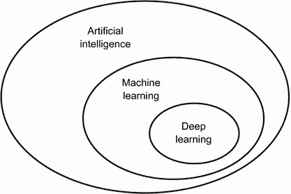

图 1.1 人工智能、机器学习和深度学习

### 1.1.1 人工智能

人工智能诞生于 20 世纪 50 年代，当时一小群计算机科学领域的先驱开始思考计算机是否能够“思考”——这个问题的影响至今仍在探索中。

尽管许多潜在的想法在之前的几年甚至几十年中一直在酝酿，“人工智能”最终在 1956 年作为一个研究领域得以凝结，当时约翰·麦卡锡（John McCarthy）在达特茅斯学院（Dartmouth College）担任年轻的数学助理教授，组织了一个夏季研讨会，提出了以下建议：

*这项研究的基础是一个假设，即学习的每个方面或智能的任何其他特征原则上都可以被描述得如此精确，以至于可以制造一台机器来模拟它。我们将尝试找出如何使机器使用语言，形成抽象和概念，解决目前仅保留给人类的问题，并改进自己。我们认为，如果一组精心挑选的科学家们在一起为此工作一个夏天，就可以在这些问题中的一个或多个问题上取得重大进展*。

夏天结束时，研讨会没有完全解决它旨在调查的谜团。然而，许多参与者后来成为该领域的先驱，并引发了一场至今仍在进行的知识革命。

简而言之，人工智能可以被描述为*自动执行人类通常执行的智力任务的努力*。因此，人工智能是一个涵盖机器学习和深度学习的广泛领域，但也包括许多不涉及任何学习的方法。考虑到直到 1980 年代，大多数人工智能教科书根本没有提到“学习”！例如，早期的下棋程序只涉及由程序员精心制作的硬编码规则，并不符合机器学习的条件。事实上，相当长一段时间，大多数专家认为，通过让程序员手工制作足够大量的明确规则来操作存储在明确数据库中的知识，就可以实现人类水平的人工智能。这种方法被称为*符号人工智能*。它是从 1950 年代到 1980 年代末的人工智能中的主导范式，并在 1980 年代的*专家系统*繁荣期达到了其最高流行度。

尽管符号人工智能适用于解决定义明确的逻辑问题，例如下棋，但发现解决更复杂、模糊问题的明确规则是困难的，例如图像分类、语音识别或自然语言翻译。出现了一种新的方法来取代符号人工智能：*机器学习*。

### 1.1.2 机器学习

在维多利亚时代的英格兰，艾达·洛夫莱斯夫人是查尔斯·巴贝奇的朋友和合作者，他是第一台已知的通用机械计算机——分析引擎的发明者。尽管分析引擎具有远见卓识，超前于其时代，但在 1830 年代和 1840 年代设计时，并不是作为通用计算机，因为通用计算的概念尚未被发明。它只是作为一种使用机械操作来自动执行数学分析领域中某些计算的方式——因此得名为分析引擎。因此，它是早期尝试将数学运算编码为齿轮形式的智力后代，例如帕斯卡计算器或莱布尼茨的步进计算器，后者是帕斯卡计算器的改进版本。由布莱斯·帕斯卡于 1642 年（19 岁时！）设计，帕斯卡计算器是世界上第一台机械计算器——它可以加法、减法、乘法，甚至除法。

1843 年，艾达·洛夫莱斯评论了分析引擎的发明，

*分析引擎根本没有创造任何东西的意图。它只能执行我们知道如何命令它执行的任务……它的职责是帮助我们利用我们已经熟悉的东西*。

即使有着 178 年的历史视角，洛夫莱斯夫人的观察仍然令人震撼。通用计算机是否能“创造”任何东西，或者它是否总是被束缚在我们人类完全理解的过程中？它是否能够产生任何原创思想？它是否能够从经验中学习？它是否能展现创造力？

她的言论后来被人工智能先驱艾伦·图灵在他 1950 年的里程碑论文“计算机与智能”中引用为“洛夫莱斯夫人的反对意见”，该论文引入了图灵测试以及后来塑造人工智能的关键概念。图灵当时认为——这在当时是极具挑衅性的——计算机原则上可以模拟人类智能的所有方面。

让计算机执行有用工作的通常方法是让人类程序员编写*规则*——一个计算机程序——以将输入数据转换为适当的答案，就像洛夫莱斯夫人为分析引擎编写逐步指令一样。机器学习将这个过程颠倒过来：机器查看输入数据和相应的答案，并找出规则应该是什么（见图 1.2）。机器学习系统是*训练*而不是明确编程的。它被呈现许多与任务相关的示例，并在这些示例中找到统计结构，最终使系统能够提出自动化任务的规则。例如，如果您希望自动化标记您的度假照片的任务，您可以向机器学习系统提供许多已由人类标记的图片示例，系统将学习将特定图片与特定标签相关联的统计规则。

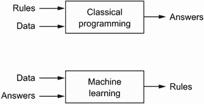

图 1.2 机器学习：一种新的编程范式

尽管机器学习在 1990 年代才开始蓬勃发展，但它迅速成为人工智能中最受欢迎和最成功的子领域，这一趋势受到更快硬件和更大数据集的推动。机器学习与数理统计有关，但在几个重要方面与统计学不同，就像医学与化学有关但不能简化为化学一样，因为医学处理具有独特属性的独特系统。与统计学不同，机器学习往往处理大型、复杂的数据集（例如包含数百万图像的数据集，每个图像由数万像素组成），传统的统计分析如贝叶斯分析在这种情况下将不切实际。因此，机器学习，尤其是深度学习，展示了相对较少的数学理论——也许太少了——并且基本上是一门工程学科。与理论物理或数学不同，机器学习是一个非常实践的领域，受到经验发现的驱动，并且深度依赖于软件和硬件的进步。

### 1.1.3 从数据中学习规则和表示

要定义*深度学习*并了解深度学习与其他机器学习方法的区别，首先我们需要对机器学习算法的工作原理有一些了解。我们刚刚说过，机器学习发现执行数据处理任务的规则，给定预期的示例。因此，要进行机器学习，我们需要三样东西：

+   *输入数据点*——例如，如果任务是语音识别，这些数据点可以是人们说话的声音文件。如果任务是图像标记，它们可以是图片。

+   *预期输出的示例*——在语音识别任务中，这些可以是人类生成的声音文件转录。在图像任务中，预期输出可以是“狗”、“猫”等标签。

+   *衡量算法表现的方法*——这是为了确定算法当前输出与预期输出之间的距离。该测量用作反馈信号，以调整算法的工作方式。这个调整步骤就是我们所说的*学习*。

机器学习模型将其输入数据转换为有意义的输出，这个过程是从已知输入和输出示例中“学习”的。因此，机器学习和深度学习的核心问题是*有意义地转换数据*：换句话说，学习输入数据的有用*表示*——这些表示使我们更接近预期的输出。

在我们继续之前：什么是表示？在其核心，它是查看数据的不同方式——表示或编码数据。例如，彩色图像可以用 RGB 格式（红-绿-蓝）或 HSV 格式（色调-饱和度-值）编码：这是相同数据的两种不同表示。一些在一种表示中可能困难的任务，在另一种表示中可能变得简单。例如，“选择图像中的所有红色像素”任务在 RGB 格式中更简单，而“使图像饱和度降低”在 HSV 格式中更简单。机器学习模型的全部内容都是找到适合其输入数据的适当表示——使数据更适合手头任务的转换。

让我们具体化一下。考虑一个*x*轴，一个*y*轴，以及一些通过它们在(*x*, *y*)系统中的坐标表示的点，如图 1.3 所示。

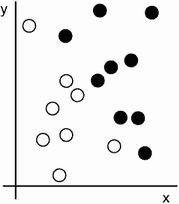

图 1.3 一些示例数据

正如你所看到的，我们有一些白点和一些黑点。假设我们想开发一个算法，可以接受一个点的坐标(*x*, *y*)并输出该点可能是黑色还是白色。在这种情况下，

+   输入是我们点的坐标。

+   预期的输出是我们点的颜色。

+   衡量我们的算法是否做得好的一种方法可能是，例如，被正确分类的点的百分比。

我们需要的是我们数据的一个新表示，清晰地将白点与黑点分开。我们可以使用的一种转换，除了许多其他可能性之外，是一个坐标变换，如图 1.4 所示。

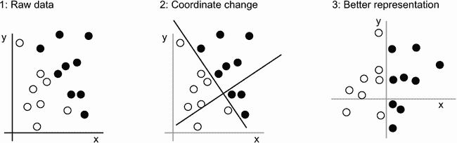

图 1.4 坐标变换

在这个新的坐标系中，我们点的坐标可以说是我们数据的新表示。而且这是一个好的表示！通过这个表示，黑/白分类问题可以表达为一个简单的规则：“黑点是那些*x*>0 的点”，或者“白点是那些*x*<0 的点”。这个新表示，结合这个简单规则，巧妙地解决了分类问题。

在这种情况下，我们手动定义了坐标变换：我们利用我们的人类智慧提出了我们自己的数据适当表示。对于这样一个极其简单的问题来说这是可以的，但是如果任务是分类手写数字的图像，你能做到同样吗？你能写出明确的、可由计算机执行的图像转换，以阐明 6 和 8 之间的差异，1 和 7 之间的差异，以及各种不同手写之间的差异吗？

这在一定程度上是可能的。基于数字表示的规则，比如“闭环数量”或者垂直和水平像素直方图，可以很好地区分手写数字。但是手动找到这样有用的表示是一项艰苦的工作，而且，正如你可以想象的，由此产生的基于规则的系统是脆弱的——难以维护的噩梦。每当你遇到一个打破你精心考虑的规则的新手写示例时，你将不得不添加新的数据转换和新的规则，同时考虑它们与每个先前规则的互动。

你可能在想，如果这个过程如此痛苦，我们能自动化吗？如果我们尝试系统地搜索不同集合的自动生成的数据表示和基于它们的规则，通过使用一些开发数据集中被正确分类的数字的百分比作为反馈来识别好的表示，我们将会进行机器学习。*学习*，在机器学习的背景下，描述了一种自动搜索数据转换的过程，产生一些有用的数据表示，通过一些反馈信号引导——这些表示适合于解决手头任务的简单规则。

这些转换可以是坐标变换（就像我们的 2D 坐标分类示例中），或者是取像素直方图并计算循环次数（就像我们的数字分类示例中），但它们也可以是线性投影、平移、非线性操作（比如“选择所有* x *> 0 的点”）等。机器学习算法通常不会在发现这些转换时具有创造性；它们只是在预定义的一组操作中搜索，称为*假设空间*。例如，在 2D 坐标分类示例中，所有可能的坐标变换空间将是我们的假设空间。

所以，简洁地说，机器学习就是在预定义的可能性空间内，通过反馈信号的指导，搜索一些输入数据的有用表示和规则。这个简单的想法允许解决一系列广泛的智力任务，从语音识别到自动驾驶。

现在你明白了我们所说的*学习*是什么意思，让我们看看*深度学习*有什么特别之处。

### 1.1.4 “深度学习”中的“深度”

深度学习是机器学习的一个特定子领域：一种从数据中学习表示的新方法，强调学习逐渐具有意义的表示的连续层。 “深度学习”中的“深度”并不是指这种方法所达到的更深层次的理解；相反，它代表了这种连续表示层的概念。对数据模型有多少层贡献被称为模型的*深度*。该领域的其他适当名称可能是*分层表示学习*或*层次表示学习*。现代深度学习通常涉及数十甚至数百个连续的表示层，它们都是通过暴露于训练数据中自动学习的。与此同时，其他机器学习方法往往专注于学习数据的一两层表示（比如，获取像素直方图然后应用分类规则）；因此，它们有时被称为*浅层学习*。

在深度学习中，这些分层表示是通过称为*神经网络*的模型学习的，这些模型以字面意义上相互堆叠的层结构。术语“神经网络”指的是神经生物学，但尽管深度学习中的一些核心概念部分是通过从我们对大脑的理解中汲取灵感而发展的（特别是视觉皮层），深度学习模型并不是大脑的模型。没有证据表明大脑实现了任何类似于现代深度学习模型中使用的学习机制。你可能会看到一些流行科学文章宣称深度学习如何像大脑工作或是模仿大脑，但事实并非如此。对于新手来说，将深度学习与神经生物学有任何关联是令人困惑和适得其反的；你不需要那种“就像我们的思维一样”的神秘感和神秘性，你可能会忘记任何你可能读到的关于深度学习和生物学之间假设联系的内容。对于我们的目的，深度学习是从数据中学习表示的数学框架。

深度学习算法学习的表示是什么样子的？让我们看看一个几层深的网络（见图 1.5）如何转换图像以识别出是哪个数字。

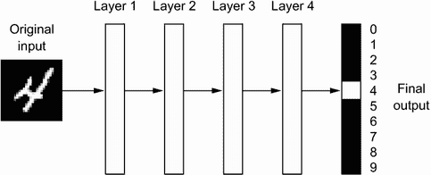

图 1.5 数字分类的深度神经网络

正如你在图 1.6 中看到的，网络将数字图像转换为与原始图像越来越不同且越来越有关于最终结果的信息的表示。你可以将深度网络看作是一个多阶段的*信息提炼*过程，其中信息通过连续的滤波器并最终*纯化*（即，对某个任务有用）出来。

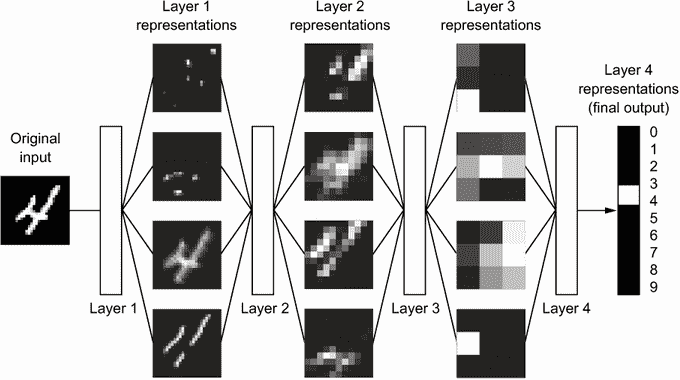

图 1.6 由数字分类模型学习到的数据表示

所以从技术上讲，这就是深度学习：学习数据表示的多阶段方式。这是一个简单的想法—但事实证明，非常简单的机制，足够扩展，最终看起来像魔术。

### 1.1.5 通过三个图形理解深度学习的工作原理

到目前为止，你知道机器学习是关于将输入（如图像）映射到目标（如标签“猫”），这是通过观察许多输入和目标示例来完成的。你还知道深度神经网络通过一系列简单的数据转换（层）的深度序列来实现这种输入到目标的映射，并且这些数据转换是通过示例学习的。现在让我们具体看看这个学习是如何进行的。

层对输入数据执行的操作规范存储在层的*权重*中，本质上是一堆数字。在技术术语中，我们会说层实现的转换是由其权重*参数化*的（见图 1.7）。（权重有时也称为层的*参数*。）在这个背景下，*学习*意味着找到网络中所有层的权重的一组值，使网络能够正确地将示例输入映射到它们关联的目标。但问题在于：一个深度神经网络可能包含数千万个参数。找到所有这些参数的正确值可能看起来像一项艰巨的任务，特别是考虑到修改一个参数的值将影响所有其他参数的行为！

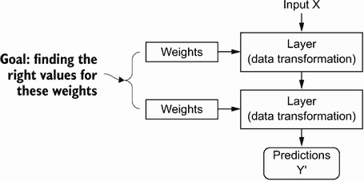

图 1.7 一个神经网络由其权重参数化。

要控制某物，首先你需要能够观察它。要控制神经网络的输出，你需要能够衡量这个输出与你期望的结果有多大差距。这就是网络的*损失函数*的工作，有时也称为*目标函数*或*成本函数*。损失函数接受网络的预测和真实目标（你希望网络输出的内容）并计算一个距离分数，捕捉网络在这个特定示例上表现如何（见图 1.8）。

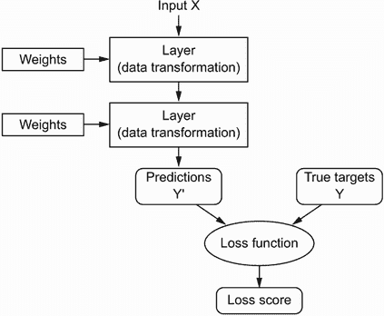

图 1.8 损失函数衡量网络输出的质量。

深度学习中的基本技巧是使用这个分数作为反馈信号，稍微调整权重的值，以降低当前示例的损失分数（见图 1.9）。这种调整是*优化器*的工作，它实现了所谓的*反向传播*算法：深度学习中的核心算法。下一章将更详细地解释反向传播的工作原理。

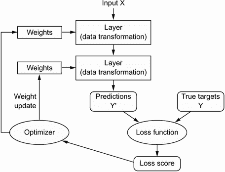

图 1.9 损失分数被用作反馈信号来调整权重。

最初，网络的权重被分配随机值，因此网络仅实现一系列随机转换。自然地，它的输出与理想情况相去甚远，损失分数相应地非常高。但随着网络处理每个示例，权重会稍微朝正确方向调整，损失分数会减少。这就是*训练循环*，重复足够多次（通常是数千个示例的数十次迭代），得到最小化损失函数的权重值。具有最小损失的网络是输出尽可能接近目标的网络：一个经过训练的网络。再一次，这是一个简单的机制，一旦扩展，最终看起来像魔术。

### 1.1.6 到目前为止深度学习取得了什么成就

尽管深度学习是机器学习的一个相当古老的子领域，但直到 2010 年代初才开始崭露头角。在此后的几年里，它在领域中取得了一场革命性的成就，对感知任务甚至自然语言处理任务产生了显著的结果——这些问题涉及到对人类似乎自然和直观的技能，但长期以来一直是机器难以掌握的。

特别是，深度学习已经在历史上困难的机器学习领域实现了以下突破：

+   近乎人类水平的图像分类

+   近乎人类水平的语音转录

+   近乎人类水平的手写转录

+   大幅改进的机器翻译

+   大幅改进的文本转语音转换

+   诸如 Google Assistant 和 Amazon Alexa 等数字助手

+   近乎人类水平的自动驾驶

+   改进的广告定位，如 Google、百度或必应所使用的

+   网络搜索结果的改进

+   能够回答自然语言问题

+   超人类水平的围棋对弈

我们仍在探索深度学习的全部潜力。我们已经开始将其成功应用于一系列几年前被认为无法解决的问题——自动转录梵蒂冈宗座档案馆中保存的数以万计的古代手稿，使用简单的智能手机检测和分类田间植物疾病，协助肿瘤学家或放射科医生解释医学成像数据，预测洪水、飓风甚至地震等自然灾害等。随着每一个里程碑的实现，我们越来越接近一个时代，在这个时代，深度学习将在人类的每一个活动和领域中协助我们——科学、医学、制造业、能源、交通、软件开发、农业，甚至艺术创作。

### 1.1.7 不要相信短期炒作

尽管深度学习在近年取得了显著的成就，对于该领域在未来十年能够实现的期望往往比实际可能实现的要高得多。尽管一些像自动驾驶汽车这样改变世界的应用已经近在眼前，但许多其他应用可能在很长一段时间内仍然难以实现，比如可信的对话系统、跨任意语言的人类级机器翻译以及人类级自然语言理解。特别是，对于短期内实现人类级通用智能的讨论不应该太过认真。对于短期内高期望的风险在于，随着技术无法交付，研究投资将枯竭，长期减缓进展。

这种情况已经发生过。在过去的两次中，人工智能经历了一轮强烈的乐观主义，随后是失望和怀疑，导致资金短缺。它始于 20 世纪 60 年代的符号人工智能。在那些早期，关于人工智能的预测飞得很高。符号人工智能方法中最著名的先驱和支持者之一是马文·明斯基，他在 1967 年声称：“在一代人内……创造‘人工智能’的问题将得到实质性解决。”三年后，即 1970 年，他做出了更为精确的预测：“在三到八年内，我们将拥有一台具有普通人类智能的机器。”到 2021 年，这样的成就似乎仍然遥不可及——远远超出我们无法预测需要多长时间才能实现的范围——但在 20 世纪 60 年代和 70 年代初，一些专家相信这一成就就在眼前（就像今天的许多人一样）。几年后，随着这些高期望未能实现，研究人员和政府资金转向其他领域，标志着第一次*人工智能寒冬*的开始（这是对核冬天的一个参考，因为这是在冷战的高峰之后不久）。

这不会是最后一个。在 20 世纪 80 年代，一种新的符号人工智能*专家系统*开始在大公司中蓬勃发展。一些最初的成功案例引发了一波投资热潮，全球各地的公司开始建立自己的内部人工智能部门来开发专家系统。到 1985 年左右，公司每年在这项技术上的支出超过 10 亿美元；但到了 90 年代初，这些系统已经被证明难以维护、难以扩展和范围有限，兴趣逐渐消退。于是第二次人工智能寒冬开始了。

我们可能目前正在见证人工智能炒作和失望的第三个周期，我们仍处于强烈乐观的阶段。最好是对短期期望保持适度，确保对该领域技术方面不太熟悉的人清楚了解深度学习能够做什么和不能做什么。

### 1.1.8 人工智能的承诺

尽管我们可能对人工智能有着不切实际的短期期望，但长期前景看起来是光明的。我们才刚刚开始将深度学习应用于许多重要问题，这些问题可能会发生转变，从医学诊断到数字助手。过去十年来，人工智能研究取得了惊人的快速进展，这在很大程度上是由于人工智能短暂历史中前所未有的资金水平，但迄今为止，这些进展中相对较少的部分已经应用到构成我们世界的产品和流程中。深度学习的大部分研究成果尚未得到应用，或者至少没有应用到它们可以解决的所有行业的所有问题范围内。你的医生还没有使用人工智能，你的会计师也没有。在日常生活中，你可能并不经常使用人工智能技术。当然，你可以向智能手机提出简单问题并得到合理的答案，你可以在 Amazon.com 上获得相当有用的产品推荐，你可以在 Google 照片中搜索“生日”并立即找到上个月女儿生日派对的照片。这与这些技术过去所处的位置相去甚远。但这些工具仍然只是我们日常生活的附件。人工智能尚未过渡到成为我们工作、思考和生活方式的核心。

现在，也许很难相信人工智能会对我们的世界产生巨大影响，因为它尚未被广泛应用——就像在 1995 年，很难相信互联网未来的影响一样。那时，大多数人并没有看到互联网对他们的相关性以及它将如何改变他们的生活。对于今天的深度学习和人工智能也是如此。但不要误解：人工智能即将到来。在不久的将来，人工智能将成为你的助手，甚至是你的朋友；它将回答你的问题，帮助教育你的孩子，并关注你的健康。它将把你的杂货送到家门口，并把你从 A 点开车到 B 点。它将成为你与日益复杂和信息密集的世界接触的接口。更重要的是，人工智能将帮助整个人类向前迈进，通过协助人类科学家在所有科学领域中进行新的突破性发现，从基因组学到数学。

在这个过程中，我们可能会遇到一些挫折，甚至可能会迎来新的人工智能寒冬——就像互联网行业在 1998-99 年被过度炒作并遭受了一场导致在 2000 年代初期投资枯竭的崩溃一样。但我们最终会到达那里。人工智能最终将应用于构成我们社会和日常生活的几乎每一个过程，就像互联网今天一样。

不要相信短期炒作，但要相信长期愿景。人工智能可能需要一段时间才能发挥其真正潜力——一个全面程度还没有人敢于梦想的潜力——但人工智能即将到来，它将以一种奇妙的方式改变我们的世界。

## 1.2 在深度学习之前：机器学习的简史

深度学习已经达到了公众关注和行业投资的水平，这在人工智能历史上从未见过，但它并不是机器学习的第一个成功形式。可以肯定地说，今天工业中使用的大多数机器学习算法并不是深度学习算法。深度学习并不总是解决问题的正确工具——有时候数据不足以应用深度学习，有时候问题更适合用不同的算法解决。如果深度学习是你与机器学习的第一次接触，你可能会发现自己处于这样一种情况：你手头只有深度学习的锤子，而每个机器学习问题看起来都像一个钉子。避免陷入这种陷阱的唯一方法是熟悉其他方法，并在适当时练习它们。

对经典机器学习方法的详细讨论超出了本书的范围，但我将简要介绍它们，并描述它们开发的历史背景。这将使我们能够将深度学习置于机器学习更广泛的背景中，并更好地理解深度学习的来源和重要性。

### 1.2.1 概率建模

*概率建模*是将统计原理应用于数据分析的过程。它是机器学习的最早形式之一，至今仍然广泛使用。在这一类别中最著名的算法之一是朴素贝叶斯算法。

朴素贝叶斯是一种基于应用贝叶斯定理的机器学习分类器，假设输入数据中的特征都是独立的（这是一个强大或“朴素”的假设，这也是名称的由来）。这种形式的数据分析早在计算机出现之前就存在，并且在首次计算机实现之前就通过手工应用（很可能可以追溯到 20 世纪 50 年代）了。贝叶斯定理和统计学的基础可以让您开始使用朴素贝叶斯分类器。

一个密切相关的模型是*逻辑回归*（简称 logreg），有时被认为是现代机器学习的“Hello World”。不要被它的名字误导——logreg 是一个分类算法而不是回归算法。与朴素贝叶斯类似，logreg 在计算机出现很久之前就存在了，但由于其简单且多功能的特性，至今仍然很有用。它通常是数据科学家在数据集上尝试的第一件事，以了解手头的分类任务。

### 1.2.2 早期神经网络

早期的神经网络已经被这些页面中涵盖的现代变体完全取代，但了解深度学习的起源仍然很有帮助。尽管神经网络的核心思想早在 20 世纪 50 年代就以玩具形式进行了研究，但这种方法花了几十年才开始。很长一段时间，缺失的部分是训练大型神经网络的有效方法。这种情况在 20 世纪 80 年代中期发生了变化，当时多人独立重新发现了反向传播算法——一种使用梯度下降优化训练参数化操作链的方法（我们将在本书后面精确定义这些概念）——并开始将其应用于神经网络。

1989 年，贝尔实验室首次成功应用神经网络的实际应用来自**杨立昆**，他将卷积神经网络和反向传播的早期思想结合起来，并将它们应用于手写数字分类问题。由此产生的网络被称为*LeNet*，在上世纪 90 年代被美国邮政服务用于自动读取信封上的邮政编码。

### 1.2.3 核方法

当神经网络在 1990 年代开始在研究人员中获得一些尊重时，由于这一初步成功，一种新的机器学习方法崭露头角，并迅速将神经网络送回到遗忘之中：核方法。*核方法*是一组分类算法，其中最著名的是*支持向量机*（SVM）。SVM 的现代形式是由弗拉基米尔·瓦普尼克和 Corinna Cortes 在贝尔实验室于 1990 年代初开发，并于 1995 年发表的，尽管早在 1963 年，瓦普尼克和 Alexey Chervonenkis 就已经发表了一个较早的线性形式。

SVM 是一种分类算法，通过找到分隔两类的“决策边界”来工作（见图 1.10）。SVM 通过两个步骤来找到这些边界：

1.  数据被映射到一个新的高维表示，其中决策边界可以表示为一个超平面（如果数据是二维的，如图 1.10，超平面将是一条直线）。

1.  通过尝试最大化超平面与每个类别最近数据点之间的距离来计算一个良好的决策边界（一个分离超平面），这一步骤称为*最大化间隔*。这使得边界能够很好地泛化到训练数据集之外的新样本。

图 1.10 决策边界

将数据映射到高维表示的技术，使得分类问题变得更简单，看起来在理论上很不错，但在实践中通常是计算上难以处理的。这就是*核技巧*的用武之地（核方法以此命名的关键思想）。这是其要点：为了在新表示空间中找到良好的决策超平面，你不必显式计算点在新空间中的坐标；你只需要计算该空间中点对之间的距离，这可以通过核函数有效地完成。*核函数*是一种计算上易处理的操作，将初始空间中的任意两点映射到目标表示空间中这些点之间的距离，完全绕过了新表示的显式计算。核函数通常是手工制作而非从数据中学习的——在 SVM 的情况下，只有分离超平面是被学习的。

在它们被开发的时候，SVM 在简单分类问题上表现出色，并且是少数几种机器学习方法之一，具有广泛的理论支持，并且易于进行严格的数学分析，使得它们被充分理解和容易解释。由于这些有用的特性，SVM 在该领域长期以来非常受欢迎。

但 SVM 很难扩展到大型数据集，并且对于感知问题（如图像分类）没有提供良好的结果。因为 SVM 是一种浅层方法，将 SVM 应用于感知问题需要首先手动提取有用的表示（称为*特征工程*），这是困难且脆弱的。例如，如果你想使用 SVM 来分类手写数字，你不能从原始像素开始；你应该首先手动找到使问题更易处理的有用表示，就像我之前提到的像素直方图一样。

### 1.2.4 决策树、随机森林和梯度提升机

*决策树*是类似流程图的结构，让你对输入数据点进行分类或根据输入预测输出值（见图 1.11）。它们易于可视化和解释。从数据中学习的决策树在 2000 年代开始受到重要的研究兴趣，到 2010 年，它们通常被优先于核方法。

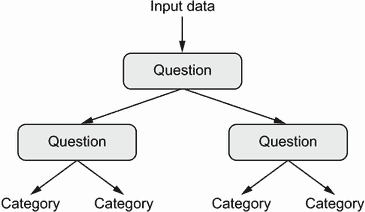

图 1.11 决策树：学习的参数是关于数据的问题。一个问题可能是，“数据中的系数 2 是否大于 3.5？”

特别是*随机森林*算法引入了一种稳健、实用的决策树学习方法，涉及构建大量专门的决策树，然后将它们的输出组合在一起。 随机森林适用于各种问题——你可以说它们几乎总是任何浅层机器学习任务的第二好算法。 当流行的机器学习竞赛网站 Kaggle ([`kaggle.com`](http://kaggle.com))在 2010 年开始时，随机森林迅速成为该平台上的热门选择，直到 2014 年，*梯度提升机*取代了它。 梯度提升机与随机森林类似，是一种基于集成弱预测模型的机器学习技术，通常是决策树。 它使用*梯度提升*，一种通过迭代训练新模型来改进任何机器学习模型的方法，这些新模型专门解决前一模型的弱点。 应用于决策树时，使用梯度提升技术会导致大多数情况下严格优于随机森林的模型，同时具有类似的性质。 它可能是处理非感知数据的最佳算法之一，如果不是*最佳*的话。 与深度学习并列，它是 Kaggle 竞赛中最常用的技术之一。

### 1.2.5 回到神经网络

大约在 2010 年，尽管神经网络几乎被科学界完全忽视，但仍有一些人在神经网络上取得重要突破：多伦多大学的 Geoffrey Hinton 小组，蒙特利尔大学的 Yoshua Bengio 小组，纽约大学的 Yann LeCun 小组，以及瑞士的 IDSIA。

2011 年，来自 IDSIA 的 Dan Ciresan 开始使用 GPU 训练的深度神经网络赢得学术图像分类竞赛——这是现代深度学习的第一个实际成功案例。 但转折点发生在 2012 年，当 Hinton 的小组参加了每年一次的大规模图像分类挑战 ImageNet（ImageNet 大规模视觉识别挑战，简称 ILSVRC）。 当时，ImageNet 挑战非常困难，包括在训练了 140 万张图像后，将高分辨率彩色图像分类为 1,000 个不同类别。 2011 年，基于传统计算机视觉方法的获胜模型的前五准确率仅为 74.3%。⁵ 然后，在 2012 年，由 Alex Krizhevsky 领导并由 Geoffrey Hinton 指导的团队取得了 83.6%的前五准确率——这是一个重大突破。 从那时起，每年的比赛都被深度卷积神经网络所主导。 到 2015 年，获胜者的准确率达到 96.4%，而 ImageNet 上的分类任务被认为是一个完全解决的问题。

自 2012 年以来，深度卷积神经网络（*convnets*）已成为所有计算机视觉任务的首选算法；更一般地，它们适用于所有感知任务。 在 2015 年之后的任何一次重要计算机视觉会议上，几乎不可能找到不涉及 convnets 的演示。 与此同时，深度学习还在许多其他类型的问题中找到了应用，如自然语言处理。 它已经完全取代了 SVM 和决策树在许多应用中的使用。 例如，多年来，欧洲核子研究组织 CERN 一直使用基于决策树的方法来分析大型强子对撞机（LHC）上 ATLAS 探测器的粒子数据，但最终 CERN 转而使用基于 Keras 的深度神经网络，因为它们在大型数据集上具有更高的性能和训练的便利性。

### 1.2.6 深度学习的不同之处

深度学习之所以迅速崛起的主要原因是它在许多问题上提供了更好的性能。但这并不是唯一的原因。深度学习还使问题解决变得更加容易，因为它完全自动化了曾经是机器学习工作流程中最关键的步骤：特征工程。

以前的机器学习技术——浅层学习——只涉及将输入数据转换为一两个连续的表示空间，通常通过简单的转换，如高维非线性投影（SVM）或决策树。但复杂问题所需的精细表示通常无法通过这种技术实现。因此，人们不得不费尽心思地使初始输入数据更易于通过这些方法处理：他们必须手动为数据工程好表示层。这就是所谓的*特征工程*。另一方面，深度学习完全自动化了这一步骤：通过深度学习，你可以一次性学习所有特征，而不必自己进行工程设计。这大大简化了机器学习工作流程，通常用一个简单的端到端深度学习模型取代了复杂的多阶段流水线。

你可能会问，如果问题的关键在于具有多个连续的表示层，那么浅层方法是否可以重复应用以模拟深度学习的效果？实际上，连续应用浅层学习方法会产生快速递减的回报，因为在三层模型中的最佳第一表示层并不是一层或两层模型中的最佳第一层。深度学习的革命性之处在于它允许模型同时学习所有表示层，而不是按顺序（贪婪地）学习。通过联合特征学习，每当模型调整其内部特征时，所有依赖于它的其他特征都会自动适应变化，而无需人为干预。一切都由单一的反馈信号监督：模型中的每一次变化都服务于最终目标。这比贪婪地堆叠浅层模型更加强大，因为它允许通过将复杂的抽象表示分解为一系列中间空间（层）来学习它们；每个空间与前一个空间之间只有一个简单的转换。

这是深度学习从数据中学习的两个基本特征：*逐渐增加、逐层发展越来越复杂的表示方式*，以及*这些中间逐步增加的表示是联合学习的*，每一层都被更新以同时遵循上面一层的表示需求和下面一层的需求。这两个特性共同使深度学习比以前的机器学习方法更加成功。

### 1.2.7 现代机器学习格局

了解当前机器学习算法和工具的现状的一个好方法是查看 Kaggle 上的机器学习竞赛。由于其高度竞争的环境（一些比赛有数千名参与者和百万美元的奖金）以及涵盖的各种机器学习问题，Kaggle 提供了一个评估什么有效、什么无效的现实方法。那么哪种算法可靠地赢得比赛？顶尖参与者使用什么工具？

2019 年初，Kaggle 进行了一项调查，询问自 2017 年以来在任何比赛中获得前五名的团队使用的主要软件工具是什么（见图 1.12）。结果表明，顶尖团队倾向于使用深度学习方法（通常通过 Keras 库）或梯度提升树（通常通过 LightGBM 或 XGBoost 库）。

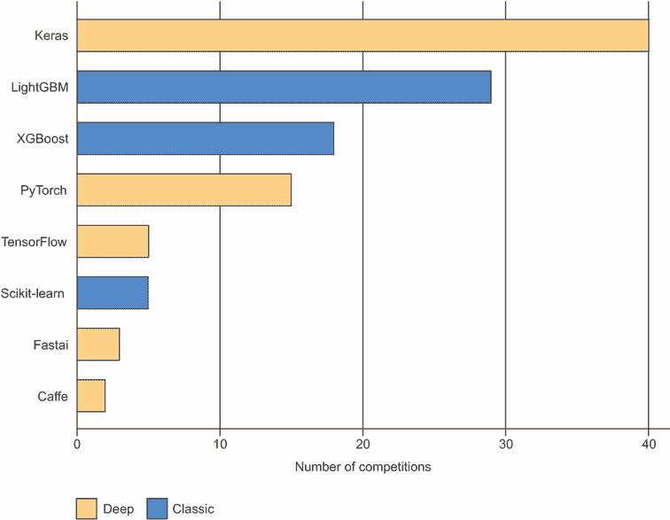

图 1.12 Kaggle 顶尖团队使用的机器学习工具

不仅仅是竞赛冠军。Kaggle 还每年对全球机器学习和数据科学专业人士进行调查。有数万名受访者参与，这项调查是我们关于行业状况最可靠的信息来源之一。图 1.13 显示了不同机器学习软件框架的使用百分比。

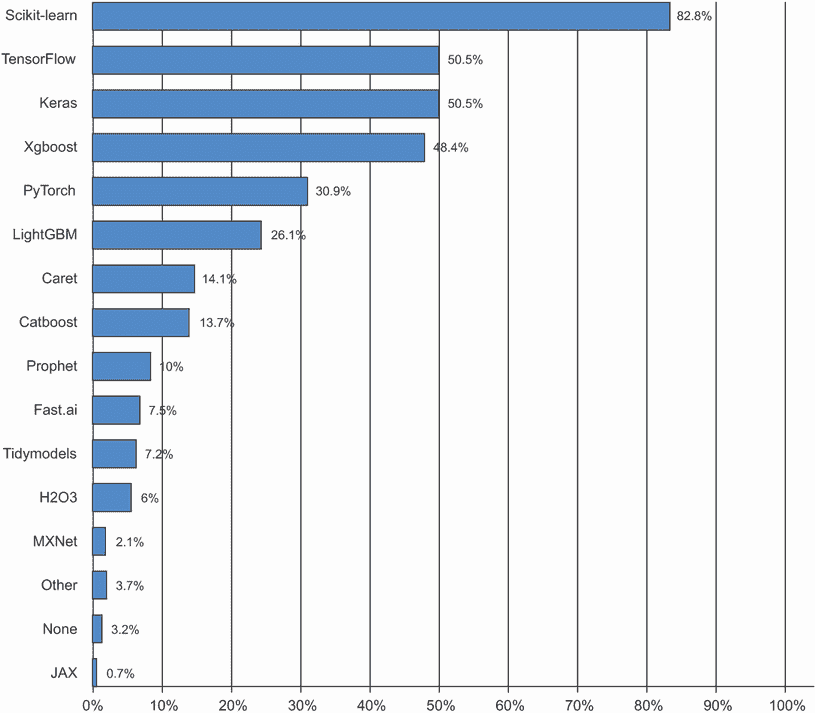

图 1.13 工具在机器学习和数据科学行业中的使用情况（来源：[www.kaggle.com/kaggle-survey-2020](https://www.kaggle.com/kaggle-survey-2020)）

从 2016 年到 2020 年，整个机器学习和数据科学行业都被这两种方法主导：深度学习和梯度提升树。具体来说，梯度提升树用于有结构化数据的问题，而深度学习用于感知问题，如图像分类。

使用梯度提升树的用户倾向于使用 Scikit-learn、XGBoost 或 LightGBM。与此同时，大多数深度学习从业者使用 Keras，通常与其母框架 TensorFlow 结合使用。这些工具的共同点是它们都是 Python 库：Python 是迄今为止机器学习和数据科学中最广泛使用的语言。

这是您今天在应用机器学习中应该最熟悉的两种技术：梯度提升树，用于浅层学习问题；深度学习，用于感知问题。在技术上，这意味着您需要熟悉 Scikit-learn、XGBoost 和 Keras 这三个目前主导 Kaggle 竞赛的库。有了这本书，您已经更接近成功了一大步。

## 1.3 为什么深度学习？为什么现在？

深度学习在计算机视觉中的两个关键思想——卷积神经网络和反向传播——在 1990 年就已经被充分理解。长短期记忆（LSTM）算法，对于时间序列的深度学习至关重要，于 1997 年开发，至今几乎没有改变。那么为什么深度学习直到 2012 年后才起飞？这两个十年发生了什么变化？

总的来说，有三个技术力量推动了机器学习的进步：

+   硬件

+   数据集和基准测试

+   算法进步

因为该领域是由实验结果而不是理论指导的，只有在适当的数据和硬件可用于尝试新想法（或扩展旧想法，通常情况下）时，算法进步才成为可能。机器学习不是数学或物理学，那里可以用一支笔和一张纸做出重大进步。这是一门工程科学。

20 世纪 90 年代和 2000 年代的真正瓶颈是数据和硬件。但在那段时间发生了什么呢：互联网蓬勃发展，高性能图形芯片为游戏市场的需求而开发。

### 1.3.1 硬件

从 1990 年到 2010 年，现成的 CPU 速度提高了约 5,000 倍。因此，现在可以在笔记本电脑上运行小型深度学习模型，而在 25 年前这是不可行的。

但是，在计算机视觉或语音识别中使用的典型深度学习模型需要比您的笔记本电脑提供的计算能力高出几个数量级。在 2000 年代，像 NVIDIA 和 AMD 这样的公司投资了数十亿美元开发快速、大规模并行芯片（图形处理单元，或 GPU），以提供越来越逼真的视频游戏图形 - 廉价、单一用途的超级计算机，旨在实时在屏幕上渲染复杂的 3D 场景。当 NVIDIA 于 2007 年推出 CUDA（[`developer.nvidia.com/about-cuda`](https://developer.nvidia.com/about-cuda)）时，这项投资开始造福科学界，CUDA 是其 GPU 系列的编程接口。少量 GPU 开始取代各种高度可并行化的应用程序中的大型 CPU 集群，从物理建模开始。由许多小矩阵乘法组成的深度神经网络也是高度可并行化的，大约在 2011 年左右，一些研究人员开始编写神经网络的 CUDA 实现 - 丹·西雷桑⁶和亚历克斯·克里兹赫夫斯基⁷是最早的几位。

发生的事情是游戏市场为下一代人工智能应用程序提供了超级计算的资助。有时，大事情从游戏开始。如今，NVIDIA Titan RTX，一款在 2019 年底售价为 2500 美元的 GPU，在单精度（每秒 16 万亿`float32`操作）方面达到峰值 16 teraFLOPS。这大约是 1990 年世界上最快超级计算机 Intel Touchstone Delta 的 500 倍计算能力。在 Titan RTX 上，只需要几个小时就可以训练出类似于 2012 或 2013 年将赢得 ILSVRC 比赛的 ImageNet 模型。与此同时，大公司在数百个 GPU 的集群上训练深度学习模型。

此外，深度学习行业已经超越了 GPU，正在投资于越来越专门化、高效的深度学习芯片。2016 年，在其年度 I/O 大会上，Google 公布了其张量处理单元（TPU）项目：一种全新的芯片设计，旨在比顶级 GPU 运行深度神经网络更快且更节能。如今，在 2020 年，TPU 卡的第三代代表着 420 teraFLOPS 的计算能力。这比 1990 年的 Intel Touchstone Delta 高出 10,000 倍。

这些 TPU 卡设计为组装成大规模配置，称为“pods”。一个 pod（1024 个 TPU 卡）峰值为 100 petaFLOPS。就规模而言，这大约是当前最大超级计算机 IBM Summit 在奥克岭国家实验室的峰值计算能力的 10%，该计算机由 27,000 个 NVIDIA GPU 组成，峰值约为 1.1 exaFLOPS。

### 1.3.2 数据

人工智能有时被誉为新的工业革命。如果深度学习是这场革命的蒸汽机，那么数据就是其煤炭：为我们的智能机器提供动力的原材料，没有它什么也不可能。在数据方面，除了过去 20 年存储硬件的指数级进步（遵循摩尔定律）之外，互联网的兴起也是一个改变游戏规则的因素，使得收集和分发非常大的机器学习数据集成为可能。如今，大公司使用图像数据集、视频数据集和自然语言数据集，这些数据集如果没有互联网是无法收集的。例如，Flickr 上用户生成的图像标签一直是计算机视觉的数据宝库。YouTube 视频也是如此。维基百科是自然语言处理的关键数据集。

如果有一个数据集促进了深度学习的崛起，那就是 ImageNet 数据集，包含了 140 万张手动注释的图像，涵盖了 1000 个图像类别（每个图像一个类别）。但是 ImageNet 之所以特别，不仅仅是因为其规模庞大，还因为与之相关的年度竞赛。

正如 Kaggle 自 2010 年以来一直在展示的那样，公开竞赛是激励研究人员和工程师突破界限的绝佳方式。研究人员竞争击败的共同基准已经极大地帮助了深度学习的崛起，突显了其成功与传统机器学习方法的对比。

### 1.3.3 算法

除了硬件和数据外，直到 2000 年代末，我们一直缺乏一种可靠的方法来训练非常深的神经网络。因此，神经网络仍然相对较浅，只使用一两层表示；因此，它们无法与更精细的浅层方法（如 SVM 和随机森林）相媲美。关键问题在于*梯度传播*穿过深层堆栈的问题。用于训练神经网络的反馈信号会随着层数的增加而逐渐消失。

这在 2009-2010 年左右发生了变化，凭借几项简单但重要的算法改进，使得更好的梯度传播成为可能：

+   更好的神经层*激活函数*

+   更好的*权重初始化方案*，从逐层预训练开始，然后很快被放弃

+   更好的*优化方案*，如 RMSProp 和 Adam

只有当这些改进开始允许训练具有 10 层或更多层的模型时，深度学习才开始发光。

最终，在 2014 年、2015 年和 2016 年，发现了更先进的改进梯度传播的方法，如批量归一化、残差连接和深度可分离卷积。

如今，我们可以从头开始训练任意深度的模型。这解锁了使用极其庞大模型的可能性，这些模型具有相当大的表征能力，即编码非常丰富的假设空间。这种极端的可扩展性是现代深度学习的定义特征之一。大规模模型架构，具有数十层和数千万参数，已经在计算机视觉（例如 ResNet、Inception 或 Xception 等架构）和自然语言处理（例如大型基于 Transformer 的架构，如 BERT、GPT-3 或 XLNet）方面带来了关键进展。

### 1.3.4 新一轮投资

随着深度学习在 2012-2013 年成为计算机视觉的新技术标准，最终成为所有感知任务的新标准，行业领袖开始关注。随之而来的是一波逐渐增长的行业投资，远远超出了人工智能历史上此前所见的任何规模（见图 1.14）。

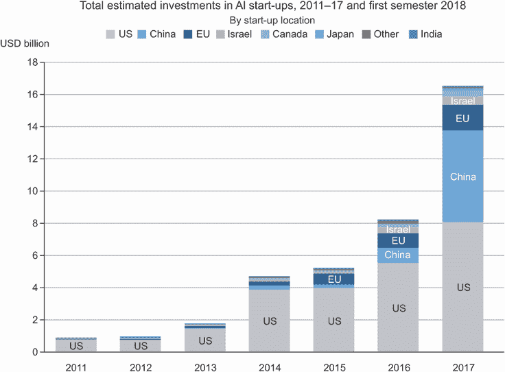

图 1.14 OECD 估计的人工智能初创公司的总投资（来源：[`mng.bz/zGN6`](http://mng.bz/zGN6)）

在深度学习引起关注之前的 2011 年，全球人工智能风险投资总额不到 10 亿美元，几乎全部投向了浅层机器学习方法的实际应用。到了 2015 年，这一数字已经上升到 50 多亿美元，2017 年更是激增至 160 亿美元。在这几年间，数百家初创公司涌现，试图利用深度学习的热潮。与此同时，谷歌、亚马逊和微软等大型科技公司在内部研究部门的投资金额很可能超过了风险投资资金的流入量。

机器学习——特别是深度学习——已经成为这些科技巨头的产品战略的核心。2015 年底，谷歌 CEO 桑达尔·皮查伊表示：“机器学习是我们重新思考我们如何做一切的核心、变革性方式。我们正在全面应用它，无论是搜索、广告、YouTube 还是 Play。我们还处于早期阶段，但你会看到我们以系统化的方式在所有这些领域应用机器学习。”

由于这波投资浪潮，从事深度学习工作的人数在不到 10 年的时间里从几百人增加到数万人，研究进展达到了疯狂的速度。

### 1.3.5 深度学习的民主化

推动深度学习中新面孔涌入的一个关键因素是该领域使用的工具集的民主化。在早期，进行深度学习需要大量的 C++和 CUDA 专业知识，而这种专业知识很少有人掌握。

如今，基本的 Python 脚本技能就足以进行高级深度学习研究。这主要得益于现已废弃的 Theano 库的发展，以及 TensorFlow 库——这两个用于 Python 的符号张量操作框架支持自动微分，极大地简化了新模型的实现——以及像 Keras 这样的用户友好库的崛起，使得深度学习就像操纵乐高积木一样简单。在 2015 年初发布后，Keras 迅速成为大量新创企业、研究生和转入该领域的研究人员的首选深度学习解决方案。

### 1.3.6 它会持续吗？

深度神经网络有什么特别之处，使得它们成为公司投资和研究人员涌入的“正确”选择？或者深度学习只是一个可能不会持续的时尚？20 年后我们还会使用深度神经网络吗？

深度学习具有几个属性，这些属性证明了它作为人工智能革命的地位，并且它将会持续存在。也许 20 年后我们不会再使用神经网络，但无论我们使用什么，都将直接继承现代深度学习及其核心概念。这些重要属性可以广泛分为三类：

+   *简单性*——深度学习消除了特征工程的需求，用简单的端到端可训练模型取代了复杂、脆弱、工程密集型的流水线，通常仅使用五到六种不同的张量操作构建。

+   *可扩展性*——深度学习非常适合在 GPU 或 TPU 上并行化，因此可以充分利用摩尔定律。此外，深度学习模型通过迭代小批量数据进行训练，使其能够在任意大小的数据集上进行训练。（唯一的瓶颈是可用的并行计算能力量，由于摩尔定律的存在，这是一个快速移动的障碍。）

+   *多功能性和可重用性*——与许多先前的机器学习方法不同，深度学习模型可以在不从头开始重新启动的情况下训练额外的数据，使其适用于连续在线学习——这对于非常大的生产模型是一个重要的特性。此外，经过训练的深度学习模型是可重用的：例如，可以将经过图像分类训练的深度学习模型放入视频处理流水线中。这使我们能够将以前的工作重新投资到越来越复杂和强大的模型中。这也使得深度学习适用于相当小的数据集。

深度学习仅仅在聚光灯下曝光了几年，我们可能还没有确定其能够做到的全部范围。随着每一年的过去，我们了解到新的用例和工程改进，这些改进消除了以前的限制。在科学革命之后，进展通常遵循 S 形曲线：它从快速进展的阶段开始，逐渐稳定下来，研究人员遇到严重限制，然后进一步的改进变得渐进式。

当我写第一版这本书时，也就是 2016 年，我预测深度学习仍处于 S 形曲线的上半部，接下来几年将会有更多变革性的进展。实践证明这一点是正确的，因为 2017 年和 2018 年见证了基于 Transformer 的深度学习模型在自然语言处理领域的崛起，这在该领域引起了一场革命，同时深度学习在计算机视觉和语音识别领域也持续稳步取得进展。如今，2021 年，深度学习似乎已经进入 S 形曲线的下半部。我们仍然应该期待未来几年的重大进展，但我们可能已经走出了爆炸性进展的初始阶段。

今天，我对深度学习技术应用于解决各种问题感到非常兴奋——问题的范围是无限的。深度学习仍然是一场正在进行中的革命，要实现其全部潜力还需要很多年。

* * *

¹ 艾伦·图灵，“计算机器械与智能”，*心灵* 59，第 236 期（1950 年）：433–460。

² 尽管图灵测试有时被解释为一种字面测试——人工智能领域应该设定的目标——但图灵只是将其作为一个概念设备，用于关于认知本质的哲学讨论。

³ 弗拉基米尔·瓦普尼克和科琳娜·科尔特斯，“支持向量网络”，*机器学习* 20，第 3 期（1995 年）：273–297。

⁴ 弗拉基米尔·瓦普尼克和亚历克谢·切尔沃年基斯，“关于一类感知机的注记”，*自动化与遥感控制* 25（1964 年）。

⁵ “前五准确率”衡量模型在其前五个猜测中多少次选择了正确答案（在 ImageNet 的情况下，共有 1,000 个可能的答案）。

⁶ 参见“用于图像分类的灵活、高性能卷积神经网络”，*第 22 届国际人工智能联合会议论文集*（2011），[www.ijcai.org/Proceedings/11/Papers/210.pdf](https://www.ijcai.org/Proceedings/11/Papers/210.pdf)。

⁷ 参见“使用深度卷积神经网络进行 ImageNet 分类”，*神经信息处理系统进展* 25（2012），[`mng.bz/2286`](https://mng.bz/2286)。

⁸ ImageNet 大规模视觉识别挑战（ILSVRC），[www.image-net.org/challenges/LSVRC](https://www.image-net.org/challenges/LSVRC)。

⁹ 桑达尔·皮查伊，Alphabet 财报电话会议，2015 年 10 月 22 日。
