# 二、神经网络的数学基础

本章涵盖

+   神经网络的第一个例子

+   张量和张量操作

+   神经网络如何通过反向传播和梯度下降学习

理解深度学习需要熟悉许多简单的数学概念：*张量*、*张量操作*、*微分*、*梯度下降*等。本章的目标是在不过于技术化的情况下建立您对这些概念的直觉。特别是，我们将避开数学符号，这可能会给没有数学背景的人带来不必要的障碍，并且不是解释事物的必要条件。数学操作的最精确、明确的描述是其可执行代码。

为了为引入张量和梯度下降提供足够的背景，我们将从一个神经网络的实际例子开始本章。然后我们将逐点地讨论每个新引入的概念。请记住，这些概念对于您理解以下章节中的实际示例至关重要！

阅读完本章后，您将对深度学习背后的数学理论有直观的理解，并准备好在第三章开始深入研究 Keras 和 TensorFlow。

## 2.1 神经网络的初步了解

让我们看一个具体的例子，一个使用 Python 库 Keras 学习分类手写数字的神经网络。除非您已经有使用 Keras 或类似库的经验，否则您不会立即理解这个第一个例子的所有内容。没关系。在下一章中，我们将逐个审查示例中的每个元素并详细解释它们。所以如果有些步骤看起来随意或对您来说像魔术一样，请不要担心！我们必须从某个地方开始。

我们要解决的问题是将手写数字的灰度图像（28×28 像素）分类为它们的 10 个类别（0 到 9）。我们将使用 MNIST 数据集，这是机器学习社区中的经典数据集，几乎与该领域本身一样久远并受到密切研究。这是由国家标准技术研究所（MNIST 中的 NIST）在上世纪 80 年代汇编的一组 60000 个训练图像和 10000 个测试图像。您可以将“解决”MNIST 看作是深度学习的“Hello World” - 这是您验证算法是否按预期工作的方法。随着您成为机器学习从业者，您会发现 MNIST 在科学论文、博客文章等中反复出现。您可以在图 2.1 中看到一些 MNIST 样本。


图 2.1 MNIST 样本数字

在机器学习中，分类问题中的*类别*称为*类*。数据点称为*样本*。与特定样本相关联的类称为*标签*。

您现在不需要在您的机器上尝试复制这个例子。如果您希望这样做，您首先需要设置一个深度学习工作空间，这在第三章中有介绍。

MNIST 数据集已经预装在 Keras 中，以四个 NumPy 数组的形式存在。

列表 2.1 在 Keras 中加载 MNIST 数据集

```py
from tensorflow.keras.datasets import mnist
(train_images, train_labels), (test_images, test_labels) = mnist.load_data()
```

`train_images`和`train_labels`组成训练集，模型将从中学习。然后模型将在测试集`test_images`和`test_labels`上进行测试。图像被编码为 NumPy 数组，标签是一个从 0 到 9 的数字数组。图像和标签之间有一一对应关系。

让我们看一下训练数据：

```py
>>> train_images.shape
(60000, 28, 28)
>>> len(train_labels) 
60000 
>>> train_labels
array([5, 0, 4, ..., 5, 6, 8], dtype=uint8)
```

这里是测试数据：

```py
>>> test_images.shape
(10000, 28, 28)
>>> len(test_labels) 
10000 
>>> test_labels
array([7, 2, 1, ..., 4, 5, 6], dtype=uint8)
```

工作流程如下：首先，我们将向神经网络提供训练数据`train_images`和`train_labels`。然后网络将学习将图像和标签关联起来。最后，我们将要求网络为`test_images`生成预测，并验证这些预测是否与`test_labels`中的标签匹配。

让我们构建网络—再次提醒您，您不必完全理解这个示例的所有内容。

列表 2.2 网络架构

```py
from tensorflow import keras 
from tensorflow.keras import layers
model = keras.Sequential([
    layers.Dense(512, activation="relu"),
    layers.Dense(10, activation="softmax")
])
```

神经网络的核心构建块是*层*。您可以将层视为数据的过滤器：一些数据进入，以更有用的形式输出。具体来说，层从输入的数据中提取*表示*，希望这些表示对手头的问题更有意义。大部分深度学习都是将一些简单层链接在一起，这些层将实现一种渐进*数据精炼*形式。深度学习模型就像是数据处理的筛子，由一系列越来越精细的数据过滤器（层）组成。

在这里，我们的模型由两个`Dense`层的序列组成，这些层是密集连接（也称为*全连接*）的神经层。第二（也是最后）层是一个 10 路*softmax 分类*层，这意味着它将返回一个总和为 1 的 10 个概率分数数组。每个分数将是当前数字图像属于我们的 10 个数字类别之一的概率。

为了使模型准备好进行训练，我们需要在*编译*步骤中选择另外三个事项：

+   *优化器*—模型将根据其看到的训练数据更新自身的机制，以提高其性能。

+   *损失函数*—模型如何能够衡量其在训练数据上的表现，从而如何能够引导自己朝着正确的方向前进。

+   *在训练和测试过程中监控的指标*—在这里，我们只关心准确率（被正确分类的图像的比例）。

损失函数和优化器的确切目的将在接下来的两章中明确。

列表 2.3 编译步骤

```py
model.compile(optimizer="rmsprop",
              loss="sparse_categorical_crossentropy",
              metrics=["accuracy"])
```

在训练之前，我们将通过重新调整数据的形状以及缩放数据，使所有值都在`[0，` `1]`区间内来预处理数据。之前，我们的训练图像存储在一个形状为`(60000，` `28，` `28)`的`uint8`类型数组中，值在`[0，` `255]`区间内。我们将其转换为一个形状为`(60000，` `28` `*` `28)`的`float32`数组，值在 0 到 1 之间。

列表 2.4 准备图像数据

```py
train_images = train_images.reshape((60000, 28 * 28))
train_images = train_images.astype("float32") / 255 
test_images = test_images.reshape((10000, 28 * 28))
test_images = test_images.astype("float32") / 255
```

现在我们准备训练模型，在 Keras 中通过调用模型的`fit()`方法来完成——我们将模型与其训练数据*拟合*。

列表 2.5 “拟合”模型

```py
>>> model.fit(train_images, train_labels, epochs=5, batch_size=128)
Epoch 1/5 
60000/60000 [===========================] - 5s - loss: 0.2524 - acc: 0.9273 
Epoch 2/5 
51328/60000 [=====================>.....] - ETA: 1s - loss: 0.1035 - acc: 0.9692
```

在训练过程中显示两个量：模型在训练数据上的损失和模型在训练数据上的准确率。我们很快就在训练数据上达到了 0.989（98.9%）的准确率。

现在我们有了一个经过训练的模型，我们可以使用它来预测*新*数字的类别概率—这些图像不是训练数据的一部分，就像测试集中的那些图像一样。

列表 2.6 使用模型进行预测

```py
>>> test_digits = test_images[0:10]
>>> predictions = model.predict(test_digits)
>>> predictions[0]
array([1.0726176e-10, 1.6918376e-10, 6.1314843e-08, 8.4106023e-06,
       2.9967067e-11, 3.0331331e-09, 8.3651971e-14, 9.9999106e-01,
       2.6657624e-08, 3.8127661e-07], dtype=float32)
```

数组中索引`i`处的每个数字对应于数字图像`test_digits[0]`属于类别`i`的概率。

这个第一个测试数字在索引 7 处具有最高的概率分数（0.99999106，接近 1），因此根据我们的模型，它必须是一个 7：

```py
>>> predictions[0].argmax() 
7 
>>> predictions[0][7] 
0.99999106
```

我们可以检查测试标签是否一致：

```py
>>> test_labels[0] 
7 
```

我们的模型在对这些以前从未见过的数字进行分类时，平均表现如何？让我们通过计算整个测试集上的平均准确率来检查。

列表 2.7 在新数据上评估模型

```py
>>> test_loss, test_acc = model.evaluate(test_images, test_labels)
>>> print(f"test_acc: {test_acc}")
test_acc: 0.9785
```

测试集准确率为 97.8%—这比训练集准确率（98.9%）要低得多。训练准确率和测试准确率之间的差距是*过拟合*的一个例子：机器学习模型在新数据上的表现往往不如在其训练数据上。过拟合是第三章的一个核心主题。

这就结束了我们的第一个示例——你刚刚看到如何构建和训练一个神经网络来对手写数字进行分类，只需不到 15 行的 Python 代码。在本章和下一章中，我们将详细介绍我们刚刚预览的每个移动部分，并澄清幕后发生的事情。你将了解张量，这些数据存储对象进入模型；张量操作，层是由什么组成的；以及梯度下降，它允许你的模型从训练示例中学习。

## 2.2 神经网络的数据表示

在前面的示例中，我们从存储在多维 NumPy 数组中的数据开始，也称为*张量*。一般来说，所有当前的机器学习系统都使用张量作为它们的基本数据结构。张量对于这个领域是基础的——以至于 TensorFlow 就是以它们命名的。那么什么是张量？

从本质上讲，张量是数据的容器——通常是数值数据。因此，它是一个数字的容器。你可能已经熟悉矩阵，它们是秩为 2 的张量：张量是对矩阵到任意数量的*维度*的泛化（请注意，在张量的上下文中，维度通常被称为*轴*）。

### 2.2.1 标量（秩为 0 的张量）

只包含一个数字的张量称为*标量*（或标量张量，或秩为 0 的张量，或 0D 张量）。在 NumPy 中，`float32`或`float64`数字是标量张量（或标量数组）。你可以通过`ndim`属性显示 NumPy 张量的轴数；标量张量有 0 个轴（`ndim` `==` `0`）。张量的轴数也称为其*秩*。这是一个 NumPy 标量：

```py
>>> import numpy as np
>>> x = np.array(12)
>>> x
array(12)
>>> x.ndim 
0
```

### 2.2.2 向量（秩为 1 的张量）

一组数字称为*向量*，或秩为 1 的张量，或 1D 张量。秩为 1 的张量被称为具有一个轴。以下是一个 NumPy 向量：

```py
>>> x = np.array([12, 3, 6, 14, 7])
>>> x
array([12, 3, 6, 14, 7])
>>> x.ndim 
1
```

这个向量有五个条目，因此被称为*5 维向量*。不要混淆 5D 向量和 5D 张量！一个 5D 向量只有一个轴，并且沿着轴有五个维度，而一个 5D 张量有五个轴（并且可以有任意数量的维度沿着每个轴）。*维度*可以表示沿着特定轴的条目数（如我们的 5D 向量的情况），或者张量中轴的数量（比如 5D 张量），这有时可能会令人困惑。在后一种情况下，从技术上讲，谈论*秩为 5 的张量*更正确（张量的秩是轴的数量），但是不明确的符号*5D 张量*是常见的。

### 2.2.3 矩阵（秩为 2 的张量）

一组向量是一个*矩阵*，或秩为 2 的张量，或 2D 张量。矩阵有两个轴（通常称为*行*和*列*）。你可以将矩阵视为一个数字矩形网格。这是一个 NumPy 矩阵：

```py
>>> x = np.array([[5, 78, 2, 34, 0],
                  [6, 79, 3, 35, 1],
                  [7, 80, 4, 36, 2]])
>>> x.ndim 
2
```

第一个轴的条目称为*行*，第二个轴的条目称为*列*。在前面的示例中，`[5,` `78,` `2,` `34,` `0]`是`x`的第一行，`[5,` `6,` `7]`是第一列。

### 2.2.4 秩为 3 及更高秩的张量

如果你将这些矩阵打包到一个新数组中，你将得到一个秩为 3 的张量（或 3D 张量），你可以将其视为一个数字立方体。以下是一个 NumPy 秩为 3 的张量：

```py
>>> x = np.array([[[5, 78, 2, 34, 0],
                   [6, 79, 3, 35, 1],
                   [7, 80, 4, 36, 2]],
                  [[5, 78, 2, 34, 0],
                   [6, 79, 3, 35, 1],
                   [7, 80, 4, 36, 2]],
                  [[5, 78, 2, 34, 0],
                   [6, 79, 3, 35, 1],
                   [7, 80, 4, 36, 2]]])
>>> x.ndim 
3 
```

通过在数组中打包秩为 3 的张量，你可以创建一个秩为 4 的张量，依此类推。在深度学习中，你通常会处理秩为 0 到 4 的张量，尽管如果处理视频数据可能会升到 5。

### 2.2.5 关键属性

一个张量由三个关键属性定义：

+   *轴的数量（秩）*—例如，一个秩为 3 的张量有三个轴，一个矩阵有两个轴。这在 Python 库（如 NumPy 或 TensorFlow）中也被称为张量的`ndim`。

+   *形状*—这是一个描述张量沿着每个轴有多少维度的整数元组。例如，前面的矩阵示例的形状为`(3,` `5)`，而秩为 3 的张量示例的形状为`(3,` `3,` `5)`。一个向量的形状有一个单一元素，如`(5,)`，而一个标量的形状为空，`()`。

+   *数据类型（通常在 Python 库中称为* `dtype` *）*—这是张量中包含的数据类型；例如，张量的类型可以是`float16`、`float32`、`float64`、`uint8`等。在 TensorFlow 中，您也可能会遇到`string`张量。

为了更具体地说明这一点，让我们回顾一下在 MNIST 示例中处理的数据。首先，我们加载 MNIST 数据集：

```py
from tensorflow.keras.datasets import mnist
(train_images, train_labels), (test_images, test_labels) = mnist.load_data()
```

接下来，我们显示张量`train_images`的轴数，`ndim`属性：

```py
>>> train_images.ndim 
3 
```

这是它的形状：

```py
>>> train_images.shape
(60000, 28, 28)
```

这是它的数据类型，`dtype`属性：

```py
>>> train_images.dtype
uint8
```

因此，我们这里有一个 8 位整数的秩-3 张量。更准确地说，它是一个由 60,000 个 28×28 整数矩阵组成的数组。每个这样的矩阵都是一个灰度图像，系数介于 0 和 255 之间。

让我们使用 Matplotlib 库（Colab 中预装的著名 Python 数据可视化库）显示这个秩-3 张量中的第四个数字；参见图 2.2。

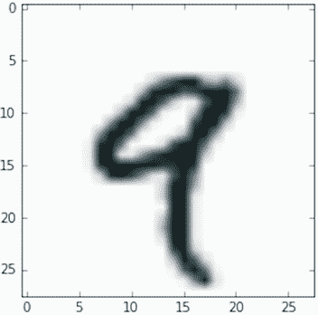

图 2.2 数据集中的第四个样本

列表 2.8 显示第四个数字

```py
import matplotlib.pyplot as plt
digit = train_images[4]
plt.imshow(digit, cmap=plt.cm.binary)
plt.show()
```

当然，相应的标签是整数 9：

```py
>>> train_labels[4] 
9
```

### 2.2.6 在 NumPy 中操作张量

在先前的示例中，我们使用语法`train_images[i]`沿着第一个轴选择了一个特定的数字。在张量中选择特定元素称为*张量切片*。让我们看看您可以在 NumPy 数组上进行的张量切片操作。

以下示例选择了第 10 到第 100 个数字（不包括第 100 个）并将它们放入形状为`(90,` `28,` `28)`的数组中：

```py
>>> my_slice = train_images[10:100]
>>> my_slice.shape
(90, 28, 28)
```

这等同于更详细的表示法，它为每个张量轴上的切片指定了起始索引和停止索引。请注意，`:`等同于选择整个轴：

```py
>>> my_slice = train_images[10:100, :, :]          # ❶
>>> my_slice.shape
(90, 28, 28)
>>> my_slice = train_images[10:100, 0:28, 0:28]    # ❷
>>> my_slice.shape
(90, 28, 28)
```

❶ 等同于前面的示例

❷ 也等同于前面的示例

通常，您可以在每个张量轴上选择任意两个索引之间的切片。例如，为了选择所有图像右下角的 14×14 像素，您可以这样做：

```py
my_slice = train_images[:, 14:, 14:]
```

也可以使用负索引。与 Python 列表中的负索引类似，它们表示相对于当前轴末尾的位置。为了将图像裁剪为中心 14×14 像素的补丁，您可以这样做：

```py
my_slice = train_images[:, 7:-7, 7:-7]
```

### 2.2.7 数据批次的概念

通常，在深度学习中您会遇到的所有数据张量中的第一个轴（轴 0，因为索引从 0 开始）将是*样本轴*（有时称为*样本维度*）。在 MNIST 示例中，“样本”是数字的图像。

此外，深度学习模型不会一次处理整个数据集；相反，它们将数据分成小批次。具体来说，这是我们 MNIST 数字的一个批次，批量大小为 128：

```py
batch = train_images[:128]
```

这是下一个批次：

```py
batch = train_images[128:256]
```

和第*n*批次：

```py
n = 3 
batch = train_images[128 * n:128 * (n + 1)]
```

在考虑这样一个批量张量时，第一个轴（轴 0）被称为*批量轴*或*批量维度*。这是您在使用 Keras 和其他深度学习库时经常遇到的术语。

### 2.2.8 数据张量的现实世界示例

让我们通过几个类似于您以后会遇到的示例来更具体地说明数据张量。您将处理的数据几乎总是属于以下类别之一：

+   *向量数据*—形状为`(samples,` `features)`的秩-2 张量，其中每个样本是一个数值属性（“特征”）向量

+   *时间序列数据或序列数据*—形状为`(samples,` `timesteps,` `features)`的秩-3 张量，其中每个样本是一个长度为`timesteps`的特征向量序列

+   *图像*—形状为`(samples,` `height,` `width,` `channels)`的秩-4 张量，其中每个样本是一个像素网格，每个像素由一组值（“通道”）表示

+   *视频*—形状为`(samples,` `frames,` `height,` `width,` `channels)`的秩-5 张量，其中每个样本是一个图像序列（长度为`frames`）

### 2.2.9 向量数据

这是最常见的情况之一。在这样的数据集中，每个单个数据点可以被编码为一个向量，因此数据的批次将被编码为一个二阶张量（即向量数组），其中第一个轴是*样本轴*，第二个轴是*特征轴*。

让我们看两个例子：

+   一个人们的精算数据集，我们考虑每个人的年龄、性别和收入。每个人可以被描述为一个包含 3 个值的向量，因此一个包含 10 万人的完整数据集可以存储在形状为`(100000, 3)`的二阶张量中。

+   一个文本文档数据集，我们通过每个单词在文档中出现的次数（在一个包含 2 万个常见单词的字典中）来表示每个文档。每个文档可以被编码为一个包含 2 万个值的向量（字典中每个单词的计数），因此一个包含 500 个文档的完整数据集可以存储在形状为`(500, 20000)`的张量中。

### 2.2.10 时间序列数据或序列数据

每当数据中涉及时间（或序列顺序的概念）时，将其存储在具有显式时间轴的三阶张量中是有意义的。每个样本可以被编码为一系列向量（一个二阶张量），因此数据的批次将被编码为一个三阶张量（见图 2.3）。

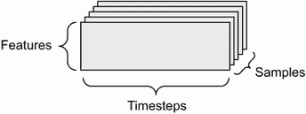

图 2.3 一个三阶时间序列数据张量

按照惯例，时间轴始终是第二轴（索引为 1 的轴）。让我们看几个例子：

+   一个股票价格数据集。每分钟，我们存储股票的当前价格、过去一分钟内的最高价格和最低价格。因此，每分钟被编码为一个三维向量，整个交易日被编码为形状为`(390, 3)`的矩阵（一个交易日有 390 分钟），250 天的数据可以存储在形状为`(250, 390, 3)`的三阶张量中。在这里，每个样本将是一天的数据。

+   一个推文数据集，我们将每条推文编码为一个由 128 个唯一字符组成的字母表中的 280 个字符序列。在这种情况下，每个字符可以被编码为一个大小为 128 的二进制向量（除了在对应字符的索引处有一个 1 条目外，其他都是全零向量）。然后，每条推文可以被编码为形状为`(280, 128)`的二阶张量，100 万条推文的数据集可以存储在形状为`(1000000, 280, 128)`的张量中。

### 2.2.11 图像数据

图像通常具有三个维度：高度、宽度和颜色深度。尽管灰度图像（如我们的 MNIST 数字）只有一个颜色通道，因此可以存储在二阶张量中，但按照惯例，图像张量始终是三阶的，对于灰度图像有一个一维颜色通道。因此，一个包含 128 个尺寸为 256×256 的灰度图像的批次可以存储在形状为`(128, 256, 256, 1)`的张量中，而一个包含 128 个彩色图像的批次可以存储在形状为`(128, 256, 256, 3)`的张量中（见图 2.4）。

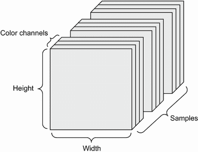

图 2.4 一个四阶图像数据张量

图像张量的形状有两种约定：*通道最后*约定（在 TensorFlow 中是标准的）和*通道优先*约定（越来越不受青睐）。

通道最后的约定将颜色深度轴放在最后：`(样本数, 高度, 宽度, 颜色深度)`。与此同时，通道优先的约定将颜色深度轴放在批次轴之后：`(样本数, 颜色深度, 高度, 宽度)`。使用通道优先的约定，前面的例子将变为`(128, 1, 256, 256)`和`(128, 3, 256, 256)`。Keras API 支持这两种格式。

### 2.2.12 视频数据

视频数据是少数几种需要使用五阶张量的真实世界数据之一。视频可以被理解为一系列帧，每一帧都是一幅彩色图像。因为每一帧可以存储在一个三阶张量中`(height,` `width,` `color_ depth)`，一系列帧可以存储在一个四阶张量中`(frames,` `height,` `width,` `color_depth)`，因此一批不同视频可以存储在一个形状为`(samples,` `frames,` `height,` `width,` `color_depth)`的五阶张量中。

例如，一个 60 秒、144 × 256 的 YouTube 视频剪辑，每秒采样 4 帧，将有 240 帧。四个这样的视频剪辑批次将存储在一个形状为`(4,` `240,` `144,` `256,` `3)`的张量中。总共有 106,168,320 个值！如果张量的`dtype`是`float32`，每个值将以 32 位存储，因此张量将表示 405 MB。非常庞大！在现实生活中遇到的视频要轻得多，因为它们不是以`float32`存储的，通常会被大幅压缩（例如 MPEG 格式）。

## 2.3 神经网络的齿轮：张量操作

就像任何计算机程序最终都可以简化为对二进制输入进行的一小组二进制操作（AND、OR、NOR 等）一样，深度神经网络学习到的所有变换都可以简化为应用于数值数据张量的一小组*张量操作*（或*张量函数*）。例如，可以对张量进行加法、乘法等操作。

在我们的初始示例中，我们通过将`Dense`层堆叠在一起来构建我们的模型。一个 Keras 层实例看起来像这样：

```py
keras.layers.Dense(512, activation="relu")
```

这一层可以被解释为一个函数，它以一个矩阵作为输入并返回另一个矩阵——输入张量的新表示。具体来说，函数如下（其中`W`是矩阵，`b`是向量，都是该层的属性）：

```py
output = relu(dot(input, W) + b)
```

让我们详细解释一下。这里有三个张量操作：

+   输入张量和名为`W`的张量之间的点积（`dot`）

+   结果矩阵和向量`b`之间的加法（`+`）

+   一个 `relu` 操作：`relu(x)` 是 `max(x,` `0)`；`relu`代表“修正线性单元”

注意 尽管本节完全涉及线性代数表达式，但这里不会找到任何数学符号。我发现，如果将数学概念表达为简短的 Python 代码片段而不是数学方程式，那么没有数学背景的程序员更容易掌握。因此，我们将在整个过程中使用 NumPy 和 TensorFlow 代码。

### 2.3.1 逐元素操作

`relu` 操作和加法都是逐元素操作：这些操作独立应用于所考虑张量中的每个条目。这意味着这些操作非常适合于高度并行的实现（*矢量化*实现，这个术语来自于 20 世纪 70-90 年代的*矢量处理器*超级计算机架构）。如果你想编写一个逐元素操作的朴素 Python 实现，你会使用一个`for`循环，就像这个逐元素`relu`操作的朴素实现中所示：

```py
def naive_relu(x):
    assert len(x.shape) == 2      # ❶
    x = x.copy()                  # ❷
    for i in range(x.shape[0]):
        for j in range(x.shape[1]):
            x[i, j] = max(x[i, j], 0)
    return x
```

❶ x 是一个二阶 NumPy 张量。

❷ 避免覆盖输入张量。

你可以对加法做同样的操作：

```py
def naive_add(x, y):
    assert len(x.shape) == 2       # ❶
    assert x.shape == y.shape
    x = x.copy()                   # ❷
    for i in range(x.shape[0]):
        for j in range(x.shape[1]):
            x[i, j] += y[i, j]
    return x
```

❶ x 和 y 是二阶 NumPy 张量。

❷ 避免覆盖输入张量。

在同样的原则下，你可以进行逐元素乘法、减法等操作。

在实践中，处理 NumPy 数组时，这些操作也作为优化良好的内置 NumPy 函数可用，它们本身将繁重的工作委托给基本线性代数子程序（BLAS）实现。BLAS 是低级别、高度并行、高效的张量操作例程，通常用 Fortran 或 C 实现。

因此，在 NumPy 中，你可以进行以下逐元素操作，速度将非常快：

```py
import numpy as np
z = x + y                # ❶
z = np.maximum(z, 0.)    # ❷
```

❶ 逐元素加法

❷ 逐元素 relu

让我们实际计算一下时间差异：

```py
import time

x = np.random.random((20, 100))
y = np.random.random((20, 100))

t0 = time.time() 
for _ in range(1000):
    z = x + y
    z = np.maximum(z, 0.) 
print("Took: {0:.2f} s".format(time.time() - t0))
```

这需要 0.02 秒。与此同时，朴素版本需要惊人的 2.45 秒：

```py
t0 = time.time() 
for _ in range(1000):
    z = naive_add(x, y)
    z = naive_relu(z) 
print("Took: {0:.2f} s".format(time.time() - t0))
```

同样，在 GPU 上运行 TensorFlow 代码时，通过完全向量化的 CUDA 实现执行元素级操作，可以最好地利用高度并行的 GPU 芯片架构。

### 2.3.2 广播

我们之前天真的实现`naive_add`仅支持具有相同形状的秩为 2 的张量的加法。但在之前介绍的`Dense`层中，我们添加了一个秩为 2 的张量和一个向量。当被加的两个张量的形状不同时，加法会发生什么？

在可能的情况下，如果没有歧义，较小的张量将被*广播*以匹配较大张量的形状。广播包括两个步骤：

1.  轴（称为*广播轴*）被添加到较小的张量中，以匹配较大张量的`ndim`。

1.  较小的张量沿着这些新轴重复，以匹配较大张量的完整形状。

让我们看一个具体的例子。考虑形状为`(32,` `10)`的`X`和形状为`(10,)`的`y`：

```py
import numpy as np
X = np.random.random((32, 10))     # ❶
y = np.random.random((10,))        # ❷
```

❶ X 是一个形状为(32, 10)的随机矩阵。

❷ y 是一个 NumPy 向量。

首先，我们向`y`添加一个空的第一个轴，其形状变为`(1,` `10)`：

```py
y = np.expand_dims(y, axis=0)    # ❶
```

❶ y 的形状现在是(1, 10)。

然后，我们沿着这个新轴重复`y` 32 次，这样我们就得到了一个形状为`(32,` `10)`的张量`Y`，其中`Y[i,` `:]` `==` `y`，对于`i` 在 `range(0,` `32)`：

```py
Y = np.concatenate([y] * 32, axis=0)     # ❶
```

❶ 沿着轴 0 重复 y 32 次，得到形状为(32, 10)的 Y。

此时，我们可以继续添加`X`和`Y`，因为它们具有相同的形状。

在实现方面，不会创建新的秩为 2 的张量，因为那样会非常低效。重复操作完全是虚拟的：它发生在算法级别而不是内存级别。但想象向量沿着新轴重复 10 次是一个有用的心理模型。以下是天真实现的样子：

```py
def naive_add_matrix_and_vector(x, y):
    assert len(x.shape) == 2               # ❶
    assert len(y.shape) == 1               # ❷
    assert x.shape[1] == y.shape[0]
    x = x.copy()                           # ❸
    for i in range(x.shape[0]):
        for j in range(x.shape[1]):
            x[i, j] += y[j]
    return x
```

❶ x 是一个秩为 2 的 NumPy 张量。

❷ y 是一个 NumPy 向量。

❸ 避免覆盖输入张量。

使用广播，如果一个张量的形状为`(a,` `b,` `...` `n,` `n` `+` `1,` `...` `m)`，另一个张量的形状为`(n,` `n` `+` `1,` `...` `m)`，通常可以执行元素级操作。广播将自动发生在轴`a`到`n` `-` `1`。

以下示例通过广播将两个不同形状的张量应用于元素级`maximum`操作：

```py
import numpy as np
x = np.random.random((64, 3, 32, 10))     # ❶
y = np.random.random((32, 10))            # ❷
z = np.maximum(x, y)                      # ❸
```

❶ x 是一个形状为(64, 3, 32, 10)的随机张量。

❷ y 是一个形状为(32, 10)的随机张量。

❸ 输出 z 的形状与 x 相同，为(64, 3, 32, 10)。

### 2.3.3 张量积

*张量积*或*点积*（不要与逐元素乘积，即`*`运算符混淆）是最常见、最有用的张量操作之一。

在 NumPy 中，使用`np.dot`函数进行张量积（因为张量积的数学表示通常是一个点）：

```py
x = np.random.random((32,))
y = np.random.random((32,))
z = np.dot(x, y)
```

在数学表示中，您会用一个点（•）表示该操作：

```py
z = x • y
```

从数学上讲，点操作是什么？让我们从两个向量`x`和`y`的点积开始。计算如下：

```py
def naive_vector_dot(x, y):
    assert len(x.shape) == 1         # ❶
    assert len(y.shape) == 1         # ❶
    assert x.shape[0] == y.shape[0]
    z = 0. 
    for i in range(x.shape[0]):
        z += x[i] * y[i]
    return z
```

❶ x 和 y 是 NumPy 向量。

您可能已经注意到两个向量之间的点积是一个标量，只有元素数量相同的向量才适用于点积。

您还可以计算矩阵`x`和向量`y`之间的点积，返回一个向量，其中系数是`y`和`x`的行之间的点积。您可以按如下方式实现它：

```py
def naive_matrix_vector_dot(x, y):
    assert len(x.shape) == 2              # ❶
    assert len(y.shape) == 1              # ❷
    assert x.shape[1] == y.shape[0]       # ❸
    z = np.zeros(x.shape[0])              # ❹
    for i in range(x.shape[0]):
        for j in range(x.shape[1]):
            z[i] += x[i, j] * y[j]
    return z
```

❶ x 是一个 NumPy 矩阵。

❷ y 是一个 NumPy 向量。

❸ x 的第一个维度必须与 y 的第 0 维度相同！

❹ 此操作返回一个与 y 形状相同的 0 向量。

您还可以重用我们之前编写的代码，这突显了矩阵-向量乘积与向量乘积之间的关系：

```py
def naive_matrix_vector_dot(x, y):
    z = np.zeros(x.shape[0])
    for i in range(x.shape[0]):
        z[i] = naive_vector_dot(x[i, :], y)
    return z
```

请注意，只要两个张量中的一个的`ndim`大于 1，`dot`就不再是*对称*的，也就是说`dot(x,` `y)`不等同于`dot(y,` `x)`。

当然，点积可以推广到具有任意数量轴的张量。最常见的应用可能是两个矩阵之间的点积。只有当 `x.shape[1]` `==` `y.shape[0]` 时，你才能计算两个矩阵 `x` 和 `y` 的点积（`dot(x,` `y)`）。结果是一个形状为 `(x.shape[0],` `y.shape[1])` 的矩阵，其中系数是 `x` 的行和 `y` 的列之间的向量积。这是一个简单的实现：

```py
def naive_matrix_dot(x, y):
    assert len(x.shape) == 2                  # ❶
    assert len(y.shape) == 2                  # ❶
    assert x.shape[1] == y.shape[0]           # ❷
    z = np.zeros((x.shape[0], y.shape[1]))    # ❸
    for i in range(x.shape[0]):               # ❹
        for j in range(y.shape[1]):           # ❺
            row_x = x[i, :]
            column_y = y[:, j]
            z[i, j] = naive_vector_dot(row_x, column_y)
    return z
```

❶ x 和 y 是 NumPy 矩阵。

❷ x 的第一个维度必须与 y 的第 0 维度相同！

❸ 此操作返回一个具有特定形状的零矩阵。

❹ 迭代 x 的行 . . .

❺ . . . 并在 y 的列上。

要理解点积形状兼容性，有助于通过将输入和输出张量对齐来可视化它们，如图 2.5 所示。

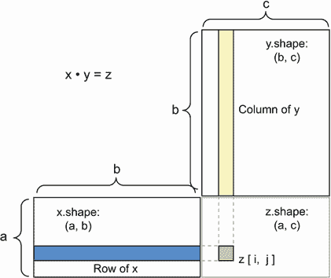

图 2.5 矩阵点积框图

在图中，`x`、`y` 和 `z` 被描绘为矩形（系数的字面框）。因为 `x` 的行和 `y` 的列必须具有相同的大小，所以 `x` 的宽度必须与 `y` 的高度匹配。如果你继续开发新的机器学习算法，你可能会经常画这样的图。

更一般地，你可以按照前面为 2D 情况概述的相同形状兼容性规则，计算更高维度张量之间的点积：

```py
(a, b, c, d) • (d,) → (a, b, c)
(a, b, c, d) • (d, e) → (a, b, c, e)
```

等等。

### 2.3.4 张量重塑

理解的第三种张量操作是*张量重塑*。虽然在我们第一个神经网络示例中的`Dense`层中没有使用它，但在将手写数字数据输入模型之前对数据进行预处理时使用了它：

```py
train_images = train_images.reshape((60000, 28 * 28))
```

重塑张量意味着重新排列其行和列以匹配目标形状。显然，重塑后的张量与初始张量具有相同数量的系数。通过简单的例子最容易理解重塑：

```py
>>> x = np.array([[0., 1.],
                  [2., 3.],
                  [4., 5.]])
>>> x.shape
(3, 2)
>>> x = x.reshape((6, 1))
>>> x
array([[ 0.],
       [ 1.],
       [ 2.],
       [ 3.],
       [ 4.],
       [ 5.]])
 >>> x = x.reshape((2, 3))
 >>> x
 array([[ 0.,  1.,  2.],
        [ 3.,  4.,  5.]])
```

常见的重塑的一个特殊情况是*转置*。*转置*矩阵意味着交换其行和列，使得 `x[i,` `:]` 变为 `x[:,` `i]`：

```py
>>> x = np.zeros((300, 20))    # ❶
>>> x = np.transpose(x)
>>> x.shape
(20, 300)
```

❶ 创建一个形状为 (300, 20) 的全零矩阵

### 2.3.5 张量操作的几何解释

因为张量操作中的张量内容可以被解释为某个几何空间中点的坐标，所以所有张量操作都有几何解释。例如，让我们从以下向量开始：

```py
A = [0.5, 1]
```

这是二维空间中的一个点（参见图 2.6）。通常将向量描绘为连接原点和点的箭头，如图 2.7 所示。

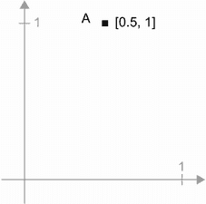

图 2.6  二维空间中的一个点

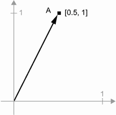

图 2.7 作为箭头的二维空间中的点

让我们考虑一个新点，`B` `=` `[1,` `0.25]`，我们将其添加到之前的点上。这是通过将向量箭头链接在一起几何地完成的，结果位置是代表前两个向量之和的向量（参见图 2.8）。如你所见，将向量 B 添加到向量 A 表示将点 A 复制到一个新位置，其距离和方向从原始点 A 确定为向量 B。如果你将相同的向量加法应用于平面上的一组点（一个“对象”），你将在一个新位置创建整个对象的副本（参见图 2.9）。因此，张量加法表示*平移对象*（在不扭曲对象的情况下移动对象）到某个方向的某个距离。

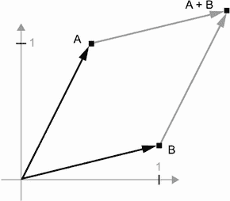

图 2.8 两个向量之和的几何解释

一般来说，诸如平移、旋转、缩放、倾斜等基本几何操作可以表示为张量操作。以下是一些例子：

+   *平移*：正如你刚刚看到的，向点添加一个向量将使点沿着固定方向移动固定量。应用于一组点（如 2D 对象），这称为“平移”（见图 2.9）。

    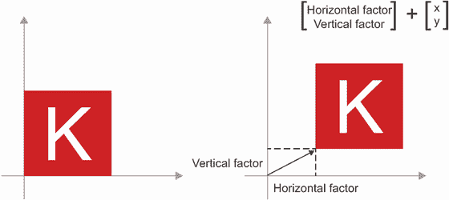

    图 2.9 2D 平移作为向量相加

+   *旋转*：通过角度θ逆时针旋转 2D 向量（见图 2.10）可以通过与 2 × 2 矩阵`R` `=` `[[cos(theta),` `-sin(theta)],` `[sin(theta),` `cos(theta)]]`进行点积实现。

    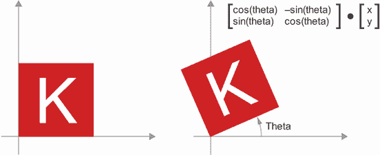

    图 2.10 2D 旋转（逆时针）作为点积

+   *缩放*：图像的垂直和水平缩放（见图 2.11）可以通过与 2 × 2 矩阵`S` `=` `[[horizontal_factor,` `0],` `[0,` `vertical_factor]]`进行点积实现（请注意，这样的矩阵称为“对角矩阵”，因为它只在从左上到右下的“对角线”上有非零系数）。

    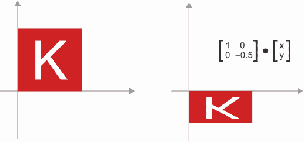

    图 2.11 2D 缩放作为点积

+   *线性变换*：与任意矩阵进行点积实现了线性变换。请注意，前面列出的*缩放*和*旋转*按定义都是线性变换。

+   *仿射变换*：仿射变换（见图 2.12）是线性变换（通过与某些矩阵进行点积实现）和平移（通过向量相加实现）的组合。你可能已经意识到，这正是`Dense`层实现的`y` `=` `W` `•` `x` `+` `b`计算！没有激活函数的`Dense`层就是一个仿射层。

    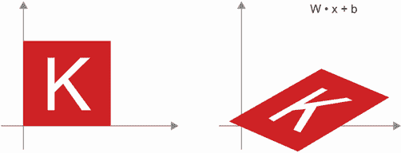

    图 2.12 平面中的仿射变换

+   *带有* `relu` *激活的 Dense 层*：关于仿射变换的一个重要观察是，如果你重复应用许多次，最终仍然得到一个仿射变换（因此你可以一开始就应用那一个仿射变换）。让我们尝试两次：`affine2(affine1(x))` `=` `W2` `•` `(W1` `•` `x` `+` `b1)` `+` `b2` `=` `(W2` `•` `W1)` `•` `x` `+` `(W2` `•` `b1` `+` `b2)`。这是一个仿射变换，其中线性部分是矩阵`W2` `•` `W1`，平移部分是向量`W2` `•` `b1` `+` `b2`。因此，一个完全由`Dense`层组成且没有激活函数的多层神经网络等效于单个`Dense`层。这种“深度”神经网络实际上只是一个伪装的线性模型！这就是为什么我们需要激活函数，比如`relu`（在图 2.13 中展示）。由于激活函数，一系列`Dense`层可以实现非常复杂、非线性的几何变换，为你的深度神经网络提供非常丰富的假设空间。我们将在下一章更详细地讨论这个想法。

    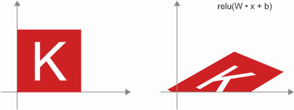

    图 2.13 仿射变换后跟`relu`激活

### 2.3.6 深度学习的几何解释

你刚刚学到神经网络完全由张量操作链组成，而这些张量操作只是输入数据的简单几何变换。由此可见，你可以将神经网络解释为在高维空间中非常复杂的几何变换，通过一系列简单步骤实现。

在 3D 中，以下心理形象可能会有所帮助。想象两张彩纸：一张红色，一张蓝色。将它们叠在一起。现在将它们一起揉成一个小球。那个揉皱的纸球就是你的输入数据，每张纸是分类问题中的一个数据类别。神经网络的目的是找出一个可以展开纸球的变换，使得两个类别再次清晰可分（见图 2.14）。通过深度学习，这将被实现为对 3D 空间的一系列简单变换，就像你可以用手指在纸球上一次移动一次一样。


图 2.14 展开复杂数据流形

展开纸团就是机器学习的目的：在高维空间中找到复杂、高度折叠数据*流形*的整洁表示（流形是一个连续的表面，就像我们折叠的纸张）。此时，你应该对为什么深度学习擅长这一点有很好的直觉：它采用逐步将复杂的几何变换分解为一长串基本变换的方法，这几乎就是人类展开纸团时会遵循的策略。深度网络中的每一层应用一个能稍微解开数据的变换，而深层堆叠的层使得一个极其复杂的解开过程变得可行。

## 2.4 神经网络的引擎：基于梯度的优化

正如你在前一节中看到的，我们第一个模型示例中的每个神经层将其输入数据转换如下：

```py
output = relu(dot(input, W) + b)
```

在这个表达式中，`W`和`b`是层的属性的张量。它们被称为层的*权重*或*可训练参数*（分别是`kernel`和`bias`属性）。这些权重包含了模型从训练数据中学到的信息。

最初，这些权重矩阵被填充了小的随机值（这一步被称为*随机初始化*）。当`W`和`b`是随机的时候，当然没有理由期望`relu(dot(input,` `W)` `+` `b)`会产生任何有用的表示。得到的表示是毫无意义的，但它们是一个起点。接下来要做的是逐渐调整这些权重，基于一个反馈信号。这种逐渐调整，也称为*训练*，就是机器学习的学习过程。

这发生在所谓的*训练循环*中，其工作方式如下。重复这些步骤直到损失看起来足够低：

1.  绘制一批训练样本`x`和相应的目标`y_true`。

1.  在`x`上运行模型（称为*前向传播*）以获得预测值`y_pred`。

1.  计算模型在批次上的损失，这是`y_pred`和`y_true`之间的不匹配度的度量。

1.  更新模型的所有权重，以稍微减少这一批次上的损失。

最终，你会得到一个在训练数据上损失非常低的模型：预测值`y_pred`与期望目标`y_true`之间的匹配度很低。模型已经“学会”将其输入映射到正确的目标。从远处看，这可能看起来像魔术，但当你将其简化为基本步骤时，它其实很简单。

第一步听起来足够简单——只是 I/O 代码。第二步和第三步仅仅是应用少量张量操作，所以你可以纯粹根据你在前一节中学到的内容来实现这些步骤。困难的部分在于第四步：更新模型的权重。给定模型中的一个单独权重系数，你如何计算这个系数应该增加还是减少，以及增加多少？

一个天真的解决方案是冻结模型中除了正在考虑的一个标量系数之外的所有权重，并尝试不同的值来调整这个系数。假设系数的初始值是 0.3。在一批数据上进行前向传播后，模型在该批次上的损失为 0.5。如果你将系数的值更改为 0.35 并重新运行前向传播，损失增加到 0.6。但如果你将系数降低到 0.25，损失降至 0.4。在这种情况下，似乎通过减小系数-0.05 来有助于最小化损失。这将需要对模型中的所有系数重复进行。

但这样的方法将非常低效，因为你需要为每个单独的系数（通常有成千上万甚至数百万个）计算两次前向传播（这是昂贵的）。幸运的是，有一个更好的方法：*梯度下降*。

梯度下降是现代神经网络的优化技术。这是其要点。我们模型中使用的所有函数（如 `dot` 或 `+`）以平滑连续的方式转换其输入：例如，如果你看 `z` `=` `x` `+` `y`，那么 `y` 的微小变化只会导致 `z` 的微小变化，如果你知道 `y` 变化的方向，你就可以推断出 `z` 变化的方向。从数学上讲，你会说这些函数是*可导*的。如果你将这些函数链接在一起，你得到的更大函数仍然是可导的。特别是，这适用于将模型系数映射到批量数据上的模型损失的函数：模型系数的微小变化导致损失值的微小、可预测的变化。这使你能够使用一种称为*梯度*的数学运算符描述损失随着你将模型系数朝不同方向移动而变化的方式。如果你计算这个梯度，你可以使用它来移动系数（一次性全部更新，而不是逐个更新），朝着减小损失的方向移动系数。

如果你已经知道*可导*的含义和*梯度*是什么，你可以跳到第 2.4.3 节。否则，接下来的两节将帮助你理解这些概念。

### 2.4.1 什么是导数？

考虑一个连续、平滑的函数 `f(x)` `=` `y`，将一个数字 `x` 映射到一个新的数字 `y`。我们可以以图 2.15 中的函数作为例子。

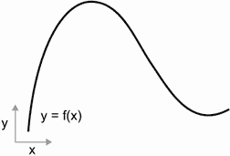

图 2.15 一个连续、平滑的函数

因为函数是*连续*的，`x` 的微小变化只会导致 `y` 的微小变化——这就是*连续性*背后的直觉。假设你将 `x` 增加一个小因子 `epsilon_x`：这会导致 `y` 有一个小的 `epsilon_y` 变化，如图 2.16 所示。

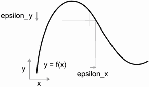

图 2.16 对于连续函数，`x` 的微小变化导致 `y` 的微小变化。

此外，因为函数是*平滑*的（其曲线没有任何突然的角度），当 `epsilon_x` 足够小，围绕某一点 `p`，可以将 `f` 近似为斜率 `a` 的线性函数，使得 `epsilon_y` 变为 `a` `*` `epsilon_x`：

```py
f(x + epsilon_x) = y + a * epsilon_x
```

显然，这种线性近似仅在 `x` 足够接近 `p` 时才有效。

斜率 `a` 在 `p` 处被称为 `f` 的*导数*。如果 `a` 是负的，这意味着在 `p` 附近将 `x` 稍微增加会导致 `f(x)` 减少（如图 2.17 所示），如果 `a` 是正的，将 `x` 稍微增加会导致 `f(x)` 增加。此外，`a` 的绝对值（导数的*大小*）告诉你这种增加或减少会有多快发生。

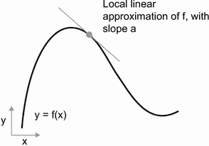

图 2.17 在 `p` 处的 `f` 的导数

对于每个可导函数 `f(x)`（*可导*意味着“可以求导”：例如，平滑、连续函数可以求导），都存在一个导数函数 `f'(x)`，将 `x` 的值映射到这些点上 `f` 的局部线性近似的斜率。例如，`cos(x)` 的导数是 `-sin(x)`，`f(x)` `=` `a` `*` `x` 的导数是 `f'(x)` `=` `a`，等等。

能够求导函数是在*优化*方面非常强大的工具，即找到使 `f(x)` 最小化的 `x` 的值的任务。如果你试图通过一个因子 `epsilon_x` 更新 `x` 以最小化 `f(x)`，并且你知道 `f` 的导数，那么你的任务就完成了：导数完全描述了当你改变 `x` 时 `f(x)` 的演变方式。如果你想减小 `f(x)` 的值，你只需要将 `x` 沿着导数的相反方向移动一点。

### 2.4.2 张量操作的导数：梯度

我们刚刚看的函数将标量值`x`转换为另一个标量值`y`：你可以将其绘制为二维平面上的曲线。现在想象一个将标量元组`(x,` `y)`转换为标量值`z`的函数：那将是一个矢量操作。你可以将其绘制为三维空间中的二维*表面*（由坐标`x,` `y,` `z`索引）。同样，你可以想象将矩阵作为输入的函数，将秩-3 张量作为输入的函数等。

导数的概念可以应用于任何这样的函数，只要它们描述的表面是连续且光滑的。张量操作（或张量函数）的导数称为*梯度*。梯度只是将导数的概念推广到以张量作为输入的函数。还记得对于标量函数，导数代表函数曲线的*局部斜率*吗？同样，张量函数的梯度代表函数描述的多维表面的*曲率*。它描述了当输入参数变化时函数输出如何变化。

让我们看一个基于机器学习的例子。

+   一个输入向量`x`（数据集中的样本）

+   一个矩阵`W`（模型的权重）

+   一个目标`y_true`（模型应该学会将其与`x`关联起来的内容）

+   一个损失函数`loss`（旨在衡量模型当前预测与`y_true`之间的差距）

你可以使用`W`计算目标候选`y_pred`，然后计算目标候选`y_pred`与目标`y_true`之间的损失或不匹配：

```py
y_pred = dot(W, x)                    # ❶
loss_value = loss(y_pred, y_true)     # ❷
```

❶ 我们使用模型权重`W`来对`x`进行预测。

❷ 我们估计预测有多大偏差。

现在我们想要使用梯度来找出如何更新`W`以使`loss_value`变小。我们该如何做？

给定固定的输入`x`和`y_true`，前述操作可以解释为将`W`（模型的权重）的值映射到损失值的函数：

```py
loss_value = f(W)    # ❶
```

❶ f 描述了当 W 变化时损失值形成的曲线（或高维表面）。

假设当前`W`的值为`W0`。那么在点`W0`处的`f`的导数是一个张量`grad(loss_value,` `W0)`，与`W`具有相同的形状，其中每个系数`grad(loss_value,` `W0)[i,` `j]`指示修改`W0[i,` `j]`时观察到的`loss_value`变化的方向和大小。该张量`grad(loss_value,` `W0)`是函数`f(W)` `=` `loss_value`在`W0`处的梯度，也称为“关于`W`在`W0`周围的`loss_value`的梯度”。

偏导数

张量操作`grad(f(W),` `W)`（以矩阵`W`为输入）可以表示为标量函数的组合，`grad_ij(f(W),` `w_ij)`，每个函数将返回`loss_value` `=` `f(W)`相对于`W[i,` `j]`系数的导数，假设所有其他系数都是常数。`grad_ij`称为相对于`W[i,` `j]`的*f 的偏导数*。

具体来说，`grad(loss_value,` `W0)`代表什么？你之前看到函数`f(x)`的导数可以解释为`f`的曲线的斜率。同样，`grad(loss_value,` `W0)`可以解释为描述`loss_value` `=` `f(W)`在`W0`周围的*最陡上升方向*的张量，以及这种上升的斜率。每个偏导数描述了特定方向上`f`的斜率。

出于同样的原因，就像对于函数`f(x)`，您可以通过将`x`稍微朝着导数的相反方向移动来减小`f(x)`的值一样，对于张量的函数`f(W)`，您可以通过将`W`朝着梯度的相反方向移动来减小`loss_value` `=` `f(W)`：例如，`W1` `=` `W0` `-` `step` `*` `grad(f(W0),` `W0)`（其中`step`是一个小的缩放因子）。这意味着沿着`f`的最陡上升方向的相反方向，直观上应该使您在曲线上更低。请注意，缩放因子`step`是必需的，因为当您接近`W0`时，`grad(loss_value,` `W0)`仅近似曲率，因此您不希望离`W0`太远。

### 2.4.3 随机梯度下降

鉴于可微函数，从理论上讲，可以通过分析找到其最小值：已知函数的最小值是导数为 0 的点，因此您只需找到所有导数为 0 的点，并检查这些点中哪个点的函数值最低。

应用于神经网络，意味着找到分析上产生最小可能损失函数的权重值的组合。这可以通过解方程`grad(f(W),` `W)` `=` `0`来实现`W`。这是一个`N`个变量的多项式方程，其中`N`是模型中的系数数量。虽然对于`N` `=` `2`或`N` `=` `3`可以解决这样的方程，但对于真实的神经网络来说，这是不可行的，因为参数数量从不少于几千个，通常可以达到几千万个。

相反，您可以使用本节开头概述的四步算法：根据随机数据批次的当前损失值逐渐修改参数。因为您正在处理可微函数，所以可以计算其梯度，这为您实现第 4 步提供了一种高效的方法。如果您根据梯度的相反方向更新权重，那么每次损失都会减少一点：

1.  绘制一批训练样本`x`和相应的目标`y_true`。

1.  在`x`上运行模型以获得预测值`y_pred`（这称为*前向传递*）。

1.  计算模型在批次上的损失，即`y_pred`和`y_true`之间的不匹配度的度量。

1.  计算损失相对于模型参数的梯度（这称为*反向传递*）。

1.  将参数稍微朝着梯度的相反方向移动，例如`W` `-=` `learning_rate` `*` `gradient`，从而在批次上减少一点损失。*学习率*（这里是`learning_rate`）将是一个标量因子，调节梯度下降过程的“速度”。

很简单！我们刚刚描述的是*小批量随机梯度下降*（mini-batch SGD）。术语*随机*指的是每个数据批次都是随机抽取的（*随机*是*随机*的科学同义词）。图 2.18 说明了在 1D 中发生的情况，当模型只有一个参数且您只有一个训练样本时。

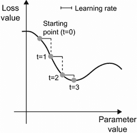

图 2.18 SGD 沿着 1D 损失曲线下降（一个可学习参数）

如您所见，直观上选择合理的`learning_rate`因子值很重要。如果太小，曲线下降将需要许多迭代，并且可能会陷入局部最小值。如果`learning_rate`太大，您的更新可能会使您完全随机地移动到曲线上的位置。

请注意，小批量 SGD 算法的一个变体是在每次迭代中绘制单个样本和目标，而不是绘制一批数据。这将是*真正的*SGD（而不是*小批量*SGD）。或者，走向相反的极端，您可以在*所有*可用数据上运行每一步，这被称为*批量梯度下降*。然后，每次更新将更准确，但成本更高。在这两个极端之间的有效折衷方案是使用合理大小的小批量。

尽管图 2.18 展示了在 1D 参数空间中的梯度下降，但在实践中，您将在高维空间中使用梯度下降：神经网络中的每个权重系数都是空间中的一个自由维度，可能有成千上万甚至数百万个。为了帮助您建立对损失曲面的直觉，您还可以将梯度下降可视化为 2D 损失曲面上的过程，如图 2.19 所示。但您不可能可视化训练神经网络的实际过程——您无法以人类能理解的方式表示一个 1000000 维空间。因此，要记住通过这些低维表示形成的直觉在实践中可能并不总是准确的。这在深度学习研究领域历史上一直是一个问题。

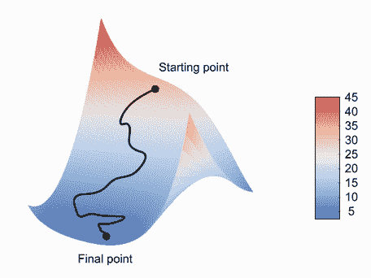

图 2.19 梯度下降在 2D 损失曲面上（两个可学习参数）

另外，还有多种 SGD 的变体，它们在计算下一个权重更新时考虑了先前的权重更新，而不仅仅是查看梯度的当前值。例如，有带有动量的 SGD，以及 Adagrad、RMSprop 等几种。这些变体被称为*优化方法*或*优化器*。特别是，许多这些变体中使用的*动量*概念值得关注。动量解决了 SGD 的两个问题：收敛速度和局部最小值。考虑图 2.20，显示了损失作为模型参数函数的曲线。

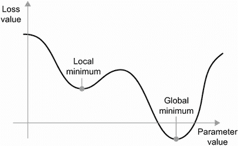

图 2.20 一个局部最小值和一个全局最小值

如您所见，在某个参数值附近，存在一个*局部最小值*：在该点附近，向左移动会导致损失增加，但向右移动也是如此。如果正在通过具有较小学习率的 SGD 优化考虑的参数，则优化过程可能会卡在局部最小值处，而不是朝着全局最小值前进。

您可以通过使用动量来避免这些问题，动量从物理学中汲取灵感。在这里一个有用的心理形象是将优化过程视为一个小球沿着损失曲线滚动。如果它有足够的动量，小球就不会卡在峡谷中，最终会到达全局最小值。动量的实现是基于每一步移动小球的不仅仅是当前斜率值（当前加速度），还有当前速度（由过去加速度产生）。在实践中，这意味着根据不仅仅是当前梯度值，还有先前参数更新来更新参数`w`，就像在这个简单实现中一样：

```py
past_velocity = 0. 
momentum = 0.1                # ❶
while loss > 0.01:            # ❷
    w, loss, gradient = get_current_parameters()
    velocity = past_velocity * momentum - learning_rate * gradient
    w = w + momentum * velocity - learning_rate * gradient
    past_velocity = velocity
    update_parameter(w)
```

❶ 恒定的动量因子

❷ 优化循环

### 2.4.4 链式求导：反向传播算法

在前面的算法中，我们随意假设因为一个函数是可微的，我们可以轻松计算它的梯度。但这是真的吗？在实践中如何计算复杂表达式的梯度？在我们本章开始的两层模型中，如何计算损失相对于权重的梯度？这就是*反向传播算法*的作用。

链式法则

反向传播是一种利用简单操作的导数（如加法、relu 或张量乘积）来轻松计算这些原子操作任意复杂组合的梯度的方法。关键是，神经网络由许多张量操作链在一起组成，每个操作都有简单的已知导数。例如，列表 2.2 中定义的模型可以表示为由变量`W1`、`b1`、`W2`和`b2`（分别属于第一和第二个`Dense`层）参数化的函数，涉及原子操作`dot`、`relu`、`softmax`和`+`，以及我们的损失函数`loss`，这些都很容易可微：

```py
loss_value = loss(y_true, softmax(dot(relu(dot(inputs, W1) + b1), W2) + b2))
```

微积分告诉我们，这样的函数链可以使用以下恒等式导出，称为*链式法则*。

考虑两个函数`f`和`g`，以及组合函数`fg`，使得`fg(x)` `==` `f(g(x))`：

```py
def fg(x):
    x1 = g(x)
    y = f(x1)
    return y
```

然后链式法则表明`grad(y,` `x)` `==` `grad(y,` `x1)` `*` `grad(x1,` `x)`。只要您知道`f`和`g`的导数，就可以计算`fg`的导数。链式法则之所以被命名为链式法则，是因为当您添加更多中间函数时，它开始看起来像一个链条：

```py
def fghj(x):
    x1 = j(x)
    x2 = h(x1)
    x3 = g(x2)
    y = f(x3)
    return y

grad(y, x) == (grad(y, x3) * grad(x3, x2) *
               grad(x2, x1) * grad(x1, x))
```

将链式法则应用于神经网络梯度值的计算会产生一种称为*反向传播*的算法。让我们看看具体是如何工作的。

使用计算图进行自动微分

以*计算图*的方式思考反向传播是一种有用的方式。计算图是 TensorFlow 和深度学习革命的核心数据结构。它是操作的有向无环图 - 在我们的情况下，是张量操作。例如，图 2.21 显示了我们第一个模型的图表示。

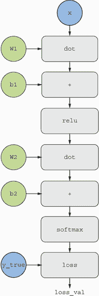

图 2.21 我们两层模型的计算图表示

计算图在计算机科学中是一个非常成功的抽象，因为它使我们能够*将计算视为数据*：可计算表达式被编码为一种可用作另一个程序的输入或输出的机器可读数据结构。例如，您可以想象一个接收计算图并返回实现相同计算的大规模分布式版本的新计算图的程序 - 这意味着您可以分发任何计算而无需自己编写分发逻辑。或者想象一个接收计算图并可以自动生成其表示的表达式的导数的程序。如果您的计算表达为显式图数据结构而不是.py 文件中的 ASCII 字符行，这些事情要容易得多。

为了清楚地解释反向传播，让我们看一个计算图的真正基本的例子（见图 2.22）。我们将考虑图 2.21 的简化版本，其中只有一个线性层，所有变量都是标量。我们将取两个标量变量`w`和`b`，一个标量输入`x`，并对它们应用一些操作将它们组合成输出`y`。最后，我们将应用一个绝对值误差损失函数：`loss_val` `=` `abs(y_true` `-` `y)`。由于我们希望以最小化`loss_val`的方式更新`w`和`b`，我们有兴趣计算`grad(loss_val,` `b)`和`grad(loss _val,` `w)`。

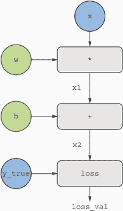

图 2.22 计算图的基本示例

让我们为图中的“输入节点”设置具体值，也就是说，输入`x`、目标`y_true`、`w`和`b`。我们将这些值从顶部传播到图中的所有节点，直到达到`loss_val`。这是*前向传递*（见图 2.23）。

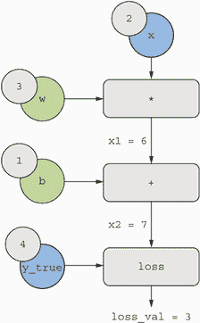

图 2.23 运行前向传递

现在让我们“反转”图表：对于图表中从`A`到`B`的每条边，我们将创建一个从`B`到`A`的相反边，并问，当`A`变化时`B`变化多少？也就是说，`grad(B,` `A)`是多少？我们将用这个值注释每个反转边。这个反向图代表了*反向传递*（见图 2.24）。

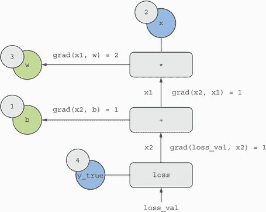

图 2.24 运行反向传播

我们有以下内容：

+   `grad(loss_val,` `x2)` `=` `1`，因为当`x2`变化一个 epsilon 时，`loss_val` `=` `abs(4` `-` `x2)`也会变化相同的量。

+   `grad(x2,` `x1)` `=` `1`，因为当`x1`变化一个 epsilon 时，`x2` `=` `x1` `+` `b` `=` `x1` `+` `1`也会变化相同的量。

+   `grad(x2,` `b)` `=` `1`，因为当`b`变化一个 epsilon 时，`x2` `=` `x1` `+` `b` `=` `6` `+` `b`也会变化相同的量。

+   `grad(x1,` `w)` `=` `2`，因为当`w`变化一个 epsilon 时，`x1` `=` `x` `*` `w` `=` `2` `*` `w`也会变化`2` `*` `epsilon`。

链式法则关于这个反向图的含义是，你可以通过*乘以连接两个节点路径上的每个边的导数*来获得一个节点相对于另一个节点的导数。例如，`grad(loss_val,` `w)` `=` `grad(loss_val,` `x2)` `*` `grad(x2,` `x1)` `*` `grad(x1,` `w)`（见图 2.25）。

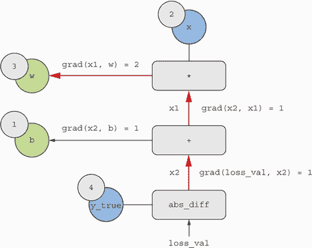

图 2.25 从`loss_val`到`w`的反向图路径

通过将链式法则应用于我们的图表，我们得到了我们要找的内容：

+   `grad(loss_val,` `w)` `=` `1` `*` `1` `*` `2` `=` `2`

+   `grad(loss_val,` `b)` `=` `1` `*` `1` `=` `1`

注意：如果在反向图中存在多条连接两个感兴趣节点`a`和`b`的路径，我们可以通过对所有路径的贡献求和来得到`grad(b,` `a)`。

通过这样，你刚刚看到了反向传播的过程！反向传播简单地是将链式法则应用于计算图。没有更多了。反向传播从最终损失值开始，从顶层向底层向后计算每个参数对损失值的贡献。这就是“反向传播”这个名字的由来：我们在计算图中“反向传播”不同节点的损失贡献。

如今，人们在现代框架中实现神经网络，这些框架能够进行*自动微分*，例如 TensorFlow。自动微分是使用你刚刚看到的计算图实现的。自动微分使得能够检索任意可微张量操作组合的梯度成为可能，而无需额外工作，只需编写前向传播。在 2000 年代我用 C 语言编写我的第一个神经网络时，我不得不手动编写梯度。现在，由于现代自动微分工具，你永远不必自己实现反向传播。算你运气好！

TensorFlow 中的梯度磁带

你可以利用 TensorFlow 强大的自动微分功能的 API 是`GradientTape`。它是一个 Python 范围，将在其中运行的张量操作“记录”为计算图（有时称为“磁带”）。然后可以使用此图检索任何输出相对于任何变量或一组变量（`tf.Variable`类的实例）的梯度。`tf.Variable`是一种特定类型的张量，用于保存可变状态，例如神经网络的权重始终是`tf.Variable`实例。

```py
import tensorflow as tf
x = tf.Variable(0.)                      # ❶
with tf.GradientTape() as tape:          # ❷
    y = 2 * x + 3                        # ❸
grad_of_y_wrt_x = tape.gradient(y, x)    # ❹
```

❶ 实例化一个初始值为 0 的标量变量。

❷ 打开一个 GradientTape 范围。

❸ 在范围内，对我们的变量应用一些张量操作。

❹ 使用磁带检索输出 y 相对于我们的变量 x 的梯度。

`GradientTape`与张量操作一起工作：

```py
x = tf.Variable(tf.random.uniform((2, 2)))     # ❶
with tf.GradientTape() as tape:
    y = 2 * x + 3 
grad_of_y_wrt_x = tape.gradient(y, x)          # ❷
```

❶ 实例化一个形状为(2, 2)且初始值全为零的变量。

❷ `grad_of_y_wrt_x`是一个形状为(2, 2)（像 x 一样）的张量，描述了 y = 2 * a + 3 在 x = [[0, 0], [0, 0]]周围的曲率。

它也适用于变量列表：

```py
W = tf.Variable(tf.random.uniform((2, 2)))
b = tf.Variable(tf.zeros((2,)))
x = tf.random.uniform((2, 2)) 
with tf.GradientTape() as tape:
    y = tf.matmul(x, W) + b                         # ❶
grad_of_y_wrt_W_and_b = tape.gradient(y, [W, b])    # ❷
```

❶ matmul 是在 TensorFlow 中表示“点积”的方式。

❷ grad_of_y_wrt_W_and_b 是两个张量列表，形状与 W 和 b 相同。

你将在下一章学习关于梯度带的知识。

## 2.5 回顾我们的第一个例子

你已经接近本章的结束，现在应该对神经网络背后的运作有一个大致的了解。在本章开始时是一个神奇的黑匣子，现在已经变成了一个更清晰的画面，如图 2.26 所示：模型由相互链接的层组成，将输入数据映射到预测结果。损失函数然后将这些预测与目标进行比较，产生一个损失值：衡量模型预测与预期值匹配程度的指标。优化器使用这个损失值来更新模型的权重。

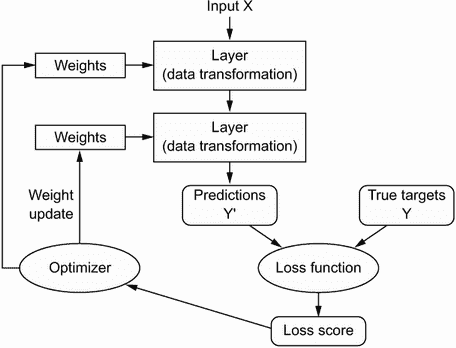

图 2.26 网络、层、损失函数和优化器之间的关系

让我们回到本章的第一个例子，并根据你学到的知识来逐一审查每个部分。

这是输入数据：

```py
(train_images, train_labels), (test_images, test_labels) = mnist.load_data()
train_images = train_images.reshape((60000, 28 * 28))
train_images = train_images.astype("float32") / 255 
test_images = test_images.reshape((10000, 28 * 28))
test_images = test_images.astype("float32") / 255
```

现在你明白了输入图像存储在 NumPy 张量中，这里格式化为`(60000,` `784)`（训练数据）和`(10000,` `784)`（测试数据）的`float32`张量。

这是我们的模型：

```py
model = keras.Sequential([
    layers.Dense(512, activation="relu"),
    layers.Dense(10, activation="softmax")
])
```

现在你明白了这个模型由两个`Dense`层的链条组成，每个层对输入数据应用了一些简单的张量操作，并且这些操作涉及权重张量。权重张量是属于层的属性，是模型的*知识*所在。

这是模型编译步骤：

```py
model.compile(optimizer="rmsprop",
              loss="sparse_categorical_crossentropy",
              metrics=["accuracy"])
```

现在你明白了`sparse_categorical_crossentropy`是用作学习权重张量的反馈信号的损失函数，训练阶段将尝试最小化它。你还知道这种损失的减少是通过小批量随机梯度下降来实现的。具体规则由作为第一个参数传递的`rmsprop`优化器定义。

最后，这是训练循环：

```py
model.fit(train_images, train_labels, epochs=5, batch_size=128)
```

现在你明白了当你调用`fit`时会发生什么：模型将开始在 128 个样本的小批量数据上进行 5 次迭代（每次迭代所有训练数据都被称为*epoch*）。对于每个批次，模型将计算损失相对于权重的梯度（使用源自微积分链式法则的反向传播算法），并将权重朝着减少该批次损失值的方向移动。

在这 5 个 epoch 之后，模型将执行 2,345 次梯度更新（每个 epoch 469 次），并且模型的损失将足够低，以至于模型能够以高准确度对手写数字进行分类。

在这一点上，你已经了解了大部分关于神经网络的常识。让我们通过逐步在 TensorFlow 中“从头开始”重新实现那个第一个例子来证明它。

### 2.5.1 在 TensorFlow 中从头开始重新实现我们的第一个例子

有什么比从头开始实现一切更能展示出完全、明确的理解呢？当然，“从头开始”在这里是相对的：我们不会重新实现基本的张量操作，也不会实现反向传播。但我们会降到一个低到几乎不使用任何 Keras 功能的水平。

如果你现在还不理解这个例子中的每一个细节，不要担心。下一章将更详细地深入探讨 TensorFlow API。现在，只需尝试理解正在发生的事情的要点——这个例子的目的是帮助你通过具体实现来澄清对深度学习数学的理解。让我们开始吧！

一个简单的 Dense 类

你之前学过`Dense`层实现以下输入转换，其中`W`和`b`是模型参数，`activation`是逐元素函数（通常是`relu`，但对于最后一层可能是`softmax`）：

```py
output = activation(dot(W, input) + b)
```

让我们实现一个简单的 Python 类`NaiveDense`，它创建两个 TensorFlow 变量`W`和`b`，并公开一个`__call__()`方法，应用前述转换。

```py
import tensorflow as tf

class NaiveDense:
    def __init__(self, input_size, output_size, activation):
        self.activation = activation

        w_shape = (input_size, output_size)                                # ❶
        w_initial_value = tf.random.uniform(w_shape, minval=0, maxval=1e-1)
        self.W = tf.Variable(w_initial_value)

        b_shape = (output_size,                                            # ❷
        b_initial_value = tf.zeros(b_shape)
        self.b = tf.Variable(b_initial_value)

    def __call__(self, inputs)::                                           # ❸
        return self.activation(tf.matmul(inputs, self.W) + self.b)

    @property
    def weights(self):                                                     # ❹
        return [self.W, self.b]
```

❶ 创建一个形状为(input_size, output_size)的矩阵 W，用随机值初始化。

❷ 创建一个形状为(output_size,)的向量 b，用零初始化。

❸ 应用前向传播。

❹ 用于检索层权重的便利方法

一个简单的 Sequential 类

现在，让我们创建一个`NaiveSequential`类来链接这些层。它包装了一系列层，并公开一个`__call__()`方法，简单地按顺序在输入上调用底层层。它还具有一个`weights`属性，方便跟踪层的参数。

```py
class NaiveSequential:
    def __init__(self, layers):
        self.layers = layers

    def __call__(self, inputs):
        x = inputs
        for layer in self.layers:
           x = layer(x)
        return x

    @property 
    def weights(self):
       weights = []
       for layer in self.layers:
           weights += layer.weights
       return weights
```

使用这个`NaiveDense`类和这个`NaiveSequential`类，我们可以创建一个模拟的 Keras 模型：

```py
model = NaiveSequential([
    NaiveDense(input_size=28 * 28, output_size=512, activation=tf.nn.relu),
    NaiveDense(input_size=512, output_size=10, activation=tf.nn.softmax)
]) 
assert len(model.weights) == 4 
```

一个批生成器

接下来，我们需要一种方法以小批量迭代 MNIST 数据。这很容易：

```py
import math

class BatchGenerator:
    def __init__(self, images, labels, batch_size=128):
        assert len(images) == len(labels)
        self.index = 0
        self.images = images
        self.labels = labels
        self.batch_size = batch_size
        self.num_batches = math.ceil(len(images) / batch_size)

    def next(self):
        images = self.images[self.index : self.index + self.batch_size]
        labels = self.labels[self.index : self.index + self.batch_size]
        self.index += self.batch_size
        return images, labels
```

### 2.5.2 运行一个训练步骤

这个过程中最困难的部分是“训练步骤”：在一个数据批次上运行模型后更新模型的权重。我们需要

1.  计算模型对批次中图像的预测。

1.  计算这些预测的损失值，给定实际标签。

1.  计算损失相对于模型权重的梯度。

1.  将权重沿着梯度相反的方向移动一小步。

要计算梯度，我们将使用在第 2.4.4 节中介绍的 TensorFlow `GradientTape`对象：

```py
def one_training_step(model, images_batch, labels_batch):
    with tf.GradientTape() as tape:                                         # ❶
        predictions = model(images_batch)                                   # ❶
        per_sample_losses = tf.keras.losses.sparse_categorical_crossentropy(# ❶
            labels_batch, predictions)                                      # ❶
        average_loss = tf.reduce_mean(per_sample_losses)                    # ❶
    gradients = tape.gradient(average_loss, model.weights)                  # ❷
    update_weights(gradients, model.weights)                                # ❸
    return average_loss
```

❶ 运行“前向传播”（在 GradientTape 范围内计算模型的预测）。

❷ 计算损失相对于权重的梯度。输出梯度是一个列表，其中每个条目对应于模型权重列表中的一个权重。

❸ 使用梯度更新权重（我们将很快定义这个函数）。

正如你已经知道的，“权重更新”步骤的目的（由前面的`update_weights`函数表示）是将权重向“减少此批次上的损失”的方向移动一点。移动的大小由“学习率”确定，通常是一个小量。实现这个`update_weights`函数的最简单方法是从每个权重中减去`gradient` `*` `learning_rate`：

```py
learning_rate = 1e-3 

def update_weights(gradients, weights):
    for g, w in zip(gradients, weights):
        w.assign_sub(g * learning_rate)      # ❶
```

❶ `assign_sub`是 TensorFlow 变量的`-=`的等效操作。

在实践中，你几乎永远不会手动实现这样的权重更新步骤。相反，你会使用 Keras 中的`Optimizer`实例，就像这样：

```py
from tensorflow.keras import optimizers

optimizer = optimizers.SGD(learning_rate=1e-3)

def update_weights(gradients, weights):
    optimizer.apply_gradients(zip(gradients, weights))
```

现在我们的每批训练步骤已经准备好，我们可以继续实现整个训练时期。

### 2.5.3 完整的训练循环

训练的一个时期简单地包括对训练数据中的每个批次重复进行训练步骤，完整的训练循环只是一个时期的重复：

```py
def fit(model, images, labels, epochs, batch_size=128):
    for epoch_counter in range(epochs):
        print(f"Epoch {epoch_counter}")
        batch_generator = BatchGenerator(images, labels)
        for batch_counter in range(batch_generator.num_batches):
            images_batch, labels_batch = batch_generator.next()
            loss = one_training_step(model, images_batch, labels_batch)
            if batch_counter % 100 == 0:
                print(f"loss at batch {batch_counter}: {loss:.2f}")
```

让我们来试一下：

```py
from tensorflow.keras.datasets import mnist
(train_images, train_labels), (test_images, test_labels) = mnist.load_data()

train_images = train_images.reshape((60000, 28 * 28))
train_images = train_images.astype("float32") / 255  
test_images = test_images.reshape((10000, 28 * 28))
test_images = test_images.astype("float32") / 255 

fit(model, train_images, train_labels, epochs=10, batch_size=128)
```

### 2.5.4 评估模型

我们可以通过对测试图像的预测取`argmax`，并将其与预期标签进行比较来评估模型：

```py
predictions = model(test_images)
predictions = predictions.numpy()                  # ❶
predicted_labels = np.argmax(predictions, axis=1)
matches = predicted_labels == test_labels
print(f"accuracy: {matches.mean():.2f}")
```

❶ 在 TensorFlow 张量上调用`.numpy()`会将其转换为 NumPy 张量。

完成了！正如你所看到的，手动完成“几行 Keras 代码可以完成的工作”需要做很多工作。但是因为你已经经历了这些步骤，现在应该对在调用`fit()`时神经网络内部发生的事情有一个清晰的理解。拥有这种低级别的心智模型，了解代码在幕后执行的操作，将使你更能利用 Keras API 的高级功能。

## 摘要

+   *张量*构成现代机器学习系统的基础。它们具有各种`dtype`、`rank`和`shape`。

+   你可以通过*张量操作*（如加法、张量积或逐元素乘法）来操作数值张量，这可以被解释为编码几何变换。总的来说，深度学习中的一切都可以被解释为几何解释。

+   深度学习模型由一系列简单的张量操作组成，由*权重*参数化，它们本身也是张量。模型的权重是存储其“知识”的地方。

+   *学习*意味着找到一组值，使模型的权重最小化给定一组训练数据样本及其对应目标的*损失函数*。

+   学习是通过随机抽取数据样本及其目标，并计算模型参数相对于批次上的损失的梯度来实现的。然后，模型参数向相反方向移动一点（移动的大小由学习率定义）。这被称为*小批量随机梯度下降*。

+   整个学习过程之所以可能，是因为神经网络中的所有张量操作都是可微的，因此可以应用导数的链式法则来找到将当前参数和当前数据批次映射到梯度值的梯度函数。这被称为*反向传播*。

+   你将经常在未来章节中看到的两个关键概念是*损失*和*优化器*。这是在开始向模型输入数据之前需要定义的两件事。

    +   *损失*是在训练过程中你将尝试最小化的量，因此它应该代表你尝试解决的任务的成功度量。

    +   *优化器*指定了损失的梯度将如何用于更新参数的确切方式：例如，可以是 RMSProp 优化器、带动量的 SGD 等。
