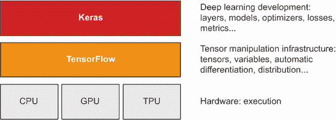
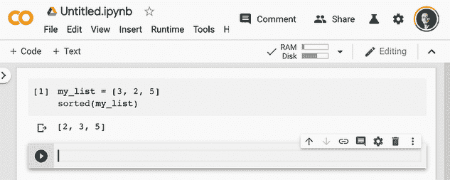
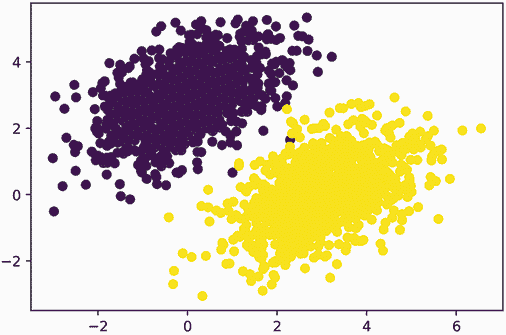
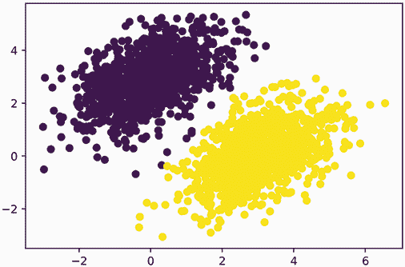
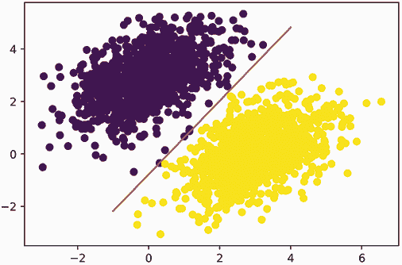
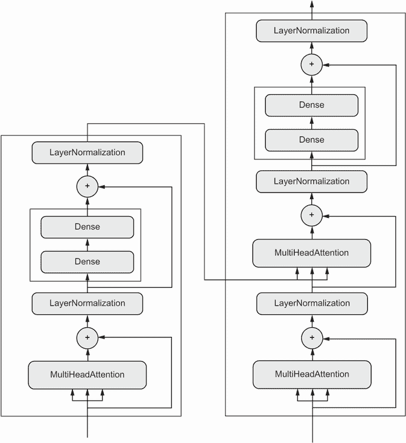

# 三、Keras 和 TensorFlow 简介

本章内容包括

+   仔细研究 TensorFlow、Keras 及它们之间的关系

+   设置深度学习工作空间

+   深入了解核心深度学习概念如何转化为 Keras 和 TensorFlow

本章旨在为您提供开始实践深度学习所需的一切。我将为您快速介绍 Keras（[`keras.io`](https://keras.io)）和 TensorFlow（[`tensorflow.org`](https://www.tensorflow.org/)），这是本书中将使用的基于 Python 的深度学习工具。您将了解如何设置深度学习工作空间，使用 TensorFlow、Keras 和 GPU 支持。最后，基于您在第二章中对 Keras 和 TensorFlow 的初步接触，我们将回顾神经网络的核心组件以及它们如何转化为 Keras 和 TensorFlow 的 API。

到本章结束时，您将准备好进入实际的现实世界应用程序，这将从第四章开始。

## 3.1 什么是 TensorFlow？

TensorFlow 是一个基于 Python 的免费、开源的机器学习平台，主要由 Google 开发。与 NumPy 类似，TensorFlow 的主要目的是使工程师和研究人员能够在数值张量上操作数学表达式。但是 TensorFlow 在以下方面远远超出了 NumPy 的范围：

+   它可以自动计算任何可微表达式的梯度（正如您在第二章中看到的），使其非常适合机器学习。

+   它不仅可以在 CPU 上运行，还可以在 GPU 和 TPU 上运行，高度并行的硬件加速器。

+   在 TensorFlow 中定义的计算可以轻松地分布到许多机器上。

+   TensorFlow 程序可以导出到其他运行时，例如 C++、JavaScript（用于基于浏览器的应用程序）或 TensorFlow Lite（用于在移动设备或嵌入式设备上运行的应用程序）等。这使得 TensorFlow 应用程序在实际环境中易于部署。

重要的是要记住，TensorFlow 远不止是一个单一的库。它实际上是一个平台，拥有庞大的组件生态系统，其中一些由 Google 开发，一些由第三方开发。例如，有用于强化学习研究的 TF-Agents，用于工业强度机器学习工作流管理的 TFX，用于生产部署的 TensorFlow Serving，以及预训练模型的 TensorFlow Hub 存储库。这些组件共同涵盖了非常广泛的用例，从前沿研究到大规模生产应用。

TensorFlow 的扩展性相当不错：例如，奥克岭国家实验室的科学家们已经使用它在 IBM Summit 超级计算机的 27000 个 GPU 上训练了一个 1.1 艾克斯佛洛普的极端天气预测模型。同样，谷歌已经使用 TensorFlow 开发了非常计算密集的深度学习应用程序，例如下棋和围棋代理 AlphaZero。对于您自己的模型，如果有预算，您可以实际上希望在小型 TPU 架或在 Google Cloud 或 AWS 上租用的大型 GPU 集群上扩展到约 10 petaFLOPS。这仍然约占 2019 年顶级超级计算机峰值计算能力的 1%！

## 3.2 什么是 Keras？

Keras 是一个基于 TensorFlow 的 Python 深度学习 API，提供了一种方便的方式来定义和训练任何类型的深度学习模型。Keras 最初是为研究而开发的，旨在实现快速的深度学习实验。

通过 TensorFlow，Keras 可以在不同类型的硬件上运行（见图 3.1）—GPU、TPU 或普通 CPU，并且可以无缝地扩展到数千台机器。



图 3.1 Keras 和 TensorFlow：TensorFlow 是一个低级张量计算平台，而 Keras 是一个高级深度学习 API

Keras 以优先考虑开发者体验而闻名。它是为人类而设计的 API，而不是为机器。它遵循减少认知负荷的最佳实践：提供一致简单的工作流程，最小化常见用例所需的操作数量，并在用户出错时提供清晰可行的反馈。这使得 Keras 对初学者易于学习，对专家使用高效。

截至 2021 年底，Keras 已经拥有超过一百万用户，包括学术研究人员、工程师、数据科学家、初创公司和大公司的研究生和爱好者。Keras 在 Google、Netflix、Uber、CERN、NASA、Yelp、Instacart、Square 等公司中被使用，以及数百家从事各行各业各种问题的初创公司。你的 YouTube 推荐源自 Keras 模型。Waymo 自动驾驶汽车是使用 Keras 模型开发的。Keras 也是 Kaggle 上的热门框架，大多数深度学习竞赛都是使用 Keras 赢得的。

由于 Keras 拥有庞大且多样化的用户群，它不会强迫你遵循单一的“正确”模型构建和训练方式。相反，它支持各种不同的工作流程，从非常高级到非常低级，对应不同的用户配置文件。例如，你有多种构建模型和训练模型的方式，每种方式都代表着可用性和灵活性之间的某种权衡。在第五章中，我们将详细审查这种工作流程的一部分。你可以像使用 Scikit-learn 一样使用 Keras——只需调用 `fit()`，让框架自行处理——或者像使用 NumPy 一样使用它——完全控制每一个细节。

这意味着你现在学习的所有内容在你成为专家后仍然是相关的。你可以轻松入门，然后逐渐深入到需要从头开始编写更多逻辑的工作流程中。在从学生转变为研究人员，或者从数据科学家转变为深度学习工程师时，你不必切换到完全不同的框架。

这种哲学与 Python 本身的哲学非常相似！有些语言只提供一种编写程序的方式——例如，面向对象编程或函数式编程。而 Python 是一种多范式语言：它提供了一系列可能的使用模式，它们都可以很好地协同工作。这使得 Python 适用于各种非常不同的用例：系统管理、数据科学、机器学习工程、Web 开发……或者只是学习如何编程。同样，你可以将 Keras 视为深度学习的 Python：一种用户友好的深度学习语言，为不同用户配置文件提供各种工作流程。

## 3.3 Keras 和 TensorFlow：简史

Keras 比 TensorFlow 早八个月发布。它于 2015 年 3 月发布，而 TensorFlow 则于 2015 年 11 月发布。你可能会问，如果 Keras 是建立在 TensorFlow 之上的，那么在 TensorFlow 发布之前它是如何存在的？Keras 最初是建立在 Theano 之上的，Theano 是另一个提供自动微分和 GPU 支持的张量操作库，是最早的之一。Theano 在蒙特利尔大学机器学习算法研究所（MILA）开发，从许多方面来看是 TensorFlow 的前身。它开创了使用静态计算图进行自动微分和将代码编译到 CPU 和 GPU 的想法。

在 TensorFlow 发布后的 2015 年底，Keras 被重构为多后端架构：可以使用 Keras 与 Theano 或 TensorFlow，而在两者之间切换就像更改环境变量一样简单。到 2016 年 9 月，TensorFlow 达到了技术成熟的水平，使其成为 Keras 的默认后端选项成为可能。2017 年，Keras 添加了两个新的后端选项：CNTK（由微软开发）和 MXNet（由亚马逊开发）。如今，Theano 和 CNTK 已经停止开发，MXNet 在亚马逊之外并不广泛使用。Keras 又回到了基于 TensorFlow 的单一后端 API。

多年来，Keras 和 TensorFlow 之间建立了一种共生关系。在 2016 年和 2017 年期间，Keras 成为了开发 TensorFlow 应用程序的用户友好方式，将新用户引入 TensorFlow 生态系统。到 2017 年底，大多数 TensorFlow 用户都是通过 Keras 或与 Keras 结合使用。2018 年，TensorFlow 领导层选择了 Keras 作为 TensorFlow 的官方高级 API。因此，Keras API 在 2019 年 9 月发布的 TensorFlow 2.0 中占据了重要位置——这是 TensorFlow 和 Keras 的全面重新设计，考虑了四年多的用户反馈和技术进步。

到这个时候，你一定迫不及待地想要开始实践运行 Keras 和 TensorFlow 代码了。让我们开始吧。

## 3.4 设置深度学习工作空间

在开始开发深度学习应用程序之前，你需要设置好你的开发环境。强烈建议，尽管不是绝对必要的，你应该在现代 NVIDIA GPU 上运行深度学习代码，而不是在计算机的 CPU 上运行。一些应用程序——特别是使用卷积网络进行图像处理的应用程序——在 CPU 上会非常慢，即使是快速的多核 CPU。即使对于可以在 CPU 上运行的应用程序，使用最新 GPU 通常会使速度提高 5 到 10 倍。

要在 GPU 上进行深度学习，你有三个选择：

+   在你的工作站上购买并安装一块物理 NVIDIA GPU。

+   使用 Google Cloud 或 AWS EC2 上的 GPU 实例。

+   使用 Colaboratory 提供的免费 GPU 运行时，这是 Google 提供的托管笔记本服务（有关“笔记本”是什么的详细信息，请参见下一节）。

Colaboratory 是最简单的入门方式，因为它不需要购买硬件，也不需要安装软件——只需在浏览器中打开一个标签页并开始编码。这是我们推荐在本书中运行代码示例的选项。然而，Colaboratory 的免费版本只适用于小型工作负载。如果你想扩大规模，你将不得不使用第一或第二个选项。

如果你还没有可以用于深度学习的 GPU（一块最新的高端 NVIDIA GPU），那么在云中运行深度学习实验是一个简单、低成本的方式，让你能够扩展到更大的工作负载，而无需购买任何额外的硬件。如果你正在使用 Jupyter 笔记本进行开发，那么在云中运行的体验与本地运行没有任何区别。

但是，如果你是深度学习的重度用户，这种设置在长期内甚至在几个月内都是不可持续的。云实例并不便宜：在 2021 年中期，你将为 Google Cloud 上的 V100 GPU 每小时支付 2.48 美元。与此同时，一块可靠的消费级 GPU 的价格在 1500 到 2500 美元之间——即使这些 GPU 的规格不断改进，价格也保持相对稳定。如果你是深度学习的重度用户，请考虑设置一个带有一块或多块 GPU 的本地工作站。

另外，无论您是在本地运行还是在云端运行，最好使用 Unix 工作站。虽然在 Windows 上直接运行 Keras 在技术上是可能的，但我们不建议这样做。如果您是 Windows 用户，并且想在自己的工作站上进行深度学习，最简单的解决方案是在您的机器上设置一个 Ubuntu 双系统引导，或者利用 Windows Subsystem for Linux（WSL），这是一个兼容层，使您能够从 Windows 运行 Linux 应用程序。这可能看起来有点麻烦，但从长远来看，这将为您节省大量时间和麻烦。

### 3.4.1 Jupyter 笔记本：运行深度学习实验的首选方式

Jupyter 笔记本是运行深度学习实验的绝佳方式，特别是本书中的许多代码示例。它们在数据科学和机器学习社区中被广泛使用。*笔记本*是由 Jupyter Notebook 应用程序生成的文件（[`jupyter.org`](https://jupyter.org)），您可以在浏览器中编辑。它结合了执行 Python 代码的能力和用于注释您正在进行的操作的丰富文本编辑功能。笔记本还允许您将长实验分解为可以独立执行的较小部分，这使得开发交互式，并且意味着如果实验的后期出现问题，您不必重新运行之前的所有代码。

我建议使用 Jupyter 笔记本来开始使用 Keras，尽管这不是必需的：您也可以运行独立的 Python 脚本或在诸如 PyCharm 这样的 IDE 中运行代码。本书中的所有代码示例都作为开源笔记本提供；您可以从 GitHub 上下载它们：[github.com/fchollet/deep-learning-with-python-notebooks](https://github.com/fchollet/deep-learning-with-python-notebooks)。

### 3.4.2 使用 Colaboratory

Colaboratory（简称 Colab）是一个免费的 Jupyter 笔记本服务，无需安装，完全在云端运行。实际上，它是一个网页，让您可以立即编写和执行 Keras 脚本。它为您提供免费（但有限）的 GPU 运行时，甚至还有 TPU 运行时，因此您不必购买自己的 GPU。Colaboratory 是我们推荐用于运行本书中代码示例的工具。

使用 Colaboratory 的第一步

要开始使用 Colab，请访问 [`colab.research.google.com`](https://colab.research.google.com) 并单击 New Notebook 按钮。您将看到图 3.2 中显示的标准笔记本界面。


图 3.2 一个 Colab 笔记本

您会在工具栏中看到两个按钮：+ Code 和 + Text。它们分别用于创建可执行的 Python 代码单元格和注释文本单元格。在代码单元格中输入代码后，按 Shift-Enter 将执行它（参见图 3.3）。



图 3.3 创建一个代码单元格

在文本单元格中，您可以使用 Markdown 语法（参见图 3.4）。按 Shift-Enter 在文本单元格上将渲染它。


图 3.4 创建一个文本单元格

文本单元格对于为您的笔记本提供可读的结构非常有用：使用它们为您的代码添加部分标题和长说明段落或嵌入图像。笔记本旨在成为一种多媒体体验！

使用 pip 安装软件包

默认的 Colab 环境已经安装了 TensorFlow 和 Keras，因此您可以立即开始使用它，无需任何安装步骤。但是，如果您需要使用 `pip` 安装某些内容，您可以在代码单元格中使用以下语法进行安装（请注意，该行以 `!` 开头，表示这是一个 shell 命令而不是 Python 代码）：

```py
!pip install package_name
```

使用 GPU 运行时

要在 Colab 中使用 GPU 运行时，请在菜单中选择 Runtime > Change Runtime Type，并选择 GPU 作为硬件加速器（参见图 3.5）。


图 3.5 使用 Colab 的 GPU 运行时

如果 GPU 可用，TensorFlow 和 Keras 将自动在 GPU 上执行，所以在选择了 GPU 运行时后，你无需做其他操作。

你会注意到在硬件加速器下拉菜单中还有一个 TPU 运行时选项。与 GPU 运行时不同，使用 TensorFlow 和 Keras 的 TPU 运行时需要在代码中进行一些手动设置。我们将在第十三章中介绍这个内容。目前，我们建议你选择 GPU 运行时，以便跟随本书中的代码示例。

现在你有了一个开始在实践中运行 Keras 代码的方法。接下来，让我们看看你在第二章学到的关键思想如何转化为 Keras 和 TensorFlow 代码。

## 3.5 TensorFlow 的第一步

正如你在之前的章节中看到的，训练神经网络围绕着以下概念展开：

+   首先，低级张量操作——支撑所有现代机器学习的基础设施。这转化为 TensorFlow API：

    +   *张量*，包括存储网络状态的特殊张量（*变量*）

    +   *张量操作*，如加法、`relu`、`matmul`

    +   *反向传播*，一种计算数学表达式梯度的方法（在 TensorFlow 中通过`GradientTape`对象处理）

+   其次，高级深度学习概念。这转化为 Keras API：

    +   *层*，这些层组合成一个*模型*

    +   一个*损失函数*，定义用于学习的反馈信号

    +   一个*优化器*，确定学习如何进行

    +   *指标*用于评估模型性能，如准确度

    +   执行小批量随机梯度下降的*训练循环*

在上一章中，你已经初步接触了一些对应的 TensorFlow 和 Keras API：你已经简要使用了 TensorFlow 的`Variable`类、`matmul`操作和`GradientTape`。你实例化了 Keras 的`Dense`层，将它们打包成一个`Sequential`模型，并用`fit()`方法训练了该模型。

现在让我们深入了解如何使用 TensorFlow 和 Keras 在实践中处理所有这些不同概念。

### 3.5.1 常量张量和变量

要在 TensorFlow 中做任何事情，我们需要一些张量。张量需要用一些初始值创建。例如，你可以创建全为 1 或全为 0 的张量（见列表 3.1），或者从随机分布中抽取值的张量（见列表 3.2）。

列表 3.1 全为 1 或全为 0 的张量

```py
>>> import tensorflow as tf
>>> x = tf.ones(shape=(2, 1))        # ❶
>>> print(x)
tf.Tensor(
[[1.]
 [1.]], shape=(2, 1), dtype=float32)
>>> x = tf.zeros(shape=(2, 1))       # ❷
>>> print(x)
tf.Tensor(
[[0.]
 [0.]], shape=(2, 1), dtype=float32)
```

❶ 等同于 np.ones(shape=(2, 1))

❷ 等同于 np.zeros(shape=(2, 1))

列表 3.2 随机张量

```py
>>> x = tf.random.normal(shape=(3, 1), mean=0., stddev=1.)      # ❶
>>> print(x)
tf.Tensor(
[[-0.14208166]
 [-0.95319825]
 [ 1.1096532 ]], shape=(3, 1), dtype=float32)
>>> x = tf.random.uniform(shape=(3, 1), minval=0., maxval=1.)   # ❷
>>> print(x)
tf.Tensor(
[[0.33779848]
 [0.06692922]
 [0.7749394 ]], shape=(3, 1), dtype=float32)
```

❶ 从均值为 0、标准差为 1 的正态分布中抽取的随机值张量。等同于 np.random.normal(size=(3, 1), loc=0., scale=1.)。

❷ 从 0 到 1 之间均匀分布的随机值张量。等同于 np.random.uniform(size=(3, 1), low=0., high=1.)。

NumPy 数组和 TensorFlow 张量之间的一个重要区别是 TensorFlow 张量不可赋值：它们是常量。例如，在 NumPy 中，你可以这样做。

列表 3.3 NumPy 数组是可赋值的

```py
import numpy as np
x = np.ones(shape=(2, 2))
x[0, 0] = 0.
```

尝试在 TensorFlow 中做同样的事情，你会得到一个错误：“EagerTensor 对象不支持项目赋值。”

列表 3.4 TensorFlow 张量不可赋值

```py
x = tf.ones(shape=(2, 2))
x[0, 0] = 0.             # ❶
```

❶ 这将失败，因为张量不可赋值。

要训练一个模型，我们需要更新它的状态，这是一组张量。如果张量不可赋值，我们该怎么办？这就是*变量*发挥作用的地方。`tf.Variable`是 TensorFlow 中用来管理可修改状态的类。你在第二章末尾的训练循环实现中已经简要看到它的作用。

要创建一个变量，你需要提供一些初始值，比如一个随机张量。

列表 3.5 创建一个 TensorFlow 变量

```py
>>> v = tf.Variable(initial_value=tf.random.normal(shape=(3, 1)))
>>> print(v)
array([[-0.75133973],
       [-0.4872893 ],
       [ 1.6626885 ]], dtype=float32)>
```

变量的状态可以通过其`assign`方法修改，如下所示。

列表 3.6 给 TensorFlow 变量赋值

```py
>>> v.assign(tf.ones((3, 1)))
array([[1.],
       [1.],
       [1.]], dtype=float32)>
```

它也适用于一部分系数。

列表 3.7 给 TensorFlow 变量的子集赋值

```py
>>> v[0, 0].assign(3.)
array([[3.],
       [1.],
       [1.]], dtype=float32)>
```

同样，`assign_add()` 和 `assign_sub()` 是`+=` 和 `-=` 的高效等价物，如下所示。

列表 3.8 使用`assign_add()`

```py
>>> v.assign_add(tf.ones((3, 1)))
array([[2.],
       [2.],
       [2.]], dtype=float32)>
```

### 3.5.2 张量操作：在 TensorFlow 中进行数学运算

就像 NumPy 一样，TensorFlow 提供了大量的张量操作来表达数学公式。以下是一些示例。

列表 3.9 几个基本数学操作

```py
a = tf.ones((2, 2))
b = tf.square(a)       # ❶
c = tf.sqrt(a)         # ❷
d = b + c              # ❸
e = tf.matmul(a, b)    # ❹
e *= d                 # ❺
```

❶ 求平方。

❷ 求平方根。

❸ 两个张量相加（逐元素）。

❹ 两个张量的乘积（如第二章中讨论的）。

❺ 两个张量相乘（逐元素）。

重要的是，前面的每个操作都是即时执行的：在任何时候，你都可以打印出当前的结果，就像在 NumPy 中一样。我们称之为*即时执行*。

### 3.5.3 再看一下 GradientTape API

到目前为止，TensorFlow 看起来很像 NumPy。但这里有一件 NumPy 做不到的事情：检索任何可微表达式相对于其任何输入的梯度。只需打开一个`GradientTape`范围，对一个或多个输入张量应用一些计算，并检索结果相对于输入的梯度。

列表 3.10 使用`GradientTape`

```py
input_var = tf.Variable(initial_value=3.) 
with tf.GradientTape() as tape:
   result = tf.square(input_var)
gradient = tape.gradient(result, input_var)
```

这通常用于检索模型损失相对于其权重的梯度：`gradients` `=` `tape.gradient(loss,` `weights)`。你在第二章中看到了这个过程。

到目前为止，你只看到了`tape.gradient()`中输入张量是 TensorFlow 变量的情况。实际上，这些输入可以是任意张量。然而，默认只有*可训练变量*会被跟踪。对于常量张量，你需要手动调用`tape.watch()`来标记它被跟踪。

列表 3.11 使用带有常量张量输入的`GradientTape`

```py
input_const = tf.constant(3.) 
with tf.GradientTape() as tape:
   tape.watch(input_const)
   result = tf.square(input_const)
gradient = tape.gradient(result, input_const)
```

为什么这是必要的？因为预先存储计算任何东西相对于任何东西的梯度所需的信息将会太昂贵。为了避免浪费资源，磁带需要知道要观察什么。可训练变量默认会被监视，因为计算损失相对于一组可训练变量的梯度是梯度磁带最常见的用法。

梯度磁带是一个强大的实用工具，甚至能够计算*二阶梯度*，也就是说，一个梯度的梯度。例如，一个物体的位置相对于时间的梯度是该物体的速度，而二阶梯度是它的加速度。

如果你测量一个沿垂直轴下落的苹果随时间的位置，并发现它验证`position(time)` `=` `4.9` `*` `time` `**` `2`，那么它的加速度是多少？让我们使用两个嵌套的梯度磁带来找出答案。

列表 3.12 使用嵌套的梯度磁带计算二阶梯度

```py
time = tf.Variable(0.) 
with tf.GradientTape() as outer_tape:
    with tf.GradientTape() as inner_tape:
        position =  4.9 * time ** 2 
    speed = inner_tape.gradient(position, time)
acceleration = outer_tape.gradient(speed, time)    # ❶
```

❶ 我们使用外部磁带来计算内部磁带的梯度。自然地，答案是 4.9 * 2 = 9.8。

### 3.5.4 一个端到端的示例：在纯 TensorFlow 中的线性分类器

你已经了解了张量、变量和张量操作，也知道如何计算梯度。这足以构建基于梯度下降的任何机器学习模型。而你只是在第三章！

在机器学习工作面试中，你可能会被要求在 TensorFlow 中从头开始实现一个线性分类器：这是一个非常简单的任务，可以作为筛选具有一些最低机器学习背景和没有背景的候选人之间的过滤器。让我们帮你通过这个筛选器，并利用你对 TensorFlow 的新知识来实现这样一个线性分类器。

首先，让我们想出一些线性可分的合成数据来处理：2D 平面上的两类点。我们将通过从具有特定协方差矩阵和特定均值的随机分布中绘制它们的坐标来生成每一类点。直观地，协方差矩阵描述了点云的形状，均值描述了它在平面上的位置（参见图 3.6）。我们将为两个点云重复使用相同的协方差矩阵，但我们将使用两个不同的均值值——点云将具有相同的形状，但不同的位置。

列表 3.13 在 2D 平面上生成两类随机点

```py
num_samples_per_class = 1000 
negative_samples = np.random.multivariate_normal(   # ❶
    mean=[0, 3],                                    # ❶
    cov=[[1, 0.5],[0.5, 1]],                        # ❶
    size=num_samples_per_class)                     # ❶
positive_samples = np.random.multivariate_normal(   # ❷
    mean=[3, 0],                                    # ❷
    cov=[[1, 0.5],[0.5, 1]],                        # ❷
    size=num_samples_per_class)                     # ❷
```

❶ 生成第一类点：1000 个随机的 2D 点。cov=[[1, 0.5],[0.5, 1]] 对应于一个从左下到右上方向的椭圆形点云。

❷ 用不同均值和相同协方差矩阵生成另一类点。

在上述代码中，`negative_samples` 和 `positive_samples` 都是形状为 `(1000,` `2)` 的数组。让我们将它们堆叠成一个形状为 `(2000,` `2)` 的单一数组。

列表 3.14 将两类堆叠成形状为 (2000, 2) 的数组

```py
inputs = np.vstack((negative_samples, positive_samples)).astype(np.float32)
```

让我们生成相应的目标标签，一个形状为 `(2000,` `1)` 的零和一的数组，其中 `targets[i,` `0]` 为 0，如果 `inputs[i]` 属于类 0（反之亦然）。

列表 3.15 生成相应的目标值 (0 和 1)

```py
targets = np.vstack((np.zeros((num_samples_per_class, 1), dtype="float32"),
                     np.ones((num_samples_per_class, 1), dtype="float32")))
```

接下来，让我们用 Matplotlib 绘制我们的数据。

列表 3.16 绘制两类点（参见图 3.6）

```py
import matplotlib.pyplot as plt
plt.scatter(inputs[:, 0], inputs[:, 1], c=targets[:, 0])
plt.show()
```



图 3.6 我们的合成数据：2D 平面上的两类随机点

现在让我们创建一个线性分类器，它可以学会分离这两个斑点。线性分类器是一个仿射变换（`prediction` `=` `W` `•` `input` `+` `b`），训练以最小化预测与目标之间差的平方。

正如你将看到的，这实际上比第二章末尾看到的玩具两层神经网络的端到端示例要简单得多。然而，这次你应该能够逐行理解代码的一切。

让我们创建我们的变量，`W` 和 `b`，分别用随机值和零值初始化。

列表 3.17 创建线性分类器变量

```py
input_dim = 2      # ❶
output_dim = 1     # ❷
W = tf.Variable(initial_value=tf.random.uniform(shape=(input_dim, output_dim)))
b = tf.Variable(initial_value=tf.zeros(shape=(output_dim,)))
```

❶ 输入将是 2D 点。

❷ 输出预测将是每个样本的单个分数（如果样本被预测为类 0，则接近 0，如果样本被预测为类 1，则接近 1）。

这是我们的前向传播函数。

列表 3.18 前向传播函数

```py
def model(inputs):
    return tf.matmul(inputs, W) + b
```

因为我们的线性分类器操作在 2D 输入上，`W` 实际上只是两个标量系数，`w1` 和 `w2`：`W` `=` `[[w1],` `[w2]]`。同时，`b` 是一个单一的标量系数。因此，对于给定的输入点 `[x,` `y]`，其预测值为 `prediction` `=` `[[w1],` `[w2]]` `•` `[x,` `y]` `+` `b` `=` `w1` `*` `x` `+` `w2` `*` `y` `+` `b`。

以下列表显示了我们的损失函数。

列表 3.19 均方误差损失函数

```py
def square_loss(targets, predictions):
    per_sample_losses = tf.square(targets - predictions)   # ❶
    return tf.reduce_mean(per_sample_losses)               # ❷
```

❶ per_sample_losses 将是一个与目标和预测相同形状的张量，包含每个样本的损失分数。

❷ 我们需要将这些每个样本的损失函数平均为单个标量损失值：这就是 reduce_mean 所做的。

接下来是训练步骤，它接收一些训练数据并更新权重 `W` 和 `b`，以使数据上的损失最小化。

列表 3.20 训练步骤函数

```py
learning_rate = 0.1 

def training_step(inputs, targets):
    with tf.GradientTape() as tape:                                  # ❶
        predictions = model(inputs)                                  # ❶
        loss = square_loss(predictions, targets)                     # ❶
    grad_loss_wrt_W, grad_loss_wrt_b = tape.gradient(loss, [W, b])   # ❷
    W.assign_sub(grad_loss_wrt_W * learning_rate)                    # ❸
    b.assign_sub(grad_loss_wrt_b * learning_rate)                    # ❸
    return loss
```

❶ 前向传播，在梯度磁带范围内

❷ 检索损失相对于权重的梯度。

❸ 更新权重。

为了简单起见，我们将进行*批量训练*而不是*小批量训练*：我们将对所有数据运行每个训练步骤（梯度计算和权重更新），而不是在小批量中迭代数据。一方面，这意味着每个训练步骤将需要更长时间运行，因为我们将一次计算 2,000 个样本的前向传播和梯度。另一方面，每个梯度更新将更有效地减少训练数据上的损失，因为它将包含所有训练样本的信息，而不是仅仅 128 个随机样本。因此，我们将需要更少的训练步骤，并且我们应该使用比通常用于小批量训练更大的学习率（我们将使用`learning_rate` `=` `0.1`，在列表 3.20 中定义）。

列表 3.21 批量训练循环

```py
for step in range(40):
    loss = training_step(inputs, targets)
    print(f"Loss at step {step}: {loss:.4f}")
```

经过 40 步，训练损失似乎已经稳定在 0.025 左右。让我们绘制我们的线性模型如何对训练数据点进行分类。因为我们的目标是 0 和 1，给定输入点将被分类为“0”，如果其预测值低于 0.5，将被分类为“1”，如果高于 0.5（见图 3.7）：

```py
predictions = model(inputs)
plt.scatter(inputs[:, 0], inputs[:, 1], c=predictions[:, 0] > 0.5)
plt.show()
```



图 3.7 我们模型对训练输入的预测：与训练目标非常相似

请记住，给定点`[x,` `y]`的预测值简单地为`prediction` `==` `[[w1],` `[w2]]` `•` `[x,` `y]` `+` `b` `==` `w1` `*` `x` `+` `w2` `*` `y` `+` `b`。因此，类 0 被定义为`w1` `*` `x` `+` `w2` `*` `y` `+` `b` `<` `0.5`，类 1 被定义为`w1` `*` `x` `+` `w2` `*` `y` `+` `b` `>` `0.5`。你会注意到你所看到的实际上是二维平面上的一条直线方程：`w1` `*` `x` `+` `w2` `*` `y` `+` `b` `=` `0.5`。在直线上方是类 1，在直线下方是类 0。你可能习惯于看到直线方程的格式为`y` `=` `a` `*` `x` `+` `b`；以相同格式，我们的直线变成了`y` `=` `-` `w1` `/` `w2` `*` `x` `+` `(0.5` `-` `b)` `/` `w2`。

让我们绘制这条直线（如图 3.8 所示）：

```py
x = np.linspace(-1, 4, 100)                                          # ❶
y = - W[0] /  W[1] * x + (0.5 - b) / W[1]                            # ❷
plt.plot(x, y, "-r")                                                 # ❸
plt.scatter(inputs[:, 0], inputs[:, 1], c=predictions[:, 0] > 0.5)   # ❹
```

❶ 生成 100 个在-1 到 4 之间均匀间隔的数字，我们将用它们来绘制我们的直线。

❷ 这是我们直线的方程。

❸ 绘制我们的直线（"-r"表示“将其绘制为红色线”）。

❹ 绘制我们模型的预测在同一图中。



图 3.8 我们模型，可视化为一条直线

这才是线性分类器的真正含义：找到一个线（或者在更高维空间中，一个超平面）的参数，将两类数据清晰地分开。

## 3.6 神经网络的解剖：理解核心 Keras API

到目前为止，你已经了解了 TensorFlow 的基础知识，并且可以使用它从头开始实现一个玩具模型，比如前一节中的批量线性分类器，或者第二章末尾的玩具神经网络。这是一个坚实的基础，可以继续建立。现在是时候转向更具生产力、更健壮的深度学习路径了：Keras API。

### 3.6.1 层：深度学习的构建模块

神经网络中的基本数据结构是*层*，你在第二章中已经介绍过。层是一个数据处理模块，它以一个或多个张量作为输入，并输出一个或多个张量。一些层是无状态的，但更频繁的情况是层有一个状态：层的*权重*，一个或多个使用随机梯度下降学习的张量，它们一起包含网络的*知识*。

不同类型的层适用于不同的张量格式和不同类型的数据处理。例如，简单的向量数据，存储在形状为`(samples, features)`的秩-2 张量中，通常由*密集连接*层处理，也称为*全连接*或*密集*层（Keras 中的`Dense`类）。序列数据，存储在形状为`(samples, timesteps, features)`的秩-3 张量中，通常由*循环*层处理，例如`LSTM`层，或 1D 卷积层（`Conv1D`）。图像数据，存储在秩-4 张量中，通常由 2D 卷积层（`Conv2D`）处理。

你可以把层想象成深度学习的乐高积木，这个比喻在 Keras 中是明确的。在 Keras 中构建深度学习模型是通过将兼容的层剪辑在一起形成有用的数据转换流水线。

Keras 中的基础 Layer 类

一个简单的 API 应该围绕一个单一的抽象进行中心化。在 Keras 中，这就是`Layer`类。Keras 中的一切都是一个`Layer`或与`Layer`紧密交互的东西。

一个`Layer`是一个封装了一些状态（权重）和一些计算（前向传播）的对象。权重通常在`build()`中定义（尽管它们也可以在构造函数`__init__()`中创建），计算在`call()`方法中定义。

在前一章中，我们实现了一个`NaiveDense`类，其中包含两个权重`W`和`b`，并应用了计算`output = activation(dot(input, W) + b)`。这就是在 Keras 中相同层的样子。

列表 3.22 作为`Layer`子类实现的`Dense`层

```py
from tensorflow import keras

class SimpleDense(keras.layers.Layer):                               # ❶
    def __init__(self, units, activation=None):
        super().__init__()
        self.units = units
        self.activation = activation

    def build(self, input_shape):                                    # ❷
        input_dim = input_shape[-1]
        self.W = self.add_weight(shape=(input_dim, self.units),      # ❸
                                 initializer="random_normal")
        self.b = self.add_weight(shape=(self.units,),
                                 initializer="zeros")

    def call(self, inputs):                                          # ❹
        y = tf.matmul(inputs, self.W) + self.b
        if self.activation is not None:
            y = self.activation(y)
        return y
```

❶ 所有的 Keras 层都继承自基础的 Layer 类。

❷ 权重的创建发生在`build()`方法中。

❸ `add_weight()`是一个创建权重的快捷方法。也可以创建独立的变量并将它们分配为层属性，如`self.W = tf.Variable(tf.random.uniform(w_shape))`。

❹ 我们在`call()`方法中定义了前向传播计算。

在接下来的部分中，我们将详细介绍这些`build()`和`call()`方法的目的。如果你现在还不理解，不要担心！

一旦实例化，像这样的层可以像函数一样使用，以 TensorFlow 张量作为输入：

```py
>>> my_dense = SimpleDense(units=32, activation=tf.nn.relu)   # ❶
>>> input_tensor = tf.ones(shape=(2, 784))                    # ❷
>>> output_tensor = my_dense(input_tensor)                    # ❸
>>> print(output_tensor.shape)
(2, 32))
```

❶ 实例化我们之前定义的层。

❷ 创建一些测试输入。

❸ 在输入上调用层，就像调用函数一样。

你可能会想，为什么我们要实现`call()`和`build()`，因为我们最终只是简单地调用了我们的层，也就是说，使用了它的`__call__()`方法？这是因为我们希望能够及时创建状态。让我们看看它是如何工作的。

自动形状推断：动态构建层

就像乐高积木一样，你只能“连接”兼容的层。这里的*层兼容性*概念特指每个层只接受特定形状的输入张量，并返回特定形状的输出张量。考虑以下示例：

```py
from tensorflow.keras import layers
layer = layers.Dense(32, activation="relu")     # ❶
```

❶ 一个具有 32 个输出单元的密集层

这个层将返回一个张量，其中第一个维度已经被转换为 32。它只能连接到一个期望 32 维向量作为输入的下游层。

在使用 Keras 时，大多数情况下你不必担心大小的兼容性，因为你添加到模型中的层会动态构建以匹配传入层的形状。例如，假设你写下以下内容：

```py
from tensorflow.keras import models 
from tensorflow.keras import layers
model = models.Sequential([
    layers.Dense(32, activation="relu"),
    layers.Dense(32)
])
```

层没有接收到关于它们输入形状的任何信息——相反，它们自动推断它们的输入形状为它们看到的第一个输入的形状。

在我们在第二章中实现的`Dense`层的玩具版本中（我们称之为`NaiveDense`），我们必须显式地将层的输入大小传递给构造函数，以便能够创建其权重。这并不理想，因为这将导致模型看起来像这样，其中每个新层都需要知道其前一层的形状：

```py
model = NaiveSequential([
    NaiveDense(input_size=784, output_size=32, activation="relu"),
    NaiveDense(input_size=32, output_size=64, activation="relu"),
    NaiveDense(input_size=64, output_size=32, activation="relu"),
    NaiveDense(input_size=32, output_size=10, activation="softmax")
])
```

如果一个层用于生成其输出形状的规则很复杂，情况会变得更糟。例如，如果我们的层返回形状为`(batch,` `input_ size` `*` `2` `if` `input_size` `%` `2` `==` `0` `else` `input_size` `*` `3)`的输出会怎样？

如果我们要将我们的`NaiveDense`层重新实现为一个能够自动推断形状的 Keras 层，它将看起来像之前的`SimpleDense`层（见列表 3.22），具有其`build()`和`call()`方法。

在`SimpleDense`中，我们不再像`NaiveDense`示例中那样在构造函数中创建权重；相反，我们在一个专门的状态创建方法`build()`中创建它们，该方法接收层首次看到的第一个输入形状作为参数。`build()`方法在第一次调用层时（通过其`__call__()`方法）会自动调用。事实上，这就是为什么我们将计算定义在单独的`call()`方法中而不是直接在`__call__()`方法中的原因。基础层的`__call__()`方法基本上是这样的：

```py
def __call__(self, inputs):
    if not self.built:
         self.build(inputs.shape)
         self.built = True
    return self.call(inputs)
```

有了自动形状推断，我们之前的示例变得简单而整洁：

```py
model = keras.Sequential([
    SimpleDense(32, activation="relu"),
    SimpleDense(64, activation="relu"),
    SimpleDense(32, activation="relu"),
    SimpleDense(10, activation="softmax")
])
```

请注意，自动形状推断并不是`Layer`类的`__call__()`方法处理的唯一事情。它还处理许多其他事情，特别是在*eager*和*graph*执行之间的路由（这是你将在第七章学习的概念），以及输入掩码（我们将在第十一章中介绍）。现在，只需记住：当实现自己的层时，将前向传播放在`call()`方法中。

### 3.6.2 从层到模型

深度学习模型是一系列层的图。在 Keras 中，这就是`Model`类。到目前为止，你只看到过`Sequential`模型（`Model`的子类），它们是简单的层堆叠，将单个输入映射到单个输出。但随着你的学习，你将接触到更广泛的网络拓扑。以下是一些常见的拓扑结构：

+   双分支网络

+   多头网络

+   残差连接

网络拓扑可能会变得非常复杂。例如，图 3.9 显示了 Transformer 的层图拓扑，这是一种常见的用于处理文本数据的架构。



图 3.9 变压器架构（在第十一章中介绍）。这里面有很多内容。在接下来的几章中，你将逐步理解它。

在 Keras 中通常有两种构建这种模型的方法：你可以直接子类化`Model`类，或者你可以使用 Functional API，它让你用更少的代码做更多的事情。我们将在第七章中涵盖这两种方法。

模型的拓扑定义了一个*假设空间*。你可能还记得，在第一章中我们将机器学习描述为在预定义的*可能性空间*内搜索一些输入数据的有用表示，使用来自反馈信号的指导。通过选择网络拓扑，你将限制你的可能性空间（假设空间）到一系列特定的张量操作，将输入数据映射到输出数据。接下来，你将搜索这些张量操作中涉及的权重张量的良好值集。

要从数据中学习，您必须对其进行假设。这些假设定义了可以学到的内容。因此，您的假设空间的结构——模型的架构——非常重要。它编码了您对问题的假设，模型开始的先验知识。例如，如果您正在处理一个由单个`Dense`层组成且没有激活函数（纯仿射变换）的模型的两类分类问题，那么您假设您的两类是线性可分的。

选择正确的网络架构更多地是一门艺术而不是一门科学，尽管有一些最佳实践和原则可以依靠，但只有实践才能帮助你成为一个合格的神经网络架构师。接下来的几章将教授您构建神经网络的明确原则，并帮助您培养对于特定问题的有效性或无效性的直觉。您将建立对于不同类型问题适用的模型架构的坚实直觉，如何在实践中构建这些网络，如何选择正确的学习配置，以及如何调整模型直到产生您想要看到的结果。

### 3.6.3 “compile”步骤：配置学习过程

一旦模型架构被定义，您仍然必须选择另外三个事项：

+   *损失函数（目标函数）*—在训练过程中将被最小化的数量。它代表了任务的成功度量。

+   *优化器*—根据损失函数确定网络要如何更新。它实现了随机梯度下降（SGD）的特定变体。

+   *Metrics*—在训练和验证过程中要监视的成功度量，例如分类准确度。与损失不同，训练不会直接为这些指标进行优化。因此，指标不需要可微分。

一旦您选择了损失、优化器和指标，您可以使用内置的`compile()`和`fit()`方法开始训练您的模型。或者，您也可以编写自己的自定义训练循环——我们将在第七章中介绍如何做到这一点。这是更多的工作！现在，让我们看看`compile()`和`fit()`。

`compile()`方法配置训练过程——你在第二章的第一个神经网络示例中已经见过它。它接受`optimizer`、`loss`和`metrics`（一个列表）作为参数：

```py
model = keras.Sequential([keras.layers.Dense(1)])   # ❶
model.compile(optimizer="rmsprop",                  # ❷
              loss="mean_squared_error",            # ❸
              metrics=["accuracy"])                 # ❹
```

❶ 定义一个线性分类器。

❷ 通过名称指定优化器：RMSprop（不区分大小写）。

❸ 通过名称指定损失：均方误差。

❹ 指定一个指标列表：在这种情况下，只有准确度。

在前面对`compile()`的调用中，我们将优化器、损失和指标作为字符串传递（例如`"rmsprop"`）。这些字符串实际上是转换为 Python 对象的快捷方式。例如，`"rmsprop"`变成了`keras.optimizers.RMSprop()`。重要的是，也可以将这些参数指定为对象实例，如下所示：

```py
model.compile(optimizer=keras.optimizers.RMSprop(),
              loss=keras.losses.MeanSquaredError(),
              metrics=[keras.metrics.BinaryAccuracy()])
```

如果您想传递自定义损失或指标，或者如果您想进一步配置您正在使用的对象，例如通过向优化器传递`learning_rate`参数：

```py
model.compile(optimizer=keras.optimizers.RMSprop(learning_rate=1e-4),
              loss=my_custom_loss,
              metrics=[my_custom_metric_1, my_custom_metric_2])
```

在第七章中，我们将介绍如何创建自定义损失和指标。一般来说，您不必从头开始创建自己的损失、指标或优化器，因为 Keras 提供了广泛的内置选项，很可能包括您需要的内容：

优化器： 

+   `SGD`（带有或不带有动量）

+   `RMSprop`

+   `Adam`

+   `Adagrad`

+   等等。

损失：

+   `CategoricalCrossentropy`

+   `SparseCategoricalCrossentropy`

+   `BinaryCrossentropy`

+   `MeanSquaredError`

+   `KLDivergence`

+   `CosineSimilarity`

+   等等。

指标：

+   `CategoricalAccuracy`

+   `SparseCategoricalAccuracy`

+   `BinaryAccuracy`

+   `AUC`

+   `Precision`

+   `Recall`

+   等等。

在本书中，您将看到许多这些选项的具体应用。

### 3.6.4 选择损失函数

为正确的问题选择正确的损失函数非常重要：你的网络会尽其所能缩小损失，因此如果目标与当前任务的成功并不完全相关，你的网络最终可能会执行一些你不希望的操作。想象一下，通过使用这个选择不当的目标函数（“最大化所有活着人类的平均幸福感”）进行 SGD 训练的愚蠢、全能的 AI。为了简化工作，这个 AI 可能选择杀死除少数人外的所有人类，并专注于剩下人的幸福感——因为平均幸福感不受剩余人数的影响。这可能不是你想要的结果！请记住，你构建的所有神经网络都会像这样无情地降低它们的损失函数，因此明智地选择目标，否则你将面临意想不到的副作用。

幸运的是，对于常见问题如分类、回归和序列预测，你可以遵循简单的准则来选择正确的损失函数。例如，对于两类分类问题，你将使用二元交叉熵，对于多类分类问题，你将使用分类交叉熵，依此类推。只有在处理真正新的研究问题时，你才需要开发自己的损失函数。在接下来的几章中，我们将明确详细地介绍为各种常见任务选择哪些损失函数。

### 3.6.5 理解 fit() 方法

在 `compile()` 之后是 `fit()`。`fit()` 方法实现了训练循环本身。以下是它的关键参数：

+   用于训练的*数据*（输入和目标）。通常会以 NumPy 数组或 TensorFlow `Dataset` 对象的形式传递。你将在接下来的章节中更多地了解 `Dataset` API。

+   训练的*轮数*：训练循环应该迭代传递的数据多少次。

+   在每个迷你批次梯度下降的 epoch 中使用的批次大小：用于计算一次权重更新步骤的训练示例数量。

第 3.23 节 使用 NumPy 数据调用 `fit()`

```py
history = model.fit(
    inputs,          # ❶
    targets,         # ❷
    epochs=5,        # ❸
    batch_size=128   # ❹
)
```

❶ 输入示例，作为 NumPy 数组

❷ 相应的训练目标，作为 NumPy 数组

❸ 训练循环将在数据上迭代 5 次。

❹ 训练循环将以 128 个示例的批次迭代数据。

调用 `fit()` 返回一个 `History` 对象。该对象包含一个 `history` 字段，它是一个将诸如 `"loss"` 或特定指标名称映射到每个 epoch 值列表的字典。

```py
>>> history.history
{"binary_accuracy": [0.855, 0.9565, 0.9555, 0.95, 0.951],
 "loss": [0.6573270302042366,
          0.07434618508815766,
          0.07687718723714351,
          0.07412414988875389,
          0.07617757616937161]}
```

### 3.6.6 监控验证数据上的损失和指标

机器学习的目标不是获得在训练数据上表现良好的模型，这很容易——你只需遵循梯度。目标是获得在一般情况下表现良好的模型，特别是在模型从未遇到过的数据点上表现良好。仅仅因为一个模型在训练数据上表现良好并不意味着它会在从未见过的数据上表现良好！例如，你的模型可能最终只是*记忆*训练样本和它们的目标之间的映射，这对于预测模型从未见过的数据的目标是无用的。我们将在第五章中更详细地讨论这一点。

为了监视模型在新数据上的表现，通常会将训练数据的一个子集保留为*验证数据*：你不会在这些数据上训练模型，但会用它们来计算损失值和指标值。你可以通过在 `fit()` 中使用 `validation_data` 参数来实现这一点。与训练数据类似，验证数据可以作为 NumPy 数组或 TensorFlow `Dataset` 对象传递。

第 3.24 节 使用 `validation_data` 参数

```py
model = keras.Sequential([keras.layers.Dense(1)])
model.compile(optimizer=keras.optimizers.RMSprop(learning_rate=0.1),
              loss=keras.losses.MeanSquaredError(),
              metrics=[keras.metrics.BinaryAccuracy()])

indices_permutation = np.random.permutation(len(inputs))        # ❶
shuffled_inputs = inputs[indices_permutation]                   # ❶
shuffled_targets = targets[indices_permutation]                 # ❶

num_validation_samples = int(0.3 * len(inputs))                 # ❷
val_inputs = shuffled_inputs[:num_validation_samples]           # ❷
val_targets = shuffled_targets[:num_validation_samples]         # ❷
training_inputs = shuffled_inputs[num_validation_samples:]      # ❷
training_targets = shuffled_targets[num_validation_samples:]    # ❷
model.fit(
    training_inputs,                                            # ❸
    training_targets,                                           # ❸
    epochs=5,
    batch_size=16,
    validation_data=(val_inputs, val_targets)                   # ❹
)
```

❶ 为了避免在验证数据中只有一个类的样本，使用随机索引排列来对输入和目标进行洗牌。

❷ 保留 30%的训练输入和目标用于验证（我们将排除这些样本进行训练，并保留它们来计算验证损失和指标）。

❸ 用于更新模型权重的训练数据

❹ 仅用于监控验证损失和指标的验证数据

在验证数据上的损失值称为“验证损失”，以区别于“训练损失”。请注意，保持训练数据和验证数据严格分开是至关重要的：验证的目的是监测模型学习的内容是否实际上对新数据有用。如果模型在训练过程中看到任何验证数据，您的验证损失和指标将是有缺陷的。

请注意，如果您想在训练完成后计算验证损失和指标，可以调用`evaluate()`方法：

```py
loss_and_metrics = model.evaluate(val_inputs, val_targets, batch_size=128)
```

`evaluate()`将在传递的数据上以批量（大小为`batch_size`）迭代，并返回一个标量列表，其中第一个条目是验证损失，后一个条目是验证指标。如果模型没有指标，只返回验证损失（而不是列表）。

### 3.6.7 推断：在训练后使用模型

一旦您训练好模型，您将想要使用它在新数据上进行预测。这被称为*推断*。为此，一个简单的方法就是简单地`__call__()`模型：

```py
predictions = model(new_inputs)    # ❶
```

❶ 接受一个 NumPy 数组或 TensorFlow 张量，并返回一个 TensorFlow 张量

然而，这将一次性处理`new_inputs`中的所有输入，如果你要处理大量数据可能不可行（特别是可能需要比你的 GPU 更多的内存）。

进行推断的更好方法是使用`predict()`方法。它将以小批量迭代数据，并返回一个预测的 NumPy 数组。与`__call__()`不同，它还可以处理 TensorFlow 的`Dataset`对象。

```py
predictions = model.predict(new_inputs, batch_size=128)     # ❶
```

❶ 接受一个 NumPy 数组或数据集，并返回一个 NumPy 数组

例如，如果我们对之前训练过的线性模型使用`predict()`在一些验证数据上，我们会得到对应于模型对每个输入样本的预测的标量分数：

```py
>>> predictions = model.predict(val_inputs, batch_size=128)
>>> print(predictions[:10])
[[0.3590725 ]
 [0.82706255]
 [0.74428225]
 [0.682058  ]
 [0.7312616 ]
 [0.6059811 ]
 [0.78046083]
 [0.025846  ]
 [0.16594526]
 [0.72068727]]
```

目前，这就是您需要了解的关于 Keras 模型的全部内容。您已经准备好在下一章节中使用 Keras 解决真实世界的机器学习问题了。

## 摘要

+   TensorFlow 是一个工业强度的数值计算框架，可以在 CPU、GPU 或 TPU 上运行。它可以自动计算任何可微表达式的梯度，可以分布到许多设备，还可以将程序导出到各种外部运行时，甚至 JavaScript。

+   Keras 是使用 TensorFlow 进行深度学习的标准 API。这是我们将在整本书中使用的。

+   TensorFlow 的关键对象包括张量、变量、张量操作和梯度带。

+   Keras 的核心类是`Layer`。一个*层*封装了一些权重和一些计算。层被组装成*模型*。

+   在开始训练模型之前，您需要选择一个*优化器*，一个*损失*和一些*指标*，您可以通过`model.compile()`方法指定。

+   要训练一个模型，您可以使用`fit()`方法，它为您运行小批量梯度下降。您还可以使用它来监视您在*验证数据*上的损失和指标，这是模型在训练过程中没有看到的一组输入。

+   一旦您的模型训练完成，您可以使用`model.predict()`方法在新输入上生成预测。
