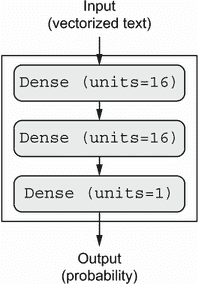
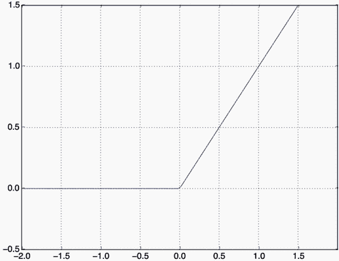
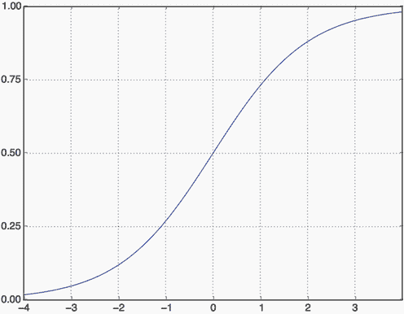
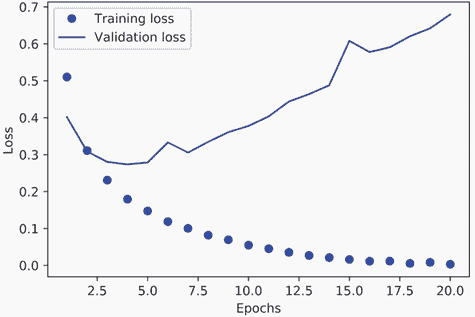
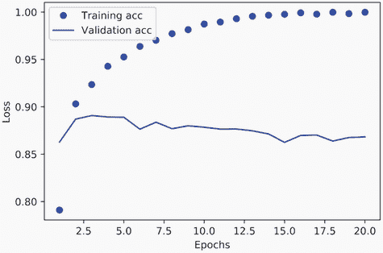
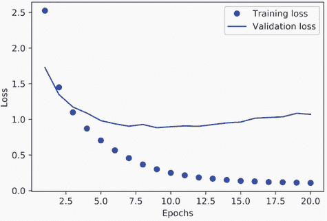
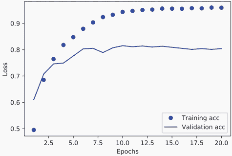
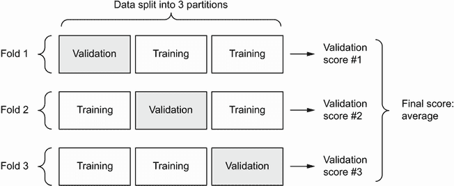
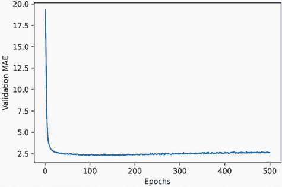
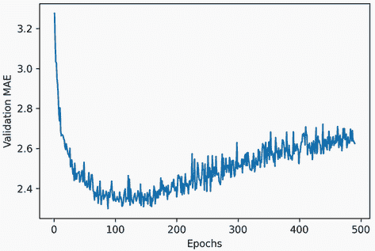

# 四、入门神经网络：分类和回归

本章涵盖

+   您的第一个真实世界机器学习工作流示例

+   处理矢量数据上的分类问题

+   处理矢量数据上的连续回归问题

本章旨在帮助您开始使用神经网络解决实际问题。您将巩固从第二章和第三章中获得的知识，并将所学应用于三个新任务，涵盖神经网络的三种最常见用例 — 二元分类、多类分类和标量回归：

+   将电影评论分类为正面或负面（二元分类）

+   根据主题对新闻线进行分类（多类分类）

+   给定房地产数据估计房屋价格（标量回归）

这些示例将是您与端到端机器学习工作流的第一次接触：您将介绍数据预处理、基本模型架构原则和模型评估。

分类和回归术语表

分类和回归涉及许多专门术语。您在早期示例中已经遇到了一些，您将在未来章节中看到更多。它们具有精确的、机器学习特定的定义，您应该熟悉它们：

+   *Sample* 或 *input* — 进入您的模型的一个数据点。

+   *Prediction* 或 *output* — 您的模型输出的内容。

+   *Target* — 真相。根据外部数据源，您的模型理想情况下应该预测的内容。

+   *Prediction error* 或 *loss value* — 您的模型预测与目标之间距离的度量。

+   *Classes* — 在分类问题中可供选择的可能标签集。例如，当对猫和狗图片进行分类时，“狗”和“猫”是两个类别。

+   *Label* — 分类问题中类别注释的特定实例。例如，如果图片 #1234 被注释为包含“狗”类，则“狗”是图片 #1234 的一个标签。

+   *Ground-truth* 或 *annotations* — 数据集中的所有目标，通常由人类收集。

+   *Binary classification* — 一个分类任务，其中每个输入样本应该被分类到两个互斥的类别中。

+   *Multiclass classification* — 一个分类任务，其中每个输入样本应该被分类到两个以上的类别中：例如，分类手写数字。

+   *Multilabel classification* — 一个分类任务，其中每个输入样本可以被分配多个标签。例如，给定图像可能同时包含猫和狗，并且应该同时用“猫”标签和“狗”标签进行注释。每个图像的标签数量通常是可变的。

+   *Scalar regression* — 目标是一个连续标量值的任务。预测房价是一个很好的例子：不同的目标价格形成一个连续空间。

+   *Vector regression* — 目标是一组连续值的任务：例如，一个连续的矢量。如果您正在针对多个值进行回归（例如图像中边界框的坐标），那么您正在进行矢量回归。

+   *Mini-batch* 或 *batch* — 模型同时处理的一小组样本（通常在 8 到 128 之间）。样本数量通常是 2 的幂，以便在 GPU 上进行内存分配。在训练时，一个小批量用于计算应用于模型权重的单个梯度下降更新。

通过本章结束时，您将能够使用神经网络处理矢量数据上的简单分类和回归任务。然后，您将准备好在第五章开始构建更有原则、理论驱动的机器学习理解。

## 4.1 电影评论分类：一个二元分类示例

二元分类，或二元分类，是最常见的机器学习问题之一。在这个示例中，您将学习根据评论的文本内容将电影评论分类为正面或负面。

### 4.1.1 IMDB 数据集

您将使用 IMDB 数据集：来自互联网电影数据库的 50,000 条高度极化评论。它们被分为 25,000 条用于训练和 25,000 条用于测试的评论，每组评论包含 50% 的负面评论和 50% 的正面评论。

就像 MNIST 数据集一样，IMDB 数据集已经打包到 Keras 中。它已经经过预处理：评论（单词序列）已经转换为整数序列，其中每个整数代表字典中的特定单词。这使我们能够专注于模型构建、训练和评估。在第十一章中，您将学习如何从头开始处理原始文本输入。

以下代码将加载数据集（第一次运行时，将下载约 80 MB 的数据到您的计算机）。

列表 4.1 加载 IMDB 数据集

```py
from tensorflow.keras.datasets import imdb
(train_data, train_labels), (test_data, test_labels) = imdb.load_data(
    num_words=10000)
```

参数`num_words=10000`表示您只会保留训练数据中出现频率最高的前 10,000 个单词。罕见单词将被丢弃。这使我们可以处理可管理大小的向量数据。如果我们不设置这个限制，我们将使用训练数据中的 88,585 个独特单词，这是不必要的庞大数量。其中许多单词只在一个样本中出现，因此无法有意义地用于分类。

变量`train_data`和`test_data`是评论列表；每个评论是一个单词索引列表（编码为单词序列）。`train_labels`和`test_labels`是 0 和 1 的列表，其中 0 代表*负面*，1 代表*正面*：

```py
>>> train_data[0]
[1, 14, 22, 16, ... 178, 32]
>>> train_labels[0]
1
```

因为我们限制自己只使用前 10,000 个最常见的单词，所以没有单词索引会超过 10,000：

```py
>>> max([max(sequence) for sequence in train_data])
9999
```

为了好玩，这里是如何快速将其中一个评论解码回英文单词。

列表 4.2 将评论解码回文本

```py
word_index = imdb.get_word_index()                                # ❶
reverse_word_index = dict(
    [(value, key) for (key, value) in word_index.items()])        # ❷
decoded_review = " ".join(
    [reverse_word_index.get(i - 3, "?") for i in train_data[0]])  # ❸
```

❶ word_index 是一个将单词映射到整数索引的字典。

❷ 将其反转，将整数索引映射到单词

❸ 解码评论。请注意，索引偏移了 3，因为 0、1 和 2 是“填充”、“序列开始”和“未知”保留索引。

### 4.1.2 准备数据

您不能直接将整数列表输入神经网络。它们的长度各不相同，但神经网络期望处理连续的数据批次。您必须将列表转换为张量。有两种方法可以做到这一点：

+   填充列表，使它们的长度相同，将它们转换为形状为`(samples, max_length)`的整数张量，并从能够处理这种整数张量的层开始构建模型（`Embedding`层，我们稍后会详细介绍）。

+   *多热编码*您的列表以将它们转换为 0 和 1 的向量。这意味着，例如，将序列`[8, 5]`转换为一个 10,000 维的向量，除了索引 8 和 5 外，其他都是 0，而索引 8 和 5 是 1。然后，您可以使用一个`Dense`层，能够处理浮点向量数据，作为模型中的第一层。

让我们选择后一种解决方案来对数据进行向量化，这样您可以最大程度地清晰地进行操作。

列表 4.3 通过多热编码对整数序列进行编码

```py
import numpy as np 
def vectorize_sequences(sequences, dimension=10000): 
    results = np.zeros((len(sequences), dimension))   # ❶
    for i, sequence in enumerate(sequences):
        for j in sequence:
            results[i, j] = 1.                        # ❷
    return results
x_train = vectorize_sequences(train_data)             # ❸
x_test = vectorize_sequences(test_data)               # ❹
```

❶ 创建一个形状为(len(sequences), dimension)的全零矩阵

❷ 将结果[i]的特定索引设置为 1

❸ 向量化训练数据

❹ 向量化测试数据

现在样本看起来是这样的：

```py
>>> x_train[0]
array([ 0.,  1.,  1., ...,  0.,  0.,  0.])
```

您还应该对标签进行向量化，这很简单：

```py
y_train = np.asarray(train_labels).astype("float32")
y_test = np.asarray(test_labels).astype("float32")
```

现在数据已准备好输入神经网络。

### 4.1.3 构建您的模型

输入数据是向量，标签是标量（1 和 0）：这是您可能会遇到的最简单的问题设置之一。在这样的问题上表现良好的模型类型是具有`relu`激活的一堆密集连接（`Dense`）层。

对于这样一堆`Dense`层，有两个关键的架构决策：

+   要使用多少层

+   选择每层使用多少个单元

在第五章，你将学习指导你做出这些选择的正式原则。目前，你将不得不相信我做出以下架构选择：

+   两个中间层，每个有 16 个单元

+   第三层将输出关于当前评论情感的标量预测



图 4.1 三层模型

图 4.1 展示了模型的外观。以下代码展示了 Keras 实现，类似于你之前看到的 MNIST 示例。

代码清单 4.4 模型定义

```py
from tensorflow import keras 
from tensorflow.keras import layers

model = keras.Sequential([
    layers.Dense(16, activation="relu"),
    layers.Dense(16, activation="relu"),
    layers.Dense(1, activation="sigmoid")
])
```

传递给每个 `Dense` 层的第一个参数是层中的*单元数*：层的表示空间的维度。你从第二章和第三章记得，每个具有 `relu` 激活的 `Dense` 层实现以下张量操作链：

```py
output = relu(dot(input, W) + b)
```

有 16 个单元意味着权重矩阵 `W` 的形状为 `(input_dimension, 16)`：与 `W` 的点积将把输入数据投影到一个 16 维表示空间（然后你将添加偏置向量 `b` 并应用 `relu` 操作）。你可以直观地理解表示空间的维度为“模型在学习内部表示时允许的自由度有多大”。拥有更多单元（更高维的表示空间）允许你的模型学习更复杂的表示，但会使模型在计算上更昂贵，并可能导致学习不需要的模式（这些模式会提高训练数据的性能，但不会提高测试数据的性能）。

中间层使用 `relu` 作为它们的激活函数，最后一层使用 sigmoid 激活以输出一个概率（介于 0 和 1 之间的分数，指示样本有多大可能具有目标“1”：评论有多大可能是积极的）。`relu`（线性整流单元）是一个用于将负值归零的函数（参见图 4.2），而 sigmoid “压缩”任意值到 `[0, 1]` 区间（参见图 4.3），输出可以解释为概率。



图 4.2 线性整流单元函数

最后，你需要选择一个损失函数和一个优化器。因为你面临的是一个二元分类问题，你的模型的输出是一个概率（你的模型以具有 sigmoid 激活的单单元层结束），最好使用 `binary_crossentropy` 损失。这并不是唯一可行的选择：例如，你可以使用 `mean_squared_error`。但是当你处理输出概率的模型时，交叉熵通常是最佳选择。*交叉熵*是信息论领域的一种量，用于衡量概率分布之间的距离，或者在这种情况下，地面实况分布和你的预测之间的距离。



图 4.3 Sigmoid 函数

激活函数是什么，为什么它们是必要的？

没有像 `relu` 这样的激活函数（也称为*非线性*），`Dense` 层将由两个线性操作组成——点积和加法：

```py
output = dot(input, W) + b
```

该层只能学习输入数据的*线性变换*（仿射变换）：该层的*假设空间*将是将输入数据转换为 16 维空间的所有可能线性变换的集合。这样的假设空间太受限制，不会受益于多层表示，因为深度堆叠的线性层仍然实现线性操作：增加更多层不会扩展假设空间（正如你在第二章中看到的）。

为了获得一个更丰富的假设空间，从而受益于深度表示，你需要一个非线性或激活函数。`relu` 是深度学习中最流行的激活函数，但还有许多其他候选项，它们都有类似奇怪的名称：`prelu`、`elu` 等等。

至于优化器的选择，我们将选择`rmsprop`，这通常是几乎任何问题的一个很好的默认选择。

这是我们使用`rmsprop`优化器和`binary_crossentropy`损失函数配置模型的步骤。请注意，我们还将在训练过程中监视准确性。

列表 4.5 编译模型

```py
model.compile(optimizer="rmsprop",
              loss="binary_crossentropy",
              metrics=["accuracy"])
```

### 4.1.4 验证您的方法

正如您在第三章中学到的，深度学习模型永远不应该在其训练数据上进行评估——在训练过程中使用验证集来监视模型的准确性是标准做法。在这里，我们将通过从原始训练数据中分离出 10,000 个样本来创建一个验证集。

列表 4.6 设置一个验证集

```py
x_val = x_train[:10000]
partial_x_train = x_train[10000:]
y_val = y_train[:10000]
partial_y_train = y_train[10000:]
```

现在我们将在 512 个样本的小批量中对模型进行 20 个时代（对训练数据中的所有样本进行 20 次迭代）的训练。同时，我们将通过将验证数据作为`validation_data`参数传递来监视我们分离出的 10,000 个样本上的损失和准确性。

列表 4.7 训练您的模型

```py
history = model.fit(partial_x_train,
                    partial_y_train,
                    epochs=20,
                    batch_size=512,
                    validation_data=(x_val, y_val))
```

在 CPU 上，每个时代不到 2 秒——训练在 20 秒内结束。在每个时代结束时，模型会在验证数据的 10,000 个样本上计算其损失和准确性，会有一个轻微的暂停。

请注意，对`model.fit()`的调用会返回一个`History`对象，就像您在第三章中看到的那样。这个对象有一个成员`history`，它是一个包含训练过程中发生的一切数据的字典。让我们来看一下：

```py
>>> history_dict = history.history
>>> history_dict.keys()
[u"accuracy", u"loss", u"val_accuracy", u"val_loss"]
```

字典包含四个条目：每个在训练和验证期间监视的指标一个。在接下来的两个列表中，让我们使用 Matplotlib 将训练和验证损失并排绘制出来（参见图 4.4），以及训练和验证准确性（参见图 4.5）。请注意，由于模型的不同随机初始化，您自己的结果可能会略有不同。



图 4.4 训练和验证损失



图 4.5 训练和验证准确性

列表 4.8 绘制训练和验证损失

```py
import matplotlib.pyplot as plt
history_dict = history.history
loss_values = history_dict["loss"]
val_loss_values = history_dict["val_loss"]
epochs = range(1, len(loss_values) + 1)
plt.plot(epochs, loss_values, "bo", label="Training loss")        # ❶
plt.plot(epochs, val_loss_values, "b", label="Validation loss")   # ❷
plt.title("Training and validation loss")
plt.xlabel("Epochs")
plt.ylabel("Loss")
plt.legend()
plt.show()
```

❶ "bo"代表"蓝色点"。

❷ "b"代表"实线蓝色线"。

列表 4.9 绘制训练和验证准确性

```py
plt.clf()                           # ❶
acc = history_dict["accuracy"]
val_acc = history_dict["val_accuracy"]
plt.plot(epochs, acc, "bo", label="Training acc")
plt.plot(epochs, val_acc, "b", label="Validation acc")
plt.title("Training and validation accuracy")
plt.xlabel("Epochs")
plt.ylabel("Accuracy")
plt.legend()
plt.show()
```

❶ 清除图形

正如您所看到的，训练损失随着每个时代的进行而减少，而训练准确性则随着每个时代的进行而增加。这是在运行梯度下降优化时您所期望的情况——您试图最小化的量应该在每次迭代中都减少。但验证损失和准确性并非如此：它们似乎在第四个时代达到峰值。这是我们之前警告过的一个例子：在训练数据上表现更好的模型不一定会在以前从未见过的数据上表现更好。准确来说，您所看到的是*过拟合*：在第四个时代之后，您过度优化了训练数据，最终学习到的表示是特定于训练数据的，无法推广到训练集之外的数据。

在这种情况下，为了防止过拟合，您可以在四个时代后停止训练。一般来说，您可以使用一系列技术来减轻过拟合，我们将在第五章中介绍。

让我们从头开始训练一个新模型四个时代，然后在测试数据上评估它。

列表 4.10 从头开始重新训练模型

```py
model = keras.Sequential([
    layers.Dense(16, activation="relu"),
    layers.Dense(16, activation="relu"),
    layers.Dense(1, activation="sigmoid")
])
model.compile(optimizer="rmsprop",
              loss="binary_crossentropy",
              metrics=["accuracy"])
model.fit(x_train, y_train, epochs=4, batch_size=512)
results = model.evaluate(x_test, y_test)
```

最终结果如下：

```py
>>> results
[0.2929924130630493, 0.88327999999999995]    # ❶
```

❶ 第一个数字 0.29 是测试损失，第二个数字 0.88 是测试准确性。

这种相当天真的方法实现了 88%的准确性。使用最先进的方法，您应该能够接近 95%。

### 4.1.5 使用训练好的模型在新数据上生成预测

在训练完模型后，您会想要在实际环境中使用它。您可以使用`predict`方法生成评论为正面的可能性，就像您在第三章中学到的那样：

```py
>>> model.predict(x_test)
array([[ 0.98006207]
       [ 0.99758697]
       [ 0.99975556]
       ...,
       [ 0.82167041]
       [ 0.02885115]
       [ 0.65371346]], dtype=float32)
```

正如您所看到的，模型对某些样本非常自信（0.99 或更高，或 0.01 或更低），但对其他样本不太自信（0.6、0.4）。

### 4.1.6 进一步的实验

以下实验将帮助您确信您所做的架构选择都是相当合理的，尽管仍有改进的空间：

+   在最终分类层之前，您使用了两个表示层。尝试使用一个或三个表示层，看看这样做如何影响验证和测试准确性。

+   尝试使用更多单元或更少单元的层：32 个单元，64 个单元等等。

+   尝试使用`mse`损失函数而不是`binary_crossentropy`。

+   尝试使用`tanh`激活（这是早期神经网络中流行的激活函数）而不是`relu`。

### 4.1.7 总结

这是您应该从这个示例中了解到的内容：

+   通常，您需要对原始数据进行大量预处理，以便能够将其（作为张量）馈送到神经网络中。单词序列可以编码为二进制向量，但也有其他编码选项。

+   具有`relu`激活的`Dense`层堆叠可以解决各种问题（包括情感分类），您可能经常会使用它们。

+   在二元分类问题（两个输出类别）中，您的模型应该以一个具有一个单元和`sigmoid`激活的`Dense`层结束：您的模型的输出应该是一个介于 0 和 1 之间的标量，编码为概率。

+   在二元分类问题上，具有标量 S 形输出的损失函数应该使用`binary_crossentropy`。

+   `rmsprop`优化器通常是一个足够好的选择，无论您的问题是什么。这是您无需担心的一件事。

+   随着神经网络在训练数据上变得更好，最终会开始过拟合，并且在从未见过的数据上获得越来越糟糕的结果。一定要始终监视在训练集之外的数据上的性能。

## 4.2 新闻线分类：一个多类别分类示例

在前一节中，您看到了如何使用密集连接的神经网络将向量输入分类为两个互斥类别。但是当您有两个以上的类别时会发生什么？

在本节中，我们将构建一个模型，将路透社新闻线分类为 46 个互斥主题。因为我们有很多类别，所以这个问题是*多类别分类*的一个实例，因为每个数据点应该被分类为一个类别，所以这个问题更具体地是*单标签多类别分类*的一个实例。如果每个数据点可以属于多个类别（在这种情况下是主题），我们将面临一个*多标签多类别分类*问题。

### 4.2.1 路透社数据集

您将使用*路透社数据集*，这是路透社在 1986 年发布的一组简短新闻线及其主题。这是一个简单、广泛使用的文本分类玩具数据集。有 46 个不同的主题；一些主题比其他主题更有代表性，但每个主题在训练集中至少有 10 个示例。

与 IMDB 和 MNIST 一样，路透社数据集作为 Keras 的一部分打包提供。让我们来看看。

列表 4.11 加载路透社数据集

```py
from tensorflow.keras.datasets import reuters
(train_data, train_labels), (test_data, test_labels) = reuters.load_data(
    num_words=10000)
```

与 IMDB 数据集一样，参数`num_words=10000`将数据限制为数据中出现频率最高的 10,000 个单词。

您有 8,982 个训练示例和 2,246 个测试示例：

```py
>>> len(train_data)
8982
>>> len(test_data)
2246
```

与 IMDB 评论一样，每个示例都是一个整数列表（单词索引）：

```py
>>> train_data[10]
[1, 245, 273, 207, 156, 53, 74, 160, 26, 14, 46, 296, 26, 39, 74, 2979,
3554, 14, 46, 4689, 4329, 86, 61, 3499, 4795, 14, 61, 451, 4329, 17, 12]
```

如果您感兴趣，这是如何将其解码回单词的方法。

列表 4.12 将新闻线解码回文本

```py
word_index = reuters.get_word_index()
reverse_word_index = dict(
    [(value, key) for (key, value) in word_index.items()])
decoded_newswire = " ".join(
    [reverse_word_index.get(i - 3, "?") for i in     train_data[0]])   # ❶
```

❶ 请注意，索引偏移了 3，因为 0、1 和 2 是“填充”、“序列开始”和“未知”保留索引。

与示例相关联的标签是介于 0 和 45 之间的整数—一个主题索引：

```py
>>> train_labels[10]
3
```

### 4.2.2 准备数据

您可以使用与前一个示例中完全相同的代码对数据进行向量化。

列表 4.13 对输入数据进行编码

```py
x_train = vectorize_sequences(train_data)      # ❶
x_test = vectorize_sequences(test_data)        # ❷
```

❶ 向量化训练数据

❷ 向量化测试数据

要将标签向量化，有两种可能性：你可以将标签列表转换为整数张量，或者你可以使用*独热编码*。独热编码是一种广泛使用的分类数据格式，也称为*分类编码*。在这种情况下，标签的独热编码包括将每个标签嵌入为一个全零向量，其中标签索引的位置为 1。下面的列表显示了一个示例。

列表 4.14 编码标签

```py
def to_one_hot(labels, dimension=46):
    results = np.zeros((len(labels), dimension))
    for i, label in enumerate(labels):
        results[i, label] = 1. 
    return results
y_train = to_one_hot(train_labels)     # ❶
y_test = to_one_hot(test_labels)       # ❷
```

❶ 向量化训练标签

❷ 向量化测试标签

请注意，Keras 中有一种内置的方法可以做到这一点：

```py
from tensorflow.keras.utils import to_categorical
y_train = to_categorical(train_labels)
y_test = to_categorical(test_labels)
```

### 4.2.3 构建你的模型

这个主题分类问题看起来与之前的电影评论分类问题相似：在这两种情况下，我们都试图对短文本进行分类。但是这里有一个新的约束：输出类别的数量从 2 个增加到了 46 个。输出空间的维度大得多。

在像我们一直使用的`Dense`层堆叠中，每一层只能访问前一层输出中存在的信息。如果一层丢失了与分类问题相关的一些信息，这些信息将永远无法被后续层恢复：每一层都可能成为信息瓶颈。在前面的例子中，我们使用了 16 维的中间层，但 16 维的空间可能太有限，无法学习区分 46 个不同的类别：这样的小层可能充当信息瓶颈，永久丢失相关信息。

出于这个原因，我们将使用更大的层。让我们选择 64 个单元。

列表 4.15 模型定义

```py
model = keras.Sequential([
    layers.Dense(64, activation="relu"),
    layers.Dense(64, activation="relu"),
    layers.Dense(46, activation="softmax")
])
```

还有两件事情你应该注意关于这个架构。

首先，我们用一个大小为 46 的`Dense`层结束模型。这意味着对于每个输入样本，网络将输出一个 46 维的向量。这个向量中的每个条目（每个维度）将编码一个不同的输出类别。

其次，最后一层使用了`softmax`激活函数。你在 MNIST 示例中看到了这种模式。这意味着模型将输出 46 个不同输出类别的*概率分布*，对于每个输入样本，模型将产生一个 46 维的输出向量，其中`output[i]`是样本属于类别`i`的概率。这 46 个分数将总和为 1。

在这种情况下使用的最佳损失函数是`categorical_crossentropy`。它衡量两个概率分布之间的距离：在这里，模型输出的概率分布与标签的真实分布之间的距离。通过最小化这两个分布之间的距离，你训练模型输出尽可能接近真实标签。

列表 4.16 编译模型

```py
model.compile(optimizer="rmsprop",
              loss="categorical_crossentropy",
              metrics=["accuracy"])
```

### 4.2.4 验证你的方法

让我们在训练数据中留出 1,000 个样本作为验证集使用。

列表 4.17 设置一个验证集

```py
x_val = x_train[:1000]
partial_x_train = x_train[1000:]
y_val = y_train[:1000]
partial_y_train = y_train[1000:]
```

现在，让我们训练模型 20 个周期。

列表 4.18 训练模型

```py
history = model.fit(partial_x_train,
                    partial_y_train,
                    epochs=20,
                    batch_size=512,
                    validation_data=(x_val, y_val))
```

最后，让我们展示其损失和准确率曲线（见图 4.6 和 4.7）。



图 4.6 训练和验证损失



图 4.7 训练和验证准确率

列表 4.19 绘制训练和验证损失

```py
loss = history.history["loss"]
val_loss = history.history["val_loss"]
epochs = range(1, len(loss) + 1)
plt.plot(epochs, loss, "bo", label="Training loss")
plt.plot(epochs, val_loss, "b", label="Validation loss")
plt.title("Training and validation loss")
plt.xlabel("Epochs")
plt.ylabel("Loss")
plt.legend()
plt.show()

```

列表 4.20 绘制训练和验证准确率

```py
plt.clf()                          # ❶
acc = history.history["accuracy"]
val_acc = history.history["val_accuracy"]
plt.plot(epochs, acc, "bo", label="Training accuracy")
plt.plot(epochs, val_acc, "b", label="Validation accuracy")
plt.title("Training and validation accuracy")
plt.xlabel("Epochs")
plt.ylabel("Accuracy")
plt.legend()
plt.show()
```

❶ 清除图表

模型在九个周期后开始过拟合。让我们从头开始训练一个新模型，训练九个周期，然后在测试集上评估它。

列表 4.21 从头开始重新训练模型

```py
model = keras.Sequential([
    layers.Dense(64, activation="relu"),
    layers.Dense(64, activation="relu"),
    layers.Dense(46, activation="softmax")
])
model.compile(optimizer="rmsprop",
              loss="categorical_crossentropy",
              metrics=["accuracy"])
model.fit(x_train,
          y_train,
          epochs=9,
          batch_size=512)
results = model.evaluate(x_test, y_test)
```

这里是最终结果：

```py
>>> results
[0.9565213431445807, 0.79697239536954589]
```

这种方法达到了约 80%的准确率。对于一个平衡的二元分类问题，一个纯随机分类器达到的准确率将是 50%。但在这种情况下，我们有 46 个类别，它们可能不会被平等地表示。一个随机基线的准确率会是多少呢？我们可以尝试快速实现一个来进行经验性检查：

```py
>>> import copy
>>> test_labels_copy = copy.copy(test_labels)
>>> np.random.shuffle(test_labels_copy)
>>> hits_array = np.array(test_labels) == np.array(test_labels_copy)
>>> hits_array.mean()
0.18655387355298308
```

正如你所看到的，一个随机分类器的分类准确率约为 19%，所以从这个角度看，我们模型的结果似乎相当不错。

### 4.2.5 在新数据上生成预测

在新样本上调用模型的`predict`方法会返回每个样本的 46 个主题的类概率分布。让我们为所有测试数据生成主题预测：

```py
predictions = model.predict(x_test)
```

“predictions”中的每个条目都是长度为 46 的向量：

```py
>>> predictions[0].shape
(46,)
```

这个向量中的系数总和为 1，因为它们形成一个概率分布：

```py
>>> np.sum(predictions[0])
1.0
```

最大的条目是预测的类别——具有最高概率的类别：

```py
>>> np.argmax(predictions[0])
4
```

### 4.2.6 处理标签和损失的另一种方式

我们之前提到另一种编码标签的方式是将它们转换为整数张量，就像这样：

```py
y_train = np.array(train_labels)
y_test = np.array(test_labels)
```

这种方法唯一改变的是损失函数的选择。列表 4.21 中使用的损失函数`categorical_crossentropy`期望标签遵循分类编码。对于整数标签，你应该使用`sparse_categorical_crossentropy`：

```py
model.compile(optimizer="rmsprop",
              loss="sparse_categorical_crossentropy",
              metrics=["accuracy"])
```

这个新的损失函数在数学上仍然与`categorical_crossentropy`相同；它只是有一个不同的接口。

### 4.2.7 拥有足够大的中间层的重要性

我们之前提到，由于最终的输出是 46 维的，你应该避免中间层的单元远远少于 46。现在让我们看看当我们引入信息瓶颈时会发生什么，即通过具有明显低于 46 维的中间层，例如 4 维：

列表 4.22 具有信息瓶颈的模型

```py
model = keras.Sequential([
    layers.Dense(64, activation="relu"),
    layers.Dense(4, activation="relu"),
    layers.Dense(46, activation="softmax")
])
model.compile(optimizer="rmsprop",
              loss="categorical_crossentropy",
              metrics=["accuracy"])
model.fit(partial_x_train,
          partial_y_train,
          epochs=20,
          batch_size=128,
          validation_data=(x_val, y_val))
```

现在模型的验证准确率达到了约 71%，绝对下降了 8%。这种下降主要是因为我们试图将大量信息（足以恢复 46 个类别的分离超平面的信息）压缩到一个过低维度的中间空间中。模型能够将*大部分*必要信息压缩到这些四维表示中，但并非全部。

### 4.2.8 进一步实验

就像前面的例子一样，我鼓励你尝试以下实验，以培养你对这类模型需要做出的配置决策的直觉：

+   尝试使用更大或更小的层：32 个单元，128 个单元等。

+   在最终的 softmax 分类层之前使用了两个中间层。现在尝试使用一个单独的中间层，或者三个中间层。

### 4.2.9 总结

这个例子给我们的启示是：

+   如果你试图在*N*个类别中对数据点进行分类，你的模型应该以大小为*N*的`Dense`层结束。

+   在单标签多类分类问题中，你的模型应该以`softmax`激活结束，这样它将输出关于*N*个输出类别的概率分布。

+   对于这类问题，几乎总是应该使用分类交叉熵作为损失函数。它最小化了模型输出的概率分布与目标的真实分布之间的距离。

+   在多类分类中有两种处理标签的方式：

    +   通过分类编码（也称为独热编码）对标签进行编码，并使用`categorical_crossentropy`作为损失函数

    +   将标签编码为整数并使用`sparse_categorical_crossentropy`损失函数

+   如果你需要将数据分类到大量类别中，你应该避免由于中间层太小而在模型中创建信息瓶颈。

## 4.3 预测房价：回归示例

之前的两个例子被视为分类问题，目标是预测输入数据点的单个离散标签。另一种常见的机器学习问题是*回归*，它包括预测连续值而不是离散标签：例如，根据气象数据预测明天的温度，或者根据规格说明预测软件项目完成所需的时间。

注意不要混淆*回归*和*逻辑回归*算法。令人困惑的是，逻辑回归并不是一个回归算法，而是一个分类算法。

### 4.3.1 波士顿房价数据集

在本节中，我们将尝试预测上世纪 70 年代中期波士顿郊区房屋的中位价格，根据当时有关该郊区的数据点，例如犯罪率、当地财产税率等。我们将使用的数据集与前两个示例有一个有趣的区别。它的数据点相对较少：仅有 506 个，分为 404 个训练样本和 102 个测试样本。输入数据中的每个*特征*（例如犯罪率）具有不同的比例。例如，一些值是比例，取值介于 0 和 1 之间，其他值介于 1 和 12 之间，其他值介于 0 和 100 之间，依此类推。

列表 4.23 加载波士顿房屋数据集

```py
from tensorflow.keras.datasets import boston_housing
(train_data, train_targets), (test_data, test_targets) = (
    boston_housing.load_data())
```

让我们看一下数据：

```py
>>> train_data.shape
(404, 13)
>>> test_data.shape
(102, 13)
```

正如你所看到的，我们有 404 个训练样本和 102 个测试样本，每个样本有 13 个数值特征，例如人均犯罪率、每个住宅的平均房间数、高速公路的可达性等。

目标值是占有住房的中位数值，以千美元为单位：

```py
>>> train_targets
[ 15.2,  42.3,  50\. ...  19.4,  19.4,  29.1]
```

价格通常在$10,000 和$50,000 之间。如果听起来很便宜，请记住这是上世纪 70 年代中期，这些价格没有考虑通货膨胀。

### 4.3.2 准备数据

将取值范围差异很大的值输入神经网络可能会有问题。模型可能能够自动适应这种异质数据，但这肯定会使学习变得更加困难。处理这种数据的一种广泛最佳实践是进行特征归一化：对于输入数据中的每个特征（输入数据矩阵中的一列），我们减去该特征的均值并除以标准差，使得该特征以 0 为中心，具有单位标准差。这在 NumPy 中很容易实现。

列表 4.24 归一化数据

```py
mean = train_data.mean(axis=0)
train_data -= mean
std = train_data.std(axis=0)
train_data /= std
test_data -= mean
test_data /= std
```

请注意，用于归一化测试数据的量是使用训练数据计算的。你绝对不应该在工作流程中使用在测试数据上计算的任何量，即使是像数据归一化这样简单的操作也不行。

### 4.3.3 构建你的模型

由于可用样本很少，我们将使用一个非常小的模型，其中包含两个中间层，每个层有 64 个单元。一般来说，训练数据越少，过拟合就会越严重，使用一个小模型是缓解过拟合的一种方法。

列表 4.25 模型定义

```py
def build_model():
    model = keras.Sequential([              # ❶
        layers.Dense(64, activation="relu"),
        layers.Dense(64, activation="relu"),
        layers.Dense(1)
    ])
    model.compile(optimizer="rmsprop", loss="mse", metrics=["mae"])
    return model
```

❶ 因为我们需要多次实例化相同的模型，所以我们使用一个函数来构建它。

模型以一个单元结束，没有激活函数（它将是一个线性层）。这是标量回归的典型设置（一种回归，你试图预测一个单一连续值）。应用激活函数会限制输出的范围；例如，如果在最后一层应用`sigmoid`激活函数，模型只能学习预测 0 到 1 之间的值。在这里，因为最后一层是纯线性的，模型可以自由地学习预测任何范围内的值。

请注意，我们使用`mse`损失函数来编译模型—*均方误差*，即预测值与目标值之间的差的平方。这是回归问题中广泛使用的损失函数。

在训练过程中，我们还监控一个新的指标：*平均绝对误差*（MAE）。它是预测值与目标值之间的差的绝对值。例如，在这个问题上的 MAE 为 0.5 意味着你的预测平均偏差为$500。

### 4.3.4 使用 K 折验证验证你的方法

在我们继续调整模型参数（例如用于训练的时代数）的同时评估我们的模型，我们可以将数据分割为训练集和验证集，就像我们在之前的示例中所做的那样。但是由于数据点很少，验证集最终会变得非常小（例如，约 100 个示例）。因此，验证分数可能会根据我们选择用于验证和训练的数据点而变化很大：验证分数可能在验证拆分方面具有很高的*方差*。这将阻止我们可靠地评估我们的模型。

在这种情况下，最佳做法是使用*K 折*交叉验证（参见图 4.8）。



图 4.8 K=3 的 K 折交叉验证

它包括将可用数据分割为*K*个分区（通常*K*=4 或 5），实例化*K*个相同的模型，并在*K*-1 个分区上训练每个模型，同时在剩余分区上进行评估。然后使用的模型的验证分数是获得的*K*个验证分数的平均值。在代码方面，这很简单。

列表 4.26 K 折交叉验证

```py
k = 4 
num_val_samples = len(train_data) // k
num_epochs = 100 
all_scores = [] 
for i in range(k):
    print(f"Processing fold #{i}")
    val_data = train_data[i * num_val_samples: (i + 1) * num_val_samples]   # ❶
    val_targets = train_targets[i * num_val_samples: (i + 1) * num_val_samples]
    partial_train_data = np.concatenate(                                    # ❷
        [train_data[:i * num_val_samples],
         train_data[(i + 1) * num_val_samples:]],
        axis=0)
    partial_train_targets = np.concatenate(
        [train_targets[:i * num_val_samples],
         train_targets[(i + 1) * num_val_samples:]],
        axis=0)
    model = build_model()                                                   # ❸
    model.fit(partial_train_data, partial_train_targets,                    # ❹
              epochs=num_epochs, batch_size=16, verbose=0)
    val_mse, val_mae = model.evaluate(val_data, val_targets, verbose=0)     # ❺
    all_scores.append(val_mae)
```

❶ 准备验证数据：来自分区#k 的数据

❷ 准备训练数据：来自所有其他分区的数据

❸ 构建 Keras 模型（已编译）

❹ 训练模型（静默模式，verbose = 0）

❺ 在验证数据上评估模型

使用`num_epochs` `=` `100`运行此操作将产生以下结果：

```py
>>> all_scores
[2.112449, 3.0801501, 2.6483836, 2.4275346]
>>> np.mean(all_scores)
2.5671294
```

不同的运行确实显示了相当不同的验证分数，从 2.1 到 3.1。平均值（2.6）比任何单个分数更可靠—这就是 K 折交叉验证的全部意义。在这种情况下，我们平均偏差为$2,600，考虑到价格范围为$10,000 到$50,000，这是一个显著的差距。

让我们尝试将模型训练更长一点：500 个时代。为了记录模型在每个时代的表现如何，我们将修改训练循环以保存每个折叠的每个时代验证分数日志。

列表 4.27 保存每个折叠的验证日志

```py
num_epochs = 500 
all_mae_histories = [] 
for i in range(k):
    print(f"Processing fold #{i}")
    val_data = train_data[i * num_val_samples: (i + 1) * num_val_samples]   # ❶
    val_targets = train_targets[i * num_val_samples: (i + 1) * num_val_samples]
    partial_train_data = np.concatenate(                                    # ❷
        [train_data[:i * num_val_samples],
         train_data[(i + 1) * num_val_samples:]],
        axis=0)
    partial_train_targets = np.concatenate(
        [train_targets[:i * num_val_samples],
         train_targets[(i + 1) * num_val_samples:]],
        axis=0)
    model = build_model()                                                   # ❸
    history = model.fit(partial_train_data, partial_train_targets,          # ❹
                        validation_data=(val_data, val_targets),
                        epochs=num_epochs, batch_size=16, verbose=0)
    mae_history = history.history["val_mae"]
    all_mae_histories.append(mae_history)
```

❶ 准备验证数据：来自分区#k 的数据

❷ 准备训练数据：来自所有其他分区的数据

❸ 构建 Keras 模型（已编译）

❹ 训练模型（静默模式，verbose=0）

然后我们可以计算所有折叠的每个时代 MAE 分数的平均值。

列表 4.28 构建连续平均 K 折验证分数的历史

```py
average_mae_history = [
    np.mean([x[i] for x in all_mae_histories]) for i in range(num_epochs)]
```

让我们绘制这个；参见图 4.9。



图 4.9 按时代划分的验证 MAE

列表 4.29 绘制验证分数

```py
plt.plot(range(1, len(average_mae_history) + 1), average_mae_history)
plt.xlabel("Epochs")
plt.ylabel("Validation MAE")
plt.show()
```

由于缩放问题，可能有点难以阅读图表：前几个时代的验证 MAE 远高于后续数值。让我们省略前 10 个数据点，这些数据点与曲线的其余部分处于不同的比例尺。

列表 4.30 绘制验证分数，不包括前 10 个数据点

```py
truncated_mae_history = average_mae_history[10:]
plt.plot(range(1, len(truncated_mae_history) + 1), truncated_mae_history)
plt.xlabel("Epochs")
plt.ylabel("Validation MAE")
plt.show()
```

正如您在图 4.10 中所看到的，验证 MAE 在 120-140 个时代后停止显着改善（这个数字包括我们省略的 10 个时代）。在那之后，我们开始过拟合。



图 4.10 按时代划分的验证 MAE，不包括前 10 个数据点

一旦您完成调整模型的其他参数（除了时代数，您还可以调整中间层的大小），您可以使用最佳参数在所有训练数据上训练最终的生产模型，然后查看其在测试数据上的表现。

列表 4.31 训练最终模型

```py
model = build_model()                                # ❶
model.fit(train_data, train_targets,                 # ❷
          epochs=130, batch_size=16, verbose=0)
test_mse_score, test_mae_score = model.evaluate(test_data, test_targets)
```

❶ 获取一个新的、已编译的模型

❷ 在所有数据上对其进行训练

这是最终结果：

```py
>>> test_mae_score
2.4642276763916016
```

我们仍然有一点不到$2,500 的差距。这是一个进步！就像前两个任务一样，您可以尝试改变模型中的层数或每层的单元数，看看是否可以减少测试误差。

### 4.3.5 在新数据上生成预测

在我们的二元分类模型上调用`predict()`时，我们为每个输入样本检索到介于 0 和 1 之间的标量分数。对于我们的多类分类模型，我们为每个样本检索到所有类别的概率分布。现在，对于这个标量回归模型，`predict()`返回模型对样本价格的猜测，单位为千美元：

```py
>>> predictions = model.predict(test_data)
>>> predictions[0]
array([9.990133], dtype=float32)
```

测试集中的第一栋房子预测价格约为$10,000。

### 4.3.6 总结

从这个标量回归示例中，您应该得出以下结论：

+   回归使用不同的损失函数进行，与我们用于分类的不同。均方误差（MSE）是回归常用的损失函数。

+   同样，用于回归的评估指标与用于分类的评估指标不同；自然地，准确性的概念不适用于回归。常见的回归指标是平均绝对误差（MAE）。

+   当输入数据中的特征具有不同范围的值时，每个特征应作为预处理步骤独立缩放。

+   当数据量很少时，使用 K 折验证是可靠评估模型的好方法。

+   当可用的训练数据很少时，最好使用只有少数中间层（通常只有一个或两个）的小型模型，以避免严重过拟合。

## 摘要

+   在向量数据上，机器学习任务的三种最常见类型是二元分类、多类分类和标量回归。

    +   本章前面的“总结”部分总结了您对每个任务学到的重要知识点。

    +   回归使用不同的损失函数和不同的评估指标，与分类不同。

+   在将原始数据输入神经网络之前，通常需要对其进行预处理。

+   当您的数据具有不同范围的特征时，作为预处理的一部分，应独立缩放每个特征。

+   随着训练的进行，神经网络最终开始过拟合，并在以前未见过的数据上获得更糟糕的结果。

+   如果您没有太多的训练数据，可以使用只有一个或两个中间层的小型模型，以避免严重过拟合。

+   如果您的数据被分成许多类别，如果将中间层设置得太小，可能会导致信息瓶颈。

+   当您处理少量数据时，K 折验证可以帮助可靠评估您的模型。
