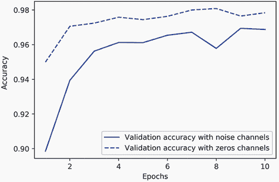

# 五、机器学习的基础知识

本章涵盖

+   理解泛化和优化之间的紧张关系，这是机器学习中的基本问题

+   机器学习模型的评估方法

+   改进模型拟合的最佳实践

+   实现更好泛化的最佳实践

在第四章中的三个实际例子之后，你应该开始熟悉如何使用神经网络解决分类和回归问题，并且见证了机器学习的核心问题：过拟合。本章将把你对机器学习的一些新直觉形式化为一个坚实的概念框架，强调准确模型评估的重要性以及训练和泛化之间的平衡。

## 5.1 泛化：机器学习的目标

在第四章中提出的三个例子——预测电影评论、主题分类和房价回归——我们将数据分为训练集、验证集和测试集。很快就明显看到了不在训练数据上评估模型的原因：在几个周期后，从未见过的数据的性能开始与训练数据的性能分歧，而训练数据的性能始终随着训练的进行而改善。模型开始*过拟合*。过拟合在每个机器学习问题中都会发生。

机器学习中的基本问题是优化和泛化之间的紧张联系。*优化*指的是调整模型以在训练数据上获得最佳性能的过程（*机器学习*中的*学习*），而*泛化*指的是训练好的模型在从未见过的数据上的表现。当然，游戏的目标是获得良好的泛化，但你无法控制泛化；你只能将模型拟合到其训练数据。如果你做得*太好*，过拟合就会发生，泛化就会受到影响。

但是是什么导致了过拟合？我们如何实现良好的泛化？

### 5.1.1 欠拟合和过拟合

对于你在上一章中看到的模型，在保留验证数据上的性能随着训练的进行而改善，然后在一段时间后必然达到顶峰。这种模式（如图 5.1 所示）是普遍存在的。你会在任何模型类型和任何数据集中看到这种情况。


图 5.1 典型的过拟合行为

在训练开始时，优化和泛化是相关的：在训练数据上的损失越低，测试数据上的损失也越低。当这种情况发生时，你的模型被称为*欠拟合*：仍然有进步的空间；网络尚未对训练数据中的所有相关模式进行建模。但在对训练数据进行一定数量的迭代后，泛化停止改善，验证指标停滞然后开始恶化：模型开始过拟合。也就是说，它开始学习训练数据特定的模式，但这些模式在新数据方面是误导性的或无关的。

过拟合在数据存在噪声、不确定性或包含稀有特征时特别容易发生。让我们看看具体的例子。

嘈杂的训练数据

在现实世界的数据集中，一些输入无效是相当常见的。例如，一个 MNIST 数字可能是一张全黑的图片，或者像图 5.2 那样的东西。


图 5.2 一些相当奇怪的 MNIST 训练样本

这些是什么？我也不知道。但它们都是 MNIST 训练集的一部分。然而，更糟糕的是，有些完全有效的输入最终被错误标记，就像图 5.3 中的那些一样。


图 5.3 错标的 MNIST 训练样本

如果一个模型竭尽全力地纳入这些异常值，其泛化性能将会下降，就像图 5.4 中所示的那样。例如，一个看起来非常接近图 5.3 中错误标记的 4 的 4 可能最终被分类为 9。


图 5.4 处理异常值：鲁棒拟合 vs. 过拟合

模糊特征

并非所有数据噪声都来自不准确性，即使是完全干净和整洁标记的数据，在涉及不确定性和模糊性的问题时也可能存在噪声。在分类任务中，通常情况下，输入特征空间的某些区域同时与多个类相关联。假设你正在开发一个模型，该模型接收香蕉的图像并预测香蕉是未熟、成熟还是腐烂。这些类别没有客观的界限，因此同一张图片可能会被不同的人类标记者分类为未熟或成熟。同样，许多问题涉及随机性。你可以使用大气压力数据来预测明天是否会下雨，但完全相同的测量有时可能会导致下雨，有时可能会导致晴天，具有一定的概率。

一个模型可能会对这种概率性数据过拟合，对特征空间中模糊区域过于自信，就像图 5.5 中那样。更鲁棒的拟合会忽略个别数据点，看到更大的图景。


图 5.5 鲁棒拟合 vs. 过拟合给出特征空间中的模糊区域

稀有特征和虚假相关性

如果你一生中只见过两只橘色虎斑猫，而且它们都恰好非常不合群，你可能会推断橘色虎斑猫通常可能是不合群的。这就是过拟合：如果你接触到更多种类的猫，包括更多橘色的猫，你会发现猫的颜色与性格并没有很好的相关性。

同样，训练在包含稀有特征值的数据集上的机器学习模型极易过拟合。在情感分类任务中，如果训练数据中的单词“cherimoya”（一种原产于安第斯山脉的水果）只出现在一篇文本中，并且这篇文本恰好是负面情感的，一个调节不好的模型可能会对这个词赋予很高的权重，并且总是将提到 cherimoyas 的新文本分类为负面，然而，客观上，cherimoya 并没有什么负面的东西。

重要的是，一个特征值不需要只出现几次就会导致虚假相关性。考虑一个在你的训练数据中出现 100 次的单词，它与积极情感相关的概率为 54%，与消极情感相关的概率为 46%。这种差异很可能是一个完全的统计偶然，然而你的模型很可能会学会利用这个特征来进行分类任务。这是过拟合的最常见来源之一。

这里有一个引人注目的例子。以 MNIST 为例。通过将 784 个白噪声维度连接到现有数据的 784 个维度上，创建一个新的训练集，因此一半的数据现在是噪声。为了比较，还创建一个通过连接 784 个全零维度而得到的等效数据集。我们连接的无意义特征完全不影响数据的信息内容：我们只是在添加一些东西。人类分类准确度不会受到这些转换的影响。

列表 5.1 向 MNIST 添加白噪声通道或全零通道

```py
from tensorflow.keras.datasets import mnist 
import numpy as np

(train_images, train_labels), _ = mnist.load_data()
train_images = train_images.reshape((60000, 28 * 28))
train_images = train_images.astype("float32") / 255 

train_images_with_noise_channels = np.concatenate(
    [train_images, np.random.random((len(train_images), 784))], axis=1)

train_images_with_zeros_channels = np.concatenate(
    [train_images, np.zeros((len(train_images), 784))], axis=1)
```

现在，让我们在这两个训练集上训练第二章中的模型。

列表 5.2 在带有噪声通道或全零通道的 MNIST 数据上训练相同的模型

```py
from tensorflow import keras 
from tensorflow.keras import layers

def get_model():
    model = keras.Sequential([
        layers.Dense(512, activation="relu"),
        layers.Dense(10, activation="softmax")
    ])
    model.compile(optimizer="rmsprop",
                  loss="sparse_categorical_crossentropy",
                  metrics=["accuracy"])
    return model

model = get_model()
history_noise = model.fit(
    train_images_with_noise_channels, train_labels,
    epochs=10,
    batch_size=128,
    validation_split=0.2)

model = get_model()
history_zeros = model.fit(
    train_images_with_zeros_channels, train_labels,
    epochs=10,
    batch_size=128,
    validation_split=0.2)
```

让我们比较每个模型的验证准确性随时间的演变。

列表 5.3 绘制验证准确性比较

```py
import matplotlib.pyplot as plt
val_acc_noise = history_noise.history["val_accuracy"]
val_acc_zeros = history_zeros.history["val_accuracy"]
epochs = range(1, 11)
plt.plot(epochs, val_acc_noise, "b-",
         label="Validation accuracy with noise channels")
plt.plot(epochs, val_acc_zeros, "b--",
         label="Validation accuracy with zeros channels")
plt.title("Effect of noise channels on validation accuracy")
plt.xlabel("Epochs")
plt.ylabel("Accuracy")
plt.legend()
```

尽管数据在两种情况下都包含相同的信息，但通过虚假相关性的影响，使用噪声通道训练的模型的验证准确性最终会降低约一个百分点（参见图 5.6）——纯粹是通过虚假相关性的影响。你添加的噪声通道越多，准确性就会进一步下降。



图 5.6 噪声通道对验证准确性的影响

嘈杂的特征不可避免地导致过拟合。因此，在你不确定所拥有的特征是信息性的还是干扰性的情况下，通常在训练之前进行*特征选择*是很常见的。例如，将 IMDB 数据限制为最常见的前 10000 个单词就是一种粗糙的特征选择。进行特征选择的典型方法是为每个可用特征计算一些有用性评分——衡量特征相对于任务的信息性的度量，比如特征与标签之间的互信息——并且只保留高于某个阈值的特征。这样做将过滤掉前面示例中的白噪声通道。

### 5.1.2 深度学习中泛化性质的本质

深度学习模型的一个显著特点是，只要具有足够的表征能力，它们就可以被训练来拟合任何东西。

不相信？试着洗牌 MNIST 标签并在此基础上训练一个模型。尽管输入和洗牌标签之间没有任何关系，训练损失仍然可以很好地下降，即使是使用相对较小的模型。当然，由于在这种情况下没有泛化的可能性，验证损失不会随时间改善。

列表 5.4 使用随机洗牌标签拟合 MNIST 模型

```py
(train_images, train_labels), _ = mnist.load_data()
train_images = train_images.reshape((60000, 28 * 28))
train_images = train_images.astype("float32") / 255 

random_train_labels = train_labels[:]
np.random.shuffle(random_train_labels)

model = keras.Sequential([
    layers.Dense(512, activation="relu"),
    layers.Dense(10, activation="softmax")
])
model.compile(optimizer="rmsprop",
              loss="sparse_categorical_crossentropy",
              metrics=["accuracy"])
model.fit(train_images, random_train_labels,
          epochs=100,
          batch_size=128,
          validation_split=0.2)
```

实际上，你甚至不需要用 MNIST 数据来做这个实验——你可以只生成白噪声输入和随机标签。只要模型有足够的参数，你也可以在这上面拟合一个模型。它最终只会记住特定的输入，就像一个 Python 字典一样。

如果是这样的话，那么深度学习模型到底是如何泛化的呢？它们难道不应该只是学习训练输入和目标之间的临时映射，就像一个高级`dict`一样吗？我们有什么期望这种映射会适用于新的输入呢？

事实证明，深度学习中的泛化性质与深度学习模型本身关系不大，而与现实世界中信息的结构有很大关系。让我们看看这里到底发生了什么。

流形假设

MNIST 分类器的输入（预处理之前）是一个 28×28 的整数数组，取值范围在 0 到 255 之间。因此，可能的输入值总数是 256 的 784 次方——远远大于宇宙中的原子数量。然而，这些输入中很少有看起来像有效 MNIST 样本的：实际手写数字只占据了所有可能的 28×28 `uint8`数组父空间中的一个微小*子空间*。而且，这个子空间不仅仅是在父空间中随机分布的一组点：它具有高度结构化。

首先，有效手写数字的子空间是*连续*的：如果你拿一个样本并稍微修改它，它仍然可以被识别为相同的手写数字。此外，所有有效子空间中的样本都通过平滑路径*连接*在一起。这意味着如果你拿两个随机的 MNIST 数字 A 和 B，存在一个“中间”图像序列，将 A 变形为 B，使得两个连续数字非常接近彼此（见图 5.7）。也许在两个类之间边界附近会有一些模糊的形状，但即使这些形状看起来仍然非常像数字。


图 5.7 不同的 MNIST 数字逐渐变形成彼此，显示手写数字空间形成了一个“流形”。此图像是使用第十二章的代码生成的。

从技术角度来说，你会说手写数字形成了一个*流形*，位于可能的 28×28 `uint8`数组空间中。这是一个大词，但概念相当直观。一个“流形”是某个父空间中的低维子空间，局部类似于线性（欧几里得）空间。例如，在平面上的平滑曲线是 2D 空间中的 1D 流形，因为对于曲线的每个点，你都可以画出一个切线（曲线可以在每个点处用一条直线来近似）。在 3D 空间中的平滑曲面是 2D 流形。依此类推。

更一般地，*流形假设*认为所有自然数据都位于编码它的高维空间中的低维流形上。这是关于宇宙中信息结构的一个非常强烈的陈述。据我们所知，这是准确的，也是深度学习有效的原因。这对于 MNIST 数字是正确的，但也适用于人脸、树形态、人声和甚至自然语言。

流形假设意味着

+   机器学习模型只需要适应潜在输入空间（潜在流形）中相对简单、低维、高度结构化的子空间。

+   在这些流形中的一个中，总是可以在两个输入之间*插值*，也就是说，通过一个连续路径将一个变形为另一个，路径上的所有点都落在流形上。

在深度学习中，插值样本之间的能力是理解泛化的关键。

插值作为泛化的来源

如果你处理可以插值的数据点，你可以通过将它们与流形上靠近的其他点联系起来，开始理解以前从未见过的点。换句话说，你可以通过插值来填补空白，从而理解空间的*整体*。

请注意，潜在流形上的插值与父空间中的线性插值是不同的，如图 5.8 所示。例如，在两个 MNIST 数字之间的像素的平均值通常不是一个有效的数字。


图 5.8 线性插值和潜在流形上的插值之间的差异。数字的潜在流形上的每个点都是一个有效的数字，但两个数字的平均值通常不是。

至关重要的是，虽然深度学习通过在学习的数据流形上进行插值来实现泛化，但假设插值就是泛化的全部是错误的。这只是冰山一角。插值只能帮助你理解与之前看到的非常接近的事物：它实现了*局部泛化*。但值得注意的是，人类总是处理极端的新颖性，并且做得很好。你不需要事先在无数例子上接受训练，以便应对你将要遇到的每种情况。你每一天都与以往任何一天都不同，也与自人类诞生以来的任何一天都不同。你可以在纽约待一周，上海待一周，班加罗尔待一周，而无需为每个城市进行数千次的学习和排练。

人类能够进行*极端泛化*，这是由于插值之外的认知机制所实现的：抽象、世界的符号模型、推理、逻辑、常识、对世界的内在先验——我们通常称之为*理性*，与直觉和模式识别相对。后者在很大程度上是插值性质的，但前者不是。这两者对智能都是至关重要的。我们将在第十四章中更多地讨论这个问题。

为什么深度学习有效

还记得第二章中的揉皱纸球的比喻吗？一张纸代表了 3D 空间中的 2D 流形（见图 5.9）。深度学习模型是一种展开纸球的工具，也就是说，是为了解开潜在流形。


图 5.9 展开复杂的数据流形

一个深度学习模型基本上是一个非常高维的曲线—一条平滑连续的曲线（受模型架构先验的额外约束），因为它需要是可微的。这条曲线通过梯度下降逐渐和增量地拟合到数据点。深度学习的本质是关于取一个大的、复杂的曲线—一个流形—并逐渐调整其参数，直到它拟合一些训练数据点。

曲线涉及足够多的参数，可以拟合任何东西——实际上，如果你让你的模型训练足够长的时间，它最终将纯粹地记忆其训练数据，根本无法泛化。然而，你要拟合的数据并不是由稀疏分布在基础空间中的孤立点组成。你的数据在输入空间内形成了一个高度结构化的低维流形—这就是流形假设。由于随着梯度下降的进行，将模型曲线拟合到这些数据中是逐渐平稳进行的，因此在训练过程中会有一个中间点，此时模型大致近似于数据的自然流形，正如你在图 5.10 中所看到的。


图 5.10 从随机模型到过拟合模型，以及作为中间状态实现稳健拟合

沿着模型在那一点学习的曲线移动将接近沿着数据的实际潜在流形移动—因此，模型将能够通过在训练输入之间进行插值来理解以前从未见过的输入。

除了它们具有足够的表征能力这一显而易见的事实外，深度学习模型具有一些特性使它们特别适合学习潜在流形：

+   深度学习模型实现了从输入到输出的平滑连续映射。它必须是平滑和连续的，因为它必须是可微的，这是必然的（否则你无法进行梯度下降）。这种平滑性有助于近似潜在流形，这些流形具有相同的特性。

+   深度学习模型往往以与其训练数据中信息“形状”相似的方式进行结构化（通过架构先验）。这特别适用于图像处理模型（在第八章和第九章讨论）和序列处理模型（第十章）。更一般地说，深度神经网络以分层和模块化的方式构建其学习表示，这与自然数据组织方式相呼应。

训练数据至关重要

虽然深度学习确实非常适合流形学习，但泛化的能力更多地是由数据的自然结构而不是模型的任何属性决定的。只有当你的数据形成一个可以进行插值的流形时，你才能进行泛化。你的特征越具信息性，噪声越少，你就越能进行泛化，因为你的输入空间将更简单、更有结构。数据筛选和特征工程对泛化至关重要。

此外，由于深度学习是曲线拟合，为了使模型表现良好，*它需要在其输入空间上进行密集采样训练*。在这种情况下，“密集采样”意味着训练数据应该密集覆盖整个输入数据流形（参见图 5.11）。这在决策边界附近尤为重要。通过足够密集的采样，可以通过在过去的训练输入之间进行插值来理解新的输入，而无需使用常识、抽象推理或关于世界的外部知识—这些是机器学习模型无法访问的东西。


图 5.11 为了学习一个能够准确泛化的模型，需要对输入空间进行密集采样。

因此，您应始终牢记改进深度学习模型的最佳方法是在更多或更好的数据上训练它（当然，添加过于嘈杂或不准确的数据将损害泛化能力）。输入数据流形的更密集覆盖将产生更好泛化的模型。您永远不应期望深度学习模型执行比其训练样本之间的粗略插值更多的操作，因此您应尽一切可能使插值变得更容易。您在深度学习模型中找到的唯一东西就是您放入其中的东西：编码在其架构中的先验和训练数据。

当无法获取更多数据时，下一个最佳解决方案是调节模型允许存储的信息量，或者对模型曲线的平滑性添加约束。如果一个网络只能记住少量模式，或者非常规律的模式，优化过程将迫使其专注于最突出的模式，这些模式更有可能泛化良好。这种通过这种方式对抗过拟合的过程称为*正则化*。我们将在第 5.4.4 节深入讨论正则化技术。

在开始调整模型以帮助其更好地泛化之前，您需要一种评估当前模型表现的方法。在接下来的部分中，您将学习如何在模型开发过程中监控泛化：模型评估。

## 5.2 评估机器学习模型

您只能控制您能观察到的内容。由于您的目标是开发能够成功泛化到新数据的模型，因此能够可靠地衡量模型泛化能力至关重要。在本节中，我将正式介绍您可以评估机器学习模型的不同方法。您在上一章中已经看到了其中大部分的应用。

### 5.2.1 训练、验证和测试集

评估模型总是归结为将可用数据分为三组：训练、验证和测试。您在训练数据上训练模型，并在验证数据上评估模型。一旦您的模型准备投入实际使用，您将最后一次在测试数据上测试它，这些数据应尽可能与生产数据相似。然后您可以将模型部署到生产环境中。

您可能会问，为什么它只有两组：一个训练集和一个测试集？您可以在训练数据上训练，并在测试数据上评估。简单得多！

原因在于，开发模型总是涉及调整其配置：例如，选择层数或层的大小（称为模型的*超参数*，以区别于*参数*，即网络的权重）。您通过使用模型在验证数据上的性能作为反馈信号来进行这种调整。本质上，这种调整是一种*学习*：在某个参数空间中寻找良好配置。因此，基于模型在验证集上的性能调整模型的配置可能很快导致*过拟合验证集*，即使您的模型从未直接在其上进行训练。

这种现象的核心是*信息泄漏*的概念。每当您根据模型在验证集上的性能调整模型的超参数时，一些关于验证数据的信息就会泄漏到模型中。如果您只这样做一次，针对一个参数，那么泄漏的信息量将很少，您的验证集将保持可靠，用于评估模型。但是，如果您多次重复这个过程——运行一个实验，在验证集上评估，并根据结果修改模型——那么您将泄漏越来越多关于验证集的信息到模型中。

最终，您将得到一个在验证数据上表现良好的模型，因为这是您优化的目标。您关心的是在全新数据上的表现，而不是在验证数据上的表现，因此您需要使用一个完全不同的、以前从未见过的数据集来评估模型：测试数据集。您的模型不应该有关于测试集的*任何*信息，甚至间接的。如果模型的任何部分基于测试集的性能进行调整，那么您的泛化度量将是有缺陷的。

将数据分成训练、验证和测试集可能看起来很简单，但在数据有限时，有一些高级方法可以派上用场。让我们回顾三种经典的评估方法：简单留出验证、K 折验证和具有洗牌功能的迭代 K 折验证。我们还将讨论使用常识基线来检查您的训练是否有所进展。

简单留出验证

将一部分数据作为测试集。在剩余数据上进行训练，并在测试集上进行评估。正如您在前面的部分中看到的，为了防止信息泄漏，您不应该根据测试集调整模型，因此您还应该保留一个验证集。

从示意图 5.12 的示意图上看，留出验证看起来像是。列表 5.5 显示了一个简单的实现。


图 5.12 简单留出验证分割

列表 5.5 留出验证（为简单起见省略了标签）

```py
num_validation_samples = 10000 
np.random.shuffle(data)                                   # ❶
validation_data = data[:num_validation_samples]           # ❷
training_data = data[num_validation_samples:]             # ❸
model = get_model()                                       # ❹
model.fit(training_data, ...)                             # ❹
validation_score = model.evaluate(validation_data, ...)   # ❹

...                                                       # ❺

model = get_model()                                       # ❻
model.fit(np.concatenate([training_data,                  # ❻
                          validation_data]), ...)         # ❻
test_score = model.evaluate(test_data, ...)               # ❻
```

❶ 通常适合对数据进行洗牌。

❷ 定义验证集

❸ 定义训练集

❹ 在训练数据上训练模型，并在验证数据上评估

❺ 在这一点上，您可以调整您的模型，重新训练它，评估它，再次调整它。

❻ 一旦调整了超参数，通常会从头开始在所有非测试数据上训练最终模型。

这是最简单的评估协议，但存在一个缺陷：如果可用的数据很少，那么您的验证和测试集可能包含的样本太少，无法统计代表手头的数据。这很容易识别：如果在分割之前对数据进行不同的随机洗牌轮次导致模型性能的度量值非常不同，那么您就会遇到这个问题。K 折验证和具有洗牌功能的迭代 K 折验证是解决这个问题的两种方法，接下来将讨论。

K 折验证

使用这种方法，将数据分成`K`个大小相等的分区。对于每个分区`i`，在剩余的`K - 1`个分区上训练模型，并在分区`i`上评估。然后，您的最终得分是获得的 K 个分数的平均值。当您的模型的性能根据训练-测试分割显示出显著变化时，这种方法是有帮助的。与留出验证一样，这种方法并不免除您使用一个不同的验证集进行模型校准。

从图 5.13 的示意图上看，K 折交叉验证看起来像是。列表 5.6 显示了一个简单的实现。


图 5.13 K 折交叉验证，K=3

列表 5.6 K 折交叉验证（为简单起见省略了标签）

```py
k = 3 
num_validation_samples = len(data) // k
np.random.shuffle(data)
validation_scores = [] 
for fold in range(k):
    validation_data = data[num_validation_samples * fold:        # ❶
                           num_validation_samples * (fold + 1)]  # ❶
    training_data = np.concatenate(                              # ❷
        data[:num_validation_samples * fold],                    # ❷
        data[num_validation_samples * (fold + 1):])              # ❷
    model = get_model()                                          # ❸
    model.fit(training_data, ...)
    validation_score = model.evaluate(validation_data, ...)
    validation_scores.append(validation_score)
validation_score = np.average(validation_scores)                 # ❹
model = get_model()                                              # ❺
model.fit(data, ...)                                             # ❺
test_score = model.evaluate(test_data, ...)                      # ❺
```

❶ 选择验证数据分区

❷ 使用剩余的数据作为训练数据。请注意，+ 运算符表示列表连接，而不是求和。

❸ 创建一个全新的模型实例（未经训练）

❹ 验证分数：k 个折叠的验证分数的平均值

❺ 在所有非测试数据上训练最终模型

具有洗牌功能的迭代 K 折验证

这个是用于在可用数据相对较少且需要尽可能精确评估模型的情况下。我发现在 Kaggle 竞赛中非常有帮助。它包括多次应用 K 折验证，在每次将数据随机洗牌后将其分成`K`份。最终得分是在每次 K 折验证运行中获得的得分的平均值。请注意，你最终会训练和评估`P * K`个模型（其中`P`是你使用的迭代次数），这可能非常昂贵。

### 5.2.2 打败常识基线

除了你可以使用的不同评估协议之外，你还应该了解的最后一件事是使用常识基线。

训练深度学习模型有点像按下一个按钮，在另一个平行世界中发射火箭。你听不到也看不到。你无法观察到流形学习过程—它发生在一个有数千维度的空间中，即使你将其投影到 3D，你也无法解释它。你唯一的反馈是你的验证指标—就像你看不见的火箭上的高度计。

能够判断你是否有所进展特别重要。你开始时的高度是多少？你的模型似乎有 15%的准确率—这算好吗？在开始处理数据集之前，你应该始终选择一个微不足道的基线来尝试超越。如果你超过了这个阈值，你就知道你做对了：你的模型实际上正在利用输入数据中的信息进行泛化预测，你可以继续前进。这个基线可以是随机分类器的性能，或者你能想象到的最简单的非机器学习技术的性能。

例如，在 MNIST 数字分类示例中，一个简单的基准是验证准确率大于 0.1（随机分类器）；在 IMDB 示例中，它将是验证准确率大于 0.5。在 Reuters 示例中，由于类别不平衡，它将在 0.18-0.19 左右。如果你有一个二元分类问题，其中 90%的样本属于 A 类，10%属于 B 类，那么总是预测 A 的分类器在验证准确率方面已经达到 0.9，你需要做得比这更好。

在开始解决以前没有人解决过的问题时，拥有一个可以参考的常识基线是至关重要的。如果你无法击败一个微不足道的解决方案，你的模型是毫无价值的—也许你使用的是错误的模型，或者你正在处理的问题根本无法用机器学习方法解决。是时候重新审视问题了。

### 5.2.3 关于模型评估需要记住的事情

在选择评估协议时，请注意以下事项：

+   *数据代表性*—你希望你的训练集和测试集都能代表手头的数据。例如，如果你试图对数字图像进行分类，并且从一个按类别排序的样本数组开始，将数组的前 80%作为训练集，剩下的 20%作为测试集，将导致你的训练集只包含类别 0-7，而测试集只包含类别 8-9。这似乎是一个荒谬的错误，但这种情况出奇地常见。因此，你通常应该在将数据拆分为训练集和测试集之前*随机洗牌*你的数据。

+   *时间的箭头*—如果你试图根据过去来预测未来（例如，明天的天气、股票走势等），在将数据拆分之前不要随机洗牌，因为这样做会造成*时间泄漏*：你的模型实际上是在未来的数据上进行训练的。在这种情况下，你应该始终确保测试集中的所有数据都*晚于*训练集中的数据。

+   *数据中的冗余*——如果你的数据中有一些数据点出现两次（在真实世界数据中很常见），那么对数据进行洗牌并将其分成训练集和验证集将导致训练集和验证集之间存在冗余。实际上，你将在部分训练数据上进行测试，这是你能做的最糟糕的事情！确保你的训练集和验证集是不相交的。

有一个可靠的方法来评估模型性能是你如何能够监控机器学习中的核心张力——在优化和泛化、欠拟合和过拟合之间。

## 5.3 改善模型拟合

要实现完美拟合，你必须首先过拟合。由于你事先不知道边界在哪里，你必须越过它找到它。因此，你在开始解决问题时的初始目标是获得一个显示一定泛化能力并能够过拟合的模型。一旦你有了这样的模型，你将专注于通过对抗过拟合来完善泛化。

在这个阶段你会遇到三个常见问题：

+   训练无法开始：你的训练损失不会随时间降低。

+   训练开始得很顺利，但你的模型并没有有意义地泛化：你无法击败你设定的常识基线。

+   随着时间的推移，训练和验证损失都在下降，你可以击败你的基线，但似乎无法过拟合，这表明你仍然欠拟合。

让我们看看如何解决这些问题，以实现机器学习项目的第一个重要里程碑：获得具有一定泛化能力的模型（能够击败一个简单的基线）并且能够过拟合。

### 5.3.1 调整关键梯度下降参数

有时训练无法开始，或者过早停滞。你的损失停滞不前。这总是可以克服的：记住你可以将模型拟合到随机数据上。即使你的问题毫无意义，你仍然应该能够训练出一些东西——即使只是通过记忆训练数据。

当这种情况发生时，通常是由于梯度下降过程的配置问题：你选择的优化器、模型权重的初始值分布、学习率或批量大小。所有这些参数是相互依赖的，因此通常只需调整学习率和批量大小，同时保持其他参数不变即可。

让我们看一个具体的例子：让我们用值为 1 的不合适大学习率训练第二章的 MNIST 模型。

列表 5.7 使用不正确高学习率训练 MNIST 模型

```py
(train_images, train_labels), _ = mnist.load_data()
train_images = train_images.reshape((60000, 28 * 28))
train_images = train_images.astype("float32") / 255 

model = keras.Sequential([
    layers.Dense(512, activation="relu"),
    layers.Dense(10, activation="softmax")
])
model.compile(optimizer=keras.optimizers.RMSprop(1.),
              loss="sparse_categorical_crossentropy",
              metrics=["accuracy"])
model.fit(train_images, train_labels,
          epochs=10,
          batch_size=128,
          validation_split=0.2)
```

该模型很快达到了 30%–40% 的训练和验证准确率，但无法超越这一范围。让我们尝试将学习率降低到一个更合理的值`1e-2`。

列表 5.8 具有更合适学习率的相同模型

```py
model = keras.Sequential([
    layers.Dense(512, activation="relu"),
    layers.Dense(10, activation="softmax")
])
model.compile(optimizer=keras.optimizers.RMSprop(1e-2),
              loss="sparse_categorical_crossentropy",
              metrics=["accuracy"])
model.fit(train_images, train_labels,
          epochs=10,
          batch_size=128,
          validation_split=0.2)
```

现在模型能够训练。

如果你发现自己处于类似情况，尝试

+   降低或增加学习率。学习率过高可能导致更新远超适当拟合，就像前面的例子中一样，而学习率过低可能使训练过于缓慢，看起来停滞不前。

+   增加批量大小。具有更多样本的批次将导致更具信息性和更少噪声的梯度（方差更低）。

最终，你会找到一个能够开始训练的配置。

### 5.3.2 利用更好的架构先验知识

你有一个适合的模型，但由于某种原因你的验证指标根本没有改善。它们仍然不比随机分类器获得的好：你的模型训练了，但泛化能力不强。发生了什么？

这可能是你会遇到的最糟糕的机器学习情况。这表明*你的方法在根本上有问题*，而且可能不容易判断。以下是一些建议。

首先，可能是你使用的输入数据根本不包含足够的信息来预测目标：问题的表述是不可解的。这就是之前当我们尝试拟合一个 MNIST 模型时发生的情况，其中标签被洗牌：模型训练得很好，但验证准确率停留在 10%，因为用这样的数据集明显不可能泛化。

也可能是你使用的模型类型不适合当前的问题。例如，在第十章中，你会看到一个时间序列预测问题的例子，其中一个密集连接的架构无法击败一个微不足道的基准线，而一个更合适的循环架构确实能够很好地泛化。使用对问题做出正确假设的模型对于实现泛化是至关重要的：你应该利用正确的架构先验知识。

在接下来的章节中，你将学习到用于各种数据模态（图像、文本、时间序列等）的最佳架构。一般来说，你应该始终确保阅读关于你正在攻击的任务类型的架构最佳实践——很可能你不是第一个尝试的人。

### 5.3.3 增加模型容量

如果你成功得到一个适合的模型，其中验证指标在下降，并且似乎至少达到了一定程度的泛化能力，恭喜你：你已经接近成功了。接下来，你需要让你的模型开始过拟合。

考虑以下的小模型——一个简单的逻辑回归——在 MNIST 像素上训练。

列表 5.9 在 MNIST 上的简单逻辑回归

```py
model = keras.Sequential([layers.Dense(10, activation="softmax")])
model.compile(optimizer="rmsprop",
              loss="sparse_categorical_crossentropy",
              metrics=["accuracy"])
history_small_model = model.fit(
    train_images, train_labels,
    epochs=20,
    batch_size=128,
    validation_split=0.2)
```

你会得到类似于图 5.14 的损失曲线：

```py
import matplotlib.pyplot as plt
val_loss = history_small_model.history["val_loss"]
epochs = range(1, 21)
plt.plot(epochs, val_loss, "b--",
         label="Validation loss")
plt.title("Effect of insufficient model capacity on validation loss")
plt.xlabel("Epochs")
plt.ylabel("Loss")
plt.legend()
```


图 5.14 不足模型容量对损失曲线的影响

验证指标似乎停滞不前，或者改善非常缓慢，而不是达到峰值然后逆转。验证损失降至 0.26，然后停在那里。你可以拟合，但你无法明显过拟合，即使在对训练数据进行多次迭代后。你在职业生涯中很可能经常遇到类似的曲线。

记住，总是可以过拟合的。就像训练损失不下降的问题一样，这是一个总是可以解决的问题。如果你似乎无法过拟合，很可能是你的模型的*表征能力*的问题：你需要一个更大的模型，一个具有更多*容量*的模型，也就是说，能够存储更多信息的模型。你可以通过添加更多层、使用更大的层（具有更多参数的层）或使用更适合问题的层来增加表征能力（更好的架构先验）。

让我们尝试训练一个更大的模型，一个具有两个中间层，每个层有 96 个单元：

```py
model = keras.Sequential([
    layers.Dense(96, activation="relu"),
    layers.Dense(96, activation="relu"),
    layers.Dense(10, activation="softmax"),
])
model.compile(optimizer="rmsprop",
              loss="sparse_categorical_crossentropy",
              metrics=["accuracy"])
history_large_model = model.fit(
    train_images, train_labels,
    epochs=20,
    batch_size=128,
    validation_split=0.2)
```

现在验证曲线看起来正是应该的：模型快速拟合，并在 8 个时期后开始过拟合（见图 5.15）。


图 5.15 具有适当容量的模型的验证损失

## 5.4 改善泛化能力

一旦你的模型展现出一定的泛化能力并且能够过拟合，就是时候将注意力转移到最大化泛化上了。

### 5.4.1 数据集整理

你已经学到了深度学习中泛化是源自数据的潜在结构。如果你的数据使得在样本之间平滑插值成为可能，你将能够训练一个泛化的深度学习模型。如果你的问题过于嘈杂或基本上是离散的，比如说，列表排序，深度学习将无法帮助你。深度学习是曲线拟合，而不是魔术。

因此，确保你正在使用一个合适的数据集是至关重要的。在数据收集上投入更多的精力和金钱几乎总是比在开发更好的模型上投入相同的精力和金钱产生更大的回报。

+   确保你有足够的数据。记住你需要对输入-输出空间进行*密集采样*。更多的数据将产生更好的模型。有时，一开始看起来不可能的问题会随着更大的数据集而变得可解。

+   最小化标记错误——可视化你的输入以检查异常，并校对你的标签。

+   清洁你的数据并处理缺失值（我们将在下一章中介绍）。

+   如果你有很多特征，而不确定哪些是真正有用的，那就进行特征选择。

提高数据泛化潜力的一个特别重要的方法是*特征工程*。对于大多数机器学习问题，特征工程是成功的关键因素。让我们来看看。

### 5.4.2 特征工程

*特征工程*是利用你对数据和手头的机器学习算法（在本例中是神经网络）的知识，通过在数据进入模型之前应用硬编码（非学习的）转换来使算法更好地工作的过程。在许多情况下，期望机器学习模型能够从完全任意的数据中学习是不合理的。数据需要以一种使模型工作更轻松的方式呈现给模型。

让我们看一个直观的例子。假设你正在开发一个模型，可以接受时钟的图像作为输入，并输出一天中的时间（见图 5.16）。


图 5.16 读取时钟上时间的特征工程

如果你选择将图像的原始像素作为输入数据，那么你将面临一个困难的机器学习问题。你将需要一个卷积神经网络来解决它，并且需要耗费相当多的计算资源来训练网络。

但是如果你已经在高层次上理解了问题（你了解人类如何读取时钟面上的时间），你可以为机器学习算法想出更好的输入特征：例如，编写一个五行的 Python 脚本来跟踪时钟指针的黑色像素，并输出每个指针尖端的`(x, y)`坐标。然后一个简单的机器学习算法可以学会将这些坐标与适当的时间关联起来。

你甚至可以更进一步：进行坐标变换，将`(x, y)`坐标表示为相对于图像中心的极坐标。你的输入将变为每个时钟指针的角度`theta`。此时，你的特征使问题变得如此简单，以至于不需要机器学习；一个简单的四舍五入操作和字典查找就足以恢复大致的时间。

这就是特征工程的本质：通过以更简单的方式表达问题来使问题变得更容易。使潜在流形更加平滑、简单、更有组织。通常这需要深入理解问题。

在深度学习之前，特征工程曾经是机器学习工作流程中最重要的部分，因为经典的浅层算法没有足够丰富的假设空间来自动学习有用的特征。你向算法呈现数据的方式对其成功至关重要。例如，在卷积神经网络在 MNIST 数字分类问题上取得成功之前，解决方案通常基于硬编码的特征，如数字图像中的循环次数、图像中每个数字的高度、像素值的直方图等。

幸运的是，现代深度学习消除了大部分特征工程的需求，因为神经网络能够自动从原始数据中提取有用的特征。这是否意味着只要使用深度神经网络，你就不必担心特征工程了？不，有两个原因：

+   优秀的特征仍然可以让您更优雅地解决问题，同时使用更少的资源。例如，使用卷积神经网络解决读取时钟面的问题是荒谬的。

+   优秀的特征让您可以用更少的数据解决问题。深度学习模型学习特征的能力依赖于有大量的训练数据可用；如果只有少量样本，那么它们的特征中的信息价值就变得至关重要。

### 5.4.3 使用早停法

在深度学习中，我们总是使用远远超参数化的模型：它们的自由度远远超过拟合数据的潜在流形所需的最小自由度。这种过度参数化并不是问题，因为*你永远不会完全拟合一个深度学习模型*。这样的拟合根本不会泛化。你总是会在达到最小可能的训练损失之前中断训练。

找到训练过程中达到最具泛化性拟合的确切点——欠拟合曲线和过拟合曲线之间的确切边界——是改善泛化的最有效的事情之一。

在上一章的例子中，我们会先训练我们的模型比需要的时间更长，以找出产生最佳验证指标的时期数量，然后我们会重新训练一个新模型，确切地达到那个时期数量。这是相当标准的，但它要求你做冗余的工作，有时可能很昂贵。当然，你可以在每个时期结束时保存你的模型，一旦找到最佳时期，就重用你最接近的已保存模型。在 Keras 中，通常使用`EarlyStopping`回调来实现这一点，它会在验证指标停止改善时立即中断训练，同时记住已知的最佳模型状态。你将在第七章学习如何使用回调。

### 5.4.4 正则化您的模型

*正则化技术*是一组最佳实践，积极阻碍模型完美拟合训练数据的能力，目的是使模型在验证期间表现更好。这被称为“正则化”模型，因为它倾向于使模型更简单，更“规则”，其曲线更平滑，更“通用”；因此，它对训练集不那么特定，更能够通过更接近地逼近数据的潜在流形来泛化。

请记住，正则化模型是一个应该始终由准确的评估程序指导的过程。只有通过测量，您才能实现泛化。

让我们回顾一些最常见的正则化技术，并在实践中应用它们来改进第四章的电影分类模型。

减小网络的大小

您已经学到，一个太小的模型不会过拟合。缓解过拟合的最简单方法是减小模型的大小（模型中可学习参数的数量，由层数和每层单元的数量确定）。如果模型的记忆资源有限，它将无法简单地记住其训练数据；因此，为了最小化损失，它将不得不求助于学习具有关于目标的预测能力的压缩表示——这正是我们感兴趣的表示类型。同时，请记住，您应该使用具有足够参数的模型，以便它们不会欠拟合：您的模型不应该缺乏记忆资源。在*容量过大*和*容量不足*之间需要找到一个折衷。

不幸的是，没有一个神奇的公式可以确定正确的层数或每个层的正确大小。你必须评估一系列不同的架构（当然是在验证集上，而不是在测试集上）以找到适合你数据的正确模型大小。找到合适模型大小的一般工作流程是从相对较少的层和参数开始，并增加层的大小或添加新层，直到看到验证损失的收益递减。

让我们尝试在电影评论分类模型上进行这个操作。以下列表显示了我们的原始模型。

列表 5.10 原始模型

```py
from tensorflow.keras.datasets import imdb
(train_data, train_labels), _ = imdb.load_data(num_words=10000)

def vectorize_sequences(sequences, dimension=10000):
    results = np.zeros((len(sequences), dimension))
    for i, sequence in enumerate(sequences):
        results[i, sequence] = 1. 
    return results
train_data = vectorize_sequences(train_data)

model = keras.Sequential([
    layers.Dense(16, activation="relu"),
    layers.Dense(16, activation="relu"),
    layers.Dense(1, activation="sigmoid")
])
model.compile(optimizer="rmsprop",
              loss="binary_crossentropy",
              metrics=["accuracy"])
history_original = model.fit(train_data, train_labels,
                             epochs=20, batch_size=512, validation_split=0.4)
```

现在让我们尝试用这个较小的模型替换它。

列表 5.11 具有较低容量的模型版本

```py
model = keras.Sequential([
    layers.Dense(4, activation="relu"),
    layers.Dense(4, activation="relu"),
    layers.Dense(1, activation="sigmoid")
])
model.compile(optimizer="rmsprop",
              loss="binary_crossentropy",
              metrics=["accuracy"])
history_smaller_model = model.fit(
    train_data, train_labels,
    epochs=20, batch_size=512, validation_split=0.4)
```

图 5.17 显示了原始模型和较小模型的验证损失的比较。


图 5.17 IMDB 评论分类中原始模型与较小模型的比较

正如你所看到的，较小的模型开始过拟合的时间比参考模型晚（在六个周期而不是四个周期之后），一旦开始过拟合，其性能下降速度更慢。

现在，让我们在基准模型中添加一个容量更大的模型——远远超出问题所需的容量。虽然通常使用远超参数化的模型来学习是标准做法，但确实存在*记忆容量过大*的情况。如果你的模型开始过拟合并且其验证损失曲线看起来波动较大（尽管波动的验证指标也可能是使用不可靠的验证过程的症状，比如验证分割太小），那么你会知道你的模型太大了。

列表 5.12 具有更高容量的模型版本

```py
model = keras.Sequential([
    layers.Dense(512, activation="relu"),
    layers.Dense(512, activation="relu"),
    layers.Dense(1, activation="sigmoid")
])
model.compile(optimizer="rmsprop",
              loss="binary_crossentropy",
              metrics=["accuracy"])
history_larger_model = model.fit(
    train_data, train_labels,
    epochs=20, batch_size=512, validation_split=0.4)
```

图 5.18 显示了较大模型与参考模型的比较。


图 5.18 原始模型与 IMDB 评论分类中更大模型的比较

较大模型几乎立即开始过拟合，仅经过一个周期，过拟合程度更严重。其验证损失也更加嘈杂。它非常快地将训练损失降至接近零。模型容量越大，就越能快速对训练数据进行建模（导致训练损失较低），但也越容易过拟合（导致训练和验证损失之间的差异较大）。

添加权重正则化

你可能熟悉*奥卡姆剃刀*原理：对于某事的两种解释，最有可能正确的解释是最简单的解释——即做出更少假设的解释。这个想法也适用于神经网络学习的模型：在给定一些训练数据和网络架构的情况下，多组权重值（多个*模型*）可以解释数据。简单模型比复杂模型更不容易过拟合。

在这种情况下，*简单模型*是指参数值分布熵较低的模型（或者是参数较少的模型，正如你在前一节中看到的）。因此，减轻过拟合的常见方法是通过对模型的复杂性施加约束，强制其权重只取小值，这使得权重值的分布更*规则*。这被称为*权重正则化*，通过向模型的损失函数添加与权重较大相关的成本来实现。这个成本有两种形式：

+   *L1 正则化*—添加的成本与权重系数的*绝对值*成比例（权重的*L1 范数*）。

+   *L2 正则化*—添加的成本与权重系数的*平方值*成比例（权重的*L2 范数*）。在神经网络的背景下，L2 正则化也被称为*权重衰减*。不要让不同的名称使你困惑：数学上，权重衰减与 L2 正则化是相同的。

在 Keras 中，通过将*权重正则化器实例*作为关键字参数传递给层来添加权重正则化。让我们向我们最初的电影评论分类模型添加 L2 权重正则化。

清单 5.13 向模型添加 L2 权重正则化

```py
from tensorflow.keras import regularizers
model = keras.Sequential([
    layers.Dense(16,
                 kernel_regularizer=regularizers.l2(0.002),
                 activation="relu"),
    layers.Dense(16,
                 kernel_regularizer=regularizers.l2(0.002),
                 activation="relu"),
    layers.Dense(1, activation="sigmoid")
])
model.compile(optimizer="rmsprop",
              loss="binary_crossentropy",
              metrics=["accuracy"])
history_l2_reg = model.fit(
    train_data, train_labels,
    epochs=20, batch_size=512, validation_split=0.4)
```

在前面的清单中，`l2(0.002)`表示层的权重矩阵中的每个系数将会为模型的总损失增加 `0.002 * weight_coefficient_value ** 2`。请注意，因为这种惩罚*仅在训练时添加*，所以该模型的损失在训练时会比在测试时高得多。

图 5.19 显示了 L2 正则化惩罚的影响。正如您所看到的，具有 L2 正则化的模型比参考模型更加抵抗过拟合，尽管两个模型具有相同数量的参数。


图 5.19 L2 权重正则化对验证损失的影响

作为 L2 正则化的替代，您可以使用以下 Keras 权重正则化器之一。

清单 5.14 Keras 中可用的不同权重正则化器

```py
from tensorflow.keras import regularizers
regularizers.l1(0.001)                    # ❶
regularizers.l1_l2(l1=0.001, l2=0.001)    # ❷
```

❶ L1 正则化

❷ 同时使用 L1 和 L2 正则化

请注意，权重正则化更常用于较小的深度学习模型。大型深度学习模型往往过于参数化，对权重值施加约束对模型容量和泛化能力的影响不大。在这些情况下，更倾向于使用不同的正则化技术：丢弃。

添加丢弃

*Dropout* 是神经网络中最有效和最常用的正则化技术之一；它是由杰夫·辛顿及其多伦多大学的学生开发的。应用于层的 Dropout 在训练期间会随机*丢弃*（设置为零）层的一些输出特征。假设给定层在训练期间对于给定输入样本会返回一个向量 `[0.2, 0.5, 1.3, 0.8, 1.1]`。应用 Dropout 后，这个向量将随机分布一些零条目：例如，`[0, 0.5, 1.3, 0, 1.1]`。*丢弃率*是被置零的特征的分数；通常设置在 0.2 和 0.5 之间。在测试时，没有单位被丢弃；相反，层的输出值会按照与丢弃率相等的因子进行缩放，以平衡训练时更多单位处于活动状态的事实。

考虑一个包含层输出 `layer_output` 的 NumPy 矩阵，形状为 `(batch_size, features)`。在训练时，我们随机将矩阵中的一部分值置零：

```py
layer_output *= np.random.randint(0, high=2, size=layer_output.shape)  # ❶
```

❶ 在训练时，输出中的单位有 50% 被丢弃

在测试时，我们通过丢弃率缩小输出。在这里，我们缩小了 0.5（因为之前我们丢弃了一半的单位）：

```py
layer_output *= 0.5    # ❶
```

❶ 在测试时

请注意，这个过程可以通过在训练时执行这两个操作并在测试时保持输出不变来实现，这通常是实践中的实现方式（参见图 5.20）：

```py
layer_output *= np.random.randint(0, high=2, size=layer_output.shape)   # ❶
layer_output /= 0.5                                                     # ❷
```

❶ 在训练时

❷ 请注意，在这种情况下我们是放大而不是缩小。


图 5.20 在训练时应用丢弃到激活矩阵，训练期间进行重新缩放。在测试时，激活矩阵保持不变。

这种技术可能看起来奇怪而武断。为什么这有助于减少过拟合？辛顿说，他受到了银行使用的防欺诈机制的启发，其中包括其他事物。他自己的话是：“我去了我的银行。出纳员经常变动，我问其中一个原因。他说他不知道，但他们经常换岗。我想这一定是因为需要员工之间的合作才能成功欺诈银行。这让我意识到，随机地在每个示例中删除不同的神经元子集将防止阴谋，从而减少过拟合。” 核心思想是在层的输出值中引入噪声可以打破不重要的偶然模式（辛顿称之为*阴谋*），如果没有噪声，模型将开始记忆。

在 Keras 中，您可以通过`Dropout`层在模型中引入辍学，该层应用于其前一层的输出。让我们在 IMDB 模型中添加两个`Dropout`层，看看它们在减少过拟合方面的效果如何。

列表 5.15 向 IMDB 模型添加辍学

```py
model = keras.Sequential([
    layers.Dense(16, activation="relu"),
    layers.Dropout(0.5),
    layers.Dense(16, activation="relu"),
    layers.Dropout(0.5),
    layers.Dense(1, activation="sigmoid")
])
model.compile(optimizer="rmsprop",
              loss="binary_crossentropy",
              metrics=["accuracy"])
history_dropout = model.fit(
    train_data, train_labels,
    epochs=20, batch_size=512, validation_split=0.4)
```

图 5.21 显示了结果的图表。这明显比参考模型有所改进——它似乎也比 L2 正则化效果更好，因为达到的最低验证损失有所改善。


图 5.21 辍学对验证损失的影响

总结一下，以下是在神经网络中最大化泛化并防止过拟合的最常见方法：

+   获取更多训练数据，或更好的训练数据。

+   开发更好的特征。

+   减少模型的容量。

+   添加权重正则化（适用于较小的模型）。

+   添加辍学。

## 总结

+   机器学习模型的目的是*泛化*：在以前未见过的输入上准确执行。这比看起来更难。

+   深度神经网络通过学习一个能够成功*插值*训练样本之间的参数模型来实现泛化——这样的模型可以说已经学会了训练数据的“潜在流形”。这就是为什么深度学习模型只能理解与训练时非常接近的输入。

+   机器学习中的基本问题是*优化和泛化之间的紧张关系*：要实现泛化，您必须首先对训练数据进行良好拟合，但随着时间的推移，改进模型对训练数据的拟合将不可避免地开始损害泛化。每一个深度学习最佳实践都涉及管理这种紧张关系。

+   深度学习模型泛化的能力来自于它们设法学习逼近其数据的*潜在流形*，因此可以通过插值理解新的输入。

+   在开发模型时，准确评估模型的泛化能力至关重要。您可以使用各种评估方法，从简单的留出验证到 K 折交叉验证和带有洗牌的迭代 K 折交叉验证。请记住，始终保留一个完全独立的测试集用于最终模型评估，因为您的验证数据可能会泄漏到模型中。

+   当您开始处理模型时，您的目标首先是实现具有一定泛化能力且可能过拟合的模型。实现此目标的最佳实践包括调整学习率和批量大小，利用更好的架构先验，增加模型容量，或者简单地延长训练时间。

+   当您的模型开始过拟合时，您的目标转为通过*模型正则化*来改善泛化。您可以减少模型的容量，添加辍学或权重正则化，并使用提前停止。自然地，更大或更好的数据集始终是帮助模型泛化的首要方法。

* * *

¹ 马克·吐温甚至称之为“人类所知最美味的水果”。
