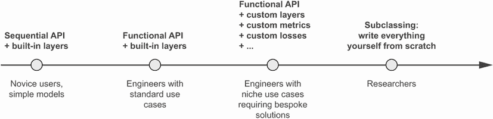
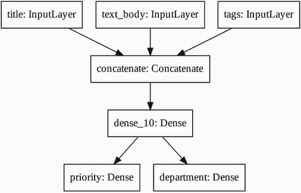
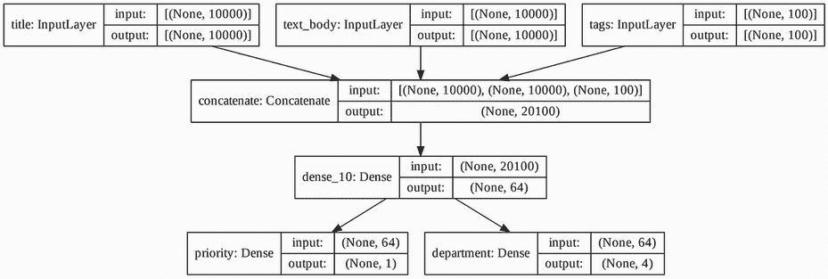
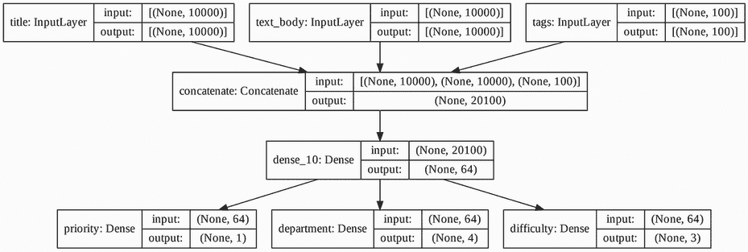
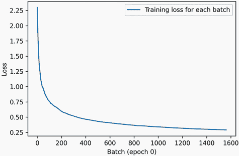
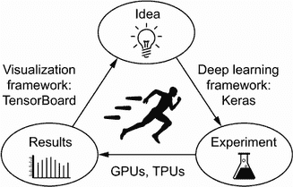
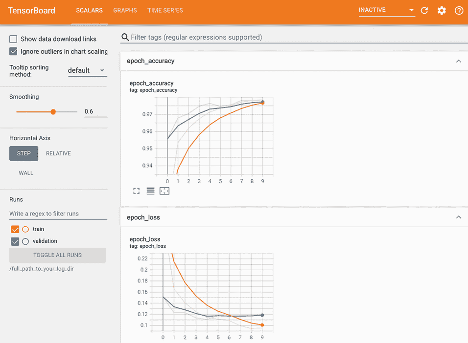

# 七、使用 Keras：深入探讨

本章涵盖

+   使用 `Sequential` 类、功能 API 和模型子类创建 Keras 模型

+   使用内置的 Keras 训练和评估循环

+   使用 Keras 回调函数自定义训练

+   使用 TensorBoard 监控训练和评估指标

+   从头开始编写训练和评估循环

您现在对 Keras 有了一些经验——您熟悉 Sequential 模型、Dense 层以及用于训练、评估和推断的内置 API——`compile()`、`fit()`、`evaluate()` 和 `predict()`。您甚至在第三章中学习了如何从 Layer 类继承以创建自定义层，以及如何使用 TensorFlow 的 GradientTape 实现逐步训练循环。

在接下来的章节中，我们将深入研究计算机视觉、时间序列预测、自然语言处理和生成式深度学习。这些复杂的应用将需要比 `Sequential` 架构和默认的 `fit()` 循环更多的内容。所以让我们首先把你变成一个 Keras 专家！在本章中，您将全面了解如何使用 Keras API：这是您将需要处理下一个遇到的高级深度学习用例的关键方法。

## 7.1 一系列工作流程

Keras API 的设计遵循“逐步揭示复杂性”的原则：使入门变得容易，同时使处理高复杂性用例成为可能，只需要在每一步进行增量学习。简单用例应该易于接近，任意高级工作流程应该是*可能的*：无论您想做多么小众和复杂的事情，都应该有一条明确的路径。这条路径建立在您从更简单工作流程中学到的各种东西之上。这意味着您可以从初学者成长为专家，仍然可以以不同的方式使用相同的工具。

因此，并没有一种“真正”的使用 Keras 的方式。相反，Keras 提供了一系列工作流程，从非常简单到非常灵活。有不同的构建 Keras 模型的方式，以及不同的训练方式，满足不同的需求。因为所有这些工作流程都基于共享的 API，如 `Layer` 和 `Model`，所以任何工作流程的组件都可以在任何其他工作流程中使用——它们可以相互通信。

## 7.2 构建 Keras 模型的不同方式

Keras 有三种构建模型的 API（见图 7.1）：

+   *Sequential 模型*，最易接近的 API——基本上就是一个 Python 列表。因此，它仅限于简单的层堆叠。

+   *功能 API* 专注于类似图形的模型架构。它在可用性和灵活性之间找到了一个很好的中间点，因此它是最常用的模型构建 API。

+   *模型子类化*，一种低级选项，您可以从头开始编写所有内容。如果您想要对每一点都有完全控制，这是理想的选择。但是，您将无法访问许多内置的 Keras 功能，并且更容易出错。



图 7.1 逐步揭示模型构建的复杂性

### 7.2.1 Sequential 模型

构建 Keras 模型的最简单方法是使用已知的 Sequential 模型。

列表 7.1 `Sequential` 类

```py
from tensorflow import keras 
from tensorflow.keras import layers

model = keras.Sequential([
    layers.Dense(64, activation="relu"),
    layers.Dense(10, activation="softmax")
])
```

请注意，可以通过 `add()` 方法逐步构建相同的模型，这类似于 Python 列表的 `append()` 方法。

列表 7.2 逐步构建一个顺序模型

```py
model = keras.Sequential()
model.add(layers.Dense(64, activation="relu"))
model.add(layers.Dense(10, activation="softmax"))
```

在第四章中，您看到层只有在第一次调用它们时才会构建（也就是说，创建它们的权重）。这是因为层的权重形状取决于它们的输入形状：在输入形状未知之前，它们无法被创建。

因此，前面的 Sequential 模型没有任何权重（列表 7.3），直到您实际在一些数据上调用它，或者使用输入形状调用其 `build()` 方法（列表 7.4）。

列表 7.3 尚未构建的模型没有权重

```py
>>> model.weights           # ❶
ValueError: Weights for model sequential_1 have not yet been created.
```

❶ 在那时，模型尚未构建。

列表 7.4 第一次调用模型以构建它

```py
>>> model.build(input_shape=(None, 3))       # ❶
>>> model.weights                            # ❷
[<tf.Variable "dense_2/kernel:0" shape=(3, 64) dtype=float32, ... >,
 <tf.Variable "dense_2/bias:0" shape=(64,) dtype=float32, ... >
 <tf.Variable "dense_3/kernel:0" shape=(64, 10) dtype=float32, ... >,
 <tf.Variable "dense_3/bias:0" shape=(10,) dtype=float32, ... >]
```

❶ 构建模型 - 现在模型将期望形状为(3,)的样本。输入形状中的 None 表示批次大小可以是任意值。

❷ 现在你可以检索模型的权重。

模型构建完成后，你可以通过`summary()`方法显示其内容，这对调试很有帮助。

列表 7.5 `summary()`方法

```py
>>> model.summary()
Model: "sequential_1" 
_________________________________________________________________
Layer (type)                 Output Shape              Param # 
=================================================================
dense_2 (Dense)              (None, 64)                256 
_________________________________________________________________
dense_3 (Dense)              (None, 10)                650 
=================================================================
Total params: 906 
Trainable params: 906 
Non-trainable params: 0 
_________________________________________________________________
```

如你所见，这个模型恰好被命名为“sequential_1”。你可以为 Keras 中的所有内容命名 - 每个模型，每个层。

列表 7.6 使用`name`参数为模型和层命名

```py
>>> model = keras.Sequential(name="my_example_model")
>>> model.add(layers.Dense(64, activation="relu", name="my_first_layer"))
>>> model.add(layers.Dense(10, activation="softmax", name="my_last_layer"))
>>> model.build((None, 3))
>>> model.summary()
Model: "my_example_model" 
_________________________________________________________________
Layer (type)                 Output Shape              Param # 
=================================================================
my_first_layer (Dense)       (None, 64)                256 
_________________________________________________________________
my_last_layer (Dense)        (None, 10)                650 
=================================================================
Total params: 906 
Trainable params: 906 
Non-trainable params: 0 
_________________________________________________________________
```

逐步构建 Sequential 模型时，能够在添加每个层后打印当前模型的摘要非常有用。但在构建模型之前无法打印摘要！实际上，有一种方法可以让你的`Sequential`动态构建：只需提前声明模型输入的形状即可。你可以通过`Input`类实现这一点。

列表 7.7 预先指定模型的输入形状

```py
model = keras.Sequential()
model.add(keras.Input(shape=(3,)))               # ❶
model.add(layers.Dense(64, activation="relu"))
```

❶ 使用 Input 声明输入的形状。请注意，shape 参数必须是每个样本的形状，而不是一个批次的形状。

现在你可以使用`summary()`来跟踪模型输出形状随着添加更多层而变化的情况：

```py
>>> model.summary()
Model: "sequential_2" 
_________________________________________________________________
Layer (type)                 Output Shape              Param # 
=================================================================
dense_4 (Dense)              (None, 64)                256 
=================================================================
Total params: 256 
Trainable params: 256 
Non-trainable params: 0 
_________________________________________________________________
>>> model.add(layers.Dense(10, activation="softmax"))
>>> model.summary()
Model: "sequential_2" 
_________________________________________________________________
Layer (type)                 Output Shape              Param # 
=================================================================
dense_4 (Dense)              (None, 64)                256 
_________________________________________________________________
dense_5 (Dense)              (None, 10)                650 
=================================================================
Total params: 906 
Trainable params: 906 
Non-trainable params: 0 
_________________________________________________________________
```

处理转换输入的层（如第八章中将学习的卷积层）时，这是一个相当常见的调试工作流程。

### 7.2.2 功能 API

Sequential 模型易于使用，但其适用性极为有限：它只能表达具有单个输入和单个输出的模型，按顺序一个接一个地应用各个层。实际上，很常见遇到具有多个输入（例如图像及其元数据）、多个输出（关于数据的不同预测）或非线性拓扑的模型。

在这种情况下，你将使用功能 API 构建模型。这是你在实际应用中遇到的大多数 Keras 模型所使用的方法。它既有趣又强大，感觉就像玩乐高积木一样。

一个简单的例子

让我们从一些简单的东西开始：我们在上一节中使用的两个层的堆叠。其功能 API 版本如下列表所示。

列表 7.8 具有两个`Dense`层的简单功能模型

```py
inputs = keras.Input(shape=(3,), name="my_input")
features = layers.Dense(64, activation="relu")(inputs)
outputs = layers.Dense(10, activation="softmax")(features)
model = keras.Model(inputs=inputs, outputs=outputs)
```

让我们一步一步地过一遍这个过程。

我们首先声明了一个`Input`（请注意，你也可以为这些输入对象命名，就像其他所有内容一样）：

```py
inputs = keras.Input(shape=(3,), name="my_input")
```

这个`inputs`对象保存了关于模型将处理的数据形状和 dtype 的信息：

```py
>>> inputs.shape
(None, 3)          # ❶
>>> inputs.dtype   # ❷
float32
```

❶ 模型将处理每个样本形状为(3,)的批次。每批次的样本数量是可变的（由 None 批次大小表示）。

❷ 这些批次将具有 dtype float32。

我们称这样的对象为*符号张量*。它不包含任何实际数据，但它编码了模型在使用时将看到的实际数据张量的规格。它*代表*未来的数据张量。

接下来，我们创建了一个层并在输入上调用它：

```py
features = layers.Dense(64, activation="relu")(inputs)
```

所有 Keras 层都可以在实际数据张量和这些符号张量上调用。在后一种情况下，它们将返回一个新的符号张量，带有更新的形状和 dtype 信息：

```py
>>> features.shape
(None, 64)
```

在获得最终输出后，我们通过在`Model`构造函数中指定其输入和输出来实例化模型：

```py
outputs = layers.Dense(10, activation="softmax")(features)
model = keras.Model(inputs=inputs, outputs=outputs)
```

这是我们模型的摘要：

```py
>>> model.summary()
Model: "functional_1" 
_________________________________________________________________
Layer (type)                 Output Shape              Param # 
=================================================================
my_input (InputLayer)        [(None, 3)]               0 
_________________________________________________________________
dense_6 (Dense)              (None, 64)                256 
_________________________________________________________________
dense_7 (Dense)              (None, 10)                650 
=================================================================
Total params: 906 
Trainable params: 906 
Non-trainable params: 0 
_________________________________________________________________
```

多输入，多输出模型

与这个玩具模型不同，大多数深度学习模型看起来不像列表，而更像图形。例如，它们可能具有多个输入或多个输出。正是对于这种类型的模型，功能 API 真正发挥作用。

假设你正在构建一个系统，根据优先级对客户支持票据进行排名并将其路由到适当的部门。你的模型有三个输入：

+   票据的标题（文本输入）

+   票据的文本主体（文本输入）

+   用户添加的任何标签（假定为独热编码的分类输入）

我们可以将文本输入编码为大小为`vocabulary_size`的一维数组（有关文本编码技术的详细信息，请参阅第十一章）。

您的模型还有两个输出：

+   票证的优先级分数，介于 0 和 1 之间的标量（sigmoid 输出）

+   应处理票证的部门（对部门集合进行 softmax）

您可以使用几行代码使用函数式 API 构建此模型。

列表 7.9 多输入、多输出函数式模型

```py
vocabulary_size = 10000 
num_tags = 100 
num_departments = 4 

title = keras.Input(shape=(vocabulary_size,), name="title")                # ❶
text_body = keras.Input(shape=(vocabulary_size,), name="text_body")        # ❶
tags = keras.Input(shape=(num_tags,), name="tags")                         # ❶

features = layers.Concatenate()([title, text_body, tags])                  # ❷
features = layers.Dense(64, activation="relu")(features)                   # ❸

priority = layers.Dense(1, activation="sigmoid", name="priority")(features)# ❹
department = layers.Dense(
    num_departments, activation="softmax", name="department")(features)    # ❹

model = keras.Model(inputs=[title, text_body, tags],                       # ❺
                    outputs=[priority, department])                        # ❺
```

❶ 定义模型输入。

❷ 通过将它们连接起来，将输入特征组合成一个张量 features。

❸ 应用中间层以将输入特征重新组合为更丰富的表示。

❹ 定义模型输出。

❺ 通过指定其输入和输出来创建模型。

函数式 API 是一种简单、类似于乐高的、但非常灵活的方式，用于定义这样的层图。

训练多输入、多输出模型

您可以像训练序贯模型一样训练模型，通过使用输入和输出数据的列表调用`fit()`。这些数据列表应与传递给`Model`构造函数的输入顺序相同。

列表 7.10 通过提供输入和目标数组列表来训练模型

```py
import numpy as np

num_samples = 1280 

title_data = np.random.randint(0, 2, size=(num_samples, vocabulary_size))     # ❶
text_body_data = np.random.randint(0, 2, size=(num_samples, vocabulary_size)) # ❶
tags_data = np.random.randint(0, 2, size=(num_samples, num_tags))             # ❶

priority_data = np.random.random(size=(num_samples, 1))                       # ❷
department_data = np.random.randint(0, 2, size=(num_samples, num_departments))# ❷

model.compile(optimizer="rmsprop",
              loss=["mean_squared_error", "categorical_crossentropy"],
              metrics=[["mean_absolute_error"], ["accuracy"]])
model.fit([title_data, text_body_data, tags_data],
          [priority_data, department_data],
          epochs=1)
model.evaluate([title_data, text_body_data, tags_data],
               [priority_data, department_data])
priority_preds, department_preds = model.predict(
    [title_data, text_body_data, tags_data])
```

❶ 虚拟输入数据

❷ 虚拟目标数据

如果您不想依赖输入顺序（例如，因为您有许多输入或输出），您还可以利用给`Input`对象和输出层命名的名称，并通过字典传递数据。

列表 7.11 通过提供输入和目标数组的字典来训练模型

```py
model.compile(optimizer="rmsprop",
              loss={"priority": "mean_squared_error", "department":
                    "categorical_crossentropy"},
              metrics={"priority": ["mean_absolute_error"], "department":
                       ["accuracy"]})
model.fit({"title": title_data, "text_body": text_body_data,
           "tags": tags_data},
          {"priority": priority_data, "department": department_data},
          epochs=1)
model.evaluate({"title": title_data, "text_body": text_body_data,
                "tags": tags_data},
               {"priority": priority_data, "department": department_data})
priority_preds, department_preds = model.predict(
    {"title": title_data, "text_body": text_body_data, "tags": tags_data})
```

函数式 API 的强大之处：访问层连接性

函数式模型是一种显式的图数据结构。这使得可以检查层如何连接并重用先前的图节点（即层输出）作为新模型的一部分。它还很好地适应了大多数研究人员在思考深度神经网络时使用的“心智模型”：层的图。这使得两个重要用例成为可能：模型可视化和特征提取。

让我们可视化我们刚刚定义的模型的连接性（模型的*拓扑结构*）。您可以使用`plot_model()`实用程序将函数式模型绘制为图形（参见图 7.2）。

```py
keras.utils.plot_model(model, "ticket_classifier.png")
```



图 7.2 由`plot_model()`在我们的票证分类器模型上生成的图

您可以在此图中添加模型中每个层的输入和输出形状，这在调试过程中可能会有所帮助（参见图 7.3）。

```py
keras.utils.plot_model(
    model, "ticket_classifier_with_shape_info.png", show_shapes=True)
```



图 7.3 添加形状信息的模型图

张量形状中的“None”表示批处理大小：此模型允许任意大小的批处理。

访问层连接性还意味着您可以检查和重用图中的单个节点（层调用）。`model.layers` 模型属性提供组成模型的层列表，对于每个层，您可以查询`layer.input` 和`layer.output`。

列表 7.12 检索函数式模型中层的输入或输出

```py
>>> model.layers
[<tensorflow.python.keras.engine.input_layer.InputLayer at 0x7fa963f9d358>,
 <tensorflow.python.keras.engine.input_layer.InputLayer at 0x7fa963f9d2e8>,
 <tensorflow.python.keras.engine.input_layer.InputLayer at 0x7fa963f9d470>,
 <tensorflow.python.keras.layers.merge.Concatenate at 0x7fa963f9d860>,
 <tensorflow.python.keras.layers.core.Dense at 0x7fa964074390>,
 <tensorflow.python.keras.layers.core.Dense at 0x7fa963f9d898>,
 <tensorflow.python.keras.layers.core.Dense at 0x7fa963f95470>]
>>> model.layers[3].input
[<tf.Tensor "title:0" shape=(None, 10000) dtype=float32>,
 <tf.Tensor "text_body:0" shape=(None, 10000) dtype=float32>,
 <tf.Tensor "tags:0" shape=(None, 100) dtype=float32>]
>>> model.layers[3].output
<tf.Tensor "concatenate/concat:0" shape=(None, 20100) dtype=float32>
```

这使您能够进行*特征提取*，创建重用另一个模型中间特征的模型。

假设您想要向先前的模型添加另一个输出—您想要估计给定问题票证解决所需时间，一种难度评级。您可以通过三个类别的分类层来实现这一点：“快速”、“中等”和“困难”。您无需从头开始重新创建和重新训练模型。您可以从先前模型的中间特征开始，因为您可以访问它们，就像这样。

列表 7.13 通过重用中间层输出创建新模型

```py
features = model.layers[4].output                                            # ❶
difficulty = layers.Dense(3, activation="softmax", name="difficulty")(features)

new_model = keras.Model(
    inputs=[title, text_body, tags],
    outputs=[priority, department, difficulty])
```

❶ 层[4] 是我们的中间密集层

让我们绘制我们的新模型（参见图 7.4）：

```py
keras.utils.plot_model(
    new_model, "updated_ticket_classifier.png", show_shapes=True)
```



图 7.4 我们新模型的绘图

### 7.2.3 继承 Model 类

你应该了解的最后一个模型构建模式是最高级的一个：`Model`子类化。你在第三章学习了如何子类化`Layer`类来创建自定义层。子类化`Model`与此类似：

+   在`__init__()`方法中，定义模型将使用的层。

+   在`call()`方法中，定义模型的前向传递，重用先前创建的层。

+   实例化你的子类，并在数据上调用它以创建其权重。

将我们之前的例子重写为一个子类模型

让我们看一个简单的例子：我们将使用`Model`子类重新实现客户支持票务管理模型。

图 7.14 一个简单的子类模型

```py
class CustomerTicketModel(keras.Model):

    def __init__(self, num_departments):
        super().__init__()                                           # ❶
        self.concat_layer = layers.Concatenate()                     # ❷
        self.mixing_layer = layers.Dense(64, activation="relu")      # ❷
        self.priority_scorer = layers.Dense(1, activation="sigmoid") # ❷
        self.department_classifier = layers.Dense(                   # ❷
            num_departments, activation="softmax")

    def call(self, inputs):                                          # ❸
        title = inputs["title"]
        text_body = inputs["text_body"]
        tags = inputs["tags"]

        features = self.concat_layer([title, text_body, tags])
        features = self.mixing_layer(features)
        priority = self.priority_scorer(features)
        department = self.department_classifier(features)
        return priority, department
```

❶ 不要忘记调用 super()构造函数！

❷ 在构造函数中定义子层。

❸ 在 call()方法中定义前向传递。

一旦你定义了模型，你可以实例化它。请注意，它只会在第一次在一些数据上调用它时创建它的权重，就像`Layer`子类一样：

```py
model = CustomerTicketModel(num_departments=4)

priority, department = model(
    {"title": title_data, "text_body": text_body_data, "tags": tags_data})
```

到目前为止，一切看起来与`Layer`子类化非常相似，这是你在第三章遇到的工作流程。那么，`Layer`子类和`Model`子类之间的区别是什么呢？很简单：一个“层”是你用来创建模型的构建块，而一个“模型”是你实际上将要训练、导出用于推断等的顶层对象。简而言之，一个`Model`有`fit()`、`evaluate()`和`predict()`方法。层没有。除此之外，这两个类几乎是相同的。（另一个区别是你可以*保存*模型到磁盘上的文件中，我们将在几节中介绍。）

你可以像编译和训练 Sequential 或 Functional 模型一样编译和训练`Model`子类：

```py
model.compile(optimizer="rmsprop",
              loss=["mean_squared_error", "categorical_crossentropy"],  # ❶
              metrics=[["mean_absolute_error"], ["accuracy"]])          # ❶
model.fit({"title": title_data,                                         # ❷
           "text_body": text_body_data,                                 # ❷
           "tags": tags_data},                                          # ❷
          [priority_data, department_data],                             # ❸
          epochs=1)
model.evaluate({"title": title_data,
                "text_body": text_body_data,
                "tags": tags_data},
               [priority_data, department_data])
priority_preds, department_preds = model.predict({"title": title_data,
                                                  "text_body": text_body_data,
                                                  "tags": tags_data})
```

❶ 作为损失和指标参数传递的结构必须与 call()返回的完全匹配——这里是两个元素的列表。

❷ 输入数据的结构必须与 call()方法所期望的完全匹配——这里是一个具有标题、正文和标签键的字典。

❸ 目标数据的结构必须与 call()方法返回的完全匹配——这里是两个元素的列表。

`Model`子类化工作流是构建模型的最灵活方式。它使你能够构建无法表示为层的有向无环图的模型——想象一下，一个模型在`call()`方法中使用层在一个`for`循环内，甚至递归调用它们。任何事情都是可能的——你有控制权。

警告：子类模型不支持的内容

这种自由是有代价的：对于子类模型，你需要负责更多的模型逻辑，这意味着你的潜在错误面更大。因此，你将需要更多的调试工作。你正在开发一个新的 Python 对象，而不仅仅是将 LEGO 积木拼在一起。

函数式模型和子类模型在本质上也有很大的不同。函数式模型是一个显式的数据结构——层的图，你可以查看、检查和修改。子类模型是一段字节码——一个带有包含原始代码的`call()`方法的 Python 类。这是子类化工作流程灵活性的源泉——你可以编写任何你喜欢的功能，但它也引入了新的限制。

例如，因为层之间的连接方式隐藏在`call()`方法的内部，你无法访问该信息。调用`summary()`不会显示层连接，并且你无法通过`plot_model()`绘制模型拓扑。同样，如果你有一个子类模型，你无法访问层图的节点进行特征提取，因为根本没有图。一旦模型被实例化，其前向传递就变成了一个完全的黑匣子。

### 7.2.4 混合和匹配不同的组件

重要的是，选择这些模式之一——Sequential 模型、Functional API 或 `Model` 子类化——不会将您排除在其他模式之外。Keras API 中的所有模型都可以平滑地相互操作，无论它们是 Sequential 模型、Functional 模型还是从头开始编写的子类化模型。它们都是同一系列工作流的一部分。

例如，您可以在 Functional 模型中使用子类化层或模型。

列表 7.15 创建包含子类化模型的 Functional 模型

```py
class Classifier(keras.Model):

    def __init__(self, num_classes=2):
        super().__init__()
        if num_classes == 2:
            num_units = 1 
            activation = "sigmoid" 
        else:
            num_units = num_classes
            activation = "softmax" 
        self.dense = layers.Dense(num_units, activation=activation)

    def call(self, inputs):
        return self.dense(inputs)

inputs = keras.Input(shape=(3,))
features = layers.Dense(64, activation="relu")(inputs)
outputs = Classifier(num_classes=10)(features)
model = keras.Model(inputs=inputs, outputs=outputs)
```

相反地，您可以将 Functional 模型用作子类化层或模型的一部分。

列表 7.16 创建包含 Functional 模型的子类化模型

```py
inputs = keras.Input(shape=(64,))
outputs = layers.Dense(1, activation="sigmoid")(inputs)
binary_classifier = keras.Model(inputs=inputs, outputs=outputs)
class MyModel(keras.Model):

    def __init__(self, num_classes=2):
        super().__init__()
        self.dense = layers.Dense(64, activation="relu")
        self.classifier = binary_classifier

    def call(self, inputs):
        features = self.dense(inputs)
        return self.classifier(features)

model = MyModel()
```

### 7.2.5 记住：使用合适的工具来完成工作

您已经了解了构建 Keras 模型的工作流程的范围，从最简单的工作流程 Sequential 模型到最先进的工作流程模型子类化。何时应该使用其中一个而不是另一个？每种方法都有其优缺点——选择最适合手头工作的方法。

一般来说，Functional API 为您提供了易用性和灵活性之间的很好的权衡。它还为您提供了直接访问层连接性的功能，这对于模型绘图或特征提取等用例非常强大。如果您*可以*使用 Functional API——也就是说，如果您的模型可以表示为层的有向无环图——我建议您使用它而不是模型子类化。

今后，本书中的所有示例都将使用 Functional API，仅因为我们将使用的所有模型都可以表示为层的图。但是，我们将经常使用子类化层。一般来说，使用包含子类化层的 Functional 模型既具有高开发灵活性，又保留了 Functional API 的优势。

## 7.3 使用内置的训练和评估循环

逐步披露复杂性的原则——从非常简单到任意灵活的工作流程的访问，一步一步——也适用于模型训练。Keras 为您提供了不同的训练模型的工作流程。它们可以简单到在数据上调用 `fit()`，也可以高级到从头开始编写新的训练算法。

您已经熟悉了 `compile()`、`fit()`、`evaluate()`、`predict()` 的工作流程。作为提醒，请查看以下列表。

列表 7.17 标准工作流程：`compile()`、`fit()`、`evaluate()`、`predict()`

```py
from tensorflow.keras.datasets import mnist

def get_mnist_model():                                                # ❶
    inputs = keras.Input(shape=(28 * 28,))
    features = layers.Dense(512, activation="relu")(inputs)
    features = layers.Dropout(0.5)(features)
    outputs = layers.Dense(10, activation="softmax")(features)
    model = keras.Model(inputs, outputs)
    return model

(images, labels), (test_images, test_labels) = mnist.load_data()      # ❷
images = images.reshape((60000, 28 * 28)).astype("float32") / 255 
test_images = test_images.reshape((10000, 28 * 28)).astype("float32") / 255 
train_images, val_images = images[10000:], images[:10000]
train_labels, val_labels = labels[10000:], labels[:10000]

model = get_mnist_model()
model.compile(optimizer="rmsprop",                                    # ❸
              loss="sparse_categorical_crossentropy",                 # ❸
              metrics=["accuracy"])                                   # ❸
model.fit(train_images, train_labels,                                 # ❹
          epochs=3,                                                   # ❹
          validation_data=(val_images, val_labels))                   # ❹
test_metrics = model.evaluate(test_images, test_labels)               # ❺
predictions = model.predict(test_images)                              # ❻
```

❶ 创建一个模型（我们将其分解为一个单独的函数，以便以后重用）。

❷ 加载数据，保留一些用于验证。

❸ 通过指定其优化器、要最小化的损失函数和要监视的指标来编译模型。

❹ 使用 fit() 训练模型，可选择提供验证数据以监视在未见数据上的性能。

❺ 使用 evaluate() 在新数据上计算损失和指标。

❻ 使用 predict() 在新数据上计算分类概率。

有几种方法可以自定义这个简单的工作流程：

+   提供您自己的自定义指标。

+   将 *callbacks* 传递给 `fit()` 方法以安排在训练过程中的特定时间点执行的操作。

让我们来看看这些。

### 7.3.1 编写自己的指标

指标对于衡量模型性能至关重要——特别是用于衡量模型在训练数据和测试数据上性能差异的指标。用于分类和回归的常用指标已经是内置的 `keras.metrics` 模块的一部分，大多数情况下您会使用它们。但是，如果您正在做一些与众不同的事情，您将需要能够编写自己的指标。这很简单！

Keras 指标是 `keras.metrics.Metric` 类的子类。像层一样，指标在 TensorFlow 变量中存储内部状态。与层不同，这些变量不会通过反向传播进行更新，因此您必须自己编写状态更新逻辑，这发生在 `update_state()` 方法中。

例如，这里有一个简单的自定义指标，用于测量均方根误差（RMSE）。

列表 7.18 通过子类化`Metric`类实现自定义指标

```py
import tensorflow as tf

class RootMeanSquaredError(keras.metrics.Metric):                          # ❶

    def __init__(self, name="rmse", **kwargs):                             # ❷
        super().__init__(name=name, **kwargs)                              # ❷
        self.mse_sum = self.add_weight(name="mse_sum", initializer="zeros")# ❷
        self.total_samples = self.add_weight(                              # ❷
            name="total_samples", initializer="zeros", dtype="int32")      # ❷

    def update_state(self, y_true, y_pred, sample_weight=None):            # ❸
        y_true = tf.one_hot(y_true, depth=tf.shape(y_pred)[1])             # ❹
        mse = tf.reduce_sum(tf.square(y_true - y_pred))
        self.mse_sum.assign_add(mse)
        num_samples = tf.shape(y_pred)[0]
        self.total_samples.assign_add(num_samples)
```

❶ 子类化 Metric 类。

❷ 在构造函数中定义状态变量。就像对于层一样，你可以访问`add_weight()`方法。

❸ 在`update_state()`中实现状态更新逻辑。`y_true`参数是一个批次的目标（或标签），而`y_pred`表示模型的相应预测。你可以忽略`sample_weight`参数——我们这里不会用到它。

❹ 为了匹配我们的 MNIST 模型，我们期望分类预测和整数标签。

你可以使用`result()`方法返回指标的当前值：

```py
    def result(self):
        return tf.sqrt(self.mse_sum / tf.cast(self.total_samples, tf.float32))
```

与此同时，你还需要提供一种方法来重置指标状态，而不必重新实例化它——这使得相同的指标对象可以在训练的不同时期或在训练和评估之间使用。你可以使用`reset_state()`方法来实现这一点：

```py
    def reset_state(self):
        self.mse_sum.assign(0.)
        self.total_samples.assign(0)
```

自定义指标可以像内置指标一样使用。让我们试用我们自己的指标：

```py
model = get_mnist_model()
model.compile(optimizer="rmsprop",
              loss="sparse_categorical_crossentropy",
              metrics=["accuracy", RootMeanSquaredError()])
model.fit(train_images, train_labels,
          epochs=3,
          validation_data=(val_images, val_labels))
test_metrics = model.evaluate(test_images, test_labels)
```

现在你可以看到`fit()`进度条显示你的模型的 RMSE。

### 7.3.2 使用回调

在大型数据集上进行数十个时期的训练运行，使用`model.fit()`有点像发射纸飞机：过了初始冲动，你就无法控制它的轨迹或着陆点。如果你想避免不良结果（从而浪费纸飞机），更明智的做法是使用不是纸飞机，而是一架可以感知环境、将数据发送回操作员并根据当前状态自动做出转向决策的无人机。Keras 的*回调*API 将帮助你将对`model.fit()`的调用从纸飞机转变为一个智能、自主的无人机，可以自我反省并动手采取行动。

回调是一个对象（实现特定方法的类实例），它在对`fit()`的模型调用中传递给模型，并在训练过程中的各个时刻被模型调用。它可以访问有关模型状态和性能的所有可用数据，并且可以采取行动：中断训练、保存模型、加载不同的权重集，或者以其他方式改变模型的状态。

以下是一些使用回调的示例：

+   *模型检查点*——在训练过程中保存模型的当前状态。

+   *提前停止*——当验证损失不再改善时中断训练（当然，保存在训练过程中获得的最佳模型）。

+   *在训练过程中动态调整某些参数的值*——比如优化器的学习率。

+   *在训练过程中记录训练和验证指标，或者在更新时可视化模型学习到的表示*——你熟悉的`fit()`进度条实际上就是一个回调！

`keras.callbacks`模块包括许多内置回调（这不是一个详尽的列表）：

```py
keras.callbacks.ModelCheckpoint
keras.callbacks.EarlyStopping
keras.callbacks.LearningRateScheduler
keras.callbacks.ReduceLROnPlateau
keras.callbacks.CSVLogger
```

让我们回顾其中的两个，以便让你了解如何使用它们：`EarlyStopping`和`ModelCheckpoint`。

EarlyStopping 和 ModelCheckpoint 回调

当你训练一个模型时，有很多事情是你无法从一开始就预测的。特别是，你无法知道需要多少个时期才能达到最佳的验证损失。到目前为止，我们的例子采用了训练足够多个时期的策略，以至于你开始过拟合，使用第一次运行来确定适当的训练时期数量，然后最终启动一个新的训练运行，使用这个最佳数量。当然，这种方法是浪费的。更好的处理方式是在测量到验证损失不再改善时停止训练。这可以通过`EarlyStopping`回调来实现。

`EarlyStopping`回调会在监控的目标指标停止改进一定数量的时期后中断训练。例如，此回调允许您在开始过拟合时立即中断训练，从而避免不得不为更少的时期重新训练模型。此回调通常与`ModelCheckpoint`结合使用，后者允许您在训练过程中持续保存模型（可选地，仅保存迄今为止的当前最佳模型：在时期结束时表现最佳的模型版本）。

列表 7.19 在`fit()`方法中使用`callbacks`参数

```py
callbacks_list = [                                     # ❶
    keras.callbacks.EarlyStopping(                     # ❷
        monitor="val_accuracy",                        # ❸
        patience=2,                                    # ❹
    ),
    keras.callbacks.ModelCheckpoint(                   # ❺
        filepath="checkpoint_path.keras",              # ❻
        monitor="val_loss",                            # ❼
        save_best_only=True,                           # ❼
    )
]
model = get_mnist_model()
model.compile(optimizer="rmsprop",
              loss="sparse_categorical_crossentropy",
              metrics=["accuracy"])                    # ❽
model.fit(train_images, train_labels,                  # ❾
          epochs=10,                                   # ❾
          callbacks=callbacks_list,                    # ❾
          validation_data=(val_images, val_labels))    # ❾
```

❶ 回调通过`fit()`方法中的 callbacks 参数传递给模型，该参数接受一个回调函数列表。您可以传递任意数量的回调函数。

❷ 当改进停止时中断训练

❸ 监控模型的验证准确率

❹ 当准确率连续两个时期没有改善时中断训练

❺ 在每个时期结束后保存当前权重

❻ 目标模型文件的路径

❼ 这两个参数意味着除非 val_loss 有所改善，否则您不会覆盖模型文件，这样可以保留训练过程中看到的最佳模型。

❽ 您正在监视准确率，因此它应该是模型指标的一部分。

❾ 请注意，由于回调将监视验证损失和验证准确率，您需要将 validation_data 传递给 fit()调用。

请注意，您也可以在训练后手动保存模型——只需调用`model.save('my_checkpoint_path')`。要重新加载保存的模型，只需使用

```py
model = keras.models.load_model("checkpoint_path.keras")
```

### 7.3.3 编写自己的回调函数

如果您需要在训练过程中执行特定操作，而内置回调函数没有涵盖，您可以编写自己的回调函数。通过继承`keras.callbacks.Callback`类来实现回调函数。然后，您可以实现以下任意数量的透明命名方法，这些方法在训练过程中的各个时刻调用：

```py
on_epoch_begin(epoch, logs)      # ❶
on_epoch_end(epoch, logs)        # ❷
on_batch_begin(batch, logs)      # ❸
on_batch_end(batch, logs)        # ❹
on_train_begin(logs)             # ❺
on_train_end(logs)               # ❻
```

❶ 在每个时期开始时调用

❷ 在每个时期结束时调用

❸ 在处理每个批次之前调用

❹ 在处理每个批次后立即调用

❺ 在训练开始时调用

❻ 在训练结束时调用

这些方法都带有一个`logs`参数，其中包含有关先前批次、时期或训练运行的信息——训练和验证指标等。`on_epoch_*`和`on_batch_*`方法还将时期或批次索引作为它们的第一个参数（一个整数）。

这里有一个简单的示例，它保存了训练过程中每个批次的损失值列表，并在每个时期结束时保存了这些值的图表。

列表 7.20 通过继承`Callback`类创建自定义回调

```py
from matplotlib import pyplot as plt

class LossHistory(keras.callbacks.Callback):
    def on_train_begin(self, logs):
        self.per_batch_losses = []

    def on_batch_end(self, batch, logs):
        self.per_batch_losses.append(logs.get("loss"))

    def on_epoch_end(self, epoch, logs):
        plt.clf()
        plt.plot(range(len(self.per_batch_losses)), self.per_batch_losses,
                 label="Training loss for each batch")
        plt.xlabel(f"Batch (epoch {epoch})")
        plt.ylabel("Loss")
        plt.legend()
        plt.savefig(f"plot_at_epoch_{epoch}")
        self.per_batch_losses = []
```

让我们试驾一下：

```py
model = get_mnist_model()
model.compile(optimizer="rmsprop",
              loss="sparse_categorical_crossentropy",
              metrics=["accuracy"])
model.fit(train_images, train_labels,
          epochs=10,
          callbacks=[LossHistory()],
          validation_data=(val_images, val_labels))
```

我们得到的图表看起来像图 7.5。



图 7.5 我们自定义历史绘图回调的输出

### 7.3.4 使用 TensorBoard 进行监控和可视化

要进行良好的研究或开发良好的模型，您需要在实验过程中获得关于模型内部情况的丰富、频繁的反馈。这就是进行实验的目的：获取有关模型表现的信息——尽可能多的信息。取得进展是一个迭代过程，一个循环——您从一个想法开始，并将其表达为一个实验，试图验证或否定您的想法。您运行此实验并处理它生成的信息。这激发了您的下一个想法。您能够运行此循环的迭代次数越多，您的想法就会变得越精细、更强大。Keras 帮助您在最短的时间内从想法到实验，快速的 GPU 可以帮助您尽快从实验到结果。但是处理实验结果呢？这就是 TensorBoard 的作用（见图 7.6）。



图 7.6 进展的循环

TensorBoard（[www.tensorflow.org/tensorboard](https://www.tensorflow.org/tensorboard)）是一个基于浏览器的应用程序，您可以在本地运行。这是在训练过程中监视模型内部所有活动的最佳方式。使用 TensorBoard，您可以

+   在训练过程中可视化监控指标

+   可视化您的模型架构

+   可视化激活和梯度的直方图

+   在 3D 中探索嵌入

如果您监控的信息不仅仅是模型的最终损失，您可以更清晰地了解模型的作用和不作用，并且可以更快地取得进展。

使用 TensorBoard 与 Keras 模型和`fit()`方法的最简单方法是使用`keras.callbacks.TensorBoard`回调。

在最简单的情况下，只需指定回调写入日志的位置，然后就可以开始了：

```py
model = get_mnist_model()
model.compile(optimizer="rmsprop",
              loss="sparse_categorical_crossentropy",
              metrics=["accuracy"])

tensorboard = keras.callbacks.TensorBoard(
    log_dir="/full_path_to_your_log_dir",
)
model.fit(train_images, train_labels,
          epochs=10,
          validation_data=(val_images, val_labels),
          callbacks=[tensorboard])
```

一旦模型开始运行，它将在目标位置写入日志。如果您在本地计算机上运行 Python 脚本，则可以使用以下命令启动本地 TensorBoard 服务器（请注意，如果您通过`pip`安装了 TensorFlow，则`tensorboard`可执行文件应该已经可用；如果没有，则可以通过`pip` `install` `tensorboard`手动安装 TensorBoard）：

```py
tensorboard --logdir /full_path_to_your_log_dir
```

然后，您可以转到命令返回的 URL 以访问 TensorBoard 界面。

如果您在 Colab 笔记本中运行脚本，则可以作为笔记本的一部分运行嵌入式 TensorBoard 实例，使用以下命令：

```py
%load_ext tensorboard
%tensorboard --logdir /full_path_to_your_log_dir
```

在 TensorBoard 界面中，您将能够监视训练和评估指标的实时图表（参见图 7.7）。



图 7.7 TensorBoard 可用于轻松监控训练和评估指标。

## 7.4 编写自己的训练和评估循环

`fit()`工作流在易用性和灵活性之间取得了很好的平衡。这是您大部分时间将使用的方法。但是，即使使用自定义指标、自定义损失和自定义回调，它也不意味着支持深度学习研究人员可能想要做的一切。

毕竟，内置的`fit()`工作流仅专注于*监督学习*：一种已知*目标*（也称为*标签*或*注释*）与输入数据相关联的设置，您根据这些目标和模型预测的函数计算损失。然而，并非所有形式的机器学习都属于这一类别。还有其他设置，其中没有明确的目标，例如*生成学习*（我们将在第十二章中讨论）、*自监督学习*（目标来自输入）和*强化学习*（学习受偶尔“奖励”驱动，类似训练狗）。即使您正在进行常规监督学习，作为研究人员，您可能希望添加一些需要低级灵活性的新颖功能。

每当您发现内置的`fit()`不够用时，您将需要编写自己的自定义训练逻辑。您已经在第二章和第三章看到了低级训练循环的简单示例。作为提醒，典型训练循环的内容如下：

1.  运行前向传播（计算模型的输出）在梯度磁带内以获得当前数据批次的损失值。

1.  检索损失相对于模型权重的梯度。

1.  更新模型的权重以降低当前数据批次上的损失值。

这些步骤将根据需要重复多个批次。这基本上是`fit()`在幕后执行的操作。在本节中，您将学习如何从头开始重新实现`fit()`，这将为您提供编写任何可能想出的训练算法所需的所有知识。

让我们详细了解一下。

### 7.4.1 训练与推断

在你迄今为止看到的低级训练循环示例中，第 1 步（前向传播）通过`predictions` `=` `model(inputs)`完成，第 2 步（检索梯度）通过`gradients` `=` `tape.gradient(loss,` `model.weights)`完成。在一般情况下，实际上有两个你需要考虑的细微之处。

一些 Keras 层，比如`Dropout`层，在*训练*和*推理*（当你用它们生成预测时）时有不同的行为。这些层在它们的`call()`方法中暴露了一个`training`布尔参数。调用`dropout(inputs,` `training=True)`会丢弃一些激活条目，而调用`dropout(inputs,` `training=False)`则不会做任何操作。扩展到 Functional 和 Sequential 模型，它们的`call()`方法中也暴露了这个`training`参数。记得在前向传播时传递`training=True`给 Keras 模型！因此我们的前向传播变成了`predictions` `=` `model(inputs,` `training=True)`。

另外，请注意，当你检索模型权重的梯度时，不应该使用`tape.gradients(loss,` `model.weights)`，而应该使用`tape .gradients(loss,` `model.trainable_weights)`。实际上，层和模型拥有两种权重：

+   *可训练权重*—这些权重通过反向传播来更新，以最小化模型的损失，比如`Dense`层的核和偏置。

+   *不可训练权重*—这些权重在前向传播过程中由拥有它们的层更新。例如，如果你想让一个自定义层记录到目前为止处理了多少批次，那么这些信息将存储在不可训练权重中，每个批次，你的层会将计数器加一。

在 Keras 内置层中，唯一具有不可训练权重的层是`BatchNormalization`层，我们将在第九章讨论。`BatchNormalization`层需要不可训练权重来跟踪通过它的数据的均值和标准差的信息，以便执行*特征归一化*的在线近似（这是你在第六章学到的概念）。

考虑到这两个细节，监督学习训练步骤最终看起来像这样：

```py
def train_step(inputs, targets):
    with tf.GradientTape() as tape:
        predictions = model(inputs, training=True)
        loss = loss_fn(targets, predictions)
    gradients = tape.gradients(loss, model.trainable_weights)
    optimizer.apply_gradients(zip(model.trainable_weights, gradients))
```

### 7.4.2 指标的低级使用

在低级训练循环中，你可能想要利用 Keras 指标（无论是自定义的还是内置的）。你已经了解了指标 API：只需为每个目标和预测批次调用`update_state(y_true,` `y_pred)`，然后使用`result()`来查询当前指标值：

```py
metric = keras.metrics.SparseCategoricalAccuracy()
targets = [0, 1, 2]
predictions = [[1, 0, 0], [0, 1, 0], [0, 0, 1]]
metric.update_state(targets, predictions)
current_result = metric.result()
print(f"result: {current_result:.2f}")
```

你可能还需要跟踪标量值的平均值，比如模型的损失。你可以通过`keras.metrics.Mean`指标来实现这一点：

```py
values = [0, 1, 2, 3, 4]
mean_tracker = keras.metrics.Mean() 
for value in values:
    mean_tracker.update_state(value) 
print(f"Mean of values: {mean_tracker.result():.2f}")
```

当你想要重置当前结果（在训练周期的开始或评估的开始）时，请记得使用`metric.reset_state()`。

### 7.4.3 完整的训练和评估循环

让我们将前向传播、反向传播和指标跟踪结合到一个类似于`fit()`的训练步骤函数中，该函数接受一批数据和目标，并返回`fit()`进度条显示的日志。

列表 7.21 编写逐步训练循环：训练步骤函数

```py
model = get_mnist_model()

loss_fn = keras.losses.SparseCategoricalCrossentropy()                    # ❶
optimizer = keras.optimizers.RMSprop()                                    # ❷
metrics = [keras.metrics.SparseCategoricalAccuracy()]                     # ❸
loss_tracking_metric = keras.metrics.Mean()                               # ❹

def train_step(inputs, targets):
    with tf.GradientTape() as tape:                                       # ❺
        predictions = model(inputs, training=True)                        # ❺
        loss = loss_fn(targets, predictions)                              # ❺
    gradients = tape.gradient(loss, model.trainable_weights)              # ❻
    optimizer.apply_gradients(zip(gradients, model.trainable_weights))    # ❻

    logs = {}                                                             # ❼
    for metric in metrics:                                                # ❼
        metric.update_state(targets, predictions)                         # ❼
        logs[metric.name] = metric.result()                               # ❼

    loss_tracking_metric.update_state(loss)                               # ❽
    logs["loss"] = loss_tracking_metric.result()                          # ❽
    return logs                                                           # ❾
```

❶ 准备损失函数。

❷ 准备优化器。

❸ 准备要监视的指标列表。

❹ 准备一个 Mean 指标追踪器来跟踪损失的平均值。

❺ 进行前向传播。注意我们传递了`training=True`。

❻ 进行反向传播。注意我们使用了`model.trainable_weights`。

❼ 跟踪指标。

❽ 跟踪损失平均值。

❾ 返回当前的指标值和损失。

我们需要在每个周期开始和运行评估之前重置指标的状态。这里有一个实用函数来做到这一点。

列表 7.22 编写逐步训练循环：重置指标

```py
def reset_metrics():
    for metric in metrics:
        metric.reset_state()
    loss_tracking_metric.reset_state()
```

现在我们可以布置完整的训练循环。请注意，我们使用`tf.data.Dataset`对象将我们的 NumPy 数据转换为一个迭代器，该迭代器按大小为 32 的批次迭代数据。

列表 7.23 编写逐步训练循环：循环本身

```py
training_dataset = tf.data.Dataset.from_tensor_slices(
    (train_images, train_labels))
training_dataset = training_dataset.batch(32)
epochs = 3 
for epoch in range(epochs):
    reset_metrics()
    for inputs_batch, targets_batch in training_dataset:
        logs = train_step(inputs_batch, targets_batch)
    print(f"Results at the end of epoch {epoch}")
    for key, value in logs.items():
        print(f"...{key}: {value:.4f}")
```

这就是评估循环：一个简单的`for`循环，反复调用`test_step()`函数，该函数处理一个数据批次。`test_step()`函数只是`train_step()`逻辑的一个子集。它省略了处理更新模型权重的代码——也就是说，所有涉及`GradientTape`和优化器的内容。

列表 7.24 编写逐步评估循环

```py
def test_step(inputs, targets):
    predictions = model(inputs, training=False)     # ❶
    loss = loss_fn(targets, predictions)

    logs = {}
    for metric in metrics:
        metric.update_state(targets, predictions)
        logs["val_" + metric.name] = metric.result()
    loss_tracking_metric.update_state(loss)
    logs["val_loss"] = loss_tracking_metric.result()
    return logs

val_dataset = tf.data.Dataset.from_tensor_slices((val_images, val_labels))
val_dataset = val_dataset.batch(32)
reset_metrics() 
for inputs_batch, targets_batch in val_dataset:
    logs = test_step(inputs_batch, targets_batch) 
print("Evaluation results:") 
for key, value in logs.items(): 
    print(f"...{key}: {value:.4f}")
```

❶ 注意我们传递了 training=False。

恭喜你——你刚刚重新实现了`fit()`和`evaluate()`！或几乎：`fit()`和`evaluate()`支持许多更多功能，包括大规模分布式计算，这需要更多的工作。它还包括几个关键的性能优化。

让我们来看看其中一个优化：TensorFlow 函数编译。

### 7.4.4 使用 tf.function 使其更快

你可能已经注意到，尽管实现了基本相同的逻辑，但自定义循环的运行速度明显比内置的`fit()`和`evaluate()`慢。这是因为，默认情况下，TensorFlow 代码是逐行执行的，*急切执行*，类似于 NumPy 代码或常规 Python 代码。急切执行使得调试代码更容易，但从性能的角度来看远非最佳选择。

将你的 TensorFlow 代码*编译*成一个可以全局优化的*计算图*更有效。要做到这一点的语法非常简单：只需在要执行之前的任何函数中添加`@tf.function`，如下面的示例所示。

列表 7.25 为我们的评估步骤函数添加`@tf.function`装饰器

```py
@tf.function                                   # ❶
def test_step(inputs, targets):
    predictions = model(inputs, training=False)
    loss = loss_fn(targets, predictions)

    logs = {}
    for metric in metrics:
        metric.update_state(targets, predictions)
        logs["val_" + metric.name] = metric.result()

    loss_tracking_metric.update_state(loss)
    logs["val_loss"] = loss_tracking_metric.result()
    return logs

val_dataset = tf.data.Dataset.from_tensor_slices((val_images, val_labels))
val_dataset = val_dataset.batch(32)
reset_metrics() 
for inputs_batch, targets_batch in val_dataset:
    logs = test_step(inputs_batch, targets_batch) 
print("Evaluation results:") 
for key, value in logs.items():
    print(f"...{key}: {value:.4f}")
```

❶ 这是唯一改变的一行。

在 Colab CPU 上，我们从运行评估循环需要 1.80 秒，降低到只需要 0.8 秒。速度更快！

记住，在调试代码时，最好急切地运行它，不要添加任何`@tf.function`装饰器。这样更容易跟踪错误。一旦你的代码运行正常并且想要加快速度，就在你的训练步骤和评估步骤或任何其他性能关键函数中添加`@tf.function`装饰器。

### 7.4.5 利用 fit() 与自定义训练循环

在之前的章节中，我们完全从头开始编写自己的训练循环。这样做为你提供了最大的灵活性，但同时你会写很多代码，同时错过了`fit()`的许多便利功能，比如回调或内置的分布式训练支持。

如果你需要一个自定义训练算法，但仍想利用内置 Keras 训练逻辑的强大功能，那么实际上在`fit()`和从头编写的训练循环之间有一个中间地带：你可以提供一个自定义训练步骤函数，让框架来处理其余部分。

你可以通过重写`Model`类的`train_step()`方法来实现这一点。这个函数是`fit()`为每个数据批次调用的函数。然后你可以像往常一样调用`fit()`，它将在幕后运行你自己的学习算法。

这里有一个简单的例子：

+   我们创建一个继承`keras.Model`的新类。

+   我们重写了方法`train_step(self,` `data)`。它的内容几乎与我们在上一节中使用的内容相同。它返回一个将度量名称（包括损失）映射到它们当前值的字典。

+   我们实现了一个`metrics`属性，用于跟踪模型的`Metric`实例。这使得模型能够在每个时期开始和在调用`evaluate()`开始时自动调用`reset_state()`模型的度量，因此你不必手动执行。

列表 7.26 实现一个自定义训练步骤以与`fit()`一起使用

```py
loss_fn = keras.losses.SparseCategoricalCrossentropy()
loss_tracker = keras.metrics.Mean(name="loss")                # ❶

class CustomModel(keras.Model):
    def train_step(self, data):                               # ❷
        inputs, targets = data
        with tf.GradientTape() as tape:
            predictions = self(inputs, training=True)         # ❸
            loss = loss_fn(targets, predictions)
        gradients = tape.gradient(loss, model.trainable_weights)
        optimizer.apply_gradients(zip(gradients, model.trainable_weights))

        loss_tracker.update_state(loss)                       # ❹
        return {"loss": loss_tracker.result()}                # ❺

    @property 
    def metrics(self):                                        # ❻ 
        return [loss_tracker]                                 # ❻
```

❶ 这个度量对象将用于跟踪训练和评估过程中每个批次损失的平均值。

❷ 我们重写了 train_step 方法。

❸ 我们使用`self(inputs, training=True)`而不是`model(inputs, training=True)`，因为我们的模型就是类本身。

❹ 我们更新跟踪平均损失的损失跟踪器指标。

❺ 通过查询损失跟踪器指标返回到目前为止的平均损失。

❻ 任何你想要在不同 epoch 之间重置的指标都应该在这里列出。

现在，我们可以实例化我们的自定义模型，编译它（我们只传递了优化器，因为损失已经在模型外部定义），并像往常一样使用`fit()`进行训练：

```py
inputs = keras.Input(shape=(28 * 28,))
features = layers.Dense(512, activation="relu")(inputs)
features = layers.Dropout(0.5)(features)
outputs = layers.Dense(10, activation="softmax")(features)
model = CustomModel(inputs, outputs)

model.compile(optimizer=keras.optimizers.RMSprop())
model.fit(train_images, train_labels, epochs=3)
```

有几点需要注意：

+   这种模式不会阻止你使用 Functional API 构建模型。无论你是构建 Sequential 模型、Functional API 模型还是子类化模型，都可以做到这一点。

+   当你重写`train_step`时，不需要使用`@tf.function`装饰器—框架会为你做这件事。

现在，关于指标，以及如何通过`compile()`配置损失呢？在调用`compile()`之后，你可以访问以下内容：

+   `self.compiled_loss`—你传递给`compile()`的损失函数。

+   `self.compiled_metrics`—对你传递的指标列表的包装器，允许你调用`self.compiled_metrics.update_state()`一次性更新所有指标。

+   `self.metrics`—你传递给`compile()`的实际指标列表。请注意，它还包括一个跟踪损失的指标，类似于我们之前手动使用`loss_tracking_metric`所做的。

因此，我们可以写下

```py
class CustomModel(keras.Model):
    def train_step(self, data):
        inputs, targets = data
        with tf.GradientTape() as tape:
            predictions = self(inputs, training=True)
            loss = self.compiled_loss(targets, predictions)               # ❶
        gradients = tape.gradient(loss, model.trainable_weights)
        optimizer.apply_gradients(zip(gradients, model.trainable_weights))
        self.compiled_metrics.update_state(targets, predictions)          # ❷
        return {m.name: m.result() for m in self.metrics}                 # ❸
```

❶ 通过`self.compiled_loss`计算损失。

❷ 通过`self.compiled_metrics`更新模型的指标。

❸ 返回一个将指标名称映射到它们当前值的字典。

让我们试试：

```py
inputs = keras.Input(shape=(28 * 28,))
features = layers.Dense(512, activation="relu")(inputs)
features = layers.Dropout(0.5)(features)
outputs = layers.Dense(10, activation="softmax")(features)
model = CustomModel(inputs, outputs)

model.compile(optimizer=keras.optimizers.RMSprop(),
              loss=keras.losses.SparseCategoricalCrossentropy(),
              metrics=[keras.metrics.SparseCategoricalAccuracy()])
model.fit(train_images, train_labels, epochs=3)
```

这是很多信息，但现在你已经了解足够多的内容来使用 Keras 做几乎任何事情了。

## 摘要

+   Keras 提供了一系列不同的工作流程，基于*逐步透露复杂性*的原则。它们之间可以平滑地互操作。

+   你可以通过`Sequential`类、Functional API 或通过子类化`Model`类来构建模型。大多数情况下，你会使用 Functional API。

+   训练和评估模型的最简单方法是通过默认的`fit()`和`evaluate()`方法。

+   Keras 回调提供了一种简单的方法，在调用`fit()`期间监视模型，并根据模型的状态自动采取行动。

+   你也可以通过重写`train_step()`方法完全控制`fit()`的行为。

+   除了`fit()`，你还可以完全从头开始编写自己的训练循环。这对于实现全新训练算法的研究人员非常有用。
