# 八、计算机视觉深度学习简介

本章涵盖

+   理解卷积神经网络（卷积网络）

+   使用数据增强来减轻过拟合

+   使用预训练的卷积网络进行特征提取

+   对预训练的卷积网络进行微调

计算机视觉是深度学习最早也是最大的成功故事。每天，你都在与深度视觉模型互动——通过 Google 照片、Google 图像搜索、YouTube、相机应用中的视频滤镜、OCR 软件等等。这些模型也是自动驾驶、机器人、AI 辅助医学诊断、自动零售结账系统甚至自动农业等尖端研究的核心。

计算机视觉是在 2011 年至 2015 年间导致深度学习初次崛起的问题领域。一种称为*卷积神经网络*的深度学习模型开始在那个时候在图像分类竞赛中取得非常好的结果，首先是 Dan Ciresan 在两个小众竞赛中获胜（2011 年 ICDAR 汉字识别竞赛和 2011 年 IJCNN 德国交通标志识别竞赛），然后更引人注目的是 2012 年秋季 Hinton 的团队赢得了备受关注的 ImageNet 大规模视觉识别挑战赛。在其他计算机视觉任务中，很快也涌现出更多有希望的结果。

有趣的是，这些早期的成功并不足以使深度学习在当时成为主流——这花了几年的时间。计算机视觉研究社区花了很多年投资于除神经网络之外的方法，他们并不准备放弃这些方法，只因为有了一个新的玩家。在 2013 年和 2014 年，深度学习仍然面临着许多资深计算机视觉研究人员的强烈怀疑。直到 2016 年，它才最终占据主导地位。我记得在 2014 年 2 月，我曾劝告我的一位前教授转向深度学习。“这是下一个大事！”我会说。“嗯，也许只是一时的热潮，”他回答。到了 2016 年，他的整个实验室都在做深度学习。一个时机已经成熟的想法是无法阻挡的。

本章介绍了卷积神经网络，也被称为*卷积网络*，这种深度学习模型现在几乎在计算机视觉应用中被普遍使用。你将学会将卷积网络应用于图像分类问题，特别是涉及小训练数据集的问题，如果你不是一个大型科技公司，这是最常见的用例。

## 8.1 卷积网络简介

我们将要深入探讨卷积网络是什么以及为什么它们在计算机视觉任务中取得如此成功的理论。但首先，让我们从一个简单的卷积网络示例开始，该示例对 MNIST 数字进行分类，这是我们在第二章中使用全连接网络执行的任务（当时我们的测试准确率为 97.8%）。即使卷积网络很基础，它的准确率也会远远超过我们在第二章中使用的全连接模型。

以下列表显示了基本卷积网络的外观。它是一堆`Conv2D`和`MaxPooling2D`层。你马上就会看到它们的作用。我们将使用我们在上一章中介绍的函数式 API 构建模型。

列表 8.1 实例化一个小型卷积网络

```py
from tensorflow import keras 
from tensorflow.keras import layers
inputs = keras.Input(shape=(28, 28, 1))
x = layers.Conv2D(filters=32, kernel_size=3, activation="relu")(inputs)
x = layers.MaxPooling2D(pool_size=2)(x)
x = layers.Conv2D(filters=64, kernel_size=3, activation="relu")(x)
x = layers.MaxPooling2D(pool_size=2)(x)
x = layers.Conv2D(filters=128, kernel_size=3, activation="relu")(x)
x = layers.Flatten()(x)
outputs = layers.Dense(10, activation="softmax")(x)
model = keras.Model(inputs=inputs, outputs=outputs)
```

重要的是，卷积神经网络以形状为`(image_height,` `image_width,` `image_channels)`的张量作为输入，不包括批处理维度。在这种情况下，我们将配置卷积网络以处理大小为`(28,` `28,` `1)`的输入，这是 MNIST 图像的格式。

让我们展示一下我们卷积网络的架构。

列表 8.2 显示模型的摘要

```py
>>> model.summary()
Model: "model" 
_________________________________________________________________
Layer (type)                 Output Shape              Param # 
================================================================= 
input_1 (InputLayer)         [(None, 28, 28, 1)]       0 
_________________________________________________________________
conv2d (Conv2D)              (None, 26, 26, 32)        320 
_________________________________________________________________
max_pooling2d (MaxPooling2D) (None, 13, 13, 32)        0 
_________________________________________________________________
conv2d_1 (Conv2D)            (None, 11, 11, 64)        18496 
_________________________________________________________________
max_pooling2d_1 (MaxPooling2 (None, 5, 5, 64)          0 
_________________________________________________________________
conv2d_2 (Conv2D)            (None, 3, 3, 128)         73856 
_________________________________________________________________
flatten (Flatten)            (None, 1152)              0 
_________________________________________________________________
dense (Dense)                (None, 10)                11530 
=================================================================
Total params: 104,202 
Trainable params: 104,202 
Non-trainable params: 0 
_________________________________________________________________
```

你可以看到每个`Conv2D`和`MaxPooling2D`层的输出是形状为`(height,` `width,` `channels)`的三维张量。随着模型深入，宽度和高度维度会逐渐缩小。通道的数量由传递给`Conv2D`层的第一个参数控制（32、64 或 128）。

在最后一个`Conv2D`层之后，我们得到了一个形状为`(3, 3, 128)`的输出——一个 3×3 的 128 通道特征图。下一步是将这个输出馈送到一个类似你已经熟悉的密集连接分类器的地方：一堆`Dense`层。这些分类器处理向量，这些向量是 1D 的，而当前的输出是一个秩为 3 的张量。为了弥合这个差距，我们使用`Flatten`层将 3D 输出展平为 1D，然后再添加`Dense`层。

最后，我们进行 10 路分类，所以我们的最后一层有 10 个输出和 softmax 激活。

现在，让我们在 MNIST 数字上训练卷积神经网络。我们将重用第二章 MNIST 示例中的许多代码。因为我们要进行 10 路分类，并且输出是 softmax，所以我们将使用分类交叉熵损失，因为我们的标签是整数，所以我们将使用稀疏版本，`sparse_categorical_crossentropy`。

列表 8.3 在 MNIST 图像上训练卷积神经网络

```py
from tensorflow.keras.datasets import mnist

(train_images, train_labels), (test_images, test_labels) = mnist.load_data()
train_images = train_images.reshape((60000, 28, 28, 1))
train_images = train_images.astype("float32") / 255 
test_images = test_images.reshape((10000, 28, 28, 1))
test_images = test_images.astype("float32") / 255 
model.compile(optimizer="rmsprop",
              loss="sparse_categorical_crossentropy",
              metrics=["accuracy"])
model.fit(train_images, train_labels, epochs=5, batch_size=64)
```

让我们在测试数据上评估模型。

列表 8.4 评估卷积神经网络

```py
>>> test_loss, test_acc = model.evaluate(test_images, test_labels)
>>> print(f"Test accuracy: {test_acc:.3f}")
Test accuracy: 0.991 
```

相比之前第二章的密集连接模型的测试准确率为 97.8%，基本卷积神经网络的测试准确率为 99.1%：我们将错误率降低了约 60%（相对）。不错！

但是，为什么这个简单的卷积神经网络效果如此出色，相比之下要好于密集连接模型？为了回答这个问题，让我们深入了解`Conv2D`和`MaxPooling2D`层的作用。

### 8.1.1 卷积操作

密集连接层和卷积层之间的根本区别在于：`Dense`层在其输入特征空间中学习全局模式（例如，对于 MNIST 数字，涉及所有像素的模式），而卷积层学习局部模式——在图像的情况下，是在输入的小 2D 窗口中找到的模式（见图 8.1）。在前面的例子中，这些窗口都是 3×3 的。

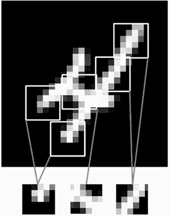

图 8.1 图像可以被分解为局部模式，如边缘、纹理等。

这个关键特征赋予了卷积神经网络两个有趣的特性：

+   *它们学习的模式是平移不变的*。在学习了图片右下角的某个模式后，卷积神经网络可以在任何地方识别它：例如，在左上角。密集连接模型如果出现在新位置，就必须重新学习这个模式。这使得卷积神经网络在处理图像时具有数据效率（因为*视觉世界在根本上是平移不变的*）：它们需要更少的训练样本来学习具有泛化能力的表示。

+   *它们可以学习空间模式的层次结构*。第一个卷积层将学习小的局部模式，如边缘，第二个卷积层将学习由第一层特征组成的更大模式，依此类推（见图 8.2）。这使得卷积神经网络能够高效地学习越来越复杂和抽象的视觉概念，因为*视觉世界在根本上是空间层次结构的*。

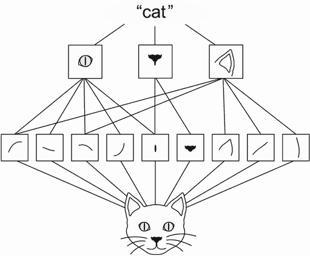

图 8.2 视觉世界形成了视觉模块的空间层次结构：基本线条或纹理组合成简单的对象，如眼睛或耳朵，这些对象组合成高级概念，如“猫”。

卷积在称为*特征图*的秩为 3 的张量上运行，具有两个空间轴（*高度*和*宽度*）以及一个*深度*轴（也称为*通道*轴）。对于 RGB 图像，深度轴的维度为 3，因为图像具有三个颜色通道：红色、绿色和蓝色。对于像 MNIST 数字这样的黑白图片，深度为 1（灰度级）。卷积操作从其输入特征图中提取补丁，并对所有这些补丁应用相同的变换，生成一个*输出特征图*。这个输出特征图仍然是一个秩为 3 的张量：它有一个宽度和一个高度。它的深度可以是任意的，因为输出深度是层的一个参数，而该深度轴中的不同通道不再代表 RGB 输入中的特定颜色；相反，它们代表*滤波器*。滤波器编码输入数据的特定方面：在高层次上，单个滤波器可以编码“输入中存在面孔”的概念，例如。

在 MNIST 示例中，第一个卷积层接收大小为`(28,` `28,` `1)`的特征图，并输出大小为`(26,` `26,` `32)`的特征图：它在输入上计算 32 个滤波器。这 32 个输出通道中的每一个包含一个 26×26 的值网格，这是滤波器在输入上的*响应图*，指示了该滤波器模式在输入的不同位置的响应（见图 8.3）。

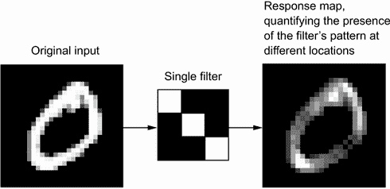

图 8.3 响应图的概念：在输入的不同位置显示模式存在的 2D 地图

这就是术语*特征图*的含义：深度轴中的每个维度都是一个*特征*（或滤波器），而张量`output[:,` `:,` `n]`是该滤波器在输入上的 2D 空间*响应图*。

卷积由两个关键参数定义：

+   *从输入中提取的补丁的大小*—通常为 3×3 或 5×5。在示例中，它们是 3×3，这是一个常见选择。

+   *输出特征图的深度*—这是卷积计算的滤波器数量。示例从深度为 32 开始，最终深度为 64。

在 Keras 的`Conv2D`层中，这些参数是传递给层的第一个参数：`Conv2D(output_depth,` `(window_height,` `window_width))`。

卷积通过在 3D 输入特征图上*滑动*大小为 3×3 或 5×5 的窗口，在每个可能的位置停止，并提取周围特征的 3D 补丁（形状为`(window_height,` `window_width,` `input_depth)`）。然后，每个这样的 3D 补丁通过与一个学习的权重矩阵进行张量积转换为形状为`(output_depth,)`的 1D 向量，称为*卷积核*—相同的核在每个补丁上重复使用。所有这些向量（每个补丁一个）然后在空间上重新组装成形状为`(height,` `width,` `output_ depth)`的 3D 输出图。输出特征图中的每个空间位置对应于输入特征图中的相同位置（例如，输出的右下角包含有关输入右下角的信息）。例如，对于 3×3 窗口，向量`output[i,` `j,` `:]`来自 3D 补丁`input[i-1:i+1,` `j-1:j+1,` `:]`。整个过程在图 8.4 中有详细说明。

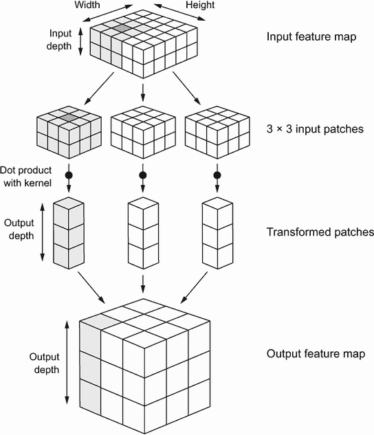

图 8.4 卷积的工作原理

请注意，输出宽度和高度可能与输入宽度和高度不同，原因有两个：

+   边界效应，可以通过填充输入特征图来抵消

+   *步幅*的使用，我将在下一节中定义

让我们更深入地了解这些概念。

理解边界效应和填充

考虑一个 5×5 的特征图（总共 25 个瓦片）。只有 9 个瓦片周围可以放置一个 3×3 窗口的中心，形成一个 3×3 的网格（见图 8.5）。因此，输出特征图将是 3×3。它会略微缩小：在每个维度上正好减少两个瓦片，本例中是这样。您可以在之前的示例中看到这种边界效应：您从 28×28 的输入开始，经过第一层卷积后变为 26×26。

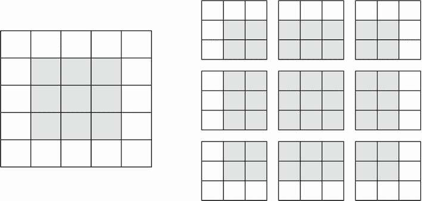

图 8.5 5×5 输入特征图中 3×3 补丁的有效位置

如果您想获得与输入相同空间维度的输出特征图，可以使用*填充*。填充包括在输入特征图的每一侧添加适当数量的行和列，以便使每个输入瓦片周围都能放置中心卷积窗口。对于 3×3 窗口，您在右侧添加一列，在左侧添加一列，在顶部添加一行，在底部添加一行。对于 5×5 窗口，您添加两行（见图 8.6）。

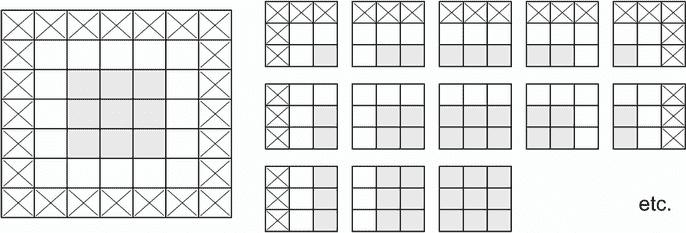

图 8.6 对 5×5 输入进行填充以便提取 25 个 3×3 补丁

在`Conv2D`层中，填充可以通过`padding`参数进行配置，该参数接受两个值："valid"表示无填充（只使用有效的窗口位置），"same"表示“填充以使输出具有与输入相同的宽度和高度”。`padding`参数默认为"valid"。

理解卷积步幅

影响输出大小的另一个因素是*步幅*的概念。到目前为止，我们对卷积的描述假定卷积窗口的中心瓦片都是连续的。但是两个连续窗口之间的距离是卷积的一个参数，称为*步幅*，默认为 1。可以进行*步幅卷积*：步幅大于 1 的卷积。在图 8.7 中，您可以看到在 5×5 输入（无填充）上使用步幅 2 进行 3×3 卷积提取的补丁。

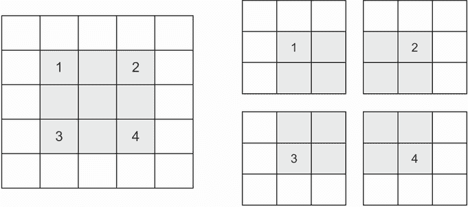

图 8.7 2×2 步幅下的 3×3 卷积补丁

使用步幅 2 意味着特征图的宽度和高度会被下采样 2 倍（除了边界效应引起的任何变化）。步幅卷积在分类模型中很少使用，但对于某些类型的模型非常有用，您将在下一章中看到。

在分类模型中，我们倾向于使用*最大池化*操作来对特征图进行下采样，您在我们的第一个卷积神经网络示例中看到了它的作用。让我们更深入地看一下。

### 8.1.2 最大池化操作

在卷积神经网络示例中，您可能已经注意到在每个`MaxPooling2D`层之后特征图的大小减半。例如，在第一个`MaxPooling2D`层之前，特征图为 26×26，但最大池化操作将其减半为 13×13。这就是最大池化的作用：大幅度地对特征图进行下采样，类似于步幅卷积。

最大池化包括从输入特征图中提取窗口并输出每个通道的最大值。它在概念上类似于卷积，不同之处在于，最大池化不是通过学习的线性变换（卷积核）来转换局部补丁，而是通过硬编码的`max`张量操作来转换。与卷积的一个重要区别是，最大池化通常使用 2×2 窗口和步幅 2 进行，以便将特征图下采样 2 倍。另一方面，卷积通常使用 3×3 窗口和无步幅（步幅 1）。

为什么要以这种方式对特征图进行下采样？为什么不删除最大池化层，一直保持相当大的特征图？让我们看看这个选项。我们的模型将如下所示。

列表 8.5 一个结构不正确的卷积神经网络，缺少最大池化层

```py
inputs = keras.Input(shape=(28, 28, 1))
x = layers.Conv2D(filters=32, kernel_size=3, activation="relu")(inputs)
x = layers.Conv2D(filters=64, kernel_size=3, activation="relu")(x)
x = layers.Conv2D(filters=128, kernel_size=3, activation="relu")(x)
x = layers.Flatten()(x)
outputs = layers.Dense(10, activation="softmax")(x)
model_no_max_pool = keras.Model(inputs=inputs, outputs=outputs)
```

这里是模型的摘要：

```py
>>> model_no_max_pool.summary()
Model: "model_1" 
_________________________________________________________________
Layer (type)                 Output Shape              Param # 
=================================================================
input_2 (InputLayer)         [(None, 28, 28, 1)]       0 
_________________________________________________________________
conv2d_3 (Conv2D)            (None, 26, 26, 32)        320 
_________________________________________________________________
conv2d_4 (Conv2D)            (None, 24, 24, 64)        18496 
_________________________________________________________________
conv2d_5 (Conv2D)            (None, 22, 22, 128)       73856 
_________________________________________________________________
flatten_1 (Flatten)          (None, 61952)             0 
_________________________________________________________________
dense_1 (Dense)              (None, 10)                619530 
=================================================================
Total params: 712,202 
Trainable params: 712,202 
Non-trainable params: 0 
_________________________________________________________________
```

这种设置有什么问题？有两个问题：

+   这不利于学习特征的空间层次结构。第三层中的 3×3 窗口只包含来自初始输入的 7×7 窗口的信息。卷积网络学到的高级模式仍然相对于初始输入非常小，这可能不足以学会分类数字（尝试仅通过查看 7×7 像素窗口来识别数字！）。我们需要最后一个卷积层的特征包含关于整个输入的信息。

+   最终的特征图每个样本有 22×22×128 = 61,952 个总系数。这是巨大的。当你将其展平以在顶部放置一个`Dense`层大小为 10 时，该层将有超过一百万个参数。对于这样一个小模型来说，这太大了，会导致严重的过拟合。

简而言之，使用降采样的原因是减少要处理的特征图系数的数量，并通过使连续的卷积层查看越来越大的窗口（就覆盖原始输入的部分而言）来引入空间滤波器层次结构。

注意，最大池化并不是唯一实现这种降采样的方法。正如你已经知道的，你也可以在先前的卷积层中使用步幅。你也可以使用平均池化代替最大池化，其中每个局部输入块通过取该块上每个通道的平均值来进行转换，而不是最大值。但是最大池化往往比这些替代方案效果更好。原因在于特征往往编码了特定模式或概念在特征图的不同块上的空间存在（因此术语*特征图*），查看不同特征的*最大存在*比查看它们的*平均存在*更具信息量。最合理的子采样策略是首先通过非步幅卷积生成密集特征图，然后查看特征在小块上的最大激活，而不是查看输入的稀疏窗口（通过步幅卷积）或平均输入块，这可能导致您错过或稀释特征存在信息。

此时，你应该了解卷积网络的基础知识——特征图、卷积和最大池化，并且应该知道如何构建一个小型卷积网络来解决诸如 MNIST 数字分类之类的玩具问题。现在让我们转向更有用、实际的应用。

## 8.2 在小数据集上从头开始训练卷积网络

不得不使用非常少的数据训练图像分类模型是一种常见情况，在实践中，如果你在专业环境中进行计算机视觉，你可能会遇到这种情况。少量样本可以是从几百到几万张图像。作为一个实际例子，我们将专注于在一个包含 5,000 张猫和狗图片的数据集中对图像进行分类（2,500 只猫，2,500 只狗）。我们将使用 2,000 张图片进行训练，1,000 张用于验证，2,000 张用于测试。

在本节中，我们将回顾一种基本策略来解决这个问题：使用你拥有的少量数据从头开始训练一个新模型。我们将从头开始训练一个小型卷积网络，使用 2,000 个训练样本，没有任何正则化，来建立一个可以实现的基准。这将使我们达到约 70%的分类准确率。在那时，主要问题将是过拟合。然后我们将介绍*数据增强*，这是一种在计算机视觉中减轻过拟合的强大技术。通过使用数据增强，我们将改进模型，使准确率达到 80-85%。

在下一节中，我们将回顾将深度学习应用于小数据集的另外两种基本技术：*使用预训练模型进行特征提取*（这将使我们达到 97.5% 的准确率）和*微调预训练模型*（这将使我们达到最终准确率 98.5%）。这三种策略——从头开始训练一个小模型、使用预训练模型进行特征提取以及微调预训练模型——将构成您未来解决使用小数据集进行图像分类问题的工具箱。

### 8.2.1 深度学习在小数据问题上的相关性

什么样的“足够样本”可以用来训练模型是相对的——相对于您尝试训练的模型的大小和深度。仅凭几十个样本无法训练卷积网络解决复杂问题，但如果模型小且经过良好的正则化，任务简单，那么几百个样本可能就足够了。因为卷积网络学习局部、平移不变的特征，它们在感知问题上具有高效的数据利用率。在非常小的图像数据集上从头开始训练卷积网络将产生合理的结果，尽管数据相对较少，无需进行任何自定义特征工程。您将在本节中看到这一点。

此外，深度学习模型天生具有高度的可重用性：您可以拿一个在大规模数据集上训练的图像分类或语音转文本模型，仅进行轻微更改就可以在完全不同的问题上重用它。具体来说，在计算机视觉领域，现在有许多预训练模型（通常在 ImageNet 数据集上训练）可以公开下载，并且可以用来从很少的数据中启动强大的视觉模型。这是深度学习的最大优势之一：特征重用。您将在下一节中探索这一点。

让我们开始获取数据。

### 8.2.2 下载数据

我们将使用的 Dogs vs. Cats 数据集不随 Keras 打包。它是由 Kaggle 在 2013 年底作为计算机视觉竞赛的一部分提供的，当时卷积网络还不是主流。您可以从 [www.kaggle.com/c/dogs-vs-cats/data](https://www.kaggle.com/c/dogs-vs-cats/data) 下载原始数据集（如果您还没有 Kaggle 帐户，需要创建一个—不用担心，这个过程很简单）。您将可以使用 Kaggle API 在 Colab 中下载数据集（请参阅“在 Google Colaboratory 中下载 Kaggle 数据集”侧边栏）。

在 Google Colaboratory 中下载 Kaggle 数据集

Kaggle 提供了一个易于使用的 API，用于以编程方式下载托管在 Kaggle 上的数据集。例如，您可以使用它将 Dogs vs. Cats 数据集下载到 Colab 笔记本中。这个 API 可以作为 `kaggle` 包使用，在 Colab 上预先安装。在 Colab 单元格中运行以下命令就可以轻松下载这个数据集：

```py
!kaggle competitions download -c dogs-vs-cats
```

然而，API 的访问权限仅限于 Kaggle 用户，因此为了运行上述命令，您首先需要进行身份验证。`kaggle` 包将在位于 ~/.kaggle/kaggle.json 的 JSON 文件中查找您的登录凭据。让我们创建这个文件。

首先，您需要创建一个 Kaggle API 密钥并将其下载到本地计算机。只需在 Web 浏览器中导航到 Kaggle 网站，登录，然后转到“我的帐户”页面。在您的帐户设置中，您会找到一个 API 部分。点击“创建新的 API 令牌”按钮将生成一个 kaggle.json 密钥文件，并将其下载到您的计算机。

其次，转到您的 Colab 笔记本，并通过在笔记本单元格中运行以下代码将 API 密钥 JSON 文件上传到您的 Colab 会话：

```py
from google.colab import files
files.upload()
```

当您运行此单元格时，您将看到一个“选择文件”按钮出现。点击它并选择您刚下载的 kaggle.json 文件。这将上传文件到本地的 Colab 运行时。

最后，创建一个 `~/.kaggle` 文件夹（`mkdir ~/.kaggle`），并将密钥文件复制到其中（`cp kaggle.json ~/.kaggle/`）。作为安全最佳实践，您还应确保该文件仅可由当前用户，即您自己（`chmod 600`）读取：

```py
!mkdir ~/.kaggle
!cp kaggle.json ~/.kaggle/
!chmod 600 ~/.kaggle/kaggle.json
```

您现在可以下载我们即将使用的数据：

```py
!kaggle competitions download -c dogs-vs-cats
```

第一次尝试下载数据时，您可能会收到“403 Forbidden”错误。这是因为您需要在下载数据之前接受与数据集相关的条款 - 您需要转到 [www.kaggle.com/c/dogs-vs-cats/rules](https://www.kaggle.com/c/dogs-vs-cats/rules)（登录到您的 Kaggle 帐户）并点击“我理解并接受”按钮。您只需要执行一次此操作。

最后，训练数据是一个名为 `train.zip` 的压缩文件。确保您安静地解压缩它（`unzip -qq`）：

```py
!unzip -qq train.zip
```

我们数据集中的图片是中等分辨率的彩色 JPEG 图片。图 8.8 展示了一些示例。

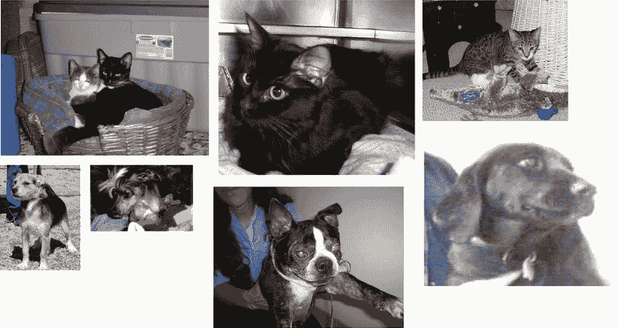

图 8.8 显示了来自狗与猫数据集的样本。大小没有被修改：样本具有不同的大小、颜色、背景等。

毫不奇怪，最早的狗与猫 Kaggle 竞赛，即 2013 年，是由使用卷积网络的参赛者赢得的。最好的参赛作品达到了高达 95% 的准确率。在这个示例中，我们将接近这个准确率（在下一节中），即使我们将在可用于参赛者的数据的不到 10% 上训练我们的模型。

该数据集包含 25,000 张狗和猫的图片（每类 12,500 张）并且大小为 543 MB（压缩）。在下载和解压缩数据后，我们将创建一个新数据集，其中包含三个子集：一个包含每个类别 1,000 个样本的训练集，一个包含每个类别 500 个样本的验证集，以及一个包含每个类别 1,000 个样本的测试集。为什么这样做？因为您在职业生涯中遇到的许多图像数据集只包含几千个样本，而不是数万个。有更多的数据可用会使问题变得更容易，因此最好的做法是使用一个小数据集进行学习。

我们将使用的子采样数据集将具有以下目录结构：

```py
cats_vs_dogs_small/
...train/
......cat/         # ❶
......dog/         # ❷
...validation/
......cat/         # ❸
......dog/         # ❹
...test/
......cat/         # ❺
......dog/         # ❻
```

❶ 包含 1,000 张猫的图片

❷ 包含 1,000 张狗的图片

❸ 包含 500 张猫的图片

❹ 包含 500 张狗的图片

❺ 包含 1,000 张猫的图片

❻ 包含 1,000 张狗的图片

让我们通过几次调用 `shutil` 来实现。

列表 8.6 将图片复制到训练、验证和测试目录

```py
import os, shutil, pathlib

original_dir = pathlib.Path("train")                           # ❶
new_base_dir = pathlib.Path("cats_vs_dogs_small")              # ❷

def make_subset(subset_name, start_index, end_index):          # ❸
    for category in ("cat", "dog"):
        dir = new_base_dir / subset_name / category
        os.makedirs(dir)
        fnames = [f"{category}.{i}.jpg" 
 for i in range(start_index, end_index)]
        for fname in fnames:
            shutil.copyfile(src=original_dir / fname,
                            dst=dir / fname)

make_subset("train", start_index=0, end_index=1000)            # ❹
make_subset("validation", start_index=1000, end_index=1500)    # ❺
make_subset("test", start_index=1500, end_index=2500)          # ❻
```

❶ 包含原始数据集解压缩后的目录路径

❷ 我们将存储我们较小数据集的目录

❸ 复制猫（和狗）图片的实用函数，从索引 `start_index` 到索引 `end_index` 复制到子目录 `new_base_dir/{subset_name}/cat`（和/dog）。"subset_name" 将是 "train"、"validation" 或 "test" 中的一个。

❹ 创建训练子集，包括每个类别的前 1,000 张图片。

❺ 创建验证子集，包括每个类别的接下来的 500 张图片。

❻ 创建测试子集，包括每个类别的接下来的 1,000 张图片。

现在我们有 2,000 张训练图片，1,000 张验证图片和 2,000 张测试图片。每个拆分包含每个类别相同数量的样本：这是一个平衡的二元分类问题，这意味着分类准确率将是一个适当的成功衡量标准。

### 8.2.3 构建模型

我们将重用你在第一个示例中看到的相同的通用模型结构：卷积网络将是交替的 `Conv2D`（带有 `relu` 激活）和 `MaxPooling2D` 层的堆叠。

但由于我们处理的是更大的图片和更复杂的问题，我们将相应地使我们的模型更大：它将有两个额外的 `Conv2D` 和 `MaxPooling2D` 阶段。这既增加了模型的容量，也进一步减小了特征图的大小，以便在达到 `Flatten` 层时它们不会过大。在这里，因为我们从大小为 180 像素 × 180 像素的输入开始（这是一个有点随意的选择），我们最终得到了在 `Flatten` 层之前大小为 7 × 7 的特征图。

注意：特征图的深度在模型中逐渐增加（从 32 增加到 256），而特征图的大小在减小（从 180 × 180 减小到 7 × 7）。这是您几乎在所有卷积网络中看到的模式。

因为我们正在处理一个二分类问题，所以我们将模型以一个单元（大小为 1 的 `Dense` 层）和一个 `sigmoid` 激活结束。这个单元将编码模型正在查看的是一个类还是另一个类的概率。

最后一个小差异：我们将使用一个 `Rescaling` 层开始模型，它将重新缩放图像输入（其值最初在 [0, 255] 范围内）到 [0, 1] 范围内。

列表 8.7 实例化一个用于狗与猫分类的小型卷积网络

```py
from tensorflow import keras 
from tensorflow.keras import layers

inputs = keras.Input(shape=(180, 180, 3))                            # ❶
x = layers.Rescaling(1./255)(inputs)                                 # ❷
x = layers.Conv2D(filters=32, kernel_size=3, activation="relu")(x)
x = layers.MaxPooling2D(pool_size=2)(x)
x = layers.Conv2D(filters=64, kernel_size=3, activation="relu")(x)
x = layers.MaxPooling2D(pool_size=2)(x)
x = layers.Conv2D(filters=128, kernel_size=3, activation="relu")(x)
x = layers.MaxPooling2D(pool_size=2)(x)
x = layers.Conv2D(filters=256, kernel_size=3, activation="relu")(x)
x = layers.MaxPooling2D(pool_size=2)(x)
x = layers.Conv2D(filters=256, kernel_size=3, activation="relu")(x)
x = layers.Flatten()(x)
outputs = layers.Dense(1, activation="sigmoid")(x)
model = keras.Model(inputs=inputs, outputs=outputs)
```

❶ 模型期望尺寸为 180 × 180 的 RGB 图像。

❷ 将输入重新缩放到 [0, 1] 范围，通过将它们除以 255。

让我们看看随着每一层的连续变化，特征图的维度如何改变：

```py
>>> model.summary()
Model: "model_2" 
_________________________________________________________________
Layer (type)                 Output Shape              Param # 
=================================================================
input_3 (InputLayer)         [(None, 180, 180, 3)]     0 
_________________________________________________________________
rescaling (Rescaling)        (None, 180, 180, 3)       0 
_________________________________________________________________
conv2d_6 (Conv2D)            (None, 178, 178, 32)      896 
_________________________________________________________________
max_pooling2d_2 (MaxPooling2 (None, 89, 89, 32)        0 
_________________________________________________________________
conv2d_7 (Conv2D)            (None, 87, 87, 64)        18496 
_________________________________________________________________
max_pooling2d_3 (MaxPooling2 (None, 43, 43, 64)        0 
_________________________________________________________________
conv2d_8 (Conv2D)            (None, 41, 41, 128)       73856 
_________________________________________________________________
max_pooling2d_4 (MaxPooling2 (None, 20, 20, 128)       0 
_________________________________________________________________
conv2d_9 (Conv2D)            (None, 18, 18, 256)       295168 
_________________________________________________________________
max_pooling2d_5 (MaxPooling2 (None, 9, 9, 256)         0 
_________________________________________________________________
conv2d_10 (Conv2D)           (None, 7, 7, 256)         590080 
_________________________________________________________________
flatten_2 (Flatten)          (None, 12544)             0 
_________________________________________________________________
dense_2 (Dense)              (None, 1)                 12545 
=================================================================
Total params: 991,041 
Trainable params: 991,041 
Non-trainable params: 0 
_________________________________________________________________
```

对于编译步骤，我们将继续使用 `RMSprop` 优化器。因为我们最后一层是一个单一的 sigmoid 单元，所以我们将使用二元交叉熵作为损失函数（作为提醒，请查看第六章中表 6.1，了解在各种情况下使用哪种损失函数的速查表）。

列表 8.8 配置用于训练的模型

```py
model.compile(loss="binary_crossentropy",
              optimizer="rmsprop",
              metrics=["accuracy"])
```

### 8.2.4 数据预处理

正如你现在所知，数据在被馈送到模型之前应该被格式化为适当预处理的浮点张量。目前，数据以 JPEG 文件的形式存储在驱动器上，因此将其传递到模型的步骤大致如下：

1.  读取图片文件。

1.  将 JPEG 内容解码为 RGB 像素网格。

1.  将它们转换为浮点张量。

1.  调整它们到共享大小（我们将使用 180 × 180）。

1.  将它们打包成批次（我们将使用 32 张图像的批次）。

这可能看起来有点令人生畏，但幸运的是，Keras 有工具可以自动处理这些步骤。特别是，Keras 提供了实用函数 `image_dataset_from_directory()`，它可以让您快速设置一个数据管道，可以自动将磁盘上的图像文件转换为预处理张量的批次。这就是我们将在这里使用的方法。

调用 `image_dataset_from_directory(directory)` 首先会列出 `directory` 的子目录，并假定每个子目录包含一个类别的图像。然后，它将索引每个子目录中的图像文件。最后，它将创建并返回一个配置为读取这些文件、对其进行洗牌、解码为张量、调整大小为共享大小并打包成批次的 `tf.data.Dataset` 对象。

列表 8.9 使用 `image_dataset_from_directory` 读取图像

```py
from tensorflow.keras.utils import image_dataset_from_directory

train_dataset = image_dataset_from_directory(
    new_base_dir / "train",
    image_size=(180, 180),
    batch_size=32)
validation_dataset = image_dataset_from_directory(
    new_base_dir / "validation",
    image_size=(180, 180),
    batch_size=32)
test_dataset = image_dataset_from_directory(
    new_base_dir / "test",
    image_size=(180, 180),
    batch_size=32)
```

理解 TensorFlow `Dataset` 对象

TensorFlow 提供了 `tf.data` API 来为机器学习模型创建高效的输入管道。其核心类是 `tf.data.Dataset`。

`Dataset` 对象是一个迭代器：你可以在 `for` 循环中使用它。它通常会返回输入数据和标签的批次。你可以直接将 `Dataset` 对象传递给 Keras 模型的 `fit()` 方法。

`Dataset` 类处理许多关键功能，否则实现起来会很麻烦，特别是异步数据预取（在模型处理上一个批次数据的同时预处理下一个批次数据，从而保持执行流畅而没有中断）。

`Dataset` 类还提供了一个用于修改数据集的函数式 API。这里有一个快速示例：让我们从一个大小为 16 的随机数 NumPy 数组创建一个 `Dataset` 实例。我们将考虑 1,000 个样本，每个样本是一个大小为 16 的向量：

```py
import numpy as np 
import tensorflow as tf
random_numbers = np.random.normal(size=(1000, 16))
dataset = tf.data.Dataset.from_tensor_slices(random_numbers)      # ❶
```

❶ 使用 `from_tensor_slices()` 类方法可以从 NumPy 数组、元组或字典中创建一个 Dataset。

起初，我们的数据集只产生单个样本：

```py
>>> for i, element in enumerate(dataset):
>>>     print(element.shape)
>>>     if i >= 2:
>>>         break
(16,)
(16,)
(16,)
```

我们可以使用 `.batch()` 方法对数据进行分批处理：

```py
>>> batched_dataset = dataset.batch(32)
>>> for i, element in enumerate(batched_dataset):
>>>     print(element.shape)
>>>     if i >= 2:
>>>         break
(32, 16)
(32, 16)
(32, 16)
```

更广泛地说，我们可以访问一系列有用的数据集方法，例如

+   `.shuffle(buffer_size)`—在缓冲区内对元素进行洗牌

+   `.prefetch(buffer_size)`—预取 GPU 内存中的一组元素，以实现更好的设备利用率。

+   `.map(callable)`—对数据集的每个元素应用任意转换（函数`callable`，期望接受数据集产生的单个元素作为输入）。

`.map()`方法特别常用。这里有一个例子。我们将用它将我们的玩具数据集中的元素从形状`(16,)`改变为形状`(4,` `4)`：

```py
>>> reshaped_dataset = dataset.map(lambda x: tf.reshape(x, (4, 4)))
>>> for i, element in enumerate(reshaped_dataset):
>>>     print(element.shape)
>>>     if i >= 2:
>>>         break
(4, 4)
(4, 4)
(4, 4)
```

在本章中，你将看到更多`map()`的应用。

让我们看看其中一个`Dataset`对象的输出：它产生大小为`(32,` `180,` `180,` `3)`的 RGB 图像批次和整数标签（形状为`(32,)`）。每个批次中有 32 个样本（批次大小）。

列表 8.10 显示`Dataset`产生的数据和标签的形状

```py
>>> for data_batch, labels_batch in train_dataset:
>>>     print("data batch shape:", data_batch.shape)
>>>     print("labels batch shape:", labels_batch.shape)
>>>     break
data batch shape: (32, 180, 180, 3)
labels batch shape: (32,)
```

让我们在我们的数据集上拟合模型。我们将使用`fit()`中的`validation_data`参数来监视单独的`Dataset`对象上的验证指标。

请注意，我们还将使用`ModelCheckpoint`回调来在每个周期后保存模型。我们将配置它的路径，指定保存文件的位置，以及参数`save_best_only=True`和`monitor="val_loss"`：它们告诉回调只在当前`val_loss`指标的值低于训练过程中任何先前时间的值时保存新文件（覆盖任何先前的文件）。这确保了你保存的文件始终包含模型对验证数据表现最佳的训练周期状态。因此，如果开始过拟合，我们不必重新训练一个更少周期的模型：我们只需重新加载保存的文件。

列表 8.11 使用`Dataset`拟合模型

```py
callbacks = [
    keras.callbacks.ModelCheckpoint(
        filepath="convnet_from_scratch.keras",
        save_best_only=True,
        monitor="val_loss")
]
history = model.fit(
    train_dataset,
    epochs=30,
    validation_data=validation_dataset,
    callbacks=callbacks)
```

让我们绘制模型在训练和验证数据上的损失和准确率随训练过程的变化（见图 8.9）。

列表 8.12 显示训练过程中损失和准确率的曲线

```py
import matplotlib.pyplot as plt
accuracy = history.history["accuracy"]
val_accuracy = history.history["val_accuracy"]
loss = history.history["loss"]
val_loss = history.history["val_loss"]
epochs = range(1, len(accuracy) + 1)
plt.plot(epochs, accuracy, "bo", label="Training accuracy")
plt.plot(epochs, val_accuracy, "b", label="Validation accuracy")
plt.title("Training and validation accuracy")
plt.legend()
plt.figure()
plt.plot(epochs, loss, "bo", label="Training loss")
plt.plot(epochs, val_loss, "b", label="Validation loss")
plt.title("Training and validation loss")
plt.legend()
plt.show()
```

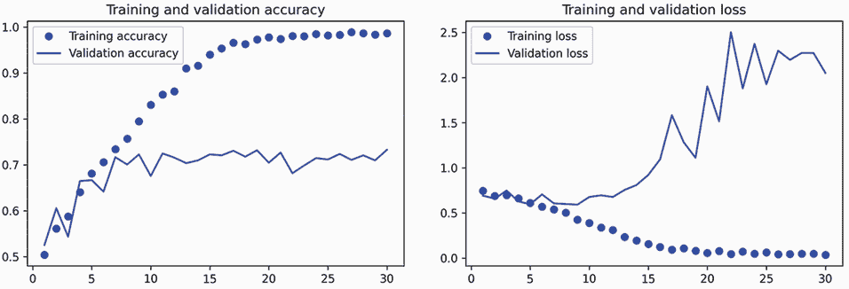

图 8.9 简单卷积网络的训练和验证指标

这些图表是过拟合的特征。训练准确率随时间线性增加，直到接近 100%，而验证准确率在 75%时达到峰值。验证损失在仅十个周期后达到最小值，然后停滞，而训练损失随着训练的进行线性减少。

让我们检查测试准确率。我们将从保存的文件重新加载模型以评估它在过拟合之前的状态。

列表 8.13 在测试集上评估模型

```py
test_model = keras.models.load_model("convnet_from_scratch.keras")
test_loss, test_acc = test_model.evaluate(test_dataset) 
print(f"Test accuracy: {test_acc:.3f}")
```

我们得到了 69.5% 的测试准确率。（由于神经网络初始化的随机性，你可能得到与此相差不到一个百分点的数字。）

因为我们有相对较少的训练样本（2,000），过拟合将是我们关注的首要问题。你已经了解到一些可以帮助减轻过拟合的技术，如 dropout 和权重衰减（L2 正则化）。现在我们将使用一个新的技术，特定于计算机视觉，并在使用深度学习模型处理图像时几乎普遍使用：*数据增强*。

### 8.2.5 使用数据增强

过拟合是由于样本量太少，导致无法训练出能够泛化到新数据的模型。如果有无限的数据，你的模型将暴露于手头数据分布的每一个可能方面：你永远不会过拟合。数据增强采取生成更多训练数据的方法，通过一些随机转换*增强*样本，生成看起来可信的图像。目标是，在训练时，你的模型永远不会看到完全相同的图片。这有助于让模型接触数据的更多方面，从而更好地泛化。

在 Keras 中，可以通过在模型开头添加一些*数据增强层*来实现。让我们通过一个示例开始：下面的 Sequential 模型链接了几个随机图像转换。在我们的模型中，我们会在`Rescaling`层之前包含它。

列表 8.14 定义要添加到图像模型中的数据增强阶段

```py
data_augmentation = keras.Sequential(
    [
        layers.RandomFlip("horizontal"),
        layers.RandomRotation(0.1),
        layers.RandomZoom(0.2),
    ]
)
```

这些只是一些可用的层（更多内容，请参阅 Keras 文档）。让我们快速浏览一下这段代码：

+   `RandomFlip("horizontal")`—对通过它的随机 50%图像应用水平翻转

+   `RandomRotation(0.1)`—将输入图像旋转一个在范围[–10%，+10%]内的随机值（这些是完整圆的分数—以度为单位，范围将是[–36 度，+36 度]）

+   `RandomZoom(0.2)`—通过在范围[-20%，+20%]内的随机因子放大或缩小图像

让我们看一下增强后的图像（参见图 8.10）。

列表 8.15 显示一些随机增强的训练图像

```py
plt.figure(figsize=(10, 10)) 
for images, _ in train_dataset.take(1):                           # ❶
    for i in range(9):
        augmented_images = data_augmentation(images)              # ❷
        ax = plt.subplot(3, 3, i + 1)
        plt.imshow(augmented_images[0].numpy().astype("uint8"))   # ❸
        plt.axis("off")
```

❶ 我们可以使用 take(N)仅从数据集中取样 N 批次。这相当于在第 N 批次后的循环中插入一个中断。

❷ 将增强阶段应用于图像批次。

❸ 显示输出批次中的第一张图像。对于九次迭代中的每一次，这是同一图像的不同增强。

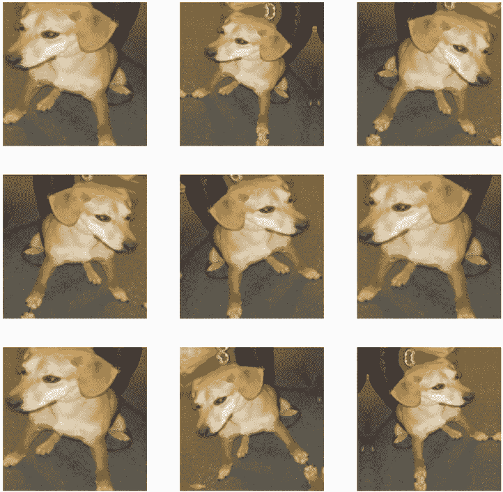

图 8.10 通过随机数据增强生成一个非常好的男孩的变化

如果我们使用这个数据增强配置训练一个新模型，那么模型将永远不会看到相同的输入两次。但是它看到的输入仍然高度相关，因为它们来自少量原始图像—我们无法产生新信息；我们只能重新混合现有信息。因此，这可能不足以完全消除过拟合。为了进一步对抗过拟合，我们还将在密集连接分类器之前向我们的模型添加一个`Dropout`层。

关于随机图像增强层，还有一件事你应该知道：就像`Dropout`一样，在推断时（当我们调用`predict()`或`evaluate()`时），它们是不活动的。在评估期间，我们的模型的行为将与不包括数据增强和 dropout 时完全相同。

列表 8.16 定义一个包含图像增强和 dropout 的新卷积神经网络

```py
inputs = keras.Input(shape=(180, 180, 3))
x = data_augmentation(inputs)
x = layers.Rescaling(1./255)(x)
x = layers.Conv2D(filters=32, kernel_size=3, activation="relu")(x)
x = layers.MaxPooling2D(pool_size=2)(x)
x = layers.Conv2D(filters=64, kernel_size=3, activation="relu")(x)
x = layers.MaxPooling2D(pool_size=2)(x)
x = layers.Conv2D(filters=128, kernel_size=3, activation="relu")(x)
x = layers.MaxPooling2D(pool_size=2)(x)
x = layers.Conv2D(filters=256, kernel_size=3, activation="relu")(x)
x = layers.MaxPooling2D(pool_size=2)(x)
x = layers.Conv2D(filters=256, kernel_size=3, activation="relu")(x)
x = layers.Flatten()(x)
x = layers.Dropout(0.5)(x)
outputs = layers.Dense(1, activation="sigmoid")(x)
model = keras.Model(inputs=inputs, outputs=outputs)

model.compile(loss="binary_crossentropy",
              optimizer="rmsprop",
              metrics=["accuracy"])
```

让我们使用数据增强和 dropout 来训练模型。因为我们预计过拟合会在训练期间发生得更晚，所以我们将训练三倍的时期—一百个时期。

列表 8.17 训练正则化的卷积神经网络

```py
callbacks = [
    keras.callbacks.ModelCheckpoint(
        filepath="convnet_from_scratch_with_augmentation.keras",
        save_best_only=True,
        monitor="val_loss")
]
history = model.fit(
    train_dataset,
    epochs=100,
    validation_data=validation_dataset,
    callbacks=callbacks)
```

让我们再次绘制结果：参见图 8.11。由于数据增强和 dropout，我们开始过拟合的时间要晚得多，大约在 60-70 个时期（与原始模型的 10 个时期相比）。验证准确性最终稳定在 80-85%的范围内—相比我们的第一次尝试，这是一个很大的改进。

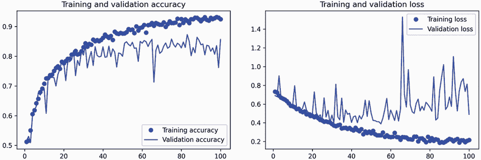

图 8.11 使用数据增强的训练和验证指标

让我们检查测试准确性。

列表 8.18 在测试集上评估模型

```py
test_model = keras.models.load_model(
    "convnet_from_scratch_with_augmentation.keras")
test_loss, test_acc = test_model.evaluate(test_dataset)
print(f"Test accuracy: {test_acc:.3f}")
```

我们获得了 83.5%的测试准确性。看起来不错！如果你在使用 Colab，请确保下载保存的文件（convnet_from_scratch_with_augmentation.keras），因为我们将在下一章中用它进行一些实验。

通过进一步调整模型的配置（例如每个卷积层的滤波器数量，或模型中的层数），我们可能能够获得更高的准确性，可能高达 90%。但是，仅通过从头开始训练我们自己的卷积神经网络，要想获得更高的准确性将会变得困难，因为我们的数据量太少。为了提高这个问题上的准确性，我们将不得不使用一个预训练模型，这是接下来两节的重点。

## 8.3 利用预训练模型

一种常见且高效的小图像数据集深度学习方法是使用预训练模型。*预训练模型*是先前在大型数据集上训练过的模型，通常是在大规模图像分类任务上。如果原始数据集足够大且足够通用，那么预训练模型学习到的空间特征层次结构可以有效地充当视觉世界的通用模型，因此，其特征对许多不同的计算机视觉问题都可能有用，即使这些新问题可能涉及与原始任务完全不同的类别。例如，您可以在 ImageNet 上训练一个模型（其中类别主要是动物和日常物品），然后将这个训练好的模型重新用于识别图像中的家具物品等远程任务。与许多较旧的、浅层学习方法相比，学习到的特征在不同问题之间的可移植性是深度学习的一个关键优势，这使得深度学习在小数据问题上非常有效。

在这种情况下，让我们考虑一个在 ImageNet 数据集上训练的大型卷积网络（140 万标记图像和 1000 个不同类别）。ImageNet 包含许多动物类别，包括不同品种的猫和狗，因此您可以期望它在狗与猫的分类问题上表现良好。

我们将使用 VGG16 架构，这是由 Karen Simonyan 和 Andrew Zisserman 于 2014 年开发的。虽然这是一个较老的模型，远非当前技术水平，并且比许多其他最新模型要重，但我选择它是因为其架构类似于您已经熟悉的内容，并且没有引入任何新概念。这可能是您第一次遇到这些可爱的模型名称之一——VGG、ResNet、Inception、Xception 等；如果您继续进行计算机视觉的深度学习，您将经常遇到它们。

使用预训练模型有两种方法：*特征提取*和*微调*。我们将涵盖这两种方法。让我们从特征提取开始。

### 8.3.1 使用预训练模型进行特征提取

特征提取包括使用先前训练模型学习到的表示来从新样本中提取有趣的特征。然后，这些特征通过一个新的分类器，该分类器是从头开始训练的。

正如您之前看到的，用于图像分类的卷积网络由两部分组成：它们从一系列池化和卷积层开始，然后以一个密集连接的分类器结束。第一部分被称为模型的*卷积基础*。在卷积网络的情况下，特征提取包括获取先前训练网络的卷积基础，将新数据通过它运行，并在输出之上训练一个新的分类器（参见图 8.12）。

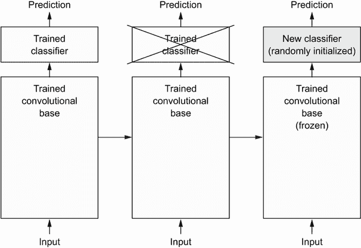

图 8.12 在保持相同卷积基础的情况下交换分类器

为什么只重用卷积基？我们能否也重用密集连接的分类器？一般来说，应该避免这样做。原因是卷积基学习到的表示可能更通用，因此更具重用性：卷积网络的特征图是图片上通用概念的存在图，这些概念可能无论面临什么计算机视觉问题都有用。但分类器学习到的表示必然是特定于模型训练的类集合的——它们只包含关于整个图片中这个或那个类别存在概率的信息。此外，密集连接层中的表示不再包含有关对象在输入图像中位置的信息；这些层摆脱了空间的概念，而对象位置仍然由卷积特征图描述。对于需要考虑对象位置的问题，密集连接特征基本上是无用的。

请注意，特定卷积层提取的表示的泛化程度（因此可重用性）取决于模型中该层的深度。模型中较早的层提取局部、高度通用的特征图（如视觉边缘、颜色和纹理），而较高层提取更抽象的概念（如“猫耳”或“狗眼”）。因此，如果您的新数据集与原始模型训练的数据集差异很大，您可能最好只使用模型的前几层进行特征提取，而不是使用整个卷积基。

在这种情况下，因为 ImageNet 类别集包含多个狗和猫类别，重用原始模型的密集连接层中包含的信息可能是有益的。但我们选择不这样做，以涵盖新问题的类别集与原始模型的类别集不重叠的更一般情况。让我们通过使用在 ImageNet 上训练的 VGG16 网络的卷积基从猫和狗图片中提取有趣的特征，然后在这些特征之上训练一个狗与猫的分类器来实践这一点。

VGG16 模型，以及其他模型，已经预先打包在 Keras 中。您可以从 `keras.applications` 模块导入它。许多其他图像分类模型（都在 ImageNet 数据集上预训练）都作为 `keras.applications` 的一部分可用：

+   Xception

+   ResNet

+   MobileNet

+   EfficientNet

+   DenseNet

+   等等。

让我们实例化 VGG16 模型。

列表 8.19 实例化 VGG16 卷积基

```py
conv_base = keras.applications.vgg16.VGG16(
    weights="imagenet",
    include_top=False,
    input_shape=(180, 180, 3))
```

我们向构造函数传递三个参数：

+   `weights` 指定了初始化模型的权重检查点。

+   `include_top` 指的是是否包括（或不包括）网络顶部的密集连接分类器。默认情况下，这个密集连接分类器对应于 ImageNet 的 1,000 个类。因为我们打算使用我们自己的密集连接分类器（只有两个类：`cat` 和 `dog`），所以我们不需要包含它。

+   `input_shape` 是我们将馈送到网络的图像张量的形状。这个参数是完全可选的：如果我们不传递它，网络将能够处理任何大小的输入。在这里，我们传递它，以便我们可以可视化（在下面的摘要中）随着每个新的卷积和池化层特征图的大小如何缩小。

这是 VGG16 卷积基架构的详细信息。它类似于您已经熟悉的简单卷积网络：

```py
>>> conv_base.summary()
Model: "vgg16" 
_________________________________________________________________
Layer (type)                 Output Shape              Param # 
=================================================================
input_19 (InputLayer)        [(None, 180, 180, 3)]     0 
_________________________________________________________________
block1_conv1 (Conv2D)        (None, 180, 180, 64)      1792 
_________________________________________________________________
block1_conv2 (Conv2D)        (None, 180, 180, 64)      36928 
_________________________________________________________________
block1_pool (MaxPooling2D)   (None, 90, 90, 64)        0 
_________________________________________________________________
block2_conv1 (Conv2D)        (None, 90, 90, 128)       73856 
_________________________________________________________________
block2_conv2 (Conv2D)        (None, 90, 90, 128)       147584 
_________________________________________________________________
block2_pool (MaxPooling2D)   (None, 45, 45, 128)       0 
_________________________________________________________________
block3_conv1 (Conv2D)        (None, 45, 45, 256)       295168 
_________________________________________________________________
block3_conv2 (Conv2D)        (None, 45, 45, 256)       590080 
_________________________________________________________________
block3_conv3 (Conv2D)        (None, 45, 45, 256)       590080 
_________________________________________________________________
block3_pool (MaxPooling2D)   (None, 22, 22, 256)       0 
_________________________________________________________________
block4_conv1 (Conv2D)        (None, 22, 22, 512)       1180160 
_________________________________________________________________
block4_conv2 (Conv2D)        (None, 22, 22, 512)       2359808 
_________________________________________________________________
block4_conv3 (Conv2D)        (None, 22, 22, 512)       2359808 
_________________________________________________________________
block4_pool (MaxPooling2D)   (None, 11, 11, 512)       0 
_________________________________________________________________
block5_conv1 (Conv2D)        (None, 11, 11, 512)       2359808 
_________________________________________________________________
block5_conv2 (Conv2D)        (None, 11, 11, 512)       2359808 
_________________________________________________________________
block5_conv3 (Conv2D)        (None, 11, 11, 512)       2359808 
_________________________________________________________________
block5_pool (MaxPooling2D)   (None, 5, 5, 512)         0 
=================================================================
Total params: 14,714,688 
Trainable params: 14,714,688 
Non-trainable params: 0 
_________________________________________________________________
```

最终的特征图形状为`(5, 5, 512)`。这是我们将在其上放置一个密集连接分类器的特征图。

在这一点上，我们可以有两种方式继续：

+   运行卷积基在我们的数据集上，将其输出记录到磁盘上的 NumPy 数组中，然后使用这些数据作为输入到一个独立的、与本书第四章中看到的类似的密集连接分类器。这种解决方案运行快速且成本低，因为它只需要为每个输入图像运行一次卷积基，而卷积基是整个流程中最昂贵的部分。但出于同样的原因，这种技术不允许我们使用数据增强。

+   通过在`conv_base`顶部添加`Dense`层来扩展我们的模型，并在输入数据上端对端地运行整个模型。这将允许我们使用数据增强，因为每个输入图像在模型看到时都会经过卷积基。但出于同样的原因，这种技术比第一种要昂贵得多。

我们将涵盖这两种技术。让我们逐步了解设置第一种技术所需的代码：记录`conv_base`在我们的数据上的输出，并使用这些输出作为新模型的输入。

无数据增强的快速特征提取

我们将通过在训练、验证和测试数据集上调用`conv_base`模型的`predict()`方法来提取特征作为 NumPy 数组。

让我们迭代我们的数据集以提取 VGG16 特征。

列表 8.20 提取 VGG16 特征和相应标签

```py
import numpy as np

def get_features_and_labels(dataset):
    all_features = []
    all_labels = []
    for images, labels in dataset:
        preprocessed_images = keras.applications.vgg16.preprocess_input(images)
        features = conv_base.predict(preprocessed_images)
        all_features.append(features)
        all_labels.append(labels)
    return np.concatenate(all_features), np.concatenate(all_labels)

train_features, train_labels =  get_features_and_labels(train_dataset)
val_features, val_labels =  get_features_and_labels(validation_dataset)
test_features, test_labels =  get_features_and_labels(test_dataset)
```

重要的是，`predict()`只期望图像，而不是标签，但我们当前的数据集产生的批次包含图像和它们的标签。此外，`VGG16`模型期望使用`keras.applications.vgg16.preprocess_input`函数预处理输入，该函数将像素值缩放到适当的范围。

提取的特征目前的形状为`(samples,` `5,` `5,` `512)`：

```py
>>> train_features.shape
(2000, 5, 5, 512)
```

在这一点上，我们可以定义我们的密集连接分类器（注意使用了 dropout 进行正则化），并在我们刚刚记录的数据和标签上对其进行训练。

列表 8.21 定义和训练密集连接分类器

```py
inputs = keras.Input(shape=(5, 5, 512))
x = layers.Flatten()(inputs)               # ❶
x = layers.Dense(256)(x)
x = layers.Dropout(0.5)(x)
outputs = layers.Dense(1, activation="sigmoid")(x)
model = keras.Model(inputs, outputs)
model.compile(loss="binary_crossentropy",
              optimizer="rmsprop",
              metrics=["accuracy"])

callbacks = [
    keras.callbacks.ModelCheckpoint(
        filepath="feature_extraction.keras",
        save_best_only=True,
        monitor="val_loss")
]
history = model.fit(
    train_features, train_labels,
    epochs=20,
    validation_data=(val_features, val_labels),
    callbacks=callbacks)
```

❶ 注意在将特征传递给密集层之前使用了 Flatten 层。

训练非常快，因为我们只需要处理两个`Dense`层——即使在 CPU 上，一个时代也不到一秒。

让我们在训练过程中查看损失和准确率曲线（见图 8.13）。

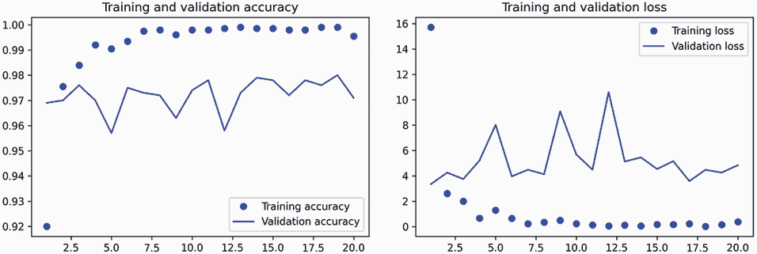

图 8.13 普通特征提取的训练和验证指标

列表 8.22 绘制结果

```py
import matplotlib.pyplot as plt
acc = history.history["accuracy"]
val_acc = history.history["val_accuracy"]
loss = history.history["loss"]
val_loss = history.history["val_loss"]
epochs = range(1, len(acc) + 1)
plt.plot(epochs, acc, "bo", label="Training accuracy")
plt.plot(epochs, val_acc, "b", label="Validation accuracy")
plt.title("Training and validation accuracy")
plt.legend()
plt.figure()
plt.plot(epochs, loss, "bo", label="Training loss")
plt.plot(epochs, val_loss, "b", label="Validation loss")
plt.title("Training and validation loss")
plt.legend()
plt.show()
```

我们达到了约 97%的验证准确率——比我们在前一节使用从头开始训练的小模型取得的结果要好得多。然而，这有点不公平的比较，因为 ImageNet 包含许多狗和猫实例，这意味着我们预训练的模型已经具有了完成任务所需的确切知识。当您使用预训练特征时，情况并不总是如此。

然而，图表也表明我们几乎从一开始就过拟合了——尽管使用了相当大的 dropout 率。这是因为这种技术没有使用数据增强，而数据增强对于防止小图像数据集过拟合是至关重要的。

结合数据增强的特征提取

现在让我们回顾一下我提到的第二种特征提取技术，这种技术速度较慢，成本较高，但允许我们在训练过程中使用数据增强：创建一个将`conv_base`与新的密集分类器连接起来的模型，并在输入上端对端地进行训练。

为了做到这一点，我们首先要*冻结卷积基*。*冻结*一层或一组层意味着在训练过程中阻止它们的权重被更新。如果我们不这样做，卷积基先前学到的表示将在训练过程中被修改。因为顶部的`Dense`层是随机初始化的，非常大的权重更新会通过网络传播，有效地破坏先前学到的表示。

在 Keras 中，通过将其`trainable`属性设置为`False`来冻结一个层或模型。

列表 8.23 实例化和冻结 VGG16 卷积基

```py
conv_base  = keras.applications.vgg16.VGG16(
    weights="imagenet",
    include_top=False)
conv_base.trainable = False
```

将`trainable`设置为`False`会清空层或模型的可训练权重列表。

列表 8.24 在冻结前后打印可训练权重列表

```py
>>> conv_base.trainable = True
>>> print("This is the number of trainable weights " 
          "before freezing the conv base:", len(conv_base.trainable_weights))
This is the number of trainable weights before freezing the conv base: 26 
>>> conv_base.trainable = False
>>> print("This is the number of trainable weights " 
          "after freezing the conv base:", len(conv_base.trainable_weights))
This is the number of trainable weights after freezing the conv base: 0 
```

现在我们可以创建一个新模型，将

1.  一个数据增强阶段

1.  我们冻结的卷积基础

1.  一个密集分类器

列表 8.25 向卷积基添加数据增强阶段和分类器

```py
data_augmentation = keras.Sequential(
    [
        layers.RandomFlip("horizontal"),
        layers.RandomRotation(0.1),
        layers.RandomZoom(0.2),
    ]
)

inputs = keras.Input(shape=(180, 180, 3))
x = data_augmentation(inputs)                      # ❶
x = keras.applications.vgg16.preprocess_input(x)   # ❷
x = conv_base(x)
x = layers.Flatten()(x)
x = layers.Dense(256)(x)
x = layers.Dropout(0.5)(x)
outputs = layers.Dense(1, activation="sigmoid")(x)
model = keras.Model(inputs, outputs)
model.compile(loss="binary_crossentropy",
              optimizer="rmsprop",
              metrics=["accuracy"])
```

❶ 应用数据增强。

❷ 应用输入值缩放。

使用这种设置，只有我们添加的两个`Dense`层的权重将被训练。总共有四个权重张量：每层两个（主要权重矩阵和偏置向量）。请注意，为了使这些更改生效，您必须首先编译模型。如果在编译后修改权重的可训练性，那么您应该重新编译模型，否则这些更改将被忽略。

让我们训练我们的模型。由于数据增强，模型开始过拟合的时间会更长，所以我们可以训练更多的 epochs——让我们做 50 个。

注意 这种技术足够昂贵，只有在您可以访问 GPU（例如 Colab 中提供的免费 GPU）时才应尝试——在 CPU 上无法实现。如果无法在 GPU 上运行代码，则应采用前一种技术。

```py
callbacks = [
    keras.callbacks.ModelCheckpoint(
        filepath="feature_extraction_with_data_augmentation.keras",
        save_best_only=True,
        monitor="val_loss")
]
history = model.fit(
    train_dataset,
    epochs=50,
    validation_data=validation_dataset,
    callbacks=callbacks)
```

让我们再次绘制结果（参见图 8.14）。正如您所看到的，我们达到了超过 98%的验证准确率。这是对先前模型的一个强大改进。

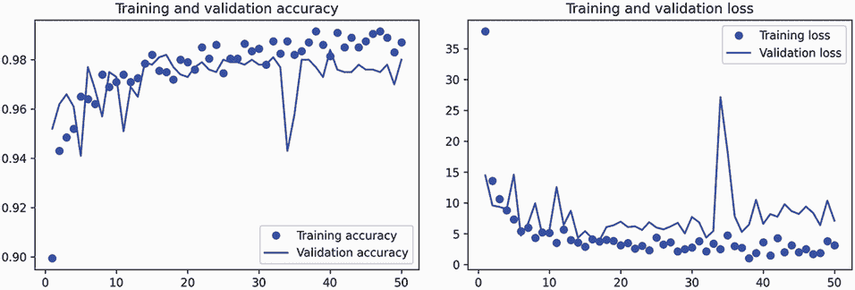

图 8.14 使用数据增强进行特征提取的训练和验证指标

让我们检查测试准确率。

列表 8.26 在测试集上评估模型

```py
test_model = keras.models.load_model(
    "feature_extraction_with_data_augmentation.keras")
test_loss, test_acc = test_model.evaluate(test_dataset)
print(f"Test accuracy: {test_acc:.3f}")
```

我们得到了 97.5%的测试准确率。与先前的测试准确率相比，这只是一个适度的改进，考虑到验证数据的强大结果，有点令人失望。模型的准确性始终取决于您评估的样本集！某些样本集可能比其他样本集更难，对一个样本集的强大结果不一定会完全转化为所有其他样本集。

### 8.3.2 微调预训练模型

用于模型重用的另一种广泛使用的技术，与特征提取相辅相成，即*微调*（参见图 8.15）。微调包括解冻用于特征提取的冻结模型基础的顶部几层，并同时训练模型的这部分新添加部分（在本例中是全连接分类器）和这些顶部层。这被称为*微调*，因为它略微调整了被重用模型的更抽象的表示，以使它们对手头的问题更相关。

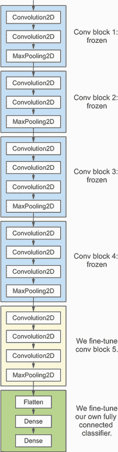

图 8.15 微调 VGG16 网络的最后一个卷积块

我之前说过，为了能够在顶部训练一个随机初始化的分类器，需要冻结 VGG16 的卷积基。出于同样的原因，只有在顶部的分类器已经训练好后，才能微调卷积基的顶层。如果分类器尚未训练好，那么在训练过程中通过网络传播的误差信号将会太大，并且之前由微调层学到的表示将被破坏。因此，微调网络的步骤如下：

1.  在已经训练好的基础网络上添加我们的自定义网络。

1.  冻结基础网络。

1.  训练我们添加的部分。

1.  解冻基础网络中的一些层。（请注意，不应解冻“批量归一化”层，在这里不相关，因为 VGG16 中没有这样的层。有关批量归一化及其对微调的影响，将在下一章中解释。）

1.  同时训练这两个层和我们添加的部分。

在进行特征提取时，您已经完成了前三个步骤。让我们继续进行第四步：我们将解冻我们的`conv_base`，然后冻结其中的各个层。

作为提醒，这是我们的卷积基的样子：

```py
>>> conv_base.summary()
Model: "vgg16" 
_________________________________________________________________
Layer (type)                 Output Shape              Param # 
=================================================================
input_19 (InputLayer)        [(None, 180, 180, 3)]     0 
_________________________________________________________________
block1_conv1 (Conv2D)        (None, 180, 180, 64)      1792 
_________________________________________________________________
block1_conv2 (Conv2D)        (None, 180, 180, 64)      36928 
_________________________________________________________________
block1_pool (MaxPooling2D)   (None, 90, 90, 64)        0 
_________________________________________________________________
block2_conv1 (Conv2D)        (None, 90, 90, 128)       73856 
_________________________________________________________________ 
block2_conv2 (Conv2D)        (None, 90, 90, 128)       147584 
_________________________________________________________________
block2_pool (MaxPooling2D)   (None, 45, 45, 128)       0 
_________________________________________________________________
block3_conv1 (Conv2D)        (None, 45, 45, 256)       295168 
_________________________________________________________________
block3_conv2 (Conv2D)        (None, 45, 45, 256)       590080 
_________________________________________________________________
block3_conv3 (Conv2D)        (None, 45, 45, 256)       590080 
_________________________________________________________________
block3_pool (MaxPooling2D)   (None, 22, 22, 256)       0 
_________________________________________________________________
block4_conv1 (Conv2D)        (None, 22, 22, 512)       1180160 
_________________________________________________________________
block4_conv2 (Conv2D)        (None, 22, 22, 512)       2359808 
_________________________________________________________________
block4_conv3 (Conv2D)        (None, 22, 22, 512)       2359808 
_________________________________________________________________
block4_pool (MaxPooling2D)   (None, 11, 11, 512)       0 
_________________________________________________________________
block5_conv1 (Conv2D)        (None, 11, 11, 512)       2359808 
_________________________________________________________________
block5_conv2 (Conv2D)        (None, 11, 11, 512)       2359808 
_________________________________________________________________
block5_conv3 (Conv2D)        (None, 11, 11, 512)       2359808 
_________________________________________________________________
block5_pool (MaxPooling2D)   (None, 5, 5, 512)         0 
=================================================================
Total params: 14,714,688 
Trainable params: 14,714,688 
Non-trainable params: 0 
_________________________________________________________________
```

我们将微调最后三个卷积层，这意味着所有层直到`block4_pool`应该被冻结，而层`block5_conv1`、`block5_conv2`和`block5_conv3`应该是可训练的。

为什么不微调更多层？为什么不微调整个卷积基？你可以。但你需要考虑以下几点：

+   较早的卷积基层编码更通用、可重复使用的特征，而较高层编码更专业化的特征。对更专业化的特征进行微调更有用，因为这些特征需要在新问题上重新利用。微调较低层会有快速减少的回报。

+   您训练的参数越多，过拟合的风险就越大。卷积基有 1500 万个参数，因此在您的小数据集上尝试训练它是有风险的。

因此，在这种情况下，只微调卷积基的前两三层是一个好策略。让我们从前一个示例中结束的地方开始设置这个。

列表 8.27 冻结直到倒数第四层的所有层

```py
conv_base.trainable = True
for layer in conv_base.layers[:-4]:
    layer.trainable = False
```

现在我们可以开始微调模型了。我们将使用 RMSprop 优化器，使用非常低的学习率。使用低学习率的原因是我们希望限制对我们正在微调的三层表示所做修改的幅度。更新过大可能会损害这些表示。

列表 8.28 微调模型

```py
model.compile(loss="binary_crossentropy",
              optimizer=keras.optimizers.RMSprop(learning_rate=1e-5),
              metrics=["accuracy"])

callbacks = [
    keras.callbacks.ModelCheckpoint(
        filepath="fine_tuning.keras",
        save_best_only=True,
        monitor="val_loss")
]
history = model.fit(
    train_dataset,
    epochs=30,
    validation_data=validation_dataset,
    callbacks=callbacks)
```

最终我们可以在测试数据上评估这个模型：

```py
model = keras.models.load_model("fine_tuning.keras")
test_loss, test_acc = model.evaluate(test_dataset) 
print(f"Test accuracy: {test_acc:.3f}")
```

在这里，我们获得了 98.5% 的测试准确率（再次强调，您自己的结果可能在一个百分点内）。在围绕这个数据集的原始 Kaggle 竞赛中，这将是顶尖结果之一。然而，这并不是一个公平的比较，因为我们使用了预训练特征，这些特征已经包含了关于猫和狗的先前知识，而竞争对手当时无法使用。

积极的一面是，通过利用现代深度学习技术，我们成功地仅使用了比比赛可用的训练数据的一小部分（约 10%）就达到了这个结果。在能够训练 20,000 个样本和 2,000 个样本之间存在巨大差异！

现在您已经掌握了一套处理图像分类问题的工具，特别是处理小数据集。

## 总结

+   卷积神经网络是计算机视觉任务中最好的机器学习模型类型。即使在一个非常小的数据集上，也可以从头开始训练一个，并取得不错的结果。

+   卷积神经网络通过学习一系列模块化的模式和概念来表示视觉世界。

+   在一个小数据集上，过拟合将是主要问题。数据增强是处理图像数据时对抗过拟合的强大方式。

+   通过特征提取，可以很容易地在新数据集上重用现有的卷积神经网络。这是处理小图像数据集的有价值的技术。

+   作为特征提取的补充，您可以使用微调，这会使现有模型先前学习的一些表示适应新问题。这会稍微提高性能。

* * *

¹ Karen Simonyan 和 Andrew Zisserman，“Very Deep Convolutional Networks for Large-Scale Image Recognition”，arXiv（2014），[`arxiv.org/abs/1409.1556`](https://arxiv.org/abs/1409.1556)。
