# 九、高级计算机视觉深度学习

本章涵盖

+   计算机视觉的不同分支：图像分类、图像分割、目标检测

+   现代卷积神经网络架构模式：残差连接、批量归一化、深度可分离卷积

+   可视化和解释卷积神经网络学习的技术

上一章通过简单模型（一堆`Conv2D`和`MaxPooling2D`层）和一个简单的用例（二进制图像分类）为您介绍了计算机视觉的深度学习。但是，计算机视觉不仅仅是图像分类！本章将深入探讨更多不同应用和高级最佳实践。

## 9.1 三个基本的计算机视觉任务

到目前为止，我们专注于图像分类模型：输入一幅图像，输出一个标签。“这幅图像可能包含一只猫；另一幅可能包含一只狗。”但是图像分类只是深度学习在计算机视觉中的几种可能应用之一。一般来说，有三个您需要了解的基本计算机视觉任务：

+   *图像分类*——目标是为图像分配一个或多个标签。它可以是单标签分类（一幅图像只能属于一个类别，排除其他类别），也可以是多标签分类（标记图像所属的所有类别，如图 9.1 所示）。例如，当您在 Google Photos 应用上搜索关键字时，背后实际上是在查询一个非常庞大的多标签分类模型——一个包含超过 20,000 个不同类别的模型，经过数百万图像训练。

+   *图像分割*——目标是将图像“分割”或“划分”为不同区域，每个区域通常代表一个类别（如图 9.1 所示）。例如，当 Zoom 或 Google Meet 在视频通话中在您身后显示自定义背景时，它使用图像分割模型来精确区分您的面部和背景。

+   *目标检测*——目标是在图像中绘制矩形（称为*边界框*）围绕感兴趣的对象，并将每个矩形与一个类别关联起来。例如，自动驾驶汽车可以使用目标检测模型监视其摄像头视野中的汽车、行人和标志。

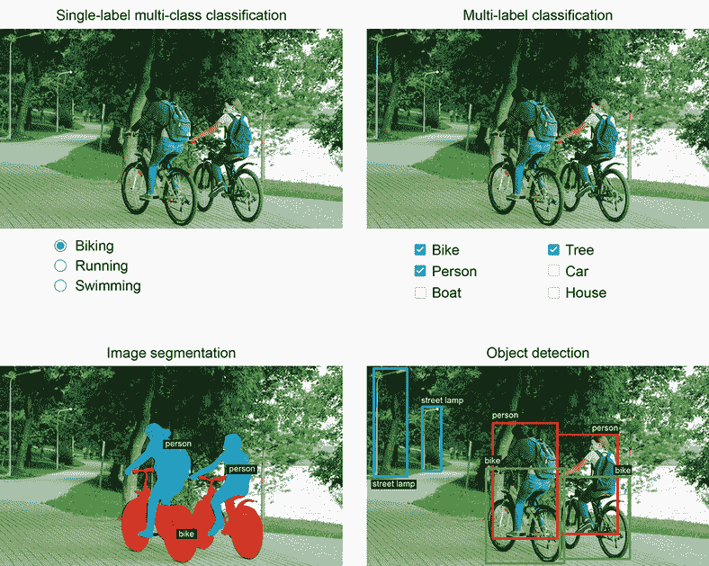

图 9.1 三个主要的计算机视觉任务：分类、分割、检测

计算机视觉的深度学习还涵盖了除这三个任务之外的一些更专业的任务，例如图像相似性评分（估计两幅图像在视觉上的相似程度）、关键点检测（在图像中定位感兴趣的属性，如面部特征）、姿势估计、3D 网格估计等。但是，开始时，图像分类、图像分割和目标检测构成了每位机器学习工程师都应熟悉的基础。大多数计算机视觉应用都可以归结为这三种任务之一。

在上一章中，您已经看到了图像分类的实际应用。接下来，让我们深入了解图像分割。这是一种非常有用且多功能的技术，您可以直接使用到目前为止学到的知识来处理它。

请注意，我们不会涵盖目标检测，因为这对于入门书籍来说太专业且太复杂。但是，您可以查看 keras.io 上的 RetinaNet 示例，该示例展示了如何在 Keras 中使用大约 450 行代码从头构建和训练目标检测模型（[`keras.io/examples/vision/retinanet/`](https://keras.io/examples/vision/retinanet/)）。

## 9.2 图像分割示例

使用深度学习进行图像分割是指使用模型为图像中的每个像素分配一个类别，从而将图像分割为不同区域（如“背景”和“前景”，或“道路”、“汽车”和“人行道”）。这一类技术可以用于图像和视频编辑、自动驾驶、机器人技术、医学成像等各种有价值的应用。

有两种不同的图像分割类型，你应该了解：

+   *语义分割*，其中每个像素独立地分类为语义类别，如“猫”。如果图像中有两只猫，相应像素都映射到相同的通用“猫”类别（见图 9.2）。

+   *实例分割*，不仅试图按类别对图像像素进行分类，还要解析出各个对象实例。在一幅图像中有两只猫，实例分割会将“猫 1”和“猫 2”视为两个不同的像素类别（见图 9.2）。

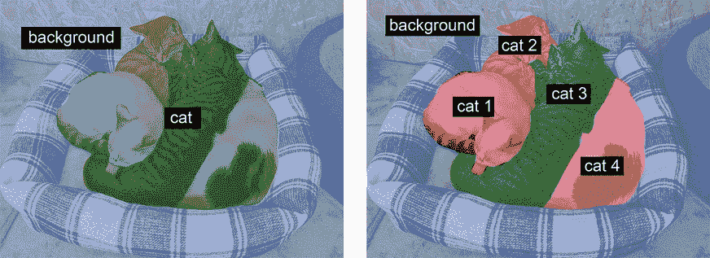

图 9.2 语义分割 vs. 实例分割

在这个示例中，我们将专注于语义分割：我们将再次查看猫和狗的图像，并学习如何区分主题和背景。

我们将使用牛津-IIIT 宠物数据集（[www.robots.ox.ac.uk/~vgg/data/pets/](https://www.robots.ox.ac.uk/~vgg/data/pets/)），其中包含 7,390 张各种品种的猫和狗的图片，以及每张图片的前景-背景分割掩模。*分割掩模*是图像分割中的标签等效物：它是与输入图像大小相同的图像，具有单个颜色通道，其中每个整数值对应于输入图像中相应像素的类别。在我们的情况下，我们的分割掩模像素可以取三个整数值中的一个：

+   1 (前景)

+   2 (背景)

+   3 (轮廓)

让我们开始下载并解压我们的数据集，使用`wget`和`tar` shell 工具：

```py
!wget http:/ /www.robots.ox.ac.uk/~vgg/data/pets/data/images.tar.gz
!wget http:/ /www.robots.ox.ac.uk/~vgg/data/pets/data/annotations.tar.gz
!tar -xf images.tar.gz
!tar -xf annotations.tar.gz
```

输入图片以 JPG 文件的形式存储在 images/文件夹中（例如 images/Abyssinian_1.jpg），相应的分割掩模以 PNG 文件的形式存储在 annotations/trimaps/文件夹中（例如 annotations/trimaps/Abyssinian_1.png）。

让我们准备输入文件路径列表，以及相应掩模文件路径列表：

```py
import os

input_dir = "images/" 
target_dir = "annotations/trimaps/" 

input_img_paths = sorted(
    [os.path.join(input_dir, fname)
     for fname in os.listdir(input_dir)
     if fname.endswith(".jpg")])
target_paths = sorted(
    [os.path.join(target_dir, fname)
     for fname in os.listdir(target_dir)
     if fname.endswith(".png") and not fname.startswith(".")])
```

现在，其中一个输入及其掩模是什么样子？让我们快速看一下。这是一个示例图像（见图 9.3）：

```py
import matplotlib.pyplot as plt 
from tensorflow.keras.utils import load_img, img_to_array

plt.axis("off")
plt.imshow(load_img(input_img_paths[9]))     # ❶
```

❶ 显示第 9 个输入图像。


图 9.3 一个示例图像

这是它对应的目标（见图 9.4）：

```py
def display_target(target_array):
    normalized_array = (target_array.astype("uint8") - 1) * 127         # ❶
    plt.axis("off")
    plt.imshow(normalized_array[:, :, 0])

img = img_to_array(load_img(target_paths[9], color_mode="grayscale"))   # ❷
display_target(img)
```

❶ 原始标签为 1、2 和 3。我们减去 1，使标签范围从 0 到 2，然后乘以 127，使标签变为 0（黑色）、127（灰色）、254（接近白色）。

❷ 我们使用 color_mode="grayscale"，以便加载的图像被视为具有单个颜色通道。


图 9.4 对应的目标掩模

接下来，让我们将输入和目标加载到两个 NumPy 数组中，并将数组分割为训练集和验证集。由于数据集非常小，我们可以将所有内容加载到内存中：

```py
import numpy as np 
import random 

img_size = (200, 200)                                                  # ❶
num_imgs = len(input_img_paths)                                        # ❷

random.Random(1337).shuffle(input_img_paths)                           # ❸
random.Random(1337).shuffle(target_paths)                              # ❸

def path_to_input_image(path):
    return img_to_array(load_img(path, target_size=img_size))

def path_to_target(path):
    img = img_to_array(
        load_img(path, target_size=img_size, color_mode="grayscale"))
    img = img.astype("uint8") - 1                                      # ❹
    return img

input_imgs = np.zeros((num_imgs,) + img_size + (3,), dtype="float32")  # ❺
targets = np.zeros((num_imgs,) + img_size + (1,), dtype="uint8")       # ❺
for i in range(num_imgs):                                              # ❺
    input_imgs[i] = path_to_input_image(input_img_paths[i])            # ❺
    targets[i] = path_to_target(target_paths[i])                       # ❺

num_val_samples = 1000                                                 # ❻
train_input_imgs = input_imgs[:-num_val_samples]                       # ❼
train_targets = targets[:-num_val_samples]                             # ❼
val_input_imgs = input_imgs[-num_val_samples:]                         # ❼
val_targets = targets[-num_val_samples:]                               # ❼
```

❶ 我们将所有内容调整为 200 × 200。

❷ 数据中的样本总数

❸ 对文件路径进行洗牌（它们最初是按品种排序的）。我们在两个语句中使用相同的种子（1337），以确保输入路径和目标路径保持相同顺序。

❹ 减去 1，使我们的标签变为 0、1 和 2。

❺ 将所有图像加载到 input_imgs 的 float32 数组中，将它们的掩模加载到 targets 的 uint8 数组中（顺序相同）。输入有三个通道（RGB 值），目标有一个单通道（包含整数标签）。

❻ 保留 1,000 个样本用于验证。

❼ 将数据分割为训练集和验证集。

现在是定义我们的模型的时候了：

```py
from tensorflow import keras 
from tensorflow.keras import layers

def get_model(img_size, num_classes):
    inputs = keras.Input(shape=img_size + (3,))
    x = layers.Rescaling(1./255)(inputs)                                     # ❶

    x = layers.Conv2D(64, 3, strides=2, activation="relu", padding="same")(x)# ❷
    x = layers.Conv2D(64, 3, activation="relu", padding="same")(x)
    x = layers.Conv2D(128, 3, strides=2, activation="relu", padding="same")(x)
    x = layers.Conv2D(128, 3, activation="relu", padding="same")(x)
    x = layers.Conv2D(256, 3, strides=2, padding="same", activation="relu")(x)
    x = layers.Conv2D(256, 3, activation="relu", padding="same")(x)

    x = layers.Conv2DTranspose(256, 3, activation="relu", padding="same")(x)
    x = layers.Conv2DTranspose(
 256, 3, activation="relu", padding="same", strides=2)(x)
    x = layers.Conv2DTranspose(128, 3, activation="relu", padding="same")(x)
    x = layers.Conv2DTranspose(
 128, 3, activation="relu", padding="same", strides=2)(x)
    x = layers.Conv2DTranspose(64, 3, activation="relu", padding="same")(x)
    x = layers.Conv2DTranspose(
 64, 3, activation="relu", padding="same", strides=2)(x)

    outputs = layers.Conv2D(num_classes, 3, activation="softmax",            # ❸
     padding="same")(x)                                                      # ❸

    model = keras.Model(inputs, outputs)
    return model

model = get_model(img_size=img_size, num_classes=3)
model.summary()
```

❶ 不要忘记将输入图像重新缩放到[0-1]范围。

❷ 请注意我们在所有地方都使用 padding="same"，以避免边界填充对特征图大小的影响。

❸ 我们以每像素三路 softmax 结束模型，将每个输出像素分类为我们的三个类别之一。

这是`model.summary()`调用的输出：

```py
Model: "model" 
_________________________________________________________________
Layer (type)                 Output Shape              Param # 
=================================================================
input_1 (InputLayer)         [(None, 200, 200, 3)]     0 
_________________________________________________________________
rescaling (Rescaling)        (None, 200, 200, 3)       0 
_________________________________________________________________
conv2d (Conv2D)              (None, 100, 100, 64)      1792 
_________________________________________________________________
conv2d_1 (Conv2D)            (None, 100, 100, 64)      36928 
_________________________________________________________________
conv2d_2 (Conv2D)            (None, 50, 50, 128)       73856 
_________________________________________________________________
conv2d_3 (Conv2D)            (None, 50, 50, 128)       147584 
_________________________________________________________________
conv2d_4 (Conv2D)            (None, 25, 25, 256)       295168 
_________________________________________________________________
conv2d_5 (Conv2D)            (None, 25, 25, 256)       590080 
_________________________________________________________________
conv2d_transpose (Conv2DTran (None, 25, 25, 256)       590080 
_________________________________________________________________
conv2d_transpose_1 (Conv2DTr (None, 50, 50, 256)       590080 
_________________________________________________________________
conv2d_transpose_2 (Conv2DTr (None, 50, 50, 128)       295040 
_________________________________________________________________
conv2d_transpose_3 (Conv2DTr (None, 100, 100, 128)     147584 
_________________________________________________________________
conv2d_transpose_4 (Conv2DTr (None, 100, 100, 64)      73792 
_________________________________________________________________
conv2d_transpose_5 (Conv2DTr (None, 200, 200, 64)      36928 
_________________________________________________________________
conv2d_6 (Conv2D)            (None, 200, 200, 3)       1731 
=================================================================
Total params: 2,880,643 
Trainable params: 2,880,643 
Non-trainable params: 0 
_________________________________________________________________
```

模型的前半部分与你用于图像分类的卷积网络非常相似：一堆`Conv2D`层，逐渐增加滤波器大小。我们通过每次减少两倍的因子三次对图像进行下采样，最终得到大小为`(25,` `25,` `256)`的激活。这前半部分的目的是将图像编码为较小的特征图，其中每个空间位置（或像素）包含有关原始图像大空间块的信息。你可以将其理解为一种压缩。

这个模型的前半部分与你之前看到的分类模型之间的一个重要区别是我们进行下采样的方式：在上一章的分类卷积网络中，我们使用`MaxPooling2D`层来对特征图进行下采样。在这里，我们通过向每个卷积层添加*步幅*来进行下采样（如果你不记得卷积步幅的详细信息，请参阅第 8.1.1 节中的“理解卷积步幅”）。我们这样做是因为在图像分割的情况下，我们非常关心图像中信息的*空间位置*，因为我们需要将每个像素的目标掩模作为模型的输出。当你进行 2×2 最大池化时，你完全破坏了每个池化窗口内的位置信息：你返回每个窗口一个标量值，对于窗口中的四个位置中的哪一个位置的值来自于零了解。因此，虽然最大池化层在分类任务中表现良好，但对于分割任务，它会对我们造成相当大的伤害。与此同时，步幅卷积在下采样特征图的同时保留位置信息做得更好。在本书中，你会注意到我们倾向于在任何关心特征位置的模型中使用步幅而不是最大池化，比如第十二章中的生成模型。

模型的后半部分是一堆`Conv2DTranspose`层。那些是什么？嗯，模型的前半部分的输出是形状为`(25,` `25,` `256)`的特征图，但我们希望最终输出与目标掩模的形状相同，即`(200,` `200,` `3)`。因此，我们需要应用一种*逆*转换，而不是迄今为止应用的转换的一种—一种*上采样*特征图而不是下采样的方法。这就是`Conv2DTranspose`层的目的：你可以将其视为一种学习*上采样*的卷积层。如果你有形状为`(100,` `100,` `64)`的输入，并将其通过层`Conv2D(128,` `3,` `strides=2,` `padding="same")`，你将得到形状为`(50,` `50,` `128)`的输出。如果你将此输出通过层`Conv2DTranspose(64,` `3,` `strides=2,` `padding="same")`，你将得到形状为`(100,` `100,` `64)`的输出，与原始相同。因此，通过一堆`Conv2D`层将我们的输入压缩成形状为`(25,` `25,` `256)`的特征图后，我们只需应用相应的`Conv2DTranspose`层序列即可恢复到形状为`(200,` `200,` `3)`的图像。

现在我们可以编译和拟合我们的模型：

```py
model.compile(optimizer="rmsprop", loss="sparse_categorical_crossentropy")

callbacks = [
    keras.callbacks.ModelCheckpoint("oxford_segmentation.keras",
                                    save_best_only=True)
]

history = model.fit(train_input_imgs, train_targets,
                    epochs=50,
                    callbacks=callbacks,
                    batch_size=64,
                    validation_data=(val_input_imgs, val_targets))
```

让我们显示我们的训练和验证损失（见图 9.5）：

```py
epochs = range(1, len(history.history["loss"]) + 1)
loss = history.history["loss"]
val_loss = history.history["val_loss"]
plt.figure()
plt.plot(epochs, loss, "bo", label="Training loss")
plt.plot(epochs, val_loss, "b", label="Validation loss")
plt.title("Training and validation loss")
plt.legend()
```

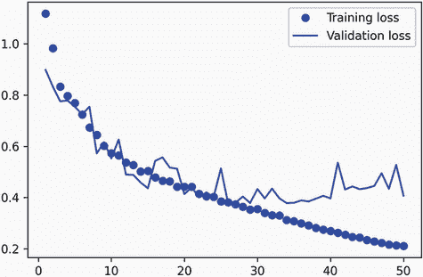

图 9.5 显示训练和验证损失曲线

你可以看到我们在中途开始过拟合，大约在第 25 个时期。让我们重新加载根据验证损失表现最佳的模型，并演示如何使用它来预测分割掩模（见图 9.6）：

```py
from tensorflow.keras.utils import array_to_img

model = keras.models.load_model("oxford_segmentation.keras")

i = 4 
test_image = val_input_imgs[i]
plt.axis("off")
plt.imshow(array_to_img(test_image))

mask = model.predict(np.expand_dims(test_image, 0))[0]

def display_mask(pred):                # ❶
    mask = np.argmax(pred, axis=-1)
    mask *= 127 
    plt.axis("off")
    plt.imshow(mask)

display_mask(mask)
```

❶ 显示模型预测的实用程序

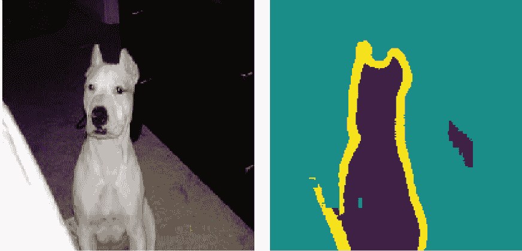

图 9.6 一个测试图像及其预测的分割掩模

我们预测掩模中有一些小的人为瑕疵，这是由前景和背景中的几何形状引起的。尽管如此，我们的模型似乎运行良好。

到目前为止，在第八章和第九章的开头，你已经学会了如何执行图像分类和图像分割的基础知识：你已经可以用你所知道的知识做很多事情了。然而，有经验的工程师开发的用于解决现实世界问题的卷积神经网络并不像我们迄今在演示中使用的那么简单。你仍然缺乏使专家能够快速准确地决定如何组合最先进模型的基本思维模型和思维过程。为了弥合这一差距，你需要了解*架构模式*。让我们深入探讨。

## 9.3 现代卷积神经网络架构模式

一个模型的“架构”是创建它所做选择的总和：使用哪些层，如何配置它们，以及如何连接它们。这些选择定义了你的模型的*假设空间*：梯度下降可以搜索的可能函数空间，由模型的权重参数化。像特征工程一样，一个好的假设空间编码了你对手头问题及其解决方案的*先验知识*。例如，使用卷积层意味着你事先知道你的输入图像中存在的相关模式是平移不变的。为了有效地从数据中学习，你需要对你正在寻找的内容做出假设。

模型架构往往是成功与失败之间的区别。如果你做出不恰当的架构选择，你的模型可能会陷入次优指标，无论训练数据量多大都无法拯救它。相反，一个好的模型架构将加速学习，并使你的模型能够有效利用可用的训练数据，减少对大型数据集的需求。一个好的模型架构是*减少搜索空间的大小*或*使其更容易收敛到搜索空间的良好点*。就像特征工程和数据整理一样，模型架构的目标是*简化问题*，以便梯度下降解决。记住，梯度下降是一个相当愚蠢的搜索过程，所以它需要尽可能多的帮助。

模型架构更像是一门艺术而不是一门科学。有经验的机器学习工程师能够直观地拼凑出高性能模型，而初学者常常难以创建一个能够训练的模型。关键词在于*直觉*：没有人能给你清晰的解释什么有效什么无效。专家依赖于模式匹配，这是他们通过广泛实践经验获得的能力。你将在本书中培养自己的直觉。然而，这也不完全是关于直觉的——实际上并没有太多的科学，但就像任何工程学科一样，有最佳实践。

在接下来的章节中，我们将回顾一些关键的卷积神经网络架构最佳实践：特别是*残差连接*、*批量归一化*和*可分离卷积*。一旦你掌握了如何使用它们，你将能够构建高效的图像模型。我们将把它们应用到我们的猫狗分类问题中。

让我们从鸟瞰图开始：系统架构的模块化-层次结构-重用（MHR）公式。

### 9.3.1 模块化、层次结构和重用

如果你想让一个复杂系统变得简单，你可以应用一个通用的方法：将你的复杂混乱的系统结构化为*模块*，将模块组织成*层次结构*，并开始在适当的地方*重用*相同的模块（“重用”在这个上下文中是*抽象*的另一个词）。这就是 MHR 公式（模块化-层次化-重用），它是几乎每个领域中使用“架构”这个术语的系统架构的核心。它是任何有意义的复杂系统的组织核心，无论是大教堂、你自己的身体、美国海军还是 Keras 代码库（见图 9.7）。


图 9.7 复杂系统遵循层次结构，并组织成不同的模块，这些模块被多次重复使用（比如你的四肢，它们都是同一个蓝图的变体，或者你的 20 个“手指”）。

如果你是一名软件工程师，你已经对这些原则非常熟悉：一个有效的代码库是模块化、层次化的，你不会重复实现相同的东西，而是依赖可重用的类和函数。如果你按照这些原则来因素化你的代码，你可以说你在做“软件架构”。

深度学习本身只是通过梯度下降对连续优化应用这一方法的结果：你采用了经典的优化技术（在连续函数空间上的梯度下降），并将搜索空间结构化为模块（层），组织成深层次的层级结构（通常只是一个堆栈，最简单的层次结构），在其中重复利用任何可以的东西（例如，卷积就是关于在不同空间位置重复使用相同信息）。

同样，深度学习模型架构主要是关于巧妙地利用模块化、层次化和重用。你会注意到所有流行的卷积神经网络架构不仅结构化为层，而且结构化为重复的层组（称为“块”或“模块”）。例如，在上一章中我们使用的流行的 VGG16 架构结构化为重复的“卷积、卷积、最大池化”块（见图 9.8）。

此外，大多数卷积神经网络通常具有金字塔结构（*特征层次结构*）。例如，回想一下我们在上一章中构建的第一个卷积神经网络中使用的卷积滤波器数量的增长：32、64、128。随着层次深度的增加，滤波器的数量也增加，而特征图的大小相应缩小。你会在 VGG16 模型的块中看到相同的模式（见图 9.8）。

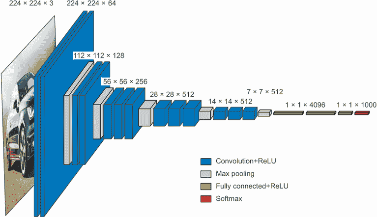

图 9.8 VGG16 架构：请注意重复的层块和特征图的金字塔结构

更深的层次结构本质上是好的，因为它们鼓励特征的重复使用，从而实现抽象化。一般来说，一堆窄层次的深层比一堆大层次的浅层表现更好。然而，由于“梯度消失”问题，你可以堆叠的层次有限。这引出了我们的第一个基本模型架构模式：残差连接。

关于深度学习研究中消融研究的重要性

深度学习架构通常比设计更*进化*——它们是通过反复尝试和选择有效的方法开发出来的。就像生物系统一样，如果你拿任何复杂的实验性深度学习设置，很可能你可以删除一些模块（或用随机的特征替换一些训练过的特征），而不会损失性能。

深度学习研究人员面临的激励使情况变得更糟：通过使系统比必要复杂，他们可以使其看起来更有趣或更新颖，从而增加他们通过同行评审过程的机会。如果你阅读了很多深度学习论文，你会注意到它们通常在风格和内容上都被优化以满足同行评审，这些方式实际上会损害解释的清晰度和结果的可靠性。例如，深度学习论文中的数学很少用于清晰地形式化概念或推导非显而易见的结果——相反，它被利用作为*严肃性的信号*，就像推销员身上的昂贵西装一样。

研究的目标不应仅仅是发表论文，而是产生可靠的知识。至关重要的是，理解系统中的*因果关系*是生成可靠知识的最直接方式。而且有一种非常低成本的方法来研究因果关系：*消融研究*。消融研究包括系统地尝试去除系统的部分——使其更简单——以确定其性能实际来自何处。如果你发现 X + Y + Z 给你良好的结果，也尝试 X、Y、Z、X + Y、X + Z 和 Y + Z，看看会发生什么。

如果你成为一名深度学习研究人员，请剔除研究过程中的噪声：为你的模型进行消融研究。始终问自己，“可能有一个更简单的解释吗？这种增加的复杂性真的有必要吗？为什么？”

### 9.3.2 残差连接

你可能知道电话游戏，也称为英国的*中国耳语*和法国的*阿拉伯电话*，其中一个初始消息被耳语给一个玩家，然后由下一个玩家耳语给下一个玩家，依此类推。最终的消息与其原始版本几乎没有任何相似之处。这是一个有趣的比喻，用于描述在嘈杂信道上的顺序传输中发生的累积错误。

实际上，在顺序深度学习模型中的反向传播与电话游戏非常相似。你有一系列函数，就像这样：

```py
y = f4(f3(f2(f1(x))))
```

游戏的名字是根据记录在`f4`输出上的错误来调整链中每个函数的参数。要调整`f1`，你需要通过`f2`、`f3`和`f4`传播错误信息。然而，链中的每个连续函数都会引入一定量的噪声。如果你的函数链太深，这种噪声开始压倒梯度信息，反向传播停止工作。你的模型根本无法训练。这就是*梯度消失*问题。

修复很简单：只需强制链中的每个函数都是非破坏性的——保留前一个输入中包含的信息的无噪声版本。实现这一点的最简单方法是使用*残差连接*。这很简单：只需将层或层块的输入添加回其输出（见图 9.9）。残差连接充当*信息捷径*，绕过具有破坏性或嘈杂块（例如包含`relu`激活或 dropout 层的块）的错误梯度信息，使其能够无噪声地通过深度网络传播。这项技术是在 2015 年由微软的 He 等人开发的 ResNet 系列模型中引入的。¹

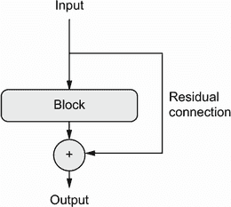

图 9.9 处理块周围的残差连接

在实践中，你可以这样实现一个残差连接。

列表 9.1 伪代码中的残差连接

```py
x = ...                  # ❶
residual = x             # ❷
x = block(x)             # ❸
x = add([x, residual])   # ❹
```

❶ 一些输入张量

❷ 保存原始输入的指针。这被称为残差。

❸ 这个计算块可能会具有破坏性或嘈杂，这没关系。

❹ 将原始输入添加到层的输出中：最终输出将始终保留有关原始输入的完整信息。

请注意，将输入添加回块的输出意味着输出应当有与输入相同的形状。但是，如果您的块包括具有增加滤波器数量或最大池化层的卷积层，则情况并非如此。在这种情况下，使用没有激活的 1 × 1 `Conv2D`层线性地将残差投影到所需的输出形状（请参见列表 9.2）。您通常会在目标块中的卷积层中使用`padding="same"`，以避免由于填充而导致空间下采样，并且您会在残差投影中使用步幅以匹配由最大池化层引起的任何下采样（请参见列表 9.3）。

列表 9.2 残差块，其中滤波器数量发生变化

```py
from tensorflow import keras 
from tensorflow.keras import layers

inputs = keras.Input(shape=(32, 32, 3))
x = layers.Conv2D(32, 3, activation="relu")(inputs)
residual = x                                                     # ❶
x = layers.Conv2D(64, 3, activation="relu", padding="same")(x)   # ❷
residual = layers.Conv2D(64, 1)(residual)                        # ❸
x = layers.add([x, residual])                                     # ❹
```

❶ 将残差单独放在一边。

❷ 这是我们创建残差连接的层：它将输出滤波器的数量从 32 增加到 64。请注意，我们使用 padding="same"以避免由于填充而导致下采样。

❸ 残差只有 32 个滤波器，因此我们使用 1 × 1 Conv2D 将其投影到正确的形状。

❹ 现在块输出和残差具有相同的形状，可以相加。

列表 9.3 目标块包含最大池化层的情况

```py
inputs = keras.Input(shape=(32, 32, 3))
x = layers.Conv2D(32, 3, activation="relu")(inputs)
residual = x                                                    # ❶
x = layers.Conv2D(64, 3, activation="relu", padding="same")(x)  # ❷
x = layers.MaxPooling2D(2, padding="same")(x)                   # ❷
residual = layers.Conv2D(64, 1, strides=2)(residual)            # ❸
x = layers.add([x, residual])                                   # ❹
```

❶ 将残差单独放在一边。

❷ 这是我们创建残差连接的两层块：它包括一个 2 × 2 最大池化层。请注意，我们在卷积层和最大池化层中都使用 padding="same"以避免由于填充而导致下采样。

❸ 我们在残差投影中使用 strides=2 以匹配由最大池化层创建的下采样。

❹ 现在块输出和残差具有相同的形状，可以相加。

为了使这些想法更具体，这里是一个简单卷积网络的示例，结构化为一系列块，每个块由两个卷积层和一个可选的最大池化层组成，并在每个块周围有一个残差连接：

```py
inputs = keras.Input(shape=(32, 32, 3))
x = layers.Rescaling(1./255)(inputs)

def residual_block(x, filters, pooling=False):                            # ❶
    residual = x
    x = layers.Conv2D(filters, 3, activation="relu", padding="same")(x)
    x = layers.Conv2D(filters, 3, activation="relu", padding="same")(x)
    if pooling:
        x = layers.MaxPooling2D(2, padding="same")(x)
        residual = layers.Conv2D(filters, 1, strides=2)(residual)         # ❷
    elif filters != residual.shape[-1]:
        residual = layers.Conv2D(filters, 1)(residual)                    # ❸
    x = layers.add([x, residual])
    return x

x = residual_block(x, filters=32, pooling=True)                           # ❹
x = residual_block(x, filters=64, pooling=True)                           # ❺
x = residual_block(x, filters=128, pooling=False)                         # ❻

x = layers.GlobalAveragePooling2D()(x)
outputs = layers.Dense(1, activation="sigmoid")(x)
model = keras.Model(inputs=inputs, outputs=outputs)
model.summary()
```

❶ 应用具有残差连接的卷积块的实用函数，可以选择添加最大池化

❷ 如果我们使用最大池化，我们添加一个步幅卷积以将残差投影到预期形状。

❸ 如果我们不使用最大池化，只有在通道数量发生变化时才投影残差。

❹ 第一个块

❺ 第二个块；请注意每个块中滤波器数量的增加。

❻ 最后一个块不需要最大池化层，因为我们将在其后立即应用全局平均池化。

这是我们得到的模型摘要：

```py
Model: "model" 
__________________________________________________________________________________________________
Layer (type)                    Output Shape         Param #     Connected to 
==================================================================================================
input_1 (InputLayer)            [(None, 32, 32, 3)]  0 
__________________________________________________________________________________________________
rescaling (Rescaling)           (None, 32, 32, 3)    0           input_1[0][0] 
__________________________________________________________________________________________________
conv2d (Conv2D)                 (None, 32, 32, 32)   896         rescaling[0][0] 
__________________________________________________________________________________________________
conv2d_1 (Conv2D)               (None, 32, 32, 32)   9248        conv2d[0][0]
__________________________________________________________________________________________________
max_pooling2d (MaxPooling2D)    (None, 16, 16, 32)   0           conv2d_1[0][0]
__________________________________________________________________________________________________
conv2d_2 (Conv2D)               (None, 16, 16, 32)   128         rescaling[0][0]
__________________________________________________________________________________________________
add (Add)                       (None, 16, 16, 32)   0           max_pooling2d[0][0]
                                                                 conv2d_2[0][0]
__________________________________________________________________________________________________
conv2d_3 (Conv2D)               (None, 16, 16, 64)   18496       add[0][0]
__________________________________________________________________________________________________
conv2d_4 (Conv2D)               (None, 16, 16, 64)   36928       conv2d_3[0][0]
__________________________________________________________________________________________________
max_pooling2d_1 (MaxPooling2D)  (None, 8, 8, 64)     0           conv2d_4[0][0]
__________________________________________________________________________________________________
conv2d_5 (Conv2D)               (None, 8, 8, 64)     2112        add[0][0]
__________________________________________________________________________________________________
add_1 (Add)                     (None, 8, 8, 64)     0           max_pooling2d_1[0][0]
                                                                 conv2d_5[0][0]
__________________________________________________________________________________________________
conv2d_6 (Conv2D)               (None, 8, 8, 128)    73856       add_1[0][0]
__________________________________________________________________________________________________
conv2d_7 (Conv2D)               (None, 8, 8, 128)    147584      conv2d_6[0][0]
__________________________________________________________________________________________________
conv2d_8 (Conv2D)               (None, 8, 8, 128)    8320        add_1[0][0]
__________________________________________________________________________________________________
add_2 (Add)                     (None, 8, 8, 128)    0           conv2d_7[0][0]
                                                                 conv2d_8[0][0]
__________________________________________________________________________________________________
global_average_pooling2d (Globa (None, 128)          0           add_2[0][0]
__________________________________________________________________________________________________
dense (Dense)                   (None, 1)            129         global_average_pooling2d[0][0]
==================================================================================================
Total params: 297,697 
Trainable params: 297,697 
Non-trainable params: 0 
__________________________________________________________________________________________________
```

使用残差连接，您可以构建任意深度的网络，而无需担心梯度消失。

现在让我们继续下一个重要的卷积神经网络架构模式：*批量归一化*。

### 9.3.3 批量归一化

*归一化*是一类方法，旨在使机器学习模型看到的不同样本更相似，这有助于模型学习并很好地泛化到新数据。数据归一化的最常见形式是您在本书中已经多次看到的：通过从数据中减去均值使数据以零为中心，并通过将数据除以其标准差使数据具有单位标准差。实际上，这假设数据遵循正态（或高斯）分布，并确保该分布居中并缩放为单位方差：

```py
normalized_data = (data - np.mean(data, axis=...)) / np.std(data, axis=...)
```

本书中的先前示例在将数据馈送到模型之前对数据进行了归一化。但是数据归一化可能在网络操作的每次转换之后感兴趣：即使进入`Dense`或`Conv2D`网络的数据具有 0 均值和单位方差，也没有理由预期这将是数据输出的情况。归一化中间激活是否有帮助？

批量归一化就是这样。这是一种层类型（Keras 中的`BatchNormalization`），由 Ioffe 和 Szegedy 于 2015 年引入；²它可以在训练过程中随着均值和方差随时间变化而自适应地归一化数据。在训练过程中，它使用当前数据批次的均值和方差来归一化样本，在推断过程中（当可能没有足够大的代表性数据批次可用时），它使用训练过程中看到的数据的批次均值和方差的指数移动平均值。

尽管原始论文指出批量归一化通过“减少内部协变量转移”来运作，但没有人确切知道为什么批量归一化有帮助。有各种假设，但没有确定性。你会发现这在深度学习中很常见——深度学习不是一门确切的科学，而是一组不断变化的、经验性的最佳工程实践，由不可靠的叙事编织在一起。有时你会觉得手中的书告诉你*如何*做某事，但并没有完全令人满意地解释*为什么*它有效：这是因为我们知道如何做但不知道为什么。每当有可靠的解释时，我会确保提到。批量归一化不是这种情况之一。

实际上，批量归一化的主要效果似乎是有助于梯度传播——就像残差连接一样——从而允许更深的网络。一些非常深的网络只有包含多个`BatchNormalization`层才能训练。例如，批量归一化在许多与 Keras 捆绑在一起的高级卷积网络架构中被广泛使用，如 ResNet50、EfficientNet 和 Xception。

`BatchNormalization` 层可以在任何层之后使用——`Dense`、`Conv2D`等：

```py
x = ...
x = layers.Conv2D(32, 3, use_bias=False)(x)     # ❶
x = layers.BatchNormalization()(x)
```

❶ 因为 Conv2D 层的输出被归一化，所以该层不需要自己的偏置向量。

注意`Dense`和`Conv2D`都涉及*偏置向量*，这是一个学习的变量，其目的是使层*仿射*而不是纯线性。例如，`Conv2D`返回，概略地说，`y` `=` `conv(x,` `kernel)` `+` `bias`，而`Dense`返回`y` `=` `dot(x,` `kernel)` `+` `bias`。因为归一化步骤将使层的输出以零为中心，所以在使用`BatchNormalization`时不再需要偏置向量，可以通过选项`use_bias=False`创建该层。这使得该层稍微更加精简。

重要的是，我通常建议将前一层的激活*放在*批量归一化层之后（尽管这仍然是一个争论的话题）。所以，不要像列表 9.4 中所示那样做，而要像列表 9.5 中所示那样做。

列表 9.4 如何不使用批量归一化

```py
x = layers.Conv2D(32, 3, activation="relu")(x)
x = layers.BatchNormalization()(x)
```

列表 9.5 如何使用批量归一化：激活放在最后

```py
x = layers.Conv2D(32, 3, use_bias=False)(x)    # ❶
x = layers.BatchNormalization()(x)
x = layers.Activation("relu")(x)               # ❷
```

❶ 注意这里缺少激活。

❷ 我们将激活放在 BatchNormalization 层之后。

这种方法的直观原因是，批量归一化将使你的输入以零为中心，而你的`relu`激活使用零作为保留或丢弃激活通道的中心：在激活之前进行归一化最大化了`relu`的利用。也就是说，这种顺序最佳实践并不是绝对关键的，所以如果你进行卷积，然后激活，然后批量归一化，你的模型仍然会训练，并且不一定会看到更糟糕的结果。

关于批量归一化和微调

批量归一化有许多怪癖。其中一个主要的怪癖与微调有关：在微调包含`BatchNormalization`层的模型时，我建议将这些层保持冻结（将它们的`trainable`属性设置为`False`）。否则，它们将继续更新其内部均值和方差，这可能会干扰周围`Conv2D`层应用的非常小的更新。

现在让我们来看看我们系列中的最后一个架构模式：深度可分离卷积。

### 9.3.4 深度可分离卷积

如果我告诉你，有一种层可以作为`Conv2D`的即插即用替代品，可以使你的模型更小（可训练权重参数更少）、更精简（浮点操作更少），并使其在任务上表现更好几个百分点，你会怎么想？这正是*深度可分离卷积*层（Keras 中的`SeparableConv2D`）所做的。这个层在每个输入通道上执行空间卷积，然后通过点卷积（1×1 卷积）混合输出通道，如图 9.10 所示。

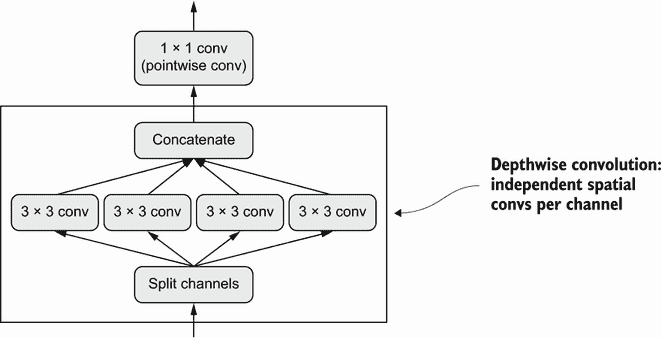

图 9.10 深度可分离卷积：深度卷积后跟点卷积

这相当于将空间特征的学习与通道特征的学习分开。就像卷积依赖于图像中的模式不与特定位置绑定一样，深度可分离卷积依赖于中间激活中的*空间位置*高度相关，但*不同通道*高度独立。因为这个假设通常对深度神经网络学习到的图像表示是正确的，它作为一个有用的先验，帮助模型更有效地利用其训练数据。一个对其将要处理的信息结构有更强先验的模型是一个更好的模型——只要这些先验是准确的。

深度可分离卷积相比常规卷积需要更少的参数，并涉及更少的计算，同时具有可比较的表征能力。它导致更小的模型收敛更快，更不容易过拟合。当你在有限数据上从头开始训练小模型时，这些优势变得尤为重要。

当涉及到大规模模型时，深度可分离卷积是 Xception 架构的基础，这是一个性能优异的卷积神经网络，与 Keras 捆绑在一起。你可以在论文“Xception: 使用深度可分离卷积进行深度学习”中了解更多关于深度可分离卷积和 Xception 的理论基础。³

硬件、软件和算法的共同演进

考虑一个具有 3×3 窗口、64 个输入通道和 64 个输出通道的常规卷积操作。它使用了 3*3*64*64 = 36,864 个可训练参数，当你将其应用于图像时，它运行的浮点操作数量与这个参数数量成比例。同时，考虑一个等效的深度可分离卷积：它只涉及 3*3*64 + 64*64 = 4,672 个可训练参数，并且浮点操作数量比例更少。这种效率改进只会随着滤波器数量或卷积窗口大小的增加而增加。

因此，你会期望深度可分离卷积会明显更快，对吧？等一下。如果你正在编写这些算法的简单 CUDA 或 C 实现，这是正确的——事实上，在 CPU 上运行时，你确实会看到有意义的加速，其中底层实现是并行化的 C。但实际上，你可能正在使用 GPU，并且你在其上执行的远非“简单”的 CUDA 实现：它是一个*cuDNN 内核*，这是一段被极致优化的代码，直到每个机器指令。花费大量精力优化这段代码是有意义的，因为 NVIDIA 硬件上的 cuDNN 卷积每天负责许多 exaFLOPS 的计算。但这种极端微观优化的副作用是，其他方法几乎没有机会在性能上竞争——即使是具有显著内在优势的方法，比如深度可分离卷积。

尽管多次要求 NVIDIA 进行优化，深度可分离卷积并没有像常规卷积那样受益于几乎相同级别的软件和硬件优化，因此它们仍然只比常规卷积快，即使它们使用的参数和浮点运算量减少了平方倍。不过，需要注意的是，即使深度可分离卷积并没有加速，仍然是一个好主意：它们较低的参数数量意味着你不太容易过拟合，并且它们假设通道应该是不相关的导致模型收敛更快，表示更加稳健。

在这种情况下的轻微不便可能在其他情况下变成一道不可逾越的障碍：因为整个深度学习的硬件和软件生态系统都被微调为一组非常特定的算法（特别是通过反向传播训练的卷积网络），所以偏离传统路线的成本极高。如果你尝试使用替代算法，比如无梯度优化或脉冲神经网络，那么你设计的前几个并行 C++ 或 CUDA 实现将比一个老式的卷积网络慢几个数量级，无论你的想法多么聪明和高效。说服其他研究人员采纳你的方法将是一项艰巨的任务，即使它确实更好。

可以说，现代深度学习是硬件、软件和算法之间的共同演化过程的产物：NVIDIA GPU 和 CUDA 的可用性导致了反向传播训练的卷积网络的早期成功，这又促使 NVIDIA 优化其硬件和软件以适应这些算法，进而导致研究社区围绕这些方法形成共识。在这一点上，找到一条不同的道路将需要对整个生态系统进行多年的重新设计。

### 9.3.5 将其整合在一起：一个迷你 Xception 风格的模型

以下是迄今为止学到的卷积网络架构原则的提醒：

+   你的模型应该组织成重复的*层块*，通常由多个卷积层和一个最大池化层组成。

+   你的层中的滤波器数量应随着空间特征图的大小减小而增加。

+   深而窄比宽而浅更好。

+   在层块周围引入残差连接有助于训练更深的网络。

+   在卷积层之后引入批量归一化层可能是有益的。

+   将 `Conv2D` 层替换为 `SeparableConv2D` 层可能是有益的，因为它们更节省参数。

让我们将这些想法整合到一个单一模型中。其架构将类似于 Xception 的较小版本，并且我们将应用它到上一章的狗与猫任务中。对于数据加载和模型训练，我们将简单地重用我们在第 8.2.5 节中使用的设置，但我们将用以下卷积网络替换模型定义：

```py
inputs = keras.Input(shape=(180, 180, 3))
x = data_augmentation(inputs)                                      # ❶

x = layers.Rescaling(1./255)(x)                                    # ❷
x = layers.Conv2D(filters=32, kernel_size=5, use_bias=False)(x)    # ❸

for size in [32, 64, 128, 256, 512]:                               # ❹
    residual = x

    x = layers.BatchNormalization()(x)
    x = layers.Activation("relu")(x)
    x = layers.SeparableConv2D(size, 3, padding="same", use_bias=False)(x)

    x = layers.BatchNormalization()(x)
    x = layers.Activation("relu")(x)
    x = layers.SeparableConv2D(size, 3, padding="same", use_bias=False)(x)

    x = layers.MaxPooling2D(3, strides=2, padding="same")(x)

    residual = layers.Conv2D(
        size, 1, strides=2, padding="same", use_bias=False)(residual)
    x = layers.add([x, residual])

x = layers.GlobalAveragePooling2D()(x)                             # ❺
x = layers.Dropout(0.5)(x)                                         # ❻
outputs = layers.Dense(1, activation="sigmoid")(x)
model = keras.Model(inputs=inputs, outputs=outputs)
```

❶ 我们使用与之前相同的数据增强配置。

❷ 不要忘记输入重新缩放！

❸ 需要注意的是，支持可分离卷积的假设“特征通道在很大程度上是独立的”在 RGB 图像中并不成立！红色、绿色和蓝色通道在自然图像中实际上高度相关。因此，我们模型中的第一层是一个常规的 Conv2D 层。之后我们将开始使用 SeparableConv2D。

❹ 我们使用一系列具有增加特征深度的卷积块。每个块由两个经过批量归一化的深度可分离卷积层和一个最大池化层组成，并在整个块周围有一个残差连接。

❺ 在原始模型中，我们在密集层之前使用了一个 Flatten 层。在这里，我们使用了一个 GlobalAveragePooling2D 层。

❻ 像原始模型一样，我们为了正则化添加了一个 dropout 层。

这个卷积神经网络的可训练参数数量为 721,857，略低于原始模型的 991,041 个可训练参数，但仍在同一数量级。图 9.11 显示了其训练和验证曲线。

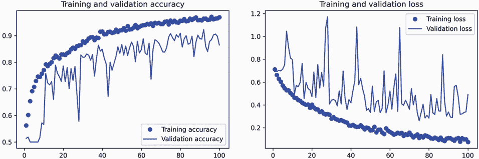

图 9.11 具有类似 Xception 架构的训练和验证指标

您会发现我们的新模型的测试准确率为 90.8%，而上一章中的朴素模型为 83.5%。正如您所看到的，遵循架构最佳实践确实对模型性能产生了即时且显著的影响！

此时，如果您想进一步提高性能，您应该开始系统地调整架构的超参数 — 这是我们将在第十三章中详细讨论的一个主题。我们在这里没有经历这一步骤，因此前述模型的配置纯粹基于我们讨论的最佳实践，再加上在评估模型大小时的一点直觉。

请注意，这些架构最佳实践适用于计算机视觉的一般情况，不仅仅是图像分类。例如，Xception 被用作 DeepLabV3 中的标准卷积基础，这是一种流行的最先进的图像分割解决方案。

这就结束了我们对基本卷积神经网络架构最佳实践的介绍。有了这些原则，您将能够在各种计算机视觉任务中开发性能更高的模型。您现在已经在成为熟练的计算机视觉从业者的道路上走得很顺利。为了进一步加深您的专业知识，我们需要讨论最后一个重要主题：解释模型如何得出预测。

## 9.4 解释卷积神经网络学习的内容

在构建计算机视觉应用程序时的一个基本问题是*可解释性*：当您只能看到一辆卡车时，为什么您的分类器认为特定图像包含一个冰箱？这在深度学习用于补充人类专业知识的用例中尤为重要，比如在医学成像用例中。我们将通过让您熟悉一系列不同的技术来结束本章，以便可视化卷积神经网络学习的内容并理解它们所做的决定。

人们常说深度学习模型是“黑匣子”：它们学习的表示很难以提取并以人类可读的形式呈现。尽管对于某些类型的深度学习模型来说这在一定程度上是正确的，但对于卷积神经网络来说绝对不是真的。卷积神经网络学习的表示非常适合可视化，这在很大程度上是因为它们是*视觉概念的表示*。自 2013 年以来，已经开发出了各种技术来可视化和解释这些表示。我们不会对它们进行全面调查，但我们将介绍其中三种最易于访问和有用的方法：

+   *可视化中间卷积网络输出（中间激活）* — 有助于理解连续的卷积网络层如何转换其输入，并初步了解单个卷积滤波器的含义

+   *可视化卷积神经网络滤波器* — 有助于准确理解卷积神经网络中每个滤波器对哪种视觉模式或概念具有接受性

+   *可视化图像中类激活的热图* — 有助于理解图像的哪些部分被识别为属于给定类别，从而使您能够在图像中定位对象

对于第一种方法 — 激活可视化 — 我们将使用我们在第 8.2 节中从头开始在狗与猫分类问题上训练的小型卷积网络。对于接下来的两种方法，我们将使用一个预训练的 Xception 模型。

### 9.4.1 可视化中间激活

可视化中间激活包括显示模型中各种卷积和池化层返回的值，给定某个输入（层的输出通常称为*激活*，激活函数的输出）。这可以让我们看到输入是如何被网络学习的不同滤波器分解的。我们想要可视化具有三个维度的特征图：宽度、高度和深度（通道）。每个通道编码相对独立的特征，因此正确的可视化这些特征图的方式是独立绘制每个通道的内容作为 2D 图像。让我们从加载你在第 8.2 节保存的模型开始：

```py
>>> from tensorflow import keras
>>> model = keras.models.load_model(
 "convnet_from_scratch_with_augmentation.keras")
>>> model.summary()
Model: "model_1" 
_________________________________________________________________
Layer (type)                 Output Shape              Param # 
=================================================================
input_2 (InputLayer)         [(None, 180, 180, 3)]     0 
_________________________________________________________________
sequential (Sequential)      (None, 180, 180, 3)       0 
_________________________________________________________________ 
rescaling_1 (Rescaling)      (None, 180, 180, 3)       0 
_________________________________________________________________
conv2d_5 (Conv2D)            (None, 178, 178, 32)      896 
_________________________________________________________________
max_pooling2d_4 (MaxPooling2 (None, 89, 89, 32)        0 
_________________________________________________________________
conv2d_6 (Conv2D)            (None, 87, 87, 64)        18496 
_________________________________________________________________
max_pooling2d_5 (MaxPooling2 (None, 43, 43, 64)        0 
_________________________________________________________________
conv2d_7 (Conv2D)            (None, 41, 41, 128)       73856 
_________________________________________________________________
max_pooling2d_6 (MaxPooling2 (None, 20, 20, 128)       0 
_________________________________________________________________
conv2d_8 (Conv2D)            (None, 18, 18, 256)       295168 
_________________________________________________________________
max_pooling2d_7 (MaxPooling2 (None, 9, 9, 256)         0 
_________________________________________________________________
conv2d_9 (Conv2D)            (None, 7, 7, 256)         590080 
_________________________________________________________________
flatten_1 (Flatten)          (None, 12544)             0 
_________________________________________________________________
dropout (Dropout)            (None, 12544)             0 
_________________________________________________________________
dense_1 (Dense)              (None, 1)                 12545 
=================================================================
Total params: 991,041 
Trainable params: 991,041 
Non-trainable params: 0 
_________________________________________________________________
```

接下来，我们将获得一张输入图像——一张猫的图片，不是网络训练过的图片的一部分。

列表 9.6 对单个图像进行预处理

```py
from tensorflow import keras 
import numpy as np

img_path = keras.utils.get_file(                            # ❶
    fname="cat.jpg",                                        # ❶
    origin="https://img-datasets.s3.amazonaws.com/cat.jpg") # ❶

def get_img_array(img_path, target_size):
    img = keras.utils.load_img(                             # ❷
        img_path, target_size=target_size)                  # ❷
    array = keras.utils.img_to_array(img)                   # ❸
    array = np.expand_dims(array, axis=0)                   # ❹
    return array

img_tensor = get_img_array(img_path, target_size=(180, 180))
```

❶ 下载一个测试图片。

❷ 打开图像文件并调整大小。

❸ 将图像转换为形状为（180, 180, 3）的 float32 NumPy 数组。

❹ 添加一个维度，将数组转换为“批量”中的单个样本。现在其形状为（1, 180, 180, 3）。

让我们展示这张图片（见图 9.12）。

列表 9.7 显示测试图片

```py
import matplotlib.pyplot as plt
plt.axis("off")
plt.imshow(img_tensor[0].astype("uint8"))
plt.show()
```


图 9.12 测试猫图片

为了提取我们想要查看的特征图，我们将创建一个接受图像批量作为输入的 Keras 模型，并输出所有卷积和池化层的激活。

列表 9.8 实例化一个返回层激活的模型

```py
from tensorflow.keras import layers

layer_outputs = []
layer_names = [] 
for layer in model.layers:                                                # ❶
    if isinstance(layer, (layers.Conv2D, layers.MaxPooling2D)):           # ❶
        layer_outputs.append(layer.output)                                # ❶
        layer_names.append(layer.name)                                    # ❷
activation_model = keras.Model(inputs=model.input, outputs=layer_outputs) # ❸
```

❶ 提取所有 Conv2D 和 MaxPooling2D 层的输出，并将它们放入列表中。

❷ 保存层的名称以备后用。

❸ 创建一个模型，给定模型输入，将返回这些输出。

当输入一张图像时，这个模型会返回原始模型中层的激活值，作为一个列表。这是你在本书中第一次实际遇到多输出模型，因为你在第七章学习过它们；到目前为止，你看到的模型都只有一个输入和一个输出。这个模型有一个输入和九个输出：每个层激活一个输出。

列表 9.9 使用模型计算层激活

```py
activations = activation_model.predict(img_tensor)     # ❶
```

❶ 返回一个包含九个 NumPy 数组的列表：每个数组代表一层的激活。

例如，这是原始模型第一卷积层对猫图像输入的激活：

```py
>>> first_layer_activation = activations[0]
>>> print(first_layer_activation.shape)
(1, 178, 178, 32)
```

这是一个具有 32 个通道的 178×178 特征图。让我们尝试绘制原始模型第一层激活的第五个通道（见图 9.13）。

列表 9.10 可视化第五个通道

```py
import matplotlib.pyplot as plt
plt.matshow(first_layer_activation[0, :, :, 5], cmap="viridis")
```

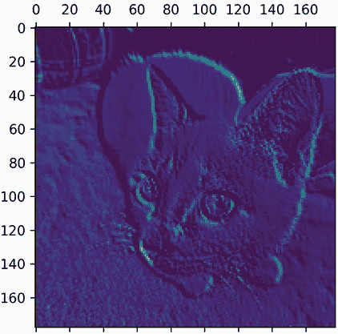

图 9.13 测试猫图片上第一层激活的第五个通道

这个通道似乎编码了一个对角边缘检测器，但请注意，你自己的通道可能会有所不同，因为卷积层学习的特定滤波器并不是确定性的。

现在，让我们绘制网络中所有激活的完整可视化（见图 9.14）。我们将提取并绘制每个层激活中的每个通道，并将结果堆叠在一个大网格中，通道并排堆叠。

列表 9.11 可视化每个中间激活的每个通道

```py
images_per_row = 16 
for layer_name, layer_activation in zip(layer_names, activations):         # ❶
    n_features = layer_activation.shape[-1]                                # ❷
    size = layer_activation.shape[1]                                       # ❷
    n_cols = n_features // images_per_row
    display_grid = np.zeros(((size + 1) * n_cols - 1,                      # ❸
                             images_per_row * (size + 1) - 1))             # ❸
    for col in range(n_cols):
        for row in range(images_per_row):
            channel_index = col * images_per_row + row
            channel_image = layer_activation[0, :, :, channel_index].copy()# ❹
            if channel_image.sum() != 0:                                   # ❺
                channel_image -= channel_image.mean()                      # ❺
                channel_image /= channel_image.std()                       # ❺
                channel_image *= 64                                        # ❺
                channel_image += 128                                       # ❺
            channel_image = np.clip(channel_image, 0, 255).astype("uint8") # ❺
            display_grid[
                col * (size + 1): (col + 1) * size + col,                  # ❻
                row * (size + 1) : (row + 1) * size + row] = channel_image # ❻
    scale = 1. / size                                                      # ❼
    plt.figure(figsize=(scale * display_grid.shape[1],                     # ❼
                        scale * display_grid.shape[0]))                    # ❼
    plt.title(layer_name)                                                  # ❼
    plt.grid(False)                                                        # ❼
    plt.axis("off")                                                        # ❼
    plt.imshow(display_grid, aspect="auto", cmap="viridis")                # ❼
```

❶ 迭代激活（和相应层的名称）。

❷ 层激活的形状为（1, size, size, n_features）。

❸ 准备一个空网格，用于显示该激活中的所有通道。

❹ 这是一个单通道（或特征）。

❺ 将通道值归一化到[0, 255]范围内。所有零通道保持为零。

❻ 将通道矩阵放入我们准备好的空网格中。

❼ 显示该层的网格。

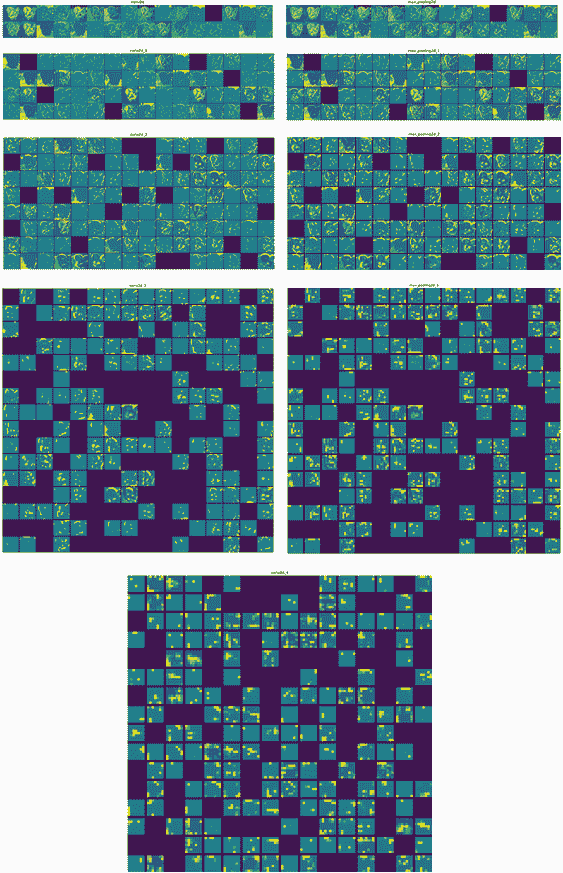

图 9.14 测试猫图片上每个层激活的每个通道

这里有几点需要注意：

+   第一层充当各种边缘检测器的集合。在这个阶段，激活保留了初始图片中几乎所有的信息。

+   随着深入，激活变得越来越抽象，越来越难以直观解释。它们开始编码更高级别的概念，如“猫耳朵”和“猫眼”。更深层次的表现包含的关于图像视觉内容的信息越来越少，包含的与图像类别相关的信息越来越多。

+   激活的稀疏性随着层的深度增加而增加：在第一层中，几乎所有滤波器都被输入图像激活，但在后续层中，越来越多的滤波器为空白。这意味着滤波器编码的模式在输入图像中找不到。

我们刚刚证明了深度神经网络学习的表示的一个重要普遍特征：随着层深度的增加，由层提取的特征变得越来越抽象。更高层的激活包含的关于特定输入的信息越来越少，包含的关于目标的信息越来越多（在本例中，图像的类别：猫或狗）。深度神经网络有效地充当*信息蒸馏管道*，原始数据输入（在本例中是 RGB 图片），并被反复转换，以便过滤掉不相关的信息（例如，图像的具体视觉外观），并放大和精炼有用的信息（例如，图像的类别）。

这类似于人类和动物感知世界的方式：观察一个场景几秒钟后，人类可以记住其中存在的抽象对象（自行车，树），但无法记住这些对象的具体外观。事实上，如果你试图凭记忆画一辆普通的自行车，很可能你无法得到一个近似正确的结果，即使你一生中见过成千上万辆自行车（例如，参见图 9.15）。现在就试试吧：这种效应绝对是真实的。你的大脑已经学会完全抽象化其视觉输入——将其转化为高级视觉概念，同时过滤掉不相关的视觉细节——这使得记住你周围事物的外观变得极其困难。


图 9.15 左：试图凭记忆画一辆自行车。右：原理图自行车的样子。

### 9.4.2 可视化卷积滤波器

检查卷积网络学习的滤波器的另一种简单方法是显示每个滤波器应该响应的视觉模式。这可以通过*输入空间中的梯度上升*来实现：将*梯度下降*应用于卷积网络的输入图像的值，以*最大化*特定滤波器的响应，从一个空白输入图像开始。生成的输入图像将是所选滤波器最大响应的图像。

让我们尝试使用在 ImageNet 上预训练的 Xception 模型的滤波器。这个过程很简单：我们将构建一个损失函数，最大化给定卷积层中给定滤波器的值，然后我们将使用随机梯度下降来调整输入图像的值，以最大化这个激活值。这将是我们利用`GradientTape`对象进行低级梯度下降循环的第二个示例（第一个示例在第二章中）。

首先，让我们实例化加载了在 ImageNet 数据集上预训练权重的 Xception 模型。

列表 9.12 实例化 Xception 卷积基础

```py
model = keras.applications.xception.Xception(
    weights="imagenet",
    include_top=False)      # ❶
```

❶ 分类层对于这个用例是无关紧要的，所以我们不包括模型的顶层。

我们对模型的卷积层感兴趣——`Conv2D`和`SeparableConv2D`层。我们需要知道它们的名称，以便检索它们的输出。让我们按深度顺序打印它们的名称。

列表 9.13 打印 Xception 中所有卷积层的名称

```py
for layer in model.layers:
    if isinstance(layer, (keras.layers.Conv2D, keras.layers.SeparableConv2D)):
        print(layer.name)
```

你会注意到这里的`SeparableConv2D`层都被命名为类似`block6_sepconv1`、`block7_sepconv2`等。Xception 被结构化为包含几个卷积层的块。

现在，让我们创建一个第二个模型，返回特定层的输出——一个*特征提取器*模型。因为我们的模型是一个功能 API 模型，它是可检查的：我们可以查询其一个层的 `output` 并在新模型中重用它。无需复制整个 Xception 代码。

第 9.14 节 创建特征提取器模型

```py
layer_name = "block3_sepconv1"                                            # ❶
layer = model.get_layer(name=layer_name)                                  # ❷
feature_extractor = keras.Model(inputs=model.input, outputs=layer.output) # ❸
```

❶ 您可以将其替换为 Xception 卷积基中的任何层的名称。

❷ 这是我们感兴趣的层对象。

❸ 我们使用 model.input 和 layer.output 来创建一个模型，给定一个输入图像，返回我们目标层的输出。

要使用这个模型，只需在一些输入数据上调用它（请注意，Xception 需要通过 `keras.applications.xception.preprocess_input` 函数对输入进行预处理）。

第 9.15 节 使用特征提取器

```py
activation = feature_extractor(
    keras.applications.xception.preprocess_input(img_tensor)
)
```

现在，让我们使用我们的特征提取器模型定义一个函数，该函数返回一个标量值，量化给定输入图像在给定层中“激活”给定滤波器的程度。这是我们在梯度上升过程中将最大化的“损失函数”：

```py
import tensorflow as tf

def compute_loss(image, filter_index):                            # ❶
    activation = feature_extractor(image)
    filter_activation = activation[:, 2:-2, 2:-2, filter_index]   # ❷
    return tf.reduce_mean(filter_activation)                      # ❸
```

❶ 损失函数接受一个图像张量和我们正在考虑的滤波器的索引（一个整数）。

❷ 请注意，我们通过仅涉及损失中的非边界像素来避免边界伪影；我们丢弃激活边缘两侧的前两个像素。

❸ 返回滤波器激活值的平均值。

`model.predict(x)` 和 `model(x)` 的区别

在上一章中，我们使用 `predict(x)` 进行特征提取。在这里，我们使用 `model(x)`。这是为什么？

`y` `=` `model.predict(x)` 和 `y` `=` `model(x)`（其中 `x` 是输入数据的数组）都表示“在 `x` 上运行模型并检索输出 `y`”。然而它们并不完全相同。

`predict()` 在批处理中循环数据（实际上，您可以通过 `predict(x,` `batch_size=64)` 指定批处理大小），并提取输出的 NumPy 值。它在原理上等同于这样：

```py
def predict(x):
    y_batches = []
    for x_batch in get_batches(x):
        y_batch = model(x).numpy()
        y_batches.append(y_batch)
    return np.concatenate(y_batches)
```

这意味着 `predict()` 调用可以扩展到非常大的数组。与此同时，`model(x)` 在内存中进行，不会扩展。另一方面，`predict()` 不可微分：如果在 `GradientTape` 范围内调用它，则无法检索其梯度。

当您需要检索模型调用的梯度时，应该使用 `model(x)`，如果只需要输出值，则应该使用 `predict()`。换句话说，除非您正在编写低级梯度下降循环（就像我们现在所做的那样），否则始终使用 `predict()`。

让我们设置梯度上升步骤函数，使用 `GradientTape`。请注意，我们将使用 `@tf.function` 装饰器来加快速度。

为了帮助梯度下降过程顺利进行的一个不明显的技巧是通过将梯度张量除以其 L2 范数（张量中值的平方的平均值的平方根）来对梯度张量进行归一化。这确保了对输入图像的更新的幅度始终在相同范围内。

第 9.16 节 通过随机梯度上升最大化损失

```py
@tf.function 
def gradient_ascent_step(image, filter_index, learning_rate):
    with tf.GradientTape() as tape:
        tape.watch(image)                             # ❶
        loss = compute_loss(image, filter_index)      # ❷
    grads = tape.gradient(loss, image)                # ❸
    grads = tf.math.l2_normalize(grads)               # ❹
    image += learning_rate * grads                    # ❺
    return image                                      # ❻
```

❶ 明确监视图像张量，因为它不是 TensorFlow 变量（只有变量在梯度磁带中会自动被监视）。

❷ 计算损失标量，指示当前图像激活滤波器的程度。

❸ 计算损失相对于图像的梯度。

❹ 应用“梯度归一化技巧”。

❺ 将图像稍微移动到更强烈激活目标滤波器的方向。

❻ 返回更新后的图像，以便我们可以在循环中运行步骤函数。

现在我们有了所有的部分。让我们将它们组合成一个 Python 函数，该函数接受一个层名称和一个滤波器索引作为输入，并返回表示最大化指定滤波器激活的模式的张量。

第 9.17 节 生成滤波器可视化的函数

```py
img_width = 200 
img_height = 200 

def generate_filter_pattern(filter_index):
    iterations = 30                                                       # ❶
    learning_rate = 10.                                                   # ❷
    image = tf.random.uniform(
        minval=0.4,
        maxval=0.6,
        shape=(1, img_width, img_height, 3))                              # ❸
    for i in range(iterations):                                           # ❹
        image = gradient_ascent_step(image, filter_index, learning_rate)  # ❹
    return image[0].numpy()
```

❶ 应用的梯度上升步骤数

❷ 单步幅的振幅

❸ 使用随机值初始化图像张量（Xception 模型期望输入值在 [0, 1] 范围内，因此这里选择以 0.5 为中心的范围）。

❹ 反复更新图像张量的值，以最大化我们的损失函数。

结果图像张量是一个形状为`(200,` `200,` `3)`的浮点数组，其值可能不是在`[0,` `255]`范围内的整数。因此，我们需要对这个张量进行后处理，将其转换为可显示的图像。我们使用以下简单的实用函数来实现。

列表 9.18 将张量转换为有效图像的实用函数

```py
def deprocess_image(image):
    image -= image.mean()                           # ❶
    image /= image.std()                            # ❶
    image *= 64                                     # ❶
    image += 128                                    # ❶
    image = np.clip(image, 0, 255).astype("uint8")  # ❶
    image = image[25:-25, 25:-25, :]                # ❷
    return image
```

❶ 将图像值归一化到`[0, 255]`范围内。

❷ 中心裁剪以避免边缘伪影。

让我们试试（见图 9.16）：

```py
>>> plt.axis("off")
>>> plt.imshow(deprocess_image(generate_filter_pattern(filter_index=2)))
```

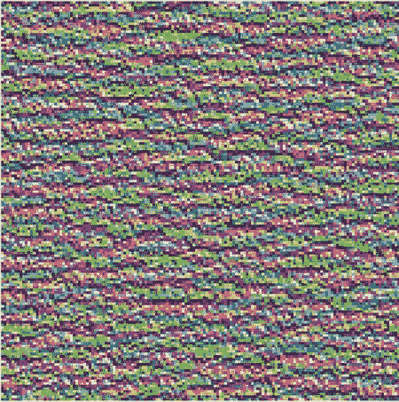

图 9.16 `block3_sepconv1`层中第二通道响应最大的模式

看起来`block3_sepconv1`层中的滤波器 0 对水平线模式有响应，有点类似水或毛皮。

现在来看有趣的部分：你可以开始可视化每一层中的每一个滤波器，甚至是模型中每一层中的每一个滤波器。

列表 9.19 生成层中所有滤波器响应模式的网格

```py
all_images = []                             # ❶
for filter_index in range(64):
    print(f"Processing filter {filter_index}")
    image = deprocess_image(
        generate_filter_pattern(filter_index)
    )
    all_images.append(image)

margin = 5                                  # ❷
n = 8 
cropped_width = img_width - 25 * 2 
cropped_height = img_height - 25 * 2 
width = n * cropped_width + (n - 1) * margin
height = n * cropped_height + (n - 1) * margin
stitched_filters = np.zeros((width, height, 3))

for i in range(n):                          # ❸
    for j in range(n):
        image = all_images[i * n + j]
        stitched_filters[
            row_start = (cropped_width + margin) * i
            row_end = (cropped_width + margin) * i + cropped_width
            column_start = (cropped_height + margin) * j
            column_end = (cropped_height + margin) * j + cropped_height

            stitched_filters[
                row_start: row_end,
                column_start: column_end, :] = image

keras.utils.save_img(                       # ❹
    f"filters_for_layer_{layer_name}.png", stitched_filters)
```

❶ 生成并保存层中前 64 个滤波器的可视化。

❷ 准备一个空白画布，供我们粘贴滤波器可视化。

❸ 用保存的滤波器填充图片。

❹ 将画布保存到磁盘。

这些滤波器可视化（见图 9.17）告诉你很多关于卷积神经网络层如何看待世界的信息：卷积神经网络中的每一层学习一组滤波器，以便它们的输入可以被表达为滤波器的组合。这类似于傅里叶变换将信号分解为一组余弦函数的方式。随着你在模型中深入，这些卷积神经网络滤波器组中的滤波器变得越来越复杂和精细：

+   模型中第一层的滤波器编码简单的方向边缘和颜色（或在某些情况下是彩色边缘）。

+   位于堆栈中稍微靠上的层，如`block4_sepconv1`，编码由边缘和颜色组合而成的简单纹理。

+   更高层的滤波器开始类似于自然图像中发现的纹理：羽毛、眼睛、叶子等。

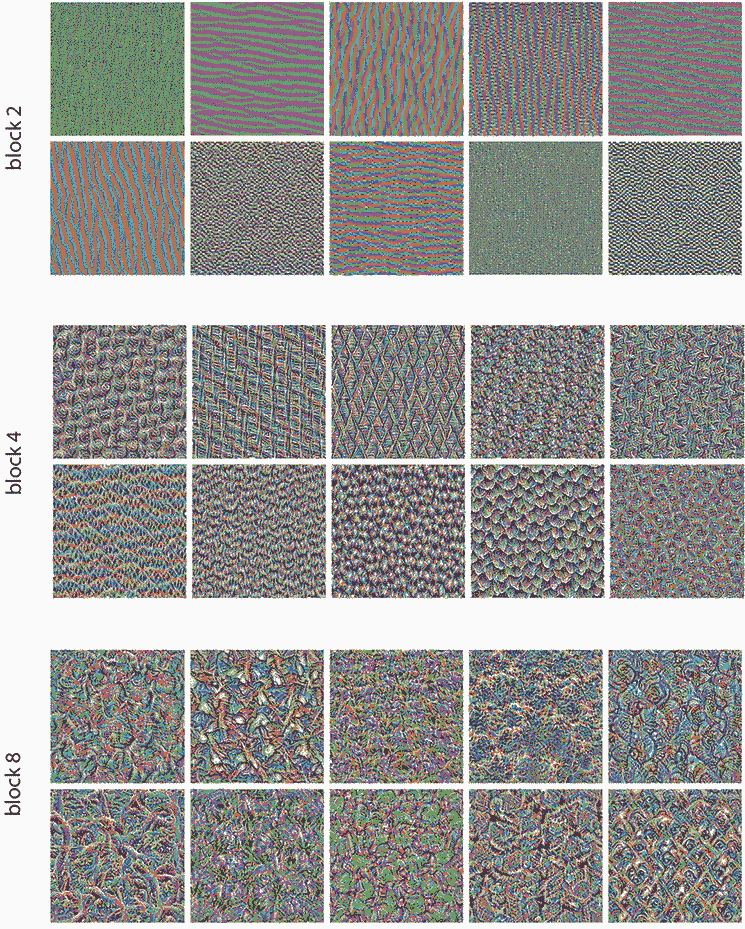

图 9.17 层`block2_sepconv1`、`block4_sepconv1`和`block8_sepconv1`的一些滤波器模式

### 9.4.3 可视化类激活热图

我们将介绍最后一种可视化技术——这对于理解哪些部分的图像导致卷积神经网络做出最终分类决策是有用的。这对于“调试”卷积神经网络的决策过程特别有帮助，尤其是在分类错误的情况下（一个称为*模型可解释性*的问题领域）。它还可以让你在图像中定位特定的对象。

这类技术的通用类别称为*类激活映射*（CAM）可视化，它包括在输入图像上生成类激活热图。类激活热图是与特定输出类相关联的一组分数的 2D 网格，针对任何输入图像中的每个位置计算，指示每个位置相对于考虑的类的重要性。例如，给定一个输入到狗与猫卷积神经网络中的图像，CAM 可视化将允许你为“猫”类生成一个热图，指示图像的不同部分有多像猫，还可以为“狗”类生成一个热图，指示图像的哪些部分更像狗。

我们将使用的具体实现是一篇名为“Grad-CAM: 基于梯度定位的深度网络的视觉解释”的文章中描述的实现。

Grad-CAM 包括获取给定输入图像的卷积层的输出特征图，并通过类别相对于通道的梯度对该特征图中的每个通道进行加权。直观地，理解这个技巧的一种方式是想象你正在通过“输入图像如何激活不同通道”的空间地图来“每个通道对于类别的重要性有多大”，从而产生一个“输入图像如何激活类别”的空间地图。

让我们使用预训练的 Xception 模型演示这种技术。

列表 9.20 加载带有预训练权重的 Xception 网络

```py
model = keras.applications.xception.Xception(weights="imagenet")   # ❶
```

❶ 请注意，我们在顶部包含了密集连接的分类器；在所有以前的情况下，我们都将其丢弃。

考虑图 9.18 中显示的两只非洲大象的图像，可能是母象和幼象，在热带草原上漫步。让我们将这幅图像转换为 Xception 模型可以读取的内容：该模型是在大小为 299×299 的图像上训练的，根据`keras.applications.xception .preprocess_input`实用程序函数中打包的一些规则进行预处理。因此，我们需要加载图像，将其调整大小为 299×299，将其转换为 NumPy 的`float32`张量，并应用这些预处理规则。

列表 9.21 为 Xception 预处理输入图像

```py
img_path = keras.utils.get_file(
    fname="elephant.jpg",
    origin="https://img-datasets.s3.amazonaws.com/elephant.jpg")    # ❶

def get_img_array(img_path, target_size):
    img = keras.utils.load_img(img_path, target_size=target_size)   # ❷
    array = keras.utils.img_to_array(img)                           # ❸
    array = np.expand_dims(array, axis=0)                           # ❹
    array = keras.applications.xception.preprocess_input(array)     # ❺
    return array

img_array = get_img_array(img_path, target_size=(299, 299))
```

❶ 下载图像并将其存储在本地路径 img_path 下。

❷ 返回一个大小为 299×299 的 Python Imaging Library（PIL）图像。

❸ 返回一个形状为（299，299，3）的 float32 NumPy 数组。

❹ 添加一个维度，将数组转换为大小为（1，299，299，3）的批处理。

❺ 预处理批处理（这样做是按通道进行颜色归一化）。


图 9.18 非洲大象的测试图片

您现在可以在图像上运行预训练网络，并将其预测向量解码回人类可读格式：

```py
>>> preds = model.predict(img_array)
>>> print(keras.applications.xception.decode_predictions(preds, top=3)[0])
[("n02504458", "African_elephant", 0.8699266),
 ("n01871265", "tusker", 0.076968715),
 ("n02504013", "Indian_elephant", 0.02353728)]
```

该图像的前三个预测类别如下：

+   非洲大象（概率为 87%）

+   雄象（概率为 7%）

+   印度大象（概率为 2%）

网络已将图像识别为包含非洲大象数量不确定的图像。预测向量中最大激活的条目对应于“非洲大象”类别，索引为 386：

```py
>>> np.argmax(preds[0])
386 
```

为了可视化图像的哪些部分最像非洲大象，让我们设置 Grad-CAM 过程。

首先，我们创建一个模型，将输入图像映射到最后一个卷积层的激活。

列表 9.22 设置返回最后一个卷积输出的模型

```py
last_conv_layer_name = "block14_sepconv2_act" 
classifier_layer_names = [
    "avg_pool",
    "predictions",
]
last_conv_layer = model.get_layer(last_conv_layer_name)
last_conv_layer_model = keras.Model(model.inputs, last_conv_layer.output)
```

其次，我们创建一个模型，将最后一个卷积层的激活映射到最终的类别预测。

列表 9.23 重新应用最后一个卷积输出的分类器

```py
classifier_input = keras.Input(shape=last_conv_layer.output.shape[1:])
x = classifier_input 
for layer_name in classifier_layer_names:
    x = model.get_layer(layer_name)(x)
classifier_model = keras.Model(classifier_input, x)
```

然后，我们计算输入图像的顶部预测类别相对于最后一个卷积层的激活的梯度。

列表 9.24 检索顶部预测类别的梯度

```py
import tensorflow as tf

with tf.GradientTape() as tape:
    last_conv_layer_output = last_conv_layer_model(img_array)     # ❶
    tape.watch(last_conv_layer_output)                            # ❶
    preds = classifier_model(last_conv_layer_output)              # ❷
    top_pred_index = tf.argmax(preds[0])                          # ❷
    top_class_channel = preds[:, top_pred_index]                  # ❷

grads = tape.gradient(top_class_channel, last_conv_layer_output)  # ❸
```

❶ 计算最后一个卷积层的激活并让磁带观察它。

❷ 检索与顶部预测类别对应的激活通道。

❸ 这是顶部预测类别相对于最后一个卷积层的输出特征图的梯度。

现在我们对梯度张量应用池化和重要性加权，以获得我们的类别激活热图。

列表 9.25 梯度池化和通道重要性加权

```py
pooled_grads = tf.reduce_mean(grads, axis=(0, 1, 2)).numpy()   # ❶
last_conv_layer_output = last_conv_layer_output.numpy()[0]
for i in range(pooled_grads.shape[-1]):                        # ❷
    last_conv_layer_output[:, :, i] *= pooled_grads[i]         # ❷
heatmap = np.mean(last_conv_layer_output, axis=-1)             # ❸
```

❶ 这是一个向量，其中每个条目是给定通道的梯度的平均强度。它量化了每个通道相对于顶部预测类的重要性。

❷ 将最后一个卷积层的输出中的每个通道乘以“这个通道的重要性”。

❸ 结果特征图的通道均值是我们的类别激活热图。

为了可视化目的，我们还将将热图归一化到 0 和 1 之间。结果显示在图 9.19 中。

列表 9.26 热图后处理

```py
heatmap = np.maximum(heatmap, 0)
heatmap /= np.max(heatmap)
plt.matshow(heatmap)
```

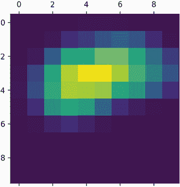

图 9.19 独立类别激活热图

最后，让我们生成一幅将原始图像叠加在我们刚刚获得的热图上的图像（见图 9.20）。

列表 9.27 将热图叠加在原始图片上

```py
import matplotlib.cm as cm

img = keras.utils.load_img(img_path)                            # ❶
img = keras.utils.img_to_array(img)                             # ❶
heatmap = np.uint8(255 * heatmap)                               # ❷

jet = cm.get_cmap("jet")                                        # ❸
jet_colors = jet(np.arange(256))[:, :3]                         # ❸
jet_heatmap = jet_colors[heatmap]                               # ❸

jet_heatmap = keras.utils.array_to_img(jet_heatmap)             # ❹
jet_heatmap = jet_heatmap.resize((img.shape[1], img.shape[0]))  # ❹
jet_heatmap = keras.utils.img_to_array(jet_heatmap)             # ❹

superimposed_img = jet_heatmap * 0.4 + img                      # ❺
superimposed_img = keras.utils.array_to_img(superimposed_img)   # ❺

save_path = "elephant_cam.jpg"                                  # ❻
superimposed_img.save(save_path)                                # ❻
```

❶ 加载原始图像。

❷ 将热图重新缩放到 0-255 的范围。

❸ 使用“jet”颜色图重新着色热图。

❹ 创建包含重新着色的热图的图像。

❺ 将热图和原始图像叠加，热图透明度为 40%。

❻ 保存叠加的图像。


图 9.20 测试图片上的非洲象类激活热图

这种可视化技术回答了两个重要问题：

+   网络为什么认为这幅图像包含非洲象？

+   非洲象在图片中的位置在哪里？

特别值得注意的是，小象的耳朵被强烈激活：这可能是网络区分非洲象和印度象的方式。

## 摘要

+   您可以使用深度学习执行三项基本的计算机视觉任务：图像分类、图像分割和目标检测。

+   遵循现代卷积神经网络架构的最佳实践将帮助您充分利用您的模型。其中一些最佳实践包括使用残差连接、批量归一化和深度可分离卷积。

+   卷积神经网络学习的表示易于检查——卷积神经网络与黑匣子相反！

+   您可以生成卷积神经网络学习的滤波器的可视化，以及类活动的热图。

* * *

¹ Kaiming He 等，“深度残差学习用于图像识别”，计算机视觉与模式识别会议（2015），[`arxiv.org/abs/1512.03385`](https://arxiv.org/abs/1512.03385)。

² Sergey Ioffe 和 Christian Szegedy，“批量归一化：通过减少内部协变量转移加速深度网络训练”，*第 32 届国际机器学习会议论文集*（2015），[` arxiv.org/abs/1502.03167`](https://arxiv.org/abs/1502.03167)。

³ François Chollet，“Xception：使用深度可分离卷积的深度学习”，计算机视觉与模式识别会议（2017），[`arxiv.org/abs/1610.02357`](https://arxiv.org/abs/1610.02357)。

⁴ Liang-Chieh Chen 等，“具有空洞可分离卷积的编码器-解码器用于语义图像分割”，ECCV（2018），[`arxiv.org/abs/1802.02611`](https://arxiv.org/abs/1802.02611)。

⁵ Ramprasaath R. Selvaraju 等，arXiv（2017），[`arxiv.org/abs/1610.02391`](https://arxiv.org/abs/1610.0239)。
