# 第一章：深度学习是什么？

*本章涵盖*

+   基础概念的高级定义

+   机器学习发展时间线

+   深度学习崛起及未来潜力背后的关键因素

在过去几年中，人工智能（AI）一直是媒体炒作的对象。机器学习、深度学习和人工智能在无数文章中被提及，常常出现在非技术类刊物中。我们被承诺一个智能聊天机器人、自动驾驶汽车和虚拟助手的未来——有时候是被描绘成灰暗的，有时候是乌托邦的，一个未来，人类的工作将会稀缺，大部分经济活动将由机器人或 AI 代理处理。对于一个未来或现在的机器学习从业者来说，能够识别噪音中的信号非常重要，这样你就可以从炒作的新闻稿中找出改变世界的发展。我们的未来岌岌可危，而且这是一个你要积极参与的未来：在阅读完本书后，你将成为那些开发这些 AI 系统的人之一。因此，让我们来解决这些问题：到目前为止，深度学习已经取得了什么成就？它有多重要？我们接下来将走向何方？你应该相信这种炒作吗？

本章提供了围绕人工智能、机器学习和深度学习的基本背景。

## 1.1 人工智能、机器学习和深度学习

首先，当我们提到人工智能时，我们需要清楚地定义我们谈论的是什么。人工智能、机器学习和深度学习是什么（见图 1.1）？它们之间有何关联？

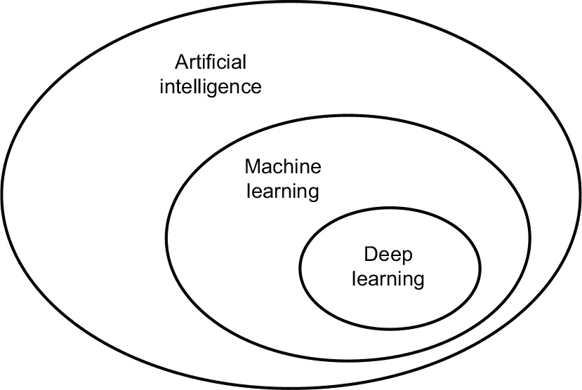

**图 1.1 人工智能、机器学习和深度学习**

### 1.1.1 人工智能

人工智能诞生于 20 世纪 50 年代，当时来自计算机科学新兴领域的一小撮先驱开始思考计算机是否能够“思考”——这个问题的影响我们今天仍在探索。

尽管许多潜在的想法在之前的年份甚至几十年里一直在酝酿，但是“人工智能”最终在 1956 年成为一个研究领域，当时达特茅斯学院数学系的年轻助理教授约翰·麦卡锡（John McCarthy）根据以下提议组织了一个暑期研讨会：

> *这项研究的基础假设是，学习的每个方面或智能的任何其他特征原则上都可以被如此精确地描述，以至于可以制造出一台机器来模拟它。我们将尝试找出如何让机器使用语言、形成抽象和概念、解决目前仅保留给人类的各种问题，并改进自己。我们认为，如果一组精心挑选的科学家们一起为此进行一个夏天的工作，就可以在这些问题中的一个或多个方面取得重大进展。*

夏末，研讨会在没有完全解决其旨在调查的谜团的情况下结束了。尽管如此，参加的人很多，其中许多人后来成为该领域的先驱，并引发了一场至今仍在进行的知识革命。

简言之，AI 可以被描述为*试图自动化人类通常执行的智力任务*。因此，AI 是一个通用领域，包括机器学习和深度学习，但也包括许多不涉及任何学习的其他方法。考虑到直到 20 世纪 80 年代，大多数 AI 教科书根本没有提到“学习”！例如，早期的国际象棋程序仅涉及程序员制定的硬编码规则，并且不符合机器学习的条件。事实上，相当长的一段时间，大多数专家都相信，通过让程序员手工制作足够大的一组明确规则来操作明确数据库中存储的知识，可以实现人类级别的人工智能。这种方法被称为*符号 AI*。它是 20 世纪 50 年代到 20 世纪 80 年代末的 AI 的主导范式，并且在 20 世纪 80 年代的*专家系统*繁荣时期达到了最高的流行度。

尽管符号 AI 被证明适合解决定义良好的逻辑问题，例如下棋，但发现为解决更复杂、模糊的问题（例如图像分类、语音识别或自然语言翻译）制定明确规则是不可行的。一个新的方法出现取代了符号 AI 的位置：*机器学习*。

### 1.1.2 机器学习

在维多利亚时代的英国，阿达·洛夫莱斯（Lady Ada Lovelace）是查尔斯·巴贝奇（Charles Babbage）的朋友和合作者，他是*分析引擎*的发明者：第一个已知的通用机械计算机。尽管分析引擎具有远见和超前的时间，但在 19 世纪 30 年代和 40 年代设计时，分析引擎并不是作为一台通用计算机存在的，因为通用计算的概念尚未发明。它仅仅被设计为使用机械操作来自动执行来自数学分析领域的某些计算——因此被称为分析引擎。因此，它是早期尝试用齿轮形式编码数学运算的思想的继承者，例如帕斯卡林或莱布尼茨的阶梯计算器，帕斯卡林的改进版本。由布莱斯·帕斯卡（Blaise Pascal）于 1642 年设计（当时年仅 19 岁！），帕斯卡林是世界上第一台机械计算器——它可以进行加法、减法、乘法，甚至是除法。

1843 年，阿达·洛夫莱斯（Ada Lovelace）评论了分析引擎的发明：

> *分析引擎完全没有假装要创造任何东西。它只能执行我们知道如何指示它执行的任务……它的职责是帮助我们利用我们已经了解的东西。*

即使有着 179 年的历史背景，洛夫莱斯夫人的这一观察依然令人震惊。一个通用计算机能否“创造”出任何东西，还是它只会执行我们人类完全理解的过程？它能有任何原创思考吗？它能从经验中学习吗？它能展现创造力吗？

后来 AI 先驱艾伦·图灵在他 1950 年的里程碑论文“计算机器和智能”中引用了洛夫莱斯夫人的这一评论作为“洛夫莱斯夫人的反驳”，并介绍了图灵测试以及将会塑造 AI 的关键概念。图灵当时具有高度挑衅性的观点是，计算机原则上可以模拟人类智能的方方面面。

让计算机做有用的工作的通常方式是由人类程序员编写*规则*，即一份计算机程序，用于将输入数据转化为适当的答案，就像洛夫莱斯夫人编写分析机执行的步骤指令一样。而机器学习则颠倒了这种思路：机器查看输入数据和相应的答案，并找出规则应该是什么（见图 1.2）。机器学习系统是被*训练*而不是明确地进行编程。它被呈现给了任务相关的许多示例，并且在这些示例中找到了统计结构，最终允许系统制定自动化任务的规则。例如，如果你想自动化处理你的度假照片的标记任务，你可以向机器学习系统提供许多由人类已经标记过的照片示例，而系统会学习用于将特定照片与特定标签相关联的统计规则。

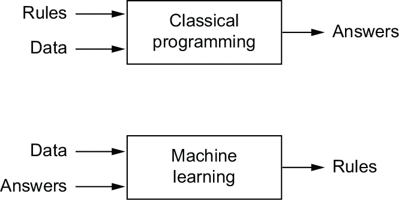

**图 1.2 机器学习：一种新的编程范式**

尽管机器学习在 1990 年代才开始蓬勃发展，但它迅速成为人工智能最受欢迎和最成功的子领域，这一趋势是由更快的硬件速度和更大的数据集所推动的。机器学习与数理统计有关，但在几个重要方面与统计学不同，就像医学与化学有关但不能完全归纳为化学一样，因为医学处理了具有自身特性的独立系统。与统计学不同，机器学习倾向于处理大型复杂数据集（例如由数百万个由数万个像素组成的图像组成的数据集），对于这些数据集，诸如贝叶斯分析之类的经典统计分析是不实际的。因此，机器学习，尤其是深度学习，在数学理论方面相对较少——也许太少了，并且从根本上是一门工程学科。与理论物理或数学不同，机器学习是一个非常实际的领域，它是由实证结果推动并深度依赖于软件和硬件的进步。

### 1.1.3 从数据中学习规则和表示

要定义*深度学习*并理解深度学习与其他机器学习方法之间的区别，首先我们需要对机器学习算法做些了解。我们刚才说过，机器学习发现了执行数据处理任务的规则，给出了预期的示例。所以，要进行机器学习，我们需要以下三件事：

+   *输入数据点*——例如，如果任务是语音识别，这些数据点可能是人们说话的声音文件。如果任务是图像标记，它们可以是图片。

+   *预期输出的示例*——在语音识别任务中，这些可以是由人类生成的声音文件的文本转录。在图像任务中，预期的输出可以是诸如“狗”、“猫”等标签。

+   *评估算法工作是否良好的方法*——这是确定算法当前输出与预期输出之间距离的必要条件。该度量用作调整算法工作方式的反馈信号。这一调整步骤就是我们所谓的*学习*。

机器学习模型将其输入数据转换为有意义的输出，这个过程是从已知输入和输出的示例中“学习”的。因此，机器学习和深度学习的核心问题是*有意义地转换数据*：换句话说，学习有用的*表示*手头的输入数据——这些表示使我们更接近预期的输出。

在我们进一步之前：什么是表示？在其核心，它是查看数据的不同方式——表示或编码数据。例如，彩色图像可以用 RGB 格式（红-绿-蓝）或 HSV 格式（色调-饱和度-亮度）进行编码：这是同一数据的两种不同表示。对于某些使用一种表示可能很困难的任务，使用另一种表示可能变得更容易。例如，任务“选择图像中的所有红色像素”在 RGB 格式中更简单，而“使图像的饱和度降低”在 HSV 格式中更简单。机器学习模型的全部意义在于为其输入数据找到适当的表示——将数据转换为更适合手头任务的形式。

让我们具体一点。考虑一个*x*轴，一个*y*轴，以及一些通过它们在(*x, y*)系统中的坐标表示的点，如图 1.3 所示。

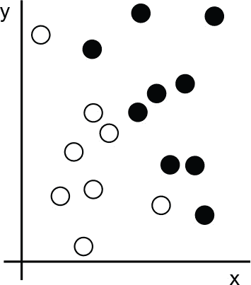

**图 1.3 一些样本数据**

正如您所见，我们有一些白点和一些黑点。假设我们想要开发一个算法，该算法可以接受点的坐标(*x, y*)并输出该点可能是黑色还是白色。在这种情况下，我们有以下数据：

+   输入是我们点的坐标。

+   预期的输出是我们点的颜色。

+   评估我们的算法是否良好的一种方法可以是，例如，被正确分类的点的百分比。

我们需要的是一种能清晰地将白点与黑点分开的新数据表示。我们可以使用的一种转换，除了许多其他可能性外，是一个坐标变换，如图 1.4 所示。

在这个新的坐标系统中，我们点的坐标可以说是我们数据的新表示。而且这个表示是很好的！有了这个表示，黑/白分类问题可以表达为一个简单的规则：“黑点是满足*x* > 0 的点”，或者“白点是满足*x* < 0 的点”。这个新的表示，加上这个简单的规则，很好地解决了分类问题。

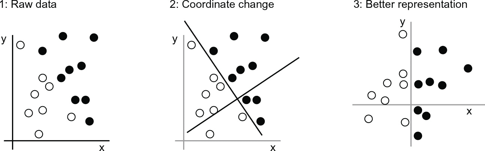

**图 1.4 坐标变换**

在这种情况下，我们手动定义了坐标变换：我们利用我们的人类智慧来得出我们自己的适当数据表示。对于这样一个极其简单的问题来说，这是可以的，但如果任务是对手写数字的图像进行分类，你能做到同样的吗？你能否写出明确的、可由计算机执行的图像转换，以揭示 6 和 8 之间、1 和 7 之间的差异，以及各种不同手写的区别？

在一定程度上是可能的。基于数字表示的规则，比如“封闭环数量”或者垂直和水平像素直方图，可以很好地区分手写数字。但是手动找到这样有用的表示是很费力的工作，而且，你可以想象到，由此产生的基于规则的系统是脆弱的——维护起来是一场噩梦。每当你遇到一个打破你精心考虑的规则的新的手写样本时，你就不得不添加新的数据转换和新的规则，同时考虑它们与每个以前的规则的相互作用。

你可能会想，如果这个过程如此痛苦，我们能不能自动化它呢？如果我们尝试系统地搜索不同的自动生成的数据表示及基于它们的规则集合，并通过使用一些开发数据集中正确分类的数字的百分比作为反馈来确定好的表示，那我们就是在做机器学习了。*学习*，在机器学习的背景下，描述的是一种自动搜索数据转换的过程，产生对一些数据有用的表示，受到某种反馈信号的指导——这些表示适合于解决手头任务的简单规则。

这些转换可以是坐标变换（如我们的 2-D 坐标分类示例中的转换），也可以是像素直方图和计数循环（如我们的数字分类示例中的转换），还可以是线性投影、平移、非线性操作（如“选择所有满足 *x* > 0 的点”）等等。机器学习算法通常不会自行发现这些转换的创造性方式；它们只是在预定义的一组操作中进行搜索，称为*假设空间*。例如，在 2-D 坐标分类示例中，所有可能的坐标变换构成了我们的假设空间。

这就是机器学习的精简定义：在一定的可能性空间内，通过接收反馈信号的指导，对一些输入数据搜索有用的表示和规则。这个简单的想法能够解决一系列智能任务，从语音识别到自动驾驶。现在您已经理解了我们所说的*学习*的含义，让我们来看看*深度学习*有何特殊之处。

### 1.1.4 “深度学习”中的“深度”

深度学习是机器学习的一个特定子领域：一种从数据中学习表示的新方法，强调学习越来越有意义的连续层次的表示。所谓“深度”并不是指这种方法达到了任何更深的理解，而是指连续层级表示的思想。对数据模型有多少层贡献被称为模型的*深度*。该领域其他适当的名称可以是*分层表示学习*或*层次表示学习*。现代深度学习通常涉及到连续的几十甚至上百层的表示，它们都是从训练数据中自动学习得来的。与此同时，其他机器学习方法往往只专注于学习一两层的数据表示（例如，计算像素直方图然后应用分类规则）；因此，它们有时被称为*浅层学习*。

在深度学习中，这些分层表示是通过称为*神经网络*的模型学习的，这些模型结构化地堆叠在一起。术语“神经网络”是指神经生物学，但尽管深度学习中的一些核心概念部分是通过从我们对大脑的理解中汲取灵感（特别是视觉皮层）而开发出来的，但深度学习模型并不是大脑的模型。没有证据表明大脑实现了任何类似于现代深度学习模型中使用的学习机制。你可能会遇到一些流行科学文章宣称深度学习就像大脑工作或者是根据大脑建模的，但事实并非如此。对于初学者来说，将深度学习与神经生物学有任何联系是令人困惑和适得其反的；你不需要对“就像我们的思维一样”这种神秘感和神秘感的掩饰，你也可以忘记任何关于深度学习和生物学之间的假设联系的东西。对于我们的目的来说，深度学习是从数据中学习表示的数学框架。

深度学习算法学到的表示是什么样子的？让我们看看一个多层次网络（参见图 1.5）如何将一个数字图像转换为识别它是什么数字的表示。  

正如你在图 1.6 中所看到的，该网络将数字图像转换为越来越不同于原始图像且越来越有关最终结果的表示。你可以把深度网络想象成一个多阶段的*信息精炼*过程，在这个过程中信息经过连续的筛选，并且逐渐*纯化*（即，关于某个任务而言有用）。

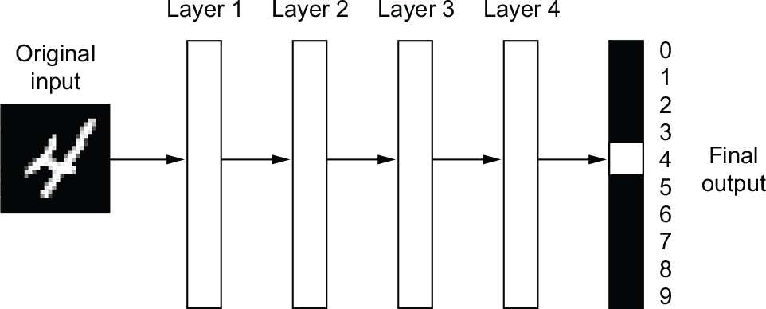

**图 1.5 用于数字分类的深度神经网络**

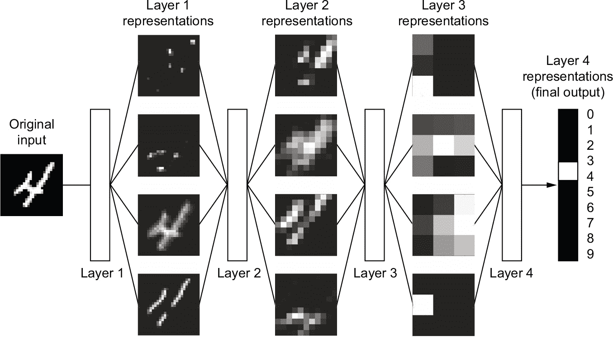

**图 1.6 由数字分类模型学到的数据表示**

所以从技术上讲，深度学习是什么？是一种学习数据表示的多阶段方法。这是一个简单的想法——但事实证明，非常简单的机制，足够大规模地扩展，最终看起来就像魔术一样。

### 1.1.5 用三个图来理解深度学习是如何工作的

到目前为止，你已经知道机器学习是关于将输入（比如图像）映射到目标（比如标签“猫”），这是通过观察大量输入和目标示例来完成的。你也知道深度神经网络通过一系列简单的数据转换（层）的深度序列来进行这种输入到目标的映射，并且这些数据转换是通过接触示例来学习的。现在让我们具体看看这个学习是如何发生的。

一个层对其输入数据执行的操作规范存储在层的*权重*中，本质上是一堆数字。在技术术语中，我们会说层实现的转换由其权重*参数化*（参见图 1.7）。 （权重有时也被称为层的*参数*。）在这个上下文中，*学习*意味着找到网络中所有层的权重的一组值，使得网络能够正确地将示例输入映射到其关联的目标。但是有个问题：一个深度神经网络可能包含数千万个参数。找到所有这些参数的正确值可能看起来是一项艰巨的任务，特别是考虑到修改一个参数的值将影响所有其他参数的行为！

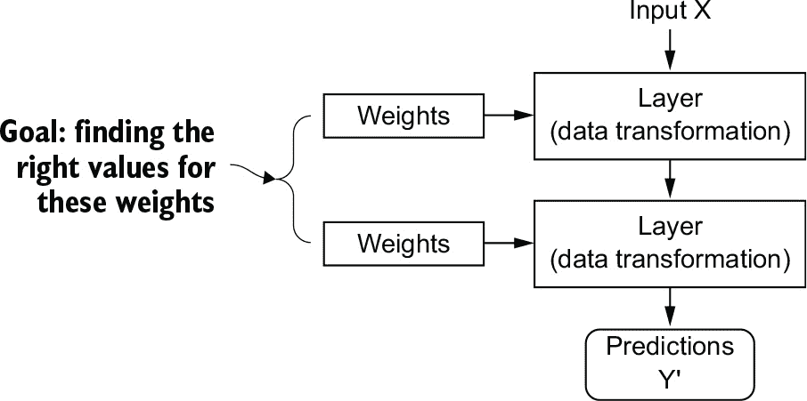

**图 1.7 神经网络由其权重参数化。**

要控制某物，首先你需要能够观察它。要控制神经网络的输出，你需要能够测量这个输出与你期望的有多远。这是网络的*损失函数*的工作，有时也称为*目标函数*或*成本函数*。损失函数接受网络的预测和真实目标（你希望网络输出的内容）并计算一个距离分数，捕捉网络在这个特定示例上表现如何（参见图 1.8）。

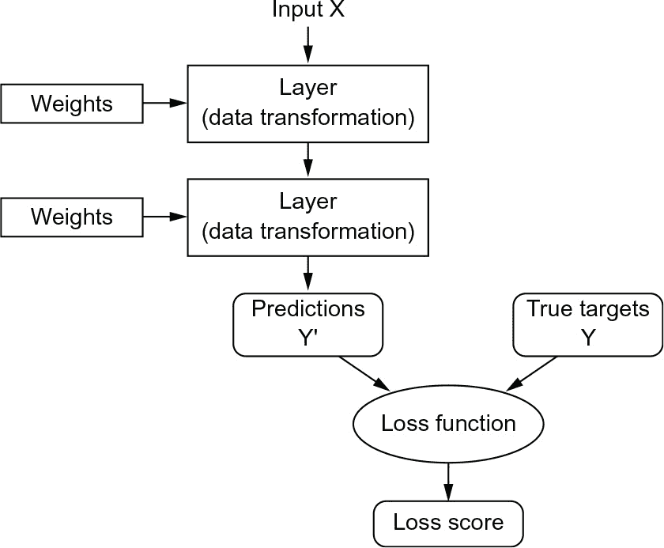

**图 1.8 损失函数衡量网络输出的质量。**

深度学习的基本技巧是将此分数用作反馈信号，稍微调整权重的值，使得当前示例的损失分数降低（参见图 1.9）。这种调整是*优化器*的工作，它实现了所谓的*反向传播*算法：深度学习中的核心算法。下一章将更详细地解释反向传播的工作原理。

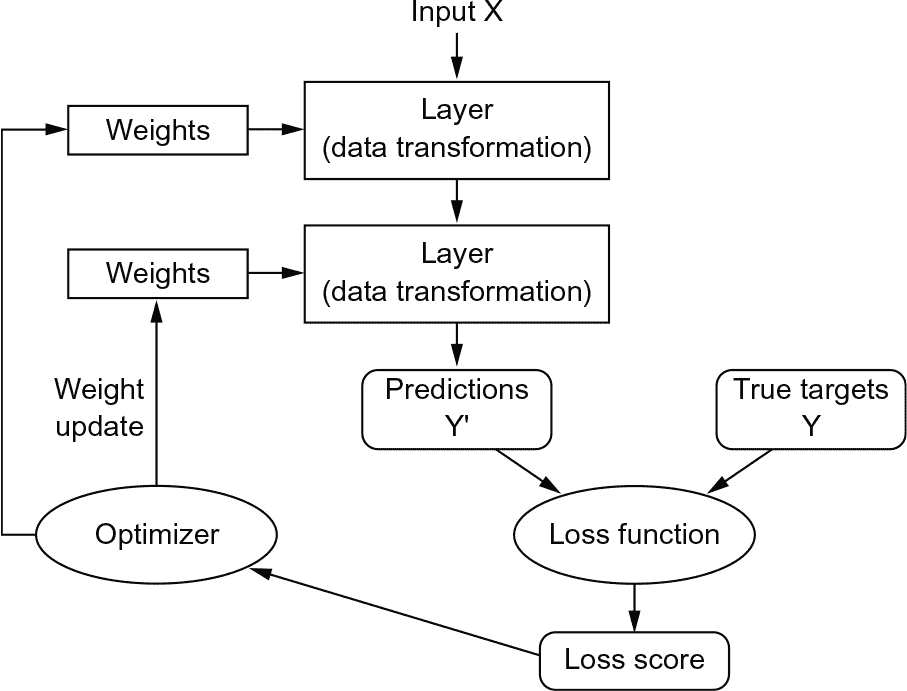

**图 1.9 损失分数被用作反馈信号来调整权重。**

最初，网络的权重被赋予随机值，因此网络只是实现一系列随机变换。自然地，它的输出远离理想状态，相应地损失分数也很高。但是随着网络处理每个示例，权重稍微朝正确的方向调整，损失分数减少。这是*训练循环*，重复足够多次（通常在数千个示例上进行数十次迭代），产生使损失函数最小化的权重值。具有最小损失的网络是输出尽可能接近目标的网络：一个经过训练的网络。再一次，这是一个简单的机制，一旦扩展，就会看起来像魔法。

### 1.1.6 到目前为止深度学习取得了什么成就

尽管深度学习是机器学习的一个相当古老的子领域，但它直到 2010 年代初才声名鹊起。在此后的几年里，它在领域中取得了革命性的成就，在感知任务甚至自然语言处理任务上取得了显著成果——这些问题涉及到对人类来说似乎自然而直观但长期以来一直难以实现的技能。特别是，深度学习使以下历史上困难的机器学习领域取得了突破：

+   接近人类水平的图像分类

+   接近人类水平的语音转录

+   接近人类水平的手写转录

+   显著改进的机器翻译

+   显著改进的文本转语音转换

+   数字助手，如谷歌助手和亚马逊 Alexa

+   接近人类水平的自动驾驶

+   改进的广告定位，如谷歌、百度或必应所使用的

+   改进的网络搜索结果

+   回答自然语言问题的能力

+   超人类的围棋对弈

我们仍在探索深度学习的全部潜力。我们已经开始将其成功应用于许多曾被认为几年前无法解决的各种问题——自动转录梵蒂冈宗座档案馆中保存的数万份古老手稿，使用简单的智能手机在田间检测和分类植物疾病，协助肿瘤学家或放射科医生解释医学成像数据，预测洪水、飓风甚至地震等自然灾害，等等。随着每一个里程碑的实现，我们越来越接近一个深度学习在人类努力的每个活动和领域中都能协助我们的时代——科学、医学、制造业、能源、交通运输、软件开发、农业，甚至艺术创作。

### 1.1.7 不要相信短期炒作

尽管深度学习在近年来取得了显著成就，但对该领域未来十年能够取得的成就的期望往往高于可能实现的水平。尽管一些像自动驾驶汽车这样的改变世界的应用已经可以实现，但更多的应用可能会在很长一段时间内仍然难以实现，比如可信的对话系统，跨任意语言的人类级机器翻译以及人类级自然语言理解。特别是，对于短期内达到人类级通用智能的讨论不应该太认真。对短期内的高期望的风险在于，随着技术的失灵，研究投资将枯竭，长时间内的进展将放缓。

这已经发生过。在过去两次，AI 经历了密集的乐观期，随之而来的是失望和怀疑，资金匮乏也是其结果。它始于 20 世纪 60 年代的符号 AI。在那些早期，关于 AI 的预测风靡一时。符号 AI 方法中最知名的先驱和支持者之一是马文·明斯基，他在 1967 年声称，“一代人内…创造‘人工智能’的问题将被很大程度上解决。”三年后，即 1970 年，他对此作了更为明确的预测：“在三到八年内，我们将拥有一台具有平均人类智能的机器。”在 2022 年，这样的成就似乎远在未来—而且我们无法预测需要多长时间—但在 20 世纪 60 年代和 70 年代初，一些专家相信这个成就就在不远的将来（今天也有很多人持相同看法）。几年后，随着这些极高的期望未能实现，研究人员和政府资金开始远离这一领域，标志着第一个*AI 寒冬*的开始（这是对核寒冬的一种参考，因为这是冷战达到高潮后不久）。

这不会是最后一个。在 20 世纪 80 年代，对符号 AI 的新看法，*专家系统*，开始在大公司中蓬勃发展。一些最初的成功案例引发了一波投资热潮，全球各大公司开始成立自己的内部 AI 部门开发专家系统。大约在 1985 年，公司每年在这项技术上的支出超过 10 亿美元；但到了 20 世纪 90 年代初，这些系统已被证明难以维护、难以扩展并且范围有限，导致兴趣消减。于是第二次 AI 寒冬开始了。

我们可能目前正见证着 AI 炒作和失望的第三个周期，而我们仍处于密集乐观的阶段。最好是在短期内控制我们的期望，并确保对这个领域技术方面不太熟悉的人清楚地知道深度学习能做什么，以及不能做什么。

### 1.1.8 AI 的承诺

尽管我们可能对人工智能抱有不切实际的短期期望，但长期前景看起来光明。我们只是刚刚开始将深度学习应用于许多重要问题，它可能会产生变革性的影响，从医学诊断到数字助理。过去 10 年来，人工智能研究取得了惊人的进展，这在很大程度上是由于人工智能短暂历史上前所未有的资金水平，但到目前为止，这种进展相对较少地融入到构成我们世界的产品和流程中。深度学习的大部分研究成果尚未应用，或者至少尚未应用于所有行业中它们可以解决的全部问题。你的医生尚未使用人工智能，你的会计师也没有。你在日常生活中可能很少使用人工智能技术。当然，你可以向你的智能手机提出简单的问题，并得到合理的答案，你可以在 Amazon.com 上获得相当有用的产品推荐，你可以在 Google 照片上搜索“生日”，并立即找到上个月你女儿生日聚会的照片。这与这些技术过去的水平相距甚远。但这样的工具仍然只是我们日常生活的附件。人工智能尚未过渡到成为我们工作、思考和生活方式的核心。

现在，人工智能可能会对我们的世界产生重大影响似乎难以置信，因为它尚未被广泛应用——就像在 1995 年，很难相信互联网未来的影响一样。那时，大多数人看不到互联网与他们有何关系，也看不到它将如何改变他们的生活。对于深度学习和人工智能今天也是如此。但不要误解：人工智能即将到来。在不久的将来，人工智能将成为你的助手，甚至是你的朋友；它将回答你的问题，帮助教育你的孩子，并监督你的健康。它将把你的杂货送到家门口，并把你从 A 点开到 B 点。它将成为你接入日益复杂和信息密集的世界的接口。更重要的是，人工智能将帮助整个人类向前迈进，通过协助人类科学家在各个科学领域取得新的突破性发现，从基因组学到数学。

在这个过程中，我们可能会遇到一些挫折，甚至可能出现新的人工智能寒冬——就像互联网行业在 1998 年至 1999 年被过度炒作，并遭受了在 2000 年初导致投资枯竭的崩溃一样。但我们最终会成功。人工智能最终将被应用到几乎构成我们社会和日常生活的每一个过程中，就像互联网今天一样。

不要相信短期的炒作，但要相信长期的愿景。人工智能可能需要一段时间才能发挥其真正的潜力——一个尚未有人敢于梦想其全部潜力的潜力——但人工智能即将到来，它将以一种奇妙的方式改变我们的世界。

## 1.2 在深度学习之前：机器学习的简要历史

深度学习已经达到了公众关注和工业投资的水平，这在人工智能历史上从未有过，但它并不是机器学习的第一种成功形式。可以说，今天工业界使用的大多数机器学习算法都不是深度学习算法。深度学习并不总是解决问题的正确工具——有时候没有足够的数据来应用深度学习，有时候用不同的算法解决问题更好。如果深度学习是你第一次接触机器学习，你可能会发现自己处于这样一种情况：你手头只有深度学习的“锤子”，每个机器学习问题开始看起来都像是一根钉子。避免落入这种陷阱的唯一方法是熟悉其他方法，并在适当时练习它们。

对古典机器学习方法的详细讨论超出了本书的范围，但我将简要介绍它们，并描述它们被发展的历史背景。这将使我们能够将深度学习置于机器学习的更广泛背景中，并更好地理解深度学习的起源和意义。

### 1.2.1 概率建模

*概率建模*是将统计学原理应用于数据分析的过程。这是最早的机器学习形式之一，至今仍然被广泛使用。这个类别中最著名的算法之一是朴素贝叶斯算法。

朴素贝叶斯是一种基于贝叶斯定理的机器学习分类器，假设输入数据中的特征都是独立的（这是一个强大或“朴素”的假设，这也是名称的由来）。这种形式的数据分析早在计算机出现之前就存在了，几十年前就是通过手工应用（很可能可以追溯到 20 世纪 50 年代）。贝叶斯定理和统计学的基础可以追溯到 18 世纪，这些是你开始使用朴素贝叶斯分类器所需要的全部。

一个密切相关的模型是*逻辑回归*（简称 logreg），有时被认为是现代机器学习的“Hello World”。不要被它的名字所误导——logreg 是一个分类算法，而不是回归算法。与朴素贝叶斯类似，logreg 在计算机出现很久之前就存在了，但由于其简单且多才多艺的性质，直到今天仍然很有用。它通常是数据科学家在处理数据集时尝试的第一件事，以了解手头的分类任务的感觉。

### 1.2.2 早期神经网络

早期的神经网络已经被这些页面中涵盖的现代变体完全取代，但了解深度学习的起源仍然很有帮助。虽然神经网络的核心理念早在 20 世纪 50 年代就以玩具形式进行了研究，但这种方法花了几十年才开始起步。长时间以来，缺失的部分是训练大型神经网络的有效方法。这种情况在 20 世纪 80 年代中期发生了变化，当时有多人独立重新发现了反向传播算法——一种使用梯度下降优化来训练参数化操作链的方法（我们将在本书后面精确定义这些概念），并开始将其应用于神经网络。

1989 年，贝尔实验室的 Yann LeCun 将卷积神经网络和反向传播的早期理念结合起来，并将它们应用于手写数字分类问题，从而取得了神经网络的第一个成功的实际应用。得到的网络被称为 *LeNet*，它在 1990 年代被美国邮政服务用于自动读取邮寄信封上的邮政编码。

### **1.2.3 核方法**

随着神经网络在 1990 年代开始在研究人员中获得一些尊重，得益于这一第一个成功，一种新的机器学习方法崭露头角，并迅速将神经网络送回了遗忘：核方法。*核方法*是一组分类算法，其中最著名的是 *支持向量机*（SVM）。SVM 的现代形式是由贝尔实验室的 Vladimir Vapnik 和 Corinna Cortes 在 20 世纪 90 年代初开发的，并于 1995 年发表³，尽管早在 1963 年，Vapnik 和 Alexey Chervonenkis 就已经发表了一个较早的线性形式⁴。

SVM 是一种分类算法，它通过找到分隔两个类别的“决策边界”（参见图 1.10）来工作。SVM 在以下两个步骤中找到这些边界：

1.  **1** 数据被映射到一个新的高维表示，其中决策边界可以表示为一个超平面（如果数据是二维的，如图 1.10，超平面将是一条直线）。

1.  **2** 通过试图最大化超平面与每个类别最近数据点之间的距离来计算一个良好的决策边界（一个分隔超平面），这一步骤被称为 *最大化间隔*。这使得边界能够很好地泛化到训练数据集之外的新样本。

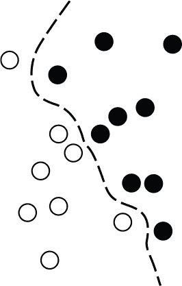

**图 1.10 决策边界**

将数据映射到高维表示中，以使分类问题变得更简单的技术在纸上看起来很好，但在实践中通常是计算上难以处理的。这就是*核技巧*的作用（核方法的关键思想）。它的要点是：为了在新的表示空间中找到好的决策超平面，你不需要显式计算点在新空间中的坐标；你只需要计算该空间中一对点之间的距离，这可以通过使用核函数以高效的方式完成。*核函数*是一种计算可行的操作，将你的初始空间中的任何两个点映射到这些点在目标表示空间中的距离，完全绕过新表示的显式计算。核函数通常是手工制作而非从数据中学习的，在 SVM 的情况下，只需要学习分离超平面。

当它们被开发出来时，SVM 在简单分类问题上表现出了最先进的性能，并且是少数几种机器学习方法之一，支持广泛的理论并易于进行深入的数学分析，使它们受到长期以来极大的关注。

但是，SVM 难以扩展到大型数据集，并且在诸如图像分类之类的感知问题上没有提供良好的结果。因为 SVM 是一种浅层方法，将 SVM 应用于感知问题需要先手动提取有用的表示（称为*特征工程*步骤），这很困难且易于出错。例如，如果要使用 SVM 对手写数字进行分类，则不能从原始像素开始；你应该首先手动查找有用的表示，使问题更易于处理，例如前面提到的像素直方图。

### 1.2.4 决策树、随机森林和梯度提升机。

*决策树*是类似流程图的结构，可以让你分类输入的数据点或者根据输入预测输出值（见图 1.11）。它们易于可视化和解释。从数据中学习的决策树在 2000 年代开始受到重视，并且到 2010 年，它们通常被更喜欢使用于核方法。

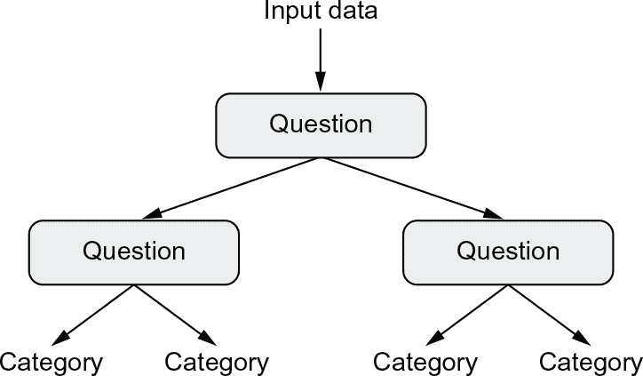

**图 1.11 决策树：学习的参数是关于数据的问题。一个问题可以是，“数据中的系数 2 是否大于 3.5？”**

特别是，*随机森林*算法引入了一种稳健的、实用的决策树学习方法，涉及构建大量专门的决策树，然后对它们的输出进行集成。随机森林适用于各种问题——你可以说它们几乎总是浅层机器学习任务的第二好算法。当流行的机器学习竞赛网站 Kaggle（[`kaggle.com`](http://www.kaggle.com)）在 2010 年启动时，随机森林很快成为该平台上的宠儿——直到 2014 年，*梯度提升机*取代了它。梯度提升机与随机森林类似，是一种基于弱预测模型集成的机器学习技术，通常是决策树。它使用*梯度提升*，一种通过迭代训练新模型来改善任何机器学习模型的方法，这些新模型专门用于解决前一模型的弱点。应用于决策树时，梯度提升技术的使用导致模型大部分时间都严格优于随机森林，同时具有类似的性质。它可能是今天处理非感知数据的最佳算法之一，如果不是*最佳*。与深度学习一样，它是 Kaggle 竞赛中最常用的技术之一。

### 1.2.5 回到神经网络

大约在 2010 年左右，尽管神经网络几乎被整个科学界抛弃，但仍有一些人在继续研究神经网络，并取得了重要的突破：多伦多大学的 Geoffrey Hinton 小组、蒙特利尔大学的 Yoshua Bengio 小组、纽约大学的 Yann LeCun 小组以及瑞士的 IDSIA。

2011 年，来自 IDSIA 的 Dan Cireşan 开始用 GPU 训练的深度神经网络赢得学术图像分类比赛，这是现代深度学习的第一个实际成功案例。但真正的转折点是在 2012 年，Hinton 的团队参加了每年一次的大规模图像分类挑战赛 ImageNet（简称 ImageNet Large Scale Visual Recognition Challenge，或简称 ILSVRC）。当时，ImageNet 挑战赛以其难度大而臭名昭著，需要在训练了 140 万张图像后，将高分辨率彩色图像分类为 1000 个不同的类别。2011 年，基于经典计算机视觉方法的获胜模型的前五准确率仅为 74.3%。⁵ 然后，在 2012 年，由 Alex Krizhevsky 领导的团队，在 Geoffrey Hinton 的指导下，取得了 83.6%的前五准确率，这是一个重大突破。从那时起，每年的比赛都被深度卷积神经网络所主导。到 2015 年，获胜者的准确率达到了 96.4%，ImageNet 上的分类任务被认为是一个完全解决的问题。

自 2012 年以来，深度卷积神经网络（*卷积神经网络*）已成为所有计算机视觉任务的首选算法；更一般地说，它们适用于所有感知任务。在 2015 年之后的任何重要计算机视觉会议上，几乎不可能找到不涉及卷积神经网络的演示。与此同时，深度学习在许多其他类型的问题中也找到了应用，比如自然语言处理。它已完全取代了在广泛范围内的应用中的支持向量机和决策树。例如，几年来，欧洲核子研究组织（CERN）一直使用基于决策树的方法来分析大型强子对撞机（LHC）上的 ATLAS 探测器的粒子数据，但最终 CERN 转而使用基于 Keras 的深度神经网络，因为它们在性能和大型数据集的训练方面更为出色。

### 1.2.6 深度学习的特点在哪里？

深度学习迅速发展的主要原因是它在许多问题上提供了更好的性能。但这并不是唯一的原因。深度学习还使问题解决变得更容易，因为它完全自动化了机器学习工作流程中曾经最关键的步骤：特征工程。

以前的机器学习技术——浅层学习——涉及将输入数据转换成仅有一个或两个连续的表示空间，通常是通过简单的转换，比如高维非线性投影（支持向量机）或决策树。但是，复杂问题所需的精细表示通常无法通过这些技术实现。因此，人们不得不极力使初始输入数据更易于这些方法处理：他们不得不手工构建数据的良好表示层。这就是所谓的*特征工程*。另一方面，深度学习完全自动化了这一步骤：通过深度学习，你可以一次学习所有特征，而不是自己进行特征工程。这大大简化了机器学习工作流程，通常用单个简单的端到端深度学习模型替代了复杂的多阶段管道。

你可能会问，如果问题的关键是拥有多个连续的表示层，那么浅层方法能否被重复应用以模拟深度学习的效果？实际上，浅层学习方法的连续应用会产生快速减小的回报，因为三层模型中的最优第一表示层并不是单层或双层模型中的最优第一层。深度学习的变革性在于它允许模型同时学习所有层的表示，而不是连续地（贪婪地，正如它被称为的那样）学习。通过联合特征学习，每当模型调整其内部特征时，所有依赖于它的其他特征都会自动适应变化，而无需人为干预。一切都由单一的反馈信号监督：模型中的每一次变化都服务于最终目标。这比贪婪地堆叠浅层模型要强大得多，因为它允许将复杂的、抽象的表示分解成一系列长期的中间空间（层）；每个空间与前一个空间之间只相差一个简单的转换。

这些是深度学习从数据中学习的两个基本特征：逐渐增加的、逐层的方式发展越来越复杂的表示，以及这些中间增量表示是共同学习的，每一层都更新以同时遵循上一层的表示需求和下一层的需求。这两个属性的结合使得深度学习比以前的机器学习方法成功得多。

### 1.2.7 现代机器学习格局

要了解当前机器学习算法和工具的现状，一个很好的方法是看一看 Kaggle 上的机器学习竞赛。由于其高度竞争的环境（一些比赛有数千名参赛者和百万美元的奖金）以及涵盖的机器学习问题的广泛多样性，Kaggle 提供了一种实际的评估什么有效、什么无效的方式。那么，哪种算法可靠地赢得了竞赛？顶级参赛者使用什么工具？

在 2019 年初，Kaggle 进行了一项调查，询问了自 2017 年以来任何竞赛中进入前五名的团队使用的主要软件工具（见图 1.12）。结果表明，顶级团队倾向于使用深度学习方法（通常通过 Keras 库）或梯度提升树（通常通过 LightGBM 或 XGBoost 库）。

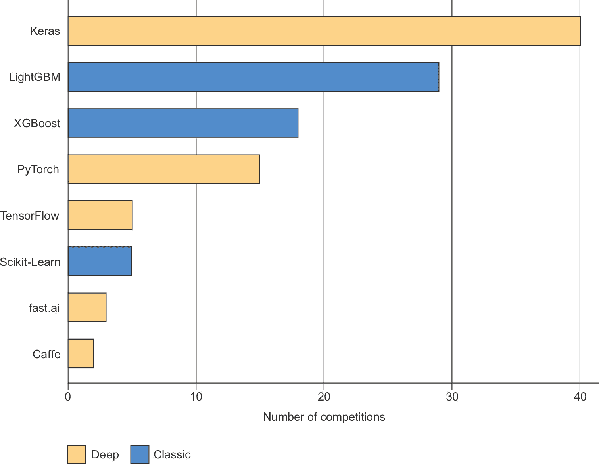

**图 1.12 Kaggle 顶级团队使用的机器学习工具**

不仅仅是竞赛冠军。Kaggle 还每年对全球机器学习和数据科学专业人士进行调查。这项调查有数万名受访者，是关于行业状况的最可靠来源之一。图 1.13 显示了不同机器学习软件框架的使用百分比。

从 2016 年到 2020 年，整个机器学习和数据科学行业都被这两种方法主导：深度学习和梯度提升树。具体来说，梯度提升树用于有结构化数据可用的问题，而深度学习用于图像分类等感知问题。

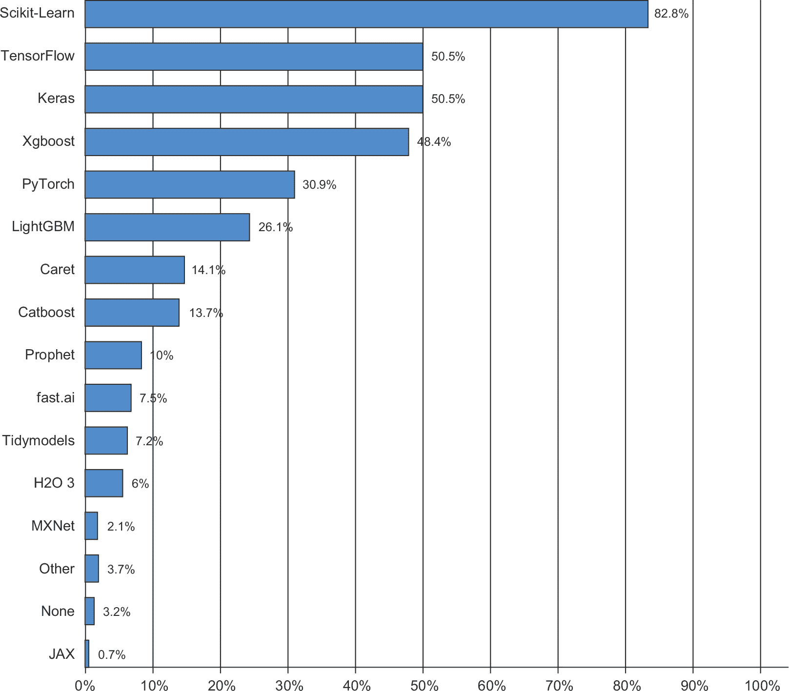

**图 1.13 工具在机器学习和数据科学行业中的使用情况（来源：[`www.kaggle.com/kaggle-survey-2020`](http://www.kaggle.com/kaggle-survey-2020)）**

梯度提升树的用户倾向于使用 Scikit-Learn、XGBoost 或 LightGBM。与此同时，大多数深度学习从业者使用 Keras，通常与其母框架 TensorFlow 结合使用。这些工具的共同点是它们都作为 R 或 Python 库提供：R 和 Python 是迄今为止最广泛使用的机器学习和数据科学语言。

要在今天的应用机器学习中取得成功，你应该最熟悉以下两种技术：梯度提升树，用于浅层学习问题；深度学习，用于感知问题。从技术上讲，这意味着你需要熟悉 XGBoost 和 Keras——目前在 Kaggle 竞赛中占据主导地位的库。有了这本书，你已经离成功更近了一大步。

## 1.3 为什么深度学习？为什么现在？

深度学习在计算机视觉领域的两个关键思想——卷积神经网络和反向传播——在 1990 年已经被充分理解。长短期记忆（LSTM）算法，这对于时间序列的深度学习至关重要，于 1997 年开发，并且自那时以来几乎没有改变。为什么深度学习直到 2012 年之后才起飞？这两个十年发生了什么变化？总的来说，以下三个技术力量推动了机器学习的进步：

+   硬件

+   数据集和基准

+   算法进步

因为该领域是由实验发现而不是理论来指导的，所以只有在适当的数据和硬件可用于尝试新的想法（或者扩展旧的想法，通常情况下是这样）时，算法的进步才成为可能。机器学习不是数学或物理学，主要进步不能只靠一支笔和一张纸完成。这是一门工程科学。

1990 年代和 2000 年代的真正瓶颈是数据和硬件。但在此期间发生了以下事情：互联网蓬勃发展，高性能图形芯片为游戏市场的需求而开发。

### 1.3.1 硬件

在 1990 年至 2010 年之间，现成的 CPU 速度提高了约 5000 倍。因此，现在可以在笔记本电脑上运行小型深度学习模型，而在 25 年前这是不可行的。

但是，在计算机视觉或语音识别中使用的典型深度学习模型需要比您的笔记本电脑提供的计算能力高出几个数量级。在 2000 年代，像 NVIDIA 和 AMD 这样的公司投资了数十亿美元来开发快速、高度并行的芯片（图形处理单元，或 GPU），以推动越来越逼真的视频游戏的图形——便宜的、单一用途的超级计算机，设计用于实时在屏幕上渲染复杂的三维场景。当时，NVIDIA 于 2007 年推出了 CUDA（[`developer.nvidia.com/about-cuda`](https://www.developer.nvidia.com/about-cuda)），这是其 GPU 系列的编程接口。一小部分 GPU 开始取代各种高度可并行化应用程序中的大型 CPU 集群，从物理建模开始。由于深度神经网络主要由许多小矩阵乘法组成，因此也具有高度可并行化性，并且大约在 2011 年左右，一些研究人员开始编写神经网络的 CUDA 实现——Dan Cireşan⁶和 Alex Krizhevsky⁷是最早的。

发生的事情是，游戏市场为下一代人工智能应用程序提供了超级计算的资助。有时，大事物起源于游戏。NVIDIA Titan RTX 是一款于 2019 年底售价为 2500 美元的 GPU，可在单精度下提供 16 teraflops 的峰值计算能力（每秒 16 万亿次 float32 运算）。这大约是 1990 年世界上最快的超级计算机英特尔 Touchstone Delta 的 500 倍。在 Titan RTX 上，只需几个小时即可训练出 2012 年或 2013 年左右赢得 ILSVRC 竞赛的 ImageNet 模型。与此同时，大公司使用数百个 GPU 的集群来训练深度学习模型。

更重要的是，深度学习行业已经超越了 GPU，并且正在投资于越来越专门化、高效的深度学习芯片。2016 年，在其年度 I/O 大会上，Google 公布了其张量处理单元（TPU）项目：一种新的芯片设计，从头开始开发，以比顶级 GPU 更快、更节能地运行深度神经网络。2020 年，第三代 TPU 卡代表着 420 teraflops 的计算能力。这比 1990 年的英特尔 Touchstone Delta 高出 10,000 倍。

这些 TPU 卡设计成可组装成大型配置，称为“pods”。一个 pod（1024 个 TPU 卡）峰值达到 100 petaflops。就规模而言，这大约是当前最大超级计算机 IBM Summit 在奥克岭国家实验室的峰值计算能力的 10％，它由 27,000 个 NVIDIA GPU 组成，峰值约为 1.1 exaflops。

### 1.3.2 数据

人工智能有时被誉为新的工业革命。如果深度学习是这场革命的蒸汽机，那么数据就是其煤炭：为我们的智能机器提供动力的原材料，没有它，一切都不可能。在数据方面，除了过去 20 年存储硬件的指数级进步（遵循摩尔定律）外，互联网的崛起是游戏规则的改变者，使得收集和分发非常大的机器学习数据集成为可能。今天，大公司使用图像数据集、视频数据集和自然语言数据集，这些数据集如果没有互联网就无法收集。例如，Flickr 上用户生成的图像标签一直是计算机视觉的宝藏。YouTube 视频也是如此。而维基百科是自然语言处理的关键数据集。

如果说有一个数据集推动了深度学习的崛起，那就是 ImageNet 数据集，包括 140 万张图像，已手动注释为 1000 个图像类别（每个图像一个类别）。但是，使 ImageNet 特殊的不仅仅是其规模，还有与之相关的每年一度的竞赛⁸。

自 2010 年以来，Kaggle 一直在展示，公开竞赛是激励研究人员和工程师突破瓶颈的极佳途径。拥有研究人员竞争超越的共同基准极大地推动了深度学习的崛起，突显了其对传统机器学习方法的成功。

### 1.3.3 算法

除了硬件和数据之外，直到 2000 年代后期，我们缺乏可靠的方法来训练非常深的神经网络。因此，神经网络仍然相对浅层，只使用一两层表示；因此，它们无法与更精细的浅层方法（如 SVM 和随机森林）相抗衡。关键问题是通过深层堆栈的层进行*梯度传播*。用于训练神经网络的反馈信号随着层数的增加而逐渐消失。

2009 年至 2010 年间，随着以下简单但重要的算法改进的出现，使得更好的梯度传播成为可能：

+   更好的神经层激活函数

+   更好的*权重初始化方案*，从逐层预训练开始，然后迅速被抛弃

+   更好的*优化方案*，例如 RMSprop 和 Adam

只有当这些改进开始允许训练具有 10 个或更多层的模型时，深度学习才开始展现其优势。最终，在 2014 年、2015 年和 2016 年，发现了更先进的改进梯度传播的方式，如批归一化、残差连接和深度可分离卷积。

今天，我们可以从头开始训练任意深度的模型。这解锁了使用极大模型的可能性，这些模型具有相当大的表征能力——也就是说，它们编码了非常丰富的假设空间。这种极端的可扩展性是现代深度学习的一个显著特征。大规模模型架构，具有数十层和数千万参数的特征，为计算机视觉（例如，ResNet、Inception 或 Xception 等架构）和自然语言处理（例如，基于大型 Transformer 的架构，如 BERT、GPT-3 或 XLNet）带来了关键进展。

### 1.3.4 新一轮投资浪潮

深度学习成为 2012 年至 2013 年计算机视觉的新技术代表，最终也成为所有感知任务的新技术代表，行业领袖们开始关注。随之而来的是一波渐进的行业投资浪潮，远远超出了人工智能历史上以往的任何投资规模（参见图 1.14）。

在深度学习受到关注之前的 2011 年，全球人工智能的风险投资总额不到 10 亿美元，几乎完全投向了浅层机器学习方法的实际应用。到了 2015 年，这一数字已经上升到了 50 多亿美元，而在 2017 年，更是激增到了惊人的 160 亿美元。在这几年中，数百家初创公司纷纷涌现，试图利用深度学习的热潮。与此同时，谷歌、亚马逊和微软等大型科技公司投资于内部研究部门的金额很可能超过了风险投资资金的流动。

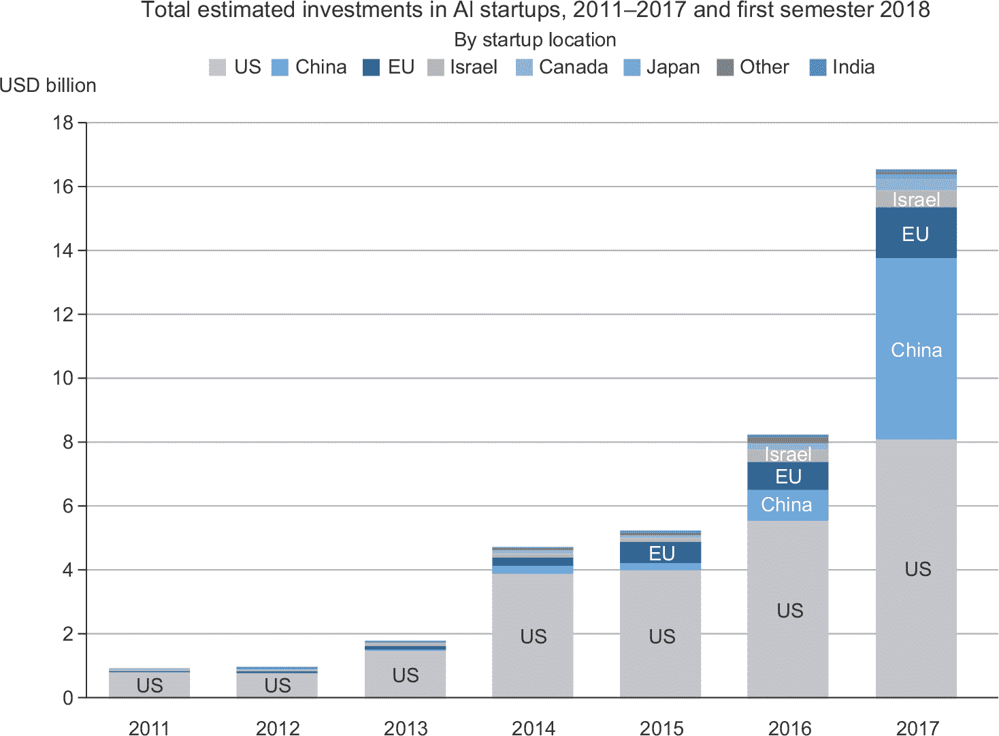

**图 1.14 经济合作与发展组织(OECD)对人工智能初创公司总投资的估计（来源：[`mng.bz/zGN6`](http://mng.bz/zGN6)）**

机器学习——特别是深度学习——已经成为这些科技巨头产品战略的核心。2015 年底，谷歌 CEO 桑达尔·皮查伊表示：“机器学习是我们重新思考我们如何做一切的核心、变革性方式。我们正在审慎地将其应用于我们所有的产品，无论是搜索、广告、YouTube 还是 Play。我们还处于早期阶段，但你会看到我们——以系统的方式——在所有这些领域应用机器学习。”⁹

由于这一波投资浪潮，从不到 10 年的时间里，从事深度学习研究的人数从几百人增加到了数万人，研究进展达到了狂热的速度。

### 1.3.5 深度学习的民主化

推动深度学习领域涌现新面孔的关键因素之一是该领域使用的工具集的民主化。在早期，进行深度学习需要具有重要的 C++和 CUDA 专业知识，而这方面的人才寥寥无几。

如今，基本的 R 或 Python 脚本技能就足以进行高级的深度学习研究。这主要是由 TensorFlow 库的发展推动的——一种支持自动微分的符号张量操作框架，极大地简化了新模型的实现——以及用户友好型库（例如 Keras），它使得深度学习就像操纵乐高积木一样容易。在 2015 年初发布后，Keras 很快成为了大量新创企业、研究生和转向该领域的研究人员的首选深度学习解决方案。

### 1.3.6 它会持续下去吗？

深度神经网络有什么特别之处，使得它们成为公司投资和研究人员涌入的“正确”方法？或者深度学习只是一个可能不会持续的潮流？20 年后我们还会使用深度神经网络吗？

深度学习具有几个属性，证明了它作为人工智能革命的地位，并且它将持续存在。也许 20 年后我们不会再使用神经网络，但我们使用的任何东西都将直接继承现代深度学习及其核心概念。这些重要属性可以大致分为以下三个类别：

+   *简单性*—深度学习消除了对特征工程的需求，用简单的、端到端可训练的模型取代了复杂、脆弱且工程量大的流水线，这些模型通常只使用五六种不同的张量操作构建而成。

+   *可伸缩性*—深度学习非常适合在 GPU 或 TPU 上进行并行化处理，因此它可以充分利用摩尔定律。此外，深度学习模型是通过迭代处理小批量数据进行训练的，这使得它们可以在任意大小的数据集上进行训练。（唯一的瓶颈是可用的并行计算能力量，感谢摩尔定律，这是一个不断发展的障碍。）

+   *多功能性和可重用性*—与许多先前的机器学习方法不同，深度学习模型可以在不从头开始重新启动的情况下训练额外的数据，这使得它们对连续在线学习是可行的——这对于非常大的生产模型是一种重要的性质。此外，经过训练的深度学习模型是可重用的：例如，可以将经过训练用于图像分类的深度学习模型应用到视频处理流水线中。这使得我们可以将之前的工作再投入到日益复杂和强大的模型中。这也使得深度学习适用于相当小的数据集。

深度学习仅在几年内成为热点，我们可能尚未确定其能够完成的全部范围。随着每一年的过去，我们了解到新的用例和工程改进，这些改进解决了以前的限制。在一场科学革命之后，进展通常遵循一个 Sigmoid 曲线：它开始于快速进展的阶段，随着研究人员遇到严重限制，逐渐稳定，然后进一步的改进变得渐进性。

当我在 2016 年撰写本书的第一版时，我预测深度学习仍处于那个 Sigmoid 函数的前半部分，在接下来的几年里将会有更多变革性的进展。这在实践中得到了证实——2017 年和 2018 年见证了基于 Transformer 的深度学习模型在自然语言处理领域的崛起，这在该领域引起了一场革命，同时深度学习在计算机视觉和语音识别领域也持续稳步取得进展。如今，2022 年，深度学习似乎已经进入了那个 Sigmoid 函数的后半部分。我们仍然应该期待未来几年的重大进展，但我们可能已经走出了最初阶段的爆炸性进展。

今天，我对深度学习技术在解决所有可能的问题上的部署感到非常兴奋——列表是无穷无尽的。深度学习仍然是一场正在进行中的革命，要实现其全部潜力还需要很多年。

1.  ¹ A.M. 图灵，“计算机机器和智能”，*心灵* 59, no. 236 (1950): 433–460。

1.  ² 尽管图灵测试有时被解释为一个字面上的测试——AI 领域应该设定的目标——但图灵只是将其作为一个关于认知本质的哲学讨论中的概念设备。

1.  ³ 弗拉迪米尔·瓦普尼克和科琳娜·科特斯，“支持向量网络”，*机器学习* 20, no. 3 (1995): 273–297。

1.  ⁴ 弗拉迪米尔·瓦普尼克和亚历克谢·切尔沃能基斯，“关于一类感知器的注记”，*自动化与遥控* 25 (1964)。

1.  ⁵ “前五准确率”衡量模型在其前五个猜测中选择正确答案的频率（在 ImageNet 的情况下，有 1000 个可能的答案）。

1.  ⁶ 请参阅“灵活、高性能的卷积神经网络用于图像分类”，*第 22 届国际人工智能联合会议论文集* (2011)，[`mng.bz/nN0K.`](http://mng.bz/nN0K)

1.  ⁷ 请参阅“用深度卷积神经网络进行 ImageNet 分类”，*神经信息处理系统的进展* 25 (2012)，[`mng.bz/2286.`](http://mng.bz/2286)

1.  ⁸ ImageNet 大规模视觉识别挑战（ILSVRC），[`www.image-net.org/challenges/LSVRC.`](http://www.image-net.org/challenges/LSVRC)

1.  ⁹ Sundar Pichai，Alphabet 盈利电话会议，2015 年 10 月 22 日。
