# 第二章：神经网络的数学基础

*本章内容涵盖*

+   神经网络的第一个示例

+   张量和张量操作

+   神经网络如何通过反向传播和梯度下降进行学习

理解深度学习需要熟悉许多简单的数学概念：*张量、张量操作、微分、梯度下降*等等。本章的目标是在不过度技术化的情况下建立你对这些概念的直觉。特别是，我们将避开数学符号，这对那些没有数学背景的人来说可能会引入不必要的障碍，而且并不是必要的来解释事物。描述数学操作最精确、无歧义的方式是其可执行的代码。

为了为引入张量和梯度下降提供足够的背景，我们将在本章开始时介绍一个神经网络的实际示例。然后逐点地介绍每个新引入的概念。请记住，这些概念对你理解后面章节中的实际示例非常重要。

读完本章后，你将对深度学习背后的数学理论有直观的理解，并准备好在第三章中深入研究 Keras 和 TensorFlow。

## 2.1 神经网络的首次尝试

让我们来看一个具体的示例，一个使用 Keras 学习分类手写数字的神经网络。除非你已经有了使用 Keras 或类似库的经验，否则你不会立即完全理解这个第一个示例的全部内容。没关系，在下一章中，我们将逐个回顾示例中的每个元素，并详细解释它们。所以如果有些步骤看起来随意或者像魔术一样，别担心——我们得从某个地方开始。

我们要解决的问题是将手写数字（28×28 像素）的灰度图像分类成它们的 10 个类别（0 到 9）。我们将使用*MNIST 数据集*，这是机器学习界的经典数据集，它几乎和这个领域一样久了，并且得到了广泛的研究。它是由国家标准与技术研究所（MNIST 中的 NIST）在 20 世纪 80 年代编制的一组 60,000 个训练图像和 10,000 个测试图像。你可以把“解决”MNIST 看作是深度学习的“Hello World”—用它来验证你的算法是否按预期工作。随着你成为一个机器学习实践者，你会在科学论文、博客文章等各种场合中一次又一次地看到 MNIST。你可以在图 2.1 中看到一些 MNIST 样本。

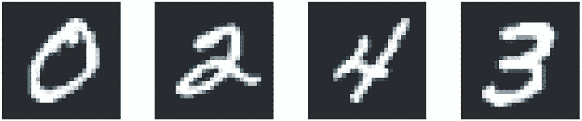

**图 2.1 MNIST 样本数字**

在机器学习中，分类问题中的*类别*被称为*类*。数据点被称为*样本*。与特定样本相关联的类被称为*标签*。

你现在不需要在你的机器上尝试重现下面代码列表中显示的示例。如果你愿意，你首先需要设置一个深度学习工作空间，这在第三章中有介绍。MNIST 数据集在 Keras 中预装，以四个 R 数组的形式组织成了两个名为 train 和 test 的列表。

列表 2.1 在 Keras 中加载 MNIST 数据集

library(tensorflow)

library(keras)

mnist <- dataset_mnist()

train_images <- mnist$train$x

train_labels <- mnist$train$y

test_images <- mnist$test$x

test_labels <- mnist$test$y

train_images 和 train_labels 构成了训练集，模型将从中学习。然后模型将在测试集 test_images 和 test_labels 上进行测试。图像被编码为 R 数组，标签是一个从 0 到 9 的数字数组。图像和标签之间是一一对应的。让我们来看看训练数据，如下所示：

str(train_images)

int[1:60000, 1:28, 1:28] 0 0 0 0 0 0 0 0 0 0 …

str(train_labels)

int [1:60000(1d)] 5 0 4 1 9 2 1 3 1 4 …

这是测试数据：

str(test_images)

int [1:10000, 1:28, 1:28] 0 0 0 0 0 0 0 0 0 0 …

str(test_labels)

int [1:10000(1d)] 7 2 1 0 4 1 4 9 5 9 …

工作流程将如下：首先，我们将向神经网络提供训练数据 train_images 和 train_labels。然后网络将学会关联图像和标签。最后，我们将要求网络为 test_images 生成预测，并验证这些预测是否与 test_labels 中的标签相匹配。

让我们构建网络，如下面的示例所示。再次提醒，你现在不必理解这个示例的所有内容。

列表 2.2 网络架构

model <- keras_model_sequential(list(

layer_dense(units = 512, activation = "relu"),

layer_dense(units = 10, activation = "softmax")

))

神经网络的核心构建块是*层*。你可以把层想象成数据的过滤器：一些数据进去，以更有用的形式出来。具体来说，层会从输入的数据中提取*表示*——希望这些表示对手头的问题更有意义。大部分深度学习都是将简单的层链接在一起，实现逐步*数据精炼*的形式。深度学习模型就像是用于数据处理的筛子，由一系列越来越精炼的数据过滤器——即层组成。

在这里，我们的模型由两个 Dense 层的序列组成，这些层是密集连接的（也称为*全连接*）神经层。第二（也是最后）层是一个 10 通路的*softmax 分类*层，这意味着它将返回一个包含 10 个概率分数的数组（总和为 1）。每个分数都是当前数字图像属于我们 10 个数字类别之一的概率。

为了使模型准备好训练，我们需要在*编译*步骤中选择以下三个要素，如列表 2.3 所示：

+   *优化器*——模型将通过它看到的训练数据更新自身的机制，以改善其性能。

+   *损失函数*——模型如何在训练数据上测量其性能，以及如何使其朝着正确的方向调整自身。

+   *训练和测试期间要监控的指标*——在这里，我们只关心准确率（被正确分类的图像的比例）。

损失函数和优化器的确切目的将在接下来的两章中清晰地解释。

列表 2.3 编译步骤

编译(model,

optimizer = "rmsprop",

loss = "稀疏分类交叉熵",

指标 = "准确度")

请注意，我们不保存 compile() 的返回值，因为模型是就地修改的。

在训练之前，我们将通过重塑数据并缩放数据来对数据进行预处理，以使其符合模型的期望形状，并使其所有值都在 [0, 1] 区间内，如下所示。之前，我们的训练图像存储在一个形状为 (60000, 28, 28) 的整数数组中，值在 [0, 255] 区间内。我们将其转换为一个形状为 (60000, 28 * 28) 的双精度数组，值介于 0 和 1 之间。

列表 2.4 准备图像数据

train_images <- array_reshape(train_images, c(60000, 28 * 28))

train_images <- train_images / 255

test_images <- array_reshape(test_images, c(10000, 28 * 28))

test_images <- test_images / 255

请注意，我们使用的是 array_reshape() 函数而不是 dim•() 函数来重塑数组。我们稍后会解释为什么，当我们谈论张量重塑时。

现在我们已经准备好训练模型了，在 Keras 中，这是通过调用模型的 fit() 方法来完成的——我们将模型与其训练数据*拟合*起来。

列表 2.5 “拟合”模型

fit(model, train_images, train_labels, epochs = 5, batch_size = 128)

Epoch 1/5

60000/60000 [===========================] - 5s - loss: 0.2524 - acc:

 0.9273

Epoch 2/5

51328/60000 [=====================>.....] - ETA: 1s - loss: 0.1035 -

 准确率: 0.9692

训练期间显示两个数量：模型在训练数据上的损失和模型在训练数据上的准确度。我们很快就能在训练数据上达到 0.989（98.9%）的准确率。 

现在我们有了一个经过训练的模型，我们可以用它来预测*新*数字的类别概率——那些不属于训练数据的图像，比如测试集中的图像。

列表 2.6 使用模型进行预测

test_digits <- test_images[1:10, ]

predictions <- predict(model, test_digits)

str(predictions)

num [1:10, 1:10] 3.10e-09 3.53e-11 2.55e-07 1.00 8.54e-07 …

predictions[1, ]

[1] 3.103298e-09 1.175280e-10 1.060593e-06 4.761311e-05 4.189971e-12

[6] 4.062199e-08 5.244305e-16 9.999473e-01 2.753219e-07 3.826783e-06

数组中索引 i 处的每个数字（predictions[1, ]）对应于数字图像 test_digits[1, ] 属于类 i 的概率。这第一个测试数字在索引 8 处有最高的概率分数（0.9999473，接近 1），因此根据我们的模型，它必须是 7（因为我们从 0 开始计数）：

which.max(predictions[1, ])

[1] 8

predictions[1, 8]

[1] 0.9999473

我们可以检查测试标签是否一致：

test_labels[1]

[1] 7

平均而言，我们的模型在分类这样的全新数字时表现如何？让我们通过计算整个测试集的平均准确率来检查。

列表 2.7 在新数据上评估模型

metrics <- evaluate(model, test_images, test_labels)

metrics["accuracy"]

准确率

0.9795

测试集准确率为 97.9%，比训练集准确率（98.9%）低得多。训练准确率和测试准确率之间的差距是*过拟合*的一个例子：机器学习模型在新数据上的表现往往不如在其训练数据上表现好。过拟合是第三章的一个核心主题。

这就完成了我们的第一个示例。你刚刚看到了如何使用不到 15 行的 R 代码构建和训练一个神经网络来对手写数字进行分类。在本章和下一章中，我们将详细介绍我们刚刚预览的每个移动部件并澄清幕后发生的事情。你将了解张量，即输入模型的数据存储对象；张量操作，层由哪些组成；以及梯度下降，它允许您的模型从其训练示例中学习。

## 2.2 神经网络的数据表示

在前面的示例中，我们从存储在多维数组中的数据开始，也称为*张量*。一般来说，所有当前的机器学习系统都使用张量作为其基本数据结构。张量对于该领域是基础性的—以至于 TensorFlow 就是以它们命名的。那么，张量是什么？

在其核心，张量是数据的容器—通常是数字数据—因此，它是数字的容器。你可能已经熟悉矩阵，它们是秩 2 的张量：张量是矩阵到任意数量的*维度*的泛化（请注意，在张量的上下文中，维度通常被称为*轴*）。

R 提供了张量的实现：数组对象（通过 base:: array() 构造）是张量。在本节中，我们专注于定义张量周围的概念，所以我们将继续使用 R 数组。在本书的后面（第三章），我们介绍了张量的另一个实现（Tensorflow 张量）。

### 2.2.1 标量（秩 0 张量）

只能包含一个数字的张量称为*标量*（或标量张量，或秩 0 张量，或 0D 张量）。R 没有表示标量的数据类型（所有数字对象都是向量），但长度为 1 的 R 向量在概念上类似于标量。

### 2.2.2 向量（秩 1 张量）

数组称为*向量*，或排名 1 张量，或 1D 张量。排名 1 张量被称为具有一个轴。以下是一个张量向量：

x <- as.array(c(12, 3, 6, 14, 7))

str(x)

num [1:5(1d)] 12 3 6 14 7

length(dim(x))

[1] 1

这个向量有五个条目，因此被称为*五维向量*。不要混淆 5D 向量和 5D 张量！ 5D 向量只有一个轴，并且沿着其轴有五个维度，而 5D 张量有五个轴（并且可以沿每个轴具有任意数量的维度）。*维度*既可以表示沿特定轴的条目数量（例如我们的 5D 向量的情况），也可以表示张量中的轴数（例如 5D 张量），这有时可能会令人困惑。在后一种情况下，从技术上讲，谈论*排名 5 的张量*（张量的排名是轴的数量）更加正确，但是不明确的符号 *5D 张量* 是常见的。

### 2.2.3 矩阵（排名 2 张量）

向量数组称为*矩阵*，或排名 2 张量，或 2D 张量。矩阵有两个轴（通常称为*行*和*列*）。您可以将矩阵直观地解释为数字的矩形网格：

x <- array(seq(3 * 5), dim = c(3, 5))

x

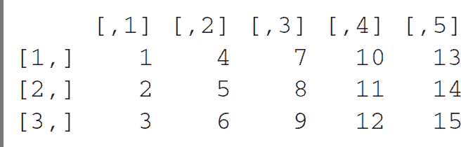

dim(x)

[1] 3 5

来自第一个轴的条目称为*行*，来自第二个轴的条目称为*列*。在上一个示例中，c(1, 4, 7, 10, 13) 是 x 的第一行，c(1, 2, 3) 是第一列。

### 2.2.4 排名 3 和更高等级的张量

如果您向 dim 提供一个长度为 3 的向量，则会获得排名为 3 的张量（或 3D 张量），您可以将其直观地解释为数字的立方体或排名为 2 的张量的堆叠：

x <- array(seq(2 * 3 * 4), dim = c(2, 3, 4))

str(x)

int [1:2, 1:3, 1:4] 1 2 3 4 5 6 7 8 9 10 …

length(dim(x))

[1] 3

通过堆叠排名 3 的张量，您可以创建排名 4 的张量，依此类推。在深度学习中，您通常会处理排名为 0 到 4 的张量，尽管如果处理视频数据，您可能会升到 5。

### 2.2.5 关键属性

张量由以下三个关键属性定义：

+   *轴数（排名）*—例如，排名 3 的张量有三个轴，矩阵有两个轴。这可以从 length(dim(x)) 获取。

+   *形状*—这是一个整数向量，描述张量沿每个轴具有多少维度。例如，前一个矩阵示例具有形状（3, 5），而排名为 3 的张量示例具有形状（2, 3, 4）。向量具有具有单个元素的形状，例如（5）。 R 数组不区分 1D 向量和标量张量，但在概念上，张量也可以是形状为（）的标量。

+   *数据类型* —— 这是张量中包含的数据的类型。R 数组支持 R 内置数据类型，如 double 和 integer。然而，从概念上讲，张量可以支持任何类型的同构数据类型，其他张量实现也提供了对诸如 float16、float32、float64（对应于 R 的 double）、int32（R 的整数类型）等类型的支持。在 TensorFlow 中，你还可能遇到字符串张量。

为了使这更具体，让我们回顾一下在 MNIST 示例中处理的数据。首先，我们加载 MNIST 数据集：

library(keras)

mnist <- dataset_mnist()

训练图像 <- mnist$train$x

训练标签 <- mnist$train$y

测试图像 <- mnist$test$x

测试标签 <- mnist$test$y

接下来，我们显示了张量训练图像的轴数：

length(dim(训练图像))

[1] 3

这是它的形状：

dim(训练图像)

[1] 60000 28 28

这是它的 R 数据类型：

typeof(训练图像)

[1] "integer"

所以我们这里有一个整数的三阶张量。更准确地说，它是一个 60,000 个 28 × 28 整数矩阵的堆叠。每个这样的矩阵都是一个灰度图像，像素强度值介于 0 到 255 之间。

让我们显示这个三阶张量中的第五个数字（见 图 2.2）。

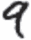

**图 2.2 我们数据集中的第五个样本**

清单 2.8 显示第五个数字

数字 <- 训练图像[5, , ]

plot(as.raster(abs(255 - 数字), max = 255))

对应的标签自然是整数 9：

训练标签[5]

[1] 9

### 2.2.6 在 R 中操作张量

在前面的示例中，我们使用语法 train_images[i, , ] 沿着第一个轴选择了一个特定的数字。在张量中选择特定元素称为 *张量切片*。让我们看看你可以在 R 数组上进行的张量切片操作。

> 注意 TensorFlow 张量的切片与 R 数组类似，但存在一些差异。在本节中，我们将关注 R 数组，并在第三章开始讨论 TensorFlow 张量。

以下示例选择数字 10 到 99，并将它们放入形状为 (90, 28, 28) 的数组中：

我的切片 <- 训练图像[10:99, , ]

dim(我的切片)

[1] 90 28 28

通常，你可以在每个张量轴上的任意两个索引之间选择切片。例如，要选择所有图像右下角的 14 × 14 像素，你可以这样做：

我的切片 <- 训练图像[, 15:28, 15:28]

dim(我的切片)

[1] 60000    14    14

### 2.2.7 数据批次的概念

通常，在深度学习中，你将遇到的所有数据张量的第一个轴都是 *样本轴*（有时称为 *样本维度*）。在 MNIST 示例中，“样本”是数字的图像。

另外，深度学习模型不会一次处理整个数据集；相反，它们将数据分成小批量。具体来说，这是我们 MNIST 数字的一个批量，批量大小为 128：

批量 <- 训练图像[1:128, , ]

接下来是下一个批量：

批量 <- 训练图像[129:256, , ]

第 *n* 个批量：

n <- 3

batch <- train_images[seq(to = 128 * n, length.out = 128), , ]

在考虑这样一个批张量时，第一个轴被称为*批轴*或*批量维度*。这是在使用 Keras 和其他深度学习库时经常遇到的术语。

### 2.2.8 数据张量的真实示例

让我们通过一些类似于您将来会遇到的示例来使数据张量更加具体化。您要处理的数据几乎总是属于以下几���类别之一：

+   *向量数据*—形状为（样本，特征）的等级 2 张量，其中每个样本是一个数字属性（“特征”）的向量

+   *时间序列数据或序列数据*—形状为（样本，时间步长，特征）的等级 3 张量，其中每个样本是一系列（长度为时间步长）的特征向量

+   *图像*—形状为（样本，高度，宽度，通道）的等级 4 张量，其中每个样本是一个 2D 像素网格，并且每个像素由一组值（“通道”）表示

+   *视频*—形状为（样本，帧数，高度，宽度，通道）的等级 5 张量，其中每个样本是图像序列（长度为帧数）

### 2.2.9 向量数据

这是最常见的几种情况之一。在这样的数据集中，每个单个数据点可以被编码为一个向量，因此一个数据批将被编码为等级 2 张量（即矩阵），其中第一个轴是*样本轴*，第二个轴是*特征轴*。

让我们来看看下面的两个示例：

+   一个保险数据集，其中我们考虑每个人的年龄、性别和收入。每个人可以被描述为一个 3 个值的向量，因此整个涵盖 100,000 人的数据集可以存储在形状为（100000，3）的等级 2 张量中。

+   一个文本文档数据集，我们通过每个单词出现的次数来表示每个文档（在一个包含 20,000 个常见单词的词典中）。每个文档可以被编码为一个包含 20,000 个值的向量（词典中每个单词的计数），因此整个包含 500 个文档的数据集可以存储在形状为（500, 20000）的张量中。

### 2.2.10\. 时间序列数据或序列数据

每当数据中涉及时间（或序列顺序的概念）时，将其存储在具有显式时间轴的等级 3 张量中是有意义的。每个样本可以被编码为一系列向量（等级 2 张量），因此数据批将被编码为等级 3 张量（参见图 2.3）。

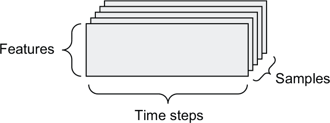

**图 2.3 时间序列数据等级 3 张量**

时间轴按照惯例始终是第二轴。让我们看几个示例：

+   一个股票价格数据集。每分钟，我们存储股票的当前价格，过去一分钟内的最高价格和最低价格。因此，每分钟被编码为一个 3D 向量，整个交易日被编码为形状为（390，3）的矩阵（一个交易日有 390 分钟），并且 250 天的数据可以存储在形状为（250，390，3）的等级 3 张量中。在这里，每个样本将是一天的数据。

+   一个推文数据集，其中我们将每个推文编码为由 128 个唯一字符组成的 280 个字符序列。在这种情况下，每个字符可以编码为大小为 128 的二进制向量（除了字符对应的索引处有一个 1 之外，其余全为零）。然后每个推文可以编码为形状为 (280, 128) 的二阶张量，并且一个包含一百万个推文的数据集可以存储在形状为 (1000000, 280, 128) 的张量中。

### 2.2.11\. 图像数据

图像通常具有三个维度：高度、宽度和颜色深度。尽管灰度图像（如我们的 MNIST 数字）只有一个颜色通道，因此可以存储在二阶张量中，但按照惯例，图像张量始终是三阶的，对于灰度图像有一个一维的颜色通道。因此，尺寸为 256 × 256 的 128 个灰度图像批次可以存储在形状为 (128, 256, 256, 1) 的张量中，而尺寸为 256 × 256 的 128 个彩色图像批次可以存储在形状为 (128, 256, 256, 3) 的张量中（参见图 2.4）。

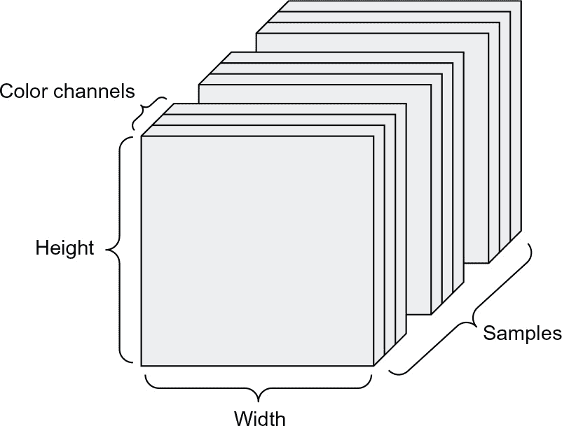

**图 2.4 一个四阶图像数据张量**

图像张量的形状有两种约定：*channels-last* 约定（在 TensorFlow 中是标准的）和 *channels-first* 约定（越来越不受青睐）。*channels-last* 约定将颜色深度轴放在最后：(samples, height, width, color_depth)。与此同时，*channels-first* 约定将颜色深度轴放在批处理轴之后：(samples, color_depth, height, width)。使用 *channels-first* 约定，前面的例子将变为 (128, 1, 256, 256) 和 (128, 3, 256, 256)。Keras API 支持这两种格式。

### 2.2.12\. 视频数据

视频数据是你需要使用五阶张量的少数几种真实世界数据之一。视频可以被理解为帧的序列，其中每一帧都是一幅彩色图像。因为每一帧可以存储在三阶张量中（高度、宽度、颜色深度），一系列帧可以存储在四阶张量中（帧、高度、宽度、颜色深度），因此不同视频的批次可以存储在形状为 (samples, frames, height, width, color_depth) 的五阶张量中。

例如，一个 60 秒长、144 × 256 像素的 YouTube 视频片段，以每秒 4 帧采样，将有 240 帧。四个这样的视频片段的批次将存储在形状为 (4, 240, 144, 256, 3) 的张量中。这总共有 106,168,320 个值！如果张量的数据类型为 R 整数，每个值将以 32 位存储，因此张量将表示 405 MB。太重了！你在现实生活中遇到的视频要轻得多，因为它们不是以 R 整数的形式存储的，而且通常被大幅压缩（例如 MPEG 格式）。

## 2.3 神经网络的齿轮：张量操作

就像任何计算机程序最终都可以归结为对二进制输入的少量二进制操作（AND、OR、NOR 等）一样，所有深度神经网络学到的转换都可以归结为应用于数值数据张量的少数*张量操作*（或*张量函数*）。例如，可以对张量进行加法、乘法等操作。在我们的初始示例中，我们通过将密集层堆叠在一起来构建模型。Keras 层实例如下所示：

layer_dense(units = 512, activation = "relu")

`<keras.layers.core.dense.Dense object at 0x7f7b0e8cf520>`

这一层可以被解释为一个函数，它以一个矩阵作为输入，并返回另一个矩阵——输入张量的一个新表示。具体来说，函数如下（其中 W 是一个矩阵，b 是一个向量，都是该层的属性）：

output <- relu(dot(W, input) + b)

让我们来解释一下。我们在这里有以下三个张量操作：

+   在输入张量和命名为 W 的张量之间的点积（dot）操作

+   结果矩阵和向量 b 之间的加法（+）

+   一个 relu 操作：relu(x)是逐元素 max(x, 0)；*relu*代表修正线性单元

尽管本节完全涉及线性代数表达式，但你在这里找不到任何数学符号。我发现，如果将数学概念表达为简短的代码片段，而不是数学方程式，那么没有数学背景的程序员更容易掌握这些概念。因此，我们将在整个过程中使用 R 和 TensorFlow 代码。

### 2.3.1 逐元素操作

relu 操作和加法是逐元素操作：这些操作独立地应用于考虑的张量中的每个条目。这意味着这些操作非常适合于大规模并行实现（*向量化实现*，这个术语来自于 20 世纪 70-90 年代的*向量处理器*超级计算机架构）。如果你想编写一个逐元素操作的简单的 R 实现，你可以使用 for 循环，就像下面对逐元素 relu 操作的简单实现一样：

naive_relu <- functsion(x) {

stopifnot(length(dim(x)) == 2)➊

for (i in 1:nrow(x))

for (j in 1:ncol(x))

x[i, j] <- max(x[i, j], 0)

x

}

➊ **x 是一个秩为 2 的张量（一个矩阵）。**

你可以对加法做同样的操作：

naive_add <- function(x, y) {

stopifnot(length(dim(x)) == 2, dim(x) == dim(y))➊

for (i in 1:nrow(x))

for (j in 1:ncol(x))

x[i, j] <- x[i, j] + y[i, j]

x

}

➊ **x 和 y 都是秩为 2 的张量。**

按照相同的原则，你可以进行逐元素乘法、减法等操作。

在实践中，当处理 R 数组时，这些操作也作为优化良好的内置 R 函数可用，它们自己将重活交给了基本线性代数子程序（BLAS）实现。BLAS 是低级别、高度并行、高效的张量操作例程，通常用 Fortran 或 C 实现。因此，在 R 中，您可以执行以下逐元素操作，速度非常快：

z <- x + y➊

z[z < 0] <- 0➋

➊ **逐元素相加**

➋ **逐元素 relu**

让我们实际计算一下这里的时间差异：

random_array <- function(dim, min = 0, max = 1)

数组(runif(prod(dim), min, max),

dim)

x <- random_array(c(20, 100))

y <- random_array(c(20, 100))

system.time({

for (i in seq_len(1000)) {

z <- x + y

z[z < 0] <- 0

}

})[["elapsed"]]

[1] 0.009

这需要 0.009 秒。与此同时，简单版本需要惊人的 0.72 秒：

system.time({

for (i in seq_len(1000)) {

z <- naive_add(x, y)

z <- naive_relu(z)

}

})[["elapsed"]]

[1] 0.724

同样，当在 GPU 上运行 TensorFlow 代码时，逐元素操作通过完全矢量化的 CUDA 实现执行，这些实现可以最佳地利用高度并行的 GPU 芯片架构。

### 2.3.2 广播

我们先前的简单实现 naive_add 仅支持具有相同形状的秩 2 张量的加法。但是在前面介绍的 layer_dense() 中，我们将秩 2 张量与向量相加。当正在添加的两个张量的形状不同时，加法会发生什么情况？

我们希望的是较小的张量 *广播* 以匹配较大张量的形状。广播由以下两个步骤组成：

1.  **1** 轴（称为 *广播轴*）被添加到较小的张量中，以匹配较大张量的 length(dim(x))。

1.  **2** 较小的张量沿着这些新轴重复，以匹配较大张量的完整形状。

注意，Tensorflow Tensors，在第三章中介绍了丰富的广播功能。然而，在这里，我们正在使用 R 数组从头构建机器学习概念，并且故意避免了在操作两个不同维度数组时的 R 隐式重复行为。我们可以通过构建较小的张量来匹配较大张量的形状来实现我们自己的重复使用方法，这样我们再次回到了执行标准逐元素操作的地步。

让我们看一个具体的例子。考虑形状为 (32, 10) 的 X 和形状为 (10) 的 y：

X <- random_array(c(32, 10))➊

y <- random_array(c(10))➋

➊ **X 是形状为 (32, 10) 的随机矩阵。**

➋ **y 是形状为 (10) 的随机向量。**

首先，我们给 y 添加一个大小为 1 的第一个轴，其形状变为 (1, 10)：

dim(y) <- c(1, 10)

str(y)➊

num [1, 1:10] 0.885 0.429 0.737 0.553 0.426 …

➊ **y 的形状现在是 (1, 10)。**

然后，我们沿着这个新轴重复 y 32 次，使我们最终得到一个形状为 (32, 10) 的张量 Y，其中 Y[i, ] == y，对于 i 在 seq(32) 中：

Y <- y[rep(1, 32), ]➊

str(Y)

num [1:32, 1:10] 0.885 0.885 0.885 0.885 0.885 …

➊ **沿轴 1 重复 y 32 次以获取 Y，其形状为 (32, 10)。**

在这一点上，我们可以继续添加 X 和 Y，因为它们具有相同的形状。

在实现方面，理想情况下我们不希望创建新的二维张量，因为那样非常低效。在大多数张量实现中，包括 R 和 TensorFlow，在算法级别上进行的是完全虚拟的重复操作，而不是在内存级别上。但是，请注意，R 的循环利用和 TensorFlow（以及 NumPy）的广播在行为上有所不同（我们在第三章中会详细介绍）。不管怎样，将向量重复 10 次并伴随一个新轴是一个有用的心理模型。下面是一个简单实现的样子：

naive_add_matrix_and_vector <- 函数(x, y) {

stopifnot(length(dim(x)) == 2,➊

length(dim(y)) == 1,➋

ncol(x) == 维度(y))

for (i in seq(维度(x)[1]))

for (j in seq(维度(x)[2]))

x[i, j] <- x[i, j] + y[j]

x

}

➊ **x 是一个二阶张量。**

➋ **y 是一个向量。**

### 2.3.3 张量积

*张量积*或*点积*（不要与逐元素乘积，即*操作符混淆）是最常见、最有用的张量运算之一。在 R 中，逐元素乘积使用 * 操作符进行，而点积使用 %*% 操作符进行：

x <- 随机数组(c(32))

y <- 随机数组(c(32))

z <- x %*% y

在数学表示中，你会用一个点（•）来表示这个操作：

z = x • y

从数学上讲，点运算做什么？让我们从两个向量 x 和 y 的点积开始。它的计算方法如下：

naive_vector_dot <- 函数(x, y) {

stopifnot(length(dim(x)) == 1,➊

length(dim(y)) == 1,➊

维度(x) == 维度(y))

z <- 0

for (i in seq_along(x))

z <- z + x[i] * y[i]

z

}

➊ x 和 y 是大小相同的一维向量。

你可能已经注意到，两个向量之间的点积是一个标量，只有元素数量相同的向量才能进行点积运算。

你也可以对矩阵 x 和向量 y 进行点积运算，它返回一个向量，其中的系数是 y 和 x 的行之间的点积：

naive_matrix_vector_dot <- 函数(x, y) {

stopifnot(length(dim(x)) == 2,➊

length(dim(y)) == 1,➋

nrow(x) == 维度(y))➌

z <- 数组(0, 维度 = 维度(y))➍

for (i in 1:nrow(x))

for (j in 1:ncol(x))

z[i] <- z[i] + x[i, j] * y[j]

z

}

➊ **x 是一个二维张量（矩阵）。**

➋ **y 是一个一维张量（向量）。**

➌ **x 的第一个维度必须与 y 的第一个维度相同！**

➍ **此操作返回一个与 y 形状相同的零向量。**

你也可以重用我们之前编写的代码，这突出了矩阵-向量乘积和向量乘积之间的关系：

naive_matrix_vector_dot <- 函数(x, y) {

z <- 数组(0, 维度 = c(nrow(x)))

for (i in 1:nrow(x))

z[i] <- 通过求向量内积得到(x[i, ], y)

z

}

请注意，一旦其中一个张量的 length(dim(x)) 大于 1，%*% 就不再是*对称的*，也就是说 x %*% y 不等于 y %*% x。

当然，点积可以推广到具有任意数量轴的张量。最常见的应用可能是两个矩阵之间的点积。只有当 ncol(x) == nrow(y)时，您才能取两个矩阵 x 和 y 的点积（x %*% y）。结果是一个形状为(nrow(x), ncol(y))的矩阵，其中的系数是 x 的行和 y 的列之间的向量积。这里展示了朴素实现：

naive_matrix_dot <- function(x, y) {

stopifnot(length(dim(x)) == 2,➊

length(dim(y)) == 2,

ncol(x) == nrow(y))➋

z <- array(0, dim = c(nrow(x), ncol(y)))➌

for (i in 1:nrow(x))➍

for (j in 1:ncol(y)) {➎

row_x <- x[i, ]

column_y <- y[, j]

z[i, j] <- naive_vector_dot(row_x, column_y)

}

z

}

➊ **x 和 y 是 2D 张量（矩阵）。**

➋ **x 的第一个维度必须与 y 的第一个维度相同！**

➌ **此操作返回一个具有特定形状的零矩阵。**

➍ **迭代 x 的行...**

➎ **... 和 y 的列。**

为了理解点积形状兼容性，有助于通过对齐输入和输出张量来可视化它们，如图 2.5 所示。

在图中，x、y 和 z 被描绘为矩形（系数的文字框）。由于 x 的行和 y 的列必须具有相同的大小，因此 x 的宽度必须与 y 的高度匹配。如果您继续开发新的机器学习算法，您可能经常会画出这样的图表。

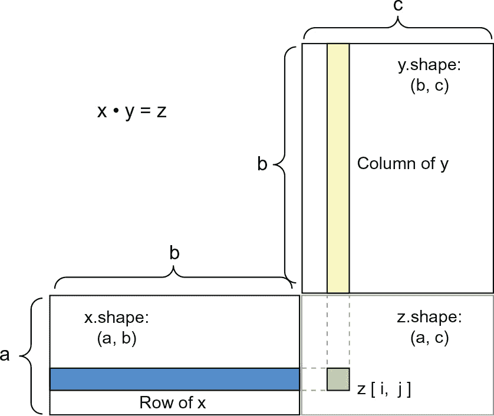

**图 2.5 矩阵点积盒子图示**

更一般地，您可以按照与 2D 情况下相同的形状兼容性规则，取高维张量之间的点积：

(a, b, c, d) • (d) -> (a, b, c)

(a, b, c, d) • (d, e) -> (a, b, c, e)

诸如此类。

### 2.3.4 张量重塑

理解的第三种张量操作是*张量重塑*。尽管它在我们第一个神经网络示例的 layer_dense()中没有使用，但我们在将手写数字数据预处理并输入模型之前使用了它，如下所示：

train_images <- array_reshape(train_images, c(60000, 28 * 28))

请注意，我们使用 array_reshape()函数而不是`dim<-`()函数来重塑 R 数组。这样做是为了使用行优先语义（而不是 R 的默认列优先语义）重新解释数据，这与 Keras 调用的数值库（NumPy、TensorFlow 等）解释数组维度的方式兼容。当重塑将传递给 Keras 的 R 数组时，应始终使用 array_reshape()函数。

重塑张量意味着重新排列其行和列以匹配目标形状。显然，重塑后的张量具有与初始张量相同的总系数数。通过简单示例最好理解重塑：

x <- array(1:6)

x

[1] 1 2 3 4 5 6

array_reshape(x, dim = c(3, 2))

[,1] [,2]

[1,]     1    2

[2,]     3    4

[3,]     5    6

array_reshape(x, dim = c(2, 3))

[,1] [,2] [,3]

[1,]     1    2     3

[2,]     4    5     6

重塑的一个常见特例是*转置。 转置*矩阵意味着交换其行和列，以便 x[i, ] 变为 x[, i]。我们可以使用 t() 函数来转置矩阵：

x <- array(1:6, dim = c(3, 2))

x

[,1] [,2]

[1,]     1    4

[2,]     2    5

[3,]     3    6

t(x)

[,1] [,2] [,3]

[1,]     1    2     3

[2,]     4    5     6

### 2.3.5 张量操作的几何解释

因为张量操作中的张量的内容可以解释为某些几何空间中点的坐标，所以所有张量操作都有一个几何解释。例如，我们来考虑加法。我们将从以下向量开始：

A = c(0.5, 1)

这是 2D 空间中的一个点（见图 2.6）。通常将向量描绘为将原点与点连接的箭头，如图 2.7 所示。

让我们考虑一个新点，B = c(1, 0.25)，我们将其添加到之前的点上。这在几何上通过串联向量箭头来完成，结果位置是代表前两个向量之和的向量的位置（见图 2.8）。 如您所见，将向量 B 添加到向量 A 表示将点 A 复制到新位置，其距离和方向从原始点 A 决定的位置。 如果将相同的向量加法应用于平面上的一组点（一个*对象*），则将在新位置创建整个对象的副本（见图 2.9）。 因此，张量加法表示*平移对象*（将对象移动而不会扭曲）一定量的动作在某个方向上。 

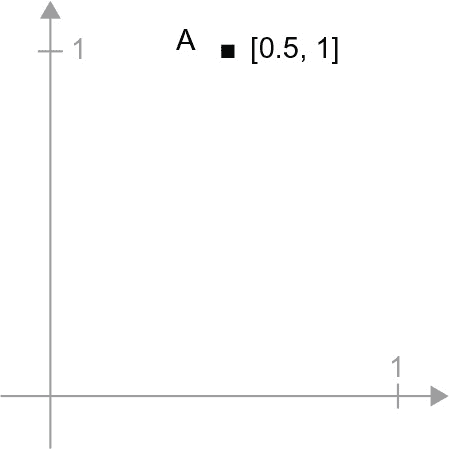

**图 2.6 2D 空间中的一个点** 

**图 2.7 2D 空间中的一个点被描绘为箭头**

一般来说，诸如平移、旋转、缩放、扭曲等基本几何操作都可以表达为张量操作。以下是一些示例：

**图 2.8 两个向量之和的几何解释**

+   *平移*— 正如你刚才看到的，将向量添加到一个点将使该点沿着固定方向移动固定量。 应用于一组点（如二维对象），这称为“平移”（见图 2.9）。

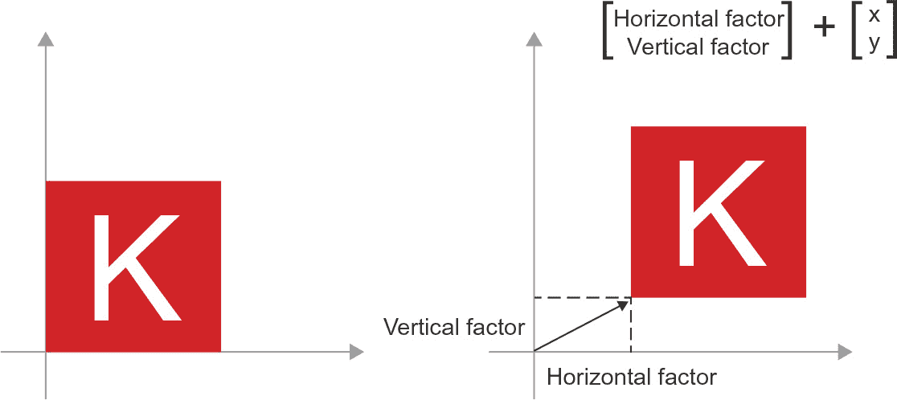

**图 2.9 2D 平移作为向量加法**

+   *旋转*— 将 2D 向量逆时针旋转一个角度 theta（见图 2.10）可以通过与 2 × 2 矩阵 R = rbind(c(cos(theta), -sin(theta)), c(sin(theta), cos(theta))）的点积来实现。

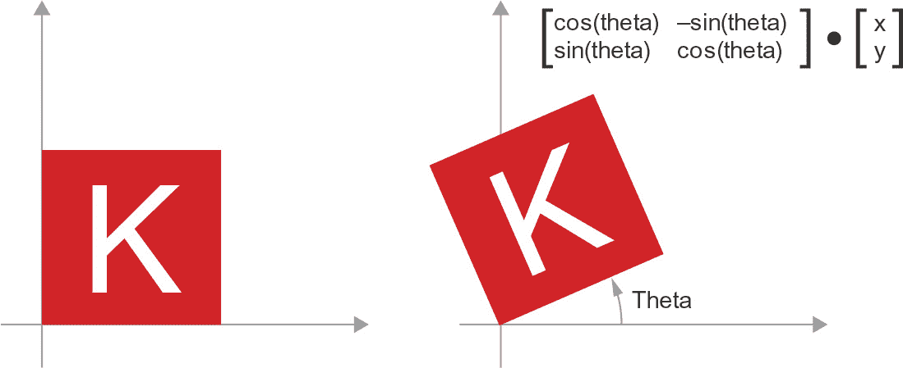

**图 2.10 2D 旋转（逆时针）作为点积**

+   *缩放*—通过与 2×2 矩阵 S=rbind(c(horizontal_factor,0), c(0,vertical_factor))的点积实现图像的垂直和水平缩放（参见图 2.11）。请注意，这样的矩阵被称为*对角矩阵*，因为它只在其“对角线”（从左上到右下）上有非零系数。

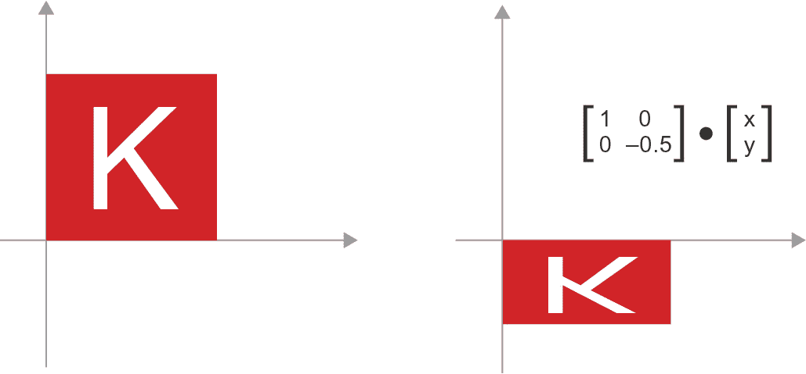

**图 2.11 作为点积的二维缩放**

+   *线性变换*—与任意矩阵的点积实现线性变换。请注意，前面列出的*缩放*和*旋转*都是线性变换的定义。

+   *仿射变换*—仿射变换（参见图 2.12）是线性变换（通过与某些矩阵的点积实现）和平移（通过矢量加法实现）的组合。正如您可能已经认识到的那样，这正是由 layer_dense()实现的 y=W•x+b 计算！没有激活函数的 Dense 层就是一个仿射层。

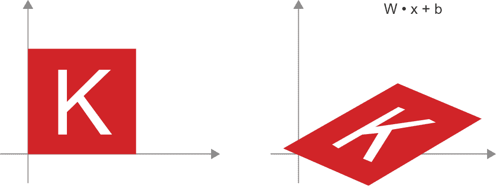

**图 2.12 平面中的仿射变换**

+   有关仿射变换的一个重要观察是，如果您重复应用许多仿射变换，您最终仍将得到一种仿射变换（因此，您可以从一开始就应用该一种仿射变换）。让我们尝试两个：affine2(affine1(x))=W2•(W1•x+b1)+b2=(W2•W1)•x+(W2•b1+b2)。其中，线性部分是矩阵 W2•W1，平移部分是向量 W2•b1+b2。因此，完全由 Dense 层组成且没有激活函数的多层神经网络等价于一个单一的 Dense 层。这种“深度”神经网络实际上只是一个线性模型的伪装！这就是为什么需要激活函数，例如 ReLU（在图 2.13 中展示）。由于激活函数，Dense 层的链可以实现非常复杂的非线性几何变换，从而为深度神经网络提供非常丰富的假设空间。我们将在下一章中详细介绍这个想法。

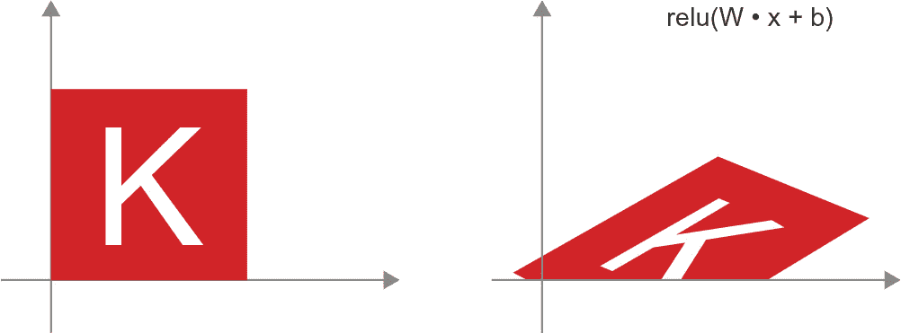

**图 2.13 仿射变换后的 ReLU 激活**

### 2.3.6 深度学习的几何解释

您刚刚学习到神经网络完全由输入数据的简单几何变换组成，这些张量运算只是在高维空间中实现的非常复杂的几何变换系列。因此，您可以将神经网络解释为非常复杂的几何变换，由一系列简单步骤实现。

在 3D 视图中，以下心理形象可能会有所帮助。想象两张彩色纸：一张红色，一张蓝色。将一张放在另一张上面。现在将它们揉成一个小球。那个揉皱的纸球就是你的输入数据，而每张纸是分类问题中的一类数据。神经网络的目的是找出一个能够将纸球展平的变换，使得两类数据重新变得清晰可分（参见图 2.14）。对于深度学习来说，这将被实现为对三维空间的一系列简单变换，就像你可以用手指在纸球上做的那样，一次移动一个轴。

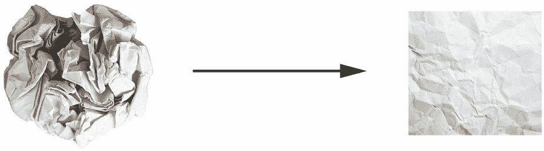

**图 2.14 解开复杂的数据流形**

展平纸球正是机器学习的目标：在高维空间中为复杂的、高度折叠的数据*流形*找到整洁的表示（流形是一种连续的曲面，就像我们揉皱的纸）。此时，你应该对为什么深度学习在这方面表现出色有一个相当好的直觉：它采取了将复杂几何变换逐步分解为一长串基本变换的方法，这几乎就是人类用来展平纸球的策略。深度网络中的每一层都应用了一个轻微地解缠数据的变换，而深层的层叠则使得这个极其复杂的解缠过程变得可行。

## 2.4 神经网络的引擎：基于梯度的优化

如前几节所示，我们第一个模型示例中的每个神经层将其输入数据转换为以下形式：

output <- relu(dot(input, W) + b)

在这个表达式中，W 和 b 是层的属性的张量。通常称为层的*权重*或*可训练参数*（分别是 kernel 和 bias 属性）。这些权重包含了模型从训练数据中学到的信息。

最初，这些权重矩阵被填充为小的随机值（这一步被称为*随机初始化*）。当然，没有理由指望当 W 和 b 是随机时，relu(dot(input, W) + b) 会产生任何有用的表示。由此产生的表示是毫无意义的，但它们是一个起点。接下来的步骤是根据反馈信号逐渐调整这些权重。这种逐渐调整，也称为*训练*，就是机器学习的学习过程。这发生在所谓的*训练循环*中，工作方式如下。重复以下步骤，直到损失似乎足够低：

1.  **1** 随机选择一批训练样本 x，并对应的目标值 y_true。

1.  **2** 在 x 上运行模型（称为*前向传播*）以获得预测结果 y_pred。

1.  **3** 计算模型在批量数据上的损失，衡量 y_pred 和 y_true 之间的不匹配程度。

1.  更新模型的所有权重，以稍微减少此批次上的损失。

最终，您将得到一个模型，其训练数据上的损失非常低：预测 y_pred 和期望目标 y_true 之间的低不匹配。模型已经“学会”将其输入映射到正确的目标。从远处看，它可能看起来像是魔术，但当您将其简化为基本步骤时，它变得简单。

第 1 步听起来很容易——只是 I/O 代码。步骤 2 和步骤 3 仅仅是一些张量操作的应用，因此您可以纯粹地从前一节中学到的内容来实现这些步骤。困难的部分是步骤 4：更新模型的权重。给定模型中的一个单独的权重系数，您如何计算系数是否应增加或减少，以及增加或减少多少？

一个天真的解决方案是冻结模型中的所有权重，除了正在考虑的一个标量系数，并尝试不同的值用于此系数。假设系数的初始值为 0.3。在一批数据的前向传递之后，模型对该批次的损失为 0.5。如果将系数的值更改为 0.35 并重新运行前向传递，则损失增加到 0.6。但如果将系数降低到 0.25，则损失降至 0.4。在这种情况下，似乎通过-0.05 更新系数将有助于最小化损失。这必须对模型中的所有系数重复进行。

但这样的方法将非常低效，因为您需要为每个单独的系数计算两次前向传递（这些操作很昂贵）（其中有许多系数——通常是数千个，有时甚至高达数百万个）。幸运的是，有一个更好的方法：梯度下降。

梯度下降是驱动现代神经网络的优化技术。这是它的要点：我们模型中使用的所有函数（如点或+）都以平滑连续的方式转换其输入。例如，如果您查看 z = x + y，小的 y 变化仅导致 z 的小变化，并且如果您知道 y 变化的方向，您可以推断 z 变化的方向。数学上，您会说这些函数是可微的。如果您链接这样的函数，您得到的较大函数仍然是可微的。特别是，这适用于将模型的系数映射到一批数据上的模型损失的函数：模型的系数的微小变化导致损失值的微小且可预测的变化。这使您能够使用称为*梯度*的数学运算符描述损失如何随着您在不同方向上移动模型的系数而变化。如果计算此梯度，则可以使用它将系数（一次性一次性更新，而不是逐个更新）向减少损失的方向移动。

如果您已经知道*可微分*的含义和*梯度*是什么，可以直接跳到第 2.4.3 节。否则，接下来的两节将帮助您理解这些概念。

### 2.4.1 什么是导数？

考虑一个连续且平滑的函数 f(x) = y，将一个数 x 映射到一个新数 y。我们可以用 图 2.15 中的函数作为示例。

因为函数是*连续*的，x 的微小变化只能导致 y 的微小变化——这就是*连续性*背后的直觉。假设您将 x 增加一个小因子 epsilon_x：这将导致 y 发生一个小的 epsilon_y 变化，如 图 2.16 所示。

此外，由于函数是*平滑*的（其曲线没有任何突然的角度），当 epsilon_x 足够小，围绕某一点 p 时，可以将 f 近似为斜率为 a 的线性函数，使得 epsilon_y 变为 * epsilon_x：

f(x + epsilon_x) = y + a * epsilon_x

显然，这种线性近似仅在 x 足够接近 p 时有效。

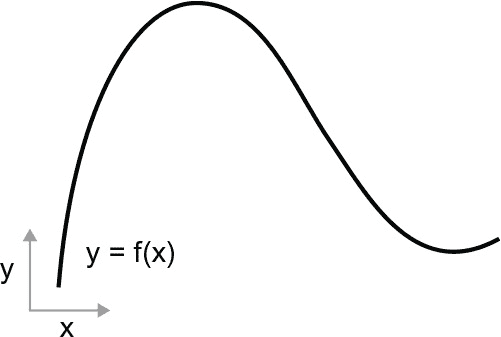

**图 2.15 一个连续且平滑的函数**

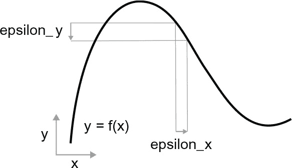

**图 2.16 对于一个连续函数，x 的微小变化会导致 y 的微小变化。**

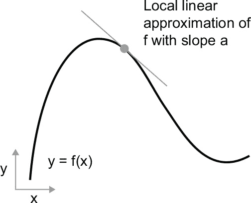

**图 2.17 在 p 点的 f 的导数**

斜率 a 被称为 p 点处 f 的*导数*。如果 a 是负的，意味着在 p 点周围 x 的微小增加会导致 f(x) 的减少（如 图 2.17 所示），如果 a 是正的，x 的微小增加会导致 f(x) 的增加。此外，a 的绝对值（导数的*大小*）告诉您这种增加或减少将发生的速度。

对于每个可微分函数 f(x)（*可微分*意味着“可以求导以找到导数”：例如，平滑、连续函数可以求导），都存在一个导数函数 f’(x)，将 x 的值映射到这些点上 f 的局部线性近似的斜率。例如，cos(x) 的导数是 -sin(x)，f(x) = a * x 的导数是 f’(x) = a，等等。

当涉及*优化*时，能够对函数进行微分是一种非常强大的工具，优化是找到最小化 f(x) 值的 x 的任务。如果您尝试通过因子 epsilon_x 更新 x 以最小化 f(x)，并且您知道 f 的导数，那么您的任务就完成了：导数完全描述了 f(x) 随着 x 变化的方式。如果您想要减少 f(x) 的值，您只需要将 x 沿着导数的相反方向移动一点。

### 2.4.2 张量运算的导数：梯度

我们刚刚看的函数将一个标量值 x 转换为另一个标量值 y：你可以将其绘制为二维平面上的曲线。现在想象一个将一组标量（x，y）转换为标量值 z 的函数：这将是一个矢量操作。你可以将其绘制为三维空间中的二维*表面*（由坐标 x、y、z 索引）。同样，你可以想象将矩阵作为输入的函数，将秩为 3 的张量作为输入的函数，依此类推。

差分的概念可以应用于任何这样的函数，只要它们描述的表面是连续的和光滑的。张量操作（或张量函数）的导数称为*梯度*。梯度只是将导数的概念推广到以张量作为输入的函数。记得标量函数的导数代表函数曲线的*局部斜率*吗？以同样的方式，张量函数的梯度代表函数描述的多维表面的*曲率*。它表征了函数的输出在其输入参数变化时的变化情况。

让我们看一个机器学习中的例子。考虑以下情况：

+   一个输入向量，x（数据集中的一个样本）

+   一个矩阵，W（模型的权重）

+   一个目标，y_true（模型应该学习将其与 x 相关联）

+   一个损失函数，loss_fn()（用于衡量模型当前预测和 y_true 之间的差距）

你可以使用 W 计算一个目标候选 y_pred，然后计算目标候选 y_pred 与目标 y_true 之间的损失或不匹配：

y_pred <- dot(W, x)➊

loss_value <- loss_fn(y_pred, y_true)➋

➊ **我们使用模型权重 W 对 x 进行预测。**

➋ **我们估计预测的偏差有多大。**

现在，我们想使用梯度来找出如何更新 W 以使 loss_value 变小。我们该如何做？给定固定的输入 x 和 y_true，前述操作可以解释为将 W 的值（模型的权重）映射到 loss 值的函数：

loss_value <- f(W)➊

➊ **f()描述了当 W 变化时损失值形成的曲线（或高维表面）。**

假设当前值为 W0。那么 f()在点 W0 处的导数是一个张量 grad(loss_value, W0)，与 W 具有相同的形状，其中每个系数 grad(loss_ value, W0)[i, j]指示修改 W0[i, j]时观察到的 loss_value 变化的方向和大小。该张量 grad(loss_value, W0)是函数 f(W) = loss_value 在 W0 处的梯度，也称为“关于 W 在 W0 附近的 loss_value 的梯度”。

**偏导数**

张量操作 grad(f(W), W)（将矩阵 W 作为输入）可以表示为标量函数 grad_ij(f(W), w_ij)的组合，其中每个函数将返回 loss_value = f(W)相对于 W 的系数 W[i, j]的导数，假设所有其他系数都是常数。grad_ij 称为 f 相对于 W[i, j]的*偏导数*。

具体来说，grad(loss_value, W0) 代表什么？你之前看到过，函数 f(x) 的导数可以解释为 f() 曲线的斜率。同样，grad(loss_value, W0) 可以解释为描述 loss_value = f(W) 在 W0 附近的 *最陡上升方向* 的张量，以及这种上升的斜率。每个偏导数描述了特定方向上 f() 的斜率。

出于这个原因，就像对于函数 f(x)，你可以通过将 x 沿着导数相反的方向移动一点来减少 f(x) 的值一样，对于张量的函数 f(W)，你可以通过将 W 沿着梯度相反的方向移动来减少 loss_value = f(W)：例如，W1 = W0 - step * grad(f(W0), W0)（其中 step 是一个小的缩放因子）。这意味着朝着 f 的最陡上升方向反向移动，直观上应该使你在曲线上更低。注意，缩放因子 step 是必需的，因为 grad(loss_value, W0) 仅在接近 W0 时近似曲率，所以你不希望离 W0 太远。

### 2.4.3 随机梯度下降

给定一个可微分函数，理论上可以在分析上找到其最小值：众所周知，函数的最小值是导数为 0 的点，所以你所要做的就是找到导数为 0 的所有点，并检查这些点中哪个点函数具有最小值。

应用于神经网络，这意味着在理论上找到使损失函数可能最小的权重值组合。这可以通过求解方程 grad(f(W), W) = 0 来完成对 W。这是一个包含 N 个变量的多项式方程，其中 N 是模型中的系数数目。尽管可以解决 N = 2 或 N = 3 的方程，但在实际的神经网络中，解决这样的方程是不可行的，因为参数的数量从来不少于几千，并且通常可以达到几千万。

相反，你可以使用本节开头概述的四步算法：根据当前数据的随机批次的当前损失值逐渐修改参数，如下所示。因为你正在处理一个可微分的函数，你可以计算其梯度，这给你了一个实现步骤 4 的高效方法。如果你更新权重与梯度相反的方向，损失每次都会减少一点：

1.  **1** 绘制一批训练样本 x 和相应的目标 y_true。

1.  **2** 运行模型在 x 上以获得预测值，y_pred（这称为 *前向传播*）。

1.  **3** 计算模型在批处理上的损失，即 y_pred 和 y_true 之间的不匹配程度的度量。

1.  **4** 计算损失相对于模型参数的梯度（这称为 *反向传播*）。

1.  **5** 将参数稍微朝着与梯度相反的方向移动一点，例如，W = W - (learning_rate * gradient)，从而稍微减少批处理上的损失。*学习速率*（这里是 learning_rate）将是调节梯度下降过程“速度”的标量因子。

很简单！我们刚刚描述的称为*小批量随机梯度下降*（小批量 SGD）。术语*随机*是指每个数据批次都是随机绘制的（*随机*是*随机*的科学同义词）。图 2.18 说明了在一维情况下的情况，当模型只有一个参数时，而你只有一个训练样本。

正如你所看到的，直观地选择合理的学习率因子是很重要的。如果太小，曲线下降将需要很多次迭代，并且可能会陷入局部最小值。如果学习速率太大，你的更新可能会将你带到曲线上完全随机的位置。

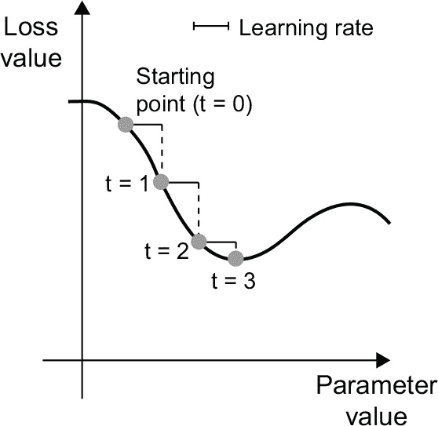

**图 2.18 在一维损失曲线上的 SGD（一个可学习参数）**

注意，小批量 SGD 算法的一种变体是在每次迭代中绘制单个样本和目标，而不是绘制一批数据。这将是*真正的*SGD（与*小批量*SGD 相对）。或者，走向相反的极端，你可以在*所有*可用数据上运行每一步，这称为*批量梯度下降*。然后，每个更新将更加准确，但成本更高。在这两个极端之间的有效折衷是使用合理大小的小批量。

虽然图 2.18 说明了在一维参数空间中的梯度下降，但在实际中，你会在高维空间中使用梯度下降：神经网络中的每个权重系数都是空间中的自由维度，可能有成千上万甚至数百万个。为了帮助你对损失曲面建立直觉，你也可以将梯度下降可视化为沿着二维损失曲面的过程，如图 2.19 所示。但你不可能可视化神经网络训练的实际过程——你无法用对人类有意义的方式表示一个 100 万维的空间。因此，要记住，你通过这些低维表示所形成的直觉在实践中可能并不总是准确的。这在深度学习研究领域历史上一直是一个问题的根源。

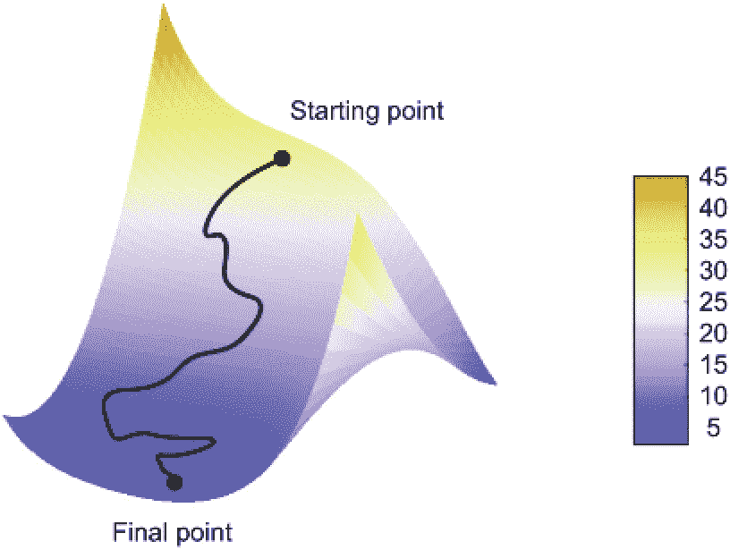

**图 2.19 二维损失曲面上的梯度下降（两个可学习参数）**

此外，存在多种不同的 SGD 变种，其在计算下一个权重更新时，不仅仅考虑当前梯度值，还考虑之前的权重更新值。例如，动量 SGD，以及 AdaGrad、RMSprop 等等。这些变种被称为*优化方法*或*优化器*。特别是，许多这些变种中使用的*动量*的概念值得关注。动量解决了 SGD 的两个问题：收敛速度和局部最小值。考虑图 2.20，它展示了一种模型参数的损失曲线。

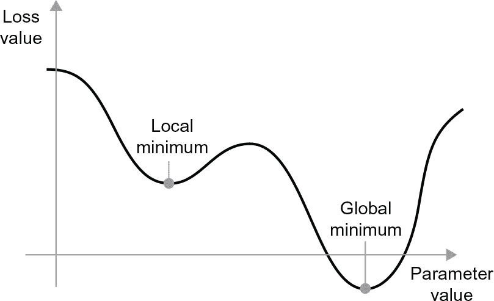

**图 2.20 局部最小值和全局最小值**

如你所见，在某一参数值附近，存在一个*局部最小值*：在该点附近，向左移动会导致损失增加，向右移动也会导致损失增加。如果正在通过小学习率使用 SGD 来优化考虑的参数，优化过程可能会陷入局部最小值而无法到达全局最小值。

你可以通过使用动量来避免这样的问题，动量受到物理学的启发。一个有用的心理形象是将优化过程想象成一个小球沿着损失曲线滚动的过程。如果它有足够的动量，小球不会被困在沟壑中，并最终到达全局最小值。动量是通过根据当前斜率值（当前加速度）和当前速度（过去加速度的结果）来每步移动球实现的。实际上，这意味着更新参数 w 不仅基于当前梯度值，而且还基于先前的参数更新，如下面的简单实现所示：

过去速度 <- 0

动量 <- 0.1➊

重复 {➋

p <- get_current_parameters()➌

如果 (p$loss <= 0.01)

跳出

速度 <- 过去速度 * 动量 + 学习率 * p$gradient w <- p$w + 动量 * 速度 - 学习率 * p$gradient

过去速度 <- 速度

更新参数(w)

}

➊ **常数动量因子**

➋ **优化循环**

➌ **p 包含：w，损失，梯度**

### 2.4.4 链式导数：反向传播算法

在前面的算法中，我们随意地假设因为一个函数是可导的，我们可以很容易地计算它的梯度。但这是真的吗？我们如何在实践中计算复杂表达式的梯度？在我们本章一开始的两层模型中，我们如何得到损失对于权重的梯度？这就是**反向传播算法**的用武之地。

### 链式法则

反向传播是一种使用简单操作的导数（如加法、relu 或张量乘积）来轻松计算这些原子操作的任意复合操作的梯度的方法。关键是，神经网络由许多链接在一起的张量操作组成，每个操作的导数都是简单且已知的。例如，例 2.2 中定义的模型可以表示为由变量 W1、b1、W2 和 b2（分别属于第一和第二个密集层）参数化的函数，涉及原子操作 dot、relu、softmax 和 +，以及我们的损失函数 loss，这些都很容易可导：

loss_value <- loss(y_true,

softmax(dot(relu(dot(inputs, W1) + b1), W2) + b2))

微积分告诉我们，这样的函数链可以使用以下恒等式进行求导，称为*链式法则*。

考虑两个函数 f 和 g，以及复合函数 fg，使得 fg(x) == f(g(x))：

fg <- function(x) {

x1 <- g(x)

y <- f(x1)

y

}

然后链式法则表明 grad(y, x) == grad(y, x1) * grad(x1, x)。只要你知道 f 和 g 的导数，就能计算出 fg 的导数。链式法则之所以这样命名是因为当你添加更多的中间函数时，它开始看起来像一个链条：

fghj <- function(x) {

x1 <- j(x)

x2 <- h(x1)

x3 <- g(x2)

y <- f(x3)

y

}

grad(y, x) == (grad(y, x3) * grad(x3, x2) *

 grad(x2, x1) * grad(x1, x))

将链式法则应用于神经网络梯度值的计算会产生一种称为*反向传播*的算法。让我们具体了解一下它的工作原理。

### 使用计算图的自动微分

一个有用的思考反向传播的方式是使用*计算图*。计算图是 TensorFlow 和深度学习革命的核心数据结构。它是一个有向无环图的操作数据结构——在我们的情况下，张量操作。例如，图 2.21 显示了我们第一个模型的图形表示。

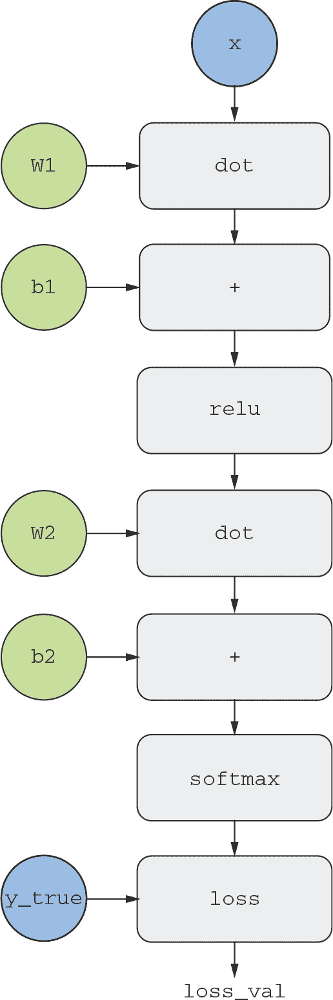

**图 2.21 一种两层模型的计算图表示**

计算图在计算机科学中是一个极其成功的抽象，因为它们使我们能够*将计算视为数据*：可计算的表达式被编码为一种机器可读的数据结构，可以用作另一个程序的输入或输出。例如，您可以想象一个接收计算图并返回实现相同计算的大规模分布式版本的新计算图的程序。这意味着您可以分发任何计算而不必自己编写分发逻辑。或者想象一个接收计算图并可以自动生成表示其代表的表达式的导数的程序。如果您的计算以明确的图形数据结构而不是比如说.R 文件中的 ASCII 字符行表示，则执行这些操作要容易得多。

要清楚地解释反向传播，让我们看一个真正基本的计算图示例（见图 2.22）。我们将考虑一个简化版本的图 2.21，其中我们只有一个线性层，并且所有变量都是标量。我们将取两个标量变量 w 和 b，一个标量输入 x，并对它们进行一些操作以将它们组合成输出 y。最后，我们将应用绝对值误差损失函数：loss_val = abs(y_true - y)。因为我们想要以最小化 loss_val 的方式更新 w 和 b，所以我们对计算 grad(loss_val, b)和 grad(loss_val, w)感兴趣。

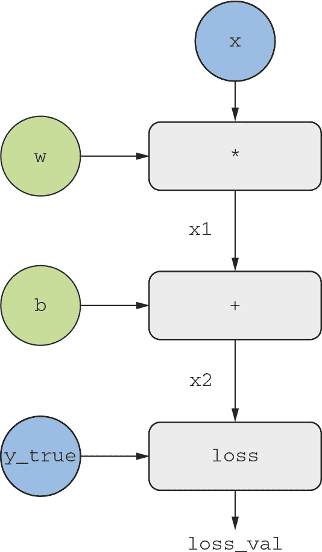

**图 2.22 一个基本的计算图示例**

让我们为图中的“输入节点”设置具体值，也就是说，输入 x，目标 y_true，w 和 b。我们将这些值传播到图中的所有节点，从上到下，直到达到 loss_val。这是*正向传播*（见图 2.23）。

现在让我们“反转”图表：对于图表中从 A 到 B 的每条边，我们将创建一个从 B 到 A 的相反边，并询问，当 A 变化时，B 变化多少？也就是说，grad(B, A)是多少？我们将用这个值注释每条倒置边。这个反向图表代表*反向传播*（见图 2.24）。

我们有以下：

+   grad(loss_val, x2) = 1，因为当 x2 变化一个量 epsilon 时，loss_val = abs (4 -x2)也变化相同的量。

+   grad(x2, x1) = 1，因为当 x1 变化一个量 epsilon 时，x2 = x1 + b = x1 + 1 也变化相同的量。

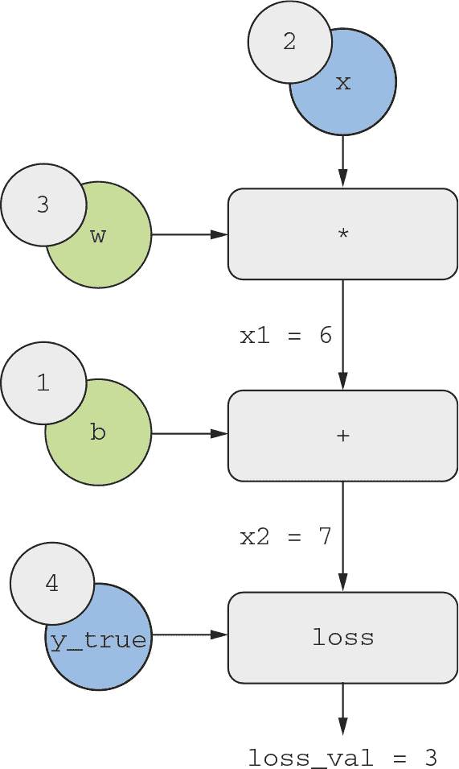

**图 2.23 运行正向传播**

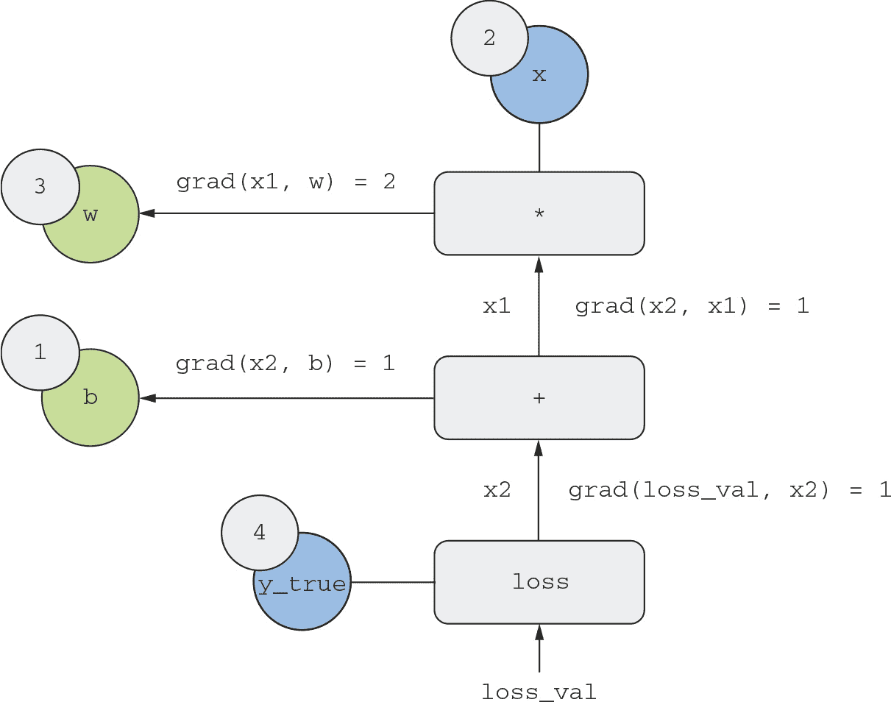

**图 2.24 运行反向传播**

+   grad(x2, b) = 1，因为当 b 变化一个量 epsilon 时，x2 = x1 + b = 6 + b 也变化相同的量。

+   grad(x1, w) = 2，因为当 w 变化一个量 epsilon 时，x1 = x * w = 2 * w 变化为 2 * epsilon。

关于这个反向图，链式法则告诉我们，可以通过*沿着连接两个节点的路径的每个边缘的导数相乘*来获得相对于另一个节点的节点的导数，例如，grad(loss_val, w) = grad(loss_val, x2) * grad(x2, x1) * grad(x1, w)（参见 图 2.25）。

通过将链式法则应用于我们的图，我们获得了我们所要寻找的内容：

+   grad(loss_val, w) = 1 * 1 * 2 = 2

+   grad(loss_val, b) = 1 * 1 = 1

如果在反向图中存在连接两个感兴趣节点 a 和 b 的多条路径，则通过求和所有路径的贡献来获得 grad(b, a)。

这样一来，你就看到了反向传播的实际应用！反向传播简单地将链式法则应用于计算图。没有更多了。反向传播从最终损失值开始，从顶层向底层逆向工作，计算每个参数在损失值中的贡献。这就是“反向传播”这个名字的由来：我们在计算图中“反向传播”不同节点的损失贡献。

如今，人们在现代框架中实现神经网络，这些框架能够进行*自动微分*，例如 TensorFlow。自动微分是使用刚刚看到的计算图实现的。自动微分使得可以检索可微张量操作的任意组合的梯度，而无需除了编写正向传递之外的任何额外工作。当我（弗朗索瓦）在 2000 年代用 C 编写我的第一个神经网络时，我不得不手动编写我的梯度。现在，由于现代自动微分工具，你再也不必自己实现反向传播了。算你幸运！

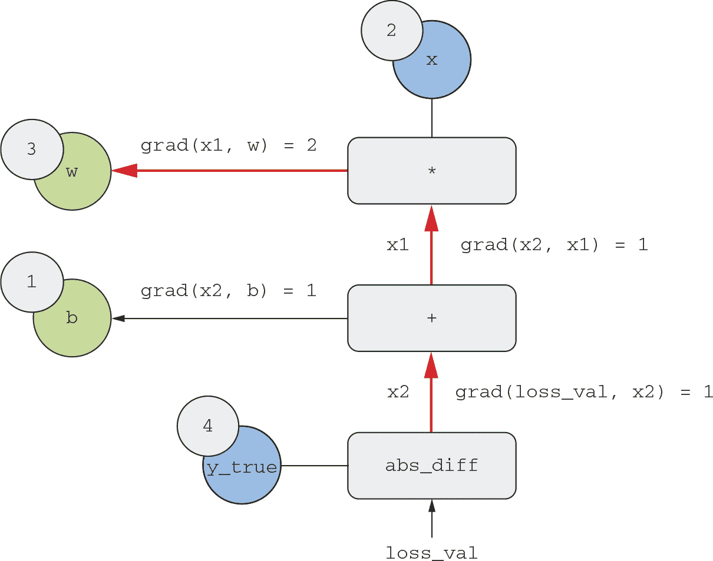

**图 2.25 从 loss_val 到 w 的反向图路径**

### TensorFlow 中的梯度带

你可以利用 TensorFlow 强大的自动求导功能的 API 是 GradientTape()。它是一个上下文管理器，将记录其范围内运行的张量操作，以计算图的形式（有时称为“带子”）。然后可以使用此图检索任何输出相对于任何变量或一组变量（TensorFlow Variable 类的实例）的梯度。tf$Variable 是一种特定类型的张量，用于保存可变状态，例如，神经网络的权重始终是 TensorFlow Variable 实例：

library(tensorflow)

x <- tf$Variable(0)➊

with(tf$GradientTape() %as% tape, {➋

y <- 2 * x + 3➌

})➍

grad_of_y_wrt_x <- tape$gradient(y, x)➎

➊ **实例化一个初始值为 0 的标量变量。**

➋ **打开一个 GradientTape 范围。**

➌ **在范围内，对我们的变量应用一些张量操作。**

➍ **退出作用域。**

➎ **使用带子检索输出 y 相对于我们的变量 x 的梯度。**

GradientTape() 与张量操作一起工作如下：

x <- tf$Variable(array(0, dim = c(2, 2)))➊

with(tf$GradientTape() %as% tape, {

y <- 2 * x + 3

})

grad_of_y_wrt_x <- as.array(tape$gradient(y, x))➋

➊ **创建一个形状为 (2, 2) 的变量，并将其初始值设为全零。**

➋ **grad_of_y_wrt_x 是一个形状为 (2, 2)（与 x 相同）的张量，描述了 y = 2 * a + 3 在 x = array(0, dim = c(2, 2)) 周围的曲率。**

注意，tape$gradient() 返回一个 TensorFlow 张量，我们用 as.array() 将其转换为 R 数组。GradientTape() 也可以用于变量列表：

W <- tf$Variable(random_array(c(2, 2)))

b <- tf$Variable(array(0, dim = c(2)))

x <- random_array(c(2, 2))

with(tf$GradientTape() %as% tape, {

y <- tf$matmul(x, W) + b➊

})

grad_of_y_wrt_W_and_b <- tape$gradient(y, list(W, b))

str(grad_of_y_wrt_W_and_b)➋

从中可以学到更多有关梯度带的知识。

$ :<tf.Tensor: shape=(2, 2), dtype=float64, numpy=…>

$ :<tf.Tensor: shape=(2), dtype=float64, numpy=array([2., 2.])>

➊ **matmul 是 TensorFlow 中表示“点乘”的方法。**

➋ **grad_of_y_wrt_W_and_b 是两个张量列表，分别具有与 W 和 b 相同的形状。**

你将在下一章节学到更多关于梯度带的内容。

## 2.5 回顾我们的第一个示例

你已接近本章的结尾，现在你应该对神经网络背后的操作有了一般的理解。本章开始时的神奇黑盒已经变成了一个更清晰的图景，正如图 2.26 所示：模型由相互连接的层组成，将输入数据映射到预测结果。损失函数然后将这些预测与目标进行比较，产生一个损失值：衡量模型预测与预期值匹配程度的指标。优化器使用这个损失值来更新模型的权重。

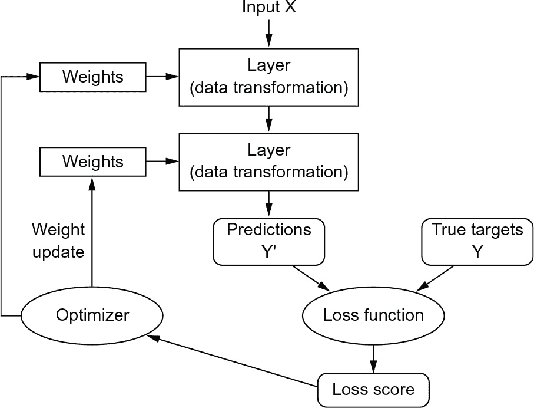

**图 2.26 神经网络、层、损失函数和优化器之间的关系**

让我们回到本章的第一个示例，并根据你学到的内容逐个审视它。

这是输入数据：

library(keras)

mnist <- dataset_mnist()

train_images <- mnist$train$x

train_images <- array_reshape(train_images, c(60000, 28 * 28))

train_images <- train_images / 255

test_images <- mnist$test$x

test_images <- array_reshape(test_images, c(10000, 28 * 28))

test_images <- test_images / 255

train_labels <- mnist$train$y

test_labels <- mnist$test$y

现在你明白了输入图像以 R 数组的形式存储，形状分别为 (60000, 784)（训练数据）和 (10000, 784)（测试数据）。

这是我们的模型：

model <- keras_model_sequential(list(

layer_dense(units = 512, activation = "relu"),

layer_dense(units = 10, activation = "softmax")

List of 2

现在你明白了这个模型由两个 Dense 层的链组成，每个层对输入数据应用了几个简单的张量操作，这些操作涉及权重张量。权重张量是层的属性，它们是模型*知识*的存储位置。

这是模型编译步骤：

编译(model,

优化器 = "rmsprop",

损失 = "稀疏分类交叉熵",

度量 = c("准确度"))

现在你明白了，稀疏分类交叉熵是用于学习权重张量的反馈信号，训练阶段将尝试最小化这个损失。你还知道，这种损失的减少是通过小批量随机梯度下降来实现的。具体的梯度下降使用规则由传递为第一个参数的 rmsprop 优化器定义。

最后，这是训练循环：

训练(model, train_images, train_labels, epochs = 5, batch_size = 128)

现在你明白了调用 fit 时会发生什么：模型将开始以 128 个样本的迷你批次迭代训练数据，重复五次（对所有训练数据的每次迭代称为一个*epoch*）。对于每个批次，模型将计算损失相对于权重的梯度（使用反向传播算法，这来源于微积分中的链式法则），并使权重沿着能够减少该批次损失的方向移动。

在这五个 epochs 之后，模型将进行了 2,345 次梯度更新（每个 epoch 469 次），并且模型的损失将足够低，使得模型能够以高精度对手写数字进行分类。

此时，你已经知道了关于神经网络的所有知识。让我们通过在 TensorFlow 中一步步从头重新实现第一个示例的简化版本来证明这一点。

### 2.5.1 在 TensorFlow 中从头重新实现我们的第一个示例

还有什么比从头开始实现一切更能充分、明确地展示理解力呢？当然，这里的“从头”是相对的：我们不会重新实现基本张量操作，也不会实现反向传播。但我们会深入到如此低的层次，以至于几乎不会使用任何 Keras 功能。

不用担心如果你还没有完全理解这个例子的每一个细节。下一章将更深入地探讨 TensorFlow API。目前，只需尝试跟随正在发生的事情的要点即可——本例子的目的是通过具体的实现帮助你明确深度学习的数学原理。让我们开始吧！

### 一个简单的 DENSE 类

你之前学到过 Dense 层实现了如下输入变换，其中 W 和 b 是模型参数，激活函数()是一个逐元素函数（通常是 relu()，但在最后一层会是 softmax()）：

output <- 激活(dot(W, 输入) + b)

让我们在 R 环境中实现一个简单的 Dense 层，带有 NaiveDense 类属性、两个 TensorFlow 变量 W 和 b，以及一个应用前述变换的 call() 方法：

layer_naive_dense <- function(input_size, output_size, activation) {

self <- new.env(parent = emptyenv())

attr(self, "class") <- "NaiveDense"

self$activation <- activation

w_shape <- c(input_size, output_size)

w_initial_value <- random_array(w_shape, min = 0, max = 1e-1)

self$W <- tf$Variable(w_initial_value)➊

b_shape <- c(output_size)

b_initial_value <- array(0, b_shape)

self$b <- tf$Variable(b_initial_value)➋

self$weights <- list(self$W, self$b)➌

self$call <- function(inputs) {➍

self$activation(tf$matmul(inputs, self$W) + self$b)➎

}

self

}

➊ **创建一个形状为(input_size, output_size)的矩阵 W，用随机值进行初始化。**

➋ **创建一个形状为(output_size)的向量 b，用零进行初始化。**

➌ **方便地检索所有层的权重的属性。**

➍ **在一个名为 call 的函数中应用前向传播。**

➎ **在这个函数中我们坚持使用 TensorFlow 操作，以便 GradientTape 可以追踪它们。（我们将在第三章学习更多关于 TensorFlow 操作的知识。）**

### 一个简单的顺序类

现在，让我们创建一个 naive_model_sequential()来链接这些层，如下一个代码片段所示。它包装了一个层的列表，并公开了一个 call()方法，该方法简单地按顺序在输入上调用底层层。它还具有一个 weights 属性，用于轻松跟踪层的参数：

naive_model_sequential <- function(layers) {

self <- new.env(parent = emptyenv())

attr(self, "class") <- "NaiveSequential"

self$layers <- layers

weights <- lapply(layers, function(layer) layer$weights)

self$weights <- do.call(c, weights)➊

self$call <- function(inputs) {

x <- inputs

for (layer in self$layers)

x <- layer$call(x)

x

}

self

}

➊ **展开嵌套列表一层。**

使用这个 NaiveDense 类和这个 NaiveSequential 类，我们可以创建一个模拟 Keras 模型：

model <- naive_model_sequential(list(

layer_naive_dense(input_size = 28 * 28, output_size = 512,

activation = tf$nn$relu),

layer_naive_dense(input_size = 512, output_size = 10,

activation = tf$nn$softmax)

))

stopifnot(length(model$weights) == 4)

### 一个批量生成器

接下来，我们需要一种方法来在小批量上迭代 MNIST 数据。这很容易：

new_batch_generator <- function(images, labels, batch_size = 128) {

self <- new.env(parent = emptyenv())

attr(self, "class") <- "BatchGenerator"

stopifnot(nrow(images) == nrow(labels))

self$index <- 1

self$images <- images

self$labels <- labels self$batch_size <- batch_size

self$num_batches <- ceiling(nrow(images) / batch_size)

self$get_next_batch <- function() {

start <- self$index

if(start > nrow(images))

return(NULL)➊

end <- start + self$batch_size - 1

if(end > nrow(images))

end <- nrow(images)➋

self$index <- end + 1

indices <- start:end

list(images = self$images[indices, ],

labels = self$labels[indices])

}

self

}

➊ **生成器已完成。**

➋ **最后一批可能会较小。**

### 2.5.2 运行一个训练步骤

这个过程中最困难的部分是“训练步骤”：在一批数据上运行模型后更新模型的权重。我们需要做以下工作：

1.  **1** 计算批量图像的模型预测。

1.  **2** 计算这些预测的损失值，给定实际标签。

1.  **3** 计算损失相对于模型权重的梯度。

1.  **4** 将权重朝着梯度相反的方向移动一个小量。

要计算梯度，我们将使用我们在第 2.4.4 节中介绍的 TensorFlow GradientTape 对象：

one_training_step <- function(model, images_batch, labels_batch) {

with(tf$GradientTape() %as% tape, {

predictions <- model$call(images_batch)➊

每个样本的损失 <

loss_sparse_categorical_crossentropy(labels_batch, predictions)

average_loss <- mean(per_sample_losses)

})

gradients <- tape$gradient(average_loss, model$weights)➋

update_weights(gradients, model$weights)➌

average_loss

}

➊ **运行前向传播（在 GradientTape 范围内计算模型的预测）。**

➋ **计算损失相对于权重的梯度。输出梯度是一个列表，其中每个条目对应于模型$weights 列表中的一个权重。**

➌ **使用梯度更新权重（我们将很快定义此函数）。**

正如你已经知道的，"weight update" 步骤的目的（由前面的 update_weights() 函数表示）是在一个方向上将权重移动“一点”，以减少这个批次上的损失。移动的大小由“学习率”确定，通常是一个小量。实现这个 update_weights() 函数的最简单方法是从每个权重中减去梯度 * 学习率：

学习率 <- 1e-3

update_weights <- function(gradients, weights) {

stopifnot(length(gradients) == length(weights))

for (i in seq_along(weights))

weights[[i]]$assign_sub(➊

gradients[[i]] * learning_rate)

}

➊ **x$assign_sub(value) 相当于 x <- x - value 对于 TensorFlow 变量。**

实际上，你几乎不会手动实现像这样的权重更新步骤。而是会使用来自 Keras 的 Optimizer 实例：

optimizer <- optimizer_sgd(learning_rate = 1e-3)

update_weights <- function(gradients, weights)

optimizer$apply_gradients(zip_lists(gradients, weights))

zip_lists() 是一个辅助函数，用于将梯度和权重列表转换为 (gradient, weight) 对的列表。我们用它将梯度与权重配对给优化器。例如：

str(zip_lists(

gradients = list("grad_for_wt_1", "grad_for_wt_2", "grad_for_wt_3"),

权重 = list("weight_1", "weight_2", "weight_3")))

List of 3

$ :List of 2

..$ gradients: chr "grad_for_wt_1"

..$ weights : chr "weight_1"

$ :List of 2

..$ gradients: chr "grad_for_wt_2"

..$ weights : chr "weight_2"

$ :List of 2

..$ 梯度: chr "grad_for_wt_3"

..$ weights : chr "weight_3"

现在我们的每批训练步骤已经准备好了，我们可以继续实现整个训练的一个 epoch。

### 2.5.3 完整的训练循环

训练的一个 epoch 简单地是重复训练数据中每个批次的训练步骤，而完整的训练循环简单地是一个 epoch 的重复：

fit <- function(model, images, labels, epochs, batch_size = 128) {

for (epoch_counter in seq_len(epochs)) {

cat("Epoch ", epoch_counter, "\n")

batch_generator <- new_batch_generator(images, labels)

for (batch_counter in seq_len(batch_generator$num_batches)) {

batch <- batch_generator$get_next_batch()

loss <- one_training_step(model, batch$images, batch$labels)

if (batch_counter %% 100 == 0)

cat(sprintf("第 %s 批次的损失：%.2f\n", batch_counter, loss))

}

}

}

让我们来试一试：

mnist <- dataset_mnist()

train_images <- array_reshape(mnist$train$x, c(60000, 28 * 28)) / 255

test_images <- array_reshape(mnist$test$x, c(10000, 28 * 28)) / 255

test_labels <- mnist$test$y

train_labels <- mnist$train$y

fit(model, train_images, train_labels, epochs = 10, batch_size = 128)

第 1 轮

batch 100: 2.37 时的损失

batch 200: 2.21 时的损失

batch 300: 2.15 时的损失

batch 400: 2.09 时的损失

第 2 轮

batch 100: 1.98 时的损失

batch 200: 1.83 时的损失

batch 300: 1.83 时的损失

batch 400: 1.75 时的损失

…

第 9 轮

batch 100: 0.85 时的损失

batch 200: 0.68 时的损失

batch 300: 0.83 时的损失

batch 400: 0.76 时的损失

第 10 轮

batch 100: 0.80 时的损失

batch 200: 0.63 时的损失

batch 300: 0.78 时的损失

batch 400: 0.72 时的损失

### 2.5.4 评估模型

我们可以通过对测试图像的预测取其最大值所在列（max.col()），然后与预期标签进行比较来评估模型：

predictions <- model$call(test_images)

predictions <- as.array(predictions)➊

predicted_labels <- max.col(predictions) - 1➋ ➌

matches <- predicted_labels == test_labels

cat(sprintf("准确率：%.2f\n", mean(matches)))

准确率：0.82

➊ **将 TensorFlow 张量转换为 R 数组。**

➋ **max.col(x) 是对 apply(x, 1, which.max) 的矢量化实现。**

➌ **减 1 是因为位置与标签偏移 1，例如，第一个位置对应数字 0。**

完成啦！正如你所见，手工完成“几行 Keras 代码所能完成的事情”是相当多的工作。但是因为你已经经历了这些步骤，现在应该对在调用 fit() 时神经网络内部发生的情况有一个清晰的理解。拥有这种低级别的心理模型，知道代码在幕后正在做什么，将使你更能够利用 Keras API 的高级特性。

## 概要

+   张量构成现代机器学习系统的基础。它们具有各种类型、秩和形状的变体。

+   你可以通过张量操作（如加法、张量乘积或逐元素乘法）来操作数值张量，这可以解释为编码几何变换。一般来说，深度学习中的一切都可以被解释为几何的。

+   深度学习模型由简单的张量操作链组成，由权重参数化，这些权重本身也是张量。模型的权重是存储其“知识”的地方。

+   学习意味着找到模型权重的一组数值，以最小化给定一组训练数据样本及其对应目标的损失函数。

+   学习通过绘制随机的数据样本批次及其目标，并计算模型参数相对于批次上的损失的梯度来进行。然后，模型参数按梯度相反的方向移动一点（移动的大小由学习率定义）。这称为小批量随机梯度下降。

+   整个学习过程之所以成为可能，是因为神经网络中的所有张量操作都是可微分的，因此可以应用求导的链式法则来找到将当前参数和当前数据批次映射到梯度值的梯度函数。这称为反向传播。

+   未来的章节中，你将经常看到的两个关键概念是*损失*和*优化器*。在开始向模型输入数据之前，这两个概念是你需要定义的事物：

    +   *损失*是你在训练过程中尝试最小化的量，因此它应该代表你试图解决的任务的成功度量。

    +   *优化器*指定了损失的梯度将如何用于更新参数的具体方式：例如，可以是 RMSprop 优化器、具有动量的随机梯度下降（SGD）等。
