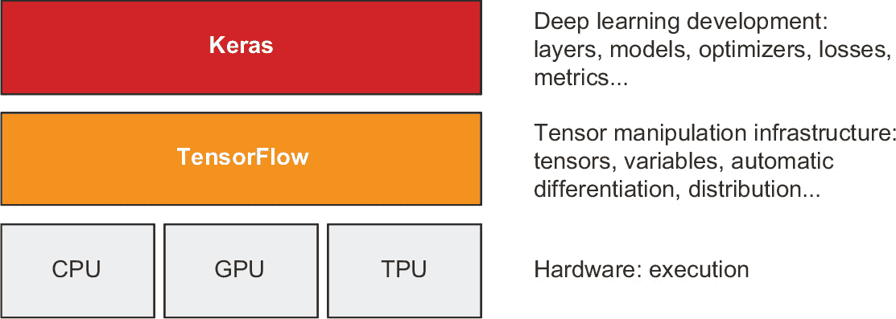
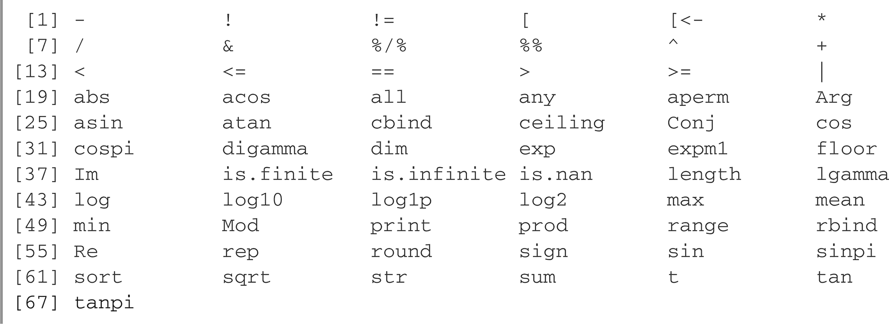
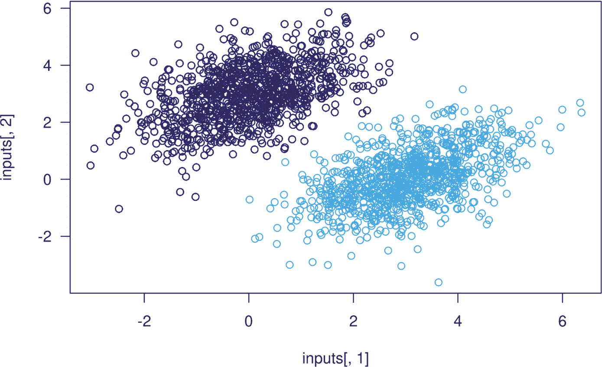
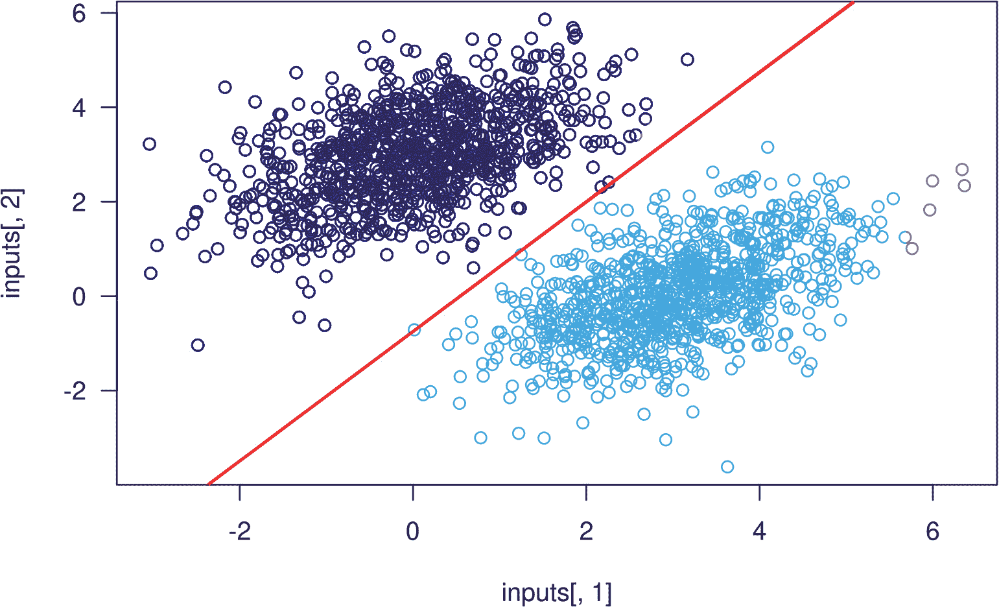
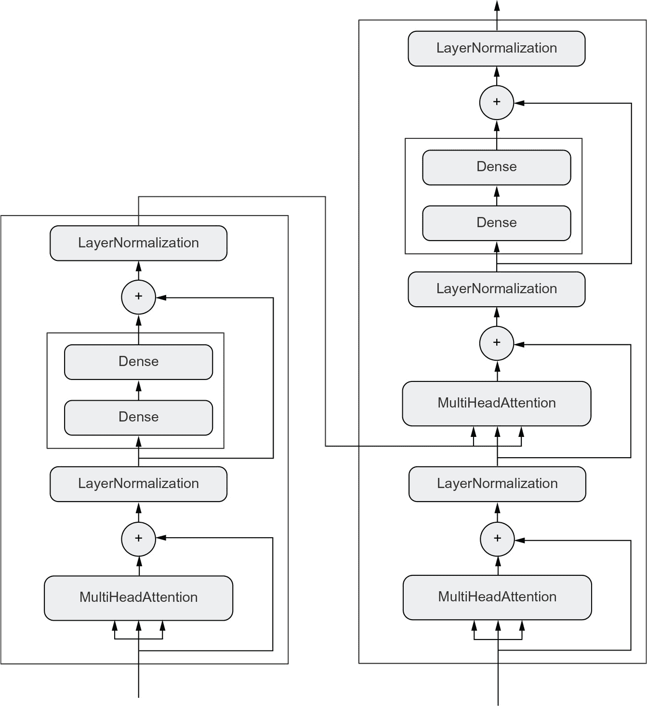

# 第三章：*Keras 和 TensorFlow 入门*

*本章包括*

+   对 TensorFlow、Keras 及其关系的更深入了解

+   设置一个深度学习工作空间

+   深度学习核心概念如何转换为 Keras 和 TensorFlow 的概述

本章旨在为您提供开始在实践中进行深度学习所需的一切。我将简要介绍 Keras（[`keras.rstudio.com`](https://www.keras.rstudio.com)）和 TensorFlow（[`tensorflow.rstudio.com`](https://www.tensorflow.rstudio.com)），这是我们将在本书中使用的基于 R 的深度学习工具。您将了解如何使用 TensorFlow、Keras 和 GPU 支持设置深度学习工作空间。最后，建立在您在第二章中对 Keras 和 TensorFlow 的初次接触之上，我们将回顾神经网络的核心组件以及它们如何转换为 Keras 和 Tensor-Flow 的 API。

在本章结束时，你将准备好进入实际的、真实世界的应用程序，这将从第四章开始。

## 3.1 TensorFlow 是什么？

TensorFlow 是一个免费、开源的机器学习平台，主要由 Google 开发。与 R 本身类似，TensorFlow 的主要目的是让科学家、工程师和研究人员能够在数值张量上操作数学表达式。但是 TensorFlow 为 R 带来了以下新功能：

+   它可以自动计算任何可微分表达式的梯度（正如你在第二章中看到的那样），这使其非常适合机器学习。

+   它不仅可以在 CPU 上运行，还可以在 GPU 和 TPU 上运行，后者是高度并行的硬件加速器。

+   在 TensorFlow 中定义的计算可以轻松分布到许多机器上。

+   TensorFlow 程序可以导出到其他运行时，比如 C++、Java-Script（用于基于浏览器的应用程序）或 TensorFlow Lite（用于在移动设备或嵌入式设备上运行的应用程序）。这使得 TensorFlow 应用在实际环境中容易部署。

重要的是要记住，TensorFlow 不仅仅是一个单一的库。它实际上是一个平台，是许多组件的家园，其中一些由 Google 开发，一些由第三方开发。例如，有 TF-Agents 用于强化学习研究，TFX 用于工业强度的机器学习工作流管理，TensorFlow Serving 用于生产部署，以及 TensorFlow Hub 预训练模型的存储库。总之，这些组件涵盖了非常广泛的用例，从前沿研究到大规模生产应用。

TensorFlow 的扩展性相当不错：例如，来自奥克岭国家实验室的科学家们已经利用它在 IBM Summit 超级计算机的 27,000 个 GPU 上训练了一个 1.1 艾克斯弗洛普的极端天气预测模型。同样，谷歌已经利用 TensorFlow 开发了计算密集型的深度学习应用程序，比如下棋和围棋代理 AlphaZero。对于你自己的模型，如果你有预算，你可以实际上希望在一个小型 TPU 机架或一个大型的在 Google Cloud 或 AWS 上租用的 GPU 集群上实现大约 10 百万亿次浮点运算的规模。这仍然只是 2019 年顶级超级计算机峰值计算能力的大约 1%！

## 3.2 什么是 Keras？

Keras 是一个深度学习 API，建立在 TensorFlow 之上，提供了一种方便的方式来定义和训练任何类型的深度学习模型。Keras 最初是为研究而开发的，旨在实现快速的深度学习实验。

通过 TensorFlow，Keras 可以在不同类型的硬件（见 图 3.1）上运行——GPU、TPU 或普通 CPU——并且可以无缝地扩展到数千台机器。

Keras 以优化开发者体验而闻名。它是一个面向人类而不是机器的 API。它遵循减少认知负荷的最佳实践：它提供一致和简单的工作流程，它最小化了常见用例所需的操作数量，并且在用户出错时提供清晰和可操作的反馈。这使得 Keras 对于初学者来说易于学习，对于专家来说使用起来高效。

**图 3.1 Keras 和 TensorFlow：TensorFlow 是一个低级张量计算平台，而 Keras 是一个高级深度学习 API。**

截至 2021 年末，Keras 已经有超过一百万的用户，包括学术研究人员、工程师、数据科学家，以及初创公司和大公司的研究生和爱好者。Keras 在谷歌、Netflix、Uber、CERN、NASA、Yelp、Instacart、Square，以及数百家在各行各业解决各种问题的初创公司中被使用。你的 YouTube 推荐来自 Keras 模型。Waymo 自动驾驶汽车是用 Keras 模型开发的。Keras 也是 Kaggle 的一个流行框架，这是一个机器学习竞赛网站，大多数深度学习竞赛都是使用 Keras 赢得的。

因为 Keras 拥有大量且多样化的用户基础，它不会强制要求你遵循单一的“正确”方式来构建和训练模型。相反，它提供了多种不同的工作流程，从非常高级到非常低级，适用于不同的用户群体。例如，你有多种方式来构建和训练模型，每一种都代表了可用性和灵活性之间的某种权衡。在第五章中，我们将详细回顾这一系列工作流程中的大部分内容。你可以像使用大多数其他高级框架一样使用 Keras——只需调用 `fit()` 然后让框架执行它的工作；或者你可以像使用基本的 R 一样，完全掌控每一个细节。

这意味着，当你刚开始学习的内容，即使在你成为专家之后仍然适用。你可以轻松开始，然后逐渐深入到更复杂的工作流程，其中你需要从头开始编写越来越多的逻辑。你不需要在从学生到研究员，或者从数据科学家到深度学习工程师的过程中，切换到完全不同的框架。

这种哲学与 R 本身的哲学非常相似！有些语言只提供一种编程方式——例如，面向对象编程或函数式编程。而 R 是一种多范式语言：它提供了各种可能的用法模式，这些模式都可以很好地协同工作。这使得 R 适用于非常不同的用例：数据科学、机器学习工程、网页开发……或者只是学习编程。同样，你可以将 Keras 视为深度学习领域的 R：一种用户友好的深度学习语言，它为不同的用户群体提供了多种工作流程。

## 3.3 Keras 和 TensorFlow：简史

Keras 比 TensorFlow 早八个月。Keras 于 2015 年 3 月发布，而 TensorFlow 于 2015 年 11 月发布。你可能会问，如果 Keras 是建立在 TensorFlow 之上的，它是如何在 TensorFlow 发布之前就存在的？Keras 最初是建立在 Theano 之上的，这是另一个张量操作库，它提供了自动微分和 GPU 支持——这是同类中的最早期的。Theano 由蒙特利尔大学（Université de Montréal）的蒙特利尔学习算法研究所（MILA）开发，在许多方面是 TensorFlow 的前身。它开创了使用静态计算图进行自动微分并将代码编译到 CPU 和 GPU 的理念。

在 2015 年底，TensorFlow 发布后，Keras 被重构为一个多后端架构：可以使用 Theano 或 TensorFlow 来使用 Keras，并且在两者之间切换只需更改一个环境变量。到 2016 年 9 月，TensorFlow 已经达到了技术成熟的水平，使其成为 Keras 的默认后端选项是可行的。2017 年，Keras 增加了两个新的后端选项：由 Microsoft 开发的 CNTK 和由 Amazon 开发的 MXNet。现在，Theano 和 CNTK 已停止开发，MXNet 在 Amazon 以外的使用不是很广泛。Keras 又恢复了成为基于 TensorFlow 的单后端 API。

Keras 和 TensorFlow 多年来一直保持着一种共生关系。在 2016 年和 2017 年期间，Keras 成为了开发 TensorFlow 应用的用户友好方式，将新用户引入 TensorFlow 生态系统。到 2017 年底，大多数 TensorFlow 用户使用 Keras 或与 Keras 相结合。2018 年，TensorFlow 领导团队选择 Keras 作为 TensorFlow 官方的高级 API。因此，Keras API 是在 2019 年 9 月发布的 TensorFlow 2.0 中的重点，这是 TensorFlow 和 Keras 的广泛重新设计，考虑了四年的用户反馈和技术进步。

## 3.4 Python 和 R 接口：简史

TensorFlow 和 Keras 的 R 接口分别于 2016 年底和 2017 年初发布，并由 RStudio 进行主要开发和维护。

Keras 和 TensorFlow 的 R 接口是基于 reticulate 包构建的，该包在 R 中嵌入了完整的 Python 过程。对于大多数用户来说，这只是一个实现细节。但是，随着你的学习进展，这将成为一个巨大的优点，因为这意味着你可以完全访问*Python 和 R*中可用的所有内容。

在本书中，我们使用 R 接口来使用 Keras，这个接口可以很好地与 R 网格协作。然而，在第十三章中，我们展示了如何直接从 R 中使用 Python 库，即使没有方便的 R 界面可用。

到了这个点，你一定渴望开始实际运行 Keras 和 TensorFlow 的代码。让我们开始吧！

## 3.5 设置深度学习工作区

在开始开发深度学习应用程序之前，需要设置开发环境。强烈建议您使用现代 NVIDIA GPU 而不是计算机的 CPU 运行深度学习代码，虽然这不是严格必需的。一些应用程序，特别是使用卷积网络进行图像处理的应用程序，甚至在快速的多核 CPU 上都会变得非常缓慢。即使是可以实际在 CPU 上运行的应用程序，使用最近的 GPU 通常也会使速度提高 5 倍或 10 倍。

在 GPU 上进行深度学习，你有以下三种选择：

+   在你的工作站上购买并安装一个物理 NVIDIA GPU。

+   在 Google Cloud 或 Amazon EC2 上使用 GPU 实例。

+   使用 Kaggle、Colaboratory 或类似提供商的免费 GPU 运行时

豆瓣云、Kaggle 等免费在线服务提供商是入门的最简单途径，因为它们无需购买硬件，也不需要安装软件——只需打开浏览器的一个标签页并开始编码。然而，这些服务的免费版本只适用于小工作负载。如果你想扩大规模，你必须使用第一或第二个选项。

如果你还没有可用于深度学习的 GPU（最近的、高端的 NVIDIA GPU），那么在云中运行深度学习实验是一种简单、低成本的方法，让你无需购买任何额外的硬件就可以移动到更大的工作负载。

然而，如果你是深度学习的重度用户，这种设置在长期内甚至超过几个月都不可持续。云实例不便宜：在 2021 年中期，你将支付 2.48 美元每小时的 Google Cloud V100 GPU。同时，一个稳定的消费级 GPU 的成本将在 1,500-2,500 美元之间——尽管这些 GPU 的规格不断得到改进，但这个价格已经相当稳定。如果你是深度学习的重度用户，请考虑在本地工作站上安装一个或多个 GPU。

此外，无论是本地运行还是在云中运行，最好使用 Unix 工作站。虽然在 Windows 上直接运行 Keras 在技术上是可能的，但我们不建议这样做。如果你是 Windows 用户，并且想在自己的工作站上进行深度学习，最简单的解决方案是在机器上设置 Ubuntu 双启动，或者使用 Windows 子系统用于 Linux（WSL），这是一种兼容层，使你能够从 Windows 运行 Linux 应用程序。这可能看起来麻烦，但它将在长期内为你节省大量时间和麻烦。

### 3.5.1 安装 Keras 和 TensorFlow

在本地计算机上安装 Keras 和 TensorFlow 很简单：

1.  **1** 确保已安装 R。最新的安装说明始终可在[`cloud.r-project.org`](https://www.cloud.r-project.org)找到。

1.  **2** 安装 RStudio，可在[`mng.bz/v6JM`](http://mng.bz/v6JM)下载。（如果你希望使用其他环境的 R，则可以跳过此步骤。）

1.  **3** 从 R 控制台中运行以下命令：

install.packages("keras")➊

library(reticulate)

virtualenv_create("r-reticulate", python = install_python())➋

library(keras)

install_keras(envname = "r-reticulate")➌

➊ **这也会安装所有 R 依赖项，如 reticulate。**

➋ **设置 R（reticulate）与可用的 Python 安装。**

➌ **安装 TensorFlow 和 Keras（Python 模块）。**

就是这样！你现在拥有一个可用的 Keras 和 TensorFlow 安装文件。

### **安装 CUDA**

请注意，如果您的机器上有 NVIDIA GPU 并且希望 TensorFlow 使用它，则还需要下载并安装 CUDA、cuDNN 和 GPU 驱动程序，可从[`developer.nvidia.com/cuda-downloads`](https://www.developer.nvidia.com/cuda-downloads)和[`developer.nvidia.com/cudnn`](https://www.developer.nvidia.com/cudnn)进行下载。

每个 TensorFlow 版本都需要特定版本的 CUDA 和 cuDNN，很少情况下最新的 CUDA 版本与最新的 TensorFlow 版本兼容。通常，您需要确定 Tensor-Flow 需要的特定 CUDA 版本，然后从 CUDA 工具包存档中安装，地址为 [`developer.nvidia.com/cuda-toolkit-archive`](https://www.developer.nvidia.com/cuda-toolkit-archive)。

您可以通过查阅[`mng.bz/44pV`](http://mng.bz/44pV)来找到当前 TensorFlow 版本所需的 CUDA 版本。如果您正在运行较旧版本的 TensorFlow，则可以在[`www.tensorflow.org/install/source#gpu`](https://www.tensorflow.org/install/source#gpu)的“Tested Build Configurations”表中找到对应于您的 TensorFlow 版本的条目。要查找安装在您的机器上的 TensorFlow 版本，请使用：

tensorflow::tf_config()

TensorFlow v2.8.0

 (~/.virtualenvs/r-reticulate/lib/python3.9/site-packages/tensorflow)

Python v3.9 (~/.virtualenvs/r-reticulate/bin/python)

在本文写作时，最新的 TensorFlow 2.8 版本需要 CUDA 11.2 和 cuDNN 8.1。

请注意，您可以在终端上运行特定命令来安装所有 CUDA 驱动程序，但这些命令的有效期非常短（更不用说针对每个操作系统特定）。我们在书中不包含任何这样的命令，因为它们可能会在书印刷之前就过时了。相反，您可以始终在 [`tensorflow.rstudio.com/installation/`](https://www.tensorflow.rstudio.com/installation/) 找到最新的安装说明。

现在，您有一种实践运行 Keras 代码的方法。接下来，让我们看看您在第二章学到的关键思想如何转化为 Keras 和 TensorFlow 代码。

## 3.6 TensorFlow 的初始步骤

正如您在前几章中所看到的，训练神经网络围绕以下概念展开：

+   首先是低级张量操作——现代机器学习的基础设施。这对应 TensorFlow 的 API：

    +   *张量*（tensors），包括存储网络状态的特殊张量（*变量*）

    +   如加法、relu、matmul 等*张量操作*

    +   *反向传播*（Backpropagation），一种计算数学表达式梯度的方法（在 TensorFlow 中通过 GradientTape 对象处理）

+   其次，是高级深度学习概念。这对应于 Keras 的 API

    +   *层*（layers），它们被组合成一个*模型*（model）

    +   *损失函数*（loss function）定义了用于学习的反馈信号。

    +   决定学习过程的*优化器*（optimizer）

    +   *度量指标*（metrics）用于评估模型的性能，如准确率。

    +   执行小批量随机梯度下降的 *训练循环*

在前一章中，你已经简要了解了一些对应的 TensorFlow 和 Keras API。你已经简要使用了 TensorFlow 的 Variable 类、matmul 操作和 GradientTape。你已经实例化了 Keras 的 dense 层，将它们打包成了一个 sequential 模型，并使用 fit() 方法对该模型进行了训练。

现在让我们更深入地了解如何使用 TensorFlow 和 Keras 在实践中处理所有这些不同的概念。

### 3.6.1 TensorFlow 张量

要在 TensorFlow 中做任何事情，我们都需要一些张量。在前一章中，我们介绍了一些张量的概念和术语，并使用了你可能已经熟悉的 R 数组作为一个示例实现。在这里，我们超越了概念，介绍了 TensorFlow 使用的张量的具体实现。

TensorFlow 张量非常类似于 R 数组；它们是数据的容器，还具有一些元数据，如形状和类型。你可以使用 as_tensor() 将 R 数组转换为 TensorFlow 张量：

r_array <- array(1:6, c(2, 3))

tf_tensor <- as_tensor(r_array)

tf_tensor

tf.Tensor(

[[1  3  5]

[2  4  6]], shape=(2, 3), dtype=int32)

与 R 数组类似，张量可以使用许多你已经熟悉的相同张量操作：如 dim()、length()、内置数学泛型如 + 和 log() 等等：

dim(tf_tensor)

[1]  2  3

tf_tensor + tf_tensor

tf.Tensor(

[[ 2  6  10]

[ 4  8  12]], shape=(2, 3), dtype=int32)

适用于张量的 R 泛型集合非常广泛：

methods(class = "tensorflow.tensor")

这意味着你通常可以为 TensorFlow 张量编写与 R 数组相同的代码。

## 3.7 张量属性

与 R 数组不同，张量具有一些可以使用 $ 访问的属性：

tf_tensor$ndim➊

[1]  2

➊**ndim 返回一个标量整数，张量的秩，相当于 length(dim(x))。**

长度为 1 的 R 向量会自动转换为秩为 0 的张量，而长度大于 1 的 R 向量会转换为秩为 1 的张量：

as_tensor(1)$ndim

[1] 0

as_tensor(1:2)$ndim

[1]  1

tf_tensor$shape

TensorShape([2, 3])

tf_tensor$shape 返回一个 tf.TensorShape 对象。这是一个支持未定义或未指定维度的类对象，并且具有各种方法和属性：

methods(class = class(shape())[1])

目前，你只需要知道你可以使用 as.integer() 将 TensorShape 转换为整数向量（dim(x) 是 as.integer(x$shape) 的缩写），并且你可以使用 shape() 函数手动构造一个 TensorShape 对象：

shape(2, 3)

TensorShape([2, 3])

tf_tensor$dtype

tf.int32

tf_tensor$dtype 返回数组的数据类型。TensorFlow 支持的数据类型比基本的 R 更多。例如，基本的 R 只有一个整数类型，而 TensorFlow 提供了 13 种整数类型！R 的整数类型对应于 int32。不同的数据类型在内存消耗和可以表示的值的范围之间进行不同的权衡。例如，具有 int8 数据类型的张量在内存中只占用 int32 数据类型的四分之一的空间，但它只能表示 -128 到 127 之间的整数，而不是 -2147483648 到 2147483647。

本书还将处理浮点数据。在 R 中，默认的浮点数数据类型 double 会转换为 tf.float64：

r_array <- array(1)

typeof(r_array)

[1] "double"

as_tensor(r_array)$dtype

tf.float64

在本书的大部分内容中，我们将使用更小的 float32 作为默认的浮点数数据类型，以换取一些精度，以获得更小的内存占用和更快的计算速度：

as_tensor(r_array, dtype = "float32")

tf.Tensor([1.], shape=(1), dtype=float32)

### 3.7.1 张量的形状和重塑

as_tensor() 还可以选择接受一个形状参数，你可以用它来扩展一个标量或重塑一个张量。例如，要创建一个零数组，你可以写成：

as_tensor(0, shape = c(2, 3))

tf.Tensor(

[[0\. 0\. 0.]

[0\. 0\. 0.]], shape=(2, 3), dtype=float32)

对于不是标量（length(x) > 1）的 R 向量，你也可以重塑张量，只要数组的总大小保持不变：

as_tensor(1:6, shape = c(2, 3))

tf.Tensor(

[[1 2 3]

[4 5 6]], shape=(2, 3), dtype=int32)

请注意，张量是按行填充的。这与 R 不同，R 是按列填充数组的：

array(1:6, dim = c(2, 3))

[,1]   [,2]   [,3]

[1,]      1      3       5

[2,]      2      4       6

行主要和列主要顺序之间的差异（也称为 C 和 Fortran 顺序）是在转换 R 数组和张量时要注意的事项之一。R 数组始终是 Fortran 顺序的，而 TensorFlow 张量始终是 C 顺序的，这种区别在任何时候重塑数组时都变得重要。

当你处理张量时，重塑将使用 C 风格的顺序。每当你处理 R 数组时，如果你想明确指定重塑行为，你可以使用 array_reshape()：

array_reshape(1:6, c(2, 3), order = "C")

[,1]   [,2]   [,3]

[1,]      1      2       3

[2,]      4      5       6

array_reshape(1:6, c(2, 3), order = "F")

[,1]   [,2]   [,3]

[1,]      1      3       5

[2,]      2      4       6

最后，array_reshape() 和 as_tensor() 还允许你保留一个轴的大小未指定，它将自动推断使用数组的大小和剩余轴的大小。你可以为你想要推断的轴传递 -1 或 NA：

array_reshape(1:6, c(-1, 3))

[,1]   [,2]   [,3]

[1,]      1      2       3

[2,]      4      5       6

as_tensor(1:6, shape = c(NA, 3))

tf.Tensor(

[[1 2 3]

[4 5 6]], 形状=(2, 3), 数据类型=int32)

### 3.7.2 张量切片

子集张量类似于子集 R 数组，但不完全相同。切片张量提供了一些 R 数组没有的便利，反之亦然。

张量允许您使用提供给切片范围的一个端点的缺失值进行切片，这意味着“该方向上的张量的其余部分”(R 数组不提供此切片便利) (R 数组不提供此切片便利)。例如，重新访问第二章中的示例，我们要切片 MNIST 图像的一部分，我们可以提供一个 NA 给切片:

train_images <- as_tensor(dataset_mnist()$train$x)

my_slice <- train_images[, 15:NA, 15:NA]

请注意，表达式 15:NA 将在其他上下文中产生 R 错误;它只在张量切片操作的括号中起作用。

还可以使用负索引。请注意，与 R 数组不同，负索引不会丢弃元素;相反，它们指示相对于当前轴末端的索引位置。(因为这是与标准 R 子集行为的改变，所以在第一次遇到负切片索引时会发出警告。)要将图像裁剪为 14 × 14 像素的补丁居中，你可以这样做:

my_slice <- train_images[, 8:-8, 8:-8]

警告:

负数采用 Python 风格解释

 在子集张量的情况下。

详细信息请参阅?.tensorflow.tensor`。

要关闭此警告，

![图像 设置`options(tensorflow.extract.warn_negatives_pythonic = FALSE)`

你还可以随时使用特殊的 all_dims()对象来隐式捕获剩余维度，而不必提供调用时所需的逗号(,)的确切数量。例如，假设你只想取前 100 个图像，你可以写成

my_slice <- train_images[1:100, all_dims()]

而不是

my_slice <- train_images[1:100, , ]

这在编写可以处理不同秩的张量的代码时非常方便，例如，在批量维度上取匹配的模型输入和目标的切片。

### 3.7.3 张量广播

我们在第二章介绍了广播。当我们对两个不同大小的张量进行操作，并且我们希望较小的张量*广播*以匹配较大张量的形状时，就会执行广播。广播包括以下两个步骤:

1.  **1** 轴(称为*广播轴*)被添加到较小的张量中，以匹配较大张量的 ndim。

1.  **2** 较小的张量沿着这些新轴重复，以匹配较大张量的完整形状。

使用广播，如果一个张量的形状为(a, b, ... n, n + 1, ... m)，另一个张量的形状为(n, n + 1, ... m)，通常可以执行元素级别操作。然后广播将自动发生在轴 a 到 n - 1 上。

以下示例通过广播将两个不同形状的张量应用于元素级别+操作:

x <- as_tensor(1, shape = c(64, 3, 32, 10))

y <- as_tensor(2, shape = c(32, 10))

z <- x + y➊

➊ **输出 z 的形状与 x 相同，为 (64, 3, 32, 10)。**

每当您希望明确广播语义时，可以使用 tf$newaxis 在张量中插入大小为 1 的维度：

z <- x + y[tf$newaxis, tf$newaxis, , ]

### 3.7.4 The tf module

张量需要用一些初始值创建。通常可以使用 as_tensor() 来创建张量，但是 tf 模块还包含许多用于创建张量的函数。例如，您可以创建全 1 或全 0 的张量，或者从随机分布中绘制值的张量。

library(tensorflow)

tf$ones(shape(1, 3))

tf.Tensor([[1\. 1\. 1.]], shape=(1, 3), dtype=float32)

tf$zeros(shape(1, 3))

tf.Tensor([[0\. 0\. 0.]], shape=(1, 3), dtype=float32)

tf$random$normal(shape(1, 3), mean = 0, stddev = 1)➊

tf.Tensor([ 0.79165614

![Image -0.35886717 0.13686056]], shape=(1, 3), dtype=float32)

tf$random$uniform(shape(1, 3))➋

tf.Tensor([[0.93715847 0.67879045 0.60081327]], shape=(1, 3), dtype=float32)

➊ **从均值为 0、标准差为 1 的正态分布中绘制的随机值张量。等同于 array(rnorm(3 * 1, mean = 0, sd = 1), dim = c(1, 3)。**

➋ **从 0 到 1 之间的均匀分布中绘制的随机值张量。等同于 array(runif(3 * 1, min = 0, max = 1), dim = c(1, 3))。**

请注意，tf 模块公开了完整的 Python TensorFlow API。需要注意的一点是，Python API 经常期望整数，而像 2 这样的裸 R 数字文字会产生 double 而不是整数。在 R 中，我们可以通过添加 L 来指定整数文字，例如 2L。

tf$ones(c(2, 1))➊

Error in py_call_impl(callable, dots$args, dots$keywords):

TypeError: Cannot convert [2.0, 1.0] to EagerTensor of dtype int32

tf$ones(c(2L, 1L))➋

tf.Tensor(

[[1.]

[1.]], shape=(2, 1), dtype=float32)

➊ **在这里提供 R doubles 会产生错误。**

➋ **提供整数文字以避免错误。**

在处理 tf 模块时，我们经常会在需要 Python API 时使用带有 L 后缀的文字整数。

需要注意的另一件事是 tf 模块中的函数使用基于 0 的索引计数约定，即列表的第一个元素是元素 0。例如，如果您想沿着 2D 数组的第一个轴（换句话说，矩阵的列均值）取均值，可以这样做：

m <- as_tensor(1:12, shape = c(3, 4))

tf$reduce_mean(m, axis = 0L, keepdims = TRUE)

tf.Tensor([[5 6 7 8]], shape=(1, 4), dtype=int32)

相应的 R 函数，但是使用基于 1 的计数约定：

mean(m, axis = 1, keepdims = TRUE)

tf.Tensor([[5 6 7 8]], shape=(1, 4), dtype=int32)

您可以轻松地从 RStudio IDE 访问 tf 模块中函数的帮助。在 tf 模块的函数上将光标悬停在 F1 上，即可打开带有相应文档的网页，网址为 [www.tensorflow.org](http://www.tensorflow.org)。

### 3.7.5 常量张量和变量

R 数组和 TensorFlow 张量之间的一个重要区别是 TensorFlow 张量是不可修改的：它们是常量。例如，在 R 中，你可以这样做。

**清单 3.1 R 数组可赋值**

x <- array(1, dim = c(2, 2))

x[1, 1] <- 0

在 TensorFlow 中尝试做同样的事情，你将会得到一个错误：“EagerTensor 对象不支持项目赋值。”

**清单 3.2 TensorFlow 张量不可赋值**

x <- as_tensor(1, shape = c(2, 2))

x[1, 1] <- 0➊

Error in `[<-.tensorflow.tensor`(`*tmp*`, 1, 1, value = 0):

TypeError: 'tensorflow.python.framework.ops.EagerTensor'

对象不支持项目赋值

➊ **这将失败，因为张量不可修改。**

要训练一个模型，我们需要更新它的状态，这是一组张量。如果张量是不可修改的，那么我们该怎么做呢？这就是*变量*发挥作用的地方。tf$Variable 是 TensorFlow 中用来管理可修改状态的类。你已经在第二章结束时的训练循环实现中简要地看到了它的作用。

要创建一个变量，你需要提供一些初始值，比如一个随机张量。

**清单 3.3 创建 TensorFlow 变量**

v <- tf$Variable(initial_value = tf$random$normal(shape(3, 1)))

v

<tf.Variable 'Variable:0' shape=(3, 1) dtype=float32, numpy=

array([[-1.1629326 ],

[ 0.53641343],

[ 1.4736737 ]], dtype=float32)>

可以通过其 assign 方法就地修改变量的状态，如下所示。

**清单 3.4 给 TensorFlow 变量赋值**

v$assign(tf$ones(shape(3, 1)))

<tf.Variable 'UnreadVariable' shape=(3, 1) dtype=float32, numpy=

array([[1.],

[1.],

[1.]], dtype=float32)>

它也适用于一部分系数。

**清单 3.5 给 TensorFlow 变量的子集赋值**

v[1, 1]$assign(3)

<tf.Variable 'UnreadVariable' shape=(3, 1) dtype=float32, numpy=

array([[3.],

[1.],

[1.]], dtype=float32)>

类似地，assign_add() 和 assign_sub() 是 x <- x + value 和 x <- x - value 的高效等效方法。

**清单 3.6 使用 assign_add()**

v$assign_add(tf$ones(shape(3, 1)))

<tf.Variable 'UnreadVariable' shape=(3, 1) dtype=float32, numpy=

array([[4.],

[2.],

[2.]], dtype=float32)>

### 3.7.6 张量运算：在 TensorFlow 中进行数学运算

TensorFlow 提供了大量的张量操作来表达数学公式。以下是一些例子。

**清单 3.7 几个基本的数学运算**

a <- tf$ones(c(2L, 2L))

b <- tf$square(a)➊

c <- tf$sqrt(a)➋

d <- b + c➌

e <- tf$matmul(a, b)➍

e <- e * d➎

➊ **进行平方运算。**

➋ **进行平方根运算。**

➌ **对两个张量进行加法（逐元素）。**

➍ **对两个张量进行乘法（如第二章中所讨论的）。**

➎ **对两个张量进行乘法（逐元素）。**

注意，其中一些操作是通过它们对应的 R 泛型调用的。例如，调用 sqrt(x) 如果 x 是一个张量，就会调用 tf$sqrt(x)。

重要的是，前面的每个操作都是即时执行的：在任何时候，你都可以打印当前结果，就像普通的 R 代码一样。我们称之为*eager execution*（急切执行）。

### 3.7.7 对 GradientTape API 的第二次查看

到目前为止，TensorFlow 看起来很像基本 R，只是函数的名称不同，并且具有一些不同的张量功能。但是，这里有一件 R 不能轻易做到的事情：检索任何可微表达式相对于其输入的梯度。只需使用 with() 打开一个 tf$GradientTape() 作用域，对一个或多个输入张量应用一些计算，并检索结果相对于输入的梯度。

**列表 3.8 使用 GradientTape**

input_var <- tf$Variable(initial_value = 3)

with(tf$GradientTape() %as% tape, {

result <- tf$square(input_var)

})

gradient <- tape$gradient(result, input_var)

这通常用于检索模型损失相对于其权重的梯度：gradients <- tape$gradient(loss, weights)。你在第二章中见过这种情况。

到目前为止，你只看到了 tape$gradient() 中输入张量是 TensorFlow 变量的情况。实际上，这些输入可以是任意的张量。但是，默认只跟踪*可训练变量*。对于常数张量，你必须手动调用 tape$watch() 来标记它为被跟踪的。

**列表 3.9 使用带有常数张量输入的 GradientTape**

input_const <- as_tensor(3)

with(tf$GradientTape() %as% tape, {

tape$watch(input_const)

result <- tf$square(input_const)

})

gradient <- tape$gradient(result, input_const)

为什么这是必要的呢？因为预先存储与任何内容的梯度计算相关的信息将会太昂贵。为了避免浪费资源，记录必须知道要观察什么。可训练变量默认被观察，因为计算损失相对于可训练变量列表的梯度是梯度记录最常见的用途。

梯度记录是一个强大的实用工具，甚至可以计算*二阶梯度*，也就是说，梯度的梯度。例如，物体位置相对于时间的梯度是物体的速度，而二阶梯度是它的加速度。

如果你测量一个垂直轴上一个下落的苹果的位置随时间变化，并发现它验证了 position(time) = 4.9 * time ^ 2，那么它的加速度是多少？让我们使用两个嵌套的梯度记录来找出答案。

**列表 3.10 使用嵌套梯度记录计算二阶梯度**

time <- tf$Variable(0)

with(tf$GradientTape() %as% outer_tape, {➊

with(tf$GradientTape() %as% inner_tape, {

position <- 4.9 * time ^ 2

})

speed <- inner_tape$gradient(position, time)

})

acceleration <- outer_tape$gradient(speed, time)

加速度

tf.Tensor(9.8, shape=(), dtype=float32)

➊ **我们使用外部磁带计算内部磁带的梯度。自然，答案是 4.9 * 2 = 9.8。**

### 3.7.8 一个端到端的例子：一个纯 TensorFlow 线性分类器

你了解张量、变量和张量操作，以及如何计算梯度。这足以基于梯度下降构建任何机器学习模型。而你只到第三章！

在机器学习的面试中，可能会要求你在 TensorFlow 中从头开始实现一个线性分类器：这是一个非常简单的任务，为了筛选出那些具有一些最小机器学习背景的候选人和那些没有背景的候选人。让我们通过这个筛选并利用你对 TensorFlow 的新知识实现这样一个线性分类器。

首先，让我们构造一些漂亮的线性可分的合成数据：在 2D 平面上的两类点。我们将通过从具有特定协方差矩阵和特定均值的随机分布中绘制它们的坐标来生成每个点类。直观地说，协方差矩阵描述了点云的形状，而均值描述了其在平面中的位置。我们将为两个点云重用相同的协方差矩阵，但使用两个不同的均值值——点云将具有相同的形状，但不同的位置。

**清单 3.11 在 2D 平面中生成两类随机点**

num_samples_per_class <- 1000

Sigma <- rbind(c(1, 0.5),

c(0.5, 1))

negative_samples <-

MASS::mvrnorm(n = num_samples_per_class,➊

mu = c(0, 3), Sigma = Sigma)

positive_samples <-

MASS::mvrnorm(n = num_samples_per_class,➋

mu = c(3, 0), Sigma = Sigma)

➊ **生成第一类点：1000 个随机 2D 点。Sigma 对应于从左下角到右上角定向的椭圆形点云。**

➋ **使用不同的平均值和相同的协方差矩阵生成另一类点。**

在前面的代码中，负样本和正样本都是形状为（1000，2）的数组。让我们将它们堆叠成一个形状为（2000，2）的单个数组。

**清单 3.12 将两个类堆叠成形状为（2000,2）的数组**

inputs <- rbind(negative_samples, positive_samples)

让我们生成相应的目标标签，一个形状为（2000，1）的零和一的数组，其中当 inputs[i]属于类 1（反之亦然）时，targets[i，1]为 0。

**清单 3.13 生成相应的目标（0 和 1）**

targets <- rbind(array(0, dim = c(num_samples_per_class, 1)),

array(1, dim = c(num_samples_per_class, 1)))

接下来，让我们绘制我们的数据。

**清单 3.14 绘制两个点类**

plot(x = inputs[, 1], y = inputs[, 2],

col = ifelse(targets[, 1] == 0, "purple", "green"))

现在让我们创建一个线性分类器，它可以学习将这两个斑块分开。线性分类器是一个仿射变换（预测 = W • 输入 + b），训练目标是最小化预测值与目标值之间的差值的平方。正如您将看到的那样，这实际上比您在第二章末尾看到的玩具两层神经网络的端到端示例要简单得多。但是，这一次您应该能够逐行理解代码的每一部分。

让我们创建我们的变量 W 和 b，分别初始化为随机值和零值。

**清单 3.15 创建线性分类器变量**

input_dim <- 2➊

output_dim <- 1➋

W <- tf$Variable(initial_value =

tf$random$uniform(shape(input_dim, output_dim)))

b <- tf$Variable(initial_value = tf$zeros(shape(output_dim)))

➊ **输入将是 2D 点。**

➋ **输出预测将是每个样本的单个评分（如果样本被预测为类 0，则接近 0，如果样本被预测为类 1，则接近 1）。**

以下是我们的前向传播函数。

**清单 3.16 前向传播函数**

model <- function(inputs)

tf$matmul(inputs, W) + b

因为我们的线性分类器是在 2D 输入上运行的，W 实际上只是两个标量系数，w1 和 w2：W = [[w1], [w2]]。与此同时，b 是一个单一的标量系数。因此，对于给定的输入点[x, y]，其预测值为 prediction = [[w1], [w2]] • [x, y] + b = w1 * x + w2 * y + b。

以下清单显示了我们的损失函数。

**清单 3.17 均方误差损失函数**

square_loss <- function(targets, predictions) {

per_sample_losses <- (targets - predictions)²➊

mean(per_sample_losses)➋

}

➊ **per_sample_losses 将是一个与 targets 和 predictions 相同形状的张量，包含每个样本的损失评分。**

➋ **我们需要将每个样本的损失评分平均为单个标量损失值：这就是 mean()的作用。**

请注意，在 square_loss()中，targets 和 predictions 都可以是张量，但不一定是。这是 R 接口的一个好处——像 mean()、^和-这样的通用函数使您可以为张量写与 R 数组相同的代码。当 targets 和 predictions 是张量时，通用函数将派发到 tf 模块中的函数。我们也可以直接使用 tf 模块的函数编写等效的 square_loss：

square_loss <- function(targets, predictions) {

per_sample_losses <- tf$square(tf$subtract(targets, predictions))

tf$reduce_mean(per_sample_losses)

}

接下来是��练步骤，它接收一些训练数据，并更新权重 W 和 b，以使数据上的损失最小化。

**清单 3.18 训练步骤函数**

学习率 <- 0.1

training_step <- function(inputs, targets) {

with(tf$GradientTape() %as% tape, {

predictions <- model(inputs)➊

loss <- square_loss(predictions, targets)

})

grad_loss_wrt <- tape$gradient(loss, list(W = W, b = b))➋

W$assign_sub(grad_loss_wrt$W * 学习率)➌

b$assign_sub(grad_loss_wrt$b * learning_rate)➌

损失

}

➊ **在梯度带范围内进行前向传播**

➋ **检索损失相对于权重的梯度。**

➌ **更新权重。**

为了简单起见，我们将进行*批量训练*而不是*小批量训练*：我们将对所有数据运行每个训练步骤（梯度计算和权重更新），而不是在小批量中迭代数据。一方面，这意味着每个训练步骤将花费更长的时间运行，因为我们将一次计算 2000 个样本的前向传播和梯度。另一方面，每个梯度更新将更有效地减少训练数据的损失，因为它将涵盖所有训练样本的信息，而不是仅仅 128 个随机样本。因此，我们将需要更少的训练步骤，并且应该使用比我们通常用于小批量训练的学习率更大的学习率（我们将使用在列表 3.18 中定义的 learning_rate = 0.1）。

**列表 3.19 批量训练循环**

inputs <- as_tensor(inputs, dtype = "float32")

for (step in seq(40)) {

loss <- training_step(inputs, targets)

cat(sprintf("第%s 步的损失：%.4f\n", step, loss))

}

第 1 步的损失：0.7263

第 2 步的损失：0.0911

…

第 39 步的损失：0.0271

第 40 步的损失：0.0269

经过 40 个步骤，训练损失似乎在 0.025 左右稳定下来。让我们绘制一下我们的线性模型是如何对训练数据点进行分类的。因为我们的目标是零和一，所以如果一个给定的输入点的预测值低于 0.5，它将被分类为 0，如果高于 0.5 则被分类为 1：

predictions <- model(inputs)➊

inputs <- as.array(inputs)➊

predictions <- as.array(predictions)

绘制(inputs[, 1], inputs[, 2],

col = ifelse(predictions[, 1] <= 0.5, "purple", "green"))

➊ 将张量转换为 R 数组以进行绘图。

请记住，给定点[x, y]的预测值简单地是预测 == [[w1], [w2]] • [x, y] + b == w1 * x + w2 * y + b。因此，类 1 被定义为(w1 * x + w2 * y + b) < 0.5，类 2 被定义为(w1 * x + w2 * y + b) > 0.5。您会注意到，您所看到的实际上是二维平面上的一条线的方程：w1 * x + w2 * y + b = 0.5。在线的上方是类 1，在线的下方是类 0。您可能习惯了以 y = a * x + b 的形式看到线方程；在相同的格式中，我们的线变成了 y = - w1 / w2 * x + (0.5 - b) / w2。

让我们绘制这条线：

绘制(x = inputs[, 1], y = inputs[, 2],

col = ifelse(predictions[, 1] <= 0.5, "purple", "green"))➊

斜率 <- -W[1, ] / W[2, ]➋

截距 <- (0.5 - b) / W[2, ]➋

abline(as.array(intercept), as.array(slope), col = "red")➌

➊ **绘制我们模型的预测。**

➋ **这些是我们线的方程值。**

➌ **绘制我们的线。**

这真的是线性分类器的全部意义所在：找到一个线（或者在更高维空间中，一个超平面）的参数，将两类数据整齐地分开。

## 3.8 神经网络概览：理解核心 Keras APIs

到目前为止，你已经了解了 TensorFlow 的基础知识，并可以使用它从头开始实现一个玩具模型，例如前一节中的批量线性分类器，或第二章末尾的玩具神经网络。这为你打下了坚实的基础。现在是时候转向更高效、更可靠的深度学习路径了：Keras API。

### 3.8.1 Layers: Deep learning 的构建模块

神经网络中的基本数据结构是*层*，你在第二章中已经介绍过它。层是一个数据处理模块，它接受一个或多个张量作为输入，并输出一个或多个张量。有些层是无状态的，但更常见的是层具有状态：层的*权重*，一个或多个通过随机梯度下降学到的张量，它们一起包含了网络的*知识*。

不同类型的层适用于不同的张量格式和不同类型的数据处理。例如，简单的向量数据，以 (samples, features) 形状的 rank 2 张量存储，通常通过*密集连接*层（由 Keras 中的 layer_dense() 函数构建）进行处理。序列数据，以 (samples, timesteps, features) 形状的 rank 3 张量存储，通常通过*循环*层进行处理，例如 LSTM 层（layer_lstm()）或 1D 卷积层（layer_conv_1d()）。图像数据以 rank 4 张量存储，通常通过二维卷积层（layer_conv_2d()）进行处理。

你可以将层想象为深度学习中的乐高积木，这个比喻在 Keras 中得到了明确的体现。在 Keras 中构建深度学习模型是通过将兼容的层裁剪在一起形成有用的数据转换流程。

### **KERAS 中的 LAYER CLASS**

一个简单的 API 应该围绕一个抽象概念展开。在 Keras 中，这个抽象概念就是 Layer 类。在 Keras 中，每个东西都是一个 Layer，或者与 Layer 密切交互的东西。

Layer 是一个封装了一些状态（权重）和计算操作（前向传播）的对象。权重通常在 build() 方法中定义（虽然它们也可以在 initialize() 方法中创建），计算操作在 call() 方法中定义。

在上一章中，我们实现了一个包含两个权重 W 和 b，并应用计算 output = activation(dot(input, W) + b) 的 layer_naive_dense()。这就是在 Keras 中同一层的样子。

**列出 3.20 以一个 Keras Layer 类实现密集层**

layer_simple_dense <- new_layer_class(

classname = "SimpleDense",

initialize = function(units, activation = NULL) {

super$initialize()

self$units <- as.integer(units)

self$activation <- activation

},

build = function(input_shape) {➊

input_dim <- input_shape[length(input_shape)]➋

self$W <- self$add_weight(

shape = c(input_dim, self$units),➌

initializer = "random_normal")

self$b <- self$add_weight(

shape = c(self$units),

initializer = "zeros")

},

call = function(inputs) {➍

y <- tf$matmul(inputs, self$W) + self$b

if (!is.null(self$activation))

y <- self$activation(y)

y

}

)

➊ **权重的创建发生在 build() 方法中。**

➋ **取最后一个维度。**

➌ **add_weight() 是创建权重的快捷方法。也可以创建独立的变量，并将它们分配为层属性，就像这样：self$W < - tf$Variable(tf$random$normal(w_shape)).**

➍ **我们在 call() 方法中定义了前向传播计算。**

这一次，我们不是构建一个空的 R 环境，而是使用 Keras 提供的 new_layer_class() 函数。new_layer_class() 返回一个层实例生成器，就像第二章中的 layer_naive_dense() 一样，但它还为我们提供了一些额外的方便功能（比如与 %>%(管道操作符) 的组合，我们稍后会介绍）。

在接下来的部分，我们将详细介绍这些 build() 和 call() 方法的目的。如果你现在还不理解一切，不用担心！

层可以通过调用以 layer_ 前缀开头的 Keras 函数来实例化。然后，一旦实例化，层实例就可以像函数一样使用，以 TensorFlow 张量作为输入：

my_dense <- layer_simple_dense(units = 32,➊

activation = tf$nn$relu)

input_tensor <- as_tensor(1, shape = c(2, 784))➋

output_tensor <- my_dense(input_tensor)➌

output_tensor$shape

TensorShape([2, 32])

➊ **实例化我们之前定义的层。**

➋ **创建一些测试输入。**

➌ **在输入上调用该层，就像调用函数一样。**

你可能会想，为什么我们要实现 call() 和 build() 方法，因为我们最终是通过直接调用它来使用我们的层的？这是因为我们想要能够及时创建状态。让我们看看它是如何工作的。

### **自动形状推断：即时构建层**

就像玩乐高积木一样，你只能“clip”（夹合）那些兼容的层在一起。这里的 *层兼容性* 概念特指每个层只接受特定形状的输入张量，并返回特定形状的输出张量。考虑以下示例：

layer <- layer_dense(units = 32, activation = "relu")➊

➊ **具有 32 个输出单元的密集层**

此层将返回一个张量，其中第一个维度已被转换为 32。它只能连接到期望其输入为 32 维向量的下游层。

使用 Keras 时，大多数情况下你不必担心大小兼容性，因为你添加到模型中的层会动态构建以匹配传入层的形状。例如，假设你写了以下代码：

model <- keras_model_sequential(list(

layer_dense(units = 32, activation = "relu"),

layer_dense(units = 32)

))

这些图层没有收到任何关于其输入形状的信息——相反，它们自动推断其输入形状为它们看到的第一个输入的形状。在我们在第二章中实现的密集层的玩具版本（我们命名为 layer_naive_dense()）中，我们必须显式地将层的输入大小传递给构造函数，以便能够创建其权重。这不是理想的，因为它会导致模型看起来像下面的代码片段，其中每个新图层都需要知道其之前图层的形状：

model <- model_naive_sequential(list(

layer_naive_dense(input_size = 784, output_size = 32,

activation = "relu"),

layer_naive_dense(input_size = 32, output_size = 64,

activation = "relu"),

layer_naive_dense(input_size = 64, output_size = 32，

activation = "relu"),

layer_naive_dense(input_size = 32, output_size = 10,

activation = "softmax") ))

如果一个图层用于生成其输出形状的规则很复杂，情况会更糟。例如，如果我们的图层返回形状为 if (input_size %% 2 == 0) c(batch, input_size * 2) else c(input_size * 3) 的输出，会更糟。

如果我们要将 layer_naive_dense() 重新实现为一个能够进行自动形状推断的 Keras 图层，它会看起来像之前的 layer_simple_dense() 图层（见清单 3.20），具有其 build() 和 call() 方法。

在 layer_simple_dense() 中，我们不再像 layer_naive_dense() 示例中在构造函数中创建权重；相反，我们在一个专门的状态创建方法 build() 中创建它们，该方法接收图层看到的第一个输入形状作为参数。第一次调用图层时，build() 方法会自动调用。实际上，在调用图层时实际调用的函数不是直接调用 call()，而是可选地首先调用 build() 然后调用 call()。

调用图层时实际调用的函数原理上看起来像这样：

layer <- function(inputs) {

if(!self$built) {

self$build(inputs$shape)

self$built <- TRUE

}

self$call(inputs)

}

使用自动形状推断，我们之前的例子变得简单而整洁：

model <- keras_model_sequential(list(

layer_simple_dense(units = 32, activation = "relu"),

layer_simple_dense(units = 64, activation = "relu"),

layer_simple_dense(units = 32, activation = "relu"),

layer_simple_dense(units = 10, activation = "softmax")

))

请注意，自动形状推断并不是图层类处理的唯一事项。它处理更多事情，特别是 *eager* 和 *graph* 执行之间的路由（你将在第七章学到的概念）以及输入掩码（我们将在第十一章介绍）。现在，只需记住：在实现自己的图层时，将正向传播放在 call() 方法中。

**使用 %>%（管道操作符）组合图层**

虽然你可以直接创建图层实例并对其进行操作，但大多数情况下，你只需要做的是将新的图层实例与某些东西组合在一起，比如一个序贯模型。因此，所有图层生成函数的第一个参数都是对象。如果提供了对象，则会创建一个新的图层实例，然后立即与对象组合在一起。

以前，我们通过传递图层列表来构建 keras_model_sequential()，但我们也可以逐层添加图层来构建模型：

model <- keras_model_sequential()

layer_simple_dense(model, 32, activation = "relu")

layer_simple_dense(model, 64, activation = "relu")

layer_simple_dense(model, 32, activation = "relu")

layer_simple_dense(model, 10, activation = "softmax")

在这里，由于 model 被作为第一个参数提供给 layer_simple_dense()，该图层被构建然后与模型组合在一起（通过调用 model$add(layer)）。注意，模型会被就地修改——在以这种方式组合图层时，我们不需要保存对 layer_simple_dense()的调用的输出：

model$layers 的长度

[1] 4

一个微妙之处在于，当图层构造函数将图层与对象合成时，它会返回合成的结果，而不是图层实例。���此，如果把一个 keras_model_sequential()作为第一个参数提供，也会返回相同的模型，除了现在多了一个图层。

这意味着你可以使用管道（%>%）运算符将图层添加到序贯模型中。这个操作符来自 magrittr 包；它是将左侧的值作为右侧函数的第一个参数传递的简写。

你可以像这样在 Keras 中使用%>%：

model <- keras_model_sequential() %>%

layer_simple_dense(32, activation = "relu") %>%

layer_simple_dense(64, activation = "relu") %>%

layer_simple_dense(32, activation = "relu") %>%

layer_simple_dense(10, activation = "softmax")

这和用一个图层列表调用 keras_model_sequential()有什么区别？没有——用两种方法都会得到相同的模型。

使用%>%会导致更易读和更简洁的代码，所以我们将在整本书中采用这种形式。如果你使用 RStudio，可以使用 Ctrl-Shift-M 键盘快捷键插入%>%。要了解更多关于管道运算符的信息，请参见[`r4ds.had.co.nz/pipes.html`](http://r4ds.had.co.nz/pipes.html)。

### 3.8.2 从图层到模型

深度学习模型是图层的图形。在 Keras 中，这是 Model 类型。到目前为止，你只看到过序贯模型，它们是简单的图层堆叠，将单个输入映射到单个输出。但随着你向前迈进，你将接触到更广泛的网络拓扑结构。这些是一些常见的拓扑结构：

+   两个分支网络

+   多头网络

+   残差连接

网络拓扑结构可能变得相当复杂。例如，图 3.2 显示了 Transformer 的图层图形的拓扑结构，它是一种用于处理文本数据的常见架构。

**图 3.2 transformers 架构（在第十一章中介绍）。这里面有很多内容。在接下来的几章中，您将逐步理解它。**

在 Keras 中通常有两种构建这种模型的方法：您可以直接定义一个新的`model_class()`，或者您可以使用功能 API，这样您就可以用更少的代码做更多的事情。我们将在第七章中涵盖这两种方法。

模型的拓扑结构定义了一个*假设空间*。您可能还记得，在第一章中我们将机器学习描述为在预定义的*可能性空间*内寻找一些输入数据的有用表示，使用来自反馈信号的指导。通过选择网络拓扑结构，您将您的可能性空间（假设空间）限制为一系列将输入数据映射到输出数据的特定张量操作。接下来您将要搜索的是这些张量操作中涉及的权重张量的一组良好值。

要从数据中学习，您必须对其进行假设。这些假设定义了可以学到什么。因此，您的假设空间的结构——您模型的架构——非常重要。它编码了您对问题的假设——模型开始时具有的先验知识。例如，如果您正在处理一个由单个无激活函数（纯仿射变换）的`layer_dense()`组成的模型的二分类问题，则您假设您的两个类是线性可分的。

选择正确的网络架构更多地是一门艺术而不是科学，尽管您可以依靠一些最佳实践和原则，但只有实践才能帮助您成为一名合格的神经网络架构师。接下来的几章将教给您构建神经网络的显式原则，并帮助您培养对于什么对于特定问题有效或无效的直觉。您将建立对于不同种类问题适用的模型架构的坚实直觉，以及如何在实践中构建这些网络、如何选择正确的学习配置，以及如何调整模型直至产生您想要看到的结果。

### 3.8.3 “编译”步骤：配置学习过程

一旦模型架构被定义，您仍然需要选择另外三个东西：

+   *损失函数（目标函数）* — 训练过程中将被最小化的数量。它代表了当前任务的成功度量。

+   *优化器* — 根据损失函数确定网络将如何更新。它实现了随机梯度下降（SGD）的特定变体。

+   *度量* — 训练和验证过程中要监视的成功指标，例如分类准确率。与损失不同，训练不会直接为这些度量优化。因此，度量不需要可微分。

选择了损失函数、优化器和指标之后，您可以使用 compile() 和 fit() 方法开始训练模型。或者，您也可以编写自己的自定义训练循环——我们将在第七章中介绍如何做到这一点。这要花费更多的工作！现在，让我们来看看 compile() 和 fit()。

compile() 方法配置训练过程——在第二章的第一个神经网络示例中，您已经了解了它。它接受优化器、损失函数和指标作为参数：

model <- keras_model_sequential() %>% layer_dense(1)➊

model %>% compile(optimizer = "rmsprop",➋

loss = "mean_squared_error",➌

metrics = "accuracy")➍

➊ **定义线性分类器。**

➋ **使用名称指定优化器：RMSprop（不区分大小写）。**

➌ **使用名称指定损失函数：均方误差。**

➍ **指定（可能是多个）指标：在这种情况下，仅为准确性。**

**模型的就地修改**

我们使用 %>% 操作符调用 compile()。我们也可以写网络编译步骤：

compile(model,

optimizer = "rmsprop",

loss = "mean_squared_error",

metrics = "accuracy")

使用 %>% 进行编译不仅仅是为了紧凑，而是为了提供语法上的提示，以提醒您 Keras 模型的一个重要特点：与您在 R 中使用的大多数对象不同，Keras 模型是在原地修改的。这是因为 Keras 模型是在训练期间状态更新的层的有向无环图。您不是在网络上操作，而是对网络对象进行某些操作。将网络放在 %>% 左侧，而不将结果保存到一个新变量中，向读者发出您正在就地修改的信号。

在调用 compile() 中，我们将优化器、损失函数和指标作为字符串（例如“rmsprop”）传递。这些字符串实际上是快捷方式，将转换为 R 对象。例如，“rmsprop”变成 optimizer_rmsprop()。重要的是，也可以将这些参数指定为对象实例：

model %>% compile(

optimizer = optimizer_rmsprop(),

loss = loss_mean_squared_error(),

metrics = metric_binary_accuracy()

)

如果您想传递自己的自定义损失或指标，或者如果您想进一步配置正在使用的对象，例如通过将 learning_rate 参数传递给优化器，则这非常有用：

model %>% compile(

optimizer = optimizer_rmsprop(learning_rate = 1e-4),

loss = my_custom_loss,

metrics = c(my_custom_metric_1, my_custom_metric_2)

)

在第七章，我们将介绍如何创建自定义的损失函数和指标。一般来说，您不必从头开始创建自己的损失函数、指标或优化器，因为 Keras 提供了广泛的内置选项，很可能包括您需要的内容。

优化器：

ls(pattern = "^optimizer_", "package:keras")

[1] "optimizer_adadelta" "optimizer_adagrad" "optimizer_adam"

[4] "optimizer_adamax" "optimizer_nadam" "optimizer_rmsprop"

[7] "optimizer_sgd"

损失函数：

ls(pattern = "^loss_", "package:keras")

[1] "loss_binary_crossentropy"

[2] "loss_categorical_crossentropy"

[3] "loss_categorical_hinge"

[4] "loss_cosine_proximity"

[5] "loss_cosine_similarity"

[6] "loss_hinge"

[7] "loss_huber"

[8] "loss_kl_divergence"

[9] "loss_kullback_leibler_divergence"

[10] "loss_logcosh"

[11] "loss_mean_absolute_error"

[12] "loss_mean_absolute_percentage_error"

[13] "loss_mean_squared_error"

[14] "loss_mean_squared_logarithmic_error"

[15] "loss_poisson"

[16] "loss_sparse_categorical_crossentropy"

[17] "loss_squared_hinge"

指标：

ls(pattern = "^metric_", "package:keras")

[1] "metric_accuracy"

[2] "metric_auc"

[3] "metric_binary_accuracy"

[4] "metric_binary_crossentropy"

[5] "metric_categorical_accuracy"

[6] "metric_categorical_crossentropy"

[7] "metric_categorical_hinge"

[8] "metric_cosine_proximity"

[9] "metric_cosine_similarity"

[10] "metric_false_negatives"

[11] "metric_false_positives"

[12] "metric_hinge"

[13] "metric_kullback_leibler_divergence"

[14] "metric_logcosh_error"

[15] "metric_mean"

[16] "metric_mean_absolute_error"

[17] "metric_mean_absolute_percentage_error"

[18] "metric_mean_iou"

[19] "metric_mean_relative_error"

[20] "metric_mean_squared_error"

[21] "metric_mean_squared_logarithmic_error"

[22] "metric_mean_tensor"

[23] "metric_mean_wrapper"

[24] "metric_poisson"

[25] "metric_precision"

[26] "metric_precision_at_recall"

[27] "metric_recall"

[28] "metric_recall_at_precision"

[29] "metric_root_mean_squared_error"

[30] "metric_sensitivity_at_specificity"

[31] "metric_sparse_categorical_accuracy"

[32] "metric_sparse_categorical_crossentropy"

[33] "metric_sparse_top_k_categorical_accuracy"

[34] "metric_specificity_at_sensitivity"

[35] "metric_squared_hinge"

[36] "metric_sum"

[37] "metric_top_k_categorical_accuracy"

[38] "metric_true_negatives"

[39] "metric_true_positives"

在本书中，你将看到许多这些选项的具体应用。

### 3.8.4 选择损失函数

选择正确的损失函数非常重要：你的网络会尽其所能采取任何捷径来最小化损失，因此，如果目标与手头任务的成功不完全相关，你的网络最终会做出你可能不希望的事情。想象一下，通过 SGD 训练的愚蠢的全能 AI，其目标函数选择不当：“最大化所有活着的人的平均幸福感。”为了简化其工作，这个 AI 可能选择杀死除了少数人之外的所有人，并专注于剩下人的幸福感，因为平均幸福感不受剩余人数的影响。这可能不是你想要的结果！请记住，你构建的所有神经网络在降低损失函数方面都会同样无情，所以明智地选择目标，否则你将不得不面对意想不到的副作用。

幸运的是，对于常见问题，如分类、回归和序列预测，您可以遵循简单的指南来选择正确的损失。例如，对于两类分类问题，您将使用二元交叉熵，对于多类分类问题，您将使用分类交叉熵，依此类推。只有当您处理真正的新研究问题时，您才需要开发自己的损失函数。在接下来的几章中，我们将明确详细说明选择哪些损失函数适用于各种常见任务。

### 3.8.5 理解 fit()方法

编译()之后是 fit()。fit()方法实现了训练循环本身。以下是其关键参数：

+   训练所需的*数据*（输入和目标）。通常以 R 数组、张量或 TensorFlow 数据集对象的形式传递。您将在接下来的章节中更多了解 tfdatasets API。

+   训练的*周期*数：训练循环应该遍历传递的数据的次数。

+   在每个迷你批次梯度下降的周期中使用的批次大小：用于计算一个权重更新步骤的梯度的训练示例数

**清单 3.21 使用 R 数组调用 fit()**

history <- model %>%

fit(inputs,➊

目标,➋

epochs = 5,➌

batch_size = 128)➍

➊ **输入示例，作为 R 数组**

➋ **相应的训练目标，作为 R 数组**

➌ **训练循环将遍历数据五次。**

➍ **训练循环将遍历 128 个示例的批次数据。**

对 fit()的调用返回一个历史对象。此对象包含一个指标属性，它是每个周期的“损失”和特定指标名称的值的命名列表：

str(history$metrics)

长度为 2 的列表

$ 损失             : num [1:5] 14.2 13.6 13.1 12.6 12.1

$ 二元准确度: num [1:5] 0.55 0.552 0.554 0.557 0.559

### 3.8.6 监控验证数据上的损失和指标

机器学习的目标不是获得在训练数据上表现良好的模型，这很容易——你只需跟随梯度。目标是获得在一般情况下表现良好的模型，特别是在模型以前从未遇到过的数据点上表现良好。仅仅因为一个模型在训练数据上表现良好，并不意味着它在以前从未见过的数据上也会表现良好！例如，您的模型可能仅仅*记忆*了您的训练样本和它们的目标之间的映射，这对于预测模型以前从未见过的数据的目标将是无用的。在第五章中，我们将更详细地讨论这一点。

为了密切关注模型在新数据上的表现，将一部分训练数据作为*验证数据*是标准做法：您不会在这些数据上训练模型，但会使用它来计算损失值和指标值。您可以通过在 fit() 中使用 validation_data 参数来实现此目的。像训练数据一样，验证数据可以作为 R 数组或 TensorFlow Dataset 对象传递。

**清单 3.22 使用 validation_data 参数**

model <- keras_model_sequential() %>%

layer_dense(1)

model %>% compile(optimizer_rmsprop(learning_rate = 0.1),

loss = loss_mean_squared_error(),

metrics = metric_binary_accuracy())

n_cases <- dim(inputs)[1]

num_validation_samples <- round(0.3 * n_cases)➊

val_indices <-

sample.int(n_cases, num_validation_samples)➋

val_inputs <- inputs[val_indices, ]

val_targets <- targets[val_indices, , drop = FALSE]➌

training_inputs <- inputs[-val_indices, ]

training_targets <-

targets[-val_indices, , drop = FALSE]➌

model %>% fit(

training_inputs,

training_targets,➍

epochs = 5,

batch_size = 16,

validation_data = list(val_inputs, val_targets)➎

)

➊ **将 30% 的训练输入和目标保留用于验证（我们将排除这些样本进行训练，并保留它们以计算验证损失和指标）。**

➋ **生成 num_validation_samples 个随机整数，范围在 [1, n_cases]。**

➌ **传递 drop = FALSE 以防止 R 数组 [ 方法删除大小为 1 的维度，而是返回形状为 (num_validation_samples, 1) 的数组。**

➍ **训练数据，用于更新模型的权重**

➎ **验证数据，仅用于监控验证损失和指标**

在验证数据上的损失值称为*验证损失*，以区别于*训练损失*。请注意，严格保持训练数据和验证数据分开是至关重要的：验证的目的是监控模型学习的内容是否实际上对新数据有用。如果任何验证数据在训练期间被模型看到，您的验证损失和指标将是错误的。

请注意，如果您想在训练完成后计算验证损失和指标，您可以调用 evaluate() 方法：

loss_and_metrics <- evaluate(model, val_inputs, val_targets,

batch_size = 128)

evaluate() 将在传递的数据上以批次（批量大小）迭代，并返回数字向量，其中第一个条目是验证损失，后续条目是验证指标。如果模型没有指标，则仅返回验证损失（长度为 1 的 R 向量）。

### 3.8.7 推断：在训练后使用模型

一旦您训练好了模型，您会想要将其用于在新数据上进行预测。这被称为*推断*。为了做到这一点，一个朴素的方法是简单地调用模型：

predictions <- model(new_inputs)➊

➊ **接受一个 R 数组或 TensorFlow 张量，并返回一个 TensorFlow 张量。**

然而，这将一次性处理 new_inputs 中的所有输入，如果你要处理大量数据可能不可行（特别是可能需要比你的 GPU 拥有的内存更多）。

进行推断的更好方法是使用 predict()方法。它将在小批量数据上迭代，并返回一个 R 数组的预测。与调用模型不同的是，它还可以处理 TensorFlow Dataset 对象：

predictions <- model %>%

predict(new_inputs, batch_size = 128)➊

➊ **接受一个 R 数组或 TF Dataset 并返回一个 R 数组。**

例如，如果我们对先前训练的线性模型使用 predict()在一些验证数据上，我们会得到对应于模型对每个输入样本的预测的标量分数：

predictions <- model %>%

predict(val_inputs, batch_size = 128)

head(predictions, 10)

[,1]

[1,] -0.11416233

[2,]  0.43776459

[3,] -0.02436411

[4,] -0.19723934

[5,] -0.24584538

[6,] -0.18628466

[7,] -0.06967193

[8,]  0.19761485

[9,] -0.28266442

[10,]  0.43299851

目前，这就是你需要了解的关于 Keras 模型的全部内容。你已经准备好在下一章中使用 Keras 解决真实世界的机器学习问题了。

## 摘要

+   TensorFlow 是一个工业强度的数值计算框架，可以在 CPU、GPU 或 TPU 上运行。它可以自动计算任何可微表达式的梯度，可以分布到多个设备，并且可以导出程序到各种外部运行时——甚至 JavaScript。

+   Keras 是使用 TensorFlow 进行深度学习的标准 API。这是本书中我们将使用的内容

+   TensorFlow 的关键对象包括张量、变量、张量操作和梯度带。

+   Keras 中的核心类型是 Layer。一个*层*封装了一些权重和一些计算。层被组装成*模型*。

+   在开始训练模型之前，你需要选择一个*优化器*，一个*损失*，和一些*度量标准*，你可以通过 model %>% compile()方法来指定。

+   要训练一个模型，你可以使用 fit()方法，它为你运行小批量梯度下降。你还可以用它来监视你在*验证数据*上的损失和指标，验证数据是模型在训练过程中不见的一组输入。

+   一旦你的模型训练好了，你就可以使用 model %>% predict()方法在新输入上生成预测。
