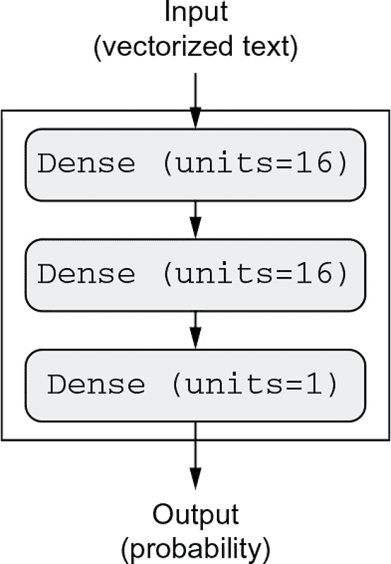
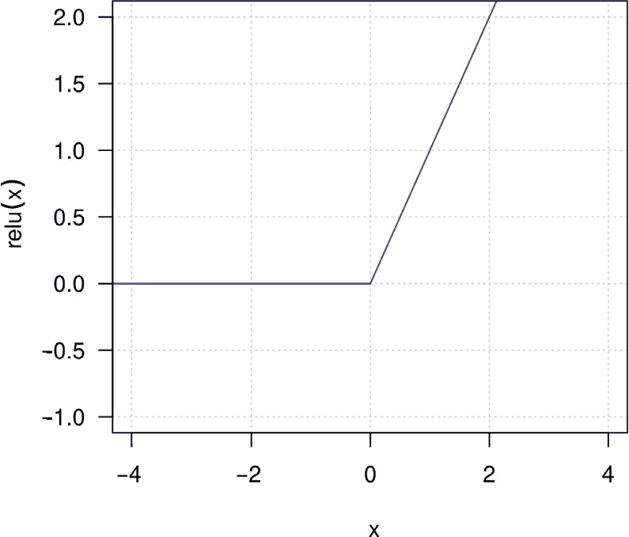
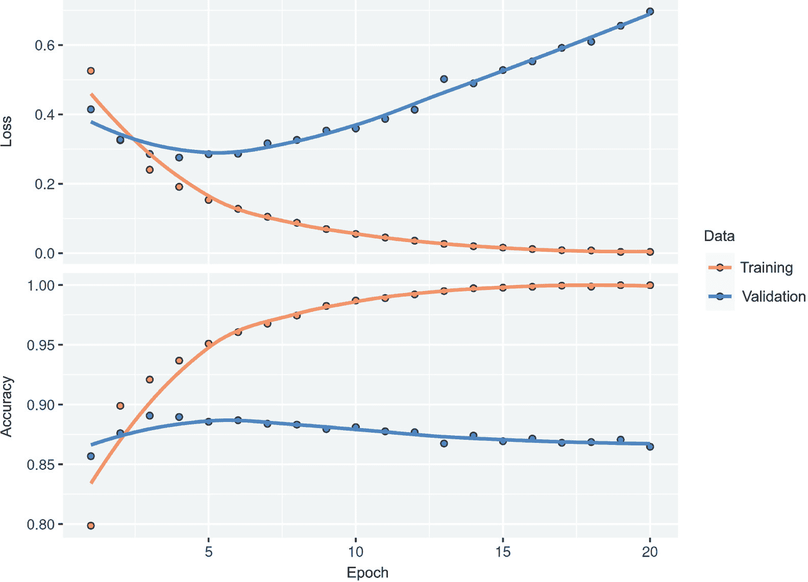
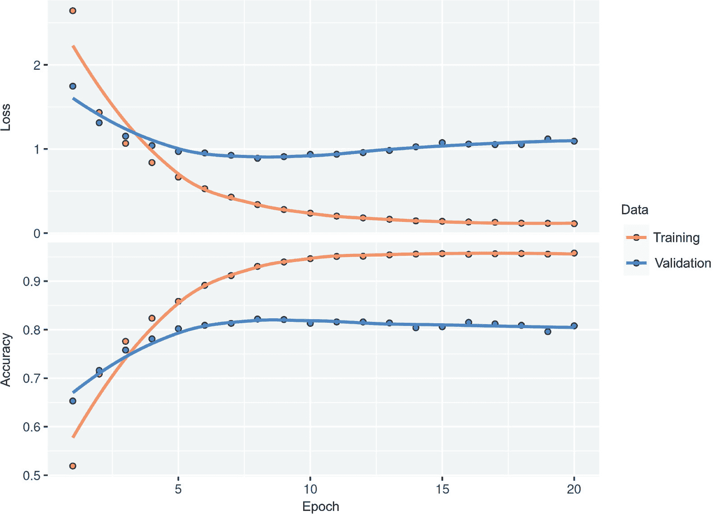
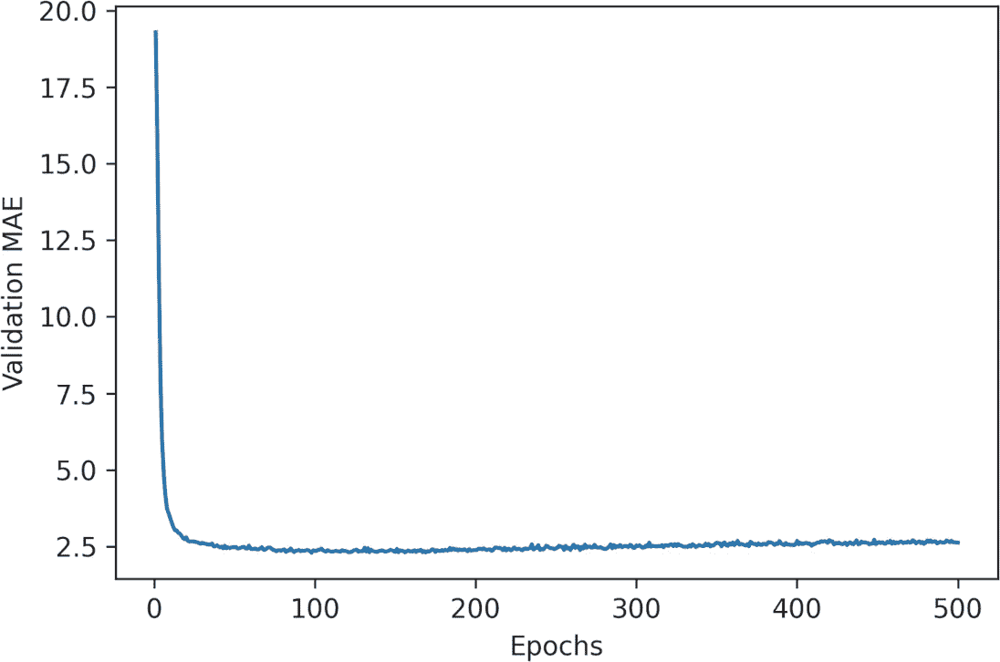
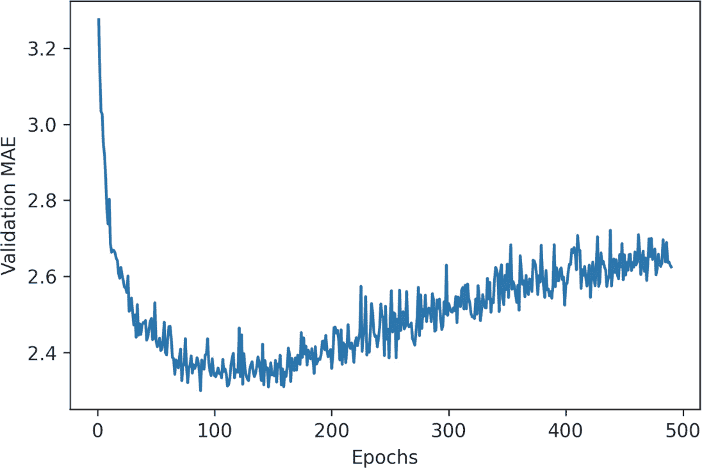

# 第四章：从神经网络开始：分类与回归

*本章涵盖*

+   你的第一个真实世界机器学习工作流程的例子

+   处理基于向量数据的分类问题

+   处理基于向量数据的连续回归问题

本章旨在帮助你开始使用神经网络解决实际问题。你将巩固从第二章和第三章中获得的知识，并将你所学的知识应用于以下三个新任务，涵盖神经网络最常见的三个用例：

+   将电影评论分类为积极或消极（二元分类

+   按主题对新闻线索进行分类（多类分类）

+   在给定房地产数据的情况下估算房屋价格（标量回归

这些例子将是你与端到端机器学习工作流程的第一次接触：你将了解数据预处理、基本模型架构原则和模型评估。

分类与回归词汇表

分类与回归涉及许多专业术语。你已经在早期的例子中遇到了一些，未来的章节中你还将看到更多。它们有以下精确的、特定于机器学习的定义，你应该熟悉它们：

+   *样本或输入*——进入模型的一个数据点。

+   *预测或输出*——从你的模型中输出的结果。

+   *目标*——真相。根据外部数据源，你的模型理想情况下应该预测的结果。

+   *预测错误或损失值*——衡量模型预测与目标之间距离的指标。

+   *类*——在分类问题中可以选择的一组可能的标签。例如，在分类猫和狗的图片时，“狗”和“猫”是两个类。

+   *标签*——在分类问题中，某一类注释的具体实例。例如，如果图片#1234 被标注包含“狗”这一类，则“狗”是图片#1234 的一个标签。

+   *真实值或注释*——数据集的所有目标，通常由人类收集。

+   *二元分类*——一种分类任务，每个输入样本需要被归类到两个互斥的类别中。

+   *多类分类*——一种分类任务，每个输入样本需要被归类到两个以上的类别中，例如，对手写数字的分类。

+   *多标签分类*——一种分类任务，每个输入样本可以被分配多个标签。例如，给定的图像可能同时包含一只猫和一只狗，应该用“猫”标签和“狗”标签进行标注。每张图片的标签数量通常是可变的。

+   *标量回归*——一个目标是连续标量值的任务。预测房价就是一个很好的例子：不同的目标价格构成了一个连续的空间。

+   *矢量回归*——目标是一组连续值的任务，例如，连续矢量。如果你对多个值进行回归（例如图像中边界框的坐标），那么你在进行矢量回归。

+   *小批量或批处理*——一组较小的样本（通常介于 8 到 128 之间）由模型同时处理。样本数量通常是 2 的幂，以便在 GPU 上分配内存。在训练过程中，小批量用于计算对模型权重应用单次梯度下降更新。

到本章结束时，你将能够使用神经网络处理矢量数据上的简单分类和回归任务。然后你将准备好在第五章开始构建更加系统、基于理论的机器学习理解。

## 4.1 电影评论分类：一个二元分类的例子

二分类问题，或者二元分类，是机器学习问题中最常见的一类。在这个例子中，你将学习如何根据评论的文本内容将电影评论分类为正面或负面。

### 4.1.1 IMDB 数据集

你将使用 *IMDB 数据集*：一组来自互联网电影数据库的 50,000 条高度极化的评论。它们被分为 25,000 条用于训练和 25,000 条用于测试，每组包含 50% 的负面评论和 50% 的正面评论。

和 MNIST 数据集一样，IMDB 数据集也随 Keras 一起打包。它已经经过预处理：评论（单词序列）已被转换为整数序列，其中每个整数代表词典中的特定单词。这让我们可以专注于模型构建、训练和评估。在第十一章中，你将学习如何从头开始处理原始文本输入。

下面的代码将加载数据集（当你第一次运行时，约 80 MB 的数据将被下载到你的机器上）。

代码 4.1：加载 IMDB 数据集

`library(keras)`

`imdb <- dataset_imdb(num_words = 10000)`

`c(c(train_data, train_labels), c(test_data, test_labels)) %<-% imdb`

使用多重赋值（`%<-%`）运算符

参数 `num_words = 10000` 表示你只会保留训练数据中最常出现的前 10,000 个单词。稀有单词将被丢弃。这使得

`imdb <- dataset_imdb(num_words = 10000)`

`train_data <- imdb$train$x`

`train_labels <- imdb$train$y`

`test_data <- imdb$test$x`

`test_labels <- imdb$test$y`

Keras 内置的数据集都是包含训练和测试数据的嵌套列表。这里，我们使用 zeallot 包的多重赋值运算符（`%<-%`）将列表解包为一组不同的变量。同样，这也可以写成如下形式：

多赋值版本更好，因为它更简洁。%<-% 操作符在 R Keras 包附加时会自动可用。我们可以处理可管理大小的向量数据。如果我们没有设置这个限制，我们将使用训练数据中的 88,585 个唯一单词，这是不必要的庞大数量。其中许多单词仅出现在单个样本中，因此不能用于分类。 

变量 train_data 和 test_data 是评论列表；每个评论是一个单词索引列表（编码为一系列单词）。train_labels 和 test_labels 是 0 和 1 的列表，其中 0 代表 *负面*，1 代表 *正面*：

`str(train_data)`

25000 的列表

`$ : int [1:218] 1 14 22 16 43 530 973 1622 1385 65 …`

`$ : int [1:189] 1 194 1153 194 8255 78 228 5 6 1463 …`

`$ : int [1:141] 1 14 47 8 30 31 7 4 249 108 …`

`$ : int [1:550] 1 4 2 2 33 2804 4 2040 432 111 …`

`$ : int [1:147] 1 249 1323 7 61 113 10 10 13 1637 …`

`$ : int [1:43] 1 778 128 74 12 630 163 15 4 1766 …`

`$ : int [1:123] 1 6740 365 1234 5 1156 354 11 14 5327 …`

`$ : int [1:562] 1 4 2 716 4 65 7 4 689 4367 …`

`[list output truncated]`

`str(train_labels)`

`int [1:25000] 1 0 0 1 0 0 1 0 1 0 …`

因为我们限制在最常见的前 10,000 个单词范围内，所以没有单词索引会超过 10,000：

`max(sapply(train_data, max))`

`[1] 9999`

为了好玩，下面是如何快速将其中一个评论解码回英文单词。

列表 4.2 将评论解码回文本

`word_index <- dataset_imdb_word_index()➊`

`reverse_word_index <- names(word_index)➋`

`names(reverse_word_index) <- as.character(word_index)➋`

`decoded_words <- train_data[[1]] %>%

`sapply(function(i) {`

如果 (i > 3) reverse_word_index[[as.character(i - 3)]]➌

`else "?"`

})`

`decoded_review <- paste0(decoded_words, collapse = " ")`

`cat(decoded_review, "\n")`

? 这部电影简直太棒了，演员阵容、拍摄地点、场景、故事情节、导演都非常适合他们所扮演的角色，你可以想象自己就在那里，罗伯特?是一位了不起的演员，而且现在也是导演……

➊ **word_index 是一个将单词映射到整数索引的命名向量。**

➋ **将其反转，将整数索引映射到单词**

➌ **解码评论。请注意，索引偏移了 3，因为 0、1 和 2 分别保留为 "填充"、"序列开始" 和 "未知" 的索引。**

### 4.1.2 准备数据

你不能直接将整数列表馈送到神经网络中。它们的长度各不相同，但神经网络期望处理连续的数据批次。你必须将列表转换为张量。你可以通过以下两种方式做到这一点：

+   对列表进行填充，使它们具有相同的长度，将它们转换为形状为 (samples, max_length) 的整数张量，并从能处理这种整数张量的层开始构建你的模型（嵌入层，我们将在本书后面详细介绍）。

+   *多热编码* 你的列表，将它们转换为 0 和 1 的向量。这意味着，例如，将序列 [8, 5] 转换为一个 10,000 维的向量，除了索引 8 和 5 外全部为 0，索引 8 和 5 为 1。然后你可以使用一个 layer_dense()，它能处理浮点向量数据，作为你模型中的第一层

让我们选择后一种解决方案来向量化数据，这样你就可以手动进行，以获得最大的清晰度。

**列表 4.3 通过多热编码对整数序列进行编码**

vectorize_sequences <- function(sequences, dimension = 10000)

{ results <- array(0, dim = c(length(sequences), dimension))➊

for (i in seq_along(sequences)) {

sequence <- sequences[[i]]

for (j in sequence)

results[i, j] <- 1➋

}

results

}

x_train <- vectorize_sequences(train_data)➌

x_test <- vectorize_sequences(test_data)➍

➊ **创建形状为 (length(sequences), dimension) 的全零矩阵。**

➋ **将结果的特定索引设置为 1。**

➌ **向量化训练数据。**

➍ **向量化测试数据。**

现在样本看起来是这样的：

str(x_train)

num [1:25000, 1:10000] 1 1 1 1 1 1 1 1 1 1 …

你还应该将标签向量化，这是将整数转换为浮点数的直接转换：

y_train <- as.numeric(train_labels)

y_test <- as.numeric(test_labels)

现在数据已经准备好输入神经网络了。

### 4.1.3 构建你的模型

输入数据是向量，标签是标量（1 和 0）：这是你可能会遇到的最简单的问题设置之一。在这种问题上表现良好的模型类型是一个简单的密集连接层堆叠（layer_dense()），使用 relu 激活。

你需要做两个关键的架构决策来设计这样一堆密集层：

+   使用多少层

+   每个层选择多少个单元

**图 4.1 三层模型**

在第五章，你将学习形式原理，指导你进行这些选择。目前，你将不得不相信我做出以下架构选择：

+   两个中间层，每个有 16 个单元

+   第三个层将输出关于当前评论情感的标量预测

图 4.1 展示了模型的样子。下面的列表展示了 Keras 实现，与之前你看到的 MNIST 示例类似。

**列表 4.4 模型定义**

model <- keras_model_sequential() %>%

layer_dense(16, activation = "relu") %>%

layer_dense(16, activation = "relu") %>%

layer_dense(1, activation = "sigmoid")

传递给每个 layer_dense() 的第一个参数是层中的 *单元* 数：层的表示空间的维度。从第二章和第三章记得，每个带有 relu 激活的 layer_dense() 实现以下张量操作链：

output <- relu(dot(input, W) + b)

有 16 个单元意味着权重矩阵 W 的形状为（输入维度，16）：与 W 的点积将将输入数据投影到 16 维表示空间（然后您将添加偏置向量 b 并应用 relu 操作）。您可以直观地将表示空间的维数理解为“在学习内部表示时为模型提供多少自由度”。具有更多单元（更高维的表示空间）允许您的模型学习更复杂的表示，但会使模型更加计算密集，并可能导致学习不需要的模式（这些模式会提高在训练数据上的性能，但不会提高在测试数据上的性能）。

中间层使用 relu 作为它们的激活函数，最终层使用 sigmoid 激活，以便输出一个概率（介于 0 和 1 之间的分数，指示样本有多大可能性具有目标“1”：评论有多可能是积极的）。relu（修正线性单元）是一个将负值归零的函数（见图 4.2），而 sigmoid“挤压”任意值到[0, 1]区间（见图 4.3），输出可解释为概率的东西。

**图 4.2 Relu 函数**

**图 4.3 Sigmoid 函数**

激活函数是什么，为什么它们是必需的？

如果没有像 relu 这样的激活函数（也称为*非线性*），layer_dense 将由两个线性操作组成：点积和加法：

输出 <- 点积（输入，W）+ b

该层只能学习输入数据的*线性转换*（仿射转换）：该层的*假设空间*将是将输入数据转换为 16 维空间的所有可能线性转换的集合。这样的假设空间过于受限，不会从多层表示中受益，因为深层线性层的堆叠仍然实现线性操作：添加更多层不会扩展假设空间（正如您在第二章中看到的）。

为了访问一个更丰富的假设空间，从而受益于深度表示，您需要一个非线性或激活函数。relu 是深度学习中最流行的激活函数，但还有许多其他候选激活函数，它们都具有类似奇怪的名称：prelu、elu 等等。

最后，您需要选择损失函数和优化器。因为您面临的是二元分类问题，您的模型的输出是概率（您的模型以带有 sigmoid 激活的单单元层结束），所以最好使用 binary_crossentropy 损失。这不是唯一可行的选择：例如，您可以使用 mean_squared_error。但是当您处理输出概率的模型时，交叉熵通常是最佳选择。*交叉熵*是信息论领域的一种量，它衡量概率分布之间的距离，或者在这种情况下，衡量真实分布与您的预测之间的距离。至于优化器的选择，我们将选择 rmsprop，这通常是几乎任何问题的良好默认选择。

这是配置模型的步骤，其中使用了 rmsprop 优化器和 binary_crossentropy 损失函数。请注意，在训练过程中我们也会监视准确性。

**清单 4.5 编译模型**

model %>% compile(optimizer = "rmsprop",

loss = "binary_crossentropy",

metrics = "accuracy")

### 4.1.4 验证你的方法

正如你在第三章学到的，深度学习模型永远不应该在其训练数据上进行评估——在训练过程中使用验证集来监视模型的准确性是标准做法。在这里，我们将通过从原始训练数据中分离出 10,000 个样本来创建一个验证集。

**清单 4.6 设置验证集**

x_val <- x_train[seq(10000), ]

partial_x_train <- x_train[-seq(10000), ]

y_val <- y_train[seq(10000)]

partial_y_train <- y_train[-seq(10000)]

现在我们将使用 20 个时期（20 次对训练数据中的所有样本进行迭代）以 512 个样本一组的小批量进行模型训练。同时，我们将监视我们分离出来的 10,000 个样本上的损失和准确性。我们通过将验证数据作为验证数据参数来实现这一点。

**清单 4.7 训练你的模型**

history <- model %>% fit(

partial_x_train，

partial_y_train，

epochs = 20，

batch_size = 512，

validation_data = list(x_val, y_val)

)

在 CPU 上，每个时期不到 2 秒——在 20 秒内完成训练。每个时期结束时会稍作停顿，因为模型会计算验证数据的 10,000 个样本上的损失和准确性。

请注意，对模型的 fit() 调用会返回一个历史对象，就像你在第三章中看到的那样。此对象具有一个名为 metrics 的成员，它是一个包含训练过程中发生的所有事情的数据的命名列表。让我们来看一下：

str(history$metrics)

4 个列表

$ loss : num [1:20] 0.526 0.326 0.241 0.191 0.154 …

$ accuracy : num [1:20] 0.799 0.899 0.921 0.937 0.951 …

$ val_loss : num [1:20] 0.415 0.327 0.286 0.276 0.285 …

$ val_accuracy: num [1:20] 0.857 0.876 0.891 0.89 0.886 …

指标列表包含四个条目：每个条目分别监视训练和验证期间的指标。 我们将使用历史对象的 plot()方法将训练和验证损失并排绘制出来，以及训练和验证准确性（参见图 4.4）。 请注意，由于模型的不同随机初始化，您自己的结果可能会略有不同。

plot(history)

**图 4.4 训练和验证损失以及准确性指标**

如您所见，训练损失随每个时期减少，而训练准确性随每个时期增加。 这是当运行梯度下降优化时您可以预期的情况 - 您试图最小化的数量应该在每次迭代中减少。 但是，验证损失和准确性并非如此：它们似乎在第四个时期达到顶峰。 这是我们早些时候警告过的一个例子：在训练数据上表现更好的模型不一定是在以前从未见过的数据上表现更好的模型。 在精确的术语中，您看到的是*过度拟合*：在第四个时期之后，您过度优化了训练数据，并且最终学习了特定于训练数据的表示，而这些表示不能推广到训练集之外的数据。

训练历史 plot()方法

如果可用（如果不可用，则使用基本图形），则用于绘制训练历史对象的 plot()方法使用 ggplot2 进行绘制。 绘图包括所有指定的指标以及损失; 如果有 10 个或更多时期，则绘制平滑线。 您可以通过 plot()方法的各种参数自定义所有这些行为。 如果要创建自定义可视化，请调用 history 上的 as.data.frame()方法以获得每个指标以及训练与验证的因子的数据框：

history_df <- as.data.frame(history)

str(history_df)

'data.frame': 80 obs. of 4 variables:

$ epoch : int 1 2 3 4 5 6 7 8 9 10 …

$ value : num 0.526 0.326 0.241 0.191 0.154 …

$ metric: 因子，带有 2 个级别"损失"，"准确性"：1 1 1 1 1 1 1 1 1 1 …

$ data : 因子，带有 2 个级别"training"，"validation"：1 1 1 1 1 1 1 …

在这种情况下，为了防止过度拟合，您可以在四个时期后停止训练。 一般来说，您可以使用一系列技术来减轻过度拟合，我们将在第五章中介绍。 让我们从头开始为四个时期训练一个新模型，然后在测试数据上评估它。

列表 4.8 从头开始重新训练模型

model <- keras_model_sequential() %>%

layer_dense(16, activation = "relu") %>%

layer_dense(16, activation = "relu") %>%

layer_dense(1, activation = "sigmoid")

model %>% compile(optimizer = "rmsprop",

损失= "二进制交叉熵",

指标= "准确性")

model %>% fit(x_train, y_train, epochs = 4, batch_size = 512)

结果<- model %>% evaluate(x_test, y_test)

最终结果如下：

结果

损失  准确性

0.2999835 0.8819600➊

➊ **第一个数字 0.29 是测试损失，第二个数字 0.88 是测试准确性。**

这种相当幼稚的方法可以达到 88%的准确度。采用先进的方法，你应该能够接近 95%。

### 4.1.5 使用训练好的模型在新数据上生成预测

训练完一个模型后，你会希望在实际环境中使用它。你可以使用 predict()方法生成评论是积极的概率，就像你在第三章中所学到的那样：

model %>% predict(x_test)

[,1]

[1,] 0.20960191

[2,] 0.99959260

[3,] 0.93098557

[4,] 0.83782458

[5,] 0.94010764

[6,] 0.79225385

[7,] 0.99964178

[8,] 0.01294626

...

如你所见，模型对某些样本非常自信（0.99 或更高，或 0.01 或更低），但对其他样本不太自信（0.6，0.4）。

### 4.1.6 更多实验

以下实验将有助于确信你所做的架构选择都相当合理，尽管仍有改进的空间：

+   在最终分类层之前，你使用了两个表示层。尝试使用一个或三个表示层，看看这样做对验证和测试准确性的影响。

+   尝试使用更多单元或更少单元的层：32 个单元，64 个单元，等等。

+   尝试使用均方误差损失函数而不是二元交叉熵。

+   尝试使用 tanh 激活函数（在神经网络的早期比较流行）而不是 relu。

### 4.1.7 总结

以下是你从这个例子中应该得到的结论：

+   通常，你需要对原始数据进行相当多的预处理才能将其作为张量输入到神经网络中。单词序列可以编码为二进制向量，但也有其他编码选项。

+   使用具有 relu 激活的 layer_dense()堆叠层可以解决各种问题（包括情感分类），你很可能经常使用它们。

+   在二分类问题（两个输出类别）中，你的模型应该以一个具有一个单元和 sigmoid 激活函数的 layer_dense()层结束：模型的输出应该是一个介于 0 和 1 之间的标量，代表概率。

+   在二分类问题上，由于输出为标量 sigmoid 值，你应该使用二元交叉熵损失函数。

+   rmsprop 优化器通常是一个足够好的选择，无论你的问题是什么。这样你就少了一件要担心的事情。

+   随着神经网络在训练数据上表现越来越好，它们最终会开始过拟合，并且在从未见过的数据上获得越来越差的结果。一定要始终监控在训练集之外的数据上的性能。

## 4.2. 对新闻线进行分类：一个多类别分类示例。

在前一节中，你看到了如何使用全连接神经网络将向量输入分类为两个互斥的类别。但是当你有超过两个类别时会发生什么呢？

-   在这一部分中，我们将构建一个模型来将路透社新闻稿分类到 46 个互斥的主题中。因为我们有很多类别，这个问题是*多类别分类*的一个实例，并且因为每个数据点应该被分类到只有一个类别，所以这个问题更具体地说是*单标签多类别分类*的一个实例。如果每个数据点可以属于多个类别（在本例中，主题），我们将面临一个*多标签多类别分类*问题。

### -   4.2.1 路透社数据集

-   你将使用*路透社数据集*，这是由路透社于 1986 年发布的一组短新闻和它们的主题。它是一个简单、广泛使用的文本分类玩具数据集。数据集包含 46 个不同的主题；一些主题比其他主题更具代表性，但每个主题在训练集中至少有 10 个示例。和 IMDB 以及 MNIST 一样，路透社数据集作为 Keras 的一部分打包提供。让我们来看看。

-   列表 4.9 加载路透社数据集

-   reuters <- dataset_reuters(num_words = 10000)

-   c(c(train_data, train_labels), c(test_data, test_labels)) %<-% reuters

-   与 IMDB 数据集一样，参数 num_words = 10000 将数据限制在数据中出现频率最高的 10000 个单词中。你有 8982 个训练示例和 2246 个测试示例：

-   length(train_data)

-   [1] 8982

-   length(test_data)

-   [1] 2246

-   与 IMDB 评论一样，每个示例都是一个整数列表（单词索引）：

-   str(train_data)

-   列表 8982 的列表

-   $ : int [1:87] 1 2 2 8 43 10 447 5 25 207 …

-   $ : int [1:56] 1 3267 699 3434 2295 56 2 7511 9 56 …

-   $ : int [1:139] 1 53 12 284 15 14 272 26 53 959 …

-   $ : int [1:224] 1 4 686 867 558 4 37 38 309 2276 …

-   $ : int [1:101] 1 8295 111 8 25 166 40 638 10 436 …

-   $ : int [1:116] 1 4 37 38 309 213 349 1632 48 193 …

-   $ : int [1:100] 1 56 5539 925 149 8 16 23 931 3875 …

-   $ : int [1:100] 1 53 648 26 14 749 26 39 6207 5466 …

-   [list output truncated]

-   在你好奇的情况下，这里是如何将它解码回单词的方法。

-   列表 4.10 将新闻线路解码回文本

-   word_index <- dataset_reuters_word_index()

-   reverse_word_index <- names(word_index)

-   names(reverse_word_index) <- as.character(word_index)

-   decoded_words <- train_data[[1]] %>%

-   sapply(function(i) {

-   if (i > 3) reverse_word_index[[as.character(i - 3)]]➊

-   else "?"

-   })

-   decoded_review <- paste0(decoded_words, collapse = " ")

-   decoded_review

-   [1] "? ? ? said as a result of its december acquisition of space co it

-    expects …"

-   ➊ **请注意，索引偏移了 3，因为 0、1 和 2 是为“填充”、“序列开始”和“未知”保留的索引。**

-   与示例相关联的标签是介于 0 和 45 之间的整数—一个主题索引：

-   str(train_labels)

-   int [1:8982] 3 4 3 4 4 4 4 3 3 16 …

### -   4.2.2 准备数据

-   你可以用和前面例子中一样的方法对数据进行向量化。

-   列表 4.11 对输入数据进行编码

-   vectorize_sequences <- function(sequences, dimension = 10000) {

-   results <- matrix(0, nrow = length(sequences), ncol = dimension)

for (i in seq_along(sequences))

results[i, sequences[[i]]] <- 1

results

}

x_train <- vectorize_sequences(train_data)➊

x_test <- vectorize_sequences(test_data)➋

➊ **向量化的训练数据**

➋ **向量化的测试数据**

要对标签进行向量化，你有两种选择：你可以将标签列表转换为整数张量，或者你可以使用 *独热编码*。独热编码是一种广泛使用的类别数据格式，也被称为 *类别编码*。在这种情况下，标签的独热编码包括将每个标签嵌入为一个全零向量，在标签索引的位置上有一个 1。下面的列表显示了一个示例。

列表 4.12 编码标签

to_one_hot <- function(labels, dimension = 46) {

results <- matrix(0, nrow = length(labels), ncol = dimension)

labels <- labels + 1➊

for(i in seq_along(labels)) {

j <- labels[[i]]

results[i, j] <- 1

}

results

}

y_train <- to_one_hot(train_labels)➋

y_test <- to_one_hot(test_labels)➌

➊ **向量化的训练标签**

➋ **向量化的测试标签**

➌ **标签是从 0 开始的**

请注意，在 Keras 中有一种内置的方法可以做到这一点：

y_train <- to_categorical(train_labels)

y_test <- to_categorical(test_labels)

### 4.2.3 构建你的模型

这个主题分类问题看起来与之前的电影评论分类问题相似：在这两种情况下，我们都在尝试对短文本片段进行分类。但是这里有一个新的约束：输出类别的数量从 2 增加到 46。输出空间的维度要大得多。

在像我们一直使用的 layer_dense() 堆栈中，每一层只能访问前一层输出中的信息。如果一层丢失了与分类问题相关的信息，这些信息将无法被后续层恢复：每一层都可能成为信息瓶颈。在前一个例子中，我们使用了 16 维的中间层，但 16 维空间可能太小，无法学习将 46 个不同类别分开：如此小的层可能会成为信息瓶颈，永久丢弃相关信息。出于这个原因，我们将使用较大的层。让我们使用 64 个单元。

列表 4.13 模型定义

model <- keras_model_sequential() %>%

layer_dense(64, activation = "relu") %>%

layer_dense(64, activation = "relu") %>%

layer_dense(46, activation = "softmax")

你应该注意这个架构的另外两件事。首先，我们以大小为 46 的 layer_dense() 结束模型。这意味着对于每个输入样本，网络会输出一个 46 维向量。该向量中的每个条目（每个维度）将编码不同的输出类别。

其次，最后一层使用了 softmax 激活函数。你在 MNIST 示例中看到过这种模式。它意味着模型将对 46 个不同的输出类别输出一个*概率分布*，对于每个输入样本，模型将产生一个 46 维的输出向量，其中 output[i]是样本属于类别 i 的概率。这 46 个分数将总和为 1。

在这种情况下，最好使用 categorical_crossentropy 作为损失函数。它衡量了模型输出的概率分布与标签的真实概率分布之间的距离。通过最小化这两个分布之间的距离，训练模型输出尽可能接近真实标签。

列表 4.14 编译模型

model %>% compile(optimizer = "rmsprop",

损失 = "categorical_crossentropy",

metrics = "accuracy")

### 4.2.4 验证你的方法

让我们在训练数据中留出 1000 个样本作为验证集。

列表 4.15 设置验证集

val_indices <- 1:1000

x_val <- x_train[val_indices, ]

部分 _x_train <- x_train[-val_indices, ]

y_val <- y_train[val_indices, ]

部分 _y_train <- y_train[-val_indices, ]

现在让我们训练 20 个 epochs 的模型。

列表 4.16 训练模型

历史 <- model %>% fit(

部分 _x_train,

部分 _y_train,

epochs = 20,

batch_size = 512,

validation_data = list(x_val, y_val)

)

最后，让我们显示它的损失和准确率曲线（请参见图 4.5）。

列表 4.17 绘制训练和验证损失和准确率

plot(history)

**图 4.5 验证集的损失和准确率曲线**

在九个 epochs 之后，模型开始过拟合。让我们从头开始训练一个新模型进行九个 epochs，然后在测试集上评估它。

列表 4.18 从零开始重新训练模型

model <- keras_model_sequential() %>%

layer_dense(64, activation = "relu") %>%

layer_dense(64, activation = "relu") %>%

layer_dense(46, activation = "softmax")

model %>% compile(optimizer = "rmsprop",

损失 = "categorical_crossentropy",

metrics = "accuracy")

model %>% fit(x_train, y_train, epochs = 9, batch_size = 512)

结果 <- model %>% evaluate(x_test, y_test)

这是最终的结果：

结果

损失  准确率

0.9562974 0.7898486

这种方法达到了约 80%的准确率。对于一个平衡的二分类问题，纯随机分类器达到的准确率将为 50%。但是在这种情况下，我们有 46 个类别，并且它们可能不是平均表示的。一个随机基准的准确率是多少？我们可以快速通过经验来检查一下：

mean(test_labels == sample(test_labels))

[1] 0.190561

如你所见，随机分类器的分类准确率约为 19%，所以我们的模型在这个方面看起来相当不错。

### 4.2.5 在新数据上生成预测

在新样本上调用模型的 predict() 方法会返回每个样本的所有 46 个主题的类别概率分布。让我们为所有的测试数据生成主题预测：

预测 <- model %>% 预测(x_test)

“预测”中的每个条目（行）都是长度为 46 的向量：

str(predictions)

num [1:2246, 1:46] 0.0000873 0.0013171 0.0094679 0.0001123 0.0001032 …

这个向量中的系数之和为 1，因为它们形成了概率分布：

sum(predictions[1, ])

[1] 1

最大的条目是预测类别——具有最高概率的类别：

which.max(predictions[1, ])

[1] 5

### 4.2.6 处理标签和损失的另一种方式

我们之前提到，编码标签的另一种方式是保留它们的整数值，就像这样：

y_train <- 训练标签

y_test <- 测试标签

这种方法唯一会改变的是损失函数的选择。列表 4.18 中使用的损失函数 categorical_crossentropy，期望标签遵循分类编码。对于整数标签，你应该使用 sparse_categorical_ crossentropy：

model %>% 编译(

optimizer = "rmsprop",

loss = "sparse_categorical_crossentropy",

指标 = "accuracy")

这个新的损失函数在数学上与 categorical_crossentropy 相同；它只是具有不同的接口。

### 4.2.7 拥有足够大的中间层的重要性

我们之前提到，因为最终输出是 46 维的，所以应该避免中间层的单位少于 46 个。现在让我们看看当我们通过引入一个信息瓶颈，使中间层明显少于 46 维时会发生什么：例如，4 维。

列表 4.19 具有信息瓶颈的模型

model <- keras_model_sequential() %>%

layer_dense(64, 激活 = "relu") %>%

layer_dense(4, 激活 = "relu") %>%

layer_dense(46, 激活 = "softmax")

model %>% 编译(optimizer = "rmsprop",

loss = "categorical_crossentropy",

指标 = "accuracy")

model %>% fit(

partial_x_train,

partial_y_train,

epochs = 20,

batch_size = 128,

验证数据 = list(x_val, y_val)

)

现在模型的验证准确率达到了约 71%，绝对下降了 8%。这个下降主要是因为我们试图将大量信息（足以恢复 46 个类别的分离超平面的信息）压缩到一个维度太低的中间空间中。模型能够将*大部分*必要的信息压缩到这些 4 维表示中，但不是全部。

### 4.2.8 进一步的实验

就像前面的例子一样，我鼓励你尝试以下实验来培养你对这种模型配置决策的直觉：

+   尝试使用更大或更小的层：32 个单元、128 个单元等等。

+   在最终的 softmax 分类层之前，你使用了两个中间层。现在尝试使用一个单独的中间层，或者三个中间层。

### 4.2.9 总结

这个例子告诉我们以下几点：如果你试图将数据点分类到*N*个类别中，你的模型应该以大小为*N*的 layer_dense()结尾。

在单标签、多类别分类问题中，你的模型应该以 softmax 激活结束，以便输出*N*个输出类别的概率分布。

categorical_crossentropy 几乎总是你应该在这些问题中使用的损失函数。它最小化了模型输出的概率分布与目标的真实分布之间的距离。

在多类别分类中，你可以通过以下两种方式处理标签：

+   通过分类编码（也称为独热编码）对标签进行编码，并使用 categorical_crossentropy 作为损失函数。

+   将标签编码为整数，并使用 sparse_categorical_crossentropy 损失函数

如果你需要将数据分类到大量的类别中，你应该避免因中间层太小而在模型中创建信息瓶颈。

## 4.3 预测房价：一个回归示例

之前的两个例子都被视为分类问题，其目标是预测输入数据点的单个离散标签。另一种常见的机器学习问题是*回归*，它包括预测连续值而不是离散标签，例如，根据气象数据预测明天的温度，或者根据软件项目的规格预测完成所需的时间。

不要混淆*回归*和*逻辑回归*算法。令人困惑的是，逻辑回归并不是一个回归算法，而是一个分类算法。

### 4.3.1 波士顿房价数据集

在这一部分中，我们将尝试预测 20 世纪 70 年代中期波士顿某郊区房屋的中位价格，给定当时有关郊区的数据点，例如犯罪率、当地房产税率等。我们将使用的数据集与前两个例子有一个有趣的区别。它的数据点相对较少：只有 506 个，分为 404 个训练样本和 102 个测试样本。而且输入数据中的每个*特征*（例如，犯罪率）都有不同的比例。例如，一些值是比例，取值介于 0 和 1 之间，其他取值介于 1 和 12 之间，还有其他取值介于 0 和 100 之间，依此类推。

列表 4.20 加载波士顿房屋数据集

boston <- dataset_boston_housing()

c(c(train_data, train_targets), c(test_data, test_targets)) %<-% boston

让我们来看看数据：

str(train_data)

num [1:404, 1:13] 1.2325 0.0218 4.8982 0.0396 3.6931 …

str(test_data)

num [1:102, 1:13] 18.0846 0.1233 0.055 1.2735 0.0715 …

正如你所看到的，我们有 404 个训练样本和 102 个测试样本，每个样本都有 13 个数值特征，例如人均犯罪率、每个住宅的平均房间数、高速公路的可达性等。目标是自住房屋的中位数价值，以千美元计算：

str(train_targets)

num [1:404(1d)] 15.2 42.3 50 21.1 17.7 18.5 11.3 15.6 15.6 14.4 …

价格通常在 1 万到 5 万美元之间。如果听起来很便宜，记住这是上世纪 70 年代中期，这些价格并未经过通货膨胀调整。

### 4.3.2 准备数据

把各种取值范围差异巨大的值喂给神经网络是有问题的。模型可能能够自动适应这样的异构数据，但这肯定会使学习变得更加困难。处理这种数据的广泛最佳实践是进行特征归一化：对于输入数据中的每个特征（输入数据矩阵中的一列），我们减去该特征的平均值，并除以标准差，使得该特征以 0 为中心，具有单位标准差。在 R 中使用 scale()函数可以轻松实现这一点。

列表 4.21 归一化数据

mean <- apply(train_data, 2, mean)

sd <- apply(train_data, 2, sd)

train_data <- scale(train_data, center = mean, scale = sd)

test_data <- scale(test_data, center = mean, scale = sd)

注意，用于归一化测试数据的量是使用训练数据计算的。你绝对不应该在工作流程中使用在测试数据上计算的任何量，即使是像数据归一化这样简单的事情也不行。

### 4.3.3 构建你的模型

由于可用的样本非常少，我们将使用一个非常小的模型，其中包含两个中间层，每个层都有 64 个单元。一般来说，你拥有的训练数据越少，过拟合就会越严重，使用一个小模型是缓解过拟合的一种方式。

列表 4.22 模型定义

build_model <- function() {➊

model <- keras_model_sequential() %>%

layer_dense(64, activation = "relu") %>%

layer_dense(64, activation = "relu") %>%

layer_dense(1)

model %>% compile(optimizer = "rmsprop",

loss = "mse",

metrics = "mae")

model

}

➊ **因为我们需要多次实例化相同的模型，所以我们使用一个函数来构造它。**

模型以一个单元和无激活函数（它将是一个线性层）结束。这是标量回归的典型设置（一种回归，你试图预测一个单一的连续值）。应用激活函数会限制输出的范围：例如，如果你在最后一层应用了 sigmoid 激活函数，模型只能学习预测 0 到 1 之间的值。在这里，因为最后一层是纯线性的，模型可以自由地学习预测任何范围内的值。

注意，我们使用 mse 损失函数进行模型编译——*均方误差*（MSE），即预测值与目标值之间的差的平方。这是解决回归问题时广泛使用的损失函数。

我们还在训练过程中监控一个新的指标：*平均绝对误差*（MAE）。它是预测值与目标值之间差值的绝对值。例如，在这个问题上的 MAE 为 0.5，意味着您的预测平均偏差为 500 美元。

### 4.3.4 使用 K 倍验证验证您的方法

为了在我们不断调整模型参数的同时评估我们的模型（例如用于训练的轮次数），我们可以将数据分割为训练集和验证集，就像我们在之前的例子中所做的那样。但是由于我们的数据点很少，验证集最终会变得非常小（例如，大约 100 个示例）。因此，验证分数可能会因我们选择哪些数据点用于验证和哪些用于训练而大不相同：验证分数可能在验证分割方面具有很高的*方差*。这会阻止我们可靠地评估我们的模型。

在这种情况下的最佳实践是使用*K*倍交叉验证（参见图 4.6）。

**图 4.6 *K*倍交叉验证，K = 3**

它包括将可用数据分成*K*个分区（通常*K* = 4 或 5），实例化*K*个相同的模型，并在训练每个模型时评估剩余分区。然后使用的模型的验证分数是所获得的*K*个验证分数的平均值。从代码的角度来看，这很简单。

列表 4.23 *K*倍验证

k <- 4

fold_id <- sample(rep(1:k, length.out = nrow(train_data)))

num_epochs <- 100

all_scores <- numeric()

for (i in 1:k) {

cat("处理第", i, "折\n")

val_indices <- which(fold_id == i)➊

val_data <- train_data[val_indices, ]➊

val_targets <- train_targets[val_indices]➊

partial_train_data <- train_data[-val_indices, ]➋

partial_train_targets <- train_targets[-val_indices]➋

model <- build_model()➌

model %>% fit (➍

partial_train_data,

partial_train_targets,

epochs = num_epochs,

batch_size = 16,

verbose = 0

)

results <- model %>%

evaluate(val_data, val_targets, verbose = 0)➎

all_scores[[i]] <- results[['mae']]

}

处理第 1 折

处理第 2 折

处理第 3 折

处理第 4 折

➊ **准备验证数据：来自第 k 个分区的数据。**

➋ **准备训练数据：来自所有其他分区的数据。**

➌ **构建 Keras 模型（已编译）。**

➍ **训练模型（静默模式，verbose = 0）。**

➎ **在验证数据上评估模型。**

运行这个，设定 `num_epochs = 100`，得到以下结果：

all_scores

[1] 2.435980 2.165334 2.252230 2.362636

mean(all_scores)

[1] 2.304045

不同的运行确实显示了相当不同的验证分数，从 2.1 到 2.4 不等。平均值（2.3）比任何单个分数更可靠——这正是*K*倍交叉验证的全部意义所在。在这种情况下，我们的平均偏差为 2,300 美元，考虑到价格范围从 10,000 美元到 50,000 美元，这是相当显著的。

让我们尝试更长时间地训练模型：500 个时代。为了记录模型在每个时代的表现如何，我们将修改训练循环以保存每个折叠的每时代验证分数日志。

清单 4.24 在每个折叠保存验证日志

num_epochs <- 500

all_mae_histories <- list()

对于 (i 在 1:k) {

cat("处理折叠 #", i, "\n")

val_indices <- which(fold_id == i)➊

val_data <- train_data[val_indices, ]➊

val_targets <- train_targets[val_indices]➊

partial_train_data <- train_data[-val_indices, ]➋

partial_train_targets <- train_targets[-val_indices]➋

model <- build_model()➌

history <- model %>% fit(➍

partial_train_data, partial_train_targets，

validation_data = list(val_data, val_targets),

epochs = num_epochs, batch_size = 16, verbose = 0

）

mae_history <- history$metrics$val_mae

all_mae_histories[[i]] <- mae_history

}

处理折叠 # 1

处理折叠 # 2

处理折叠 # 3

处理折叠 # 4

all_mae_histories <- do.call(cbind, all_mae_histories)

➊ **准备验证数据：来自第 #k 分区的数据。**

➋ **准备训练数据：来自所有其他分区的数据。**

➌ **构建 Keras 模型（已编译）。**

➍ **以静默模式训练模型（verbose = 0）。**

然后，我们可以计算所有折叠的每时代 MAE 分数的平均值。

**清单 4.25 构建连续均值 *K*-折验证分数的历史**

average_mae_history <- rowMeans(all_mae_histories)

让我们来绘制一下；请参阅 图 4.7。

清单 4.26 绘制验证分数

plot(average_mae_history, xlab = "时代", type = 'l')

**图 4.7 通过时代的验证 MAE**

由于缩放问题，读取图可能有点困难：最初几个时代的验证 MAE 显著高于后面的值。让我们省略前 10 个数据点，这些数据点与曲线的其余部分在不同的比例上。

清单 4.27 绘制验证分数，排除前 10 个数据点

truncated_mae_history <- average_mae_history[-(1:10)]

plot(average_mae_history, xlab = "时代", type = 'l',

ylim = range(truncated_mae_history))

正如您在图 4.8 中所看到的，验证 MAE 在 100-140 个时代后停止显著改善（这个数字包括我们省略的 10 个时代）。在那之后，我们开始过拟合。

**图 4.8 通过时代排除前 10 个数据点的验证 MAE**

一旦您完成了模型的其他参数调整（除了时代数量，您还可以调整中间层的大小），您可以使用最佳参数在所有训练数据上训练最终的生产模型，然后查看其在测试数据上的性能。

清单 4.28 训练最终模型

model <- build_model()➊

model %>% fit(train_data, train_targets,➋

epochs = 120, batch_size = 16, verbose = 0)

result <- model %>% evaluate(test_data, test_targets)

➊ **获得一个新的、已编译的模型。**

➋ **在所有数据上训练它。**

这是最终结果：

result["mae"]

mae

2.476283

我们还有少了一点的$2,500。这是一个进步！就像前两个任务一样，你可以尝试改变模型中的层数或每层的单位数，看看是否能够减少测试错误。

### 4.3.5 生成新数据的预测

当在我们的二元分类模型上调用 predict() 时，我们得到了每个输入样本的 0 到 1 之间的标量分数。对于我们的多类分类模型，我们得到了每个样本上所有类别的概率分布。现在，对于这个标量回归模型，predict() 返回模型对样本价格的猜测，单位是千美元：

predictions <- model %>% predict(test_data)

predictions[1, ]

[1] 10.27619

测试集中的第一套房子预计价格约为 10,000 美元。

### 4.3.6 总结

从这个标量回归示例中你应该了解到：

+   回归是使用不同的损失函数进行的，而我们用于分类的损失函数不同。均方误差（MSE）是常用于回归的损失函数。

+   同样，用于回归的评估指标与用于分类的指标不同；自然地，准确度的概念不适用于回归。常见的回归指标是平均绝对误差（MAE）。

+   当输入数据中的特征具有不同范围的值时，你应该独立地对每个特征进行缩放作为预处理步骤。

+   当数据很少时，使用*K*折验证是可靠评估模型的好方法。

+   当数据很少时，最好使用只有一两个中间层（通常只有一两个）的小型模型，以避免严重过拟合。

## 摘要

+   向量数据上的三种最常见的机器学习任务是二元分类、多类分类和标量回归。

    +   章节中的“总结”部分总结了你对每个任务学到的重要知识点。

    +   回归使用不同的损失函数和不同的评估指标，而不是分类

+   在将原始数据输入神经网络之前，通常需要对其进行预处理。

+   当你的数据具有不同范围的特征时，作为预处理的一部分，应该独立地对每个特征进行缩放。

+   随着训练的进行，神经网络最终开始过拟合，并在以前未见过的数据上获得更差的结果。

+   如果你没有太多的训练数据，使用只有一两个中间层的小型模型，以避免严重过拟合。

+   如果你的数据被分成许多类别，如果使中间层太小，可能会造成信息瓶颈。

+   当你处理少量数据时，*K*折验证可以帮助可靠地评估你的模型。
