# 第五章：*机器学习基础*

*本章内容*

+   了解泛化和优化之间的紧张关系，这是机器学习中的基本问题

+   机器学习模型的评估方法

+   改善模型拟合的最佳实践

+   为实现更好的泛化而采用的最佳实践

在第四章的三个实际示例之后，你应该开始感到熟悉如何使用神经网络解决分类和回归问题，并且你已经目睹了机器学习的核心问题：过拟合。本章将会将一些关于机器学习的新直觉正式化为一个坚实的概念框架，强调准确的模型评估和训练与泛化之间的平衡的重要性。

## 5.1 泛化：机器学习的目标

在第四章中介绍的三个示例——预测电影评论、主题分类和房价回归——我们将数据分为训练集、验证集和测试集。很快就能明显看到不要在训练模型的相同数据上评估模型的原因：在几个周期后，从未见过的数据上的性能开始与训练数据上的性能分歧，而训练数据的性能随着训练的进行而改善。模型开始*过拟合*。在每个机器学习问题中都会发生过拟合。

机器学习中的基本问题是优化和泛化之间的紧张关系。*优化* 是指调整模型以在训练数据上获得最佳性能的过程（*机器学习* 中的*学习*），而*泛化* 是指训练模型在以前从未见过的数据上的表现如何。游戏的目标当然是获得良好的泛化，但你无法控制泛化；你只能使模型适应其训练数据。如果你做得*太好*，过拟合就会发生，泛化就会受到影响。

但是导致过拟合的原因是什么？我们如何获得良好的泛化？

### 5.1.1 欠拟合和过拟合

对于你在上一章中看到的模型，随着训练的进行，验证数据的性能开始提高，然后不可避免地在一段时间后达到峰值。这种模式（在图 5.1 中说明）是普遍存在的。你会在任何模型类型和任何数据集中都看到它。

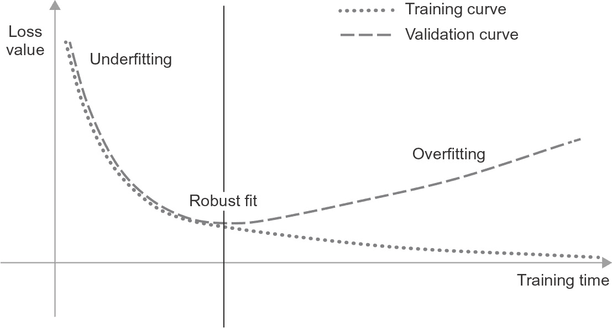

**图 5.1 典型的过拟合行为**

在训练开始阶段，优化和泛化是相关的：在训练数据上损失越低，测试数据上的损失也越低。当这种情况发生时，你的模型被称为是*欠拟合*的：仍然有进步空间；网络尚未对训练数据中的所有相关模式建模。但是在对训练数据进行了一定数量的迭代后，泛化停止改善，验证指标停滞不前，然后开始恶化：模型开始过拟合。也就是说，它开始学习对训练数据特定的模式，但这些模式在新数据方面是误导性的或无关紧要的。

当你的数据嘈杂、涉及不确定性或包含罕见特征时，过拟合特别容易发生。让我们看一些具体的例子。

### **嘈杂的训练数据**

在现实世界的数据集中，一些输入无效是相当常见的。例如，MNIST 数字可能是一张全黑的图片，或者类似于图 5.2 的东西。

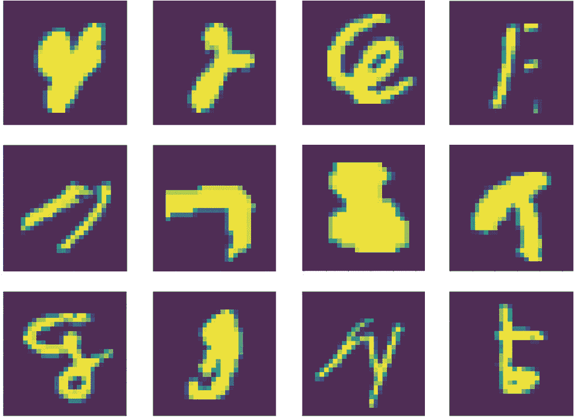

**图 5.2 一些相当奇怪的 MNIST 训练样本**

这些是什么？我也不知道。但它们都是 MNIST 训练集的一部分。更糟糕的是，存在完全有效的输入最终被错误标记，就像图 5.3 中的那些一样。

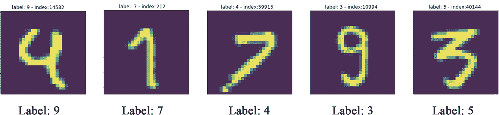

**图 5.3 错误标记的 MNIST 训练样本**

如果模型极力将这些离群值纳入考虑范围，其泛化性能将下降，如图 5.4 所示。例如，一个看起来与图 5.3 中错误标记的 4 非常接近的 4 可能最终被分类为 9。

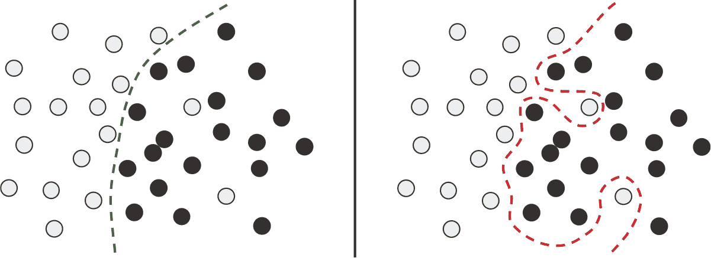

**图 5.4 处理离群值：稳健拟合 vs. 过拟合**

### **模糊特征**

并非所有的数据噪声都来自于不准确性——即使是完全干净且标记整齐的数据，在涉及不确定性和模棱两可的问题时也可能是嘈杂的。在分类任务中，通常情况下，输入特征空间的某些区域同时与多个类相关联。比如说，你正在开发一个模型，它接收香蕉的图像并预测香蕉是未成熟、成熟还是腐烂的。这些类别没有客观的界限，所以同一张图片可能会被不同的人类标记者分类为未成熟或成熟。同样地，许多问题涉及随机性。你可以利用大气压力数据来预测明天是否会下雨，但完全相同的测量结果有时可能会导致雨天，有时可能导致晴天，具有一定的概率。

一个模型可能会对这种概率性数据过拟合，过于自信于特征空间的模糊区域，就像图 5.5 中一样。一个更健壮的拟合会忽略个别数据点，而着眼于更大的视角。

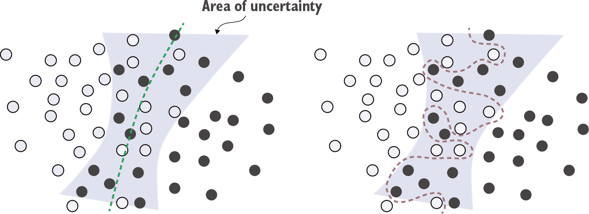

**图 5.5 在特征空间的模糊区域中的稳健拟合 vs. 过拟合**

### **罕见特征和伪相关性**

如果你只见过两只橘色虎斑猫，并且它们都很反社会，你可能会推断橘色虎斑猫大致上都倾向于反社会。这就是过拟合：如果你接触到了更多种类的猫，包括更多橘色的猫，你会发现猫的颜色与性格并没有很强的关联。

同样地，训练在包含罕见特征值的数据集上的机器学习模型非常容易过拟合。在情感分类任务中，如果词 *cherimoya*（一种生长在安第斯山脉的水果）只出现在训练数据中的一篇文本中，并且这篇文本恰好是消极情绪，一个没有良好正则化的模型可能会对这个词放很高的权重，并且总是将提到 cherimoya 的新文本分类为消极，然而，客观上讲，cherimoya 并没有任何消极的含义。 [¹]

重要的是，一个特征值不必只出现几次就会导致错误的相关性。考虑一个在训练数据中出现在 100 个样本中的词，54%的情况下与积极情绪相关，46%的情况下与消极情绪相关。这个差异很可能只是一个完全的统计故障，然而你的模型很可能会学习利用这个特征进行分类任务。这是过拟合的最常见来源之一。

这是一个惊人的例子。使用 MNIST 数据集，通过在现有的 784 维数据上连续添加 784 个白噪声维度，创建一个新的训练集，使得一半的数据现在是噪声。为了比较，还创建一个等效的数据集，通过在现有的 784 维数据上连续添加 784 个全零维度。我们的无意义特征的组合对数据的信息内容没有影响：我们只是添加了一些东西。这些转换对人类的分类准确性不会产生影响。

**图 5.1 向 MNIST 数据集添加白噪声通道或全零通道**

library(keras)

mnist <- dataset_mnist()

train_labels <- mnist$train$y

train_images <- array_reshape(mnist$train$x / 255,

c(60000, 28 * 28))

random_array <- function(dim) array(runif(prod(dim)), dim)

noise_channels <- random_array(dim(train_images))

train_images_with_noise_channels <- cbind(train_images, noise_channels)

zeros_channels <- array(0, dim(train_images))

train_images_with_zeros_channels <- cbind(train_images, zeros_channels)

现在让我们在这两个训练集上训练第二章的模型。

**图 5.2 使用带有噪声通道或全零通道的相同模型进行训练**

get_model <- function()

{ model <- keras_model_sequential() %>%

layer_dense(512, activation = "relu") %>%

layer_dense(10, activation = "softmax")

model %>% compile(

optimizer = "rmsprop",

loss = "sparse_categorical_crossentropy",

metrics = "accuracy")

model

}

model <- get_model()

history_noise <- model %>% fit(

train_images_with_noise_channels, train_labels,

epochs = 10,

batch_size = 128,

validation_split = 0.2)

model <- get_model()

history_zeros <- model %>% fit(

train_images_with_zeros_channels, train_labels,

epochs = 10,

batch_size = 128,

validation_split = 0.2)

让我们比较每个模型的验证准确性随时间的演变。结果显示在 图 5.6 中。

**清单 5.3 绘制验证准确性比较**

plot(NULL,

主题 = "噪声通道对验证准确性的影响",

xlab = "时期", xlim = c(1, history_noise$params$epochs),

ylab = "验证准确性", ylim = c(0.9, 1), las = 1)

lines(history_zeros$metrics$val_accuracy, lty = 1, type = "o")

lines(history_noise$metrics$val_accuracy, lty = 2, type = "o")

legend("bottomright", lty = 1:2,

图例 = c("带零通道的验证准确性",

"带噪声通道的验证准确性"))

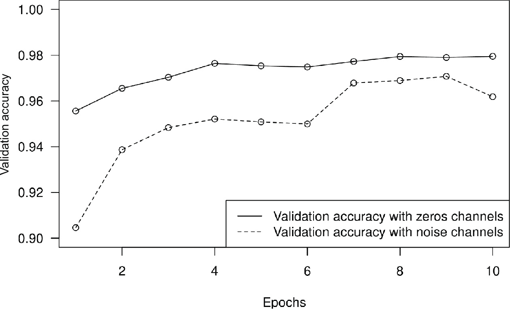

**图 5.6 噪声通道对验证准确性的影响**

尽管数据在两种情况下都持有相同的信息，但使用噪声通道训练的模型的验证准确性最终约低了一个百分点—纯粹是通过虚假相关性的影响。您添加的噪声通道越多，准确性就会进一步下降。

嘈杂的特征不可避免地导致过度拟合。因此，在不确定您拥有的特征是信息性的还是干扰性的情况下，在训练之前进行 *特征选择* 是很常见的。例如，将 IMDB 数据限制为前 10,000 个最常见的单词是一种粗略的特征选择形式。进行特征选择的典型方式是为每个可用特征计算一些有用性分数—即特征相对于任务的信息量，例如特征与标签之间的互信息—并仅保留高于某个阈值的特征。这样做会过滤掉前面示例中的白噪声通道。

### 5.1.2 深度学习中泛化性质

深度学习模型的一个显著事实是，只要具有足够的表征能力，它们就可以被训练来适应任何东西。

不信？试着洗牌 MNIST 标签并在其上训练一个模型。即使输入与洗牌后的标签之间完全没有关系，训练损失也会下降得很好，即使是一个相对较小的模型。自然，随着时间的推移，验证损失根本不会改善，因为在这种情况下没有可能进行泛化（请参见以下图表）。

**清单 5.4 使用随机洗牌标签拟合 MNIST 模型**

c(c(train_images, train_labels), .) %<-% dataset_mnist()➊

train_images <- array_reshape(train_images / 255,

c(60000, 28 * 28))

random_train_labels <- sample(train_labels)

model <- keras_model_sequential() %>%

layer_dense(512, activation = "relu") %>%

layer_dense(10, activation = "softmax")

model %>% compile(optimizer = "rmsprop",

loss = "sparse_categorical_crossentropy",

metrics = "accuracy")

history <- model %>% fit(train_images, random_train_labels,

epochs = 100,

batch_size = 128,

验证分割 = 0.2)

绘制(history)

➊ **在 %<-% 多重赋值调用中使用.来忽略一些元素。在这里，我们忽略了 MNIST 的测试部分。**

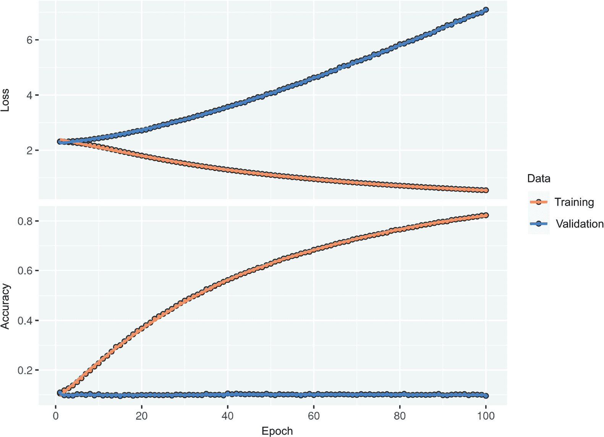

实际上，你甚至不需要用 MNIST 数据做这个——你可以只是生成白噪声输入和随机标签。只要它有足够的参数，你也可以对其进行模型拟合。它最终只会记住特定的输入，就像一个哈希表一样。

如果是这样的话，那么深度学习模型怎么会有泛化能力呢？它们难道不应该只是学会了训练输入和目标之间的一种特定映射，就像一个花哨的哈希表吗？我们对于这种映射能够适用于新输入有什么期望呢？

事实上，深度学习中的泛化性质与深度学习模型本身关系不大，而与现实世界中信息的结构有很大关系。让我们来看看这里真正发生了什么。

### **流形假设**

MNIST 分类器的输入（在预处理之前）是一个 28 × 28 的整数数组，其值介于 0 和 255 之间。因此，可能的输入值的总数是 256 的 784 次方——远远大于宇宙中的原子数。然而，这些输入中很少有看起来像是有效的 MNIST 样本：实际的手写数字只占据了所有可能的 28 × 28 整数数组的父空间中的一小部分*子空间*。而且，这个子空间不仅仅是在父空间中随机分布的一组点：它具有高度结构化的特性。

首先，有效手写数字的子空间是*连续*的：如果你对一个样本进行一点点修改，它仍然可以被识别为相同的手写数字。此外，所有有效子空间中的样本都是通过在子空间中穿过的平滑路径*连接*起来的。这意味着如果你取两个随机的 MNIST 数字 A 和 B，存在一个“中间”图像序列，可以将 A 变形为 B，使得两个连续的数字非常接近（参见图 5.7）。也许在两个类之间的边界上会有一些模糊的形状，但即使这些形状看起来仍然非常像数字。

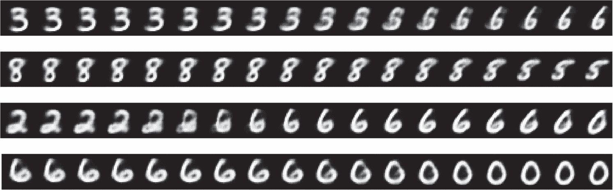

**图 5.7 不同的 MNIST 数字逐渐转变成彼此，显示手写数字的空间形成一个流形。此图是使用第十二章的代码生成的。**

从技术角度来看，你会说手写数字在可能的 28 × 28 整数数组空间内形成了一个*流形*。这是一个大词，但概念上相当直观。流形是某些父空间的低维子空间，局部类似于线性（欧几里得）空间。例如，在平面上的平滑曲线是 2D 空间内的 1D 流形，因为对于曲线上的每一点，你都可以画出一个切线（曲线在每一点都可以用一条直线来近似）。在 3D 空间中的平滑曲面是 2D 流形。等等。

更普遍地，*流形假设*认为所有自然数据都位于其编码的高维空间内的低维流形上。这是关于宇宙信息结构的一个非常强有力的陈述。据我们所知，这是准确的，也是深度学习有效的原因。对于 MNIST 数字是正确的，但对于人脸、树形态、人类声音以及自然语言也是如此。

流形假设意味着

+   机器学习模型只需适应其潜在输入空间（潜在流形）内的相对简单、低维、高度结构化的子空间

+   在这些流形之一中，总是可以在两个输入之间进行*插值*，也就是说，通过沿着所有点都落在流形上的连续路径将一个输入变形为另一个输入

在样本之间进行插值的能力是理解深度学习中泛化的关键。

### **插值作为泛化的源头**

如果你处理可以插值的数据点，你可以通过将它们与流形上接近的其他点相关联来开始理解以前从未见过的点。换句话说，你可以只使用空间的一个*样本*来理解*整体*空间。你可以使用插值来填补空白。

注意，潜在流形上的插值与父空间中的线性插值不同，如图 5.8 所示。例如，在两个 MNIST 数字之间的像素的平均通常不是有效的数字。

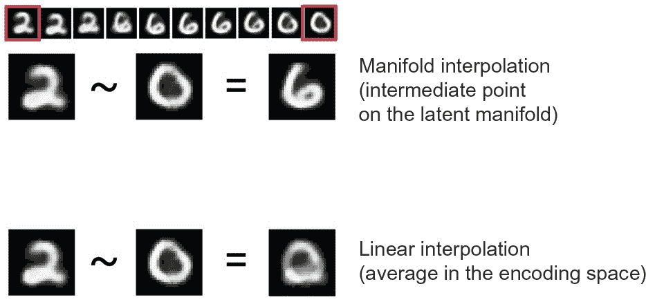

**图 5.8 线性插值与潜在流形上的插值之间的区别。数字的潜在流形上的每一点都是有效的数字，但两个数字的平均值通常不是。**

关键是，尽管深度学习通过对数据流形的学习近似进行插值来实现泛化，但认为插值就是泛化的全部是错误的。这只是冰山一角。插值只能帮助你理解与之前见过的东西非常接近的事物：它实现了*局部泛化*。但值得注意的是，人类经常处理极端的新奇事物，而且我们做得很好。你不需要事先接受每种情况的无数示例的训练和排练。你每一天的生活都不同于以往任何一天，也不同于人类历史的任何一天。你可以在纽约市待上一周，然后在上海待一周，再在班加罗尔待上一周，而无需为每个城市需要成千上万次的学习和排练。

人类能够进行*极端泛化*，这是由于与插值不同的认知机制的启用：抽象、世界的符号模型、推理、逻辑、常识、关于世界的先验知识——我们通常称之为*理性*，与直觉和模式识别相对。后者在性质上主要是插值的，而前者不是。这两者对智力都是至关重要的。我们将在第十四章中更详细地讨论这个问题。

### **深度学习为何有效**

还记得第二章中的揉皱纸团的比喻吗？一张纸代表了三维空间内的二维流形（见图 5.9）。深度学习模型是一种解开纸团的工具，也就是说，是解开潜在流形的工具。

深度学习模型基本上是一个非常高维的曲线——一个平滑连续的曲线（具有来自模型架构先验的结构附加约束），因为它需要可微性。而且，该曲线通过梯度下降平稳地逐渐拟合到数据点。由于其本质，深度学习是关于采取一个大的、复杂的曲线——一个流形——并逐渐调整其参数，直到它适合一些训练数据点。

**图 5.9 展开复杂的数据流形**

曲线涉及足够多的参数，可以适合任何东西——事实上，如果你让你的模型训练足够长的时间，它将有效地纯粹记住它的训练数据，而不会完全推广。然而，你拟合的数据并不是由稀疏分布在底层空间中的孤立点组成的。你的数据在输入空间内形成了一个高度结构化的低维流形——这就是流形假设。由于拟合模型曲线到这些数据是随着梯度下降的进行逐渐平滑地进行的，因此在训练过程中将会有一个中间点，此时模型大致近似于数据的自然流形，就像你在图 5.10 中所看到的那样。

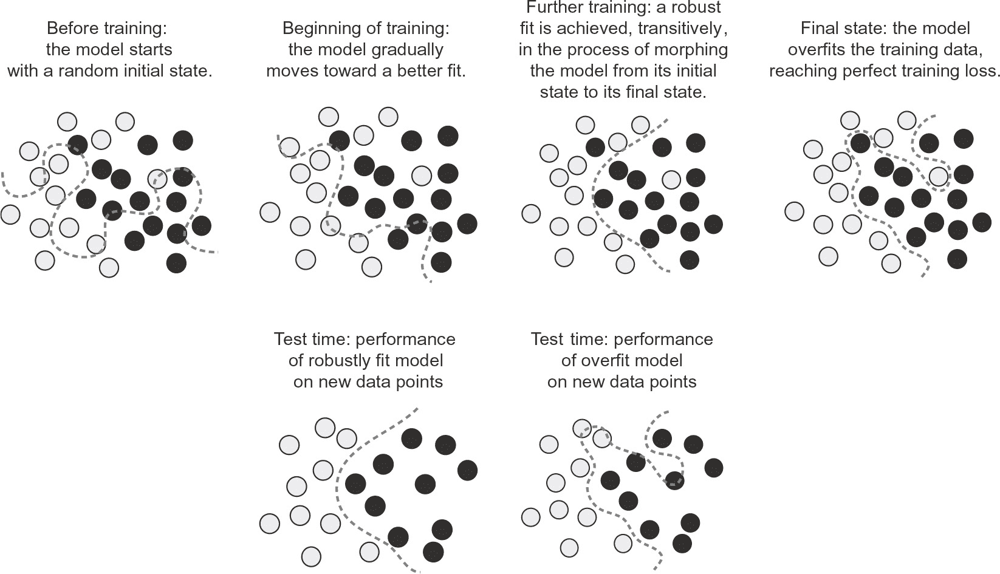

**图 5.10 从随机模型到过度拟合模型并实现鲁棒拟合作为中间状态**

沿着模型学习的曲线在那一点移动将接近于沿着数据的实际潜在流形移动。因此，模型将能够通过在训练输入之间进行插值来理解以前未曾见过的输入。

除了它们具有足够的表示能力这一平凡事实之外，深度学习模型具有以下特性，使它们特别适合学习潜在流形：

+   深度学习模型实现了从输入到输出的平滑连续映射。它必须是平滑连续的，因为它必须是可微的，必须如此（否则你无法进行梯度下降）。这种平滑性有助于逼近潜在流形，其遵循相同的性质。

+   深度学习模型往往以与其训练数据中信息“形状”相似的方式进行结构化（通过体系结构先验）。这在图像处理模型（在第八章和第九章中讨论）和序列处理模型（第十章中）中尤为明显。更一般地说，深度神经网络以层次化和模块化的方式组织其学习到的表示，这与自然数据组织方式相呼应。

### **训练数据至关重要**

虽然深度学习确实非常适合流形学习，但泛化的能力更多地是由你的数据的自然结构决定而不是你的模型的任何属性。只有在数据形成了可以进行插值的流形时，你才能进行泛化。特征越具有信息性且噪声越少，你就越能够进行泛化，因为你的输入空间将更简单、更有结构。数据整理和特征工程对泛化至关重要。

此外，由于深度学习是曲线拟合，因此要使模型表现出色，*必须在输入空间上进行稠密采样训练*。在这种情况下，稠密采样意味着训练数据应该密集地覆盖整个输入数据曲面（参见图 5.11）。这在决策边界附近尤为重要。通过足够稠密的采样，就能够通过在过去的训练输入之间插值来理解新的输入，而无需使用常识、抽象推理或对世界的外部知识——这些是机器学习模型无法获得的。因此，你应该始终记住，改善深度学习模型的最佳方法是让其在更多数据或更好的数据上进行训练（当然，添加过于嘈杂或不准确的数据将损害泛化能力）。输入数据曲面的更密集覆盖将产生更好泛化性能的模型。你永远不应该指望深度学习模型能够执行比其训练样本之间的粗略插值更多的任务，因此你应该尽一切可能使插值变得更容易。你在深度学习模型中找到的唯一内容就是你输入的内容：其体系结构中编码的先验知识和其训练数据。

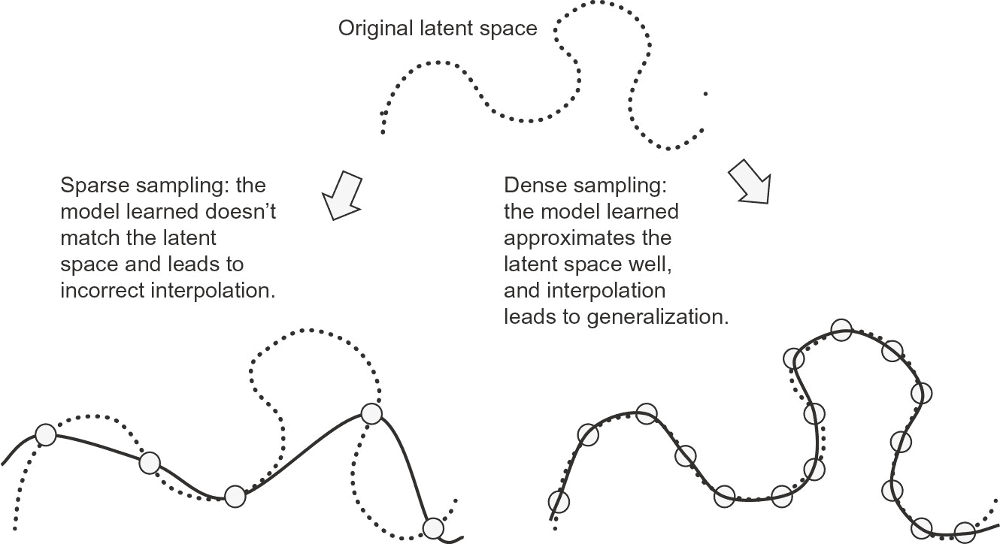

**图 5.11 在输入空间上进行密集采样是学习一个能够准确泛化的模型所必需的。**

当无法获得更多数据时，下一个最好的解决方案是调节模型被允许存储的信息量或者对模型曲线的平滑性添加约束。如果一个网络只能记住少量模式或者非常规则的模式，那么优化过程将迫使它集中于最突出的模式，这些模式有更好的泛化能力。以这种方式抵抗过拟合的过程称为*正则化*。我们将在第 5.4.4 节深入介绍正则化技术。

在您开始调整模型以帮助其更好地推广之前，您需要一种评估您当前模型表现的方法。在接下来的部分中，您将学习如何在模型开发过程中监控泛化：模型评估。

## 5.2 评估机器学习模型

你只能控制你能观察到的东西。因为你的目标是开发能够成功推广到新数据的模型，所以能够可靠地衡量模型的泛化能力至关重要。在本节中，我将正式介绍评估机器学习模型的不同方法。您已经在上一章中看到了大部分方法的实际应用。

### 5.2.1 训练、验证和测试集

评估模型总归要将可用数据分为三组：训练集、验证集和测试集。您在训练数据上训练模型，并在验证数据上评估模型。一旦您的模型准备投入使用，您可以最后一次在测试数据上对其进行测试，这些数据应尽可能与生产数据相似。然后您可以将模型部署到生产环境中。

你可能会问，为什么不设置两个集合：一个训练集和一个测试集？你可以在训练数据上进行训练，然后在测试数据上进行评估。简单多了！

这是因为开发模型总是涉及调整其配置，例如选择层数或层大小（称为模型的*超参数*，以区别于*参数*，即网络的权重）。您通过使用模型在验证数据上的性能作为反馈信号来进行此调整。本质上，这种调整是一种*学习*：在某个参数空间中寻找良好配置的搜索。因此，基于模型在验证集上的性能调整模型的配置可能会很快导致*过度拟合验证集*，即使您的模型从未直接在其上训练过。

这种现象的核心是*信息泄漏*的概念。每当你根据模型在验证集上的性能调整模型的超参数时，一些关于验证数据的信息就会泄漏到模型中。如果你只做一次这样的操作，对一个参数，那么很少的信息会泄漏，你的验证集仍然可以可靠地用来评估模型。但如果你多次重复这个过程——进行一次实验，评估验证集，然后根据结果修改模型——那么越来越多的验证集信息将泄漏到模型中。

最终，你将得到一个在验证数据上表现良好的模型，因为这是你为其优化的。你关心的是在全新数据上的表现，而不是在验证数据上的表现，因此，你需要使用一个完全不同的，之前从未见过的数据集来评估模型：测试数据集。你的模型不应该有关于测试集的*任何*信息，即使是间接的。如果模型的任何信息都是基于测试集的性能来调整的，那么你的泛化度量将是有缺陷的。

将数据分为训练、验证和测试集可能看起来很简单，但当数据很少时，我们有一些可以派上用场的高级方法。让我们回顾三种经典的评估方法：简单留出验证、*K*-折交叉验证和带洗牌的重复*K*-折交叉验证。我们还将谈论使用常识基准线来检查你的训练是否是有效的。

### **简单的留出验证**

将一部分数据作为测试集。在剩余数据上训练，并在测试集上评估。正如前面所看到的，为了防止信息泄漏，你不应该基于测试集来调整模型，因此，你也应该*保留一个验证集*。

简略地说，留出验证看起来像图 5.12。列表 5.5 展示了一个简单的实现。

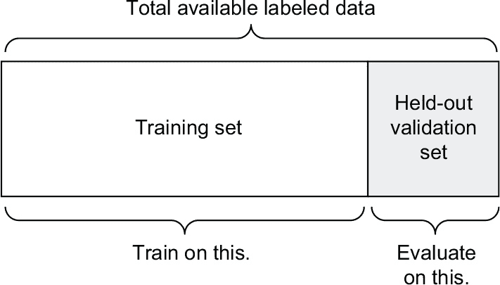

**图 5.12 简单的留出验证切分**

**列表 5.5 留出验证(为简单起见，标签被省略)**

num_validation_samples <- 10000

val_indices <- sample.int(num_validation_samples, nrow(data))➊

validation_data <- data[val_indices, ]➋

training_data <- data[-val_indices, ]➌

model <- get_model()

fit(model, training_data, …)➍

validation_score <- evaluate(model, validation_data, …)➎

…

model <- get_model()

fit(model, data, …)➏

test_score <- evaluate(model, test_data, …)

➊ **从数据的随机抽样中组装验证集通常是合适的。**

➋ **定义验证集。**

➌ **定义训练集。**

➍ **在训练数据上训练模型，并在验证数据上评估。**

➎ **这时你可以调整你的模型，重新训练它，评估它，再次调整它。**

➏ **一旦调整好超参数，通常会从所有非测试数据（即结合了训练数据和验证数据）重新训练最终模型。**

> 注意 在这些示例中，我们假设数据是一个二阶张量。根据需要为更高阶的数据添加逗号。例如，如果数据是三阶的，则是 data[idx, , ]，如果是四阶的，则是 data[idx, , , ]，以此类推。

这是最简单的评估协议，但有一个缺点：如果可用的数据很少，那么您的验证和测试集可能包含的样本太少，无法代表手头的数据。这很容易识别：如果在分割之前对数据进行不同的随机洗牌会得到非常不同的模型性能度量，则会出现这个问题。 *K* 折验证和迭代 *K* 折验证是解决此问题的两种方式，下面会讨论。

### **K 折验证**

使用这种方法，将数据分成 K 个相等大小的分区。对于每个分区 i，训练一个模型，使用其余的 K - 1 个分区进行训练，并在分区 i 上评估它。然后，您的最终得分是获得的 *K* 个得分的平均值。当您的模型的性能基于训练-测试分割表现出显著差异时，这种方法很有帮助。与留出验证类似，这种方法并不免除您使用不同的验证集进行模型校准。

从图 5.13（#fig5-13）可以看出，*K* 折交叉验证的示意图如下。列表 5.6 显示了一个简单的实现。

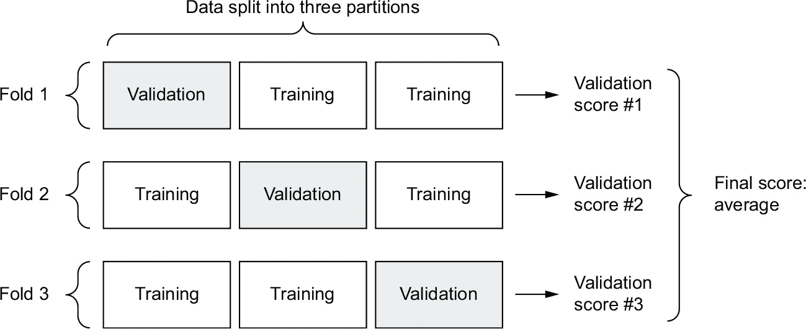

**图 5.13 *K* 折交叉验证，其中 *K* = 3**

**列表 5.6 *K* 折交叉验证（为简单起见，标签被省略）**

k <- 3

fold_id <- sample(rep(1:k, length.out = nrow(data)))

validation_scores <- numeric()

for (fold in seq_len(k)) {

validation_idx <- which(fold_id == fold)➊

validation_data <- data[validation_idx, ]

training_data <- data[-validation_idx, ]➋

model <- get_model()➌

fit(model, training_data, …)

validation_score <- evaluate(model, validation_data, …)

validation_scores[[fold]] <- validation_score

}

validation_score <- mean(validation_scores)➍

model <- get_model()

fit(model, data, …)➎

test_score <- evaluate(model, test_data, …)

➊ **选择验证数据分区。**

➋ **将剩余的数据用作训练数据。**

➌ **创建一个全新的模型实例（未训练）。**

➍ **验证分数：K 折验证的验证分数的平均值**

➎ **在所有非测试数据上训练最终模型。**

### **迭代 K 折验证与洗牌**

这是为了在您可用的数据相对较少且需要尽可能准确地评估模型的情况下。我发现它在 Kaggle 竞赛中非常有帮助。它包括多次应用*K*折叠验证，在每次将数据分成 K 份之前都会对数据进行洗牌。最终得分是*K*折叠验证每次运行获得的得分的平均值。请注意，最终您将训练和评估 P * K 个模型（其中 P 是您使用的迭代次数），这可能非常昂贵。

### 5.2.2 超越常识基线

除了您可用的不同评估协议之外，您还应该了解的一件事是使用常识基线。

训练深度学习模型有点像按下启动平行世界火箭的按钮。你听不到也看不到它。你无法观察到流形学习过程—它发生在一个具有成千上万维度的空间中，即使你将其投影到 3D 中，你也无法解释它。你唯一的反馈是你的验证指标—就像你看不见的火箭上的高度计。

能够判断自己是否有起色尤为重要。你起飞的高度是多少？你的模型似乎有 15%的准确率—这算好吗？在你开始处理数据集之前，你应该始终选择一个微不足道的基准，你会尝试超越它。如果你超过了这个阈值，你就知道你做对了：你的模型实际上正在使用输入数据中的信息来做出概括性的预测，你可以继续前进。这个基准可以是随机分类器的性能，也可以是你能想象到的最简单的非机器学习技术的性能。

例如，在 MNIST 数字分类示例中，一个简单的基准是验证准确度大于 0.1（随机分类器）；在 IMDB 示例中，它将是验证准确度大于 0.5；在 Reuters 示例中，由于类别不平衡，它将在 0.18–0.19 左右。如果您有一个二分类问题，其中 90%的样本属于 A 类，而 10%属于 B 类，那么始终预测 A 的分类器已经达到了 0.9 的验证准确度，您需要做得比这更好。

当您在解决以前没有人解决过的问题时，拥有一个常识基准是至关重要的。如果您无法击败一个微不足道的解决方案，那么您的模型毫无价值—也许您正在使用错误的模型，或者您正在处理的问题根本不能用机器学习来解决。是时候回到起点了。

### 5.2.3 模型评估要记住的事项

在选择评估协议时，请注意以下事项：

+   *数据的代表性* —— 你希望你的训练集和测试集都能代表手头的数据。例如，如果你试图对数字图像进行分类，并且你从一个按类别排序的样本数组开始，那么将数组的前 80%作为你的训练集，剩下的 20%作为测试集将导致你的训练集只包含类别 0-7，而你的测试集将只包含类别 8-9。这似乎是一个荒谬的错误，但这是令人惊讶地常见。因此，你通常应该在将数据拆分为训练集和测试集之前对数据进行*随机洗牌*。

+   *时间箭头* —— 如果你试图根据过去来预测未来（例如，明天的天气，股票走势等），在将数据拆分之前不应该随机洗牌你的数据，因为这样做会产生*时间泄漏*：你的模型实际上是在未来的数据上训练的。在这种情况下，你应该始终确保测试集中的所有数据都*后置于*训练集中的数据。

+   *数据中的冗余* —— 如果你的数据中有一些数据点出现了两次（在真实世界的数据中相当常见），那么对数据进行洗牌并将其分为训练集和验证集将导致训练集和验证集之间存在冗余。实际上，你将在部分训练数据上进行测试，这是你可以做的最糟糕的事情！确保你的训练集和验证集是不相交的。

有一个可靠的评估模型性能的方法是你能够监控机器学习中核心的紧张关系 —— 在优化和泛化之间，在欠拟合和过拟合之间。

## 5.3 改善模型拟合

要达到完美的拟合，你必须首先过拟合。因为你事先不知道边界在哪里，所以必须跨越它才能找到它。因此，当你开始解决一个问题时，你的初始目标是实现一个表现出一定泛化能力并且能够过拟合的模型。一旦你有了这样一个模型，你将专注于通过抗击过拟合来精炼泛化能力。

在这个阶段你会遇到三个常见的问题：

+   训练没有开始：你的训练损失随时间没有下降。

+   训练开始得很顺利，但你的模型没有有意义的泛化：你无法打败你设定的常识基线。

+   训练损失和验证损失随时间都在下降，你可以打败基线，但似乎无法过拟合，这表明你仍然是欠拟合的。

让我们看看你如何解决这些问题，以实现机器学习项目的第一个重要里程碑：获得具有一定泛化能力（能够击败一个琐碎的基线）并且能够过拟合的模型。

### 5.3.1 调整关键的梯度下降参数

有时候训练无法开始，或者开始后很快停止。损失值停滞不变。这总是可以克服的：记住，你可以使用随机数据来拟合模型。即使问题似乎毫无意义，你仍然应该可以训练出一些东西，即使只是记忆训练数据。

当此情况发生时，通常问题出在梯度下降过程的配置上：优化器的选择、模型权重的初始值分布、学习率或批量大小。所有这些参数都是相互依赖的，因此通常只需调整学习率和批量大小，同时保持其他参数不变即可。

让我们看一个具体的例子：使用值为 1 的不恰当大学习率训练第二章的 MNIST 模型。

**图 5.7 使用过高的学习率训练 MNIST 模型**

c(c(train_images, train_labels), .) %<-% dataset_mnist()

train_images <- array_reshape(train_images / 255,

c(60000, 28 * 28))

model <- keras_model_sequential() %>%

layer_dense(units = 512, activation = "relu") %>%

layer_dense(units = 10, activation = "softmax")

model %>% compile(optimizer = optimizer_rmsprop(1),

loss = "sparse_categorical_crossentropy",

metrics = "accuracy")

history <- model %>% fit(train_images, train_labels,

epochs = 10, batch_size = 128,

validation_split = 0.2)

plot(history)

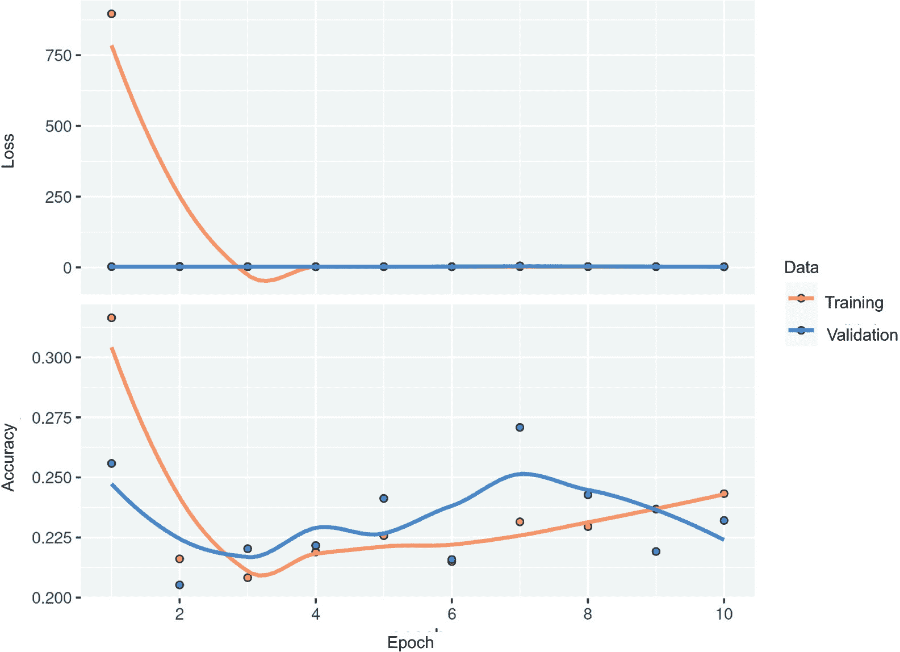

模型很快达到了 20% - 30%的训练和验证准确率，但无法超过这个范围。让我们尝试将学习率降低到 1e-2 这样更合理的值。

**图 5.8 具有更合适学习率的相同模型**

model <- keras_model_sequential() %>%

layer_dense(units = 512, activation = "relu") %>%

layer_dense(units = 10, activation = "softmax")

model %>% compile(optimizer = optimizer_rmsprop(1e-2),

loss = "sparse_categorical_crossentropy",

metrics = "accuracy")

model %>%

fit(train_images, train_labels,

epochs = 10, batch_size = 128,

validation_split = 0.2) ->

history

plot(history)

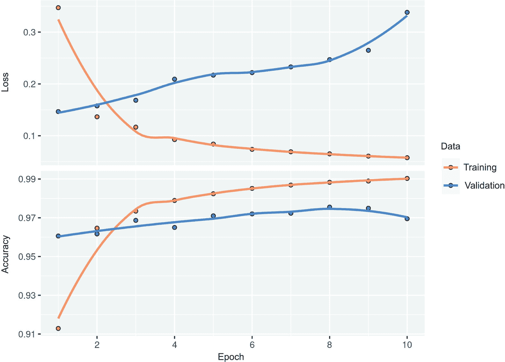

现在模型可以进行训练了。

如果你遇到类似的情况，请尝试以下操作：

+   *降低或增加学习率* - 过高的学习率可能导致更新远超过合适的拟合，就像前面的例子一样，学习率太低可能会导致训练过程非常缓慢。

+   *增加批量大小* - 具有更多样本的批次会产生更有信息量且噪音较小（方差较低）的梯度。

最终，你将找到一个可以进行训练的配置。

### 5.3.2 利用更好的架构先验

你有一个适合的模型，但是由于某种原因你的验证指标一直没有改善。它们的表现不会比随机分类器好：模型可以训练但无法推广。发生了什么？

这也许是你可能会遇到的最糟糕的机器学习情况。这表明*你的方法存在根本性问题*，而且可能不容易找出问题所在。以下是一些提示。

首先，可能是你正在使用的输入数据简单地不包含足够的信息来预测你的目标：所描述的问题是不可解的。这就是早些时候当我们试图拟合一个 MNIST 模型而标签被洗牌时发生的情况：模型可以训练得很好，但验证准确率会停留在 10%，因为使用这样的数据集明显是无法泛化的。

也可能是你正在使用的模型类型不适合手头的问题。例如，在第十章中，你将看到一个时间序列预测问题的例子，其中一个密集连接的架构无法击败一个微不足道的基线，而一个更合适的循环架构确实成功泛化。使用对问题做出正确假设的模型对于实现泛化至关重要：你应该利用正确的架构先验。

在接下来的章节中，你将学习如何针对各种数据模态（图像、文本、时间序列等）选择最佳的架构。通常情况下，你应该确保阅读关于你攻击的任务类型的架构最佳实践——很有可能你不是第一个尝试这个任务的人。

### 5.3.3 增加模型容量

如果你设法得到一个拟合的模型，其中验证指标下降，并且似乎至少具有一定程度的泛化能力，恭喜你：你几乎成功了。接下来，你需要让你的模型开始过拟合。考虑下面这个小模型——一个简单的逻辑回归——在 MNIST 像素上训练。

**清单 5.9 在 MNIST 上的简单逻辑回归**

model <- keras_model_sequential() %>%

layer_dense(10, activation = "softmax")

model %>% compile(optimizer = "rmsprop",

loss = "sparse_categorical_crossentropy",

metrics = "accuracy")

history_small_model <- model %>%

fit(train_images, train_labels,

epochs = 20,

batch_size = 128,

validation_split = 0.2)

plot(history_small_model$metrics$val_loss, type = 'o',

main = "模型容量不足对验证损失的影响",

xlab = "Epochs", ylab = "Validation Loss")

你得到的损失曲线看起来像图 5.14。

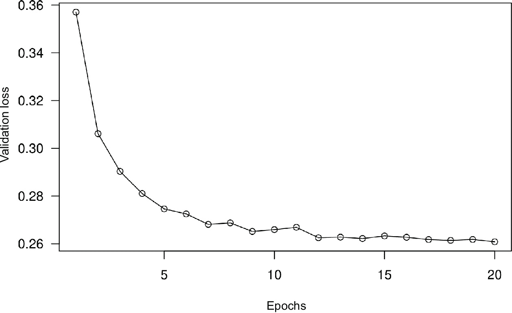

**图 5.14 模型容量不足对验证损失的影响**

验证指标似乎停滞不前，或者改善得非常缓慢，而不是达到峰值然后反转方向。验证损失达到 0.26 后就停在那里。你可以拟合，但明显无法过拟合，即使在训练数据上进行了多次迭代后也是如此。在你的职业生涯中，你可能经常遇到类似的曲线。

记住，总是应该能够过度拟合。就像训练损失不下降的问题一样，这是一个总是可以解决的问题。如果你似乎无法过度拟合，那很可能是你的模型的*表示能力*有问题：你需要一个更大的模型，一个能够存储更多信息的模型。你可以通过添加更多层，使用更大的层（参数更多的层），或者使用更适合手头问题的层类型（更好的架构先验）来增加表示能力。

让我们尝试训练一个更大的模型，一个有两个中间层，每个层有 96 个单元：

model <- keras_model_sequential() %>%

layer_dense(96, activation = "relu") %>%

layer_dense(96, activation = "relu") %>%

layer_dense(10, activation = "softmax")

model %>% compile(optimizer = "rmsprop",

loss = "sparse_categorical_crossentropy",

metrics = "accuracy")

history_large_model <- model %>%

fit(train_images, train_labels,

epochs = 20,

batch_size = 128,

validation_split = 0.2)

现在，验证曲线看起来正是应该的样子：模型拟合迅速，并在八个时期后开始过度拟合（见图 5.15）：

plot(history_large_model$metrics$val_loss, type = 'o',

主要 = "适当容量模型的验证损失",

xlab = "时期", ylab = "验证损失")

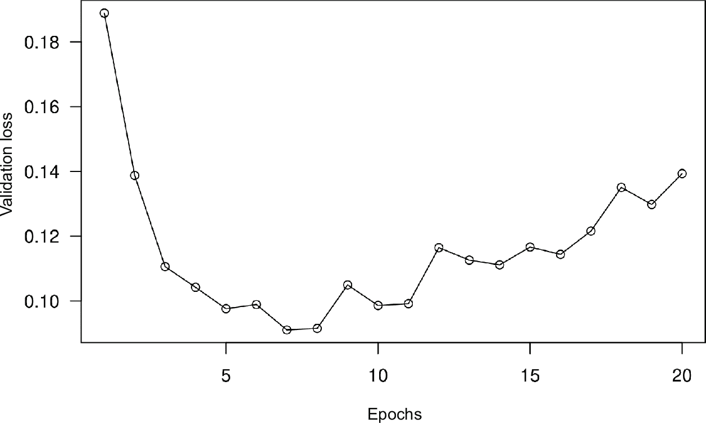

**图 5.15 适当容量模型的验证损失**

## 5.4 改善泛化

一旦你的模型已经表现出一些泛化能力并且能够过度拟合，就是时候把重点转移到最大化泛化上了。

### 5.4.1 数据集策划

你已经学到了，深度学习中的泛化源于你的数据的潜在结构。如果你的数据使得在样本之间平滑插值成为可能，你就能训练一个泛化的深度学习模型。如果你的问题过于嘈杂或者本质上是离散的，比如说，列表排序，深度学习将无法帮助你。深度学习是曲线拟合，不是魔法。

因此，确保你正在使用适当的数据集至关重要。在数据收集上花费更多的精力和金钱几乎总是比在开发更好的模型上花费相同的时间和金钱收益更大。

+   确保你有足够的数据。记住，你需要对输入-输出空间进行*密集采样*。更多的数据将产生更好的模型。有时，一开始看似不可能的问题在有了更大的数据集后变得可解。

+   最小化标记错误 —— 可视化你的输入以检查异常，并校对你的标签

+   清理你的数据并处理缺失值（我们将在下一章中涵盖这个问题）。

+   如果你有很多特征，并且不确定哪些是真正有用的，请进行特征选择。

改进数据的泛化能力的一个特别重要的方式是特征工程。对于大多数机器学习问题，特征工程是成功的关键因素。让我们来看一下。

### 5.4.2 特征工程

*特征工程*是利用你对数据和手头的机器学习算法（在本例中是神经网络）的了解，通过在数据输入模型之前应用硬编码（非学习）的转换来使算法更好地工作的过程。在许多情况下，期望机器学习模型能够从完全任意的数据中学习是不合理的。数据需要以一种使模型工作更轻松的方式呈现给模型。

让我们看一个直观的例子。假设你正在尝试开发一个模型，该模型可以将时钟的图像作为输入，并能够输出当天的时间（见图 5.16）。

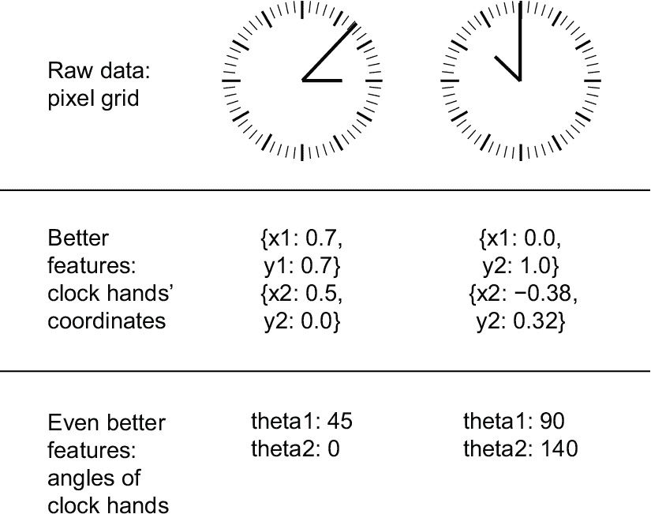

**图 5.16 读取时钟时间的特征工程**

如果你选择使用图像的原始像素作为输入数据，你将面临一个困难的机器学习问题。你将需要一个卷积神经网络来解决它，并且你将不得不耗费相当多的计算资源来训练网络。

但如果你已经在高层次上理解了问题（你了解人类如何在时钟表盘上读取时间），那么你可以为机器学习算法提供更好的输入特征：例如，编写一个五行的 R 脚本来跟踪时钟指针的黑色像素，并输出每个指针尖的（x，y）坐标。然后，一个简单的机器学习算法可以学会将这些坐标与适当的当天时间相关联。

你甚至可以走得更远：进行坐标变换，并将（x，y）坐标表示为相对于图像中心的极坐标。你的输入将成为每个时钟指针的角度θ。在这一点上，你的特征使得问题变得如此简单，以至于不需要任何机器学习；一个简单的取整操作和字典查找就足以恢复大致的当天时间。

这就是特征工程的本质：通过以更简单的方式表达问题来简化问题。使潜在的流形更加平滑、简单和组织良好。通常，这需要深入理解问题。

在深度学习出现之前，特征工程曾经是机器学习工作流程中最重要的部分，因为经典的浅层算法没有足够丰富的假设空间来自行学习有用的特征。你向算法呈现数据的方式对其成功至关重要。例如，在卷积神经网络在 MNIST 数字分类问题上取得成功之前，解决方案通常基于硬编码特征，如数字图像中的循环次数、图像中每个数字的高度、像素值的直方图等。

幸运的是，现代深度学习消除了大部分特征工程的需求，因为神经网络能够从原始数据中自动提取有用的特征。这是否意味着只要使用深度神经网络，你就不必担心特征工程了？不，有以下两个原因：

+   好的特征仍然可以让你更优雅地解决问题，同时使用更少的资源。例如，使用卷积神经网络解决读取钟面的问题就是荒谬的。

+   好的特征让你能够用更少的数据解决问题。深度学习模型自行学习特征的能力依赖于有大量的训练数据可用；如果你只有少量样本，那么样本特征中的信息价值就变得至关重要了。

### 5.4.3 使用提前停止

在深度学习中，我们总是使用大大超参数化的模型：它们的自由度比拟合数据的潜在流形所需的最小自由度要多得多。这种超参数化不是问题，因为*你永远不会完全拟合一个深度学习模型*。这样的拟合根本无法泛化。在你达到最小可能的训练损失之前，你总是会在训练之前中断。

找到在训练过程中达到最可泛化拟合的确切点——欠拟合曲线和过拟合曲线之间的确切边界——是你可以做的最有效的事情之一，以提高泛化能力。

在上一章的示例中，我们会先训练我们的模型比需要的时间更长，以找出产生最佳验证指标的周期数，然后我们会为确切的周期数重新训练一个新模型。这是相当标准的做法，但它需要你做冗余工作，有时可能是昂贵的。自然地，你可以在每个周期结束时保存你的模型，一旦找到最佳周期，就重新使用你最接近的保存模型。在 Keras 中，使用 callback_early_stopping 这个回调函数是很典型的做法，它会在验证指标停止改善时立即中断训练，同时记住已知的最佳模型状态。你将在第七章学习如何使用回调函数。

### 5.4.4 正则化你的模型

*正则化技术*是一组最佳实践，积极阻碍模型完美拟合训练数据的能力，其目标是使模型在验证期间表现更好。这被称为*正则化*模型，因为它倾向于使模型更简单、更“规则”，其曲线更平滑、更“通用”；因此，它不太具体于训练集，并且更能够通过更紧密地逼近数据的潜在流形进行泛化。

请记住，对模型进行正则化是一个应该始终由准确的评估程序指导的过程。只有当您能够测量到时，您才能实现泛化。

让我们回顾一些最常见的正则化技术，并在实践中应用它们来改进第四章的电影分类模型。

### **减小网络的规模**

您已经学会了，模型太小将不会过度拟合。缓解过拟合的最简单方法是减小模型的大小（模型中可学习参数的数量，由层数和每层单元的数量确定）。如果模型具有有限的记忆资源，它将无法简单地记住其训练数据；因此，为了最小化其损失，它将不得不诉诸于学习具有关于目标的预测能力的压缩表示——这恰好是我们感兴趣的表示类型。与此同时，请记住，您应该使用具有足够参数的模型，使其不会欠拟合：您的模型不应该缺乏记忆资源。需要在*过多容量*和*不足容量*之间找到一个折衷。

不幸的是，并没有一个神奇的公式来确定正确的层数或每个层的正确大小。您必须评估一系列不同的架构（当然是在验证集上，而不是在测试集上）以找到适合您数据的正确模型大小。找到合适模型大小的一般工作流程是从相对较少的层和参数开始，并增加层的大小或添加新层，直到您看到验证损失的减小收益。

让我们在电影评论分类模型上尝试一下这个。下面的列表显示了我们的原始模型。

**列表 5.10 原始模型**

c(c(train_data, train_labels), .) %<-% dataset_imdb(num_words = 10000)

vectorize_sequences <- function(sequences, dimension = 10000) {

results <- matrix(0, nrow = length(sequences), ncol = dimension)

for(i in seq_along(sequences))

results[i, sequences[[i]]] <- 1

results

}

train_data <- vectorize_sequences(train_data)

model <- keras_model_sequential() %>%

layer_dense(16, activation = "relu") %>%

layer_dense(16, activation = "relu") %>%

layer_dense(1, activation = "sigmoid")

model %>% compile(optimizer = "rmsprop",

loss = "binary_crossentropy",

metrics = "accuracy")

history_original <- model %>%

fit(train_data, train_labels,

epochs = 20, batch_size = 512, validation_split = 0.4)

现在让我们尝试用这个较小的模型来替换它。

**列表 5.11 容量较低的模型版本**

model <- keras_model_sequential() %>%

layer_dense(4, activation = "relu") %>%

layer_dense(4, activation = "relu") %>%

layer_dense(1, activation = "sigmoid")

model %>% compile(optimizer = "rmsprop",

loss = "binary_crossentropy",

指标 = "准确率")

history_smaller_model <- model %>%

fit(train_data, train_labels,

epochs = 20, batch_size = 512, validation_split = 0.4)

让我们生成一个图表（图 5.17）来比较原始模型和较小模型的验证损失：

绘图(

NULL,➊

主题 = "IMDB 评论分类的原始模型与较小模型比较",

xlab = "周期",

xlim = c(1, history_original$params$epochs),

ylab = "验证损失",

ylim = extendrange(history_original$metrics$val_loss),

panel.first = abline(v = 1:history_original$params$epochs,➋

lty = "dotted", col = "lightgrey")

)

lines(history_original  $metrics$val_loss, lty = 2)

lines(history_smaller_model$metrics$val_loss, lty = 1)

legend("topleft", lty = 2:1,

legend = c("原始模型的验证损失",

"验证损失较小模型"))

➊ **NULL 告诉 plot() 设置绘图区域但不绘制任何数据。**

➋ **绘制网格线。**

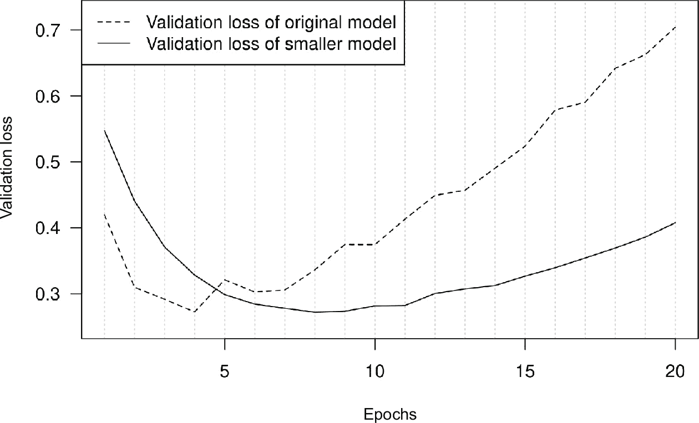

**图 5.17 IMDB 评论分类的原始模型与较小模型**

如您所见，较小的模型开始过拟合比参考模型晚（在六个周期后而不是四个周期后），一旦开始过拟合，其性能下降得更慢。

现在让我们添加一个具有更大容量的基准模型——远远超出了问题所需的容量。尽管标准工作于对于他们要学习的内容明显过度参数化的模型，但确实存在过多记忆能力的情况。如果您的模型立即开始过拟合，并且其验证损失曲线看起来波动大（尽管波动的验证指标也可能是使用不可靠的验证过程的症状，例如验证拆分太小），那么您将知道您的模型太大。

**列表 5.12 容量更高的模型版本**

model <- keras_model_sequential() %>%

layer_dense(512, activation = "relu") %>%

layer_dense(512, activation = "relu") %>%

layer_dense(1, activation = "sigmoid")

model %>% compile(optimizer = "rmsprop",

loss = "binary_crossentropy",

指标 = "准确率")

history_larger_model <- model %>%

fit(train_data, train_labels,

epochs = 20, batch_size = 512, validation_split = 0.4)

绘图(

NULL,

主题 =

"IMDB 评论分类的原始模型与更大模型的比较",

xlab = "周期", xlim = c(1, history_original$params$epochs),

ylab = "验证损失",

ylim = range(c(history_original$metrics$val_loss,

history_larger_model$metrics$val_loss)),

panel.first = abline(v = 1:history_original$params$epochs,

lty = "dotted", col = "lightgrey")

)

lines(history_original $metrics$val_loss, lty = 2)

lines(history_larger_model$metrics$val_loss, lty = 1)

legend("左上角", lty = 2:1,

legend = c("原始模型的验证损失",

"更大模型的验证损失"))

图 5.18 显示了更大模型与参考模型的对比情况。

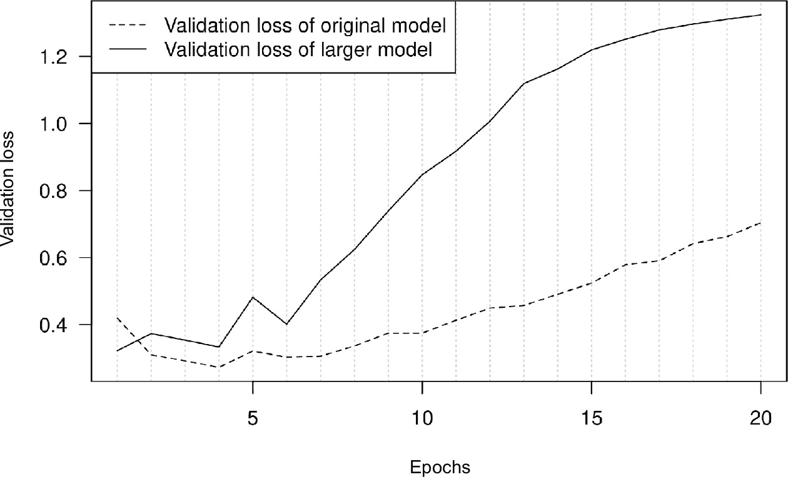

**图 5.18 IMDB 评论分类的原始模型和更大模型对比**

更大的模型几乎立即开始过拟合，仅经过一个时期，它的过拟合情况更为严重。其验证损失也更加嘈杂。它非常快地获得接近零的训练损失。模型的容量越大，就越能快速建模训练数据（导致较低的训练损失），但也越容易过拟合（导致训练和验证损失之间的差异很大）。

### **添加权重正则化**

您可能熟悉*奥卡姆剃刀*原则：对于某事物的两种解释，最有可能正确的解释是最简单的解释——即做出较少假设的解释。这个想法也适用于神经网络学习的模型：对于一些训练数据和网络架构，多组权重值（多个*模型*）可能可以解释数据。较简单的模型不太可能出现过拟合， 高复杂模型则相反。

在这个环境中，*简单模型*是指参数值分布熵较低（或参数较少的模型，正如在前一节中所看到的）。因此，减轻过拟合的常用方法是通过对模型的复杂性施加约束，强制其权重只取小值，从而使权重值的分布更加*规则*。这称为*权重正则化*，它通过在模型的损失函数中增加与大权重相关的代价来实现。这种代价有两种类型：

+   *L1 正则化*—增加的成本与权重系数的*绝对值*成正比（权重的*L1 范数*）。

+   *L2 正则化*—增加的成本与权重系数的*平方值*成正比（权重的*L2 范数*）。在神经网络环境中，L2 正则化也称为*权重衰减*。不要让不同的名字让你困惑：数学上，权重衰减与 L2 正则化是一样的。

在 Keras 中，通过将*权重正则化器实例*作为关键字参数加入到层中，可添加权重正则化。让我们向初始的电影评论分类模型中添加 L2 权重正则化。

**清单 5.13 向模型添加 L2 权重正则化**

model <- keras_model_sequential() %>%

layer_dense(16, activation = "relu",

kernel_regularizer = regularizer_l2(0.002)) %>%

layer_dense(16, activation = "relu",

kernel_regularizer = regularizer_l2(0.002)) %>%

layer_dense(1, activation = "sigmoid")

model %>% compile(optimizer = "rmsprop",

loss = "二元交叉熵",

metrics = "准确性")

history_l2_reg <- model %>% fit(

train_data, train_labels,

epochs = 20, batch_size = 512, validation_split = 0.4)

plot(history_l2_reg)

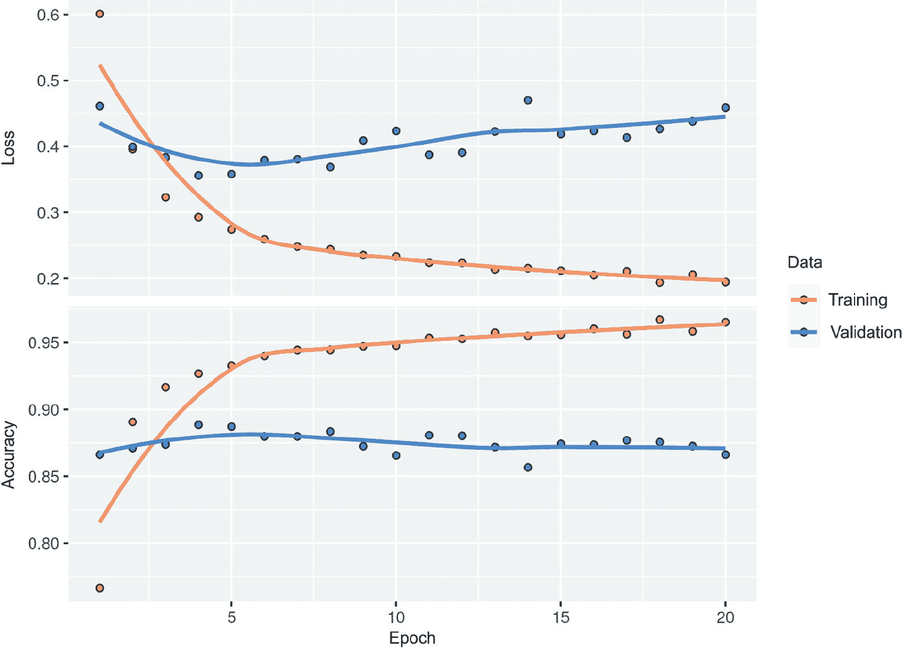

在前面的清单中，regularizer_l2(0.002)表示层中权重矩阵中的每个系数将会添加 0.002 * weight_coefficient_value ^ 2 到模型的总损失中。请注意，因为这个惩罚只在训练时*添加*，所以该模型的损失在训练时会比在测试时高得多。

图 5.19 显示了 L2 正则化惩罚的影响。正如你所见，具有 L2 正则化的模型比参考模型更能抵抗过拟合，即使两个模型具有相同数量的参数。

**清单 5.14 生成图表以演示 L2 权重正则化的效果**

plot(NULL,

main = "L2 权重正则化对验证损失的影响",

xlab = "Epochs",

xlim = c(1, history_original$params$epochs),

ylab = "验证损失",

ylim = range(c(history_original$metrics$val_loss,

history_l2_reg $metrics$val_loss)),

panel.first = abline(v = 1:history_original$params$epochs,

lty = "dotted", col = "lightgrey"))

lines(history_original$metrics$val_loss, lty = 2)

lines(history_l2_reg $metrics$val_loss, lty = 1)

legend("左上角", lty = 2:1,

legend = c("原始模型的验证损失",

"L2 正则化模型的验证损失"))

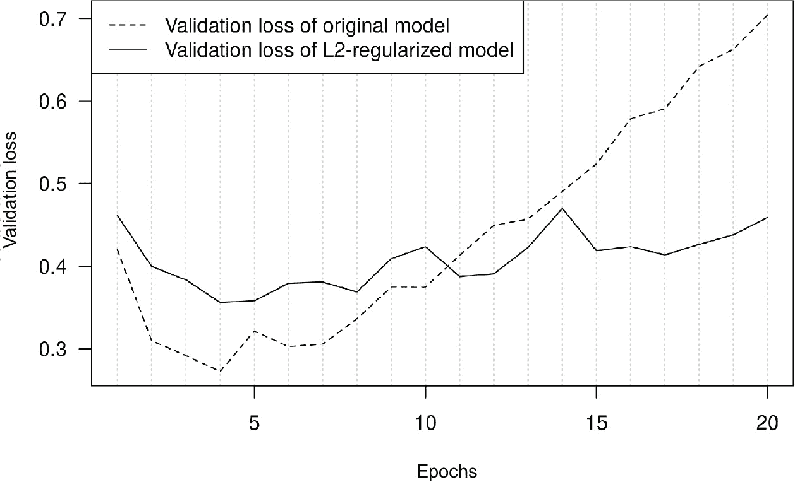

**图 5.19 L2 权重正则化对验证损失的影响**

作为 L2 正则化的替代方案，你可以使用以下 Keras 权重正则化器之一。

**清单 5.15 Keras 中可用的不同权重正则化器**

regularizer_l1(0.001)➊

regularizer_l1_l2(l1 = 0.001, l2 = 0.001)

<keras.regularizers.L1 object at 0x7f81cc3df340>➋

<keras.regularizers.L1L2 object at 0x7f81cc651c40>

➊ **L1 正则化**

➋ **同时使用 L1 和 L2 正则化**

注意，权重正则化更常用于较小的深度学习模型。大型深度学习模型往往过度参数化，对权重值施加约束并不会对模型容量和泛化性产生太大影响。在这些情况下，更喜欢使用不同的正则化技术：dropout。

### **添加 dropout**

*Dropout*是神经网络中最有效、最常用的正则化技术之一；它是由杰弗·欣顿和他在多伦多大学的学生们开发的。应用于一层的 Dropout 在训练期间包括随机地*退出*（设为零）一定数量的该层输出特征。假设给定的层在训练期间为给定的输入样本返回一个向量 c(0.2, 0.5, 1.3, 0.8, 1.1)。应用 Dropout 后，该向量将随机分布一些零条目，例如，c(0, 0.5, 1.3, 0, 1.1)。*退出率*是被置零的特征的比例；通常设置在 0.2 和 0.5 之间。在测试时，不会退出任何单元；相反，该层的输出值会按退出率缩小，以平衡更多单元处于活动状态的事实。

考虑一个包含一层输出的矩阵，layer_output，形状为(batch_size, features)。在训练时，我们随机将矩阵中的一部分值置零：

`zero_out <- random_array(dim(layer_output)) < .5`

`layer_output[zero_out] <- 0`➊

➊ **在训练时，退出输出中的 50%单元**

在测试时，我们通过退出率来缩放输出。在这里，我们以 0.5 的比例缩放（因为我们之前退出了一半的单元）：

`layer_output <- layer_output * .5`➊

➊ **在测试时**

请注意，这个过程可以通过在训练时执行两个操作并在测试时保持输出不变来实现，这通常是实践中的实现方式（参见图 5.20）：

`layer_output[random_array(dim(layer_output)) < dropout_rate] <- 0`

`layer_output <- layer_output / .5`➊

➊ **在训练时。请注意，在这种情况下，我们是放大而不是缩小。**

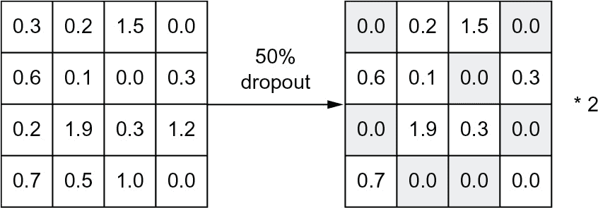

**图 5.20 Dropout 应用于训练期间的激活矩阵，训练期间发生重新缩放。在测试时，激活矩阵保持不变。**

这种技术可能看起来奇怪而武断。为什么这有助于减少过拟合？欣顿说他受到了银行使用的一种防欺诈机制的启发。用他自己的话说，“我去了我的银行。出纳员不停地换，我问其中一个为什么。他说他不知道，但他们经常变动。我想这一定是因为成功欺诈银行需要员工之间的合作。这让我意识到，在每个例子中随机删除不同子集的神经元将防止阴谋，从而减少过拟合。”其核心思想是，向一层的输出值引入噪音可以打破无意义的模式（欣顿称之为*阴谋*），如果没有噪音存在，模型将开始记忆。

在 Keras 中，您可以通过 layer_dropout 在模型中引入 Dropout，它将 Dropout 应用于该层之前的输出。让我们在 IMDB 模型中添加两个 layer_dropout，看看它们在减少过拟合方面的效果如何。

**图 5.16 向 IMDB 模型添加 Dropout**

model <- keras_model_sequential() %>%

layer_dense(16,

layer_dropout(0.5) %>%

layer_dense(16, activation = "relu") %>%

layer_dropout(0.5) %>%

layer_dense(1, activation = "sigmoid")

model %>% compile(optimizer = "rmsprop",

损失 = "binary_crossentropy",

指标 = "accuracy")

history_dropout <- model %>% fit(

训练数据, 训练标签,

epochs = 20, batch_size = 512,

validation_split = 0.4

)

plot(history_dropout)

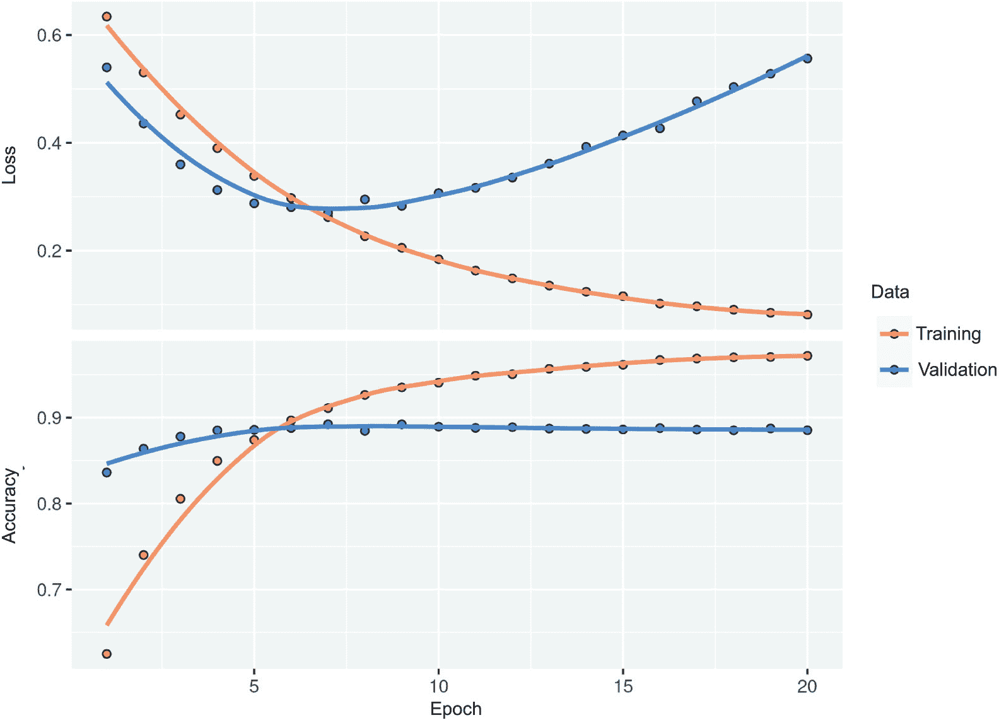

图 5.21 显示了结果的图表。这是对参考模型的明显改进，它似乎也比 L2 正则化工作得更好，因为达到的最低验证损失也有所改善。

**图 5.17 生成一个演示 Dropout 对验证损失的效果的图表**

plot(NULL,

主标题 = "Dropout 对验证损失的效果",

x 轴标签 = "Epochs", x 轴范围 = c(1, history_original$params$epochs),

y 轴标签 = "验证损失",

y 轴范围 = range(c(history_original$metrics$val_loss,

history_dropout $metrics$val_loss)),

面板首先 = abline(v = 1:history_original$params$epochs,

lty = "dotted", col = "lightgrey"))

lines(history_original$metrics$val_loss, lty = 2)

lines(history_dropout $metrics$val_loss, lty = 1)

说明框("左上角", lty = 1:2,

图例 = c("Dropout 正则化模型的验证损失",

"原始模型的验证损失"))

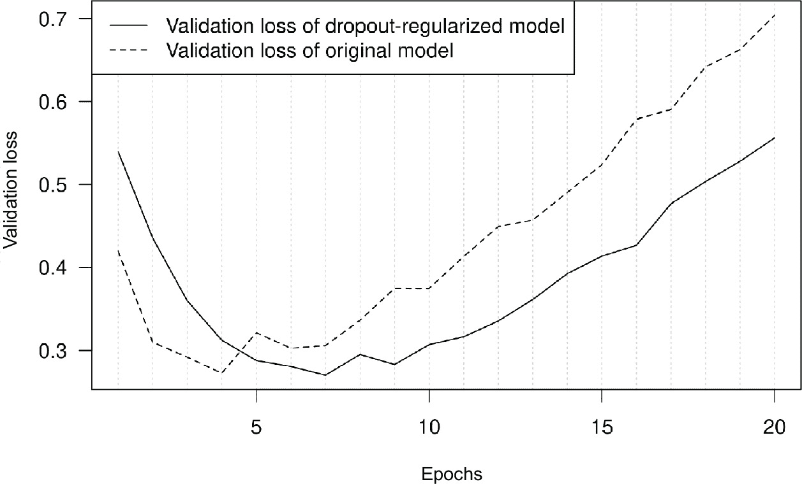

**图 5.21 Dropout 对验证损失的效果**

总结一下，以下是在神经网络中最常见的最大化泛化和防止过拟合的方法：

+   获得更多的训练数据，或更好的训练数据。

+   发展更好的特征。

+   减少模型的容量。

+   添加权重正则化（适用于较小的模型）。

+   添加 Dropout

## 总结

+   机器学习模型的目的是*泛化*：在以前未见过的输入上准确执行。这比看起来更难

+   深度神经网络通过学习一个能够成功*插值*训练样本之间的参数化模型来实现泛化——这样的模型可以说已经学习了训练数据的“潜在流形”。这就是为什么深度学习模型只能理解与它们在训练中看到的非常接近的输入的原因。

+   机器学习中的基本问题是*优化和泛化之间的紧张关系*：为了实现泛化，必须首先获得对训练数据的良好拟合，但是改善模型对训练数据的拟合会在一段时间后开始损害泛化能力。每一个深度学习最佳实践都处理了这种紧张的方式。

+   深度学习模型的泛化能力来自于它们成功学习近似其数据的*潜在流形*的事实，因此可以通过插值来理解新的输入。

+   在开发模型时，能够准确评估模型的泛化能力至关重要。你可以使用一系列评估方法，从简单的留出验证到*K*-折交叉验证和迭代*K*-折交叉验证与洗牌。请记住始终保留一个完全独立的测试集用于最终模型评估，因为验证数据泄露到模型中可能已经发生。

+   当您开始研究一个模型时，您的目标首先是获得具有一定泛化能力并且可以过拟合的模型。做到这一点的最佳实践包括调整学习率和批量大小，利用更好的架构先验，增加模型容量，或者简单地延长训练时间。

+   当您的模型开始过拟合时，您的目标转向通过*模型正则化*来提高泛化能力。您可以降低模型的容量，添加 dropout 或权重正则化，并使用早停技术。自然地，一个更大或更好的数据集始终是帮助模型泛化的首选方法。

1.  ¹ 马克·吐温甚至称其为“人类所知最美味的水果。”
