# 第七章：使用 Keras：深入研究

*本章内容*

+   使用 keras_model_sequential()、功能 API 和模型子类化创建 Keras 模型

+   使用内置的 Keras 训练和评估循环

+   使用 Keras 回调自定义培训

+   使用 TensorBoard 监控培训和评估指标

+   从头开始编写训练和评估循环 

现在您已经具备了一些使用 Keras 的经验——您熟悉序列模型、密集层和用于训练、评估和推理的内置 API——compile()、fit()、evaluate()和 predict()。您甚至在第三章中学习了如何使用 new_layer_class()创建自定义层，以及如何使用 TensorFlow GradientTape() 实现逐步训练循环。

在接下来的章节中，我们将深入研究计算机视觉、时间序列预测、自然语言处理和生成深度学习等复杂应用。这些复杂的应用需要多于一个 keras_model_sequential()架构和默认的 fit()循环。因此，让我们先将你变成一个 Keras 专家！在本章中，您将获得有关使用 Keras API 的关键方法的完整概述：这是您需要处理接下来会遇到的高级深度学习用例的所有内容。

## 7.1 工作流的多样性

Keras API 的设计以*逐渐揭示复杂性*的原则为指导：让开始变得容易，但让处理高复杂度的用例成为可能，每个步骤只需要进行渐进式的学习。简单的用例应该易于接近，并且任意高级工作流程都应该是可能的：无论您想要做什么多么具有特色和复杂，都应该有一条明确的路径，它建立在您从较简单的工作流程中学到的各种事情之上。这意味着您可以从初学者成长为专家，仍然使用相同的工具，只是使用不同的方式。

因此，Keras 没有单一的“真正”使用方式。相反，Keras 提供了一系列工作流，从非常简单到非常灵活。有不同的方法来构建 Keras 模型，以及不同的训练方法，以满足不同的需求。因为所有这些工作流都基于共享的 API，例如层和模型，所以任何工作流的组件都可以在任何其他工作流中使用，它们都可以相互通信。

## 7.2 构建 Keras 模型的不同方式

在 Keras 中，有三个 API 可以用于构建模型（见图 7.1）：

+   *Sequential 模型*是最易接近的 API，它基本上是一个列表。因此，它仅限于简单的层堆栈。

+   *功能 API*注重于类似于图形的模型架构。它代表了易用性和灵活性之间的不错平衡，因此是最常用的模型构建 API。

+   *模型子类化* 是一个低级选项，你需要从头开始自己编写一切。这是理想的选择，如果你想要对每一件事情都有完全的控制。然而，你将无法访问许多内置的 Keras 功能，并且更容易犯错误。

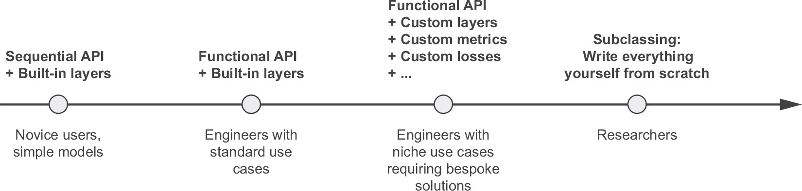

**图 7.1 逐渐展示模型构建的复杂性**

### 7.2.1 Sequential 模型

构建 Keras 模型的最简单方式是使用 keras_model_sequential()，这是你已经了解的。

清单 7.1 keras_model_sequential()

library(keras)

model <- keras_model_sequential() %>%

layer_dense(64, activation = "relu") %>%

layer_dense(10, activation = "softmax")

注意，可以使用 %>% 逐步构建相同的模型。

清单 7.2 逐步构建 Sequential 模型

model <- keras_model_sequential()

model %>% layer_dense(64, activation = "relu")

model %>% layer_dense(10, activation = "softmax")

在第四章中，你看到层是在第一次调用时构建的（也就是说，创建它们的权重）。这是因为层的权重形状取决于它们的输入形状：直到输入形状被知道，它们才能被创建。

因此，上述的 Sequential 模型在你实际上对其使用一些数据，或者使用其 build() 方法并指定输入形状之前，是没有任何权重的（清单 7.3）。

清单 7.3 尚未构建的模型没有权重

model$weights➊

Error in py_get_attr_impl(x, name, silent):

ValueError: 模型 sequential_1 的权重尚未创建。当模型首次根据输入进行调用或调用 `build()` 并指定 `input_shape` 时，才会创建权重。

➊ **此时，模型尚未构建。**

清单 7.4 第一次调用模型以构建它

model$build(input_shape = shape(NA, 3))➊

str(model$weights)➋

长度为 4 的列表

$ :<tf.Variable 'dense_2/kernel:0' shape=(3, 64) dtype=float32, numpy=…>

$ :<tf.Variable 'dense_2/bias:0' shape=(64) dtype=float32, numpy=…>

$ :<tf.Variable 'dense_3/kernel:0' shape=(64, 10) dtype=float32, numpy=…>

$ :<tf.Variable 'dense_3/bias:0' shape=(10) dtype=float32, numpy=…>

➊ **构建模型——现在模型将期望形状为 (3) 的样本。输入形状中的 NA 表示批量大小可以是任何值。**

➋ **现在你可以检索模型的权重。**

在模型构建完成后，你可以通过 print() 方法显示其内容，这对调试很有用。

清单 7.5 print() 方法

model

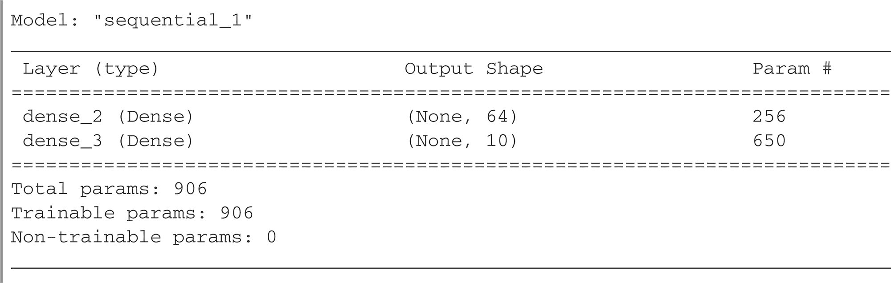

正如你所看到的，这个模型恰好被命名为“sequential_1”。你可以为 Keras 中的每一个东西都起名字——每一个模型，每一个层。

清单 7.6 使用 name 参数为模型和层命名

model <- keras_model_sequential(name = "my_example_model")

model %>% layer_dense(64, activation = "relu", name = "my_first_layer")

model %>% layer_dense(10, activation = "softmax", name = "my_last_layer")

model$build(shape(NA, 3))

model

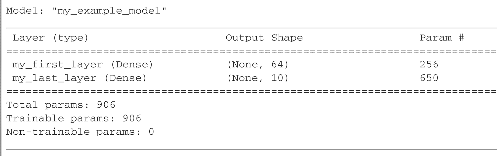

在逐步构建 Sequential 模型时，可以在每添加一层后打印当前模型的摘要非常有用。但是直到模型构建完成之前，您无法打印摘要！事实上，有一种方法可以动态构建您的 Sequential 模型：只需提前声明模型输入的形状即可。您可以通过将 input_shape 传递给 keras_model_sequential() 来实现此目的。

清单 7.7 预先指定您模型的输入形状

`model <`

使用 `keras_model_sequential(input_shape = c(3)) %>%`➋

`layer_dense(64, activation = "relu")`

**➊ 提供 input_shape 以声明输入的形状。请注意，shape 参数必须是每个样本的形状，而不是一个批次的形状。**

现在您可以使用 print() 跟踪随着您添加更多层，模型输出形状如何变化：

`model`

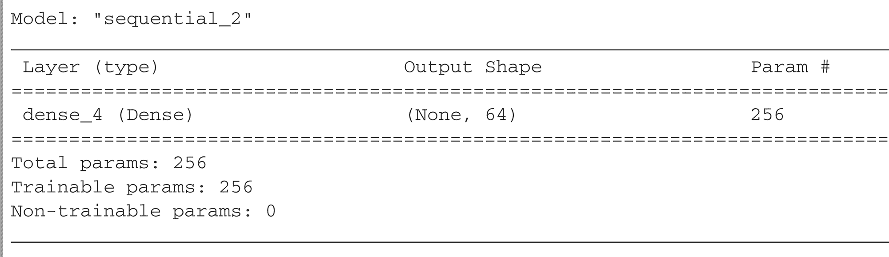

`model %>% layer_dense(10, activation = "softmax")`

`model`

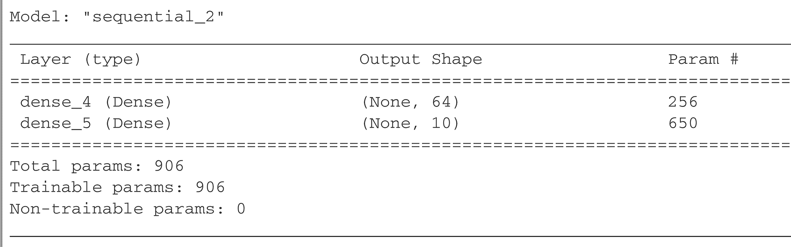

这是在处理以复杂方式转换其输入的层时的一种非常常见的调试工作流程，例如您将在第八章中了解的卷积层。

### 7.2.2 Functional API

Sequential 模型易于使用，但其适用性极为有限：它只能表示具有单个输入和单个输出的模型，并以顺序方式一个接一个地应用层。在实践中，遇到具有多个输入（例如，图像及其元数据）、多个输出（关于数据您想要预测的不同事物）或非线性拓扑的模型是非常常见的。

在这种情况下，您将使用 Functional API 构建模型。这是您在野外遇到的大多数 Keras 模型使用的。这很有趣和强大——感觉就像玩乐高积木一样。

### 一个简单的例子

让我们从简单的东西开始：我们在上一节中使用的两层堆叠。其 Functional API 版本如下所示。

清单 7.8 具有两个 Dense 层的简单 Functional 模型

`inputs <- layer_input(shape = c(3), name = "my_input")`

`features <- inputs %>% layer_dense(64, activation = "relu")`

`outputs <- features %>% layer_dense(10, activation = "softmax")`

`model <- keras_model(inputs = inputs, outputs = outputs)`

让我们一步一步来。我们首先声明了一个 layer_input()（请注意，您也可以给这些输入对象命名，就像其他所有东西一样）：

`inputs <- layer_input(shape = c(3), name = "my_input")`

此 inputs 对象保存有关模型将处理的数据的形状和 dtype 的信息：

`inputs$shape➊`

TensorShape([None, 3])

`inputs$dtype➋`

`tf.float32`

**➊ 该模型将处理每个样本形状为 (3) 的批次。每个批次中的样本数量是可变的（由 None 批次大小指示）。**

**这些批次的 dtype 将为 float32。**

我们称这样的对象为*符号张量*。它不包含任何实际数据，但它编码了模型在使用时将看到的实际数据张量的规格。它*代表*未来的数据张量。

接下来，我们创建一个层，并与输入组合：

features <- inputs %>% layer_dense(64, activation = "relu")

在 Functional API 中，将符号张量传送到层构造函数会调用该层的 call() 方法。实质上，这就是发生的事情：

layer_instance <- layer_dense(units = 64, activation = "relu") features <- layer_instance(inputs)

这与 Sequential API 不同，其中将层与模型组合（model %>% layer_dense()）意味着这个：

layer_instance <- layer_dense(units = 64, activation = "relu") model$add(layer_instance)

所有 Keras 层既可以在实际数据张量上调用，也可以在这些符号张量上调用。在后一种情况下，它们返回一个新的符号张量，具有更新的形状和 dtype 信息：

features$shape

TensorShape([None, 64])

注意，符号张量几乎可以与所有相同的 R 通用方法一起使用，如 eager 张量。这意味着你也可以像这样获取形状作为 R 整数向量：

dim(features)

[1] NA 64

在获得最终输出后，我们通过在 keras_model() 构造函数中指定其输入和输出来实例化模型：

outputs <- layer_dense(features, 10, activation = "softmax")

model <- keras_model(inputs = inputs, outputs = outputs)

这是我们模型的概要：

model

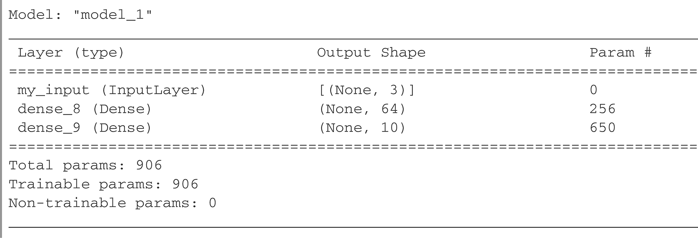

### 多输入，多输出模型

与这个玩具模型不同，大多数深度学习模型看起来不像列表，而是像图。例如，它们可能具有多个输入或多个输出。正是对于这种模型，Functional API 才真正发挥作用。

假设你正在构建一个系统，根据优先级对客户支持票进行排名，并将其路由到适当的部门。你的模型有三个输入：

+   票的标题（文本输入）

+   票的文本正文（文本输入）

+   用户添加的任何标签（假定这里是 one-hot 编码的分类输入）

我们可以将文本输入编码为大小为 vocabulary_size 的 1 和 0 数组（有关文本编码技术的详细信息，请参见第十一章）。你的模型还有两个输出：

+   票的优先级分数，介于 0 和 1 之间的标量（sigmoid 输出）

+   应处理该票的部门（对部门集合进行 softmax）

你可以用几行代码使用 Functional API 构建此模型。

列表 7.9 多输入，多输出的 Functional 模型

vocabulary_size <- 10000

num_tags <- 100

num_departments <- 4

title <- layer_input(shape = c(vocabulary_size), name = "title")➊

text_body <- layer_input(shape = c(vocabulary_size), name = "text_body")➊

tags <- layer_input(shape = c(num_tags), name = "tags")➊

features <-

layer_concatenate(list(title, text_body, tags)) %>%➋

layer_dense(64, activation = "relu")➌

priority <- features %>%➍

layer_dense(1, activation = "sigmoid", name = "priority")

department <- features %>%➍

layer_dense(num_departments, activation = "softmax", name = "department")

model <- keras_model(➎

inputs = list(title, text_body, tags),

outputs = list(priority, department)

)

➊ **定义模型的输入。**

➋ **将输入特征合并成单个张量，通过连接它们。**

➌ **应用中间层将输入特征重新组合成更丰富的表示。**

➍ **定义模型的输出。**

➎ **通过指定其输入和输出来创建模型。**

函数式 API 是一种简单、类似于 LEGO 但非常灵活的方式，可以定义这样的任意层级图。

### 训练多输入、多输出模型

您可以通过调用 fit()并传递输入和输出数据的列表来训练模型，这与训练 Sequential 模型的方式非常相似。这些数据列表应与您传递给 keras_model()构造函数的输入的顺序相同。

示例 7.10 通过提供输入和目标数组列表来训练模型

num_samples <- 1280

random_uniform_array <- function(dim)

array(runif(prod(dim)), dim)

random_vectorized_array <- function(dim)

array(sample(0:1, prod(dim), replace = TRUE), dim)

title_data <- random_vectorized_array(c(num_samples, vocabulary_size))➊

text_body_data <- random_vectorized_array(c(num_samples, vocabulary_size))➊

tags_data <- random_vectorized_array(c(num_samples, num_tags))➊

priority_data <- random_vectorized_array(c(num_samples, 1))➋

department_data <- random_vectorized_array(c(num_samples, num_departments))➋

model %>% compile(

optimizer = "rmsprop",

loss = c("mean_squared_error", "categorical_crossentropy"),

metrics = c("mean_absolute_error", "accuracy")

)

model %>% fit(

x = list(title_data, text_body_data, tags_data),

y = list(priority_data, department_data),

epochs = 1

)

model %>% evaluate(x = list(title_data, text_body_data, tags_data),

y = list(priority_data, department_data))

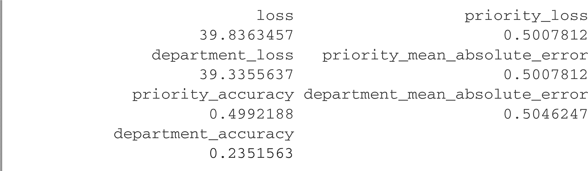

c(priority_preds, department_preds) %<-% {➌

model %>% predict(list(title_data, text_body_data, tags_data))

}

➊ **虚拟的输入数据**

➋ **虚拟的目标数据**

➌ **要在同一表达式中使用%<-%和%>%，您需要用{}或（）将管道序列包装起来，以覆盖默认的运算符优先级。**

如果您不想依赖输入顺序（例如，因为有多个输入或输出），您也可以利用您给输入形状和输出层指定的名称，并通过命名列表传递数据。

> 重要提示：使用命名列表时，列表的顺序不能保证保留下来。请务必通过位置或名称跟踪项目，但不能混合使用两者。

示例 7.11 通过提供命名输入和目标数组列表来训练模型

model %>%

compile(optimizer = "rmsprop",

loss = c(priority = "mean_squared_error",

department = "categorical_crossentropy"),

metrics = c(priority = "mean_absolute_error",

department = "accuracy"))

model %>%

fit(list(title = title_data,

text_body = text_body_data,

标签 = tags_data),

list(priority = priority_data,

department = department_data), epochs = 1)

model %>%

评估(list(title = title_data,

text_body = text_body_data,

标签 = tags_data),

list(priority = priority_data,

department = department_data))

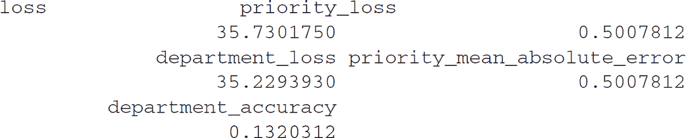

c(priority_preds, department_preds) %<-%

预测(model, list(title = title_data,

text_body = text_body_data,

标签 = tags_data))

### 函数 API 的威力：访问层连接性

功能模型是一个明确的图形数据结构。这使得可以检查层如何连接，并重复使用以前的图形节点（它们是层输出）作为新模型的一部分。它还很好地适应了大多数研究人员在思考深度神经网络时使用的“心理模型”：层的图形。这使两个重要用例成为可能：模型可视化和特征提取。

让我们可视化刚刚定义的模型的连接性（模型的 *拓扑*）。您可以使用 plot() 方法将功能模型绘制为图形（参见图 7.2）：

plot(model)

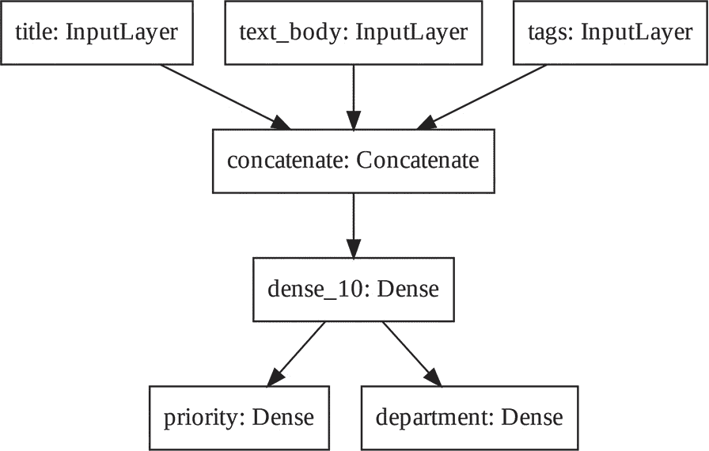

**图 7.2 由我们的票务分类器模型 plot(model) 生成的图表**

您可以在模型的每一层中添加此图表的输入和输出形状，这在调试期间可能会有所帮助（参见图 7.3）：

plot(model, show_shapes = TRUE)

**图 7.3 添加形状信息的模型图**

张量形状中的“None”表示批处理大小：该模型允许任意大小的批处理。

访问层连接性也意味着您可以检查和重复使用图中的单个节点（层调用）。模型$layers 模型属性提供了组成模型的层的列表，对于每个层，您可以查询 layer$input 和 layer$output。

列表 7.12 在功能模型中检索层的输入或输出

str(model$layers)

7 的列表

$ :<keras.engine.input_layer.InputLayer object at 0x7fc962da63a0>

$ :<keras.engine.input_layer.InputLayer object at 0x7fc962da6430>

$ :<keras.engine.input_layer.InputLayer object at 0x7fc962da68e0>

$ :<keras.layers.merge.Concatenate object at 0x7fc962d2e130>

$ :<keras.layers.core.dense.Dense object at 0x7fc962da6c40>

$ :<keras.layers.core.dense.Dense object at 0x7fc962da6340>

$ :<keras.layers.core.dense.Dense object at 0x7fc962d331f0>

str(model$layers[[4]]$input)

3 的列表

$ :<KerasTensor: shape=(None, 10000) dtype=float32 (created by layer

 'title')>

$ :<KerasTensor: shape=(None, 10000) dtype=float32 (created by layer

 'text_body')>

$ :<KerasTensor: shape=(None, 100) dtype=float32 (created by layer 'tags')>

str(model$layers[[4]]$output)

<KerasTensor: shape=(None, 20100) dtype=float32 (created by layer

 'concatenate')>

这使您能够进行 *特征提取*，创建重用另一个模型的中间特征的模型。

假设你想要在前一个模型中添加另一个输出——你想要估计给定问题票的解决时间，一种困难评级。你可以通过三个类别的分类层来实现这一点：“快速”，“中等”和“困难”。你不需要从头开始重新创建和重新训练一个模型。你可以从你以前模型的中间特征开始，因为你可以像这样访问它们。

Listing 7.13 通过重用中间层输出创建一个新模型

features <- model$layers[[5]]$output➊

difficulty <- features %>%

layer_dense(3, activation = "softmax", name = "difficulty")

new_model <- keras_model(

inputs = list(title, text_body, tags),

outputs = list(priority, department, difficulty)

)

➊ **layer[[5]] 是我们的中间密集层。您也可以使用 get_layer() 按名称检索层。**

让我们绘制我们的新模型（见图 7.4）：

plot(new_model, show_shapes = TRUE)

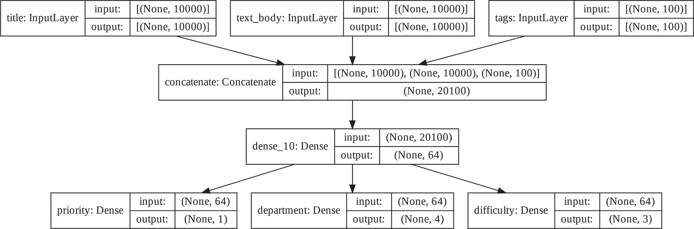

**图 7.4 我们的新模型绘图：更新的工单分类器**

### 7.2.3 子类化 Model 类

你应该知道的最后一个模型构建模式是最高级的模型子类化。你在第三章学习过如何使用 new_layer_class() 子类化 Layer 类并创建自定义层。使用 new_model_class() 子类化 Model 类非常相似：

+   在 initialize() 方法中，定义模型将使用的层。

+   在 call() 方法中，定义模型的前向传播，重用先前创建的层。

+   实例化你的子类，并在数据上调用它以创建它的权重

### 重写我们之前的示例作为子类模型

让我们看一个简单的例子：我们将使用 new_model_class() 重新实现客户支持票务管理模型来定义一个 Model 子类。

Listing 7.14 一个简单的子类模型

CustomerTicketModel <- new_model_class(

classname = "CustomerTicketModel",

initialize = function(num_departments) {

super$initialize()➊

self$concat_layer <- layer_concatenate()

self$mixing_layer <-➋

layer_dense(units = 64, activation = "relu")

self$priority_scorer <-

layer_dense(units = 1, activation = "sigmoid")

self$department_classifier <-

layer_dense(units = num_departments, activation = "softmax")

},

call = function(inputs) {➌

title <- inputs$title➍

text_body <- inputs$text_body

tags <- inputs$tags

features <- list(title, text_body, tags) %>%

self$concat_layer() %>%

self$mixing_layer()

priority <- self$priority_scorer(features)

department <- self$department_classifier(features)

list(priority, department)

}

)

➊ **别忘了调用 super$initialize()！**

➋ **在构造函数中定义子层。请注意，我们在这里指定了 units 参数名称，以便我们得到一个层实例。**

➌ **在 call() 方法中定义前向传播。**

➍ **对于输入，我们将提供一个带有名称的列表给模型。**

我们在第三章中实现了 Model 的最简版本。要注意的主要事项是，我们正在定义一个自定义类，即我们的模型，它是 Model 子类。正如您将在接下来的章节中看到的那样，Model 提供了许多方法和功能，您可以选择加入其中。

定义模型之后，您可以实例化它。请注意，它只会在首次在某些数据上调用它时创建其权重，就像层子类一样：

model <- CustomerTicketModel(num_departments = 4)

c(priority, department) %<-% model(list(title = title_data,

text_body = text_body_data,

tags = tags_data))

模型本质上是一种层（Layer）。这意味着，使用 create_layer_wrapper()就可以轻松地使模型具有与%>%很好地组合的能力，就像这样：

inputs <- list(title = title_data,

text_body = text_body_data,

tags = tags_data)

layer_customer_ticket_model <- create_layer_wrapper(CustomerTicketModel)

outputs <- inputs %>%

layer_customer_ticket_model(num_departments = 4)

c(priority, department) %<-% outputs

到目前为止，所有内容看起来与 Layer 子类化非常相似，这是您在第三章中遇到的工作流程。那么，“层”的子类和“模型”的子类之间有什么区别呢？答案很简单：一个“层”是用来创建模型的构建块，而一个“模型”是您将实际培训、导出推理等的最高级对象。换句话说，模型具有 fit()、evaluate()和 predict()方法，而层则没有。除此之外，这两个类几乎完全相同。（另一个区别是您可以将模型保存在磁盘上的文件中，我们将在几个章节中介绍这个功能。）您可以编译和训练 Model 子类，就像 Sequential 模型或 Functional 模型一样：

model %>%

compile(optimizer = "rmsprop",

loss = c("mean_squared_error",

"categorical_crossentropy"),➊

metrics = c("mean_absolute_error", "accuracy"))

x <- list(title = title_data,➋

text_body = text_body_data,

tags = tags_data)

y <- list(priority_data, department_data)➌

model %>% fit(x, y, epochs = 1)

model %>% evaluate(x, y)

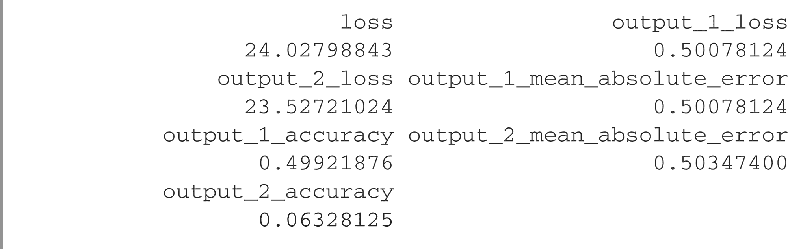

c(priority_preds, department_preds) %<-% {

model %>% predict(x)

}

➊ **您作为损失和指标参数传递的内容的结构必须严格匹配 call()方法返回的内容，即两个元素的列表。**

➋ **输入数据的结构必须严格匹配 call()方法所期望的内容，即一个命名列表，其中包括标题（title）、正文（text_body）和标签（tags）。当按名称匹配时，列表顺序将被忽略！**

➌ **目标数据的结构必须严格匹配 call()方法返回的内容，即两个元素的列表。**

Model 子类化流程是构建模型最灵活的方法。它使您能够构建无法表示为层的有向无环图的模型，例如，模型的 call()方法在 for 循环内使用层，甚至会递归调用它们。任何事情都可能发生——您有权决定。

### 警告：子类化模型不支持的内容

这种自由是有代价的：通过子类模型，您需要负责更多的模型逻辑，这意味着您的潜在错误范围要大得多。因此，您将需要更多的调试工作。您正在开发一个新的类对象，而不仅仅是将乐高积木拼凑在一起。

Functional 和子类模型在性质上也有很大不同。Functional 模型是一个显式数据结构——层的图形，您可以查看、检查和修改。而子类模型是一组 R 代码——一个具有 call() 方法的类，该方法是一个 R 函数。这就是子类化工作流程的灵活性来源——您可以编写任何功能性代码——但它也引入了新的限制。

例如，因为层之间连接的方式被隐藏在 call() 方法的主体内部，您无法访问该信息。调用 summary() 将不显示层连接性，并且您无法通过 plot() 绘制模型拓扑。同样，如果您有一个子类模型，您无法访问层图的节点来进行特征提取，因为简单地没有图。一旦模型被实例化，其正向传递就变成了一个完全的黑盒。

### 7.2.4 混合和匹配不同的组件

关键是，选择这些模式之一——Sequential 模型、Functional API 或 Model 子类化——不会将您排除在其他模式之外。Keras API 中的所有模型都可以与彼此平滑地互操作，无论它们是 Sequential 模型、Functional 模型还是从头编写的子类模型。它们都是同一工作流谱系的一部分。例如，您可以在 Functional 模型中使用一个子类化的层或模型。

列表 7.15 创建一个包含子类化模型的 Functional 模型

ClassifierModel <- new_model_class(

classname = "Classifier",

initialize = function(num_classes = 2) {

super$initialize()

if (num_classes == 2) {

num_units <- 1

activation <- "sigmoid"

} else {

num_units <- num_classes

activation <- "softmax"

}

self$dense <- layer_dense(units = num_units, activation = activation)

},

call = function(inputs)

self$dense(inputs)

)

inputs <- layer_input(shape = c(3))

classifier <- ClassifierModel(num_classes = 10)

outputs <- inputs %>%

layer_dense(64, activation = "relu") %>%

classifier()

model <- keras_model(inputs = inputs, outputs = outputs)

相反地，您可以在子类化层或模型中使用 Functional 模型的一部分。

列表 7.16 创建一个包含 Functional 模型的子类模型

inputs <- layer_input(shape = c(64))

outputs <- inputs %>% layer_dense(1, activation = "sigmoid")

binary_classifier <- keras_model(inputs = inputs, outputs = outputs)

MyModel <- new_model_class(

classname = "MyModel",

initialize = function(num_classes = 2) {

super$initialize()

self$dense <- layer_dense(units = 64, activation = "relu")

self$classifier <- binary_classifier

},

call = function(inputs) {

inputs %>%

self$dense() %>%

self$classifier()

}

)

model <- MyModel()

### 7.2.5 记住：用对的工具做对的事情

你已经学习了一系列构建 Keras 模型的工作流程，从最简单的序列模型到最高级的模型子类化。什么时候应该使用其中一种？每种都有其优缺点，选择最适合当前工作的一种。

总的来说，功能 API 为您提供了易于使用和灵活性的很好的平衡。它还直接给您访问层连接性的能力，对于模型绘制或特征提取等用例非常有用。如果您*可以*使用功能 API，即，如果您的模型可以表示为层的有向无环图，那么我建议您使用功能 API 而不是模型子类化。

接下来，本书中的所有示例都将使用函数式 API，仅因为我们将使用的所有模型都可以表示为层图。我们还将经常使用子类化层（使用 new_layer_class()）。总的来说，在包括子类化层的功能模型中使用，既具有高度的开发灵活性，同时又保留了功能 API 的优势，是最佳选择。

## 7.3 使用内置的训练和评估循环

逐步透明化复杂性的原则——从极简单到任意灵活的不同工作流的访问，一步一步——也适用于模型训练。Keras 为您提供了不同的模型训练工作流。它们可以简单到在数据上调用 fit()，也可以高级到从头编写新的训练算法。

你已经熟悉了 compile()、fit()、evaluate()、predict() 的工作流程。作为提醒，请看下面的清单。

清单 7.17 标准工作流程：compile()、fit()、evaluate()、predict()

get_mnist_model <- function() {➊

inputs <- layer_input(shape = c(28 * 28))

outputs <- inputs %>%

layer_dense(512, activation = "relu") %>%

layer_dropout(0.5) %>%

layer_dense(10, activation = "softmax")

keras_model(inputs, outputs)

}

c(c(images, labels), c(test_images, test_labels)) %<-%➋

dataset_mnist()

images <- array_reshape(images, c(-1, 28 * 28)) / 255

test_images <- array_reshape(test_images, c(-1, 28 * 28)) / 255

val_idx <- seq(10000)

val_images <- images[val_idx, ]

val_labels <- labels[val_idx]

train_images <- images[-val_idx, ]

train_labels <- labels[-val_idx]

model <- get_mnist_model()

model %>% compile(optimizer = "rmsprop",➌

loss = "sparse_categorical_crossentropy",

metrics = "accuracy")

model %>% fit(train_images, train_labels,➍

epochs = 3,

validation_data = list(val_images, val_labels))

test_metrics <- model %>% evaluate(test_images, test_labels)➎

predictions <- model %>% predict(test_images)➏

➊ **创建模型（我们将其分解成一个单独的函数，以便以后重用）。**

➋ **预留一部分数据作为验证，加载你的数据。**

➌ **通过指定优化器、最小化的损失函数和要监控的指标来编译模型。**

➍ **使用 fit()训练模型，可以选择提供验证数据以监控在看不见的数据上的性能。**

➎ **使用 evaluate()计算新数据的损失和指标。**

➏ **使用 predict()计算新数据的分类概率。**

有几种方法可以自定义这个简单的工作流程：

+   提供你自己的自定义指标。

+   在 fit()方法中传递*callbacks*以安排在训练过程中特定时间点执行的操作。

让我们来看一下这些。

### 7.3.1 编写自己的指标

指标是衡量模型性能的关键，尤其是衡量其在训练数据和测试数据上性能差异的指标。分类和回归常用的指标已经是 keras 包的一部分，都以 metric_ 前缀开头，大多数情况下你会使用它们。但是，如果你要做一些超出寻常的事情，就需要编写自己的指标。这很简单！

一个 Keras 指标是 Keras Metric 类的子类。和层一样，指标有一个存储在 TensorFlow 变量中的内部状态。与层不同的是，这些变量不是通过反向传播更新的，所以必须自己编写状态更新逻辑，这发生在 update_state()方法中。例如，这是一个简单的自定义指标，用于测量均方根误差（RMSE）。

图 7.18 使用 Metric 类的子类实现自定义指标

library(tensorflow)➊

metric_root_mean_squared_error <- new_metric_class( classname➋

= "RootMeanSquaredError",

initialize = function(name = "rmse", …) {➌

super$initialize(name = name, …)

self$mse_sum <- self$add_weight(name = "mse_sum",

initializer = "zeros",

dtype = "float32")

self$total_samples <- self$add_weight(name = "total_samples",

initializer = "zeros",

dtype = "int32")

},

update_state = function(y_true, y_pred, sample_weight = NULL) {➍

num_samples <- tf$shape(y_pred)[1]

num_features <- tf$shape(y_pred)[2]

y_true <- tf$one_hot➎(y_true, depth = num_features)➏

mse <- sum((y_true - y_pred) ^ 2)➐

self$mse_sum$assign_add(mse)

self$total_samples$assign_add(num_samples)

},

result = function() {

sqrt(self$mse_sum /

tf$cast(self$total_samples, "float32"))➑

},

reset_state = function() {

self$mse_sum$assign(0)

self$total_samples$assign(0L)

}

)

➊ **我们将使用 tf 模块函数。**

➋ **定义一个新的类，它是 Metric 基类的子类。**

➌ **在构造函数中定义状态变量。像层一样，你可以访问 add_weight()方法。**

➍ **在 update_state()中实现状态更新逻辑。y_true 参数是一个 batch 的目标（或标签），而 y_pred 表示模型的相应预测。你可以忽略 sample_weight 参数——我们这里不会使用它。**

➎ **记住，tf 模块函数使用基于 0 的计数惯例。y_true 中的值为 0 在 one-hot 向量的第一个位置上放置 1。**

➏ **为了匹配我们的 MNIST 模型，我们期望分类预测和整数标签。**

➐ **我们也可以将此写为 tf$reduce_sum (tf$square(tf$subtract(y_true, y_pred)))。**

➑ **将 total_samples 强制转换为与 mse_sum 相匹配的 dtype。**

注意，在 update_state() 中我们使用 tf$shape(y_pred) 而不是 y_pred$shape。tf$shape() 返回一个 tf.Tensor 形式的形状，而不是像 y_pred$shape 那样返回 tf.TensorShape。tf$shape() 允许 tf_function() 编译一个可以操作具有未定义形状的张量的函数，例如我们这里的输入具有未定义的批量维度。我们很快就会了解更多关于 tf_function() 的知识。

您可以使用 result() 方法返回指标的当前值：

result = function()

sqrt(self$mse_sum /

tf$cast(self$total_samples, "float32"))

同时，您还需要暴露一种方法来重置指标状态，而无需重新实例化它——这使得可以在不同的训练周期或在训练和评估期间使用相同的指标对象。您可以使用 reset_state() 方法来实现这一点：

reset_state = function() {

self$mse_sum$assign(0)

self$total_samples$assign(0L)➊

}

➊ **注意我们传递的是一个整数，因为 total_samples 具有整数类型。**

自定义指标可以像内置指标一样使用。让我们试驾我们自己的指标：

model <- get_mnist_model()

model %>%

compile(optimizer = "rmsprop",

loss = "sparse_categorical_crossentropy",

metrics = list("accuracy", metric_root_mean_squared_error()))

model %>%

fit(train_images, train_labels,

epochs = 3,

validation_data = list(val_images, val_labels))

test_metrics <- model %>% evaluate(test_images, test_labels)

现在，您可以看到 fit() 进度条显示您模型的 RMSE。

### 使用回调函数

使用 fit() 方法对大型数据集进行数十个时期的训练运行有点像发射一架纸飞机：过了最初的冲动，您就无法控制其轨迹或着陆点。如果您想避免不良结果（从而浪费纸飞机），最明智的做法不是使用纸飞机，而是使用一个可以感知环境、将数据发送回其操作者并根据当前状态自动做出转向决策的无人机。Keras 的 *回调* API 将帮助您将对 fit(model) 的调用从纸飞机变成一个聪明的、自主的无人机，它可以自我检查并根据当前状态动态采取行动。

回调是一个对象（实现特定方法的类实例），它在调用 fit() 方法时被传递给模型，并在训练过程中的各个时刻被模型调用。它可以访问模型及其性能的所有可用数据，并且可以采取行动：中断训练，保存模型，加载不同的权重集，或者以其他方式更改模型的状态。以下是您可以使用回调的一些示例：

+   *模型检查点*—在训练过程中的不同时间点保存模型的当前状态。

+   *提前停止训练*——当验证损失不再改善时中断训练（当然，同时保存训练过程中表现最佳的模型）。

+   *动态调整训练过程中特定参数的值*——比如优化器的学习率。

+   *记录训练和验证指标，或者可视化模型学习到的表示的更新过程*——fit() 的进度条实际上就是一个回调！

keras 包中包含了许多内置回调（这不是一个详尽列表）：

callback_model_checkpoint()

callback_early_stopping()

callback_learning_rate_scheduler()

callback_reduce_lr_on_plateau()

callback_csv_logger()

…

让我们回顾一下其中的两个示例——callback_early_stopping() 和 callback_model_checkpoint()，以便了解它们的使用方法。

### 提前停止和模型检查点回调

在训练模型时，有很多事情一开始无法预测。特别是，你无法确定要达到最佳验证损失需要多少个 epoch。我们迄今为止的示例采用的策略是训练足够多的 epoch，直到开始出现过拟合，利用第一次运行来确定需要训练的适当 epoch 数，然后最终从头开始启动新的训练。当然，这种方法是浪费的。更好的处理方法是在测量到验证损失不再改善时停止训练。这可以使用 callback_early_stopping() 实现。

提前停止回调一旦自定监控的指标连续固定轮不再改善，就中断训练。例如，该回调可让你一旦开始出现过拟合，就中断训练，从而避免必须减少训练轮数重新训练模型。此回调通常与 callback_model_checkpoint() 结合使用，后者让你在训练期间不断保存模型（可选地，仅保存到目前为止表现最佳的模型，即在一个 epoch 结束时获得最佳性能的模型版本）。

示例 7.19 在 fit() 方法中使用 callbacks 参数 

callbacks_list <- list(

callback_early_stopping(

monitor = "val_accuracy", patience = 2),➊

callback_model_checkpoint(➋

filepath = "checkpoint_path.keras",➌

monitor = "val_loss", save_best_only = TRUE)➍

)

model <- get_mnist_model()

model %>% compile(

optimizer = "rmsprop",

loss = "sparse_categorical_crossentropy",

metrics = "accuracy")➎

model %>% fit(

train_images, train_labels,

epochs = 10,

callbacks = callbacks_list,➏

validation_data = list(val_images, val_labels))➐

➊ **当验证准确率连续两轮停止改善时中断训练。**

➋ **在每个 epoch 后保存当前的权重。**

➌ **目标模型文件的保存路径**

➍ **这两个参数意味着您只有在 val_loss 有所改善时才会重写模型文件，这样您就可以保留训练过程中见过的最佳模型。**

➎ **您监控准确率，所以它应该是模型的度量值之一。**

➏ **回调函数通过`fit()`中的 callbacks 参数传递给模型，该参数接受一个回调函数列表。您可以传递任意数量的回调函数。**

➐ **请注意，由于回调函数会监控 val_loss 和 val_accuracy，您需要将 validation_data 传递给 fit()函数的调用。**

注意，您也可以在训练后手动保存模型，只需调用 save_model_tf(model，'my_checkpoint_path')。要重新加载保存的模型，只需使用以下命令：

model <- load_model_tf("checkpoint_path.keras")

### 7.3.3 编写自己的回调函数

如果您需要在训练过程中执行某个特定的操作，而这个操作不包含在内置的回调函数中，您可以编写自己的回调函数。回调函数通过子类化 Keras Callback 类并使用 new_callback_class()来实现。然后，您可以实现以下任意数量的透明命名方法，在训练的不同阶段调用：

on_epoch_begin(epoch, logs)➊

on_epoch_end(epoch, logs)➋

on_batch_begin(batch, logs)➌

在每个 batch 结束时调用➍

on_train_begin(logs)➎

on_train_end(logs)➏

➊ **在每个 epoch 开始时调用**

➋ **在每个 epoch 结束时调用**

➌ **在处理每个 batch 之前调用**

➍ **在处理每个 batch 之后调用**

➎ **在训练开始时调用**

➏ **在训练结束时调用**

这些方法都带有 logs 参数，它是一个带有关于上一批次、批次或训练运行的信息的有命名的列表，包括训练和验证的指标等。on_epoch_*和 on_batch_*方法还将 epoch 或 batch 索引作为它们的第一个参数（一个整数）。

这是一个简单的示例，它在训练期间保存了每个 batch 的损失值列表，并在每个 epoch 结束时保存了这些值的图形。

**清单 7.20：通过子类化 Callback 类创建自定义回调函数**

callback_plot_per_batch_loss_history <- new_callback_class(

classname = "PlotPerBatchLossHistory",

initialize = function(file = "training_loss.pdf") {

private$outfile <- file

},

on_train_begin = function(logs = NULL) {

private$plots_dir <- tempfile()

dir.create(private$plots_dir)

private$per_batch_losses <-

fastmap::faststack(init = self$params$steps)

},

on_epoch_begin = function(epoch, logs = NULL) {

private$per_batch_losses$reset()

},

on_batch_end = function(batch, logs = NULL) {

private$per_batch_losses$push(logs$loss)

},

on_epoch_end = function(epoch, logs = NULL) {

losses <- as.numeric(private$per_batch_losses$as_list())

filename <- sprintf("epoch_%04i.pdf", epoch)

filepath <- file.path(private$plots_dir, filename)

pdf(filepath, width = 7, height = 5)

on.exit(dev.off())

plot(losses, type = "o",

ylim = c(0, max(losses)),

panel.first = grid(),

`main = sprintf("每批次的训练损失\n(第 %i 个周期)", epoch),`

`xlab = "Batch", ylab = "Loss")`

`}`,

`on_train_end = function(logs) {`

`private$per_batch_losses <- NULL`

`plots <- sort(list.files(private$plots_dir, full.names = TRUE))`

`qpdf::pdf_combine(plots, private$outfile)`

`unlink(private$plots_dir, recursive = TRUE)`

`}`

`)`

使用 `fastmap::faststack()` 增长 R 对象

使用 `c()` 或 `<-` 来增长 R 向量通常很慢，最好避免。在这个示例中，我们使用 `fastmap::faststack()` 来更有效地收集每个批次的损失。

在自定义类方法中的 `private` 和 `self`

在所有之前的例子中，我们使用 `self` 来跟踪实例属性，但在这个回调示例中，我们使用了 `private`。有什么区别呢？像 `self$foo` 这样的属性也可以直接从类实例 `instance$foo` 访问。然而，`private` 的属性只能从类方法内部访问。

另一个重要的区别是，Keras 自动将分配给 `self` 的所有内容转换为 Keras 本地格式。这有助于 Keras 自动查找例如与自定义层关联的所有 `tf.Variables`。然而，这种自动转换有时会对性能产生影响，甚至对某些类型的 R 对象（如 `faststack()`）失败。另一方面，`private` 是一个纯 R 环境，Keras 不会对其进行任何更改。只有您编写的类方法才会直接与私有属性交互。

`model <- get_mnist_model()`

`model %>% compile(optimizer = "rmsprop",`

`loss = "sparse_categorical_crossentropy",`

`metrics = "accuracy")`

`model %>% fit(train_images, train_labels,`

`epochs = 10`,

`callbacks = list(callback_plot_per_batch_loss_history()),`

`validation_data = list(val_images, val_labels))`

我们得到的图像看起来像 [图 7.5。

) 是一个可以在本地运行的基于浏览器的应用程序。这是在训练过程中监视模型内部发生的一切的最佳方式。通过 TensorBoard，您可以

+   在训练过程中可视化监控指标

+   可视化您的模型架构

+   可视化激活和梯度的直方图

+   探索 3 维嵌入

如果您要监视的信息不仅仅是模型的最终损失，您可以更清晰地了解模型的工作情况，并更快地取得进展。使用 Keras 模型和 fit() 方法与 TensorBoard 最简单的方法是使用 callback_tensorboard()。在最简单的情况下，只需指定回调应写入日志的位置，就可以开始了：

model <- get_mnist_model()

model %>% compile(optimizer = "rmsprop",

loss = "sparse_categorical_crossentropy", metrics = "accuracy")

model %>% fit(train_images, train_labels,

epochs = 10,

validation_data = list(val_images, val_labels),

callbacks = callback_tensorboard(log_dir = "logs/"))➊

➊ **日志目录的路径**

一旦模型开始运行，它将在目标位置写入日志。然后，您可以通过调用 tensorboard() 查看日志；这将启动一个带有 tensorboard 运行的浏览器：

tensorboard(log_dir = "logs/")➊

➊ **启动带有 TensorBoard 的浏览器**

在 TensorBoard 界面中，您将能够监视您的训练和评估指标的实时图表（参见图 7.7）。

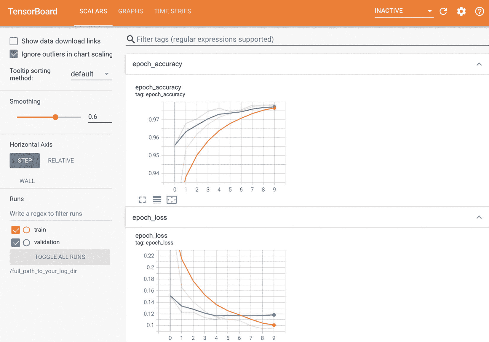

**图 7.7 TensorBoard 可用于轻松监控训练和评估指标。**

## 7.4 编写您自己的训练和评估循环

fit() 工作流在易用性和灵活性之间取得了良好的平衡。这是你大部分时间将要使用的内容。然而，它并不意味着支持深度学习研究人员可能想做的一切，即使是使用自定义指标、自定义损失和自定义回调。

毕竟，内置的 fit() 工作流仅专注于 *监督学习*：一种设置，其中已知 *目标*（也称为 *标签* 或 *注释*）与您的输入数据相关联，并且您计算您的损失作为这些目标和模型预测的函数。然而，并非所有形式的机器学习都属于此类别。还有其他设置，其中没有明确的目标存在，例如 *生成式学习*（我们将在第十二章中讨论）、*自监督学习*（其中目标从输入中获取）和 *强化学习*（学习受偶尔“奖励”驱动，就像训练一只狗一样）。即使您正在进行常规的监督学习，作为研究人员，您可能也希望添加一些需要低级别灵活性的新颖功能。

每当您发现内置的 fit() 不足以应对某种情况时，您将需要编写自己的自定义训练逻辑。在第二章和第三章中，您已经看到了低级别训练循环的简单示例。作为提醒，典型训练循环的内容如下：

1.  **1** 在梯度磁带中运行前向传播（计算模型的输出）以获取当前数据批次的损失值。

1.  **2** 获取损失相对于模型权重的梯度。

1.  **3** 更新模型的权重以降低当前数据批次的损失值。

这些步骤将根据需要重复执行多个批次。这本质上是 fit() 在内部执行的操作。在本节中，您将学习如何从头开始重新实现 fit()，这将为您提供编写任何可能出现的训练算法所需的所有知识。让我们详细看一下。

### 7.4.1 训练与推断

到目前为止，您已经看到了低级别训练循环示例，其中步骤 1（前向传播）通过 predictions <- model(inputs) 完成，步骤 2（获取梯度磁带计算的梯度）通过 gradients <- tape$gradient(loss, model$weights) 完成。在一般情况下，实际上有两个您需要考虑的细微之处。

某些 Keras 层，如 layer_dropout()，在*训练*和*推断*（用于生成预测时）期间有不同的行为。这些层在其 call() 方法中公开了一个 training 布尔参数。调用 dropout(inputs, training = TRUE) 将会丢弃一些激活项，而调用 dropout(inputs, training = FALSE) 则不会做任何操作。顺延而言，Functional 和 Sequential 模型也在它们的 call() 方法中公开了这个 training 参数。记得在前向传播时传递 training = TRUE！因此，我们的前向传播变成了 predictions <- model(inputs, training = TRUE)。

另外，请注意，当您检索模型权重的梯度时，您不应该使用 tape$gradients(loss, model$weights)，而应该使用 tape$gradients(loss, model$trainable_weights)。实际上，层和模型拥有两种权重：

+   *可训练的权重* —— 这些权重应通过反向传播来最小化模型的损失，例如 Dense 层的核和偏置。

+   *不可训练的权重* —— 这些权重应由拥有它们的层在前向传播中更新。例如，如果您想要一个自定义层来保存到目前为止已处理了多少批次的计数器信息，那么该信息将存储在不可训练的权重中，并且在每个批次中，您的层将计数器递增一次。

在 Keras 内置层中，唯一具有不可训练权重的层是 layer_ batch_normalization()，我们将在第九章中讨论。批量归一化层需要不可训练权重来跟踪通过它的数据的平均值和标准差的信息，以便执行*特征归一化*的在线近似（这是您在第六章学到的概念）。考虑到这两个细节，监督学习的训练步骤最终看起来像这样：

library(tensorflow)

train_step <- function(inputs, targets) {

with(tf$GradientTape() %as% tape, {

predictions <- model(inputs, training = TRUE)

loss <- loss_fn(targets, predictions)

})

梯度 <- tape$gradients(loss, model$trainable_weights)

optimizer$apply_gradients(zip_lists(gradients, model$trainable_weights))

}

➊ **我们在第二章介绍了 zip_lists()。**

### 7.4.2 度量的低级用法

在低级训练循环中，您可能希望利用 Keras 度量（无论是自定义的还是内置的）。您已经了解了度量 API：只需为每个目标和预测的批次调用 update_state(y_true, y_pred)，然后使用 result()来查询当前度量值：

metric <- metric_sparse_categorical_accuracy()

targets <- c(0, 1, 2)

predictions <- rbind(c(1, 0, 0),

c(0, 1, 0),

c(0, 0, 1))

metric$update_state(targets, predictions)

current_result <- metric$result()

sprintf("result: %.2f", as.array(current_result))➊

[1] "result: 1.00"

➊ **as.array()将 Tensor 转换为 R 值**

您可能还需要跟踪标量值的平均值，例如模型的损失。您可以通过 metric_mean()来实现：

values <- c(0, 1, 2, 3, 4)

mean_tracker <- metric_mean()

for (value in values)

mean_tracker$update_state(value)

sprintf("Mean of values: %.2f", as.array(mean_tracker$result()))

[1] "Mean of values: 2.00"

在想要重置当前结果时，请记得使用 metric$reset_state()（在训练时期的开始或评估的开始时）。

### 7.4.3 完整的训练和评估循环

让我们将前向传播、反向传播和指标跟踪结合到一个类似 fit()的训练步骤函数中，该函数接受一批数据和目标，并返回 fit()进度条将显示的日志。

**清单 7.21 编写逐步训练循环：训练步骤函数**

model <- get_mnist_model()

loss_fn <- loss_sparse_categorical_crossentropy()➊

optimizer <- optimizer_rmsprop()➋

metrics <- list(metric_sparse_categorical_accuracy())➌

loss_tracking_metric <- metric_mean()➍

train_step <- function(inputs, targets) {

with(tf$GradientTape() %as% tape, {

predictions <- model(inputs, training = TRUE)➎

loss <- loss_fn(targets, predictions)

})

gradients <- tape$gradient(loss,➏

model$trainable_weights)➏

optimizer$apply_gradients(zip_lists(gradients,

model$trainable_weights))

logs <- list()

for (metric in metrics) {➐

metric$update_state(targets, predictions)

logs[[metric$name]] <- metric$result()

}

loss_tracking_metric$update_state(loss)➑

logs$loss <- loss_tracking_metric$result()

日志➒

}

➊ **准备损失函数。**

➋ **准备优化器。**

➌ **准备要监视的指标列表。**

➍ **准备一个 metric_mean()跟踪器来记录平均损失。**

➎ **运行前向传播。请注意，我们传递 training = TRUE。**

➏ **运行反向传播。请注意，我们使用 model$trainable_weights。**

➐ **跟踪指标。**

➑ **跟踪损失平均值。**

➒ **返回指标和损失的当前值。**

我们需要在每个迭代开始时和运行评估之前重置指标的状态。下面是一个实用函数来完成这项工作。

**清单 7.22 逐步编写训练循环：重置指标**

reset_metrics <- function() {

for (指标 in 指标)

metric$reset_state()

loss_tracking_metric$reset_state()

}

现在我们可以布置完整的训练循环了。请注意，我们使用来自 tfdatasets 包的 TensorFlow 数据集对象，将我们的 R 数组数据转换为以大小为 32 的批次迭代的迭代器。机制与我们在第二章实施的数据集迭代器是相同的，只是现在的名称不同了。我们用 tensor_slices_dataset()从 R 数组构建 TensorFlow 数据集实例，用 as_iterator()将其转换为迭代器，然后重复调用 iter_next()来获取下一个批次。在第二章看到的不同之一是，iter_next()返回的是 Tensor 对象，而不是 R 数组。我们将在第八章更详细地介绍 tfdatasets。

**清单 7.23 逐步编写训练循环：循环本身**

library(tfdatasets)

training_dataset <-

list(inputs = train_images, targets = train_labels) %>%

tensor_slices_dataset() %>%

dataset_batch(32)

迭代周期 <- 3

for (迭代周期 in seq(epochs)) {

reset_metrics()

training_dataset_iterator <- as_iterator(training_dataset)

重复 {

batch <- iter_next(training_dataset_iterator)

if (is.null(batch))➊

中断

logs <- train_step(batch$inputs, batch$targets)

}

writeLines(c(

sprintf("第 %s 次迭代结束时的结果", 迭代周期),

sprintf("…%s: %.4f", names(logs), sapply(logs, as.numeric))

))

}

第 1 次迭代结束时的结果

…稀疏分类准确率：0.9156

…损失：0.2687

第 2 次迭代结束时的结果

…稀疏分类准确率：0.9539

…损失：0.1659

第 3 次迭代结束时的结果

…稀疏分类准确率：0.9630

…损失：0.1371

➊ **迭代器已耗尽**

这是评估循环：一个简单的 for 循环，它不断调用 test_step()函数，该函数处理单个数据批次。test_step()函数只是 train_step()逻辑的一个子集。它省略了处理更新模型权重的代码——也就是说，所有涉及 GradientTape()和优化器的代码。

**清单 7.24 逐步编写评估循环**

test_step <- function(inputs, targets) {

predictions <- model(inputs, training = FALSE)➊

loss <- loss_fn(targets, predictions)

logs <- list()

for (metric in metrics) {

metric$update_state(targets, predictions)

logs[[paste0("val_", metric$name)]] <- metric$result()

}

loss_tracking_metric$update_state(loss)

logs[["val_loss"]] <- loss_tracking_metric$result()

logs

}

val_dataset <- list(val_images, val_labels) %>%

tensor_slices_dataset() %>%

dataset_batch(32)

reset_metrics()

val_dataset_iterator <- as_iterator(val_dataset)

repeat {

batch <- iter_next(val_dataset_iterator)

if(is.null(batch)) break➋

c(inputs_batch, targets_batch) %<-% batch

logs <- test_step(inputs_batch, targets_batch)

}

writeLines(c(

"评估结果：",

sprintf("…%s: %.4f", names(logs), sapply(logs, as.numeric))

))

评估结果：

…val_sparse_categorical_accuracy: 0.9461

…val_loss: 0.1871

➊ **请注意我们将 training 参数设置为 FALSE。**

➋ **一旦数据集批处理迭代器耗尽，iter_next() 将返回 NULL。**

恭喜你——你刚刚重新实现了 fit() 和 evaluate()！或者几乎实现了：fit() 和 evaluate() 支持更多功能，包括大规模分布式计算，这需要更多的工作。它还包括几个关键的性能优化。让我们看看其中一个优化：TensorFlow 函数编译。

### 7.4.4 使用 tf_function() 提高性能

你可能已经注意到，尽管实现了基本相同的逻辑，但自定义循环的运行速度明显比内置的 fit() 和 evaluate() 慢得多。这是因为，默认情况下，TensorFlow 代码是逐行执行的，*即时执行*，就像使用 R 数组的常规 R 代码一样。即时执行使得调试代码更容易，但从性能的角度来看远非最佳。

将你的 TensorFlow 代码编译成一个可以进行全局优化的 *计算图* 比逐行解释代码更高效。要做到这一点的语法非常简单：只需在执行之前对你想要编译的任何函数调用 tf_function()，就像下面的示例中所示。

**示例 7.25 使用 tf_function() 与我们的评估步骤函数**

tf_test_step <- tf_function(test_step)➊

val_dataset_iterator <- as_iterator(val_dataset)➋

reset_metrics()

while(!is.null(iter_next(val_dataset_iterator) -> batch)) {

c(inputs_batch, targets_batch) %<-% batch

logs <- tf_test_step(inputs_batch, targets_batch)➌

}

writeLines(c(

"评估结果：",

sprintf("…%s: %.4f", names(logs), sapply(logs, as.numeric))

))

评估结果：

…val_sparse_categorical_accuracy: 0.5190

…val_loss: 1.6764

➊ **将我们之前定义的 test_step 传递给 tf_function()。**

➋ **重用前一个示例中定义的相同 TF 数据集，但创建一个新的迭代器。**

➌ **这次使用编译后的测试步骤函数。**

在我的机器上，我们的评估循环运行时间从 2.4 秒缩短到只有 0.6 秒。快得多！

当 TF 数据集迭代循环也被编译为图操作时，速度提升甚至更大。你可以像这样使用 tf_function() 编译整个评估循环：

my_evaluate <- tf_function(function(model, dataset) {

reset_metrics()

for (batch in dataset) {

c(inputs_batch, targets_batch) %<-% batch

logs <- test_step(inputs_batch, targets_batch)

}

logs

})

system.time(my_evaluate(model, val_dataset))["elapsed"]

elapsed

0.283

这进一步缩短了评估时间！

请记住，当您调试代码时，最好不要调用 tf_function()，而是急切地运行它。这样更容易跟踪错误。一旦您的代码可行并且想要使其快速，就可以向您的训练步骤和评估步骤或任何其他性能关键的函数添加 tf_function()修饰符。

### 7.4.5 利用 fit()进行自定义训练循环

在之前的章节中，我们完全从头编写了自己的训练循环。这样做为您提供了最大的灵活性，但同时您需要编写大量的代码，同时错过了许多方便的 fit()功能，例如回调或分布式训练的内置支持。

如果你需要自定义训练算法，但仍想利用内置的 Keras 训练逻辑的优势，那么在 fit()和从头编写训练循环之间实际上有一种中间状态：你可以提供自定义训练步骤功能，让框架完成其他工作。

您可以通过覆盖 Model 类的 train_step()方法来实现这一点。这是由 fit()用于每个数据批次调用的函数。然后您将能够像通常一样调用 fit()，它将在底层运行您自己的学习算法。下面是一个简单的例子：

+   我们通过调用 new_model_class()来创建一个子类 Model 的新类。

+   我们覆盖 train_step(data)方法。它的内容几乎与我们在前一节中使用的内容相同。它返回将指标名称（包括损失）映射到其当前值的命名列表。

+   我们实现了一个跟踪模型的 Metric 实例的 metrics 活动属性(active property)。这使得模型能够在每个纪元(epoch)和在调用 evaluate()时自动调用模型的 metrics 的 reset_state()，因此不必手动执行。

loss_fn <- loss_sparse_categorical_crossentropy()

loss_tracker <- metric_mean(name = "loss")➊

CustomModel <- new_model_class(

classname = "CustomModel",

train_step = function(data) {➋

c(inputs, targets) %<-% data

with(tf$GradientTape() %as% tape, {

predictions <- self(inputs, training = TRUE)➌

loss <- loss_fn(targets, predictions)

})

gradients <- tape$gradient(loss, model$trainable_weights)

optimizer$apply_gradients(zip_lists(gradients, model$trainable_weights))

loss_tracker$update_state(loss)➍

list(loss = loss_tracker$result())➎

},

metrics = mark_active(function() list(loss_tracker))➏

)

➊ **该度量对象将用于跟踪训练和评估期间每个批次损失的平均值。**

➋ **我们覆盖 train_step 方法。**

➌ **我们使用 self(inputs, training = TRUE)而不是 model(inputs, training = TRUE)，因为我们的模型是类本身。**

➍ **我们更新损失跟踪器指标，该指标跟踪损失的平均值。**

➎ **通过查询损失跟踪器指标返回到目前为止的平均损失。**

➏ **您想在跨时期重置的任何指标都应在此处列出。**

现在，我们可以实例化我们的自定义模型，编译它（我们仅传递优化器，因为损失已在模型外部定义），然后像往常一样使用 fit() 进行训练：

inputs <- layer_input(shape = c(28 * 28))

features <- inputs %>%

layer_dense(512, activation = "relu") %>%

layer_dropout(0.5)

outputs <- features %>%

layer_dense(10, activation = "softmax")

model <- CustomModel(inputs = inputs, outputs = outputs)➊

model %>% compile(optimizer = optimizer_rmsprop())

model %>% fit(train_images, train_labels, epochs = 3)

➊ **因为我们没有提供 initialize() 方法，所以使用与 keras_model() 相同的签名：inputs、outputs 和可选的 name。**

有几个要点需要注意：

+   这种模式不会阻止您使用功能 API 构建模型。 无论您是构建序贯模型、功能 API 模型还是子类模型，都可以这样做。

+   当您重写 train_step 时，您不需要调用 tf_function() ——框架会为您执行此操作。

那么，指标呢？ 以及如何通过 compile() 配置损失？ 在调用 compile() 之后，您可以访问以下内容：

+   self$compiled_loss—您传递给 compile() 的损失函数。

+   self$compiled_metrics—一个包装器，用于您传递的指标列表，它允许您调用 self$compiled_metrics$update_state() 一次更新所有指标。

+   self$metrics—您传递给 compile() 的实际指标列表。 请注意，它还包括一个跟踪损失的指标，类似于我们之前手动进行的 loss_tracking_metric。

因此，我们可以这样写：

CustomModel <- new_model_class(

classname = "CustomModel",

train_step = function(data) {

c(inputs, targets) %<-% data

with(tf$GradientTape() %as% tape, {

预测 <- self(inputs, training = TRUE)

loss <- self$compiled_loss(targets, predictions)➊

})

梯度 <- tape$gradient(loss, model$trainable_weights)

optimizer$apply_gradients(zip_lists(gradients, model$trainable_weights))

self$compiled_metrics$update_state(

targets, predictions)➋

results <- list()

for(metric in self$metrics)

results[[metric$name]] <- metric$result()

results➌

}

)

➊ **通过 self$compiled_loss 计算损失。**

➋ **通过 self$compiled_metrics 更新模型的指标。**

➌ **返回一个命名列表，将指标名称映射到其当前值。**

让我们试一试：

inputs <- layer_input(shape = c(28 * 28))

特征 <- inputs %>%

layer_dense(512, activation = "relu") %>%

layer_dropout(0.5)

outputs <- features %>% layer_dense(10, activation = "softmax")

model <- CustomModel(inputs = inputs, outputs = outputs)

model %>% compile(optimizer = optimizer_rmsprop(),

loss = loss_sparse_categorical_crossentropy(),

metrics = metric_sparse_categorical_accuracy())

model %>% fit(train_images, train_labels, epochs = 3)

那是大量的信息，但现在你已经了解足够的内容，可以使用 Keras 几乎做任何事情。

## 总结

+   Keras 提供了一系列不同的工作流程，基于*逐步透露复杂性*的原则。它们都能够平稳地协同运作。

+   你可以通过 Sequential API 的 keras_model_sequential()，通过 Functional API 的 keras_model()，或者通过子类化 Model 类的 new_model_class()来构建模型。大多数情况下，你将使用 Functional API。

+   训练和评估模型的最简单方法是通过默认的 fit()和 evaluate()方法。

+   Keras 回调提供了一种简单的方法，在调用 fit()期间监视模型并根据模型状态自动采取行动。

+   你还可以通过覆盖 train_ step()方法完全控制 fit()的行为。

+   除了 fit()之外，你还可以完全从头开始编写自己的训练循环。这对于实现全新训练算法的研究人员非常有用。
