# 第八章：计算机视觉的深度学习介绍

*本章内容包括*

+   理解卷积神经网络（卷积网络）

+   使用数据增强来减轻过拟合

+   使用预训练的卷积网络进行特征提取

+   对预训练的卷积网络进行微调

计算机视觉是深度学习的最早和最大的成功故事。每天，您都在通过 Google 照片、Google 图像搜索、YouTube、相机应用中的视频滤镜、OCR 软件等与深度视觉模型进行交互。这些模型还是自动驾驶、机器人技术、AI 辅助医学诊断、自动零售结账系统甚至自动农业等尖端研究的核心。

计算机视觉是在 2011 年至 2015 年间深度学习初期崛起的问题领域。一种称为*卷积神经网络*的深度学习模型开始在那个时候在图像分类竞赛中取得了非常好的成绩，首先是丹·西雷赛安（Dan Ciresan）在两个小众竞赛中获胜（ICDAR 2011 年中文字符识别竞赛和 IJCNN 2011 年德国交通标志识别竞赛），然后在 2012 年秋季更为显著，辛顿（Hinton）的团队赢得了备受瞩目的 ImageNet 大规模视觉识别挑战赛。很快，许多更有前景的成果开始涌现在其他计算机视觉任务中。

有趣的是，这些早期的成功并没有让深度学习在当时成为主流——这需要几年的时间。计算机视觉研究界花了很多年投资于除了神经网络之外的方法，它们并不完全准备放弃它们，只因为有了新的玩家。在 2013 年和 2014 年，深度学习仍然面临着来自许多资深计算机视觉研究人员的激烈质疑。直到 2016 年，它才最终占据主导地位。我（弗朗索瓦）还记得在 2014 年 2 月劝告我的一位前教授转向深度学习。“这是下一个大事！”我会说。“嗯，也许它只是一时的热门话题，”他回答道。到了 2016 年，他的整个实验室都在进行深度学习。一个时代到来的理念是无法阻挡的。

本章介绍了卷积神经网络，也称为*卷积网络*，这种类型的深度学习模型现在几乎在计算机视觉应用中被普遍使用。您将学习将卷积网络应用于图像分类问题，特别是那些涉及小训练数据集的问题，如果您不是一家大型技术公司，则这是最常见的用例。

## 8.1 卷积网络简介

我们即将深入探讨卷积网络是什么以及为什么它们在计算机视觉任务中取得如此成功的理论。但首先，让我们以一个简单的卷积网络示例来实际了解一下，该示例对 MNIST 数字进行分类，这是我们在第二章中使用全连接网络执行的任务（当时我们的测试准确率为 97.8%）。尽管卷积网络将是基本的，但其准确性将远远超出我们第二章中的全连接模型。

以下列表显示了一个基本卷积神经网络的外观。它是一堆`layer_conv_2d()`和`layer_max_pooling_2d()`层。你很快就会明白它们的作用。我们将使用我们在上一章介绍的 Functional API 来构建模型。

[列表 8.1 实例化一个小型卷积神经网络](https://example.org) 

`inputs <— layer_input(shape = c(28, 28, 1))`

`outputs <— inputs` %>%

`layer_conv_2d(filters = 32, kernel_size = 3, activation = "relu")` %>%

`layer_max_pooling_2d(pool_size = 2)` %>%

`layer_conv_2d(filters = 64, kernel_size = 3, activation = "relu")` %>%

`layer_max_pooling_2d(pool_size = 2)` %>%

`layer_conv_2d(filters = 128, kernel_size = 3, activation = "relu")` %>%

`layer_flatten() %>% layer_dense(10, activation = "softmax")`

`model <— keras_model(inputs, outputs)`

重要的是，卷积神经网络的输入是形状为（图像高度、图像宽度、图像通道数）的张量，不包括批处理维度。在这种情况下，我们将配置卷积神经网络以处理大小为（28、28、1）的输入，这是 MNIST 图像的格式。

让我们显示我们卷积神经网络的结构。

[列表 8.2 显示模型摘要](https://example.org)

`model`

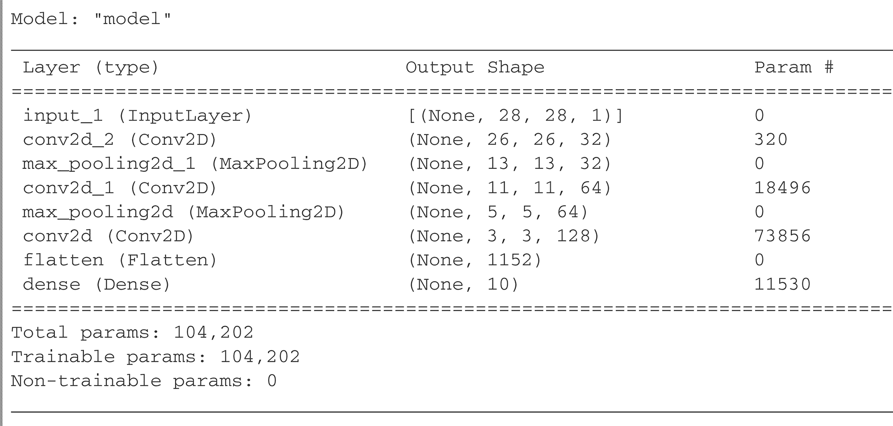

你可以看到每个 Conv2D 和 MaxPooling2D 层的输出都是形状为（高度，宽度，通道数）的秩为 3 的张量。随着模型的加深，宽度和高度维度会变小。通道的数量由传递给`layer_conv_2d()`层的第一个参数（32、64 或 128）来控制。

在最后一个 Conv2D 层之后，我们得到形状为（3、3、128）的输出，即一个 3 × 3 的具有 128 个通道的特征图。下一步是将此输出馈送到一个密集连接的分类器中，就像您已经熟悉的那样：一堆 Dense 层。这些分类器处理向量，这是 1D 的，而当前的输出是一个秩为 3 的张量。为了弥合差距，我们使用 Flatten 层将 3D 输出展平为 1D，然后再添加 Dense 层。最后，我们进行 10 分类，因此我们的最后一层有 10 个输出和 softmax 激活。

现在，让我们在 MNIST 数字上训练卷积神经网络。我们将重用第二章中 MNIST 示例中的大量代码。因为我们要进行 10 分类，并带有 softmax 输出，所以我们将使用分类交叉熵损失，因为我们的标签是整数，所以我们将使用稀疏版本的稀疏分类交叉熵。

[列表 8.3 在 MNIST 图像上训练卷积神经网络](https://example.org)

`c(c(train_images, train_labels), c(test_images, test_labels)) %<—%`

`dataset_mnist()`

`train_images <— array_reshape(train_images, c(60000, 28, 28, 1)) / 255`

`test_images <— array_reshape(test_images, c(10000, 28, 28, 1)) / 255`

`model %>% compile(optimizer = "rmsprop",`

`loss = "sparse_categorical_crossentropy"`

`metrics = c("accuracy"))`

`model %>% fit(train_images, train_labels, epochs = 5, batch_size = 64)`

让我们在测试数据上评估模型。

[列表 8.4 评估卷积神经网络](https://example.org)

`result <— evaluate(model, test_images, test_labels)`

`cat("测试准确率:", result['accuracy'], "\n")`

测试准确率：0.9915

而第二章中的密集连接模型的测试准确率为 97.8%，基本卷积神经网络的测试准确率为 99.1%：我们将错误率减少了约 60%（相对）。不错！

为什么这个简单的卷积神经网络效果这么好，相比之下，与密集连接模型相比如此？为了回答这个问题，让我们深入了解一下 Conv2D 和 MaxPooling2D 层的作用。

### 8.1.1 卷积操作

密集连接层和卷积层之间的根本区别在于：密集层学习其输入特征空间中的全局模式（例如，对于 MNIST 数字，涉及所有像素的模式），而卷积层学习局部模式——在图像的情况下，输入的小 2D 窗口中发现的模式（参见图 8.1）。在先前的示例中，这些窗口都是 3×3。

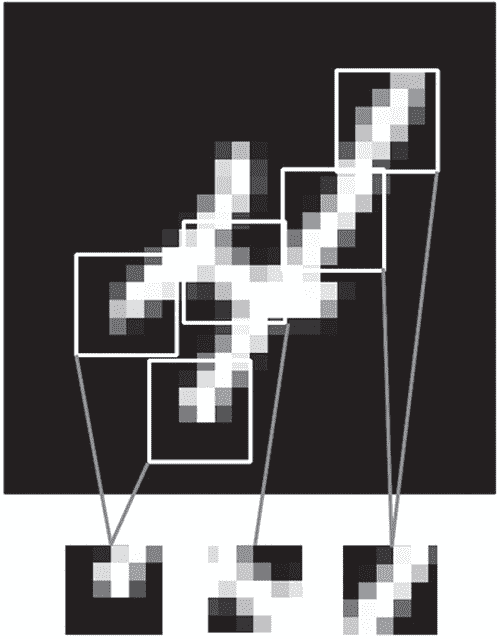

**图 8.1 图像可以被分解为边缘、纹理等局部模式。**

这一关键特性赋予了卷积神经网络两个有趣的特性：

+   *它们学习的模式是平移不变的*——在图片的右下角学习了某种模式后，卷积神经网络可以在任何地方识别它——例如，在左上角。密集连接模型如果出现在新位置，就必须重新学习该模式。这使得处理图像时，卷积神经网络在数据效率上更具优势（因为*视觉世界在本质上是平移不变的*）：它们需要更少的训练样本来学习具有泛化能力的表示。

+   *它们可以学习空间模式的层次结构*——第一个卷积层将学习小的局部模式，例如边缘，第二个卷积层将学习由第一层特征组成的较大模式，依此类推（参见图 8.2）。这使得卷积神经网络能够高效地学习越来越复杂和抽象的视觉概念，因为*视觉世界在本质上是空间层次结构*。

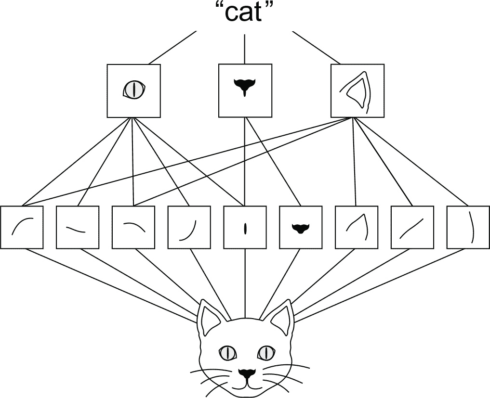

**图 8.2 视觉世界形成了视觉模块的空间层次结构：基本线条或纹理结合成简单对象，如眼睛或耳朵，它们又结合成“猫”等高级概念。**

卷积操作在称为*特征图*的三阶张量上进行，具有两个空间轴（*高度*和*宽度*）以及一个*深度*轴（也称为*通道*轴）。对于 RGB 图像，深度轴的维数为 3，因为图像具有三个颜色通道：红色、绿色和蓝色。对于黑白图片，如 MNIST 数字，深度为 1（灰度级）。卷积操作从其输入特征图中提取补丁，并对所有这些补丁应用相同的变换，生成一个*输出特征图*。此输出特征图仍然是一个三阶张量：它具有宽度和高度。它的深度可以是任意的，因为输出深度是层的一个参数，该深度轴中的不同通道不再代表 RGB 输入中的特定颜色；相反，它们代表*滤波器*。滤波器编码输入数据的特定方面：在高层次上，单个滤波器可以编码“输入中存在面部”的概念，例如。

在 MNIST 示例中，第一卷积层接受尺寸为 (28, 28, 1) 的特征图，并输出尺寸为 (26, 26, 32) 的特征图：它在其输入上计算 32 个滤波器。这 32 个输出通道中的每一个都包含一个 26 × 26 的值网格，这是该滤波器在输入上的*响应图*，指示了该滤波器模式在输入的不同位置的响应（参见图 8.3）。

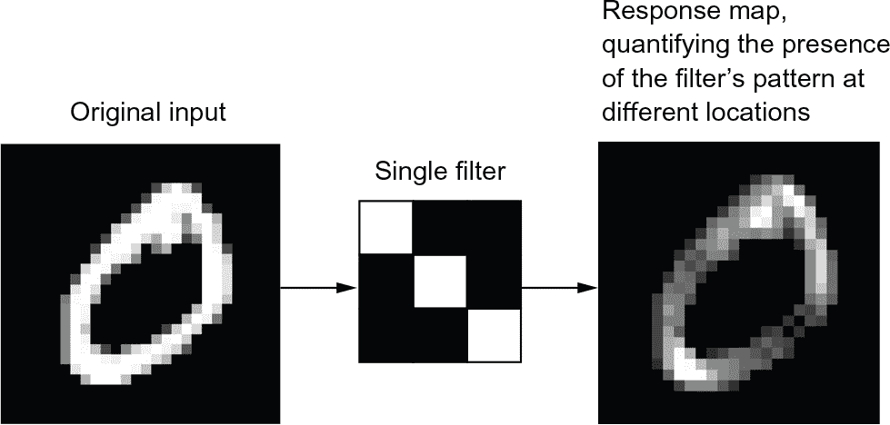

**图 8.3 响应图的概念：输入中不同位置的模式的 2D 地图**

这就是术语*特征图*的含义：深度轴中的每个维度都是一个*特征*（或滤波器），而二阶张量输出[, , n] 是此滤波器在输入上的 2D 空间*响应图*。

卷积由两个关键参数定义：

+   *从输入中提取的补丁的大小* —— 这些通常是 3 × 3 或 5 × 5。在示例中，它们是 3 × 3，这是一个常见的选择。

+   *输出特征图的深度* —— 这是由卷积计算的滤波器数量。示例从深度为 32 开始，最终达到了深度为 64。

在 layer_conv_2d() 中，这些参数是传递给层的第一个参数（与输入组合的参数之后）：inputs %>% layer_conv_2d(output_depth, c(window_ height, window_width))。

卷积的工作原理是通过*滑动*这些大小为 3 × 3 或 5 × 5 的窗口，遍历 3D 输入特征图，停留在每个可能的位置，并提取周围特征的 3D 补丁（形状为 (window_height, window_width, input_depth)）。然后将每个这样的 3D 补丁转化为形状为 (output_depth) 的 1D 向量，通过与一个称为*卷积核*的学习权重矩阵进行张量积操作——同一个卷积核会在每个补丁中重复使用。所有这些向量（每个补丁一个）然后会在空间上重新组合成一个形状为 (height, width, output_depth) 的 3D 输出图。在输出特征图的每个空间位置都对应于输入特征图的相同位置（例如，输出的右下角包含了输入的右下角的信息）。例如，使用 3 × 3 窗口，向量 output[i, j, ] 来自于 3D 补丁 input[(i-1):(i+1), (j-1):(j+1), ]。完整的过程详见图 8.4。

**图 8.4 卷积的工作原理。**

请注意，输出的宽度和高度可能与输入的宽度和高度不同，原因有两个：

+   边界效应可以通过对输入特征图进行填充来抵消。

+   我将在一秒钟内定义*步幅*的使用。

让我们更深入地了解这些概念。

### 理解边界效应和填充

考虑一个 5 × 5 的特征图（总共 25 个格子）。你只能在其中 9 个格子周围居中 3 × 3 窗口，形成一个 3 × 3 的网格（见 图 8.5）。因此，输出特征图将是 3 × 3。它会略微缩小：在这种情况下，每个维度正好缩小两个格子。在早期的例子中，你可以看到这种边界效应：开始时输入是 28 × 28，在第一卷积层之后变成了 26 × 26。

如果您想获得与输入相同空间维度的输出特征图，您可以使用*填充*。填充包括在输入特征图的每一侧添加适当数量的行和列，以便在每个输入格子周围可以放置中心卷积窗口。对于 3 × 3 窗口，您需要在右边添加一列，左边添加一列，顶部添加一行，底部添加一行。对于 5 × 5 窗口，您需要添加两行（详见 图 8.6）。

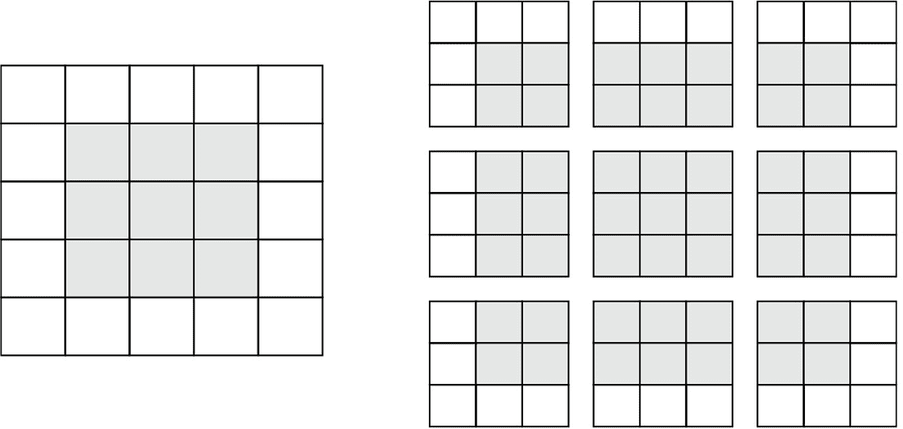

**图 8.5 在 5 × 5 输入特征图中 3 × 3 补丁的有效位置**

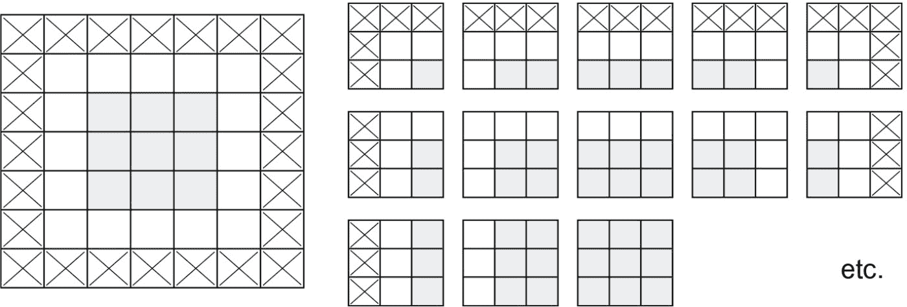

**图 8.6 对 5 × 5 输入进行填充，以能够提取 25 个 3 × 3 补丁**

在 layer_conv_2d() 中，填充可通过 padding 参数进行配置，padding 参数可以取两个值：“valid”，表示不进行填充（只使用有效的窗口位置），以及“same”，表示“以这样一种方式填充，使得输出的宽度和高度与输入相同。” padding 参数的默认值是“valid”。

### 理解卷积步幅

可以影响输出大小的另一个因素是*步幅*的概念。到目前为止，我们对卷积的描述假定卷积窗口的中心瓦片都是连续的。但是，两个连续窗口之间的距离是卷积的一个参数，称为其*步幅*，默认为 1。可以进行*步进卷积*：步幅大于 1 的卷积。在图 8.7 中，您可以看到在没有填充的情况下，3×3 卷积以步幅 2 在 5×5 输入上提取的补丁。

使用步长 2 意味着特征映射的宽度和高度被下采样了 2 倍（除了由边界效应引起的任何变化）。步进卷积在分类模型中很少使用，但对于某些类型的模型非常方便，你将在下一章中看到。

在分类模型中，我们倾向于使用*最大池化*操作来对特征映射进行下采样，你在我们的第一个卷积神经网络示例中看到了它的作用。让我们更深入地研究一下。

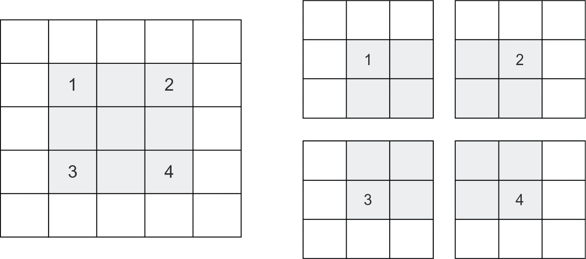

**图 8.7 3 × 3 卷积补丁，步长为 2 × 2**

### 8.1.2 最大池化操作

在卷积神经网络示例中，您可能已经注意到，在每个 layer_max_pooling_2d()之后，特征映射的大小都会减半。例如，在第一个 layer_max_pooling_2d()之前，特征映射为 26×26，但最大池化操作将其减半为 13×13。这就是最大池化的作用：对特征映射进行积极地下采样，就像步进卷积一样。

最大池化包括从输入特征映射中提取窗口，并输出每个通道的最大值。概念上类似于卷积，不同之处在于，不是通过学习的线性转换（卷积核）来转换局部补丁，而是通过硬编码的最大张量操作来转换它们。与卷积的一个重大区别是，最大池化通常使用 2×2 的窗口和步长 2 来进行，以将特征映射下采样 2 倍。另一方面，卷积通常使用 3×3 的窗口和无步长（步长为 1）进行。

为什么要以这种方式下采样特征映射？为什么不删除最大池化层，并一直保持相当大的特征映射？让我们看看这个选择。我们的模型将如下列表所示。

列表 8.5 列表 8.5 缺少最大池化层的结构不正确的卷积神经网络

inputs <— layer_input(shape = c(28, 28, 1))

outputs <— inputs %>%

layer_conv_2d(filters = 32, kernel_size = 3, activation = "relu") %>%

layer_conv_2d(filters = 64, kernel_size = 3, activation = "relu") %>%

layer_conv_2d(filters = 128, kernel_size = 3, activation = "relu") %>%

layer_flatten() %>%

layer_dense(10, activation = "softmax")

model_no_max_pool <— keras_model(inputs = inputs, outputs = outputs)

这是模型的摘要：

model_no_max_pool

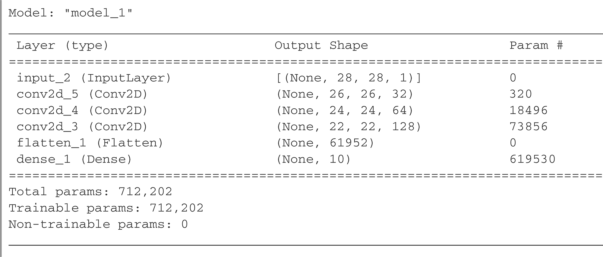

这个设置有什么问题？有两个问题：

+   它不利于学习空间特征的层次结构。第三层中的 3×3 窗口仅包含来自最初输入的 7×7 窗口的信息。卷积网络学习的高级模式与初始输入相比仍然非常小，这可能不足以学习分类数字（尝试通过仅使用 7×7 像素的窗口查看数字来识别数字！）。我们需要来自前一个卷积层的特征包含关于整个输入的信息。

+   最终的特征映射每个样本有 22×22×128=61,952 个系数

简而言之，使用下采样的原因是减少要处理的特征图系数的数量，并通过使连续的卷积层查看越来越大的窗口（就涵盖原始输入的部分而言）来引导空间滤波器层次结构。

请注意，最大池化并不是您可以实现这种下采样的唯一方法。正如您已经知道的那样，您还可以在之前的卷积层中使用步长。您还可以使用平均池化，而不是最大池化，其中每个本地输入补丁通过在补丁上每个通道的平均值进行变换，而不是最大值。但是，最大池化比这些替代解决方案更有效。原因是特征倾向于在特征地图的不同瓷砖上编码某些模式或概念的空间存在（因此是特征图一词），查看不同特征的最大存在而不是平均存在更具信息性。最合理的子采样策略是首先通过未简化的卷积产生密集的特征映射，然后查看特征在小补丁上的最大激活，而不是查看输入的更稀疏的窗口（通过分步卷积）或平均输入补丁，这可能导致您错过或稀释特征存在信息。

现在，您应该了解卷积神经网络的基础知识-特征图、卷积和最大池化-并且应该知道如何构建一个小型卷积神经网络来解决玩具问题，如 MNIST 数字分类。现在让我们继续探讨更有用，实用的应用。

## 8.2 从头开始在小数据集上训练 convnet

使用很少的数据来训练图像分类模型是一种常见情况，在实践中，如果您在专业上进行计算机视觉，可能会遇到这种情况。“一些”样本可以从几百个到几万个图像不等。作为实际示例，我们将专注于将图像分类为猫或狗的元素，该数据集包含 5,000 张猫和狗的图片（2,500 只猫，2,500 只狗）。我们将使用 2,000 张图片进行训练，1,000 张用于验证，2,000 张用于测试。

在本节中，我们将回顾一种解决这个问题的基本策略：使用很少的数据从头开始训练一个新模型。我们将首先使用没有正则化的小型卷积神经网络对 2000 个训练样本进行简单训练，以建立一个基线模型来评估可达到的效果。这将使我们的分类准确性达到大约 70%。此时，主要问题在于过拟合。然后，我们将介绍数据增强——一种处理计算机视觉中的过拟合的强大技术。通过使用数据增强，我们将改善模型，使其准确率提高到 80-85%。

在下一节中，我们将回顾应用深度学习于小数据集的另外两种关键技术：*使用预训练模型进行特征提取*（将准确率提高到 97.5%）和*微调预训练模型*（将准确率提高到最终的 98.5%）。这三种战略——从头开始训练小模型、使用预训练模型进行特征提取，以及微调预训练模型——将为您应对小数据集的图像分类问题提供工具箱。

### 8.2.1 深度学习在小数据问题中的相关性。

训练模型所需的“足够样本”是相对的——首先相对于你要训练的模型的规模和深度。使用仅有几十个样本训练卷积神经网络以解决复杂问题是不可能的，但是对于小型、规范良好的模型和简单任务，数百个样本可能足够了。因为卷积神经网络学习局部、平移不变的特征，它们在感知性问题上非常数据高效。即使在非常小的图像数据集上从头开始训练卷积神经网络，也可以产生合理的结果，而不需要进行任何自定义的特征工程。你将在本节中看到这一点的实践演示。

此外，深度学习模型具有高度重用性的本质特点：你可以使用一种基于大规模数据集训练的图像分类或语音转文本模型，并在只做出微小修改的情况下将其应用于完全不同的问题。尤其是在计算机视觉领域，很多预训练模型（通常在 ImageNet 数据集上训练）现在已经公开提供下载，可以使用非常少量的数据来引导强大的视觉模型。这是深度学习的最大优势之一：特征重用。你将在下一节中详细了解这一点。首先，我们需要开始处理数据。

### 8.2.2 下载数据

我们将使用的 Dogs vs. Cats 数据集并不随 Keras 打包。这是 Kaggle 在 2013 年末作为计算机视觉竞赛的一部分提供的，当时 convnets 还不是主流。您可以从 [`www.kaggle.com/c/dogs-vs-cats/data`](http://www.kaggle.com/c/dogs-vs-cats/data) 下载原始数据集（如果您还没有 Kaggle 帐户，您需要创建一个——别担心，这个过程很简单）。您也可以使用 Kaggle 命令行 API 下载数据集。

**下载 Kaggle 数据集**

Kaggle 提供了一个易于使用的 API 来以编程方式下载托管在 Kaggle 上的数据集。您可以使用它将 Dogs vs. Cats 数据集下载到您的本地计算机。例如，通过在 R 中运行单个命令，就可以轻松下载此数据集。

但是，API 的访问权限受限于 Kaggle 用户，因此要运行上述命令，您首先需要进行身份验证。kaggle 包将在位于 ~/.kaggle/kaggle.json 的 JSON 文件中查找您的登录凭据。让我们创建这个文件。

首先，您需要创建一个 Kaggle API 密钥并将其下载到本地计算机。只需在 web 浏览器中导航到 Kaggle 网站，登录，然后转到“我的帐户”页面。在您的帐户设置中，您会找到一个 API 部分。点击“创建新的 API 令牌”按钮将生成一个名为 kaggle.json 的密钥文件，并将其下载到您的计算机上。

最后，创建一个 ~/.kaggle 文件夹。作为安全最佳实践，您还应确保该文件仅由当前用户自己可读（仅适用于 Mac 或 Linux，而不是 Windows）。

因为在接下来的章节中我们将执行大量的文件系统操作，我们将使用 fs R 包，它比基本的 R 文件系统函数更易于使用。（您可以通过 install.packages(“fs”) 从 CRAN 安装它。）

准备 Kaggle API 密钥：

library(fs)

dir_create("~/.kaggle")

file_move("~/Downloads/kaggle.json", "~/.kaggle/")

file_chmod("~/.kaggle/kaggle.json", "0600")➊

➊ **将文件标记为仅自己可读**

通过 pip 安装 kaggle 包：

reticulate::py_install("kaggle", pip = TRUE)

现在，您可以下载我们即将使用的数据：

system('kaggle competitions download -c dogs-vs-cats')

第一次尝试下载数据时，可能会出现“403 Forbidden”错误。这是因为在下载之前，您需要接受与数据集相关的条款——您需要登录 Kaggle 帐户并点击“我理解并接受”按钮，网址为 [`www.kaggle.com/c/dogs-vs-cats/rules`](http://www.kaggle.com/c/dogs-vs-cats/rules)。您只需要这样做一次。

最后，数据以压缩的 zip 文件 dogs-vs-cats.zip 的形式下载。该 zip 文件本身包含另一个压缩的 zip 文件 train.zip，这是我们将要使用的训练数据。我们使用 zip R 包（可以通过 install.packages(“zip”) 从 CRAN 安装）将 train.zip 解压缩到一个新目录 dogs-vs-cats 中：

zip::unzip('dogs-vs-cats.zip', exdir = "dogs-vs-cats", files = "train.zip")

zip::unzip("dogs-vs-cats/train.zip", exdir = "dogs-vs-cats")

我们数据集中的图片是中等分辨率的彩色 JPEG。图 8.8 展示了一些示例。

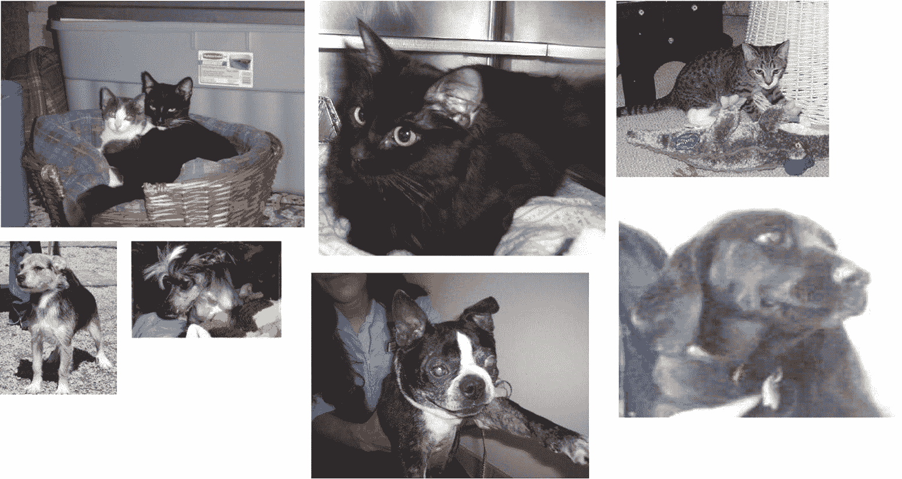

**图 8.8 狗与猫数据集的样本。大小未经修改：样本的大小、颜色、背景等各不相同。**

毫不奇怪，最早在 2013 年的狗与猫 Kaggle 竞赛中，获胜者都是使用了卷积神经网络。最好的参赛作品达到了 95% 的准确率。在这个示例中，我们将会在下一节中实现接近这个准确率，尽管我们将只使用竞争对手可用数据的不到 10% 进行模型训练。

这个数据集包含 25,000 张狗和猫的图片（每类别 12,500 张），大小为 543 MB（压缩后）。下载并解压缩数据后，我们将创建一个新数据集，其中包含三个子集：一个包含每个类别 1,000 个样本的训练集，一个包含每个类别 500 个样本的验证集，以及一个包含每个类别 1,000 个样本的测试集。为什么这样做？因为你在职业生涯中遇到的许多图像数据集只包含几千个样本，而不是几万个样本。有更多的数据可用会使问题变得更容易，因此使用小数据集进行学习是一个好的做法。

我们将要处理的子采样数据集将具有以下目录结构：

cats_vs_dogs_small/

…train/

……cat/➊

……dog/➋

…validation/

……cat/➌

……dog/➍

…test/

……cat/➎

……dog/➏

➊ **包含 1,000 张猫的图片**

➋ **包含 1,000 张狗的图片**

➌**包含 500 张猫的图片**

➍**包含 500 张狗的图片**

➎ **包含 1,000 张猫的图片**

➏**包含 1,000 张狗的图片**

让我们通过几次调用 {fs} 函数来实现这一点。

列表 8.6 将图片复制到训练、验证和测试目录

library(fs)

original_dir <— path("dogs-vs-cats/train")➊

new_base_dir <— path("cats_vs_dogs_small")➋

make_subset <— function(subset_name,➌

start_index, end_index) {

for (category in c("dog", "cat")) {

file_name <— glue::glue("{category}.{ start_index:end_index }.jpg")

dir_create(new_base_dir / subset_name / category)

file_copy(original_dir / file_name,

new_base_dir / subset_name / category / file_name)

}

}

make_subset("train", start_index = 1, end_index = 1000)➍

make_subset("validation", start_index = 1001, end_index = 1500)➎

make_subset("test", start_index = 1501, end_index = 2500)➏

➊ **原始数据集解压缩后的目录路径**

➋ **我们将存储较小数据集的目录**

➌ **将猫和狗图片在开始索引和结束索引之间复制到子目录 new_base_dir/{subset_name}/cat（和/dog）的实用函数。"subset_name" 将是 "train"、"validation" 或 "test" 中的一个。**

➍ **创建训练子集，包含每类别的前 1,000 张图片。**

➎ **创建验证子集，包含每类别的接下来 500 张图片。**

➏ **用每个类别的接下来的 1,000 张图像创建测试子集。**

现在我们有 2,000 张训练图像，1,000 张验证图像和 2,000 张测试图像。每个数据集包含相同数量的来自每个类别的样本：这是一个平衡的二元分类问题，这意味着分类准确度将是一个适当的成功度量。

### 8.2.3 构建模型

我们将重复使用你在第一个示例中看到的相同的通用模型结构：卷积网络将是交替的 layer_conv_2d()（使用 relu 激活）和 layer_ max_pooling_2d() 层的堆叠。

但因为我们处理的是更大的图像和更复杂的问题，我们将相应地使我们的模型更大：它将具有两个更多的 layer_conv_2d() 和 layer_max_pooling_2d() 阶段。这既增加了模型的容量，又进一步减小了特征图的大小，使得当我们到达 layer_flatten() 时它们不会过大。在这里，因为我们从尺寸为 180 像素 × 180 像素的输入开始（一个相对随意的选择），所以在 layer_flatten() 之前我们得到大小为 7 × 7 的特征图。

特征图的深度在模型中逐渐增加（从 32 增加到 256），而特征图的大小逐渐减小（从 180 × 180 减小到 7 × 7）。这是你几乎在所有卷积网络中都会看到的模式。

因为我们正在处理一个二元分类问题，所以我们将模型结束于一个单元（大小为 1 的 layer_dense()）和一个 sigmoid 激活。这个单元将编码模型正在观察的一个类别或另一个类别的概率。

最后一个小差异：我们将以一个 layer_rescaling() 开始模型，它将重新缩放图像输入（其值最初在 [0, 255] 范围内）到 [0, 1] 范围内。

列表 8.7 实例化用于狗与猫分类的小型卷积网络

inputs <— layer_input(shape = c(180, 180, 3))➊

outputs <— inputs %>%

layer_rescaling(1 / 255) %>%➋

layer_conv_2d(filters = 32, kernel_size = 3, activation = "relu") %>%

layer_max_pooling_2d(pool_size = 2) %>%

layer_conv_2d(filters = 64, kernel_size = 3, activation = "relu") %>%

layer_max_pooling_2d(pool_size = 2) %>%

layer_conv_2d(filters = 128, kernel_size = 3, activation = "relu") %>%

layer_max_pooling_2d(pool_size = 2) %>%

layer_conv_2d(filters = 256, kernel_size = 3, activation = "relu") %>%

layer_max_pooling_2d(pool_size = 2) %>%

layer_conv_2d(filters = 256, kernel_size = 3, activation = "relu") %>% layer_flatten() %>%

layer_dense(1, activation = "sigmoid")

model <— keras_model(inputs, outputs)

➊ **该模型期望的是尺寸为 180 × 180 的 RGB 图像。**

➋ **通过将它们除以 255 来将输入重新缩放到 [0, 1] 范围内。**

让我们看看随着每一层的连续变化，特征图的维度如何改变：

model

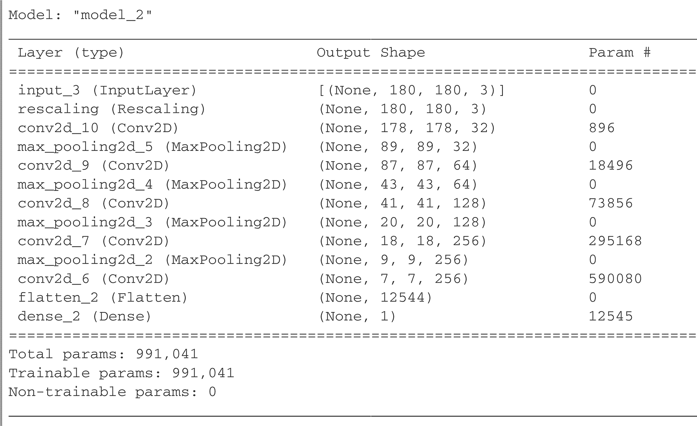

对于编译步骤，我们将继续使用 RMSprop 优化器，因为通常情况下我们会以单个 sigmoid 单元结束模型，所以我们将使用二元交叉熵作为损失函数（作为提醒，在第六章的表 6.1 中可以查看在各种情况下使用哪个损失函数的速查表）。

列表 8.8 配置模型进行训练

model %>% 编译(损失 = "binary_crossentropy",

优化器 = "rmsprop"

指标 = "准确率")

### 8.2.4 数据预处理

正如你现在所知道的，数据在进入模型之前应该被格式化为适当预处理的浮点张量。目前，数据作为 JPEG 文件存在于驱动器上，因此将其输入模型的步骤大致如下：

1.  **1** 读取图片文件。

1.  **2** 将 JPEG 内容解码为 RGB 像素网格。

1.  **3** 将这些转换为浮点张量。

1.  **4** 调整它们为共享大小（我们将使用 180 × 180）。

1.  **5** 将它们打包成批次（我们将使用 32 张图像的批次）。

这可能看起来有点令人生畏，但幸运的是，Keras 提供了自动处理这些步骤的实用工具。特别是，Keras 具有实用函数 image_dataset_ from_directory()，它让你快速设置一个数据管道，可以自动将磁盘上的图像文件转换为预处理张量的批次。这是我们将在这里使用的方法。

调用 image_dataset_from_directory(directory) 首先会列出目录的子目录，并假定每个子目录都包含一个类别的图像。然后，它将索引每个子目录中的图像文件。最后，它将创建并返回一个 TF 数据集对象，配置为读取这些文件、对它们进行洗牌、将它们解码为张量、将它们调整为共享大小并将它们打包成批次。

列表 8.9 使用 image_dataset_from_directory 读取图像

训练数据集 <—

从目录创建图像数据集(new_base_dir / "train")

图像大小 = c(180, 180)

批量大小 = 32)

验证数据集 <—

从目录创建图像数据集(new_base_dir / "validation")

图像大小 = c(180, 180)

批量大小 = 32)

测试数据集 <—

从目录创建图像数据集(new_base_dir / "test")

图像大小 = c(180, 180)

批量大小 = 32)

**理解 tfdatasets**

tfdatasets 包可用于为机器学习模型创建高效的输入管道。其核心对象类型是 TF 数据集。

TF 数据集对象是可迭代的：你可以在它上面调用 as_iterator() 来生成一个迭代器，然后在迭代器上重复调用 iter_next() 来生成数据序列。通常，你会使用 TF 数据集对象来生成输入数据和标签的批次。你可以直接将 TF 数据集对象传递给 Keras 模型的 fit() 方法。

TF 数据集对象处理了许多关键特性，否则你自己实现起来可能会很麻烦，特别是异步数据预取（在模型处理上一个批次数据的同时预处理下一个批次数据，这样可以保持执行流畅，没有中断）。

tfdatasets 包提供了一个函数式 API，用于修改数据集。这里是一个快速示例：让我们从一个整数序列的 R 数组创建一个 TF Dataset 实例。我们将考虑 100 个样本，其中每个样本是一个大小为 6 的向量（换句话说，我们的起始 R 数组是一个形状为 (100, 6) 的矩阵）：

library(tfdatasets)

example_array <— array(seq(100*6), c(100, 6))

head(example_array)

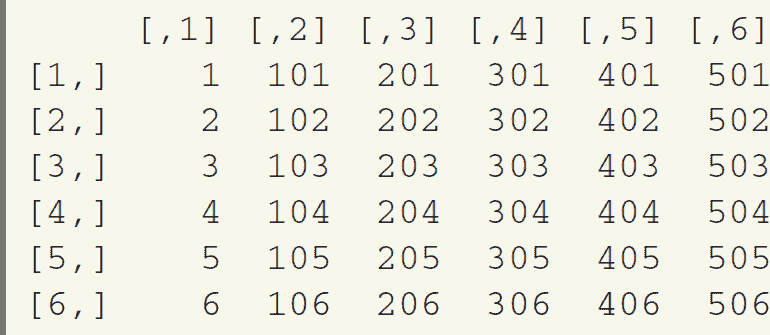

dataset <— tensor_slices_dataset(example_array)➊

➊ tensor_slices_dataset() 函数可以用来从一个 R 数组或一个（可选命名的）R 数组列表创建 TF Dataset。

起初，我们的数据集只产生单个样本：

dataset_iterator <— as_iterator(dataset)

for(i in 1:3) {

element <— iter_next(dataset_iterator)

打印(element)

}

tf.Tensor([ 1 101 201 301 401 501], shape=(6), dtype=int32)

tf.Tensor([ 2 102 202 302 402 502], shape=(6), dtype=int32)

tf.Tensor([ 3 103 203 303 403 503], shape=(6), dtype=int32)

注意，默认情况下 TF Dataset 迭代器会产生 Tensorflow 张量。这通常是你想要的，也是 fit() 方法的最合适类型。然而，在某些情况下，你可能更喜欢迭代器产生 R 数组的批次；在这种情况下，你可以调用 as_array_iterator() 而不是 as_iterator()：

dataset_array_iterator <— as_array_iterator(dataset)

for(i in 1:3) {

element <— iter_next(dataset_array_iterator)

str(element)

}

int [1:6(1d)] 1 101 201 301 401 501

int [1:6(1d)] 2 102 202 302 402 502

int [1:6(1d)] 3 103 203 303 403 503

我们可以使用 dataset_batch() 来对数据进行分批处理：

batched_dataset <— dataset %>%

dataset_batch(3)

batched_dataset_iterator <— as_iterator(batched_dataset)

for(i in 1:3) {

element <— iter_next(batched_dataset_iterator)

打印(element)

}

tf.Tensor(

[ [ 1 101 201 301 401 501]

[ 2 102 202 302 402 502]

[ 3 103 203 303 403 503]], shape=(3, 6), dtype=int32)

tf.Tensor(

[ [ 4 104 204 304 404 504]

[ 5 105 205 305 405 505]

[ 6 106 206 306 406 506]], shape=(3, 6), dtype=int32)

tf.Tensor(

[ [ 7 107 207 307 407 507]

[ 8 108 208 308 408 508]

[ 9 109 209 309 409 509]], shape=(3, 6), dtype=int32)

更广泛地说，我们可以访问一系列有用的数据集方法，比如

+   dataset_shuffle(buffer_size)—在缓冲区内对元素进行洗牌

+   dataset_prefetch(buffer_size)—预取 GPU 内存中的元素缓冲，以实现更好的设备利用率

+   dataset_map(fn)—对数据集的每个元素应用任意转换（函数 fn，它期望接受数据集产生的单个元素作为输入）

dataset_map() 方法特别常用。这里是一个例子。我们将使用它来将我们的玩具数据集中的元素重新塑形，从形状 (6) 到形状 (2, 3)：

reshaped_dataset <— dataset %>%

dataset_map(function(element) tf$reshape(element, shape(2, 3)))➊

reshaped_dataset_iterator <— as_iterator(reshaped_dataset)

for(i in 1:3) {

element <— iter_next(reshaped_dataset_iterator)

打印(element)

}

tf.Tensor(

[[ 1 101 201]

[301 401 501]], 形状=(2, 3), 数据类型=int32)

tf.Tensor(

[[ 2 102 202]

[302 402 502]], 形状=(2, 3), 数据类型=int32)

tf.Tensor(

[[ 3 103 203]

[303 403 503]],

形状=(2, 3), 数据类型=int32)

➊ **请注意，tf$reshape() 使用 C 风格（行主序）语义进行重塑。**

在本章中，您将看到更多 dataset_map() 操作。

让我们看看这些 Dataset 对象之一的输出：它产生 180 × 180 的 RGB 图像批次（形状为 (32, 180, 180, 3)）和整数标签（形状为 (32)）。每个批次中有 32 个样本（批量大小）。

列表 8.10 显示由 Dataset 产生的数据和标签的形状

c (data_batch, labels_batch) %<—% iter_next(as_iterator(train_dataset)) data_batch$形状

TensorShape([32, 180, 180, 3])

标签批次$形状

TensorShape([32])

让我们在我们的数据集上拟合模型。我们将使用 fit() 中的 validation_data 参数在单独的 TF Dataset 对象上监视验证指标。

请注意，我们还将使用 callback_model_checkpoint() 在每个时期之后保存模型。我们将配置它，指定保存文件的路径，以及参数 save_best_only = TRUE 和 monitor = “val_loss”：它们告诉回调函数仅在当前 val_loss 度量值低于训练期间任何以前时间的度量值时才保存新文件（覆盖任何先前的文件）。这确保了您保存的文件始终包含模型的状态，对应于其在验证数据上的性能最佳的训练时期。因此，如果我们开始过度拟合，我们不必重新训练一个新模型以进行更少数量的时期：我们可以重新加载我们保存的文件。

列表 8.11 使用 TensorFlow Dataset 拟合模型

回调函数 <— 列表(

callback_model_checkpoint(

文件路径 = "convnet_from_scratch.keras",

save_best_only = TRUE,

monitor = "val_loss"

)

)

历史 <— 模型 %>%

fit(

train_dataset,

时期 = 30,

验证数据 = 验证 _dataset,

回调函数 = 回调函数

)

让我们绘制模型在训练和验证数据上的损失和准确性，以便在训练过程中进行对比（见 图 8.9）。

列表 8.12 显示训练期间的损失和准确性曲线

绘制(历史)

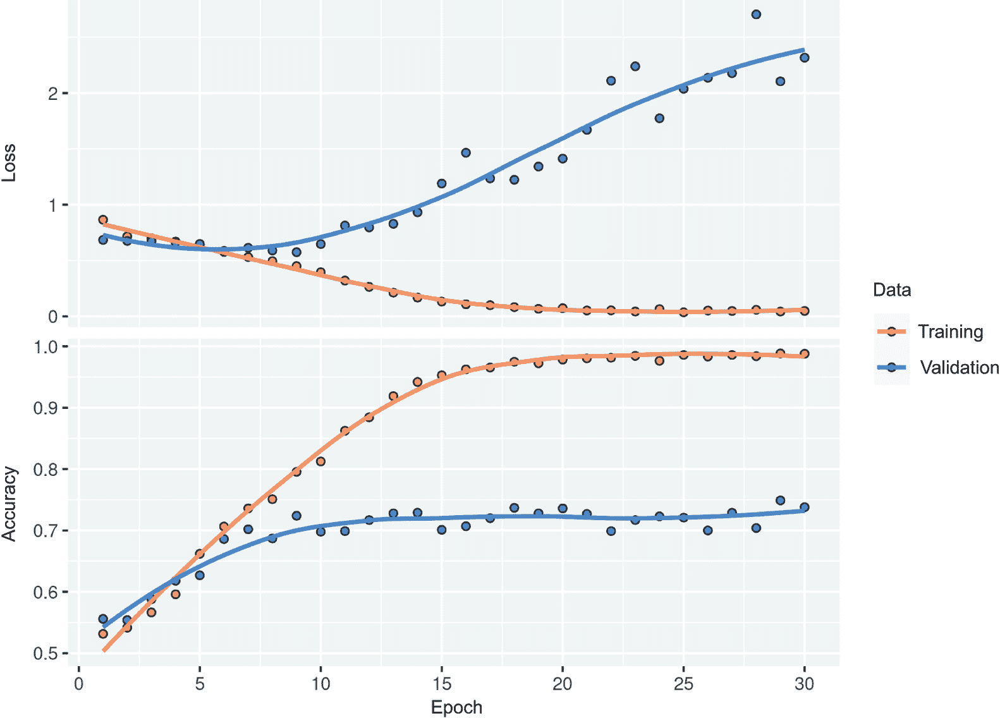

**图 8.9 简单卷积网络的训练和验证指标。**

这些图表特征是过度拟合的特征。训练准确度随时间线性增加，直到接近 100%，而验证准确度在 75% 处达到峰值。验证损失在仅 10 个时期后达到最小值，然后增加，而训练损失在训练过程中保持线性减少。

让我们检查测试准确度。我们将重新加载模型，以评估它在开始过度拟合之前的状态。

列表 8.13 在测试集上评估模型

测试模型 <— load_model_tf("convnet_from_scratch.keras")

result <— evaluate(test_model, test_dataset)

cat(sprintf("测试准确度：%.3f\n", result["accuracy"]))

测试准确度：0.740

我们得到了 74% 的测试准确度。（由于神经网络初始化的随机性，你可能会得到略有不同的数字。）

由于我们的训练样本相对较少（2,000），过拟合将是我们关注的首要问题。你已经了解到一些可以帮助缓解过拟合的技术，例如随机失活和权重衰减（L2 正则化）。现在我们要使用一种新的技术，针对计算机视觉的，几乎在使用深度学习模型处理图像时通用的一种技术：*数据增强*。

### 8.2.5 使用数据增强

过拟合是由于样本数量太少而导致的，使得您无法训练出能够泛化到新数据的模型。如果有无限的数据，您的模型将接触到手头数据分布的每一个可能的方面：您永远不会过拟合。数据增强采取的方法是通过对现有训练样本进行一系列随机变换来生成更多的训练数据，从而*增强*样本。目标是，在训练时，您的模型永远不会看到完全相同的图片两次。这有助于使模型接触到数据的更多方面，从而更好地泛化。

在 Keras 中，可以通过在模型开头添加一些 *数据增强层* 来完成这个任务。让我们从一个示例开始：以下的 keras_model_sequential() 链接了几个随机图像转换。在我们的模型中，我们会在 layer_rescaling() 之前包含它。

列表 8.14 定义要添加到图像模型中的数据增强阶段

data_augmentation <— keras_model_sequential() %>%

layer_random_flip("horizontal") %>%

layer_random_rotation(0.1) %>%

layer_random_zoom(0.2)

这些只是可用的几个层之一（更多请参阅 Keras 文档）。让我们快速浏览一下这段代码：

+   layer_random_flip(“horizontal”)—将通过它的随机 50% 的图像进行水平翻转

+   layer_random_rotation(0.1)—将输入图像随机旋转一个范围为 [-10%，+10%] 的值（这些是完整圆的一部分——以角度表示，范围将是 [-36 度，+36 度]）

+   layer_random_zoom(0.2)—将图像放大或缩小一个范围在 [-20%，+20%] 内的随机因子

让我们来看看增强后的图片（参见 图 8.10）。

列表 8.15 显示一些随机增强的训练图像

library(tfdatasets)

batch <— train_dataset %>%

as_iterator() %>%

iter_next()

c(images, labels) %<—% batch

par(mfrow = c(3, 3), mar = rep(.5, 4))➊

image <— images[1, , , ]

plot(as.raster(as.array(image), max = 255))➋

for (i in 2:9) {

augmented_images <— data_augmentation(images)➌

augmented_image <— augmented_images[1, , , ]

plot(as.raster(as.array(augmented_image), max = 255)➍

}

➊ **准备用于九张图片的图形设备。**

➋ **绘制批次的第一张图片，不进行增强。**

➌ **将增强阶段应用于图像批次。**

➍ **显示输出批次中的第一张图像。对于每个八次迭代，这是同一图像的不同增强。**

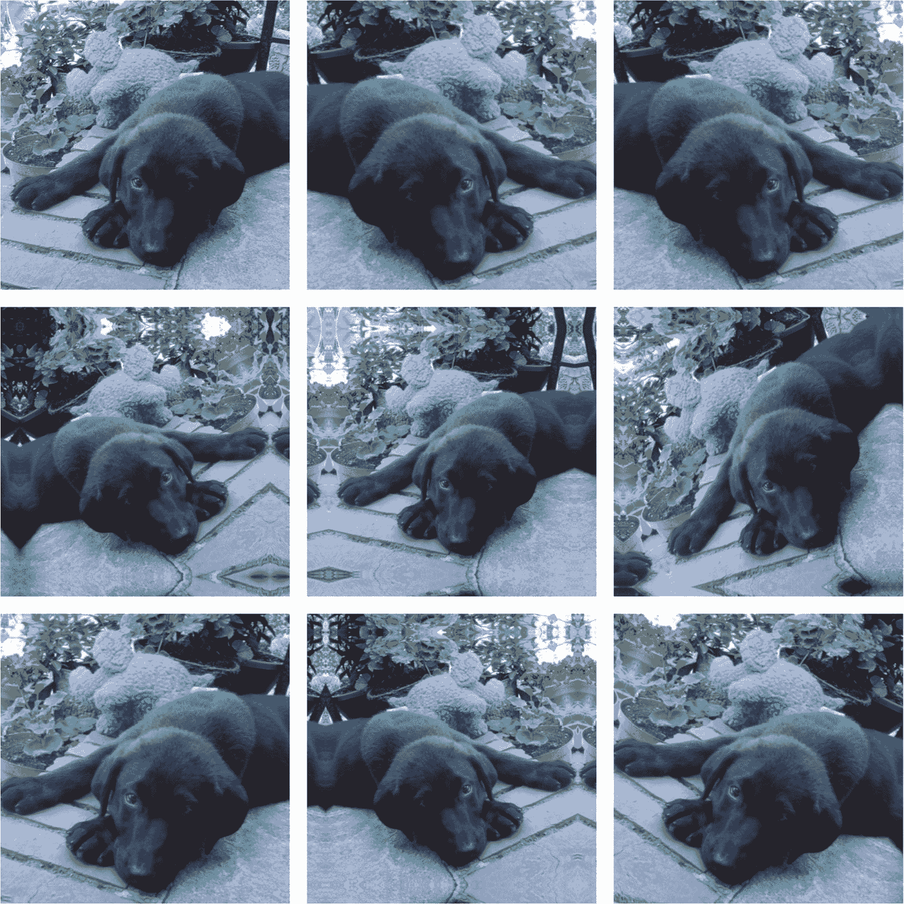

**图 8.10 通过随机数据增强生成非常好的狗的变化**

如果我们使用这个数据增强配置来训练一个新模型，那么模型将永远不会看到相同的输入两次。但是它看到的输入仍然存在很高的相关性，因为它们来自少量原始图像——我们无法产生新的信息；我们只能重新组合现有的信息。因此，这可能不足以完全消除过拟合。为了进一步对抗过拟合，我们还会在密集连接分类器之前向我们的模型添加一个`dropout()`层。

关于随机图像增强层，你应该知道的最后一件事：就像`layer_dropout()`一样，在推理期间（当我们调用`predict()`或`evaluate()`时），它们是不活跃的。在评估期间，我们的模型的行为与不包括数据增强和 dropout 时完全相同。

列表 8.16 定义一个包括图像增强和 dropout 的新卷积神经网络

inputs <— layer_input(shape = c(180, 180, 3))

outputs <— inputs %>%

data_augmentation() %>%

layer_rescaling(1 / 255) %>%

layer_conv_2d(filters = 32, kernel_size = 3, activation = "relu") %>%

layer_max_pooling_2d(pool_size = 2) %>% layer_conv_2d(filters = 64, kernel_size = 3, activation = "relu") %>%

layer_max_pooling_2d(pool_size = 2) %>%

layer_conv_2d(filters = 128, kernel_size = 3, activation = "relu") %>%

layer_max_pooling_2d(pool_size = 2) %>%

layer_conv_2d(filters = 256, kernel_size = 3, activation = "relu") %>%

layer_max_pooling_2d(pool_size = 2) %>%

layer_conv_2d(filters = 256, kernel_size = 3, activation = "relu") %>%

layer_flatten() %>%

layer_dropout(0.5) %>%

layer_dense(1, activation = "sigmoid")

model <— keras_model(inputs, outputs)

model %>% compile(loss = "binary_crossentropy",

optimizer = "rmsprop",

metrics = "accuracy")

让我们使用数据增强和 dropout 训练模型。因为我们预计过拟合将在训练期间晚得多，所以我们将训练三倍的轮次——一百轮。

列表 8.17 训练正则化的卷积神经网络

callbacks <— list(

callback_model_checkpoint(

filepath = "convnet_from_scratch_with_augmentation.keras",

save_best_only = TRUE,

monitor = "val_loss"

)

)

history <— model %>% fit(

train_dataset,

epochs = 100,

validation_data = validation_dataset,

callbacks = callbacks

)

让我们再次绘制结果：参见图 8.11。由于数据增强和 dropout，我们开始在很晚的时候过拟合，大约在 60–70 轮之后（对比原始模型的 10 轮）。验证准确率最终保持在 80–85% 的范围内，这是我们第一次尝试的显著改进：

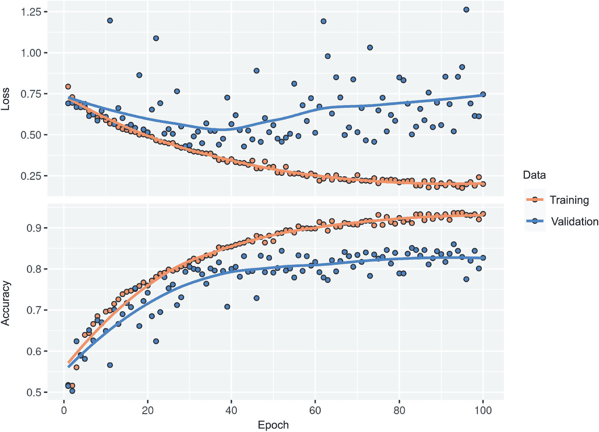

**图 8.11 使用数据增强的训练和验证指标**

让我们检查测试准确率。

列表 8.18 在测试集上评估模型

test_model <— load_model_tf("convnet_from_scratch_with_augmentation.keras")

结果 <— evaluate(test_model, test_dataset)

cat(sprintf("测试准确率：%.3f\n", result["accuracy"]))

测试准确率：0.814

我们得到了 81.4%的测试准确率。看起来不错！如果您正在运行代码，请确保保留保存的文件（convnet_from_scratch_with_augmentation.keras），因为我们将在下一章中用到它进行一些实验。

通过进一步调整模型的配置（例如每个卷积层的滤波器数量，或者模型中的层数），我们可能会获得更高的准确率，可能高达 90%。但是仅通过从头训练我们自己的卷积网络，要达到更高的准确率将会很困难，因为我们的数据量太少。为了提高这个问题上的准确率，我们的下一步将是使用预训练模型，这是接下来两节的重点。

## 8.3 利用预训练模型

在小图像数据集上进行深度学习的一种常见且非常有效的方法是使用预训练模型。*预训练模型*是以前在大型数据集上训练过的模型，通常是在大规模图像分类任务上。如果这个原始数据集足够大且足够通用，那么预训练模型学到的特征的空间层次结构可以有效地充当视觉世界的通用模型，因此，它的特征可以对许多不同的计算机视觉问题提供有用的信息，即使这些新问题可能涉及与原始任务完全不同的类别。例如，您可以在 ImageNet 上训练模型（其中大多数类别是动物和日常物品），然后将这个训练好的模型重新用于识别图像中的家具项目等完全不同的目标。深度学习与许多较老的、浅层的学习方法相比的一个关键优势是，它学到的特征在不同问题之间的可移植性，这使得深度学习对于小数据问题非常有效。

在这种情况下，让我们考虑一个在 ImageNet 数据集上训练的大型卷积网络（140 万张带标签的图像和 1000 个不同的类）。ImageNet 包含许多动物类别，包括不同种类的猫和狗，因此您可以期望它在猫狗分类问题上表现良好。

我们将使用由 Karen Simonyan 和 Andrew Zisserman 于 2014 年开发的 VGG16 架构¹。尽管这是一个较老的模型，远非当前技术水平的最新状态，并且比许多其他近期模型更加笨重，但我选择它是因为它的架构与你已经熟悉的相似，并且不需要引入任何新概念就能轻松理解。这可能是你第一次遇到这些可爱的模型名称之一——VGG、ResNet、Inception、Xception 等等；如果你继续进行计算机视觉的深度学习，你将经常遇到它们。

有两种使用预训练模型的方式：*特征提取*和*微调*。我们将会涵盖这两种方法。让我们从特征提取开始。

### 8.3.1 使用预训练模型进行特征提取

特征提取包括使用先前训练好的模型学到的表示从新样本中提取有趣的特征。然后这些特征通过一个从头开始训练的新分类器。

正如你之前所看到的，用于图像分类的卷积神经网络包括两部分：它们首先是一系列的池化和卷积层，然后是一个全连接的分类器。第一部分被称为模型的*卷积基*。在卷积神经网络中，特征提取是指利用先前训练好的网络的卷积基对新数据进行传递，并在其之上训练一个新的分类器（参见图 8.12）。

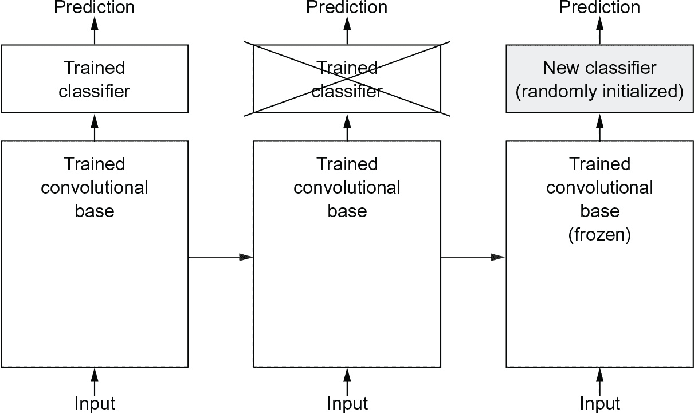

**图 8.12 保持相同的卷积基进行分类器交换**

为什么仅重用卷积基？我们能否也重用全连接的分类器？一般来说，应该避免这样做。原因是卷积基学到的表示可能更通用，因此更易重用：卷积神经网络的特征图是图片中通用概念的存在图，无论当前的计算机视觉问题是什么，该特征图都可能是有用的。但是分类器学到的表示将必然特定于模型训练的类别集，它们只包含关于这个或那个类别在整个图片中出现概率的信息。此外，在全连接层中发现的表示不再包含有关物体在输入图像中位置的任何信息；这些层丢弃了空间概念，而卷积特征图仍然描述着物体的位置。对于物体位置很重要的问题，全连接特征基本上是无用的。

请注意，特定卷积层提取的表示的一般性（因此也是可重用性）取决于模型中的层的深度。在模型中更早的层提取局部的高度通用的特征图（例如视觉边缘，颜色和纹理），而更高的层提取更抽象的概念（如“猫耳”或“狗眼”）。因此，如果你的新数据集与原始模型训练的数据集差异很大，你可能最好只使用模型的前几层进行特征提取，而不是整个卷积基。

在这种情况下，由于 ImageNet 类集包含多个狗和猫类别，重用原始模型的密集连接层中包含的信息可能是有益的。但我们选择不这样做，以涵盖新问题的类别集不重叠于原始模型的类别集的更普遍情况。让我们通过使用在 ImageNet 上训练的 VGG16 网络的卷积基础，从猫和狗图像中提取有趣的特征，然后在这些特征的顶部训练一个猫狗分类器来将其付诸实践。

VGG16 模型等等，都预先在 Keras 中打包。它们都作为以 application_ 前缀开头的函数导出。许多其他图像分类模型（都是在 ImageNet 数据集上预训练的）都作为 Keras 应用程序的一部分提供：

+   Xception

+   Mobilenet

+   DenseNet

+   ResNet

+   EfficientNet

+   等等

让我们实例化 VGG16 模型。

列表 8.19 实例化 VGG16 卷积基础

conv_base <— application_vgg16(

weights = "imagenet",

include_top = FALSE,

input_shape = c(180, 180, 3)

)

我们向应用函数传递了三个参数：

+   weights 指定初始化模型的权重检查点。

+   include_top 指的是是否在网络顶部包含（或不包含）密集连接分类器。默认情况下，这个密集连接分类器对应于 ImageNet 的 1,000 个类别。因为我们打算使用自己的密集连接分类器（只有两个类别：猫和狗），所以我们不需要包含它。

+   input_shape 是我们将要馈送到网络中的图像张量的形状。这个参数是可选的：如果我们不传递它，网络将能够处理任何大小的输入。在这里，我们传递它，以便我们可以可视化（在以下摘要中）随着每个新的卷积和池化层的形状如何收缩。

这是 VGG16 卷积基础架构的详细信息。它与你已经熟悉的简单卷积网络类似：

conv_base

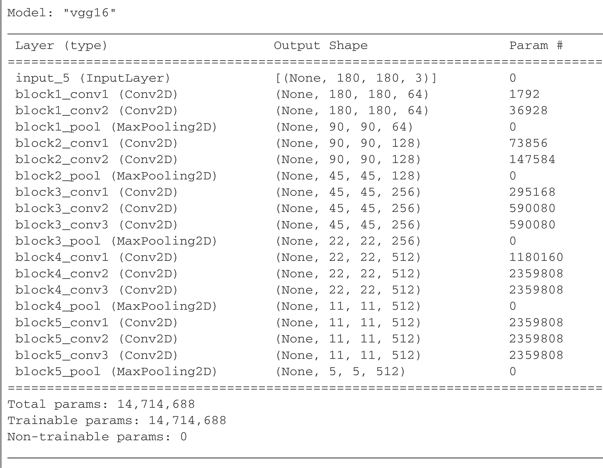

最终的特征图形状为 (5, 5, 512)。这就是我们将要在其顶部添加一个密集连接分类器的特征图。

此时，我们可以采取两种方式：

+   在我们的数据集上运行卷积基础，将其输出（数组）记录到磁盘上的文件数组中，然后使用这些数据作为章节 4 中所见的独立、密集连接分类器的输入。这种解决方案运行速度快，成本低，因为它只需要对每个输入图像运行一次卷积基础，而卷积基础是流水线中成本最高的部分。但出于同样的原因，这种技术不允许我们使用数据增强。

+   扩展我们已有的模型（conv_base），在其顶部添加密集层，并在输入数据上端到端地运行整个模型。这将允许我们使用数据增强，因为每个输入图像在被模型看到时都会经过卷积基。但出于同样的原因，这种技术比第一个技术要昂贵得多。

我们将涵盖这两种技术。让我们逐步介绍设置第一种技术所需的代码：记录 conv_base 在我们的数据上的输出，并将这些输出用作新模型的输入。

### **无数据增强的快速特征提取**

我们将首先通过调用 conv_base 模型的 predict() 方法在我们的训练、验证和测试数据集上提取特征作为 R 数组。

让我们遍历我们的数据集以提取 VGG16 特征。

**清单 8.20 提取 VGG16 特征和相应的标签**

get_features_and_labels <- function(dataset) {

n_batches <- length(dataset)

all_features <- vector("list", n_batches)

all_labels <- vector("list", n_batches)

iterator <- as_array_iterator(dataset)

for (i in 1:n_batches) {

c(images, labels) %<-% iter_next(iterator)

preprocessed_images <- imagenet_preprocess_input(images)

features <- conv_base %>% predict(preprocessed_images)

all_labels[[i]] <- labels

all_features[[i]] <- features

}

all_features <- listarrays::bind_on_rows(all_features)

all_labels <- listarrays::bind_on_rows(all_labels)➊

list(all_features, all_labels)

}

c(train_features, train_labels) %<-% get_features_and_labels(train_dataset)

c(val_features, val_labels) %<-% get_features_and_labels(validation_dataset)

c(test_features, test_labels) %<-% get_features_and_labels(test_dataset)

➊**将一系列 R 数组沿着第一个轴（批处理维度）组合在一起。**

重要的是，predict() 仅期望图像，而不是标签，但我们当前的数据集生成的批次包含图像及其标签。此外，VGG16 模型期望经过函数 imagenet_preprocess_input() 预处理的输入，该函数将像素值缩放到合适的范围。提取的特征目前的形状为（样本数，5，5，512）：

dim(train_features)

[1] 2000 5 5 512

在这一点上，我们可以定义我们的密集连接的分类器（请注意使用了 dropout 进行正则化），并在我们刚刚记录的数据和标签上对其进行训练。

**清单 8.21 定义和训练密集连接的分类器**

inputs <- layer_input(shape = c(5, 5, 512))

outputs <- inputs %>%

layer_flatten() %>%➊

layer_dense(256) %>%

layer_dropout(.5) %>%

layer_dense(1, activation = "sigmoid")

model <- keras_model(inputs, outputs)

model %>% compile(loss = "binary_crossentropy",

optimizer = "rmsprop",

metrics = "accuracy")

callbacks <- list(

callback_model_checkpoint(

filepath = "feature_extraction.keras",

save_best_only = TRUE,

monitor = "val_loss"

)

)

history <- model %>% fit(

train_features, train_labels,

epochs = 20,

validation_data = list(val_features, val_labels),

callbacks = callbacks

)

➊**注意在传递特征给 `layer_dense()` 之前使用了 `layer_flatten()`。**

训练非常快，因为我们只需处理两个密集层 - 一个时代少于一秒，甚至在 CPU 上也是如此。

让我们在训练过程中查看损失和准确率曲线（见 图 8.13）。

**清单 8.22 绘制结果**

绘制（history）

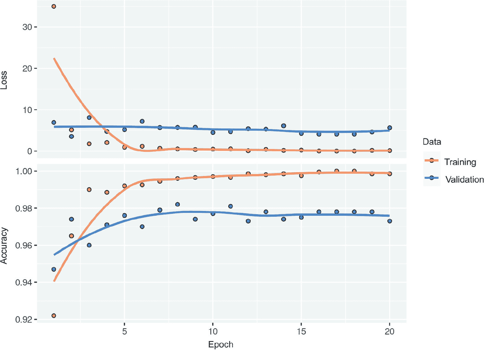

**图 8.13 普通特征提取的训练和验证指标**

我们达到了约 97% 的验证准确率 - 比我们在上一节使用从头开始训练的小模型取得的结果要好得多。然而，这有点不公平的比较，因为 ImageNet 包含许多狗和猫实例，这意味着我们的预训练模型已经具有了所需任务的确切知识。当您使用预训练特征时，情况并非总是如此。

然而，图表也显示，尽管使用了相当大的丢弃率，但我们几乎从一开始就出现了过拟合。这是因为这种技术不使用数据增强，而数据增强对于防止小图像数据集过拟合是至关重要的。

### 特征提取与数据增强

现在让我们回顾我提到的第二种做特征提取的技术，它要慢得多，更昂贵，但允许我们在训练过程中使用数据增强：创建一个将卷积基与新的密集分类器链在一起的模型，并在输入上端到端地训练它。

为此，我们首先会 *冻结卷积基*。冻结层或一组层意味着在训练期间阻止它们的权重更新。如果我们不这样做，那么先前由卷积基学到的表示将在训练期间被修改。因为顶部的密集层是随机初始化的，所以会通过网络传播非常大的权重更新，有效地破坏先前学到的表示。在 Keras 中，我们通过调用 `freeze_weights()` 来冻结层或模型。

**清单 8.23 实例化和冻结 VGG16 卷积基**

conv_base <- application_vgg16(

权重 = "imagenet",

include_top = FALSE)

freeze_weights(conv_base)

调用 `freeze_weights()` 会清空层或模型的可训练权重列表。

**清单 8.24 打印在冻结之前和之后的可训练权重列表**

unfreeze_weights(conv_base)

cat("这是可训练权重的数量",

"冻结卷积基之前："

length(conv_base$trainable_weights), "\n")

这是在冻结卷积基之前的可训练权重数量：26

freeze_weights(conv_base)

cat("这是可训练权重的数量",

"冻结卷积基之后："

length(conv_base$trainable_weights), "\n")

冻结卷积基之后的可训练权重数量为：0

现在我们可以创建一个新模型，将特征链接在一起

1.  **1** 数据增强阶段

1.  **2** 我们冻结的卷积基

1.  **3** 一个密集分类器

数据增强 <- keras_model_sequential() %>%

layer_random_flip("horizontal") %>%

layer_random_rotation(0.1) %>%

layer_random_zoom(0.2)

输入 <- layer_input(shape = c(180, 180, 3))

输出 <- 输入 %>%

data_augmentation() %>%➊

imagenet_preprocess_input() %>%➋

conv_base() %>%

layer_flatten() %>%

layer_dense(256) %>%

layer_dropout(0.5) %>%

layer_dense(1, activation = "sigmoid")

model <- keras_model(inputs, outputs)

model %>% compile(loss = "binary_crossentropy",

优化器 = "rmsprop",

指标 = "准确度")

➊**应用数据增强。**

➋ **应用输入值缩放。**

使用此设置，只有我们添加的两个密集层的权重将会被训练。总共有四个权重张量：每层两个（主要权重矩阵和偏置向量）。注意，为了使这些更改生效，您必须先编译模型。如果您在编译之后修改了权重的可训练性，那么您应该重新编译模型，否则这些更改将被忽略。

让我们训练我们的模型。由于数据增强，模型要过拟合的时间要长得多，所以我们可以训练更多的 epochs——让我们做 50 个。

这项技术够昂贵，只有在有 GPU 的情况下才尝试，CPU 上无法操作。如果无法在 GPU 上运行代码，那么前一项技术就是最佳选择：

回调 <- list(

回调模型检查点(

文件路径 = "使用数据增强进行特征提取.keras",

仅保存最佳结果 = TRUE,

监控 = "val_loss"

)

)

history <- model %>% fit(

训练数据集,

epochs = 50,

验证数据 = 验证数据集，

回调 = 回调

)

让我们再次绘制结果（参见图 8.14）。如您所见，我们达到了超过 98%的验证准确度。这是相对于先前模型的显著提高。

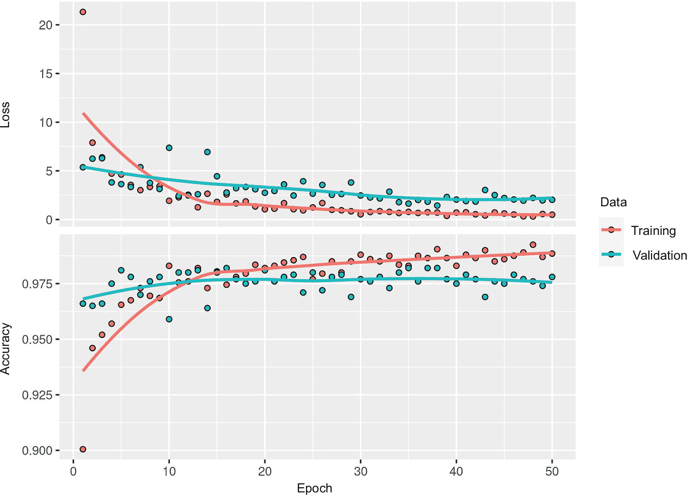

**图 8.14 使用数据增强进行特征提取的训练和验证指标**

让我们检查一下测试准确度。

**清单 8.25 在测试集上评估模型**

测试模型 <- load_model_tf(

"使用数据增强进行特征提取.keras")

result <- evaluate(test_model, test_dataset)

cat(sprintf("测试精度：%.3f\n", result["准确度"]))

测试精度：0.977

我们得到了 97.7%的测试准确度。与以前的测试准确度相比，这只是一次适度的提高，这有点令人失望，考虑到在验证数据上的强劲结果。模型的准确度总是取决于您对其进行评估的样本集。有些样本集可能比其他样本集更难，对一个集合的强烈结果未必会完全转化到其他所有集合。

### 8.3.2 微调预训练模型

进一步复用模型的一个广泛使用的技巧是微调（fine-tuning），与特征提取互补（见图 8.15）。 微调包含解冻一个用于特征提取的模型基底的顶部几层，同时联合训练这个新添加的部分（在本例中是全连接分类器）和这些顶部层。这称为微调，是因为它会稍微调整正在复用的模型的更抽象表示，使其更相关于手头的问题。

我之前说过，必须冻结 VGG16 的卷积基，才能够在其上训练随机初始化的分类器。出于同样的原因，只有在距离分类器先前已经训练好的情况下，才能微调卷积基的顶部层。如果分类器还没有进行训练，训练过程中传播的错误信号会过大，并且微调的层之前学习到的表示将被破坏。因此微调网络的步骤如下：

1.  **1** 在已经训练好的基础网络上添加自定义网络。

1.  **2** 冻结基础网络。

1.  **3** 训练我们添加的部分。

1.  **4** 解冻基础网络中的一些层。（请注意，不应解冻“批量标准化”层，因为在 VGG16 中没有这样的层。批量标准化及其对微调的影响将在下一章中解释。）

1.  **5** 联合训练这两个层和我们添加的部分。

进行特征提取时，前三个步骤已经完成，现在进行第四个步骤：解冻 conv_base，然后冻结其中的各个层。

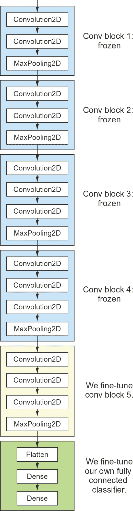

**图 8.15  调整 VGG16 网络的最后一个卷积块**

提醒一下，这就是我们的卷积基长这样子：

conv_base

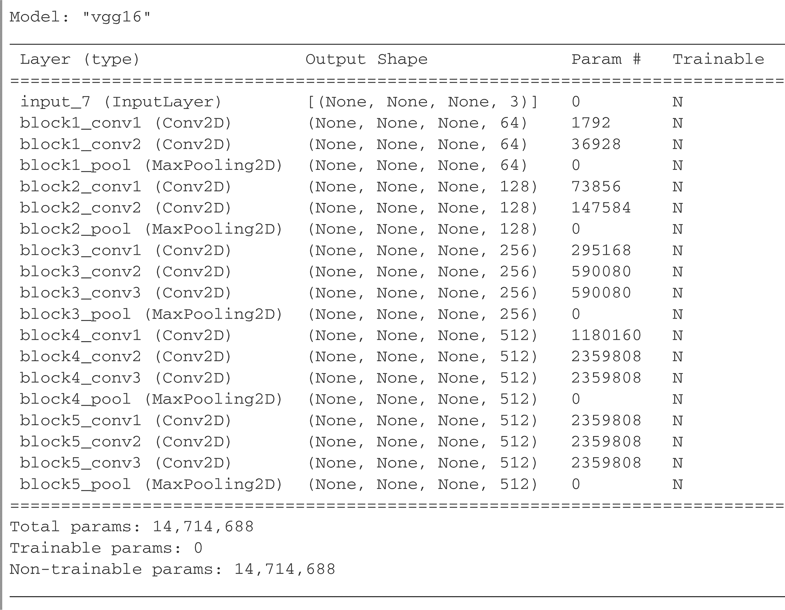

我们将调整最后三个卷积层，这意味着所有层，包括 block4_pool 之前的层都应该保持冻结状态，而 block5_conv1、block5_conv2 和 block5_conv3 这三个层则应该可训练。

为什么不能调整更多层？为什么不能调整整个卷积基？其实可以，但要考虑以下几点：

+   卷积基中越往前的层编码的是更加通用、可重复使用的特征，而越往后的层编码的是更加专业化的特征。 fine-tune 更加专业化的特征更有用，因为这些是需要在新问题上转化的。对低层进行调整，收益会逐渐变小。

+   如果要训练的参数越多，过度拟合的风险就越大。卷积基有 1500 万个参数，因此在小数据集上尝试训练它是很冒险的。

因此，在这种情况下，只微调卷积基准模型的前两层或三层是一个不错的策略。让我们从前一个例子结束的地方开始设定这个。

列表 8.26 冻结直到倒数第四层的所有层

unfreeze_weights(conv_base, from = -4) conv_base➊

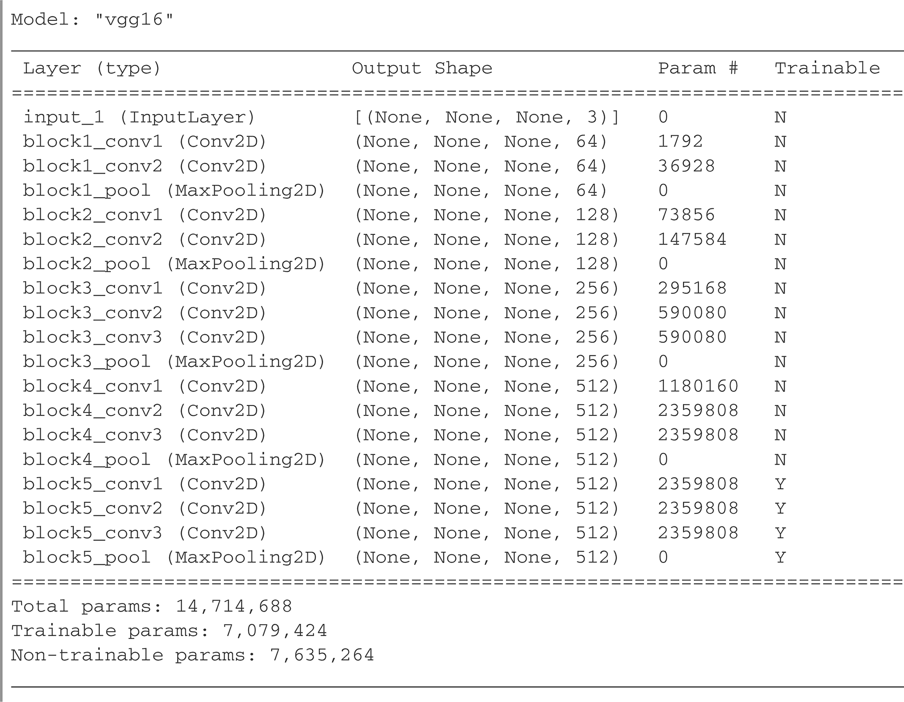

➊**from = -4 是 length(conv_base$layers) + 1 - 4 的简写**

现在，我们可以开始微调模型了。我们将使用 RMSprop 优化器，并使用非常低的学习率。之所以使用低学习率，是因为我们希望限制对三层表示所做修改的幅度。太大的更新可能会损害这些表示。

**列表 8.27 微调模型**

model %>% compile(

loss = "binary_crossentropy",

optimizer = optimizer_rmsprop(learning_rate = 1e-5),

metrics = "accuracy"

)

callbacks <- list(

callback_model_checkpoint(

filepath = "fine_tuning.keras",

save_best_only = TRUE，

monitor = "val_loss"

)

)

history <- model %>% fit(

train_dataset，

epochs = 30,

validation_data = validation_dataset,

callbacks = callbacks

)

现在，我们可以对测试数据集评估这个模型：

model <- load_model_tf("fine_tuning.keras")

result <- evaluate(model, test_dataset)

cat(sprintf("测试准确率：%.3f\n", result["accuracy"]))

测试准确率：0.985

在这里，我们获得了 98.5%的测试准确率（再次强调，你自己的结果可能和这个相差不超过一个百分点）。在原始的 Kaggle 竞赛中，这将是顶级结果之一。但是这并不是一个公平的比较，因为我们使用了预训练的特征，这些特征已经包含了关于猫和狗的先前知识，而竞争对手当时无法使用。

从正面来说，借助现代深度学习技术，我们仅使用了竞赛数据中可用的一小部分训练数据（约占总量的 10%）就达到了这一结果。在可以训练 2,000 个样本和 20,000 个样本之间，存在巨大的差距！

现在，你已经掌握了一套处理图像分类问题的工具，特别是处理小数据集时。

### 摘要

+   卷积网络是计算机视觉任务中最好的机器学习模型类型。即使在非常小的数据集上，也可以训练一个具有不错结果的模型。

+   卷积网络通过学习一系列模块化的模式和概念来表示视觉世界。

+   在小数据集上，过拟合是主要问题。数据增强是处理图像数据时对抗过拟合的有效手段。

+   通过特征提取，可以很容易地在新数据集上重用现有的卷积网络。这是处理小型图像数据集的一项有价值的技术。

+   作为特征提取的补充，你可以使用微调（fine-tuning），它可以根据现有模型先前学到的某些表示来适应一个新的问题。这会进一步提高性能。

1.  ¹ Karen Simonyan 和 Andrew Zisserman，《非常深的卷积网络用于大规模图像识别》，arXiv（2014），[`arxiv.org/abs/1409.1556`](https://www.arxiv.org/abs/1409.1556)。
