# 第九章：高级计算机视觉深度学习

*本章涵盖*

+   计算机视觉的不同分支：图像分类、图像分割和目标检测

+   现代卷积神经网络架构模式：残差连接、批量归一化和深度可分离卷积

+   可视化和解释卷积神经网络学到的技术

上一章为您介绍了计算机视觉的深度学习，通过简单模型（layer_conv_2d() 和 layer_max_pooling_2d() 层的堆叠）和一个简单的用例（二进制图像分类）。但计算机视觉不仅仅是图像分类！本章深入探讨了更多不同应用和高级最佳实践。

## 9.1 三个基本的计算机视觉任务

到目前为止，我们专注于图像分类模型：输入一张图像，输出一个标签：“这张图像可能包含一只猫；那张可能包含一只狗。”但图像分类只是计算机视觉中深度学习的几种可能应用之一。一般来说，你需要了解以下三个基本的计算机视觉任务：

+   *图像分类*—其目标是为图像分配一个或多个标签。它可以是单标签分类（图像只能属于一个类别，排除其他类别），也可以是多标签分类（标记图像所属的所有类别，如图 9.1 中所示）。例如，当您在 Google Photos 应用上搜索关键字时，背后实际上在查询一个非常庞大的多标签分类模型——一个包含超过 20,000 个不同类别、在数百万张图像上训练的模型。

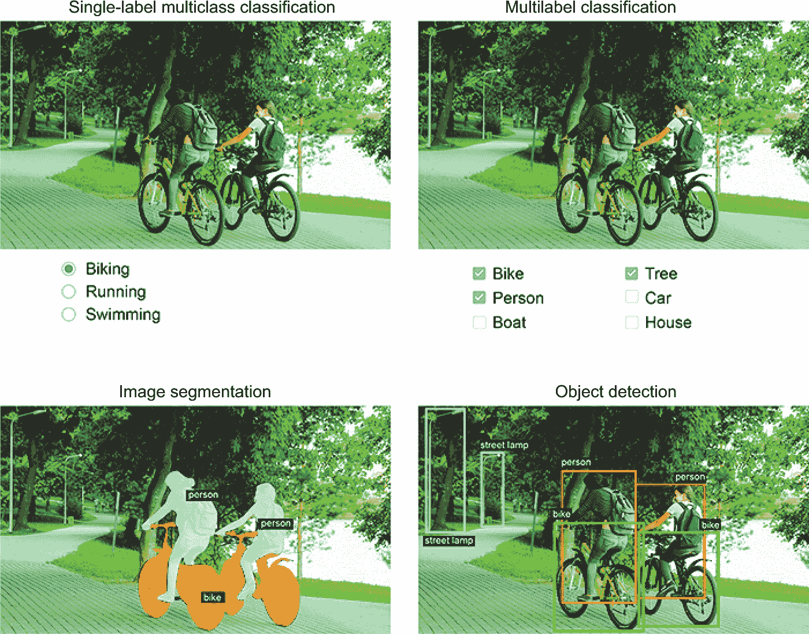

**图 9.1 三个主要的计算机视觉任务：分类、分割、检测**

+   *图像分割*—其目标是将图像“分割”或“划分”为不同的区域，每个区域通常代表一个类别（如在图 9.1 中所示）。例如，当 Zoom 或 Google Meet 在视频通话中为您显示自定义背景时，它正在使用图像分割模型将您的脸与背景分开，以像素级的精度。

+   *目标检测*—其目标是在图像中绘制矩形（称为*边界框*）并将每个矩形与一个类别关联起来，围绕感兴趣的对象。例如，自动驾驶汽车可以使用目标检测模型监视其摄像头视野中的汽车、行人和标志。

计算机视觉的深度学习还包括一些更为专业化的任务，例如图像相似度评分（估算两个图像在视觉上的相似度）、关键点检测（定位图像中感兴趣的属性，例如面部特征）、姿态估计、3D 网格估计等等。但是，要入门计算机视觉应用，图像分类、图像分割和对象检测是每个机器学习工程师应该熟悉的基础。大多数计算机视觉应用都可归结为这三种技术之一。

在前一章中，你已经看到了图像分类的应用。接下来，让我们深入了解图片分割技术。这是一种非常有用且多样化的技术，你可以利用已经学到的知识很容易地处理。

注意，我们不会涉及对象检测，因为这对于入门书来说过于专业化和复杂化。但是，你可以在 [keras.rstudio.com/examples](http://www.keras.rstudio.com/examples) 上查看 RetinaNet 的示例，它展示了如何使用 Keras 在 R 中从头构建和训练对象检测模型。

## 9.2 图像分割示例

使用深度学习进行图像分割是指使用模型为图像中的每个像素分配一个类别，从而将图像分割成不同的区域（例如“背景”和“前景”，或“道路”、“汽车”和“人行道”）。这个广泛的技术类别可以用于开发各种有价值的应用，如图像和视频编辑、自动驾驶、机器人、医学成像等等。关于图像分割，还有两种不同的分类应该知道：

+   *语义分割*，其中每个像素被独立归类为语义类别，例如“猫”。如果图像中有两只猫，相应的像素则全部映射到同一个通用的“猫”类别（参见图 9.2）。

+   *实例分割*，不仅对图像像素按类别分类，还将解析出各个对象实例。在包含两只猫的图像中，实例分割会将“猫 1”和“猫 2”视为两个不同的像素类别（参见图 9.2）。

在这个示例中，我们将专注于语义分割：再次观察猫和狗的图像，这次我们将学习如何将主体和背景分离开来。

我们将使用[Oxford-IIIT 宠物数据集](http://www.robots.ox.ac.uk/~vgg/data/pets/)，该数据集包含 7,390 张不同品种的猫和狗的图片，以及每张图片的前景-背景分割蒙版。*分割蒙版*是图像分割标签的等效形式：它是与输入图像大小相同的图像，其中的每个整数值对应于输入图像中相应像素的类别。在我们的情况下，我们的分割蒙版的像素可以有三个整数值：

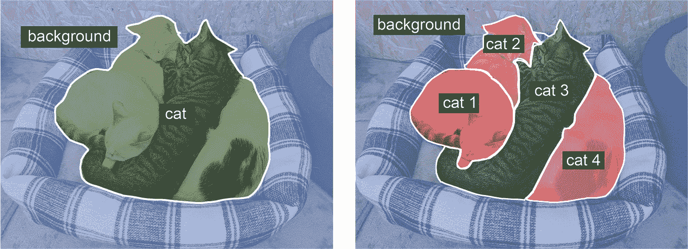

**图 9.2 语义分割与实例分割**

+   1（前景）

+   2（背景）

+   3（轮廓）

让我们开始下载和解压我们的数据集，使用 R 提供的 download.file()和 untar()实用程序。就像第八章一样，我们将使用 fs 包进行文件系统操作：

library(fs)

data_dir <- path("pets_dataset")

dir_create(data_dir)

data_url <- path("http://www.robots.ox.ac.uk/~vgg/data/pets/data")

for (filename in c("images.tar.gz", "annotations.tar.gz")) {

download.file(url = data_url / filename,

destfile = data_dir / filename)

untar(data_dir / filename, exdir = data_dir)

}

输入图片存储在 images/文件夹中的 JPG 文件中（例如 images/Abyssinian_1.jpg），相应的分割蒙版存储在 annotations/trimaps/文件夹中具有相同名称的 PNG 文件中（例如 annotations/trimaps/Abyssinian_1.png）。

让我们准备一个包含输入文件路径列和相应蒙版文件路径列表的数据框（技术上来说，是一个 tibble）：

input_dir <- data_dir / "images"

target_dir <- data_dir / "annotations/trimaps/"

image_paths <- tibble::tibble(

input = sort(dir_ls(input_dir, glob = "*.jpg")),

target = sort(dir_ls(target_dir, glob = "*.png")))

为了确保我们将图像与正确的目标匹配，我们对这两个列表进行排序。路径向量进行排序是因为目标和图像路径共享相同的基本文件名。然后，为了帮助我们跟踪路径，并确保我们的输入和目标向量保持同步，我们将它们组合成一个两列的数据框（我们使用 tibble()创建数据框）：

tibble::glimpse(image_paths)

Rows: 7,390

Columns: 2

$ input <fs::path> "pets_dataset/images/Abyssinian_1.jpg", "pets_dataset/...

$ target <fs::path> "pets_dataset/annotations/trimaps/Abyssinian_1.png", "...

这些输入及其蒙版是什么样子的？让我们快速看一下。我们将使用 TensorFlow 的工具来读取图像，这样我们就可以熟悉 API 了。首先，我们定义一个辅助函数，使用 R 的 plot()函数绘制包含图像的 TensorFlow Tensor：

display_image_tensor <- function(x, …, max = 255,

plot_margins = c(0, 0, 0, 0)) {

if(!is.null(plot_margins))

par(mar = plot_margins)➊

x %>%

as.array() %>%➋

drop() %>%➌

as.raster(max = max) %>%➍

plot(…, interpolate = FALSE)➎

}

➊ **绘制图像时默认不留白边。**

➋ **将张量转换为 R 数组。**

➌ **drop() 移除大小为 1 的轴。例如，如果 x 是一个带有一个颜色通道的灰度图像，它会将张量形状从 (height, width, 1) 挤压成 (height, width)。**

➍ **将 R 数组转换为 'raster' 对象。**

➎ **interpolate = FALSE 告诉 R 图形设备绘制具有锐利边缘的像素，不会在像素之间进行混合或插值。**

在 as.raster() 调用中，我们设置 max = 255，因为，就像 MNIST 一样，图像被编码为 uint8。无符号 8 位整数只能在 [0, 255] 范围内编码值。通过设置 max = 255，我们告诉 R 图形设备将像素值 255 绘制为白色，0 绘制为黑色，并对介于两者之间的值进行线性插值以生成不同灰度的色阶。

现在我们可以将图像读入张量，并使用我们的辅助函数 display_image_tensor() 查看它（参见 图 9.3）：

library(tensorflow)

image_tensor <- image_paths$input[10] %>%

tf$io$read_file() %>%

tf$io$decode_jpeg()

str(image_tensor)

<tf.Tensor: shape=(448, 500, 3), dtype=uint8, numpy=…>

display_image_tensor(image_tensor)➊

➊ **显示输入图像 Abyssinian_107.jpg。**

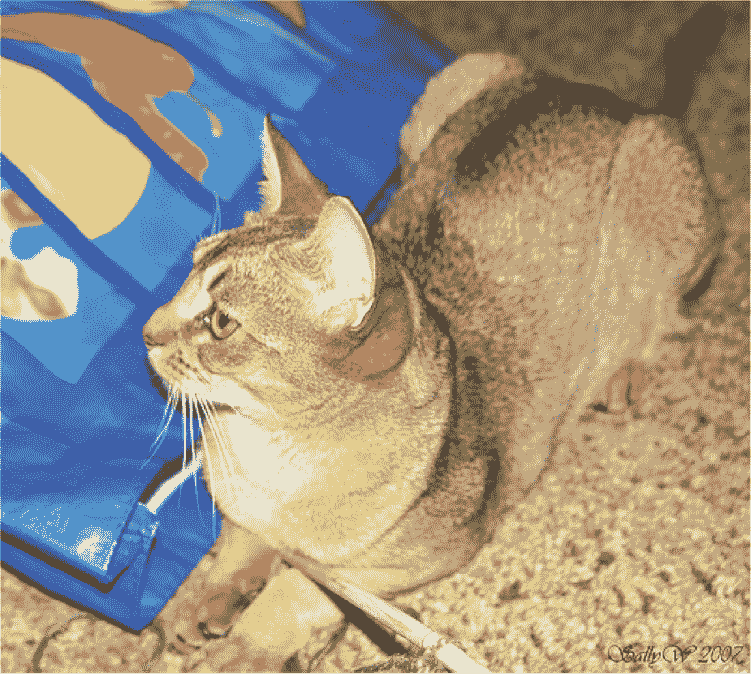

**图 9.3 一个示例图像**

我们还将定义一个辅助函数来显示目标图像。目标图像也被读取为 uint8，但这次目标图像张量中只有 (1, 2, 3) 的值。为了绘制它，我们减去 1 使标签范围从 0 到 2，并设置 max = 2，使标签变为 0（黑色）、1（灰色）和 2（白色）。

并且这是其相应的目标（参见 图 9.4）：

display_target_tensor <- function(target)

display_image_tensor(target - 1, max = 2)

target <- image_paths$target[10] %>%

tf$io$read_file() %>%

tf$io$decode_png()

str(target)

<tf.Tensor: shape=(448, 500, 1), dtype=uint8, numpy=…>

display_target_tensor(target)

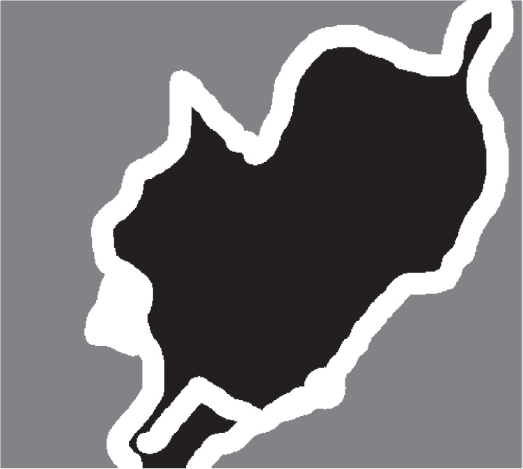

**图 9.4 相应的目标掩码**

接下来，让我们将输入和目标加载到两个 TF 数据集中，并将文件拆分为训练集和验证集。由于数据集非常小，我们可以将所有内容加载到内存中：

library(tfdatasets)

tf_read_image <➊

function(path, format = "image", resize = NULL, …) {

img <- path %>%

tf$io$read_file() %>%

tf$io[[paste0("decode_", format)]](…)➋

if (!is.null(resize))

img <- img %>%

tf$image$resize(as.integer(resize))➌

img

}

img_size <- c(200, 200)

tf_read_image_and_resize <- function(…, resize = img_size)

tf_read_image(…, resize = resize)➍

make_dataset <- function(paths_df) {

tensor_slices_dataset(paths_df) %>%

dataset_map(function(path) {➎

image <- path$input %>%

tf_read_image_and_resize("jpeg", channels = 3L)➏

target <- path$target %>%

tf_read_image_and_resize("png", channels = 1L)➐

target <- target - 1➑

list(image, target)

}) %>%

dataset_cache() %>%➒

dataset_shuffle(buffer_size = nrow(paths_df)) %>%➓

dataset_batch(32)

}

num_val_samples <- 1000⓫

val_idx <- sample.int(nrow(image_paths), num_val_samples)

val_paths <- image_paths[val_idx, ]⓬

train_paths <- image_paths[-val_idx, ]

validation_dataset <- make_dataset(val_paths)

train_dataset <- make_dataset(train_paths)

➊ **在此，我们定义一个辅助函数，使用 TensorFlow 操作读取并调整图像的大小。**

➋ **查找 tf$io 子模块中的 decode_image()、decode_jpeg() 或 decode_png()。**

➌ **确保使用 as.integer() 将 tf 模块函数调用为整数。**

➍ **我们将所有内容调整为 200 × 200。**

➎ **传递给 dataset_map() 的 R 函数使用符号张量进行调用，并且必须返回符号张量。在这里，dataset_map() 接收一个参数，即包含输入和目标图像文件路径的两个标量字符串张量的命名列表。**

➏ **每个输入图像都有三个通道：RGB 值。**

➐ **每个目标图像都有一个通道：每个像素的整数标签。**

➑ **减去 1 以使我们的标签变为 0、1 和 2。**

➒ **缓存数据集会在第一次运行后将完整数据集存储在内存中。如果您的计算机内存不足，请删除此调用，图像文件将在训练过程中根据需要动态加载。**

➓ **使用数据中的总样本数作为 buffer_size 进行图像洗牌。请确保在缓存后调用 shuffle。**

⓫ **保留 1,000 个样本用于验证。**

⓬ **将数据拆分为训练集和验证集。**

现在是时候定义我们的模型了：

get_model <- function(img_size, num_classes) {

conv <- function(…, padding = "same", activation = "relu")➊➋

layer_conv_2d(…, padding = padding, activation = activation)➊

conv_transpose <- function(…, padding = "same", activation = "relu")➊➋

layer_conv_2d_transpose(…, padding = padding, activation = activation)➊

input <- layer_input(shape = c(img_size, 3))

output <- input %>%

layer_rescaling(scale = 1/255) %>%➌

conv(64, 3, strides = 2) %>%

conv(64, 3) %>%

conv(128, 3, strides = 2) %>%

conv(128, 3) %>%

conv(256, 3, strides = 2) %>%

conv(256, 3) %>%

conv_transpose(256, 3) %>%

conv_transpose(256, 3, strides = 2) %>%

conv_transpose(128, 3) %>%

conv_transpose(128, 3, strides = 2) %>%

conv_transpose(64, 3) %>%

conv_transpose(64, 3, strides = 2) %>%

conv(num_classes, 3, activation = "softmax")➍

keras_model(input, output)

}

model <- get_model(img_size = img_size, num_classes = 3)

➊ **定义本地函数 conv() 和 conv_transpose()，以便我们可以避免在每次调用时传递相同的参数：padding = "same"、activation = "relu"。**

➋ **我们在所有地方都使用 padding = "same" 以避免边缘填充对特征图大小的影响。**

➌ **不要忘记将输入图像重新缩放到 [0–1] 范围内。**

➍ **我们在模型末尾使用每像素的三路 softmax 将每个输出像素分类到我们的三个类别之一。**

这是模型摘要：

model

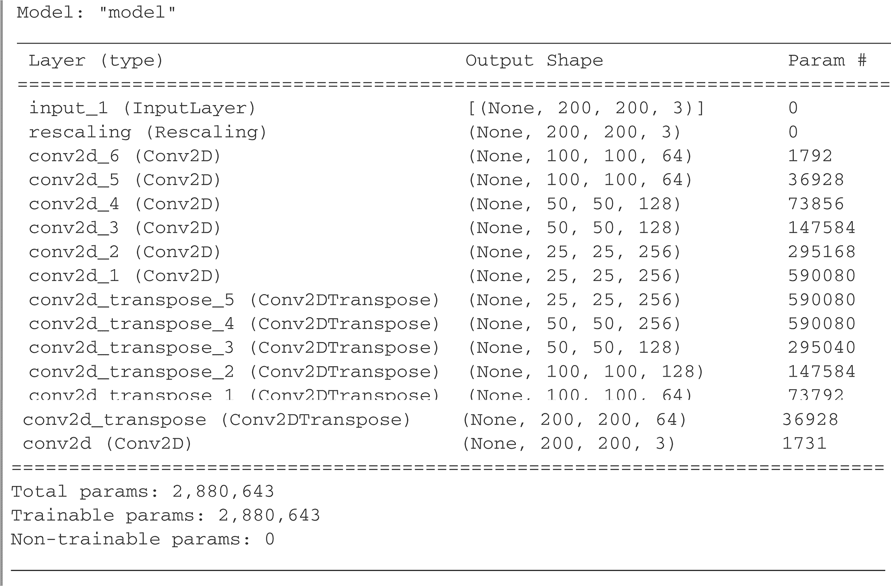

模型的前半部分紧密地类似于用于图像分类的卷积神经网络：一堆 Conv2D 层，逐渐增加的过滤器大小。我们通过每次减少两倍来三次降采样我们的图像，最终得到大小为(25, 25, 256)的激活值。这个前半部分的目的是将图像编码成更小的特征图，其中每个空间位置（或像素）包含有关原始图像的大空间块的信息。你可以将其理解为一种压缩。

这个模型的前半部分和你之前见过的分类模型之间的一个重要区别是我们进行降采样的方式：在上一章的分类卷积网络中，我们使用 MaxPooling2D 层来降采样特征图。在这里，我们通过在每个其他卷积层中添加步幅来进行降采样（如果你不记得卷积步幅是如何工作的细节，请参见 8.1.1 节中的“理解卷积步幅”）。我们这样做是因为，在图像分割的情况下，我们非常关心图像中信息的*空间位置*，因为我们需要将像素级的目标掩码作为模型的输出。当你进行 2×2 最大池化时，你完全破坏了每个池化窗口内的位置信息：你返回每个窗口的一个标量值，而对于窗口中的四个位置之一，你完全不知道值是从哪个位置来的。因此，虽然最大池化层在分类任务中表现良好，但在分割任务中，它们会对我们造成相当大的伤害。与此同时，步幅卷积在降采样特征图的同时保留了位置信息方面做得更好。在本书中，你会注意到，我们倾向于在任何关心特征位置的模型中使用步幅而不是最大池化，比如第十二章中的生成模型。

模型的后半部分是一堆 Conv2DTranspose 层。那些是什么？好吧，模型的前半部分的输出是形状为(25, 25, 256)的特征图，但我们希望我们的最终输出具有与目标掩模相同的形状，(200, 200, 3)。因此，我们需要应用一种*反向*我们到目前为止所应用的转换的方法——一种将特征图*上采样*而不是下采样的方法。这就是 Conv2DTranspose 层的目的：你可以将其视为一种学习上采样的卷积层。如果你有一个形状为(100, 100, 64)的输入，并且你通过一个层 layer_conv_2d(128, 3, strides = 2, padding = “same”)，你会得到一个形状为(50, 50, 128)的输出。如果你将这个输出通过一个层 layer_conv_2d_transpose(64, 3, strides = 2, padding = “same”)，你会得到一个形状为(100, 100, 64)的输出，与原始的相同。因此，通过一堆 Conv2D 层将我们的输入压缩成形状为(25, 25, 256)的特征图后，我们可以简单地应用相应的 Conv2DTranspose 层序列，以得到形状为(200, 200, 3)的图像。

我们现在可以编译并拟合我们的模型：

model %>%

compile(optimizer = "rmsprop",

loss = "sparse_categorical_crossentropy")

callbacks <- list(

callback_model_checkpoint("oxford_segmentation.keras",

save_best_only = TRUE))

history <- model %>% fit(

train_dataset,

epochs = 50,

callbacks = callbacks,

validation_data = validation_dataset

)

> 注意 在训练过程中，你可能会看到类似 Corrupt JPEG  premature end of data segment 的警告。图像数据集并不完美，但 tf$io 模块函数可以优雅地恢复。

让我们显示我们的训练和验证损失（参见图 9.5）：

绘制(history)

**图 9.5 显示训练和验证损失曲线**

你可以看到我们在中途开始过拟合，大约在第 25 个周期。让我们根据验证损失重新加载我们表现最佳的模型，并演示如何使用它来预测一个分割掩码（参见图 9.6）：

model <- load_model_tf("oxford_segmentation.keras")

test_image <- val_paths$input[309] %>%

tf_read_image_and_resize("jpeg", channels = 3L)

predicted_mask_probs <

model(test_image[tf$newaxis, , , ])➊

predicted_mask <➋

tf$argmax(predicted_mask_probs, axis = -1L)➌

predicted_target <- predicted_mask + 1

par(mfrow = c(1, 2))

display_image_tensor(test_image)

display_target_tensor(predicted_target)

➊ **tf$newaxis 添加了一个批次维度，因为我们的模型期望批次的图像。 model() 返回的 Tensor 形状为 (1, 200, 200, 3)，dtype=float32。**

➋ **predicted_mask 是形状为 (1, 200, 200) 的 Tensor，dtype=int64。**

➌ **tf$argmax() 类似于 R 中的 which.max()。一个关键区别是 tf$argmax() 返回基于 0 的值。tf$argmax(x, axis = -1L) 的 R 基本等价是 apply(x, c(1, 2, 3), which.max) - 1L。**

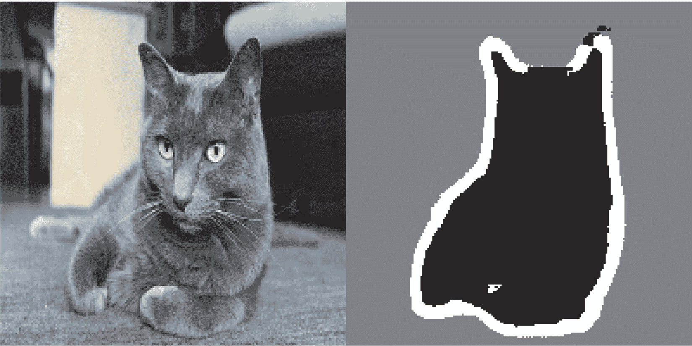

**图 9.6 测试图像及其预测的分割掩码**

我们预测的掩码中有一些小的伪像。尽管如此，我们的模型似乎工作得很好。

到目前为止，在第八章和第九章的开头，你已经学会了如何进行图像分类和图像分割的基础知识：你已经可以用你所知道的知识做很多事情了。然而，有经验的工程师开发用于解决现实世界问题的卷积网络并不像我们迄今为止在演示中使用的那么简单。你仍然缺少使专家能够迅速准确地决定如何组合最先进模型的基本思维模式和思考过程。为了弥补这一差距，你需要学习*架构模式*。让我们深入了解一下。

## 9.3 现代卷积网络架构模式

一个模型的“架构”是创建它所做选择的总和：使用哪些层，如何配置它们，以及以何种排列方式连接它们。这些选择定义了你的模型的*假设空间*：由模型的权重参数化的梯度下降可以搜索的可能函数空间。就像特征工程一样，一个良好的假设空间编码了你对手头问题及其解决方案的*先验知识*。例如，使用卷积层意味着你事先知道你的输入图像中存在的相关模式是平移不变的。为了有效地从数据中学习，你需要对你要寻找的内容做出假设。

模型架构通常是成功与失败之间的区别。如果你做出不合适的架构选择，你的模型可能会陷入次优的度量指标中，任何数量的训练数据都无法挽救它。相反，一个良好的模型架构将加速学习，并使你的模型能够有效地利用可用的训练数据，减少对大型数据集的需求。一个好的模型架构是一个*减少搜索空间大小*或以其他方式*使其更容易收敛到搜索空间的好点*的架构。就像特征工程和数据策划一样，模型架构的目的是为了使梯度下降更容易解决问题。记住，梯度下降是一个相当愚蠢的搜索过程，所以它需要尽可能多的帮助。

模型架构更像是一门艺术而不是科学。经验丰富的机器学习工程师能够直观地在第一次尝试时拼凑出高性能的模型，而初学者往往很难创建一个能够训练的模型。这里的关键词是*直觉*：没有人能够清楚地解释什么有效，什么无效。专家依赖于模式匹配，这是他们通过广泛的实践经验获得的能力。你将在本书中培养自己的直觉。然而，这并不全是关于直觉——实际上并没有太多的科学内容，但和任何工程学科一样，都有最佳实践。

在接下来的章节中，我们将回顾一些重要的 convnet 架构最佳实践：特别是*残差连接、批量归一化*和*可分离卷积*。一旦你掌握了如何使用它们，你就能构建高效的图像模型。我们将把它们应用到我们的猫 vs. 狗分类问题上。

让我们从鸟瞰图开始：系统架构的模块化-层次结构-重用（MHR）公式。

### 9.3.1 模块化、层次结构和重用

如果您想让一个复杂系统变得简单，您可以应用一个通用的方法：只需将您的复杂无序的复杂性结构化为*模块*，将模块组织成*层次结构*，并开始在适当的地方*重复使用*相同的模块（在这种情况下，“重用”是“抽象”的另一个词）。这就是 MHR 公式（模块化-层次化-重用），它是几乎每个领域中“架构”一词被使用的系统架构的基础。它是任何有意义的复杂系统的组织核心，无论是大教堂、您自己的身体、美国海军还是 Keras 代码库（见图 9.7）。

**图 9.7 复杂系统遵循分层结构，并被组织成不同的模块，这些模块被多次重用（例如，您的四肢，它们都是同一个蓝图的变体，或者您的 20 个“手指”）。**

如果您是一名软件工程师，您已经非常熟悉这些原则：一个有效的代码库是模块化和层次化的，您不会两次实现相同的事物，而是依靠可重用的类和函数。如果您按照这些原则对代码进行分解，您可以说您正在进行“软件架构”。

深度学习本身只是通过梯度下降对连续优化应用此方法：您采用经典的优化技术（在连续函数空间上的梯度下降），并将搜索空间结构化为模块（层），组织成深层次结构（通常只是一个堆栈，最简单的层次结构），在其中尽可能地重复使用（例如，卷积是关于在不同空间位置重用相同信息）。

同样，深度学习模型架构主要是关于巧妙地利用模块化、层级化和重用。您会注意到，所有流行的卷积神经网络架构不仅被组织成层，它们还被组织成重复的层组（称为“块”或“模块”）。例如，我们在上一章中使用的流行的 VGG16 架构被组织成重复的“卷积，卷积，最大池化”块（见图 9.8）。

此外，大多数卷积神经网络通常具有金字塔状结构（*特征层次结构*）。例如，回想一下我们在上一章中构建的第一个卷积神经网络中使用的卷积滤波器数量的递增：32，64，128。随着层深度的增加，滤波器的数量也会增加，而特征图的大小相应缩小。您会在 VGG16 模型的块中注意到相同的模式（见图 9.8）。

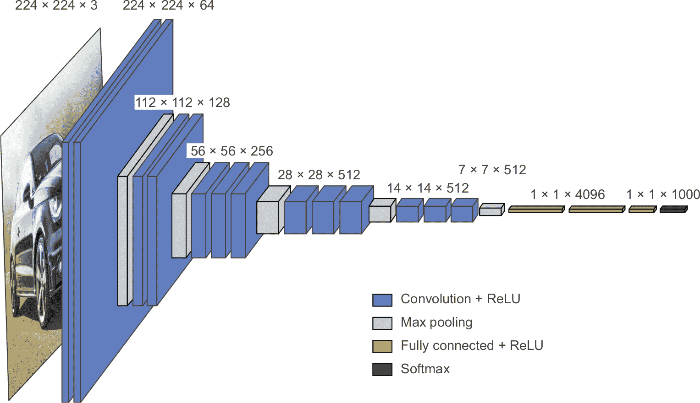

**图 9.8 VGG16 架构：请注意重复的层块和特征图的金字塔状结构。**

更深的层次结构本质上是有好处的，因为它们鼓励特征的重复利用，因此也鼓励抽象化。一般来说，窄层次的深度堆栈比大层次的浅堆栈表现更好。然而，你可以堆叠多深的层次有一个限制，这是由于*消失的梯度*问题所致。这导致我们的第一个基本模型架构模式：残差连接。

**关于深度学习研究中消融研究的重要性**

深度学习架构通常比设计更*进化*——它们是通过反复尝试并选择看起来有效的方法而发展起来的。就像在生物系统中一样，如果你拿任何一个复杂的实验性深度学习设置，很可能你可以移除几个模块（或用随机的训练特征替换一些），而不会损失性能。

这一情况被深度学习研究人员面临的激励所加剧：通过使系统比必要复杂，他们可以使其看起来更有趣或更新颖，从而增加他们通过同行评审流程的机会。如果你阅读了大量的深度学习论文，你会注意到它们通常在风格和内容上都被优化，以在主动损害解释的清晰度和结果的可靠性方面通过同行评审。例如，在深度学习论文中，数学很少被用来清晰地形式化概念或推导非显而易见的结果——相反，它被利用作为*严肃性的信号*，就像一个销售员身上的昂贵西装一样。

研究的目标不应仅仅是发表论文，而应是产生可靠的知识。至关重要的是，理解系统中的*因果关系*是产生可靠知识的最直接方式。而且有一种非常低成本的方法来探究因果关系：*消融研究*。消融研究包括系统地尝试去除系统的一部分——使其更简单——以确定其性能实际来自何处。如果你发现 X + Y + Z 给你良好的结果，也试试 X、Y、Z、X + Y、X + Z 和 Y + Z，看看会发生什么。

如果你成为了一名深度学习研究人员，请在研究过程中抛弃噪声：为你的模型做消融研究。始终问自己，“可能存在更简单的解释吗？这种增加的复杂性真的是必要的吗？为什么？”

### 9.3.2 残差连接

你可能知道电话游戏，也称为英国的 Chinese Whispers 和法国的*téléphone arabe*，在这个游戏中，一个初始消息被耳语给一名玩家，然后他再耳语给下一个玩家，依此类推。最终的消息与其原始版本几乎没有什么相似之处。这是一个有趣的比喻，说明了在嘈杂的信道上的顺序传输中产生的累积误差。

恰好，顺序深度学习模型中的反向传播与电话游戏非常相似。你有一系列的函数，就像这个：

y = f4(f3(f2(f1(x))))

x <- layer_add(c(x, residual))

保存指向原始输入的指针。这称为残差。

这很容易：只需将图层或图层块的输入添加回其输出即可（参见图 9.9）。残差连接充当*信息快捷方式*，绕过破坏性或嘈杂的块（例如包含 relu 激活或 dropout 层的块），使早期层的错误梯度信息能够无噪声地传播到深层网络。这项技术是在 2015 年由 ResNet 系列模型（由微软的何等人开发）介绍的。

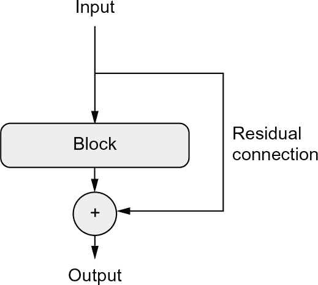

residual <- x

实际上，您将如下实现残差连接。

图 9.9：处理块周围的残差连接

x <- ...

解决方法很简单：只需强制链中的每个函数为非破坏性-保留前一输入中包含的信息的无噪声版本。实现这一点的最简单方法是使用残差连接。

x <- x %>% layer_conv_2d(64, 3, activation = "relu", padding = "same")

具有不同数量滤波器的残差块

一些输入张量

x <- inputs %>% layer_conv_2d(32, 3, activation = "relu")

此计算块可能是破坏性或嘈杂的，这没问题。

[将原始输入添加到层的输出中：因此，最终输出将始终保留有关原始输入的完整信息。](https://wiki.example.org/feynmans_learning_method)

游戏的名字是根据在 f4 的输出上记录的错误来调整链中每个函数的参数（模型的损失）。要调整 f1，您需要通过 f2，f3 和 f4 渗透错误信息。但是，链中的每个连续函数都引入了一定量的噪音。如果您的函数链太深，则此噪音开始淹没梯度信息，并且反向传播停止工作。您的模型根本无法训练。这就是梯度消失的问题。

伪代码中的残差连接

inputs <- layer_input(shape = c(32, 32, 3))

请注意，将输入添加回块的输出意味着输出应具有与输入相同的形状。但是，如果您的块包含具有增加的滤波器数量或最大池化层的卷积层，则情况并非如此。在这种情况下，请使用 1×1 的 layer_conv_2d（）层，不带激活函数将残差线性投影到所需的输出形状（请参阅清单 9.2）。您通常会在目标块中的卷积层中使用 padding =“same”，以避免由于填充而导致的空间降采样，并且您会在残差投影中使用步幅以匹配由最大池化层引起的任何降采样（请参阅清单 9.3）。

x <- block(x)

residual <- x

residual <- residual %>% layer_conv_2d(64, 1)

x <- layer_add(c(x, residual))

设置残差。

➋ **这是我们创建残差连接的层：它将输出过滤器数量从 32 增加到 64。请注意，我们使用填充 = "same" 来避免由于填充而造成的降采样。**

➌ **残差仅有 32 个过滤器，因此我们使用 1 × 1 的 layer_conv_2d 将其投影到正确的形状。**

➍ **现在区块输出和残差具有相同的形状，可以相加。**

第 9.3 节 目标区块包括最大池化层的情况

inputs <- layer_input(shape = c(32, 32, 3))

x <- inputs %>% layer_conv_2d(32, 3, 激活 = "relu")

residual <- x➊

x <- x %>%➋

layer_conv_2d(64, 3, 激活 = "relu", 填充 = "same") %>%

layer_max_pooling_2d(2, 填充 = "same")

residual <- residual %>%

layer_conv_2d(64, 1, 步幅 = 2)➌

x <- layer_add(list(x, residual))➍

➊ **将残差放在一边。**

➋ **这是我们创建残差连接的两层区块：它包括一个 2 × 2 的最大池化层。请注意，我们在卷积层和最大池化层中都使用填充 = "same"，以避免由于填充而造成的降采样。**

➌ **我们在残差投影中使用 strides = 2，以匹配由最大池化层创建的降采样。**

➍ **现在区块输出和残差具有相同的形状，可以相加。**

为了使这些想法更加具体，这里有一个简单的卷积网络示例，由一系列区块组成，每个区块由两个卷积层和一个可选的最大池化层组成，并且每个区块周围都有一个残差连接：

inputs <- layer_input(shape = c(32, 32, 3))

x <- layer_rescaling(inputs, 缩放 = 1/255)

residual_block <- function(x, 过滤器, 池化 = FALSE) {➊

residual <- x

x <- x %>%

layer_conv_2d(过滤器, 3, 激活 = "relu", 填充 = "same") %>%

layer_conv_2d(过滤器, 3, 激活 = "relu", 填充 = "same")

if (池化) {➋

x <- x %>% layer_max_pooling_2d(池化大小 = 2, 填充 = "same")

residual <- residual %>% layer_conv_2d(过滤器, 1, 步幅 = 2)

} else if (过滤器 != dim(residual)[4]) {➌

residual <- residual %>% layer_conv_2d(过滤器, 1)

}

layer_add(list(x, residual))

}

outputs <- x %>%

residual_block(过滤器 = 32, 池化 = TRUE) %>%➍

residual_block(过滤器 = 64, 池化 = TRUE) %>%➎

residual_block(过滤器 = 128, 池化 = FALSE) %>%➏

layer_global_average_pooling_2d() %>%

layer_dense(units = 1, 激活 = "sigmoid")

model <- keras_model(inputs = inputs, outputs = outputs)

➊ **应用带有残差连接的卷积区块的实用函数，可以选择添加最大池化**

➋ **如果我们使用最大池化，我们添加一个步幅卷积来将残差投影到预期形状。**

➌ **如果我们不使用最大池化，只有当通道数量发生变化时，我们才投影残差。**

➍ **第一个区块**

➎ **第二个区块；请注意每个区块中过滤器数量的增加。**

➏ **最后一个区块不需要最大池化层，因为我们将在其后立即应用全局平均池化。**

这是我们得到的模型摘要：

model

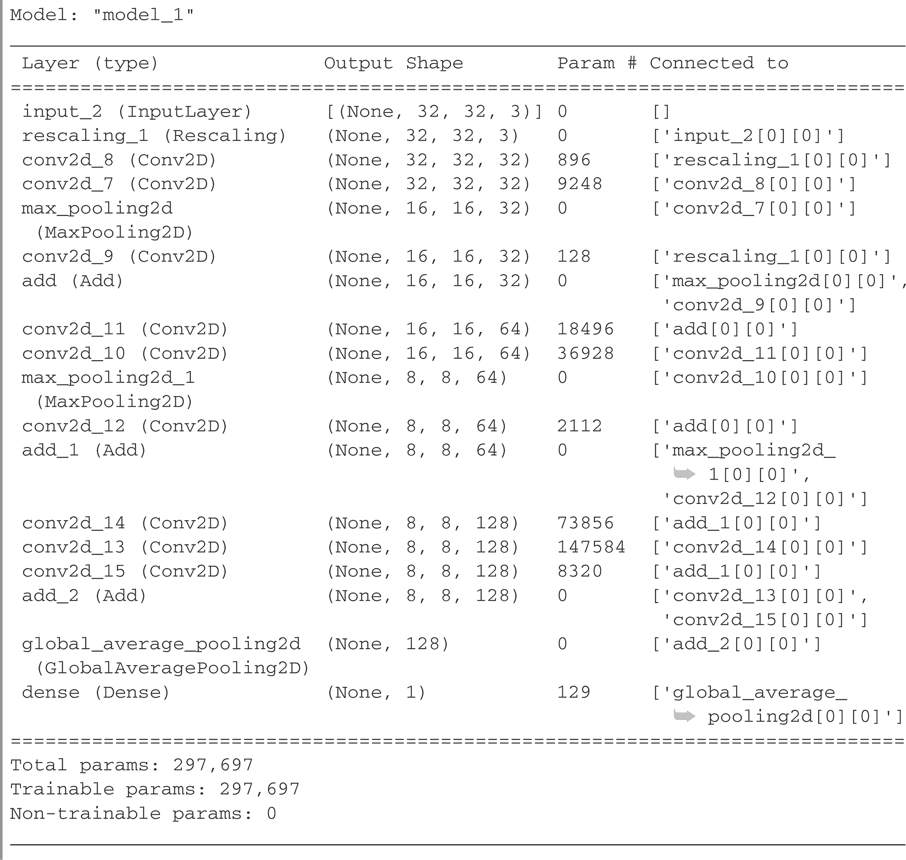

有了残差连接，可以构建任意深度的网络，而不必担心梯度消失的问题。

现在让我们进入下一个重要的卷积神经网络架构模式：*批归一化*。

### 9.3.3 批归一化

*归一化*是一类方法，旨在使机器学习模型看到的不同样本之间更相似，这有助于模型学习和推广到新数据。最常见的数据归一化形式是本书中已经多次使用的形式：通过从数据中减去均值来将数据基准中心化，并通过使用其标准差将数据分配为单位标准差。实际上，这假设数据遵循正态（高斯）分布，并确保此分布居中并缩放到单位方差:

normalize_data <- apply(data, <axis>, function(x) (x - mean(x)) / sd(x))

本书中之前的示例在将数据馈送到模型之前对数据进行了归一化。但是，每个网络操作之后，数据归一化可能会引起兴趣：即使进入 Dense 或 Conv2D 网络的数据具有 0 的均值和单位方差，也没有理由预期出来结果仍然是如此。对中间激活进行规范化有用吗？

批归一化就是做到这一点的方法。它是一种层类型（在 Keras 中称为 layer_batch_normalization()），由 Ioffe 和 Szegedy²于 2015 年推出，可以自适应地对数据进行归一化，即使均值和方差在训练过程中随时间变化。在训练过程中，它使用当前批次数据的均值和方差来规范化样本，在推理（当大量具有代表性的数据批次可能不可用时）中，它使用在训练期间看到的数据的批次均值和方差的指数移动平均值。

尽管原论文声称批归一化通过“减少内部协变量转移”起作用，但其真正的机理仍然不为人所知。存在着各种假设，但没有确定的结论。在深度学习中，此类问题是普遍存在的——它不是一门确切的学科，而是一系列不断变革、经验性的最佳工程实践，由于信源不可靠，融合在一起显得有些牵强。 你会发现有时这些书会告诉你如何做某事，但无法令你完全满意地了解为什么会奏效：这是由于我们知道如何做，但我们并不知道为什么会奏效。每当有一个可靠的解释时，我都会提到它。但是批归一化不属于这种情况。

在实践中，批标准化的主要效果似乎是帮助梯度传播——就像残差连接一样——从而允许更深的网络。一些非常深的网络只有包含多个 BatchNormalization 层才能训练。例如，在许多与 Keras 捆绑在一起的高级卷积神经网络架构中，如 ResNet50，EfficientNet 和 Xception 中都大量使用了批标准化。

可以在任何层之后使用 layer_batch_normalization()——如 layer_dense()，layer_conv_2d()等：

x <- …➊

x <- x %>%

layer_conv_2d(32, 3, use_bias = FALSE) %>%➋

layer_batch_normalization()

➊ **例如，layer_input()，keras_model_sequential()，或来自另一层的输出**

➋ **因为 layer_conv_2d()的输出已经标准化，所以该层不需要自己的偏置向量。**

layer_dense()和 layer_conv_2d()都涉及到一个*bias vector*，这是一个学习到的变量，其目的是使层*仿射*而不仅仅是线性的。例如，layer_conv_2d()返回，概略地说，y = conv(x, kernel) + bias，而 layer_dense()返回 y = dot(x, kernel) + bias。因为归一化步骤将负责将层的输出居中于零，所以在使用 layer_batch_normalization()时不再需要偏置向量，并且可以通过选项 use_bias = FALSE 创建该层。这使得层稍微瘦了一些。

重要的是，我通常建议将前一层的激活*放在*批标准化层之后（尽管这仍然是一个争论的话题）。因此，与列表 9.4 中所示的做法相反，您应该执行列表 9.5 中所示的操作。

列表 9.4 如何不使用批标准化

x %>%

layer_conv_2d(32, 3, activation = "relu") %>%

layer_batch_normalization()

列表 9.5 如何使用批标准化：激活最后出现

x %>%

layer_conv_2d(32, 3, use_bias = FALSE) %>%➊

layer_batch_normalization() %>%

layer_activation("relu")➋

➊ **注意这里缺少激活。**

➋ **我们在 layer_batch_normalization()之后放置激活。**

这种方法的直觉原因是批标准化将使您的输入居中于零，而您的 relu 激活使用零作为保留或丢弃激活通道的枢轴：在激活之前进行归一化可以最大限度地利用 relu 的利用。话虽如此，这种排序最佳实践并不是绝对关键的，因此，如果您先进行卷积，然后激活，然后进行批标准化，您的模型仍将训练，并且您不一定会看到更差的结果。

**关于批标准化和微调**

Batch Normalization 有很多小窍门。其中一个主要问题与微调相关：当微调包含 BatchNormalization 层的模型时，我建议将这些层冻结（使用 freeze_weights() 将它们的 trainable 属性设置为 FALSE）。否则，它们将不断更新其内部的均值和方差，这可能会干扰周围 Conv2D 层的微小更新：

batch_norm_layer_s3_classname <- class(layer_batch_normalization())[1]

batch_norm_layer_s3_classname

[1] "keras.layers.normalization.batch_normalization.BatchNormalization"

is_batch_norm_layer <- function(x)

inherits(x, batch_norm_layer_s3_classname)

model <- application_efficientnet_b0()

for(layer in model$layers)

if(is_batch_norm_layer(layer))

layer$trainable <- FALSE➊

➊ **示例，如何将 trainable <- FALSE 设置为仅冻结 BatchNormalization 层。注意：您也可以调用 freeze_weights(model, which = is_batch_norm_layer) 来实现相同的结果。**

现在，让我们来看一下我们系列中的最后一种架构模式：深度可分离卷积。

### 9.3.4 深度可分离卷积

如果我告诉你，有一种可以直接替换 layer_ conv_2d() 的层，可以让你的模型更小（可训练的权重参数更少）、更轻巧（浮点运算更少），而且在任务上的表现会好几个百分点，你会怎么样？这正是*深度可分离卷积*层所做的（在 Keras 中为 layer_separable_conv_2d()）。这个层会对其输入的每个通道进行独立的空间卷积，然后通过一个逐点卷积（1 × 1 卷积）混合输出通道，如图 9.10 所示。

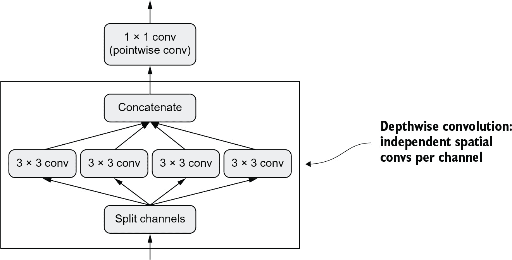

**图 9.10 深度可分离卷积：深度卷积后跟一个逐点卷积**

这等价于分离空间特征的学习和通道特征的学习。就像卷积假设图像中的模式与特定位置无关一样，深度可分离卷积假设中间激活的空间位置高度相关，但不同通道高度独立。因为这个假设通常对于深度神经网络学到的图像表示来说是正确的，所以它作为一种有用的先验知识，帮助模型更有效地利用其训练数据。一个具有更强有力的关于它需要处理的信息结构的先验知识的模型是一个更好的模型，只要这些先验知识是准确的。

与普通卷积相比，深度可分离卷积需要较少的参数并且涉及较少的计算，同时具备相当的表征能力。它产生的模型较小，收敛速度更快，且更不容易过拟合。当你使用有限数据从头开始训练小型模型时，这些优势尤为重要。

当涉及到大规模模型时，深度可分离卷积是 Xception 架构的基础，Xception 是一个高性能的卷积神经网络模型，已经内置在 Keras 中。你可以在论文《Xception: Deep Learning with Depthwise Separable Convolutions》中了解更多关于深度可分离卷积和 Xception 的理论基础。³

**硬件，软件和算法的协同演化**

考虑一个具有 3 × 3 窗口，64 个输入通道和 64 个输出通道的普通卷积操作。它使用了 3 * 3 * 64 * 64 = 36,864 个可训练参数，并且在应用到图像时，运行的浮点操作次数与这个参数数量成比例。此外，考虑一个等效的深度可分离卷积：它只需要 3 * 3 * 64 + 64 * 64 = 4,672 个可训练参数，以及相对较少的浮点操作。当过滤器的数量或卷积窗口的大小变大时，这种效率改进只会增加。

因此，你可能会期望深度可分离卷积的速度明显更快，对吗？等等。如果你是在编写这些算法的简单 CUDA 或 C 实现，这当然是正确的——实际上，当在 CPU 上运行时，你确实能够看到有意义的加速效果，因为底层实现是并行化的 C。但在实践中，你可能正在使用 GPU，并且你在其上执行的代码远非“简单”的 CUDA 实现：它是一个*cuDNN kernel*，这是一段被极端优化的代码，甚至进行到每个机器指令。投入大量精力来优化这段代码是有道理的，因为基于 NVIDIA 硬件的 cuDNN 卷积每天负责计算出许多 exaFLOPS。但这种极端微观优化的一个副作用是，即使是具有明显内在优势的替代方法（如深度可分离卷积）也很难在性能上与之竞争。

尽管反复要求 NVIDIA，深度可分离卷积并没有得到几乎与常规卷积相同水平的软件和硬件优化，并且因此它们仍然只是与常规卷积一样快，即使它们使用的参数和浮点运算量减少了平方倍。但请注意，即使深度可分离卷积没有加速，使用它们仍然是一个好主意：它们较低的参数数量意味着你不太容易过拟合，而它们的假设是通道应该是不相关的，这导致模型收敛更快并且表示更加健壮。

在这种情况下的轻微不便可能会在其他情况下成为一道不可逾越的障碍：因为整个深度学习的硬件和软件生态系统都已经被微调以适应一组非常特定的算法（特别是通过反向传播训练的卷积网络），所以偏离传统道路的成本极高。

如果您尝试使用替代算法，例如无梯度优化或脉冲神经网络，那么您设计的头几个并行的 C++ 或 CUDA 实现将比一个老式的卷积网络慢几个数量级，无论您的想法多么聪明和高效。即使它明显更好，说服其他研究人员采用您的方法也将是一项艰巨的任务。

你可以说现代深度学习是硬件、软件和算法之间的共同演进过程的产物：NVIDIA GPU 和 CUDA 的可用性导致了反向传播训练卷积网络的早期成功，这导致了 NVIDIA 优化其硬件和软件以适应这些算法，进而导致了研究社区围绕这些方法的巩固。在这一点上，要想找到一条不同的道路将需要对整个生态系统进行多年的重新设计。

### 9.3.5 把它放在一起：一个迷你的 Xception 类似的模型

作为提醒，这是您迄今为止学到的卷积网络架构原则：

+   您的模型应该被组织成重复的*块*层，通常由多个卷积层和一个最大池化层组成。

+   你的层中过滤器的数量应随着空间特征图的大小减少而增加。

+   深而窄比宽而浅更好。

+   在层块周围引入残差连接有助于您训练更深的网络。

+   在您的卷积层之后引入批量归一化层可能是有益的。

+   将 layer_conv_2d() 替换为 layer_separable_conv_2d() 可能是更加参数有效的。

让我们把这些想法结合到一个单一的模型中。它的架构将类似于 Xception 的一个较小版本，我们将把它应用到上一章中的狗与猫任务中。对于数据加载和模型训练，我们将简单地重用我们在第 8.2.5 节中使用的设置，但我们将用以下卷积网络替换模型定义：

data_augmentation <- keras_model_sequential() %>%➊

layer_random_flip("horizontal") %>%

layer_random_rotation(0.1) %>%

layer_random_zoom(0.2)

inputs <- layer_input(shape = c(180, 180, 3))

x <- inputs %>%

data_augmentation() %>%

layer_rescaling(scale = 1 / 255)➋

x <- x %>%

layer_conv_2d(32, 5, use_bias = FALSE)➌

for (size in c(32, 64, 128, 256, 512)) {➍

residual <- x

x <- x %>%

layer_batch_normalization() %>%

layer_activation("relu") %>%

layer_separable_conv_2d(size, 3, padding = "same", use_bias = FALSE) %>%

layer_batch_normalization() %>%

layer_activation("relu") %>%

layer_separable_conv_2d(size, 3, padding = "same", use_bias = FALSE) %>%

layer_max_pooling_2d(pool_size = 3, strides = 2, padding = "same")

residual <- residual %>%

layer_conv_2d(size, 1, strides = 2, padding = "same", use_bias = FALSE)

x <- layer_add(list(x, residual))

}

outputs <- x %>%

layer_global_average_pooling_2d() %>%➎

layer_dropout(0.5) %>%➏

layer_dense(1, activation = "sigmoid")

model <- keras_model(inputs, outputs)

train_dataset <- image_dataset_from_directory(

"cats_vs_dogs_small/train",

image_size = c(180, 180),

batch_size = 32

)

validation_dataset <- image_dataset_from_directory(

"cats_vs_dogs_small/validation",

image_size = c(180, 180),

batch_size = 32

)

model %>%

compile(

loss = "binary_crossentropy",

optimizer = "rmsprop",

metrics = "accuracy"

)

history <- model %>%

fit(

train_dataset,

epochs = 100,

validation_data = validation_dataset)

➊ **我们使用与以前相同的数据增强配置。**

➋ **不要忘记输入重新缩放！**

➌**请注意，可分离卷积背后的假设“特征通道在很大程度上是独立的”并不适用于 RGB 图像！红色、绿色和蓝色通道在自然图像中实际上高度相关。因此，我们模型中的第一层是一个常规的 layer_conv_2d()层。之后我们将开始使用 layer_separable_conv_2d()。**

➍**我们应用一系列逐渐增加特征深度的卷积块。每个块包含两个批归一化的深度可分离卷积层和一个最大池化层，并在整个块周围具有残差连接。**

➎**在原始模型中，我们在 layer_dense()之前使用了 layer_flatten()。这里，我们使用了 layer_global_average_pooling_2d()。**

➐**就像在原始模型中一样，我们为正则化添加了一个 dropout 层。**

这个卷积网络的总参数数量为 721,857，略低于我们在第八章中定义的原始模型的 991,041 个参数（清单 8.7），但仍处于同一水平区间。图 9.11 显示了其训练和验证曲线。

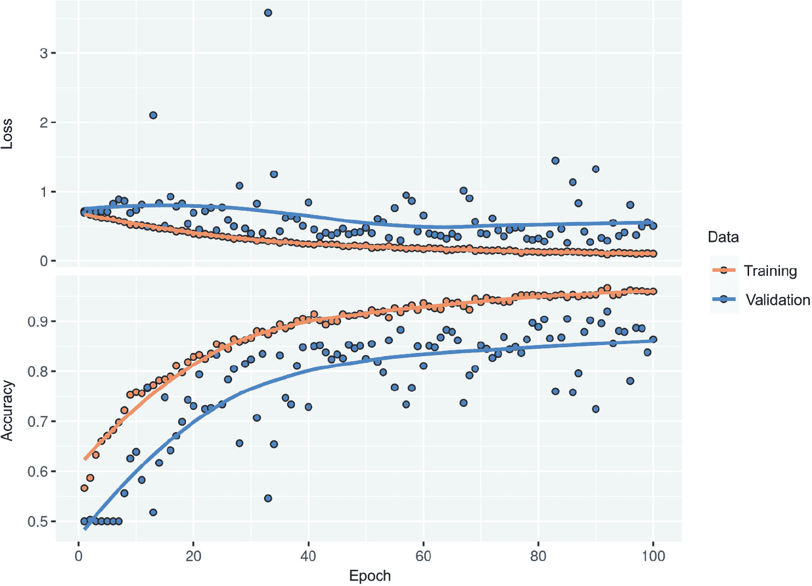

**图 9.11 带有 Xception 类似架构的训练和验证指标**

你会发现我们的新模型的测试准确率为 90.8%，而上一章中的简单模型为 81.4%。正如你所看到的，遵循最佳实践架构确实会立即对模型性能产生巨大影响！

在这一点上，如果您想进一步提高性能，您应该开始系统地调整架构的超参数——这是我们将在第十三章中详细介绍的一个主题。我们没有在这里执行这一步，因此前述模型的配置纯粹基于我们讨论的最佳实践，再加上，在评估模型大小时，一点直觉。

请注意，这些架构最佳实践与计算机视觉一般相关，不仅限于图像分类。例如，Xception 被用作 DeepLabV3 的标准卷积基础，DeepLabV3 是一种流行的最先进的图像分割解决方案。⁴

这就是我们对卷积神经网络（convnet）关键架构最佳实践的介绍。有了这些原则，您将能够在各种计算机视觉任务中开发性能更高的模型。您现在已经在成为熟练的计算机视觉从业者的道路上取得了良好的进展。为了进一步加深您的专业知识，我们还需要涵盖最后一个重要主题：解释模型如何得出其预测结果。

## 9.4 解释卷积神经网络学到的内容

在构建计算机视觉应用程序时的一个基本问题是*可解释性*：当您所能看到的只是一辆卡车时，为什么您的分类器会认为特定的图像包含冰箱呢？这尤其与使用深度学习来补充人类专业知识的用例相关，例如在医学成像用例中。我们将通过让您熟悉一系列不同的技术来结束本章，以便可视化卷积神经网络学习的内容并理解它们所做出的决定。

人们经常说深度学习模型是“黑盒子”：它们学习的表示很难以人类可读的形式提取和呈现。尽管对于某些类型的深度学习模型来说这在一定程度上是正确的，但对于卷积神经网络来说绝对不是。卷积神经网络学到的表示非常适合可视化，这在很大程度上是因为它们是*视觉概念的表示*。自 2013 年以来，已经开发出了各种各样的技术来可视化和解释这些表示。我们不会概述所有这些技术，但我们将涵盖三种最易于访问和有用的技术：

+   *可视化中间卷积神经网络输出（中间激活）*——有助于理解连续卷积神经网络层如何转换其输入，并对单个卷积神经网络滤波器的含义有初步了解

+   *可视化卷积神经网络滤波器*——有助于准确了解卷积神经网络中每个滤波器对应的视觉模式或概念

+   *可视化图像中类别激活的热图*——有助于理解图像的哪些部分被识别为属于给定类别，从而使您能够在图像中定位对象

对于第一种方法——激活可视化——我们将使用在第 8.2 节中针对狗与猫分类问题从头开始训练的小型卷积神经网络。对于接下来的两种方法，我们将使用一个预训练的 Xception 模型。

### 9.4.1 可视化中间激活

可视化中间激活包括显示模型中各种卷积和池化层返回的值，给定某个输入（层的输出通常称为其*激活*，激活函数的输出）。这提供了一种查看输入如何被网络学习到的不同滤波器分解的视图。我们希望可视化具有三维特征图，宽度、高度和深度（通道）。每个通道编码相对独立的特征，因此正确的方式是将这些特征图的内容独立地绘制为 2D 图像。让我们从加载你在第 8.2 节中保存的模型开始：

model <- load_model_tf("convnet_from_scratch_with_augmentation.keras")

model

接下来，我们将获取一个输入图片——一张猫的照片，不属于网络训练的图片部分。

列表 9.6 单个图像的预处理

img_path <- get_file(➊

fname = "猫.jpg"

origin = "https://img-datasets.s3.amazonaws.com/cat.jpg")

img_tensor <- img_path %>%➋

tf_read_image(resize = c(180, 180))

➊ **下载一个测试图片。**

➋ **读取并将图像调整为形状为（180, 180, 3）的 float32 张量。**

让我们显示图片（见图 9.12）。

列表 9.7 显示测试图片

display_image_tensor(img_tensor)

**图 9.12 测试猫图片**

为了提取我们想要查看的特征图，我们将创建一个 Keras 模型，该模型以图像批作为输入，并输出所有卷积和池化层的激活。

列表 9.8 实例化返回层激活的模型

conv_layer_s3_classname <-➊

class(layer_conv_2d(NULL, 1, 1))[1]

pooling_layer_s3_classname <-

class(layer_max_pooling_2d(NULL))[1]

is_conv_layer <- function(x) inherits(x, conv_layer_s3_classname)

is_pooling_layer <- function(x) inherits(x, pooling_layer_s3_classname)

layer_outputs <- list()

for (layer in model$layers)

if (is_conv_layer(layer) || is_pooling_layer(layer))

layer_outputs[[layer$name]] <- layer$output➋

activation_model <- keras_model(inputs = model$input,➌

outputs = layer_outputs)

➊ **创建虚拟的卷积和池化层来确定 S3 类名是什么。这通常是一个很长的字符串，比如“keras.layers.convolutional.Conv2D”，但由于它可能因 Tensorflow 版本而改变，最好不要硬编码它。**

➊ **提取所有 Conv2D 和 MaxPooling2D 层的输出，并将它们放入一个命名列表中。**

➌ **创建一个模型，将返回这些输出，给定模型输入。**

当输入图像时，该模型以原始模型中的层激活值作为列表返回。这是你在本书中第一次遇到实际中的多输出模型，自第七章学习以来，到目前为止，你所看到的模型都只有一个输入和一个输出。这个模型有一个输入和九个输出：每个层激活一个输出。

列表 9.9 使用模型计算层激活

activations <- activation_model %>%

predict(img_tensor[tf$newaxis, , , ])➊➋

➊ **predict() 返回九个 R 数组的列表：每个层激活一个数组。**

➋ **调用 [tf$newaxis, , , ] 来将 img_tensor 的形状从 (180, 180, 3) 改变为 (1, 180, 180, 3)。换句话说，添加了一个批量维度，因为模型期望输入是一批图像，而不是单个图像。**

因为我们在构建模型时传递了一个带有输出名称的命名列表，所以当我们在模型上调用 predict() 时，我们会得到一个带有 R 数组名称的命名列表：

str(activations)

9 项列表

$ conv2d_15      : num [1, 1:178, 1:178, 1:32] 0.00418 0.0016 0.00453 0 …

$ max_pooling2d_9: num [1, 1:89, 1:89, 1:32] 0.01217 0.00453 0.00742 0.00514

$ conv2d_14      : num [1, 1:87, 1:87, 1:64] 0 0 0 0 0.00531 …

$ max_pooling2d_8: num [1, 1:43, 1:43, 1:64] 0 0 0.00531 0 0 …

$ conv2d_13      : num [1, 1:41, 1:41, 1:128] 0 0 0.0288 0 0.0342 …

$ max_pooling2d_7: num [1, 1:20, 1:20, 1:128] 0.0313 0.0288 0.0342 0.4004 0.

$ conv2d_12      : num [1, 1:18, 1:18, 1:256] 0 0 0 0 0 0 0 0 0 0 …

$ max_pooling2d_6: num [1, 1:9, 1:9, 1:256] 0 0 0 0 0 0 0 0 0 0 …

[列表输出已截断]

让我们仔细看看第一层的激活：

first_layer_activation <- activations[[ names(layer_outputs)[1] ]]

dim(first_layer_activation)

[1] 1 178 178 32

这是一个 178 × 178 的特征图，有 32 个通道。让我们尝试绘制原始模型的第一层激活的第五个通道（参见 图 9.13）。

列表 9.10 可视化第五个通道

plot_activations <- function(x, …) {

x <- as.array(x)➊

if(sum(x) == 0)➋

return(plot(as.raster("gray")))

rotate <- function(x) t(apply(x, 2, rev))➌

image(rotate(x), asp = 1, axes = FALSE, useRaster = TRUE,

col = terrain.colors(256), …)

}

plot_activations(first_layer_activation[, , , 5])

➊ **将张量转换为数组。**

➋ **所有零通道（即无激活）都被绘制成灰色矩形，因此它们很容易区分。**

➌ **将图像顺时针旋转以便更容易查看。**

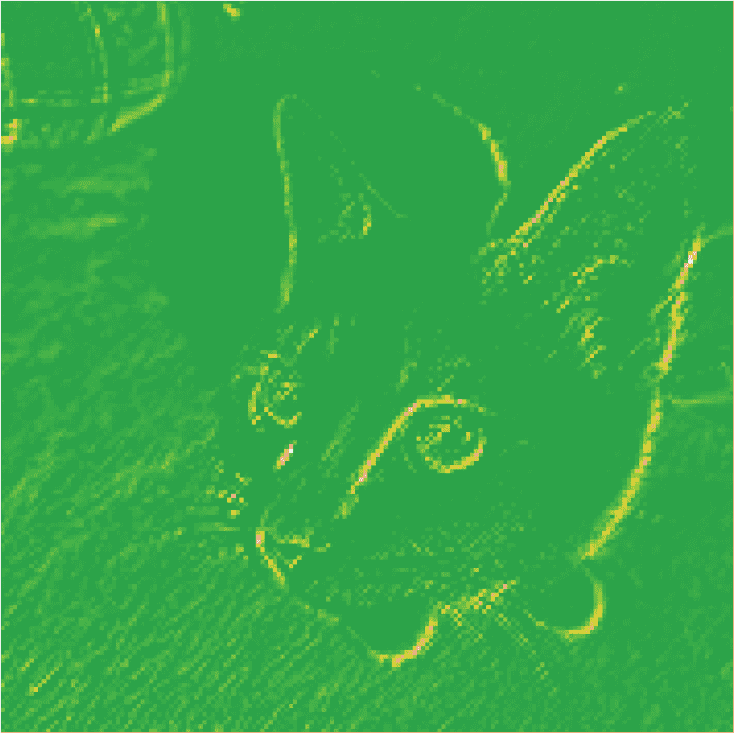

**图 9.13 测试猫图片上第一层激活的第五个通道**

这个通道似乎编码了一个对角边缘检测器——但请注意，你自己的通道可能会有所不同，因为卷积层学习的特定过滤器并不确定。

现在让我们绘制网络中所有激活的完整可视化（见图 9.14）。我们将提取并绘制每个层激活中的每个通道，并将结果堆叠在一个大网格中，通道并排堆叠。

列表 9.11 可视化每个中间激活中的每个通道

for (layer_name in names(layer_outputs)) {➊

layer_output <- activations[[layer_name]]

n_features <- dim(layer_output) %>% tail(1) ➋

par(mfrow = n2mfrow(n_features, asp = 1.75),➌

mar = rep(.1, 4), oma = c(0, 0, 1.5, 0))

for (j in 1:n_features)

plot_activations(layer_output[, , , j])➍

title(main = layer_name, outer = TRUE)

}

➊ **迭代激活（和相应层的名称）。**

➋ **层激活的形状为(1, 高度, 宽度, 特征数)。**

➌ **准备在一个图中显示该激活中的所有通道。**

➍ **这是一个单一的通道（或特征）。**

这里有几件事情要注意：

+   第一层充当各种边缘检测器的集合。在这个阶段，激活几乎保留了初始图片中的所有信息。

+   随着深入，激活变得越来越抽象，越来越难以直观解释。它们开始编码更高级别的概念，如“猫耳朵”和“猫眼睛”。更深层的表述携带的关于图像视觉内容的信息越来越少，而与图像类别相关的信息越来越多。

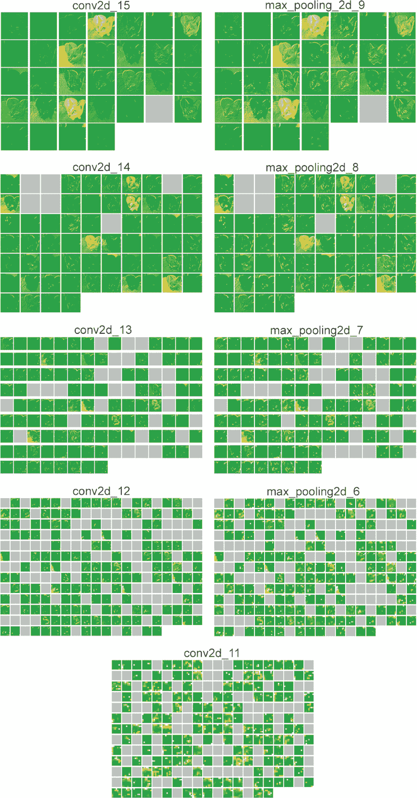

**图 9.14 测试猫图片中每一层激活的每个通道**

+   随着层的深度，激活的稀疏性增加：在第一层中，几乎所有滤波器都被输入图像激活，但在后续层中，越来越多的滤波器是空白的。这意味着滤波器编码的模式在输入图像中找不到。

我们刚刚证明了深度神经网络学习的表示的一个重要的普遍特性：随着层的深度，由层提取的特征变得越来越抽象。更高层的激活携带的关于正在查看的特定输入的信息越来越少，而携带的关于目标的信息越来越多（在本例中，图像的类别：猫或狗）。深度神经网络有效地充当一种*信息蒸馏管道*，原始数据（在本例中是 RGB 图片）被反复转换，以过滤掉不相关的信息（例如，图像的特定视觉外观），并放大和精炼有用的信息（例如，图像的类别）。

这类似于人类和动物感知世界的方式：在观察一个场景几秒钟后，人类可以记住其中存在的抽象对象（自行车，树），但不能记住这些对象的具体外观。事实上，如果你试图从记忆中画一个通用自行车，很可能你甚至不能做到远远正确，尽管你一生中见过成千上万辆自行车（参见，例如，图 9.15）。现在就试试吧：这种效应绝对是真实的。你的大脑已经学会完全抽象化它的视觉输入——将其转换为高级视觉概念，同时过滤掉无关的视觉细节——使得记住你周围的事物的外观变得极其困难。

**图 9.15 左图：试图从记忆中画出的自行车；右图：原理图中自行车的样子**

### 9.4.2 可视化卷积神经网络滤波器

通过*梯度上升在输入空间*，可以轻松地检查卷积神经网络学习到的滤波器对应的视觉模式：对卷积神经网络输入图像的值应用*梯度下降*，以*最大化*特定滤波器的响应，从一个空白输入图像开始。得到的输入图像将是所选择的滤波器响应最大的图像。

让我们尝试使用在 ImageNet 上预训练的 Xception 模型的滤波器。这个过程很简单：我们将构建一个损失函数，以最大化给定卷积层中给定滤波器的值，然后我们将使用随机梯度下降来调整输入图像的值，以最大化这个激活值。这将是我们的第二个例子，涉及利用 GradientTape()对象的低级梯度下降循环（第一个例子在第二章中）。首先，让我们实例化 Xception 模型，加载在 ImageNet 数据集上预训练的权重。

列表 9.12 实例化 Xception 卷积基础

model <- application_xception(

weights = "imagenet",

include_top = FALSE➊

)

➊ **对于这种用例，分类层不相关，因此我们不包括模型的顶层。**

我们对模型的卷积层——Conv2D 和 SeparableConv2D 层感兴趣。我们需要知道它们的名称，以便可以检索它们的输出。让我们按深度顺序打印它们的名称。

列表 9.13 打印 Xception 中所有卷积层的名称

for (layer in model$layers)

if(any(grepl("Conv2D", class(layer))))

print(layer$name)

[1] "block1_conv1"

[1] "block1_conv2"

[1] "block2_sepconv1"

[1] "block2_sepconv2"

[1] "conv2d_29"

…

[1] "block14_sepconv1"

[1] "block14_sepconv2"

你会注意到这里的可分离卷积 2D 层都被命名为类似 block6_sepconv1、block7_sepconv2 等。Xception 被结构化为块，每个块包含多个卷积层。

现在让我们创建一个第二个模型，它返回特定层的输出 - 一个 *特征提取器* 模型。因为我们的模型是一个 Functional API 模型，它是可检查的：我们可以查询其层的输出，并在新模型中重用它。不需要复制整个 Xception 代码。

Listing 9.14 创建特征提取器模型

layer_name <- "block3_sepconv1"

layer <- model %>% get_layer(name = layer_name)

feature_extractor <- keras_model(inputs = model$input,

outputs = layer$output)

**您可以将此替换为 Xception 卷积基中的任何层的名称。**

**这是我们感兴趣的层对象。**

**我们使用 model$input 和 layer$output 来创建一个模型，给定一个输入图像，返回我们目标层的输出。**

要使用此模型，只需在一些输入数据上调用它（请注意，Xception 需要通过 xception_preprocess_input() 函数对输入进行预处理）。

Listing 9.15 使用特征提取器

activation <- img_tensor %>%

.[tf$newaxis, , , ] %>%

xception_preprocess_input() %>%

feature_extractor()

str(activation)

<tf.Tensor: shape=(1, 44, 44, 256), dtype=float32, numpy=…>

**请注意，这次我们直接调用模型，而不是使用 predict()，并且 activation 是一个 tf.Tensor，而不是一个 R 数组。（很快会详细介绍。）**

让我们使用我们的特征提取模型定义一个函数，它返回一个标量值，量化给定输入图像在给定层中“激活”了多少给定滤波器。这就是我们在梯度上升过程中要最大化的“损失函数”：

compute_loss <- function(image, filter_index) {

activation <- feature_extractor(image)

filter_index <- as_tensor(filter_index, "int32")

filter_activation <-

activation[, , , filter_index, style = "python"]

mean(filter_activation[, 3:-3, 3:-3])

}

**损失函数接受一个图像张量和我们正在考虑的滤波器的索引（一个整数）。**

**在这里，我们将 filter_index 转换为整数张量，以确保在运行此函数时（即通过 tf_function()），我们有一致的行为。**

**使用 style="python" 告诉 [filter_index 是基于零的。**

**请注意，我们通过仅涉及损失中的非边界像素来避免边界伪影；我们丢弃激活边缘的前两个像素。**

**返回滤波器激活值的平均值。**

> 注意 我们稍后将使用 tf_function() 跟踪 compute_loss()，并将 filter_index 作为跟踪张量。当前仅支持 Python 风格（基于 0 的）索引，当索引本身是张量时（这可能会在将来更改）。我们通知 [filter_index 使用 style = “python” 是基于零的。

**predict(model, x) 和 model(x) 之间的区别**

在上一章中，我们使用 predict(x) 进行特征提取。在这里，我们使用 model(x)。这是为什么？

Both y <- predict(model, x) 和 y <- model(x)（其中 x 是输入数据的数组）意味着“在 x 上运行模型并检索输出 y”。然而，它们并不完全相同。

predict() 循环遍历数据批次（实际上，您可以通过 predict(x, batch_size = 64) 指定批次大小），并提取输出的 R 数组值。它在原理上等同于这样：

predict <- function(model, x) {

y <- list()

for(x_batch in split_into_batches(x)) {

y_batch <- as.array(model(x_batch))

y[[length(y)+1]] <- y_batch

}

unsplit_batches(y)

}

这意味着 predict() 调用可以扩展到非常大的数组。同时，model(x) 在内存中进行，不具有扩展性。另一方面，predict() 不可微分：如果你在 GradientTape() 范围内调用它，就无法检索到其梯度。

当你需要检索模型调用的梯度时，应该使用 model(x)，而当你只需要输出值时应该使用 predict()。换句话说，除非你正在编写低级梯度下降循环（就像我们现在这样），否则始终使用 predict()。

让我们设置梯度上升步骤函数，使用 GradientTape()。一个不明显的技巧来帮助梯度下降过程顺利进行是通过将梯度张量归一化，即通过将其除以其 L2 范数（张量中值的平方的平均值的平方根）。这确保了对输入图像所做的更新的大小始终在相同的范围内。

第 9.16 节 损失最大化通过随机梯度上升

gradient_ascent_step <-

function(image, filter_index, learning_rate) {

with(tf$GradientTape() %as% tape, {

tape$watch(image)➊

loss <- compute_loss(image, filter_index)➋

})

grads <- tape$gradient(loss, image)➌

grads <- tf$math$l2_normalize(grads)➍

image + (learning_rate * grads)➎

}

➊ **显式观察图像张量，因为它不是 TensorFlow 变量（只有变量在梯度磁带中自动观察）。**

➋ **计算损失标量，指示当前图像激活过滤器的程度。**

➌ **计算损失相对于图像的梯度。**

➍ **应用“梯度归一化技巧”。**

➎ **将图像向更有效激活我们目标过滤器的方向稍微移动一点。返回更新后的图像，以便我们可以在循环中运行步骤函数。**

现在我们有了所有的要素。让我们将它们组合成一个 R 函数，该函数以图层名称和过滤器索引作为输入，并返回表示最大化指定过滤器激活的模式的张量。请注意，我们将使用 tf_function() 来加速它。

第 9.17 节 生成滤波器可视化的函数

c(img_width, img_height) %<-% c(200, 200)

generate_filter_pattern <- tf_function(function(filter_index) {

iterations <- 30➊

learning_rate <- 10➋

image <- tf$random$uniform(➌

minval = 0.4, maxval = 0.6,

shape = shape(1, img_width, img_height, 3)

)

for (i in seq(iterations))➍

image <- gradient_ascent_step(image, filter_index, learning_rate)

图像[1, , , ]➎

})

➊ **用随机值初始化图像张量。（Xception 模型期望输入值在 [0, 1] 范围内，所以这里选择以 0.5 为中心的范围。）**

➋ **应用的梯度上升步骤数**

➌ **单步幅的振幅**

➍ **重复更新图像张量的值，以最大化我们的损失函数。**

➎ **去掉批次维度并返回图像。**

结果图像张量是一个形状为 (200, 200, 3) 的浮点数组，其值可能不是在 [0, 255] 范围内的整数。因此，我们需要对这个张量进行后处理，将其转换为可显示的图像。我们使用以下简单的实用函数来做到这一点。我们将使用张量操作并将其包装在 tf_function() 中以加快速度。

将张量转换为有效图像的实用函数清单 9.18

deprocess_image <- tf_function(function(image, crop = TRUE) {

图像 <- 图像 - mean(图像)➊

图像 <- 图像 / tf$math$reduce_std(图像)➋

图像 <- (图像 * 64) + 128

图像 <- tf$clip_by_value(图像, 0, 255)

if(crop)

图像 <- 图像[26:-26, 26:-26, ]➌

图像

})

➊ **mean() 调用了 tf$math$reduce_mean()。**

➋ **将图像值标准化到 [0, 255] 范围内。**

➌ **中心裁剪以避免边缘伪影。**

让我们试一试（参见 图 9.16）：

generate_filter_pattern(filter_index = as_tensor(2L)) %>%

deprocess_image() %>%

display_image_tensor()

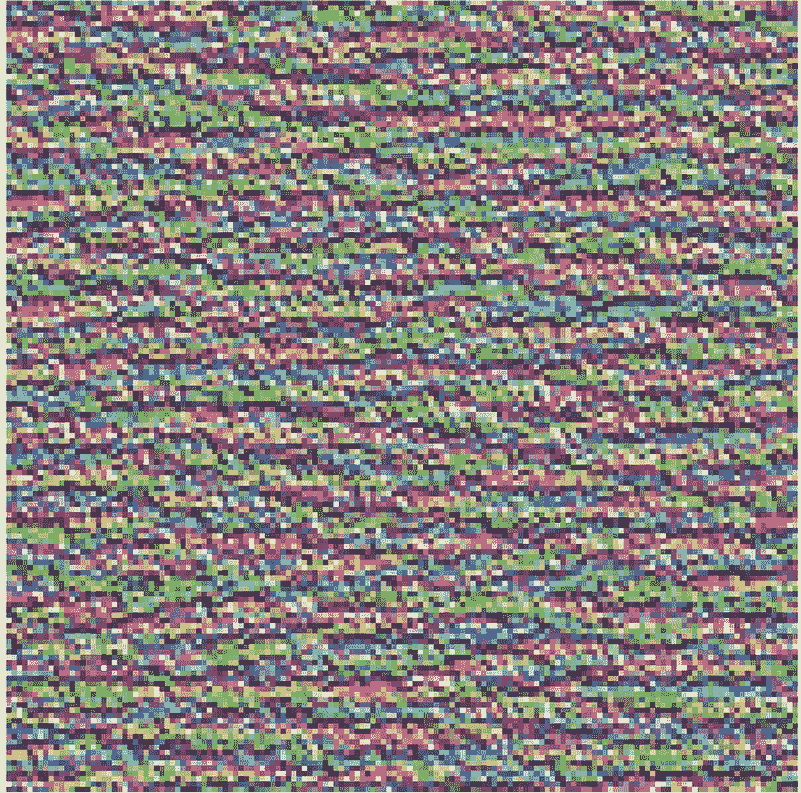

**图 9.16：layer block3_sepconv1 中第二通道响应最大的模式**

请注意，此处将 filter_index 转换为 as_tensor()。我们这样做是因为 tf_ function() 会为其调用的每种唯一方式编译一个单独的优化函数，并且不同的常量文字会计为唯一的调用签名。如果我们在这里没有调用 as_tensor()，那么在接下来的循环中绘制前 64 个激活时，tf_function() 将追踪并编译 generate_filter_pattern() 64 次！然而，使用张量调用 tf_function() 装饰的函数，即使是一个常量张量，对于 tf_function() 来说并不算是一个唯一的函数签名，而 generate_filter_pattern() 只会被追踪一次。

看起来在 layer block3_sepconv1 的第三个过滤器对水平线条模式有响应，有点像水或毛皮。

现在有趣的部分开始了：你可以开始可视化图层中的每个滤波器，甚至是模型中每个图层中的每个滤波器。

在一层生成所有滤波器响应模式的网格清单 9.19

par(mfrow = c(8, 8))

for (i in seq(0, 63)) {➊

generate_filter_pattern(filter_index = as_tensor(i)) %>%

deprocess_image() %>%

display_image_tensor(plot_margins = rep(.1, 4))

}

➊ **生成并绘制图层中前 64 个滤波器的可视化。**

这些滤波器可视化（见图 9.17）告诉你一些关于 CNN 层次如何看待世界的方法：在 CNN 中的每个层次学习了一些这样的滤波器，它们的输入可以表示为这些滤波器的组合。这与傅里叶变换将信号分解为一堆余弦函数的方式类似。在这些卷积网络过滤器中，你越深入模型，它们就变得越来越复杂和精细：

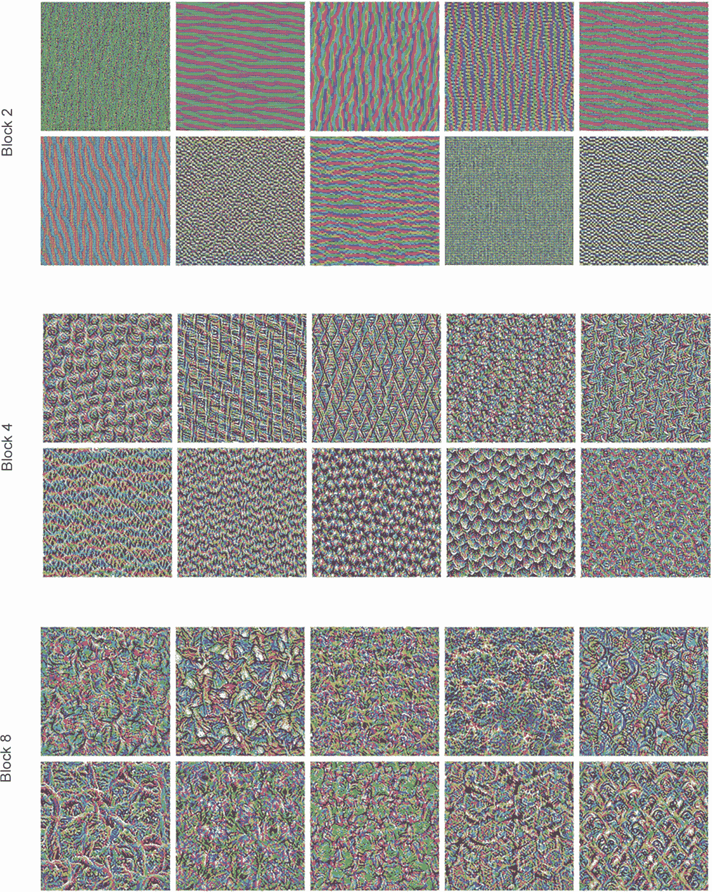

**图 9.17 层次 block2_sepconv1，block4_sepconv1 和 block8_sepconv1 的一些滤波器模式。**

+   模型中第一层的滤波器编码了简单的方向边缘和颜色（在某些情况下是彩色边缘）。

+   神经网络层次更高的滤波器（如 block4_sepconv1）编码了由边缘和颜色组合而成的简单纹理。

+   更高层次的滤波器开始类似于自然图像中的纹理：羽毛、眼睛，树叶等等。

### 9.4.3 可视化类别激活热图

最后我们介绍一种可视化技术--这对于理解给定图像的哪些部分导致了卷积网络的最终分类决策非常有用。尤其是在分类错误（称为*模型可解释性*问题域）的情况下，这对“调试”卷积网络的决策过程非常有帮助。它还可以帮助你在图像中定位特定的对象。

这种技术的通用类别被称为*类别激活地图*（CAM）可视化，它由产生输入图像上的类别激活热图组成。类别激活热图是与特定输出类别相关联的分数字逐渐计算每个输入图像中的所有位置，表示每个位置相对于考虑的类别有多重要。例如，给定输入到狗猫卷积网络的图像，CAM 可视化将允许生成一个关于“猫”的热图，指示图像的不同部分有多像猫，以及一个关于“狗”的热图，指示图像的不同部分有多像狗。

我们将使用的具体实现是一个名为“Grad-CAM: Visual Explanations from Deep Networks via Gradient-based Localization”的文章中所描述的。

Grad-CAM 由卷积层的输出特征映射、一个输入图像和将每个通道在特征映射中加权的类别相对于通道的梯度组成。直观来说，理解这个技巧的一种方式是，在将“输入图片激发不同通道的强度”空间图加权为“每个类别对于通道的重要性”，形成一个“输入图片激发类别的强度”空间图。我们使用预训练的 Xception 模型来演示这个技巧。

代码清单 9.20：加载预训练权重的 Xception 网络。

model <-application_xception(weights = "imagenet")➊

➊ **请注意，我们在顶部包括了密集连接的分类器；在所有先前的情况下，我们都将其丢弃。**

考虑一下图 9.18 中显示的两只非洲象的图像，可能是一只母象和一只小象，在大草原上漫步。让我们将这个图像转换为 Xception 模型可以读取的内容：该模型是根据几条规则进行训练的，这些规则封装在 xception_preprocess_input() 实用函数中。

**图 9.18 非洲象测试图片**

因此，我们需要加载图像，将其调整大小为 299 × 299，将其转换为 float32 张量，并应用这些预处理规则。

Listing 9.21 预处理 Xception 输入图像

img_path <- get_file(➊

fname = "elephant.jpg",

origin = "https://img-datasets.s3.amazonaws.com/elephant.jpg")

img_tensor <- tf_read_image(img_path, resize = c(299, 299))➋

preprocessed_img <- img_tensor[tf$newaxis, , , ] %>%➌

xception_preprocess_input()➍

➊ **下载图像并在路径 img_path 下存储到本地。**

➋ **将图像读取为张量并将其调整大小为 299 × 299。img_tensor 是形状为 (299, 299, 3) 的 float32 类型。**

➌ **添加一个维度，将数组转换为大小为 (1, 299, 299, 3) 的批次。**

➍ **对批处理进行预处理（这样可以进行通道颜色归一化）。**

现在，您可以在图像上运行预训练网络，并将其预测向量解码回可读的人类格式：

preds <- predict(model, preprocessed_img)

str(preds)

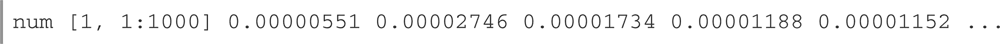

imagenet_decode_predictions(preds, top=3)[[1]]

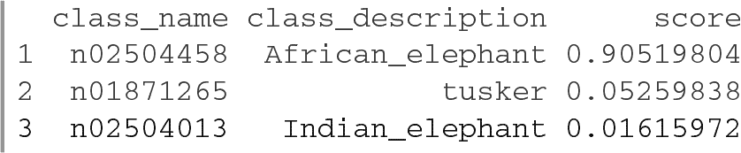

该图像的前三个预测类别如下：

+   非洲象（概率为 90%）

+   带象牙的象（概率为 5%）

+   印度象（概率为 2%）

网络已经识别出图像中包含未确定数量的非洲象。预测向量中最大激活的条目是对应于“非洲象”类的条目，索引为 387：

which.max(preds[1, ])

[1] 387

要可视化图像的哪些部分最像非洲象，让我们设置 Grad-CAM 过程。首先，我们创建一个模型，将输入图像映射到最后一个卷积层的激活。

Listing 9.22 设置返回最后一个卷积输出的模型

last_conv_layer_name <- "block14_sepconv2_act"

classifier_layer_names <- c("avg_pool", "predictions")➊

last_conv_layer <- model %>% get_layer(last_conv_layer_name)

last_conv_layer_model <- keras_model(model$inputs,

last_conv_layer$output)

➊ **Xception 模型中的最后两个层的名称**

其次，我们创建一个模型，将最后一个卷积层的激活映射到最终的类预测。

Listing 9.23 在最后一个卷积输出的顶部重新应用分类器

classifier_input <- layer_input(batch_shape = last_conv_layer$output$shape)

x <- classifier_input

for (layer_name in classifier_layer_names)

x <- get_layer(model, layer_name)(x)

classifier_model <- keras_model(classifier_input, x)

我们计算关于最后一个卷积层的激活与输入图片之间的梯度。

列表 9.24 检索最高预测类别的梯度

with (tf$GradientTape() %as% tape, {

last_conv_layer_output <- last_conv_layer_model(preprocessed_img)

tape$watch(last_conv_layer_output)➊

preds <- classifier_model(last_conv_layer_output)

top_pred_index <- tf$argmax(preds[1, ])

top_class_channel <- preds[, top_pred_index, style = "python"]➋

})

grads <- tape$gradient(top_class_channel, last_conv_layer_output)➌

➊ **计算最后一个卷积层的激活并使其纳入到计算图中。**

➋ **检索与最高预测类别相对应的激活通道。**

➌ **这是最高预测类别对于最后一个卷积层的输出特征图的梯度。**

现在我们将应用池化操作和重要性加权来获得类别激活的热图。

列表 9.25 梯度池化和通道重要性加权

pooled_grads <- mean(grads, axis = c(1, 2, 3), keepdims = TRUE)➊

➋

heatmap <

(last_conv_layer_output * pooled_grads) %>%➌➍➎➏

mean(axis = -1) %>%➐➑

.[1, , ]➒

➊ **pooled_grads 是一个向量，每个条目是给定通道的梯度的均值强度，它量化了每个通道相对于最高预测类别的重要性。**

➋ **我们利用张量广播规则，避免使用 for 循环。大小为 1 的轴会自动广播以匹配 last_conv_layer_output 的相应轴。**

➌ **将上一个卷积层的每个通道的输出乘以“此通道的重要性”。**

➍ **grads 和 last_conv_layer_output 具有相同的形状（1，10，10，2048）。**

➎ **pooled_grads 的形状为（1，1，1，2048）。**

➏ **形状：（1，10，10，2048）**

➐ **结果特征图的逐通道平均值是我们的类别激活热图。**

➑ **形状：（1，10，10）**

➒ **去掉批次维度；输出形状：（10，10）。**

结果显示在图 9.19 中。

列表 9.26 热图后处理

par(mar = c(0, 0, 0, 0))

绘制激活图(heatmap)

最后，让我们将激活的

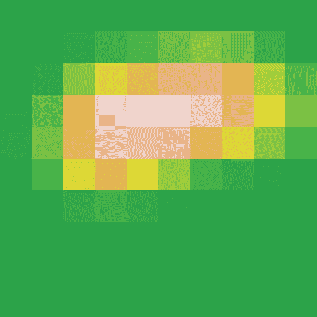

**图 9.19 独立的类别激活热图**

列表 9.27 在原始图像上叠加热图

pal <- hcl.colors(256, palette = "Spectral", alpha = .4, rev = TRUE)

heatmap <- as.array(heatmap)

heatmap[] <- pal[cut(heatmap, 256)]

heatmap <- as.raster(heatmap)

img <- tf_read_image(img_path, resize = NULL)➊

display_image_tensor(img)

rasterImage(heatmap, 0, 0, ncol(img), nrow(img), interpolate = FALSE)➋

➊ **加载原始图像，这次不调整大小。**

➋ **将热图叠加到原始图像上，热图的不透明度为 40%。我们传递 ncol(img) 和 nrow(img)，以使热图（像素较少）的绘制大小与原始图像匹配。我们传递 interpolate = FALSE，这样我们就可以清楚地看到激活地图像素边界的位置。**

这种可视化技术回答了两个重要问题：

+   网络为什么认为这张图片包含非洲象

+   图中非洲象位于哪里

特别值得注意的是，非洲象幼崽的耳朵被强烈激活：这可能是网络区分非洲象和印度象的方式。

**图 9.20 测试图片上的非洲象类激活热图**

## 摘要

+   你可以使用深度学习执行三个基本的计算机视觉任务：图像分类、图像分割和目标检测。

+   遵循现代卷积神经网络架构的最佳实践将帮助您充分利用模型。其中一些最佳实践包括使用残差连接、批量归一化和深度可分离卷积。

+   卷积神经网络学习的表示很容易检查——卷积神经网络与黑匣子相反！

+   您可以生成卷积神经网络学习的滤波器的可视化，以及类活动的热图。

1.  ¹ Kaiming He 等人，“用于图像识别的深度残差学习”，计算机视觉与模式识别会议（2015），[`arxiv.org/abs/1512.03385`](https://arxiv.org/abs/1512.03385)。

1.  ² Sergey Ioffe 和 Christian Szegedy，“批量归一化：通过减少内部协变量转移加速深度网络训练”，*第 32 届国际机器学习会议论文集*（2015），[`arxiv.org/abs/1502.03167`](https://arxiv.org/abs/1502.03167)。

1.  ³ François Chollet，“Xception：具有深度可分离卷积的深度学习”，计算机视觉与模式识别会议（2017），[`arxiv.org/abs/1610.02357`](https://arxiv.org/abs/1610.02357)。

1.  ⁴ Liang-Chieh Chen 等人，“具有空洞可分离卷积的编码器-解码器用于语义图像分割”，ECCV（2018），[`arxiv.org/abs/1802.02611`](https://arxiv.org/abs/1802.02611)。

1.  ⁵ Ramprasaath R. Selvaraju 等人，arXiv（2017），[`arxiv.org/abs/1610.02391`](https://arxiv.org/abs/1610.02391)。
