# 第十章：时间序列的深度学习

这一章涵盖了

+   涉及时间序列数据的机器学习任务的示例

+   理解递归神经网络(RNN)

+   应用 RNNs 到温度预测示例

+   高级 RNN 用法模式

## 10.1 不同类型的时间序列任务

*时间序列*可以是通过定期测量获得的任何数据，例如股票的日价格，城市的小时用电量或商店的每周销售额。时间序列无处不在，无论我们是在研究自然现象（如地震活动，河流中鱼类种群的演变或位置的天气）还是人类活动模式（如访问网站的访客，一个国家的国内生产总值或信用卡交易）。与迄今为止遇到的数据类型不同，处理时间序列涉及对系统的*动态*进行理解 ——其周期性循环，随时间推移的趋势，其正常情况以及突发的波动。

到目前为止，与时间序列相关的任务中最常见的是*预测*：预测系列中接下来会发生什么；提前几个小时预测电力消耗，以便您可以预测需求；提前几个月预测收入，以便您可以计划预算；提前几天预测天气，以便您可以安排日程。本章重点关注预测。但实际上，您可以对时间序列进行各种其他操作：

+   *分类* - 为时间序列分配一个或多个分类标签。例如，给定网站访客活动的时间序列，分类访客是机器人还是人。

+   *事件检测* - 在连续数据流中识别特定预期事件的发生。一个特别有用的应用是“热词检测”，其中模型监视音频流并检测出“OK，Google”或“Hey，Alexa”等话语。

+   *异常检测* - 检测连续数据流中发生的任何异常情况。企业网络上的异常活动？可能是攻击者。制造线上的异常读数？该找个人过去看一下了。异常检测通常通过无监督学习来完成，因为您通常不知道要寻找什么类型的异常情况，所以无法针对特定的异常情况进行训练。

在处理时间序列时，你会遇到各种领域特定的数据表示技术。例如，你可能已经听说过*傅立叶变换*，它包括将一系列值表达为不同频率的波的叠加。傅立叶变换在预处理任何主要由其周期和振荡特性（如声音、摩天大楼的振动或你的脑电波）表征的数据时非常有价值。在深度学习的背景下，傅立叶分析（或相关的梅尔频率分析）和其他领域特定的表示形式可以作为特征工程的一种形式，一种在对数据进行训练之前准备数据的方式，以使模型的工作变得更容易。然而，我们在这些页面上不会涵盖这些技术；我们将专注于建模部分。

在本章中，你将学习循环神经网络（RNNs）以及如何将它们应用于时间序列预测。

## 10.2 温度预测示例

在本章中，我们所有的代码示例都将针对一个单一的问题：预测未来 24 小时的温度，给定建筑物屋顶上一组传感器记录的最近时期的大气压力和湿度等量的每小时测量的时间序列。正如你将看到的，这是一个相当具有挑战性的问题！

我们将使用这个温度预测任务来突显时间序列数据与你迄今为止遇到的数据集有着根本不同之处。你将看到，密集连接网络和卷积网络并不适合处理这种类型的数据集，而另一种不同的机器学习技术——循环神经网络（RNNs）在这种类型的问题上表现得非常出色。

我们将使用德国耶拿马克斯·普朗克生物地球化学研究所的气象站记录的天气时间序列数据集。^[1] 在这个数据集中，每隔 10 分钟记录了 14 种不同的数量（如温度、压力、湿度和风向）数年。原始数据追溯到 2003 年，但我们将下载的数据子集限制在 2009-2016 年。让我们首先下载并解压数据：

网址 <-

"https://s3.amazonaws.com/keras-datasets/jena_climate_2009_2016.csv.zip"

download.file(url, destfile = basename(url))

zip::unzip(zipfile = "jena_climate_2009_2016.csv.zip",

files = "jena_climate_2009_2016.csv")

现在让我们来看看数据。我们将使用 readr::read_csv() 来读取数据。

列表 10.1 检查耶拿天气数据集的数据

full_df <- readr::read_csv("jena_climate_2009_2016.csv")➊

➊ **请注意，你也可以跳过上面的 zip::unzip() 调用，并直接将 zip 文件路径传递给 read_csv()。**

这将输出一个包含 420,451 行和 15 列的数据框。每一行都是一个时间步长：记录了日期和 14 个与天气相关的值。

full_df

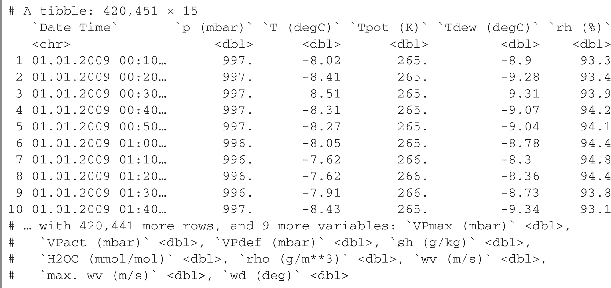

read_csv() 正确解析了所有列为数值向量，除了“Date Time”列，它解析为字符向量而不是日期时间向量。我们不会在“Date Time”列上进行训练，所以这不是问题，但为了完整起见，我们可以将字符列转换为 R POSIXct 格式。请注意，我们传递的时区为“Etc/GMT+1”，而不是“Europe/Berlin”，因为数据集中的时间戳不调整为中欧夏令时间（也称为夏时制），而是始终处于中欧时间：

`full_df$`Date Time` %<>%`

`as.POSIXct(tz = "Etc/GMT+1", format = "%d.%m.%Y %H:%M:%S")`

**%<>% 分配管道**

在前面的示例中，我们第一次使用了分配管道。x %<>% fn() 是 x <- x %>% fn() 的简写。这是有用的，因为它使您能够编写更易读的代码，避免多次重复使用相同的变量名。我们也可以这样写来达到相同的效果：

`full_df$`Date Time` <- full_df$`Date Time` %>%`

`as.POSIXct(tz = "Etc/GMT+1", format = "%d.%m.%Y %H:%M:%S")`

通过调用 library(keras)，我们可以使用分配管道。

图 10.1 显示了温度（摄氏度）随时间变化的曲线图。在这张图上，你可以清楚地看到温度的年周期性 —— 数据跨越了 8 年。

列表 10.2 绘制温度时间序列

`plot(`T (degC)` ~ `Date Time`, data = full_df, pch = 20, cex = .3)`

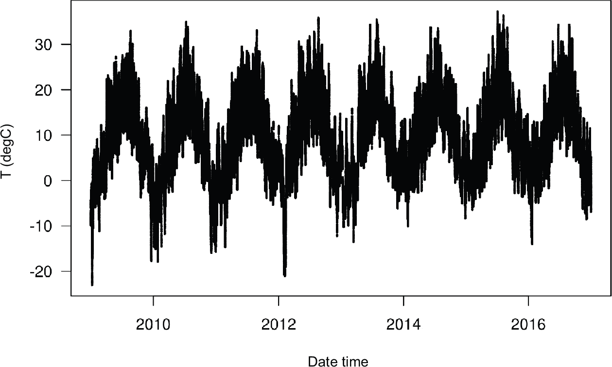

**图 10.1 数据集的完整时间范围内的温度（°C）**

图 10.2 显示了温度数据的前 10 天的更窄的曲线图。因为数据每 10 分钟记录一次，所以每天有 24 × 6 = 144 个数据点。

列表 10.3 绘制温度时间序列的前 10 天

`plot(`T (degC)` ~ `Date Time`, data = full_df[1:1440, ])`

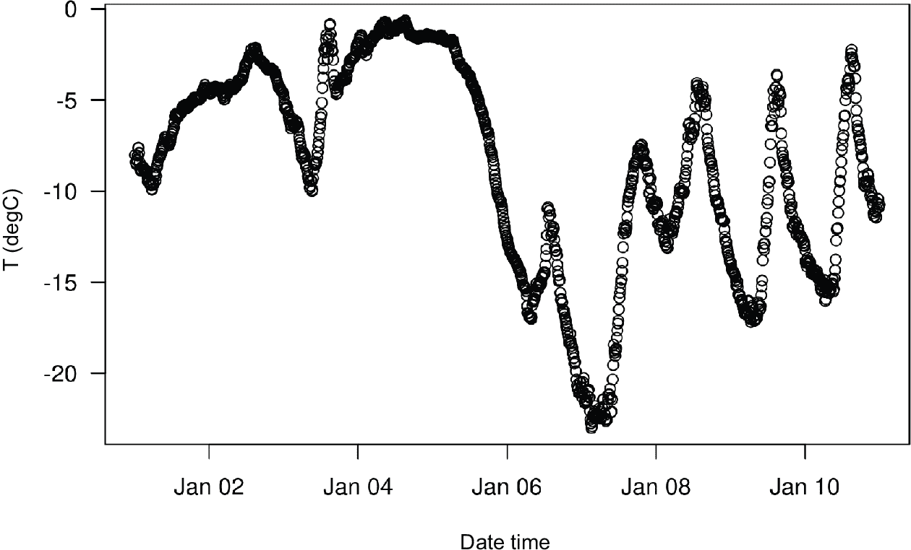

**图 10.2 数据集的前 10 天内的温度（°C）**

在这张图上，你可以看到每日周期性，尤其是最后四天。还要注意，这 10 天的周期来自一个相当寒冷的冬季月份。

**始终寻找数据中的周期性**

多个时间尺度上的周期性是时间序列数据的一个重要且非常普遍的特性。无论你是在观察天气、购物中心停车位占用情况、网站流量、杂货店销售情况还是健身追踪器中记录的步数，你都会看到每日周期和年周期（人类生成的数据也倾向于具有每周周期）。在探索数据时，请务必寻找这些模式。

通过我们的数据集，如果你试图根据过去几个月的数据预测下个月的平均温度，那问题将会很容易，因为数据具有可靠的年尺度周期性。但是如果以天为单位查看数据，温度看起来就更加混乱。在每天的尺度上，这个时间序列是否可预测？让我们来看看。

在我们所有的实验中，我们将使用数据的前 50%进行训练，接下来的 25%用于验证，最后的 25%用于测试。当处理时间序列数据时，使用比训练数据更近期的验证和测试数据很重要，因为你试图根据过去来预测未来，而不是相反，你的验证/测试拆分应该反映这一点。如果你颠倒时间轴，有些问题会变得更简单！

列表 10.4 计算我们将用于每个数据拆分的样本数

num_train_samples <- round(nrow(full_df) * .5) num_val_samples <- round(nrow(full_df) * 0.25) num_test_samples <- nrow(full_df) - num_train_samples - num_val_samples

train_df <- full_df[seq(num_train_samples), ]➊

val_df <- full_df[seq(from = nrow(train_df) + 1, length.out = num_val_samples), ]➋

test_df <- full_df[seq(to = nrow(full_df), length.out = num_test_samples), ]➌

cat("num_train_samples:", nrow(train_df), "\n")

cat("num_val_samples:", nrow(val_df), "\n")

cat("num_test_samples:", nrow(test_df), "\n")

num_train_samples: 210226

num_val_samples: 105113

num_test_samples: 105112

➊ **前 50%的行，1:210226**

➋ **接下来的 25%的行，210227:315339**

➌ **最后 25%的行，315340:420451**

### 10.2.1 准备数据

问题的确切表述如下：给定覆盖前五天的数据，每小时采样一次，我们能否在 24 小时内预测温度？

首先，让我们将数据预处理为神经网络可以摄入的格式。这很简单：数据已经是数值型的，所以您不需要进行任何向量化。但是，数据中的每个时间序列都在不同的尺度上（例如，大气压力以 mbar 为单位，约为 1000，而 H2OC 以毫摩尔/摩尔为单位，约为 3）。我们将独立地对每个时间序列（列）进行归一化，以使它们都以类似尺度的小值。我们将使用前 210,226 个时间步作为训练数据，因此我们只会在数据的这一部分计算均值和标准差。

列表 10.5 数据归一化

input_data_colnames <- names(full_df) %>% setdiff(c("Date Time"))➊

normalization_values <-

zip_lists(mean = lapply(train_df[input_data_colnames], mean),

sd = lapply(train_df[input_data_colnames], sd))➋

str(normalization_values)

一个包含 14 个元素的列表

$ p (mbar)       :List of 2

..$ 均值：num 989

..$ 标准差：num 8.51

$ T (degC)       :List of 2

..$ 均值：num 8.83

..$ 标准差：num 8.77

$ Tpot (K)       :List of 2

..$ 均值：num 283

..$ 标准差：num 8.87

$ Tdew (degC)    :List of 2

..$ 均值：num 4.31

..$ 标准差：num 7.08

$ rh (%) :List of 2

..$ 均值：num 75.9

..$ 标准差：num 16.6

$ VPmax (mbar)   :List of 2

..$ 均值：num 13.1

..$ 标准差：num 7.6

$ VPact (mbar)   :List of 2

..$ 均值：num 9.19

..$ 标准差：num 4.15

$ VPdef (mbar)    :List of 2

..$ 均值：num 3.95

..$ 标准差：num 4.77

[list output truncated]

normalize_input_data <- function(df) {

normalize <- function(x, center, scale)➌

(x - center) / scale

for(col_nm in input_data_colnames) {

col_nv <- normalization_values[[col_nm]]

df[[col_nm]] %<>% normalize(., col_nv$mean, col_nv$sd)

}

df

}

➊ **我们的模型输入将是除了日期时间列之外的所有列。**

➋ **我们仅使用训练数据来计算归一化值。**

➌**你也可以调用 scale(col, center = train_col_mean, scale = train_col_sd)，但为了最大的清晰度，我们定义了一个本地函数：normalize()。**

接下来，让我们创建一个 TF Dataset 对象，从过去五天的数据中产生数据批次，并提供未来 24 小时的目标温度。由于数据集中的样本高度冗余（样本*N*和样本*N* + 1 将具有大部分时间步骤相同），为每个样本显式分配内存将是浪费的。相反，我们将在需要时动态生成样本，只保留原始数据数组，什么都不多余。

我们可以很容易地编写一个 R 函数来做到这一点，但是 Keras 中有一个内置的数据集实用程序(timeseries_dataset_from_array())可以做到这一点，所以我们可以通过使用它来节省一些工作。你通常可以将其用于任何类型的时间序列预测任务。

**理解 timeseries_dataset_from_array()**

要理解 timeseries_dataset_from_array()的作用，让我们看一个简单的例子。总的思路是，你提供一个时间序列数据的数组（数据参数），timeseries_dataset_from_array()会给你从原始时间序列中提取的窗口（我们称之为“序列”）。

例如，如果你使用 data = [0 1 2 3 4 5 6]和 sequence_length = 3，那么 timeseries_dataset_from_array()将生成以下样本：[0 1 2]，[1 2 3]，[2 3 4]，[3 4 5]，[4 5 6]。

你还可以向 timeseries_dataset_from_array()传递一个 targets 参数（一个数组）。targets 数组的第一个条目应该与将从数据数组生成的第一个序列的所需目标相匹配。因此，如果你正在进行时间序列预测，则 targets 应该是与数据相同的数组，偏移了一些量。

例如，如果 data = [0 1 2 3 4 5 6 ...]和 sequence_length = 3，你可以通过传递 targets = [3 4 5 6 ...]来创建一个数据集，以预测系列中的下一步。让我们试试：

library (keras)

int_sequence <- seq(10) ➊

dummy_dataset <- timeseries_dataset_from_array(

data = head(int_sequence, -3), ➋

targets = tail(int_sequence, -3), ➌

sequence_length = 3, ➍

batch_size = 2 ➎

)

library(tfdatasets)

dummy_dataset_iterator <- as_array_iterator(dummy_dataset)

repeat {

batch <- iter_next(dummy_dataset_iterator)

如果（is.null(batch)）➏

break

c(inputs, targets) %<-% batch

for (r in 1:nrow(inputs))

cat(sprintf("input: [ %s ] target: %s\n", paste(inputs[r, ], collapse = " "), targets[r]))

cat(strrep("-", 27), "\n") ➐

}

➊ **生成一个从 1 到 10 排序的整数数组。**

➋ **我们生成的序列将从[1 2 3 4 5 6 7]中采样（去除最后 3 个）。**

➌ **从数据[N]开始的序列的目标将是数据[N + 4]（尾部去除前 3 个）。**

➍ **序列将为三个步长。**

➎ **序列将以大小为 2 的批次分组。**

➏ **迭代器已经耗尽。**

➐ **标记批次。**

这段代码打印以下结果：

input: [ 1 2 3 ] target: 4

input: [ 2 3 4 ] target: 5

-------------------------------

input: [ 3 4 5 ] target: 6

input: [ 4 5 6 ] target: 7

-------------------------------

input: [ 5 6 7 ] target: 8

-------------------------------

我们将使用 timeseries_dataset_from_array() 实例化三个数据集：一个用于训练，一个用于验证，一个用于测试。我们将使用以下参数值：

+   sampling_rate = 6—观察将每小时采样一次：我们将每 6 个数据点中保留一个数据点。

+   sequence_length = 120—观察将回溯五天（120 小时）。

+   delay = sampling_rate * (sequence_length + 24 - 1)—序列的目标将是序列结束后 24 小时的温度。

Listing 10.6 实例化用于训练、验证和测试的数据集

sampling_rate <- 6

sequence_length <- 120

delay <- sampling_rate * (sequence_length + 24 - 1)

batch_size <- 256

df_to_inputs_and_targets <- function(df) {

inputs <- df[input_data_colnames] %>%

normalize_input_data() %>%

as.matrix() ➊

targets <- as.array(df$`T (degC)`) ➋

list (

head(inputs, -delay), ➌

tail(targets, -delay) ➍

)

}

make_dataset <- function(df)

{ c(inputs, targets) %<-% df_to_inputs_and_targets(df)

timeseries_dataset_from_array(

inputs, targets,

sampling_rate = sampling_rate,

sequence_length = sequence_length,

shuffle = TRUE,

batch_size = batch_size

)

}

train_dataset <- make_dataset(train_df)

val_dataset <- make_dataset(val_df)

test_dataset <- make_dataset(test_df)

➊ **将数据框转换为数值数组。**

➋ **我们不对目标进行标准化。**

➌ **丢弃最后 delay 个样本。**

➍ **丢弃前 delay 个样本。**

每个数据集产生一批（samples，targets）作为一对，其中 samples 是一批包含 256 个样本的数据，每个样本包含 120 个连续小时的输入数据，而 targets 是相应的 256 个目标温度数组。请注意，样本是随机洗牌的，因此批次中的两个连续序列（如 samples[1, ] 和 samples[2, ]）不一定在时间上相邻。

Listing 10.7 检查我们数据集之一的输出

c(samples, targets) %<-% iter_next(as_iterator(train_dataset))

cat("样本形状：", format(samples$shape), "\n",

"目标形状：", format(targets$shape), "\n", sep = "")

samples shape: (256, 120, 14)

targets shape: (256)

### 10.2.2 一个常识性的、非机器学习的基准

在我们开始使用黑盒深度学习模型来解决温度预测问题之前，让我们尝试一种简单的常识方法。这将作为一个理智的检查，并且它将建立一个我们将不得不击败以证明更高级机器学习模型的有用性的基线。当你面对一个尚无已知解决方案的新问题时，这种常识基线可能会很有用。一个经典的例子是不平衡分类任务，其中一些类别比其他类别更常见。如果你的数据集包含 90% 的 A 类实例和 10% 的 B 类实例，那么对分类任务的一种常识方法是当提供一个新样本时总是预测为“A”。这样的分类器在整体上准确率为 90%，因此任何基于学习的方法都应该超过这个 90% 的分数以证明其有用性。有时，这样的基本基线可能会出人意料地难以超越。

在这种情况下，温度时间序列可以安全地假定是连续的（明天的温度很可能接近今天的温度），并且具有每日周期。因此，一个常识性的方法是始终预测 24 小时后的温度将等于现在的温度。让我们使用平均绝对误差（MAE）指标来评估这种方法，其定义如下：

`mean(abs(preds - targets))`

这是评估代码。我们不再使用 R 中的 for、as_array_iterator() 和 iter_next() 来急切地进行评估，而是可以很容易地使用 TF Dataset 转换来完成。首先我们调用 dataset_unbatch()，使每个数据集元素成为 (samples, target) 的单个案例。接下来我们使用 dataset_map() 计算每对 (samples, target) 的绝对误差，然后使用 dataset_reduce() 累积总误差和总样本数。

请记住，传递给 `dataset_map()` 和 `dataset_reduce()` 的函数将使用符号张量调用。使用负数进行张量切片，如 `samples[-1, ]` 会选择沿该轴的最后一个切片，就好像我们写成了 `samples[nrow(samples), ]` 一样。

`清单 10.8 计算常识基线 MAE`

`evaluate_naive_method <- function(dataset) {`

`unnormalize_temperature <- function(x) {`

`nv <- normalization_values$'T (degC)'`

`(x * nv$sd) + nv$mean`

`}`

`temp_col_idx <- match("T (degC)", input_data_colnames) ➊`

`reduction <- dataset %>%`

`%>% dataset_unbatch() %>%`

`dataset_map(function(samples, target) {`

`last_temp_in_input <- samples[-1, temp_col_idx] ➋`

`pred <- unnormalize_temperature(last_temp_in_input) ➌`

`abs(pred - target)`

`}) %>%`

`dataset_reduce(`

`initial_state = list(total_samples_seen = 0L, total_abs_error = 0),`

`reduce_func = function(state, element) {`

`state$total_samples_seen %<>% '+'(1L)`

`state$total_abs_error %<>% '+'(element)`

`state`

`}`

`) %>%`

`lapply(as.numeric) ➍`

`mae <- with(reduction, total_abs_error / total_samples_seen) ➎`

`mae`

`}`

`sprintf("验证 MAE: %.2f", evaluate_naive_method(val_dataset))`

sprintf("测试 MAE: %.2f", evaluate_naive_method(test_dataset))

[1] "验证 MAE: 2.43"

[1] "测试 MAE: 2.62"

➊ **2，第二列**

➋ **在输入序列中切出最后一个温度测量值。**

➌ **回忆一下，我们对特征进行了归一化，因此要得到以摄氏度为单位的温度，需要将其除以标准差，然后加上均值。**

➍ **将张量转换为 R 数值。**

➎ **reduction 是一个包含两个 R 标量数字的命名列表。**

这种常识基线实现了 2.44 摄氏度的验证 MAE 和 2.62 摄氏度的测试 MAE。因此，如果你总是假设未来 24 小时的温度与当前温度相同，平均偏差将达到两个半度。这还算可以，但你可能不会基于这种启发式方法启动气象预报服务。现在的问题是要利用你对深度学习的知识做得更好。

### 10.2.3 让我们尝试基本的机器学习模型

就像在尝试机器学习方法之前建立一个常识基线一样，可以在进行复杂且计算昂贵的模型（如 RNN）之前，尝试简单、便宜的机器学习模型（例如小型、密集连接网络）是非常有用的。这是确保你对问题投入的任何进一步复杂性都是合法的，并且能够带来真正收益的最佳方法。

列表 10.9 显示了一个完全连接的模型，它首先将数据展平，然后通过两个 layer_dense() 进行处理。请注意，最后一个 layer_dense() 没有激活函数，这对于回归问题是典型的。我们使用均方误差（MSE）作为损失，而不是 MAE，因为与 MAE 不同，它在零附近是光滑的，对于梯度下降是一个有用的特性。我们将将 MAE 作为指标添加到 compile() 中进行监控。

列表 10.9 训练和评估一个密集连接模型

ncol_input_data <- length(input_data_colnames)

inputs <- layer_input(shape = c(sequence_length, ncol_input_data))

outputs <- inputs %>%

layer_flatten() %>%

layer_dense(16, activation = "relu") %>%

layer_dense(1)

model <- keras_model(inputs, outputs)

callbacks = list (

callback_model_checkpoint("jena_dense.keras", save_best_only = TRUE)➊

)

model %>%

compile(optimizer = "rmsprop",

loss = "mse",

metrics = "mae")

history <- model %>%

fit(train_dataset,

epochs = 10,

validation_data = val_dataset,

callbacks = callbacks)

model <- load_model_tf("jena_dense.keras")➋

sprintf("测试 MAE: %.2f", evaluate(model, test_dataset)["mae"])

[1] "测试 MAE: 2.71"

➊ **我们使用回调保存表现最佳的模型。**

➋ **重新加载最佳模型，并在测试数据上进行评估。**

让我们显示验证和训练的损失曲线（参见图 10.3）。

列表 10.10 绘制结果

plot(history, metrics = "mae")

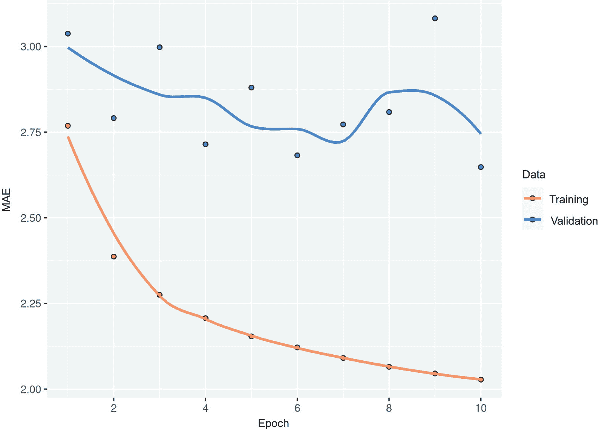

**图 10.3 在 Jena 温度预测任务上使用简单的密集连接网络进行训练和验证的 MAE**

一些验证损失接近于无学习基线，但不可靠。这显示了首先拥有这个基线的价值所在：结果证明很难超越它。你的常识包含了很多有价值的信息，机器学习模型无法获取。

你可能会想，如果存在一个简单且性能良好的模型，可以从数据到目标（常识基线），为什么你正在训练的模型找不到它并改进它呢？嗯，你正在搜索解决方案的模型空间——也就是你定义的所有可能的两层网络的空间。常识启发式仅仅是这个空间中可以表示的数百万模型中的一个。这就像在一堆草堆里寻找一根针。仅仅因为一个好的解决方案在你的假设空间中技术上存在，并不意味着你能够通过梯度下降找到它。

这在机器学习中是一个非常重要的限制：除非学习算法被硬编码为寻找特定类型的简单模型，否则有时会无法找到简单问题的简单解决方案。这就是为什么利用良好的特征工程和相关的架构先验是必不可少的原因：你需要准确告诉你的模型它应该寻找什么。

### 10.2.4 让我们尝试一个 1D 卷积模型

谈到利用正确的架构先验，因为我们的输入序列具有日循环，也许一个卷积模型可能有效。时间卷积网络可以在不同的日子重用相同的表示，就像空间卷积网络可以在图像的不同位置重用相同的表示一样。

您已经了解了 layer_conv_2d()和 layer_separable_conv_2d()，它们通过在 2D 网格上刷过小窗口查看它们的输入。这些层还有它们的 1D 甚至 3D 版本：layer_conv_1d()、layer_separable_ conv_1d()和 layer_conv_3d()。² layer_conv_1d()层依赖于在输入序列上滑动的 1D 窗口，而 layer_conv_3d()层依赖于在输入体积上滑动的立方窗口。

因此，您可以构建 1D convnets，与 2D convnets 严格类似。它们非常适合任何遵循平移不变性假设的序列数据（这意味着如果您在序列上滑动一个窗口，窗口的内容应该独立于窗口的位置而遵循相同的属性）。

让我们在我们的温度预测问题上尝试一个。我们将选择一个初始窗口长度为 24，这样我们一次可以查看 24 小时的数据（一个周期）。当我们通过 layer_max_pooling_1d()层对序列进行下采样时，我们将相应地减小窗口大小：

inputs <- layer_input(shape = c(sequence_length, ncol_input_data))

outputs <- inputs %>%

layer_conv_1d(8, 24, activation = "relu") %>%

layer_max_pooling_1d(2) %>%

layer_conv_1d(8, 12, activation = "relu") %>%

layer_max_pooling_1d(2) %>%

layer_conv_1d(8, 6, activation = "relu") %>%

layer_global_average_pooling_1d() %>%

layer_dense(1)

model <- keras_model(inputs, outputs)

callbacks <- list(callback_model_checkpoint("jena_conv.keras", save_best_only = TRUE))

model %>% compile(optimizer = "rmsprop",

loss = "mse",

metrics = "mae")

history <- model %>% fit(

train_dataset,

epochs = 10,

validation_data = val_dataset,

callbacks = callbacks

)

model <- load_model_tf("jena_conv.keras")

sprintf("测试 MAE: %.2f", evaluate(model, test_dataset)["mae"])

[1] "测试 MAE: 3.20"

我们得到了在 图 10.4 中显示的训练和验证曲线。

绘制(history)

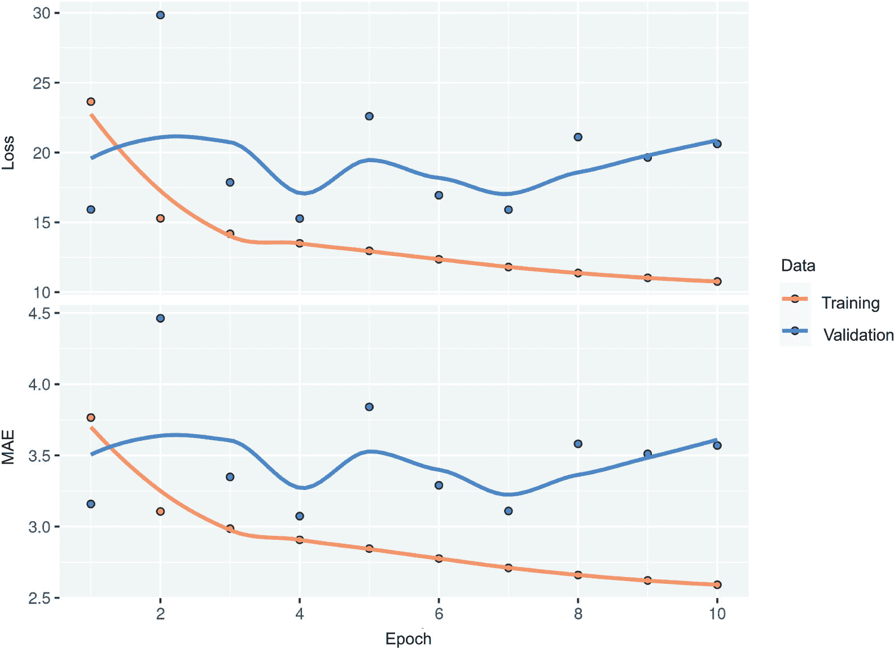

**图 10.4 在 Jena 温度预测任务中使用一维卷积网络的训练和验证 MAE**

事实证明，这个模型的表现甚至比全连接模型还要差，只能达到 3.2 度的测试 MAE，远远低于常识基线。这里出了什么问题呢？有两点：

+   首先，天气数据并不完全遵循平移不变性的假设。尽管数据具有每日循环，但早晨的数据与晚上或午夜的数据具有不同属性。天气数据只在特定时间尺度上具有平移不变性。

+   其次，我们的数据顺序非常重要。最近的数据对于预测第二天的温度比五天前的数据要有更多信息。一维卷积网络无法利用这一事实。特别是，我们的最大池化层和全局平均池化层在很大程度上破坏了顺序信息。

### 10.2.5 首个循环基线

无论全连接方法还是卷积方法都表现不佳，但这并不意味着机器学习不适用于这个问题。全连接方法首先将时间序列展平，从输入数据中除去了时间的概念。卷积方法将数据的每个片段以相同的方式处理，甚至进行了池化，这破坏了顺序信息。我们应该将数据看作它实际的样子：一个序列，因果和顺序至��重要。

有一类神经网络架构专门设计用于这种情况：循环神经网络。其中，长短期记忆（LSTM）层一直非常受欢迎。我们马上会看到这些模型是如何工作的，但首先让我们尝试一下 LSTM 层。

**图 10.11 一个简单的基于 LSTM 的模型**

inputs <- layer_input(shape = c(sequence_length, ncol_input_data))

outputs <- inputs %>%

layer_lstm(16) %>%

layer_dense(1)

model <- keras_model(inputs, outputs)

callbacks <- list(callback_model_checkpoint("jena_lstm.keras", save_best_only = TRUE))

model %>% compile(optimizer = "rmsprop",

loss = "mse",

metrics = "mae")

history <- model %>% fit(

train_dataset,

epochs = 10,

validation_data = val_dataset,

callbacks = callbacks

)

model <- load_model_tf("jena_lstm.keras")

sprintf("测试 MAE: %.2f", evaluate(model, test_dataset)["mae"])

[1] "测试 MAE: 2.52"

图 10.5 显示了结果。好多了！我们实现了 2.52 度的测试 MAE。基于 LSTM 的模型终于能够击败常识基准（尽管只是一点点），展示了机器学习在此任务上的价值。

但为什么 LSTM 模型的表现要比密集连接或卷积网络更好呢？我们如何进一步改进模型？为了回答这个问题，让我们仔细研究一下递归神经网络。

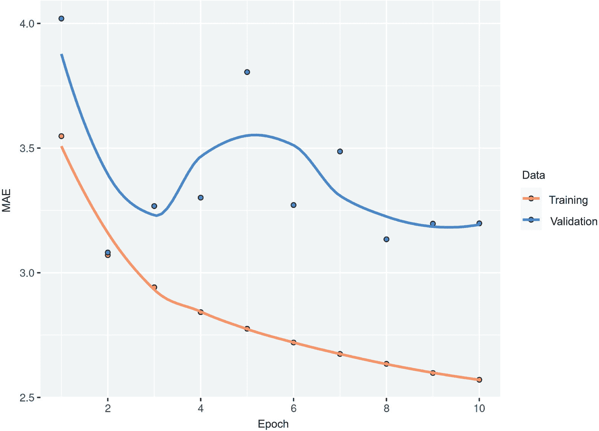

**图 10.5 基于 LSTM 模型的 Jena 温度预测任务的训练和验证 MAE（请注意，我们在此图上省略了第一个时期，因为第一个时期的高训练 MAE 会扭曲比例尺）**

## 10.3 理解递归神经网络

到目前为止，你见过的所有神经网络（如密集连接网络和卷积网络）的一个主要特征是它们没有记忆。它们分别处理每个输入，不存在输入之间的状态保持。对于这些网络来说，要处理一个序列或时间序列的数据点，你必须一次性将整个序列展示给网络：将其转换为一个单独的数据点。例如，在密集连接网络的示例中，我们将五天的数据压平成一个巨大的向量，并一次性处理了它。这样的网络称为 *前馈网络*。

相反，当你阅读当前的句子时，你是逐词处理它，同时记忆之前的内容；这使你对这个句子所传达的含义有流畅的理解。生物智能会增量地处理信息，同时保持一个内部模型，该模型是从过去信息中构建起来的，并随着新信息的到来而不断更新。

*递归神经网络*（RNN）采用相同的原则，尽管是在一个极简化的版本：它通过迭代序列元素并保持一个包含迄今为止所见信息的*状态*来处理序列。实际上，RNN 是一种具有内部*循环*的神经网络（参见图 10.6）。RNN 的状态在处理两个不同的、独立的序列（例如批次中的两个样本）之间重置，所以你仍然将一个序列视为一个单独的数据点：对网络的单个输入。改变的是，这个数据点不再以单个步骤进行处理；相反，网络在序列元素上进行内部循环。

为了澄清*循环*和*状态*的概念，让我们实现一个玩具 RNN 的前向传播。这个 RNN 接受一系列向量作为输入，我们将其编码为大小为 (时间步长, 输入特征) 的二阶张量。它在时间步长上循环，并在每个时间步长上考虑 t 时刻的当前状态和 t 时刻的输入（形状为 (输入特征)），并将它们组合起来得到 t 时刻的输出。然后，我们将下一个步骤的状态设置为上一个输出。对于第一个时间步长，上一个输出未定义；因此，没有当前状态。因此，我们将状态初始化为称为网络的*初始*状态的全零向量。在伪代码中，以下清单显示了 RNN。

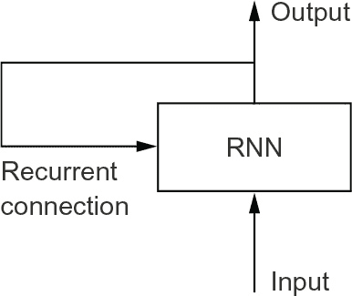

**图 10.6 一个循环网络：具有循环的网络**

**清单 10.12 RNN 伪代码**

state_t <- 0➊

for (input_t in input_sequence) {➋

output_t <- f(input_t,

state_t) state_t <- output_t➌

}

➊ **t 时刻的状态**

➋ **迭代序列元素。**

➌ **前一个输出成为下一次迭代的状态。**

甚至可以详细说明函数 f：将输入和状态转换为输出的过程将由两个矩阵 W 和 U，以及一个偏置向量参数化。这类似于前馈网络中密集连接层所进行的转换。

**清单 10.13 RNN 的更详细的伪代码**

state_t <- 0

for (input_t in input_sequence) {

output_t <- activation(dot(W, input_t) + dot(U,

state_t) + b) state_t <- output_t

}

为了使这些概念绝对清晰，让我们写一个简单的 R 语言实现简单 RNN 的前向传播。

**清单 10.14 简单 RNN 的基本 R 实现**

random_array <- function(dim) array(runif(prod(dim)), dim)

timesteps <- 100➊

input_features <- 32➋

output_features <- 64➌

inputs <- random_array(c(timesteps, input_features))➍

state_t <- array(0, dim = output_features)➎

W <- random_array(c(output_features, input_features))➏

U <- random_array(c(output_features, output_features))➏

b <- random_array(c(output_features, 1))➏

successive_outputs <- array(0, dim = c(timesteps, output_features))➏

for(ts in 1:timesteps) {

input_t <- inputs[ts, ]➐

output_t <- tanh((W %*% input_t) + (U %*% state_t) + b)➑➒

successive_outputs[ts, ] <- output_t➓

state_t <- output_t⓫

}

final_output_sequence <- successive_outputs⓬

➊ **输入序列中的时间步长数**

➋ **输入特征空间的维度**

➌ **输出特征空间的维度**

➍ **输入数据：举例时使用的随机噪声**

➎ **初始状态：全零向量**

➏ **创建随机权重矩阵。**

➐ **input_t 是形状为 (输入特征) 的向量。**

➑ **W %*% input_t、U %*% input_t 和 b 都具有相同的形状：(输出特征，1)。**

➒ **将输入与当前状态（上一个输出）组合以获得当前输出。我们使用 tanh 添加非线性（我们可以使用任何其他激活函数）。**

➓ **将此输出存储起来。**

⓫ **更新网络的状态，以便进行下一个时间步骤。**

⓬ **最终输出是一个形状为(timesteps, output_features)的二阶张量。**

很容易。总之，RNN 是一个 for 循环，它重复使用在循环的前一次迭代中计算的数量，没有更多的内容。当然，您可以构建许多不同的满足此定义的 RNN——这个示例是最简单的 RNN 公式之一。RNN 的特征在于它们的步骤函数，例如本例中的下面的函数（见图 10.7）。

output_t <- tanh((W %*% input_t) + (U %*% state_t) + b)

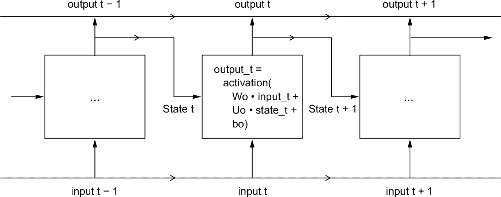

**图 10.7 一个简单的 RNN 在时间上展开**

在本例中，最终输出是一个形状为(timesteps, output_features)的二阶张量，其中每个时间步骤是时间 t 处循环的输出。输出张量中的每个时间步长 t 都包含有关输入序列中时间步长 1 到 t 的信息——关于整个过去的信息。因此，在许多情况下，您不需要这个完整的输出序列；您只需要最后一个输出（在循环结束时的 output_t），因为它已经包含有关整个序列的信息。

### 10.3.1 Keras 中的一个递归层

我们刚刚在 R 中天真地实现的进程对应于一个实际的 Keras 层——layer_simple_rnn()。有一个细微的差别：layer_simple_rnn()处理序列批次，像所有其他 Keras 层一样，而不是在 R 的例子中一次处理一个序列。这意味着它需要形状为(batch_size, timesteps, input_features)的输入，而不是形状为(timesteps, input_features)的输入。在指定初始输入的形状参数时，请注意，您可以将 timesteps 条目设置为 NA，这将使您的网络能够处理任意长度的序列。

**清单 10.15 可处理任意长度序列的 RNN 层**

num_features <- 14

inputs <- layer_input(shape = c(NA, num_features))

outputs <- inputs %>% layer_simple_rnn(16)

如果您的模型用于处理可变长度的序列，那么这是特别有用的。然而，如果您的所有序列都具有相同的长度，我建议指定完整的输入形状，因为它可以让模型的 print()方法显示输出长度信息，这总是很好的，并且它可以解锁一些性能优化（请参见第 10.4.1 节的侧边栏中的内容，“RNN 运行时性能”）。

Keras 中的所有循环层（layer_simple_rnn()、layer_lstm()和 layer_gru()）都可以以两种不同的模式运行：它们可以为每个时间步长返回连续输出的完整序列（形状为(batch_size, timesteps, output_features)的二阶张量），或仅为每个输入序列返回最后一个输出（形状为(batch_size, output_features)的二阶张量）。这两种模式由 return_sequences 参数控制。让我们看一个使用 layer_simple_rnn()并仅返回最后一步输出的例子。

**清单 10.16 只返回最后一步输出的 RNN 层**

num_features <- 14

steps <- 120

inputs <- layer_input(shape = c(steps, num_features))

outputs <- inputs %>%

layer_simple_rnn(16, return_sequences = FALSE)➊

outputs$shape

TensorShape([None, 16])

➊ **请注意，默认情况下 return_sequences = FALSE。**

下面的示例返回完整的状态序列。

**清单 10.17 返回完整输出序列的 RNN 层**

num_features <- 14

steps <- 120

inputs <- layer_input(shape = c(steps, num_features))

outputs <- inputs %>% layer_simple_rnn(16, return_sequences = TRUE)

outputs$shape

TensorShape([None, 120, 16])

有时候，堆叠几个递归层一个接一个地可以增加网络的表示能力。在这样的设置中，你必须让所有中间层返回完整的输出序列。

**清单 10.18 堆叠 RNN 层**

inputs <- layer_input(shape = c(steps, num_features))

outputs <- inputs %>%

layer_simple_rnn(16, return_sequences = TRUE) %>%

layer_simple_rnn(16, return_sequences = TRUE) %>%

layer_simple_rnn(16)

在实践中，你很少会使用 layer_simple_rnn()。它通常过于简单，无法真正使用。特别是，layer_simple_rnn() 存在一个主要问题：虽然理论上它应该能够在时间 t 保留关于之前许多时间步的输入的信息，但在实践中，这样的长期依赖关系被证明是不可能学习的。这是由于 *消失梯度问题*，这是一种类似于非递归网络（前馈网络）在许多层深度时观察到的效果：随着你不断向网络添加层，网络最终变得无法训练。这个效果的理论原因是由 Hochreiter、Schmidhuber 和 Bengio 在 1990 年代初研究的³。

幸运的是，layer_simple_rnn() 不是 Keras 中唯一可用的递归层。还有另外两个，layer_lstm() 和 layer_gru()，它们设计用来解决这些问题。

让我们来考虑 layer_lstm()。底层长短期记忆（LSTM）算法由 Hochreiter 和 Schmidhuber 在 1997 年开发⁴；这是他们对消失梯度问题研究的顶点。

这个层是你已经了解的 layer_simple_rnn() 的一个变体；它添加了一种在许多时间步长之间传递信息的方式。想象一条与你正在处理的序列平行运行的传送带。来自序列的信息可以在任何时间点跳上传送带，被传送到以后的时间步长，然后在你需要时完整地跳下来。这基本上就是 LSTM 做的事情：它保存信息以备后用，从而在处理过程中防止旧信号逐渐消失。这应该让你想起第九章学到的 *残差连接*，基本上是同样的思想。

要详细理解这个过程，让我们从 layer_simple_rnn() 单元开始（参见 图 10.8）。因为你将会有很多权重矩阵，在单元中，用字母 o（Wo 和 Uo）表示*output*。

**图 10.8 LSTM 层的起点：一个 SimpleRNN**

现在让我们在这个图像中添加一个额外的数据流，它在时间步长之间携带信息。将其称为 c_t 的不同时间步长的值，其中 c 代表*carry*。这个信息将对单元产生以下影响：它将与输入连接和循环连接（通过一个密集转换：一个与权重矩阵的点积，然后加上偏置，并应用激活函数）相结合，并影响发送到下一个时间步的状态（通过激活函数和乘法操作）。从概念上讲，进位数据流是调制下一个输出和下一个状态的一种方式（见 图 10.9）。到目前为止还是很简单的。

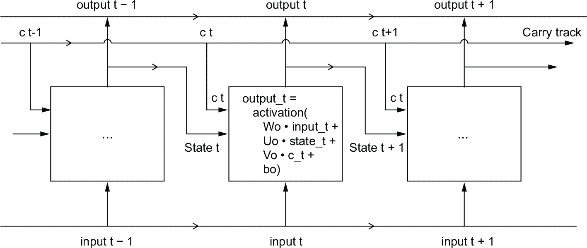

**图 10.9 从 SimpleRNN 过渡到 LSTM：添加一个进位轨道**

现在让我们来看看一个微妙之处——计算进位数据流的下一个值的方式。它涉及三个不同的转换。这三个转换都采用了 SimpleRNN 单元的形式：

y <- activation((state_t %*% U) + (input_t %*% W) + b)

但是所有三个转换都有自己的权重矩阵，我们将用字母 i、f 和 k 对它们进行索引。到目前为止我们得到了这样的式子（可能看起来有点随意，但请跟我来）。

**清单 10.19 LSTM 架构的伪代码细节（1/2）**

output_t < -

activation((state_t %*% Uo) + (input_t %*% Wo) + (c_t %*% Vo) + bo)

i_t <- activation((state_t %*% Ui) + (input_t %*% Wi) + bi)

f_t <- activation((state_t %*% Uf) + (input_t %*% Wf) + bf)

k_t <- activation((state_t %*% Uk) + (input_t %*% Wk) + bk)

我们通过组合 i_t、f_t 和 k_t 来获得新的进位状态（下一个 c_t）。

**清单 10.20 LSTM 架构的伪代码细节（2/2）**

c_t+1 = i_t * k_t + c_t * f_t

像 图 10.10 中所示添加这个，就这样。并不是那么复杂——只是稍微复杂了一点。

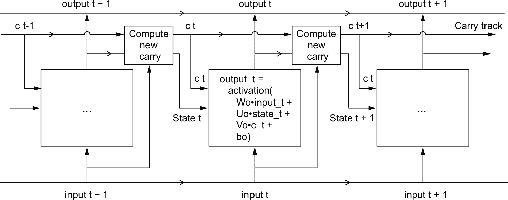

**图 10.10 LSTM 的解剖学**

如果你想深入思考，你可以解释每个操作的意图。例如，你可以说将 c_t 和 f_t 相乘是一种有意忽略 carry 数据流中无关信息的方法。与此同时，i_t 和 k_t 提供关于当前状态的信息，用新信息更新 carry 跟踪。但归根结底，这些解释并不重要，因为这些操作 *实际上* 做什么取决于参数化它们的权重的内容；而权重是以端对端方式学习的，在每一轮训练开始时重新开始，因此不可能将这种或那种操作归因于特定目的。RNN 单元的规范（如上所述）确定了你的假设空间——在训练期间搜索良好模型配置的空间——但它并不确定单元所做的事情；这取决于单元权重。具有不同权重的相同单元可能做着非常不同的事情。因此，构成 RNN 单元的操作组合更好地被解释为对你的搜索的一组 *约束*，而不是以工程意义上的 *设计*。

可以说，这种约束的选择——如何实现 RNN 单元——最好由优化算法（如遗传算法或强化学习过程）来处理，而不是由人类工程师来处理。在未来，这就是我们构建模型的方式。总之：你不需要理解 LSTM 单元的具体架构；作为人类，你的工作不应该是理解它。只需记住 LSTM 单元的意图：允许过去的信息在以后重新注入，从而解决梯度消失问题。

## 递归神经网络的高级用法

到目前为止，你已经学会了

+   RNN 是什么以及它们如何工作

+   LSTM 是什么，为什么它在处理长序列时比天真的 RNN 更有效

+   如何使用 Keras RNN 层处理序列数据

接下来，我们将回顾一些 RNN 的更高级特性，这些特性可以帮助你充分利用你的深度学习序列模型。通过本节结束，你将了解大部分关于使用 Keras 进行递归网络的知识。

我们将涵盖以下内容：

+   *递归丢失* —— 这是一种用于对抗递归层中过拟合的 dropout 变体。

+   *叠加递归层* —— 这增加了模型的表征能力（但增加了计算负载的成本）。

+   *双向递归层* —— 这些以不同方式向递归网络提供相同的信息，增加了准确性并减轻了遗忘问题。

我们将使用这些技术来完善我们的温度预测 RNN。

### 使用递归丢失来对抗过拟合

让我们回到我们在 10.2.5 节中使用的基于 LSTM 的模型——我们的第一个能够击败常识基线的模型。如果你看一下训练和验证曲线（图 10.5），很明显模型很快就开始过拟合了，尽管只有很少的单元：几个周期后，训练和验证损失开始明显发散。你已经熟悉了对抗这种现象的经典技术：辍学，它随机将一层的输入单元归零，以打破训练数据中的偶然相关性。但如何在循环网络中正确应用辍学并不是一个微不足道的问题。

长久以来人们都知道，在循环层之前应用辍学会阻碍学习，而不是帮助正则化。在 2016 年，Yarin Gal 在他的博士论文中，关于贝叶斯深度学习，⁵ 确定了在循环网络中正确使用辍学的方法：应该在每个时间步骤上应用相同的辍学掩码（相同的丢弃单元模式），而不是使用随机变化的辍学掩码。此外，为了对循环门（如 layer_gru() 和 layer_lstm()）形成的表示进行正则化，应该将一个时间恒定的辍学掩码应用于该层的内部循环激活（循环辍学掩码）。在每个时间步上使用相同的辍学掩码允许网络正确传播其学习错误；时间上随机的辍学掩码会干扰这种错误信号，并对学习过程有害。

Yarin Gal 在 Keras 中进行了研究，并直接将这种机制集成到了 Keras 的循环层中。Keras 中的每个循环层都有两个与辍学相关的参数：dropout，指定该层输入单元的辍学率，和 recurrent_dropout，指定循环单元的辍学率。让我们在我们第一个 LSTM 示例的 layer_lstm() 中添加循环辍学，看看这样做如何影响过拟合。

多亏了辍学，我们不需要过多依赖网络大小来进行正则化，因此我们将使用两倍单元数的 LSTM 层，希望能够更具表现力（如果没有辍学，该网络将立即开始过拟合——可以尝试一下）。由于使用辍学进行正则化的网络总是需要更长时间才能完全收敛，所以我们将对模型进行五倍的训练周期。

**图示 10.21 训练和评估带有辍学正则化的 LSTM**

inputs <- layer_input(shape = c(sequence_length, ncol_input_data))

outputs <- inputs %>%

layer_lstm(32, recurrent_dropout = 0.25) %>%

layer_dropout(0.5) %>%➊

layer_dense(1)

model <- keras_model(inputs, outputs)

callbacks <- list(callback_model_checkpoint("jena_lstm_dropout.keras", save_best_only = TRUE))

model %>% compile(optimizer = "rmsprop",

loss = "mse",

metrics = "mae")

history <- model %>% fit(

train_dataset,

epochs = 50,

validation_data = val_dataset,

callbacks = callbacks

)

➊ **为了对稠密层进行正则化，我们在 LSTM 之后添加了一个丢弃层。**

图 10.11 显示了结果。成功！在前 15 个 epoch 中，我们不再过拟合。我们的验证 MAE 可以降低到 2.37 度（相比没有学习的基准线改善了 2.5%），测试 MAE 为 2.45 度（相比基准线改善了 6.5%）。还不错。

**图 10.11：使用丢弃正则化的 LSTM 在 Jena 温度预测任务上的训练和验证损失**

**RNN 运行时性能**

与第几章中介绍的那种参数极少的循环模型相比，使用多核 CPU 上的 RNN 层通常会快得多，因为它们只涉及小矩阵乘法，并且乘法链由于存在循环而无法很好地并行化。但是，较大的 RNN 可以极大地受益于 GPU 的运行时。

当使用 Keras LSTM 或 GRU 层在 GPU 上使用默认参数时，你的层将利用 cuDNN 核心，这是一个高度优化的、低水平的、由 NVIDIA 提供的底层算法实现（我在上一章中提到过这些）。

通常情况下，cuDNN 核心是个双刃剑：它们快，但不灵活 —— 如果你尝试做一些默认核心不支持的事情，你将遭受劇烈的减速，这几乎强迫你坚持 NVIDIA 提供的功能。

例如，循环丢弃不支持 LSTM 和 GRU 的 cuDNN 核心，因此将其添加到你的层会强制运行时回退到常规的 TensorFlow 实现，其在 GPU 上通常比传统实现要慢两到五倍（即使它的计算成本是相同的）。

当无法使用 cuDNN 加速你的 RNN 层时，你可以尝试*展开*它。展开一个循环包括删除该循环，并将其内容简单内联化*N*次。在 RNN 的循环中，展开可以帮助 TensorFlow 优化底层的计算图。然而，它也会显著增加 RNN 的内存消耗。因此，它只适用于相对较小的序列（约 100 个步长或更少）。另外，请注意，只有当模型预知数据中的时间步数时才能这样做（也就是说，如果你向初始层的 layer_input() 传递一个没有任何 NA 条目的形状）。它的工作原理如下：

inputs <- layer_input(shape = c(sequence_length, num_features))➊

x <- inputs %>%

layer_lstm(32, recurrent_dropout = 0.2, unroll = TRUE)➋

➊ **sequence_length 不能是 NA。**

➋ **传递 unroll = TRUE 启用展开。**

### 10.4.2 堆叠循环层

因为你不再过度拟合，但似乎遇到了性能瓶颈，所以你应该考虑增加网络的容量和表达能力。回想一下通用的机器学习工作流程的描述：增加模型的容量直到过度拟合成为主要障碍是一个好主意（假设您已经采取了基本步骤来减轻过度拟合，比如使用丢弃）。只要你没有过度拟合得太严重，你很可能是在容量不足。

增加网络容量通常是通过增加层中的单元数或添加更多层来完成的。递归层堆叠是构建更强大的递归网络的经典方法：例如，不久前，Google 翻译算法是由七个大型 LSTM 层堆叠组成的，这是一个巨大的网络。

在 Keras 中堆叠递归层时，所有中间层都应返回它们的完整输出序列（一个三阶张量），而不是它们在最后一个时间步的输出。就像你已经学过的那样，这是通过指定 return_sequences = TRUE 来完成的。

在下面的示例中，我们将尝试一组两个带有丢弃正则化的递归层。为了改变一下，我们将使用门控循环单元（GRU）层，而不是 LSTM。GRU 与 LSTM 非常相似 —— 你可以把它看作是 LSTM 架构的稍微简化、简化版本。它由 Cho 等人在 2014 年提出，当时递归网络才开始重新引起当时小规模研究社区的兴趣⁶。

**清单 10.22 训练和评估一个带有丢弃正则化的堆叠 GRU 模型**

inputs <- layer_input(shape = c(sequence_length, ncol_input_data))

outputs <- inputs %>%

layer_gru(32, recurrent_dropout = 0.5, return_sequences = TRUE) %>%

layer_gru(32, recurrent_dropout = 0.5) %>%

layer_dropout(0.5) %>%

layer_dense(1)

model <- keras_model(inputs, outputs)

callbacks <- list(

callback_model_checkpoint("jena_stacked_gru_dropout.keras", save_best_only = TRUE)

)

model %>% compile(optimizer = "rmsprop",

loss = "mse",

metrics = "mae")

history <- model %>% fit(

train_dataset,

epochs = 50,

validation_data = val_dataset,

callbacks = callbacks

)

model <- load_model_tf("jena_stacked_gru_dropout.keras") sprintf("测试 MAE：%.2f", evaluate(model, test_dataset)["mae"])

[1] "测试 MAE：2.42"

图 10.12 显示了结果。我们实现了 2.42 度的测试 MAE（比基线提高了 7.6%）。您可以看到添加的层确实稍微改善了结果，尽管没有戏剧性的改变。您可能会看到在这一点上增加网络容量的回报正在递减。

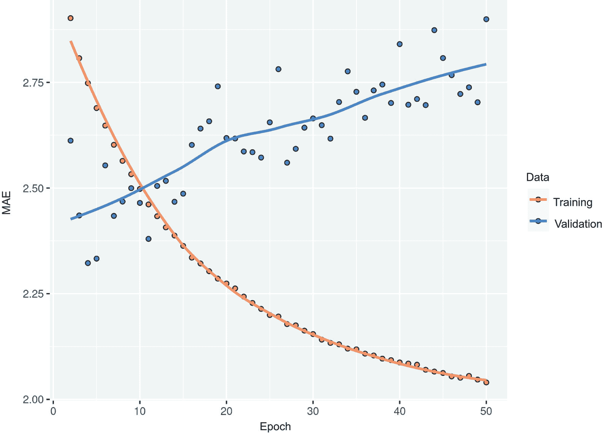

**图 10.12 Jena 温度预测任务上堆叠 GRU 网络的训练和验证损失**

### 10.4.3 使用双向 RNN

本节我们将要看的最后一种技术是*双向 RNN*。双向 RNN 是常见的 RNN 变体，在某些任务上可以提供比常规 RNN 更好的性能。它经常用于自然语言处理——您可以称其为自然语言处理的瑞士军刀。

RNNs（循环神经网络）明显依赖于顺序：它们按顺序处理其输入序列的时间步长，对时间步长进行混洗或反转可能会完全改变 RNN 从序列中提取的表示。这恰恰是它们在顺序具有意义的问题上表现良好的原因，比如温度预测问题。双向 RNN 利用了 RNN 的顺序敏感性：它使用两个常规 RNN，例如你已经熟悉的 GRU 和 LSTM 层，每个都按一定方向（按时间顺序和逆时间顺序）处理输入序列，然后合并它们的表示。通过双向处理序列，双向 RNN 可以捕捉到单向 RNN 可能忽略的模式。

引人注目的是，本节中的 RNN 层以时间顺序（以较早的时间步长优先）处理序列的事实可能是一个任意的决定。

至少到目前为止，我们没有试图质疑的决定。例如，如果 RNN 按逆时间顺序处理输入序列（首先是更新的时间步长），它们是否能够表现良好呢？让我们尝试一下，看看会发生什么。您只需要修改 TF 数据集，使输入序列沿时间维度反转即可。只需像这样用 dataset_map() 转换数据集：

ds %>%

dataset_map(function(samples, targets) {

list(samples[, NA:NA:-1, ], targets)

})

训练与本节第一个实验中使用的相同基于 LSTM 的模型，您将获得 图 10.13 中显示的结果。

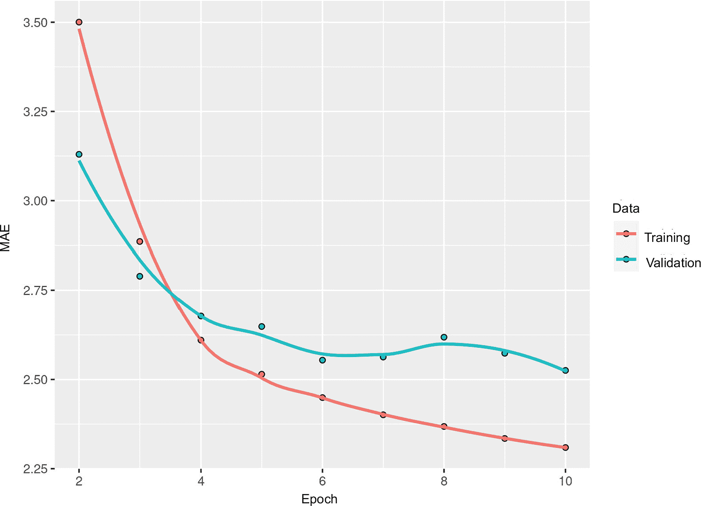

**图 10.13 使用 LSTM 在 Jena 温度预测任务上的训练和验证损失，训练的是反转序列**

反转顺序的 LSTM 明显表现不佳，甚至不如常识基线，表明在这种情况下，顺序处理对方法的成功很重要。这是很有道理的：底层 LSTM 层通常更擅长记住最近的过去，而不是遥远的过去，自然地，更近期的天气数据点比较旧的数据点更具有预测性（这就是常识基线相当强的原因）。因此，层的时间顺序版本必定会胜过反转顺序版本。

但是，对于包括自然语言在内的许多其他问题来说，并不是这样。直观上讲，理解一个句子中的一个词通常并不依赖于它在句子中的位置。在文本数据中，逆序处理和顺序处理一样有效——你可以很好地反向阅读文本（试试看！）。尽管词序在理解语言方面确实很重要，但是使用的顺序并不关键。重要的是，用于反向序列训练的 RNN 会学习到与用于原始序列训练的 RNN 不同的表示，就像在现实世界中，如果时间倒流，你会有与时间正常流动时完全不同的心理模型——如果你在你生命的最后一天出生并在你的第一天死去的话。在机器学习中，那些*不同*但*有用*的表示总是值得利用的，它们的区别越大，越好：它们提供了一个新的角度来观察数据，捕捉到了其他方法忽略的数据特征，因此它们可以帮助改善任务的性能。这就是集成学习的直觉，我们将在第十三章中探讨这个概念。

双向 RNN 利用这个思想来改进按照时间顺序的 RNN 的性能。它双向查看输入序列（请参见图 10.14），获得可能更丰富的表示，并捕捉到只有按时间顺序的版本可能会错过的模式。

在 Keras 中实例化一个双向 RNN，你可以使用 `bidirectional()` 层，它的第一个参数是一个循环层实例。`bidirectional()` 创建第二个、单独的循环层实例，并使用一个实例按照时间顺序处理输入序列，使用另一个实例按照反向顺序处理输入序列。你可以在我们的温度预测任务中试一下。

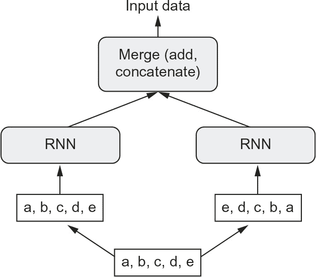

**图 10.14 双向 RNN 层的工作原理**

**列表 10.23 训练和评估双向 LSTM**

inputs <- layer_input(shape = c(sequence_length, ncol_input_data))

outputs <- inputs %>%➊

bidirectional(layer_lstm(units = 16)) %>%

layer_dense(1)

model <- keras_model(inputs, outputs)

model %>% compile(optimizer = "rmsprop",

loss = "mse",

metrics = "mae")

history <- model %>%

fit(train_dataset,

epochs = 10,

validation_data = val_dataset)

➊ **请注意，`layer_lstm()` 不是直接与 `inputs` 组合在一起的。**

你会发现它的表现不如普通的 `layer_lstm()`。很容易理解为什么：因为反向半部分在这个任务上明显表现不佳（因为在这种情况下，近期的影响要比远期的影响大得多），所以所有的预测能力必须来自于网络的正向半部分。同时，反向半部分的存在使得网络的容量加倍，并导致网络过拟合的时间提前。

然而，双向 RNN 非常适合文本数据，或者任何其他需要考虑顺序的数据，但是使用的顺序却无关紧要的数据。事实上，在 2016 年的一段时间里，双向 LSTM 被认为是许多自然语言处理任务的最新技术（在 Transformer 架构的兴起之前，你将在下一章学到有关该架构的内容）。

### 10.4.4 更进一步

你可以尝试许多其他方法来提高温度预测问题的性能：

+   调整堆叠设置中每个递归层中的单位数量，以及 dropout 的数量。目前的选择主要是任意的，因此可能是次优的。

+   调整 RMSprop 优化器使用的学习率，或尝试其他优化器。

+   尝试将`layer_dense()`堆叠作为递归层之上的回归器，而不是单个`layer_dense()`。

+   改进模型的输入：尝试使用更长或更短的序列或不同的采样率，或开始进行特征工程

一如既往，深度学习更像是一门艺术而不是科学。我们可以提供指导方针，建议在特定问题上可能有效或无效的方法，但是，最终，每个数据集都是独一无二的；你必须以经验为依据评估不同的策略。目前没有理论可以事先告诉你如何才能最佳地解决问题。你必须不断迭代。

依我所见，通过大约 10%的改进来超过无学习基线可能是你在这个数据集上能做到的最好的。这并不算太好，但这些结果是有道理的：如果你可以访问来自不同位置广阔网格的数据，那么接近未来的天气是高度可预测的，但如果你只有来自单个位置的测量数据，那么天气的演变就不太可预测。你所处的地方的天气演变取决于周围地区的当前天气模式。

**市场与机器学习**

一些读者肯定会想要将我在这里介绍的技术应用于预测股票市场上证券的未来价格（或者货币汇率等）。然而，市场具有与天气模式等自然现象非常不同的统计特征。在涉及市场时，过去的表现*不*是未来回报的良好预测指标——通过后视镜看路是开车的不好方式。另一方面，机器学习适用于过去*是*未来的良好预测指标的数据集，比如天气、电力消耗或商店的客流量。

请始终记住，所有交易基本上都是*信息套利*：通过利用其他市场参与者所错过的数据或见解来获得优势。试图使用众所周知的机器学习技术和公开可用的数据来击败市场实际上是一条死路，因为您与其他人相比没有任何信息优势。您可能会浪费时间和资源，却一无所获。

### 摘要

+   正如你在第五章中首次学到的，当面对一个新问题时，首先为你选择的指标建立常识基线是很好的。如果你没有一个要超越的基线，那么你无法判断自己是否在取得真正的进步。

+   在使用昂贵模型之前，请尝试简单模型，以确保额外的开支是合理的。有时，一个简单模型会被证明是你的最佳选择。

+   当您有数据的顺序很重要，特别是对于时间序列数据时，*循环网络*是一个很好的选择，并且很容易胜过首先展平时间数据的模型。Keras 中提供的两个基本 RNN 层是 LSTM 层和 GRU 层。

+   要在循环网络中使用 dropout，您应该使用时间恒定的 dropout 掩码和循环 dropout 掩码。这些都内置在 Keras 循环层中，所以您只需使用循环层的 recurrent_dropout 参数即可。

+   堆叠的 RNN 提供比单个 RNN 层更多的表示能力。它们也要昂贵得多，因此并不总是值得。尽管它们在复杂问题（如机器翻译）上提供了明显的收益，但它们并不总是与较小、较简单的问题相关。

1.  ¹ Adam Erickson 和 Olaf Kolle，[`www.bgc-jena.mpg.de/wetter`](http://www.bgc-jena.mpg.de/wetter)。

1.  ² 请注意，没有 layer_separable_conv_3d()，这不是出于任何理论原因，而只是因为我还没有实现它。

1.  ³ 请参阅，例如，Yoshua Bengio，Patrice Simard 和 Paolo Frasconi 的“使用梯度下降学习长期依赖关系”，*IEEE Transactions on Neural Networks* 5，第 2 号（1994）。

1.  ⁴ Sepp Hochreiter 和 Jürgen Schmidhuber，“长短期记忆”，*神经计算* 9，第 8 号（1997）。

1.  ⁵ 请参阅 Yarin Gal 的“深度学习中的不确定性”博士论文（2016），[`mng.bz/WBq1`](http://mng.bz/WBq1)。

1.  ⁶ 请参阅 Cho 等人的“关于神经机器翻译的性质：编码器-解码器方法”（2014），[`arxiv.org/abs/1409.1259`](https://arxiv.org/abs/1409.1259)。
