# 第十二章：生成深度学习

*本章涵盖*

+   文本生成

+   DeepDream

+   神经风格转换

+   变分自编码器

+   生成对抗网络

人工智能模拟人类思维过程的潜力不仅限于客观任务，如物体识别，也包括大部分是被动任务，如驾车。它还延伸到创造性活动。当我第一次声称在不久的将来，我们消费的大部分文化内容将在很大程度上在 AI 的帮助下创作时，甚至从事机器学习已久的从业者也对此表示怀疑。那是在 2014 年。几年后，怀疑以惊人的速度消退。2015 年夏天，我们被 Google 的 DeepDream 算法转换成一幅充满狗眼和类似图像的迷幻图片所娱乐；2016 年，我们开始使用智能手机应用程序将照片转换成各种风格的绘画；2016 年夏天，一部实验性的短片《夕阳之泉》是由长短期记忆（LSTM）写的剧本导演而成的。也许你最近听过由神经网络生成的音乐。

当然，到目前为止，我们从 AI 中看到的艺术作品质量相当低。AI 离得上人类编剧、画家和作曲家还远。但替代人类本来就不是重点：人工智能不是要用其他东西取代我们自己的智能，而是要给我们的生活和工作带来*更多*的智能——不同类型的智能。在许多领域，尤其是创造性领域，AI 将被人类用作增强自身能力的工具：更多的*增强智能*而不是*人工智能*。

艺术创作的一个重要部分是简单的模式识别和技术技能。而这恰恰是许多人觉得不那么吸引人甚至可以舍弃的部分。这就是 AI 发挥作用的地方。我们的感知模式，我们的语言和我们的艺术作品都具有统计结构。学习这种结构是深度学习算法擅长的。机器学习模型可以学习图像、音乐和故事的统计*潜在空间*，然后可以从这个空间中*采样*，创建具有与模型在训练数据中见过的相似特征的新艺术作品。当然，这样的采样本身几乎不是艺术创作的行为。这只是一种纯粹的数学操作：算法没有基于人类生活、人类情感或我们对世界的经验；相反，它是从一个与我们的经验几乎没有共同之处的经验中学习的。只有我们作为人类观众的解释才能赋予模型生成的东西意义。但在一个技艺精湛的艺术家手中，算法生成可以被引导变得有意义和美丽。潜在空间采样可以成为赋予艺术家力量的画笔，增强我们的创造能力，并扩展我们可以想象的空间。更重要的是，它可以通过消除对技术技能和实践的需求使艺术创作更加容易，建立起一种纯粹表达的新媒介，将艺术与工艺分开。

Iannis Xenakis，电子音乐和算法音乐的开创者，于 1960 年代在将自动化技术应用于音乐作曲的背景下美妙地表达了这一想法：¹

> *从繁琐的计算中解脱出来，作曲家能够将自己专注于新音乐形式提出的一般问题，并在修改输入数据的值时探索这种形式的每个角落。例如，他可以测试从独奏家到室内乐队再到大型管弦乐队的所有器乐组合。在电子计算机的帮助下，作曲家成为一种飞行员：他按下按钮，输入坐标，并监督着一艘在声音空间中航行的宇宙飞船的控制，穿越他曾经只能将其看作是遥远梦想的声音星座和星系。*

在本章中，我们将从各个角度探讨深度学习增强艺术创作的潜力。我们将回顾序列数据生成（可用于生成文本或音乐）、DeepDream，以及使用变分自动编码器和生成对抗网络进行图像生成。我们将让您的计算机做出以前从未见过的内容；也许我们还会让您梦想，梦想着技术和艺术交汇的奇妙可能性。让我们开始吧。

## 12.1 文本生成

在本节中，我们将探讨循环神经网络如何用于生成序列数据。我们以文本生成为例，但完全相同的技术可以推广到任何类型的序列数据：你可以将其应用于音乐音符序列以生成新音乐，应用于笔划数据的时间序列（也许是记录艺术家在 iPad 上绘画时记录下的）以逐笔生成绘画，等等。

序列数据生成绝不仅限于艺术内容生成。它已成功应用于语音合成和聊天机器人的对话生成。谷歌于 2016 年发布的 Smart Reply 功能，能够自动生成一系列快速回复电子邮件或短信的选项，就是由类似的技术驱动的。

### 12.1.1 生成式深度学习用于序列生成的简要历史

到了 2014 年末，很少有人在机器学习社区甚至见过 LSTM 这个缩写。成功应用循环网络生成序列数据的案例直到 2016 年才开始出现在主流中。但是这些技术具有相当长的历史，从 1997 年 LSTM 算法的开发开始（在第十章讨论过）。这个新算法最初用于逐字符生成文本。

2002 年，当时在瑞士 Schmidhuber 实验室的 Douglas Eck 首次将 LSTM 应用于音乐生成，并取得了令人鼓舞的结果。Eck 现在是 Google Brain 的研究员，在 2016 年，他在那里成立了一个名为 Magenta 的新研究组，专注于将现代深度学习技术应用于产生引人入胜的音乐。有时好的想法需要 15 年才能开始实施。

在 2000 年末和 2010 年初，Alex Graves 通过使用循环网络生成序列数据做出了重要的开创性工作。特别是，他在 2013 年将循环混合密度网络应用于使用笔位置的时间序列生成类似人类手写的工作被一些人视为一个转折点。在那个特定的时间点上，神经网络的这种特定应用捕捉到了“机器梦想”的概念，并且在我开始开发 Keras 的时候是一个重要的灵感来源。几年后，我们很多这样的发展已经司空见惯，但是在当时，很难看到 Graves 的演示而不对可能性感到敬畏。在 2015 年至 2017 年期间，循环神经网络成功用于文本和对话生成，音乐生成和语音合成。

然后在 2017-2018 年，Transformer 架构开始取代递归神经网络，不仅用于监督自然语言处理任务，也用于生成序列模型，特别是*语言建模*（词级文本生成）。最著名的生成式 Transformer 示例是 GPT-3，这是一种 1750 亿参数的文本生成模型，由初创公司 OpenAI 在庞大的文本语料库上进行训练，包括大多数数字化的书籍，维基百科以及整个互联网爬取的大部分内容。GPT-3 因其生成几乎任何主题的听起来可信的文本段落的能力而在 2020 年成为头条新闻，这种能力引发了最激烈的短暂人工智能热潮之一。

### 12.1.2 如何生成序列数据？

在深度学习中生成序列数据的通用方法是训练一个模型（通常是 Transformer 或 RNN），以预测序列中下一个标记或下几个标记，使用前面的标记作为输入。例如，给定输入“猫在上面”，模型会被训练以预测目标“垫子”，下一个单词。通常在处理文本数据时，标记通常是单词或字符，并且任何可以模拟给定先前标记情况下下一个标记的概率的网络都称为*语言模型*。语言模型捕捉了语言的*潜在空间*：它的统计结构。

一旦你有了训练好的语言模型，你可以从模型中*采样*（生成新的序列）：你馈送一个初始的文本字符串（称为*调节数据*），请求它生成下一个字符或下一个单词（你甚至可以一次生成多个标记），将生成的输出添加回输入数据，并重复这个过程多次（参见图 12.1）。这个循环允许您生成任意长度的序列，反映了模型训练的数据结构：几乎像人类书写的句子。

**图 12.1 使用语言模型逐字逐句生成文本的过程**

### 12.1.3 采样策略的重要性

在生成文本时，选择下一个标记的方式非常重要。一种简单的方法是*贪心抽样*，总是选择可能性最高的下一个字符。但这种方法会产生重复、可预测的字符串，不像是连贯的语言。一种更有趣的方法是做出稍微意外的选择：通过从下一个字符的概率分布中抽样，在抽样过程中引入随机性。这被称为*随机抽样*（这里需要注意的是，在这个领域中，*随机性*称为*随机性*）。在这样的设置中，如果根据模型，某个词在句子中作为下一个出现的概率为 0.3，那么你将有 30%的概率选择它。需要注意的是，贪心抽样也可以看作是从概率分布中进行抽样：其中某个词的概率为 1，其他所有词的概率都为 0。

从模型的 softmax 输出中以概率的方式抽样是不错的方法：即使是不太可能的单词也有可能被抽样到，这样生成的句子更有趣，有时甚至能创造出之前在训练数据中没有出现过的、听起来很真实的句子。但这种策略存在一个问题：它没有提供一种*控制随机性的方法*。

为什么你想要更多或者更少的随机性呢？考虑一个极端情况：纯随机抽样，你从一个均匀概率分布中抽取下一个词，每个词的概率都是相等的。这种方案具有最大的随机性；换句话说，该概率分布具有最大的熵。显然，它不会产生任何有趣的结果。另一方面，贪心抽样也不会产生有趣的结果，而且没有随机性：相应的概率分布具有最小的熵。从“真实”的概率分布中抽样——即模型的 softmax 函数输出的分布——构成了这两个极端之间的一个中间点。但是，在更高或更低熵的许多其他中间点上也可以进行抽样，你可能想要在其中进行探索。较低的熵会给生成的序列提供一个更可预测的结构（因此，它们有可能看起来更真实），而较高的熵会产生更令人惊讶和富有创造力的序列。在从生成模型进行抽样时，探索不同随机性的产生过程是很有意义的。因为我们——人类——是对生成数据的有趣程度的终极评判者，所以有趣程度是非常主观的，无法事先确定最佳熵值所在的位置。

为了控制采样过程中的随机性，我们将引入一个参数，称为*softmax temperature*，它描述了用于采样的概率分布的熵：它描述了选择下一个单词的选择是多么令人惊讶或可预测。给定一个温度值，可以通过以下方式从原始概率分布（模型的 softmax 输出）计算出一个新的概率分布，即将其重新加权。

较高的温度会导致更高熵的采样分布，将产生更令人惊讶和结构不明显的生成数据，而较低的温度将导致更少的随机性和更可预测的生成数据（参见 图 12.2）。

图 12.1 将概率分布重新加权为不同温度的示例

重新加权分布 <-

function(original_distribution, temperature = 0.5) {

original_distribution %>% .➊

{ exp(log(.) / temperature) } %>%

{ . / sum(.) } ➋

} ➌

➊ **original_distribution 是一个概率值的一维数组，必须总和为 1。temperature 是一个量化输出分布熵的因子。**

➋ **返回原始分布的重新加权版本。分布的总和可能不再为 1，因此将其除以其总和以获得新的分布。**

➌ **请注意，reweight_distribution() 将适用于 1D R 向量和 1D Tensorflow 张量，因为 exp、log、/ 和 sum 都是 R 通用函数。**

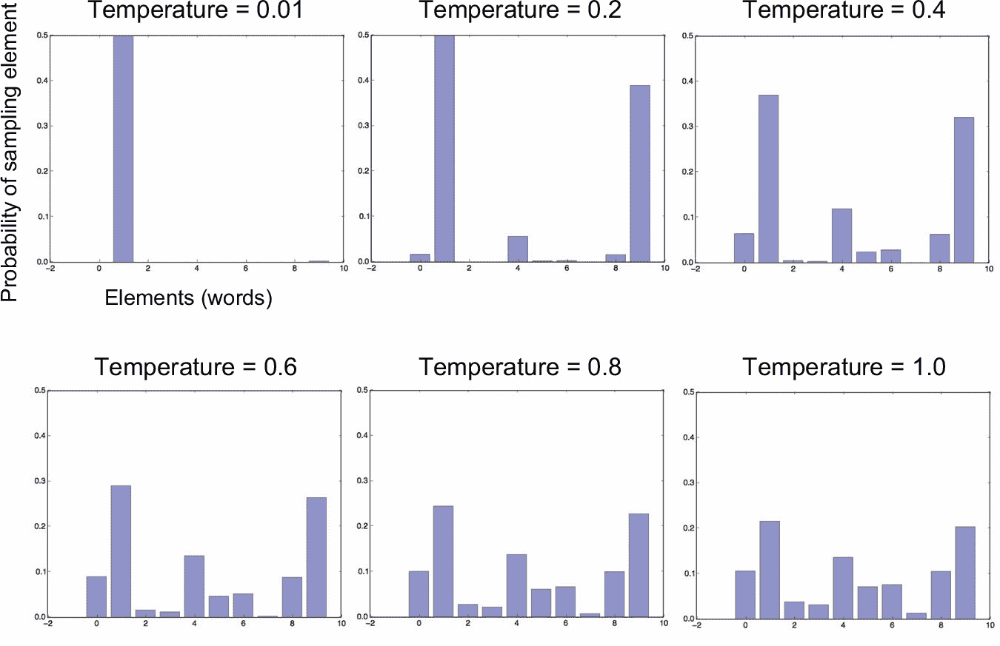

**图 12.2 对一个概率分布进行不同的重新加权：低温度 = 更确定性；高温度 = 更随机性**

### 12.1.4 使用 Keras 实现文本生成

让我们在 Keras 实现中将这些想法付诸实践。你首先需要大量的文本数据，可以用来学习语言模型。你可以使用任何足够大的文本文件或文本文件集 - 维基百科、《指环王》等。

在本例中，我们将继续使用上一章的 IMDB 电影评论数据集，并学习生成以前未读过的电影评论。因此，我们的语言模型将是针对这些电影评论的风格和主题的模型，而不是英语语言的通用模型。

### 准备数据

就像在前一章中一样，让我们下载并解压缩 IMDB 电影评论数据集。（这是我们在第十一章中下载的同一数据集。）

图 12.2 下载并解压缩 IMDB 电影评论数据集

url <— "https://ai.stanford.edu/~amaas/data/sentiment/aclImdb_v1.tar.gz"

filename <— basename(url)

options(timeout = 60 * 10)➊

download.file(url, destfile = filename)

untar(filename)

➊ **10 分钟超时**

你已经熟悉数据的结构：我们得到一个名为 aclImdb 的文件夹，其中包含两个子文件夹，一个用于负面情感的电影评论，一个用于正面情感的评论。每个评论都有一个文本文件。我们将调用 text_dataset_from_directory()并将 label_mode = NULL 作为参数，以创建一个 TF 数据集，该数据集从这些文件中读取并生成每个文件的文本内容。

**清单 12.3 从文本文件创建 TF 数据集（一个文件 = 一个样本）**

library(tensorflow)

library(tfdatasets)

library(keras)

dataset <— text_dataset_from_directory(

directory = "aclImdb",

label_mode = NULL,

batch_size = 256)

dataset <— dataset %>%

dataset_map( ~ tf$strings$regex_replace(.x, " ", " "))➊

➊ **去除许多评论中出现的" " HTML 标签。这在文本分类中并不重要，但在这个例子中我们不想生成" "标签！**

现在让我们使用一个 layer_text_vectorization()来计算我们将使用的词汇表。我们只使用每个评论的前 sequence_length 个单词：当向量化文本时，我们的 layer_text_vectorization()将在超出这个范围时截断任何内容。

清单 12.4 准备一个 layer_text_vectorization()

sequence_length <— 100

vocab_size <— 15000➊

text_vectorization <— layer_text_vectorization(

max_tokens = vocab_size,

output_mode = "int",➋

output_sequence_length = sequence_length➌

)

adapt(text_vectorization, dataset)

➊ **我们将只考虑前 15000 个最常见的单词——其他任何单词都将被视为未知标记"[UNK]"。**

➋ **我们想返回整数单词索引序列。**

➌ **我们将使用长度为 100 的输入和目标（但因为我们将目标偏移 1，所以模型实际上将看到长度为 99 的序列）。**

让我们使用该层来创建一个语言建模数据集，其中输入样本是向量化的文本，相应的目标是将文本偏移一个单词后的相同文本。

清单 12.5 设置语言建模数据集

prepare_lm_dataset <— function(text_batch) {

vectorized_sequences <— text_vectorization(text_batch)➊

x <— vectorized_sequences[, NA:-2]➋

y <— vectorized_sequences[, 2:NA]➌

list(x, y)

}

lm_dataset <— dataset %>%

dataset_map(prepare_lm_dataset, num_parallel_calls = 4)

➊ **将一批文本（字符串）转换为一批整数序列。**

➋ **通过截取序列的最后一个单词来创建输入（删除最后一列）。**

➌ **通过将序列偏移 1 来创建目标（删除第一列）。**

### 基于 TRANSFORMER 的序列到序列模型

我们将训练一个模型，来预测句子中下一个单词的概率分布，给定一些初始单词。当模型训练完成后，我们将向其提供一个提示，采样下一个单词，将该单词添加回提示中，并重复此过程，直到生成一个短段落。

就像我们在第十章中对温度预测所做的那样，我们可以训练一个模型，该模型以*N*个词的序列作为输入，简单地预测第*N*+1 个词。然而，在序列生成的上下文中，这种设置存在几个问题。

首先，模型只有在可用*N*个词时才能学会产生预测，但有时候只用少于*N*个词来开始预测是有用的。否则，我们将被限制为仅使用相对较长的提示（在我们的实现中，*N* = 100 个词）。我们在第十章中并不需要这样做。

其次，我们的训练序列中许多是大部分重叠的。考虑 N = 4。文本“A complete sentence must have, at minimum, three things: a subject, verb, and an object”将用于生成以下训练序列：

+   “完整的句子必须”

+   “完整的句子必须有”

+   “句子必须具有”

+   “等等，直到“动词和一个宾语”

将每个这样的序列视为独立样本的模型将不得不进行大量冗余工作，多次重新编码其大部分已经见过的子序列。在第十章中，这并不是什么大问题，因为我们一开始就没有那么多训练样本，并且我们需要对密集和卷积模型进行基准测试，每次都重新做工作是唯一的选择。我们可以尝试通过使用*步幅*来对序列进行采样——在两个连续样本之间跳过几个词来减轻这个冗余问题。但这将减少我们的训练样本数量，同时只提供部分解决方案。

为了解决这两个问题，我们将使用*序列到序列模型*：我们将序列*N*个词（从*1*到*N*索引）馈送到我们的模型中，并预测序列偏移一个（从*2*到*N+1*）。我们将使用因果屏蔽来确保，对于任何*i*，模型将只使用从*1*到*i*的词来预测第*i+1*个词。这意味着我们同时训练模型解决*N*个大部分重叠但不同的问题：在给定了 1 <= i <= N 个先前词的序列的情况下预测下一个词（参见图 12.3）。在生成时，即使你只用单个词提示模型，它也能给出下一个可能词的概率分布。

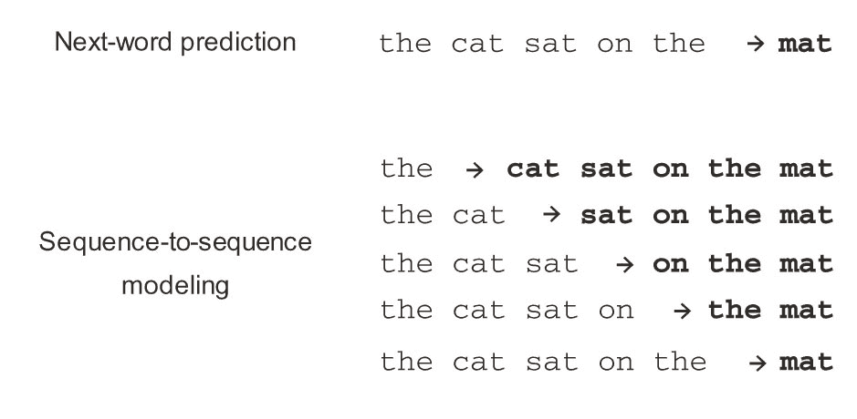

**图 12.3 与普通的下一个单词预测相比，序列到序列建模同时优化多个预测问题。**

请注意，在第十章中的温度预测问题中，我们可以使用类似的序列到序列设置：给定 120 个小时数据点的序列，学习生成一个序列，其中包含未来 24 小时的 120 个温度数据点。您将不仅解决初始问题，还将解决预测 24 小时内温度的 119 个相关问题，给定 1 <= i < 120 的先前每小时数据点。如果您尝试在序列到序列设置中重新训练第十章中的 RNN，您会发现您会获得类似但逐渐变差的结果，因为用相同模型解决这些额外的 119 个相关问题的约束会略微干扰我们实际关心的任务。

在前一章中，您了解到了在一般情况下用于序列到序列学习的设置：将源序列输入到编码器中，然后将编码序列和目标序列一起输入到解码器中，解码器试图预测相同的目标序列，偏移一个步骤。当您进行文本生成时，没有源序列：您只是尝试预测目标序列中的下一个令牌，给定过去的令牌，我们可以仅使用解码器来完成。由于有因果填充，解码器将只查看单词 *1…N* 来预测单词 *N+1*。

让我们实现我们的模型——我们将重用我们在第十一章中创建的构建模块：layer_positional_embedding() 和 layer_transformer_decoder()。

列表 12.6 一个简单的基于 Transformer 的语言模型

embed_dim <- 256

latent_dim <- 2048

num_heads <- 2

transformer_decoder <-

layer_transformer_decoder(NULL, embed_dim, latent_dim, num_heads)

inputs <- layer_input(shape(NA), dtype = "int64")

outputs <- inputs %>%

layer_positional_embedding(sequence_length, vocab_size, embed_dim) %>%

transformer_decoder(., .) %>%

layer_dense(vocab_size, activation = "softmax")➊

model <—

keras_model(inputs, outputs) %>%

compile(loss = "sparse_categorical_crossentropy",

optimizer = "rmsprop")

➊ **对可能的词汇单词进行 softmax 计算，针对每个输出序列时间步。**

### 12.1.5 使用可变温度采样的文本生成回调

我们将使用一个回调函数，在每个 epoch 后使用一系列不同的温度来生成文本。这样可以让您看到随着模型开始收敛，生成的文本如何演变，以及温度在采样策略中的影响。为了种子文本生成，我们将使用提示“这部电影”：我们所有生成的文本都将以此开始。

首先，让我们定义一些函数来生成句子。稍后，我们将在回调中使用这些函数。

vocab <— get_vocabulary(text_vectorization) ➊

sample_next <— function(predictions, temperature = 1.0) {

predictions %>%

reweight_distribution(temperature) %>% ➋

sample.int(length(.), 1, prob = .)➌

}

generate_sentence <—

function(model, prompt, generate_length, temperature) {

sentence <— prompt➍

for (i in seq(generate_length)) {➎

model_preds <— sentence %>%

array(dim = c(1, 1)) %>%

text_vectorization() %>%

predict(model, .) ➏

sampled_word <— model_preds %>%

.[1, i, ] %>%➐

sample_next(temperature) %>%➑

vocab[.]➒

sentence <— paste(sentence, sampled_word)➓

}

sentence

}

➊ **我们将使用它来将单词索引（整数）转换回字符串，用于文本解码**

➋ **用于采样的温度**

➌ **实现从概率分布中进行可变温度抽样。**

➍ **用于初始化文本生成的提示**

➎ **迭代生成多少个单词。**

➏ **将当前序列输入到我们的模型中。**

➐ **检索最后一个时间步的预测结果……**

➑ **……并用它们来采样一个新的标记……**

➒ **……并将标记整数转换为字符串。**

➓ **将新单词添加到当前序列并重复。**

sample_next()和 generate_sentence()负责从模型生成句子的工作。它们会急切地工作；它们会调用 predict()来生成 R 数组的预测结果，调用 sample.int()来选择下一个标记，并使用 paste()来构建句子作为 R 字符串。

因为我们可能想要生成许多句子，所以对此进行了一些优化是有意义的。我们可以通过将 generate_sentence 重写为 tf_function()来大幅提高其速度（约 25 倍）。为此，我们只需要使用 TensorFlow 相应的函数替换一些 R 函数。我们可以将 for(i in seq())替换为 for(i in tf$range())。我们也可以用 tf$random$categorical()替换 sample.int()，用 tf$strings$join()代替 paste()，用 model(.)代替 predict(model, .)。sample_next()和 generate_sentence()在 tf_function()中的样子如下：

tf_sample_next <— function(predictions, temperature = 1.0) {

predictions %>%

reweight_distribution(temperature) %>%

{ log(.[tf$newaxis, ]) } %>% ➊

tf$random$categorical(1L) %>%

tf$reshape(shape())➋

}

library(tfautograph)➌

tf_generate_sentence <— tf_function(

function(model, prompt, generate_length, temperature) {

withr::local_options(tensorflow.extract.style = "python")

vocab <— as_tensor(vocab)

sentence <— prompt %>% as_tensor(shape = c(1, 1))

ag_loop_vars(sentence)➍

for (i in tf$range(generate_length)) {

model_preds <— sentence %>%

text_vectorization() %>%

model()

sampled_word <— model_preds %>%

.[0, i, ] %>%

tf_sample_next(temperature) %>%

vocab[.]

sentence <— sampled_word %>%

{ tf$strings$join(c(sentence, .), " ") }

}

sentence %>% tf$reshape(shape())➎

}

}

➊ **tf$random$catagorical()期望一个批量的对数概率。**

➋ **tf$random$catagorical()返回形状为(1, 1)的标量整数。重新调整为形状().**

➌ **对 ag_loop_vars()（稍后详细介绍）**

➍ **向编译器提供提示，说明`sentence`是我们在迭代后想要的唯一变量。**

➎ **从(1, 1)形状重塑为()。注意 tf$strings$join()在整个迭代过程中保持 sentence 的(1, 1)形状。**

在我的机器上，使用急切生成 generate_sentence() 生成 50 个词的句子大约需要 2.5 秒，而使用 tf_generate_sentence() 只需要 0.1 秒，提高了 25 倍！记住，先通过急切运行原型代码进行原型设计，只有在达到想要的效果后才使用 tf_function()。

**for 循环和 autograph**

在使用 tf_ 函数(fn, autograph = TRUE)（默认设置）包装之前急切地评估 R 函数时，一个注意事项是 autograph = TRUE 提供了基本 R 没有的功能，比如让 for 能够迭代张量。你仍然可以通过直接调用 tfautograph::autograph() 来急切地评估诸如 for(i in tf$range()) 或 for(batch in tf_ dataset) 这样的表达式，例如：

library(tfautograph)

autograph({

for(i in tf$range(3L))

print(i)

})

tf.Tensor(0, shape=(), dtype=int32)

tf.Tensor(1, shape=(), dtype=int32)

tf.Tensor(2, shape=(), dtype=int32)

或者

fn <— function(x) {

for(i in x) print(i)

}

ag_fn <— autograph(fn)

ag_fn(tf$range(3))

tf.Tensor(0.0, shape=(), dtype=float32)

tf.Tensor(1.0, shape=(), dtype=float32)

tf.Tensor(2.0, shape=(), dtype=float32)

在交互式会话中，你可以通过调用 tfautograph:::attach_ag_mask() 临时全局启用 if、while 和 for 来接受张量。

在 tf_function() 中迭代张量的 for() 循环构建了一个 tf$while_loop()，并且继承了所有相同的限制。循环跟踪的每个张量在整个迭代过程中必须具有稳定的形状和数据类型。

调用 ag_loop_vars(sentence) 给 tf_function() 编译器一个提示，即我们在 for 循环之后感兴趣的唯一变量是 sentence。这通知编译器其他张量，如 sampled_word、i 和 model_preds，都是循环局部变量，并且可以在循环后安全地优化掉。

请注意，在 tf_ 函数() 中迭代常规 R 对象（例如 for(i in seq(0, 49))）不会构建 tf$while_loop()，而是使用常规的 R 语义进行评估，并且会导致 tf_function() 追踪展开的循环（有时这是可取的，对于迭代次数固定的短循环）。

这是我们将在回调中调用 tf_generate_sentence() 来在训练期间生成文本的地方：

列表 12.7 文本生成回调

callback_text_generator <— new_callback_class(

classname = "TextGenerator",

initialize = function(prompt, generate_length,

temperatures = 1,

print_freq = 1L) {

private$prompt <— as_tensor(prompt, "string")

private$generate_length <— as_tensor(generate_length, "int32")

private$temperatures <— as.numeric(temperatures)➊

private$print_freq <— as.integer(print_freq)

},

on_epoch_end = function(epoch, logs = NULL) {

if ((epoch %% private$print_freq) != 0)

return()

for (temperature in private$temperatures) {➋

cat("== 使用温度生成", temperature, "\n")

sentence <— tf_generate_sentence(➌

self$model,

private$prompt,

private$generate_length,➍

as_tensor(temperature, "float32")

)

cat(as.character(sentence), "\n")

}

}

)

text_gen_callback <— callback_text_generator(

prompt = "这部电影",

generate_length = 50,

temperatures = c(0.2, 0.5, 0.7, 1., 1.5) ➎

)

➊ **我们将使用各种不同温度来对文本进行抽样，以演示温度对文本生成的影响。**

➋ **这是一个常规的 R 循环，急切地迭代 R 向量。**

➌ **请注意，我们仅使用张量和模型调用此函数，而不是 R 数值或字符向量。**

➍ **这些在 initialize() 中已经被转换为张量了。**

➎ **我们生成文本的温度集合**

让我们拟合() 这个东西。

**清单 12.8 拟合语言模型**

model %>%

fit(lm_dataset,

epochs = 200,

callbacks = list(text_gen_callback))

这里有一些经过精心挑选的例子，展示了我们在进行了 200 个 epochs 的训练后能够生成的内容。请注意，标点符号不是我们词汇表的一部分，因此我们生成的文本中没有任何标点符号：

+   使用温度=0.2

    +   “这部电影是原电影的[UNK]，前半个小时的电影相当不错，但它是一部非常好的电影，对于那个时期来说是一部好电影”

    +   “这部电影是电影的[UNK]，它是一部非常糟糕的电影，它是一部非常糟糕的电影，它使你笑和哭同时进行，这不是一部电影，我不认为我曾经看过” 

+   使用温度=0.5

    +   “这部电影是有史以来最好的流派电影的[UNK]，它不是一部好电影，它是关于这部电影的唯一好事，我第一次看到它，我仍然记得它是一部[UNK]电影，我看了很多年”

    +   “这部电影是浪费时间和金钱的，我不得不说这部电影完全是浪费时间的，我很惊讶地发现这部电影由一部好电影组成，而且这部电影并不是很好，但它是浪费时间的”

+   使用温度=0.7

    +   “这部电影很有趣，看起来真的很有趣，所有的角色都非常滑稽，而且猫也有点像一个[UNK][UNK]和一顶帽子[UNK]电影的规则可以在另一个场景中被告知，这使得它不会被放在后面”

    +   “这部电影是关于[UNK]和一对年轻人在无人之境的小船上的，一个人可能会发现自己暴露于[UNK]的牙医，他们被[UNK]杀死了，我是这本书的超级粉丝，我还没看过原版，所以”

+   使用温度=1.0

    +   “这部电影很有趣，看起来很有趣，所有角色都非常滑稽，而且猫也有点像一个[UNK][UNK]和一顶帽子[UNK]电影的规则可以在另一个场景中被告知，这使得它不会被放在后面”

    +   “这部电影是一个杰作，远离了故事情节，但这部电影简直是令人兴奋和沮丧的，它真的很让朋友们开心，像这样的演员们试图直接从地下走向地下，他们把它变成了一个真正的好电视节目”

+   使用温度=1.5

    +   “这部电影可能是关于那 80 个女人中最糟糕的一部电影，它就像是个古怪而有洞察力的演员，例如巴克尔电影，但是在大伙伴圈子里是个伟大的家伙。是的，不装饰有盾，甚至还有[UNK]的土地公园恐龙拉尔夫伊恩必须演一出戏发生故事之后被选派（混合[UNK]巴赫）实际上并不存在。”

    +   “这部电影可能是卢卡斯本人为我们国家带来的令人难以置信的有趣事情，而这些事情既夸张又严肃，演员们的表演精彩激烈，柯林的写作更加详细，但在这之前，还有那些燃烧的爱国主义画面，我们预期到你对职责的忠诚以及另一件事情的做法。”

如你所见，低温度值会导致非常乏味和重复的文本，并且有时会导致生成过程陷入循环。随着温度的升高，生成的文本变得更有趣，更令人惊讶，甚至更有创意。当温度变得非常高时，局部结构开始崩溃，输出看起来基本上是随机的。在这里，一个好的生成温度似乎是 0.7 左右。始终使用多个采样策略进行实验！通过学习结构和随机性之间的巧妙平衡，才能使生成变得有趣。

请注意，通过训练更大的模型，使用更多的数据，您可以获得生成样本，其凝聚度和真实性要比本例中的样本高得多——像 GPT-3 这样的模型输出是语言模型可以实现的例证（GPT-3 实际上与我们在此示例中训练的模型相同，但具有深层的 Transformer 解码器堆栈和更大的训练语料库）。但是，除非通过随机偶然和您自己的解释魔力，否则不要期望能够生成任何有意义的文本：您所做的只是从统计模型中采样出来的数据，其中包含哪些词汇跟随哪些词汇的信息。语言模型只是形式而无实质。

自然语言是很多事物：一种沟通渠道；一种在世界上行动的方式；一种社交润滑剂；一种构思、存储和提取自己思想的方式。这些语言使用是它的意义所来源之处。深度学习的“语言模型”，尽管它的名称如此，实际上捕捉到的是语言的这些基本方面。它不能进行交流（因为它没有任何东西可以交流的，也没有人可以交流），它不能在世界上发挥作用（因为它没有能力和目的），它不会社交，并且它没有任何需要通过单词进行处理的思想。语言是心灵的操作系统，所以，为了语言具有意义，它需要一个心灵来利用它。

语言模型的作用是捕获可观察到的工件的统计结构——书籍、在线电影评论、推文——我们在使用语言生活时生成的工件。这些工件具有统计结构的事实是人类实现语言的副作用。想象一下：如果我们的语言能更好地压缩通信，就像计算机对大多数数字通信所做的那样，会怎么样？语言不会失去任何意义，仍然可以完成其许多目的，但它将缺乏任何固有的统计结构，因此无法像你刚刚所做的那样进行建模。

### 12.1.6 总结

+   通过训练模型预测给定前一个令牌的下一个令牌(s)，可以生成离散序列数据。

+   在文本的情况下，这样的模型称为*语言模型*。它可以基于单词或字符。

+   对下一个令牌进行采样需要在遵循模型判断可能性和引入随机性之间保持平衡。

+   处理这种情况的一种方法是 softmax 温度的概念。始终尝试不同的温度以找到合适的温度。

## 12.2 DeepDream

*DeepDream* 是一种艺术图像修改技术，它使用了卷积神经网络学习到的表示。它最初由谷歌在 2015 年夏季发布，使用了 Caffe 深度学习库来实现（这是在 TensorFlow 的首次公开发布几个月前）。³ 它很快就因为能够生成迷幻图片而成为互联网的轰动，这些图片充满了算法幻觉的工件、鸟类羽毛和狗眼——这是因为 DeepDream convnet 是在 ImageNet 上训练的，那里狗品种和鸟类物种的数量远远超过其他物种。

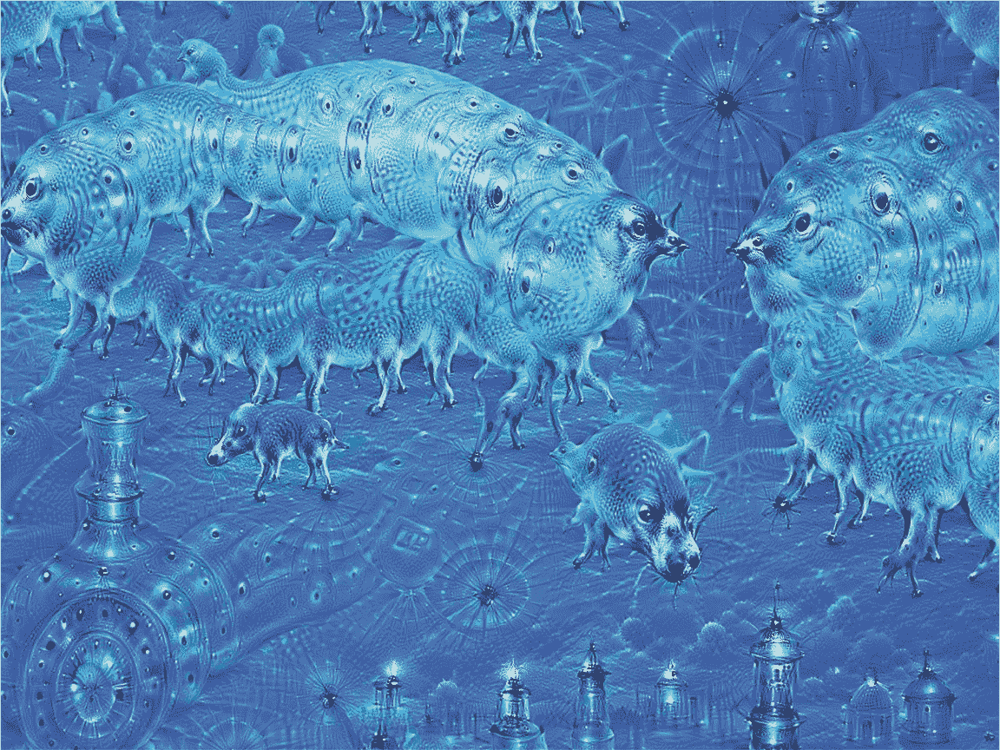

**图 12.4 DeepDream 输出图像示例**

DeepDream 算法与第九章介绍的卷积神经网络滤波器可视化技术几乎相同，包括对卷积神经网络的输入进行反向运行：对卷积神经网络中的特定滤波器的激活进行梯度上升。DeepDream 使用了相同的思想，只是有一些简单的区别：

+   通过 DeepDream，你试图最大化整个层的激活，而不是特定滤波器的激活，因此同时混合了大量特征的可视化。

+   不是从空白的、略带噪音的输入开始，而是从一个现有的图像开始，因此产生的效果会附着在预先存在的视觉模式上，以某种艺术风格扭曲图像的元素。

+   输入图像在不同尺度（称为*octaves*）上处理，这提高了可视化的质量。

让我们制作一些 DeepDreams。

### 12.2.1 在 Keras 中实现 DeepDream

让我们从获取一张用于梦想的测试图像开始。我们将使用冬季时节的加利福尼亚北部崎岖的海岸景色（图 12.5）。

清单 12.9 获取测试图像

base_image_path <— get_file(

"coast.jpg", origin = "https://img-datasets.s3.amazonaws.com/coast.jpg")

plot(as.raster(jpeg::readJPEG(base_image_path)))

**图 12.15 我们的测试图像**

接下来，我们需要一个预训练的卷积网络。在 Keras 中，有许多这样的卷积网络可用 — VGG16、VGG19、Xception、ResNet50 等等 — 它们的权重都是在 ImageNet 上预训练的。你可以用任何一个实现 DeepDream，但你选择的基础模型自然会影响你的可视化效果，因为不同的架构会导致不同的学习特征。原始 DeepDream 发布中使用的卷积网络是一个 Inception 模型，在实践中，Inception 被认为能产生外观良好的 DeepDream，所以我们将使用 Keras 提供的 Inception V3 模型。

**清单 12.10 实例化预训练的 InceptionV3 模型**

model <— application_inception_v3(weights = "imagenet", include_top = FALSE)

我们将使用我们的预训练卷积网络创建一个特征提取器模型，该模型返回各个中间层的激活值，如下面的代码所列。对于每一层，我们选择一个标量分数，以加权各层对我们将在梯度上升过程中寻求最大化的损失的贡献。如果你想要一个完整的层名称列表，以便挑选新的层来尝试，只需使用 print(model)。

清单 12.11 配置每层对 DeepDream 损失的贡献

layer_settings <— c( ➊

mixed4 = 1,

mixed5 = 1.5,

mixed6 = 2,

mixed7 = 2.5

)

输出 <— list()

for(layer_name in names(layer_settings))

outputs[[layer_name]] <—➋

get_layer(model, layer_name)$output➋

feature_extractor <— keras_model(inputs = model$inputs,➌

输出 = 输出)

➊ **我们试图最大化激活的层，以及它们在总损失中的权重。你可以调整这些设置以获得新的视觉效果。**

➋ **在一个命名列表中收集每个层的输出符号张量。**

➌ **一个模型，返回每个目标层的激活值（作为命名列表）**

接下来，我们将计算*损失*：我们将在每个处理尺度的梯度上升过程中寻求最大化的数量。在第九章中，对于滤波器可视化，我们试图最大化特定层中特定滤波器的值。在这里，我们将同时最大化一组高级层中所有滤波器的激活。具体来说，我们将最大化一组高级层激活的 L2 范数的加权平均值。我们选择的确切层集合（以及它们对最终损失的贡献）对我们能够产生的视觉效果有很大影响，因此我们希望使这些参数易于配置。较低的层会产生几何图案，而较高的层会产生可以在 ImageNet 中识别一些类别的视觉效果（例如，鸟类或狗）。我们将从一个相对任意的配置开始，涉及四个层，但您肯定会希望以后尝试许多不同的配置。

列表 12.12 DeepDream 损失

compute_loss <— function(input_image) {

features <— feature_extractor(input_image)

feature_losses <— names(features) %>%

lapply(function(name) {

coeff <— layer_settings[[name]]

activation <— features[[name]]➊

coeff * mean(activation[, 3:-3, 3:-3, ] ^ 2)➋

})

Reduce(`+`, feature_losses)➌

}

➊ **提取激活。**

➋ **我们通过仅涉及非边界像素来避免边界伪影。**

➌ **feature_losses 是一组标量张量。总结每个特征的损失。**

现在让我们设置梯度上升过程，我们将在每个八度运行。您会发现它与第九章中的滤波器可视化技术是相同的！DeepDream 算法只是滤波器可视化的多尺度形式。

**列表 12.13 DeepDream 梯度上升过程**

gradient_ascent_step <— tf_function(➊

function(image, learning_rate) {

with(tf$GradientTape() %as% tape, {

tape$watch(image)

loss <— compute_loss(image)➋

})

grads <— tape$gradient(loss, image) %>%

tf$math$l2_normalize()➌

image %<>% `+`(learning_rate * grads)➍

list(loss, image)

})

gradient_ascent_loop <—➎

function(image, iterations, learning_rate, max_loss = -Inf) {

learning_rate %<>% as_tensor()

for(i in seq(iterations)) {➏

c(loss, image) %<—% gradient_ascent_step(image, learning_rate)

loss %<>% as.numeric()

if(loss > max_loss)➐

break

writeLines(sprintf(

"… 在第 %i 步的损失值为 %.2f", i, loss))

}

image

}

➊ **我们通过将其编译为 tf_function() 来快速进行训练步骤。**

➋ **计算 DeepDream 损失相对于当前图像的梯度。**

➌ **归一化梯度（我们在第九章中使用的相同技巧）。**

➍ **重复更新图像，以增加 DeepDream 损失。**

➎ **这将为给定的图像尺度（八度）运行梯度上升。**

➏ **这是一个常规的 eager R 循环。**

➐ **如果损失超过某个阈值，则退出（过度优化会产生不需要的图像伪影）。**

最后，DeepDream 算法的外部循环。首先，我们将定义一个 *尺度* 列表（也称为 *八度音阶*），用于处理图像。我们将在三个不同的八度音阶上处理我们的图像。对于每个连续的八度音阶，从最小到最大，我们将通过 gradient_ascent_loop() 运行 20 步梯度上升，以最大化我们之前定义的损失。在每个八度音阶之间，我们将通过 40%（1.4×）放大图像：我们将从处理小图像开始，然后逐渐放大它（参见图 12.6）。

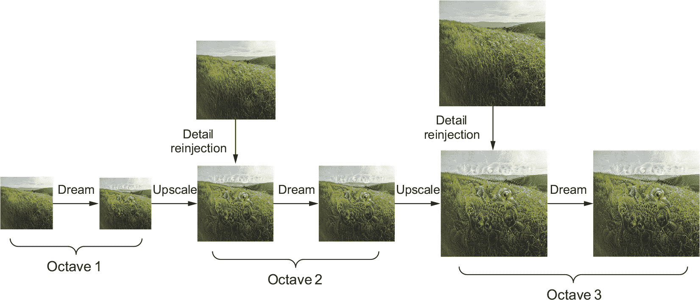

**图 12.6 DeepDream 过程：连续尺度的空间处理（八度音阶）和在放大时重新注入细节**

我们在下面的代码中定义了这个过程的参数。调整这些参数将使您能够实现新的效果！

步骤 <— 20➊

八度音阶数量 <— 3➋

八度音阶比例 <— 1.4➌

迭代次数 <— 30➍

最大损失 <— 15➎

➊ **梯度上升步长**

➋ **在哪些尺度上运行梯度上升的数量**

➌ **连续尺度之间的大小比例**

➍ **每个尺度的梯度上升步骤数**

➎ **如果损失超过这个值，我们将停止梯度上升过程的该尺度。**

我们还需要几个实用函数来加载和保存图像。

**清单 12.14 图像处理实用程序**

预处理图片 <— tf_function(function(image_path) {➊

图像路径 %>%

tf$io$read_file() %>%

tf$io$decode_image() %>%

tf$expand_dims(axis = 0L) %>%➋

tf$cast("float32") %>%➌

inception_v3_preprocess_input()

})

反向处理图片 <— tf_function(function(img) {➍

img %>%

tf$squeeze(axis = 0L) %>%➎

{ （。* 127.5）+ 127.5 } %>%➏

tf$saturate_cast("uint8")➐

})

显示图片张量 <— function(x, …, max = 255,

绘制边距 = c(0, 0, 0, 0)) {

如果（！is.null(plot_margins)）

withr::local_par(mar = plot_margins)➑

x %>%

转换为数组() %>%➒

drop() %>%

转换为栅格(max = max) %>%➓

绘制（…，不插值 = FALSE）

}

➊ **加载、调整大小和格式化图片到适当数组的实用函数**

➋ **添加批处理轴，相当于 .[tf$newaxis, all_dims()]。轴参数基于 0。**

➌ **从 'uint8' 转换。**

➍ **将张量数组转换为有效图像并撤消预处理的实用函数**

➎ **删除第一个维度-批处理轴（必须为大小 1），tf$expand_dims() 的逆操作。**

➏ **重新缩放，使值在[-1, 1]范围内重新映射到[0, 255]。**

➐ **saturate_case() 将值剪辑到 dtype 范围：[0, 255]。**

➑ **在绘制图像时默认没有边距。**

➒ **将张量转换为 R 数组。**

➓ **转换为 R 原生栅格格式。**

**withr::local_***

在这里，我们使用 withr::local_par() 来设置 par()，然后调用 plot()。local_ par() 的作用就像 par()，只是在函数退出时它会恢复先前的 par() 设置。使用像 local_par() 或 local_options() 这样的函数有助于确保您编写的函数不会永久修改全局状态，这使得它们在更多的上下文中更可预测和可用。

您可以用一个单独的 on.exit() 调用来替换 local_par() 并执行相同的操作，如下所示：

display_image_tensor <— function()

<…>

opar <— par(mar = plot_margins)

on.exit(par(opar))

<…>

}

这是外循环。为了避免在每次连续放大后丢失大量图像细节（导致图像越来越模糊或像素化），我们可以使用一个简单的技巧：在每次放大后，我们将丢失的细节重新注入到图像中，这是可能的，因为我们知道原始图像在较大比例时应该是什么样子的。给定一个小图像尺寸 *S* 和一个较大的图像尺寸 *L*，我们可以计算原始图像调整为尺寸 *L* 和尺寸 *S* 时的差异——这个差异量化了从 *S* 到 *L* 过程中丢失的细节。

**清单 12.15 在多个连续的八度上运行梯度上升**

original_img <— preprocess_image(base_image_path)➊

original_HxW <— dim(original_img)[2:3]

calc_octave_HxW <— function(octave) {

as.integer(round(original_HxW / (octave_scale ^ octave)))

}

octaves <— seq(num_octaves - 1, 0) %>%➋

{ zip_lists(num = .,

HxW = lapply(., calc_octave_HxW)) }

str(octaves)

List of 3

$ :List of 2

..$ num: int 2

..$ HxW: int [1:2] 459 612

$ :List of 2

..$ num: int 1

..$ HxW: int [1:2] 643 857

$ :List of 2

..$ num: int 0

..$ HxW: int [1:2] 900 1200

➊ **加载并预处理测试图像。**

➋ **计算不同八度图像的目标形状。**

shrunk_original_img <— original_img %>% tf$image$resize(octaves[[1]]$HxW)

img <— original_img ➊

for (octave in octaves) {➋

cat(sprintf("Processing octave %i with shape (%s)\n",

octave$num, paste(octave$HxW, collapse = ", ")))

img <— img %>%

tf$image$resize(octave$HxW) %>%➌

gradient_ascent_loop(iterations = iterations, ➍

learning_rate = step,

max_loss = max_loss)

upscaled_shrunk_original_img <— ➎

shrunk_original_img %>% tf$image$resize(octave$HxW)

same_size_original <—

original_img %>% tf$image$resize(octave$HxW)➏

lost_detail <—➐

same_size_original - upscaled_shrunk_original_img

img %<>% `+`(lost_detail)➑

shrunk_original_img <—

original_img %>% tf$image$resize(octave$HxW)

}

img <— deprocess_image(img)

img %>% display_image_tensor()

img %>%

tf$io$encode_png() %>%

tf$io$write_file("dream.png", .)➒

➊ **保存对原始图像的引用（我们需要保留原始图像）。**

➋ **迭代不同的八度。**

➌ **将梦想图像放大。**

➍ **运行梯度上升，改变梦想。**

➎ **将原始图像的较小版本放大：它会出现像素化。**

➏ **计算此尺寸下原始图像的高质量版本。**

➐ **两者之间的区别是在放大时丢失的细节。**

➑ **重新注入丢失的细节到梦想中。**

➒ **保存最终结果。**

因为原始的 Inception V3 网络是在大小为 299 × 299 的图像上训练的，并且考虑到该过程涉及将图像按合理因子缩小，因此 DeepDream 实现对大小介于 300 × 300 到 400 × 400 之间的图像产生更好的结果。不管怎样，您都可以在任何大小和比例的图像上运行相同的代码。

在 GPU 上，整个过程只需几秒钟。图 12.7 展示了我们在测试图像上的梦幻配置的结果。

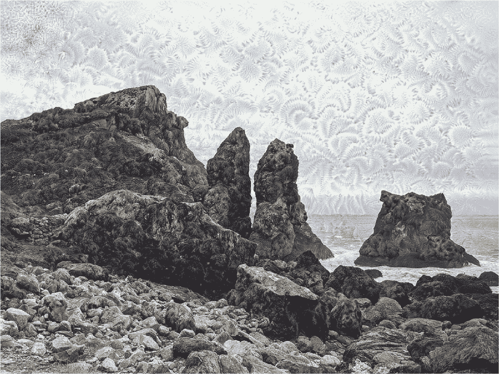

**图 12.7 在测试图像上运行 DeepDream 代码**

我强烈建议您通过调整使用的损失中的哪些层来探索可以做什么。网络中较低的层包含更本地化、不太抽象的表示，并导致看起来更几何化的梦幻图案。位于较高位置的层会导致更具可识别性的视觉模式，基于 ImageNet 中发现的最常见的对象，例如狗的眼睛、鸟的羽毛等。您可以使用 layer_settings 向量中参数的随机生成快速探索许多不同的层组合。图 12.8 展示了在使用不同层配置的图像上获得的一系列结果。

### 12.2.2 总结

+   DeepDream 包括运行卷积网络的逆向过程，以根据网络学到的表示生成输入。

+   生成的结果有趣且在某种程度上类似于通过致幻剂扰乱视觉皮层而在人类中引发的视觉现象。

+   请注意，这个过程不限于图像模型，甚至不限于卷积网络。它可以用于语音、音乐等。

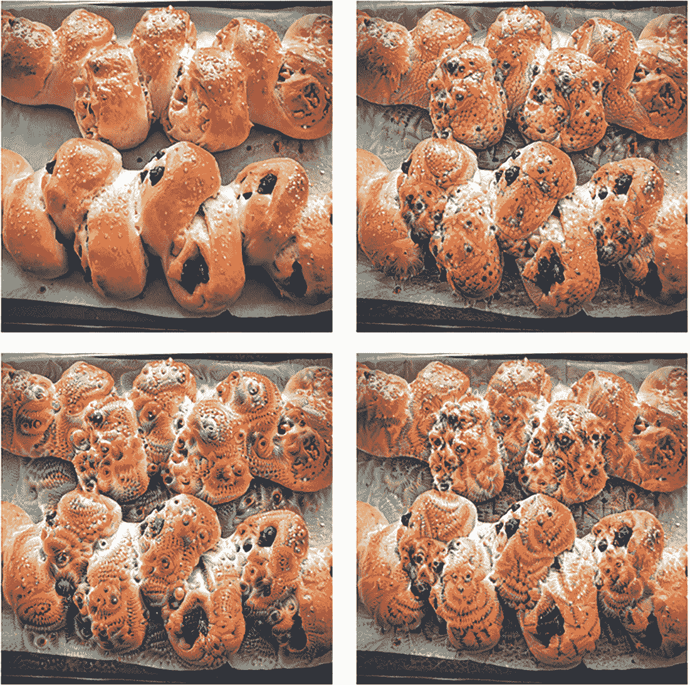

**图 12.8 在示例图像上尝试一系列 DeepDream 配置**

## 12.3 神经风格迁移

除了 DeepDream，深度学习驱动的图像修改的另一个重要发展是*神经风格迁移*，由 Leon Gatys 等人在 2015 年夏天引入。⁴ 神经风格迁移算法自原始引入以来经历了许多改进，并产生了许多变体，并且已经应用到许多智能手机照片应用中。为简单起见，本节重点介绍了原始论文中描述的公式。

神经风格迁移包括将参考图像的风格应用到目标图像上，同时保留目标图像的内容。图 12.9 展示了一个例子。

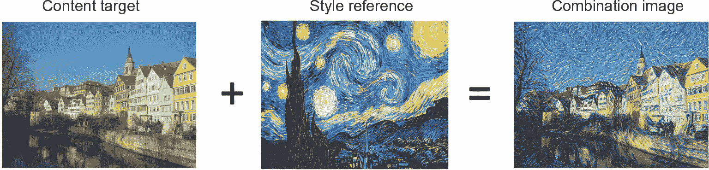

**图 12.9 一个风格迁移的例子**

在这个语境中，*风格* 实质上意味着图像中的纹理、颜色和视觉模式，以及不同空间尺度上的内容，而内容则是图像的更高级宏观结构。例如，图 12.9（使用*星夜*的文森特·梵高）中的蓝色和黄色圆形笔触被认为是风格，而图宾根照片中的建筑被认为是内容。

与纹理生成紧密相关的风格迁移的概念，在 2015 年神经风格迁移的发展之前，在图像处理社区中已经有了很长的历史。但事实证明，基于深度学习的风格迁移实现提供了无与伦比的结果，远远超过了以前通过经典计算机视觉技术所取得的成就，并引发了计算机视觉创意应用的惊人复兴。

实现风格迁移的关键概念与所有深度学习算法的核心思想相同：你定义一个损失函数来指定你想要实现的目标，并最小化这个损失。我们知道我们想要实现什么：保留原始图像的内容同时采用参考图像的风格。如果我们能够在数学上定义*内容*和*风格*，那么一个适当的最小化损失函数将是以下内容：

loss <— 距离(style(reference_image) - style(combination_image)) +

距离(content(original_image) - content(combination_image))

这里，distance() 是一个诸如 L2 范数的范数函数，content() 是一个接受图像并计算其内容表示的函数，style() 是一个接受图像并计算其风格表示的函数。最小化这个损失会导致 style(combination_image)接近 style(reference_image)，而 content(combination_image)接近 content(original_image)，从而实现我们定义的风格迁移。

Gatys 等人所做的一个基本观察是，深度卷积神经网络提供了一种数学定义风格和内容函数的方法。让我们看看如何做到这一点。

### 12.3.1 内容损失

正如你所了解的那样，网络中较早层的激活包含有关图像的*局部*信息，而较高层的激活包含越来越全局、抽象的信息。换句话说，卷积网络的不同层的激活提供了图像内容在不同空间尺度上的分解。因此，你会期望图像的内容，即更全局和抽象的部分，会被卷积网络中的上层表示所捕获。

因此，内容损失的一个很好的候选是预训练卷积网络中上层的激活之间的 L2 范数，计算在目标图像上，以及在生成的图像上计算相同层的激活。这确保了，从上层看，生成的图像看起来与原始目标图像相似。假设卷积网络的上层看到的确实是其输入图像的内容，那么这就作为一种保留图像内容的方法。

### 12.3.2 风格损失

内容损失仅使用单个上层，但由 Gatys 等人定义的风格损失使用卷积神经网络的多个层：您尝试捕获卷积神经网络提取的所有空间尺度的样式参考图像的外观，而不仅仅是一个单一尺度。对于风格损失，Gatys 等人使用一个层激活的*Gram 矩阵*：给定层的特征图的内积。这个内积可以理解为表示层特征之间的关联的地图。这些特征相关性捕获了特定空间尺度的模式的统计信息，这些模式在经验上对应于在这个尺度上发现的纹理的外观。

因此，风格损失旨在保留不同层次内部激活之间的相似内部关联，在样式参考图像和生成图像之间。反过来，这保证了在样式参考图像和生成图像之间看起来相似的不同空间尺度的纹理。

简而言之，您可以使用预训练的卷积神经网络来定义以下损失：

+   通过保持原始图像和生成图像之间的类似高级层激活来保留内容。卷积神经网络应该“看到”原始图像和生成图像中包含相同的内容。

+   通过保持低层和高层激活中的相似*相关性*来保留样式。特征相关性捕获*纹理*：生成图像和样式参考图像应该在不同的空间尺度上共享相同的纹理。

现在让我们看一下原始的 2015 年神经风格迁移算法的 Keras 实现。正如你将看到的那样，它与我们在前一节中开发的 DeepDream 实现有许多相似之处。

### 12.3.3 Keras 中的神经风格迁移

神经风格迁移可以使用任何预训练的卷积神经网络来实现。在这里，我们将使用 Gatys 等人使用的 VGG19 网络。VGG19 是 VGG16 网络的一个简单变体，引入了三个额外的卷积层。以下是一般过程：

+   设置一个网络，同时计算样式参考图像、基础图像和生成图像的 VGG19 层激活。

+   使用在这三个图像上计算的层激活来定义先前描述的损失函数，我们将最小化它以实现风格迁移。

+   设置一个梯度下降过程来最小化这个损失函数。

让我们从定义样式参考图像和基础图像的路径开始。为了确保处理后的图像具有相似的大小（大小差异很大会使风格迁移更加困难），我们将稍后将它们全部调整为共享高度为 400 像素。

列表 12.16 获取风格和内容图像

base_image_path <— get_file(➊

"sf.jpg"，origin = "https://img-datasets.s3.amazonaws.com/sf.jpg")

style_reference_image_path <— get_file(➋

"starry_night.jpg",

origin = "https://img-datasets.s3.amazonaws.com/starry_night.jpg")

c(original_height, original_width) %<—% {

base_image_path %>%

tf$io$read_file() %>%

tf$io$decode_image() %>%

dim() %>% .[1:2]

}

img_height <— 400➌

img_width <— round(img_height * (original_width / original_height))➌

➊ **我们想要转换的图像的路径**

➋ **风格图片的路径**

➌ **生成图片的尺寸**

我们的内容图片显示在图 12.10，而图 12.11 显示了我们的风格图片。

**图 12.10 内容图片：旧金山诺布山**

**图 12.11 风格图片：*星夜*，梵高**

我们还需要一些用于加载、预处理和后处理进入和退出 VGG19 卷积网络的图像的辅助函数。

**清单 12.17 辅助函数**

preprocess_image <— function(image_path) {➊

image_path %>%

tf$io$read_file() %>%

tf$io$decode_image() %>%

tf$image$resize(as.integer(c(img_height, img_width))) %>%

k_expand_dims(axis = 1) %>%➋

imagenet_preprocess_input()

}

deprocess_image <— tf_function(function(img) {➌

if (length(dim(img)) == 4)

img <— k_squeeze(img, axis = 1)➍

c(b, g, r) %<—% {

img %>%

k_reshape(c(img_height, img_width, 3)) %>%

k_unstack(axis = 3)➎

}

r %<>% `+`(123.68)➏

g %<>% `+`(103.939)➏

b %<>% `+`(116.779)➏

k_stack(c(r, g, b), axis = 3) %>%➐

k_clip(0, 255) %>%

k_cast("uint8")

})

➊ **打开、调整大小和将图片格式化为适当的数组的实用函数**

➋ **添加一个批次维度。**

➌ **将张量转换为有效图像的实用函数**

➍ **还接受批次维度大小为 1 的图像。（如果第一个轴不是大小为 1，则会引发错误。）**

➎ **沿第三个轴拆分，并返回长度为 3 的列表。**

➏ **通过从 ImageNet 中移除平均像素值来将图像零居中。这是对 imagenet_preprocess_input()执行的转换的逆操作。**

➐ **请注意，我们正在颠倒通道的顺序，从 BGR 到 RGB。这也是 imagenet_preprocess_input()的反转的一部分。**

Keras 后端函数（k_*）

在这个版本的 preprocess_image()和 deprocess_image()中，我们使用了 Keras 后端函数，比如 k_expand_dims()，但在早期版本中，我们使用了 tf 模块中的函数，比如 tf$expand_dims()。有什么区别呢？

Keras 包含一套广泛的后端函数，全部以 k_ 前缀开头。它们是 Keras 库设计为与多个后端一起使用时的遗留物。如今更常见的是直接调用 tf 模块中的函数，这些函数通常暴露更多的功能和能力。然而，keras::k_ 后端函数的一个好处是它们全部是基于 1 的，并且通常会根据需要自动将函数参数强制转换为整数。例如，k_expand_dims(axis = 1)等同于 tf$expand_dims(axis = 0L)。

后端函数不再积极开发，但它们受到 TensorFlow 稳定性承诺的保护，正在维护，并且不会很快消失。您可以放心使用函数如 k_expand_dims()、k_squeeze() 和 k_stack() 来执行常见的张量操作，特别是当使用一致的基于 1 的计数约定更容易推理时。但是，当您发现后端函数的功能有限时，请毫不犹豫地切换到直接使用 tf 模块函数。您可以在 [`keras.rstudio.com/articles/backend.html`](https://www.keras.rstudio.com/articles/backend.html) 找到有关后端函数的其他文档。

让我们设置 VGG19 网络。就像在 DeepDream 示例中一样，我们将使用预训练的卷积网络来创建一个特征提取器模型，该模型返回中间层的激活——这次是模型中的所有层。

清单 12.18 使用预训练的 VGG19 模型创建特征提取器

model <— application_vgg19(weights = "imagenet",

include_top = FALSE)➊

输出 <— 列表()

for (layer in model$layers)

outputs[[layer$name]] <— layer$output

feature_extractor <— keras_model(inputs = model$inputs,➋

outputs = outputs)

➊ **建立一个使用预训练的 ImageNet 权重的 VGG19 模型。**

➋ **返回每个目标层的激活值的模型（作为命名列表）**

让我们定义内容损失，它将确保 VGG19 卷积网络的顶层对风格图像和组合图像有相似的视图。

清单 12.19 内容损失

content_loss <— 函数(base_img, combination_img)

sum((combination_img - base_img) ^ 2)

接下来是风格损失。它使用一个辅助函数来计算输入矩阵的 Gram 矩阵：原始特征矩阵中找到的相关性的映射。

清单 12.20 风格损失

gram_matrix <— 函数(x) {➊

n_features <— tf$shape(x)[3]

x %>%

tf$reshape(c(-1L, n_features)) %>%➋

tf$matmul(t(.), .)➌

}

style_loss <— 函数(style_img, combination_img) {

S <— gram_matrix(style_img)

C <— gram_matrix(combination_img)

channels <— 3

size <— img_height * img_width

sum((S - C) ^ 2) /

(4 * (channels ^ 2) * (size ^ 2))

}

➊ **x 的形状为 (高度, 宽度, 特征)。**

➋ **将前两个空间轴展平，并保留特征轴。**

➌ **输出将具有形状 (n_features, n_features)。**

对于这两个损失组件，您还添加了第三个：*总变差损失*，它作用于生成的组合图像的像素上。它鼓励生成图像中的空间连续性，从而避免过度像素化的结果。您可以将其解释为正则化损失。

**清单 12.21 总变差损失**

total_variation_loss <— 函数(x) {

a <— k_square(x[, NA:(img_height-1), NA:(img_width-1), ]—

x[, 2:NA             , NA:(img_width-1), ])

b <— k_square(x[, NA:(img_height-1), NA:(img_width-1), ]—

x[, NA:(img_height-1), 2:NA            , ])

sum((a + b) ^ 1.25)

}

你最小化的损失是这三种损失的加权平均值。为了计算内容损失，你只使用一个较高的层——block5_conv2 层——而对于风格损失，你使用一个跨越低层和高层的层列表。你在最后添加了总变差损失。

根据你使用的风格参考图像和内容图像，你可能希望调整 content_weight 系数（内容损失对总损失的贡献）。较高的 content_weight 意味着生成图像中的目标内容将更容易被识别。

清单 12.22 定义你将最小化的最终损失

style_layer_names <— c(➊

"block1_conv1",

"block2_conv1",

"block3_conv1",

"block4_conv1",

"block5_conv1"

)

content_layer_name <— "block5_conv2"➋

total_variation_weight <— 1e—6➌

content_weight <— 2.5e—8➍

style_weight <— 1e—6➎

计算损失 <

函数(组合图像, 基准图像, 风格参考图像) {

input_tensor <

列表(基准图像,

风格参考图像,

combination_image) %>%

k_concatenate(axis = 1)

特征 <— 特征提取器(input_tensor)

layer_features <— features[[content_layer_name]]

base_image_features <— layer_features[1, , , ]

combination_features <— layer_features[3, , , ]

损失 <— 0➏

损失 %<>% `+`(➐

内容损失(基准图像特征, 组合特征) *

content_weight

)

for (layer_name in style_layer_names) {

layer_features <— features[[layer_name]]

style_reference_features <— layer_features[2, , , ]

combination_features <— layer_features[3, , , ]

损失 %<>% `+`(➑

风格损失(风格参考特征, 组合特征) *

风格权重 / 长度(风格层名称)

)

}

损失 %<>% `+`(➒

总变差损失(组合图像) *

total_variation_weight

)

损失➓

}

➊ **用于风格损失的层列表**

➋ **用于内容损失的层**

➌ **总变差损失的贡献权重**

➍ **内容损失的贡献权重**

➎ **风格损失的贡献权重**

➏ **将损失初始化为 0。**

➐ **添加内容损失。**

➑ **为每个风格层添加风格损失。**

➒ **添加总变差损失。**

➓ **返回内容损失、风格损失和总变差损失的总和。**

最后，让我们设置梯度下降过程。在原始的 Gatys 等人的论文中，优化是使用 L-BFGS 算法进行的，但在 TensorFlow 中不可用，所以我们将使用 SGD 优化器进行小批量梯度下降。我们将利用一个你以前没有见过的优化器特性：学习率调度。我们将逐渐减小学习率，从一个非常高的值（100）到一个更小的最终值（约为 20）。这样，我们将在训练的早期阶段取得快速进展，然后在接近损失最小值时更加谨慎地进行。

清单 12.23 设置梯度下降过程

计算损失和梯度 <— tf_function(➊

函数(组合图像, 基准图像, 风格参考图像) {

with(tf$GradientTape() %as% tape, {

loss <— compute_loss(combination_image,

base_image,

style_reference_image)

})

grads <— tape$gradient(loss, combination_image)

list(loss, grads)

})

optimizer <— optimizer_sgd(

learning_rate_schedule_exponential_decay(

initial_learning_rate = 100, decay_steps = 100,➋

decay_rate = 0.96))➋

base_image <— preprocess_image(base_image_path)

style_reference_image <— preprocess_image(style_reference_image_path)

combination_image <

tf$Variable(preprocess_image(base_image_path))➌

output_dir <— fs::path("style-transfer-generated-images")

iterations <— 4000

for (i in seq(iterations)) {

c(loss, grads) %<—% compute_loss_and_grads(

combination_image, base_image, style_reference_image)

optimizer$apply_gradients(list(➍

tuple(grads, combination_image)))

if ((i %% 100) == 0) {

cat(sprintf("迭代第%i 次：损失 = %.2f\n", i, loss))

img <— deprocess_image(combination_image)

display_image_tensor(img)

fname <— sprintf("combination_image_at_iteration_%04i.png", i)

tf$io$write_file(filename = output_dir / fname,➎

contents = tf$io$encode_png(img))

}

}

➊ **我们通过将训练步骤编译为 tf_function()来加快训练速度。**

➋ **我们将从学习率 100 开始，并在每 100 步时将其减少 4%。**

➌ **使用 tf$Variable()存储组合图像，因为我们将在训练过程中更新它。**

➍ **在减少样式转移损失方向上更新组合图像。**

➎ **定期保存组合图像。**

图 12.12 展示了您将获得的结果。请记住，这种技术实现的仅仅是一种图像重纹理或纹理转移的形式。它最适合具有强烈纹理和高自相似性的风格参考图像以及不需要高细节级别才能识别的内容目标。它通常无法实现诸如将一个肖像的风格转移到另一个肖像之类的相当抽象的能力。该算法更接近于经典信号处理而不是人工智能，因此不要期望它像魔术一样起作用！

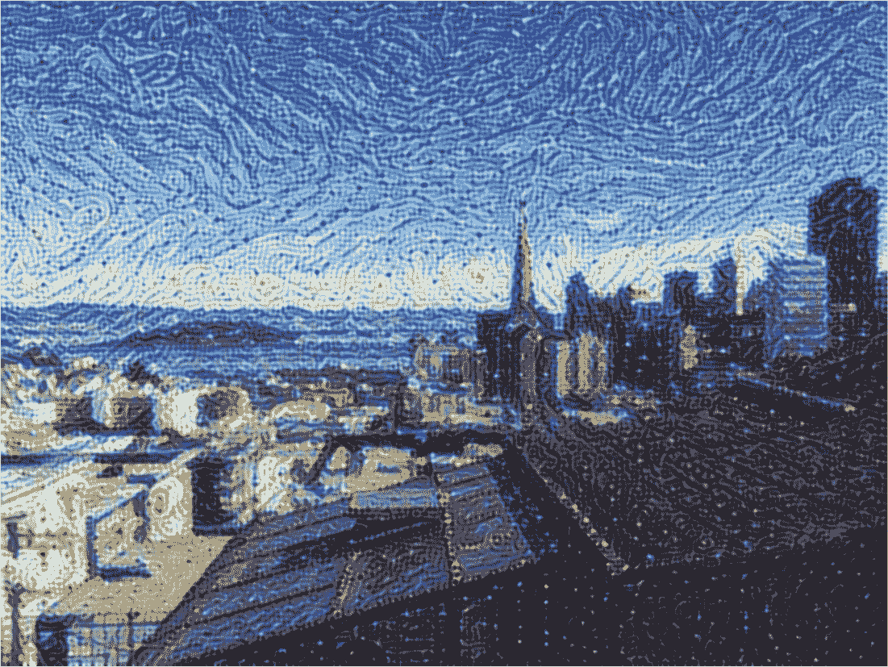

**图 12.12 风格转移结果**

此外，请注意，这种样式转移算法运行速度较慢。但是通过这种设置操作的变换足够简单，以至于它可以被一个小型、快速的前向卷积网络学习，只要您有适当的训练数据可用。因此，首先通过使用此处概述的方法花费大量计算周期为固定风格参考图像生成输入-输出训练示例，然后训练一个简单的卷积网络来学习这种特定于风格的转换，就能实现快速风格转移。一旦完成，给定图像的风格化就是瞬间完成：只需对此小型卷积网络进行正向传递。

### 12.3.4 结束

+   样式转移包括创建一个新图像，保留目标图像的内容，同时捕捉参考图像的风格。

+   内容可以通过卷积网络的高级激活来捕捉。

+   风格可以通过卷积网络不同层的激活之间的内部相关性来捕捉。

+   因此，深度学习使得风格迁移可以被形式化为使用预训练卷积网络定义的损失函数的优化过程。

+   从这个基本思想出发，可以有很多变体和改进的可能性。

## 12.4 使用变分自编码器生成图像

当今创造性人工智能的最流行和最成功的应用就是图像生成：学习潜在的视觉空间，并从中进行采样，以从实际图像中插值出全新的图片，如虚构的人物、虚构的地方、虚构的猫和狗等等。

在本节和下一节中，我们将回顾与图像生成相关的一些高级概念，以及与这个领域中的两种主要技术相关的实现细节：*变分自编码器*（VAEs）和*生成对抗网络*（GANs）。请注意，我在这里介绍的技术并不局限于图像，你可以使用 GANs 和 VAEs 开发音频、音乐甚至文本的潜在空间，但实际上，最有趣的结果是在图像领域获得的，这也是我们在这里的重点。

### 12.4.1 从图像的潜在空间中采样

图像生成的关键思想是开发一个低维的*潜在空间*（就像深度学习中的其他所有东西一样，它是一个向量空间），任何点都可以映射到一个“有效”的图像：一个看起来像真实世界的图像。能够实现这种映射的模块，输入为潜在点，输出为图像（像素网格），被称为*生成器*（在 GANs 的情况下）或*解码器*（在 VAEs 的情况下）。一旦学习到这样一个潜在空间，你可以从中采样点，并通过将它们映射回图像空间，生成从未见过的图像（见 图 12.13）。这些新图像就是训练图像之间的中间过渡图像。

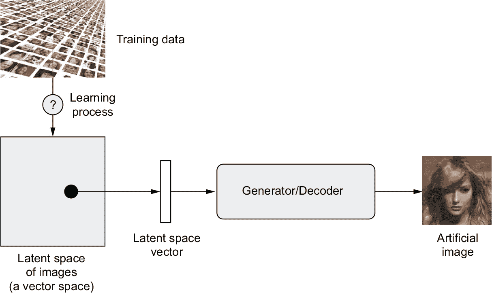

**图 12.13 学习图像的潜在向量空间并使用它来采样新图像**

GANs 和 VAEs 是学习图像表示的潜在空间的两种不同策略，各自具有其特点。VAEs 适用于学习结构良好的潜在空间，其中特定方向对数据的变化有着有意义的编码（见 图 12.14）。GANs 生成的图像可能非常逼真，但它们所来自的潜在空间可能没有很强的结构性和连续性。

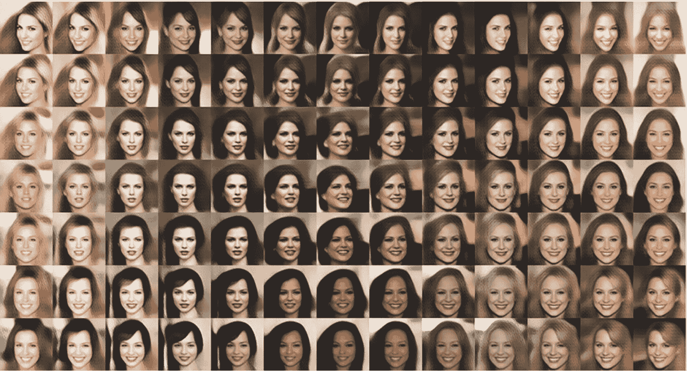

**图 12.14 使用 VAEs 生成的连续面部空间，由 Tom White 生成**

### 12.4.2 图像编辑的概念向量

当我们讨论第十一章的词嵌入时，已经提及了*概念向量*的想法。思想仍然很简单：给定一个表示空间或嵌入空间的潜在空间，空间中的某些方向可能编码原始数据的有趣变化轴。例如，在面部图像的潜在空间中，可能存在一个*微笑向量*，使得如果潜在点 z 是某个面孔的嵌入表示，则潜在点 z + s 是相同面孔的嵌入表示，微笑着。一旦你识别出这样一个向量，就可以通过将图像投影到潜在空间中，以有意义的方式移动它们的表示，然后再将它们解码回图像空间进行编辑。对于图像空间中的任何独立变化维度，都存在概念向量，例如在面孔的情况下，通过训练 VAE（CelebA 数据集）的 Tom White 发现了添加太阳镜、摘掉眼镜、将男性面孔变成女性面孔等向量（见图 12.15）。

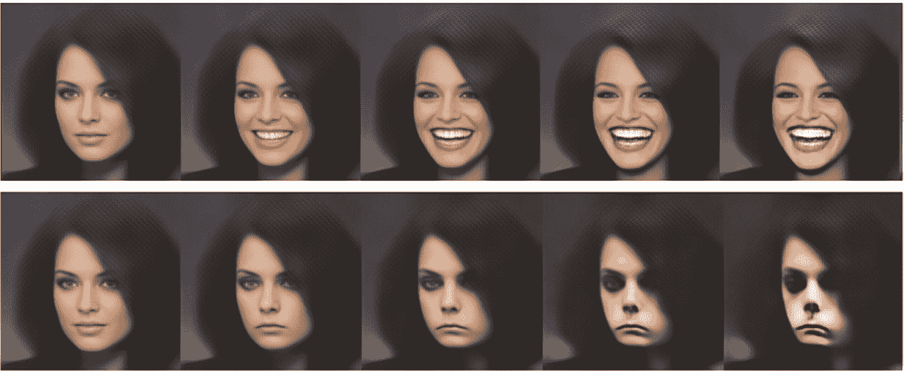

**图 12.15 微笑向量**

### 12.4.3 变分自编码器

变分自编码器是由 Kingma 和 Welling 在 2013 年 12 月⁵ 以及 Rezende、Mohamed 和 Wierstra 在 2014 年 1 月⁶ 同时发现的一种生成模型，特别适用于通过概念向量进行图像编辑的任务。它们是对自编码器的现代化改进（自编码器是一种旨在将输入编码到低维潜在空间中，然后再进行解码的网络类型），将深度学习的思想与贝叶斯推理混合起来。

一个经典的图像自编码器会将图像通过编码器模块映射到潜在向量空间中，然后通过解码器模块将其解码回与原始图像具有相同维度的输出（见图 12.16）。然后，通过使用*与输入图像相同的图像*作为目标数据进行训练，意味着自编码器学习重建原始输入。通过对代码（编码器的输出）施加各种限制，可以让自编码器学习更多或更少有趣的数据的潜在表示。最常见的情况是限制代码为低维和稀疏（大多数为零），在这种情况下，编码器充当将输入数据压缩为更少信息位的方式。

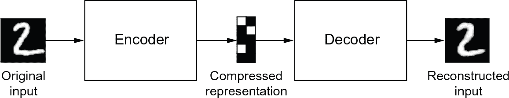

**图 12.16 自编码器将输入*x*映射到压缩的表示，然后解码回*x***  

在实践中，这样的经典自编码器并不会导致特别有用或结构良好的潜在空间。它们在压缩方面也不太好。因此，出于这些原因，它们在很大程度上已经过时了。而 VAE 则通过一些统计魔法来增强自编码器，迫使它们学习连续、高度结构化的潜在空间。它们已经被证明是图像生成的强大工具。

VAE 不是将其输入图像压缩成潜在空间中的固定代码，而是将图像转换为统计分布的参数：均值和方差。基本上，这意味着我们假设输入图像是由一个统计过程生成的，并且在编码和解码过程中应考虑到这个过程的随机性。然后，VAE 使用均值和方差参数随机采样分布的一个元素，并将该元素解码回原始输入（见图 12.17）。这个过程的随机性提高了鲁棒性，并迫使潜在空间在任何地方都编码有意义的表示：在潜在空间中采样的每一点都被解码为有效的输出。

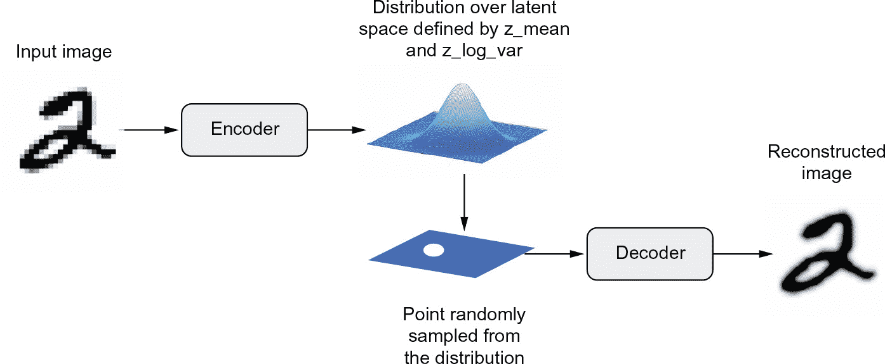

**图 12.17 VAE 将图像映射到两个向量 z_mean 和 z_log_sigma，它们定义了潜在空间上的概率分布，用于对潜在点进行采样以解码。**

从技术角度来看，VAE 的工作原理如下：

1.  **1** 编码器模块将输入样本 input_img 转换为表示的潜在空间中的两个参数，z_mean 和 z_log_variance。

1.  **2** 你随机从假设生成输入图像的潜在正态分布中采样一个点 z，通过 z = z_mean + exp(z_log_variance) * epsilon，其中 epsilon 是一个小值的随机张量。

1.  **3** 解码器模块将潜在空间中的这一点映射回原始输入图像。

由于 epsilon 是随机的，这个过程确保了每一个接近编码输入图像（z_mean）的潜在位置的点都可以被解码为与输入图像类似的东西，从而迫使潜在空间连续有意义。

潜在空间中的任意两个接近点将解码为高度相似的图像。连续性，加上潜在空间的低维度，迫使潜在空间中的每个方向编码数据的有意义变化轴，使得潜在空间非常结构化，因此非常适合通过概念向量进行操作。

VAE 的参数通过两个损失函数进行训练：一个 *重构损失*，强制解码样本与初始输入匹配，一个 *正则化损失*，有助于学习良好的潜在分布并减少对训练数据的过度拟合。从图示上看，这个过程如下：

c(z_mean, z_log_variance) %<—% encoder(input_img)➊

z <— z_mean + exp(z_log_variance) * epsilon➋

reconstructed_img <— decoder(z) ➌

model <— keras_model(input_img, reconstructed_img)➍

➊ **将输入编码为均值和方差参数。**

➋ **使用一个小的随机 epsilon 画一个潜在点。**

➌ **将 z 解码回图像。**

➍ **实例化自动编码器模型，将输入图像映射到其重构。**

然后，您可以使用重构损失和正则化损失来训练模型。对于正则化损失，我们通常使用一个表达式（Kullback-Leibler 散度），旨在将编码器输出的分布推向以 0 为中心的一个良好的正常分布。这为编码器提供了对所建模的潜在空间结构的合理假设。

现在让我们看看在实践中实现 VAE 是什么样子的！

### 12.4.4 使用 Keras 实现 VAE

我们将要实现一个可以生成 MNIST 数字的 VAE。它将有三个部分：

+   将实际图像转换为潜在空间中的均值和方差的编码器网络

+   一个采样层，它接受这样的均值和方差，并使用它们从潜在空间中随机采样一个点

+   将点从潜在空间转换回图像的解码器网络

下面的清单显示了我们将使用的编码器网络，将图像映射到潜在空间上的概率分布的参数。它是一个简单的 convnet，将输入图像 x 映射到两个向量，z_mean 和 z_log_var。一个重要的细节是，我们使用步幅来对特征图进行下采样，而不是使用最大池化。上次我们这样做是在第九章的图像分割示例中。回想一下，一般来说，对于任何关心信息位置的模型来说，步幅优于最大池化——也就是说，在图像中的位置，这个模型是关心的，因为它将不得不产生一个可以用来重构有效图像的图像编码。

**清单 12.24 VAE 编码器网络**

latent_dim <— 2➊

encoder_inputs <—  layer_input(shape = c(28, 28, 1))

x <— encoder_inputs %>%

layer_conv_2d(32, 3, activation = "relu", strides = 2, padding = "same") %>%

layer_conv_2d(64, 3, activation = "relu", strides = 2, padding = "same") %>%

layer_flatten() %>%

layer_dense(16, activation = "relu")

z_mean <— x %>% layer_dense(latent_dim, name = "z_mean")➋

z_log_var <— x %>% layer_dense(latent_dim, name = "z_log_var")➋

encoder <— keras_model(encoder_inputs, list(z_mean, z_log_var),

name = "encoder")

➊ **潜在空间的维数：一个二维平面**

➋ **输入图像最终被编码为这两个参数。**

其摘要如下所示：

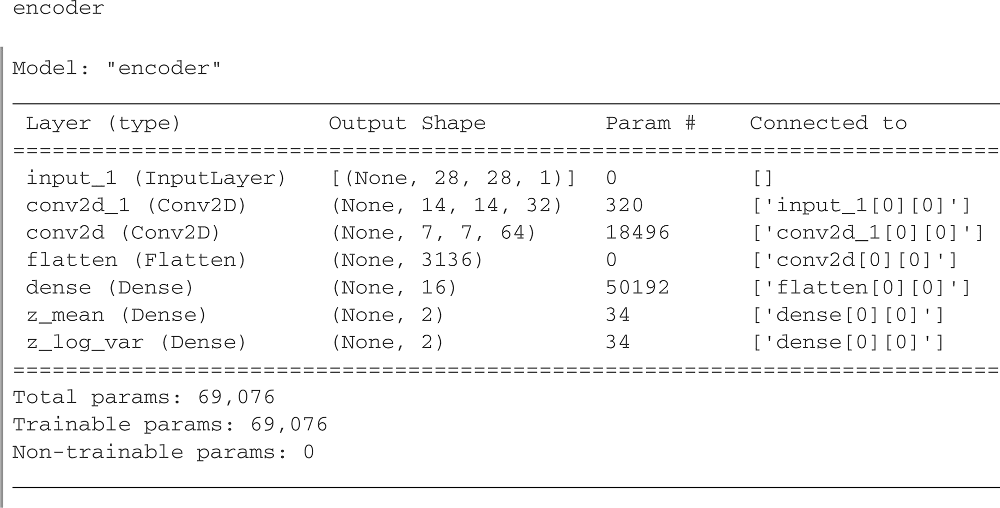

接下来是使用 z_mean 和 z_log_var 的代码，假定这些参数是产生 input_img 的统计分布的参数，以生成潜在空间点 z。

**清单 12.25 潜在空间采样层**

layer_sampler <— new_layer_class(

classname = "Sampler",

call = function(z_mean, z_log_var) {➊

epsilon <— tf$random$normal(shape = tf$shape(z_mean))➋

z_mean + exp(0.5 * z_log_var) * epsilon➌

}

}

➊ **这里的 z_mean 和 z_log_var 都将具有形状 (batch_size, latent_dim)，例如 (128, 2)。**

➋ **生成与编码器 Flatten 层级别相同数量的随机正态向量。**

➌ **应用 VAE 采样公式。**

下面的清单显示了解码器的实现。我们将向量 z 重塑为图像的维度，然后使用几个卷积层获得最终图像输出，其尺寸与原始输入图像相同。

清单 12.26 VAE 解码器网络，将潜空间点映射到图像

latent_inputs <— layer_input(shape = c(latent_dim))➊

decoder_outputs <— latent_inputs %>%

layer_dense(7 * 7 * 64, activation = "relu") %>% ➋

layer_reshape(c(7, 7, 64)) %>%➌

layer_conv_2d_transpose(64, 3, activation = "relu",

strides = 2, padding = "same") %>% ➍

layer_conv_2d_transpose(32, 3, activation = "relu",

strides = 2, padding = "same") %>%

layer_conv_2d(1, 3, activation = "sigmoid",

padding = "same") ➎

decoder <— keras_model(latent_inputs, decoder_outputs,

name = "decoder")

➊ **输入我们将 feed z 的地方**

➋ **在这里产生的系数的数量与编码器的 Flatten 层级别上相同。**

➌ **还原 encoder 的 layer_flatten()。**

➍ **还原 encoder 的 layer_conv_2d()。**

➎ **输出的形状为 (28, 28, 1)。**

它的摘要如下：

decoder

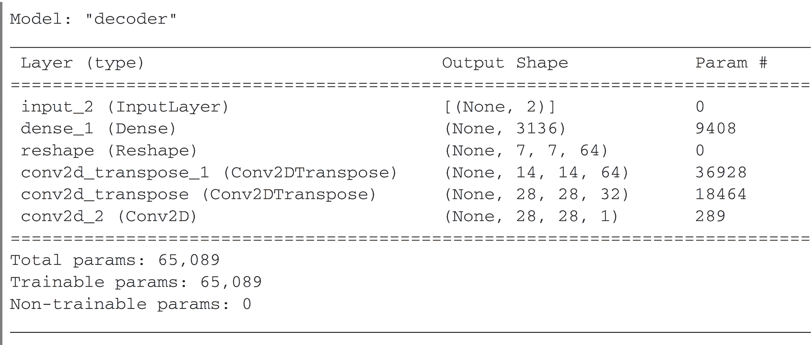

现在让我们创建 VAE 模型本身。这是你第一个不执行监督学习的模型示例（自动编码器是 *自监督* 学习的示例，因为它使用其输入作为目标）。当你脱离经典的监督学习时，通常会创建一个 new_model_class() 并实现一个自定义的 train_step() 来指定新的训练逻辑，这是你在第七章学到的工作流程。这就是我们在这里要做的。

**清单 12.27 自定义 train_step() 的 VAE 模型**

model_vae <— new_model_class(

classname = "VAE",

initialize = function(encoder, decoder, …) {

super$initialize(…)

self$encoder <— encoder➊

self$decoder <— decoder

self$sampler <— layer_sampler()

self$total_loss_tracker <

metric_mean(name = "total_loss")➋

self$reconstruction_loss_tracker <➋

metric_mean(name = "reconstruction_loss")➋

self$kl_loss_tracker <➋

metric_mean(name = "kl_loss")➋

},

metrics = mark_active(function() {➌

list(

self$total_loss_tracker,

self$reconstruction_loss_tracker,

self$kl_loss_tracker

)

}),

train_step = function(data) {

with(tf$GradientTape() %as% tape, {

c(z_mean, z_log_var) %<—% self$encoder(data)

z <— self$sampler(z_mean, z_log_var)

reconstruction <— decoder(z)

reconstruction_loss <➍

loss_binary_crossentropy(data, reconstruction) %>%

sum(axis = c(2, 3)) %>% ➎

mean()➏

kl_loss <— -0.5 * (1 + z_log_var - z_mean² - exp(z_log_var))

total_loss <— reconstruction_loss + mean(kl_loss)➐

})

grads <— tape$gradient(total_loss, self$trainable_weights)

self$optimizer$apply_gradients(zip_lists(grads, self$trainable_weights))

self$total_loss_tracker$update_state(total_loss)

self$reconstruction_loss_tracker$update_state(reconstruction_loss)

self$kl_loss_tracker$update_state(kl_loss)

list(total_loss = self$total_loss_tracker$result(),

reconstruction_loss = self$reconstruction_loss_tracker$result(),

kl_loss = self$kl_loss_tracker$result())

}

}

➊ **我们将赋值给 self 而不是 private，因为我们希望层权重由 Keras Model 基类自动跟踪。**

➋ **我们使用这些指标来跟踪每个周期内的损失平均值。**

➌ **我们将指标列在 active 属性中，以便在每个周期（或在多次调用 fit()/evaluate()之间）重置它们。**

➍ **我们对空间维度（第二和第三轴）上的重建损失求和，并在批次维度上取其平均值。**

➎ **批次中每个案例的总损失；保留批次轴。**

➏ **取批次中损失总和的平均值。**

➐ **添加正则化项（Kullback–Leibler 散度）。**

最后，我们准备在 MNIST 数字上实例化并训练模型。因为损失在自定义层中已经处理，所以我们在编译时不指定外部损失（loss = NULL），这意味着在训练期间我们不会传递目标数据（正如您所见，我们在 fit()中仅向模型传递 x_train）。

图 12.28 训练 VAE

library(listarrays)➊

c(c(x_train, .), c(x_test, .)) %<—% dataset_mnist()

mnist_digits <

bind_on_rows(x_train, x_test) %>%➋

expand_dims(-1) %>%

{ . / 255 }

str(mnist_digits)

num [1:70000, 1:28, 1:28, 1] 0 0 0 0 0 0 0 0 0 0 …

vae <— model_vae(encoder, decoder)

vae %>% compile(optimizer = optimizer_adam())➌

vae %>% fit(mnist_digits, epochs = 30, batch_size = 128)➍

➊ **提供 bind_on_rows()和其他用于操作 R 数组的函数。**

➋ **我们对所有 MNIST 数字进行训练，因此我们沿批次维度合并训练和测试样本。**

➌ **请注意，我们在 compile()中不传递损失参数，因为损失已经是 train_step()的一部分。**

➍ **请注意，我们在 fit()中不传递目标，因为 train_step()不需要任何目标。**

一旦模型训练完成，我们就可以使用解码器网络将任意潜空间向量转换为图像。

**图 12.29 从二维潜空间中采样图像的示例**

n <— 30

digit_size <— 28

z_grid <➊

seq(-1, 1, length.out = n) %>%

expand.grid(., .) %>%

as.matrix()

decoded <— predict(vae$decoder, z_grid)➋

z_grid_i <— seq(n) %>% expand.grid(x = ., y = .)➌

figure <— array(0, c(digit_size * n, digit_size * n))➍

for (i in 1:nrow(z_grid_i)) {

c(xi, yi) %<—% z_grid_i[i, ]

数字 <— 解码[i, , , ]

figure[seq(to = (n + 1 - xi) * digit_size, length.out = digit_size),

seq(to = yi * digit_size, length.out = digit_size)] <—

数字

}

par(pty = "s")➎

lim <— extendrange(r = c(-1, 1),

f = 1 - (n / (n+.5)))➐

plot(NULL, frame.plot = FALSE,

ylim = lim, xlim = lim,

xlab = ~z[1], ylab = ~z[2]) ➑

rasterImage(as.raster(1 - figure, max = 1),➑

lim[1], lim[1], lim[2], lim[2],

interpolate = FALSE)

➊ **创建一个线性间隔样本的二维网格。**

➋ **获取解码后的数字。**

➌ **将形状为（900，28，28，1）的解码数字转换为形状为（28*30，28*30）的 R 数组以进行绘图。**

➍ **我们将显示一个 30×30 的数字网格（共 900 个数字）。**

➎ **方形图类型**

➏ **将限制值扩展到（-1，1），位于数字的中心。**

➐ **将一个公式对象传递给 xlab 以获得适当的下标。**

➑ **从 1 中减去以反转颜色。**

从潜在空间抽样的数字网格（参见图 12.18）显示了不同数字类别的完全连续分布，随着您沿着潜在空间的路径前进，一个数字会变形成另一个数字。这个空间中的特定方向具有意义：例如，“五”的方向，“一”的方向等等。

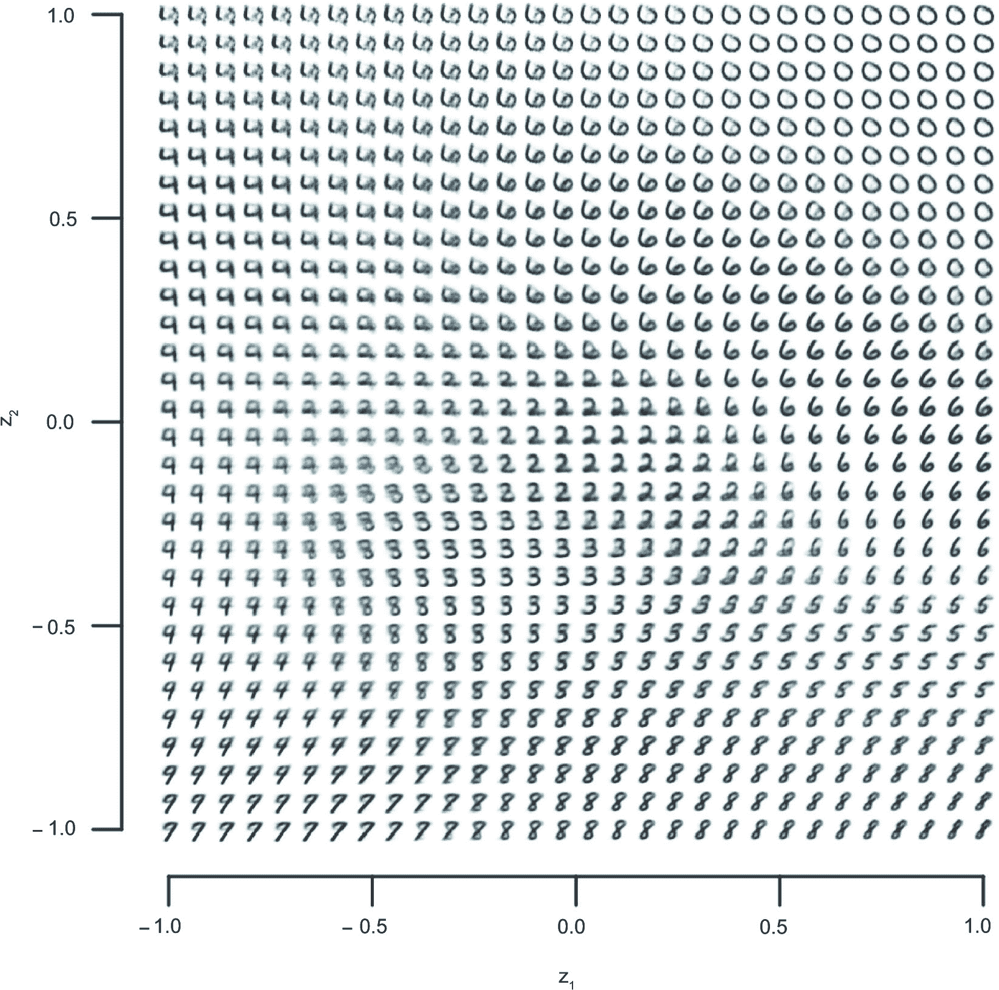

**图 12.18 从潜在空间解码的数字网格**

在下一节中，我们将详细介绍生成人工图像的另一个主要工具：生成对抗网络（GANs）。

### 12.4.5 总结

+   使用深度学习进行图像生成是通过学习捕获关于图像数据集的统计信息的潜在空间来完成的。通过从潜在空间中抽样和解码点，您可以生成以前未曾见过的图像。有两种主要工具可以实现这一点：VAEs 和 GANs。

+   VAEs 会产生高度结构化、连续的潜在表示。因此，它们非常适合在潜在空间中进行各种图像编辑：人脸交换，将皱眉的脸变成微笑的脸等等。它们还非常适合进行基于潜在空间的动画，比如沿着潜在空间的横截面进行步行动画，或者以连续的方式显示起始图像逐渐变形为不同的图像。

+   GANs 可以生成逼真的单帧图像，但可能不会产生具有稳固结构和高连续性的潜在空间。

我见过的大多数成功应用案例都依赖于 VAEs，但是 GANs 在学术研究领域一直很受欢迎。在下一节中，您将了解它们的工作原理以及如何实现其中之一。

## 12.5 生成对抗网络简介

生成对抗网络（GANs）由 Goodfellow 等人于 2014 年提出，⁷ 是学习图像潜在空间的替代方法，与 VAEs 相比。它们通过强制生成的图像在统计上几乎无法与真实图像区分开来，从而使得生成的合成图像相当逼真。

理解 GAN 的一种直观方式是想象一位赝造者试图制作一幅假的毕加索画。起初，赝造者在这个任务上并不在行。他把一些假画和真正的毕加索画混在一起，然后把它们展示给一个艺术品经销商。艺术品经销商为每幅画作进行真伪鉴别，并给赝造者反馈，告诉他什么因素使一幅画看起来像毕加索的作品。赝造者回到自己的工作室准备一些新的伪品。随着时间的推移，赝造者在模仿毕加索的风格方面变得越来越能胜任，而经销商在识别伪品方面也变得越来越熟练。最终，他们手里有了一些极好的假毕加索作品。

这就是 GAN 的含义：一个规模化的轨迹生成和专家网络，每个都在训练过程中竭尽全力来胜过对方。因此，GAN 由两部分组成：

+   *生成器网络*—以随机向量（潜在空间中的一个随机点）作为输入，并将其解码为合成图像

+   *判别器网络（或对手）*—以图像（真实的或合成的）作为输入，并预测该图像是否来自训练集或由生成器网络生成

生成器网络得到训练，以欺骗判别器网络，并因此朝着生成越来越逼真的图像的方向发展：人工图像看起来与真实图像无法区分，以至于判别器网络无法将两者区分开来（见图 12.19）。同时，判别器网络不断适应生成器逐渐提升的能力，为生成的图像设定了很高的真实性标准。训练结束后，生成器可以将输入空间中的任意点转化为一幅可信的图像。与 VAE 不同，这个潜在空间没有明确保证具有有意义结构的特性；尤其是，它不是连续的。

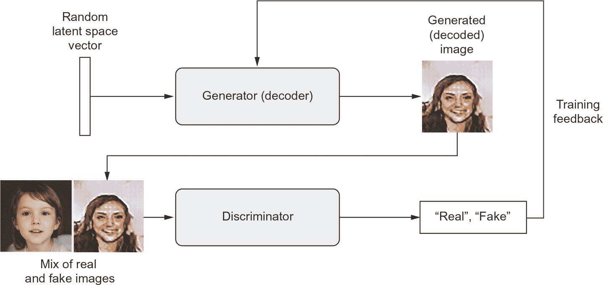

**图 12.19 生成器将随机潜在向量转化为图像，判别器则试图区分真实图像和生成的图像。生成器的训练目标是欺骗判别器。**

值得注意的是，GAN 是一个优化最小值不固定的系统，与本书中其他训练设置所遇到的情况不同。通常，梯度下降法是在静态损失空间中下坡前进的。但是使用 GAN 时，沿着坡下降的每一步都会稍微改变整个损失空间。这是一个动态系统，优化过程寻求的不是最小值，而是两个力之间的平衡状态。因此，GAN 中的训练非常困难，要使其正常工作需要对模型结构和训练参数进行大量细致的调整。

### 12.5.1 一个概要的 GAN 实现

在本节中，我们将解释如何以最简形式在 Keras 中实现 GAN。GAN 是先进的，因此深入探讨生成 figure 12.20 中的图像的 StyleGAN2 架构等技术细节超出了本书的范围。我们将在此演示中使用的具体实现是 *深度卷积 GAN*（DCGAN）：一个非常基本的 GAN，其中生成器和判别器都是深度卷积网络。

我们将在大规模 CelebFaces 属性数据集（称为 CelebA）的图像上训练我们的 GAN，这是一个包含 20 万个名人面孔的数据集（[`mmlab.ie.cuhk.edu.hk/projects/CelebA.html`](http://mmlab.ie.cuhk.edu.hk/projects/CelebA.html)）。为了加快训练速度，我们将图像调整为 64 × 64，因此我们将学习生成 64 × 64 的人脸图像。在图解上，GAN 如下所示：

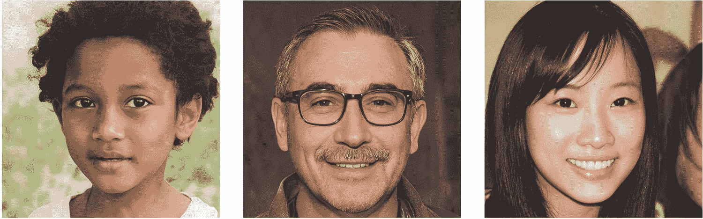

**图 12.20 潜空间居民。由 [`thispersondoesnotexist.com`](https://thispersondoesnotexist.com) 使用 StyleGAN2 模型生成的图像。（图片来源：Phillip Wang 是网站作者。使用的模型是 Karras 等人的 StyleGAN2 模型，[`arxiv.org/abs/1912.04958`](https://arxiv.org/abs/1912.04958)）**

+   生成器网络将形状为（latent_dim）的向量映射到形状为（64，64，3）的图像。

+   判别器网络将形状为（64，64，3）的图像映射到一个二进制分数，估计图像为真实的概率。

+   GAN 网络将生成器和判别器链接在一起：gan(x) = discriminator(generator(x))。因此，这个 GAN 网络将潜空间向量映射到判别器对这些潜空间向量解码后的真实性的评估。

+   我们使用真实和假图像的示例以及“真实”/“假”的标签来训练判别器，就像我们训练任何常规图像分类模型一样。

+   为了训练生成器，我们使用生成器权重相对于 gan 模型损失的梯度。这意味着在每一步，我们将生成器的权重移动到一个方向，使判别器更有可能将生成器解码的图像分类为“真实”。换句话说，我们训练生成器来欺骗判别器。

### 12.5.2 一袋技巧

训练 GAN 和调整 GAN 实现的过程非常困难。您应该记住一些已知的技巧。像深度学习中的大多数事情一样，这更像是炼金术而不是科学：这些技巧是启发式的，而不是理论支持的指南。

它们受到对手头现象的直觉理解的支持，并且已知在经验上工作良好，尽管不一定在每种情况下都是如此。

以下是本节中 GAN 生成器和判别器实现中使用的一些技巧。这不是一个详尽的 GAN 相关提示列表；您将在 GAN 文献中找到更多：

+   在判别器中，我们使用步幅而不是池化来对特征图进行下采样，就像我们在 VAE 编码器中所做的那样。

+   我们使用 *正态分布*（高斯分布）而不是均匀分布从潜在空间中采样点。

+   随机性对于诱导鲁棒性是有益的。因为 GAN 训练导致动态平衡，GAN 很可能以各种方式陷入困境。在训练过程中引入随机性有助于防止这种情况发生。我们通过向判别器的标签添加随机噪声来引入随机性。

+   稀疏梯度会阻碍 GAN 训练。在深度学习中，稀疏性通常是一种可取的特性，但在 GAN 中却不是。有两件事会导致梯度稀疏性：max pooling 操作和 relu 激活。我们建议使用步幅卷积进行下采样，而不是使用 max pooling，并且建议使用 `layer_activation_leaky_relu()` 而不是 relu 激活。它类似于 relu，但通过允许小的负激活值来放宽稀疏性约束。

+   在生成的图像中，常见的是看到由于发生器中像素空间覆盖不均匀而引起的棋盘格伪影（参见图 12.21）。为了解决这个问题，我们在发生器和判别器中使用 `layer_conv_2d_transpose()` 或 `layer_conv_2d()` 时，使用可被步幅大小整除的核大小。

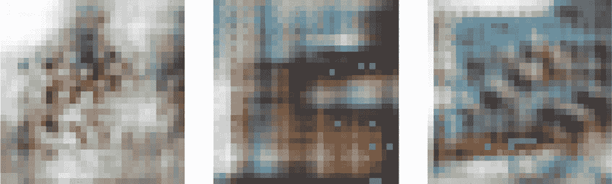

**图 12.21 由于步幅和核大小不匹配导致的棋盘格伪影，导致像素空间覆盖不均匀：GAN 的众多注意事项之一**

### 12.5.3 获取 CelebA 数据集

你可以从网站手动下载数据集：[`mmlab.ie.cuhk.edu.hk/projects/CelebA.html`](http://mmlab.ie.cuhk.edu.hk/projects/CelebA.html)。因为数据集托管在 Google Drive 上，所以你也可以使用 gdown 下载：

`reticulate::py_install("gdown", pip = TRUE)`➊

`system("gdown 1O7m1010EJjLE5QxLZiM9Fpjs7Oj6e684")`➋

下载中…

来自：https://drive.google.com/uc?id=1O7m1010EJjLE5QxLZiM9Fpjs7Oj6e684

到：img_align_celeba.zip

32%|                      | 467M/1.44G [00:13<00:23, 41.3MB/s]

➊ **安装 gdown。**

➋ **使用 gdown 下载压缩数据。**

一旦你下载了数据，将其解压缩到一个名为 celeba_gan 的文件夹中

清单 12.30 获取 CelebA 数据

`zip::unzip("img_align_celeba.zip", exdir = "celeba_gan")`➊

➊ **解压数据。**

一旦你把未压缩的图像放在一个目录中，你就可以使用 `image_dataset_from_directory()` 将其转换为 TF Dataset。因为我们只需要图像——没有标签——所以我们会指定 `label_mode = NULL`。

**清单 12.31 从图像目录创建 TF Dataset**

`dataset <- image_dataset_from_directory(`

"celeba_gan",

`label_mode = NULL,`➊

`image_size = c(64, 64),`➋

`batch_size = 32,`➋

`crop_to_aspect_ratio = TRUE`➋

}

➊ **只返回图像，不返回标签。**

➋ **我们将通过智能组合裁剪和调整大小将图像调整为 64 × 64，以保持长宽比。我们不希望面部比例被扭曲！**

最后，让我们将图像重新调整到 [0-1] 范围内。

**清单 12.32 重新调整图像大小**

library(tfdatasets)

dataset %<>% dataset_map(~ .x / 255)

您可以使用以下代码显示示例图像。

**清单 12.33 显示第一张图片**

x <— 数据集 %>% as_iterator() %>% iter_next()

display_image_tensor(x[1, , , ], max = 1)

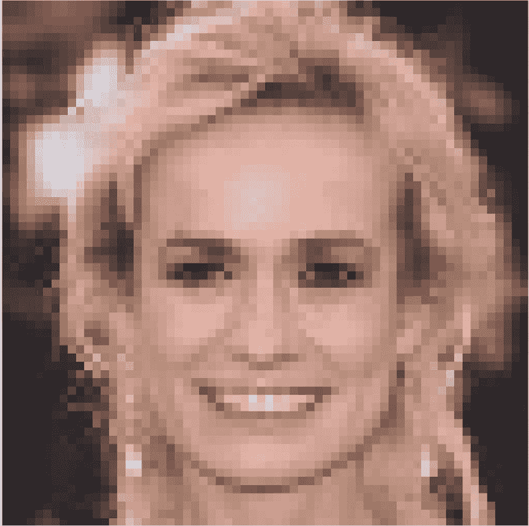

### 12.5.4 鉴别器

首先，我们将开发一个鉴别器模型，该模型将候选图像（真实或合成的）作为输入，并将其分类为两类之一：“生成的图像”或“来自训练集的真实图像”。与 GAN 常见的许多问题之一是生成器陷入生成看起来像噪声的图像的困境。一个可能的解决方案是在鉴别器中使用 dropout，这就是我们将在这里做的。

**清单 12.34 GAN 鉴别器网络**

鉴别器 <-

keras_model_sequential(name = "鉴别器",

input_shape = c(64, 64, 3)) %>%

layer_conv_2d(64, kernel_size = 4, strides = 2, padding = "same") %>%

layer_activation_leaky_relu(alpha = 0.2) %>%

layer_conv_2d(128, kernel_size = 4, strides = 2, padding = "same") %>%

layer_activation_leaky_relu(alpha = 0.2) %>%

layer_conv_2d(128, kernel_size = 4, strides = 2, padding = "same") %>%

layer_activation_leaky_relu(alpha = 0.2) %>%

layer_flatten() %>%

layer_dropout(0.2) %>% ➊

layer_dense(1, activation = "sigmoid")

➊ **一个 dropout 层：一个重要的技巧！**

这是鉴别器模型摘要：

鉴别器

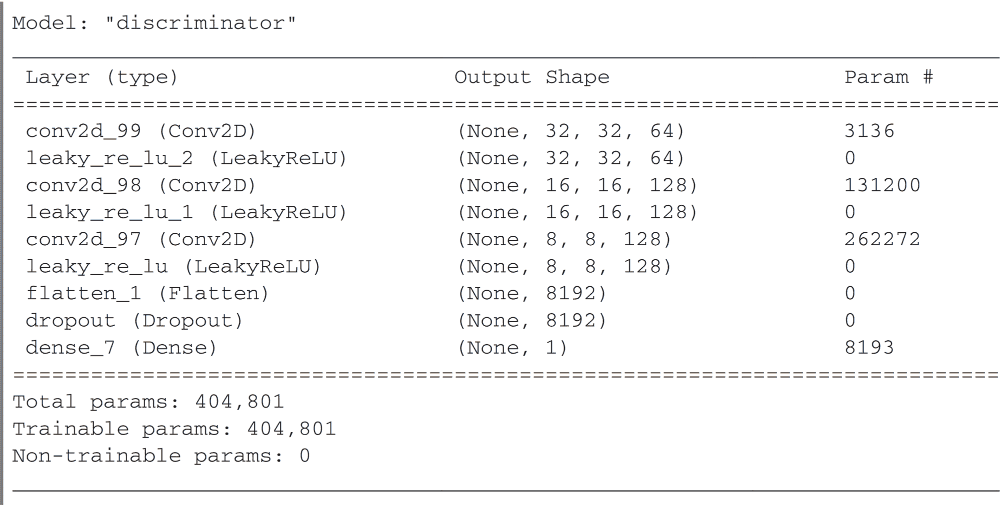

### 12.5.5 生成器

接下来，让我们开发一个生成器模型，它将一个向量（来自潜在空间 - 在训练期间将随机抽样）转换为候选图像。

清单 12.35 GAN 生成器网络

latent_dim <— 128➊

生成器 <

keras_model_sequential(name = "生成器",

input_shape = c(latent_dim)) %>%

layer_dense(8 * 8 * 128) %>% ➋

layer_reshape(c(8, 8, 128)) %>%➌

layer_conv_2d_transpose(128, kernel_size = 4,

strides = 2, padding = "same") %>% ➍

layer_activation_leaky_relu(alpha = 0.2) %>%

layer_conv_2d_transpose(256, kernel_size = 4,

strides = 2, padding = "same") %>%

layer_activation_leaky_relu(alpha = 0.2) %>%➎

layer_conv_2d_transpose(512, kernel_size = 4,

strides = 2, padding = "same") %>%

layer_activation_leaky_relu(alpha = 0.2) %>%

layer_conv_2d(3, kernel_size = 5, padding = "same",

activation = "sigmoid")

➊ **潜在空间将由 128 维向量组成。**

➋ **产生与编码器中的 Flatten 层相同数量的系数。**

➌ **恢复编码器中的 layer_flatten()。**

➍ **恢复编码器中的 layer_conv_2d()。**

➎ **使用 Leaky Relu 作为激活函数。**

这是生成器模型摘要：

生成器

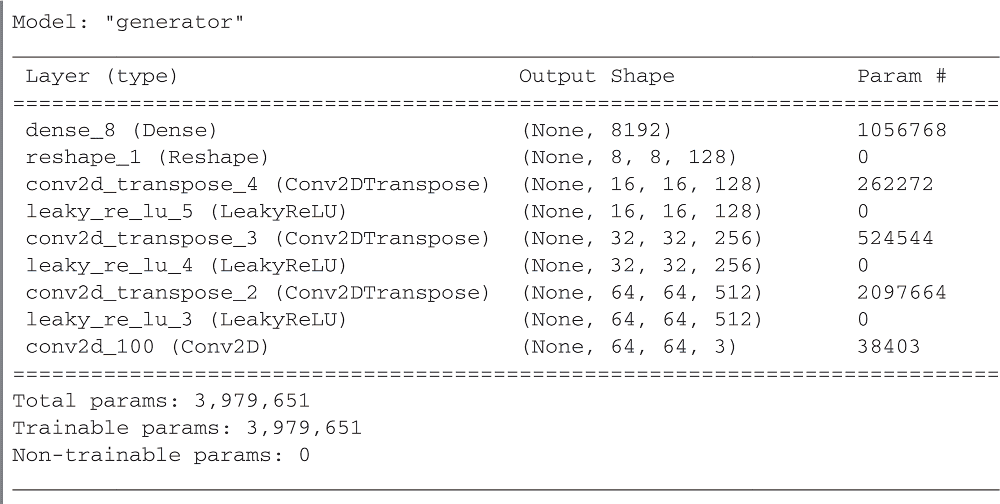

### 12.5.6 对抗网络

最后，我们将设置 GAN，它将生成器和鉴别器连接在一起。当训练完成后，该模型将使生成器朝着改善其欺骗鉴别器能力的方向移动。该模型将潜在空间点转换为分类决策——“假”或“真”，并且它的目的是使用始终为“这些是真实图像”的标签进行训练。因此，训练 gan 将更新生成器的权重，使鉴别器在查看伪图像时更有可能预测“真实”。

回顾一下，训练循环的基本结构如下所示。对于每个时期，您执行以下操作：

1.  **1** 在潜在空间中绘制随机点（随机噪声）。

1.  **2** 使用此随机噪声通过生成器生成图像。

1.  **3** 将生成的图像与真实图像混合。

1.  **4** 使用这些混合图像训练鉴别器，并提供相应的目标：要么是“真实”（对于真实图像），要么是“假的”（对于生成的图像）。

1.  **5** 在潜在空间中绘制新的随机点。

1.  **6** 使用这些随机向量训练生成器，并将目标全部设置为“这些是真实图像”。这将更新生成器的权重，使它们朝着让鉴别器预测生成图像为“这些是真实图像”的方向移动：这样训练生成器就可以欺骗鉴别器。

让我们来实现它。与我们的 VAE 示例一样，我们将使用一个新的 new_model_class() 来自定义 train_step()。请注意，我们将使用两个优化器（一个用于生成器，一个用于鉴别器），因此我们还将重写 compile() 以允许传递两个优化器。

**Listing 12.36 GAN 模型**

GAN <— new_model_class(

classname = "GAN",

initialize = function(discriminator, generator, latent_dim) {

super$initialize()

self$discriminator  <— discriminator

self$generator      <— generator

self$latent_dim     <— as.integer(latent_dim)

self$d_loss_metric  <— metric_mean(name = "d_loss")➊

self$g_loss_metric  <— metric_mean(name = "g_loss")➊

},

compile = function(d_optimizer, g_optimizer, loss_fn) {

super$compile()

self$d_optimizer <— d_optimizer

self$g_optimizer <— g_optimizer

self$loss_fn <— loss_fn

},

metrics = mark_active(function() {

list(self$d_loss_metric,

self$g_loss_metric)

}),

train_step = function(real_images) {➋

batch_size <— tf$shape(real_images)[1]

random_latent_vectors <➌

tf$random$normal(shape = c(batch_size, self$latent_dim))

generated_images <

self$generator(random_latent_vectors)➍

combined_images <

tf$concat(list(generated_images,

real_images),➎

axis = 0L)

labels <

tf$concat(list(tf$ones(tuple(batch_size, 1L)),➏

tf$zeros(tuple(batch_size, 1L))),

axis = 0L)

labels %<>% `+`(

tf$random$uniform(tf$shape(.), maxval = 0.05))➐

with(tf$GradientTape() %as% tape, {

predictions <— self$discriminator(combined_images)

d_loss <— self$loss_fn(labels, predictions)

})

grads <— tape$gradient(d_loss, self$discriminator$trainable_weights)

self$d_optimizer$apply_gradients(➑

zip_lists(grads, self$discriminator$trainable_weights))

random_latent_vectors <➒

tf$random$normal(shape = c(batch_size, self$latent_dim))

misleading_labels <— tf$zeros(tuple(batch_size, 1L))➓

with(tf$GradientTape() %as% tape, {

predictions <— random_latent_vectors %>%

self$generator() %>%

self$discriminator()

g_loss <— self$loss_fn(misleading_labels, predictions)

})

grads <— tape$gradient(g_loss, self$generator$trainable_weights)

self$g_optimizer$apply_gradients(⓫

zip_lists(grads, self$generator$trainable_weights))

self$d_loss_metric$update_state(d_loss)

self$g_loss_metric$update_state(g_loss)

list(d_loss = self$d_loss_metric$result(),

g_loss = self$g_loss_metric$result())

})

➊ **设置指标以跟踪每个训练周期中的两个损失。**

➋ **train_step 被调用以一批真实图像。**

➌ **在潜在空间中随机采样。**

➍ **将其解码为虚假图像。**

➎ **将其与真实图像组合。**

➏ **组装标签，区分真实图像和虚假图像。**

➐ **向标签添加随机噪声——一个重要的技巧！**

➑ **训练鉴别器。**

➒ **在潜在空间中随机采样。**

➓ **组装标签，声明“这些都是真实图像”（这是谎言！）。**

⓫ **训练生成器。**

在我们开始训练之前，让我们还设置一个回调来监视我们的结果：它将在每个时期结束时使用生成器创建并保存一些虚假图像。

清单 12.37 在训练期间对生成的图像进行采样的回调

callback_gan_monitor <— new_callback_class(

classname = "GANMonitor",

initialize = function(num_img = 3, latent_dim = 128,

dirpath = "gan_generated_images") {

private$num_img <— as.integer(num_img)

private$latent_dim <— as.integer(latent_dim)

private$dirpath <— fs::path(dirpath)

fs::dir_create(dirpath)

},

on_epoch_end = function(epoch, logs = NULL) {

random_latent_vectors <

tf$random$normal(shape = c(private$num_img, private$latent_dim))

generated_images <— random_latent_vectors %>%

self$model$generator() %>%

{ tf$saturate_cast(. * 255, "uint8") }➊

for (i in seq(private$num_img))

tf$io$write_file(

filename = private$dirpath / sprintf("img_%03i_%02i.png", epoch, i),

contents = tf$io$encode_png(generated_images[i, , , ])

)

}

}

➊ **将其缩放并剪辑到 [0, 255] 的 uint8 范围内，并转换为 uint8。**

最后，我们可以开始训练了。

**清单 12.38 编译和训练 GAN**

epochs <— 100➊

gan <— GAN(discriminator = discriminator,➋

generator = generator,

latent_dim = latent_dim)

gan %>% compile(

d_optimizer = optimizer_adam(learning_rate = 0.0001),

g_optimizer = optimizer_adam(learning_rate = 0.0001),

loss_fn = loss_binary_crossentropy()

}

gan %>% fit(

数据集，

epochs = epochs,

callbacks = callback_gan_monitor(num_img = 10, latent_dim = latent_dim)

}

➊ **在第 20 个时期后，您将开始获得有趣的结果。**

➋ **实例化 GAN 模型。**

在训练过程中，您可能会看到对抗损失开始显着增加，而判别损失趋向于零——鉴别器可能最终主导生成器。如果是这种情况，请尝试降低鉴别器学习率并增加鉴别器的丢弃率。图 12.22 展示了我们的 GAN 在经过 30 个周期的训练后能够生成的内容。

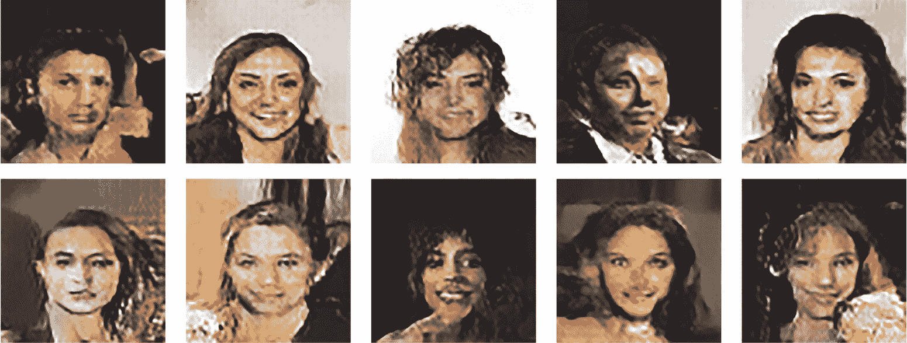

**图 12.22 大约在第 30 个周期生成的一些图像**

### 12.5.7 总结

+   GAN 由一个生成器网络和一个鉴别器网络组成。鉴别器被训练来区分生成器的输出和来自训练数据集的真实图像，而生成器被训练来欺骗鉴别器。值得注意的是，生成器从未直接看到来自训练集的图像；它对数据的了解来自于鉴别器。

+   GAN 是难以训练的，因为训练 GAN 是一个动态过程，而不是具有固定损失景观的简单梯度下降过程。要正确训练 GAN，需要使用许多启发式技巧以及广泛的调整。

+   GAN 可能会生成高度逼真的图像。但与 VAE 不同，它们学习的潜在空间没有一个整洁的连续结构，因此可能不适用于某些实际应用，例如通过潜在空间概念向量进行图像编辑。

这些技术仅涵盖了这个快速发展领域的基础知识。还有很多东西等待我们去发现——生成式深度学习值得一整本书来探索。

## 摘要

+   您可以使用序列到序列模型逐步生成序列数据。这适用于文本生成，也适用于逐音符音乐生成或任何其他类型的时间序列数据。

+   DeepDream 的工作原理是通过在输入空间中通过梯度上升来最大化卷积网络层的激活。

+   在风格转移算法中，通过梯度下降将内容图像和风格图像结合在一起，生成具有内容图像的高级特征和风格图像的局部特征的图像。

+   VAE 和 GAN 是学习图像潜在空间的模型，然后可以通过从潜在空间中抽样来构想全新的图像。潜在空间中的概念向量甚至可以用于图像编辑。

1.  ¹ Iannis Xenakis, “Musiques formelles: nouveaux principes formels de composition musicale,” *La Revue musicale* 特刊, 第 253–254 号 (1963).

1.  ² Alex Graves, “Generating Sequences with Recurrent Neural Networks,” arXiv (2013), [`arxiv.org/abs/1308.0850`](https://arxiv.org/abs/1308.0850).

1.  ³ Alexander Mordvintsev, Christopher Olah, 和 Mike Tyka, “DeepDream: A Code Example for Visualizing Neural Networks,” Google Research Blog, 2015 年 7 月 1 日, [`mng.bz/xXlM`](http://mng.bz/xXlM).

1.  ⁴ Leon A. Gatys, Alexander S. Ecker, and Matthias Bethge, “艺术风格的神经算法,” arXiv (2015), [`arxiv.org/abs/1508.06576`](https://arxiv.org/abs/1508.06576).

1.  ⁵ Diederik P. Kingma 和 Max Welling，“自动编码变分贝叶斯,” arXiv (2013), [`arxiv.org/abs/1312.6114`](https://arxiv.org/abs/1312.6114).

1.  ⁶ Danilo Jimenez Rezende, Shakir Mohamed, and Daan Wierstra, “深度生成模型中的随机反向传播和近似推断,” arXiv (2014), [`arxiv.org/abs/1401.4082`](https://arxiv.org/abs/1401.4082).

1.  ⁷ Ian Goodfellow 等人，“生成对抗网络,” arXiv (2014), [`arxiv.org/abs/1406.2661`](https://arxiv.org/abs/1406.2661).
