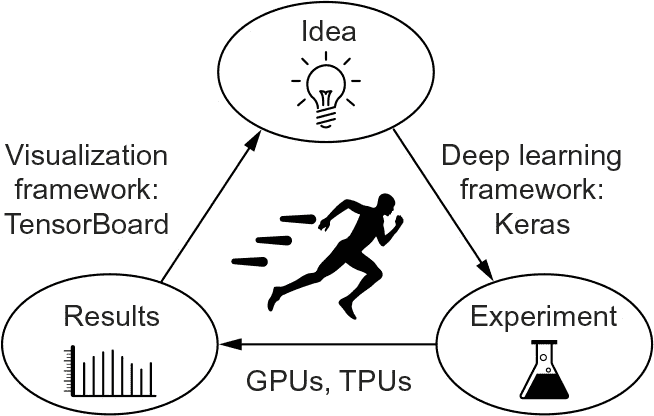
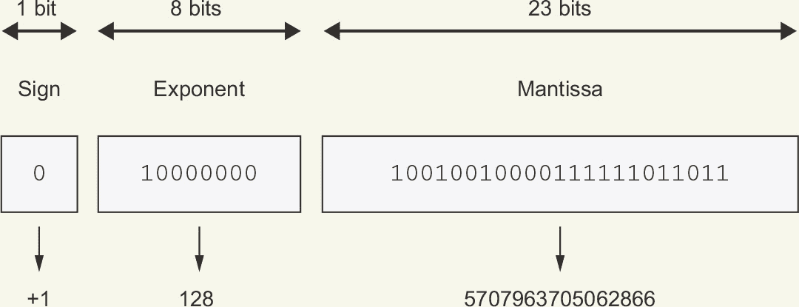
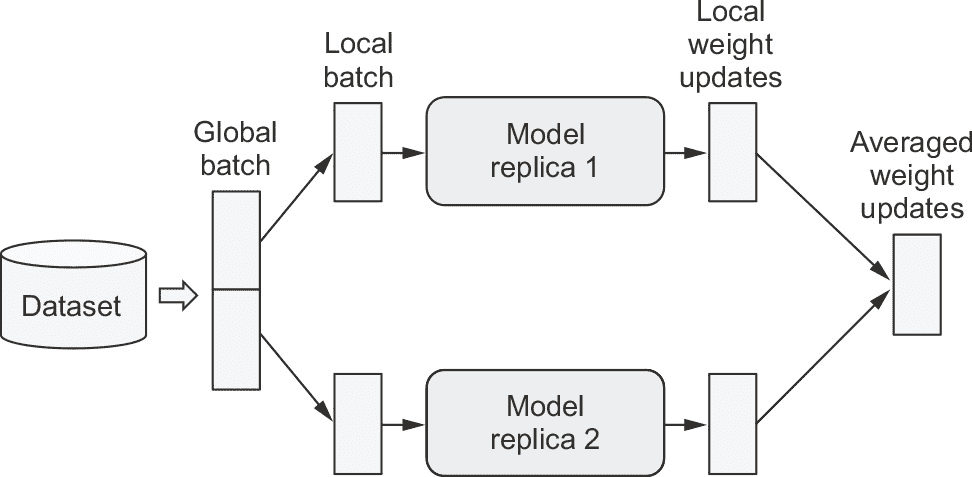

# 第十三章：实践的最佳实践

*本章包括*

+   超参数调优

+   模型集成

+   混合精度训练

+   在多个 GPU 或 TPU 上训练 Keras 模型

从这本书开始以来，你已经走了很远。你现在可以训练图像分类模型、图像分割模型、用于向量数据的分类或回归模型、时间序列预测模型、文本分类模型、序列到序列模型，甚至是文本和图像的生成模型。你已经覆盖了所有的基础。

然而，到目前为止，你的模型都是在小规模上训练的——在小数据集上，用单个 GPU——它们通常还没有达到我们所看到的每个数据集的最佳性能。毕竟，这本书是一本入门书。如果你要走进现实世界，在全新的问题上取得最先进的结果，你还需要跨越一定的鸿沟。

这个倒数第二章是关于弥合这一鸿沟，并为你提供你在从机器学习学生到完全成熟的机器学习工程师所需的最佳实践。我们将回顾系统地改进模型性能的基本技术：超参数调优和模型集成。然后我们将看看如何加速和扩展模型训练，使用多 GPU 和 TPU 训练，混合精度，以及利用云中的远程计算资源。  

我们还将利用这一章节来展示如何直接访问 Python 包，即使没有方便的 R 包装器可用。这将是你在深度学习旅程中的一个基本技能。你不需要知道 Python 来使用 R 中的 Python 包，但是如果你发现自己曾经阅读过 Python 文档，并问过“所有的下划线是什么？”可以直接去附录，*R 用户的 Python 入门指南*，它会尽快让你掌握速度。

## 13.1 充分利用你的模型

盲目尝试不同的架构配置，如果你只需要一个可以正常工作的东西，那么这样做就足够了。在本节中，我们将超越“正常工作”到“出色工作并赢得机器学习竞赛”的一系列必须知道的技术，用于构建最先进的深度学习模型。

### 13.1.1 超参数优化

在构建深度学习模型时，你必须做出许多看似任意的决定：应该堆叠多少层？每层应该放多少个单元或滤波器？应该使用 relu 作为激活函数，还是其他函数？在给定的层之后应该使用 layer_batch_normalization() 吗？应该使用多少的 dropout？等等。这些架构级参数被称为*超参数*，以区别于模型的*参数*，后者通过反向传播进行训练。

实际上，经验丰富的机器学习工程师和研究人员随着时间的推移逐渐形成了有关这些选择的有效性的直觉，他们发展了超参数调整技能。但是，不存在正式的规则。如果您想达到在给定任务上可以实现的极限，您不能满足于这些随意的选择。即使您有很好的直觉，您的初始决策几乎总是次优的。您可以通过手动调整并重复训练模型来改进您的选择-这就是机器学习工程师和研究人员花费大量时间的内容。但是作为人类，您不应该整天瞎折腾超参数，最好交给机器处理。

因此，您需要以系统化、有原则的方式自动探索可能的决策空间。您需要搜索体系结构空间，并经验性地找到最佳的性能体系结构。这就是自动超参数优化领域：这是一个独立的研究领域，也是重要的一个。优化超参数的过程通常是这样的：

1.  **1** 自动选择一组超参数。

1.  **2** 构建相应的模型。

1.  **3** 将其应用于训练数据，并在验证数据上测量性能。

1.  **4** 自动选择下一组要尝试的超参数。

1.  **5** 重复。

1.  **6** 最终，在测试数据上测量性能。

这个过程的关键是算法，它分析验证性能和各种超参数值之间的关系，选择下一组要评估的超参数。有许多不同的技术可用：贝叶斯优化、遗传算法、简单的随机搜索等等。

训练模型的权重相对容易：您在一小批数据上计算损失函数，然后使用反向传播将权重向正确的方向移动。另一方面，更新超参数则具有独特的挑战。考虑以下几点：

+   超参数空间通常由离散决策组成，因此不是连续或可微分的。因此，您通常无法在超参数空间中执行梯度下降。相反，您必须依赖于无梯度优化技术，这自然比梯度下降效率低得多。

+   这个优化过程的反馈信号（这组超参数是否导致在这个任务上的高性能模型？）可能非常昂贵：需要从头开始创建和训练一个新模型。

+   反馈信号可能带有噪声：如果一个训练运行表现更好，是因为更好的模型配置，还是因为您得到了初值较好的权重值？

幸运的是，有一个工具可以使超参数调整更简单：KerasTuner。我们来看看吧。

### 使用 KerasTuner

让我们首先安装 KerasTuner Python 包：

reticulate::py_install("keras-tuner", pip = TRUE)

KerasTuner 可以让你用一系列可能的选择替换硬编码的超参数值，比如 units = 32，比如 Int(name = “units”, min_value = 16, max_ value = 64, step = 16)。在给定模型中，这组选择被称为超参数调整过程的 *搜索空间*。要指定搜索空间，定义一个模型构建函数（见下面的列表）。它接受一个 hp 参数，从中你可以取样超参数范围，并返回一个编译过的 Keras 模型。

**列表 13.1 一个 KerasTuner 模型构建函数**

build_model <- function(hp, num_classes = 10) {

units <- hp$Int(name = "units",➊

min_value = 16L, max_value = 64L, step = 16L)

model <- keras_model_sequential() %>%

layer_dense(units, activation = "relu") %>%

layer_dense(num_classes, activation = "softmax")

optimizer <- hp$Choice(name = "optimizer",➋

values = c("rmsprop", "adam"))

model %>% compile(optimizer = optimizer,

loss = "sparse_categorical_crossentropy",

metrics = c("accuracy"))

model➌

}

➊ **从 hp 对象中取样超参数值。取样后，这些值（比如这里的 units 和 optimizer 变量）就是普通的 R 常量了。**

➋ **有不同类型的超参数可用：Int、Float、Boolean、Choice。**

➌ **函数返回一个编译过的模型。**

如果你想采用更模块化和可配置的方法来构建模型，你也可以子类化 HyperModel 类并定义一个 build 方法，如下所示。

**列表 13.2 一个 KerasTuner HyperModel**

kt <- reticulate::import("kerastuner")

SimpleMLP(kt$HyperModel) %py_class% {

`__init__` <- function(self, num_classes) {➊

self$num_classes <- num_classes

}

build <- function(self, hp) {➋

build_model(hp, self$num_classes)

}

}

hypermodel <- SimpleMLP(num_classes = 10)

➊ **通过面向对象的方法，我们可以将模型常量配置为构造函数参数，如 num_classes。**

➋ **build() 方法与我们先前的 build_model() 独立函数相同，只是现在它由子类 kt$HyperModel 的一个方法调用。**

**使用 %py_class% 自定义 Python 类**

%py_class% 可用于在 R 中定义自定义 Python 类。它反映了定义 Python 类的 Python 语法，并允许将 Python 几乎机械地转换为 R。当使用围绕子类化设计的 Python API 时，比如 kt$HyperModel 时，它尤其有用。在 Python 文档中，KerasTuner 的等效 SimpleMLP 定义（你可能在 Python 文档中找到）将如下所示：

import kerastuner as kt

class SimpleMLP(kt.HyperModel):

def __init__(self, num_classes):

self.num_classes = num_classes

def build(self, hp):

return build_model(hp, self.num_classes)

hypermodel = SimpleMLP(num_classes=10)

查看 R 中的 ?’%py_class%’ 以获取更多信息和示例。

下一步是定义一个“调谐器”。概括地说，你可以将调谐器想象为一个会重复执行的 for 循环，该循环将

+   选择一组超参数值

+   用这些值调用模型构建函数以创建一个模型

+   训练模型并记录其度量

KerasTuner 有几个内置的调谐器可用——RandomSearch、BayesianOptimization 和 Hyperband。让我们尝试 BayesianOptimization，这是一种试图根据先前选择的结果智能预测哪些新的超参数值可能表现最佳的调谐器：

tuner <- kt$BayesianOptimization(➊

build_model,

objective = "val_accuracy",➋

max_trials = 100L,➌

executions_per_trial = 2L,➍

directory = "mnist_kt_test",➎

overwrite = TRUE )➏

➊ **指定模型构建函数（或超模型实例）。**

➋ **指定调谐器将寻求优化的指标。始终指定验证指标，因为搜索过程的目标是找到具有泛化能力的模型。**

➌ **尝试结束搜索之前要尝试的不同模型配置（“试验”）的最大数量。**

➍ **为减少指标方差，您可以多次训练相同的模型并平均结果。executions_per_trial 是每个模型配置（试验）运行的训练轮数（执行次数）。**

➎ **存储搜索日志的位置**

➏ **是否覆盖目录中的数据以启动新的搜索。如果您修改了模型构建函数，则将其设置为 TRUE；如果要恢复以前开始的具有相同模型构建函数的搜索，则设置为 FALSE。**

您可以通过 search_space_summary()显示搜索空间的概述：

tuner$search_space_summary()

搜索空间摘要

默认搜索空间大小：2

units (Int)

{"default": None,

"conditions": [],

"min_value": 128,

"max_value": 1024,

"step": 128,

"sampling": None}

optimizer (Choice)

{"default": "rmsprop",

"conditions": [],

"values": ["rmsprop", "adam"],

"ordered": False}

**目标最大化和最小化**

对于内置指标（例如准确性，在我们的情况下），KerasTuner 推断出指标的*方向*（准确性应最大化，但损失应最小化）。但是，对于自定义指标，您应该自己指定，就像这样：

objective <- kt$Objective(

name = "val_accuracy",➊

direction = "max" ➋

)

tuner <- kt$BayesianOptimization(

build_model,

objective = objective,

…

)

➊ **指标的名称，如在 epoch 日志中找到的**

➋ **指标的期望方向："min"或"max"**

最后，让我们启动搜索。不要忘记传递验证数据，并确保不要使用测试集作为验证数据——否则，您将很快开始过度拟合您的测试数据，并且您将无法信任您的测试指标：

c(c(x_train, y_train), c(x_test, y_test)) %<-% dataset_mnist()

x_train %<>% { array_reshape(., c(-1, 28 * 28)) / 255 }

x_test %<>% { array_reshape(., c(-1, 28 * 28)) / 255 }

x_train_full <- x_train➊

y_train_full <- y_train➊

num_val_samples <- 10000

c(x_train, x_val) %<-%

list(x_train[seq(num_val_samples), ],➋

x_train[-seq(num_val_samples), ])➋

c(y_train, y_val) %<-%➋

list(y_train[seq(num_val_samples)],➋

y_train[-seq(num_val_samples)])

callbacks <- c(

callback_early_stopping(monitor = "val_loss",

patience = 5)

)

tuner$search(➌

x_train, y_train,

batch_size = 128L,➍

epochs = 100L,➎

validation_data = list(x_val, y_val),

callbacks = callbacks,

verbose = 2L

)

➊ **这些要留着以备后用。**

➋ **设置一个验证集。**

➌ **这接受与 fit() 相同的参数（它只是将它们传递给每个新模型的 fit()）。**

➍ **确保在 Python 函数期望整数的地方传递整数，而不是双精度数。**

➎ **使用大量时期数（你事先不知道每个模型需要多少时期），并使用 callback_early_stopping() 在开始过拟合时停止训练。**

前述示例将在几分钟内运行完成，因为我们只考虑了几种可能的选择，并且我们是在 MNIST 上进行训练。然而，对于典型的搜索空间和数据集，你经常会发现自己让超参数搜索运行一整夜甚至几天。如果你的搜索过程崩溃了，你总是可以重新启动它——只需在调节器中指定 `overwrite = FALSE`，这样它就可以从存储在磁盘上的试验日志中恢复。一旦搜索完成，你可以查询最佳的超参数配置，然后可以使用它们创建性能优越的模型，然后重新训练。

查询最佳超参数配置列表 13.3

top_n <- 4L

best_hps <- tuner$get_best_hyperparameters(top_n)➊

➊ **返回 HyperParameter 对象的列表，你可以将它们传递给模型构建函数。**

通常，当重新训练这些模型时，你可能希望将验证数据包括在训练数据中，因为你不会再进行任何超参数更改，因此不会再在验证数据上评估性能。在我们的示例中，我们将最终模型训练在原始 MNIST 训练数据的全部范围内，而不保留验证集。

在我们能够在完整的训练数据上训练之前，还有一个最后需要解决的参数：训练的最佳时期数。通常情况下，你会希望比在搜索期间更长时间地训练新模型：在 callback_early_stopping() 中使用激进的耐心值可以节省搜索时间，但可能会导致模型欠拟合。只需使用验证集找到最佳时期：

get_best_epoch <- function(hp) {

model <- build_model(hp)

callbacks <- c(

callback_early_stopping(monitor = "val_loss", mode = "min",

patience = 10))➊

history <- model %>% fit(

x_train, y_train,

validation_data = list(x_val, y_val),

epochs = 100,

batch_size = 128,

callbacks = callbacks

)

best_epoch <- which.min(history$metrics$val_loss)

print(glue::glue("最佳时期：{best_epoch}"))

invisible(best_epoch)

}

➊ **注意非常高的耐心值。**

最后，在这个时期计数稍微长一点的完整数据集上训练，因为你在训练更多的数据；在这种情况下多了 20%：

get_best_trained_model <- function(hp) {

best_epoch <- get_best_epoch(hp)

model <- build_model(hp)

model %>% fit(

x_train_full，

y_train_full，

batch_size = 128，

epochs = round(best_epoch * 1.2)

)

model

}

best_models <- best_hps %>%

lapply(get_best_trained_model)

请注意，如果您不担心轻微的性能下降，您可以采取捷径：只需使用调谐器重新加载在超参数搜索期间保存的最佳权重的表现最佳模型，而无需从头开始重新训练新模型：

best_models <- tuner$get_best_models(top_n)

在进行规模化的自动超参数优化时，一个重要问题需要考虑，那就是验证集过拟合。因为您正在根据使用验证数据计算的信号更新超参数，所以您实际上是在验证数据上训练它们，因此它们会迅速过拟合验证数据。请务必牢记这一点。

### 精心设计正确的搜索空间的艺术

总的来说，超参数优化是一种强大的技术，是在任何任务中获得最先进模型或赢得机器学习竞赛的绝对要求。想想看：很久以前，人们手工制作了进入浅层机器学习模型的特征。那是非常次优的。现在，深度学习自动化了分层特征工程的任务——特征是使用反馈信号学习的，而不是手工调整的，这才是正确的方式。同样，您不应手工制作您的模型架构；您应以有原则的方式对其进行优化。

然而，进行超参数调整并不能替代熟悉模型架构最佳实践。随着选择数量的增加，搜索空间呈组合增长，因此将所有内容转化为超参数并让调谐器进行排序将是非常昂贵的。您需要聪明地设计正确的搜索空间。超参数调整是自动化的，而不是魔术：您使用它来自动化您本来需要手动运行的实验，但您仍然需要手动选择具有潜力产生良好指标的实验配置。

好消息是，通过利用超参数调整，您需要做出的配置决策从微观决策（我应该为这个层选择多少个单元？）升级到更高级的架构决策（我应该在整个模型中使用残差连接吗？）。尽管微观决策是特定于某个模型和某个数据集的，但更高级的决策在不同的任务和数据集中更容易推广。例如，几乎每个图像分类问题都可以通过相同类型的搜索空间模板解决。

按照这个逻辑，KerasTuner 尝试提供与广泛问题类别相关的*预制搜索空间*，比如图像分类。只需添加数据，运行搜索，就可以得到一个相当不错的模型。您可以尝试超模型 kt$applications$HyperXception 和 kt$applications$HyperResNet，它们是 Keras 应用模型的可调版本。

### 超参数调整的未来：自动化机器学习

目前，作为深度学习工程师，你的大部分工作都是用 R 脚本处理数据，然后长时间调整深度网络的架构和超参数，以获得一个可用的模型，甚至是一个最先进的模型，如果你有这个雄心的话。不用说，这不是一个最佳的设置。但自动化可以帮助，而且不仅仅在超参数调整方面停止。

搜索可能的学习速率或可能的层大小只是第一步。我们也可以更加雄心勃勃，尝试从头开始生成*模型架构*，尽可能少地受到约束，例如通过强化学习或遗传算法。未来，整个端到端的机器学习流水线将自动生成，而不是由工程师手工制作。这被称为自动化机器学习，或者*AutoML*。你已经可以利用像 AutoKeras [(https://github.com/keras-team/autokeras)](https://www.github.com/keras-team/autokeras) 这样的库来解决基本的机器学习问题，而几乎不需要你的参与。

今天，AutoML 还处于起步阶段，并且不适用于大规模问题。但当 AutoML 足够成熟，可以广泛采用时，机器学习工程师的工作不会消失——相反，工程师将向价值创造链上移动。他们将开始更多地投入数据筛选、打造真正反映业务目标的复杂损失函数，以及理解他们的模型如何影响部署它们的数字生态系统（例如使用模型预测的用户以及生成模型训练数据的用户）。这些是目前只有最大的公司才能考虑的问题。

时刻着眼于整体，专注于理解基础知识，并记住高度专业化的枯燥工作最终将被自动化。将其视为一份礼物——为你的工作流程带来更大的生产力——而不是对你自身影响的威胁。调整旋钮无休止地不应该是你的工作。

### 13.1.2 模型集成

获得任务上最佳结果的另一种强大技术是*模型集成*。集成包括汇总一组不同模型的预测结果以产生更好的预测。如果你看看机器学习竞赛，特别是在 Kaggle 上，你会发现获胜者使用非常庞大的模型集合，无论这些模型有多么好，都必然会击败任何单一模型。

集成依赖于这样的假设：训练独立的不同表现良好的模型很可能是出于*不同的原因*而优秀的：每个模型都从稍微不同的角度观察数据的各个方面，以进行预测，从而获取“真相”的一部分，但并非全部。你可能熟悉盲人摸象的古老寓言：一群盲人第一次遇到大象，并试图通过触摸来了解大象是什么。每个人触摸大象的不同部分，比如象鼻或一条腿。然后，这些人互相描述大象是什么：“它像一条蛇”，“像一根柱子或一棵树”，等等。这些盲人本质上就是机器学习模型，试图从自己的角度，使用自己的假设（由模型的独特架构和独特的随机权重初始化提供）来理解训练数据的多样性。他们各自都得到了数据的部分真相，但并非全部真相。通过汇集他们的视角，你可以获得更准确的数据描述。大象是由部分组成的：没有一个盲人完全搞对了，但如果他们一起接受采访，他们可以讲出相当准确的故事。

让我们以分类为例。汇集一组分类器的预测（*集成分类器*）的最简单方法是在推断时对其预测求平均：

preds_a <- model_a %>% 预测(x_val))➊

preds_b <- model_b %>% 预测(x_val)➊

preds_c <- model_c %>% 预测(x_val)➊

preds_d <- model_d %>% 预测(x_val)➊

final_preds <-

0.25 * (preds_a + preds_b + preds_c + preds_d)➋

➊ **使用四种不同的模型计算初始预测。**

➋ **这个新的预测数组应该比任何初始预测更准确。**

但是，这只有在分类器大致相当优秀的情况下才会奏效。如果其中一个分类器明显比其他分类器差，那么最终预测可能不如该组中的最佳分类器。

集成分类器的更智能的方式是进行加权平均，其中权重是在验证数据上学习得到的——通常，更好的分类器分配更高的权重，而更差的分类器分配更低的权重。要搜索一组良好的集成权重，可以使用随机搜索或简单的优化算法，比如 Nelder–Mead 算法：

preds_a <- model_a %>% 预测(x_val)

preds_b <- model_b %>% 预测(x_val)

preds_c <- model_c %>% 预测(x_val)

preds_d <- model_d %>% 预测(x_val)

final_preds <

(0.5 * preds_a) + (0.25 * preds_b) +

(0.1 * preds_c) + (0.15 * preds_d)➊

➊ **这些权重（0.5、0.25、0.1、0.15）被假设是基于经验学习得到的。**

存在许多可能的变体：例如，你可以对预测进行指数平均。一般来说，通过在验证数据上优化权重的简单加权平均法可以提供一个非常强大的基线。

使集成工作的关键是分类器集合的*多样性*。多样性是力量。如果所有的盲人只触摸大象的鼻子，他们会认为大象和蛇一样，他们将永远无法真正了解大象的真相。多样性是使集成方法工作的原因。在机器学习的术语中，如果你的所有模型在同一方面有偏见，那么你的集成将保留这种偏见。如果你的模型在*不同方面有偏见*，这些偏见将互相抵消，集成将更强大、更准确。

出于这个原因，你应该使用*尽可能好且尽可能不同的*模型进行集成。通常这意味着使用非常不同的架构甚至不同品牌的机器学习方法。但通常不值得将多个独立训练的相同网络进行集成，只是其随机初始化和接触训练数据的顺序不同而已。如果你的模型之间唯一的区别是它们的随机初始化和接触训练数据的顺序，那么你的集成将缺乏多样性，并且只会比单个模型提供微小的改进。

在实践中我发现，有一种方法非常有效，但并不适用于所有问题领域，那就是使用一组基于树的方法（如随机森林或梯度提升树）和深度神经网络的集成方法。在 2014 年，我和安德烈·科列夫在 Kaggle 的希格斯玻色子衰变检测挑战赛中获得了第四名，使用了各种树模型和深度神经网络的集成方法。值得注意的是，集成中的一个模型来源于不同的方法（它是一个经过正则化的贪婪森林），与其他模型相比得分显著较低。毫不奇怪，它在集成中被分配了较小的权重。但令我们惊讶的是，它实际上显著提高了整体集成的性能，因为它与其他模型非常不同：它提供了其他模型没有访问权的信息。这正是集成的目的所在。关键不在于你最好的模型有多好，而在于候选模型集合的多样性。

## 13.2 模型训练的扩展

回顾我们在第七章介绍的“进步循环”概念：你的思想质量取决于它们经历了多少次优化迭代（见图 13.1）。而你能够迭代一个想法的速度取决于你能够多快地建立一个实验，运行这个实验的速度，以及你能够分析所得数据的好坏。

**图 13.1 进步循环**

随着您对 Keras API 的专业知识的发展，您能够编写深度学习实验的速度将不再是进展周期的瓶颈。下一个瓶颈将变为您能够训练模型的速度。快速的训练基础设施意味着您可以在 10 到 15 分钟内收到结果，因此，您每天可以进行数十次迭代。更快的训练直接提高了您深度学习解决方案的*质量*。

在本节中，您将学习三种可以加速模型训练的方法：

+   混合精度训练，即使只使用单个 GPU 也可以使用

+   在多个 GPU 上训练

+   在 TPU 上训练

让我们开始吧。

### 使用混合精度加速 GPU 上的训练的方法

如果我告诉您有一种简单的技术可以免费将几乎任何模型的训练速度加快至多 3 倍，您会怎么想？听起来太好了，但事实却是如此，这样的技巧确实存在 —— 它是*混合精度训练*。要理解它的工作原理，我们首先需要看一下计算机科学中“精度”的概念。

### **浮点数精度理解**

精度对于数字来说就像对于图像的分辨率一样重要。因为计算机只能处理 1 和 0，计算机看到的任何数字都必须被编码为二进制字符串。例如，您可能熟悉 uint8 整数，这些整数是编码在八位上的整数：00000000 表示 uint8 中的 0，11111111 表示 255。要表示超过 255 的整数，您需要添加更多位数 —— 八位不够用。大多数整数存储在 32 位上，您可以使用它来表示范围从 -2147483648 到 2147483647 的有符号整数。

浮点数也是一样的。在数学中，实数形成一个连续的轴：在任意两个数字之间有无穷多个点。您可以始终在实轴上放大。在计算机科学中，这不是真的：在 3 和 4 之间有一个有限数量的中间点。有多少个？好吧，这取决于您正在使用的*精度*——用于存储数字的位数。您只能放大到某个分辨率。通常会使用三个精度级别：

+   半精度，或者 float16，其中数字存储在 16 位上

+   单精度，或者 float32，其中数字存储在 32 位上

+   双精度，或者 float64，其中数字存储在 64 位上

关于浮点数精度的思考方式是以两个任意数字之间的最小距离为安全处理的基准。在单精度中，约为 1e-7。在双精度中，约为 1e-16。而在半精度中，只有 1e-3。

到目前为止，在本书中你看到的几乎每个模型都使用了单精度数字：它将其状态存储为 float32 权重变量，并在 float32 输入上运行其计算。这足以在不丢失任何信息的情况下运行模型的前向和反向传播——特别是当涉及到小梯度更新时（回想一下，典型的学习速率为 1e-3，看到梯度更新量在 1e-6 的数量级是非常常见的）。

你也可以使用 float64，尽管这样做会很浪费——在双精度中，矩阵乘法或加法等操作要显得更昂贵，因此你将做两倍的工作而没有明显的好处。但是你不能使用 float16 权重和计算做同样的事情；梯度下降过程不会顺利运行，因为你不能表示约为 1e-5 或 1e-6 的小梯度更新。

然而，你可以使用混合方法：这就是混合精度的含义。其思想是在不需要精度的地方利用 16 位计算，并在其他地方使用 32 位值以保持数值稳定性。现代 GPU 和 TPU 具有专门的硬件，可以比等价的 32 位操作更快地运行 16 位操作，并且使用的内存更少。通过尽可能使用这些低精度操作，你可以显著加速这些设备上的训练。同时，通过在单精度中保持对模型的精度敏感部分，你可以在不实质影响模型质量的情况下获得这些好处。

**关于浮点数编码的说明**

浮点数的一个反直觉事实是可表示的数字并不均匀分布。较大的数字精度较低：在任意*N*的情况下，2^N 和 2^(N + 1) 之间的可表示值与 1 和 2 之间的可表示值相同。这是因为浮点数分为三个部分编码——符号、有效值（称为“尾数”）和指数，形式如下

<sign> * (2 ^ (<exponent> - 127)) * 1.<mantissa>

例如，以下图显示了如何编码近似 Pi 的最接近的 float32 值。

value = +1 * (2 ^ (128 - 127)) * 1.570796370562866

value = 3.1415927410125732

通过符号位、整数指数和整数尾数编码的 Pi 数值

因此，将数字转换为其浮点表示时产生的数值误差可能会因考虑的确切值而大相径庭，并且对于绝对值较大的数字，误差往往会变得更大。

而这些好处是相当可观的：在现代 NVIDIA GPU 上，混合精度可以将训练加速最多 3 倍。当在 TPU 上进行训练时（稍后我们会讨论此问题），也会有所益处，它可以将训练加速最多 60%。

**注意 dtype 的默认值**

单精度是 Keras 和 TensorFlow 中的默认浮点类型：您创建的张量或变量将为 float32，除非您另行指定。但是，对于 R 数组，默认值是 float64！

将 R 数组转换为 TensorFlow 张量将导致一个 float64 张量，这可能不是您想要的：

r_array <- base::array(0, dim = c(2, 2))

tf_tensor <- tensorflow::as_tensor(r_array)

tf_tensor$dtype

tf.float64

在转换 R 数组时，请明确指定数据类型：

r_array <- base::array(0, dim = c(2, 2))

tf_tensor <- tensorflow::as_tensor(r_array, dtype = "float32")➊

tf_tensor$dtype

tf.float32

➊ **显式指定 dtype。**

请注意，当您使用 R 数组调用 Keras 的 fit() 方法时，它将自动将它们转换为 k_floatx()——默认情况下为 float32。

### 在实践中的混合精度训练

在 GPU 上进行训练时，可以像这样启用混合精度：

keras::keras$mixed_precision$set_global_policy("mixed_float16")➊

➊ **keras::keras 是由 reticulate 导入的 Python 模块。**

通常，模型的大部分前向传递将在 float16 中完成（除了 softmax 等数值不稳定的操作），而模型的权重将以 float32 存储和更新。

Keras 层具有 variable_dtype 和 compute_dtype 属性。默认情况下，这两个属性都设置为 float32。当您启用混合精度时，大多数层的 compute_ dtype 将切换为 float16，并且这些层将会将它们的输入转换为 float16，并在 float16 中执行计算（使用权重的半精度副本）。然而，由于它们的 variable_dtype 仍然是 float32，所以它们的权重将能够从优化器接收准确的 float32 更新，而不是半精度更新。

请注意，某些操作在 float16 下可能不稳定（特别是 softmax 和交叉熵）。如果您需要针对特定层退出混合精度，只需将参数 dtype = "float32" 传递给该层的构造函数即可。

### 13.2.2 多 GPU 训练

尽管每年 GPU 的性能都在增强，但深度学习模型变得越来越大，需要越来越多的计算资源。在单个 GPU 上进行训练会限制您的运行速度。解决方法？您可以简单地添加更多的 GPU 并开始进行*多 GPU 分布式训练*。

有两种方式可以将计算分布到多个设备上：*数据并行* 和 *模型并行*。

使用数据并行时，单个模型在多个设备或多台机器上复制。每个模型副本处理不同的数据批次，然后它们合并结果。

使用模型并行时，单个模型的不同部分在不同的设备上运行，同时处理单个数据批次。这对具有自然并行架构的模型效果最佳，例如具有多个分支的模型。

实际上，模型并行仅用于那些太大而无法放在任何单个设备上的模型：它不是用于加速常规模型训练的方法，而是用于训练更大模型的方法。我们不会在这些页面上涵盖模型并行性；相反，我们将专注于你大部分时间都会使用的数据并行性。让我们看看它是如何工作的。

### 获取两个或更多 GPU

首先，你需要获取几个 GPU 的访问权限。你需要做以下两件事之一：

+   获得两到四个 GPU，将它们安装在一台机器上（这将需要一个强大的电源供应器），并安装 CUDA 驱动程序、cuDNN 等。对于大多数人来说，这不是最佳选择。

+   在 Google Cloud、Azure 或 AWS 上租用一个多 GPU 虚拟机（VM）。你可以使用预安装了驱动程序和软件的 VM 映像，并且几乎没有设置开销。对于那些不是全天候训练模型的人来说，这可能是最佳选择。

我们不会涵盖如何启动多 GPU 云 VM 的详细信息，因为这样的说明相对来说是短暂的，并且这些信息在网上很容易找到。

### 单主机、多设备同步训练

一旦你能在拥有多个 GPU 的计算机上调用 library(tensorflow)，你距离训练分布式模型只有几秒钟的时间。它的工作方式如下：

library(tensorflow)

strategy <- tf$distribute$MirroredStrategy()➊

cat("设备数量:", strategy$num_replicas_in_sync, "\n")

with(strategy$scope(), { ➋

model <- get_compiled_model()➌

})

model %>% fit(➍

train_dataset,

epochs = 100,

validation_data = val_dataset,

callbacks = callbacks

)

➊ **创建一个“分发策略”对象。MirroredStrategy() 应该是你的首选解决方案。**

➋ **使用它来打开“策略范围”。**

➌ **所有创建变量的操作都应该在策略范围内。一般来说，这只涉及模型构建和编译（compile()）。**

➍ **在所有可用设备上训练模型。**

这几行代码实现了最常见的训练设置：*单主机、多设备同步训练*，在 TensorFlow 中也称为“镜像分布策略”。“单主机”意味着考虑的不同 GPU 都在一台机器上（而不是许多机器的集群，每台机器都有自己的 GPU，在网络上进行通信）。“同步训练”意味着每个 GPU 模型副本的状态始终保持一致——在分布式训练的变体中，情况可能并非如此。

当你在 MirroredStrategy() 范围内打开并在其中构建模型时，MirroredStrategy() 对象将在每个可用 GPU 上创建一个模型副本（replica）。例如，如果你有两个 GPU，那么每一步训练的过程如下（见 图 13.2）：

1.  **1** 从数据集中抽取一批数据（称为*全局批次*）。

1.  **2** 它被分成两个不同的小批次（称为*本地批次*）。例如，如果全局批次有 256 个样本，那么每个本地批次将有 128 个样本。因为你希望本地批次足够大以保持 GPU 繁忙，所以全局批次大小通常需要非常大。

1.  **3** 每个副本独立地处理一个本地批次：它们在自己的设备上运行正向传递，然后向后传递。每个副本输出描述在本地批次的模型损失对先前权重的梯度基础上，如何更新模型中的每个权重变量的“权重增量”。

1.  **4** 本地梯度产生的权重增量在两个副本之间高效合并，以获得全局增量，该增量应用于所有副本。因为这是在每个步骤结束时完成的，所以副本始终保持同步：它们的权重始终相等。

**图 13.2 MirroredStrategy 训练的一步：每个模型副本计算本地权重更新，然后将这些更新合并并用于更新所有副本的状态。**

在分布式训练时，始终将数据作为 TF 数据集对象提供，以保证最佳性能。（也可以将数据作为 R 数组传递，因为这些数组会被 fit() 转换为 TF 数据集对象。）你还应该确保充分利用数据预取：在将数据集传递给 fit() 之前，调用 dataset_prefetch(buffer_size)。如果你不确定要选择什么缓冲区大小，可以尝试保留 tf$data$AUTOTUNE 的默认值，它会为你选择缓冲区大小。

下面是一个简单的示例。

**清单 13.4 在 MirroredStrategy 范围内构建模型**

build_model <- function(input_size) {

resnet <- application_resnet50(weights = NULL,

include_top = FALSE,

pooling = "max")

inputs <- layer_input(c(input_size, 3))

outputs <- inputs %>%

resnet_preprocess_input() %>%

resnet() %>%

layer_dense(10, activation = "softmax")

model <- keras_model(inputs, outputs)

model %>% compile(

optimizer = "rmsprop",

loss = "sparse_categorical_crossentropy",

metrics = "accuracy"

)

model

}

strategy <- tf$distribute$MirroredStrategy()

cat("副本数量：", strategy$num_replicas_in_sync, "\n")

副本数量：2

with(strategy$scope(), {

model <- build_model(input_size = c(32, 32))

})

在这种情况下，让我们直接从内存中的 R 数组（通过 fit() 效率高效地转换为 TF 数据集）来训练 CIFAR10 数据集：

c(c(x_train, y_train), c(x_test, y_test)) %<-% dataset_cifar10()

model %>% fit(x_train, y_train, batch_size = 1024)➊

➊ **注意，多 GPU 训练需要大批量训练数据才能确保设备得到充分的利用。**

在理想的情况下，使用 *N* 个 GPU 进行训练将会导致速度提升 *N* 倍。然而，在实践中，分布式训练会引入一些开销，特别是，合并来自不同设备的权重增量需要一些时间。你获得的有效加速度取决于所使用的 GPU 数量：

+   使用两个 GPU，加速度接近 2×。

+   使用四个 GPU 时，速度提升约为 3.8×。

+   使用八个 GPU 时，速度提升约为 7.3×。

这假设你使用了足够大的全局批次大小，以使每个 GPU 都保持满负荷运行。如果你的批次大小太小，本地批次大小将不足以使 GPU 保持忙碌状态。

### 13.2.3 TPU 训练

除了 GPU 之外，在深度学习世界中存在一种趋势，即将工作流程转移到专门设计用于深度学习工作流程的越来越专业的硬件上（这些专用芯片被称为 ASICs——特定应用集成电路）。各种大大小小的公司都在研发新的芯片，但如今这方面最突出的努力是 Google 的 Tensor Processing Unit（TPU），它可在 Google Cloud 和 Google Colab 上使用。

在 TPU 上进行训练确实涉及一些复杂的步骤，但额外的工作可能是值得的：TPU 的速度非常快。在 TPU V2 上进行训练通常比训练 NVIDIA P100 GPU 快 15 倍。

使用 TPU 时有一些技巧：当你在云中使用 GPU 运行时，你的模型可以直接访问 GPU，无需进行任何特殊操作。但对于 TPU 运行时，情况并非如此；在构建模型之前，你需要执行额外的步骤：连接到 TPU 集群。操作如下：

tpu <- tf$distribute$cluster_resolver$TPUClusterResolver$connect()

cat("Device:", tpu$master(), "\n")

策略 <- tf$distribute$TPUStrategy(tpu)➊

with(strategy$scope(), { … })

➊ **像使用 tf$distribute$MirroredStrategy()一样使用 TPUStrategy()。**

你不必太担心这是做什么的——这只是一个将你的运行时连接到设备的小咒语。打开吧。

与多 GPU 训练类似，使用 TPU 也需要你打开一个分布策略作用域——在这种情况下是 TPUStrategy()作用域。TPUStrategy()遵循与 MirroredStrategy()相同的分布模板——模型会被复制一次，每个 TPU 核心一个，而且这些副本会保持同步。

请注意，TPU 运行时还有一点有趣的地方：它是一个双 VM 设置，这意味着托管笔记本运行时的 VM 与 TPU 所在的 VM 不同。因此，你将无法从存储在本地磁盘上的文件进行训练（即，从托管实例的 VM 链接的磁盘）。TPU 运行时无法从那里读取。关于数据加载，你有两个选择：

+   从存储在 VM 内存中的数据进行训练（而不是在磁盘上）。如果你的数据是在 R 数组中，那么你已经在做这个了。

+   将数据存储在 Google Cloud Storage（GCS）存储桶中，并创建一个直接从存储桶读取数据的数据集，而不必从本地下载。TPU 运行时可以从 GCS 读取数据。这是数据集太大无法完全存放在内存中的唯一选择。

你会注意到第一个时期需要一段时间才能开始。那是因为你的模型正在被编译成 TPU 可以执行的东西。一旦这一步完成，训练本身就会飞快进行。

**注意 I/O 瓶颈**

因为 TPU 可以非常快地处理数据批次，你读取数据从 GCS 中的速度很容易成为瓶颈。

+   如果你的数据集足够小，你应该将其保留在 VM 的内存中。你可以通过在数据集上调用 dataset_cache()来实现。这样，数据将只从 GCS 读取一次。

+   如果你的数据集太大无法放入内存，确保将其存储为 TFRecord 文件 - 一种可以非常快地加载的高效二进制存储格式。在[`keras.rstudio.com`](https://keras.rstudio.com)上，你会找到示例代码，演示如何将数据格式化为 TFRecord 文件。

### 利用步骤融合来提高 TPU 利用率

因为 TPU 有大量的计算能力可用，你需要用非常大的批次来训练，以保持 TPU 核心的繁忙。对于小型模型，所需的批量大小可能会变得非常大 - 高达每批 10,000 个样本。当使用巨大的批次时，你应该确保相应地增加你的优化器学习率；你会对权重进行较少的更新，但每次更新将更准确（因为梯度是使用更多数据点计算的），所以你应该以更大的幅度移动权重。

然而，你可以利用一个简单的技巧，保持合理大小的批次，同时保持 TPU 的充分利用：*步骤融合*。这个想法是在每个 TPU 执行步骤中运行多个训练步骤。基本上，在 VM 内存到 TPU 之间进行更多的工作。要做到这一点，只需在 compile()中指定 steps_per_execution 参数 - 例如，steps_per_execution = 8，以在每个 TPU 执行过程中运行八个训练步骤。对于未充分利用 TPU（或 GPU）的小型模型，这可能会导致显著加速。

## 总结

+   你可以利用超参数调优和 KerasTuner 来自动化找到最佳模型配置中的繁琐工作。但要注意验证集过拟合！

+   一个多样化模型的组合往往可以显著提高预测的质量。

+   你可以通过开启混合精度来加快 GPU 上的模型训练 - 通常会获得良好的速度提升，几乎没有额外成本。

+   要进一步扩展你的工作流程，可以使用 tf$distribute$Mirrored-Strategy() API 来在多个 GPU 上训练模型。

+   你甚至可以通过使用 TPUStrategy() API 在 Google 的 TPU 上进行训练。如果你的模型很小，请确保利用步骤融合（通过 compile(…, steps_per_execution = N) 参数）充分利用 TPU 核心。
