# 第十四章：结论

*本章内容*

+   本书的重要内容

+   深度学习的局限性

+   可能的深度学习、机器学习和人工智能的未来方向

+   进一步学习和将您的技能应用于实践的资源

您几乎已经读完了本书。 这最后一章将总结和回顾核心概念，同时将您的视野扩展到远远超出您到目前为止所学到的内容。 成为一名有效的人工智能从业者是一段旅程，而完成本书只是您迈出的第一步。 我希望您意识到这一点，并且能够得到适当的装备，以便独自迈出这段旅程的下一步。

我们将从一个鸟瞰本书中您应该带走的内容开始。 这应该可以帮助您恢复对一些您所学概念的记忆。 接下来，我将概述一些深度学习的主要局限性。 要适当地使用一项工具，您不仅应该了解它 *能* 做什么，还应该意识到它 *不能* 做什么。 最后，我将提出一些关于深度学习、机器学习和人工智能未来发展的推测性思考。 如果您想从事基础研究，这对您应该特别有趣。 本章以一份关于进一步学习机器学习和保持与新进展同步的资源和策略的简短清单结束。

## 14.1 重要概念回顾

本节简要总结了本书的关键内容。 如果您需要一个快速的提醒来帮助您回忆您所学到的内容，您可以阅读这几页。

### 14.1.1 人工智能的各种方法

首先，深度学习不等同于 AI，甚至不等同于机器学习：

+   *人工智能*（AI）是一个古老而广泛的领域，通常可以理解为“自动化人类认知过程的所有尝试。” 这可以从非常基础的东西开始，比如一个 Excel 电子表格，到非常先进的东西，比如一个能够行走和说话的 humanoid 机器人。

+   *机器学习* 是人工智能的一个特定子领域，旨在通过纯粹暴露于训练数据来自动开发程序（称为 *模型*）。 将数据转化为程序的过程称为 *学习*。 尽管机器学习已经存在很长时间，但直到 1990 年代才开始起飞，然后在 2000 年代成为主导形式的人工智能。

+   *深度学习*是机器学习的众多分支之一，其中模型是长链的几何变换，依次应用。这些操作被结构化为称为*层*的模块：深度学习模型通常是层的堆叠——或者更普遍地，层的图形。这些层由*权重*参数化，在训练期间学习。模型的*p 学习是存储在其权重中的知识，并且学习过程包括找到这些权重的“好值”——最小化*损失函数*的值。由于考虑的几何变换链是可微的，通过*梯度下降*有效地更新权重以最小化损失函数。

即使深度学习只是机器学习中的一种方法，它也与其他方法不平等。深度学习是突破性的成功。以下是原因。

### 14.1.2 深度学习在机器学习领域中所特殊之处

仅仅在几年的时间内，深度学习已经在历史上被认为是计算机极为困难的一系列任务中取得了巨大的突破，尤其是在机器感知的领域：从图像、视频、声音等感知数据中提取有用信息。在充足的训练数据（特别是由人类正确标注的训练数据）的情况下，深度学习可以从感知数据中提取出几乎任何一个人可能做出的内容。因此，有时被称为深度学习“解决了感知问题”——尽管这仅针对感知的一个相当狭窄的定义而言。

由于其前所未有的技术成功，深度学习独自引发了第三个、迄今为止最大的“人工智能夏令营”：一段对人工智能领域充满了浓厚兴趣、投资和炒作的时期。在本书撰写时，我们正处于其中。这一时期是否会在不久的将来结束，以及结束后会发生什么，都是有争议的话题。有一件事情是肯定的：与以往的人工智能夏令营形成鲜明反差的是，深度学习对大型和小型科技公司都带来了巨大的商业价值，实现了人类级别的语音识别、智能助手、人类级别的图像分类、大幅改进的机器翻译等。炒作可能（并很可能会）消退，但深度学习的可持续经济和技术影响将会保持存在。在这个意义上，深度学习可能类似于互联网：它可能在短时间内被过度炒作，但从更长期看，它仍将是一场重大的革命，将改变我们的经济和生活。

我对深度学习特别乐观，因为即使在未来十年内我们不再取得技术上的进步，将现有算法应用到每个适用的问题上都将改变大多数行业的游戏规则。深度学习无异于一场革命，而目前的进展正以令人难以置信的速度发生，这要归功于对资源和人力的指数级投资。站在我现在的位置看，未来看起来很光明，尽管短期内的期望有些过于乐观；要充分发挥深度学习的潜力可能需要数十年时间。

### 14.1.3 如何思考深度学习

关于深度学习最令人惊讶的是它有多简单。十年前，没有人预料到我们会通过使用简单的参数模型，使用梯度下降训练的方式，在机器感知问题上取得如此惊人的结果。现在，事实证明你所需要的一切只是足够大的参数模型，以及在足够多的示例上使用梯度下降进行训练。正如费曼曾经说过关于宇宙的，“它并不复杂，只是很多而已。”¹

在深度学习中，一切都是向量——也就是说，一切都是*几何空间*中的*点*。模型输入（文本、图像等）和目标首先被*向量化*——转换为初始输入向量空间和目标向量空间。深度学习模型中的每一层对通过它的数据进行一次简单的几何变换。模型中层的链条一起形成一个复杂的几何变换，分解为一系列简单的变换。这个复杂的变换试图将输入空间一点一点地映射到目标空间。这个变换由层的权重参数化，这些权重根据模型当前的性能进行迭代更新。这个几何变换的一个关键特性是它必须是*可微分*的，这是我们能够通过梯度下降来学习其参数的必要条件。直觉上，这意味着从输入到输出的几何变形必须是平滑和连续的——这是一个重要的约束。

将这个复杂的几何变换应用到输入数据的整个过程可以在 3D 中可视化，就好像一个人试图展开一个纸球：皱巴巴的纸球就是模型初始的输入数据的流形。人对纸球施加的每一个移动都类似于一个简单的几何变换，由一个层操作。完整的展开手势序列是整个模型的复杂变换。深度学习模型是用于展开高维数据复杂流形的数学机器。

这就是深度学习的魔力：将意义转化为向量，然后转化为几何空间，然后逐渐学习将一个空间映射到另一个空间的复杂几何变换。你所需要的只是足够高维度的空间来捕捉原始数据中发现的关系的全部范围。

整个过程的关键思想在于：*意义来源于事物之间的成对关系*（在语言中的单词之间，在图像中的像素之间等），*这些关系可以用距离函数来捕捉*。但请注意，大脑是否也通过几何空间实现了意义是一个完全独立的问题。从计算的角度来看，向量空间是有效的，但是可以很容易地构想出不同的智能数据结构——特别是图形。神经网络最初是从使用图形作为编码意义的一种方式的想法中产生的，这就是为什么它们被命名为*神经网络*；周围的研究领域曾经被称为*连接主义*。现在“神经网络”的名字纯粹是出于历史原因——这是一个极其误导性的名字，因为它们既不是神经也不是网络。特别是神经网络与大脑几乎毫无关系。一个更合适的名称可能应该是*层次表示学习*或*深度可微模型*或*链式几何变换*，以强调连续几何空间操作是它们的核心。

### 14.1.4 关键技术

当前正在展开的技术革命并不是始于任何单一的突破性发明。相反，就像任何其他革命一样，它是巨大的 enabling 因素的积累的产物——一开始是渐进的，然后是突然的。在深度学习的情况下，我们可以指出以下关键因素：

+   *渐进的算法创新*——这些创新最初在两个十年内缓慢出现（从反向传播开始），然后随着在 2012 年之后更多的研究工作投入到深度学习中而日益加快发展。

+   *大量感知数据的可用性*——这是一个前提，以便意识到在足够大的数据上训练的足够大的模型是我们所需要的。这又是消费互联网的崛起和摩尔定律应用于存储介质的副产品。

+   *价格低廉的快速、高度并行计算硬件的可用性*——尤其是由 NVIDIA 生产的 GPU——首先是游戏 GPU，然后是从头开始设计用于深度学习的芯片。早在初期，NVIDIA 首席执行官黄仁勋注意到了深度学习的兴起，并决定把公司的未来押注在这一点上，这种决定带来了巨大的回报。

+   *一堆软件层，使这种计算能力可用于人类*——CUDA 语言、像 TensorFlow 这样执行自动微分的框架，以及使深度学习对大多数人可接触的 Keras。

未来，深度学习将不仅仅被专家——研究人员、研究生和具有学术背景的工程师所使用——它将成为每个开发者工具箱中的一个工具，就像今天的网络技术一样。每个人都需要构建智能应用程序：正如今天每个企业都需要一个网站一样，每个产品都需要智能地理解用户生成的数据。实现这一未来将需要我们构建使深度学习变得极易使用并且对具备基本编程能力的任何人都可接触的工具。Keras 已经是朝着这个方向迈出的第一步。

### 14.1.5 通用机器学习工作流程

能够访问一个非常强大的工具，可以将任何输入空间映射到任何目标空间，这很棒，但是机器学习工作流程中困难的部分通常是在设计和训练这样的模型之前发生的一切（对于生产模型来说，在之后发生的部分也是如此）。理解问题领域，以便能够确定尝试预测什么，给定什么数据，以及如何衡量成功，是任何成功应用机器学习的先决条件，并且这不是像 Keras 和 TensorFlow 这样的高级工具可以帮助你解决的问题。作为提醒，以下是第六章中描述的典型机器学习工作流程的简要总结：

1.  **1** 定义问题。可用的数据是什么，你想要预测什么？你是否需要收集更多数据或者雇佣人手来手动标记数据集？

1.  **2** 确定一种可靠地衡量目标成功的方法。对于简单的任务，这可能是预测准确性，但在许多情况下，它将需要复杂的、特定于领域的指标。

1.  **3** 准备您将用于评估模型的验证过程。特别是，您应该定义一个训练集、一个验证集和一个测试集。验证集和测试集的标签不应泄漏到训练数据中：例如，在时间预测中，验证和测试数据应该位于训练数据之后。

1.  **4** 通过将数据转换为向量并对其进行预处理，使其更容易被神经网络接近（归一化等）。

1.  **5** 开发一个能击败琐碎的常识基线的第一个模型，从而证明机器学习可以解决你的问题。这并不总是成立！

1.  **6** 通过调整超参数和添加正则化逐渐完善模型架构。基于验证数据的表现进行更改，而不是测试数据或训练数据。记住，你应该使你的模型过度拟合（因此识别出一个比你需要的模型容量水平更高的水平），然后才开始添加正则化或减小模型尺寸。在调整超参数时要小心验证集的过拟合 - 你的超参数可能最终被过于专门化于验证集。避免这种情况是拥有一个单独的测试集的目的。

1.  **7** 将最终模型部署到生产环境 - 作为 web API、JavaScript 或 C++应用的一部分、嵌入式设备等等。继续监控其在真实世界数据上的性能，并利用您的发现来完善模型的下一个迭代版本！

### 14.1.6 关键的网络架构

你应该熟悉的四个网络架构家族分别是*密集连接网络、卷积网络、循环网络*和*Transformer*。每种模型类型针对特定的输入模态。网络架构对数据结构有*假设*：一个良好模型搜索将进行的*假设空间*。给定架构是否适用于给定问题完全取决于数据结构与网络架构假设之间的匹配。

这些不同类型的网络可以轻松地组合在一起，以实现更大的多模型，就像组合乐高积木一样。从某种意义上说，深度学习层是信息处理的乐高积木。以下是输入模态和适当的网络架构之间的快速映射概述：

+   *矢量数据* - 密集连接模型。

+   *图像数据* - 2D 卷积神经网络。

+   *序列数据* - 用于时间序列的 RNN，或用于离散序列（例如单词序列）的 Transformer。也可以使用 1D 卷积神经网络来处理翻译不变的连续序列数据，例如鸟鸣波形。

+   *视频数据* - 3D 卷积神经网络（如果需要捕捉运动效果），或者是一个用于特征提取的帧级 2D 卷积神经网络，后跟一个序列处理模型的组合。

+   *体积数据* - 3D 卷积神经网络。

现在让我们快速复习每种网络架构的特点。

### 密集连接网络

密集连接网络是一堆用于处理矢量数据的密集层（其中每个样本都是数字或分类属性的矢量）。这些网络假设输入特征没有特定的结构：它们被称为*密集连接*，因为密集层的单元与每个其他单元相连。该层试图映射任何两个输入特征之间的关系；这与例如只关注*局部*关系的 2D 卷积层不同。

密集连接网络通常用于分类数据（例如，输入特征是属性列表的情况），比如第四章中使用的波士顿房价数据集。它们也被用作大多数网络的最终分类或回归阶段。例如，第八章介绍的卷积网络通常以一个或两个密集层结束，第十章介绍的循环网络也是如此。

记住，要进行*二元分类*，请在层堆叠的最后使用一个具有单个单元和 Sigmoid 激活的密集层，并使用 binary_crossentropy 作为损失函数。你的目标应该是 0 或 1：

inputs <- layer_input(shape = c(num_inputs_features))

outputs <- inputs %>%

layer_dense(32, activation = "relu") %>%

layer_dense(32, activation = "relu") %>%

layer_dense(1, activation = "sigmoid")

model <- keras_model(inputs, outputs)

model %>% compile(optimizer = "rmsprop", loss = "binary_crossentropy")

要执行*单标签分类*（每个样本只有一个类，不多不少），请在层堆叠的最后使用一个具有与类数相等的单元数和 softmax 激活的密集层。如果你的目标是 one-hot 编码的，使用 categorical_crossentropy 作为损失；如果它们是整数，使用 sparse_categorical_crossentropy：

inputs <- layer_input(shape = c(num_inputs_features))

outputs <- inputs %>%

layer_dense(32, activation = "relu") %>%

layer_dense(32, activation = "relu") %>%

layer_dense(num_classes, activation = "softmax")

model <- keras_model(inputs, outputs)

model %>% compile(optimizer = "rmsprop", loss = "categorical_crossentropy")

要执行*多标签分类*（每个样本可以有多个类），请在层堆叠的最后使用一个具有与类数相等的单元数和 Sigmoid 激活的密集层，并使用 binary_crossentropy 作为损失函数。你的目标应该是多热编码的：

inputs <- layer_input(shape = c(num_inputs_features))

outputs <- inputs %>%

layer_dense(32, activation = "relu") %>%

layer_dense(32, activation = "relu") %>%

layer_dense(num_classes, activation = "sigmoid")

model <- keras_model(inputs, outputs)

model %>% compile(optimizer = "rmsprop", loss = "binary_crossentropy")

要执行*回归*以预测一组连续值的向量，可以在层堆叠的最后使用一个具有与你要预测的值数量相等的单元数（通常是一个，比如房屋价格）的密集层，没有激活。回归可以使用各种损失函数，最常见的是均方误差（MSE）：

inputs <- layer_input(shape = c(num_inputs_features))

outputs <- inputs %>%

layer_dense(32, activation = "relu") %>%

layer_dense(32, activation = "relu") %>%

layer_dense(num_values)

model <- keras_model(inputs, outputs)

model %>% compile(optimizer = "rmsprop", loss = "mse")

### 卷积网络

卷积层通过将同一几何变换应用于输入张量中的不同空间位置（*patch*）来查看空间局部模式。这导致产生的表示是*平移不变的*，使卷积层具有高数据效率和模块化性。这个想法适用于任何维度的空间：1D（连续序列），2D（图像），3D（体积）等。您可以使用 Conv1D 层处理序列，Conv2D 层处理图像，Conv3D 层处理体积。作为卷积层的更轻、更高效的替代方案，您还可以使用*深度可分离卷积*层，比如 SeparableConv2D。

*卷积神经网络*，或者*卷积网络*，由一系列的卷积层和最大池化层组成。池化层允许对数据进行空间下采样，这对于保持特征图的合理大小是必要的，因为特征数量增加，以及允许后续的卷积层“看到”输入的更大空间范围。卷积网络通常以 Flatten 操作或全局池化层结束，将空间特征图转换为向量，然后通过 Dense 层实现分类或回归。

这是一个典型的图像分类网络（在这种情况下是分类分类），利用可分离卷积层：

inputs <- layer_input(shape = c(height, width, channels))

outputs <- inputs %>%

layer_separable_conv_2d(32, 3, activation = "relu") %>%

layer_separable_conv_2d(64, 3, activation = "relu") %>%

layer_max_pooling_2d(2) %>%

layer_separable_conv_2d(64, 3, activation = "relu") %>%

layer_separable_conv_2d(128, 3, activation = "relu") %>%

layer_max_pooling_2d(2) %>%

layer_separable_conv_2d(64, 3, activation = "relu") %>%

layer_separable_conv_2d(128, 3, activation = "relu") %>%

layer_global_average_pooling_2d() %>%

layer_dense(32, activation = "relu") %>%

layer_dense(num_classes, activation = "softmax")

model <- keras_model(inputs, outputs)

model %>% compile(optimizer = "rmsprop", loss = "categorical_crossentropy")

在构建非常深的卷积网络时，通常会添加*批量归一化*层以及*残差连接*——这两种架构模式有助于梯度信息在网络中平滑流动。

### RNNS

*循环神经网络*（RNNs）通过逐个时间步骤处理输入序列，并在整个过程中保持状态（状态通常是一个向量或一组向量）。在序列的情况下，感兴趣的模式不是通过时间平移不变的（例如，在时间序列数据中，最近的过去比遥远的过去更重要），应优先使用 RNNs，而不是 1D 卷积网络。

Keras 提供了三种 RNN 层：SimpleRNN、GRU 和 LSTM。在大多数实际情况下，您应该使用 GRU 或 LSTM。LSTM 是其中更强大的一个，但也更昂贵；你可以将 GRU 视为其更简单、更便宜的替代品。

要在彼此之上堆叠多个 RNN 层，堆栈中倒数第二个层之前的每一层应该返回其输出的完整序列（每个输入时间步对应一个输出时间步）。如果您不再堆叠任何其他 RNN 层，只返回包含有关整个序列信息的最后输出是很常见的。

下面是一个用于二元分类向量序列的单个 RNN 层：

inputs <- layer_input(shape = c(num_timesteps, num_features))

outputs <- inputs %>%

layer_lstm(32) %>%

layer_dense(num_classes, activation = "sigmoid")

model <- keras_model(inputs, outputs)

model %>% compile(optimizer = "rmsprop", loss = "binary_crossentropy")

这是一个用于二元分类向量序列的堆叠 RNN：

inputs <- layer_input(shape = c(num_timesteps, num_features))

outputs <- inputs %>%

layer_lstm(32, return_sequences = TRUE) %>%

layer_lstm(32, return_sequences = TRUE) %>%

layer_lstm(32) %>% layer_dense(num_classes, activation = "sigmoid")

model <- keras_model(inputs, outputs)

model %>% compile(optimizer = "rmsprop", loss = "binary_crossentropy")

### TRANSFORMERS

一个 Transformer 看待一组向量（如单词向量），并利用 *神经注意力* 将每个向量转换为一个考虑到集合中其他向量提供的 *上下文* 的表示。当涉及的集合是有序序列时，您还可以利用 *位置编码* 创建可以考虑全局上下文和单词顺序的 Transformer，能够比 RNNs 或 1D convnets 更有效地处理长文段。

Transformers 可用于任何集合处理或序列处理任务，包括文本分类，但它们在 *序列到序列学习* 方面表现出色，比如将源语言中的段落翻译成目标语言。序列到序列 Transformer 由两部分组成：

+   一个 TransformerEncoder 将输入向量序列转换为一个具有上下文感知和顺序感知的输出向量序列

+   一个 TransformerDecoder，它接受 TransformerEncoder 的输出以及目标序列，并预测目标序列中接下来应该出现的内容

如果您只处理单个序列（或集合）的向量，则只会使用 TransformerEncoder。

下面是一个序列到序列的 Transformer，用于将源序列映射到目标序列（这种设置可以用于机器翻译或问答等任务）：

encoder_inputs <- layer_input(shape = c(sequence_length),➊

dtype = "int64")

encoder_outputs <- encoder_inputs %>%

layer_positional_embedding(sequence_length, vocab_size, embed_dim) %>%

layer_transformer_encoder(embed_dim, dense_dim, num_heads)

decoder <- layer_transformer_decoder(NULL, embed_dim, dense_dim, num_heads)

decoder_inputs <- layer_input(shape = c(NA),➋

dtype = "int64")

decoder_outputs <- decoder_inputs %>%➌

layer_positional_embedding(sequence_length, vocab_size, embed_dim) %>%

decoder(., encoder_outputs) %>%

layer_dense(vocab_size, activation = "softmax")

transformer <- keras_model(list(encoder_inputs, decoder_inputs),

decoder_outputs)

transformer %>%

compile(optimizer = "rmsprop", loss = "categorical_crossentropy")

➊ **源序列**

➋ **目标序列迄今为止**

➌ **目标序列一步在未来**

这是一个用于整数序列的二元分类的孤立的 TransformerEncoder：

inputs <- layer_input(shape = c(sequence_length), dtype = "int64")

outputs <- inputs %>%

layer_positional_embedding(sequence_length, vocab_size, embed_dim) %>%

layer_transformer_encoder(embed_dim, dense_dim, num_heads) %>%

layer_global_max_pooling_1d() %>%

layer_dense(1, activation = "sigmoid")

model <- keras_model(inputs, outputs)

model %>% compile(optimizer = "rmsprop", loss = "binary_crossentropy")

在第十一章中提供了 TransformerEncoder、TransformerDecoder 和 PositionalEmbedding 层的完整实现。

### 14.1.7 可能性的空间

你会用这些技术构建什么？记住，构建深度学习模型就像玩乐高积木一样：层可以连接在一起，将基本上任何东西映射到任何东西，只要你有适当的训练数据可用，并且映射通过合理复杂度的连续几何变换是可行的。可能性的空间是无限的。本节提供了一些示例，以激发您超越传统机器学习中的基本分类和回归任务的思考。

我已经按照以下列表中的输入和输出模态对我的建议应用进行了排序。请注意，其中有相当多的任务都超出了可能性的限制，尽管一个模型可能会在所有这些任务上进行训练——在某些情况下，这样的模型可能不会远离其训练数据。第 14.2 至 14.4 节将讨论如何在未来消除这些限制：

+   将向量数据映射到向量数据：

    +   *预测性医疗保健*—将患者的医疗记录映射到对患者结果的预测

    +   *行为定向*—将一组网站属性与用户在网站上停留时间的数据相映射

    +   *产品质量控制*—将一组相对于制造产品实例的属性映射到产品明年可能失败的概率

+   将图像数据映射到向量数据：

    +   *医疗助手*—将医学图像幻灯片映射到关于肿瘤存在的预测

    +   *自动驾驶车辆*—将汽车行车记录仪视频帧映射到方向盘角度命令以及油门和刹车命令

    +   *棋盘游戏 AI*—将围棋或国际象棋棋盘映射到下一步的玩家移动

    +   *饮食助手*—将一道菜的图片映射到其卡路里计数

    +   *年龄预测*—将自拍照映射到人的年龄

+   将时间序列数据映射到向量数据：

    +   *天气预测*—将时间序列的天气数据映射到一个星期后特定地点的温度

    +   *脑机接口*—将脑磁图（MEG）数据的时间序列映射到计算机命令

    +   *行为定向*—将用户在网站上的时间序列交互映射到用户购买某物的概率

+   将文本映射到文本：

    +   *机器翻译*—将一种语言中的段落映射到另一种语言的翻译版本

    +   *智能回复*—将电子邮件映射到可能的一行回复

    +   *问答*—将普通知识问题映射到答案

    +   *摘要*—将一篇长文章映射到文章的简短摘要

+   将图像映射到文本：

    +   *文本转录*—将包含文本元素的图像映射到相应的文本字符串

    +   *字幕*—将图像映射到描述图像内容的简短字幕

+   将文本映射到图像：

    +   *条件图像生成*—将简短的文本描述映射到与描述匹配的图像

    +   *标志生成/选择*—将公司的名称和描述映射到标志建议

+   将图像映射到图像：

    +   *超分辨率*—将缩小的图像映射到相同图像的更高分辨率版本

    +   *视觉深度感知*—将室内环境的图像映射到深度预测的地图

+   将图像和文本映射到文本：

    +   *视觉问答*—将图像和关于图像内容的自然语言问题映射到自然语言答案

+   将视频和文本映射到文本

    +   *视频问答*—将短视频和关于视频内容的自然语言问题映射到自然语言答案

*几乎*什么都可能，但并非*一切*。在下一节中，您将看到我们用深度学习*无法*做到的事情。

## 14.2 深度学习的局限性

可以用深度学习实现的应用空间是无限的。然而，许多应用程序仍然完全超出了当前深度学习技术的范围——即使提供了大量的人工注释数据。比如，假设您可以组合成一个包含数十万甚至数百万个英语软件产品特性描述的数据集，这些描述是由产品经理撰写的，以及由工程师团队开发的相应源代码，以满足这些要求。即使有了这些数据，您也无法训练一个深度学习模型来阅读产品描述并生成相应的代码库。这只是众多例子中的一个。通常情况下，任何需要推理的事情——比如编程或应用科学方法——长期规划——和算法数据处理都超出了深度学习模型的范围，无论您向它们提供多少数据。甚至用深度神经网络学习一个简单的排序算法也是极其困难的。

这是因为深度学习模型只是*一系列简单的、连续的几何变换*，将一个向量空间映射到另一个。它所能做的就是将一个数据流形 X 映射到另一个流形 Y，假设存在从 X 到 Y 的可学习连续变换。深度学习模型可以解释为一种程序，但是，*大多数程序无法表示为深度学习模型*。对于大多数任务，要么不存在解决该任务的合理大小的相应神经网络，要么，即使存在一个，它也可能是*不可学习*的：相应的几何变换可能太复杂，或者可能没有适当的数据可用于学习它。

通过堆叠更多层次和使用更多训练数据来扩展当前的深度学习技术只能表面上缓解其中一些问题。这不会解决深度学习模型所能表示的内容受限以及你可能希望学习的大多数程序无法表示为数据流形的连续几何变换的更根本性问题。

### 14.2.1 将机器学习模型拟人化的风险

当代人工智能的一个真正风险是误解深度学习模型的作用并高估它们的能力。人类的一个基本特征是我们的*心智理论*：我们倾向于将意图、信念和知识投射到我们周围的事物上。在岩石上画一个笑脸突然让我们心里认为它“快乐”。应用于深度学习时，这意味着，例如，当我们能够在某种程度上成功地训练一个模型来生成描述图片的标题时，我们会认为模型“理解”了图片的内容和它所生成的标题。然后，当训练数据中的图像与稍微偏离时，我们会对模型生成完全荒谬的标题感到惊讶（见图 14.1）。

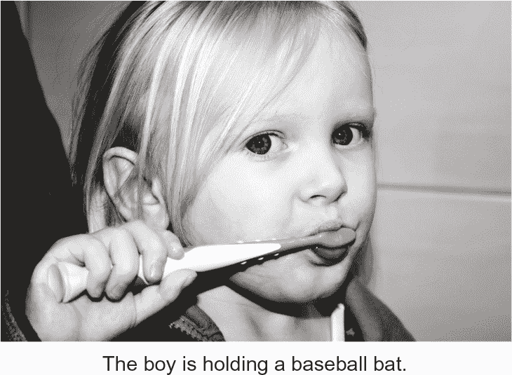

**图 14.1 基于深度学习的图像标题生成系统的失败**

特别是，这一点被*对抗样本*所突出显示，对抗样本是向深度学习网络提供的样本，旨在使模型误分类。你已经意识到，例如，可能在输入空间中进行梯度上升以生成最大化某些卷积网络滤波器激活的输入——这是第九章介绍的滤波器可视化技术的基础，以及第十二章中的 DeepDream 算法。同样，通过梯度上升，你可以微调图像以最大化给定类别的类别预测。通过在熊猫的图片上添加一个猿猴的梯度，我们可以让神经网络将熊猫分类为猿猴（见图 14.2）。这既证明了这些模型的脆弱性，也显示了它们的输入到输出映射与我们的人类感知之间的深刻差异。

简而言之，深度学习模型在人类意义上并不了解它们的输入。我们对图像、声音和语言的理解基于我们作为人类的感觉运动体验。机器学习模型无法获得这样的经验，因此无法以人类可理解的方式理解它们的输入。通过为大量训练示例进行注释并输入我们的模型，我们使它们学习到将数据映射到特定示例集上的人类概念的几何变换，但这种映射只是我们头脑中原始模型的简化草图 —— 这个模型是从我们作为感知机构的经验中发展而来的。就像镜中的模糊图像（参见图 14.3）。你创建的模型将采取任何可用的捷径来适应其训练数据。例如，图像模型往往更多地依赖于局部纹理，而不是对输入图像的整体理解 —— 对具有豹纹和沙发两种特征的数据集进行训练的模型很可能将豹纹沙发误分类为实际豹子。

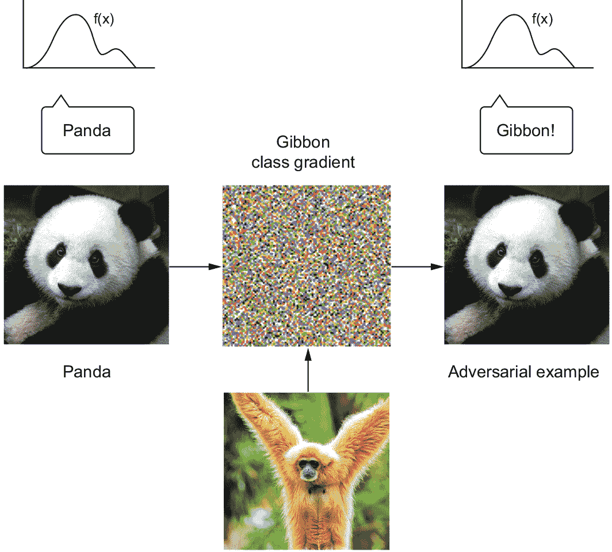

**图 14.2 对抗样本：图像中微不可见的变化可能颠覆模型对图像的分类。**

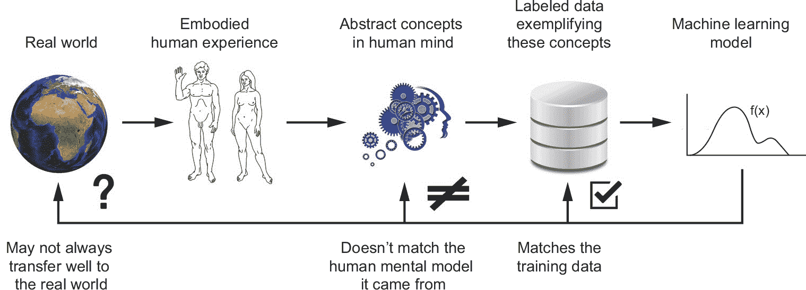

**图 14.3 当前机器学习模型：就像镜子中的模糊图像**

作为机器学习实践者，始终要意识到这一点，并且不要陷入这样的误解：神经网络理解自己所执行的任务——它们不理解，至少对我们来说没有意义。它们接受的训练是不同的，远比我们想要教给它们的任务狭窄：它们只是逐点地将训练输入映射到训练目标而已。当它们看到任何偏离其训练数据的东西时，它们就会以一种荒谬的方式崩溃。

### 14.2.2 自动机与智能代理

深度学习模型从输入到输出的直接几何变换与人类思维和学习方式存在根本差异。不仅仅是因为人类通过自身的经验学习，而不是被呈现给明确的训练示例。人脑与可微分参数化函数完全不同。

让我们稍微放大一点，并问：“智能的目的是什么？”它为什么首次出现？我们只能进行推测，但我们可以做出相当有根据的推测。我们可以从大脑开始看起——这个产生智能的器官。大脑是一种进化适应——一个通过数亿年的随机试错，受自然选择引导的机制，大大扩展了生物适应环境的能力。大脑最初出现在五亿多年前，作为一种*存储和执行行为程序*的方式。 “行为程序”只是使生物对其环境产生反应的一组指令：“如果发生这种情况，那么做那个。”它们将生物的感觉输入与其运动控制联系起来。起初，大脑将用于硬编码行为程序（作为神经连接模式），这将使生物对其感觉输入做出适当反应。这是昆虫大脑仍然工作的方式——蝇，蚂蚁，*秀丽隐杆线虫*（见图 14.4），等等。因为这些程序的原始“源代码”是 DNA，它将被解码为神经连接模式，进化突然能够在很大程度上无限制地*搜索行为空间*——这是一个重大的进化转变。

进化是程序员，而大脑是小心执行进化赋予它们的代码的计算机。由于神经连接是一种非常通用的计算基质，所有启用大脑的物种的感觉运动空间都突然开始经历戏剧性的扩展。眼睛，耳朵，下颚，四条腿，24 条腿——只要你有一个大脑，进化就会为你找到行为程序，使这些行为程序得到很好的利用。大脑可以处理你投入其中的任何模式——或模式的任何组合。

请注意，这些早期的大脑本质上并不是真正的智能。它们非常地是*自动机*：它们只会执行生物体 DNA 中硬编码的行为程序。它们只能被描述为智能，就像恒温器是“智能”一样。或者是列表排序程序。又或者……是经过训练的深度神经网络（人工类型）。这是一个重要的区别，让我们仔细看看它：自动机和实际智能代理之间有什么区别？

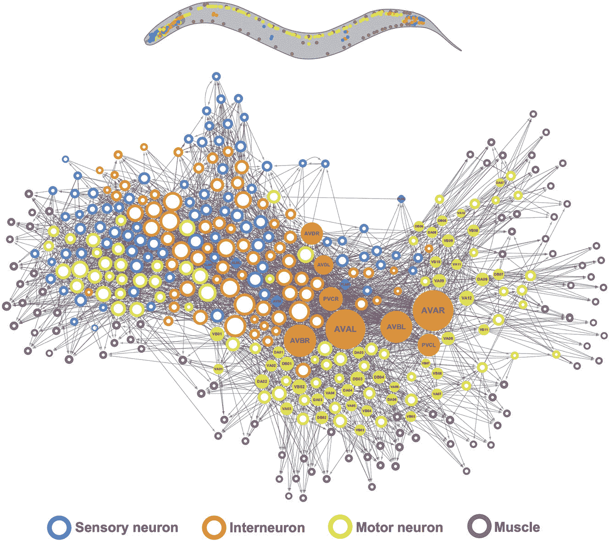

**图 14.4 *秀丽隐杆线虫*的大脑网络：由自然演化“编程”而成的行为自动机。由 Emma Towlson 创建的图像（来源：Yan 等人，“网络控制原则预测*秀丽隐杆线虫*连接组中的神经元功能”，*自然*，2017 年 10 月）。**

### 14.2.3 本地泛化 vs. 极端泛化

十七世纪法国哲学家和科学家勒内·笛卡尔于 1637 年写了一篇启发性的评论，完美地捕捉到了这种区别，远在人工智能崛起之前，事实上，远在第一台机械计算机出现之前（他的同事帕斯卡将在五年后创造出来）。笛卡尔告诉我们，关于自动机，

> *即使这样的机器可能在某些方面做得和我们一样好，甚至可能更好，但它们必然会在其他方面失败，这将显示它们不是通过理解而是仅仅通过其器官的排列来行动。*
> 
> 勒内·笛卡尔，《方法论》（1637 年）

智能就在这里。智能的特征在于*理解*，而理解则表现为*泛化*——处理可能出现的任何新情况的能力。你如何区分一个记住了过去三年考试题但对学科没有理解的学生，和一个真正理解了材料的学生？你给他们一个全新的问题。自动机是静态的，设计来在特定环境中完成特定的事情——“如果这样，那么那样”——而智能代理可以根据新的、意想不到的情况即时适应。当自动机暴露在与其“编程”不匹配的情况下时（无论我们是在谈论人类编写的程序，还是演化生成的程序，还是在训练数据集上拟合模型的隐式编程过程），它将失败。与此同时，像人类这样的智能代理将利用他们的理解找到前进的方法。

人类能够做的远不止将即时刺激映射到即时反应，就像深度神经网络或昆虫那样。我们保持着对当前情况、自己以及他人的复杂抽象模型，我们可以利用这些模型来预测不同的可能未来并进行长期规划。你可以合并已知的概念来代表你以前从未经历过的事物——比如想象如果你中了彩票会怎么做，或者想象如果你偷偷地用弹性橡胶制成的精确复制品替换了朋友的钥匙，她会有什么反应。这种处理新奇事物和假设情况的能力，将我们的思维模型空间扩展到远远超出我们可以直接经历的范围——利用*抽象*和*推理*——是人类认知的定义特征。我称之为*极端泛化*：利用少量数据甚至没有新数据就能适应新的、以前从未经历过的情况的能力。这种能力是人类和高级动物展示出的智能的关键。

这与自动机器人系统的做法形成了鲜明对比。一个非常刚性的自动机器人将不会有任何泛化能力——它将无法处理任何不是事先准确告知的情况。一个作为硬编码的 if-then-else 语句实现的哈希表或基本问答程序将属于这一类别。深度网络做得稍微好一些：它们可以成功地处理与其熟悉的输入略有偏差的输入，这正是使它们有用的地方。我们在第八章的猫狗模型可以对其之前未见过的猫或狗图片进行分类，只要它们与其训练的内容足够接近。然而，深度网络局限于我称之为*本地泛化*（见图 14.5）：深度网络执行的从输入到输出的映射在输入开始偏离网络在训练时所见的内容时很快就变得没有意义。深度网络只能对*已知未知*进行泛化——对模型开发期间预期到的并且在训练数据中广泛出现的变化因素，例如宠物图片的不同摄像机角度或光照条件。这是因为深度网络通过流形插值进行泛化（请记住第五章）：它们学习的流形需要捕获其输入空间的任何变化因素。这就是为什么基本数据增强对改善深度网络泛化很有帮助。与人类不同，这些模型在面对很少或没有可用数据的情况下没有任何即兴表演的能力（比如中彩票或被交给橡胶钥匙）只与过去情况有抽象共同点的情况。

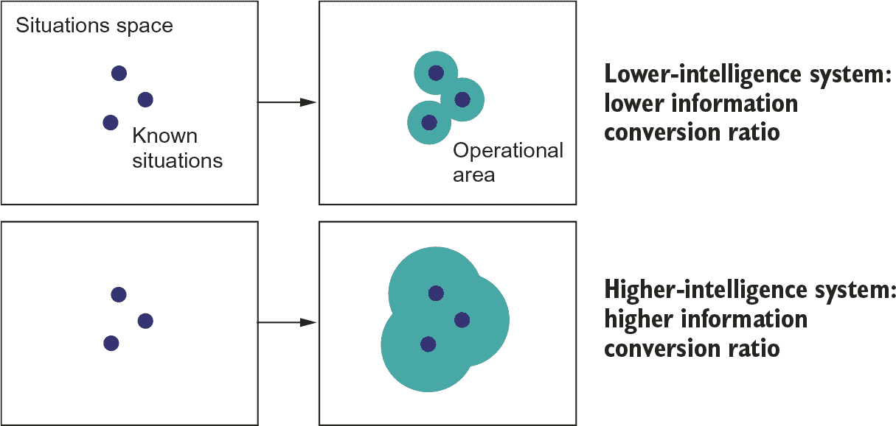

**图 14.5 本地泛化 vs. 极端泛化**

例如，考虑学习适当的发射参数以使火箭着陆月球的问题。如果你为此任务使用深度网络，并使用监督学习或强化学习对其进行训练，你将不得不向其提供成千上万甚至数百万次的发射试验：你需要让它暴露于*密集的采样*输入空间，以便学习从输入空间到输出空间的可靠映射。相比之下，作为人类，我们可以利用我们的抽象能力提出物理模型——火箭科学——并得出一个确切的解决方案，可以在一次或几次试验中将火箭着陆在月球上。同样，如果你开发了一个控制人体的深度网络，并且你希望它能够学会在城市中安全导航而不被汽车撞击，那么这个网络将不得不在各种情况下死亡成千上万次，直到它能够推断出汽车是危险的，并发展出适当的避让行为。放到一个新城市，这个网络将不得不重新学习大部分它所知道的东西。另一方面，人类能够学会安全行为，而不需要死亡一次——这再次归功于我们对新情况的抽象建模能力。

### 14.2.4 智能的目的

高度适应性智能代理和僵化自动机之间的区别使我们回到了大脑进化的范畴。为什么大脑——最初只是自然进化发展行为自动机的媒介——最终演化成了具有智能的器官？与每个重大的进化里程碑一样，它之所以发生，是因为自然选择的限制性促使它发生。

大脑负责行为生成。如果生物所面临的情境大部分是静态的并且可以事先知晓的，行为生成将是一个简单的问题：进化会通过随机试错找出正确的行为，并将其硬编码到生物的 DNA 中。这个大脑进化的第一阶段——大脑作为自动机——已经是最优的。然而，随着生物复杂性的增加（以及与之相伴的环境复杂性增加），动物所面临的情境变得更加动态和不可预测。你生活中的一天，仔细观察的话，与你过去经历的任何一天都不同，也与任何一个你的进化祖先经历的一天都不同。你必须能够不断面对未知和令人惊讶的情况。进化无法找到并硬编码成你今天早上醒来后成功应对你的一天所执行的行为序列的 DNA。它必须每天都根据实际情况生成行为。

作为一个优秀的行为生成引擎，大脑简单地适应了这一需求。它优化的是适应性和普遍性，而不仅仅是对一组固定情境的适应。这种转变可能在进化历史中多次发生，导致在非常遥远的进化分支上出现了高智能动物，比如猿类、章鱼、渡鸦等。智能是对复杂、动态生态系统所提出挑战的一种应对。

这就是智能的本质：它是利用手边的信息来高效地产生成功行为，应对不确定、不断变化的未来的能力。笛卡尔所谓的“理解”就是这种非凡能力的关键：开采过去经验的力量，开发可重用的模块化抽象，能够快速地重新调整来处理新情况和实现极端概括。

### 14.2.5 拓宽概括的谱系

作为一个粗糙的夸张，你可以将生物智能的进化历史总结为对*泛化程度*的缓慢攀升。它始于只能执行局部泛化的类似自动机的大脑。随着时间的推移，进化开始产生越来越广泛泛化的生物体，它们能够在越来越复杂和多变的环境中茁壮成长。最终，在过去几百万年中——在进化的时间尺度上算是瞬间—某些类人猿物种开始趋向于实现极端泛化的生物智能，引发了人类世的开始，并永远改变了地球生命的历史。

过去 70 年来人工智能的进步与这种进化有惊人的相似之处。早期的人工智能系统是纯自动机，例如上世纪 60 年代的 ELIZA 聊天程序，或者是一个 1970 年的 AI，能够通过自然语言命令操纵简单的物体。在 90 年代和 2000 年代，我们看到了能够进行局部泛化的机器学习系统的兴起，它们能够处理一定程度的不确定性和新奇性。在 2010 年代，深度学习进一步扩展了这些系统的局部泛化能力，使工程师能够利用更大的数据集和更具表现力的模型。

如今，我们可能正处于下一个进化步骤的前夕。人们对能够实现*广泛泛化*的系统越来越感兴趣，我将其定义为处理*未知未知*的能力，即在单一广泛任务领域内处理（包括系统未经训练处理和其创造者无法预料的情况），例如，一个能够安全处理你提出的任何情况的自动驾驶汽车，或者能够通过“智能测试”的家用机器人——进入一个随机的厨房并煮一杯咖啡。通过结合深度学习和精心制作的世界抽象模型，我们已经在朝着这些目标取得了可见的进展。

然而，目前，人工智能仍然局限于*认知自动化*：在“人工智能”中的“智能”标签是一个范畴错误。更准确地说，将我们的领域称为“人工认知”，而“认知自动化”和“人工智能”则是其两个几乎独立的子领域。在这个划分中，“人工智能”将是一个几乎一切都有待发现的新领域。

现在，我并不是要贬低深度学习的成就。认知自动化非常有用，深度学习模型能够仅通过暴露于数据而自动化任务的方式代表了一种特别强大的认知自动化形式，比明确编程要实用和多功能得多。做好这一点对于几乎每个行业都是一个改变游戏规则的举措。但它仍然远远落后于人类（或动物）智能。到目前为止，我们的模型只能执行局部泛化：它们通过对 X 到 Y 数据点的密集采样学习到的平滑几何变换，将空间 X 映射到空间 Y，而在空间 X 或 Y 内的任何破坏都会使得这种映射无效。它们只能泛化到与过去数据相似的新情况，而人类认知能够进行极端泛化，迅速适应根本新颖的情况并规划长期未来的情况。

## 14.3 迈向 AI 更大普适性的路线设定

为了消除我们讨论过的一些限制并创建能够与人类大脑竞争的 AI，我们需要摆脱简单的输入到输出映射，转向*推理*和*抽象*。在接下来的几节中，我们将看一下前进之路可能是什么样子的。

### 14.3.1 关于设定正确目标的重要性：捷径法则

生物智能是自然提出的一个问题的答案。同样，如果我们想要开发真正的人工智能，首先，我们需要问正确的问题。

在系统设计中经常出现的一个效应是*捷径法则*：如果你专注于优化一个成功度量标准，你会实现你的目标，但会牺牲系统中未涵盖你的成功度量标准的一切。你最终会采取通往目标的所有可用捷径。你的创造受到你给自己的激励的影响。

你经常在机器学习竞赛中看到这种情况。2009 年，Netflix 举办了一个挑战赛，承诺给予在电影推荐任务中取得最高分的团队 100 万美元的奖金。最终他们没有采用获胜团队创建的系统，因为它过于复杂且计算密集。获胜者只优化了预测准确性，也就是他们被激励要达到的目标，而牺牲了系统的其他所有理想特性：推断成本、可维护性和可解释性。Kaggle 竞赛中的大多数情况也适用于这一捷径法则：Kaggle 获胜者生成的模型很少能够在生产中使用。

在过去几十年中，快速的规则一直在人工智能中被广泛应用。在 20 世纪 70 年代，心理学家和计算机科学先驱艾伦·纽厄尔对他所在的领域在认知理论方面没有取得任何有意义的进展感到担忧，他提出了一个新的人工智能的宏伟目标：下棋。理论依据是在人类中，下棋似乎涉及——甚至可能需要——一些能力，比如感知、推理和分析、记忆、从书籍中学习等等。当然，如果我们能够构建一个下棋的机器，它也必须具备这些特征，对吗？

二十多年后，梦想成真了：1997 年，IBM 的深蓝超越了全球最佳棋手加里·卡斯帕罗夫。然而，研究人员随后不得不面对这样一个事实，即创造一个国际象棋冠军级人工智能并没有对他们对人类智能的理解有所帮助。深蓝的核心是阿尔法贝塔算法，并不是人脑的一个模型，而且不能推广到除了类似棋盘游戏之外的其他任务。事实证明，建立一个只能下国际象棋而不能构建一个人工智能大脑将比较容易，所以研究人员选择了这个捷径。

到目前为止，人工智能领域的驱动成功指标一直是解决特定的任务，从国际象棋到围棋，从 MNIST 分类到 ImageNet，从 Atari 街机游戏到《星际争霸》和《Dota 2》。因此，这个领域的历史被一系列“成功”所定义，我们在解决这些任务时发现没有任何智能特征。

如果这听起来有些令人惊讶，记住类人型智能不是以特定任务的技能为特征，而是能够适应新颖性，高效地掌握新技能和掌握之前从未见过的任务的能力。通过固定任务，你可以提供一个任意精确的任务描述，无论通过硬编码人类提供的知识，还是通过提供巨大量的数据。你可以让工程师通过添加数据或添加硬编码的知识来“购买”他们的 AI 更多的技能，而不需要增加 AI 的泛化能力（参见图 14.6）。如果你有几乎无限的训练数据，甚至一个非常简单的算法如最近邻搜索也能以超人的技能玩视频游戏。同样，如果你拥有几乎无限量的人工编写的 if-then-else 语句。然而，当你对游戏规则进行一次小的改变——这是一个人类可以立即适应的改变——非智能系统将需要重新训练或从头开始构建。

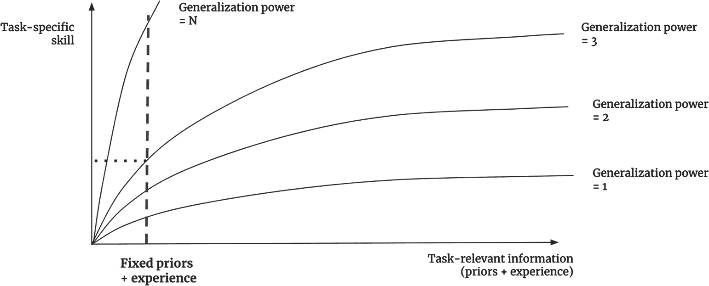

**图 14.6：一个低泛化系统可以在给定无限的任务特定信息的情况下取得任意技能水平的固定任务。**

简而言之，通过固定任务，你消除了处理不确定性和新奇性的需求，而因为智能的本质是处理不确定性和新奇性的能力，你实际上是在消除智能的需求。而且因为在特定任务上找到非智能解决方案总是比解决智能的一般问题更容易，所以你会 100%地采取这种捷径。人类可以利用其一般智能来获得任何新任务的技能，但反过来，从一系列特定任务技能到一般智能是没有路径的。

### 14.3.2 新目标

要使人工智能真正具有智能，并赋予其处理不可预测的变化和永远变化的现实世界的能力，我们首先需要摆脱追求*特定任务技能*的想法，而是开始针对通用化能力本身。我们需要新的进展指标，这些指标将帮助我们开发越来越智能的系统，指标将指向正确的方向，并给我们提供可操作的反馈信号。只要我们的目标设定为“创建一个解决任务 X 的模型”，那么捷径规则就会适用，我们最终会得到一个只能做 X 任务的模型。

在我看来，智能可以精确地量化为*效率比*：你可用于世界的*相关信息量*（可以是*过去经验*或先天*先验知识*）与你的*未来操作领域*之间的转化比率，即你能够产生适当行为的新颖情况集合（你可以将其视为你的*技能集*）。更智能的代理将能够使用更少的过去经验来处理更广泛的未来任务和情况。要测量这样的比率，你只需要固定系统可用的信息——其经验和先验知识——并在一组已知与系统接触到的情况或任务足够不同的参考情况或任务上测量其性能。试图最大化这一比率应该会引导你走向智能。关键是，为了避免作弊，你需要确保只在系统不是被编程或训练来处理的任务上测试系统——事实上，你需要一些*系统的创建者无法预料到的任务*。

在 2018 年和 2019 年，我开发了一个称为*抽象与推理语料库*（ARC）⁴的基准数据集，旨在捕捉这种智能的定义。ARC 旨在既能被机器理解，又能被人类理解，它看起来非常类似于人类智商测试，比如雷文氏递进矩阵。在测试时，您会看到一系列“任务”。每个任务都通过三或四个“示例”来解释，这些示例采用输入网格和相应的输出网格的形式（见图 14.7）。然后，您将被给出一个全新的输入网格，您将有三次机会在移动到下一个任务之前产生正确的输出网格。

与智商测试相比，ARC 有两个独特之处。首先，ARC 试图衡量泛化能力，只测试您从未见过的任务。这意味着 ARC *是一个您无法练习的游戏*，至少在理论上：您将被测试的任务将具有自己独特的逻辑，您必须即兴理解。您不能仅仅从过去任务中记忆特定策略。

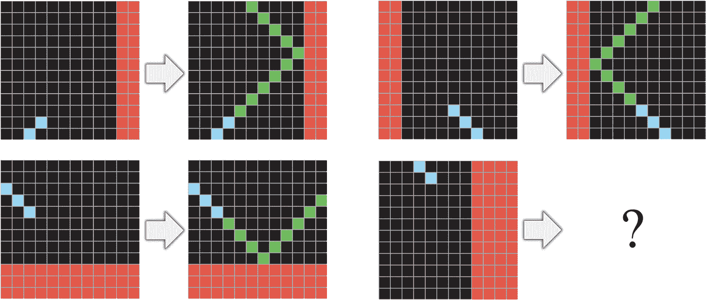

**图 14.7 一个 ARC 任务：任务的性质由几个输入输出对示例来演示。给定一个新输入，您必须构建相应的输出。**

此外，ARC 试图控制您带入测试的*先验知识*。您永远不会完全从零开始解决一个新问题——您会带入预先存在的技能和信息。ARC 假设所有的测试者都应该从一组称为“核心知识先验”的知识先验开始，这些知识先验代表了人类与生俱来的“知识系统”。与智商测试不同，ARC 任务永远不会涉及到已获得的知识，比如英语句子等。

毫不奇怪，基于深度学习的方法（包括在大量外部数据上训练的模型，如 GPT-3）完全无法解决 ARC 任务，因为这些任务是非插值的，因此不适合曲线拟合。与此同时，普通人没有任何问题在第一次尝试时解决这些任务，而且无需练习。当你看到这样的情况，即使是五岁的人类也能自然地执行一些现代人工智能技术似乎完全无法达到的事情时，这清楚地表明有趣的事情正在发生——我们漏掉了什么。

如何解决 ARC 需要什么？希望这个挑战会让您思考。这就是 ARC 的全部目的：给您一个不同种类的目标，希望能引导您朝一个新方向——希望是一个富有成效的方向。现在让我们快速看一下您想要回答这个呼唤时需要的关键要素。

## 实现智能：缺失的要素

到目前为止，你已经了解到智能远不止是深度学习所做的潜在流形插值。但那么，我们需要开始构建真正的智能吗？目前正在逃避我们的核心部分是什么？

### 14.4.1 智能作为对抽象类比的敏感性

智能是利用你的过去经验（和先天知识）来应对新的、意想不到的未来情况的能力。如果你将要面对的未来 *真的是新奇的*——与你以前见过的任何东西都没有共同基础——那么无论你有多聪明，你都无法对其做出反应。

智能起作用是因为没有什么是真正没有先例的。当我们遇到新事物时，我们能够通过将其与过去的经验进行类比来理解它，通过用我们随时间收集的抽象概念来表达它。17 世纪的人第一次看到喷气飞机可能会描述它为一只大而吵闹的不拍动翅膀的金属鸟。汽车？那是一辆没有马的马车。如果你试图向小学生教授物理学，你可以解释电是如何像管道中的水，或者时空如何像橡皮片被重物扭曲。

除了这种明确的、明显的类比，我们每秒钟都在不断地进行更小的、隐含的类比。类比是我们生活的导航。去一个新的超市？你会通过将其与你去过的类似店铺联系起来找到路。与陌生人交谈？他们会让你想起你以前遇到过的几个人。甚至看似随机的模式，如云的形状，立即在我们心中唤起生动的形象——一只大象，一艘船，一条鱼。

这些类比不仅仅存在于我们的头脑中：物理现实本身充满了同构。电磁力类似于重力。动物们在结构上彼此相似，因为有着共同的起源。硅晶体类似于冰晶体。等等。

我称之为 *万花筒假设*：我们对世界的经验似乎充满了难以置信的复杂性和永无止境的新奇，但这片复杂的海洋中的一切都与其他一切相似。描述你所生活的宇宙所需的 *独特意义的原子* 数量相对较少，你周围的一切都是这些原子的重组，几颗种子，无尽的变化——就像在万花筒内发生的一样，少数玻璃珠被一套镜子反射，产生丰富、似乎不断变化的图案（参见 图 14.8）。

智力的泛化能力——智能——是利用你的经验来识别这些意义原子，它们似乎可以在许多不同的情况下重复使用的能力。一旦提取出来，它们被称为*抽象*。每当你遇到一个新情况，你都会通过你积累的抽象集合来理解它。你如何识别可重用的意义原子？只需注意到两个事物何时相似——通过注意类比。如果某事重复两次，那么两个实例必定有一个单一的起源，就像在万花筒中一样。抽象是智力的引擎，制作类比是产生抽象的引擎。

简而言之，智能实际上就是对抽象类比的敏感性，事实上就是这样。如果你对类比的敏感性很高，你将从少量经验中提取出强大的抽象，并能够使用这些抽象来在未来的经验空间中最大限度地操作。你将能够将过去的经验最大程度地转化为处理未来新奇事物的能力。

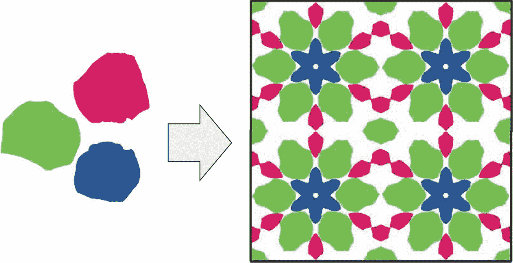

**图 14.8 万花筒仅用几颗彩色玻璃珠产生丰富（但重复）的图案。**

### 14.4.2 抽象的两极

如果智能是对类比的敏感性，那么开发人工智能应该从阐明制作类比的逐步算法开始。制作类比始于*将事物相互比较*。关键是，有*两种不同的方式*比较事物，从中产生两种不同类型的抽象，两种思维模式，每一种都更适合不同类型的问题。这两极抽象共同构成了我们所有思想的基础。

将事物联系起来的第一种方式是*相似性比较*，这产生了*以价值为中心的类比*。第二种方式是*确切的结构匹配*，这产生了*以程序为中心的类比*（或结构为中心的类比）。在这两种情况下，你从事物的*实例*开始，并将相关实例合并在一起，以产生一个捕捉底层实例共同元素的*抽象*。变化的是你如何确定两个实例之间的关系，以及如何将实例合并成抽象。让我们仔细看看每种类型。

### 以价值为中心的类比

假设你在后院看到了许多不同种类的甲壳虫。你会注意到它们之间的相似之处。有些会彼此更相似，而有些则不太相似：相似性的概念在隐含地定义了一个平滑连续的*距离函数*，它定义了一个潜在的流形，你的实例就存在其中。一旦你看过足够多的甲壳虫，你就可以开始将更相似的实例聚集在一起，并将它们合并成一组*原型*，这些原型捕捉了每个聚类的共享视觉特征（参见图 14.9）。这个原型是抽象的：它看起来不像你见过的任何具体实例，尽管它编码了所有这些实例都共有的属性。当你遇到一个新的甲壳虫时，你不需要将它与之前见过的每一个甲壳虫进行比较，才知道该怎么做。你可以简单地将它与你手里的几个原型进行比较，以找到最接近的原型——甲壳虫的*类别*——并用它来进行有用的预测：这只甲壳虫可能会咬你吗？它会吃你的苹果吗？

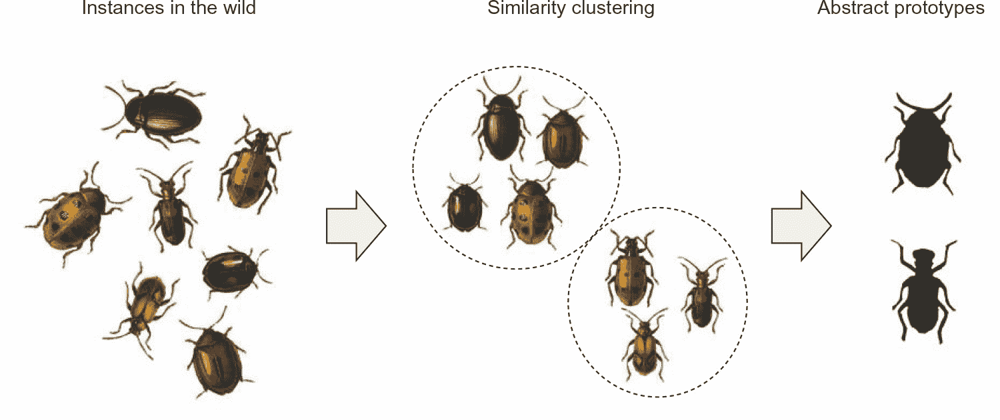

**图 14.9 价值为中心的类比通过连续的相似性概念将实例关联起来，以获得抽象的原型。**

这听起来耳熟能详吗？这基本上就是无监督机器学习（例如*K*均值聚类算法）所做的事情的描述。总的来说，现代机器学习，无论是有监督还是无监督的，都通过学习描述由原型编码的实例空间的潜在流形来工作。（还记得你在第九章中可视化的卷积网络特征吗？它们就是视觉原型。）价值为中心的类比是使深度学习模型能够执行局部概括的类比制作方式。

这也是你自己许多认知能力所依赖的。作为人类，你一直在进行价值为中心的类比。这是潜在的抽象的类型，它是*模式识别*、*感知*和*直觉*的基础。如果你可以在不经思考的情况下完成一项任务，那么你就是在大量依赖价值为中心的类比。如果你正在看电影，并且开始下意识地将不同的角色分类为“类型”，那就是价值为中心的抽象。

### 程序为中心的类比

至关重要的是，认知不仅仅是价值为中心的类比所能实现的那种即时的、近似的、直觉的分类。还有另一种生成抽象的机制，即较慢、精确、审慎的程序为中心（或结构为中心）类比。

在软件工程中，你经常编写不同的函数或类，它们看起来很相似。当你注意到这些冗余时，你开始问自己，“是否存在一个更抽象的函数，可以执行相同的任务，可以重复使用两次？是否存在一个抽象基类，可以由我的两个类继承？”这里定义的抽象化与程序为中心的类比相对应。你并不是试图通过类和函数之间有多相似来比较它们，就像你通过一个隐含的距离函数来比较两个人的脸一样。相反，你感兴趣的是它们是否有*完全相同结构的部分*。你正在寻找所谓的*子图同构*（见图 14.10）：程序可以表示为操作符的图，你正在试图找到跨不同程序完全共享的子图（程序子集）。

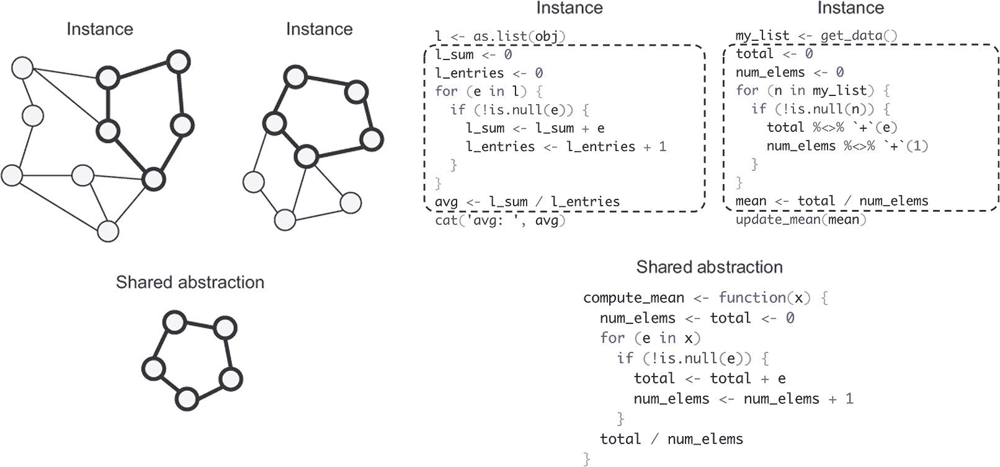

**图 14.10 程序为中心的类比识别和隔离不同实例之间的同构子结构。**

这种通过在不同的离散结构内进行精确结构匹配进行类比的方法，不是专业领域如计算机科学或数学所特有的——你经常在不知不觉中使用它。它是推理、规划和*严谨性*（与直觉相反）的一种基础。每当你思考由离散关系网络连接的对象时（而不是连续相似度函数），你正在利用程序为中心的类比。

### 认知是这两种抽象的结合

让我们并排比较这两种抽象的两极（见表 14.1）。

表 14.1 抽象的两极

| 以价值为中心的抽象 | 以程序为中心的抽象 |
| --- | --- |
| 通过距离关系相互关联 | 通过精确结构匹配相互关联 |
| 连续，以几何为基础 | 离散，以拓扑学为基础 |
| 通过将实例“平均”成“原型”来产生抽象 | 通过隔离异构子结构跨实例来产生抽象 |
| 基础感知和直觉 | 基础推理和规划 |
| 即时、模糊、近似 | 缓慢、精确、严谨 |
| 需要大量经验才能产生可靠结果 | 经验高效；可以在仅有两个实例的情况下操作 |

### 14.4.3 抽象化的两极

我们所做的一切，我们所思考的一切，都是这两种抽象类型的结合。你很难找到仅涉及其中一种的任务。即使是看似“纯粹感知”的任务，比如在场景中识别物体，也涉及对你所看到的物体之间关系的某种程度上的隐含推理。而即使是看似“纯推理”的任务，比如找到一个数学定理的证明，也涉及一定程度的直觉。当数学家将他们的笔放在纸上时，他们已经对他们要走的方向有了模糊的想法。他们采取的离散推理步骤是由高级直觉引导的。

这两个极端是互补的，它们的交织使得极端的泛化成为可能。没有一个思维可以完全没有它们。

### 14.4.4 这个问题的缺失之处

从这一点上，你应该开始看到现代深度学习中缺失的东西：它非常擅长编码以价值为中心的抽象，但基本上没有生成以程序为中心的抽象的能力。像人类一样的智能是这两种类型的紧密交织，所以我们实际上正在失去我们需要的一半-可以说是最重要的一半。

现在，这里有一个注意事项。到目前为止，我按照完全不同的方式呈现了每种抽象类型，甚至可以说是相反的方式。然而，在实践中，它们更像是一个连续体谱：在某种程度上，你可以通过嵌入离散程序到连续曲面中进行推理，就像你可以通过足够多的系数适应多项式函数来适应离散点集一样。反过来，你也可以使用离散程序来模拟连续距离函数-毕竟，当你在计算机上进行线性代数运算时，你完全是通过作用于一和零的离散程序来处理连续空间的。

然而，显然有些类型的问题更适合其中一个。例如，试着训练一个深度学习模型对一个由五个数字组成的列表进行排序。通过正确的架构，这并不是不可能，但这是一个令人沮丧的练习。你将需要大量的训练数据来做到这一点，即使如此，当模型面对新的数字时，它仍然会偶尔出错。如果你想开始对由 10 个数字组成的列表进行排序，你将需要在更多数据上完全重新训练模型。与此同时，在 R 中编写一个排序算法只需要几行代码，而且一经验证，在更多的示例上工作后，结果程序将可以成功地处理任何大小的列表。这是相当强大的泛化能力：从几个示例和测试示例到一个可以成功处理任何列表的程序。

相反，感知问题对于离散推理过程来说是非常糟糕的。尝试编写一个纯粹的 R 程序来分类 MNIST 数字，而不使用任何机器学习技术：你会遇到麻烦。你会发现自己辛苦地编写能够检测数字中闭合环数量、数字质心坐标等函数。经过数千行代码，你可能会获得……90% 的测试准确率。在这种情况下，拟合参数模型要简单得多；它可以更好地利用可用的大量数据，并且得到更加稳健的结果。如果你有大量数据，并且面临着一个适用于流形假设的问题，请选择深度学习。

出于这个原因，我们不太可能看到一种方法的崛起，将推理问题简化为流形插值，或将感知问题简化为离散推理。人工智能的前进方向是开发一个统一的框架，结合 *两种* 类型的抽象类比生成。让我们看看这可能是什么样子。

## 14.5 深度学习的未来

考虑到我们对深度网络的工作原理、它们的限制以及它们目前缺少的东西的了解，我们能否预测中期事物的发展方向呢？以下是一些纯粹个人的想法。请注意，我没有水晶球，所以我预期的许多事情可能无法变为现实。我分享这些预测，不是因为我希望它们在未来被证明完全正确，而是因为它们在现在是有趣的和可行的。

从高层次来看，这些是我认为有前景的主要方向：

+   *更接近通用计算程序的模型*，构建在比当前的可微分层更丰富的基本单元之上。这是我们将达到推理和抽象的方式，而目前模型的基本弱点是缺乏这些。

+   *深度学习与程序空间上的离散搜索的融合*，前者提供感知和直觉能力，后者提供推理和规划能力。

+   *更大规模、系统化地重复使用先前学习的特征和架构*，比如使用可重用和模块化的程序子例程的元学习系统。

另外，请注意，这些考虑并不特定于到目前为止一直是深度学习的主要内容的监督学习类型——相反，它们适用于任何形式的机器学习，包括无监督、自监督和强化学习。你的标签来自何处或你的训练循环是什么样的并不是根本重要的；这些不同分支的机器学习是相同构建的不同方面。让我们深入探讨。

### 14.5.1 模型作为程序

正如前一节所指出的，我们可以期待的机器学习领域的一个必要的变革性发展是远离仅执行*模式识别*且只能实现*局部泛化*的模型，转向能够抽象和推理并能实现*极端泛化*的模型。当前能够进行基本形式推理的 AI 程序都是由人类程序员硬编码的：例如，依赖于搜索算法、图形操作和形式逻辑的软件。

这可能即将改变，多亏了*程序合成*——这是一个今天非常小众的领域，但我预计在未来几十年将大获成功。程序合成包括通过使用搜索算法（可能是遗传搜索，如*遗传编程*）自动生成简单程序来探索可能程序的大空间（见图 14.11）。当找到一个符合所需规格的程序时，搜索就会停止，通常以一组输入输出对提供。这非常类似于机器学习：给定作为输入输出对提供的训练数据，我们找到一个将输入与输出匹配并能推广到新输入的程序。不同之处在于，我们不是学习硬编码程序中的参数值（神经网络），而是通过离散搜索过程生成源代码（见表 14.2）。

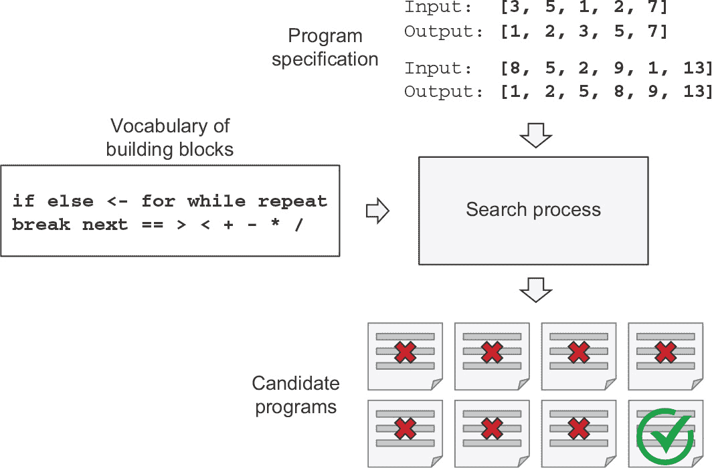

**图 14.11 程序合成的示意图：给定一个程序规范和一组构建块，一个搜索过程将构建块组装成候选程序，然后将其与规范进行测试。搜索将继续，直到找到一个有效的程序。**

表 14.2 机器学习与程序合成

| 机器学习 | 程序合成 |
| --- | --- |
| 模型：可微分参数函数 | 模型：来自编程语言的操作符图 |
| 引擎：梯度下降 | 引擎：离散搜索（例如遗传搜索） |
| 需要大量数据才能产生可靠结果 | 数据高效；可以使用几个训练样本 |

### 14.5.2 机器学习与程序合成

程序合成是我们将如何向我们的人工智能系统添加以程序为中心的抽象能力。这是缺失的拼图。我之前提到深度学习技术在以推理为重点的 ARC 上完全无法使用。与此同时，非常简陋的程序合成方法已经在这一基准上产生了非常有前途的结果。

### 14.5.3 将深度学习与程序合成融合在一起

当然，深度学习并不会消失。程序合成不是它的替代品；它是它的补充。这是迄今为止缺失的我们人工大脑的半球。我们将结合使用这两者。这将以两种主要方式进行：

1.  **1** 开发既包含深度学习模块又包含离散算法模块的系统

1.  **2** 利用深度学习使程序搜索过程本身更加高效

让我们逐一审查这些可能的途径。

### 将深度学习模块和算法模块集成到混合系统中

如今，最强大的人工智能系统是混合型的：它们利用了深度学习模型和手工制作的符号操作程序。例如，在 DeepMind 的 AlphaGo 中，展示出的大部分智能是由人类程序员设计和硬编码的（例如蒙特卡洛树搜索）。从数据中学习只发生在专门的子模块中（价值网络和策略网络）。再比如自动驾驶汽车：自动驾驶汽车能够处理大量情况，因为它维护着周围世界的模型——一个字面上的三维模型——充满了人类工程师硬编码的假设。这个模型通过深度学习感知模块不断更新，将其与汽车周围的环境接口连接起来。

对于这两种系统——AlphaGo 和自动驾驶汽车——人类创建的离散程序和学习的连续模型的结合是解锁一种性能水平的关键，这种性能水平在单独使用任一方法时都是不可能的，例如端到端深度神经网络或没有机器学习元素的软件片段。到目前为止，这种混合系统的离散算法元素是由人类工程师费力地硬编码的。但在未来，这些系统可能会完全学习，没有人类参与。

这会是什么样子呢？考虑一种众所周知的网络类型：RNNs。重要的是要注意，RNNs 比前馈网络具有稍少的限制。这是因为 RNNs 不仅仅是几何转换：它们是几何转换*在*for*循环内*重复应用的。时间上的 for 循环本身由人类开发人员硬编码：这是网络的内置假设。当然，RNNs 在它们可以表示的东西上仍然极其有限，主要是因为它们执行的每一步都是可微的几何转换，并且它们通过连续几何空间中的点（状态向量）在步骤之间携带信息。现在想象一下，一个神经网络以类似的方式通过编程基元增强，但是这个网络包括了一大堆的编程基元，模型可以自由操纵以扩展其处理功能，例如 if 分支、while 语句、变量创建、用于长期存储的磁盘存储、排序运算符和高级数据结构（如列表、图和哈希表）。这样一个网络可以表示的程序空间将远远超过目前深度学习模型可以表示的内容，其中一些程序可以达到更高的泛化能力。重要的是，这样的程序不会端对端地可微分，尽管特定的模块将保持可微分，因此需要通过离散程序搜索和梯度下降的组合来生成。

我们将摆脱一方面是硬编码的算法智能（手工制作的软件），另一方面是学习到的几何智能（深度学习）。相反，我们将拥有一种混合形式的正式算法模块，这些模块提供推理和抽象能力，并且提供非正式直觉和模式识别能力的几何模块（参见图 14.12）。整个系统将在很少或没有人类参与的情况下学习。这应该大大扩展了可以用机器学习解决的问题范围——在给定适当的训练数据的情况下，我们可以自动生成的程序空间。像 AlphaGo 这样的系统——甚至是 RNNs——可以被看作是这种混合算法-几何模型的史前祖先。

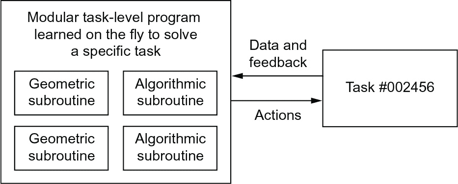

**图 14.12 依赖于几何基元（模式识别、直觉）和算法基元（推理、搜索、记忆）的学习程序**

### 使用深度学习指导程序搜索

今天，程序合成面临着一个主要障碍：它的效率极低。夸张地说，程序合成通过尝试搜索空间中的每个可能的程序，直到找到一个与提供的规范匹配的程序来工作。随着程序规范的复杂性增加，或者随着用于编写程序的原语词汇的扩展，程序搜索过程会遇到所谓的*组合爆炸*，即要考虑的可能程序集增长得非常快——实际上远远快于指数增长。因此，今天，程序合成只能用于生成非常短的程序。你不会很快为你的计算机生成一个新的操作系统。

要取得进展，我们需要通过使程序合成更接近人类编写软件的方式来使程序合成变得高效。当你打开编辑器编写脚本时，你并不会考虑你可能潜在地编写的每个可能的程序。你只考虑了几种可能的方法：你可以利用你对问题的理解和过去的经验来大幅缩减可能要考虑的选项空间。

深度学习可以帮助程序合成实现同样的目标：尽管我们想生成的每个具体程序可能都是一种根本上离散的对象，执行非插值数据操作，但迄今的证据表明*所有有用程序的空间*可能看起来很像一个连续的流形。这意味着，一个经过数百万次成功程序生成情景训练的深度学习模型可能会开始对*程序空间中的路径*发展出坚实的*直觉*，以便搜索过程从规范到相应程序的过程中走出一条路线——就像软件工程师可能对他们即将编写的脚本的整体架构，以及在达到目标时应该使用的中间函数和类有直觉一样。

记住，人类的推理受到价值中心的抽象的重大指导，即模式识别和直觉。程序合成也应该如此。我预计通过学习启发程序搜索的一般方法将在未来 10 到 20 年内受到越来越多的研究关注。

### 14.5.4 终身学习和模块化子程序重用

如果模型变得更加复杂，并建立在更丰富的算法原语之上，这种增加的复杂性将需要更高的任务重用，而不是每次有新任务或新数据集时都从头开始训练一个新模型。许多数据集不包含足够的信息，让我们能够从头开发一个新的复杂模型，并且使用先前遇到的数据集的信息是必要的（就像你不会每次打开一本新书都从头学习英语一样——那是不可能的）。在每个新任务上从头开始训练模型也是低效的，因为当前任务与先前遇到的任务之间存在很大的重叠。

近年来已经多次做出了一个引人注目的观察：将*相同*模型训练以同时执行几个松散相关的任务会导致在每个任务上都*更好*的模型。例如，将同一神经机器翻译模型训练为执行英语到德语翻译和法语到意大利语翻译将产生一个在每种语言对上都更好的模型。类似地，联合训练图像分类模型和图像分割模型，共享相同的卷积基，会产生在两个任务上都更好的模型。这是相当直观的：看似不相关任务之间总是存在*一些*信息重叠，联合模型能够获取关于每个单独任务的更多信息。

当涉及跨任务重复使用模型时，我们目前使用预训练权重来执行常见功能的模型，例如视觉特征提取。你在第九章中看到了这一过程。未来，我期望这一概括性版本将变得司空见惯：我们将不仅使用先前学习到的特征（子模型权重），还将使用模型架构和训练程序。随着模型越来越像程序，我们将开始重用像人类编程语言中的函数和类那样的*程序子例程*。

想象一下今天的软件开发过程：一旦工程师解决了一个特定问题（比如 HTTP 查询），他们将其打包成一个抽象的、可重用的库。未来面临类似问题的工程师将能够搜索现有的包，下载一个，并在自己的项目中使用它。同样地，未来，元学习系统将能够通过筛选全球高级可重用块的库来组装新的程序。当系统发现自己为几个不同任务开发类似的程序子例程时，它可以想出一个*抽象*的、可重用的子例程，并将其存储在全球库中（参见 图 14.13）。这些子例程可以是几何的（具有预训练表示的深度学习模块）或算法的（与当代软件工程师操作的库更接近）。

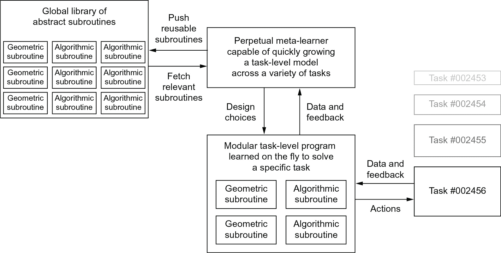

**图 14.13 一个元学习者能够快速开发使用可重复使用的基本部件（既有算法的又有几何的）的任务特定模型，从而实现极端泛化**

### 14.5.5 长期愿景

简而言之，这是我对机器学习的长期愿景：

+   模型将更像程序，并且具有远远超出我们当前处理的连续几何变换的输入数据的能力。这些程序可能会更接近于人类对周围环境和自身的抽象心理模型，并且由于其丰富的算法性质，它们将能够进行更强的泛化。

+   特别是，模型将结合*算法模块*和*几何模块*，提供形式推理、搜索和抽象能力与提供非正式直觉和模式识别能力。这将实现价值中心和程序中心抽象的融合。AlphaGo 或自动驾驶汽车（这些系统需要大量手动软件工程和人为设计决策）提供了这样一种符号和几何人工智能融合的早期示例。

+   这样的模型将自动*增长*而不是由人类工程师硬编码，使用全球可重复使用子程序库中存储的模块化部件——一个通过学习上千个先前任务和数据集的高性能模型进化而来的库。随着元学习系统识别出频繁的问题解决模式，它们将被转换为可重复使用的子程序——就像软件工程中的函数和类一样——并添加到全球库中。

+   搜索潜在子程序组合以生成新模型的过程将是一个离散搜索过程（程序合成），但它将受到由深度学习提供的一种*程序空间直觉*的严格指导。

+   这个全局子程序库和相关的模型增长系统将能够实现某种形式的人类*极端泛化*：在给定新任务或情境的情况下，该系统将能够使用极少的数据组装一个适合任务的新工作模型，这要归功于良好泛化的丰富程序化原语以及对类似任务的广泛经验。同样，如果人类有很多先前游戏的经验，他们可以快速学会玩一个复杂的新视频游戏，因为从这些先前经验中派生出来的模型是抽象的和程序化的，而不是刺激和动作之间的基本映射。

+   因此，这种不断学习的模型增长系统可以被解释为一种*人工通用智能*（AGI）。但不要期望会发生任何奇异论者的机器人启示录：那纯粹是幻想，源自对智能和技术的长期深刻误解。

## 14.6 在快速发展的领域保持最新

最后，我想给您一些关于如何在翻阅本书最后一页后继续学习和更新您的知识和技能的指引。现代深度学习领域，就我们今天所知，只有几年的历史，尽管其漫长而缓慢的前史可追溯几十年。自 2013 年以来，随着资金资源和研究人员数量的指数增长，整个领域现在正以疯狂的速度发展。您在本书中学到的内容不会永远保持相关性，并且并非您未来职业生涯所需的全部。

幸运的是，有大量免费在线资源可供您使用，以保持最新并拓展视野。以下是一些。

### 使用 Kaggle 在真实世界问题上进行练习

获得实际经验的有效方法是尝试在 Kaggle（[`kaggle.com`](https://www.kaggle.com)）上进行机器学习比赛。学习的唯一真实方法是通过实践和实际编码——这是本书的理念，而 Kaggle 比赛是这一理念的自然延伸。在 Kaggle 上，您将找到一系列不断更新的数据科学竞赛，其中许多涉及深度学习，由一些公司准备，这些公司希望获得一些最具挑战性的机器学习问题的新解决方案。为排名靠前的参赛者提供相当可观的奖金。

大多数比赛使用 XGBoost 库（用于浅层机器学习）或 Keras（用于深度学习）获胜，所以您将会完全适应！通过参加一些比赛，也许作为团队的一部分，您将更加熟悉本书中描述的一些高级最佳实践的实际方面，特别是超参数调整，避免验证集过拟合和模型集成。

### 阅读 arXiv 上的最新发展

与其他一些科学领域相比，深度学习研究完全是公开进行的。论文一经完成就会公开并免费提供访问，而许多相关软件都是开源的。arXiv（[`arxiv.org`](https://www.arxiv.org)）——发音为“archive”（X 代表希腊字母 *chi*）——是一个开放获取的物理、数学和计算机科学研究论文的预印本服务器。它已成为了解机器学习和深度学习最前沿的事实标准。绝大多数深度学习研究人员在完成论文后不久就会将其上传到 arXiv。这使他们能够立即宣布特定的发现，而不必等待会议接受（这需要数月时间），考虑到研究的快速节奏和领域中的激烈竞争，这是必要的。它还使得领域能够迅速发展：所有新发现都立即对所有人可见，并可以进行进一步的建立。

一个重要的缺点是，每天在 arXiv 上发布的论文数量庞大，甚至无法全部浏览，而且它们没有经过同行评议，这使得难以确定哪些是重要且高质量的。要在噪音中找到信号是具有挑战性的，并且越来越困难。但是一些工具可以帮助您：特别是，您可以使用 Google 学术 ([`scholar.google.com`](https://www.scholar.google.com)) 来追踪您喜欢的作者发表的论文。

### 14.6.3 探索 Keras 生态系统

截至 2021 年末，Keras 拥有超过一百万用户，并且仍在增长，拥有大量教程、指南和相关开源项目的生态系统：

+   您在 R 中使用 Keras 的主要参考资料是在线文档，网址为 [`keras.rstudio.com`](https://www.keras.rstudio.com) 和 [`tensorflow.rstudio.com`](https://www.tensorflow.rstudio.com)。特别是，在 [`tensorflow.rstudio.com/guides`](http://www.tensorflow.rstudio.com/guides) 可找到广泛的开发者指南，在 [`tensorflow.rstudio.com/`](http://www.tensorflow.rstudio.com/) examples 可找到数十个高质量的 Keras 代码示例，还有许多教程在 [`tensorflow.rstudio.com/tutorials`](http://www.tensorflow.rstudio.com/tutorials)。务必查阅！

+   不要犹豫，还可以参考 Keras 和 Tensor-Flow 的 Python 文档，网址分别为 [`www.tensorflow.org/api_docs/python/tf`](https://www.tensorflow.org/api_docs/python/tf) 和 [`keras.io/`](https://www.keras.io/)，即使您不懂 Python 也可以。几乎所有内容您都能阅读、理解并应用于 R 界面，而无需任何 Python 知识。（如果您遇到一些令人困惑的 Python 语法，请务必参考附录。）

+   Keras 和 Tensorflow 的 R 源代码可在 [`github.com/rstudio/keras`](https://www.github.com/rstudio/keras) 和 [`github.com/rstudio/tensorflow`](https://www.github.com/rstudio/tensorflow) 找到。Python 和 C++ 源代码可在 [`github.com/keras-team/keras`](https://www.github.com/keras-team/keras) 和 [`github.com/tensorflow/tensorflow`](https://www.github.com/tensorflow/tensorflow) 获取。所有源代码均为开源。

+   您可以在一些地方寻求帮助并加入深度学习讨论：

    +   Rstudio 社区的机器学习部分：[`community.rstudio.com/c/ml/15`](https://www.community.rstudio.com/c/ml/15)

    +   Stack overflow：[`stackoverflow.com`](https://www.stackoverflow.com)（确保标记您的问题同时带有 R 和 Keras 标签。）

    +   (Python) Keras 邮件列表：keras-users@googlegroups.com。

    +   您可以在 Twitter 上关注我（弗朗索瓦）：@fchollet。

## 14.7 结语

这就是*《R 深度学习，第二版》*的结尾。希望你对机器学习、深度学习、Keras，甚至通常的认知学到了一些东西。学习是一生的旅程，特别是在人工智能领域，我们手中的未知远远超过确定性。所以请继续学习、质疑和研究。永远不要停止！因为即使在取得了迄今为止的进步，人工智能中的大部分基本问题仍然没有答案。许多问题甚至还没有得到适当的提出。

1.  ¹ 理查德·费曼，采访，"另一种视角的世界"，约克郡电视台，1972 年。

1.  ² 特里·维诺格拉德，“Procedures as a Representation for Data in a Computer Program for Understanding Natural Language”（1971 年）。

1.  ³ 《Fast Company》，"沃兹尼亚克：计算机能泡杯咖啡吗？"（2010 年 3 月），[`mng.bz/pJMP`](http://mng.bz/pJMP)。

1.  ⁴ 弗朗索瓦·肖莱，"关于智能的衡量"（2019 年），[`arxiv.org/abs/1911.01547`](https://arxiv.org/abs/1911.01547)。
