# 第二章：基础知识

在第一章中，我描述了理解深度学习的主要概念构建块：嵌套、连续、可微函数。我展示了如何将这些函数表示为计算图，图中的每个节点代表一个简单的函数。特别是，我演示了这种表示如何轻松地计算嵌套函数的输出相对于其输入的导数：我们只需对所有组成函数取导数，将这些导数在这些函数接收到的输入处进行评估，然后将所有结果相乘；这将导致嵌套函数的正确导数，因为链式法则。我用一些简单的例子说明了这实际上是有效的，这些函数以 NumPy 的`ndarray`作为输入，并产生`ndarray`作为输出。

我展示了即使在函数接受多个`ndarray`作为输入并通过*矩阵乘法*操作将它们组合在一起时，计算导数的方法仍然有效，这与我们看到的其他操作不同，矩阵乘法操作会改变其输入的形状。具体来说，如果这个操作的一个输入——称为输入*X*——是一个 B × N 的`ndarray`，另一个输入到这个操作的*W*是一个 N × M 的`ndarray`，那么它的输出*P*是一个 B × M 的`ndarray`。虽然这种操作的导数不太清楚，但我展示了当矩阵乘法*ν*(*X, W*)被包含为嵌套函数中的一个“组成操作”时，我们仍然可以使用一个简单的表达式*代替*它的导数来计算其输入的导数：具体来说，<math><mrow><mfrac><mrow><mi>∂</mi><mi>ν</mi></mrow> <mrow><mi>∂</mi><mi>u</mi></mrow></mfrac> <mrow><mo>(</mo> <mi>W</mi> <mo>)</mo></mrow></mrow></math>的作用可以由*X*^(*T*)来填充，<math><mrow><mfrac><mrow><mi>∂</mi><mi>ν</mi></mrow> <mrow><mi>∂</mi><mi>u</mi></mrow></mfrac> <mrow><mo>(</mo> <mi>X</mi> <mo>)</mo></mrow></mrow></math>的作用可以由*W*^(*T*)来扮演。

在本章中，我们将开始将这些概念转化为现实世界的应用，具体来说，我们将：

1.  用这些基本组件来表达线性回归

1.  展示我们在第一章中所做的关于导数的推理使我们能够训练这个线性回归模型

1.  将这个模型（仍然使用我们的基本组件）扩展到一个单层神经网络

然后，在第三章中，使用这些相同的基本组件构建深度学习模型将变得简单。

在我们深入研究所有这些之前，让我们先概述一下*监督学习*，这是我们将专注于的机器学习的子集，我们将看到如何使用神经网络来解决问题。

# 监督学习概述

在高层次上，机器学习可以被描述为构建能够揭示或“学习”数据中的*关系*的算法；监督学习可以被描述为机器学习的子集，专注于找到已经被测量的数据特征之间的关系。¹

在本章中，我们将处理一个在现实世界中可能遇到的典型监督学习问题：找到房屋特征与房屋价值之间的关系。显然，诸如房间数量、平方英尺、或者与学校的距离等特征与一所房屋的居住或拥有价值之间存在某种关系。在高层次上，监督学习的目的是揭示这些关系，鉴于我们已经*测量了*这些特征。

所谓“度量”，我指的是每个特征都已经被精确定义并表示为一个数字。房屋的许多特征，比如卧室数量、平方英尺等，自然适合被表示为数字，但如果我们有其他不同类型的信息，比如来自 TripAdvisor 的房屋社区的自然语言描述，这部分问题将会变得不那么直接，将这种不太结构化的数据合理地转换为数字可能会影响我们揭示关系的能力。此外，对于任何模糊定义的概念，比如房屋的价值，我们只需选择一个单一的数字来描述它；在这里，一个明显的选择是使用房屋的价格。

一旦我们将我们的“特征”转换为数字，我们必须决定使用什么结构来表示这些数字。在机器学习中几乎是普遍的一种结构，也很容易进行计算，即将单个观察值的每组数字表示为数据的*行*，然后将这些行堆叠在一起形成数据的“批次”，这些数据将作为二维`ndarray`输入到我们的模型中。我们的模型将返回预测作为输出`ndarray`，每个预测在一行中，类似地堆叠在一起，每个批次中的每个观察值都有一个预测。

现在来看一些定义：我们说这个`ndarray`中每行的长度是我们数据的*特征*数量。一般来说，单个特征可以映射到多个特征，一个经典的例子是描述我们的数据属于几个*类别*之一的特征，比如红砖房屋、黄褐砖房屋或板岩房屋；在这种特定情况下，我们可能用三个特征描述这个单个特征。将我们非正式认为的观察特征映射为特征的过程称为*特征工程*。我不会在本书中花太多时间讨论这个过程；事实上，在本章中，我们将处理一个每个观察值有 13 个特征的问题，我们只是用一个单一的数值特征表示每个特征。

我说过，监督学习的目标最终是揭示数据特征之间的关系。在实践中，我们通过选择一个我们想要从其他特征中预测的特征来实现这一点；我们称这个特征为我们的*目标*。选择哪个特征作为目标是完全任意的，取决于您要解决的问题。例如，如果您的目标只是*描述*房屋价格和房间数量之间的关系，您可以通过训练一个模型，将房屋价格作为目标，房间数量作为特征，或者反之；无论哪种方式，最终的模型都将包含这两个特征之间关系的描述，使您能够说，例如，房屋中房间数量较多与价格较高相关。另一方面，如果您的目标是*预测*房屋价格*没有价格信息可用*，您必须选择价格作为目标，这样您最终可以在模型训练后将其他信息输入模型中。

图 2-1 展示了监督学习的描述层次结构，从在数据中找到关系的最高级描述，到通过训练模型揭示特征和目标之间的数值表示的最低级别。

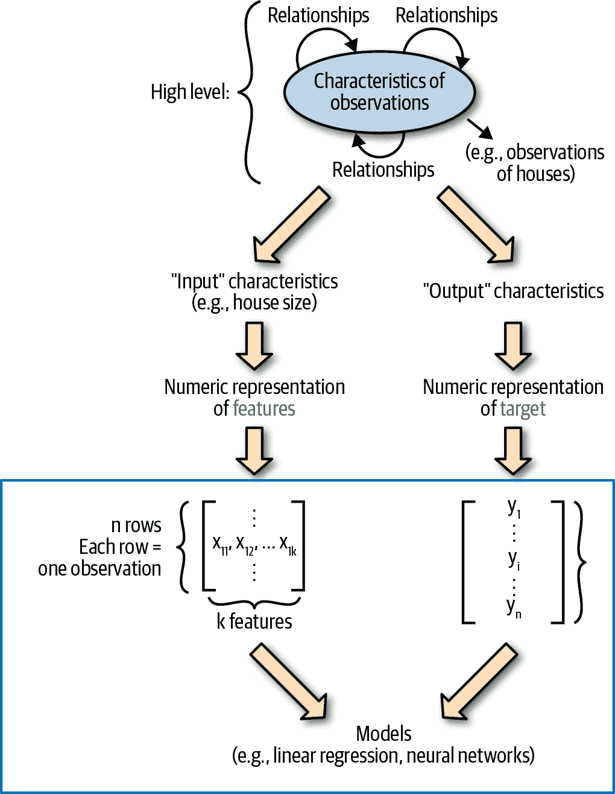

###### 图 2-1\. 监督学习概述

正如提到的，我们将几乎所有的时间花在图 2-1 底部突出显示的层次上；然而，在许多问题中，获得顶部部分的正确性——收集正确的数据，定义您要解决的问题，并进行特征工程——比实际建模要困难得多。然而，由于本书侧重于建模——具体来说，是理解深度学习模型的工作原理——让我们回到这个主题。

# 监督学习模型

现在我们在高层次上知道监督学习模型试图做什么了——正如我在本章前面所暗示的，这些模型只是嵌套的数学函数。我们在上一章中看到了如何用图表、数学和代码表示这样的函数，所以现在我可以更准确地用数学和代码来陈述监督学习的目标（稍后我会展示很多图表）：目标是*找到*（一个数学函数）/（一个以`ndarray`为输入并产生`ndarray`为输出的函数），它可以（将观察特征映射到目标）/（给定一个包含我们创建的特征的输入`ndarray`，产生一个输出`ndarray`，其值“接近”包含目标的`ndarray`）。

具体来说，我们的数据将用矩阵*X*表示，其中有*n*行，每一行代表一个具有*k*个特征的观察，所有这些特征都是数字。每行观察将是一个向量，如<math><mrow><msub><mi>x</mi> <mi>i</mi></msub> <mo>=</mo> <mfenced close="]" open="["><mtable><mtr><mtd><msub><mi>x</mi> <mrow><mi>i</mi><mn>1</mn></mrow></msub></mtd> <mtd><msub><mi>x</mi> <mrow><mi>i</mi><mn>2</mn></mrow></msub></mtd> <mtd><msub><mi>x</mi> <mrow><mi>i</mi><mn>3</mn></mrow></msub></mtd> <mtd><mo>...</mo></td> <mtd><msub><mi>x</mi> <mrow><mi>i</mi><mi>k</mi></mrow></msub></mtd></mtr></mtable></mfenced></mrow></math>，这些观察将堆叠在一起形成一个批次。例如，大小为 3 的批次将如下所示：

<math display="block"><mrow><msub><mi>X</mi> <mrow><mi>b</mi><mi>a</mi><mi>t</mi><mi>c</mi><mi>h</mi></mrow></msub> <mo>=</mo> <mfenced close="]" open="["><mtable><mtr><mtd><msub><mi>x</mi> <mn>11</mn></msub></mtd> <mtd><msub><mi>x</mi> <mn>12</mn></msub></mtd> <mtd><msub><mi>x</mi> <mn>13</mn></msub></mtd> <mtd><mo>...</mo></mtd> <mtd><msub><mi>x</mi> <mrow><mn>1</mn><mi>k</mi></mrow></msub></mtd></mtr> <mtr><mtd><msub><mi>x</mi> <mn>21</mn></msub></mtd> <mtd><msub><mi>x</mi> <mn>22</mn></msub></mtd> <mtd><msub><mi>x</mi> <mn>23</mn></msub></mtd> <mtd><mo>...</mo></mtd> <mtd><msub><mi>x</mi> <mrow><mn>2</mn><mi>k</mi></mrow></msub></mtd></mtr> <mtr><mtd><msub><mi>x</mi> <mn>31</mn></msub></mtd> <mtd><msub><mi>x</mi> <mn>32</mn></msub></mtd> <mtd><msub><mi>x</mi> <mn>33</mn></msub></mtd> <mtd><mo>...</mo></mtd> <mtd><msub><mi>x</mi> <mrow><mn>3</mn><mi>k</mi></mrow></msub></mtd></mtr></mtable></mfenced></mrow></math>

对于每个观察批次，我们将有一个相应的*目标*批次，其中每个元素是相应观察的目标数值。我们可以用一维向量表示这些：

<math display="block"><mfenced close="]" open="["><mtable><mtr><mtd><msub><mi>y</mi> <mn>1</mn></msub></mtd></mtr> <mtr><mtd><msub><mi>y</mi> <mn>2</mn></msub></mtd></mtr> <mtr><mtd><msub><mi>y</mi> <mn>3</mn></msub></mtd></mtr></mtable></mfenced></math>

在这些数组方面，我们在监督学习中的目标是使用我在上一章中描述的工具来构建一个函数，该函数可以接受具有*X*[*batch*]结构的观察批次作为输入，并产生值向量*p*[i]——我们将其解释为“预测”——这些预测（至少对于我们特定数据集*X*中的数据）与某种合理的接近度量的目标值*y*[i]“接近”。

最后，我们准备具体化所有这些，并开始为真实数据集构建我们的第一个模型。我们将从一个简单的模型——*线性回归*开始，并展示如何用前一章的基本组件来表达它。

# 线性回归

线性回归通常显示为：

<math display="block"><mrow><msub><mi>y</mi> <mi>i</mi></msub> <mo>=</mo> <msub><mi>β</mi> <mn>0</mn></msub> <mo>+</mo> <msub><mi>β</mi> <mn>1</mn></msub> <mo>×</mo> <msub><mi>x</mi> <mn>1</mn></msub> <mo>+</mo> <mo>...</mo> <mo>+</mo> <msub><mi>β</mi> <mi>n</mi></msub> <mo>×</mo> <msub><mi>x</mi> <mi>k</mi></msub> <mo>+</mo> <mi>ϵ</mi></mrow></math>

这种表示在数学上描述了我们的信念，即每个目标的数值是*X*的*k*个特征的线性组合，再加上*β*[0]项来调整预测的“基准”值（具体来说，当所有特征的值为 0 时将进行的预测）。

当然，这并没有让我们深入了解如何编写代码以便“训练”这样一个模型。为了做到这一点，我们必须将这个模型转化为我们在第一章中看到的函数语言；最好的起点是一个图表。

## 线性回归：一个图表

我们如何将线性回归表示为计算图？我们*可以*将其分解到最细的元素，每个*x*[i]都乘以另一个元素*w*[i]，然后将结果相加，如图 2-2 所示。

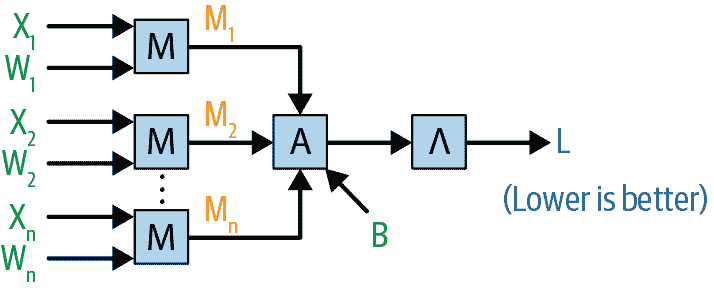

###### 图 2-2。线性回归的操作显示在个别乘法和加法的水平上

但是，正如我们在第一章中看到的，如果我们可以将这些操作表示为仅仅是矩阵乘法，我们将能够更简洁地编写函数，同时仍能正确计算输出相对于输入的导数，这将使我们能够训练模型。

我们如何做到这一点？首先，让我们处理一个更简单的情况，即我们没有截距项（*β*[0]之前显示）。请注意，我们可以将线性回归模型的输出表示为每个观察向量的*点积*<math><mrow><msub><mi>x</mi> <mi>i</mi></msub> <mo>=</mo> <mfenced close="]" open="["><mtable><mtr><mtd><msub><mi>x</mi> <mn>1</mn></msub></mtd> <mtd><msub><mi>x</mi> <mn>2</mn></msub></mtd> <mtd><msub><mi>x</mi> <mn>3</mn></msub></mtd> <mtd><mo>...</mo></mtd> <mtd><msub><mi>x</mi> <mi>k</mi></msub></mtd></mtr></mtable></mfenced></mrow></math>与我们将称之为*W*的另一个参数向量进行点积：

<math display="block"><mrow><mi>W</mi> <mo>=</mo> <mfenced close="]" open="["><mtable><mtr><mtd><msub><mi>w</mi> <mn>1</mn></msub></mtd></mtr> <mtr><mtd><msub><mi>w</mi> <mn>2</mn></msub></mtd></mtr> <mtr><mtd><msub><mi>w</mi> <mn>3</mn></msub></mtd></mtr> <mtr><mtd><mo>⋮</mo></mtd></mtr> <mtr><mtd><msub><mi>w</mi> <mi>k</mi></msub></mtd></mtr></mtable></mfenced></mrow></math>

我们的预测将简单地是：

<math display="block"><mrow><msub><mi>p</mi> <mi>i</mi></msub> <mo>=</mo> <msub><mi>x</mi> <mi>i</mi></msub> <mo>×</mo> <mi>W</mi> <mo>=</mo> <msub><mi>w</mi> <mn>1</mn></msub> <mo>×</mo> <msub><mi>x</mi> <mrow><mi>i</mi><mn>1</mn></mrow></msub> <mo>+</mo> <msub><mi>w</mi> <mn>2</mn></msub> <mo>×</mo> <msub><mi>x</mi> <mrow><mi>i</mi><mn>2</mn></mrow></msub> <mo>+</mo> <mo>...</mo> <mo>+</mo> <msub><mi>w</mi> <mi>k</mi></msub> <mo>×</mo> <msub><mi>x</mi> <mrow><mi>i</mi><mi>k</mi></mrow></msub></mrow></math>

因此，我们可以用一个操作来表示线性回归的“生成预测”：点积。

此外，当我们想要使用一批次观察进行线性回归预测时，我们可以使用另一个单一操作：矩阵乘法。例如，如果我们有一个大小为 3 的批次：

<math display="block"><mrow><msub><mi>X</mi> <mrow><mi>b</mi><mi>a</mi><mi>t</mi><mi>c</mi><mi>h</mi></mrow></msub> <mo>=</mo> <mfenced close="]" open="["><mtable><mtr><mtd><msub><mi>x</mi> <mn>11</mn></msub></mtd> <mtd><msub><mi>x</mi> <mn>12</mn></msub></mtd> <mtd><msub><mi>x</mi> <mn>13</mn></msub></mtd> <mtd><mo>...</mo></mtd> <mtd><msub><mi>x</mi> <mrow><mn>1</mn><mi>k</mi></mrow></msub></mtd></mtr> <mtr><mtd><msub><mi>x</mi> <mn>21</mn></msub></mtd> <mtd><msub><mi>x</mi> <mn>22</mn></msub></mtd> <mtd><msub><mi>x</mi> <mn>23</mn></msub></mtd> <mtd><mo>...</mo></mtd> <mtd><msub><mi>x</mi> <mrow><mn>2</mn><mi>k</mi></mrow></msub></mtd></mtr> <mtr><mtd><msub><mi>x</mi> <mn>31</mn></msub></mtd> <mtd><msub><mi>x</mi> <mn>32</mn></msub></mtd> <mtd><msub><mi>x</mi> <mn>33</mn></msub></mtd> <mtd><mo>...</mo></mtd> <mtd><msub><mi>x</mi> <mrow><mn>3</mn><mi>k</mi></mrow></msub></mtd></mtr></mtable></mfenced></mrow></math>

然后执行这批次*X*[*batch*]与*W*的*矩阵乘法*，得到一批次的预测向量，如所需：

<math display="block"><mrow><msub><mi>p</mi> <mrow><mi>b</mi><mi>a</mi><mi>t</mi><mi>c</mi><mi>h</mi></mrow></msub> <mo>=</mo> <msub><mi>X</mi> <mrow><mi>b</mi><mi>a</mi><mi>t</mi><mi>c</mi><mi>h</mi></mrow></msub> <mo>×</mo> <mi>W</mi> <mo>=</mo> <mfenced close="]" open="["><mtable><mtr><mtd><msub><mi>x</mi> <mn>11</mn></msub></mtd> <mtd><msub><mi>x</mi> <mn>12</mn></msub></mtd> <mtd><msub><mi>x</mi> <mn>13</mn></msub></mtd> <mtd><mo>...</mo></mtd> <mtd><msub><mi>x</mi> <mrow><mn>1</mn><mi>k</mi></mrow></msub></mtd></mtr> <mtr><mtd><msub><mi>x</mi> <mn>21</mn></msub></mtd> <mtd><msub><mi>x</mi> <mn>22</mn></msub></mtd> <mtd><msub><mi>x</mi> <mn>23</mn></msub></mtd> <mtd><mo>...</mo></mtd> <mtd><msub><mi>x</mi> <mrow><mn>2</mn><mi>k</mi></mrow></msub></mtd></mtr> <mtr><mtd><msub><mi>x</mi> <mn>31</mn></msub></mtd> <mtd><msub><mi>x</mi> <mn>32</mn></msub></mtd> <mtd><msub><mi>x</mi> <mn>33</mn></msub></mtd> <mtd><mo>...</mo></mtd> <mtd><msub><mi>x</mi> <mrow><mn>3</mn><mi>k</mi></mrow></msub></mtd></mtr></mtable></mfenced> <mo>×</mo> <mfenced close="]" open="["><mtable><mtr><mtd><msub><mi>w</mi> <mn>1</mn></msub></mtd></mtr> <mtr><mtd><msub><mi>w</mi> <mn>2</mn></msub></mtd></mtr> <mtr><mtd><msub><mi>w</mi> <mn>3</mn></msub></mtd></mtr> <mtr><mtd><mo>⋮</mo></mtd></mtr> <mtr><mtd><msub><mi>w</mi> <mi>k</mi></msub></mtd></mtr></mtable></mfenced> <mo>=</mo> <mfenced close="]" open="["><mtable><mtr><mtd><mrow><msub><mi>x</mi> <mn>11</mn></msub> <mo>×</mo> <msub><mi>w</mi> <mn>1</mn></msub> <mo>+</mo> <msub><mi>x</mi> <mn>12</mn></msub> <mo>×</mo> <msub><mi>w</mi> <mn>2</mn></msub> <mo>+</mo> <msub><mi>x</mi> <mn>13</mn></msub> <mo>×</mo> <msub><mi>w</mi> <mn>3</mn></msub> <mo>+</mo> <mo>...</mo> <mo>+</mo></mrow></mtd> <mtd><mrow><msub><mi>x</mi> <mrow><mn>1</mn><mi>k</mi></mrow></msub> <mo>×</mo> <msub><mi>w</mi> <mi>k</mi></msub></mrow></mtd></mtr> <mtr><mtd><mrow><msub><mi>x</mi> <mn>21</mn></msub> <mo>×</mo> <msub><mi>w</mi> <mn>1</mn></msub> <mo>+</mo> <msub><mi>x</mi> <mn>22</mn></msub> <mo>×</mo> <msub><mi>w</mi> <mn>2</mn></msub> <mo>+</mo> <msub><mi>x</mi> <mn>23</mn></msub> <mo>×</mo> <msub><mi>w</mi> <mn>3</mn></msub> <mo>+</mo> <mo>...</mo> <mo>+</mo></mrow></mtd> <mtd><mrow><msub><mi>x</mi> <mrow><mn>2</mn><mi>k</mi></mrow></msub> <mo>×</mo> <msub><mi>w</mi> <mi>k</mi></msub></mrow></mtd></mtr> <mtr><mtd><mrow><msub><mi>x</mi> <mn>31</mn></msub> <mo>×</mo> <msub><mi>w</mi> <mn>1</mn></msub> <mo>+</mo> <msub><mi>x</mi> <mn>32</mn></msub> <mo>×</mo> <msub><mi>w</mi> <mn>2</mn></msub> <mo>+</mo> <msub><mi>x</mi> <mn>33</mn></msub> <mo>×</mo> <msub><mi>w</mi> <mn>3</mn></msub> <mo>+</mo> <mo>...</mo> <mo>+</mo></mrow></mtd> <mtd><mrow><msub><mi>x</mi> <mrow><mn>3</mn><mi>k</mi></mrow></msub> <mo>×</mo> <msub><mi>w</mi> <mi>k</mi></msub></mrow></mtd></mtr></mtable></mfenced> <mo>=</mo> <mfenced close="]" open=""><mtable><mtr><mtd><msub><mi>p</mi> <mn>1</mn></msub></mtd></mtr> <mtr><mtd><msub><mi>p</mi> <mn>2</mn></msub></mtd></mtr> <mtr><mtd><msub><mi>p</mi> <mn>3</mn></msub></mtd></mtr></mtable></mfenced></mrow></math>

因此，用矩阵乘法生成一批次观察的线性回归预测是可以的。接下来，我将展示如何利用这一事实，以及从前一章推导出的关于导数的推理，来训练这个模型。

### “训练”这个模型

“训练”一个模型是什么意思？在高层次上，模型^([4)接收数据，以某种方式与*参数*结合，并产生预测。例如，之前显示的线性回归模型接收数据*X*和参数*W*，并使用矩阵乘法产生预测*p*[*batch*]：

<math display="block"><mrow><msub><mi>p</mi> <mrow><mi>b</mi><mi>a</mi><mi>t</mi><mi>c</mi><mi>h</mi></mrow></msub> <mo>=</mo> <mfenced close="]" open="["><mtable><mtr><mtd><msub><mi>p</mi> <mn>1</mn></msub></mtd></mtr> <mtr><mtd><msub><mi>p</mi> <mn>2</mn></msub></mtd></mtr> <mtr><mtd><msub><mi>p</mi> <mn>3</mn></msub></mtd></mtr></mtable></mfenced></mrow></math>

然而，要训练我们的模型，我们需要另一个关键信息：这些预测是否准确。为了了解这一点，我们引入与输入到函数中的一批次观察*X*[*batch*]相关联的*目标*向量*y*[*batch*]，并计算一个关于*y*[*batch*]和*p*[*batch*]的函数的*单个数字*，表示模型对所做预测的“惩罚”。一个合理的选择是*均方误差*，简单地是我们模型的预测“偏离”的平均平方值：

<math display="block"><mrow><mi>M</mi> <mi>S</mi> <mi>E</mi> <mrow><mo>(</mo> <msub><mi>p</mi> <mrow><mi>b</mi><mi>a</mi><mi>t</mi><mi>c</mi><mi>h</mi></mrow></msub> <mo>,</mo> <msub><mi>y</mi> <mrow><mi>b</mi><mi>a</mi><mi>t</mi><mi>c</mi><mi>h</mi></mrow></msub> <mo>)</mo></mrow> <mo>=</mo> <mi>M</mi> <mi>S</mi> <mi>E</mi> <mrow><mo>(</mo> <mfenced close="]" open="["><mtable><mtr><mtd><msub><mi>p</mi> <mn>1</mn></msub></mtd></mtr> <mtr><mtd><msub><mi>p</mi> <mn>2</mn></msub></mtd></mtr> <mtr><mtd><msub><mi>p</mi> <mn>3</mn></msub></mtd></mtr></mtable></mfenced> <mo>,</mo> <mfenced close="]" open=""><mtable><mtr><mtd><msub><mi>y</mi> <mn>1</mn></msub></mtd></mtr> <mtr><mtd><msub><mi>y</mi> <mn>2</mn></msub></mtd></mtr> <mtr><mtd><msub><mi>y</mi> <mn>3</mn></msub></mtd></mtr></mtable></mfenced> <mo>)</mo></mrow> <mo>=</mo> <mfrac><mrow><msup><mrow><mo>(</mo><msub><mi>y</mi> <mn>1</mn></msub> <mo>-</mo><msub><mi>p</mi> <mn>1</mn></msub> <mo>)</mo></mrow> <mn>2</mn></msup> <mo>+</mo><msup><mrow><mo>(</mo><msub><mi>y</mi> <mn>2</mn></msub> <mo>-</mo><msub><mi>p</mi> <mn>2</mn></msub> <mo>)</mo></mrow> <mn>2</mn></msup> <mo>+</mo><msup><mrow><mo>(</mo><msub><mi>y</mi> <mn>3</mn></msub> <mo>-</mo><msub><mi>p</mi> <mn>3</mn></msub> <mo>)</mo></mrow> <mn>2</mn></msup></mrow> <mn>3</mn></mfrac></mrow></math>

得到这个我们可以称之为*L*的数字是关键的：一旦我们有了它，我们可以使用我们在第一章中看到的所有技术来计算*L*对*W*的每个元素的*梯度*。然后*我们可以使用这些导数来更新 W 的每个元素，使 L 减少*。重复这个过程多次，我们希望能够“训练”我们的模型；在本章中，我们将看到这在实践中确实可以起作用。为了清楚地看到如何计算这些梯度，我们将完成将线性回归表示为计算图的过程。

## 线性回归：更有帮助的图表（和数学）

图 2-3 展示了如何用上一章的图表来表示线性回归。

![线性回归简单###### 图 2-3。线性回归方程表达为计算图—深蓝色字母是函数的数据输入，浅蓝色 W 表示权重最后，为了强调我们仍然用这个图表示一个嵌套的数学函数，我们可以表示最终计算的损失值*L*为：<math display="block"><mrow><mi>L</mi> <mo>=</mo> <mi>Λ</mi> <mo>(</mo> <mo>(</mo> <mi>ν</mi> <mo>(</mo> <mi>X</mi> <mo>,</mo> <mi>W</mi> <mo>)</mo> <mo>,</mo> <mi>Y</mi> <mo>)</mo></mrow></math>## 加入截距将模型表示为图表在概念上向我们展示了如何向模型添加截距。我们只需在最后添加一个额外步骤，涉及添加一个“偏差”，如图 2-4 所示。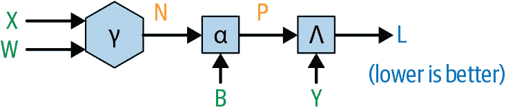

###### 图 2-4。线性回归的计算图，最后添加了一个偏置项

然而，在继续编码之前，我们应该对正在发生的事情进行数学推理；添加了偏差后，我们模型预测*p*[*i*]的每个元素将是之前描述的点积，加上数量*b*：

<math display="block"><mrow><msub><mi>p</mi> <mrow><mi>b</mi><mi>a</mi><mi>t</mi><mi>c</mi><mi>h</mi><mo>_</mo><mi>w</mi><mi>i</mi><mi>t</mi><mi>h</mi><mo>_</mo><mi>b</mi><mi>i</mi><mi>a</mi><mi>s</mi></mrow></msub> <mo>=</mo> <msub><mi>x</mi> <mi>i</mi></msub> <mtext>dot</mtext> <mi>W</mi> <mo>+</mo> <mi>b</mi> <mo>=</mo> <mfenced close="]" open="["><mtable><mtr><mtd><mrow><msub><mi>x</mi> <mn>11</mn></msub> <mo>×</mo> <msub><mi>w</mi> <mn>1</mn></msub> <mo>+</mo> <msub><mi>x</mi> <mn>12</mn></msub> <mo>×</mo> <msub><mi>w</mi> <mn>2</mn></msub> <mo>+</mo> <msub><mi>x</mi> <mn>13</mn></msub> <mo>×</mo> <msub><mi>w</mi> <mn>3</mn></msub> <mo>+</mo> <mo>...</mo> <mo>+</mo></mrow></mtd> <mtd><mrow><msub><mi>x</mi> <mrow><mn>1</mn><mi>k</mi></mrow></msub> <mo>×</mo> <msub><mi>w</mi> <mi>k</mi></msub> <mo>+</mo> <mi>b</mi></mrow></mtd></mtr> <mtr><mtd><mrow><msub><mi>x</mi> <mn>21</mn></msub> <mo>×</mo> <msub><mi>w</mi> <mn>1</mn></msub> <mo>+</mo> <msub><mi>x</mi> <mn>22</mn></msub> <mo>×</mo> <msub><mi>w</mi> <mn>2</mn></msub> <mo>+</mo> <msub><mi>x</mi> <mn>23</mn></msub> <mo>×</mo> <msub><mi>w</mi> <mn>3</mn></msub> <mo>+</mo> <mo>...</mo> <mo>+</mo></mrow></mtd> <mtd><mrow><msub><mi>x</mi> <mrow><mn>2</mn><mi>k</mi></mrow></msub> <mo>×</mo> <msub><mi>w</mi> <mi>k</mi></msub> <mo>+</mo> <mi>b</mi></mrow></mtd></mtr> <mtr><mtd><mrow><msub><mi>x</mi> <mn>31</mn></msub> <mo>×</mo> <msub><mi>w</mi> <mn>1</mn></msub> <mo>+</mo> <msub><mi>x</mi> <mn>32</mn></msub> <mo>×</mo> <msub><mi>w</mi> <mn>2</mn></msub> <mo>+</mo> <msub><mi>x</mi> <mn>33</mn></msub> <mo>×</mo> <msub><mi>w</mi> <mn>3</mn></msub> <mo>+</mo> <mo>...</mo> <mo>+</mo></mrow></mtd> <mtd><mrow><msub><mi>x</mi> <mrow><mn>3</mn><mi>k</mi></mrow></msub> <mo>×</mo> <msub><mi>w</mi> <mi>k</mi></msub> <mo>+</mo> <mi>b</mi></mrow></mtd></mtr></mtable></mfenced> <mo>=</mo> <mfenced close="]" open="["><mtable><mtr><mtd><msub><mi>p</mi> <mn>1</mn></msub></mtd></mtr> <mtr><mtd><msub><mi>p</mi> <mn>2</mn></msub></mtd></mtr> <mtr><mtd><msub><mi>p</mi> <mn>3</mn></msub></mtd></mtr></mtable></mfenced></mrow></math>

请注意，由于线性回归中的截距应该只是一个单独的数字，而不是对每个观察值都不同，应该将*相同的数字*添加到传递给偏置操作的每个输入的每个观察值中；我们将在本章的后面部分讨论这对于计算导数意味着什么。

## 线性回归：代码

现在我们将把这些东西联系起来，并编写一个函数，该函数根据观察批次*X*[*batch*]及其相应目标*y*[*batch*]进行预测并计算损失。请记住，使用链式法则计算嵌套函数的导数涉及两组步骤：首先，我们执行“前向传递”，将输入依次通过一系列操作向前传递，并在进行操作时保存计算的量；然后我们使用这些量在反向传递期间计算适当的导数。

以下代码执行此操作，将在字典中保存在前向传递中计算的量；此外，为了区分在前向传递中计算的量和参数本身（我们也需要用于反向传递），我们的函数将期望接收一个包含参数的字典：

```py
def forward_linear_regression(X_batch: ndarray,
                              y_batch: ndarray,
                              weights: Dict[str, ndarray])
                              -> Tuple[float, Dict[str, ndarray]]:
    '''
 Forward pass for the step-by-step linear regression.
 '''
    # assert batch sizes of X and y are equal
    assert X_batch.shape[0] == y_batch.shape[0]

    # assert that matrix multiplication can work
    assert X_batch.shape[1] == weights['W'].shape[0]

    # assert that B is simply a 1x1 ndarray
    assert weights['B'].shape[0] == weights['B'].shape[1] == 1

    # compute the operations on the forward pass
    N = np.dot(X_batch, weights['W'])

    P = N + weights['B']

    loss = np.mean(np.power(y_batch - P, 2))

    # save the information computed on the forward pass
    forward_info: Dict[str, ndarray] = {}
    forward_info['X'] = X_batch
    forward_info['N'] = N
    forward_info['P'] = P
    forward_info['y'] = y_batch

    return loss, forward_info
```

现在我们已经准备好开始“训练”这个模型了。接下来，我们将详细介绍这意味着什么以及我们将如何做到这一点。

# 训练模型

我们现在将使用上一章学到的所有工具来计算每个*W*中的*w*[*i*]的<math><mfrac><mrow><mi>∂</mi><mi>L</mi></mrow> <mrow><mi>∂</mi><msub><mi>w</mi> <mi>i</mi></msub></mrow></mfrac></math>，以及<math><mfrac><mrow><mi>∂</mi><mi>L</mi></mrow> <mrow><mi>∂</mi><mi>b</mi></mrow></mfrac></math>。如何做到？嗯，由于这个函数的“前向传递”是通过一系列嵌套函数传递输入，因此反向传递将简单涉及计算每个函数的偏导数，在函数的输入处评估这些导数，然后将它们相乘在一起——尽管涉及矩阵乘法，但我们将能够使用上一章中涵盖的推理来处理这个问题。

## 计算梯度：图表

从概念上讲，我们希望得到类似于图 2-5 中所示的内容。

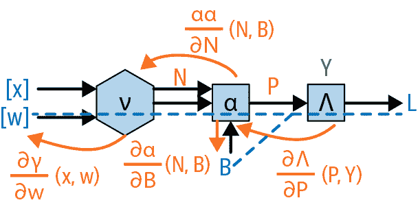

###### 图 2-5。通过线性回归计算图的反向传递

我们简单地向后移动，计算每个组成函数的导数，并在前向传递时评估这些函数接收到的输入的导数，然后在最后将这些导数相乘在一起。这是足够简单的，所以让我们深入了解细节。

## 计算梯度：数学（和一些代码）

从图 2-5 中，我们可以看到我们最终想要计算的导数乘积是：

<math display="block"><mrow><mfrac><mrow><mi>∂</mi><mi>Λ</mi></mrow> <mrow><mi>∂</mi><mi>P</mi></mrow></mfrac> <mrow><mo>(</mo> <mi>P</mi> <mo>,</mo> <mi>Y</mi> <mo>)</mo></mrow> <mo>×</mo> <mfrac><mrow><mi>∂</mi><mi>α</mi></mrow> <mrow><mi>∂</mi><mi>N</mi></mrow></mfrac> <mrow><mo>(</mo> <mi>N</mi> <mo>,</mo> <mi>B</mi> <mo>)</mo></mrow> <mo>×</mo> <mfrac><mrow><mi>∂</mi><mi>ν</mi></mrow> <mrow><mi>∂</mi><mi>W</mi></mrow></mfrac> <mrow><mo>(</mo> <mi>X</mi> <mo>,</mo> <mi>W</mi> <mo>)</mo></mrow></mrow></math>

这里有三个组件；让我们依次计算每个组件。

首先：<math><mrow><mfrac><mrow><mi>∂</mi><mi>Λ</mi></mrow> <mrow><mi>∂</mi><mi>P</mi></mrow></mfrac> <mrow><mo>(</mo> <mi>P</mi> <mo>,</mo> <mi>Y</mi> <mo>)</mo></mrow></mrow></math>。由于对于*Y*和*P*中的每个元素，<math><mrow><mi>Λ</mi> <mrow><mo>(</mo> <mi>P</mi> <mo>,</mo> <mi>Y</mi> <mo>)</mo></mrow> <mo>=</mo> <msup><mrow><mo>(</mo><mi>Y</mi><mo>-</mo><mi>P</mi><mo>)</mo></mrow> <mn>2</mn></msup></mrow></math>：

<math display="block"><mrow><mfrac><mrow><mi>∂</mi><mi>Λ</mi></mrow> <mrow><mi>∂</mi><mi>P</mi></mrow></mfrac> <mrow><mo>(</mo> <mi>P</mi> <mo>,</mo> <mi>Y</mi> <mo>)</mo></mrow> <mo>=</mo> <mo>-</mo> <mn>1</mn> <mo>×</mo> <mrow><mo>(</mo> <mn>2</mn> <mo>×</mo> <mrow><mo>(</mo> <mi>Y</mi> <mo>-</mo> <mi>P</mi> <mo>)</mo></mrow> <mo>)</mo></mrow></mrow></math>

我们有点超前了，但请注意编写这个代码只是简单的：

```py
dLdP = -2 * (Y - P)
```

接下来，我们有涉及矩阵的表达式：<math><mrow><mfrac><mrow><mi>∂</mi><mi>α</mi></mrow> <mrow><mi>∂</mi><mi>N</mi></mrow></mfrac> <mrow><mo>(</mo> <mi>N</mi> <mo>,</mo> <mi>B</mi> <mo>)</mo></mrow></mrow></math> 。但由于 *α* 只是加法，我们在前一章节中对数字推理的逻辑同样适用于这里：将 *N* 的任何元素增加一个单位将使 <math><mrow><mi>P</mi> <mo>=</mo> <mi>α</mi> <mo>(</mo> <mi>N</mi> <mo>,</mo> <mi>B</mi> <mo>)</mo> <mo>=</mo> <mi>N</mi> <mo>+</mo> <mi>B</mi></mrow></math> 增加一个单位。因此，<math><mrow><mfrac><mrow><mi>∂</mi><mi>α</mi></mrow> <mrow><mi>∂</mi><mi>N</mi></mrow></mfrac> <mrow><mo>(</mo> <mi>N</mi> <mo>,</mo> <mi>B</mi> <mo>)</mo></mrow></mrow></math> 只是一个由 +1 组成的矩阵，形状与 *N* 相同。

因此，编码*这个*表达式只是：

```py
dPdN = np.ones_like(N)
```

最后，我们有 <math><mrow><mfrac><mrow><mi>∂</mi><mi>ν</mi></mrow> <mrow><mi>∂</mi><mi>W</mi></mrow></mfrac> <mrow><mo>(</mo> <mi>X</mi> <mo>,</mo> <mi>W</mi> <mo>)</mo></mrow></mrow></math> 。正如我们在上一章节中详细讨论的，当计算嵌套函数的导数时，其中一个组成函数是矩阵乘法时，我们可以*假设*：

<math display="block"><mrow><mfrac><mrow><mi>∂</mi><mi>ν</mi></mrow> <mrow><mi>∂</mi><mi>W</mi></mrow></mfrac> <mrow><mo>(</mo> <mi>X</mi> <mo>,</mo> <mi>W</mi> <mo>)</mo></mrow> <mo>=</mo> <msup><mi>X</mi> <mi>T</mi></msup></mrow></math>

在代码中，这只是简单的：

```py
dNdW = np.transpose(X, (1, 0))
```

我们将对截距项执行相同的操作；因为我们只是将其添加，截距项对输出的偏导数就是 1：

```py
dPdB = np.ones_like(weights['B'])
```

最后一步就是简单地将它们相乘在一起，确保我们根据我们在上一章节末尾推理出的正确顺序进行涉及 `dNdW` 和 `dNdX` 的矩阵乘法。

## 计算梯度：（完整）代码

请记住我们的目标是取出在前向传播中计算的或输入的所有内容——从 Figure 2-5 中的图表中，这将包括 *X*、*W*、*N*、*B*、*P* 和 *y*——并计算 <math><mfrac><mrow><mi>∂</mi><mi>Λ</mi></mrow> <mrow><mi>∂</mi><mi>W</mi></mrow></mfrac></math> 和 <math><mfrac><mrow><mi>∂</mi><mi>Λ</mi></mrow> <mrow><mi>∂</mi><mi>B</mi></mrow></mfrac></math> 。以下代码实现了这一点，接收 *W* 和 *B* 作为名为 `weights` 的字典中的输入，其余的量作为名为 `forward_info` 的字典中的输入：

```py
def loss_gradients(forward_info: Dict[str, ndarray],
                   weights: Dict[str, ndarray]) -> Dict[str, ndarray]:
    '''
 Compute dLdW and dLdB for the step-by-step linear regression model.
 '''
    batch_size = forward_info['X'].shape[0]

    dLdP = -2 * (forward_info['y'] - forward_info['P'])

    dPdN = np.ones_like(forward_info['N'])

    dPdB = np.ones_like(weights['B'])

    dLdN = dLdP * dPdN

    dNdW = np.transpose(forward_info['X'], (1, 0))

    # need to use matrix multiplication here,
    # with dNdW on the left (see note at the end of last chapter)
    dLdW = np.dot(dNdW, dLdN)

    # need to sum along dimension representing the batch size
    # (see note near the end of this chapter)
    dLdB = (dLdP * dPdB).sum(axis=0)

    loss_gradients: Dict[str, ndarray] = {}
    loss_gradients['W'] = dLdW
    loss_gradients['B'] = dLdB

    return loss_gradients
```

正如你所看到的，我们只需计算每个操作的导数，然后逐步将它们相乘在一起，确保我们按正确顺序进行矩阵乘法。正如我们很快将看到的，这实际上是有效的——在我们在上一章节围绕链式法则建立的直觉之后，这应该不会太令人惊讶。

###### 注意

关于这些损失梯度的实现细节：我们将它们存储为一个字典，其中权重的名称作为键，增加权重影响损失的数量作为值。`weights` 字典的结构也是一样的。因此，我们将按照以下方式迭代我们模型中的权重：

```py
for key in weights.keys():
    weights[key] -= learning_rate * loss_grads[key]
```

以这种方式存储它们并没有什么特别之处；如果我们以不同的方式存储它们，我们只需迭代它们并以不同的方式引用它们。

## 使用这些梯度来训练模型。

现在我们只需一遍又一遍地运行以下过程：

1.  选择一批数据。

1.  运行模型的前向传播。

1.  使用在前向传播中计算的信息运行模型的反向传播。

1.  使用在反向传播中计算的梯度来更新权重。

这本书的这一章节的 [Jupyter Notebook](https://oreil.ly/2TDV5q9) 包含一个名为 `train` 的函数，用于编写这个。这并不太有趣；它只是实现了前面的步骤，并添加了一些明智的事情，比如对数据进行洗牌以确保以随机顺序传递。关键的代码行在一个 `for` 循环内重复，如下所示：

```py
forward_info, loss = forward_loss(X_batch, y_batch, weights)

loss_grads = loss_gradients(forward_info, weights)

for key in weights.keys():  # 'weights' and 'loss_grads' have the same keys
    weights[key] -= learning_rate * loss_grads[key]
```

然后我们运行`train`函数一定数量的*周期*，或者遍历整个训练数据集，如下所示：

```py
train_info = train(X_train, y_train,
                   learning_rate = 0.001,
                   batch_size=23,
                   return_weights=True,
                   seed=80718)
```

`train`函数返回`train_info`，一个`Tuple`，其中一个元素是代表模型学习内容的参数或*权重*。

###### 注意

“参数”和“权重”这两个术语在深度学习中通常是可以互换使用的，因此在本书中我们将它们互换使用。

# 评估我们的模型：训练集与测试集

为了了解我们的模型是否揭示了数据中的关系，我们必须从统计学中引入一些术语和思考方式。我们认为收到的任何数据集都是从一个*总体*中抽取的*样本*。我们的目标始终是找到一个能够揭示总体关系的模型，尽管我们只看到了一个样本。

我们建立的模型可能会捕捉到样本中存在但在总体中不存在的关系。例如，在我们的样本中，黄色板岩房屋带有三个浴室可能相对便宜，我们构建的复杂神经网络模型可能会捕捉到这种关系，尽管在总体中可能不存在。这是一个被称为*过拟合*的问题。我们如何检测我们使用的模型结构是否可能存在这个问题？

解决方案是将我们的样本分成一个*训练集*和一个*测试集*。我们使用训练数据来训练模型（即迭代更新权重），然后我们在测试集上评估模型以估计其性能。

完整的逻辑是，如果我们的模型能够成功地发现从*训练集*到*样本其余部分*（我们的整个数据集）泛化的关系，那么同样的“模型结构”很可能会从我们的*样本*——再次强调，是我们的整个数据集——泛化到*总体*，这正是我们想要的。

# 评估我们的模型：代码

有了这个理解，让我们在测试集上评估我们的模型。首先，我们将编写一个函数，通过截断我们之前看到的`forward_pass`函数来生成预测：

```py
def predict(X: ndarray,
            weights: Dict[str, ndarray]):
    '''
 Generate predictions from the step-by-step linear regression model.
 '''
    N = np.dot(X, weights['W'])

    return N + weights['B']
```

然后我们只需使用`train`函数之前返回的权重，并写：

```py
preds = predict(X_test, weights)  # weights = train_info[0]
```

这些预测有多好？请记住，目前我们还没有验证我们看似奇怪的定义模型的方法，即将模型定义为一系列操作，并通过使用损失的偏导数来调整涉及的参数，使用链式法则迭代地训练模型；因此，如果这种方法有效，我们应该感到高兴。

我们可以做的第一件事是查看我们的模型是否有效，即制作一个图，其中模型的预测值在 x 轴上，实际值在 y 轴上。如果每个点都恰好落在 45 度线上，那么模型就是完美的。图 2-6 显示了我们模型的预测值和实际值的图。

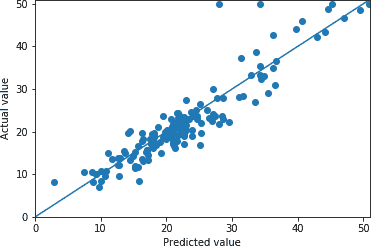

###### 图 2-6。我们自定义线性回归模型的预测与实际值

我们的图看起来很不错，但让我们量化一下模型的好坏。有几种常见的方法可以做到这一点：

+   计算我们模型预测值与实际值之间的平均距离，即*平均绝对误差*：

    ```py
    def mae(preds: ndarray, actuals: ndarray):
        '''
     Compute mean absolute error.
     '''
        return np.mean(np.abs(preds - actuals))
    ```

+   计算我们模型预测值与实际值之间的平均平方距离，这个指标称为*均方根误差*：

    ```py
    def rmse(preds: ndarray, actuals: ndarray):
        '''
     Compute root mean squared error.
     '''
        return np.sqrt(np.mean(np.power(preds - actuals, 2)))
    ```

这个特定模型的值为：

```py
Mean absolute error: 3.5643
Root mean squared error: 5.0508
```

均方根误差是一个特别常见的指标，因为它与目标在同一尺度上。如果我们将这个数字除以目标的平均值，我们可以得到一个预测值与实际值之间平均偏差的度量。由于`y_test`的平均值为`22.0776`，我们看到这个模型对房价的预测平均偏差为 5.0508 / 22.0776 ≅ 22.9%。

这些数字好吗？在包含本章代码的[Jupyter Notebook](https://oreil.ly/2TDV5q9)中，我展示了使用最流行的 Python 机器学习库 Sci-Kit Learn 对这个数据集进行线性回归的结果，平均绝对误差和均方根误差分别为`3.5666`和`5.0482`，与我们之前计算的“基于第一原理”的线性回归几乎相同。这应该让你相信，我们在本书中迄今为止采取的方法实际上是一种用于推理和训练模型的有效方法！在本章后面以及下一章中，我们将把这种方法扩展到神经网络和深度学习模型。

## 分析最重要的特征

在开始建模之前，我们将数据的每个特征缩放为均值为 0，标准差为 1；这具有计算优势，我们将在第四章中更详细地讨论。这样做的好处是，对于线性回归来说，我们可以解释系数的绝对值与模型中不同特征的重要性相对应；较大的系数意味着该特征更重要。以下是系数：

```py
np.round(weights['W'].reshape(-1), 4)
```

```py
array([-1.0084,  0.7097,  0.2731,  0.7161, -2.2163,  2.3737,  0.7156,
       -2.6609,  2.629 , -1.8113, -2.3347,  0.8541, -4.2003])
```

最后一个系数最大的事实意味着数据集中的最后一个特征是最重要的。

在图 2-7 中，我们将这个特征与我们的目标绘制在一起。

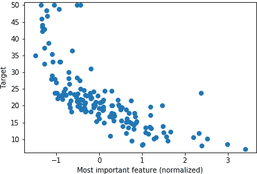

###### 图 2-7。自定义线性回归中最重要的特征与目标

我们看到这个特征与目标确实强相关：随着这个特征的增加，目标值减少，反之亦然。然而，这种关系*不*是线性的。当特征从-2 变为-1 时，目标变化的预期量*不*等于特征从 1 变为 2 时的变化量。我们稍后会回到这个问题。

在图 2-8 中，我们将这个特征与*模型预测*之间的关系叠加到这个图中。我们将通过将以下数据馈送到我们训练过的模型中来生成这个图：

+   所有特征的值设置为它们的均值

+   最重要特征的值在-1.5 到 3.5 之间线性插值，这大致是我们数据中这个缩放特征的范围

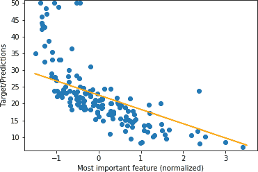

###### 图 2-8。自定义线性回归中最重要的特征与目标和预测

这幅图（字面上）展示了线性回归的一个局限性：尽管这个特征与目标之间存在一个视觉上明显且“可建模”的*非*线性关系，但由于其固有结构，我们的模型只能“学习”线性关系。

为了让我们的模型学习特征和目标之间更复杂、非线性的关系，我们将不得不构建一个比线性回归更复杂的模型。但是如何做呢？答案将以基于原则的方式引导我们构建一个神经网络。

# 从零开始的神经网络

我们刚刚看到如何从第一原理构建和训练线性回归模型。我们如何将这种推理链扩展到设计一个可以学习非线性关系的更复杂模型？中心思想是，我们首先进行*许多*线性回归，然后将结果馈送到一个非线性函数中，最后进行最后一次线性回归，最终进行预测。事实证明，我们可以通过与线性回归模型相同的方式推理出如何计算这个更复杂模型的梯度。

## 步骤 1：一堆线性回归

做“一堆线性回归”是什么意思？做一个线性回归涉及使用一组参数进行矩阵乘法：如果我们的数据*X*的维度是`[batch_size, num_features]`，那么我们将它乘以一个维度为`[num_features, 1]`的权重矩阵*W*，得到一个维度为`[batch_size, 1]`的输出；对于批次中的每个观察值，这个输出只是原始特征的一个*加权和*。要做多个线性回归，我们只需将我们的输入乘以一个维度为`[num_features, num_outputs]`的权重矩阵，得到一个维度为`[batch_size, num_outputs]`的输出；现在，*对于每个观察值*，我们有`num_outputs`个不同的原始特征的加权和。

这些加权和是什么？我们应该将它们中的每一个看作是一个“学习到的特征”——原始特征的组合，一旦网络训练完成，将代表其尝试学习的特征组合，以帮助准确预测房价。我们应该创建多少个学习到的特征？让我们创建 13 个，因为我们创建了 13 个原始特征。

## 步骤 2：一个非线性函数

接下来，我们将通过一个非线性函数来处理这些加权和；我们将尝试的第一个函数是在第一章中提到的`sigmoid`函数。作为提醒，图 2-9 展示了`sigmoid`函数。

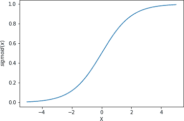

###### 图 2-9。从 x = -5 到 x = 5 绘制的 Sigmoid 函数

为什么使用这个非线性函数是个好主意？为什么不使用`square`函数*f*(*x*) = *x*²，例如？有几个原因。首先，我们希望在这里使用的函数是*单调*的，以便“保留”输入的数字的信息。假设，给定输入的日期，我们的两个线性回归分别产生值-3 和 3。然后通过`square`函数传递这些值将为每个产生一个值 9，因此任何接收这些数字作为输入的函数在它们通过`square`函数传递后将“丢失”一个原始为-3，另一个为 3 的信息。

当然，第二个原因是这个函数是非线性的；这种非线性将使我们的神经网络能够建模特征和目标之间固有的非线性关系。

最后，`sigmoid`函数有一个很好的性质，即它的导数可以用函数本身来表示：

<math display="block"><mrow><mfrac><mrow><mi>∂</mi><mi>σ</mi></mrow> <mrow><mi>∂</mi><mi>u</mi></mrow></mfrac> <mrow><mo>(</mo> <mi>x</mi> <mo>)</mo></mrow> <mo>=</mo> <mi>σ</mi> <mrow><mo>(</mo> <mi>x</mi> <mo>)</mo></mrow> <mo>×</mo> <mrow><mo>(</mo> <mn>1</mn> <mo>-</mo> <mi>σ</mi> <mrow><mo>(</mo> <mi>x</mi> <mo>)</mo></mrow> <mo>)</mo></mrow></mrow></math>

我们将很快在神经网络的反向传播中使用`sigmoid`函数时使用它。

## 步骤 3：另一个线性回归

最后，我们将得到的 13 个元素——每个元素都是原始特征的组合，通过`sigmoid`函数传递，使它们的值都在 0 到 1 之间——并将它们输入到一个常规线性回归中，使用它们的方式与我们之前使用原始特征的方式相同。

然后，我们将尝试训练*整个*得到的函数，方式与本章前面训练标准线性回归的方式相同：我们将数据通过模型，使用链式法则来计算增加权重会增加（或减少）损失多少，然后在每次迭代中更新权重，以减少损失。随着时间的推移（我们希望），我们将得到比以前更准确的模型，一个已经“学会”了特征和目标之间固有非线性关系的模型。

根据这个描述，可能很难理解正在发生的事情，所以让我们看一个插图。

## 图表

图 2-10 是我们更复杂模型的图表。

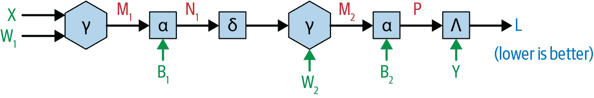

###### 图 2-10。将步骤 1-3 翻译成我们在第一章中看到的计算图的一种类型

你会看到我们从矩阵乘法和矩阵加法开始，就像以前一样。现在让我们正式定义一些之前提到的术语：当我们在嵌套函数中应用这些操作时，我们将称第一个矩阵用于转换输入特征的矩阵为*权重*矩阵，我们将称第二个矩阵，即添加到每个结果特征集的矩阵为*偏置*。这就是为什么我们将它们表示为*W*[1]和*B*[1]。

应用这些操作后，我们将通过一个 sigmoid 函数将结果传递，并再次用*另一组*权重和偏置（现在称为*W*[2]和*B*[2]）重复这个过程，以获得我们的最终预测*P*。

### 另一个图表？

用这些单独的步骤来表示事物是否让你对正在发生的事情有直观的理解？这个问题涉及到本书的一个关键主题：要完全理解神经网络，我们必须看到多种表示，每一种都突出神经网络工作的不同方面。图 2-10 中的表示并没有给出关于网络“结构”的直觉，但它清楚地指示了如何训练这样一个模型：在反向传播过程中，我们将计算每个组成函数的偏导数，在该函数的输入处评估，然后通过简单地将所有这些导数相乘来计算损失相对于每个权重的梯度——就像我们在第一章中看到的简单链式法则示例中一样。

然而，还有另一种更标准的表示神经网络的方式：我们可以将我们原始特征中的每一个表示为圆圈。由于我们有 13 个特征，我们需要 13 个圆圈。然后我们需要 13 个圆圈来表示我们正在进行的“线性回归- Sigmoid”操作的 13 个输出。此外，每个这些圆圈都是我们原始 13 个特征的函数，所以我们需要将第一组 13 个圆圈中的所有圆圈连接到第二组中的所有圆圈。⁶

最后，所有这些 13 个输出都被用来做一个最终的预测，所以我们会再画一个圆圈来代表最终的预测，以及 13 条线显示这些“中间输出”与最终预测的“连接”。

图 2-11 显示了最终的图表。⁷


###### 图 2-11\. 神经网络的更常见（但在许多方面不太有用）的视觉表示

如果你以前读过关于神经网络的任何东西，你可能已经看到它们被表示为图 2-11 中的图表：作为连接它们的线的圆圈。虽然这种表示方法确实有一些优点——它让你一眼就能看到这是什么样的神经网络，有多少层等等——但它并没有给出实际计算的任何指示，或者这样一个网络可能如何训练。因此，虽然这个图表对你来说非常重要，因为你会在其他地方看到它，但它主要包含在这里，让你看到它与我们主要表示神经网络的方式之间的*连接*：作为连接它们的线的方框，其中每个方框代表一个函数，定义了模型在前向传递中应该发生什么以进行预测，以及模型在反向传递中应该学习什么。我们将在下一章中看到如何通过将每个函数编码为继承自基础`Operation`类的 Python 类来更直接地在这些图表和代码之间进行转换——说到代码，让我们接着讨论。

## 代码

在编码时，我们遵循与本章早期更简单的线性回归函数相同的函数结构——将 `weights` 作为字典传入，并返回损失值和 `forward_info` 字典，同时用 图 2-10 中指定的操作替换内部操作：

```py
def forward_loss(X: ndarray,
                 y: ndarray,
                 weights: Dict[str, ndarray]
                 ) -> Tuple[Dict[str, ndarray], float]:
    '''
 Compute the forward pass and the loss for the step-by-step
 neural network model.
 '''
    M1 = np.dot(X, weights['W1'])

    N1 = M1 + weights['B1']

    O1 = sigmoid(N1)

    M2 = np.dot(O1, weights['W2'])

    P = M2 + weights['B2']

    loss = np.mean(np.power(y - P, 2))

    forward_info: Dict[str, ndarray] = {}
    forward_info['X'] = X
    forward_info['M1'] = M1
    forward_info['N1'] = N1
    forward_info['O1'] = O1
    forward_info['M2'] = M2
    forward_info['P'] = P
    forward_info['y'] = y

    return forward_info, loss
```

即使我们现在处理的是一个更复杂的图表，我们仍然只是一步一步地通过每个操作，进行适当的计算，并在进行时将结果保存在 `forward_info` 中。

## 神经网络：向后传递

向后传递的工作方式与本章早期更简单的线性回归模型相同，只是步骤更多。

### 图表

作为提醒，这些步骤是：

1.  计算每个操作的导数并在其输入处评估。

1.  将结果相乘。

正如我们将再次看到的那样，这将因为链式法则而起作用。图 2-12 展示了我们需要计算的所有偏导数。

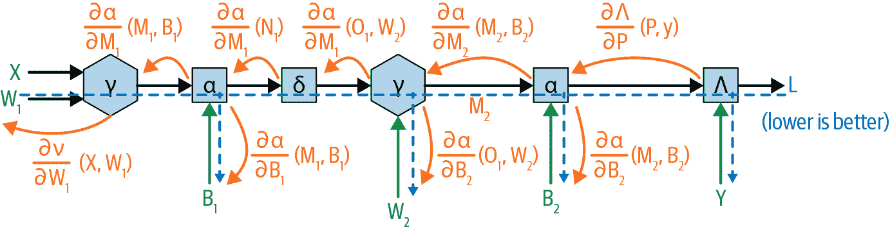

###### 图 2-12\. 与神经网络中的每个操作相关的偏导数将在向后传递中相乘

从概念上讲，我们希望计算所有这些偏导数，通过我们的函数向后追踪，然后将它们相乘以获得损失相对于每个权重的梯度，就像我们为线性回归模型所做的那样。

### 数学（和代码）

表 2-1 列出了这些偏导数以及与每个偏导数对应的代码行。

表 2-1\. 神经网络的导数表

| 导数 | 代码 |
| --- | --- |
| <math><mrow><mfrac><mrow><mi>∂</mi><mi>Λ</mi></mrow> <mrow><mi>∂</mi><mi>P</mi></mfrac> <mrow><mo>(</mo> <mi>P</mi> <mo>,</mo> <mi>y</mi> <mo>)</mo></mrow></mrow></math> | `dLdP = -(forward_info[*y*] - forward_info[*P*])` |
| <math><mrow><mfrac><mrow><mi>∂</mi><mi>α</mi></mrow> <mrow><mi>∂</mi><msub><mi>M</mi> <mn>2</mn></msub></mrow></mfrac> <mrow><mo>(</mo> <msub><mi>M</mi> <mn>2</mn></msub> <mo>,</mo> <msub><mi>B</mi> <mn>2</mn></msub> <mo>)</mo></mrow></mrow></math> | `np.ones_like(forward_info[*M2*])` |
| <math><mrow><mfrac><mrow><mi>∂</mi><mi>α</mi></mrow> <mrow><mi>∂</mi><msub><mi>B</mi> <mn>2</mn></msub></mrow></mfrac> <mrow><mo>(</mo> <msub><mi>M</mi> <mn>2</mn></msub> <mo>,</mo> <msub><mi>B</mi> <mn>2</mn></msub> <mo>)</mo></mrow></mrow></math> | `np.ones_like(weights[*B2*])` |
| <math><mrow><mfrac><mrow><mi>∂</mi><mi>ν</mi></mrow> <mrow><mi>∂</mi><msub><mi>W</mi> <mn>2</mn></msub></mrow></mfrac> <mrow><mo>(</mo> <msub><mi>O</mi> <mn>1</mn></msub> <mo>,</mo> <msub><mi>W</mi> <mn>2</mn></msub> <mo>)</mo></mrow></mrow></math> | `dM2dW2 = np.transpose(forward_info[*O1*], (1, 0))` |
| <math><mrow><mfrac><mrow><mi>∂</mi><mi>ν</mi></mrow> <mrow><mi>∂</mi><msub><mi>O</mi> <mn>1</mn></msub></mrow></mfrac> <mrow><mo>(</mo> <msub><mi>O</mi> <mn>1</mn></msub> <mo>,</mo> <msub><mi>W</mi> <mn>2</mn></msub> <mo>)</mo></mrow></mrow></math> | `dM2dO1 = np.transpose(weights[*W2*], (1, 0))` |
| <math><mrow><mfrac><mrow><mi>∂</mi><mi>σ</mi></mrow> <mrow><mi>∂</mi><mi>u</mrow></mfrac> <mrow><mo>(</mo> <msub><mi>N</mi> <mn>1</mn></msub> <mo>)</mo></mrow></mrow></math> | `dO1dN1 = sigmoid(forward_info[*N1*] × (1 - sigmoid(forward_info[*N1*])` |
| <math><mrow><mfrac><mrow><mi>∂</mi><mi>α</mi></mrow> <mrow><mi>∂</mi><msub><mi>M</mi> <mn>1</mn></msub></mrow></mfrac> <mrow><mo>(</mo> <msub><mi>M</mi> <mn>1</mn></msub> <mo>,</mo> <msub><mi>B</mi> <mn>1</mn></msub> <mo>)</mo></mrow></mrow></math> | `dN1dM1 = np.ones_like(forward_info[*M1*])` |
| <math><mrow><mfrac><mrow><mi>∂</mi><mi>α</mi></mrow> <mrow><mi>∂</mi><msub><mi>B</mi> <mn>1</mn></msub></mrow></mfrac> <mrow><mo>(</mo> <msub><mi>M</mi> <mn>1</mn></msub> <mo>,</mo> <msub><mi>B</mi> <mn>1</mn></msub> <mo>)</mo></mrow></mrow></math> | `dN1dB1 = np.ones_like(weights[*B1*])` |
| <math><mrow><mfrac><mrow><mi>∂</mi><mi>ν</mi></mrow> <mrow><mi>∂</mi><msub><mi>W</mi> <mn>1</mn></msub></mrow></mfrac> <mrow><mo>(</mo> <mi>X</mi> <mo>,</mo> <msub><mi>W</mi> <mn>1</mn></msub> <mo>)</mo></mrow></mrow></math> | `dM1dW1 = np.transpose(forward_info[*X*], (1, 0))` |

###### 注意

我们计算相对于偏差项的损失梯度`dLdB1`和`dLdB2`的表达式时，必须沿行相加，以考虑通过的数据批次中每行添加相同偏差元素的事实。有关详细信息，请参阅“相对于偏差项的损失梯度”。

### 总体损失梯度

您可以在本章的书的 GitHub 页面上查看完整的`loss_gradients`函数。此函数计算表 2-1 中的每个偏导数，并将它们相乘以获得相对于包含权重的`ndarray`中的每个权重的损失梯度：

+   `dLdW2`

+   `dLdB2`

+   `dLdW1`

+   `dLdB1`

唯一的注意事项是，我们将计算`dLdB1`和`dLdB2`的表达式沿`axis = 0`相加，如“相对于偏差项的损失梯度”中所述。

我们终于从头开始构建了我们的第一个神经网络！让我们看看它是否比我们的线性回归模型更好。

# 训练和评估我们的第一个神经网络

正如前向和后向传递对我们的神经网络与本章早期的线性回归模型一样有效，训练和评估也是相同的：对于每次数据迭代，我们通过前向传递函数将输入传递，通过后向传递计算损失相对于权重的梯度，然后使用这些梯度来更新权重。实际上，我们可以在训练循环内使用以下相同的代码：

```py
forward_info, loss = forward_loss(X_batch, y_batch, weights)

loss_grads = loss_gradients(forward_info, weights)

for key in weights.keys():
    weights[key] -= learning_rate * loss_grads[key]
```

区别仅仅在于`forward_loss`和`loss_gradients`函数的内部，以及`weights`字典中，现在有四个键（`W1`，`B1`，`W2`和`B2`），而不是两个。事实上，这是本书的一个重要观点：即使对于非常复杂的架构，数学原理和高级训练程序与简单模型相同。

我们也可以以相同的方式从该模型中获得预测：

```py
preds = predict(X_test, weights)
```

区别再次仅仅在于`predict`函数的内部：

```py
def predict(X: ndarray,
            weights: Dict[str, ndarray]) -> ndarray:
    '''
 Generate predictions from the step-by-step neural network model.
 '''
    M1 = np.dot(X, weights['W1'])

    N1 = M1 + weights['B1']

    O1 = sigmoid(N1)

    M2 = np.dot(O1, weights['W2'])

    P = M2 + weights['B2']

    return P
```

使用这些预测，我们可以在验证集上计算平均绝对误差和均方根误差，就像以前一样：

```py
Mean absolute error: 2.5289
Root mean squared error: 3.6775
```

这两个值都明显低于之前的模型！查看图 2-13 中预测与实际值的图表显示了类似的改进。

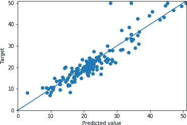

###### 图 2-13。神经网络回归中的预测值与目标值

从视觉上看，这些点比图 2-6 中更接近 45 度线。我鼓励您逐步查看本书的 GitHub 页面上的[Jupyter Notebook](https://oreil.ly/2TDV5q9)并自行运行代码！

## 为什么会发生这种情况的两个原因

为什么这个模型看起来比之前的模型表现更好？回想一下，我们早期模型的最重要特征与目标之间存在*非线性*关系；尽管如此，我们的模型被限制为仅学习个体特征与目标之间的*线性*关系。我声称，通过将非线性函数加入到混合中，我们使我们的模型能够学习特征和目标之间的正确非线性关系。

让我们来可视化一下。图 2-14 展示了我们在线性回归部分展示过的相同图，绘制了模型中最重要特征的归一化数值以及目标值和在变化最重要特征值的同时通过输入其他特征的均值得到的*预测*值，最重要特征的值从-3.5 变化到 1.5，与之前一样。

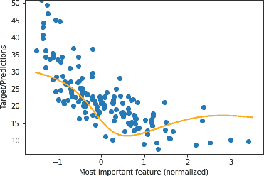

###### 图 2-14。最重要特征与目标值和预测值，神经网络回归

我们可以看到所示的关系（a）现在是非线性的，（b）更接近于这个特征和目标之间的关系（由点表示），这是期望的。因此，通过向我们的模型添加非线性函数，使其能够通过迭代更新权重来学习存在于输入和输出之间的非线性关系。

这就是为什么我们的神经网络表现比直接线性回归好的第一个原因。第二个原因是，我们的神经网络可以学习原始特征和目标之间的*组合*关系，而不仅仅是单个特征。这是因为神经网络使用矩阵乘法创建了 13 个“学习到的特征”，每个特征都是所有原始特征的组合，然后在这些学习到的特征之上实质上应用另一个线性回归。例如，通过在书籍网站上分享的一些探索性分析，我们可以看到模型学习到的 13 个原始特征的最重要组合是：

<math display="block"><mrow><mo>-</mo> <mn>4.44</mn> <mo>×</mo> <msub><mi>feature</mi> <mn>6</mn></msub> <mo>-</mo> <mn>2.77</mn> <mo>×</mo> <msub><mi>feature</mi> <mn>1</mn></msub> <mo>-</mo> <mn>2.07</mn> <mo>×</mo> <msub><mi>feature</mi> <mn>7</mn></msub> <mo>+</mo> <mo>.</mo> <mo>.</mo> <mo>.</mo></mrow></math>

以及：

<math display="block"><mrow><mn>4.43</mn> <mo>×</mo> <msub><mi>feature</mi> <mn>2</mn></msub> <mo>-</mo> <mn>3.39</mn> <mo>×</mo> <msub><mi>feature</mi> <mn>4</mn></msub> <mo>-</mo> <mn>2.39</mn> <mo>×</mo> <msub><mi>feature</mi> <mn>1</mn></msub> <mo>+</mo> <mo>.</mo> <mo>.</mo> <mo>.</mo></mrow></math>

这些将与其他 11 个学习到的特征一起包含在神经网络的最后两层的线性回归中。

这两个因素——学习个体特征和目标之间的*非线性*关系，以及学习特征和目标之间的*组合*关系——是神经网络通常比实际问题上的直接回归表现更好的原因。

# 结论

在本章中，您学习了如何使用第一章中的基本构建块和心智模型来理解、构建和训练两个标准的机器学习模型来解决实际问题。我首先展示了如何使用计算图表示经典统计学中的简单机器学习模型——线性回归。这种表示允许我们计算出该模型的损失相对于模型参数的梯度，从而通过不断地从训练集中输入数据并更新模型参数来训练模型，使损失减少。

然后我们看到了这个模型的一个限制：它只能学习特征和目标之间的*线性*关系；这促使我们尝试构建一个能够学习特征和目标之间的*非线性*关系的模型，这导致我们构建了我们的第一个神经网络。您通过从头开始构建一个神经网络来学习神经网络的工作原理，并学习如何使用与我们训练线性回归模型相同的高级过程来训练它们。然后您从经验上看到神经网络的表现比简单线性回归模型更好，并学到了两个关键原因：神经网络能够学习特征和目标之间的*非线性*关系，还能够学习特征和目标之间的*组合*关系。

当然，我们之所以在本章结束时仍然涵盖一个相对简单的模型，是有原因的：以这种方式定义神经网络是一个非常手动的过程。定义前向传播涉及 6 个单独编码的操作，而反向传播涉及 17 个。然而，敏锐的读者会注意到这些步骤中存在很多重复，并通过适当定义抽象，我们可以从以个别操作定义模型（如本章中）转变为以这些抽象定义模型。这将使我们能够构建更复杂的模型，包括深度学习模型，同时加深我们对这些模型如何工作的理解。这就是我们将在下一章开始做的事情。继续前进！

另一种机器学习，*无*监督学习，可以被认为是在你已经测量过的事物和尚未被测量的事物之间找到关系。

尽管在现实世界的问题中，甚至如何选择价格都不明显：是房子上次卖出的价格吗？那些长时间没有上市的房子呢？在这本书中，我们将专注于数据的数值表示是明显的或已经为您决定的示例，但在许多现实世界的问题中，正确处理这一点至关重要。

你们大多数人可能知道这些被称为“分类”特征。

至少是我们在这本书中看到的那些。

此外，我们必须沿着轴 0 对`dLdB`进行求和；我们将在本章后面更详细地解释这一步骤。

这突出了一个有趣的想法：我们*可以*有输出只连接到我们原始特征的*一部分*；这实际上就是卷积神经网络所做的。

嗯，不完全是：我们没有画出我们需要展示所有连接的 169 条线，以显示第一层和第二层“特征”之间的所有连接，但我们画出了足够多的线，以便您了解。
