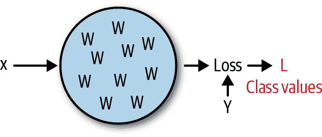
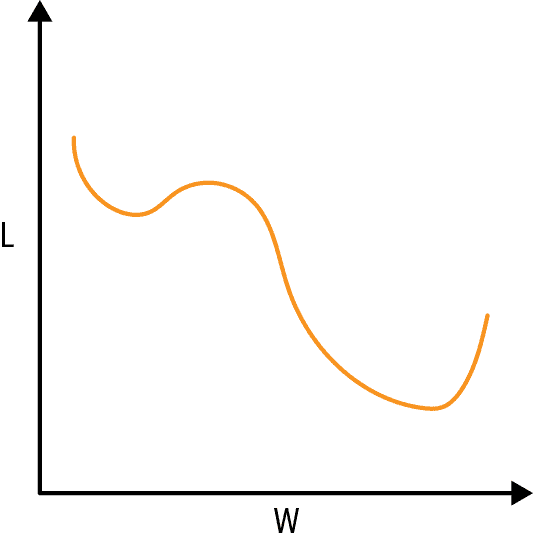
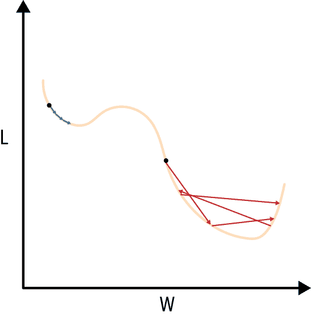
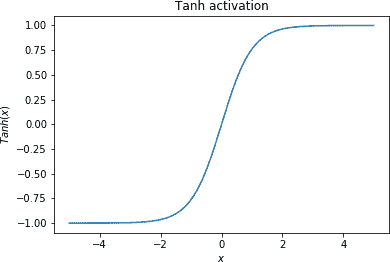
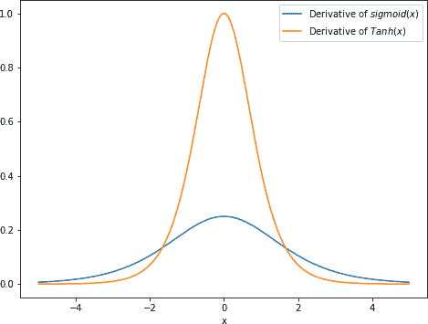
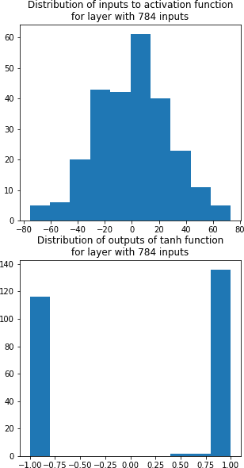

# 第四章：扩展

在上一章中，经过两章的推理，我们从第一原则出发，探讨了深度学习模型是什么以及它们应该如何工作，最终构建了我们的第一个深度学习模型，并训练它解决了相对简单的问题，即根据房屋的数值特征预测房价。然而，在大多数实际问题中，成功训练深度学习模型并不那么容易：虽然这些模型可以理论上找到任何可以被定义为监督学习问题的问题的最优解，但在实践中它们经常失败，而且确实很少有理论保证表明给定的模型架构实际上会找到一个好的解决方案。尽管如此，还是有一些被充分理解的技术可以使神经网络训练更有可能成功；这将是本章的重点。

我们将从数学上回顾神经网络“试图做什么”，即找到一个函数的最小值。然后我将展示一系列可以帮助网络实现这一目标的技术，展示它们在手写数字的经典 MNIST 数据集上的有效性。我们将从一个在深度学习分类问题中经常使用的损失函数开始，展示它显著加速学习（到目前为止，我们在本书中只涵盖了回归问题，因为我们还没有介绍这个损失函数，因此还没有能够公正地处理分类问题）。同样，我们将涵盖除 sigmoid 之外的激活函数，并展示为什么它们也可能加速学习，同时讨论激活函数的一般权衡。接下来，我们将涵盖动量，这是迄今为止我们一直使用的随机梯度下降优化技术中最重要（也是最直接）的扩展，同时简要讨论更高级的优化器可以做什么。最后，我们将涵盖三种互不相关但都至关重要的技术：学习率衰减、权重初始化和 dropout。正如我们将看到的，这些技术中的每一种都将帮助我们的神经网络找到逐渐更优的解决方案。

在第一章中，我们遵循了“图表-数学-代码”模型来介绍每个概念。在这里，每个技术并没有明显的图表，因此我们将从每个技术的“直觉”开始，然后跟随数学（通常比第一章简单得多），最后以代码结束，这实际上将包括将技术整合到我们构建的框架中，并精确描述它如何与我们在上一章中形式化的构建块互动。在这种精神下，我们将从神经网络试图做什么的“整体”直觉开始：找到一个函数的最小值。

# 关于神经网络的一些直觉

神经网络包含一堆权重；给定这些权重，以及一些输入数据 `X` 和 `y`，我们可以计算出一个结果的“损失”。图 4-1 展示了神经网络的这种极高级别（但仍然正确）的视图。



###### 图 4-1. 用权重来思考神经网络的简单方式

实际上，每个单独的权重与特征 `X`、目标 `y`、其他权重以及最终的损失 `L` 之间都有一些复杂的非线性关系。如果我们将这些绘制出来，改变权重的值，同时保持其他权重、`X` 和 `y` 的值恒定，并绘制出损失 `L` 的结果值，我们可能会看到类似于图 4-2 所示的情况。



###### 图 4-2. 神经网络的权重与损失

当我们开始训练神经网络时，我们将每个权重初始化为图 4-2 中某个位置的值。然后，使用我们在反向传播过程中计算的梯度，我们迭代地更新权重，我们的第一个更新基于我们在初始值处选择的曲线的斜率。图 4-3 展示了这种几何解释，即根据梯度和学习率更新神经网络权重的含义。左侧的蓝色箭头代表重复应用此更新规则，学习率比右侧的红色箭头小；请注意，在这两种情况下，水平方向上的更新与权重值处曲线的斜率成比例（更陡的斜率意味着更大的更新）。



###### 图 4-3。根据梯度和学习率更新神经网络权重的几何表示

训练深度学习模型的目标是将每个权重移动到使损失最小化的“全局”值。正如我们从图 4-3 中看到的，如果我们采取的步骤太小，我们可能会陷入“局部”最小值，这比全局最小值不太理想（遵循这种情况的权重路径由蓝色箭头表示）。如果步骤太大，我们可能会“反复跳过”全局最小值，即使我们接近它（这种情况由红色箭头表示）。这是调整学习率的基本权衡：如果学习率太小，我们可能会陷入局部最小值；如果学习率太大，它们可能会跳过全局最小值。

实际上，情况比这复杂得多。一个原因是神经网络中有成千上万，甚至数百万个权重，因此我们在一个具有成千上万维或数百万维的空间中寻找全局最小值。此外，由于我们在每次迭代中更新权重，并传入不同的`X`和`y`，*我们试图找到最小值的曲线不断变化！*后者是神经网络多年来受到怀疑的主要原因之一；看起来迭代地以这种方式更新权重实际上无法找到全局理想的解决方案。Yann LeCun 等人在 2015 年的一篇[*自然*文章](https://www.nature.com/articles/nature14539)中最好地表达了这一点：

> 特别是，人们普遍认为简单的梯度下降会陷入糟糕的局部最小值，即权重配置，对于这些配置，任何微小的变化都不会减少平均误差。实际上，对于大型网络，糟糕的局部最小值很少是一个问题。无论初始条件如何，系统几乎总是达到非常相似质量的解决方案。最近的理论和实证结果强烈表明，局部最小值通常不是一个严重的问题。

因此，在实践中，图 4-3 不仅提供了一个很好的心智模型，解释了为什么学习率不应该太大或太小，还提供了为什么我们将在本章学习的许多技巧实际上有效的直觉。具备了对神经网络试图做什么的直觉，让我们开始研究这些技巧。我们将从一个损失函数开始，即*softmax 交叉熵*损失函数，这个损失函数在很大程度上有效，因为它能够为权重提供比我们在上一章看到的均方误差损失函数更陡的梯度。

# Softmax 交叉熵损失函数

在第三章中，我们使用均方误差（MSE）作为我们的损失函数。这个函数有一个很好的性质，即它是凸的，这意味着预测与目标之间的距离越远，`Loss`向后发送到网络`Layer`的初始梯度就越陡峭，因此参数接收到的所有梯度也会更大。然而，在分类问题中，我们可以做得更好，因为在这种问题中*我们知道网络输出的值应该被解释为概率*；因此，每个值不仅应该在 0 到 1 之间，而且对于我们通过网络传递的每个观察值，概率向量应该总和为 1。Softmax 交叉熵损失函数利用这一点，为相同的输入产生比均方误差损失更陡的梯度。这个函数有两个组件：第一个是*softmax*函数，第二个组件是“交叉熵”损失；我们将依次介绍每个组件。

## 组件＃1：Softmax 函数

对于一个具有`N`个可能类别的分类问题，我们将使我们的神经网络为每个观察输出一个包含`N`个值的向量。对于一个有三个类别的问题，这些值可以是：

```py
[5, 3, 2]
```

### 数学

再次，由于这是一个分类问题，我们知道这*应该*被解释为概率向量（这个观察属于类别 1、2 或 3 的概率）。将这些值转换为概率向量的一种方法是简单地对它们进行标准化，求和并除以总和：

<math display="block"><mrow><mtext>Normalize</mtext> <mrow><mo>(</mo> <mfenced close="]" open="["><mtable><mtr><mtd><msub><mi>x</mi> <mn>1</mn></msub></mtd></mtr> <mtr><mtd><msub><mi>x</mi> <mn>2</mn></msub></mtd></mtr> <mtr><mtd><msub><mi>x</mi> <mn>3</mn></msub></mtd></mtr></mtable></mfenced> <mo>)</mo></mrow> <mo>=</mo> <mfenced close="]" open="["><mtable><mtr><mtd><mfrac><msub><mi>x</mi> <mn>1</mn></msub> <mrow><msub><mi>x</mi> <mn>1</mn></msub> <mo>+</mo><msub><mi>x</mi> <mn>2</mn></msub> <mo>+</mo><msub><mi>x</mi> <mn>3</mn></msub></mrow></mfrac></mtd></mtr> <mtr><mtd><mfrac><msub><mi>x</mi> <mn>2</mn></msub> <mrow><msub><mi>x</mi> <mn>1</mn></msub> <mo>+</mo><msub><mi>x</mi> <mn>2</mn></msub> <mo>+</mo><msub><mi>x</mi> <mn>3</mn></msub></mrow></mfrac></mtd></mtr> <mtr><mtd><mfrac><msub><mi>x</mi> <mn>3</mn></msub> <mrow><msub><mi>x</mi> <mn>1</mn></msub> <mo>+</mo><msub><mi>x</mi> <mn>2</mn></msub> <mo>+</mo><msub><mi>x</mi> <mn>3</mn></msub></mrow></mfrac></mtd></mtr></mtable></mfenced></mrow></math>

然而，事实证明有一种方法既产生更陡的梯度，又具有一些优雅的数学特性：softmax 函数。对于长度为 3 的向量，这个函数将被定义为：

<math display="block"><mrow><mtext>Softmax</mtext> <mrow><mo>(</mo> <mfenced close="]" open="["><mtable><mtr><mtd><msub><mi>x</mi> <mn>1</mn></msub></mtd></mtr> <mtr><mtd><msub><mi>x</mi> <mn>2</mn></msub></mtd></mtr> <mtr><mtd><msub><mi>x</mi> <mn>3</mn></msub></mtd></mtr></mtable></mfenced> <mo>)</mo></mrow> <mo>=</mo> <mfenced close="]" open="["><mtable><mtr><mtd><mfrac><msup><mi>e</mi> <msub><mi>x</mi> <mn>1</mn></msub></msup> <mrow><msup><mi>e</mi> <msub><mi>x</mi> <mn>1</mn></msub></msup> <mo>+</mo><msup><mi>e</mi> <msub><mi>x</mi> <mn>2</mn></msub></msup> <mo>+</mo><msup><mi>e</mi> <msub><mi>x</mi> <mn>3</mn></msub></msup></mrow></mfrac></mtd></mtr> <mtr><mtd><mfrac><msup><mi>e</mi> <msub><mi>x</mi> <mn>2</mn></msub></msup> <mrow><msup><mi>e</mi> <msub><mi>x</mi> <mn>1</mn></msub></msup> <mo>+</mo><msup><mi>e</mi> <msub><mi>x</mi> <mn>2</mn></msub></msup> <mo>+</mo><msup><mi>e</mi> <msub><mi>x</mi> <mn>3</mn></msub></msup></mrow></mfrac></mtd></mtr> <mtr><mtd><mfrac><msup><mi>e</mi> <msub><mi>x</mi> <mn>3</mn></msub></msup> <mrow><msup><mi>e</mi> <msub><mi>x</mi> <mn>1</mn></msub></msup> <mo>+</mo><msup><mi>e</mi> <msub><mi>x</mi> <mn>2</mn></msub></msup> <mo>+</mo><msup><mi>e</mi> <msub><mi>x</mi> <mn>3</mn></msub></msup></mrow></mfrac></mtd></mtr></mtable></mfenced></mrow></math>

### 直觉

Softmax 函数背后的直觉是，它相对于其他值更强烈地放大最大值，迫使神经网络在分类问题的背景下对其认为是正确的预测更“不中立”。让我们比较这两个函数，标准化和 softmax，对我们前面的概率向量会产生什么影响：

```py
normalize(np.array([5,3,2]))
```

```py
array([0.5, 0.3, 0.2])
```

```py
softmax(np.array([5,3,2]))
```

```py
array([0.84, 0.11, 0.04])
```

我们可以看到原始的最大值—5—比简单标准化数据时具有显着更高的值，而另外两个值比从`normalize`函数输出时更低。因此，`softmax`函数在标准化值和实际应用`max`函数之间（在这种情况下将导致输出为`array([1.0, 0.0, 0.0])`）的部分路径上，因此得名`softmax`。

## 组件＃2：交叉熵损失

请记住，任何损失函数都将接受一个概率向量<math><mfenced close="]" open="["><mtable><mtr><mtd><msub><mi>p</mi> <mn>1</mn></msub></mtd></mtr> <mtr><mtd><mo>⋮</mo></mtd></mtr> <mtr><mtd><msub><mi>p</mi> <mi>n</mi></msub></mtd></mtr></mtable></mfenced></math>和一个实际值向量<math><mfenced close="]" open=""><mtable><mtr><mtd><msub><mi>y</mi> <mn>1</mn></msub></mtd></mtr> <mtr><mtd><mo>⋮</mo></mtd></mtr> <mtr><mtd><msub><mi>y</mi> <mi>n</mi></msub></mtd></mtr></mtable></mfenced></math>。

### 数学

对于这些向量中的每个索引`i`，交叉熵损失函数为：

<math display="block"><mrow><mtext>CE</mtext> <mrow><mo>(</mo> <msub><mi>p</mi> <mi>i</mi></msub> <mo>,</mo> <msub><mi>y</mi> <mi>i</mi></msub> <mo>)</mo></mrow> <mo>=</mo> <mo>-</mo> <msub><mi>y</mi> <mi>i</mi></msub> <mo>×</mo> <mtext>log</mtext> <mrow><mo>(</mo> <msub><mi>p</mi> <mi>i</mi></msub> <mo>)</mo></mrow> <mo>-</mo> <mrow><mo>(</mo> <mn>1</mn> <mo>-</mo> <msub><mi>y</mi> <mi>i</mi></msub> <mo>)</mo></mrow> <mo>×</mo> <mtext>log</mtext> <mrow><mo>(</mo> <mn>1</mn> <mo>-</mo> <msub><mi>p</mi> <mi>i</mi></msub> <mo>)</mo></mrow></mrow></math>

### 直觉

要看到这作为损失函数是有道理的原因，考虑到由于*y*的每个元素都是 0 或 1，前述方程简化为：

<math display="block"><mrow><mtext>CE</mtext> <mrow><mo>(</mo> <msub><mi>p</mi> <mi>i</mi></msub> <mo>,</mo> <msub><mi>y</mi> <mi>i</mi></msub> <mo>)</mo></mrow> <mo>=</mo> <mfenced close="" open="{" separators=""><mtable><mtr><mtd columnalign="left"><mrow><mo>-</mo> <mi>l</mi> <mi>o</mi> <mi>g</mi> <mo>(</mo> <mn>1</mn> <mo>-</mo> <msub><mi>p</mi> <mi>i</mi></msub> <mo>)</mo></mrow></mtd> <mtd columnalign="left"><mrow><mtext>if</mtext> <msub><mi>y</mi> <mi>i</mi></msub> <mo>=</mo> <mn>0</mn></mrow></mtd></mtr> <mtr><mtd columnalign="left"><mrow><mo>-</mo> <mi>l</mi> <mi>o</mi> <mi>g</mi> <mo>(</mo> <msub><mi>p</mi> <mi>i</mi></msub> <mo>)</mo></mrow></mtd> <mtd columnalign="left"><mrow><mtext>if</mtext> <msub><mi>y</mi> <mi>i</mi></msub> <mo>=</mo> <mn>1</mn></mrow></mtd></mtr></mtable></mfenced></mrow></math>

现在我们可以更容易地将其分解。如果*y*=0，那么在区间 0 到 1 上的这个损失值与均方误差损失值的图像如图 4-4 所示。

![dlfs 0404

###### 图 4-4。当<math><mrow><mi>y</mi> <mo>=</mo> <mn>0</mn></mrow></math>时的交叉熵损失与 MSE

不仅在这个区间内交叉熵损失的惩罚要高得多，²而且它们的增长速度更快；事实上，当我们的预测与目标之间的差距接近 1 时，交叉熵损失的值会趋近于无穷！当*y* = 1 时的图形类似，只是“翻转”了（即，它围绕*x* = 0.5 的线旋转了 180 度）。

因此，对于我们知道输出将在 0 和 1 之间的问题，交叉熵损失产生的梯度比均方误差更陡。真正的魔力发生在我们将这种损失与 softmax 函数结合时——首先将神经网络输出通过 softmax 函数进行归一化，使值相加为 1，然后将得到的概率输入到交叉熵损失函数中。

让我们看看这在我们迄今为止一直使用的三类情况下是什么样子；从*i* = 1 开始的损失向量的分量的表达式，即给定观察值的损失的第一个分量，我们将表示为*SCE*[1]：

<math display="block"><mrow><msub><mrow><mi>S</mi><mi>C</mi><mi>E</mi></mrow> <mn>1</mn></msub> <mo>=</mo> <mo>-</mo> <msub><mi>y</mi> <mn>1</mn></msub> <mo>×</mo> <mi>l</mi> <mi>o</mi> <mi>g</mi> <mrow><mo>(</mo> <mfrac><msup><mi>e</mi> <msub><mi>x</mi> <mn>1</mn></msub></msup> <mrow><msup><mi>e</mi> <msub><mi>x</mi> <mn>1</mn></msub></msup> <mo>+</mo><msup><mi>e</mi> <msub><mi>x</mi> <mn>2</mn></msub></msup> <mo>+</mo><msup><mi>e</mi> <msub><mi>x</mi> <mn>3</mn></msub></msup></mrow></mfrac> <mo>)</mo></mrow> <mo>-</mo> <mrow><mo>(</mo> <mn>1</mn> <mo>-</mo> <msub><mi>y</mi> <mn>1</mn></msub> <mo>)</mo></mrow> <mo>×</mo> <mi>l</mi> <mi>o</mi> <mi>g</mi> <mrow><mo>(</mo> <mn>1</mn> <mo>-</mo> <mfrac><msup><mi>e</mi> <msub><mi>x</mi> <mn>1</mn></msub></msup> <mrow><msup><mi>e</mi> <msub><mi>x</mi> <mn>1</mn></msub></msup> <mo>+</mo><msup><mi>e</mi> <msub><mi>x</mi> <mn>2</mn></msub></msup> <mo>+</mo><msup><mi>e</mi> <msub><mi>x</mi> <mn>3</mn></msub></msup></mrow></mfrac> <mo>)</mo></mrow></mrow></math>

根据这个表达式，这种损失的梯度似乎对这种损失有点棘手。然而，有一个优雅的表达式，既易于数学书写，又易于实现：

<math display="block"><mrow><mfrac><mrow><mi>∂</mi><msub><mrow><mi>S</mi><mi>C</mi><mi>E</mi></mrow> <mn>1</mn></msub></mrow> <mrow><mi>∂</mi><msub><mi>x</mi> <mn>1</mn></msub></mrow></mfrac> <mo>=</mo> <mfrac><msup><mi>e</mi> <msub><mi>x</mi> <mn>1</mn></msub></msup> <mrow><msup><mi>e</mi> <msub><mi>x</mi> <mn>1</mn></msub></msup> <mo>+</mo><msup><mi>e</mi> <msub><mi>x</mi> <mn>2</mn></msub></msup> <mo>+</mo><msup><mi>e</mi> <msub><mi>x</mi> <mn>3</mn></msub></msup></mrow></mfrac> <mo>-</mo> <msub><mi>y</mi> <mn>1</mn></msub></mrow></math>

这意味着 softmax 交叉熵的*总*梯度是：

<math display="block"><mrow><mtext>softmax</mtext> <mrow><mo>(</mo> <mfenced close="]" open="["><mtable><mtr><mtd><msub><mi>x</mi> <mn>1</mn></msub></mtd></mtr> <mtr><mtd><msub><mi>x</mi> <mn>2</mn></msub></mtd></mtr> <mtr><mtd><msub><mi>x</mi> <mn>3</mn></msub></mtd></mtr></mtable></mfenced> <mo>)</mo></mrow> <mo>-</mo> <mfenced close="]" open=""><mtable><mtr><mtd><msub><mi>y</mi> <mn>1</mn></msub></mtd></mtr> <mtr><mtd><msub><mi>y</mi> <mn>2</mn></msub></mtd></mtr> <mtr><mtd><msub><mi>y</mi> <mn>3</mn></msub></mtd></mtr></mtable></mfenced></mrow></math>

就是这样！正如承诺的那样，最终的实现也很简单：

```py
softmax_x = softmax(x, axis = 1)
loss_grad = softmax_x - y
```

让我们编写代码。

### 代码

回顾第三章，任何`Loss`类都应该接收两个 2D 数组，一个是网络的预测，另一个是目标。每个数组中的行数是批量大小，列数是分类问题中的类别数`n`；每个数组中的一行代表数据集中的一个观察值，行中的`n`个值代表神经网络对该观察值属于每个`n`类的概率的最佳猜测。因此，我们将需要对`prediction`数组中的*每一行*应用`softmax`。这会导致一个潜在的问题：接下来我们将把结果数值输入`log`函数来计算损失。这应该让你担心，因为*log*(*x*)当*x*趋近于 0 时会趋向于负无穷，同样地，1 - *x*当*x*趋近于 1 时会趋向于无穷。为了防止可能导致数值不稳定的极大损失值，我们将裁剪 softmax 函数的输出，使其不小于 10^(–7)且不大于 10⁷。

最后，我们可以把所有东西放在一起！

```py
class SoftmaxCrossEntropyLoss(Loss):
    def __init__(self, eps: float=1e-9)
        super().__init__()
        self.eps = eps
        self.single_output = False

    def _output(self) -> float:

        # applying the softmax function to each row (observation)
        softmax_preds = softmax(self.prediction, axis=1)

        # clipping the softmax output to prevent numeric instability
        self.softmax_preds = np.clip(softmax_preds, self.eps, 1 - self.eps)

        # actual loss computation
softmax_cross_entropy_loss = (
    -1.0 * self.target * np.log(self.softmax_preds) - \
        (1.0 - self.target) * np.log(1 - self.softmax_preds)
)

        return np.sum(softmax_cross_entropy_loss)

    def _input_grad(self) -> ndarray:

        return self.softmax_preds - self.target
```

很快我将通过一些在 MNIST 数据集上的实验来展示这种损失是如何改进均方误差损失的。但首先让我们讨论选择激活函数涉及的权衡，并看看是否有比 sigmoid 更好的选择。

## 关于激活函数的说明

我们在第二章中争论说 sigmoid 是一个很好的激活函数，因为它：

+   是一个非线性和单调函数

+   对模型产生了“正则化”效果，将中间特征强制限制在一个有限范围内，具体在 0 和 1 之间

然而，Sigmoid 也有一个缺点，类似于均方误差损失的缺点：*在反向传播过程中产生相对平坦的梯度*。在反向传播过程中传递给 Sigmoid 函数（或任何函数）的梯度表示函数的*输出*最终对损失的影响有多大；因为 Sigmoid 函数的最大斜率为 0.25，这些梯度在向后传递到模型中的前一个操作时将*最多*被除以 4。更糟糕的是，当 Sigmoid 函数的输入小于-2 或大于 2 时，这些输入接收到的梯度几乎为 0，因为在*x* = -2 或*x* = 2 时，*Sigmoid*(*x*)几乎是平的。这意味着影响这些输入的任何参数将接收到较小的梯度，结果我们的网络可能学习速度较慢。³此外，如果在神经网络的连续层中使用多个 Sigmoid 激活函数，这个问题将会加剧，进一步减少神经网络中较早的权重可能接收到的梯度。

“另一个极端”的激活函数会是什么样子？

### 另一个极端：修正线性单元

修正线性单元（ReLU）激活是一种常用的激活函数，具有与 Sigmoid 相反的优缺点。如果*x*小于 0，则简单地定义 ReLU 为 0，否则为*x*。这在图 4-5 中有所展示。

![dlfs 0405###### 图 4-5。ReLU 激活这是一个“有效”的激活函数，因为它是单调的和非线性的。它产生比 Sigmoid 大得多的梯度——如果函数的输入大于 0，则为 1，否则为 0，平均为 0.5——而 Sigmoid 能产生的*最大*梯度为 0.25。ReLU 激活在深度神经网络架构中非常受欢迎，因为它的缺点（在小于或大于 0 的值之间绘制了一个尖锐的、有些任意的区别）可以通过其他技术来解决，包括本章将介绍的一些技术，而它的好处（产生大梯度）对于训练深度神经网络架构中的权重至关重要。然而，有一种激活函数介于这两者之间，我们将在本章的演示中使用：Tanh。### 一个中庸之道：TanhTanh 函数的形状与 Sigmoid 函数类似，但将输入映射到-1 到 1 之间的值。图 4-6 展示了这个函数。

###### 图 4-6。Tanh 激活

这个函数产生的梯度比 Sigmoid 要陡峭得多；具体来说，Tanh 的最大梯度是 1，而 Sigmoid 的是 0.25。图 4-7 展示了这两个函数的梯度。



###### 图 4-7。Sigmoid 导数与 Tanh 导数

此外，就像<math><mrow><mi>f</mi> <mo>(</mo> <mi>x</mi> <mo>)</mo> <mo>=</mo> <mi>s</mi> <mi>i</mi> <mi>g</mi> <mi>m</mi> <mi>o</mi> <mi>i</mi> <mi>d</mi> <mo>(</mo> <mi>x</mi> <mo>)</mo></mrow></math>有易于表达的导数<math><mrow><msup><mi>f</mi> <mo>'</mo></msup> <mrow><mo>(</mo> <mi>x</mi> <mo>)</mo></mrow> <mo>=</mo> <mi>s</mi> <mi>i</mi> <mi>g</mi> <mi>m</mi> <mi>o</mi> <mi>i</mi> <mi>d</mi> <mrow><mo>(</mo> <mi>x</mi> <mo>)</mo></mrow> <mo>×</mo> <mrow><mo>(</mo> <mn>1</mn> <mo>-</mo> <mi>s</mi> <mi>i</mi> <mi>g</mi> <mi>m</mi> <mi>o</mi> <mi>i</mi> <mi>d</mi> <mrow><mo>(</mo> <mi>x</mi> <mo>)</mo></mrow> <mo>)</mo></mrow></mrow></math>，<math><mrow><mi>f</mi> <mo>(</mo> <mi>x</mi> <mo>)</mo> <mo>=</mo> <mi>t</mi> <mi>a</mi> <mi>n</mi> <mi>h</mi> <mo>(</mo> <mi>x</mi> <mo>)</mo></mrow></math>也有易于表达的导数<math><mrow><msup><mi>f</mi> <mo>'</mo></msup> <msup><mrow><mrow><mo>(</mo><mi>x</mi><mo>)</mo></mrow><mo>=</mo><mo>(</mo><mn>1</mn><mo>-</mo><mi>t</mi><mi>a</mi><mi>n</mi><mi>h</mi><mrow><mo>(</mo><mi>x</mi><mo>)</mo></mrow></mrow> <mn>2</mn></msup></mrow></math>。

这里的重点是，无论架构如何，选择激活函数都涉及权衡：我们希望一个激活函数能够让我们的网络学习输入和输出之间的非线性关系，同时不会增加不必要的复杂性，使网络更难找到一个好的解决方案。例如，“Leaky ReLU”激活函数在输入到 ReLU 函数小于 0 时允许一个轻微的负斜率，增强了 ReLU 发送梯度向后的能力，“ReLU6”激活函数将 ReLU 的正端限制在 6，进一步引入了更多的非线性到网络中。然而，这两种激活函数都比 ReLU 更复杂；如果我们处理的问题相对简单，那么这些更复杂的激活函数可能会使网络学习变得更加困难。因此，在本书的其余部分中我们演示的模型中，我们将简单地使用 Tanh 激活函数，它很好地平衡了这些考虑。

既然我们已经选择了一个激活函数，让我们用它来进行一些实验。

# 实验

我们已经证明在我们的实验中使用`Tanh`，所以让我们回到本节的原始目的：展示为什么 softmax 交叉熵损失在深度学习中如此普遍。我们将使用 MNIST 数据集，该数据集包含黑白手写数字的图像，每个图像为 28×28 像素，每个像素的值范围从 0（白色）到 255（黑色）。此外，该数据集已经预先划分为一个包含 60,000 个图像的训练集和一个包含额外 10,000 个图像的测试集。在本书的[GitHub 存储库](https://oreil.ly/2H7rJvf)中，我们展示了一个帮助函数，使用以下代码行将图像及其对应的标签读入训练和测试集中：

```py
X_train, y_train, X_test, y_test = mnist.load()
```

我们的目标是训练一个神经网络，让它学会识别图像中包含的从 0 到 9 的 10 个数字。

## 数据预处理

对于分类，我们必须执行*one-hot 编码*，将表示标签的向量转换为与预测相同形状的`ndarray`：具体来说，我们将标签“0”映射到一个向量，第一个位置（索引 0）为 1，其他位置为 0，“1”映射到第二个位置（索引 1），[以此类推](https://oreil.ly/2KTRm3z)：

<math display="block"><mrow><mrow><mo>[</mo> <mn>0</mn> <mo>,</mo> <mn>2</mn> <mo>,</mo> <mn>1</mn> <mo>]</mo></mrow> <mo>⇒</mo> <mfenced close="]" open="["><mtable><mtr><mtd><mn>1</mn></mtd> <mtd><mn>0</mn></mtd> <mtd><mn>0</mn></mtd> <mtd><mo>...</mo></mtd> <mtd><mn>0</mn></mtd></mtr> <mtr><mtd><mn>0</mn></mtd> <mtd><mn>0</mn></mtd> <mtd><mn>1</mn></mtd> <mtd><mo>...</mo></mtd> <mtd><mn>0</mn></mtd></mtr> <mtr><mtd><mn>0</mn></mtd> <mtd><mn>1</mn></mtd> <mtd><mn>0</mn></mtd> <mtd><mo>...</mo></mtd> <mtd><mn>0</mn></mtd></mtr></mtable></mfenced></mrow></math>

最后，将数据缩放到均值为 0，方差为 1 总是有帮助的，就像我们在之前章节中对“真实世界”数据集所做的那样。然而，在这里，由于每个数据点都是一幅图像，我们不会将每个*特征*缩放为均值为 0，方差为 1，因为这样会导致相邻像素的值被不同的量改变，从而可能扭曲图像！相反，我们将为我们的数据集提供一个全局缩放，减去整体均值并除以整体方差（请注意，我们使用训练集的统计数据来缩放测试集）：

```py
X_train, X_test = X_train - np.mean(X_train), X_test - np.mean(X_train)
X_train, X_test = X_train / np.std(X_train), X_test / np.std(X_train)
```

## 模型

我们将定义我们的模型对每个输入有 10 个输出：一个输出对应于模型属于 10 个类别中的每一个的概率。由于我们知道每个输出都将是一个概率，我们将在最后一层给我们的模型一个`sigmoid`激活。在本章中，为了说明我们描述的“训练技巧”是否真的增强了我们模型的学习能力，我们将使用一个一致的模型架构，即一个具有隐藏层神经元数量接近我们输入数量（784）和输出数量（10）几何平均值的两层神经网络：<math><mrow><mn>89</mn> <mo>≈</mo> <msqrt><mrow><mn>784</mn> <mo>×</mo> <mn>10</mn></mrow></msqrt></mrow></math>。

现在让我们转向我们的第一个实验，比较一个使用简单均方误差损失训练的神经网络和一个使用 softmax 交叉熵损失训练的神经网络。您看到的损失值是每个观察值的（请记住，平均交叉熵损失的绝对损失值将是均方误差损失的三倍）。如果我们运行：

```py
model = NeuralNetwork(
    layers=[Dense(neurons=89,
                  activation=Tanh()),
            Dense(neurons=10,
                  activation=Sigmoid())],
            loss = MeanSquaredError(),
seed=20190119)

optimizer = SGD(0.1)

trainer = Trainer(model, optimizer)
trainer.fit(X_train, train_labels, X_test, test_labels,
            epochs = 50,
            eval_every = 10,
            seed=20190119,
            batch_size=60);

calc_accuracy_model(model, X_test)
```

它给了我们：

```py
Validation loss after 10 epochs is 0.611
Validation loss after 20 epochs is 0.428
Validation loss after 30 epochs is 0.389
Validation loss after 40 epochs is 0.374
Validation loss after 50 epochs is 0.366

The model validation accuracy is: 72.58%
```

现在让我们测试之前在本章中提到的一个观点：softmax 交叉熵损失函数将帮助我们的模型更快地学习。

## 实验：Softmax 交叉熵损失

首先让我们将前述模型更改为：

```py
model = NeuralNetwork(
    layers=[Dense(neurons=89,
                  activation=Tanh()),
            Dense(neurons=10,
                  activation=Linear())],
            loss = SoftmaxCrossEntropy(),
seed=20190119)
```

###### 注意

由于我们现在将模型输出通过 softmax 函数作为损失的一部分，我们不再需要通过 sigmoid 激活函数。

然后我们对模型运行 50 个 epochs，得到以下结果：

```py
Validation loss after 10 epochs is 0.630
Validation loss after 20 epochs is 0.574
Validation loss after 30 epochs is 0.549
Validation loss after 40 epochs is 0.546
Loss increased after epoch 50, final loss was 0.546, using the model from
epoch 40

The model validation accuracy is: 91.01%
```

确实，将我们的损失函数更改为一个给出更陡的梯度的函数，单独就能极大地提高我们模型的准确性！

当然，即使不改变我们的架构，我们也可以做得更好。在下一节中，我们将介绍动量，这是迄今为止我们一直使用的随机梯度下降优化技术最重要和最直接的扩展。

# 动量

到目前为止，我们在每个时间步只使用了一个“更新规则”来更新我们的权重。简单地对损失函数关于权重的导数进行计算，然后将权重朝着正确的方向移动。这意味着我们在`Optimizer`中的`_update_rule`函数看起来像这样：

```py
update = self.lr*kwargs['grad']
kwargs['param'] -= update
```

首先让我们来看一下为什么我们可能希望将这个更新规则扩展到包含动量的直觉。

## 动量的直觉

回想一下图 4-3，它绘制了一个参数值与网络损失值之间的关系。想象一种情况，即参数值不断朝着同一个方向更新，因为损失值在每次迭代中都在减小。这就好比参数“滚动下山”，而每个时间步的更新值就好比参数的“速度”。然而，在现实世界中，物体不会瞬间停下并改变方向；这是因为它们具有*动量*，这只是说它们在某一时刻的速度不仅仅是受到那一时刻作用在它们身上的力的影响，还受到它们过去速度的累积影响，最近的速度权重更大。这种物理解释是应用动量到我们的权重更新的动机。在下一节中，我们将详细介绍这一点。

## 在优化器类中实现动量

基于动量的参数更新意味着*每个时间步的参数更新将是过去时间步的参数更新的加权平均，权重呈指数衰减*。因此，我们还需要选择第二个参数，动量参数，它将决定这种衰减的程度；它越高，每个时间步的权重更新将更多地基于参数的累积动量而不是当前速度。

### 数学

从数学上讲，如果我们的动量参数是*μ*，每个时间步的梯度是<math><msub><mi>∇</mi> <mi>t</mi></msub></math>，我们的权重更新是：

<math display="block"><mrow><mtext>update</mtext> <mo>=</mo> <msub><mi>∇</mi> <mi>t</mi></msub> <mo>+</mo> <mi>μ</mi> <mo>×</mo> <msub><mi>∇</mi> <mrow><mi>t</mi><mo>-</mo><mn>1</mn></mrow></msub> <mo>+</mo> <msup><mi>μ</mi> <mn>2</mn></msup> <mo>×</mo> <msub><mi>∇</mi> <mrow><mi>t</mi><mo>-</mo><mn>2</mn></mrow></msub> <mo>+</mo> <mo>...</mo></mrow></math>

例如，如果我们的动量参数是 0.9，我们将把一个时间步之前的梯度乘以 0.9，两个时间步之前的梯度乘以 0.9² = 0.81，三个时间步之前的梯度乘以 0.9³ = 0.729，依此类推，然后最后将所有这些加到当前时间步的梯度中，以获得当前时间步的整体权重更新。

### 代码

我们如何实现这个？我们是否每次想要更新权重时都必须计算无限和？

原来有一个更聪明的方法。我们的`Optimizer`将跟踪一个表示参数更新*历史*的单独数量，除了每个时间步接收一个梯度。然后，在每个时间步，我们将使用当前梯度来更新这个历史，并根据这个历史计算实际的参数更新。由于动量在某种程度上基于与物理学的类比，我们将称这个数量为“速度”。

我们应该如何更新速度？原来我们可以使用以下步骤：

1.  将其乘以动量参数。

1.  添加梯度。

这导致速度在每个时间步取以下值，从*t* = 1 开始：

1.  <math><msub><mi>∇</mi> <mn>1</mn></msub></math>

1.  <math><mrow><msub><mi>∇</mi> <mn>2</mn></msub> <mo>+</mo> <mi>μ</mi> <mo>×</mo> <msub><mi>∇</mi> <mn>1</mn></msub></mrow></math>

1.  <math><mrow><msub><mi>∇</mi> <mn>3</mn></msub> <mo>+</mo> <mi>μ</mi> <mo>×</mo> <mrow><mo>(</mo> <msub><mi>∇</mi> <mn>2</mn></msub> <mo>+</mo> <mi>μ</mi> <mo>×</mo> <msub><mi>∇</mi> <mn>1</mn></msub> <mo>)</mo></mrow> <mo>=</mo> <mi>μ</mi> <mo>×</mo> <msub><mi>∇</mi> <mn>2</mn></msub> <mo>+</mo> <msup><mi>μ</mi> <mn>2</mn></msup> <mo>×</mo> <msub><mi>∇</mi> <mn>1</mn></msub> <mrow><mo>)</mo></mrow></mrow></math>

有了这个，我们可以使用速度作为参数更新！然后我们可以将其合并到一个名为`SGDMomentum`的新的`Optimizer`子类中；这个类将有`step`和`_update_rule`函数，如下所示：

```py
def step(self) -> None:
    '''
 If first iteration: intialize "velocities" for each param.
 Otherwise, simply apply _update_rule.
 '''
    if self.first:
        # now we will set up velocities on the first iteration
        self.velocities = [np.zeros_like(param)
                           for param in self.net.params()]
        self.first = False

    for (param, param_grad, velocity) in zip(self.net.params(),
                                             self.net.param_grads(),
                                             self.velocities):
        # pass in velocity into the "_update_rule" function
        self._update_rule(param=param,
                          grad=param_grad,
                          velocity=velocity)

def _update_rule(self, **kwargs) -> None:
        '''
 Update rule for SGD with momentum.
 '''
        # Update velocity
        kwargs['velocity'] *= self.momentum
        kwargs['velocity'] += self.lr * kwargs['grad']

        # Use this to update parameters
        kwargs['param'] -= kwargs['velocity']
```

让我们看看这个新的优化器是否可以改善我们网络的训练。

## 实验：带有动量的随机梯度下降

让我们用 MNIST 数据集上的一个隐藏层训练相同的神经网络，除了使用`optimizer = SGDMomentum(lr=0.1, momentum=0.9)`作为优化器，而不是`optimizer = SGD(lr=0.1)`：

```py
Validation loss after 10 epochs is 0.441
Validation loss after 20 epochs is 0.351
Validation loss after 30 epochs is 0.345
Validation loss after 40 epochs is 0.338
Loss increased after epoch 50, final loss was 0.338, using the model from epoch 40

The model validation accuracy is: 95.51%
```

您可以看到损失明显降低，准确率明显提高，这只是将动量添加到我们的参数更新规则中的结果！⁶

当然，修改每次迭代中的参数更新的另一种方法是修改学习率；虽然我们可以手动更改初始学习率，但我们也可以使用某些规则在训练过程中自动衰减学习率。接下来将介绍最常见的这种规则。

# 学习率衰减

> [学习率]通常是最重要的超参数，我们应该始终确保它已经调整。
> 
> Yoshua Bengio，*深度架构基于梯度训练的实用建议*，2012

随着训练的进行，学习率衰减的动机再次来自前一节中的图 4-3：虽然我们希望在训练开始时“迈大步”，但很可能随着我们继续迭代更新权重，我们会达到一个开始“跳过”最小值的点。请注意，这不一定会是一个问题，因为如果我们的权重与损失之间的关系“平滑下降”接近最小值，就像图 4-3 中一样，梯度的幅度会随着斜率的减小而自动减小。尽管如此，这可能不会发生，即使发生了，学习率衰减也可以让我们更精细地控制这个过程。

## 学习率衰减的类型

有不同的学习率衰减方式。最简单的是线性衰减，其中学习率从初始值线性下降到某个终端值，实际下降是在每个时期结束时实施的。更准确地说，在时间步*t*，如果我们想要开始的学习率是 <math><msub><mi>α</mi> <mrow><mi>s</mi><mi>t</mi><mi>a</mi><mi>r</mi><mi>t</mi></mrow></msub></math>，我们的最终学习率是 <math><msub><mi>α</mi> <mrow><mi>e</mi><mi>n</mi><mi>d</mi></mrow></msub></math>，那么我们每个时间步的学习率是：

<math display="block"><mrow><msub><mi>α</mi> <mi>t</mi></msub> <mo>=</mo> <msub><mi>α</mi> <mrow><mi>s</mi><mi>t</mi><mi>a</mi><mi>r</mi><mi>t</mi></mrow></msub> <mo>-</mo> <mrow><mo>(</mo> <msub><mi>α</mi> <mrow><mi>s</mi><mi>t</mi><mi>a</mi><mi>r</mi><mi>t</mi></mrow></msub> <mo>-</mo> <msub><mi>α</mi> <mrow><mi>e</mi><mi>n</mi><mi>d</mi></mrow></msub> <mo>)</mo></mrow> <mo>×</mo> <mfrac><mi>t</mi> <mi>N</mi></mfrac></mrow></math>

其中*N*是总时期数。

另一种效果差不多的简单方法是指数衰减，其中学习率每个时期按照一个恒定的*比例*下降。这里的公式简单地是：

<math display="block"><mrow><msub><mi>α</mi> <mi>t</mi></msub> <mo>=</mo> <mi>α</mi> <mo>×</mo> <msup><mi>δ</mi> <mi>t</mi></msup></mrow></math>

其中：

<math display="block"><mrow><mi>δ</mi> <mo>=</mo> <msup><mfrac><msub><mi>α</mi> <mrow><mi>e</mi><mi>n</mi><mi>d</mi></mrow></msub> <msub><mi>α</mi> <mrow><mi>s</mi><mi>t</mi><mi>a</mi><mi>r</mi><mi>t</mi></mrow></msub></mfrac> <mfrac><mn>1</mn> <mrow><mi>N</mi><mo>-</mo><mn>1</mn></mrow></mfrac></msup></mrow></math>

实现这些很简单：我们将初始化我们的`Optimizer`，使其具有“最终学习率”`final_lr`，初始学习率将在训练时期内向其衰减：

```py
def __init__(self,
             lr: float = 0.01,
             final_lr: float = 0,
             decay_type: str = 'exponential')
    self.lr = lr
    self.final_lr = final_lr
    self.decay_type = decay_type
```

然后，在训练开始时，我们可以调用一个 `_setup_decay` 函数来计算每个时期学习率将衰减多少：

```py
self.optim._setup_decay()
```

这些计算将实现我们刚刚看到的线性和指数学习率衰减公式：

```py
def _setup_decay(self) -> None:

    if not self.decay_type:
        return
    elif self.decay_type == 'exponential':
        self.decay_per_epoch = np.power(self.final_lr / self.lr,
                                   1.0 / (self.max_epochs-1))
    elif self.decay_type == 'linear':
        self.decay_per_epoch = (self.lr - self.final_lr) / (self.max_epochs-1)
```

然后，在每个时期结束时，我们将实际衰减学习率：

```py
def _decay_lr(self) -> None:

    if not self.decay_type:
        return

    if self.decay_type == 'exponential':
        self.lr *= self.decay_per_epoch

    elif self.decay_type == 'linear':
        self.lr -= self.decay_per_epoch
```

最后，在`fit`函数中，我们将在每个时期结束时从`Trainer`中调用`_decay_lr`函数：

```py
if self.optim.final_lr:
    self.optim._decay_lr()
```

让我们进行一些实验，看看这是否有助于改善训练。

## 实验：学习率衰减

接下来，我们尝试使用学习率衰减训练相同的模型架构。我们初始化学习率，使得整个运行过程中的“平均学习率”等于之前的学习率 0.1：对于线性学习率衰减的运行，我们将学习率初始化为 0.15，衰减到 0.05；对于指数衰减的运行，我们将学习率初始化为 0.2，衰减到 0.05。对于线性衰减运行：

```py
optimizer = SGDMomentum(0.15, momentum=0.9, final_lr=0.05, decay_type='linear')
```

我们有：

```py
Validation loss after 10 epochs is 0.403
Validation loss after 20 epochs is 0.343
Validation loss after 30 epochs is 0.282
Loss increased after epoch 40, final loss was 0.282, using the model from epoch 30
The model validation accuracy is: 95.91%
```

对于指数衰减的运行，有：

```py
optimizer = SGDMomentum(0.2, momentum=0.9, final_lr=0.05, decay_type='exponential')
```

我们有：

```py
Validation loss after 10 epochs is 0.461
Validation loss after 20 epochs is 0.323
Validation loss after 30 epochs is 0.284
Loss increased after epoch 40, final loss was 0.284, using the model from epoch 30
The model validation accuracy is: 96.06%
```

这些运行中“最佳模型”的损失分别为 0.282 和 0.284，明显低于之前的 0.338！

接下来：如何以及为什么更智能地初始化模型的权重。

# 权重初始化

正如我们在激活函数部分提到的，一些激活函数，如 sigmoid 和 Tanh，在其输入为 0 时具有最陡的梯度，随着输入远离 0，函数迅速变平。这可能会限制这些函数的有效性，因为如果许多输入的值远离 0，那么附加到这些输入的权重将在反向传播中接收到非常小的梯度。

这事实证明是我们现在处理的神经网络中的一个主要问题。考虑我们一直在研究的 MNIST 网络中的隐藏层。这一层将接收 784 个输入，然后将它们乘以一个权重矩阵，最终得到一些数量为`n`的神经元（然后可选择性地为每个神经元添加偏置）。图 4-8 显示了我们神经网络的隐藏层（具有 784 个输入）中这些`n`个值在通过`Tanh`激活函数之前和之后的分布。



###### 图 4-8. 激活函数和激活的输入分布

通过激活函数后，大多数激活要么是-1，要么是 1！这是因为每个特征在数学上被定义为：

<math display="block"><mrow><msub><mi>f</mi> <mi>n</mi></msub> <mo>=</mo> <msub><mi>w</mi> <mrow><mn>1</mn><mo>,</mo><mi>n</mi></mrow></msub> <mo>×</mo> <msub><mi>x</mi> <mn>1</mn></msub> <mo>+</mo> <mo>...</mo> <mo>+</mo> <msub><mi>w</mi> <mrow><mn>784</mn><mo>,</mo><mi>n</mi></mrow></msub> <mo>×</mo> <msub><mi>x</mi> <mn>784</mn></msub> <mo>+</mo> <msub><mi>b</mi> <mi>n</mi></msub></mrow></math>

由于我们将每个权重的方差初始化为 1（<math><mrow><mtext>Var</mtext> <mo>(</mo> <msub><mi>w</mi> <mrow><mi>i</mi><mo>,</mo><mi>j</mi></mrow></msub> <mo>)</mo> <mo>=</mo> <mn>1</mn></mrow></math> —和 <math><mrow><mtext>Var</mtext> <mo>(</mo> <msub><mi>b</mi> <mi>n</mi></msub> <mo>)</mo> <mo>=</mo> <mn>1</mn></mrow></math> ）以及<math><mrow><mtext>Var</mtext> <mrow><mo>(</mo> <msub><mi>X</mi> <mn>1</mn></msub> <mo>+</mo> <msub><mi>X</mi> <mn>2</mn></msub> <mo>)</mo></mrow> <mo>=</mo> <mtext>Var</mtext> <mrow><mo>(</mo> <msub><mi>X</mi> <mn>1</mn></msub> <mo>)</mo></mrow> <mo>+</mo> <mtext>Var</mtext> <mrow><mo>(</mo> <msub><mi>X</mi> <mn>2</mn></msub> <mo>)</mo></mrow></mrow></math> 对于独立的随机变量*X*[1]和*X*[2]，我们有：

<math display="block"><mrow><mtext>Var</mtext> <mo>(</mo> <msub><mi>f</mi> <mi>n</mi></msub> <mo>)</mo> <mo>=</mo> <mn>785</mn></mrow></math>

这使其标准差（<math><msqrt><mn>785</mn></msqrt></math>）略高于 28，这反映了我们在图 4-8 顶部看到的值的分布。

这告诉我们我们有一个问题。但问题是否仅仅是我们输入激活函数的特征不能“太分散”？如果是这个问题，我们可以简单地将特征除以某个值来减少它们的方差。然而，这引发了一个明显的问题：我们如何知道要将值除以多少？答案是，值应该根据输入到层中的神经元数量进行缩放。如果我们有一个多层神经网络，其中一层有 200 个神经元，下一层有 100 个，那么 200 个神经元层将传递前向值，其分布比 100 个神经元层更广。这是不希望的——我们不希望我们神经网络在训练期间学习的特征的*尺度*取决于向前传递的特征数量，原因与我们不希望我们网络的预测取决于输入特征的尺度相同。例如，如果我们将特征中的所有值乘以 2 或除以 2，我们的模型的预测不应受影响。

有几种方法可以纠正这个问题；这里我们将介绍最常见的一种，由前一段建议：我们可以*根据它们连接的层中的神经元数量调整权重的初始方差，以便在前向传递期间传递给下一层的值*和*在反向传递期间传递给前一层的值*大致具有相同的尺度。是的，我们也必须考虑反向传递，因为同样的问题也存在：层在反向传播期间接收的梯度的方差将直接取决于*下一个*层中的特征数量，因为这是将梯度向后发送到相关层的层。

## 数学和代码

那么，我们如何平衡这些问题？如果每一层有<math><msub><mi>n</mi> <mrow><mi>i</mi><mi>n</mi></mrow></msub></math>个神经元输入和<math><msub><mi>n</mi> <mrow><mi>o</mi><mi>u</mi><mi>t</mi></mrow></msub></math>个神经元输出，为了保持结果特征的方差在*前向传递*中恒定，每个权重的方差应该是：

<math display="block"><mfrac><mn>1</mn> <msub><mi>n</mi> <mrow><mi>i</mi><mi>n</mi></mrow></msub></mfrac></math>

同样，保持特征方差在向后传递过程中恒定的权重方差将是：

<math display="block"><mfrac><mn>1</mn> <msub><mi>n</mi> <mrow><mi>o</mi><mi>u</mi><mi>t</mi></mrow></msub></mfrac></math>

作为这些之间的折衷，最常被称为*Glorot 初始化*⁷涉及将每一层中权重的方差初始化为：

<math display="block"><mfrac><mn>2</mn> <mrow><msub><mi>n</mi> <mrow><mi>i</mi><mi>n</mi></mrow></msub> <mo>+</mo><msub><mi>n</mi> <mrow><mi>o</mi><mi>u</mi><mi>t</mi></mrow></msub></mrow></mfrac></math>

编码这很简单 - 我们为每一层添加一个`weight_init`参数，并将以下内容添加到我们的`_setup_layer`函数中：

```py
if self.weight_init == "glorot":
    scale = 2/(num_in + self.neurons)
else:
    scale = 1.0
```

现在我们的模型将如下所示：

```py
model = NeuralNetwork(
    layers=[Dense(neurons=89,
                  activation=Tanh(),
                  weight_init="glorot"),
            Dense(neurons=10,
                  activation=Linear(),
                  weight_init="glorot")],
            loss = SoftmaxCrossEntropy(),
seed=20190119)
```

对于每一层指定`weight_init="glorot"`。

## 实验：权重初始化

使用 Glorot 初始化运行与上一节相同的模型给出：

```py
Validation loss after 10 epochs is 0.352
Validation loss after 20 epochs is 0.280
Validation loss after 30 epochs is 0.244
Loss increased after epoch 40, final loss was 0.244, using the model from epoch 30
The model validation accuracy is: 96.71%
```

对于具有线性学习率衰减的模型，以及：

```py
Validation loss after 10 epochs is 0.305
Validation loss after 20 epochs is 0.264
Validation loss after 30 epochs is 0.245
Loss increased after epoch 40, final loss was 0.245, using the model from epoch 30
The model validation accuracy is: 96.71%
```

对于具有指数学习率衰减的模型。我们在这里看到损失再次显著下降，从我们之前实现的 0.282 和 0.284 下降到 0.244 和 0.245！请注意，通过所有这些更改，*我们并没有增加模型的大小或训练时间*；我们只是根据我们对神经网络尝试做的事情的直觉调整了训练过程，这是我在本章开头展示的。

在本章中，我们将介绍最后一种技术。作为动机，您可能已经注意到*本章中使用的所有模型都不是深度学习模型*；相反，它们只是具有一个隐藏层的神经网络。这是因为没有*dropout*，我们现在将学习的技术，深度学习模型很难有效训练而不会过拟合。

# Dropout

在本章中，我展示了几种修改我们神经网络训练过程的方法，使其越来越接近全局最小值。您可能已经注意到，我们还没有尝试看似最明显的事情：向我们的网络添加更多层或每层更多的神经元。原因是简单地向大多数神经网络架构添加更多“火力”可能会使网络更难以找到很好泛化的解决方案。这里的直觉是，虽然向神经网络添加更多容量使其能够模拟输入和输出之间更复杂的关系，但也有可能导致网络过度拟合训练数据的解决方案。*dropout 允许我们向神经网络添加容量，同时在大多数情况下减少网络过拟合的可能性*。

具体来说*dropout*是什么？

## 定义

Dropout 只是在训练的每个前向传递中随机选择一层中的一定比例*p*的神经元，并将它们设置为 0。这种奇怪的技巧降低了网络的容量，但在许多情况下，经验上确实可以防止网络过拟合。这在更深层次的网络中尤其如此，因为所学习的特征构造上是多层抽象远离原始特征。

尽管 dropout 可以帮助我们的网络在训练过程中避免过拟合，但当预测时，我们仍然希望为我们的网络提供“最佳机会”来进行正确的预测。因此，`Dropout`操作将有两种“模式”：一个“训练”模式，在该模式下应用 dropout，以及一个“推断”模式，在该模式下不应用 dropout。然而，这会导致另一个问题：将 dropout 应用于一层会平均减少传递的值的总体幅度，即如果以下层中的权重通常期望具有幅度*M*的值，则实际上得到的幅度为<math><mrow><mi>M</mi> <mo>×</mo> <mo>(</mo> <mn>1</mn> <mo>-</mo> <mi>p</mi> <mo>)</mo></mrow></math>。当在推断模式下运行网络时，我们希望模拟这种幅度变化，因此，除了删除 dropout，我们将乘以*所有*值乘以 1 - *p*。

为了更清楚，让我们编写代码。

## 实施

我们可以将 dropout 实现为一个`Operation`，我们将其附加到每一层的末尾。它将如下所示：

```py
class Dropout(Operation):

    def __init__(self,
                 keep_prob: float = 0.8):
        super().__init__()
        self.keep_prob = keep_prob

    def _output(self, inference: bool) -> ndarray:
        if inference:
            return self.inputs * self.keep_prob
        else:
            self.mask = np.random.binomial(1, self.keep_prob,
                                           size=self.inputs.shape)
            return self.inputs * self.mask

    def _input_grad(self, output_grad: ndarray) -> ndarray:
        return output_grad * self.mask
```

在前向传播时，应用 dropout 时，我们保存一个代表被设置为 0 的单个神经元的“掩码”。然后，在反向传播时，我们将操作接收到的梯度乘以这个掩码。这是因为 dropout 使得输入值为 0 的梯度为 0（因为改变它们的值现在对损失没有影响），而其他梯度保持不变。

### 调整我们的框架的其余部分以适应 dropout

您可能已经注意到，在`_output`方法中我们包含了一个影响是否应用 dropout 的`inference`标志。为了正确调用此标志，我们实际上必须在整个训练过程中的几个其他地方添加它：

1.  `Layer`和`NeuralNetwork`的`forward`方法将接受`inference`作为参数（默认为`False`），并将该标志传递到每个`Operation`中，以便每个`Operation`在训练模式和推理模式下表现不同。

1.  回想一下，在`Trainer`中，我们每`eval_every`个周期在测试集上评估训练好的模型。现在，每次我们这样做时，我们将使用`inference`标志等于`True`进行评估：

    ```py
    test_preds = self.net.forward(X_test, inference=True)
    ```

1.  最后，我们在`Layer`类中添加了一个`dropout`关键字；`Layer`类的`__init__`函数的完整签名现在如下所示：

    ```py
    def __init__(self,
                 neurons: int,
                 activation: Operation = Linear(),
                 dropout: float = 1.0,
                 weight_init: str = "standard")
    ```

    我们通过将以下内容添加到类的`_setup_layer`函数中来附加`dropout`操作：

    ```py
    if self.dropout < 1.0:
        self.operations.append(Dropout(self.dropout))
    ```

就是这样！让我们看看 dropout 是否有效。

## 实验：Dropout

首先，我们看到向现有模型添加 dropout 确实会减少损失。将 0.8 的 dropout（使 20%的神经元被设置为 0）添加到第一层，使我们的模型如下所示：

```py
mnist_soft = NeuralNetwork(
    layers=[Dense(neurons=89,
                  activation=Tanh(),
                  weight_init="glorot",
                  dropout=0.8),
            Dense(neurons=10,
                  activation=Linear(),
                  weight_init="glorot")],
            loss = SoftmaxCrossEntropy(),
seed=20190119)
```

使用与之前相同的超参数（指数权重衰减，从初始学习率 0.2 到最终学习率 0.05）对模型进行训练会得到以下结果：

```py
Validation loss after 10 epochs is 0.285
Validation loss after 20 epochs is 0.232
Validation loss after 30 epochs is 0.199
Validation loss after 40 epochs is 0.196
Loss increased after epoch 50, final loss was 0.196, using the model from epoch 40
The model validation accuracy is: 96.95%
```

这是相比之前看到的又一个显著的损失减少：模型实现了最小损失 0.196，而之前是 0.244。

当我们添加更多层时，dropout 的真正力量就会显现出来。让我们将本章中一直在使用的模型改为深度学习模型，定义第一个隐藏层的神经元数量是之前的两倍（178），第二个隐藏层的神经元数量是之前的一半（46）。我们的模型如下所示：

```py
model = NeuralNetwork(
    layers=[Dense(neurons=178,
                  activation=Tanh(),
                  weight_init="glorot",
                  dropout=0.8),
            Dense(neurons=46,
                  activation=Tanh(),
                  weight_init="glorot",
                  dropout=0.8),
            Dense(neurons=10,
                  activation=Linear(),
                  weight_init="glorot")],
            loss = SoftmaxCrossEntropy(),
seed=20190119)
```

注意在前两层中包含 dropout。

使用与之前相同的优化器训练这个模型会导致最小损失再次显著减少，并且准确性提高！

```py
Validation loss after 10 epochs is 0.321
Validation loss after 20 epochs is 0.268
Validation loss after 30 epochs is 0.248
Validation loss after 40 epochs is 0.222
Validation loss after 50 epochs is 0.217
Validation loss after 60 epochs is 0.194
Validation loss after 70 epochs is 0.191
Validation loss after 80 epochs is 0.190
Validation loss after 90 epochs is 0.182
Loss increased after epoch 100, final loss was 0.182, using the model from epoch 90
The model validation accuracy is: 97.15%
```

然而，更重要的是，没有 dropout，这种改进是不可能的。以下是使用没有 dropout 的相同模型进行训练的结果：

```py
Validation loss after 10 epochs is 0.375
Validation loss after 20 epochs is 0.305
Validation loss after 30 epochs is 0.262
Validation loss after 40 epochs is 0.246
Loss increased after epoch 50, final loss was 0.246, using the model from epoch 40
The model validation accuracy is: 96.52%
```

没有 dropout，深度学习模型的表现比只有一个隐藏层的模型*更差*——尽管参数超过两倍，训练时间也超过两倍！这说明了 dropout 对有效训练深度学习模型的重要性；事实上，dropout 是 2012 年开启现代深度学习时代的 ImageNet 获奖模型的重要组成部分。没有 dropout，您可能不会读到这本书！

# 结论

在本章中，您已经学习了一些改进神经网络训练的常见技术，既了解了它们为什么有效的直觉，也了解了它们如何工作的细节。为了总结这些内容，我们将为您提供一个清单，您可以尝试其中的一些方法来从您的神经网络中挤出一些额外的性能，无论领域如何：

+   将动量或其他类似有效的高级优化技术之一添加到您的权重更新规则中。

+   随着时间的推移，使用线性或指数衰减来衰减您的学习率，如本章所示，或者使用更现代的技术，如余弦衰减。事实上，更有效的学习率调度根据不仅是每个时代的损失，而且是*测试集上的损失*，仅在该损失未减少时才降低学习率。您应该尝试实现这个作为练习！

+   确保您的权重初始化的尺度是您层中神经元数量的函数（这在大多数神经网络库中默认完成）。

+   在网络中包含多个连续的全连接层时，添加 dropout，尤其是。

接下来，我们将讨论针对特定领域专门设计的高级架构，从卷积神经网络开始，这些网络专门用于理解图像数据。继续！

¹ 此外，正如我们在第三章中看到的，我们将这些梯度乘以学习率，以便更精细地控制权重的变化。

² 我们可以更具体一些：在区间 0 到 1 上，<math><mrow><mo>-</mo> <mi>l</mi> <mi>o</mi> <mi>g</mi> <mo>(</mo> <mn>1</mn> <mo>-</mo> <mi>x</mi> <mo>)</mo></mrow></math> 的平均值是 1，而在相同区间上，*x*²的平均值只是<math><mfrac><mn>1</mn> <mn>3</mn></mfrac></math>。

³ 要直观地理解为什么会发生这种情况：想象一下一个权重*w*正在为一个特征*f*做出贡献（使得<math><mrow><mi>f</mi> <mo>=</mo> <mi>w</mi> <mo>×</mo> <msub><mi>x</mi> <mn>1</mn></msub> <mo>+</mo> <mo>...</mo></mrow></math>），在我们的神经网络的前向传播过程中，对于某个观察值，*f* = -10。因为在*x* = -10 时，*sigmoid*(*x*)非常平坦，改变*w*的值几乎不会对模型预测产生影响，因此也不会对损失产生影响。

⁴ 例如，TensorFlow 的 MNIST 分类教程使用`softmax_cross_entropy_with_logits`函数，而 PyTorch 的`nn.CrossEntropyLoss`实际上在其中计算 softmax 函数。

⁵ 您可能会认为 softmax 交叉熵损失在这里获得了“不公平的优势”，因为 softmax 函数对其接收到的值进行了归一化，使它们相加为 1，而均方误差损失只是得到了通过`sigmoid`函数传递的 10 个输入，并没有被归一化为 1。然而，在[书的网站](https://oreil.ly/2H7rJvf)上，我展示了即使将输入归一化为均方误差损失，使其对每个观察值求和为 1，均方误差仍然比 softmax 交叉熵损失表现更差。

⁶ 此外，动量只是我们可以利用当前数据批次之外的梯度信息来更新参数的一种方式；我们在附录 A 中简要介绍了其他更新规则，您可以在[书的 GitHub 存储库](https://oreil.ly/2MhdQ1B)中看到这些更新规则的实现。

⁷ 这样被称为是因为它是由 Glorot 和 Bengio 在 2010 年的一篇论文中提出的：[“理解训练深度前馈神经网络的困难”](http://proceedings.mlr.press/v9/glorot10a/glorot10a.pdf)。

⁸ 欲了解更多信息，请参阅 G. E. Hinton 等人的[“通过防止特征检测器的共适应来改进神经网络”](https://arxiv.org/pdf/1207.0580.pdf)。
