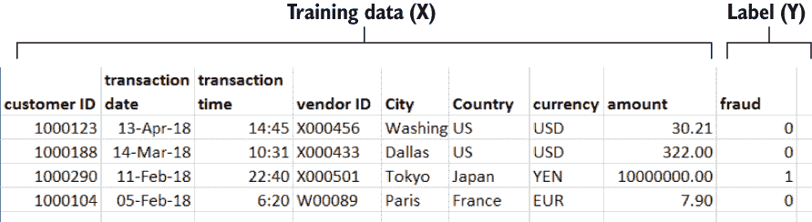
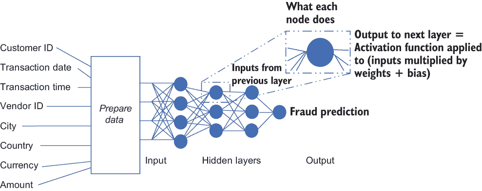
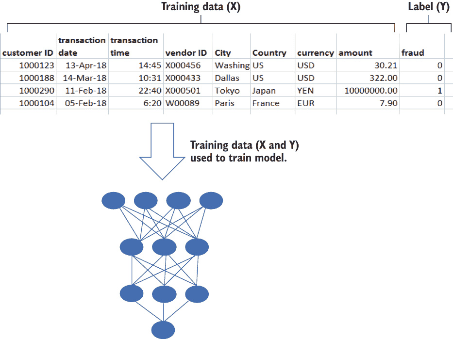
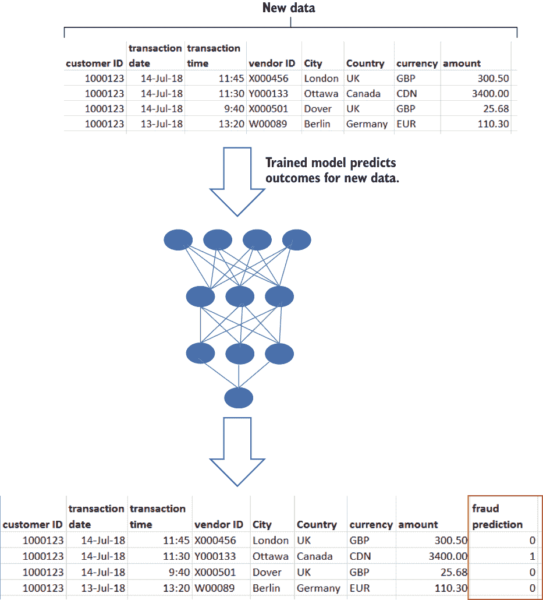
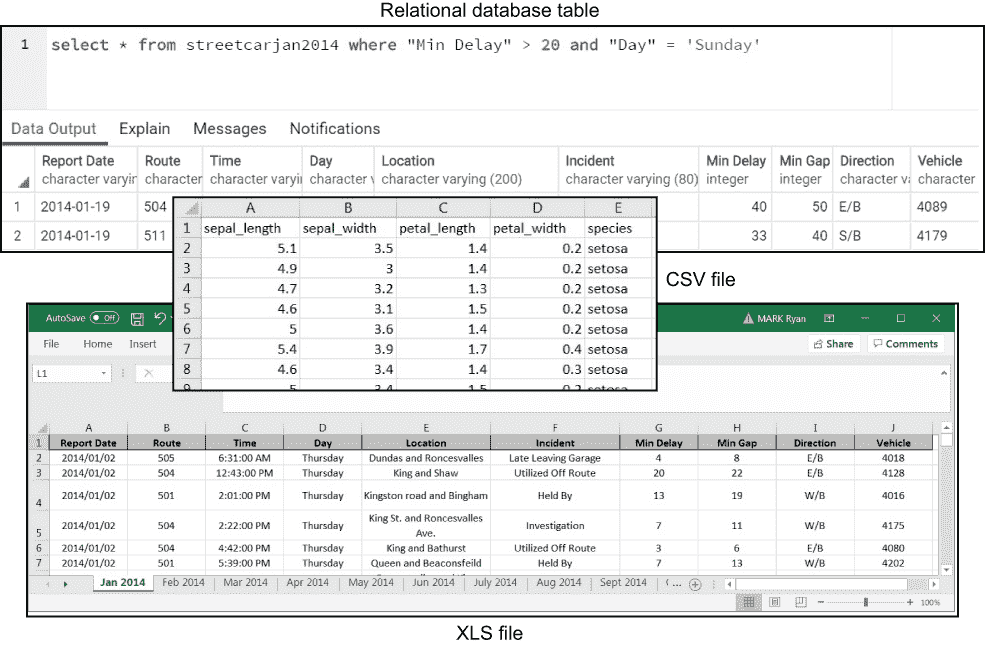
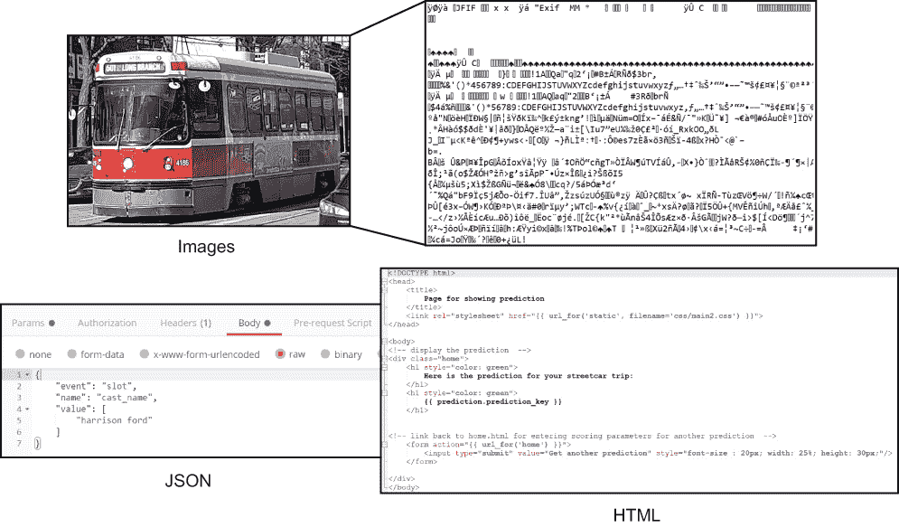
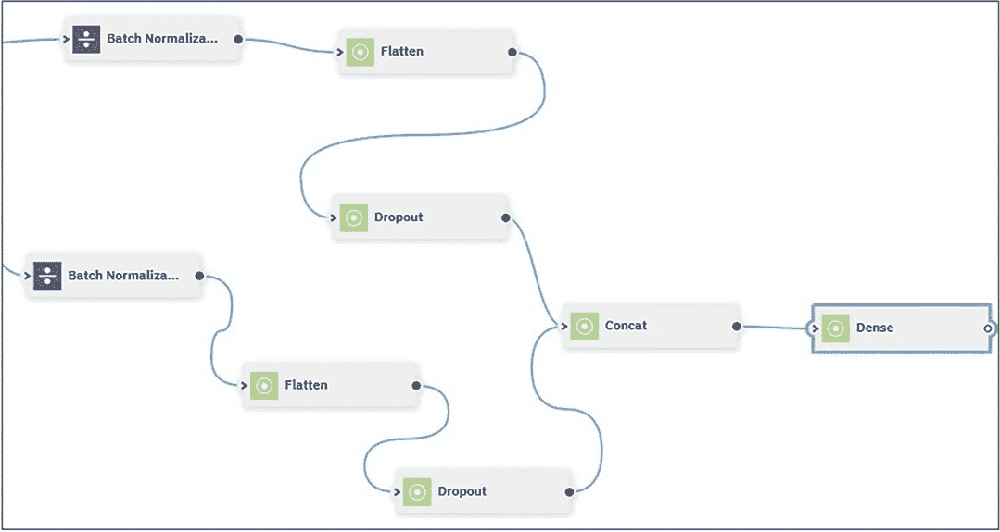

# 1 为什么使用结构化数据的深度学习？

本章节涵盖

+   深度学习的高级概述

+   深度学习的利弊

+   深度学习软件堆栈的介绍

+   结构化数据与非结构化数据

+   对结构化数据深度学习的反对意见

+   结构化数据深度学习的优势

+   介绍本书所附代码

自 2012 年以来，我们见证了只能称之为人工智能的复兴。一个在 20 世纪 80 年代末迷失方向的学科再次变得重要。发生了什么？

2012 年 10 月，一支与多伦多大学深度学习主要倡导者杰弗里·辛顿（Geoffrey Hinton）合作的学生团队在 ImageNet 计算机视觉竞赛中宣布了一个结果，该结果在识别物体时的错误率接近竞争对手的一半。这一结果利用了深度学习，并引发了人们对这一主题的极大兴趣。从那时起，我们在许多领域看到了具有世界级结果的深度学习应用，包括图像处理、音频转文本和机器翻译。在过去的几年里，深度学习的工具和基础设施已经达到了成熟和易于访问的水平，使得非专业人士能够利用深度学习的优势。本书展示了您如何使用深度学习来深入了解和预测*结构化数据*：以表格形式组织的数据，如关系数据库中的行和列。您将通过逐步通过一个完整的、端到端的深度学习示例来了解深度学习的能力，从摄取原始输入结构化数据到将深度学习模型提供给最终用户。通过将深度学习应用于具有现实世界结构化数据集的问题，您将看到深度学习在结构化数据中的挑战和机遇。

## 1.1 深度学习概述

在回顾深度学习的高级概念之前，让我们介绍一个简单的例子，我们可以用它来探索这些概念：信用卡欺诈检测。第二章介绍了现实世界的数据集和大量的代码示例，该示例准备了这个数据集并使用它来训练一个深度学习模型。目前，这个基本的欺诈检测示例足以回顾一些深度学习的概念。

您为什么要利用深度学习进行欺诈检测？有几个原因：

+   欺诈者可以找到绕过传统基于规则欺诈检测方法的方法([`mng.bz/emQw`](http://mng.bz/emQw))。

+   作为工业级管道一部分的深度学习方法——在该管道中，模型的性能经常被评估，如果性能低于给定的阈值，模型将自动重新训练——可以适应欺诈模式的变化。

+   深度学习方法有可能提供对新的交易进行近乎实时的评估。

总结来说，深度学习对于欺诈检测来说是值得考虑的，因为它可以成为灵活、快速解决方案的核心。请注意，除了这些优点之外，使用深度学习作为欺诈检测问题的解决方案也有一个缺点：与其他方法相比，深度学习更难以解释。其他机器学习方法允许你确定哪些输入特征对结果影响最大，但这个关系可能很难或无法用深度学习建立。

假设一家信用卡公司将其客户交易记录作为表格中的记录。该表格中的每条记录都包含有关交易的信息，包括一个唯一标识客户的 ID，以及有关交易的详细信息，包括交易日期和时间、供应商 ID、交易地点以及交易的货币和金额。除了这些信息，每次报告交易时都会添加到表格中，每条记录都有一个字段来指示交易是否被报告为欺诈。

信用卡公司计划使用该表格中的历史数据训练一个深度学习模型，并使用这个训练好的模型来预测新到达的交易是否为欺诈。目标是尽快识别潜在的欺诈（并采取纠正措施），而不是等待几天让客户或供应商报告特定交易为欺诈。

让我们检查客户交易表。图 1.1 包含了这个表格中一些记录的片段。

图 1.1 信用卡欺诈示例数据集

列客户 ID、交易日期、交易时间、供应商 ID、城市、国家、货币和金额包含关于上一季度单个信用卡交易的详细信息。欺诈列是特殊的，因为它包含标签：当我们用训练数据训练深度学习模型时，我们希望模型预测的值。假设欺诈列的默认值为`0`（表示“非欺诈”），并且当我们的客户或供应商报告欺诈交易时，该交易在表格中的欺诈列的值被设置为`1`。

当新的交易到来时，我们希望能够预测它们是否是欺诈性的，这样我们就可以迅速采取纠正措施。通过在历史数据集上训练深度学习模型，我们将定义一个可以预测新的信用卡交易是否欺诈的函数。在这个监督学习（[`mng.bz/pzBE`](http://mng.bz/pzBE)）的例子中，模型是通过包含带有标签的示例的数据集来训练的。用于训练模型的数据库包括训练模型将预测的值（在这种情况下，是否为欺诈交易）。相比之下，在无监督学习中，训练数据集不包含标签。

现在我们已经介绍了信用卡欺诈的例子，让我们用它来简要地浏览一下深度学习的一些概念。对于这些概念的更深入描述，请参阅弗朗索瓦·肖莱特的《Python 深度学习，第 2 版》（*[`mng.bz/OvM2`](http://mng.bz/OvM2)*），其中对这些概念有出色的描述：

+   *深度学习*是一种机器学习方法，通过在每个层设置权重和偏置来训练多层人工神经网络，通过使用基于梯度的优化和反向传播来优化*损失函数*（实际结果[欺诈列中的值]与预测结果之间的差异）。

+   深度学习模型中的神经网络有一系列层，从输入层开始，接着是几个隐藏层，最后是输出层。

+   在这些每一层中，前一层（或者，在第一层的情况下，训练数据，对于我们的例子来说，是来自客户 ID、日期、时间、供应商 ID、城市、国家、货币和金额的数据集列）的输出会经过一系列操作（通过权重矩阵相乘、添加偏置[偏差]以及应用非线性激活函数）以产生下一层的输入。在图 1.2 中，每个圆圈（节点）都有自己的权重集。输入会被这些权重相乘，加上偏置，然后对结果应用激活函数以产生下一层接收的输出。

    

    图 1.2 多层神经网络

    模型的最终输出层根据输入生成预测。在我们的预测信用卡欺诈的例子中，输出指示模型是否预测了欺诈（输出为`1`）或不是欺诈（输出为`0`）对于特定的交易。

+   深度学习通过迭代更新网络中的权重来最小化损失函数（该函数定义了模型预测与训练数据集中实际结果值之间的总差异）。随着权重的调整，模型在总体上的预测将更接近输入表欺诈列中的实际结果值。每次训练迭代时，根据损失函数的梯度调整权重。

+   你可以将损失函数的梯度视为大致等同于山丘的斜率。如果你朝着与山丘斜率相反的方向迈出小而渐进的步伐，你最终会到达山丘的底部。通过在网络的每次迭代中对权重进行与梯度相反方向的小幅调整，你可以逐步减少损失函数。一个称为*反向传播*的过程用于获取损失函数的梯度，然后可以将它应用于更新神经网络中每个节点的权重，这样通过重复应用，损失函数被最小化，模型的预测准确性被最大化。训练过程总结在图 1.3 中。

    

    图 1.3 当在网络上迭代更新权重以训练模型时，使用训练数据。

+   当训练完成（模型中的权重已经通过反向传播提供的梯度反复更新，以达到使用训练数据所期望的性能）时，得到的模型可以用于对新数据进行预测，这些数据模型之前从未见过。

该过程的输出是一个经过训练的深度学习模型，它包含了最终的权重，并可用于从新的输入数据中预测输出，如图 1.4 所示。

图 1.4 训练好的模型对新数据进行预测。

本书不涵盖深度学习的数学基础。在《Python 深度学习》第 2 版中关于深度学习数学构建块的章节提供了对深度学习背后数学的清晰、简洁描述。你还可以在第九章中找到对深度学习背后数学的概述，该章节提到了 deeplearning.ai 课程。

## 1.2 深度学习的利弊

深度学习的核心观点既简单又深刻：一个训练好的深度学习模型可以包含一个极其复杂的函数，该函数可以准确描述模型训练数据中隐含的模式。给定足够的标记数据来训练（例如，足够大的信用卡交易数据集，其中有一列指示每笔交易是否为欺诈），深度学习可以定义一个模型，该模型可以预测模型在训练过程中从未见过的新的数据标签值。深度学习以训练模型的形式定义的函数可以包括数百万个参数，远远超出任何人类可以手动创建的数量。

在某些用例中，例如图像识别，深度学习模型有在比非深度学习机器学习方法更接近原始输入数据的数据上进行训练的优势。那些方法可能需要广泛的 *特征工程*（输入数据的编码转换和输入表中的新列）以达到良好的性能。

深度学习的益处并非免费。深度学习有几个显著的缺点，你需要准备好应对。为了使深度学习有效，你需要

+   *大量的标记数据* — 根据领域不同，你可能需要数百万个示例。

+   *能够进行大量矩阵操作的硬件* — 正如你在第二章中将会看到的，现代笔记本电脑可能足以训练一个简单的深度学习模型。更大的模型将需要专门的硬件（GPU 和 TPU）来高效训练。

+   *对模型不完美透明度的容忍度* — 当你将深度学习与经典的非深度学习机器学习进行比较时，可能更难解释为什么深度学习模型会做出这样的预测。特别是，如果一个模型是在某个特征集（客户 ID、交易日期、交易时间等）上训练的，那么确定哪些特征对模型预测结果的能力贡献最大可能很困难。

+   *避免常见陷阱的重大工程* — 这些陷阱包括过拟合（模型对其训练数据准确，但不能推广到新数据）和梯度消失/爆炸（反向传播因为权重的修改在每个步骤变得过大或过小而爆炸或停止）。

+   *操纵多个超参数的能力* — 数据科学家需要控制一组被称为*超参数*的旋钮，包括学习率（每次更新权重时采取的步长大小）、正则化（避免过拟合的各种策略）以及训练过程迭代输入数据集的次数以训练模型。调整这些旋钮以获得良好的结果就像尝试驾驶直升机。作为一名直升机飞行员需要协调双手和双脚以保持机器稳定路径并避免坠毁，训练深度学习模型的数据科学家需要协调超参数以从模型中获得期望的结果并避免过拟合等陷阱。有关本书扩展示例中使用的超参数的详细信息，请参阅第五章。

+   *对不完美准确度的容忍度* — 深度学习本质上不可能产生 100%准确的预测。如果需要绝对准确度，最好使用更确定性的方法。

这里有一些缓解这些缺点的措施：

+   *大量标记数据* — 深度学习对大量标记数据的渴望可以通过*迁移学习*来缓解：重用训练用于在相关任务上执行一个任务的模型或模型子集。在大型、通用的标记图像数据集上训练的模型可以用来启动应用于特定领域（在该领域中标记图像数据稀缺）的模型。本书的扩展示例不使用迁移学习，但您可以查看 Paul Azunre 的《自然语言处理中的迁移学习》（[` mng.bz/GdVV`](http://mng.bz/GdVV)），了解迁移学习在深度学习用例（如自然语言处理和计算机视觉）中的关键作用。

+   *能够进行大规模矩阵操作的硬件* — 现在，很容易获得具有足够硬件能力的环境（包括第二章中介绍的云环境），以较低的成本训练具有挑战性的模型。本书中扩展的深度学习示例在专门为深度学习设计的硬件的云环境中可以更快地运行，但你也可以在配置合理的现代笔记本电脑上运行它。

+   *对模型不透明性的容忍度* — 一些供应商（包括亚马逊、谷歌和 IBM）现在提供解决方案，帮助使深度学习模型更加透明，并解释深度学习模型的行为。

+   *避免常见陷阱的重大工程* — 算法改进不断进入常见的深度学习框架，以帮助您避免梯度爆炸等问题。

+   *调整多个超参数的能力* — 自动化超参数优化方法有可能减少调整超参数的复杂性，并使训练深度学习模型的体验更像开车而不是驾驶直升机，因为有限的一组输入（方向盘、油门）会产生直接的结果（汽车改变方向，汽车改变速度）。

准确度不足仍然是一个挑战。不完美准确度的影响取决于您试图解决的问题。如果您正在预测客户是否会流失（将其业务带到竞争对手那里），85% 或 90% 的时间正确可能已经足够解决该问题。然而，如果您正在预测可能致命的医疗状况，那么深度学习的内在限制就更加难以克服。您可以容忍多少不准确将取决于您正在解决的问题。

## 1.3 深度学习堆栈概述

今天，有各种各样的深度学习框架可供选择。其中最受欢迎的两个是 TensorFlow ([`www.tensorflow.org`](https://www.tensorflow.org))，它在深度学习的工业应用中占据主导地位，以及 PyTorch ([`pytorch.org`](https://pytorch.org))，它在研究社区中拥有众多支持者。

在这本书中，我们将使用 Keras ([`keras.io`](https://keras.io)) 作为我们的深度学习库。Keras 最初是一个独立的项目，可以用作各种深度学习框架的前端。正如第五章所述，截至 TensorFlow 2.0，Keras 已集成到 TensorFlow 中。Keras 是 TensorFlow 推荐的高级 API。本书附带的代码已在 TensorFlow 2.0 上进行了验证，但您应该可以使用 TensorFlow 的后续版本，而不会遇到任何问题。

下面是对堆栈主要组件的简要介绍：

+   *Python* — 这种易于学习、灵活的解释性语言是目前机器学习最受欢迎的语言。Python 的普及增长与过去十年中机器学习的复兴紧密相关，现在它远远超过了其最接近的竞争对手 R，成为机器学习的通用语言。Python 拥有一个庞大的生态系统和一套庞大的库，不仅涵盖了您想用机器学习做的所有事情，还包括了开发的全套工具。此外，Python 拥有一个庞大的开发者社区，您几乎可以在线找到几乎任何 Python 问题或问题的答案。本书中的代码示例完全用 Python 编写，除了第三章中描述的 YAML 配置文件；第二章中的 SQL 示例；以及第八章中描述的部署，这些部署包括 Markdown、HTML 和 JavaScript 中的代码。

+   *Pandas* —这个 Python 库为你提供了在 Python 中方便地处理表格结构化数据的所有工具。你可以轻松地将结构化数据（无论是从 CSV 或 Excel 文件中还是直接从关系数据库中的表中）导入到 Pandas 数据框中，然后通过表操作（如删除和添加列、按列值过滤和连接表）来操作它。你可以将 Pandas 视为 Python 对 SQL 的回应。第二章包含了一些将数据加载到 Pandas 数据框中并使用 Pandas 执行常见 SQL 类型操作的示例。

+   *scikit-learn* —scikit-learn 是一个广泛的 Python 机器学习库。本书中的扩展示例大量使用了这个库，包括第三章和第四章中描述的数据转换工具以及第八章中描述的功能，以定义可训练的数据管道，这些管道既为训练深度学习模型做准备，也为从训练好的模型中获得预测做准备。

+   *Keras* —Keras 是一个简单的深度学习库，它提供了足够的灵活性和控制，同时抽象出了一些底层 TensorFlow API 的复杂性。Keras 有一个庞大而活跃的社区，包括初学者和经验丰富的机器学习从业者，并且很容易找到使用 Keras 进行深度学习应用的可靠示例。

## 1.4 结构化数据与非结构化数据

这本书的标题包含两个不常一起出现的术语：*深度学习*和*结构化数据*。结构化数据（在本书的上下文中）是指以行和列的形式组织的数据，这种数据存储在关系数据库中。深度学习是一种高级机器学习技术，它在处理不常存储在表中的数据（如图像、视频、音频和文本）的一系列问题上已经证明了其成功。

为什么要将深度学习应用于结构化数据？为什么将一个 40 年之久的数据库范式与前沿的深度学习相结合？对于涉及结构化数据的问题，难道没有更简单的方法来解决吗？难道没有比尝试用存储在表中的数据训练模型更好的深度学习应用吗？

为了回答这些有效的问题，我们首先将更详细地定义我们所说的结构化和非结构化数据；在 1.5 节中，我们将解决这些以及其他关于将深度学习应用于结构化表格数据的反对意见。

在这本书中，*结构化数据*是指已经被组织起来以存储在具有行和列的关系数据库中的数据。列可以包含数值（例如货币金额、温度、时间长度或其他以整数或浮点值表示的数量）或非数值（例如字符串、嵌入的结构化对象或非结构化对象）。

所有关系型数据库都支持 SQL（尽管有不同的方言）作为数据库的主要接口。常见的关系型数据库包括以下几种：

+   *专有数据库* —Oracle、SQL Server、Db2、Teradata

+   *开源数据库* —Postgres、MySQL、MariaDB

+   *基于开源的专有数据库* —AWS Redshift（基于 Postgres）

关系型数据库可以包含表之间的关系，例如外键（其中一个表列的可允许值取决于另一个表中标识列的值）。可以通过连接表来创建新的表，这些新表包含参与连接的表的行和列的组合。关系型数据库还可以包含代码集，例如存储过程，这些存储过程可以调用以访问和操作数据库中的数据。为了这本书的目的，我们将重点关注表的行和类型化列的性质，而不是关系型数据库提供的额外表间交互和代码接口。

关系型数据库并不是结构化表格数据的唯一可能存储库。如图 1.5 所示，Excel 或 CSV 文件中的数据在本质上是以行和列结构化的，尽管与关系表不同，列的类型不是作为结构的一部分编码，而是从列内容中推断出来的。本书主要示例的数据集来自一组 Excel 文件。

图 1.5 表格结构化数据的示例

为了这本书的目的，我们不会探讨非结构化数据——那些没有组织成关系数据库中表格形式的数据。如图 1.6 所示，非结构化数据包括图像、视频和音频文件，以及文本和标记格式，如 XML、HTML 和 JSON。根据这个定义，非结构化数据并不一定完全没有结构。例如，JSON 中的键值对就是一种结构，但 JSON 在其原生状态下并不是以行和列的表格形式组织，因此，为了这本书的目的，它被视为非结构化数据。更复杂的是，结构化数据可以包含非结构化元素，例如表格中的自由文本列或引用 XML 文档或 BLOBs（二进制大对象）的列。

图 1.6 非结构化数据的示例

许多书籍涵盖了深度学习在非结构化数据（如图像和文本）中的应用。本书则采取不同的方向，专注于深度学习在表格结构化数据上的应用。第 1.5 节和第 1.6 节提供了一些对结构化数据关注的理由，首先讨论了一些你可能会对结构化数据关注持怀疑态度的原因，然后回顾了使用深度学习探索结构化数据问题的好处。

## 1.5 使用结构化数据进行深度学习的反对意见

许多备受赞誉的深度学习应用都涉及非结构化数据，如图像、音频和文本。一些深度学习专家质疑是否应该将深度学习应用于结构化数据，并坚持认为非深度学习的方法最适合结构化数据。

为了激励你探索结构化数据中的深度学习，让我们回顾一些反对意见：

+   *结构化数据集太小，无法用于深度学习。* 这个反对意见是否有效取决于领域。当然，有许多领域（包括本书中探讨的问题）中的标记结构化数据集包含数万个甚至数百万个示例，使它们足够大，可以用于训练深度学习模型。

+   *保持简单。* 深度学习既困难又复杂，为什么不使用更简单的解决方案，比如非深度学习机器学习或传统的商业智能应用？这个反对意见三年前比现在更有道理。在简单性和广泛应用方面，深度学习已经达到了一个转折点。多亏了深度学习的普及，利用它的工具现在使用起来要容易得多。正如你将在本书的扩展编码示例中看到的那样，深度学习现在对非专业人士来说也是可访问的。

+   *手工制作的深度学习解决方案变得越来越不必要了。* 为什么要费劲去创建一个端到端的深度学习解决方案，尤其是如果你不是全职数据科学家，如果手工解决方案将越来越多地被需要少量或不需要编码的解决方案所取代？例如，fast.ai 库([`docs.fast.ai`](https://docs.fast.ai))允许你用几行代码创建强大的深度学习模型，像 Watson Studio 这样的数据科学环境提供基于 GUI 的模型构建器（如图 1.7 所示），让你无需编写任何代码就能创建深度学习模型。

+   使用这些解决方案，为什么还要努力学习如何直接编写深度学习模型的代码？为了理解如何使用低代码或无代码解决方案，你仍然需要了解深度学习模型是如何构建的，而最快的学习方式就是编写代码来利用深度学习框架。如果你主要处理工作中的表格数据，那么能够将深度学习应用于这些数据是有意义的。通过为涉及你彻底理解的有序表格数据的特定问题编写深度学习解决方案，你将了解深度学习的概念、优势和局限性。有了这种理解，你将能够利用深度学习（无论是否手工编码）来解决更多的问题。本书中的扩展示例将带你通过将深度学习应用于结构化表格数据的端到端示例。在第九章，你将学习如何将本书中的示例适应你自己的结构化数据集。

    

    图 1.7 使用 GUI（Watson Studio）创建深度学习模型

在本节中，我们探讨了使用深度学习解决涉及结构化数据的问题的常见反对意见，并回顾了主观回应。然而，主观回应是不够的；我们还需要比较深度学习与非深度学习的代码实现。在第七章中，我们对本书中的扩展示例的两个解决方案进行了面对面比较：深度学习解决方案和基于非深度学习方法 XGBoost 的解决方案。我们比较了这两种方法在性能、模型训练时间、代码复杂性和灵活性方面的差异。

## 1.6 为什么要用结构化数据问题来研究深度学习？

在 1.5 节中，我们回顾了将深度学习应用于结构化数据的一些反对意见。假设你对这些反对意见的处理方式感到满意。然而，还有一个问题，那就是通过花时间通过一个扩展示例来应用深度学习于结构化数据，你将获得什么好处。许多书籍可以带你通过将深度学习应用于各种问题和数据集的过程。这本书有什么独特之处？使用结构化数据集通过深度学习完成端到端问题的好处是什么？

让我们从大局开始：世界上非结构化数据比结构化数据多得多（[`learn.g2.com/structured-vs-unstructured-data`](https://learn.g2.com/structured-vs-unstructured-data)）。如果 80%的数据是非结构化的，为什么还要费心尝试将深度学习应用于所有数据中结构化数据的小部分呢？尽管非结构化数据可能是结构化数据的四倍，但结构化数据在数据饼图中的份额极其重要。银行、零售商、保险公司、制造商、政府——现代生活的基石——都依赖于关系数据库。每天当你进行日常活动时，你会在各种关系数据库中的数十个甚至数百个表中生成更新。当你用借记卡支付东西、打手机或在线查看银行余额时，你正在访问或更新关系数据库中的数据。除了结构化数据对我们日常生活的重大意义外，许多工作都围绕着结构化表格数据展开。在图像和视频上使用深度学习很有趣，但如果你从事的工作不涉及这类数据怎么办？如果你的工作完全是关于关系数据库中的表格或 CSV 和 Excel 文件怎么办？如果你掌握了将深度学习应用于结构化数据的技术，你将能够将这些技术应用于解决你在工作中遇到的实际问题。

在本书中，您将从始至终学习如何将深度学习应用于表格结构化数据集。您将学习如何准备一个现实世界的数据集（这些数据集具有所有典型的瑕疵和问题），以便为训练深度学习模型做准备，如何根据表格中的列类型对数据集进行分类，以及如何创建一个由这种数据分类自动定义的简单深度学习模型。您将学习这个模型如何结合适应每个数据类别层的组合，以便您可以利用源表中的不同类型的数据（文本、分类和连续）来训练模型。您还将学习如何部署深度学习模型，使其可供其他人使用。本书中您将学习的技巧适用于各种结构化数据集，并允许您释放深度学习解决这些数据集问题的潜力。

## 1.7 伴随本书的代码概述

本书的核心是一个扩展的编码示例，它将深度学习应用于解决一个具有现实世界结构化数据集的问题。第二章介绍了这个问题，并描述了在此示例中使用的所有代码。在本节中，我们简要总结了用于解决此问题的最重要的程序。

伴随本书的代码由一系列 Jupyter 笔记本和 Python 程序组成，这些程序将您从原始输入数据集引导到部署并训练好的深度学习模型。您可以在[`mng.bz/v95x`](http://mng.bz/v95x)找到所有代码，以及相关的数据和配置文件。以下是一些存储库中的关键文件：

+   *第二章.ipynb* —与第二章中介绍性代码相关的代码片段。

+   *第五章.ipynb* —与第二章中描述的如何使用 Pandas 进行 SQL 类型操作相关的代码片段。

+   *数据准备笔记本* —用于摄取原始数据集并执行常见的数据清洗和准备步骤的代码。此笔记本的输出是一个包含清洗后的训练数据的 Pandas 数据框的 Python pickle 文件。

+   *基本数据探索笔记本* —对本书主要示例的数据集进行的基本探索性数据分析，如第三章所述。

+   *地理编码数据准备* —从主数据集中的位置值中提取纬度和经度值的相关代码，如第四章所述。

+   *时间序列预测数据探索笔记本* —使用第三章中描述的时间序列预测技术，对本书中主要示例的数据集进行额外探索。

+   *深度学习模型训练笔记本* —将清洗后的数据重构为考虑特定电车没有延迟期间的格式，并将这种重构的数据形式准备为输入到 Keras 深度学习模型，如第五章和第六章所述。此笔记本的输出是一个训练好的深度学习模型。

+   *XGBoost 模型训练笔记本* —用于练习非深度学习模型的代码。这个笔记本与用于训练深度学习模型的笔记本在真正的模型训练代码之前是相同的。在第七章中，我们比较了该模型与深度学习模型的结果。

+   *Web 部署* —将训练好的深度学习模型以简单 Web 方式部署的代码，如第八章所述。

+   *Facebook Messenger 部署* —将训练好的深度学习模型作为聊天机器人部署到 Facebook Messenger 中的代码，如第八章所述。

书中主要示例所使用的原始数据集不在 repo 中，而是发布在[`mng.bz/4B2B`](http://mng.bz/4B2B)。

## 1.8 您需要了解的内容

要充分利用本书，您应该熟悉在 Jupyter Notebooks 以及原始 Python 文件中用 Python 进行编码。您还应该熟悉非深度学习机器学习方法。特别是，您应该掌握以下概念：过拟合、欠拟合、损失函数和目标函数。您应该熟悉常见云环境中的基本操作，例如 AWS、Google Cloud 或 Azure。对于部署部分，您应该对 Web 编程有一些基本的了解。最后，您应该具备关系型数据库的背景知识，并且对 SQL 感到舒适。

本书涵盖了深度学习的核心内容，但并未深入探讨理论细节。相反，它通过一个实际应用的深度学习示例的扩展示例来引导您。如果您需要更深入地了解深度学习及其在 Python 环境中的实现，*《Python 深度学习》* 是一个极好的资源。我强烈推荐这本书作为本书的补充。以下是提供关于一般深度学习主题背景的三个章节：

+   “神经网络数学基础”——提供了对深度学习基本概念背景的介绍，包括张量（深度学习核心理论数据容器）和反向传播。

+   “神经网络入门”——通过一系列简单的深度学习问题进行指导，涵盖分类（预测输入数据点属于哪个类别）和回归（预测输入数据点的连续值目标）。

+   “高级深度学习最佳实践”——探讨了各种深度学习架构，并包括关于 Keras 回调（本书第六章介绍的主题）以及使用 TensorBoard 监控深度学习模型的详细信息。

在这本书中，我强调提供对深度学习端到端过程的实用探索，从原始输入数据开始，一直到最后部署和训练好的深度学习模型。由于本书涵盖范围广泛，不可能总是深入探讨每个相关技术主题。在整个书中，在适当的地方，我会参考《用 Python 进行深度学习》以及其他 Manning 出版社的出版物和技术文章，以获取更多相关主题的详细信息。此外，第九章推荐了关于深度学习理论背景的资源。

## 摘要

+   深度学习是一种强大的技术，在过去十年中已经崭露头角。到目前为止，深度学习备受赞誉的应用主要处理非表格型数据，如图像和文本。在这本书中，我展示了深度学习也应该被考虑用于与表格型、结构化数据相关的问题。

+   深度学习通过应用一系列技术（包括基于梯度的优化和反向传播）到输入数据上，自动定义可以预测新数据上结果的功能。

+   深度学习在多个领域已经取得了最先进的结果，但与其他机器学习技术相比，它也存在一些缺点。这些缺点包括模型对哪些特征最为重要的透明度不足，以及对训练数据的强烈需求。

+   有些人认为深度学习不应该应用于表格型、结构化数据。这些人认为深度学习过于复杂，结构化数据集太小，不足以训练深度学习模型，而更简单的替代方案对于结构化数据问题来说是足够的。

+   同时，结构化数据对现代生活至关重要。为什么要把深度学习的范围限制在图像和自由文本上呢？许多重要问题都涉及结构化数据，因此学习如何利用深度学习来解决结构化数据问题是非常有价值的。
