# 2. 介绍示例问题和 Pandas 数据框

本章涵盖

+   深度学习开发环境选项

+   Pandas 数据框的介绍

+   介绍本书中用于说明结构化数据深度学习的主要示例：预测电车延误

+   示例数据集的格式和范围

+   关于使用结构化数据进行深度学习的常见反对意见的更多细节

+   深度学习模型训练过程的初步了解

在本章中，你将了解你可以选择的深度学习环境选项以及如何将表格结构化数据引入你的 Python 程序。你将获得 Pandas 的概述，这是用于操作表格结构化数据的 Python 工具。你还将了解本书中用于演示结构化数据深度学习的主要示例，包括主要示例中使用的详细数据集和该示例代码的整体结构。然后，你将获得关于第一章中引入的结构化数据深度学习反对意见的更多细节。最后，我们将提前一瞥，并通过一轮深度学习模型的训练来激发你对第 3-8 章中检查的扩展示例的兴趣。

## 2.1 深度学习开发环境选项

在你开始一个深度学习项目之前，你需要访问一个提供你所需要的硬件和软件堆栈的环境。本节描述了你在深度学习环境方面可以选择的选项。

在你查看专门为深度学习设计的特定环境之前，重要的是要知道，你可以在标准的 Windows 或 Linux 环境中完成本书中的扩展代码示例。使用具有深度学习特定硬件的环境可以加快模型训练过程，但这并不是必需的。我在我的 Windows 10 笔记本电脑上运行了本书中的代码示例，该电脑有 8 GB 的 RAM 和单核处理器，以及 Paperspace Gradient 环境（在本节中描述）。在 Gradient 中模型训练快了大约 30%，但这意味着第七章中描述的每个实验的训练时间只相差一分钟左右。对于更大的深度学习项目，我强烈推荐本节中描述的深度学习启用环境之一，但配备合理的现代笔记本电脑就足以完成本书中的扩展示例。如果你决定在你的本地系统上尝试运行代码示例，请确保你的 Python 版本至少为 3.7.4。如果你正在安装 Python 或使用虚拟 Python 环境，你需要安装 Pandas、Jupyter、sci-kit learn 和 TensorFlow 2.0。随着你通过示例的进展，你可能需要安装额外的库。

重要提示：本书中的大多数代码示例都可以在相同的 Python 环境中运行。唯一的例外是第八章中描述的 Facebook Messenger 部署。这个部署需要在具有 TensorFlow 1.x 的 Python 环境中完成，而模型训练则需要具有 TensorFlow 2.0 或更高版本的 Python 环境。为了解决 TensorFlow 版本之间的冲突，您应该利用 Python 虚拟环境来运行代码示例。我建议您将您的基 Python 环境升级到最新的 TensorFlow 1.x 版本，并用于除运行模型训练笔记本之外的所有操作。为模型训练笔记本创建一个虚拟环境，并在该环境中安装 TensorFlow 2.0。这样做将使您在模型训练步骤中享受到 TensorFlow 2.0 的好处，同时保持其余 Python 环境的向后兼容性和稳定性。您可以在本文中找到设置 Python 虚拟环境的详细信息：[`mng.bz/zrjr`](http://mng.bz/zrjr)。

几个云服务提供商提供的深度学习环境大约每小时只需一杯咖啡的费用。每个云环境都有其优势和劣势，其中一些（Azure 和 IBM Cloud）强调创建第一个项目的简便性，而其他一些（Amazon Web Services [AWS]）则提供规模和先发优势。以下是一些提供深度学习环境的云服务提供商：

+   *AWS* 可以在这里访问：[`mng.bz/0Z4m`](http://mng.bz/0Z4m)。AWS 中的 SageMaker 环境抽象了一些管理机器学习模型的复杂性。AWS 包括关于 SageMaker 的良好教程，包括一个([`mng.bz/9A0a`](http://mng.bz/9A0a))，它引导您完成训练和部署模型的端到端过程。

+   *Google Cloud* *(* [`mng.bz/K524`](http://mng.bz/K524) *)* 也提供了易于使用的教程，包括一个([`mng.bz/jVgy`](http://mng.bz/jVgy))，展示了如何在 Google Cloud 平台上部署深度学习模型。

+   *Azure* *(* [`mng.bz/oREN`](http://mng.bz/oREN)) 是微软的云环境，包括几个深度学习项目的选项。在[`mng.bz/8Gp2`](http://mng.bz/8Gp2)上的教程提供了一个简单的介绍。

+   *Watson Studio Cloud* *(* [`mng.bz/nz8v`](http://mng.bz/nz8v)) 提供了一个专注于机器学习的环境，您可以在不深入了解 IBM Cloud 的所有细节的情况下利用它。[`mng.bz/Dz29`](http://mng.bz/Dz29) 上的文章提供了一个快速概述，以及到 AWS SageMaker、Google Cloud 和 Azure 的配套概述文章的链接。

所有这些云环境都提供了深度学习项目所需的一切，包括 Python、大多数所需的库，以及访问深度学习加速硬件，包括图形处理单元（GPUs）和张量处理单元（TPUs）。

深度学习模型的训练依赖于大规模矩阵操作，这些加速器使得这些操作可以更快地运行。正如之前所述，您可以在没有 GPU 或 TPU 的环境中训练简单的深度学习模型，但训练过程将会更慢。有关本书扩展示例中哪些部分将受益于在具有深度学习特定硬件的环境中运行的详细信息，请参阅第 2.11 节。

除了提供深度学习所需的硬件和软件外，本节列出的云环境还满足了许多对开发深度学习模型感兴趣之外的用户需求。以下是两个专门针对机器学习的云环境：

+   *Google Colaboratory* *(Colab* ; [`mng.bz/QxNm`](http://mng.bz/QxNm) ) 是由 Google 提供的一个免费 Jupyter Notebooks 环境。

+   *Paperspace* ([`towardsdatascience.com/paperspace-bc56efaf6c1f`](https://towardsdatascience.com/paperspace-bc56efaf6c1f)) 是一个专注于机器学习的云环境。您可以使用 Paperspace Gradient 环境 ([`gradient.paperspace.com/`](https://gradient.paperspace.com/)) 通过一键创建一个 Jupyter Notebooks 环境，在那里您可以开始您的深度学习项目。图 2.1 显示了 Paperspace 控制台中的 Gradient 笔记本。


图 2.1 Paperspace Gradient：一键式深度学习云环境

您可以使用这些云环境中的任何一个来练习本书附带的代码。为了简化流程并最大限度地利用您学习深度学习的时间，如果您打算使用云环境而不是本地系统，我建议您利用 Paperspace Gradient。您将获得一个可靠的环境，它正好提供您所需的一切，无需担心其他云环境提供的任何附加云服务。Gradient 需要信用卡来设置。您预计每小时大约需要支付 1 美元的基本 Gradient 环境费用。根据您处理代码的速度以及您在不用时关闭 Gradient 笔记本的勤奋程度，您可能需要支付总计 30-50 美元来完成本书中的代码示例。

如果成本是关键考虑因素，并且您不想使用本地系统，Colab 是一个很好的替代云环境。您在使用 Colab 时的体验可能不会像在 Paperspace Gradient 中那么顺畅，但您不必担心成本。参见附录 A，了解有关设置 Colab 所需了解的更多信息，以及与 Paperspace Gradient 相比 Colab 的优缺点描述。

除了 Colab 和 Paperspace Gradient 之外，主流的云服务提供商（包括 AWS、Google Cloud Platform 和 IBM Cloud）都提供了可用于深度学习开发的 ML 环境。所有提供商都提供某种形式的有限免费访问其 ML 环境。如果你已经在使用这些平台之一，并且在你用完免费访问后可以接受付费，那么这些主流提供商中的一个可能是一个不错的选择。

## 2.2 探索 Pandas 的代码

当你克隆了与这本书相关的 GitHub 仓库 ([`mng.bz/v95x`](http://mng.bz/v95x))，你将在 notebooks 子目录中找到与探索 Pandas 相关的代码。下一个列表显示了包含本章描述的代码的文件。

列表 2.1 与 Pandas 基础相关的代码

```
├── data                            ❶ 
│ 
├── sql 
│           streetcarjan2014.sql    ❷ 
│ 
├── notebooks
│           chapter2.ipynb          ❸ 
│           chapter5.ipynb          ❹ 
```

❶ 数据文件目录

❷ 定义与输入数据集相同列的表的 SQL 代码

❸ 包含基本 Pandas 示例的笔记本

❹ 包含如何在 Pandas 中执行你通常在 SQL 中做的操作的示例的笔记本

## 2.3 Python 中的 Pandas 数据框

如果你正在阅读这本书，你将熟悉关系数据库以及数据在行和列组成的表中的组织。你可以将 Pandas 库视为 Python 的本地（Pythonic）方法来表示和操作表格结构化数据。Pandas 中的关键结构是 *dataframe* 。你可以将 dataframe 视为 Python 对关系表的实现。像表一样，dataframe

+   有行和列（并且列可以有不同的数据类型）。

+   可以有索引。

+   可以根据某些列的值与其他数据框连接。

在我详细介绍 Pandas 数据框之前，假设你想通过 Python 操作一个简单的表格数据集，即 Iris 数据集 ([`gist.github.com/curran/a08a1080b88344b0c8a7`](https://gist.github.com/curran/a08a1080b88344b0c8a7))。

+   将 CSV 文件加载到 Python 结构中

+   计算数据集中的行数

+   计算数据集中有多少行物种为 setosa

图 2.2 显示了 Iris 数据集的子集作为 CSV 文件的样子。

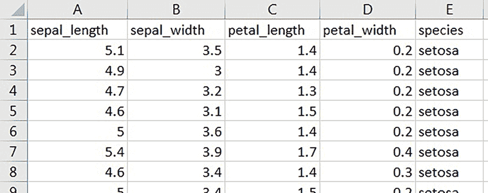

图 2.2 Iris 数据集作为 CSV 文件

要做到这一点，你需要创建一个包含数据集内容的 Pandas 数据框。你可以在下一个列表中找到 [chapter2.ipynb](https://github.com/ryanmark1867/deep_learning_for_structured_data/blob/master/notebooks/chapter2.ipynb) 笔记本中的代码。

列表 2.2 从 URL 引用的 CSV 创建 Pandas 数据框

```
import pandas as pd                                                    ❶ 
url="https://gist.githubusercontent.com/curran/a08a1080b88344b0c8a7/\
raw/d546eaee765268bf2f487608c537c05e22e4b221/iris.csv"                 ❷ 

iris_dataframe=pd.read_csv(url)                                        ❸ 
iris_dataframe.head()                                                  ❹ 
```

❶ 导入 pandas 库。

❷ Iris 数据集的原始 GitHub URL

❸ 将 URL 的内容读取到 Pandas 数据框中。

❹ 显示新数据框的前几行。

在 chapter2 笔记本中运行此单元格，并注意输出。`head` `()` 调用以易于阅读的格式列出数据框的前几行（默认为五行），如图 2.3 所示。

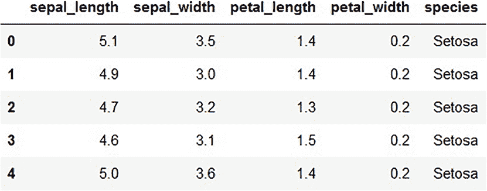

图 2.3 使用 Iris 数据集加载数据框的 head() 输出

与原始数据集的前几行进行比较：

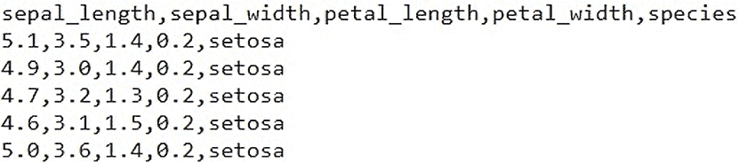

原始 CSV 文件和 Pandas 数据框具有相同的列名和相同的值，但数据框中的第一列是怎么回事呢？默认情况下，Pandas 数据框中的每一行都有一个名称，这个名称（默认情况下包含在数据框的第一列中）是一个从零开始的顺序号。你也可以将这个第一列视为数据框的默认索引。

现在你想要获取数据框中的行数。以下语句返回数据框中的总行数：

```
iris_dataframe.shape[0]
150
```

最后，你想要计算数据框中物种为 setosa 的行数。在以下语句中，`iris_dataframe[iris_dataframe["species"] == 'setosa']` 定义了一个只包含原始数据框中 `species` 等于 `"setosa"` 的行的数据框。使用与获取原始数据框行数相同的方式使用 `shape` 属性，你可以使用这个 Python 语句来获取 `species` 等于 `"setosa"` 的数据框中的行数：

```
iris_dataframe[iris_dataframe["species"] == 'setosa'].shape[0] 
50
```

随着我们通过本书中的主要示例进行学习，我们将探索 Pandas 数据框的更多功能。此外，2.5 节包含使用 Pandas 执行常见 SQL 操作的示例。到目前为止，这次探索已经教会了你如何将表格结构化数据导入 Python 程序，在那里你可以准备它以训练深度学习模型。

## 2.4 将 CSV 文件导入 Pandas 数据框

在 2.3 节中，你看到了如何将标识为 URL 的 CSV 文件导入 Pandas 数据框，但假设你有一个自己修改过的数据集的私有副本。你想要将这个修改后的文件中的数据加载到数据框中。在本节中，你将了解如何从文件系统中读取 CSV 文件到数据框中。在第三章中，你将学习如何将具有多个标签的 XLS 文件导入单个数据框。

假设你想将 Iris 数据集加载到一个数据框中，但你已经在本地文件系统中修改了你自己的数据集副本（称为 iriscaps.csv），将物种名称大写以符合使用此数据集的应用程序的样式指南。你需要从文件系统中加载这个修改后的数据集，而不是从原始的 Iris 数据集中加载。将文件系统中的 CSV 文件导入 Pandas 数据框的代码（如下所示）与您已经看到的从 URL 加载数据框的代码相似。

列表 2.3 从 CSV 文件名创建 Pandas 数据框

```
import pandas as pd                                    ❶ 
file = "iriscaps.csv"                                  ❷ 
iris_dataframe=pd.read_csv(os.path.join(path,file))    ❸ 
iris_dataframe.head()                                  ❹ 
```

❶ 导入 pandas 库。

❷ 定义文件名。

❸ 将文件内容读入 Pandas 数据框。

❹ 显示新数据框的前几行。

如何获取正确的路径值，即数据文件所在的目录？本书中的所有代码示例都假设所有数据都存在于一个名为 data 的目录中，该目录是笔记本所在目录的兄弟目录。在这个存储库中，顶级目录 notebooks 和 data 分别包含代码文件和数据文件。

列表 2.4 是获取笔记本（rawpath）所在目录的代码。然后，代码使用该目录通过先访问笔记本所在目录的父目录，然后访问父目录中的数据目录来获取数据文件所在的目录。

列表 2.4 获取数据目录的路径

```
rawpath = os.getcwd()                                         ❶ 
print("raw path is",rawpath)
path = os.path.abspath(os.path.join(rawpath, '..', 'data'))   ❷ 
print("path is", path)
```

❶ 获取这个笔记本所在的目录。

❷ 获取数据文件所在的目录。

注意，你使用的是相同的 `read_csv` 函数，但参数是文件的文件系统路径，而不是 URL。图 2.4 显示了修改后的数据集，其中物种名称已大写。

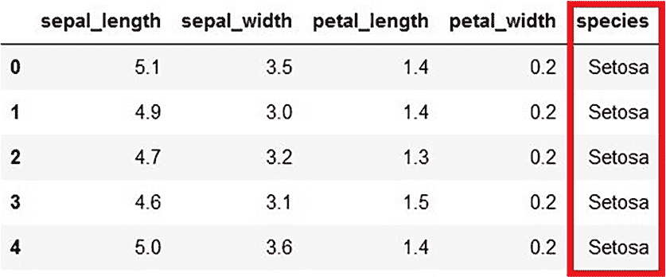

图 2.4 从文件加载的 DataFrame，其中物种值已大写

在本节中，你已经回顾了如何使用文件系统中的 CSV 文件内容加载 Pandas DataFrame。在第三章中，你将看到如何加载包含 XLS 文件内容的 DataFrame。

## 2.5 使用 Pandas 实现与 SQL 相同的操作

2.3 节介绍了 Pandas 库作为 Python 解决方案，用于操作结构化、表格数据。在本节中，我们将深入探讨这个堆栈的部分，展示一些如何使用 Pandas 完成你习惯用 SQL 完成的表格操作的示例。本节不是 SQL 到 Pandas 的完整字典；请参阅 [`mng.bz/lXGM`](http://mng.bz/lXGM) 和 http://sergilehkyi.com/ translating-sql-to-pandas 以获取更多 SQL 到 Pandas 的示例。以下是一些说明如何使用 Pandas 产生与 SQL 相同结果的示例。

为了练习以下示例

1.  通过加载 2014 年街车延误数据集中第一个标签页的 CSV 文件内容，在关系型数据库中创建一个名为 streetcarjan2014 的表（示例假设使用 Postgres）。确保 `"Min Delay"` 的类型是数值型。

1.  使用 chapter5.ipynb 笔记本从相同的 CSV 文件创建一个 Pandas DataFrame。此笔记本假设 CSV 文件位于一个名为 data 的目录中，该目录是笔记本所在目录的兄弟目录。

现在我们来看一些等价的 SQL 和 Pandas 语句。首先，获取表的头三行

+   *SQL* —`select * from streetcarjan2014 limit 3`

+   *Pandas* —`streetcarjan2014.head(3)`

图 2.5 显示了 SQL 查询和结果，图 2.6 显示了 Pandas 的相同内容。

在 `select` 语句上有一个单一的条件

+   *SQL* —`select` `"Route"` `from` `streetcarjan2014` `where` `"Location` `"` `=` `'King and` `Shaw'`

+   *Pandas* —`streetcarjan2014[streetcarjan2014.Location == "King and Shaw"]`.Route

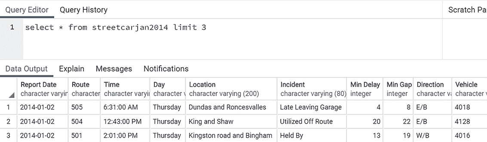

图 2.5 SQL 前三条记录

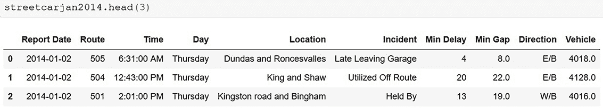

图 2.6 Pandas 前三条记录

列出列中的唯一条目

+   *SQL* —`select distinct "Incident" from streetcarjan2014`

+   *Pandas* —`streetcarjan2014.Incident.unique()`

在`select`语句中设置多个条件

+   *SQL* —`select * from streetcarjan2014 where "Min Delay" > 20 and "Day" = 'Sunday'`

+   *Pandas* —`streetcarjan2014[(streetcarjan2014['Min Delay'] > 20) & (streetcarjan2014['Day'] == "Sunday")]`

图 2.7 显示了 SQL 查询和结果，图 2.8 显示了 Pandas 的相同内容。

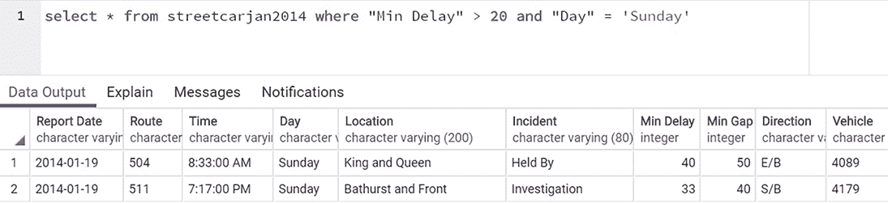

图 2.7 多条件 SQL 查询

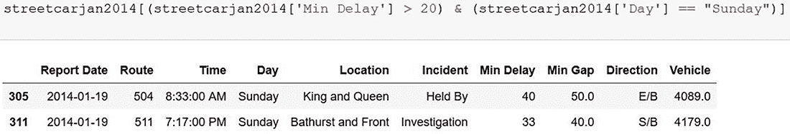

图 2.8 多条件 Pandas 查询

在`select`语句中设置`order by`

+   *SQL* —`select "Route", "Min Delay" from streetcarjan2014 where "Min Delay" > 20 order by "Min Delay"`

+   *Pandas* —`streetcarjan2014[['Route','Min Delay']][(streetcarjan2014['Min Delay'] > 20)].sort_values('Min Delay')`

在本节中，我们介绍了一些如何使用 Pandas 进行常见 SQL 操作的例子。随着你继续使用 Pandas，你会发现许多其他方式，Pandas 可以使你在 Python 的世界中使用 SQL 经验变得更加容易。

## 2.6 主要示例：预测电车延误

现在你已经体验了如何将表格结构化数据引入 Python 程序，让我们来检查本书中使用的重大示例：预测电车延误。

要成功进行深度学习项目，你需要数据和一个明确要解决的问题。在本书中，我使用了一个由多伦多市政府发布的公开数据集([`mng.bz/4B2B`](http://mng.bz/4B2B))，该数据集描述了自 2014 年 1 月以来城市电车系统中遇到的每一个延误。要解决的问题是如何预测多伦多电车系统的延误，以便可以预防。在本章中，你将了解这个数据集的格式。在随后的章节中，你将学习如何纠正数据集中需要修复的问题，以便可以使用它来训练深度学习模型。

为什么多伦多电车延误问题很重要？在第二次世界大战之前，北美许多城市都有电车系统。这些系统在一些地区被称为*有轨电车*，由轻轨车辆组成，通常单独运行，由从架空电缆或有时从街道上的轨道获取的电力驱动，并在与其他道路交通共享的空间上行驶。尽管多伦多的一些电车网络在专用车道上，但大多数系统都在公共街道上与其他交通混合运行。

在战后时期，大多数北美城市用公交车取代了电车。一些城市保留了一些象征性的电车服务作为旅游景点。然而，多伦多在北美城市中是独一无二的，因为它将其广泛的电车网络作为其整体公共交通系统的一个关键部分保留下来。如今，电车服务多伦多五个最繁忙的地面路线中的四个，并且每个工作日可搭载多达 30 万名乘客。

电车网络相对于公交车和地铁等其他构成多伦多公共交通系统的交通方式有许多优势。与公交车相比，电车使用寿命更长，不排放污染物，每名驾驶员可搭载的乘客至少是公交车的一倍，建设和维护成本更低，并提供更灵活的服务。

电车有两个主要缺点：它们容易受到一般交通中的障碍物的影响，并且难以绕过这些障碍物。当电车被阻挡时，它会导致电车网络中的累积延误，并加剧城市最繁忙街道的整体交通拥堵。

使用多伦多市提供的电车延误数据集，我们将应用深度学习来预测和预防电车延误。图 2.9 显示了叠加在多伦多地图上的电车延误热图。您可以在 streetcar_data-geocode-get-boundaries 笔记本中找到生成此地图的代码。地图上电车延误最严重的区域（较暗的块状区域）是城市核心最繁忙的街道。


图 2.9 多伦多电车网络：延误热图

在我详细说明这个问题的数据集之前，解释一下为什么选择这个特定问题是有意义的。为什么不选择一个标准的商业问题，比如客户流失（预测客户是否会取消服务）或库存控制（预测零售店何时会耗尽某种商品的库存）？为什么选择一个特定活动（公共交通）和特定地点（多伦多）的问题？以下是选择这个问题的几个原因：

+   它有一个“金发姑娘”数据集（既不太大也不太小）。一个非常大的数据集会带来额外的数据管理问题，这些问题与学习深度学习并不相关。大数据集也可能掩盖代码和算法中的不足。俗语“数据越多，胜算越大”可能适用于深度学习，但在学习过程中，没有大量数据作为支撑也有其道理。另一方面，如果数据太少，深度学习就没有足够的信号来检测。电车数据集（目前，超过 70,000 行）足够大，可以应用于深度学习，但又不至于太大，使得探索变得困难。

+   该数据集是实时更新的。每隔几个月就会更新一次，因此有足够的机会使用它从未见过的数据进行模型测试。

+   该数据集是真实且原始的。这个数据集是为了几个目的在几年内收集的，其中没有一个目的是训练深度学习模型。正如你将在下一章中看到的，这个数据集有许多错误和异常，需要在数据集用于训练深度学习模型之前进行处理。在实践中，你将在许多商业应用中看到类似的混乱数据集。通过清理现实世界的电车数据集，包括所有瑕疵，你将准备好应对其他现实世界的数据集。

+   企业必须应对竞争和监管压力，这使得它们无法公开分享他们的数据集，这使得从严肃的商业中找到真实、非平凡的数据集变得困难。相比之下，公共机构通常有法律义务发布他们的数据集。我利用多伦多对电车延误数据集的开放性，为本书构建了主要示例。

+   该问题对广泛的受众都是可访问的，并且与任何特定行业或学科无关。

尽管电车问题具有不特定于任何商业的优势，但它可以直接关联到深度学习通常应用的常见商业问题，包括

+   *客户支持* —数据集中的每一行都相当于客户支持系统中的一个工单。事件列类似于工单系统中出现的自由文本摘要，而最小延迟和最小间隔列则扮演着类似于在工单系统中通常记录的问题严重性信息的作用。报告日期、时间和日期列映射到客户支持工单系统中的时间戳信息。

+   *物流* —与物流系统类似，电车网络具有空间性质（在数据集中的路线、位置和方向列中隐含）和时间性质（在报告日期、时间和日期列中隐含）。

## 2.7 为什么现实世界的数据集对于学习深度学习至关重要？

当你学习深度学习时，为什么与真实且混乱的数据集一起工作如此重要？当你考虑将深度学习应用于真实世界的数据集时，你可以将其比作被要求从过去四十年收集的媒体盒中创建蓝光光盘。这个盒子包含各种格式，包括 3:4 宽高比的模拟视频、模拟照片、单声道音频录制和数字视频。有一点很清楚：盒中的所有媒体都不是为了蓝光而制作的，因为其中大部分是在蓝光存在之前录制的。你将不得不对每个媒体源进行预处理，以便为蓝光包做准备，例如校正颜色、清理 VHS 抖动和调整模拟视频的宽高比。对于单声道音频，你需要去除磁带噪音并将单声道音频轨道扩展到立体声。图 2.10 总结了将各种元素组装起来生成蓝光光盘的过程。

同样，你可以打赌你组织中的深度学习候选问题都有数据集，这些数据集在收集时并没有考虑到深度学习。你需要进行清理、转换和扩展，以获得一个可以用于训练深度学习模型的准备好的数据集。


图 2.10 准备真实世界数据集以用于深度学习就像从媒体盒中创建蓝光光盘。

## 2.8 输入数据集的格式和范围

现在我们已经回顾了街车延误问题和与真实世界数据集一起工作的重要性，让我们深入了解街车延误数据集的结构（[`mng.bz/4B2B`](http://mng.bz/4B2B)）。这个数据集具有以下文件结构：

+   每年一个 XLS 文件

+   在每个 XLS 文件中，为每个月份设置一个标签页

图 2.11 展示了街车延误数据集的文件结构。

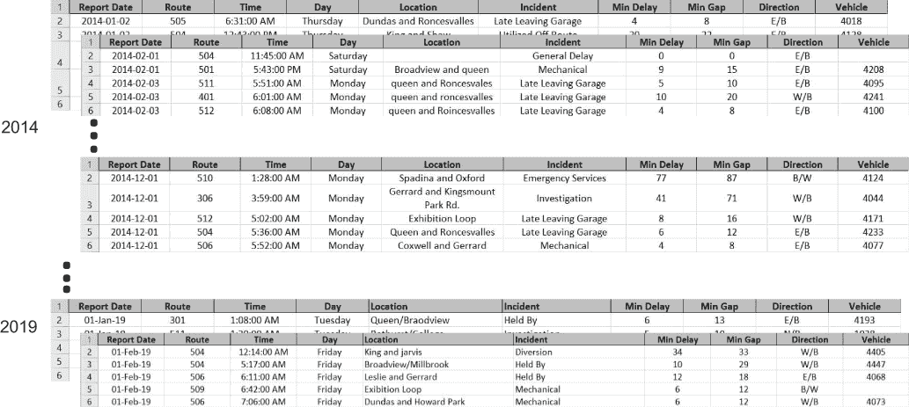

图 2.11 街车延误数据集的文件结构

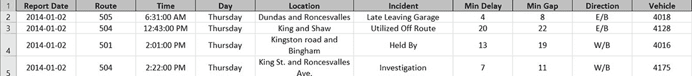

图 2.12 街车延误数据集的列

图 2.12 展示了街车延误数据集中的列：

+   *报告日期* — 导致延误事件发生的日期（YYYY/MM/DD）

+   *路线* — 街车路线的编号

+   *时间* — 导致延误事件发生的时间（hh:mm:ss AM/PM）

+   *日期* — 日期名称

+   *位置* — 导致延误事件的位置

+   *事件* — 导致延误的事件描述

+   *最小延误* — 下一个街车在计划中的延误时间（分钟）

+   *最小间隔* — 前一个街车与下一个街车之间的总计划时间（分钟）

+   *方向* — 路线的方向（E/B, W/B, N/B, S/B, B/W 等），其中 B/W 表示双向

+   车辆—涉及事件的车辆 ID

值得花更多时间来审查这些列的一些特征：

+   *报告日期* — 这列包含了许多对深度学习模型可能很有价值的信息。在第五章中，我们将重新审视这一列，为该列的子组件（年、月和日）添加派生列到数据集中。

+   *日期* — 这列是否重复了已经在“报告日期”列中编码的信息？对于这个问题，一个事件发生在周一并且恰好是月底的最后一天是否相关？我们将在第九章中探讨这些问题。

+   *位置* — 这列是数据集中最有趣的一列。它以具有挑战性和开放式的方式编码了数据集的地理方面。在第四章中，我们将重新审视这一列，以回答一些重要问题，包括为什么这些数据没有以经纬度的形式编码，以及电车网络的独特地形是如何在“位置”列的值中体现出来的。在第九章中，我们将探讨为深度学习模型编码这些信息的最有效方法。

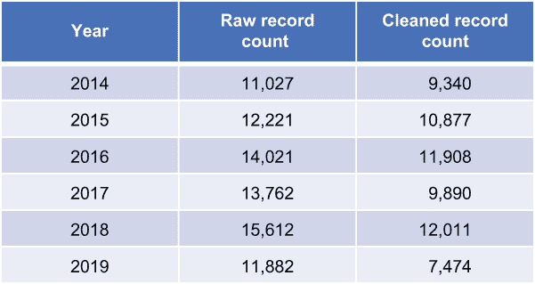

图 2.13 电车数据集按年记录数

当前数据集有超过 70,000 条记录，每月新增 1,000 至 2,000 条新记录。图 2.13 显示了自 2014 年 1 月数据集开始以来的每年记录数。原始记录数是输入数据集中的记录数。清理后的记录数是删除了无效值（如指定在无效的电车路线上延误）的记录后的记录数，如第三章所述。

## 2.9 目标：端到端解决方案

在本书的其余部分，我们将解决预测电车延误的问题。我们将清理输入数据集，构建深度学习模型，对其进行训练，然后部署它以帮助用户获得关于他们的电车行程是否会延误的预测。

图 2.14 显示了遵循本书中扩展示例后你将得到的一个结果。你将能够从使用本章引入的原始数据集派生出的数据训练的深度学习模型中获得关于特定电车行程是否会延误的预测。


图 2.14 扩展示例的一个结果：Facebook Messenger 部署

图 2.15 总结了通过扩展示例电车延误的端到端旅程，从本章引入的原始数据集到允许用户获得关于他们的电车行程是否会延误的模型部署。请注意，图 2.15 中显示的两个部署方法（Facebook Messenger 和 Web 部署）是达到同一目的的两种手段：让想要获得关于他们的电车行程是否会延误的预测的用户能够访问训练好的深度学习模型。

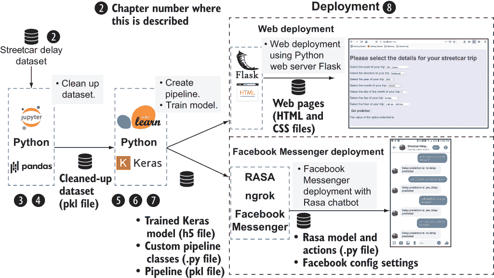

图 2.15 从原始数据到街车行程预测的旅程

图 2.15 中的数字突出了每个章节所涵盖的内容：

+   第二章介绍了我们将用于扩展示例的原始数据集。

+   第三章和第四章描述了您清理原始数据集并准备训练深度学习模型的步骤。

+   第五章描述了如何使用 Keras 库创建一个简单的深度学习模型。

+   第六章描述了如何使用第三章和第四章中准备的数据集来训练 Keras 深度学习模型。

+   第七章描述了如何进行一系列实验，以确定深度学习模型变化方面的影响，以及用非深度学习方法替换深度学习模型的影响。

+   第八章展示了如何部署在第六章中训练的深度学习模型。您将使用 scikit-learn 库的管道工具来处理用户提供的行程数据，以便训练的深度学习模型可以进行预测。第八章将引导您了解两种部署选项。首先，我们将通过 Flask（[`flask.palletsprojects.com/en/1.1.x`](https://flask.palletsprojects.com/en/1.1.x)）这个 Python 基本网络应用框架提供的网页来部署训练好的模型。这种方法简单直接，但用户体验有限。第二种部署方法通过使用 Rasa 聊天机器人框架来解释用户的行程预测请求，并在 Facebook Messenger 中显示训练模型的预测结果，从而提供更丰富的用户体验。

## 2.10 关于构成解决方案的代码的更多细节

第 2.9 节中描述的端到端旅程是通过一系列 Python 程序以及每个程序的输入和输出文件来实现的。正如第一章所述，这些文件可在本书的代码库中找到：[`mng.bz/v95x`](http://mng.bz/v95x)。下面的列表显示了代码库中的关键目录，并总结了每个目录中的文件。

列表 2.5 代码库的目录结构

```
│ 
├── data              ❶ 
│ 
├── deploy            ❷ 
│   │
│   ├── data          ❸ 
│   │
│   └── models        ❹ 
│ 
├── deploy_web        ❺ 
│   │
│   ├── static 
│   │   └── css       ❻ 
│   │
│   └── templates     ❼ 
│ 
├── models            ❽ 
│ 
├── notebooks         ❾ 
│ 
├── pipelines         ❿ 
│ 
└── sql               ⓫ 
```

❶ 保存的中间 Pandas 数据框和其他数据输入。请注意，原始数据集的 XLS 文件不在代码库中；您需要从 [`mng.bz/4B2B`](http://mng.bz/4B2B) 获取它们。

❷ Facebook Messenger 部署文件

❸ Rasa 聊天机器人训练数据

❹ Rasa 聊天机器人模型。请注意，在 Facebook Messenger 部署中使用的 Rasa 聊天机器人模型与深度学习模型不同。

❺ 网络部署文件

❻ 网络部署的 CSS

❼ 网络部署的 HTML 文件

❽ 保存的训练深度学习和 XGBoost 模型

❾ 用于数据清理、数据探索和模型训练的 Jupyter 笔记本，以及相关的配置文件。有关配置文件在街车延误预测示例中使用的描述，请参阅第三章。

❿ 保存的管道文件

⓫ SQL 示例

图 2.16 和图 2.17 从 Python 程序及其之间的文件流的角度描述了与图 2.15 相同的端到端旅程。图 2.16 展示了从原始数据集到训练好的深度学习模型的演变过程：

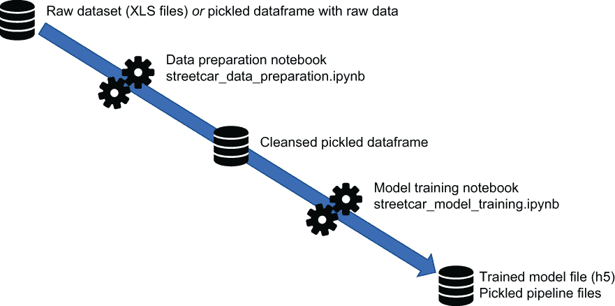

图 2.16 从原始数据集到训练好的模型的文件演变

+   我们从本章描述的由 XLS 文件组成的原始数据集开始。当你运行数据准备笔记本后，你可以将 XLS 文件中的数据保存为 pickle 格式的 dataframe，这样你就可以方便地重新运行数据准备笔记本。第三章解释了 pickle 功能，它允许你在文件中序列化 Python 对象，以便在 Python 会话之间保存对象。

+   数据准备笔记本 streetcar_data_preparation.ipynb 通过清理（例如，将重复值映射到公共值，并删除无效值的记录）数据集来生成清洁后的 pickle 格式的 dataframe。这个过程在第三章和第四章中有所描述。

+   清洁后的 pickle 格式的 dataframe 被输入到模型训练笔记本 streetcar_model_training.ipynb 中，该笔记本重构数据集并使用它生成 pickle 格式的管道文件和训练好的深度学习模型文件。这个过程在第五章和第六章中有所描述。

图 2.17 从模型训练笔记本生成的训练好的模型文件和 pickle 格式的管道文件中继续讲述故事。这些管道在部署中使用，用于将用户输入的行程信息（例如，电车路线和方向）转换为训练好的深度学习模型可以接受的格式。正如你将在第八章中看到的，这些管道在过程中出现两次。首先，它们转换用于训练深度学习模型的数据；然后它们转换用户输入，以便训练好的模型可以为其生成预测。第八章描述了两种部署方式：网页部署，用户在网页中输入行程信息，以及 Facebook Messenger 部署，用户在 Messenger 会话中输入行程信息。

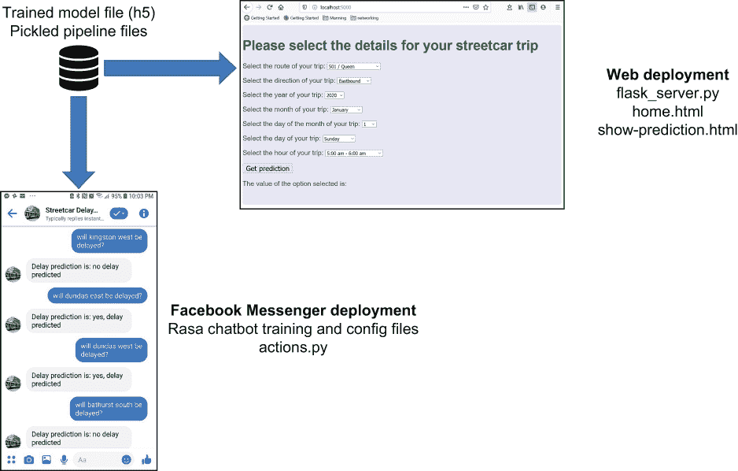

图 2.17 从训练好的模型到部署的文件演变

在本节中，你看到了从输入数据集到可部署的深度学习模型旅程的两个视角，该模型可以用来预测电车行程是否会延误。这个旅程涵盖了广泛的技术组件，但如果你对其中的一些组件不熟悉，请不要担心。我们将逐章检查它们。当你完成第八章时，你将拥有一个端到端的深度学习解决方案，用于预测电车延误，该解决方案使用结构化数据。

## 2.11 开发环境：普通与深度学习支持

在 2.1 节中，我们回顾了在这本书中使用的环境选项。在本节中，我们将回顾哪些代码子集会从深度学习支持的环境中受益，哪些则可以在没有深度学习特定硬件（如 GPU 和 TPU）的*vanilla*系统中运行良好。这个 vanilla 系统可以是您的本地系统（在您安装了 Jupyter Notebooks、Python 和所需的 Python 库之后）或非 GPU/非 TPU 的云环境。

图 2.18 展示了端到端解决方案，突出了哪些区域将受益于深度学习支持的环境，哪些可以在 vanilla 环境中工作：

+   数据准备代码（在第 2-4 章中描述）可以在 vanilla 环境或深度学习环境中使用。在这些部分中您将执行的操作不需要任何深度学习特定硬件。我已经在 Paperspace Gradient 和我的没有深度学习特定硬件的本地 Windows 机器上运行了数据准备代码。

+   如果您没有访问深度学习特定硬件（如 Paperspace、Azure 或 Colab 中可用的 GPU，或 Google Cloud Services 和 Colab 中可用的 TPU），那么第 5-7 章中描述的模型训练代码将运行得更慢。

+   第八章中描述的部署代码可以在 vanilla 环境或深度学习环境中使用。我已经在 Azure（使用标准、非 GPU 启用虚拟机）和我的本地 Windows 机器上完成了部署。当模型部署时，它不需要深度学习特定硬件。

    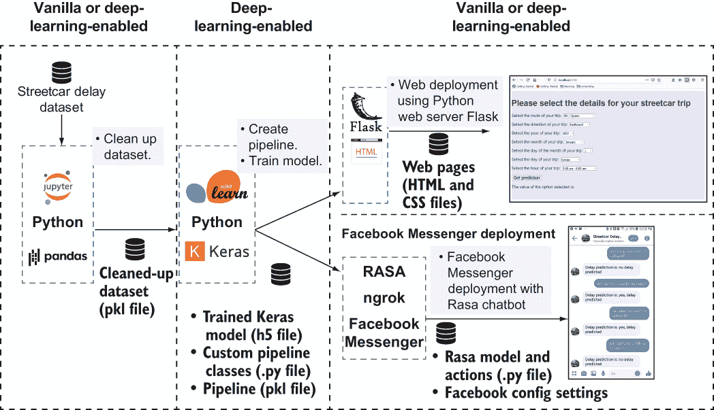

    图 2.18 深度学习支持环境受益的过程部分

## 2.12 深入探讨深度学习的反对意见

在第一章中，我们简要回顾了深度学习的优缺点。对深度学习与非深度学习机器学习进行更详细的比较是值得的。为了简化，在本章中，我们将简单地称后者为*经典机器学习*。

当我们处理具有结构化表格数据的问题时，我们需要将经典机器学习与深度学习进行对比。传统观点是，在结构化数据上使用经典机器学习，而不是深度学习。本书的整个目的就是探讨深度学习如何应用于结构化数据，因此我们需要为这种方法提供一些动机，并检查“如果数据是结构化的，不要使用深度学习”这一格言背后的推理。

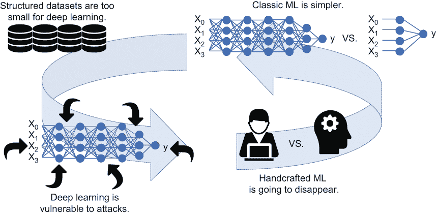

图 2.19 使用结构化数据进行深度学习的反对意见

让我们更深入地探讨第一章中引入的、图 2.19 中展示的深度学习的反对意见：

+   *结构化数据集太小，无法用于深度学习。* 这个反对意见背后有一个非常合理的观点，即使整个反对意见经不起推敲。当然，许多结构化数据集对于深度学习来说太小了，这可能就是人们认为结构化数据集太小无法用于深度学习的来源。然而，关系表通常有数千万甚至数十亿行。顶级商业关系数据库供应商支持超过十亿行的表。易于找到的开源结构化数据集往往很小，因此当您在寻找要研究的问题时，找到适合经典机器学习的小型结构化数据集比找到大型开源结构化数据集要容易。因此，数据集大小的问题更多的是一个便利性问题，而不是结构化数据集固有的规模问题。幸运的是，本书中使用的电车数据集既公开可用，又足够大，使其成为深度学习的一个有趣主题。

+   *保持简单。* 选择经典机器学习而不是深度学习来处理结构化数据集的最常见论点是简单性。其理由是，经典机器学习算法比深度学习算法更简单、更容易使用，并且更透明。在第七章中，您将看到针对电车延误预测问题的深度学习解决方案与基于 XGBoost（一种非深度学习方法）的解决方案的直接比较。这两种实现都使用了相同的数据准备步骤和相同的管道，这构成了构成解决方案的大部分代码。解决方案的核心是模型的定义、训练和评估，这是两种解决方案的分岔点。在该解决方案的部分中，深度学习方法的代码行数大约有 60 行，而 XGBoost 的代码行数少于 20 行。尽管 XGBoost 解决方案的核心代码行数较少，但这一部分代码在两种方法的总代码行数中不到 10%。此外，深度学习方法核心部分的额外复杂性使其具有更大的灵活性，因为它可以处理包含自由文本列的数据集。

+   *深度学习容易受到对抗性攻击。* *.* 有一些广为人知的例子表明，深度学习系统被愚弄，错误地评分了故意修改以利用系统漏洞的数据示例。例如，一只熊猫的照片可以通过一种对人类来说难以察觉的方式被篡改，但会欺骗深度学习模型将其误识别为长臂猿。您可以在[`mng.bz/BE2g`](http://mng.bz/BE2g)看到这张照片。对我们来说，篡改后的图像仍然看起来像一只熊猫，但深度学习系统将该图像评分为一长臂猿。

+   我在第一章中提出，商业和政府的瑰宝在于结构化数据。如果恶意行为者能够误导深度学习系统，我们为何还要信任深度学习系统去分析如此有价值的数据呢？这种漏洞是否仅限于深度学习？[`mng.bz/dwyX`](http://mng.bz/dwyX)上的文章认为，经典机器学习也遭受与深度学习相同的欺骗性漏洞。如果情况如此，为何对深度学习被欺骗的关注如此之多？围绕深度学习的炒作引发了反叙事，深度学习被欺骗的例子成为更好的口头禅。听到一个深度学习模型将长颈鹿误认为是北极熊，比听到一个线性回归模型因为输入表中某一列被篡改的值而预测错误更有趣。最后，深度学习和经典机器学习对对抗性攻击的脆弱性取决于攻击者获取关于模型性质的内部信息。如果对模型安全有适当的治理，数据瑰宝不应受到对抗性攻击的威胁。

+   *手工制作深度学习解决方案的时代即将结束*。机器学习的世界发展迅速，其潜在影响巨大，因此预测非专业人士在 2030 年代初如何利用机器学习是不明智的。回想一下 1990 年代中期对多媒体的兴趣。当时，即使没有直接参与创建多媒体平台的人，如果想要利用多媒体，也必须关注声卡设备驱动程序和中断请求冲突的奥秘。如今，我们理所当然地认为计算机具有音频和视频功能，只有少数人需要担心多媒体的细节。由于缺乏使用，*多媒体*这个术语现在已经过时；这项技术已经变得如此普遍，以至于我们不再需要为它命名。机器学习和深度学习会步上相同的命运吗？自动化解决方案，如谷歌的 Auto ML ([`cloud.google.com/automl`](https://cloud.google.com/automl))，可能会发展到只有相对少数的深度机器学习专家需要手动编码机器学习解决方案的程度。即使真的发生这种情况，深度学习的根本概念以及在实际数据集上利用深度学习所需采取的实际步骤仍然非常重要，需要理解。这些概念对机器学习来说就像元素周期表对化学一样。除非我们专攻化学或相关学科，否则我们中的大多数人不必直接应用元素周期表中表达的基础概念。然而，了解元素周期表以及它告诉我们关于物质性质的信息仍然至关重要。以类似的方式，即使在未来不久机器学习系统的实现大部分是自动化的，深度学习的根本概念仍然值得理解。由于你了解它在某种程度上是如何工作的，你将能够更好地判断深度学习的适用性。

我们更详细地考察了一些对深度学习的反对意见。特别是，深度学习对非专业人士来说过于困难这一反对意见，五年前比现在更为真实。近年来发生了什么变化，使得深度学习能够在更多的问题领域中成为竞争者，并使其对非专业人士易于访问？我们将在下一节中回答这个问题。首先，我们可以问哪种方法更适合处理结构化数据：深度学习还是经典机器学习。在第五章和第六章中，你将看到用于预测电车延误的深度学习模型的代码。你还将看到一系列实验的结果，以衡量训练好的深度学习模型的表现。此外，第七章描述了使用经典机器学习算法 XGBoost 的替代解决方案来解决电车延误预测问题。在该章中，你将能够直接比较深度学习解决方案的代码与 XGBoost 解决方案的代码。你还将看到两种解决方案的性能对比，以便你可以自己得出结论，关于哪种方法更适合解决此问题。

## 2.13 深度学习如何变得更加易于访问

在 2.12 节中，我们回顾了一些对深度学习的反对意见。是什么变化使得这种比较更有意义，为什么深度学习现在成为与经典机器学习并驾齐驱的可行方法？图 2.20 总结了过去十年中的一些变化，这些变化使得深度学习的力量得以向更广泛的受众开放。

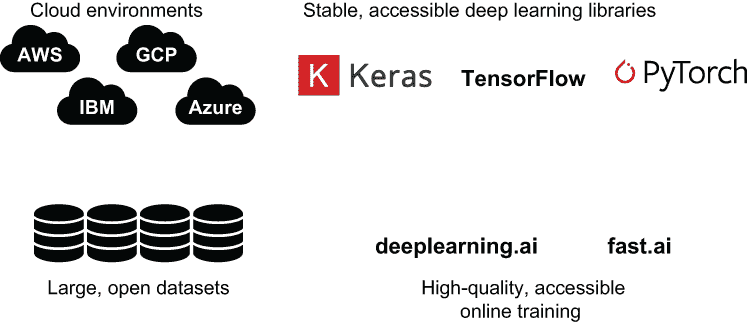

图 2.20 使深度学习对非专业人士易于访问的近期变化

以下是图 2.20 中列出的变化的更多细节：

+   *云环境* ——如 2.1 节所述，所有主要的云服务提供商都提供深度学习环境，包括用于深度学习模型高效训练的软件堆栈和专用硬件。在这些环境中可用的选择，从专注于深度学习的 Paperspace 的 Gradient 环境到 AWS 的全覆盖范围，硬件选项和性价比都在逐年提高。深度学习不再是只有那些在科技巨头或资金充足的学术机构工作的幸运儿才能享有的专属技术，这些机构能够负担得起用于深度学习的专用本地硬件。

+   *稳定的、可用的深度学习库* ——自从 2015 年初 Keras 的首次发布以来，通过直观且易于学习的界面，人们已经可以利用深度学习的力量。2016 年末 PyTorch([`pytorch.org`](https://pytorch.org))的发布和 2019 年中 TensorFlow 2.0 的推出，为开发者提供了更多可用的深度学习选择。

+   *大型、开放的数据集* —— 在过去十年中，大量适合深度学习的大数据集如雨后春笋般涌现。2000 年代社交媒体和智能手机的出现、政府提供开放数据集的倡议以及谷歌的数据集搜索([`toolbox.google.com/datasetsearch`](https://toolbox.google.com/datasetsearch))共同使得大型、有趣的数据集变得可访问。为了补充这股数据洪流，Kaggle([`www.kaggle.com`](https://www.kaggle.com))等网站提供了一个想要利用这些数据集的机器学习研究者社区。

+   *高质量的深度学习教育资源* —— 这包括一些优秀的自学在线课程。自 2017 年以来，deeplearning.ai 和 fast.ai 等课程使得非专业人士能够学习深度学习，尤其是在 fast.ai 的情况下，可以在真实的编码示例中练习所学知识。这些课程意味着你不需要获得人工智能的硕士学位来学习深度学习。

## 2.14 深度学习模型训练初体验

在接下来的六章中，我们将逐步分析扩展示例中的代码，从第三章的数据清理开始，到第八章部署训练好的模型结束。如果你把扩展示例看作是一部动作片，那么第六章中训练深度学习模型的部分就是高潮部分。为了让你提前感受一下高潮，在本节中，我们将通过一个简化的场景来训练深度学习模型。

如果你克隆了第 2.10 节中描述的仓库，你将看到以下文件，我们将在本节中使用这些文件：

+   在 notebooks 目录中，名为 streetcar_model_training.ipynb 的 notebook 包含了定义和训练深度学习模型的代码。配置文件 streetcar_model_training_config.yml 允许你设置模型训练过程的参数。

+   在 data 目录中，你可以找到一个现成的、清理过的数据集文件，名为 2014_2019_df_cleaned_remove_bad_values_may16_2020.pkl。你可以使用这个文件作为模型训练 notebook 的输入，因此你不需要为这个场景运行数据集清理代码。如果训练好的深度学习模型是一顿美食，那么这个清理过的数据集文件就可以看作是一份已经清洗和切好的食材，准备烹饪。当你阅读第三章和第四章时，你需要自己清洗和切片食材，但在这个部分，准备工作已经为你完成，你只需将所有食材放入烤箱即可。

下面是进行深度学习模型简单训练运行的步骤：

1.  将 streetcar_model_training_config.yml 文件更新为设置以下列表中的参数。

    列表 2.6 简单训练运行中需要更新的配置文件项

    ```
    modifier: 'initial_walkthrough_2020'                                       ❶ 
    pickled_dataframe: '2014_2019_df_cleaned_remove_bad_values_may16_2020.pkl' ❷ 
    current_experiment: 9                                                      ❸ 
    get_test_train_acc: False                                                  ❹ 
    ```

    ❶ 生成输出管道和训练模型文件唯一名称的修饰符

    ❷ 模型训练过程输入文件名

    ❸ 预设实验，指定训练运行的特性，包括通过训练集进行的运行次数、训练是否考虑训练集的不平衡性，以及模型不再改进时是否提前停止训练。

    ❹ 切换是否运行测试和训练准确率的扩展计算。这段代码运行可能需要很长时间，因此在这个初步训练运行中，我们将此开关设置为 False。

1.  在您为示例选择的环境中打开模型训练笔记本，并运行笔记本中的所有单元格。

1.  当笔记本运行完成后，请检查模型子目录中名为 scmodelinitial_walkthrough_2020_9.h5 的文件。此文件是训练过程中学习到的所有权重的训练模型。

您已成功训练了一个深度学习模型。如果您愿意，可以按照第八章的说明创建一个简单的网站，该网站将调用此模型来预测给定的电车行程是否会延误。但尽管这个模型是一个功能完整的训练好的深度学习模型，其性能并不是最好的。如果您查看笔记本的末尾，您将看到一个称为混淆矩阵的彩色框，它总结了您在这个训练运行中获得的好模型的程度。混淆矩阵看起来类似于图 2.21。


图 2.21 示例混淆矩阵

左上角和右下角象限显示了模型在测试集（即未用于训练过程的 dataset 的子集）上做出的正确预测数量，而右上角和左下角象限显示了模型预测错误的数量。第六章提供了对混淆矩阵的详细描述以及如何解释它，以及构成训练实验的参数的详细信息。现在，只需注意混淆矩阵的最后一行显示，大约 40%的时间，模型在发生延误时预测没有延误。正如您将在第六章中看到的，这种结果对我们用户来说是最糟糕的，因此它如此频繁地发生并不好。您能做些什么来获得更好的深度学习模型？第 2.8 节中描述的原始输入数据集与用于此训练运行的清理后的数据集有什么区别？现在您已经尝试过训练深度学习模型，请参阅第 3-7 章来回答这些问题，然后参阅第八章来使您的训练好的深度学习模型可供外界使用。

## 摘要

+   在深度学习项目中，有两个基本决策：使用什么环境和解决什么问题。

+   你可以选择你的本地系统来运行深度学习项目，或者你可以选择一个功能齐全的云环境，如 Azure 或 AWS。介于两者之间的是专门为深度学习设计的环境，包括 Paperspace 和 Google Colab。

+   Pandas 是用于处理表格数据集的标准 Python 库。如果你熟悉 SQL，你会发现 Pandas 可以方便地完成你习惯用 SQL 做的事情。

+   将深度学习应用于结构化数据最大的反对意见之一是深度学习过于复杂。得益于针对深度学习开发的易用环境、更好的深度学习框架以及面向非专业人士的深度学习教育，这种反对意见不像五年前那样相关了。

+   本书中的主要示例代码设计得如此，你可以运行它的子集而不必运行所有前面的步骤。例如，你可以直接运行深度学习模型训练来体验训练过程。
