# 3 准备数据（第一部分）：探索和清洗数据

本章涵盖

+   在 Python 中使用配置文件

+   将 XLS 文件导入 Pandas 数据框并使用 pickle 保存数据框

+   探索输入数据集

+   将数据分类为连续型、分类型和文本型

+   纠正数据集中的缺失值和错误

+   计算成功深度学习项目的数据量

在本章中，你将学习如何将表格结构化数据从 XLS 文件导入到你的 Python 程序中，以及如何使用 Python 中的 pickle 功能在 Python 会话之间保存你的数据结构。你将学习如何将结构化数据分类为深度学习模型所需的三个类别：连续型、分类型和文本型。你将学习如何检测和处理数据集中必须纠正的缺失值和错误，以便在训练深度学习模型之前可以使用。最后，你将获得一些关于如何评估给定的数据集是否足够大，可以应用于深度学习的指导。

## 3.1 探索和清洗数据的代码

在你克隆了与本书相关的 GitHub 仓库（[`mng.bz/v95x`](http://mng.bz/v95x)）之后，探索和清洗数据的相关代码将位于 notebooks 子目录中。下面的列表显示了包含本章描述的代码的文件。

列表 3.1 仓库中与探索和清洗数据相关的代码

```
├── data                                              ❶ 
│ 
├── notebooks
│           streetcar_data_exploration.ipynb          ❷ 
│           streetcar_data_preparation.ipynb          ❸ 
│           streetcar_data_preparation_config.yml     ❹ 
│           streetcar_time_series.ipynb               ❺ 
```

❶ 用于 pickled 输入和输出数据框的目录

❷ 主要数据探索笔记本

❸ 数据准备笔记本

❹ 数据准备笔记本的配置文件：是否从头开始加载数据，保存转换后的输出数据框，以及删除坏值以及 pickled 输入和输出数据框的文件名

❺ 使用时间序列方法进行数据探索的笔记本

## 3.2 使用 Python 配置文件

清洗数据集的主要代码包含在 streetcar_data_preparation.ipynb 笔记本中。这个笔记本有一个配套的配置文件，即 streetcar_data_preparation_config.yml，用于设置主要参数。在探索数据准备代码之前，让我们看看这个配置文件和其他配置文件在电车延误预测示例中的应用。

*配置文件* 是位于你的 Python 程序之外的外部文件，你可以在其中设置参数值。你的 Python 程序读取配置文件，并使用其中的值来设置 Python 程序中的参数。使用配置文件，你可以将设置参数值与 Python 代码分离，这样你就可以更新参数值并重新运行你的代码，而无需对代码本身进行更新。这种技术可以降低在更新参数值时将错误引入代码的风险，并使你的代码更整洁。对于电车延误预测示例，我们为所有主要的 Python 程序都提供了配置文件，如图 3.1 所示。

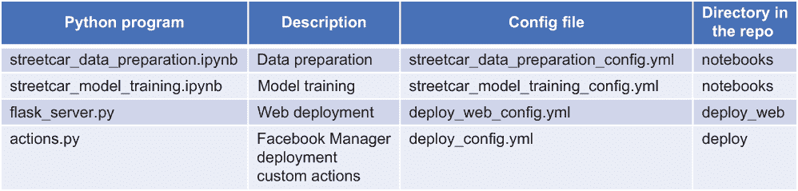

图 3.1 电车延误预测示例中使用的配置文件摘要

您可以为您的 Python 程序定义 JSON ([`www.json.org/json-en.html`](https://www.json.org/json-en.html)) 或 YAML ([`yaml.org`](https://yaml.org/)) 格式的配置文件。对于本书中的电车延误预测示例，我们使用 YAML。列表 3.2 显示了 streetcar_data_preparation 笔记本使用的配置文件，streetcar_data_preparation_config.yml。

列表 3.2 数据准备配置文件 streetcar_data_preparation_config.yml

```
general:                                                                  ❶ 
   load_from_scratch: False                                               ❷ 
   save_transformed_dataframe: False                                      ❸ 
   remove_bad_values: True                                                ❹ 
file_names:
   pickled_input_dataframe: 2014_2019_upto_june.pkl                       ❺ 
   pickled_output_dataframe: 2014_2019_df_cleaned_remove_bad_oct18.pkl    ❻ 
```

❶ 您可以使用类别来组织您的配置文件。此配置文件有一个用于一般参数的类别，另一个用于文件名。

❷ 用于控制是否直接读取原始 XLS 文件的参数。如果此参数为 True，则从原始 XLS 文件中读取原始数据集。如果此参数为 False，则从 pickle 数据框中读取数据集。

❸ 用于控制是否将输出数据框保存到 pickle 文件的参数

❹ 用于控制是否将坏值包含在输出数据框中的参数

❺ 如果 load_from_scratch 设置为 False，则读取的 pickle 数据框的文件名

❻ 如果 save_transformed_dataframe 为 True，则写入的 pickle 数据框的文件名

下一个列表是 streetcar_data_preparation 笔记本中读取配置文件并根据配置文件中的值设置参数的代码。

列表 3.3 数据准备笔记本中处理配置文件的代码

```
current_path = os.getcwd()                                        ❶ 
path_to_yaml = os.path.join(current_path,
   'streetcar_data_preparation_config.yml')                       ❷ 
try:
    with open (path_to_yaml, 'r') as c_file:
        config = yaml.safe_load(c_file)                           ❸ 
except Exception as e:
    print('Error reading the config file')

load_from_scratch = config['general']['load_from_scratch']        ❹ 
save_transformed_dataframe = config['general']['save_transformed_dataframe']
remove_bad_values = config['general']['remove_bad_values']
pickled_input_dataframe = config['file_names']['pickled_input_dataframe']
pickled_output_dataframe = config['file_names']['pickled_output_dataframe']
```

❶ 获取笔记本的路径。

❷ 定义完全合格的配置文件路径。请注意，配置文件的名称是需要在 Python 代码中硬编码的一个参数，尽管这不应该是一个问题，因为配置文件的名称不应该改变。另外请注意，我们使用 os.path.join 将目录和文件名组合成一个单独的路径。我们使用此函数是因为它使路径名与平台无关。

❸ 定义包含配置文件中键/值对的 Python 字典 config。

❹ 将配置字典中的值复制到程序其余部分使用的变量中。

在本节中，您已经看到了为什么我们在电车延误预测示例中使用配置文件，以及数据准备代码配置文件详细描述。对于这个例子来说，配置文件特别有用，因为我们使用 pickle 文件来保存中间结果。通过在配置文件中设置这些 pickle 文件名的值，我们可以在不同的中间结果集上重新运行代码，而无需修改代码本身。

## 3.3 将 XLS 文件导入 Pandas 数据框

在第二章中，我们检查了电车延误问题的输入数据集的格式。在本节中，我们将介绍如何在 Python 中将此数据集导入 Pandas 数据框。输入数据集由多个 XLS 文件组成。首先，让我们按照本章笔记本中的过程将单个 XLS 文件导入到 Pandas 数据框中。

首先，你需要安装一个库来读取 Excel 文件：

```
!pip install xlrd
```

然后，你需要获取 XLS 文件的元数据（标签名称）并遍历标签名称列表，将所有标签加载到一个数据框中，如以下列表所示。

列表 3.4 遍历 XLS 文件标签的代码

```
def get_path():                                                           ❶ 
    rawpath = os.getcwd()
    path = os.path.abspath(os.path.join(rawpath, '..', 'data'))
    return(path)

import pandas as pd                                                       ❷ 
path = get_path()
file = "ttc-streetcar-delay-data-2014.xlsx"                               ❸ 
xlsf = pd.ExcelFile(os.path.join(path,file))                              ❹ 
df = pd.read_excel(os.path.join(path,file),sheet_name=xlsf.sheet_names[0])  
for sheet_name in xlsf.sheet_names[1:]:                                   ❺ 
    print("sheet_name",sheet_name)
    data = pd.read_excel(os.path.join(path,file),sheet_name=sheet_name)   ❻ 
    df = df.append(data)                                                  ❼ 
```

❶ 返回数据目录路径的函数

❷ 导入 pandas 库。

❸ 定义基本路径和文件名。

❹ 加载 Excel 文件的相关元数据；然后加载 XLS 文件的第一个工作表到数据框中。

❺ 遍历 XLS 文件中剩余的工作表，并将它们的内 容追加到数据框中。

❻ 将当前工作表加载到数据框中。

❼ 将此数据框追加到聚合数据框中。

输出显示从第二个标签开始显示标签名称（因为第一个名称在`for`循环之前加载）：

```
sheet_name Feb 2014
sheet_name Mar 2014
sheet_name Apr 2014
sheet_name May 2014
sheet_name Jun 2014
sheet_name July 2014
sheet_name Aug 2014
sheet_name Sept 2014
sheet_name Oct 2014
sheet_name Nov 2014
sheet_name Dec 2014
```

从输入的 XLS 文件创建数据框后，你会在数据框的`head` `()`输出中注意到一些意外的列（如图 3.2 所示）。


图 3.2 加载的数据框中包含多余列

除了预期的最小延迟和最小间隔列之外，还有意外的延迟和间隔列，以及一个意外的事件 ID 列。实际上，源数据集在 2019 XLS 文件的 4 月和 6 月标签中引入了一些异常，如图 3.3 所示。2019 XLS 文件的 4 月标签有称为延迟和间隔的列（而不是所有其他标签中的最小延迟和最小间隔），以及一个事件 ID 列。2019 XLS 文件的 6 月标签有一个不同的问题：它没有最小延迟和最小间隔列，而是有称为延迟和间隔的列。

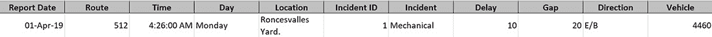

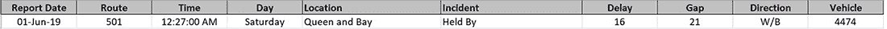

图 3.3 2019 XLS 文件 4 月和 6 月标签中的异常

由于这些异常列出现在 2019 XLS 文件的两个标签中，如果你读取包括 2019 年 XLS 文件的完整数据集，那么整体数据框也会包含这些列。数据准备笔记本包括以下列表中的代码，通过复制所需数据然后删除多余的列来纠正问题。

列表 3.5 修正异常列的代码

```
def fix_anomalous_columns(df):                                ❶ 
    df['Min Delay'].fillna(df['Delay'], inplace=True)
    df['Min Gap'].fillna(df['Gap'], inplace=True)
    del df['Delay']                                     ❷
    del df['Gap']    
    del df['Incident ID']                               ❸ 
    return(df)                                          ❹
```

❶ 如果最小延迟或最小间隔列中存在 NaN，则从延迟或间隔中复制值。

❷ 现在已经从延迟和间隔中复制了有用的值，删除延迟和间隔列。

❸ 删除事件 ID 列；它是多余的。

❹ 返回更新后的数据框。

在此清理之后，`head` 函数的输出确认了异常列已被消除，并且数据框具有预期的列（见图 3.4）。

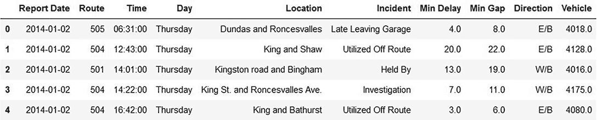

图 3.4 包含输入 XLS 文件所有标签页的数据框的开始部分

我们检查 `tail` 函数的输出以确认数据框的末尾也符合预期（见图 3.5）。

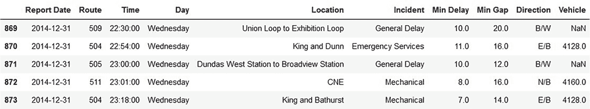

图 3.5 包含输入 XLS 文件所有标签页的数据框的结束部分

从源电车数据集中的这些异常中可以学到重要的一课。在使用实时、真实世界的数据集时，我们需要准备好灵活应对数据集的变化。在我撰写这本书的时候，本节中描述的异常被引入到数据集中，因此我需要准备好更新数据准备代码以解决这些异常。当你处理一个你无法控制的数据集时，你需要能够从容应对数据集中的意外变化。

现在你已经知道如何加载单个 XLS 文件，让我们通过将来自多个 XLS 文件的数据引入单个 Pandas 数据框来了解如何导入整个输入数据集。

本节中的代码示例来自 streetcar_data_preparation 笔记本。该笔记本假设你已经将所有 XLS 文件从原始输入数据集（[`mng.bz/ry6y`](http://mng.bz/ry6y)）复制到了名为 data 的目录中，该目录是包含笔记本的目录的兄弟目录。

街车数据准备笔记本中的代码使用两个函数将多个 XLS 文件导入到单个数据框中。`reloader` 函数通过将第一个文件的第一个标签页加载到数据框中启动这个过程，然后调用 `load_xls` 函数来加载第一个文件的其余标签页以及所有其他 XLS 文件的所有标签页。下一列表中的代码假设数据目录中的 XLS 文件正好是构成数据集的 XLS 文件。

列表 3.6 导入 XLS 文件的代码

```
def load_xls(path, files_xls, firstfile, firstsheet, df):                ❶ 
    '''
    load all the tabs of all the XLS files in a list of XLS files, minus
 tab that has seeded dataframe

    Parameters:
    path: directory containing the XLS files
    files_xls: list of XLS files
    firstfile: file whose first tab has been preloaded
    firstsheet: first tab of the file that has been preloaded
    df: Pandas dataframe that has been preloaded with the first tab 
of the first XLS file and is loaded with all the data 
when the function returns

    Returns:
    df: updated dataframe

    '''
    for f in files_xls:                                                  ❷ 
        print("filename",f)
        xlsf = pd.ExcelFile(path+f)
        for sheet_name in xlsf.sheet_names:                              ❸ 
            print("sheet_name",sheet_name)
            if (f != firstfile) or (sheet_name != firstsheet):
                print("sheet_name in loop",sheet_name)
                data = pd.read_excel(path+f,sheetname=sheet_name)    
                df = df.append(data)                                     ❹ 
    return (df)
```

❶ 将列表中所有 XLS 文件的所有标签页加载到一个数据框中，但不包括包含已播种数据框的标签页。

❷ 遍历目录中的所有 XLS 文件。

❸ 遍历当前 XLS 文件中的所有标签页。

❹ 将当前工作表的 data frame 追加到整体数据框中。

下面的列表代码展示了 `reloader` 函数，该函数调用 `load_xls` 函数来导入所有 XLS 文件，并将结果保存为 pickle 格式的数据框。

列表 3.7 导入多个 XLS 文件并将结果保存为 pickle 格式数据框的代码

```
def reloader(path,picklename):                           ❶ 
    files_xls = get_xls_list(path)                       ❷ 
    print("list of xls",files_xls)
    dfnew = pd.read_excel(path+files_xls[0])             ❸ 
    xlsf = pd.ExcelFile(path+files_xls[0])               ❹ 
    dflatest = load_xls(path,files_xls,files_xls[0], \ xlsf.sheet_names[0], dfnew)                       ❺ 
    dflatest.to_pickle(os.path.join(path,picklename))    ❻ 
    return(dflatest)                                     ❼ 
```

❶ 给定一个路径和一个文件名，将路径中的所有 XLS 文件加载到一个数据框中。

❷ 获取路径中所有 XLS 文件的列表。

❸ 在初始 XLS 文件的初始标签页上播种。

❹ 获取第一个文件中所有标签页的列表。

❺ 从所有其他 XLS 文件中加载剩余的标签页。

❻ 将数据框保存到 pickle 文件中。

❼ 返回加载了所有 XLS 文件所有标签的数据框。

你如何获取正确的路径值，即你复制了构成数据集的 XLS 文件的目录？代码假设所有数据都存在于一个名为 data 的目录中，这个目录是这个笔记本所在目录的兄弟目录。接下来的列表是第二章中引入的代码片段，它获取包含 XLS 文件的目录的正确路径；它获取当前目录（笔记本所在的位置）以及这个目录兄弟目录 data 的路径。

列表 3.8 获取数据目录路径的代码

```
rawpath = os.getcwd()                                          ❶ 
print("raw path is",rawpath)
path = os.path.abspath(os.path.join(rawpath, '..', 'data'))    ❷ 
print("path is", path)
```

❶ 获取这个笔记本所在的目录。

❷ 获取与这个笔记本所在的目录同级的目录 data 的完整合格路径。

## 3.4 使用 pickle 在一个会话到另一个会话之间保存你的 Pandas 数据框

Pandas 数据框存在于你的笔记本会话期间。这个考虑因素非常重要，尤其是当你使用 Paperspace 这样的云环境时。当你关闭笔记本（无论是明确关闭还是通过关闭云会话）时，你将丢失在会话期间创建的数据框。下次你想做更多的工作时，你必须从头开始重新加载数据。如果你想让 Pandas 数据框在会话之间持续存在，以避免每次都必须从其源重新加载数据，或者如果你想在两个笔记本之间共享数据框，你该怎么办？

对于适度大小的数据集，保持数据框超过会话生命周期的答案是 pickle。这个极其有用的标准 Python 库允许你将你的 Python 对象（包括 Pandas 数据框）保存为文件系统中的文件，你可以在以后将其读回到 Python 中。在详细介绍如何使用 pickle 之前，我必须承认并不是每个人都喜欢 pickle。例如，Ben Frederickson 认为 pickle 的效率不如 JSON 这样的序列化替代方案，如果解包来源不明的文件，可能会暴露你于安全风险（[`www.benfrederickson.com/dont-pickle-your-data`](https://www.benfrederickson.com/dont-pickle-your-data)）。此外，pickle 也不是每个用例的正确选择。如果你需要在编程语言之间共享序列化对象（pickle 仅适用于 Python），例如，或在 Python 的不同级别之间，那么它是不推荐的。如果你在一个 Python 级别中 pickle 一个对象，然后尝试将其带入运行在不同 Python 级别的另一段代码中，你可能会遇到问题。对于本书中描述的示例目的，我坚持使用 pickle，因为它简化了序列化过程，并且所有 pickle 文件的来源都是已知的。

假设你想要使用公开可用的 Iris 数据集，而不是将其复制到你的文件系统中，但你正在一个网络连接不可靠的环境中工作。为了这个例子，假设你正在使用本地安装的机器学习框架，例如在你的本地系统中安装的 Jupyter Notebooks，这样你就可以在离线时工作在 notebooks 上。你希望在连接到互联网时能够加载 dataframe，然后将 dataframe 保存到你的文件系统中，这样你就可以在离线时重新加载 dataframe 并继续工作。

首先，你将 Iris 数据集加载到 dataframe 中，就像你在第二章中做的那样（列表 3.9），如下所示。

列表 3.9 使用 URL 引用导入 CSV 文件的代码

```
url=”https://gist.githubusercontent.com/curran/a08a1080b88344b0c8a7/\
➥ raw/d546eaee765268bf2f487608c537c05e22e4b221/iris.csv”               ❶ 
iris_dataframe=pd.read_csv(url)                                         ❷ 
```

❶ Iris 数据集的原始 GitHub URL

❷ 将 URL 的内容读取到 Pandas dataframe 中。

接下来，你调用`to_pickle()`方法将 dataframe 保存到你的文件系统中的一个文件中，如下所示。按照惯例，pickle 文件的扩展名为`pkl`。

列表 3.10 保存 dataframe 为 pickle 文件的代码

```
file = "iris_dataframe.pkl"                        ❶ 
iris_dataframe.to_pickle(os.path.join(path,file))  ❷ 
```

❶ 为 pickle 文件定义一个文件名。

❷ 将 dataframe 写入命名的 pickle 文件。

现在你正在没有互联网连接的航班上，并想继续使用这个数据集，你所要做的就是调用`read_pickle`方法，并将你保存的 pickle 文件作为参数，如下所示。

列表 3.11 将 pickle 文件读取到 dataframe 中的代码

```
file = "iris_dataframe.pkl"
iris_dataframe_from_pickle = pd.read_pickle(os.path.join(path,file))   ❶ 
iris_dataframe_from_pickle.head()
```

❶ 调用 read_pickle 函数将 pickle 文件读取到 dataframe 中。

`head()`函数的输出显示，你已将数据重新加载到 dataframe 中，而无需回到原始数据源（图 3.6）。

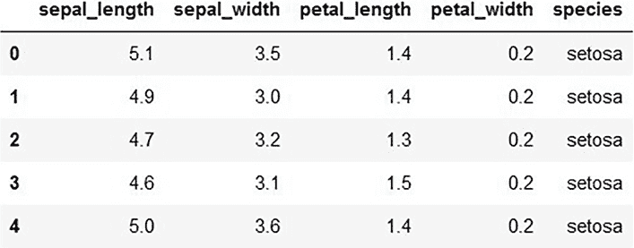

图 3.6 将保存为 pickle 文件的 dataframe 反序列化的结果

图 3.7 从原始源数据集（CSV 文件）到 Pandas dataframe，再到 pickle 文件，最后回到 Pandas dataframe 的流程总结。

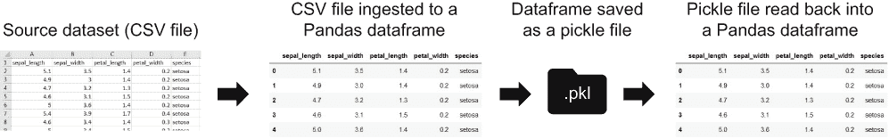

图 3.7 数据集的生命周期

如果你有大量数据集，且将其从外部源加载到 dataframe 中需要一些时间，那么 pickle 操作将非常有用。对于大型数据集，从保存的 dataframe 中反序列化通常比重新从外部源加载数据更快。

## 3.5 探索数据

现在我们已经学习了如何将完整输入数据集导入到 Pandas dataframe 中，以及如何使数据集在会话之间持久化，我们需要探索数据以了解其特征。通过使用 Python 中可用的数据可视化工具，我们可以探索数据以找到模式和异常，这有助于我们为下游过程做出良好的选择。你可以在这个部分的代码在 streetcar_data_exploration 笔记本和 streetcar _time_series 笔记本中找到。

首先，让我们对原始 dataframe 使用`describe()`函数（见图 3.8）。

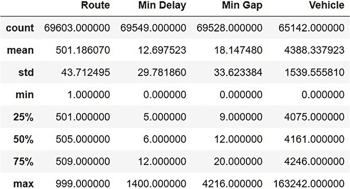

图 3.8 describe()函数的输出

这里有一些需要注意的事项：

+   路线和车辆被解释为连续的；我们需要纠正这两个列的类型。

+   最大延迟为 23 小时，最大间隔为 72 小时。这两个值看起来都不正确。我们需要检查记录以确认它们是否不正确。

+   平均延迟时间为 12 分钟；平均间隔时间为 18 分钟。

通过使用`sample()`函数随机抽样数据集，我们得到图 3.9 所示的输出。

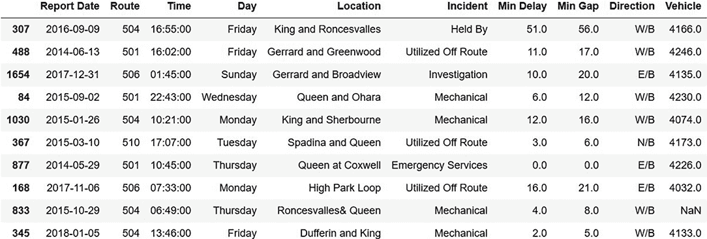

图 3.9 对原始输入数据框的 sample()函数的输出

这个输出告诉我们什么？

+   一些事件有零长度的延迟和间隔，这与预期记录延迟的数据集不符。我们需要审查这些记录以确定零长度的延迟和间隔是故意的还是错误。

+   位置值没有一致的连接词：`at`、`and`和`&`都出现在这个随机样本中

+   事件可能是一个分类列。我们应该计算唯一值的数量，以确定是否可以将事件视为一个分类列。

如果我们查看事件唯一值的数量，我们会发现这个数字足够小，使得事件可以被视为一个分类列：

```
print("incident count",df['Incident'].nunique())
incident count 9
```

这证实了事件应该被视为一个分类列，而不是一个自由文本列。

让我们在下一个列表中通过计算给定事件中一个值比另一个值大多少来探索最小延迟和最小间隔的相对大小。

列表 3.12 计算最小延迟比最小间隔大或小的次数的代码

```
df[df['Min Gap'] > df['Min Delay']].shape     ❶ 
(65176, 10)                                   ❷ 

df[df['Min Gap'] < df['Min Delay']].shape     ❸ 
(1969, 10)                                    ❹ 
```

❶ 获取最小间隔大于最小延迟的记录数量。

❷ 这些记录的数量

❸ 获取最小间隔小于最小延迟的记录数量。

❹ 这些记录的数量

结果告诉我们，对于给定的事件，最小间隔通常比最小延迟长，但大约 3%的时间，最小延迟比最小间隔长。这不是我们预期的。我们需要审查这些最小延迟比最小间隔长的记录，以确定它们是否是错误。

接下来，让我们看看按月聚类事件数量的视图（见图 3.10）。你可以在这个部分的 streetcar_time_series 笔记本中找到生成图表的代码。在这个视图中，每个点代表给定年份一个月内的事件总数。点的紧密垂直簇意味着事件数量在年份间变化不大。


图 3.10 按月延迟事件

下一个列表显示了生成此图表的代码。

列表 3.13 生成按月图表的延迟事件的代码

```
dfmonthav.plot.scatter(x = 'Month', y = 'Delay Count')    ❶ 
plt.show()                                                ❷ 
```

❶ 在 x 轴上按年月绘制，在 y 轴上绘制延迟计数

❷ 渲染图表。

这个视图告诉我们什么？

+   三月、四月、九月和十月（或许还有七月）的事件数量在年份间的变化不如其他月份。

+   一月、二月和十二月拥有最高的最高值范围。

我们能从这些观察结果中得出任何结论吗？或许在温度极端的月份会有更多事件发生。或许在天气不可预测的月份，事件的数量变化更大。这两个结论都是合理的，但都不确定。我们需要让数据来驱动结论。有可能天气是导致延误数量的一个影响因素，但我们需要小心不要在没有支持数据的情况下归因。在第九章中，我们讨论了将天气作为额外数据源添加到电车预测模型中。按月延迟图表表明这可能是一项有用的练习。

现在我们来看延迟持续时间的滚动平均值。此图表上每个月的数据点是前六个月延迟持续时间的平均值（见图 3.11）。

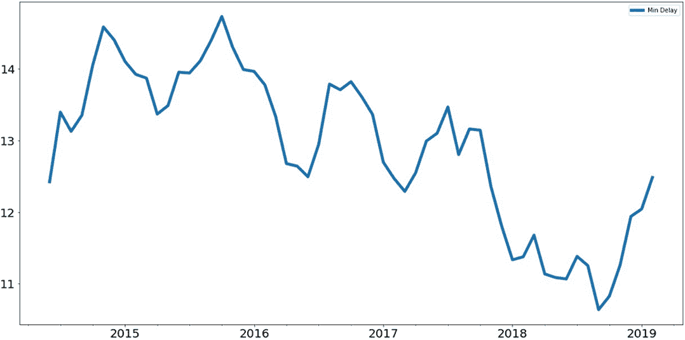

图 3.11 滚动平均延迟持续时间

下一个列表是生成此图表的代码。

列表 3.14 生成滚动平均延迟持续时间图表的代码

```
mean_delay = dfmonthav[['Min Delay']]
mean_delay.rolling(6).mean().plot(figsize=(20,10), linewidth=5, fontsize=20)❶ 
plt.show()                                                                  ❷ 
```

❶ 以月份为数据点绘制延迟持续时间的六个月滚动平均值。

❷ 渲染图表。

图 3.11 告诉我们，延迟事件的整体趋势是缩短，但在 2019 年有所上升。

Python 提供了许多探索数据集的选项。本节展示了这些选项的有用子集，以及探索结果后可能采取的行动。

下一个列表是图 3.12 中图表的代码。

列表 3.15 生成滚动平均延迟计数图表的代码

```
count_delay = dfmonthav[['Delay Count']]
count_delay.rolling(6).mean().plot(figsize=(20,10), \
linewidth=5, fontsize=20)                              ❶ 
plt.show()                                             ❷ 
```

❶ 以月份为数据点绘制延迟计数的六个月滚动平均值。

❷ 渲染图表。

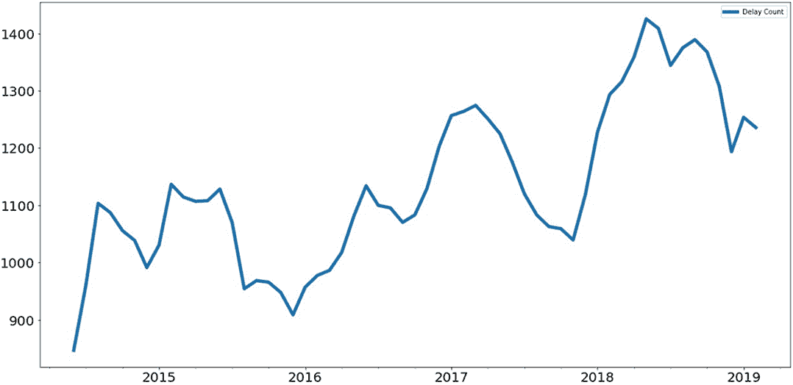

图 3.12 滚动平均延迟计数

图 3.12 表明，延迟计数的趋势是增加的，与延迟持续时间的趋势相反。

## 3.6 将数据分类为连续、分类和文本类别

现在你已经探索了数据，是时候解决如何对数据集中的列进行分类的问题了。本书中描述的方法是基于将输入列分为三个类别：

+   *连续* —这些值是数值，并且可以对这些值进行算术运算。连续值的例子包括温度、货币价值、时间跨度（如已过小时数）和对象和活动的计数。

+   *分类* —这些值可以是单个字符串，例如一周中的某一天，或者构成标识符的一组一个或多个字符串，例如美国各州的名称。分类列中不同值的数量可以从两个到几千个不等。

+   *文本* —这些值是字符串集合。

这种分类对于两个原因至关重要：

+   与其他机器学习算法一样，深度学习算法在数值上工作。最终输入到深度学习模型中的数据流需要完全由数值组成，因此所有非数值都需要转换成数值。分类告诉我们是否需要为一个列进行这种转换，如果是的话，需要什么样的转换。

+   正如你在第五章中将会看到的，深度学习模型的层是根据输入列的分类自动构建的。每种类型的列（连续型、分类型和文本型）都会生成具有不同特征的层。通过分类输入列，你使得 streetcar_model_training 笔记本中的代码能够自动构建深度学习模型，这意味着如果你向你的数据集中添加列或从数据集中删除列，当你重新运行笔记本时，模型将自动更新。

图 3.13 展示了如何对输入的街车延误数据集的列进行分类：

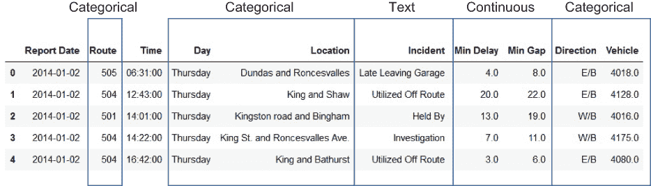

图 3.13 本书中主要示例的输入数据集列的分类

这里是每个列分类的描述：

+   最小延误和最小间隔是已过时间的测量，因此是连续列。

+   事件是一个分类列，描述了导致服务中断的原因。有九个有效值。

+   路线是一个分类列，有 12 个有效值。

+   日期是一个具有七个有效值的分类列。

+   位置是一个分类列，尽管在数据输入时它是一个自由格式字段。这个列是一个需要预处理以将大量潜在值映射到更小的一组唯一值的例子。在第四章中，我们将讨论将这些位置字符串映射到严格定义的经纬度值的优势和劣势。

+   方向是一个具有五个有效值的分类列：四个方向和表示多个方向的一个值。

+   车辆是一个分类列，尽管当这些值最初被引入到 dataframe 中时，它们看起来像浮点值。这个列中的值实际上是大约 300 辆活跃街车的四字符标识符。在第四章中，我们将处理 Python 分配给这个列的类型与实际数据类型之间的不匹配问题。

那么时间列“报告日期和时间”呢？在第五章中，我们将描述一种方法，将这些列中的值解析成新的分类列，以识别事件中最有趣的时序方面：年份、月份、月份中的日期和小时。

注意，在某些情况下，一列可能合法地属于多个类别。例如，包含时间戳的列可以根据你的业务问题的需求被处理为连续或分类。好消息是，本书中描述的方法足够灵活，你可以改变对某一列类别的看法，并以最小的干扰重新训练模型。

## 3.7 清理数据集中的问题：缺失数据、错误和猜测

电车延误问题是应用深度学习到表格结构数据的良好示例，因为输入数据集很混乱，有很多缺失、无效和多余的值。我们希望用深度学习解决的问题涉及这些类型的混乱数据集，因此清理混乱数据是我们需要学会如何做的一件事，如果我们想利用深度学习来解决使用表格结构数据解决的实际问题。

我们需要清理数据集中的这些问题，原因有很多：

+   缺失值需要被处理，因为深度学习模型不能在包含缺失值的数据集上进行训练。

+   无效值需要被处理，因为正如你将在第七章中看到的，在无效值仍然存在的情况下训练深度学习模型会降低训练模型的性能。

+   需要处理这些额外的值——对于同一现实世界特征的多个不同标记（例如，`E/B,` `e/b,` 和 `eb` 代表 *向东行驶*）——因为这些值在后续过程中的携带会增加模型的复杂性，而不会在训练过程中提供任何额外的信号。

以下是在清理过程完成后我们希望数据集具有的特征：

+   *所有值都是数值型* *.* 机器学习算法依赖于所有数据都是数值型。缺失值需要被替换，非数值型值（在分类或文本列中）需要被数值标识符替换。

+   *包含无效值的记录* *将被识别并消除*。消除无效值（例如，位于电车网络地理区域之外的位置或无效的电车 ID）的原因是为了防止模型在训练过程中使用不反映现实世界问题的数据进行训练。

+   *多余的类别* *将被识别并消除*。我们知道，方向列应该只有五个有效值（方向指示符加上表示两个方向的标识符）。所有记录都需要使用相同的统一类别。

首先，让我们看看每个列中的缺失值。深度学习模型只处理数字作为输入。用于训练深度学习模型的所有值都必须是数字。原因是用于训练深度学习模型的数据需要反复进行第一章中描述的过程：乘以权重、添加偏差值以及应用激活函数。这些操作不能与缺失值、字符值或任何不是数字的东西一起工作，因此处理缺失值是清理输入数据集的基本部分。

你如何知道哪些列有缺失值以及每个列中有多少行缺失值？这里有一个简单的命令，其输出是每个列的缺失值数量：

```
df.isnull().sum(axis = 0)
Report Date      0
Route            0
Time             0
Day              0
Location       270
Incident         0
Min Delay       58
Min Gap         77
Direction      232
Vehicle          0
```

输出告诉我们，位置、最小延迟、最小间隔和方向都有需要处理的缺失值。`fill_missing`函数遍历数据框中的所有列，并根据列类别用占位符值替换空值，如下所示。

列表 3.16 用占位符值替换缺失值的代码

```
def fill_missing(dataset):                                  ❶ 
    print("before mv")
    for col in collist:
        dataset[col].fillna(value="missing", inplace=True)
    for col in continuouscols:
        dataset[col].fillna(value=0.0,inplace=True)         ❷ 
    for col in textcols:
        dataset[col].fillna(value="missing", inplace=True)
    return (dataset)
```

❶ 根据列类别填充缺失值。

❷ 我们将用零填充连续列中的缺失值。请注意，对于某些列，该列值的平均值可以作为缺失值的有效替代。

如果我们用加载输入数据集的数据框作为参数调用此函数

```
df = fill_missing(df)
```

然后重新运行命令来计数空值，我们可以看到所有缺失值都已处理：

```
df.isnull().sum(axis = 0)
Report Date    0
Route          0
Time           0
Day            0
Location       0
Incident       0
Min Delay      0
Min Gap        0
Direction      0
Vehicle        0
```

现在我们已经修复了缺失值，让我们深入探讨输入数据集的一个列的剩余清理操作：方向。

方向列表示在给定记录中事故影响了哪种交通方向。根据随数据集附带的 readme 文件，方向有七个有效值：

+   对于影响双向交通的事故，使用`B`、`b`或`BW`。当我们清理此列的值时，我们将使用单个值来表示两个方向。

+   对于影响单方向交通的事故（北行、南行、东行或西行），使用`NB`、`SB`、`EB`和`WB`。

现在，让我们看看在已加载输入数据的 DataFrame 中方向列的实际唯一值数量：

```
print("unique directions before cleanup:",df['Direction'].nunique())
unique directions before cleanup: 95
```

发生了什么？为什么一个只有七个合法值的列会有 95 个不同的值？让我们看看`value_counts`的输出，以了解所有这些唯一值来自哪里：

```
df['Direction'].value_counts()
W/B                            32466
E/B                            32343
N/B                             6006
B/W                             5747
S/B                             5679
missing                          232
EB                               213
eb                               173
WB                               149
wb                               120
SB                                20
nb                                18
NB                                18
sb                                14
EW                                13
eastbound                          8
bw                                 7
5                                  7
w/b                                7
w                                  6
BW                                 4
8                                  4
ew                                 4
E                                  4
w/B                                4
s                                  4
2                                  4
W                                  3
b/w                                3
10                                 3
                               ...  
e/w                                1
```

如您所见，方向列中的 95 个值来自冗余标记和错误的组合。为了纠正这些问题，我们需要

+   获取该列值的统一情况，以避免像`EB`和`eb`这样的值被当作不同的值处理。

+   从该列的值中移除 `/` 以避免像 `wb` 和 `w/b` 被视为不同值的问题。

+   进行以下替换以消除对指南针标记的冗余标记：

    +   `e` 代表 `eb` 和 `eastbound`

    +   `w` 代表 `wb` 和 `westbound`

    +   `n` 代表 `nb` 和 `northbound`

    +   `s` 代表 `sb` 和 `southbound`

    +   `b` 代表 b`w`

+   将所有剩余的标记（包括我们为缺失值插入的 `missing` 标记）替换为单个标记，`bad direction`，以表示无法映射到任何有效方向的价值。

我们在下一列表中应用了 `direction_cleanup` 函数到方向列以实现这些更改。

列表 3.17 清理方向列的代码

```
def check_direction (x):                                                  ❶ 
    if x in valid_directions:
        return(x)
    else:
        return("bad direction")

def direction_cleanup(df):                                                ❷ 
    print("Direction count pre cleanup",df['Direction'].nunique())
    df['Direction'] = df['Direction'].str.lower()                         ❸ 
    df['Direction'] = df['Direction'].str.replace('/','')                 ❹ 
    df['Direction'] =
    ➥ df['Direction'].replace({'eastbound':'e','westbound':'w', \
    ➥ 'southbound':'s','northbound':'n'})                                ❺ 
    df['Direction'] = df['Direction'].replace('b','',regex=True)          ❻ 
    df['Direction'] = df['Direction'].apply(lambda x:check_direction(x))  ❼ 
    print("Direction count post cleanup",df['Direction'].nunique())
    return(df)
```

❶ 函数用于将无效的方向值替换为通用字符串

❷ 清理方向值的函数

❸ 将所有值转换为小写。

❹ 从所有值中移除 `/`。

❺ 将东向、西向等替换为单个字母方向标记。

❻ 从 eb 和 nb 等字符串中移除多余的 b。

❼ 调用 check_direction 将任何剩余的无效值替换为通用字符串。

输出显示了这些变化的效果：

```
Unique directions before cleanup: 95
Unique directions after cleanup: 6
```

这里是按方向列剩余的唯一值计数的：

```
w                32757
e                32747
n                 6045
b                 5763
s                 5719
bad direction      334
```

注意，现在我们只有六个有效值，而不是说明中指定的七个。我们已经将三个“双向”标记——`B`、`b`和`BW`——合并为`b`，并为错误的方向值添加了一个新标记“bad direction”。这种清理对于第五章中描述的输入数据集重构至关重要，以获得每个路线/方向/时间段组合的记录。这种重构依赖于任何路线最多有五个方向值，多亏了方向列的清理，我们知道这个条件是成立的。

方向列只是需要清理的列之一。与其他列相比，方向列相对简单，因为它有较少的有效值。此外，将输入值转换为有效值集的操作相对简单。我们将在第四章中详细介绍其他列的更复杂的清理过程。

## 3.8 查找深度学习需要多少数据

如果您进行简单的搜索以找出训练深度学习模型所需的数据量，您将不会得到令人满意的结果。所有答案都是“这取决于”的各种变体。一些著名的深度学习模型是在数百万个示例上训练的。一般来说，非线性方法如深度学习需要比线性方法如线性回归更多的数据才能达到适当的结果。与其他机器学习方法一样，深度学习需要一个训练数据集，该数据集涵盖了模型部署时可能遇到的输入组合。在街车延误预测问题的情况下，我们需要确保训练集包括用户可能希望预测的所有街车路线的记录。例如，如果系统添加了新的街车路线，我们就需要使用包含该路线延误信息的数据集重新训练模型。

对于我们来说，真正的问题不是广泛的“深度学习模型需要多少数据才能充分训练”的问题，而是“街车数据集是否有足够的数据，以便我们可以将其应用于深度学习？”最终，答案取决于我们的模型表现如何，这个观察结果中有一个教训，即所需的数据量取决于训练模型的性能。如果您有一个包含数万个条目的数据集，如街车数据集，它既不是如此之小以至于深度学习不可行，也不是如此之大以至于数据量不会成为问题。确定深度学习是否适用于您的问题的唯一方法就是尝试它并查看其性能。正如第六章所述，对于街车延误预测模型，我们测量测试精度（即模型在训练过程中未看到的行程中预测延误的能力）以及其他与模型良好用户体验相关的测量。好消息是，完成这本书后，您将拥有评估深度学习在表格结构数据集上性能所需的所有工具。

我们将在第六章中更详细地讨论模型精度，但现在简要地反思一下精度问题。街车预测模型的精度需要有多好？对于这个问题，任何超过 70%的精度都会有所帮助，因为这将使乘客在大多数情况下能够避免长时间的延误。

## 摘要

+   深度学习项目的一个基本步骤是摄取原始数据集，以便您可以在代码中对其进行操作。当您摄取了数据后，您可以探索它并开始对其进行清理。

+   您可以使用配置文件与您的 Python 程序结合使用，以保持您的参数组织有序，并使更新参数变得容易，而无需修改 Python 代码。

+   您可以通过单个函数调用直接将 CSV 文件导入 Pandas 数据框。使用简单的 Python 函数，您还可以将 XLS 文件中的所有标签或甚至多个 XLS 文件中的所有标签导入到数据框中。

+   Python 的 pickle 工具是保存 Python 程序中对象的一种简单方法，这样您就可以在 Python 会话之间使用它们。如果您有一个对数据集执行一系列转换的 Python 程序，您可以 pickle 转换后的数据框，在另一个 Python 程序中读取 pickle 的数据框，然后继续在数据集上工作，而无需重新执行转换。

+   当您将数据集导入到数据框中后，Python 提供了许多方便的函数来探索数据集，以确定每列值的类型和范围，以及列中值的趋势。这种探索可以帮助您检测数据集中的异常，并避免对数据进行未经证实的假设。

+   当您清理数据集以准备训练深度学习模型时，您需要解决的问题包括缺失值、无效值以及由多个不同标记表示的值（例如 `e`、`e/b` 和 `EB` 都表示 `eastbound`）。

+   对于“您需要多少数据来训练深度学习模型？”这个问题，答案是“足够的数据来训练模型以满足您的性能标准。”在大多数涉及结构化数据的情况下，您至少需要数万条记录。
