# 4 准备数据，第二部分：转换数据

本章涵盖

+   处理更多错误值

+   将复杂的多词值映射到单个标记

+   修复类型不匹配

+   处理清理后仍包含错误值的行

+   从现有列派生新的列

+   准备用于训练深度学习模型的分类和文本列

+   回顾第二章中引入的端到端解决方案

在第三章中，我们纠正了输入数据集中的一组错误和异常。数据集中仍有更多清理和准备工作要做，这就是本章我们将要做的。我们将处理剩余问题（包括多词标记和类型不匹配），并回顾你在所有清理后如何处理仍然存在的错误值的选择。然后，我们将回顾创建派生列以及如何准备非数值数据以训练深度学习模型。最后，我们将更仔细地查看第二章中引入的端到端解决方案，以了解我们已完成的数据准备步骤如何融入我们部署、训练用于预测电车延误的深度学习模型的总体旅程。

你将在本章中看到一致的主题：对数据集进行更新，使其更接近电车延误的现实世界情况。通过消除错误和歧义，使数据集更好地匹配现实世界，我们增加了获得准确深度学习模型的机会。

## 4.1 准备和转换数据的代码

当你克隆了与本书相关的 GitHub 仓库 ([`mng.bz/v95x`](http://mng.bz/v95x)) 后，探索和清洗数据的代码位于 notebooks 子目录中。下表展示了本章中描述的文件。

列表 4.1 仓库中与数据准备相关的代码

```
├── data                                                   ❶ 
│ 
├── notebooks
│           streetcar_data-geocode-get-boundaries.ipynb    ❷ 
│ streetcar_data_preparation-geocode.ipynb       ❸ 
│ streetcar_data_preparation.ipynb               ❹ 
│ streetcar_data_preparation_config.yml          ❺ 
```

❶ 用于存储和输出数据框的 pickled 输入目录

❷ 包含定义电车网络边界代码的笔记本（见 4.6 走得更远：位置）

❸ 生成与延迟位置相关的经纬度值的笔记本（见 4.6 走得更远：位置）

❹ 数据准备笔记本

❺ 数据准备笔记本的配置文件：是否从头开始加载数据，保存转换后的输出数据框，以及删除错误值以及 pickled 输入和输出数据框的文件名

## 4.2 处理错误值：路线

在第三章中，我们清理了方向列。正如你所回忆的，该列的有效值对应于罗盘方向，以及一个额外的标记来表示两个方向。方向列的有效值是通用的（北、东、南、西），并不特定于电车延误问题。那么，对于具有唯一电车使用案例值的列（路线和车辆）怎么办？我们如何清理这些列，以及我们能从这次清理中学到什么，这些经验可以应用到其他数据集中？

如果你查看数据准备笔记本的开始部分，你会注意到一个包含有效电车路线的单元格（图 4.1）。

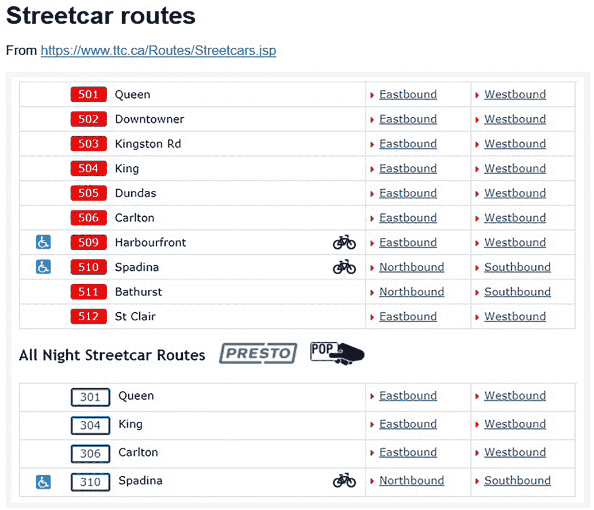

图 4.1 有效电车路线

以下列表显示了数据准备笔记本中清理路线列值的代码。

列表 4.2 清理路线列值的代码

```
valid_routes = ['501','502','503','504','505','506','509', \
'510','511','512','301','304','306','310']                    ❶ 

print("route count",df['Route'].nunique())
route count 106                                               ❷ 

def check_route (x):                                          ❸ 
    if x in valid_routes:
        return(x)
    else:
        return("bad route")

df['Route'] = df['Route'].apply(lambda x:check_route(x))      ❹ 

print("route count post cleanup",df['Route'].nunique())       ❺ 
df['Route'].value_counts()
route count post cleanup 15
```

❶ 定义一个包含所有有效路线值的列表。

❷ 打印出路线列中所有唯一值的计数。

❸ 将不在有效值列表中的路线值替换为占位符值的函数

❹ 将 check_route 函数应用于路线列。

❺ 打印出路线列中所有唯一值的修订计数。

当输入数据集中的数据被输入时，路线列中的值并未限制在有效路线上，因此该列包含许多不是有效电车路线的值。如果我们不解决这个问题，我们将用不反映现实世界情况的数据来训练我们的深度学习模型。除非我们清理路线列中的值，否则我们无法将数据集重构为每个记录都是一个路线/方向/时间段组合（第五章）。

值得回顾路线和车辆列的清理过程，因为同样的困境可能出现在许多现实世界的数据集中：你有一个具有严格定义的有效值列表的列，但由于数据输入方式或数据输入过程中的错误检查不严格，数据集中仍然存在不良值。

路线列的问题有多严重？当我们列出路线列中的值时，我们看到有 14 条有效的电车路线，但路线列包含超过 100 个不同的值。

我们定义了一个简单的函数，`check_route`，该函数检查路线列中的值，并将任何不在有效路线值列表中的值替换为`bad value`标记。我们将此函数应用于整个路线列，使用 lambda 函数，以便该函数应用于列中的每个值。有关使用 lambda 将函数应用于 Pandas 数据框的更多详细信息，请参阅[`mng.bz/V8gO`](http://mng.bz/V8gO)。

在应用了`check_route`函数之后，我们再次检查“路线”列中唯一值的数量，以确认“路线”列不再包含任何意外的值。正如我们所预期的，“路线”列现在有 15 个不同的值：14 个有效的路线值，加上`bad route`来表示原始数据集中有一个不是有效路线的值。

## 4.3 为什么只对一个所有错误值进行替换？

你可能会问，我们是否有除了用一个单一值替换所有错误值之外的其他选项。如果我们用一个占位符替换所有无效路线值时，我们是否可能丢失某种信号？也许用反映值为何错误的占位符来替换错误值是有意义的，例如以下内容：

+   `公交路线` — 对于“路线”列中不是有效电车路线但却是有效公交路线的值。

+   `废弃路线` — 对于“路线”列中曾经是电车路线的值。

+   `非 TTC 路线` — 对于“路线”列中是来自多伦多以外地区公交路线的有效路线标识，但不由多伦多交通委员会（TTC）运营。围绕多伦多的市政当局（包括西边的密西沙加，西北边的沃恩，东北边的马克汉姆和东边的达勒姆）有自己的独立交通运营商，从理论上讲，这些非 TTC 运营商中的一家公交路线可能会因电车延误而延误。当前数据集中没有非 TTC 路线的实例，但这并不意味着这种非 TTC 路线不能在未来数据集中出现。正如我们在第九章中将会看到的，一旦模型投入生产，我们就可以预期模型将在新数据上反复重新训练，因此数据准备代码应该具有弹性，以允许潜在的未来输入数据集的变化。允许“路线”列中的非 TTC 路线值是一个预测数据集潜在变化的例子。

+   `错误路线` — 对于“路线”列中从未是大多伦多地区任何交通运营有效路线的值，包括路线。

对于电车延误问题，这些区别并不相关。我们只对电车路线的延误感兴趣。但如果问题被不同地表述，包括预测电车以外的交通运营的延误，那么在“路线”列中对错误值使用更细粒度的替换，如前面列表中的那些，是有意义的。当然，值得问一下，对于一个列的所有非有效值在项目目标方面是否都是等效的。在电车延误问题的案例中，答案是肯定的，但同样的答案并不一定适用于所有结构化数据问题。

## 4.4 处理不正确的值：车辆

与存在固定有效电车路线列表一样，也存在一个固定有效的车辆列表。你可以看到如何编译这个有效车辆列表，并在数据准备笔记本中查看该信息的来源（图 4.2）。

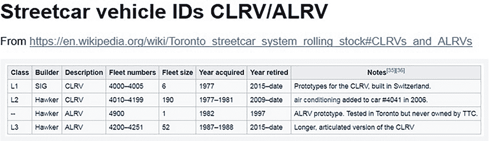

图 4.2 有效的电车 ID

公交车也可能成为电车延误的受害者。有效公交车 ID 的列表更复杂（图 4.3）。

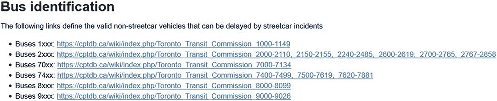

图 4.3 有效的公交车 ID

正如我们对路线列所做的那样，我们在下一个列表中定义了一个函数，该函数将无效的车辆值替换为一个单一标记以表示坏值，从而将车辆列中的值数量减少了超过一半。

列表 4.3 清理车辆列值的代码

```
print("vehicle count pre cleanup",df['Vehicle'].nunique())
df['Vehicle'] = df['Vehicle'].apply(lambda x:check_vehicle(x))
print("vehicle count post cleanup",df['Vehicle'].nunique())

vehicle count pre cleanup 2438       ❶ 
vehicle count post cleanup 1017      ❷ 
```

❶ 清理前车辆列中唯一值的数量

❷ 清理后车辆列中唯一值的数量

结果表明，我们最终不会在第五章和第六章中描述的模型训练中使用车辆列。首先，在第八章中描述的部署场景中，用户将是想要乘坐电车并需要知道是否会延误的人。在这种情况下，用户将不知道他们将乘坐哪一辆具体的车辆。因为用户在想要获取预测时无法提供车辆 ID，所以我们不能使用车辆列中的数据进行模型训练。但我们可以使用车辆列在未来模型的一个变体中，该变体针对的是不同的用户群体（例如，运营电车的交通管理局的行政人员），他们知道特定行程的车辆 ID，因此清理车辆列中的值以备将来使用是值得的。

## 4.5 处理不一致值：位置

路线和车辆列是典型的分类列，因为它们有一个固定且易于定义的有效值集合。位置列则呈现出一组不同的问题，因为它没有一个整洁定义的有效值集合。花些时间研究位置列相关的问题以及如何解决这些问题是值得的，因为这个列展示了你将在现实世界数据集中遇到的混乱类型。这个列中的值是针对电车数据集的，但我们用来清理这些值的方法（获取一致的大小写，获取值的有序排列，以及用一个单一标记替换指代同一现实世界实体的不一致标记）适用于许多数据集。

以下是位置列值的一些特性：

+   位置列中的值可以是街道交叉口（“皇后街和康纳格街”）或地标（“CNE 环”，“主站”，“莱斯利场”）。

+   有数千个有效的街道交汇值。因为路线超出了其名称街道的范围，所以一个路线可以具有不包含路线名称的有效交汇值。例如，“Broadview and Dundas”是 King 路线事件的有效位置值。

+   地标值可以是普遍知名的（例如“St. Clair West station”），也可以是针对电车网络内部运作的特定值（例如“Leslie Yard”）。

+   街道名称的顺序不一致（“Queen and Broadview”、“Broadview and Queen”）。

+   许多位置有多个标记来表示它们（“Roncy Yard”、“Roncesvalles Yard”和“Ronc. Carhouse”代表同一位置）。

+   位置列中的值总数远大于我们迄今为止查看的任何其他列：

    ```
    print("Location count pre cleanup:",df['Location'].nunique())
    Location count pre cleanup: 15691
    ```

这里是我们将要采取的清理位置列的步骤：

+   将所有值转换为小写。

+   使用一致的标记。当使用多个不同的值来表示同一位置时（“Roncy Yard”、“Roncesvalles Yard”和“Ronc. Carhouse”），将这些不同的字符串替换为一个字符串（“Roncesvalles yard”），以确保任何给定位置只使用一个字符串来表示。

+   使交汇处的街道顺序一致（将“Queen and Broadview”替换为“Broadview and Queen”）。我们通过确保交汇处的街道名称总是按照字母顺序排列，即字母顺序排在首位的街道名称在交汇字符串中排在首位来实现这一点。

我们将通过计算在每一步之后位置列中不同值的总数下降的百分比来跟踪我们的进度。在我们将位置列中的所有值转换为小写后，唯一值的数量下降了 15%：

```
df['Location'] = df['Location'].str.lower()
print("Unique Location values after lcasing:",df['Location'].nunique())
Unique Location values after lcasing: 13263
```

接下来，我们进行一系列替换以删除重复值，例如“stn”和“station”。你可能会问我们如何确定哪些值是重复的。我们如何知道，例如，“carhouse”、“garage”和“barn”都与“yard”相同，我们应该用“yard”替换这三个值？这个问题问得好，因为它引出了一个关于机器学习项目的重要观点。为了确定位置列中哪些术语是等效的，我们需要对多伦多（特别是其地理）以及特定的电车网络有领域知识。任何机器学习项目都将需要机器学习的技术专长以及应用领域的领域知识。例如，要真正解决第一章中概述的信用卡欺诈检测问题，我们就需要能够接触到对信用卡欺诈细节有深入了解的人。对于本书的主要例子，我选择电车延误问题，因为我对多伦多很了解，并且恰好拥有关于电车网络的知识，这使我能够确定，“carhouse”、“garage”和“barn”与“yard”意思相同。在机器学习项目中，领域知识的需求绝不能被低估，当你考虑要解决的问题时，你应该确保团队中有足够了解项目领域的人。

我们对位置列应用的变化有什么影响？到目前为止，这些变化使唯一值的总减少率达到 30%：

```
Unique Location values after substitutions: 10867
```

最后，对于所有街道交叉口的位置值，使街道名称的顺序一致，例如通过消除“broadview and queen”和“queen and broadview”之间的差异。这种转换后，唯一值的总减少率为 36%：

```
df['Location'] = df['Location'].apply(lambda x:order_location(x))
print("Location values post cleanup:",df['Location'].nunique())
Location values post cleanup: 10074
```

通过清理位置值（将所有值转换为小写，删除重复值，并确保连接对的一致顺序），我们将独特的位置值数量从超过 15,000 个减少到 10,074 个——减少了 36%。除了使训练数据更准确地反映现实世界外，减少此列中唯一值的数量还可以为我们节省实际费用，正如我们在第 4.6 节中将要看到的。

## 4.6 走得更远：位置

第 4.5 节中描述的清理是我们对位置值可以做的所有清理吗？还有一种可能的转换可以给我们位置列中的高保真值：用经纬度替换自由文本位置值。地理编码准备笔记本包含了一种使用谷歌地理编码 API（[`mng.bz/X06Y`](http://mng.bz/X06Y)）进行这种转换的方法。

我们为什么要用经纬度来替换自由文本位置？使用经纬度而不是自由文本位置的优势包括

+   位置精确到地理编码 API 可以做到的程度。

+   输出值是数值的，可以直接用于训练深度学习模型。

不利之处包括

+   35%的位置不是街道交叉口/地址，而是特定于电车网络的地点，例如“birchmount yard”。其中一些地点无法解析为经纬度值。

+   电车网络拓扑和延迟影响模式与实际地图没有直接关系。考虑两个潜在的延迟位置：“king and church” = 纬度 43.648949 / 经度-79.377754 和“queen and church” = 纬度 43.652908 / 经度-79.379458。从纬度和经度的角度来看，这两个位置很近，但在电车网络中它们相距甚远，因为它们位于不同的线路上。

本节（以及地理编码准备笔记本中的代码）假设您正在使用谷歌的地理编码 API。这种方法有几个优点，包括丰富的文档和广泛的用户基础，但它不是免费的。为了在单次批量运行中（即，不是将运行分散到多天以保持在地理编码 API 调用免费剪辑级别内）获取包含 60,000 个位置的数据集的经纬度值，您可能需要花费大约 50 美元。Google 地理编码 API 的几个替代方案可以节省您费用。例如，Locationiq ([`locationiq.com`](https://locationiq.com)) 提供了一个免费层，允许您在少于您需要保持 Google 地理编码 API 免费限制的迭代次数中处理更大的位置数据集。

由于调用谷歌地理编码 API 不是免费的，并且由于账户限制在 24 小时内可以对该 API 进行的调用次数，因此准备位置数据非常重要，以便我们尽可能少地进行地理编码 API 调用以获取经纬度值。

为了最小化地理编码 API 调用次数，我们首先定义一个新的 DataFrame，`df_unique`，其中包含一个单列，该列恰好包含唯一位置值的列表：

```
loc_unique = df['Location'].unique().tolist()
df_unique = pd.DataFrame(loc_unique, 
➥ columns=['Location'])
df_unique.head()
```

图 4.4 展示了这个新数据框的行片段。

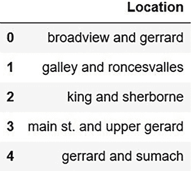

图 4.4 仅包含唯一位置值的 DataFrame

我们定义了一个函数，该函数调用谷歌地理编码 API，以位置作为参数，并返回一个 JSON 结构。如果返回的结构不为空，则解析该结构，并返回一个包含经纬度值的列表。如果结构为空，则返回一个占位符值，如下面的列表所示。

列表 4.4 获取街道交叉口经纬度值的代码

```
def get_geocode_result(junction):

    geo_string = junction+", "+city_name
    geocode_result = gmaps.geocode(geo_string)
    if len(geocode_result) > 0:                            ❶ 
        locs = geocode_result[0]["geometry"]["location"]
        return [locs["lat"], locs["lng"]]
    else:
        return [0.0,0.0]
```

❶ 检查结果是否为空。

如果我们用地理编码可以解释的位置调用此函数，我们将返回一个包含相应纬度和经度值的列表：

```
get_geocode_result("queen and bathurst")[0]
43.6471969
```

如果我们调用此函数时使用地理位置编码无法解释的位置，我们将返回占位符值：

```
locs = get_geocode_result("roncesvalles to longbranch")
print("locs ",locs)
locs  [0.0, 0.0]
```

我们调用`get_geocode_results`函数在此数据框中创建一个新列，该列包含经纬度值。将这两个值都放入一个列中需要做一些额外的处理以获得我们想要的结果：单独的经纬度列。但以这种方式调用可以减少我们需要进行的地理编码 API 调用次数，节省金钱并帮助我们保持在每日地理编码 API 调用限制内：

```
df_unique['lat_long'] = df_unique.Location.apply(lambda s:
➥ get_geocode_result(s))
```

接下来，我们创建单独的经纬度列：

```
df_unique["latitude"] = df_unique["lat_long"].str[0]
df_unique["longitude"] = df_unique["lat_long"].str[1]
```

最后，我们将`df_unique dataframe`与原始数据框合并，以获取添加到原始数据框中的经纬度列：

```
df_out = pd.merge(df, df_unique, on="Location", how='left')
```

如您所见，需要几个步骤（包括 Google 地理位置编码 API 的初始设置）才能将经纬度值添加到数据集中。在 Python 程序中理解如何操作经纬度值对于许多具有空间维度的常见商业问题来说是一项有用的技能，经纬度值使得创建可视化（如图 4.5 所示）以识别延误热点成为可能。实际上，第五章和第六章中描述的深度学习模型没有使用位置数据——无论是自由文本还是经纬度。自由文本位置不能用于重构后的数据集，将自由文本位置转换为经纬度的过程复杂且难以集成到管道中。第九章包括一个关于增强模型以包含位置数据以识别电车路线上的延误子段的章节。


图 4.5 显示电车延误热点图的散点图

## 4.7 修复类型不匹配

要获取分配给数据框的类型，您可以使用数据框的`dtypes`属性。对于最初用于电车延误数据集的数据框，此属性的值如下所示：

```
Day                    object
Delay                 float64
Direction              object
Gap                   float64
Incident               object
Incident ID           float64
Location               object
Min Delay             float64
Min Gap               float64
Report Date    datetime64[ns]
Route                   int64
Time                   object
Vehicle               float64
```

Python 在数据摄入时预测数据类型做得很好，但并不完美。幸运的是，确保您不会遇到类型惊喜很容易。此代码确保连续列具有可预测的类型：

```
for col in continuouscols:
        df[col] = df[col].astype(float)
```

类似地，看起来像数字的值，如车辆 ID，可能会被 Python 错误地解释，Python 将`float64`类型分配给车辆列（图 4.6）。

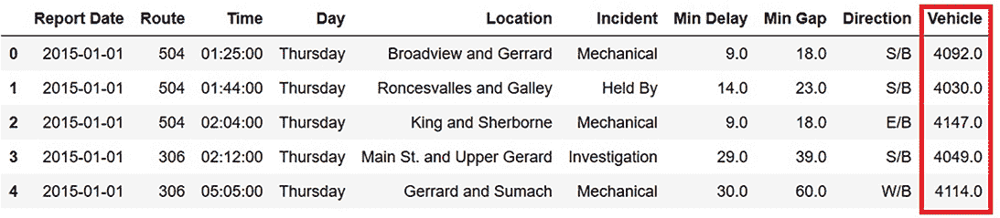

图 4.6 Python 错误地解释了车辆列的类型。

为了纠正这些类型，我们使用`astype`函数将列转换为字符串类型，然后剪切车辆列的末尾以移除残留的小数点和零：

```
df['Route'] = df['Route'].astype(str)
df['Vehicle'] = df['Vehicle'].astype(str)
df['Vehicle'] = df['Vehicle'].str[:-2]
```

## 4.8 处理仍然包含不良数据的行

在所有清理工作完成后，数据集中还剩下多少不良值？

```
print("Bad route count pre:",df[df.Route == 'bad route'].shape[0])
print("Bad direction count pre:",df[df.Direction == 
➥ 'bad direction'].shape[0])
print("Bad vehicle count pre:",df[df.Vehicle == 'bad vehicle'].shape[0])
Bad route count pre: 2544
Bad direction count pre: 407
Bad vehicle count pre: 14709
```

将此结果与数据集中的总行数进行比较：

```
df.shape output (78525, 13)
```

如果我们移除包含一个或多个剩余不良值的所有行，数据集的大小会发生什么变化？

```
if remove_bad_values:
    df = df[df.Vehicle != 'bad vehicle']
    df = df[df.Direction != 'bad direction']
    df = df[df.Route != 'bad route']

df.shape output post removal of bad records  (61500, 11)
```

移除不良值大约移除了 20%的数据。问题是：移除不良值对模型性能的影响是什么？第七章描述了一个实验，比较了在有无不良值的情况下训练模型的结果。图 4.7 显示了该实验的结果。

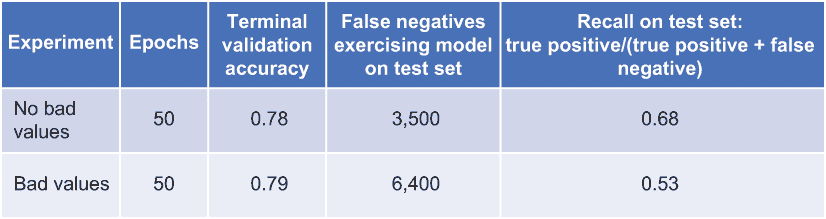

图 4.7 训练数据集中有无不良值时模型性能的比较

尽管未移除不良值的训练模型的验证准确率与移除不良值的训练模型的验证准确率大致相同，但当我们不移除不良值时，召回率和假阴性计数要差得多。我们可以得出结论，移除不良值对训练模型的性能有益。

## 4.9 创建派生列

在某些情况下，您可能希望创建由原始数据集中的列派生的新列。具有日期值（如街车数据集中的报告日期）的列包含信息（如年、月和日），这些信息可以被拉入单独的派生列中，这可能有助于提高模型的性能。

图 4.8 显示了在添加基于报告日期的派生列之前的数据框。

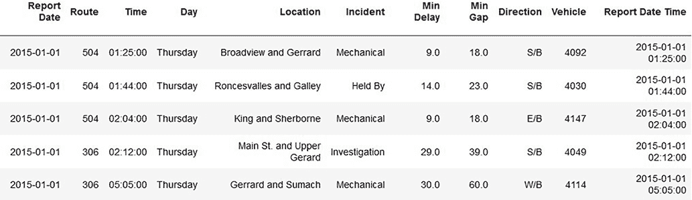

图 4.8 在添加基于报告日期的派生列之前的数据框

下面是创建年份、月份和月份日从现有报告日期列中显式列的代码：

```
merged_data['year'] = pd.DatetimeIndex(merged_data['Report Date']).year
merged_data['month'] = pd.DatetimeIndex(merged_data['Report Date']).month
merged_data['daym'] = pd.DatetimeIndex(merged_data['Report Date']).day
```

图 4.9 展示了在添加派生列后数据框的样式。

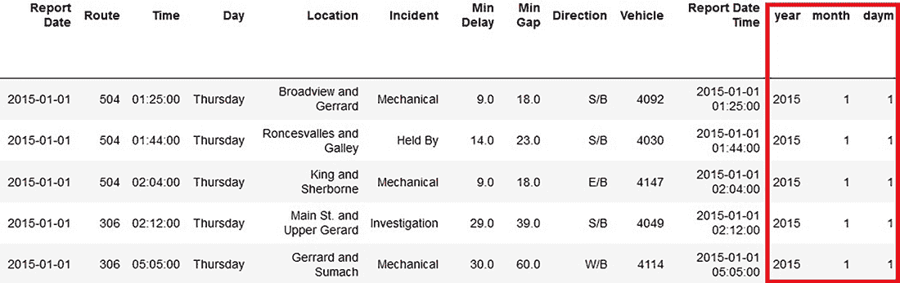

图 4.9 基于报告日期的派生列 DataFrame

在第五章中，我们将生成派生列作为重构数据集过程的一部分。通过将年份、月份和月份日从报告日期列中提取出来并放入它们自己的列中，我们简化了部署过程，使得从用户那里获取日期/时间信息变得直接。

## 4.10 准备非数值数据以训练深度学习模型

机器学习算法只能在数值数据上训练，因此任何非数值数据都需要转换为数值数据。图 4.10 显示了具有原始分类值的 DataFrame。

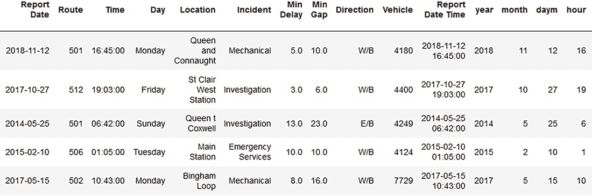

图 4.10 在将分类和文本列值替换为数值 ID 之前的数据框

您可以采取两种一般方法中的任何一种来用数值值替换分类值：*标签编码*，其中列中的每个唯一分类值被替换为一个数值标识符，或者*独热编码*，其中为每个唯一分类值生成一个新列。行在新列中表示其原始分类值时为`1`，在其他新列中为`0`。

标签编码可能会对一些机器学习算法造成问题，这些算法在数值标识符没有实际意义时，会赋予它们相对值的重要性。例如，如果数值标识符用于替换加拿大各省的值，从新 foundland and Labrador 的`0`开始，到 British Columbia 的`9`结束，那么 Alberta 的标识符（`8`）小于 British Columbia 的标识符并不具有意义。

One-hot encoding also has its problems. If a column has more than a few values, one-hot encoding can generate an explosion of new columns that can gobble up memory and make manipulation of the dataset difficult. For the streetcar delay dataset, we are sticking with label encoding to control the number of columns in the dataset.

下一个列表中的代码片段，来自在`custom_classes`中定义的`encode_categorical`类，使用了 sci-kit learn 库中的`LabelEncoder`函数，将分类列中的值替换为数值标识符。

列表 4.5 替换分类列值以使用数值标识符的代码

```
    def fit(self, X, y=None,  **fit_params):
        for col in self.col_list:
            print("col is ",col)
            self.le[col] = LabelEncoder()               ❶ 
            self.le[col].fit(X[col].tolist())
        return self

   def transform(self, X, y=None, **tranform_params):
        for col in self.col_list:
            print("transform col is ",col)
            X[col] = self.le[col].transform(X[col])     ❷ 
            print("after transform col is ",col)
            self.max_dict[col] = X[col].max() +1
        return X
```

❶ 创建一个 LabelEncoder 的实例。

❷ 使用 LabelEncoder 的实例将分类列中的值替换为数值标识符。

关于这个类的完整描述，请参阅第八章中关于管道的描述。

图 4.11 展示了在将分类列 Day、Direction、Route、hour、month、Location、daym 和 year 进行编码后，基本数据框的外观。

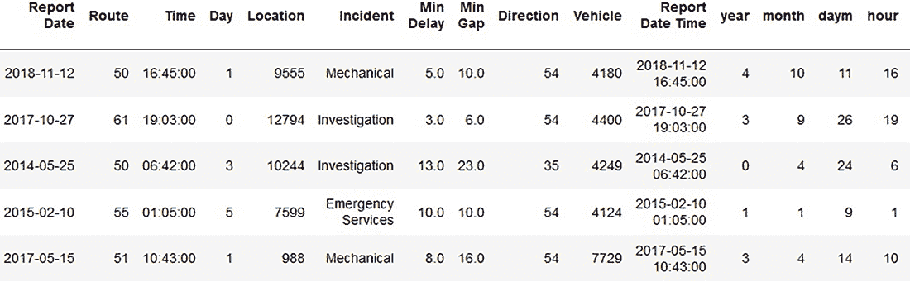

图 4.11 替换分类列值后的数据框

仍然有一列包含非数值数据：Incident。这列包含描述发生延误类型的短语。如果您还记得我们在第三章中进行的探索，我们确定 Incident 可以被处理为一个分类列。为了说明如何准备文本列，让我们现在将其视为一个文本列，并应用 Python Tokenizer API 来完成以下操作：

+   将所有值转换为小写。

+   删除标点符号。

+   将所有单词替换为数值标识符。

下面的列表包含了完成这种转换的代码。

列表 4.6 准备文本列以成为模型训练数据集一部分的代码

```
from keras.preprocessing.text import Tokenizer

for col in textcols:
    if verboseout:
        print("processing text col",col)    
    tok_raw = Tokenizer(num_words=maxwords,lower=True)    ❶ 
    tok_raw.fit_on_texts(train[col])
    train[col] = tok_raw.texts_to_sequences(train[col])
    test[col] = tok_raw.texts_to_sequences(test[col])
```

❶ Tokenizer 默认将文本转换为小写并删除标点符号。

图 4.12 展示了将这种转换应用于 Incident 列的结果。

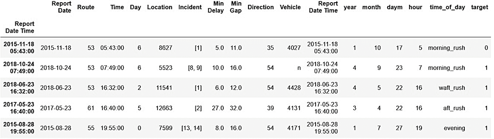

图 4.12 替换分类和文本列中的值后的数据框

图 4.13 比较了 Incident 列中的前后值。Incident 列中的每个条目现在都是一个列表（或数组，如果您更喜欢不那么 Python 化的术语）的数值标识符。请注意，在“After”视图中，每个原始列中的单词都有一个列表条目，并且 ID 分配是一致的（相同的单词无论在列中出现的位置如何，都会分配一个一致的 ID）。同时请注意以下几点：

+   最后，我们将事件视为一个分类列，这意味着多令牌值如“Emergency Services”被编码为单个数值。在本节中，我们将事件视为一个文本列，以说明这部分代码的工作原理，因此“Emergency Services”中的每个令牌都被单独编码。

+   我们只展示了一个文本列，但代码可以处理具有多个文本列的数据集。

    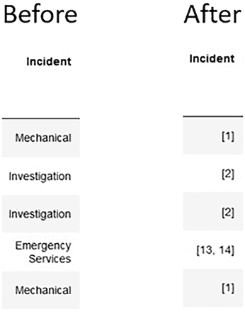

    图 4.13 在文本值编码前后的事件列

## 4.11 端到端解决方案概述

在我们检查深度学习和我们将用于解决电车延误问题的堆栈之前，让我们通过回顾第二章中引入的端到端图来重新审视整个问题的解决方案。图 4.14 显示了构成解决方案的所有主要元素，从输入数据集到通过简单网站或 Facebook Messenger 部署和访问的训练模型。组件分为三个部分：清洗数据集、构建和训练模型以及部署模型。

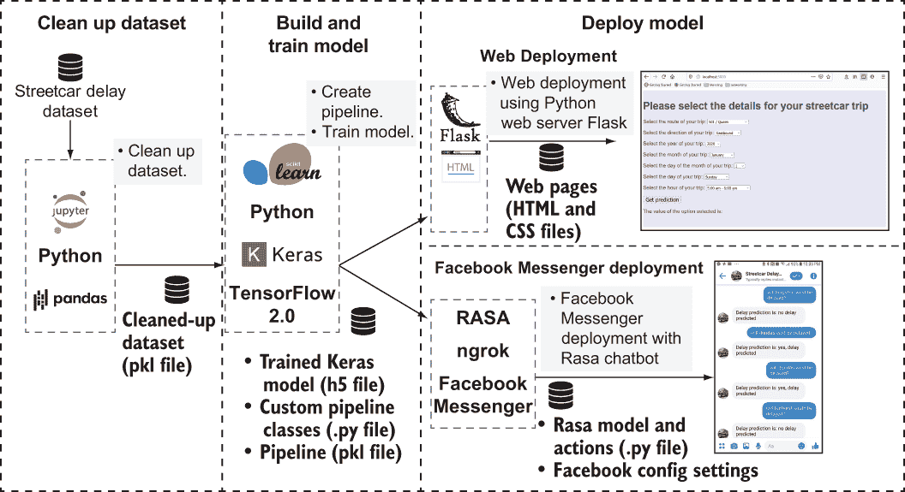

图 4.14 完整电车延误项目的总结

图 4.15 放大了我们用于在第 2、3 和 4 章中从输入数据集到清洗后的数据集的组件，包括用于处理表格数据的 Python 和 Pandas 库。

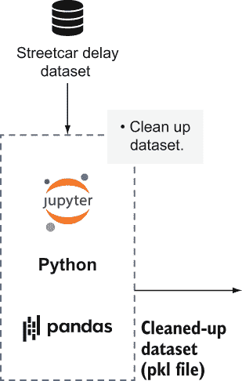

图 4.15 从输入数据集到清洗后的数据集

图 4.16 放大了我们将在第五章和第六章中用于构建和训练深度学习模型的组件，包括深度学习库 Keras 和 scikit-learn 库中的管道工具。

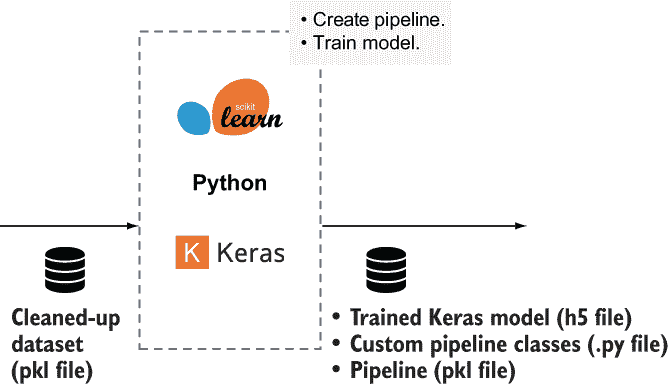

图 4.16 从清洗后的数据集到训练好的深度学习模型和管道

图 4.17 放大了我们将在第八章中用于部署训练好的深度学习模型的组件。对于 Web 部署，这些组件包括 Flask Web 部署库（用于渲染 HTML 网页，用户可以在其中指定他们的电车之旅的详细信息，并查看训练好的深度学习模型对行程是否会延误的预测）。对于 Facebook Messenger 部署，这些组件包括 Rasa 聊天机器人框架、ngrok 用于连接 Rasa 和 Facebook，以及 Facebook 应用程序配置。

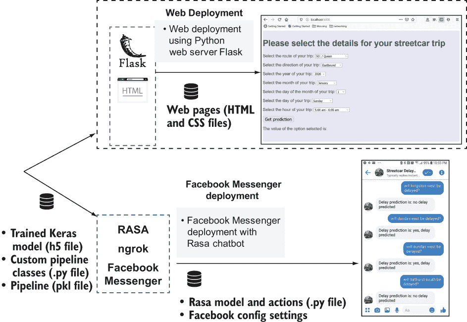

图 4.17 从训练模型和管道到部署的深度学习模型

图 4.18 和图 4.19 展示了目标：一个已部署并可用于预测给定电车之旅是否会延误的深度学习模型，无论是在网页上（图 4.18）还是在 Facebook Messenger 上（图 4.19）。


图 4.18 网页上可用的电车延误预测

在本节中，我们已经简要概述了端到端电车延误预测项目。在接下来的四章中，我们将详细介绍从本章的清洗数据集到使用训练模型预测特定电车行程是否会延误的简单网页所需的全部步骤。


图 4.19 在 Facebook Messenger 中可用的电车延误预测

## 摘要

+   清洗数据并不是我们在数据集上需要进行的唯一准备工作。我们还需要确保非数值值（例如分类列中的字符串）被转换为数值。

+   如果数据集包含无效值（例如不是实际电车路线的路线值或无法映射到任何一个方向上的方向值），这些值可以被替换为一个有效的占位符（例如分类列中最常见的值），或者包含这些值的记录可以从数据集中删除。

+   当 CSV 或 XLS 文件被导入 Pandas 数据框时，列的类型并不总是被正确分配。如果 Python 分配了错误的类型给一个列，你可以将该列转换为所需的类型。

+   分类列中的字符串值需要映射到数值，因为无法使用非数值数据训练深度学习模型。你可以通过使用 scikit-learn 库中的`LabelEncoder`函数来完成此映射。
