# 5 准备和构建模型

本章涵盖

+   重新审视数据集，并确定用于训练模型的特征

+   对数据集进行重构，包括没有延误的时间段

+   将数据集转换为 Keras 模型期望的格式

+   根据数据结构自动构建 Keras 模型

+   检查模型结构

+   设置参数，包括激活函数和优化函数以及学习率

本章首先快速回顾数据集，以考虑哪些列可以合法用于训练模型。然后，我们将讨论将数据从我们一直在操作的形式（Pandas 数据框）转换为深度学习模型期望的形式所需的转换。接下来，我们将查看模型的代码本身，并了解模型是如何根据输入列的类别逐层构建的。最后，我们将回顾你可以用来检查模型结构的方法以及你可以用来调整模型训练参数的方法。

本书的所有前几章都为这一刻做准备。在检查问题、准备数据之后，我们终于准备好深入研究深度学习模型本身了。在阅读本章时要注意的一点是：如果你之前没有直接与深度学习模型工作过，你可能会发现模型的代码在完成所有详细的数据准备工作之后显得有些平淡无奇。这种感觉可能与你使用 Python 库进行经典机器学习算法时相似。将逻辑回归或线性回归应用于已准备好的训练数据集的代码并不令人兴奋，尤其是如果你不得不编写非平凡的代码来驯服现实世界的数据集。你可以在这章中看到描述的代码，在 streetcar_model_training 笔记本中。

## 5.1 数据泄露和可用于训练模型的公平特征

在我们深入探讨构成模型的代码细节之前，我们需要回顾哪些列（无论是原始数据集的列还是从原始列派生出的列）是合法用于训练模型的。如果我们需要使用模型来预测电车延误，我们需要确保避免数据泄露。*数据泄露*发生在你使用训练数据集之外的数据（包括你试图预测的结果）来训练模型时。如果你在训练模型时依赖于在你想要做出预测时不可用的数据，你可能会遇到以下问题：

+   削弱你做出预测的能力

+   获得过于乐观的模型性能度量

为了理解数据泄露的问题，考虑一个简单的模型，该模型预测特定房地产市场中的房屋销售价格。对于这个模型，你有一组关于该市场最近售出的房屋的信息。你可以使用这些信息来训练一个模型，你稍后可以使用这个模型来预测即将上市房屋的销售价格，如图 5.1 所示。

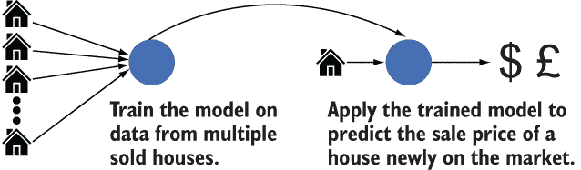

图 5.1 训练和应用模型以预测房价

图 5.2 显示了在已售房屋数据集中可供你选择的特征。

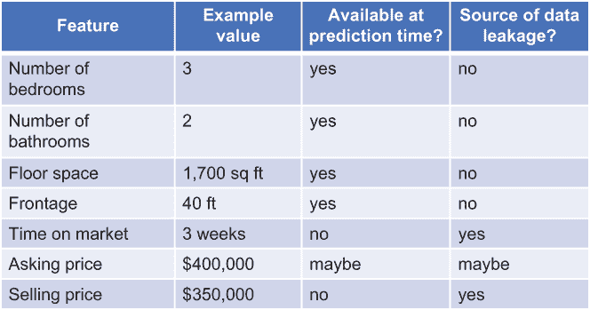

图 5.2 已售房屋数据集中的可用特征

我们的目的是在房屋首次上市时对其销售价格进行预测，这可能在它售出之前几周。当房屋准备上市时，以下特征将可用：

+   卧室数量

+   卫生间数量

+   层面积

+   前景

我们知道销售价格（我们想要预测的特征）将不可用。那么这些特征呢？

+   市场时间

+   出售价格

当我们想要进行预测时，市场时间将不可用，因为房屋尚未上市，因此我们不应使用此特征来训练模型。要价有些模糊；在我们想要进行预测的时候，它可能可用也可能不可用。这个例子表明，在我们确定给定特征是否会导致数据泄露之前，我们需要对现实世界的业务情况有更深入的了解。

## 5.2 领域专业知识与最小评分测试以防止数据泄露

你可以采取哪些措施来防止 5.1 节中描述的数据泄露问题？如果你已经在你尝试解决的深度学习模型所涉及的业务问题中拥有领域专业知识，那么你将更容易避免数据泄露。本书的一个目的就是让你能够在日常工作中练习深度学习，以便你能利用你在工作中所拥有的领域专业知识。

回到 5.1 节中的房屋价格示例，如果你使用已被识别为数据泄露来源的特征（如市场时间）来训练你的模型，会发生什么？首先，在训练过程中，你可能看到模型性能（例如，通过准确率来衡量）看起来很好。然而，这种出色的性能是误导性的。这相当于一位教师在考试期间每个学生都偷看了答案时对学生的表现感到高兴。学生们并没有真正做得好，因为他们接触到了在考试时不应接触到的信息。数据泄露的第二个结果是，当你完成模型训练并尝试应用它时，你会发现一些你需要提供以获得预测的特征缺失。

除了应用领域知识（例如，当房子首次上市时，市场时间未知），你还能做什么来防止数据泄露？对模型早期迭代进行最小评分测试可以帮助。在房价示例中，我们可以采用训练模型的临时版本，并应用一两个新上市房屋的数据。由于训练迭代尚未完成，预测可能不准确，但这项练习将揭示模型所需的特征，这些特征在预测时不可用，从而允许我们从训练过程中删除它们。

## 5.3 防止电车延误预测问题中的数据泄露

在电车延误示例中，我们想要预测一次特定的电车行程是否会延误。在这种情况下，将事件列作为特征来训练模型将构成数据泄露，因为在行程开始之前，我们不知道一次特定的行程是否会延误，以及如果会延误，延误的性质是什么。在行程开始之前，我们不知道事件列对一次特定的电车行程将有什么值。

如图 5.3 所示，最小延误和最小间隔列也会导致数据泄露。我们的标签（我们试图预测的值）来自最小延误，并与最小间隔相关联，因此这两个列都是潜在的数据泄露来源。当我们想要预测一次特定的电车行程是否会延误时，我们不会知道这些值。

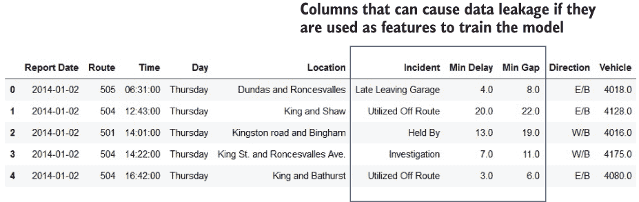

图 5.3 原始数据集中可能导致数据泄露的列

从另一个角度来看这个问题，哪些列包含在我们想要为特定行程或一系列行程做出延误预测时将合法可用的信息？用户在预测时提供的信息在第八章中描述。用户提供的信息取决于部署的类型：

+   *Web*（图 5.4）——在模型的 Web 部署中，用户选择七个评分参数（路线、方向和日期/时间细节），这些参数将被输入到训练好的模型中以获得预测。

    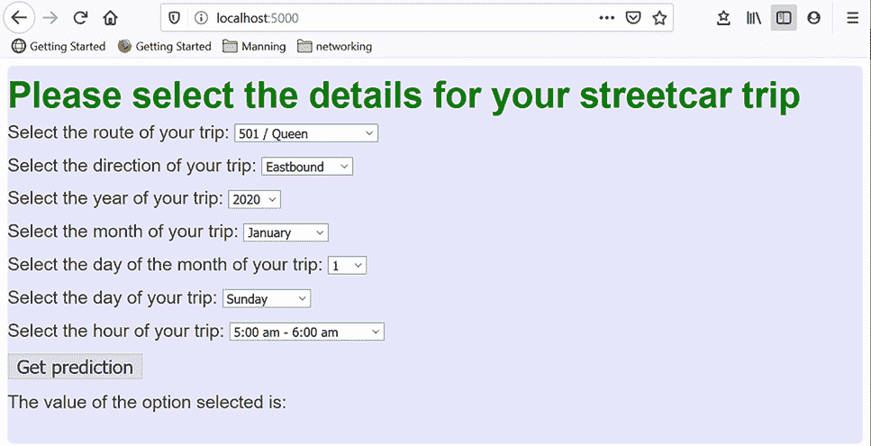

    图 5.4 Web 部署中用户提供的信息

+   *Facebook Messenger*（图 5.5）——在 Facebook Messenger 模型的部署中，如果用户没有明确提供，日期/时间细节默认为预测时的当前时间。在这个部署中，用户只需要提供两个评分参数：他们打算乘坐的电车行程的路线和方向。

    

    图 5.5 Facebook Messenger 模型部署中用户提供的信息

让我们检查这些参数以确保我们不会冒着数据泄露的风险：

+   *路线* —当我们想要预测街车行程是否会延误时，我们将知道行程将采取哪条路线（例如 501 王后路线或 503 金斯顿路）。

+   *方向* —当我们想要预测行程是否会延误时，我们将知道行程的方向（北行、南行、东行或西行）。

我们还将知道以下日期/时间信息（因为用户在 Web 部署中明确设置了值，或者因为我们假设 Facebook Messenger 部署中的当前日期/时间）：

+   小时

+   天（星期几，例如星期一）

+   月份中的某一天

+   月份

+   年份

我们希望在预测数据输入中包含一个额外的特征：位置。这个特征有点复杂。如果我们查看图 5.6 中源数据集中的位置信息，我们知道在我们要预测街车行程是否会延误时，我们不会有这些信息。但我们将知道行程的起点和终点（例如，501 王后路线的行程从女王街和舍伯恩街出发，到女王街和斯帕丁纳街）。

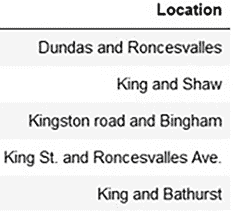

图 5.6 位置列中的值

我们如何将这些起点和终点与行程中特定点的延误可能性相关联？与有站点的地铁线路不同，街车路线相对灵活。许多站点沿着路线分布，这些站点不是静态的，就像地铁站一样；街车站点会移动。我们将在第九章中探讨的一种方法是，将每条路线划分为几个部分，并预测在整个街车路线上的行程中，任何部分是否会发生延误。现在，我们将检查一个不包含位置数据的模型版本，这样我们就可以在第一次从头到尾通过模型时，不会遇到太多的额外复杂性。

如果我们将训练街车延误模型限制在我们已识别的列（路线、方向和日期/时间列），我们可以防止数据泄露，并确信我们正在训练的模型将能够对新街车行程做出预测。

## 5.4 探索 Keras 和构建模型的代码

当你克隆了与本书相关的 GitHub 仓库 ([`mng.bz/v95x`](http://mng.bz/v95x)) 后，你将在 notebooks 子目录中找到与探索 Keras 和构建街车延误预测模型相关的代码。下一条列表显示了包含本章描述的代码的文件。

列表 5.1 与探索 Keras 和构建模型相关的代码

```
├── data                                          ❶ 
│ 
├── notebooks
│ streetcar_model_training.ipynb        ❷ 
│           streetcar_model_training_config.yml   ❸ 
│ keras_sequential_api_mnist.py         ❹ 
│ keras_functional_api_mnist.py         ❺ 
```

❶ 数据准备步骤输出为 pickled dataframe 的目录

❷ 包含重构输入数据集和构建模型的代码的笔记本

❸ 模型训练笔记本的配置文件，包括输入到模型训练笔记本的 pickled dataframe 的名称

❹ 使用 Keras 顺序 API 定义简单深度学习模型的示例（详细信息请见第 5.10 节）

❺ 使用 Keras 功能 API 定义简单深度学习模型的示例（详细信息请见第 5.10 节）

## 5.5 推导用于训练模型的 dataframe

在第 1-4 章中，我们经历了许多步骤来清洗和转换数据，包括

+   将冗余值替换为单个一致值，例如在方向列中将 `eastbound`、`e/b` 和 `eb` 替换为 e

+   移除具有无效值的记录，例如具有无效路线值的记录

+   将分类值替换为数值标识符

图 5.7 显示了这些转换的结果。

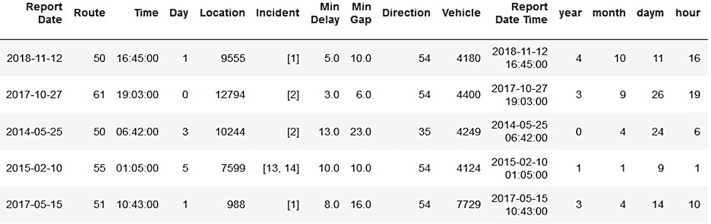

图 5.7 到第四章末的转换后的输入数据集

这个数据集是否足够训练一个模型以实现预测给定电车行程是否会延迟的目标？答案是：不。目前，这个数据集只有延迟的记录。缺少的是关于所有没有延迟的情况的信息。我们需要的是一个重构的数据集，它也记录了在特定路线和特定方向上没有延迟的所有时间。

图 5.8 总结了原始数据集和重构数据集之间的差异。在原始数据集中，每条记录描述了一个延迟，包括时间、路线、方向和导致延迟的事件。在重构数据集中，对于每个时间槽（从 2014 年 1 月 1 日以来的每小时），路线和方向的组合都有一个记录，无论在那个时间槽内该路线在该方向上是否有延迟。

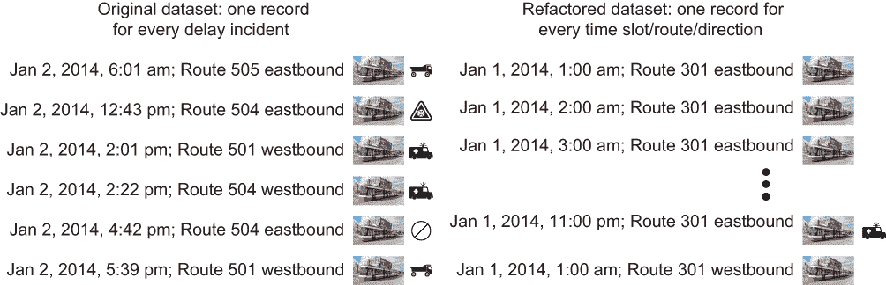

图 5.8 比较原始数据集与重构数据集

图 5.9 明确显示了重构数据集的外观。如果在给定时间槽（特定一天的小时）的给定路线的给定方向上有延迟，计数不为零；否则，计数为零。图 5.9 中重构数据集的片段显示，在 2014 年 1 月 1 日午夜到早上 5 点之间，301 路线在东行方向上没有发生任何延迟。

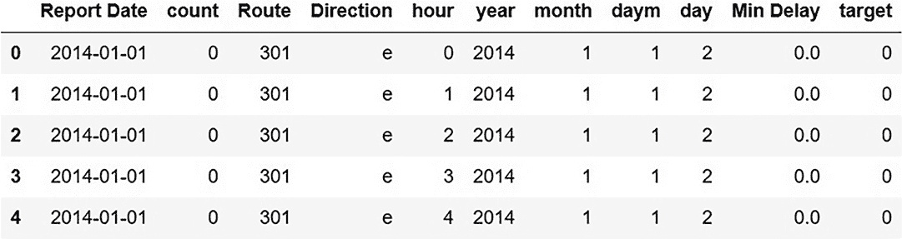

图 5.9 每个路线/方向/时间槽组合的行重构数据集

图 5.10 总结了获取每个时间槽/路线/方向组合条目的重构数据集的步骤。

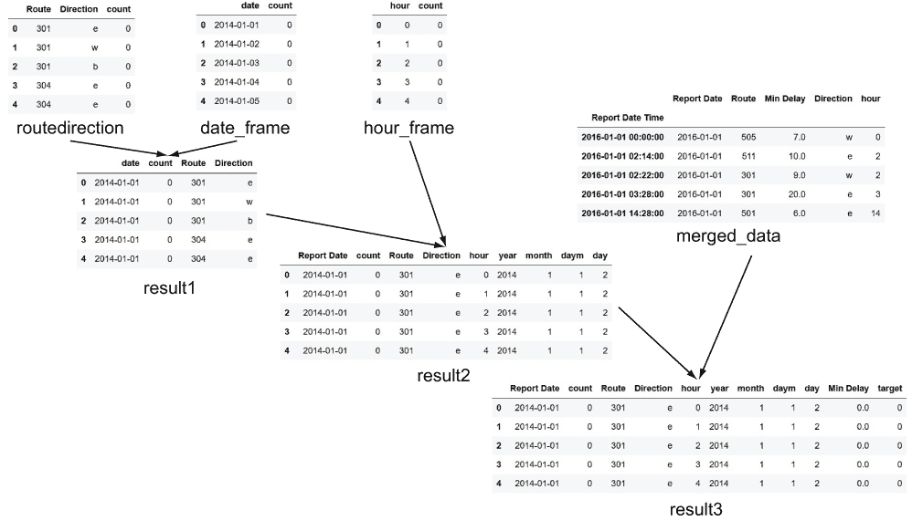

图 5.10 重构 dataframe

以下步骤：

1.  创建一个包含每个路线/方向组合的行 `routedirection_frame` 数据框（图 5.11）。

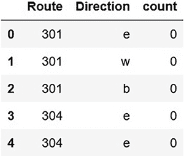

图 5.11 路向帧数据框

1.  创建一个包含从中选择训练数据的日期范围的每个日期的 `date_frame` 数据框（图 5.12）。

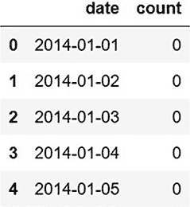

图 5.12 date_frame 数据框

1.  创建一个包含每天每小时一行数据的 `hour_frame` 数据框（图 5.13）。

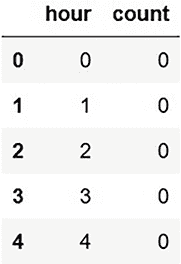

图 5.13 hour_frame 数据框

1.  将这三个数据框合并以获得 `result2` 数据框（图 5.14）。

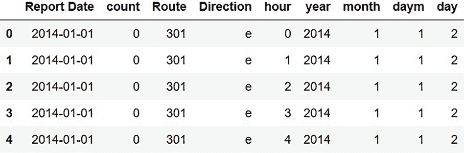

图 5.14 result2 数据框

1.  将日期的组成部分的派生列添加到 `result2` 数据框中：

    ```
    result2['year'] = pd.DatetimeIndex(result2['Report Date']).year
        result2['month'] = pd.DatetimeIndex(result2['Report Date']).month
        result2['daym'] = pd.DatetimeIndex(result2['Report Date']).day
        result2['day'] = pd.DatetimeIndex(result2['Report Date']).weekday 
    ```

1.  从输入数据集（`merged_data` 数据框）中删除多余的列，并将其与 `result2` 数据框合并，以获得完成重构的数据框（图 5.15）。

    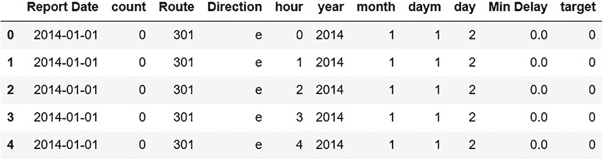

    图 5.15 完成重构的数据框

为了比较重构前后的数据集大小，一个包含 56,000 行的数据集在重构后变成了包含 2.5 百万行以覆盖五年期间的数据集。这个重构数据集覆盖的时间段的开始和结束由以下变量控制，这些变量定义在整体参数块中：

```
start_date =  date(config['general']['start_year'], \
config['general']['start_month'], config['general']['start_day'])
end_date = date(config['general']['end_year'], \
config['general']['end_month'], config['general']['end_day'])
```

开始日期与 2014 年 1 月延迟数据集的开始相对应。你可以通过更新配置文件 streetcar_model_training_config.yml 中的参数来更改结束日期，但请注意，你希望 `end_date` 不晚于原始来源的最新延迟数据（[`mng.bz/4B2B`](http://mng.bz/4B2B)）。

## 5.6 将数据框转换为 Keras 模型期望的格式

Keras 模型期望输入张量。你可以将张量视为矩阵的推广。矩阵是一个二维张量，而向量是一个一维张量。图 5.16 总结了按维度总结的张量常见术语。

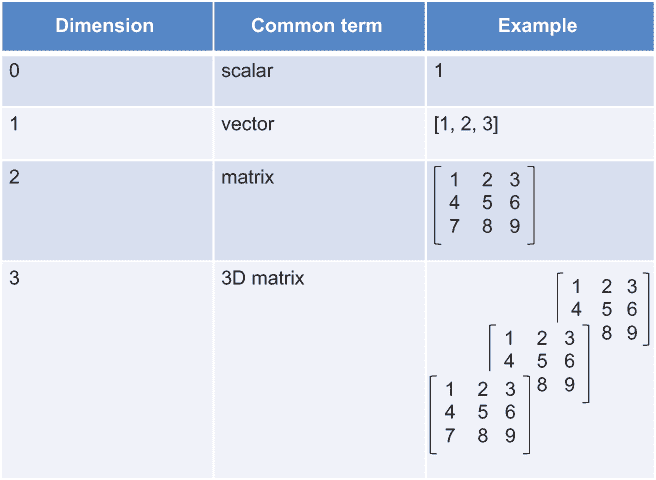

图 5.16 张量摘要

当我们在 Pandas 数据框中完成所有需要进行的所有数据转换后，在将数据输入模型进行训练之前的最后一步是将数据放入 Keras 模型所需的张量格式。通过将这种转换作为训练模型之前的最后一步，我们可以在需要将数据放入 Keras 模型期望的格式之前，享受到 Pandas 数据框的便利性和熟悉感。执行此转换的代码位于 `prep_for_keras_input` 类的 `transform` 方法中，如下所示。这个类是第八章中描述的管道的一部分，该管道对训练和评分的数据进行转换。

列表 5.2 将数据放入模型所需的张量格式的代码

```
def __init__(self):
        self.dictlist = []                               ❶ 
        return None

def transform(self, X, y=None, **tranform_params):
        for col in self.collist:
            print("cat col is",col)
            self.dictlist.append(np.array(X[col]))       ❷ 
        for col in self.textcols:
            print("text col is",col)
            self.dictlist.append(pad_sequences(X[col], \
            ➥ maxlen=max_dict[col]))                    ❸ 
        for col in self.continuouscols:
            print("cont col is",col)
            self.dictlist.append(np.array(X[col]))       ❹ 
        return self.dictlis.t
```

❶ 将包含每个列的 numpy 数组的列表

❷ 将当前分类列的 numpy 数组追加到整体列表中。

❸ 将当前文本列的 numpy 数组追加到整体列表中。

❹ 将当前连续列的 numpy 数组追加到整体列表中。

这段代码是灵活的。像本例中的其他代码一样，只要输入数据集的列被正确分类，这段代码就可以与各种表格结构化数据一起工作。它并不特定于电车数据集。

## 5.7 Keras 和 TensorFlow 的简要历史

我们已经审查了数据集在准备训练深度学习模型之前需要经历的最终转换集。本节提供了关于 Keras 的背景信息，Keras 是用于创建本书主要示例中模型的通用深度学习框架。我们将从本节开始，简要回顾 Keras 的历史及其与低级深度学习框架 TensorFlow 的关系。在第 5.8 节中，我们将回顾从 TensorFlow 1.x 迁移到 TensorFlow 2（本书代码示例所使用的后端深度学习框架）所需的步骤。在第 5.9 节中，我们将简要对比 Keras/TensorFlow 框架与其他主要深度学习框架 PyTorch。在第 5.10 节中，我们将回顾两个代码示例，展示如何在 Keras 中构建深度学习模型的层。有了关于 Keras 的这些背景知识，我们就可以准备检查 Keras 框架是如何用于实现第 5.11 节中的电车延迟预测深度学习模型的了。

Keras 最初是作为各种后端深度学习框架的前端而诞生的，包括 TensorFlow ([`www.tensorflow.org`](https://www.tensorflow.org/)) 和 Theano。Keras 的目的是提供一套易于访问、易于使用的 API，开发者可以使用这些 API 来探索深度学习。当 Keras 在 2015 年发布时，它所支持的深度学习后端库（最初是 Theano，然后是 TensorFlow）提供了一系列广泛的功能，但对于初学者来说可能难以掌握。有了 Keras，开发者可以通过使用熟悉的语法开始深度学习，而无需担心后端库中暴露的所有细节。

如果你是在 2017 年开始一个深度学习项目，你的选择包括

+   直接使用 TensorFlow 库

+   将 Keras 作为 TensorFlow 的前端使用

+   使用 Keras 与其他后端，如 Theano（尽管到 2017 年，除了 TensorFlow 之外的后端变得越来越少见）

尽管大多数使用 Keras 进行深度学习项目的人使用了 TensorFlow 作为后端，但 Keras 和 TensorFlow 是两个独立的项目。所有这些都在 2019 年随着 TensorFlow 2 的发布而改变：

+   鼓励使用 Keras 进行深度学习的程序员使用集成到 TensorFlow 中的 `tf.keras` 包，而不是独立的 Keras。

+   鼓励 TensorFlow 用户使用 Keras（通过 TensorFlow 中的 `tf.keras` 包）作为 TensorFlow 的高层 API。截至 TensorFlow 2，Keras 是 TensorFlow 的官方高层 API ([`mng.bz/xrWY`](http://mng.bz/xrWY))。

简而言之，原本是独立但相关的项目 Keras 和 TensorFlow 已经合并。特别是，随着新的 TensorFlow 点版本发布（例如，2020 年 5 月发布的 TensorFlow 2.2.0 [[`mng.bz/yrnJ`](http://mng.bz/yrnJ)]），它们将包括后端以及 Keras 前端的改进。您可以在 Keras 和 TensorFlow 的 *Python 深度学习* 章节中找到有关 Keras 和 TensorFlow 之间关系的更多详细信息，特别是 TensorFlow 在使用 Keras 定义的深度学习模型整体操作中扮演的角色（[`mng.bz/AzA7`](http://mng.bz/AzA7)）。

## 5.8 从 TensorFlow 1.x 迁移到 TensorFlow 2

本章和第六章中描述的深度学习模型代码最初是编写为使用独立的 Keras，以 TensorFlow 1.x 作为后端。在本书编写期间，TensorFlow 2 已发布，因此我决定迁移到 TensorFlow 2 中的集成 Keras 环境。因此，要在 streetcar_model_training .ipynb 中运行代码，您需要在 Python 环境中安装 TensorFlow 2。如果您有尚未迁移到 TensorFlow 2 的其他深度学习项目，您可以为此书中的代码示例创建一个特定的 Python 虚拟环境，并在其中安装 TensorFlow 2。这样，您就不会在您的其他深度学习项目中引入更改。

本节总结了我在模型训练笔记本中需要进行的代码更改，以将其从使用 TensorFlow 1.x 作为后端的独立 Keras 迁移到 TensorFlow 2 上下文中的 Keras。TensorFlow 文档中包含了全面的迁移步骤，网址为 [`www.tensorflow.org/guide/migrate`](https://www.tensorflow.org/guide/migrate)。以下是我在以下步骤中采取的简要总结：

1.  将我的现有 TensorFlow 版本升级到最新版本的 TensorFlow 1.x：

    ```
    pip install tensorflow==1.1.5
    ```

1.  完整运行模型训练笔记本以验证在最新版本的 TensorFlow 1.x 中一切是否正常工作。

1.  在模型训练笔记本上运行升级脚本 tf_upgrade_v2。

1.  将所有 Keras 导入语句更改为引用 tf.keras 包（包括将 `from keras import regularizers` 更改为 `from tensorflow.keras import regularizers`）。

1.  使用更新的导入语句完整运行模型训练笔记本以验证一切是否正常工作。

1.  按照以下网址的说明创建了 Python 虚拟环境：[`janakiev.com/blog/jupyter-virtual-envs`](https://janakiev.com/blog/jupyter-virtual-envs)。

1.  在 Python 虚拟环境中安装了 TensorFlow 2。这一步骤是必要的，因为第八章中描述的 Facebook Messenger 部署方法的一部分 Rasa 聊天机器人框架需要 TensorFlow 1.x。通过在虚拟环境中安装 TensorFlow 2，我们可以利用虚拟环境进行模型训练步骤，而不会破坏 TensorFlow 1.x 的部署先决条件。以下是安装 TensorFlow 2 的命令：

    ```
    pip install tensorflow==2.0.0
    ```

迁移到 TensorFlow 2 的过程非常顺利，多亏了 Python 虚拟环境，我能够在需要的地方进行模型训练迁移，而不会对我的其他 Python 项目造成任何副作用。

## 5.9 TensorFlow 与 PyTorch

在更深入地探索 Keras 之前，快速讨论一下目前用于深度学习的另一个主要库：PyTorch ([`pytorch.org`](https://pytorch.org))。PyTorch 由 Facebook 开发，并于 2017 年作为开源软件发布。在 [`mng.bz/Moj2`](http://mng.bz/Moj2) 的文章中对这两个库进行了简洁的比较。目前使用 TensorFlow 的社区比使用 PyTorch 的社区大，尽管 PyTorch 的增长速度很快。PyTorch 在学术界/研究界有更强的存在感（并且是第九章中描述的 fast.ai 课程编码方面的基础），而 TensorFlow 在工业界占主导地位。

## 5.10 Keras 中深度学习模型的架构

你可能还记得，第一章将神经网络描述为由层组织的一系列节点，每一层都与一些权重相关联。简单来说，在训练过程中，这些权重会反复更新，直到损失函数最小化，并且模型预测的准确性得到优化。在本节中，我们将通过回顾两个简单的深度学习模型来展示第一章中引入的层这一抽象概念如何在 Keras 代码中体现。

定义 Keras 模型的层有两种方式：顺序 API 和功能 API。顺序 API 是更简单的方法，但灵活性较低；功能 API 更灵活，但使用起来稍微复杂一些。

为了说明这两个 API，我们将探讨如何使用两种方法创建最小的 Keras 深度学习模型，用于 MNIST ([`www.tensorflow.org/datasets/catalog/mnist`](https://www.tensorflow.org/datasets/catalog/mnist))。如果你之前没有遇到过 MNIST，它是由手写数字的标记图像组成的数据库。`x` 值来自图像文件，标签（`y` 值）是数字的文本表示。MNIST 模型的目标是正确识别手写图像中的数字。MNIST 通常用作练习深度学习模型的简化数据集。如果你想要更多关于 MNIST 以及它是如何用于练习深度学习框架的背景信息，一篇优秀的文章在 [`mng.bz/Zr2a`](http://mng.bz/Zr2a) 提供了更多细节。

值得注意的是，MNIST 并不是一个根据第一章中结构化数据的定义所定义的结构化数据集。尽管它不是一个结构化数据集，但选择 MNIST 作为本节示例的原因有两个：Keras API 的已发布入门示例使用 MNIST，并且没有公认的与 MNIST 相当的结构化数据集用于训练深度学习模型。

使用顺序 API，模型定义接受一个有序的层列表作为参数。您可以从 TensorFlow 2 中支持的 Keras 层列表中选择您想要包含在模型中的层（[`mng.bz/awaJ`](http://mng.bz/awaJ)）。列表 5.3 中的代码片段来自`keras_sequential_api_mnist.py`，它改编自 TensorFlow 2 文档（[`mng.bz/RMAO`](http://mng.bz/RMAO)），并展示了一个简单的 MNIST 深度学习模型，该模型使用 Keras 顺序 API。

列表 5.3 使用 Keras 顺序 API 的 MNIST 模型代码

```
import tensorflow as tf
import pydotplus
from tensorflow.keras.utils import plot_model

mnist = tf.keras.datasets.mnist 

(x_train, y_train), (x_test, y_test) = mnist.load_data()
x_train, x_test = x_train / 255.0, x_test / 255.0

model = tf.keras.models.Sequential([                         ❶ 
  tf.keras.layers.Flatten(input_shape=(28, 28)),             ❷ 
  tf.keras.layers.Dense(128, activation='relu'),             ❸ 
  tf.keras.layers.Dropout(0.2),                              ❹ 
  tf.keras.layers.Dense(10)                                  ❺ 
])

model.compile(optimizer='adam',
              loss=tf.keras.losses.SparseCategoricalCrossentropy(from_logits=True),\
              metrics=['accuracy'])                          ❻ 

history = model.fit(x_train, y_train, \
                    batch_size=64, \
                    epochs=5, \
                    validation_split=0.2)                    ❼ 

test_scores = model.evaluate(x_test,  y_test, verbose=2)     ❽ 
print('Test loss:', test_scores[0])
print('Test accuracy:', test_scores[1])
```

❶ 定义 Keras 顺序模型

❷ 展平层，将输入张量重塑为形状等于输入张量元素数量的张量

❸ 密集层执行标准操作，即计算层的输入与层中的权重以及偏置的点积

❹ Dropout 层，随机关闭网络的一部分

❺ 输出密集层

❻ 编译模型，指定损失函数、优化器和训练过程中要跟踪的指标。

❼ 通过调整权重以最小化损失函数来拟合模型。

❽ 评估模型性能

这个 Keras 深度学习模型的简单示例与您已经看到的非深度学习模型有几个共同特点：

+   输入数据集被分为训练集和测试集。训练集用于训练过程中调整模型中的权重。测试数据集应用于训练好的模型以评估其性能；在这个例子中，根据准确率（即模型的预测与实际输出值的接近程度）。

+   训练集和测试集都由输入`x`值（对于 MNIST，手写数字的图像）和标签或`y`值（对于 MNIST，对应手写数字的 ASCII 数字）组成。

+   非深度学习和深度学习模型在定义和拟合模型时都有类似的语句。下一列表中的代码片段对比了定义和拟合逻辑回归模型和 Keras 深度学习模型的语句。

+   列表 5.4 对比逻辑回归模型和 Keras 模型的代码

    ```
    from sklearn.linear_model import LogisticRegression

    clf_lr = LogisticRegression(solver = 'lbfgs')         ❶ 
    model = clf_lr.fit(X_train, y_train)                  ❷ 

    model = tf.keras.models.Sequential([                  ❸ 
      tf.keras.layers.Flatten(input_shape=(28, 28)),
      tf.keras.layers.Dense(128, activation='relu'), 
      tf.keras.layers.Dropout(0.2), 
      tf.keras.layers.Dense(10) 
    ])
    model.compile(optimizer='adam', \                     ❹ loss=tf.keras.losses.SparseCategoricalCrossentropy(from_logits=True),\
                  metrics=['accuracy']) 

    history = model.fit(x_train, y_train, \               ❺ 
                        batch_size=64, \
                        epochs=5, \
                        validation_split=0.2)
    ```

    ❶ 定义逻辑回归模型。

    ❷ 调整逻辑回归模型。

    ❸ 定义 Keras 深度学习模型的第一部分：定义层

    ❹ 定义 Keras 深度学习模型的第二部分：设置编译参数

    ❺ 拟合 Keras 深度学习模型。

图 5.17 显示了`plot_model`函数对 MNIST 顺序 API 模型的输出。

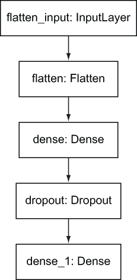

图 5.17 简单顺序 API Keras 模型的 plot_model 输出

与序列 API 相比，Keras 功能 API 的语法更复杂，但提供了更大的灵活性。特别是，功能 API 允许您定义具有多个输入的模型。正如您将在第 5.13 节中看到的，本书中的扩展示例利用了功能 API，因为它需要多个输入。

列表 5.5 中的代码片段来自 keras_ functional_api_mnist.py。它改编自[`www .tensorflow.org/guide/keras/functional`](https://www.tensorflow.org/guide/keras/functional)，展示了如何使用 Keras 功能 API 定义一个简单的深度学习模型，用于解决我们之前展示的序列 API 解决方案相同的 MNIST 问题。

列表 5.5 使用 Keras 功能 API 的 MNIST 模型代码

```
import numpy as np
import tensorflow as tf
from tensorflow import keras
from tensorflow.keras import layers

inputs = keras.Input(shape=(784,)) 
flatten = layers.Flatten(input_shape=(28, 28))                    ❶ 
flattened = flatten(inputs)
dense = layers.Dense(128, activation='relu')(flattened)           ❷ 
dropout = layers.Dropout(0.2) (dense)                             ❸ 
outputs = layers.Dense(10) (dropout)                              ❹ 

# define model inputs and outputs (taken from layer definition)

model = keras.Model(inputs=inputs, outputs=outputs, \
name='mnist_model')
(x_train, y_train), (x_test, y_test) = keras.datasets.mnist.load_data()

x_train = x_train.reshape(60000, 784).astype('float32') / 255 
x_test = x_test.reshape(10000, 784).astype('float32') / 255

# compile model, including specifying the loss function, \
optimizer, and metrics

model.compile(loss=keras.losses.SparseCategoricalCrossentropy( \
from_logits=True), \
     optimizer=keras.optimizers.RMSprop(), \
     metrics=['accuracy'])                                        ❺ 

# train model

history = model.fit(x_train, y_train, \
                    batch_size=64, \
                    epochs=5, \
                    validation_split=0.2)                         ❻ 

# assess model performance

test_scores = model.evaluate(x_test, y_test, verbose=2)           ❼ 
print('Test loss:', test_scores[0])
print('Test accuracy:', test_scores[1])
```

❶ 定义层，通过重新塑形输入张量，将其转换为与输入张量元素数量相等的张量

❷ 执行标准操作的密集层，即计算层的输入与层中的权重以及偏置的乘积

❸ 随机关闭网络一部分比例的 Dropout 层

❹ 输出密集层

❺ 编译模型，指定损失函数、优化器和训练过程中要跟踪的指标。

❻ 通过调整权重以最小化损失函数，将模型（使用训练数据集的参数、批量大小、训练轮数以及为验证保留的训练集子集）拟合。

❼ 评估模型性能。

您可以看到序列 API 和功能 API 在此问题上的许多相似之处。例如，`loss`函数的定义方式相同，`compile`和`fit`语句也相同。序列 API 和功能 API 之间的不同之处在于层的定义。在序列 API 方法中，层定义在一个单独的列表中，而在功能 API 方法中，层是递归定义的，每个层都是在其前驱层的基础上构建的。

图 5.18 显示了此简单功能 API Keras 模型的`plot_model`输出。

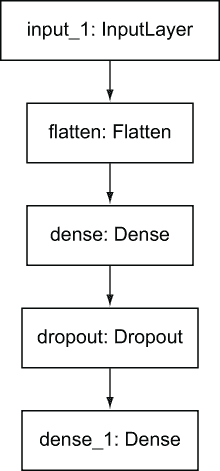

图 5.18 简单功能 API Keras 模型的 plot_model 输出

在本节中，我们考察了几种简单的 Keras 模型，并回顾了 Keras 提供的两种基本方法的关键特性：序列 API 和功能 API。在第 5.13 节中，我们将看到街道延误预测模型如何利用功能 API 的灵活性。

## 5.11 数据结构如何定义 Keras 模型

在第三章中，您了解到结构化数据集中的列被分类为分类、连续或文本（图 5.19）。

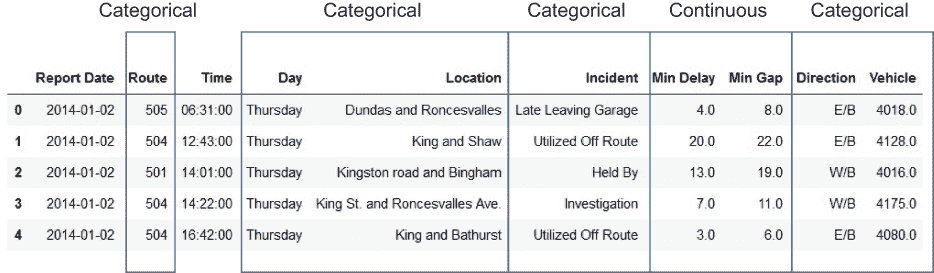

图 5.19 街道数据集的列类别

+   *连续* —这些值是数值。常见的连续值示例包括温度、货币值、时间跨度（如已过小时数）和对象或活动的计数。在街车示例中，最小延迟和最小间隔（包含延迟造成的分钟数和街车之间产生的间隔长度的分钟数）是连续列。从位置列派生出的纬度和经度值也被视为连续列。

+   *类别* —这些值可以是单个字符串，例如一周中的某一天，或者由一个或多个字符串组成的标识符集合，例如美国各州的名称。类别列中不同值的数量可以从两个到几千个不等。街车数据集中的大多数列都是类别列，包括路线、日期、位置、事件、方向和车辆。

+   *文本* —这些值是字符串集合。

将输入数据集组织成这些类别是至关重要的，因为这些类别定义了本书中描述的深度学习方法中深度学习模型代码的组装方式。Keras 模型的层是基于这些类别构建的，每个类别都有自己的层结构。

以下插图总结了为类别和文本列构建的层。图 5.20 显示了为类别列构建的层：

+   *嵌入* —如第 5.12 节所述，嵌入提供了一种方法，使模型能够在整体预测的上下文中学习类别中值之间的关系。

+   *批量归一化* —批量归一化是一种通过控制隐藏层中权重变化量来防止过拟合（模型在训练数据集上表现良好，但在其他数据上表现不佳）的方法。

+   *展平* —将输入重塑以准备后续层。

+   *丢弃* —使用此技术来防止过拟合。正如其名所示，丢弃技术会在网络的前向和反向传播过程中忽略网络中节点的随机子集。

+   *连接* —将此输入的层与其他输入的层连接起来。

    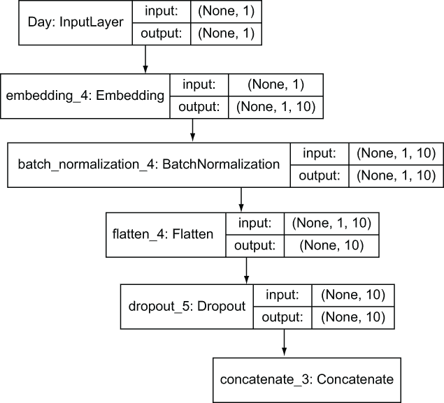

    图 5.20 Keras 类别输入层

图 5.21 显示了为文本输入列构建的层。除了分类列的层之外，文本列还获得一个 GRU 层。*GRU*（[`keras.io/api/layers/recurrent_layers/gru`](https://keras.io/api/layers/recurrent_layers/gru)）是一种循环神经网络（RNN），这是深度学习模型中常用的一种文本处理模型。RNN 与其他神经网络的不同之处在于控制先前输入对当前输入如何改变模型中权重的影响的门。有趣的是，这些门的行为——从先前输入中“记住”多少——是以与网络中通用权重相同的方式学习的。将此层添加到文本列的层集中意味着，从高层次来看，文本列中单词的顺序（而不仅仅是单个单词的存在）有助于模型的训练。

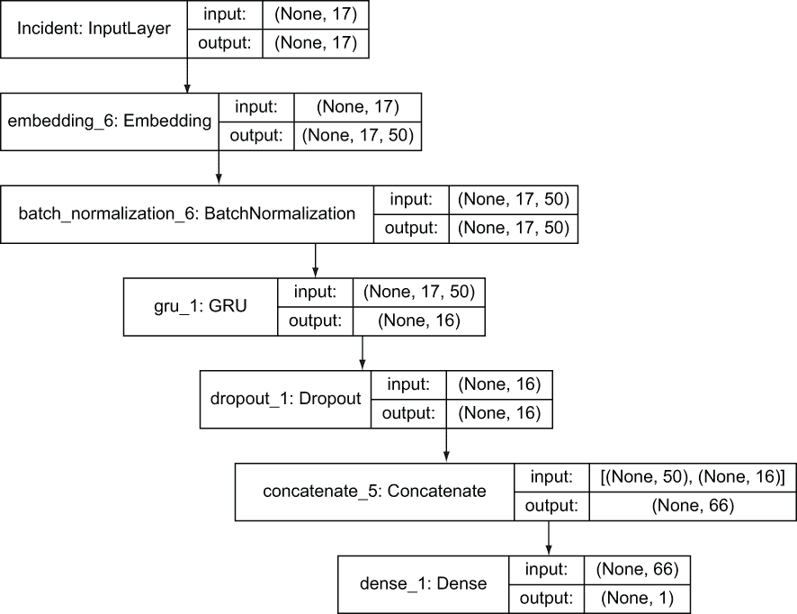

图 5.21 Keras 文本输入层

我们已经回顾了添加到深度学习模型中的分类和文本列的层。那么连续列呢？这些列没有特殊额外的层，而是直接连接到整体模型中。

本节简要描述了在结构化数据集中为每种列类型（连续、分类和文本）构建的深度学习模型中的层。在 5.13 节中，我们将详细讲解实现这些层的代码。

## 5.12 嵌入的力量

在 5.11 节中，您看到了在结构化数据集中为每种类型的列定义的层。特别是，您看到了分类和文本列获得嵌入层。在本节中，我们将检查嵌入及其应用。在第七章中，我们将通过一个实验回到嵌入的强大功能，该实验展示了分类列嵌入对模型性能的影响。

嵌入来自自然语言处理领域，其中它们用于将单词映射到数值表示。嵌入是本书的一个重要主题，因为它们对于使深度学习模型能够利用结构化数据集中的分类和文本列至关重要。本节并不是嵌入的全面描述——这是一个值得单独成书的话题，但它介绍了该概念并描述了为什么在结构化数据的深度学习项目中需要嵌入。您可以在 Stephan Raaijmakers 的《深度学习自然语言处理》一书中找到嵌入的更详细描述（[`mng.bz/2WXm`](http://mng.bz/2WXm)）。

在[`mng.bz/1gzn`](http://mng.bz/1gzn)上的优秀文章中指出，嵌入是**作为学习到的低维连续向量**对分类值的**表示**。这句话包含了大量信息。让我们逐个分析：

+   *类别值的表示* —回想一下第三章中类别值的定义：这些值可以是“单个字符串，如一周中的某一天，或者由一个或多个字符串组成的标识符集合，如美国各州的名称。类别列中不同值的数量可以从两个到几千个不等。”与嵌入相关的街车数据集的列包括类别列路线、日期、位置、事件、方向和车辆。

+   *学习得到的* —就像第一章中介绍的深度学习模型权重一样，嵌入的值是通过学习得到的。嵌入的值在训练之前被初始化，然后通过深度学习模型的迭代更新。结果是，在嵌入被学习之后，那些倾向于产生相同结果的类别值的嵌入会更接近彼此。考虑一周中的日子（从星期一到星期日）作为街车延误数据集的派生特征。假设周末的延误较少。如果是这样，周六和周日的嵌入将比工作日的嵌入更接近。

+   *低维* —这个术语意味着嵌入向量的维度相对于类别值的数量来说是低的。在本书中主要示例创建的模型中，路线列有超过 1,000 个不同的值，但其嵌入维度为 10。

+   *连续的* —这个术语意味着嵌入中的值由浮点数表示，而不是表示类别值的整数。

一个著名的嵌入示例（[`arxiv.org/pdf/1711.09160.pdf`](https://arxiv.org/pdf/1711.09160.pdf)）展示了它们如何捕捉与它们相关联的类别值之间的关系。这个示例显示了 Word2Vec（[`mng.bz/ggGR`](http://mng.bz/ggGR)）中与四个单词相关的向量之间的关系：

```
v(king) − v(man) + v(woman) ≈ v(queen)
```

这意味着国王的嵌入向量减去男人的嵌入向量再加上女人的嵌入向量接近于皇后的嵌入向量。在这个例子中，对嵌入的算术运算与与嵌入相关联的单词之间的语义关系相匹配。这个例子展示了嵌入将非数值、类别值映射到平面空间的能力，在这个空间中，值可以像数字一样被操作。

嵌入的另一个好处是，它们可以用来说明类别值之间的隐含关系。当你解决监督学习问题时，你会免费获得对类别进行无监督学习分析。

嵌入的最后一个好处是，它们为你提供了一种将分类值纳入深度学习框架的方法，而无需一热编码的缺点（[`mng.bz/P1Av`](http://mng.bz/P1Av)）。在一热编码中，如果有七个值（如一周中的日子），每个值都由一个大小为 7 的向量表示，其中包含六个 `0` 和一个 `1`：

+   星期一：[1,0,0,0,0,0,0]

+   星期二：[0,1,0,0,0,0,0,0]

+   . . .

+   星期日：[0,0,0,0,0,0,0,1]

在结构化数据集中，一周中各天的分类的一热编码需要七个列，对于一个值数量较少的分类来说，这并不算太糟糕。但关于车辆列，它有数百个值呢？你可以看到一热编码如何迅速增加数据集中的列数以及处理数据的内存需求。通过利用深度学习中的嵌入，我们可以处理分类列，而无需一热编码的糟糕缩放行为。

本节简要介绍了嵌入主题。使用嵌入的好处包括能够操作类似于常见数值操作的类似非数值值，能够在解决监督学习问题的副产品中获得对分类范围内值的无监督学习型分类，以及能够在没有一热编码的缺点的情况下使用分类输入训练深度学习模型。

## 5.13 基于数据结构自动构建 Keras 模型的代码

Keras 模型由一系列层组成，输入列通过这些层流动以生成给定路线/方向/时间槽组合的延迟预测。图 5.22 展示了输入列流经的层，以及根据其数据类别（连续、分类或文本）的示例数据类型。要查看探索这些层的选项，请参阅第 5.14 节。

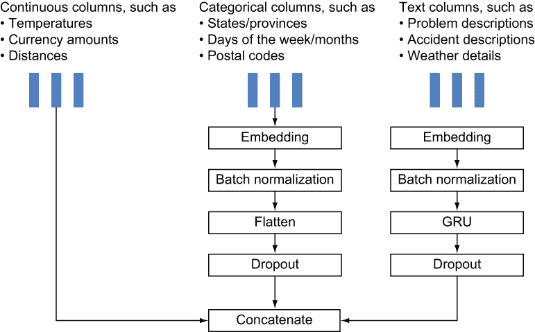

图 5.22 按列类型划分的 Keras 层及示例

下一个列表展示了将每个列分配到这些类别之一的代码。

列表 5.6 将列分配给类别的代码

```
textcols = []                                               ❶ 
continuouscols = []                                         ❷ 
if targetcontinuous:
    excludefromcolist = ['count','Report Date', 'target', \
    ➥ 'count_md','Min Delay']                              ❸ 
else:
    excludefromcolist = ['count','Report Date', \
    ➥ 'target','count_md', 'Min Delay'] 
nontextcols = list(set(allcols) - set(textcols))
collist = list(set(nontextcols) - \
set(excludefromcolist) - set(continuouscols))               ❹ 
```

❶ 在重构后的模型中，文本列的集合为空。

❷ 在重构后的模型中，连续列的集合为空。

❸ `excludefromcolist` 是将不会训练模型的列集合。

❹ `collist` 是分类列的列表。在这里，它是通过从列列表中移除文本列、连续列和排除列生成的。

这些列列表——`textcols`、`continuouscols` 和 `collist`——在代码中用于确定对列采取的操作，包括如何为每个用于训练模型的列构建深度学习模型的层。以下各节展示了为每种列类型添加的层。

以下列表显示了在应用于模型进行训练之前，训练数据的样子。训练数据是一个 numpy 数组的列表——每个训练数据列一个数组。

列表 5.7 在用于训练模型之前的数据格式

```
X_train_list is  
[array([13, 23,  2, ...,  9, 22, 16]),     ❶ 
array([13, 13,  3, ...,  4, 11,  2]),      ❷ 
array([1, 6, 5, ..., 5, 3, 2]),            ❸ 
array([8, 9, 0, ..., 7, 0, 4]),            ❹ 
array([4, 1, 1, ..., 1, 4, 4]),            ❺ 
array([10, 10, 23, ..., 21, 17, 15]),      ❻ 
array([4, 1, 3, ..., 0, 3, 0])]            ❼ 
```

❶ 用于小时的 numpy 数组。值范围从 0 到 23。

❷ 用于路线的 numpy 数组。值范围从 0 到 14。

❸ 用于星期的 numpy 数组。值范围从 0 到 6。

❹ 用于月份的 numpy 数组。值范围从 0 到 11。

❺ 用于年份的 numpy 数组。值范围从 0 到 6。

❻ 用于月份天数的 numpy 数组。值范围从 0 到 30。

❼ 用于方向的 numpy 数组。值范围从 0 到 4。

组装每种类型列层的代码位于`streetcar_model_training`笔记本中的`get_model()`函数中。以下是`get_model()`函数中用于连续列的代码块，它只是让输入层流过：

```
for col in continuouscols: 
        continputs[col] = Input(shape=[1],name=col)
        inputlayerlist.append(continputs[col])
```

在`get_model()`函数的分类列代码块中，我们看到这些列获得了嵌入和批归一化层，如下一列表所示。

列表 5.8 将嵌入和批归一化应用于分类列的代码

```
for col in collist:
        catinputs[col] = Input(shape=[1],name=col)                   ❶ 
        inputlayerlist.append(catinputs[col])                        ❷ 
        embeddings[col] = \
        ➥ (Embedding(max_dict[col],catemb) (catinputs[col]))        ❸ 
        embeddings[col] = (BatchNormalization() (embeddings[col]))   ❹ 
```

❶ 从输入开始。

❷ 将此列的输入层追加到输入层列表中，该列表将在模型定义语句中使用。

❸ 添加嵌入层。

❹ 添加批归一化层。

在`get_model` `()`函数的文本列代码块中，我们看到这些列获得了嵌入、批归一化、dropout 和 GRU 层，如下所示。

列表 5.9 将适当的层应用于文本列的代码

```
for col in textcols:
textinputs[col] = \
Input(shape=[X_train[col].shape[1]], name=col)                         ❶ 
inputlayerlist.append(textinputs[col])                                 ❷ 
textembeddings[col] = (Embedding(textmax,textemb) (textinputs[col]))   ❸ 
textembeddings[col] = (BatchNormalization() (textembeddings[col]))     ❹ 
textembeddings[col] = \
Dropout(dropout_rate)( GRU(16,kernel_regularizer=l2(l2_lambda)) \
(textembeddings[col]))                                                 ❺ 
```

❶ 从输入开始。

❷ 将此列的输入层追加到输入层列表中，该列表将在模型定义语句中使用。

❸ 添加嵌入层。

❹ 添加批归一化层。默认情况下，样本是单独归一化的。

❺ 添加 dropout 层和 GRU 层。

在本节中，我们探讨了构成街车延误预测问题的 Keras 深度学习模型核心的代码。我们看到了`get_model()`函数如何根据输入列的类型（连续、分类和文本）构建模型的层。由于`get_model()`函数不依赖于任何特定输入数据集的表格结构，因此此函数可以与各种输入数据集一起使用。像本例中的其他代码一样，只要输入数据集的列被正确分类，`get_model()`函数就会为各种表格结构数据生成 Keras 模型。

## 5.14 探索你的模型

我们创建的用于预测街车延误的模型相对简单，但如果之前没有遇到过 Keras，理解起来可能仍然有些令人困惑。幸运的是，你可以使用一些工具来检查模型。在本节中，我们将回顾三个你可以用来探索模型的工具：`model.summary` `()`、`plot_model` `()`和 TensorBoard。

`model.summary()` API 列出了模型中的每一层，其输出形状、参数数量以及输入到其中的层。图 5.23 中的 `model.summary()` 输出片段显示了输入层 daym、year、Route 和 hour。你可以看到 daym 如何连接到 embedding_1，而 embedding_1 又连接到 batch_normalization_1，batch_normalization_1 再连接到 flatten_1。

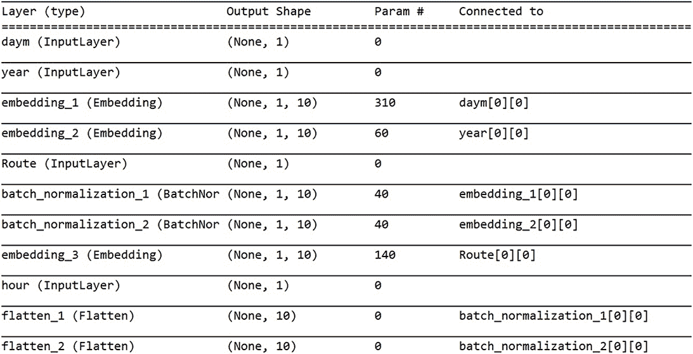

图 5.23 `model.summary()` 输出

当你最初创建一个 Keras 模型时，`model.summary()` 的输出可以真正帮助你理解层的连接方式，并验证你对层之间关系的假设。

如果你想要一个关于 Keras 模型层之间关系的图形视角，可以使用 `plot_model` 函数 ([`keras.io/visualization`](https://keras.io/visualization/))。`model.summary()` 以表格格式生成有关模型的信息；由 `plot_model` 生成的文件以图形方式说明了相同的信息。`model.summary()` 更容易使用。因为 `plot_model` 依赖于 Graphviz 软件包（Graphviz [[`www.graphviz.org`](https://www.graphviz.org) ] 可视化软件的 Python 实现），在新的环境中使 `plot_model` 工作可能需要一些工作，但如果需要一种向更广泛的受众解释你的模型的方法，这种努力是值得的。

在我的 Windows 10 环境中使 `plot_model` 工作所需进行的操作如下：

```
pip install pydot
pip install pydotplus
conda install python-graphviz
```

当我完成这些 Python 库更新后，我在 Windows 中下载并安装了 Graphviz 软件包 ([`graphviz.gitlab.io/download`](https://graphviz.gitlab.io/download/))。最后，为了在 Windows 中使 `plot_model` 工作，我必须更新 `PATH` 环境变量，以显式包含 Graphviz 安装路径中的 bin 目录。

下面的列表显示了 streetcar_model_training 笔记本中调用 `plot_model` 的代码。

列表 5.10 调用 plot_model 的代码

```
if save_model_plot:                                              ❶ 
    model_plot_file = "model_plot"+modifier+".png"               ❷ 
    model_plot_path = os.path.join(get_path(),model_plot_file)
    print("model plot path: ",model_plot_path)
    plot_model(model, to_file=model_plot_path)                   ❸ 
```

❶ 检查在街车模型训练配置文件中是否设置了 save_model_plot 开关。

❷ 如果设置了，请设置模型图将保存的文件名和路径。

❸ 使用模型对象和完全限定的文件名作为参数调用 `plot_model`。

图 5.24 和 5.25 显示了街车延迟预测模型的 `plot_model` 输出。每个列的层开始处用数字突出显示：

1.  方向

1.  小时

1.  年

1.  路线

1.  月

1.  月份的日

1.  日

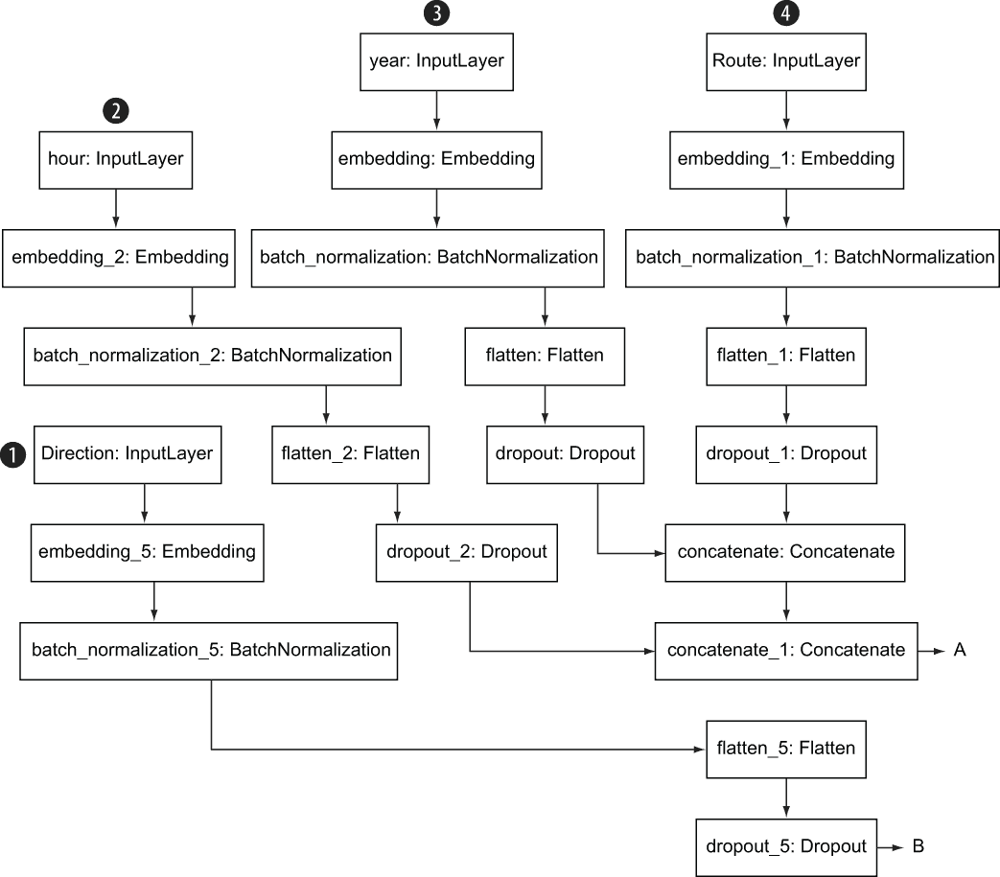

图 5.24 `plot_model` 输出显示了模型中的层（顶部部分）

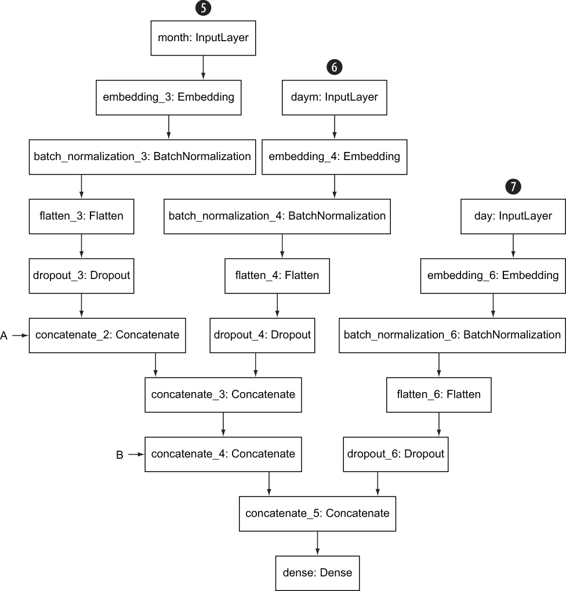

图 5.25 `plot_model` 输出显示了模型中的层（底部部分）

图 5.26 显示了 `plot_model` 对日列输出的近距离视图。

除了`model` `.summary()` 和 `plot_model`，您还可以使用 TensorBoard 实用程序来检查训练模型的特性。TensorBoard ([`www.tensorflow.org/tensorboard/get_started`](https://www.tensorflow.org/tensorboard/get_started)) 是 TensorFlow 提供的一个工具，它允许您图形化跟踪指标，如损失和准确率，并生成模型图的图表。

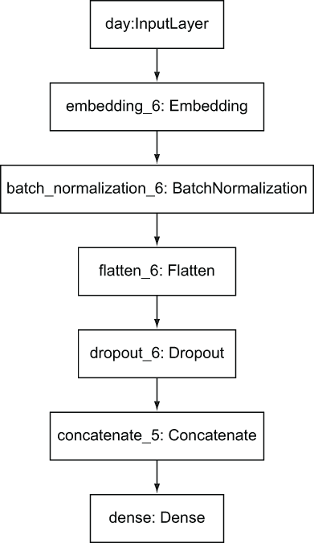

图 5.26 天数列层的特写

要使用 TensorBoard 与电车延误预测模型一起使用，请按照以下步骤操作：

1.  导入所需的库：

    ```
    from tensorflow.python.keras.callbacks import TensorBoard
    ```

1.  定义一个 TensorBoard 回调，包括 TensorBoard 日志的路径，如从电车 _ 模型训练笔记本中的`set_early_stop`函数此片段所示。

    列表 5.11 定义回调的代码

    ```
    if tensorboard_callback:                                           ❶ 
            tensorboard_log_dir = \
    os.path.join(get_path(),"tensorboard_log", \
    datetime.now().strftime("%Y%m%d-%H%M%S"))                          ❷ 
            tensorboard = TensorBoard(log_dir= tensorboard_log_dir)    ❸ 
            callback_list.append(tensorboard)                          ❹ 
    ```

    ❶ 如果在电车 _model_training 配置文件中将 tensorboard_callback 参数设置为 True，则定义一个 TensorBoard 回调。

    ❷ 定义一个使用当前日期的日志文件路径。

    ❸ 使用日志目录路径作为参数定义 tensorboard 回调。

    ❹ 将 tensorboard 回调添加到整体回调列表中。请注意，只有当 early_stop 为 True 时，tensorboard 回调才会被调用。

1.  将模型训练时`early_stop`设置为`True`，以便将回调列表（包括 TensorBoard 回调）作为参数包含在内。

当您使用已定义 TensorBoard 回调的训练模型时，您可以在终端中使用以下命令启动 TensorBoard，如下所示。

列表 5.12 调用 TensorBoard 的命令

```
tensorboard —logdir="C:\personal\manning\deep_learning_for_structured_data\
➥ data\tensorboard_log"                                                   ❶ 
Serving TensorBoard on localhost; to expose to the network, 
➥ use a proxy or pass —bind_all
TensorBoard 2.0.2 at http://localhost:6006/ (Press CTRL+C to quit)         ❷ 
```

❶ 启动 TensorBoard 的命令。logdir 值与 TensorBoard 回调定义中设置的目录相对应。

❷ 命令返回用于启动此训练运行的 TensorBoard 的 URL。

现在如果您在浏览器中打开 TensorBoard 命令返回的 URL，您将看到 TensorBoard 界面。图 5.27 显示了 TensorBoard，其中包含了针对电车延误预测模型训练运行的每个 epoch 的准确率结果。

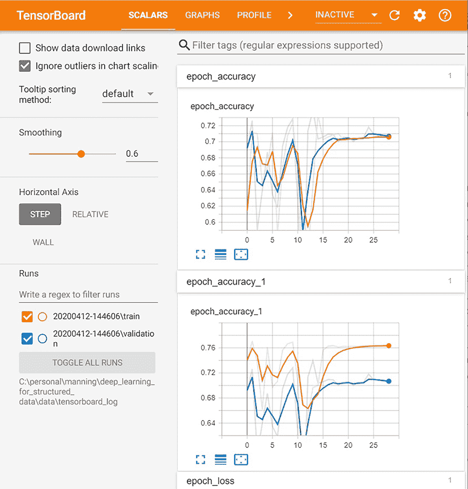

图 5.27 显示模型准确率的 TensorBoard

在本节中，您已经看到了获取模型信息的三种选项：`model` `.summary()`，`plot_model` 和 TensorBoard。特别是 TensorBoard 具有丰富的功能，用于探索您的模型。您可以在 TensorFlow 文档中找到 TensorBoard 的许多可视化选项的详细描述（[`www.tensorflow.org/tensorboard/get_started`](https://www.tensorflow.org/tensorboard/get_started)）。

## 5.15 模型参数

代码包括一组控制模型及其训练过程的参数。图 5.28 总结了这些参数的有效值和用途。关于标准参数（包括学习率、损失函数、激活函数、批量大小和 epoch 数量）的详细描述超出了本书的范围。你可以在[`mng.bz/Ov8P`](http://mng.bz/Ov8P)找到关键超参数的简洁总结。

你可以使用图 5.28 中列出的参数来调整模型的行为。如果你正在将此模型适应不同的数据集，你可能想要从较小的学习率开始，直到你对模型是否收敛到良好的结果有一个概念。你还将想要减少在新的数据集上训练模型的前几次迭代的 epoch 数量，直到你对在训练环境中完成一个 epoch 所需的时间有一个概念。

`output_activation`参数控制模型是预测一个类别（如电车行程延误/电车行程未延误）还是连续值（如“电车行程延误 5 分钟”）。考虑到电车延误输入数据集的大小，我选择了类别预测模型。但如果你根据第九章的描述将此模型适应不同的数据集，你可能决定使用连续预测，并且你可以调整`output_activation`参数到一个连续预测的值，例如线性。

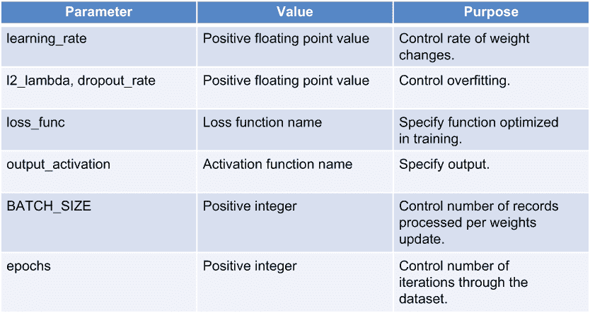

图 5.28 你可以在代码中设置的参数以控制模型及其训练

这些参数在配置文件`streetcar_model_training_config.yml`中定义。第三章介绍了使用 Python 作为配置文件的方式，以将硬编码的值从代码中排除，并使调整参数更快、更少出错。在[`mng.bz/wpBa`](http://mng.bz/wpBa)的出色文章中对配置文件的价值有很好的描述。

在进行训练迭代时，你很少需要更改图 5.28 中列出的参数。以下是这些参数控制的内容：

+   *学习率*控制模型训练过程中每迭代权重变化的幅度。如果学习率过高，你可能会跳过最优权重，如果过低，则向最优权重的进展可能非常缓慢。代码中最初设置的学习率值应该是足够的，但你也可以调整此值以查看它如何影响模型的训练进度。

+   *辍学率*控制了在训练迭代中网络中被忽略的部分比例。正如我们在第 5.11 节中提到的，通过 dropout 旋转，网络中的随机节点子集在网络的正向和反向传播过程中被忽略，以减少过拟合。

+   *L2_lambda*控制 GRU RNN 层的正则化。此参数仅影响文本输入列。正则化限制了模型中的权重以减少过拟合。通过降低权重的大小，正则化防止模型过多地受到训练集特定特征的影响。您可以将正则化视为使模型更加保守([`arxiv.org/ftp/arxiv/papers/2003/2003.05182.pdf`](https://arxiv.org/ftp/arxiv/papers/2003/2003.05182.pdf))或更简单。

+   *损失函数*是模型优化的函数。模型的目标是优化此函数以从模型中获得最佳预测。您可以在[Keras 中可用的损失函数选择](http://mng.bz/qNM6)的全面描述中看到。街车延误模型预测二元选择（是否会在特定行程中延误），因此`binary_crossentropy`是`loss`函数的默认选择。

+   *输出激活*是模型最后一层中生成最终输出的函数。此值的默认设置`hard_sigmoid`将在`0`和`1`之间生成输出。

+   *批量大小*是指在模型更新之前处理的记录数。您通常不需要更新此值。

+   *Epochs*是通过训练样本的完整遍历次数。您可以调整此值，从较小的值开始以获得初始结果，然后在看到更多 epoch 数时获得更好的结果。根据运行单个 epoch 所需的时间，您可能需要平衡更多 epoch 带来的额外模型性能与运行更多 epoch 所需的时间。

对于定义损失函数和输出激活函数的两个参数，*使用 Python 进行深度学习*包含一个有用的部分([`mng.bz/7GX7`](http://mng.bz/7GX7))，该部分更详细地介绍了这些参数的选项以及您将应用这些选项的问题类型。

## 摘要

+   构成深度学习模型的代码可能看起来平淡无奇，但它是一个完整解决方案的核心，该方案一端输入原始数据集，另一端输出部署的训练模型。

+   在使用结构化数据集训练深度学习模型之前，我们需要确认模型将要训练的所有列在评分时都将可用。如果我们用我们不会在想要用模型进行预测时拥有的数据进行模型训练，我们可能会得到过于乐观的训练性能，最终得到一个无法生成有用预测的模型。

+   Keras 深度学习模型需要在格式化为 numpy 数组列表的数据上训练，因此数据集需要从 Pandas 数据框转换为 numpy 数组列表。

+   TensorFlow 和 Keras 最初是两个独立但相关的项目。从 TensorFlow 2.0 开始，Keras 已成为 TensorFlow 的官方高级 API，并且其推荐库被打包为 TensorFlow 的一部分。

+   Keras 功能 API 结合了易用性、灵活性和可扩展性，是我们用于电车延误预测模型的 Keras API。

+   电车延误预测模型的层是根据列的类别自动生成的：连续型、分类型和文本型。

+   嵌入（Embeddings）是从自然语言处理领域借鉴的一个强大概念。使用嵌入，您可以将向量与非数值值（如分类列中的值）关联起来。使用嵌入的好处包括能够操作类似于常见数值操作的数值，能够在解决监督学习问题的过程中作为副产品获得对分类范围内值的无监督学习型分类，以及能够避免独热编码（为非数值标记分配数值值的另一种常见方法）的缺点。

+   您可以使用多种方法来探索您的 Keras 深度学习模型，包括`model.summary()`（用于表格视图）、`plot_model`（用于图形视图）和 TensorBoard（用于交互式仪表板）。

+   您可以通过一组参数来控制 Keras 深度学习模型及其训练过程。对于电车延误预测模型，这些参数在 streetcar_model_training_config.yml 配置文件中定义。
