# 6 训练模型和运行实验

本章涵盖

+   查看端到端训练过程

+   选择数据集的子集用于训练、验证和测试

+   进行初始训练运行

+   测量你模型的性能

+   通过利用 Keras 的早期停止功能优化训练时间

+   得分快捷方式

+   保存训练好的模型

+   运行一系列训练实验以改进模型性能

到目前为止，在这本书中，我们已经准备好了数据并检查了构成模型本身的代码。现在我们终于准备好训练模型了。我们将回顾一些基础知识，包括选择训练、测试和验证数据集。然后我们将进行一次初始训练运行以验证代码没有错误，并涵盖监控模型性能的关键主题。接下来，我们将展示如何利用 Keras 中的早期停止功能从训练运行中获得最大收益。之后，我们将介绍如何在模型完全部署之前使用你的训练模型对新记录进行评分。最后，我们将运行一系列实验以改进深度学习模型的表现。

## 6.1 训练深度学习模型的代码

当你克隆了与本书相关的 GitHub 仓库 ([`mng.bz/v95x`](http://mng.bz/v95x))，你会在 notebooks 子目录中找到与训练模型相关的代码。以下列表显示了包含本章描述的代码的文件。

列表 6.1 仓库中与训练模型相关的代码

```
├── data                                       ❶ 
│ 
├── models                                     ❷ 
│ 
├── notebooks
│   │   custom_classes.py                      ❸ 
│   │ streetcar_model_training.ipynb           ❹ 
│   └── streetcar_model_training_config.yml    ❺ 
│ 
└── pipelines                                  ❻ 
```

❶ 保存中间数据集数据框的目录

❷ 保存训练好的模型的目录

❸ 包含管道类的定义

❹ 包含数据集重构和模型训练代码的笔记本

❺ 模型训练配置文件：超参数值的定义、训练/验证/测试比例以及其他配置参数

❻ 保存管道的目录

## 6.2 回顾训练深度学习模型的过程

如果你已经训练了一个经典的机器学习模型，训练深度学习模型的过程对你来说应该是熟悉的。本书不涉及经典机器学习模型的详细审查，但 Alexey Grigorev 的 *Machine Learning Bookcamp (Manning Publications, 2021)* 有一个关于模型训练过程的优秀部分 ([`mng.bz/Qxxm`](http://mng.bz/Qxxm))，更详细地介绍了这个主题。

当深度学习模型被训练时，与每个节点关联的权重会迭代更新，直到损失函数最小化并且模型的预测性能优化。请注意，默认情况下，权重是随机初始化的。

让我们考虑你训练机器学习模型时会采取的高级步骤：

+   *定义数据集的子集用于训练、验证和测试*。除了用于训练模型的子集之外，还需要为验证（检查训练过程中的性能）和测试（检查训练完成时的性能）保留一个独特的子集。维护一个未用于训练的数据子集来检查模型性能是至关重要的。假设你使用了所有可用的数据来训练你的模型，没有为测试保留数据。在你训练了模型之后，你将如何了解它在预测之前从未见过的数据上的准确性？如果没有验证数据集来跟踪训练过程中的性能，以及测试数据集来评估训练完成时的性能，你将无法在部署之前了解你模型的表现。

+   *进行初始运行以验证函数*。这个初始运行将确保你的模型代码在功能上是正确的，不会导致任何立即的错误。本书中描述的 Keras 深度学习模型很简单。即便如此，它也经过了多次迭代，才能使模型无错误地完成第一次运行，并清理输入数据最终阶段定义和模型层组装的问题。使你的模型完成一个小型的初始运行，可能只包含一个 epoch（一次训练数据的迭代），是训练模型道路上的一个必要步骤。

+   *迭代训练运行*。检查性能并进行调整（包括调整超参数，如*epoch*数量，即训练数据的迭代次数）以获得模型的最佳性能。当你完成了一个初始运行以验证你的模型代码可以无错误运行后，你需要进行重复实验来观察你的模型行为，并看看你可以调整什么来提高性能。这些迭代实验（例如第 6.11 节中描述的实验）涉及一定程度的试错。

+   当你开始训练一个深度学习模型时，你可能会倾向于从具有许多 epochs 的长运行开始（希望如果允许运行足够长的时间，模型将找到其最佳状态）或者同时更改多个超参数（如学习率或批量大小），希望你会找到将提高模型性能的黄金组合的超参数设置。我强烈建议你开始时要慢。从一个小的 epochs 数量（整个训练集的迭代）和一个训练集的子集开始，这样你可以快速完成相当数量的训练运行。请注意，在街车延误预测模型的情况下，训练集不是很大，因此我们可以从一开始就使用整个训练集进行训练，并且在标准 Paperspace Gradient 环境中在不到五分钟内完成 20 个 epochs 的适度运行。

+   随着你的模型性能的提高，你可以进行更长时间的运行，并且有更多的 epochs 来观察额外的迭代是否提高了模型的性能。我也强烈建议你一次只调整一个超参数。

+   *保存最佳训练运行的模型*。第 6.9 节描述了如何在完成训练运行后显式保存训练好的模型。然而，当你进行更长时间的训练运行并且有更多的 epoch 时，你可能会发现模型在其不是最后一个 epoch 的 epoch 上达到了最佳性能。你如何确保在模型性能最佳的 epoch 上保存模型？第 6.7 节描述了如何使用 Keras 的回调功能在训练运行期间定期保存模型，并在模型性能不再提高时停止训练。有了这个功能，你可以进行长时间的训练运行，并且有信心在运行结束时，你会保存具有最佳性能的模型，即使这种最佳性能是在运行中途实现的。

+   *使用测试集验证你的训练模型*，并至少评分一个新数据点。你希望通过对一个数据点应用你的训练模型并检查结果来获得部署过程中你将在第八章创建的早期验证。你可以将这种早期验证视为你训练模型的彩排。正如彩排是表演的演员和工作人员在需要面对现场观众之前练习他们的动作的方式一样，将一个数据点应用于你的训练模型是在你进行部署之前了解它将如何表现的一种方式。

+   第 6.8 节描述了如何将你的模型应用于整个测试集，以及如何通过在新数据点上使用它来提前了解模型部署时的行为。这两个活动相关但目标不同。将训练好的模型应用于测试集，基于你拥有的数据集，给你提供了对其性能的最佳感觉，因为你在使用的数据并未参与训练过程。

+   相比之下，*一次性评分*，或者对来自原始数据集之外的新数据点的评分，迫使你像模型部署时那样使用训练好的模型，但无需完成模型部署所需的所有工作。一次性评分让你快速了解模型部署时的行为，帮助你预测并纠正问题（例如，评分时可能无法获得的数据），在你部署模型之前。

这些步骤在深度学习和经典机器学习之间大体上是相同的。关键的区别是需要跟踪和维护的深度学习模型的超参数数量。查看第五章（图 6.1）中的超参数列表，哪些是专门用于训练深度学习模型的？

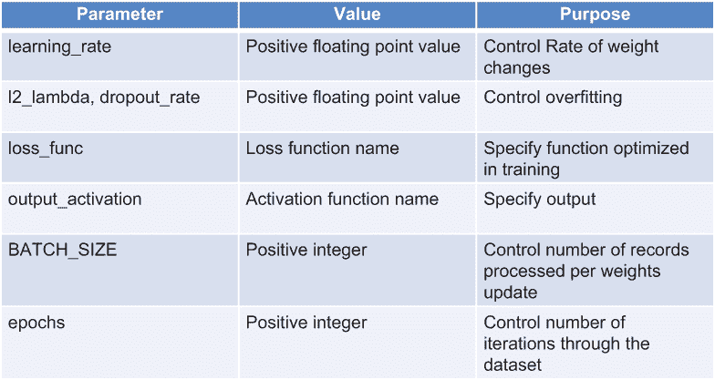

图 6.1 超参数列表

在这些超参数中，以下是与深度学习特定的：

+   `dropout_rate` —这个参数主要与深度学习相关，因为它通过关闭网络中的随机子集来控制过拟合。其他类型的模型也使用 dropout 来控制过拟合。XGBoost（极端梯度提升；[`mng.bz/8GnZ`](http://mng.bz/8GnZ)）模型可以包含 dropout（参见 Dart 增强器的参数[`xgboost.readthedocs.io/en/latest/parameter.html`](https://xgboost.readthedocs.io/en/latest/parameter.html)）。但控制过拟合的 dropout 方法更常应用于深度学习模型。

+   `Output_activation` —这个参数是专门针对深度学习的，因为它控制着应用于深度学习模型最终层的函数。这个参数与其说是调整参数（控制模型的性能）不如说是功能参数，因为它控制着模型的功能行为。你可以设置输出激活函数，使模型产生二元结果（例如，电车延迟预测模型，预测是否会有特定的电车行程延误），预测一组结果中的一个，或者是一个连续值。

其他参数对深度学习和至少一些经典机器学习方法是通用的。请注意，在这个模型的训练过程中，我手动调整了超参数。也就是说，我一次调整一个超参数，重复进行实验，直到得到满意的结果。这个过程非常棒，因为我能够密切观察调整学习率等变化的影响。但是，手动调整超参数对于业务关键模型来说并不实用。以下是一些展示如何采取更系统方法进行超参数调整的优质资源：

+   *《现实世界机器学习》由 Henrik Brink 等人著（Manning Publications，2016）* 包含一个描述网格搜索（[`mng.bz/X00Y`](http://mng.bz/X00Y)）基础的章节，这是一种搜索每个超参数可能值组合的方法，并评估每个组合的模型性能以找到最佳组合。

+   [`mng.bz/yrrJ`](http://mng.bz/yrrJ) 上的文章推荐了一种针对 Keras 模型的端到端超参数调整方法。

## 6.3 审查电车延误预测模型的整体目标

在我们深入到训练模型涉及的步骤之前，让我们回顾一下电车延误预测模型的整体目的。我们希望预测一次特定的电车旅行是否会遇到延误。请注意，对于这个模型，我们不是预测延误的长度，而是预测是否会延误。以下是只预测延误而不是延误长度的原因：

+   早期从模型中预测电车延误长度（即，*线性预测*）的实验并不成功。我怀疑数据集太小，无法给模型提供足够的机会来捕捉这种特定的信号。

+   从用户的角度来看，延误的可能性可能比延误的持续时间更为重要。任何超过五分钟的延误都值得考虑电车旅行的替代方案，例如步行、打车或选择其他交通路线。因此，为了简化，对于这个模型的受众来说，预测延误与否的二进制预测比预测延误长度更有用。

现在我们已经回顾了模型将要预测的内容，让我们看看一个具体的用户体验示例。假设用户让模型预测他们现在想要乘坐的旅行，从皇后街电车路线的西行开始，是否会延误。让我们分析可能的结果：

+   *模型预测无延误，并且确实没有延误发生*。在这种情况下，模型的预测与现实生活中发生的情况相符。我们称这种结果为 *真正负例*，因为模型预测该事件（西行皇后街电车的延误）不会发生，而事件确实没有发生：没有延误。

+   *该模型预测没有延迟，但实际上发生了延迟。* 在这种结果下，模型的预测与现实生活中发生的情况不符。这种结果被称为*假阴性*，因为模型预测该事件（西行皇后街的电车延迟）不会发生，但事件实际上发生了：行程被延误。

+   *该模型预测会有延迟，但实际上没有发生延迟。* 在这种结果下，模型的预测与现实生活中发生的情况不符。这种结果被称为*假阳性*，因为模型预测该事件（西行皇后街的电车延迟）将要发生，但事件实际上并没有发生：没有发生延迟。

+   *该模型预测会有延迟，并且实际上发生了延迟。* 在这种结果下，模型的预测与现实生活中发生的情况相符。这种结果被称为*真正阳性*，因为模型预测该事件（西行皇后街的电车延迟）将要发生，并且事件确实发生了：行程被延误。

图 6.2 总结了这四种结果。


图 6.2 街车延迟预测的四种可能结果

在四种可能的结果中，我们希望得到尽可能高的真正阴性和真正阳性的比例。但随着我们通过训练模型的迭代过程，我们看到假阴性和假阳性数量之间存在权衡。考虑第 6.10 节中描述的实验 1。在这个实验中，我们没有对模型进行调整以考虑训练数据集的不平衡。延误很少见。训练数据集中所有路线/方向/时间段组合中只有大约 2%有延误。如果我们不考虑到训练数据集的不平衡，训练过程（在实验 1 中是为了优化准确性）将为模型生成权重，导致训练好的模型总是预测“没有延误”。这样的模型看起来好像有很高的准确性：超过 97%。但这个模型对我们用户来说将毫无用处，因为它永远不会预测有延误。尽管延误可能很少见，但模型的使用者需要知道何时可能发生延误，以便他们可以做出替代的旅行安排。

图 6.3 显示了将实验 1 中的模型应用于测试数据集的结果：零个真正阳性和最大可能的假阴性数量。

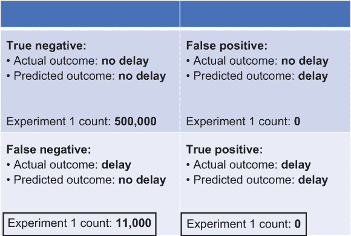

图 6.3 实验 1 中训练模型应用于测试集的结果

当我们进行第 6.10 节中的实验时，你会看到在误报和漏报之间可能存在权衡。当我们减少漏报（模型预测没有延误而实际上有延误的次数）时，误报可能会增加（模型预测有延误而实际上没有延误的次数）。显然，我们希望模型误报和漏报的比例尽可能低，但如果我们必须在误报和漏报之间做出权衡，对我们用户来说最好的结果是什么？最坏的结果是模型预测没有延误，然后实际上发生了延误。换句话说，对我们用户来说最坏的结果是漏报。如果有误报，如果用户遵循模型的建议步行或乘坐出租车避免从未发生的街车延误，他们仍然有相当的机会准时到达目的地。然而，如果有漏报，如果用户遵循模型的建议乘坐街车，他们就会错过乘坐替代交通方式的机会，并冒着迟到到达目的地的风险。

正如你在第 6.6 节中将会看到的，我们通过监控两个指标来引导模型训练向我们的总体目标迈进：

+   *召回率* —真阳性/(真阳性 + 假阴性)

+   *验证准确率* —模型在验证数据集上预测正确的比例

既然我们已经回顾了街车延误预测模型训练过程的总体目标，并确定了哪些结果对用户来说最为重要，那么让我们回到模型训练的步骤，从选择用于训练、验证和测试的数据库子集开始。

## 6.4 选择训练、验证和测试数据集

我们最初工作的原始数据库记录少于 10 万条。根据第五章中描述的重构，我们现在有一个包含超过 200 万条记录的数据库。如第 6.2 节所述，我们需要将数据库划分为以下子集，以便我们有可用于评估模型性能的数据库记录：

+   *训练* —用于训练模型的数据库子集

+   *验证* —用于在模型训练过程中跟踪模型性能的数据库子集

+   *测试* —在训练过程中未使用的数据库子集。训练好的模型应用于测试集，作为模型从未见过的数据的最终验证。

我们应该将数据集的多少比例分配给这些子集？我选择了 60%的数据集用于训练，每个验证和测试集各占 20%。这个比例在拥有足够大的训练集以给模型一个很好的机会提取信号并在训练期间获得良好的性能，以及需要拥有足够大的验证和测试集以在训练过程中未看到的数据上测试模型之间取得了平衡。70/15/15 的比例也是一个合理的选择。对于记录数少于百万的数据集，验证和测试的比例不应低于 10%，以确保在训练迭代（验证集）期间有足够的数据集部分来跟踪性能，以及有足够的保留集（测试集）来应用于训练模型，以确保在它从未见过的数据上具有足够的性能。

## 6.5 初始训练运行

在对训练运行进行优化更改之前，我们想要先进行一次初始运行，以确保一切功能正常。在这个初始运行中，我们不是试图获得很高的准确率或最小化假阴性。我们将在后续运行中关注模型的性能。对于这次初始训练运行，我们只想确认代码在功能上是可行的——从头到尾执行而不产生错误。

对于你模型的初始运行，你可以通过使用 streetcar_model_training 笔记本，并在 streetcar 模型训练配置文件中指定默认设置来指定运行的超参数值和其他配置设置来跟进。接下来的列表显示了配置文件中的关键值。

列表 6.2 在配置文件中定义的关键参数

```
test_parms:
   testproportion: 0.2        ❶ 
   trainproportion: 0.8 
   current_experiment: 0      ❷ 
hyperparameters:
   learning_rate: 0.001
   dropout_rate: 0.0003 
   l2_lambda: 0.0003 
   loss_func: "binary_crossentropy"
   output_activation: "hard_sigmoid" 
   batch_size: 1000
   epochs: 50
```

❶ 为测试数据集保留的数据集比例

❷ 实验编号确定了一组其他参数，包括训练运行中的 epoch 数量以及是否使用提前停止。

下一个列表显示了实验 0 的设置，即初始训练运行。

列表 6.3 实验 0 的设置

```
        early_stop = False    ❶ 
        one_weight = 1.0      ❷ 
        epochs = 1            ❸ 
```

❶ 实验 0 没有提前停止。

❷ 实验 0 没有考虑到数据集的不平衡性。

❸ 实验 0 包含对训练数据集的单次迭代：1 个 epoch。

下一个列表是触发模型训练的代码块。

列表 6.4 触发模型训练的代码

```
model = get_model()                                                      ❶ 
if early_stop:
modelfit = model.fit(X_train_list, dtrain.target, epochs=epochs, \ batch_size=batch_size, validation_data=(X_valid_list, \ 
dvalid.target), class_weight = {0 : zero_weight, 1: one_weight}, \
verbose=1,callbacks=callback_list)
else:
    modelfit = model.fit(X_train_list, dtrain.target, epochs=epochs, \
batch_size=batch_size, validation_data=(X_valid_list, dvalid.target), \
class_weight = {0 : zero_weight, 1: one_weight}, verbose=1)              ❷ 
```

❶ 调用第五章中描述的构建模型的功能。

❷ 因为在实验 0 中 early_stop 被设置为 False，所以这个拟合语句被调用。

让我们更仔细地看看图 6.4 中显示的拟合模型语句。

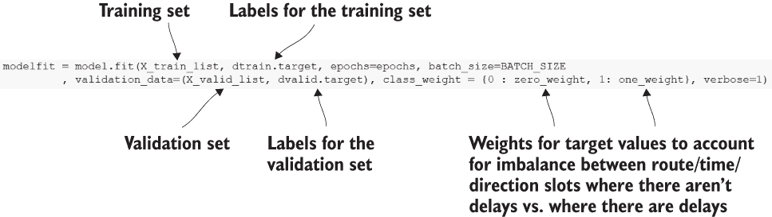

图 6.4 拟合语句的关键元素

+   训练集和标签（`target`）也被确定了。

+   验证集和验证标签（`target`）也被确定了。

+   由于数据集存在偏差（没有延迟的路线/方向/时间槽位比有延迟的槽位多得多），我们使用 Keras 功能对输出类别应用权重，以解决这种不平衡。请注意，这里的`weight`的使用纯粹是为了补偿输入数据集的不平衡。它与第一章中描述的训练过程中设置的权重无关。

随着`fit`命令的执行，你将看到如图 6.5 所示的输出。

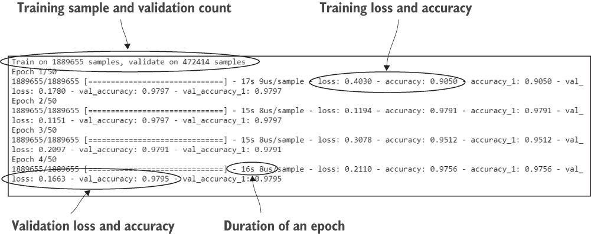

图 6.5 fit 命令的输出

输出首先回顾了可用于训练和验证模型的样本数量。接下来是每个 epoch（遍历训练数据集）的行，显示了各种测量值。我们将关注这些测量值：

+   *损失* —预测值与训练集实际目标值之间的总 delta

+   *准确率* (*acc*) —在本轮预测中匹配训练集实际目标值的预测比例

+   *验证损失* (*val_loss*) —预测值与验证集实际目标值之间的总 delta

+   *验证准确率* (*val_accuracy*) —在本轮预测中匹配验证集实际目标值的预测比例

当`fit`命令完成后，你将拥有一个训练好的模型。可训练参数已分配值，并且你可以使用该模型对新值进行评分：

```
Total params: 1,341
Trainable params: 1,201
Non-trainable params: 140
```

## 6.6 测量你的模型性能

训练运行执行时产生的输出为你提供了模型性能的初步了解。当训练运行完成后，你有两种简单的方法来检查模型的性能。

检查模型性能的一种方法是将训练和验证损失以及准确率进行绘图。图 6.6 显示了 30 个 epoch 训练运行的训练和验证准确率。

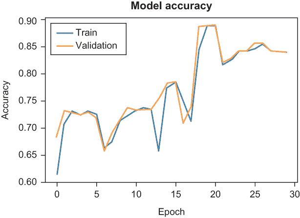

图 6.6 训练和验证准确率图

下一个列表显示了生成准确率和损失图的代码。

列表 6.5 生成准确率和损失图的代码

```
#  acc
plt.plot(modelfit.history['accuracy'])
plt.plot(modelfit.history['val_accuracy'])            ❶ 
plt.title('model accuracy')                           ❷ 
plt.ylabel('accuracy')                                ❸ 

plt.xlabel('epoch')                                   ❹ 
plt.legend(['train', 'validation'], loc='upper left') ❺ 
plt.show()                                            ❻ 
```

❶ 指定图表的标题。

❷ 指定图表正在跟踪准确率和 val_accuracy

❸ 指定 y 轴标签。

❹ 指定 x 轴标签。

❺ 指定图例中的标签。

❻ 显示图表。

回想一下 6.3 节中的表格，它显示了预测的四种可能结果，如图 6.7 所示。

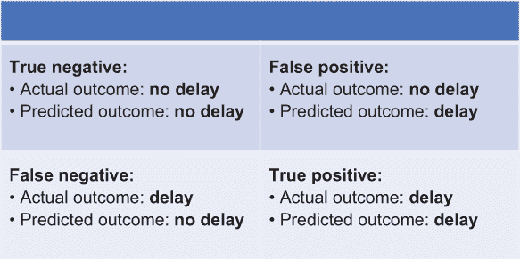

图 6.7 街车延迟预测模型的四种可能结果

检查模型性能的另一种方法是混淆矩阵，如图 6.8 所示。`sklearn.metrics`库包括一个功能，允许你生成这样的表格，显示训练模型运行的真实负例、假正例、假负例和真正例的计数。

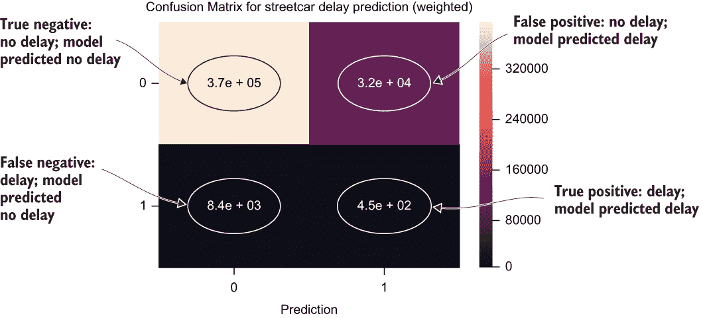

图 6.8 混淆矩阵

混淆矩阵有四个象限：

+   *左上角* —对于这条路线/方向/时间段，没有延迟，模型也预测没有延迟。

+   *左下角* —对于这条路线/方向/时间段，存在延迟，但模型预测没有延迟。

+   *右上角* —对于这条路线/方向/时间段，没有延迟，但模型预测了延迟。

+   *右下角* —对于这条路线/方向/时间段，存在延迟，并且模型预测了延迟。

混淆矩阵需要一些解释：

+   每个象限中的结果计数以科学记数法表示，因此有 370,000（= 3.7E+05）个真实负例。

+   阴影表示每个象限中的结果绝对数量。阴影越浅，数量越大；阴影越深，数量越小。

+   四个象限沿 x 轴标记为预测（`0` /`1`），以表明模型没有预测延迟（`0`）和模型预测了延迟（`1`）。

+   y 轴表示实际发生的情况：没有延迟（`0`）和延迟（`1`）。

尽管在视觉吸引力方面存在不足，混淆矩阵仍然是一个有用的工具，因为它可以将大量信息压缩到一个易于生成的包中。

下面的列表显示了生成混淆矩阵的代码。

列表 6.6 生成混淆矩阵的代码

```
cfmap=metrics.confusion_matrix(y_true=test['target'], \ 
                         y_pred=test["predround"])                       ❶ 

label = ["0", "1"]
sns.heatmap(cfmap, annot = True, xticklabels = label, \
yticklabels = label)
plt.xlabel("Prediction")
plt.title("Confusion Matrix for streetcar delay prediction (weighted)")
plt.show()                                                               ❷ 
```

❶ 指定实际（y_true）和预测（y_pred）结果。

❷ 显示图表。

我们将使用两个特定的度量来研究在多个训练迭代中街道车延迟预测模型的表现：验证准确率和回收率。*验证准确率*（在验证数据集上正确预测的比例）将给我们一个关于模型在新数据上整体准确性的指示，但它不会讲述整个故事。如 6.3 节所述，我们希望最小化错误负例的数量（模型在存在延迟时预测没有延迟）。也就是说，我们不希望模型在将发生延迟时错过预测延迟。为了监控这种结果，我们可以跟踪回收率：

```
true positive / (true positive + false negative)
```

让我们考虑一下，在 6.3 节中介绍的输出表的情况下，如何用图 6.9 中显示的标签来解释回收率。

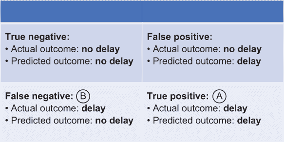

图 6.9 回收率 = A / (A + B)

回收率很重要，因为它允许我们跟踪我们想要避免的关键结果：当发生延迟时预测没有延迟。通过同时监控验证准确率和回收率，我们可以得到模型性能的平衡图景。

## 6.7 Keras 回调：充分利用训练运行

默认情况下，当你调用`fit`语句启动 Keras 模型的训练运行时，训练运行会持续进行，直到`fit`语句中指定的 epoch 数。你只能在最后一个 epoch 运行完毕后保存权重（一个训练好的模型）。以其默认行为，你可以将 Keras 训练运行想象成一个工厂，在传送带上生产派。随着每个 epoch 的进行，一个派（训练好的模型）被烘焙。我们的目标是得到最大的派（最优训练模型），如果工厂停止烘焙更大的派，我们希望关闭工厂，而不是浪费原料制作小派。也就是说，如果模型没有改进，我们不想运行很多 epoch。

派工厂烘焙了一系列不同大小的派（代表具有不同性能特性的模型），如图 6.10 所示。

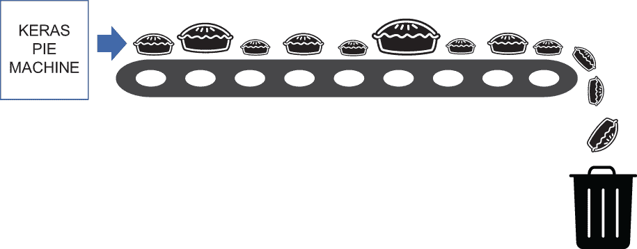

图 6.10 默认的 Keras 训练运行

问题在于，默认的 Keras 训练运行行为，派工厂即使在开始烘焙更小的派（模型性能不再改进）时也会继续烘焙派，而保存的派（在训练运行结束时可以保存的训练模型）是最后一个，即使它不是最大的派。结果是，派工厂可能会浪费很多没有变大的派，而最后得到的派可能是一个小的派，如图 6.11 所示。

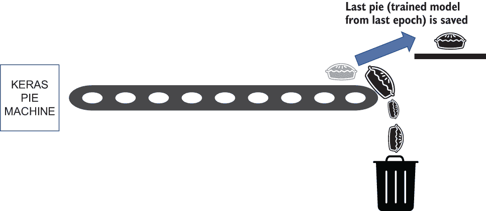

图 6.11 在默认训练运行之后，你只能保存最终模型，即使它不是最好的模型。

幸运的是，Keras 提供了回调功能，让你有机会进行更有效的训练。在派工厂的术语中，回调让你做两件事：

+   即使不是最后一个派，也要保存最大的派（最优训练模型），如图 6.12 所示。

    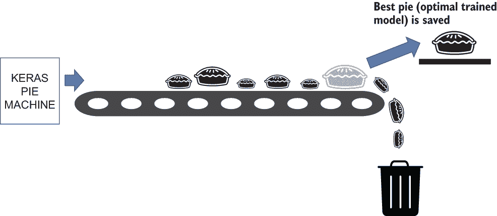

    图 6.12 保存最大的派。

+   如果派工厂不再烘焙更大的派（生成性能更好的模型），则自动停止派工厂，这样你就不会浪费资源烘焙小派，如图 6.13 所示。

+   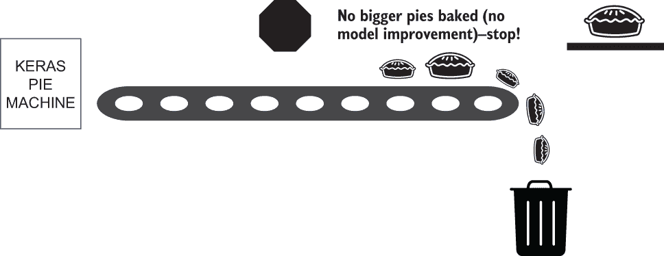

    图 6.13 如果派工厂停止烘焙更大的派，则提前关闭派工厂。

让我们实际考察一下 Keras 回调是如何工作的。Keras 回调让你能够控制训练运行的时间长度，并在不再改进时停止训练运行。Keras 回调还允许你在满足给定标准（如验证准确度）达到局部最大值后的每个 epoch 中保存模型。通过结合这些功能（提前停止和保存获得最优关键指标测量的模型），你可以实现两个目标：控制训练运行的时间长度，并在停止改进时停止训练运行。

要使用早期停止，我们首先必须定义一个回调（[`keras.io/callbacks`](https://keras.io/callbacks)）。一个*回调*由一组可以在训练运行期间应用的功能组成，以提供对训练过程的洞察。回调允许我们在训练过程中与之交互。我们可以使用回调在训练运行中逐个 epoch 监控性能指标，并根据该性能指标发生的情况采取行动。例如，我们可以跟踪验证准确率，并允许运行在验证准确率继续增加的情况下继续进行。当验证准确率下降时，我们可以让回调停止训练运行。我们可以使用`patience`选项来延迟停止训练运行，以便在验证准确率不再增加的情况下继续进行给定数量的 epochs。此选项允许我们避免错过在暂时下降或平台期之后发生的验证准确率增加。

从早期停止回调获得的控制权比让训练运行完整地运行所有 epochs 有大幅改进。但是，如果我们关心的性能指标的最佳结果发生在最后一个 epoch 之外的其他 epoch，会发生什么？如果我们简单地保存最终模型，我们可能会错过在中间 epoch 发生的更好的性能。我们可以通过使用另一个回调来解决这种情况，该回调允许我们在训练运行期间持续保存具有我们跟踪的性能指标最佳结果的模型。使用此回调与早期停止回调一起，我们知道在训练运行期间最后保存的模型将具有所有 epochs 中最佳的性能指标结果。

图 6.14 显示了在 streetcar_model_training 笔记本中定义回调的代码片段。

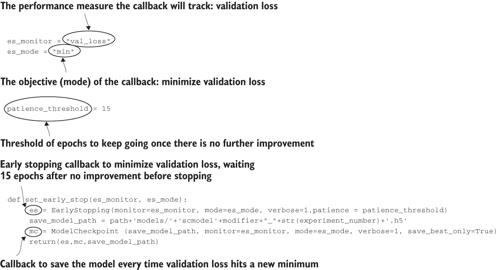

图 6.14 定义回调以跟踪性能指标并保存具有最佳性能的模型

现在让我们通过一个例子来看看回调对训练运行的影响。我们将查看一个 20-epoch 的运行，首先是没有回调的情况，然后是应用了回调的情况。接下来的列表显示了在进行此运行之前需要设置的参数。

列表 6.7 设置的参数以控制早期停止和数据集平衡

```
early_stop = False                                              ❶ 
one_weight = (count_no_delay/count_delay) + one_weight_offset   ❷ 
```

❶ 指定不使用回调。

❷ 考虑数据集中有延迟和无延迟的记录之间的不平衡性。

首先，图 6.15 是此 20-epoch 运行没有早期停止回调的准确率图。

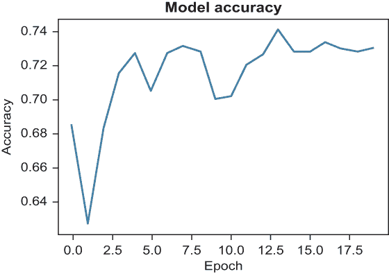

图 6.15 无回调的 20-epoch 运行的准确率图

在这个 20-epoch 的运行之后，最终的`val_accuracy`值为`0.73`：

```
val_accuracy: 0.7300
```

图 6.16 显示，最终 epoch 产生的`val_accuracy`并不是训练运行中的最大值。

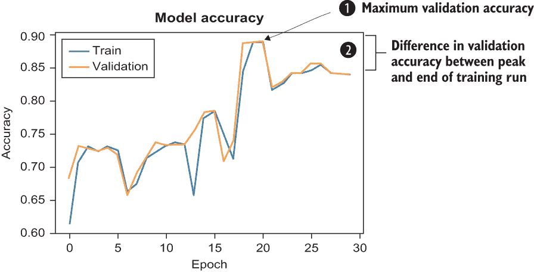

图 6.16 终端 val_accuracy 与最大 val_accuracy 之间的差异

让我们看看当我们添加早期停止到这个运行时会发生什么，使用下一列表中的代码在验证准确度停止增加时停止运行。

列表 6.8 设置回调的代码

```
def set_early_stop(es_monitor, es_mode):                                   ❶ 
    callback_list = []                                                     ❷ 
    es = EarlyStopping(monitor=es_monitor, mode=es_mode, \                 ❸ 
    ➥ verbose=1,patience = patience_threshold)
    callback_list.append(es) 
    model_path = get_model_path()
    save_model_path = os.path.join(model_path, \
    ➥ 'scmodel'+modifier+"_"+str(experiment_number)+'.h5')                ❹ 
    mc = ModelCheckpoint(save_model_path, monitor=es_monitor, \            ❺ 
    ➥ mode=es_mode, verbose=1, save_best_only=True)
    callback_list.append(mc)
    if tensorboard_callback:                                               ❻ 
        tensorboard_log_dir =
os.path.join(get_path(), \
"tensorboard_log",datetime.now().strftime("%Y%m%d-%H%M%S"))
        tensorboard = TensorBoard(log_dir= tensorboard_log_dir)
        callback_list.append(tensorboard)
    return(callback_list,save_model_path)

if early_stop:
       modelfit = model.fit(X_train_list, dtrain.target, epochs=epochs, \
 ➥ batch_size=batch_size, validation_data=(X_valid_list, dvalid.target), \
 ➥ class_weight = {0 : zero_weight, 1: one_weight}, \
 ➥ verbose=1,callbacks=callback_list)                                     ❼ 
```

❶ 定义 Keras 回调的函数。参数是 es_monitor（在 mc 回调中跟踪的测量）和 es_mode（在 es 早期停止回调中跟踪的极端最小值或最大值）。

❷ 包含在此函数中定义的所有回调的列表

❸ 定义基于 es_monitor 测量不再按 es_mode 指示的方向移动的 es 回调，并将其添加到回调列表中

❹ 在训练过程中，当测量 es_monitor 达到新的最优值时，定义保存模型的路径

❺ 定义基于 es_monitor 测量达到由 es_mode 定义的最佳值的最佳模式保存的 mc 回调

❻ 如有必要，定义 TensorBoard 回调。有关定义 TensorBoard 回调的详细信息，请参阅第五章。

❼ 如果 early_stop 设置为 true，fit 命令将使用回调参数调用 set_early_stop()函数返回的回调列表。

要获取早期停止回调，我们设置下一列表中的参数。

列表 6.9 设置早期停止回调的参数

```
   early_stop = True                  ❶ 
        es_monitor="val_accuracy"     ❷ 
        es_mode = "max"               ❸ 
```

❶ 指定回调包含在 fit 语句的调用中。

❷ 指定 val_accuracy 是控制回调的测量

❸ 指定 val_accuracy 的最大值被回调跟踪

设置了这些参数后，我们重新运行实验，这次回调在训练过程中被调用。您可以在图 6.17 中看到结果。

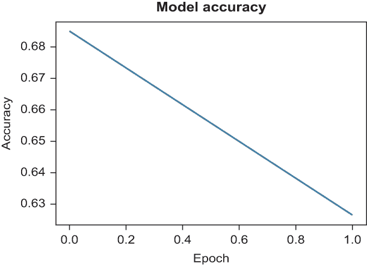

图 6.17 带有早期停止回调的准确度

由于验证准确度下降，训练运行在 2 个 epoch 后停止，而不是完整的 20 个 epoch。这个结果并不是我们想要的；我们希望模型有改进的机会，我们当然不希望准确度一下降就停止训练。为了得到更好的结果，我们可以在模型训练配置文件中将`patience_threshold`参数设置为除默认`0`以外的值：

```
patience_threshold: 4
```

如果我们在早期停止回调中添加`patience_threshold`参数重新运行相同的训练练习会发生什么？运行在 12 个 epoch 后停止，而不是 2 个，并且需要三分钟来完成。终端验证准确度为 0.73164，如图 6.18 所示。

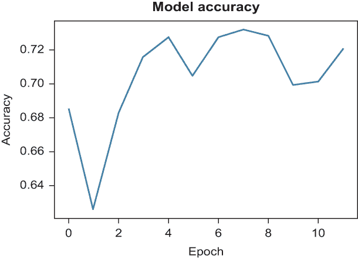

图 6.18 带有患者早期停止的准确度

这些更改（添加回调和将`patience_threshold`参数设置为非零值）的结果是更好的验证准确度，需要更少的 epoch 和更少的时间来完成训练。图 6.19 总结了这组实验的结果。

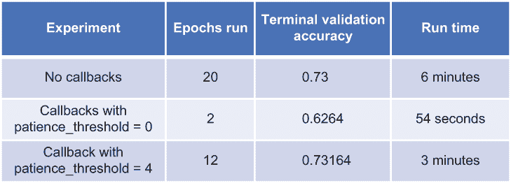

图 6.19 回调实验总结

这些实验表明，Keras 中的回调功能是一种通过避免对关键测量没有带来益处的重复 epoch 来提高训练运行效率的强大方式。回调功能还允许你保存模型迭代，该迭代为你提供了关键测量的最优值，无论这个迭代发生在训练运行的哪个位置。通过调整耐心参数，你可以平衡运行更多 epoch 的成本与在暂时下降后获得更好性能的潜在益处。

## 6.8 从多次训练运行中获得相同的结果

你可能想知道第 6.7 节中展示的实验是如何在训练运行之间获得一致结果的。默认情况下，训练过程的各个方面，包括分配给网络节点的初始权重，都是随机设置的。如果你使用具有相同输入和参数设置的深度学习模型运行重复实验，你会看到这种效果；即使输入相同，每次运行也会得到不同的结果（例如每个 epoch 的验证准确率）。如果在训练深度学习模型中存在有意引入的随机元素，我们如何控制这个元素，以便我们可以进行重复的、受控的实验来评估特定变化的影响，例如第 6.7 节示例中引入的回调？关键是设置随机数生成器的固定种子。随机数生成器为训练过程提供随机输入（例如模型的初始权重），导致训练运行之间结果不同。当你想要从多次训练运行中获得相同的结果时，你可以显式设置随机数生成器的种子。

如果你查看模型训练笔记本的配置文件，你会在`test_parms`部分看到一个名为`repeatable_run`的参数（参见下一列表）。

列表 6.10 控制测试执行的参数

```
test_parms:
   testproportion: 0.2 # proportion of data reserved for test set
   trainproportion: 0.8 # proportion of non-test data dedicated \
to training (vs. validation)
   current_experiment: 9
   repeatable_run: True        ❶ 
```

❶ 控制我们是否想要重复实验的参数。我们是否希望用固定值对随机数生成器进行种子设置，以获得多次运行的一致结果？

模型训练笔记本使用`repeatable_run`参数来确定是否显式设置随机数生成器的种子，从而从多次训练运行中生成相同的结果：

```
if repeatable_run:
    from numpy.random import seed
    seed(1)
    tf.random.set_seed(2)
```

在本节中，我们总结了如何从多次训练运行中获得相同的结果。有关使用 Keras 获得可重复结果的更多详细信息，请参阅优秀的文章[`mng.bz/Moo2`](http://mng.bz/Moo2)。

## 6.9 得分捷径

当我们有一个训练好的模型时，我们希望能够对其进行练习。让我们快速回顾一下高级步骤：

1.  *训练模型*。使用本章中描述的过程，模型通过反复遍历训练数据集，迭代地设置模型中的权重，以最小化损失函数。在我们的案例中，损失函数衡量模型对延迟/不延迟的预测与训练数据集中每个路线/方向/时间槽组合的实际延迟/不延迟结果之间的差异。

1.  *使用模型评分（一次性评分）*。获取训练好的模型对新数据点的预测：对于模型在训练过程中从未见过的路线/方向/时间槽组合，预测是延迟/不延迟。这些新数据点可以来自原始数据集的测试子集或全新的数据点。

1.  *部署模型*。使训练好的模型可用于对新数据点提供高效的预测。除了描述部署之外，第八章还描述了部署和一次性评分之间的区别。

正如你在第八章中将会看到的，部署模型可能需要几个步骤。在完成完整的部署过程之前，你想要能够使用模型进行一些评分，以验证模型在训练过程中未见过的数据上的性能。本节描述了在全面模型部署之前可以采用的评分捷径。

要在完整的测试集上测试模型，你可以用测试集作为输入调用模型的 `predict` 方法：

```
preds = saved_model.predict(X_test, batch_size=BATCH_SIZE)
```

如果你想测试一个单一的新测试示例呢？这是部署模型的典型用例：一个客户端使用模型来确定他们想要乘坐的电车行程是否会被预测为延迟。

要对一个单一数据点进行评分，我们首先需要检查模型输入的结构。`X_test` 的结构是什么？

```
print("X_test ", X_test)
X_test  {'hour': array([18,  4, 11, ...,  2, 23, 17]), 
'Route': array([ 0, 12,  2, ..., 10, 12,  2]), 
'daym': array([21, 16, 10, ..., 12, 26,  6]),
'month': array([0, 1, 0, ..., 6, 2, 1]), 
'year': array([5, 2, 3, ..., 1, 4, 3]), 
'Direction': array([1, 1, 4, ..., 2, 3, 0]),
'day': array([1, 2, 2, ..., 0, 1, 1])}
```

`X_test` 是一个字典，其中每个值都是一个 numpy 数组。如果我们想对一个单一的新数据点进行评分，我们可以创建一个字典，其中包含一个字典中每个键的单个条目 numpy 数组：

```
score_sample = {}
score_sample['hour'] = np.array([18])
score_sample['Route'] = np.array([0])
score_sample['daym'] = np.array([21])
score_sample['month'] = np.array([0])
score_sample['year'] = np.array([5])
score_sample['Direction'] = np.array([1])
score_sample['day'] = np.array([1])
```

现在我们已经定义了一个单一的数据点，我们可以使用训练好的模型来获取这个数据点的预测：

```
preds = loaded_model.predict(score_sample, batch_size=BATCH_SIZE)
print("pred is ",preds)
print("preds[0] is ",preds[0])
print("preds[0][0] is ",preds[0][0])
```

对于我们训练的其中一个模型，我们得到以下输出：

```
pred is  [[0.35744822]]
preds[0] is  [0.35744822]
preds[0][0] is  0.35744822
```

因此，对于这个单一数据点，模型不预测延迟。能够对一个单一数据点进行评分是快速验证模型的好方法，尤其是如果你已经准备了代表你认为不太可能延迟的行程的数据点，以及代表你认为将会延迟的行程的数据点。通过让训练好的模型对这些两个数据点进行评分，你可以验证训练好的模型是否做出了你预期的预测。

图 6.20 显示了两个可以评分以锻炼训练模型的示例行程。我们预计行程 A（在周末晚些时候的较不繁忙的路线上）不会延迟，而行程 B（在高峰时段的繁忙路线上）有很高的可能性会延迟。

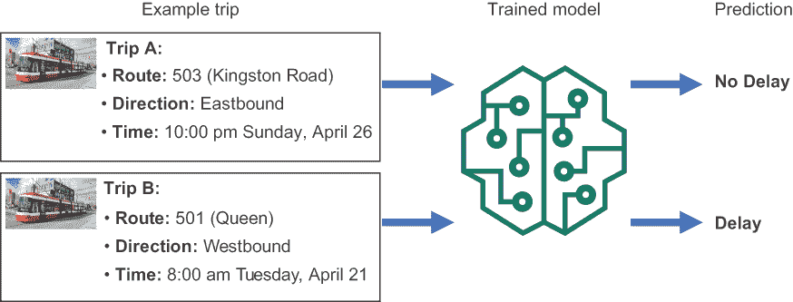

图 6.20 通过评分单个行程来锻炼模型

## 6.10 明确保存训练好的模型

与 Pandas 数据框一样，训练好的模型仅在 Python 会话的生命周期内存在，除非你将其保存。你需要能够序列化和保存你的训练模型，以便你可以在以后加载它来进行实验，并最终部署它，这样你可以方便地使用训练好的模型对新数据进行评分。如果你设置了`early_stopping`参数，模型将作为回调的一部分保存。如果没有，下一列表中的代码块将保存模型。

列表 6.11 如果不使用早期停止，保存模型的代码

```
if early_stop == False:                                ❶ 
    model_json = model.to_json()
    model_path = get_model_path()
    with open(os.path.join(model_path,'model'+modifier+'.json'), \
    ➥ "w") as json_file:
        json_file.write(model_json)                    ❷ 
    model.save_weights(os.path.join(model_path, \
    ➥ 'scweights'+modifier+'.h5'))
    save_model_path = os.path.join(model_path, \
    ➥ 'scmodel'+modifier+'.h5')                       ❸ 
    model.save(save_model_path,save_format='h5')       ❹ 
    saved_model = model
```

❶ 通过回调检查模型是否已经被保存。

❷ 将模型保存到 JSON 文件中。

❸ 将训练好的模型权重保存到 h5 文件中。

❹ 将模型和权重保存到 h5 文件中。

你可以练习加载你保存到 h5 文件中的模型（见下一列表）。

列表 6.12 从 h5 文件加载模型的代码

```
from keras.models import load_model
loaded_model = load_model(os.path.join(model_path, \
'scmodel'+modifier+'.h5'))                             ❶ 
```

❶ 使用与保存模型相同的路径加载你保存的模型。

现在你已经加载了保存的模型，你可以将其应用于测试集以获取预测：

```
preds = loaded_model.predict(X_test, batch_size=BATCH_SIZE)
```

## 6.11 运行一系列训练实验

现在我们通过运行一系列实验来汇总所有内容，这些实验基于本章到目前为止所学的内容。你可以通过更改模型训练配置文件中的`current_experiment`参数（列表 6.13）来运行这些实验，如下所示。

列表 6.13 控制测试执行的参数

```
test_parms:
   testproportion: 0.2 # proportion of data reserved for test set
   trainproportion: 0.8 # proportion of non-test data \
dedicated to training (vs. validation)
   current_experiment: 5                                  ❶ 
   repeatable_run: True # switch to control whether \
runs are repeated identically
   get_test_train_acc: False # switch to control whether \ 
block to get test and train accuracy is after training)
```

❶ 设置实验编号。

`current_experiment`参数反过来用于在调用`set_experiment_parameters`函数时设置实验的参数：

```
experiment_number = current_experiment
early_stop, one_weight, epochs,es_monitor,es_mode = set_experiment_parameters
➥ (experiment_number, count_no_delay, count_delay)
```

图 6.21 总结了这些实验的参数设置以及关键结果：验证准确率、测试集上的假阴性数量和召回率。

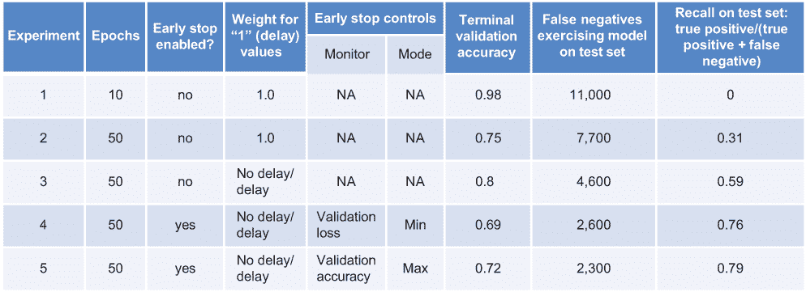

图 6.21 一组训练模型实验结果的总结

这些实验层层叠加了各种技术，从增加额外的训练轮次到对较少出现的延迟结果进行加权，再到早期停止。这些实验由一系列参数的设置值定义，如下所示。

列表 6.14 控制编号实验的参数

```
    if experiment_number == 1:
        # 
        early_stop = False
        # 
        one_weight = 1.0
        #
        epochs = 10
    elif experiment_number == 2:
        # 
        early_stop = False
        # 
        one_weight = 1.0
        #
        epochs = 50
    elif experiment_number == 3:
        # 
        early_stop = False
        # 
        one_weight = (count_no_delay/count_delay) + one_weight_offset
        #
        epochs = 50
    elif experiment_number == 4:
        # 
        early_stop = True
        es_monitor = "val_loss"
        es_mode = "min"
        # 
        one_weight = (count_no_delay/count_delay) + one_weight_offset
        #
        epochs = 50
    elif experiment_number == 5:
        # 
        early_stop = True
        es_monitor = "val_accuracy"
        es_mode = "max"
        # 
        one_weight = (count_no_delay/count_delay) + one_weight_offset
        #
        epochs = 50
```

在这些实验中，我们将调整训练轮次的数量、延迟结果的加权以及早期停止回调。对于每个实验，我们将跟踪以下性能指标：

+   *终端验证准确率* — 运行的最后一个训练轮次的验证准确率

+   *总误判负例数* —模型预测无延迟而实际上存在延迟的次数

+   *召回率* —真阳性数 / (真阳性数 + 误判负例数)

当我们对实验的参数进行更改时，性能指标会提高。这一组实验对于像电车延迟问题这样简单的问题是有用的，但它并不能代表在现实世界的深度学习问题中可能需要的实验量。在一个工业强度的模型训练情况下，你可能会包括更多种类的实验，这些实验会改变更多参数的值（例如，第五章中描述的学习率、dropout 和正则化参数）。如果你从原始模型中没有获得所需的表现指标，你还可以调整模型中层数的数量和类型。

当你刚开始接触深度学习时，如果你在原始架构中没有看到足够的表现，可能会倾向于对这些模型架构进行这类更改。我建议你首先专注于理解原始模型的表现特性，从少量 epoch 的测试运行开始，逐个调整参数，并在整个运行过程中测量一致的性能指标（如验证准确率或验证损失）。然后，如果你已经用尽原始架构的性能改进，仍然没有达到你的性能目标，考虑更改模型架构。

让我们回顾一下本节中定义的五个训练实验中的每一个。从实验 1 开始，我们运行了少量 epoch，没有考虑到训练数据中延迟和非延迟之间的不平衡，也没有使用回调。准确率的结果看起来不错，但图 6.22 所示的混淆矩阵揭示了发生的情况：模型总是预测无延迟。

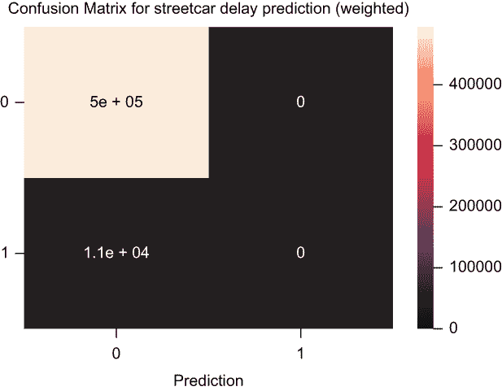

图 6.22 实验一的混淆矩阵

由于这个模型永远不会预测延迟，所以它对我们想要应用这个模型的应用场景将没有用。图 6.23 显示了在 epoch 增加到五倍时实验 2 发生的情况。

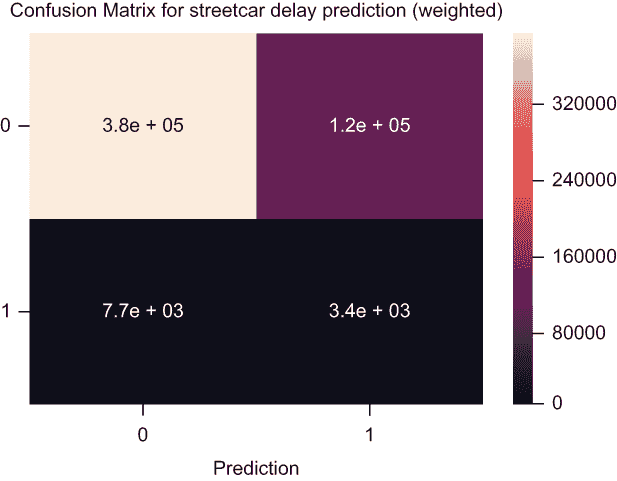

图 6.23 实验二的混淆矩阵

随着 epoch 的增加，模型开始预测一些延迟，但误判负例的数量是真阳性数量的两倍，所以这个模型没有达到最小化误判负例的目标。

在实验 3 中，我们通过加权延迟（图 6.24）来考虑数据集中延迟和非延迟之间的不平衡。


图 6.24 实验三的混淆矩阵

通过这次更改，我们看到了比误判负例更多的真阳性，所以这是提高召回率的正确方向，但我们还可以做得更好。

在实验 4 中，我们添加了回调。训练过程将监控验证损失：验证集预测值与实际值之间的累积差异。如果验证损失在给定数量的 epoch 后没有下降，则训练运行将停止。此外，具有最低验证损失的 epoch 的模型将在训练运行结束时被保存。再次强调，随着这个变化，正如图 6.25 所示，真正阳性和假阴性（如召回率所示）的比例增加，但我们仍然可以做得更好。

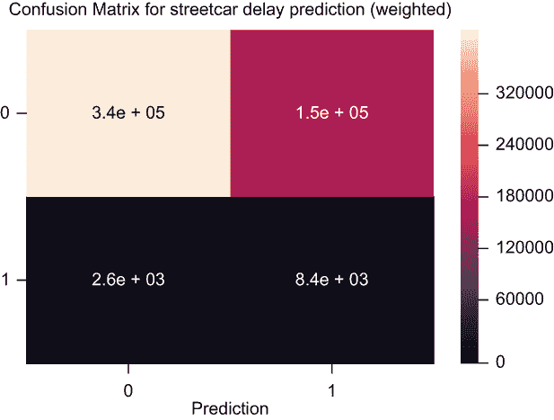

图 6.25 实验 4 的混淆矩阵

在实验 5 中，我们也有回调，但不是监控验证损失，而是监控验证准确率。如果准确率在给定数量的 epoch 后没有提高，我们将停止训练。我们将在训练运行结束时保存具有此测量值最大值的模型。图 6.26 显示了此运行的混淆矩阵。


图 6.26 实验 5 的混淆矩阵

在实验 5 中，真正阳性和假阴性（如召回率所反映）的比例甚至更好，验证准确率也有所提高。

注意，当您使用相同的输入运行这些实验时，您可能会得到不同的结果。但您应该看到与这些五个实验中所示的变化相同的总体趋势。此外，请注意，您可以采取额外的步骤来获得更好的结果：更高的准确率和更好的真正阳性和假阴性比例。我们将在第七章中检查其中的一些步骤。

## 摘要

+   训练深度学习模型是一个迭代的过程。通过在训练运行期间和结束时跟踪正确的性能度量，您将能够系统地调整训练过程中涉及的参数，看到变化的效果，并朝着满足训练过程目标的有训练模型迈进。

+   在开始训练过程之前，您需要定义数据集的子集用于训练、验证（跟踪训练过程中的模型性能）和测试（评估训练模型的性能）。

+   对于您的初始训练运行，选择一个简单、单 epoch 的运行来验证一切是否正常工作，并且没有功能性故障。当您成功完成这个初始运行后，您可以进行更复杂的训练运行以提高模型的性能。

+   Keras 提供了一套测量方法，您可以使用这些方法来评估您模型的性能。您选择哪一种取决于您的训练模型将如何被使用。对于电车延误预测模型，我们通过验证准确率（训练模型在验证集上的预测与验证集的实际延误/无延误值匹配的程度）和召回率（模型避免在发生延误时预测无延误的程度）来评估性能。

+   默认情况下，Keras 的训练运行会遍历所有指定的周期，您得到的训练模型是最终周期产生的模型。如果您希望通过避免不必要的周期并确保保存最佳模型来提高训练过程的效率，您需要利用回调功能。使用回调，您可以在您关心的性能测量停止改进时停止训练过程，并确保从您的训练运行中保存最佳模型。

+   当您有一个训练好的模型时，尝试用它评分几个数据点是个好主意。在电车延误预测模型的情况下，您会用您的训练模型评分一些时间/路线/方向组合。这样做为您提供了一种在投入大量努力进行模型全面部署之前验证训练模型整体行为的方法。
