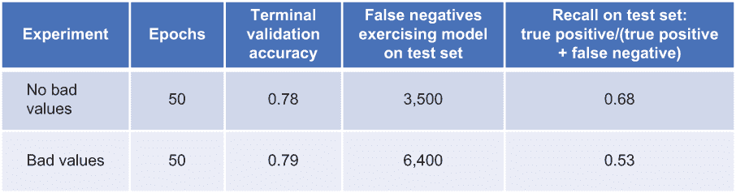
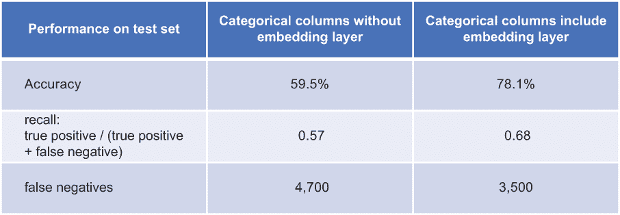
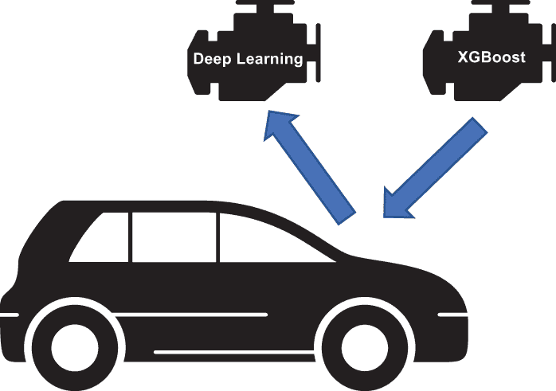
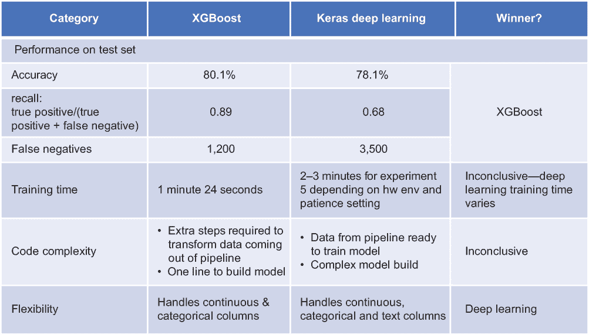
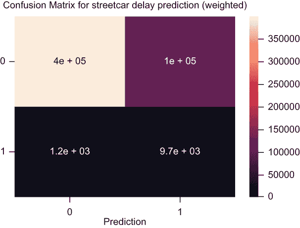

# 7 使用训练模型的更多实验

本章涵盖

+   验证移除不良值是否可以提高模型性能

+   验证分类列的嵌入是否可以提高模型性能

+   提高模型性能的可能方法

+   比较深度学习模型与非深度学习模型的性能

在第六章中，我们训练了深度学习模型并做了一系列实验来衡量和改进其性能。在本章中，我们将进行一系列额外的实验来验证模型的两个关键方面：移除不良值（这是我们作为第三章和第四章中描述的数据准备的一部分所采取的步骤）以及包括分类列的嵌入（如第五章所述）。然后我们将描述一个实验，比较使用电车延误预测深度学习模型的深度学习解决方案与使用称为 XGBoost 的非深度学习方法的解决方案。

## 7.1 模型更多实验的代码

当你克隆了与本书相关的 GitHub 仓库([`mng.bz/v95x`](http://mng.bz/v95x))时，你将在 notebooks 子目录中找到与实验相关的代码。以下列表显示了本章中描述的实验所使用的文件。

列表 7.1 存储库中与模型训练实验相关的代码

```
├── data                                        ❶ 
│ 
├── models                                      ❷ 
│ 
├── notebooks
│   │   custom_classes.py                       ❸ 
│   │   streetcar_model_training.ipynb          ❹ 
│   │   streetcar_model_training_xgb.ipynb      ❺ 
│   └── streetcar_model_training_config.yml     ❻ 
│ 
└── pipelines                                   ❼ 
```

❶ 存储中间数据集的目录

❷ 保存训练模型的目录

❸ 包含管道类定义

❹ 包含数据集重构和深度学习模型训练代码的笔记本

❺ 包含数据集重构和 XGBoost 模型训练代码的笔记本

❻ 模型训练配置文件：超参数值的定义、训练/验证/测试比例以及其他配置参数。请注意，我们使用一个通用的配置文件来训练深度学习模型和 XGBoost 模型。

❼ 保存管道的目录

## 7.2 验证移除不良值是否可以提高模型

回到第四章，我们回顾了数据集中不良值记录的数量——那些在一列中的值无效的记录。输入记录可能有一个不存在的路线值，例如，或者一个不是罗盘方向的值。默认情况下，我们在 streetcar_data_preparation 笔记本的末尾保存输出数据框之前移除这些值。我们想要进行一个实验来验证这个选择对于模型性能来说是最好的选择。以下是这样的一个实验：

1.  使用以下值设置 streetcar_data_preparation_config.yml 重新运行 streetcar_data_preparation 笔记本，以保存包含不良值记录的清洁输出数据框，如下一列表所示。

    列表 7.2 数据准备配置中不良值实验的参数

    ```
    general:
       load_from_scratch: False
       save_transformed_dataframe: True                       ❶ 
       remove_bad_values: False                               ❷ 
    file_names:
       pickled_input_dataframe: 2014_2019.pkl
       pickled_output_dataframe: 2014_2019_df_cleaned_no_remove_bad_values_xxx.pkl    ❸ 
    ```

    ❶ 指定输出数据框应保存。

    ❷ 指定不良值不应从输出数据框中移除。

    ❸ 为输出数据框设置一个唯一的文件名。

1.  使用以下值在 streetcar_model_training_config.yml 中重新运行 streetcar_model_training 笔记本，以使用控制文件重构数据集，该数据集包括带有“坏路线”和“坏方向”组合的路线/方向，如下所示。

    列表 7.3 恶值实验的参数设置

    ```
       pickled_dataframe: \
       ➥ '2014_2019_df_cleaned_no_remove_bad_values_xxx.pkl'    ❶ 
       route_direction_file: 'routedirection_badvalues.csv'      ❷ 
    ```

    ❶ 在数据准备配置文件中指定与 pickled_output_dataframe 相同的文件名。

    ❷ 包含“坏路线”和“坏方向”组合的控制文件。

现在我们使用这些更改（使用包含坏值的输入数据集）从第六章运行实验 5，我们得到图 7.1 中所示的结果。验证准确率没有太大差异，但使用包含坏值输入数据集训练的模型的召回率要差得多。



图 7.1 比较训练数据集中有无坏值时的模型性能

总体而言，我们从排除坏值的训练数据集训练的模型中获得了更好的性能。这个实验证实了我们在第四章中决定默认排除模型训练过程中的坏值记录的决定。

## 7.3 验证列嵌入是否提高了模型的性能

嵌入在我们的第五章中创建并在第六章中训练的深度学习模型中起着重要作用。该模型为所有分类列包含嵌入层。作为一个实验，我只移除了这些层，并训练了模型，以比较其具有和没有分类列嵌入层的性能。

为了进行这个实验，我在 streetcar_model_training 笔记本中的模型构建部分替换了这两行

```
embeddings[col] = (Embedding(max_dict[col],catemb) (catinputs[col]))
embeddings[col] = (BatchNormalization() (embeddings[col]))
```

与以下行

```
embeddings[col] = (BatchNormalization() (catinputs[col]))
```

并重新运行了第六章中描述的实验 5。这个实验是一个 50 个 epoch 的训练运行，基于验证准确率定义了提前停止。图 7.2 显示了带有和不带有分类列嵌入的实验运行结果。



图 7.2 比较具有和没有嵌入层的分类列的模型性能

当从模型中移除分类列的嵌入层时，每个性能指标都变得非常糟糕。这个例子展示了嵌入在像我们为电车延迟定义的简单深度学习模型中的价值。

## 7.4 比较深度学习模型与 XGBoost

本书的主张是，值得考虑将深度学习视为在结构化、表格数据上执行机器学习的一个选项。在第六章中，我们在 streetcar delay 数据集上训练了一个深度学习模型，并检查了模型的表现。如果我们用同样的 streetcar delay 数据集训练一个非深度学习模型会怎样呢？在本节中，我们将展示这种实验的结果。我们将用 XGBoost 替换深度学习模型，XGBoost 是一种在处理涉及结构化、表格数据的机器学习问题中赢得“首选”机器学习方法的声誉的梯度提升决策树算法。我们将比较这两个模型的结果，并确定这些结果告诉我们关于深度学习作为解决涉及结构化数据问题的解决方案的可行性的什么信息。

就像一本关于蝙蝠侠的书如果没有描述小丑就不会完整一样，一本关于使用结构化数据深度学习的书如果没有提到 XGBoost 也会显得不完整。在处理结构化、表格数据方面，XGBoost 是深度学习的宿敌，并且它是最常被推荐用来处理结构化数据的替代深度学习的方法。

XGBoost 是一种非深度学习机器学习，称为梯度提升机。在梯度提升中，从一组简单模型中聚合预测以获得一个综合预测。值得注意的是，XGBoost 提供了一套与深度学习模型不完全相同的特性。XGBoost 内置了一个特征重要性功能（[`mng.bz/awwJ`](http://mng.bz/awwJ)），可以帮助你确定每个特征对模型贡献的大小，尽管这个功能应该谨慎使用，正如[` mng.bz/5pa8`](http://mng.bz/5pa8)上的文章所展示的。XGBoost 的所有特性的详细描述超出了本书的范围，但*《商业机器学习》（Machine Learning for Business）*中的 XGBoost 部分（[`mng.bz/EEGo`](http://mng.bz/EEGo)）提供了一个优秀且易于理解的 XGBoost 工作原理的描述。

为了比较深度学习模型和 XGBoost 之间的差异，我更新了模型训练笔记本 streetcar_model_training，将深度学习模型替换为 XGBoost。我的意图是尽量减少对代码的修改。如果你把整个模型训练笔记本比作一辆车，我希望在不改变车身面板、车轮、轮胎、内饰或其他任何车辆部件的情况下，更换现有的引擎（深度学习模型）并安装另一个引擎（XGBoost），如图 7.3 所示。



图 7.3 替换深度学习引擎为 XGBoost 引擎

当我让新引擎工作后，我想把车开到赛道上，评估与原引擎相同的车的驾驶感受。如果我在车上保持其他一切不变，只更换引擎，我可以期望得到一个公平的比较，比较两种引擎的驾驶感受。同样，我希望通过将笔记本中的代码更改保持在最低限度，我能够得到深度学习模型和 XGBoost 之间的公平比较。

您可以在 streetcar_model_training_xgb 笔记本中找到训练 XGBoost 模型的代码，如果您检查这个笔记本，您会发现汽车类比是成立的：我更换了引擎，但汽车的其他部分保持不变。这个笔记本的前部分与深度学习模型训练笔记本 streetcar_model_training 相同，除了包含 XGBoost 模型的导入语句：

```
from xgboost import XGBClassifier
```

在调用管道的主块之后开始 XGBoost 特定的内容。此时，数据集是一个 numpy 数组的列表，每个数据集的列对应一个 numpy 数组：

```
[array([ 9, 13,  6, ..., 11,  8,  2]), 
array([20, 22, 13, ...,  6, 16, 22], dtype=int64), 
array([4, 4, 1, ..., 0, 2, 0]), 
array([ 2, 18, 14, ..., 24, 11, 21], dtype=int64), 
array([0, 2, 3, ..., 3, 1, 2], dtype=int64), 
array([0, 5, 4, ..., 3, 6, 0], dtype=int64), 
array([ 2, 10, 11, ...,  4,  6,  7], dtype=int64)] 
```

深度学习训练代码中的多输入 Keras 模型期望这种格式。然而，XGBoost 期望数据集是一个列表的 numpy 数组，因此在我们能够使用这些数据训练 XGBoost 模型之前，我们需要将其转换为 XGBoost 所期望的格式。我们首先将训练和测试数据集从 numpy 数组的列表转换为列表的列表，如下所示。

列表 7.4 将训练和测试数据集转换为列表的列表的代码

```
list_of_lists_train = []
list_of_lists_test = []
for i in range(0,7):                                       ❶ 
    list_of_lists_train.append(X_train_list[i].tolist())
    list_of_lists_test.append(X_test_list[i].tolist())
```

❶ 对于训练和测试数据集，遍历 numpy 数组，并将它们转换为列表，最终得到两个列表的列表。

接下来，对于测试和训练数据集，我们将列表转换为 numpy 数组，并转置 numpy 数组：

```
xgb_X_train = np.array(list_of_lists_train).T
xgb_X_test = np.array(list_of_lists_test).T
```

下面是生成的训练数据集 `xgb_X_train` 的样子：

```
array([[ 9, 20,  4, ...,  0,  0,  2],
       [13, 22,  4, ...,  2,  5, 10],
       [ 6, 13,  1, ...,  3,  4, 11],
       ...,
       [11,  6,  0, ...,  3,  3,  4],
       [ 8, 16,  2, ...,  1,  6,  6],
       [ 2, 22,  0, ...,  2,  0,  7]])
```

作为列表的 numpy 数组从管道中输出的数据集已经被转换成列表的 numpy 数组，并且内容已经转置——这正是我们在下一个块中训练 XGBoost 模型所需要的，如下所示。

列表 7.5 训练 XGBoost 模型的代码

```
model_path = get_model_path() 
xgb_save_model_path = \
os.path.join(model_path, \
'sc_xgbmodel'+modifier+"_"+str(experiment_number)+'.txt')       ❶ 
model = XGBClassifier(scale_pos_weight=one_weight)              ❷ 
model.fit(xgb_X_train, dtrain.target)                           ❸ 
model.save_model(xgb_save_model_path)                           ❹ 
y_pred = model.predict(xgb_X_test)                              ❺ 
xgb_predictions = [round(value) for value in y_pred]
xgb_accuracy = accuracy_score(test.target, xgb_predictions)     ❻ 
print("Accuracy: %.2f%%" % (xgb_accuracy * 100.0))
```

❶ 构建训练好的 XGBoost 模型将保存的路径。

❷ 定义 XGB 模型对象，使用所有参数的默认值，除了 scale_pos_weight，该参数用于解决正（延迟）和负（无延迟）目标之间的不平衡。此值与用于解决深度学习模型不平衡的值相同。

❸ 使用我们转换成列表的 numpy 数组的训练数据集来拟合模型。

❹ 保存训练好的模型。

❺ 将训练好的模型应用于测试数据集。

❻ 计算模型的准确率。

现在我们已经看到了为了让模型训练笔记本与 XGBoost 一起工作需要做出哪些改变，那么当我们训练和评估 XGBoost 模型时发生了什么？图 7.4 总结了使用 XGBoost 和深度学习进行的比较训练和评估运行的结果，以及两种方法之间的高级差异。



图 7.4 XGBoost 与 Keras 深度学习模型比较

+   *性能* —XGBoost 模型在没有任何调整的情况下，性能就优于深度学习。在测试集的准确性方面，深度学习的最高记录是 78.1%，而 XGBoost 是 80.1%。在召回率和假阴性数量（如我们在第六章中所述，这个因素是用户最终体验中模型性能的关键）方面，XGBoost 也表现更好。将图 7.5 中 XGBoost 的混淆矩阵与图 7.6 中高精度深度学习运行的混淆矩阵进行比较，可以看出 XGBoost 领先。

    

    图 7.5 XGBoost 混淆矩阵

    

    图 7.6 深度学习混淆矩阵

+   *训练时间* —深度学习模型的训练时间比 XGBoost 的训练时间更依赖于硬件。在一个普通的 Windows 系统上，XGBoost 的训练时间大约为 1.5 分钟，而深度学习模型运行实验 5 的时间大约为 3 分钟。但深度学习实验 5 的训练时间（50 个 epoch，提前停止的耐心参数设置为 15）会根据耐心参数（在训练运行停止之前，优化性能测量，如验证准确性，停止改进时运行的 epoch 数量）和环境中的硬件而大幅变化。尽管 XGBoost 有更短的训练时间，但差距足够小，深度学习模型的训练性能变化足够大，因此我会将这种比较称为平局。

+   *代码复杂度* —在复杂度方面，深度学习模型的拟合代码与 XGBoost 之间几乎没有区别。在拟合语句之前的代码有所不同。在拟合代码之前，深度学习模型在`get_model()`函数中有复杂的代码来构建模型本身。如第五章所述，该函数为不同类型的输入列组装不同的层。XGBoost 不需要这个复杂的代码块，但它需要额外的步骤将数据集从深度学习模型所需的 numpy 数组列表格式转换为 XGBoost 所需的 numpy 数组列表格式。我也可以将这一类别称为平局，尽管可以争论说 XGBoost 更简单，因为其所需的数据准备代码比模型构建代码简单。但模型构建代码是深度学习在最后一个类别中的评分的关键部分。

+   *灵活性* —— 如第五章所述，深度学习模型被构建来与各种结构化数据集一起工作。由于 XGBoost 被重新整合到代码中，它受益于这种灵活性，并且其在 streetcar_model_training_xgb 笔记本中的实现也将与各种结构化数据集一起工作。有一个重要的例外：深度学习模型将能够处理包含自由文本列的数据集。如第四章所述，街车延误数据集没有这样的列，但它们在许多结构化数据集中很常见。

+   例如，考虑一个追踪在线鞋类零售网站销售物品的表格。这个表格可以包括连续列（如价格）和分类列（如颜色和鞋码）。它还可以包括每个物品的自由文本描述。深度学习模型能够整合并从这样的文本列中获取训练数据。XGBoost 需要从其分析中排除这个列。在这个重要的方面，深度学习模型比 XGBoost 更灵活。

值得注意的是，我能够以最小的额外工作将 streetcar_model_training 中的代码调整为与 XGBoost 一起工作。当我开始训练 XGBoost 模型时，我发现，除了将 `scale_pos_weight` 参数设置为考虑到输入数据集中“无延误”记录比“延误”记录多得多的数量之外，无需其他调整，XGBoost 模型始终优于深度学习模型。

比较深度学习和 XGBoost 在街车延误预测问题上的最终结论是什么？XGBoost 的性能优于深度学习模型，并且它相对容易集成到我为深度学习模型创建的现有代码结构中。回到汽车的比喻，XGBoost 是一个容易安装到汽车中并使其运行的引擎。这意味着比较的结论必须与传统的智慧一致，即非深度学习方法——特别是 XGBoost——对于结构化数据问题比深度学习更好吗？

如果我们将电车延误预测问题冻结在当前状态，答案可能确实是肯定的，但在现实世界情况下，期望模型不会发生变化则过于天真。正如你在第九章中将会看到的，有许多选项可以通过考虑额外的数据集来扩展和改进电车延误预测模型，一旦我们考虑这些改进，我们就会遇到 XGBoost 的限制。例如，任何包含自由文本列（如第九章中描述的天气数据集）的数据集都很容易被整合到深度学习模型中，但无法直接整合到 XGBoost 中。XGBoost 可能不适合第九章中描述的电车延误预测问题的某些扩展；它也不适合任何结构化数据中包含任何类型的 BLOB 数据（[`techterms.com/definition/blob`](https://techterms.com/definition/blob)）的问题，例如图像、视频或音频。如果我们想要一个适用于真正广泛范围表格化、结构化数据的通用解决方案，XGBoost 可能不是正确答案。尽管 XGBoost 在特定应用上的性能可以击败深度学习，但深度学习具有利用结构化数据全范围的灵活性。

## 7.5 改进深度学习模型的可能下一步

在第六章中描述的所有实验之后，我们最终得到一个训练好的模型，在测试集上的准确率略高于 78%，召回率为 0.79。为了在后续迭代中提高性能，我们可以采取哪些步骤？以下是一些想法：

+   *调整特征组合*。在深度学习模型中使用的特征集相对有限，以尽可能简化训练过程。可以添加的一个特征是基于第四章中地址生成的纬度和经度值的地理空间测量。正如第九章所述，你可以为每条路线使用边界框将其划分为横向段（例如，每条路线 10 个部分），并将这些段作为模型的一个特征。这种方法可以将延误隔离到每条路线的特定子集中，并可能提高模型的表现。

+   *调整延误的阈值* *.* 如果构成延误的阈值太小，模型将不太有用，因为短暂的延误将被计为事件。另一方面，如果阈值设置得太高，模型的预测将失去价值，因为对旅客构成不便的延误将不会被捕捉到。这个边界在模型训练配置文件中的 `targetthresh` 参数中设置。调整这个阈值可能会提高模型性能，尤其是在输入数据随时间演变的情况下。如第三章所述，多年来，延误的整体趋势是更加频繁但时间更短，因此，`targetthresh` 参数的较小值值得探索。

+   *调整学习率* *.* 学习率控制每次训练迭代中权重调整的程度。如果设置得太高，训练过程可能会跳过最小损失点。如果设置得太低，训练进度会变慢，你将消耗比训练模型所需更多的时间和系统资源。在模型训练过程的早期阶段，我调整了学习率，并确定了目前模型训练配置文件中的值，因为它产生了稳定的结果。进一步调整学习率的实验可能会提高模型性能。

模型达到了我们最初为其设定的性能目标（至少 70%的准确率），但总有改进的空间。上述列表显示了一些可以调整深度学习模型以改进其性能的潜在调整。如果你已经完成了到这一点的代码，我鼓励你尝试本节中的建议，并运行实验以查看这些调整是否提高了模型的性能。

## 摘要

+   默认情况下，我们从数据集中丢弃具有不良值的记录。你可以进行一个实验来验证这个选择，并证明在移除不良值后训练的模型比保留不良值的模型具有更好的性能。

+   默认情况下，模型包含分类列的嵌入。你可以进行一个实验来确认并展示包含分类列嵌入的模型比没有分类列嵌入的模型具有更好的性能。

+   XGBoost 目前是处理涉及表格化、结构化数据的机器学习问题的默认方法。你可以在一个模型训练笔记本的版本上执行一系列实验，其中深度学习模型已被 XGBoost 替换。

+   XGBoost 在街车延误预测问题上确实比深度学习有更好的性能，但性能并不是唯一要考虑的因素，在灵活性这一关键领域，深度学习胜过 XGBoost。
