# 8 部署模型

本章涵盖

+   模型部署概述

+   部署与一次性评分的比较

+   为什么部署是一个难题

+   部署模型步骤

+   管道简介

+   部署后的模型维护

在第六章中，我们经历了迭代训练深度学习模型以预测电车延误的过程，在第七章中，我们进行了一系列实验来探索模型的行为。现在我们有一个训练好的模型，我们将探讨两种部署模型的方法，或者换句话说，使电车用户能够获得关于他们的电车行程是否会延误的预测。首先，我们将概述部署过程。接下来，我们将对比第六章中引入的一次性评分与部署。然后，我们将通过两种方法（一个网页和 Facebook Messenger）具体说明部署模型的具体步骤。接下来，我们将描述如何使用管道封装数据准备过程，并回顾实现电车延误预测模型管道的细节。我们将以回顾如何维护已部署的模型来结束本章。

注意：在本章中，为了避免混淆我们在第六章中为预测电车延误而训练的 Keras 深度学习模型和在第 2 种部署方法中使用的 Rasa 聊天机器人模型，如果有任何歧义，我们将把前者称为 Keras 模型。

## 8.1 模型部署概述

部署是使深度学习模型变得有用的关键步骤。*部署*意味着使我们的训练模型在开发环境之外对用户或其他应用程序可用。换句话说，部署是我们需要做的所有事情，以便我们的训练模型对外界有用。部署可能意味着通过 REST API 使模型可供其他应用程序使用，或者在我们这个案例中，直接使它对希望了解他们的电车行程是否会延误的用户可用。

如果我们回顾第四章的端到端图，部署涵盖了图 8.1 的右侧。


图 8.1 从原始数据集到部署的训练模型的端到端流程

在本章中，我们将使用两种技术来部署我们的训练模型：

+   *网页部署* —— 这种最小化部署使用 Flask ([`flask.palletsprojects.com/en/1.1.x`](https://flask.palletsprojects.com/en/1.1.x))，这是一个基本的 Python 网页应用框架，用于提供网页，用户可以指定他们的行程参数并查看模型的预测。此解决方案包括用于 Flask 服务器的 Python flask_server.py 文件和相关代码，以及两个 HTML 文件以获取评分参数（如路线、方向和时间）并显示结果（[home.html](https://github.com/ryanmark1867/deep_learning_for_structured_data/blob/master/deploy_web/templates/home.html)和[show-prediction.html](https://github.com/ryanmark1867/deep_learning_for_structured_data/blob/master/deploy_web/templates/show-prediction.html)）。HTML 页面 home.html 包含 JavaScript 函数以收集评分参数（如路线、方向和时间）。这些评分参数传递给 flask_server.py 中的 Python 代码，该代码将管道应用于评分参数，并将训练好的模型应用于管道的输出。默认情况下，Flask 在本地主机上提供网页。在第九章中，我们将描述如何使用 ngrok ([`ngrok.com`](https://ngrok.com))使本地主机上提供的网页可供无法访问您的开发系统的用户使用。

+   *Facebook Messenger 部署* —— 网页部署很简单，但用户体验并不理想。为了提供更好的用户体验，我们还将使用在 Facebook Messenger 中公开的 Rasa 聊天机器人来部署我们的模型。为了部署我们的模型，我们将结合在第六章中完成的训练模型，并将其集成到 Rasa 的 Python 层中，同时整合管道以准备新的数据点，以便模型进行预测。用户将通过 Facebook Messenger 输入他们的请求，以确定特定的电车行程是否会延误。我们的 Rasa 聊天机器人将解析这些请求，并将行程信息（路线、方向和日期/时间）传递给[与 Rasa 聊天机器人关联的 Python 代码](https://github.com/ryanmark1867/deep_learning_for_structured_data/blob/master/deploy/actions.py)。此 Python 代码（评分代码）将管道应用于行程信息，将训练好的 Keras 模型应用于管道的输出，并根据训练好的 Keras 模型的预测结果编写响应。最后，这个响应将通过 Facebook Messenger 返回给用户。

## 8.2 如果部署如此重要，为什么它如此困难？

部署是实验模型和能够提供益处的模型之间的区别。遗憾的是，在关于深度学习的入门材料中，部署往往被忽略，甚至专业的云服务提供商也还没有能够使部署变得简单。为什么情况会是这样？

部署之所以困难，是因为它涉及各种技术主题，这些主题远远超出了我们在本书中迄今为止所涵盖的深度学习堆栈。要在工业级的生产环境中部署一个模型，您必须与一个广泛的技术堆栈合作，这可能包括 Azure 或 AWS 这样的云平台，Docker 和 Kubernetes 进行容器化和编排，REST API 为您的训练模型提供一个可调用的接口，以及 Web 基础设施为您的模型提供一个前端。这个堆栈复杂且技术要求高。要进行甚至是最基本的、简单的 Web 部署（如第 8.5 节和第 8.6 节所述），您需要与 Web 服务器、HTML 和 JavaScript 合作，所有这些都超出了您迄今为止关于机器学习（特别是深度学习）所学的所有内容。

在本章中，我们介绍了两种对比的部署方法：网站部署和 Facebook Manager 部署。网站部署相对容易，但用户体验并不理想地适合预测电车行程延误的问题。模型的真实用户不太可能想要去一个单独的网站来查看他们的电车是否会延误。但他们可能会非常乐意在 Facebook Messenger 中简短地聊天来获取相同的信息。这两种部署选项都是免费的，并使用开源堆栈（除了 Facebook Messenger 本身）。这两种部署选项还允许您完全从自己的本地系统进行部署，同时为其他人提供访问权限，以便与他们共享模型结果。

## 8.3 一次性评分回顾

在第六章中，您学习了如何将新的数据记录应用于训练模型以获得预测。我们称这种快速执行训练模型的方法为“一次性评分”。您可以通过练习 Python 文件[one_off_scoring.py](https://github.com/ryanmark1867/deep_learning_for_structured_data/blob/master/deploy/one_off_scoring.py)来查看如何手动准备单个数据点并使用训练模型为该数据点获得预测（也称为评分）的示例。

要理解全面部署的含义，让我们对比一下一次性评分与全面部署。图 8.2 总结了一次性评分。

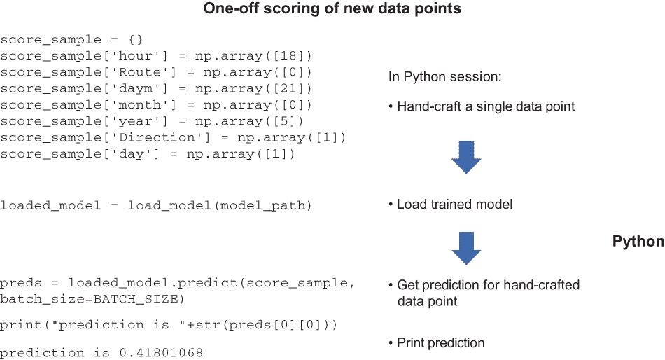

图 8.2 Python 会话中一次性评分的总结

你在 Python 会话的上下文中进行一次性评分，并且你需要手动准备你想要评分的数据点。而不是直接处理你想要评分的值——例如`route = 501`、`direction = westbound`和`time = 1:00 pm today`——你需要一个已经通过所有数据转换的数据点，例如将整数值分配给替换`501`作为路线值。此外，你必须将数据点组装成模型期望的结构：一个 numpy 数组的列表。当你已经以所需的格式准备了一个数据点并应用了训练好的模型来获取其预测时，你可以在 Python 会话中显示预测结果。正如你所看到的，一次性评分适合对训练好的模型进行快速合理性测试，但由于一次性评分是在 Python 会话中进行的，并且需要手动准备输入数据，因此它不是在规模上测试你的模型或使其可供最终用户使用的方法。

## 8.4 使用 Web 部署的用户体验

对于电车延误预测问题，我们需要一种简单的方法让用户指定他们想要获取延误预测的行程，以及一种简单的方法来展示模型的预测。Web 部署是实现这一目标的最简单方式。

在第 8.5 节中，我们将详细介绍为您的训练有素的深度学习模型设置 Web 部署的细节，但首先，让我们回顾一下完成 Web 部署后的用户体验（如图 8.3 所示）：

1.  用户访问`home.html`（由 Flask 在`localhost:5000`上提供）并选择他们想要预测的行程的详细信息：路线、方向、年份、月份、月份中的某一天、星期中的某一天和小时。

1.  用户点击“获取预测”按钮。

1.  预测结果在`show-prediction.html`中显示。

1.  用户可以点击“获取另一个预测”返回到`home.html`并输入关于另一个行程的详细信息。

    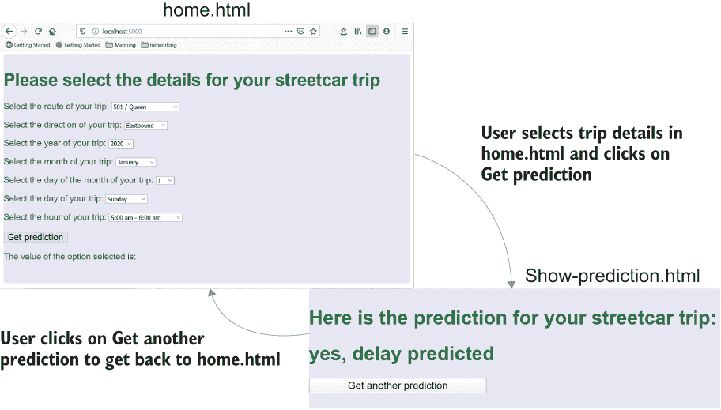

    图 8.3 使用 Web 部署的用户体验

## 8.5 使用 Web 部署部署您的模型步骤

在第 8.4 节中，我们探讨了 Web 部署模型的用户体验。本节将引导你通过设置本地 Web 部署的训练有素模型的步骤。

如第 8.4 节所述，Web 部署依赖于 Flask 来提供部署所需的网页和相关代码。本书不涉及 Flask 的端到端描述，但如果你想要了解更多关于这个易于使用的 Python 网络应用程序框架的背景信息，[`mng.bz/oRPy`](http://mng.bz/oRPy)上的教程提供了一个优秀的概述。

Flask 不是 Python 中网络服务的唯一选择。Django（[`www.djangoproject.com`](https://www.djangoproject.com)）是另一个 Python 网络应用程序框架，它以 Flask 的简单性换取了更丰富的功能集。有关 Flask 和 Django 的良好比较，请参阅[`mng.bz/nzPV`](http://mng.bz/nzPV)。对于电车延误预测项目，我选择了 Flask，因为我们不需要复杂的网络应用程序来部署模型，而且 Flask 更容易上手。

当你克隆了与本书相关的 GitHub repo ([`mng.bz/v95x`](http://mng.bz/v95x))后，你将看到以下列表中的目录结构。

列表 8.1 与部署相关的代码

```
├── data
├── deploy
│   ├── data
│   ├── input_sample_data
│   ├── keras_models
│   ├── models
│   ├── pipelines
│   ├── test_results
│   └── __pycache__
├── deploy_web
│   ├── static
│   │ └── css
│   ├── templates
│   └── __pycache__
├── models
├── notebooks
│   ├── .ipynb_checkpoints
│   └── __pycache__
├── pipelines
└── sql
```

下一个示例中显示的与网络部署相关的文件位于 deploy_web 子目录中。

列表 8.2 与网络部署相关的代码

```
│   custom_classes.py             ❶ 
│   deploy_web_config.yml         ❷ 
│   flask_server.py               ❸ 
│ 
├── static
│   └── css
│           main.css              ❹ 
│           main2.css             ❺ 
│ 
└── templates
        home.html                 ❻ 
        show-prediction.html      ❼ 
```

❶ 包含管道类定义

❷ 网络部署配置文件：管道文件名、模型文件名和调试设置

❸ Flask 服务器的主 Python 文件，以及将管道和训练模型应用于用户关于他们的电车之旅的输入参数

❹ 用于显示 HTML 文件显示特性的 CSS 文件

❺ 交替 CSS 文件（用于开发期间强制更新）

❻ 用于输入评分参数的 HTML 文件

❼ 用于显示评分结果的 HTML 文件

在文件就绪后，以下是使网络部署工作所需的步骤：

1.  前往本地实例的 repo 中的 deploy_web 子目录。

1.  编辑 deploy_web_config.yml 配置文件以指定你想要用于部署的训练模型和管道文件。如果你是按照第六章中的说明自己创建的模型和管道文件，请确保你使用的是来自同一运行的管道和模型文件，如下一个列表所示。

    列表 8.3 网络部署配置文件中要设置的参数

    ```
    general:
       debug_on: False
       logging_level: "WARNING" 
       BATCH_SIZE: 1000
    file_names:
       pipeline1_filename: sc_delay_pipeline_dec27b.pkl              ❶ 
       pipeline2_filename: sc_delay_pipeline_keras_prep_dec27b.pkl
       model_filename: scmodeldec27b_5.h5                            ❷ 
    ```

    ❶ 将参数 pipeline1_filename 和 pipeline2_filename 的值替换为你想要使用的管道文件名——位于 deploy_web 子目录的兄弟目录 pipelines 子目录中的 pickle 文件。对于管道文件和模型文件，只需指定文件名；其余路径将由 flask_server.py 生成。

    ❷ 将 model_filename 参数的值替换为你保存想要使用的训练模型的文件名——位于 models 子目录中的 h5 文件。

1.  如果你还没有这样做，请输入以下命令来安装 Flask：

    ```
    pip install flask
    ```

1.  输入以下命令以启动 Flask 服务器和相关代码：

    ```
    python flask_server.py
    ```

1.  在浏览器中输入此 URL 以加载 home.html：

    ```
    localhost:5000
    ```

1.  如果一切正常，你会看到 home.html，如图 8.4 所示。

    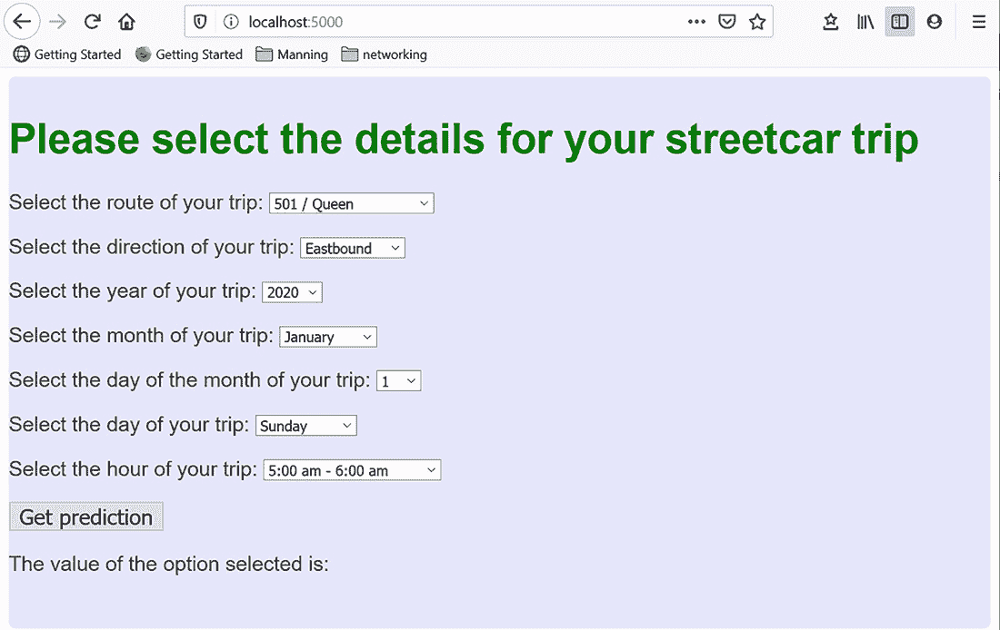

    图 8.4 在浏览器中加载 localhost:5000 时显示的 home.html

1.  进行一次合理性测试。通过选择路线、方向和时间/日期参数的值来设置评分参数，然后点击获取预测。此点击将启动可能需要一些时间的处理（加载管道、加载训练模型以及将评分参数通过管道和训练模型运行）。因此，如果这一步需要几秒钟才能完成，请耐心等待。

1.  如果您的 Web 部署成功，您将看到显示预测结果的`show-prediction.html`页面，如图 8.5 所示。

    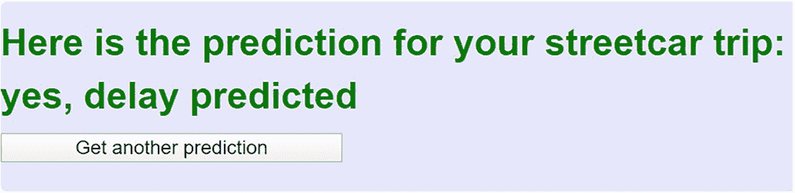

    图 8.5 Web 部署成功的合理性测试

1.  如果您想尝试另一组评分参数，请点击获取另一个预测以返回`home.html`，在那里您可以输入新旅行的评分参数。

就这些了。如果您已经达到这个阶段，您已经成功部署了一个训练好的深度学习模型。如您所见，即使这个简单的部署也要求我们使用一组之前在这本书中没有使用过的技术，包括 Flask、HTML 和 JavaScript。正如您将在第 8.8 节中看到的那样，为了通过在 Facebook Messenger 中部署模型来获得更流畅的用户体验，我们需要一个更大的组件集。这种对技术组件集的需求说明了第 8.2 节中提出的问题：部署深度学习模型并不容易，因为当前的部署需要一套与准备数据集和训练模型所使用的技术截然不同的技术栈。

如果您想与他人分享您的部署，可以使用 ngrok 将本地系统上的 localhost 对本地系统外的用户开放，如第九章所述。请注意，如果您使用 ngrok 的免费版本，您一次只能运行一个 ngrok 服务器，因此您无法同时运行 Web 部署和 Facebook Messenger 部署。

## 8.6 Web 部署背后的场景

让我们更详细地看看 Web 部署背后的情况。图 8.6 显示了从用户在`home.html`中输入他们计划乘坐的电车旅行的详细信息到用户在`show-prediction.html`中获得响应的流程。以下列表提供了图 8.6 中编号步骤的更多详细信息。

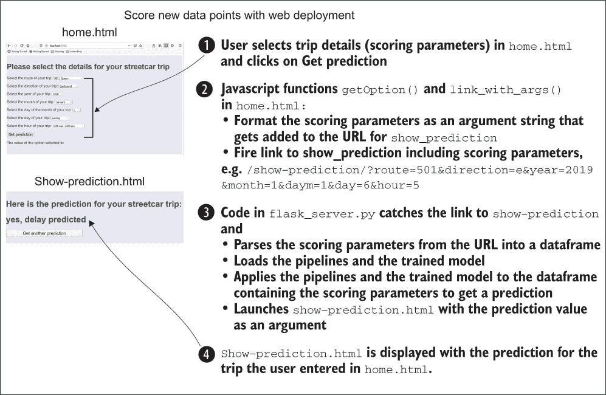

图 8.6 Web 部署中从查询到答案的往返流程

1.  在由 Flask 在 localhost:5000 上提供的`home.html`网页中，用户通过从路线、方向和时间/日期的下拉列表中选择详细信息来选择他们的电车旅行；然后用户点击获取预测按钮。

1.  home.html 中的 JavaScript 函数`getOption` `()` 提取用户在下拉列表中选择的评分参数，并构建包含这些评分参数的 URL。JavaScript 函数`link_with_args` `()` 将与获取预测按钮关联的链接设置为包含在`getOption()`中构建的 URL，如下一列表所示。

    列表 8.4 JavaScript 函数 getOption()的代码

    ```
    function getOption() { 
    selectElementRoute = document.querySelector('#route');               ❶ 
    selectElementDirection = document.querySelector('#direction');
    selectElementYear = document.querySelector('#year');
    selectElementMonth = document.querySelector('#month');
    selectElementDaym = document.querySelector('#daym');
    selectElementDay = document.querySelector('#day');
    selectElementHour = document.querySelector('#hour');
    route_string = \
    selectElementRoute.options[selectElementRoute.selectedIndex].value   ❷ 
    direction_string = \
    selectElementDirection.options[selectElementDirection.\
    selectedIndex].value
    year_string = \
    selectElementYear.options[selectElementYear.selectedIndex].value
    month_string = \
    selectElementMonth.options[selectElementMonth.selectedIndex].value
    daym_string = \
    selectElementDaym.options[selectElementDaym.selectedIndex].value
    day_string = \
    selectElementDay.options[selectElementDay.selectedIndex].value
    hour_string = \
    selectElementHour.options[selectElementHour.selectedIndex].value
    // build complete URL, including scoring parameters
    prefix = "/show-prediction/?"                                        ❸ 
    window.output = \
    prefix.concat("route=",route_string,"&direction=",direction_string,\
    "&year=",year_string,"&month=",month_string,"&daym=",daym_string,\
    "&day=",day_string,"&hour=",hour_string)                             ❹ 
    document.querySelector('.output').textContent = window.output; 
    }

    function link_with_args(){
        getOption();                                                             ❺ 
        console.log("in link_with_args");
        console.log(window.output);
        window.location.href = window.output;                            ❻ 
        }
    ```

    ❶ 为每个评分参数创建 querySelector 对象。

    ❷ 将每个评分参数的值加载到 JS 变量中。

    ❸ 设置目标 URL 的前缀。

    ❹ 将每个评分参数值作为参数添加到目标 URL 中。

    ❺ 调用 getOption()构建目标 URL。目标 URL 将类似于这样：/show-prediction/?route=501&direction=e&year=2019&month=1&daym=1&day=6&hour=5。

    ❻ 将目标 URL 设置为与获取预测按钮关联的链接的目标。

1.  flask_server.py 包括视图函数([`mng.bz/v9xm`](http://mng.bz/v9xm))——处理组成部署的 HTML 文件的 Flask 模块中的不同路由/URLs 的函数——为每个 HTML 文件。show-prediction 视图函数包含下一列表中的评分代码。

    列表 8.5 用于 show-prediction 视图函数的代码

    ```
    @app.route('/')                                                         ❶ 
    def home():   
        title_text = "Test title"
        title = {'titlename':title_text}
        return render_template('home.html',title=title)                     ❷ 

    @app.route('/show-prediction/')                                         ❸ 
    def about():
        score_values_dict = {}
        score_values_dict['Route'] = request.args.get('route')              ❹ 
        score_values_dict['Direction'] = request.args.get('direction')
        score_values_dict['year'] = int(request.args.get('year'))
        score_values_dict['month'] = int(request.args.get('month'))
        score_values_dict['daym'] = int(request.args.get('daym'))
        score_values_dict['day'] = int(request.args.get('day'))
        score_values_dict['hour'] = int(request.args.get('hour'))
        loaded_model = load_model(model_path)                               ❺ 
        loaded_model._make_predict_function()
        pipeline1 = load(open(pipeline1_path, 'rb'))                        ❻ 
        pipeline2 = load(open(pipeline2_path, 'rb'))
        score_df = pd.DataFrame(columns=score_cols)                         ❼ 
        for col in score_cols:                                              ❽ 
            score_df.at[0,col] = score_values_dict[col]
        prepped_xform1 = pipeline1.transform(score_df)                      ❾ 
        prepped_xform2 = pipeline2.transform(prepped_xform1)
        pred = loaded_model.predict(prepped_xform2, batch_size=BATCH_SIZE)  ❿ 
        if pred[0][0] >= 0.5:                                               ⓫ 
            predict_string = "yes, delay predicted"
        else:
            predict_string = "no delay predicted"
        prediction = {'prediction_key':predict_string}                      ⓬ 
        # render the page that will show the prediction
        return(render_template('show-prediction.html', \
        prediction=prediction))                                             ⓭ 
    ```

    ❶ home.html 的视图函数；这是当用户导航到 localhost:5000 时执行的功能。

    ❷ home.html 的视图函数渲染网页。

    ❸ show-prediction.html 的视图函数；这是当用户在 home.html 中点击获取预测链接时执行的功能。

    ❹ 将从 URL 中加载的参数（由 home.html 中的 link_with_args() JavaScript 函数加载的评分参数）加载到 Python 字典中。

    ❺ 加载训练好的模型。注意，model_path 在 flask _server.py 中之前已构建，使用从部署配置文件 deploy_web_config.yml 中加载的值。

    ❻ 加载管道对象。

    ❼ 创建一个包含评分参数的数据框。

    ❽ 将评分参数加载到数据框中。

    ❾ 将管道应用于评分参数数据框。

    ❿ 将训练好的模型应用于管道的输出以获得预测。

    ⓫ 将预测转换为字符串。

    ⓬ 创建一个用于输出预测字符串的字典。

    ⓭ 使用预测字符串作为参数渲染 show-prediction.html。

1.  Flask 提供 show-prediction.html，显示由 flask_server.py 中的 show-prediction.html 视图函数生成的预测字符串。

本节提供了一些关于当你使用 Web 部署时幕后发生的事情的细节。这个 Web 部署的目的是展示一个简单但完整的部署。你可能已经看到了（尤其是如果你是一个经验丰富的 Web 开发者）改进 Web 部署的机会。例如，将预测显示在 home.html 而不是单独的页面上会很好。同样，提供一个按钮在 home.html 中让用户指定他们现在想要出行也是一个很好的主意。为了使部署尽可能简单，我在这个 Web 部署中选择了简单的一侧。第 8.7-8.10 节描述了一个更优雅的部署，在我看来，它更适合街车延误预测问题。尽管如此，这里描述的 Web 部署提供了一个简单的结构，你可以通过一些对 HTML 和 JavaScript 的修改来适应其他机器学习模型的基本部署。

## 8.7 Facebook Messenger 部署的用户体验

Web 部署的用户体验很简单，但它有一些严重的限制：

+   用户必须访问一个特定的网站。

+   他们必须输入他们旅行的所有信息。没有任何假设。

+   旅行参数的输入和预测出现在不同的网页上。

我们可以通过花费更多时间来细化它，直接在 Web 部署中解决所有这些问题，但有一种更好的方法来提升用户体验：在 Facebook Messenger 中进行部署。图 8.7 展示了在 Facebook Messenger 部署中用户获取旅行预测是多么简单。

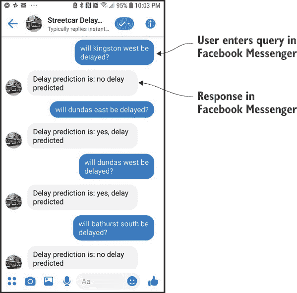

图 8.7 使用部署的模型得到的新数据点

将用户在 Facebook Messenger 部署中的评分体验与他们在 Web 部署中的体验进行对比。使用通过 Facebook Messenger 部署的模型，用户只需在 Facebook Messenger 中输入一个英文句子，就能得到预测。用户可以提供最少的信息，仍然可以得到预测。最好的是，用户在 Facebook Messenger 中输入请求并得到预测，这是这种轻量级交互的自然环境。

通过 Facebook Messenger 和 Rasa 部署模型的好处之一是灵活性。在图 8.8 中，查询对被标记为 1 到 4 的数字。考虑带有相同数字的查询对。这些对中的每个查询都有相同的意思，而 Rasa 模型能够检测到这一点，尽管这些对中的每个成员的措辞有所不同。Rasa 模型从 Rasa 模型训练中使用的例子中获得了部分这种能力，这些例子包括 [nlu.md](https://github.com/ryanmark1867/deep_learning_for_structured_data/blob/master/deploy/data/nlu.md)（单句示例）和 [stories.md](https://github.com/ryanmark1867/deep_learning_for_structured_data/blob/master/deploy/data/stories.md)（多句示例）。这两组训练示例赋予了 Rasa 解析特定于电车行程的语言方面的能力。

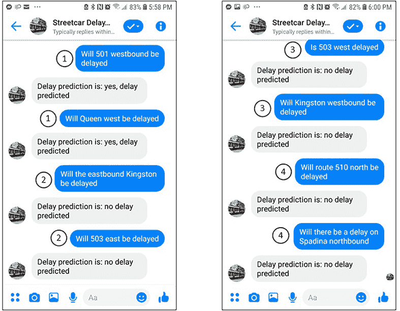

图 8.8 Rasa 模型正确评估查询对为相同。

使用 Rasa 编写的聊天机器人的能力很大一部分来自于利用 Rasa 的默认自然语言处理（NLP）能力。值得一提的是，Rasa 的 NLP 能力基于深度学习。因此，深度学习推动了端到端解决方案的两个部分（包括本章中描述的 Facebook Messenger 部署），如图 8.9 所示：

+   我们在这本书中一直在创建的电车延误预测深度学习模型

+   我们通过将 Rasa 作为电车延误模型部署的一部分来获取的 NLP 深度学习

+   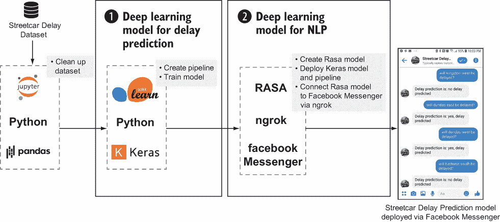

    图 8.9 深度学习驱动 Facebook Messenger 部署的端到端解决方案的两个部分。

## 8.8 Facebook Messenger 部署背后的场景

当用户在 Facebook Messenger 中输入有关电车行程的问题时，幕后发生了什么？图 8.10 显示了从用户输入的查询到在 Facebook Messenger 中显示的响应的流程。以下列表提供了图 8.10 中编号步骤的更多详细信息：

1.  当用户在 Facebook Messenger 中用英语输入查询时，该查询会被一个简单的 Rasa 聊天机器人捕获。

1.  Rasa 将一个 NLP 模型应用于查询以获取用户想要预测的行程的关键值（称为 *槽位*），这些值指定了关于行程的详细信息：路线名称或编号、方向和时间。

1.  Rasa 将这些槽位值传递给一个自定义动作类（[actions.py](https://github.com/ryanmark1867/deep_learning_for_structured_data/blob/master/deploy/actions.py) 中评分代码的一部分），该类是用 Python 编写的。该类中的代码解析槽位值，并为任何空槽位设置默认值。特别是，如果用户在他们的查询中没有指定任何时间信息，自定义动作将星期几、月份和年份设置为当前日期和时间。

1.  自定义操作准备行程细节，使用与准备训练数据相同的管道。（有关管道的更多背景信息，请参阅第 8.11-8.13 节。）然后，自定义操作通过在准备好的行程细节上调用训练好的深度学习模型来对这些细节进行评分。

1.  最后，自定义操作在 Facebook Messenger 中向用户发送一个响应。

    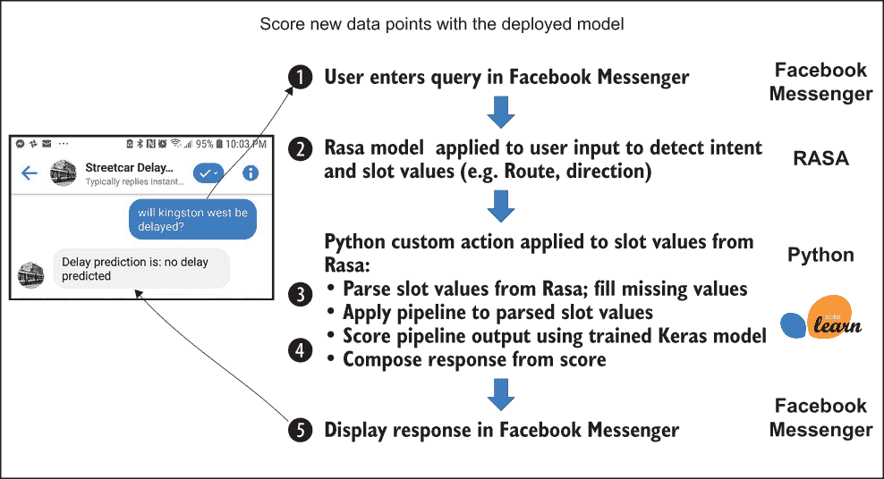

    图 8.10 使用 Facebook Messenger 部署的从查询到答案的往返过程

## 8.9 关于 Rasa 的更多背景信息

对 Rasa 聊天机器人框架的全面审查超出了本书的范围。此外，仓库包含您为模型部署所需的全部更新后的 Rasa 文件。当您按照第 8.10 节中的步骤操作后，您不应需要更新任何与 Rasa 相关的文件。但如果您想了解更多关于 Rasa 如何工作的细节，本节提供了关于 Rasa 基本概念的额外背景信息，以及一些指向更详细信息的方法。

Rasa 是一个开源的聊天机器人开发框架，允许您使用自然语言界面创建和训练聊天机器人。它提供了一套简单的接口，让您可以利用其内置的 NLP，而无需处理训练 NLP 模型的细节。Rasa 与 Python 连接，让您能够编写复杂的动作以响应用户输入。它还支持连接到各种消息平台，包括 Facebook Messenger。总之，Rasa 框架为我们提供了从自然语言解释到 Python 连接再到 Facebook Messenger 的最终用户界面的所有简单部署所需的一切。

Rasa 界面是围绕一系列聊天机器人概念构建的：

+   *意图* —用户输入的目标，例如获取预测。

+   *动作* —聊天机器人系统可以执行的动作。一个简单的动作可能是一个预先准备好的文本响应（例如在问候时返回`hello`）。在我们的深度学习模型部署中，我们将动作定义为 Python 中的`actions.py`文件中的`ActionPredictDelayComplete`类。此动作接受 Rasa 从用户输入中提取的槽位值，填写未由槽位指定的值，将值通过管道运行，将管道的输出应用于训练好的模型，并最终根据训练模型的预测为用户编写响应。

+   *槽位* —一组键和值，用于捕获用户的基本输入。在我们的深度学习模型部署中，为模型期望的所有输入列（路线、方向、小时、月份等）定义了槽位。

+   *故事* —用户与聊天机器人之间对话的抽象，可以表示多次来回交流。在我们深度学习模型部署中的主要故事是一个简单的交流：用户询问一次旅行是否会延误，机器人提供响应以指示延误或无延误。

图 8.11 显示了用于训练 Rasa 模型的关键文件以及每个文件中定义的 Rasa 对象。当您训练 Rasa 模型（您将在第 8.10 节中这样做）时，Rasa 使用 nlu.md 和 stories.md 文件中的训练数据来训练模型。

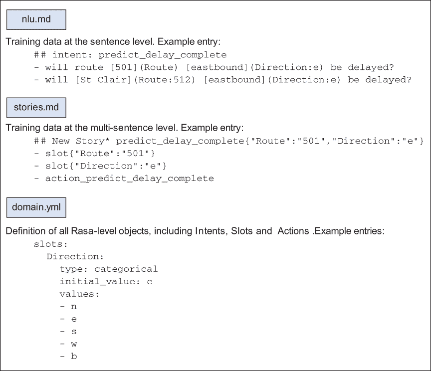

图 8.11 定义在 Rasa 中的关键文件和对象

Rasa 框架中的另一个关键文件是 actions.py，该文件包含 Python 自定义操作。如果 Facebook Messenger 是部署的漂亮面孔，Rasa 的 NLP 能力是其可爱的声音，那么 actions.py 就是部署的大脑。让我们更详细地看看 actions.py 中的代码，该代码获取 Rasa 设置的槽位值。

Rasa 与 actions.py 之间的连接是 actions.py 中自定义类中的跟踪器结构。`tracker.get_slot()` 方法允许您获取 Rasa 设置的槽位值，或者如果 Rasa 没有设置槽位值，则为 `None`。actions.py 中的此循环遍历从 Rasa 传递的槽位值，并加载与槽位值相对应的评分数据框列，如果没有设置槽位值，则使用默认值，如下一列表所示。

列表 8.6 从 Rasa 加载槽位值到数据框的代码

```
for col in score_cols:
    if tracker.get_slot(col) != None:                      ❶ 
        if tracker.get_slot(col) == "today":
            score_df.at[0,col] = score_default[col]        ❷ 
        else:
            score_df.at[0,col] = tracker.get_slot(col)     ❸ 
    else:
        score_df.at[0,col] = score_default[col]            ❹ 
```

❶ 如果设置了槽位，则使用其值。

❷ 如果日期由 Rasa 设置为今天，则使用默认值，即当前日期。

❸ 否则，对于将要评分的数据框，将值设置为等于 Rasa 的槽位值。

❹ 如果 Rasa 没有设置值（例如日期和时间），则使用默认值，即当前时间/日期。

本节简要概述了 Rasa 的一些关键概念。有关更多详细信息，您可以在 [`rasa.com`](https://rasa.com/) 上了解 Rasa 及其架构。

## 8.10 使用 Rasa 在 Facebook Messenger 中部署您的模型的步骤

本节描述了使用 Facebook Messenger 部署您的模型的步骤。完成这些步骤后，您将拥有一个部署的深度学习模型，您可以从 Facebook Messenger 中查询它。

当您克隆与本书相关的 GitHub 仓库 ([`mng.bz/v95x`](http://mng.bz/v95x)) 时，您将在 deploy 子目录中找到与 Facebook Messenger 部署相关的文件，如下所示。

列表 8.7 与 Facebook Messenger 部署相关的代码

```
│ actions.py              ❶ 
│   config.yml              ❷ 
│   credentials.yml         ❸ 
│   custom_classes.py       ❹ 
│   deploy_config.yml       ❺ 
│   domain.yml              ❻ 
│   endpoints.yml           ❼ 
│   one_off_scoring.py  
│   __init__.py
│ 
├── data
│       nlu.md              ❽ 
│       stories.md          ❾ 
│ 
└── models                  ❿ 
```

❶ 包含 Rasa 模型自定义操作的文件

❷ Rasa 配置文件

❸ Rasa 凭证文件

❹ 包含管道类的定义

❺ actions.py 的配置文件：管道文件名、模型文件名和调试设置

❻ Rasa 领域文件：指定意图、槽位和操作

❼ Rasa 端点文件：指定自定义操作的端点 URL。

❽ Rasa nlu.md 文件：Rasa 模型的单轮对话训练数据

❾ Rasa stories.md 文件：Rasa 模型的多轮对话训练数据

❿ 包含 Rasa 模型的目录

在步骤 1 到 4 中，您将通过安装 Python（如果您尚未在本地系统上安装它）和 Rasa 开源聊天机器人环境来完成基本设置：

1.  如果您本地系统上尚未安装 Python 3.7，请安装它 ([`www.python.org/downloads`](https://www.python.org/downloads))。

    注意：Python 3.8 中 TensorFlow 依赖项与 Rasa 存在问题，因此请确保您使用的是 Python 3.7，以避免在 Rasa 安装步骤中出现问题。另外请注意，Rasa 与 TensorFlow 2 不兼容，因此您用于 Facebook Messenger 部署的 Python 环境需要与您用于训练 Keras 模型的 Python 环境分开。

1.  安装开源聊天机器人框架 Rasa ([`rasa.com/docs/rasa/user-guide/installation`](https://rasa.com/docs/rasa/user-guide/installation))：

    ```
    pip install rasa
    ```

1.  如果您在 Windows 上，并且 Rasa 安装失败，显示需要 C++ 的消息，您可以下载并安装 Visual C++ Build Tools ([`mng.bz/4BA5`](http://mng.bz/4BA5))。安装构建工具后，重新运行 Rasa 安装：

1.  前往您克隆的仓库中的部署目录。

1.  在部署目录中运行以下命令以设置基本的 Rasa 环境：

    ```
    rasa init
    ```

1.  在您的部署目录中运行以下命令以在 Rasa 的 Python 环境中调用 actions.py。如果您收到任何关于缺少库的消息，请运行 `pip install` 以添加缺少的库：

    ```
    rasa run actions
    ```

1.  在步骤 6 到 13 中，您将设置 ngrok（用于连接本地系统上的部署环境与 Facebook Messenger）并设置您需要连接到 Facebook Messenger 的 Facebook 应用和 Facebook 页面：

1.  安装 ngrok ([`ngrok.com/download`](https://ngrok.com/download))。

1.  在您安装 ngrok 的目录中，调用 ngrok 使您的本地主机在端口 5005 上可供 Facebook Messenger 使用。以下是 Windows 的命令：

    ```
    .\ngrok http 5005 
    ```

1.  记下 ngrok 输出的 https 转发 URL，如图 8.12 所示；您将需要该 URL 来完成步骤 13。

    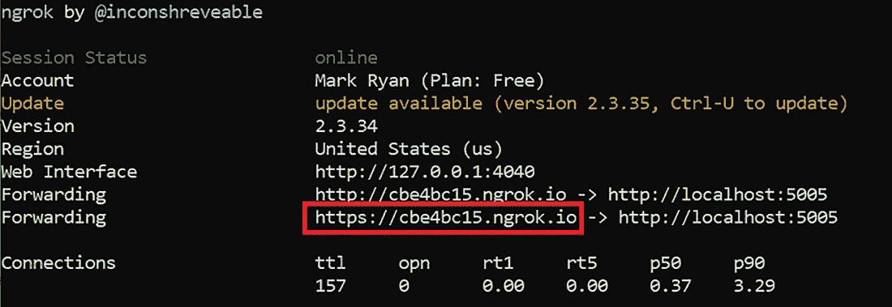

    图 8.12 调用 ngrok 的输出

1.  在部署目录中运行以下命令以训练 Rasa 模型：

    ```
    rasa train
    ```

1.  按照以下说明 [`mng.bz/Qxy1`](http://mng.bz/Qxy1) 添加新的 Facebook 应用。记下页面访问令牌和应用程序密钥；您需要在步骤 11 中使用这些值更新 credentials.yml 文件。

1.  更新部署目录中的 credentials.yml 文件，以设置验证令牌（您选择的字符串值）和密钥以及页面访问令牌（在步骤 10 中您设置的 Facebook 应用设置期间提供）：

    ```
    facebook:  
      verify: <verify token that you choose>
      secret: <app secret from Facebook app setup>
      page-access-token: <page access token from Facebook app setup>
    ```

1.  在部署目录中运行以下命令以启动 Rasa 服务器，使用您在步骤 11 中设置的 credentials.yml 中的凭据：

    ```
    rasa init
    ```

1.  在第 10 步中创建的 Facebook 应用中，选择 Messenger -> 设置，滚动到 Webhooks 部分，并点击编辑回调 URL。将回调 URL 值的初始部分替换为你在第 7 步调用 ngrok 时记录的 https 转发 URL。在验证令牌字段中输入你在第 11 步设置的 credentials.yml 中的验证令牌，然后点击验证并保存，如图 8.13 所示。

    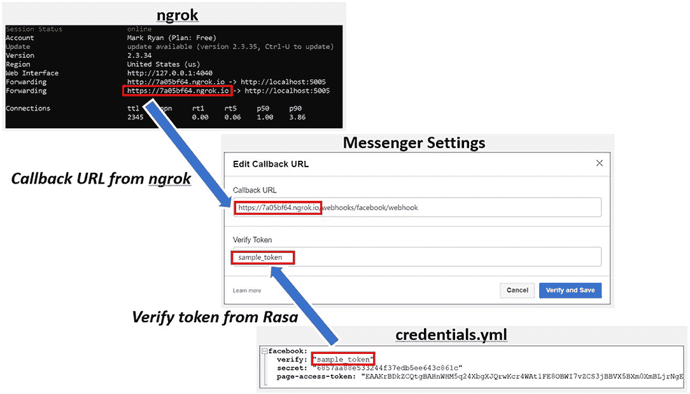

    图 8.13 设置 Facebook Messenger 的 webhook 回调 URL

1.  最后，在第 14 步和第 15 步中，验证你在 Facebook Messenger 中的部署：

1.  在 Facebook Messenger（移动或网页应用）中，搜索你在第 10 步中创建的 Facebook 页面的 ID，并向该 ID 发送以下消息：

    ```
    Will Queen west be delayed
    ```

1.  如果你的部署成功，你将看到如图 8.14 所示的响应，这是从我本地系统提供的。不用担心预测是否为延迟；只需确认你收到了响应。

    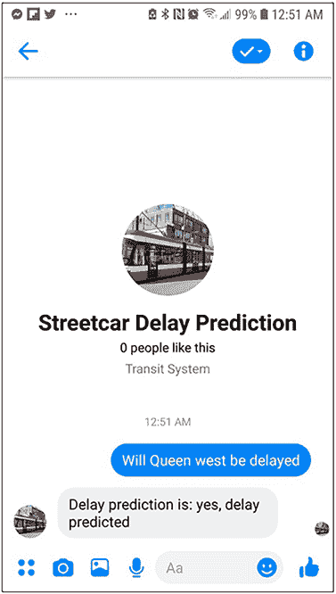

    图 8.14 使用 Facebook Messenger 成功进行模型部署的合理性测试

## 8.11 管道简介

现在我们已经完成了模型的部署过程，我们需要回顾一个重要的过程部分，它使得准备用户输入以便模型能够对其生成预测成为可能：管道。通过使用管道，我们可以将完全相同的准备步骤（例如，将分类列中的值分配给数值标识符）应用于用户输入的电车行程详情，这些步骤与我们训练 Keras 模型时应用于训练数据时相同。

让我们看看用户在 Facebook Messenger 部署中期望如何输入对电车行程延迟预测的请求，并将其与训练模型期望作为预测输入的内容进行比较。图 8.15 展示了用户请求与模型期望输入之间的差距。

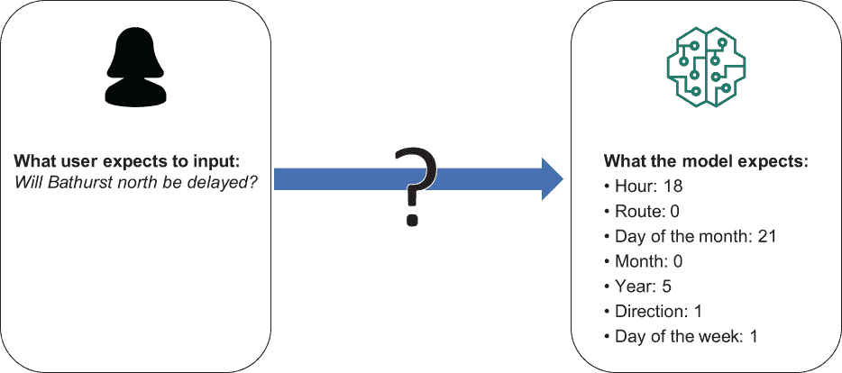

图 8.15 如何从用户输入转换为模型期望的格式

我们需要有一种方便的方式来准备用户提供的用于新预测的数据，使其符合训练模型期望的格式。正如我们在第 8.6 节中看到的，Rasa 通过从用户的请求中提取必要信息并推断缺失信息，帮助我们走了一半的路，如图 8.16 所示。

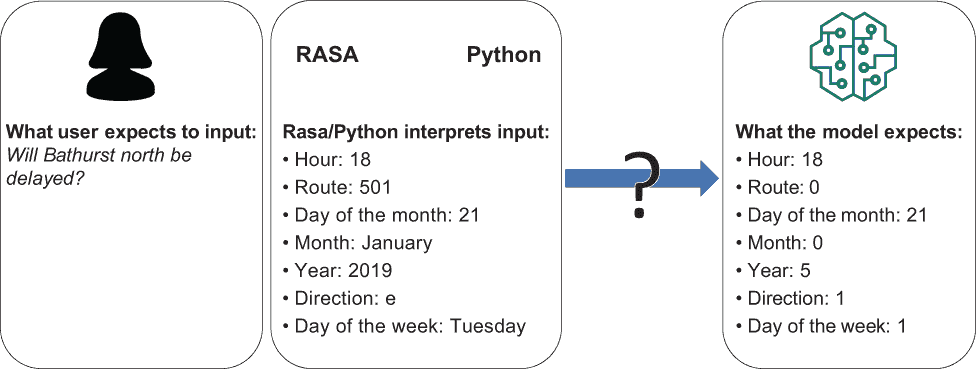

图 8.16 如何从 Rasa 输出转换为模型期望的格式

我们如何将 Rasa 从用户输入中提取的数据点转换为模型期望的格式？特别是，我们如何将诸如路线、月份和星期几这样的分类值转换为模型期望的整数标识符？

一种方法是在训练代码中包含函数，这些函数将评分代码可用的分类值编码。在评分代码中，我们可以调用这些相同的函数来对新数据点（我们希望应用模型的数据点）中的分类值（如路线和方向）进行编码。问题是如何确保在评分过程中使用与我们在训练数据集期间使用的相同映射。例如，如果“2019”在训练过程中被映射为“5”，那么我们如何确保在评分过程中“2019”发生相同的映射？我们可以将训练过程中使用的编码器对象进行 pickle，然后在使用训练模型评分新数据时解 pickle 并应用这些相同的编码器，但这个过程会繁琐且容易出错。我们需要的是一个方便的方式来封装我们用来准备训练数据的数据准备过程，以便我们可以将相同的流程应用于将被训练模型评分的新数据点。实现这一目标的有效方法之一是使用 scikit-learn 提供的管道功能([`mng.bz/X0Pl`](https://shortener.manning.com/X0Pl))。

scikit-learn 中的管道功能使得将所有数据转换（以及如果您愿意，还包括模型本身）封装在一个对象中成为可能，您可以将其作为一个整体进行训练。当您训练了一个管道后，您可以在评分新数据点时应用它；管道会处理新数据点上的所有数据转换，然后应用模型以获得结果。

scikit-learn 中的管道功能是为了与 scikit-learn 中包含的经典机器学习算法一起使用而设计的，包括支持向量机、逻辑回归和随机森林。虽然可以创建一个包含 Keras 深度学习模型的 scikit-learn 管道，但我还没有能够成功地创建一个多输入 Keras 模型（如电车延误预测模型）的此类管道。因此，当我们在这本书中应用 scikit-learn 管道时，它们仅涵盖数据准备步骤，并不封装模型本身。

此外，为了解决在应用最终数据准备步骤（将数据集从 Pandas dataframe 转换为 numpy 数组字典）后将数据集分为训练、验证和测试时的问题，我们使用两个管道串联。第一个管道编码分类值（并处理任何剩余的缺失值），第二个管道将数据集从 Pandas dataframe 转换为模型期望的 numpy 数组字典。请参阅第 8.12 节，了解构成这两个管道的关键代码元素。

图 8.17 显示了用户如何输入将被训练模型评分的新数据点，Rasa 如何解释这些数据点，然后通过管道处理，以便它们以正确的格式供训练的 Keras 模型进行预测。

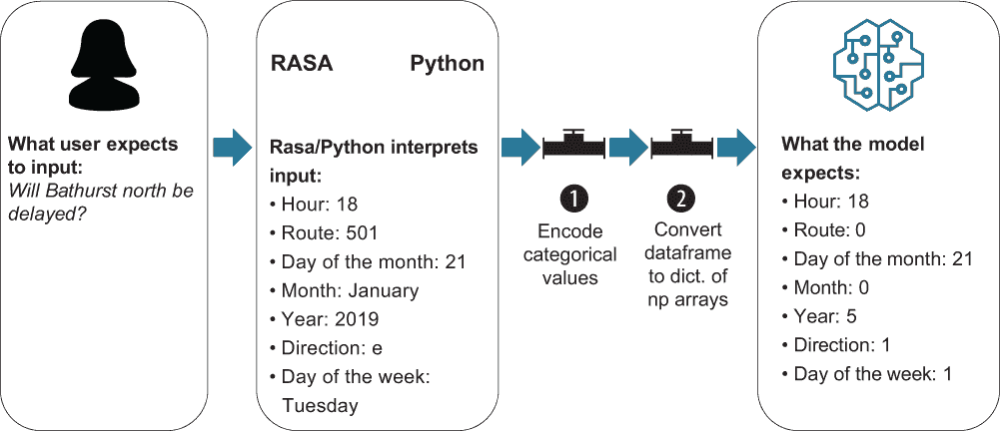

图 8.17 从用户输入到模型期望的完整流程

在将训练模型应用于新数据点之前，应用于用户输入的新数据点的管道与在训练模型之前应用于数据集的管道相同，如图 8.18 所示。

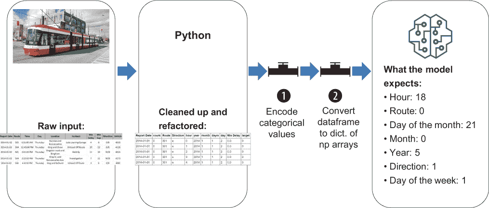

图 8.18 训练数据通过与评分数据相同的管道

在本节中，我们介绍了管道的概念，并从高层次上展示了它们在训练和部署过程中的位置。在下一节中，我们将深入研究定义管道的代码。

## 8.12 模型训练阶段定义管道

既然我们已经了解了管道的整体目的，让我们来看看实现街道延误预测项目中使用的管道的代码细节。在本节中，我们将回顾如何在 streetcar_model_training 笔记本中定义管道。在第 8.13 节中，我们将回顾管道在模型部署过程中的评分过程中应用于新数据点的细节。

scikit-learn 中的管道功能附带了一组可现成使用的转换类，或者您可以通过创建新的类作为核心管道类的子类来创建自己的自定义转换器。对于街道延误预测项目，我们通过从 scikit-learn 提供的类中派生新的 Python 类来创建自定义转换器。您可以在 [custom_classes.py](https://github.com/ryanmark1867/deep_learning_for_structured_data/blob/master/notebooks/custom_classes.py) 中找到这些类的定义：

+   `encode_categorical` — 对类别列（如路线、方向和年份）进行编码。

+   `prep_for_keras_input` — 将数据集从 Pandas 数据框转换为 Keras 模型期望的格式：一个 numpy 数组的字典。

+   `fill_empty` — 用占位符值替换空值。

+   `encode_text` — 对文本列进行编码（未用于街道延误项目）。

您可能会想知道为什么这些类定义与代码的其他部分分开在一个单独的文件中。有两个原因：

+   这些类需要由包含训练模型代码的 streetcar_model_training 笔记本和包含 Facebook Messenger 部署评分代码的 actions.py 使用。由于这两个 Python 程序都需要访问相同的类定义，因此将类定义放在一个单独的文件中，这两个程序都可以导入，是有意义的。

+   如果直接将类定义包含在评分代码文件中，类定义将无法正确解析。将类定义放在单独的文件中允许它们在将类导入评分代码 [actions.py](https://github.com/ryanmark1867/deep_learning_for_structured_data/blob/master/deploy/actions.py) 时正确解析。导入语句如下：

+   ```
    from custom_classes import encode_categorical
    from custom_classes import prep_for_keras_input
    from custom_classes import fill_empty
    from custom_classes import encode_text
    ```

让我们看看在 streetcar_model_training 笔记本中训练阶段如何定义管道。首先，我们创建 [custom_classes.py](https://github.com/ryanmark1867/deep_learning_for_structured_data/blob/master/notebooks/custom_classes.py) 中定义的三个类的实例：

```
fe = fill_empty()
ec = encode_categorical()
pk = prep_for_keras_input()
```

以下两点需要注意：

+   如果这是你第一次接触 Python 的面向对象方面，不要担心。你可以将前面的定义视为创建三个对象，每个对象都具有与其对应的类相同的类型。这些类从其父类继承数据结构和函数，因此，使用这些对象，你可以应用它们在类中明确定义的函数以及它们从父类 `BaseEstimator` 和 `TransformerMixin` 继承的函数。

+   由于数据集中没有文本列，我们没有创建 `encode_text` 类的对象。

接下来，我们定义两个管道对象，使用我们创建的类实例。第一个管道包含了用于填充空值和编码分类列的类。第二个管道包含了将数据集从 Pandas 数据框转换为 numpy 数组列表的类：

```
sc_delay_pipeline = Pipeline([('fill_empty',fe), \
('encode_categorical',ec)])
sc_delay_pipeline_keras_prep = Pipeline([('prep_for_keras',pk)])
```

接下来，我们为管道中的类实例设置参数：

```
sc_delay_pipeline.set_params(fill_empty__collist = collist, \
fill_empty__continuouscols = continuouscols, \
     fill_empty__textcols = textcols, \
encode_categorical__col_list = collist)
sc_delay_pipeline_keras_prep.set_params(prep_for_keras__collist = \
collist, prep_for_keras__continuouscols = continuouscols, \
prep_for_keras__textcols = textcols)
```

这些语句设置了在各个类中定义的 `set_params` 函数中定义的参数。语法是类名后跟两个下划线，然后是参数名和分配给参数的值。在图 8.19 中，顶部框显示了带有 `encode_categorical` 类的 `col_list` 参数的 `set_params` 语句。底部框显示了在 `encode_categorical` 类定义中指定 `col_list` 参数的位置。

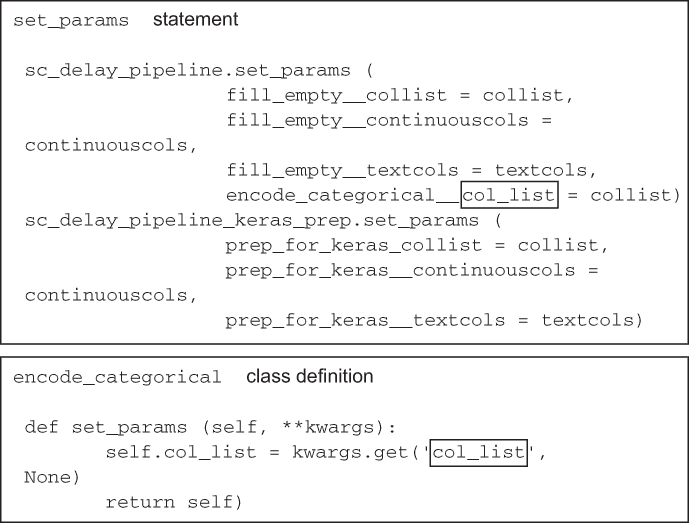

图 8.19 set_param 语句为管道类中定义的参数设置值。

现在参数已经设置好了，让我们看看如何应用第一个管道来编码分类列。以下代码中的第一行将管道拟合并转换输入的数据框，第二行将拟合的管道保存起来，以便在需要评分新数据点时使用：

```
X = sc_delay_pipeline.fit_transform(merged_data)
dump(sc_delay_pipeline, open(pipeline1_file_name,'wb'))
```

`fit_transform` 语句调用了 `encode_categorical` 客户端转换器类中的以下方法，如下一列表所示。

列表 8.8 由 fit_transform 语句调用的代码

```
def fit(self, X, y=None,  **fit_params):
        for col in self.col_list:
            print("col is ",col)
            self.le[col] = LabelEncoder()
            self.le[col].fit(X[col].tolist())             ❶ 
        return self

    def transform(self, X, y=None, **tranform_params):
        for col in self.col_list:
            print("transform col is ",col)
            X[col] = self.le[col].transform(X[col])       ❷ 
            print("after transform col is ",col)
            self.max_dict[col] = X[col].max() +1
        return X
```

❶ 在类的 fit 方法中，编码器被实例化。

❷ 在类的 transform 方法中，fit 方法中实例化的编码器被应用。

现在我们已经回顾了定义管道的代码，深入探讨一下在管道的上下文中，“拟合”意味着什么。在这种情况下，“拟合”意味着需要训练的管道部分使用输入数据进行训练。对于编码分类值的管道部分，训练管道意味着设置分类列中的输入值与将替换它们的整数标识符之间的对应关系。回到第 8.11 节的例子，如果模型训练时将“2019”映射到“5”，则在部署时评分的新数据项中，“2019”也将映射到“5”。这正是我们想要的，也是由于管道的存在而实现的。

## 8.13 评分阶段应用管道

在第 8.12 节中，我们详细介绍了管道在模型训练阶段是如何定义、训练和保存的。在本节中，我们将介绍如何使用部署的 Keras 模型将这些管道应用于评分阶段。

评分代码位于 [actions.py](https://github.com/ryanmark1867/deep_learning_for_structured_data/blob/master/deploy/actions.py)（用于 Facebook Messenger 部署）或 flask_server.py（用于 Web 部署）中，它从 custom_classes.py 中导入自定义转换器类，并加载在 streetcar_model_training 笔记本中保存的训练好的管道。图 8.20 总结了这三个文件中管道元素之间的关系。

让我们回顾一下评分代码中与管道相关的部分。这里显示的语句对于 Web 部署和 Facebook Messenger 部署是相同的。首先，评分代码使用与模型训练代码中相同的代码导入自定义转换器类定义：

```
from custom_classes import encode_categorical
from custom_classes import prep_for_keras_input
from custom_classes import fill_empty
from custom_classes import encode_text
```

评分代码中自定义动作的定义包括以下语句，用于加载在模型训练阶段保存的训练好的管道：

```
pipeline1 = load(open(pipeline1_path, 'rb'))
pipeline2 = load(open(pipeline2_path, 'rb'))
```

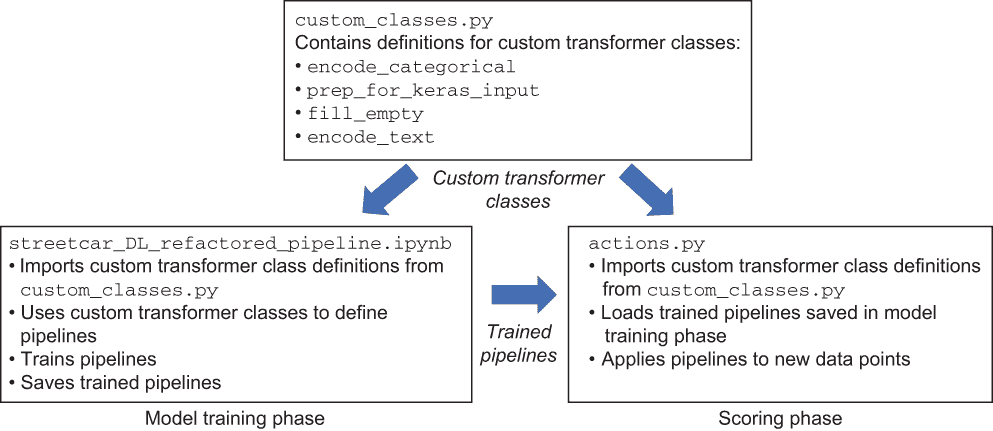

图 8.20 包含管道代码的文件之间的关系

得分代码将我们想要获取延误预测的街车行程的数据点加载到 Pandas 数据框 `score_df` 中。在以下语句中，将这些管道应用于此数据框：

```
prepped_xform1 = pipeline1.transform(score_df)
prepped_xform2 = pipeline2.transform(prepped_xform1)
```

现在，可以将这些管道的输出应用于训练好的模型，以预测街车行程是否会延误：

```
pred = loaded_model.predict(prepped_xform2, batch_size=BATCH_SIZE)
```

我们已经介绍了在电车延误项目中如何使用管道，从模型训练阶段的管道定义到部署模型在评分阶段对新数据点的应用。管道是强大的工具，通过封装训练过程中使用的用于数据转换的步骤，使得它们可以在评分过程中方便地使用。在电车延误预测项目中，我们在模型训练阶段训练用于数据准备的管道，然后在评分阶段使用相同的管道准备新的输入数据点，用于 Web 部署和 Facebook Messenger 部署。

## 8.14 部署后维护模型

部署并不是训练好的模型的终点。在深度学习模型的全面部署中，监控生产中的模型以确保其性能不会随着时间的推移而变差是至关重要的。如果性能确实变差（称为*模型漂移*或*概念漂移*的现象），则有必要在新鲜数据上重新训练模型。图 8.21 总结了模型维护的周期。当模型经过训练和部署后，需要评估其性能。如果需要，需要使用包括更多近期数据点的数据重新训练模型。然后，需要部署重新训练后的模型。

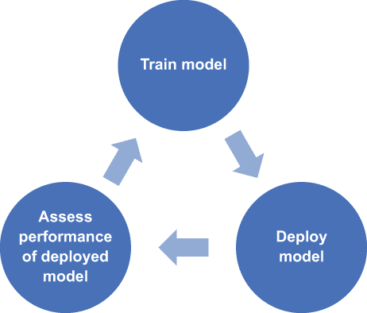

图 8.21 模型维护周期

在工业级部署中维护深度学习模型的详细描述超出了本书的范围。（你可以在[`mng.bz/yry7`](http://mng.bz/yry7) 和 [`mng.bz/ModE`](http://mng.bz/ModE) 找到一些好的建议，以及一个包括部署选项的概述，见 [`mng.bz/awRx`](http://mng.bz/awRx)。）但我们可以看看在模型部署后不遵循模型维护周期会发生什么。以第一章中的信用卡欺诈检测为例。信用卡欺诈预测模型可能捕捉到的信号之一是同一天在物理零售地点使用同一张卡进行的两次交易，而这些地点在一天内不可能往返。例如，目前不可能在 24 小时内乘坐商业航班从魁北克城飞往新加坡，所以如果同一天在同一张卡在魁北克城的高端餐厅支付餐费和在新加坡的珠宝店支付钻石戒指，那就说明有问题。但如果航空公司开始提供魁北克城和新加坡之间的直飞航班，使得在同一天内可以到达这两个城市，会发生什么？如果发生更剧烈的变化，比如在 2030 年代初超音速客机旅行卷土重来，又会怎样？这样的变化将破坏任何依赖于在遥远城市同一天购买信号的欺诈检测模型。为机器学习模型提供的数据通常来自现实世界，而现实世界以不可预测的方式不断变化。我们需要预期我们的模型将需要定期在新鲜数据上重新训练。

模型需要多久重新训练一次？需要监控哪些模型性能指标来确定何时需要重新训练？我们是否可以简单地替换掉旧模型并替换上新模型，或者我们需要在生产中保留两个模型，并在过渡期间使用一个混合评分（部分来自旧模型，部分来自新模型）以避免用户体验的突然变化？请参阅 [`mlinproduction.com/model-retraining`](https://mlinproduction.com/model-retraining) 和 [`mng.bz/ggyZ`](http://mng.bz/ggyZ) 了解关于重新训练问题的更详细讨论。以下是关于模型重新训练的一些最佳实践的简要总结：

+   保存性能指标，以便对部署模型的性能进行评估。为了评估预测的准确性，你需要有预测和匹配的真实世界结果。对于电车延误问题，为了评估一个月内生产中的模型性能，我们需要实际的延误数据和模型对该月路线/方向/时间段组合的预测。如果我们保存一个月内做出的预测，我们可以在一个月后将其与实际延误数据进行比较。

+   选择一个性能度量指标，它能够让你评估模型表现而不会产生过多的延迟。以信用卡欺诈问题为例。假设我们将一个模型投入生产以预测交易是否为欺诈，而我们部署的模型性能度量依赖于一个月内实际欺诈交易的完整报告。可能需要几个月的时间才能得出给定月份所有实际欺诈交易的完整结论。在这种情况下，拥有一个与同一个月内确定无疑为欺诈的交易一起工作的性能度量会更好。简而言之，一个能够尽快产生良好结果以便你快速做出重新训练决策的性能度量比一个产生卓越结果但可能使表现不佳的模型部署数月之久的性能度量要好。

+   使用历史数据进行实验，以了解你的部署模型性能将如何快速退化。对于信用卡欺诈问题，你可以用 2018 年底的数据来训练你的模型，然后应用训练好的模型来预测 2019 年前 6 个月的交易。你可以将这些预测与那些 6 个月的实际欺诈交易数据进行比较，以查看基于 2018 年数据的模型在 2019 年数据上的准确性是否会随着时间的推移而变差。这个过程可能会让你对模型性能退化速度有一个概念，但这并不是万无一失的，因为根据问题的不同，你的数据可能会以意想不到的方式发生变化。

+   在新数据上重复你在训练模型之前所做的数据探索步骤。回想一下我们在第三章中进行的那些数据探索。如果我们对新街车延误数据重复这些步骤，一旦数据可用，我们就可以检测到数据特征的变化，并在发现显著变化时重新训练模型。

让我们以街车延误预测模型为例，看看模型重新训练的问题。首先，让我们看看原始数据。原始数据每月更新一次，但会有两到三个月的延迟。例如，一月份的最新延误数据来自前一年的十月。在良好的开发环境中，从下载最新原始数据到部署更新模型的端到端过程不到一个小时。以这么低的成本，我们每个月重新训练模型是可能的，但这是否必要？我们在第三章中进行的那些数据探索显示，存在一些长期趋势（例如，延误时间变短但更频繁），但月份之间没有巨大的波动。我们可能可以每季度刷新一次模型，但要确保这一点，我们希望通过将预测与可用新月份的实际延误数据进行比较来监控模型的准确性。

此外，我们可能想要进行一些实验，只使用更近期的数据进行模型训练，例如通过保持三年滚动窗口作为训练数据，而不是从 2014 年 1 月以来的整个数据集进行训练。

最后，我们希望为用户提供一种直接反馈他们使用最终应用体验的方式。来自用户子集的直接反馈可以揭示监控中忽视的模型问题。

## 摘要

+   一个训练好的深度学习模型本身并没有用处。为了使其变得有用，你需要部署它，使其能够被其他程序或需要利用模型预测的用户访问。部署是一个挑战，因为它涉及一系列与本书数据准备和模型训练章节中学到的技术方法不同的技术能力。

+   你可以通过使用 Flask，一个 Python 网络框架库，以及一组 HTML 页面来获得你模型的最低部署。通过 Flask、HTML 和 JavaScript 的组合，你的用户可以在网页中输入他们计划乘坐的电车旅行的详细信息，并获得关于旅行是否会延误的预测。在幕后，训练好的深度学习模型使用旅行详细信息被调用，并产生一个预测，该预测被准备在网页中显示。

+   如果你想要更流畅的用户体验，你可以通过结合使用 Rasa 聊天机器人框架和 Facebook Messenger 来部署你的训练好的深度学习模型。当你完成部署后，你的用户可以通过 Facebook Messenger 向聊天机器人发送英语问题，例如“501 路东行是否会延误？”并在 Facebook Messenger 中得到回答（延误/不延误）。在幕后，Rasa 聊天机器人从用户在 Facebook Messenger 中输入的问题中提取关键细节，调用一个 Python 模块，应用训练好的深度学习模型对这些细节进行预测，并将预测结果准备在 Facebook Messenger 中显示。

+   管道允许你封装数据准备步骤（包括为分类列条目分配数值和将数据集从 Pandas 数据框转换为 Keras 深度学习模型所需的格式），以便在训练时间和评分时间（当训练好的模型被应用于新的数据点时，例如电车旅行的/时间/路线/方向组合）应用相同的转换。

+   当你部署了一个训练好的深度学习模型后，你需要监控其性能。如果数据发生变化，模型的性能可能会随着时间的推移而下降，你可能需要使用更近期的数据进行模型重新训练，然后替换当前部署的模型。
