# 9 建议的下一步行动

本章涵盖

+   回顾本书到目前为止所涵盖的内容

+   你可以对电车延误预测项目进行的额外改进

+   你如何将所学应用到其他现实世界项目中

+   选择使用结构化数据的深度学习项目时应使用的标准

+   额外学习的资源

我们几乎到达了这本书的结尾。在本章中，我们将回顾和展望。首先，我们将回顾在前几章中学到的内容，从清理现实世界的数据集到部署训练好的深度学习模型。接下来，我们将讨论你可以采取的步骤来通过新的数据源增强电车延误预测项目。然后，我们将讨论如何将你所学应用到其他现实世界项目中，包括如何确定一个涉及结构化数据的问题是否适合作为深度学习项目。最后，我们将回顾一些关于深度学习的额外学习资源。

## 9.1 回顾本书到目前为止所涵盖的内容

为了回顾本书到目前为止所学的知识，让我们回到第二章中引入的端到端图，如图 9.1 所示。

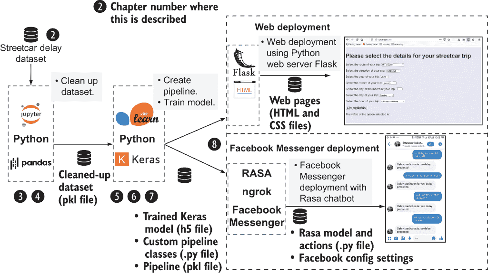

图 9.1 电车延误预测项目的端到端视图

在第二章中，我们学习了如何使用 Pandas 将表格结构化数据集导入 Python。在第三章和第四章中，我们经历了处理数据集问题的过程，包括格式不正确的条目、错误和缺失值。在第五章中，我们对数据集进行了重构，以考虑到它包含了电车延误的信息，但没有关于没有延误情况下的明确信息。我们使用这个重构后的数据集创建了一个简单的 Keras 模型，其层是根据数据集的列结构自动生成的。在第六章中，我们使用准备好的数据集迭代训练这个模型，并利用 Keras 的功能来控制训练过程并保存具有最佳性能特性的模型。在第七章中，我们对训练好的模型进行了一系列实验，以验证删除不良记录和使用嵌入的影响。我们还进行了一个实验，比较深度学习模型与关键竞争对手 XGBoost。在第八章中，我们通过简单的 Web 部署和更复杂的 Facebook Messenger 部署部署了训练好的模型。通过这些部署，我们完成了从原始数据集到一个用户可以使用它来获取电车延误预测的工作系统的旅程。

## 9.2 我们可以用电车延误预测项目做什么下一步

本书到目前为止已经覆盖了很多内容，但我们还可以在电车预测项目中采取其他几种路径。例如，我们可以增加训练数据集以包含额外的数据源。

我们为什么要用额外的数据源来训练模型呢？第一个原因可能是为了尝试提高模型的准确性。可能一个使用额外数据源训练的模型会比我们在第六章中训练的模型做出更准确的预测。从其他来源（如历史天气数据或交通数据）添加数据或利用原始数据集中更多的数据（如延迟位置）可以为模型提供更强的信号，以便在尝试预测延误时检测到。

我们是否事先知道使用额外的数据源训练模型是否会提高模型的延迟预测准确性？简而言之，不知道，但提高模型的准确性并不是增强训练数据集的唯一目标。使用额外的数据源训练模型的第二个原因是，这样做是一个很好的学习练习。在您使用额外数据源训练模型的过程中，您将了解更多关于代码的知识，并为下一步做好准备：将结构化数据方法应用于全新的数据集，如第 9.8 节中介绍的那样。

在以下几节中，我们将简要回顾一些您可以添加到用于训练模型的数据库中的额外数据。第 9.4 节回顾了您如何利用原始数据集中存在但未用于第六章中我们进行的模型训练的延迟位置数据。它展示了您如何使用包含全新数据源的数据集来训练模型：历史天气信息。第 9.5 节为您提供了一些想法，说明您如何通过从第六章中用于训练模型的数据库中派生新列来增强训练数据。在您审阅了这些章节后，您将准备好阅读第 9.8-9.11 节，在那里您将学习如何将用于电车延迟预测问题的方法适应涉及结构化数据的新问题。在第 9.12 节中，您将看到该方法应用于一个具体的新问题，即预测纽约市 Airbnb 列表的价格。

## 9.3 将位置细节添加到电车延迟预测项目中

在第四章中，我们解释了您如何使用谷歌的地理编码 API（[` mng.bz/X06Y`](http://mng.bz/X06Y)）将电车延迟数据集中的位置数据替换为经纬度值。我们没有在扩展示例的其余部分使用这种方法，但您可以回顾一下，看看是否将地理空间数据添加到重构后的数据集中可以提高模型的性能。您预计会得到更高保真度的预测，因为，如图 9.2 所示的延迟热图所示，延迟集中在城市中心。一个起点和终点都在城市中心以外的行程不太可能延误，即使它是在可能遇到延误的路线/方向/时间组合上。

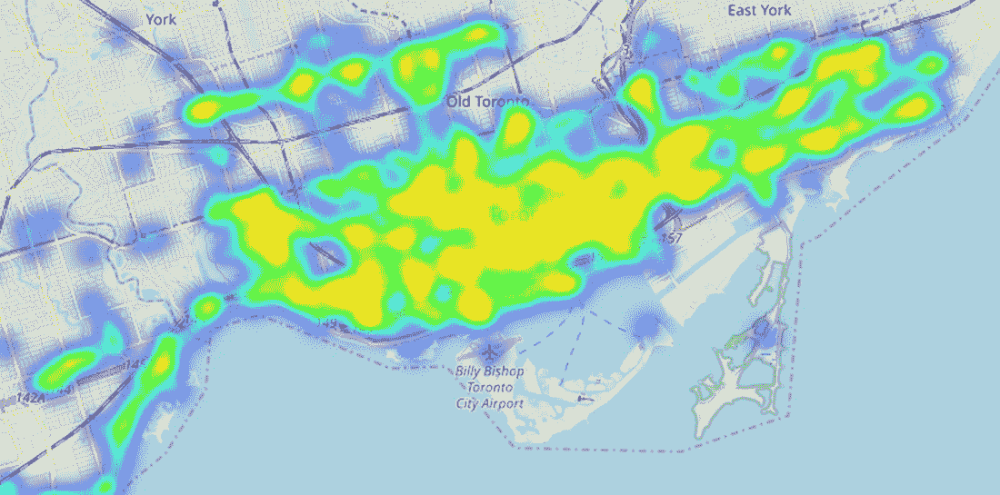

图 9.2 延迟集中在城市的中心部分。

您可以利用从原始数据集中的位置推导出的经纬度值的一种方法是将每条路线划分为子路线。以下是一种基于路线的经纬度值自动将每条路线划分为子节的方法：

1.  在整个路线上定义一个边界框，该边界框由路线的最大和最小经纬度值确定。您可以使用路线上的延迟经纬度值作为整个路线的代理来获取最大和最小值。streetcar_data_geocode_get_boundaries 笔记本中包含了您可以使用的代码，包括`def_min_max()`函数，该函数创建一个包含每个路线的最小和最大经纬度值的 dataframe，如下所示。

    列表 9.1 定义包含路线边界的 dataframe 的代码

    ```
    def def_min_max(df):
        # define dataframes with the maxes and mins for each route
        df_max_lat = \
    df.sort_values('latitude',ascending=False).drop_duplicates(['Route'])
        df_max_long = \
    df.sort_values('longitude',ascending=False).drop_duplicates(['Route'])
        df_min_lat = \
    df.sort_values('latitude',ascending=True).drop_duplicates(['Route'])
        df_min_long = \
    df.sort_values('longitude',ascending=True).drop_duplicates(['Route'])
        # rename column names for final dataframe
        df_max_lat = df_max_lat.rename(columns = {'latitude':'max_lat'})
        df_max_long = df_max_long.rename(columns = {'longitude':'max_long'})
        df_min_lat = df_min_lat.rename(columns = {'latitude':'min_lat'})
        df_min_long = df_min_long.rename(columns = {'longitude':'min_long'})
        # join the max dataframes
        df_max = pd.merge(df_max_lat,df_max_long, on='Route', how='left')
        df_max = df_max.drop(['longitude','latitude'],1)
        # join the min dataframes
        df_min = pd.merge(df_min_lat,df_min_long, on='Route', how='left')
        df_min = df_min.drop(['longitude','latitude'],1)
        # join the intermediate dataframes to get the df with the bounding boxes
        df_bounding_box = pd.merge(df_min,df_max, on='Route', how='left')
        return(df_bounding_box)
    ```

1.  图 9.3 显示了部分路线的最小和最大纬度和经度值。

    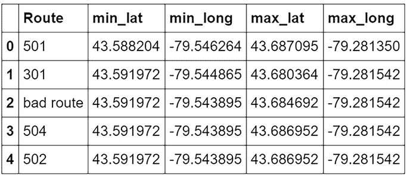

    图 9.3 部分路线的最小和最大纬度和经度值

1.  现在您已经为每条路线定义了边界框，作为每条路线的最大和最小经纬度值，您可以将边界框沿其主轴划分为若干（例如，10 个）等大小的矩形。对于大多数路线，这个轴将是东西轴。对于斯帕丁纳和巴瑟斯特路线，它将是南北轴。结果将为每条路线定义子路线，由最小和最大经纬度值确定。图 9.4 显示了斯克莱尔路线的子路线边界框可能的样子。

    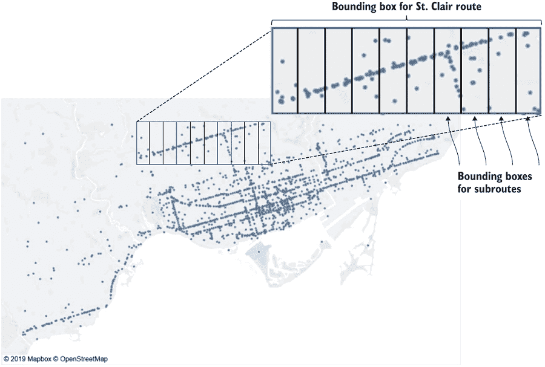

    图 9.4 斯克莱尔路线的子路线边界框

1.  在为每条路线定义了这些子路线之后，您可以在重构的数据集中添加一个列，以便每个修订后的重构数据集的行代表一个路线/子路线/方向/日期和时间组合。使用延迟位置的经纬度值，对于每个延迟，您可以确定发生延迟的子路线。图 9.5 显示了原始重构数据集的一个片段，图 9.6 显示了在添加子路线列后重构数据集的外观。

    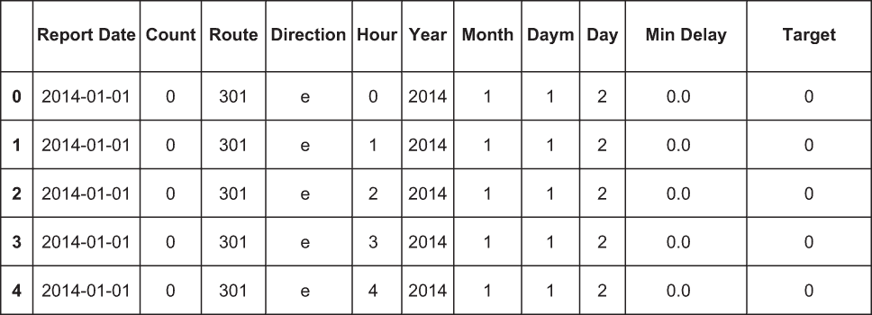

    图 9.5 原始重构数据集

    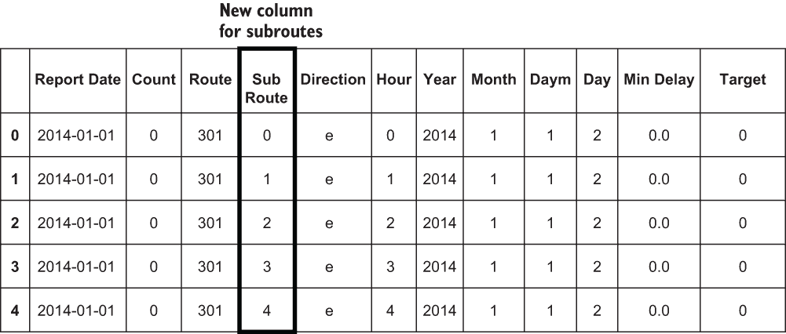

    图 9.6 添加了子路线列的重构数据集

当你为重构后的数据集添加了子路由并使用这个增强的数据集重新训练了模型后，你面临的一个挑战是如何让用户定义他们正在通过给定路由的哪些子路由。为了使用修订后的模型得分，你需要从用户那里获取他们的旅行起点和终点位置。对于网络部署，你可以在 home.html 中添加一个新的控件，让用户选择他们的旅行子路由。使用网络部署的用户体验可能不是理想的，那么增强 Facebook Messenger 部署以允许用户指定子路由怎么样？你可以采取两种方法：

+   增强 Rasa 模型，允许用户输入主要交叉街道名称，然后使用 geocode API 将这些街道的交叉口转换为纬度和经度值。

+   使用 Facebook Messenger 的 webview 功能([`mng.bz/xmB6`](http://mng.bz/xmB6))在网页中显示一个交互式地图小部件，允许用户选择路线点。

总体而言，将子路由添加到电车延误预测模型可能会提高性能，但将网络部署或 Facebook Messenger 部署调整为允许用户指定他们的旅行起点和终点将是一项非同小可的工作。

## 9.4 使用天气数据训练我们的深度学习模型

多伦多拥有四个不同的季节，冬季和夏季的天气极端。这些极端可能会影响电车延误。例如，即使是轻微的降雪也可能导致交通拥堵，从而延误整个网络中的电车。假设我们想利用天气数据来查看它是否能够提供更好的电车延误预测。我们从哪里开始？本节总结了将天气数据添加到电车延误预测模型中所需进行的操作。

第一个挑战是找到一个天气数据源，将其纳入训练数据集。有几个开源数据源([`mng.bz/5pp4`](http://mng.bz/5pp4))提供天气信息。图 9.7 显示了练习此类数据源端点的界面：Dark Sky([`mng.bz/A0DQ`](http://mng.bz/A0DQ))。你需要提供凭证（如 GitHub ID 和密码）来访问此接口，尽管你得到了免费的 API 调用配额，但你仍需要提供支付信息来运行 API 的测试练习。

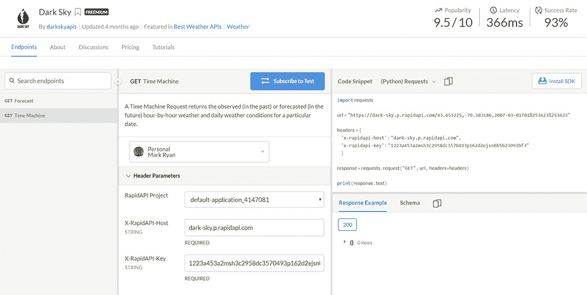

图 9.7 练习天气信息 API

假设我们想查看 2007 年 3 月 3 日早上在多伦多市政厅的天气情况。以下是 API 所需的参数：

+   日期时间：2007-03-01T01:32:33

+   经度：-79.383186

+   纬度：43.653225

API 接口显示了此请求的 Python API 调用看起来是什么样子，如下一列表所示。

列表 9.2 Dark Sky API 接口生成的示例代码

```
import requests

url = https://dark-sky.p.rapidapi.com/\
43.653225,-79.383186,2007-03-01T01%253A32%253A33        ❶ 

headers = {
    'x-rapidapi-host': "dark-sky.p.rapidapi.com",
    'x-rapidapi-key': <API KEY>                         ❷ 
    }

response = requests.request("GET", url, headers=headers)

print(response.text)
```

❶ 使用日期/时间和经纬度输入构建的 URL

❷ 要运行此调用，您需要获取 Dark Sky 的 API 密钥并将其粘贴在此处。

图 9.8 显示了此 API 调用返回的结果。我们如何使用这些天气数据？首先，我们希望控制需要进行的 API 调用次数，以最小化整体成本。每次 Dark Sky 调用的成本是几分之一美分，但如果不够小心，整体成本可能会很高。考虑以下获取特定位置和时间的天气数据的方法：

1.  使用第 9.3 节中介绍的子路由，并通过使用每个子路由边界框的平均纬度和经度值来获取每个子路由的独立天气数据点。

1.  对于每个子路由，每小时获取四个天气数据点。

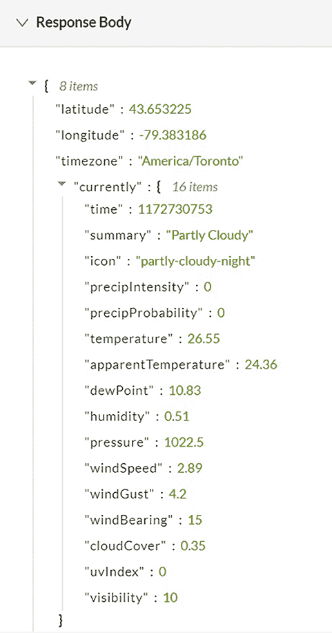

图 9.8 2007 年 3 月 3 日早上天气 API 调用对多伦多市政厅的天气详情响应

采用这种方法，我们需要超过 3100 万个天气数据点来覆盖从 2014 年 1 月开始的数据集。所有这些 API 调用的成本将超过 40,000 美元——对于一个实验来说，这是一个巨大的成本。我们如何在不需要这么多数据点的情况下仍然获取有用的天气数据？

我们很幸运，电车延误问题局限于一个相对较小的地理区域，并且有可预测的天气模式，因此我们可以做出一些简化的假设来控制所需的天气数据点数量。以下简化假设将使我们能够以最少的 API 调用次数将天气数据添加到重构后的数据集中：

+   *特定小时的天气条件是一致的。我们每天只获取 24 个天气数据点，而不是每小时多个数据点。天气确实可能在小时内发生变化，但导致电车延误的天气（如大雨或大雪）很少在多伦多一个小时内开始和结束。我们可以安全地每小时读取一次天气数据。*

+   *电车网络中的天气条件是一致的。整个电车网络位于一个东西宽 26 公里、南北宽 11 公里的区域内，如图 9.9 中的边界框所示，因此可以合理地假设，导致电车延误的天气类型在整个网络中的任何时间都是一致的。也就是说，如果网络西端的 Long Branch 下大雪，那么网络东端的 The Beach 很可能也在下雪。基于这个假设，我们可以使用(43.653225, -79.383186)，即多伦多市政厅的纬度和经度，对所有天气 API 的调用。*

+   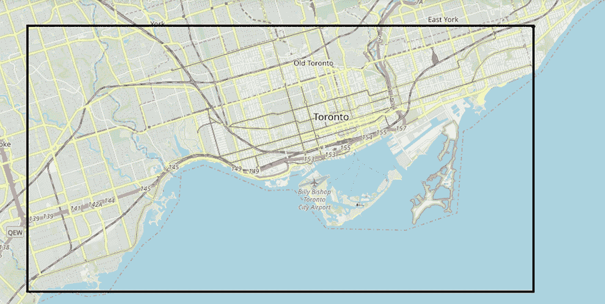

    图 9.9 电车网络的边界框

这里是电车网络纬度和经度的极端值：

```
min_lat = 43.58735
max_lat = 43.687840
min_long = -79.547860
max_long = -79.280260  
```

在这些简化假设下，我们需要从 2014 年 1 月 1 日以来的每小时天气数据，大约有 52,500 个数据点。考虑到 Dark Sky 按 API 调用收费，生成所需天气数据点将花费大约 60 美元。

现在我们已经确定了所需的历天气候数据量，我们希望将哪些天气特征纳入数据集中？以下是一些可能对预测电车延误相关的明显天气数据集字段：

+   *温度* —在没有活跃降水的情况下，温度极端值可能与延误有关。温度将是数据集中的连续列。

+   *图标* —该字段中的值，如“雪”或“雨”，整洁地封装了天气状况。图标将是数据集中的分类列。

+   *摘要* —该字段中的值，如“全天降雨”和“上午开始轻雪”，提供了关于图标列中捕获的整体天气状况的额外背景信息。摘要列可能是一个文本列。回想一下，用于在第六章训练深度学习模型的重构数据集不包含任何文本列。将摘要作为文本列添加将很有趣，因为它将锻炼深度学习模型代码的一个方面，而核心电车延误数据集没有利用这一点。

假设你得到了前面列表中描述的天气数据点，你需要更新电车模型训练笔记本中的数据集重构代码，以包含天气字段。特别是，你需要将天气字段的列名添加到`def_col_lists` `()`中的适当列表中：

+   将温度列名添加到`continuouscols`。

+   将摘要列名添加到`textcols`。

如果你没有将图标列名放入任何其他列表中，它将自动添加到分类列的列表中，这正是我们想要的。

训练代码编写为适用于任何一列，只要在`def_col_lists` `()`中正确识别了列名。其余的训练代码应与新列一起工作，并为你提供一个包含天气列的新训练模型。

当您有一个包含天气列的已训练模型时，当用户想知道他们的电车行程是否会延误时，您如何在评分时间考虑天气条件？首先，您将新的天气列添加到评分代码中的`score_cols`列表中。这个列表是得分列的列表，用于定义`score_df`，即包含通过评分代码中的管道运行值的 dataframe。您可以在评分代码中调用 Dark Sky API 以获取当前天气条件，使用之前提到的多伦多市政厅的纬度和经度，并构建符合 Dark Sky 要求的当前时间字符串：[YYYY]-[MM]-[DD]T[HH]:[MM]:[SS]。所以如果当前日期是 2021 年 5 月 24 日，时间是中午，Dark Sky API 的日期时间字符串是 2020-05-24T12:00:00。当您从 API 调用中获取所需的天气字段时，您可以使用这些值来设置`score_df`中的天气列。评分代码将`score_df`通过管道运行，并将管道的输出应用于训练模型，从而得到延误预测。由于之前提到的简化假设，您在评分时间不需要从用户那里获取任何信息来获取评分所需的天气数据。

图 9.10 总结了通过 Facebook Messenger 部署将天气数据纳入电车延误预测深度学习项目所需的更改。为了适应 Web 部署，您需要对 Web 部署的主要 Python 程序`flask_server.py`中的评分代码进行类似的更改，如图 9.10 中为`actions.py`（Facebook Messenger 部署的主要 Python 程序）所指定的。

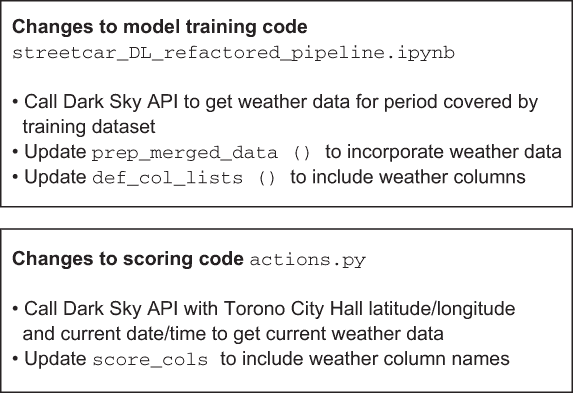

图 9.10 添加天气数据到电车延误模型所需更改的总结

将天气数据添加到您的深度学习模型中的这项练习不仅为您提供了提高模型性能的机会，还展示了您需要采取的步骤以将其他数据源添加到电车延误深度学习模型中。您可以从本节中描述的步骤中推断出创建基于新数据集的深度学习模型的方法。第 9.8 节介绍了将本书中描述的方法应用于新结构化数据集所需采取的额外步骤。但在我们查看新项目之前，在第 9.5 节中，我们将探讨两个简单选项，以增强电车延误预测项目的训练数据集。

## 9.5 将季节或一天中的时间添加到电车延误预测项目中

在 9.3 节和 9.4 节中，我们回顾了我们可以添加到模型训练数据中的两个额外数据源：延迟位置数据和天气数据。这两个数据源相对难以添加到训练过程中。如果你想采取更简单的方法向训练数据集添加数据，你可以尝试从我们在第六章中用于训练模型的数据库中的列推导出新列。例如，从月份列中推导出的季节列，值为 0-3 代表四个季节，这是一个相对简单的添加。

由于你可以从月份列中推导出季节列，你也可以从小时列中推导出一天中的时间列。这个列的有趣之处在于你可以控制每天每个时间段的边界。假设你定义了一个包含五个值的一天中的时间列：

+   深夜

+   早晨高峰时段

+   中午

+   下午高峰时段

+   晚上

你可以尝试为每个类别不同的开始和结束时间进行实验，看看对模型性能的影响。如果你将早晨高峰时段定义为从 5:30 到上午 10 点而不是从 6:30 到上午 9:00，这会对模型性能产生影响吗？

## 9.6 插补：移除包含不良值的记录的替代方案

在第七章中，我们进行了一个实验，比较了模型性能与两种训练数据集形式：

+   排除包含不良值的记录（如包含无效路线的记录）

+   包含包含不良值的记录

这个实验的结论是，当移除不良值时，模型的性能更好。尽管有这个结论，我们为移除包含不良值的记录付出了代价。对于在 2019 年底之前使用延迟数据在数据准备笔记本上进行的给定运行，输入数据集中大约有 78,500 条延迟记录，但在移除不良值记录后，只有大约 61,500 条记录。在这种情况下，当我们移除不良记录时，我们失去了大约 20%的记录。重要的是要记住，当记录在一个字段中有不良值时，我们会移除整个记录，因此当我们丢弃所有包含不良值的记录时，我们可能会丢失信号的有用部分。有没有任何替代方案可以让我们保留一些丢失的信号？

事实上，一种称为*插补*的方法，即用另一个值替换缺失值，可能会有所帮助。在结构化、表格数据的情况下，可用的插补类型取决于列的类型：

+   *连续型* —你可以用固定值（如零）或计算值（如该列所有值的平均值）来替换缺失值。

+   *分类型* —你可以用列中最常见的值来替换缺失值，或者采取更复杂的方法应用模型（如使用 1,000 个最近邻）来找到缺失值的替代值。

如果你想要对电车延迟预测模型进行插补实验，你可以在处理缺失值的文章中找到关于插补方法的更完整讨论（[`mng.bz/6AAG`](http://mng.bz/6AAG)）。

## 9.7 使电车延迟预测模型的网页部署普遍可用

在第八章中，我们描述了如何创建训练模型的简单网页部署。第八章中描述的网页部署完全是本地的；你只能在部署的系统上访问它。如果你想与其他系统上的朋友分享这个部署怎么办？

打开网页部署最简单的方法是使用 ngrok，这是我们第八章中用于 Facebook Messenger 部署的实用程序。在第八章中，我们使用 ngrok 将 localhost 外部化，以便你的 Facebook 应用程序可以与运行在你本地系统上的 Rasa 聊天机器人服务器通信。

要使用 ngrok 使你的网页部署在本地系统之外可访问，请按照以下步骤操作：

1.  如果你还没有这样做，请按照 [` ngrok.com/download`](https://ngrok.com/download) 上的安装说明安装 ngrok。

1.  在你安装 ngrok 的目录中，调用 ngrok 使你的系统上的 localhost:5000 可以外部访问。以下是 Windows 的命令：

    ```
    .\ngrok http 5000 
    ```

1.  复制 ngrok 输出中的 https 转发 URL，如图 9.11 所示。

    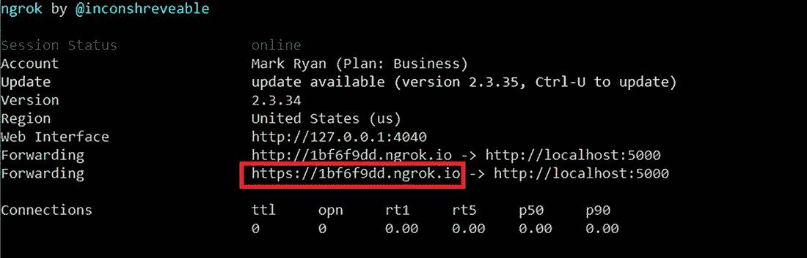

    图 9.11 ngrok 输出，突出显示转发 URL

1.  在 deploy_web 目录下运行此命令以启动网页部署：

    ```
    python flask_server.py
    ```

现在你已经运行了 ngrok 将 localhost:5000 外部化，网页部署将通过 ngrok 提供的转发 URL 对其他用户可用。如果其他用户在浏览器中打开 ngrok 转发 URL，他们将看到如图 9.12 所示的 home.html。

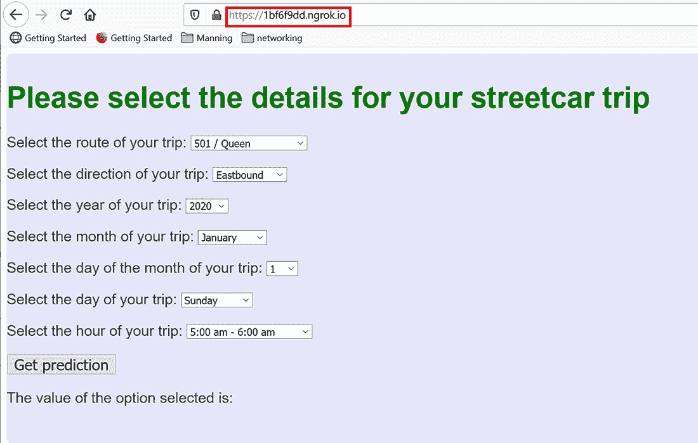

图 9.12 通过 ngrok 提供的具有外部访问 URL 的 home.html

当另一个系统上的用户在 ngrok 转发 URL 中打开 home.html 时，他们可以选择评分参数并点击获取预测以显示他们的电车行程的延迟预测。请注意，只有当你的本地系统连接到互联网且 flask_server.py 正在运行时，此部署才对其他用户可用。另外请注意，使用免费 ngrok 计划，每次调用 ngrok 时都会获得不同的转发 URL。如果你需要为 ngrok 的网页部署获取一个固定 URL，你需要选择 ngrok 的付费订阅选项之一。

在 9.3-9.5 节中，我们介绍了一些可能改进电车延迟预测模型性能的额外数据源的想法。在第 9.8 节中，我们将概述如何将用于电车延迟问题的方法应用于新的问题。

## 9.8 将电车延迟预测模型适配到新的数据集

前几节概述了如何通过在模型的训练集中加入额外的数据来增强电车延误预测模型。如果您想将模型适应不同的数据集，本节总结了将本书中描述的方法适应新的结构化数据集的步骤。

本书中的代码示例可以应用于其他表格结构化数据集，但您需要采取一些步骤，如图 9.13 所示，以适应电车延误预测代码。

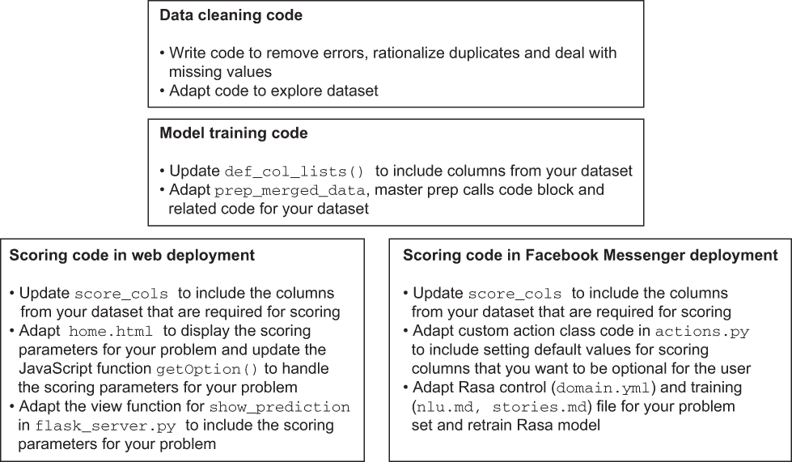

图 9.13 创建新数据集模型所需更改的摘要

当您考虑将本书中描述的方法应用于新的数据集时，第一个挑战是数据集是否满足应用深度学习的最低要求。以下是一些可以考虑用于深度学习的结构化数据集的特征：

+   *足够大* —回想一下第三章中关于为了使深度学习有成功机会，结构化数据集需要有多大规模的讨论。没有至少数万条记录的数据集太小。另一方面，除非您有经验和资源将大数据方法添加到您的工具箱中，否则拥有数千万条记录的数据集将是一个挑战。一个拥有超过 70,000 条记录但少于 1,000 万条记录的数据集是一个良好的起点。

+   *异构性* —如果您的数据集完全由连续列组成，您将使用 XGBoost 等非深度学习方法进行预测，从而获得更好的投资回报。但如果您的数据集包括各种列类型，包括分类列和特别是文本列，那么它可能是一个深度学习的良好候选者。如果您的数据集包含包含非文本 BLOB 数据（如图像）的列，您可以通过将深度学习应用于整个数据集而不是仅应用于 BLOB 数据，从而获得许多好处。

+   *不太失衡* —在重构的电车延误数据集中，大约 2%的记录表明记录的路线/方向/时间段有延误。如第六章所述，Keras 的`fit`命令有参数可以考虑到不平衡的数据集。但如果数据集极度失衡，只有极小的一部分属于某个结果，深度学习模型可能无法捕捉到表征少数结果的信号。

让我们考虑一些公开的数据集，并将这些指南应用于它们，以快速评估与这些数据集相关的问题是否可以通过深度学习方法解决：

+   *交通信号车辆和行人流量* ([`mng.bz/ZPw9`](http://mng.bz/ZPw9))——这个数据集来自与电车延误数据集相同的精选集合。它包含多伦多一组交叉路口的交通流量信息。使用这个数据集来预测未来的交通流量将很有趣。这个问题适合作为深度学习项目吗？图 9.14 显示，该数据集包含各种列，包括连续列、分类列和地理空间列。

    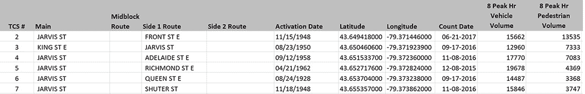

    图 9.14 交通信号车辆和行人流量数据集的列

    图 9.15 显示，流量分布并不太不平衡。

    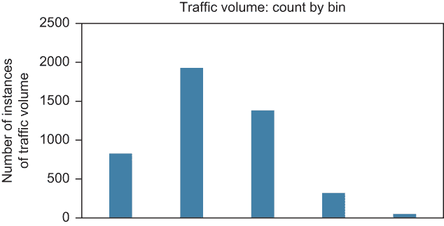

    图 9.15 交通信号车辆和行人流量数据集的流量分布

+   这个数据集的问题在于它太小——只有 2,300 条记录——所以尽管它有一组有趣的列和良好的平衡性，但这个数据集并不适合作为深度学习项目。那么，一个覆盖与电车延误类似但不同的问题的数据集会怎样呢？

+   *多伦多地铁延误数据集* ([`open.toronto.ca/dataset/ttc-subway-delay-data`](https://open.toronto.ca/dataset/ttc-subway-delay-data))——如图 9.16 所示，地铁延误数据集包括多种类型的列，包括分类列、连续列和地理空间列。整个数据集大约有 50 万条记录，因此它足够大，有趣，但又不至于难以处理。

+   与电车延误数据集相比，这个数据集稍微平衡一些，因为地铁系统报告的延误是电车系统的约七倍。这个数据集的位置数据的有趣之处在于它是精确的。每个延误都与多伦多地铁的 75 个车站中的一个相对应，任何两个车站之间的空间关系很容易编码，无需使用经纬度。此外，在评分时，用户可以通过从下拉列表中选择地铁站来精确指定行程的开始和结束。因此，将位置信息纳入地铁延误预测模型的训练数据比向电车延误模型添加位置数据要容易得多。总的来说，地铁延误预测项目是深度学习的一个不错的候选项目。

    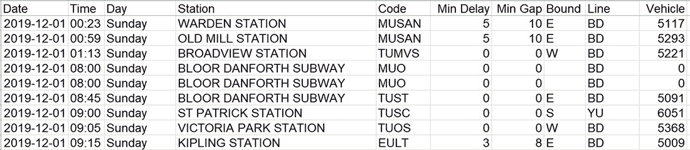

    图 9.16 地铁延误数据集

现在我们已经查看了一些可能适合深度学习的结构化数据集，第 9.9 节概述了为训练深度学习模型准备新数据集所需的步骤。

## 9.9 准备数据集和训练模型

当你选择了一个想要围绕其构建深度学习项目的 dataset 后，下一个挑战就是清理这个 dataset。你在第三章和第四章中看到的例子应该能指导你处理 dataset 中的错误和缺失值，尽管所需的清理步骤将根据 dataset 及其杂乱程度而有所不同。

关于数据清理的话题，你可能会问为什么在第 9.4 节中描述的天气数据没有考虑数据清理。为了回答这个问题，我想回到第二章的一个例子：从各种媒体创建蓝光光盘（图 9.17）。


图 9.17 从各种媒体创建蓝光光盘

这个示例的目的是为了说明，由于各种媒体内容最初并没有考虑到使用蓝光光盘进行记录，因此，那些对深度学习感兴趣的 dataset 并不是有意用于机器学习或深度学习的应用而收集的。这些杂乱的真实世界 dataset 在使用之前必须进行清理，以便用于训练深度学习模型。另一方面，像 Dark Sky 的天气数据或从 Google API 可用的地理编码数据这样的数据源，是为了提供干净、连贯的数据流而设计的，不需要进行清理。这些数据源对于深度学习来说，就像高清数字视频片段对于蓝光光盘问题一样：无需清理即可直接整合。

当你清理完新的 dataset 后，下一步是替换任何非数值值，例如通过将分类值替换为整数标识符。你可以调整训练代码来创建一个新的 dataset 的 dataframe。就像添加天气数据的例子一样，你需要将用于训练模型的列与`def_col_lists()`函数中的正确类别关联起来。此外，你还需要确定你的 dataset 中哪个列包含目标值。通过这些更改，你应该能够训练一个模型来对新 dataset 进行预测，并最终得到一个训练好的模型以及用于准备数据的训练好的管道。

在我们更详细地讨论如何将电车延误问题的代码适应到其他领域之前，值得回顾一下在第四章中引入的一个想法：在机器学习项目中领域知识的重要性。在第四章中，我解释了选择电车延误问题作为本书扩展示例的原因之一，即我对这个话题恰好有所了解。当你考虑将深度学习应用于新的领域时，请记住这一点：无论是一个旨在磨练自己技能的适度副项目，还是一个组织押注未来的重大项目，你都需要获取该领域专业知识。

## 9.10 使用 Web 部署部署模型

现在你已经有一个训练好的深度学习模型和针对新数据集的管道，是时候考虑如何部署模型了。如果你选择使用第八章中描述的 Web 部署选项来部署你的新模型，你将需要在 deploy_web 目录中的代码进行以下更新：

+   更新 home.html 中的下拉列表（如下代码片段所示），以反映用户能够选择并发送到训练模型进行评分的评分参数。在街车延误预测的 Web 部署中，所有评分参数都是分类的（也就是说，可以从列表中的元素中选择）。如果你的模型包括连续的评分参数，你需要在 `home.html` 中添加控件，以便用户可以输入连续值：

+   ```
    <select id="route"> 
       <option value="501">501 / Queen</option> 
       <option value="502">502 / Downtowner</option> 
       <option value="503">503 / Kingston Rd</option> 
       <option value="504">504 / King</option> 
       <option value="505">505 / Dundas</option> 
       <option value="506">506 / Carlton</option> 
       <option value="510">510 / Spadina</option> 
       <option value="511">511 / Bathurst</option> 
       <option value="512">512 / St Clair</option> 
       <option value="301">301 / Queen (night)</option> 
       <option value="304">304 / King (night)</option> 
       <option value="306">306 / Carlton (night)</option> 
       <option value="310">310 / Spadina (night)</option> 
    </select>
    ```

+   更新 home.html 中的 `getOption` `()` JavaScript 函数，以便将模型的评分参数加载到 JavaScript 变量中。以下代码块展示了 `getOption()` 函数中加载街车延误预测模型评分参数到 JavaScript 变量的代码：

+   ```
    selectElementRoute = document.querySelector('#route');
    selectElementDirection = document.querySelector('#direction');
    selectElementYear = document.querySelector('#year');
    selectElementMonth = document.querySelector('#month');
    selectElementDaym = document.querySelector('#daym');
    selectElementDay = document.querySelector('#day');
    selectElementHour = document.querySelector('#hour');
    route_string = \
     selectElementRoute.options\
    [selectElementRoute.selectedIndex].value 
    direction_string = \
    selectElementDirection.options\
    [selectElementDirection.selectedIndex].value
    year_string = \
    selectElementYear.options\
    [selectElementYear.selectedIndex].value
    month_string = \
    selectElementMonth.options\
    [selectElementMonth.selectedIndex].value
    daym_string = \
    selectElementDaym.options\
    [selectElementDaym.selectedIndex].value
    day_string = \
    selectElementDay.options\
    [selectElementDay.selectedIndex].value
    hour_string = \
     selectElementHour.options\
    [selectElementHour.selectedIndex].value
    ```

+   更新 home.html 中的 `getOption()` JavaScript 函数，以构建包含模型评分参数的目标 URL。以下代码片段展示了 `getOption` `()` 中定义街车延误预测部署目标 URL 的语句：

+   ```
    window.output = \
    prefix.concat("route=",route_string,"&direction=",\
    direction_string,"&year=",year_string,"&month=",\
    month_string,"&daym=",daym_string,"&day=",\
    day_string,"&hour=",hour_string)
    ```

+   更新 flask_server.py 中 show_prediction.html 的视图函数，以构建你希望在 show_prediction.html 中显示的字符串，用于每个预测结果：

+   ```
        if pred[0][0] >= 0.5:
            predict_string = "yes, delay predicted"
        else:
            predict_string = "no delay predicted"
    ```

通过这些更改，你应该能够使用第八章中描述的 Web 部署来简单地部署你的新模型。

## 9.11 使用 Facebook Messenger 部署模型

如果你选择使用第八章中描述的 Facebook Messenger 部署方法来解决你的新问题，你将需要更新 actions.py 中的评分代码，包括将 `score_cols` 设置为训练模型所使用的列名。你还需要更新设置默认值的代码，以防用户在评分时没有提供这些值。通过这些更改，你将拥有准备就绪的 Python 代码，用于使用训练好的模型评分新的数据点。

使用 Rasa 与 Facebook Messenger 进行部署时，Python 代码并不是全部。你还需要在 Facebook Messenger 中有一个自然的界面，为此，你需要创建一个简单的 Rasa 模型。你可以从街车延误部署的示例中了解如何指定 nlu.md 文件中的句子级 Rasa 训练示例和在 stories.md 文件中的多句子 Rasa 示例。定义正确的 slot 集合更具挑战性。我建议你为`score_cols`中的每个列名创建一个 slot。你可以在 domain.yml 文件中定义这些 slot。为了简化，你可以将每个 slot 的类型设置为 text。最好避免不必要的 slot，所以如果你是从街车延误示例中复制 domain.yml 文件作为起点，请在定义新的 slot 值之前清除现有的 slot 值。

要完成新模型部署的其余部分，你将遵循第八章中部署街车延误预测模型时遵循的以下步骤子集：

1.  创建一个名为 new_deploy 的目录。

1.  在 deploy 目录中运行以下命令以设置基本的 Rasa 环境：

    ```
    rasa init
    ```

1.  分别将你的训练模型的 h5 文件和 pipelines 的 pkl 文件复制到 models 和 pipelines 目录。

1.  将 new_deploy 目录中的 actions.py 文件替换为你为新的部署更新的 actions.py 文件。

1.  将 data 子目录中的 nlu.md 和 stories.md 文件替换为你为新的部署创建的 nlu.md 和 stories.md 文件。

1.  将 new_deploy 目录中的 domain.yml 文件替换为你的新部署的 domain.yml 文件。

1.  将 repo 中的 custom_classes.py 和 endpoints.yml 文件复制到新的 deploy 目录。

1.  将 deploy_config.yml 配置文件复制到新的 deploy 目录，并更新 pipeline 和模型文件名参数以匹配步骤 3 中复制的文件，如下所示。

    列表 9.3 需要在部署配置文件中更新的参数

    ```
    general:
       debug_on: False
       logging_level: "WARNING" # switch to control logging - WARNING for full
       ➥ logging; ERROR to minimize logging
       BATCH_SIZE: 1000
    file_names:
       pipeline1_filename: <your pipeline1 pkl file>     ❶ 
       pipeline2_filename: <your pipeline2 pkl file>
       model_filename: <your trained model file>         ❷ 
    ```

    ❶ 替换为步骤 3 中复制到 pipelines 目录的 pipeline 文件名。

    ❷ 替换为步骤 3 中复制到 models 目录的训练模型 h5 文件名。

1.  在你的 new_deploy 目录中运行以下命令以在 Rasa 的 Python 环境中调用 actions.py：

    ```
    rasa run actions
    ```

1.  在你安装 ngrok 的目录中，调用 ngrok 以使你的 localhost 在端口 5005 上可供 Facebook Messenger 使用。以下是 Windows 的命令；注意 ngrok 输出中的 HTTPS 转发 URL：

    ```
    .\ngrok http 5005 
    ```

1.  在 new_deploy 目录中运行以下命令以训练 Rasa 模型：

    ```
    rasa train
    ```

1.  按照以下链接中的说明 http://mng.bz/oRRN 添加一个新的 Facebook 页面。您可以使用在第八章中创建的相同 Facebook 应用进行这次新部署。注意记录页面访问令牌和应用程序密钥；您需要在第 13 步更新 credentials.yml 文件，并使用这些值。

1.  更新 new_deploy 目录中的 credentials.yml 文件，以设置验证令牌（您选择的字符串值）、密钥和页面访问令牌（在第 12 步的 Facebook 设置期间提供）：

    ```
    facebook:  
      verify: <verify token that you choose>
      secret: <app secret from Facebook app setup>
      page-access-token: <page access token from Facebook app setup>
    ```

1.  在 new_deploy 目录中运行以下命令以启动 Rasa 服务器，使用第 13 步在 credentials.yml 中设置的凭据：

    ```
    rasa run —credentials credentials.yml 
    ```

1.  在第八章中创建的 Facebook 应用中，选择“消息传递”->“设置”，滚动到 Webhooks 部分，并点击“编辑回调 URL”。将回调 URL 值的前一部分替换为在第 10 步调用 ngrok 时记录的 HTTPS 转发 URL。在第 13 步中设置的 verify token（您选择的字符串值）输入到“验证令牌”字段中，然后点击“验证并保存”。

1.  在 Facebook 消息传递（移动或 Web 应用）中，搜索第 12 步创建的 Facebook 页面的 ID，并输入查询以确认您的部署模型是可访问的。

我们已经审查了将用于电车延误问题的方法适应新结构数据集所需的步骤。现在，当您想要将深度学习应用于结构化数据时，您已经有了应用本书中代码示例所需的新问题。

## 9.12 将本书中的方法适应不同的数据集

为了使将本书中的方法应用于新的问题领域更容易，我们将通过将用于电车延误预测问题的代码适应新数据集的过程。我们不会处理整个端到端问题——只从初始数据集到最小训练的深度学习模型。

我们希望找到一个足够大的数据集，以便给深度学习一个公平的机会（记录数至少在数千条），但又不能太大，以至于数据量成为练习的主要焦点。我检查了流行的机器学习竞赛网站 Kaggle，以找到一个适合的表格结构化数据问题。我发现预测纽约市 Airbnb 物业价格的[`www.kaggle.com/dgomonov/new-york-city-airbnb-open-data`](https://www.kaggle.com/dgomonov/new-york-city-airbnb-open-data)问题有一个有趣的数据集，可能适合适应本书中描述的方法。图 9.18 显示了该数据集的数据片段。

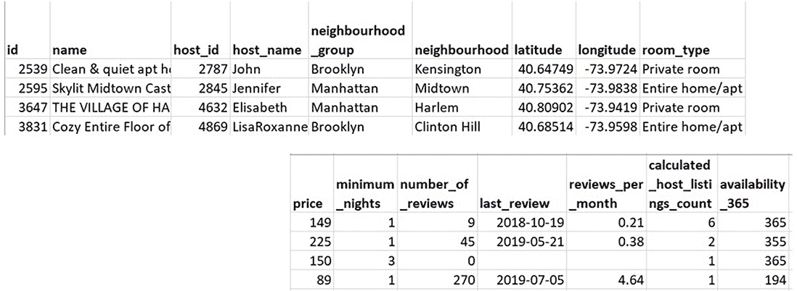

图 9.18 Airbnb 纽约市数据集的示例记录

该数据集包含略少于 89,000 条记录，分布在 16 列中，因此数据集的大小和复杂性是合适的。让我们检查每一列的内容：

+   `id` —列表的数字标识符

+   `name` —列表的描述

+   `host_id` —与列表关联的主人的数字标识符

+   `host_name` —与列表关联的主人的名字

+   `neighbourhood_group` —列表所在的纽约市行政区：曼哈顿、布鲁克林、皇后区、布朗克斯或斯塔滕岛

+   `neighbourhood` —列表所在的社区

+   `latitude` —列表的纬度

+   `longitude` —列表的经度

+   `room_type` —列表的房间类型：整个住宅、私人房间或共享房间

+   `price` —列表的价格（深度学习模型的目标）

+   `minimum_nights` —列表可以预订的最少夜数

+   `number_of_reviews` —Airbnb 网站上可用的列表评论数量

+   `last_review` —列表最近一次评论的日期

+   `reviews_per_month` —列表每月的平均评论数量

+   `calculated_host_listings_count` —与该列表关联的主人的列表数量

+   `availability_365` —该列表一年中可供出租的比例

我们得到了这些列类型的一个有趣的混合：

+   *连续* —`price`、`minimum_nights`、`number_of_reviews`、`reviews_per_month`、`calculated_host_listings_count`、`availability_365`

+   *分类* —`neighbourhood_group`、`neighbourhood`、`room_type`、`host_id`

+   *文本* —`name` 和可能 `host_name`

除了这些容易分类的列之外，还有 `id`（从模型训练的角度来看并不有趣）、`longitude` 和 `latitude`（在本练习中，我们将依赖 `neighborhood` 来确定位置），以及 `last_review`（在本练习中，我们不会使用此列）。

与电车延误数据集相比，Airbnb 纽约市数据集的混乱程度要低得多。首先，让我们看看每个列中缺失值和唯一值的数量（图 9.19）。

与电车延误数据集相比，Airbnb 纽约市数据集具有较少的缺失值列。此外，所有分类列（`neighbourhood_group`、`neighbourhood` 和 `host_name`）似乎都有合理的值数量。相比之下，电车延误数据集中的方向、位置和路线列都包含了一些无关的值。例如，原始电车延误数据集中的方向列有 15 个不同的值，但只有 5 个有效值。

Airbnb 纽约数据集中相对较少的杂乱突显了从 Kaggle 可用的数据集的问题之一。尽管这些数据集对于练习机器学习的各个方面很有用，尽管参加 Kaggle 的比赛是学习的好方法，但用于比赛的精心策划和清洗的数据集并不能替代真实世界的数据集。正如您在第三章和第四章中看到的，真实世界的数据集在意外的方式下很杂乱，并且需要非平凡的工作来准备训练深度学习模型。Airbnb 数据集所需的数据准备量有限（将 CSV 文件导入 Pandas dataframe 并用默认值替换缺失值）包含在 airbnb_data_preparation 笔记本中。

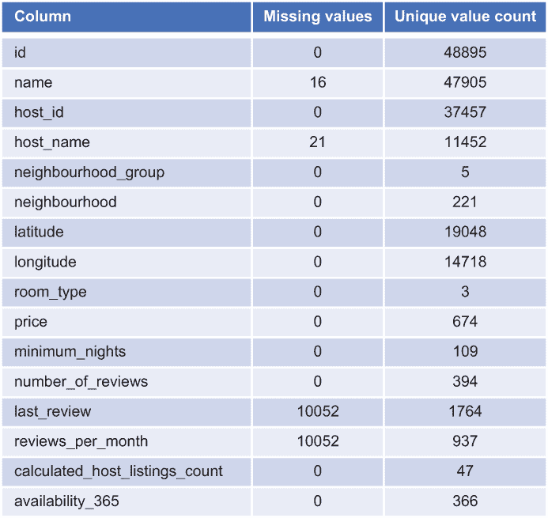

图 9.19 Airbnb 纽约数据集的列特征

下一列表显示了与此示例相关的存储库中的文件。

列表 9.4 与 Airbnb 定价预测示例相关的代码存储库中的代码

```
├── data 
│           AB_NYC_2019_remove_bad_values_jun21_2020.pkl     ❶ 
│ 
├── notebooks
│           airbnb_data_preparation.ipynb                    ❷ 
│           airbnb_data_preparation_config.yml               ❸ 
│           airbnb_model_training.ipynb                      ❹ 
│           airbnb_model_training_config.yml                 ❺ 
```

❶ airbnb_data_preparation 笔记本保存的清洗后的数据集输出

❷ 数据准备笔记本

❸ 数据准备配置文件

❹ 模型训练笔记本

❺ 模型训练配置文件

airbnb_data_preparation 笔记本保存了清洗后的 dataframe 的 pickle 版本，该版本可以用作输入到深度学习模型训练笔记本 airbnb_model_training。这个笔记本是街车延误预测问题模型训练笔记本的简化版本。这个简单模型的目标是 Airbnb 物业的价格是否会低于（`0`）或高于（`1`）平均价格。与本书主要示例中使用的版本相比，这个笔记本的关键变化包括以下内容：

+   列表列的成员资格（分类、连续和文本列）在配置文件 airbnb_model_training_config.yml 中设置，而不是在笔记本本身中（见下一列表）。

+   列表 9.5 Airbnb 价格预测模型列类别的参数

    ```
    categorical:                              ❶ 
          - 'neighbourhood_group'
          - 'neighbourhood'
          - 'room_type'
    continuous:                               ❷ 
          - 'minimum_nights'
          - 'number_of_reviews'
          - 'reviews_per_month'
          - 'calculated_host_listings_count'
    text: []                                  ❸ 
    excluded:                                 ❹ 
          - 'price'
          - 'id'
          - 'latitude'
          - 'longitude'
          - 'host_name'
          - 'last_review'
          - 'name'
          - 'host_name'
          - 'availability_365'
    ```

    ❶ 分类列列表

    ❷ 连续列列表

    ❸ 文本列列表

    ❹ 从模型训练中排除的列列表

+   数据集直接从由 airbnb_data_preparation 笔记本生成的 pickle 文件中读取，并输入到管道中。相比之下，用于街车延误预测模型的模型训练笔记本包含大量代码来重构数据集。

为了检查模型训练如何与 Airbnb 纽约数据集一起工作，我们将运行第六章中用于街车延误预测模型的相同一系列实验，使用以下列来训练模型：

+   *连续* —`minimum_nights`、`number_of_reviews`、`reviews_per_month`、`calculated_host_listings_count`

+   *分类* —`neighbourhood_group`、`neighbourhood`、`room_type`

您可以在图 9.20 中看到这些实验在 Airbnb 纽约模型上的结果。

正如你所见，通过最小量的代码更改，我们能够使用 Airbnb 纽约市数据集获得合理的结果。本节中描述的适应方法远非完整，但它展示了如何将本书中描述的方法适应于训练新的数据集的深度学习模型。

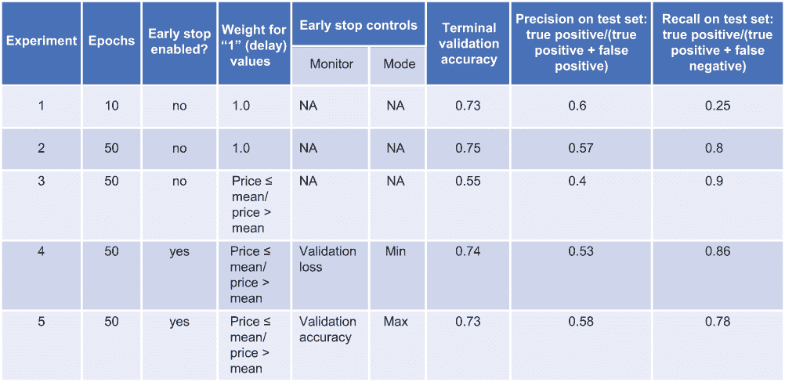

图 9.20 Airbnb 纽约市模型实验摘要

## 9.13 额外学习资源

在本书中，我们涵盖了构建端到端深度学习解决方案以解决电车延误预测问题的广泛技术问题。但当我们谈到深度学习这个极其丰富且快速发展的世界时，我们只是触及了表面。以下是一些额外的资源，如果你想要更深入地了解深度学习，我推荐你查看：

+   *在线* *深度学习概述课程* — fast.ai 的《面向程序员的实用深度学习》课程([`course.fast.ai/`](https://course.fast.ai/))是一个易于理解的深度学习入门课程，侧重于通过实践学习。它涵盖了经典深度学习应用，如图像分类，以及推荐系统和其他深度学习应用。我感谢这门课程激发了我将深度学习应用于结构化数据的兴趣。你可以免费在线跟随课程学习，同时使用课程论坛与其他学习者建立联系。讲师 Jeremy Howard 讲解清晰且充满激情。

+   另一种了解深度学习的方法是 deeplearning.ai 的《深度学习专项课程》([`mng.bz/PPm5`](http://mng.bz/PPm5))。由深度学习传奇人物 Andrew Ng 教授的这一系列在线课程从深度学习的理论基础知识开始，逐步扩展到涵盖编码主题。你可以免费审计 deeplearning.ai 课程，但若要获得课程评分和完成课程后的证书，则需要付费。该专项课程分为五个主题，涵盖了与深度学习相关的技术和实际问题。fast.ai 中的编码工作更有趣，但 deeplearning.ai 在深度学习背后的数学方面做得更好。如果你有时间和精力，完成这两个项目将为你提供一个全面的深度学习基础。

+   *书籍* —我在第一章介绍了 Francois Chollet 的[《Python 深度学习》](https://livebook.manning.com/book/deep-learning-with-python/about-this-book/)，这是一本关于如何使用 Python 应用深度学习的优秀概述。如果你想获得更多使用 fast.ai 课程中使用的 PyTorch 库的经验，[Eli Stevens 等人所著的《PyTorch 深度学习》](https://www.manning.com/books/deep-learning-with-pytorch?query=deep%20learning)是一个很好的资源。[Stephan Raaijmakers 所著的《自然语言处理深度学习》](https://www.manning.com/books/deep-learning-for-natural-language-processing?query=deep%20learning)是一本专注于深度学习特定应用的书籍，[Mohamed Elgendy 所著的《视觉系统深度学习》](https://www.manning.com/books/deep-learning-for-vision-systems?query=deep%20learning)也是如此。如果你想在其他语言中考察深度学习，[François Chollet 和 J. J. Allaire 合著的《R 语言深度学习》](https://www.manning.com/books/deep-learning-with-r?query=deep%20learning)提供了使用其他经典机器学习语言探索深度学习的方法，[Shanqing Cai 等人合著的《JavaScript 深度学习》](https://www.manning.com/books/deep-learning-with-javascript?query=deep%20learning)则展示了如何利用 TensorFlow.js 在 Web 开发的通用语言 JavaScript 中创建深度学习模型。最后，fast.ai 课程的主要讲师 Jeremy Howard 是[《Fastai & PyTorch 深度学习编码者指南》（O’Reilly Media，2020）](https://www.amazon.com/Deep-Learning-Coders-fastai-PyTorch/dp/1492045527)的合著者，这本书不仅扩展了 fast.ai 课程的内容，还包含了一个关于结构化数据深度学习的章节。

+   *其他资源* —除了在线课程和书籍之外，还有许多关于深入学习更多知识的来源。实际上，关于深度学习的材料如此之多，以至于很难确定最佳来源。为了了解前沿动态，arXiv 对最近机器学习提交的审阅列表([`arxiv.org/list/cs.LG/recent`](https://arxiv.org/list/cs.LG/recent))是一个很好的起点，尽管材料的数量和挑战性可能会让人望而却步。我依赖 Medium，尤其是 Towards Data Science 出版物([`towardsdatascience.com`](https://towardsdatascience.com))，以获取关于深度学习主题的定期、易于消化的文章。Medium 也是一个友好的地方，可以撰写文章与对机器学习感兴趣的其他人分享你的技术成就。

除了这些用于深度学习的资源之外，在将深度学习应用于结构化数据领域的进展方面也有一些有趣的发展。例如，Google 的 TabNet ([`arxiv.org/abs/1908.07442`](https://arxiv.org/abs/1908.07442)) 直接针对将深度学习应用于结构化数据的问题。在 [`mng.bz/ v99x`](https://shortener.manning.com/v99x) 的文章中，提供了对 TabNet 方法的精彩总结以及将 TabNet 应用于新问题的实用指南。文章解释说，TabNet 实现了一个注意力机制 ([`mng.bz/JDmQ`](http://mng.bz/JDmQ))，这使得网络能够学习对输入的哪个子集进行关注，并促进了可解释性（识别哪些输入对输出是重要的）。

## 摘要

+   你可以向用于训练电车延误预测模型的数据集中添加额外的数据源。例如，你可以添加关于电车路线子集的信息，以便你的用户能够获得针对电车路线特定部分的预测。你还可以结合天气数据来考虑极端天气对电车延误的影响。

+   本书描述的方法可以应用于其他数据集。通过一些小的修改，你可以将电车延误数据准备和模型训练笔记本适应，以训练一个基本模型来预测纽约市 Airbnb 物业的价格。

+   当你在评估某个结构化数据问题是否适合深度学习时，你应该确认数据集足够大（至少有数万条记录），足够多样化（各种类型的列），并且足够平衡（有足够的示例，以便深度学习模型能够捕捉到信号），以便适用于深度学习。

+   你可以使用 ngrok 将第八章中的 Web 部署提供给本地系统之外的用户。

+   深度学习的知识体系一直在不断增长。你可以利用从不同角度探讨深度学习的书籍，例如其他编程语言（如 JavaScript）或其他应用领域（如自然语言处理）。除了书籍之外，还有优秀的在线资源，包括课程、博客和学术论文。
