# 附录。使用 Google Colaboratory

在第二章中，我们介绍了创建和训练您的深度学习模型可用的开发环境。在那个章节中，我推荐 Paperspace Gradient 作为一个平衡成本和特性的最佳基于云的深度学习开发环境。Gradient 不是免费的，但跟踪 Gradient 的成本比控制 Google Cloud Platform、AWS 或 Azure 中的机器学习环境成本要容易得多。然而，如果您的首要关注点是成本，那么 Google 的 Colaboratory（在本附录的其余部分中称为*Colab*）提供了一个完全免费的、对于基本的深度学习项目来说绰绰有余的环境。在本附录中，我们将讨论您需要了解的关键点，以便使用 Colab 练习代码示例，并将其优势与 Paperspace Gradient 的优势进行对比。

## A.1 Colab 简介

Colab 是一个免费的、基于云的 Jupyter Notebooks 环境，您可以使用它来开发您的深度学习项目。Google 提供了一份全面的 Colab 使用介绍([`mng.bz/w92g`](http://mng.bz/w92g))，涵盖了您开始所需的所有内容。一篇位于[`mng.bz/VdBG`](http://mng.bz/VdBG)的文章也包含了许多有用的提示。

这里是一些关于 Colab 关键特性的快速总结：

+   Colab 提供各种硬件配置，包括对 GPU 和 TPU（Google 专门为与 TensorFlow 一起使用而设计的硬件加速器）的访问。

+   要使用 Colab，您需要一个 Google ID([`mng.bz/7VY4`](http://mng.bz/7VY4))。

+   如果你还没有为你的 Google 账户设置好 Google Drive，请按照[`mng.bz/4BBB`](http://mng.bz/4BBB)上的说明来设置 Drive。

+   Colab 有一个界面，它结合了 JupyterLab（Jupyter 的基于网络的界面）的一些方面。尽管这个界面与熟悉的 Jupyter Notebooks 界面不完全相同，但只需几分钟就能习惯它，并且它有一些标准笔记本中没有的实用功能，包括目录和代码片段画廊，您可以将它们轻松地复制到您的 Colab 笔记本中。图 A.1 显示了 Colab 界面。

    

    图 A.1 Colab 界面：并非普通的笔记本

+   默认情况下，当您在 Colab 中保存笔记本时，它将保存在 Drive 中的一个特殊目录中，因此您可以在 Colab 之外访问您的工作（图 A.2）。

    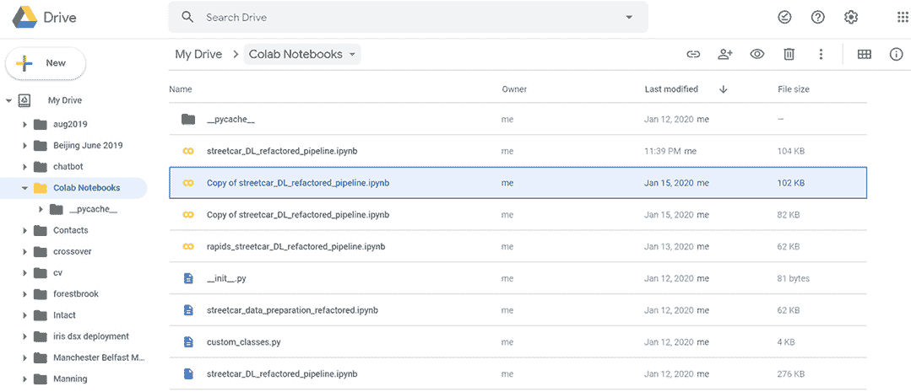

    图 A.2 Google Drive 中 Colab 笔记本的默认目录

本节涵盖了您使用 Colab 所需了解的一些关键信息。您可以参考 Google 文档([`mng.bz/mgE0`](http://mng.bz/mgE0))以获取关于如何使用 Colab 的完整详细信息，但我们在下一节将介绍一个基本功能：如何在 Colab 中使 Google Drive 可用。

## A.2 在您的 Colab 会话中使 Google Drive 可用

要充分利用 Colab，您需要挂载您的 Google Drive，以便在您的 Colab 会话中访问。当您设置了对 Drive 的访问权限后，您的 Colab 笔记本可通过路径/content/drive/My Drive 访问。您可以从 Drive 中的目录读取文件，并将文件写入 Drive，就像写入本地文件系统一样。

要从您的笔记本中访问 Drive 上的文件，请按照以下步骤操作：

1.  在您的笔记本中运行以下语句：

    ```
    from google.colab import drive
    drive.mount('/content/drive')
    ```

1.  当您运行这些语句时，您会得到图 A.3 中显示的结果。

    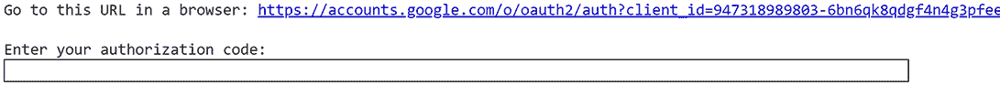

    图 A.3 输入授权码提示

1.  点击链接选择账户（图 A.4）。

    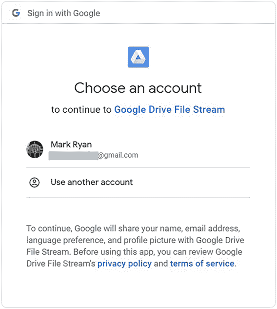

    图 A.4 选择账户

1.  在 Google Drive File Stream 访问屏幕中，点击允许（图 A.5）。

    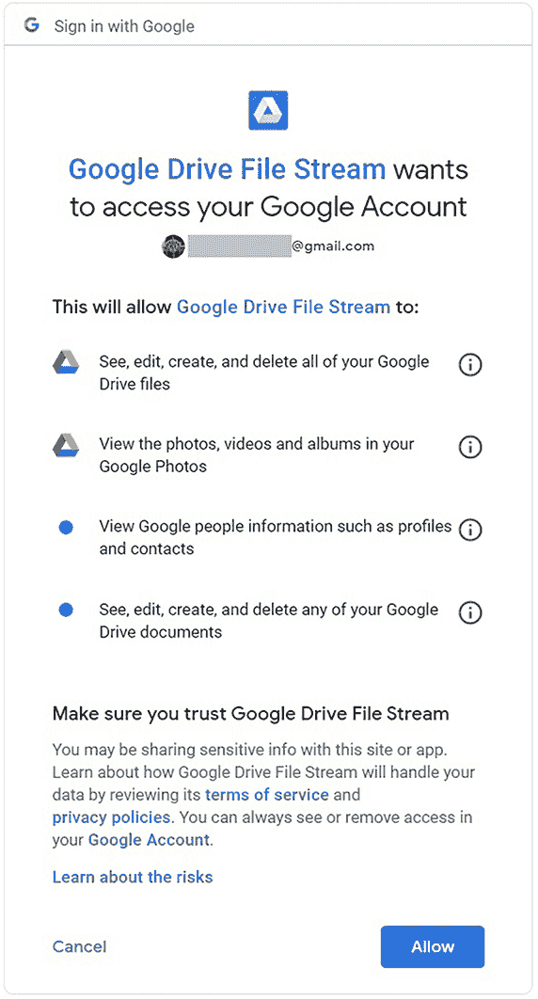

    图 A.5 允许 Google Drive File Stream 访问

1.  在登录屏幕中，点击复制图标以复制您的访问码（图 A.6）。

1.  返回 Colab，在授权码字段中粘贴，然后按 Enter（图 A.7）。

单元运行并产生图 A.8 中显示的挂载消息，以确认您的 Google Drive 已挂载并且可用于您的 Colab 笔记本。

通过遵循本节中的步骤，您已在您的 Colab 笔记本中使 Google Drive 可用。在 A.3 节中，我们将对比 Colab 和 Paperspace Gradient 的优势。

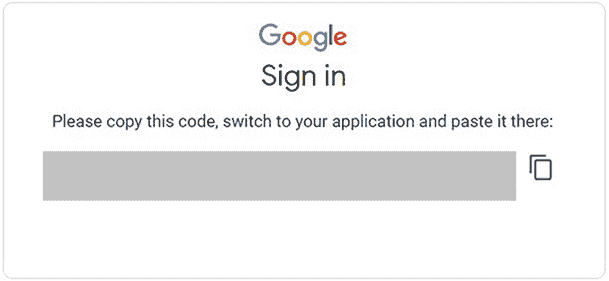

图 A.6 复制访问码

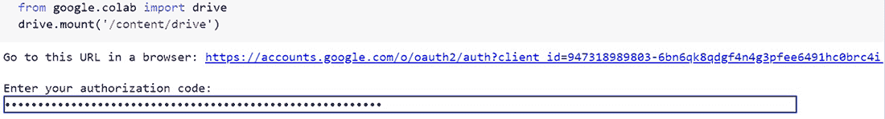

图 A.7 在您的 Colab 笔记本中粘贴访问码

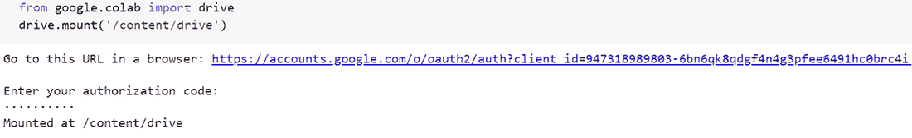

图 A.8 确认 Google Drive 已成功挂载

## A.3 在 Colab 中使仓库可用并运行笔记本

如果您使用 Colab 运行本书中的代码示例，您需要了解 Colab 和 Drive 协同工作的一些怪癖。除了遵循 A.2 节中的说明使 Drive 在 Colab 中可访问外，您还需要

+   将仓库([`mng.bz/xmXX`](http://mng.bz/xmXX))克隆到 Drive 中的新文件夹。

+   确保您运行笔记本时当前目录是您仓库克隆的笔记本目录。

首先，按照以下步骤克隆仓库：

1.  在 Drive 中，在根文件夹中创建一个新文件夹。

    对于这个练习，将新文件夹命名为 dl_june_17。

1.  访问新文件夹，右键单击背景，并在上下文菜单中选择更多 -> Google Colaboratory（图 A.9）。

    Colab 在新标签页中打开。

    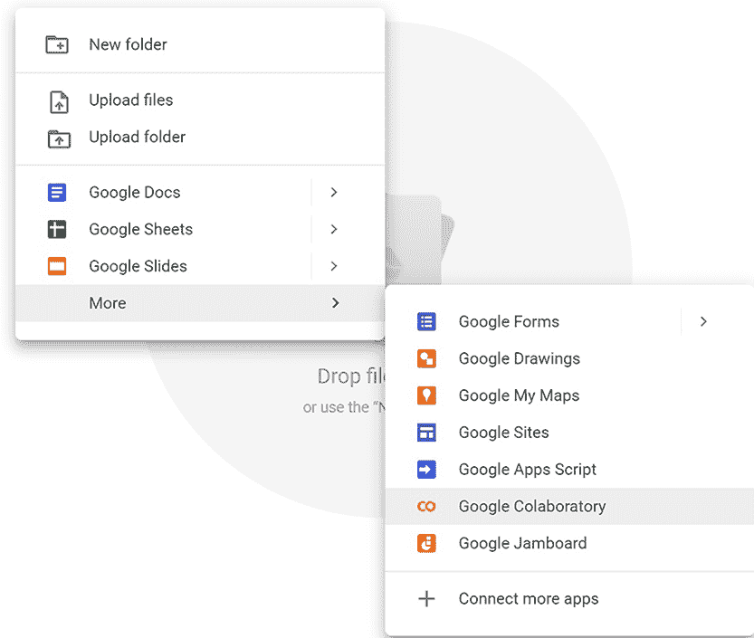

    图 A.9 从 Drive 的新文件夹中启动 Colab

1.  选择连接 -> 连接到托管运行时（图 A.10）。

    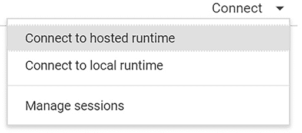

    图 A.10 在 Colab 中连接到托管运行时

1.  按照 A.2 节中的步骤使 Drive 在 Colab 中可访问。

1.  要访问步骤 1 中创建的 dl_june_17 文件夹，请在您的笔记本中创建一个新单元格，点击+code；然后将以下代码复制并粘贴到新单元格中并运行：

    ```
    %cd /content/drive/My Drive/dl_june_17
    ```

1.  在 Colab 笔记本中创建另一个新单元格，并在新单元格中作为单行运行以下命令以克隆仓库：

    ```
    ! git clone https://github.com/ryanmark1867/\
    deep_learning_for_structured_data.git
    ```

现在您已经将仓库克隆到驱动器中，您就可以打开 Colab 中的一个笔记本了。以下步骤显示了如何从仓库中打开模型训练笔记本并使其准备好运行：

1.  在 Colab 中，选择文件 -> 定位到驱动器（图 A.11）。

    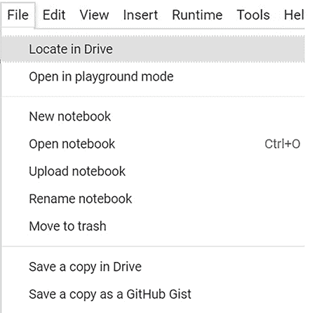

    图 A.11 定位到驱动器菜单选择

1.  导航到您克隆仓库的笔记本目录。

1.  双击 streetcar_model_training.ipynb，在出现的屏幕中选择 Google Colaboratory（图 A.12）。

1.  notebook streetcar_model_training.ipynb 在 Colab 中打开。

1.  选择连接 -> 连接到托管运行时。

1.  按照 A.2 节中的说明操作，以确保在此笔记本中可以访问驱动器。

1.  在笔记本中添加一个新单元格，并运行以下命令以将克隆仓库中的笔记本目录设置为当前目录：

    ```
    %cd /content/drive/My Drive/dl_june_17/deep_learning_for_structured_data
    ```

现在您已经完成了使仓库在 Colab 中可访问以及使笔记本可运行的步骤。请注意，每次您开始一个新的 Colab 会话，在您打开其中一个笔记本之后，您都需要按照步骤使驱动器在笔记本中可访问，并将克隆仓库中的笔记本目录设置为当前目录。

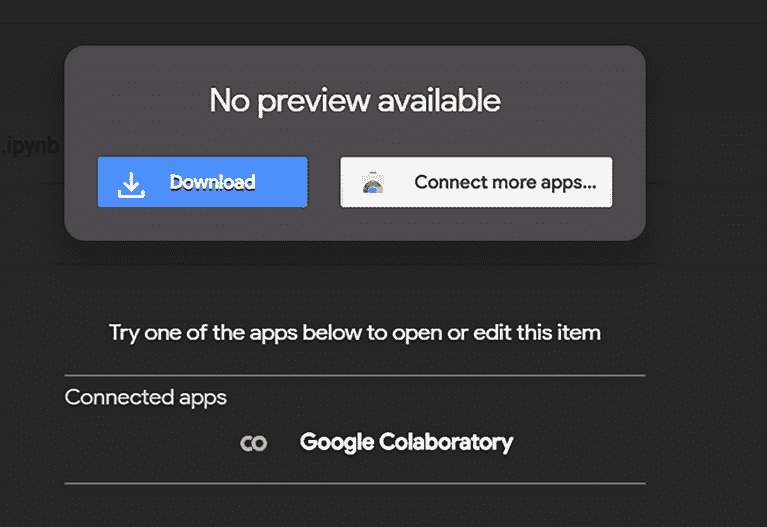

图 A.12 在驱动器中双击笔记本文件时出现的屏幕

## A.4 Colab 和 Paperspace 的优缺点

您选择 Colab 还是 Paperspace Gradient 来处理您的深度学习项目将取决于您的需求。对于大多数人来说，成本是选择 Colab 的决定性因素。在我看来，Paperspace Gradient 在便利性和可预测性方面的优势足以证明其成本。但如果您想要一个零成本的选项，Colab 是一个很好的选择。本节对比了 Colab（包括成本）的优势与 Paperspace Gradient 的强项。

这里是 Colab 的一些优点：

+   *免费* — Paperspace Gradient 有适度的每小时费用和完全透明的计费模式，但您仍然需要为 Paperspace Gradient 笔记本的每个活动小时付费。此外，在基本订阅下，Gradient 笔记本在 12 小时后自动关闭（图 A.13）。如果您有一个活动的 Gradient 会话并且忘记关闭它，您将为此支付 12 小时。我根据经验知道，醒来并意识到我因为忘记关闭 Gradient 而浪费了一些钱，我的笔记本整夜都在运行，这种感觉真的很糟糕。

    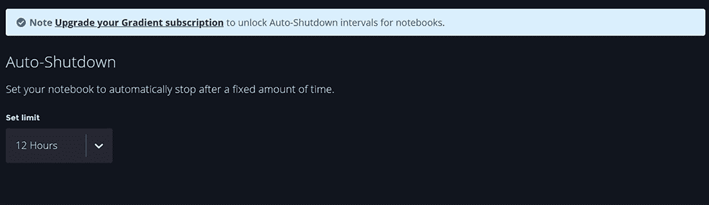

    图 A.13 在基本订阅下，Gradient 笔记本在 12 小时后自动关闭。

+   *与谷歌驱动集成* —如果您已经利用了谷歌驱动，您会欣赏 Colab 与 Drive 的流畅集成。谷歌在这方面做得非常出色。

+   *庞大的用户社区* —Colab 拥有庞大的用户社区，许多关于它的问题在 Stack Overflow([`mng.bz/6gO5`](http://mng.bz/6gO5))上得到了解答。Paperspace 表示，超过 10 万开发者使用 Gradient([`paperspace.com/gradient`](https://paperspace.com/gradient))。我未能找到关于 Colab 用户的类似估计，但 Colab 在 Stack Overflow 上的流量表明，它拥有更大的用户社区。

这里是 Paperspace Gradient 的一些优势：

+   *完全集成的环境* —Paperspace Gradient 完全针对深度学习进行了优化，并使用标准的 Jupyter 环境。相比之下，Colab 有一些较为复杂的方面，如果您习惯了普通的 Jupyter 笔记本，可能需要一些时间来适应。

+   *独立于谷歌基础设施* —Colab 与谷歌基础设施深度融合；您需要谷歌 ID 和谷歌驱动来使用 Colab。如果您在一个限制访问谷歌基础设施的司法管辖区工作，这一要求可能会阻止您使用 Colab。您日常工作的地点并不是唯一需要考虑的因素；问问自己，您是否需要在访问谷歌基础设施受限的司法管辖区进行深度学习工作的演示或会议展示。

+   *专用资源* —您的 Paperspace Gradient 虚拟环境属于您，一旦启动实例，您就可以访问所有资源。Colab 的资源没有保证，您可能在特定时间无法获得深度学习项目所需的资源。如果您对工作的时间灵活，这种情况应该不会成为问题。我从未在 Colab 中遇到获取资源的问题，但从理论上讲，您可能在需要时无法在 Colab 中获得 GPU 或 TPU 资源。

+   *支持* —当您设置 Paperspace Gradient 环境时，您需要为环境活跃的每一小时付费。您从这笔费用中获得的部分是支持服务。在过去两年中，我不得不联系 Paperspace 支持三次，每次都从 Paperspace 那里得到了快速的初步响应和问题的快速解决。Colab 是免费的，因此您将不会获得这种个性化的支持。

+   *更快的模型训练* —比较第七章中实验 1 的训练运行（10 个 epoch，无提前停止，默认权重为 0 和 1 的结果），Paperspace 比 Colab 快约 30%（Paperspace 为 1 分 49 秒，Colab 为 2 分 32 秒）。我的经验是，通过在笔记本设置中的硬件加速器字段选择 None 或 TPU，可以得到最佳结果（通过选择运行时 -> 更改运行时类型显示）。将 GPU 作为硬件加速器选择会导致本测试结果更差（图 A.14）。

    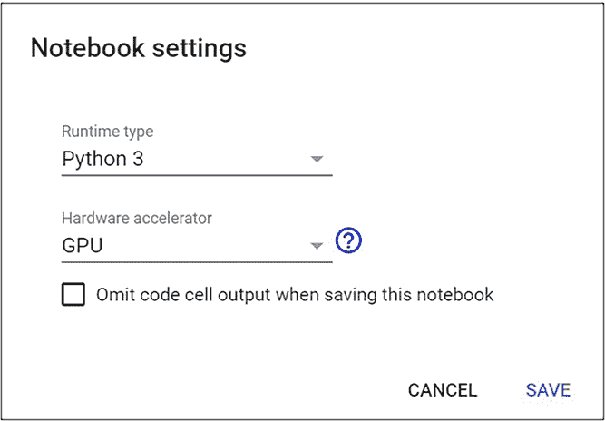

    图 A.14 设置硬件加速器

+   *训练运行的一致时间* —在 Paperspace 上多次运行相同的训练实验所需时间大致相同，而将相同的训练实验在 Colab 上运行所需时间则差异很大。

在本节中，我们回顾了 Colab 和 Paperspace Gradient 的优缺点。这两个环境都是深度学习项目的优秀选择；你选择哪一个取决于你自己的需求。
