# 1 欢迎来到计算机视觉

本章涵盖

+   视觉系统组件

+   计算机视觉应用

+   理解计算机视觉流程

+   预处理图像和提取特征

+   使用分类学习算法

嘿！我非常激动你能在这里。你做出了一个伟大的决定--掌握深度学习（DL）和计算机视觉（CV）。时机再合适不过了。得益于近年来人工智能和深度学习的巨大进步，CV 领域正在快速发展。神经网络现在使得自动驾驶汽车能够确定其他车辆和行人的位置，并绕过它们。我们越来越多地在家中的智能设备中使用 CV 应用程序--从安全摄像头到门锁。CV 还使面部识别工作得比以往任何时候都要好：智能手机可以识别面部以解锁，智能锁可以解锁门。如果在未来某个时候，你的沙发或电视能够识别你家中特定的人并根据他们的个人喜好做出反应，我并不会感到惊讶。这不仅仅是识别物体--DL 已经赋予了计算机想象和创造新事物（如艺术品；新物体；甚至独特、逼真的面部）的能力。

我对深度学习在计算机视觉中的兴奋，以及是什么吸引我进入这个领域的主要原因，是 AI 研究的快速进步正在使每天都能在不同行业中构建新的应用，这在几年前是不可能的。CV 研究的无限可能性激发了我写这本书的灵感。通过学习这些工具，也许你将能够发明新的产品和应用。即使你最终没有从事 CV 工作，你也会发现这本书中的许多概念对你的某些 DL 算法和架构非常有用。那是因为虽然主要关注 CV 应用，但本书涵盖了最重要的 DL 架构，如人工神经网络（ANNs）、卷积网络（CNNs）、生成对抗网络（GANs）、迁移学习以及更多，这些可以转移到其他领域，如自然语言处理（NLP）和语音用户界面（VUIs）。

本章的高级布局如下：

+   计算机视觉直觉 -- 我们将从视觉感知直觉开始，学习人类与机器视觉系统之间的相似性。我们将探讨视觉系统有两个主要组件：一个感知设备和解释设备。每个设备都针对完成特定任务而定制。

+   计算机视觉应用 -- 在这里，我们将从宏观角度审视不同计算机视觉应用中使用的深度学习算法。然后，我们将讨论不同生物的视觉问题。

+   计算机视觉流程--最后，我们将聚焦于视觉系统的第二个组成部分：解释设备。我们将逐步讲解视觉系统在处理和解析图像数据时所采取的步骤序列。这些步骤被称为计算机视觉流程。CV 流程由四个主要步骤组成：图像输入、图像预处理、特征提取以及用于解释图像的机器学习模型。我们将讨论图像形成以及计算机是如何“看”图像的。然后，我们将快速回顾图像处理技术和特征提取。

准备好了吗？让我们开始吧！

## 1.1 计算机视觉

任何人工智能系统的核心概念是它能够感知其环境并根据其感知采取行动。计算机视觉关注的是视觉感知部分：它是通过构建世界的物理模型，使人工智能系统能够采取适当的行动，通过图像和视频感知和理解世界的一门科学。对于人类来说，视觉只是感知的一个方面。我们通过视觉感知世界，但也通过声音、气味以及我们的其他感官。对于人工智能系统来说也是如此--视觉只是理解世界的一种方式。根据你正在构建的应用，你选择最能捕捉世界的传感器。

### 1.1.1 视觉感知是什么？

视觉感知在最基本的意义上是通过视觉或视觉输入观察模式和对象的行为。例如，对于自动驾驶汽车来说，视觉感知意味着理解周围的对象及其具体细节--例如行人，或者车辆是否需要保持在特定车道中央--以及检测交通标志并理解其含义。这就是为什么“感知”这个词是定义的一部分。我们不仅仅是想要捕捉周围的环境。我们试图构建能够通过视觉输入真正理解该环境的系统。

### 1.1.2 视觉系统

在过去的几十年里，传统的图像处理技术被认为是计算机视觉系统，但这并不完全准确。一个处理图像的机器与理解图像中发生的事情的机器完全不同，这并不是一个简单任务。现在，图像处理只是更大、更复杂系统的一部分，该系统旨在解释图像内容。

#### 人类视觉系统

在最高层面上，视觉系统对于人类、动物、昆虫以及大多数生物体来说几乎是相同的。它们由一个传感器或眼睛来捕捉图像，以及一个大脑来处理和解释图像。系统随后根据从图像中提取的数据输出对图像组件的预测（图 1.1）。

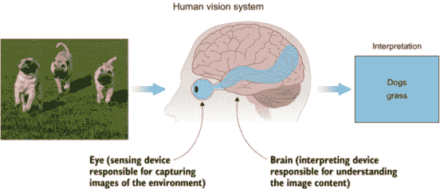

图 1.1 人类视觉系统利用眼睛和大脑来感知和解释图像。

让我们看看人类视觉系统是如何工作的。假设我们想要解释图 1.1 中的狗的图像。我们看它，并直接理解图像由一群狗（具体来说是三只）组成。对我们来说，在这个图像中分类和检测物体是非常自然的，因为我们多年来一直在接受识别狗的训练。

假设有人第一次给你看一张狗的图片--你肯定不知道这是什么。然后他们告诉你这是一只狗。经过几次这样的实验后，你将接受训练来识别狗。现在，在接下来的练习中，他们给你看一张马的图片。当你看这张图片时，你的大脑开始分析物体特征：嗯嗯，它有四条腿，长脸，长耳朵。它可能是一只狗吗？“错误：这是一匹马，”你被告知。然后你的大脑在其算法中调整了一些参数来学习狗和马之间的差异。恭喜！你刚刚训练了你的大脑来分类狗和马。你能把更多的动物加到等式中，比如猫、老虎、猎豹等等吗？当然可以。你可以训练你的大脑来识别几乎任何东西。对计算机来说也是如此。你可以训练机器来学习和识别物体，但人类比机器更直观。你只需要几幅图像就能学会识别大多数物体，而机器则需要成千上万，甚至在更复杂的情况下，数百万个图像样本来学习识别物体。

机器学习的视角

让我们从机器学习的角度来回顾之前的例子：

+   你通过观察几个标注为狗的图像的例子来学习识别狗。这种方法被称为监督学习。

+   标注数据是指你已经知道目标答案的数据。你被展示了一幅狗的样本图像，并被告知这是一只狗。你的大脑学会了将你看到的特征与这个标签“狗”相关联。

+   然后，你被展示了一个不同的物体，一匹马，并被要求识别它。起初，你的大脑认为它是一只狗，因为你之前没有见过马，你的大脑将马的特征与狗的特征混淆了。当你被告知你的预测是错误的时，你的大脑调整了它的参数来学习马的特征。“是的，两者都有四条腿，但马的腿更长。更长的腿意味着这是一匹马。”我们可以多次运行这个实验，直到大脑不再犯错误。这被称为通过试错进行训练。

#### 人工智能视觉系统

科学家们受到人类视觉系统的启发，近年来在用机器复制视觉能力方面做了惊人的工作。为了模仿人类视觉系统，我们需要相同的两个主要组件：一个感知设备来模仿眼睛的功能，以及一个强大的算法来模仿大脑在解释和分类图像内容时的功能（图 1.2）。

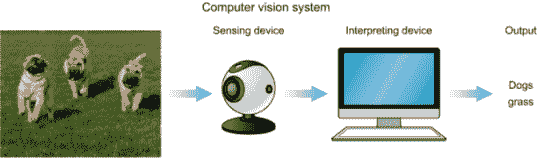

图 1.2 计算机视觉系统的组成部分包括一个感知设备和解释设备。

### 1.1.3 感知设备

视觉系统旨在完成特定任务。设计的一个重要方面是选择最佳的感应设备来捕捉特定环境的周围环境，无论是摄像头、雷达、X 射线、CT 扫描、激光雷达，还是提供完整环境场景以完成任务的设备组合。

让我们再次看看自动驾驶汽车（AV）的例子。AV 视觉系统的主要目标是让汽车能够理解其周围的环境，并安全、及时地从 A 点移动到 B 点。为了实现这一目标，车辆配备了包括摄像头和传感器在内的组合设备，这些设备可以检测到 360 度的运动——行人、骑自行车的人、车辆、道路施工和其他物体——从最远三个足球场外的地方。

这里有一些通常用于自动驾驶汽车中感知周围区域的感应设备：

+   激光雷达，一种类似雷达的技术，使用不可见的光脉冲来创建周围区域的高分辨率 3D 地图。

+   照相机可以看到街牌和路面标记，但不能测量距离。

+   雷达可以测量距离和速度，但不能看到细节。

医学诊断应用使用 X 射线或 CT 扫描作为感应设备。或者，你可能需要使用其他类型的雷达来捕捉农业视觉系统的景观。有各种各样的视觉系统，每个系统都设计来执行特定的任务。设计视觉系统的第一步是确定它们是为完成什么任务而构建的。在设计端到端视觉系统时，这一点需要牢记在心。

识别图像

动物、人类和昆虫都使用眼睛作为感应设备。但并非所有眼睛的结构、输出图像质量和分辨率都相同。它们是根据生物体的特定需求定制的。例如，蜜蜂和许多其他昆虫都有复眼，由多个透镜组成（单个复眼中多达 30,000 个透镜）。复眼分辨率低，这使得它们在远距离识别物体方面不太擅长。但它们对运动非常敏感，这对于高速飞行时的生存至关重要。蜜蜂不需要高分辨率的图像。它们的视觉系统被构建成能够在快速飞行时捕捉到最小的运动。

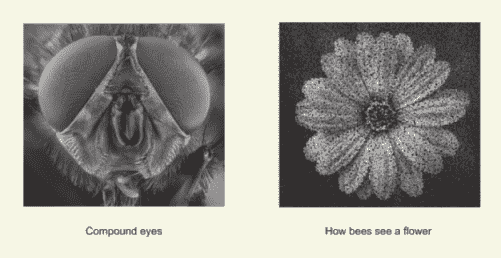

复眼分辨率低，但对运动敏感。

### 1.1.4 解释设备

计算机视觉算法通常用作解释设备。解释器是视觉系统的“大脑”。其作用是从感应设备获取输出图像，学习特征和模式以识别物体。因此，我们需要构建一个大脑。简单！科学家们受到我们大脑工作方式的启发，试图逆向工程中枢神经系统，以获得有关如何构建人工大脑的见解。因此，人工神经网络（ANNs）应运而生（图 1.3）。


图 1.3 生物神经元与人工系统之间的相似性

在图 1.3 中，我们可以看到生物神经元与人工系统之间的类比。两者都包含一个主要处理元素，即神经元，它有输入信号（*x*[1]，*x*[2]，...，*x[n]*)和一个输出。

生物神经元的 学习行为启发了科学家们创建一个相互连接的神经元网络。模仿人类大脑中信息处理的方式，当足够多的输入信号被激活时，每个人工神经元会向它所连接的所有神经元发送信号。因此，神经元在个体层面上具有非常简单的机制（你将在下一章中看到）；但是当你有成千上万的这些神经元堆叠在层中并相互连接时，每个神经元都连接到成千上万的其它神经元，从而产生学习行为。构建多层神经网络被称为深度学习（图 1.4）。

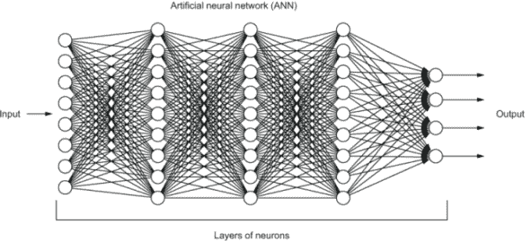

图 1.4 深度学习涉及网络中的神经元层。

深度学习方法通过数据在神经元层中的连续变换来学习表示。在这本书中，我们将探讨不同的深度学习架构，例如人工神经网络和卷积神经网络，以及它们在计算机视觉应用中的使用。

#### 机器学习能否比人类大脑实现更好的性能？

嗯，如果你在 10 年前问我这个问题，我可能会说不可能，机器无法超越人类的准确率。但让我们看看以下两个场景：

+   假设你被给了一本包含 10,000 张狗的照片的书，这些照片按品种分类，并要求你学习每种品种的特性。你需要在 10,000 张照片中学习 130 种品种需要多长时间？如果你被要求对 100 张狗的照片进行测试，并基于你所学的内容进行标记，那么在这 100 张照片中，你能正确标记多少张？嗯，经过几小时训练的神经网络可以达到超过 95%的准确率。

+   在创作方面，神经网络可以研究特定艺术品笔触、色彩和阴影中的模式。基于这种分析，它可以将原始艺术作品的风格转移到新图像中，并在几秒钟内创建出新的原创艺术品。

最近人工智能和深度学习的发展使得机器在许多图像分类和目标检测应用中超越了人类的视觉能力，并且这种能力正在迅速扩展到许多其他应用。但不要仅凭我的话，在下一节中，我们将讨论一些使用深度学习技术的最流行的计算机视觉应用。

## 1.2 计算机视觉的应用

几十年前，计算机开始能够在图像中识别人脸，但现在人工智能系统正在与计算机在照片和视频中分类对象的能力相媲美。得益于计算能力和可用数据量的显著进步，人工智能和深度学习已经在许多复杂的视觉感知任务上实现了超越人类的表现，如图像搜索和字幕、图像和视频分类以及物体检测。此外，深度神经网络不仅限于计算机视觉任务：它们在自然语言处理和语音用户界面任务中也取得了成功。在这本书中，我们将重点关注应用于计算机视觉任务的视觉应用。

深度学习被用于许多计算机视觉应用中，以识别对象及其行为。在本节中，我不会尝试列出所有现有的计算机视觉应用。那需要一本书的篇幅。相反，我将为您提供一个鸟瞰图，展示一些最受欢迎的深度学习算法及其在不同行业中的可能应用。这些行业包括自动驾驶汽车、无人机、机器人、店内摄像头和能够检测早期肺癌的医疗诊断扫描仪。

### 1.2.1 图像分类

图像分类是将图像分配到预定义类别集合中的标签的任务。卷积神经网络是一种在处理和分类图像方面真正发光的神经网络类型，它在许多不同的应用中表现出色：

+   肺癌诊断 -- 肺癌是一个日益严重的问题。肺癌非常危险的主要原因是在诊断时通常处于中期或晚期。在诊断肺癌时，医生通常用眼睛检查 CT 扫描图像，寻找肺中的小结节。在早期阶段，结节通常非常小，难以发现。几家计算机视觉公司决定利用深度学习技术来应对这一挑战。

    几乎所有的肺癌都是从一个小结节开始的，这些结节以医生需要多年时间才能学会识别的各种形状出现。医生在识别中等大小和大结节，如 6-10 毫米的结节方面非常擅长。但当结节为 4 毫米或更小时，有时医生难以识别它们。深度学习网络，特别是卷积神经网络，现在能够自动从 X 射线和 CT 扫描图像中学习这些特征，并在它们变得致命之前早期检测到小结节（图 1.5）。

    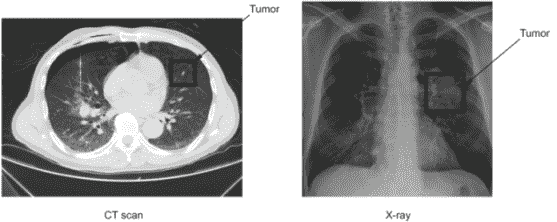

    图 1.5 现在的视觉系统能够从 X 射线图像中学习模式，以识别早期发展阶段的肿瘤。

+   交通标志识别 -- 传统上，标准计算机视觉方法被用于检测和分类交通标志，但这种方法需要耗时的人工工作来手工制作图像中的重要特征。相反，通过将深度学习应用于这个问题，我们可以创建一个可靠地分类交通标志的模型，该模型通过自身学习识别最合适的特征（图 1.6）。

    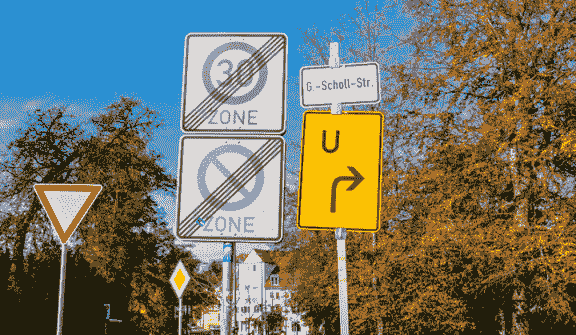

    图 1.6 视觉系统可以以非常高的性能检测交通标志。

注意：越来越多的图像分类任务正在使用卷积神经网络得到解决。由于它们的高识别率和快速执行，CNNs 极大地提升了大多数计算机视觉任务，无论是现有的还是新的。就像癌症诊断和交通标志的例子一样，你可以将成千上万的图像输入到 CNN 中，将它们标注成你想要的任意多类。其他图像分类的例子包括识别人物和物体、区分不同的动物（如猫、狗和马）、不同品种的动物、适合农业的土地类型等等。简而言之，如果你有一组标注好的图像，卷积网络可以将它们分类到一组预定义的类别中。

### 1.2.2 物体检测与定位

图像分类问题是 CNNs 最基本的应用。在这些问题中，每张图像只包含一个物体，我们的任务是识别它。但如果我们希望达到人类水平的理解，我们必须增加这些网络的复杂性，以便它们能够识别图像中的多个物体及其位置。为此，我们可以构建 YOLO（你只需看一次）、SSD（单次检测器）和 Faster R-CNN 等目标检测系统，这些系统不仅能够对图像进行分类，还能够定位和检测包含多个物体的图像中的每个物体。这些深度学习系统可以观察一张图像，将其分解成更小的区域，并为每个区域标注一个类别，以便在给定的图像中定位和标注可变数量的物体（图 1.7）。你可以想象，这样的任务对于自动驾驶系统等应用来说是基本的前提条件。

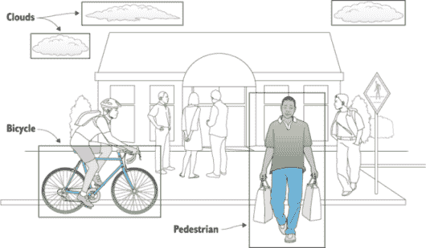

图 1.7 深度学习系统可以在图像中分割物体。

### 1.2.3 生成艺术（风格迁移）

神经风格迁移是计算机视觉中最有趣的 应用之一，它用于将一种图像的风格转移到另一种图像上。风格迁移的基本思想是这样的：你取一张图像——比如说，一座城市的图像——然后为这张图像应用一种艺术风格——比如说，文森特·梵高的《星夜》——输出与原始图像相同的城市，但看起来像是梵高所绘（图 1.8）。

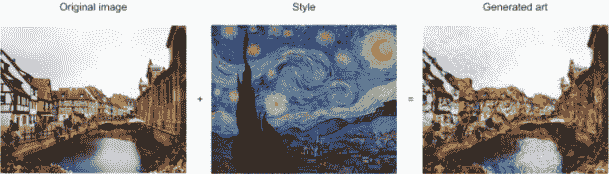

图 1.8 将梵高的《星夜》风格转移到原始图像上，产生了一件感觉像是原始艺术家创作的艺术品

这实际上是一个很酷的应用。如果你了解任何画家，令人惊讶的是，完成一幅画可能需要几天甚至几周的时间，然而这里有一个应用可以在几秒钟内根据现有的风格创作出新的图像。

### 1.2.4 创建图像

虽然早期的例子确实是 AI 在计算机视觉应用方面的真正令人印象深刻的例子，但我看到真正的魔法在这里发生：创造的魔法。2014 年，Ian Goodfellow 发明了一种新的深度学习模型，可以想象新事物，称为生成对抗网络（GANs）。这个名字听起来有点吓人，但我向你保证它们并不如此。GAN 是一种演化的 CNN 架构，被认为是深度学习中的一个重大进步。所以当你理解 CNNs 时，GANs 将对你来说更有意义。

GANs（生成对抗网络）是复杂的深度学习模型，可以生成令人惊叹的、逼真的合成图像，包括物体、人物和地点等。如果你给他们一组图像，他们可以制作出全新的、看起来非常逼真的图像。例如，StackGAN 是 GAN 架构变体之一，可以使用对象的文本描述来生成与该描述匹配的高分辨率图像。这不仅仅是数据库中的图像搜索。这些“照片”以前从未见过，完全是虚构的（图 1.9）。

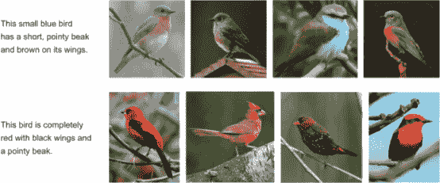

图 1.9 生成对抗网络（GANs）可以从一组现有图像中创建新的、“虚构”的图像。

GAN 是近年来机器学习中最有希望的发展之一。对 GAN 的研究是新的，结果非常令人鼓舞。到目前为止，GANs 的大部分应用都是图像相关的。但它让你想：如果机器被赋予创造图片的想象力，它们还能创造什么？在未来，你最喜欢的电影、音乐，甚至书籍会不会由计算机创造？将一种数据类型（文本）合成另一种（图像）的能力最终将使我们能够仅使用详细的文本描述来创造各种娱乐。

GANs 创作艺术品

2018 年 10 月，一幅名为《Edmond Belamy 肖像》的 AI 创作画作以 43.25 万美元的价格售出。这件艺术品展示了一个名为 Edmond de Belamy 的虚构人物，可能是法国人——从他的深色大衣和平凡的白色领口来看，他可能是一位牧师。

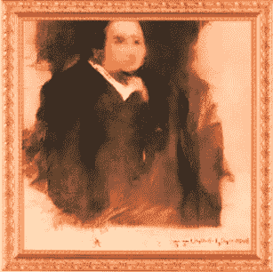

一幅以虚构人物 Edmond de Belamy 命名的 AI 生成艺术品以 43.25 万美元的价格售出。

这件艺术品是由三位 25 岁的法国学生使用 GANs 创作的。该网络在 14 至 20 世纪之间绘制的 15,000 幅肖像画数据集上进行了训练，然后创作了自己的作品。该团队打印了这幅画，装裱并签署了 GAN 算法的一部分。

### 1.2.5 人脸识别

人脸识别（FR）使我们能够精确地识别或标记一个人的图像。日常应用包括在网络上搜索名人以及在图像中自动标记朋友和家人。人脸识别是一种细粒度分类。

著名的《人脸识别手册》（Li 等人，Springer，2011）将 FR 系统的两种模式进行了分类：

+   面部识别——面部识别涉及一对一的匹配，将查询面部图像与数据库中的所有模板图像进行比较，以确定查询面的身份。另一个面部识别场景涉及城市当局的观察名单检查，其中查询面与嫌疑人名单（一对一的匹配）进行匹配。

+   面部验证——面部验证涉及一对一的匹配，将查询面部图像与声称身份的模板面部图像进行比较（见图 1.10）。

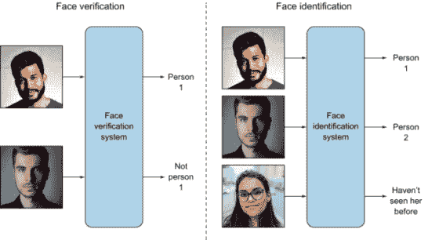

图 1.10 面部验证（左）和面部识别（右）的示例

### 1.2.6 图像推荐系统

在这个任务中，用户试图根据给定的查询图像找到相似的图像。购物网站根据特定产品的选择提供产品建议（通过图像），例如，显示与用户选择的鞋子相似的各种鞋子。图 1.11 展示了服装搜索的一个例子。

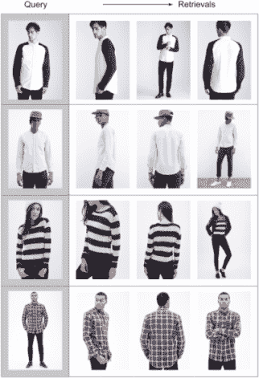

图 1.11 服装搜索。每行最左边的图像是查询/点击的图像，后续的列显示了相似的服装。（来源：刘等，2016 年。）

## 1.3 计算机视觉流程：全景

好的，现在我已经吸引了你的注意，让我们深入一层了解计算机视觉系统。记住，在本章前面，我们讨论了视觉系统由两个主要组件组成：感知设备和解释设备（图 1.12 提供了一个提醒）。在本节中，我们将探讨解释设备组件用于处理和理解图像的流程。

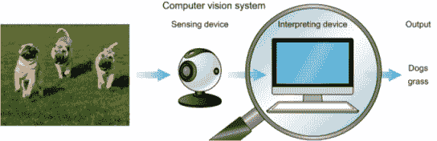

图 1.12 关注计算机视觉系统中的解释设备

计算机视觉的应用多种多样，但典型的视觉系统使用一系列不同的步骤来处理和分析图像数据。这些步骤被称为计算机视觉流程。许多视觉应用遵循获取图像和数据、处理这些数据、执行一些分析和识别步骤，然后基于提取的信息进行预测的流程（见图 1.13）。

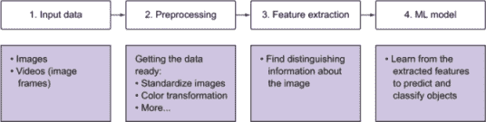

图 1.13 计算机视觉流程，它接收输入数据，处理它，提取信息，然后将它发送到机器学习模型进行学习

让我们将图 1.13 中的流程应用于图像分类器示例。假设我们有一张摩托车的图片，我们希望模型从以下类别中预测该对象的可能性：摩托车、汽车和狗（见图 1.14）。

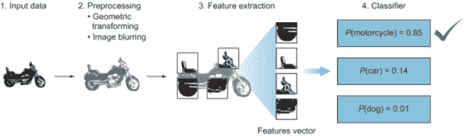

图 1.14 使用机器学习模型从摩托车、汽车和狗类别预测摩托车对象的可能性

定义：图像分类器是一种算法，它接收图像作为输入，并输出一个标签或“类别”，以识别该图像。在机器学习中，类别（也称为类别）是数据的输出类别。

这是图像通过分类管道的流程：

1.  计算机从像相机这样的成像设备接收视觉输入。这种输入通常以图像或形成视频的图像序列的形式捕获。

1.  然后每个图像都会通过一些预处理步骤，其目的是标准化图像。常见的预处理步骤包括调整图像大小、模糊、旋转、改变其形状，或者将图像从一种颜色转换到另一种颜色，例如从彩色转换为灰度。只有通过标准化图像——例如，使它们具有相同的大小——你才能然后比较它们并进一步分析它们。

1.  我们提取特征。特征是我们定义对象的东西，它们通常是关于对象形状或颜色的信息。例如，区分摩托车的一些特征是车轮的形状、车头灯、泥板等。这个过程输出的结果是特征向量，它是一系列独特的形状列表，用于识别对象。

1.  特征被输入到分类模型中。这一步查看前一步的特征向量并预测图像的类别。假设你是一名分类器模型几分钟，让我们通过分类过程。你逐个查看特征向量中的特征列表，并试图确定图像中有什么：

    1.  首先你看到一个轮子特征；这可能是一辆汽车、一辆摩托车还是一只狗？显然它不是狗，因为狗没有轮子（至少，正常的狗，不是机器人）。然后这可能是一张汽车或摩托车的照片。

    1.  你继续到下一个特征，即车头灯。它更有可能是摩托车而不是汽车。

    1.  下一个特征是后泥板——同样，它更有可能是摩托车。

    1.  这个物体只有两个轮子；这更接近于摩托车。

    1.  你继续分析所有特征，如车身形状、踏板等，直到你到达对图像中物体的最佳猜测。

这个过程的输出是每个类别的概率。正如你在我们的例子中所看到的，狗的概率最低，只有 1%，而这是一个摩托车的概率是 85%。你可以看到，尽管模型能够以最高的概率预测正确的类别，但它仍然对区分汽车和摩托车有些困惑——它预测有 14%的可能性这是一张汽车的照片。既然我们知道它是一辆摩托车，我们可以说我们的机器学习分类算法的准确率是 85%。还不错！为了提高这个准确率，我们可能需要做更多步骤 1（获取更多的训练图像），或者步骤 2（更多的处理以去除噪声），或者步骤 3（提取更好的特征），或者步骤 4（更改分类器算法并调整一些超参数），或者甚至允许更多的训练时间。我们可以采取的许多不同方法来提高我们模型的表现力都包含在一个或多个的管道步骤中。

那是图像如何在 CV 管道中流动的大致情况。接下来，我们将深入探讨管道的每个步骤。

## 1.4 图像输入

在 CV 应用中，我们处理图像或视频数据。现在让我们谈谈灰度图像和彩色图像，在后面的章节中，我们将讨论视频，因为视频只是图像的堆叠顺序帧。

### 1.4.1 图像作为函数

一张图像可以被表示为两个变量 *x* 和 y 的函数，它们定义了一个二维区域。数字图像由像素网格组成。像素是图像的基本构建块。每个图像都由一组像素组成，这些像素的值代表图像中特定位置的光强度。让我们再次看看摩托车示例，在应用像素网格后（图 1.15）。

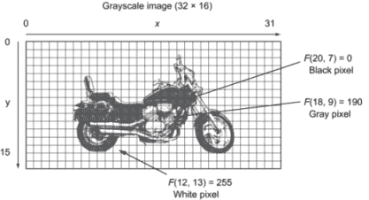

图 1.15 图像由称为像素的原始构建块组成。像素值代表图像中特定位置出现的光强度。

图 1.14 中的图像大小为 32 × 16。这意味着图像的尺寸是 32 像素宽和 16 像素高。x 轴从 0 到 31，y 轴从 0 到 16。总的来说，该图像有 512（32 × 16）个像素。在这张灰度图像中，每个像素包含一个值，代表该特定像素上的光强度。像素值范围从 0 到 255。由于像素值代表光强度，值 0 代表非常暗的像素（黑色），255 代表非常亮（白色），而中间的值代表灰度上的强度。

你可以看到图像坐标系与笛卡尔坐标系相似：图像是二维的，位于 x-y 平面上。原点（0, 0）位于图像的左上角。为了表示特定的像素，我们使用以下符号：F 作为函数，x，*y*作为像素在 x 和 y 坐标中的位置。例如，位于 *x* = 12 和 *y* = 13 的像素是白色的；这由以下函数表示：F(12, 13) = 255。同样，位于摩托车前部的像素（20, 7）是黑色的，表示为 F(20, 7) = 0。

```
Grayscale => F(*x, y*) gives the intensity at position (*x, y*)
```

那是关于灰度图像的情况。彩色图像又是如何呢？

在彩色图像中，不是只用一个数字来表示像素的值，而是用三个数字来表示像素中每种颜色的强度。例如，在 RGB 系统中，像素的值由三个数字表示：红色强度、绿色强度和蓝色强度。图像还有其他颜色系统，如 HSV 和 Lab。所有这些在表示像素值时都遵循相同的概念（关于彩色图像的更多内容将在后面讨论）。以下是 RGB 系统中表示彩色图像的函数：

```
Color image in RGB => F(*x, y*) = [ red (*x, y*), green (*x, y*), blue (*x, y*) ] 
```

将图像视为一个函数在图像处理中非常有用。我们可以将图像视为 F(*x, y*)的函数，并在数学上对其操作以将其转换为新的图像函数 G(*x, y*)。让我们看看表 1.1 中的图像变换示例。

表 1.1 图像变换示例函数

| 应用 | 变换 |
| --- | --- |
| 使图像变暗。 | `G(*x, y*) = 0.5 * F(*x, y*)` |
| 使图像变亮。 | `G(*x, y*) = 2 * F(*x, y*)` |
| 将对象向下移动 150 个像素。 | `G(*x, y*) = F(x, *y* + 150)` |
| 将图像中的灰色去除以将图像转换为黑白。 | `G(*x, y*) = { 0 if F(*x, y*) < 130, 255 otherwise }` |

### 1.4.2 计算机如何识别图像

当我们看图像时，我们看到物体、风景、颜色等等。但计算机并不是这样。考虑图 1.16。你的人类大脑可以处理它，并立即知道这是一张摩托车图片。对于计算机来说，图像看起来像像素值的 2D 矩阵，这些值代表颜色光谱中的强度。这里没有上下文，只是一大堆数据。

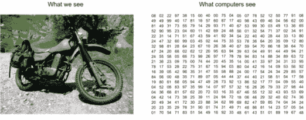

图 1.16 计算机将图像视为值的矩阵。这些值代表像素在颜色光谱中的强度。例如，灰度图像的像素值范围在 0（黑色）到 255（白色）之间。

图 1.16 中的图像大小为 24 × 24。这个大小表示图像的宽度和高度：水平方向有 24 个像素，垂直方向也有 24 个像素。这意味着总共有 576（24 × 24）个像素。如果图像大小为 700 × 500，那么矩阵的维度将是（700，500），其中矩阵中的每个像素代表该像素的亮度强度。0 代表黑色，255 代表白色。

### 1.4.3 彩色图像

在灰度图像中，每个像素只代表一种颜色的强度，而在标准的 RGB 系统中，彩色图像有三个通道（红色、绿色和蓝色）。换句话说，彩色图像由三个矩阵表示：一个表示像素中红色的强度，一个表示绿色，一个表示蓝色（图 1.17）。

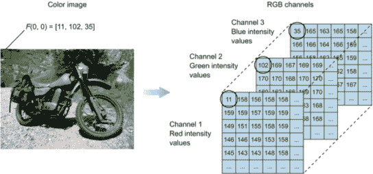

图 1.17 彩色图像由红色、绿色和蓝色通道表示，矩阵可以用来表示这些颜色的强度。

如图 1.17 所示，彩色图像由三个通道组成：红色、绿色和蓝色。现在的问题是，计算机是如何看到这张图像的？同样，它们看到的是一个矩阵，与只有单一通道的灰度图像不同。在这种情况下，我们将有三个矩阵堆叠在一起；这就是为什么它是一个 3D 矩阵。700×700 彩色图像的维度是（700, 700, 3）。假设第一个矩阵代表红色通道；那么该矩阵的每个元素代表该像素中红色颜色的强度，绿色和蓝色同理。彩色图像中的每个像素都与三个数字（0 到 255）相关联。这些数字代表该特定像素中红色、绿色和蓝色的强度。

以像素（0,0）为例，我们可以看到它代表的是绿色草地的左上角像素。当我们查看这个像素在彩色图像中的样子时，它看起来就像图 1.18 所示。图 1.19 中的例子展示了绿色的一些色调及其 RGB 值。

计算机是如何看到颜色的？

计算机将图像视为矩阵。灰度图像有一个通道（灰色）；因此，我们可以用二维矩阵来表示灰度图像，其中每个元素代表该特定像素的亮度强度。记住，0 代表黑色，255 代表白色。灰度图像有一个通道，而彩色图像有三个通道：红色、绿色和蓝色。我们可以用三维矩阵来表示彩色图像，其中深度为三。

我们也看到了图像如何被当作空间函数来处理。这个概念使我们能够在数学上操作图像，并从中改变或提取信息。将图像视为函数是许多图像处理技术的基础，例如将彩色转换为灰度或缩放图像。这些步骤只是通过数学方程对图像像素进行逐像素的转换。

+   灰度图：*f*(*x, y*)给出位置(*x, y*)的强度

+   彩色图像：*f*(*x, y*) = [红色(*x, y*)，绿色(*x, y*)，蓝色(*x, y*)]

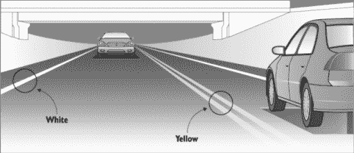

绿色草地的图像实际上是由不同强度的三种颜色组成的。

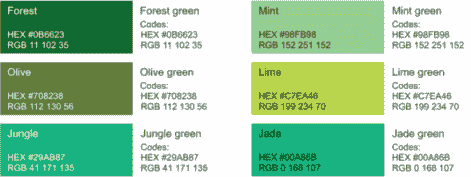

图 1.19 展示了不同深度的绿色代表三种图像颜色（红色、绿色、蓝色）的不同强度。

## 1.5 图像预处理

在机器学习（ML）项目中，你通常会经历一个数据预处理或清洗步骤。作为一名机器学习工程师，在构建学习模型之前，你将花费大量时间清理和准备数据。这一步骤的目标是使数据准备好，以便机器学习模型更容易分析和处理。对于图像来说，也是如此。根据你要解决的问题和手头的数据集，在将图像输入机器学习模型之前，可能需要进行一些数据整理。

图像处理可能涉及简单的任务，如图像缩放。稍后，您将了解到为了将图像数据集输入到卷积网络中，所有图像都必须具有相同的大小。其他处理任务也可以进行，如几何和颜色变换、将颜色转换为灰度等。本书的章节和项目中我们将涵盖各种图像处理技术。

获得的数据通常很杂乱，来自不同的来源。为了将其输入到机器学习模型（或神经网络）中，它需要被标准化和清理。预处理用于执行将减少算法复杂度并提高准确性的步骤。我们不能为图像拍摄的每种条件编写一个独特的算法；因此，当我们获取图像时，我们将其转换为一种形式，以便通用的算法可以解决它。以下小节描述了一些数据预处理技术。

### 1.5.1 将彩色图像转换为灰度图像以降低计算复杂性

有时候，您可能会发现从图像中删除不必要的信 息以减少空间或计算复杂度很有用。例如，假设您想将彩色图像转换为灰度图像，因为对于许多物体来说，颜色并不是识别和解释图像所必需的。灰度图像可能足以识别某些物体。由于彩色图像包含比黑白图像更多的信息，它们可能会增加不必要的复杂性，并在内存中占用更多空间。请记住，彩色图像以三个通道表示，这意味着将它们转换为灰度图像将减少需要处理的像素数量（图 1.20）。


图 1.20 将彩色图像转换为灰度图像会减少需要处理的像素数量。这对于不依赖于颜色信息损失的应用程序来说可能是一个好的方法。

在这个例子中，您可以看到如何使用亮度和暗度（强度）的模式来定义许多物体的形状和特征。然而，在其他应用中，颜色对于定义某些物体很重要，例如皮肤癌检测，它严重依赖于皮肤颜色（红色皮疹）。

+   *标准化图像* ——正如您将在第三章中看到的那样，某些机器学习算法（如 CNN）存在的一个重要约束是，需要将数据集中的图像调整到统一的尺寸。这意味着在将图像输入到学习算法之前，您的图像必须进行预处理并缩放，以具有相同的宽度和高度。

    何时颜色很重要？

    将图像转换为灰度可能不是某些问题的好选择。有一些应用中颜色非常重要：例如，在医学图像中建立一个诊断系统来识别红色皮肤疹。这个应用严重依赖于皮肤中红色颜色的强度。从图像中移除颜色将使解决这个问题更加困难。一般来说，彩色图像在许多医学应用中提供了非常有帮助的信息。

    图像中颜色重要性的另一个例子是自动驾驶汽车中的车道检测应用，其中汽车必须区分黄色和白色线条，因为它们被处理方式不同。灰度图像无法提供足够的信息来区分黄色和白色线条。

    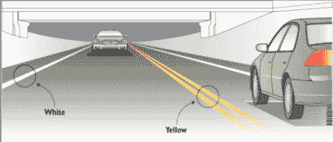

    基于灰度的图像处理器无法区分彩色图像。

    识别问题中颜色重要性的经验法则是用肉眼观察图像。如果你能够在灰度图像中识别你正在寻找的对象，那么你可能已经提供了足够的信息给你的模型。如果不能，那么你的模型肯定需要更多的信息（颜色）。同样的规则可以应用于我们将要讨论的大多数其他预处理技术。

+   *数据增强* --另一种常见的预处理技术是将现有数据集与现有图像的修改版本相结合。缩放、旋转和其他仿射变换通常用于扩大你的数据集，使神经网络接触到你图像的广泛变化。这使得你的模型更有可能在任何形式和形状中出现时识别对象。图 1.21 展示了应用于蝴蝶图像的图像增强的一个例子。

    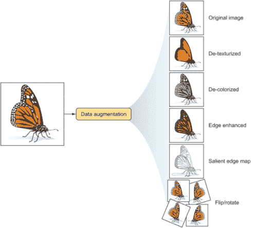

    图 1.21 图像增强技术创建了输入图像的修改版本，为机器学习模型提供更多学习样本。

+   其他技术 --有许多预处理技术可供选择，以便为训练机器学习模型准备你的图像。在某些项目中，你可能需要从你的图像中移除背景颜色以减少噪声。在其他项目中，可能需要你调整图像的亮度或暗度。简而言之，你需要应用到数据集上的任何调整都是预处理的一部分。你将根据手头的数据集和你要解决的问题选择合适的处理技术。在这本书中，你将看到许多图像处理技术，这有助于你建立自己在项目工作中需要哪些技术的直觉。

免费午餐定理

这是一个由 David Wolpert 和 William Macready 在“优化中的无免费午餐定理”（IEEE Transactions on Evolutionary Computation 1, 67）中提出的短语。当团队在机器学习项目中工作时，你经常会听到这句话。这意味着没有一种规定的食谱适合所有模型。在机器学习项目中工作时，你需要做出许多选择，比如构建你的神经网络架构、调整超参数以及应用适当的数据预处理技术。虽然有一些经验法则可以解决某些问题，但事实上并没有一种保证在所有情况下都能有效工作的单一食谱。

你必须对你正在尝试解决的问题的数据集和问题做出某些假设。对于某些数据集，最好将彩色图像转换为灰度图像，而对于其他数据集，你可能需要保留或调整彩色图像。

好消息是，与传统的机器学习不同，深度学习算法需要最少的数据预处理，因为正如你很快就会看到的，神经网络在处理图像和提取特征方面做了大部分繁重的工作。

## 1.6 特征提取

特征提取是 CV 流程的核心组件。实际上，整个深度学习模型都是围绕提取有用特征的想法展开的，这些特征可以清楚地定义图像中的对象。因此，我们将在这里花更多的时间，因为了解什么是特征、什么是特征向量以及为什么我们要提取特征是非常重要的。

定义 在机器学习中，特征是观察现象的个别可测量属性或特征。特征是你输入到你的机器学习模型中以输出预测或分类的数据。假设你想预测房屋的价格：你的输入特征（属性）可能包括`square_foot`（面积）、`number_of_rooms`（房间数）、`bathrooms`（浴室数量）等，模型将根据你的特征值输出预测价格。选择能够清楚地区分你的对象的良好特征可以增加机器学习算法的预测能力。

### 1.6.1 计算机视觉中的特征是什么？

在计算机视觉（CV）中，一个特征是图像中一个可测量的数据片段，它对该特定物体是独特的。它可能是一种独特的颜色或特定的形状，如线条、边缘或图像片段。一个好的特征被用来区分不同的物体。例如，如果我给你一个像轮子这样的特征，并让你猜测一个物体是摩托车还是狗，你会怎么猜？摩托车。正确！在这种情况下，轮子是一个强大的特征，它清楚地区分了摩托车和狗。然而，如果我给你同样的特征（一个轮子）并让你猜测一个物体是自行车还是摩托车，这个特征就不足以区分这些物体。你需要寻找更多像镜子、车牌或可能还有踏板这样的特征，这些特征共同描述了一个物体。在机器学习（ML）项目中，我们希望将原始数据（图像）转换成特征向量，以展示给我们的学习算法，这样算法就可以学习物体的特征（图 1.22）。

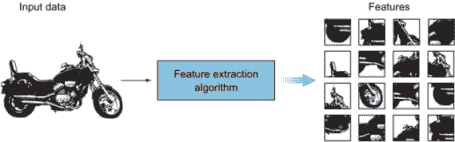

图 1.22 示例输入图像被输入到特征提取算法中，以在图像中找到模式并创建特征向量

在图中，我们将摩托车原始输入图像输入到特征提取算法中。现在，让我们将特征提取算法视为一个黑盒，我们稍后再来讨论它。现在，我们需要知道提取算法产生一个包含特征列表的向量。这个特征向量是一个一维数组，它对物体提供了一个稳健的表示。

特征泛化能力

需要强调的是，图 1.22 反映的是仅从一辆摩托车中提取的特征。一个特征的重要特性是可重复性。特征应该能够检测到一般的摩托车，而不仅仅是这一特定的摩托车。因此，在现实世界的问题中，一个特征并不是输入图像中某一部分的精确副本。

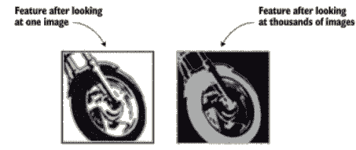

特征需要检测一般模式。

以轮子特征为例，这个特征并不完全像某一特定摩托车的轮子。相反，它看起来像是一个带有一些识别训练数据集中所有图像中轮子的模式的圆形形状。当特征提取器看到成千上万张摩托车的图像时，它识别出定义一般轮子的模式，而不管它们在图像中的位置和它们属于哪种类型的摩托车。

### 1.6.2 什么因素使一个特征（有用的）变得好？

机器学习模型的好坏取决于你提供的特征。这意味着提出好的特征是构建机器学习模型的重要工作。但什么因素使一个特征变得好？你如何判断？

让我们用一个例子来讨论这个问题。假设我们想要构建一个分类器来区分两种类型的狗：灰狗和拉布拉多。让我们选取两个特征——狗的高度和它们的眼睛颜色——并对它们进行评估（图 1.23）。


图 1.23 灰狗和拉布拉多狗的例子

让我们从高度开始。你认为这个特征有多有用？嗯，平均来说，灰狗通常比拉布拉多高几英寸，但并不总是这样。狗的世界中有很多变化。所以让我们评估这两种品种群体中不同值上的这个特征。让我们在图 1.24 中的直方图上可视化玩具例子中的高度分布。

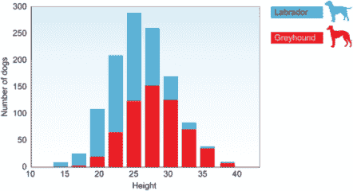

图 1.24 玩具狗数据集上高度分布的可视化

从直方图上，我们可以看到，如果狗的高度是 20 英寸或更少，有超过 80%的概率这只狗是拉布拉多。在直方图的另一边，如果我们看那些身高超过 30 英寸的狗，我们可以相当有信心地说这只狗是灰狗。那么，关于直方图中间的数据（20 到 30 英寸的高度）呢？我们可以看到，每种类型狗的概率相当接近。在这种情况下，思考过程如下：

如果高度 ≤ 20：

返回更高的拉布拉多概率

如果高度 ≥ 30：

返回更高的灰狗概率

如果 20 < 高度 < 30：

寻找其他特征来分类对象

因此，在这种情况下，狗的高度是一个有用的特征，因为它有助于（增加信息）区分两种狗类型。我们可以保留它。但是，它并不总是能区分灰狗和拉布拉多，这是可以接受的。在机器学习项目中，通常没有一种特征可以单独对所有的对象进行分类。这就是为什么在机器学习中，我们几乎总是需要多个特征，每个特征捕捉不同类型的信息。如果只有一个特征就能完成这项工作，我们就可以直接写`if-else`语句，而不用费心训练分类器。

小贴士：类似于我们之前在颜色转换（颜色与灰度）中做的，为了确定你应该为特定问题使用哪些特征，进行一个思想实验。假装你是分类器。如果你想区分灰狗和拉布拉多，你需要知道哪些信息？你可能会问关于毛发长度、身体大小、颜色等等。

为了快速举例说明一个无用的特征，让我们看看狗的眼睛颜色。在这个玩具例子中，假设我们只有两种眼睛颜色，蓝色和棕色。图 1.25 显示了这种例子可能看起来像直方图。

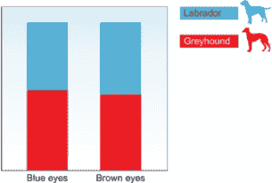

图 1.25 玩具狗数据集中眼睛颜色分布的可视化

很明显，对于大多数值，两种类型的分布大约是 50/50。所以实际上，这个特征告诉我们 nothing，因为它与狗的类型不相关。因此，它不能区分灰狗和拉布拉多。

什么是物体识别的好特征？

一个好的特征将帮助我们以所有可能的方式识别一个对象。一个好的特征的特点如下：

+   可识别

+   容易追踪和比较

+   在不同尺度、光照条件和视角下保持一致性

+   即使在噪声图像中或只有部分对象可见时仍然可见

### 1.6.3 提取特征（手工提取与自动提取）

这是在机器学习中一个很大的主题，可能需要一整本书来阐述。它通常在被称为特征工程的主题背景下进行描述。在这本书中，我们只关注从图像中提取特征。因此，我将在本章中简要介绍这个想法，并在后面的章节中进一步展开。

#### 传统机器学习使用手工特征

在传统的机器学习问题中，我们花费大量时间在手工特征选择和工程上。在这个过程中，我们依赖我们的领域知识（或与领域专家合作）来创建使机器学习算法表现更好的特征。然后，我们将生成的特征输入到支持向量机（SVM）或 AdaBoost 等分类器中，以预测输出（图 1.26）。一些手工特征集包括以下内容：

+   方向梯度直方图（HOG）

+   Haar 级联

+   尺度不变特征变换（SIFT）

+   加速鲁棒特征（SURF）

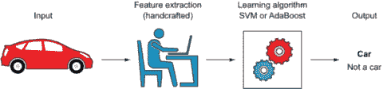

图 1.26 传统机器学习算法需要手工特征提取。

#### 使用自动提取特征的深度学习

然而，在深度学习中，我们不需要从图像中手动提取特征。网络自动提取特征，并通过对其连接应用权重来学习它们在输出中的重要性。你只需将原始图像输入到网络中，当它通过网络层时，网络会识别图像中的模式以创建特征（图 1.27）。可以将神经网络视为特征提取器加分类器，它们是端到端可训练的，与传统机器学习模型使用的手工特征形成对比。

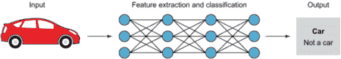

图 1.27 深度神经网络通过其层自动提取特征并对对象进行分类。不需要手工特征。

神经网络是如何区分有用特征和非有用特征的？

你可能会觉得神经网络只理解最有用的特征，但这并不完全正确。神经网络会收集所有可用的特征并给它们随机分配权重。在训练过程中，神经网络调整这些权重以反映它们的重要性以及它们应该如何影响输出预测。出现频率最高的模式将具有更高的权重，被认为是更有用的特征。权重最低的特征对输出的影响非常小。这个过程将在下一章中更详细地讨论。

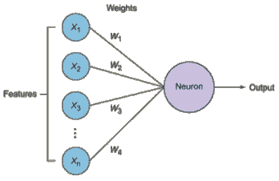

对不同特征进行加权以反映其在识别对象中的重要性

#### 为什么使用特征？

输入图像包含太多不必要的额外信息，这些信息对于分类来说是不必要的。因此，预处理图像后的第一步是通过提取重要信息并丢弃非必要信息来简化它。通过提取重要的颜色或图像片段，我们可以将复杂和大量的图像数据转换为更小的特征集。这使得基于特征对图像进行分类的任务更加简单和快速。

考虑以下示例。假设我们有一个包含 10,000 张摩托车图像的数据集，每张图像的宽度为 1,000 像素，高度为 1,000 像素。一些图像有均匀的背景，而其他图像则有繁忙的背景和不必要的数据。当这些数千张图像被输入到特征提取算法中时，我们丢失了所有对识别摩托车不重要的非必要数据，我们只保留了一个可以直接输入到分类器中的有用特征列表（图 1.28）。这个过程比让分类器查看 10,000 张图像的原始数据集来学习摩托车的属性要简单得多。

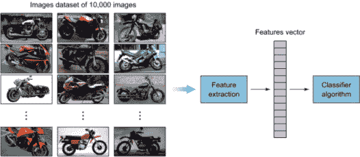

图 1.28 从数千张图像中提取并巩固特征，形成一个特征向量以供分类器使用

## 1.7 分类学习算法

到目前为止，关于分类器管道我们已经讨论了以下几点：

+   输入图像 -- 我们已经看到图像是如何表示为函数的，以及计算机将图像视为灰度图像的二维矩阵和彩色图像的三维矩阵（三个通道）。

+   图像预处理 -- 我们讨论了一些图像预处理技术，以清理我们的数据集并使其准备好作为机器学习算法的输入。

+   特征提取 -- 我们将我们的大量图像数据集转换为一个描述图像中对象的独特有用特征的向量。

现在是时候将提取的特征向量输入到分类器中，以输出图像的类别标签（例如，摩托车或其他）。

正如我们在上一节中讨论的，分类任务可以通过以下方式之一完成：传统的机器学习算法，如支持向量机（SVMs），或深度神经网络算法，如卷积神经网络（CNNs）。虽然传统的机器学习算法可能在某些问题上获得相当好的结果，但 CNNs 在处理和分类最复杂的问题中的表现尤为出色。

在这本书中，我们将详细讨论神经网络以及它们是如何工作的。现在，我想让你知道神经网络会自动从你的数据集中提取有用特征，并充当分类器，为你的图像输出类别标签。输入图像通过神经网络的层来学习它们的特征，一层一层地学习（图 1.29）。你的网络越深（层越多），它就会学习到数据集的更多特征：因此得名深度学习。更多的层伴随着一些权衡，我们将在下一章中讨论。神经网络的最外层通常充当分类器，输出类别标签。

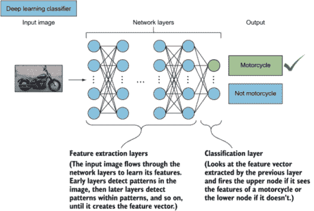

图 1.29 输入图像通过神经网络的层，以便它可以逐层学习特征。

## 摘要

+   人类和机器视觉系统都包含两个基本组件：一个感知设备和解释设备。

+   解释过程包括四个步骤：输入数据，预处理，进行特征提取，并生成机器学习模型。

+   一张图像可以被表示为 *x* 和 *y* 的函数。计算机将图像视为像素值的矩阵：灰度图像有一个通道，彩色图像有三个通道。

+   图像处理技术因问题和数据集而异。这些技术中的一些是将图像转换为灰度以降低复杂性，将图像调整到统一大小以适应您的神经网络，以及数据增强。

+   特征是图像中用于分类其对象的独特属性。传统的机器学习算法使用多种特征提取方法。
