# 2 深度学习和神经网络

本章涵盖

+   理解感知器和多层感知器

+   使用不同类型的激活函数

+   使用前向传播、误差函数和误差优化来训练网络

+   执行反向传播

在上一章中，我们讨论了计算机视觉（CV）管道组件：输入图像、预处理、提取特征和学习算法（分类器）。我们还讨论了在传统的机器学习（ML）算法中，我们手动提取特征，生成一个特征向量，由学习算法进行分类，而在深度学习（DL）中，神经网络既是特征提取器又是分类器。神经网络自动识别模式并从图像中提取特征，并将它们分类为标签（图 2.1）。

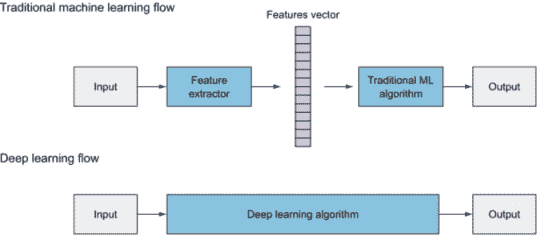

图 2.1 传统的机器学习算法需要手动提取特征。深度神经网络通过其层传递输入图像来自动提取特征。

在本章中，我们将从 CV 背景中短暂休息，打开图 2.1 中的 DL 算法框。我们将深入探讨神经网络如何学习特征和做出预测。然后，在下一章中，我们将回到 CV 应用，介绍最流行的 DL 架构之一：卷积神经网络。

本章的高级布局如下：

+   我们将从神经网络最基本的部分开始：感知器，这是一个只包含一个神经元的神经网络。

+   然后，我们将转向一个包含数百个神经元的更复杂的神经网络架构，以解决更复杂的问题。这个网络被称为多层感知器（MLP），其中神经元堆叠在隐藏层中。在这里，你将学习神经网络架构的主要组成部分：输入层、隐藏层、权重连接和输出层。

+   你将了解到网络训练过程包括三个主要步骤：

    1.  前向操作

    1.  计算误差

    1.  误差优化：使用反向传播和梯度下降来选择最优化参数，以最小化误差函数

我们将深入探讨这些步骤的每一个。你会发现构建神经网络需要做出必要的设计决策：选择优化器、损失函数和激活函数，以及设计网络架构，包括应该有多少层相互连接以及每层应该有多少个神经元。准备好了吗？让我们开始吧！


图 2.2 人工神经网络由节点层组成，节点或神经元通过边连接。

## 2.1 理解感知器

让我们看看第一章（图 2.2）中的人工神经网络（ANN）图。你可以看到，ANN 由许多按层结构排列的神经元组成，以执行某种计算并预测输出。这种架构也可以称为多层感知器，因为它更直观，因为它暗示网络由多层感知器组成。MLP 和 ANN 这两个术语可以互换使用，以描述这种神经网络架构。

在图 2.2 中的 MLP 图中，每个节点被称为神经元。我们很快将讨论 MLP 网络是如何工作的，但首先让我们聚焦于神经网络最基本的部分：感知器。一旦你理解了单个感知器的工作原理，理解多个感知器如何协同工作以学习数据特征就会变得更加直观。

### 2.1.1 什么是感知器？

最简单的神经网络是感知器，它由单个神经元组成。从概念上讲，感知器的工作方式类似于生物神经元（图 2.3）。生物神经元从其树突接收电信号，以各种程度调节电信号，然后仅在输入信号的总体强度超过某个阈值时通过其突触发出输出信号。然后输出被馈送到另一个神经元，依此类推。

为了模拟生物神经元的特性，人工神经元执行两个连续的功能：它计算输入的加权总和来表示输入信号的总体强度，然后对结果应用一个阶跃函数，以确定是否在信号超过某个阈值时输出 1，如果没有超过阈值则输出 0。

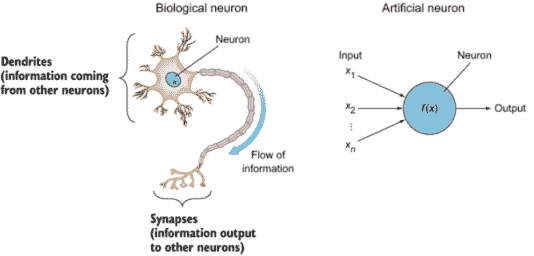

图 2.3 人工神经元是受生物神经元启发的。不同的神经元通过携带信息的突触相互连接。

正如我们在第一章中讨论的，并非所有输入特征都同等有用或重要。为了表示这一点，每个输入节点都被分配一个权重值，称为其连接权重，以反映其重要性。

连接权重

并非所有输入特征都是同等重要（或有用）的特征。每个输入特征（*x*[1]）都被分配其自己的权重（*w*[1]），以反映其在决策过程中的重要性。分配了更高权重的输入对输出的影响更大。如果权重高，它会放大输入信号；如果权重低，它会减弱输入信号。在神经网络的一般表示中，权重由从输入节点到感知器的线条或边表示。

例如，如果你是根据一组特征（如大小、邻里和房间数量）预测房价，那么有三个输入特征（*x*[1]、*x*[2]和*x*[3]）。这些输入中的每一个都将有不同的权重值，代表其对最终决策的影响。例如，如果房屋的大小对价格的影响是邻里的两倍，而邻里对房间数量的影响是两倍，那么你将看到权重值分别为 8、4 和 2。

连接值是如何分配的，以及学习是如何发生的，这是神经网络训练过程的核心。这是我们将在本章剩余部分讨论的内容。

在图 2.4 的感知器图中，你可以看到以下内容：

+   输入向量 --输入到神经元的特征向量。通常用大写*x*表示输入向量的输入（*x*[1]、*x*[2]，……，*x*[n]*）。

+   权重向量 --每个*x*[1]被分配一个权重值*w*[1]，它表示其在区分不同输入数据点中的重要性。

+   神经元函数 --在神经元内进行的计算，以调节输入信号：加权总和和阶跃激活函数。

+   输出 --由你为网络选择的激活函数类型控制。有不同类型的激活函数，我们将在本章详细讨论。对于阶跃函数，输出为 0 或 1。其他激活函数产生概率输出或浮点数。输出节点代表感知器的预测。

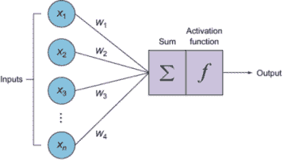

图 2.4 输入向量被输入到神经元中，并分配权重以表示其重要性。神经元内部进行的计算是加权总和和激活函数。

让我们更深入地了解神经元内部发生的加权总和和阶跃函数计算。

#### 加权总和函数

也称为线性组合，加权总和函数是所有输入乘以其权重之和，然后加上一个偏置项。此函数产生以下方程表示的直线：

*z* = Σ*x[i]* · *w[i]* + *b*（偏置）

*z* = *x*[1] · *w*[1] + *x*[2] · *w*[2] + *x*[3] · *w*[3] + … + *x*[n] · *w*[n] + *b*

这里是如何在 Python 中实现加权总和的：

```
z = np.dot(w.T,X) + b        ❶
```

❶ *x* 是输入向量（大写 X），w 是权重向量，b 是 y 轴截距。

感知器中的偏置是什么，为什么我们要添加它？

让我们复习一下线性代数的一些概念，以帮助理解底层发生了什么。以下是直线的函数：

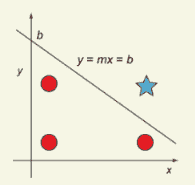

直线的方程

直线的函数由方程 (*y = mx + b*) 表示，其中 *b* 是 y 轴截距。要能够定义一条线，你需要两样东西：线的斜率和线上的一个点。偏差就是 y 轴上的那个点。偏差允许你将线在 y 轴上上下移动，以更好地拟合预测与数据。没有偏差（*b*），线总是必须通过原点（0,0），这将导致拟合较差。为了可视化偏差的重要性，请看上面的图表，并尝试使用通过原点（0,0）的线将圆圈与星号分开。这是不可能的。

输入层可以通过引入一个始终具有值为 1 的额外输入节点来给予偏差，正如你可以在下一个图中看到的那样。在神经网络中，偏差（*b*）的值被视为一个额外的权重，并由神经元学习并调整以最小化成本函数，正如我们将在本章的后续部分中学习的那样。


输入层可以通过引入一个始终具有值为 1 的额外输入来给予偏差。

#### 步激活函数

在人工和生物神经网络中，一个神经元不仅仅输出它接收到的原始输入。相反，还有一个额外的步骤，称为激活函数；这是大脑的决策单元。在 ANNs 中，激活函数接受之前相同的加权求和输入（*z* = Σ*x[i]* · *w[i]* + *b*）并在加权求和高于某个阈值时激活（触发）神经元。这种激活基于激活函数的计算。在本章的后面部分，我们将回顾不同类型的激活函数及其在神经网络更广泛背景中的通用目的。感知器算法使用的最简单的激活函数是步函数，它产生二进制输出（0 或 1）。它基本上说，如果求和输入 ≥ 0，它“触发”（输出 = 1）；否则（求和输入 < 0），它不触发（输出 = 0）（图 2.5）。

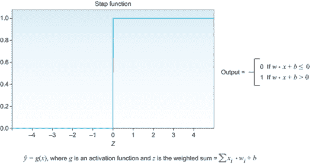


这就是 Python 中步函数看起来像什么：

```
def step_function(*z*):          ❶
    if z <= 0:
         return 0
   else:
    return 1
```

❶ *z* 是加权求和 = σ *x[i]* · *w[i]* + b

### 2.1.2 感知器是如何学习的？

感知器通过试错法从错误中学习。它通过调整权重的值上下移动，直到网络被训练（图 2.6）。

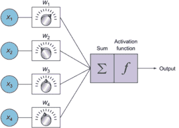

图 2.6 在学习过程中调整权重上下移动以优化损失函数的值。

感知器的学习逻辑是这样的：

1.  神经元计算加权求和并应用激活函数来做出预测 *ŷ*。这被称为前馈过程：

    +   *ŷ* = activation(Σ*x[i]* · *w[i]* + *b*)

1.  它将输出预测与正确标签进行比较来计算错误：

    +   错误 = *y - ŷ*

1.  然后，它会更新权重。如果预测过高，它会调整权重以在下一次做出更低的预测，反之亦然。

1.  重复！

这个过程会重复多次，神经元会持续更新权重以改善其预测，直到步骤 2 产生一个非常小的错误（接近零），这意味着神经元的预测非常接近正确值。此时，我们可以停止训练，并将产生最佳结果的权重值保存下来，以应用于未来结果未知的情况。

### 2.1.3 一个神经元足够解决复杂问题吗？

简短的回答是不，但让我们看看原因。感知器是一个线性函数。这意味着训练后的神经元将产生一条直线来分离我们的数据。

假设我们想要训练一个感知器来预测一个玩家是否会被大学队接受。我们收集了前几年的所有数据，并训练感知器根据仅有的两个特征（身高和体重）来预测玩家是否会被接受。训练后的感知器将找到最佳权重和偏差值，以产生最佳拟合的直线，将接受者与非接受者分开（最佳拟合）。这条线的方程如下：

*z* = 身高 · *w*[1] + 年龄 · *w*[2] + *b*

在训练数据上完成训练后，我们可以开始使用感知器来预测新玩家的数据。当我们得到一个身高 150 厘米、12 岁的玩家时，我们用值（150，12）计算前面的方程。当在图表（图 2.7）中绘制时，你可以看到它低于这条线：神经元预测这个玩家不会被接受。如果它高于这条线，那么这个玩家将被接受。

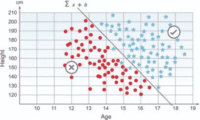

图 2.7 线性可分的数据可以通过一条直线分离。

在图 2.7 中，单个感知器工作得很好，因为我们的数据是线性可分的。这意味着训练数据可以通过一条直线分离。但生活并不总是那么简单。当我们有一个更复杂的、不能通过直线分离的数据集（非线性数据集）时会发生什么？

正如你在图 2.8 中看到的，一条单独的直线无法分离我们的训练数据。我们说它不适合我们的数据。我们需要一个更复杂的网络来处理这种更复杂的数据。如果我们构建一个包含两个感知器的网络会怎样？这将产生两条线。这会帮助我们更好地分离数据吗？

好吧，这确实比直线要好。但我仍然看到一些颜色预测错误。我们能否添加更多的神经元来使函数更好地拟合？现在你明白了。从概念上讲，我们添加的神经元越多，网络就越能拟合我们的训练数据。事实上，如果我们添加太多的神经元，这会使网络过度拟合训练数据（不好）。但我们会稍后讨论这个问题。这里的普遍规则是，我们的网络越复杂，它就越能学习我们数据的特点。


图 2.8 在非线性数据集中，一条直线无法分离训练数据。在这个例子中，一个具有两个感知器的网络可以产生两条直线，并帮助进一步分离数据。

## 2.2 多层感知器

我们看到，单个感知器在可以由直线分割的简单数据集上表现良好。但是，正如你可以想象的那样，现实世界比这复杂得多。这就是神经网络可以展示其全部潜力的地方。

线性与非线性问题

+   线性数据集--数据可以用一条直线分割。

+   非线性数据集--数据不能仅用一条直线分割。我们需要多条直线来形成一个分割数据的形状。

看看这个二维数据。在线性问题中，星号和点可以通过画一条直线轻松分类。在非线性数据中，一条直线无法将两种形状分开。

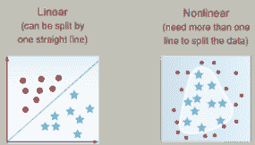

线性数据和非线性数据的示例

要分割非线性数据集，我们需要多条直线。这意味着我们需要提出一个架构，在神经网络中使用成百上千的神经元。让我们看看图 2.9 中的例子。记住，感知器是一个产生直线的线性函数。因此，为了拟合这些数据，我们试图创建一个类似三角形的形状，以分割暗点。看起来三条线就能完成这项工作。

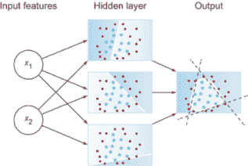

图 2.9 感知器是一个产生直线的线性函数。因此，为了拟合这些数据，我们需要三个感知器来创建一个类似三角形的形状，以分割暗点。

图 2.9 是一个用于模拟非线性数据的小型神经网络示例。在这个网络中，我们使用了一个隐藏层，该层由三个堆叠在一起的神经元组成，之所以称为隐藏层，是因为在训练过程中我们看不到这些层的输出。

### 2.2.1 多层感知器架构

我们已经看到如何设计一个包含多个神经元的神经网络。让我们通过一个更复杂的数据集来扩展这个想法。图 2.10 中的图来自 Tensorflow playground 网站([`playground.tensorflow.org`](https://playground.tensorflow.org/))。我们试图模拟一个螺旋数据集以区分两个类别。为了拟合这个数据集，我们需要构建一个包含数十个神经元的神经网络。一个非常常见的神经网络架构是将神经元堆叠在彼此之上，称为隐藏层。每一层有 n 个神经元。层通过权重连接相互连接。这导致了图中的多层感知器（MLP）架构。

神经网络架构的主要组件如下：

+   *输入层* --包含特征向量。

+   *隐藏层* --神经元堆叠在隐藏层之上。它们被称为“隐藏”层，因为我们看不到或控制进入这些层的输入或输出。我们唯一做的就是将特征向量输入到输入层，并查看输出层输出的结果。

+   *权重连接（边）* --权重被分配给节点之间的每个连接，以反映它们对最终输出预测的影响的重要性。在图网络术语中，这些被称为连接节点的边。

    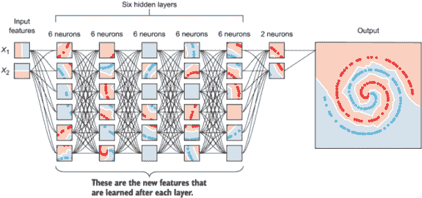

    图 2.10 Tensorflow playground 示例表示深度神经网络中的特征学习

+   *输出层* --我们从输出层得到答案或预测。根据神经网络的结构设置，最终输出可能是一个实值输出（回归问题）或一组概率（分类问题）。这取决于我们在输出层神经元中使用的激活函数的类型。我们将在下一节讨论不同类型的激活函数。

我们讨论了输入层、权重和输出层。这个架构的下一个区域是隐藏层。

### 2.2.2 什么是隐藏层？

这是特征学习过程的核心所在。当你查看图 2.10 中的隐藏层节点时，你会看到早期层检测简单的模式以学习低级特征（直线）。后面的层检测模式中的模式以学习更复杂特征和形状，然后是模式中的模式，以此类推。当我们讨论卷积网络时，这个概念将很有用。现在，要知道，在神经网络中，我们堆叠隐藏层，从彼此学习复杂特征，直到我们的数据拟合。所以当你设计你的神经网络时，如果你的网络没有拟合数据，解决方案可能是添加更多的隐藏层。

### 2.2.3 每层有多少层，每层有多少节点？

作为机器学习工程师，你将主要设计你的网络并调整其超参数。虽然没有一种单一的推荐配方适用于所有模型，但在这本书的整个过程中，我们将尝试建立你的超参数调整直觉，并推荐一些起点。当你与神经网络一起工作时，层数和每层的神经元数量是你要设计的重要超参数之一。

一个网络可以有一个或多个隐藏层（技术上，可以是你想要的任意多个）。每个层有一个或多个神经元（同样，可以是你想要的任意多个）。作为机器学习工程师，你的主要任务是设计这些层。通常，当我们有两个或更多隐藏层时，我们称之为深度神经网络。一般规则是这样的：你的网络越深，它就越能拟合训练数据。但是，过多的深度并不是好事，因为网络可以拟合训练数据到一定程度，以至于当展示新数据时无法泛化（过拟合）；同时，它也变得更加计算密集。所以你的任务是构建一个既不太简单（一个神经元）也不太复杂的数据网络。建议你阅读其他人成功实施的不同神经网络架构，以建立对问题过于简单的直觉。从这一点开始，也许三到五层（如果你在 CPU 上训练），观察网络性能。如果表现不佳（欠拟合），则添加更多层。如果你看到过拟合的迹象（稍后讨论），则减少层数。为了了解添加更多层时神经网络的表现，可以在 Tensorflow playground([`playground.tensorflow.org`](https://playground.tensorflow.org))上尝试操作。

全连接层

需要强调的是，在经典的 MLP 网络架构中，层与下一隐藏层是完全连接的。在下面的图中，注意一个层中的每个节点都与前一层的所有节点相连。这被称为全连接网络。这些边是表示该节点对输出值重要性的权重。

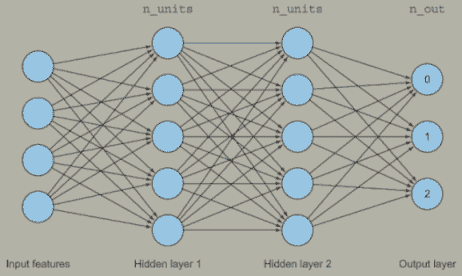

一个全连接网络

在后面的章节中，我们将讨论神经网络架构的其他变体（如卷积网络和循环网络）。现在，知道这是最基本的神经网络架构，并且可以用以下任何一种名称来引用：ANN、MLP、全连接网络或前向网络。

让我们做一个快速练习，找出我们示例中有多少条边。假设我们设计了一个具有两个隐藏层的 MLP 网络，每个隐藏层有五个神经元：

+   `Weights_0_1`: (输入层有 4 个节点) × (层 1 有 5 个节点) + 5 个偏置[每个神经元一个偏置] = 25 条边

+   `Weights_1_2`: 5 × 5 个节点 + 5 个偏置 = 30 条边

+   `Weights_2_output`: 5 × 3 个节点 + 3 个偏置 = 18 条边

+   本网络中的总边（权重）数 = 73

在这个非常简单的网络中，我们总共有 73 个权重。这些权重的值是随机初始化的，然后网络通过前向传播和反向传播来学习最适合训练数据的权重最佳值。

要查看这个网络中的权重数量，尝试以下方式在 Keras 中构建这个简单的网络：

```
model = Sequential([
    Dense(5, input_dim=4),
    Dense(5),
])
```

打印模型摘要：

```
model.summary()
```

输出将如下所示：

```
_________________________________________________________________
Layer (type)                 Output Shape              Param #   
=================================================================
dense (Dense)                (None, 5)                 25        
_________________________________________________________________
dense_1 (Dense)              (None, 5)                 30        
_________________________________________________________________
dense_2 (Dense)              (None, 3)                 18        
=================================================================
Total params: 73
Trainable params: 73
Non-trainable params: 0
```

### 2.2.4 本节的一些要点

让我们回顾一下我们迄今为止讨论的内容：

+   我们讨论了生物神经元和人工神经元之间的类比：两者都有输入和一个执行某些计算以调节输入信号并创建输出的神经元。

+   我们聚焦于人工神经元的计算，以探索其两个主要功能：加权总和和激活函数。

+   我们看到网络为所有边分配随机权重。这些权重参数反映了这些特征在输出预测中的有用性（或重要性）。

+   最后，我们看到了感知器包含单个神经元。它们是线性函数，产生一条直线来分割线性数据。为了分割更复杂的数据（非线性），我们需要在我们的网络中应用多个神经元来形成一个多层感知器。

+   MLP 架构包含输入特征、连接权重、隐藏层和输出层。

+   我们讨论了感知器学习的高级过程。学习过程是三个主要步骤的重复：前向计算以产生预测（加权总和和激活）、计算误差以及反向传播误差并更新权重以最小化误差。

我们还应该记住一些关于神经网络超参数的重要观点：

+   隐藏层数量 -- 你可以拥有你想要的任何数量的层，每层可以有任意数量的神经元。一般想法是，你拥有的神经元越多，你的网络将越好地学习训练数据。但是，如果你有太多的神经元，这可能会导致一种称为过拟合的现象：网络学习训练集如此之多，以至于它记住了它而不是学习其特征。因此，它将无法泛化。为了获得适当的层数，从一个小的网络开始，并观察网络性能。然后开始添加层，直到你得到满意的结果。

+   激活函数 -- 有许多类型的激活函数，最流行的是 ReLU 和 softmax。建议你在隐藏层中使用 ReLU 激活函数，在输出层中使用 Softmax（你将在本书中的大多数项目中看到这是如何实现的）。

+   误差函数 -- 衡量网络的预测与真实标签之间的距离。均方误差是回归问题的常见度量，交叉熵是分类问题的常见度量。

+   优化器 -- 优化算法用于找到最小化误差的最优权重值。有几种优化器类型可供选择。在本章中，我们讨论了批量梯度下降、随机梯度下降和小批量梯度下降。Adam 和 RMSprop 是两种其他流行的优化器，我们在此不讨论。

+   批处理大小 -- 小批量大小是指网络接收到的子样本数量，之后参数更新发生。较大的批处理大小学习速度更快，但需要更多的内存空间。批处理大小的良好默认值可能是 32。也可以尝试 64、128、256 等。

+   训练轮数 --在训练过程中，整个训练数据集被展示给网络的次数。增加训练轮数，直到验证准确率开始下降，即使训练准确率在增加（过拟合）。

+   学习率 --优化器的一个输入参数，我们需要调整。从理论上讲，过小的学习率保证能够达到最小误差（如果你无限期地训练）。过大的学习率会加快学习速度，但并不保证找到最小误差。大多数深度学习库中优化器的默认`lr`值是一个合理的起点，以获得不错的结果。从那里开始，可以按一个数量级上下调整。我们将在第四章中详细讨论学习率。

更多关于超参数的内容

我们尚未讨论的其他超参数包括 dropout 和正则化。在第三章介绍卷积神经网络之后，我们将在第四章中详细讨论超参数调整。

通常，调整超参数的最佳方式是通过试错。通过自己动手做项目以及从其他现有的神经网络架构中学习，你将开始培养出对超参数良好起点的直觉。

学习分析你网络的性能，并了解你需要调整哪个超参数来解决每个症状。这正是本书将要讨论的内容。通过理解这些超参数背后的推理，并观察章节末尾的项目中的网络性能，你将培养出对特定效果调整哪个超参数的直觉。例如，如果你看到你的错误值没有下降并且持续振荡，那么你可能通过降低学习率来解决这个问题。或者，如果你看到网络在训练数据的学习中表现不佳，这可能意味着网络欠拟合，你需要通过添加更多神经元和隐藏层来构建一个更复杂的模型。

## 2.3 激活函数

当你在构建你的神经网络时，你需要做出的设计决策之一是为你神经元的计算选择哪种激活函数。激活函数也被称为转移函数或非线性，因为它们将加权求和的线性组合转换成非线性模型。激活函数被放置在每个感知器的末尾，以决定是否激活这个神经元。

为什么一定要使用激活函数呢？为什么不能只是计算我们网络的加权求和，并通过隐藏层传播以产生输出呢？

激活函数的目的是将非线性引入网络。没有它，多层感知器将表现得与单个感知器相似，无论我们添加多少层。激活函数需要将输出值限制在某个有限值内。让我们回顾一下预测玩家是否被接受（图 2.11）的例子。


图 2.11 本例重新审视了从 2.1 节预测玩家是否被接受的情况。

首先，模型计算加权总和并产生线性函数(*z*)：

*z* = 身高 · *w*[1] + 年龄 · *w*[2] + *b*

该函数的输出没有界限。*z*可以是任何数字。我们使用激活函数将预测值包裹在一个有限值内。在这个例子中，我们使用一个阶跃函数，如果*z* > 0，则在线上（接受）以上，如果*z* < 0，则在线下（拒绝）。因此，如果没有激活函数，我们只有一个产生数字的线性函数，但在这种感知器中并没有做出任何决定。激活函数决定了是否触发这个感知器。

激活函数有无限种。实际上，在过去的几年里，在创建最先进的激活函数方面取得了大量进展。然而，仍然相对较少的激活函数能够满足大部分激活需求。让我们更深入地探讨一些最常见的激活函数类型。

### 2.3.1 线性传递函数

线性传递函数，也称为恒等函数，表示函数将信号通过而不改变。在实践中，输出将等于输入，这意味着我们实际上没有激活函数。所以无论我们的神经网络有多少层，它所做的只是计算一个线性激活函数，或者最多对输入的加权平均值进行缩放。但它不会将输入转换为非线性函数。

激活(*z*) = *z = wx + b*

两个线性函数的合成是一个线性函数，所以除非你在神经网络中添加一个非线性激活函数，否则无论你使网络有多深，你都不会计算任何有趣的函数。这里没有学习！

为了理解为什么，让我们计算激活*z*(*x*) = *w* · *x* + *b*的导数，其中*w* = 4 和*b* = 0。当我们绘制这个函数时，它看起来像图 2.12。然后*z*(*x*) = 4*x*的导数是*z*'(*x*) = 4（图 2.13）。

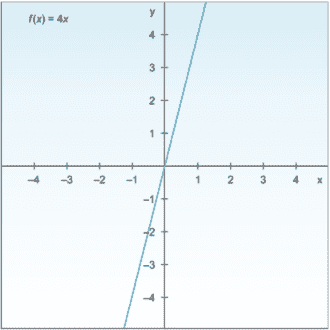

图 2.12 激活函数*f*(*x*) = 4*x*的图像

线性函数的导数是常数：它不依赖于输入值 x。这意味着每次我们进行反向传播时，梯度都将相同。这是一个大问题：因为我们实际上并没有真正改进误差，因为梯度几乎相同。这一点在我们稍后讨论反向传播时会更加清晰。

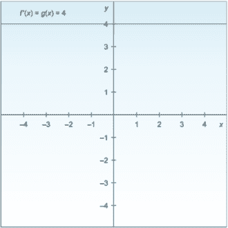

图 2.13 z(*x*) = 4*x* 的导数图像为 *z*'(*x*) = 4.

### 2.3.2 海维塞德步进函数（二元分类器）

步进函数产生二元输出。它基本上说，如果输入 *x* > 0，则触发（输出 *y* = 1）；否则（输入 < 0），则不触发（输出 *y* = 0）。它主要用于二元分类问题，如真或假、垃圾邮件或非垃圾邮件、通过或失败（图 2.14）。

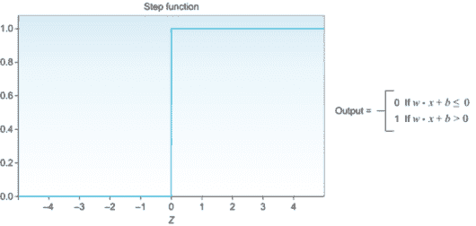

图 2.14 步进函数在二元分类问题中常用，因为它将输入转换为零或一。

### 2.3.3 Sigmoid/logistic 函数

这是最常见的激活函数之一。它通常用于二元分类器中，当你有两个类别时，预测一个类别的概率。sigmoid 函数将所有值压缩到 0 到 1 之间的概率，这减少了数据中的极端值或异常值，而没有移除它们。sigmoid 或 logistic 函数将无限连续变量（范围在 -∞ 到 +∞ 之间）转换为 0 到 1 之间的简单概率。它也被称为 S 形曲线，因为当在图表中绘制时，它会产生 S 形曲线。当步进函数用于产生离散答案（通过或失败）时，sigmoid 函数用于产生通过和失败的概率（图 2.15）：

σ(*z*) = 1/(1 + *e*^(-1))

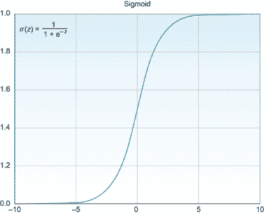

图 2.15 当步进函数用于产生离散答案（通过或失败）时，sigmoid 函数用于产生通过或失败的概率。

下面是如何在 Python 中实现 sigmoid 函数的示例：

```
import numpy as np                  ❶

def sigmoid(*x*):                     ❷
    return 1 / (1 + np.exp(-x))
```

❶ 导入 numpy

❷ Sigmoid 激活函数

实时线性代数（可选）

让我们深入探讨 sigmoid 函数的数学方面，以了解它帮助解决的问题以及 sigmoid 函数方程是如何驱动的。假设我们正在尝试根据只有一个特征：年龄，来预测患者是否患有糖尿病。当我们绘制我们关于患者的数据时，我们得到图中的线性模型：

z = β0 + β1 年龄

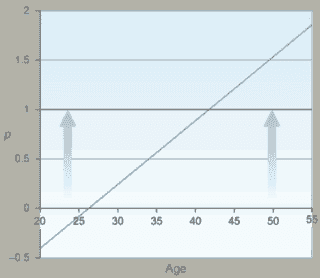

当我们绘制关于我们患者的数据时，我们得到的线性模型

在这个图中，你可以观察到应该从 0 到 1 变化的概率平衡。注意，当患者年龄低于 25 岁时，预测的概率是负数；而当患者年龄超过 43 岁时，它们高于 1（100%）。这是一个明显的例子，说明了为什么线性函数在大多数情况下不起作用。现在，我们如何修复这个问题，以给出 0 < 概率 < 1 范围内的概率？

首先，我们需要做一些事情来消除所有负概率值。指数函数是解决这个问题的绝佳方案，因为任何东西的指数（我的意思是任何东西）总是正的。所以让我们将这个应用到我们的线性方程中，以计算概率 (*p*)：

*p* = exp(*z*) = exp(*β*[0] + *β*[1] 年龄)

这个方程确保我们总是得到大于 0 的概率。那么，对于高于 1 的值怎么办？我们需要对它们做些什么。通过比例，任何给定的数除以一个大于它的数，都会得到一个小于 1 的数。让我们对前面的方程做同样的事情。我们将方程除以其值加上一个小值：要么是 1，要么是 a（在某些情况下非常小）的值——让我们称它为 epsilon（ε）：

*p* = exp(*z*) / (exp(*z*) + *ε*)

如果你将方程除以 exp(*z*)，你得到

*p* = 1/(1 + exp(-*z*))

当我们绘制这个方程的概率时，我们得到 sigmoid 函数的 S 形，其中概率不再低于 0 或高于 1。事实上，随着患者年龄的增长，概率渐近地接近 1；而当权重向下移动时，函数渐近地接近 0，但永远不会超出 0 < p < 1 的范围。这是 sigmoid 函数和逻辑回归的图像。

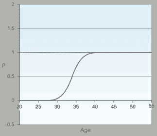

随着患者年龄的增长，概率渐近地接近 1。这是 sigmoid 函数和逻辑回归的图像。

### Softmax 函数

softmax 函数是 sigmoid 函数的推广。当我们有超过两个类别时，它用于获得分类概率。它迫使神经网络的输出之和为 1（例如，0 < 输出 < 1）。在深度学习问题中，一个非常常见的用例是从许多选项（超过两个）中预测一个单一类别。

softmax 方程如下：

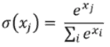

图 2.16 展示了 softmax 函数的一个示例。

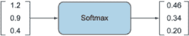

图 2.16  softmax 函数将输入值转换为 0 到 1 之间的概率值。

TIP 当你在处理需要预测两个以上类别的问题时，softmax 函数是你在分类器的输出层经常使用的首选函数。如果你正在对两个类别进行分类，softmax 函数也能很好地工作。它基本上会像 sigmoid 函数一样工作。在本节结束时，我会告诉你关于何时使用每个激活函数的建议。

### 2.3.5 双曲正切函数（tanh）

双曲正切函数是 sigmoid 函数的平移版本。tanh 不是将信号值挤压在 0 到 1 之间，而是将所有值挤压到-1 到 1 的范围内。tanh 几乎总是比 sigmoid 函数在隐藏层中工作得更好，因为它有使你的数据中心化的效果，使得数据的平均值接近零而不是 0.5，这使得下一层的学习变得容易一些：

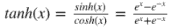

sigmoid 和 tanh 函数的一个缺点是，如果(*z*)非常大或非常小，那么这个函数的梯度（或导数或斜率）会变得非常小（接近零），这将减慢梯度下降（图 2.17）。这就是 ReLU 激活函数（下文将解释）提供解决方案的时候。

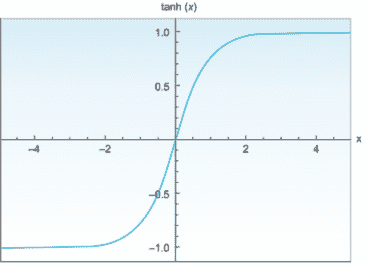

图 2.17 如果(*z*)非常大或非常小，那么这个函数的梯度（或导数或斜率）将非常小（接近零）。

### 2.3.6 矩形线性单元

矩形线性单元（ReLU）激活函数仅在输入大于零时激活节点。如果输入小于零，输出始终为零。但是当输入高于零时，它与输出变量之间存在线性关系。ReLU 函数表示如下：

*f*(*x*) = max (0, *x*)

在撰写本文时，ReLU 被认为是最先进的激活函数，因为它在许多不同的情况下都表现良好，并且它在隐藏层中训练通常比 sigmoid 和 tanh 更好（图 2.18）。

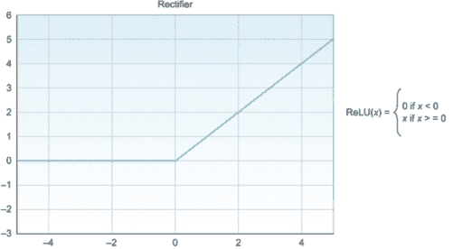

图 2.18 ReLU 函数通过将所有负值输入转换为零来消除输入的所有负值。

这是 ReLU 在 Python 中的实现方式：

```
def relu(*x*):          ❶
    if *x* < 0:
      return 0
    else:
return x
```

❶ ReLU 激活函数

### 2.3.7 Leaky ReLU

ReLU 激活的一个缺点是当(*x*)为负时，导数等于零。Leaky ReLU 是 ReLU 的一种变体，试图减轻这个问题。Leaky ReLU 在(*x*)为负时引入了一个小的负斜率（大约 0.01），而不是当*x* < 0 时函数为零。它通常比 ReLU 函数表现更好，尽管在实践中并不常用。看看图 2.19 中的 Leaky ReLU 图；你能看到泄漏吗？

*f* (*x*) = max(0.01*x*, *x*)

为什么是 0.01？有些人喜欢将其用作另一个可调的超参数，但这将是过度杀戮，因为你已经有其他更大的问题需要担心。请随意尝试在你的模型中使用不同的值（0.1，0.01，0.002）并看看它们的效果如何。

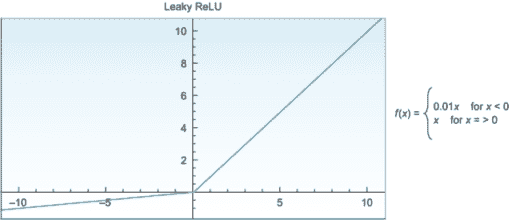

图 2.19 Leaky ReLU 在*x* < 0 时引入了一个小的负斜率（大约 0.01），而不是当*x* < 0 时函数为零。

这是 Leaky ReLU 在 Python 中的实现方式：

```
def leaky_relu(*x*):            ❶
    if *x* < 0:
      return *x* * 0.01
    else:
return x
```

❶ 带有 0.01 泄漏的 Leaky ReLU 激活函数

表 2.1 总结了本节中讨论的各种激活函数。

表 2.1 最常见激活函数速查表

| 激活函数 | 描述 | 图表 | 方程式 |
| --- | --- | --- | --- |
| 线性传递函数（恒等函数） | 信号通过它时保持不变。它仍然是一个线性函数。几乎从不使用。 | 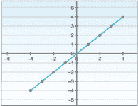 | *f*(*x*) = *x* |
| 海维塞德阶跃函数（二元分类器） | 产生 0 或 1 的二进制输出。主要用于二元分类，以给出离散值。 | 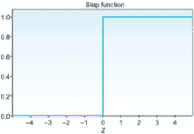 | 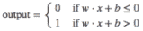 |
| Sigmoid/逻辑函数 | 将所有值压缩到 0 和 1 之间的概率，这减少了数据中的极端值或异常值。通常用于分类两个类别。 |  | 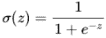 |
| Softmax 函数 | sigmoid 函数的推广。当我们有超过两个类别时，用于获得分类概率。 | 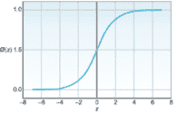 | 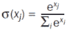 |
| 双曲正切函数 (tanh) | 将所有值压缩到-1 到 1 的范围内。Tanh 几乎总是比 sigmoid 函数在隐藏层中表现得更好。 | 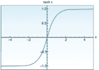 | 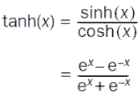 |
| 矩形线性单元 (ReLU) | 只有当输入大于零时才激活节点。总是推荐用于隐藏层。比 tanh 更好。 |  |  -13 | *f*(*x*) = max (0, *x*) |
| Leaky ReLU | 当 *x* < 0 时，函数为零，而 Leaky ReLU 在 *x* 为负时引入了一个小的负斜率（大约 0.01）。 | 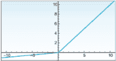 | *f*(*x*) = max(0.01*x*, *x*) |

超参数警告

由于激活函数的种类繁多，选择适合你网络的激活函数可能看起来是一项艰巨的任务。虽然选择一个好的激活函数很重要，但我保证在你设计网络时，这不会是一项具有挑战性的任务。你可以从一些经验法则开始，然后根据需要调整模型。如果你不确定该使用什么，以下是我关于选择激活函数的两分钱建议：

+   对于隐藏层——在大多数情况下，你可以在隐藏层中使用 ReLU 激活函数（或 Leaky ReLU），正如你将在本书中构建的项目中看到的那样。它正变得越来越成为默认选择，因为它比其他激活函数计算得更快。更重要的是，它减少了梯度消失的可能性，因为它不会对大输入值饱和——与 sigmoid 和 tanh 激活函数相反，它们在~ 1 处饱和。记住，梯度是斜率。当函数达到平台期时，这将导致没有斜率；因此，梯度开始消失。这使得下降到最小误差变得更加困难（我们将在后面的章节中更多地讨论这种现象，称为梯度消失/爆炸）。 

+   对于输出层——当类别互斥时，softmax 激活函数通常是大多数分类问题的良好选择。当进行二分类时，sigmoid 函数也起到相同的作用。对于回归问题，你可以简单地不使用任何激活函数，因为加权求和节点会产生你需要的连续输出：例如，如果你想根据同一地区的其他房屋价格预测房价。

## 2.4 前馈过程

现在你已经了解了如何将感知器堆叠成层，通过权重/边连接它们，执行加权求和函数，并应用激活函数，让我们实现完整的前向传递计算以生成预测输出。计算线性组合并应用激活函数的过程称为前馈。在前面的几个部分中，我们简要讨论了前馈几次；让我们更深入地看看在这个过程中发生了什么。

术语前馈用来表示信息从输入层通过隐藏层流向输出层的正向方向。这个过程通过实现两个连续的函数：加权求和和激活函数来完成。简而言之，前向传递是通过层进行计算以做出预测的过程。

让我们看看图 2.20 中的简单三层神经网络，并探索其每个组成部分：

+   层 -- 这个网络由一个具有三个输入特征输入层和三个具有每层 3、4、1 个神经元的隐藏层组成。

+   权重和偏差 (*w*, *b*) -- 节点之间的边被分配随机权重，表示为 *W*ab，其中 (*n*) 表示层号，(ab) 表示连接第 (*n*) 层中第 a 个神经元和前一层 (*n* - 1) 中第 b 个神经元的加权边。例如，*W*[23]^((2)) 是连接第 2 层第二个节点和第 1 层第三个节点的权重（*a*[2]² 到 *a*[1]³）。（请注意，你可以在其他深度学习文献中看到 *W[ab]^((n)* 的不同表示，只要你在整个网络中遵循一个约定即可。）

    偏差被处理得与权重相似，因为它们是随机初始化的，其值在训练过程中学习。因此，为了方便起见，从现在开始我们将使用与权重相同的符号来表示基（*w*）。在深度学习文献中，你通常会看到所有权重和偏差都表示为(*w*)，以简化表示。

+   激活函数 σ(*x*) -- 在这个例子中，我们使用 sigmoid 函数 σ(*x*) 作为激活函数。

+   节点值 (*a*) -- 我们将计算加权求和，应用激活函数，并将此值分配给节点 amn，其中 n 是层号，*m* 是层中的节点索引。例如，a 23 表示第 3 层中的第 2 个节点。

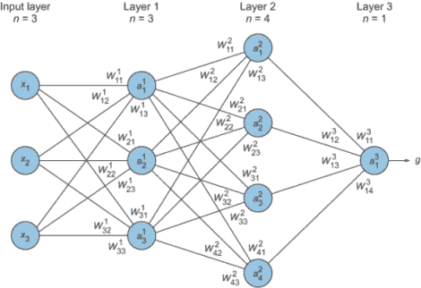

图 2.20 一个简单的三层神经网络

### 2.4.1 前馈计算

我们已经拥有了开始前馈计算所需的一切：

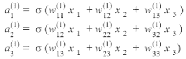

然后我们对第 2 层进行相同的计算

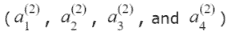

直至第 3 层的输出预测：

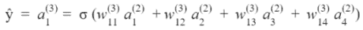

就这样！你刚刚计算了一个两层神经网络的正向传播。让我们花点时间来反思一下我们刚刚做了什么。看看我们为这样一个小的网络需要解多少个方程。当我们有一个更复杂的问题，输入层有数百个节点，隐藏层有数百个节点时会发生什么？使用矩阵一次传递多个输入会更有效率。这样做可以大幅提高计算速度，尤其是在使用 NumPy 这样的工具时，我们可以用一行代码来实现这一点。

让我们看看矩阵计算看起来是什么样子（图 2.21）。我们在这里所做的只是简单地将输入和权重堆叠成矩阵并相乘。直观地阅读这个方程的方法是从右到左。从最右边开始，跟我一起来：

+   我们将所有输入堆叠成一个向量（行，列），在这种情况下（3，1）。

+   我们将输入向量与第 1 层的权重矩阵（*W*^((1)))相乘，然后应用 sigmoid 函数。

+   我们将第 2 层的输出结果（σ · *W*^((2)))和第 3 层的输出结果（σ · *W*^((3)))相乘。

+   如果我们有第 4 层，我们将步骤 3 的结果乘以σ · *W*^((4))，依此类推，直到我们得到最终的预测输出 *ŷ*！

这里是这个矩阵公式的简化表示：

*ŷ* = σ · *W*^((3)) · σ · *W*^((2)) · σ · *W*^((1)) · (*x*)

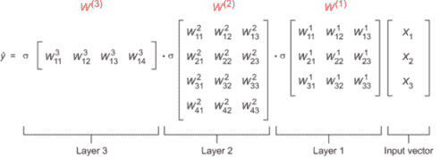

图 2.21 从左到右阅读，我们将输入堆叠成一个向量，将输入向量与第 1 层的权重矩阵相乘，应用 sigmoid 函数，并乘以结果。

### 2.4.2 特征学习

隐藏层中的节点（ai）是在每一层学习后的新特征。例如，如果你看图 2.20，你会看到我们有三个特征输入（x1，x2 和 x3）。在第一层进行正向传播计算后，网络学习到模式，这些特征被转换成具有不同值的三个新特征！[](../Images/02_20_F1.png)。然后，在下一层，网络学习模式中的模式并产生新的特征！[](../Images/02_20_F1b.png)，依此类推）。每一层产生的特征并不完全理解，我们看不到它们，也没有太多控制它们。这是神经网络魔法的一部分。这就是为什么它们被称为隐藏层。我们所做的是：我们查看最终的输出预测，并调整一些参数，直到我们对网络的性能满意为止。

再次强调，让我们通过一个小例子来看一下。在图 2.22 中，你可以看到一个小的神经网络，它根据三个特征来估算房价：卧室数量、房屋大小以及所在的社区。你可以看到，在第一层的正向传播过程中，原始输入特征值 3、2000 和 1 被转换成了新的特征值！[](../Images/02_20_F2.png)。然后它们再次被转换成预测输出值（*ŷ*）。在训练神经网络时，我们查看预测输出并与真实价格进行比较，以计算误差并重复此过程，直到我们得到最小误差。

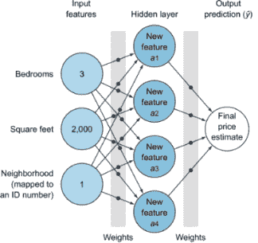

图 2.22 一个小的神经网络，基于三个特征估算房价：卧室数量、房屋大小以及所在的社区

为了帮助可视化特征学习过程，让我们再次看看 Tensorflow playground 中的图 2.9（在此处重复为图 2.23）。你可以看到，第一层学习基本特征，如线条和边缘。第二层开始学习更复杂的特征，如角落。这个过程一直持续到网络的最后几层，学习到更复杂的特征形状，如适合数据集的圆形和螺旋形。

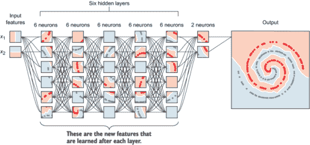

图 2.23 多个隐藏层中的特征学习

那就是神经网络学习新特征的方式：通过网络的隐藏层。首先，它们识别数据中的模式。然后，它们识别模式中的模式；然后模式中的模式中的模式，以此类推。网络越深，它对训练数据了解得就越多。

向量和矩阵复习

如果你理解了我们刚才在正向传播讨论中做的矩阵计算，你可以自由跳过这个边栏。如果你仍然不确信，请耐心等待：这个边栏是为你准备的。

正向传播的计算是一组矩阵乘法。虽然你不会手动进行这些计算，因为有很多优秀的深度学习库可以只用一行代码为你完成这些计算，但了解底层发生的数学原理是有价值的，这样你可以调试你的网络。特别是因为这个过程非常简单且有趣，让我们快速回顾一下矩阵计算。

让我们从矩阵的一些基本定义开始：

+   标量是一个单一的数字。

+   向量是一组数字。

+   矩阵是一个二维数组。

+   张量是一个 n 维数组，其中 n > 2。

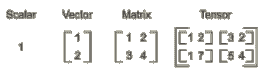

矩阵维度：标量是一个单一的数字，向量是一组数字的数组，矩阵是一个二维数组，张量是一个 n 维数组。

我们将遵循大多数数学文献中使用的惯例：

+   标量用小写和斜体表示：例如，*n*。

+   向量用小写、斜体和粗体表示：例如，***x***。

+   矩阵用大写、斜体和粗体表示：例如，***X***。

+   矩阵维度表示如下：（行 × 列）。

乘法：

+   矩阵的标量乘法——简单地将标量数乘以矩阵中的所有数。注意，标量乘法不会改变矩阵的维度：

    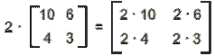

+   矩阵乘法——当乘以两个矩阵时，例如在 (行[1] × 列[1]) × (行[2] × 列[2]) 的情况下，列[1] 和行[2] 必须相等，其乘积将具有 (行[1] × 列[2]) 的维度。例如，

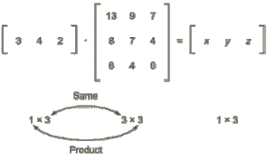

其中 *x* = 3 · 13 + 4 · 8 + 2 · 6 = 83，*y* = 63 和 *z* = 37 同理。

现在你已经知道了矩阵乘法规则，拿出一张纸，处理一下之前神经网络示例中的矩阵维度。以下图再次显示了矩阵方程，以供你方便参考。

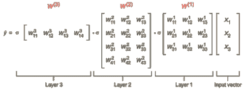

主文中的矩阵方程。使用它来处理矩阵维度。

我希望你们对矩阵了解的最后一件事是转置。通过转置，你可以将行向量转换为列向量，反之亦然，其中形状 (*m × n*) 被反转并变为 (*n × m*)。转置矩阵使用上标 (*A^T*) 表示：

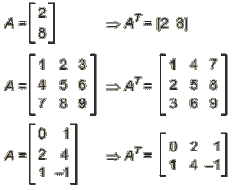

## 2.5 误差函数

到目前为止，你已经学会了如何在神经网络中实现前向传递以生成由加权求和加激活操作组成的预测。现在，我们如何评估网络刚刚生成的预测？更重要的是，我们如何知道这个预测离正确答案（标签）有多远？答案是：测量误差。误差函数的选择是神经网络设计的重要方面之一。误差函数也可以称为代价函数或损失函数，这些术语在深度学习文献中可以互换使用。

### 2.5.1 什么是误差函数？

误差函数是衡量神经网络预测相对于预期输出（标签）的“错误程度”的度量。它量化了我们离正确解有多远。例如，如果我们有一个高的损失，那么我们的模型做得不好。损失越小，模型做得越好。损失越大，我们的模型就需要更多的训练来提高其准确性。

### 2.5.2 为什么我们需要误差函数？

计算误差是一个优化问题，这是所有机器学习工程师都喜欢的（数学家也是如此）。优化问题侧重于定义一个误差函数并尝试优化其参数以获得最小误差（关于优化的更多内容将在下一节中介绍）。但就现在而言，要知道，在一般情况下，当我们处理优化问题时，如果我们能够为问题定义误差函数，我们就很有机会通过运行优化算法来最小化误差函数来解决它。

在优化问题中，我们的最终目标是找到最优变量（权重），以尽可能多地最小化误差函数。如果我们不知道我们离目标有多远，我们怎么知道在下一轮迭代中要改变什么？最小化这个错误的过程称为误差函数优化。在下一节中，我们将回顾几种优化方法。但就目前而言，我们需要从误差函数中了解的是我们离正确预测有多远，或者我们偏离了期望的性能程度有多远。

### 2.5.3 错误始终为正

考虑以下场景：假设我们有两个数据点，我们试图让我们的网络正确预测。如果第一个数据点产生 10 的错误，而第二个数据点产生-10 的错误，那么我们的平均错误为零！这具有误导性，因为“错误=0”意味着我们的网络正在产生完美的预测，而实际上它两次都偏离了 10。我们不想这样。我们希望每个预测的错误都是正数，这样当我们计算平均错误时，错误就不会相互抵消。想象一个弓箭手瞄准目标并偏离了 1 英寸。我们并不真正关心他们偏离的方向；我们只需要知道每一箭与目标的距离。

图 2.24 显示了两个独立模型随时间变化的损失函数的可视化。你可以看到模型#1 在最小化错误方面做得更好，而模型#2 在 6 个 epoch 之前表现更好，然后趋于平稳。

不同的损失函数会对相同的预测给出不同的错误，从而对模型的性能产生相当大的影响。对损失函数的详细讨论超出了本书的范围。相反，我们将专注于两种最常用的损失函数：均方误差（及其变体），通常用于回归问题，以及交叉熵，用于分类问题。

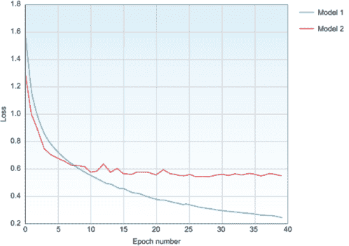

图 2.24 两个独立模型损失函数随时间变化的可视化

### 2.5.4 均方误差

均方误差（MSE）在需要输出为实值（如房价）的回归问题中常用。与仅比较预测输出与标签（*ŷ*[i] - *y*[i]）不同，误差被平方并平均到数据点的数量，正如你在这个方程中看到的那样：

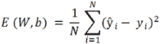

MSE 有几个优点。平方确保了错误始终为正数，并且较大的错误比较小的错误受到更多的惩罚。此外，它使数学变得简单，这始终是一个加分项。公式中的符号列在表 2.2 中。

均方误差（MSE）对异常值非常敏感，因为它平方了误差值。这可能不是你正在解决的问题的具体问题。事实上，对异常值的敏感性在某些情况下可能是有益的。例如，如果你正在预测股票价格，你会希望考虑异常值，对异常值的敏感性会是一件好事。在其他情况下，你可能不希望构建一个受异常值偏斜的模型，例如预测一个城市的房价。在这种情况下，你更感兴趣的是中位数，而不是平均值。为了这个目的，开发了一种均方误差（MSE）的变体，称为平均绝对误差（MAE），它在整个数据集上平均绝对误差，而不对误差值进行平方：

表 2.2 回归问题中使用的符号含义

| 符号 | 含义 |
| --- | --- |
| E(W, b) | 损失函数。在其他文献中也标注为 J(W, b)。 |
| W | 权重矩阵。在某些文献中，权重用希腊字母θ表示。 |
| b | 偏置向量。 |
| N | 训练样本数量。 |
| *ŷ*i | 预测输出。在某些深度学习文献中也表示为 hw, b(*x*)。 |
| *y*[i] | 正确的输出（标签）。 |
| (*ŷ*i - yi) | 通常称为残差。 |

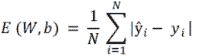

### 2.5.5 交叉熵

交叉熵在分类问题中常用，因为它量化了两个概率分布之间的差异。例如，假设对于特定的训练实例，我们正在尝试从三个可能的类别（狗、猫、鱼）中分类一张狗的图片。这个训练实例的真实分布如下：

```
Probability(cat)      P(dog)         P(fish)
     0.0               1.0             0.0 
```

我们可以将这个“真实”分布理解为训练实例有 0%的概率属于类别 A，100%的概率属于类别 B，0%的概率属于类别 C。现在，假设我们的机器学习算法预测以下概率分布：

```
Probability(cat)      P(dog)         P(fish)
     0.2                0.3              0.5   
```

预测分布与真实分布有多接近？这就是交叉熵损失函数所确定的。我们可以使用以下公式：

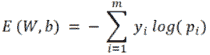

其中 (*y*) 是目标概率，(*p*) 是预测概率，(*m*) 是类别数量。求和是针对三个类别：猫、狗和鱼。在这种情况下，损失是 1.2：

```
E = - (0.0 * log(0.2) + 1.0 * log(0.3) + 0.0 * log(0.5)) = 1.2
```

因此，这就是我们的预测与真实分布之间的“错误”或“远离”程度。

让我们再来一次，只是为了展示当网络做出更好的预测时损失是如何变化的。在之前的例子中，我们向网络展示了一只狗的图片，它预测这张图片有 30%的可能性是狗，这离目标预测非常远。在后续的迭代中，网络学习了一些模式，并将预测结果稍微改进，达到了 50%：

```
Probability(cat)      P(dog)         P(fish)
     0.3                0.5              0.2  
```

然后我们再次计算损失：

```
E = - (0.0*log(0.3) + 1.0*log(0.5) + 0.0*log(0.2)) = 0.69
```

你可以看到，当网络做出更好的预测（狗的概率从 30%上升到 50%）时，损失从 1.2 下降到 0.69。在理想情况下，当网络预测图像有 100%的可能性是狗时，交叉熵损失将是 0（不妨尝试一下数学计算）。

为了计算所有训练示例（*n*）的交叉熵误差，我们使用这个通用公式：

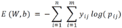

注意：重要的是要注意，你不会手动进行这些计算。理解底层的工作原理，当你设计神经网络时，会给你更好的直觉。在深度学习项目中，我们通常使用 Tensorflow、PyTorch 和 Keras 等库，其中误差函数通常是一个参数选择。

### 2.5.6 关于误差和权重的一个最后说明

如前所述，为了使神经网络学习，它需要尽可能最小化误差函数（0 是理想的）。误差越低，模型在预测值方面的准确性就越高。我们如何最小化误差？

让我们通过以下具有单个输入的感知器示例来了解权重和误差之间的关系：


假设输入*x* = 0.3，其标签（目标预测）*y* = 0.8。这个感知器的预测输出(*ŷ*)计算如下：

*ŷ*[i] = *w* · *x* = *w* · 0.3

误差，在其最简单形式中，是通过比较预测*ŷ*和标签*y*来计算的：

error = |*ŷ* - *y* |

= |(*w* · *x*) - *y* |

= |*w* · 0.3 - 0.8|

如果你观察这个误差函数，你会注意到输入(*x*)和目标预测(*y*)是固定值。对于这些特定的数据点，它们永远不会改变。在这个方程中，我们唯一可以改变的两个变量是误差和权重。现在，如果我们想达到最小误差，我们可以调整哪个变量？正确：权重！权重充当网络需要上下调整以获得最小误差的旋钮。这就是网络学习的方式：通过调整权重。当我们绘制误差函数相对于权重的图像时，我们得到图 2.25 中所示的图表。

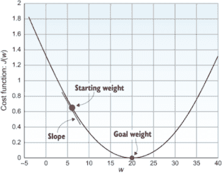

图 2.25 网络通过调整权重来学习。当我们绘制误差函数相对于权重的图像时，我们得到这种类型的图表。

如前所述，我们用随机权重初始化网络。权重位于这条曲线上，我们的任务是让它沿着曲线下降到最小误差的最优值。寻找神经网络目标权重的过程是通过使用优化算法在迭代过程中调整权重值来实现的。

## 2.6 优化算法

训练神经网络涉及向网络展示许多示例（训练数据集）；网络通过前向计算进行预测，并将预测结果与正确标签进行比较以计算误差。最后，神经网络需要调整权重（所有边上的权重）直到它得到最小误差值，这意味着最大准确度。现在，我们只需要构建能够为我们找到最优权重的算法。

### 2.6.1 优化是什么？

啊哈，优化！这是一个我非常喜爱，也是每个机器学习工程师（数学家也是如此）都喜爱的主题。优化是一种将问题框架化的方式，以最大化或最小化某个值。计算误差函数的最好之处在于，我们将神经网络转化为一个优化问题，我们的目标是最小化误差。

假设你想优化从家到工作的通勤。首先，你需要定义你正在优化的指标（误差函数）。也许你想优化通勤的成本、时间或距离。然后，基于这个特定的损失函数，你通过改变一些参数来工作以最小化其值。改变参数以最小化（或最大化）一个值被称为优化。如果你选择损失函数为成本，你可能选择一个需要两小时的更长通勤，或者（假设性地）你可能步行五小时以最小化成本。另一方面，如果你想优化通勤时间，你可能愿意花 50 美元乘坐出租车，将通勤时间缩短到 20 分钟。基于你定义的损失函数，你可以开始改变你的参数以获得你想要的结果。

TIP 在神经网络中，优化误差函数意味着更新权重和偏差，直到我们找到最优权重，或者产生最小误差的最佳权重值。

让我们看看我们正在尝试优化的空间：


在最简单的神经网络形式中，一个只有一个输入的感知器，我们只有一个权重。我们可以很容易地绘制出相对于这个权重的误差（我们试图最小化的误差），如图 2.26 中的 2D 曲线（之前已展示）。


图 2.26 对于单个感知器，误差函数相对于其权重的 2D 曲线。

但如果我们有两个权重呢？如果我们绘制这两个权重的所有可能值，我们得到一个包含误差的 3D 平面（图 2.27）。


图 2.27 绘制两个权重的所有可能值得到一个 3D 误差平面。

那么对于超过两个权重的情况呢？您的网络可能拥有数百或数千个权重（因为您的网络中的每条边都有自己的权重值）。由于我们人类只能理解最多 3 个维度，当我们有 10 个权重时，我们无法可视化错误图，更不用说数百或数千个权重参数了。因此，从现在开始，我们将使用错误函数的 2D 或 3D 平面来研究错误。为了优化模型，我们的目标是搜索这个空间，找到能够实现最低可能错误的最佳权重。

我们为什么需要一个优化算法？难道我们不能只是通过尝试大量的权重值（比如 1,000 个值）直到我们得到最小误差吗？

假设我们使用了一种暴力方法，只是尝试了大量的不同可能的权重（比如说 1,000 个值），并找到了产生最小误差的权重。这能行得通吗？好吧，从理论上讲，是的。这种方法在我们只有很少的输入并且网络中只有一个或两个神经元时可能有效。让我尝试说服您这种方法不会扩展。让我们看看一个非常简单的神经网络场景。假设我们只想根据四个特征（输入）和一个包含五个神经元的隐藏层来预测房价（见图 2.28）。


图 2.28 如果我们只想根据四个特征（输入）和一个包含五个神经元的隐藏层来预测房价，我们将有从输入层到隐藏层的 20 个边缘（权重），再加上从隐藏层到输出预测的 5 个权重。

如您所见，我们从输入层到隐藏层的边缘（权重）有 20 个，再加上从隐藏层到输出预测的 5 个权重，总共需要调整 25 个权重变量以获得最佳值。如果我们为每个权重尝试 1,000 个不同的值，那么我们将有总共 1,075 种组合：

1,000 × 1,000 × ... × 1,000 = 1,000²⁵ = 1,075 种组合

假设我们能够得到世界上最快的超级计算机：神威·太湖之光，其运行速度为 93 petaflops ⇒ 93 × 10¹⁵ 每秒浮点运算（FLOPs）。在最佳情况下，这台超级计算机将需要


这是一个巨大的数字：它比宇宙存在的时间还要长。谁有那么多时间等待网络训练？记住，这是一个非常简单的神经网络，通常使用智能优化算法只需要几分钟就能训练。在现实世界中，您将构建更复杂的网络，这些网络有数千个输入和数十个隐藏层，并且您需要在几小时（或几天，有时是几周）内训练它们。因此，我们必须想出一种不同的方法来找到最佳权重。

希望我已经说服你，通过暴力优化过程不是答案。现在，让我们研究神经网络中最受欢迎的优化算法：梯度下降。梯度下降有几个变体：批量梯度下降（BGD）、随机梯度下降（SGD）和迷你批量 GD（MB-GD）。

### 2.6.2 批量梯度下降

梯度的通用定义（也称为导数）是，它是告诉你曲线在任意给定点的切线斜率或变化率的函数。这只是曲线斜率或陡度的花哨说法（图 2.29）。


图 2.29 梯度是描述曲线在任意给定点的切线斜率变化率的函数。

梯度下降简单来说就是迭代更新权重，以下降误差曲线的斜率，直到我们到达最小误差的点。让我们看看我们之前引入的关于权重的误差函数。在初始权重点，我们计算误差函数的导数以得到下一步的斜率（方向）。我们重复这个过程，沿着曲线向下走，直到我们达到最小误差（图 2.30）。


图 2.30 梯度下降通过增量步骤下降误差函数。

#### 梯度下降是如何工作的？

为了可视化梯度下降的工作原理，让我们在 3D 图中绘制误差函数（图 2.31），并逐步分析这个过程。随机初始权重（起始权重）位于点 A，我们的目标是下降到误差山的目标权重值 *w*[1] 和 *w*[2]，这些权重值产生最小的误差值。我们这样做的方式是通过一系列沿着曲线的步骤，直到我们得到最小误差。为了下降误差山，我们需要确定每一步的两个东西：

+   步长方向（梯度）

+   步长大小（学习率）


图 2.31 随机初始权重（起始权重）位于点 A。我们下降到产生最小误差值的权重值 *w*[1] 和 *w*[2]，以下降误差山。

#### 方向（梯度）

假设你站在误差山的顶部点 A。为了到达底部，你需要确定导致最深下降（具有最陡斜率）的步长方向。那么斜率是什么呢？它是曲线的导数。所以如果你站在那座山的顶部，你需要看看你周围的各个方向，找出哪个方向会导致最深下降（例如 1、2、3 或 4）。假设是方向 3；我们选择那条路。这把我们带到了点 B，然后我们重新开始这个过程（计算前向传播和误差）并找到最深下降的方向，以此类推，直到我们到达山的底部。

这个过程被称为梯度下降。通过对权重相对于误差的导数（*dE / Dw*）进行计算，我们得到我们应该采取的方向。现在还有一件事。梯度只决定了方向。步长的大小应该是多少？它可能是一英尺的步长，也可能是一百英尺的跳跃。这是我们接下来需要确定的事情。

#### 步长（学习率α）

学习率是网络在下降误差山时每一步的大小，通常用希腊字母 alpha（α）表示。它是你在训练神经网络时调整的最重要超参数之一（关于这一点稍后还会讨论）。较大的学习率意味着网络将学习得更快（因为它以更大的步长下降山），而较小的步长意味着学习较慢。听起来很简单。让我们使用大的学习率，在几分钟内完成神经网络训练，而不是等待几个小时。对吧？并不完全是这样。让我们看看如果我们设置一个非常大的学习率值可能会发生什么。

在图 2.32 中，你从点 A 开始。当你沿着箭头方向迈出大步时，你不会下降误差山，而是最终到达点 B，在另一边。然后另一个大步带你到 C，以此类推。误差将持续振荡，永远不会下降。我们稍后会更多地讨论调整学习率以及如何确定误差是否在振荡。但就目前而言，你需要知道这一点：如果你使用一个非常小的学习率，网络最终会下降到山脚下，并达到最小误差。但这种训练会花费更长的时间（可能是几周或几个月）。另一方面，如果你使用一个非常大的学习率，网络可能会持续振荡，永远不会训练。所以我们通常将学习率初始化为 0.1 或 0.01，并观察网络的性能，然后进一步调整。


图 2.32 设置一个非常大的学习率会导致误差振荡而永远不会下降。

#### 将方向和步长结合起来

通过将方向（导数）乘以步长（学习率），我们得到每一步的权重变化：


我们添加负号是因为导数总是计算向上的斜率。由于我们需要下降山，我们就沿着斜率的反方向前进：

*w[next-step] = w[current] + Δw*

微积分复习：计算偏导数

导数是变化的研究。它测量了图表上特定点的曲线的陡峭程度。


我们想要找到曲线在确切权重点的陡峭程度。

看起来数学已经给了我们我们正在寻找的东西。在误差图表上，我们想要找到曲线在确切权重点的陡峭程度。谢谢，数学！

导数的其他术语是斜率和变化率。如果误差函数表示为 E(*x*)，那么误差函数关于权重的导数表示为

*d/dw•E(x)*或简称为*dE(x)/dw*。

这个公式显示了当我们改变权重时，总误差将如何变化。

幸运的是，数学家为我们制定了一些规则来计算导数。由于这不是一本数学书，我们不会讨论这些规则的证明。相反，我们将从这一点开始应用这些规则来计算我们的梯度。以下是一些基本的导数规则：


让我们看看一个简单的函数来应用导数规则：

*f*(*x*) = 10*x*⁵ + 4*x*⁷ + 12*x*

我们可以应用幂、常数和求和规则来得到*df/df*，也称为*f*' (*x*)：

然后，*f*' (*x*) = 50*x*⁴ + 28*x*⁶ + 12

为了理解这意味着什么，让我们绘制*f*(*x*)的图像：


使用简单函数应用导数规则。要得到任何点的斜率，我们可以在该点计算 f' (*x*)。

如果我们想在任何一点得到斜率，我们可以在该点计算 f ' (*x*)。所以 f ' (2)给出了左侧线的斜率，而 f ' (6)给出了第二条线的斜率。明白了吗？

对于导数的最后一个例子，让我们应用幂规则来计算 sigmoid 函数的导数：


注意，你不需要记住导数规则，也不需要自己计算函数的导数。多亏了出色的深度学习社区，我们有了伟大的库，只需一行代码就能为你计算这些函数。但了解底层发生的事情是有价值的。

#### 批量梯度下降的陷阱

梯度下降是一个非常强大的算法，用于达到最小误差。但它有两个主要陷阱。

首先，并非所有成本函数都像我们之前看到的简单碗一样。可能会有洞、脊和各种不规则地形，这使得达到最小误差非常困难。考虑图 2.33，其中误差函数稍微复杂一些，有起伏。


图 2.33 复杂的误差函数由更复杂的曲线表示，具有许多局部最小值。我们的目标是达到全局最小值。

记住，在权重初始化期间，起点是随机选择的。如果梯度下降算法的起点如图所示，误差将开始下降右侧的小山，并确实达到一个最小值。但这个最小值，称为局部最小值，并不是这个误差函数可能的最小误差值。它是算法随机开始的地方的局部山的最小值。相反，我们想要达到最低可能的误差值，即全局最小值。

第二，批量梯度下降在每一步都使用整个训练集来计算梯度。还记得这个损失函数吗？


这意味着如果您的训练集（*n*）有 1 亿（1 亿）条记录，算法需要计算 1 亿条记录的总和才能迈出一步。这在计算上非常昂贵且缓慢。这就是为什么这个算法也被称为批量梯度下降——因为它在一次批次中使用了整个训练数据。

解决这两个问题的一个可能方法是随机梯度下降。我们将在下一节中探讨 SGD。

### 2.6.3 随机梯度下降

在随机梯度下降中，算法随机选择数据点，并逐个数据点进行梯度下降（图 2.34）。这提供了许多不同的权重起始点，并下降到所有山峰以计算它们的局部最小值。然后，所有这些局部最小值中的最小值就是全局最小值。这听起来非常直观；这就是 SGD 算法背后的概念。


图 2.34 随机梯度下降算法随机选择曲线上的数据点，并将它们全部下降以找到局部最小值。

随机只是一个花哨的词，指的是随机。随机梯度下降可能是机器学习中最常用的优化算法，尤其是在深度学习中。虽然梯度下降测量整个训练集的损失和梯度，以向最小值迈出一步，但 SGD 在每一步随机选择训练集中的单个实例，并仅基于该单个实例计算梯度。让我们看一下 GD 和 SGD 的伪代码，以更好地理解这些算法之间的差异：

| GD | 随机 GD |
| --- | --- |

|

1.  取用所有数据。

1.  计算梯度。

1.  更新权重并向下移动一步。

1.  重复执行 n 个 epoch（迭代）。

GD 沿着误差曲线的平滑路径下降 |

1.  随机打乱训练集中的样本。

1.  选择一个数据实例。

1.  计算梯度。

1.  更新权重并向下移动一步。

1.  选择另一个数据实例。

1.  重复执行 n 个 epoch（训练迭代）。

SGD 沿着误差曲线的振荡路径下降 |

由于我们在批量梯度下降中在整个训练数据上计算梯度后才会进行一步，因此你可以看到误差下降的路径是平滑的，几乎是一条直线。相比之下，由于随机梯度下降（SGD）的随机（随机）性质，你看到指向全局成本最小值的路径不是直接的，如果在二维空间中可视化成本表面，它可能会出现曲折。这是因为 SGD 中，每次迭代都试图更好地拟合单个训练示例，这使得它变得非常快，但并不保证每一步都会使曲线下降。它将接近全局最小值，一旦到达那里，它将继续弹跳，永远不会稳定下来。在实践中，这并不是一个问题，因为接近全局最小值对于大多数实际应用来说已经足够好了。SGD 几乎总是比批量梯度下降表现得更好、更快。

### 2.6.4 小批量梯度下降

小批量梯度下降（MB-GD）是批量梯度下降（BGD）和随机梯度下降（SGD）之间的折中方案。我们不是从单个样本（SGD）或所有样本（BGD）计算梯度，而是将训练样本分成小批量，从这些小批量中计算梯度（常见的批量大小是 k = 256）。由于我们更频繁地更新权重，MB-GD 比 BGD 收敛得更快；然而，MB-GD 允许我们使用向量运算，这通常会导致比 SGD 更好的计算性能提升。

### 2.6.5 梯度下降要点

这里有很多内容，让我们总结一下，好吗？以下是我脑海中总结的梯度下降方法：

+   三种类型：批量、随机和小批量。

+   所有这些方法都遵循相同的概念：

    +   找到最陡斜率的方向：误差相对于权重的一阶导数 *dE/Dw[i]*

    +   设置学习率（或步长）。算法将计算斜率，但你会将学习率作为一个超参数来设置，并通过试错法进行调整。

    +   将学习率从 0.01 开始，然后降至 0.001、0.0001、0.00001。你设置的学习率越低，你越有保证能够下降到最小误差（如果你无限期地训练）。由于我们没有无限的时间，0.01 是一个合理的起点，然后我们从这个值开始逐渐降低。

+   批量梯度下降（Batch GD）在计算所有训练数据的梯度后更新权重。当数据量很大时，这可能在计算上非常昂贵。它扩展性不好。

+   随机梯度下降（Stochastic GD）在计算训练数据单个实例的梯度后更新权重。SGD 比批量梯度下降（BGD）更快，并且通常非常接近全局最小值。

+   小批量梯度下降（Mini-batch GD）是批量梯度下降和随机梯度下降之间的折中方案，既不使用所有数据，也不使用单个实例。相反，它选取一组训练实例（称为小批量），在这些实例上计算梯度并更新权重，然后重复此过程，直到处理完所有训练数据。在大多数情况下，MB-GD 是一个很好的起点。

    +   `batch_size` 是一个需要调整的超参数。这一点将在第四章的超参数调整部分再次提到。但通常，你可以从 batch_size = 32, 64, 128, 256 开始实验。

    +   不要将 batch_size 与 epochs 混淆。一个 epoch 是在所有训练数据上的完整循环。批次数是在我们计算梯度的组中训练样本的数量。例如，如果我们有 1,000 个样本在训练数据中，并且将 batch_size 设置为 256，那么 epoch 1 = 256 个样本的 batch 1 加上 batch 2（256 个样本）加上 batch 3（256 个样本）加上 batch 4（232 个样本）。

最后，你需要知道，多年来已经使用了大量的梯度下降变体，这是一个非常活跃的研究领域。其中一些最受欢迎的改进包括

+   Nesterov 加速梯度

+   RMSprop

+   Adam

+   Adagrad

不要担心这些优化器。在第四章中，我们将更详细地讨论调整技术来改进你的优化器。

我知道这听起来很多，但请继续听。这些都是我想让你从本节记住的主要事情：

+   梯度下降是如何工作的（斜率加步长）

+   批量、随机和迷你批量的梯度下降之间的区别

+   你将调整的 GD 超参数：学习率和 batch_size

如果你已经掌握了这些，你就可以进入下一节了。而且不要过于担心超参数调整。我将在接下来的章节中更详细地介绍网络调整，并在本书中的几乎所有项目中。

## 2.7 反向传播

反向传播是神经网络学习的基础。到目前为止，你已经了解到训练神经网络通常通过重复以下三个步骤来完成：

+   前馈：获取线性组合（加权求和），并应用激活函数以获得输出预测（*ŷ*）：

    *ŷ* = σ · *W*^((3)) · σ · *W*^((2)) · σ · *W*^((1)) · (*x*)

+   将预测与标签进行比较，以计算误差或损失函数：

    

+   使用梯度下降优化算法来计算Δ*w*，以优化误差函数：


通过网络反向传播Δw 以更新权重：


在本节中，我们将深入探讨最后一步：反向传播。

### 2.7.1 什么是反向传播？

反向传播，或反向传递，意味着传播误差相对于每个特定权重的导数

*dE/dw**[i]* 

从最后一层（输出）回到第一层（输入）以调整权重。通过从预测节点（*ŷ*）向后传播Δw，穿过隐藏层并回到输入层，权重得到更新：

(*w**[next-step]* = *w**[current]* + Δ*w*)

这将使误差沿着误差山下降一步。然后循环再次开始（步骤 1 到 3）以更新权重并将误差再下降一步，直到我们达到最小误差。

当我们只有一个权重时，反向传播可能听起来更清晰。我们只需通过添加 Δw 到旧权重 *w**[new]* *= w- α•dE/dw**[i]* 来调整权重。

但当我们有一个具有许多权重变量的多层感知器（MLP）网络时，事情就会变得复杂。为了使这一点更清晰，请考虑图 2.35 中的场景。


图 2.35 当我们有一个具有许多权重变量的多层感知器（MLP）网络时，反向传播变得复杂。

我们如何计算总误差相对于 *w[13]* 的变化率 *dE/dw**[13]*？记住，*dE/dw**[13]*基本上是说，“当我们改变参数 *w[13]* 时，总误差会有多少变化？”

我们通过在误差函数上应用导数规则学习了如何计算 *dE/dw**[21]*。这很简单，因为 *w[21]* 是直接连接到误差函数的。但为了计算总误差相对于权重直到输入的导数，我们需要一个微积分规则，称为链式法则。

微积分复习：导数的链式法则

再次回到微积分。还记得我们之前列出的导数规则吗？其中最重要的规则之一就是链式法则。让我们深入探讨它，看看它在反向传播中的实现方式：


链式法则是计算由其他函数内部函数组成的函数的导数的公式。它也被称为外-内规则。看看这个：


链式法则指出，“在函数组合中，导数只是相乘。”这在实现反向传播时对我们非常有用，因为前向传播只是组合了一组函数，而反向传播是在这个函数的每一部分上求导。

为了在反向传播中实现链式法则，我们只需要将多个偏导数相乘，以得到误差效应一直回到输入层。下面是如何工作的——但首先，记住我们的目标是反向传播误差直到输入层。所以在这个例子中，我们想要计算 *dE/dx*，这是总误差对输入 (*x*) 的影响：


我们在这里所做的只是将上游梯度乘以局部梯度，直到我们得到目标值。

图 2.36 显示了反向传播如何使用链式法则将梯度反向流动通过网络。让我们应用链式法则来计算误差相对于第一个输入的第三个权重 w1,3(1) 的导数，其中 (1) 表示第 1 层，w1,3 表示节点编号 1 和权重编号 3：


图 2.36 反向传播使用链式法则将梯度反向流动通过网络。

方程式一开始可能看起来很复杂，但我们实际上只是在从输出节点开始，将边的偏导数乘到输入节点。所有这些符号都使得这个方程看起来很复杂，但一旦你理解了如何读取 *w**[1,3]**^((1))* ，反向传播方程看起来就像这样：

反向传播到边 *w**[1,3]**^((1))* 的错误 = 边 4 上的错误效应 × 边 3 上的错误效应 × 边 2 上的错误效应 × 目标边的错误效应

这就是神经网络用来更新权重以最佳拟合我们问题的反向传播技术。


图 2.37 前向传播计算输出预测（左）。反向传播将误差的导数反向传播以更新其权重（右）。

### 2.7.2 反向传播要点

+   反向传播是神经元的学习过程。

+   反向传播反复调整网络中连接（权重）的权重，以最小化成本函数（实际输出向量与期望输出向量之间的差异）。

+   由于权重调整的结果，隐藏层开始代表除了输入层中代表的特征之外的重要特征。

+   对于每一层，目标是找到一组权重，确保对于每个输入向量，产生的输出向量与（或接近）期望的输出向量相同。产生的输出和期望输出之间的差异称为误差函数。

+   反向传播（图 2.37）从网络的末端开始，递归地应用链式法则来计算梯度，将错误反向传播或反馈，一直计算到网络的输入端，然后更新权重。

+   再次强调，典型神经网络问题的目标是发现一个最佳拟合我们数据的模型。最终，我们希望通过选择最佳的一组权重参数来最小化成本或损失函数。

## 摘要

+   感知器对于可以用一条直线（线性操作）分离的数据集效果良好。

+   无法用直线建模的非线性数据集需要一个包含许多神经元的更复杂的神经网络。通过层叠神经元创建多层感知器。

+   网络通过重复三个主要步骤来学习：前向传播、计算误差和优化权重。

+   参数是网络在训练过程中更新的变量，如权重和偏差。这些在训练过程中由模型自动调整。

+   超参数是你调整的变量，例如层数、激活函数、损失函数、优化器、早停和学习率。我们在训练模型之前调整这些参数。
