# 3 卷积神经网络

本章涵盖

+   使用 MLP 对图像进行分类

+   使用 CNN 架构对图像进行分类

+   理解在彩色图像上的卷积

在之前，我们讨论了人工神经网络（ANNs），也称为多层感知器（MLPs），它们基本上是由具有可学习权重和偏差的神经元层堆叠而成的。每个神经元接收一些输入，这些输入通过它们的权重相乘，并通过激活函数应用非线性。在本章中，我们将讨论卷积神经网络（CNNs），它们被认为是 MLP 架构的一种演变，在图像处理方面表现更好。

本章的高级布局如下：

1.  *使用 MLP 进行图像分类* —— 我们将从一个使用 MLP 拓扑进行图像分类的小型项目开始，检查常规神经网络架构如何处理图像。你将了解 MLP 架构在处理图像时的缺点以及为什么我们需要一个新的、创新的神经网络架构来完成这项任务。

1.  *理解 CNN* —— 我们将探索卷积网络，了解它们如何从图像中提取特征并对对象进行分类。你将了解 CNN 的三个主要组成部分：卷积层、池化层和全连接层。然后我们将应用这些知识在另一个小型项目中使用 CNN 对图像进行分类。

1.  *彩色图像* —— 我们将比较计算机如何看到彩色图像与灰度图像，以及卷积如何在彩色图像上实现。

1.  *图像分类项目* —— 我们将应用本章所学的一切，在一个端到端的图像分类项目中使用 CNN 对彩色图像进行分类。

网络如何学习和优化参数的基本概念在 MLP 和 CNN 中是相同的：

+   *架构* —— MLP 和 CNN 由堆叠在一起的神经元层组成。CNN 具有不同的结构（卷积层与全连接层），正如我们将在接下来的章节中看到的。

+   权重和偏差 —— 在卷积层和全连接层中，推理工作方式相同。两者都有初始随机生成的权重和偏差，其值由网络学习。它们之间的主要区别在于，MLP 中的权重以向量形式存在，而在卷积层中，权重以卷积滤波器或核的形式存在。

+   *超参数* —— 与 MLP 一样，当我们设计 CNN 时，我们总会指定误差函数、激活函数和优化器。前几章中解释的所有超参数保持不变；我们将添加一些特定于 CNN 的新超参数。

+   *训练* -- 两个网络以相同的方式进行学习。首先，它们执行前向传播以获得预测；其次，它们将预测与真实标签进行比较以获得损失函数（*y − ŷ*）；最后，它们使用梯度下降优化参数，将错误反向传播到所有权重，并更新它们的值以最小化损失函数。

准备好了吗？让我们开始吧！

## 3.1 使用 MLP 进行图像分类

让我们回顾一下第二章中的 MLP 架构。神经元堆叠在彼此之上，通过权重连接。MLP 架构由一个输入层、一个或多个隐藏层和一个输出层组成（图 3.1）。

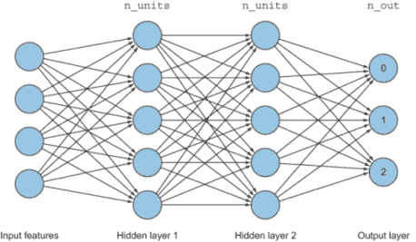

图 3.1 MLP 架构由通过权重连接的神经元层组成。

本节将利用您从第二章了解的关于 MLP 的知识，使用 MNIST 数据集解决图像分类问题。这个分类器的目标将是将 0 到 9 的数字图像（10 个类别）进行分类。首先，让我们看看我们 MLP 架构的三个主要组件（输入层、隐藏层和输出层）。

### 3.1.1 输入层

当我们处理 2D 图像时，在将它们输入网络之前，我们需要对它们进行预处理，使其成为网络可以理解的形式。首先，让我们看看计算机是如何感知图像的。在图 3.2 中，我们有一个宽度为 28 像素、高度为 28 像素的图像。计算机将这个图像视为一个 28×28 的矩阵，像素值范围从 0 到 255（0 为黑色，255 为白色，介于两者之间的为灰度）。

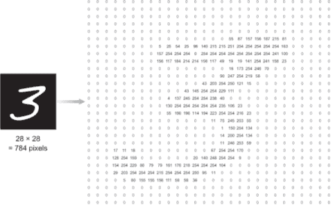

图 3.2 计算机将这个图像视为一个像素值范围在 0 到 255 之间的 28×28 矩阵。

由于 MLP 只接受维度为（1，*p*）的 1D 向量作为输入，因此它们不能接受维度为（*x, y*）的原始 2D 图像矩阵。为了将图像放入输入层，我们首先需要将我们的图像转换成一个包含图像中所有像素值的大向量，其维度为（1，*p*）。这个过程称为图像展平。在这个例子中，这个图像的总像素数（*n*）为 28×28=784。然后，为了将这个图像输入到我们的网络中，我们需要将（28×28）矩阵展平成一个长向量，其维度为（1，784）。输入向量看起来如下：

*x* = [*行*1, *行*2, *行*3, ..., *行* 28]

也就是说，在这个例子中，输入层将包含总共 784 个节点：*x*[1]，*x*[2]，...，*x*[784]。

可视化输入向量

为了帮助可视化扁平化的输入向量，让我们看看一个更小的矩阵（4，4）：

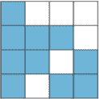

输入（*x*）是一个维度为（1，16）的扁平向量：

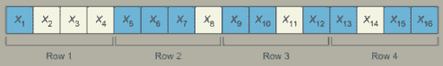

因此，如果我们用 0 表示黑色，用 255 表示白色，输入向量将如下所示：

输入 = [0, 255, 255, 255, 0, 0, 0, 255, 0, 0, 255, 0, 0, 255, 0, 0]

这是我们在 Keras 中展平输入图像的方法：

```
from keras.models import Sequential              ❶
from keras.layers import Flatten                 ❷

model = Sequential()                             ❸
model.add( Flatten(input_shape = (28,28) ))      ❹
```

❶ 如前所述，导入 Keras 库

❷ 导入一个名为 Flatten 的层，将图像矩阵转换为向量

❸ 定义模型

❹ 添加 Flatten 层，也称为输入层

Keras 中的`Flatten`层为我们处理这个过程。它将 2D 图像矩阵输入转换为 1D 向量。请注意，`Flatten`层必须提供一个参数值，即输入图像的形状。现在图像已经准备好被输入到神经网络中。

接下来是什么？隐藏层。

### 3.1.2 隐藏层

如前一章所述，神经网络可以有一个或多个隐藏层（技术上，可以有任意多个）。每一层有一个或多个神经元（同样，可以有任意多个）。作为神经网络工程师，你的主要任务是设计这些层。为了这个例子，让我们假设你决定任意设计网络，使其有两个隐藏层，每个隐藏层有 512 个节点--并且别忘了为每个隐藏层添加 ReLU 激活函数。

选择激活函数

在第二章中，我们详细讨论了不同类型的激活函数。作为一名深度学习工程师，当你构建你的网络时，你将经常面临许多不同的选择。选择最适合你正在解决的问题的激活函数是这些选择之一。虽然没有一种单一的答案适合所有问题，但在大多数情况下，ReLU 函数在隐藏层中表现最佳；对于大多数类别互斥的分类问题，softmax 函数通常在输出层是一个好的选择。softmax 函数为我们提供了输入图像描述(*n*)个类别之一的概率。

如前一章所述，让我们添加两个全连接层（也称为密集层），使用 Keras：

```
from keras.layers import Dense                 ❶

model.add(Dense(512, activation = 'relu'))     ❷
model.add(Dense(512, activation = 'relu'))     ❷
```

❶ 导入 Dense 层

❷ 添加两个每个有 512 个节点的 Dense 层

### 3.1.3 输出层

输出层相当直接。在分类问题中，输出层的节点数应该等于你试图检测的类别数。在这个问题中，我们正在对 10 个数字（0，1，2，3，4，5，6，7，8，9）进行分类。然后我们需要添加一个包含 10 个节点的最后一个`Dense`层：

```
model.add(Dense(10, activation = ‘softmax’))
```

### 3.1.4 整合所有内容

当我们将所有这些层组合在一起时，我们得到一个如图 3.3 所示的神经网络。

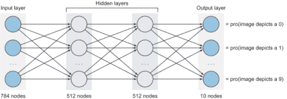

图 3.3 通过组合输入、隐藏和输出层我们创建的神经网络

下面是它在 Keras 中的样子：

```
from keras.models import Sequential             ❶
from keras.layers import Flatten, Dense         ❷

model = Sequential()                            ❸

model.add( Flatten(input_shape = (28,28) ))     ❹

model.add(Dense(512, activation = 'relu'))      ❺
model.add(Dense(512, activation = 'relu'))      ❺

model.add(Dense(10, activation = 'softmax'))    ❻
model.summary()                                 ❼
```

❶ 导入 Keras 库

❷ 导入 Flatten 层以将图像矩阵转换为向量

❸ 定义神经网络架构

❹ 添加 Flatten 层

❺ 添加两个每个有 512 个节点的隐藏层。建议在隐藏层中使用 ReLU 激活函数。

❻ 添加一个包含 10 个节点的输出 Dense 层。对于多类分类问题，建议在输出层使用 softmax 激活函数。

❼ 打印模型架构摘要

当你运行这段代码时，你会看到如图 3.4 所示的模型摘要。

你可以看到，正如之前讨论的那样，flatten 层的输出是一个包含 784 个节点的向量，因为每个 28 × 28 的图像中都有 784 个像素。按照设计，隐藏层每个都产生 512 个节点；最后，输出层（`dense_3`）产生一个包含 10 个节点的层。

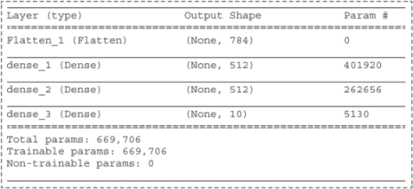

图 3.4 模型摘要

参数#字段表示每个层产生的参数（权重）的数量。这些是在训练过程中将被调整和学习的权重。它们的计算如下：

1.  flatten 层之后的参数数 = 0，因为这个层只是将图像展平成向量以供输入层使用。权重尚未添加。

1.  层 1 之后的参数数 = （输入层中的 784 个节点）×（隐藏层 1 中的 512 个节点）+（到偏置的 512 个连接）= 401,920。

1.  层 2 之后的参数数 = （隐藏层 1 中的 512 个节点）×（隐藏层 2 中的 512 个节点）+（到偏置的 512 个连接）= 262,656。

1.  层 3 之后的参数数=（隐藏层 2 中的 512 个节点）×（输出层中的 10 个节点）+（到偏置的 10 个连接）= 5,130。

1.  网络中的总参数数 = 401,920 + 262,656 + 5,130 = 669,706。

这意味着在这个小小的网络中，我们总共有 669,706 个参数（权重和偏置）需要网络学习，并调整其值以优化误差函数。对于这样一个小的网络来说，这是一个巨大的数字。你可以看到，如果我们添加更多的节点和层或使用更大的图像，这个数字会如何失控。这是我们将在下面讨论的 MLPs 的两个主要缺点之一。

MLPs 与 CNNs

如果你将示例 MLP 在 MNIST 数据集上训练，你会得到相当好的结果（与 CNNs 的 99%相比，接近 96%的准确率）。但 MLPs 和 CNNs 通常不会产生可比较的结果。MNIST 数据集是特殊的，因为它非常干净且预处理得很好。例如，所有图像都有相同的大小，并且位于一个 28 × 28 像素网格的中心。此外，MNIST 数据集只包含灰度图像。如果图像有颜色或数字倾斜或未居中，这将是一个更困难的任务。

如果你尝试使用稍微复杂一些的数据集，比如 CIFAR-10，正如我们在本章末尾的项目中将要做的，网络的表现将非常差（大约 30-40%的准确率）。在更复杂的数据集上表现会更差。在混乱的真实世界图像数据中，CNNs 确实优于 MLPs。

### 3.1.5 MLPs 处理图像的缺点

我们几乎准备好讨论本章的主题：CNNs。但首先，让我们讨论 MLPs 中的两个主要问题，卷积网络旨在解决这些问题。

#### 空间特征损失

将二维图像展平为 1D 向量输入会导致丢失图像的空间特征。正如我们在前面的迷你项目中看到的那样，在将图像输入到 MLP 的隐藏层之前，我们必须将图像矩阵展平为 1D 向量。这意味着丢弃图像中包含的所有 2D 信息。将输入视为没有特殊结构的简单数字向量可能对 1D 信号有效；但在二维图像中，这会导致信息丢失，因为当网络试图寻找模式时，它不会将像素值相互关联。MLP 没有意识到这些像素数字最初是按网格空间排列的，并且它们彼此相连。另一方面，CNN 不需要展平的图像。我们可以将原始像素图像矩阵输入到 CNN 网络中，CNN 将理解彼此靠近的像素比彼此远离的像素关系更紧密。

让我们简化一下，以便更多地了解图像中空间特征的重要性。假设我们正在尝试教一个神经网络识别正方形的形状，假设像素值 1 是白色，0 是黑色。当我们在一个黑色背景上画一个白色正方形时，矩阵将看起来像图 3.5。

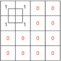

图 3.5 如果像素值 1 是白色，0 是黑色，这是我们识别正方形时矩阵的样子。

由于 MLP 以 1D 向量作为输入，我们必须将 2D 图像展平为 1D 向量。图 3.5 的输入向量看起来是这样的：

输入向量 = [1, 1, 0, 0, 1, 1, 0, 0, 0, 0, 0, 0, 0, 0, 0, 0]

当训练完成时，网络将学会仅在输入节点 x1、x2、x5 和 x6 被激活时识别正方形。但是，当我们有如图 3.6 所示的新图像，其中正方形形状位于图像的不同区域时，会发生什么？

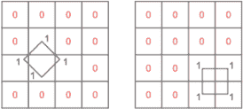

图 3.6 图像不同区域的正方形形状

MLP 将无法知道这些是正方形的形状，因为网络没有将正方形形状作为特征学习。相反，它学习了当被激活时可能导致正方形形状的输入节点。如果我们想让我们的网络学习正方形，我们需要在图像的各个位置放置大量的正方形形状。你可以看到这种解决方案对于复杂问题来说不会扩展。

特征学习的另一个例子是：如果我们想教一个神经网络识别猫，那么理想情况下，我们希望网络学习猫的所有形状特征，无论它们出现在图像的哪个位置（耳朵、鼻子、眼睛等）。这只有在网络将图像视为一组像素时才会发生，当这些像素彼此靠近时，它们关系密切。

CNN 的学习机制将在本章中详细解释。但图 3.7 显示了网络如何在其层中学习特征。

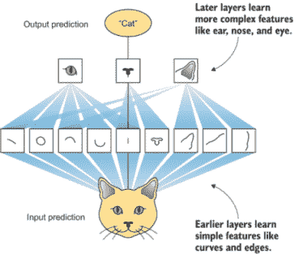

图 3.7 CNN 通过其层学习图像特征。

#### 完全连接（密集）层

多层感知器（MLPs）由密集层组成，这些层之间是完全连接的。完全连接意味着一个层中的每个节点都与前一层的所有节点以及下一层的所有节点相连。在这种情况下，每个神经元都有参数（权重）需要从前一层的每个神经元进行训练。虽然这对 MNIST 数据集来说不是大问题，因为图像尺寸真的很小（28 × 28），但当我们尝试处理更大的图像时会发生什么？例如，如果我们有一个 1,000 × 1,000 像素的图像，它将为第一隐藏层中的每个节点产生一百万个参数。所以如果第一隐藏层有 1,000 个神经元，那么即使在如此小的网络中，这也会产生十亿个参数。你可以想象在只有第一层之后优化十亿个参数的计算复杂性。当我们有数十或数百层时，这个数字将急剧增加。这可能会很快失控，并且不会按比例增长。

另一方面，如图 3.8 所示，CNN 是局部连接层：节点仅与前一层的节点的小子集相连。局部连接层使用的参数比密集连接层少得多，正如你将看到的。

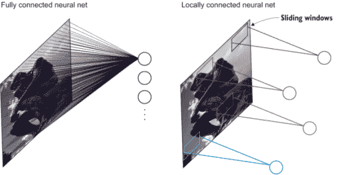

图 3.8（左）所有神经元都与图像的所有像素相连的完全连接神经网络。（右）局部连接网络，其中只有一小部分像素与每个神经元相连。这些子集被称为滑动窗口。

#### 所有这些意味着什么？

将二维图像矩阵展平为 1D 向量所造成的信息损失以及完全连接层在处理更大图像时的计算复杂性表明，我们需要一种全新的图像输入处理方式，其中二维信息不会完全丢失。这就是卷积网络发挥作用的地方。CNN 接受完整的图像矩阵作为输入，这显著帮助网络理解像素值中包含的图案。

## 3.2 CNN 架构

正规神经网络包含多个层，允许每一层依次找到更复杂的特征，这正是卷积神经网络（CNNs）的工作方式。卷积的第一层学习一些基本特征（边缘和线条），下一层学习稍微复杂一些的特征（如圆形、正方形等），接下来的层找到更复杂的特征（如面部的一部分、汽车轮子、狗的胡须等），依此类推。你很快就会看到这个演示。现在，要知道 CNN 架构遵循与神经网络相同的模式：我们在隐藏层中堆叠神经元；权重在网络训练期间随机初始化并学习；我们应用激活函数，计算误差（*y − ŷ*），并将误差反向传播以更新权重。这个过程是相同的。不同之处在于，我们在特征学习部分使用卷积层而不是常规的完全连接层。

### 3.2.1 整体概念

在我们详细探讨 CNN 架构之前，让我们先退一步，看看整体情况（图 3.9）。还记得我们在第一章中讨论过的图像分类流程吗？

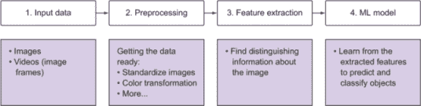

图 3.9 图像分类流程包括四个组件：数据输入、数据预处理、特征提取和机器学习算法。

在深度学习（DL）之前，我们通常手动从图像中提取特征，然后将得到的特征向量输入到分类器（如 SVM 等常规机器学习算法）中。有了神经网络提供的魔力，我们可以用神经网络（MLP 或 CNN）来替换图 3.9 中步骤 3 的手动工作，该神经网络既能进行特征学习又能进行分类（步骤 3 和 4）。

我们在数字分类项目中看到，如何使用 MLP 来学习特征并对图像进行分类（步骤 3 和 4 合并）。结果证明，我们与全连接层的问题并不在于分类部分——全连接层在这方面做得很好。我们的问题是全连接层处理图像以学习特征的方式。让我们有点创意：我们将保留有效部分，并对无效部分进行修改。全连接层在特征提取（步骤 3）方面做得不好，所以让我们用局部连接层（卷积层）来替换它。另一方面，全连接层在分类提取的特征（步骤 4）方面做得很好，所以让我们保留它们用于分类部分。

CNN 的高级架构看起来像图 3.10：

+   输入层

+   用于特征提取的卷积层

+   用于分类的全连接层

+   输出预测

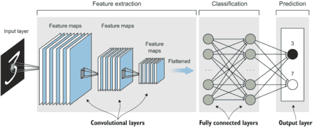

图 3.10 CNN 架构包括以下部分：输入层、卷积层、全连接层和输出预测。

记住，我们还在讨论整体情况。我们很快就会深入到每个组件。在图 3.10 中，假设我们正在构建一个 CNN 来将图像分类为两个类别：数字 3 和 7。看看图中的内容，并按照以下步骤进行：

1.  将原始图像输入到卷积层中。

1.  图像通过 CNN 层来检测模式和提取称为特征图的特征。这一步骤的输出随后被展平成一个包含图像学习特征的向量。请注意，图像的维度在每一层之后都会缩小，特征图的数量（层深度）增加，直到我们在特征提取部分的最后一层得到一个长数组的小特征。从概念上讲，你可以将这一步骤视为神经网络学习表示原始图像的更抽象特征。

1.  将展平的特征向量输入到全连接层中，以对图像提取的特征进行分类。

1.  神经网络激活代表图像正确预测的节点。注意，在这个例子中，我们正在对两个类别（3 和 7）进行分类。因此，输出层将有两个节点：一个代表数字 3，另一个代表数字 7。

**定义** 神经网络的基本思想是神经元从输入中学习特征。在 CNN 中，特征图是应用于前一层的某个滤波器的输出。它被称为特征图，因为它表示了图像中某种特征的位置。CNN 寻找的特征包括直线、边缘，甚至是物体。每当它们发现这些特征时，它们就会将它们报告给特征图。每个特征图都在寻找特定的事物：一个可能是在寻找直线，另一个可能是在寻找曲线。

### 3.2.2 深入了解特征提取

你可以将特征提取步骤想象成将大图像分割成包含特征的小块，并将它们堆叠成一个向量。例如，数字 3 的图像是一个图像（深度 = 1），它被分割成包含数字 3 的特定特征的小图像（图 3.11）。如果它被分割成四个特征，那么深度等于 4。随着图像通过 CNN 层，它在维度上缩小，层变得更深，因为它包含了更多的小特征图像。

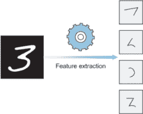

图 3.11 图像被分割成包含独特特征的小图像。

注意，这只是一个比喻，用来帮助可视化特征提取过程。CNN 并非字面意义上将图像分割成碎片。相反，它们提取有意义的特征，这些特征将这个对象与其他训练集中的图像区分开来，并将它们堆叠在一个特征数组中。

### 3.2.3 深入了解分类

在特征提取完成后，我们添加全连接层（一个常规的 MLP）来查看特征向量，并说，“第一个特征（顶部）看起来像一条边缘：这可能是一个 3，或者 7，或者可能是一个难看的 2。我不确定；让我们看看第二个特征。嗯，这肯定不是一个 7，因为它有一个曲线，”等等，直到 MLP 确信图像是数字 3。

CNN 学习模式的方式

重要的是要注意，CNN 并不是直接在一层中将图像输入转换为特征向量。这通常发生在数十或数百层中，正如你将在本章后面看到的那样。特征学习过程在每个隐藏层之后逐步发生。因此，第一层通常学习非常基本的特征，如线条和边缘，第二层将这些线条组装成可识别的形状、角落和圆形。然后，在更深的层中，网络学习更复杂的形状，如人手、眼睛、耳朵等。例如，这里是一个 CNN 学习人脸的简化版本。

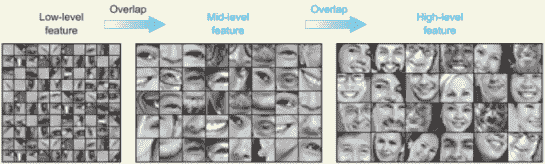

CNN 学习人脸的简化版本

你可以看到，早期层检测图像中的模式以学习低级特征，如边缘，而后期层检测模式中的模式以学习更复杂的特征，如面部的一部分，然后是模式中的模式中的模式，等等：

输入图像

+ 层 1 ⇒ 模式

+ 层 2 ⇒ 模式中的模式

+ 层 3 ⇒ 模式中的模式中的模式

...等等

当我们在后面的章节中讨论更高级的 CNN 架构时，这个概念将非常有用。现在，你知道在神经网络中，我们堆叠隐藏层来相互学习模式，直到我们有一个包含识别图像的具有意义的特征数组。

## 3.3 CNN 的基本组件

不再拖延，让我们讨论 CNN 架构的主要组件。你几乎在每一个卷积网络（图 3.12）中都会看到三种主要类型的层：

1.  卷积层（CONV）

1.  池化层（POOL）

1.  全连接层（FC）

CNN 文本表示

图 3.12 中架构的文本表示如下：

CNN 架构：输入 ⇒ CONV ⇒ RELU ⇒ POOL ⇒ CONV ⇒ RELU ⇒ POOL ⇒ FC ⇒ SOFTMAX

注意，ReLU 和 softmax 激活函数并不是真正的独立层——它们是前一层中使用的激活函数。它们在文本表示中这样显示的原因是为了指出 CNN 设计者正在卷积层中使用 ReLU 激活函数，在全连接层中使用 softmax 激活函数。因此，这代表了一个包含两个卷积层和一个全连接层的 CNN 架构。你可以添加你认为合适的任意数量的卷积层和全连接层。卷积层用于特征学习或提取，而全连接层用于分类。

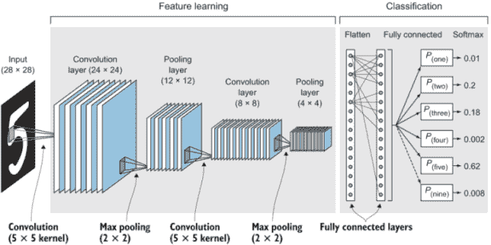

图 3.12 卷积网络的基本组件包括卷积层和池化层用于特征提取，以及全连接层用于分类。

现在我们已经看到了卷积网络的完整架构，让我们深入探讨每种层类型的工作原理。然后在本节的最后，我们将它们全部组合起来。

### 3.3.1 卷积层

卷积层是卷积神经网络的核心构建块。卷积层就像一个特征查找窗口，逐像素地在图像上滑动以提取识别图像中对象的具有意义的特征。

#### 什么是卷积？

在数学中，卷积是两个函数的操作，以产生第三个修改后的函数。在 CNN 的上下文中，第一个函数是输入图像，第二个函数是卷积滤波器。我们将执行一些数学运算以产生具有新像素值的修改后的图像。

让我们放大查看第一个卷积层，看看它是如何处理图像的（图 3.13）。通过在输入图像上滑动卷积滤波器，网络将图像分解成小块，并单独处理这些块以组装修改后的图像，即特征图。

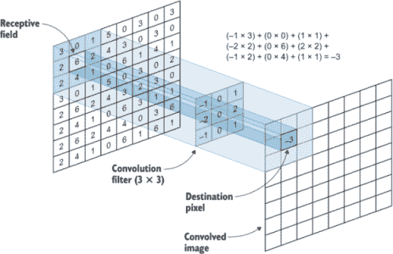

图 3.13 一个 3 × 3 的卷积滤波器在输入图像上滑动。

记住这个图，以下是一些关于卷积滤波器的事实：

+   中间的 3 × 3 小矩阵是卷积滤波器，也称为核。

+   核在原始图像上逐像素滑动，并进行一些数学计算，以获取下一层“卷积”的新图像的值。滤波器卷积的图像区域称为感受野（见图 3.14）。

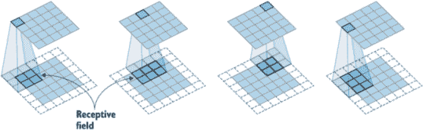

图 3.14 核在原始图像上逐像素滑动，并在下一层计算卷积图像。卷积区域称为感受野。

什么是核值？在卷积神经网络（CNNs）中，卷积矩阵是权重。这意味着它们也是随机初始化的，值是由网络学习的（所以你不必担心为其分配值）。

#### 卷积操作

从我们对多层感知器（MLPs）的讨论中，数学应该看起来很熟悉。记得我们是如何将输入乘以权重并将它们全部相加以得到加权总和的吗？

加权总和 = *x*[1] · *w*[1] + *x*[2] · *w*[2] + *x*[3] · *w*[3] + ... + *x[n]* · *w[n]* + *b*

我们在这里做同样的事情，只是在 CNN 中，神经元和权重以矩阵形状结构化。因此，我们将感受野中的每个像素与卷积滤波器中的对应像素相乘，并将它们全部相加，以得到新图像中中心像素的值（图 3.15）。这与我们在第二章中看到的相同的矩阵点积：

(93 × -1) + (139 × 0) + (101 × 1) + (26 × -2) + (252 × 0) + (196 × 2) + (135 × -1) + (240 × 0) + (48 × 1) = 243

滤波器（或核）在整个图像上滑动。每次，我们逐个元素地乘以每个对应的像素，然后将它们全部相加，以创建一个具有新像素值的新图像。这个卷积后的图像称为特征图或激活图。

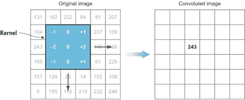

图 3.15 将感受野中的每个像素与卷积滤波器中的对应像素相乘，并将它们相加，得到新图像中中心像素的值。

应用滤波器以学习特征

让我们不要偏离最初的目标。我们做所有这些是为了让网络从图像中提取特征。应用滤波器是如何达到这个目标的？在图像处理中，滤波器用于过滤掉不需要的信息或放大图像中的特征。这些滤波器是数字矩阵，它们与输入图像卷积以修改它。看看这个边缘检测滤波器：

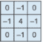

当这个核（K）与输入图像 F(x,y)进行卷积时，它创建了一个新的卷积图像（特征图），放大了边缘。

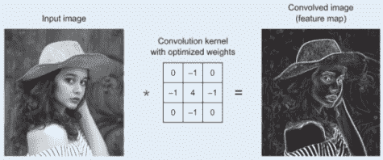

在图像上应用边缘检测核

为了理解卷积是如何发生的，让我们放大图像的一小部分。

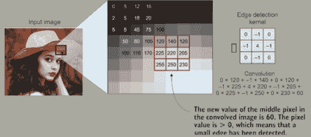

在输入图像上应用边缘核的计算

这张图像显示了图像某一区域的卷积计算，以计算一个像素的值。我们通过将核在输入图像上逐像素滑动并应用相同的卷积过程来计算所有像素的值。

这些核通常被称为权重，因为它们决定了像素在形成新输出图像中的重要性。类似于我们在关于 MLP 和权重的讨论中提到的，这些权重代表了特征在输出中的重要性。在图像中，输入特征是像素值。

可以应用其他过滤器来检测不同类型的特征。例如，一些过滤器检测水平边缘，其他检测垂直边缘，还有一些检测更复杂的形状，如角，等等。关键是这些过滤器在卷积层中的应用会产生我们之前讨论过的特征学习行为：首先学习简单的特征，如边缘和直线，然后更深的层学习更复杂的特征。

我们基本上完成了滤波器的概念。这就是全部内容！

现在，让我们整体看看卷积层：每个卷积层包含一个或多个卷积滤波器。每个卷积层的滤波器数量决定了下一层的深度，因为每个滤波器都会产生自己的特征图（卷积图像）。让我们看看 Keras 中的卷积层，看看它们是如何工作的：

```
from keras.layers import Conv2D

model.add(Conv2D(filters=16, kernel_size=2, strides='1', padding='same', 
          activation='relu'))
```

就这样。一行代码就创建了一个卷积层。我们将在本章后面看到这条线在完整代码中的位置。让我们专注于卷积层。从代码中可以看出，卷积层有五个主要参数。正如第二章所述，我们建议在神经网络的隐藏层中使用 ReLU 激活函数。这样，一个参数就解决了。现在，让我们解释剩下的四个超参数，它们控制输出体积的大小和深度：

+   过滤器：每层的卷积滤波器数量。这代表了其输出的深度。

+   核大小：卷积滤波器矩阵的大小。大小各异：2 × 2，3 × 3，5 × 5。

+   步长。

+   填充。

我们将在下一节讨论步长和填充。但现在，让我们看看这四个超参数中的每一个。

注意：正如你在第二章关于深度学习的学习中了解到的，超参数是在配置神经网络以改进性能时调整（增加和减少）的旋钮。

#### 卷积层中的滤波器数量

每个卷积层有一个或多个滤波器。为了理解这一点，让我们回顾第二章中的 MLP。记得我们是如何在隐藏层中堆叠神经元的，每个隐藏层有 n 个神经元（也称为隐藏单元）？图 3.16 展示了第二章中的 MLP 图。


图 3.16 神经元在隐藏层中堆叠，每个隐藏层有 n 个神经元（隐藏单元）。

类似地，在 CNN 中，卷积层是隐藏层。为了增加隐藏层中的神经元数量，我们增加卷积层中的核数量。每个核单元被视为一个神经元。例如，如果我们卷积层中有 3 × 3 的核，这意味着在这一层我们有 9 个隐藏单元。当我们添加另一个 3 × 3 核时，我们就有 18 个隐藏单元。再添加一个，我们就有 27 个，以此类推。因此，通过增加卷积层中的核数量，我们增加了隐藏单元的数量，这使得我们的网络更加复杂，能够检测更复杂的模式。当我们向 MLP 的隐藏层添加更多的神经元（隐藏单元）时，情况也是如此。图 3.17 展示了 CNN 层，显示了核数量的概念。

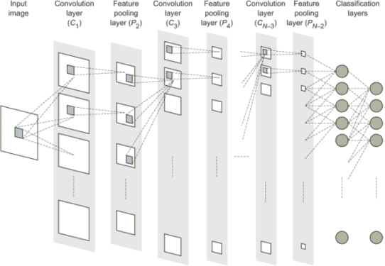

图 3.17 展示 CNN 层核数量概念的表示

#### 核大小

记住，卷积滤波器也称为核。它是一个权重矩阵，在图像上滑动以提取特征。核大小指的是卷积滤波器的维度（宽度乘以高度；图 3.18）。

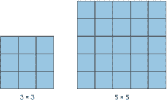

图 3.18 核大小指的是卷积滤波器的维度。

`kernel_size` 是你在构建卷积层时将要设置的超参数之一。像大多数神经网络超参数一样，没有单一的最好答案适用于所有问题。直观地说，较小的滤波器会捕捉到图像的非常精细的细节，而较大的滤波器会错过图像中的微小细节。

记住，滤波器包含网络将要学习的权重。因此，从理论上讲，`kernel_size` 越大，网络越深，这意味着它学得越好。然而，这伴随着更高的计算复杂度，可能会导致过拟合。

内核滤波器几乎总是正方形，大小从最小的 2 × 2 到最大的 5 × 5 不等。从理论上讲，你可以使用更大的滤波器，但这并不推荐，因为它会导致丢失重要的图像细节。

调整

我不希望你被所有的超参数调整所压倒。深度学习实际上是一门艺术，也是一门科学。我无法强调这一点：作为深度学习工程师，你大部分的工作将不是构建实际的算法，而是构建你的网络架构和设置，进行实验，调整你的超参数。今天，大量的研究都集中在尝试为给定类型的问题找到 CNN 的最佳拓扑结构和参数。幸运的是，调整超参数的问题不必像看起来那么困难。在整个书中，我将指出使用超参数的良好起点，并帮助你培养评估你的模型和分析其结果的本能，以了解你需要调整哪个旋钮（超参数）（增加或减少）。

#### 步长和填充

你通常会一起考虑这两个超参数，因为它们都控制卷积层输出的形状。让我们看看如何：

+   *步长* -- 滤波器在图像上滑动的量。例如，每次滑动一个像素，步长值是 1。如果我们想每次跳过两个像素，步长值就是 2。步长为 3 或更大的情况在实践中很少见。跳过像素会产生较小的空间输出体积。

    步长为 1 将使输出图像大致与输入图像的宽度和高度相同，而步长为 2 将使输出图像大致是输入图像大小的一半。我说“大致”是因为这取决于你如何设置填充参数来处理图像的边缘。

+   *填充* -- 通常称为零填充，因为我们会在图像的边缘添加零（如图 3.19 所示）。填充最常用于允许我们保留输入体积的空间大小，以便输入和输出的宽度和高度相同。这样，我们可以在不必要缩小体积的高度和宽度的情况下使用卷积层。这对于构建更深的网络很重要，因为否则，高度/宽度会随着我们进入更深的层而缩小。

    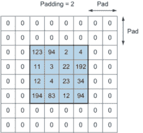

    图 3.19 零填充在图像的边缘添加零。填充 = 2 在边缘添加两层零。

注意：使用步长和填充超参数的目标是以下两个之一：保留图像的所有重要细节并将它们传递到下一层（当步长值为 `1` 且填充值为 `same` 时）；或者忽略图像的一些空间信息，以使处理在计算上更经济。请注意，我们将添加池化层（将在下一节讨论）以减小图像的大小，以便关注提取的特征。目前，请了解步长和填充超参数的目的是控制卷积层的行为及其输出的大小：是传递所有图像细节还是忽略其中的一些。

### 3.3.2 池化层或子采样

添加更多的卷积层会增加输出层的深度，这会导致网络需要优化的参数（学习）数量增加。你可以看到，添加几个卷积层（通常是几十甚至几百）会产生大量的参数（权重）。这种网络维度的增加会增加学习过程中发生的数学运算的时间和空间复杂度。这就是池化层派上用场的时候。子采样或池化通过减少传递给下一层的参数数量来帮助减小网络的大小。池化操作通过应用总结统计函数（如最大值或平均值）来调整其输入的大小，从而减少传递给下一层的参数总数。

池化层的目标是将卷积层产生的特征图下采样到更少的参数数量，从而降低计算复杂度。在 CNN 架构中，在每层卷积层之后或之后每两层卷积层之后添加池化层是一种常见的做法（图 3.20）。

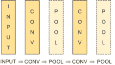

图 3.20 池化层通常在每个卷积层之后或之后每两个卷积层之后添加。

#### 最大池化与平均池化比较

池化层主要有两种类型：最大池化和平均池化。我们首先讨论最大池化。

与卷积核类似，最大池化核是具有一定大小和步长值的窗口，在图像上滑动。与最大池化的不同之处在于，窗口没有权重或任何值。它们所做的只是滑动到由前一个卷积层创建的特征图上，并选择最大像素值传递到下一层，忽略其他值。在图 3.21 中，你可以看到一个大小为 2×2、步长为 2 的池化滤波器（滤波器在滑动图像时跳过 2 个像素）。这个池化层将特征图的大小从 4×4 减少到 2×2。

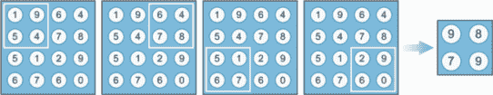

图 3.21 一个 2×2 的池化滤波器和步长为 2，将特征图从 4×4 减少到 2×2

当我们将此操作应用于卷积层中的所有特征图时，我们得到维度更小的图（宽度乘以高度），但层的深度保持不变，因为我们将对每个来自前一个滤波器的特征图应用池化滤波器。因此，如果卷积层有三个特征图，池化层的输出也将有三个特征图，但尺寸更小（图 3.22）。

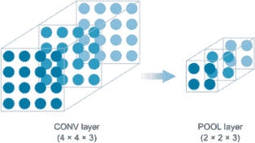

图 3.22 如果卷积层有三个特征图，池化层的输出将包含三个更小的特征图。

全局平均池化是一种更极端的降维类型。与设置窗口大小和步长不同，全局平均池化计算特征图中所有像素的平均值（图 3.23）。在图 3.24 中，你可以看到全局平均池化层将一个 3D 数组转换成一个向量。

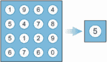

图 3.23 全局平均池化计算特征图中所有像素的平均值。

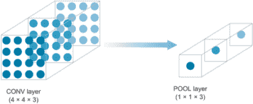

图 3.24 全局平均池化层将 3D 数组转换为向量。

#### 为什么使用池化层？

如我们从所讨论的示例中可以看到，池化层降低了卷积层的维度。降低维度之所以重要，是因为在复杂的项目中，CNN 包含许多卷积层，每个都有数十或数百个卷积滤波器（核）。由于核包含网络学习的参数（权重），这可能会迅速失控，我们的卷积层维度可能会变得非常大。因此，添加池化层有助于保持重要特征并将它们传递到下一层，同时缩小图像维度。将池化层想象成图像压缩程序。它们在保持图像重要特征的同时降低图像分辨率（图 3.25）。


图 3.25 池化层降低图像分辨率并保留图像的重要特征。

池化与步长和填充

池化和步长的主要目的是减少神经网络中的参数数量。我们拥有的参数越多，训练过程就越昂贵。许多人不喜欢池化操作，认为我们可以通过调整步长和填充卷积层来避免它。例如，“追求简单：全卷积网络”a 提出丢弃池化层，转而采用仅由重复卷积层组成的架构。为了减少表示的大小，作者建议在卷积层中偶尔使用较大的步长。丢弃池化层也被发现有助于训练良好的生成模型，例如生成对抗网络（GANs），我们将在第十章中讨论。似乎未来的架构将具有非常少的池化层。但到目前为止，池化层仍然被广泛用于将图像从一层下采样到下一层。

a Jost Tobias Springenberg, Alexey Dosovitskiy, Thomas Brox, 和 Martin Riedmiller, “追求简单：全卷积网络”，[`arxiv.org/abs/1412.6806`](https://arxiv.org/abs/1412.6806)。

#### 卷积和池化层回顾

让我们回顾一下到目前为止我们所做的工作。到目前为止，我们使用一系列卷积和池化层来处理图像并提取训练数据集中图像的特定有意义特征。为了总结我们是如何到达这里的：

1.  原始图像被输入到卷积层，这是一个在图像上滑动以提取特征的核滤波器集合。

1.  卷积层具有以下我们需要配置的属性：

    ```
    from keras.layers import Conv2D
    model.add(Conv2D(filters=16, kernel_size=2, strides='1', padding='same', activation='relu'))
    ```

    +   `filters` 是每层中核滤波器的数量（隐藏层的深度）。

    +   `kernel_size` 是过滤器的尺寸（也称为核）。通常为 2、3 或 5。

    +   `strides` 表示过滤器在图像上滑动的量。通常建议从 1 或 2 开始作为良好的起点。

    +   `padding` 在图像的边缘添加零值的列和行，以保留下一层的图像大小。

    +   在隐藏层中强烈推荐使用`relu`的`activation`。

1.  池化层具有以下属性，我们需要进行配置：

    ```
    from keras.layers import MaxPooling2D

    model.add(MaxPooling2D(pool_size=(2, 2), strides = 2))
    ```

我们继续添加成对的卷积和池化层，以达到我们“深度”神经网络所需的深度。

可视化每层之后发生的情况

在卷积层之后，图像保持其宽度和高度维度（通常是），但每经过一层都会变得更深。为什么？还记得我们之前提到的将图像切割成特征块的类比吗？这就是卷积层之后发生的事情。

例如，假设输入图像是 28 × 28（如 MNIST 数据集所示）。当我们添加一个 CONV_1 层（具有 4 个`filters`、1 个`strides`和`same`的`padding`）时，输出将具有相同的宽度和高度维度，但`depth`为 4（28 × 28 × 4）。现在我们添加一个具有相同超参数但更多过滤器的 CONV_2 层，我们得到更深的输出：28 × 28 × 12。

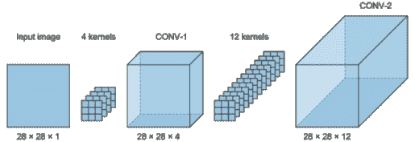

在池化层之后，图像保持其深度，但宽度和高度会缩小：

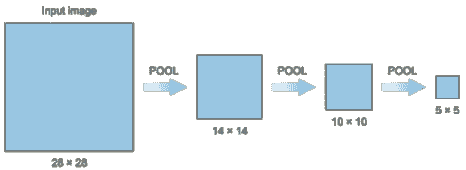

将卷积和池化结合在一起，我们得到如下内容：

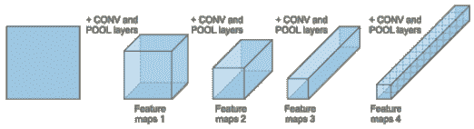

这会一直发生，直到最后我们得到一个包含原始图像所有特征的细长图像管。

卷积和池化层的输出产生一个特征管（5 × 5 × 40），几乎可以用于分类。在这里我们使用 40 作为特征管深度的示例，即 40 个特征图。最后一步是在将其输入到全连接层进行分类之前将这个管子展平。如前所述，展平层将具有（1，m）的维度，其中 *m* = 5 × 5 × 40 = 1,000 个神经元。

### 3.3.3 全连接层

在通过卷积和池化层对图像进行特征学习过程之后，我们已经提取了所有特征并将它们放入一个长管中。现在是我们使用这些提取的特征来对图像进行分类的时候了。我们将使用第二章中讨论的常规神经网络架构，MLP。

#### 为什么使用全连接层？

MLP 在分类问题中表现良好。我们在这章中使用卷积层的原因是，当从图像中提取特征时，MLP 会丢失大量有价值的信息——我们必须在将图像输入网络之前将其展平——而卷积层可以处理原始图像。现在我们已经提取了特征，并在将它们展平后，我们可以使用常规的 MLP 对它们进行分类。

我们在第二章中详细讨论了 MLP 架构：这里没有新的内容。为了重申，以下是全连接层（图 3.26）：

+   输入展平向量——如图 3.26 所示，为了将特征管输入到 MLP 进行分类，我们需要将其展平成一个维度为（1，*p*）的向量。例如，如果特征管的维度为 5 × 5 × 40，则展平后的向量将是（1，1000）。

+   隐藏层——我们添加一个或多个全连接层，每个层有一个或多个神经元（类似于我们在构建常规 MLPs 时所做的）。

+   输出层——第二章建议对于涉及两个以上类别的分类问题使用 softmax 激活函数。在这个例子中，我们正在对 0 到 9 的数字进行分类：10 个类别。输出层中的神经元数量等于类别的数量；因此，输出层将有 10 个节点。

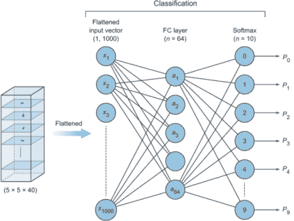

图 3.26 MLP 的全连接层

MLPs 和全连接层

记住第二章的内容，多层感知器（MLPs）也被称为全连接层，因为一层的所有节点都与前一层和后一层的所有节点相连。它们也被称为密集层。MLP、全连接、密集以及有时正向传播这些术语可以互换使用，以指代常规神经网络架构。

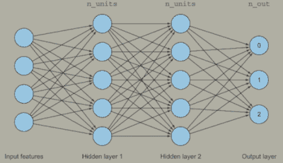

## 3.4 使用 CNN 进行图像分类

好的，你现在已经完全准备好构建自己的 CNN 模型来对图像进行分类。对于这个小型项目，这是一个简单的问题，但将有助于为后续章节中更复杂的问题打下基础，我们将使用 MNIST 数据集。（MNIST 数据集就像是深度学习的“Hello World”。）

注意：无论你决定使用哪个深度学习库，概念基本上是相同的。你首先在心中或在一张纸上设计 CNN 架构，然后开始堆叠层并设置它们的参数。Keras 和 MXNet（以及 TensorFlow、PyTorch 和其他深度学习库）都有其优缺点，我们将在后面讨论，但概念是相似的。因此，在本书的剩余部分，我们将主要使用 Keras，并在适当的地方简要介绍其他库。

### 3.4.1 构建模型架构

这是您项目中定义和构建 CNN 模型架构的部分。要查看包含图像预处理、训练和评估模型的完整项目代码，请访问本书的 GitHub 仓库 [`github.com/moelgendy/deep_learning_for_vision_systems`](https://github.com/moelgendy/deep_learning_for_vision_systems)，打开 mnist_cnn 笔记本，或访问本书的网站：[www.manning.com/books/deep-learning-for-vision-systems](http://www.manning.com/books/deep-learning-for-vision-systems) 或 [www.computerVisionBook.com](http://www.computerVisionBook.com)。在此阶段，我们关注的是构建模型架构的代码。在本章末尾，我们将构建一个端到端图像分类器，并深入探讨其他部分：

```
from keras.models import Sequential
from keras.layers import Conv2D, MaxPooling2D, Flatten, Dense, Dropout

model = Sequential()                                                        ❶

model.add(Conv2D(32, kernel_size=(3, 3), strides=1, padding='same',  
          activation='relu', input_shape=(28,28,1)))                        ❷
model.add(MaxPooling2D(pool_size=(2, 2)))                                   ❸

model.add(Conv2D(64, (3, 3), strides=1, padding='same', activation='relu')) ❹
model.add(MaxPooling2D(pool_size=(2, 2)))                                   ❺

model.add(Flatten())                                                        ❻

model.add(Dense(64, activation='relu'))                                     ❼

model.add(Dense(10, activation='softmax'))                                  ❽

model.summary()                                                             ❾
```

❶ 构建 model 对象

❷ CONV_1: 添加一个具有 ReLU 激活和深度 = 32 个核的卷积层

❸ POOL_1: 对图像进行下采样以选择最佳特征

❹ CONV_2: 增加深度到 64

❺ POOL_2: 更多的下采样

❻ Flatten，因为维度太多；我们只想得到分类输出

❼ FC_1: 完全连接以获取所有相关数据

❽ FC_2: 输出 softmax 以将矩阵压缩为 10 个类别的输出概率

❾ 打印模型架构摘要

当您运行此代码时，您将看到如图 3.27 所示的模型摘要被打印出来。

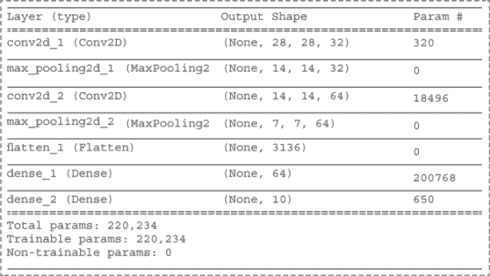

图 3.27 打印的模型摘要

在我们查看模型摘要之前，有一些一般性的观察：

+   我们只需要将 `input_shape` 参数传递给第一个卷积层。然后我们不需要向模型声明输入形状，因为前一个层的输出是当前层的输入——它已经为模型所知。

+   您可以看到每个卷积层和池化层的输出都是一个形状为 (`None`, `height`, `width`, `channels`) 的 3D 张量。`height` 和 `width` 的值非常直观：它们是图像在这一层的维度。`channels` 值表示层的深度。这代表每个层中的特征图数量。这个元组中的第一个值设置为 `None`，表示在这一层中处理图像的数量。Keras 将其设置为 `None`，这意味着这个维度是可变的，可以接受任何数量的 `batch_size`。

+   如您在输出形状列中看到的，随着您在网络中深入，图像维度缩小，深度增加，正如我们在本章前面讨论的那样。

+   注意网络需要优化的总参数（权重）数量：220,234，与我们本章早期创建的 MLP 网络的参数数量（669,706）相比。我们将其减少了近三分之一。

让我们逐行查看模型摘要：

+   `CONV_1`--我们知道输入形状：(28 × 28 × 1)。看看`conv2d`的输出形状：(28 × 28 × 32)。由于我们将`strides`参数设置为`1`，`padding`设置为`same`，输入图像的尺寸没有改变。但`深度`增加到 32。为什么？因为我们在本层添加了 32 个过滤器。每个过滤器产生一个特征图。

+   `POOL_1`--本层的输入是其前一层的输出：(28 × 28 × 32)。经过池化层后，图像尺寸缩小，但`深度`保持不变。由于我们使用了 2 × 2 的池化，输出形状为(14 × 14 × 32)。

+   `CONV_2`--与之前相同，卷积层增加深度并保持尺寸。前一层输入为(14 × 14 × 32)。由于本层的过滤器设置为 64，输出为(14 × 14 × 64)。

+   `POOL_2`--与之前相同，2 × 2 池化保持深度并缩小尺寸。输出为(7 × 7 × 64)。

+   `Flatten`--将具有(7 × 7 × 64)维度的特征管扁平化，将其转换为(1, 3136)维度的平坦向量。

+   `Dense_1`--我们将这个全连接层设置为 64 个神经元，因此输出为 64。

+   `Dense_2`--这是输出层，我们将其设置为 10 个神经元，因为我们有 10 个类别。

### 3.4.2 参数数量（权重）

好的，现在我们知道如何构建模型，并逐行阅读摘要以查看图像形状如何随着通过网络层而变化。还有一个重要的事情需要注意：模型摘要中右侧的`Param #`列。

#### 参数是什么？

参数只是权重的一个名称。这些是网络学习的东西。正如我们在第二章中讨论的，网络的目的是在梯度下降和反向传播过程中更新权重值，直到找到最小化误差函数的最优参数值。

#### 这些参数是如何计算的？

在 MLP 中，我们知道层之间是完全连接的，因此权重连接或边简单地通过乘以每层的神经元数量来计算。在 CNN 中，权重计算并不那么直接。幸运的是，有一个方程可以用来计算：

参数数量 = 过滤器数量 × 核大小 × 前一层深度 + 过滤器数量（对于偏差）

让我们用一个例子来应用这个方程。假设我们想要计算之前的小项目第二层的参数。这是`CONV_2`的代码再次：

```
model.add(Conv2D(64, (3, 3), strides=1, padding='same', activation='relu'))
```

由于我们知道前一层深度为 32，那么

⇒ 参数 = 64 × 3 × 3 × 32 + 64 = 18,496

注意，池化层不添加任何参数。因此，在模型摘要中，您将看到池化层后的`Param #`值为 0。对于扁平化层也是如此：没有添加额外的权重（见图 3.28）。


图 3.28 池化和扁平化层不添加参数，因此在模型摘要中池化和扁平化层后的`Param #`值为 0。

当我们将参数编号列中的所有参数相加时，我们得到这个网络需要优化的参数总数：220,234。

#### 可训练和不可训练参数

在模型摘要中，您将看到参数总数，以及其下方可训练和不可训练参数的数量。可训练参数是神经网络在训练过程中需要优化的权重。在本例中，我们所有的参数都是可训练的（图 3.29）。

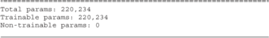

图 3.29 我们所有的参数都是可训练的，需要在训练过程中进行优化。

在后面的章节中，我们将讨论使用预训练网络并将其与您自己的网络结合以获得更快、更准确的结果：在这种情况下，您可能决定冻结一些层，因为它们是预训练的。因此，并非所有网络参数都将进行训练。这在开始训练过程之前了解您模型的内存和空间复杂度很有用；但更多内容将在后面讨论。据我们所知，我们所有的参数都是可训练的。

## 3.5 添加 dropout 层以避免过拟合

到目前为止，您已经介绍了 CNN 的三个主要层：卷积、池化和全连接。您几乎可以在每个 CNN 架构中找到这三种层类型。但这还不是全部——还有额外的层可以添加以避免过拟合。

### 3.5.1 什么是过拟合？

机器学习性能不佳的主要原因要么是过拟合，要么是欠拟合数据。欠拟合正如其名：模型无法拟合训练数据。这种情况发生在模型过于简单，无法拟合数据：例如，使用一个感知器对一个非线性数据集进行分类。

相反，过拟合意味着过度拟合数据：记住训练数据而没有真正学习特征。这种情况发生在我们构建一个超级网络，可以完美地拟合训练数据集（训练时的错误率非常低），但无法推广到它之前未见过的新数据样本。您将看到，在过拟合的情况下，网络在训练数据集上表现良好，但在测试数据集上表现不佳（图 3.30）。

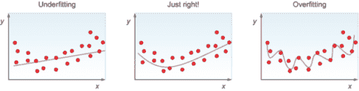

图 3.30 欠拟合（左）：模型无法很好地表示数据。恰到好处（中）：模型很好地拟合了数据。过拟合（右）：模型过度拟合数据，因此它无法推广到未见过的新例子。

在机器学习中，我们不希望构建过于简单而欠拟合数据或过于复杂而过拟合数据的模型。我们希望使用其他技术构建一个适合我们问题的神经网络。为了解决这个问题，我们将在下一节讨论 dropout 层。

### 3.5.2 什么是 dropout 层？

Dropout 层是防止过拟合最常用的层之一。Dropout 关闭了构成您网络一层的一定比例的神经元（节点）（如图 3.31 所示）。这个比例被识别为一个超参数，当您构建网络时对其进行调整。通过“关闭”，我的意思是这些神经元不包括在特定的正向或反向传播中。在网络中丢弃连接可能看起来有些反直觉，但随着网络的训练，一些节点可能会支配其他节点或最终犯下大错误。Dropout 为您提供了一种平衡网络的方法，使每个节点都能平等地朝着同一个目标努力，如果其中一个节点犯了错误，它不会支配您模型的行为。您可以将 dropout 视为一种使网络具有弹性的技术；通过确保没有节点太弱或太强，它使所有节点作为一个团队良好地工作。

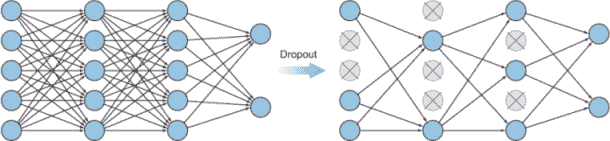

图 3.31 Dropout 关闭了构成网络层的一定比例的神经元。

### 3.5.3 为什么我们需要 dropout 层？

在训练过程中，神经元之间会形成相互依赖，这控制了每个神经元的个体能力，导致训练数据的过拟合。为了真正理解为什么 dropout 是有效的，让我们更仔细地看看图 3.31 中的 MLP，并思考每一层的节点真正代表什么。第一层（最左边）是输入层，包含输入特征。第二层包含从上一层的模式中学习到的特征，当乘以权重时。然后是下一层，它学习的是模式中的模式，依此类推。每个神经元代表一个特定的特征，当乘以权重时，会转换成另一个特征。当我们随机关闭一些这些节点时，我们迫使其他节点在没有仅依赖一个或两个特征的情况下学习模式，因为任何特征在任何时候都可能被随机丢弃。这导致权重在所有特征之间分散，导致更多训练神经元。

Dropout 有助于减少神经元之间的相互依赖学习。从这个意义上讲，它有助于将 dropout 视为一种集成学习方法。在集成学习中，我们分别训练多个较弱的分类器，然后在测试时通过平均所有集成成员的响应来使用它们。由于每个分类器都是分别训练的，因此它们已经学习了数据的不同方面，它们的错误（误差）也不同。将它们结合起来有助于产生一个更强的分类器，这种分类器不太可能过拟合。

直觉

一个有助于我理解 dropout 的类比是使用杠铃训练二头肌。当我们用双臂举起杠铃时，我们倾向于依赖我们的更强臂举起比我们的弱臂更多的重量。我们的更强臂最终会得到比其他部位更多的训练并发展出更大的肌肉：


Dropout 意味着稍微打乱我们的训练（训练）过程。我们绑住我们的右手，只训练左手。然后我们绑住左手，只训练右手。然后我们打乱它，带着两只手臂回到杠铃，以此类推。过了一段时间，你会发现你的两个二头肌都得到了锻炼：


这正是我们在训练神经网络时发生的情况。有时网络的一部分具有非常大的权重并主导所有训练，而网络的另一部分则没有得到很多训练。dropout 的作用是关闭一些神经元，让其余的神经元进行训练。然后，在下一个 epoch 中，它关闭其他神经元，这个过程持续进行。

### 3.5.4 dropout 层在 CNN 架构中的位置在哪里？

正如您在本章中学到的，一个标准的 CNN 由交替的卷积层和池化层组成，以全连接层结束。为了防止过拟合，在将图像展平后，在架构末尾的全连接层之间注入几个 dropout 层已成为标准做法。为什么？因为 dropout 在卷积神经网络的完全连接层中已知效果良好。然而，它在卷积和池化层中的效果尚未得到充分研究：

CNN 架构：... 卷积 ⇒ 池化 ⇒ 展平 ⇒ DO ⇒ FC ⇒ DO ⇒ FC

让我们看看我们如何使用 Keras 将 dropout 层添加到我们之前的模型中：

```
# CNN and POOL layers
# ...
# ...
model.add(Flatten())                             ❶

model.add(Dropout(rate=0.3))                     ❷

model.add(Dense(64, activation='relu'))          ❸

model.add(Dropout(rate=0.5))                     ❹

model.add(Dense(10, activation='softmax'))       ❺

model.summary()                                  ❻
```

❶ 展平层

❷ 30%概率的 dropout 层

❸ FC_1：完全连接以获取所有相关数据

❹ 50%概率的 dropout 层

❺ FC_2：输出 softmax 将矩阵压缩成 10 个类别的输出概率

❻ 打印模型架构摘要

如您所见，dropout 层以`rate`作为参数。该比率表示要丢弃的输入单元的比例。例如，如果我们把`rate`设置为 0.3，这意味着该层中 30%的神经元将在每个 epoch 中被随机丢弃。所以如果我们有一个层中有 10 个节点，那么其中的 3 个神经元将被关闭，而 7 个将被训练。这三个神经元是随机选择的，在下一个 epoch 中，其他随机选择的神经元将被关闭，以此类推。由于我们是随机进行的，一些神经元可能被关闭的次数比其他的多，有些可能永远不会被关闭。这是可以的，因为我们这样做很多次，所以平均来看，每个神经元将得到几乎相同的治疗。请注意，这个比率是我们构建 CNN 时调整的另一个超参数。

## 3.6 对彩色图像的卷积（3D 图像）

记得在第一章中，计算机将灰度图像视为像素的二维矩阵（图 3.32）。对于计算机来说，图像看起来像是一个像素值的二维矩阵，这些值代表颜色光谱中的强度。这里没有上下文，只有大量数据。

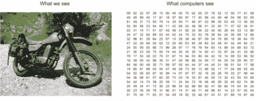

图 3.32 对于计算机来说，图像看起来像是一个像素值的二维矩阵。

另一方面，计算机将彩色图像解释为具有高度、宽度和深度的 3D 矩阵。在 RGB 图像（红色、绿色和蓝色）的情况下，深度为 3：每个颜色一个通道。例如，一个 28 × 28 的彩色图像将被计算机视为一个 28 × 28 × 3 的矩阵。想象一下，这是一个由三个 2D 矩阵堆叠而成的——每个矩阵分别对应图像的红色、绿色和蓝色通道。每个矩阵代表其颜色的强度值。当它们堆叠在一起时，就构成了一个完整的彩色图像（图 3.33）。

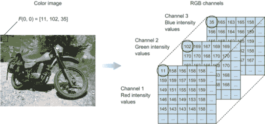

图 3.33 彩色图像由三个矩阵表示。每个矩阵代表其颜色的强度值。将它们堆叠起来就构成了一个完整的彩色图像。

注意：为了泛化，我们用三维数组表示图像：高度 × 宽度 × 深度。对于灰度图像，深度为 1；对于彩色图像，深度为 3。

### 3.6.1 我们如何在彩色图像上执行卷积？

与我们对灰度图像所做的方法类似，我们将卷积核在图像上滑动并计算特征图。现在核本身是三维的：每个维度对应一个颜色通道（图 3.34）。

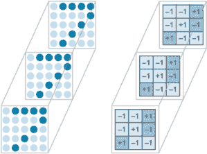

图 3.34 我们将卷积核在图像上滑动并计算特征图，从而得到一个 3D 核。

为了执行卷积，我们将做与之前相同的事情，只是现在我们的求和项是之前的 3 倍。让我们看看如何（图 3.35）：

+   每个颜色通道都有自己的对应过滤器。

+   每个过滤器都会在其图像上滑动，逐元素相乘对应的像素元素，然后将它们全部相加以计算每个过滤器的卷积像素值。这与我们之前所做的方法类似。

+   然后我们将这三个值相加得到卷积图像或特征图中单个节点的值。别忘了加上 1 的偏置值。然后我们将过滤器滑动一个或多个像素（基于步长值）并执行相同操作。我们继续这个过程，直到计算完特征图中所有节点的像素值。

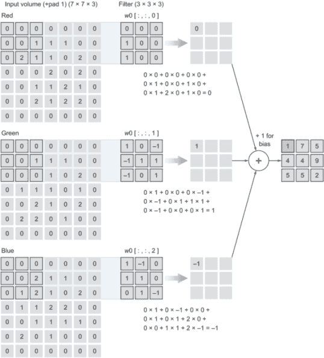

图 3.35 执行卷积

### 3.6.2 计算复杂度会发生什么变化？

注意，如果我们用一个 3 × 3 的过滤器在灰度图像上滑动，我们将为每个过滤器有总共 9 个参数（权重）（如前所述）。在彩色图像中，每个过滤器本身就是一个 3D 过滤器。这意味着每个过滤器都有一个参数数量：（高度 × 宽度 × 深度）=（3 × 3 × 3）= 27。你可以看到，当处理彩色图像时，网络复杂性如何增加，因为它必须优化更多的参数；彩色图像也占用更多的内存空间。

彩色图像包含比灰度图像更多的信息。这可能会增加不必要的计算复杂性和占用内存空间。然而，彩色图像对于某些分类任务也非常有用。这就是为什么在某些用例中，作为计算机视觉工程师的你将根据自己的判断来决定是否将彩色图像转换为灰度图像，因为在很多情况下，颜色并不是识别和解释图像所必需的：灰度图像可能就足够识别物体了。

在图 3.36 中，你可以看到一个物体（强度）中明暗模式的如何被用来定义其形状和特征。然而，在其他应用中，颜色对于定义某些物体很重要：例如，皮肤癌检测很大程度上依赖于皮肤颜色（红色皮疹）。一般来说，当涉及到 CV 应用，如识别汽车、人或皮肤癌时，你可以通过思考自己的视觉来决定颜色信息是否重要。如果我们人类在颜色上更容易识别问题，那么算法看到彩色图像可能也更容易。


图 3.36 在灰度图像中，一个物体（强度）的明暗模式可以用来定义其形状和特征。

注意，在图 3.36 中，我们只添加了一个过滤器（包含 3 个通道），它产生了一个特征图。与灰度图像类似，我们添加的每个过滤器都会产生它自己的特征图。在图 3.37 中的 CNN 中，我们有一个尺寸为（7 × 7 × 3）的输入图像。我们添加了两个尺寸为（3 × 3）的卷积过滤器。输出特征图的深度为 2，因为我们添加了两个过滤器，这与我们在灰度图像中所做的一样。

关于 CNN 架构的重要注意事项

我强烈建议查看现有的架构，因为很多人已经做了将事物组合在一起并看看什么有效的工作。从实际的角度来说，除非你正在研究问题，否则你应该从一个已经由其他人构建的用于解决类似你问题的 CNN 架构开始。然后进一步调整以适应你的数据。

在第四章中，我们将解释如何诊断你网络的性能，并讨论调整策略以改进它。在第五章中，我们将讨论最流行的 CNN 架构，并检查其他研究人员是如何构建它们的。我希望你从这个部分得到的是，首先，对 CNN 构建的概念理解；其次，更多的层导致更多的神经元，这导致更多的学习行为。但这伴随着计算成本。因此，你应该始终考虑你的训练数据的大小和复杂性（对于简单任务，可能不需要很多层）。

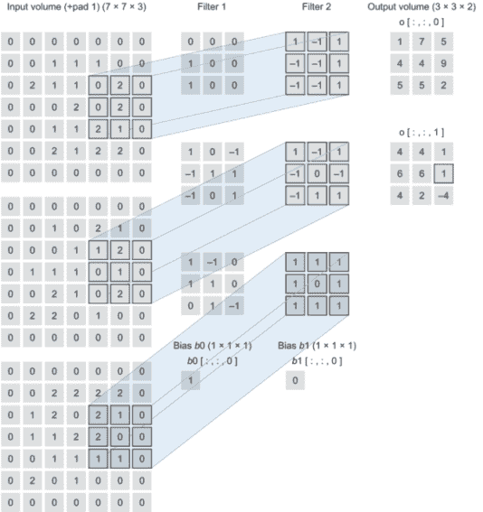

图 3.37 我们的输入图像尺寸为（7 × 7 × 3），我们添加了两个尺寸为（3 × 3）的卷积过滤器。输出特征图的深度为 2。

## 3.7 项目：彩色图像的分类

让我们看看一个端到端图像分类项目。在这个项目中，我们将训练一个 CNN 来对 CIFAR-10 数据集（[www.cs.toronto.edu/ ~kriz/cifar.html](http://www.cs.toronto.edu/~kriz/cifar.html)）中的图像进行分类。CIFAR-10 是一个用于物体识别的成熟 CV 数据集，它是 8000 万小图像数据集的一个子集 1，包含 60000 张（32 × 32）彩色图像，每类有 6000 张图像。现在，启动你的笔记本，让我们开始吧。

#### 第 1 步：加载数据集

第一步是将数据集加载到我们的训练和测试对象中。幸运的是，Keras 为我们提供了`load_data()`方法来加载 CIFAR 数据集。我们只需要导入`keras.datasets`然后加载数据：

```
import keras
from keras.datasets import cifar10
(x_train, y_train), (x_test, y_test) = cifar10.load_data()      ❶

import numpy as np
import matplotlib.pyplot as plt
%matplotlib inline

fig = plt.figure(figsize=(20,5))
for i in range(36):
    ax = fig.add_subplot(3, 12, i + 1, xticks=[], yticks=[])
    ax.imshow(np.squeeze(x_train[i]))
```

❶ 加载预洗牌的训练和测试数据

#### 第 2 步：图像预处理

根据你的数据集和你要解决的问题，你需要进行一些数据清理和预处理，以便为你的学习模型做好准备。成本函数的形状像一个碗，但如果特征具有非常不同的尺度，它可能是一个拉长的碗。图 3.38 显示了在特征 1 和 2 具有相同尺度（左侧）的训练集上的梯度下降，以及在特征 1 的值比特征 2 小得多的训练集（右侧）。

提示：在使用梯度下降时，你应该确保所有特征具有相似的尺度；否则，收敛将需要更长的时间。

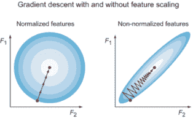

图 3.38 显示了标准化特征具有相同尺度，用一个均匀的碗表示（左侧）。未标准化特征尺度不同，用一个拉长的碗表示（右侧）。在具有相同尺度的特征上的训练集（左侧）和在特征 1 的值比特征 2 小得多的训练集（右侧）上的梯度下降。

##### 调整图像尺度

按以下方式调整输入图像的尺度：

```
x_train = x_train.astype('float32')/255        ❶
x_test = x_test.astype('float32')/255
```

❶ 通过除以 255 来调整图像的像素值：[0,255] ⇒ [0,1]

##### 准备标签（独热编码）

在本章以及整本书中，我们将讨论计算机如何通过将其转换为像素强度的矩阵形式来处理输入数据（图像）。那么标签呢？计算机是如何理解标签的？我们数据集中的每一张图像都有一个特定的标签，用文本解释了这张图像是如何被分类的。在这个特定的数据集中，例如，标签被分为以下 10 个类别：`['飞机',` `'汽车',` `'鸟',` `'猫',` `'鹿',` `'狗',` `'青蛙',` `'马',` `'船',` `'卡车']`。我们需要将这些文本标签转换为计算机可以处理的形式。计算机擅长处理数字，所以我们将进行一种称为独热编码的过程。独热编码是一种将分类变量转换为数值形式的过程。

假设数据集看起来如下：

| 图像 | 标签 |
| --- | --- |
| image_1 | 狗 |
| image_2 | 汽车 |
| image_3 | 飞机 |
| image_4 | truck |
| image_5 | bird |

独热编码后，我们得到以下内容：

|  | airplane | bird | cat | deer | dog | frog | horse | ship | truck | automobile |
| --- | --- | --- | --- | --- | --- | --- | --- | --- | --- | --- |
| image_1 | 0 | 0 | 0 | 0 | 1 | 0 | 0 | 0 | 0 | 0 |
| image_2 | 0 | 0 | 0 | 0 | 0 | 0 | 0 | 0 | 0 | 1 |
| image_3 | 1 | 0 | 0 | 0 | 0 | 0 | 0 | 0 | 0 | 0 |
| image_4 | 0 | 0 | 0 | 0 | 0 | 0 | 0 | 0 | 1 | 0 |
| image_5 | 0 | 1 | 0 | 0 | 0 | 0 | 0 | 0 | 0 | 0 |

幸运的是，Keras 有一个方法可以为我们做到这一点：

```
from keras.utils import np_utils

num_classes = len(np.unique(y_train))            ❶
y_train = keras.utils.to_categorical(y_train, num_classes)
y_test = keras.utils.to_categorical(y_test, num_classes)
```

❶ 对标签进行独热编码

##### 将数据集分为训练集和验证集

除了将我们的数据分为训练集和测试集之外，将训练数据进一步分为训练集和验证集是一种标准做法（图 3.39）。为什么？因为每个拆分都有不同的用途：

+   训练数据集 -- 用于训练模型的样本数据。

+   验证数据集 -- 使用的数据样本，用于在调整模型超参数时对训练数据集上的模型拟合进行无偏评估。当将验证数据集上的技能纳入模型配置时，评估变得更具偏差。

+   测试数据集 -- 使用的数据样本，用于在训练数据集上对最终模型拟合进行无偏评估。

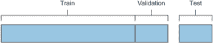

图 3.39 将数据拆分为训练、验证和测试子集

这里是 Keras 代码：

```
(x_train, x_valid) = x_train[5000:], x_train[:5000]    ❶
(y_train, y_valid) = y_train[5000:], y_train[:5000]    ❶

print('x_train shape:', x_train.shape)                 ❷

print(x_train.shape[0], 'train samples')               ❸
print(x_test.shape[0], 'test samples')                 ❸
print(x_valid.shape[0], 'validation samples')          ❸
```

❶ 将训练集拆分为训练集和验证集

❷ 打印训练集的形状

❸ 打印训练集、验证集和测试集的图像数量

标签矩阵

独热编码将 (1 × n) 标签向量转换为维度为 (10 × n) 的标签矩阵，其中 n 是样本图像的数量。所以，如果我们数据集中有 1,000 张图像，标签向量将具有 (1 × 1000) 的维度。独热编码后，标签矩阵的维度将是 (1000 × 10)。这就是为什么，在下一步定义我们的网络架构时，我们将输出 softmax 层包含 10 个节点，每个节点代表我们拥有的每个类别的概率。

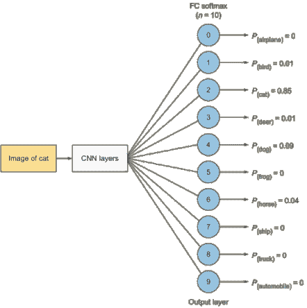

#### 第 3 步：定义模型架构

你已经了解到 CNN（以及神经网络）的核心构建块是层。大多数深度学习项目都由堆叠简单层组成，这些层实现了数据蒸馏的一种形式。正如你在本章所学，主要的 CNN 层包括卷积、池化、全连接和激活函数。

##### 你是如何决定网络架构的？

应该创建多少个卷积层？多少个池化层？在我看来，了解一些最流行的架构（AlexNet、ResNet、Inception）以及提取导致设计决策的关键思想是非常有帮助的。观察这些最先进的架构是如何构建的，并在你自己的项目中尝试，将帮助你建立对最适合你解决问题的 CNN 架构的直觉。我们将在第五章讨论最流行的 CNN 架构。在此之前，你需要了解以下内容：

+   你添加的层越多，理论上你的网络学习效果越好；但这也将带来计算和内存空间复杂度增加的代价，因为它增加了需要优化的参数数量。你还将面临网络过拟合训练集的风险。

+   当输入图像通过网络层时，其深度会增加，而维度（宽度，高度）会逐层缩小。

+   通常情况下，对于较小的数据集，可以从两到三层 3 × 3 卷积层开始，然后跟一个 2 × 2 池化层，这可以是一个不错的起点。添加更多的卷积和池化层，直到你的图像达到合理的尺寸（比如 4 × 4 或 5 × 5），然后添加几个全连接层进行分类。

+   你需要设置几个超参数（如`filter`、`kernel_size`和`padding`）。记住，你不需要重新发明轮子：相反，查阅文献看看通常对其他人有效的超参数。以对其他人有效的架构作为起点，然后调整这些超参数以适应你的情况。下一章将专门探讨对其他人有效的方法。

学习如何与层和超参数一起工作

我不希望你在一开始构建 CNN 时过于纠结于超参数的设置。获得如何组合层和超参数直觉的最好方法之一是实际看到其他人如何具体操作。作为深度学习工程师，你大部分的工作将涉及构建架构和调整参数。本章的主要收获如下：

+   理解主要 CNN 层（卷积、池化、全连接、dropout）的工作原理以及它们存在的原因。

+   理解每个超参数的作用（卷积层中的滤波器数量、内核大小、步长和填充）。

+   最后，理解如何在 Keras 中实现任何给定的架构。如果你能够在你自己的数据集上复制这个项目，那么你就准备好了。

在第五章中，我们将回顾几个最先进的架构，并看看它们是如何工作的。

图 3.40 所示的架构被称为 AlexNet：它是一个流行的 CNN 架构，在 2011 年赢得了 ImageNet 挑战赛（关于 AlexNet 的更多细节请见第五章）。AlexNet CNN 架构由五个卷积和池化层以及三个全连接层组成。

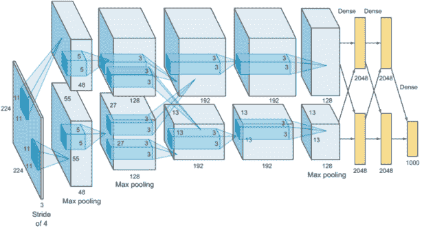

图 3.40 AlexNet 架构

让我们尝试一个更小的 AlexNet 版本，看看它在我们的数据集上的表现如何（图 3.41）。根据结果，我们可能会添加更多层。我们的架构将堆叠三个卷积层和两个全连接（密集）层，如下所示：

CNN：输入 ⇒ CONV_1 ⇒ POOL_1 ⇒ CONV_2 ⇒ POOL_2 ⇒ CONV_3 ⇒ POOL_3 ⇒ DO ⇒ FC ⇒ DO ⇒ FC (softmax)

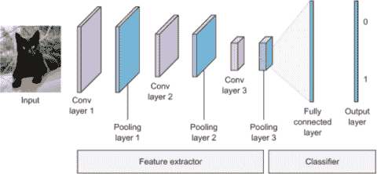

图 3.41 我们将构建一个包含三个卷积层和两个密集层的简单 CNN。

注意，我们将对所有隐藏层使用 ReLU 激活函数。在最后一个密集层，我们将使用具有 10 个节点的 softmax 激活函数，以返回一个包含 10 个概率分数的数组（总和为 1）。每个分数将是当前图像属于我们 10 个图像类别的概率：

```
from keras.models import Sequential
from keras.layers import Conv2D, MaxPooling2D, Flatten, Dense, Dropout

model = Sequential()
model.add(Conv2D(filters=16, kernel_size=2, padding='same',   ❶
    activation='relu', input_shape=(32, 32, 3)))              ❶
model.add(MaxPooling2D(pool_size=2))

model.add(Conv2D(filters=32, kernel_size=2, padding='same',   ❷
    activation='relu'))                                       ❷
model.add(MaxPooling2D(pool_size=2))

model.add(Conv2D(filters=64, kernel_size=2, padding='same',   ❸
    activation='relu'))                                       ❸
model.add(MaxPooling2D(pool_size=2))

model.add(Dropout(0.3))                                       ❹

model.add(Flatten())                                          ❺

model.add(Dense(500, activation='relu'))                      ❻
model.add(Dropout(0.4))                                       ❼

model.add(Dense(10, activation='softmax'))                    ❽

model.summary()                                               ❾
```

❶ 第一个卷积和池化层。注意，我们只需要在第一个卷积层中定义 input_shape。

❷ 第二个卷积和池化层，带有 ReLU 激活函数

❸ 第三个卷积和池化层

❹ 30%率的 dropout 层以避免过拟合

❺ 将最后一个特征图展平成一个特征向量

❻ 添加第一个全连接层

❼ 另一个 40%率的 dropout 层

❽ 输出层是一个包含 10 个节点的全连接层，并使用 softmax 激活函数为 10 个类别提供概率。

❾ 打印模型架构摘要

当你运行这个单元格时，你会看到模型架构以及特征图维度如何随着每一层的连续变化，如图 3.42 所示。

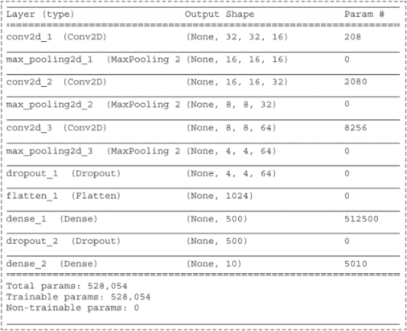

图 3.42 模型摘要

我们之前讨论了如何理解这个摘要。正如你所见，我们的模型有 528,054 个参数（权重和偏差）需要训练。我们之前也讨论了如何计算这个数字。

#### 第 4 步：编译模型

在训练我们的模型之前，最后一步是定义三个额外的超参数--损失函数、优化器以及在训练和测试期间监控的指标：

+   损失函数 --网络将如何衡量其在训练数据上的性能。

+   优化器 --网络将使用的机制来优化其参数（权重和偏差）以产生最小损失值。它通常是第二章中解释的随机梯度下降的变体之一。

+   指标 --模型在训练和测试期间要评估的指标列表。通常我们使用`metrics=['accuracy']`。

随意回顾第二章以获取关于确切目的和不同类型的损失函数及优化器的更多细节。

这是编译模型的代码：

```
model.compile(loss='categorical_crossentropy', optimizer='rmsprop',
    metrics=['accuracy'])
```

#### 第 5 步：训练模型

我们现在准备好训练网络了。在 Keras 中，这是通过调用网络的.fit()方法（如将模型拟合到训练数据）来完成的：

```
from keras.callbacks import ModelCheckpoint

checkpointer = ModelCheckpoint(filepath='model.weights.best.hdf5', verbose=1,
    save_best_only=True)

hist = model.fit(x_train, y_train, batch_size=32, epochs=100,
    validation_data=(x_valid, y_valid), callbacks=[checkpointer],
    verbose=2, shuffle=True)
```

当你运行这个单元格时，训练将开始，图 3.43 中显示的详细输出将每次显示一个时代。由于 100 个时代的显示不适合一页纸，截图显示了前 13 个时代。但当你在这个笔记本上运行时，显示将一直持续到 100 个时代。

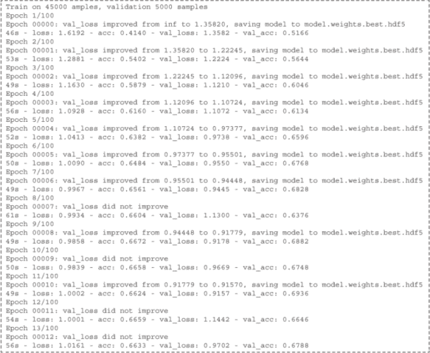

图 3.43 训练的前 13 个时代

查看图 3.43 中的详细输出将帮助你分析你的网络性能，并提出哪些旋钮（超参数）需要调整。我们将在第四章中详细讨论这一点。现在，让我们看看最重要的要点：

+   `loss`和`acc`是训练数据的错误和准确率值。`val_loss`和`val_acc`是验证数据的错误和准确率值。

+   查看每个时代后的`val_loss`和`val_acc`值。理想情况下，我们希望`val_loss`下降，`val_acc`上升，这表明网络在每个时代之后实际上是在学习的。

+   从第 1 个时代到第 6 个时代，你可以看到模型在每个时代之后都会保存权重，因为验证损失值在提高。所以每个时代结束时，我们保存被认为是迄今为止最佳权重的权重。

+   在第 7 个时代，`val_loss`从 0.9445 上升到 1.1300，这意味着它没有改进。所以网络在这个时代没有保存权重。如果你现在停止训练并从第 6 个时代加载权重，你将得到训练期间达到的最佳结果。

+   对于第 8 个时代，`val_loss`下降，因此网络将权重保存为最佳值。在第 9 个时代，没有改进，以此类推。

+   如果你训练 12 个时代后停止并加载最佳权重，网络将加载在第 10 个时代保存的权重（`val_loss` = 0.9157）和（`val_acc` = 0.6936）。这意味着你可以期望在测试数据上获得接近 69%的准确率。

关注这些常见现象

+   `val_loss`在波动。如果`val_loss`上下波动，你可能想要降低学习率超参数。例如，如果你看到`val_loss`从 0.8 到 0.9，到 0.7，到 1.0，以此类推，这可能意味着你的学习率太高，无法下降错误山。尝试降低学习率，并让网络训练更长的时间。

    

    如果`val_loss`波动，学习率可能太高。

+   `val_loss`没有改进（欠拟合）。如果`val_loss`没有下降，这可能意味着你的模型太简单，无法拟合数据（欠拟合）。那么你可能需要通过添加更多隐藏层来构建一个更复杂的模型，以帮助网络拟合数据。

+   `loss`正在下降，而`val_loss`停止了提升。这意味着你的网络开始对训练数据进行过拟合，并且未能减少验证数据的错误。在这种情况下，考虑使用防止过拟合的技术，如丢弃层。我们将在下一章讨论其他避免过拟合的技术。

#### 第 6 步：加载具有最佳 val_acc 的模型

现在训练完成，我们使用 Keras 方法`load_weights()`将产生最佳验证准确率分数的权重加载到我们的模型中：

```
model.load_weights('model.weights.best.hdf5')
```

#### 第 7 步：评估模型

最后一步是评估我们的模型，并计算准确率值作为百分比，表示我们的模型正确预测图像分类的频率：

```
score = model.evaluate(x_test, y_test, verbose=0)
print('\n', 'Test accuracy:', score[1])
```

当你运行这个单元格时，你将得到大约 70%的准确率。这还不错。但我们可以做得更好。尝试通过添加更多的卷积和池化层来调整 CNN 架构，看看你是否能提高你的模型。

在下一章中，我们将讨论设置深度学习（DL）项目策略和超参数调整以改进模型性能的方法。在第四章结束时，我们将重新审视这个项目，应用这些策略并将准确率提高到 90%以上。

## 摘要

+   MLPs、ANNs、密集和前馈都指的是我们在第二章中讨论的常规全连接神经网络架构。

+   MLPs 通常适用于一维输入，但它们在处理图像时表现不佳，主要有两个原因。首先，它们只接受以向量形式具有维度（1 × n）的特征输入。这需要展平图像，这将导致丢失其空间信息。其次，MLPs 由全连接层组成，在处理较大图像时会产生数百万甚至数十亿个参数。这将增加计算复杂度，并且对于许多图像问题无法扩展。

+   CNNs 在图像处理方面表现尤为出色，因为它们可以直接将原始图像矩阵作为输入，而不需要将图像展平。它们由称为卷积滤波器的局部连接层组成，这与 MLPs 的密集层形成对比。

+   卷积神经网络（CNNs）由三个主要层组成：用于特征提取的卷积层、用于降低网络维度的池化层，以及用于分类的全连接层。

+   机器学习预测性能不佳的主要原因要么是过拟合，要么是欠拟合数据。欠拟合意味着模型过于简单，无法拟合（学习）训练数据。过拟合意味着模型过于复杂，它记住了训练数据，并且无法对之前未见过的测试数据进行泛化。

+   添加一个丢弃层以防止过拟合。丢弃层会关闭网络层中一定比例的神经元（节点）。

***

1. 安东尼奥·托拉尔巴、罗布·弗格森和威廉·T·弗里曼，“8000 万个小图像：用于非参数对象和场景识别的大数据集”，IEEE 信号处理与机器智能杂志（2008 年 11 月），[`doi.org/10.1109/TPAMI.2008.128`](https://doi.org/10.1109/TPAMI.2008.128).
