# 4 结构化 DL 项目和超参数调整

本章涵盖

+   定义性能指标

+   设计基线模型

+   准备训练数据

+   评估模型并提高其性能

本章总结了本书的第一部分，为深度学习（DL）提供了基础。在第二章中，你学习了如何构建多层感知器（MLP）。在第三章中，你了解了在计算机视觉（CV）问题中非常常用的神经网络架构拓扑：卷积神经网络（CNN）。在本章中，我们将通过讨论如何从头到尾构建你的机器学习（ML）项目来结束这个基础。你将学习策略，以快速有效地让你的 DL 系统运行，分析结果，并提高网络性能。

正如你可能已经从前面的项目中注意到的，深度学习（DL）是一个非常经验的过程。它依赖于运行实验和观察模型性能，而不是有一个适用于所有问题的成功公式。我们通常有一个初始的解决方案想法，将其编码，运行实验以查看其表现，然后使用这个实验的结果来完善我们的想法。在构建和调整神经网络时，你会发现自己在做出许多看似随机的决策：

+   从何开始选择一个好的架构？

+   你应该堆叠多少隐藏层？

+   每个层应该有多少隐藏单元或过滤器？

+   学习率是多少？

+   你应该使用哪种激活函数？

+   哪个更有利于获得更好的结果，是获取更多数据还是调整超参数？

在本章中，你将学习以下内容：

+   定义您系统的性能指标 -- 除了模型准确度之外，你还将使用其他指标，如精确度、召回率和 F 分数来评估你的网络。

+   设计基线模型 -- 你将选择一个合适的神经网络架构来运行你的第一个实验。

+   准备训练数据 -- 在现实世界的问题中，数据通常是杂乱的，不适合直接输入到神经网络中。在本节中，你将对数据进行处理，使其准备好进行学习。

+   评估你的模型并解释其性能 -- 训练完成后，你分析模型性能以识别瓶颈并缩小改进选项。这意味着诊断哪些网络组件的表现不如预期，并确定性能不佳是由于过拟合、欠拟合还是数据缺陷。

+   改进网络和调整超参数 -- 最后，我们将深入探讨最重要的超参数，以帮助你发展对需要调整哪些超参数的直觉。你将使用调整策略，根据上一步的诊断进行增量更改。

TIP 通过更多的实践和实验，深度学习工程师和研究人员会随着时间的推移逐渐建立起对最有效改进方法的直觉。我的建议是亲自动手尝试不同的架构和方法，以发展你的超参数调整技能。

准备好了吗？让我们开始吧！

## 4.1 定义性能指标

性能指标允许我们评估我们的系统。当我们开发模型时，我们想知道它工作得如何。衡量我们模型“好坏”的最简单方法就是衡量其准确率。准确率指标衡量我们的模型正确预测的次数。因此，如果我们用 100 个输入样本测试模型，并且它正确预测了 90 次，这意味着该模型是 90% 准确的。

这里是计算模型准确率的公式：

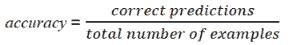

### 4.1.1 准确率是评估模型的最佳指标吗？

我们在早期项目中一直使用准确率作为评估模型的指标，在很多情况下效果良好。但让我们考虑以下问题：你正在设计一种用于罕见疾病的医学诊断测试。假设每百万分之一的人患有这种疾病。如果没有任何训练甚至根本不构建系统，如果你将输出硬编码为始终为负（未发现疾病），则你的系统将始终达到 99.999% 的准确率。这是好事吗？系统达到了 99.999% 的准确率，这听起来可能很神奇，但它永远不会捕捉到患有疾病的患者。这意味着准确率指标不适合衡量该模型的“好坏”。我们需要其他评估指标来衡量模型预测能力的不同方面。

### 4.1.2 混淆矩阵

为了为其他指标做准备，我们将使用混淆矩阵：一个描述分类模型性能的表格。混淆矩阵本身相对容易理解，但相关的术语一开始可能会有些令人困惑。一旦你理解了它，你会发现这个概念非常直观，并且非常有意义。让我们一步一步地来探讨它。

目标是从除预测准确率之外的不同角度描述模型性能。例如，假设我们正在构建一个分类器来预测患者是否患病。预期的分类是阳性（患者患病）或阴性（患者健康）。我们在 1,000 名患者上运行我们的模型，并将模型预测输入到表 4.1 中。

表 4.1 运行我们的模型以预测健康与患病患者

|  | 预测患病（阳性） | 预测健康（阴性） |
| --- | --- | --- |
| 患病患者（阳性） | 100 | 30 |
| 真阳性（TP） | 假阴性（FN） |
| 健康患者（阴性） | 70 | 800 |
| 假阳性（FP） | 真阴性（TN） |

现在我们定义最基本的概念，它们是整数（不是比率）：

+   真阳性（TP）--模型正确预测了是（患者患有疾病）。

+   真阴性（TN）--模型正确地预测为无（患者没有疾病）。

+   假阳性（FP）--模型错误地预测为有，但实际上患者并没有疾病（在某些文献中称为第一类错误或第一类错误）。

+   假阴性（FN）--模型错误地预测为无，但实际上患者确实患有疾病（在某些文献中称为第二类错误或第二类错误）。

模型预测为阴性（无疾病）的患者是模型认为健康的人，我们可以让他们回家，无需进一步治疗。模型预测为阳性（有疾病）的患者是我们将送他们进行进一步检查的人。我们更愿意犯哪种错误？错误地将某人诊断为阳性（有疾病）并让他们接受更多检查，不如错误地将某人诊断为阴性（健康）并让他们回家，冒着生命危险。在这里，评价指标显然是，我们更关心假阴性（FN）的数量。我们希望找到所有患病的人，即使模型错误地将一些健康人分类为患病。这个指标被称为召回率。

### 4.1.3 精确率和召回率

召回率（也称为灵敏度）告诉我们模型错误地将多少名患病患者诊断为正常。换句话说，模型错误地将多少名患病患者诊断为阴性（假阴性，FN）？召回率通过以下公式计算：

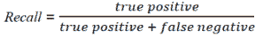

精确率（也称为特异性）是召回率的对立面。它告诉我们模型错误地将多少名健康患者诊断为患病。换句话说，模型错误地将多少名健康患者诊断为阳性（假阳性，FP）？精确率通过以下公式计算：


确定合适的指标

重要的一点是，尽管在健康诊断的例子中我们决定召回率是一个更好的指标，但其他用例可能需要不同的指标，如精确率。为了确定您问题的最合适的指标，请问自己两种可能的错误预测哪一种更严重：假阳性还是假阴性。如果您的答案是 FP，那么您正在寻找精确率。如果 FN 更严重，那么召回率就是您的答案。

以垃圾邮件分类器为例。您更关心哪种错误预测：错误地将非垃圾邮件分类为垃圾邮件，导致其丢失，还是错误地将垃圾邮件分类为非垃圾邮件，之后它进入收件箱文件夹？我相信您会更关心前者。您不希望收件人因为模型将其错误分类为垃圾邮件而丢失邮件。我们希望捕捉到所有垃圾邮件，但丢失非垃圾邮件是非常糟糕的。在这个例子中，精确率是一个合适的指标。

在某些应用中，你可能会同时关心精确率和召回率。这被称为 F 分数，如以下所述。

### 4.1.4 F 分数

在许多情况下，我们希望用一个代表召回率和精确率的单一指标来总结分类器的性能。为此，我们可以将精确率（*p*）和召回率（r）转换为单一的 F 分数指标。在数学上，这被称为 p 和 r 的调和平均数：

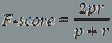

F 分数可以很好地整体反映你的模型表现如何。让我们再次看看健康诊断的例子。我们一致认为这是一个高召回率的模型。但如果模型在 FN 上表现很好，给出了高召回率分数，但在 FP 上表现不佳，给出了低精确率分数怎么办？FP 表现不佳意味着，为了不漏掉任何生病患者，它错误地将许多患者诊断为生病，以确保安全。因此，虽然召回率对于这个问题可能更重要，但查看模型时从精确率和召回率两个分数一起考虑是好的：

|  | 精确率 | 召回率 | F 分数 |
| --- | --- | --- | --- |
| 分类器 A | 95% | 90% | 92.4% |
| 分类器 B | 98% | 85% | 91% |

注意：定义模型评估指标是一个必要的步骤，因为它将指导你改进系统的方法。如果没有明确定义的指标，很难判断对机器学习系统的更改是否导致进步。

## 4.2 设计基线模型

现在你已经选择了你将用于评估系统的指标，是时候建立一个合理的端到端系统来训练你的模型了。根据你要解决的问题，你需要设计基线以适应你的网络类型和架构。在这一步，你将想要回答以下问题：

+   我是否应该使用 MLP 或 CNN 网络（或 RNN，本书后面将解释）？

+   我是否应该使用其他目标检测技术，如 YOLO 或 SSD（在后续章节中解释）？

+   我的网络应该有多深？

+   我将使用哪种激活类型？

+   我将使用哪种优化器？

+   我是否需要添加其他正则化层，如 dropout 或批量归一化，以避免过拟合？

如果你的问题与已经被广泛研究的问题相似，你最好首先复制已知在该任务上表现最佳的模型和算法。你甚至可以使用在另一个数据集上训练的模型来解决你的问题，而无需从头开始训练。这被称为迁移学习，将在第六章中详细讨论。

例如，在上一个章节的项目中，我们使用了流行的 AlexNet 架构作为基线模型。图 4.1 显示了一个 AlexNet 深度 CNN 的架构，以及每层的尺寸。输入层后面是五个卷积层（CONV1 到 CONV5），第五个卷积层的输出被送入两个全连接层（FC6 到 FC7），输出层是一个具有 softmax 函数的全连接层（FC8）：

输入 ⇒ CONV1 ⇒ POOL1 ⇒ CONV2 ⇒ POOL2 ⇒ CONV3 ⇒ CONV4 ⇒ CONV5 ⇒ POOL3 ⇒ FC6 ⇒ FC7 ⇒ SOFTMAX_8

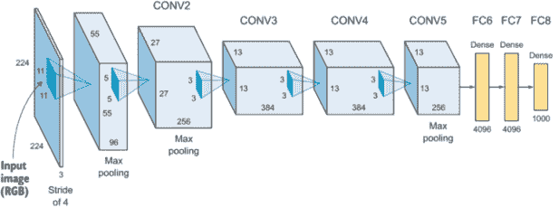

图 4.1 AlexNet 架构由五个卷积层和三个 FC 层组成。

观察 AlexNet 架构，您将找到您开始自己的模型所需的所有网络超参数：

+   网络深度（层数）：5 个卷积层加上 3 个全连接层

+   层数的深度（过滤器数量）：CONV1 = 96，CONV2 = 256，CONV3 = 384，CONV4 = 385，CONV5 = 256

+   过滤器大小：11 × 11、5 × 5、3 × 3、3 × 3、3 × 3

+   ReLU 作为隐藏层（从 CONV1 到 FC7）的激活函数

+   在 CONV1、CONV2 和 CONV5 后的池化层

+   每个有 4,096 个神经元的 FC6 和 FC7

+   FC8 有 1000 个神经元，使用 softmax 激活函数

注意：在下一章中，我们将讨论一些最流行的 CNN 架构及其在 Keras 中的代码实现。我们将查看 LeNet、AlexNet、VGG、ResNet 和 Inception 等网络，这将帮助您了解针对不同问题的最佳架构，并可能激发您发明自己的 CNN 架构。

## 4.3 准备您的数据以进行训练

我们已经定义了我们将用于评估我们的模型的性能指标，并构建了我们的基线模型架构。让我们准备好我们的数据以进行训练。需要注意的是，这个过程在很大程度上取决于您的问题和数据。在这里，我将解释您在训练模型之前需要执行的基本数据预处理技术。我还会帮助您培养对“准备好的数据”外观的直觉，以便您确定需要哪些预处理技术。

### 4.3.1 将您的数据拆分为训练/验证/测试

当我们训练一个机器学习模型时，我们将数据拆分为训练和测试数据集（图 4.2）。我们使用训练数据集来训练模型并更新权重，然后我们使用模型之前未见过的测试数据集来评估模型。这里的黄金法则如下：永远不要使用测试数据来训练。我们不应该在训练过程中向模型展示测试样本的原因是确保模型没有作弊。我们向模型展示训练样本以学习它们的特征，然后我们测试它在从未见过的数据集上的泛化能力，以获得其性能的无偏评估。


图 4.2 将数据拆分为训练和测试数据集

#### 什么是验证数据集？

在训练过程的每个 epoch 之后，我们需要评估模型的准确性和误差，以查看其表现并调整其参数。如果我们使用测试数据集在训练过程中评估模型，我们将违反我们永不使用测试数据训练的黄金法则。测试数据仅在训练完成后评估模型的最终性能。因此，我们进行了一个额外的分割，称为验证数据集，以在训练过程中评估和调整参数（图 4.3）。一旦模型完成训练，我们将在测试数据集上测试其最终性能。

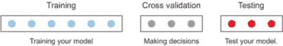

图 4.3 在训练过程中评估模型的一个额外分割，称为验证数据集，以保持测试子集在训练完成后的最终测试

看一下这个用于模型训练的伪代码：

```
for each epoch for each training data instance
        propagate error through the network 
        adjust the weights 
        calculate the accuracy and error over training data 
for each validation data instance 
        calculate the accuracy and error over the validation data 
```

正如我们在第三章的项目中看到的，当我们训练模型时，在每个 epoch 后，我们得到`train_loss`、`train_acc`、`val_loss`和`val_acc`（图 4.4）。我们使用这些数据来分析网络的性能并诊断过拟合和欠拟合，正如你将在 4.4 节中看到的。

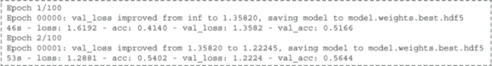

图 4.4 每个 epoch 后的训练结果

#### 什么是好的训练/验证/测试数据分割？

传统上，在机器学习项目中，训练和测试数据集之间使用 80/20 或 70/30 的分割。当我们添加验证数据集时，我们采用了 60/20/20 或 70/15/15 的分割。但那是在整个数据集只有几万个样本的时候。现在我们拥有的数据量巨大，有时验证和测试集各 1%就足够了。例如，如果我们的数据集包含 100 万个样本，每个测试和验证集有 10,000 个样本是非常合理的，因为保留几十万个样本的数据集是没有意义的。更好的做法是使用这些数据来训练模型。

因此，总结一下，如果你有一个相对较小的数据集，传统的比例可能就足够了。但是，如果你处理的是大型数据集，那么将训练和验证集设置为较小的值是完全可以的。

确保数据集来自相同的分布

在分割你的数据时，需要注意的一个重要事项是确保你的训练/验证/测试数据集来自相同的分布。假设你正在构建一个将在手机上部署的汽车分类器，用于检测汽车型号。记住，深度学习网络对数据有很强的需求，一个常见的经验法则是：你拥有的数据越多，你的模型表现越好。因此，为了获取数据，你决定从互联网上爬取所有高质量的、专业拍摄的汽车图像。你训练你的模型并调整它，你在测试数据集上取得了令人满意的结果，你准备将模型发布到世界——却发现它在手机摄像头拍摄的现实生活中的图像上表现不佳。这是因为你的模型已经被训练和调整以在高质量图像上取得好结果，因此它无法泛化到可能模糊、分辨率较低或具有不同特征的现实中图像。

用更技术性的语言来说，你的训练集和验证集由高质量图像组成，而生产图像（现实生活中的图像）则是低质量图像。因此，将低质量图像添加到你的训练和验证数据集中非常重要。因此，训练/验证/测试数据集应来自相同的分布。

### 4.3.2 数据预处理

在你将数据输入到神经网络之前，你需要进行一些数据清理和预处理，以便为你的学习模型做好准备。根据你的数据集状态和你要解决的问题，你可以选择几种预处理技术。关于神经网络的好消息是，它们需要最少的数据预处理。当给定大量训练数据时，它们能够从原始数据中提取和学习特征，这与其他传统机器学习技术不同。

话虽如此，预处理仍然可能需要，以提高性能或适应神经网络的具体限制，例如将图像转换为灰度、图像缩放、归一化和数据增强。在本节中，我们将介绍这些预处理概念；我们将在本章末尾的项目中看到它们的代码实现。

#### 图像灰度化

我们在第三章中讨论了彩色图像是如何用三个矩阵表示的，而灰度图像只用一个矩阵表示；彩色图像通过其许多参数增加了计算复杂性。如果你的问题不需要颜色，你可以判断是否将所有图像转换为灰度，以节省计算复杂性。这里的一个好经验法则是使用人类水平性能规则：如果你能在灰度图像中用眼睛识别出物体，那么神经网络很可能也能做到同样的。

#### 图像缩放

神经网络的一个限制是它们需要所有图像具有相同的形状。例如，如果您使用 MLPs，输入层的节点数必须等于图像中的像素数（记住在第三章中我们如何将图像展平以供 MLP 使用）。对于 CNNs 也是如此。您需要设置第一卷积层的输入形状。为了演示这一点，让我们看看添加第一个 CNN 层的 Keras 代码：

```
model.add(Conv2D(filters=16, kernel_size=2, padding='same', activation='relu', input_shape=(32, 32, 3)))
```

如您所见，我们必须在第一卷积层中定义图像的形状。例如，如果我们有三个尺寸为 32 × 32、28 × 28 和 64 × 64 的图像，我们必须在将它们输入模型之前将所有图像调整到同一尺寸。

#### 数据归一化

数据归一化是将您的数据缩放的过程，以确保每个输入特征（在图像的情况下为像素）具有相似的数据分布。通常，原始图像由具有不同尺度（值范围）的像素组成。例如，一张图像的像素值范围可能从 0 到 255，而另一张图像的范围可能为 20 到 200。虽然这不是必需的，但将像素值归一化到 0 到 1 的范围以提高学习性能并使网络更快收敛是首选的。

为了使您的神经网络学习更快，您的数据应具有以下特征：

+   小值 --通常，大多数值应在[0, 1]范围内。

+   均匀性 --所有像素的值应在相同的范围内。

数据归一化是通过从每个像素中减去均值，然后将结果除以标准差来完成的。此类数据的分布类似于以零为中心的高斯曲线。为了演示归一化过程，图 4.5 展示了在散点图中的操作。

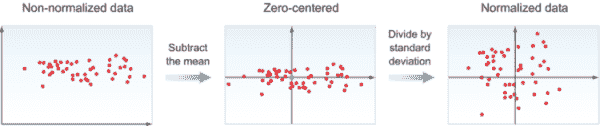

图 4.5 为了归一化数据，我们从每个像素中减去均值，然后将结果除以标准差。

TIP 确保您使用相同的均值和标准差对训练数据和测试数据进行归一化，因为您希望数据通过相同的转换并精确地以相同的方式进行缩放。您将在本章末尾的项目中看到这是如何实现的。

在未归一化的数据中，损失函数可能看起来像一个挤压、拉长的碗。在归一化特征后，您的损失函数将看起来更加对称。图 4.6 显示了两个特征 F1 和 F2 的损失函数。

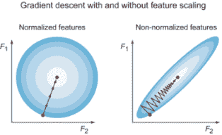

图 4.6 归一化特征有助于 GD 算法直接向最小误差前进，从而快速达到（左）。使用未归一化的特征时，GD 会在最小误差的方向上振荡，并且达到最小值较慢（右）。

如你所见，对于归一化的特征，GD 算法直接向最小误差方向前进，因此快速达到它。但对于非归一化的特征，它会在最小误差方向上振荡，最终以长时间下降误差山结束。它最终会达到最小值，但收敛需要更长的时间。

TIP 为什么 GD 在非归一化特征上会振荡？如果我们不对数据进行归一化，特征值的分布范围可能会因每个特征而异，因此学习率将导致每个维度上的校正成比例地不同。这迫使 GD 振荡到最小误差方向，并最终以更长的路径下降误差。

#### 图像增强

数据增强将在本章后面更详细地讨论，当我们介绍正则化技术时。但重要的是你要知道，这是你工具箱中另一个预处理技术，在需要时可以使用。

## 4.4 评估模型和解释其性能

在建立基线模型并对数据进行预处理之后，是时候训练模型并测量其性能了。训练完成后，你需要确定是否存在瓶颈，诊断哪些组件表现不佳，并确定性能不佳是由于过拟合、欠拟合还是训练数据中的缺陷。

神经网络的主要批评之一是它们是“黑盒子”。即使它们工作得非常好，也很难理解为什么它们工作得这么好。许多努力正在被做出以提高神经网络的解释性，这个领域可能在接下来的几年里快速发展。在本节中，我将向你展示如何诊断神经网络并分析其行为。

### 4.4.1 诊断过拟合和欠拟合

在运行你的实验后，你希望观察其性能，确定瓶颈是否影响了其性能，并寻找需要改进的区域。机器学习性能不佳的主要原因是训练数据集的过拟合或欠拟合。我们在第三章中讨论了过拟合和欠拟合，但现在我们将更深入地探讨如何检测系统过度拟合训练数据（过拟合）以及它过于简单以拟合数据（欠拟合）的情况：

+   欠拟合意味着模型过于简单：它未能学习训练数据，因此在训练数据上表现不佳。欠拟合的一个例子是使用单个感知器对数据进行分类

     和  图形在图 4.7 中。如你所见，一条直线并不能准确分割数据。

    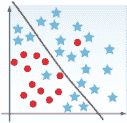

    图 4.7 欠拟合的例子

+   过拟合是指模型对于当前问题过于复杂。它不是学习适合训练数据的特征，而是实际上记住了训练数据。因此，它在训练数据上表现非常好，但在测试之前未见过的新数据上无法泛化。在图 4.8 中，你可以看到模型对数据拟合得太好：它分割了训练数据，但这种拟合将无法泛化。

    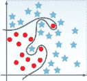

    图 4.8 过拟合的一个例子

+   我们希望构建一个适合数据的模型：既不过于复杂导致过拟合，也不过于简单导致欠拟合。在图 4.9 中，你可以看到模型错过了一个形状为 O 的数据样本，但它看起来更有可能在新的数据上泛化。

    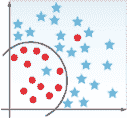

    图 4.9 一个适合数据的模型，并且能够泛化

TIP 我喜欢用来解释过拟合和欠拟合的类比是学生为考试做准备。欠拟合是当学生没有好好复习，所以考试不及格。过拟合是当学生记住了书本内容，在书本问题上的回答正确，但面对书本外的提问回答得不好。学生没有泛化。我们希望的是一个学生能够从书本（训练数据）中学到足够多的知识，以便在问到与书本材料相关的问题时能够泛化。

要诊断欠拟合和过拟合，在训练过程中需要关注的两个值是训练误差和验证误差：

+   如果模型在训练集上表现很好，但在验证集上相对较差，那么它就是过拟合。例如，如果`train_error`是 1%，而`val_error`是 10%，看起来模型已经记住了训练数据集，但在验证集上无法泛化。在这种情况下，你可能需要调整超参数以避免过拟合，并通过迭代训练、测试和评估，直到达到可接受的性能。

+   如果模型在训练集上表现不佳，那么它就是欠拟合。例如，如果`train_error`是 14%，而`val_error`是 15%，模型可能过于简单，无法学习训练集。你可能想要考虑添加更多的隐藏层或延长训练时间（更多的 epoch），或者尝试不同的神经网络架构。

在下一节中，我们将讨论几种避免过拟合和欠拟合的超参数调整技术。

使用人类水平的表现来识别贝叶斯误差率

我们讨论了实现令人满意的性能，但如何知道性能是好是坏？我们需要一个现实的基础线来比较训练和验证误差，以便知道我们是否在改进。理想情况下，0%的误差率是很好的，但并不是所有问题都现实，甚至可能是不可能的。这就是为什么我们需要定义贝叶斯误差率。

贝叶斯错误率表示我们的模型理论上可以达到的最佳错误率。由于人类通常在视觉任务上非常出色，我们可以用人类水平的表现作为贝叶斯错误的代理来衡量。例如，如果你正在处理一个相对简单的任务，比如分类狗和猫，人类非常准确。人类的错误率将非常低：比如说，0.5%。然后我们想比较我们模型的`train_error`与这个值。如果我们的模型准确率是 95%，那么这不是令人满意的表现，模型可能欠拟合。另一方面，假设我们正在处理一个对人类来说更复杂的任务，比如为放射科医生构建医学图像分类模型。这里的错误率可能会稍高一些：比如说，5%。那么一个准确率为 95%的模型实际上做得很好。

当然，这并不是说深度学习模型永远无法超越人类性能：相反。但这是一种很好的方法来设定基线，以衡量模型是否表现良好。（注意，示例中的错误百分比只是为了示例而任意选择的数字。）

### 4.4.2 绘制学习曲线

除了查看训练详细输出并比较错误数字外，诊断过拟合和欠拟合的一种方法是在训练过程中绘制你的训练和验证错误，如图 4.10 所示。

图 4.10A 显示，网络在训练数据上提高了损失值（即学习），但在验证数据上未能泛化。在验证数据上的学习在最初的几个 epoch 中进展，然后趋于平稳，甚至可能下降。这是一种过拟合的形式。请注意，这个图表显示网络实际上在训练数据上学习，这是训练正在进行的良好迹象。所以你不需要添加更多的隐藏单元，也不需要构建一个更复杂的模型。如果有什么的话，你的网络对你的数据来说太复杂了，因为它学习得太多，实际上是在记忆数据，未能泛化到新数据。在这种情况下，你的下一步可能是收集更多数据或应用避免过拟合的技术。

图 4.10B 显示，网络在训练和验证数据上都表现不佳。在这种情况下，你的网络没有在学习。你不需要更多的数据，因为网络太简单，无法从你已有的数据中学习。你的下一步是构建一个更复杂的模型。

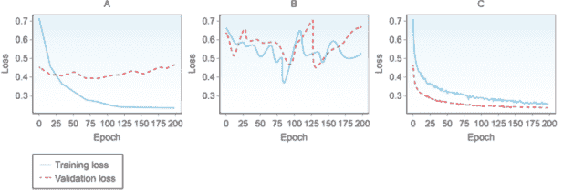

图 4.10 (*a*) 网络在训练数据上提高了损失值（即学习），但在验证数据上未能泛化。(*b*) 网络在训练和验证数据上都表现不佳。(*c*) 网络学习了训练数据并泛化到验证数据。

图 4.10C 显示，网络在学习和泛化验证数据方面做得很好。这意味着网络在野外测试数据上可能会有很好的性能。

### 4.4.3 练习：构建、训练和评估网络

在我们进行超参数调整之前，让我们快速运行一个实验，看看我们如何分割数据，构建、训练和可视化模型结果。您可以在 [www.manning.com/books/deep-learning-for-vision-systems](http://www.manning.com/books/deep-learning-for-vision-systems) 或 [www.computervisionbook.com](http://www.computervisionbook.com) 找到这个练习的笔记本。

在这个练习中，我们将执行以下操作：

+   为我们的实验创建玩具数据

+   将数据分为 80% 的训练数据和 20% 的测试数据集

+   构建多层感知器（MLP）神经网络

+   训练模型

+   评估模型

+   可视化结果

这里是步骤：

1.  导入依赖项：

```
from sklearn.datasets import make_blobs       ❶
from keras.utils import to_categorical        ❷
from keras.models import Sequential           ❸
from keras.layers import Dense                ❸
from matplotlib import pyplot                 ❹
```

❶ 使用 scikit-learn 库生成样本数据

❷ 将类别向量转换为二进制类别矩阵（独热编码）的 Keras 方法

❸ 神经网络和层库

❹ 可视化库

1.  使用 scikit-learn 的 `make_blobs` 生成一个只有两个特征和三个标签类别的玩具数据集：

    ```
    X, *y* = make_blobs(n_samples=1000, centers=3, n_features=2, 
        cluster_std=2, random_state=2)
    ```

1.  使用 Keras 的 `to_categorical` 对标签进行独热编码：

    ```
    y = to_categorical(*y*)
    ```

1.  将数据集分为 80% 的训练数据和 20% 的测试数据。注意，在这个例子中，为了简化，我们没有创建验证数据集：

    ```
    n_train = 800
    train_X, test_X = X[:n_train, :], X[n_train:, :]
    train_y, test_y = y[:n_train], y[n_train:]
    print(train_X.shape, test_X.shape)

    >> (800, 2) (200, 2)
    ```

1.  开发模型架构--这里，一个非常简单的、两层 MLP 网络模型（图 4.11 显示了模型摘要）：

    ```
    model = Sequential()
    model.add(Dense(25, input_dim=2, activation='relu'))              ❶
    model.add(Dense(3, activation='softmax'))                         ❷
    model.compile(loss='categorical_crossentropy', optimizer='adam', 
        metrics=['accuracy'])                                         ❸
    model.summary()
    ```

    ❶ 由于我们有两个特征，因此有两个输入维度。隐藏层使用 ReLU 激活函数。

    ❷ 输出层使用 softmax 激活函数，因为有三类，有三个节点

    ❸ 交叉熵损失函数（在第二章中解释）和 Adam 优化器（将在下一节中解释）

    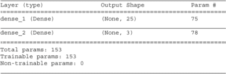

    图 4.11 模型摘要

1.  训练模型 1,000 个周期：

    ```
    history = model.fit(train_X, train_y, validation_data=(test_X, test_y),
        epochs=1000, verbose=1)
    ```

1.  评估模型：

    ```
    _, train_acc = model.evaluate(train_X, train_y)
    _, test_acc = model.evaluate(test_X, test_y)
    print('Train: %.3f, Test: %.3f' % (train_acc, test_acc))

    >> Train: 0.825, Test: 0.819
    ```

1.  绘制模型准确率的学习曲线（图 4.12）：

    ```
    pyplot.plot(history.history['accuracy'], label='train')
    pyplot.plot(history.history['val_accuracy'], label='test')
    pyplot.legend()
    pyplot.show()

    ```

    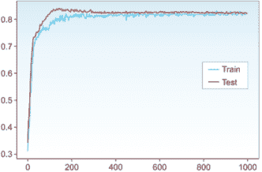

    图 4.12 学习曲线：训练和测试曲线都表现出类似的行为，与数据拟合。

让我们评估网络。查看图 4.12 中的学习曲线，你可以看到训练和测试曲线都表现出类似的行为。这意味着网络没有过拟合，如果训练曲线表现良好而测试曲线不佳，则表明过拟合。但是，网络可能欠拟合吗？也许：在如此简单的数据集上 82% 的性能被认为是较差的。为了提高这个神经网络的性能，我会尝试构建一个更复杂的网络，并尝试其他欠拟合技术。

## 4.5 改进网络和调整超参数

在你运行训练实验并诊断过拟合和欠拟合之后，你需要决定是否值得花时间调整网络、清理和加工你的数据，或者收集更多数据。你最不想做的事情就是花几个月时间只在一个方向上工作，最后发现几乎没提高网络性能。所以，在讨论不同的超参数调整之前，让我们先回答这个问题：你应该收集更多数据吗？

### 4.5.1 收集更多数据与调整超参数

我们知道深度神经网络在大量数据上表现良好。考虑到这一点，机器学习新手通常会尝试将更多数据投入到学习算法中，作为提高其性能的第一步。但是，收集和标注更多数据并不总是可行的选择，而且根据你的问题，可能会非常昂贵。此外，它可能甚至并不那么有效。

注意：尽管正在努力自动化数据标注的一些过程，但在撰写本文时，大多数标注仍然是手动完成的，尤其是在计算机视觉问题中。这里指的是实际的人类查看每一张图片并逐个进行标注（这被称为人机交互）。这里还有另一层复杂性：如果你正在标注肺部 X 光片以检测某种肿瘤，例如，你需要有资格的医生来诊断这些图像。这比雇佣人来分类狗和猫的成本要高得多。因此，对于某些准确性问题，收集更多数据可能是一个好的解决方案，并提高模型的鲁棒性，但这并不总是可行的选择。

在其他情况下，收集更多数据比改进学习算法要好得多。所以，如果你有快速有效的方法来确定是收集更多数据还是调整模型超参数会更好，那就太好了。

我用来做出这个决定的流程如下：

1.  确定训练集上的性能是否可以接受。

1.  可视化并观察这两个指标的性能：训练准确率（`train_acc`）和验证准确率（`val_acc`）。

1.  如果网络在训练数据集上表现不佳，这是欠拟合的迹象。没有理由收集更多数据，因为学习算法没有使用已经可用的训练数据。相反，尝试调整超参数或清理训练数据。

1.  如果训练集上的性能可以接受，但在测试数据集上却差得多，那么网络就是过拟合了训练数据，并且未能推广到验证集。在这种情况下，收集更多数据可能是有效的。

小贴士：在评估模型性能时，目标是分类高级问题。如果是数据问题，则花更多时间在数据预处理或收集更多数据上。如果是学习算法问题，则尝试调整网络。

### 4.5.2 参数与超参数

我们不要将参数与超参数混淆。超参数是我们设置和调整的变量。参数是网络在没有任何直接操作的情况下更新的变量。参数是网络在训练期间学习并更新的变量，我们不会调整它们。在神经网络中，参数是在反向传播过程中自动优化以产生最小误差的权重和偏差。相比之下，超参数是网络没有学习的变量。它们在训练模型之前由机器学习工程师设置，然后进行调整。这些变量定义了网络结构并决定了网络的训练方式。超参数的例子包括学习率、批量大小、训练轮数、隐藏层数量以及其他在下一节中讨论的内容。

调整旋钮

将超参数想象成封闭盒子（神经网络）上的旋钮。我们的任务是设置和调整旋钮以获得最佳性能：

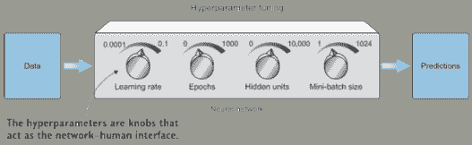

### 4.5.3 神经网络超参数

深度学习算法带有多个控制模型行为许多方面的超参数。一些超参数影响算法的运行时间和内存成本，而其他超参数影响模型的预测能力。

超参数调整的挑战在于没有适用于每个问题的魔法数字。这与我们在第一章中提到的无免费午餐定理相关。好的超参数值取决于数据集和任务。选择最佳超参数并了解如何调整它们需要理解每个超参数的作用。在本节中，你将建立对为什么想要调整超参数一个方向或另一个方向的理解，我将提出一些最有效超参数的良好起始值。

一般而言，我们可以将神经网络超参数分为三个主要类别：

+   网络架构

+   隐藏层数量（网络深度）

+   每一层的神经元数量（层宽度）

+   激活类型

+   学习和优化

+   学习率和衰减计划

+   小批量大小

+   优化算法

+   训练迭代次数或轮数（以及提前停止标准）

+   避免过拟合的正则化技术

+   L2 正则化

+   Dropout 层

+   数据增强

我们在第二章和第三章中讨论了所有这些超参数，除了正则化技术。接下来，我们将快速介绍它们，重点关注当我们调整每个旋钮上下时会发生什么，以及如何知道应该调整哪个超参数。

### 4.5.4 网络架构

首先，让我们谈谈定义神经网络架构的超参数：

+   隐藏层数量（代表网络深度）

+   每层的神经元数量，也称为隐藏单元（代表网络宽度）

+   激活函数

#### 神经网络的深度和宽度

无论你是在设计一个 MLP、CNN 还是其他神经网络，你都需要决定你网络中的隐藏层数量（深度）以及每层的神经元数量（宽度）。隐藏层数量和单元数量描述了网络的学习能力。目标是设置足够大的数量，以便网络能够学习数据特征。一个较小的网络可能会欠拟合，而一个较大的网络可能会过拟合。要知道什么是“足够大”的网络，你需要选择一个起点，观察性能，然后调整上下。

数据集越复杂，模型学习其特征所需的学习能力就越大。看看图 4.13 中的三个数据集。

如果你给模型提供过多的学习容量（过多的隐藏单元），它可能会倾向于过拟合数据并记住训练集。如果你的模型正在过拟合，你可能想要减少隐藏单元的数量。

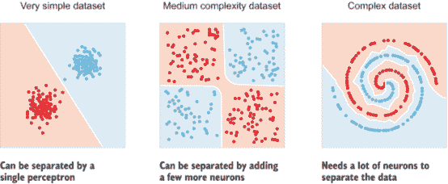

图 4.13 数据集越复杂，模型学习其特征所需的学习能力就越大。

通常，添加隐藏神经元直到验证错误不再提高是好的。权衡的是，训练更深层的网络在计算上很昂贵。拥有较少的单元可能会导致欠拟合，而拥有更多的单元通常不会有害，只要适当的正则化（如 dropout 和本章后面讨论的其他内容）。

尝试在 Tensorflow playground（[`playground.tensorflow.org`](https://playground.tensorflow.org)）上玩一玩，以培养更多的直觉。尝试不同的架构，并在观察网络的学习行为的同时，逐渐添加更多层和隐藏层中的更多单元。

#### 激活类型

激活函数（在第二章中广泛讨论）为我们的神经元引入了非线性。没有激活，我们的神经元只会将线性组合（加权求和）传递给彼此，而无法解决任何非线性问题。这是一个非常活跃的研究领域：每隔几周，我们就会接触到新的激活类型，而且有很多可供选择。但在撰写本文时，ReLU 及其变体（如 Leaky ReLU）在隐藏层中表现最佳。而在输出层，对于分类问题，非常常见的是使用 softmax 函数，其神经元数量等于你问题中的类别数量。

层和参数

当考虑你的神经网络架构中的隐藏层数量和单元数量时，考虑网络中的参数数量及其对计算复杂性的影响是有用的。你网络中的神经元越多，网络需要优化的参数就越多。（在第三章中，我们学习了如何打印模型摘要以查看将要训练的总参数数量。）

根据您的硬件配置（计算能力和内存）来决定您是否需要减少参数数量。为了减少训练参数数量，您可以执行以下操作之一：

+   减少网络的深度和宽度（隐藏层和单元）。这将减少训练参数数量，从而降低神经网络复杂性。

+   添加池化层，或者调整卷积层的步长和填充，以减少特征图维度。这将降低参数数量。

这些只是帮助您了解如何在真实项目中看待训练参数数量以及您需要做出的权衡的例子。复杂的网络导致大量的训练参数，这反过来又导致对计算能力和内存的高需求。

构建您的基线架构的最佳方式是查看可用于解决特定问题的流行架构，并从这里开始；评估其性能，调整其超参数，并重复。记得我们在第三章的图像分类项目中如何受到 AlexNet 的启发来设计我们的 CNN。在第五章中，我们将探讨一些最流行的 CNN 架构，如 LeNet、AlexNet、VGG、ResNet 和 Inception。

## 4.6 学习与优化

现在我们已经构建了我们的网络架构，是时候讨论那些决定网络如何学习和优化其参数以实现最小误差的超参数了。

### 4.6.1 学习率和衰减计划

学习率是单个最重要的超参数，应该始终确保它已经被调整。如果只有时间优化一个超参数，那么这个值得调整的超参数就是它。

--约书亚·本吉奥

学习率（lr 值）在第二章中已经进行了广泛讨论。作为复习，让我们思考一下梯度下降（GD）是如何工作的。GD 优化器寻找权重最优值，以产生尽可能低的误差。在设置我们的优化器时，我们需要定义它下降误差山时采取的步长。这个步长就是学习率。它代表了优化器下降误差曲线的速度快慢。当我们仅用一个权重绘制成本函数时，如图 4.14 所示，我们得到一个简化的 U 形曲线，其中权重随机初始化在曲线上的一个点上。

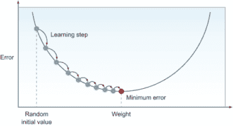

图 4.14 当我们仅用一个权重绘制成本函数时，得到的是一个过于简化的 U 形曲线。

梯度下降法计算梯度以找到减少错误的方向（导数）。在图 4.14 中，下降方向是向右的。梯度下降法在每个迭代（epoch）之后开始向下移动。现在，正如你在图 4.15 中可以看到的，如果我们奇迹般地正确选择了学习率值，我们就能在一步之内找到最小化错误的最佳权重值。这是一个不可能的情况，我正在用它来阐述。让我们称这个值为理想的学习率。

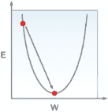

图 4.15 如果我们奇迹般地正确选择了学习率值，我们就能在一步之内找到最小化错误的最佳权重值。

如果学习率小于理想学习率值，那么模型可以通过沿着错误曲线采取更小的步骤继续学习，直到找到权重最优化值（图 4.16）。太小意味着它最终会收敛，但需要更长的时间。

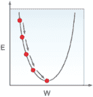

图 4.16 理想学习率值更小的学习率：模型沿着错误曲线采取更小的步骤。

如果学习率大于理想的学习率值，优化器会在第一步中超过最优权重值，然后在下一步中再次在另一侧超过（图 4.17）。这可能会产生比我们开始时更低的错误，并收敛到一个合理的值，但不是我们试图达到的最低错误。

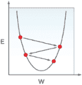

图 4.17 学习率大于理想学习率值：优化器超过最优权重值。

如果学习率远大于理想的学习率值（多出两倍以上），优化器不仅会超过理想的权重值，而且会越来越远离最小错误（图 4.18）。这种现象称为发散。

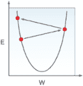

图 4.18 学习率远大于理想学习率值：优化器越来越远离最小错误。

过高与过低的学习率

将学习率设置得过高或过低是在优化器速度与性能之间进行权衡。太低的学习率需要很多个 epoch 才能收敛，通常太多。理论上，如果学习率太小，算法在无限时间内运行的情况下是保证最终收敛的。另一方面，过高的学习率可能会更快地将我们带到更低的错误值，因为我们沿着错误曲线采取了更大的步骤，但算法振荡并偏离最小值的可能性更大。因此，理想情况下，我们希望选择一个恰到好处的学习率（最优）：它迅速达到最小点，而不会太大以至于可能发散。

当将损失值与训练迭代次数（epochs）进行绘图时，你会注意到以下情况：

+   太小的学习率--损失值持续下降，但需要更多的时间来收敛。

+   更大的学习率--损失值达到了比我们开始时更好的值，但仍然远未达到最优。

+   较大的学习率--损失可能最初会下降，但随着权重值越来越远离最佳值，它开始上升。

+   良好的学习率--损失持续下降，直到达到可能的最小值。

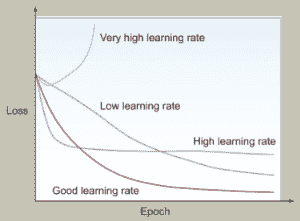

非常高、高、良好和低学习率之间的区别

### 4.6.2 寻找最佳学习率的系统方法

最佳学习率将取决于你的损失景观的拓扑结构，这反过来又取决于你的模型架构和你的数据集。无论你使用 Keras、Tensorflow、PyTorch 还是任何其他深度学习库，使用优化器的默认学习率值是一个好的开始，可以导致不错的结果。每种优化器类型都有自己的默认值。阅读你使用的深度学习库的文档，以了解你优化器的默认值。如果你的模型训练效果不佳，你可以通过使用常见的值--0.1、0.01、0.001、0.0001、0.00001 和 0.000001--来调整学习率变量，以改善性能或加快训练速度，以寻找最佳学习率。

调试此问题的方法是查看训练过程中的验证损失值：

+   如果每次步骤后`val_loss`都下降，那很好。继续训练，直到它停止改进。

+   如果训练完成且`val_loss`仍在下降，那么可能是因为学习率太小，还没有收敛。在这种情况下，你可以做以下两件事之一：

    +   使用相同的学习率，但增加更多的训练迭代（周期）来给优化器更多的时间收敛。

    +   稍微增加学习率（lr）的值，然后再次进行训练。

+   如果`val_loss`开始增加或上下波动，那么学习率太高，你需要降低其值。

### 4.6.3 学习率衰减和自适应学习

找到适合你问题的最佳学习率是一个迭代的过程。你从一个静态的学习率值开始，等待训练完成，评估，然后调整。调整学习率的另一种方法是设置学习率衰减：一种在训练过程中改变学习率的方法。它通常比静态值表现更好，并且可以大幅减少获得最佳结果所需的时间。

到现在为止，很明显，当我们尝试降低学习率时，我们更有可能达到更低的错误点。但训练它将需要更长的时间。在某些情况下，训练时间过长，变得不可行。一个很好的技巧是在我们的学习率中实现一个衰减率。衰减率告诉我们的网络在整个训练过程中自动降低学习率。例如，我们可以通过每个(*n*)步数减少一个常数(*x*)来降低学习率。这样，我们可以从较高的值开始，以更大的步幅向最小值迈进，然后在每个(*n*)个周期后逐渐降低学习率，以避免超过理想的学习率。

实现这一目标的一种方法是通过线性减少学习率（线性衰减）。例如，你可以每五个 epoch 将学习率减半，如图 4.19 所示。

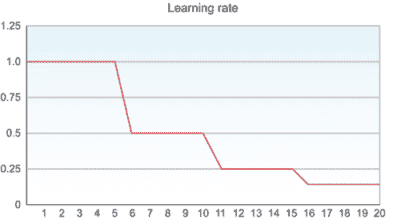

图 4.19 每 5 个 epoch 将学习率 lr 减半

另一种方法是指数减少学习率（指数衰减）。例如，你可以每 8 个 epoch 将学习率乘以 0.1（见图 4.20）。显然，与线性衰减相比，网络收敛速度会慢得多，但最终会收敛。


图 4.20 每 8 个 epoch 将学习率 lr 乘以 0.1

其他聪明的学习算法具有自适应学习率（自适应学习）。这些算法使用启发式方法，在训练停止时自动更新学习率。这意味着不仅需要在必要时减少学习率，还需要在改进太慢（学习率太小）时增加它。自适应学习通常比其他学习率设置策略更有效。Adam 和 Adagrad 是自适应学习优化器的例子：本章后面将详细介绍自适应优化器。

### 4.6.4 小批量大小

小批量大小是优化器算法中你需要设置和调整的另一个超参数。`batch_size`超参数对训练过程的资源需求和速度有重大影响。

为了理解小批量，让我们回顾一下我们在第二章中解释的三个 GD 类型--批量、随机和批量：

+   批量梯度下降（BGD）--我们将整个数据集一次性喂给网络，应用前向过程，计算误差，计算梯度，并通过反向传播来更新权重。优化器通过查看所有训练数据生成的误差来计算梯度，并且每个 epoch 后只更新一次权重。因此，在这种情况下，小批量大小等于整个训练数据集。BGD 的主要优点是它具有相对较低的噪声和更大的向最小值迈进的一步（见图 4.21）。主要缺点是处理整个训练数据集可能需要太长时间，尤其是在大数据集上训练时。BGD 还需要大量的内存来训练大型数据集，这可能不可用。如果你在训练小型数据集，BGD 可能是一个不错的选择。

    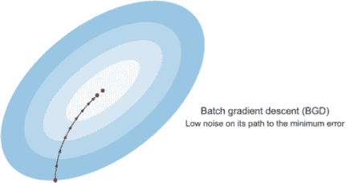

    图 4.21 批量 GD 在向最小误差迈进的过程中具有低噪声

+   随机梯度下降（SGD）--也称为在线学习。我们每次向网络提供单个训练数据实例，并使用这个实例进行前向传播、计算误差、计算梯度，并反向传播以更新权重（图 4.22）。在 SGD 中，权重在看到每个单个实例后更新（与在每一步之前处理整个数据集的批量梯度下降（BGD）相反）。SGD 可能会非常嘈杂，因为它在向全局最小值振荡的过程中会向下迈出一步，这有时可能是错误的方向。通过使用较小的学习率可以减少这种噪声，因此，平均而言，它将你引向正确的方向，并且几乎总是比 BGD 表现更好。使用 SGD，你可以快速取得进展，通常非常接近全局最小值。主要缺点是，通过逐个实例计算 GD，你失去了训练计算中矩阵乘法带来的速度提升。

    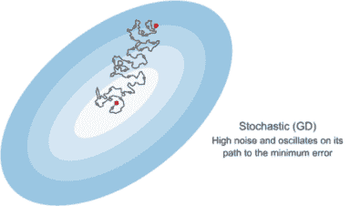

    图 4.22 随机 GD 在高噪声下振荡其路径至最小误差

为了回顾 BGD 和 SGD，在一种极端情况下，如果你将你的小批量大小设置为 1（随机训练），优化器将在计算每个单个训练数据实例的梯度后沿着误差曲线向下迈出一步。这是好的，但你失去了使用矩阵乘法带来的速度提升。在另一种极端情况下，如果你的小批量大小是整个训练数据集，那么你正在使用 BGD。处理大型数据集时，向最小误差迈出一步需要太长时间。在这两个极端之间，存在小批量梯度下降（MB-GD）。

+   小批量梯度下降（MB-GD）--在批量梯度下降和随机梯度下降之间的折衷方案。我们不是从单个样本（SGD）或所有训练样本（BGD）计算梯度，而是将训练样本分成小批量来计算梯度。这样，我们可以利用矩阵乘法加快训练速度，并开始取得进展，而不是等待训练整个训练集。

选择小批量大小的指南

首先，如果你有一个小数据集（大约少于 2,000 个），你可能更适合使用 BGD。你可以相当快地训练整个数据集。

对于大型数据集，你可以使用一系列迷你批量大小的值。迷你批量大小的典型起始值是 64 或 128。然后你可以在这个范围内调整它：32，64，128，256，512，1024，并在需要时将其翻倍以加快训练速度。但请确保你的迷你批量大大小于你的 CPU/GPU 内存。1024 和更大的迷你批量大大小于可能，但相当罕见。更大的迷你批量大大小于允许在训练计算中使用矩阵乘法来提高计算效率。但这需要更多的训练过程内存和通常更多的计算资源。以下图显示了批量大小、计算资源和神经网络训练所需的轮数之间的关系：

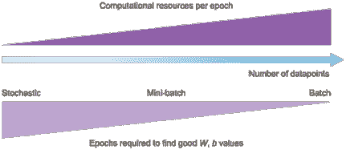

批量大小、计算资源和训练轮数之间的关系

## 4.7 优化算法

在深度学习的历史中，许多研究人员提出了优化算法，并表明它们在某些问题上的表现良好。但其中大多数随后被证明不能很好地推广到我们可能想要训练的广泛神经网络。随着时间的推移，深度学习社区逐渐认识到 GD 算法及其一些变体表现良好。到目前为止，我们已经讨论了批量、随机和迷你批量的 GD。

我们了解到，选择合适的学习率可能具有挑战性，因为学习率太小会导致收敛速度痛苦地缓慢，而学习率太大可能会阻碍收敛，并导致损失函数在最小值周围波动，甚至发散。我们需要更多创造性的解决方案来进一步优化 GD。

注意：大多数深度学习框架的文档中都有很好地解释了优化器类型。在本节中，我将解释两种最受欢迎的基于梯度下降的优化器——动量和 Adam——的概念，它们确实非常突出，并且在广泛的深度学习架构中已被证明效果良好。这将帮助你建立一个良好的基础，以便更深入地了解其他优化算法。有关优化算法的更多信息，请阅读 Sebastian Ruder 的“梯度下降优化算法概述”（[`arxiv.org/pdf/1609.04747.pdf`](https://arxiv.org/pdf/1609.04747.pdf))。

### 4.7.1 带动量的梯度下降

回想一下，SGD 最终会在垂直方向上向最小误差振荡（图 4.23）。这些振荡会减慢收敛过程，并使得使用更大的学习率更加困难，这可能导致你的算法超出并发散。

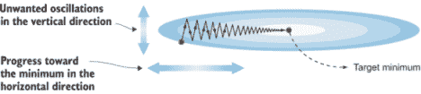

图 4.23 SGD 在垂直方向上向最小误差振荡。

为了减少这些振荡，发明了一种称为动量的技术，它让 GD 沿着相关方向导航，并减轻了无关方向中的振荡。换句话说，它使得在垂直方向上的振荡学习速度变慢，而在水平方向上的进步速度变快，这将帮助优化器更快地达到目标最小值。

这与经典物理学中的动量概念类似：当一个雪球从山上滚下来时，它会积累动量，越滚越快。同样，我们的动量项会增加梯度指向同一方向的维度，并减少梯度改变方向的维度的更新。这有助于加快收敛速度并减少振荡。

动量中的数学是如何工作的

这里的数学非常简单直接。动量是通过向更新权重的方程中添加速度项来构建的：

*w[new]* = *w[old]* - *α* *dE*/*dw**[i]* ❶

*w[new]* = *w[old]* - 学习率 × 梯度 + 速度项 ❷

❶ 原始更新规则

❷ 添加速度后的新规则

速度项等于过去梯度的加权平均值。

### 4.7.2 Adam

Adam 代表自适应动量估计。Adam 保持过去梯度的指数衰减平均值，类似于动量。而动量可以看作是一个滚下斜坡的球，Adam 则像是一个带有摩擦的重球，它会减慢动量并控制它。Adam 通常比其他优化器表现更好，因为它可以帮助我们更快地训练神经网络模型。

再次，我们有新的超参数需要调整。但好消息是，主要深度学习框架的默认值通常效果很好，所以你可能不需要调整——除了学习率，它不是 Adam 特有的超参数：

```
keras.optimizers.Adam(lr=0.001, beta_1=0.9, beta_2=0.999, epsilon=None, 
    decay=0.0)
```

Adam 的作者提出了这些默认值：

+   需要调整学习率。

+   对于动量项 β1，一个常见的选择是 0.9。

+   对于 RMSprop 项 β2，一个常见的选择是 0.999。

+   ε 被设置为 10^-8。

### 4.7.3 epochs 数量和提前停止标准

训练迭代，或称为一个 epoch，是指模型完成一个完整周期并一次性看到整个训练数据集。epoch 超参数被设置为定义我们的网络继续训练的迭代次数。训练迭代越多，我们的模型就越能学习到训练数据的特征。为了诊断你的网络是否需要更多或更少的训练 epochs，关注训练和验证错误值。

想象这个直观的方式是，我们希望只要错误值在下降，就继续训练。对吗？让我们看看图 4.24 中网络训练的样本详细输出。

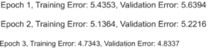

图 4.24 第一五个 epochs 的样本详细输出。训练和验证错误都在改善。

你可以看到训练和验证错误都在下降。这意味着网络仍在学习。在这个时候停止训练是没有意义的。网络显然仍在朝着最小错误的方向进步。让我们再让它训练六个 epoch，并观察结果（图 4.25）。

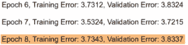

图 4.25 训练错误仍在改善，但验证错误从第 8 个 epoch 开始开始波动。

看起来训练错误做得很好，仍在改善。这是好的。这意味着网络在训练集上正在改善。然而，如果你看第 8 个和第 9 个 epoch，你会看到`val_error`开始波动并增加。在`train_error`改善的同时`val_error`没有改善意味着网络开始对训练数据进行过拟合，并且无法推广到验证数据。

让我们绘制训练和验证错误（图 4.26）。你可以看到一开始训练和验证错误都在改善，但随后验证错误开始增加，导致过拟合。我们需要找到一种方法在训练开始过拟合之前停止训练。这种技术被称为提前停止。

### 4.7.4 提前停止

提前停止是一种广泛使用的算法，用于在过拟合发生之前确定停止训练过程的时间。它简单地监控验证错误值，并在值开始增加时停止训练。以下是 Keras 中的提前停止函数：

```
EarlyStopping(monitor='val_loss', min_delta=0,  patience=20)
```

`EarlyStopping`函数接受以下参数：

+   `monitor`--训练期间监控的指标。通常我们希望关注`val_loss`，因为它代表我们对模型性能的内部测试。如果网络在验证数据上表现良好，它可能在测试数据和生产数据上表现也好。

+   `min_delta`--作为改善的最低变化量。这个变量没有标准值。为了决定`min_delta`的值，运行几个 epoch 并观察错误和验证精度的变化。根据变化率定义`min_delta`。默认值 0 在很多情况下都相当有效。

+   `patience`--这个变量告诉算法在错误没有改善的情况下应该等待多少个 epoch 后停止训练。例如，如果我们把`patience`设置为 1，训练将在错误增加的 epoch 时停止。不过，我们必须要有一点灵活性，因为错误通常会稍微波动一下然后继续改善。如果我们发现训练在最后 10 个或 20 个 epoch 内没有改善，我们可以停止训练。

TIP 提前停止的好处是它让你不必太担心 epoch 超参数。你可以设置一个较高的 epoch 数量，并让停止算法在错误停止改善时负责停止训练。

## 4.8 避免过拟合的正则化技术

如果你观察到你的神经网络正在过拟合训练数据，那么你的网络可能过于复杂，需要简化。你应该尝试的第一个技术之一就是正则化。在本节中，我们将讨论三种最常见的正则化技术：L2、dropout 和数据增强。

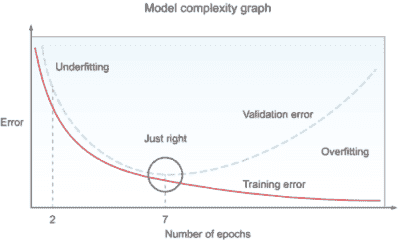

图 4.26 在不提高`val_error`的情况下提高`train_error`意味着网络开始过拟合。

### 4.8.1 L2 正则化

L2 正则化的基本思想是在误差函数中添加一个正则化项，从而惩罚误差函数。这反过来又降低了隐藏单元的权重值，使它们变得非常小，接近于零，以帮助简化模型。

让我们看看正则化是如何工作的。首先，我们通过添加正则化项来更新误差函数：

误差函数*[new]* = 误差函数*[old]* + 正则化项

注意，你可以使用第二章中解释的任何误差函数，如 MSE 或交叉熵。现在，让我们看看正则化项

*L2 正则化项 = λ/2m * Σ* || *w* ||*²*

其中 lambda (λ)是正则化参数，*m*是实例数量，w 是权重。更新的误差函数看起来像这样：

*误差函数* *[new]* *= 误差函数* *[old]* + λ/2m * Σ* || *w* ||*²*

为什么 L2 正则化可以减少过拟合？好吧，让我们看看在反向传播过程中权重是如何更新的。我们从第二章中了解到，优化器计算误差的导数，将其乘以学习率，然后从旧权重中减去这个值。以下是更新权重的反向传播方程：

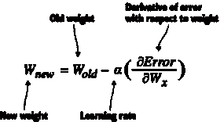

由于我们向误差函数中添加了正则化项，新的误差比旧的误差大。这意味着它的导数（∂Error/∂Wx）也更大，导致 Wnew 更小。L2 正则化也称为权重衰减，因为它迫使权重向零衰减（但不是正好为零）。

减少权重导致更简单的神经网络

要了解这是如何工作的，考虑以下情况：如果正则化项非常大，以至于当乘以学习率时，它将等于 Wold，那么这将使新权重等于零。这取消了该神经元的效应，导致具有更少神经元的更简单的神经网络。

在实践中，L2 正则化不会使权重等于零。它只是使它们变得更小以减少它们的影响。大的正则化参数（`ƛ`）会导致权重可忽略。当权重可忽略时，模型将不会从这些单元中学到很多。这将使网络更简单，从而减少过拟合

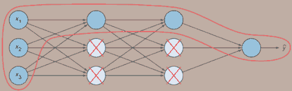

L2 正则化减少了权重并简化了网络以减少过拟合。

这就是 L2 正则化在 Keras 中的样子：

```
model.add(Dense(units=16, kernel_regularizer=regularizers.l2(ƛ),
    activation='relu'))                                             ❶
```

❶ 当向你的网络添加隐藏层时，添加带有 L2 正则化的 kernel_regularization 参数

Lambda 值是一个你可以调整的超参数。你的深度学习库的默认值通常效果很好。如果你仍然看到过拟合的迹象，增加 lambda 超参数以降低模型复杂性。

### 4.8.2 Dropout 层

Dropout 是一种非常有效的正则化技术，可以简化神经网络并避免过拟合。我们在第三章中详细讨论了 dropout。dropout 算法相当简单：在每次训练迭代中，每个神经元都有概率 p 在这次训练迭代中被临时忽略（dropout）。这意味着它可能在后续迭代中是活跃的。虽然故意暂停网络中某些神经元的训练看起来有些反直觉，但这个技术效果相当惊人。概率 p 是一个超参数，被称为 dropout 率，通常设置在 0.3 到 0.5 之间。从 0.3 开始，如果你看到过拟合的迹象，就增加这个比率。

TIP 我喜欢把 dropout 想象成每天早上和你的团队扔硬币来决定谁将执行一个特定的关键任务。经过几次迭代后，所有团队成员都会学会如何完成这项任务，而不会依赖于单个成员来完成。这样，团队对变化的抵抗力会大大增强。

L2 正则化和 dropout 都旨在通过减少神经元的效率来降低网络复杂性。区别在于 dropout 在每次迭代中完全取消一些神经元的效应，而 L2 正则化只是减少权重值来降低神经元的效率。两者都导致一个更鲁棒、更有弹性的神经网络并减少过拟合。建议你在网络中使用这两种正则化技术。

### 4.8.3 数据增强

避免过拟合的一种方法是通过获取更多数据。由于这并不总是可行的选择，我们可以通过生成一些变换后的相同图像的新实例来增强我们的训练数据。数据增强可以是一种经济实惠的方法，为你的学习算法提供更多训练数据，从而减少过拟合。

许多图像增强技术包括翻转、旋转、缩放、缩放、光照条件以及你可以应用于数据集的许多其他变换，以提供各种图像进行训练。在图 4.27 中，你可以看到应用于数字 6 图像的一些变换技术。

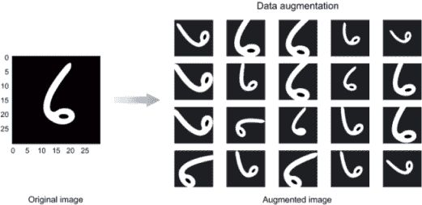

图 4.27 应用于数字 6 图像的各种图像增强技术

在图 4.27 中，我们创建了 20 张新的图像，网络可以从这些图像中学习。这种合成图像的主要优势是现在你有更多的数据（20 倍）来告诉你的算法，如果一个图像是数字 6，那么即使你垂直或水平翻转它或旋转它，它仍然是数字 6。这使得模型对检测任何形式和形状的数字 6 更加鲁棒。

数据增强被认为是一种正则化技术，因为允许网络看到对象的许多变体可以减少它在特征学习过程中对对象原始形式的依赖。这使得网络在测试新数据时更加鲁棒。

Keras 中的数据增强看起来是这样的：

```
from keras.preprocessing.image import ImageDataGenerator                    ❶

datagen = ImageDataGenerator(horizontal_flip=True, vertical_flip=True)      ❷

datagen.fit(training_set)                                                   ❸
```

❶ 从 Keras 导入 ImageDataGenerator

❷ 生成新的图像数据批次。ImageDataGenerator 接受变换类型作为参数。在这里，我们将水平和垂直翻转设置为 True。有关更多变换参数，请参阅 Keras 文档（或您的深度学习库）。

❸ 在训练集上计算数据增强

## 4.9 批归一化

在本章的早期，我们讨论了数据归一化以加快学习速度。我们讨论的归一化技术集中在在输入层之前对训练集进行预处理。如果输入层从归一化中受益，为什么不对隐藏单元中提取的特征做同样的事情呢？这些特征一直在变化，并且可以在训练速度和网络鲁棒性（图 4.28）上获得更多的改进。这个过程被称为批归一化（BN）。

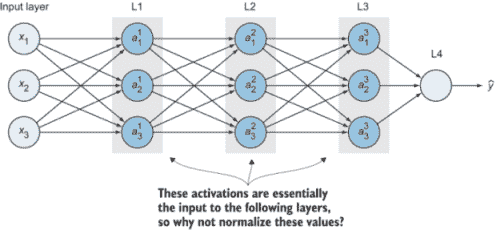

图 4.28 批归一化是对隐藏单元中提取的特征进行归一化。

### 4.9.1 协变量偏移问题

在我们定义协变量偏移之前，让我们通过一个例子来说明批归一化（BN）面临的问题。假设你正在构建一个猫分类器，并且只使用白色猫的图像来训练你的算法。当你用不同颜色的猫的图像测试这个分类器时，它将不会表现良好。为什么？因为模型是在具有特定分布（白色猫）的训练集上训练的。当测试集中的分布发生变化时，它会混淆模型（图 4.29）。

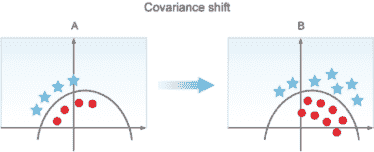

图 4.29 图 A 是仅包含白色猫的训练集，图 B 是包含各种颜色猫的测试集。圆圈代表猫的图像，星星代表非猫图像。

我们不应该期望在图 A 中的数据上训练的模型会在图 B 中的新分布上表现良好。数据分布变化的概念被称为协变量偏移。

定义：如果一个模型正在学习将数据集 *x* 映射到标签 y，那么如果 *x* 的分布发生变化，就称为协变量偏移。当这种情况发生时，你可能需要重新训练你的学习算法。

### 4.9.2 神经网络中的协变量偏移

要了解神经网络中协变量偏移是如何发生的，可以考虑图 4.30 中的简单四层 MLP。让我们从第三层（L3）的角度来看这个网络。它的输入是 L2 层的激活值（a12、a22、a32 和 a42），这些是从前一层提取的特征。L3 正在尝试将这些输入映射到 *ŷ*，使其尽可能接近标签 y。当第三层这样做的时候，网络正在调整前一层参数的值。随着参数（w、b）在第一层中变化，第二层的激活值也在变化。因此，从第三隐藏层的角度来看，第二隐藏层的值一直在变化：MLP 正在遭受协变量偏移的问题。批归一化减少了隐藏单元值分布的变化程度，使得这些值变得更加稳定，这样神经网络的后续层就有更坚实的基础。

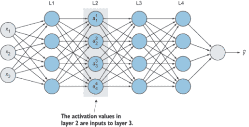

图 4.30 一个简单的四层 MLP。L1 特征输入到 L2 层。对于 2、3 和 4 层也是如此。

注意：重要的是要认识到批归一化不会取消或减少隐藏单元值的变化。它所做的是确保这种变化分布保持不变：即使单元的确切值发生变化，均值和方差不会变化。

### 4.9.3 批归一化是如何工作的？

在他们 2015 年的论文“Batch Normalization: Accelerating Deep Network Training by Reducing Internal Covariate Shift”([`arxiv.org/abs/1502.03167`](https://arxiv.org/abs/1502.03167))中，Sergey Ioffe 和 Christian Szegedy 提出了 BN 技术，以减少协变量偏移。批归一化在神经网络中每个层的激活函数之前添加了一个操作，以执行以下操作：

1.  零中心化输入

1.  归一化零中心化输入

1.  缩放和移位结果

这个操作让模型学习每个层的输入的最佳尺度和均值。

批归一化中的数学原理

1.  为了将输入零中心化，算法需要计算输入均值和标准差（这里的输入指的是当前的 mini-batch：因此有批归一化的说法）：

    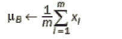  ❶

    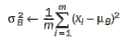  ❷

    ❶ 小批量均值

    ❷ 小批量方差

    其中 *m* 是 mini-batch 中的实例数量，*μ*[B] 是当前 mini-batch 的均值，*σ*[B] 是标准差。

1.  归一化输入：

    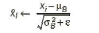

    其中 *x̂* 是零均值和归一化的输入。注意这里我们添加了一个变量（ε）。这是一个很小的数（通常是 10^-5），以避免在 σ 在某些估计中为零时发生除以零的情况。

1.  缩放和移位结果。我们将归一化输出乘以变量 *γ* 以缩放它，并加上 (β) 以移位它

    *y[i] ← γ X[i] + β*

    *y[i]* 是 BN 操作的输出，经过缩放和移位。

注意，BN 向网络引入了两个新的可学习参数：*γ*和β。因此，我们的优化算法将像更新权重和偏差一样更新*γ*和β的参数。在实践中，这意味着你可能会发现训练最初相当缓慢，因为 GD 正在寻找每个层的最佳缩放和偏移量，但一旦找到了合理的值，它就会加速。

[i]

### 4.9.4 Keras 中的批归一化实现

了解批归一化的工作原理非常重要，这样你可以更好地理解你的代码正在做什么。但是，当你在网络中使用 BN 时，你不必自己实现所有这些细节。实现 BN 通常只需添加一行代码，使用任何深度学习框架。在 Keras 中，你通过在隐藏层之后添加一个 BN 层来将批归一化添加到你的神经网络中，以便在将结果馈送到下一层之前对其进行归一化。

以下代码片段展示了如何在构建神经网络时添加 BN 层：

```
from keras.models import Sequential
from keras.layers import Dense, Dropout
from keras.layers.normalization import BatchNormalization     ❶

model = Sequential()                                          ❷

model.add(Dense(hidden_units, activation='relu'))             ❸

model.add(BatchNormalization())                               ❹

model.add(Dropout(0.5))                                       ❺

model.add(Dense(units, activation='relu'))                    ❻

model.add(BatchNormalization())                               ❼

model.add(Dense(2, activation='softmax'))                     ❽
```

❶ 从 Keras 库中导入 BatchNormalization 层

❷ 初始化模型

❸ 添加第一个隐藏层

❹ 将批归一化层添加到第 1 层的输出结果中进行归一化

❺ 如果你正在向你的网络添加 dropout，最好在批归一化层之后添加它，因为你不希望随机关闭的节点错过归一化步骤。

❻ 添加第二个隐藏层

❶ 将批归一化层添加到第 2 层的输出结果中进行归一化

❽ 输出层

### 4.9.5 批归一化回顾

我希望你能从这次讨论中得到的直觉是，BN 不仅应用于输入层，还应用于神经网络中隐藏层的值。这减弱了早期和后期层之间学习过程的耦合，允许网络的每一层更独立地学习。

从网络中较后层的角度来看，较前层的节点不能移动太多，因为它们被限制为具有相同的均值和方差。这使得在较后层的学习工作更容易。这种情况的发生是通过确保隐藏单元具有由两个显式参数*γ*和β控制的标准化分布（均值和方差），学习算法在训练期间设置这些参数。

## 4.10 项目：在图像分类中实现高准确率

在这个项目中，我们将回顾第三章中的 CIFAR-10 分类项目，并将本章的一些改进技术应用于提高准确率，从约 65%提高到约 90%。你可以通过访问书籍的网站[www.manning.com/books/deep-learning-for-vision-systems](http://www.manning.com/books/deep-learning-for-vision-systems)或[www.computervisionbook.com](http://www.computervisionbook.com)来跟随这个示例，查看代码笔记本。

我们将通过以下步骤完成项目：

1.  导入依赖项。

1.  准备训练数据：

    +   从 Keras 库中下载数据

    +   将其分割为训练、验证和测试数据集。

    +   归一化数据。

    +   对标签进行独热编码。

1.  构建模型架构。除了第三章中提到的常规卷积和池化层外，我们还将以下层添加到我们的架构中：

    +   更深的神经网络以增加学习容量

    +   Dropout 层

    +   对卷积层应用 L2 正则化

    +   批标准化层

1.  训练模型。

1.  评估模型。

1.  绘制学习曲线。

让我们看看这是如何实现的。

#### 第 1 步：导入依赖项

这是导入所需依赖项的 Keras 代码：

```
import keras                                          ❶
from keras.datasets import cifar10
from keras.preprocessing.image import ImageDataGenerator
from keras.models import Sequential
from keras.utils import np_utils
from keras.layers import Dense, Activation, Flatten, Dropout, BatchNormalization,
    Conv2D, MaxPooling2D
from keras.callbacks import ModelCheckpoint
from keras import regularizers, optimizers

import numpy as np                                    ❷

from matplotlib import pyplot                         ❸
```

❶ 使用 Keras 库下载数据集，预处理图像和网络组件

❷ 导入 numpy 进行数学运算

❸ 导入 matplotlib 库以可视化结果

#### 第 2 步：准备训练数据

Keras 为我们提供了可下载和实验的一些数据集。这些数据集通常是预处理的，几乎可以直接输入到神经网络中。在本项目中，我们使用的是 CIFAR-10 数据集，它包含 50,000 张 32 × 32 彩色训练图像，分为 10 个类别，以及 10,000 张测试图像。有关 CIFAR-100、MNIST、Fashion-MNIST 等更多数据集，请查看 Keras 文档。

Keras 已经将 CIFAR-10 数据集分割成训练集和测试集。我们将加载它们，然后将训练数据集分割成 45,000 张图像用于训练和 5,000 张图像用于验证，如本章所述：

```
(x_train, y_train), (x_test, y_test) = cifar10.load_data()    ❶
x_train = x_train.astype('float32')                           ❶
x_test = x_test.astype('float32')                             ❶

(x_train, x_valid) = x_train[5000:], x_train[:5000]           ❷
(y_train, y_valid) = y_train[5000:], y_train[:5000]           ❷
```

❶ 下载并分割数据

❷ 将训练集分割为训练集和验证集

让我们打印`x_train`、`x_valid`和`x_test`的形状：

```
print('x_train =', x_train.shape)
print('x_valid =', x_valid.shape)
print('x_test =', x_test.shape)

>> x_train = (45000, 32, 32, 3)
>> x_valid = (5000, 32, 32, 3)
>> x_test = (1000, 32, 32, 3)
```

形状元组的格式如下：（实例数量，宽度，高度，通道）。

##### 归一化数据

通过从每个像素中减去平均值然后除以标准差来对图像的像素值进行归一化：

```
mean = np.mean(x_train,axis=(0,1,2,3))
std = np.std(x_train,axis=(0,1,2,3))
x_train = (x_train-mean)/(std+1e-7)
x_valid = (x_valid-mean)/(std+1e-7)
x_test = (x_test-mean)/(std+1e-7)
```

##### 对标签进行独热编码

为了在训练、验证和测试数据集中对标签进行独热编码，我们使用 Keras 中的`to_categorical`函数：

```
num_classes = 10
y_train = np_utils.to_categorical(y_train,num_classes)
y_valid = np_utils.to_categorical(y_valid,num_classes)
y_test = np_utils.to_categorical(y_test,num_classes)
```

##### 数据增强

对于增强技术，我们将任意选择以下转换：旋转、宽度和高度偏移以及水平翻转。当你处理问题时，查看网络未能识别或提供较差检测的图像，并尝试理解为什么它在这些图像上表现不佳。然后创建你的假设并对其进行实验。例如，如果遗漏的图像是旋转的形状，你可能想尝试旋转增强。你会应用它，实验，评估，并重复。你将完全通过分析你的数据和了解网络性能来做出决定：

```
datagen = ImageDataGenerator(       ❶
    rotation_range=15,
    width_shift_range=0.1,
    height_shift_range=0.1,
    horizontal_flip=True,
    vertical_flip=False
    )
datagen.fit(x_train)                ❷
```

❶ 数据增强

❷ 在训练集上计算数据增强

#### 第 3 步：构建模型架构

在第三章中，我们构建了一个受 AlexNet 启发的架构（3 个卷积层 + 2 个全连接层）。在本项目中，我们将构建一个更深层的网络以增加学习容量（6 个卷积层 + 1 个全连接层）。

网络具有以下配置：

+   我们不会在每个卷积层之后添加池化层，而是每两个卷积层之后添加一个。这个想法是受 VGGNet 的启发，VGGNet 是由牛津大学视觉几何组开发的一个流行的神经网络架构。VGGNet 将在第五章中解释。

+   受 VGGNet 的启发，我们将卷积层的`kernel_size`设置为 3 × 3，并将池化层的`pool_size`设置为 2 × 2。

+   我们将在每隔一个卷积层后添加 Dropout 层，(*p*)的范围从 0.2 到 0.4。

+   在每个卷积层之后将添加一个批量归一化层，以归一化下一层的输入。

+   在 Keras 中，L2 正则化被添加到卷积层代码中。

下面是代码：

```
base_hidden_units = 32                                                  ❶
weight_decay = 1e-4                                                     ❷
model = Sequential()                                                    ❸

# CONV1
model.add(Conv2D(base_hidden_units, kernel_size= 3, padding='same',     ❹
         kernel_regularizer=regularizers.l2(weight_decay),              ❺
input_shape=x_train.shape[1:]))
model.add(Activation('relu'))                                           ❻
model.add(BatchNormalization())                                         ❼

# CONV2
model.add(Conv2D(base_hidden_units, kernel_size= 3, padding='same', 
         kernel_regularizer=regularizers.l2(weight_decay)))
model.add(Activation('relu'))
model.add(BatchNormalization())

# POOL + Dropout
model.add(MaxPooling2D(pool_size=(2,2)))
model.add(Dropout(0.2))                                                 ❽

# CONV3
model.add(Conv2D(base_hidden_units * 2, kernel_size= 3, padding='same', ❾
         kernel_regularizer=regularizers.l2(weight_decay)))
model.add(Activation('relu'))
model.add(BatchNormalization())

# CONV4
model.add(Conv2D(base_hidden_units * 2, kernel_size= 3, padding='same', 
         kernel_regularizer=regularizers.l2(weight_decay)))
model.add(Activation('relu'))
model.add(BatchNormalization())

# POOL + Dropout
model.add(MaxPooling2D(pool_size=(2,2)))
model.add(Dropout(0.3))

# CONV5
model.add(Conv2D(base_hidden_units * 4, kernel_size= 3, padding='same', 
         kernel_regularizer=regularizers.l2(weight_decay)))
model.add(Activation('relu'))
model.add(BatchNormalization())

# CONV6
model.add(Conv2D(base_hidden_units * 4, kernel_size= 3, padding='same',
         kernel_regularizer=regularizers.l2(weight_decay)))
model.add(Activation('relu'))
model.add(BatchNormalization())

# POOL + Dropout
model.add(MaxPooling2D(pool_size=(2,2)))
model.add(Dropout(0.4))

# FC7
model.add(Flatten())                                                   ❿
model.add(Dense(10, activation='softmax'))                             ⓫

model.summary()                                                        ⓬
```

❶ 隐藏单元数量变量。我们在这里声明这个变量，并在我们的卷积层中使用它，以便更容易从一处更新。

❷ L2 正则化超参数（`ƛ`）

❸ 创建一个序列模型（层线性堆叠）

❹ 注意，我们在这里定义了 input_shape，因为这是第一个卷积层。对于剩余的层，我们不需要这样做。

❺ 在卷积层中添加 L2 正则化

❻ 所有隐藏层使用 ReLU 激活函数

❼ 添加一个批量归一化层

❽ 20%概率的 Dropout 层

❾ 隐藏单元数量 = 64

❿ 将特征图展平为 1D 特征向量（在第三章中解释）

⓫ 10 个隐藏单元，因为数据集有 10 个类别标签。输出层使用 Softmax 激活函数（在第二章中解释）

⓬ 打印模型摘要

模型摘要如图 4.31 所示。

#### 第 4 步：训练模型

在我们进入训练代码之前，让我们讨论一下一些超参数设置背后的策略：

+   `batch_size`--这是本章中我们讨论的迷你批大小超参数。`batch_size`越高，你的算法学习得越快。你可以从 64 个迷你批开始，并将此值加倍以加快训练速度。我在我的机器上尝试了 256，得到了以下错误，这意味着我的机器内存不足。然后我将它降低到 128：

    ```
    Resource exhausted: OOM when allocating tensor with shape[256,128,4,4]
    ```

+   `epochs`--我开始使用 50 次训练迭代，发现网络仍在改进。所以我继续添加更多的 epochs 并观察训练结果。在这个项目中，我在 125 个 epochs 后达到了>90%的准确率。正如你很快就会看到的，如果你让它训练更长的时间，仍然有改进的空间。

    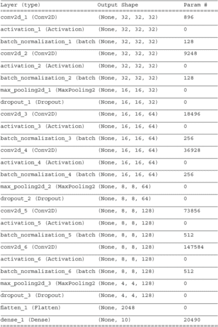

    图 4.31 模型摘要

+   优化器--我使用了 Adam 优化器。参见第 4.7 节了解更多关于优化算法的信息。

注意：请注意，我在这个实验中使用了 GPU。训练大约花费了 3 个小时。建议您使用自己的 GPU 或任何云计算服务以获得最佳结果。如果您无法访问 GPU，我建议您尝试更少的 epoch 数量，或者计划让您的机器在夜间或甚至几天内进行训练，具体取决于您的 CPU 规格。

让我们看看训练代码：

```
batch_size = 128                                                          ❶
epochs = 125                                                              ❷

checkpointer = ModelCheckpoint(filepath='model.100epochs.hdf5', verbose=1, 
                               save_best_only=True )                      ❸
optimizer = keras.optimizers.adam(lr=0.0001,decay=1e-6)                   ❹

model.compile(loss='categorical_crossentropy', optimizer=optimizer, metrics=['accuracy'])                                                ❺

history = model.fit_generator(datagen.flow(x_train, y_train, batch_size=batch_size), callbacks=[checkpointer], steps_per_epoch=x_train.shape[0] // batch_size, epochs=epochs, verbose=2, validation_data=(x_valid, y_valid))                       ❻
```

❶ 小批量大小

❷ 训练迭代次数

❸ 指定保存最佳权重的文件路径，以及一个布尔值 True，表示只有当权重有所改进时才保存权重。

❹ 学习率=0.0001 的 Adam 优化器

❺ 交叉熵损失函数（在第二章中解释）

❻ 允许您在 CPU 上并行对图像进行实时数据增强，同时训练您的模型在 GPU 上。检查点回调保存模型权重；您可以添加其他回调，如早停功能。

当您运行此代码时，您将看到每个 epoch 的网络训练的详细输出。关注`loss`和`val_loss`值以分析网络并诊断瓶颈。图 4.32 显示了第 121 至 125 个 epoch 的详细输出。

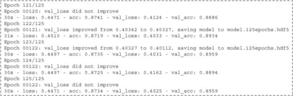

图 4.32 第 121 至 125 个 epoch 的详细输出

#### 第 5 步：评估模型

为了评估模型，我们使用 Keras 函数`evaluate`并打印结果：

```
scores = model.evaluate(x_test, y_test, batch_size=128, verbose=1)
print('\nTest result: %.3f loss: %.3f' % (scores[1]*100,scores[0]))

>> Test result: 90.260 loss: 0.398
```

##### 绘制学习曲线

绘制学习曲线以分析训练性能并诊断过拟合和欠拟合（图 4.33）：

```
pyplot.plot(history.history['acc'], label='train')
pyplot.plot(history.history['val_acc'], label='test')
pyplot.legend()
pyplot.show()

```

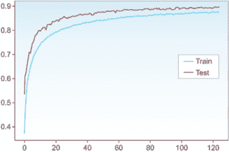

图 4.33 学习曲线

##### 进一步改进

90%的准确率相当不错，但您仍然可以进一步提高。以下是一些您可以尝试的想法：

+   更多训练 epoch--请注意，网络直到第 123 个 epoch 都在改进。您可以增加 epoch 数量到 150 或 200，让网络训练更长的时间。

+   深度网络--尝试添加更多层以增加模型复杂度，这会增加学习容量。

+   降低学习率--降低 lr（如果您这样做，应该训练更长的时间）。

+   不同的 CNN 架构--尝试使用 Inception 或 ResNet（在下一章中详细解释）。经过 200 个 epoch 的训练后，ResNet 神经网络可以达到高达 95%的准确率。

+   迁移学习--在第六章中，我们将探讨使用预训练网络在您的数据集上以更少的学习时间获得更高结果的技术。

## 摘要

+   一般规则是，您的网络越深，它学得越好。

+   在撰写本文时，ReLU 在隐藏层中表现最佳，softmax 在输出层中表现最佳。

+   随机梯度下降通常能成功找到最小值。但如果你需要快速收敛并且正在训练一个复杂的神经网络，使用 Adam 是安全的。

+   通常，您训练得越多，效果越好。

+   L2 正则化和 dropout 结合使用可以很好地减少网络复杂性和过拟合。
