# 5 个高级 CNN 架构

本章涵盖

+   与 CNN 设计模式合作

+   理解 LeNet、AlexNet、VGGNet、Inception 和 ResNet 网络架构

欢迎来到本书的第二部分。第一部分介绍了神经网络架构的基础，涵盖了多层感知器（MLPs）和卷积神经网络（CNNs）。我们在第一部分结束时总结了构建你的深度神经网络项目并调整其超参数以改进网络性能的策略。在第二部分，我们将在此基础上开发计算机视觉（CV）系统，以解决复杂图像分类和目标检测问题。

在第三章和第四章中，我们讨论了 CNN 的主要组件以及设置超参数，如隐藏层数量、学习率、优化器等。我们还讨论了其他提高网络性能的技术，如正则化、增强和 dropout。在本章中，你将看到这些元素是如何结合在一起构建卷积网络的。我将带你了解当时处于前沿的五种最流行的 CNN，你将看到它们的开发者是如何考虑构建、训练和改进网络的。我们将从 1998 年开发的 LeNet 开始，它在识别手写字符方面表现相当不错。你将看到自那时起 CNN 架构是如何发展到更深的 CNN，如 AlexNet 和 VGGNet，以及更高级的超级深度网络，如 2014 年和 2015 年开发的 Inception 和 ResNet。

对于每个 CNN 架构，你将学习以下内容：

+   新特性--我们将探索这些网络区别于其他网络的新特性以及它们的创造者试图解决的具体问题。

+   网络架构--我们将涵盖每个网络的架构和组件，并查看它们是如何结合在一起形成端到端网络的。

+   网络代码实现--我们将逐步通过使用 Keras 深度学习（DL）库的网络实现进行讲解。本节的目标是让你学会如何阅读研究论文，并在需要时实现新的架构。

+   设置学习超参数--在实现网络架构之后，你需要设置你在第四章中学到的学习算法的超参数（优化器、学习率、权重衰减等）。我们将按照每个网络的原研究论文中呈现的方式实现学习超参数。在本节中，你将看到性能是如何从一种网络演变到另一种网络，以及这些演变是如何随时间发展的。

+   网络性能--最后，你将看到每个网络在基准数据集（如 MNIST 和 ImageNet）上的表现，正如它们的研究论文中所展示的那样。

本章的三个主要目标是：

+   理解高级 CNN 的架构和超参数的学习。你将实现像 AlexNet 和 VGGNet 这样的简单到中等复杂性的 CNN。对于非常复杂的问题，你可能想使用更深层的网络，如 Inception 和 ResNet。

+   理解每个网络的独特特性和它们被开发的原因。每个后续的 CNN 架构都解决了前一个架构中的特定限制。在阅读本章中关于五个网络（及其研究论文）的内容后，你将为阅读和理解新出现的网络打下坚实的基础。

+   学习 CNN 如何演变以及其设计者的思维过程。这将帮助你培养对什么有效以及在你构建自己的网络时可能出现的什么问题的直觉。

在第三章中，你学习了 CNN 的基本构建块，包括卷积层、池化层和全连接层。正如你将在本章中看到的，近年来，许多计算机视觉研究都集中在如何将这些基本构建块组合起来形成有效的 CNN。让你培养直觉的最好方法之一是检查并学习这些架构（类似于我们大多数人可能通过阅读他人的代码来学习编写代码）。

为了充分利用本章，我们鼓励你在阅读我的解释之前先阅读每个部分中链接的研究论文。本书第一部分的内容已经完全装备你开始阅读 AI 领域的先驱者所写的研究论文。阅读和实施研究论文是迄今为止你将从这个书中建立的最有价值的技能之一。

小贴士：我个人认为，阅读研究论文、解释其背后的核心，并实现代码是一项非常重要的技能，每个深度学习爱好者和实践者都应该掌握。实际实施研究想法可以揭示作者的思维过程，并帮助将这些想法转化为现实世界的工业应用。我希望通过阅读本章，你将能够轻松阅读研究论文并在自己的工作中实施其发现。这个领域的快速发展要求我们始终跟上最新的研究。现在你在本书（或在其他出版物）中学到的知识在三年或四年内可能不再是最新和最好的——甚至可能更早。我希望你从本书中带走的最有价值的资产是一个强大的深度学习基础，它能够让你走出现实世界，能够阅读最新的研究并自己实现它。

你准备好了吗？让我们开始吧！

## 5.1 CNN 设计模式

在我们深入探讨常见的 CNN 架构的细节之前，我们将探讨一些关于 CNN 的常见设计选择。一开始可能会觉得有太多的选择要做。每次我们学习到深度学习中的新内容，都会给我们带来更多的超参数来设计。因此，通过查看由该领域的先驱研究者创建的一些常见模式，我们能够理解他们的动机，并从他们结束的地方开始，而不是完全随机地做事，这很好：

+   模式 1：特征提取和分类 -- 卷积网络通常由两部分组成：特征提取部分，由一系列卷积层组成；以及分类部分，由一系列全连接层组成（图 5.1）。这种情况在 ConvNets 中几乎是始终如一的，从 LeNet 和 AlexNet 到最近几年出现的 Inception 和 ResNet 等最新的 CNN。

    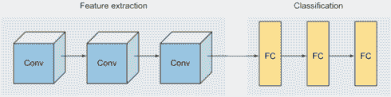

    图 5.1 卷积网络通常包括特征提取和分类。

+   模式 2：图像深度增加，维度减少 -- 每一层的输入数据是一个图像。随着每一层的应用，我们会在新的图像上应用一个新的卷积层。这促使我们以更通用的方式思考图像。首先，您会看到每个图像都是一个具有高度、宽度和深度的 3D 对象。深度指的是颜色通道，对于灰度图像，深度为 1，对于彩色图像，深度为 3。在后续的层中，图像仍然具有深度，但它们本身不是颜色：它们是特征图，代表从上一层提取的特征。这就是为什么随着我们深入网络层，深度会增加。在图 5.2 中，图像的深度等于 96；这表示该层中的特征图数量。所以，这是一个您总会看到的模式：图像深度增加，维度减少。

    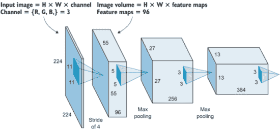

    图 5.2 图像深度增加，维度减少。

+   模式 3：全连接层 -- 这通常不像前两种模式那么严格，但了解这一点非常有帮助。通常，网络中的所有全连接层要么具有相同数量的隐藏单元，要么在每一层中递减。很难找到一个网络，其全连接层中的单元数量在每一层中都在增加。研究发现，保持单元数量不变并不会损害神经网络，因此，如果您想限制在设计网络时必须做出的选择数量，这可能是一个好方法。这样，您只需选择每一层的单元数量，并将其应用于所有全连接层。

现在你已经了解了基本的 CNN 模式，让我们来看看一些实现了这些模式的架构。其中大多数架构之所以闻名，是因为它们在 ImageNet 竞赛中表现出色。ImageNet 是一个包含数百万图像的著名基准，DL 和 CV 研究人员使用 ImageNet 数据集来比较算法。关于这一点，我们稍后再谈。

备注：本章中的代码片段并非旨在可运行。目的是向你展示如何实现研究论文中定义的规范。请访问本书的网站 ([www.manning.com/books/deep-learning-for-vision-systems](http://www.manning.com/books/deep-learning-for-vision-systems)) 或 Github 仓库 ([`github.com/moelgendy/deep_learning_for_vision_systems`](https://github.com/moelgendy/deep_learning_for_vision_systems)) 以获取完整的可执行代码。

现在，让我们开始本章将要讨论的第一个网络：LeNet。

## 5.2 LeNet-5

1998 年，Lecun 等人引入了一种开创性的 CNN，称为 LeNet-5。1 LeNet-5 架构简单明了，其中的组件对你来说并不陌生（它们在 1998 年时是新的）；你在第三章中学习了卷积、池化和全连接层。该架构由五个权重层组成，因此得名 LeNet-5：三个卷积层和两个全连接层。

定义：我们称卷积层和全连接层为权重层，因为它们包含可训练的权重，而池化层则不包含任何权重。常见的做法是使用权重层的数量来描述网络的深度。例如，AlexNet（将在下一节中解释）被称为八层深度，因为它包含五个卷积层和三个全连接层。我们更关注权重层的原因主要是它们反映了模型的计算复杂度。

### 5.2.1 LeNet 架构

LeNet-5 的架构如图 5.3 所示：

输入图像 ⇒ C1 ⇒ TANH ⇒ S2 ⇒ C3 ⇒ TANH ⇒ S4 ⇒ C5 ⇒ TANH ⇒ FC6 ⇒ SOFTMAX7

其中 C 代表卷积层，S 代表下采样或池化层，FC 代表全连接层。

注意到 Yann LeCun 和他的团队使用了 tanh 作为激活函数，而不是目前最先进的 ReLU。这是因为 1998 年，ReLU 还没有在 DL 的背景下使用，而在隐藏层中更常见的是使用 tanh 或 sigmoid 作为激活函数。不再赘述，让我们在 Keras 中实现 LeNet-5。

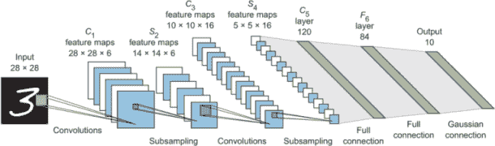

图 5.3 LeNet 架构

### 5.2.2 Keras 中的 LeNet-5 实现

要在 Keras 中实现 LeNet-5，请阅读原始论文并遵循第 6-8 页的架构信息。以下是构建 LeNet-5 网络的主要要点：

+   每个卷积层的滤波器数量--正如你在图 5.3 中所见（以及论文中定义的），每个卷积层的深度（滤波器数量）如下：C1 有 6 个，C3 有 16 个，C5 有 120 个。

+   每个卷积层的核大小--论文中指定`kernel_size`为 5 × 5。

+   子采样（池化）层--在每个卷积层之后添加一个子采样（池化）层。每个单元的感受野是一个 2 × 2 的区域（例如，`pool_size`为 2）。请注意，LeNet-5 的创造者使用了平均池化，它计算其输入的平均值，而不是我们在早期项目中使用的最大池化层，后者传递其输入的最大值。如果您感兴趣，可以尝试两者，看看区别。对于这个实验，我们将遵循论文的架构。

+   激活函数--如前所述，LeNet-5 的创造者为了隐藏层使用了 tanh 激活函数，因为对称函数被认为比 sigmoid 函数收敛更快（图 5.4）。

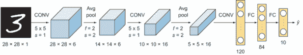

图 5.4 LeNet 架构由大小为 5 × 5 的卷积核、池化层、激活函数（tanh）以及分别有 120、84 和 10 个神经元的三个全连接层组成。

现在我们将其放入代码中，以构建 LeNet-5 架构：

```
from keras.models import Sequential                                  ❶
from keras.layers import Conv2D, AveragePooling2D, Flatten, Dense    ❶

model = Sequential()                                               ❷

# C1 Convolutional Layer
model.add(Conv2D(filters = 6, kernel_size = 5, strides = 1, activation = 'tanh',  
                 input_shape = (28,28,1), padding = 'same'))

# S2 Pooling Layer
model.add(AveragePooling2D(pool_size = 2, strides = 2, padding = 'valid'))

# C3 Convolutional Layer
model.add(Conv2D(filters = 16, kernel_size = 5, strides = 1,activation = 'tanh',
 padding = 'valid'))

# S4 Pooling Layer
model.add(AveragePooling2D(pool_size = 2, strides = 2, padding = 'valid'))

# C5 Convolutional Layer
model.add(Conv2D(filters = 120, kernel_size = 5, strides = 1,activation = 'tanh',
 padding = 'valid'))

model.add(Flatten())                                               ❸

# FC6 Fully Connected Layer
model.add(Dense(units = 84, activation = 'tanh'))

# FC7 Output layer with softmax activation
model.add(Dense(units = 10, activation = 'softmax'))

model.summary()                                                   ❹
```

❶ 导入 Keras 模型和层

❷ 实例化一个空的序列模型

❸ 将 CNN 输出展平以供全连接层完全连接

❹ 打印模型摘要（图 5.5）

LeNet-5 按照今天的标准来说是一个小型的神经网络。它有 61,706 个参数，与本章后面将要看到的更现代网络的数百万个参数相比。

阅读本章讨论的论文时的注意事项

当你阅读 LeNet-5 论文时，只需知道它比本章我们将要讨论的其他论文更难读。本节中提到的大多数想法都在论文的第 2 和第三部分。论文的后期部分讨论了被称为图变换网络的东西，这在今天并不广泛使用。所以如果你真的尝试去读这篇论文，我建议你专注于第二部分，它讨论了 LeNet 架构和学习细节；然后可以快速浏览第三部分，其中包含一些相当有趣的实验和结果。

我建议先从 AlexNet 论文（在第 5.3 节中讨论）开始，然后是 VGGNet 论文（第 5.4 节），最后是 LeNet 论文。一旦你阅读了其他论文，它是一个很好的经典论文去研究。

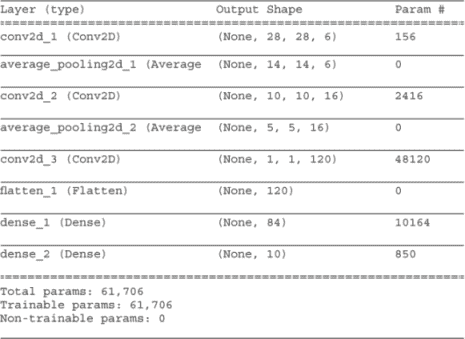

图 5.5 LeNet-5 模型摘要

### 5.2.3 设置学习超参数

LeCun 及其团队使用了计划衰减学习，其中学习率的值按照以下计划降低：前两个 epoch 为 0.0005，接下来的三个 epoch 为 0.0002，接下来的四个 epoch 为 0.00005，然后之后为 0.00001。在论文中，作者训练了他们的网络 20 个 epoch。

让我们根据这个计划构建一个`lr_schedule`函数。该方法接受一个整数 epoch 号作为参数，并返回学习率（`lr`）：

```
def lr_schedule(epoch):
    if epoch <= 2:                 ❶
        lr = 5e-4
    elif epoch > 2 and epoch <= 5:
        lr = 2e-4
    elif epoch > 5 and epoch <= 9:
        lr = 5e-5
    else: 
        lr = 1e-5
    return lr
```

❶前两个 epoch 的学习率 lr 为 0.0005，接下来的三个 epoch（3 到 5）为 0.0002，接下来的四个 epoch（6 到 9）为 0.00005，之后为 0.00001（超过 9）。

我们在以下代码片段中使用`lr_schedule`函数来编译模型：

```
from keras.callbacks import ModelCheckpoint, LearningRateScheduler

lr_scheduler = LearningRateScheduler(lr_schedule)
checkpoint = ModelCheckpoint(filepath='path_to_save_file/file.hdf5',
                             monitor='val_acc',
                             verbose=1,
                             save_best_only=True)

callbacks = [checkpoint, lr_reducer]

model.compile(loss='categorical_crossentropy', optimizer='sgd',
              metrics=['accuracy'])
```

现在开始网络训练 20 个 epoch，正如论文中提到的：

```
hist = model.fit(X_train, y_train, batch_size=32, epochs=20,
          validation_data=(X_test, y_test), callbacks=callbacks, 
          verbose=2, shuffle=True)
```

如果你想看到完整的代码实现，请参阅书中代码附带的可下载笔记本。

### 5.2.4 LeNet 在 MNIST 数据集上的性能

当你在 MNIST 数据集上训练 LeNet-5 时，你将获得超过 99%的准确率（参见书中代码的代码笔记本）。尝试使用隐藏层中的 ReLU 激活函数重新运行此实验，并观察网络性能的差异。

## 5.3 AlexNet

LeNet 在 MNIST 数据集上表现非常好。但结果证明，MNIST 数据集非常简单，因为它包含灰度图像（1 个通道）并且只分为 10 个类别，这使得它是一个更容易的挑战。AlexNet 背后的主要动机是构建一个更深层的网络，能够学习更复杂的函数。

AlexNet（图 5.6）是 2012 年 ILSVRC 图像分类竞赛的获胜者。Krizhevsky 等人创建了神经网络架构，并在 1.2 百万张高分辨率图像上训练，将其分为 ImageNet 数据集的 1000 个不同的类别。2 AlexNet 在其时代是顶尖的，因为它是最早的真正“深度”网络，为 CV 社区打开了认真考虑卷积网络在应用中的大门。我们将在本章后面解释更深的网络，如 VGGNet 和 ResNet，但了解卷积网络是如何演变的以及 AlexNet 的主要缺点是很好的，这些缺点是后来网络的主要动机。

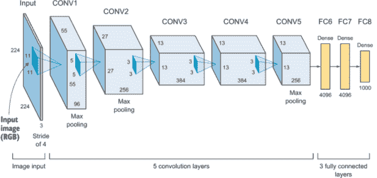

图 5.6 AlexNet 架构

如图 5.6 所示，AlexNet 与 LeNet 有很多相似之处，但更深（更多隐藏层）且更大（每层更多过滤器）。它们有相似的构建模块：一系列堆叠在一起的卷积和池化层，随后是全连接层和 softmax。我们了解到 LeNet 大约有 61,000 个参数，而 AlexNet 有大约 6000 万个参数和 650 万个神经元，这使得它具有更大的学习容量来理解更复杂的功能。这允许 AlexNet 在 2012 年的 ILSVRC 图像分类竞赛中取得显著的成绩。

ImageNet 和 ILSVRC

ImageNet ([`image-net.org/index`](http://image-net.org/index))是一个大型视觉数据库，旨在用于视觉物体识别软件研究。它旨在根据一组定义的单词和短语将图像标记和分类到近 22,000 个类别。这些图像来自网络，并由人类使用亚马逊的 Mechanical Turk 众包工具进行标记。在撰写本文时，ImageNet 项目中已有超过 1400 万张图像。为了组织如此大量的数据，ImageNet 的创建者遵循了 WordNet 层次结构，其中 WordNet 中的每个有意义的单词/短语被称为同义词集（简称 synset）。在 ImageNet 项目中，图像根据这些 synset 组织，目标是每个 synset 有 1,000+张图像。

ImageNet 项目每年举办一次名为 ImageNet 大规模视觉识别挑战（ILSVRC，[www.image-net.org/challenges/LSVRC](http://www.image-net.org/challenges/LSVRC)）的软件竞赛，软件程序在此竞赛中竞争正确分类和检测对象和场景。我们将使用 ILSVRC 挑战作为基准来比较不同网络的性能。

### 5.3.1 AlexNet 架构

您在第三章末的项目中看到了 AlexNet 架构的一个版本。该架构相当直接。它包括：

+   具有以下核大小的卷积层：11 × 11, 5 × 5, 和 3 × 3

+   图像下采样使用的最大池化层

+   使用 Dropout 层来避免过拟合

+   与 LeNet 不同，隐藏层使用 ReLU 激活函数，输出层使用 softmax 激活函数

AlexNet 由五个卷积层组成，其中一些后面跟着最大池化层，以及三个全连接层，最终有 1000 个类别的 softmax。该架构可以用以下文本表示：

输入图像 ⇒ CONV1 ⇒ POOL2 ⇒ CONV3 ⇒ POOL4 ⇒ CONV5 ⇒ CONV6 ⇒ CONV7 ⇒ POOL8 ⇒ FC9 ⇒ FC10 ⇒ SOFTMAX7

### 5.3.2 AlexNet 的新特性

在 AlexNet 之前，深度学习（DL）开始在语音识别和其他一些领域开始受到关注。但 AlexNet 是里程碑式的，它说服了 CV 社区中的许多人认真看待深度学习，并证明它确实在 CV 中有效。AlexNet 提出了一些在以前的 CNN（如 LeNet）中没有使用的新特性。您已经从前面的章节中熟悉了它们，所以我们将在这里快速浏览它们。

#### ReLU 激活函数

AlexNet 在非线性部分使用 ReLU 而不是 tanh 和 sigmoid 函数，这些函数是传统神经网络（如 LeNet）早期标准。ReLU 在 AlexNet 架构的隐藏层中使用，因为它训练得更快。这是因为 sigmoid 函数的导数在饱和区域变得非常小，因此应用于权重的更新几乎消失。这种现象称为梯度消失问题。ReLU 由以下方程表示：

*f* (*x*) = max(0,*x*)

在第二章中对此进行了详细讨论。

消失梯度问题

某些激活函数，如 sigmoid 函数，将大的输入空间压缩到 0 到 1（对于 tanh 激活为-1 到 1）之间的小输入空间。因此，sigmoid 函数输入的大变化导致输出的小变化。结果，导数变得非常小：

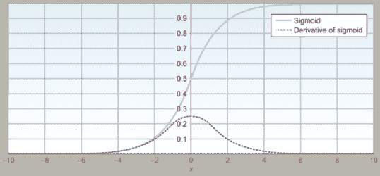

消失梯度问题：sigmoid 函数输入的大变化导致输出变化微乎其微。

当我们查看 ResNet 架构时，在本章的后面我们将更详细地讨论消失梯度现象。

#### Dropout 层

如第三章所述，dropout 层被用来防止神经网络过拟合。被“丢弃”的神经元不会对前向传递做出贡献，也不参与反向传播。这意味着每次输入时，神经网络都会采样一个不同的架构，但所有这些架构都共享相同的权重。这种技术减少了神经元之间的复杂共适应，因为一个神经元不能依赖于特定其他神经元的出现。因此，神经元被迫学习更多在与其他许多随机子集的神经元结合时有用的鲁棒特征。Krizhevsky 等人在这两个全连接层中使用了概率为 0.5 的 dropout。

#### 数据增强

避免过拟合的一种流行且非常有效的方法是通过使用标签保持变换来人工扩大数据集。这通过使用图像旋转、翻转、缩放等变换生成训练图像的新实例来实现。数据增强在第四章中有详细解释。

#### 局部响应归一化

AlexNet 使用了局部响应归一化。这与第四章中解释的批量归一化技术不同。归一化有助于加快收敛速度。如今，批量归一化已取代局部响应归一化；在本章的实现中，我们将使用 BN。

#### 权重正则化

Krizhevsky 等人使用了 0.0005 的权重衰减。权重衰减是第四章中解释的 L2 正则化技术的另一个术语。这种方法减少了深度学习神经网络模型在训练数据上的过拟合，从而使网络在新的数据上更好地泛化：

```
model.add(Conv2D(32, (3,3), kernel_regularizer=l2(ƛ)))
```

Lambda (λ) 值是一个权重衰减超参数，你可以调整它。如果你仍然看到过拟合，你可以通过增加λ值来减少它。在这种情况下，Krizhevsky 和他的团队发现，一个小的衰减值 0.0005 对于模型学习来说已经足够好了。

#### 在多个 GPU 上训练

Krizhevsky 等人使用了一个配备 3 GB 内存的 GTX 580 GPU。在当时，它是最先进的，但不足以训练数据集中的 1.2 百万个训练示例。因此，该团队开发了一种复杂的方法，将网络分散到两个 GPU 上。基本思想是许多层被分割到两个不同的 GPU 上，这些 GPU 之间相互通信。你今天不需要担心这些细节：在本书后面的部分，我们将讨论在分布式 GPU 上训练深度网络的更先进的方法。

### 5.3.3 Keras 中的 AlexNet 实现

现在你已经了解了 AlexNet 及其新颖特性的基本组成部分，让我们应用它们来构建 AlexNet 神经网络。我建议你阅读原始论文的第 4 页上的架构描述并跟随。

如图 5.7 所示，该网络包含八个权重层：前五个是卷积层，剩下的三个是全连接层。最后一个全连接层的输出被送入一个 1000 路 softmax，产生对 1000 个类别标签的分布。

备注：AlexNet 输入从 227 × 227 × 3 图像开始。如果你阅读了论文，你会注意到它提到了输入图像的维度体积为 224 × 224 × 3。但数字只对 227 × 227 × 3 图像（图 5.7）有意义。我建议这可能是在论文中的打字错误。

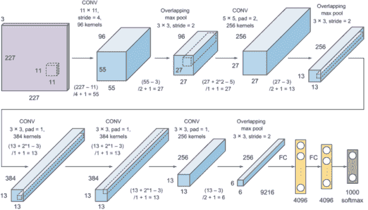

图 5.7 AlexNet 包含八个权重层：五个卷积层和三个全连接层。其中两个包含 4,096 个神经元，输出被送入一个 1,000 个神经元的 softmax。

层叠方式如下：

+   CONV1--作者使用了一个大的内核大小（11）。他们还使用了一个大的步长（4），这使得输入维度大约缩小了 4 倍（从 227 × 227 到 55 × 55）。我们如下计算输出维度：

    (227 - 11)/4 + 1 = 55

    深度是卷积层中的滤波器数量（96）。输出维度是 55 × 55 × 96。

+   POOL 尺寸为 3 × 3--这降低了维度从 55 × 55 到 27 × 27：

    (55 - 3)/2 + 1 = 27

    池化层不会改变体积的深度。输出维度是 27 × 27 × 96。

同样，我们可以计算剩余层的输出维度：

+   CONV2--内核大小= 5，深度= 256，步长= 1

+   POOL--大小= 3 × 3，它将输入维度从 27 × 27 下采样到 13 × 13

+   CONV3--内核大小= 3，深度= 384，步长= 1

+   CONV4--内核大小= 3，深度= 384，步长= 1

+   CONV5--内核大小= 3，深度= 256，步长= 1

+   POOL--大小= 3 × 3，它将输入从 13 × 13 下采样到 6 × 6

+   Flatten 层--将维度体积 6 × 6 × 256 展平为 1 × 9,216

+   FC 层包含 4,096 个神经元

+   FC 层包含 4,096 个神经元

+   Softmax 层包含 1,000 个神经元

注意：你可能想知道 Krizhevsky 和他的团队是如何决定实施这种配置的。设置网络超参数的正确值，如核大小、深度、步长、池化大小等，是繁琐的，需要大量的试错。想法保持不变：我们希望应用许多权重层来增加模型学习更复杂函数的能力。我们还需要在之间添加池化层以降采样输入维度，正如第二章所讨论的。因此，设置确切的超参数是 CNN 的一个挑战。VGGNet（下文将解释）通过实现统一的层配置来解决设计网络时试错量的问题。

注意，所有卷积层之后都跟着一个批量归一化层，所有隐藏层之后都跟着 ReLU 激活。现在，让我们将其放入代码中，以构建 AlexNet 架构：

```
from keras.models import Sequential                                 ❶
from keras.regularizers import l2                                   ❶
from keras.layers import Conv2D, AveragePooling2D, Flatten, Dense,  ❶
    Activation,MaxPool2D, BatchNormalization, Dropout               ❶

model = Sequential()                                                ❷
# 1st layer (CONV + pool + batchnorm)
model.add(Conv2D(filters= 96, kernel_size= (11,11), strides=(4,4), padding='valid', 
 input_shape = (227,227,3)))
model.add(Activation('relu'))                                       ❸
model.add(MaxPool2D(pool_size=(3,3), strides=(2,2)))
model.add(BatchNormalization())

# 2nd layer (CONV + pool + batchnorm)
model.add(Conv2D(filters=256, kernel_size=(5,5), strides=(1,1), padding='same',   
                 kernel_regularizer=l2(0.0005)))
model.add(Activation('relu'))
model.add(MaxPool2D(pool_size=(3,3), strides=(2,2), padding='valid'))
model.add(BatchNormalization())

# layer 3 (CONV + batchnorm)                                        ❹
model.add(Conv2D(filters=384, kernel_size=(3,3), strides=(1,1), padding='same', kernel_regularizer=l2(0.0005)))
model.add(Activation('relu'))
model.add(BatchNormalization())

# layer 4 (CONV + batchnorm)                                        ❺
model.add(Conv2D(filters=384, kernel_size=(3,3), strides=(1,1), padding='same',
                 kernel_regularizer=l2(0.0005)))
model.add(Activation('relu'))
model.add(BatchNormalization())

# layer 5 (CONV + batchnorm)  
model.add(Conv2D(filters=256, kernel_size=(3,3), strides=(1,1), padding='same',
                 kernel_regularizer=l2(0.0005)))
model.add(Activation('relu'))
model.add(BatchNormalization())
model.add(MaxPool2D(pool_size=(3,3), strides=(2,2), padding='valid'))

model.add(Flatten())                                               ❻

# layer 6 (Dense layer + dropout)  
model.add(Dense(units = 4096, activation = 'relu'))
model.add(Dropout(0.5))

# layer 7 (Dense layers) 
model.add(Dense(units = 4096, activation = 'relu'))
model.add(Dropout(0.5))

# layer 8 (softmax output layer) 
model.add(Dense(units = 1000, activation = 'softmax'))

model.summary()                                                    ❼
```

❶ 导入 Keras 模型、层和正则化器

❷ 实例化一个空的序列模型

❸ 激活函数可以添加到自己的层中，或者像我们在之前的实现中那样在 Conv2D 函数内添加。

❹ 注意，AlexNet 的作者在这里没有添加池化层。

❺ 与第 3 层类似

❻ 将 CNN 输出展平以供全连接层使用

❼ 打印模型摘要

当你打印模型摘要时，你会看到总参数数是 6200 万：

```
____________________________________________
Total params: 62,383, 848
Trainable params: 62,381, 096
Non-trainable params: 2,752

```

注意：LeNet 和 AlexNet 都有许多超参数需要调整。那些网络的作者不得不进行许多实验来设置每层的核大小、步长和填充，这使得网络更难以理解和管理。VGGNet（下文将解释）通过一个非常简单、统一的架构解决了这个问题。

### 5.3.4 设置学习超参数

AlexNet 训练了 90 个 epoch，在两个 Nvidia Geforce GTX 580 GPU 上同时进行，耗时 6 天。这就是为什么你会在原始论文中看到网络被分成两个管道的原因。Krizhevsky 等人以 0.01 的初始学习率和 0.9 的动量开始。当验证误差停止改进时，`lr`被除以 10：

```
reduce_lr = ReduceLROnPlateau(monitor='val_loss', factor=np.sqrt(0.1))        ❶

optimizer = keras.optimizers.sgd(lr = 0.01, momentum = 0.9)                   ❷

model.compile(loss='categorical_crossentropy', optimizer=optimizer, 
              metrics=['accuracy'])                                           ❸

model.fit(X_train, y_train, batch_size=128, epochs=90, 
          validation_data=(X_test, y_test), verbose=2, callbacks=[reduce_lr]) ❹
```

❶ 当验证误差停滞时，将学习率降低 0.1

❷ 设置 SGD 优化器，学习率为 0.01，动量为 0.9

❸ 编译模型

❹ 在训练方法中使用回调函数训练模型并调用 reduce_lr 值

### 5.3.5 AlexNet 性能

AlexNet 在 2012 年 ILSVRC 挑战中显著优于所有之前的竞争对手。它实现了 15.3%的获胜 top-5 测试错误率，而当年第二好的参赛者使用了其他传统分类器，其错误率为 26.2%。这种巨大的性能提升吸引了 CV 社区对卷积网络解决复杂视觉问题潜力的关注，并导致了更先进的 CNN 架构，你将在本章的后续部分看到。

Top-1 和 top-5 错误率是多少？

Top-1 和 top-5 是主要在研究论文中使用的术语，用来描述算法在特定分类任务上的准确性。Top-1 错误率是指分类器没有给出正确类别最高分数的百分比，而 top-5 错误率是指分类器在其前五次猜测中没有包含正确类别的百分比。

让我们用一个例子来应用这个概念。假设有 100 个类别，我们向网络展示一张猫的图片。分类器为每个类别输出一个分数或置信度值，如下所示：

1.  猫：70%

1.  狗：20%

1.  马：5%

1.  摩托车：4%

1.  汽车：0.6%

1.  飞机：0.4%

这意味着分类器能够在 top-1 中正确预测图像的真实类别。尝试对 100 张图像进行相同的实验，并观察分类器错过真实标签的次数，这就是你的 top-1 错误率。

同样的概念也适用于 top-5 错误率。在例子中，如果真实标签是马，那么分类器在 top-1 中错过了真实标签，但在前五个预测类别中捕捉到了它（例如，top-5）。计算分类器在 top 五预测中错过真实标签的次数，这就是你的 top-5。

理想情况下，我们希望模型始终在 top-1 中预测正确的类别。但 top-5 通过定义模型对错过类别的正确预测有多接近，提供了对模型性能的更全面评估。

## 5.4 VGGNet

VGGNet 于 2014 年由牛津大学视觉几何组开发（因此得名 VGG）。3 其构建组件与 LeNet 和 AlexNet 中的完全相同，只是 VGGNet 是一个更深层的网络，具有更多的卷积、池化和密集层。除此之外，这里没有引入新的组件。

VGGNet，也称为 VGG16，由 16 个权重层组成：13 个卷积层和 3 个全连接层。其均匀架构使其在深度学习社区中受到欢迎，因为它非常容易理解。

### 5.4.1 VGGNet 的新特性

我们已经看到，设置 CNN 超参数（如核大小、填充、步长等）可能具有挑战性。VGGNet 的创新概念是它有一个简单的架构，包含均匀的组件（卷积和池化层）。它通过用多个 3 × 3 池大小滤波器依次替换 AlexNet 中的大核大小滤波器（第一和第二卷积层分别为 11 和 5）来改进 AlexNet。

架构由一系列均匀的卷积构建块组成，随后是一个统一的池化层，其中：

+   所有卷积层都使用 3 × 3 核大小的滤波器，`strides`值为`1`，`padding`值为`same`。

+   所有池化层都有 2 × 2 的池大小和`strides`值为`2`。

Simonyan 和 Zisserman 决定使用一个更小的 3 × 3 核，以便网络能够提取比 AlexNet 的大核（11 × 11 和 5 × 5）更细粒度的图像特征。其理念是，在给定的卷积感受野中，多个堆叠的小核比一个大核更好，因为多个非线性层增加了网络的深度；这使得它能够在较低的成本下学习更复杂的特征，因为它具有更少的学习参数。

例如，在他们的实验中，作者注意到两个 3 × 3 卷积层的堆叠（中间没有空间池化）具有 5 × 5 的有效感受野，而三个 3 × 3 卷积层的效果相当于 7 × 7 的感受野。因此，通过使用具有更高深度的 3 × 3 卷积，你可以获得使用更多非线性整流层（ReLU）的好处，这使得决策函数更具判别性。其次，这减少了训练参数的数量，因为当你使用具有 C 通道的三层 3 × 3 卷积时，堆叠由 32C2 = 27C2 权重参数化，而单个 7 × 7 卷积层需要 72C2 = 49C2 权重，这比 81%更多的参数。

感受野

如第三章所述，感受野是输出所依赖的有效输入图像区域：


这种卷积和池化组件的统一配置简化了神经网络架构，这使得它非常容易理解和实现。

VGGNet 架构是通过堆叠 3 × 3 卷积层并在几个卷积层之后插入 2 × 2 池化层来开发的。这之后是传统的分类器，它由全连接层和 softmax 组成，如图 5.8 所示。

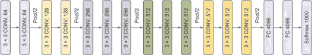

图 5.8 VGGNet-16 架构

### 5.4.2 VGGNet 配置

Simonyan 和 Zisserman 为 VGGNet 架构创建了几个配置，如图 5.9 所示。所有配置都遵循相同的设计。配置 D 和 E 是最常用的，被称为 VGG16 和 VGG19，指的是权重层的数量。每个块包含一系列具有类似超参数配置的 3 × 3 卷积层，之后跟一个 2 × 2 池化层。

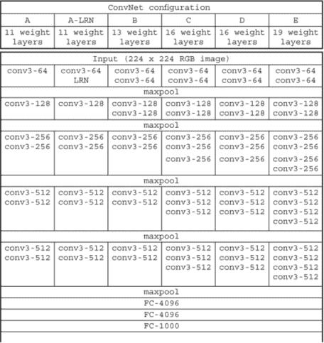

图 5.9 VGGNet 架构配置

表 5.1 列出了每个配置的学习参数数量（以百万为单位）。VGG16 产生约 138 百万个参数；VGG19，这是 VGGNet 的更深层版本，有超过 144 百万个参数。VGG16 更常用，因为它几乎与 VGG19 的表现一样好，但参数更少。

表 5.1 VGGNet 架构参数（以百万为单位）

| 网络 | A, A-LRN | B | C | D | E |
| --- | --- | --- | --- | --- | --- |
| 参数数量 | 133 | 133 | 134 | 138 | 144 |

#### Keras 中的 VGG16

配置 D（VGG16）和 E（VGG19）是最常用的配置，因为它们是更深层的网络，可以学习更复杂的函数。因此，在本章中，我们将实现配置 D，它有 16 个权重层。VGG19（配置 E）可以通过在第三、第四和第五块中添加一个第四卷积层来实现，如图 5.9 所示。本章下载的代码包括了 VGG16 和 VGG19 的完整实现。

注意，Simonyan 和 Zisserman 使用了以下正则化技术来避免过拟合：

+   L2 正则化，权重衰减为 5 × 10^-4。为了简化，这个没有添加到下面的实现中。

+   对前两个全连接层使用 Dropout 正则化，Dropout 比率为 0.5。

Keras 代码如下：

```
model = Sequential()             ❶

# block #1
model.add(Conv2D(filters=64, kernel_size=(3,3), strides=(1,1), activation='relu',
                 padding='same', input_shape=(224,224, 3)))
model.add(Conv2D(filters=64, kernel_size=(3,3), strides=(1,1), activation='relu', 
                 padding='same'))
model.add(MaxPool2D((2,2), strides=(2,2)))
# block #2
model.add(Conv2D(filters=128, kernel_size=(3,3), strides=(1,1), activation='relu', 
                 padding='same'))
model.add(Conv2D(filters=128, kernel_size=(3,3), strides=(1,1), activation='relu', 
                 padding='same'))
model.add(MaxPool2D((2,2), strides=(2,2)))
# block #3
model.add(Conv2D(filters=256, kernel_size=(3,3), strides=(1,1), activation='relu', 
                 padding='same'))
model.add(Conv2D(filters=256, kernel_size=(3,3), strides=(1,1), activation='relu', 
                 padding='same'))
model.add(Conv2D(filters=256, kernel_size=(3,3), strides=(1,1), activation='relu', 
                 padding='same'))
model.add(MaxPool2D((2,2), strides=(2,2)))
# block #4
model.add(Conv2D(filters=512, kernel_size=(3,3), strides=(1,1), activation='relu', 
                 padding='same'))
model.add(Conv2D(filters=512, kernel_size=(3,3), strides=(1,1), activation='relu', 
                 padding='same'))
model.add(Conv2D(filters=512, kernel_size=(3,3), strides=(1,1), activation='relu', 
                 padding='same'))
model.add(MaxPool2D((2,2), strides=(2,2)))
# block #5
model.add(Conv2D(filters=512, kernel_size=(3,3), strides=(1,1), activation='relu', 
                 padding='same'))
model.add(Conv2D(filters=512, kernel_size=(3,3), strides=(1,1), activation='relu', 
                 padding='same'))
model.add(Conv2D(filters=512, kernel_size=(3,3), strides=(1,1), activation='relu', 
                 padding='same'))
model.add(MaxPool2D((2,2), strides=(2,2)))

# block #6 (classifier)
model.add(Flatten())
model.add(Dense(4096, activation='relu'))
model.add(Dropout(0.5))
model.add(Dense(4096, activation='relu'))
model.add(Dropout(0.5))
model.add(Dense(1000, activation='softmax'))

model.summary()                        ❷
```

❶ 实例化一个空的序列模型

❷ 打印模型摘要

当你打印模型摘要时，你会看到总参数数量约为 138 百万：

```
____________________________________________
Total params: 138,357, 544
Trainable params: 138,357, 544
Non-trainable params: 0
```

### 5.4.3 学习超参数

Simonyan 和 Zisserman 遵循了与 AlexNet 类似的训练程序：使用带有动量 0.9 的 mini-batch 梯度下降进行训练。初始学习率设置为 0.01，当验证集准确率停止提高时，学习率减少 10 倍。

### 5.4.4 VGGNet 性能

VGG16 在 ImageNet 数据集上实现了 8.1%的 top-5 错误率，而 AlexNet 实现了 15.3%。VGG19 表现得更好：它能够实现大约 7.4%的 top-5 错误率。值得注意的是，尽管与 AlexNet 相比，VGGNet 的参数数量更多，深度更大，但由于深度更大和卷积滤波器尺寸更小，VGGNet 需要更少的 epoch 来收敛。

## 5.5 Inception 和 GoogLeNet

Inception 网络在 2014 年问世，当时谷歌的一组研究人员发表了他们的论文，“通过卷积加深网络。”4 这种架构的主要特点是构建一个更深的神经网络，同时提高网络内部计算资源的利用率。Inception 网络的一个特定实现被称为 GoogLeNet，并被用于团队在 2014 年 ILSVRC 的提交中。它使用了一个 22 层的网络（比 VGGNet 更深），通过将参数数量减少 12 倍（从约 138 百万减少到约 1300 万）并实现了显著更准确的结果。该网络使用了一个受经典网络（AlexNet 和 VGGNet）启发的 CNN，但实现了一个被称为 inception 模块的新元素。

### 5.5.1 Inception 的新特性

Szegedy 等人设计网络架构时采取了不同的方法。正如我们在前面的网络中看到的，在设计网络时，你需要为每一层做出一些架构决策，例如这些：

+   卷积层的核大小——我们在之前的架构中看到，核大小是变化的：1 × 1、3 × 3、5 × 5，在某些情况下，11 × 11（如 AlexNet）。在设计卷积层时，我们发现自己试图挑选和调整适合我们数据集的每一层的核大小。回想第三章，较小的核可以捕捉图像的更细微的细节，而较大的滤波器会忽略这些细节。

+   何时使用池化层——AlexNet 在每个或每两个卷积层后使用池化层来缩小空间特征。VGGNet 在网络更深时，在每个两个、三个或四个卷积层后应用池化。

配置核大小和定位池化层是我们主要通过试错和实验来做出决定，以获得最佳结果。Inception 说：“与其在卷积层中选择一个期望的滤波器大小并决定池化层的位置，不如将它们全部应用在一个块中，并称之为 Inception 模块。”

也就是说，与经典架构中层层堆叠的方式不同，Szegedy 和他的团队建议我们创建一个由多个不同核大小的卷积层组成的 Inception 模块。然后，通过堆叠 Inception 模块来发展架构。图 5.10 展示了经典卷积网络与 Inception 网络的架构对比。

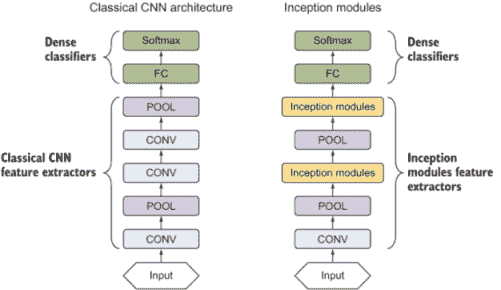

图 5.10 经典卷积网络与 Inception 网络对比

从图中，你可以观察到以下内容：

+   在 LeNet、AlexNet 和 VGGNet 等经典架构中，我们堆叠卷积层和池化层来构建特征提取器。最后，我们添加密集的全连接层来构建分类器。

+   在 Inception 架构中，我们从一个卷积层和一个池化层开始，堆叠 Inception 模块和池化层来构建特征提取器，然后添加常规的密集分类层。

我们一直将 Inception 模块视为黑盒，以理解 Inception 架构的全貌。现在，我们将拆解 Inception 模块，以了解其工作原理。

### 5.5.2 Inception 模块：朴素版本

Inception 模块由四个层组成：

+   1 × 1 卷积层

+   3 × 3 卷积层

+   5 × 5 卷积层

+   3 × 3 最大池化层

这些层的输出被连接成一个单一的输出体积，形成下一阶段的输入。朴素版本的 Inception 模块在图 5.11 中展示。

图表可能看起来有点令人眼花缭乱，但理念简单易懂。让我们通过以下示例来理解：

1.  假设我们有一个来自前一层的输入维度体积，大小为 32 × 32 × 200。

1.  我们同时将这个输入馈送到四个卷积中：

    +   `depth` = `64` 和 `padding` = `same` 的 1 × 1 卷积层。这个核的输出 = 32 × 32 × 64。

    +   `depth` = `128` 和 `padding` = `same` 的 3 × 3 卷积层。输出 = 32 × 32 × 128。

    +   `depth` = `32` 和 `padding` = `same` 的 5 × 5 卷积层。输出 = 32 × 32 × 32。

    +   `padding` = `same` 和 `strides` = `1` 的 3 × 3 最大池化层。输出 = 32 × 32 × 32。

1.  我们将四个输出的深度连接起来，创建一个维度为 32 × 32 × 256 的一维输出体积。

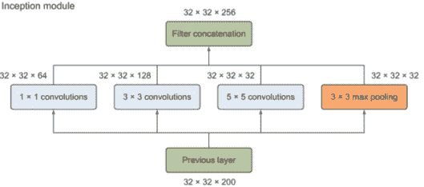

图 5.11 Naive representation of an inception module

现在我们有一个 inception 模块，它接受一个 32 × 32 × 200 的输入体积，并输出一个 32 × 32 × 256 的体积。

注意：在前一个例子中，我们使用了一个 `padding` 值为 `same`。在 Keras 中，`padding` 可以设置为 `same` 或 `valid`，正如我们在第三章中看到的。`same` 值会导致填充输入，使得输出长度与原始输入相同。我们这样做是因为我们希望输出具有与输入相似的宽度和高度维度。我们希望在 inception 模块中输出相似的维度以简化深度连接过程。现在我们只需将所有输出的深度相加，将它们连接成一个输出体积，然后将其送入我们网络中的下一层。

### 5.5.3 具有维度缩减的 Inception 模块

我们刚才看到的 inception 模块的朴素表示法在处理像 5 × 5 卷积层这样的大尺寸滤波器时存在一个大的计算成本问题。为了更好地理解朴素表示法中的计算问题，让我们计算一下前一个例子中 5 × 5 卷积层将要执行的操作数量。

维度为 32 × 32 × 200 的输入体积将被送入 32 个滤波器的 5 × 5 卷积层，滤波器维度 = 5 × 5 × 32。这意味着计算机需要计算的总乘法次数是 32 × 32 × 200 乘以 5 × 5 × 32，这超过了 1.63 亿次操作。虽然我们可以用现代计算机执行这么多操作，但这仍然相当昂贵。这就是维度缩减层可以非常有用的时候。

#### 维度缩减层（1 × 1 卷积层）

1 × 1 卷积层可以将 1.63 亿次操作的操作成本降低到十分之一左右。这就是为什么它被称为缩减层。这里的想法是在 3 × 3 和 5 × 5 卷积层等更大的核之前添加一个 1 × 1 卷积层，以减少它们的深度，从而减少操作的数量。

让我们来看一个例子。假设我们有一个输入维度体积为 32 × 32 × 200。然后我们添加一个深度为 16 的 1 × 1 卷积层。这将从 200 个通道减少维度体积到 16 个通道。然后我们可以在输出上应用 5 × 5 卷积层，其深度要小得多（图 5.12）。


图 5.12 使用降维通过减少层的深度来降低计算成本。

注意，32 × 32 × 200 的输入通过两个卷积层处理后，输出一个维度为 32 × 32 × 32 的体积，这与未应用降维层时产生的体积相同。但在这里，我们不是在整个输入体积的 200 个通道上处理 5 × 5 卷积层，而是将这个巨大的体积缩小到只有 16 个通道的更小的中间体积。

现在，让我们看看这个操作涉及的计算成本，并将其与我们之前应用降维层时得到的 1.63 亿次乘法进行比较：

计算量

= 1 × 1 卷积层中的操作 + 5 × 5 卷积层中的操作

= (32 × 32 × 200) 乘以 (1 × 1 × 16 + 32 × 32 × 16) 乘以 (5 × 5 × 32)

= 320 万 + 1310 万

这个操作中的总乘法次数为 1630 万次，是未使用降维层时计算的 1.63 亿次的十分之一。

1 × 1 卷积层

1 × 1 卷积层的思想是它保留了输入体积的空间维度（高度和宽度），但改变了体积的通道数（深度）：

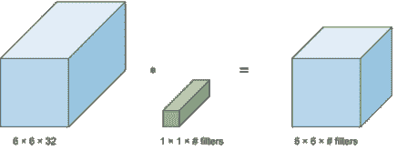

1 × 1 卷积层保留了空间维度，但改变了深度。

1 × 1 卷积层也被称为瓶颈层，因为瓶颈是瓶子中最小的一部分，降维层减少了网络的维度，使其看起来像瓶颈：

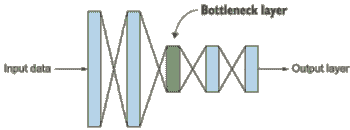

1 × 1 卷积层被称为瓶颈层。

#### 降维对网络性能的影响

你可能会想知道，如此大幅度地缩小表示大小是否会损害神经网络的性能。Szegedy 等人进行了实验，发现只要适度地实现降维层，就可以显著缩小表示大小而不会损害性能——并且节省大量计算。

现在，让我们将降维层付诸实践，并构建一个新的具有降维功能的 inception 模块。为此，我们将保持从原始表示中连接四个层的相同概念。我们将在 3 × 3 和 5 × 5 卷积层之前添加一个 1 × 1 卷积降维层，以降低它们的计算成本。我们还将添加一个 1 × 1 卷积层在 3 × 3 最大池化层之后，因为池化层不会减少其输入的深度。因此，在我们进行连接之前，我们需要将降维层应用于它们的输出（图 5.13）。


图 5.13 使用降维构建 inception 模块

我们在更大的卷积层之前添加了降维，以便在后续阶段计算复杂度不受控制地激增之前，显著增加每个阶段的单元数量。此外，设计遵循了实用的直觉，即视觉信息应该在各种尺度上处理，然后汇总，以便下一阶段可以同时从不同尺度抽象特征。

#### Inception 模块的回顾

总结来说，如果您正在构建神经网络的一层，并且不想决定在卷积层中使用什么滤波器大小或何时添加池化层，Inception 模块允许您使用所有这些，并将所有输出的深度连接起来。这被称为 Inception 模块的朴素表示。

然后，我们遇到了使用大滤波器带来的计算成本问题。在这里，我们使用了一个称为 reduce 层的 1 × 1 卷积层，它显著降低了计算成本。我们在 3 × 3 和 5 × 5 卷积层之前以及最大池化层之后添加 reduce 层，以创建一个具有降维的 Inception 模块。

### 5.5.4 Inception 架构

现在我们已经了解了 Inception 模块的组成部分，我们准备构建 Inception 网络架构。我们使用 Inception 模块的降维表示，将 Inception 模块堆叠在一起，并在它们之间添加一个 3 × 3 池化层以进行下采样，如图 5.14 所示。

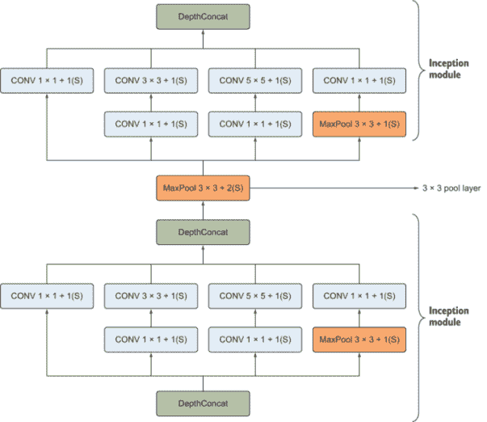

图 5.14 我们通过将 Inception 模块堆叠在一起来构建 Inception 网络。

我们可以堆叠任意数量的 Inception 模块来构建一个非常深的卷积网络。在原始论文中，该团队构建了一个特定的 Inception 模块实例，并将其称为 GoogLeNet。他们在 2014 年 ILSVRC 竞赛的提交中使用了这个网络。GoogLeNet 架构如图 5.15 所示。

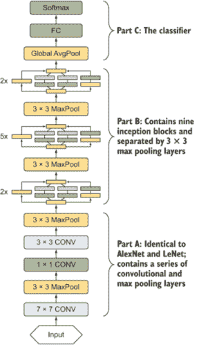

图 5.15 完整的 GoogLeNet 模型由三部分组成：第一部分具有类似于 AlexNet 和 LeNet 的经典 CNN 架构，第二部分是一堆 Inception 模块和池化层，第三部分是传统的全连接分类器。

如您所见，GoogLeNet 使用了一堆总共九个 Inception 模块，并在每隔几个块中使用最大池化层来降低维度。为了简化这个实现，我们将 GoogLeNet 架构分解为三个部分：

+   A 部分--与 AlexNet 和 LeNet 架构相同；包含一系列卷积和池化层。

+   B 部分 --包含九个 Inception 模块堆叠如下：两个 Inception 模块 + 池化层 + 五个 Inception 模块 + 池化层 + 五个 Inception 模块。

+   C 部分 --网络的分类器部分，包括全连接和 softmax 层。

### 5.5.5 Keras 中的 GoogLeNet

现在，让我们在 Keras 中实现 GoogLeNet 架构（图 5.16）。注意，inception 模块将前一个模块的特征作为输入，通过四个路径传递，将所有四个路径的输出深度连接起来，然后将连接后的输出传递到下一个模块。这四个路径如下：

+   1 × 1 卷积层

+   1 × 1 卷积层 + 3 × 3 卷积层

+   1 × 1 卷积层 + 5 × 5 卷积层

+   3 × 3 池化层 + 1 × 1 卷积层

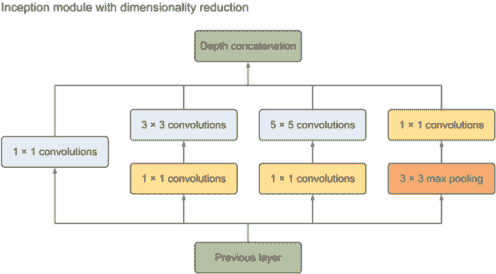

图 5.16 GoogLeNet 的 inception 模块

首先，我们将构建`inception_module`函数。它接受每个卷积层的滤波器数量作为参数，并返回连接后的输出：

```
def inception_module(x, filters_1 × 1, filters_3x3_reduce, filters_3x3, filters_5x5_reduce,
                     filters_5x5, filters_pool_proj, name=None):

conv_1x1 = Conv2D(filters_1x1, kernel_size=(1, 1), padding='same', activation='relu',
                  kernel_initializer=kernel_init, bias_initializer=bias_init)(*x*) ❶

      # 3 × 3 route = 1 × 1 CONV + 3 × 3 CONV 
pre_conv_3x3 = Conv2D(filters_3x3_reduce, kernel_size=(1, 1), padding='same',
                  activation='relu', kernel_initializer=kernel_init, 
                  bias_initializer=bias_init)(*x*)
conv_3x3 = Conv2D(filters_3x3, kernel_size=(3, 3), padding='same', activation='relu', 
                  kernel_initializer=kernel_init, 
                  bias_initializer=bias_init)(pre_conv_3x3)
      # 5 × 5 route = 1 × 1 CONV + 5 × 5 CONV 
pre_conv_5x5 = Conv2D(filters_5x5_reduce, kernel_size=(1, 1), padding='same',
                  activation='relu', kernel_initializer=kernel_init, 
                  bias_initializer=bias_init)(*x*)
conv_5x5 = Conv2D(filters_5x5, kernel_size=(5, 5), padding='same', activation='relu', 
                  kernel_initializer=kernel_init, 
                  bias_initializer=bias_init)(pre_conv_5x5)
      # pool route = POOL + 1 × 1 CONV 
pool_proj = MaxPool2D((3, 3), strides=(1, 1), padding='same')(*x*)
pool_proj = Conv2D(filters_pool_proj, (1, 1), padding='same', activation='relu',
                  kernel_initializer=kernel_init, bias_initializer=bias_init)(pool_proj)

output = concatenate([conv_1x1, conv_3x3, conv_5x5, pool_proj], axis=3,  name=name)                                                                ❷

return output
```

❶ 创建一个 1 × 1 卷积层，其输入直接来自前一个层

❷ 将三个滤波器的深度连接在一起

#### GoogLeNet 架构

现在`inception_module`函数已经准备好了，让我们根据图 5.16 构建 GoogLeNet 架构。为了获取`inception_module`函数参数的值，我们将查看图 5.17，它代表了 Szegedy 等人在原始论文中实现的超参数设置。（注意，图中的“#3 × 3 reduce”和“#5 × 5 reduce”代表在 3 × 3 和 5 × 5 卷积层之前使用的 1 × 1 滤波器层。）

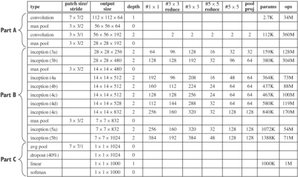

图 5.17 Szegedy 等人原 Inception 论文中实现的超参数

现在，让我们逐一查看部分 A、B 和 C 的实现。

#### Part A: 构建网络的底部部分

让我们构建网络的底部部分。这部分包括一个 7 × 7 卷积层⇒ 3 × 3 池化层⇒ 1 × 1 卷积层⇒ 3 × 3 卷积层⇒ 3 × 3 池化层，如图 5.18 所示。

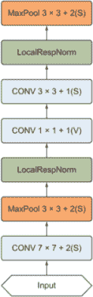

图 5.18 网络的底部部分

在`LocalResponseNorm`层中，类似于 AlexNet，使用局部响应归一化来帮助加速收敛。如今，批量归一化被用来代替。

这里是部分 A 的 Keras 代码：

```
# input layer with size = 24 × 24 × 3
input_layer = Input(shape=(224, 224, 3))
kernel_init = keras.initializers.glorot_uniform()
bias_init = keras.initializers.Constant(value=0.2)
x = Conv2D(64, (7, 7), padding='same', strides=(2, 2), activation='relu', name='conv_1_7x7/2', 
kernel_initializer=kernel_init, bias_initializer=bias_init)(input_layer)
x = MaxPool2D((3, 3), padding='same', strides=(2, 2), name='max_pool_1_3x3/2')(*x*)
x = BatchNormalization()(*x*)
x = Conv2D(64, (1, 1), padding='same', strides=(1, 1), activation='relu')(*x*)
x = Conv2D(192, (3, 3), padding='same', strides=(1, 1), activation='relu')(*x*)

x = BatchNormalization()(*x*)

x = MaxPool2D((3, 3), padding='same', strides=(2, 2))(*x*)
```

#### Part B: 构建 inception 模块和最大池化层

要构建 inception 模块 3a 和 3b 以及第一个最大池化层，我们使用表 5.2 开始。代码如下：

表 5.2 Inception 模块 3a 和 3b

| 类型 | #1 × 1 | #3 × 3 reduce | #3 × 3 | #5 × 5 reduce | #5 × 5 | Pool proj |
| --- | --- | --- | --- | --- | --- | --- |
| Inception (3a) | 064 | 096 | 128 | 16 | 32 | 32 |
| Inception (3b) | 128 | 128 | 192 | 32 | 96 | 64 |

```
x = inception_module(x, filters_1x1=64, filters_3x3_reduce=96, filters_3x3=128, 
                     filters_5x5_reduce=16, filters_5x5=32, filters_pool_proj=32,
                     name='inception_3a')

x = inception_module(x, filters_1x1=128, filters_3x3_reduce=128, filters_3x3=192,
                     filters_5x5_reduce=32, filters_5x5=96, filters_pool_proj=64,
                     name='inception_3b')

x = MaxPool2D((3, 3), padding='same', strides=(2, 2))(*x*)
```

类似地，让我们创建 inception 模块 4a、4b、4c、4d 和 4e 以及最大池化层：

```
x = inception_module(x, filters_1x1=192, filters_3x3_reduce=96, filters_3x3=208, 
                     filters_5x5_reduce=16, filters_5x5=48, filters_pool_proj=64,
                     name='inception_4a')

x = inception_module(x, filters_1x1=160, filters_3x3_reduce=112, filters_3x3=224,
                     filters_5x5_reduce=24, filters_5x5=64, filters_pool_proj=64,
                     name='inception_4b')

x = inception_module(x, filters_1x1=128, filters_3x3_reduce=128, filters_3x3=256,
                     filters_5x5_reduce=24, filters_5x5=64, filters_pool_proj=64,
                     name='inception_4c')

x = inception_module(x, filters_1x1=112, filters_3x3_reduce=144, filters_3x3=288,
                     filters_5x5_reduce=32, filters_5x5=64, filters_pool_proj=64,
                     name='inception_4d')

x = inception_module(x, filters_1x1=256, filters_3x3_reduce=160, filters_3x3=320,
                     filters_5x5_reduce=32, filters_5x5=128, filters_pool_proj=128,
                     name='inception_4e')

x = MaxPool2D((3, 3), padding='same', strides=(2, 2), name='max_pool_4_3x3/2')(*x*)
```

现在，让我们创建模块 5a 和 5b：

```
x = inception_module(x, filters_1x1=256, filters_3x3_reduce=160, filters_3x3=320, 
                     filters_5x5_reduce=32, filters_5x5=128, filters_pool_proj=128, 
                     name='inception_5a')

x = inception_module(x, filters_1x1=384, filters_3x3_reduce=192, filters_3x3=384, 
                     filters_5x5_reduce=48, filters_5x5=128, filters_pool_proj=128, 
                     name='inception_5b')
```

#### Part C: 构建分类器部分

在他们的实验中，Szegedy 等人发现添加一个 7 × 7 平均池化层将 top-1 准确率提高了约 0.6%。然后他们添加了一个 40%概率的 dropout 层来减少过拟合：

```
x = AveragePooling2D(pool_size=(7,7), strides=1, padding='valid')(*x*)
x = Dropout(0.4)(*x*)
x = Dense(10, activation='softmax', name='output')(*x*)
```

### 5.5.6 学习超参数

该团队使用了一个动量为 0.9 的 SGD 梯度下降优化器。他们还实施了一个每 8 个周期固定学习率衰减计划，衰减率为 4%。以下是如何实现与论文中类似的训练规范的示例：

```
epochs = 25
initial_lrate = 0.01

def decay(epoch, steps=100):                                                  ❶
    initial_lrate = 0.01                                                      ❶
    drop = 0.96                                                               ❶
    epochs_drop = 8                                                           ❶
    lrate = initial_lrate * math.pow(drop, math.floor((1+epoch)/epochs_drop)) ❶
    return lrate                                                              ❶

lr_schedule = LearningRateScheduler(decay, verbose=1)

sgd = SGD(lr=initial_lrate, momentum=0.9, nesterov=False)

model.compile(loss='categorical_crossentropy', optimizer=sgd, metrics=['accuracy'])

model.fit(X_train, y_train, batch_size=256, epochs=epochs, validation_data=(X_test, y_test), callbacks=[lr_schedule], verbose=2, shuffle=True)
```

❶ 实现学习率衰减函数

### 5.5.7 Inception 在 CIFAR 数据集上的性能

GoogLeNet 在 2014 年的 ILSVRC 竞赛中获胜。它实现了 6.67% 的顶级错误率，这非常接近人类水平的表现，并且比之前的 CNN，如 AlexNet 和 VGGNet，要好得多。

## 5.6 ResNet

Residual Neural Network (ResNet) 是由微软研究团队在 2015 年开发的。5 他们引入了一种具有跳过连接的新颖残差模块架构。该网络还针对隐藏层进行了大量的批量归一化。这项技术使得团队能够训练具有 50、101 和 152 个权重层的非常深的神经网络，同时其复杂度仍低于 VGGNet（19 层）等较小的网络。ResNet 在 2015 年的 ILSVRC 竞赛中实现了 3.57% 的顶级错误率，超过了所有先前卷积神经网络的表现。

### 5.6.1 ResNet 的新特性

观察神经网络架构从 LeNet、AlexNet、VGGNet 和 Inception 的发展，你可能会注意到，网络越深，其学习容量越大，并且从图像中提取特征的能力越强。这主要是因为非常深的网络能够表示非常复杂的函数，这使得网络能够在许多不同层次的抽象中学习特征，从边缘（在底层）到非常复杂的特征（在深层）。

在本章的早期，我们看到了像 VGGNet-19（19 层）和 GoogLeNet（22 层）这样的深度神经网络。它们在 ImageNet 挑战中都表现出色。但我们能否构建更深层的网络呢？我们从第四章中了解到，添加太多层的缺点是这样做会使网络更容易过拟合训练数据。这不是一个主要问题，因为我们可以使用正则化技术，如 dropout、L2 正则化和批量归一化来避免过拟合。因此，如果我们能够解决过拟合问题，我们难道不想构建深度为 50、100 或甚至 150 层的网络吗？答案是肯定的。我们确实应该尝试构建非常深的神经网络。我们只需要解决另一个问题，即解开构建超深层网络的能力：一种称为梯度消失的现象。

梯度消失和梯度爆炸

非常深网络的难题在于，用于改变权重的信号在早期层变得非常小。为了理解原因，让我们考虑第二章中解释的梯度下降过程。当网络反向传播从最终层到第一层的误差梯度时，它在每一步都会乘以权重矩阵；因此梯度可以迅速指数级下降到零，导致梯度消失现象，阻止早期层学习。结果，网络的性能变得饱和，甚至开始迅速退化。

在其他情况下，梯度会迅速指数级增长并“爆炸”到非常大的值。这种现象称为梯度爆炸。

为了解决梯度消失问题，He 等人创建了一个捷径，允许梯度直接反向传播到早期层。这些捷径被称为跳跃连接：它们用于将网络早期层的信息流向后期层，为梯度流动创建一个替代的捷径路径。跳跃连接的另一个重要好处是，它们允许模型学习一个恒等函数，这确保该层至少与前一层的性能一样好（图 5.19）。

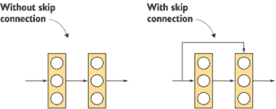

图 5.19 无跳跃连接的传统网络（左侧）；有跳跃连接的网络（右侧）。

在图 5.19 的左侧是传统的逐层堆叠的卷积层。在右侧，我们仍然像以前一样堆叠卷积层，但同时也将原始输入添加到卷积块的输出中。这是一个跳跃连接。然后我们添加两个信号：跳跃连接 + 主路径。

注意，跳跃箭头指向第二个卷积层的末端——而不是之后。原因是我们在应用该层的 ReLU 激活函数之前添加了两个路径。如图 5.20 所示，*x*信号沿着捷径路径传递，然后添加到主路径，*f*(*x*)。然后，我们对*f*(*x*) + *x*应用 ReLU 激活，以产生输出信号：relu( *f*(*x*) + *x* )。

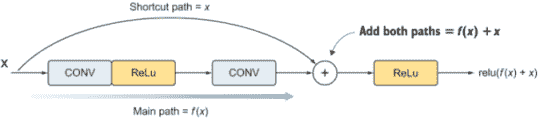

图 5.20 添加路径并应用 ReLU 激活函数以解决通常伴随非常深网络的梯度消失问题

跳跃连接的代码实现很简单：

```
X_shortcut = *x*                                                       ❶

X = Conv2D(filters = F1, kernel_size = (3, 3), strides = (1,1))(*x*)   ❷
X = Activation('relu')(*x*)                                            ❷
X = Conv2D(filters = F1, kernel_size = (3, 3), strides = (1,1))(*x*)   ❷

X = Add()([X, X_shortcut])                                           ❸

X = Activation('relu')(*x*)                                            ❹
```

❶ 将捷径的值存储为等于输入 x

❷ 执行主路径操作：CONV + ReLU + CONV

❸ 将两个路径合并

❹ 应用 ReLU 激活函数

这种跳跃连接和卷积层的组合被称为残差块。类似于 Inception 网络，ResNet 由一系列这些残差块构建块组成，它们堆叠在一起（图 5.21）。

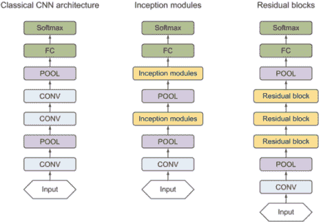

图 5.21 经典 CNN 架构（左）。Inception 网络由一系列 Inception 模块组成（中间）。残差网络由一系列残差块组成（右）。

从图中，你可以观察到以下内容：

+   *特征提取器* --为了构建 ResNet 的特征提取器部分，我们从一个卷积层和一个池化层开始，然后在每个残差块上堆叠以构建网络。当我们设计我们的 ResNet 网络时，我们可以添加尽可能多的残差块来构建甚至更深的网络。

+   *分类器* --分类部分与其他网络中我们学习的内容相同：全连接层后跟 softmax。

现在你已经了解了什么是跳跃连接，并且熟悉了 ResNet 的高级架构，让我们来拆解残差块以了解它们是如何工作的。

### 5.6.2 残差块

一个残差模块由两个分支组成：

+   *捷径路径*（图 5.22）--将输入连接到第二分支的加法。

+   *主路径* --一系列卷积和激活。主路径由三个具有 ReLU 激活的卷积层组成。我们还在每个卷积层中添加批量归一化以减少过拟合并加快训练速度。主路径架构如下：[CONV ⇒ BN ⇒ ReLU] × 3。

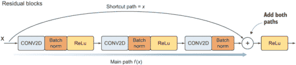

图 5.22 主路径的输出通过捷径在输入值被馈送到 ReLU 函数之前被添加。

与我们之前解释的类似，捷径路径在最后一个卷积层的激活函数之前被添加到主路径上。然后我们在添加两条路径后应用 ReLU 函数。

注意，残差块中没有池化层。相反，He 等人决定使用瓶颈 1 × 1 卷积层进行维度下采样，类似于 Inception 网络。因此，每个残差块从 1 × 1 卷积层开始，以下采样输入维度体积，然后是 3 × 3 卷积层和另一个 1 × 1 卷积层以下采样输出。这是一种在多层中保持体积维度的良好技术。这种配置被称为瓶颈残差块。

当我们将残差块堆叠在一起时，体积维度从一个块变化到另一个块。并且你可能还记得第二章中矩阵介绍的内容，为了能够执行矩阵加法操作，矩阵应该具有相似的维度。为了解决这个问题，我们需要在下采样两条路径之前对捷径路径进行下采样。我们通过在捷径路径中添加一个瓶颈层（1 × 1 卷积层 + 批量归一化）来实现这一点，如图 5.23 所示。这被称为减少捷径。

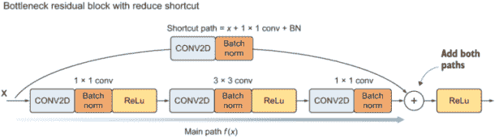

图 5.23 为了减少输入维度，我们在捷径路径中添加了一个瓶颈层（1 × 1 卷积层 + 批量归一化）。这被称为减少捷径。

在我们深入代码实现之前，让我们回顾一下关于残差块的讨论：

+   残差块包含两个路径：捷径路径和主路径。

+   主路径由三个卷积层组成，我们向它们添加批归一化层：

    +   1 × 1 卷积层

    +   3 × 3 卷积层

    +   1 × 1 卷积层

+   实现捷径路径有两种方式：

    +   *常规捷径* --将输入维度添加到主路径。

    +   *减少捷径* --在合并到主路径之前，在捷径路径中添加一个卷积层。

当我们实现 ResNet 网络时，我们将使用常规和缩减捷径。当你看到完整的实现时，这会变得更加清晰。但就目前而言，我们将实现`bottleneck_residual_block`函数，它接受一个`reduce`布尔参数。当`reduce`为`True`时，这意味着我们想要使用缩减捷径；否则，它将实现常规捷径。`bottleneck_residual_block`函数接受以下参数：

+   `X`--形状为（样本数，高度，宽度，通道）的输入张量

+   `f`--整数，指定主路径中间卷积层窗口的形状

+   `filters`--定义主路径卷积层中滤波器数量的 Python 整数列表

+   `reduce`--布尔值：`True`标识缩减层

+   `s`--整数（步长）

函数返回`X`：残差块的输出，它是一个形状为（高度，宽度，通道）的张量。

函数如下：

```
def bottleneck_residual_block(X, kernel_size, filters, reduce=False, s=2):
    F1, F2, F3 = filters                                        ❶

    X_shortcut = *x*                                              ❷

    if reduce:                                                  ❸

       X_shortcut = Conv2D(filters = F3, kernel_size = (1, 1), strides = (s,s))(X_shortcut)                                         ❹
        X_shortcut = BatchNormalization(axis = 3)(X_shortcut)   ❹

       *x* = Conv2D(filters = F1, kernel_size = (1, 1), strides = (s,s), padding = 'valid')(*x*)                                        ❺
        *x* = BatchNormalization(axis = 3)(*x*)
        *x* = Activation('relu')(*x*)

    else: 
        # First component of main path
        *x* = Conv2D(filters = F1, kernel_size = (1, 1), strides = (1,1), padding = 'valid')(*x*)
        *x* = BatchNormalization(axis = 3)(*x*)
        *x* = Activation('relu')(*x*)

    # Second component of main path
    *x* = Conv2D(filters = F2, kernel_size = kernel_size, strides = (1,1), padding = 'same')(*x*)
    *x* = BatchNormalization(axis = 3)(*x*)
    *x* = Activation('relu')(*x*)

    # Third component of main path
    *x* = Conv2D(filters = F3, kernel_size = (1, 1), strides = (1,1), padding = 'valid')(*x*)
    *x* = BatchNormalization(axis = 3)(*x*)

    # Final step
    *x* = Add()([X, X_shortcut])                                  ❻
    *x* = Activation('relu')(*x*)                                   ❻

    return X
```

❶ 解包元组以检索每个卷积层的滤波器

❷ 将输入值保存起来，稍后用于将其添加到主路径

❸ 当 reduce 为 True 时的条件

❹ 为了减少空间尺寸，将一个 1 × 1 卷积层应用于捷径路径。为此，我们需要两个卷积层具有相似的步长。

❺ 如果 reduce，将第一个卷积层的步长设置为与捷径步长相似。

❻ 将捷径值添加到主路径，并通过 ReLU 激活传递

### 5.6.3 Keras 中的 ResNet 实现

到目前为止，你已经学到了很多关于残差块的知识。让我们将这些块叠加在一起来构建完整的 ResNet 架构。在这里，我们将实现 ResNet50：ResNet 架构的一个版本，包含 50 个权重层（因此得名）。你可以通过遵循原始论文中的图 5.24 的架构来开发具有 18、34、101 和 152 层的 ResNet。

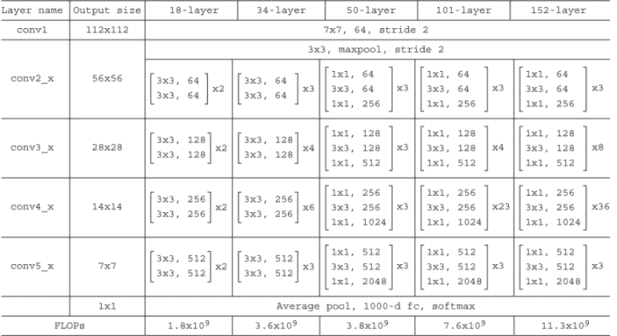

图 5.24 原始论文中几个 ResNet 变体的架构

从上一节我们知道每个残差模块包含 3 × 3 卷积层，现在我们可以计算 ResNet50 网络内部的权重层总数如下：

+   阶段 1：7 × 7 卷积层

+   阶段 2：3 个残差块，每个块包含[1 × 1 卷积层 + 3 × 3 卷积层 + 1 × 1 卷积层] = 9 个卷积层

+   第三阶段：4 个残差块 = 总共 12 个卷积层

+   第四阶段：6 个残差块 = 总共 18 个卷积层

+   第五阶段：3 个残差块 = 总共 9 个卷积层

+   完全连接的 softmax 层

当我们将所有这些层加在一起时，我们得到总共 50 个权重层，这些层描述了 ResNet50 的架构。同样，你也可以计算其他 ResNet 版本中的权重层数量。

注意：在以下实现中，我们使用在每个阶段的开始处具有减少快捷支路的残差块来减少前一层输出的空间尺寸。然后我们使用该阶段的其余层的常规快捷支路。回想一下我们在`bottleneck_` `residual_block`函数中的实现，我们将设置`reduce`参数为`True`以应用减少快捷支路。

现在，让我们根据图 5.24 中的 50 层架构来构建 ResNet50 网络。我们构建一个 ResNet50 函数，该函数接受`input_shape`和`classes`作为参数，并输出模型：

```
def ResNet50(input_shape, classes):
    X_input = Input(input_shape)                                      ❶

    # Stage 1
    *x* = Conv2D(64, (7, 7), strides=(2, 2), name='conv1')(X_input)
    *x* = BatchNormalization(axis=3, name='bn_conv1')(*x*)
    *x* = Activation('relu')(*x*)
    *x* = MaxPooling2D((3, 3), strides=(2, 2))(*x*)

    # Stage 2
    *x* = bottleneck_residual_block(X, 3, [64, 64, 256], reduce=True, s=1)
    *x* = bottleneck_residual_block(X, 3, [64, 64, 256])
    *x* = bottleneck_residual_block(X, 3, [64, 64, 256])

    # Stage 3 
    *x* = bottleneck_residual_block(X, 3, [128, 128, 512], reduce=True, s=2)
    *x* = bottleneck_residual_block(X, 3, [128, 128, 512])
    *x* = bottleneck_residual_block(X, 3, [128, 128, 512])
    *x* = bottleneck_residual_block(X, 3, [128, 128, 512])

    # Stage 4 
    *x* = bottleneck_residual_block(X, 3, [256, 256, 1024], reduce=True, s=2)
    *x* = bottleneck_residual_block(X, 3, [256, 256, 1024])
    *x* = bottleneck_residual_block(X, 3, [256, 256, 1024])
    *x* = bottleneck_residual_block(X, 3, [256, 256, 1024])
    *x* = bottleneck_residual_block(X, 3, [256, 256, 1024])
    *x* = bottleneck_residual_block(X, 3, [256, 256, 1024])

    # Stage 5 
    *x* = bottleneck_residual_block(X, 3, [512, 512, 2048], reduce=True, s=2)
    *x* = bottleneck_residual_block(X, 3, [512, 512, 2048])
    *x* = bottleneck_residual_block(X, 3, [512, 512, 2048])

    # AVGPOOL 
    *x* = AveragePooling2D((1,1))(*x*)

    # output layer
    *x* = Flatten()(*x*)
    *x* = Dense(classes, activation='softmax', name='fc' + str(classes))(*x*)

    model = Model(inputs = X_input, outputs = X, name='ResNet50')     ❷

    return model
```

❶ 将输入定义为具有 input_shape 形状的张量

❷ 创建模型

### 5.6.4 学习超参数

He 等人遵循了类似于 AlexNet 的训练程序：使用带有动量 0.9 的 mini-batch GD 进行训练。团队将学习率初始值设为 0.1，当验证误差停止改善时，将其减少 10 倍。他们还使用了 L2 正则化，权重衰减为 0.0001（为了简化，本章未实现）。正如你在前面的实现中看到的，他们在每个卷积操作之后和激活之前使用了批量归一化来加速训练：

```
from keras.callbacks import ReduceLROnPlateau

epochs = 200                                                         ❶
batch_size = 256                                                     ❶

reduce_lr= ReduceLROnPlateau(monitor='val_loss',factor=np.sqrt(0.1),
 patience=5, min_lr=0.5e-6)                                       ❷

model.compile(loss='categorical_crossentropy', optimizer=SGD, metrics=['accuracy'])                                           ❸

model.fit(X_train, Y_train, batch_size=batch_size, validation_data=(X_test, Y_test),
          epochs=epochs, callbacks=[reduce_lr])                      ❹
```

❶ 设置训练参数

❷ min_lr 是学习率的下限，factor 是学习率减少的倍数。

❸ 编译模型

❹ 使用训练方法中的回调函数调用 reduce_lr 值来训练模型

### 5.6.5 ResNet 在 CIFAR 数据集上的性能

与本章中解释的其他网络类似，ResNet 模型的性能是基于他们在 ILSVRC 比赛中的结果进行基准测试的。ResNet-152 在 2015 年分类比赛中以 4.49%的 top-5 错误率获得第一名，使用单个模型时为 3.57%，使用模型集成时为 3.57%。这比其他所有网络都要好，例如 GoogLeNet（Inception），其 top-5 错误率为 6.67%。ResNet 还在许多目标检测和图像定位挑战中获得了第一名，我们将在第七章中看到。更重要的是，ResNet 中的残差块概念为高效训练具有数百层的超深层神经网络打开了新的可能性。

使用开源实现

现在您已经学习了最流行的 CNN 架构中的一些，我想分享一些关于如何使用它们的实用建议。事实证明，由于学习衰减等超参数的调整细节以及其他影响性能的因素，许多这些神经网络难以复制或难以调整。深度学习研究人员甚至可能很难根据阅读他们的论文来复制他人的精炼工作。

幸运的是，许多深度学习研究人员通常会将其工作开源。在 GitHub 上简单搜索网络实现，就会指向几个深度学习库中的实现，您可以克隆并训练。如果您能找到作者的实现，通常会比尝试从头开始重新实现网络要快得多——尽管有时从头开始重新实现可能是一项很好的练习，就像我们之前所做的那样。

## 摘要

+   经典的 CNN 架构具有相同的经典架构，即通过不同的配置堆叠卷积和池化层。

+   LeNet 由五个权重层组成：三个卷积层和两个全连接层，在第一和第二个卷积层之后有一个池化层。

+   AlexNet 比 LeNet 更深，包含八个权重层：五个卷积层和三个全连接层。

+   VGGNet 通过为整个网络创建统一的配置来解决设置卷积和池化层超参数的问题。

+   Inception 试图解决与 VGGNet 相同的问题：不需要决定使用哪种滤波器大小以及在哪里添加池化层，Inception 说，“让我们都用上。”

+   ResNet 遵循与 Inception 相同的方法，创建了残差块，当它们堆叠在一起时，形成了网络架构。ResNet 试图解决在训练非常深的神经网络时出现的梯度消失问题，这会导致学习停滞或退化。ResNet 团队引入了跳跃连接，允许信息从网络中的早期层流向后期层，为梯度流动创建了一条替代的快捷路径。ResNet 的基本突破在于它使我们能够训练具有数百层的极其深的神经网络。

* * *

1.Y. Lecun, L. Bottou, Y. Bengio, and P. Haffner, “Gradient-Based Learning Applied to Document Recognition,” Proceedings of the IEEE 86 (11): 2278-2324, [`yann.lecun.com/exdb/publis/pdf/lecun-01a.pdf`](http://yann.lecun.com/exdb/publis/pdf/lecun-01a.pdf).

2.Alex Krizhevsky, Ilya Sutskever, and Geoffrey E. Hinton, “ImageNet Classification with Deep Convolutional Neural Networks,” Communications of the ACM 60 (6): 84-90, [`dl.acm.org/doi/10.1145/3065386`](https://dl.acm.org/doi/10.1145/3065386).

3. 卡伦·西莫尼亚（Karen Simonyan）和安德鲁·齐塞拉曼（Andrew Zisserman），“用于大规模图像识别的超深卷积神经网络”，2014 年，[`arxiv.org/pdf/1409.1556v6.pdf`](https://arxiv.org/pdf/1409.1556v6.pdf).

4. 克里斯蒂安·塞格迪（Christian Szegedy）、克里斯蒂安·刘（Wei Liu）、杨庆佳（Yangqing Jia）、皮埃尔·塞尔曼内特（Pierre Sermanet）、斯科特·里德（Scott Reed）、德拉戈米尔·安古洛夫（Dragomir Anguelov）、杜米特鲁·埃尔汉（Dumitru Erhan）、文森特·范霍克（Vincent Vanhoucke）和安德鲁·拉宾诺维奇（Andrew Rabinovich），“通过卷积加深学习”，载于 IEEE 计算机视觉与模式识别会议论文集，第 1-9 页，2015 年，[`mng.bz/YryB`](http://mng.bz/YryB).

5. 凯明·赫（Kaiming He）、张祥宇（Xiangyu Zhang）、邵庆庆（Shaoqing Ren）和孙剑（Jian Sun），“用于图像识别的深度残差学习”，2015 年，[`arxiv.org/abs/1512.03385`](http://arxiv.org/abs/1512.03385).
