# 6 迁移学习

本章涵盖

+   理解迁移学习技术

+   使用预训练网络解决你的问题

+   理解网络微调

+   探索开源图像数据集以训练模型

+   构建两个端到端迁移学习项目

迁移学习是深度学习中最重要的技术之一。当构建一个用于解决特定问题的视觉系统时，你通常需要收集和标记大量数据来训练你的网络。你可以构建卷积神经网络（convnets），正如你在第三章中学到的，并从头开始训练；这是一个可接受的方法。但如果你能下载一个其他人已经调整和训练好的现有神经网络，并将其作为你新任务的起点呢？迁移学习允许你做到这一点。你可以下载一个其他人已经训练和调整好的开源模型，并使用他们的优化参数（权重）作为起点，在给定任务的小数据集上训练你的模型。这样，你可以更快地训练你的网络并取得更高的结果。

DL 研究人员和从业者已经发布了他们花费数周甚至数月时间在 GPU 上训练的算法的研究论文和开源项目，这些算法在各种问题上取得了最先进的结果。通常，其他人已经完成这项工作并经历了痛苦的高性能研究过程的事实意味着你可以下载一个开源架构和权重，并将它们作为你自己的神经网络的良好起点。这就是迁移学习：将一个领域预训练网络的知识迁移到不同领域的自己的问题上。

在本章中，我将解释迁移学习并概述使用它的原因。我还会详细说明不同的迁移学习场景以及如何使用它们。最后，我们将看到使用迁移学习解决现实世界问题的例子。准备好了吗？让我们开始吧！

## 6.1 迁移学习解决了哪些问题？

如其名所示，迁移学习意味着将神经网络从特定数据集的训练中学到的知识迁移到另一个相关问题上（图 6.1）。迁移学习目前在深度学习领域非常流行，因为它允许你在较短的时间内用相对较少的数据训练深度神经网络。迁移学习的重要性在于，在大多数现实世界的问题中，我们通常没有数百万个标记的图像来训练如此复杂的模型。


图 6.1 迁移学习是将网络从一项任务中获取的知识迁移到新任务的过程。在神经网络的情况下，获取的知识是提取的特征。

这个想法非常直接。首先，我们在大量数据上训练一个深度神经网络。在训练过程中，网络提取了大量有用的特征，这些特征可以用来检测这个数据集中的对象。然后，我们将这些提取的特征（特征图）转移到新的网络上，并在我们的新数据集上训练这个新的网络来解决不同的问题。迁移学习是一种通过重用为标准 CV 基准数据集（如 ImageNet 图像识别任务）开发的预训练模型的模型权重来简化收集和训练大量数据过程的好方法。表现最好的模型可以直接下载并使用，或者集成到新的模型中，用于解决你自己的 CV 问题。

问题是，我们为什么要使用迁移学习？为什么我们不可以直接在我们的新数据集上训练一个神经网络来解决问题呢？为了回答这个问题，我们首先需要了解迁移学习解决的主要问题。我们现在就来讨论这些问题；然后我会详细介绍迁移学习的工作原理以及应用它的不同方法。

深度神经网络对数据的需求极大，需要大量的标记数据才能实现高性能。在实践中，很少有人从头开始训练整个卷积网络。这主要是由于两个主要问题：

+   数据问题——从头开始训练一个网络需要大量的数据才能得到令人满意的结果，这在大多数情况下是不切实际的。拥有足够大以解决你问题的数据集相对较少。获取和标记数据也非常昂贵：这主要是一个由人类完成的繁琐过程，他们捕获图像并逐个标记它们，这使得它成为一个非平凡的任务。

+   计算问题——即使你能为你的问题获取数十万张图像，在数百万张图像上训练深度神经网络在计算上也非常昂贵，因为这通常需要数周在多个 GPU 上的训练。此外，请记住，训练神经网络是一个迭代过程。所以，即使你碰巧有训练复杂神经网络所需的计算能力，花费数周时间在每次训练迭代中尝试不同的超参数，直到最终达到令人满意的结果，也会使项目成本高昂。

此外，使用迁移学习的一个重要好处是它有助于模型泛化其学习并避免过拟合。当你在实际环境中应用深度学习模型时，它面临着无数它可能从未见过的条件，并且不知道如何处理；每个客户端都有自己的偏好，并生成与用于训练的数据不同的数据。模型被要求在许多与训练任务相关但不完全相似的任务上表现良好。

例如，当您将汽车分类器模型部署到生产环境中时，人们通常使用不同类型的摄像头，每种摄像头都有其自身的图像质量和分辨率。此外，图像可能在不同天气条件下拍摄。这些图像细微差别因用户而异。为了训练模型以涵盖所有这些不同情况，您要么必须考虑每一个案例并获取大量图像来训练网络，要么尝试构建一个更鲁棒的模型，使其更好地泛化到新的用例中。这就是迁移学习所做的事情。由于在野外考虑模型可能遇到的所有情况并不现实，迁移学习可以帮助我们应对新场景。对于超出大量标记数据任务和领域的深度学习生产规模使用，这是必要的。从已经看过数百万图像的另一个网络中迁移提取的特征将使我们的模型更不容易过拟合，并在面对新场景时更好地泛化。当我们解释以下章节中迁移学习是如何工作时，您将能够完全理解这个概念。

## 6.2 什么是迁移学习？

在理解了迁移学习解决的问题之后，让我们来看看它的正式定义。迁移学习是将网络从一个任务中获取的知识（特征图）转移到另一个任务中，在第一个任务中我们有大量数据，而在第二个任务中数据并不丰富。它通常用于在神经网络模型首先在一个与正在解决的问题相似的问题上训练的情况下。然后，从训练模型中使用的层在一个新的模型上训练感兴趣的问题。

正如我们之前讨论的，为了训练一个图像分类器，使其图像分类精度接近或超过人类水平，我们需要大量的数据、强大的计算能力和大量的时间。我相信我们大多数人都没有这些。知道这将是资源有限的人的问题，研究人员构建了在大型图像数据集（如 ImageNet、MS COCO、Open Images 等）上训练的最先进模型，并将他们的模型与公众共享以供重用。这意味着您永远不必从头开始训练图像分类器，除非您有一个异常大的数据集和非常大的计算预算来从头开始自己训练一切。即使是这样，您可能还是最好使用迁移学习来微调预训练网络以适应您的大数据集。在本章的后面部分，我们将讨论不同的迁移学习方法，您将了解微调的含义以及为什么即使您有大量数据集，使用迁移学习也是更好的选择。我们还将简要讨论这里提到的某些流行数据集。

注意：当我们谈论从头开始训练一个模型时，我们的意思是模型从对世界的零知识开始，模型的结构和参数开始时是随机猜测。从实际的角度来说，这意味着模型的权重是随机初始化的，并且它们需要通过训练过程来优化。

转移学习的直觉在于，如果一个模型在大而足够通用的数据集上进行了训练，那么这个模型将有效地作为视觉世界的通用表示。然后我们可以使用它所学习的特征图，而无需在大型数据集上训练，通过将所学知识转移到我们的模型中，并以此作为我们自己的任务的基础起始模型。

在转移学习中，我们首先在一个基础数据集和任务上训练一个基础网络，然后重新利用学到的特征，或者将它们转移到第二个目标网络，以在目标数据集和任务上进行训练。如果特征是通用的，即适合基础和目标任务，而不是仅针对基础任务，那么这个过程通常会有效。

--Jason Yosinski 等人 1

让我们直接跳到一个例子，以更好地理解如何使用转移学习。假设我们想要训练一个能够对狗和猫的图像进行分类的模型，而我们的问题中只有两个类别：狗和猫。我们需要为每个类别收集数十万张图像，对它们进行标记，并从头开始训练我们的网络。另一个选择是使用另一个预训练网络的知识。

首先，我们需要找到一个具有与我们当前问题相似特征的数据库。这涉及到花一些时间去探索不同的开源数据库，以找到与我们问题最接近的一个。为了这个例子，让我们使用 ImageNet，因为我们已经在前一章中熟悉它，并且它有很多狗和猫的图像。因此，预训练网络熟悉狗和猫的特征，并且将需要最少的训练。（在本章的后面，我们将探索其他数据库。）接下来，我们需要选择一个在 ImageNet 上训练并取得良好结果的网络。在第五章中，我们学习了像 VGGNet、GoogLeNet 和 ResNet 这样的最先进架构。它们中的任何一个都可以工作。对于这个例子，我们将选择一个在 ImageNet 数据集上训练的 VGG16 网络。

为了将 VGG16 网络适应我们的问题，我们将下载它并带有预训练的权重，移除分类器部分，添加我们自己的分类器，然后重新训练新的网络（图 6.2）。这被称为使用预训练网络作为特征提取器。我们将在本章后面讨论不同类型的转移学习。

定义：预训练模型是一个在大型数据集上预先训练过的网络，通常是在大规模图像分类任务上。我们可以直接使用预训练模型来运行我们的预测，或者使用网络的预训练特征提取部分并添加我们自己的分类器。这里的分类器可以是一个或多个密集层，甚至是传统的机器学习算法，如支持向量机（SVMs）。

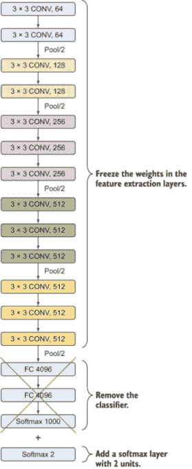

图 6.2 应用迁移学习到 VGG16 网络的示例。我们冻结了网络的特征提取部分并移除了分类器部分。然后我们添加了新的分类器 softmax 层，包含两个隐藏单元。

为了完全理解如何使用迁移学习，让我们在 Keras 中实现这个示例。（幸运的是，Keras 有一系列预训练网络，我们可以直接下载和使用：模型完整列表见[`keras.io/api/applications`](https://keras.io/api/applications/)。）以下是步骤：

1.  下载 VGG16 网络及其权重的开源代码来创建我们的基础模型，并从 VGG 网络中移除分类层（`FC_4096` > `FC_4096` > `Softmax_1000`）：

    ```
    from keras.applications.vgg16 import VGG16                     ❶

    base_model = VGG16(weights = "imagenet", include_top=False, 
                       input_shape = (224,224, 3))                 ❷
    base_model.summary()
    ```

    ❶ 从 Keras 导入 VGG16 模型

    ❷ 下载模型的预训练权重，并将它们保存在变量`base_model`中。我们指定 Keras 下载 ImageNet 权重。`include_top`设置为`False`以忽略模型顶部的全连接分类器部分。

1.  当你打印基础模型的摘要时，你会注意到我们下载了与第五章中实现的完全相同的 VGG16 架构。这是下载受你使用的深度学习库支持的流行网络的一种快速方法。或者，你也可以像我们在第五章中做的那样自己构建网络，并单独下载权重。我将在本章末尾的项目中向你展示如何操作。但就目前而言，让我们看看我们刚刚下载的`base_model`摘要：

    ```
    Layer (type)                 Output Shape              Param #   
    =================================================================
    input_1 (InputLayer)         (None, 224, 224, 3)       0         
    _________________________________________________________________
    block1_conv1 (Conv2D)        (None, 224, 224, 64)      1792      
    _________________________________________________________________
    block1_conv2 (Conv2D)        (None, 224, 224, 64)      36928     
    _________________________________________________________________
    block1_pool (MaxPooling2D)   (None, 112, 112, 64)      0         
    _________________________________________________________________
    block2_conv1 (Conv2D)        (None, 112, 112, 128)     73856     
    _________________________________________________________________
    block2_conv2 (Conv2D)        (None, 112, 112, 128)     147584    
    _________________________________________________________________
    block2_pool (MaxPooling2D)   (None, 56, 56, 128)       0         
    _________________________________________________________________
    block3_conv1 (Conv2D)        (None, 56, 56, 256)       295168    
    _________________________________________________________________
    block3_conv2 (Conv2D)        (None, 56, 56, 256)       590080    
    _________________________________________________________________
    block3_conv3 (Conv2D)        (None, 56, 56, 256)       590080    
    _________________________________________________________________
    block3_pool (MaxPooling2D)   (None, 28, 28, 256)       0         
    _________________________________________________________________
    block4_conv1 (Conv2D)        (None, 28, 28, 512)       1180160   
    _________________________________________________________________
    block4_conv2 (Conv2D)        (None, 28, 28, 512)       2359808   
    _________________________________________________________________
    block4_conv3 (Conv2D)        (None, 28, 28, 512)       2359808   
    _________________________________________________________________
    block4_pool (MaxPooling2D)   (None, 14, 14, 512)       0         
    _________________________________________________________________
    block5_conv1 (Conv2D)        (None, 14, 14, 512)       2359808   
    _________________________________________________________________
    block5_conv2 (Conv2D)        (None, 14, 14, 512)       2359808   
    _________________________________________________________________
    block5_conv3 (Conv2D)        (None, 14, 14, 512)       2359808   
    _________________________________________________________________
    block5_pool (MaxPooling2D)   (None, 7, 7, 512)         0         
    =================================================================
    Total params: 14,714,688
    Trainable params: 14,714,688
    Non-trainable params: 0
    _________________________________________________________________
    ```

    注意，这个下载的架构不包含网络顶部的分类器部分（三个全连接层），因为我们设置了`include_top`参数为`False`。更重要的是，注意摘要中可训练和非可训练参数的数量。下载的网络本身使所有网络参数可训练。正如你所见，我们的`base_model`有超过 1400 万个可训练参数。接下来，我们想要冻结所有下载的层并添加我们自己的分类器。

1.  冻结在 ImageNet 数据集上训练的特征提取层。冻结层意味着冻结它们的训练权重，以防止我们在运行训练时重新训练：

    ```
    for layer in base_model.layers:        ❶
        layer.trainable = False

    base_model.summary()
    ```

    ❶ 通过此代码遍历层并将它们锁定，使它们不可训练

    在此情况下省略模型摘要以节省空间，因为它与之前的一个类似。不同之处在于所有权重都已冻结，可训练参数现在等于零，所有冻结层的参数都是不可训练的：

    ```
    Total params: 14,714,688
    Trainable params: 0
    Non-trainable params: 14,714,688
    ```

1.  添加我们自己的分类密集层。在这里，我们将添加一个具有两个单元的 softmax 层，因为我们的问题中只有两个类别（见图 6.3）：

    ```
    from keras.layers import Dense, Flatten                       ❶
    from keras.models import Model

    last_layer = base_model.get_layer('block5_pool')             ❷
    last_output = last_layer.output                              ❸

    x = Flatten()(last_output)                                  ❹

    x = Dense(2, activation='softmax', name='softmax')(*x*)       ❺
    ```

    ❶ 导入 Keras 模块

    ❷ 使用 get_layer 方法保存网络的最后一层

    ❸ 将最后一层的输出保存为下一层的输入

    ❹ 将分类器输入（VGG16 模型的最后一层输出）展平

    ❺ 添加我们的新 softmax 层，包含两个隐藏单元

    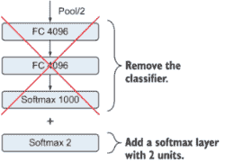

    图 6.3 移除网络的分类器部分，并添加一个具有两个隐藏节点的 softmax 层。

1.  构建一个`new_model`，它以基础模型的输入作为其输入，以最后一个 softmax 层的输出作为输出。新的模型由 VGGNet 中的所有特征提取层组成，并带有预训练的权重，再加上我们新的、未训练的 softmax 层。换句话说，当我们训练模型时，我们只会在本例中训练 softmax 层以检测我们新问题的特定特征（德国牧羊犬、比格犬、两者都不是）：

    ```
    new_model = Model(inputs=base_model.input, outputs=x)      ❶

    new_model.summary()                                        ❷
    _________________________________________________________________
    Layer (type)                 Output Shape              Param #   
    ===================================================
    input_1 (InputLayer)         (None, 224, 224, 3)       0         
    _________________________________________________________________
    block1_conv1 (Conv2D)        (None, 224, 224, 64)      1792      
    _________________________________________________________________
    block1_conv2 (Conv2D)        (None, 224, 224, 64)      36928     
    _________________________________________________________________
    block1_pool (MaxPooling2D)   (None, 112, 112, 64)      0         
    _________________________________________________________________
    block2_conv1 (Conv2D)        (None, 112, 112, 128)     73856     
    _________________________________________________________________
    block2_conv2 (Conv2D)        (None, 112, 112, 128)     147584    
    _________________________________________________________________
    block2_pool (MaxPooling2D)   (None, 56, 56, 128)       0         
    _________________________________________________________________
    block3_conv1 (Conv2D)        (None, 56, 56, 256)       295168    
    _________________________________________________________________
    block3_conv2 (Conv2D)        (None, 56, 56, 256)       590080    
    _________________________________________________________________
    block3_conv3 (Conv2D)        (None, 56, 56, 256)       590080    
    _________________________________________________________________
    block3_pool (MaxPooling2D)   (None, 28, 28, 256)       0         
    _________________________________________________________________
    block4_conv1 (Conv2D)        (None, 28, 28, 512)       1180160   
    _________________________________________________________________
    block4_conv2 (Conv2D)        (None, 28, 28, 512)       2359808   
    _________________________________________________________________
    block4_conv3 (Conv2D)        (None, 28, 28, 512)       2359808   
    _________________________________________________________________
    block4_pool (MaxPooling2D)   (None, 14, 14, 512)       0         
    _________________________________________________________________
    block5_conv1 (Conv2D)        (None, 14, 14, 512)       2359808   
    _________________________________________________________________
    block5_conv2 (Conv2D)        (None, 14, 14, 512)       2359808   
    _________________________________________________________________
    block5_conv3 (Conv2D)        (None, 14, 14, 512)       2359808   
    _________________________________________________________________
    block5_pool (MaxPooling2D)   (None, 7, 7, 512)         0         
    _________________________________________________________________
    flatten_layer (Flatten)      (None, 25088)             0         
    _________________________________________________________________
    softmax (Dense)              (None, 2)                 50178     
    ===================================================
    Total params: 14,789,955
    Trainable params: 50,178
    Non-trainable params: 14,714,688
    _________________________________________________________________
    ```

    ❶ 使用 Keras 的 Model 类实例化一个 new_model

    ❷ 打印 new_model 摘要

训练新的模型比从头开始训练网络快得多。为了验证这一点，看看这个模型中的可训练参数数量（约 50,000）与网络中不可训练参数数量（约 1400 万）的对比。这些“不可训练”的参数已经在大型数据集上进行了训练，并且我们冻结了它们以使用我们问题中提取的特征。使用这个新模型，我们不必从头开始训练整个 VGGNet，因为我们只需要处理新添加的 softmax 层。

此外，由于新模型在数百万张图像（ImageNet 数据集+我们的小型数据集）上进行了训练，我们通过迁移学习获得了更好的性能。这允许网络理解物体细微差别的更详细信息，从而使其在新、以前未见过的图像上更好地泛化。

注意，在本例中，我们只探讨了构建模型的部分，以展示迁移学习是如何被使用的。在本章的结尾，我将带您通过两个端到端项目来展示如何在您的数据集上训练新的网络。但现在，让我们看看迁移学习是如何工作的。

## 6.3 迁移学习是如何工作的

到目前为止，我们学习了迁移学习技术是什么以及它解决的主要问题。我们还看到了一个例子，说明如何将训练在 ImageNet 上的预训练网络的学习迁移到我们的特定任务。现在，让我们看看为什么迁移学习有效，真正从一个问题转移到另一个问题的内容是什么，以及一个在某个数据集上训练的网络如何在不同的、可能无关的数据集上表现良好。

以下快速问题是来自前几章的提醒，以帮助我们了解迁移学习中的核心内容：

1.  网络在训练过程中真正学习的是什么？简短的答案是：特征图。

1.  这些特征是如何学习的？在反向传播过程中，权重被更新，直到我们得到最小化误差函数的优化权重。

1.  特征和权重之间的关系是什么？特征图是在卷积过程中将权重滤波器应用于输入图像的结果（图 6.4）。

    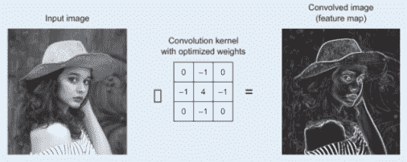

    图 6.4 通过将卷积核应用于输入图像生成特征图的示例

1.  从一个网络到另一个网络真正传递的是什么？为了传递特征，我们下载预训练网络的优化权重。然后，这些权重被用作训练过程的起点，并重新训练以适应新的问题。

好的，让我们深入了解，了解当我们说预训练网络时我们指的是什么。当我们训练卷积神经网络时，网络以特征图的形式从图像中提取特征：神经网络中每个层在应用权重滤波器后的输出。它们是训练集中存在的特征的表示。它们被称为特征图，因为它们映射了图像中某种特征的位置。CNNs 寻找直线、边缘甚至物体等特征。每当它们发现这些特征时，它们就会将它们报告给特征图。每个权重滤波器都在寻找不同的东西，这在特征图中得到反映：一个滤波器可能正在寻找直线，另一个可能寻找曲线，等等（图 6.5）。

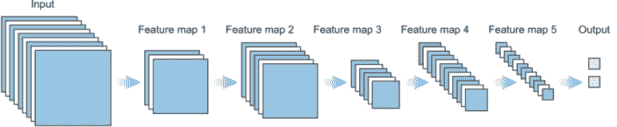

图 6.5 网络以特征图的形式从图像中提取特征。它们是在应用权重滤波器后，训练集中存在的特征的表示。

现在，回想一下，神经网络在正向传播和反向传播的训练周期中会迭代更新它们的权重。当我们经历一系列的训练迭代和超参数调整，直到网络产生令人满意的结果时，我们说网络已经被训练了。训练完成后，我们输出两个主要项目：网络架构和训练好的权重。因此，当我们说我们要使用一个预训练网络时，我们的意思是我们将下载网络架构以及权重。

在训练过程中，模型只学习存在于这个训练数据集中的特征。但是，当我们下载在大量数据集（如 ImageNet）上训练的大型模型（如 Inception）时，从这些大型数据集中已经提取的所有特征现在都可供我们使用。我发现这真的很令人兴奋，因为这些预训练模型已经发现了我们数据集中没有的其他特征，这将帮助我们构建更好的卷积网络。

在视觉问题中，神经网络需要学习大量的关于训练数据集的知识。有低级特征，如边缘、角、圆形形状、曲线形状和块状物；还有中级和高级特征，如眼睛、圆形、方形和轮子。图像中有许多 CNN 可以捕捉到的细节——但如果我们训练数据集中只有 1,000 张图像，甚至 25,000 张图像，这可能不足以让模型学习所有这些内容。通过使用预训练网络，我们基本上可以将所有这些知识下载到我们的神经网络中，给它一个巨大且更快的起点，并实现更高的性能水平。

### 6.3.1 神经网络是如何学习特征的？

神经网络通过逐步增加复杂度，一层层地在数据集中学习特征。这些被称为特征图。你越深入网络层，学习的图像特定特征就越多。在图 6.6 中，第一层检测低级特征，如边缘和曲线。第一层的输出成为第二层的输入，产生更高层次的半圆和方形等特征。下一层将前一层输出组装成熟悉物体的部分，随后的一层检测物体。随着我们通过更多层，网络产生一个表示更复杂特征的激活图。随着我们深入网络，过滤器开始对像素空间更大区域做出更敏感的反应。高级层放大对区分重要方面有重要作用的输入，并抑制无关的变异。

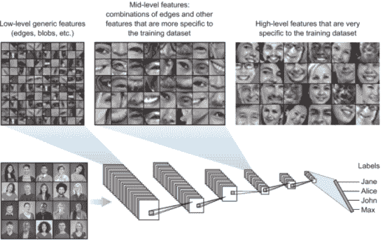

图 6.6 CNN 在网络的早期层检测低级通用特征的示例。你越深入网络层，学习的图像特定特征就越多。

考虑图 6.6 中的示例。假设我们正在构建一个检测人脸的模型。我们注意到网络在第一层学习了低级特征，如线条、边缘和块状物。这些低级特征似乎并不特定于某个数据集或任务；它们是通用的特征，适用于许多数据集和任务。中级层将这些线条组装起来，以便能够识别形状、角和圆。请注意，提取的特征开始变得更加具体于我们的任务（人脸）：中级特征包含形成人脸中眼睛和鼻子等物体的形状组合。随着我们深入网络，我们注意到特征最终从通用过渡到具体，并且到网络的最后一层，形成了非常具体于我们任务的顶级特征。我们开始看到区分不同人的面部特征。

现在，让我们以这个例子为例，比较从四个模型中提取的特征图，这些模型被训练来分类人脸、汽车、大象和椅子（见图 6.7）。注意，早期层的特征在所有模型中都非常相似。它们代表低级特征，如边缘、线条和块。这意味着在单一任务上训练的模型在网络的早期层中捕获了相似的数据类型关系，并且可以很容易地用于其他域的不同问题。我们越深入网络，特征就越具体，直到网络过度拟合其训练数据，使其更难泛化到不同的任务。较低级的特征几乎总是可以从一个任务迁移到另一个任务，因为它们包含通用的信息，如图像的结构和性质。将线条、点、曲线和物体的小部分信息迁移对于网络更快地学习以及在新任务上使用更少的数据是非常有价值的。

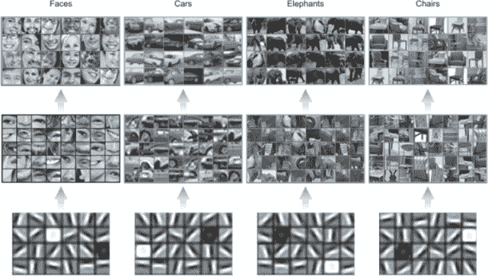

图 6.7 从四个模型中提取的特征图，这些模型被训练来分类人脸、汽车、大象和椅子

### 6.3.2 后层提取特征的可迁移性

在较深层提取的特征的可迁移性取决于原始数据集和新数据集的相似性。其理念是所有图像都必须有形状和边缘，因此早期层通常可以在不同域之间迁移。只有当我们开始提取更高级的特征时，我们才能识别物体之间的差异：比如，脸上的鼻子或汽车上的轮胎。只有在这种情况下，我们才能说，“好吧，这是一个人物，因为它有鼻子。这是汽车，因为它有轮胎。”基于源域和目标域的相似性，我们可以决定是否只从源域迁移低级特征，或者迁移高级特征，或者介于两者之间。这源于观察，随着我们讨论的下一段，网络的深层变得越来越具体于原始数据集中包含的类别的细节。

定义：源域是预训练网络所训练的原始数据集。目标域是我们希望训练网络的新数据集。

## 6.4 迁移学习方法

主要的迁移学习方法有三种：将预训练网络作为分类器、将预训练网络作为特征提取器以及微调。每种方法都可能有效，并且在开发和训练深度 CNN 模型时可以节省大量时间。可能不清楚哪种预训练模型的使用能在你的新计算机视觉任务上产生最佳结果，因此可能需要进行一些实验。在本节中，我们将解释这三种场景，并给出如何实现它们的示例。

### 6.4.1 使用预训练网络作为分类器

使用预训练网络作为分类器不需要冻结任何层或进行额外的模型训练。相反，我们只需取一个在类似问题上训练过的网络，并将其直接部署到我们的任务中。预训练模型直接用于对新图像进行分类，没有对其进行更改，也没有进行额外训练。我们所做的只是下载网络架构及其预训练权重，然后直接在我们的新数据上运行预测。在这种情况下，我们说我们新问题的领域与预训练网络训练的领域非常相似，并且它已经准备好部署。

在狗品种示例中，我们可以直接使用在 ImageNet 数据集上训练的 VGG16 网络来运行预测。ImageNet 已经包含了很多狗的图片，因此预训练网络的大部分表示能力可能被用于区分不同狗品种的特征。

让我们看看如何使用预训练网络作为分类器。在这个例子中，我们将使用在 ImageNet 数据集上预训练的 VGG16 网络来对图 6.8 中的德国牧羊犬图像进行分类。

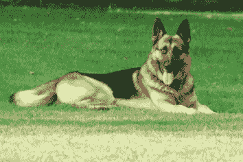

图 6.8 我们将用于运行预测的德国牧羊犬样本图像

步骤如下：

1.  导入必要的库：

    ```
    from keras.preprocessing.image import load_img
    from keras.preprocessing.image import img_to_array
    from keras.applications.vgg16 import preprocess_input
    from keras.applications.vgg16 import decode_predictions
    from keras.applications.vgg16 import VGG16
    ```

1.  下载 VGG16 的预训练模型及其 ImageNet 权重。我们将`include_top`设置为`True`，因为我们想使用整个网络作为分类器：

    ```
    model = VGG16(weights = "imagenet", include_top=True, input_shape = (224,224, 3))
    ```

1.  加载并预处理输入图像：

    ```
    image = load_img('path/to/image.jpg', target_size=(224, 224))              ❶

    image = img_to_array(image)                                                ❷

    image = image.reshape((1, image.shape[0], image.shape[1], image.shape[2])) ❸

    image = preprocess_input(image)                                            ❹
    ```

    ❶ 从文件中加载图像

    ❷ 将图像像素转换为 NumPy 数组

    ❸ 重新塑形数据以适应模型

    ❹ 准备图像以供 VGG 模型使用

1.  现在输入图像已经准备好供我们运行预测：

    ```
    yhat = model.predict(image)                         ❶

    label = decode_predictions(yhat)                    ❷

    label = label[0][0]                                 ❸

    print('%s (%.2f%%)' % (label[1], label[2]*100))     ❹
    ```

    ❶ 预测所有输出类别的概率

    ❷ 将概率转换为类别标签

    ❸ 获取概率最高的最可能结果

    ❹ 打印分类

当你运行此代码时，你将得到以下输出：

```
>> German_shepherd (99.72%)
```

你可以看到，该模型已经被训练来以高置信度分数（99.72%）预测正确的狗品种。这是因为 ImageNet 数据集包含超过 20,000 个标记的狗图片，分为 120 个类别。前往本书的网站，用你自己的图片亲自尝试代码：[www.manning.com/books/deep-learning-for-vision-systems](http://www.manning.com/books/deep-learning-for-vision-systems) 或 [www.computervisionbook.com](http://www.computervisionbook.com)。请随意探索 ImageNet 中可用的类别，并在你自己的图片上运行此实验。

### 6.4.2 使用预训练网络作为特征提取器

这种方法与我们本章早期实现的狗品种示例类似：我们从一个在 ImageNet 上预训练的 CNN 中提取，冻结其特征提取部分，移除分类器部分，并添加我们自己的新、密集分类器层。在图 6.9 中，我们使用预训练的 VGG16 网络，冻结所有 13 个卷积层的权重，并用一个新的分类器替换旧的分类器，以便从头开始训练。

当我们的新任务与预训练网络训练的原数据集相似时，我们通常采用这种场景。由于 ImageNet 数据集包含大量的狗和猫的示例，网络学习到的特征图包含许多适用于我们新任务的狗和猫特征。这意味着我们可以使用从 ImageNet 数据集中提取的高级特征来完成这项新任务。

要做到这一点，我们冻结预训练网络的所有层，并在新数据集上仅训练我们刚刚添加的分类器部分。这种方法被称为使用预训练网络作为特征提取器，因为我们冻结了特征提取器部分，以便将所有学习到的特征图转移到我们的新问题上。我们仅在预训练模型之上添加一个新的分类器，该分类器将从零开始训练，这样我们就可以重新利用之前学习到的特征图来处理我们的数据集。

我们移除了预训练网络的分类部分，因为它通常非常特定于原始分类任务，并且随后它对模型训练的类别集合也是特定的。例如，ImageNet 有 1,000 个类别。分类器部分已经被训练来过度拟合训练数据，将它们分类到 1,000 个类别中。但在我们的新问题中，比如猫与狗的区别，我们只有两个类别。因此，从头开始训练一个新的分类器来过度拟合这两个类别要有效得多。

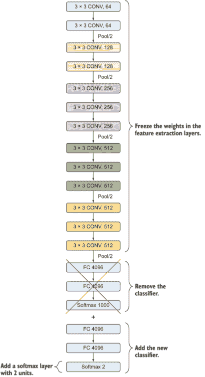

图 6.9 加载预训练的 VGG16 网络，移除分类器，并添加自己的分类器。

### 6.4.3 微调

到目前为止，我们已经看到了两种使用预训练网络进行迁移学习的基本方法：将预训练网络用作分类器或特征提取器。我们通常在目标域与源域相似时使用这些方法。但如果目标域与源域不同呢？如果它非常不同呢？我们还能使用迁移学习吗？是的。即使域非常不同，迁移学习仍然效果很好。我们只需要从源域提取正确的特征图，并微调它们以适应目标域。

在图 6.10 中，我们展示了从预训练网络中转移知识的不同方法。如果你下载整个网络且没有进行任何更改，只是运行预测，那么你是在使用该网络作为分类器。如果你只冻结卷积层，那么你是在使用预训练网络作为特征提取器，并将所有高级特征图转移到你的领域。微调的正式定义是冻结用于特征提取的一些网络层，并联合训练非冻结层和预训练模型中新添加的分类器层。它被称为微调，因为我们重新训练特征提取层时，我们微调高阶特征表示，使其对新任务数据集更加相关。

在更实际的层面上，如果我们冻结图 6.10 中的特征图 1 和 2，新的网络将使用特征图 2 作为其输入，并从这一点开始学习以适应后续层的特征到新的数据集。这节省了网络学习特征图 1 和 2 所需的时间。

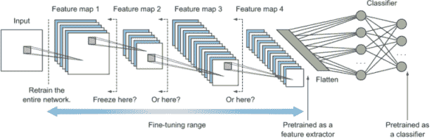

图 6.10 网络通过其层学习特征。在迁移学习中，我们决定冻结预训练网络中的特定层以保留学习到的特征。例如，如果我们冻结网络在层 3 的特征图上，我们保留了它在层 1、2 和 3 中学到的内容。

如我们之前讨论的，网络早期提取的特征图是通用的。随着我们深入网络，特征图变得越来越具体。这意味着图 6.10 中的特征图 4 对源领域非常具体。基于两个领域的相似性，我们可以决定在适当的特征图级别冻结网络：

+   如果领域相似，我们可能希望冻结网络直到最后一个特征图级别（例如，特征图 4）。

+   如果领域非常不同，我们可能决定在特征图 1 之后冻结预训练网络，并重新训练所有剩余的层。

在这两种可能性之间，有一系列我们可以应用的微调选项。我们可以重新训练整个网络，或者冻结预训练网络在特征图 1、2、3 或 4 的任何级别，并重新训练剩余的网络。我们通常通过试错来决定适当的微调级别。但有一些指导原则，我们可以遵循以直观地决定预训练网络的微调级别。这个决定是两个因素的结果：我们拥有的数据量以及源领域和目标领域之间的相似程度。我们将在第 6.5 节中解释这些因素和四种可能的场景，以选择适当的微调级别。

#### 为什么微调比从头开始训练更好？

当我们从零开始训练一个网络时，我们通常随机初始化权重并应用梯度下降优化器来找到最佳权重集，以优化我们的误差函数（如第二章所述）。由于这些权重从随机值开始，没有保证它们会以接近期望的最优值开始。如果初始化值远离最优值，优化器将需要很长时间才能收敛。这时微调可以非常有用。预训练网络的权重已经优化以从其数据集中学习。因此，当我们使用这个网络来解决问题时，我们以它结束时的权重值开始。所以，网络收敛得比如果它必须从随机初始化的权重从头开始训练要快得多。我们基本上是在微调已经优化的权重以适应我们的新问题，而不是用随机权重从头开始训练整个网络。即使我们决定重新训练整个预训练网络，从训练好的权重开始也会比从头开始用随机初始化的权重训练网络收敛得更快。

#### 微调时使用较小的学习率

与新数据集的类分数计算的新线性分类器（随机初始化）的权重相比，通常在微调时使用较小的学习率。这是因为我们预计卷积网络的权重相对较好，所以我们不希望太快太多地扭曲它们（尤其是在上面的新分类器从随机初始化中进行训练时）。

## 6.5 选择适当的迁移学习级别

回想一下，早期的卷积层提取的是通用特征，并且随着我们深入网络，它们对训练数据的特定性会越来越高。换句话说，我们可以从现有的预训练模型中选择特征提取的详细程度。例如，如果新的任务与预训练网络的源域（例如，不同于 ImageNet）相当不同，那么预训练模型在第一层之后的输出可能就合适了。如果新的任务与源域相似，那么可能可以使用模型中更深层的输出，甚至可以使用在 softmax 层之前的全连接层的输出。

如前所述，选择适当的迁移学习级别是两个重要因素的函数：

+   目标数据集的大小（小或大）--当我们有一个小数据集时，网络可能不会从训练更多层中学习到很多，因此它可能会过度拟合新数据。在这种情况下，我们可能希望进行较少的微调，并更多地依赖于源数据集。

+   源数据集和目标数据集的领域相似性——我们的新问题与原始数据集的领域相似到什么程度？例如，如果你的问题是分类汽车和船只，ImageNet 可能是一个不错的选择，因为它包含许多具有相似特征的图像。另一方面，如果你的问题是根据 X 射线图像对肺癌进行分类，这是一个完全不同的领域，可能需要大量的微调。

这两个因素导致了四种主要场景：

1.  目标数据集很小，并且与源数据集相似。

1.  目标数据集很大且与源数据集相似。

1.  目标数据集很小，并且与源数据集非常不同。

1.  目标数据集很大，并且与源数据集非常不同。

让我们逐一讨论这些场景，以了解导航我们选项的常见经验法则。

### 6.5.1 场景 1：目标数据集很小且与源数据集相似

由于原始数据集与我们的新数据集相似，我们可以预期预训练的卷积神经网络中的高级特征也与我们的数据集相关。因此，最好冻结网络的特征提取部分，只重新训练分类器。

另一个可能不是很好对网络进行微调的原因是我们的新数据集很小。如果我们在一个小数据集上微调特征提取层，这将迫使网络对我们的数据进行过度拟合。这并不好，因为根据定义，小数据集没有足够的信息来覆盖其对象的所有可能特征，这使得它无法泛化到新的、之前未见过的数据。因此，在这种情况下，我们进行的微调越多，网络就越容易过度拟合新数据。

例如，假设我们新数据集中的所有图像都包含在特定天气环境下的狗——例如雪。如果我们在这个数据集上微调，我们将迫使新的网络选择像雪和白色背景这样的特征作为狗的特定特征，并使其无法在其他天气条件下对狗进行分类。因此，一般经验法则是：如果你有少量数据，在微调预训练网络时要小心过度拟合。

### 6.5.2 场景 2：目标数据集很大且与源数据集相似

由于这两个领域相似，我们可以冻结特征提取部分并重新训练分类器，类似于我们在场景 1 中做的。但由于我们新领域中的数据更多，我们可以通过微调整个预训练网络或其部分来获得性能提升，并且更有信心不会过度拟合。由于高级特征相关（因为数据集相似），因此不需要通过整个网络进行微调。所以一个好的开始是冻结大约 60-80%的预训练网络，并在新数据上重新训练剩余的部分。

### 6.5.3 场景 3：目标数据集很小且与源数据集不同

由于数据集不同，可能最好不冻结预训练网络的更高层特征，因为它们包含更多数据集特定的特征。相反，从网络中较早的部分重新训练层会更好——或者不冻结任何层，对整个网络进行微调。然而，由于你的数据集较小，在整个数据集上微调整个网络可能不是一个好主意，因为这样做会使它容易过拟合。在这种情况下，一个折中的方案会更好。一个好的开始是冻结大约预训练网络的前三分之一或一半。毕竟，早期层包含非常通用的特征图，即使数据集非常不同，这些特征图对你的数据集也将是有用的。

### 6.5.4 场景 4：目标数据集很大且与源数据集不同

由于新数据集很大，你可能想从头开始训练整个网络，根本不使用迁移学习。然而，在实践中，正如我们之前讨论的那样，从预训练模型初始化权重通常仍然非常有益。这样做可以使模型更快收敛。在这种情况下，我们有一个大型的数据集，这使我们能够有信心在整个网络上进行微调，而不必担心过拟合。

### 6.5.5 迁移学习场景回顾

我们已经探讨了帮助我们定义使用哪种迁移学习方法的两个主要因素（我们数据的大小和源数据集与目标数据集之间的相似性）。这两个因素为我们提供了表 6.1 中定义的四个主要场景。图 6.11 总结了在每个场景中应使用适当微调级别的指南。

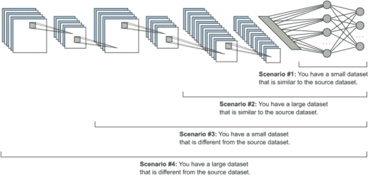

图 6.11 在四种场景中适当微调级别的指南

表 6.1 迁移学习场景

| 场景 | 目标数据集的大小 | 原始数据集和新数据集的相似性 | 方法 |
| --- | --- | --- | --- |
| 1 | 小 | 相似 | 使用预训练网络作为特征提取器 |
| 2 | 大 | 相似 | 在整个网络中进行微调 |
| 3 | 小 | 非常不同 | 从网络早期激活中进行微调 |
| 4 | 大 | 非常不同 | 在整个网络中进行微调 |

## 6.6 开源数据集

CV 研究社区在互联网上发布数据集方面做得相当不错。所以，当你听到像 ImageNet、MS COCO、Open Images、MNIST、CIFAR 等名字时，这些是人们已经发布到网上，并且许多计算机研究人员已经将它们用作基准来训练他们的算法并获得最先进结果的数据集。

在本节中，我们将回顾一些流行的开源数据集，以帮助您在寻找最适合您问题的数据集时提供指导。请注意，本章中列出的数据集是撰写时 CV 研究社区中最流行的数据集；我们并不打算提供所有开源数据集的完整列表。许多图像数据集可供使用，而且数量每天都在增长。在开始您的项目之前，我鼓励您进行自己的研究，以探索可用的数据集。

### 6.6.1 MNIST

MNIST ([`yann.lecun.com/exdb/mnist`](http://yann.lecun.com/exdb/mnist)) 代表修改后的国家标准与技术研究院。它包含从 0 到 9 的手写数字的标记图像。该数据集的目标是对手写数字进行分类。MNIST 在研究社区中因其作为分类算法的基准而被广泛使用。实际上，它被认为是图像数据集的“hello, world!”。但如今，MNIST 数据集相对比较简单，一个基本的卷积神经网络就能达到超过 99%的准确率，因此 MNIST 不再被视为 CNN 性能的基准。我们在第三章中实现了使用 MNIST 数据集的 CNN 分类项目；请随意回顾。

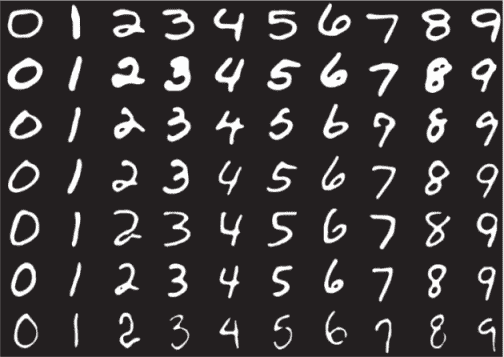

图 6.12 MNIST 数据集的样本

MNIST 包含 60,000 个训练图像和 10,000 个测试图像。所有图像都是灰度图（单通道），每个图像高 28 像素，宽 28 像素。图 6.12 展示了 MNIST 数据集的一些样本图像。

### 6.6.2 Fashion-MNIST

Fashion-MNIST 是为了取代原始的 MNIST 数据集而创建的，因为对于现代卷积神经网络来说，它已经变得过于简单。数据存储的格式与 MNIST 相同，但不是手写数字，而是包含 10 个时尚服装类别的 60,000 个训练图像和 10,000 个测试图像：T 恤/上衣、裤子、套头衫、连衣裙、外套、凉鞋、衬衫、运动鞋、包和踝靴。访问[`github.com/zalandoresearch/fashion-mnist`](https://github.com/zalandoresearch/fashion-mnist)以探索和下载数据集。图 6.13 展示了所代表类别的样本。

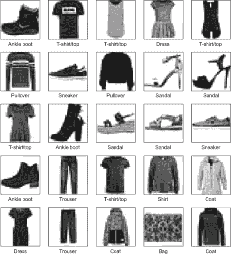

图 6.13 Fashion-MNIST 数据集的样本图像

### 6.6.3 CIFAR

CIFAR-10 ([www.cs.toronto.edu/~kriz/cifar.html](http://www.cs.toronto.edu/~kriz/cifar.html)) 被认为是 CV 和 ML 文献中图像分类的另一个基准数据集。与 MNIST 中的图像相比，CIFAR 图像更为复杂，因为 MNIST 图像都是灰度图，且物体居中，而 CIFAR 图像是彩色（三个通道）的，物体外观变化很大。CIFAR-10 数据集包含 10 个类别的 32×32 彩色图像，每个类别有 6,000 个图像。共有 50,000 个训练图像和 10,000 个测试图像。图 6.14 展示了数据集中的类别。

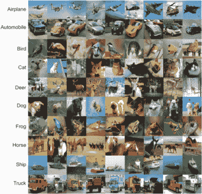

图 6.14 CIFAR-10 数据集的样本图像

CIFAR-100 是 CIFAR-10 的“大哥”：它包含 100 个类别，每个类别有 600 个图像。这 100 个类别被分为 20 个超级类别。每个图像都附有精细标签（它所属的类别）和粗略标签（它所属的超级类别）。

### 6.6.4 ImageNet

我们在之前的章节中多次讨论了 ImageNet 数据集，并在第五章和本章中广泛使用了它。但为了完整性，我们在这里也进行讨论。在撰写本文时，ImageNet 被认为是当前的基准，并被 CV 研究人员广泛用于评估他们的分类算法。

ImageNet 是一个大型视觉数据库，旨在用于视觉对象识别软件研究。它旨在根据一组定义的单词和短语将图像标记和分类到近 22,000 个类别中。这些图像是从网络收集的，并由人类通过亚马逊的 Mechanical Turk 众包工具进行标记。在撰写本文时，ImageNet 项目中已有超过 1400 万张图像。为了组织如此大量的数据，ImageNet 的创造者遵循了 WordNet 层次结构：WordNet 中的每个有意义的单词/短语被称为同义词集（简称 synset）。在 ImageNet 项目中，图像根据这些 synset 组织，目标是每个 synset 有 1,000+张图像。图 6.15 显示了由斯坦福大学汇编的 ImageNet 示例拼贴。


图 6.15 斯坦福大学汇编的 ImageNet 示例拼贴

当 CV 社区谈论 ImageNet 时，通常指的是 ImageNet 大规模视觉识别挑战（ILSVRC）。在这个挑战中，软件程序竞争正确分类和检测对象和场景。我们将使用 ILSVRC 挑战作为基准来比较不同网络的性能。

### 6.6.5 MS COCO

MS COCO ([`cocodataset.org`](http://cocodataset.org))代表 Microsoft Common Objects in Context。它是一个开源数据库，旨在使未来的研究能够进行对象检测、实例分割、图像标题和定位人体关键点。它包含 328,000 张图像。其中超过 200,000 张被标记，包括 1.5 百万个对象实例和 80 个对象类别，这些类别对于一个 4 岁的孩子来说很容易识别。数据集创造者的原始研究论文描述了该数据集的动机和内容。2 图 6.16 显示了 MS COCO 网站上提供的数据集样本。


图 6.16 MS COCO 数据集的样本（图片版权©2015，COCO 联盟，经 Creative Commons Attribution 4.0 许可使用。）

### 6.6.6 Google Open Images

Open Images ([`storage.googleapis.com/openimages/web/index.html`](https://storage.googleapis.com/openimages/web/index.html)) 是由谷歌创建的一个开源图像数据库。截至本文撰写时，它包含超过 900 万张图像。使其脱颖而出的原因是这些图像大多是复杂场景，跨越了成千上万的物体类别。此外，其中超过 200 万张图像被人工标注了边界框，使得 Open Images 成为迄今为止最大的具有物体位置标注的数据集（见图 6.17）。在这个图像子集中，有大约 1540 万个 600 个类别物体的边界框。类似于 ImageNet 和 ILSVRC，Open Images 有一个名为 Open Images Challenge ([`mng.bz/aRQz`](http://mng.bz/aRQz)) 的挑战。

### 6.6.7 Kaggle

除了本节中列出的数据集之外，Kaggle ([www.kaggle.com](http://www.kaggle.com)) 也是数据集的另一个优秀来源。Kaggle 是一个网站，它主办了机器学习和深度学习挑战，来自世界各地的人们可以参与并提交算法以供评估。

我们强烈建议你探索这些数据集，并寻找每天出现的许多其他开源数据集，以更好地理解它们支持的类别和使用案例。在本章的项目中，我们主要使用 ImageNet；在整个书中，我们将使用 MS COCO，尤其是在第七章。

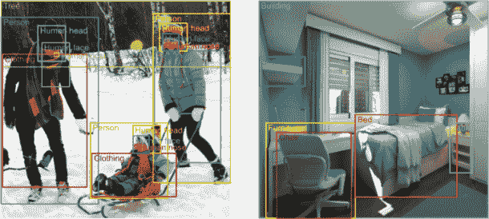

图 6.17 来自 Open Images 数据集的标注图像，摘自谷歌 AI 博客（Vittorio Ferrari，“Open Images 更新——现在包含边界框”，2017 年 7 月，[`mng.bz/yyVG`](http://mng.bz/yyVG))。

## 6.7 项目 1：作为特征提取器的预训练网络

在这个项目中，我们使用非常少量的数据来训练一个检测狗和猫图像的分类器。这是一个相当简单的项目，但这个练习的目标是了解如何在数据非常少且目标域与源域相似（场景 1）的情况下实现迁移学习。正如本章所解释的，在这种情况下，我们将使用预训练的卷积网络作为特征提取器。这意味着我们将冻结网络的特征提取部分，添加我们自己的分类器，然后在我们的新小型数据集上重新训练网络。

从这个项目中，另一个重要的收获是学习如何预处理自定义数据并将其准备好以训练你的神经网络。在以前的项目中，我们使用了 CIFAR 和 MNIST 数据集：它们已经被 Keras 预处理，所以我们只需要从 Keras 库中下载它们，并直接用于训练网络。本项目提供了一个教程，说明如何构建你的数据存储库并使用 Keras 库来准备你的数据。

访问书籍网站[www.manning.com/books/deep-learning-for-vision-systems](http://www.manning.com/books/deep-learning-for-vision-systems)或[www.computervisionbook.com](http://www.computervisionbook.com)下载用于此项目的代码笔记本和数据集。由于我们使用迁移学习，训练不需要高计算能力，因此你可以在个人电脑上运行这个笔记本；你不需要 GPU。

对于这个实现，我们将使用 VGG16。尽管它没有在 ILSVRC 中记录最低的错误率，但我发现它对这项任务效果很好，并且比其他模型训练得更快。我得到了大约 96%的准确率，但你完全可以自由地使用 GoogLeNet 或 ResNet 进行实验并比较结果。

使用预训练模型作为特征提取器的过程已经确立：

1.  导入必要的库。

1.  预处理数据，使其准备好用于神经网络。

1.  从在大数据集上训练的 VGG16 网络中加载预训练的权重。

1.  冻结卷积层（特征提取部分）中的所有权重。记住，要冻结的层会根据新任务与原始数据集的相似性进行调整。在我们的案例中，我们观察到 ImageNet 有很多狗和猫的图片，因此网络已经训练好了提取我们目标对象的详细特征。

1.  用自定义分类器替换网络的完全连接层。你可以添加你认为合适的完全连接层，每个层可以有任意数量的隐藏单元。对于像这样的简单问题，我们将只添加一个包含 64 个单元的隐藏层。你可以观察结果，如果模型欠拟合就调整，如果模型过拟合就下调。对于 softmax 层，单元的数量必须设置为类别数（在我们的案例中是两个单元）。

1.  编译网络，并在新的猫狗数据上运行训练过程以优化模型，使其适用于较小的数据集。

1.  评估模型。

现在，让我们逐步进行这些步骤并实现这个项目：

1.  导入必要的库：

    ```
    from keras.preprocessing.image import ImageDataGenerator
    from keras.preprocessing import image
    from keras.applications import imagenet_utils
    from keras.applications import vgg16
    from keras.applications import mobilenet
    from keras.optimizers import Adam, SGD
    from keras.metrics import categorical_crossentropy
    from keras.layers import Dense, Flatten, Dropout, BatchNormalization
    from keras.models import Model
    from sklearn.metrics import confusion_matrix
    import itertools
    import matplotlib.pyplot as plt
    %matplotlib inline
    ```

1.  预处理数据，使其准备好用于神经网络。Keras 有一个`ImageDataGenerator`类，允许我们轻松地即时执行图像增强；你可以在[`keras.io/api/preprocessing/image`](https://keras.io/api/preprocessing/image)上了解更多信息。在这个例子中，我们使用`ImageDataGenerator`生成我们的图像张量，但为了简单起见，我们不会实现图像增强。

    `ImageDataGenerator`类有一个名为`flow_from_directory()`的方法，用于从包含图像的文件夹中读取图像。此方法期望你的数据目录结构如图 6.18 所示。

    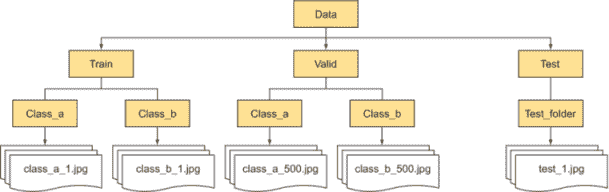

    图 6.18 使用 Keras 的`.flow_from_directory()`方法所需的目录结构

    我已经将数据结构在书的代码中，所以它已经准备好供你使用`flow_from_directory()`。现在，将数据加载到`train_path`、`valid_path`和`test_path`变量中，然后生成训练、验证和测试批次：

    ```
    train_path  = 'data/train'
    valid_path  = 'data/valid'
    test_path  = 'data/test'

    train_batches = ImageDataGenerator().flow_from_directory(train_path,          ❶
                                                             target_size=(224,224),
                                                             batch_size=10)

    valid_batches = ImageDataGenerator().flow_from_directory(valid_path,
                                                             target_size=(224,224),
                                                             batch_size=30)

    test_batches = ImageDataGenerator().flow_from_directory(test_path, 
                                                            target_size=(224,224),
                                                            batch_size=50,
                                                            shuffle=False)
    ```

    ❶ ImageDataGenerator 生成具有实时数据增强的批处理张量图像数据。数据将循环（以批处理形式）。在这个例子中，我们不会进行任何图像增强。

1.  从在大数据集上训练的 VGG16 网络中加载预训练的权重。类似于本章中的示例，我们从 Keras 下载 VGG16 网络，并在 ImageNet 数据集上预训练后下载其权重。请记住，我们想要从这个网络中移除分类器部分，因此我们将参数`include_top=False`设置为：

    ```
    base_model = vgg16.VGG16(weights = "imagenet", include_top=False, 
                             input_shape = (224,224, 3))
    ```

1.  冻结卷积层（特征提取部分）中的所有权重。我们冻结了之前步骤中创建的`base_model`中的卷积层，并将其用作特征提取器，然后在下一步中在其顶部添加分类器：

    ```
    for layer in base_model.layers:        ❶
        layer.trainable = False
    ```

    ❶ 通过此代码遍历层并将它们锁定，以使它们不可训练

1.  添加新的分类器，并构建新的模型。我们在基础模型之上添加了一些层。在这个例子中，我们添加了一个具有 64 个隐藏单元的全连接层和一个具有 2 个隐藏单元的 softmax 层。我们还添加了批归一化和 dropout 层以避免过拟合：

    ```
    last_layer = base_model.get_layer('block5_pool')         ❶
    last_output = last_layer.output

    x = Flatten()(last_output)                               ❷

    x = Dense(64, activation='relu', name='FC_2')(*x*)         ❸
    x = BatchNormalization()(*x*)                              ❸
    x = Dropout(0.5)(*x*)                                      ❸
    x = Dense(2, activation='softmax', name='softmax')(*x*)    ❸

    new_model = Model(inputs=base_model.input, outputs=x)    ❹
    new_model.summary()

    _________________________________________________________________
    Layer (type)                 Output Shape              Param #   
    =================================================================
    input_1 (InputLayer)         (None, 224, 224, 3)       0         
    _________________________________________________________________
    block1_conv1 (Conv2D)        (None, 224, 224, 64)      1792      
    _________________________________________________________________
    block1_conv2 (Conv2D)        (None, 224, 224, 64)      36928     
    _________________________________________________________________
    block1_pool (MaxPooling2D)   (None, 112, 112, 64)      0         
    _________________________________________________________________
    block2_conv1 (Conv2D)        (None, 112, 112, 128)     73856     
    _________________________________________________________________
    block2_conv2 (Conv2D)        (None, 112, 112, 128)     147584    
    _________________________________________________________________
    block2_pool (MaxPooling2D)   (None, 56, 56, 128)       0         
    _________________________________________________________________
    block3_conv1 (Conv2D)        (None, 56, 56, 256)       295168    
    _________________________________________________________________
    block3_conv2 (Conv2D)        (None, 56, 56, 256)       590080    
    _________________________________________________________________
    block3_conv3 (Conv2D)        (None, 56, 56, 256)       590080    
    _________________________________________________________________
    block3_pool (MaxPooling2D)   (None, 28, 28, 256)       0         
    _________________________________________________________________
    block4_conv1 (Conv2D)        (None, 28, 28, 512)       1180160   
    _________________________________________________________________
    block4_conv2 (Conv2D)        (None, 28, 28, 512)       2359808   
    _________________________________________________________________
    block4_conv3 (Conv2D)        (None, 28, 28, 512)       2359808   
    _________________________________________________________________
    block4_pool (MaxPooling2D)   (None, 14, 14, 512)       0         
    _________________________________________________________________
    block5_conv1 (Conv2D)        (None, 14, 14, 512)       2359808   
    _________________________________________________________________
    block5_conv2 (Conv2D)        (None, 14, 14, 512)       2359808   
    _________________________________________________________________
    block5_conv3 (Conv2D)        (None, 14, 14, 512)       2359808   
    _________________________________________________________________
    block5_pool (MaxPooling2D)   (None, 7, 7, 512)         0         
    _________________________________________________________________
    flatten_1 (Flatten)          (None, 25088)             0         
    _________________________________________________________________
    FC_2 (Dense)                 (None, 64)                1605696   
    _________________________________________________________________
    batch_normalization_1 (Batch (None, 64)                256       
    _________________________________________________________________
    dropout_1 (Dropout)          (None, 64)                0         
    _________________________________________________________________
    softmax (Dense)              (None, 2)                 130       
    =================================================================
    Total params: 16,320,770
    Trainable params: 1,605,954
    Non-trainable params: 14,714,816
    _________________________________________________________________
    ```

    ❶ 使用 get_layer 方法保存网络的最后一层。然后将最后一层的输出保存为下一层的输入。

    ❷ 将分类器输入（VGG16 模型的最后一层的输出）展平

    ❸ 添加一个具有 64 个单元和批归一化、dropout 和 softmax 层的全连接层

    ❹ 使用 Keras 的 Model 类实例化一个新模型

1.  编译模型并运行训练过程：

    ```
    new_model.compile(Adam(lr=0.0001), loss='categorical_crossentropy', 
                      metrics=['accuracy'])

    new_model.fit_generator(train_batches, steps_per_epoch=4,
                            validation_data=valid_batches, validation_steps=2,
                            epochs=20, verbose=2)
    ```

    当你运行前面的代码片段时，每个 epoch 之后都会打印出详细的训练信息，如下所示：

    ```
    Epoch 1/20
     - 28s - loss: 1.0070 - acc: 0.6083 - val_loss: 0.5944 - val_acc: 0.6833
    Epoch 2/20
     - 25s - loss: 0.4728 - acc: 0.7754 - val_loss: 0.3313 - val_acc: 0.8605
    Epoch 3/20
     - 30s - loss: 0.1177 - acc: 0.9750 - val_loss: 0.2449 - val_acc: 0.8167
    Epoch 4/20
     - 25s - loss: 0.1640 - acc: 0.9444 - val_loss: 0.3354 - val_acc: 0.8372
    Epoch 5/20
     - 29s - loss: 0.0545 - acc: 1.0000 - val_loss: 0.2392 - val_acc: 0.8333
    Epoch 6/20
     - 25s - loss: 0.0941 - acc: 0.9505 - val_loss: 0.2019 - val_acc: 0.9070
    Epoch 7/20
     - 28s - loss: 0.0269 - acc: 1.0000 - val_loss: 0.1707 - val_acc: 0.9000
    Epoch 8/20
     - 26s - loss: 0.0349 - acc: 0.9917 - val_loss: 0.2489 - val_acc: 0.8140
    Epoch 9/20
     - 28s - loss: 0.0435 - acc: 0.9891 - val_loss: 0.1634 - val_acc: 0.9000
    Epoch 10/20
     - 26s - loss: 0.0349 - acc: 0.9833 - val_loss: 0.2375 - val_acc: 0.8140
    Epoch 11/20
     - 28s - loss: 0.0288 - acc: 1.0000 - val_loss: 0.1859 - val_acc: 0.9000
    Epoch 12/20
     - 29s - loss: 0.0234 - acc: 0.9917 - val_loss: 0.1879 - val_acc: 0.8372
    Epoch 13/20
     - 32s - loss: 0.0241 - acc: 1.0000 - val_loss: 0.2513 - val_acc: 0.8500
    Epoch 14/20
     - 29s - loss: 0.0120 - acc: 1.0000 - val_loss: 0.0900 - val_acc: 0.9302
    Epoch 15/20
     - 36s - loss: 0.0189 - acc: 1.0000 - val_loss: 0.1888 - val_acc: 0.9000
    Epoch 16/20
     - 30s - loss: 0.0142 - acc: 1.0000 - val_loss: 0.1672 - val_acc: 0.8605
    Epoch 17/20
     - 29s - loss: 0.0160 - acc: 0.9917 - val_loss: 0.1752 - val_acc: 0.8667
    Epoch 18/20
     - 25s - loss: 0.0126 - acc: 1.0000 - val_loss: 0.1823 - val_acc: 0.9070
    Epoch 19/20
     - 29s - loss: 0.0165 - acc: 1.0000 - val_loss: 0.1789 - val_acc: 0.8833
    Epoch 20/20
     - 25s - loss: 0.0112 - acc: 1.0000 - val_loss: 0.1743 - val_acc: 0.8837
    ```

    注意，该模型使用常规 CPU 计算能力训练得非常快。每个 epoch 大约需要 25 到 29 秒，这意味着模型在 20 个 epoch 的训练中花费不到 10 分钟。

1.  评估模型。首先，让我们定义`load_dataset()`方法，我们将使用它将我们的数据集转换为张量：

    ```
    from sklearn.datasets import load_files
    from keras.utils import np_utils
    import numpy as np

    def load_dataset(path):
        data = load_files(path)
        paths = np.array(data['filenames'])
        targets = np_utils.to_categorical(np.array(data['target']))
        return paths, targets

    test_files, test_targets = load_dataset('small_data/test')
    ```

    然后，我们创建 test_tensors 以在它们上评估模型：

    ```
    from keras.preprocessing import image  
    from keras.applications.vgg16 import preprocess_input
    from tqdm import tqdm

    def path_to_tensor(img_path):
        img = image.load_img(img_path, target_size=(224, 224))     ❶
        *x* = image.img_to_array(img)                                ❷
        return np.expand_dims(x, axis=0)                           ❸

    def paths_to_tensor(img_paths):
        list_of_tensors = [path_to_tensor(img_path) for img_path in tqdm(img_paths)]
        return np.vstack(list_of_tensors)

    test_tensors = preprocess_input(paths_to_tensor(test_files))
    ```

    ❶ 以 PIL.Image.Image 类型加载 RGB 图像

    ❷ 将 PIL.Image.Image 类型转换为形状为(224, 224, 3)的 3D 张量

    ❸ 将 3D 张量转换为形状为(1, 224, 224, 3)的 4D 张量，并返回 4D 张量

    现在我们可以运行 Keras 的`evaluate()`方法来计算模型准确率：

    ```
    print('\nTesting loss: {:.4f}\nTesting accuracy: {:.4f}'.format(*new_model.evaluate(test_tensors, test_targets)))

    Testing loss: 0.1042
    Testing accuracy: 0.9579
    ```

该模型在不到 10 分钟的训练时间内达到了 95.79%的准确率。考虑到我们的数据集非常小，这是一个非常好的结果。

## 6.8 项目 2：微调

在这个项目中，我们将探讨本章前面讨论过的场景 3，其中目标数据集很小，并且与源数据集非常不同。这个项目的目标是构建一个能够区分 10 个类别的手势语言分类器：从 0 到 9 的手势语言数字。图 6.19 展示了我们数据集的一个样本。

以下是我们的数据集详细信息：

+   类别数量 = 10（数字 0，1，2，3，4，5，6，7，8 和 9）

+   图像大小 = 100 × 100

+   色彩空间 = RGB

+   训练集包含 1,712 个图像

+   验证集包含 300 个图像

+   测试集包含 50 个图像


图 6.19 标准手势数据集的一个样本

我们的数据集非常小这一点非常明显。如果你尝试在这个非常小的数据集上从头开始训练网络，你将不会取得好的结果。另一方面，尽管源域和目标域非常不同，我们仍然能够通过使用迁移学习达到超过 98%的准确率。

注意：请带着批判的眼光看待这次评估，因为网络还没有用大量数据彻底测试。在这个数据集中我们只有 50 个测试图像。尽管如此，预期迁移学习仍然能够取得良好的结果，但我还是想强调这一点。

访问本书的网站[www.manning.com/books/deep-learning-for-vision-systems](http://www.manning.com/books/deep-learning-for-vision-systems)或[www.computervisionbook.com](http://www.computervisionbook.com)以下载用于此项目的源代码笔记本和数据集。与项目 1 类似，训练不需要高计算能力，因此你可以在个人电脑上运行这个笔记本；你不需要 GPU。

为了方便与前面的项目进行比较，我们将使用在 ImageNet 数据集上训练的 VGG16 网络。微调预训练网络的步骤如下：

1.  导入必要的库。

1.  预处理数据以使其准备好供神经网络使用。

1.  从在大数据集（ImageNet）上训练的 VGG16 网络中加载预训练的权重。

1.  冻结特征提取器部分的一部分。

1.  添加新的分类器层。

1.  编译网络，并运行训练过程以优化模型以适应较小的数据集。

1.  评估模型。

现在我们来实现这个项目：

1.  导入必要的库：

    ```
    from keras.preprocessing.image import ImageDataGenerator
    from keras.preprocessing import image
    from keras.applications import imagenet_utils
    from keras.applications import vgg16
    from keras.optimizers import Adam, SGD
    from keras.metrics import categorical_crossentropy
    from keras.layers import Dense, Flatten, Dropout, BatchNormalization
    from keras.models import Model
    from sklearn.metrics import confusion_matrix
    import itertools
    import matplotlib.pyplot as plt
    %matplotlib inline
    ```

1.  预处理数据以使其准备好供神经网络使用。与项目 1 类似，我们使用 Keras 中的`ImageDataGenerator`类和`flow_from_directory()`方法来预处理我们的数据。数据已经为你结构化，可以直接创建张量：

    ```
    train_path  = 'dataset/train'
    valid_path  = 'dataset/valid'
    test_path  = 'dataset/test'

    train_batches = ImageDataGenerator().flow_from_directory(train_path,        ❶
                                                             target_size=(224,224),
                                                             batch_size=10)

    valid_batches = ImageDataGenerator().flow_from_directory(valid_path,
                                                             target_size=(224,224),
                                                             batch_size=30)

    test_batches = ImageDataGenerator().flow_from_directory(test_path, 
                                                            target_size=(224,224), 
                                                            batch_size=50, 
                                                            shuffle=False)

    Found 1712 images belonging to 10 classes.
    Found 300 images belonging to 10 classes.
    Found 50 images belonging to 10 classes.
    ```

    ❶ `ImageDataGenerator` 生成具有实时数据增强的批处理张量图像数据。数据将会循环（以批处理形式）。在这个例子中，我们不会进行任何图像增强。

1.  从在大型数据集（ImageNet）上训练的 VGG16 网络中加载预训练的权重。我们从 Keras 库中下载带有 ImageNet 权重的 VGG16 架构。注意，我们在这里使用参数`pooling='avg'`：这基本上意味着将对最后一个卷积层的输出应用全局平均池化，因此模型的输出将是一个 2D 张量。我们将其用作在添加全连接层之前`Flatten`层的替代方案：

    ```
    base_model = vgg16.VGG16(weights = "imagenet", include_top=False, 
                             input_shape = (224,224, 3), pooling='avg')
    ```

1.  冻结特征提取器部分的一些层，并在我们的新训练数据上微调其余部分。微调的程度通常是通过试错来确定的。VGG16 有 13 个卷积层：你可以冻结所有层，也可以根据你的数据与源数据的相似程度冻结其中一些层。在手语案例中，新领域与我们的领域非常不同，因此我们将从仅微调最后五层开始；如果我们没有得到令人满意的结果，我们可以进一步微调。结果是我们训练了新模型后，达到了 98%的准确率，所以这是一个很好的微调水平。但在其他情况下，如果你发现你的网络没有收敛，尝试微调更多层。

    ```
    for layer in base_model.layers[:-5]:            ❶
        layer.trainable = False

    base_model.summary()
    _________________________________________________________________
    Layer (type)                 Output Shape              Param #   
    =================================================================
    input_1 (InputLayer)         (None, 224, 224, 3)       0         
    _________________________________________________________________
    block1_conv1 (Conv2D)        (None, 224, 224, 64)      1792      
    _________________________________________________________________
    block1_conv2 (Conv2D)        (None, 224, 224, 64)      36928     
    _________________________________________________________________
    block1_pool (MaxPooling2D)   (None, 112, 112, 64)      0         
    _________________________________________________________________
    block2_conv1 (Conv2D)        (None, 112, 112, 128)     73856     
    _________________________________________________________________
    block2_conv2 (Conv2D)        (None, 112, 112, 128)     147584    
    _________________________________________________________________
    block2_pool (MaxPooling2D)   (None, 56, 56, 128)       0         
    _________________________________________________________________
    block3_conv1 (Conv2D)        (None, 56, 56, 256)       295168    
    _________________________________________________________________
    block3_conv2 (Conv2D)        (None, 56, 56, 256)       590080    
    _________________________________________________________________
    block3_conv3 (Conv2D)        (None, 56, 56, 256)       590080    
    _________________________________________________________________
    block3_pool (MaxPooling2D)   (None, 28, 28, 256)       0         
    _________________________________________________________________
    block4_conv1 (Conv2D)        (None, 28, 28, 512)       1180160   
    _________________________________________________________________
    block4_conv2 (Conv2D)        (None, 28, 28, 512)       2359808   
    _________________________________________________________________
    block4_conv3 (Conv2D)        (None, 28, 28, 512)       2359808   
    _________________________________________________________________
    block4_pool (MaxPooling2D)   (None, 14, 14, 512)       0         
    _________________________________________________________________
    block5_conv1 (Conv2D)        (None, 14, 14, 512)       2359808   
    _________________________________________________________________
    block5_conv2 (Conv2D)        (None, 14, 14, 512)       2359808   
    _________________________________________________________________
    block5_conv3 (Conv2D)        (None, 14, 14, 512)       2359808   
    _________________________________________________________________
    block5_pool (MaxPooling2D)   (None, 7, 7, 512)         0         
    _________________________________________________________________
    global_average_pooling2d_1 ( (None, 512)               0         
    =================================================================
    Total params: 14,714,688
    Trainable params: 7,079,424
    Non-trainable params: 7,635,264
    _________________________________________________________________
    ```

    ❶ 遍历层并锁定它们，除了最后五层

1.  添加新的分类器层，并构建新的模型：

    ```
    last_output = base_model.output                                      ❶

    x = Dense(10, activation='softmax', name='softmax')(last_output)     ❷

    new_model = Model(inputs=base_model.input, outputs=x)                ❸

    new_model.summary()                                                  ❹

    Layer (type)                 Output Shape              Param #   
    =================================================================
    input_1 (InputLayer)         (None, 224, 224, 3)       0         
    _________________________________________________________________
    block1_conv1 (Conv2D)        (None, 224, 224, 64)      1792      
    _________________________________________________________________
    block1_conv2 (Conv2D)        (None, 224, 224, 64)      36928     
    _________________________________________________________________
    block1_pool (MaxPooling2D)   (None, 112, 112, 64)      0         
    _________________________________________________________________
    block2_conv1 (Conv2D)        (None, 112, 112, 128)     73856     
    _________________________________________________________________
    block2_conv2 (Conv2D)        (None, 112, 112, 128)     147584    
    _________________________________________________________________
    block2_pool (MaxPooling2D)   (None, 56, 56, 128)       0         
    _________________________________________________________________
    block3_conv1 (Conv2D)        (None, 56, 56, 256)       295168    
    _________________________________________________________________
    block3_conv2 (Conv2D)        (None, 56, 56, 256)       590080    
    _________________________________________________________________
    block3_conv3 (Conv2D)        (None, 56, 56, 256)       590080    
    _________________________________________________________________
    block3_pool (MaxPooling2D)   (None, 28, 28, 256)       0         
    _________________________________________________________________
    block4_conv1 (Conv2D)        (None, 28, 28, 512)       1180160   
    _________________________________________________________________
    block4_conv2 (Conv2D)        (None, 28, 28, 512)       2359808   
    _________________________________________________________________
    block4_conv3 (Conv2D)        (None, 28, 28, 512)       2359808   
    _________________________________________________________________
    block4_pool (MaxPooling2D)   (None, 14, 14, 512)       0         
    _________________________________________________________________
    block5_conv1 (Conv2D)        (None, 14, 14, 512)       2359808   
    _________________________________________________________________
    block5_conv2 (Conv2D)        (None, 14, 14, 512)       2359808   
    _________________________________________________________________
    block5_conv3 (Conv2D)        (None, 14, 14, 512)       2359808   
    _________________________________________________________________
    block5_pool (MaxPooling2D)   (None, 7, 7, 512)         0         
    _________________________________________________________________
    global_average_pooling2d_1 ( (None, 512)               0         
    _________________________________________________________________
    softmax (Dense)              (None, 10)                5130      
    =================================================================
    Total params: 14,719,818
    Trainable params: 7,084,554
    Non-trainable params: 7,635,264
    ```

    ❶ 将 base_model 的输出保存为下一层的输入

    ❷ 添加我们的新 softmax 层，包含 10 个隐藏单元

    ❸ 使用 Keras 的 Model 类实例化一个新模型

    ❹ 打印新模型的摘要

1.  编译网络，并运行训练过程以优化模型以适应较小的数据集：

    ```
    new_model.compile(Adam(lr=0.0001), loss='categorical_crossentropy', 
                      metrics=['accuracy'])

    from keras.callbacks import ModelCheckpoint

    checkpointer = ModelCheckpoint(filepath='signlanguage.model.hdf5', 
                                   save_best_only=True)

    history = new_model.fit_generator(train_batches, steps_per_epoch=18,
                       validation_data=valid_batches, validation_steps=3, 
                       epochs=20, verbose=1, callbacks=[checkpointer])

    Epoch 1/150
    18/18 [==============================] - 40s 2s/step - loss: 3.2263 - acc: 0.1833 - val_loss: 2.0674 - val_acc: 0.1667
    Epoch 2/150
    18/18 [==============================] - 41s 2s/step - loss: 2.0311 - acc: 0.1833 - val_loss: 1.7330 - val_acc: 0.3000
    Epoch 3/150
    18/18 [==============================] - 42s 2s/step - loss: 1.5741 - acc: 0.4500 - val_loss: 1.5577 - val_acc: 0.4000
    Epoch 4/150
    18/18 [==============================] - 42s 2s/step - loss: 1.3068 - acc: 0.5111 - val_loss: 0.9856 - val_acc: 0.7333
    Epoch 5/150
    18/18 [==============================] - 43s 2s/step - loss: 1.1563 - acc: 0.6389 - val_loss: 0.7637 - val_acc: 0.7333
    Epoch 6/150
    18/18 [==============================] - 41s 2s/step - loss: 0.8414 - acc: 0.6722 - val_loss: 0.7550 - val_acc: 0.8000
    Epoch 7/150
    18/18 [==============================] - 41s 2s/step - loss: 0.5982 - acc: 0.8444 - val_loss: 0.7910 - val_acc: 0.6667
    Epoch 8/150
    18/18 [==============================] - 41s 2s/step - loss: 0.3804 - acc: 0.8722 - val_loss: 0.7376 - val_acc: 0.8667
    Epoch 9/150
    18/18 [==============================] - 41s 2s/step - loss: 0.5048 - acc: 0.8222 - val_loss: 0.2677 - val_acc: 0.9000
    Epoch 10/150
    18/18 [==============================] - 39s 2s/step - loss: 0.2383 - acc: 0.9276 - val_loss: 0.2844 - val_acc: 0.9000
    Epoch 11/150
    18/18 [==============================] - 41s 2s/step - loss: 0.1163 - acc: 0.9778 - val_loss: 0.0775 - val_acc: 1.0000
    Epoch 12/150
    18/18 [==============================] - 41s 2s/step - loss: 0.1377 - acc: 0.9667 - val_loss: 0.5140 - val_acc: 0.9333
    Epoch 13/150
    18/18 [==============================] - 41s 2s/step - loss: 0.0955 - acc: 0.9556 - val_loss: 0.1783 - val_acc: 0.9333
    Epoch 14/150
    18/18 [==============================] - 41s 2s/step - loss: 0.1785 - acc: 0.9611 - val_loss: 0.0704 - val_acc: 0.9333
    Epoch 15/150
    18/18 [==============================] - 41s 2s/step - loss: 0.0533 - acc: 0.9778 - val_loss: 0.4692 - val_acc: 0.8667
    Epoch 16/150
    18/18 [==============================] - 41s 2s/step - loss: 0.0809 - acc: 0.9778 - val_loss: 0.0447 - val_acc: 1.0000
    Epoch 17/150
    18/18 [==============================] - 41s 2s/step - loss: 0.0834 - acc: 0.9722 - val_loss: 0.0284 - val_acc: 1.0000
    Epoch 18/150
    18/18 [==============================] - 41s 2s/step - loss: 0.1022 - acc: 0.9611 - val_loss: 0.0177 - val_acc: 1.0000
    Epoch 19/150
    18/18 [==============================] - 41s 2s/step - loss: 0.1134 - acc: 0.9667 - val_loss: 0.0595 - val_acc: 1.0000
    Epoch 20/150
    18/18 [==============================] - 39s 2s/step - loss: 0.0676 - acc: 0.9777 - val_loss: 0.0862 - val_acc: 0.9667
    ```

    注意从详细输出中查看每个 epoch 的训练时间。该模型使用常规 CPU 计算能力训练得非常快。每个 epoch 大约需要 40 秒，这意味着模型在 15 分钟内训练了 20 个 epoch。

1.  评估模型的准确率。与之前的项目类似，我们创建了一个`load_dataset()`方法来创建`test_targets`和`test_tensors`，然后使用 Keras 的`evaluate()`方法在测试图像上运行推理并获取模型准确率：

    ```
    print('\nTesting loss: {:.4f}\nTesting accuracy: {:.4f}'.format(*new_model.evaluate(test_tensors, test_targets)))

    Testing loss: 0.0574
    Testing accuracy: 0.9800
    ```

    评估模型更深层次的方法是创建一个混淆矩阵。我们在第四章中解释了混淆矩阵：它是一个常用来描述分类模型性能的表格，以提供对模型在测试数据集上表现更深入的理解。有关不同模型评估指标的具体细节，请参阅第四章。现在，让我们为我们的模型构建一个混淆矩阵（见图 6.20）：

    ```
    from sklearn.metrics import confusion_matrix
    import numpy as np

    cm_labels = ['0','1','2','3','4','5','6','7','8','9']

    cm = confusion_matrix(np.argmax(test_targets, axis=1),
                          np.argmax(new_model.predict(test_tensors), axis=1))
    plt.imshow(cm, cmap=plt.cm.Blues)
    plt.colorbar()
    indexes = np.arange(len(cm_labels))
    for i in indexes:
        for j in indexes:
            plt.text(j, i, cm[i, j])
    plt.xticks(indexes, cm_labels, rotation=90)
    plt.xlabel('Predicted label')
    plt.yticks(indexes, cm_labels)
    plt.ylabel('True label')
    plt.title('Confusion matrix')
    plt.show()
    ```

    要阅读这个混淆矩阵，请查看预测标签轴上的数字，并检查它是否在真实标签轴上正确分类。例如，查看预测标签轴上的数字 0：所有五张图片都被分类为 0，没有图片被错误地分类为其他任何数字。同样，查看预测标签轴上的其余数字。你会注意到，模型成功地对所有测试图像进行了正确预测，除了真实标签为 8 的图像。在这种情况下，模型错误地将数字 8 的图像分类为数字 7。

## 摘要

+   迁移学习通常是在开始分类和目标检测项目时首选的方法，尤其是在你没有大量训练数据时。

+   迁移学习将源数据集学习到的知识迁移到目标数据集，以节省训练时间和计算成本。

+   神经网络逐步以递增的复杂度层次学习数据集中的特征。你越深入网络层，学习的特征就越具有图像特异性。

+   网络的早期层学习低级特征，如线条、块和边缘。第一层的输出成为第二层的输入，产生更高级的特征。下一层将前一层输出组装成熟悉物体的部分，后续层检测物体。

+   迁移学习的主要方法有：使用预训练网络作为分类器、使用预训练网络作为特征提取器以及微调。

+   使用预训练网络作为分类器意味着直接使用网络对新图像进行分类，而不冻结层或应用模型训练。

+   使用预训练网络作为特征提取器意味着冻结网络的分类器部分，并重新训练新的分类器。

+   微调意味着冻结用于特征提取的一些网络层，并联合训练非冻结层和预训练模型中新添加的分类器层。

    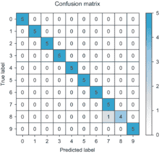

    图 6.20 手语分类器的混淆矩阵

+   一个网络到另一个网络的特征可迁移性是目标数据大小和源数据与目标数据域相似性的函数。

+   通常，微调参数使用较小的学习率，而从头开始训练输出层可以使用较大的学习率。

* * *

1.Jason Yosinski, Jeff Clune, Yoshua Bengio, 和 Hod Lipson, “How Transferable Are Features in Deep Neural Networks?” Advances in Neural Information Processing Systems 27 (Dec. 2014): 3320-3328, [`arxiv.org/abs/1411.1792`](https://arxiv.org/abs/1411.1792).

2. Tsung-Yi Lin, Michael Maire, Serge Belongie, 等，“Microsoft COCO: Common Objects in Context” (February 2015), [`arxiv.org/pdf/1405.0312.pdf`](https://arxiv.org/pdf/1405.0312.pdf).
