# 7 使用 R-CNN、SSD 和 YOLO 进行目标检测

本章涵盖

+   理解图像分类与目标检测

+   理解目标检测项目的一般框架

+   使用 R-CNN、SSD 和 YOLO 等目标检测算法

在前几章中，我们解释了如何使用深度神经网络进行图像分类任务。在图像分类中，我们假设图像中只有一个主要的目标对象，模型的主要焦点是识别目标类别。然而，在许多情况下，我们对图像中的多个目标感兴趣。我们不仅想要对它们进行分类，还想要获取它们在图像中的具体位置。在计算机视觉中，我们将此类任务称为目标检测。图 7.1 解释了图像分类和目标检测任务之间的区别。

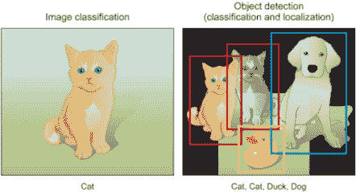

图 7.1 图像分类与目标检测任务。在分类任务中，分类器输出类别概率（猫），而在目标检测任务中，检测器输出定位检测到的对象的边界框坐标（本例中的四个框）及其预测类别（两只猫、一只鸭和一只狗）。

目标检测是一个涉及两个主要任务的计算机视觉任务：在图像中定位一个或多个对象，并对图像中的每个对象进行分类（见表 7.1）。这是通过在识别的对象周围绘制一个包含其预测类别的边界框来完成的。这意味着系统不仅预测图像的类别，就像在图像分类任务中那样；它还预测适合检测到的对象的边界框坐标。这是一个具有挑战性的计算机视觉任务，因为它需要成功的目标定位，以便在图像中定位并绘制每个对象的边界框，以及目标分类来预测定位到的对象的正确类别。

表 7.1 图像分类与目标检测

| 图像分类 | 目标检测 |
| --- | --- |

| 目标是预测图像中对象的类型或类别。

+   输入：包含单个对象的图像

+   输出：类别标签（猫、狗等）

+   示例输出：类别概率（例如，84%猫）

| 目标是通过边界框预测图像中对象的位置，并预测定位到的对象的类别。|

+   输入：包含一个或多个对象的图像

+   输出：一个或多个边界框（由坐标定义）以及每个边界框的类别标签

+   包含两个对象的图像的示例输出：

    +   box1 坐标（*x, y, w, h*）和类别概率

    +   box2 坐标和类别概率

注意，图像坐标（*x, y, w, h*）如下：（*x* 和 *y*）是边界框中心点的坐标，而（*w* 和 *h*）是框的宽度和高度。|

|  |
|  |
|  |
|  |

目标检测在许多领域中得到广泛应用。例如，在自动驾驶技术中，我们需要通过识别捕获的视频图像中车辆、行人、道路和障碍物的位置来规划路线。机器人通常执行此类任务以检测感兴趣的目标。安全领域的系统需要检测异常目标，如入侵者或炸弹。

本章的结构如下：

1.  我们将探讨目标检测算法的通用框架。

1.  我们将深入研究三种最受欢迎的检测算法：R-CNN 系列网络、SSD 和 YOLO 系列网络。

1.  我们将利用在现实世界项目中学到的知识来训练一个端到端的目标检测器。

到本章结束时，我们将了解深度学习在目标检测中的应用，以及不同的目标检测模型如何相互启发和分化。让我们开始吧！

## 7.1 通用目标检测框架

在我们深入探讨 R-CNN、SSD 和 YOLO 等目标检测系统之前，让我们先讨论这些系统的通用框架，以便理解基于深度学习（DL）的系统在检测对象时遵循的高级工作流程以及它们用于评估检测性能的指标。目前不必担心目标检测器的代码实现细节。本节的目标是向您概述不同的目标检测系统如何处理这一任务，并介绍一种新的思考方式以及一系列新概念，以便您能够理解我们在第 7.2 节、第 7.3 节和第 7.4 节中将要解释的深度学习架构。

通常，一个目标检测框架包含四个组件：

1.  区域提议——使用算法或深度学习模型生成感兴趣区域（RoIs），以便系统进一步处理。这些是网络认为可能包含对象的区域；输出是大量边界框，每个边界框都有一个对象性分数。具有高对象性分数的边界框随后被传递到网络层进行进一步处理。

1.  特征提取和网络预测——为每个边界框提取视觉特征。根据视觉特征（例如，一个对象分类组件）评估这些特征，并确定在提议中是否存在以及哪些对象存在。

1.  非极大值抑制（NMS）——在这个步骤中，模型可能已经找到了同一对象的多个边界框。NMS 通过将重叠的边界框合并为每个对象的单个边界框来帮助避免对同一实例的重复检测。

1.  评估指标——类似于图像分类任务中的准确率、精确率和召回率指标（见第四章），目标检测系统有自己的指标来评估它们的检测性能。在本节中，我们将解释最流行的指标，如平均精度均值（mAP）、精确率-召回率曲线（PR 曲线）和交并比（IoU）。

现在，让我们深入一层，了解这些组件的目标，以建立对这些组件的直观认识。

### 7.1.1 区域提议

在这一步，系统查看图像并提议进行进一步分析的 RoIs（感兴趣区域）。RoIs 是系统认为有很高可能性包含对象的区域，称为对象性分数（图 7.2）。具有高对象性分数的区域将传递到下一步；分数低的区域将被放弃。

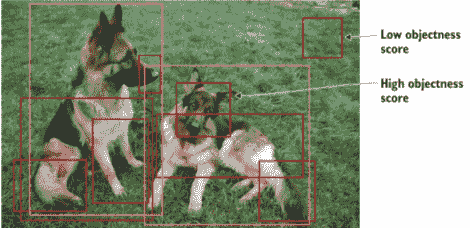

图 7.2 系统提出的感兴趣区域（RoIs）。具有高对象性分数的区域代表有很高可能性包含对象（前景），而具有低对象性分数的区域被忽略，因为它们有很低的可能性包含对象（背景）。

生成区域提议有几种方法。最初，选择性搜索算法被用来生成对象提议；当我们讨论 R-CNN 网络时，我们将更详细地介绍这个算法。其他方法使用从图像中提取的更复杂的视觉特征，这些特征由深度神经网络生成区域（例如，基于深度学习模型的特征）。

我们将更详细地讨论不同的目标检测系统如何处理这个任务。需要注意的是，这一步产生了大量（数千个）边界框，这些边界框将由网络进一步分析和分类。在这一步中，网络分析图像中的这些区域，并根据其对象性分数将每个区域分类为前景（对象）或背景（无对象）。如果对象性分数高于某个阈值，则该区域被认为是前景，并在网络中推进。请注意，这个阈值可以根据你的问题进行配置。如果阈值太低，你的网络将生成所有可能的提议，你将有更好的机会检测到图像中的所有对象。另一方面，这非常计算密集，会减慢检测速度。因此，生成区域提议的权衡是区域数量与计算复杂度——正确的做法是使用特定于问题的信息来减少 RoIs 的数量。

### 7.1.2 网络预测

该组件包括用于特征提取的预训练 CNN 网络，从输入图像中提取具有代表性的特征，并使用这些特征来确定图像的类别。在目标检测框架中，人们通常使用预训练的图像分类模型来提取视觉特征，因为这些模型通常具有很好的泛化能力。例如，在 MS COCO 或 ImageNet 数据集上训练的模型能够提取相当通用的特征。

在这一步，网络分析所有被识别为有很高可能性包含对象的区域，并对每个区域做出两个预测：

+   边界框预测--定位围绕对象的框的坐标。边界框坐标表示为元组(*x, y, w, h*)，其中*x*和*y*是边界框中心点的坐标，w 和 h 是框的宽度和高度。

+   类别预测：预测每个对象类别概率的经典 softmax 函数。

由于提出了数千个区域，每个对象周围都会有多个边界框，这些边界框具有正确的分类。例如，看看图 7.3 中的狗的图像。网络显然能够找到对象（狗）并成功对其进行分类。但是检测总共触发了五次，因为狗出现在之前步骤中产生的五个 RoIs 中：因此图中的狗周围有五个边界框。尽管检测器能够成功地在图像中定位狗并正确分类它，但这并不是我们需要的。对于大多数问题，我们只需要每个对象一个边界框。在某些问题中，我们只想得到最适合对象的那个框。如果我们正在构建一个用于在图像中计数狗的系统呢？我们当前的系统将计数五只狗。我们不想这样。这就是非极大值抑制技术派上用场的时候了。

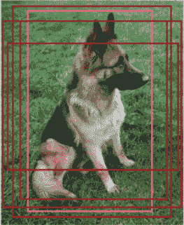

图 7.3 边界框检测器对一个对象产生多个边界框。我们希望将这些框合并成一个最适合对象的边界框。

### 7.1.3 非极大值抑制（NMS）

如图 7.4 所示，对象检测算法的一个问题是它可能会找到同一对象的多个检测。因此，它不是只围绕对象创建一个边界框，而是为同一对象绘制多个框。NMS 是一种确保检测算法只检测每个对象一次的技术。正如其名所示，NMS 检查围绕一个对象的全部框，以找到具有最大预测概率的框，并抑制或消除其他框（因此得名）。

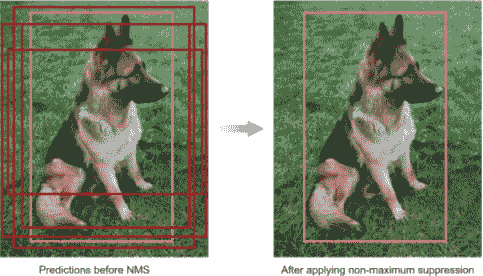

图 7.4 对于同一个对象提出了多个区域。经过 NMS 处理后，只剩下最适合对象的框；其余的都被忽略，因为它们与选定的框有较大的重叠。

NMS 的一般思想是将候选框的数量减少到每个对象只有一个边界框。例如，如果帧中的对象相当大，并且已经生成了超过 2,000 个对象提议，那么其中一些很可能彼此之间有显著的重叠，并且与对象本身重叠。

让我们看看 NMS 算法的工作步骤：

1.  抛弃所有预测值低于某个特定阈值（称为置信度阈值）的边界框。这个阈值是可调整的，这意味着如果预测概率低于设定的阈值，则该框将被抑制。

1.  查看所有剩余的框，并选择概率最高的边界框。

1.  计算具有相同类别预测的剩余框的重叠。具有高度重叠并预测相同类别的边界框被平均在一起。这个重叠指标称为交并比（IoU）。IoU 将在下一节中详细解释。

1.  抑制任何 IoU 值小于某个特定阈值（称为 NMS 阈值）的框。通常 NMS 阈值等于 0.5，但如果你想输出更少或更多的边界框，它也是可调整的。

NMS 技术通常在不同检测框架中是标准的，但它是一个重要的步骤，可能需要根据场景调整超参数，如置信度阈值和 NMS 阈值。

### 7.1.4 对象检测器评估指标

当评估对象检测器的性能时，我们使用两个主要的评估指标：每秒帧数和平均精度均值。

#### 每秒帧数（FPS）用于衡量检测速度

用于衡量检测速度的最常用指标是每秒帧数（FPS）。例如，Faster R-CNN 以仅 7 FPS 的速度运行，而 SSD 以 59 FPS 的速度运行。在基准测试实验中，你将看到论文的作者将他们的网络结果表述为：“网络*x*在 Z FPS 下实现了 Y%的 mAP，”其中*x*是网络名称，*y*是 mAP 百分比，Z 是 FPS。

#### 平均精度均值（mAP）用于衡量网络精度

在对象识别任务中最常用的评估指标是平均精度均值（mAP）。它是一个从 0 到 100 的百分比，通常值越高越好，但它的值与分类中使用的准确度指标不同。

要理解 mAP 是如何计算的，你首先需要理解交并比（IoU）和精确度-召回率曲线（PR 曲线）。让我们先解释 IoU 和 PR 曲线，然后再回到 mAP。

#### 交并比（IoU）

这个指标评估两个边界框的重叠：真实边界框（Bground truth）和预测边界框（Bpredicted）。通过应用 IoU，我们可以判断一个检测是否有效（真阳性）或不是（假阳性）。图 7.5 说明了真实边界框和预测边界框之间的 IoU。

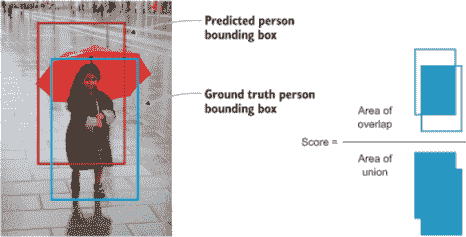

图 7.5 IoU 分数是真实边界框和预测边界框之间的重叠。

交并比（IoU）的值从 0（完全没有重叠）到 1（两个边界框重叠 100%）不等。两个边界框之间的重叠程度（IoU 值）越高，越好（见图 7.6）。

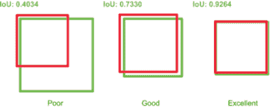

图 7.6 IoU 分数范围从 0（无重叠）到 1（100%重叠）。两个边界框之间的重叠程度（IoU）越高，越好。

要计算预测的 IoU，我们需要以下信息：

+   真实边界框（Bground truth）：在标注过程中创建的手动标注边界框

+   我们模型预测的边界框（Bpredicted）

我们通过将重叠面积除以并集面积来计算 IoU，如下方程所示：

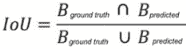

IoU 用于定义一个正确的预测，意味着一个 IoU 值大于某个阈值的预测（真阳性）。这个阈值取决于挑战，但 0.5 是一个标准值。例如，一些挑战，如 Microsoft COCO，使用 mAP@0.5（IoU 阈值为 0.5）或 mAP@0.75（IoU 阈值为 0.75）。如果 IoU 值高于这个阈值，预测被认为是真阳性（TP）；如果低于阈值，则被认为是假阳性（FP）。

#### 精度-召回曲线（PR 曲线）

定义了 TP 和 FP 后，我们现在可以计算在测试数据集上针对给定类别的检测的精度和召回率。如第四章所述，我们计算精度和召回率如下（FN 代表假阴性）：

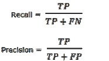

在计算了所有类别的精度和召回率后，PR 曲线如图 7.7 所示。

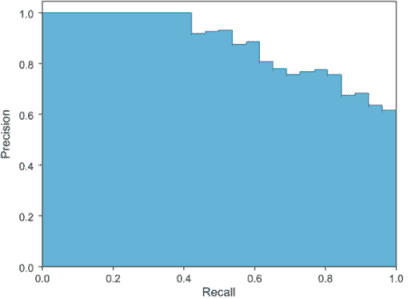

图 7.7 使用精度-召回曲线来评估目标检测器的性能。

PR 曲线是评估目标检测器性能的好方法，因为通过为每个对象类别绘制曲线来改变置信度。如果一个检测器的精度在召回率增加时保持较高，则认为它是一个好的检测器，这意味着如果你改变置信度阈值，精度和召回率仍然很高。另一方面，一个差的检测器需要增加 FP 的数量（降低精度）以达到高的召回率。这就是为什么 PR 曲线通常以高精度值开始，随着召回率的增加而降低。

现在我们有了 PR 曲线，我们可以通过计算曲线下的面积（AUC）来计算平均精度（AP）。最后，目标检测的 mAP 是所有类别计算出的 AP 的平均值。值得注意的是，一些研究论文将 AP 和 mAP 互换使用。

#### 概述

总结一下，mAP 的计算如下：

1.  获取每个边界框关联的对象性分数（该框包含对象的概率）。

1.  计算精度和召回率。

1.  通过改变分数阈值，为每个类别计算 PR 曲线。

1.  计算平均精度（AP）：PR 曲线下的面积。在这一步，为每个类别计算 AP。

1.  计算平均精度（mAP）：所有不同类别的平均 AP。

关于 mAP 的最后一点是，它比其他传统指标（如准确率）更复杂。好消息是您不需要自己计算 mAP 值：大多数深度学习目标检测实现都为您处理 mAP 的计算，您将在本章后面看到。

现在我们已经了解了目标检测算法的一般框架，让我们更深入地探讨其中三个最受欢迎的。在本章中，我们将详细讨论 R-CNN 系列网络、SSD 和 YOLO 网络，以了解目标检测器是如何随着时间的推移而演变的。我们还将检查每个网络的优缺点，以便您可以选择最适合您问题的算法。

## 7.2 基于区域的卷积神经网络（R-CNNs）

R-CNN 系列的目标检测技术通常被称为 R-CNNs，即基于区域的卷积神经网络，由 Ross Girshick 等人于 2014 年开发。1 R-CNN 系列在 2015 年和 2016 年分别扩展到包括 Fast-RCNN2 和 Faster-RCN3。在本节中，我将快速为您介绍 R-CNN 系列从 R-CNN 到 Fast R-CNN 再到 Faster R-CNN 的演变过程，然后我们将更深入地探讨 Faster R-CNN 架构和代码实现。

### 7.2.1 R-CNN

R-CNN 是其家族中最简单的基于区域的架构，但它是理解所有多个目标识别算法如何工作的基础。它是卷积神经网络在目标检测和定位问题上的第一个大型、成功应用之一，并为其他高级检测算法铺平了道路。该方法在基准数据集上进行了演示，在 PASCAL VOC-2012 数据集和 ILSVRC 2013 目标检测挑战赛上实现了当时最先进的结果。图 7.8 展示了 R-CNN 模型架构的总结。

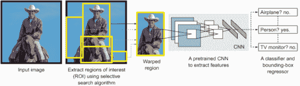

图 7.8 R-CNN 模型架构总结。（改编自 Girshick 等人，“用于准确目标检测和语义分割的丰富特征层次。”）

R-CNN 模型由四个部分组成：

+   *提取感兴趣区域* --也称为提取区域提议。这些区域有很高的概率包含一个对象。一种称为选择性搜索的算法扫描输入图像以找到包含块的区域，并将它们作为 RoIs 提议给管道中的下一个模块进行处理。提议的 RoIs 随后被变形为固定大小；它们通常大小不一，但正如我们在前面的章节中学到的，CNN 需要固定大小的输入图像。

+   *特征提取模块* --我们在区域提议上运行一个预训练的卷积网络，以从每个候选区域中提取特征。这是我们之前章节中学到的典型的 CNN 特征提取器。

+   *分类模块* --我们训练一个分类器，如支持向量机（SVM），一种传统的机器学习算法，根据上一步提取的特征对候选检测进行分类。

+   *定位模块* --也称为边界框回归器。让我们回顾一下回归的概念。机器学习问题被分类为分类或回归问题。分类算法输出离散的、预定义的类别（狗、猫、大象），而回归算法输出连续的值预测。在这个模块中，我们想要预测围绕对象的边界框的位置和大小。边界框通过识别四个值来表示：框原点的 *x* 和 *y* 坐标（*x, y*）、框的宽度和高度（*w, h*）。将这些值组合起来，回归器预测定义边界框的四个实数值，如下面的元组所示：(*x, y, w, h*)。

选择性搜索

选择性搜索是一种贪婪搜索算法，用于提供可能包含物体的区域建议。它通过将相似的像素和纹理组合成矩形框来尝试找到可能包含物体的区域。选择性搜索结合了穷举搜索算法（检查图像中所有可能的位置）和从下而上的分割算法（将相似区域分层组合）的优点，以捕捉所有可能的对象位置。

选择性搜索算法通过在图像中应用分割算法来寻找块，以便确定可能是什么物体（参见以下图中右侧的图像）。

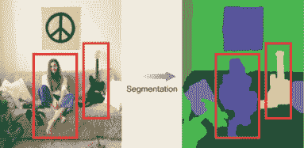

选择性搜索算法在图像中寻找类似块状的区域以提取区域。在右侧，分割算法定义了可能是物体的块。然后选择性搜索算法选择这些区域以供进一步调查。

从下而上的分割递归地将这些区域组合成更大的区域，以创建大约 2,000 个需要调查的区域，如下所示：

1.  计算所有相邻区域之间的相似性。

1.  将两个最相似的区域组合在一起，并计算结果区域与其邻居之间的新相似性。

1.  此过程会重复进行，直到整个物体被单个区域覆盖。

注意，选择性搜索算法及其如何计算区域相似性的综述超出了本书的范围。如果你对此感兴趣，可以进一步学习。

关于这项技术，你可以参考原始论文。[a] 为了理解 R-CNN，你可以将选择性搜索算法视为一个智能扫描图像并为我们提出 RoI 位置的“黑盒”。

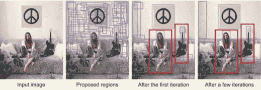

使用选择性搜索算法的从下而上的分割示例。它通过在每次迭代中组合相似区域，直到整个物体被单个区域覆盖。

J.R.R. Uijlings, K.E.A. van de Sande, T. Gevers, 和 A.W.M. Smeulders, “选择性搜索用于物体识别,” 2012, [www.huppelen.nl/publications/selectiveSearchDraft.pdf](http://www.huppelen.nl/publications/selectiveSearchDraft.pdf).

图 7.9 以直观的方式展示了 R-CNN 架构。如图所示，网络首先提出 RoIs，然后提取特征，接着根据这些特征对这些区域进行分类。本质上，我们将物体检测转化为一个图像分类问题。

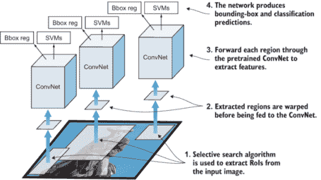

图 7.9 R-CNN 架构的示意图。每个提出的 RoI 都会通过 CNN 提取特征，然后通过边界框回归器和 SVM 分类器产生网络输出预测。

#### 训练 R-CNN

在上一节中，我们了解到 R-CNN 由四个模块组成：选择性搜索区域提议、特征提取器、分类器和边界框回归器。除了选择性搜索算法外，所有 R-CNN 模块都需要进行训练。因此，为了训练 R-CNN，我们需要做以下几步：

1.  训练特征提取器 CNN。这是一个典型的 CNN 训练过程。我们或者从头开始训练一个网络，这种情况很少发生，或者微调一个预训练的网络，正如我们在第六章中学到的那样。

1.  训练 SVM 分类器。SVM 算法在本书中没有涉及，但它是一种传统的机器学习分类器，在需要训练标记数据的意义上与深度学习分类器没有区别。

1.  训练边界框回归器。该模型为每个 K 个物体类别输出四个实数值，以缩小区域边界框。

通过查看 R-CNN 的学习步骤，你可以很容易地发现训练 R-CNN 模型既昂贵又缓慢。训练过程涉及训练三个独立的模块，共享计算很少。这种多阶段管道训练是 R-CNN 的一个缺点，我们将在下一节中看到。

#### R-CNN 的缺点

R-CNN 非常易于理解，并且它在首次推出时取得了最先进的结果，尤其是在使用深度卷积神经网络提取特征时。然而，它实际上不是一个通过深度神经网络学习定位的单个端到端系统。相反，它是由多个独立算法组合而成的，共同执行物体检测。因此，它有以下显著的缺点：

+   物体检测非常慢。对于每张图像，选择性搜索算法会提出大约 2,000 个 RoI 供整个管道（CNN 特征提取器和分类器）检查。由于它对每个物体提议执行卷积网络前向传递而不共享计算，这导致计算量非常大，因此非常慢。这种高计算需求意味着 R-CNN 不适合许多应用，尤其是需要快速推理的应用，如自动驾驶汽车等。

+   训练是一个多阶段管道。如前所述，R-CNN 需要训练三个模块：CNN 特征提取器、SVM 分类器和边界框回归器。因此，训练过程非常复杂，不是一个端到端训练。

+   训练在空间和时间上都很昂贵。当训练 SVM 分类器和边界框回归器时，从每张图像中的每个对象提议中提取特征并写入磁盘。对于像 VGG16 这样的非常深的网络，使用 GPU 对几千张图像的训练过程需要几天时间。从空间上讲，训练过程也很昂贵，因为提取的特征需要数百 GB 的存储空间。

我们需要的是一个端到端深度学习系统，它修正了 R-CNN 的缺点，同时提高了其速度和准确性。

### 7.2.2 Fast R-CNN

Fast R-CNN 是 R-CNN 的直接后裔，由 Ross Girshick 于 2015 年开发。Fast R-CNN 在许多方面与 R-CNN 技术相似，但在检测速度上有所改进，同时通过两个主要变化提高了检测准确性：

+   与 R-CNN 不同，它不是从区域提议模块开始，然后使用特征提取模块，Fast-RCNN 建议我们首先将 CNN 特征提取器应用于整个输入图像，然后提出区域。这样，我们只需在整个图像上运行一个 ConvNet，而不是在 2,000 个重叠区域上运行 2,000 个 ConvNet。

+   它将 ConvNet 的任务扩展到分类部分，通过用 softmax 层替换传统的 SVM 机器学习算法来实现。这样，我们有一个单一模型来执行两个任务：特征提取和对象分类。

#### Fast R-CNN 架构

如图 7.10 所示，Fast R-CNN 基于网络的最后一个特征图生成区域提议，而不是像 R-CNN 那样从原始图像中生成。因此，我们只需为整个图像训练一个 ConvNet。此外，我们不再需要训练许多不同的 SVM 算法来分类每个对象类别，而是单个 softmax 层直接输出类别概率。现在我们只有一个神经网络需要训练，而不是一个神经网络和多个 SVM。

Fast R-CNN 的架构由以下模块组成：

1.  特征提取模块 -- 网络从全图像开始，使用 ConvNet 提取特征。

1.  RoI 提取器 -- 选择性搜索算法为每张图像提出大约 2,000 个区域候选。

1.  RoI 池化层 -- 这是一个新组件，用于在将 RoIs 馈送到全连接层之前从特征图中提取一个固定大小的窗口。它使用最大池化将任何有效 RoI 内的特征转换为具有固定空间范围高度×宽度（H×W）的小特征图。RoI 池化层将在 Faster R-CNN 部分中更详细地解释；现在，了解它应用于从 CNN 提取的最后一个特征图层，其目标是提取固定大小的 RoIs 以馈送到全连接层和输出层。

1.  双头输出层 --模型分为两个头部：

    +   一个 softmax 分类层，输出每个 RoI 的离散概率分布

    +   一个边界框回归层，用于预测相对于原始 RoI 的偏移量


图 7.10 快速 R-CNN 架构由特征提取器 ConvNet、RoI 提取器、RoI 池化层、全连接层和双头输出层组成。注意，与 R-CNN 不同，快速 R-CNN 在应用区域建议模块之前，将特征提取器应用于整个输入图像。

#### 快速 R-CNN 中的多任务损失函数

由于快速 R-CNN 是一个端到端学习架构，用于学习对象的类别以及相关的边界框位置和大小，因此损失是多任务损失。在多任务损失的情况下，输出有 softmax 分类器和边界框回归器，如图 7.10 所示。

在任何优化问题中，我们需要定义一个损失函数，我们的优化器算法试图最小化它。（第二章提供了更多关于优化和损失函数的细节。）在目标检测问题中，我们的目标是优化两个目标：对象分类和对象定位。因此，在这个问题中，我们有两个损失函数：Lcls 用于分类损失，Lloc 用于定义对象位置的边界框预测。

快速 R-CNN 网络有两个兄弟输出层，带有两个损失函数：

+   分类 --第一个输出一个离散概率分布（每个 RoI），覆盖 K + 1 个类别（我们为背景添加一个类别）。概率 P 是通过全连接层的 *K* + 1 个输出的 softmax 计算得到的。分类损失函数是对真实类别 u 的对数损失。

    *L[cls]*(*p,u*) = −log*p[u]*

    其中 u 是真实标签，*u* ∈ 0, 1, 2, . . . (*K* + 1)；其中 *u* = 0 表示背景；而 *p* 是每个 RoI 在 *K* + 1 个类别上的离散概率分布。

+   回归 --第二个兄弟层输出每个 *K* 个对象类别的边界框回归偏移 *v* = (*x, y, w, h*)。损失函数是类别 u 的边界框损失。

    *Lloc = σ L1smooth*

    其中：

    +   v 是真实边界框，*v* = (*x, y, w, h*)。

    +   *t* u 是预测边界框校正：

        *t^u* = (*t[x]^u, t[y]^u, t[w]^u, t[h]^u*)

    +   *L1[smooth]* 是使用平滑 L1 损失函数来衡量 tiu 和 vi 之间差异的边界框损失。它是一个鲁棒函数，据称比其他回归损失（如 L2）对异常值更不敏感。

总体损失函数是

*L = L[cls] + L[loc]*

*L*(*p, u, t^u, v*) = *L[cls]*(*p, u*) + [*u* ≥ 1] *l[box]*(*t^u, v*)

注意，[*u* ≥ 1] 在回归损失之前添加，表示当检查的区域不包含任何对象且包含背景时为 0。这是一种在分类器将区域标记为背景时忽略边界框回归的方法。指示函数 [*u* ≥ 1] 定义为

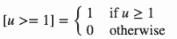

#### Fast R-CNN 的缺点

Fast R-CNN 在测试时间上要快得多，因为我们不需要为每张图像将 2,000 个区域提议输入到卷积神经网络中。相反，每个图像只进行一次卷积操作，并从中生成一个特征图。训练也更快，因为所有组件都在一个 CNN 网络中：特征提取器、物体分类器和边界框回归器。然而，仍然存在一个大的瓶颈：用于生成区域提议的选择搜索算法非常慢，并且由另一个模型单独生成。使用深度学习实现完整端到端物体检测系统的最后一步是找到一种方法将区域提议算法结合到我们的端到端深度学习网络中。这就是 Faster R-CNN 所做的事情，我们将在下面看到。

### 7.2.3 Faster R-CNN

Faster R-CNN 是 R-CNN 家族的第三次迭代，由 Shaoqing Ren 等人于 2016 年开发。与 Fast R-CNN 类似，图像被提供给一个卷积网络，该网络提供卷积特征图。而不是在特征图上使用选择搜索算法来识别区域提议，使用区域提议网络（RPN）来预测作为训练过程一部分的区域提议。然后使用 RoI 池化层重塑预测的区域提议，并在提议的区域中对图像进行分类，并预测边界框的偏移值。这些改进既减少了区域提议的数量，又加速了模型的测试时间操作，接近实时，并具有当时最先进的性能。

#### Faster R-CNN 架构

Faster R-CNN 的架构可以用两个主要网络来描述：

+   区域提议网络（RPN）--选择搜索被一个卷积网络所取代，该网络从特征提取器的最后特征图中提出 RoIs 以供调查。RPN 有两个输出：物体分数（物体或无物体）和边界框位置。

+   Fast R-CNN --它由 Fast R-CNN 的典型组件组成：

    +   特征提取器的基网络：一个典型的预训练 CNN 模型，用于从输入图像中提取特征。

    +   RoI 池化层用于提取固定大小的 RoIs

    +   输出层包含两个全连接层：一个 softmax 分类器用于输出类别概率，一个边界框回归 CNN 用于预测边界框。

如图 7.11 所示，输入图像被提供给网络，并通过预训练的 CNN 提取其特征。这些特征并行发送到 Faster R-CNN 架构的两个不同组件：

+   RPN 用于确定图像中可能存在物体的位置。在此阶段，我们并不知道物体是什么，只知道图像的某个位置可能存在一个潜在的物体。

+   RoI 池化用于提取固定大小的特征窗口。

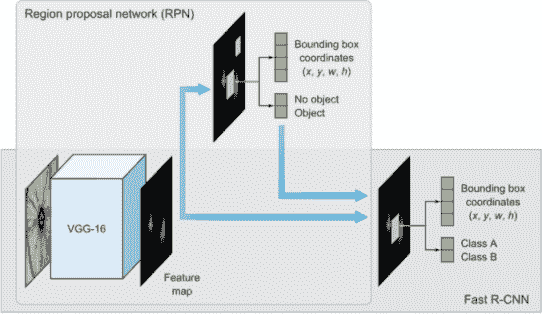

图 7.11 Faster R-CNN 架构有两个主要组件：一个 RPN，用于识别可能包含感兴趣对象及其大致位置的区域，以及一个 Fast R-CNN 网络，用于分类对象并细化使用边界框定义的位置。这两个组件共享预训练的 VGG16 的卷积层。

然后将输出传递到两个全连接层：一个用于物体分类器，一个用于边界框坐标预测，以获得我们的最终定位。

该架构实现了一个端到端可训练的完整目标检测流程，其中所有必需的组件都在网络内部：

+   基础网络特征提取器

+   区域建议

+   RoI 池化

+   物体分类

+   边界框回归器

#### 从基础网络提取特征

与 Fast R-CNN 类似，第一步是使用预训练的 CNN 并切掉其分类部分。基础网络用于从输入图像中提取特征。我们在第六章详细介绍了这一点。在这个组件中，你可以根据你试图解决的问题使用任何流行的 CNN 架构。原始 Faster R-CNN 论文使用了在 ImageNet 上预训练的 ZF4 和 VGG5 网络；但自那时起，已经出现了许多具有不同数量权重的不同网络。例如，MobileNet6，一个更小、更高效的针对速度优化的网络架构，大约有 330 万个参数，而 ResNet-152（152 层）--曾是 ImageNet 分类竞赛的顶尖技术--大约有 6000 万个。最近，新的架构如 DenseNet7 在提高结果的同时，也在减少参数数量。

VGGNet 与 ResNet

现在，ResNet 架构大多已取代 VGG 作为提取特征的基础网络。ResNet 相对于 VGG 的明显优势是它有更多的层（更深），这使它能够学习非常复杂的功能。这在分类任务中是正确的，在目标检测的情况下也应该同样正确。此外，ResNet 通过使用残差连接和批量归一化（这是在 VGG 首次发布时没有发明的）来训练深度模型变得容易。请回顾第五章，以获得不同 CNN 架构的更详细审查。

正如我们在前面的章节中学到的，每个卷积层都是基于之前的信息创建抽象。第一层通常学习边缘，第二层在边缘中寻找激活以形成更复杂形状的模式，依此类推。最终我们得到一个卷积特征图，可以输入到 RPN 中以提取包含对象的区域。

#### 区域建议网络（RPN）

RPN 根据预训练卷积神经网络的最后一个特征图识别可能包含感兴趣对象的区域。RPN 也被称为注意力网络，因为它引导网络将注意力集中在图像中的有趣区域。Faster R-CNN 使用 RPN 将区域提议直接嵌入到 R-CNN 架构中，而不是运行选择性搜索算法来提取 RoIs。

RPN 的架构由两层组成（图 7.12）：

+   一个具有 512 个通道的 3 × 3 全卷积层

+   两个平行的 1 × 1 卷积层：一个分类层，用于预测区域是否包含对象（其分数为背景或前景），以及一个用于回归或边界框预测的层。

全卷积网络（FCNs）

物体检测网络的一个重要方面是它们应该是全卷积的。全卷积神经网络意味着网络不包含任何全连接层，通常在网络末尾用于输出预测之前。

在图像分类的背景下，通过在整个体积上应用平均池化来移除全连接层，然后在使用单个密集 softmax 分类器输出最终预测之前。FCN 有两个主要优点：

+   它更快，因为它只包含卷积操作，没有全连接层。

+   它可以接受任何空间分辨率的图像（宽度和高度），只要图像和网络可以适应可用的内存。

作为 FCN，使网络对输入图像的大小不变。然而，在实践中，我们可能希望坚持一个固定的输入大小，因为只有在我们实现算法时才会出现的问题才会变得明显。这样一个重大问题是，如果我们想批量处理图像（因为批量的图像可以通过 GPU 并行处理，从而提高速度），所有图像都必须具有固定的高度和宽度。

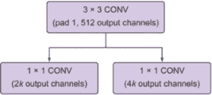

图 7.12 RPN 架构的卷积实现，其中 k 是锚的数量

3 × 3 卷积层应用于基础网络的最后一个特征图，其中 3 × 3 大小的滑动窗口在特征图上移动。然后，输出被传递到两个 1 × 1 卷积层：一个分类器和边界框回归器。请注意，RPN 的分类器和回归器并不是试图预测对象及其边界框的类别；这将在 RPN 之后进行，即在 RPN 之后。记住，RPN 的目标是确定该区域是否有对象需要由全连接层之后进一步研究。在 RPN 中，我们使用二进制分类器来预测区域的物体得分，以确定该区域是前景（包含对象）还是背景（不包含对象）的概率。它基本上是查看该区域并问，“这个区域包含对象吗？”如果答案是肯定的，那么该区域将通过 RoI 池化和最终输出层进行进一步研究（见图 7.13）。

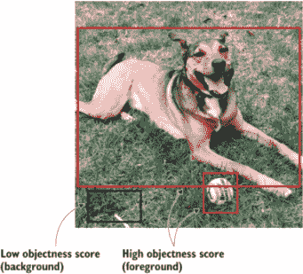

图 7.13 RPN 分类器预测目标得分，即图像包含对象（前景）或背景的概率。

##### 回归器是如何预测边界框的？

要回答这个问题，我们首先定义边界框。它是围绕对象的框，由元组(*x, y, w, h*)标识，其中*x*和*y*是图像中的坐标，描述边界框的中心，h 和 w 是边界框的高度和宽度。研究人员发现，定义中心点的(*x, y*)坐标可能具有挑战性，因为我们必须强制执行一些规则以确保网络预测的值在图像边界内。相反，我们可以在图像中创建称为锚框的参考框，并使回归层预测从这些框的偏移量，称为 delta (*Δx, Δy, Δw, Δh*)，以调整锚框以更好地适应对象并获得最终提议（见图 7.14）。

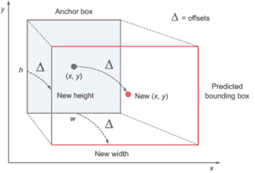

图 7.14 展示了从锚框预测 delta 偏移量和边界框坐标的说明

##### 锚框

使用滑动窗口方法，RPN 为特征图中的每个位置生成 k 个区域。这些区域表示为锚框。锚位于其对应滑动窗口的中间，在尺寸和宽高比方面有所不同，以覆盖广泛的各种对象。它们是固定边界框，放置在整个图像中，用于在首次预测对象位置时作为参考。在其论文中，Ren 等人生成了九个锚框，它们都具有相同的中心，但具有三种不同的宽高比和三种不同的尺寸。

图 7.15 展示了锚框应用的一个示例。锚位于滑动窗口的中心；每个窗口有 k 个锚框，锚位于其中心。

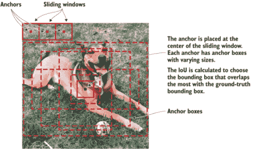

图 7.15 锚点位于每个滑动窗口的中心。IoU 被计算出来以选择与真实值重叠最多的边界框。

##### 训练 RPN

RPN 被训练来对锚框进行分类，输出物体存在分数，并近似物体的四个坐标（位置参数）。它使用人工标注员来标注边界框进行训练。标注的框被称为真实值。

对于每个锚框，计算重叠概率值（*p*），这表示这些锚框与真实值边界框重叠的程度：

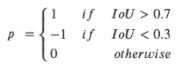

如果一个锚框与真实值边界框的重叠度很高，那么它很可能包含感兴趣的对象，并且在与无对象分类任务中标记为正。同样，如果一个锚框与真实值边界框的重叠度很小，它将被标记为负。在训练过程中，正负锚框作为输入传递到两个全连接层，分别对应于锚框是否包含对象的分类以及位置参数（四个坐标）的回归。对应于位置的一个锚框数量（k），RPN 网络输出 2k 个分数和 4k 个坐标。例如，如果每个滑动窗口的锚框数量（k）是 9，那么 RPN 输出 18 个物体存在分数和 36 个位置坐标（图 7.16）。

RPN 作为一个独立的应用程序

RPN 可以用作独立的应用程序。例如，在只有一个对象类别的問題中，可以使用物体存在概率作为最终的类别概率。这是因为在这种情况下，前景意味着单个类别，而背景意味着不是单个类别。

你想要使用 RPN 处理单类检测等案例的原因是它在训练和预测过程中的速度提升。由于 RPN 是一个非常简单的网络，仅使用卷积层，其预测时间可以比使用分类基础网络更快。

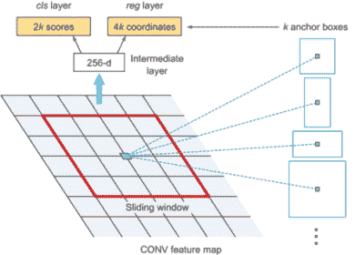

图 7.16 区域建议网络

#### 全连接层

输出全连接层接收两个输入：来自基础 ConvNet 的特征图和来自 RPN 的 RoIs。然后它对选定的区域进行分类，并输出它们的预测类别和边界框参数。Faster R-CNN 中的物体分类层使用 softmax 激活，而位置回归层使用线性回归来定义边界框的位置坐标。所有网络参数都使用多任务损失一起进行训练。

#### 多任务损失函数

与 Fast R-CNN 类似，Faster R-CNN 针对一个多任务损失函数进行了优化，该函数结合了分类和边界框回归的损失：

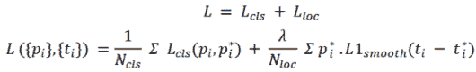

初始时，损失方程可能看起来有些令人眼花缭乱，但实际上它比看起来要简单。理解它并不是运行和训练 Faster R-CNN 的必要条件，所以您可以自由地跳过这一部分。但我鼓励您努力理解这一解释，因为它将大大加深您对优化过程内部工作原理的理解。让我们首先看看符号；参见表 7.2。

多任务损失函数符号

| 符号 | 说明 |
| --- | --- |
| *p[i]* 和 *p[i]^** | pi 是预测的锚点 (*i*) 是对象的概率和背景的概率，p*i 是锚点是否为对象的二元真实值（0 或 1）。 |
| *t[i]* 和 *t[i]^** | *t[i]* 是定义边界框的四个预测参数，而 *t[i]^** 是真实参数。 |
| *N*[cls] | 分类损失的归一化项。Ren 等人将其设置为约 256 个 mini-batch 的大小。 |
| *N*[loc] | 边界框回归的归一化项。Ren 等人将其设置为锚点位置的数量，约 2400。 |
| *L[cls]*(*p[i], p[i]^**) | 两个类别的对数损失函数。我们可以通过预测样本是否为目标对象将多类分类轻松转换为二分类：*L[cls]*(*p[i]*, *p[i]^**) = −*p[i]^* log p[i] - (1 - p[i]^*) log (1 − p[i])* |
| *L*1*[smooth]* | 如 7.2.2 节所述，边界框损失使用平滑 L1 损失函数来衡量预测和真实位置参数 (*t[i]*, *t[i]^**) 之间的差异。它是一个鲁棒函数，据称比其他回归损失（如 L2）对异常值更不敏感。 |
| λ | 一个平衡参数，Ren 等人将其设置为约 10（因此 Lcls 和 Lloc 项大致同等权重）。 |

现在您已经知道了符号的定义，让我们再次尝试阅读多任务损失函数。为了帮助理解这个方程，暂时忽略归一化项和 (*i*) 项。以下是每个实例 (*i*) 的简化损失函数：

损失 = *L[cls]*(*p, p^**) + *p^** · *L*1*[smooth]*(*t - t^**)

这个简化的函数是两个损失函数的和：分类损失和位置损失（边界框）。让我们逐一看看它们：

+   任何损失函数的想法都是从预测值中减去真实值以找到误差量。分类损失是第二章中解释的交叉熵函数。没有什么新的。它是一个对数损失函数，用于计算预测概率 (*p*) 和真实值 (*p, p^**) 之间的误差：

    *L[cls]*(*p[i]*, *p[i]^**) = −*p[i]^** log *p[i]* − (1 − *p[i]^**) log (1 - *p[i]*)

+   位置损失是使用平滑 L1 损失函数预测的位置参数（*t[i]*，*t[i]^**）与真实位置参数之间的差异。然后将差异乘以包含对象的区域的地面真实概率*p^**。如果不是对象，*p^**为 0，以消除非对象区域的整个位置损失。

最后，我们将两个损失的值相加以创建多损失函数：

*L* = *L[cls]* + *L[loc]*

你看，这就是每个实例（*i*）的多损失函数。将（*i*）和σ符号放回以计算每个实例的损失总和。

### 7.2.4 R-CNN 家族回顾

表 7.3 总结了 R-CNN 架构的演变：

+   R-CNN -- 边界框由选择性搜索算法提出。每个边界框都被扭曲，并通过如 AlexNet 之类的深度卷积神经网络提取特征，然后使用线性 SVM 和线性回归器进行最终的一组对象分类和边界框预测。

+   Fast R-CNN -- 一种具有单个模型的单一代计设计。在 CNN 之后使用 RoI 池化层来巩固区域。该模型直接预测类别标签和 RoIs。

+   Faster R-CNN -- 一个完全端到端的深度学习目标检测器。它用区域提议网络替换选择性搜索算法来提议 RoIs，该网络解释从深度卷积神经网络中提取的特征，并学习直接提议 RoIs。

从 R-CNN 到 Fast R-CNN 再到 Faster R-CNN 的 CNN 网络家族的演变

|  | R-CNN | Fast R-CNN | Faster R-CNN |
| --- | --- | --- | --- |
|  | 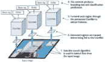 | 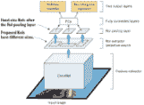 | 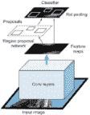 |
| PASCAL 视觉对象类别挑战赛 2007 的 mAP | 66.0% | 66.9% | 66.9% |
| 特征 |

1.  对每个图像应用选择性搜索以提取 RoIs（约 2,000 个）。

1.  使用卷积神经网络从提取的约 2,000 个区域中提取特征。

1.  使用分类和边界框预测。

| 每个图像只通过 CNN 一次，并提取特征图。

1.  卷积神经网络（ConvNet）用于从输入图像中提取特征图。

1.  在这些图上使用选择性搜索来生成预测。

这样，我们只需在整个图像上运行一个卷积神经网络，而不是在 2000 个重叠区域上运行约 2000 个卷积神经网络。 | 用区域提议网络替换选择性搜索方法，这使得算法速度更快。一个端到端的深度学习网络。|

| 局限性 | 计算时间高，因为每个区域都单独通过 CNN。此外，使用三个不同的模型进行预测。 | 选择性搜索慢，因此计算时间仍然很高。 | 对象提议需要时间。由于有不同系统依次工作，系统的性能取决于前一个系统的表现。 |
| --- | --- | --- | --- |
| 每个图像的测试时间 | 50 秒 | 2 秒 | 0.2 秒 |
| R-CNN 加速 | 1x | 25x | 250x |

#### R-CNN 局限性

如您可能已经注意到的，每一篇论文都提出了对 R-CNN 早期工作的改进，旨在开发一个更快的网络，目标是实现实时目标检测。通过这一系列工作所展示的成就确实令人惊叹，然而，这些架构中的任何一个都没有成功创建一个真正的实时目标检测器。不深入细节，以下这些问题已经与这些网络相关联：

+   训练数据难以处理，耗时过长。

+   训练发生在多个阶段（例如，训练区域提议与分类器）。

+   网络在推理时的速度太慢。

幸运的是，在过去的几年里，已经创建了新的架构来解决 R-CNN 及其后续产品的瓶颈，从而实现了实时目标检测。最著名的是单次检测器（SSD）和 YOLO（你只看一次），我们将在第 7.3 节和第 7.4 节中解释。

#### 多阶段检测器与单阶段检测器

R-CNN 家族中的所有模型都是基于区域的。检测分为两个阶段，因此这些模型被称为两阶段检测器：

1.  该模型提出了一组 RoIs，使用选择性搜索或 RPN。提出的区域是稀疏的，因为潜在的边界框候选者可能是无限的。

1.  分类器只处理区域候选者。

单阶段检测器采取不同的方法。它们跳过了区域提议阶段，并在可能的密集采样位置上直接运行检测。这种方法更快、更简单，但可能会略微降低性能。在接下来的两个部分中，我们将检查 SSD 和 YOLO 单阶段目标检测器。一般来说，单阶段检测器通常比两阶段检测器精度低，但速度要快得多。

## 7.3 单次检测器（SSD）

SSD 论文由 Wei Liu 等人于 2016 年发布 8。SSD 网络在目标检测任务中的性能和精度方面达到了新的记录，在标准数据集如 PASCAL VOC 和 Microsoft COCO 上得分超过 74% mAP，在 59 FPS 的速度下运行。

测量检测器速度（FPS：每秒帧数）

如本章开头所讨论的，测量检测速度最常用的指标是每秒帧数。例如，Faster R-CNN 每秒只能运行 7 帧（FPS）。已经有很多尝试通过攻击检测管道的每个阶段来构建更快的检测器，但到目前为止，显著提高速度的代价是显著降低检测精度。在本节中，您将了解为什么像 SSD 这样的单阶段网络可以实现更快的检测，这更适合实时检测。

对于基准测试，SSD300 在 59 FPS 时实现了 74.3% mAP，而 SSD512 在 22 FPS 时实现了 76.8% mAP，这超过了 Faster R-CNN（在 7 FPS 时实现 73.2% mAP）。SSD300 指的是 300 × 300 大小的输入图像，而 SSD512 指的是 512 × 512 大小的输入图像。

我们之前了解到，R-CNN 系列是多阶段检测器：网络首先预测边界框的对象分数，然后将这个框通过分类器传递以预测类别概率。在单阶段检测器如 SSD 和 YOLO（在第 7.4 节中讨论）中，卷积层直接在一次操作中做出两种预测：因此得名单次检测器。图像只通过一次网络，每个边界框的对象分数使用逻辑回归预测，以指示与真实值的重叠程度。如果边界框与真实值重叠 100%，则对象分数为 1；如果没有重叠，则对象分数为 0。然后我们设置一个阈值值（0.5），即“如果对象分数高于 50%，则这个边界框很可能包含感兴趣的对象，我们得到预测。如果低于 50%，则忽略预测。”

### 7.3.1 高级 SSD 架构

SSD 方法基于一个前馈卷积网络，该网络生成固定大小的边界框和分数集合，用于预测这些框中对象类实例的存在，然后通过 NMS 步骤生成最终检测。SSD 模型的架构由三个主要部分组成：

+   基础网络提取特征图——用于高质量图像分类的标准预训练网络，在分类层之前被截断。在他们的论文中，Liu 等人使用了 VGG16 网络。其他网络如 VGG19 和 ResNet 也可以使用，并且应该产生良好的结果。

+   多尺度特征层——在基础网络之后添加了一系列卷积滤波器。这些层的大小逐渐减小，以允许预测多个尺度的检测。

+   非最大值抑制——NMS 用于消除重叠的框，并为每个检测到的对象保留一个框。

正如你在图 7.17 中可以看到，层 4_3、7、8_2、9_2、10_2 和 11_2 直接对 NMS 层做出预测。我们将在第 7.3.3 节中讨论为什么这些层的大小逐渐减小。现在，让我们继续了解 SSD 中的数据端到端流程。

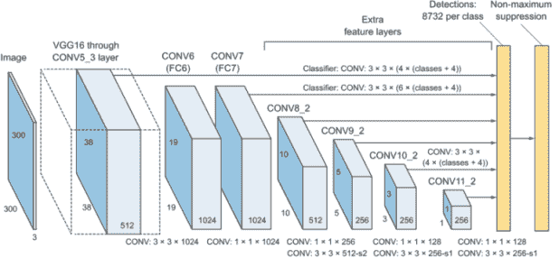

图 7.17 SSD 架构由基础网络（VGG16）、用于对象检测的额外卷积层以及用于最终检测的非最大值抑制（NMS）层组成。注意，卷积层 7、8、9、10 和 11 直接做出预测，并将其直接输入到 NMS 层。来源：Liu 等人，2016 年。

你可以在图 7.17 中看到，网络对每个类别进行了总共 8,732 次检测，然后将其输入到 NMS 层以减少到每个对象一次检测。这个数字 8,732 是从哪里来的？

为了实现更精确的检测，特征图的各个层也通过一个小型的 3 × 3 卷积进行物体检测。例如，Conv4_3 的大小为 38 × 38 × 512，并应用了一个 3 × 3 的卷积。有四个边界框，每个边界框有（类别数量 + 4 个边界框值）个输出。假设有 20 个物体类别加上 1 个背景类别；那么输出边界框的数量是 38 × 38 × 4 = 5,776 个边界框。同样，我们计算其他卷积层的边界框数量：

+   Conv7: 19 × 19 × 6 = 2,166 个边界框（每个位置 6 个边界框）

+   Conv8_2: 10 × 10 × 6 = 600 个边界框（每个位置 6 个边界框）

+   Conv9_2: 5 × 5 × 6 = 150 个边界框（每个位置 6 个边界框）

+   Conv10_2: 3 × 3 × 4 = 36 个边界框（每个位置 4 个边界框）

+   Conv11_2: 1 × 1 × 4 = 4 个边界框（每个位置 4 个边界框）

如果我们将它们加起来，我们得到 5,776 + 2,166 + 600 + 150 + 36 + 4 = 8,732 个边界框产生。这对于我们的检测器来说是一个巨大的数字。这就是为什么我们应用 NMS 来减少输出边界框的数量。正如你将在 7.4 节中看到的，在 YOLO 中，最后有 7 × 7 个位置，每个位置有两个边界框：7 × 7 × 2 = 98 个边界框。

输出预测看起来是什么样子？

对于每个特征，网络预测以下内容：

+   描述边界框的 4 个值（*x, y, w, h*）

+   物体得分的 1 个值

+   表示每个类别概率的 C 值

这总共是 5 + C 个预测值。假设我们的问题中有四个物体类别。那么每个预测将是一个看起来像这样的向量：[x, y, w, h, 物体得分, C1, C2, C3, C4]。

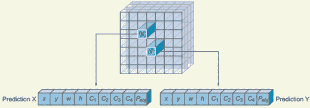

当我们在问题中有四个类别时，输出预测的示例可视化。卷积层预测边界框坐标、物体得分和四个类别的概率：C1、C2、C3 和 C4。

现在，让我们更深入地探讨 SSD 架构的每个组件。

### 7.3.2 基础网络

如你在图 7.17 中看到的，SSD 架构在切除了全连接分类层（VGG16 在第五章中有详细解释）之后建立在 VGG16 架构之上。VGG16 被用作基础网络，因为它在高质量图像分类任务中表现出色，并且因其对迁移学习有帮助提高结果的问题而受到欢迎。与原始 VGG 全连接层不同，增加了一系列支持卷积层（从 Conv6 开始），使我们能够提取多个尺度的特征，并逐步减小每个后续层的输入大小。

下面是使用 Keras 在 SSD 中使用的 VGG16 网络的简化代码实现。你不需要从头开始实现这个；我包括这个代码片段的目标是向你展示这是一个典型的 VGG16 网络，就像第五章中实现的那样：

```
conv1_1 = Conv2D(64, (3, 3), activation='relu', padding='same')
conv1_2 = Conv2D(64, (3, 3), activation='relu', padding='same')(conv1_1)
pool1 = MaxPooling2D(pool_size=(2, 2), strides=(2, 2), padding='same')(conv1_2)

conv2_1 = Conv2D(128, (3, 3), activation='relu', padding='same')(pool1)
conv2_2 = Conv2D(128, (3, 3), activation='relu', padding='same')(conv2_1)
pool2 = MaxPooling2D(pool_size=(2, 2), strides=(2, 2), padding='same')(conv2_2)

conv3_1 = Conv2D(256, (3, 3), activation='relu', padding='same')(pool2)
conv3_2 = Conv2D(256, (3, 3), activation='relu', padding='same')(conv3_1)
conv3_3 = Conv2D(256, (3, 3), activation='relu', padding='same')(conv3_2)
pool3 = MaxPooling2D(pool_size=(2, 2), strides=(2, 2), padding='same')(conv3_3)

conv4_1 = Conv2D(512, (3, 3), activation='relu', padding='same')(pool3)
conv4_2 = Conv2D(512, (3, 3), activation='relu', padding='same')(conv4_1)
conv4_3 = Conv2D(512, (3, 3), activation='relu', padding='same')(conv4_2)
pool4 = MaxPooling2D(pool_size=(2, 2), strides=(2, 2), padding='same')(conv4_3)

conv5_1 = Conv2D(512, (3, 3), activation='relu', padding='same')(pool4)
conv5_2 = Conv2D(512, (3, 3), activation='relu', padding='same')(conv5_1)
conv5_3 = Conv2D(512, (3, 3), activation='relu', padding='same')(conv5_2)
pool5 = MaxPooling2D(pool_size=(3, 3), strides=(1, 1), padding='same')(conv5_3)
```

你在第五章中看到了 VGG16 在 Keras 中的实现。在这里添加这个的主要收获如下：

+   层 conv4_3 将再次用于直接预测。

+   层 pool5 将被输入到下一层（conv6），这是多尺度特征层的第一个层。

#### 基础网络如何进行预测

考虑以下示例。假设你有图 7.18 中的图像，网络的任务是在图像中围绕所有船只绘制边界框。过程如下：

1.  与 R-CNN 中的锚点概念类似，SSD 在图像周围叠加了一个锚点网格。对于每个锚点，网络在其中心创建一组边界框。在 SSD 中，锚点被称为先验。

1.  基础网络将每个边界框视为一个单独的图像。对于每个边界框，网络会问：“这个框里有没有船？”或者换句话说，“我在这个框里提取了任何船只特征吗？”

1.  当网络找到一个包含船只特征的边界框时，它会将其坐标预测和对象分类发送到 NMS 层。

1.  NMS 消除了所有与真实边界框重叠最少的框。

注意：Liu 等人使用 VGG16 是因为它在复杂图像分类任务中表现出色。您可以使用其他网络，如更深的 VGG19 或 ResNet 作为基础网络，如果不在准确性上，应该表现得更好；但如果您选择实现更深的网络，它可能会更慢。如果您想要在复杂、高性能的深度网络和快速之间取得平衡，MobileNet 是一个不错的选择。

现在，让我们继续 SSD 架构的下一个组件：多尺度特征层。

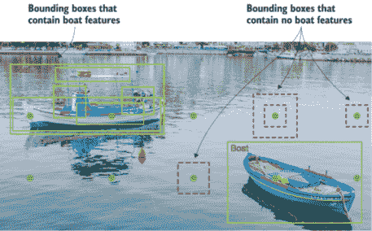

图 7.18 SSD 基础网络查看锚点框以找到船只特征。实线框表示网络已找到船只特征。虚线框表示没有船只特征。

### 7.3.3 多尺度特征层

这些是添加到截断基础网络末尾的卷积特征层。这些层的大小逐渐减小，以便能够在多个尺度上进行检测预测。

#### 多尺度检测

为了了解多尺度特征层的目标以及它们为什么大小不同，让我们看看图 7.19 中的马匹图像。如图所示，基础网络可能能够检测到背景中的马匹特征，但它可能无法检测到离相机最近的马匹。为了理解原因，仔细看看虚线边界框，并尝试想象这个框在完整图像之外（见图 7.20）。

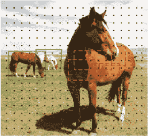

图 7.19 图像中不同尺度的马匹。离相机远的马匹更容易检测，因为它们体积小，可以适应先验（锚点框）。基础网络可能无法检测到离相机最近的马匹，因为它需要不同尺度的锚点来创建能够覆盖更多可识别特征的先验。

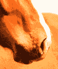

图 7.20 一个孤立的马特征

你能在图 7.20 的边界框中看到马的特征吗？不。为了处理图像中不同尺度的对象，一些方法建议在不同大小上预处理图像，并在之后合并结果（图 7.21）。然而，通过使用不同大小的卷积层，我们可以在单个网络中使用来自几个不同层的特征图；对于预测，我们可以模仿相同的效果，同时在整个对象尺度上共享参数。随着 CNN 逐渐减少空间维度，特征图的分辨率也降低。SSD 使用低分辨率层来检测较大尺度的对象。例如，4 × 4 特征图用于较大尺度的对象。

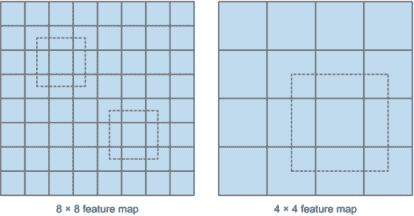

图 7.21 低分辨率特征图检测较大尺度的对象（右侧）；高分辨率特征图检测较小尺度的对象（左侧）。

为了可视化这一点，想象一下网络将图像维度减小，以便所有马都能在其边界框内（图 7.22）。多尺度特征层调整图像维度并保持边界框大小，以便它们可以适应较大的马。实际上，卷积层并不是字面上减小图像的大小；这只是为了说明，帮助我们直观地理解这个概念。图像不仅被调整大小，它实际上经过了卷积过程，因此看起来不再像自己。它将是一个完全随机的图像，但它将保留其特征。卷积过程在第三章中详细解释。

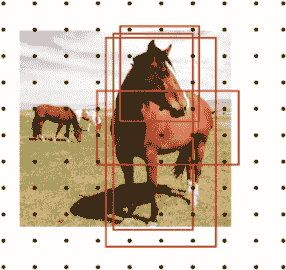

图 7.22 多尺度特征层减小输入图像的空间维度以检测不同尺度的对象。在这张图像中，你可以看到新的先验值有点放大，以覆盖靠近摄像头的马的可识别特征。

使用多尺度特征图可以显著提高网络精度。刘等人进行了一项实验，以衡量通过添加多尺度特征层所获得的优势。图 7.23 显示了随着层数减少，精度下降；你可以看到使用不同数量的特征图层进行对象检测时的精度。


图 7.23 使用原始论文中多个输出层的效果。当作者添加多尺度特征时，检测器的精度（mAP）提高。（来源：刘等人，2016。）

注意，当预测源来自所有六个层时，网络精度从 74.3%下降到 62.4%，对于单一源层。当仅使用 conv7 层进行预测时，性能最差，这强化了这样一个信息：在不同层上分布不同尺度的边界框是至关重要的。

#### 多尺度层的架构

刘等人决定添加六个逐渐变小的卷积层。他们通过大量的调整和试错，直到产生最佳结果。正如你在图 7.17 中看到的，卷积层 6 和 7 非常简单。Conv6 的内核大小为 3 × 3，而 conv7 的内核大小为 1 × 1。另一方面，8 到 11 层更像是一系列块，其中每个块由两个内核大小为 1 × 1 和 3 × 3 的卷积层组成。

这是 Keras 中 6 到 11 层的代码实现（你可以在书中可下载的代码中看到完整的实现）：

```
# conv6 and conv7
conv6 = Conv2D(1024, (3, 3), dilation_rate=(6, 6), activation='relu', 
 padding='same')(pool5)
conv7 = Conv2D(1024, (1, 1), activation='relu', padding='same')(conv6)

# conv8 block
conv8_1 = Conv2D(256, (1, 1), activation='relu', padding='same')(conv7)
conv8_2 = Conv2D(512, (3, 3), strides=(2, 2), activation='relu', 
 padding='valid')(conv8_1)

# conv9 block
conv9_1 = Conv2D(128, (1, 1), activation='relu', padding='same')(conv8_2)
conv9_2 = Conv2D(256, (3, 3), strides=(2, 2), activation='relu', 
 padding='valid')(conv9_1)

# conv10 block
conv10_1 = Conv2D(128, (1, 1), activation='relu', padding='same')(conv9_2)
conv10_2 = Conv2D(256, (3, 3), strides=(1, 1), activation='relu', 
 padding='valid')(conv10_1)

# conv11 block
conv11_1 = Conv2D(128, (1, 1), activation='relu', padding='same')(conv10_2)
conv11_2 = Conv2D(256, (3, 3), strides=(1, 1), activation='relu', 
 padding='valid')(conv11_1)
```

如前所述，如果你不在研究或学术界工作，你很可能不需要自己实现目标检测架构。在大多数情况下，你会下载一个开源实现，并在其基础上工作以解决你的问题。我只是添加了这些代码片段，帮助你内化关于不同层架构讨论的信息。

膨胀（或膨胀）卷积

膨胀卷积为卷积层引入了另一个参数：膨胀率。这定义了内核中值的间隔。具有膨胀率 2 的 3 × 3 内核具有与 5 × 5 内核相同的视野，而只使用九个参数。想象一下，取一个 5 × 5 内核，并删除每行的第二列和每列的第二行。

这在相同的计算成本下提供了更宽的视野。

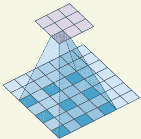

具有膨胀率 2 的 3 × 3 内核具有与 5 × 5 内核相同的视野，而只使用九个参数。

膨胀卷积在实时分割领域特别受欢迎。如果你需要一个宽视野且无法承担多个卷积或更大的内核，请使用它们。

以下代码使用 Keras 构建了一个具有 2 倍膨胀率的 3 × 3 膨胀卷积层：

```
Conv2D(1024, (3, 3), dilation_rate=(2,2), activation='relu', padding='same')
```

接下来，我们讨论 SSD 架构的第三和最后一个组件：NMS。

### 7.3.4 非极大值抑制

在 SSD 在推理时每类生成的框数量很大，因此在使用 NMS 技术剪枝（本章前面已解释）时，剪枝大部分边界框至关重要。置信度损失和 IoU 小于某个阈值的框被丢弃，只保留前 N 个预测（图 7.24）。这确保了网络只保留最可能的预测，而噪声预测被移除。

SSD 是如何使用 NMS 来剪枝边界框的？SSD 按置信度分数对预测框进行排序。从置信度最高的预测开始，SSD 通过计算它们的 IoU 来评估是否存在任何先前预测的与同一类别的边界框重叠超过某个阈值。 (IoU 阈值是可调的。Liu 等人在他们的论文中选择了 0.45。) IoU 高于阈值的框被忽略，因为它们与置信度更高的另一个框重叠太多，因此它们最有可能检测到同一对象。每个图像最多保留 200 个预测。

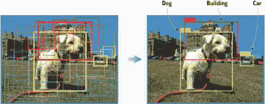

图 7.24 非极大值抑制将每个对象的边界框数量减少到仅一个。

## 7.4 只看一次 (YOLO)

与 R-CNN 系列类似，YOLO 是由 Joseph Redmon 等人开发的目标检测网络系列，并通过以下版本逐年改进：

+   YOLOv1，于 2016 年发布 9--被称为“统一、实时目标检测”，因为它是一个统一的检测网络，统一了检测器的两个组件：目标检测器和类别预测器。

+   YOLOv2（也称为 YOLO9000），稍后于 2016 年发布 10--能够检测超过 9,000 个对象；因此得名。它已在 ImageNet 和 COCO 数据集上训练，并实现了 16%的 mAP，这并不好；但它在测试时非常快。

+   YOLOv3，于 2018 年发布 11--比先前模型大得多，并实现了 57.9%的 mAP，这是 YOLO 系列目标检测器中的最佳结果。

YOLO 系列是一系列端到端深度学习模型，专为快速目标检测而设计，并且是构建快速实时目标检测器的首次尝试之一。它是现有最快的目标检测算法之一。尽管模型的精度接近但不如 R-CNNs，但由于它们的检测速度，它们在目标检测中很受欢迎，通常在实时视频或相机输入中演示。

YOLO 的创造者采用了与先前网络不同的方法。YOLO 不经过与 R-CNNs 类似的区域提议步骤。相反，它通过将输入分割成单元格网格来仅预测有限数量的边界框；每个单元格直接预测一个边界框和对象分类。结果是大量候选边界框，这些边界框通过 NMS（图 7.25）合并成最终的预测。

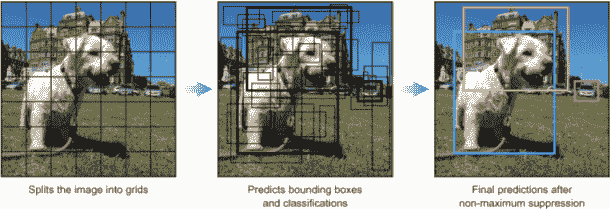

图 7.25 YOLO 将图像分割成网格，预测每个网格的对象，然后使用 NMS 最终确定预测。

YOLOv1 提出了通用架构，YOLOv2 优化了设计并利用预定义的锚框来改进边界框建议，YOLOv3 进一步优化了模型架构和训练过程。在本节中，我们将重点关注 YOLOv3，因为它目前在 YOLO 家族中是最先进的架构。

### 7.4.1 YOLOv3 的工作原理

YOLO 网络将输入图像分割成 S × S 的网格。如果真实值框的中心落在单元格中，则该单元格负责检测该物体的存在。每个网格单元格预测 B 个边界框及其物体得分和类别预测，如下所示：

+   B 个边界框的坐标--与之前的检测器类似，YOLO 为每个边界框(*b[x] , b[y] , b[w] , b[h]*)预测四个坐标，其中*x*和*y*被设置为单元格位置的偏移量。

+   物体得分 (*P*[0])--表示该单元格包含物体的概率。物体得分通过 sigmoid 函数转换为介于 0 和 1 之间的概率。物体得分的计算如下：

    *P*[0] = P[r] (包含物体) × IoU (预测，真实)

+   类别预测--如果边界框包含物体，网络预测 K 个类别的概率，其中 K 是您问题中的类别总数。

需要注意的是，在 v3 之前，YOLO 使用 softmax 函数对类别得分进行计算。在 v3 中，Redmon 等人决定使用 sigmoid。原因是 softmax 假设每个框恰好有一个类别，这通常并不成立。换句话说，如果一个物体属于一个类别，那么它肯定不属于另一个类别。虽然这个假设对于某些数据集是正确的，但在我们处理像“女性”和“人”这样的类别时可能不起作用。多标签方法可以更准确地建模数据。

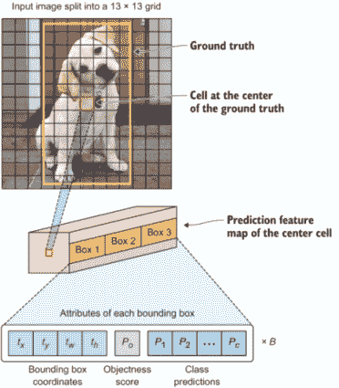

图 7.26 展示了将 13 × 13 网格应用于输入图像时的 YOLOv3 工作流程示例。输入图像被分割成 169 个单元格。每个单元格预测 B 个边界框及其物体得分，以及它们的类别预测。在这个例子中，我们展示了中心真实值单元格对 3 个边界框进行预测（B = 3）。每个预测具有以下属性：边界框坐标、物体得分和类别预测。

如图 7.26 所示，对于每个边界框 (*b*)，预测结果如下：[(边界框坐标)，(物体得分)，(类别预测)]。我们已经了解到，边界框坐标是四个值加上一个物体得分值和 K 个类别预测值。因此，所有边界框预测的总值是 5B + K 乘以网格 S × S 中的单元格数：

总预测值 = S × S × (5B + K)

#### 不同尺度的预测

仔细观察图 7.26。注意预测特征图有三个框。你可能想知道为什么有三个框。与 SSD 中的锚框概念类似，YOLOv3 有九个锚框，允许每个细胞在三个不同尺度上进行预测。检测层在具有步长 32、16 和 8 的三个不同大小的特征图上进行检测。这意味着对于大小为 416 × 416 的输入图像，我们在 13 × 13、26 × 26 和 52 × 52 的尺度上进行检测（图 7.27）。13 × 13 层负责检测大对象，26 × 26 层负责检测中等对象，52 × 52 层检测小对象。

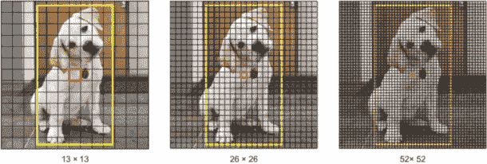

图 7.27 不同尺度的预测特征图

这导致每个细胞预测三个边界框（B = 3）。这就是为什么在图 7.26 中，预测特征图正在预测框 1、框 2 和框 3。负责检测狗的边界框将是与真实框具有最高 IoU 的锚框。

注意：在不同层上的检测有助于解决 YOLOv2 中常见的检测小对象的问题。上采样层可以帮助网络保留和学会细粒度特征，这对于检测小对象至关重要。

网络通过下采样输入图像直到第一个检测层来实现这一点，在该层使用步长为 32 的特征图进行检测。进一步，层通过 2 倍上采样并与具有相同特征图大小的先前层的特征图连接。现在在步长为 16 的层进行另一个检测。相同的上采样过程被重复，并在步长为 8 的层进行最终检测。

#### YOLOv3 输出边界框

对于大小为 416 × 416 的输入图像，YOLO 预测 ((52 × 52) + (26 × 26) + 13 × 13)) × 3 = 10,647 个边界框。对于一个输出来说，这是一个巨大的框数量。在我们的狗示例中，我们只有一个对象。我们只想在这个对象周围有一个边界框。我们如何将框从 10,647 个减少到 1 个？

首先，我们根据它们的对象性分数过滤框。通常，分数低于阈值的框被忽略。其次，我们使用 NMS 来解决同一图像的多次检测问题。例如，图像中心突出网格细胞的三个边界框都可能检测到一个框，或者相邻的单元格可能检测到同一个对象。

### 7.4.2 YOLOv3 架构

现在你已经了解了 YOLO 的工作原理，那么通过其架构将会非常简单直接。YOLO 是一个将目标检测和分类统一到一个端到端网络的单一神经网络。神经网络架构受到了 GoogLeNet 模型（Inception）在特征提取方面的启发。YOLO 不是使用 Inception 模块，而是使用 1 × 1 降维层后跟 3 × 3 卷积层。Redmon 和 Farhadi 将这个称为 DarkNet（图 7.28）。

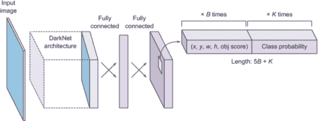

图 7.28 YOLO 的高级架构

YOLOv2 使用了一个定制的深度架构 darknet-19，一个原本 19 层的网络，增加了 11 个额外的层用于目标检测。具有 30 层架构的 YOLOv2 常常在小型目标检测上遇到困难。这归因于随着层对输入进行下采样而丢失了细粒度特征。然而，YOLOv2 的架构仍然缺少现在大多数最先进算法中稳定的一些最重要的元素：没有残差块，没有跳跃连接，没有上采样。YOLOv3 包含了所有这些更新。

YOLOv3 使用了名为 Darknet-53 的 DarkNet 变体（如图 7.29）。它有一个在 ImageNet 上训练的 53 层网络。为了检测任务，在其上又堆叠了 53 个额外的层，为 YOLOv3 提供了一个 106 层的全卷积底层架构。这就是 YOLOv3 相比 YOLOv2 慢的原因——但这也带来了检测精度的显著提升。

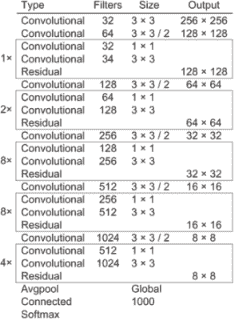

图 7.29 DarkNet-53 特征提取器架构。（来源：Redmon 和 Farhadi，2018。）

#### YOLOv3 的完整架构

我们刚刚了解到 YOLOv3 在三个不同的尺度上进行预测。当您看到完整的架构时，这会变得更加清晰，如图 7.30 所示。

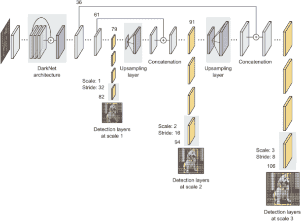

图 7.30 YOLOv3 网络架构。（灵感来源于 Ayoosh Kathuria 在 Medium 上的帖子“YOLO v3 的新特性是什么？”2018 年，[`mng.bz/lGN2`](http://mng.bz/lGN2)。）

输入图像通过 DarkNet-53 特征提取器，然后网络将图像下采样到第 79 层。网络分支并继续下采样图像，直到在第 82 层进行第一次预测。这种检测是在 13 × 13 的网格尺度上进行的，正如我们之前解释的那样，负责检测大型物体。

接下来，第 79 层的特征图上采样 2 倍到 26 × 26 的尺寸，并与第 61 层的特征图连接。然后，第 94 层在第 26 × 26 的网格尺度上进行第二次检测，负责检测中等物体。

最后，再次遵循类似的程序，第 91 层的特征图在经过少量上采样卷积层后，与第 36 层的特征图进行深度连接。第 106 层在第 52 × 52 的网格尺度上进行第三次预测，负责检测小型物体。

## 7.5 项目：在自动驾驶汽车应用中训练 SSD 网络

本项目的代码由 Pierluigi Ferrari 在他的 GitHub 仓库 ([`github.com/pierluigiferrari/ssd_keras`](https://github.com/pierluigiferrari/ssd_keras)) 创建。该项目已为本章改编；您可以在本书的可下载代码中找到此实现。

注意，对于这个项目，我们将构建一个名为 SSD7 的小型 SSD 网络。SSD7 是 SSD300 网络的七层版本。需要注意的是，虽然 SSD7 网络会产生一些可接受的结果，但这并不是一个优化的网络架构。目标是构建一个低复杂度的网络，足够快，以便您可以在个人计算机上训练。我在道路交通数据集上训练这个网络大约花费了 20 个小时；在 GPU 上训练可能需要的时间少得多。

**注意** Pierluigi Ferrari 创建的原始仓库包含 SSD7、SSD300 和 SSD512 网络的实现教程。我鼓励您查看。

在这个项目中，我们将使用由 Udacity 创建的玩具数据集。您可以访问 Udacity 的 GitHub 仓库以获取有关数据集的更多信息（[`github.com/udacity/self-driving-car/tree/master/annotations`](https://github.com/udacity/self-driving-car/tree/master/annotations)）。该数据集包含超过 22,000 个标记的图像和 5 个对象类别：汽车、卡车、行人、骑自行车的人和交通灯。所有图像都已调整大小，高度为 300 像素，宽度为 480 像素。您可以将数据集作为本书代码的一部分下载。

**注意** GitHub 数据仓库归 Udacity 所有，并且在此写作之后可能会更新。为了避免任何混淆，我下载了用于创建此项目的数据集，并将其与本书的代码一起提供，以便您可以在项目中复制这些结果。

使这个数据集非常有趣的是，这些是在加利福尼亚州山景城及其邻近城市白天驾驶时拍摄的真实时间图像。没有进行图像清理。请查看图 7.31 中的图像示例。

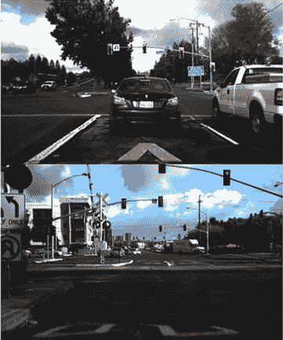

图 7.31 Udacity 自动驾驶数据集的示例图像（图像版权©2016 Udacity，在 MIT 许可证下发布。）

如 Udacity 页面所述，数据集由 CrowdAI 和 Autti 标记。您可以在文件夹中找到 CSV 格式的标签，分为三个文件：训练集、验证集和测试集。标记格式简单，如下所示：

| frame | xmin | xmax | ymin | ymax | class_id |
| --- | --- | --- | --- | --- | --- |
| 1478019952686311006.jpg | 237 | 251 | 143 | 155 | 1 |

Xmin、xmax、ymin 和 ymax 是边界框坐标。Class_id 是正确的标签，frame 是图像名称。

使用 LabelImg 进行数据标注

如果您正在标注自己的数据，有几个开源标注应用程序可供使用，例如 LabelImg ([`pypi.org/project/labelImg`](https://pypi.org/project/labelImg))。它们非常容易设置和使用。

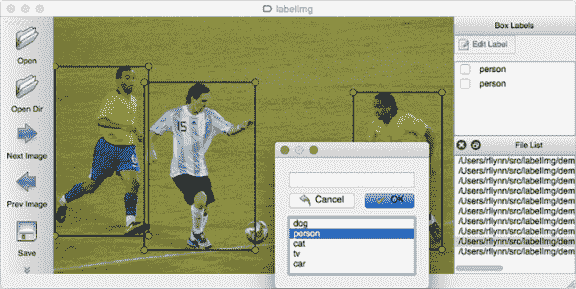

使用 labelImg 应用程序标注图像的示例

### 7.5.1 步骤 1：构建模型

在开始模型训练之前，仔细查看`keras_ssd7.py`文件中的`build_model`方法。此文件使用 SSD 架构构建 Keras 模型。正如我们在本章前面所学，该模型由卷积特征层和多个从不同特征层获取输入的卷积预测层组成。

下面是`build_model`方法的样子。请阅读`keras_ssd7.py`文件中的注释以了解传递的参数：

```
def build_model(image_size,
               mode='training',
               l2_regularization=0.0,
               min_scale=0.1,
               max_scale=0.9,
               scales=None,
               aspect_ratios_global=[0.5, 1.0, 2.0],
               aspect_ratios_per_layer=None,
               two_boxes_for_ar1=True,
               clip_boxes=False,
               variances=[1.0, 1.0, 1.0, 1.0],
               coords='centroids',
               normalize_coords=False,
               subtract_mean=None,
               divide_by_stddev=None,
               swap_channels=False,
               confidence_thresh=0.01,
               iou_threshold=0.45,
               top_k=200,
               nms_max_output_size=400,
               return_predictor_sizes=False)
```

### 7.5.2 步骤 2：模型配置

在本节中，我们设置模型配置参数。首先，我们将高度、宽度和颜色通道数设置为模型接受的图像输入。如果您的输入图像的大小与这里定义的不同，或者如果您的图像大小不均匀，您必须使用数据生成器的图像变换（调整大小和/或裁剪），以确保在输入模型之前，您的图像达到所需的输入大小：

```
img_height = 300            ❶
img_width = 480             ❶
img_channels = 3            ❶

intensity_mean = 127.5      ❷
intensity_range = 127.5     ❷
```

❶ 输入图像的高度、宽度和通道数

❷ 设置为您的偏好（可能是 None）。当前设置将输入像素值转换为区间[-1,1]。

类别数量是您数据集中正类别的数量：例如，PASCAL VOC 为 20，COCO 为 80。类别 ID 0 必须始终保留为背景类别：

```
n_classes = 5                                ❶

scales = [0.08, 0.16, 0.32, 0.64, 0.96]      ❷

aspect_ratios = [0.5, 1.0, 2.0]              ❸
steps = None                                 ❹
offsets = None                               ❺

two_boxes_for_ar1 = True                     ❻

clip_boxes = False                           ❼

variances = [1.0, 1.0, 1.0, 1.0]             ❽

normalize_coords = True                      ❾
```

❶ 我们数据集中的类别数量

❷ 明确的锚框缩放因子列表。如果传递了此参数，它将覆盖 min_scale 和 max_scale 参数。

❸ 锚框的纵横比列表

❹ 如果您想手动设置锚框网格的步长大小；不推荐

❺ 如果您想手动设置锚框网格的偏移量；不推荐

❻ 指定是否为纵横比 1 生成两个锚框

❼ 指定是否将锚框裁剪到图像边界内

❽ 通过编码目标坐标缩放的方差列表

❾ 指定模型是否应使用相对于图像大小的坐标

### 7.5.3 步骤 3：创建模型

现在我们调用`build_model()`函数来构建我们的模型：

```
model = build_model(image_size=(img_height, img_width, img_channels),
                    n_classes=n_classes,
                    mode='training',
                    l2_regularization=0.0005,
                    scales=scales,
                    aspect_ratios_global=aspect_ratios,
                    aspect_ratios_per_layer=None,
                    two_boxes_for_ar1=two_boxes_for_ar1,
                    steps=steps,
                    offsets=offsets,
                    clip_boxes=clip_boxes,
                    variances=variances,
                    normalize_coords=normalize_coords,
                    subtract_mean=intensity_mean,
                    divide_by_stddev=intensity_range)
```

您可以可选地加载保存的权重。如果您不想加载权重，请跳过以下代码片段：

```
model.load_weights('<path/to/model.h5>', by_name=True)
```

实例化一个 Adam 优化器和 SSD 损失函数，并编译模型。在这里，我们将使用一个名为`SSDLoss`的自定义 Keras 函数。它实现了多任务对数损失用于分类和光滑 L1 损失用于定位。`neg_pos_ratio`和`alpha`设置为 SSD 论文（Liu et al., 2016）中所述：

```
adam = Adam(lr=0.001, beta_1=0.9, beta_2=0.999, epsilon=1e-08, decay=0.0)

ssd_loss = SSDLoss(neg_pos_ratio=3, alpha=1.0)

model.compile(optimizer=adam, loss=ssd_loss.compute_loss)
```

### 7.5.4 步骤 4：加载数据

要加载数据，请按照以下步骤操作：

1.  实例化两个`DataGenerator`对象——一个用于训练，一个用于验证：

    ```
    train_dataset = DataGenerator(load_images_into_memory=False, 
        hdf5_dataset_path=None)
    val_dataset = DataGenerator(load_images_into_memory=False, 
        hdf5_dataset_path=None)
    ```

1.  解析训练和验证数据集的图像和标签列表：

    ```
    images_dir = 'path_to_downloaded_directory'

    train_labels_filename = 'path_to_dataset/labels_train.csv'     ❶
    val_labels_filename   = 'path_to_dataset/labels_val.csv'

    train_dataset.parse_csv(images_dir=images_dir,
                          labels_filename=train_labels_filename,
                          input_format=['image_name', 'xmin', 'xmax', 'ymin',
                                        'ymax', 'class_id'],
                          include_classes='all')

    val_dataset.parse_csv(images_dir=images_dir,
                          labels_filename=val_labels_filename,
                          input_format=['image_name', 'xmin', 'xmax', 'ymin',
                                        'ymax', 'class_id'],
                          include_classes='all')

    train_dataset_size = train_dataset.get_dataset_size()          ❷
    val_dataset_size   = val_dataset.get_dataset_size()            ❷

    print("Number of images in the training dataset:\t{:>6}".format(train_dataset_size))
    print("Number of images in the validation dataset:\t{:>6}".format(val_dataset_size))
    ```

    ❶ 真实值

    ❷ 获取训练和验证数据集的样本数量

    此单元格应按如下方式打印出您的训练和验证数据集的大小：

    ```
    Number of images in the training dataset:     18000
    Number of images in the validation dataset:    4241
    ```

1.  设置批量大小：

    ```
    batch_size = 16
    ```

    如您在第四章所学，您可以根据用于此训练的硬件增加批处理大小以获得计算速度的提升。

1.  定义数据增强过程：

    ```
    data_augmentation_chain = DataAugmentationConstantInputSize(
                                           random_brightness=(-48, 48, 0.5),
                                           random_contrast=(0.5, 1.8, 0.5),
                                           random_saturation=(0.5, 1.8, 0.5),
                                           random_hue=(18, 0.5),
                                           random_flip=0.5,
                                           random_translate=((0.03,0.5),                                                       (0.03,0.5), 0.5),
                                           random_scale=(0.5, 2.0, 0.5),
                                           n_trials_max=3,
                                           clip_boxes=True,
                                           overlap_criterion='area',
                                           bounds_box_filter=(0.3, 1.0),
                                           bounds_validator=(0.5, 1.0),
                                           n_boxes_min=1,
                                           background=(0,0,0))
    ```

1.  实例化一个编码器，可以将真实标签编码成 SSD 损失函数所需的格式。在这里，编码器构造函数需要模型预测层的空间维度来创建锚框：

    ```
    predictor_sizes = [model.get_layer('classes4').output_shape[1:3],
                       model.get_layer('classes5').output_shape[1:3],
                       model.get_layer('classes6').output_shape[1:3],
                       model.get_layer('classes7').output_shape[1:3]]

    ssd_input_encoder = SSDInputEncoder(img_height=img_height,
                                        img_width=img_width,
                                        n_classes=n_classes,
                                        predictor_sizes=predictor_sizes,
                                        scales=scales,
                                        aspect_ratios_global=aspect_ratios,
                                        two_boxes_for_ar1=two_boxes_for_ar1,
                                        steps=steps,
                                        offsets=offsets,
                                        clip_boxes=clip_boxes,
                                        variances=variances,
                                        matching_type='multi',
                                        pos_iou_threshold=0.5,
                                        neg_iou_limit=0.3,
                                        normalize_coords=normalize_coords)
    ```

1.  创建将传递给 Keras 的`fit_generator()`函数的生成器处理程序：

    ```
    train_generator = train_dataset.generate(batch_size=batch_size,
                                             shuffle=True,
                                             transformations=[                                                 data_augmentation_chain],
                                             label_encoder=ssd_input_encoder,
                                             returns={'processed_images',
                                                      'encoded_labels'},
                                             keep_images_without_gt=False)

    val_generator = val_dataset.generate(batch_size=batch_size,
                                         shuffle=False,
                                         transformations=[],
                                         label_encoder=ssd_input_encoder,
                                         returns={'processed_images',
                                                  'encoded_labels'},
                                         keep_images_without_gt=False)
    ```

### 7.5.5 步骤 5：训练模型

一切准备就绪，我们现在可以训练我们的 SSD7 网络了。我们已经选择了一个优化器和学习率，并设置了批处理大小；现在让我们设置剩余的训练参数并训练网络。这里没有新的参数是您之前没有学过的。我们将设置模型检查点、提前停止和学习率降低率：

```
model_checkpoint = 
ModelCheckpoint(filepath='ssd7_epoch-{epoch:02d}_loss-{loss:.4f}_val_loss-{val_loss:.4f}.h5',
                                   monitor='val_loss',
                                   verbose=1,
                                   save_best_only=True,
                                   save_weights_only=False,
                                   mode='auto',
                                   period=1)

csv_logger = CSVLogger(filename='ssd7_training_log.csv',
                       separator=',',
                       append=True)

early_stopping = EarlyStopping(monitor='val_loss',                ❶
                               min_delta=0.0,
                               patience=10,
                               verbose=1)

reduce_learning_rate = ReduceLROnPlateau(monitor='val_loss',      ❷
                                         factor=0.2,
                                         patience=8,
                                         verbose=1,
                                         epsilon=0.001,
                                         cooldown=0,
                                         min_lr=0.00001)

callbacks = [model_checkpoint, csv_logger, early_stopping, reduce_learning_rate]
```

❶ 如果验证损失在 10 个连续的 epoch 中没有提高，则提前停止

❷ 当学习率达到平台期时的学习率降低率

将一个 epoch 设置为包含 1,000 个训练步骤。我在这里任意地将 epoch 数设置为 20。这并不一定意味着 20,000 个训练步骤是最佳数量。根据模型、数据集、学习率等因素，您可能需要更长时间（或更短）的训练才能达到收敛：

```
initial_epoch   = 0                                                ❶
final_epoch     = 20                                               ❶
steps_per_epoch = 1000

history = model.fit_generator(generator=train_generator,           ❷
                              steps_per_epoch=steps_per_epoch,
                              epochs=final_epoch,
                              callbacks=callbacks,
                              validation_data=val_generator,
                              validation_steps=ceil(                                           val_dataset_size/batch_size),
                              initial_epoch=initial_epoch)
```

❶ 如果您正在继续之前的训练，请相应地设置 initial_epoch 和 final_epoch。

❷ 开始训练

### 7.5.6 步骤 6：可视化损失

让我们可视化`loss`和`val_loss`值，看看训练和验证损失是如何演变的，并检查我们的训练是否朝着正确的方向进行（图 7.32）：

```
plt.figure(figsize=(20,12))
plt.plot(history.history['loss'], label='loss')
plt.plot(history.history['val_loss'], label='val_loss')
plt.legend(loc='upper right', prop={'size': 24})

```

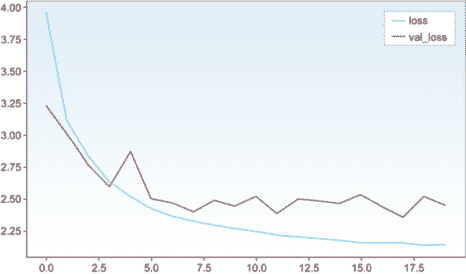

图 7.32 SSD7 训练 20 个 epoch 期间可视化的`loss`和`val_loss`值

### 7.5.7 步骤 7：进行预测

现在让我们使用训练好的模型在验证数据集上进行一些预测。为了方便，我们将使用我们已设置的验证生成器。您可以随意更改批处理大小：

```
predict_generator = val_dataset.generate(batch_size=1,                    ❶
                                         shuffle=True,
                                         transformations=[],
                                         label_encoder=None,
                                         returns={'processed_images',
                                                  'processed_labels',
                                                  'filenames'},
                                         keep_images_without_gt=False)

batch_images, batch_labels, batch_filenames = next(predict_generator)     ❷

y_pred = model.predict(batch_images)                                      ❸

y_pred_decoded = decode_detections(y_pred,                                ❹
                                   confidence_thresh=0.5,
                                   iou_threshold=0.45,
                                   top_k=200,
                                   normalize_coords=normalize_coords,
                                   img_height=img_height,
                                   img_width=img_width)

np.set_printoptions(precision=2, suppress=True, linewidth=90)
print("Predicted boxes:\n")
print('   class   conf xmin   ymin   xmax   ymax')
print(y_pred_decoded[i])
```

❶ 1. 设置预测的生成器。

❷ 2. 生成样本。

❸ 3. 进行预测。

❹ 4. 解码原始预测 y_pred。

此代码片段打印出预测的边界框及其类别和每个边界框的置信度，如图 7.33 所示。

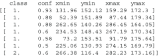

图 7.33 预测的边界框、置信度和类别

当我们将这些预测框绘制到图像上时，如图 7.34 所示，每个预测框旁边都有其置信度以及类别名称。真实框也被绘制到图像上进行比较。

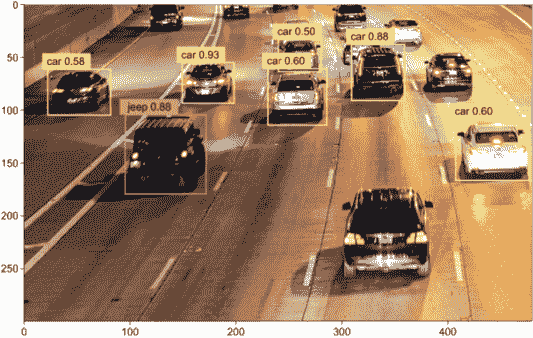

图 7.34 将预测框绘制到图像上

## 摘要

+   图像分类是预测图像中对象类型或类别的任务。

+   目标检测是通过边界框预测图像中对象的位置以及定位对象的类别。

+   目标检测系统的一般框架包括四个主要组件：区域提议，特征提取和预测，非极大值抑制，以及评估指标。

+   目标检测算法使用两个主要指标进行评估：每秒帧数（FPS）来衡量网络的速率，以及平均精度均值（mAP）来衡量网络的精度。

+   最受欢迎的三种目标检测系统是 R-CNN 系列网络，SSD 和 YOLO 系列网络。

+   R-CNN 系列网络有三个主要变体：R-CNN，Fast R-CNN 和 Faster R-CNN。R-CNN 和 Fast R-CNN 使用选择性搜索算法来提议 RoIs，而 Faster R-CNN 是一个端到端深度学习系统，它使用区域提议网络来提议 RoIs。

+   YOLO 网络家族包括 YOLOv1，YOLOv2（或 YOLO9000）和 YOLOv3。

+   R-CNN 是一个多阶段检测器：它将预测边界框对象分数和对象类别的过程分为两个不同的阶段。

+   SSD 和 YOLO 是单阶段检测器：图像通过网络一次来预测对象分数和对象类别。

+   通常，单阶段检测器比双阶段检测器精度低，但速度要快得多。

* * *

1. 罗斯·吉什克，杰夫·多纳休，特雷弗·达尔，和吉滕德拉·马利克， “用于准确目标检测和语义分割的丰富特征层次结构，” 2014，[`arxiv.org/abs/1311.2524`](http://arxiv.org/abs/1311.2524).

2. 罗斯·吉什克， “Fast R-CNN，” 2015，[`arxiv.org/abs/1504.08083`](http://arxiv.org/abs/1504.08083).

3. 邵庆庆，何凯明，罗斯·吉什克，和孙剑， “Faster R-CNN: 使用区域提议网络的实时目标检测，” 2016，[`arxiv.org/abs/1506.01497`](http://arxiv.org/abs/1506.01497).

4. 马修·D·泽勒和罗布·弗格森， “可视化与理解卷积网络，” 2013，[`arxiv.org/abs/1311.2901`](http://arxiv.org/abs/1311.2901).

5. 卡伦·西蒙扬和安德鲁·齐塞曼， “用于大规模图像识别的非常深的卷积网络，” 2014，[`arxiv.org/abs/1409.1556`](http://arxiv.org/abs/1409.1556).

6. 安德鲁·G·豪厄德，朱孟龙，陈波，卡列宁琴科·德米特里，王伟军，韦安德·托比亚斯，安德烈托·马可，亚当·哈特维格， “MobileNets: 用于移动视觉应用的效率卷积神经网络，” 2017，[`arxiv.org/abs/1704.04861`](http://arxiv.org/abs/1704.04861).

7. 高翔，刘壮，范德马滕·劳伦斯，和奎因伯格·基利安， “密集连接卷积网络，” 2016，[`arxiv.org/abs/1608.06993`](http://arxiv.org/abs/1608.06993).

8. 刘伟，安格洛夫·德拉戈米尔，厄尔汉·杜米特鲁，塞格迪·克里斯蒂安，里德·斯科特，傅成阳，亚历山大·C·伯格， “SSD: 单阶段多框检测器，” 2016，[`arxiv.org/abs/1512.02325`](http://arxiv.org/abs/1512.02325).

9.约瑟夫·雷德蒙、桑托什·迪瓦拉、罗斯·吉什克和阿里·法哈迪，“你只需看一次：统一、实时目标检测”，2016 年，[`arxiv.org/abs/1506.02640`](http://arxiv.org/abs/1506.02640)。

10.约瑟夫·雷德蒙和阿里·法哈迪，“YOLO9000：更好、更快、更强”，2016 年，[`arxiv.org/abs/1612.08242`](http://arxiv.org/abs/1612.08242)。

11.约瑟夫·雷德蒙和阿里·法哈迪，“YOLOv3：渐进式改进”，2018 年，[`arxiv.org/abs/1804.02767`](http://arxiv.org/abs/1804.02767)。
