# 8 生成对抗网络 (GANs)

本章涵盖

+   理解 GANs 的基本组件：生成模型和判别模型

+   评估生成模型

+   了解 GANs 在流行视觉应用中的使用

+   构建 GAN 模型

生成对抗网络 (GANs) 是由蒙特利尔大学的 Ian Goodfellow 及其他研究人员，包括 Yoshua Bengio，于 2014 年引入的一种新型神经网络架构。1 Facebook 的 AI 研究总监 Yann LeCun 将 GANs 称为“过去 10 年机器学习中最有趣的想法”。这种兴奋是有充分理由的。GANs 最显著的特点是它们能够创建超逼真的图像、视频、音乐和文本。例如，除了最右侧的列外，图 8.1 右侧显示的所有面部都不是真实人类的；它们都是伪造的。图左侧的手写数字也是如此。这表明 GAN 能够从训练图像中学习特征，并使用其学到的模式想象出新的图像。

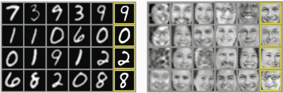

图 8.1 Goodfellow 及其合作者展示的 GANs 能力的说明。这些是在对两个数据集（MNIST 和多伦多面部数据集 [TFD]）进行训练后由 GANs 生成的样本。在两种情况下，最右侧的列包含真实数据。这表明生成数据确实是生成的，而不仅仅是网络记忆的。 (来源：Goodfellow 等，2014 年。)

在过去的章节中，我们学习了如何使用深度神经网络来理解图像特征并在其上执行确定性任务，如对象分类和检测。在这本书的这一部分，我们将讨论计算机视觉世界中深度学习的另一种类型的应用：生成模型。这些是能够想象并产生以前未曾创造过的新内容的神经网络模型。它们能够以看似神奇的方式想象出新的世界、新的人和新的现实。我们通过提供特定领域的训练数据集来训练生成模型；它们的任务是创建看起来像真实数据的新对象图像。

很长一段时间以来，人类在计算机上拥有优势：想象和创造的能力。计算机在解决回归、分类和聚类等问题上表现出色。但随着生成网络的引入，研究人员可以让计算机生成与人类对手相同或更高质量的内容。通过学习模仿任何数据分布，计算机可以被教会创造与我们自己的世界相似的内容，无论在哪个领域：图像、音乐、语音、散文。从某种意义上说，它们是机器人艺术家，它们的产出令人印象深刻。GAN 也被视为实现通用人工智能（AGI）的重要垫脚石，这是一种能够匹配人类认知能力，在几乎任何领域获得专业知识的人工系统——从图像到语言，再到创作十四行诗所需的创造性技能。

自然地，这种生成新内容的能力使得 GAN 看起来有点像魔法，至少一开始是这样。在本章中，我们只尝试揭开 GAN 可能性的冰山一角。我们将克服 GAN 的表面魔法，深入探讨这些模型背后的架构思想和数学，以便提供必要的理论知识与实践技能，继续探索这个领域中最吸引你的任何方面。我们不仅将讨论 GAN 所依赖的基本概念，还将实现和训练一个端到端 GAN，并逐步进行。让我们开始吧！

## 8.1 GAN 架构

GAN 基于对抗性训练的理念。GAN 架构基本上由两个相互竞争的神经网络组成：

+   生成器试图将随机噪声转换为看起来像是来自原始数据集的观察值。

+   判别器试图预测一个观察值是否来自原始数据集或生成器的伪造品。

这种竞争性帮助他们模仿任何数据分布。我喜欢将 GAN 架构想象成两个拳击手在打架（图 8.2）：在争取赢得比赛的过程中，他们都在学习对方的动作和技术。他们开始时对对手的了解较少，随着比赛的进行，他们不断学习和变得更好。

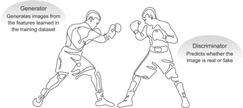

图 8.2 两个对抗性网络之间的战斗：生成性和判别性

另一个类比将有助于阐明这个观点：将 GAN 想象成猫捉老鼠游戏中伪造者和警察的对立面，其中伪造者正在学习传递假钞，而警察正在学习检测它们（图 8.3）。双方都是动态的：随着伪造者学会完美地制作假钞，警察正在训练并提高检测假币的能力。双方都在不断学习对方的方法，形成一种持续的升级。

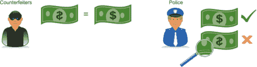

图 8.3 GAN 的生成器和判别器模型就像是一个伪造者和一个警察。

如你在图 8.4 的架构图中所见，GAN 执行以下步骤：

1.  生成器接收随机数字并返回一个图像。

1.  这个生成的图像被输入到判别器中，同时还有从实际的真实数据集中提取的图像流。

1.  判别器接收真实和虚假的图像，并返回概率：介于 0 和 1 之间的数字，其中 1 代表对真实性的预测，0 代表对虚假的预测。

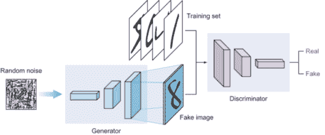

图 8.4 GAN 架构由生成器和判别器网络组成。请注意，判别器网络是一个典型的卷积神经网络（CNN），其中卷积层的大小逐渐减小，直到达到展平层。另一方面，生成器网络是一个倒置的 CNN，它从展平的向量开始：卷积层的大小逐渐增加，直到形成输入图像的维度。

如果你仔细观察生成器和判别器网络，你会注意到生成器网络是一个倒置的卷积神经网络（ConvNet），它从展平的向量开始。图像被上采样，直到它们的大小与训练数据集中的图像相似。我们将在本章后面更深入地探讨生成器架构——我只是想让你现在注意到这个现象。

### 8.1.1 深度卷积 GANs (DCGANs)

在 2014 年的原始 GAN 论文中，多层感知器（MLP）网络被用来构建生成器和判别器网络。然而，从那时起，已经证明卷积层为判别器提供了更大的预测能力，这反过来又提高了生成器和整体模型的准确性。这种类型的 GAN 被称为深度卷积 GAN（DCGAN），由 Alec Radford 等人于 2016 年开发。2 现在，所有 GAN 架构都包含卷积层，因此当我们谈论 GAN 时，“DC”是隐含的；因此，在本章的其余部分，我们将 DCGAN 称为 GAN 和 DCGAN。你还可以回顾第二章和第三章，了解更多关于 MLP 和 CNN 网络之间的差异以及为什么 CNN 更适合图像问题。接下来，让我们更深入地探讨判别器和生成器网络的架构。

### 8.1.2 判别器模型

如前所述，判别器的目标是预测图像是真实的还是虚假的。这是一个典型的监督分类问题，因此我们可以使用我们在前几章中学到的传统分类器网络。该网络由堆叠的卷积层组成，后面跟着一个具有 sigmoid 激活函数的密集输出层。我们使用 sigmoid 激活函数，因为这是一个二元分类问题：网络的目的是输出介于 0 和 1 之间的预测概率值，其中 0 表示生成器生成的图像是虚假的，1 表示它是 100%真实的。

权衡器是一个正常、易于理解的分类模型。如图 8.5 所示，训练权衡器相当直接。我们向权衡器提供标记图像：伪造（或生成）的图像和真实图像。真实图像来自训练数据集，伪造图像是生成器模型的输出。

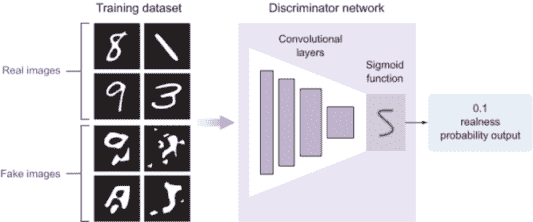

图 8.5 GAN 的权衡器

现在，让我们在 Keras 中实现权衡器网络。在本章末尾，我们将把所有代码片段组合起来构建一个端到端的 GAN。我们首先实现一个`discriminator_model`函数。在这个代码片段中，图像输入的形状是 28 × 28；你可以根据你的问题需要更改它：

```
def discriminator_model():
       discriminator = Sequential()                                             ❶

       discriminator.add(Conv2D(32, kernel_size=3, strides=2,
                         input_shape=(28,28,1),padding="same"))                 ❷

       discriminator.add(LeakyReLU(alpha=0.2))                                  ❸

       discriminator.add(Dropout(0.25))                                         ❹

       discriminator.add(Conv2D(64, kernel_size=3, strides=2, padding="same"))  ❺
       discriminator.add(ZeroPadding2D(padding=((0,1),(0,1))))                  ❺

       discriminator.add(BatchNormalization(momentum=0.8))                      ❻
       discriminator.add(LeakyReLU(alpha=0.2))                                  ❻
       discriminator.add(Dropout(0.25))                                         ❻

       discriminator.add(Conv2D(128, kernel_size=3, strides=2, padding="same")) ❼
       discriminator.add(BatchNormalization(momentum=0.8))                      ❼
       discriminator.add(LeakyReLU(alpha=0.2))                                  ❼
       discriminator.add(Dropout(0.25))                                         ❼

       discriminator.add(Conv2D(256, kernel_size=3, strides=1, padding="same")) ❽
       discriminator.add(BatchNormalization(momentum=0.8))                      ❽
       discriminator.add(LeakyReLU(alpha=0.2))                                  ❽
       discriminator.add(Dropout(0.25))                                         ❽

       discriminator.add(Flatten())                                             ❾
       discriminator.add(Dense(1, activation='sigmoid'))                        ❾

       discriminator.summary()                                                  ❿

       img_shape = (28,28,1)                                                    ⓫
       img = Input(shape=img_shape)   

       probability = discriminator(img)                                         ⓬

       return Model(img, probability)                                           ⓭
```

❶ 实例化了一个序列模型，并将其命名为 discriminator

❷ 向权衡器模型添加了一个卷积层

❸ 添加了漏斗 ReLU 激活函数

❹ 添加了一个 dropout 层，dropout 概率为 25%

❺ 添加了一个带有零填充的第二卷积层

❻ 添加了一个批量归一化层以实现更快的学习和更高的精度

❼ 添加了第三个卷积层，包含批量归一化、漏斗 ReLU 和 dropout

❽ 添加了第四个卷积层，包含批量归一化、漏斗 ReLU 和 dropout

❾ 将网络展平，并添加了具有 sigmoid 激活函数的输出密集层

❿ 打印模型摘要

⓫ 设置了输入图像的形状

⓬ 运行权衡器模型以获取输出概率

⓭ 返回一个以图像为输入并产生概率输出的模型

权衡器模型的输出摘要如图 8.6 所示。正如你可能已经注意到的，没有什么新东西：权衡器模型遵循我们在第 3、4 和 5 章中学到的传统 CNN 网络的常规模式。我们堆叠卷积、批量归一化、激活和 dropout 层来创建我们的模型。所有这些层都有超参数，我们在训练网络时调整这些超参数。对于你的实现，你可以调整这些超参数，根据需要添加或删除层。CNN 超参数的调整在第 3 和第四章中有详细解释。

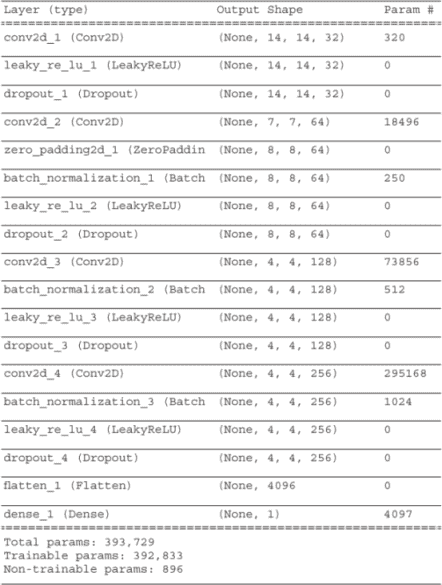

图 8.6 权衡器模型的输出摘要

在图 8.6 的输出摘要中，请注意输出特征图的宽度和高度在减小，而深度在增加。这是我们之前章节中看到的传统 CNN 网络的预期行为。让我们在下一节中看看生成器网络中的特征图大小会发生什么变化。

### 8.1.3 生成器模型

生成器接收一些随机数据，并试图模仿训练数据集以生成假图像。它的目标是试图生成与训练数据集完美匹配的图像来欺骗判别器。随着训练的进行，它在每次迭代后都会变得越来越好。但是判别器也在同时进行训练，因此生成器必须随着判别器学习其技巧而不断改进。

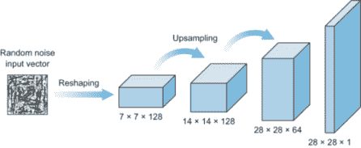

图 8.7 GAN 的生成器模型

如图 8.7 所示，生成器模型看起来像一个倒置的卷积神经网络。生成器接收一个包含一些随机噪声数据的向量输入，并将其重塑为一个具有宽度、高度和深度的立方体体积。这个体积被用来作为特征图，将被输入到几个卷积层中，以创建最终的图像。

#### 上采样以缩放特征图

传统卷积神经网络使用池化层对输入图像进行下采样。为了缩放特征图，我们使用上采样层，通过重复输入像素的每一行和每一列来缩放图像维度。

Keras 有一个上采样层（`Upsampling2D`），它通过将一个缩放因子（`size`）作为参数来缩放图像维度：

```
keras.layers.UpSampling2D(size=(2, 2))
```

这行代码重复图像矩阵的每一行和每一列两次，因为缩放因子的尺寸设置为(2, 2)；参见图 8.8。如果缩放因子是(3, 3)，上采样层将输入矩阵的每一行和每一列重复三次，如图 8.9 所示。

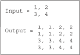

图 8.8 当缩放大小为(2, 2)时的上采样示例

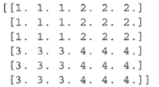

图 8.9 当缩放大小为(3, 3)时的上采样示例

当我们构建生成器模型时，我们会不断添加上采样层，直到特征图的大小与训练数据集相似。你将在下一节中看到如何在 Keras 中实现这一点。

现在，让我们构建`generator_model`函数，该函数构建生成器网络：

```
   def generator_model():
       generator = Sequential()                                              ❶
       generator.add(Dense(128 * 7 * 7, activation="relu", input_dim=100))   ❷
       generator.add(Reshape((7, 7, 128)))                                   ❸
       generator.add(UpSampling2D(size=(2,2)))                               ❹

       generator.add(Conv2D(128, kernel_size=3, padding="same"))             ❺
       generator.add(BatchNormalization(momentum=0.8))                       ❺
       generator.add(Activation("relu"))
       generator.add(UpSampling2D(size=(2,2)))                               ❻

# convolutional + batch normalization layers
       generator.add(Conv2D(64, kernel_size=3, padding="same"))              ❼
       generator.add(BatchNormalization(momentum=0.8))                       ❼
       generator.add(Activation("relu"))

# convolutional layer with filters = 1
       generator.add(Conv2D(1, kernel_size=3, padding="same"))
       generator.add(Activation("tanh"))
       generator.summary()                                                   ❽

       noise = Input(shape=(100,))                                           ❾
       fake_image = generator(noise)                                         ❿
       return Model(noise, fake_image)                                       ⓫
```

❶ 实例化一个序列模型并将其命名为 generator

❷ 添加一个具有 128 × 7 × 7 个神经元的密集层

❸ 将图像维度重塑为 7 × 7 × 128

❹ 上采样层将图像维度的大小加倍到 14 × 14

❺ 添加一个卷积层来运行卷积过程和批量归一化

❻ 将图像维度上采样到 28 × 28

❼ 我们在这里不添加上采样，因为 28 × 28 的图像大小与 MNIST 数据集中的图像大小相同。你可以根据你自己的问题进行调整。

❽ 打印模型摘要

❾ 生成长度为 100 的输入噪声向量。我们在这里使用 100 来创建一个简单的网络。

❿ 运行生成器模型以创建假图像

⓫ 返回一个模型，该模型以噪声向量为输入，并输出假图像

生成器模型的输出总结如图 8.10 所示。在代码片段中，唯一的新组件是 `Upsampling` 层，通过重复像素来加倍其输入维度。与判别器类似，我们在每一层卷积层之上堆叠其他优化层，如 `BatchNormalization`。生成器模型的关键区别在于它从扁平化的向量开始；图像被上采样，直到它们的尺寸与训练数据集相似。所有这些层都有超参数，我们在训练网络时调整这些超参数。对于你的实现，你可以根据需要调整这些超参数，添加或删除层。

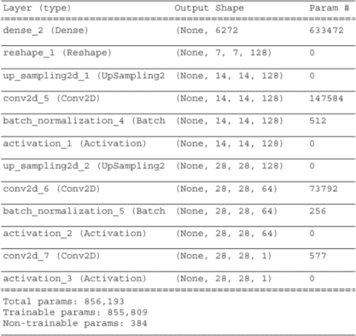

图 8.10 生成器模型的输出总结

注意每一层输出形状的变化。它从一个包含 6,272 个神经元的 1D 向量开始。我们将其重塑为一个 7 × 7 × 128 的体积，然后宽度高度被上采样两次，变为 14 × 14，接着是 28 × 28。深度从 128 减少到 64，再减少到 1，因为此网络是为了处理我们将在本章后面实现的灰度 MNIST 数据集项目而构建的。如果你正在构建一个用于生成彩色图像的生成器模型，那么你应该将最后一层卷积层的过滤器设置为 3。

### 8.1.4 训练 GAN

现在我们已经分别学习了判别器和生成器模型，让我们将它们组合起来训练一个端到端的生成对抗网络。判别器正在被训练成为一个更好的分类器，以最大化将正确标签分配给训练示例（真实）和生成器生成的图像（伪造）的概率：例如，警察将更好地区分假币和真币。另一方面，生成器正在被训练成为一个更好的伪造者，以最大化欺骗判别器的机会。这两个网络都在它们所做的事情上变得更擅长。

训练 GAN 模型的过程涉及两个过程：

1.  训练判别器。这是一个直接的监督训练过程。网络被提供了来自生成器（伪造）和训练数据（真实）的标记图像，并学习通过 sigmoid 预测输出区分真实和伪造图像。这里没有什么新内容。

1.  训练生成器。这个过程有点棘手。生成器模型不能像判别器那样单独训练。它需要判别器模型来告诉它是否成功地伪造了图像。因此，我们创建了一个由判别器和生成器模型组成的组合网络来训练生成器。

将训练过程想象成两条平行的车道。一条车道单独训练判别器，另一条车道是训练生成器的组合模型。GAN 训练过程如图 8.11 所示。

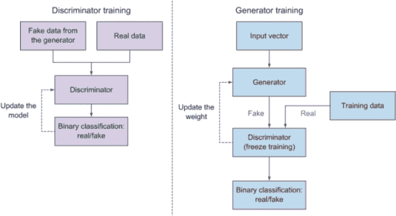

图 8.11 训练 GAN 的流程图

正如你在图 8.11 中看到的，在训练组合模型时，我们冻结了判别器的权重，因为这个模型只专注于训练生成器。当我们解释生成器训练过程时，我们将讨论这个想法背后的直觉。现在，只需知道我们需要构建和训练两个模型：一个用于单独的判别器，另一个用于判别器和生成器模型。

这两个过程都遵循第二章中解释的传统神经网络训练过程。它从正向传播过程开始，然后进行预测，计算并反向传播错误。在训练判别器时，错误被反向传播回判别器模型以更新其权重；在组合模型中，错误被反向传播回生成器以更新其权重。

在训练迭代过程中，我们遵循与第二章中解释的传统神经网络训练过程相同的步骤，以观察网络的性能并调整其超参数，直到我们看到生成器在我们的问题上达到了令人满意的结果。这时，我们可以停止训练并部署生成器模型。现在，让我们看看我们如何编译判别器和组合网络来训练 GAN 模型。

#### 训练判别器

如我们之前所述，这是一个简单直接的过程。首先，我们从本章早期创建的`discriminator_model`方法构建模型。然后我们编译模型，并使用你选择的`optimizer`（在这个例子中我们使用`Adam`）以及`binary_crossentropy`损失函数。

让我们看看 Keras 实现构建和编译生成器的代码。请注意，这个代码片段本身并不是为了独立编译而设计的——它在这里是为了说明。在本章末尾，你可以找到这个项目的完整代码：

```
       discriminator = discriminator_model()
discriminator.compile(loss='binary_crossentropy',optimizer='adam',  metrics=['accuracy']) 
```

我们可以通过使用 Keras 的`train_on_batch`方法创建随机训练批次来训练模型，对单个数据批次运行单个梯度更新：

```
noise = np.random.normal(0, 1, (batch_size, 100))        ❶
gen_imgs = generator.predict(noise)                      ❷

# Train the discriminator (real classified as ones and generated as zeros)
d_loss_real = discriminator.train_on_batch(imgs, valid)
d_loss_fake = discriminator.train_on_batch(gen_imgs, fake)
```

❶ 采样噪声

❷ 生成一批新的图像

#### 训练生成器（组合模型）

在训练 GANs 时，有一个棘手的部分：训练生成器。虽然判别器可以在不与生成器模型分离的情况下进行训练，但生成器需要判别器才能进行训练。为此，我们构建了一个包含生成器和判别器的组合模型，如图 8.12 所示。

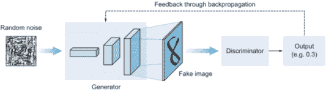

图 8.12 展示了包含生成器和判别器模型的组合模型示意图

当我们想要训练生成器时，我们冻结判别器模型的权重，因为生成器和判别器有不同的损失函数，将它们拉向不同的方向。如果我们不冻结判别器权重，它将被拉向生成器学习的同一方向，因此它更有可能将生成的图像预测为真实，这不是我们想要的结果。冻结判别器模型的权重不会影响我们在训练判别器时编译的现有判别器模型。将其想象为有两个判别器模型——这并不是实际情况，但这样更容易想象。

现在，让我们构建组合模型：

```
       generator = generator_model()      ❶

       z = Input(shape=(100,))            ❷
       image = generator(*z*)               ❷

       discriminator.trainable = False    ❸

       valid = discriminator(img)         ❹

       combined = Model(z, valid)         ❺
```

❶ 构建生成器

❷ 生成器将噪声作为输入并生成一个图像。

❸ 冻结判别器模型的权重

❹ 判别器将生成的图像作为输入并确定其有效性。

❺ 组合模型（堆叠的生成器和判别器）训练生成器以欺骗判别器。

现在我们已经构建了组合模型，我们可以像往常一样进行训练过程。我们使用`binary_crossentropy`损失函数和 Adam 优化器编译组合模型：

```
combined.compile(loss='binary_crossentropy', optimizer=optimizer)
g_loss = self.combined.train_on_batch(noise, valid)                  ❶
```

❶ 训练生成器（希望判别器将图像误认为是真实的）

#### 训练 epoch

在本章末尾的项目中，您将看到之前的代码片段被放入循环函数中，以执行一定数量的 epoch 的训练。对于每个 epoch，两个编译好的模型（判别器和组合）同时训练。在训练过程中，生成器和判别器都会得到提升。您可以通过在每个 epoch（或一组 epoch）后打印出结果来观察您的 GAN 的性能，看看生成器在生成合成图像方面的表现。图 8.13 展示了生成器在其训练过程中在 MNIST 数据集上性能演变的一个示例。

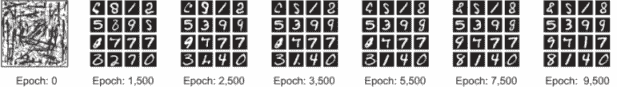

图 8.13 在其训练过程中，从第 0 个 epoch 到第 9,500 个 epoch，生成器在模仿 MNIST 数据集的手写数字方面变得越来越擅长。

在示例中，第 0 个 epoch 以随机噪声数据开始，这些数据尚未代表训练数据集中的特征。随着 GAN 模型经过训练，其生成器在创建高质量的训练数据集仿制品方面变得越来越擅长，这些仿制品可以欺骗判别器。手动观察生成器的性能是评估系统性能、决定 epoch 数量和何时停止训练的好方法。我们将在第 8.2 节中更详细地探讨 GAN 评估技术。

### 8.1.5 GAN 最小-最大函数

GAN 训练更像是一场零和游戏，而不是一个优化问题。在零和游戏中，总效用分数在玩家之间分配。一个玩家分数的增加会导致另一个玩家分数的减少。在人工智能中，这被称为最小-最大博弈论。最小-最大是一种决策算法，通常用于回合制、两人游戏。该算法的目标是找到最佳下一步。一个被称为最大化者的玩家努力获得最高分数；另一个被称为最小化者的玩家通过对抗最大化者来尝试获得最低分数。

GAN 在以下方程中玩一个最小-最大游戏，其中整个网络试图优化 *V*(*D,G*) 函数：

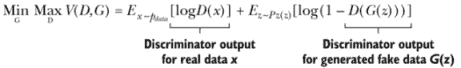

判别器(*D*)的目标是最大化获取图像正确标签的概率。另一方面，生成器*(G)*的目标是尽量减少被抓住的机会。因此，我们训练*D*来最大化将正确标签分配给训练示例和来自*G*的样本的概率。我们同时训练*G*来最小化 log(1 - *D*(*G*(*z*))).换句话说，*D*和*G*通过价值函数 *V*(*D,G*) 进行两人最小-最大游戏。

最小-最大博弈论

在两人零和游戏中，一个人只有在另一个玩家失败的情况下才能获胜。没有合作的可能性。这种博弈论在诸如井字棋、国际象棋、曼卡拉、象棋等游戏中被广泛使用。最大化玩家试图获得尽可能高的分数，而最小化玩家则试图做相反的事情，以获得尽可能低的分数。

在给定的游戏状态下，如果最大化者处于优势，那么分数将倾向于正值。如果最小化者在该状态下处于优势，那么分数将倾向于负值。这些值是通过为每种游戏类型独特的启发式算法计算得出的。

就像任何其他数学方程一样，前面的方程对于不熟悉其背后数学的人来说可能看起来令人恐惧，但它所代表的思想简单而强大。它只是判别器和生成器模型两个竞争目标的数学表示。让我们首先通过（表 8.1）了解符号，然后进行解释。

表 8.1 最小-最大方程中使用的符号

| 符号 | 说明 |
| --- | --- |
| G | 生成器。 |
| D | 判别器。 |
| z | 供给生成器(G)的随机噪声。 |
| *G*(*z*) | 生成器接收随机噪声数据(*z*)并尝试重建真实图像。 |
| *D*(*G*(*z*)) | 来自生成器的判别器(*D*)输出。 |
| log*D*(*x*) | 判别器对真实数据的概率输出。 |

判别器从两个来源获取输入：

+   生成器的数据，*G*(*z*)--这是假数据(*z*)。生成器输出的判别器表示为 *D*(*G*(*z*)).

+   来自真实训练数据(*x*)的真实输入--来自真实数据的判别器输出表示为 log D(*x*).

为了简化最小-最大方程，最好的方法是将其分解为两个部分：判别器训练函数和生成器训练（联合模型）函数。在训练过程中，我们创建了两个训练流程，每个流程都有自己的错误函数：

+   一个是单独的判别器，以下函数旨在通过使预测尽可能接近 1 来最大化最小-最大函数：

    *E[x ~p[data]]* [log*D*(*x*)]

+   另一个是用于训练生成器的联合模型，以下函数旨在通过使预测尽可能接近 0 来最小化最小-最大函数：

    *E[z ~P z]*(*z*) [log(1 - *D*(*G*(*z*)))]

现在我们已经理解了方程符号，并对最小-最大函数的工作原理有了更好的理解，让我们再次看看这个函数：

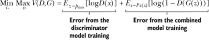

最小-最大目标函数 *V*(*D, G*) 的目标是最大化从真实数据分布中的 *D*(*x*)，并最小化从伪造数据分布中的 *D*(*G*(*z*))。为了实现这一点，我们在目标函数中使用 *D*(*x*) 的对数似然和 1 - *D*(*z*)。一个值的对数只是确保我们越接近一个错误值，我们受到的惩罚就越大。

在 GAN 训练过程的早期，判别器会以高置信度拒绝生成器产生的伪造数据，因为伪造的图像与真实训练数据非常不同——生成器还没有学会。随着我们训练判别器以最大化将正确标签分配给真实示例和生成器产生的伪造图像的概率，我们同时训练生成器以最小化生成伪造数据时的判别器分类错误。判别器希望最大化目标，使得对于真实数据 *D*(*x*) 接近 1，对于伪造数据 *D*(*G*(*z*)) 接近 0。另一方面，生成器希望最小化目标，使得 *D*(*G*(*z*)) 接近 1，这样判别器就会上当，认为生成的 *G*(*z*) 是真实的。当生成器产生的伪造数据被识别为真实数据时，我们停止训练。

## 8.2 评估 GAN 模型

用于分类和检测问题的深度学习神经网络模型通过损失函数进行训练，直到收敛。另一方面，GAN 生成器模型使用一个学习将图像分类为真实或生成的判别器进行训练。正如我们在上一节中学到的，生成器和判别器模型一起训练以保持平衡。因此，没有使用目标损失函数来训练 GAN 生成器模型，也没有办法仅从损失中客观地评估训练的进度和模型的相对或绝对质量。这意味着必须使用生成的合成图像的质量以及通过手动检查生成的图像来评估模型。

识别评估技术的一个好方法是回顾研究论文和作者用来评估他们 GAN 的技术。Tim Salimans 等人（2016）通过让人类标注员手动判断合成样本的视觉质量来评估他们的 GAN 性能。3 他们创建了一个网络界面，并在 Amazon Mechanical Turk (MTurk) 上雇佣标注员来区分生成数据和真实数据。

使用人类标注员的一个缺点是，该指标取决于任务的设置和标注员的动机。该团队还发现，当他们对标注员关于其错误的反馈时，结果发生了巨大变化：通过从这种反馈中学习，标注员能够更好地指出生成图像中的缺陷，从而给出更悲观的品质评估。

Salimans 等人和本节中我们将讨论的其他研究人员使用了其他非手动方法。一般来说，关于如何评估给定的 GAN 生成器模型还没有共识。这使得研究人员和实践者难以进行以下操作：

+   在训练运行中选择最佳的 GAN 生成器模型--换句话说，决定何时停止训练。

+   选择生成的图像来展示 GAN 生成器模型的性能。

+   比较和基准测试 GAN 模型架构。

+   调整模型超参数和配置，并比较结果。

寻找可量化的方法来理解 GAN 的进度和输出质量仍然是研究的一个活跃领域。已经开发了一套定性和定量技术，用于根据生成的合成图像的质量和多样性来评估 GAN 模型的性能。用于图像质量和多样性的两个常用评估指标是 Inception 分数和 Fréchet Inception 距离 (FID)。在本节中，你将了解基于生成的合成图像评估 GAN 模型的技术。

### 8.2.1 Inception 分数

Inception 分数基于一个启发式方法，即现实样本应该能够在通过预训练网络（如 ImageNet 上的 Inception）时被分类（因此得名 Inception 分数）。这个想法真的很简单。启发式依赖于两个值：

+   生成的图像高可预测性 -- 我们将预训练的 Inception 分类器模型应用于每个生成的图像，并获取其 softmax 预测。如果生成的图像足够好，那么它应该给出一个高可预测性分数。

+   生成样本的多样性 -- 不应有任何类别主导生成的图像分布。

使用模型对大量生成的图像进行分类。具体来说，预测图像属于每个类的概率。然后将这些概率总结到分数中，以捕捉每个图像看起来像已知类别的程度以及图像集合在已知类别之间的多样性。如果这两个特性都满足，应该有一个较大的 inception score。较高的 inception score 表示生成的图像质量更好。

### 8.2.2 Fréchet inception 距离 (FID)

FID 分数是由 Martin Heusel 等人在 2017 年提出并使用的。4 该分数被提出作为对现有 inception score 的改进。

与 inception score 类似，FID 分数使用 Inception 模型来捕捉输入图像的特定特征。这些激活值是针对一组真实和生成的图像计算的。每个真实和生成的图像的激活值被总结为一个多元高斯分布，然后使用 Fréchet 距离（也称为 Wasserstein-2 距离）来计算这两个分布之间的距离。

重要的一点是，FID 需要一个合理的样本量才能给出良好的结果（建议的大小是 50,000 个样本）。如果你使用太多的样本，你最终会高估你的实际 FID，并且估计值会有很大的方差。较低的 FID 分数表示更符合真实图像统计特性的真实图像。

### 8.2.3 要使用哪种评估方案

这两种度量（inception score 和 FID）都很容易在生成的图像批次上实现和计算。因此，在训练过程中系统地生成图像并保存模型的做法可以，并且应该继续使用，以便进行事后模型选择。深入探讨 inception score 和 FID 超出了本书的范围。如前所述，这是一个活跃的研究领域，截至写作时，行业内还没有关于评估 GAN 性能的最佳方法的共识。不同的分数评估图像生成过程的各个方面，而且不太可能有一个单一的分数可以涵盖所有方面。本节的目标是让你了解近年来开发的一些自动化 GAN 评估过程的技巧，但手动评估仍然被广泛使用。

当你刚开始时，从手动检查生成的图像开始以评估和选择生成器模型是一个好主意。对于初学者和专家来说，开发 GAN 模型本身就足够复杂了；手动检查可以在改进你的模型实现和测试模型配置方面让你走得很远。

其他研究人员通过使用特定领域的评估指标采取了不同的方法。例如，Konstantin Shmelkov 及其团队（2018 年）使用了基于图像分类的两个度量，GAN-train 和 GAN-test，分别近似 GAN 的召回率（多样性）和精确度（图像质量）。5

## 8.3 流行 GAN 应用

在过去的五年里，生成模型已经取得了长足的进步。该领域已经发展到预期下一代生成模型在创作艺术方面将比人类更加得心应手。现在，GANs（生成对抗网络）已经拥有了解决医疗保健、汽车、美术等多个行业问题的能力。在本节中，我们将了解一些对抗网络的用例以及用于该应用的 GAN 架构。本节的目标不是实现 GAN 网络的变体，而是提供一些关于 GAN 模型潜在应用的曝光以及进一步阅读的资源。

### 8.3.1 文本到照片合成

从文本描述合成高质量图像是计算机视觉中的一个挑战性问题。现有文本到图像方法生成的样本可以大致反映给定描述的意义，但它们缺乏必要的细节和生动的物体部分。

为此应用构建的 GAN 网络是堆叠生成对抗网络（StackGAN）。6 张等人能够根据文本描述生成 256 × 256 的逼真图像。

StackGANs 在两个阶段工作（图 8.14）：

+   第一阶段：StackGAN 根据给定的文本描述绘制对象的原始形状和颜色，生成低分辨率图像。

+   第二阶段：StackGAN 以第一阶段的结果和文本描述作为输入，生成具有逼真细节的高分辨率图像。它能够纠正第一阶段创建的图像中的缺陷，并通过细化过程添加引人注目的细节。

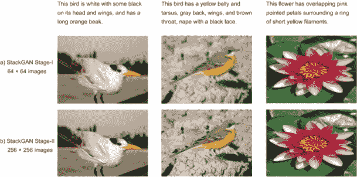

图 8.14 (*a*) 第一阶段：给定文本描述，StackGAN 绘制对象的粗糙形状和基本颜色，生成低分辨率图像。(*b*) 第二阶段以第一阶段的结果和文本描述作为输入，生成具有逼真细节的高分辨率图像。（来源：张等，2016 年。）

### 8.3.2 图像到图像翻译（Pix2Pix GAN）

图像到图像的转换被定义为在足够的训练数据下将场景的一种表示转换为另一种表示。它受到语言翻译类比的影响：正如一个想法可以用许多不同的语言表达一样，一个场景可以通过灰度图像、RGB 图像、语义标签图、边缘草图等来呈现。在图 8.15 中，图像到图像的转换任务在一系列应用中得到了演示，例如将街景分割标签转换为真实图像、灰度转换为彩色图像、产品草图转换为产品照片以及白天照片转换为夜晚照片。

Pix2Pix 是由 Phillip Isola 等人于 2016 年设计的 GAN 家族成员，用于通用图像到图像的转换。7 Pix2Pix 网络架构类似于 GAN 的概念：它包括一个生成器模型，用于输出看起来逼真的新合成图像，以及一个判别器模型，用于将图像分类为真实（来自数据集）或伪造（生成）。训练过程也与 GAN 类似：判别器模型直接更新，而生成器模型通过判别器模型更新。因此，这两个模型在对抗过程中同时训练，其中生成器试图更好地欺骗判别器，而判别器试图更好地识别伪造图像。

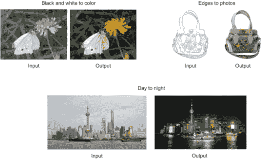

图 8.15 从原始论文中摘取的 Pix2Pix 应用示例。

Pix2Pix 网络的新颖之处在于，它们学习一个适应当前任务和数据的损失函数，这使得它们可以在各种环境中应用。它们是一种条件生成对抗网络（cGAN），其中输出图像的生成取决于输入源图像。判别器被提供了源图像和目标图像，并必须确定目标是否是源图像的合理变换。

Pix2Pix 网络在许多图像到图像的转换任务中取得了非常令人鼓舞的结果。访问[`affinelayer.com/pixsrv`](https://affinelayer.com/pixsrv)来更多体验 Pix2Pix 网络；该网站有一个由 Isola 及其团队创建的交互式演示，您可以在其中将猫或产品的草图边缘转换为照片和立面转换为真实图像。

### 8.3.3 图像超分辨率 GAN（SRGAN）

一种特定的 GAN 模型可以用来将低分辨率图像转换为高分辨率图像。这种类型被称为超分辨率生成对抗网络（SRGAN），由 Christian Ledig 等人于 2016 年引入。8 图 8.16 展示了 SRGAN 如何创建一个非常高分辨率的图像。

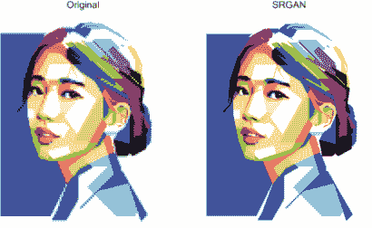

图 8.16 SRGAN 将低分辨率图像转换为高分辨率图像。（来源：Ledig 等人，2016 年。）

### 8.3.4 准备好动手实践了吗？

GAN 模型在创造和想象从未存在过的新现实方面具有巨大的潜力。本章中提到的应用只是几个例子，以给你一个关于 GAN 今天能做什么的印象。这样的应用每隔几周就会出现，值得一试。如果你对探索更多 GAN 应用感兴趣，请访问由 Erik Linder-Norén 维护的惊人的 Keras-GAN 存储库[`github.com/eriklindernoren/Keras-GAN`](https://github.com/eriklindernoren/Keras-GAN)，它包括许多使用 Keras 创建的 GAN 模型，是 Keras 示例的极好资源。本章中的大部分代码都受到了这个存储库的启发和改编。

## 8.4 项目：构建自己的 GAN

在这个项目中，你将使用生成器和判别器中的卷积层构建一个 GAN。这被称为深度卷积 GAN（DCGAN）。DCGAN 架构最初由 Alec Radford 等人（2016 年）探索，如第 8.1.1 节所述，并在生成新图像方面取得了令人印象深刻的成果。你可以跟随本章中的实现或运行本书可下载代码中的项目笔记本中的代码。

在这个项目中，你将在 Fashion-MNIST 数据集上训练 DCGAN（[`github.com/zalandoresearch/fashion-mnist`](https://github.com/zalandoresearch/fashion-mnist)）。Fashion-MNIST 包含 60,000 个用于训练的灰度图像和 10,000 个图像的测试集（图 8.17）。每个 28 × 28 的灰度图像都与 10 个类别中的一个标签相关联。Fashion-MNIST 旨在作为原始 MNIST 数据集的直接替代品，用于基准测试机器学习算法。我选择灰度图像进行这个项目，因为与三通道彩色图像相比，在单通道灰度图像上训练卷积网络所需的计算能力更少，这使得在没有 GPU 的个人计算机上训练更容易。

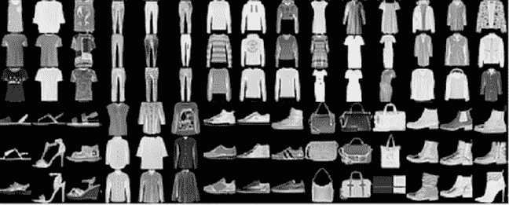

图 8.17 Fashion-MNIST 数据集示例

数据集被划分为 10 个时尚类别。类别标签如下：

| 标签 | 描述 |
| --- | --- |
| 0 | T 恤/上衣 |
| 1 | 裤子 |
| 2 | 针织衫 |
| 3 | 晚礼服 |
| 4 | 外套 |
| 5 | 凉鞋 |
| 6 | 衬衫 |
| 7 | 运动鞋 |
| 8 | 背包 |
| 9 | 踝靴 |

#### 第 1 步：导入库

和往常一样，首先要做的是导入我们在项目中使用的所有库：

```
from __future__ import print_function, division

from keras.datasets import fashion_mnist                                 ❶

from keras.layers import Input, Dense, Reshape, Flatten, Dropout         ❷
from keras.layers import BatchNormalization, Activation, ZeroPadding2D   ❷
from keras.layers.advanced_activations import LeakyReLU                  ❷
from keras.layers.convolutional import UpSampling2D, Conv2D              ❷
from keras.models import Sequential, Model                               ❷
from keras.optimizers import Adam                                        ❷

import numpy as np                                                       ❸
import matplotlib.pyplot as plt                                          ❸
```

❶ 从 Keras 导入 fashion_mnist 数据集

❷ 导入 Keras 层和模型

❸ 导入 numpy 和 matplotlib

#### 第 2 步：下载并可视化数据集

Keras 使我们能够通过一条命令：`fashion_mnist.load_data()`下载 Fashion-MNIST 数据集。在这里，我们下载了数据集并将训练集重新缩放到-1 到 1 的范围，以便模型更快地收敛（有关图像缩放的更多详细信息，请参阅第四章中的“数据归一化”部分）：

```
(training_data, _), (_, _) = fashion_mnist.load_data()     ❶

X_train = training_data / 127.5 - 1\.                       ❷
X_train = np.expand_dims(X_train, axis=3)                  ❷
```

❶ 加载数据集

❷ 将训练数据重新缩放到-1 到 1 的范围

为了乐趣，让我们可视化图像矩阵（图 8.18）：

```
def visualize_input(img, ax):
    ax.imshow(img, cmap='gray')
    width, height = img.shape
    thresh = img.max()/2.5
    for *x* in range(width):
        for *y* in range(height):
            ax.annotate(str(round(img[x][y],2)), xy=(y,x),
                        horizontalalignment='center',
                        verticalalignment='center',
                        color='white' if img[x][y]<thresh else 'black')

fig = plt.figure(figsize = (12,12)) 
ax = fig.add_subplot(111)
visualize_input(training_data[3343], ax)
```

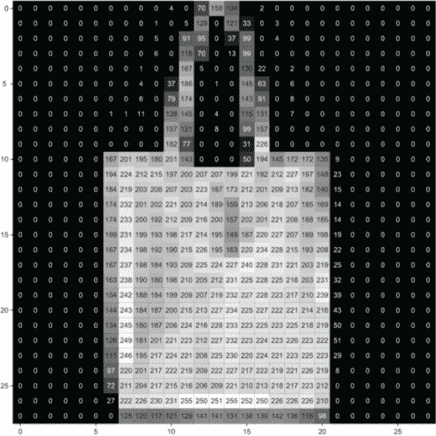

图 8.18 Fashion-MNIST 数据集的可视化示例

#### 第 3 步：构建生成器

现在，让我们构建生成器模型。输入将是我们在第 8.1.5 节中解释的噪声向量（*z*）。生成器架构如图 8.19 所示。

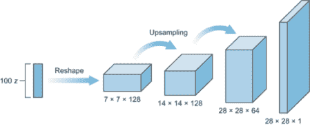

图 8.19 生成器模型的架构

第一层是一个全连接层，然后将其重塑为一个深而窄的层，类似于 7 × 7 × 128（在原始 DCGAN 论文中，团队将输入重塑为 4 × 4 × 1024）。然后我们使用上采样层将特征图维度从 7 × 7 加倍到 14 × 14，然后再加倍到 28 × 28。在这个网络中，我们使用三个卷积层。我们还使用了批量归一化和 ReLU 激活。对于这些层中的每一层，一般的方案是卷积⇒批量归一化⇒ReLU。现在，让我们堆叠这些层，直到我们得到形状为 28 × 28 × 1 的最终转置卷积层：

```
   def build_generator():
       generator = Sequential()                                             ❶

       generator.add(Dense(128 * 7 * 7, activation="relu", input_dim=100))  ❷

       generator.add(Reshape((7, 7, 128)))                                  ❸

       generator.add(UpSampling2D())                                        ❹

       generator.add(Conv2D(128, kernel_size=3, padding="same",             ❺
 activation="relu"))                                    ❺
       generator.add(BatchNormalization(momentum=0.8))                      ❺
       generator.add(UpSampling2D())                                        ❻

# convolutional + batch normalization layers
       generator.add(Conv2D(64, kernel_size=3, padding="same",              ❼
                     activation="relu"))                                    ❼
       generator.add(BatchNormalization(momentum=0.8))                      ❼

       # convolutional layer with filters = 1
       generator.add(Conv2D(1, kernel_size=3, padding="same",
                     activation="relu"))

       generator.summary()                                                  ❽

       noise = Input(shape=(100,))                                          ❾

       fake_image = generator(noise)                                        ❿

       return Model(inputs=noise, outputs=fake_image)                       ⓫
```

❶ 实例化一个序列模型并将其命名为生成器

❷ 添加一个密集层，其神经元数量为 128 × 7 × 7

❸ 将图像尺寸重塑为 7 × 7 × 128

❹ 上采样层将图像尺寸加倍到 14 × 14

❺ 添加一个卷积层以运行卷积过程和批量归一化

❻ 将图像尺寸上采样到 28 × 28

❼ 我们在这里不添加上采样，因为 28 × 28 的图像大小与 MNIST 数据集中的图像大小相同。你可以根据你自己的问题进行调整。

❽ 打印模型摘要

❾ 生成长度为 100 的输入噪声向量。我们在这里选择 100 是为了创建一个简单的网络。

❿ 运行生成器模型以创建假图像

⓫ 返回一个模型，该模型以噪声向量作为输入并输出假图像

#### 第 4 步：构建判别器

判别器只是一个卷积分类器，就像我们之前构建的那样（图 8.20）。判别器的输入是 28 × 28 × 1 的图像。我们想要几个卷积层，然后是一个全连接层作为输出。和之前一样，我们想要一个 sigmoid 输出，并且需要返回 logits。对于卷积层的深度，我建议从第一层的 32 或 64 个过滤器开始，然后随着层数的增加，深度加倍。在这个实现中，我们开始使用 64 层，然后是 128 层，然后是 256 层。对于下采样，我们不使用池化层。相反，我们只使用步长卷积层进行下采样，类似于 Radford 等人实现的方式。

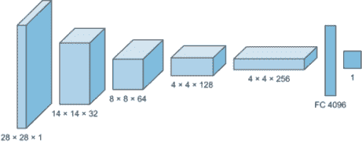

图 8.20 判别器模型的架构

我们还使用了批量归一化和 dropout 来优化训练，正如我们在第四章中学到的。对于四个卷积层中的每一个，一般的方案是卷积⇒批量归一化⇒漏 ReLU。现在，让我们构建`build_discriminator`函数：

```
   def build_discriminator():
       discriminator = Sequential()                                             ❶

       discriminator.add(Conv2D(32, kernel_size=3, strides=2, 
 input_shape=(28,28,1), padding="same"))                ❷

       discriminator.add(LeakyReLU(alpha=0.2))                                  ❸

       discriminator.add(Dropout(0.25))                                         ❹

       discriminator.add(Conv2D(64, kernel_size=3, strides=2, 
 padding="same"))                                       ❺

       discriminator.add(ZeroPadding2D(padding=((0,1),(0,1))))                  ❻

       discriminator.add(BatchNormalization(momentum=0.8))                      ❼

       discriminator.add(LeakyReLU(alpha=0.2))
       discriminator.add(Dropout(0.25))

       discriminator.add(Conv2D(128, kernel_size=3, strides=2, padding="same")) ❽
       discriminator.add(BatchNormalization(momentum=0.8))                      ❽
       discriminator.add(LeakyReLU(alpha=0.2))                                  ❽
       discriminator.add(Dropout(0.25))                                         ❽

       discriminator.add(Conv2D(256, kernel_size=3, strides=1, padding="same")) ❾
       discriminator.add(BatchNormalization(momentum=0.8))                      ❾
       discriminator.add(LeakyReLU(alpha=0.2))                                  ❾
       discriminator.add(Dropout(0.25))                                         ❾

       discriminator.add(Flatten())                                             ❿
       discriminator.add(Dense(1, activation='sigmoid'))                        ❿

       img = Input(shape=(28,28,1))                                             ⓫
       probability = discriminator(img)                                         ⓬

       return Model(inputs=img, outputs=probability)                            ⓭
```

❶ 实例化一个序列模型并将其命名为判别器

❷ 将卷积层添加到判别器模型中

❸ 添加一个带有泄漏 ReLU 激活函数的泄漏 ReLU 激活函数

❹ 添加一个具有 25% dropout 概率的 dropout 层

❺ 添加一个具有零填充的第二卷积层

❻ 添加一个零填充层以将维度从 7 × 7 更改为 8 × 8

❼ 添加一个批量归一化层以加快学习速度并提高准确性

❽ 添加具有批量归一化、泄漏 ReLU 和 dropout 的第三卷积层

❾ 添加具有批量归一化、泄漏 ReLU 和 dropout 的第四卷积层

❿ 将网络展平并添加具有 sigmoid 激活函数的输出密集层

⓫ 设置输入图像形状

⓬ 运行判别器模型以获取输出概率

⓭ 返回一个以图像作为输入并产生概率输出的模型

#### 第 5 步：构建联合模型

如第 8.1.3 节所述，为了训练生成器，我们需要构建一个包含生成器和判别器的联合网络（图 8.21）。联合模型将噪声信号（*z*）作为输入并输出判别器的预测输出，作为伪造或真实。

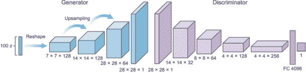

图 8.21 联合模型架构

记住，我们希望禁用联合模型中的判别器训练，如第 8.1.3 节中详细解释的那样。在训练生成器时，我们不希望判别器更新权重，但仍然希望将判别器模型包含在生成器训练中。因此，我们创建了一个包含两个模型的联合网络，但在联合网络中冻结了判别器模型的权重：

```
optimizer = Adam(learning_rate=0.0002, beta_1=0.5)                  ❶

discriminator = build_discriminator()                               ❷
discriminator.compile(loss='binary_crossentropy', optimizer=optimizer, metrics=['accuracy'])

discriminator.trainable = False                                     ❸

# Build the generator
generator = build_generator()                                       ❹

z = Input(shape=(100,))                                             ❺
img = generator(*z*)                                                  ❺

valid = discriminator(img)                                          ❻

combined = Model(inputs=z, outputs=valid)                           ❼
combined.compile(loss='binary_crossentropy', optimizer=optimizer)   ❼
```

❶ 定义优化器

❷ 构建并编译判别器

❸ 冻结判别器权重，因为我们不想在生成器训练期间训练它

❹ 构建生成器

❺ 生成器以 latent_dim = 100 的噪声作为输入并生成图像。

❻ 判别器将生成的图像作为输入并确定其有效性。

❼ 联合模型（堆叠的生成器和判别器）训练生成器以欺骗判别器。

#### 第 6 步：构建训练函数

在训练 GAN 模型时，我们训练两个网络：判别器和我们在上一节中创建的联合网络。让我们构建一个 `train` 函数，它接受以下参数：

+   训练的轮数

+   批量大小

+   `save_interval` 来指定我们希望保存结果的频率

```
def train(epochs, batch_size=128, save_interval=50):

    valid = np.ones((batch_size, 1))                                ❶
    fake = np.zeros((batch_size, 1))                                ❶

    for epoch in range(epochs):

        ## Train Discriminator network

        idx = np.random.randint(0, X_train.shape[0], batch_size)    ❷
        imgs = X_train[idx]                                         ❷

        noise = np.random.normal(0, 1, (batch_size, 100))           ❸
        gen_imgs = generator.predict(noise)                         ❸

        d_loss_real = discriminator.train_on_batch(imgs, valid)     ❹
        d_loss_fake = discriminator.train_on_batch(gen_imgs, fake)  ❹
        d_loss = 0.5 * np.add(d_loss_real, d_loss_fake)             ❹

        ## Train the combined network (Generator)

        g_loss = combined.train_on_batch(noise, valid)              ❺

print("%d [D loss: %f, acc.: %.2f%%] [G loss: %f]" % 
      (epoch, d_loss[0], 100*d_loss[1], g_loss))                    ❻

        if epoch % save_interval == 0:                              ❼
            plot_generated_images(epoch, generator)                 ❼
```

❶ 对抗性真实值

❷ 选择随机的一半图像

❸ 样本噪声，并生成一批新图像

❹ 训练判别器（将真实分类为 1s，将生成分类为 0s）

❺ 训练生成器（希望判别器将图像误认为是真实的）

❻ 打印进度

❼ 如果在 save_interval 时保存生成的图像样本

在运行 `train()` 函数之前，您需要定义以下 `plot_generated` `_images()` 函数：

```
def plot_generated_images(epoch, generator, examples=100, dim=(10, 10), 
                          figsize=(10, 10)):
    noise = np.random.normal(0, 1, size=[examples, latent_dim])
    generated_images = generator.predict(noise)
    generated_images = generated_images.reshape(examples, 28, 28)

    plt.figure(figsize=figsize)
    for i in range(generated_images.shape[0]):
        plt.subplot(dim[0], dim[1], i+1)
        plt.imshow(generated_images[i], interpolation='nearest', cmap='gray_r')
        plt.axis('off')
    plt.tight_layout()
    plt.savefig('gan_generated_image_epoch_%d.png' % epoch)
```

#### 第 7 步：训练并观察结果

现在代码实现已经完成，我们准备开始 DCGAN 的训练。要训练模型，运行以下代码片段：

```
train(epochs=1000, batch_size=32, save_interval=50)
```

这将运行 1,000 个时代的训练，并且每 50 个时代保存一次图像。当您运行`train()`函数时，训练进度会像图 8.22 所示那样打印出来。

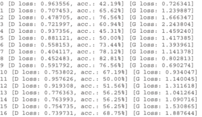

图 8.22 前 16 个时代的训练进度

我自己运行了 10,000 个时代的训练。图 8.23 显示了 0、50、1,000 和 10,000 个时代后的结果。

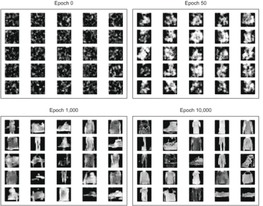

图 8.23 GAN 生成器在 0、50、1,000 和 10,000 个时代后的输出

如您在图 8.23 中看到的，在 0 个时代，图像只是随机噪声——没有模式或有意义的数据。在 50 个时代，模式开始形成。一个非常明显的模式是图像中心开始形成的亮像素，以及周围的较暗像素。这是因为训练数据中，所有形状都位于图像的中心。在训练过程的后期，在 1,000 个时代，您可以清楚地看到形状，并且可以猜测出提供给 GAN 模型的训练数据类型。快进到 10,000 个时代，您可以看到生成器已经非常擅长重新创建训练数据集中不存在的新的图像。例如，选择在这个时代创建的任何对象：比如说左上角的图像（连衣裙）。这是一个完全新的连衣裙设计，在训练数据集中不存在。GAN 模型在从训练集中学习连衣裙模式后，创建了一个全新的连衣裙设计。您可以运行更长时间的训练，或者使生成器网络更深，以获得更精细的结果。

#### 在结束之前

对于这个项目，我使用了 Fashion-MNIST 数据集，因为图像非常小，是灰度图（单通道），这使得您在本地计算机上没有 GPU 的情况下进行训练时计算成本很低。Fashion-MNIST 数据集也非常干净：所有图像都居中，噪声较少，因此在启动 GAN 训练之前不需要太多预处理。这使得它成为一个很好的玩具数据集，可以用来启动您的第一个 GAN 项目。

如果您想尝试更高级的数据集，您可以将 CIFAR 作为您的下一步（[`www.cs.toronto.edu/~kriz/cifar.html`](https://www.cs.toronto.edu/~kriz/cifar.html)）或 Google 的 Quick, Draw!数据集（[`quickdraw.withgoogle.com`](https://quickdraw.withgoogle.com)），这是在撰写本文时被认为是世界上最大的涂鸦数据集。另一个更严肃的数据集是斯坦福的 Cars 数据集（[`ai.stanford.edu/~jkrause/cars/car_dataset.html`](https://ai.stanford.edu/~jkrause/cars/car_dataset.html)），它包含超过 16,000 张 196 类汽车的图像。您可以尝试训练您的 GAN 模型为您的梦想汽车设计一个全新的设计！

## 摘要

+   GAN 从训练数据集中学习模式，并创建具有与训练集相似分布的新图像。

+   GAN 架构由两个相互竞争的深度神经网络组成。

+   生成器试图将随机噪声转换为看起来像是从原始数据集中采样的观察值。

+   判别器试图预测一个观察值是否来自原始数据集或生成器伪造的之一。

+   判别器的模型是一个典型的分类神经网络，旨在将生成器生成的图像分类为真实或伪造。

+   生成器的架构看起来像是一个倒置的 CNN，它以狭窄的输入开始，经过几次上采样，直到达到所需的大小。

+   上采样层通过重复其输入像素的每一行和每一列来调整图像尺寸。

+   为了训练 GAN，我们通过两个并行网络批量训练网络：判别器和冻结判别器权重并仅更新生成器权重的组合网络。

+   为了评估 GAN，我们主要依赖于我们对生成器创建的图像质量的观察。其他评估指标包括 Inception 得分和 Fréchet Inception 距离（FID）。

+   除了生成新图像外，GAN 还可以用于文本到照片合成、图像到图像翻译、图像超分辨率和其他许多应用。

***

1.伊恩·J·古德费尔、让·普吉特-阿巴迪、梅赫迪·米尔扎、丁旭、大卫·沃德-法雷利、谢吉尔·奥齐尔、阿隆·库维尔和约书亚·本吉奥，“生成对抗网络，”2014 年，[`arxiv.org/abs/1406.2661`](http://arxiv.org/abs/1406.2661).

2.亚历克·拉德福德、卢克·梅茨和索乌米特·钦塔拉，“使用深度卷积生成对抗网络的无监督表示学习，”2016 年，[`arxiv.org/abs/1511.06434`](http://arxiv.org/abs/1511.06434).

3.蒂姆·萨利曼斯、伊恩·古德费尔、沃伊切赫·扎伦巴、维基·张、亚历克·拉德福德和*x[i]*陈。“改进 GAN 的训练技术，”2016 年，[`arxiv.org/abs/1606.03498`](http://arxiv.org/abs/1606.03498).

4.马丁·海塞尔、胡伯特·拉姆萨乌尔、托马斯·乌特纳、伯纳德·内斯勒和塞普·霍克赖特，“通过双时间尺度更新规则训练的 GAN 收敛到局部纳什均衡，”2017 年，[`arxiv.org/abs/1706.08500`](http://arxiv.org/abs/1706.08500).

5.康斯坦丁·施梅尔科夫、科德利亚·施密德和卡尔特克·阿拉哈里，“我的 GAN 有多好？”2018 年，[`arxiv.org/abs/1807.09499`](http://arxiv.org/abs/1807.09499).

6.韩张、徐涛、李洪升、张少亭、王晓刚、黄晓雷和迪米特里斯·梅塔克萨斯，“StackGAN：使用堆叠生成对抗网络进行文本到逼真图像合成，”2016 年，[`arxiv.org/abs/1612.03242`](http://arxiv.org/abs/1612.03242).

7.菲利普·伊索拉、朱俊彦、周廷辉和亚历克谢·A·埃夫罗，“条件对抗网络进行图像到图像翻译，”2016 年，[`arxiv.org/abs/1611.07004`](http://arxiv.org/abs/1611.07004).

8. 克里斯蒂安·莱迪格，卢卡斯·泰斯，费伦茨·胡萨，何塞·卡巴列罗，安德鲁·坎宁安，亚历杭德罗·阿科斯塔，安德鲁·艾肯等，《使用生成对抗网络进行逼真单图像超分辨率》，2016 年，[`arxiv.org/abs/1609.04802`](http://arxiv.org/abs/1609.04802).
