# 9 DeepDream 和神经风格迁移

本章涵盖了

+   可视化 CNN 特征图

+   理解 DeepDream 算法并实现自己的梦想

+   使用神经风格迁移算法创建艺术图像

在纯艺术，尤其是绘画中，人类已经掌握了通过组合图像的内容和风格之间的复杂相互作用来创造独特视觉体验的技能。到目前为止，这个过程算法基础尚不清楚，并且不存在具有类似能力的人工系统。如今，深度神经网络在视觉感知的许多领域，如对象分类和检测，已经显示出巨大的潜力。为什么不用深度神经网络来创造艺术呢？在本章中，我们介绍了一个基于深度神经网络的人工系统，该系统能够创建具有高感知质量的艺术图像。该系统使用神经网络表示来分离和重新组合任意图像的内容和风格，为艺术图像的创建提供了一种神经网络算法。

在本章中，我们探索了两种使用神经网络创建艺术图像的新技术：DeepDream 和神经风格迁移。首先，我们检查卷积神经网络如何看世界。我们已经学习了 CNN 如何用于对象分类和检测问题中的特征提取；在这里，我们学习如何可视化提取的特征图。一个原因是我们需要这种可视化技术来理解 DeepDream 算法。此外，这将帮助我们更好地理解网络在训练期间学到了什么；我们可以利用这一点来提高网络在解决分类和检测问题时表现。

接下来，我们讨论 DeepDream 算法。这种技术的关键思想是将我们在某一层可视化的特征打印到我们的输入图像上，以创建一种梦幻般的幻觉图像。最后，我们探索神经风格迁移技术，它接受两个图像作为输入——一个风格图像和一个内容图像——并创建一个包含内容图像的布局和风格图像的纹理、颜色和模式的新组合图像。

为什么这次讨论很重要？因为这些技术帮助我们理解和可视化神经网络如何执行困难的分类和检测任务，并检查网络在训练期间学到了什么。能够看到网络的想法，在区分物体时是一个重要的特征，这将帮助你了解你的训练集中缺少什么，从而提高网络的表现。

这些技术也让我们思考神经网络是否可能成为艺术家的工具，给我们提供一种新的方式来结合视觉概念，或者甚至可能对一般创造性过程的根源投下一些光。此外，这些算法为算法理解人类如何创造和感知艺术图像提供了一条前进的道路。

## 9.1 卷积神经网络如何观察世界

我们在这本书中已经讨论了很多深度神经网络所能做到的令人惊叹的事情。但尽管关于深度学习的新闻都十分激动人心，神经网络确切地是如何观察和解释世界的仍然是一个黑箱。是的，我们尝试解释了训练过程是如何工作的，并且我们通过直观和数学的方式解释了网络通过多次迭代更新权重以优化损失函数的反向传播过程。这一切听起来都很好，在科学方面也很有道理。但是，CNN 是如何观察世界的？它们是如何在所有层之间观察提取的特征的？

更好地理解它们是如何识别特定模式或对象以及为什么它们工作得如此之好，可能会让我们进一步提高它们的性能。此外，在商业方面，这也会解决“AI 可解释性”问题。在许多情况下，商业领导者感到无法根据模型预测做出决策，因为没有人真正理解黑箱内部发生了什么。这就是我们在本节中要做的：我们打开黑箱，可视化网络通过其层所看到的内容，以帮助使神经网络决策对人类可解释。

在计算机视觉问题中，我们可以可视化卷积网络内部的特征图，以了解它们是如何观察世界的，以及它们认为哪些特征在区分不同类别时是独特的。可视化卷积层这一想法是由 Erhan 等人于 2009 年提出的。1 在本节中，我们将解释这一概念并在 Keras 中实现它。

### 9.1.1 重新审视神经网络的工作原理

在我们跳入如何可视化 CNN 中的激活图（或特征图）的解释之前，让我们重新审视神经网络的工作原理。我们通过展示数百万个训练示例来训练深度神经网络。然后，网络逐渐更新其参数，直到它给出我们想要的分类。网络通常由 10-30 层堆叠的人工神经元组成。每个图像被输入到输入层，然后与下一层通信，直到最终达到“输出”层。网络的预测由其最终输出层产生。

神经网络的一个挑战是理解每个层究竟发生了什么。我们知道在训练之后，每个层逐渐提取更高层次上的图像特征，直到最终层基本上做出关于图像包含内容的决定。例如，第一层可能寻找边缘或角落，中间层将基本特征解释为寻找整体形状或组件，而最后几层将这些组合成完整的解释。这些神经元对非常复杂的图像，如汽车或自行车，做出反应。

为了理解网络通过训练学到了什么，我们想要打开这个黑盒并可视化其特征图。可视化提取特征的一种方法是将网络颠倒过来，并要求它以某种方式增强输入图像，以引发特定的解释。比如说，你想知道什么样的图像会产生“鸟”的输出。从一个充满随机噪声的图像开始，然后逐渐调整图像，使其逐渐接近神经网络认为的鸟的重要特征（图 9.1）。

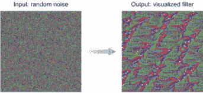

图 9.1 从一个由随机噪声组成的图像开始，调整它直到我们可视化网络认为的鸟的重要特征。

我们将更深入地探讨鸟的例子，看看如何可视化网络滤波器。从这个介绍中我们可以得出结论，神经网络足够聪明，能够理解哪些是重要的特征，并通过其层传递给全连接层进行分类。非重要特征在过程中被丢弃。简单来说，神经网络学习训练数据集中对象的特征。如果我们能够在网络的深层中可视化这些特征图，我们就可以找出神经网络关注的地方，并看到它用来做出预测的确切特征。

注意：这个过程在 François Chollet 的《Python 深度学习》（Manning，2017；[www.manning.com/books/deep-learning-with-python](https://www.manning.com/books/deep-learning-with-python)）一书中描述得最好：“你可以将深度网络视为一个多阶段信息蒸馏操作，其中信息通过连续的滤波器，并逐渐变得更加纯净。”

### 9.1.2 可视化 CNN 特征

可视化卷积网络学习到的特征的一个简单方法是通过显示每个滤波器旨在响应的视觉模式。这可以通过输入空间中的梯度上升来实现。通过对 ConvNet 的输入图像的值应用梯度上升，我们可以最大化特定滤波器的响应，从一个空白输入图像开始。结果输入图像将是那个滤波器响应最大的图像。

梯度上升与梯度下降

作为提醒，梯度的通用定义是：它是定义曲线在任意给定点的切线斜率或变化率的函数。用简单的话说，梯度是那个点的线的斜率。以下是一些曲线上的特定点的梯度示例。

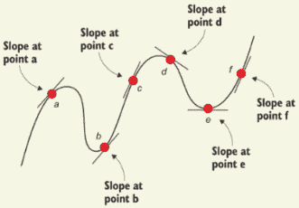

曲线上不同点的梯度

我们是想要下降还是上升曲线，这取决于我们的项目。我们在第二章中了解到，梯度下降法是寻找局部最小值（例如，最小化损失函数）的算法，它通过朝着梯度的负方向迈步来下降误差函数。

为了可视化特征图，我们希望最大化这些特征，使它们在输出图像上显示出来。为了最大化损失函数，我们希望通过使用梯度上升算法来反转 GD 过程。它通过正梯度的比例来接近该函数的局部最大值。

现在是本节最有意思的部分。在这个练习中，我们将看到 VGG16 网络开始、中间和末尾的一些示例的可视化特征图。实现方法是直接的，我们很快就会看到。在我们进行代码实现之前，让我们看看这些可视化滤波器看起来像什么。

从图 9.1 中我们看到的 VGG16 图中，让我们如下可视化第一层、中间层和深层层的输出特征图：`block1_conv1`、`block3_conv2`和`block5_conv3`。图 9.2、9.3 和 9.4 显示了特征在整个网络层中的演变过程。

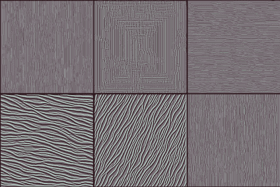

图 9.2 `block1_conv1` 滤波器生成的特征图可视化

如图 9.2 所示，你可以看到早期层基本上只是编码低级、通用的特征，如方向和颜色。这些方向和颜色滤波器然后在后续层中组合成基本的网格和点状纹理。这些纹理逐渐组合成越来越复杂的图案（图 9.3）：网络开始看到一些创建基本形状的图案。这些形状目前还不太容易识别，但比早期的那些要清晰得多。

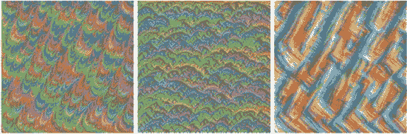

图 9.3 `block3_conv2` 滤波器生成的特征图可视化

现在是最激动人心的部分。在图 9.4 中，你可以看到网络能够在模式中找到模式。这些特征包含可识别的形状。虽然网络依赖于多个特征图来做出预测，但我们可以查看这些图，并对这些图像的内容做出合理的猜测。在左边的图像中，我可以看到眼睛，也许还有喙，我会猜测这是一种鸟或鱼。即使我们的猜测不正确，我们也可以轻松排除大多数其他类别，如汽车、船只、建筑、自行车等，因为我们可以清楚地看到眼睛，而这些类别中没有一个有眼睛。同样，观察中间的图像，我们可以从模式中猜测这是一条链。右边的图像更像是食物或水果。

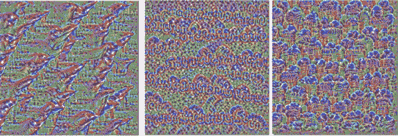

图 9.4 `block5_conv3` 滤波器生成的特征图可视化

这在分类和检测问题中有什么帮助呢？让我们以图 9.4 中的左侧特征图为例。观察可见的特征，如眼睛和喙，我可以解释说网络依赖于这两个特征来识别一只鸟。有了关于网络学习到的关于鸟的知识，我将猜测它可以在图 9.5 中检测到鸟，因为鸟的眼睛和喙是可见的。

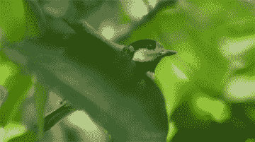

图 9.5 具有可见眼睛和喙特征的鸟的图像示例

现在，让我们考虑一个更具对抗性的情况，其中我们可以看到鸟的身体，但眼睛和喙被树叶覆盖（图 9.6）。鉴于网络在眼睛和喙特征上添加了高权重以识别鸟类，它可能会因为鸟类的主要特征被隐藏而错过这个鸟类。另一方面，一个普通的人可以很容易地在图像中检测到鸟类。解决这个问题的一个方法是使用几种数据增强技术之一，并在你的训练数据集中收集更多的对抗性案例，以迫使网络在鸟类的其他特征（如形状和颜色）上添加更高的权重。

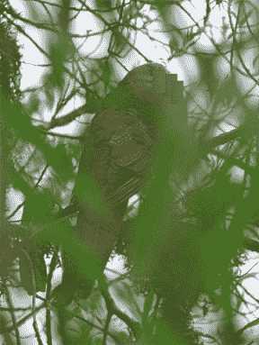

图 9.6 鸟类对抗性图像的示例，其中眼睛和喙不可见，但人体可以通过人类识别

### 9.1.3 实现特征可视化器

现在你已经看到了可视化的示例，是时候动手编写代码来自己可视化这些激活过滤器了。本节将介绍从官方 Keras 文档中实现的 CNN 可视化代码，略有调整。2 你将学习如何生成最大化所选特征图平均激活的模式。你可以在 Keras 的 GitHub 仓库中看到完整的代码([`mng.bz/Md8n`](http://mng.bz/Md8n))。

注意：如果你尝试运行本节中的代码片段，你可能会遇到错误。这些片段只是为了说明主题。我们鼓励你查看与本书一起可下载的完整可执行代码。

首先，我们从 Keras 库中加载 VGG16 模型。为此，我们首先从 Keras 导入 VGG16，然后加载模型，该模型在 ImageNet 数据集上预训练，不包括网络分类全连接层（顶部部分）：

```
from keras.applications.vgg16 import VGG16                ❶
model = VGG16(weights='imagenet', include_top=False)      ❷
```

❶ 从 Keras 导入 VGG 模型

❷ 加载模型

现在，让我们查看所有 VGG16 层的名称和输出形状。我们这样做是为了选择我们想要可视化的特定层的过滤器：

```
for layer in model.layers:                      ❶
    if 'conv' not in layer.name:                ❷
        continue
    filters, biases = layer.get_weights()       ❸
    print(layer.name, layer.output.shape)
```

❶ 遍历模型层

❷ 检查卷积层

❸ 获取过滤器权重

当你运行这个代码单元时，你会得到图 9.7 所示的输出。这些都是 VGG16 网络中包含的所有卷积层。你可以通过简单地按名称引用每个层来可视化它们的任何输出，正如你将在下一个代码片段中看到的那样。

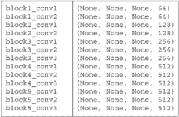

图 9.7 显示下载的 VGG16 网络中卷积层的输出

假设我们想要可视化第一个卷积层：`block1_conv1`。请注意，这个层有 64 个过滤器，每个过滤器都有一个从 0 到 63 的索引，称为`filter_index`。现在让我们定义一个损失函数，该函数试图最大化特定层（`layer_name`）中特定过滤器（`filter_index`）的激活。我们还想使用 Keras 的后端函数`gradients`来计算梯度，并将梯度归一化以避免非常小和非常大的值，以确保平滑的梯度上升过程。

在这个代码片段中，我们为梯度上升设置了场景。我们定义了一个损失函数，计算了梯度，并归一化了梯度：

```
from keras import backend as K

layer_name = 'block1_conv1'
filter_index = 0                                                          ❶

layer_dict = dict([(layer.name, layer) for layer in model.layers[1:]])    ❷

layer_output = layer_dict[layer_name].output                              ❸
loss = K.mean(layer_output[:, :, :, filter_index])                        ❸

grads = K.gradients(loss, input_img)[0]                                   ❹

grads /= (K.sqrt(K.mean(K.square(grads))) + 1e-5)                         ❺

iterate = K.function([input_img], [loss, grads])                          ❻
```

❶ 识别我们想要可视化的过滤器。这可以是该层中从 0 到 63 的任何整数，因为该层有 64 个过滤器。

❷ 获取每个关键层的符号输出（我们给它们起了独特的名字）。

❸ 构建一个损失函数，该函数最大化考虑的层的第 n 个过滤器的激活

❹ 计算输入图片相对于该损失的梯度

❺ 归一化梯度

❻ 此函数根据输入图片返回损失和梯度。

我们可以使用我们刚刚定义的 Keras 函数来进行梯度上升，针对我们的过滤器激活损失：

```
import numpy as np

input_img_data = np.random.random((1, 3, img_width, img_height)) * 20 + 128  ❶
for i in range(20):                                                          ❷
    loss_value, grads_value = iterate([input_img_data])                      ❷
    input_img_data += grads_value * step                                     ❷
```

❶ 从一个带有一些噪声的灰色图像开始

❷ 进行 20 步的梯度上升

现在我们已经实现了梯度上升，我们需要构建一个将张量转换为有效图像的函数。我们将称之为`deprocess_image(x)`。然后我们将图像保存到磁盘上以查看它：

```
from keras.preprocessing.image import save_img

def deprocess_image(*x*): 
    *x* -= x.mean()                              ❶
    *x* /= (x.std() + 1e-5)                      ❶
    *x* *= 0.1                                   ❶

    *x* += 0.5                                   ❷
    *x* = np.clip(x, 0, 1)                       ❷

    *x* *= 255                                   ❸
    *x* = x.transpose((1, 2, 0))                 ❸
    *x* = np.clip(x, 0, 255).astype('uint8')     ❸
    return *x*                                   ❸

img = input_img_data[0]
img = deprocess_image(img)
imsave('%s_filter_%d.png' % (layer_name, filter_index), img)
```

❶ 归一化张量：以 0 为中心，并确保 std 为 0.1

❷ 截断到[0, 1]

❸ 转换为 RGB 数组

结果应该类似于图 9.8。

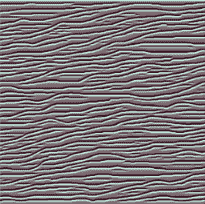

图 9.8 VGG16 层`block1_conv1`的可视化

你可以尝试将可视化的过滤器更改为后续块中的深层，例如`block2`和`block3`，以查看网络通过其层识别模式中的模式提取的更定义的特征。在最高层（`block5_conv2`，`block5_conv3`）中，你将开始识别与网络训练分类的对象中发现的纹理相似的纹理，例如羽毛、眼睛等。

## 9.2 DeepDream

DeepDream 是由 Google 研究人员 Alexander Mordvintsev 等人于 2015 年开发的。3 它是一种艺术图像修改技术，使用 CNN 创建梦幻般的、致幻的图像，如图 9.9 所示的示例所示。

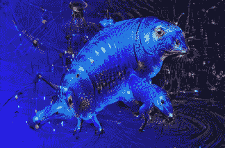

图 9.9 DeepDream 输出图像

为了比较，原始输入图像显示在图 9.10 中。原始图像是来自海洋的风景图像，包含两只海豚和其他生物。DeepDream 将两只海豚合并成一个物体，并将其中一个面孔替换成看起来像狗脸的东西。其他物体也被以艺术的方式变形，海洋背景具有边缘状的纹理。

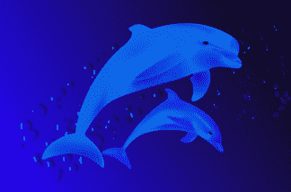

图 9.10 DeepDream 输入图像

由于它生成的充满算法痕迹、鸟羽、狗脸和眼睛的奇异图片，DeepDream 迅速成为互联网现象。这些痕迹是 DeepDream ConvNet 在 ImageNet 上训练的结果，在 ImageNet 中，狗的品种和鸟的种类被大量过度代表。如果你尝试另一个在具有多数分布的其他对象的数据集上预训练的网络，例如汽车，你将在输出图像中看到汽车特征。

该项目最初是一个有趣的实验，旨在反向运行 CNN 并使用第 9.1 节中解释的相同的卷积滤波器可视化技术来可视化其激活图：反向运行卷积神经网络，对输入进行梯度上升，以最大化卷积神经网络上层特定滤波器的激活。DeepDream 使用了这个相同的思想，但做了一些修改：

+   输入图像--在滤波器可视化中，我们不使用输入图像。我们从一张空白图像（或稍微有点噪声的图像）开始，然后最大化卷积层的滤波器激活，以查看其特征。在 DeepDream 中，我们使用输入图像到网络，因为目标是将这些可视化的特征打印到图像上。

+   最大化滤波器与层--在滤波器可视化中，正如其名所示，我们只最大化层内特定滤波器的激活。但在 DeepDream 中，我们的目标是最大化整个层的激活，以一次混合大量特征。

+   八度音阶--在 DeepDream 中，输入图像以不同的尺度称为八度音阶进行处理，以提高可视化的特征质量。这个过程将在下一节中解释。

### 9.2.1 DeepDream 算法的工作原理

与过滤可视化技术类似，DeepDream 使用在大数据集上预训练的网络。Keras 库提供了许多可用的预训练卷积神经网络：VGG16、VGG19、Inception、ResNet 等等。我们可以在 DeepDream 实现中使用这些网络中的任何一个；我们甚至可以在自己的数据集上训练一个自定义网络，并在 DeepDream 算法中使用它。直观地说，网络的选择以及它预训练的数据将影响我们的可视化，因为不同的卷积神经网络架构会导致不同的学习特征；当然，不同的训练数据集也会创建不同的特征。

DeepDream 的创造者使用了 Inception 模型，因为他们发现实际上它产生的梦境看起来很美。所以在本章中，我们将使用 Inception v3 模型。我们鼓励你尝试不同的模型来观察差异。

DeepDream 的整体思想是，我们将输入图像通过一个预训练的神经网络，如 Inception v3 模型。在某个层，我们计算梯度，它告诉我们如何改变输入图像以最大化该层的值。我们继续这样做，直到 10、20 或 40 次迭代，最终，输入图像中开始出现模式（图 9.11）。

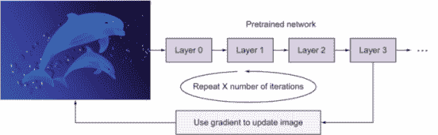

图 9.11 DeepDream 算法

这工作得很好，但是，如果预训练的网络是在相当小的图像尺寸上训练的，比如 ImageNet，那么当我们的输入图像很大（比如 1000 × 1000）时，DeepDream 算法会在图像中打印出很多小的模式，看起来很嘈杂而不是艺术。这是因为所有提取的特征都很小。为了解决这个问题，DeepDream 算法以不同的尺度称为八度音阶处理输入图像。

八度只是一个表示区间的时髦词。想法是通过区间应用 DeepDream 算法于输入图像。我们首先将图像降级为几个不同的尺度。尺度数量是可配置的，你很快就会看到。对于每个区间，我们执行以下操作：

1.  注入细节：为了避免在每次连续放大后丢失大量图像细节，我们在每次放大过程之后将丢失的细节重新注入到图像中，以创建混合图像。

1.  应用 DeepDream 算法：将混合图像通过 DeepDream 算法。

1.  放大到下一个区间。

如图 9.12 所示，我们从一个大输入图像开始，然后将其降级两次，以在 3 次方频域中得到一个小图像。在应用 DeepDream 的第一个区间，我们不需要进行细节注入，因为输入图像是尚未放大过的源图像。我们将其通过 DeepDream 算法，然后放大输出。放大后，细节丢失，导致图像越来越模糊或像素化。这就是为什么在 2 次方频域中重新注入输入图像的细节，然后将混合图像通过 DeepDream 算法非常有价值。我们再次应用放大、细节注入和 DeepDream 的过程，以获得最终的结果图像。这个过程以递归方式运行，直到我们对输出艺术满意为止。

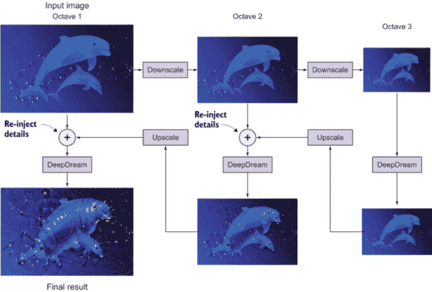

图 9.12 DeepDream 过程：连续图像降级称为八度，细节重新注入，然后放大到下一个八度

我们将 DeepDream 参数设置为以下内容：

```
num_octave = 3           ❶

octave_scale = 1.4       ❷

iterations = 20          ❸
```

❶ 尺度数量

❷ 尺度之间的尺寸比。每个连续的尺度比前一个大 1.4 倍（即 40%更大）。

❸ 迭代次数

现在你已经了解了 DeepDream 算法的工作原理，让我们看看如何使用 Keras 实现 DeepDream。

### 9.2.2 Keras 中的 DeepDream 实现

我们将要实现的 DeepDream 实现是基于 François Chollet 从官方 Keras 文档（[`keras.io/examples/generative/deep_dream/`](https://keras.io/examples/generative/deep_dream/））和他的书《Python 深度学习》中的代码。我们将在此代码适应 Jupyter Notebooks 后解释此代码：

```
import numpy as np
from keras.applications import inception_v3
from keras import backend as K
from keras.preprocessing.image import save_img

K.set_learning_phase(0)                                                     ❶

model = inception_v3.InceptionV3(weights='imagenet', include_top=False)     ❷
```

❶ 禁用所有训练操作，因为我们不会用该模型进行任何训练

❷ 下载预训练的 Inception v3 模型，不包括其顶部部分

现在，我们需要定义一个字典，指定用于生成梦境的层。为此，让我们打印出模型摘要以查看所有层并选择层名：

```
model.summary()
```

Inception v3 非常深，摘要打印很长。为了简单起见，图 9.13 显示了网络的一些层。

你选择的精确层及其对最终损失的贡献对你在梦境图像中产生的视觉效果有重要影响，因此你希望这些参数易于配置。为了定义我们想要贡献于梦境创建的层，我们创建一个包含层名称及其相应权重的字典。层的权重越大，其对梦境的贡献级别越高：

```
layer_contributions = {
                        'mixed2': 0.4,
                        'mixed3': 2.,
                        'mixed4': 1.5,
                        'mixed5': 2.3,
                      }
```

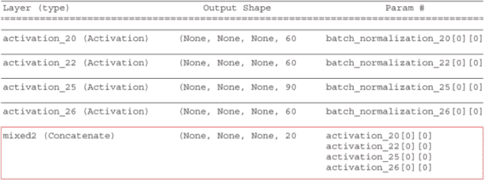

图 9.13 Inception v3 模型摘要的一部分

这些是我们尝试最大化激活的层名称。请注意，当你更改此字典中的层时，你将产生不同的梦境，因此我们鼓励你尝试不同的层及其相应的权重。对于这个项目，我们将通过向我们的字典添加四个层及其权重（`mixed2`、`mixed3`、`mixed4`和`mixed5`）来从一个相对任意的配置开始。作为一个指导，记得从本章前面的内容中，较低层可以用来生成边缘和几何图案，而高层则导致注入令人着迷的视觉图案，包括狗、猫和鸟的幻觉。

现在，让我们定义一个包含损失的张量：各层激活的 L2 范数的加权总和：

```
layer_dict = dict([(layer.name, layer) for layer in model.layers])      ❶

loss = K.variable(0.)                                                   ❷

for layer_name in layer_contributions:
    coeff = layer_contributions[layer_name]
    activation = layer_dict[layer_name].output
    scaling = K.prod(K.cast(K.shape(activation), 'float32'))

    loss = loss + coeff * 
        K.sum(K.square(activation[:, 2: -2, 2: -2, :])) / scaling       ❸
```

❶ 将层名称映射到层实例的字典

❷ 通过添加层贡献到这个标量变量来定义损失

❸ 将层的特征 L2 范数添加到损失中。我们通过只涉及非边界像素来避免边界伪影。

接下来，我们计算损失，这是我们将在梯度上升过程中尝试最大化的量。在滤波器可视化中，我们希望最大化特定层中特定滤波器的值。在这里，我们将同时最大化多个层中所有滤波器的激活。具体来说，我们将最大化一组高级层激活的 L2 范数的加权总和：

```
dream = model.input                                           ❶

grads = K.gradients(loss, dream)[0]                           ❷

grads /= K.maximum(K.mean(K.abs(grads)), 1e-7)                ❸

outputs = [loss, grads]                                       ❹
fetch_loss_and_grads = K.function([dream], outputs)           ❹

def eval_loss_and_grads(*x*):
    outs = fetch_loss_and_grads([x])
    loss_value = outs[0]
    grad_values = outs[1]
    return loss_value, grad_values
def gradient_ascent(x, iterations, step, max_loss=None):      ❺
    for i in range(iterations):
        loss_value, grad_values = eval_loss_and_grads(*x*)
        if max_loss is not None and loss_value > max_loss:
            break
        print('...Loss value at', i, ':', loss_value)
        *x* += step * grad_values
    return x
```

❶ 包含生成图像的张量

❷ 计算梦境图像相对于损失的梯度

❸ 归一化梯度

❹ 设置一个 Keras 函数以检索给定输入图像的损失和梯度值

❺ 运行梯度上升过程多次迭代

现在我们已经准备好开发我们的 DeepDream 算法。过程如下：

1.  加载输入图像。

1.  定义从最小到最大的尺度数量。

1.  将输入图像调整到最小尺寸。

1.  对于每个尺度，从最小开始，应用以下：

    +   梯度上升函数

    +   上采样到下一个尺度

    +   在上采样过程中重新注入丢失的细节

    +   当我们回到原始大小时停止该过程。

首先，我们设置算法参数：

```
step = 0.01              ❶
num_octave = 3           ❷
octave_scale = 1.4       ❸
iterations = 20          ❹
max_loss = 10.
```

❶ 梯度上升步长

❷ 运行梯度上升的尺度数量

❸ 尺度之间的尺寸比

❹ 迭代次数

注意，调整这些超参数将允许你实现新的效果。

让我们定义我们想要用来创建梦境的输入图像。在这个例子中，我下载了一张旧金山金门大桥的图片（见图 9.14）；你也可以使用你自己的图片。图 9.15 显示了 DeepDream 的输出图像。

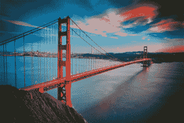

图 9.14 示例输入图像

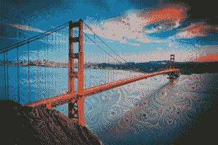

图 9.15 DeepDream 输出

这里是 Keras 代码：

```
base_image_path = 'input.jpg'                      ❶
img = preprocess_image(base_image_path)
original_shape = img.shape[1:3]

successive_shapes = [original_shape]

for i in range(1, num_octave):
    shape = tuple([int(dim / (octave_scale ** i)) for dim in original_shape])
    successive_shapes.append(shape)
successive_shapes = successive_shapes[::-1]
original_img = np.copy(img)
shrunk_original_img = resize_img(img, successive_shapes[0])
for shape in successive_shapes:
    print('Processing image shape', shape)

    img = resize_img(img, shape)
    img = gradient_ascent(img, iterations=iterations, step=step, 
                          max_loss=max_loss)
    upscaled_shrunk_original_img = resize_img(shrunk_original_img, shape)
    same_size_original = resize_img(original_img, shape)
    lost_detail = same_size_original - upscaled_shrunk_original_img
    img += lost_detail
    shrunk_original_img = resize_img(original_img, shape)

    phil_img = deprocess_image(np.copy(img))
    save_img('deepdream_output/dream_at_scale_' + str(shape) + '.png', phil_img)

final_img = deprocess_image(np.copy(img))
save_img('final_dream.png', final_img)              ❷
```

❶ 定义输入图像的路径

❷ 将结果保存到磁盘

## 9.3 神经风格迁移

到目前为止，我们已经学习了如何在网络中可视化特定的过滤器。我们还学习了如何使用 DeepDream 算法操纵输入图像的特征来创建梦幻般的幻觉图像。在本节中，我们将探索一种新的艺术图像类型，即卷积神经网络可以通过神经风格迁移来创建的：将一种图像的风格转移到另一种图像的技术。

神经风格迁移算法的目标是将一张图像的风格（风格图像）应用到另一张图像的内容（内容图像）上。这里的风格指的是图像中的纹理、颜色和其他视觉模式。而内容则是图像的高级宏观结构。结果是包含内容图像的内容和风格图像的风格的综合图像。

例如，让我们看看图 9.16。内容图像中的对象（如海豚、鱼和植物）在综合图像中保持不变，但具有风格图像的特定纹理（蓝色和黄色的笔触）。

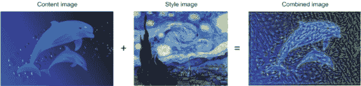

图 9.16 神经风格迁移示例

神经风格迁移的想法是由 Leon A. Gatys 等人于 2015 年提出的。4 在此之前，与纹理生成紧密相关的风格迁移概念在图像处理社区中有着悠久的历史；但事实证明，基于深度学习的风格迁移实现提供了传统计算机视觉技术所无法比拟的结果，并引发了一场在创造性计算机视觉应用中的惊人复兴。

在创建艺术的不同神经网络技术（如 DeepDream）中，风格迁移是我最喜欢的一种。DeepDream 可以创建酷炫的幻觉图像，但有时可能会让人感到不安。此外，作为一个深度学习工程师，有意创造你心中所想的特定艺术品并不容易。另一方面，风格迁移可以使用艺术工程师将你从图像中想要的内容与你最喜欢的画作混合，创造出你想象中的东西。这是一个非常酷的技术，如果由艺术工程师使用，可以创造出与专业画家作品相媲美的美丽艺术。

实现风格迁移背后的主要思想与第二章中解释的所有深度学习算法的核心思想相同：我们首先定义一个损失函数来定义我们想要实现的目标，然后我们致力于优化这个函数。在风格迁移问题中，我们知道我们想要实现的目标是：在保留原始图像内容的同时，采用参考图像的风格。现在我们所需做的就是以数学形式定义内容和风格，然后定义一个合适的损失函数来最小化它。

定义损失函数的关键思想是要记住，我们想要保留一张图像的内容和另一张图像的风格：

+   内容损失--计算内容图像和组合图像之间的损失。最小化这个损失意味着组合图像将包含更多来自原始图像的内容。

+   风格损失--计算风格图像和组合图像之间的风格损失。最小化这个损失意味着组合图像将具有与风格图像相似的风格。

+   噪声损失--这被称为总变差损失。它衡量了组合图像中的噪声。最小化这个损失会创建一个具有更高空间平滑性的图像。

这里是总损失的方程：

```
total_loss = [style(style_image) - style(combined_image)] + 
    [content(original_image) - content(combined_image)] + total_variation_loss
```

注意：Gatys 等人（2015）在迁移学习的研究中不包括总变差损失。经过实验，研究人员发现，当他们在输出图像中鼓励空间平滑性时，生成的网络在风格迁移方面表现更好，更具有审美价值。

现在我们已经对神经网络风格迁移算法的大致工作原理有了了解，我们将更深入地探讨每种类型的损失，以了解它是如何推导和编码在 Keras 中的。然后我们将了解如何训练一个神经网络风格迁移网络，以最小化我们刚刚定义的`total_loss`函数。

### 9.3.1 内容损失

内容损失衡量了两个图像在主题和内容整体布局方面的差异。换句话说，包含相似场景的两个图像应该具有较小的损失值，而包含完全不同场景的两个图像应该具有较大的损失值。图像的主题和内容布局是通过根据 ConvNet 中的高级特征表示对图像进行评分来衡量的，例如海豚、植物和水。识别这些特征是深度神经网络背后的整个前提：这些网络被训练来提取图像的内容，并通过识别前一层简单特征中的模式来学习更深层的更高层次特征。因此，我们需要一个经过训练以提取内容图像特征的深度神经网络，以便我们可以挖掘网络的深层来提取高级特征。

为了计算内容损失，我们测量内容图像和组合图像输出的均方误差。通过尝试最小化这个误差，网络试图向组合图像添加更多内容，使其越来越接近原始内容图像：

内容损失 = 1/2 Σ[内容(原始图像) - 内容(组合图像)]²

最小化内容损失函数确保我们在组合图像中保留了原始图像的内容。

为了计算内容损失，我们将内容和风格图像输入到一个预训练的网络中，并从其中选择一个深层层来提取高级特征。然后我们计算两个图像之间的均方误差。让我们看看如何在 Keras 中计算两个图像之间的内容损失。

注意：本节中的代码片段是从官方 Keras 文档中的神经风格迁移示例改编的（[`keras.io/examples/generative/neural_style_transfer/`](https://keras.io/examples/generative/neural_style_transfer/)）。如果你想要重新创建这个项目并尝试不同的参数，我建议你从 Keras 的 Github 仓库作为起点（[`mng.bz/GVzv`](http://mng.bz/GVzv)）或运行与此书一起提供的可下载的改编代码。

首先，我们定义两个 Keras 变量来保存内容图像和风格图像，并创建一个占位符张量，它将包含生成的组合图像：

```
content_image_path = '/path_to_images/content_image.jpg'              ❶
style_image_path = '/path_to_images/style_image.jpg'                  ❶

content_image = K.variable(preprocess_image(content_image_path))      ❷
style_image = K.variable(preprocess_image(style_image_path))          ❷
combined_image = K.placeholder((1, img_nrows, img_ncols, 3))          ❷
```

❶ 内容和风格图像的路径

❷ 获取我们图像的张量表示

现在，我们将三张图像连接成一个输入张量，并将其输入到 VGG19 神经网络中。请注意，当我们加载 VGG19 模型时，我们将`include_top`参数设置为`False`，因为我们不需要包括用于此任务的分类全连接层。这是因为我们只对网络的特征提取部分感兴趣：

```
input_tensor = K.concatenate([content_image, style_image, 
                             combined_image], axis=0)           ❶

model = vgg19.VGG19(input_tensor=input_tensor, 
                    weights='imagenet', include_top=False)      ❷
```

❶ 将三张图像合并成一个单一的 Keras 张量

❷ 使用我们的三张图像作为输入构建 VGG19 网络。该模型将加载预训练的 ImageNet 权重。

与我们在第 9.1 节中所做的一样，我们现在选择我们想要用来计算内容损失的神经网络层。我们想要选择一个深层层以确保它包含内容图像的高级特征。如果你选择网络的早期层（如块 1 或块 2），网络将无法从原始图像中完全传递内容，因为早期层提取的是低级特征，如线条、边缘和块。在这个例子中，我们选择了块 5 中的第二个卷积层（`block5_conv2`）：

```
outputs_dict = dict([(layer.name, layer.output) for layer in model.layers])  ❶
layer_features = outputs_dict['block5_conv2']                                ❶
```

❶ 获取每个关键层的符号输出（我们给了它们独特的名称）

现在我们可以从输入张量中提取我们选择的层的特征：

```
content_image_features = layer_features[0, :, :, :]
combined_features = layer_features[2, :, :, :]
```

最后，我们创建`content_loss`函数，该函数计算内容图像和合成图像之间的均方误差。我们创建一个辅助损失函数，旨在保留`content_image`的特征并将其转移到`combined-image`：

```
def content_loss(content_image, combined_image):                        ❶
    return K.sum(K.square(combined - base))

content_loss = content_weight * content_loss(content_image_features,
                                             combined_features)         ❷
```

❶ 内容图像输出与合成图像之间的均方误差函数

❷ 内容损失通过权重参数进行缩放。

权重参数

在这个代码实现中，您将看到以下权重参数：`content_weight`、`style_weight` 和 `total_variation_weight`。这些是我们作为网络输入设置的缩放参数，如下所示：

```
content_weight = content_weight
style_weight = style_weight
```

这些权重参数描述了内容、风格和噪声在我们输出图像中的重要性。例如，如果我们设置`style_weight` `=` `100` 和 `content_weight` `=` `1`，这意味着我们愿意为了更艺术化的风格迁移而牺牲一点内容。此外，更高的`total_variation_weight`意味着更高的空间平滑度。

### 9.3.2 风格损失

正如我们之前提到的，在这个上下文中，风格指的是图像中的纹理、颜色和其他视觉模式。

#### 多层表示风格特征

定义风格损失比我们之前处理的内容损失更具挑战性。在内容损失中，我们只关心在更深层次提取的高级特征，所以我们只需要从 VGG19 网络中选择一层来保留其特征。而在风格损失中，另一方面，我们想要选择多个层，因为我们想要获得图像风格的多个尺度表示。我们想要捕捉低级层、中级层和高级层的图像风格。这使我们能够捕捉风格图像的纹理和风格，并排除内容图像中对象的全球排列。

#### 语法矩阵用于测量联合激活的特征图

语法矩阵是一种用于数值测量两个特征图联合激活程度的方法。我们的目标是构建一个损失函数，以捕捉 CNN 中多个层的风格和纹理。为此，我们需要计算我们 CNN 中激活层之间的相关性。这种相关性可以通过计算激活之间的语法矩阵——特征外积——来捕捉。

为了计算特征图的语法矩阵，我们需要将特征图展平并计算点积：

```
def gram_matrix(*x*):
    features = K.batch_flatten(K.permute_dimensions(x, (2, 0, 1)))
    gram = K.dot(features, K.transpose(features))
    return gram
```

让我们构建`style_loss`函数。它计算网络中一系列层的风格和合成图像的语法矩阵。然后，通过计算平方误差之和来比较它们之间风格和纹理的相似性：

```
def style_loss(style, combined):
    S = gram_matrix(style)
    C = gram_matrix(combined)
    channels = 3 
    size = img_nrows * img_ncols
    return K.sum(K.square(S - C)) / (4.0 * (channels ** 2) * (size ** 2))
```

在这个例子中，我们将计算五个层的风格损失：VGG19 网络中每个块的第一个卷积层（注意，如果您更改特征层，网络将保留不同的风格）：

```
feature_layers = ['block1_conv1', 'block2_conv1',
                  'block3_conv1', 'block4_conv1',
                  'Block5_conv1']
```

最后，我们遍历这些 `feature_layers` 来计算风格损失：

```
for layer_name in feature_layers:
    layer_features = outputs_dict[layer_name]
    style_reference_features = layer_features[1, :, :, :]
    combination_features = layer_features[2, :, :, :]
    sl = style_loss(style_reference_features, combination_features)
    style_loss += (style_weight / len(feature_layers)) * sl              ❶
```

❶ 将风格损失乘以加权参数和计算风格损失所涉及的层数

在训练过程中，网络通过最小化输出图像（组合图像）的风格与输入风格图像的风格之间的损失来工作。这迫使组合图像的风格与风格图像相关联。

### 9.3.3 总方差损失

总方差损失是组合图像中噪声的度量。网络的目标是最小化这个损失函数，以最小化输出图像中的噪声。

让我们创建一个 `total_variation_loss` 函数来计算图像的噪声程度。这是我们将要做的：

1.  将图像向右移动一个像素，并计算转移图像与原始图像之间的平方误差之和。

1.  重复步骤 1，这次将图像向下移动一个像素。

这两个项（`a` 和 `b`）的和是总方差损失：

```
def total_variation_loss(*x*):
    a = K.square(
        x[:, :img_nrows - 1, :img_ncols - 1, :] - x[:, 1:, :img_ncols - 1, :])
    b = K.square(
        x[:, :img_nrows - 1, :img_ncols - 1, :] - x[:, :img_nrows - 1, 1:, :])

    return K.sum(K.pow(a + b, 1.25))

tv_loss = total_variation_weight * total_variation_loss(combined_image)       ❶
```

❶ 将总方差损失乘以加权参数

最后，我们计算我们问题的整体损失，这是内容、风格和总方差损失的加和：

```
total_loss = content_loss + style_loss + tv_loss
```

### 9.3.4 网络训练

现在我们已经定义了我们问题的总损失函数，我们可以运行 GD 优化器来最小化这个损失函数。首先我们创建一个对象类 `Evaluator`，它包含计算整体损失的方法，如前所述，以及相对于输入图像的损失梯度：

```
class Evaluator(object):
    def __init__(self):
        self.loss_value = None
        self.grads_values = None

    def loss(self, x):
        assert self.loss_value is None
        loss_value, grad_values = eval_loss_and_grads(*x*)
        self.loss_value = loss_value
        self.grad_values = grad_values
        return self.loss_value

    def grads(self, x):
        assert self.loss_value is not None
        grad_values = np.copy(self.grad_values)
        self.loss_value = None
        self.grad_values = None
        return grad_values

evaluator = Evaluator()
```

接下来，我们在训练过程中使用我们的评估器类中的方法。为了最小化总损失函数，我们使用基于 SciPy 的优化方法 `scipy.optimize.fmin_l_bfgs_b`：

```
from scipy.optimize import fmin_l_bfgs_b

Iterations = 1000                                                         ❶

x = preprocess_image(content_image_path)                                  ❷

for i in range(iterations):                                               ❸
    x, min_val, info = fmin_l_bfgs_b(evaluator.loss, x.flatten(),
                                     fprime=evaluator.grads, maxfun=20)
    img = deprocess_image(x.copy())                                       ❹
    fname = result_prefix + '_at_iteration_%d.png' % i                    ❹
    save_img(fname, img)                                                  ❹
```

❶ 训练 1,000 次迭代

❷ 将内容图像初始化为组合图像的第一迭代。

❸ 在生成的图像的像素上运行基于 SciPy 的优化（L-BFGS）以最小化总损失。

❹ 保存当前生成的图像

提示：当训练自己的神经风格迁移网络时，请注意，不需要高细节水平的内容图像效果更好，并且已知可以创建视觉上吸引人或有辨识度的艺术图像。此外，包含大量纹理的风格图像比平面风格图像更好：平面图像（如白色背景）不会产生美观的结果，因为没有多少纹理可以转移。

## 摘要

+   CNN 通过连续的过滤器学习训练集中的信息。网络的每一层处理不同抽象级别的特征，因此生成的特征复杂度取决于层在网络中的位置。早期层学习低级特征；层在网络中的深度越深，提取的特征越容易识别。

+   一旦网络被训练，我们可以反向运行它来稍微调整原始图像，以便给定的输出神经元（如面部或某些动物的面部）产生更高的置信度分数。这种技术可用于可视化，以更好地理解神经网络的涌现结构，并且是 DeepDream 概念的基础。

+   DeepDream 在称为八度的不同尺度上处理输入图像。我们传递每个尺度，重新注入图像细节，通过 DeepDream 算法处理，然后将图像放大以供下一个八度使用。

+   DeepDream 算法与滤波器可视化算法类似。它反向运行 ConvNet，根据网络提取的表示生成输出。

+   DeepDream 与滤波器可视化不同，因为它需要一个输入图像，并最大化整个层，而不是层内的特定滤波器。这使得 DeepDream 能够同时混合大量特征。

+   DeepDream 不仅限于图像——它还可以用于语音、音乐等。

+   神经风格迁移是一种技术，它训练网络保留风格图像的风格（纹理、颜色、图案）并保留内容图像的内容。然后，网络创建一个新的组合图像，该图像结合了风格图像的风格和内容图像的内容。

+   直观地说，如果我们最小化内容、风格和变化损失，我们将得到一个新的图像，其中包含来自内容图像和风格图像的内容和风格的低方差，以及低噪声。

+   内容权重、风格权重和总变化权重的不同值将给出不同的结果。

* * *

1.杜米特鲁·埃尔汗，约书亚·本吉奥，阿隆·库维尔，和帕斯卡尔·文森特。“可视化深度网络的更高层特征。”蒙特利尔大学 1341（3）：1。2009 年。[`mng.bz/yyMq`](http://mng.bz/yyMq)。

2.弗朗索瓦·肖莱特，“卷积神经网络如何看世界”，Keras 博客，2016 年，[`blog.keras.io/category/demo.html`](https://blog.keras.io/category/demo.html)。

3.亚历山大·莫尔维茨夫，克里斯托弗·奥拉，和迈克·泰卡，“Deepdream——可视化神经网络的代码示例”，谷歌 AI 博客，2015 年，[`mng.bz/aROB`](http://mng.bz/aROB)。

4.莱昂·A·加蒂斯，亚历山大·S·埃克，和马蒂亚斯·贝特格，“艺术风格的神经网络算法”，2015 年，[`arxiv.org/abs/1508.06576`](http://arxiv.org/abs/1508.06576)。
